# Vương Hổ Ứng

# TĂNG SAN BỐC DỊCH
## Bình Thích

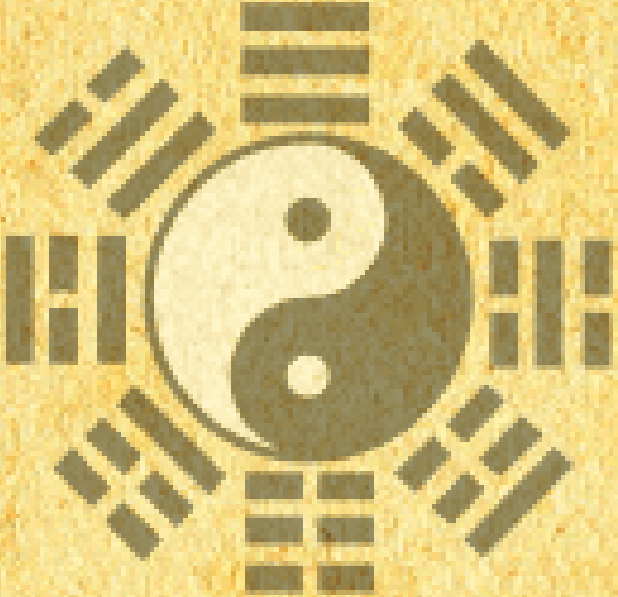

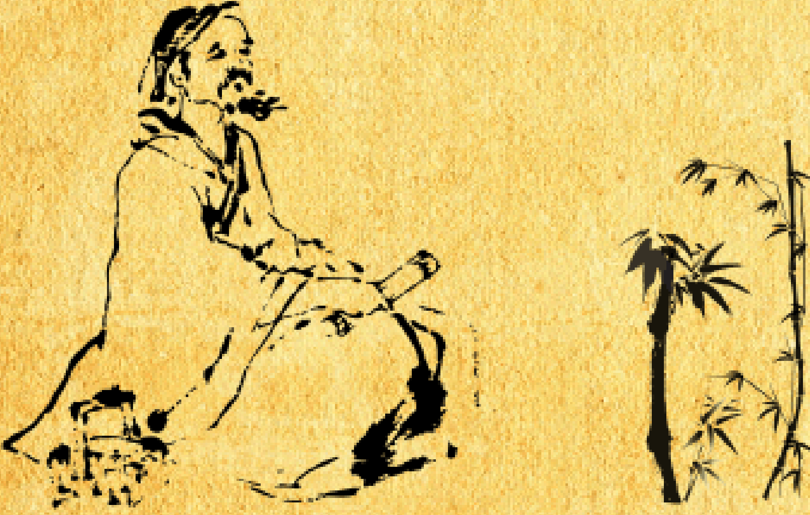

# TĂNG SAN BỐC DỊCH
# BÌNH THÍCH

**Dã Hạc lão nhân** viết

**Vương Hổ Ứng** bình thích

*Lý Ngã Bình giám định*

*Lý Văn Huy hiệu Giác Tử tăng san*

*Trần Văn Cát hiệu Mậu Sinh và*

*Như Chi hiệu Sơn Tú*

*cùng hiệu đính*

---

# MỤC LỤC

LỜI TỰA ............................................................................................................................. 6
CHƯƠNG 1: BÁT QUÁI ...................................................................................................... 8
CHƯƠNG 2: QUÁI TƯỢNG ĐỒ .......................................................................................... 8
CHƯƠNG 3: 8 CUNG và 64 QUẺ DỊCH ............................................................................10
CHƯƠNG 4: HỖN THIÊN GIÁP TÝ ...................................................................................31
CHƯƠNG 5: LỤC THÂN CA.............................................................................................32
CHƯƠNG 6: THẾ ỨNG ....................................................................................................33
CHƯƠNG 7: ĐỘNG BIẾN.................................................................................................33
CHƯƠNG 8: DỤNG THẦN...............................................................................................34
CHƯƠNG 9: DỤNG THẦN, NGUYÊN THẦN, KỴ THẦN, CỪU THẦN ...................................36
CHƯƠNG 10: SỰ VƯỢNG SUY CỦA NGUYÊN THẦN, KỴ THẦN ........................................38
CHƯƠNG 11: NGŨ HÀNH TƯƠNG SINH..........................................................................44
CHƯƠNG 12: NGŨ HÀNH TƯƠNG KHẮC ........................................................................46
CHƯƠNG 13: KHẮC XỨ PHÙNG SINH .............................................................................48
CHƯƠNG 14: ĐỘNG TĨNH SINH KHẮC ............................................................................49
CHƯƠNG 15: ĐỘNG BIẾN SINH KHẮC XUNG HỢP ........................................................51
CHƯƠNG 16: TỨ THỜI VƯỢNG TƯỚNG .........................................................................51
CHƯƠNG 17: NGUYỆT TƯỚNG ......................................................................................52
CHƯƠNG 18: NHẬT THẦN .............................................................................................60
CHƯƠNG 19: LỤC THẦN .................................................................................................64
CHƯƠNG 20: LỤC HỢP ...................................................................................................68
CHƯƠNG 21: LỤC XUNG ................................................................................................78
CHƯƠNG 22: TAM HÌNH ................................................................................................84
CHƯƠNG 23: ÁM ĐỘNG.................................................................................................85
CHƯƠNG 24: ĐỘNG TÁN ................................................................................................87
CHƯƠNG 25: QUẺ BIẾN SINH KHẮC MỘ TUYỆT ...........................................................88
CHƯƠNG 26: PHẢN PHỤC..............................................................................................91
CHƯƠNG 27: TUẦN KHÔNG ..........................................................................................95
CHƯƠNG 28: SINH VƯỢNG MỘ TUYỆT .......................................................................100

CHƯƠNG 29: CHÚ THÍCH CHUNG VỀ CÁC THUẬT NGỮ TRONG ĐỀ MỤC CÁC CHƯƠNG ................................................................................................................................... 104

CHƯƠNG 30: ỨNG KỲ ........................................................................................... 105

CHƯƠNG 31: QUY HỒN, DU HỒN ........................................................................... 107

CHƯƠNG 32: NGUYỆT PHÁ................................................................................... 108

CHƯƠNG 33: PHI THẦN, PHỤC THẦN .................................................................... 113

CHƯƠNG 34: TIẾN THẦN VÀ THOÁI THẦN............................................................. 123

CHƯƠNG 35: TÙY QUỶ NHẬP MỘ ......................................................................... 135

CHƯƠNG 36: ĐỘC PHÁT - ĐỘC TĨNH ..................................................................... 141

CHƯƠNG 37: LƯỠNG HIỆN ................................................................................... 146

CHƯƠNG 38: TINH SÁT ......................................................................................... 149

CHƯƠNG 39: HOÀNG KIM SÁCH VÀ THIÊN KIM PHÚ TĂNG SAN .......................... 152

CHƯƠNG 40: THIÊN THỜI...................................................................................... 222

CHƯƠNG 41: THÂN MỆNH.................................................................................... 259

CHƯƠNG 42: CHUNG THÂN TÀI PHÚC .................................................................. 259

CHƯƠNG 43: CHUNG THÂN CÔNG DANH ............................................................. 276

CHƯƠNG 44: THỌ NGUYÊN .................................................................................. 282

CHƯƠNG 45: XU CÁT TỊ HUNG ............................................................................. 289

CHƯƠNG 46: TUỔI THỌ CỦA CHA MẸ .................................................................. 298

CHƯƠNG 47: HUYNH ĐỆ ....................................................................................... 303

CHƯƠNG 48: PHU PHỤ......................................................................................... 305

CHƯƠNG 49: TỬ TỰ .............................................................................................. 309

CHƯƠNG 50: HỌC NGHIỆP ................................................................................... 318

CHƯƠNG 51: NGHIÊN CỨU KINH ĐIỂN.................................................................. 319

CHƯƠNG 52: MỜI THẦY........................................................................................ 320

CHƯƠNG 53: CẦU DANH ...................................................................................... 323

CHƯƠNG 54: ĐỒNG THÍ (SƠ KHẢO)...................................................................... 324

CHƯƠNG 55: TUẾ KHẢO ....................................................................................... 327

CHƯƠNG 56: TĂNG LƯƠNG................................................................................... 329

CHƯƠNG 57: THI DI TÀI ........................................................................................ 330

CHƯƠNG 58: YẾT BẢNG ĐỀ DANH ........................................................................ 330

CHƯƠNG 59: THI ĐÌNH .............................................................................................. 330

CHƯƠNG 60: THI HƯƠNG, THI HỘI........................................................................... 331

CHƯƠNG 61: THĂNG QUAN, BỔ NHIỆM .................................................................. 338

CHƯƠNG 62: THUYÊN CHUYỂN .............................................................................. 344

CHƯƠNG 63: TẠI NHIỆM CÁT HUNG ...................................................................... 346

CHƯƠNG 64: VIỆN LỆ............................................................................................... 350

CHƯƠNG 65: THI VÕ................................................................................................ 351

CHƯƠNG 66: NHẬP NGŨ, TÒNG QUÂN, NHẬP TRƯỜNG QUÂN SỰ .......................... 352

CHƯƠNG 67: NHỜ NGƯỜI MUA CHỨC QUAN .......................................................... 352

CHƯƠNG 68: TẤU SỚ, KÊU OAN, ĐIỀU TRẦN, HẠCH TỘI ....................................... 352

CHƯƠNG 69: CÁO LÃO, TỪ QUAN.......................................................................... 360

CHƯƠNG 70: XÂY DỰNG CÔNG TRÌNH .................................................................. 360

CHƯƠNG 71: SƯ SÃI, ĐẠO SĨ, THẦY THUỐC CÙNG CÁC CHỨC NGHIỆP VỀ ÂM DƯƠNG, CHÙA CHIỀN ..................................................................................................... 362

CHƯƠNG 72: CẤP BẬC CÔNG DANH ....................................................................... 363

CHƯƠNG 73: CON XEM CÔNG DANH CHO CHA ................................................... 364

CHƯƠNG 74: CẦU TÀI ............................................................................................ 366

CHƯƠNG 75: GẶP QUAN TRÊN ĐỂ CẦU TÀI .......................................................... 372

CHƯƠNG 76: LÀM VIỆC CHO QUAN TRÊN ĐỂ CẦU TÀI ......................................... 374

CHƯƠNG 77: MỞ CỬA HÀNG ................................................................................. 375

CHƯƠNG 78: ỦY THÁC VIỆC LÀM ĂN .................................................................... 376

CHƯƠNG 79: ĐẦU CƠ ............................................................................................ 377

CHƯƠNG 80: NƠI XUẤT HÀNG .............................................................................. 381

CHƯƠNG 81: TÌM NƠI BUÔN BÁN .......................................................................... 382

CHƯƠNG 82: CHỦNG LOẠI HÀNG HOÁ ................................................................. 382

CHƯƠNG 83: VAY MƯỢN....................................................................................... 384

CHƯƠNG 84: CHO VAY .......................................................................................... 384

CHƯƠNG 85: MUA BÁN GIA SÚC.......................................................................... 385

CHƯƠNG 86: ĐẤU TÀI, ĐẤU SỨC.......................................................................... 385

CHƯƠNG 87: XIN HỤI ............................................................................................ 386

CHƯƠNG 88: HÀNH HIỂM CẦU TÀI ....................................................................... 387

CHƯƠNG 89: HÔN NHÂN........................................................................................... 387

CHƯƠNG 90: XEM HÔN NHÂN CÓ CON CÁI THỪA TỰ HAY KHÔNG....................... 396

CHƯƠNG 91: XEM HÔN NHÂN CÓ HỢP VỚI CHA MẸ KHÔNG................................. 397

CHƯƠNG 92: LẤY VỢ LẼ .......................................................................................... 397

CHƯƠNG 93: LẤY TỲ THIẾP .................................................................................... 397

CHƯƠNG 94: LẤY ĐÀN BÀ BỎ CHỒNG, LẤY CA KỸ ................................................ 397

CHƯƠNG 95: THAI SẢN........................................................................................... 398

CHƯƠNG 96: XEM VỀ SỰ AN NGUY CỦA SẢN PHỤ ............................................... 401

CHƯƠNG 97: THỜI ĐIỂM SINH NỞ ......................................................................... 402

CHƯƠNG 98: XUẤT HÀNH ...................................................................................... 402

CHƯƠNG 99: ĐI THUYỀN ........................................................................................ 404

CHƯƠNG 100: BẠN ĐỒNG HÀNH ............................................................................ 405

CHƯƠNG 101: NGƯỜI ĐI XA ................................................................................... 405

CHƯƠNG 102: ĐỀ PHÒNG KIỆN TỤNG .................................................................... 415

CHƯƠNG 103: CẠNH TRANH .................................................................................. 416

CHƯƠNG 104: ĐÂM ĐƠN KHỞI KIỆN ...................................................................... 416

CHƯƠNG 105: BỊ XỬ TRỌNG TỘI ............................................................................ 416

CHƯƠNG 106: BỆNH TẬT ........................................................................................ 417

CHƯƠNG 107: ĐẬU, SỞI .......................................................................................... 430

CHƯƠNG 108: CĂN NGUYÊN BỆNH TẬT ................................................................. 430

CHƯƠNG 109: QUỶ THẦN ....................................................................................... 431

CHƯƠNG 110: MỜI THẦY CHỮA BỆNH ................................................................... 432

CHƯƠNG 111: THẦY THUỐC TỰ XEM VỀ ĐIỀU TRỊ ................................................. 435

CHƯƠNG 112: GIA TRẠCH ...................................................................................... 443

CHƯƠNG 113: XÂY DỰNG, MUA NHÀ, THUÊ NHÀ .................................................. 444

CHƯƠNG 114: XÂY DỰNG CUNG ĐIỆN................................................................... 445

CHƯƠNG 115: ĐỘNG THỔ TU TẠO .......................................................................... 445

CHƯƠNG 116: CHUYỂN NHÀ NHẬP TRẠCH ........................................................... 445

CHƯƠNG 117: NHẬP TRẠCH................................................................................... 446

CHƯƠNG 118: LỤC THÂN NHẬP TRẠCH CÁT HUNG ............................................... 446

CHƯƠNG 119: CHUỒNG GIA SÚC ........................................................................... 448

CHƯƠNG 120: NHÀ CŨ........................................................................................... 449

CHƯƠNG 121: Ở CHUNG ......................................................................................... 454

CHƯƠNG 122: XÂY DỰNG PHỦ QUAN .................................................................... 455

CHƯƠNG 123: NHA MÔN ........................................................................................ 455

CHƯƠNG 124: XÂY CHÙA MIẾU ............................................................................. 456

CHƯƠNG 125: PHẦN MỘ ........................................................................................ 457

CHƯƠNG 126: TÌM ĐẤT TỐT ................................................................................... 457

CHƯƠNG 127: HÌNH THẾ ĐẤT ................................................................................ 462

CHƯƠNG 128: XEM KHI NÀO CÓ ĐẤT .................................................................... 464

CHƯƠNG 129: XEM ĐƯỢC ĐẤT TẠI PHƯƠNG NÀO................................................ 465

CHƯƠNG 130: XEM VỀ THẦY ĐỊA LÝ..................................................................... 466

CHƯƠNG 131: ĐỊNH HUYỆT .................................................................................... 466

CHƯƠNG 132: TRANH ĐẤT CHÔN MỘ.................................................................... 467

CHƯƠNG 133: PHẦN MỘ TỔ TIÊN .......................................................................... 468

CHƯƠNG 134: NGUYÊN NHÂN ĐỘNG MỘ............................................................. 469

CHƯƠNG 135: BÍ QUYẾT TU BỔ ............................................................................. 471

CHƯƠNG 136: TU BỔ CÁT HUNG ............................................................................ 472

CHƯƠNG 137: BỒI TÁNG BÊN MỘ TỔ..................................................................... 472

---

# LỜI TỰA

Ngày xưa Trung Quốc có hơn hai mươi cuốn sách bốc dịch liên quan đến dự đoán lục hào, nay truyền lại chỉ có hơn mười cuốn, không được lưu truyền toàn bộ, như "Đoán Dịch thần thư", "Bốc Phệ viên cơ"... chỉ nghe được tên chứ không thấy được sách, quả thực đáng tiếc, nhưng may mà ông trời không đoạn tuyệt ý nghĩa của nó, một phần lưu lại đã giúp cho kẻ hậu học được kế thừa phát huy, chưa đến nỗi để môn học này bị chôn vùi.

Tôi đã từng xem không ít sách bốc dịch cổ điển, nhưng cuốn xem kỹ nhất vẫn là "Tăng San Bốc Dịch", đây là cuốn sách gần với chính lý nhất. Cuốn sách này đã giúp đỡ rất nhiều cho trình độ dự đoán của tôi, cũng nhờ những gợi ý trong sách này mà tôi ngộ được rất nhiều tâm đắc quan trọng. Mỗi lần xem, tôi đều có cảm ngộ mới, cái chính xác thì nhận lấy, cái sai lầm thì bỏ đi, không ngừng nghiên cứu cẩn thận, từ đó mới ngộ được đạo lý của bốc dịch.

Qua nhiều quẻ phán đoán hết sức thần kỳ, tôi đã nhận được sự tin cậy và sùng bái của rất nhiều Dịch hữu, cho nên mỗi lần có Dịch hữu nào bảo tôi giới thiệu sách nhập môn, tôi liền đề xuất cuốn sách này. Có người nói "Tăng San Bốc Dịch" quá đơn giản, không tán thành một quẻ đoán nhiều việc, trình độ không phải là quá cao. Tuy nhiên, ai cũng biết là mọi tòa nhà đều khởi từ bình địa, nếu nền móng không ổn định, không vững chắc thì không thể xây lên cao, trên đời có tòa nhà nào là xây tầng cao rồi mới xây nền móng và xây tầng thấp? Cấp độ cao cũng là từ cơ sở, nền tảng dự đoán bốc dịch xây dựng không vững vàng, thì vĩnh viễn không thể đạt tới trình độ đoán quẻ xuất thần nhập hóa¹.

So với những sách bốc dịch cổ điển khác, cuốn sách này nội dung sâu sắc, lời lẽ dễ hiểu, dẫn dắt từng bước một, lấy rất nhiều ví dụ thực tế để lập luận, rất thích hợp cho người mới học nhập môn, cũng thích hợp cho người có trình độ dự đoán nhất định tiếp tục nâng cao. Dã Hạc lão nhân đã đem tâm huyết bốn mươi năm của mình viết thành văn tự để lưu truyền hậu thế, đó chính là may mắn của người đời sau. Cuốn sách này là kinh nghiệm cả đời của Dã Hạc, người đời sau theo đó mà học tập thì có thể tránh được rất nhiều đường vòng, tuy chưa thể ứng nghiệm như thần, nhưng ít nhất về phương diện phán đoán cát hung và ứng kỳ cũng không sai lệch quá nhiều.

"Tăng San Bốc Dịch" là viên gạch gõ cửa² để bước vào cung điện bốc dịch thần bí, nếu muốn làm cho trình độ dự đoán của bản thân đạt đến xuất thần nhập hóa, tiến vào cảnh giới cao, thì trước tiên phải đọc qua cuốn sách này. Có điều là, Dịch chia ra tượng số lý, dự đoán lục hào cũng không ngoại lệ. Trong "Tăng San Bốc Dịch", có rất nhiều chỗ không phân biệt lý tượng, một số khái niệm nhận thức mơ hồ, vẫn có không ít chỗ sai lầm, đến nỗi sau khi đọc xong sách này, kẻ hậu học vẫn còn có phần mơ màng, nay tôi bình thích cuốn sách này là để tháo gỡ những nghi hoặc như vậy.

---

¹ Xuất thần nhập hóa (出神入化) là một thành ngữ, mô tả tài nghệ cao siêu đã đạt đến cảnh giới tuyệt diệu.

² Gạch gõ cửa (敲门砖) chỉ về việc nhặt gạch gõ cửa, sau khi cửa mở thì vứt gạch đi.

Vương Hổ Ứng

Tháng 1 năm 2004

---

# CHƯƠNG 1: BÁT QUÁI

Càn là cha, Chấn là trưởng nam, Khảm là trung nam, Cấn là thiếu nam (đều thuộc dương).

Khôn là mẹ, Tốn là trưởng nữ, Ly là trung nữ, Đoài là thiếu nữ (đều thuộc âm).

***

# CHƯƠNG 2: QUÁI TƯỢNG ĐỒ

Càn tam liên: được cả ba hào đều là dương

Khôn lục đoạn: được cả ba hào đều là âm

Chấn ngưỡng bồn: hào sơ là dương, hào 2 và hào 3 đều là âm

Cấn phúc uyển: hào sơ và hào 2 đều là âm, hào 3 là dương

Ly trung hư: hào sơ và hào 3 đều là dương, hào 2 là âm

Khảm trung mãn: hào sơ và hào 3 đều là âm, hào 2 dương

Đoài thượng khuyết: hào sơ và hào 2 đều là dương, hào 3 là âm

Tốn hạ đoạn: hào sơ là âm, hào 2 và hào 3 đều là dương

### Phép dùng đồng tiền thay cỏ thi

Với ba đồng tiền đã hun trong lò, hết sức thành kính mà cầu rằng: "Trời bảo gì, khấu đầu cho ứng ngay, thần linh cảm mà cho biết. Nay tôi họ tên ... có việc quan tâm, không biết tốt xấu, xin giải nghi ngờ, nên như thế nào, rũ lòng cho hay". Khấn xong gieo ba đồng tiền. Được 1 sấp là hào dương, được 2 sấp là hào âm, 3 sấp là hào dương động (ký hiệu là O), 3 ngửa là hào âm động (ký hiệu là X). Từ dưới lên trên mà an quẻ. Gieo 3 lần thành nội quái. Lại khấn rằng: "Quẻ ... 3 vạch, chưa quyết được hung cát, lại cầu xin 3 hào của ngoại quái để thành một quẻ, quyết đoán được ưu nghi". Lại gieo thêm 3 lần như trước, hợp thành một quẻ để đoán hung cát. Rất chí thành chí kính thì hết sức cảm ứng.

Ví dụ lấy 3 đồng xu gieo 6 lần được kết quả như sau:

| | | | |
| :--- | :--- | :---: | :---: |
| Lần 6 | 1 sấp | ▅▅▅▅▅ | |
| Lần 5 | 3 ngửa | ▅▅ ▅▅ | X |
| Lần 4 | 1 sấp | ▅▅▅▅▅ | |
| Lần 3 | 2 sấp | ▅▅ ▅▅ | |
| Lần 2 | 3 sấp | ▅▅▅▅▅ | O |
| Lần 1 | 2 sấp | ▅▅ ▅▅ | |

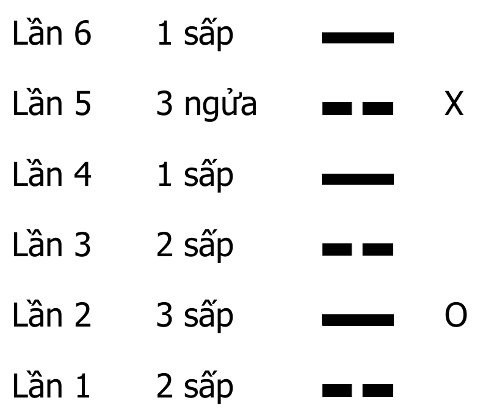

**Tân bình thích:** Dự đoán bốc dịch chẳng phải là việc liên quan đến quỷ thần mà chính là tâm linh cảm ứng, truyền đạt thông tin ý niệm, vì vậy không cần cầu khấn quỷ thần, cũng không cần phải thắp hương hay tắm gội. Khi lấy quẻ chỉ cần người dự đoán động niệm mở miệng xin đoán, bất kể là người dự đoán gieo quẻ hoặc dự trắc sư gieo quẻ đều được.

---

# CHƯƠNG 3: 8 CUNG và 64 QUẺ DỊCH

## 8 quẻ cung Càn (đều thuộc kim)

| Càn Vi Thiên | Thiên Phong Cấu |
| --- | --- |
| ▬ Phụ Mẫu Tuất thổ (Thế) | ▬ Phụ Mẫu Tuất thổ |
| ▬ Huynh Đệ Thân kim | ▬ Huynh Đệ Thân kim |
| ▬ Quan Quỷ Ngọ hỏa | ▬ Quan Quỷ Ngọ hỏa (Ứng) |
| ▬ Phụ Mẫu Thìn thổ (Ứng) | ▬ Huynh Đệ Dậu kim |
| ▬ Thê Tài Dần mộc | ▬ Tử Tôn Hợi thủy (phục Tài Dần) |
| ▬ Tử Tôn Tý thủy | ▬ ▬ Phụ Mẫu Sửu thổ (Thế) |

| Thiên Sơn Độn | Thiên Địa Bĩ |
| --- | --- |
| ▬ Phụ Mẫu Tuất thổ | ▬ Phụ Mẫu Tuất thổ (Ứng) |
| ▬ Huynh Đệ Thân kim (Ứng) | ▬ Huynh Đệ Thân kim |
| ▬ Quan Quỷ Ngọ hỏa | ▬ Quan Quỷ Ngọ hỏa |
| ▬ Huynh Đệ Thân kim | ▬ ▬ Thê Tài Mão mộc (Thế) |
| ▬ ▬ Quan Quỷ Ngọ hỏa (phục Tài Dần) (Thế) | ▬ ▬ Quan Quỷ Tị hỏa |
| ▬ ▬ Phụ Mẫu Thìn thổ (phục Tử Tý) | ▬ ▬ Phụ Mẫu Mùi thổ (phục Tử Tý) |

| Phong Địa Quan | Sơn Địa Bác |
| --- | --- |
| ▬ Thê Tài Mão mộc | ▬ Thê Tài Dần mộc |
| ▬ Quan Quỷ Tị hỏa (phục Huynh Thân) | ▬ ▬ Tử Tôn Tý thủy (phục Huynh Thân) (Thế) |
| ▬ ▬ Phụ Mẫu Mùi thổ (Thế) | ▬ ▬ Phụ Mẫu Tuất thổ |
| ▬ ▬ Thê Tài Mão mộc | ▬ ▬ Thê Tài Mão mộc |
| ▬ ▬ Quan Quỷ Tị hỏa | ▬ ▬ Quan Quỷ Tị hỏa (Ứng) |
| ▬ ▬ Phụ Mẫu Mùi thổ (phục Tử Tý) (Ứng) | ▬ ▬ Phụ Mẫu Mùi thổ |

| Hỏa Địa Tấn | Hỏa Thiên Đại Hữu |
| --- | --- |
| ▬ Quan Quỷ Tị hỏa | ▬ Quan Quỷ Tị hỏa (Ứng) |
| ▬ ▬ Phụ Mẫu Mùi thổ | ▬ ▬ Phụ Mẫu Mùi thổ |
| ▬ Huynh Đệ Dậu kim (Thế) | ▬ Huynh Đệ Dậu kim |
| ▬ ▬ Thê Tài Mão mộc | ▬ Phụ Mẫu Thìn thổ (Thế) |
| ▬ ▬ Quan Quỷ Tị hỏa | ▬ Thê Tài Dần mộc |
| ▬ ▬ Phụ Mẫu Mùi thổ (phục Tử Tý) (Ứng) | ▬ Tử Tôn Tý thủy |

## 8 quẻ cung Khảm (đều thuộc thủy)

| Khảm Vi Thủy | Thủy Trạch Tiết |
| --- | --- |
| ▬ ▬ Huynh Đệ Tý thủy (Thế) | ▬ ▬ Huynh Đệ Tý thủy |
| ▬ Quan Quỷ Tuất thổ | ▬ Quan Quỷ Tuất thổ |
| ▬ ▬ Phụ Mẫu Thân kim | ▬ ▬ Phụ Mẫu Thân kim (Ứng) |
| ▬ ▬ Thê Tài Ngọ hỏa (Ứng) | ▬ ▬ Quan Quỷ Sửu thổ (phục Tài Ngọ) |
| ▬ Quan Quỷ Thìn thổ | ▬ Tử Tôn Mão mộc |
| ▬ ▬ Tử Tôn Dần mộc | ▬ Thê Tài Tị hỏa (Thế) |

| Thủy Lôi Truân | Thủy Hỏa Ký Tế |
| --- | --- |
| ▬ ▬ Huynh Đệ Tý thủy | ▬ ▬ Huynh Đệ Tý thủy (Ứng) |
| ▬ Quan Quỷ Tuất thổ (Ứng) | ▬ Quan Quỷ Tuất thổ |
| ▬ ▬ Phụ Mẫu Thân kim | ▬ ▬ Phụ Mẫu Thân kim |
| ▬ ▬ Quan Quỷ Thìn thổ (phục Tài Ngọ) | ▬ Huynh Đệ Hợi thủy (phục Tài Ngọ) (Thế) |
| ▬ ▬ Tử Tôn Dần mộc (Thế) | ▬ ▬ Quan Quỷ Sửu thổ |
| ▬ Huynh Đệ Tý thủy | ▬ Tử Tôn Mão mộc |

| Trạch Hỏa Cách | Lôi Hỏa Phong |
| --- | --- |
| ▬ ▬ Quan Quỷ Mùi thổ | ▬ ▬ Quan Quỷ Tuất thổ |
| ▬ Phụ Mẫu Dậu kim | ▬ ▬ Phụ Mẫu Thân kim (Thế) |
| ▬ Huynh Đệ Hợi thủy (Thế) | ▬ Thê Tài Ngọ hỏa |
| ▬ Huynh Đệ Hợi thủy (phục Tài Ngọ) | ▬ Huynh Đệ Hợi thủy |
| ▬ ▬ Quan Quỷ Sửu thổ | ▬ ▬ Quan Quỷ Sửu thổ (Ứng) |
| ▬ Tử Tôn Mão mộc (Ứng) | ▬ Tử Tôn Mão mộc |

| Địa Hỏa Minh Di | Địa Thủy Sư |
| --- | --- |
| ▬ ▬ Phụ Mẫu Dậu kim | ▬ ▬ Phụ Mẫu Dậu kim (Ứng) |
| ▬ ▬ Huynh Đệ Hợi thủy | ▬ ▬ Huynh Đệ Hợi thủy |
| ▬ ▬ Quan Quỷ Sửu thổ (Thế) | ▬ ▬ Quan Quỷ Sửu thổ |
| ▬ Huynh Đệ Hợi thủy (phục Tài Ngọ) | ▬ ▬ Thê Tài Ngọ hỏa (Thế) |
| ▬ ▬ Quan Quỷ Sửu thổ | ▬ Quan Quỷ Thìn thổ |
| ▬ Tử Tôn Mão mộc | ▬ ▬ Tử Tôn Thân kim |

# 8 quẻ cung Cấn (đều thuộc thổ)

| Cấn Vi Sơn | Sơn Hỏa Bí |
| --- | --- |
| ━ Quan Quỷ Dần mộc (Thế) | ━ Quan Quỷ Dần mộc |
| ━ ━ Thê Tài Tý thủy | ━ ━ Thê Tài Tý thủy |
| ━ ━ Huynh Đệ Tuất thổ | ━ ━ Huynh Đệ Tuất thổ (Ứng) |
| ━ Tử Tôn Thân kim (Ứng) | ━ Thê Tài Hợi thủy (phục Tử Thân) |
| ━ ━ Phụ Mẫu Ngọ hỏa | ━ ━ Huynh Đệ Sửu thổ (phục Phụ Ngọ) |
| ━ ━ Huynh Đệ Thìn thổ | ━ Quan Quỷ Mão mộc (Thế) |

| Sơn Thiên Đại Súc | Sơn Trạch Tổn |
| --- | --- |
| ━ Quan Quỷ Dần mộc | ━ Quan Quỷ Dần mộc (Ứng) |
| ━ ━ Thê Tài Tý thủy (Ứng) | ━ ━ Thê Tài Tý thủy |
| ━ ━ Huynh Đệ Tuất thổ | ━ ━ Huynh Đệ Tuất thổ |
| ━ Huynh Đệ Thìn thổ (phục Tử Thân) | ━ ━ Huynh Đệ Sửu thổ (phục Tử Thân) (Thế) |
| ━ Quan Quỷ Dần mộc (phục Phụ Ngọ) (Thế) | ━ Quan Quỷ Mão mộc |
| ━ Thê Tài Tý thủy | ━ Phụ Mẫu Tị hỏa |

| Hỏa Trạch Khuê | Thiên Trạch Lý |
| --- | --- |
| ━ Phụ Mẫu Tị hỏa | ━ Huynh Đệ Tuất thổ |
| ━ ━ Huynh Đệ Mùi thổ (phục Tài Tý) | ━ Tử Tôn Thân kim (phục Tài Tý) (Thế) |
| ━ Tử Tôn Dậu kim (Thế) | ━ Phụ Mẫu Ngọ hỏa |
| ━ ━ Huynh Đệ Sửu thổ | ━ ━ Huynh Đệ Sửu thổ |
| ━ Quan Quỷ Mão mộc | ━ Quan Quỷ Mão mộc (Ứng) |
| ━ Phụ Mẫu Tị hỏa (Ứng) | ━ Phụ Mẫu Tị hỏa |

| Phong Trạch Trung Phu | Phong Sơn Tiệm |
| --- | --- |
| ━ Quan Quỷ Mão mộc | ━ Quan Quỷ Mão mộc (Ứng) |
| ━ Phụ Mẫu Tị hỏa (phục Tài Tý) | ━ Phụ Mẫu Tị hỏa (phục Tài Tý) |
| ━ ━ Huynh Đệ Mùi thổ (Thế) | ━ ━ Huynh Đệ Mùi thổ |
| ━ ━ Huynh Đệ Sửu thổ (phục Tử Thân) | ━ Tử Tôn Thân kim (Thế) |
| ━ Quan Quỷ Mão mộc | ━ ━ Phụ Mẫu Ngọ hỏa |
| ━ Phụ Mẫu Tị hỏa (Ứng) | ━ ━ Huynh Đệ Thìn thổ |

# 8 quẻ cung Chấn (đều thuộc mộc)

| Chấn Vi Lôi | Lôi Địa Dự |
| --- | --- |
| ━ ━ Thê Tài Tuất thổ (Thế) | ━ ━ Tài Tài Tuất thổ |
| ━ ━ Quan Quỷ Thân kim | ━ ━ Quan Quỷ Thân kim |
| ━ Tử Tôn Ngọ hỏa | ━ Tử Tôn Ngọ hỏa (Ứng) |
| ━ ━ Thê Tài Thìn thổ (Ứng) | ━ ━ Huynh Đệ Mão mộc |
| ━ ━ Huynh Đệ Dần mộc | ━ ━ Tử Tôn Tị hỏa |
| ━ Phụ Mẫu Tý thủy | ━ ━ Thê Tài Mùi thổ (phục Phụ Tý) (Thế) |

| Lôi Thủy Giải | Lôi Phong Hằng |
| --- | --- |
| ━ ━ Thê Tài Tuất thổ | ━ ━ Thê Tài Tuất thổ (Ứng) |
| ━ ━ Quan Quỷ Thân kim (Ứng) | ━ ━ Quan Quỷ Thân kim |
| ━ Tử Tôn Ngọ hỏa | ━ Tử Tôn Ngọ hỏa |
| ━ ━ Tử Tôn Ngọ hỏa | ━ Quan Quỷ Dậu kim (Thế) |
| ━ Thê Tài Thìn thổ (Thế) | ━ Phụ Mẫu Hợi thủy (phục Huynh Dần) |
| ━ ━ Huynh Đệ Dần mộc (phục Phụ Tý) | ━ ━ Thê Tài Sửu thổ |

| Địa Phong Thăng | Thủy Phong Tỉnh |
| --- | --- |
| ━ ━ Quan Quỷ Dậu kim | ━ ━ Phụ Mẫu Tý thủy |
| ━ ━ Phụ Mẫu Hợi thủy | ━ Thê Tài Tuất thổ (Thế) |
| ━ ━ Thê Tài Sửu thổ (phục Tử Ngọ) (Thế) | ━ ━ Quan Quỷ Thân kim (phục Tử Ngọ) |
| ━ Quan Quỷ Dậu kim | ━ Quan Quỷ Dậu kim |
| ━ Phụ Mẫu Hợi thủy (phục Huynh Dần) | ━ Phụ Mẫu Hợi thủy (phục Huynh Dần) (Ứng) |
| ━ ━ Thê Tài Sửu thổ (Ứng) | ━ ━ Thê Tài Sửu thổ |

| Trạch Phong Đại Quá | Trạch Lôi Tùy |
| --- | --- |
| ━ ━ Thê Tài Mùi thổ | ━ ━ Thê Tài Mùi thổ (Ứng) |
| ━ Quan Quỷ Dậu kim | ━ Quan Quỷ Dậu kim |
| ━ Phụ Mẫu Hợi thủy (phục Tử Ngọ) (Thế) | ━ Phụ Mẫu Hợi thủy (phục Tử Ngọ) |
| ━ Quan Quỷ Dậu kim | ━ ━ Thê Tài Thìn thổ (Thế) |
| ━ Phụ Mẫu Hợi thủy (phục Huynh Dần) | ━ ━ Huynh Đệ Dần mộc |
| ━ ━ Thê Tài Sửu thổ (Ứng) | ━ Phụ Mẫu Tý thủy |

# 8 quẻ cung Tốn (đều thuộc mộc)

| Tốn Vi Phong | Phong Thiên Tiểu Súc |
| :--- | :--- |
| — Huynh Đệ Mão mộc (Thế) | — Huynh Đệ Mão mộc |
| — Tử Tôn Tị hỏa | — Tử Tôn Tị hỏa |
| - - Thê Tài Mùi thổ | - - Thê Tài Mùi thổ (Ứng) |
| — Quan Quỷ Dậu kim (Ứng) | — Thê Tài Thìn thổ (phục Quan Dậu) |
| — Phụ Mẫu Hợi thủy | — Huynh Đệ Dần mộc |
| - - Thê Tài Sửu thổ | — Phụ Mẫu Tý thủy (Thế) |

| Phong Hỏa Gia Nhân | Phong Lôi Ích |
| :--- | :--- |
| — Huynh Đệ Mão mộc | — Huynh Đệ Mão mộc (Ứng) |
| — Tử Tôn Tị hỏa (Ứng) | — Tử Tôn Tị hỏa |
| - - Thê Tài Mùi thổ | - - Thê Tài Mùi thổ |
| — Phụ Mẫu Hợi thủy (phục Quan Dậu) | - - Thê Tài Thìn thổ (phục Quan Dậu) (Thế) |
| - - Thê Tài Sửu thổ (Thế) | - - Huynh Đệ Dần mộc |
| — Huynh Đệ Mão mộc | — Phụ Mẫu Tý thủy |

| Thiên Lôi Vô Vọng | Hỏa Lôi Phệ Hạp |
| :--- | :--- |
| — Thê Tài Tuất thổ | — Tử Tôn Tị hỏa |
| — Quan Quỷ Thân kim | - - Thê Tài Mùi thổ (Thế) |
| — Tử Tôn Ngọ hỏa (Thế) | — Quan Quỷ Dậu kim |
| - - Thê Tài Thìn thổ | - - Thê Tài Thìn thổ |
| - - Huynh Đệ Dần mộc | - - Huynh Đệ Dần mộc (Ứng) |
| — Phụ Mẫu Tý thủy (Ứng) | — Phụ Mẫu Tý thủy |

| Sơn Lôi Di | Sơn Phong Cổ |
| :--- | :--- |
| — Huynh Đệ Dần mộc | — Huynh Đệ Dần mộc (Ứng) |
| - - Phụ Mẫu Tý thủy | - - Phụ Mẫu Tý thủy (phục Tử Tị) |
| - - Thê Tài Tuất thổ (phục Tử Tị) (Thế) | - - Thê Tài Tuất thổ |
| - - Thê Tài Thìn thổ (phục Quan Dậu) | — Quan Quỷ Dậu kim (Thế) |
| - - Huynh Đệ Dần mộc | — Phụ Mẫu Hợi thủy |
| — Phụ Mẫu Tý thủy (Ứng) | - - Thê Tài Sửu thổ |

# 8 quẻ cung Ly (đều thuộc hỏa)

| Ly Vi Hỏa | Hỏa Sơn Lữ |
| :--- | :--- |
| — Huynh Đệ Tị hỏa (Thế) | — Huynh Đệ Tị hỏa |
| - - Tử Tôn Mùi thổ | - - Tử Tôn Mùi thổ |
| — Thê Tài Dậu kim | — Thê Tài Dậu kim (Ứng) |
| — Quan Quỷ Hợi thủy (Ứng) | — Thê Tài Thân kim (phục Quan Hợi) |
| - - Tử Tôn Sửu thổ | - - Huynh Đệ Ngọ hỏa |
| — Phụ Mẫu Mão mộc | - - Tử Tôn Thìn thổ (phục Phụ Mão) (Thế) |

| Hỏa Phong Đỉnh | Hỏa Thủy Vị Tế |
| :--- | :--- |
| — Huynh Đệ Tị hỏa | — Huynh Đệ Tị hỏa (Ứng) |
| - - Tử Tôn Mùi thổ (Ứng) | - - Tử Tôn Mùi thổ |
| — Thê Tài Dậu kim | — Thê Tài Dậu kim |
| — Thê Tài Dậu kim | - - Huynh Đệ Ngọ hỏa (phục Quan Hợi) (Thế) |
| — Quan Quỷ Hợi thủy (Thế) | — Tử Tôn Thìn thổ |
| - - Tử Tôn Sửu thổ (phục Phụ Mão) | - - Phụ Mẫu Dần mộc |

| Sơn Thủy Mông | Phong Thủy Hoán |
| :--- | :--- |
| — Phụ Mẫu Dần mộc | — Phụ Mẫu Mão mộc |
| - - Quan Quỷ Tý thủy | — Huynh Đệ Tị hỏa (Thế) |
| - - Tử Tôn Tuất thổ (phục Tài Dậu) (Thế) | - - Tử Tôn Mùi thổ (phục Tài Dậu) |
| - - Huynh Đệ Ngọ hỏa | - - Huynh Đệ Ngọ hỏa (phục Quan Hợi) |
| — Tử Tôn Thìn thổ | — Tử Tôn Thìn thổ (Ứng) |
| - - Phụ Mẫu Dần mộc (Ứng) | - - Phụ Mẫu Dần mộc |

| Thiên Thủy Tụng | Thiên Hỏa Đồng Nhân |
| :--- | :--- |
| — Tử Tôn Tuất thổ | — Tử Tôn Tuất thổ (Ứng) |
| — Thê Tài Thân kim | — Thê Tài Thân kim |
| — Huynh Đệ Ngọ hỏa (Thế) | — Huynh Đệ Ngọ hỏa |
| - - Huynh Đệ Ngọ hỏa (phục Quan Hợi) | — Quan Quỷ Hợi thủy (Thế) |
| — Tử Tôn Thìn thổ | - - Tử Tôn Sửu thổ |
| - - Phụ Mẫu Dần mộc (Ứng) | — Phụ Mẫu Mão mộc |

## 8 quẻ cung Khôn (đều thuộc thổ)

| Khôn Vi Địa | Địa Lôi Phục |
| :--- | :--- |
| - - Tử Tôn Dậu kim (Thế) | - - Tử Tôn Dậu kim |
| - - Thê Tài Hợi thủy | - - Thê Tài Hợi thủy |
| - - Huynh Đệ Sửu thổ | - - Huynh Đệ Sửu thổ (Ứng) |
| - - Quan Quỷ Mão mộc (Ứng) | - - Huynh Đệ Thìn thổ |
| - - Phụ Mẫu Tị hỏa | - - Quan Quỷ Dần mộc (phục Phụ Tị) |
| - - Huynh Đệ Mùi thổ | — Thê Tài Tý thủy (Thế) |

| Địa Trạch Lâm | Địa Thiên Thái |
| :--- | :--- |
| - - Tử Tôn Dậu kim | - - Tử Tôn Dậu kim (Ứng) |
| - - Thê Tài Hợi thủy (Ứng) | - - Thê Tài Hợi thủy |
| - - Huynh Đệ Sửu thổ | - - Huynh Đệ Sửu thổ |
| - - Huynh Đệ Sửu thổ | — Huynh Đệ Thìn thổ (Thế) |
| — Quan Quỷ Mão mộc (Thế) | — Quan Quỷ Dần mộc (phục Phụ Tị) |
| — Phụ mẫu Tị hỏa | — Thê Tài Tý thủy |

| Lôi Thiên Đại Tráng | Trạch Thiên Quải |
| :--- | :--- |
| - - Huynh Đệ Tuất thổ | - - Huynh Đệ Mùi thổ |
| - - Tử Tôn Thân kim | — Tử Tôn Dậu kim (Thế) |
| — Phụ Mẫu Ngọ hỏa (Thế) | — Thê Tài Hợi thủy |
| — Huynh Đệ Thìn thổ | — Huynh Đệ Thìn thổ |
| — Quan Quỷ Dần mộc | — Quan Quỷ Dần mộc (phục Phụ Tị) (Ứng) |
| — Thê Tài Tý thủy (Ứng) | — Thê Tài Tý thủy |

| Thủy Thiên Nhu | Thủy Địa Tỷ |
| :--- | :--- |
| - - Thê Tài Tý thủy | - - Thê Tài Tý thủy (Ứng) |
| — Huynh Đệ Tuất thổ | — Huynh Đệ Tuất thổ |
| - - Tử Tôn Thân kim (Thế) | - - Tử Tôn Thân kim |
| — Huynh Đệ Thìn thổ | - - Quan Quỷ Mão mộc (Thế) |
| — Quan Quỷ Dần mộc (phục Phụ Tị) | - - Phụ Mẫu Tị hỏa |
| — Thê Tài Tý thủy (Ứng) | - - Huynh Đệ Mùi thổ |

## 8 quẻ cung Đoài (đều thuộc kim)

| Đoài Vi Trạch | Trạch Thủy Khốn |
| :--- | :--- |
| - - Phụ Mẫu Mùi thổ (Thế) | - - Phụ Mẫu Mùi thổ |
| — Huynh Đệ Dậu kim | — Huynh Đệ Dậu kim |
| — Tử Tôn Hợi thủy | — Tử Tôn Hợi thủy (Ứng) |
| - - Phụ Mẫu Sửu thổ (Ứng) | - - Quan Quỷ Ngọ hỏa |
| — Thê Tài Mão mộc | — Phụ Mẫu Thìn thổ |
| — Quan Quỷ Tị hỏa | - - Thê Tài Dần mộc (Thế) |

| Trạch Địa Tụy | Trạch Sơn Hàm |
| :--- | :--- |
| - - Phụ Mẫu Mùi thổ | - - Phụ Mẫu Mùi thổ (Ứng) |
| — Huynh Đệ Dậu kim (Ứng) | — Huynh Đệ Dậu kim |
| — Tử Tôn Hợi thủy | — Tử Tôn Hợi thủy |
| - - Thê Tài Mão mộc | — Huynh Đệ Thân kim (Thế) |
| - - Quan Quỷ Tị hỏa (Thế) | - - Quan Quỷ Ngọ hỏa (phục Tài Mão) |
| - - Phụ Mẫu Mùi thổ | - - Phụ Mẫu Thìn thổ |

| Thủy Sơn Kiển | Địa Sơn Khiêm |
| :--- | :--- |
| - - Tử Tôn Tý thủy | - - Huynh Đệ Dậu kim |
| — Phụ Mẫu Tuất thổ | - - Tử Tôn Hợi thủy (Thế) |
| - - Huynh Đệ Thân kim (Thế) | - - Phụ Mẫu Sửu thổ |
| — Huynh Đệ Thân kim | — Huynh Đệ Thân kim |
| - - Quan Quỷ Ngọ hỏa (phục Tài Mão) | - - Quan Quỷ Ngọ hỏa (phục Tài Mão) (Ứng) |
| - - Phụ Mẫu Thìn thổ (Ứng) | - - Phụ Mẫu Thìn thổ |

| Lôi Sơn Tiểu Quá | Lôi Trạch Quy Muội |
| :--- | :--- |
| - - Phụ Mẫu Tuất thổ | - - Phụ Mẫu Tuất thổ (Ứng) |
| - - Huynh Đệ Thân kim | - - Huynh Đệ Thân kim |
| — Quan Quỷ Ngọ hỏa (phục Tử Hợi) (Thế) | — Quan Quỷ Ngọ hỏa (phục Tử Hợi) |
| — Huynh Đệ Thân kim | - - Phụ Mẫu Sửu thổ (Thế) |
| - - Quan Quỷ Ngọ hỏa (phục Tài Mão) | — Thê Tài Mão mộc |
| - - Phụ Mẫu Thìn thổ (Ứng) | — Quan Quỷ Tị hỏa |

### Dã Hạc bí pháp

Dã Hạc nói: Trước kia tôi có lấy toàn đồ này gửi cho một người bạn, lúc anh ta ra làm quan.

- Người bạn hỏi: Tôi không biết ngũ hành, làm sao mà đoán quẻ được?
- Tôi đáp: Trước tiên học chấm quẻ, khi được quẻ thì xem là quẻ gì, rồi tìm quẻ ấy trong toàn đồ, chiếu theo đó mà viết ra Thế Ứng, ngũ hành, lục thân. Không cần đọc sách quẻ, không biết lý ngũ hành sinh khắc vẫn có thể đoán được bốn việc lớn, không kể trong quẻ động hay không động, cứ chiếu theo toàn đồ và chỉ xem hào Thế mà thôi.

1. Xem phòng lo âu: Nếu được Tử Tôn trì Thế thì khỏi lo; Quan Quỷ trì Thế thì lo khó giải nên phòng.
2. Xem công danh: Nếu được Quan Quỷ trì Thế thì có thể thành danh; Tử Tôn trì Thế thì phải chờ thời.
3. Xem cầu tài: Thê Tài trì Thế tất được, Huynh Đệ trì Thế thì khó cầu.
4. Xem người bệnh: Nếu được quẻ lục xung, bệnh mới không cần uống thuốc cũng lành; bệnh lâu thì thần dược cũng khó trị.

- Người bạn hỏi: Sao gọi là Tử Tôn trì Thế?

- Tôi đáp: Tử Tôn và chữ Thế ở cùng một hào thì gọi là Tử Tôn trì Thế. Nếu có Quan Quỷ và chữ Thế ở cùng một hào thì là Quan Quỷ trì Thế, ngoài ra Huynh Đệ, Thê Tài trì Thế cũng tương tự như vậy.

Muốn biết quẻ lục xung là gì? Thì đó là các quẻ: Càn Vi Thiên, Đoài Vi Trạch, Ly Vi Hỏa, Chấn Vi Lôi, Tốn Vi Phong, Khảm Vi Thủy, Cấn Vi Sơn, Khôn Vi Địa. Đó là tám quẻ đầu của tám cung, lại thêm Thiên Lôi Vô Vọng, Lôi Thiên Đại Tráng, tổng cộng là 10 quẻ, ngoài ra thì chẳng phải.

- Có người hỏi: Cầu quan nếu được Quan Quỷ trì Thế, cầu danh tất thành. Cầu tài nếu được Thê Tài trì Thế, cầu tài tất được. Nếu như hào Quan Quỷ và hào Thê Tài, hoặc gặp Tuần Không, Nguyệt phá, hoặc bị Tử Tôn phát động để hại Quan, Huynh Đệ phát động để hại Tài. Tuy gặp Quan Quỷ trì Thế, Thê Tài trì Thế cũng chẳng ích gì?

- Tôi đáp: Nếu anh biết lý ngũ hành, thần linh đã rõ rồi. Cái quẻ anh gieo được, nếu không trong hung ẩn cát thì cũng là trong cát ẩn hung. Đó là thần thánh dẫn người được biết chỗ thâm sâu, đương nhiên phải xem Tuần Không, Nguyệt phá, Sinh Khắc, Xung Hình. Nay bạn tôi chẳng biết lý ngũ hành, thần cũng đã biết rõ, nếu như cầu danh thì khấn với thần rằng: "Công danh nếu thành, cho tôi Quan Quỷ trì Thế. Nếu không có hy vọng, cho tôi Tử Tôn trì Thế". Nếu xem phòng ưu hoạn thì khấn thần rằng: "Trước mắt nếu có hoạn nạn, xin cho Quan Quỷ trì Thế. Nếu có thể tránh được họa, xin cho Tử Tôn trì Thế". Trong quẻ cầu được hiển nhiên dễ thấy, nếu có điều dấu kín tức là thần cũng dối gạt người, sao gọi là thần? Huống chi tôi viết ra phép đơn giản này, chỉ dành cho người không biết lý ngũ hành có thể chiếu theo toàn đồ mà an quẻ để quyết đoán bốn việc lớn. Nếu đã biết một chút về lý ngũ hành, thì chớ nên dùng phép này, cần phải xem kỹ quyển sau của sách này giải thích: Sao là Không mà chẳng Không, Phá mà chẳng Phá. Sao là Mộ mà chẳng Mộ, Tuyệt mà chẳng Tuyệt. Sao là chân phản ngâm, giả phản ngâm. Sao là tiến mà chẳng tiến, thoái mà chẳng thoái. Sao là hồi đầu khắc mà sinh, hồi đầu khắc mà tử. Chỗ nào phải xem Dụng Thần, chỗ nào không xem Dụng Thần. Sao là xem chuyện này mà ứng chuyện khác, sao là xem việc xa mà ứng việc gần. Sao là đắc pháp, bách chiêm bách linh (xủ quẻ trăm phát trăm ứng), sao là chẳng đắc pháp xủ quẻ hoài không nghiệm. Sao là Nguyên thần có lực mà không sinh Dụng thần, sao là Kỵ thần vô lực mà có thể hại Dụng thần. Chỗ nào ở các sách là sai lầm phải bác bỏ, chỗ nào thêm xảo nghiệm ngoài dự đoán. Phải xét kỹ các thứ bí pháp đó mới có thể quyết việc như thần.

**Tân bình thích:** Phép này của Dã Hạc thiếu thỏa đáng, phương pháp của bốc dịch thâm áo, chẳng lấy Kỵ thần trì Thế liền suy ra là hung, Dụng thần trì Thế liền đoán là cát. Tôi thường được nghiệm quẻ dự đoán lên chức, Tử Tôn trì Thế cũng có trường hợp được lên, Quan Quỷ trì Thế cũng có trường hợp không được lên, trong đó có chỗ kỳ diệu, người mới học không thể dễ dàng lĩnh hội. Dùng phép này của Dã Hạc nếu như có ứng nghiệm thì cũng chỉ là ngẫu nhiên, không thể lấy làm khuôn mẫu. Ví như phép này ứng nghiệm thì không cần học sâu hơn nữa ư? Nếu mà bốc dịch bị quỷ thần thao túng, chẳng lẽ quỷ thần chuyên môn bắt nạt người chịu khó học tập nghiên cứu Dịch học, hay là quỷ thần dạy người lười biếng không cần học tập? Chẳng thà lấy một đồng xu tung lên không trung, chờ nó rơi xuống đất rồi xem sấp ngửa, chẳng phải như vậy càng gọn gàng hơn hay sao? Ngay cả an quẻ cũng không cần. Đây là coi bốc dịch như trò đùa. Nếu bạn có tâm học Dịch thì chớ tin vào phép này, bốc dịch chính là môn học đại trí đại thừa, chỉ có chịu khó học tập mới có thể hiểu được những bí ẩn trong đó, từ đó mà nhìn thấu thiên cơ, chỉ ra sai lầm, dạy người xu cát tị hung, cứu người lúc nước sôi lửa bỏng.

- Có người hỏi: Như xem phòng tai nạn, nếu được Tử Tôn trì Thế tất nhiên là chẳng lo; nếu được Quan Quỷ trì Thế tất gặp kinh khủng. Nếu trong quẻ chẳng hiện thì làm sao mà quyết?

- Tôi đáp: Một quẻ không thấy thì xem thêm một quẻ nữa, nếu vẫn không thấy thì ngày mai xem lại. Người xưa câu nệ không dám xem lại, cho nên hết cách.

**Tân bình thích:** Người trình độ cao thì không cần xủ quẻ nhiều lần, một quẻ là có thể định đoạt. Bởi vì công lực nông cạn mà nhìn không ra huyền cơ trong quẻ, thì có thể kết hợp với quẻ xủ lại mà phán đoán. Tuyệt đối không thể cho rằng Tử Tôn trì Thế tức là không lo, nếu như hào Thế hưu tù Không Phá thì Tử Tôn trì Thế vẫn có tai họa.

Kinh Dịch có nói: "Tam nhân chiêm, thính nhị nhân chi ngôn" (ba người xem thì theo lời bàn của hai người). Người xưa một việc đã có thể quyết ở ba chỗ, người nay tái cầu có sao đâu? Tôi bình sinh đến nay được chút thâm sâu đều là nhờ vào sức xem quẻ nhiều lần. Việc không gấp thì cách nhật xem lại, việc gấp thì nghỉ một chút rồi lại xem nữa. Chẳng luận sớm muộn, chẳng cần đốt nhang, nửa đêm gà gáy cũng có thể xem quẻ. Miễn là chỉ xem một việc đó thôi chứ không được xem việc khác. Duy có người xem quẻ mà trong lòng nghĩ đến hai ba việc, nếu không có lòng thành nhất niệm thì nhất định chẳng linh nghiệm.

**Tân bình thích:** Việc dự đoán không ở gieo quẻ nhiều mà là ở trình độ của dự trắc sư như thế nào. Nếu quái sư được nhờ vả là bọn tầm thường thì hỏi mười người cũng đều sẽ không ứng nghiệm. Vì vậy "tam nhân chiêm, thính nhị nhân chi ngôn" cũng là sai. Đôi khi chân lý lại nằm ở trong tay của thiểu số. Một lần vào năm 2001, Dương tiên sinh ở thành phố Đại Liên đã gọi điện thoại cho tôi, nhờ tôi phán đoán cát hung cho đứa nhỏ qua quẻ lưu niên của ông ấy. Ngày Bính Ngọ tháng Dần, gieo được quẻ Lôi Trạch Quy Muội biến Càn Vi Thiên.

Tôi đoán đứa nhỏ chỉ là chức năng phổi không tốt, không có hung tai gì lớn, sẽ bình an vượt qua năm này. Nhưng Dương tiên sinh trước sau đã hỏi qua ý kiến của hơn 80 cao thủ lục hào có chút tiếng tăm trong nước, họ đều luận là hung, nói rằng năm đó con gái của ông chắc chắn sẽ chết, sau cùng tôi là người duy nhất dự đoán đúng.

Đây chẳng phải là quẻ không ứng nghiệm mà là do mọi người chưa hiểu sâu được chỗ vi diệu trong quẻ. Quẻ này Nhật Nguyệt không sinh hào Tử Tôn, trong quẻ lại có hào Phụ Mẫu lưỡng động tới khắc, người mới học ắt cho là hung, thực ra không phải vậy. Tử Tôn Hợi thủy được Nguyệt hợp là hợp vượng có khí, Nhật Nguyệt vốn không khắc Tử Tôn, Tử Tôn có gốc rễ, trong quẻ tuy có Phụ Mẫu lưỡng động, nhưng có Nguyên thần động mà tạo thành thế liên tục tương sinh, sao mà có đại hung được? Nếu như lấy số lượng ý kiến quái sư để định đoạt cát hung thì chắc chắn là tôi đã thất bại rồi.

Đối với người mang trong lòng hai ba việc, họ vẫn có thể xem quẻ. Tôi thường gặp phải những người đến xem muốn đoán nhiều việc cùng một lúc, có một quẻ mà hỏi bệnh cho hai ba người, một quẻ mà hỏi đồng thời vợ chồng công việc sức khỏe, dù vậy nhưng đều có ứng nghiệm. Có điều là một việc xem một quẻ thì tốt hơn, thông tin phản ánh trên quẻ tập trung hơn, chi tiết hơn. Song nếu muốn một quẻ đoán nhiều việc thì cần phải có trình độ dự đoán vững vàng, trước đó phải học tốt một quẻ đoán một việc đã.

Giả như xem công danh, hoặc là Quan Quỷ trì Thế, hoặc là Tử Tôn trì Thế, được một trong số đó thì thành bại đã rõ, không cần xem lại nữa. Chớ vì ghét Tử Tôn trì Thế mà phải cầu cho được Quan Quỷ trì Thế mới chịu, như vậy là trái lẽ.

Như xem cầu tài, hoặc là Tài trì Thế, hoặc là Huynh Đệ trì Thế, được một trong hai thì dừng, không cần xem lại nữa.

Nếu một việc mà cùng chung họa phúc với nhiều người thì chỉ cần một người xem quẻ để quyết, như đi thuyền gặp gió bão, trong nhà phòng hỏa hoạn, ai cũng có thể xem, nếu được quẻ Tử Tôn trì Thế thì tất cả chẳng lo.

Lại như xem bệnh tật, người bệnh tự xem, nếu không được quẻ lục xung thì mọi người trong nhà đều có thể xem giùm. Nếu có một người được quẻ lục xung, hoặc bệnh mới đau hoặc bệnh đau lâu, thì bản thân cát hung đã rõ ràng rồi. Phép này được gọi là "Tái cẩm nang". Lúc còn nhỏ tôi chỉ biết gieo quẻ mà không biết an quẻ, cứ y

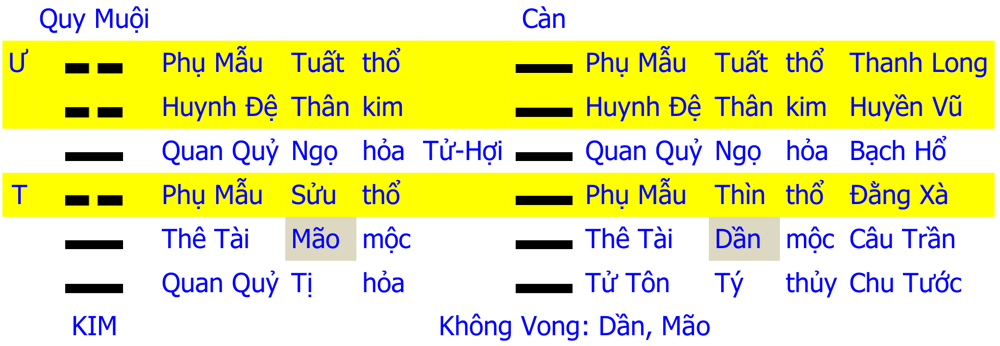 theo toàn đồ này mà bày quẻ phán đoán. Trải qua một chút loạn ly vẫn được bình an là nhờ vào nỗ lực này vậy.

Tôi còn có bí pháp cùng chỉ cho mọi người. Phàm họa phúc liên quan đến bản thân thì chỉ nên bốc quẻ bí mật, trước khi phán đoán không được có người ở bên cạnh. Khi xem quẻ xong thì cát hung tự biết, nhất định không được mang quẻ này đến hỏi thức giả nữa. Nếu như anh có ý hỏi người khác thì thần cũng đã sớm biết, cái quẻ anh gieo được nhất định sẽ thâm áo. Thà rằng giữ kín quẻ này, chờ sau khi sự việc đã xảy ra rồi hẵng hỏi người ta.

**Tân bình thích:** Nói như vậy cũng là làm hại người. Quẻ cát thì không sao, nếu là quẻ hung, người mới học xem không thấu đáo lại không thỉnh giáo ở người tinh thông, nếu như chờ sau này hỏi lại mà bản thân đã chết thảm thì hỏi thế nào?

Trước kia giới thiệu xem phòng ngừa tai họa, xem công danh và xem cầu tài chính là hệ thống đề mục, đối với người mới bắt đầu sợ rằng không biết nên xem việc gì, nay tôi trình bày cặn kẽ dưới đây giúp cho người gặp việc có thể dựa vào đó mà xem quẻ.

## 1. Xem về tai họa

Hoặc vì quốc kế dân sinh mà dâng mưu hiến kế; hoặc vì điều trần với quan trên, can gián nhà vua. Nhưng lại e rằng sự việc khó thành, lại rước họa vào thân.

Hoặc cần vượt sông vượt biển, sợ gặp giặc cướp hay sóng gió. Hoặc thấy phương xa lửa cháy, sợ rằng tai ương ập đến nhà mình. Hoặc nghe bệnh dịch hoành hành, dễ hại đến bản thân. Hoặc thấy châu chấu đầy đồng, dễ hại đến lúa má.

Hoặc độc hành không bạn, hoặc lang bạt đường trường. Nhà cửa phòng hỏa hoạn, phòng ốc gặp yêu ma. Hoặc kinh doanh buôn bán, hoặc vượt núi băng ngàn, hoặc dấn thân vào chốn thị phi, lo gặp hoạn nạn. Hoặc muốn xen vào việc người khác, lại sợ lây phiền.

Hoặc vào nhà người bệnh, muốn phòng lây nhiễm. Hoặc ăn uống thức độc, sợ nguy đến sinh mạng, hoặc dùng nhân sâm nhung hươu, không biết có ích hay không. Hoặc cưỡi ngựa dữ thú hoang, sợ bị tổn hại.

Hoặc đang mắc trọng tội mong ân xá. Hoặc thấy phía xa có thuyền bè khả nghi. Hoặc nhìn mé ngoài có kẻ đáng ngờ. Hoặc mua nhà quan đất công, không biết liệu có hậu hoạn. Hoặc mua đất núi mộ địa, không biết nên hay không.

Hoặc mua lầm đồ trộm cắp, hoặc sa vào chốn hiểm nguy, hoặc thấy nhà hàng xóm có đầu thú chiếu thẳng vào tường, trực xung vào nhà mình, không biết có gây nguy hại hay không. Hoặc thấy đồi núi bên nhà có mộ mới đắp, đào hầm lò xây miếu mạo, không biết có phạm đến mồ mả tổ tiên hay không.

Những vấn đề trên đều thuộc nội dung phòng tránh tai họa, nếu được Tử Tôn trì Thế sẽ yên lành như núi Thái Sơn, cần làm việc gì cứ làm, chỉ có cát lợi, không có hung hiểm. Nếu gặp Quan Quỷ trì Thế, thì tai họa ưu phiền khó tránh, cần cẩn thận đề phòng. Nếu là việc cần làm, cũng không nên làm. Chỉ có việc điều trần can gián, là không thuộc phạm vi này. Nếu thực sự vì quốc kế dân sinh mà hy sinh thân mình, cho dù gặp Quan Quỷ trì Thế, cũng nên làm.

Những việc kể trên, nếu gặp Tử Tôn trì Thế là cát, nếu gặp Quan Quỷ trì Thế là hung. Nếu hai tượng trên đều không hiện trên quẻ, thì nên thành tâm xem lại, nhưng một khi đã xuất hiện thì không nên xem tiếp nữa. Sự việc có khẩn cấp hoặc thư thả, ví như đi thuyền trên sông bể, nếu gặp Quan Quỷ trì Thế, làm sao có thể vĩnh viễn không xuất hành? Há lại chưa nghe câu: "Đi sớm một ngày gặp xui xẻo; đi muộn nửa giờ miễn tai ương"? Nếu hôm nay xem được Quan Quỷ trì Thế, thì hãy tạm không xuất hành. Hôm sau lại xem, hôm sau nữa lại xem, đến khi gặp Tử Tôn trì Thế, hãy nhanh chóng dong buồm xuất phát. Những chuyện tương tự, đều căn cứ theo phương pháp này.

## 2. Xem công danh

Bất kể là văn hay võ, dù là đã làm quan hay chưa làm quan, nếu được Quan Quỷ trì Thế, mong thăng chức sẽ được thăng chức, mong trúng tuyển sẽ trúng tuyển, nhập trường là đỗ, thi cử là đậu. Dù mắc sai lầm, quan chức vẫn bảo tồn; bị bãi truất, tiền đồ còn trở lại. Không ở mãi chốn rừng xanh, chắc chắn sẽ có ngày phấn phát. Thi nhậm chức, thi tài nghệ, ắt được hiển danh. Kẻ học trò nạp túc, sẽ được vào hàng quan lại; người khai khẩn, sẽ thăng chức thăng quan. Cầu chức tước, chức tước sẽ được; cầu lập công, sẽ lập kỳ công. Nhưng không nên gặp Tử Tôn trì Thế, chủ về công danh đã có sẽ mất, công danh trong tương lai vô vọng. Đợi gặp thời cơ, sẽ lại xem lại.

Ta lại đem bí mật trong việc xem quẻ mách lại với bạn rằng: Xem về phòng tai tránh họa và xem về công danh, chỉ có thể tự mình đoán định, không được xem hộ người khác. Khi tự xem quẻ phòng họa, trong tâm chỉ nghĩ về một chuyện phòng tai họa; xem cầu công danh, chỉ tâm niệm về một việc công danh, như vậy sẽ linh nghiệm. E rằng những người khác không hiểu về cái lý của Tử Tôn và Quan Quỷ, nên vừa lo chuyện tai họa, lại vừa có ý cầu danh, như vậy sẽ rất khó quyết đoán.

Ví như dâng thư can gián, nếu như người dâng thư không có chức quan, thì chưa hẳn là không muốn nhân cơ hội này để cầu danh, mà ý nghĩ lo phòng tai họa cũng khó tránh khỏi. Kẻ đã làm quan, vừa lo sợ mất công danh, lại e lời ngay nói ra sẽ chuốc họa vào thân. Lại như kẻ có tiền đồ, hoặc đã làm quan, hoặc chưa nhậm chức, mắc chuyện sai lầm, chưa có hồi kết, vừa lo mất chức, vừa sợ mắc tội. Ba dạng người trên trong lòng đều mang hai ý niệm. Nếu như gieo quẻ được Tử Tôn trì Thế, lại băn khoăn không biết là điềm vô sự, hay mất công danh. Bởi vậy nên mới dặn anh, tự xem cho mình sẽ linh ứng, xem hộ người khác không nghiệm. Không phải là quẻ không thiêng, mà e người khác không chuyên tâm vào một việc.

Lại như người đang đương nhiệm, xem về các biến cố tại địa phương, cùng hạn lụt, mất mùa, thiên tai, như vậy là xem về phòng tai tránh họa. Nếu gặp Tử Tôn trì Thế, thì dân chúng yên lành, giặc cướp không có; nếu gặp Quan Quỷ trì Thế, ắt gặp tai họa. Nhưng không thể xem cho năm khác, mà chỉ xem trong năm. Tuy xem trong năm, cũng không thể xem nhiều việc trong cùng một quẻ, mà mỗi sự việc phải xem riêng một quẻ.

Lại ví dụ như đã gặp biến cố, sợ rằng mắc tội, thì đó là xem về việc công danh đắc thất. Như vậy tốt nhất là được Quan Quỷ trì Thế, nếu gặp Tử Tôn trì Thế là không tốt.

Lại ví dụ như đang đương nhiệm mà không gặp vấn đề gì, thì cầu khấn thần linh rằng: "Con đang giữ chức này, về sau liệu có được thăng chức hay không?" Nếu được Quan Quỷ trì Thế, sẽ được thăng quan. Được Tử Tôn trì Thế, sẽ mắc lỗi lầm.

Nếu là kẻ sĩ chưa thành đạt, hoặc là tài năng ưu việt, hoặc là võ nghệ hơn người, xem có được thành danh hay không, nếu được Quan Quỷ trì Thế, ắt có ngày được hưởng lộc quan; nếu được Tử Tôn trì Thế, sẽ không còn hy vọng. Nếu đã được tập ấm từ tổ tiên hoặc đã được tiến dẫn làm quan, hoặc đã lập công, xem về sau có được ra làm quan hay không, nếu được Quan Quỷ trì Thế, thì đường công danh rộng mở; nếu được Tử Tôn trì Thế, hãy cứ yên tâm chờ đợi.

Lại như sĩ tử, gieo một quẻ xem khoa thi năm này có đỗ hay không. Nếu được quẻ Quan Quỷ trì Thế, sẽ được ghi tên bảng vàng; nếu được Tử Tôn trì Thế, thì khoa thi này ắt sẽ hỏng, cần chọn ngày khác để xem khoa sau có đỗ hay không. Nếu vẫn được Tử Tôn trì Thế, thì khoa sau cũng không hy vọng. Lại chọn ngày khác, xem suốt đời này có đỗ đạt hay không. Nếu được Quan Quỷ trì Thế, thì rốt cục cũng sẽ có cơ hội tiến thân; còn nếu vẫn là Tử Tôn trì Thế, nên đổi sang nghiệp khác, để tránh mối lụy đèn sách. Hiếu liêm xem về thi hội, học trò nhỏ xem về nhập học, đều dùng phương pháp này.

Những phương pháp trên đều là phương pháp bí mật. Cần phải hỏi lần lượt từng chuyện một, thì quẻ nào cũng linh nghiệm. Nếu chưa hỏi chuyện trước mắt đã hỏi chuyện cả đời, chuyện lâu dài, là không hiểu rằng, thần linh phần nhiều đều mách bảo chuyện gần. Nhiều người không hiểu cái lý này, trong lòng có bao nhiêu chuyện nghi ngờ không hỏi, lại đi hỏi chuyện cả đời trước. Thần mách bảo cho những chuyện gần, mà người đoán quẻ không biết được ý của thần linh, lại đem quẻ đó suy đoán về chuyện chung thân, ắt sẽ sai lệch một trời một vực, không có tác dụng gì.

## 3. Xem về cầu tài

Hỏi về việc tiền của lương thực có trưng thu được đủ hay không? Lĩnh tiền lương có lĩnh được đầy đủ hay không? Nếu được Thê Tài trì Thế sẽ đủ đầy; được Huynh Đệ trì Thế sẽ thua lỗ.

Hỏi về việc kinh doanh buôn bán, mở cửa hàng, việc cầu tài ở phương xa, hoặc yết kiến người quyền quý để cầu tài, nếu được Thê Tài trì Thế, cần nhanh chóng thực hiện; nếu gặp Huynh Đệ trì Thế, cần dừng ngay lại. Xem về kinh doanh buôn bán, mở cửa hàng, nếu như việc làm ăn đó theo đà lâu, hỏi xem tương lai phát triển ra sao. Nếu được Thê Tài trì Thế, thì việc làm ăn càng lâu càng phát; nếu gặp Huynh Đệ trì Thế, thì đã bắt đầu suy vi.

Xem về việc đầu cơ hàng hóa, được Thê Tài trì Thế, thì hàng đó nên mua; gặp Huynh Đệ trì Thế, thì tuyệt đối không nên lấy hàng đó.

Xem về việc cho vay nợ, nếu gặp Huynh Đệ trì Thế, là có vay không trả; nếu gặp Thê Tài trì Thế, sẽ trọn vẹn trước sau.

Xem về việc đòi nợ, nếu gặp Thê Tài trì Thế, cho dù là trước mắt chưa thể đòi được, thì về sau nhất định sẽ trả; gặp Huynh Đệ trì Thế, thì chọn ngày khác xem lại. Nếu như xem nhiều lần vẫn được Huynh Đệ trì Thế, thì đòi nợ chẳng khác gì mò trăng đáy nước. Nếu xem nhiều lần đều được Quan Quỷ trì Thế, thì ắt phải kiện lên quan.

Xem về việc theo nghề khai khoáng vàng, bạc, đồng, sắt, chì, mở hầm lò đào than, phèn, mua đồi núi để đốn củi, kinh doanh đồi vườn, ruộng muối, ao cá, phàm là nghề thu lợi từ núi đồi sông biển, nếu được Thê Tài trì Thế, thì của cải chất chồng; nếu gặp Huynh Đệ trì Thế, sẽ lụn bại phá sản.

Xem về việc luyện đan, chế thủy ngân, vì trên đời không có cái lý này, nên quẻ đó không cần phải xem, cũng không nên nghĩ về việc đó. Cho dù xem được Thê Tài trì Thế, cũng là ứng với tài lộc chỗ khác. Từng có người xem về việc luyện đan, trong quẻ được hào Tài Tuất thổ trì Thế, được Tử Tôn Ngọ hỏa động tương sinh, nên cho rằng đến tháng Tuất nhất định đan sẽ luyện thành. Nào ngờ đến tháng 9, thê thiếp, con cái từ xa ngàn dặm tìm đến, đoàn tụ tại quê người. Nên hào Tử Tôn Ngọ hỏa lại ứng vào con cái. Như vậy là xem chỗ này, ứng chỗ khác. Mới biết Dịch là mưu của người quân tử, nếu cầu điều phi lý, thì thần không mách bảo điều đó, mà cho hiển ứng ở chỗ khác.

Nếu phát hiện dưới lòng đất có ánh sáng, có vật lạ, hoặc thấy các hình vàng trắng, ngờ rằng phía dưới có kho báu, nếu xem được trì Thê Tài trì Thế, dưới đất ắt hẳn có bạc vàng; nếu được Huynh Đệ trì Thế, không những không có của cải gì, mà ngược lại, còn dẫn đến phá sản. Nếu gặp Quan Quỷ trì Thế, ắt hẳn là chuyện yêu ma quỷ quái.

Bèn dặn bạn ta rằng: "Người đời phàm lúc gặp nghi ngờ, mở miệng là cầu thần hỏi trời đất, như vậy đủ biết nếu muốn hiểu chuyện cát hung trong tương lai, ắt phải nhờ vào xem quẻ. Ta nghiên cứu "Chu Dịch" đã nhiều năm, xem quẻ có thể cảm ứng được lý lẽ, tựa như được nghe chính thánh nhân mở miệng cất lời, thật khiến người ta phải kinh ngạc. Nay vì anh không hiểu lẽ huyền diệu của "Chu Dịch", không đọc sách quẻ, nên không thể không tặng anh bí quyết này, anh thử thực hành theo, khi đã thấy được điều linh nghiệm, thì tự nhiên anh sẽ chịu đọc sách bốc dịch. Phương pháp này rất linh nghiệm, anh cũng có thể đem truyền thụ cho người khác, từ quan lại, học trò, dân thường, thương nhân lái buôn, người nào cũng có thể dùng được. Nhưng phải là những người hoàn toàn không hiểu về lẽ sinh khắc của ngũ hành, mới được sử dụng phương pháp này. Nếu là người am hiểu về ngũ hành, thần linh ắt sẽ hiển hiện lên những quẻ vi diệu, bí hiểm, cần phải xem lẽ sinh khắc chế hóa của Dụng thần, xem Nguyệt phá, Tuần Không, và xem kỹ phương pháp suy đoán tại các chương "Cầu danh", "Cầu tài", "Tật bệnh" ở quyển sau, chứ không được căn cứ vào phương pháp này".

**Tân bình thích:** Trên đây là phương pháp cơ bản xem lục thân trì Thế, thích hợp cho người mới học bốc dịch tham khảo, nếu người có trình độ nhất định mà cứ cố chấp vào phương pháp trên thì trình độ dự đoán sẽ không được nâng cao. Bởi vì phán đoán cát hung của sự vật không phải là chỉ nhìn hào Thế là hỷ hay là kỵ, mà còn phải nhìn suy vượng của Dụng thần và ảnh hưởng của Nhật Nguyệt và hào động đối với Dụng thần.

Trong dự đoán thường gặp hào Tài trì Thế nhưng phá tài, Huynh Đệ trì Thế nhưng được tài. Mặc dù hào Tài trì Thế, nhưng Nhật Nguyệt đều là Huynh Đệ, hoặc mặc dù không bị Nhật Nguyệt khắc, nhưng Nhật Nguyệt không có ích cho Dụng thần, Kỵ thần ở trong quẻ phát động không bị chế phục, tất sẽ phá tài hoặc không cầu được tài. Nếu như Huynh Đệ trì Thế, hào Tài vượng tướng, Thế là Tài khố, hoặc hợp Tài thì vẫn được tài, huyền cơ trong đó, người mới nhập môn chẳng thể lý giải. Chỉ có không ngừng nghiên cứu sâu sắc, thì mới có thể thấu hiểu được.

Ví dụ: Ngày Đinh Mão tháng Ất Tị năm Đinh Sửu, một nữ sĩ đoán tài vận, được quẻ Địa Thiên Thái biến Địa Trạch Lâm.

Lấy Thê Tài làm Dụng thần. Quẻ này mới nhìn thì thấy hào Tài hưu tù, Hợi thủy Tuần Không Nguyệt phá, lại Huynh Đệ trì Thế phát động, không có tài để cầu. Nhưng Tử Tôn Dậu kim ám động sinh trợ hào Tài, hào Thế lại là Tài khố, phát động, tài vẫn quy khố là sở hữu của ta, vừa nhìn là biết người này có bản lĩnh kiếm tiền, là người kiếm được rất nhiều tiền.

Thế Ứng tương hợp, tất là hợp tác với người khác cầu tài, một minh động một ám động, một minh một ám phối hợp chặt chẽ. Năm 1992 Nhâm Thân Tài gặp Trường Sinh, năm này tiền bạc cất bước, năm 1993 Quý Dậu bắt đầu cùng người khác tạo dựng sự nghiệp, bề ngoài là làm một mình, nhưng thực ra sau lưng có người giúp đỡ, tài vận rất tốt.

Năm 1994 Giáp Tuất, mặc dù là năm khắc Tài, nhưng trong quẻ hào Tài nhập Mộ, năm này Mộ bị Thái Tuế xung khai, tài vận hơi kém hơn năm 1993, nhưng vẫn thu được không ít tiền. Năm 1995 Ất Hợi, trong quẻ hào Tài Hợi thủy thực Không thực Phá, tài vận vẫn tốt.

Năm 1996 Bính Tý bán hợp với hào Thế, mặc dù cũng phát tài lớn, nhưng số tiền kiếm được chỉ nhận về một nửa. Năm 1997 Đinh Sửu, Huynh trị Thái Tuế, tài tất bị cản trở, hướng Nam là hỏa địa đã khắc phúc thần Tử Tôn lại trợ Kỵ thần Huynh Đệ, năm nay cầu tài bất lợi, nhất là không nên đến phương Nam để cầu tài.

Quả nhiên mấy năm gần đây tài vận rất tốt, từ năm 1992 bắt đầu khởi sắc, năm 1993 chính thức thành lập công ty, dựa vào thẩm quyền phê duyệt quy hoạch bất động sản của chồng, gom được rất nhiều nghiệp vụ, một minh một ám, mỗi năm đều thu được một hai trăm vạn. Ngạc nhiên nhất là năm 1996 số tiền kiếm được chỉ mới thu về được một nửa. Cô ấy nói rằng, kể từ khi bước vào năm 1997 đến giờ, công ty vẫn chưa làm xong được một nghiệp vụ nào. Hai ngày nay, cô ấy đang muốn đầu tư một dự án ở Hồ Nam. Tôi khuyên cô ấy tốt nhất không nên làm, song vì nóng lòng cầu tài nên không nghe lời tôi khuyến cáo, kết quả là đầu tư vào hơn 20 vạn nguyên không thu được lợi nhuận, bởi vì không thể làm được nên đành phải rút về.

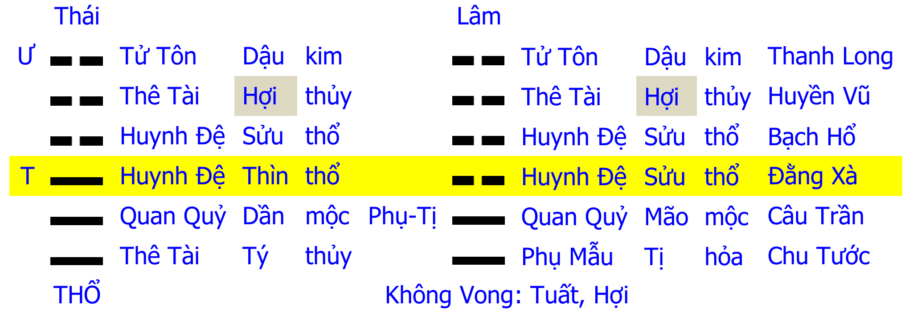

## Cách xem Dụng thần và ngũ hành sinh khắc suy vượng

Dã Hạc nói: "Đạo của "Chu Dịch", là để biết được thiên thời hạn hán hay mưa lụt, biết được địa lợi bội thu hay thất bát, biết được thời vận hưng thịnh hay suy vi, biết được bệnh tật được sống hay chết, biết được công danh thành hay bại, biết được tài vận tụ hay tán, biết được họa phúc để tìm đến hay tránh xa, nên người ta không thể không học Dịch.

Phàm học xem quẻ, trước tiên phải đọc "Hỗn Thiên Giáp Tý, Lục Thân Ca", học cách sắp xếp ngũ hành, lục thân, rồi tiếp tục học về biến động. Trong quẻ đã có hào động, động ắt sẽ biến. Đã biết lẽ động biến, sẽ xem đến Dụng thần, Nguyên thần, Kỵ thần, biết được những lẽ đó là đã bước vào được cánh cửa của "Chu Dịch".

Lại xem chương "Tứ thời vượng tướng", chương "Ngũ hành tương sinh tương khắc", chương "Ngũ hành tương xung hương hợp", chương "Tuần Không", chương Nguyệt phá", "Sinh vượng Mộ Tuyệt", như vậy là đã vào được trong điện đường của "Chu Dịch"! Lại xem các phần của quyển sau, để biết xem về chuyện gì cần dùng đến những phương pháp suy đoán nào. Đi dần từ nông đến sâu, sẽ đắc được chỗ thâm áo của nó. Chưa đến nửa năm, đã tiếp thu được tri thức trong mười mấy năm học của ta. Nay ta hãy điểm một quẻ, để dạy cho anh cách tìm Dụng thần và hiểu được cái lẽ sinh khắc suy vượng của ngũ hành.

Phàm khi xem về chuyện gì, trước hết cần ghi rõ năm, tháng, ngày, giờ rồi đối chiếu với chương Lục thần, viết ra Lục thần, sau đó đoán quẻ.

Ví dụ, xem được quẻ Càn Vi Thiên:

Nếu tự đoán cát hung cho mình, thì dùng hào Thế làm Dụng thần. Trong quẻ này, Dụng thần ở hào Tuất thổ, thì lấy Tuất thổ làm thân mình, nếu được vượng tướng là tốt, kỵ nhất là gặp hưu tù. Tốt hơn cả là nên gặp Tị, Ngọ hỏa để tương sinh, tối kỵ bị Dần, Mão mộc tương khắc. Hào Thế cũng không nên gặp Tuần Không, càng không nên gặp Nguyệt phá. Ở đây hào Thế gặp Tuất thổ, có 4 chỗ sinh khắc xung hợp.

### Thứ nhất: Quan hệ sinh khắc xung hợp của Nguyệt kiến

Trong quẻ này, hào Thế tại Tuất thổ, nếu như xem tại tháng Dần tháng Mão, sẽ bị hành mộc của Dần, Mão khắc hại, tức hào Thế bị tổn thương. Nếu là tự đoán cát hung cho bản thân, thì quẻ này là hưu tù bất lợi. Nếu xem tại tháng Thìn, Thìn xung

Tuất thổ, là Nguyệt phá, như vậy là hào Thế gặp Nguyệt phá, cũng có nghĩa bản thân mình không khác gì vật đã vỡ hỏng, không có tác dụng gì.

Nếu xem tại tháng Tị, tháng Ngọ, thì Tị, Ngọ hỏa chính là Quan tinh, sinh ra Tuất thổ, như vậy là hỏa vượng thổ tướng, hào Thế gặp vượng tướng, mọi sự đều thuận lợi.

Nếu xem tại tháng Mùi, Sửu, hai tháng này là thời điểm thổ vượng, cũng có thể phụ trợ cho Tuất thổ. Khi đó, hào Thế tại Tuất thổ cũng được gọi là vượng tướng, cũng đều cát lợi.

Nếu xem tại tháng Tuất, hào Thế nằm tại Tuất thổ, tính về Nguyệt kiến, như vậy là vượng tướng lại được thời, nếu tự xem cho mình, thì mọi việc đều hanh thông.

Nếu xem tại các tháng Thân, Dậu, Hợi, Tý thì Tuất thổ đều ở thời điểm tiết khí, như vậy là hào Thế hưu tù, bất lực.

Như vậy là Nguyệt kiến có thể sinh, khắc, xung, hợp Dụng thần của hào Thế Tuất thổ.

Về Dụng thần, thì khi tự đoán cát hung, lấy hào Thế làm chủ. Khi đó, không gọi là hào Thế, mà gọi là Dụng thần. Xem cho cha mẹ, thì lấy hào Phụ mẫu làm Dụng thần.

### Thứ hai: Quan hệ sinh khắc xung hợp của Nhật thần

Tại quẻ này, hào Thế tại Tuất thổ, nếu như xem vào ngày Dần, ngày Mão, thì Dần, Mão mộc sẽ khắc Tuất thổ, như vậy hào Thế đã bị Nhật thần khắc hại, là điềm bất lợi.

Nếu xem vào ngày Thìn, Thìn xung Tuất thổ, như vậy gọi là hào Thế ám động.

Nếu xem vào ngày Tị, Ngọ, thì Tị, Ngọ chính là Quan tinh, sinh ra Tuất thổ, như vậy là hào Thế gặp Quan tinh mà sinh vượng, mọi việc đều cát lợi.

Nếu xem vào ngày Mùi, ngày Sửu, thì Mùi, Sửu thổ phụ trợ cho thổ, như vậy, Tuất thổ cũng được trợ giúp.

Nếu xem vào ngày Tuất, thì hào Thế gặp Nhật kiến, được thời được quyền.

Nếu xem vào ngày Thân, Dậu, Hợi, Tý thì Tuất thổ không khắc không sinh.

Như vậy là Nhật kiến có thể sinh, khắc, xung, hợp Dụng thần.

### Thứ ba: Quan hệ sinh khắc xung hợp của hào động trong quẻ

Tại quẻ này, hào Thế là Tuất thổ, nếu hào 2 trong quẻ là Dần mộc phát động, sẽ khắc Tuất thổ; nếu hào 4 là Ngọ hỏa Quan tinh phát động, sẽ sinh Tuất thổ; hào 3 Thìn thổ phát động, sẽ xung Tuất thổ; như vậy là hào động trong quẻ có thể sinh, khắc, xung, hợp Dụng thần.

### Thứ tư: Nếu bản thân hào Thế phát động, sẽ có quan hệ hồi đầu sinh, hồi đầu khắc của hào biến

Hào Thế tự phát động, động ắt sẽ biến, nếu biến ra Tị, Ngọ hỏa, gọi là hồi đầu sinh Thế. Nếu biến ra Dần mộc, Mão mộc, gọi là hồi đầu khắc Thế. Nếu biến ra Thìn thổ, gọi là hồi đầu xung Thế. Nếu biến ra Mão mộc, gọi là hợp Thế.

Như vậy là hào mà Dụng thần biến ra có thể sinh, khắc, xung, hợp Dụng thần.

**Tân bình thích:** Lý luận này rất đúng, nhưng ví dụ đưa ra không ổn. Quẻ này hào Thế phát động sẽ không hóa ra Tị Ngọ hỏa. Hào 6 muốn được Tị hỏa thì ngoại quái phải là Ly, tức là hào 5 độc động, hào Thế không động; Ngọ hỏa sẽ không đóng ở hào 6. Hào Thế độc động sẽ hóa ra Mùi thổ; hào 5, hào 4 phát động, hào Thế tĩnh mà vô hóa; hào 6, hào 5 phát động, hào Thế hóa ra Tuất thổ; hào 6, hào 4 phát động, hào Thế hóa ra Tý thủy; cả ba hào 4, 5, 6 đều động, hào Thế hóa ra Dậu kim. Ở trên nói hào Thế biến ra Dần Mão mộc hồi đầu khắc, biến ra Thìn thổ hồi đầu sinh, biến ra Mão mộc hợp Thế, đều không hợp lý. Cần phải xem phần luận phía sau của Dã Hạc.

Nếu bốn quan hệ trên đây đều là tương sinh, tương hợp Dụng thần thì các quẻ xem được đều cát lợi.

**Tân bình thích:** Nếu được bốn chỗ đều đến sinh Thế thì chưa hẳn là cát, quá vượng sẽ biến thành hung.

Nếu chỉ có ba chỗ tương sinh, một chỗ tương khắc, thì cũng được coi là cát lợi. Nếu có hai chỗ tương khắc, hai chỗ tương sinh, cần phải xem lẽ vượng, suy. Hào sinh ra Dụng thần, nếu được vượng tướng thì được coi là cát. Nếu hào khắc Dụng thần là vượng tướng, thì quẻ đó là hung. Nếu có ba chỗ tương khắc, một chỗ tương sinh, mà hào được tương sinh là vượng tướng, thì gọi là "khắc xứ phùng sinh" (nơi khắc gặp sinh), trong hung được cát; nếu hào này hưu tù thì, sinh chỉ có danh mà không có thực, cũng tương tự như trường hợp cả bốn đều khắc, mọi việc đều hung.

Có người hỏi rằng: "Quẻ này hào Thế là Tuất thổ lẽ nào không thể biến thành Dần, Mão, Tị, Ngọ hay sao?" Ta đáp rằng: "Các hào khác phần nhiều đều biến thành ra hồi đầu sinh khắc, mượn đây để làm phương pháp vậy".

Lại hỏi: "Mão mộc có thể khắc Tuất thổ, lại hợp với Tuất, vậy nên coi đó là khắc hay hợp?" Ta đáp: "Điều này đã trình bày trong chương Ngũ hành tương hợp".

Lại hỏi rằng: "Quẻ này là quẻ Càn Vi Thiên, trong quẻ thì Ngọ hỏa là Quan tinh, tại sao xem vào năm Ngọ tháng Ngọ ngày Ngọ, thì cũng lấy Ngọ đó làm Quan tinh, thế là tại sao?" Ta bèn đáp rằng: "Bất kể là xem được quẻ nào, nếu trong quẻ có Tị, Ngọ hỏa làm Quan tinh, khi xem vào tháng, ngày Tị, Ngọ, thì tháng, ngày Tị, Ngọ đó cũng là Quan tinh. Nếu trong quẻ có Tị, Ngọ hỏa làm Tài tinh, mà xem vào tháng, ngày Tị, Ngọ, thì cũng coi đó là Tài tinh. Những trường hợp khác cũng tương tự".

Về vượng tướng và hưu tù, tra trong chương "Vượng tướng".

Về không và phá, tra trong chương "Tuần Không", "Nguyệt phá".

Về xung và hợp, tra trong chương "Ngũ hành tương xung", "Ngũ hành tương hợp".

Về sinh và khắc, tra trong chương "Ngũ hành tương sinh", "Ngũ hành tương khắc".

Về Nguyên thần, tra trong chương "Nguyên thần".

Về Dụng thần, Quan tinh, tra trong chương "Dụng thần".

Về ám động, tra trong chương "Ám động".

Về hồi đầu sinh, hồi đầu khắc, tra trong chương "Động biến sinh khắc".

Về Nhật thần, Nguyệt kiến, tra trong chương "Nhật thần", "Nguyệt tướng".

Xem cho cha mẹ, thì lấy hào Phụ Mẫu trong quẻ làm Dụng thần. Trong quẻ này, hai hào Thìn, Tuất đều là hào Phụ Mẫu, nếu cả hai hào đều động, hoặc đều không động, thì chọn hào vượng làm Dụng thần. Nếu có một hào động, thì chọn hào động làm Dụng thần. Phụ Mẫu nếu rơi vào hào Thìn thổ hoặc Tuất thổ, thì thổ là Phụ Mẫu, tốt nhất nên gặp hỏa tương sinh, kỵ bị mộc tương khắc, kỵ gặp Nguyệt phá, Tuần Không. Cũng có bốn chỗ sinh khắc xung hợp, nếu sinh nhiều khắc ít là cát lợi, có thể tham khảo phần hào Thế trên đây.

Xem về nhà cửa, tàu thuyền, xe cộ, thư tín, tấu chương, đều lấy hào Phụ Mẫu làm Dụng thần, cần xem kỹ chương "Dụng thần".

Xem về chuyện của người khác, dùng hào Ứng làm Dụng thần. Trong quẻ này, hào Ứng tại Thìn thổ, bốn chỗ cùng tương sinh là tốt; bốn chỗ đều xung khắc là hung.

Xem chuyện của anh em, dùng hào Huynh Đệ làm Dụng thần. Trong quẻ này, hào Huynh Đệ tại Thân kim, nên dùng hào này. Nên gặp thổ tương sinh, kỵ gặp hỏa tương khắc, kỵ gặp Nguyệt phá, Tuần Không. Cũng có bốn chỗ sinh khắc, nếu sinh nhiều khắc ít là cát; nếu khắc nhiều sinh ít là hung.

Lại nói về hào Huynh Đệ, chính là thần cướp của. Nếu xem về sự an nguy lành dữ của anh chị em trong nhà, nếu được sinh vượng là tốt, kỵ gặp Nguyệt phá, Tuần Không. Nếu xem về thê thiếp, nô bộc và tài sản, nên khắc nhiều sinh ít, tốt nhất là Huynh Đệ nên gặp Tuần Không, Nguyệt phá, khiến cho không thể cướp đoạt được của cải của mình, hay khắc thê thiếp, nô bộc của mình.

Xem về thê thiếp, nô bộc và tài sản, dùng hào Thê Tài làm Dụng thần. Trong quẻ này, hào Thê Tài tại Dần mộc, chính là Dụng thần. Kỵ gặp Tuần Không, Nguyệt phá, nên gặp thủy tương sinh, tránh gặp kim tương khắc. Cũng có bốn chỗ sinh khắc, sinh nhiều khắc ít là cát, cũng tương tự như trường hợp trên.

Xem về mua bán vàng bạc cũng lấy hào Thê Tài làm Dụng thần, cần đọc kỹ chương "Dụng thần".

Xem về con cháu, lấy hào Tử Tôn làm Dụng thần. Trong quẻ này, Tử Tôn tại hào sơ Tý thủy, chính là Dụng thần. Kỵ gặp Nguyệt phá, Tuần Không, ưa gặp kim tương sinh, tránh gặp thổ tương khắc. Cũng có bốn chỗ sinh khắc xung hợp, nên khắc ít sinh nhiều, cũng tương tự như trường hợp trên.

Xem về việc của người khác, phần nhiều đều lấy hào Tử Tôn làm Dụng thần, có thể tra trong chương "Dụng thần".

Xem về công danh, lấy hào Quan Quỷ làm Dụng thần. Trong quẻ này, Ngọ hỏa là Quan tinh, tức dùng hào này làm Dụng thần. Tối kỵ gặp Tuần Không, Nguyệt phá, tránh gặp thủy tương khắc, ưa gặp mộc tương sinh. Cũng có bốn chỗ sinh khắc, tương tự như trường hợp trên.

Xem về chuyện tà ma quỷ quái, gian thần giặc cướp, đều lấy hào Quan Quỷ làm Dụng thần, cần đọc kỹ trong chương "Dụng thần".

Những việc cần suy xét từ xưa đến nay, đều ghi rõ phương pháp xem quẻ ở quyển sau, e rằng anh mới học, không biết bắt đầu từ đâu, nên viết bài này làm cương lĩnh, để giúp anh nhập môn. Biết được cương lĩnh này, sau đó đọc kỹ các chương ở sau, đi từ nông đến sâu, tự đi đến chỗ toàn thiện.

Bản toàn đồ tám cung trên đây đều là hào tĩnh. Nhưng hào ắt có động, động ắt sẽ biến. Phần phía sau tuy cũng có chương "Động biến", nhưng e rằng anh không hiểu rõ, nên sắp một quẻ biến ra đây làm mẫu, để giải thích cho anh được biết.

Trong quẻ có **O** sẽ biến thành **--**, vòng tròn là trùng, trùng là dương, dương động sẽ biến thành âm.

Trong quẻ có **X** sẽ biến thành **—**, dấu gạch chéo là giao, giao là âm, âm động sẽ biến thành dương.

Ví dụ: Xem được quẻ Trạch Thiên Quải biến Thiên Phong Cấu.

Ba hào trên là quẻ ngoại, là quẻ Đoài, Đoài vi Trạch (đầm);

Ba hào dưới là quẻ nội, là quẻ Càn, Càn vi Thiên (trời).

Trạch trên Thiên dưới, là quẻ Trạch Thiên Quải, tìm ra quẻ Trạch Thiên Quải trong bản toàn đồ, đối chiếu vào đó để sắp đặt Thế, Ứng, ngũ hành, lục thân. Sau đó, lại xem hình tượng của ba hào trên, thấy hào 6 của quẻ Đoài là hào giao động, **X** sẽ biến thành **—**, như vậy, quẻ Đoài đã biến thành quẻ Càn, Càn vi Thiên.

Lại xem ba hào dưới của quẻ Càn, thấy hào sơ trùng động, **O** biến thành hào **--**, như vậy, quẻ Càn đã biến thành quẻ Tốn, Tốn vi Phong.

Thiên trên Phong dưới, là quẻ Thiên Phong Cấu. Tra trong bản toàn đồ tìm ra quẻ Thiên Phong Cấu, viết Sửu thổ của hào sơ trong quẻ Cấu vào bên cạnh hào sơ phát động Tý thủy của quẻ trước đó, như thế gọi là Tý thủy biến thành Sửu thổ; viết Tuất thổ của hào 6 trong quẻ Cấu vào bên cạnh hào 6 phát động của quẻ trước đó, như vậy là Mùi thổ biến thành Tuất thổ. Các hào còn lại không động không biến, không cần phải viết ra nữa.

Căn cứ vào lục thân, thì Sửu thổ, Tuất thổ trong quẻ Cấu vốn là Phụ Mẫu, nay đều viết thành Huynh Đệ, là tại sao? Lục thân cần sắp đặt căn cứ vào quẻ gốc. Quẻ trước là Trạch Thiên Quải, thổ là Huynh Đệ, bởi vậy hai hào thổ là Sửu, Tuất của quẻ biến cũng là Huynh Đệ.

Các quẻ khác cũng loại suy ra từ đó.

---

# CHƯƠNG 4: HỖN THIÊN GIÁP TÝ

Càn tại quẻ nội: Tý thủy, Dần mộc, Thìn thổ.

Càn tại quẻ ngoại: Ngọ hỏa, Thân kim, Tuất thổ.

Khảm tại quẻ nội: Dần mộc, Thìn thổ, Ngọ hỏa.

Khảm tại quẻ ngoại: Thân kim, Tuất thổ, Tý thủy.

Cấn tại quẻ nội: Thìn thổ, Ngọ hỏa, Thân kim.

Cấn tại quẻ ngoại: Tuất thổ, Tý thủy, Dần mộc.

Chấn tại quẻ nội: Tý thủy, Dần mộc, Thìn thổ.

Chấn tại quẻ ngoại: Ngọ hỏa, Thân kim, Tuất thổ.

Tốn tại quẻ nội: Sửu thổ, Hợi thủy, Dậu kim.

Tốn tại quẻ ngoại: Mùi thổ, Tị hỏa, Mão mộc.

Ly tại quẻ nội: Mão mộc, Sửu thổ, Hợi thủy.

Ly tại quẻ ngoại: Dậu kim, Mùi thổ, Tị hỏa.

Khôn tại quẻ nội: Mùi thổ, Tị hỏa, Mão mộc.

Khôn tại quẻ ngoại: Sửu thổ, Hợi thủy, Dậu kim.

Đoài tại quẻ nội: Tị hỏa, Mão mộc, Sửu thổ.

Đoài tại quẻ ngoại: Hợi thủy, Dậu kim, Mùi thổ.

Giả sử như xem được quẻ Thiên Phong Cấu:

Ba hào trên là quẻ Càn, Càn tại quẻ ngoại, nên là Ngọ hỏa, Thân kim, Tuất thổ.

Ba hào dưới là quẻ Tốn, Tốn tại quẻ nội, nên là Sửu thổ, Hợi thủy, Dậu kim.

Sắp quẻ thì sắp từ dưới lên, nên khi sắp xếp ngũ hành, cũng theo trình tự từ dưới lên trên. Các quẻ còn lại cũng tương tự.

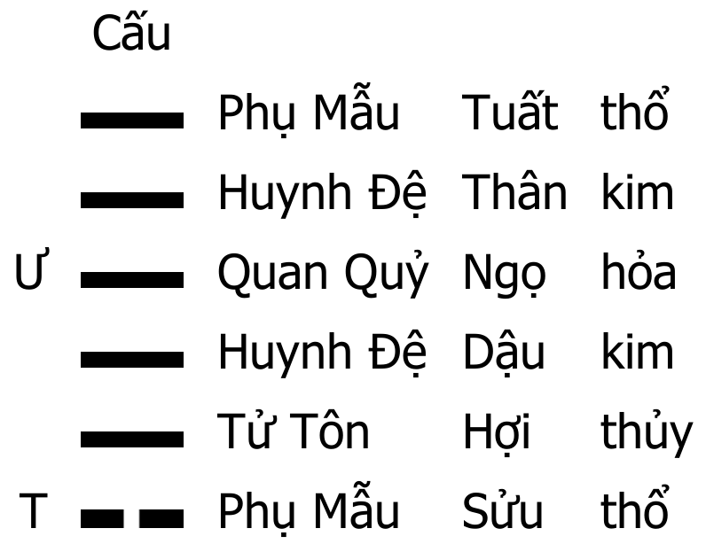

---

# CHƯƠNG 5: LỤC THÂN CA

**Càn Đoài kim Huynh thổ Phụ truyền, mộc Tài hỏa Quỷ thủy Tử nhiên.**  
(Tám quẻ cung Càn, tám quẻ cung Đoài đều thuộc hành kim)  
**Khảm cung thủy Huynh hỏa vi Tài, thổ Quỷ kim Phụ mộc Tử lai.**  
(Tám quẻ cung Khảm đều thuộc hành thủy)  
**Khôn Cấn thổ Huynh hỏa vi Phụ, mộc Quỷ thủy Tài kim Tử lộ.**  
(Tám quẻ cung Khôn, tám quẻ cung Cấn đều thuộc hành thổ)  
**Ly cung hỏa Huynh thủy vi Quỷ, thổ Tử mộc Phụ kim Tài trợ.**  
(Tám quẻ cung Ly đều thuộc hành hỏa)  
**Chấn Tốn mộc Huynh thủy Phụ Mẫu, kim Quỷ hỏa Tử Tài thị thổ.**  
(Tám quẻ cung Chấn, tám quẻ cung Tốn đều thuộc hành mộc)  

Nghĩa là:

Cung Càn, cung Đoài thuộc hành kim: kim là Huynh Đệ, thổ Phụ Mẫu, mộc Thê Tài, hỏa Quan Quỷ, thủy Tử Tôn.

Cung Khảm thuộc hành thủy: thủy là Huynh Đệ, kim Phụ Mẫu, hỏa Thê Tài, thổ Quan Quỷ, mộc Tử Tôn.

Cung Khôn, cung Cấn thuộc hành thổ: thổ là Huynh Đệ, hỏa Phụ Mẫu, thủy Thê Tài, mộc Quan Quỷ, kim Tử Tôn.

Cung Ly thuộc hành hỏa: hỏa là Huynh Đệ, mộc Phụ Mẫu, kim Thê Tài, thủy Quan Quỷ, thổ Tử Tôn.

Cung Chấn, cung Tốn thuộc hành mộc: mộc là Huynh Đệ, thủy Phụ Mẫu, thổ Thê Tài, kim Quan Quỷ, hỏa Tử Tôn.

Giả sử xem được quẻ Càn Vi Thiên:

Càn

T  ━  Phụ Mẫu  Tuất  thổ  
   ━  Huynh Đệ  Thân  kim  
   ━  Quan Quỷ  Ngọ   hỏa  
Ư  ━  Phụ Mẫu  Thìn  thổ  
   ━  Thê Tài  Dần   mộc  
   ━  Tử Tôn   Tý    thủy  

Quẻ này thuộc cung Càn, nên chiếu theo ca quyết "Càn Đoài kim Huynh thổ Phụ truyền, mộc Tài hỏa Quỷ thủy Tử nhiên". Bởi vậy, hai chi thuộc hành thổ là Thìn, Tuất là Phụ Mẫu, chi Thân thuộc hành kim là Huynh Đệ, chi Ngọ thuộc hành hỏa là Quan Quỷ, chi Dần thuộc hành mộc là Thê Tài, chi Tý thuộc hành thủy là Tử Tôn.

Các quẻ còn lại cũng loại suy ra từ đó.

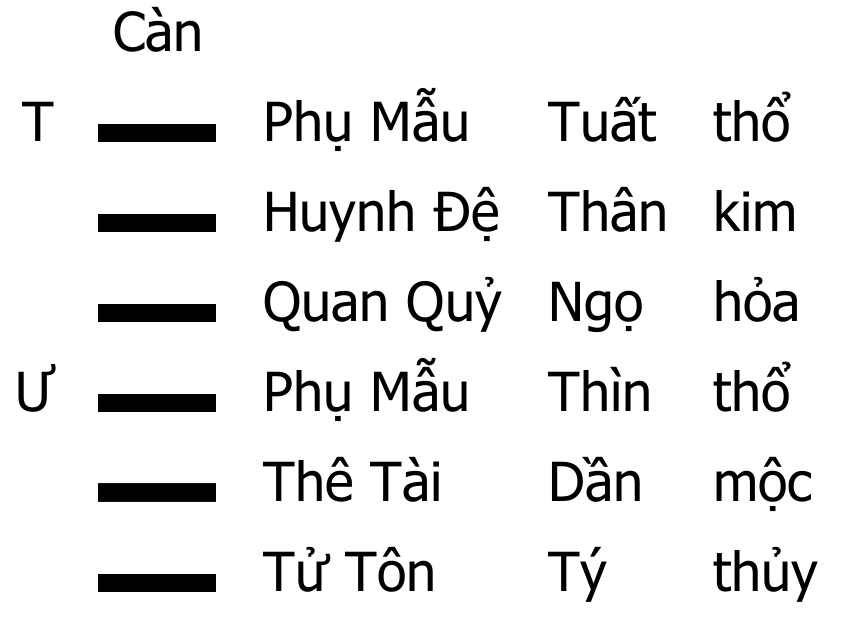

---

# CHƯƠNG 6: THẾ ỨNG

Càn Vi Thiên, Thế tại hào 6; Thiên Phong Cấu, Thế tại hào sơ; Thiên Sơn Độn, Thế tại hào 2; Thiên Địa Bĩ, Thế tại hào 3; Phong Địa Quan, Thế tại hào 4; Sơn Địa Bác, Thế tại hào 5; Hỏa Địa Tấn, Thế lùi về hào 4; Hỏa Thiên Đại Hữu, Thế lùi về hào 3.

Cách hào Thế hai vị trí là hào Ứng.

Các quẻ khác cũng tương tự như vậy.

# CHƯƠNG 7: ĐỘNG BIẾN

Sáu hào không động sẽ không biến, động ắt sẽ biến.

Hào trùng **O** vốn là hào dương, động nên biến thành hào âm ⚋.

Hào giao **X** vốn là hào âm, động nên biến thành hào dương ⚊.

Nếu hào sơ của quẻ Càn là hào động **O**, sẽ biến thành hào ⚋, là quẻ Tốn.

Nếu như các hào thượng và hào hạ của quẻ Càn đều là hào động sẽ biến thành quẻ Khảm:

━ O        ⚋  
━          ━  
━ O        ⚋  
━ O        ⚋  
━          ━  
━ O        ⚋  

Nếu trong quẻ Khôn chứa hào động sẽ biến thành quẻ Khảm:

⚋          ⚋  
⚋ X        ━  
⚋          ⚋  
⚋          ⚋  
⚋ X        ━  
⚋          ⚋  

Nếu như ba hào của quẻ Khôn đều động sẽ biến thành quẻ Càn:

⚋ X        ━  
⚋ X        ━  
⚋ X        ━  
⚋ X        ━  
⚋ X        ━  
⚋ X        ━

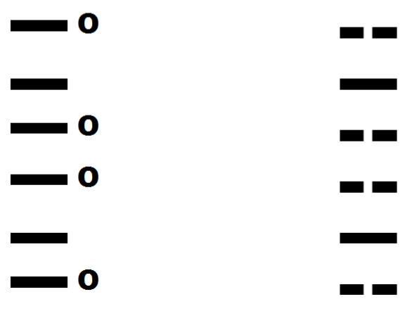

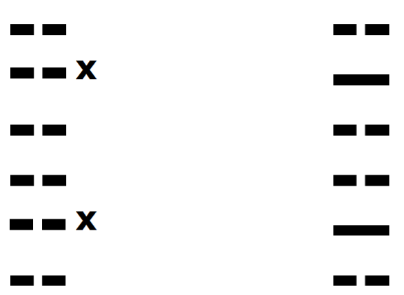

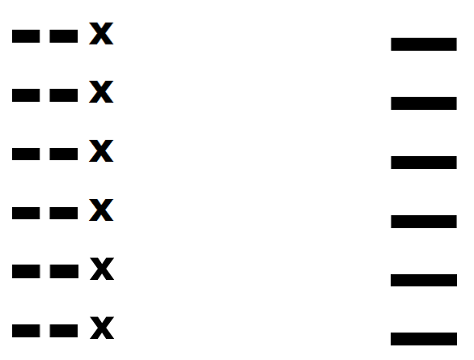

---

# CHƯƠNG 8. DỤNG THẦN

Ví dụ: Xem được quẻ Thủy Thiên Nhu biến Thiên Thủy Tụng:

| | Nhu | | | | | Tụng | | |
| :--- | :---: | :--- | :--- | :--- | :---: | :--- | :--- | :--- |
| | ▰▰ ▰▰ | Thê Tài | Tý | thủy | ▰▰▰▰▰ | Huynh Đệ | Tuất | thổ |
| | ▰▰▰▰▰ | Huynh Đệ | Tuất | thổ | ▰▰▰▰▰ | Tử Tôn | Thân | kim |
| T | ▰▰ ▰▰ | Tử Tôn | Thân | kim | ▰▰▰▰▰ | Phụ Mẫu | Ngọ | hỏa |
| | ▰▰▰▰▰ | Huynh Đệ | Thìn | thổ | ▰▰ ▰▰ | Phụ Mẫu | Ngọ | hỏa |
| | ▰▰▰▰▰ | Quan Quỷ | Dần | mộc | ▰▰▰▰▰ | Huynh Đệ | Thìn | thổ |
| Ư | ▰▰▰▰▰ | Thê Tài | Tý | thủy | ▰▰ ▰▰ | Quan Quỷ | Dần | mộc |

Gieo được quẻ Thủy Thiên Nhu, đây là quẻ chính (chính quái).

Biến được quẻ Thiên Thủy Tụng, đây là quẻ chi (chi quái), hay quẻ biến.

Ba hào trên là quẻ Khảm, tức Khảm là quẻ ngoại, trình tự sắp xếp là Thân kim, Tuất thổ, Tý thủy. Bởi vậy, hào 4 là Thân kim, hào 5 là Tuất thổ, hào 6 là Tý thủy.

Biến thành quẻ Càn, tức Càn là quẻ ngoại, trình tự sắp xếp là Ngọ hỏa, Thân kim, Tuất thổ. Bởi vậy nên Thân kim biến thành Ngọ hỏa, Tý thủy biến thành Tuất thổ, hào giữa không động nên không biến. Những hào được biến ra, khi sắp lục thân vẫn phải căn cứ theo ngũ hành của quẻ chính. Những quẻ khác cũng tương tự như vậy.

***

# CHƯƠNG 8: DỤNG THẦN

## 1. Hào Phụ Mẫu

Xem cho cha mẹ, lấy hào Phụ Mẫu trong quẻ làm Dụng thần.

Xem cho ông nội, ông ngoại, chú bác, cô dì, cha mẹ, phàm là những người thân thích hoặc trưởng bối bề trên của cha mẹ hoặc bằng vai với cha mẹ, cha mẹ vợ, nhũ mẫu, cha mẹ nuôi, cha mẹ kế, tất cả những người gọi là cha, mẹ, hoặc người ở xem cho chủ nhân, đều dùng hào Phụ Mẫu làm Dụng thần.

Xem về trời đất, thành trì, tường rào, nhà cửa, phòng ốc, thuyền bè, xe cộ, quần áo, đồ đi mưa, tơ lụa, vải vóc, đồ lông, cùng tấu chương, văn thư, văn chương, sách vở thư viện, văn khế đều lấy hào Phụ Mẫu làm Dụng thần. Sự vật là nhiều không kể xiết, nên phải dựa vào sự biến thông của con người. Tất cả những gì bảo vệ che chở cho thân ta, đều dùng Phụ Mẫu làm Dụng thần.

## 2. Hào Quan Quỷ

Xem về công danh, quan lại, sấm xét, quỷ thần, vợ xem cho chồng, đều dùng hào Quan Quỷ làm Dụng thần. Xem về gian thần, trộm cướp, tà ma, cũng lấy hào Quan Quỷ làm Dụng thần. Tất cả những sự việc có tính chất trói buộc ta đều thuộc trường hợp này.

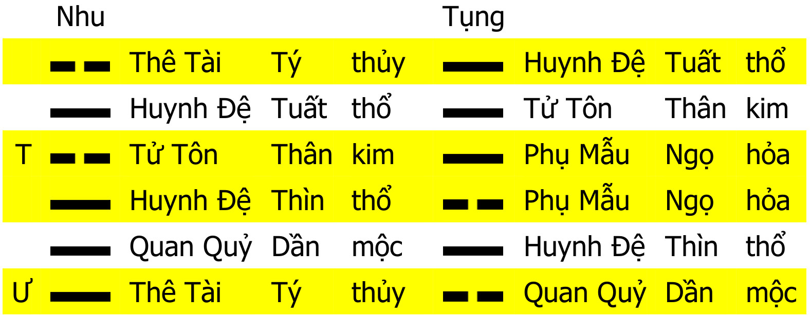

## 3. Hào Huynh Đệ

Xem về anh chị em ruột, anh chị em, cô dì trong họ, anh em rể, anh em kết nghĩa, đều dùng hào Huynh Đệ làm Dụng thần.

Anh em là người ngang hàng với mình, nếu họ được đắc chí sẽ khinh khi mình, thấy tài sản ắt sẽ đến đoạt. Bởi vậy, khi xem về của cải, thì đây chính là thần cướp của; khi xem về mưu sự, thì đây chính là thần cản trở; xem về thê thiếp nô bộc, thì đây là thần chủ về hình thương khắc hại.

Xem cho anh em rể, lấy hào Huynh Đệ làm Dụng thần, lần nào cũng ứng nghiệm.

Xem cho anh chị em họ, nếu dùng hào Huynh Đệ làm Dụng thần không linh nghiệm, thì lấy hào Ứng làm Dụng thần.

**Tân bình thích:** Chỗ này xem mức độ thân sơ với người được dự đoán, người không thân thì lấy Ứng làm Dụng, người thân thiết thì lấy Huynh Đệ làm Dụng.

## 4. Hào Thê Tài

Xem về thê thiếp, nô bộc, người dưới, phàm là những người bị ta điều khiển, đều lấy hào Thê Tài làm Dụng thần. Xem về hàng hóa, của cải, châu ngọc, vàng bạc, kho tàng, tiền bạc, lương thực, tức những vật dụng thiết yếu cho bản thân ta, đều lấy hào Thê Tài làm Dụng thần.

## 5. Hào Tử Tôn

Xem về con trai, con gái, con rể, cháu nội cháu ngoại, đồ đệ, phàm là ở vai con cháu, đều lấy hào Tử Tôn làm Dụng thần.

Xem về tôi trung, tướng tài, thầy thuốc, thuốc thang, sư sãi, đạo sĩ, binh lính, đều lấy hào Tử Tôn làm Dụng thần. Xem về gia cầm, gia súc, chim chóc, cũng lấy hào Tử Tôn làm Dụng thần.

Tử Tôn là thần chủ về phúc đức, chủ về chế ngự ma quỷ, chủ về giải trừ ưu phiền, nhưng lại cũng là thần chủ về bãi quan giáng chức. Bởi vậy mới gọi Tử Tôn là phúc thần, mọi sự gặp Tử Tôn đều là tốt lành, duy chỉ có xem về công danh là không nên gặp.

**Tân bình thích:** Trên đây trình bày những ý nghĩa thường gặp của lục thân, người mới học có thể hiểu rõ những ý nghĩa này là đã đủ dùng. Nhưng nếu muốn đoán quẻ một cách xuất sắc, thì chỉ nắm vững những ý nghĩa trên đây vẫn là chưa đủ. Đối với Thê Tài, trong dự đoán bệnh tật, Thê Tài có thể đại diện hô hấp, máu, nước mắt, phân và nước tiểu, kinh nguyệt, tinh dịch, trứng, rắm, lông tóc, tủy,... Những ý nghĩa này đều đã được tôi nghiệm chứng từng cái một ở trong thực tiễn. Tạm thời lấy những ý nghĩa trên đây làm kiến thức nhập môn, rồi sau này mới nghiên cứu sâu hơn.

---

# CHƯƠNG 9: DỤNG THẦN, NGUYÊN THẦN, KỴ THẦN, CỪU THẦN

Dụng thần: Tức là các loại Dụng thần đã đề cập đến ở chương trên.

Nguyên thần: Hào sinh ra Dụng thần là Nguyên thần.

Kỵ thần: Là hào khắc Dụng thần.

Cừu thần: Là hào khắc chế Nguyên thần, khiến không thể sinh Dụng thần, lại sinh ra Kỵ thần, mà khắc hại Dụng thần.

Nếu như kim là Dụng thần, sinh ra kim là thổ, nên thổ là Nguyên thần; khắc kim là hỏa, nên hỏa là Kỵ thần. Khắc thổ sinh hỏa là mộc, nên mộc là Cừu thần.

Bất kể là xem chuyện gì, trước tiên cần phải xác định hào nào là Dụng thần. Khi đã tìm ra Dụng thần, cần phải xem có được vượng tướng hay không? Có Nguyên thần động để sinh vượng, trợ giúp hay không? Có Kỵ thần động khiến cho bị khắc hại hay không?

Ví dụ: Vào ngày Mậu Thân tháng Thìn, xem về bệnh mới mắc của cha, được quẻ Càn Vi Thiên biến Phong Thiên Tiểu Súc.

Càn
 
Tiểu Súc

T | Phụ Mẫu Tuất thổ | Thê Tài Mão mộc Chu Tước

Huynh Đệ Thân kim | Quan Quỷ Tị hỏa Thanh Long

Quan Quỷ Ngọ hỏa | Phụ Mẫu Mùi thổ Huyền Vũ

Ư | Phụ Mẫu Thìn thổ | Phụ Mẫu Thìn thổ Bạch Hổ

Thê Tài Dần mộc | Thê Tài Dần mộc Đằng Xà

Tử Tôn Tý thủy | Tử Tôn Tý thủy Câu Trần

KIM 
Không Vong: Dần, Mão

Có người mang quẻ này đến hỏi ta rằng: "Bệnh gần gặp xung sẽ khỏi, quẻ này là quẻ lục xung, thế nhưng cha tôi bệnh rất nặng, nhờ ông xem giúp đến ngày nào sẽ khỏi bệnh?"

Ta đáp rằng: "Quẻ này có tổng cộng ba hào Phụ Mẫu Thìn thổ, Mùi thổ, Tuất thổ, cần chọn hào vượng tướng làm Dụng thần. Nay có Phụ Mẫu Thìn thổ gặp Nguyệt kiến, vậy lấy hào Thìn thổ làm Dụng thần. Bệnh đang rất nặng, là vì Nhật thần xung Dần mộc khiến Dần mộc ám động khắc Thìn thổ."

Người này bèn hỏi: "Trong quẻ này Ngọ hỏa phát động, Dần mộc tuy ám động nhưng lại sinh ra Ngọ hỏa, để Ngọ hỏa sinh thổ. Trong sách xưa có viết: Kỵ thần và Nguyên thần cùng động, thì sẽ được hai sinh. Nhưng nay ông chỉ quan tâm đến Dần mộc khắc Thìn thổ, mà không nói đến Ngọ hỏa sinh Thìn thổ, là tại sao?"

Ta bèn đáp rằng: "Ngọ hỏa tuy động hóa thành Mùi thổ, nhưng Ngọ lại hợp với Mùi, Ngọ hỏa tham hợp mà quên không sinh Thìn thổ, nên ở đây Thìn thổ chỉ bị khắc bởi Dần mộc, mà không được Ngọ hỏa tương sinh. Bởi vậy mà bệnh tình trầm trọng,

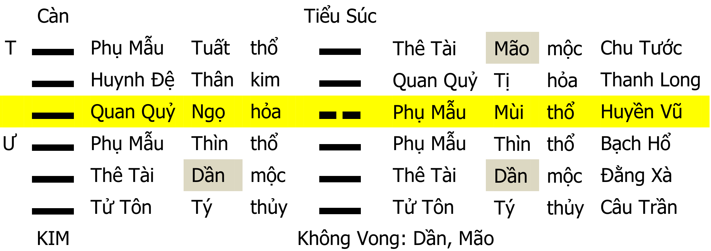 cần đợi đến ngày Sửu xung mất Mùi thổ, khi đó Ngọ hỏa không còn hợp để tham hợp, nên sẽ sinh mộc, tai họa sẽ lui."

Quả nhiên đến ngày Sửu khỏi bệnh.

**Tân bình thích:** Ví dụ này phân tích rất hay, nếu không biết thuyết tham hợp quên sinh, thì sẽ không nhìn thấu cát hung trong quẻ, càng không thể phán đoán chính xác ứng kỳ. Qua ví dụ này nên hiểu rõ cách dùng tham hợp quên sinh.

Ví dụ: Ngày Nhâm Tý tháng Dậu, một người gieo quẻ đoán phong thủy nhà ở, được quẻ Phong Thủy Hoán biến Thiên Thủy Tụng.

Hoán
 
Tụng

Phụ Mẫu Mão mộc | Tử Tôn Tuất thổ Bạch Hổ

T | Huynh Đệ Tị hỏa | Thê Tài Thân kim Đằng Xà

Tử Tôn Mùi thổ Tài-Dậu | Huynh Đệ Ngọ hỏa Câu Trần

Huynh Đệ Ngọ hỏa Quan-Hợi | Huynh Đệ Ngọ hỏa Chu Tước

Ư | Tử Tôn Thìn thổ | Tử Tôn Thìn thổ Thanh Long

Phụ Mẫu Dần mộc | Phụ Mẫu Dần mộc Huyền Vũ

HỎA 
Không Vong: Dần, Mão

Khi người này lấy quẻ này hỏi sức khỏe của vợ. Tôi nói với một học viên: "Anh tập đoán thử xem."

Vị học viên nhìn quẻ một lúc rồi nói: "Sức khỏe của vợ anh ta rất tốt, không có bệnh."

Tôi nói: "Anh đoán chưa đúng, vợ anh ta có bệnh, sao nói là sức khỏe tốt được? Anh xem như thế nào?"

Vị học viên trả lời: "Dụng thần hào Tài vượng tướng, không có gì khắc nó nên đoán như vậy."

Tôi nói: "Để tôi đoán tiếp nhé." Tôi quay sang nói với người gieo quẻ: "Vợ anh có bệnh nhũ tuyến tăng sinh và viêm phụ kiện."

Đối phương trả lời: "Quá đúng, vợ tôi có khối u trong vú, thường hay đau bụng." Học viên không hiểu liền hỏi lý do nhận định như vậy.

Tôi đáp: "Đoán sức khỏe của vợ anh ta thì nhìn hào Tài, hào 4 Tử Tôn động mà hóa ra Huynh Đệ Ngọ hỏa tương hợp với hào động, đây là tham hợp quên sinh, không sinh tức là có bệnh. Hào 4 là ngực, Tài là ẩm thực, cũng có thể hiểu là sữa, Tử Tôn là Nguyên thần có thể hiểu là vú. Lâm Câu Trần, Câu Trần là sưng trướng, vì vậy là nhũ tuyến tăng sinh. Hào 3 cũng ám động mà hợp Tử Tôn Mùi thổ, hào 3 Ngọ hỏa là Thai địa của Tử Tôn, Tử Tôn chủ con cái, Thai địa chính là chỗ mang thai, lại hào 3 là tử cung và khoang chậu, lâm Chu Tước, Chu Tước chủ viêm, vì vậy đoán có viêm phụ kiện."

Đây chính là chỗ huyền diệu của tham hợp quên sinh. Lý là cố định bất biến, nhưng khi đoán quẻ thì cần linh hoạt biến thông.

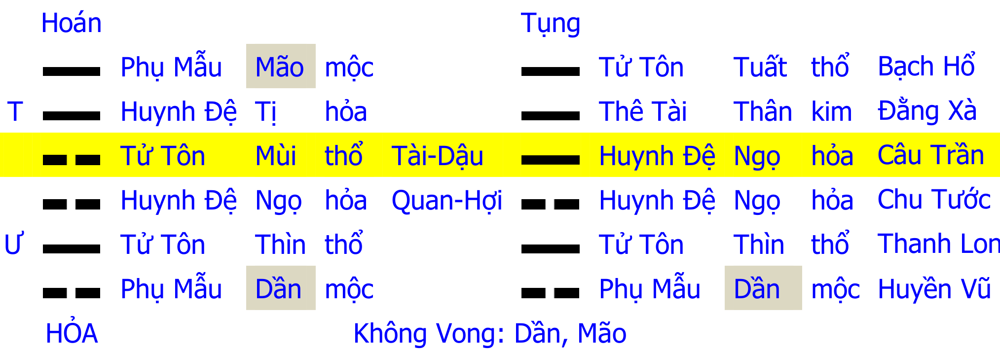

---

# CHƯƠNG 10: SỰ VƯỢNG SUY CỦA NGUYÊN THẦN, KỴ THẦN

## Nguyên thần

Nguyên thần tuy sinh Dụng thần, nhưng phải là vượng tướng mới sinh được.

*Có năm loại Nguyên thần có thể sinh Dụng thần:*

1. Nguyên thần được vượng tướng, hoặc gặp Nhật thần, Nguyệt kiến, hoặc được Nhật thần, Nguyệt kiến, hào động sinh vượng, trợ giúp.
2. Nguyên thần động hóa hồi đầu sinh, hoặc động hóa Tiến thần.
3. Nguyên thần gặp Trường Sinh, Đế Vượng tại Nhật thần.
4. Nguyên thần và Kỵ thần đều động.
5. Nguyên thần vượng động, nhưng gặp Tuần Không, hóa Tuần Không.

Sách xưa cho rằng Nguyên thần gặp Tuần Không, hóa Tuần Không là vô dụng, như vậy là sai lầm, không hiểu được nguyên lý động thì không bị Không, đợi đến ngày xung Không, thực Không, Nguyên thần lại hữu dụng, nên vẫn là cát, có thể sinh ra Dụng thần.

Năm loại Nguyên thần trên đều là Nguyên thần hữu lực, gặp được thì chuyện gì cũng tốt.

Ví dụ: Vào ngày Tân Hợi tháng Dậu, xem cầu danh cầu tài, được quẻ Đoài Vi Trạch biến Lôi Thủy Giải:

Đoán rằng: "Ngày Giáp Dần sẽ được của, cũng được như ý". Có người hỏi rằng: "Hào Thê Tài Mão mộc gặp Tuần Không, Nguyệt phá, lại bị hào động Dậu kim khắc; hào sơ Tị hỏa tuy sinh hào Thế, nhưng lại bị Nhật thần Hợi xung tán, hóa Tuần Không, vậy cát lợi ở chỗ nào?"

Ta bèn đáp rằng: "Thần hé lộ thiên cơ ở chỗ động, ta trước nay không hề nói đến khái niệm tán. Chính vì Tị hỏa hóa Tuần Không, nên trước mắt vẫn chưa thấy ứng nghiệm, đợi đến ngày Giáp Dần xuất Không sẽ đắc tài. Hào Tài Dần mộc sinh ra Quan, Quan sẽ sinh ra Thế". Quả nhiên đến sáng ngày Dần được của.

*Có sáu loại Nguyên thần tuy xuất hiện nhưng không thể sinh ra Dụng thần:*

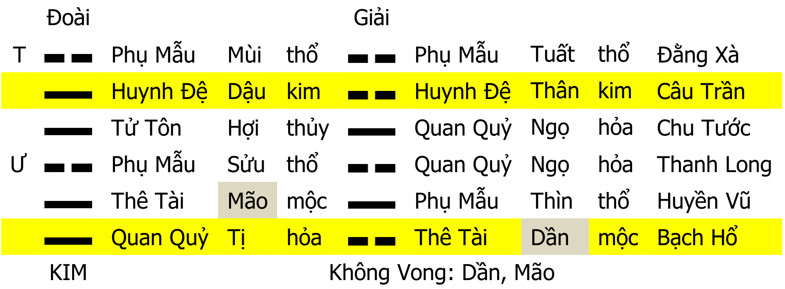

1. Nguyên thần hưu tù không phát động, hoặc động mà hưu tù, lại bị khắc thương.
2. Nguyên thần hưu tù, lại gặp Tuần Không, Nguyệt phá.
3. Nguyên thần hưu tù, động mà hóa Thoái thần.
4. Nguyên thần gặp suy, gặp Tuyệt.
5. Nguyên thần nhập Tam Mộ.
6. Nguyên thần hưu tù, động mà hóa Tuyệt, hóa Khắc, hóa Phá, hóa Tán.

Những trường hợp trên tuy thấy sinh nhưng lại không sinh, là Nguyên thần vô lực, có cũng như không.

## Kỵ thần

*Có năm loại Kỵ thần khi phát động sẽ khắc hại Dụng thần:*

1. Kỵ thần vượng tướng, hoặc được Nhật thần, Nguyệt kiến, hào động sinh vượng, phù trợ, hoặc gặp Nhật thần, Nguyệt kiến.
2. Kỵ thần động hóa hồi đầu sinh, hóa Tiến thần.
3. Kỵ thần vượng động, gặp Tuần Không, hóa Tuần Không.
4. Kỵ thần gặp Trường Sinh, Đế Vượng tại Nhật thần.
5. Kỵ thần và Cừu Thần cùng động.

Các loại Kỵ thần như trên đây đều rất dữ, xem việc gì gặp phải đều là đại hung.

*Có bảy loại Kỵ thần tuy động nhưng không khắc được Dụng thần:*

1. Kỵ thần hưu tù không động, động mà hưu tù, hoặc bị Nhật thần, Nguyệt kiến, hào động tương khắc.
2. Kỵ thần tĩnh mà gặp Tuần Không, Nguyệt phá.
3. Kỵ thần nhập Tam Mộ.
4. Kỵ thần suy mà động hóa thành Thoái thần.
5. Kỵ thần suy mà gặp Tuyệt.
6. Kỵ thần động hóa Tuyệt, hóa Khắc, hóa Phá, hóa Tán.
7. Kỵ thần và Nguyên thần cùng động.

Những trường hợp trên đều là Kỵ thần vô lực, xem chuyện gì cũng là biến hung thành cát.

Trên đây là bàn về trạng thái hữu lực, vô lực của Nguyên thần và Kỵ thần, nhưng Dụng thần cũng phải có khí. Nếu như Dụng thần vô căn (không gốc rễ), thì cho dù Nguyên thần hữu lực cũng khó sinh, cho dù Kỵ thần vô lực chưa chắc đã tốt.

Ví dụ: Ngày Ất Mùi tháng Tị, tự xem về bệnh tật, được quẻ Trạch Phong Đại Quá biến Hỏa Phong Đỉnh.

| Đại Quá | | | Đỉnh | | |
| :---: | :---: | :--- | :---: | :--- | :--- |
| | ▅▅ ▅▅ | Thê Tài Mùi thổ | ▅▅▅▅▅ | Tử Tôn Tị hỏa | Huyền Vũ |
| | ▅▅▅▅▅ | Quan Quỷ Dậu kim | ▅▅ ▅▅ | Thê Tài Mùi thổ | Bạch Hổ |
| T | ▅▅▅▅▅ | Phụ Mẫu Hợi thủy Tử-Ngọ | ▅▅▅▅▅ | Quan Quỷ Dậu kim | Đằng Xà |
| | ▅▅▅▅▅ | Quan Quỷ Dậu kim | ▅▅▅▅▅ | Quan Quỷ Dậu kim | Câu Trần |
| | ▅▅▅▅▅ | Phụ Mẫu Hợi thủy Huynh-Dần | ▅▅▅▅▅ | Phụ Mẫu Hợi thủy | Chu Tước |
| Ư | ▅▅ ▅▅ | Thê Tài Sửu thổ | ▅▅ ▅▅ | Thê Tài Sửu thổ | Thanh Long |

MỘC Không Vong: Thìn, Tị

Quẻ này tự xem bệnh cho mình, nên lấy hào Thế Hợi thủy làm Dụng thần, bị Kỵ thần là Mùi thổ động nên khắc thủy, may nhờ có Nguyên thần là Dậu kim cũng động, nên Kỵ thần Mùi thổ hồi đầu sinh Nguyên thần Dậu kim. Kim lại sinh Dụng thần Hợi thủy, tiếp tục tương sinh, nên hóa hung thành cát. Thế nhưng Hợi thủy lại bị Nguyệt kiến xung (tháng xung), Nhật thần khắc (ngày khắc), gặp Nguyệt phá nên bị khắc, tuy được sinh phò, nhưng được sinh cũng không khởi vượng được. Cũng như cây không rễ, cằn cỗi không thể hồi sinh. Quả nhiên người này sau chết vào ngày Quý Mão. Sở dĩ ứng vào ngày Mão, vì ngày đó xung mất Nguyên thần. Như vậy gọi là Dụng thần vô căn (không có gốc), cho dù Nguyên thần có lực cũng khó sinh.

**Tân bình thích:** Ví dụ này hung, chẳng những Dụng thần vô căn, Thê Tài Sửu thổ ám động, đã khắc Dụng thần, lại khiến cho Nguyên thần nhập Mộ, khắc nhiều sinh ít, Kỵ thần vô chế, ngày Mão lại là Tử địa Dụng thần, vì vậy là hung.

Ví dụ, tôi được nghiệm một ví dụ, có thể cùng nghiên cứu với ví dụ này. Ngày Tân Hợi tháng Tý, bạn tôi đoán ngày hôm sau muốn đến Bắc Kinh ra sao? Được quẻ Địa Thủy Sư biến Thủy Trạch Tiết.

| Sư | | | Tiết | | |
| :---: | :---: | :--- | :---: | :--- | :--- |
| Ư | ▅▅ ▅▅ | Phụ Mẫu Dậu kim | ▅▅ ▅▅ | Huynh Đệ Tý thủy | Đằng Xà |
| | ▅▅ ▅▅ | Huynh Đệ Hợi thủy | ▅▅▅▅▅ | Quan Quỷ Tuất thổ | Câu Trần |
| | ▅▅ ▅▅ | Quan Quỷ Sửu thổ | ▅▅ ▅▅ | Phụ Mẫu Thân kim | Chu Tước |
| T | ▅▅ ▅▅ | Thê Tài Ngọ hỏa | ▅▅ ▅▅ | Quan Quỷ Sửu thổ | Thanh Long |
| | ▅▅▅▅▅ | Quan Quỷ Thìn thổ | ▅▅▅▅▅ | Tử Tôn Mão mộc | Huyền Vũ |
| | ▅▅ ▅▅ | Tử Tôn Dần mộc | ▅▅▅▅▅ | Thê Tài Tị hỏa | Bạch Hổ |

THỦY Không Vong: Dần, Mão

Tôi đoán: Lần này đi Bắc Kinh có thể được tài, rất có lợi.

Anh ta nói: Tôi chẳng đi cầu tài, chỉ là đi chơi thôi, ông xem cát hung thế nào?

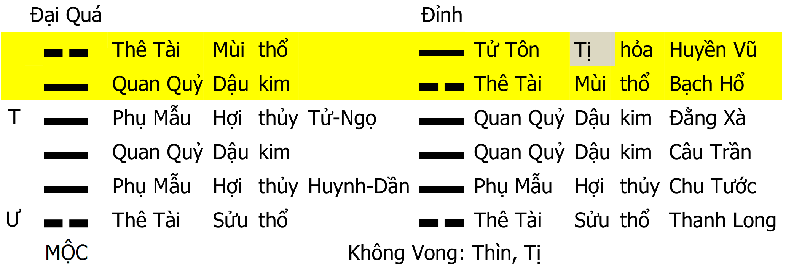

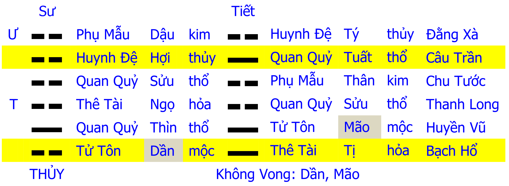

Tôi nói: Chuyến đi này cát lợi, ngày Đinh Tị trở về, có thể kiếm được khá nhiều tiền.

Anh ta nói: Tôi dự định trở về vào ngày Bính Thìn, chẳng ăn khớp với dự đoán.

Tôi nói: Hãy cứ xem ứng nghiệm ra sao.

Sau đó anh ta đi Bắc Kinh đúng là được một vạn nguyên, vốn dự định ngày Bính Thìn quay về, nhưng bởi vì có việc nên lùi lại một hôm. Trở về vào ngày Đinh Tị. Anh ta hỏi tôi: Nhật Nguyệt khắc Tài, Dụng thần vô căn, hào Thế Tài tinh Nguyệt phá, trong quẻ lại có Kỵ thần phát động, mặc dù có Tử Tôn cùng động tương giải, nhưng Tử Tôn Không Vong, lại động mà hóa Phá, phải đoán là bản thân gặp hung, lại xảy ra chuyện phá tài mới đúng chứ?

Tôi đáp, quẻ này mặc dù Dụng thần có thể nói là vô căn, nhưng thần triệu cơ ở động, mặc dù Kỵ thần động, nhưng Tử Tôn Dần mộc động mà hợp Kỵ thần, Dần mộc lại sinh hào Thế, huống hồ Kỵ thần động hóa hồi đầu khắc, Tử Tôn vượng mà động ở trong quẻ, xuất hành bình an. Thế lâm Thanh Long, Thanh Long là vui mừng, được Tử Tôn động sinh, tất có hỉ. Hào sơ là chân, động mà hóa Tài, xuất hành tất được tài. Tử Tôn cũng là Nguyên thần của hào Thế, ngày Tị thực Phá, ngày Tị sẽ trở về.

Lại như ngày Mậu Tý tháng Sửu, tự xem về bệnh của mình, được Thiên Hỏa Đồng Nhân biến Hỏa Sơn Lữ.

| Đồng Nhân | | | Lữ | | |
| :---: | :---: | :--- | :---: | :--- | :--- |
| Ư | ▅▅▅▅▅ | Tử Tôn Tuất thổ | ▅▅▅▅▅ | Huynh Đệ Tị hỏa | Chu Tước |
| | ▅▅▅▅▅ | Thê Tài Thân kim | ▅▅ ▅▅ | Tử Tôn Mùi thổ | Thanh Long |
| | ▅▅▅▅▅ | Huynh Đệ Ngọ hỏa | ▅▅▅▅▅ | Thê Tài Dậu kim | Huyền Vũ |
| T | ▅▅▅▅▅ | Quan Quỷ Hợi thủy | ▅▅▅▅▅ | Thê Tài Thân kim | Bạch Hổ |
| | ▅▅ ▅▅ | Tử Tôn Sửu thổ | ▅▅ ▅▅ | Huynh Đệ Ngọ hỏa | Đằng Xà |
| | ▅▅▅▅▅ | Phụ Mẫu Mão mộc | ▅▅ ▅▅ | Tử Tôn Thìn thổ | Câu Trần |

HỎA Không Vong: Ngọ, Mùi

Tự xem về bệnh của mình thì dùng hào Thế làm Dụng thần, hào Thế Hợi thủy, được Nhật thần Tý thủy trợ giúp, lại được Nguyên thần Thân kim động mà tương sinh, đó là tượng không chết. Nhưng lại hiểm vì Thân kim gặp Mộ tại Nguyệt kiến Sửu, e khó giữ được mạng sống. Nên mời mẹ anh ta xem thêm một quẻ nữa, được quẻ Ly biến Đại Hữu.

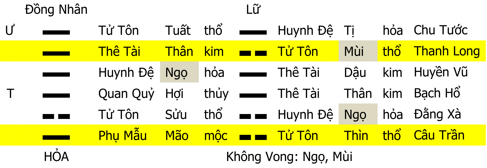

Mẹ xem cho con, lấy hào Tử Tôn làm Dụng thần, Tử Tôn Sửu thổ tuy gặp Nguyệt kiến, nhưng động hóa thành Dần mộc hồi đầu khắc là không tốt, trước mắt tuy được yên lành, nhưng đến tiết Lập Xuân, khi mộc vượng thổ suy, ắt sẽ chết. Lại hợp với quẻ trước, hào Thế Hợi thủy được Nguyên thần Thân kim sinh, đến tháng Dần xung mất Thân kim sẽ nguy đến tính mạng. Quả nhiên người này chết vào tiết Lập Xuân.

Phàm là xem về bệnh tật, cả nhà đều có thể xem thay, gộp các quẻ lại để suy đoán, sẽ biết được thời điểm nào sẽ khỏi bệnh hay chết. Tượng quẻ nên tốt nhiều dữ ít, thì phán đoán họa phúc mới được chính xác. Trong quẻ thứ nhất, Nguyên thần là Thân kim động mà sinh hào Thế, nên đoán là đến ngày Thân bệnh sẽ lui. Nhưng lại xét quẻ sau, Tử Tôn Sửu thổ biến thành hào Dần mộc hồi đầu khắc, đến tháng Dần sẽ nguy, mới ngộ ra rằng vì tháng Dần xung mất Thân kim, nên mới nguy đến tính mạng.

**Tân bình thích:** Trước nói Tam Mộ là Nhật Mộ, động Mộ và hóa Mộ, Nguyệt Mộ hoàn toàn không được đưa vào Tam Mộ. Ở đây lại nói Nguyệt Mộ là thế nào? Người xưa xem Mộ là hung, trên thực tế đó là một nhận thức sai lầm về Mộ khố. Cát hung chủ yếu xem lực sinh khắc của Nhật Nguyệt hào động đối với Dụng thần ra sao, Mộ khố chỉ phụ họa cho Dụng thần theo góc độ tượng và phân rõ ý nghĩa phán đoán mà thôi. Theo như quẻ đầu tiên, tự xem bệnh, Nguyệt kiến là thổ khắc chế Dụng thần, Nguyên thần nhập Nguyệt Mộ, Nguyên thần là tư duy và thế giới nội tâm của con người, Nguyên thần nhập Mộ, chính là tượng không có tinh thần. Dụng thần không cát, trong quẻ Phụ Mẫu Mão mộc phát động, Mão mộc là Tử địa của Dụng thần, trợ khởi Huynh Đệ Ngọ hỏa, Nhật xung tạo thành ám động, khắc chế Nguyên thần, Nguyên thần lại động mà hóa Phá, vì vậy là hung, tháng Dần Cừu thần được trợ, Nguyên thần bị xung mất, vì vậy mà ứng vào tháng Dần.

Ví dụ: Ngày Quý Mùi tháng Tuất, Dịch hữu Mao tiên sinh ở Giang Tô hỏi tôi, cha vợ của một người bị tai nạn xe cộ nhập viện, ông ta đoán là cát, ý kiến tôi thế nào? Quẻ Sơn Trạch Tổn biến Địa Trạch Lâm.

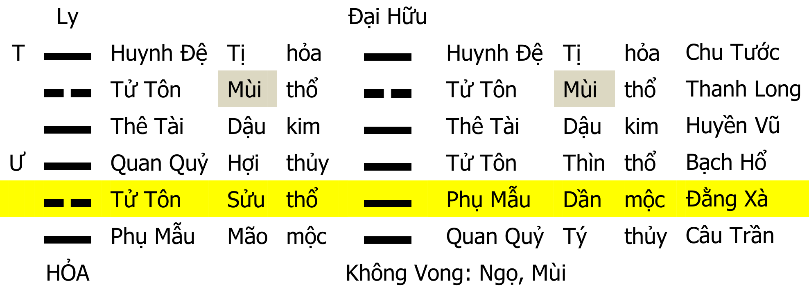

Tôi đáp: Cha vợ người này đã hôn mê bất tỉnh, tháng Hợi tất hung. Kết quả là mất ở tháng Hợi.

Quẻ này Nhật Nguyệt không khắc Dụng thần, Dụng thần nhập Mộ ở Nguyệt, chính là tượng hôn mê. Trong quẻ mặc dù được Nguyên thần động mà đến sinh, nhưng Nguyên thần cũng hưu tù vô lực, động hóa hồi đầu khắc, vô lực sinh Dụng, đến tháng Hợi Nguyên thần bị hợp không thể sinh Dụng, Dụng thần lâm Tuyệt, tất hung. Người đời chỉ biết Dụng thần vô khắc, được Nguyên thần động mà đến sinh là cát, mà không biết Nguyên thần bị thương vô lực sinh Dụng cũng là hung.

Tuy nhiên, phương pháp của Dã Hạc là một quẻ không rõ thì xem thêm quẻ nữa, hợp các quẻ lại mà quyết, đây cũng là một cách dễ làm. Đáng được đề xướng.

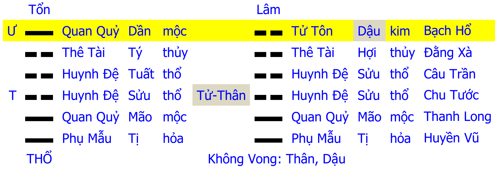

---

# CHƯƠNG 11: NGŨ HÀNH TƯƠNG SINH

Kim sinh thủy, thủy sinh mộc, mộc sinh hỏa, hỏa sinh thổ, thổ sinh kim.

Dụng thần và Nguyên thần, nên được tương sinh, như được Nguyệt kiến sinh, Nhật kiến sinh, hào động sinh, động hóa hồi đầu sinh.

Ví dụ: Ngày Kỷ Mão tháng Mão, em trai xem cho anh trai đang mắc tội lớn, mẹ đi kêu oan liệu có cứu được không, được quẻ Phục biến Chấn:

| Phục | Chấn |
| :--- | :--- |
| ▅▅ ▅▅ Tử Tôn Dậu kim | ▅▅ ▅▅ Huynh Đệ Tuất thổ Câu Trần |
| ▅▅ ▅▅ Thê Tài Hợi thủy | ▅▅ ▅▅ Tử Tôn Thân kim Chu Tước |
| Ư ▅▅ ▅▅ Huynh Đệ Sửu thổ | ▅▅▅▅▅ Phụ Mẫu Ngọ hỏa Thanh Long |
| ▅▅ ▅▅ Huynh Đệ Thìn thổ | ▅▅ ▅▅ Huynh Đệ Thìn thổ Huyền Vũ |
| ▅▅ ▅▅ Quan Quỷ Dần mộc Phụ-Tị | ▅▅ ▅▅ Quan Quỷ Dần mộc Bạch Hổ |
| T ▅▅▅▅▅ Thê Tài Tý thủy | ▅▅▅▅▅ Thê Tài Tý thủy Đằng Xà |

THỔ Không Vong: Thân, Dậu

Lấy hào Huynh Đệ làm Dụng thần, hào Huynh Đệ Sửu thổ động, bị Nhật thần, Nguyệt kiến Mão mộc tương khắc, chủ về tội lớn khó thoát. Nhưng may được Huynh Đệ Sửu thổ biến thành Phụ Mẫu Ngọ hỏa, hồi đầu tương sinh. Nên đoán rằng: "Cần mau chóng đi kêu oan, Phụ Mẫu sinh Huynh, ý tứ của thần linh đã rõ ràng". Về sau, quả nhiên được miễn tội chết.

**Tân bình thích:** Ví dụ này Huynh Đệ được cứu, chính là Nguyên thần được Nhật Nguyệt sinh trợ, vượng mà có lực sinh Dụng thần, lại lâm Thanh Long, là tượng trong hung có hỉ. Nếu như Nguyên thần hưu tù vô lực, chưa hẳn được cứu.

Ví dụ: Năm Tân Tị có Dịch hữu Trương tiên sinh ở Đường Sơn đến thăm và đưa tôi xem một quẻ, ngày Canh Thân tháng Mùi, xem em gái bên ngoài bao giờ trở về? Được quẻ Hỏa Sơn Lữ biến Càn Vi Thiên, bảo tôi phán đoán.

| Lữ | Càn |
| :--- | :--- |
| ▅▅▅▅▅ Huynh Đệ Tị hỏa | ▅▅▅▅▅ Tử Tôn Tuất thổ Đằng Xà |
| ▅▅ ▅▅ Tử Tôn Mùi thổ | ▅▅▅▅▅ Thê Tài Thân kim Câu Trần |
| Ư ▅▅▅▅▅ Thê Tài Dậu kim | ▅▅▅▅▅ Huynh Đệ Ngọ hỏa Chu Tước |
| ▅▅▅▅▅ Thê Tài Thân kim Quan-Hợi | ▅▅▅▅▅ Tử Tôn Thìn thổ Thanh Long |
| ▅▅ ▅▅ Huynh Đệ Ngọ hỏa | ▅▅▅▅▅ Phụ Mẫu Dần mộc Huyền Vũ |
| T ▅▅ ▅▅ Tử Tôn Thìn thổ Phụ-Mão | ▅▅▅▅▅ Quan Quỷ Tý thủy Bạch Hổ |

HỎA Không Vong: Tý, Sửu

Tôi đoán rằng: Em gái người này sẽ không trở về, sợ rằng đã tự sát ở bên ngoài.

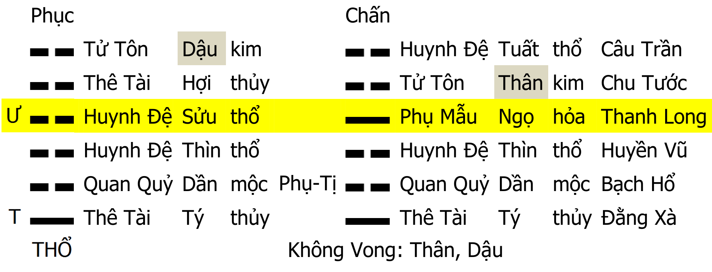

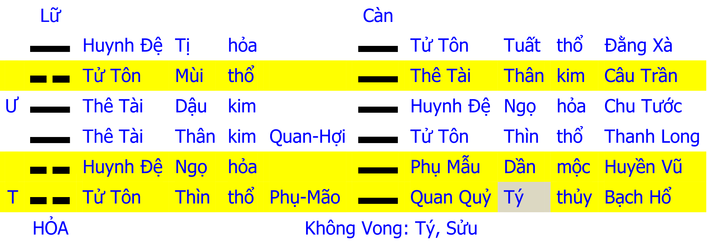

Trương tiên sinh đáp: Hôm trước ngày gieo quẻ, tức là ngày Đinh Mùi, cô gái này đã nằm đường ray tự sát. Trong quẻ Dụng thần động hóa hồi đầu sinh, tại sao không trở về được? Làm sao ông biết là tự sát?

Tôi trả lời: Trong quẻ này Dụng thần Huynh Đệ Ngọ hỏa Nguyệt hợp là có khí, lại động hồi đầu sinh, nhưng hóa ra Nguyên thần nhập Mộ ở Nguyệt kiến, Nhật thần khắc Tuyệt, vô lực sinh Dụng, trở về là xác chết.

Nguyên thần chính là tư duy và thế giới nội tâm của một cá nhân, Dụng thần lâm hào 2, hào 2 là trạch (nơi ở), Nguyên thần không hiện trên quẻ, Mộ ở Nguyệt kiến và hào động Mùi thổ, Tuyệt ở Nhật, không thể sinh hào 2 Dụng thần, chính là bản thân cô gái không muốn về nhà. Dụng thần, Nguyên thần hưu tù, Nguyên thần gặp một trong Tử Mộ Tuyệt, phần lớn là tự sát, Nguyên thần Tử tại Ngọ hỏa, Mộ tại Mùi thổ, Tuyệt tại Thân kim, Tử Mộ Tuyệt đều đầy đủ, vì vậy mới dám đoán là tự sát.

Quẻ này rất hay, Nguyên thần Mộ ở hào 5, Dụng thần cũng hợp ở hào 5, hào 5 là đường đi, hóa ra Thân kim, chính là đường ray, tượng nằm đường ray tự sát rất rõ ràng.

Lại ví dụ: Ngày Bính Thân tháng Tị, xem về bệnh tật, được quẻ Cấu:

| Cấu | |
| :--- | :--- |
| ▅▅▅▅▅ Phụ Mẫu Tuất Thổ | Thanh Long |
| ▅▅▅▅▅ Huynh Đệ Thân Kim | Huyền Vũ |
| Ư ▅▅▅▅▅ Quan Quỷ Ngọ Hỏa | Bạch Hổ |
| ▅▅▅▅▅ Huynh Đệ Dậu Kim | Đằng Xà |
| ▅▅▅▅▅ Tử Tôn Hợi Thủy Tài-Dần | Câu Trần |
| T ▅▅ ▅▅ Phụ Mẫu Sửu Thổ | Chu Tước |

KIM Không Vong: Thìn, Tị

Thầy thuốc mang quẻ này đến hỏi ta rằng: "Người nọ mắc bệnh rất hiểm nghèo, nên tôi bảo người bệnh gieo quẻ xem uống thuốc có chữa được hay không? Quẻ này Nguyệt kiến Tị hỏa, hào Ứng là Ngọ hỏa sinh hào Thế Mão mộc, chủ về chữa khỏi được, tại sao uống thuốc đều không có tác dụng?"

Ta bèn đáp rằng: "Ý tứ của quẻ này rất rõ ràng, chẳng qua là anh xem sai. Xem về thuốc thang cần lấy hào Tử Tôn làm Dụng thần, lấy hào Phụ Mẫu làm Kỵ thần. Quẻ này Hợi thủy là Tử Tôn, gặp Nguyệt phá mà vô căn, được Nhật thần Thân tương sinh cũng không sinh khởi được, hào Thế là Phụ Mẫu lại khắc Tử Tôn. Như vậy gọi là Phụ Mẫu trì Thế, có thuốc thần cũng khó chữa, như vậy uống thuốc làm sao có tác dụng được? Chẳng phải là quẻ không chính xác, mà do anh suy đoán không đúng mà thôi".

**Tân bình thích:** Luận bàn này của Dã Hạc không đúng, Tử Tôn mặc dù là Nguyệt phá, sao lại Nhật sinh bất khởi? Đây là dạy người ta "hễ là hào Nguyệt phá thì khỏi cần xem Nhật, Nguyệt phá thì vô căn, Nhật sinh cũng suy ra là hung", cái lý này dễ khiến chúng ta lầm đường lạc lối. Quẻ này ý nghĩ xem thuốc phát sinh từ thầy thuốc, không phải từ nội tâm của người bệnh, mặc dù là người bệnh gieo quẻ, nhưng

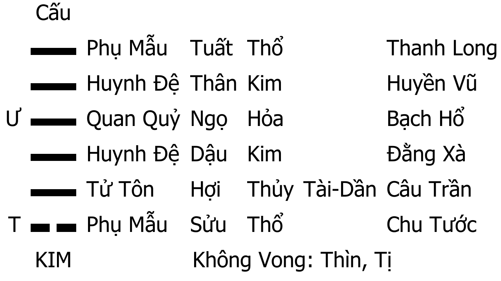

---

# CHƯƠNG 12. NGŨ HÀNH TƯƠNG KHẮC

vẫn coi như thầy thuốc gieo quẻ xem cho người bệnh, lấy Ứng làm Dụng thần. Dã Hạc bảo người ta xem nhiều quẻ chính là mời, người thầy thuốc này bảo người ta gieo quẻ chính là mệnh lệnh, có sự khác biệt về bản chất. Trong quẻ Ứng là người bệnh, mặc dù được Nguyệt kiến trợ giúp, nhưng Nguyên thần không ở trong quẻ, không được Nguyệt sinh, Nhật thần khắc, vô lực sinh Dụng, vì vậy thuốc không công hiệu. Tử Tôn là thuốc, chính là lục thân khắc Dụng thần, uống thuốc làm sao có hiệu nghiệm?

***

# CHƯƠNG 12: NGŨ HÀNH TƯƠNG KHẮC

Kim khắc mộc, mộc khắc thổ, thổ khắc thủy, thủy khắc hỏa, hỏa khắc kim.

Kỵ thần và Cừu thần, nên gặp khắc, như bị Nguyệt kiến khắc, Nhật thần khắc, hào động khắc, động hóa hồi đầu khắc.

Nếu như Dụng thần, Nguyên thần gặp một trong bốn thứ khắc trên đây, lại không được những hào khác sinh vượng, phò trợ, thì là điềm hung. Xem về việc tốt, ắt vui quá hóa buồn; xem về việc xấu, cần phải nhanh chóng tránh né.

Ví dụ: Ngày Mậu Thìn tháng Mão, xem về việc cha đang vướng chuyện kiện tụng, đã bị khép tội nặng, được quẻ Trạch Địa Tụy biến Thiên Hỏa Đồng Nhân:

| Tụy | | | Đồng Nhân | | |
| :--- | :--- | :--- | :--- | :--- | :--- |
| | - - | Phụ Mẫu Mùi thổ | — | Phụ Mẫu Tuất thổ | Chu Tước |
| Ứ | — | Huynh Đệ Dậu kim | — | Huynh Đệ Thân kim | Thanh Long |
| | — | Tử Tôn Hợi thủy | — | Quan Quỷ Ngọ hỏa | Huyền Vũ |
| | - - | Thê Tài Mão mộc | — | Tử Tôn Hợi thủy | Bạch Hổ |
| T | - - | Quan Quỷ Tị hỏa | - - | Phụ Mẫu Sửu thổ | Đằng Xà |
| | - - | Phụ Mẫu Mùi thổ | — | Thê Tài Mão mộc | Câu Trần |

KIM Không Vong: Tuất, Hợi

Tại quẻ ngoại, hào Phụ Mẫu Mùi thổ bị Nguyệt kiến Mão khắc. Tại quẻ nội, Hợi, Mão, Mùi hợp thành tam hợp mộc cục, khắc chế Mùi thổ; Phụ Mẫu bị Nguyệt kiến khắc, bị Nhật thần hình, nên không còn cứu vãn được. Về sau, quả nhiên người cha bị khép trọng hình.

**Tân bình thích:** Nhật là Thìn thổ, chẳng tương hình với Dụng thần Mùi thổ, mà là tương hình với hào biến. Nhật là Mộ khố của Dụng thần, Dụng thần lâm Chu Tước gặp hình mà nhập Mộ, Chu Tước là quan phi khẩu thiệt, nhập Mộ là mất tự do, tổng hợp lại là tượng vào tù. Tam hợp cục lâm Bạch Hổ, Bạch Hổ là dụng cụ tra tấn, đao thương..., khắc Dụng thần, tất bị trọng hình.

Cùng ngày tháng trên, em gái xem cho anh trai vướng chuyện kiện tụng, đã bị khép trọng tội, được quẻ Thiên Địa Bĩ biến Thiên Thủy Tụng:

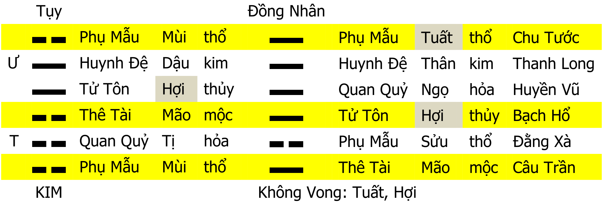

| Bĩ | | | Tụng | | |
| :--- | :--- | :--- | :--- | :--- | :--- |
| Ứ | — | Phụ Mẫu Tuất thổ | — | Phụ Mẫu Tuất thổ | Chu Tước |
| | — | Huynh Đệ Thân kim | — | Huynh Đệ Thân kim | Thanh Long |
| | — | Quan Quỷ Ngọ hỏa | — | Quan Quỷ Ngọ hỏa | Huyền Vũ |
| T | - - | Thê Tài Mão mộc | - - | Quan Quỷ Ngọ hỏa | Bạch Hổ |
| | - - | Quan Quỷ Tị hỏa | — | Phụ Mẫu Thìn thổ | Đằng Xà |
| | - - | Phụ Mẫu Mùi thổ Tử-Tý | - - | Thê Tài Dần mộc | Câu Trần |

KIM Không Vong: Tuất, Hợi

Lấy hào Huynh Đệ Thân kim làm Dụng thần, hào Quan Quỷ Tị hỏa động, hình khắc Thân kim, nên trọng tội đã định. May được Nhật thần Thìn xung động Phụ Mẫu Tuất thổ, khiến Tuất thổ ám động mà sinh ra Thân, là trong khắc gặp sinh, nếu còn cha mẹ, ắt được cứu. Sau vì cha người này tuổi đã bát tuần, nên theo lệ nộp tiền chuộc mà được miễn tội chết.

**Tân bình thích:** Quẻ này Nguyệt hợp Tuất thổ là hợp vượng, lại được Quan Quỷ Tị hỏa sinh, vì vậy Nhật xung là ám động. Đồng thời Nhật Nguyệt không khắc Dụng thần, Dụng thần vốn được Nhật sinh phù là có căn (có gốc rễ), nếu Nhật Nguyệt khắc Dụng thì dù cho có Nguyên thần ám động cũng chưa hẳn là cát.

Lại ví dụ: Vào ngày Quý Hợi tháng Mão, sau khi chuyển sang ở nhà mới, người nhà không được yên ổn, xem được quẻ Thủy Thiên Nhu biến Càn Vi Thiên:

| Nhu | | | Càn | | |
| :--- | :--- | :--- | :--- | :--- | :--- |
| | - - | Thê Tài Tý thủy | — | Huynh Đệ Tuất thổ | Bạch Hổ |
| | — | Huynh Đệ Tuất thổ | — | Tử Tôn Thân kim | Đằng Xà |
| T | - - | Tử Tôn Thân kim | — | Phụ Mẫu Ngọ hỏa | Câu Trần |
| | — | Huynh Đệ Thìn thổ | — | Huynh Đệ Thìn thổ | Chu Tước |
| | — | Quan Quỷ Dần mộc Phụ-Tị | — | Quan Quỷ Dần mộc | Thanh Long |
| Ứ | — | Thê Tài Tý thủy | — | Thê Tài Tý thủy | Huyền Vũ |

THỔ Không Vong: Tý, Sửu

Hào Tử Tôn Thân kim trì Thế, biến thành Ngọ hỏa hồi đầu khắc, như vậy là bản thân cùng con cháu đều bị khắc. Hào 6 Tài Tý thủy động hóa thổ hồi đầu khắc thủy, Tài là tượng trưng cho thê thiếp nô bộc, nên chủ về cả nhà bị hại, cần nhanh chóng chuyển đi chỗ khác.

Người này bèn hỏi rằng: "Nếu sửa đổi hướng cổng, liệu có tránh được tai họa không?" Ta bèn đáp: "Không thể! Vì phạm kỵ hồi đầu khắc bản thân mình, đến mùa hạ hỏa vượng, ắt gặp tai họa".

Nhà người này nằm bên sông Hoàng Hà, vì chần chừ chưa chuyển, sang tháng Ngọ vỡ đê, cả nhà chín người trôi theo sóng nước. Ứng vào tháng Ngọ, vì đến Ngọ là hỏa thịnh, khắc Thế khắc Tử, lại xung Tý thủy Thê Tài, chủ về cả nhà gặp họa.

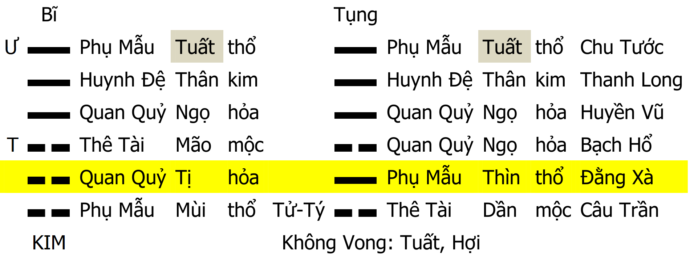

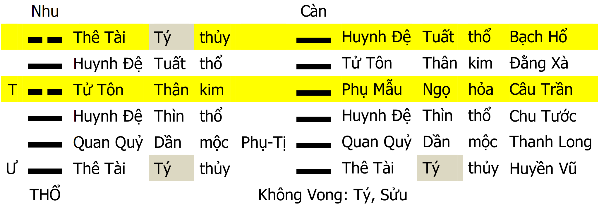

---

# CHƯƠNG 13. KHẮC XỨ PHÙNG SINH

Thánh nhân làm ra "Dịch", để giúp người ta tìm cát tránh hung. Người không xem mà không biết, đó là số trời. Xem mà thần linh không mách cho, đó cũng là số trời. Quẻ đã xem, đã được thần linh mách bảo, tức biết rõ mà vẫn làm trái, thì không thể đổ tất cả cho số, mà là mệnh.

***

# CHƯƠNG 13: KHẮC XỨ PHÙNG SINH

Bị hào này khắc, lại được hào khác sinh, như vậy là khắc xứ phùng sinh (trong khắc gặp sinh).

Dụng thần, Nguyên thần, được khắc ít sinh nhiều là cát lợi.

Còn với Kỵ thần, bị khắc ít sinh nhiều là hung, bởi vậy Kỵ thần nên gặp khắc, không nên gặp sinh.

**Tân bình thích:** Lý này của Dã Hạc rất đúng, nếu như sức mạnh của Kỵ thần và Dụng thần tương đương, không thể phân biệt, thì hãy xem sự suy vượng của Nguyên thần và Cừu thần ra sao, Nguyên thần vượng thì đoán là cát, Cừu thần vượng thì đoán là hung.

Ví dụ: Vào ngày Bính Thân tháng Thìn, xem cho em trai bị bệnh đậu mùa, đã đến lúc nguy kịch, được Ký Tế biến Cách:

| | Ký Tế | | Cách | |
| :--- | :--- | :--- | :--- | :--- |
| Ư | ▅▅ ▅▅ Huynh Đệ Tý thủy | | ▅▅ ▅▅ Quan Quỷ Mùi thổ | Thanh Long |
| | ▅▅▅▅▅ Quan Quỷ Tuất thổ | | ▅▅▅▅▅ Phụ Mẫu Dậu kim | Huyền Vũ |
| | ▅▅ ▅▅ Phụ Mẫu Thân kim | | ▅▅▅▅▅ Huynh Đệ Hợi thủy | Bạch Hổ |
| T | ▅▅▅▅▅ Huynh Đệ Hợi thủy | Tài-Ngọ | ▅▅▅▅▅ Huynh Đệ Hợi thủy | Đằng Xà |
| | ▅▅ ▅▅ Quan Quỷ Sửu thổ | | ▅▅ ▅▅ Quan Quỷ Sửu thổ | Câu Trần |
| | ▅▅▅▅▅ Tử Tôn Mão mộc | | ▅▅▅▅▅ Tử Tôn Mão mộc | Chu Tước |

THỦY Không Vong: Thìn, Tị

Bèn đoán rằng: Nguyệt kiến tại Thìn thổ, tuy khắc Huynh Đệ Hợi thủy, nhưng nhờ được Nhật thần Thân tương sinh, lại được hào động Thân kim tương sinh, nên tuy nguy kịch, sau vẫn được cứu. Quả nhiên đến giờ Dậu ngày đó, gặp được danh y cứu chữa, đến ngày Kỷ Hợi đã khỏi hoàn toàn.

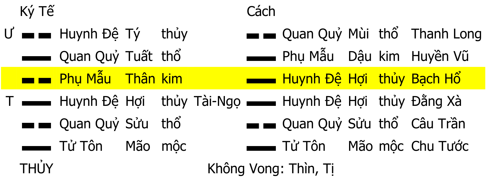

---

# CHƯƠNG 14: ĐỘNG TĨNH SINH KHẮC

Nếu sáu hào đều yên tĩnh, hào vượng tướng có thể sinh ra hào hưu tù, cũng có thể khắc được hào hưu tù. Vượng tướng cũng tương tự như người có sức mạnh.

Ví dụ: Vào tháng Dần, tháng Mão mùa xuân, xem được quẻ Khôn:

| | Khôn |
| :--- | :--- |
| T | ▅▅ ▅▅ Tử Tôn Dậu kim |
| | ▅▅ ▅▅ Thê Tài Hợi thủy |
| | ▅▅ ▅▅ Huynh Đệ Sửu thổ |
| Ư | ▅▅ ▅▅ Quan Quỷ Mão mộc |
| | ▅▅ ▅▅ Phụ Mẫu Tị hỏa |
| | ▅▅ ▅▅ Huynh Đệ Mùi thổ |

Nếu như xem cho cha mẹ, thì lấy hào Phụ Mẫu Tị hỏa làm Dụng thần. Hào 3 Mão mộc tại mùa xuân là vượng tướng. Phụ Mẫu Tị hỏa, gặp mộc mùa xuân tương sinh, Phụ vượng sẽ khắc Tử Tôn, nên nếu xem về con cháu, thì là tượng con cháu suy vi.

Mộc mùa xuân được thời đắc lệnh, nên có thể khắc được hai thổ là Sửu, Mùi. Thổ nằm tại hào Huynh Đệ, nên nếu xem về anh chị em, thì là tượng hưu tù, không có khí. Những trường hợp khác cũng loại suy từ đấy.

**Tân bình thích:** Chỗ này nói rất đúng, thường có rất nhiều người gặp phải quẻ tĩnh mà không biết bắt đầu từ đâu. Trước tiên xem ảnh hưởng của Nhật Nguyệt đối với Dụng thần ra sao, sau đó xem ảnh hưởng của hào vượng đối với Dụng thần, kết hợp lại mà đoán, thì sẽ không phán đoán sai lầm.

Ví dụ: Ngày Ất Hợi tháng Mão, một người phụ nữ muốn thuê một quầy hàng, xem buôn bán thế nào? Được quẻ Tốn.

| | Tốn | |
| :--- | :--- | :--- |
| T | ▅▅▅▅▅ Huynh Đệ Mão mộc | Huyền Vũ |
| | ▅▅▅▅▅ Tử Tôn Tị hỏa | Bạch Hổ |
| | ▅▅ ▅▅ Thê Tài Mùi thổ | Đằng Xà |
| Ư | ▅▅▅▅▅ Quan Quỷ Dậu kim | Câu Trần |
| | ▅▅▅▅▅ Phụ Mẫu Hợi thủy | Chu Tước |
| | ▅▅ ▅▅ Thê Tài Sửu thổ | Thanh Long |

Lấy Thê Tài làm Dụng thần. Dụng thần mặc dù Tử Tôn ám động đến sinh, nhưng Nguyệt kiến khắc, Huynh Đệ trì Thế lại khắc, quẻ lục xung, tượng không lâu dài, không nên thuê quầy hàng, nếu thuê thì mở không được lâu dài.

Nghe lời tôi không thuê. Một tháng sau, quầy hàng đó đã bị tháo dỡ.

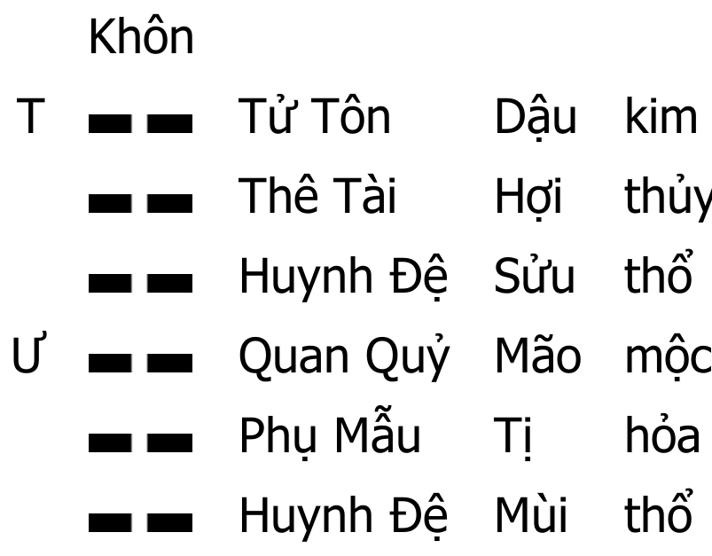

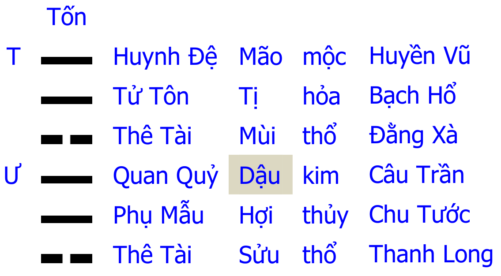

Trong quẻ có hào động sẽ khắc được hào tĩnh. Cho dù hào tĩnh là vượng tướng, cũng không thể khắc được hào động. Nên tĩnh cũng như người ngồi, người nằm; động, cũng như người đi, người chạy.

Ví dụ: Vào tháng Dần, xem được quẻ Đoài biến Quy Muội:

| | Đoài | Quy Muội |
| :---: | :--- | :--- |
| T | ╍╍ Phụ Mẫu Mùi thổ | ╍╍ Phụ Mẫu Tuất thổ |
| | ━━ Huynh Đệ Dậu kim | ╍╍ Huynh Đệ Thân kim |
| | ━━ Tử Tôn Hợi thủy | ━━ Quan Quỷ Ngọ hỏa |
| Ứ | ╍╍ Phụ Mẫu Sửu thổ | ╍╍ Phụ Mẫu Sửu thổ |
| | ━━ Thê Tài Mão mộc | ━━ Thê Tài Mão mộc |
| | ━━ Quan Quỷ Tị hỏa | ━━ Quan Quỷ Tị hỏa |

Hào Dậu kim phát động, tuy hưu tù, nhưng động nên vẫn khắc được Mão mộc vượng tướng.

Mão mộc tuy đương lệnh, có thể khắc hai hào thổ Sửu, Mùi. Nhưng trong quẻ này, mộc bị Dậu kim khắc thương, nên cũng khó mà khắc được thổ. Những trường hợp khác cũng loại suy từ đó.

**Tân bình thích:** Lý này rất đúng, hiện nay hào động hưu tù, về sau trị Nhật, trị Nguyệt sẽ vượng, khi được vượng liền có thể khắc chế hào khác.

Ví dụ thực tiễn, ngày Ất Dậu tháng Thìn, nam đoán bạn gái đột nhiên ra đi không từ biệt, kết quả ra sao? Được quẻ Tốn biến Tỉnh.

| | Tốn | Tỉnh | |
| :---: | :--- | :--- | :--- |
| T | ━━ Huynh Đệ Mão mộc | ╍╍ Phụ Mẫu Tý thủy | Huyền Vũ |
| | ━━ Tử Tôn Tị hỏa | ━━ Thê Tài Tuất thổ | Bạch Hổ |
| | ╍╍ Thê Tài Mùi thổ | ╍╍ Quan Quỷ Thân kim | Đằng Xà |
| Ứ | ━━ Quan Quỷ Dậu kim | ━━ Quan Quỷ Dậu kim | Câu Trần |
| | ━━ Phụ Mẫu Hợi thủy | ━━ Phụ Mẫu Hợi thủy | Chu Tước |
| | ╍╍ Thê Tài Sửu thổ | ╍╍ Thê Tài Sửu thổ | Thanh Long |

MỘC Không Vong: Ngọ, Mùi

Tôi đoán rằng: Lấy Thê Tài Mùi thổ Tuần Không làm Dụng thần. Tài Không sinh Ứng, bạn gái đã thay lòng đổi dạ, không muốn tiếp tục chung sống với anh ta, đã phải lòng người khác. Huynh Đệ lâm Huyền Vũ là tượng lừa gạt, bạn gái đã bị người ta lừa đi. Lại là quẻ lục xung, xung thì tán, chắc chắn chia tay.

Sau đó bạn gái trở về vào ngày Hợi, ngày Mão chính thức đề xuất chia tay, nói rằng cô ta đã có người yêu khác.

Ở đây Kỵ thần Mão mộc bị Nhật thần khắc, mặc dù hưu tù phát động nhưng vẫn có thể khắc được Thê Tài Nguyệt kiến củng phù.

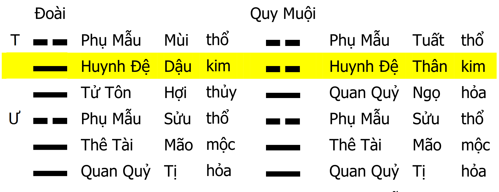

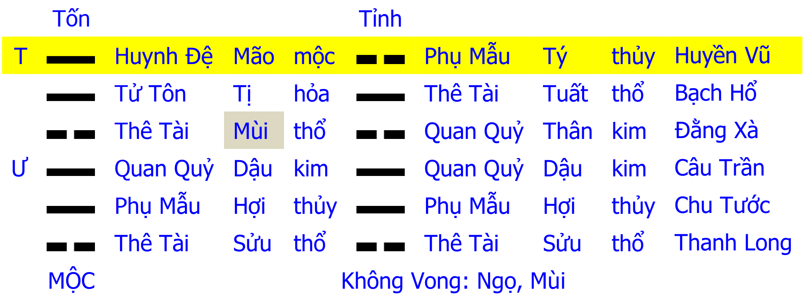

---

# CHƯƠNG 15: ĐỘNG BIẾN SINH KHẮC XUNG HỢP

Quẻ có hào động, có động ắt sẽ biến. Hào được biến ra, có khả năng sinh, khắc, xung, hợp với hào gốc (bản vị), mà không thể sinh hay khắc các hào khác. Mà các hào khác cùng hào động cũng không thể sinh hay khắc hào biến.

Ví dụ: Vào ngày Mão tháng Tý, xem được quẻ Khôn biến Hỏa Địa Tấn.

| | Khôn | Tấn |
| :---: | :--- | :--- |
| T | ╍╍ Tử Tôn Dậu kim | ━━ Phụ Mẫu Tị hỏa |
| | ╍╍ Thê Tài Hợi thủy | ╍╍ Huynh Đệ Mùi thổ |
| | ╍╍ Huynh Đệ Sửu thổ | ━━ Tử Tôn Dậu kim |
| Ứ | ╍╍ Quan Quỷ Mão mộc | ╍╍ Quan Quỷ Mão mộc |
| | ╍╍ Phụ Mẫu Tị hỏa | ╍╍ Phụ Mẫu Tị hỏa |
| | ╍╍ Huynh Đệ Mùi thổ | ╍╍ Huynh Đệ Mùi thổ |

Trong quẻ này, hào Dậu kim phát động, biến thành Tị hỏa. Như vậy, Dậu là hào động, hào gốc Tị là hào biến. Hào biến Tị hỏa hồi đầu khắc hào gốc Dậu kim, nhưng không thể sinh hay khắc những hào khác.

Hào 4 là Sửu thổ, động mà sinh hào Thế Dậu kim. Còn hào biến Dậu kim cũng không thể sinh ra các hào khác.

Vậy thứ gì có thể chế ngự được hào biến? Chỉ có Nhật thần, Nguyệt kiến mới có thể sinh, hoặc khắc, hoặc xung, hoặc hợp hào biến. Tại sao lại như vậy? Vì là Nhật thần (ngày), Nguyệt kiến (tháng) cũng như trời, có thể sinh hoặc khắc hào động, hào tĩnh, hào phi, hào phục, hào biến, trong khi các hào đều không thể thương hại đến Nhật Nguyệt. Trong "Hoàng kim sách" có viết: "Hào gây tổn thương đến Nhật Nguyệt, chỉ là nói suông". Như trong quẻ này, Tý thủy là Nguyệt kiến, có thể khắc được hào Tị hỏa biến ra từ hào Thế; Mão là Nhật kiến, có thể xung được hào biến Dậu kim. Những trường hợp khác cũng loại suy từ đấy.

***

# CHƯƠNG 16: TỨ THỜI VƯỢNG TƯỚNG

**Tháng giêng:** Dần là Nguyệt kiến, Dần mộc vượng, tiếp đến là Mão mộc.

**Tháng hai:** Mão là Nguyệt kiến, Mão mộc vượng, tiếp đến là Dần mộc.

Tháng giêng, tháng hai, mộc là vượng, hỏa được sinh ra từ mộc, nên là tướng. còn lại kim, thủy, thổ đều là hưu tù.

**Tháng ba:** Thìn là Nguyệt kiến, Thìn thổ vượng, tiếp đến là Sửu, Mùi thổ. Kim được sinh từ thổ, nên kim là tướng. Mộc tuy không vượng, nhưng vẫn còn khí dư. Những hành còn lại là thủy, hỏa đều hưu tù.

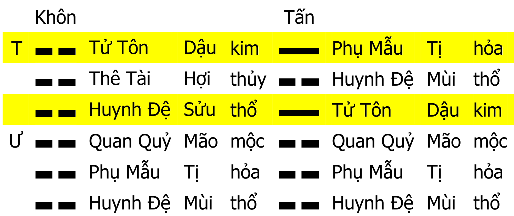

---

# CHƯƠNG 17. NGUYỆT TƯỚNG

**Tháng tư:** Tị là Nguyệt lệnh, Tị hỏa vượng, tiếp đến là Ngọ hỏa.

**Tháng năm:** Ngọ là Nguyệt kiến, Ngọ hỏa vượng, tiếp đến là Tị hỏa.

Tháng tư, tháng năm, hỏa là vượng, thổ là tướng, những hành còn lại là kim, mộc, thủy đều là hưu tù.

**Tháng sáu:** Mùi là Nguyệt kiến, Mùi thổ vượng, tiếp đến là Thìn, Tuất thổ. Thổ sinh kim, nên kim là tướng. Hỏa tuy đã suy, nhưng vẫn còn khí dư. Những hành còn lại là mộc, thủy đều hưu tù.

**Tháng bảy:** Thân là Nguyệt kiến, Thân kim vượng, tiếp đến là Dậu kim.

**Tháng tám:** Dậu là Nguyệt kiến, Dậu kim vượng, tiếp đến là Thân kim.

Tháng bảy, tháng tám, kim vượng sinh thủy, thủy là tướng. Những hành còn lại đều là hưu tù.

**Tháng chín:** Tuất là Nguyệt lệnh, Tuất thổ vượng, tiếp đến là Sửu, Mùi thổ. Thổ sinh kim, kim là tướng, những hành còn lại đều là hưu tù.

**Tháng mười:** Hợi là Nguyệt kiến, Hợi thủy vượng, tiếp đến là Tý thủy.

**Tháng mười một:** Tý là Nguyệt kiến, Tý thủy vượng, tiếp đến là Hợi thủy.

Tháng mười, tháng mười một, thủy sinh mộc, mộc là tướng. Những hành còn lại đều là suy.

**Tháng mười hai:** Sửu là Nguyệt kiến, Sửu thổ vượng, tiếp đến là Thìn, Tuất thổ. Thổ sinh kim, kim là tướng. Thủy tuy đã suy, nhưng vẫn còn khí dư. Những hành còn lại là mộc, hỏa đều hưu tù.

***

# CHƯƠNG 17: NGUYỆT TƯỚNG

Nguyệt tướng còn gọi là Nguyệt kiến, cũng là Nguyệt lệnh, nắm quyền trong một tháng, khống chế ba tuần, nắm quyền, đắc lệnh trong thời gian ba mươi ngày của một tháng.

Nắm giữ cương lĩnh của muôn quẻ, kiểm soát được thiện ác của sáu hào.

Có thể trợ giúp cho hào quẻ suy nhược, có thể tước bỏ sự vượng thịnh của tượng hào.

Có thể chế phục hào động hào biến, có thể hưng khởi cho Dụng thần phi, phục.

Nguyệt tướng là chủ tể đương quyền, muôn quẻ đều lấy đó làm cương lĩnh.

Nếu hào quẻ suy nhược, mà được Nguyệt tướng sinh, hợp, tỷ hòa, nâng đỡ, phò trợ, thì suy cũng nên vượng.

Nếu hào quẻ vượng cường, mà bị Nguyệt tướng, xung, khắc, hình, phá, thì vượng cũng thành suy.

Trong quẻ nếu có hào biến khắc chế hào động, Nguyệt kiến có thể chế phục hào biến.

Trong quẻ có hào động khắc chế hào tĩnh, thì Nguyệt kiến cũng có thể chế phục hào động.

Nếu Dụng thần ẩn tàng, bị Phi thần đè nén, thì Nguyệt kiến có thể xung khắc Phi thần, sinh trợ cho Phục thần, khiến nó trở nên hữu dụng.

Hào được Nguyệt hợp sẽ trở nên hữu dụng; hào bị Nguyệt phá sẽ trở nên vô lực. Hào tương hợp với Nguyệt kiến gọi là Nguyệt hợp; hào bị Nguyệt kiến xung gọi là Nguyệt phá.

Nếu Nguyệt kiến không nhập hào (không xuất hiện trong quẻ), vẫn hữu dụng.

Nguyệt kiến nhập vào trong quẻ, sẽ càng trở nên cương cường.

Trong quẻ nếu không có Dụng thần, thì lấy hào Nguyệt kiến làm Dụng thần, không cần phải tìm Phục thần.

Nguyệt kiến nhập vào quẻ, nếu động mà trở thành Nguyên thần, phúc sẽ càng lớn; nếu động mà trở thành Kỵ thần, họa sẽ càng nặng. Nếu không nhập quẻ, mức độ tác động sẽ giảm nhẹ.

Hào gặp Nguyệt kiến, sẽ là vượng tướng đương quyền, gặp Tuần Không cũng không bị Không, gặp khắc thương cũng vô hại.

Dã Hạc bàn rằng: Đây là nhận định của người xưa, nhưng ta không cho là như vậy, tuy gặp Nguyệt kiến mà vẫn ở trong tuần đó, thì vẫn coi là Không Vong.

Ví dụ: Ngày Canh Tuất tháng Dần, xem cầu tài, được quẻ Hỏa Thiên Đại Hữu:

Bèn đoán rằng: Hào Tài Dần mộc là Dụng thần, hào Tài khắc hào Thế, nên tiền tài sẽ được. Thế nhưng trước mắt vẫn là Tuần Không, phải đợi đến tháng Giáp Dần, xuất Không sẽ đắc tài. Quả nhiên đến ngày Giáp Dần được của. Người xưa cho rằng lâm Nguyệt kiến gặp Tuần Không cũng không bị Không, là sai. Nếu trong tuần, vẫn là Không Vong, cần phải đợi ra khỏi tuần đó, mới không còn là Không nữa.

Gặp Không vẫn là Không, nhưng không phải là Không triệt để;

Gặp tổn thương vẫn bị tổn thương, nhưng vẫn có thể chờ thời để hữu dụng.

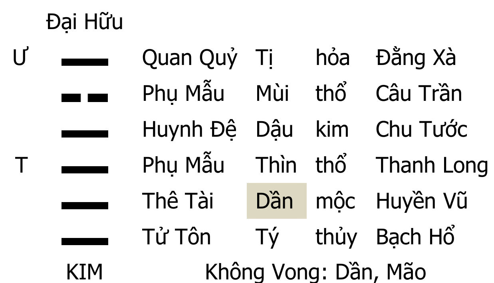

Bởi vậy, khi Dụng thần gặp Tuần Không, không nên lập tức cho rằng không bị 
Không, mà vẫn là Không Vong. Thế nhưng chỉ là Không Vong ở trong tuần hiện tại. 
Đợi đến ngày xuất Không, sẽ không còn Không nữa. Nếu là Kỵ thần, xuất Không sẽ 
gặp họa. Nếu là Nguyên thần, xuất Không sẽ là phúc. Đây không phải cái Chân Không 
hưu tù, Không triệt để.

Hào gặp Nguyệt kiến, là vượng tướng. Hoặc bị hào khác khắc, là bị tổn thương.

Nếu xem về bệnh tật, thì bệnh trước mắt vẫn không thuyên giảm; nếu xem về sự 
việc, việc trước mắt sẽ không thành. Phải đợi đến ngày xung mất hào gây tổn thương, 
thì sẽ không phải chịu thương hại đó nữa. Khi đó, xem về bệnh bệnh sẽ khỏi; Xem về 
sự việc, sự việc sẽ thành. Nên mới nói rằng: Gặp tổn thương vẫn bị tổn thương, 
nhưng vẫn có thể chờ thời để hữu dụng.

### Ví dụ: Ngày Bính Dần tháng Dậu, xem về việc yết kiến người quyền quý, được quẻ Sơn Phong Cổ biến Sơn Thủy Mông:

Cổ
 
Mông

Ư | Huynh Đệ | Dần | mộc | Huynh Đệ | Dần | mộc | Thanh Long

Phụ Mẫu | Tý | thủy Tử-Tị | Phụ Mẫu | Tý | thủy | Huyền Vũ

Thê Tài | Tuất | thổ | Thê Tài | Tuất | thổ | Bạch Hổ

T | Quan Quỷ | Dậu | kim | Tử Tôn | Ngọ | hỏa | Đằng Xà

Phụ Mẫu | Hợi | thủy | Thê Tài | Thìn | thổ | Câu Trần

Thê Tài | Sửu | thổ | Huynh Đệ | Dần | mộc | Chu Tước

MỘC
Không Vong: Tuất, Hợi

Thế nằm tại hào Quan Quỷ gặp Nguyệt kiến, chắc chắn sẽ được yết kiến. Nhưng 
lại bị Ngọ hỏa hồi đầu khắc, cần phải đợi đến ngày Tý để xung đi Ngọ hỏa, mới được 
yết kiến, về sau, quả được bái kiến vào ngày Bính Tý. Nên mới nói rằng: Gặp tổn 
thương vẫn bị tổn thương, nhưng vẫn có thể chờ thời để hữu dụng.

Nếu gặp Tuyệt tại Nhật thần, bị Nhật thần xung, khắc, đều phải quan sát xem có 
được sinh trợ ở chỗ khác hay không.

Hóa Tuyệt, hóa Mộ, hóa Khắc, cần đề phòng bị hào khác khắc chế thêm.

Hào gặp Nguyệt kiến mà hóa Tuyệt, hóa Mộ tại Nhật thần, hoặc bị Nhật kiến 
xung khắc, vẫn có thể đối địch được, là tượng không cát không hung. Nếu lại được 
hào động khác sinh phò, thì càng là điềm tốt. Chỉ sợ bị hào khác khắc chế thêm, thì 
Dụng thần tuy gặp Nguyệt kiến, cũng khó mà địch lại được.

### Ví dụ: Ngày Bính Thân tháng Dần, xem về việc thăng tiến, được quẻ Cấn biến Sơn Lôi Di:

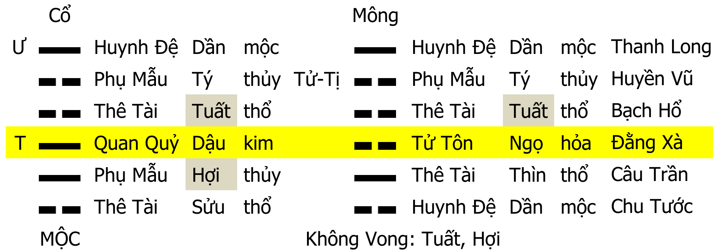

Cấn
 
Di

T | Quan Quỷ | Dần | mộc | Quan Quỷ | Dần | mộc | Thanh Long

Thê Tài | Tý | thủy | Thê Tài | Tý | thủy | Huyền Vũ

Huynh Đệ | Tuất | thổ | Huynh Đệ | Tuất | thổ | Bạch Hổ

Ư | Tử Tôn | Thân | kim | Huynh Đệ | Thìn | thổ | Đằng Xà

Phụ Mẫu | Ngọ | hỏa | Quan Quỷ | Dần | mộc | Câu Trần

Huynh Đệ | Thìn | thổ | Thê Tài | Tý | thủy | Chu Tước

THỔ
Không Vong: Thìn, Tị

Hào Quan Quỷ Dần mộc trì Thế, gặp Nguyệt kiến nên là vượng tướng. Tuy bị 
Nhật thần Thân xung khắc, nhưng may được Thân, Tý, Thìn hợp thành Tam hợp thủy 
cục để sinh Quan, không những vô hại, mà vào tháng ba sẽ được thăng tiến. Sau quả 
nhiên tháng ba được thăng chức đi Vân Nam. Sở dĩ được ứng nghiệm thăng chức, là 
vì được thủy cục sinh phò. Ứng nghiệm vào tháng ba, vì đó là tháng Thìn thổ xuất 
Không. Ứng nghiệm vào Vân Nam, là do Thế và Quan tinh đều nằm tại hào 6.

**Tân bình thích:** Ví dụ này giải thích có sai lầm, trong tam hợp cục, địa chi ở giữa 
nằm trong quẻ biến thông thường không thể sinh khắc Dụng thần, trừ phi hào biến 
của Dụng thần là địa chi ở giữa trong tam hợp cục, quẻ này Thê Tài Tý thủy là do hào 
sơ biến ra, thông thường chỉ có thể ảnh hưởng đến hào bản vị của nó, tức là hào sơ, 
mà không thể tác động đến các hào khác, phía trước đã từng nói về cái lý này, nhưng 
ở đây lại tự phủ nhận, làm sao có thể khiến người ta phục được? Quẻ này xem về điều 
chuyển, Quan Quỷ trì Thế ám động, lại hóa du hồn, là tượng biến động chức vụ. Ngày 
xưa Vân Nam thuộc về vùng sát biên giới, kẻ bị phái đi đến đây là bị giáng chức, cho 
dù chức quan có cao hơn ban đầu, thì cũng chẳng tốt lành gì. Ứng động xung Thế, là 
tượng người khác thôi thúc, bởi vì hào Ứng hóa Không cho nên việc ứng tại tháng 
Thìn xuất Không.

### Lại ví dụ: Vào ngày Đinh Mùi tháng Ngọ, xem về việc em trai bị luận tội, không biết lành dữ ra sao, được quẻ Khốn biến Lôi Phong Hằng:

Khốn
 
Hằng

Phụ Mẫu | Mùi | thổ | Phụ Mẫu | Tuất | thổ | Thanh Long

Huynh Đệ | Dậu | kim | Huynh Đệ | Thân | kim | Huyền Vũ

Ư | Tử Tôn | Hợi | thủy | Quan Quỷ | Ngọ | hỏa | Bạch Hổ

Quan Quỷ | Ngọ | hỏa | Huynh Đệ | Dậu | kim | Đằng Xà

Phụ Mẫu | Thìn | thổ | Tử Tôn | Hợi | thủy | Câu Trần

T | Thê Tài | Dần | mộc | Phụ Mẫu | Sửu | thổ | Chu Tước

KIM
Không Vong: Dần, Mão

Hào Dậu kim Huynh Đệ làm Dụng thần, bị Nguyệt kiến Ngọ hỏa khắc, được Nhật 
thần Mùi sinh, nên có thể đối địch lẫn nhau. Nhưng hiểm vì gặp hào động Ngọ hỏa 
tương khắc, tức bị hào khác khắc chế thêm.

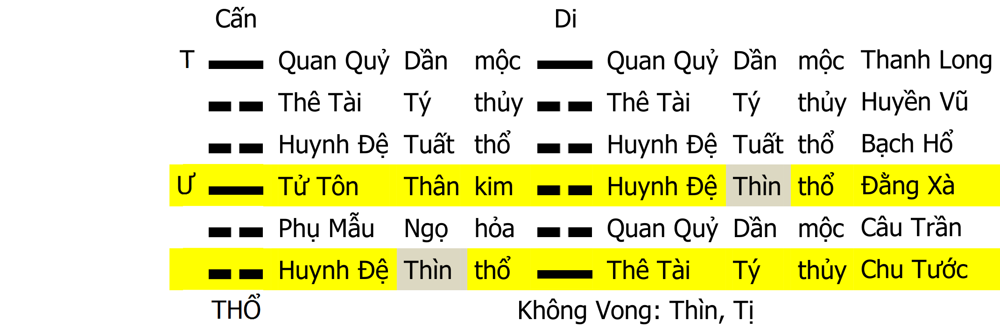

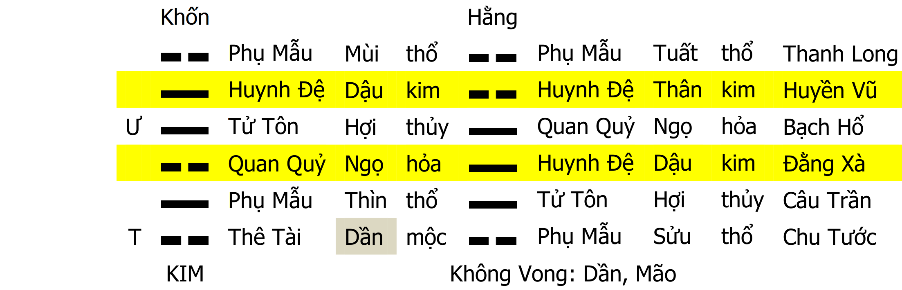

Người xem liền hỏi rằng: "Liệu có nguy lắm không?" Ta bèn đáp rằng: "Ngọ hỏa là Nguyệt kiến, lại động ở trong quẻ này, như vậy gọi là Nguyệt kiến nhập quẻ, càng thêm cương cường. Lại cũng chính là trường hợp Nguyệt kiến làm Kỵ thần, tai họa ắt không nhỏ, đây chính là tượng đại hung." Người đó lại hỏi hung đến vào lúc nào. Ta bèn đáp: "Hào Huynh Đệ Dậu kim hóa Thoái thần, năm nay là năm Thìn, tương hợp với Thái Tuế, tự nhiên sẽ không có gì đáng ngại. Nhưng sợ rằng đến năm Thân sẽ không thoát được."

Quả nhiên người em trai năm đó bị hạ ngục, đến năm Thân thì bị kết án tử hình.

**Tân bình thích:** Trong quẻ này Ngọ hỏa tuy động, nhưng bị Nhật hợp, có thể ứng vào năm Tý hoặc năm Sửu, xung khai hợp là hung, cũng có thể ứng vào năm Thoái thần. Đoán định ứng kỳ, xem địa chi nào đến trước. Năm Tý Sửu rất xa, ứng kỳ Thoái thần đến trước, do đó ứng vào năm Thân. Nếu như năm Tuất hoặc năm Hợi gieo quẻ, thì có khả năng ứng vào năm Tý.

**Đại tượng là cát, tại tháng đó được phúc;**

**Đại tượng là hung, sang tháng gặp tai ương.**

Quẻ khắc ít sinh nhiều, thì đại tượng được cát; quẻ khắc nhiều sinh ít, đại tượng là hung.

Đại tượng tuy hung, nhưng trong tháng vẫn chưa có gì đáng ngại, qua khỏi tháng đó sang tháng sau sẽ gặp tai họa.

**Dụng thần gặp được, được phúc không nhỏ;**

**Kỵ thần gặp được, mắc họa chẳng nhẹ.**

Hai câu trên có nghĩa là, nếu Dụng thần gặp Nguyệt kiến, mà không bị hào khác khắc thương, thì xem việc gì cũng là tốt.

Nếu Kỵ thần gặp Nguyệt kiến, trong khi Dụng thần hưu tù không được ứng cứu, thì xem việc gì cũng là đại hung.

**Sinh phò Kỵ thần, giúp kẻ ác làm điều bạo ngược;**

**Khắc chế Nguyên thần, là đón lõng để cắt đường lương.**

Nếu Kỵ thần khắc chế Dụng thần, mà được Nguyệt kiến khắc chế Kỵ thần, là được ứng cứu. Nhưng nếu như Nguyệt kiến lại sinh ra Kỵ thần, thì chẳng khác gì trợ giúp kẻ ác làm chuyện bạo ngược.

Nếu như Dụng thần được Nguyên thần tương sinh, mà Nguyệt kiến lại sinh ra Nguyên thần, tức đã tốt lại thêm tốt. Nhưng nếu như Nguyệt kiến lại khắc chế nguyên thần, cũng như "kiêu thần đoạt thực", bị kẻ ác đoạt mất miếng ăn.

**Sự vật cùng cực sẽ biến, đồ đựng đầy quá phải tràn.**

Dụng thần suy nhược, gặp thời sẽ vượng phát. Ví dụ như Dụng thần tại hỏa, nếu xem vào mùa đông là hưu tù, nhưng đến mùa xuân lại sẽ vượng, như vậy gọi là "sự vật cùng cực sẽ biến".

Lại như xem vào tháng giêng, Dụng thần tại Dần mộc, như vậy là quá vượng. Nhưng đến mùa thu, bị kim xung khắc, thì mọi sự đều phá tán, như vậy là "đồ đựng đầy quá phải tràn".

**Tân bình thích:** Lý luận này không đúng, Dã Hạc đã hiểu sai ý của câu này. Ở đây là nói Dụng thần quá vượng, vật cực tất phản. Dụng thần quá vượng là hung.

Ví dụ vào ngày Tân Dậu tháng Dần, xem về việc mở cửa hàng, được quẻ Cấn biến Minh Di:

Hào Thế tại Dần mộc, đắc lệnh đương quyền, nếu mở cửa hàng trong lúc này, việc buôn bán sẽ cực kỳ phát đạt. Nhưng hiểm nỗi Nhật thần Thìn khắc hào Thế, Dần mộc động hóa Dậu kim, hồi đầu khắc Thế, khiến đại tượng sinh ít khắc nhiều. Lại là quẻ lục xung, lục xung thì không được lâu.

Người xem liền hỏi rằng: "Là người làm không đồng lòng, hay là bởi nguyên do khác?" Ta bèn đáp rằng: "Quỷ ở bên mình (tức Quỷ trì Thế), nên phòng bệnh tật, người làm cũng bởi đó mà thay lòng, ắt phải chịu liên lụy." Về sau, người này quả nhiên tháng sáu mắc bệnh lỵ, đến tháng tám vẫn chưa khỏi. Người làm bèn lấy trộm sạch, người này kêu lên quan, nhưng cũng không lấy được đồng nào. Như vậy chính là được thời vượng tướng thì vô sự, hết thời sẽ chịu tổn hại.

Sở dĩ ứng nghiệm vào tháng sáu, là vì mộc gặp Mộ ở Mùi; người làm thay lòng đổi dạ, vì hào Ứng tại Thân kim, đến mùa thu được thời mà xung hào Thế; của cải bị lấy trộm, vì hào Tài Tý thủy gặp Không Vong.

**Tân bình thích:** Quẻ này giải thích dễ dẫn tới hiểu lầm, khi mở cửa hàng lấy Tài làm Dụng thần, nếu lại hỏi thêm cát hung của bản thân, thì mới xem hào Thế. Hiện nay phát đạt, là vì Nhật thần sinh hào Tài. Nhưng hào Tài gặp Không, bị Huynh Đệ Thìn thổ phát động khắc chế, Nguyên thần Nguyệt phá, lại là quẻ lục xung, do đó kinh doanh không được lâu dài. Tài lâm Huyền Vũ mà Không, Huyền Vũ là trộm cắp, cho nên bị ăn trộm. Hào sơ là người làm thuê, Huynh Đệ là nhóm, lâm Chu Tước động khắc hào Tài, hóa ra Quan Quỷ, Chu Tước là quan ti (kiện tụng), khẩu thiệt, Quan Quỷ là quan ti, cho nên là do nhóm người làm thuê trộm cắp tài sản trong cửa hàng mà phát sinh quan ti khẩu thiệt.

Bị kiết lỵ, là vì Kỵ thần tại hào 3 động mà khắc Thế. Hào 3 là hào vị bụng, Tài là phân và nước tiểu, Tử Tôn là Nguyên thần của hào Tài, vì vậy là ruột, có kiết lỵ.

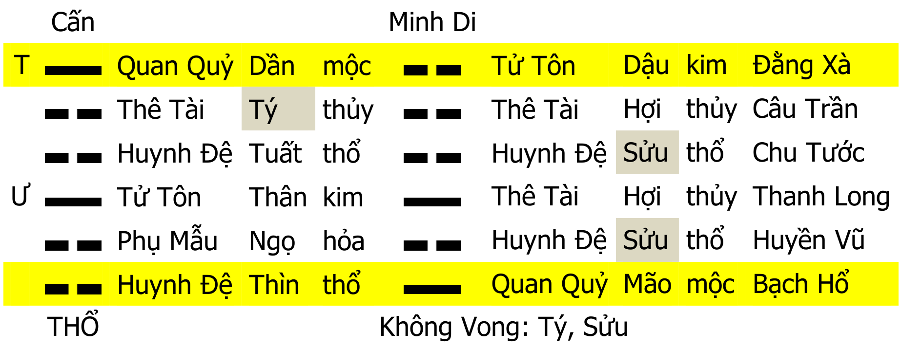

(Muốn hiểu rõ chi tiết cách dùng lục thân trong đoán bệnh, xin mời xem cuốn "Lục hào dự trắc tật bệnh tân khám").

**Phùng Tuyệt bất Tuyệt, phùng xung bất tán;**  
**Nhật sinh Nguyệt khắc, kiêm khán sinh phù;**  
**Nhật khắc Nguyệt sinh, kiêm tra xung khắc.**  
**Nguyệt tướng đương quyền, kỳ năng suy tuyệt?**  
**Vượng tướng như cương, khởi năng xung tán?**  
**Nguyệt khắc Nhật sinh, ngộ bang nhi dũ vượng;**  
**Nguyệt sinh Nhật khắc, phùng khắc chế nhi diệc suy.**

Nghĩa là:

Gặp Tuyệt mà không Tuyệt, gặp xung mà không tán.

Được Nhật thần sinh, bị Nguyệt kiến khắc, thì xem có được hào nào khác sinh phò hay không.

Bị Nhật thần khắc, được Nguyệt kiến sinh, thì xem có bị hào nào khác xung khắc hay không.

Nguyệt tướng nắm quyền, không thể suy tuyệt.

Vượng tướng đang có, không thể xung tán.

Bị Nguyệt kiến khắc, được Nhật thần sinh, được trợ giúp sẽ càng nên vượng.

Được Nguyệt kiến sinh, bị Nhật thần khắc, bị khắc chế cũng phải suy vong.

Ví dụ: Ngày Mậu Thìn tháng Ngọ, xem em gái sinh nở lành dữ ra sao, được quẻ Hỏa Địa Tấn:

Lấy hào Huynh Đệ Dậu kim làm Dụng thần, bị Nguyệt lệnh khắc, được Nhật kiến sinh, nên vô sự, vào giờ Mão ngày hôm sau sẽ sinh. Quả nhiên sinh vào giờ Mão ngày hôm sau, được mẹ tròn con vuông. Ứng vào giờ Mão, là vì Dụng thần Dậu kim và Nhật thần Thìn tương hợp. Trong "Hoàng kim sách" có viết: "Nếu gặp hợp, phải đợi xung khai". Đây chính là trường hợp bị Nguyệt kiến khắc, được Nhật thần sinh, mà không bị hào khác khắc chế hay phù trợ thêm.

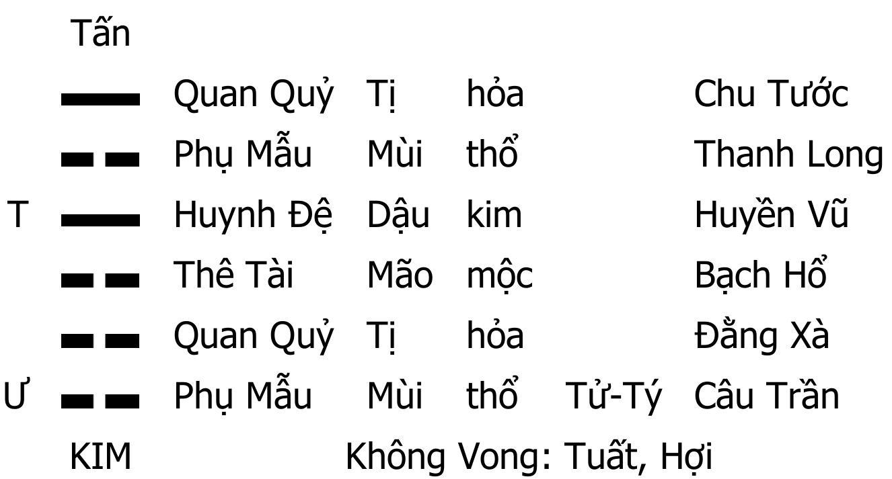

Lại ví dụ: Ngày Giáp Ngọ tháng Mùi, xem cho con trai bị đậu mùa, được quẻ Thiên Trạch Lý biến Phong Trạch Trung Phu:

Lấy hào Tử Tôn Thân kim làm Dụng thần, được Nguyệt kiến sinh, bị Nhật thần khắc, nên có thể dùng để đối địch, loại trừ lẫn nhau. Nhưng hiểm vì lại bị hào động Ngọ hỏa khắc, may nhờ Ngọ hợp với Mùi, trước mắt không có gì đáng ngại. Nhưng phòng ngày Sửu xung mất Mùi thổ, khiến hỏa tổn thương đến kim ắt sẽ gặp nguy. Sau quả con trai chết vào ngày Sửu.

Lý Ngã Bình bàn rằng: Các sách đều cho rằng khi Nguyệt tướng đương quyền gặp Tuần Không cũng không bị Không, gặp tổn thương cũng vô hại. Nhưng trong sách này, Dã Hạc lão nhân lại đề cập đến vấn đề khắc thêm (tăng khắc), hào dù gặp Nguyệt tướng, nhưng bị hào khác khắc thêm, lâm Tuần Không vẫn là Không, bị tổn thương vẫn là thương. Đây là một quan điểm cực kỳ sáng suốt, có thể coi là khuôn mẫu. Sách "Dịch mạo" nói rằng, được Nhật thần khắc bị Nguyệt kiến sinh là được tám phần sinh; bị Nguyệt kiến khắc Nhật thần sinh là được bảy phần sinh. Vậy dựa vào đâu để xác định bảy phần hay tám phần? Như trong quẻ trên, xem về việc sinh nở, bị tháng khắc ngày sinh mà không bị hào khác khắc chế thêm, nguy cũng thành an; xem về bệnh đậu mùa bị tháng sinh ngày khắc, lại gặp thêm hào khắc thương, tính mệnh khó toàn. Một người sống, một người chết, đó là bảy phần ư? Là tám phần ư?

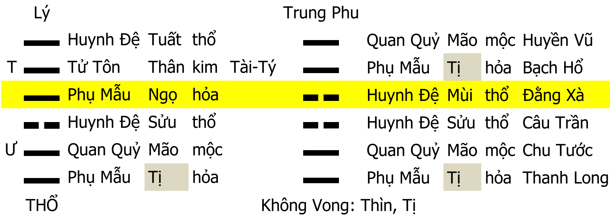

---

# CHƯƠNG 18: NHẬT THẦN

| Tý thủy | Sửu thổ | Dần mộc | Mão mộc | Thìn thổ | Tị hỏa |
| --- | --- | --- | --- | --- | --- |
| Ngọ hỏa | Mùi thổ | Thân kim | Dậu kim | Tuất thổ | Hợi thủy |

Nhật thần tức ngày xem quẻ, còn gọi là Nhật kiến.

**Nhật thần là chủ tể của sáu hào, vượng tướng suốt bốn mùa.**

Chương trên nói về Nguyệt lệnh cai quản trong ba tuần. Lệnh mùa xuân thì sinh, lệnh mùa thu thì sát. Xuân hạ thu đông, mỗi mùa chỉ nắm quyền trong một khoảng thời gian nhất định. Nhưng Nhật thần lại khác, bốn mùa đều vượng, nắm giữ quyền sinh sát, có quyền lực tương đương Nguyệt kiến.

Hào tĩnh vượng tướng, bị Nhật thần xung tức là ám động (động ngầm);

Hào tĩnh suy nhược, bị Nhật thần xung tức là Nhật phá.

Hào vượng mà tĩnh, bị Nhật thần xung tức là ám động, càng thêm cường vượng.

Hào tĩnh mà suy, bị Nhật thần xung tức là Nhật phá, càng thêm vô dụng.

**Xung không sẽ khởi, xung hợp sẽ khai;**

**Được sinh phù củng hợp, như mầm non gặp được trận mưa lành;**

**Bị khắc hại hình xung, tựa cỏ cây tàn úa vì sương giá.**

Hào gặp Tuần Không mà được Nhật thần tương xung sẽ thành hữu dụng, như vậy gọi là Không bị xung sẽ thực.

Hào gặp hợp, bị Nhật kiến xung khai, gọi là nơi hợp gặp xung (hợp xứ phùng xung).

Hung thần gặp hợp tốt nhất nên bị xung; cát thần gặp hợp không nên bị xung.

Nhật thần có thể tương sinh, tương hợp, sinh vượng cho hào suy nhược. Hoặc nếu đồng chất có thể tỷ hòa, trợ giúp cho hào suy nhược; Nhật thần cũng có thể hình, xung, khắc, Tuyệt, Mộ đối với hào vượng cường.

**Hào vượng mà động, bị Nhật thần xung càng vượng cường;**

**Hào suy mà động, bị Nhật thần xung thành tán bại.**

Trong các sách bốc dịch khác có viết: "Hào gặp Nguyệt kiến, có bị Nhật thần xung cũng không tán", tức được thời sẽ không sợ bị Nhật thần xung. Khi bàn luận về họa phúc, bất kể là vượng tướng hay hưu tù, đều coi là tán, coi tán là quan trọng nhất. Ta đã thử nhiều lần, đều không thấy ứng nghiệm ở tán. Thần linh mách bảo thiên cơ ở hào động, có động sẽ ứng nghiệm, chứ không hề thấy tán. Hào vượng tướng bị xung thì càng thêm mạnh; hào hưu tù vô khí, thi thoảng cũng gặp tán, nhưng cả trăm trường hợp chỉ có một hai mà thôi.

**Gặp Nguyệt phá mà không phá, gặp xung khắc mà vô hại.**

Tức hào gặp Nhật kiến, bị Nguyệt kiến xung cũng không phá, bị Nguyệt kiến khắc cũng vô hại, gặp hào động tương khắc cũng không bị tổn thương, bị hào biến hồi đầu khắc cũng không gặp họa, sức mạnh của nó vững như bàn thạch, với quyền lực tương đương với Nguyệt kiến, là vượng tướng cùng cực như vầng dương đang giữa bầu trời.

**Sinh nhiều khắc ít, như gấm thêm hoa;**

**Sinh ít khắc nhiều, ít khó địch nhiều.**

Hào gặp Nhật kiến, lại được hào động trong quẻ tương sinh, trợ giúp, thì như gấm thêm hoa, đã tốt càng thêm tốt. Nếu hào gặp Nhật kiến, lại bị hào động Nguyệt kiến tương khắc, như vậy là thế ít không địch nổi nhiều.

Ví dụ xem quẻ vào ngày Mão tháng Dậu, được hào Mão mộc, như vậy là gặp Nguyệt phá (tháng Dậu kim khắc Mão mộc) mà không bị phá. Nhưng nếu trong quẻ lại có hào Thân kim hoặc Dậu kim động, hoặc hào Mão động mà hóa ra Thân hoặc Dậu, như vậy là thế ít không địch nổi nhiều. Trong những trường hợp đó, gặp Nguyệt phá vẫn bị phá, gặp khắc thương vẫn bị khắc thương. Những trường hợp khác cũng loại suy từ đó.

Ví dụ: Ngày Mậu Ngọ tháng Thân, xem về bệnh tật được quẻ Thiên Sơn Độn biến Thiên Phong Cấu:

Hào Thế tại Ngọ hỏa, gặp Nhật thần, vốn là vượng tướng. Nhưng hiểm vì Nguyệt kiến Thân kim sinh Hợi thủy hồi đầu khắc hào Thế. Kết quả, người này chết vào tháng Hợi.

Lại ví dụ: Ngày Đinh Hợi tháng Tị, xem lúc nào nô bộc quay trở về, được quẻ Quải biến Lý:

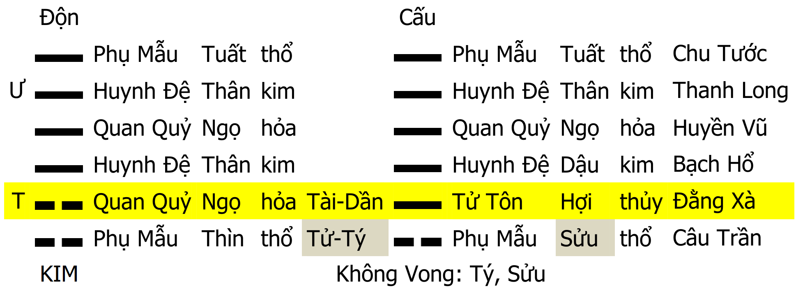

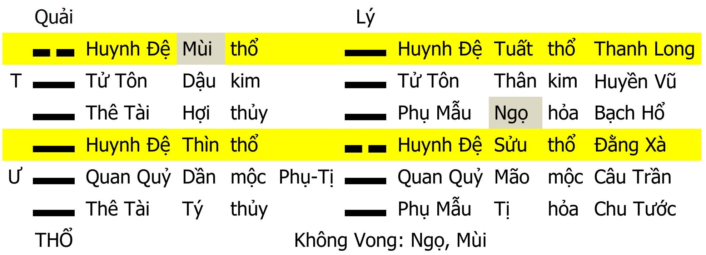

Hào Tài tại Hợi thủy là Dụng thần, gặp Nguyệt phá, tuy lâm Nhật thần nên gặp Phá mà không bị Phá, nhưng hiểm vì có thêm bốn hào thổ động mà bị khắc thương. Tục ngữ có câu "hai nắm đấm khôn địch bốn cánh tay", trường hợp này không những người nô bộc kia khó mà quay được trở về, mà e còn có chuyện bất trắc. Quả nhiên vào ngày Mão tháng Ngọ, nhận được tin người này đã gặp họa chết dọc đường.

Khi đọc chương này, cần tham khảo chương "Nguyệt kiến".

**Phụ chú:**

Hào vượng, tức gặp Đế Vượng tại Nhật thần.

Tỷ hòa, nghĩa là hào có ngũ hành tương tự với Nhật, Nguyệt.

Phù (phò trợ), củng (nâng đỡ), là hào có ngũ hành cùng loại với Nhật Nguyệt;

Mộ, Tuyệt, tức hào có ngũ hành gặp Mộ, Tuyệt tại Nhật thần.

Lý Ngã Bình từng nói: Sách "Dịch mạo" có viết: "hào gặp Nhật thần, không thể tán, không thể bị Không." Tức là gặp tán mà không tán, gặp Không cũng chẳng Không. Động mà bị Nhật thần xung, gọi là tán. Đã là Nhật thần, lẽ nào lại có thể bị Nhật thần đến xung khắc? Tuần Không, tức không có trong tuần đó. Đã là Tuần Không, lẽ nào lại có chuyện gặp được Nhật thần? Thế mới biết các sách vở chưa chắc đã đáng tin tưởng.

**Tân bình thích:** Những phân tích trên đây của Dã Hạc rất hay, rất tỉ mỉ, có thể thấy được mỗi bên Nhật Nguyệt đều có chỗ sử dụng. Sách cổ mặc dù nói "Nhật Nguyệt đồng công", nhưng Nhật Nguyệt có chức trách của riêng nó, ảnh hưởng cũng khác nhau.

Dụng thần phục tàng, Nguyệt kiến xung Phi, Phi là Nguyên thần thì không cát, Phi là Kỵ thần thì cát. Nhưng Nhật xung Phi thần, Phi thần có khí hoặc vượng tướng, Phi thần là Nguyên thần là cát, Phi thần là cát thần, Dụng thần vượng thì cát, Dụng thần suy thì hung.

Dụng thần phục tàng, Nguyệt kiến xung không cát, Nhật thần xung mà được xuất. Sao lại nói Nhật Nguyệt đồng công?

Dụng thần Nguyệt phá mà lâm Nhật, tất nhiên là thực Phá, cũng có mức độ nặng nhẹ khác nhau. Nguyệt kiến trong xung có khắc, Nhật thần thực Phá cũng cần có hào khác sinh phù, chỉ xung không khắc, thì có thể đối kháng với Nguyệt kiến, nhưng trong quẻ nếu có hào động, thì còn phải xem ảnh hưởng của nó đối với Dụng thần ra sao, mới có thể phán đoán là cát hay hung.

Tuy nhiên cát hung chỉ là một phương diện, hào Nguyệt phá Nhật thần thực Phá còn có chỗ áo diệu của nó, tôi được nghiệm rất nhiều.

Ví dụ: Ngày Đinh Dậu tháng Mão, một người Nhật Bản nhờ tôi đoán phong thủy nhà ở, được quẻ Trạch Lôi Tùy.

Tôi đoán người này đã tốn không ít tiền để sửa chữa đường ống dẫn nước và phòng tắm, ngôi nhà nằm bên đường kề khu phố sầm uất, đường đi bất tiện, đã từng tu bổ nhiều lần. Kết quả phán đoán rất chính xác.

Quẻ này Thê Tài trì Thế, chính là tiền nằm trong tay, Không mà bị Nguyệt kiến khắc thương, là cầm tiền trong tay tiêu mất đi. Huynh Đệ lâm Câu Trần tại hào 2 vượng mà khắc hào Tài, hào 2 là hào trạch, Câu Trần là tu tạo, nhất định là bởi vì tu tạo hoặc cải tạo nhà cửa mà tốn tiền. Thê Tài Thìn thổ là thủy khố, có thể hiểu là vật đựng nước. Lâm Đằng Xà, Đằng Xà chủ vật nhỏ dài, uốn khúc, Thìn thổ có thể hiểu là đường ống dẫn nước. Lại Thìn thổ gặp Nhật là đất Mộc Dục, Mộc Dục có thể hiểu là tắm rửa, thủy khố của nơi tắm rửa, có thể hiểu là phòng tắm, cho nên đoán như vậy.

Quẻ tại cung Chấn, Chấn là khu phố sầm uất, náo nhiệt, lại Phụ Mẫu lâm Chu Tước, một Phụ Mẫu lâm Bạch Hổ, Chu Tước chủ ồn ào, Bạch Hổ chủ đường đi, vì vậy đoán nhà của người đó nằm bên đường tại khu phố sầm uất. Hào 5 là đường đi, Nguyệt phá, chính là tượng đường đi bị tổn hại, nhưng Nhật thần thực Phá, lại là tượng tu bổ.

Ở đây nêu ra ví dụ này, là để mở rộng lối nghĩ của chúng ta. Những phân tích của Dã Hạc là trình bày từ góc độ lý, là cách dùng cơ bản nhất của bốc dịch, mà ví dụ tôi đưa ra chính là trình bày từ góc độ tượng. Lý tượng đều đầy đủ mới là đạo lý bốc dịch hoàn mỹ.

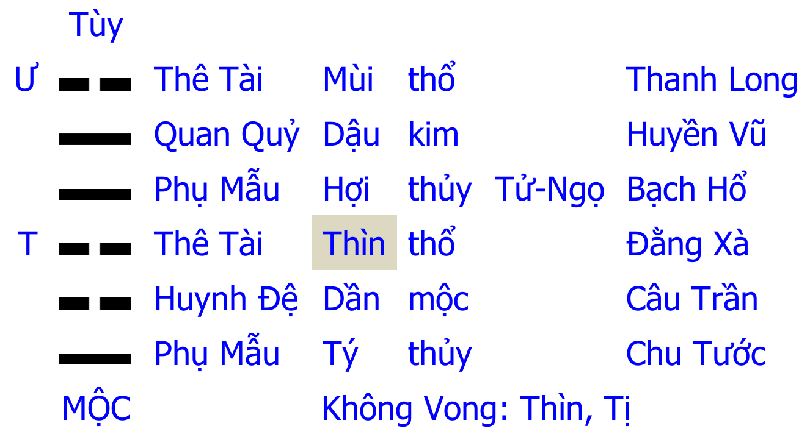

---

# CHƯƠNG 19: LỤC THẦN

| Ngày | Hào sơ | Hào 2 | Hào 3 | Hào 4 | Hào 5 | Hào 6 |
| --- | --- | --- | --- | --- | --- | --- |
| Giáp, Ất | Thanh Long | Chu Tước | Câu Trần | Đằng Xà | Bạch Hổ | Huyền Vũ |
| Bính, Đinh | Chu Tước | Câu Trần | Đằng Xà | Bạch Hổ | Huyền Vũ | Thanh Long |
| Mậu | Câu Trần | Đằng Xà | Bạch Hổ | Huyền Vũ | Thanh Long | Chu Tước |
| Kỷ | Đằng Xà | Bạch Hổ | Huyền Vũ | Thanh Long | Chu Tước | Câu Trần |
| Canh, Tân | Bạch Hổ | Huyền Vũ | Thanh Long | Chu Tước | Câu Trần | Đằng Xà |
| Nhâm, Quý | Huyền Vũ | Thanh Long | Chu Tước | Câu Trần | Đằng Xà | Bạch Hổ |

Tất cả các sách xem đều cho rằng Thanh Long là cát, Bạch Hổ là hung.

"Thiên nguyên phú" viết: "Thân vượng long trì đa cát khánh" (thân vượng, lại gặp Thanh Long, được nhiều chuyện vui vẻ, cát tường).

"Toái kim phú" viết: "Long động gia hữu hỷ; Hổ động gia hữu tang" (Thanh Long động, nhà có chuyện vui; Bạch Hổ động, nhà có tang ma).

"Bốc phệ nguyên quy" viết: "Đằng Xà Bạch Hổ ưu tôn trưởng" (gặp Đằng Xà, Bạch Hổ, gia trưởng có chuyện không may).

"Bốc phệ đại toàn" viết: "Úy hàm đao chi Bạch Hổ; hỷ phó thủy chi Thanh Long" (sợ Bạch Hổ ngậm đao; ưa Thanh Long giỡn nước).

"Duyệt áo chương", xem về bệnh tật viết: "Đằng Xà chủ tử, Bạch Hổ chủ tang" (gặp Đằng Xà sẽ chết, gặp Bạch Hổ sẽ có tang).

Tất cả những luận đoán trên đều không dựa vào ngũ hành, mà chỉ căn cứ vào lục thần để đoán định sống chết.

Chỉ có "Thiên kim phú" viết: "Hổ hưng nhi ngộ cát thần, bất hại kỳ cát; Long động nhi phùng hung diệu, nan yểm kỳ hung" (Bạch Hổ động mà gặp cát thần, chẳng hại đến cát; Thanh Long động mà gặp sao xấu, khó đỡ được hung), đó mới là chân lý. Lục thần chỉ là thần phụ trợ. Nếu là quẻ tốt, gặp được Thanh Long lại càng tốt; nếu là quẻ xấu, gặp phải Bạch Hổ, Đằng Xà lại càng xấu. Lại thêm Huyền Vũ chủ về trộm cắp, Chu Tước chủ về thị phi, đều rất ứng nghiệm. Cho đến gia trạch, mộ phần, cũng cần phải dựa vào lục thần để suy đoán.

**Tân bình thích:** Cách hiểu và bàn luận về lục thần của người xưa về cơ bản là sai lầm, ngày nay giới Dịch học cũng có nhiều người bỏ lục thần mà không dùng, hiện nay người có thể lấy lục thần phán đoán cũng ít gặp, đây là không biết công dụng thực sự của lục thần.

Công dụng của lục thần không phải là dùng để phán đoán cát hung, cát hung tự có ngũ hành phụ trách, cát hung là phạm trù lý của bốc dịch, mà lục thần thì thuộc về phạm trù tượng của bốc dịch. Người xưa và hầu hết người thời nay không biết dự đoán lục hào (tức bốc dịch) chia thành lý và tượng, cho nên rất khó có đột phá lớn về bốc dịch để đạt đến trình độ cao.

Lục thần không liên quan đến cát hung, nó dùng để thuyết minh và biểu thị tính chất, nguyên nhân của sự vật. Về cơ bản, "Tăng San Bốc Dịch" rất ít khi tham khảo lục thần để phán đoán sự việc, đây là chỗ thiếu sót của cuốn sách này. Nếu muốn nâng cao trình độ dự đoán, đoán quẻ xuất thần nhập hóa, thì nhất định phải thông thạo cách dùng của lục thần. Trong dự đoán hầu như quẻ nào cũng không tách khỏi lục thần.

Ví dụ: Ngày Mậu Tý, xem sinh nở, được quẻ Sơn Địa Bác biến Phong Địa Quan:

Hào Tử Tôn Tý thủy, hóa Tuyệt, biến Quỷ, tức sinh ra sẽ chết. Nhưng may có Thanh Long nằm tại hào Tử Tôn, là điềm vui mừng.

**Tân bình thích:** Thanh Long có ý nghĩa sinh dục, ở đây Thanh Long chủ sinh con, Thế lâm Thanh Long, lâm Nhật mà động, là tượng hôm đó sinh con, Tử Tôn động mà biến Quan Quỷ, là tượng đứa con sinh ra tử vong.

Lại ví dụ: Ngày Giáp Thìn tháng Thân, xem bệnh anh trai, được Truân biến Chấn:

Hào Huynh Đệ Tý thủy là Dụng thần, các hào Kỵ thần, Nguyên thần trong quẻ này đều động, Tuất thổ động sinh Thân; Thân kim động sinh Tý thủy; Nguyệt kiến (Thân) lại sinh Tý thủy, đến ngày Mậu Thân, bệnh nặng sẽ thuyên giảm, như vậy sao có thể nói rằng "Đằng Xà động sẽ chết, Bạch Hổ động có tang"!

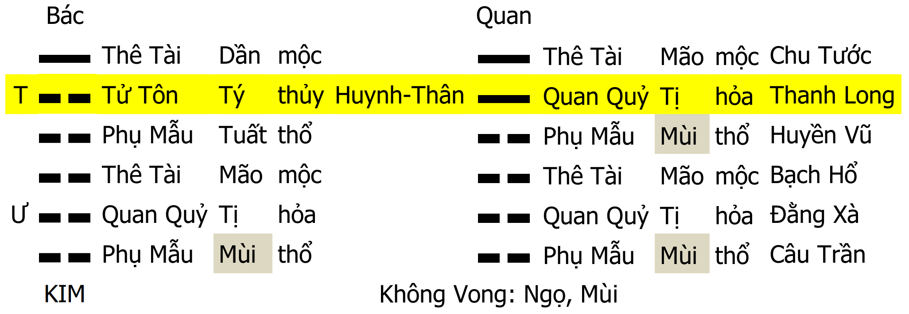

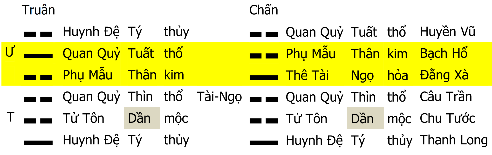

**Tân bình thích:** Bạch Hổ có ý nghĩa bệnh tật, lâm Ứng lâm Quan Quỷ động mà khắc Dụng, Ứng là nơi khác, chính là bệnh nhiễm từ nơi khác, Dụng thần nhập Mộ ở Nhật, là tượng nằm bệnh trên giường, Phụ Mẫu lâm Đằng Xà động đến sinh Dụng, Đằng Xà chủ triền miên, là đã bị bệnh trong thời gian rất dài mới được hồi phục. Tại sao chẳng lý giải là sẽ chết?

Lại như ngày Kỷ Tị tháng Thìn, xem thi hội, được quẻ Quan biến Bĩ.

Thanh Long lâm Mùi thổ, văn chương trì Thế động hóa hồi đầu sinh, Nhật kiến lâm hào 5 làm Quan tinh cùng đến sinh Thế, chắc chắn thi đậu.

**Tân bình thích:** Quẻ này Thanh Long chủ vui mừng. Phụ Mẫu lại là bảng thông báo trúng tuyển, lâm Thanh Long chính là tin mừng.

Lại như ngày Mậu Thìn tháng Mùi, xem việc quan bị tội có nặng không? Được quẻ Tốn biến Hoán.

Thế lâm Mão mộc, đã Mộ ở tháng Mùi, lại gặp Dậu kim Quỷ động, xung khắc hào Thế, thêm lâm Bạch Hổ, gọi là Bạch Hổ ngậm đao, chủ bị gán tội rất hung.

Đối phương hỏi: Hung vào lúc nào?

Ta đáp: Dậu kim hóa Ngọ hỏa, trước mắt không sao, đề phòng ở mùa thu. Quả nhiên đến mùa thu chịu tội chết.

Hai quẻ trên đây, là nói về gặp Long càng cát, gặp Hổ thêm hung.

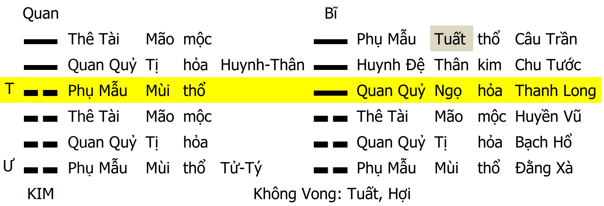

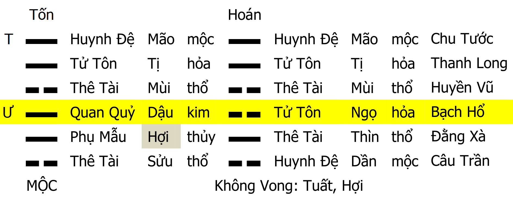

**Tân bình thích:** Thế lâm Chu Tước mà nhập Mộ, là tượng vào tù. Hào Ứng Quan Quỷ lâm Bạch Hổ động đến khắc Thế, Bạch Hổ chủ đao thương, chủ trảm sát, Quan Quỷ là nha môn, khắc Thế, chính là tượng bị hành hình. Chẳng phải Bạch Hổ là hung, Dụng thần vốn hưu tù bị khắc mới là hung.

Ví dụ: Ngày Canh Ngọ tháng Kỷ Sửu năm Ất Hợi, một người phụ nữ đoán cát hung của đứa con. Được quẻ Phong Địa Quan biến Thủy Lôi Truân.

Lấy hào Tử Tôn làm Dụng thần. Quẻ này Tử Tôn Tý thủy không hiện trên quẻ, phục dưới hào sơ Phụ Mẫu Tý thủy, Dụng thần bị Nguyệt khắc Nhật xung, Nguyên thần không hiện, khó mà sinh phù, thêm hào Phi Phụ Mẫu Mùi thổ lâm Bạch Hổ động mà đến khắc, hung nhiều cát ít.

Trong quẻ hào 6 Mão mộc phát động tương hình với Tử Tôn Tý thủy, hình chủ hình sự, mắc hình phạt, lâm Đằng Xà, Đằng Xà chủ trói buộc, nhất định là đứa con đã phạm tội, đã bị công an bắt lại.

Ứng lâm Bạch Hổ khắc, Bạch Hổ chủ đao thương, chính là tượng bị hành quyết. Quẻ này Dụng thần Tý thủy phục tàng, năm 96 gặp xuất hiện bị khắc nhất định hung. Hiện nay hào Phi Mùi thổ Nguyệt phá, tháng Ngọ năm 96 Hợp Phá là ứng kỳ.

Quả nhiên là mắc hình phạt vào tù, bị phán tử hình nhưng hoãn lại hai năm mới thi hành. Nói cách khác, theo tình hình lúc đó thì đến năm 98 con mới bị hành quyết. Ai ngờ năm 96 gặp ở trên nghiêm khắc, đứa con bị xét xử lại, bị hành quyết vào tháng Tị. So với thời gian dự đoán sớm hơn một tháng, điều này là bởi vì Phi thần Nguyệt phá, Nhật thần tới hợp, Nguyệt phá được giải trừ, nên không ứng hợp Phá, mà đã ứng Dụng thần gặp Tuyệt.

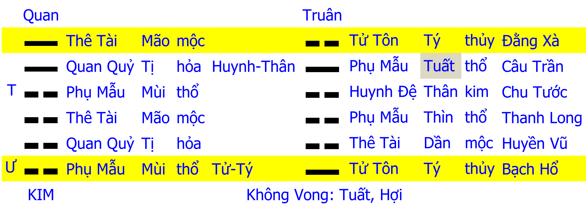

---

# CHƯƠNG 20: LỤC HỢP

Tý hợp với Sửu, Dần hợp với Hợi, Mão hợp với Tuất, Thìn hợp với Dậu, Tị hợp với Thân, Ngọ hợp với Mùi.

Về phương thức tương hợp, có sáu dạng sau:

Thứ nhất: Hào hợp với Nhật thần, Nguyệt kiến.

Thứ hai: Hào với hào tương hợp.

Thứ ba: Hào động và hào biến tương hợp.

Thứ tư: Quẻ lục hợp.

Thứ năm: Quẻ lục xung biến thành lục hợp.

Thứ sáu: Quẻ lục hợp biến thành lục hợp.

Hào hợp với Nhật thần, Nguyệt kiến: Giả sử vào tháng Sửu xem được quẻ Khảm, hào Thế tại Tý thủy, tương hợp với Nguyệt kiến.

Hào với hào tương hợp: Giả sử xem được quẻ Thiên Địa Bĩ, có hai hào Thế và Ứng đều là hào động, tức là Mão hợp với Tuất. Nhưng nếu có một trong hai hào không động, cũng không được coi là hợp.

**Tân bình thích:** Có một hào động tức là hợp, hợp chia thành chủ động và bị động, mỗi cái có một ý nghĩa của nó, hai hào động mà tương hợp chính là tượng ăn nhịp với nhau.

Ngày Quý Sửu tháng Thìn, một người phụ nữ gieo quẻ được Quy Muội biến Phục. Không nói là đoán việc gì.

Quy Muội
 
Phục

Ứ | Phụ Mẫu Tuất thổ | Huynh Đệ Dậu kim Bạch Hổ

Huynh Đệ Thân kim | Tử Tôn Hợi thủy Đằng Xà

Quan Quỷ Ngọ hỏa Tử-Hợi | Phụ Mẫu Sửu thổ Câu Trần

T | Phụ Mẫu Sửu thổ | Phụ Mẫu Thìn thổ Chu Tước

Thê Tài Mão mộc | Thê Tài Dần mộc Thanh Long

Quan Quỷ Tị hỏa | Tử Tôn Tý thủy Huyền Vũ

KIM
Không Vong: Dần, Mão

Trong quẻ hào Tài Mão mộc động mà tương hợp với Ứng, tôi đoán là cô ấy đã cho người khác vay một khoản tiền. Mộc Ứng số 3, đoán cho người ta vay 3 vạn nguyên hoặc 30 vạn nguyên.

Quan Quỷ Ngọ hỏa phát động, Tài động sinh Quan, Quan động sinh Ứng, Quan Quỷ là gian hào (hào gián), xưa là người môi giới, nay là người trung gian, đoán số tiền này được cho vay thông qua một người khác. Quan Quỷ lâm Câu Trần, Câu Trần xưa là nha môn, nay là nhân viên công vụ, đoán người trung gian là một cán bộ làm việc ở đơn vị cơ quan nhà nước.

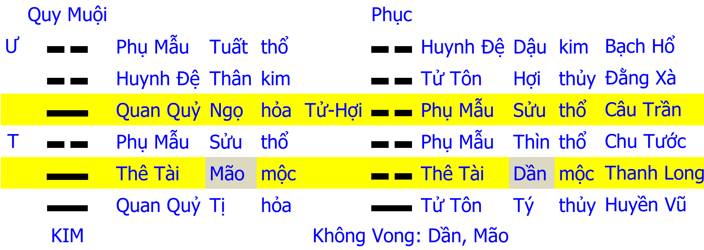

Tài động hóa thoái, tiền có thể quay lại.

Toàn bộ đều ứng, là 30 vạn nguyên.

Sao lại có thể nói một hào phát động không thể hợp?

Hào động và hào biến tương hợp: Giả sử xem được quẻ Thiên Phong Cấu, hào Thế là Sửu động hóa thành hào Tý thủy, như vậy hào động và hào biến là tương hợp.

Quẻ lục hợp: Ví dụ tại quẻ Thiên Địa Bĩ, sáu hào của quẻ nội, quẻ ngoại đều tương hợp với nhau, không có hào động cũng được coi là hợp.

Quẻ lục xung biến thành lục hợp: Giả sử xem được quẻ Càn vi Thiên, vốn là quẻ bát thuần lục xung. Nếu như ba hào của quẻ ngoại đều động, sẽ biến thành quẻ Địa Thiên Thái, như vậy là quẻ lục xung biến thành lục hợp.

Quẻ lục hợp biến thành lục hợp: Ví dụ như xem được quẻ Lữ biến quẻ Bí.

Các hào tương hợp, nếu tĩnh mà gặp hợp, gọi là hợp khởi. Nếu động mà gặp hợp, gọi là hợp bán.

Hào với hào tương hợp, gọi là hợp hảo.

Hào động và hào biến tương hợp, gọi là hóa phù.

Hào tĩnh nếu tương hợp với Nhật, Nguyệt, hào động, sẽ được khởi phát, cho dù hào đó hưu tù, cũng được trở nên vượng tướng.

Hào động nếu tương hợp với Nhật, Nguyệt, hào động, sẽ bị ràng buộc (bán), nên không thể động được nữa.

Hào động nếu tương hợp với hào động, tức là có người khác đến tương hợp với ta, sẽ trợ giúp cho ta.

Nếu hào biến ra từ hào động lại hồi đầu tương hợp với hào gốc, gọi là hóa phù, nghĩa là được người khác phù trợ.

Nếu được các dạng tương hợp trên đây, xem về việc gì cũng được coi là cát. Xem về công danh được công danh, xem về lợi lộc được lợi lộc, xem về hôn sự, hôn sự ắt thành; xem về bản thân, bản thân sẽ phấn phát; xem về gia trạch, sẽ được hưng vượng, xem về phong thủy mộ phần, là thế tụ khí tàng phong; xem về mưu sự, sẽ được toại nguyện như ý. Nhưng Dụng thần cần phải có khí mới tốt, Dụng thần thất hãm cũng là vô ích.

Sách xưa có viết: Tất cả mọi sự việc đều ưa gặp được tam hợp, lục hợp, gặp được thì mọi sự đều được lâu dài, có thủy có chung.

Thế nhưng xem việc tốt mới nên gặp, việc tốt ắt sẽ được. Xem về việc xấu không nên gặp, vì sẽ chuốc lấy tai họa.

Ví dụ: Ngày Mậu Thân tháng Sửu, xem về thi cử, được quẻ Khảm biến Khốn:

| | Khảm | | | Khốn | |
| :---: | :---: | :--- | :---: | :--- | :--- |
| T | ⚋ | Huynh Đệ Tý thủy | ⚋ | Quan Quỷ Mùi thổ | Chu Tước |
| | ━ | Quan Quỷ Tuất thổ | ━ | Phụ Mẫu Dậu kim | Thanh Long |
| | ⚋ | Phụ Mẫu Thân kim | ━ | Huynh Đệ Hợi thủy | Huyền Vũ |
| Ư | ⚋ | Thê Tài Ngọ hỏa | ⚋ | Thê Tài Ngọ hỏa | Bạch Hổ |
| | ━ | Quan Quỷ Thìn thổ | ━ | Quan Quỷ Thìn thổ | Đằng Xà |
| | ⚋ | Tử Tôn Dần mộc | ⚋ | Tử Tôn Dần mộc | Câu Trần |

THỦY Không Vong: Dần, Mão

Đoán rằng: Hào Thế tại Tý thủy, hợp với Nguyệt kiến Sửu; Nhật thần là Thân lâm Phụ Mẫu sinh hào Thế, hào Thân kim lại động. Đây lại là quẻ lục xung biến thành lục hợp, nên tượng quẻ toàn mỹ, ắt bài thi sẽ được liệt vào thượng quyển. Quả nhiên thi đỗ đầu bảng, đến khoa thi năm Tý đỗ cao. Sau hỏi ra, thì khoa thi trước chỉ đỗ thứ tư. Bởi vậy, xem được quẻ lục xung biến lục hợp, tức là tượng trước bĩ sau thái.

Lại như vào ngày Tân Mão tháng Tuất, xem về việc kiện tụng, được quẻ Thái:

| | | Thái | | |
| :---: | :---: | :--- | :--- | :--- |
| Ư | ⚋ | Tử Tôn Dậu kim | | Đằng Xà |
| | ⚋ | Thê Tài Hợi thủy | | Câu Trần |
| | ⚋ | Huynh Đệ Sửu thổ | | Chu Tước |
| T | ━ | Huynh Đệ Thìn thổ | | Thanh Long |
| | ━ | Quan Quỷ Dần mộc | Phụ-Tị | Huyền Vũ |
| | ━ | Thê Tài Tý thủy | | Bạch Hổ |

THỔ Không Vong: Ngọ, Mùi

Ta bèn đoán rằng: Tuy rằng các hào gặp lục hợp, nhưng hiềm nỗi bị Nguyệt kiến Tuất xung hào Thế, Nhật thần Mão khắc hào Thế. Hào Ứng lại ám động, được Nguyệt kiến tương sinh, nên được thời, chủ về người khác thắng thế, bản thân mình thua kiện. Sau quả nhiên thua kiện bị phạt trượng. Đó là do Mão mộc tương khắc hào Thế. Dụng thần bị khắc, thì được quẻ lục hợp cũng vô ích. Bởi vậy, khi được các dạng hợp, mà hào Thế thất hãm, cũng khó có thể cho là quẻ tốt.

Lại như vào ngày Bính Tý tháng Thân, xem về xuất hành, được quẻ Minh Di biến Tiểu Quá:

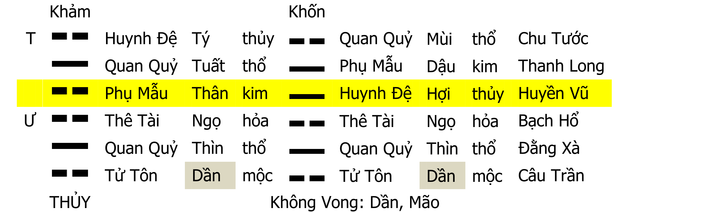

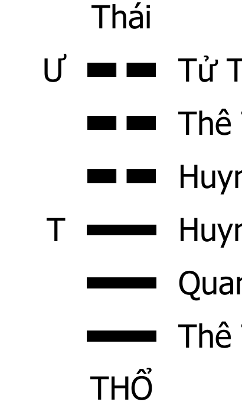

| | Minh Di | | | Tiểu Quá | |
| :---: | :---: | :--- | :---: | :--- | :--- |
| | ⚋ | Phụ Mẫu Dậu kim | ⚋ | Quan Quỷ Tuất thổ | Thanh Long |
| | ⚋ | Huynh Đệ Hợi thủy | ⚋ | Phụ Mẫu Thân kim | Huyền Vũ |
| T | ⚋ | Quan Quỷ Sửu thổ | ━ | Thê Tài Ngọ hỏa | Bạch Hổ |
| | ━ | Huynh Đệ Hợi thủy Tài-Ngọ | ━ | Phụ Mẫu Thân kim | Đằng Xà |
| | ⚋ | Quan Quỷ Sửu thổ | ⚋ | Thê Tài Ngọ hỏa | Câu Trần |
| Ư | ━ | Tử Tôn Mão mộc | ⚋ | Quan Quỷ Thìn thổ | Chu Tước |

THỦY Không Vong: Thân, Dậu

Hào Thế động, được Nhật thần Tý tương hợp, chắc sẽ gặp vướng mắc, không thể khởi hành. Người này bèn hỏi: "Vướng mắc về chuyện gì?" Ta đáp rằng: "Trong quẻ có Tử động biến Quỷ, đề phòng con gái không được yên ổn."

Người này bèn nói rằng: "Cũng vì con gái nhiều bệnh tật, nhà trai lại thúc giục thành hôn, nên nay ra ngoài vì chuyện cưới gả, để chuẩn bị của hồi môn." Ta bèn hỏi: "Mắc bệnh gì?" Người này đáp: "Huyết khô thành lao." Ta bèn nói: " Tử Tôn Mão mộc gặp Tuyệt tại tháng Thân, bị Nhật thần Tý tương hình, lại động mà biến thành Quan Quỷ, e rằng không kịp cưới gả. Sau vì bệnh nặng, người này không thể đi được, đến ngày Thìn thì con gái chết, sở dĩ không đi được, là vì hào Thế động mà gặp hợp. Con gái chết vào ngày Thìn, do Tử Tôn Mão mộc biến thành Quan Quỷ Thìn thổ.

Những trường hợp trên là hào gặp hợp. Gặp quẻ lục hợp cũng rất ứng nghiệm.

## Quẻ lục xung biến thành lục hợp

Ví dụ: Vào ngày Đinh Tị tháng Mùi, xem hôn sự đã bị từ hôn liệu còn thành được hay không. Được quẻ Ly biến Hỏa Sơn Lữ:

| | Ly | | | Lữ | |
| :---: | :---: | :--- | :---: | :--- | :--- |
| T | ━ | Huynh Đệ Tị hỏa | ━ | Huynh Đệ Tị hỏa | Thanh Long |
| | ⚋ | Tử Tôn Mùi thổ | ⚋ | Tử Tôn Mùi thổ | Huyền Vũ |
| | ━ | Thê Tài Dậu kim | ━ | Thê Tài Dậu kim | Bạch Hổ |
| Ư | ━ | Quan Quỷ Hợi thủy | ━ | Thê Tài Thân kim | Đằng Xà |
| | ⚋ | Tử Tôn Sửu thổ | ⚋ | Huynh Đệ Ngọ hỏa | Câu Trần |
| | ━ | Phụ Mẫu Mão mộc | ⚋ | Tử Tôn Thìn thổ | Chu Tước |

Ta bèn đoán rằng: Quẻ này vốn dĩ khó mà đoán là tốt được. Nhưng theo chiêm nghiệm của ta, gặp quẻ lục xung biến lục hợp, chủ về tán rồi lại tụ, ly rồi sẽ hợp, hôn sự này nhất định sẽ thành. Quả nhiên vào tháng ba năm sau, hai bên lại thành hôn.

Với các dạng hợp, nếu Dụng thần vượng sẽ tốt, duy chỉ có trường hợp quẻ lục xung biến thành lục hợp là không cần xem Dụng thần cũng có thể đoán là tốt; xem về hôn nhân, trước là cách trở, sau lại nên duyên. Xem về vợ chồng, trước là chia lìa, sau lại hòa hảo. Xem về công danh, trước gian nan, sau được vinh hiển. Xem về mưu kế, trước khó khăn, sau sẽ dễ dàng. Xem về vận mệnh, trước khốn khó sau được hưởng

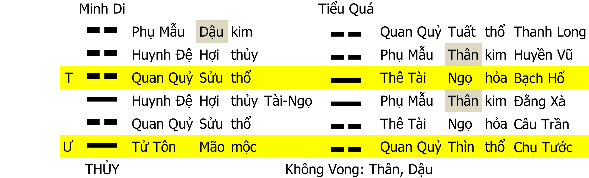

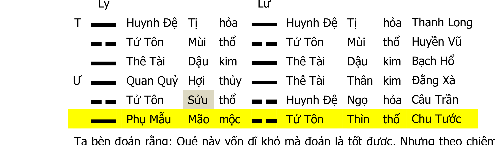 thụ. Xem về phong thủy, sẽ tìm được đất tốt. Xem về gia trạch, trước nghèo khổ sau phát đạt. Từng có người vợ bị cướp bắt, sau vẫn được đoàn tụ. Có người ruộng vườn bán hết, sau vẫn được lấy về.

### Quẻ lục hợp biến thành lục hợp:

Các hào trong quẻ được lục hợp đã là điềm tốt. Nhưng hào động mà lại biến ra quẻ lục hợp, được gọi là thủy chung tương hợp.

Xem về phong thủy, sẽ hiển đạt trăm năm.

Xem về gia trạch, sẽ vững nghiệp muôn đời.

Xem về hôn nhân, sẽ chung sống đến bạc đầu.

Xem về bạn làm ăn, tất cả đều trung thành tận tụy.

Xem về công danh, đường mây rộng mở.

Xem về tiền tài, chất ngất bằng non.

Xem về anh em, sẽ đời đời chung sống.

Xem về học tập, sẽ thành tựu liên tiếp.

Xem về tu luyện, sẽ thành công nhanh chóng.

Nếu được thêm Dụng thần vượng khí, lại gặp Nguyệt kiến, Nhật thần, là đã tốt lại càng thêm tốt.

Duy chỉ có xem về kiện tụng là bất lợi, chủ về thù oán khó giải. Hoặc xem về chuyện ngờ vực, quái đản, sẽ không được toại nguyện.

Xem về thai nghén, gặp quẻ này sẽ được an lành. Xem về sinh sản, gặp quẻ này sẽ khó sinh.

Lại nếu như Dụng thần bị khắc, càng là điềm hung hại.

Giả sử vào ngày Giáp Dần tháng Mão, xem về mồ mả, được quẻ Khốn biến Tiết:

Ta bèn hỏi: "Xem về mộ tổ, ắt có duyên cớ. Từ khi mai táng đến nay đã xảy ra chuyện gì? Tại sao hôm nay lại muốn hỏi về việc này? Nếu nói rõ cho ta biết, ta mới dám quyết đoán." Người xem bèn nói rằng: "Từ khi mai táng xong, về đường công danh, bị khiển trách nên về hưu. Nay tuổi đã ngũ tuần, mà vẫn không con cái, nên mới hỏi thầy, có phải là do phong thủy mộ tổ có vấn đề hay không?"

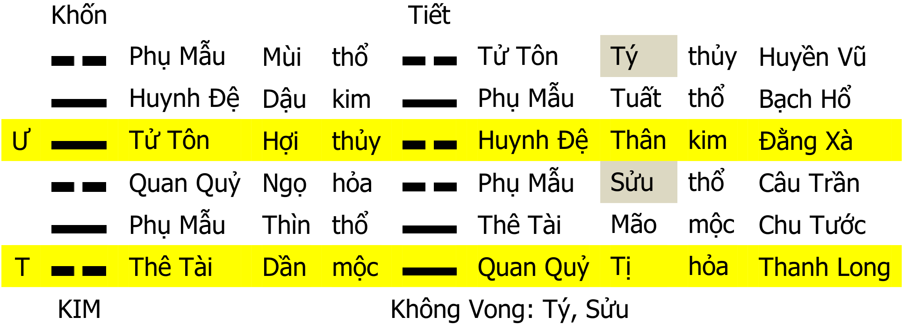

Ta bèn giải đáp rằng: "Lai long đến từ long mạch phía bên phải, nước quành từ bên trái lại, ấy là do dòng nước chảy không về huyệt gây nên." Người này bèn hỏi: "Tại sao thầy biết được?" Ta đáp rằng: "Tử Tôn Hợi thủy, biến thành Thân kim, hồi đầu sinh thủy, Thân là dòng nước, đến ngày Dần bị xung tán. Nếu như có thể khiến nước chảy về huyệt, không còn chảy vòng sang bên cạnh nữa, thì từ năm sau sẽ hiệu nghiệm, công danh được phục hồi, đến năm Thân sẽ sinh quý tử." Người này bèn hỏi có được lâu dài không? Ta bèn đáp: "Quẻ lục hợp biến lục hợp, là tượng an hưởng ngàn năm."

Sách xưa có viết: Tý hợp với Sửu, trong Sửu có thổ, thổ khắc Tý thủy, nên gọi là trong hợp có khắc, khắc ba phần hợp bảy phần. Tị hợp với Thân, Tị hỏa khắc Thân kim, nên gọi là khắc bảy phần hợp ba phần. Những quan niệm đó vẫn không đúng hoàn toàn.

Ta thấy ứng nghiệm ở chỗ, khi Tý hợp với Sửu, nếu xem vào ngày hoặc tháng Thìn, Tuất, Sửu, Mùi, mà hào Tý thủy không được những chỗ khác sinh phù, thì chỉ coi là khắc mà không nói đến hợp. Nếu được những chỗ khác sinh phù, thì vẫn coi là hợp.

Cho nên khi Tý thủy gặp tháng Sửu, Tuất thổ gặp tháng Mão, Thân kim gặp tháng Tị, lại bị hào động Nhật kiến tương khắc, tức là đã khắc lại thêm khắc, làm sao có thể hợp được! Còn như có người đến hỏi chuyện cát hung, lại giải đáp theo kiểu ba phần, bảy phần như vậy, làm sao có thể giải tỏa được mối ngờ cho người ta.

Ví dụ: Vào ngày Canh Thìn tháng Sửu, xem về bệnh của con, được quẻ Bác:

Tử Tôn Tý thủy tương hợp với Nguyệt kiến, trong quẻ không còn hào khác sinh phù, nên chỉ coi là khắc mà không coi là hợp. Lại bị Nhật thần khắc chế, Nhật thần lại xung động Tuất thổ để khắc Tý thủy, chỉ e rằng không qua được giờ Thìn. Người này đã sinh đến 9 con, nhưng đều chết cả, nghe vậy thì hết sức đau lòng, bèn lập tức sai nhũ mẫu bế đứa bé lên nhà khách, mời những người thân có quyền chức cao đến vây quanh. Cho đến giờ Dần, thì thấy nhũ mẫu khóc. Đấy là do số mệnh gặp khắc, bệnh không cứu được, sao có thể nói theo kiểu khắc ba hợp bảy được!

### Tam hợp cục:

Thân, Tý, Thìn hợp thành thủy cục;

Tị, Dậu, Sửu hợp thành kim cục;

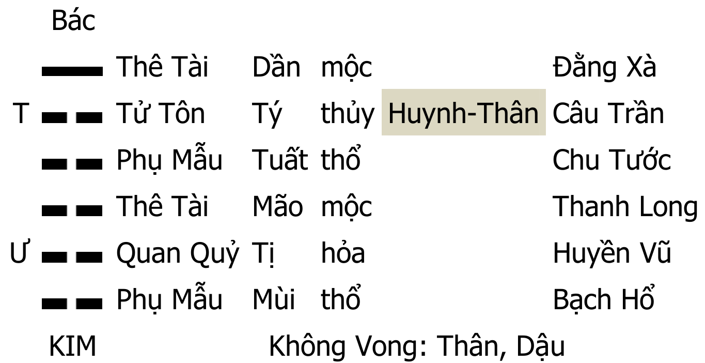

Dần, Ngọ, Tuất hợp thành hỏa cục;
Hợi, Mão, Mùi hợp thành mộc cục.

Tam hợp có bốn dạng:

Thứ nhất: Trong một quẻ, có ba hào động mà thành hợp cục.

Thứ hai: Có hai hào động, một hào không động, cũng tạo thành hợp cục.

Thứ ba: Trong quẻ nội, hào sơ và hào 3 động, biến ra hào biến, cùng hào sơ và hào 3 tạo thành hợp cục.

Thứ tư: Trong quẻ ngoại, hào 4 và hào 6 động, biến ra hào biến, cùng hào 4 và hào 6 tạo thành hợp cục.

Tam hợp cục có hung, cũng có cát.

Như xem về công danh, nếu hợp thành Quan cục, gọi là quan vượng.

Hợp thành Tài cục, Tài vượng sẽ sinh Quan.

Nếu hợp thành Tử Tôn cục, sẽ gây tổn hại đến Quan.

Nếu xem về cầu tài, quẻ hợp thành Tài cục, gọi là Tài khố (kho của).

Nếu hợp thành Tử Tôn cục, gọi là thế Tử cục sinh tài.

Nếu hợp thành Huynh Đệ cục, là thế hao tài tán của, ngăn trở chia cách.

Nếu xem về mộ tổ, gia trạch, nếu hào Phụ Mẫu hợp cục là tốt.

Nếu xem về hôn nhân, vợ chồng, hào Tài, Quan vượng mà hợp cục là tốt.

Nếu xem về chuyện tốt đẹp, nếu thành cục là tốt, là thế vững bền, trường cửu.

Nếu xem về kiện tụng, nghi ngờ mà gặp hợp cục, thì một đời phiền muộn uất kết trọng lòng, khó có thể trừ bỏ.

Nhưng với tam hợp cục, hào Thế phải ở trong cục mới là tốt. Nếu hào Thế ở ngoài cục, thì cục tương sinh ra hào Thế là cát, cục tương khắc hào Thế là hung. Nguyệt kiến, Nhật thần, nếu được một thứ ở trong cục, thì được gọi là cục vượng, càng cát lợi.

Trong ba hào của cục, nếu có hai hào động sẽ không tạo thành cục, cần phải đợi đến ngày, tháng sau này bổ sung, bù đắp, mới hợp thành được cục. Như vậy, gọi là "hư nhất đãi dụng" (thiếu một đợi dùng).

Nếu có một hào động, một hào ám động, cũng coi như có hai hào động.

Trong tam hợp cục, nếu có một hào gặp Không, Phá, phải đợi đến ngày, tháng hào đó được điền thực, mới có thể thành cục.

Nếu có một hào nhập Mộ, đợi đến ngày xung khai, mới có thể thành cục.

Phàm là được tam hợp cục, nếu cầu việc danh lợi, hôn nhân, gia trạch, phong thủy, mà Dụng thần vượng, thì việc xem đều tốt. Nhưng hào Thế phải ở trong cục mới tốt. Nếu hào Thế ở ngoài cục, nếu được cục tương sinh là cát, nếu bị cục tương khắc là hung.

Như xem về công danh, được tam hợp Quan cục sinh hào Thế, sẽ có lợi cho bản thân; nếu hợp cục sinh hào Ứng, sẽ lợi cho người khác.

**Tân bình thích:** Lý luận này rất đúng, ví dụ tôi nghiệm được quẻ:

Ngày Nhâm Dần tháng Thân, nam đoán quan vận, được Tiểu Quá biến Mông.

| | Tiểu Quá | | Mông | |
| :---: | :--- | :---: | :--- | :--- |
| | - - Phụ Mẫu Tuất thổ | | — Thê Tài Dần mộc | Bạch Hổ |
| | - - Huynh Đệ Thân kim | | - - Tử Tôn Tý thủy | Đằng Xà |
| T | — Quan Quỷ Ngọ hỏa | Tử·Hợi | - - Phụ Mẫu Tuất thổ | Câu Trần |
| | — Huynh Đệ Thân kim | | - - Quan Quỷ Ngọ hỏa | Chu Tước |
| | - - Quan Quỷ Ngọ hỏa | Tài·Mão | — Phụ Mẫu Thìn thổ | Thanh Long |
| Ứ | - - Phụ Mẫu Thìn thổ | | - - Thê Tài Dần mộc | Huyền Vũ |

KIM Không Vong: Thìn, Tị

Quẻ này Quan Quỷ Ngọ hỏa trì Thế, được Nhật sinh, lại tam hợp thành cục, có thể gọi là vượng. Tôi đoán người này khó mà được thăng chức. Kết quả đúng như vậy. Chính là bởi vì tam hợp Quan cục mà sinh hào Ứng.

Ngoài ra, Nhật Nguyệt cũng nhập tam hợp cục, nhưng địa chi ở giữa trong cục phải phát động trong quẻ, lại là bán cục, mới có thể nhận Nhật Nguyệt thành cục.

Xem về tiền tài, được Tài cục sinh hào Thế, sẽ có lợi cho bản thân; nếu Tài cục sinh hào Ứng, sẽ có lợi cho người khác.

Xem về xuất hành, nếu Dụng thần nằm trong tam hợp, sẽ bị hợp mà phải ở lại.

Xem về người đi xa, nếu Dụng thần nằm trong tam hợp, sẽ bị hợp mà không thể trở về.

**Tân bình thích:** Trong sách cổ có nói: "Dụng thần trị tam hợp, hành nhân lập hồi trang" (Dụng thần có tam hợp, người đi đường tức khắc về nhà). Lại nói tam hợp nhanh về. Dụng thần tam hợp thành cục sinh Thế, sao có lý không về?

Như ví dụ thực tiễn của tôi dưới đây.

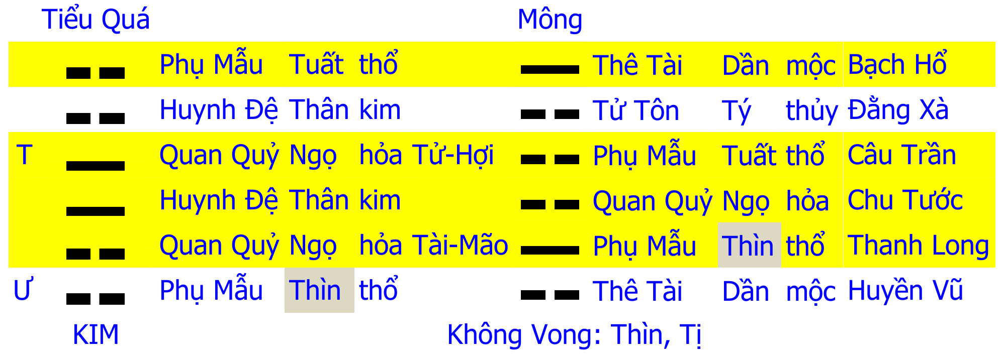

Một học trò của tôi xuất ngoại, ngày Kỷ Mùi tháng Tý, có người xem anh ta ngày nào về, được quẻ Khiêm biến Lữ.

Xem bạn trở về, lấy hào Huynh Đệ làm Dụng thần, Dụng trị tam hợp cục sinh hào Thế, đang về, hơn nữa ngày về rất gần. Kết quả là ngày hôm sau về đến. Ứng ngày hôm sau vì Dụng thần động hóa hồi đầu khắc, ngày hôm sau hợp trú khắc thần hào biến mà về. Nếu luận theo Dã Hạc thì nhất định không trở về.

Nếu quẻ nội và quẻ ngoại đều hợp thành tam hợp cục, phải phân chia rõ nội và ngoại.

Ví dụ xem về gia trạch, mà ở nhà phía ngoài, nếu quẻ nội khắc quẻ ngoại là không nên; nếu ở nhà trong, thì được quẻ nội sinh quẻ ngoại là tốt.

Nếu xem về tình trạng của mình và người khác, thì quẻ nội tượng trưng cho bản thân, quẻ ngoại tượng trưng cho người khác. Nếu quẻ ngoại hợp cục, mà sinh ra quẻ nội, là tốt; quẻ ngoại khắc quẻ nội là hung.

Ví dụ vào ngày Đinh Tị tháng Mão, thôn trên và thôn dưới vì tranh chấp nước tưới ruộng mà xảy ra ẩu đả, xem được quẻ Ly biến quẻ Khôn:

Ta bèn đoán rằng: Quẻ nội tượng trưng cho thôn mình, được Hợi, Mão, Mùi hợp thành mộc cục. Quẻ ngoại tượng trưng cho thôn người ta, được Tị, Dậu, Sửu hợp thành kim cục. Kim khắc mộc, may là vì kim suy không khắc được mộc vượng, nên không đáng lo. Lại thêm là quẻ lục xung biến thành lục xung, sẽ có người đến can ngăn giải tán nên không nghiêm trọng. Sau quả có người khuyên giải mà giải tán.

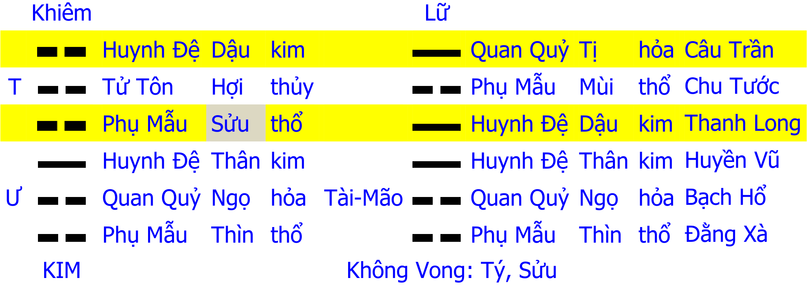

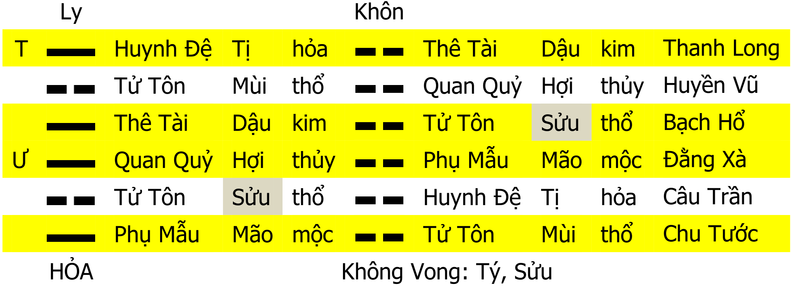

Có người hỏi rằng, tình thế của hai bên, ắt phải lấy hào Thế hào Ứng làm chủ, tại sao ở đây lại không nói đến Thế, Ứng? Ta bèn đáp rằng: Nếu không có hợp cục nội ngoại, thì cần xem Thế, Ứng. Nhưng nay tình hình hai thôn hiển thị tại hai quẻ nội và ngoại, vì mọi người đồng lòng, nên cả hai đều hợp cục, ý của thần linh đã hiện rõ, nên mới bỏ mà không dùng đến Thế, Ứng. Nếu quẻ này không biến thành quẻ lục xung, thì chắc chắn sẽ xảy ra chuyện rắc rối.

Lại như vào ngày Đinh Dậu tháng Tị xem về công danh, được quẻ Càn biến Thủy Thiên Nhu:

Người này thi tài năng được ngôi đầu, nhưng sau vì nguyên do khác mà không được trọng dụng. Nay lại có vị trí cần tuyển chọn tài năng, có ý muốn ra thi, nhưng lại không dám. Ta bèn nói rằng: Anh đã cầu khấn để hỏi thần linh về chức vị này, thần đã mách bảo với anh, chức này chắc chắn sẽ được. Hào Quan vượng sinh hào Thế, nên chắc chắn sẽ có công danh. Điềm vì Quan cục tam hợp Dần Ngọ Tuất còn thiếu khuyết Dần, cần phải đợi đến ngày Dần mới hiển hiện đủ, như vậy sẽ được bổ nhiệm chức vị còn khuyết đó. Quả nhiên vào ngày Dần trình lên, được phê chuẩn bổ nhiệm. Trường hợp này chính là "hư nhất dĩ đãi dụng" (khuyết một đợi dùng).

Lại ví dụ: Ngày Bính Thìn tháng Dần, xem về ngày báo danh ứng thí, được quẻ Càn biến Tiểu Súc:

Ta bèn giải thích rằng: Quẻ này nếu đoán theo phương pháp xưa, chỉ có một hào Quan Ngọ hỏa phát động, nên ứng vào ngày Ngọ. Nếu động mà gặp hợp, cần phải đợi dịp xung khai, tức tháng Tý tháng Sửu. Nhưng nay ta không theo phép này. Ngọ

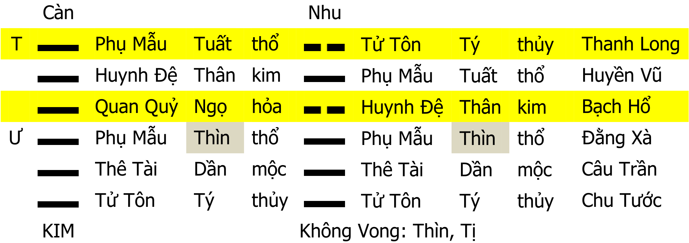

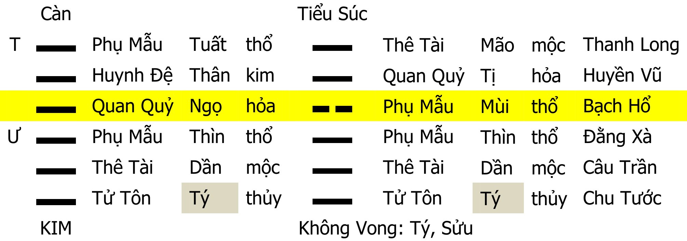

---

# CHƯƠNG 21. LỤC XUNG

hỏa động, hào Tuất ám động, tạo thành tam hợp nhưng còn thiếu Dần, cần nhờ vào Nguyệt kiến để tạo thành tam hợp, tháng này là tháng Dần, ắt sẽ được tuyển. Quả nhiên trong tháng được tuyển đến làm quan tại Mân Trung. Sở dĩ ứng tuyển tại đất Mân, là do hào Thế động tại hào 6, và hào Quan tại Ngọ hỏa. Đây là trường hợp minh động, ám động hợp thành cục.

**Tân bình thích:** Quẻ này Phụ Mẫu Tuất thổ Nguyệt khắc là hưu tù, nhưng được Quan Quỷ Ngọ hỏa động mà sinh, chuyển nhược thành vượng, Nhật xung không là phá, là ám động.

Lại ví dụ: Vào ngày Đinh Hợi tháng Thìn, xem về việc giải trình, được quẻ Tụy biến Cách:

| | Tụy | | | Cách | |
| :---: | :---: | :---: | :---: | :---: | :---: |
| | -- -- | Phụ Mẫu Mùi thổ | -- -- | Phụ Mẫu Mùi thổ | Thanh Long |
| Ứ | ----- | Huynh Đệ Dậu kim | ----- | Huynh Đệ Dậu kim | Huyền Vũ |
| | ----- | Tử Tôn Hợi thủy | ----- | Tử Tôn Hợi thủy | Bạch Hổ |
| | -- -- | Thê Tài Mão mộc | ----- | Tử Tôn Hợi thủy | Đằng Xà |
| T | -- -- | Quan Quỷ Tị hỏa | -- -- | Phụ Mẫu Sửu thổ | Câu Trần |
| | -- -- | Phụ Mẫu Mùi thổ | ----- | Thê Tài Mão mộc | Chu Tước |

Quẻ nội gồm Hợi, Mão, Mùi hợp thành Tài cục (mộc cục), sinh ra hào Thế là hào Quan Tị hỏa. Hào Thế Tị hỏa gặp Dịch Mã, bị Nhật thần Hợi xung mà ám động, chớ nên tiếc chi phí, đến ngày Mùi chắc chắn sẽ được chấp nhận, lập tức được chức vị tốt. Sau đến tháng Mùi, được khôi phục chức vị, bổ nhiệm đến Sở Trung. Sở dĩ ứng nghiệm vào tháng Mùi, là tháng không được điền thực.

**Tân bình thích:** Quẻ này Quan Quỷ không được Nhật Nguyệt sinh phù, tam hợp Tài cục tới sinh, chính là hối lộ được quan.

***

# CHƯƠNG 21: LỤC XUNG

Tý Ngọ tương xung; Sửu Mùi tương xung; Dần Thân tương xung; Mão Dậu tương xung; Thìn Tuất tương xung; Tị Hợi tương xung.

**Tương xung có sáu dạng như sau:**

Thứ nhất: Nhật, Nguyệt xung hào.

Thứ hai: Gặp quẻ lục xung.

Thứ ba: Quẻ lục hợp biến thành quẻ lục xung.

Thứ tư: Quẻ lục xung biến thành quẻ lục xung.

Thứ năm: Hào động biến xung.

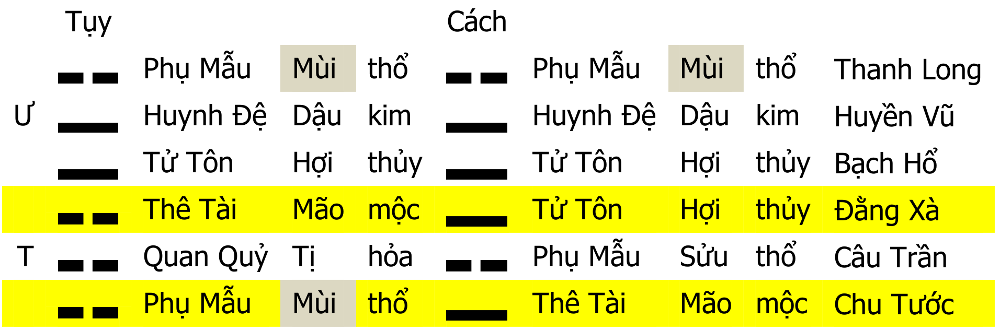

Thứ sáu: Hào xung với hào.

Xung thì sẽ tán. Nếu xem về việc dữ, gặp được xung tán là tốt; xem về việc tốt, gặp xung tán là không nên. Nhưng vẫn cần phải kết hợp với Dụng thần. Dụng thần vượng, tuy gặp xung cũng không đáng ngại; Dụng thần thất hãm, thì hung lại càng hung. Quẻ lục hợp biến thành quẻ lục xung, mà Dụng thần vượng, thì trước cát sau hung, việc mong cầu tuy thành, nhưng có khởi đầu mà không được trọn vẹn.

**Hào xung có năm loại:**

Hào bị Nguyệt kiến xung gọi là Nguyệt phá;

Hào bị Nhật thần xung là ám động;

Hào hưu tù bị Nhật thần xung gọi là Nhật phá.

Hào động hóa hồi đầu xung, tựa như gặp kẻ thù;

Hào xung với hào, gọi là đánh nhau.

Ví dụ vào ngày Nhâm Tý tháng Hợi, xem con có bị hãm hại hay không, được quẻ Lôi Thiên Đại Tráng biến Địa Thiên Thái:

| | Đại Tráng | | | Thái | |
| :---: | :---: | :---: | :---: | :---: | :---: |
| | -- -- | Huynh Đệ Tuất thổ | -- -- | Tử Tôn Dậu kim | Bạch Hổ |
| | -- -- | Tử Tôn Thân kim | -- -- | Thê Tài Hợi thủy | Đằng Xà |
| T | ----- | Phụ Mẫu Ngọ hỏa | -- -- | Huynh Đệ Sửu thổ | Câu Trần |
| | ----- | Huynh Đệ Thìn thổ | ----- | Huynh Đệ Thìn thổ | Chu Tước |
| | ----- | Quan Quỷ Dần mộc | ----- | Quan Quỷ Dần mộc | Thanh Long |
| Ứ | ----- | Thê Tài Tý thủy | ----- | Thê Tài Tý thủy | Huyền Vũ |

THỔ Không Vong: Dần, Mão

Nghe đồn con trai của người này bị người khác nhục mạ, đuổi đánh, nên người cha gieo quẻ thế nào. Ta bèn nói: Đây là quẻ lục xung biến thành quẻ lục hợp, nên ắt sẽ có người đứng ra can gián. Hào Phụ Mẫu trì Thế khắc Tử Tôn, nên là bản thân anh trách phạt con, chứ con anh không bị người khác hại. Một lúc sau, quả có người đến gọi đi lý luận, con trai người này đuối lý, nên người cha cầm gậy đánh con, nhưng được người khác can ngăn. Hai cha con đền bù cho người ta rồi ra về. Sở dĩ việc đánh con không thành, là do quẻ lục xung biến thành quẻ lục hợp. Cha đánh con được người khác can ngăn, là do Nhật thần ở Tý thủy xung khắc hào Thế, nên không thể đánh được con.

Các sách khác coi trọng nhất là động mà gặp xung gọi là tán, tán cũng coi như là không, tức tượng hoàn toàn trống rỗng, không có gì, cho dù được sinh phù, cũng không cứu được.

Dã Hạc lão nhân nói: Quẻ này hào Thế Ngọ hỏa động, gặp mùa đông nên ở thế hưu tù, động mà bị ngày Tý xung, sao lại có thể coi là bị tán, sao lại có thể coi là hoàn toàn không còn hào Thế phát động? Thân đã động, cha động khắc con, nên đã đánh con. Ta thường nói rằng: "Thần hé lộ thiên cơ ở hào động, động ắt ứng nghiệm". Xem

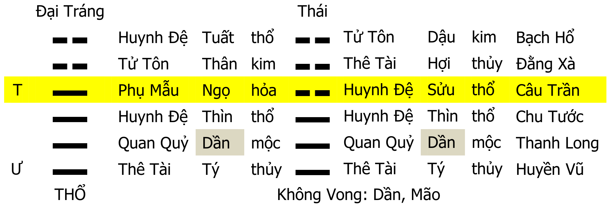 vượng suy là để suy đoán về tính chất nặng nhẹ, chứ không thể coi là tán để cho là không.

Vào ngày Mậu Tuất tháng Tị, xem về tiền tài được quẻ Phong Lôi Ích:

| | | Ích | | |
| :--- | :---: | :--- | :--- | :--- |
| Ư | ▅▅▅▅▅ | Huynh Đệ Mão mộc | | Chu Tước |
| | ▅▅▅▅▅ | Tử Tôn Tị hỏa | | Thanh Long |
| | ▅▅  ▅▅ | Thê Tài Mùi thổ | | Huyền Vũ |
| T | ▅▅  ▅▅ | Thê Tài Thìn thổ | Quan-Dậu | Bạch Hổ |
| | ▅▅  ▅▅ | Huynh Đệ Dần mộc | | Đằng Xà |
| | ▅▅▅▅▅ | Phụ Mẫu Tý thủy | | Câu Trần |

MỘC Không Vong: Thìn, Tị

Hào Tài Thìn thổ trì Thế, vì gặp Tuần Không, bị Nhật thần Tuất xung Không nên thành thực, nên trong ngày ắt sẽ được của.

Lại như vào ngày Bính Thìn tháng Ngọ, xem ra ngoài buôn bán tài vận ra sao, được quẻ Hằng biến Dự:

| | | Hằng | | | Dự | |
| :--- | :---: | :--- | :--- | :---: | :--- | :--- |
| Ư | ▅▅  ▅▅ | Thê Tài Tuất thổ | | ▅▅  ▅▅ | Thê Tài Tuất thổ | Thanh Long |
| | ▅▅  ▅▅ | Quan Quỷ Thân kim | | ▅▅  ▅▅ | Quan Quỷ Thân kim | Huyền Vũ |
| | ▅▅▅▅▅ | Tử Tôn Ngọ hỏa | | ▅▅▅▅▅ | Tử Tôn Ngọ hỏa | Bạch Hổ |
| T | ▅▅▅▅▅ | Quan Quỷ Dậu kim | | ▅▅  ▅▅ | Huynh Đệ Mão mộc | Đằng Xà |
| | ▅▅▅▅▅ | Phụ Mẫu Hợi thủy | Huynh-Dần | ▅▅  ▅▅ | Tử Tôn Tị hỏa | Câu Trần |
| | ▅▅  ▅▅ | Thê Tài Sửu thổ | | ▅▅  ▅▅ | Thê Tài Mùi thổ | Chu Tước |

MỘC Không Vong: Tý, Sửu

Hào Thế tại Dậu kim, biến thành Mão mộc tương xung, đây là quẻ phản ngâm. May được Nhật thần Thìn tương hợp mà thành thế "trong xung gặp hợp", lại được hào Tuất thổ là Tài, ám động mà sinh hào Thế, tuy là thế phản phúc thất thường, nhưng vẫn được của được lợi. Quả nhiên người đó đi đi về về mất ba lần, đều là xuất hàng nửa đường. Tại quẻ trước hào động hóa xung, như gặp kẻ thù, ấy do là hào biến hồi đầu khắc. Trong quẻ này, hào Thế là Dậu kim biến thành Mão, tuy xung Thế nhưng không khắc Thế, lại được Nhật thần xung động hào Tài Tuất thổ sinh Thế, nên vẫn coi là cát.

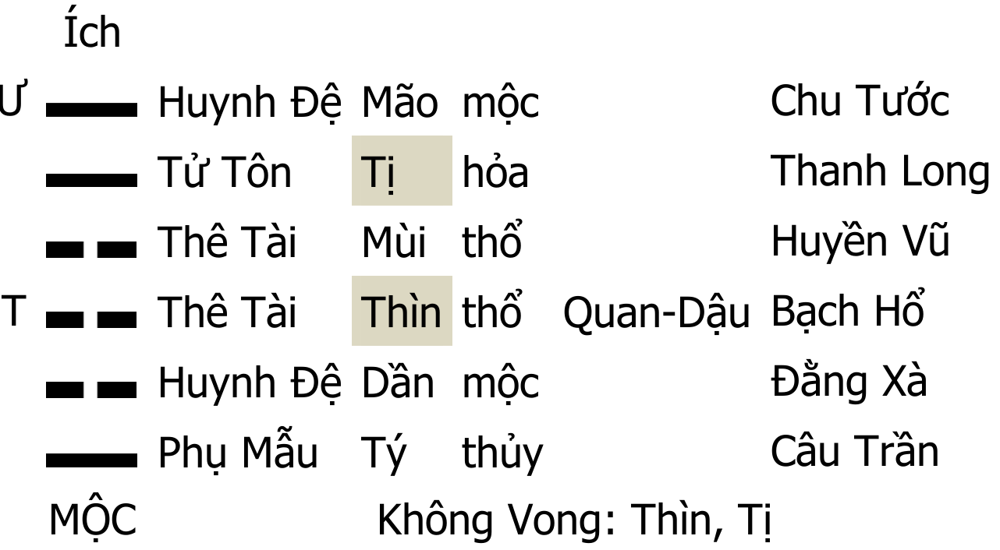

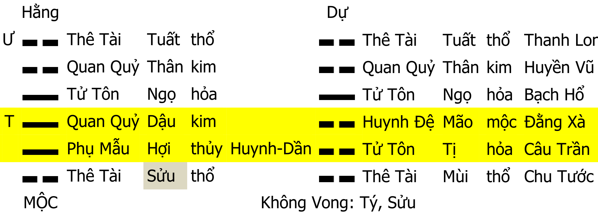

Lại vào ngày Canh Tý tháng Dậu, xem về văn thư, được quẻ Tụng biến Khuê:

| | | Tụng | | | Khuê | |
| :--- | :---: | :--- | :--- | :---: | :--- | :--- |
| | ▅▅▅▅▅ | Tử Tôn Tuất thổ | | ▅▅▅▅▅ | Huynh Đệ Tị hỏa | Đằng Xà |
| | ▅▅▅▅▅ | Thê Tài Thân kim | | ▅▅  ▅▅ | Tử Tôn Mùi thổ | Câu Trần |
| T | ▅▅▅▅▅ | Huynh Đệ Ngọ hỏa | | ▅▅▅▅▅ | Thê Tài Dậu kim | Chu Tước |
| | ▅▅  ▅▅ | Huynh Đệ Ngọ hỏa | Quan-Hợi | ▅▅  ▅▅ | Tử Tôn Sửu thổ | Thanh Long |
| | ▅▅▅▅▅ | Tử Tôn Thìn thổ | | ▅▅▅▅▅ | Phụ Mẫu Mão mộc | Huyền Vũ |
| Ư | ▅▅  ▅▅ | Phụ Mẫu Dần mộc | | ▅▅▅▅▅ | Huynh Đệ Tị hỏa | Bạch Hổ |

HỎA Không Vong: Thìn, Tị

Hào Phụ Mẫu Dần mộc tượng trưng cho văn thư, động mà sinh hào Thế, văn thư ắt sẽ được. Nhưng hiềm vì hào Tài Thân kim cũng động, xung khắc văn thư, cần đợi đến ngày Dần, để xung mất Thân kim, như vậy văn thư sẽ nhận được. Quả nhiên vào ngày Dần nhận được văn thư.

Sách xưa cho rằng, hào gặp xung sẽ tán. Hào vượng tướng có thể xung tán hào suy nhược. Trong quẻ này, hào Thân kim gặp mùa thu, nên là vượng. Kim vượng xung Dần, nhưng Dần mộc vẫn không bị tán.

**Tân bình thích:** Ví dụ này Thân kim không thể xung khắc Dần mộc, cũng bởi vì có hai lớp Huynh Đệ Ngọ hỏa được Dần mộc sinh, Nhật xung ám động mà khắc Thê Tài Thân kim, mới bảo vệ văn thư bình an.

Lại như vào ngày Kỷ Tị tháng Tý, xem về việc đánh cược, được quẻ Khôn:

| | | Khôn | |
| :--- | :---: | :--- | :--- |
| T | ▅▅  ▅▅ | Tử Tôn Dậu kim | Câu Trần |
| | ▅▅  ▅▅ | Thê Tài Hợi thủy | Chu Tước |
| | ▅▅  ▅▅ | Huynh Đệ Sửu thổ | Thanh Long |
| Ư | ▅▅  ▅▅ | Quan Quỷ Mão mộc | Huyền Vũ |
| | ▅▅  ▅▅ | Phụ Mẫu Tị hỏa | Bạch Hổ |
| | ▅▅  ▅▅ | Huynh Đệ Mùi thổ | Đằng Xà |

THỔ Không Vong: Tuất, Hợi

Ta bèn đoán rằng: Hào Thế khắc hào Ứng, tức bản thân sẽ thắng. Nhưng vì Nhật thần Tị xung động hào Tài Hợi thủy, để quay lại sinh hào Ứng, tài nghệ tuy tinh thâm, nhưng không thể thủ thắng. May được quẻ lục xung, nên cũng không đến nỗi thua hoàn toàn. Sau quả nhiên người này thua không nhiều, ấy là do được hào khác xung tán.

**Tân bình thích:** Hào Tài lâm gian hào ám động sinh Ứng, đối phương tất có người giúp đỡ, sau lưng xuất hiện tên bịp bợm, hợp mưu lừa gạt.

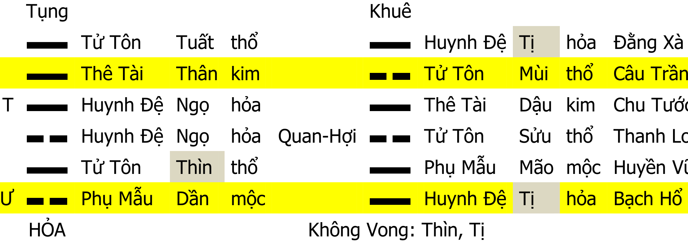

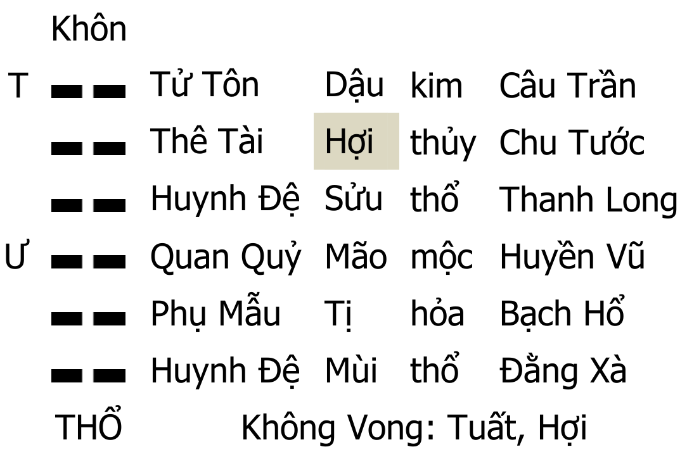

Sách xưa cho rằng gặp quẻ lục xung, xem việc gì cũng không tốt, ta thử nhiều lần, thấy khi Dụng thần thất hãm, thì thực sự không tốt. Nhưng nếu Dụng thần đắc thế, thì phải căn cứ vào Dụng thần để đoán định. Còn khi xem về phong thủy, gặp lục xung là tượng đá chạy cát bay, không phải thế lâu dài bền vững. Còn những trường hợp khác, cần phải kết hợp với Dụng thần.

Lại ví dụ: Ngày Ất Mùi tháng Dậu, xem về việc con trai đi xa lâu ngày không về, không biết sống chết ra sao, được quẻ Khôn:

| | Khôn | | | |
| :--- | :---: | :--- | :--- | :--- |
| T | ⚏ | Tử Tôn | Dậu kim | Huyền Vũ |
| | ⚏ | Thê Tài | Hợi thủy | Bạch Hổ |
| | ⚏ | Huynh Đệ | Sửu thổ | Đằng Xà |
| Ứ | ⚏ | Quan Quỷ | Mão mộc | Câu Trần |
| | ⚏ | Phụ Mẫu | Tị hỏa | Chu Tước |
| | ⚏ | Huynh Đệ | Mùi thổ | Thanh Long |

THỔ Không Vong: Thìn, Tị

Hào Thế tại Tử Tôn, lại gặp Nguyệt kiến, được Nhật thần Mùi tương sinh, tuy là quẻ lục xung, nhưng con trai chắc chắn sẽ quay về. Quả nhiên xem vào năm Tý, đến năm Mão thì con trai thành đạt trở về. Đấy là do hào tĩnh gặp phải năm xung.

**Tân bình thích:** Ví dụ này không chỉ Dụng thần tĩnh mà gặp xung, bản thân quẻ này cũng chính là quẻ lục xung, cũng có thể ứng trị. Đồng thời cũng bởi vì Huynh Đệ Sửu thổ ám động, Dụng thần nhập Mộ, Dụng thần nhập Mộ cũng ứng gặp xung.

Lại ví dụ: Vào ngày Giáp Dần tháng Tị, xem về việc mời thầy dạy con, được quẻ Thiên Địa Bĩ biến Càn:

| | Bĩ | | | Càn | | | |
| :--- | :---: | :--- | :--- | :---: | :--- | :--- | :--- |
| Ứ | ━ | Phụ Mẫu | Tuất thổ | ━ | Phụ Mẫu | Tuất thổ | Huyền Vũ |
| | ━ | Huynh Đệ | Thân kim | ━ | Huynh Đệ | Thân kim | Bạch Hổ |
| | ━ | Quan Quỷ | Ngọ hỏa | ━ | Quan Quỷ | Ngọ hỏa | Đằng Xà |
| T | ⚏ | Thê Tài | Mão mộc | ━ | Phụ Mẫu | Thìn thổ | Câu Trần |
| | ⚏ | Quan Quỷ | Tị hỏa | ━ | Thê Tài | Dần mộc | Chu Tước |
| | ⚏ | Phụ Mẫu | Mùi thổ Tử-Tý | ━ | Tử Tôn | Tý thủy | Thanh Long |

KIM Không Vong: Tý, Sửu

Quẻ này lấy hào Ứng làm Dụng thần, hào Thế và hào Ứng tương hợp, hào Ứng nằm tại hào Phụ Mẫu Tuất thổ, được Nguyệt kiến Tị hỏa tương sinh, chủ về học vấn hơn người. Chỉ hiềm quẻ biến lục xung, hợp mà lại biến xung, là điềm không lâu dài. Người này bèn hỏi rằng: "Vì chuyện gì mà không được lâu dài?" Ta đáp: "Tử Tôn Tý thủy gặp Tuần Không, hào Phụ Mẫu Mùi thổ động, đề phòng con cháu tai nạn." Hai

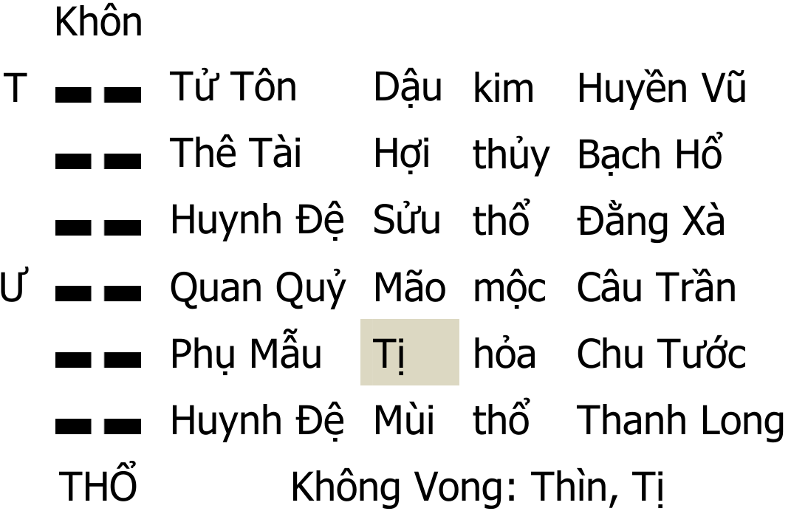

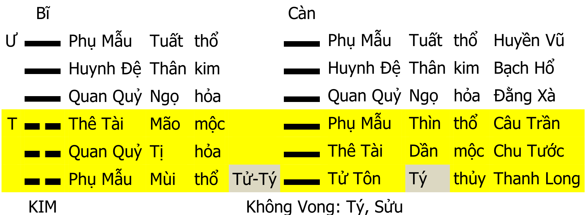 tháng sau, quả nhiên con trai người này mắc bệnh, thôi học chưa được bao lâu, thì chết.

Nếu xem được quẻ lục hợp biến thành quẻ lục xung, thì việc xem đều là trước hợp sau tan, trước thân sau sơ, trước nồng hậu sau nhạt phai, trước vinh hiển sau lụn bại, trước tốt sau xấu, trước hanh thông sau bế tắc, được trước mất sau, thành rồi lại bại, được thuận lợi rồi lại sinh biến. Chỉ có xem về kiện tụng, trộm cướp, kết thúc, đoạn tuyệt, gặp được quẻ này là tốt..

Ví dụ: Vào ngày Bính Tý tháng Ngọ, xem về việc mở cửa hiệu cầm đồ, được quẻ Đại Tráng biến Tốn:

| | Đại Tráng | | | Tốn | | | |
| :--- | :---: | :--- | :--- | :---: | :--- | :--- | :--- |
| | ⚏ | Huynh Đệ | Tuất thổ | ━ | Quan Quỷ | Mão mộc | Thanh Long |
| | ⚏ | Tử Tôn | Thân kim | ━ | Phụ Mẫu | Tị hỏa | Huyền Vũ |
| T | ━ | Phụ Mẫu | Ngọ hỏa | ⚏ | Huynh Đệ | Mùi thổ | Bạch Hổ |
| | ━ | Huynh Đệ | Thìn thổ | ━ | Tử Tôn | Dậu kim | Đằng Xà |
| | ━ | Quan Quỷ | Dần mộc | ━ | Thê Tài | Hợi thủy | Câu Trần |
| Ứ | ━ | Thê Tài | Tý thủy | ⚏ | Huynh Đệ | Sửu thổ | Chu Tước |

THỔ Không Vong: Thân, Dậu

Ta bèn đoán rằng: Hào Thế tại Ngọ hỏa, Nguyệt kiến đương quyền, nên bị Nhật thần Tý xung cũng không tán; lại biến thành Mùi thổ, hợp với Ngọ, nên là "hóa hợp". Được trợ giúp, được nâng đỡ, nên đây đúng là quẻ tốt. Nhưng hiểm nỗi lại là quẻ lục xung biến lục xung, Dụng thần tuy vượng, nhưng cửa hiệu ắt mở không được lâu. Quả thực khai trương chưa được một năm, do người cầm đồ sinh sự, nên gia sản bị tịch biên, cửa hàng cũng bị trưng thu.

Nếu xem được quẻ lục xung biến lục xung, tức quẻ nội biến động, các hào xung lẫn nhau, là chủ về trên dưới bất hòa, người thân trở mặt, mang lòng gian xảo, việc sẽ khó thành. Nếu Dụng thần lại bị khắc, là điềm đại hung. Nếu Dụng thần vượng tướng cũng không được lâu dài.

Ví dụ: Ngày Ất Mão tháng Thân, cha con bảy người cùng bị bắt hỏi tội, xem được quẻ Tốn biến Khôn:

| | Tốn | | | Khôn | | | |
| :--- | :---: | :--- | :--- | :---: | :--- | :--- | :--- |
| T | ━ | Huynh Đệ | Mão mộc | ⚏ | Quan Quỷ | Dậu kim | Huyền Vũ |
| | ━ | Tử Tôn | Tị hỏa | ⚏ | Phụ Mẫu | Hợi thủy | Bạch Hổ |
| | ⚏ | Thê Tài | Mùi thổ | ⚏ | Thê Tài | Sửu thổ | Đằng Xà |
| Ứ | ━ | Quan Quỷ | Dậu kim | ⚏ | Huynh Đệ | Mão mộc | Câu Trần |
| | ━ | Phụ Mẫu | Hợi thủy | ⚏ | Tử Tôn | Tị hỏa | Chu Tước |
| | ⚏ | Thê Tài | Sửu thổ | ⚏ | Thê Tài | Mùi thổ | Thanh Long |

MỘC Không Vong: Tý, Sửu

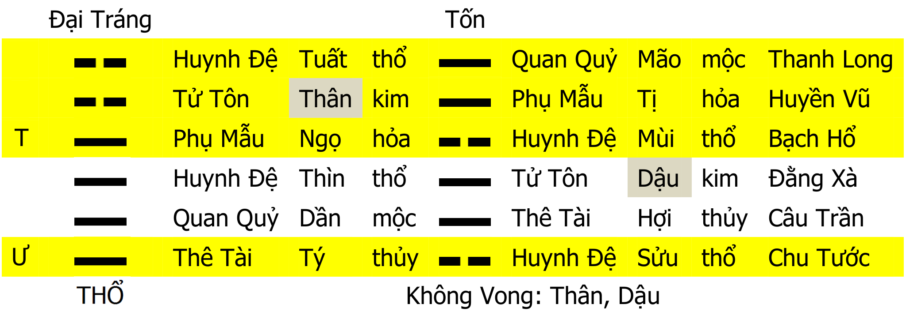

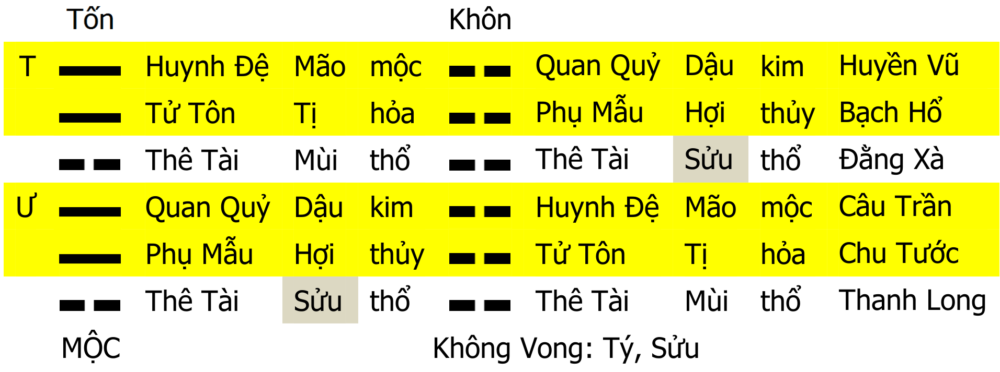

---

# CHƯƠNG 22. TAM HÌNH

Đây là quẻ biến, Tốn mộc hóa thành Khôn thổ, gọi là hóa khứ. Quẻ hóa khứ không khắc (quẻ gốc không khắc quẻ biến), nên không có việc gì đáng ngại. Chỉ có điều hào Thế biến thành Quan Quỷ, Mão mộc biến thành Dậu kim, mộc bị kim hồi đầu khắc. Tử Tôn Tị hỏa lại biến thành Hợi thủy, hai hào Phụ Mẫu đều bị tổn thương. Lại là quẻ lục xung biến thành quẻ lục xung, xung khắc trùng trùng, sau quả nhiên tất cả đều chịu hình.

Phép xem xưa đều cho rằng quẻ lục xung có lợi khi xem về việc quan ti kiện tụng, vì sự việc đó gặp xung tán sẽ may. Thế nhưng còn cần phải xem sự việc lớn nhỏ ra sao, và phải kết hợp với Dụng thần để luận đoán. Quẻ lục xung biến thành lục xung, nếu xem về việc kiện tụng, cũng có thể coi là gặp xung mà tiêu tán.

***

# CHƯƠNG 22: TAM HÌNH

Dần hình Tị, Tị hình Thân, Thân hình Dần.
Tý hình Mão, Mão hình Tý.
Sửu Tuất tương hình, Tuất Mùi tương hình, Mùi Sửu tương hình.
Thìn Ngọ Dậu Hợi là tự hình.

Về ba loại hình trên, ta từng thử nhiều lần, trong trường hợp Dụng thần hưu tù, hoặc bị quẻ khác khắc, nếu phạm vào ba loại hình trên, ắt sẽ gặp tai họa. Còn nếu như chỉ phạm phải ba loại hình, thì ứng nghiệm rất ít. Ta xem đã mấy chục năm, chỉ thấy có một quẻ ứng nghiệm.

Ví dụ: Vào ngày Canh Thân tháng Dần, xem về con trai bị bệnh đậu mùa, được quẻ Phong Hỏa Gia Nhân biến Ly:

Ta bèn suy đoán rằng: Hào Tử Tôn Tị hỏa, tại mùa xuân là đương lệnh, Tử Tôn là vượng tướng, nên bệnh có thể chữa được. Nhưng sau lại chết vào giờ Dần ngày Dần, lúc này mới ngộ ra rằng, do Nguyệt kiến tại Dần, Nhật kiến tại Thân, cùng với hào Tị tạo thành tam hình. Chỉ có quẻ này ứng nghiệm, vì không bị các hào khác tổn

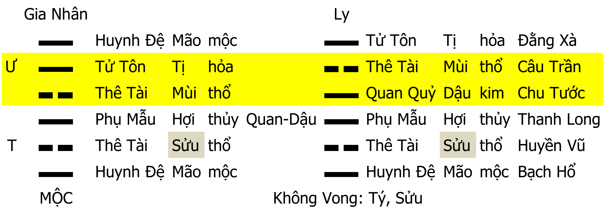

---

# CHƯƠNG 23. ÁM ĐỘNG

thương. Còn Tý Mão Thìn Tuất Sửu Mùi, cũng có ứng nghiệm, đều có tác dụng phụ trợ cho điều hung.

**Tân bình thích:** Cách dùng của Tam hình là lấy tượng làm chủ, lấy lý làm phụ. Các bạn có thể xem thêm cách dùng đó trong cuốn "Lục hào quái lệ thuyết chân". Một mình Tam hình không thể chủ hung, Dã Hạc không hiểu rõ cái hung của quẻ này, là do chưa biết tới thuyết "cách sơn hóa hào" trong bốc dịch. Quẻ này Tử Tôn Tị hỏa động mà hóa Thê Tài Mùi thổ, Thê Tài Mùi thổ lại động mà hóa Quan Quỷ Dậu kim, chẳng khác nào Tử Tôn hóa Quan Quỷ Dậu kim, Tử Tôn hóa Quan Quỷ, lại thêm tam hình, cho nên là hung. Phương pháp này cũng đã trình bày ở trong cuốn "Lục hào quái lệ thuyết chân".

***

# CHƯƠNG 23: ÁM ĐỘNG

Hào tĩnh vượng tướng bị Nhật thần xung gọi là ám động. Hào tĩnh hưu tù bị Nhật thần xung gọi là Nhật phá.

Ám động có hung, cũng có cát.

Nếu Dụng thần hưu tù, được Nguyên thần ám động mà tương sinh; hoặc Kỵ thần động trong quẻ, lại được Nguyên thần ám động mà tương sinh Dụng thần, những trường hợp đó đều cát lợi.

Nếu Dụng thần hưu tù không được trợ giúp, lại gặp Kỵ thần ám động, khắc hại Dụng thần, như vậy là hung.

Sách xưa cho rằng, trong quẻ có hào ám động, thì phúc đến lúc nào không biết, họa đến lúc nào chẳng hay. Lại nói, phần họa và phần phúc ngang nhau, tốc độ ứng nghiệm chậm. Nói như vậy đều là không đúng, chưa từng có chuyện phúc họa không hay không biết, hay báo ứng chậm chạp!

Ví dụ: Ngày Ất Mùi tháng Dần, xem con gái lên đậu, được quẻ Khôn biến Sư:

Tử Tôn Dậu kim hưu tù vì xem quẻ vào mùa xuân, nhưng may được Nhật thần Mùi tương sinh. Hào 2 Tị hỏa động mà khắc kim, Nhật thần Mùi xung động hào Sửu

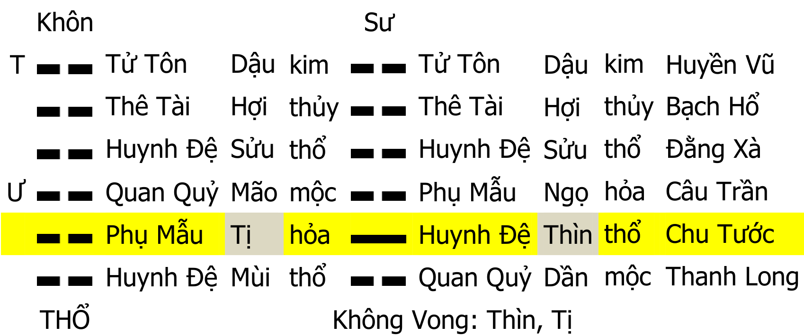 thổ; hỏa động sinh thổ, thổ động sinh kim, đậu mùa tuy đã lên dày nhưng vẫn được sống. Người kia bèn nói: "Bệnh hiện rất nguy cấp." Ta bèn đáp rằng: "Không đáng lo! Vào giờ Mùi, giờ Thân hôm nay sẽ được cứu." Quả nhiên đến giờ Thân, gặp thầy thuốc giỏi cứu sống. Như vậy sao có thể nói là ứng nghiệm chậm.

**Tân bình thích:** Ở đây bởi vì Nhật thần xung động Nguyên thần mà giải trừ khắc của Kỵ thần, vì vậy hôm đó có cứu, giờ Thân hợp trú Kỵ thần, Dụng thần lại được giờ Thân trợ vượng, cho nên giờ Thân được cứu.

Hào ám động có mạnh có yếu, được Nguyệt kiến sinh phù thì mạnh, không được Nguyệt kiến sinh trợ thì yếu hơn, lại có Nguyệt hợp, trong Nguyệt hợp có sinh có khắc, trong Trường Sinh có sinh có khắc, mặc dù bị Nhật xung giống nhau nhưng lực ám động không giống nhau. Mà Nhật kiến trong xung có khắc, xung mà không khắc, lúc này hào ám động, sức lực cũng không giống nhau. Suy mà gặp xung, cũng có xung khởi một nửa sức lực, ví dụ thực tiễn của Dã Hạc phản bác lý luận của người xưa chưa đến nơi đến chốn, nay tôi sửa lại.

Như ví dụ thực tiễn của tôi dưới đây.

Ví dụ: Ngày Kỷ Hợi tháng Bính Ngọ năm Đinh Sửu, một người phụ nữ đoán con trai thi cấp ba ra sao? Được quẻ Trạch Địa Tụy biến Hỏa Địa Tấn.

Phụ Mẫu là thành tích, Quan Quỷ là thứ bậc, lấy Quan Quỷ Phụ Mẫu làm Dụng. Phụ Mẫu lưỡng hiện, lấy hào 6 Phụ Mẫu Mùi thổ phát động làm Dụng, Nguyệt kiến sinh hợp, lại tự động hóa hồi đầu sinh, đề thi đã quen mà thành tích tốt. Quan Quỷ Tị hỏa trì Thế, được Nguyệt trợ giúp Nhật xung là ám động.

Quan Quỷ trì Thế vốn là tốt, nhưng không nên Không Vong, Nhật thần trong xung có khắc. Trong xung có khắc, chỉ có thể xung khởi một nửa sức mạnh, không thể xung thực toàn bộ. Hỏa chủ số 2, một nửa là 1, cho nên đoán con trai người này ngày thường học tập chăm chỉ, thành tích thi cử lần này cũng không tệ, nhưng sợ là kém một điểm nên không đậu.

Qua một thời gian, khi tôi và ông bạn Đoàn Kiến Nghiệp đang đi ăn ở một nhà hàng, đúng lúc gặp người phụ nữ này bước vào, gặp tôi liền cười và nói: "Đáng lẽ sau khi con trai tôi thi đậu cấp ba sẽ mời ông đi ăn, ai bảo ông đoán quá đúng, con tôi kém một điểm nên không đậu, tôi đã không có cơ hội mời ông đi ăn rồi."

Đây chẳng lẽ không phải là xung khởi một nửa lực mà ứng nghiệm ư?

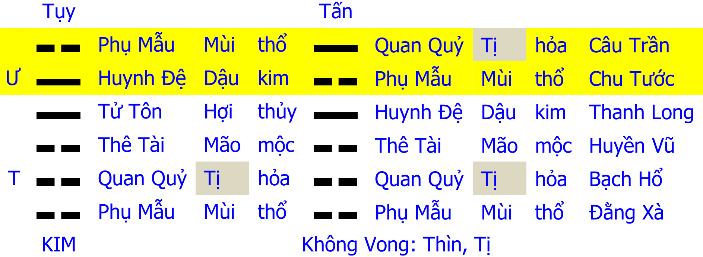

---

# CHƯƠNG 24: ĐỘNG TÁN

Sách xưa cho rằng Nhật thần xung hào động là xung tán. Lại cho rằng hào động xung hào cũng là xung tán. Ta thử nhiều lần, nếu gặp hào vượng tướng thì dù bị xung cũng không tán; gặp hào hữu khí, bị xung cũng không tán. Nếu gặp hào hưu tù, thi thoảng cũng thấy bị xung tán, nhưng trăm trường hợp chỉ gặp có một, hai mà thôi. Tại sao lại như vậy? Vì thần linh hé lộ thiên cơ tại hào động, động ắt có nguyên nhân. Dẫu rằng hôm nay bị chế ước, nhưng ngày sau gặp ngày trực, sẽ không còn bị tán.

Ví dụ: Vào ngày Đinh Dậu tháng Sửu, xem về việc cha đi ra ngoài đã một năm bặt vô âm tín, được quẻ Phong Thủy Hoán biến Khảm:

***

Hào Phụ Mão mộc động mà sinh hào Thế, lại hóa Tý thủy hồi đầu sinh, có nghĩa là cha ở ngoài vẫn được bình an. Hào Thế lâm Tuần Không là đã sắp về, đến tiết Lập xuân ắt về đến nơi. Quả nhiên đến tháng hai người cha đắc chí trở về. Đó chẳng phải là hào Mão động bị Nhật thần Dậu xung mà chẳng tán hay sao?

Lý Ngã Bình bàn rằng: "Hoàng kim sách" xem trọng Không Vong mà xem nhẹ xung tán. Sách "Dịch mạo" lại rất coi trọng xung tán, đọc kỹ và chiêm nghiệm, thấy phần lớn đều sai lầm. Trong chương "Tật bệnh", có nêu ví dụ vào ngày Bính Dần tháng Mão xem về bệnh của con được quẻ Tiệm biến Quan. Thường xem về bệnh tật mà gặp hào Tử Tôn biến thành hào Quan Quỷ, trăm trường hợp không được một sống. Quẻ này rõ ràng là Tử Tôn Thân kim biến thành Quan Quỷ, lại sai lầm mà cho là được ngày Dần xung tán. Lại như trong chương "Tiến thoái", vào tháng Thân xem quẻ, có hào Dậu phát động, bị ngày Mão xung mà coi là bị xung tán, như vậy là sai lầm.

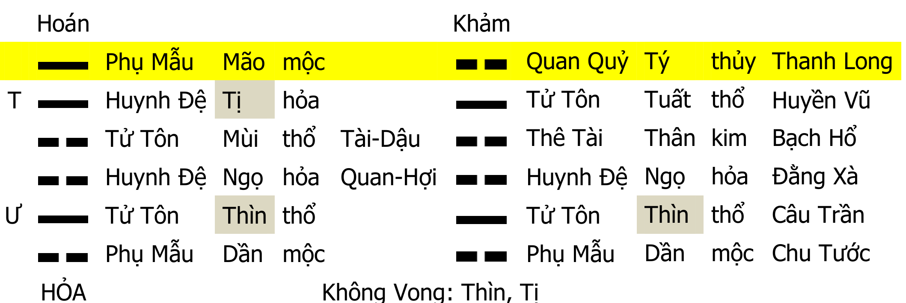

---

# CHƯƠNG 25: QUẺ BIẾN SINH KHẮC MỘ TUYỆT

Quẻ khi biến, có biến sinh, biến khắc, biến Mộ, biến Tuyệt, biến tỷ hòa. Theo kinh nghiệm của ta, nếu gặp quẻ biến khắc, bất kể Dụng thần vượng hay suy, đều là hung hại.

Ví dụ: Quẻ Tốn mộc biến thành Khảm thủy, gọi là hóa sinh (tức biến sinh), do biến ra quẻ thủy hồi đầu sinh mộc, trường hợp này là cát.

Ví dụ: Quẻ Chấn mộc biến thành Càn kim, gọi là hóa Khắc (hay biến khắc), do biến ra quẻ kim hồi đầu khắc quẻ mộc, trường hợp này là hung. Cũng có trường hợp hóa Khắc mà không khắc, nên cần phải xác định rõ.

Ví dụ: Quẻ Đoài kim biến thành Chấn mộc, gọi là hóa khứ. Quẻ chính là bản thân mình, mình đi khắc người khác thì không coi là hung. Nên trường hợp này là hóa Khắc mà không khắc.

Ví dụ: Quẻ Chấn mộc biến thành Đoài kim, gọi là hóa lai. Người khác đến khắc mình, là hồi đầu khắc, đó là điềm hung, xem việc gì cũng xấu.

Vào ngày Tân Tị tháng Mão, có người đến xem không nói rõ là xem việc gì, xem được quẻ Tốn biến quẻ Càn:

Hỏi anh ta xem về việc gì, anh ta bèn nói: "Xem hộ về công danh của trưởng bối." Ta bèn nói: "Công danh cần phải tự xem lấy, xem hộ rất khó chọn Dụng thần, nên ta trước nay đều không dám đoán. Nhưng may tượng quẻ này rất rõ ràng dễ đoán, là quẻ Tốn mộc biến thành Càn kim, tức quẻ hóa lai, hồi đầu khắc, là quẻ tuyệt. Đừng nói đến công danh, mà tuổi thọ cũng chẳng được lâu." Quả nhiên vào tháng Ngọ bị cách chức, đến tháng bảy thì qua đời.

Ví dụ: Ngày Bính Dần tháng Ngọ, xem bệnh của chủ, được quẻ Ly biến Khảm:

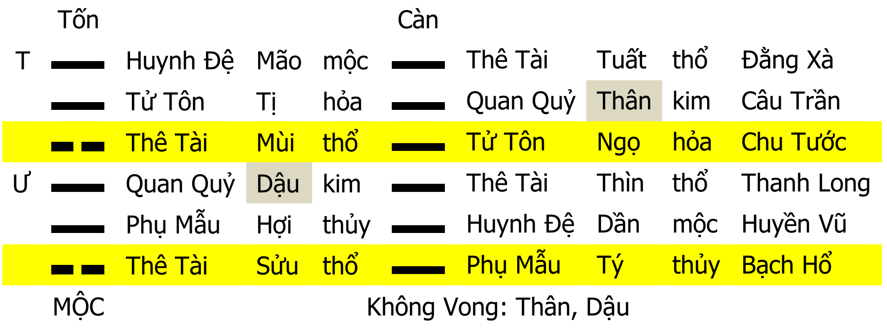

Ly hỏa biến thành Khảm thủy hồi đầu khắc, nhưng nhờ Nguyệt kiến Ngọ hỏa vượng, nên đoán rằng đến mùa đông ắt sẽ gặp nguy. Sau quả nhiên chết vào ngày Đinh Hợi tháng 9. Những quẻ này thì không cần xem Dụng thần suy hay vượng.

Sách xưa cho rằng khi xem về gia trạch, mộ phần, hay đại sự, đều kỵ gặp biến khắc, đó chỉ là võ đoán, chưa qua chiêm nghiệm thực tế. Ta chiêm nghiệm suốt bốn mươi năm, chưa từng có một quẻ nào không lưu tâm đến. Nếu gặp người nào xem được quẻ có điều tồn nghi, suốt mấy năm trời đều ghi nhớ để tìm câu trả lời.

Như ngày Ất Dậu tháng Mão, xem về việc đòi tiền nhà, được quẻ Khảm biến Khôn:

Ta đối với quẻ này có điều nghi ngờ, do Khảm thủy biến thành Khôn thổ, hồi đầu khắc. Bèn nói với người này rằng: "Tiền nhà là chuyện nhỏ, vì quẻ này rất hung, trong năm nay làm việc gì cũng nên cẩn thận." Sau đến tháng Tị, người này bị lật thuyền mà chết. Trường hợp này là xem chỗ này ứng chỗ khác, quẻ Khôn đã dự báo điềm hung, để cho người ta biết mà có cách đề phòng.

Phép xem xưa cho rằng khi xem về chuyện đại sự kỵ gặp quẻ biến khắc. Nhưng quẻ này chẳng phải là xem về chuyện nhỏ, nhưng lại ứng điềm hung lớn đấy sao?

Lý Ngã Bình bàn rằng: Sách "Dịch mạo" trong chương "Mộ Tuyệt" có viết: Nhật nguyệt được lệnh cũng không phải là chân thực, mà không biết được việc hung sắp đến, thần linh đã hiện điềm ra từ trước. Nhật Nguyệt được thời tuy vượng, nhưng qua khỏi thời đó vẫn bị tổn thương. Như ví dụ về xem bệnh của chủ nhân trong chương này, xem vào tháng Ngọ được quẻ Ly biến Khảm, trước mắt là mùa hạ hỏa vượng sẽ

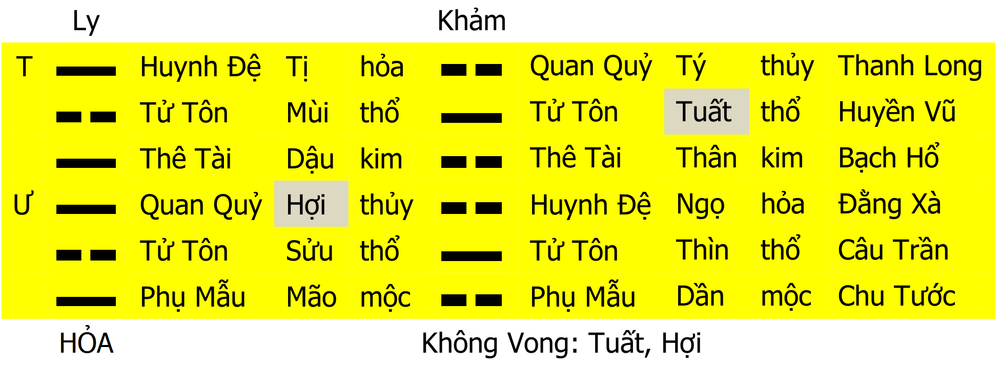

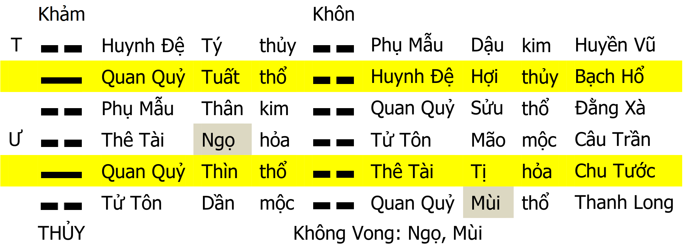 không đáng ngại, nhưng đến mùa đông hỏa suy, vẫn gặp họa như thường. Những luận đoán đó đều không xuất phát từ kinh nghiệm. Thể của quẻ như gốc rễ của con người, quẻ biến khắc tuyệt, tựa như nhổ cây cả rễ, tuy trước mắt cành lá vẫn xanh, nhưng liệu sẽ duy trì được bao lâu? Trước mắt tuy vẫn vượng, nhưng qua thời điểm đó sẽ suy. Không, Phá tuy hư, nhưng đến lúc trở nên thực, vẫn ứng nghiệm. Vả lại kiểu kết luận "nửa hung nửa cát" không thể làm khuôn mẫu cho người học đời sau được.

Cuốn sách này chỉ coi quẻ hồi đầu khắc là hung. Ta xem những ví dụ trong chương "Phản phục" của sách "Dịch mạo", thấy đều là nhầm lẫn hồi đầu khắc thành Phản ngâm hưu tù.

Ví dụ: Ngày Giáp Tý tháng Dần, xem bệnh của mẹ, được quẻ Khôn biến Tốn:

| | Khôn | | | | Tốn | | |
| :---: | :---: | :---: | :---: | :---: | :---: | :---: | :--- |
| T | - - | Tử Tôn | Dậu kim | — | Quan Quỷ | Mão mộc | Huyền Vũ |
| | - - | Thê Tài | Hợi thủy | — | Phụ Mẫu | Tị hỏa | Bạch Hổ |
| | - - | Huynh Đệ | Sửu thổ | - - | Huynh Đệ | Mùi thổ | Đằng Xà |
| Ứ | - - | Quan Quỷ | Mão mộc | — | Tử Tôn | Dậu kim | Câu Trần |
| | - - | Phụ Mẫu | Tị hỏa | — | Thê Tài | Hợi thủy | Chu Tước |
| | - - | Huynh Đệ | Mùi thổ | - - | Huynh Đệ | Sửu thổ | Thanh Long |

THỔ Không Vong: Tuất, Hợi

Quẻ Khôn thổ biến thành quẻ Tốn mộc, chẳng phải là hồi đầu khắc ư? Nhưng sách "Dịch mạo" lại viết rằng: Tuy hóa Tuần Không, nhưng là quẻ Phản ngâm hưu tù nên vẫn là hung. Đã cho rằng gặp Không, Phá là nghiêm trọng, mà ở đây lại nói là "vẫn hung", lại giải thích vòng vo là do Hợi thủy xung phá Tị hỏa, cho nên là hung. Khi được quẻ biến, chỉ xem tượng quẻ, không xem Dụng thần. Cho dù hào có tốt, mà rễ khô nguồn cạn, cũng không thể được lâu dài.

Lại vào ngày Quý Dậu tháng Dần, xem về bệnh của con trai cả, được quẻ Chấn biến Đoài:

| | Chấn | | | | Đoài | | |
| :---: | :---: | :---: | :---: | :---: | :---: | :---: | :--- |
| T | - - | Thê Tài | Tuất thổ | - - | Thê Tài | Mùi thổ | Bạch Hổ |
| | - - | Quan Quỷ | Thân kim | — | Quan Quỷ | Dậu kim | Đằng Xà |
| | — | Tử Tôn | Ngọ hỏa | — | Phụ Mẫu | Hợi thủy | Câu Trần |
| Ứ | - - | Thê Tài | Thìn thổ | - - | Thê Tài | Sửu thổ | Chu Tước |
| | - - | Huynh Đệ | Dần mộc | — | Huynh Đệ | Mão mộc | Thanh Long |
| | — | Phụ Mẫu | Tý thủy | — | Tử Tôn | Tị hỏa | Huyền Vũ |

MỘC Không Vong: Tuất, Hợi

Quẻ này chẳng phải là Chấn mộc hóa Đoài kim hồi đầu khắc ư? Vậy mà sách này lại không nhìn đến thổ bị Chấn mộc khắc, Chấn mộc bị Đoài kim khắc, mà lại lập luận

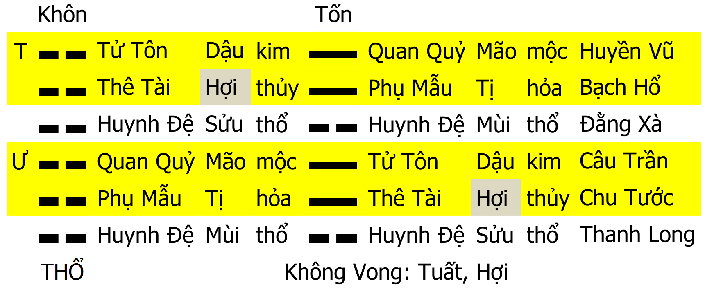

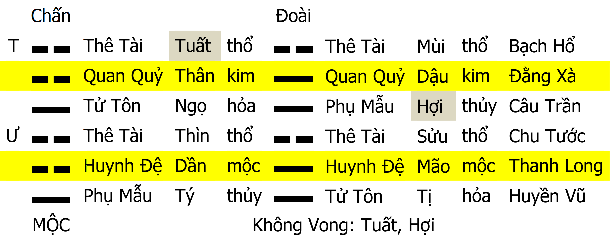

---

# CHƯƠNG 26. PHẢN PHỤC

rằng Chấn là trưởng nam, nay xem cho con trai cả, là điềm không tốt lành. Mà không biết rằng quẻ này biến thành hồi đầu khắc, thì tính mệnh của con gái út cũng khó bảo toàn. Nên nay ta dẫn ra những quẻ trong sách "Dịch mạo" để chỉ ra những sai lầm của sách đó.

***

# CHƯƠNG 26: PHẢN PHỤC

Quẻ có quẻ biến, hào có hào biến.

Quẻ biến, nội ngoại động mà phản ngâm, thuộc cùng một quẻ. Như quẻ Càn biến quẻ Khôn là vậy.

Hào biến, nội ngoại động mà phản ngâm, nhưng không cùng một quẻ. Như Thăng biến Quan là vậy.

Lại có ngoại quái phản ngâm, mà nội quái không động, như Quan biến Khôn là vậy.

Lại có nội quái phản ngâm, mà ngoại quái không động, như Tốn biến Quan là vậy.

## 1. Phản ngâm

Quẻ nội phản ngâm, trong sẽ không yên; quẻ ngoại phản ngâm, ngoài sẽ bất ổn. Quẻ nội quẻ ngoại đều phản ngâm, là điềm trong ngoài đều không yên ổn.

Quẻ Phản ngâm đều chủ về thành rồi lại bại, bại rồi lại thành; có rồi thành không, không rồi lại có; được rồi lại mất, mất rồi lại được; đến rồi lại đi, đi rồi sẽ đến; tan rồi lại hợp, hợp rồi sẽ tan; động rồi muốn tĩnh, tĩnh lại muốn động.

Nếu xem về công danh, mà hào Dụng thần vượng tướng, thì sẽ liên tục phải thuyên chuyển, thăng chức đến nơi khác, rồi lại điều động trở về. Nếu Dụng thần thất hãm, thì lúc thăng lúc giáng, khi mất khi được.

Xem về của cải, thì tụ tán bất thường. Xem về buôn bán kinh doanh, thì lúc phất lúc lụn bại bất định.

Xem về mộ phần gia trạch, là điềm muốn chuyển mà lại không chuyển, hoặc chuyển qua chuyển lại, hoặc trước mắt sẽ gặp chuyện di cư thuyên chuyển.

Xem về những sự việc đã trải qua một thời gian dài, thì trước mắt sẽ có biến động.

Xem về thiên thời, nếu phải lúc tạnh sẽ gặp mưa, phải lúc mưa sẽ lại tạnh.

Xem về hôn nhân, thì trắc trở khó thành.

Xem về bệnh tật, thì khỏi rồi lại ốm.

Xem về trộm cướp kiện tụng, thì ắt liên tục hết lần này lại lần khác.

Xem về xuất hành, thì đi đến nửa đường ắt phải quay về. Cho dù có đến nơi, thì cũng không được việc.

Xem về người đi xa, nếu là quẻ ngoại phản ngâm, mà Dụng thần vượng tướng, thì sẽ trở về; hoặc sẽ tiếp tục đi sang nơi khác. Người ở bên ngoài xem về gia trạch, mà nội quái phản ngâm, tức người nhà không được yên ổn.

Xem về tình hình giữa hai bên, nếu quẻ nội phản ngâm, thì bản thân rối loạn bất ổn mà đối phương được an lành; nếu quẻ ngoại phản ngâm, thì người khác rối loạn mà bản thân ta được yên ổn.

Những trường hợp trên nếu Dụng thần là vượng tướng, không biến thành xung khắc, tuy gặp phản phục, sự việc vẫn được thành. Chỉ kỵ Dụng thần biến thành hồi đầu khắc, quẻ sẽ thành tượng đại hung.

Ví dụ: Ngày Nhâm Thân tháng Mão, xem về việc theo quan phủ đến nơi nhiệm chức, được quẻ Tỷ biến Tỉnh:

| | Tỷ | | | | Tỉnh | | | |
|---|---|---|---|---|---|---|---|---|---|
| Ư | - - | Thê Tài | Tý | thủy | - - | Thê Tài | Tý | thủy | Bạch Hổ |
| | — | Huynh Đệ | Tuất | thổ | — | Huynh Đệ | Tuất | thổ | Đằng Xà |
| | - - | Tử Tôn | Thân | kim | - - | Tử Tôn | Thân | kim | Câu Trần |
| T | - - | Quan Quỷ | Mão | mộc | — | Tử Tôn | Dậu | kim | Chu Tước |
| | - - | Phụ Mẫu | Tị | hỏa | — | Thê Tài | Hợi | thủy | Thanh Long |
| | - - | Huynh Đệ | Mùi | thổ | - - | Huynh Đệ | Sửu | thổ | Huyền Vũ |

THỔ Không Vong: Tuất, Hợi

Ta bèn đoán rằng: Hào Thế tại Quan, gặp Nguyệt kiến nên vượng tướng, theo quan đi việc sẽ thành, nhưng vì quẻ nội phản ngâm, nên sẽ gặp chuyện tráo trở phản phúc. Lại hiềm hào Thế gặp Tuyệt tại Nhật thần Thân, mà hóa ra Dậu kim hồi đầu khắc, chuyến đi này sẽ không may mắn, tốt nhất là không nên đi. Sau vì chỗ điền khuyết của quan gần trại giặc nên người này từ chối không đi. Sau khi quan phủ đi rồi, người này lại vì lý do khác nên lại đến nơi quan trấn nhậm. Đến tháng Tuất, thành bị giặc phá vỡ, người này bị giết cùng với quan phủ. Đấy là do hào Thế cùng Quan Quỷ đều bị hào biến Dậu kim hồi đầu xung khắc. Trước không đi, sau lại đi, ấy là do gặp quẻ Phản ngâm khiến sự việc tráo trở, đã dừng lại đi.

Ví dụ: Ngày Kỷ Hợi tháng Mão, xem thăng tiến, được quẻ Lâm biến Trung Phu:

| | Lâm | | | | Trung Phu | | | |
|---|---|---|---|---|---|---|---|---|---|
| | - - | Tử Tôn | Dậu | kim | — | Quan Quỷ | Mão | mộc | Câu Trần |
| Ư | - - | Thê Tài | Hợi | thủy | — | Phụ Mẫu | Tị | hỏa | Chu Tước |
| | - - | Huynh Đệ | Sửu | thổ | - - | Huynh Đệ | Mùi | thổ | Thanh Long |
| | - - | Huynh Đệ | Sửu | thổ | - - | Huynh Đệ | Sửu | thổ | Huyền Vũ |
| T | — | Quan Quỷ | Mão | mộc | — | Quan Quỷ | Mão | mộc | Bạch Hổ |

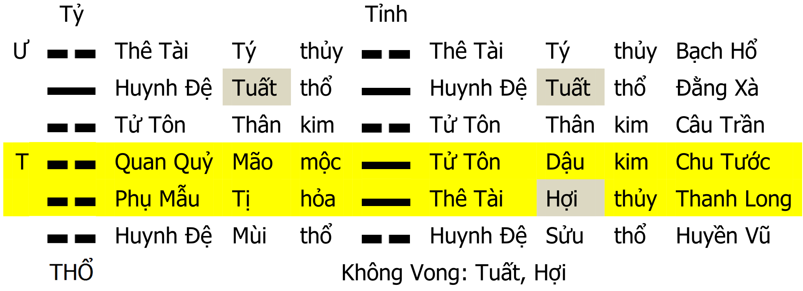

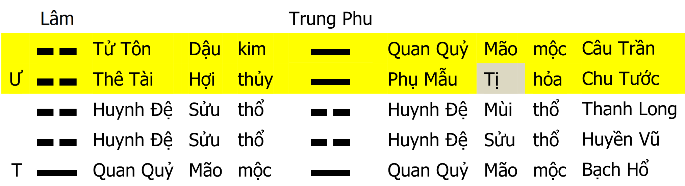

| | — | Phụ Mẫu | Tị | hỏa | — | Phụ Mẫu | Tị | hỏa | Đằng Xà |
|---|---|---|---|---|---|---|---|---|---|

THỔ Không Vong: Thìn, Tị

Ta bèn đoán rằng: Hào Thế tại Mão mộc Quan Quỷ, gặp Nguyệt kiến, lại gặp Trường Sinh tại Nhật thần Hợi, nên Thế và Quan đều là vượng tướng, ắt sẽ được thăng chức. Quả nhiên trong tháng đó được bổ nhiệm, từ Giang Tây lên chức đi trấn nhậm Sơn Đông. Nhưng chưa được một năm, thì lại bị thuyên chuyển trở lại Giang Tây. Ứng ở tháng Mão vì hào Quan Mão mộc gặp Nguyệt kiến. Được thăng chức đi Sơn Đông, vì hào Quan Quỷ tại Mão mộc. Thăng chức rồi lại bị thuyên chuyển trở lại Giang Tây, là do quẻ ngoại Phản ngâm, khiến cho đi rồi lại quay về.

## 2. Phục ngâm

Quẻ Phục ngâm có trường hợp nội ngoại phục ngâm (quẻ nội và quẻ ngoại đều phục ngâm), như quẻ Vô Vọng biến Đại Tráng:

| | Vô Vọng | | | | Đại Tráng | | | |
|---|---|---|---|---|---|---|---|---|
| | — | Thê Tài | Tuất | thổ | - - | Thê Tài | Tuất | thổ |
| | — | Quan Quỷ | Thân | kim | - - | Quan Quỷ | Thân | kim |
| T | — | Tử Tôn | Ngọ | hỏa | — | Tử Tôn | Ngọ | hỏa |
| | - - | Thê Tài | Thìn | thổ | — | Thê Tài | Thìn | thổ |
| | - - | Huynh Đệ | Dần | mộc | — | Huynh Đệ | Dần | mộc |
| Ư | — | Phụ Mẫu | Tý | thủy | — | Phụ Mẫu | Tý | thủy |

Xem được quẻ nội ngoại phục ngâm, là điềm trong ngoài đều lo âu, đau buồn.

Quẻ nội động mà biến thành phục ngâm, là điềm bên trong có chuyện ưu phiền; nếu là quẻ ngoại động mà phục ngâm, là điềm bên ngoài bất an. Được các quẻ này, xem việc gì cũng không được như ý, động cũng như bất động, đều chủ về buồn bã lo âu.

Xem về công danh, thì đường quan trắc trở, lận đận không thăng tiến.

Xem về lợi lộc, thì tài hao lợi tán, mất cả vốn lẫn lời.

Xem về mồ mả, gia trạch, thì muốn dời chẳng được, mà giữ nguyên thì bất lợi.

Xem về hôn nhân, thì chỉ có âu lo mà không có chuyện vui.

Xem về bệnh tật, thì đau ốm triền miên khổ sở.

Xem về kiện tụng thị phi, sự việc khó mà được kết thúc.

Xem về xuất hành, khó có thể lên đường.

Xem về người đi xa, ắt ở ngoài gặp chuyện không hay.

Xem về tình thế giữa hai bên, thì quẻ nội tượng trưng cho bản thân, quẻ ngoại tượng trưng cho người khác. Quẻ nội phục ngâm, bản thân không được như ý. Quẻ ngoại phục ngâm, người khác phải chịu bất an.

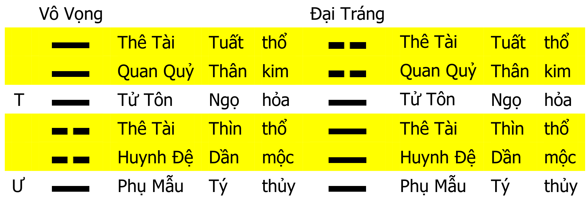

Nếu so sánh quẻ Phục ngâm với quẻ Phản ngâm, thì quẻ Phục ngâm có xung có khắc. Nếu Dụng thần bị khắc, ắt gặp họa lớn. Trong quẻ Phản, quẻ Phục, nếu Dụng thần vượng tướng, thì đợi đến năm, tháng xung khai, ý nguyện sẽ thành. Nếu Dụng thần hưu tù, cho dù gặp năm, tháng xung khai, thì chuyện buồn lo vẫn không dứt.

Ví dụ: Ngày Quý Tị tháng Thân, xem cha nhậm chức ở xa có bình an không, được quẻ Cấu biến Hằng:

| Cấu | | Hằng | |
| :--- | :--- | :--- | :--- |
| — Phụ Mẫu Tuất thổ | | - - Phụ Mẫu Tuất thổ | Bạch Hổ |
| — Huynh Đệ Thân kim | | - - Huynh Đệ Thân kim | Đằng Xà |
| Ư — Quan Quỷ Ngọ hỏa | | — Quan Quỷ Ngọ hỏa | Câu Trần |
| — Huynh Đệ Dậu kim | | — Huynh Đệ Dậu kim | Chu Tước |
| — Tử Tôn Hợi thủy | Tài-Dần | — Tử Tôn Hợi thủy | Thanh Long |
| T - - Phụ Mẫu Sửu thổ | | - - Phụ Mẫu Sửu thổ | Huyền Vũ |

KIM Không Vong: Ngọ, Mùi

Ta xem quẻ đoán rằng: Tị hỏa là Nhật thần sinh Phụ Mẫu, chắc rằng cha trấn nhậm ở bên ngoài vẫn được bình an. Chỉ hiểm gặp quẻ Phục ngâm, là điềm không được yên lành, tại nơi trấn nhậm hẳn gặp trắc trở, khiến không đắc chí mà lo buồn. Người xem bèn nói rằng: "Nghe đồn tại vùng đó có giặc Miêu gây hấn, không biết có gặp chuyện bất trắc gì không?" Ta đáp rằng: "Nhật kiến sinh Phụ, nên không có gì đáng ngại." Người này lại hỏi khi nào cha về. Ta đáp rằng: "Gặp quẻ Phục ngâm nên muốn về mà không được, đến năm Thìn mới mong được trở về."

Sau hay tin giặc Miêu nổi loạn tại địa phương đó, tình thế vô cùng nguy hiểm. Năm Dần xem quẻ, đến năm Thìn người cha bị bãi quan mà trở về chờ bổ khuyết. Đến năm Ngọ lại được thuyên chuyển đến Tứ Xuyên.

Ứng vào năm Thìn, vì hào Tuất Phụ biến thành Tuất Phụ, gặp năm Thìn sẽ xung khai Phụ Mẫu Tuất thổ. Bị bãi quan, là vì Nhật thần Tị xung khởi Tử Tôn Hợi thủy, khiến Hợi thủy ám động mà khắc Quan. Đến năm Ngọ lại được bổ nhiệm làm quan, vì ngày xem gặp Nhật thần là Tị hỏa trợ giúp cho hào Quan Ngọ hỏa. Nhưng vào lúc xem, bị Hợi thủy khắc nên không phát huy được. Nay hào Quan Ngọ hỏa gặp năm Ngọ, nên được vượng trở lại.

Lý Ngã Bình bàn rằng: Sách "Dịch lâm bổ di" có viết: "Hào gặp phản ngâm là không tốt; quẻ gặp phản ngâm là cực hung" tức chưa xem Dụng thần vượng hay suy, đã vội cho rằng Phản ngâm là tai họa. Nay xem sách của Dã Hạc lão nhân, thấy có nêu chiêm nghiệm quẻ Tỷ biến quẻ Tỉnh, hào Thế gặp xung khắc, nên sự việc phản phục thất thường, bản thân mắc nạn; lại có chiêm nghiệm quẻ Lâm biến quẻ Trung Phu, mà hào Thế Quan được vượng, tuy gặp phản phục, chỉ khiến chức quan phải thay đổi mà thôi. Phương pháp dạy người thật là chí lý thay!

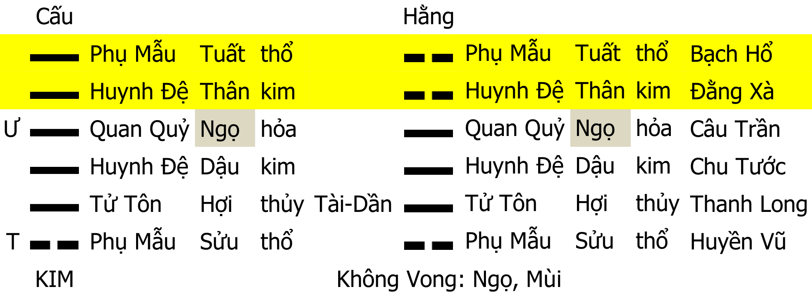

---

# CHƯƠNG 27: TUẦN KHÔNG

Tuần Giáp Tý: Tuất, Hợi là Tuần Không;
Tuần Giáp Tuất: Thân, Dậu là Tuần Không;
Tuần Giáp Thân: Ngọ, Mùi là Tuần Không;
Tuần Giáp Ngọ: Thìn, Tị là Tuần Không;
Tuần Giáp Thìn: Dần, Mão là Tuần Không;
Tuần Giáp Dần: Tý, Sửu là Tuần Không.

Thế nào là Tuần Không? Mỗi tháng âm lịch được phân thành 3 tuần, mỗi tuần gồm mười ngày, mỗi ngày được định bằng can, chi. Mỗi tuần khởi đầu bằng can Giáp và kết thúc bằng can Quý, do chỉ có 10 ngày mà địa chi lại có 12 nên mỗi tuần luôn đầy đủ 10 thiên can nhưng lại thiếu hai địa chi. Như tuần đầu tiên từ ngày Giáp Tý đến ngày Quý Dậu, trong mười ngày này, không xuất hiện hai địa chi Tuất, Hợi, bởi vậy, trong quẻ nếu có hào Tuất, Hợi sẽ là Không Vong, hay còn gọi là Tuần Không, hay lâm Không. Những trường hợp khác cũng loại suy từ đó.

Về phép xem Tuần Không, các sách trình bày rất phức tạp: phân chia thành Chân Không (Tuần Không thật), Giả Không (Tuần Không giả), Động Không (Tuần Không động), Xung Không (xung Tuần Không), Điền Không (điền thực Tuần Không), Viện Không (hỗ trợ Tuần Không), vô cố tự Không (tự thành Tuần Không không lý do), hữu cố nhi Không (thành Tuần Không có lý do), Mộ Tuyệt Không (Tuần Không gặp Mộ Tuyệt), Hại Không (Tuần Không tai hại), Hợp Không (Tuần Không gặp hợp), Phá Không (Tuần Không gặp Nguyệt phá).

Dã Hạc bàn rằng: Hào vượng tướng và hào động gặp Tuần Không thì không coi là Không; hào được Nhật thần và hào động sinh phò, gặp Tuần Không cũng không coi là Không. Hào động mà hóa Tuần Không, hào Phục mà được vượng tướng, cũng không coi là Không.

Gặp Nguyệt phá là Không, có khí mà bất động cũng là Không; phục mà bị khắc cũng là Không; Chân Không là Không.

Chân Không: Xuân thổ hạ kim thu là mộc; ba đông gặp hỏa ấy chân không.

Ta khi mới học xem quẻ, gặp Tuần Không, không biết suy đoán ra sao. Cho nó là không triệt để, thì đến ngày điền thực lại không còn bị Không nữa; không cho nó là Không, thì lại là Không triệt để. Sau học được cách xem nhiều lần, mỗi khi gặp Tuần Không, đều bảo người ta xem lại. Nếu được quẻ tốt, thì đoán là đợi qua tuần sẽ hết Không. Nếu gặp quẻ xấu, thì đó là Không triệt để.

Ví dụ: Ngày Ất Mão tháng Thìn, xem về cầu tài, được quẻ Gia Nhân biến Bí:

Hào Tài Sửu trì Thế gặp Tuần Không, tuy được Tị hỏa động mà tương sinh, nhưng Tị hỏa lại hóa Tý thủy hồi đầu khắc nên không thể sinh Tài Sửu thổ. Hào Tài không được sinh phù thì khó được tiền của. Nhưng vì xem vào tháng ba, nên hào Tài Sửu thổ có khí. Theo sách xưa, có khí thì gặp Không cũng không coi là Không, nên ta chẳng dám quyết đoán, mà bảo người này xem lại, được quẻ Khuê biến Tổn:

Xem được quẻ này, bèn hợp với quẻ trước mà quyết đoán rằng: "Hào Tài vô khí, nên không cần phải tốn công nữa". Người này bèn hỏi nguyên do, ta đáp rằng: "Quẻ trước hào Tài tuy lâm Không nhưng hữu khí; đến quẻ này hào Tài Tý thủy phục ở dưới hào 5 là Mùi thổ, phục tàng mà lại lâm Không, lâm Không mà lại bị khắc, nên chắc chắn là cầu tài không được." Sau quả nhiên là không được.

**Tân bình thích:** Quẻ trước mặc dù Tài được Nguyệt kiến củng phù, nhưng đồng thời Nguyệt kiến cũng là Mộ khố, Nhật khắc Dụng thần, lại là Tử địa của Dụng thần, Nhật Nguyệt một củng một khắc, về suy vượng là cân bằng, khó mà phân biệt. Nhưng Dụng thần Không Vong, sức lực sẽ giảm, là nhược. Nguyên thần phát động, vốn là chủ Dụng thần được trợ giúp, Dụng thần tăng thêm sức lực, nhưng Nguyên thần hóa hồi đầu khắc, bản thân khó giữ nổi, thì làm sao có sức lực để tái sinh hào khác? Mặc dù khó đoán, nhưng nắm bắt một cách cẩn thận cũng có thể đoán là hung. Tuy nhiên phương pháp xem nhiều quẻ của Dã Hạc cũng đáng được đề xướng, ở đây là cầu tài bình thường, nếu như đoán sai thì chỉ là không được mà thôi, nếu như là đầu tư lớn, đối với người không tinh thông quẻ, nếu có lo ngại thì xem lại là thỏa đáng, nhất định không được xem tiền bạc của người khác là trò đùa.

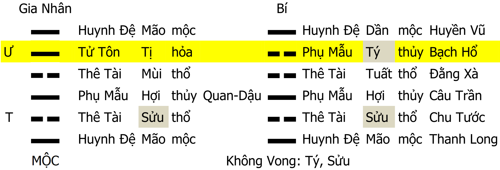

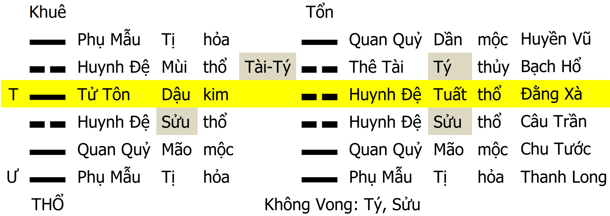

Ví dụ: Ngày Tân Hợi tháng Tý, xem về việc đi xa cầu tài, được quẻ Đại Súc:

Hào Thế tại Dần mộc, Nguyệt kiến Tý, Nhật thần Hợi đều là Tài thần mà sinh hào Thế, lại được hào Ứng tượng trưng cho nơi đến tương sinh hào Thế, nên đây là quẻ toàn mỹ. Chỉ hiềm hào Thế gặp Tuần Không, nếu như xem theo phép cổ, thì đây gọi là "vô cỗ tự Không" (tự thành Tuần Không mà không có lý do), là điềm đại hung. Như vậy, ta đâu dám khuyên người đó đi xa cầu tài. Nên ta bảo người này xem lại, được quẻ Minh Di biến Phong:

Ta bèn đoán rằng: Quẻ này cũng tương tự với quẻ trước. Chuyến đi này ắt sẽ có thành quả. Hào Thế Sửu thổ động hóa Ngọ hỏa hồi đầu sinh, trước mắt gặp Nguyệt phá. Nhưng đến nơi thì đã qua khỏi tháng này, không còn bị phá nữa. Tính theo quẻ trước, tháng Dần, Mão là khởi đầu mùa xuân, chính là tháng mà hào Thế xuất Không, gặp hào Tài Tý thủy tương sinh, sẽ được mãn nguyện.

Người xem hỏi: "Đi lần này có thành công không?" Ta đáp rằng: "Đợi sau ngày Giáp Dần, hào Thế xuất Không, chắc chắn sẽ được." Quả nhiên người này khởi hành vào ngày Ất Mão, đến khoảng giữa tháng Dần, Mão thì đến nơi, mọi việc đều thuận lợi như ý, trở về với tiền của dồi dào.

Dã Hạc bàn rằng: Phép xem quẻ nhiều lần có thể tiêu trừ nghi hoặc. Nếu không, chỉ quyết đoán dựa vào một quẻ trước, gặp vô cớ tự Không, khác gì dấn thân vào nơi hang sâu vực thẳm. Nhưng lại được hào Tài vượng mà sinh hào Thế, là điềm tiền bạc dồi dào. Nên bảo anh ta đi ư? Hay là ngăn anh ta không nên đi?

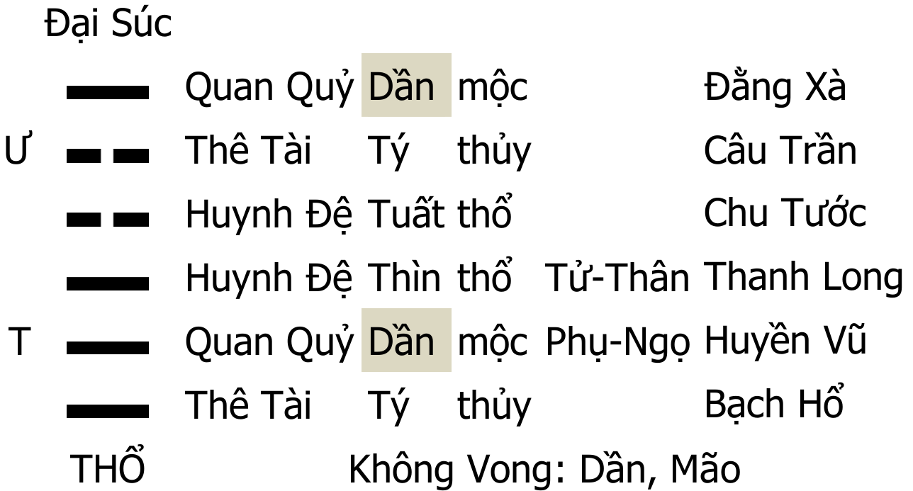

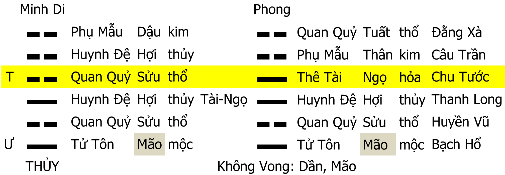

**Tân bình thích:** Lý luận "vô cố tự Không" không vững chắc, Không tất có ý nghĩa của nó, theo như quẻ trước, hào Thế Không chính là trong tâm người đó bất an, đối với cầu tài là tượng trong tâm không có lòng tin, cũng ứng khi nào có tài, chẳng phải là hung triệu (điềm xấu).

Lại ví dụ: Vào ngày Tân Mão tháng Dần, xem cha bao giờ trở về, được quẻ Quan biến Bĩ:

Trong quẻ này, hào Phụ Mẫu gặp Chân Không, bị Nguyệt kiến, Nhật thần khắc thương, nên tuy động nhưng vẫn là Không, e rằng tổn thương quá nặng, nên ta không dám đoán ngay. Hỏi người xem, cha đi từ lúc nào. Anh ta đáp rằng: "Cha mở cửa hàng ở nơi xa, cách nhà chừng hơn ba trăm dặm, thường xuyên đi về. Tháng trước gửi thư về nói trong vòng hai ngày nay sẽ về đến nơi, không biết đã lên đường hay chưa." Ta bèn bảo người này xem lại, được quẻ Lý biến Trung Phu:

Quẻ này vẫn là hào Phụ động mà gặp Không, nhưng may được Nhật thần Mão sinh hào Phụ, là chỗ khác với quẻ trước. Lại may hào Phụ động mà khắc hào Thế, khắc Thế tức là đã sắp đến nơi, chừng ngày Giáp Ngọ, Ất Mùi sẽ về đến nhà. Quả nhiên đến ngày Mùi, người cha trở về.

Có người hỏi: "Trong quẻ này được Nhật thần, Nguyệt kiến sinh hào Phụ, nên đoán là người cha ắt sẽ trở về là đúng. Vậy tại sao quẻ trước gặp Chân Không lại không hung? Thần linh hẳn không có hai lý lẽ, khiến quẻ này đúng mà quẻ trước lại sai." Ta bèn đáp rằng: "Quẻ trước sao có thể cho là sai được! Hào Phụ Mùi trì Thế, trước mắt gặp Tuần Không, nhưng xuất Không lại sẽ được gặp cha. Người đoán quẻ

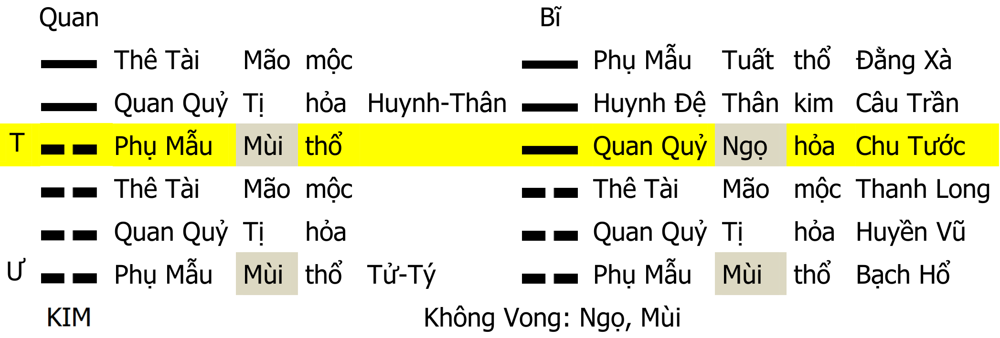

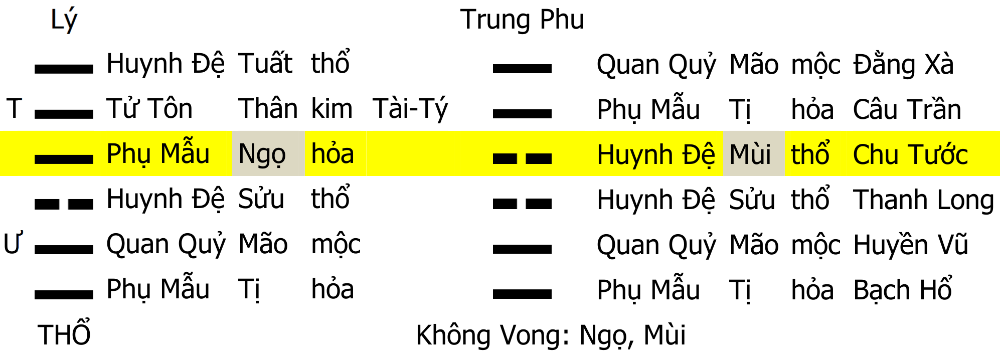 cần phải xem xét ý niệm của người đến xem. Nếu cha người này lặn lội đường xa, sống chết chưa hay, người con khi xem trong tâm ắt có ý niệm về lành dữ, nếu gặp Chân Không, ắt không được trở về. Nhưng nay là người cha đi về đường quen, người xem chỉ quan tâm đến việc ngày nào cha trở về, nên thần linh mách bảo ngày Mùi sẽ đến nơi. Cũng như người này hỏi: "Cha tôi bao giờ sẽ trở về?" Thần linh bèn đáp: "Cha ngươi ngày Mùi sẽ đến nơi!" Khi ta mới xem quẻ đầu, ta cũng thấy nghi ngờ, nên mới bảo anh ta xem lại. Nếu lại được quẻ xấu, tức là điềm xấu. Nếu được quẻ tốt, thì hợp hai quẻ lại để đoán, để lĩnh ngộ được cái ý của thần linh."

Ta từng vào ngày Kỷ Sửu tháng Ngọ xem về thời tiết mưa hay tạnh, được quẻ Lâm biến Sư:

Hào sơ là hào Phụ Mẫu Tị hỏa động, nên ứng vào ngày Tị sẽ có mưa. Nhưng đến ngày Quý Tị, trời nắng chang chang. Lúc ấy có người bạn họ Địch ngồi cùng, cũng biết về Dịch lý, bèn bảo anh ta xem hôm nay có mưa hay không.

Ngày Quý Tị tháng Ngọ, xem được quẻ Ký Tế biến Trạch Hỏa Cách:

Ta nói rằng: "Đến giờ Thân hôm nay sẽ có mưa." Anh Địch bèn nói: "Hào Thân là hào Phụ tuy động, nhưng bị Nguyệt kiến, Nhật thần khắc, huống chi Tị hợp với Thân, hào Phụ bị hợp sẽ không thể mưa được, như vậy mưa từ đâu mà đến?" Ta đáp: "Không phải thế! Nhất định sẽ có mưa lớn!"

Quả nhiên vào khoảng giờ Thân giờ Dậu đổ mưa rào sấm sét. Ngày hôm sau, anh Địch hỏi tôi rằng: "Bị Nguyệt kiến, Nhật thần khắc, mà vẫn đoán là có mưa to, sao lại có chuyện thần kỳ như thế?" Ta bèn đáp rằng: "Tôi không chỉ xem một quẻ

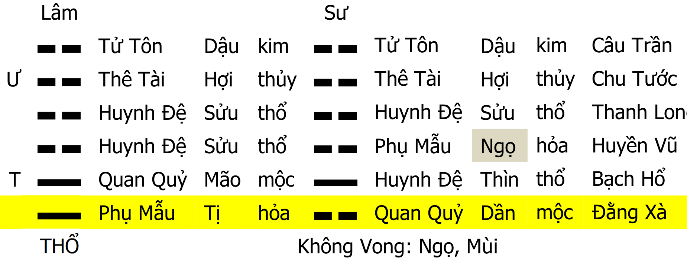

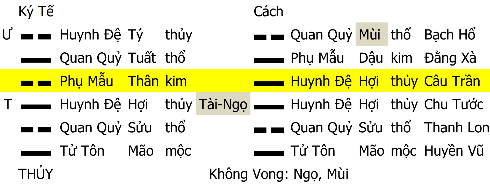

---

# CHƯƠNG 28. SINH VƯỢNG MỘT TUYỆT

hôm qua, mà vào ngày Sửu đã từng gieo một quẻ, vốn đã xem được ngày Tị ắt có mưa. Nên tôi khấn thần linh rằng: "Quẻ trước xem được ngày hôm nay sẽ có mưa, vậy ngày hôm nay có mưa thật không?" Thần liền mách nước cho tôi rằng: "Giờ Thân hôm nay sẽ có mưa", nên không cần để ý đến khắc, hợp nữa. Cũng giống như ví dụ trước, đoán về người đi xa, khi người con hỏi: "Cha tôi bao giờ sẽ trở về?" Thần linh bèn đáp: "Ngày Mùi sẽ về đến nơi", không cần quan tâm đến Chân Không nữa."

Phàm là xem quẻ Dịch, ắt phải cùng với quỷ thần khớp hợp cơ trời, không nên chấp nê, cứng nhắc. Ta được cách xem nhiều lần, tuy chưa thể cùng quỷ thần khớp hợp cơ trời, cũng có thể lĩnh ngộ được phần nào thần cơ của quỷ thần.

Lý Ngã Bình bàn rằng: Không Vong là điều kỳ diệu khó đoán của quỷ thần. Có lúc ngỡ là có mà lại không, ngỡ là không mà lại có; có cái Không hoàn toàn, cũng có cái Không được điền thực mà không còn Không nữa. Nên phải xem hai quẻ, hợp lại để quyết đoán, mới có thể thấu triệt thần cơ của quỷ thần. Cái lý của trời đất đều sinh ra từ không, nên gọi là "huyền không dĩ đãi" (lờ lửng trong không để chờ đợi). Khi xem quẻ mà gặp Không, không nên lập tức coi đó là Không, mà cần xem xét việc cần xem là gần hay xa. Nếu là việc trong tuần thì là Không. Nhưng cũng có ngày xung Không, thực Không, nên nếu là việc sang tuần khác, thì đoán rằng sẽ ứng nghiệm vào ngày xuất Không. Nếu xem về đại sự, việc lâu dài, thì chưa thể định được thời gian, không phải là cứ ra khỏi tuần đó sự sẽ thành. Nếu đại tượng không tốt, có thể coi đó là Không triệt để; nếu đại tượng là tốt, đợi gặp Nguyệt kiến hoặc Thái Tuế có thể điền thực. Nhưng tốt nhất nên xem thêm để xem gộp hai quẻ, mới là diệu pháp.

***

# CHƯƠNG 28: SINH VƯỢNG MỘ TUYỆT

Trường Sinh, Mộc Dục, Quan Đới, Lâm Quan, Đế Vượng, Suy, Bệnh, Tử, Mộ, Tuyệt, Thai, Dưỡng, tổng cộng có mười hai trạng thái.

Ta xem thấy ứng nghiệm chỉ có Sinh (Trường Sinh), Vượng (Đế Vượng), Mộ, Tuyệt; còn lại đều không ứng nghiệm, nên không cần dùng đến.

Kim khởi Trường Sinh từ Tị, Vượng tại Dậu, Mộ tại Sửu, Tuyệt tại Dần;

Mộc khởi Trường Sinh từ Hợi, Vượng tại Mão, Mộ tại Mùi, Tuyệt tại Thân;

Hỏa khởi Trường Sinh từ Dần, Vượng tại Ngọ, Mộ tại Tuất, Tuyệt tại Hợi;

Thủy thổ khởi Trường Sinh từ Thân, vượng tại Tý, Mộ tại Thìn, Tuyệt tại Tị.

Nếu như hào chủ sự (Dụng thần) thuộc mộc, ngày xem là ngày Hợi, thì Hợi chính là Trường Sinh của hào mộc chủ sự; nếu xem vào ngày Mão, thì mộc Vượng tại Nhật thần Mão; nếu xem vào ngày Mùi, thì mộc gặp Mộ ở Mùi; nếu xem vào ngày Thân, thì mộc gặp Tuyệt tại Thân. Những trường hợp khác cũng loại suy từ đó.

Nếu như hào chủ sự thuộc mộc, trong quẻ có hào Hợi động, như thế cũng là hào chủ sự gặp Trường Sinh tại hào động; nếu trong quẻ có hào Mùi động, tức hào chủ sự nhập Mộ tại hào động; nếu trong quẻ có hào Thân kim động, tức hào chủ sự gặp Tuyệt tại hào động. Những trường hợp khác cũng cũng loại suy từ đó.

Nếu như hào chủ sự thuộc mộc, động mà biến ra hào Hợi thủy, gọi là hóa Trường Sinh; nếu động mà biến ra hào Mão mộc, tức là hóa Vượng; nếu động mà biến ra hào Mùi thổ, tức hóa Mộ; nếu động mà biến ra ra hào Thân kim, gọi là hóa Tuyệt. Những trường hợp khác cũng cũng loại suy từ đó.

**Tân bình thích:** Đây là luận về 12 cung trường sinh, cách gọi chính xác phải là 12 trạng thái sinh tử của ngũ hành. Người xưa đã coi 12 cung trường sinh là căn cứ để phán đoán cát hung, trên thực tế đó là một nhận thức sai lầm. Vai trò của 12 cung trường sinh là dùng để thể hiện "tượng", việc sử dụng để xem cát hung chỉ chiếm một phần rất nhỏ, chỉ có một hai phần trăm mà thôi. Thực ra 12 cung trường sinh đều có ứng nghiệm, trong cuốn "Lục hào quái lệ thuyết chân" tôi đã trình bày chi tiết về vấn đề này. Nay tôi dẫn lại ví dụ đã từng đưa ra trước đây, để giúp chúng ta có thể hiểu được chỗ diệu dụng của 12 cung trường sinh.

Ví dụ: Ngày Đinh Dậu tháng Mão, một người Nhật Bản nhờ tôi đoán phong thủy nhà ở, được quẻ Trạch Lôi Tùy.

**Tùy**

| | | | | | |
| :---: | :---: | :--- | :--- | :---: | :--- |
| Ư | - - | Thê Tài | Mùi thổ | | Thanh Long |
| | — | Quan Quỷ | Dậu kim | | Huyền Vũ |
| | — | Phụ Mẫu | Hợi thủy | Tử-Ngọ | Bạch Hổ |
| T | - - | Thê Tài | Thìn thổ | | Đằng Xà |
| | - - | Huynh Đệ | Dần mộc | | Câu Trần |
| | — | Phụ Mẫu | Tý thủy | | Chu Tước |

MỘC Không Vong: Thìn, Tị

Tôi đoán người này đã tốn không ít tiền để sửa chữa đường ống dẫn nước và phòng tắm, ngôi nhà nằm bên đường kề khu phố sầm uất, đường đi bất tiện, đã từng tu bổ nhiều lần. Kết quả phán đoán rất chính xác.

Quẻ này Thê Tài trì Thế, chính là tiền nằm trong tay, Không mà bị Nguyệt kiến khắc thương, là cầm tiền trong tay tiêu mất đi. Huynh Đệ lâm Câu Trần tại hào 2 vượng mà khắc hào Tài, hào 2 là hào trạch, Câu Trần là tu tạo, nhất định là bởi vì tu tạo hoặc cải tạo nhà cửa mà tốn tiền. Thê Tài Thìn thổ là thủy khố, có thể hiểu là vật đựng nước. Lâm Đằng Xà, Đằng Xà chủ vật nhỏ dài, uốn khúc, Thìn thổ có thể hiểu là đường ống dẫn nước. Lại Thìn thổ gặp Nhật là đất Mộc Dục, Mộc Dục có thể hiểu là tắm rửa, thủy khố của nơi tắm rửa, có thể hiểu là phòng tắm, cho nên đoán như vậy.

Quẻ tại cung Chấn, Chấn là khu phố sầm uất, náo nhiệt, lại Phụ Mẫu lâm Chu Tước, một Phụ Mẫu lâm Bạch Hổ, Chu Tước chủ ồn ào, Bạch Hổ chủ đường đi, vì vậy đoán nhà của người đó nằm bên đường tại khu phố sầm uất. Hào 5 là đường đi, Nguyệt phá, chính là tượng đường đi bị tổn hại, nhưng Nhật thần thực Phá, lại là tượng tu bổ.

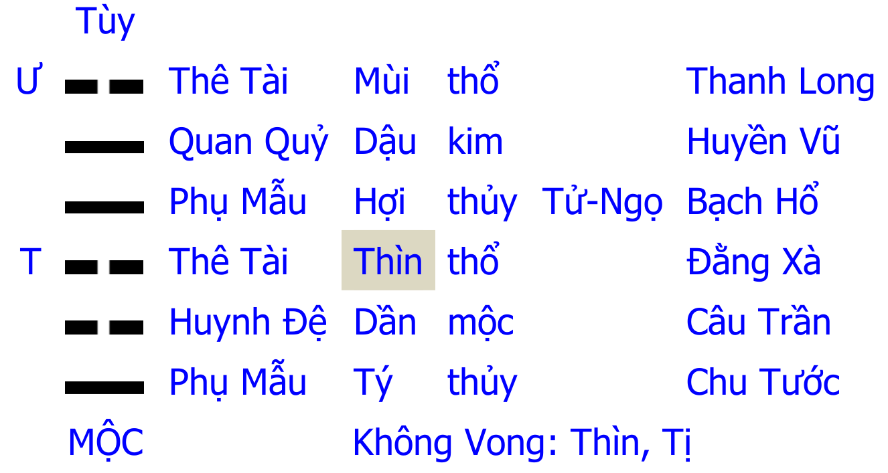

Trong ví dụ này đã sử dụng ý nghĩa của Mộ khố và Mộc Dục, sao lại nói Mộc Dục không ứng nghiệm? Những phương pháp khác, có thể tham khảo "Lục hào quái lệ thuyết chân".

Giác Tử bàn rằng: Kim tuy Trường Sinh tại Tị, nhưng hào kim phải là vượng tướng hoặc được Nhật thần, Nguyệt kiến, hào động sinh phò, trong trường hợp đó, lại được thêm ngày xem quẻ là ngày Tị hoặc trong quẻ có hào Tị động, hoặc là hào kim động mà sinh ra Tị hỏa, mới được coi là gặp Trường Sinh. Nếu như hào kim hưu tù vô khí, mà gặp nhiều Tị Ngọ hỏa, hỏa vượng thiêu đốt kim, thì coi là khắc chứ không coi là sinh.

Hào kim tuy gặp Mộ tại Sửu, nhưng nếu được Mùi thổ xung động, hoặc trong quẻ có nhiều thổ để sinh kim, thì vẫn coi là sinh chứ không coi là Mộ.

Hào thổ tuy Tuyệt ở Tị, nhưng phải hưu tù vô khí, lại gặp Tị, thì mới gọi là Tuyệt. Nếu hào thổ vượng tướng, hoặc được Nhật Nguyệt hào động sinh phù, lại gặp hào Tị, Tị hỏa trái lại có thể sinh thổ, thì luận là sinh chứ không luận Tuyệt.

Hào Tị hỏa tuy Trường Sinh tại Dần, nếu như Nhật thần, Nguyệt kiến, hào động cùng hào biến đều gặp Thân kim, thì gọi là Tam hình, trường hợp đó phải coi là hình chứ không coi là sinh.

**Tân bình thích:** Lý luận của Giác Tử cũng xem 12 cung trường sinh là một thước đo tình trạng cát hung của Dụng thần, đây là đem ngũ hành sinh khắc và 12 cung trường sinh nói nhập làm một. Khi mới học lục hào, tôi cũng không phân biệt giữa hai cái này, sau đó từ trong thực tiễn trường kỳ mới hiểu rõ những áo diệu trong đó. Ngũ hành sinh khắc là thuộc về phạm trù lý, mà 12 cung trường sinh thì thuộc về phạm trù tượng, cả hai cách dùng cùng tồn tại ở trong quẻ. Tức là Tị hỏa vừa sinh hào thổ vừa Tuyệt hào thổ, Sửu thổ vừa sinh hào kim vừa Mộ hào kim, ngũ hành sinh khắc và 12 cung trường sinh đều có vai trò riêng của nó, cát hung lấy ngũ hành sinh khắc làm chủ, phân biệt ý nghĩa lấy 12 cung trường sinh để lựa chọn.

Ví dụ: Ngày Đinh Hợi tháng Ngọ, cha xem bệnh con gái, được quẻ Sơn Trạch Tổn biến Sơn Hỏa Bí.

Đoán: Lấy hào Tử Tôn làm Dụng thần, Tử Tôn Thân kim không hiện trên quẻ, phục dưới hào 3 Huynh Đệ Sửu thổ, Dụng thần phục tàng nhập Mộ, chính là tượng nhập viện nằm giường, trong quẻ hào sơ Phụ Mẫu Tị hỏa lâm Chu Tước ám động khắc

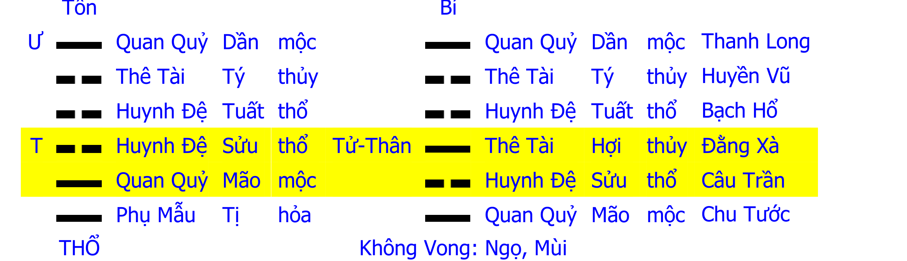

Dụng thần Thân kim, Chu Tước chủ khẩu thiệt, nhất định là phát sinh tranh chấp với cha mẹ mà mắc bệnh. Nhưng trong quẻ mộc động sinh hỏa, hỏa động sinh thổ, thổ động sinh kim, hào sơ ám động liên tục tương sinh, có thể nói "thành dã Tiêu Hà bại dã Tiêu Hà"[^1], hào sơ chủ bàn chân, Phụ Mẫu lại chủ bôn ba, cô gái này nhất định được cha mẹ hết lòng bôn tẩu tương cứu mà được sống. Tử Tôn Thân kim nhập Mộ ở Sửu, tháng Mùi xung khai khố lại được sinh phù sẽ xuất viện, tháng Thân phục tàng Thân kim xuất hiện mà khỏi bệnh.

Quả nhiên cô gái này bởi vì có người yêu, cha mẹ phản đối mà uống thuốc độc tự tử, may mà cha mẹ phát hiện kịp thời đưa vào bệnh viện cấp cứu mà giữ được mạng sống, tháng Mùi xuất viện, tháng Thân hồi phục.

Trong ví dụ này Sửu thổ vừa là là Mộ khố, vừa sinh hào kim, Mộ khố là tượng nhập viện, sinh kim là được bệnh viện cứu, cả hai đều có tác dụng của riêng nó. Tị hỏa vừa khắc kim vừa Trường Sinh kim, khắc kim là cha mẹ chửi mắng cô ấy, quở trách cô ấy, Trường Sinh là cha mẹ yêu thương cô ấy, cứu cô ấy, tất cả áo diệu của quẻ nằm ở chỗ đó.

Sách xưa cho rằng, thổ khởi Trường Sinh tại Thân, nhưng cũng có sách cho rằng khởi Trường Sinh tại Dần, khó mà truy nguyên ra được giả thuyết nào là đúng. Ta dùng phép xem thiên thời (thời tiết) để chiêm nghiệm, thường thấy rằng nếu thổ rơi vào hào Phụ Mẫu, có khi mưa vào ngày Thân, có lúc lại mưa vào ngày Tý. Lại thấy nếu thổ rơi vào hào Tử Tôn, có khi tạnh vào ngày Thân, cũng có khi tạnh vào ngày Tý, nên kết luận rằng thổ gặp Trường Sinh tại Thân, Vượng tại Tý. Như vậy mới chứng thực được rằng, thổ gửi Trường Sinh tại Thân là điều không phải nghi ngờ.

Từng vào ngày Ất Mão tháng Ngọ xem bệnh của vợ, được quẻ Chấn biến Phong:

Lấy hào Thê Tài Thìn thổ làm Dụng thần, bệnh gần gặp xung sẽ khỏi, nên đoán rằng vợ sẽ khỏi bệnh vào ngày Thìn, nếu không thì là ngày Dậu. Về sau, vợ hôn mê nhiều ngày, nhưng đến ngày Tý lại tỉnh dậy được. Ta đoán đến ngày Thìn sẽ khỏi, vì đó là ngày trực của Thìn thổ; lại đoán ngày Dậu sẽ khỏi, vì Thìn hợp với Dậu, khiến Thìn thổ động mà gặp được ngày hợp. Nhưng rốt cục lại khỏi vào ngày Tý, là vì hào Tài Thìn thổ gặp Vượng tại Tý.

[^1]: Thành dã Tiêu Hà bại dã Tiêu Hà: Thành sự tại Tiêu Hà, bại sự cũng tại Tiêu Hà.

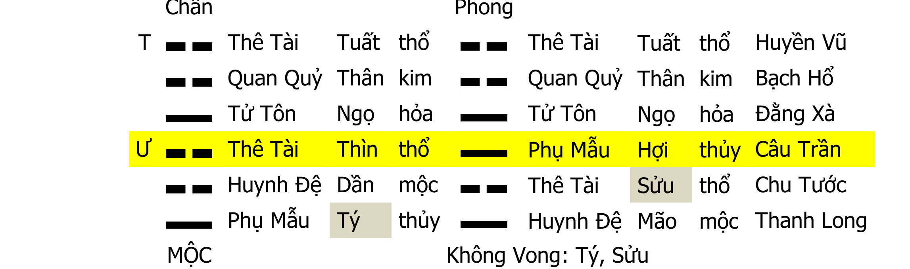

---

# CHƯƠNG 29. CHÚ THÍCH CHUNG VỀ CÁC THUẬT NGỮ TRONG ĐỀ MỤC CÁC CHƯƠNG

Lý Ngã Bình bàn rằng: Về thuyết Sinh, Vượng, Mộ, Tuyệt, kim gặp Trường Sinh tại Tị, mộc gặp Trường Sinh tại Hợi, thủy gặp Trường Sinh tại Thân, hỏa gặp Trường Sinh tại Dần. Bốn chỗ Trường Sinh đó là quy tắc chính xác. Chỉ có thổ gửi Trường Sinh tại đâu, là chưa thể khảo cứu được. Sách xưa có viết: hỏa thổ khởi Trường Sinh từ Dần. Sinh ra thổ là bào thai, nên thổ gửi Trường Sinh tại Dần. Các ngũ hành gia đời nay cho rằng Mậu thổ sinh ở Dần, Kỷ thổ sinh ở Dậu. Sách "Dịch mạo" viết: Chỉ có thổ khởi Trường Sinh từ đâu là không thống nhất. Trong Thân có Khôn, nên Thổ sinh ở Thân. Nếu chia làm âm dương, Mậu thổ sinh ở Dần, Kỷ thổ sinh ở Dậu, cũng không có chứng cứ xác thực. Nếu căn cứ vào việc xem thiên thời để khảo chứng, thì thổ gửi Trường Sinh tại Thân là nguyên lý bất di bất dịch từ xưa đến nay.

**Tân bình thích:** Trong dự đoán lục hào, những ví dụ tôi được nghiệm cũng là thổ Trường Sinh ở thân, như ví dụ trước, Thìn thổ gặp ngày Dậu là Mộc Dục chính là lấy thổ Trường Sinh tại Thân mà luận, ứng nghiệm ở phòng tắm. Sở dĩ người xưa có hai thuyết, là bởi vì Thân đóng ở Khôn thổ, Dần đóng ở Cấn thổ, nên mới xuất hiện hai thuyết Trường Sinh.

***

# CHƯƠNG 29: CHÚ THÍCH CHUNG VỀ CÁC THUẬT NGỮ TRONG ĐỀ MỤC CÁC CHƯƠNG

Các chương sau đây, mỗi chương bàn về một vấn đề riêng rẽ, sử dụng khá nhiều thuật ngữ, e rằng gây rườm rà, nên không viết toàn bộ ra ở đây, mà chỉ chú giải đơn cử về các đề mục. Ví dụ như sau đây có viết Dụng thần nên vượng, tuy không thể vượng trong suốt bốn mùa, nhưng nếu Dụng thần gặp Nhật thần, Nguyệt kiến, hoặc gặp Nhật thần, Nguyệt kiến, hào động, hào biến sinh phò, hoặc hào Dụng gặp Trường Sinh, gặp Đế Vượng, đều coi là vượng.

Dụng thần hóa cát: Nếu Dụng thần, Nguyên thần động hóa thành hồi đầu sinh, hóa Trường Sinh, hóa Đế Vượng, hóa tỷ trợ (biến thành hào đồng chất để tương trợ), hóa Nhật thần, Nguyệt kiến, đều gọi là hóa cát.

Dụng thần hóa hung: Nếu Dụng thần, Nguyên thần hóa hồi đầu khắc, hóa Tuyệt, hóa Mộ, hóa Không, hóa Phá, hóa Quỷ, hóa Thoái thần, đều gọi là hóa hung.

Tuế quân: Tức Thái Tuế trong năm.

Tuế ngũ: Tuế tức Thái Tuế, ngũ tức hào 5 trong quẻ.

Ngũ vị: Hào thứ năm (hào 5) trong mỗi quẻ là ngôi vị của vua. "Kinh Dịch" gọi đó là "cửu ngũ chi tôn" (hào 5 dương là ngôi vị của vua).

Thân: Tức hào Thế. Phép bói thời cổ có dùng thân quẻ (quái thân), thân Thế (Thế thân), ta thử xem nhiều lần đều không ứng nghiệm. Nên trong phần sau đây, chữ "thân" là để chỉ hào Thế, chứ không chỉ thân quẻ, thân Thế

---

# CHƯƠNG 30. ỨNG KỲ

Tam Mộ: Ba loại Mộ, tức Dụng thần nhập Mộ tại Nhật thần (Nhật Mộ), nhập Mộ tại hào động (động Mộ), động mà hóa Mộ, chứ không phải là Thế Mộ, Thân Mộ, Mệnh Mộ như trong sách cổ.

Chủ tượng (tượng chính): Tức hào chủ sự (Dụng thần). Nếu tự xem cho mình, thì hào Thế là chủ tượng, còn gọi là hào chủ sự; nếu xem cho cha mẹ, anh em, thì hào Phụ Mẫu, hào Huynh Đệ là hào chủ sự. Những trường hợp khác loại suy từ đây.

Lão âm (âm già) mà thành Thiếu dương (dương trẻ), gọi là biến.

Lão dương (dương già) mà thành Thiếu âm (âm trẻ), gọi là hóa.

Sách xưa cho rằng, gặp biến thì sự vật tiêu giảm sẽ lại phát triển, lui rồi lại tiến; gặp hóa thì sự vật thành mà ra bại, tiến mà hóa lùi. Ta thử nhiều lần không thấy ứng nghiệm. Hóa Tiến thần, hóa sinh vượng, tuy hóa vẫn là tốt; biến Quỷ, biến hồi đầu khắc, tuy biến mà vẫn hung. Trong các chương sau đây, biến cũng là chỉ hào hóa, hóa cũng là chỉ hào biến, khái niệm biến và hóa tương đương nhau.

***

# CHƯƠNG 30: ỨNG KỲ

## Tĩnh thì gặp trực gặp xung.

Ví dụ: Hào chủ sự nằm tại Tý thủy không động (tĩnh), sau đến ngày Tý là gặp trực, đến ngày Ngọ là gặp xung, sẽ ứng nghiệm.

**Tân bình thích:** Quy luật ứng kỳ không phải là thứ tuyệt đối, đôi khi căn cứ vào nội dung dự đoán khác nhau, mà phương pháp định ứng kỳ cũng có phần khác nhau. Tôi từng dự đoán tìm người, Dụng thần an tĩnh, ngày gặp hợp ứng nghiệm sự việc. Cũng gặp tình huống tìm người hoặc động vật bị lạc, Dụng thần an tĩnh hợp Nhật, hôm đó trở về, đây chính là thuộc về động thái của đối tượng, hợp tức không còn chạy lung tung, không còn đi lại khắp nơi, vì vậy mà ứng nghiệm gặp hợp.

## Động thì gặp hợp gặp trực.

Ví dụ: Hào chủ sự nằm tại Tý, động, sau đến ngày Sửu là gặp hợp, đến ngày Tý là gặp trực, sẽ ứng nghiệm.

## Quá vượng mà gặp Mộ gặp xung.

Ví dụ: Hào chủ sự nằm tại Ngọ hỏa, lại xem vào ngày hoặc tháng Tị, Ngọ, hoặc trong quẻ có quá nhiều hào Tị, Ngọ, sau đến ngày Hợi, ngày Tý là gặp xung, đến ngày Tuất là gặp Mộ, tức hỏa nhập Mộ, sẽ ứng nghiệm.

**Tân bình thích:** Chỗ này cần phải xem cát hung của Dụng thần mà luận. Dụng thần cát, nếu như Mộ bị khắc là lúc sự việc thành; Dụng thần hung, khi Dụng thần gặp sinh là hung.

**Suy tuyệt mà gặp sinh gặp vượng.**

Ví dụ: Hào chủ sự thuộc kim, xem vào ngày hoặc tháng Tị, Ngọ, như vậy hào chủ sự ở thế hưu tù vô khí (Tị, Ngọ hỏa khắc kim). Sau đến ngày, tháng Thổ hoặc đến tiết thu đương lệnh sẽ trở nên vượng.

**Tân bình thích:** Dụng suy cực, khi gặp sinh cũng vô dụng. Thường gặp đoán bệnh Dụng thần quá nhược, khi gặp Trường Sinh mà chết. Lúc này như cây khô, tưới nước thì càng mục nát nhanh hơn.

**Nhập Tam Mộ cần phải xung khởi.**

Ví dụ: Chủ tượng nằm tại Ngọ hỏa, hỏa nhập Mộ ở Tuất, sau đến ngày Thìn được xung khai mà ứng nghiệm.

**Tân bình thích:** Cũng có khi ứng Dụng thần gặp xung.

**Gặp lục hợp cũng nên tương xung.**

Ví dụ: Hào chủ sự cùng Nhật thần, Nguyệt kiến tương hợp, hoặc động mà hợp với hào khác, hoặc động mà hóa hợp, thì hung hay cát cũng phải đợi đến ngày xung khai mới ứng nghiệm.

Ví dụ khác: Chủ tượng nằm tại hào Tý, hợp với Sửu, sau đến ngày Ngọ, ngày Mùi (ngày xung khai hợp) thì ứng nghiệm.

**Nguyệt phá nên gặp điền gặp hợp.**

Ví dụ: Xem vào tháng Tý, hào chủ sự nằm tại Ngọ hỏa, như vậy là gặp Nguyệt phá. Sau đến ngày Mùi sẽ ứng nghiệm, vì khi đó là phá gặp hợp (Ngọ hợp Mùi); hoặc sẽ ứng nghiệm vào ngày Ngọ, vì là ngày điền thực, sẽ không còn bị phá nữa.

**Tân bình thích:** Gần thì ứng ngày giờ, xa thì ứng năm tháng, ngoài thực Phá hợp Phá, cũng có ứng xuất nguyệt, tức là ra khỏi tháng dự đoán.

**Tuần Không nên gặp điền gặp xung.**

Trong chương "Tuần Không" đã trình bày rất rõ ràng.

**Đại tượng cát mà bị khắc, nên đợi đến khi khắc thần bị khắc.**

Ví dụ: Dụng thần nằm tại Thìn thổ, được Nhật, Nguyệt sinh phò, như vậy đại tượng là cát. Nếu bị Dần, Mão khắc hại, sau đến ngày Thân, ngày Dậu, khắc thần Dần, Mão bị xung, sẽ cát.

**Đại tượng hung mà bị khắc, cần đề phòng khắc lại gặp sinh.**

Như ví dụ trên đây, Dụng thần nằm tại Thìn thổ, nếu không có hào động Nhật, Nguyệt tương sinh, đại tượng là hung. Nếu gặp Dần, Mão khắc chế, sau đến ngày Dần, ngày Mão, ngày Hợi sẽ hung.

**Nguyên thần tương trợ tương phù, cần xem Dụng thần suy hay vượng.**

**Kỵ thần tương xung, tương khắc, cần xem nguyên khí hưng hay suy.**

Trong chương Nguyên thần, Kỵ thần, đã trình bày rất rõ ràng.

**Hóa Tiến thần, gặp trực gặp hợp.**

---

# CHƯƠNG 31. QUY HỒN, DU HỒN

Ví dụ: Hào Thân động hóa thành hào Dậu, là thành Tiến thần. Là họa hay phúc, sẽ ứng vào ngày, tháng Thân (gặp trực), hoặc ngày, tháng Tị (gặp hợp).

**Hóa Thoái thần, kỵ trực kỵ xung.**

Ví dụ: Hào Dậu động hóa thành hào Thân, tức Thoái thần, sẽ ứng nghiệm vào ngày, tháng Thân (gặp trực), hoặc ngày, tháng Dần (gặp xung).

**Có lúc ứng nghiệm vào độc phát độc tĩnh (hào động, hào tĩnh duy nhất).**

Sẽ trình bày rõ trong chương "Độc phát".

**Có khi ứng nghiệm vào hào biến hào động.**

Ví dụ: Hào Tuất thổ động mà biến thành Dậu kim, sẽ ứng nghiệm vào ngày Tuất, hoặc ngày Dậu.

Không nên vội cho rằng hào không ứng nghiệm, cần phải phân định là việc gần hay xa.

**Việc xa thì định hằng năm tháng, việc gần thì định hằng ngày giờ.**

Có khi xem xa ứng gần, xem gần ứng xa, xem tháng ứng năm, xem ngày ứng giờ, không thể không xem xét cho kỹ.

Nếu gặp quẻ không thật rõ ràng, tốt nhất là nên xem lại.

Quẻ mơ hồ không rõ, nên xem thêm quẻ nữa, không được đoán bừa.

**Hào Thế Không, Nguyên thần động, cần đợi Nguyên thần gặp trực.**

Ví dụ: Vào tuần Giáp Thìn, xem về cầu tài, được quẻ Khốn biến Khảm, hào Thê Tài tại Dần mộc, tức gặp Tuần Không, phải đợi đến ngày Hợi, Nguyên thần gặp trực, mới đắc tài.

**Hào Thế suy, Nguyên thần tĩnh, cần đợi nguyên khí gặp xung.**

Ví dụ: Mùa thu, xem về toan tính mưu kế, được quẻ Khốn, hào Thế suy, Nguyên thần không động, sau đến ngày Tị nguyên khí bị xung mà việc thành.

***

# CHƯƠNG 31: QUY HỒN, DU HỒN

Quẻ Du hồn là quẻ thứ bảy tại mỗi cung. Ví dụ quẻ Hỏa Địa Tấn thuộc cung Càn, quẻ Thủy Thiên Nhu tại cung Khôn,...

Quẻ Quy hồn là quẻ thứ tám tại mỗi cung. Ví dụ quẻ Hỏa Thiên Đại Hữu thuộc cung Càn, quẻ Thủy Địa Tỷ tại cung Khôn,...

Sách xưa cho rằng, "Du hồn đi ngàn dặm". Nếu muốn làm việc lâu dài, mà gặp quẻ Du hồn thì không thể bền lâu, tâm không có định hướng, thay đổi bất thường.

Quy hồn không ra khỏi bờ cõi, sự việc trì trệ luẩn quẩn không thực hiện được, suy đoán theo hướng tương phản với quẻ Du hồn.

---

# CHƯƠNG 32. NGUYỆT PHÁ

Nếu xem được quẻ Du hồn:
Xem về số mệnh, chủ về một đời không có chốn an cư lạc nghiệp.
Xem về người đi xa, còn phải lang bạt khắp chốn quê người.
Xem về xuất hành, đường đi nước bước bất định.
Xem về gia trạch, thay đổi liên tục không cố định.
Xem về mộ phần, ngươi chết không được yên ổn.

Dã Hạc lão nhân bàn rằng: Cần phải lấy Dụng thần làm chủ, sau đó mới kết hợp cùng Quy hồn, Du hồn để suy đoán; nếu như bỏ Dụng thần, chỉ căn cứ vào đó để đoán quẻ là sai lầm.

**Tân bình thích:** Quan điểm của Dã Hạc là chính xác, mỗi khi du hồn quy hồn có nghiệm, thì chẳng chủ cát hung. Du hồn quy hồn cũng thuộc về phạm trù tượng. Trong cuốn "Lục hào quái lệ thuyết chân" tôi cũng đã trình bày chi tiết, các bạn có thể tham khảo.

***

# CHƯƠNG 32: NGUYỆT PHÁ

| Tháng Dần (1) | **Thân** | Tháng Mão (2) | **Dậu** | Tháng Thìn (3) | **Tuất** |
| :--- | :--- | :--- | :--- | :--- | :--- |
| Tháng Tị (4) | **Hợi** | Tháng Ngọ (5) | **Tý** | Tháng Mùi (6) | **Sửu** |
| Tháng Thân (7) | **Dần** | Tháng Dậu (8) | **Mão** | Tháng Tuất (9) | **Thìn** |
| Tháng Hợi (10) | **Tị** | Tháng Tý (11) | **Ngọ** | Tháng Sửu (12) | **Mùi** |

Bị Nguyệt kiến xung gọi là Nguyệt phá. Trên đây là bảng liệt kê những ngày gặp Nguyệt phá trong mỗi tháng.

Sách xem đều cho rằng, nếu Dụng thần gặp Nguyệt phá là trái thời, tựa như cây khô rễ mục, gặp sinh cũng không sống nổi, gặp thương khắc thì tổn thương càng nghiêm trọng, tuy có xuất hiện trong quẻ, cũng bằng không. Nếu phục trong quẻ, thì rất khó có thể hiển lộ. Dẫu có được Nhật thần tương sinh, cũng khó có thể sinh. Nếu hào Kỵ thần động mà gặp Nguyệt phá, cũng không thể gây hại. Nếu hào biến gặp Nguyệt phá, cũng không thể khắc thương hào động.

Dã Hạc lão nhân bàn rằng: Theo chiêm nghiệm của ta, hào động sẽ gây tổn thương đến hào khác, hào biến sẽ gây tổn thương đến hào động, tại sao lại như vậy? Vì thần linh mách bảo cơ trời tại hào động, nếu sự việc không cát không hung, thì quẻ sẽ không có hào động. Đã có hào động, ắt có mầm họa mầm phúc. Trước mắt tuy gặp Phá, nhưng ra khỏi tháng đấy sẽ hết Phá. Hôm nay tuy gặp Phá, nhưng đến ngày thực Phá sẽ hết Phá, gặp ngày hợp sẽ hết Phá. Việc gần thì ứng vào giờ vào ngày, việc xa thì ứng vào tháng vào năm.

Chỉ khi quẻ chỉ có hào tĩnh mà không có hào động, lại không có Nhật thần, hào động tương sinh tương trợ, như vậy là bị Phá đến cùng.

Ví dụ: Ngày Kỷ Sửu tháng Hợi, xem về sau có được làm quan không, được quẻ Đoài biến Tụng:

Trong quẻ này, hào Quan động mà sinh ra hào Thế, hào Thế động mà sinh ra Tiến thần, đây rõ ràng là điềm sẽ được làm quan. Nhưng vì hào quan gặp Nguyệt phá, hào Thế gặp Tuần Không, nên là Không Vong. Nhưng do được Nhật thần tương xung, nên Không lại hóa thực, không còn là Không nữa. Còn về Nguyệt phá, lại không được hào động Nhật thần Sửu thổ tương sinh. Phép xưa cho rằng, gặp Nguyệt phá cho dù được Nhật kiến tương sinh, cũng không sinh nổi, huống chi ở đây lại không được hào động Nhật kiến tương sinh? Ta cảm thấy nghi ngờ, nếu không có hy vọng, tại sao lại có hào động để sinh hào Thế? Bèn bảo anh ta xem lại, được quẻ Thủy Địa Tỷ:

Ta bèn đoán rằng: "Nếu số mệnh không được làm quan, thì khó mà được hào Quan sinh hào Thế và được Quan tinh trì Thế. Nay quẻ trước được hào Quan động mà tương sinh hào Thế, quẻ sau lại được hào Quan trì Thế, ắt hẳn sẽ có ngày được ăn lộc nhà vua." Người đó bèn hỏi ứng nghiệm vào năm nào, ta bèn trả lời: "Quẻ trước hào Quan gặp Nguyệt phá, chắc chắn phải đợi đến năm điền thực được phá." Quả nhiên đến năm Tị, được tập ấm thế vị của ngành trưởng. Nếu cho là gặp Nguyệt phá, mọi sự đều không như ý, quả thực là sai lầm lớn.

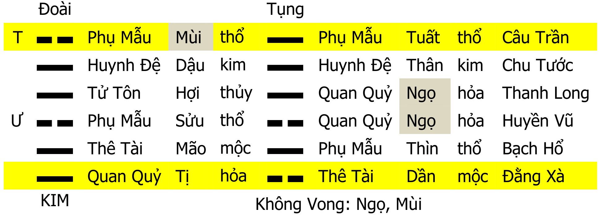

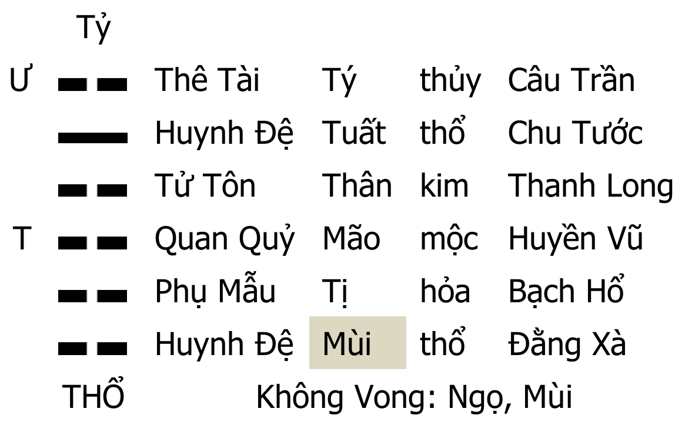

Lại vào ngày Mậu Tý tháng Thìn, xem cha ngày nào sẽ trở về, được quẻ Càn biến Quải:

Hào Phụ Mẫu trì Thế, gặp Nguyệt phá, lại biến ra hào Mùi thổ gặp Tuần Không. Đã không được Nhật thần sinh, lại không có hào động trợ giúp, nếu phán đoán theo lối cũ, là Dụng thần vô khí, người cha sẽ không quay trở về. Nhưng ta không phán đoán như thế, mà xem Chu Tước ở hào Phụ, hào Phụ động mà trì Thế, đến ngày Mão ắt có tin tức, ngày Ngọ ngày Mùi sẽ về đến nhà. Quả nhiên vào ngày Mão được tin của cha, đến ngày Ất Mùi thì người cha về đến nhà. Sở dĩ ứng vào ngày Mão được tin tức, vì đến ngày Mão, Nguyệt phá sẽ gặp hợp; ứng vào ngày Mùi cha trở về, vì hào Phụ vốn biến thành hào Mùi thổ gặp Tuần Không, đến ngày Mùi ra khỏi Tuần Không, sẽ về đến nhà.

Quan niệm của sách xưa về Tiến thần cho rằng, hào động gặp Nguyệt phá, vị thế của ta sẽ mất, biến thành Nguyệt kiến cũng là thoái lui. Trong quẻ này, hào Phụ gặp Nguyệt phá mà biến thành Không, tức lui về nhà.

**Tân bình thích:** Đây là không biết cách dùng của Tiến thần Thoái thần. Dự đoán ngày về của người, tìm người tìm vật, lấy thoái làm tiến, lấy tiến làm thoái. Chỗ diệu dụng trong quẻ chính là Dụng thần động mà hóa thoái, vì vậy cha người đó trở về, nếu như hóa tiến, tất khó trở về.

Ví dụ: Ngày Tân Mão tháng Mùi, một người nữ hỏi bản thân và bạn trai cãi lộn chia tay, bạn trai có còn trở về với mình hay không? Được quẻ Địa Trạch Lâm biến Chấn.

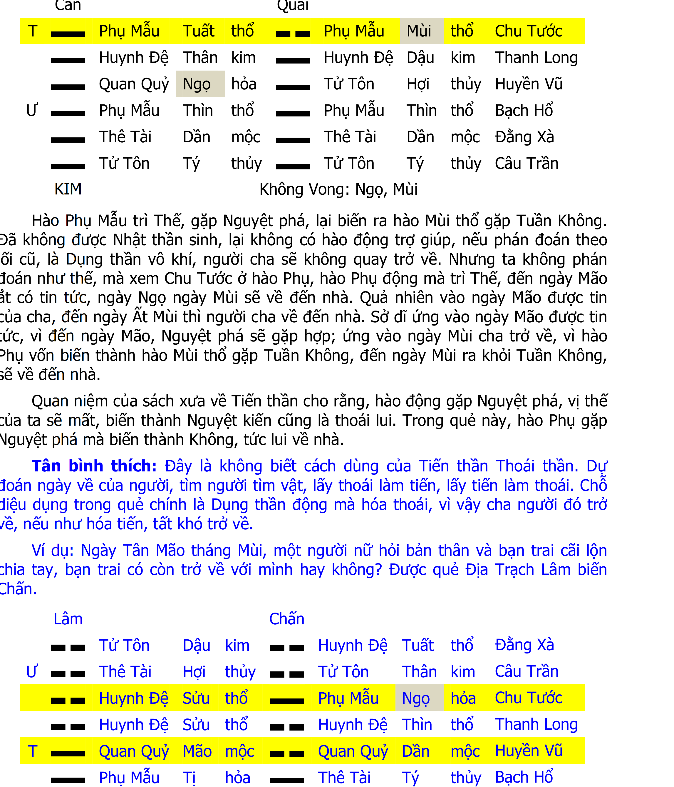

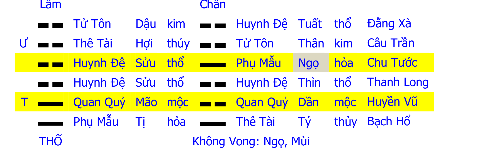

Quẻ này nếu lấy phép xưa mà đoán thì Dụng thần nhập Mộ ở Nguyệt, động mà hóa thoái, quẻ biến lục xung, tất khó hòa giải. Tôi lấy Dụng thần hóa thoái, đoán là tháng Thân sẽ quay trở lại. Quan Quỷ trì Thế động mà hóa thoái, chính là tượng bạn trai sẽ quay lại bên cạnh cô ấy. Kết quả đúng như phán đoán.

Lại ví dụ vào ngày Quý Mão tháng Ngọ, xem về công danh hậu vận, được quẻ Cấn biến Quan:

Ta bèn đoán rằng: Hào Quan tinh Dần mộc trì Thế, bị hào động Thân kim khắc, đến tháng bảy trong năm sẽ gặp chuyện không may. Người đó bèn hỏi ta là việc gì? Ta bèn đáp: "Hào Ứng động khắc hào Thế, hẳn có kẻ thù." Người đó bèn hỏi, có trở ngại đến công danh không? Ta đáp rằng: "Nếu không có hào Tý thủy động, chắc chắn sẽ mất chức. Nhưng may còn có hào Tý thủy động tương sinh nối tiếp, nên chỉ bị giáng chức hay thuyên nhiệm mà không bị miễn chức."

Hôm sau, người này gọi ta đến phủ thự, có một môn khách hiểu về Dịch lý hỏi ta rằng: "Đã được hào Tý thủy tương sinh nối tiếp, trong sách xưa có viết: Nếu Kỵ thần và Nguyên thần cùng động, hào Quan và hào Thế được hai sinh, là điềm mùa đông trong năm sẽ được thăng quan, tại sao ông lại cho là bị giáng chức?"

Ta bèn trả lời: "Hào Tý thủy gặp Nguyệt phá mà hóa thành Tị hỏa Tuần Không, trong sách xưa có viết: tuy có cũng như không, có Nguyên thần cũng là vô dụng. Ta không đoán theo phép cổ. Thần linh hé lộ cơ trời tại hào động, động ắt có nguyên nhân, nên ta chỉ đoán là giáng cấp mà thôi, về thời gian bị giáng cấp, nếu tại tháng Đông chí, mới ứng nghiệm. Nếu tại tháng khác, Tý thủy chưa được điền thực, vẫn chưa biết được.

Quả nhiên vào tháng bảy, giữa các quan lại xảy ra đấu đá, đàn hặc lẫn nhau, kết thành thị phi. Đến tháng Đông chí sự việc kết thúc, bị giáng chức điều nhiệm sang nơi khác.

**Tân bình thích:** Tử Tôn động mà hóa Quan, chính là tượng mất quan lại được quan. Ứng là người khác, lâm Chu Tước khắc Thế Quan, Chu Tước chủ khẩu thiệt thị phi, vì vậy mới xuất hiện người hạch tội hạ bệ mình. Phụ Mẫu là công văn kết luận, Tý thủy động mà hóa ra Phụ Mẫu, cho nên ứng tháng Tý kết án. Tý thủy tại hào 5, hào 5 là hào vị cấp trên, Nguyệt phá không sinh Thế Quan tinh, là bị người vạch tội nhưng không được cấp trên giúp đỡ. Tóm lại là do người khác gây nên rắc rối mà quan vận bị ảnh hưởng.

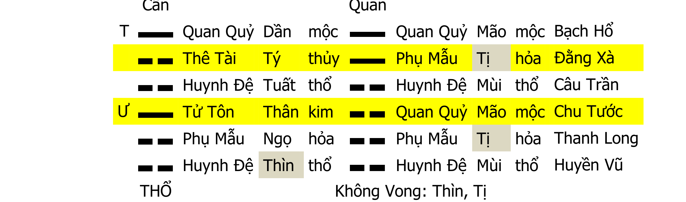

Ta lúc này cũng đã đi sang tỉnh khác, người đó bèn đến mời ta đến xem tiếp.

Vào ngày Bính Thìn tháng Dần, xem được quẻ Địa Trạch Lâm:

Lâm
- - Tử Tôn Dậu kim Thanh Long
Ư - - Thê Tài Hợi thủy Huyền Vũ
- - Huynh Đệ Sửu thổ Bạch Hổ
- - Huynh Đệ Sửu thổ Đằng Xà
T ── Quan Quỷ Mão mộc Câu Trần
── Phụ Mẫu Tị hỏa Chu Tước
THỔ Không Vong: Tý, Sửu

Ta bèn giải thích rằng: "Nghe nói nhân dân muốn giữ, nhưng sợ trên không chuẩn, ắt phải đợi đến năm Tý, sẽ được phục hồi phẩm cũ." Môn khách hiểu Dịch lý lần trước cũng ở đấy, hỏi ta rằng: "Hào 5 là Hợi thủy sinh hào Quan, tại sao lại không chuẩn?" Ta đáp rằng: "Hào 5 sinh, nhưng nay bị Nhật thần khắc, phải đợi đến năm Tý, vì Hợi thủy vượng ở Tý. Lại hợp với quẻ lần trước, hào 5 Tý thủy, gặp Thái Tuế mà không bị phá, chắc chắn sẽ lại được dùng."

Quả nhiên vào tháng Tị năm Giáp Tý được phục hồi phẩm cũ, lại được bổ nhiệm hai lần, đến năm Mão được thăng làm đốc phủ. Ta khuyên người này nên từ chức, anh ta bèn hỏi nguyên do, ta đáp: "Vẫn đoán theo quẻ trước, vì hào Thân kim khắc hào Thế, hào Tý thủy tuy động, nhưng gặp Phá mà lại hóa Không, nên không thể sinh hào Thế và hào Quan, nên dễ vướng vào kết oán kiện tụng. Đến tháng Tý, tuy Nguyệt phá được điền thực, nhưng sức còn yếu, nên tuy không đến nỗi bị cách chức, nhưng vẫn phải giáng chức. Sau đến năm Tý, mới là năm điền thực được Nguyệt phá. Lại gặp Thái Tuế đương quyền, nên lại được dùng. Năm sau là năm Thìn, là năm Tý thủy nhập Mộ, Thái Tuế khắc mất Tý thủy, Thân kim vẫn lại khắc Thế. Bị khắc thì không sinh được, chắc chắn tai họa sẽ nặng hơn nhiều so với lần trước." Nhưng người này không nghe.

Quả nhiên vào tháng ba năm Thìn dâng biểu điều trần, tuy lưu tiếng thơm muôn thuở, nhưng vẫn đắc tội mà bị cách chức. Sở dĩ có những đoán định như trên về Nguyệt phá, là do gặp Phá nhưng lại là động, nếu không phải là hào động, cách đoán sẽ khác.

Lý Ngã Bình bàn rằng: Sách "Dịch mạo" khi bàn về Nguyệt phá, cho rằng nếu hào gặp Nguyệt phá động mà là Kỵ thần thì vô hại, động mà là Nguyên thần thì vô dụng, được Nhật thần sinh cũng không nên được, tức là quẻ hoàn toàn vô dụng. Sách "Dịch lâm bổ di" cũng viết: Nếu hào gặp Nguyệt phá, bất kể là suy hay vượng, đều là điềm hung. Gặp sinh không sinh được, gặp khắc lại chuốc lấy khắc. Cũng có nghĩa là có mà cũng như không. Nếu xem quẻ Cấn biến Tốn trên đây, vào thời điểm xem quẻ, hào Tý thủy gặp phải Nguyệt phá nên không thể sinh, nên gặp rắc rối kiện tụng tại triều đình. Gặp Nguyệt kiến (tháng Tý) điền thực, tai họa mới được giảm nhẹ, chỉ bị giáng chức. Đến năm Tý Thái Tuế đương quyền, lại được phục hồi phẩm cũ. Đến năm

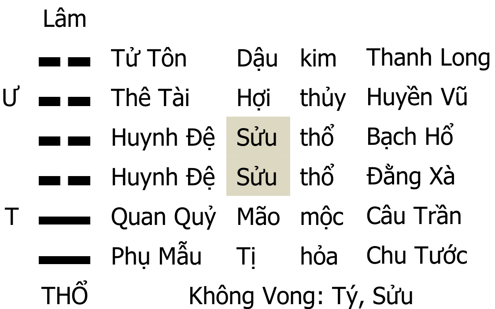

---

# CHƯƠNG 33. PHI THẦN, PHỤC THẦN

Thìn, Tý nhập Mộ, lại gặp họa lớn. Sự cát hung của nửa đời người, chỉ nằm trong một hào Nguyệt phá. Lẽ nào có thể cho rằng tuy có như không, hoàn toàn vô dụng?

***

# CHƯƠNG 33: PHI THẦN, PHỤC THẦN

Trong trường hợp Dụng thần không hiển hiện trong quẻ, thì lấy Nhật thần hoặc Nguyệt kiến làm Dụng thần. Nếu Nhật, Nguyệt không phải là Dụng thần, thì phải tìm ở quẻ đầu tiên trong bản cung, là vì quẻ đầu tiên của mỗi cung đều đầy đủ lục thân Phụ, Tử, Quan, Tài.

Ví dụ: Xem được quẻ Thiên Phong Cấu:

Cấu
── Phụ Mẫu Tuất thổ
── Huynh Đệ Thân kim
Ư ── Quan Quỷ Ngọ hỏa
── Huynh Đệ Dậu kim
── Tử Tôn Hợi thủy
T - - Phụ Mẫu Sửu thổ

Xem về thê thiếp, của cải, thì lấy hào Thê Tài làm Dụng thần, quẻ Cấu thuộc cung Càn, nên lấy Dần, Mão mộc làm Thê Tài. Nhưng trong sáu hào đều không xuất hiện Dần, Mão, tức Dụng thần không hiện trong quẻ. Nếu như xem vào ngày hoặc tháng Dần, Mão, thì lấy Nhật thần hoặc Nguyệt kiến làm Dụng thần. Nếu như ngày xem không phải là Dần, Mão, cần phải tìm trong quẻ Càn Vi Thiên đứng đầu cung Càn.

Quẻ Càn Vi Thiên đứng đầu cung Càn:

Càn
T ── Phụ Mẫu Tuất Thổ
── Huynh Đệ Thân Kim
── Quan Quỷ Ngọ Hỏa
Ư ── Phụ Mẫu Thìn Thổ
── Thê Tài Dần Mộc
── Tử Tôn Tý Thủy

Trong quẻ này, Thê Tài Dần mộc nằm tại hào 2, như vậy có nghĩa là Dần mộc phục ở dưới hào Tý thủy trong quẻ Cấu. Khi đó, hào 2 Hợi thủy trong quẻ Cấu được gọi là Phi thần, Dần mộc là Thê Tài, được gọi là Phục thần. Hợi thủy sinh Dần mộc, nên được gọi là Phi đến sinh Phục được Trường Sinh. Trường hợp này là Dụng thần

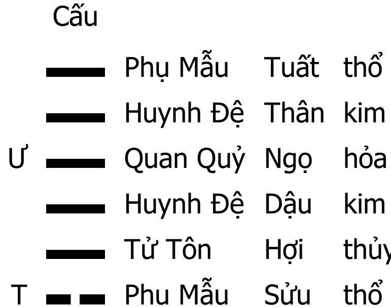

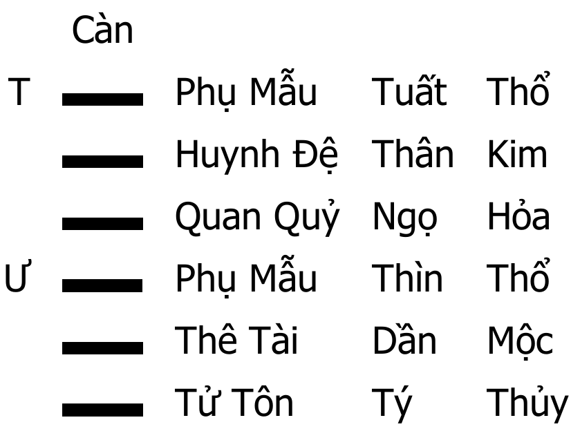 không hiển hiện, tìm được Phục thần lại được sinh phò, vô dụng cũng thành hữu dụng, nên đây là quẻ tốt. Những trường hợp khác cũng loại suy từ đây.

Lại ví dụ: Xem được quẻ Thiên Sơn Độn:

Độn
— Phụ Mẫu Tuất thổ
Ư — Huynh Đệ Thân kim
— Quan Quỷ Ngọ hỏa
— Huynh Đệ Thân kim
T - - Quan Quỷ Ngọ hỏa Tài-Dần
- - Phụ Mẫu Thìn thổ Tử-Tý

Xem về con cháu, lấy hào Tử Tôn làm Dụng thần. Quẻ Độn thuộc cung Càn, nên thủy là Tử Tôn. Nhưng trong sáu hào không xuất hiện Hợi, Tý thủy, có nghĩa là hào Tử Tôn không hiển hiện. Nếu như xem vào ngày hoặc tháng Hợi, Tý, thì lấy Nhật thần hoặc Nguyệt kiến làm Dụng thần. Nhưng nếu như ngày xem không phải là ngày, tháng Hợi, Tý, thì cũng phải tìm tại quẻ đầu là Càn Vi Thiên. Trong quẻ Càn Vi Thiên, hào sơ là Tý thủy Tử Tôn, phục ở phía dưới hào sơ Thìn thổ của quẻ Độn, Thìn thổ là Phi thần, còn Tý thủy là Phục thần. Trong trường hợp này, Phi đến khắc Phục, Phi khắc Phục sẽ gặp tổn hại, tức Phục thần chịu ức chế, hữu dụng cũng thành ra vô dụng, là điềm hung. Những trường hợp khác cũng loại suy từ đó.

**Tân bình thích:** Lý lẽ này không đúng, ở đây Tử Tôn tuy phục, nhưng nếu được Nhật Nguyệt là kim tới sinh, thì cũng là hữu dụng, không thể suy ra là hung. Ngũ hành Nhật Nguyệt và Dụng thần nhất trí, vẫn phải tìm Dụng thần phục tàng, phục tàng liên quan đến ứng kỳ của Dụng thần, đôi khi quan hệ giữa Phi thần và Phục thần có rất nhiều tượng, có thể sử dụng quan hệ Phi Phục để đoán ra rất nhiều sự việc, vì vậy khi Dụng thần không hiện trên quẻ nhất định phải tìm phục tàng.

Ví dụ: Ngày Quý Hợi tháng Đinh Mùi năm Đinh Mùi, một người nam sinh năm Canh Tý đoán hôn nhân, được quẻ Thiên Trạch Lý biến Hỏa Thiên Đại Hữu.

| Lý | Đại Hữu | |
| :--- | :--- | :--- |
| — Huynh Đệ Tuất thổ | — Phụ Mẫu Tị hỏa | Bạch Hổ |
| T — Tử Tôn Thân kim Tài-Tý | - - Huynh Đệ Mùi thổ | Đằng Xà |
| — Phụ Mẫu Ngọ hỏa | — Tử Tôn Dậu kim | Câu Trần |
| - - Huynh Đệ Sửu thổ | — Huynh Đệ Thìn thổ | Chu Tước |
| Ư — Quan Quỷ Mão mộc | — Quan Quỷ Dần mộc | Thanh Long |
| — Phụ Mẫu Tị hỏa | — Thê Tài Tý thủy | Huyền Vũ |

THỔ Không Vong: Tý, Sửu

Theo phương pháp của Dã Hạc, trong quẻ không có Thê Tài, Nhật thần là Tài tinh, khỏi cần tìm phục, lấy Nhật thần Hợi thủy làm Dụng. Trong quẻ Huynh Đệ Sửu

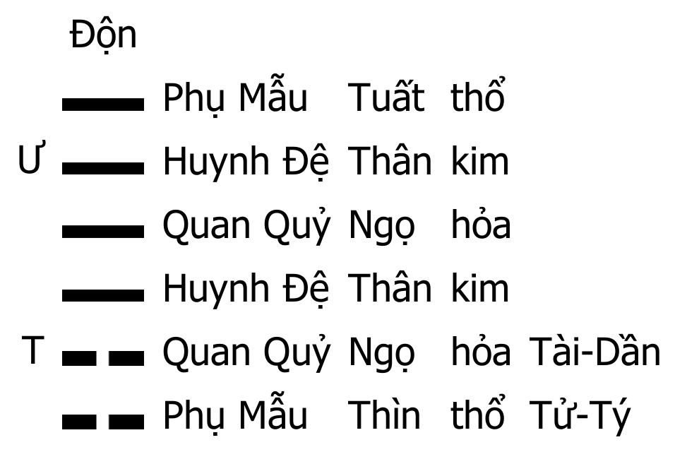

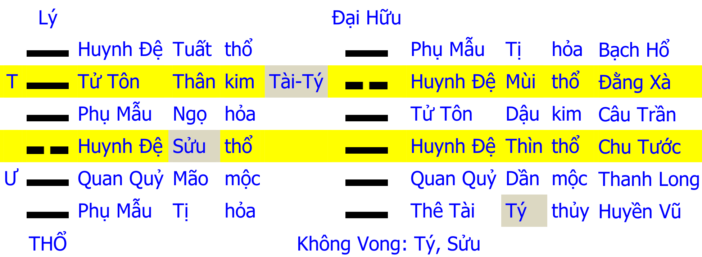 thổ mặc dù động mà hóa tiến, nhưng Sửu thổ Nguyệt phá, lại gặp Không vong, vô lực khắc Dụng, trong khi Nhật là Dụng thần, sách nói: "Hào gây tổn thương đến Nhật Nguyệt, chỉ là nói suông", Sửu thổ không thể khắc Nhật, hôn nhân phải đoán là cát. Nhưng không khớp với thực tế.

Theo phương pháp của tôi, quẻ không có Thê Tài thì tìm phục tàng. Thê Tài Tý thủy phục tại hào 5, Thê Tài Tý thủy chính là Dụng thần. Dụng thần được Nhật thần trợ giúp, lại được hào Thế phát động tới sinh là vượng. Phục thần là Tý thủy, phục tàng ứng xuất hiện, năm Giáp Tý người này tròn 24 tuổi, chính là độ tuổi lập gia đình, đoán là kết hôn vào năm Giáp Tý. Bởi vì Huynh Đệ Sửu thổ động mà khắc Dụng thần, tuy nhiên Không Phá, năm Ất Sửu thực Không thực Phá, Nguyên thần Tử Tôn nhập Mộ không thể sinh Dụng thần, đoán là năm này đã phát sinh mâu thuẫn với vợ. Hào Thế sinh Dụng thần, anh ta rất yêu vợ. Năm Bính Dần xung mất Nguyên thần, bản thân cũng mất đi ái ý với vợ, tình cảm rạn nứt. Sửu thổ Huynh Đệ đối với Dụng thần trong khắc có hợp, vợ bị người ta cướp đi. Năm Bính Tý Dụng thần lại là phục tàng gặp xuất hiện, lại có bạn gái. Năm Đinh Sửu Huynh Đệ cũng lại xuất Không thực Phá, Nguyệt kiến khắc Dụng, khi dự đoán là lúc quan hệ hai người đang căng thẳng, mâu thuẫn chồng chất. Phụ Mẫu Tị hỏa lâm Huyền Vũ ám động, tương hợp với hào Thế, hai người đã ở chung. Tôi đoán tháng Sửu thế nào cũng chia tay. Kết quả đúng như vậy.

Từ ví dụ này có thể thấy, Dụng thần lâm Nhật Nguyệt vẫn cần phải tìm phục tàng. Vợ anh ta và bạn gái năm Bính Tý đều là bị người ta cướp đi, đây chính là ứng nghiệm Huynh Đệ Sửu thổ hợp Dụng thần Tý thủy, nếu lấy Nhật thần Hợi thủy làm Dụng thì đã không có ý nghĩa này. Hai cơ hội hôn nhân của anh ta đều ứng tại năm Tý, điều này cũng có quan hệ rất lớn với Phục thần.

### Phục thần hữu dụng trong sáu trường hợp sau:

Thứ nhất, Phục thần được Nhật thần hay Nguyệt kiến tương sinh.

Thứ hai, Phục thần vượng tướng.

Thứ ba, Phục thần được Phi thần tương sinh.

Thứ tư, Phục thần được hào động tương sinh.

Thứ năm, Phi thần bị Nhật thần, Nguyệt kiến, hào động xung khắc.

Thứ sáu, Phi thần hưu tù, gặp Không, Phá, Mộ, Tuyệt.

"Hoàng kim sách" có viết: "Phục thần dưới hào Không, xuất lộ dễ dàng", quan điểm này khá hợp lý, nhưng không chỉ khi Phi thần Không Vong, Phục thần mới được xuất hiện, mà khi Phi thần gặp Phá, gặp Tuyệt, hay hưu tù, nhập Mộ, thì Phục thần đều có thể xuất hiện dễ dàng. Tại sao lại như vậy? Vì Phục thần ở bên dưới, Phi thần ở bên trên; nếu Phi thần gặp Phá, gặp Mộ, gặp suy, gặp Không, thì tuy có cũng như không, khi đó, Phục thần sẽ dễ dàng xuất hiện.

**Tân bình thích:** Thuyết này ứng nghiệm. Thường gặp Dụng thần phục tàng, Nhật Nguyệt đều khắc Dụng thần, Phi thần Không Vong đa số ứng việc cát. Tuy nhiên, Phi thần là Nguyên thần thì không nên Không Phá.

Ví dụ: Ngày Ất Mùi tháng Sửu, một người nam có quan hệ ám muội với người phụ nữ khác bị vợ phát hiện, vợ tức giận bỏ đi, qua điện thoại đoán khi nào vợ trở về, có ly hôn không? Tôi gieo được quẻ Phong Trạch Trung Phu biến Sơn Hỏa Bí.

| Trung Phu | Bí |
| :--- | :--- |
| ━ Quan Quỷ Mão mộc | ━ Quan Quỷ Dần mộc Huyền Vũ |
| ━ Phụ Mẫu Tị hỏa Tài-Tý | ━ ━ Thê Tài Tý thủy Bạch Hổ |
| T ━ ━ Huynh Đệ Mùi thổ | ━ ━ Huynh Đệ Tuất thổ Đằng Xà |
| ━ ━ Huynh Đệ Sửu thổ Tử-Thân | ━ Thê Tài Hợi thủy Câu Trần |
| ━ Quan Quỷ Mão mộc | ━ ━ Huynh Đệ Sửu thổ Chu Tước |
| Ư ━ Phụ Mẫu Tị hỏa | ━ Quan Quỷ Mão mộc Thanh Long |
| THỔ | Không Vong: Thìn, Tị |

Lấy Thê Tài làm Dụng thần. Thê Tài trong quẻ không hiện, phục dưới hào 5, Nhật Nguyệt đều khắc Dụng thần, Phi thần Tuyệt, hào động Sửu thổ khắc, lại là Kỵ thần trì Thế, theo lý luận của sách cổ thì Thế khắc Dụng thần người không về. Mặc dù lý là như vậy, nhưng khi đoán quẻ cần linh hoạt. Phi thần Không Vong, Phục thần dưới Không dễ dàng xuất lộ, hào 3 tuy là Kỵ thần phát động, nhưng động hóa Thê Tài, hào 3 là cửa, cửa động hóa Thê Tài, nhất định vợ sẽ về nhà. Tôi đoán ngày hôm sau, Thê Tài gặp Trường Sinh, vợ anh ta nhất định trở về, quẻ biến lục hợp, sẽ không ly hôn.

Quả nhiên ngày hôm sau vợ anh ta quay về, cũng không đề xuất ly hôn.

Đây chính là chỗ tuyệt diệu của Phi thần Không Vong, và nó cũng có thể giúp khuyên can lý luận Phục thần ở dưới không thể xuất hiện. Phi thần Tuyệt, Nhật Nguyệt khắc, hào động cũng khắc, nhưng không gặp hung, chẳng phải là lý pháp không đúng, mà là chỗ vi diệu của quẻ người bình thường khó mà nắm bắt được.

Trong sáu trường hợp trên, Phục thần đều là hữu dụng, tuy không hiển hiện, cũng coi như xuất hiện.

### Phục thần không hiển hiện trong năm trường hợp sau:

Thứ nhất, Phục thần hưu tù, vô khí.

Thứ hai, Phục thần bị Nhật, Nguyệt xung khắc.

Thứ ba, Phục thần bị Phi thần vượng tướng khắc hại.

Thứ tư, Phục thần gặp Mộ, Tuyệt tại hào Phi thần, Nhật thần, Nguyệt kiến.

Thứ năm, Phục thần hưu tù gặp Tuần Không, Nguyệt phá.

Trong năm trường hợp trên, Phục thần trở nên vô dụng, tuy có cũng như không, không thể xuất hiện.

Trong "Hoàng kim sách" có viết: "Phục gặp Tuần Không, việc không như ý", nhưng ta nghiệm thấy rằng quan điểm này không đúng. Nếu như Dụng thần vượng tướng gặp phải Tuần Không, đợi ngày xuất Không vẫn sẽ được xuất hiện.

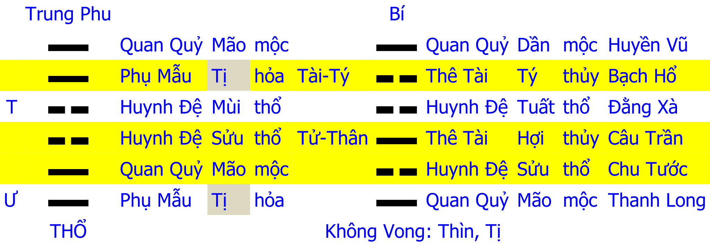

Ví dụ: Ngày Nhâm Thìn tháng Mão, xem ngày nào nhận được văn thư, được quẻ Sơn Hỏa Bí:

| Bí | |
| :--- | :--- |
| ━ Quan Quỷ Dần mộc | Bạch Hổ |
| ━ ━ Thê Tài Tý thủy | Đằng Xà |
| Ư ━ ━ Huynh Đệ Tuất thổ | Câu Trần |
| ━ Thê Tài Hợi thủy Tử-Thân | Chu Tước |
| ━ ━ Huynh Đệ Sửu thổ Phụ-Ngọ | Thanh Long |
| T ━ Quan Quỷ Mão mộc | Huyền Vũ |
| THỔ | Không Vong: Ngọ, Mùi |

Cần lấy hào Phụ Mẫu làm Dụng thần. Quẻ này thuộc cung Cấn, nên Ngọ hỏa là Phụ Mẫu. Sáu hào của quẻ Bí không xuất hiện Ngọ hỏa, nên căn cứ vào quẻ Cấn Vi Sơn đứng đầu cung Cấn để tìm Ngọ hỏa Phụ Mẫu, phục ở dưới hào 2 Sửu thổ. Do đó, Sửu thổ là Phi thần, Ngọ hỏa là Phục thần. Tuy Sửu thổ hưu tù tại tháng Mão, nhưng Phục thần gặp Tuần Không, bị chèn ép mà khó xuất hiện. Đoán vào ngày Giáp Ngọ, xuất Không sẽ nhận được. Quả nhiên đến ngày Giáp Ngọ nhận được văn thư.

Ví dụ: Ngày Đinh Tị tháng Thìn, xem nô bộc bỏ trốn, được quẻ Thủy Sơn Kiển:

| Kiển | |
| :--- | :--- |
| ━ ━ Tử Tôn Tý thủy | Thanh Long |
| ━ Phụ Mẫu Tuất thổ | Huyền Vũ |
| T ━ ━ Huynh Đệ Thân kim | Bạch Hổ |
| ━ Huynh Đệ Thân kim | Đằng Xà |
| ━ ━ Quan Quỷ Ngọ hỏa | Câu Trần |
| Ư ━ ━ Phụ Mẫu Thìn thổ | Chu Tước |
| KIM | Không Vong: Tý, Sửu |

Xem về nô bộc, lấy hào Tài làm Dụng thần. Quẻ này thuộc cung Đoài, nên Mão mộc làm hào Tài, không thấy xuất hiện trong sáu hào, nên cần tìm trong quẻ Đoài Vi Trạch đứng đầu cung Đoài.

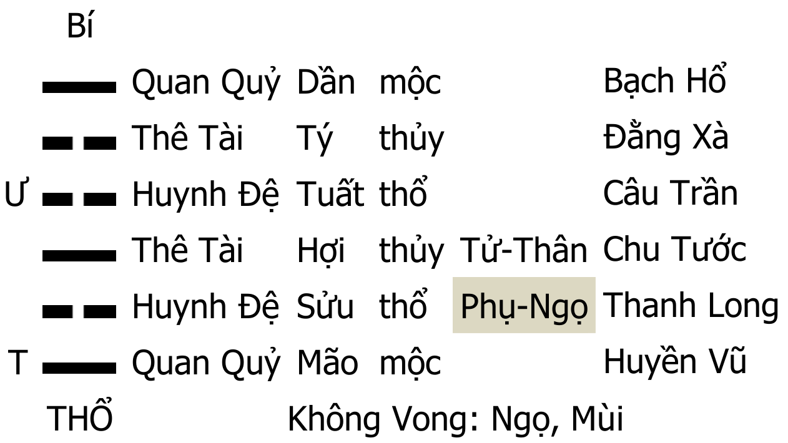

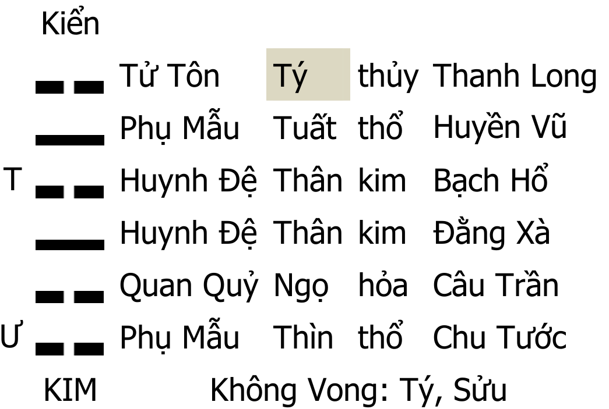

Hào 2 là Mão mộc, phục ở phía dưới hào 2 Ngọ hỏa của quẻ Kiển. Ngọ hỏa là Phi thần, Mão mộc là Phục thần. Ta bèn đoán rằng: Quẻ Kiển có hào Thân kim trì Thế, khắc chế Mão mộc, kẻ bỏ trốn rút cục cũng không trốn thoát. Nhưng vì Mão mộc phục dưới Ngọ hỏa, là Phục đi sinh Phi, như vậy là hao khí, những của cải bị người làm lấy trộm đi sẽ hao tán hết tại nhà lò rèn, đoán là đến ngày Giáp Tý sẽ lấy bắt được. Quả nhiên vào ngày Tý nhận được tin, người làm mang đồ ăn trộm đến đánh bạc tại nhà thợ rèn, đến giờ Thân bắt được, giải cùng với thợ rèn lên quan. Sở dĩ ứng nghiệm vào ngày Tý, vì Tý thủy xung khắc Phi thần Ngọ hỏa, sinh khởi Phục thần Mão mộc.

"Hoàng kim sách" viết: "Phục không nâng đỡ thành vô ích; Phi chẳng xung khai cũng uổng công", cũng là mang nghĩa này.

Ta ngờ rằng Phi thần Ngọ hỏa tức chỉ nhà lò rèn, Phục thần là Mão mộc chỉ người làm bỏ trốn. Đến ngày Tý xung Ngọ hình Mão, nên hai người này sẽ đều bị phạt trượng.

**Tân bình thích:** Ở trên là quẻ tĩnh, hào vượng tướng có thể khắc hào hưu tù. Mão mộc là Dụng, bị khắc là có thể bắt được, vượng mà được sinh thì khó bắt. Trong quẻ Huynh Đệ Thân kim lưỡng hiện mà vượng, Phi thần khắc Thế, là người cản trở truy bắt bọn nô bộc bỏ trốn, quái cung là kim, hỏa ở cung kim, có thể ứng với thợ rèn. Ngày Tý xung mất Phi thần, Ngọ hỏa không còn che giấu bọn nô bộc bỏ trốn nữa, ngày Tý ứng nghiệm sự việc là phù hợp với quái lý. Còn như nói ngày Tý sinh Mão là giải thích sai lầm, Tý hình Mão mới là giải thích đúng.

Ví dụ: Ngày Bính Thìn tháng Dậu, xem về bệnh của con, được quẻ Thăng:

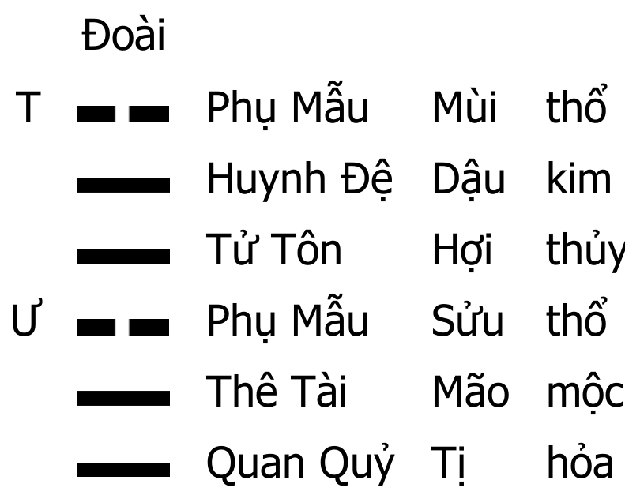

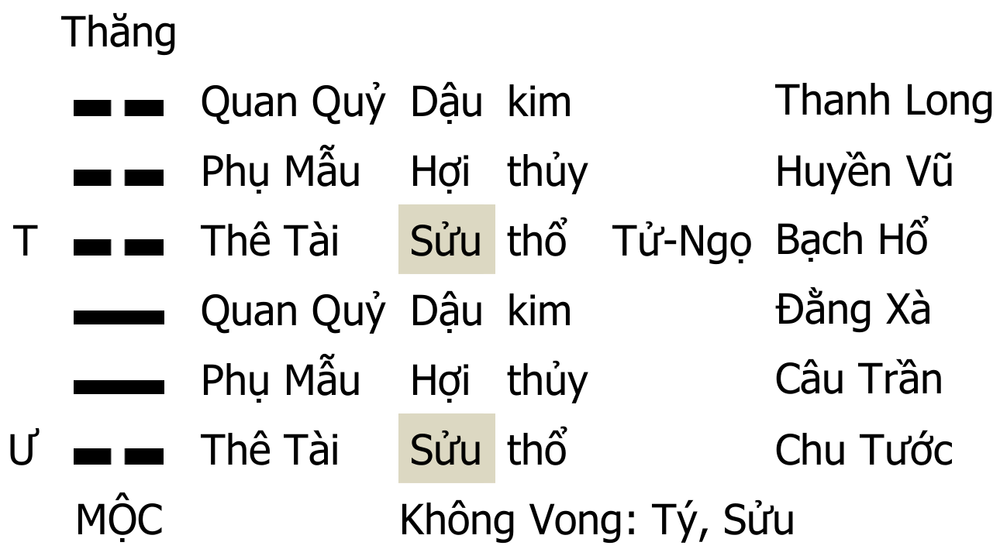

"Hoàng kim sách" viết: "Phục thần dưới hào Không, xuất lộ dễ dàng". Quẻ này Dụng thần Ngọ hỏa Tử Tôn phục ở phía dưới hào Sửu thổ, Sửu thổ gặp Tuần Không, nên Phục thần dễ xuất hiện, đoán rằng vào ngày Ngọ, hào Tử Tôn xuất hiện, bệnh sẽ khỏi. Sau quả nhiên đến ngày Ngọ khỏi bệnh.

Nếu như xem được quẻ Càn Vi Thiên, nhưng Dụng thần gặp Không, Phá, suy, tuyệt, thì chuyển sang tìm tại cung Khôn, như vậy gọi là Càn Khôn hoán đổi qua lại. Sách "Dịch lâm bổ di" lại cho rằng tìm tại quẻ Quy hồn.

Dã Hạc lão nhân bàn rằng: Hà tất phải như vậy. Dụng thần gặp Không, Phá, suy, tuyệt, thì họa phúc đã biết đến tám chín phần, sao chẳng xem thêm một quẻ nữa, để kết hợp lại mà suy đoán, Dụng thần tự nhiên sẽ có. Ta thường không đợi đến khi Dụng thần suy, tuyệt, nếu như Dụng thần không hiện, tuy có Phục thần, cũng không dùng đến, mà xem thêm một, hai quẻ nữa, Dụng thần ắt sẽ hiện lên. Một hôm, đến một nhà nọ, thấy thầy thuốc ngồi đầy nhà.

Lúc ấy là ngày Bính Thìn tháng Mão, xem về bệnh của cha, được quẻ Địa Lôi Phục:

Dụng thần là hào Phụ Mẫu không hiện, tuy biết rằng hào Phụ Mẫu Tị hỏa phục dưới hào 2 Dần mộc, mộc tuy vượng mà sinh Tị hỏa, tức Phi đến sinh Phục, ắt là điềm khỏi bệnh. Nhưng ta không đoán theo đó, mà bảo người này xem lại, được quẻ Sơn Trạch Tổn:

Hào Tị hỏa Phụ Mẫu đã xuất hiện tại hào sơ, vì xem vào mùa xuân là lúc mộc vượng, hỏa tướng, nên đoán rằng bệnh sẽ khỏi. Nhưng vì bệnh tình của người cha rất

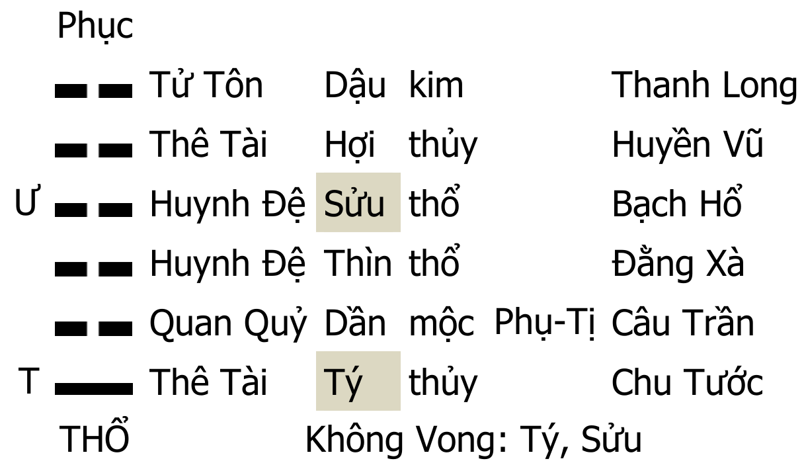

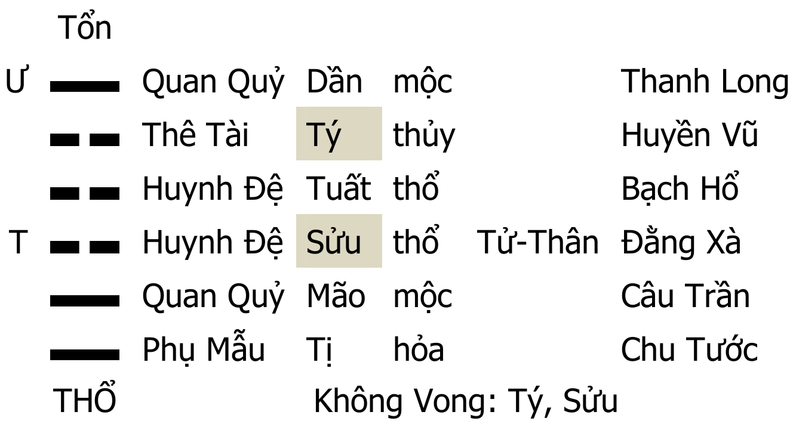 nguy cấp, nên do dự chưa quyết đoán, bảo người con hôm sau xem lại, được quẻ Tiệm biến Tốn:

Ta nghi ngờ rằng: Hai quẻ trước điềm báo đều là khỏi bệnh, tại sao trong quẻ này hào Phụ Mẫu biến Hợi thủy hồi đầu khắc Phụ Mẫu? Sau ta ngộ ra rằng: Đúng vậy! Hai quẻ trước hào Tị hỏa Phụ Mẫu vượng, không bị thương khắc, nên ứng vào điềm trước mắt bệnh sẽ khỏi. Nhưng trong quẻ này Hợi thủy khắc Phụ, đến mùa đông số mệnh khó toàn. Bèn đến trước giường, bảo bệnh nhân tự xem. Quẻ xem được cũng giống với quẻ trước. Lại mời vợ người đó xem, cũng được quẻ tương tự.

Ta thấy được liền ba quẻ này, vô cùng kinh sợ, thần linh là có thực ư? Không thực ư? Con xem về bệnh của người cha, gặp hào Hợi thủy hồi đầu khắc. Người cha tự xem về bệnh của mình, gặp hào Hợi thủy khắc Thế. Vợ xem về bệnh chồng, gặp hào Hợi thủy khắc chồng. Ba quẻ tương tự nhau, tựa như do một bàn tay sắp xếp ra. Đều chủ về mùa đông bệnh tình nguy cấp, có gặp thần y cũng khó cứu.

Ta vẫn không tin, nên chỉ đoán là bệnh tình trước mắt sẽ thuyên giảm. Và hỏi các thầy thuốc rằng: "Điềm quẻ không đáng ngại, chẳng hay các vị cao kiến ra sao?" Đáp rằng: "Bệnh tình cực kỳ hiểm nghèo!" Trong đám có một người chỉ cười nhạt mà không nói. Ta hỏi ông ta họ gì, đáp là họ Thọ. Bèn hỏi riêng ông ta rằng: "Bệnh tình của người kia lành dữ ra sau?" Ông ta đáp: "Ta có thể chữa được, nhưng không chịu uống thuốc của ta, biết làm thế nào?" Ta bèn kín đáo dặn người con rằng: "Bệnh của ông cụ, phải được người họ Thọ chữa trị".

Sáng hôm sau thầy thuốc họ Thọ đến cảm tạ. Ta bèn hỏi bệnh tình sẽ ra sao? Ông ta đáp: "Trước mắt không có gì đáng ngại, nhưng đến mùa đông tính mạng khó toàn." Ta bèn nói: "Lời của ông rất phù hợp mới mệnh số, thực là thần y!"

Sau quả nhiên mất vào tháng Hợi.

Sở dĩ ta không dùng Phục thần, mà dùng cách xem nhiều quẻ nữa, vì như vậy, quyết đoán họa phúc sẽ chắc chắn hơn. Biết được trước mắt có thể sống, lại biết được ngày sau sẽ chết, như vậy chẳng phải là tác dụng của việc xem nhiều lần ư?

**Tân bình thích:** Nếu có nghi hoặc có thể xem lại một quẻ, nếu quái tượng rất rõ, tuy là phục tàng, sao phải đoán lại? Quẻ đầu tiên Dụng thần vượng tướng, là tượng khỏi bệnh, nhưng quẻ lục hợp, bệnh gần thì không nên. Gặp tháng xung tất hung. Quẻ thứ hai, Huynh Đệ Tuất thổ được Nguyệt hợp Nhật xung là ám động, Dụng

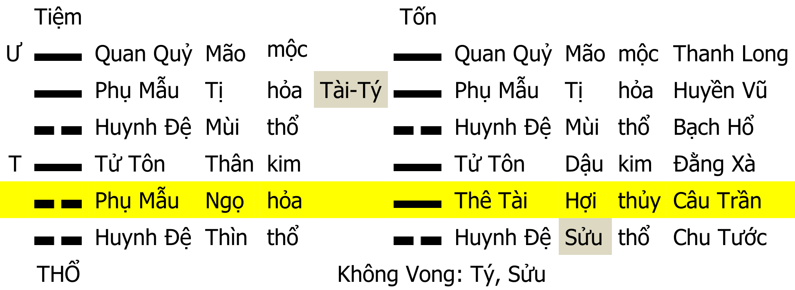 thần nhập Mộ, cũng là trong cát tàng hung. Nhập Mộ gặp xung, cũng là ứng tháng 10 có hung.

Ví dụ: Ngày Đinh Sửu tháng Dậu, nữ xem bệnh đồng nghiệp, được quẻ Địa Thiên Thái biến Lôi Trạch Quy Muội.

Đoán bệnh đồng nghiệp thì lấy hào Ứng làm Dụng thần, hào Ứng nhập Mộ, tượng nhập viện, Dụng thần vượng tướng Tuần Không, bệnh gần không sao. Hào 4 Huynh Đệ Sửu thổ là Mộ khố của Dụng thần, lâm Bạch Hổ động mà hóa ra Phụ Mẫu Ngọ hỏa, quẻ tại cung Khôn, Khôn chủ dạ dày, hào 4 cũng chủ dạ dày, Bạch Hổ chủ máu, Phụ Mẫu chủ bệnh viện, là bởi vì xuất huyết dạ dày nhập viện, quẻ chính lục hợp bệnh gần không nên. Càng không nên Nguyên thần Huynh Đệ Thìn thổ động mà hóa thoái. Sau này tất thành bệnh mãn tính, cơ thể dần dần suy yếu. Cừu thần Quan Quỷ Dần mộc lâm Câu Trần ở hào 2, Dần mộc chủ gan mật, Câu Trần chủ sưng trướng, người đó có bệnh như gan to, xơ gan hoặc sỏi mật.

Tình hình ứng nghiệm: Đồng nghiệp của cô ấy phải nhập viện vì xuất huyết dạ dày, sau khi điều trị có chuyển biến tốt đã xuất viện, vào tháng Mão năm Đinh Sửu, bởi vì gan to mà chết. Ứng năm Sửu, là năm Dụng thần nhập Mộ và Nguyên thần hóa thoái. Ứng tháng Mão, là vì Dụng thần gặp tháng xung.

Đây cũng là Dụng thần vượng mà liền khỏi bệnh, bệnh gần gặp hợp, gặp tháng xung mà chết.

Lý Ngã Bình bàn rằng: Phép bói xưa sử dụng Phục thần, tuy có ứng nghiệm, nhưng sự suy vượng, hưu tù, hình xung, khắc hại, không phá của Dụng thần rất khó nắm bắt. Nên xem thêm một hai quẻ, Dụng thần tự nhiên sẽ xuất hiện. Đây thực là mật pháp.

Muốn đem phương pháp bí mật này truyền lại cho đời sau, thật nhân từ thay! Nhưng cũng có người hỏi, có thuyết cho rằng xem nhiều lần là khinh nhờn, nên không dám xem lại; nay lại bảo là nên xem nhiều lần, vậy thế nào là mật quyết. Ta nói rằng: Nếu Dụng thần không xuất hiện, phải tìm Phục thần. Nếu Phục thần vô dụng, thì tìm quẻ tương hỗ, nếu không được, lại tìm can hóa. Huống chi các quẻ ghi trong chương "Biến hỗ" sách "Dịch mạo" không những lý giải khiên cưỡng, mà còn sai lầm, chi bằng xem lại.

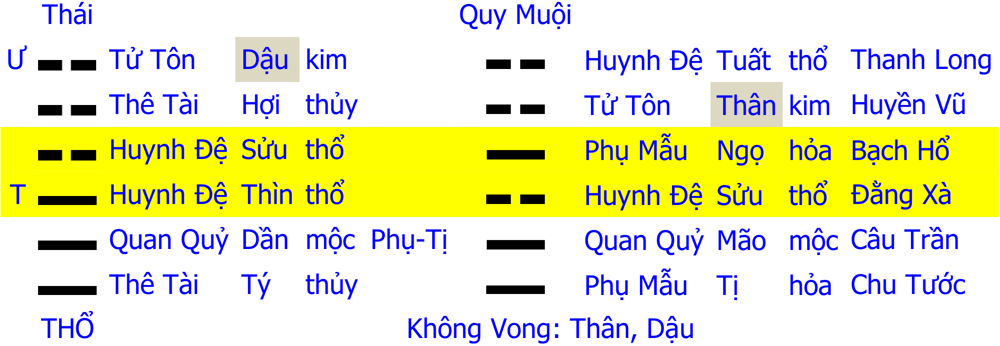

Ví dụ: Trong sách "Dịch mạo" có chép, vào ngày Mậu Thân, xem về bệnh của con, được quẻ Tấn biến Bác:

Trong sách đó đoán rằng: Phi Phục biến tượng, đều không có Dụng thần, nên lấy quẻ Thủy Địa Tỷ làm quẻ tương hỗ để đối chiếu. Quẻ ngoại là Khảm thủy, tức là Tử Tôn, được hào Dậu kim động mà tương sinh, sau đến ngày Hợi bệnh sẽ thuyên giảm. Nhưng theo suy đoán của ta, thì như sách "Hải để nhãn" có viết: Dụng thần phục, Nguyên thần động, xem về bệnh sẽ không chết. Trong quẻ này, không những Dụng thần động tại hào 4, mà còn được Nguyệt kiến tương sinh. Sách "Đại toàn" có viết: Dụng thần phục mà được Nhật, Nguyệt tương sinh sẽ xuất hiện. Trong quẻ này hào Tử Tôn Tý thủy phục tại hào sơ, tuy bị Phi thần đè nén, nhưng lại được Nhật thần sinh phò. Đến tháng mười, Hợi thủy đương lệnh, Tử Tôn xuất hiện mà được tương sinh, đã rất rõ ràng, tại sao còn phải tìm quẻ tương hỗ.

Lại chép, ngày Mậu Dần tháng Tý, xem về quan chức, được quẻ Khốn biến Đoài:

Sách đó đoán rằng: Phi thần tại hào Quan Ngọ hỏa, gặp Nguyệt phá. Phục thần là Tị hỏa Quan Quỷ phục tại Dần, gặp Trường Sinh tại Dần, đến tháng mạnh xuân (tháng giêng) sẽ được thăng chức. Nhưng theo phương pháp suy đoán của ta, như "Hoàng kim sách" đã viết: Hào Phi và hào biến đều không có Dụng thần mới cần tìm Phục thần. Trong quẻ này, hào sơ là Dần mộc động biến thành Tị hỏa là Quan tinh. Tháng Dần thì Quan tinh gặp Trường Sinh. Trong quẻ đã có hào Tài động mà sinh Quan, tại sao không dùng hào biến Quan tinh, mà lại phải đi tìm Phục thần? Cũng

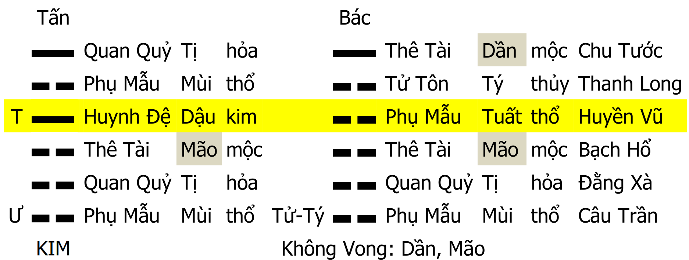

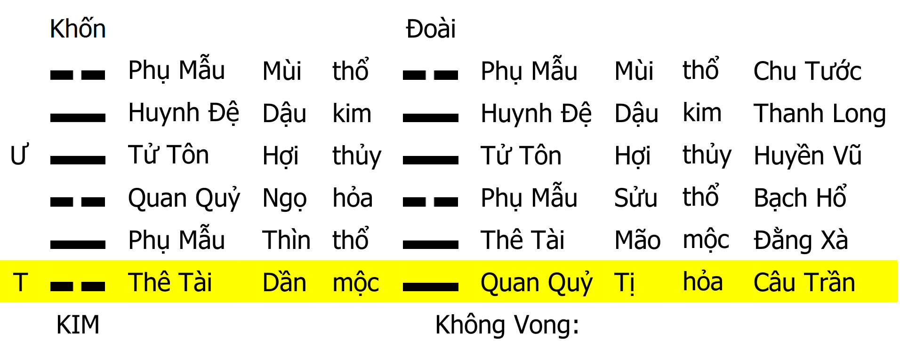

---

# CHƯƠNG 34. TIẾN THẦN, THOÁI THẦN

may trong quẻ này, Phục thần và hào biến đều là Tị hỏa. Nếu người sau gặp quẻ khác, thì biết nên dùng hào biến hay Phục thần? Bởi vậy, không thể coi đây là phương pháp để lưu truyền hậu thế, dạy dỗ người sau.

Cách đoán quẻ trong chương "Can hóa" mới đáng nực cười.

Trong chương này có chép: Vào ngày Bính Tý tháng Bính Thân năm Tân Mão, xem về chuyện sống chết của con trai, được quẻ Quan biến Tụy:

Sách này đoán rằng: Hào thủy Tử Tôn không xuất hiện, nhưng gặp được tháng Bính năm Tân, Bính Tân hóa thành thủy, sau đến ngày Giáp Thìn năm Hợi, Thân, Tý, Thìn hợp thành thủy cục, đến ngày Hợi người con sẽ trở về.

Ta lại đoán rằng: Hào Thế Mùi thổ động sinh ra Hợi thủy Tử Tôn, tức tháng Hợi sẽ gặp được con, vì tháng Hợi cùng hào Thế, hào Tử Tôn là Hợi, Mão, Mùi hợp thành tam hợp cục, rõ ràng là điềm cha con gặp gỡ, sao lại phải căn cứ vào can hóa? Cho dù là Hợi thủy không xuất hiện trong quẻ, thì có thể lấy Nhật kiến Tý thủy làm Dụng thần. Bao nhiêu Dụng thần hiện lên không dùng, mà lại tùy tiện đi lấy can hóa, là gây nhầm lẫn cho người đời sau, thực Không phải là phương pháp để dạy người.

**Tân bình thích:** Hào Thế là người nhờ đoán, động hóa ra Tử Tôn, chính là tượng bản thân gặp con. Thường gặp Kỵ thần trì Thế hóa ra Dụng thần, Dụng thần vượng, lấy địa chi hào biến làm ứng kỳ.

***

# CHƯƠNG 34: TIẾN THẦN VÀ THOÁI THẦN

Tiến thần và Thoái thần đều là do hào động biến ra. Biến thành Tiến thần hay Thoái thần, nên tốt hay nên xấu, cần phải căn cứ vào sự việc cần xem. Nếu xem về việc tốt, nên hóa thành Tiến thần; nếu xem về việc xấu, nên hóa thành Thoái thần.

Tiến thần: Hợi biến thành Tý, Dần biến thành Mão, Tị biến thành Ngọ, Thân biến thành Dậu, Sửu biến thành Thìn, Thìn biến thành Mùi, Mùi biến thành Tuất.

Thoái thần: Tý biến thành Hợi, Mão biến thành Dần, Ngọ biến thành Tị, Dậu biến thành Thân, Thìn biến thành Sửu, Mùi biến thành Thìn, Tuất biến thành Mùi.

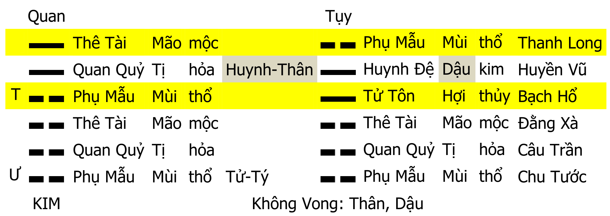

Tiến thần, là thừa thế mà tiến lên, tựa như cây mùa xuân tốt tươi, như nguồn nước tràn đầy, là tượng lâu dài, tiến bộ.

Thoái thần, là bắt đầu thụt lùi, tựa như cây cỏ mùa thu dần dà héo úa.

Ví dụ: Vào ngày Quý Mão tháng Thân, xem về kỳ thi hương, được quẻ Hằng biến Đại Quá:

Ta đoán rằng: Quan tinh Dậu kim trì Thế, vượng tướng đương thời, bị Nhật thần Mão xung mà ám động. Lại được hào 5 là Quan Quỷ hóa Tiến thần trợ giúp, nâng đỡ. Không những mùa thu năm đó trúng tuyển, mà đến mùa xuân năm sau chắc chắn sẽ đỗ đầu bảng. Quả nhiên dự thi, tin vui liên tiếp.

Lại ví dụ: Ngày Canh Tuất tháng Dậu, xem năm nào sinh con trai, được quẻ Truân biến Tiết:

Hào Tử Tôn Dần mộc trì Thế, hóa Tiến thần. Dần mộc gặp Tuần Không, Mão mộc Không mà lại Phá. Nên đoán là đến năm Dần năm Mão, điền thực được Không, Phá, nhất định sẽ sinh nhiều con trai. Người này tuổi chưa đến ba mươi, vợ không sinh nở được, có rất nhiều nàng hầu. Xem vào năm Tý, đến năm Dần, năm Mão, vợ và nàng hầu đều sinh con. Từ năm 31 đến năm 35 tuổi, sinh liền chín con trai.

Sách xưa cho rằng, hào động, Nhật thần, Nguyệt kiến mà hóa Không hóa Phá, thì không tiến được. Trong quẻ này hào Tuần Không biến thành Không, Phá, nhưng vẫn được tiến.

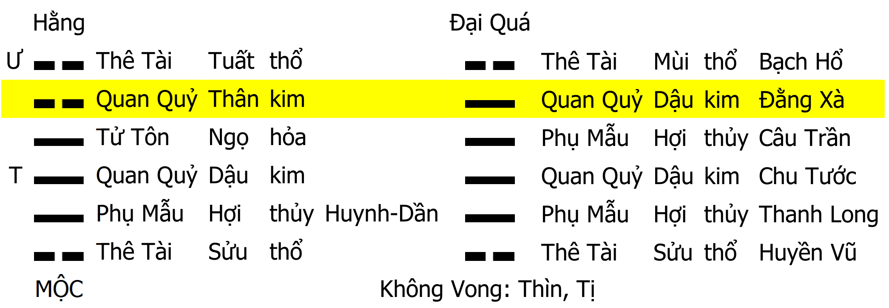

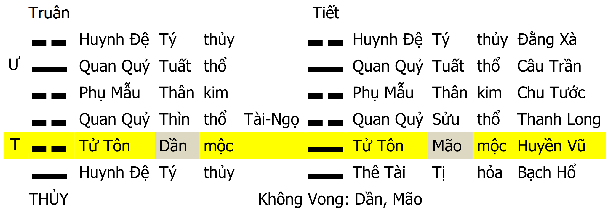

Lại ví dụ: Ngày Ất Sửu tháng Mão, xem việc hôn nhân có thành không, được quẻ Phệ Hạp biến Tỷ:

Hào Tài trì Thế hóa thành Tiến thần; hào Tử Tị hỏa động mà sinh hào Thế. Nhưng vì Tị hỏa hóa Tý thủy hồi đầu khắc, cần phải đợi đến ngày Ngọ xung mất Tý thủy. Ngọ hỏa lại hợp với hào Thế, nên hôn sự ắt thành. Quả nhiên vào ngày Ngọ, hôn sự được chấp thuận.

Có người hỏi: "Còn có hào Quỷ Dậu kim động, chẳng lẽ không gây trở ngại ư?" Ta bèn đáp rằng: "Hào Quỷ động hóa thành Thoái thần, nên tuy có cản trở, nhưng cũng không đủ sức."

Quẻ này hào Thế tại Tài Mùi thổ động mà hóa Tuần Không, nếu theo phép xem cổ, thì hào Tài hóa Tuần Không, thuộc trường hợp hào động, Nhật thần, Nguyệt kiến hóa Không, không tiến được. Nhưng ở đây động tán hóa Không, vẫn có thể tiến được.

Lại ví dụ: Ngày Giáp Thìn tháng Dậu, có người bị luận tội, xem tự biện tội có kết quả không, được quẻ Sư biến Minh Di:

Ta bèn đoán rằng: Hào Thế hóa hồi đầu khắc, hào Quan hóa thành Thoái thần, hào Tử Tôn hóa thành Tiến thần, ba hào động này đều không phải là điềm tốt, nên là tượng đại hung. Quả nhiên vào tháng hai năm sau, bị cách chức bắt hỏi tội.

Theo phép xưa, Nhật thần, Nguyệt kiến, hào động hóa Không Phá, là không bị thoái. Trong quẻ này, hào Quan động gặp Nhật thần. Sách xưa lại nói: Nhật thần,

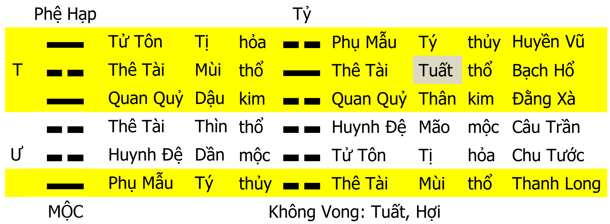

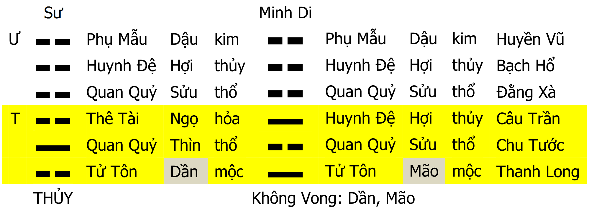

Nguyệt kiến, hào động hóa Không Phá, là không tiến. Trong quẻ này, hào Tử Tôn 
động, hưu tù, lại hóa Không, Phá, nhưng tiến vẫn là tiến, mà thoái vẫn phải thoái.

Lại ví dụ: Vào ngày Bính Tuất tháng Sửu, có người nhận được thư của cha báo 
đang trên đường nhậm chức, anh ta muốn đi đón, xem có gặp được hay không, được 
quẻ Kiển biến Lữ:

Kiển
 
Lữ

Tử Tôn | Tý | Thủy | Quan QuỷTị | hỏa Thanh Long

Phụ Mẫu Tuất Thổ | Phụ Mẫu Mùi | thổHuyền Vũ

T | Huynh ĐệThân Kim | Huynh ĐệDậu kim Bạch Hổ

Huynh ĐệThân Kim | Huynh ĐệThân kim Đằng Xà

Quan QuỷNgọ Hỏa Tài-Mão | Quan QuỷNgọ hỏa Câu Trần

Ư | Phụ Mẫu Thìn Thổ | Phụ Mẫu Thìn thổChu Tước

KIM
Không Vong: Ngọ, Mùi

Hào Phụ hóa Thoái thần, tức cha đã trở về. Hào Thế hóa Tiến thần, chỉ bản thân 
mình muốn đi. Hào Phụ sinh hào Thế, chắc chắn cha con sẽ được gặp nhau vào ngày 
Mùi. Sau quả nhiên gặp cha vào ngày Mùi. Sở dĩ ứng nghiệm vào ngày Mùi, là vì hào 
Tuất Phụ biến thành Mùi, vừa gặp Phá vừa gặp Không; ngày Mùi là ngày điền thực 
được Không và Phá. Nếu chiếu theo phương pháp cổ, Nhật thần, Nguyệt kiến, hào 
động hóa Không hóa Phá, là không thoái, thì làm sao người cha lại có thể quay về?

Lại ví dụ: Vào ngày Quý Tị tháng Tuất, xem mùa đông năm đấy có nhận được 
chức quan sai hay không, được quẻ Thủy Trạch Tiết biến Nhu:

Tiết 
 
Nhu

Huynh ĐệTý | thủy | Huynh ĐệTý | thủy Bạch Hổ

Quan QuỷTuất thổ | Quan QuỷTuất thổ | Đằng Xà

Ư | Phụ Mẫu Thân kim | Phụ Mẫu Thân kim | Câu Trần

Quan QuỷSửu thổ Tài-Ngọ | Quan QuỷThìn thổ | Chu Tước

Tử Tôn | Mão mộc | Tử Tôn | Dần mộc | Thanh Long

T | Thê Tài | Tị | hỏa | Huynh ĐệTý | thủy Huyền Vũ

THỦY
Không Vong: Ngọ, Mùi

Hào Quan Sửu thổ động mà hóa Tiến thần, nên đoán vào tháng Sửu sẽ được 
chức quan, sau quả nhiên đúng như vậy. Theo phép xưa, cho rằng Nhật thần, Nguyệt 
kiến, hào động hóa Phá hóa Không thì không thể tiến. Thế nhưng trong quẻ này, hào 
động không gặp Nhật thần, Nguyệt kiến lại hóa Phá, nhưng vẫn có thể tiến.

Lại ví dụ: Vào ngày Đinh Mão tháng Mùi, xem về công danh, xem có được ra làm 
quan hay không. Được quẻ Thiên Hỏa Đồng Nhân biến Cách:

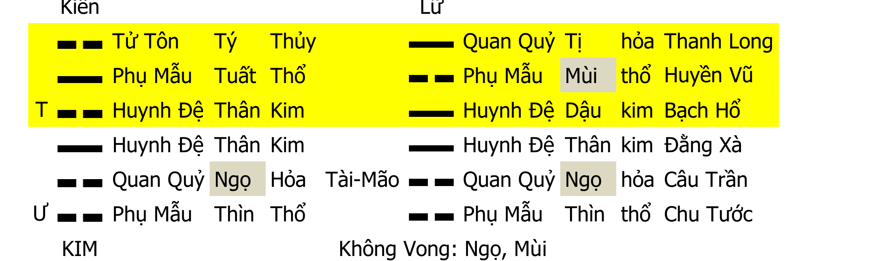

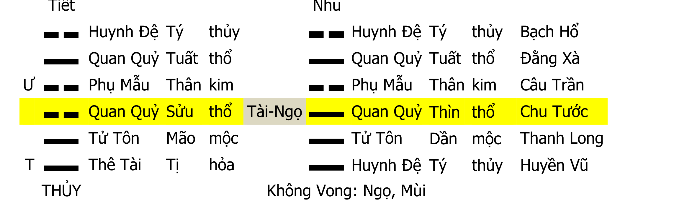

Đồng Nhân
 
Cách

Ư | Tử Tôn | Tuất thổ | Tử Tôn | Mùi thổ | Thanh Long

Thê Tài | Thân kim | Thê Tài | Dậu kim Huyền Vũ

Huynh ĐệNgọ | hỏa | Quan QuỷHợi thủy Bạch Hổ

T | Quan QuỷHợi | thủy | Quan QuỷHợi thủy Đằng Xà

Tử Tôn | Sửu | thổ | Tử Tôn | Sửu thổ | Câu Trần

Phụ Mẫu | Mão mộc | Phụ Mẫu | Mão mộc Chu Tước

HỎA 
Không Vong: Tuất, Hợi

Ta bèn đoán rằng: Nếu đoán theo phép cũ, thì hào Tử Tôn động mà khắc hào 
Quan, tức suốt đời không được làm quan. Thế nhưng theo cách suy đoán của ta, thì 
đến năm Thìn sẽ được làm quan. Tại sao lại như vậy? Vì hào Tuất thổ Tử Tôn tuy 
động, nhưng lại hóa thành Thoái thần, nên không thể khắc được Quan. Đến năm Thìn 
xung mất Tuất thổ, nên ta mới đoán vào năm Thìn. Quả nhiên đến năm Thìn được 
trúng tuyển làm quan. Như vậy sao có thể cho rằng hào động gặp Không, hóa Nhật 
hóa Nguyệt thì không thoái?

**Tân bình thích:** Quan Quỷ trì Thế là có tượng quan, Tử Tôn động mà khắc 
Quan, hóa thoái tuy là không khắc, nhưng bởi vì Tử Tôn hợp Nhật mà không thoái, 
năm Thìn xung khai cái hợp này thì Tử Tôn được thoái, vì vậy năm Thìn được quan. Ở 
đây lấy tượng pháp mà luận, không lấy Quan Quỷ suy vượng mà luận. Nếu lấy vượng 
suy để luận thì Quan Quỷ hưu tù là suốt đời không có quan. Tử Tôn động hợp Nhật 
chính là thông tin để xác định ứng kỳ.

Lại ví dụ: Vào ngày Tân Mão tháng Thân, xem về bệnh tật, được quẻ Trạch Thiên 
Quải biến Đại Tráng:

Quải
 
Đại Tráng

Huynh ĐệMùi thổ | Huynh ĐệTuất thổ Đằng Xà

T | Tử Tôn | Dậu kim | Tử Tôn | Thân kim Câu Trần

Thê Tài | Hợi thủy | Phụ Mẫu | Ngọ hỏa Chu Tước

Huynh ĐệThìn thổ | Huynh ĐệThìn thổ Thanh Long

Ư | Quan QuỷDần mộc Phụ-Tị | Quan QuỷDần mộc Huyền Vũ

Thê Tài | Tý | thủy | Thê Tài | Tý | thủy Bạch Hổ

THỔ
Không Vong: Ngọ, Mùi

Người này đang mắc bệnh nặng. Ta nói rằng: Hào Tử Tôn trì Thế, nên giờ Thìn 
ngày mai sẽ gặp được lương y. Quả nhiên vào hôm sau, được người châm cứu mà 
khỏi bệnh. Có người hỏi rằng: "Hào Tử Tôn biến thành Thoái thần, tại sao lại khỏi 
bệnh được." Ta bèn đáp rằng: "Hào động hào biến đều thuộc thu kim, đương quyền, 
đắc lệnh, nên xem về chuyện gần, sao có thể cho là thoái được. Nếu như xem về việc 
lâu dài, đợi đến lúc hưu tù ắt sẽ thoái."

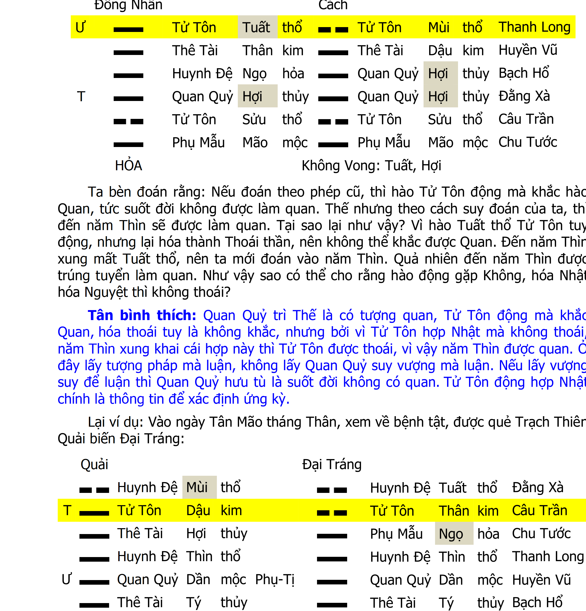

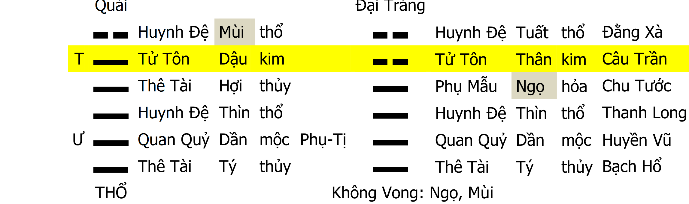

Phép xem cũ cho rằng hào động phá tán mà biến thành Nhật thần, Nguyệt kiến là tượng cùng đường, như vậy là sai lầm.

Ví dụ: Vào ngày Quý Mão tháng Sửu, xem bệnh của vợ uống thuốc có khỏi được không, được quẻ Lâm biến Thái:

| | Lâm | Thái | |
| :--- | :--- | :--- | :--- |
| | - - Tử Tôn Dậu Kim | - - Tử Tôn Dậu kim | Bạch Hổ |
| Ứ | - - Thê Tài Hợi Thủy | - - Thê Tài Hợi thủy | Đằng Xà |
| | - - Huynh Đệ Sửu Thổ | - - Huynh Đệ Sửu thổ | Câu Trần |
| | - - Huynh Đệ Sửu Thổ | — Huynh Đệ Thìn thổ | Chu Tước |
| T | — Quan Quỷ Mão Mộc | — Quan Quỷ Dần mộc | Thanh Long |
| | — Phụ Mẫu Tị Hỏa | — Thê Tài Tý thủy | Huyền Vũ |

THỔ Không Vong: Thìn, Tị

Ta đoán rằng: Hào Huynh Đệ động mà hóa Tiến thần, dù có thuốc tiên cũng khó cứu, người vợ ắt sẽ chết vào ngày Giáp Thìn. Trong quẻ này hào Huynh Đệ động, gặp Nguyệt kiến mà hóa Tuần Không, nhưng cũng không thể cho rằng là không tiến.

Ví dụ: Ngày Quý Mùi tháng Tuất, xem về bệnh tật, được quẻ Càn biến Quải:

| | Càn | Quải | |
| :--- | :--- | :--- | :--- |
| T | — Phụ Mẫu Tuất thổ | - - Phụ Mẫu Mùi thổ | Bạch Hổ |
| | — Huynh Đệ Thân kim | — Huynh Đệ Dậu kim | Đằng Xà |
| | — Quan Quỷ Ngọ hỏa | — Tử Tôn Hợi thủy | Câu Trần |
| Ứ | — Phụ Mẫu Thìn thổ | — Phụ Mẫu Thìn thổ | Chu Tước |
| | — Thê Tài Dần mộc | — Thê Tài Dần mộc | Thanh Long |
| | — Tử Tôn Tý thủy | — Tử Tôn Tý thủy | Huyền Vũ |

KIM Không Vong: Thân, Dậu

Ta bèn đoán rằng: Bệnh lâu ngày gặp xung cũng không chữa được, ở đây lại là hào Phụ trì Thế, thuốc thần cũng khó chữa. Tuy hào Thế hóa Thoái thần, nhưng không phải là điềm báo bệnh lui, mà là tượng trưng cho tinh thần, sinh mệnh dần dần tiêu hao kiệt quệ. Cần đề phòng tháng Thổ xung phá Mùi thổ, mà thành tuyệt mệnh. Sau quả nhiên chết vào tháng Sửu.

Lại ví dụ: Ngày Kỷ Mão tháng Tuất, xem cho mẹ bị chứng băng huyết đã hơn một năm, được quẻ Đồng Nhân biến Giải:

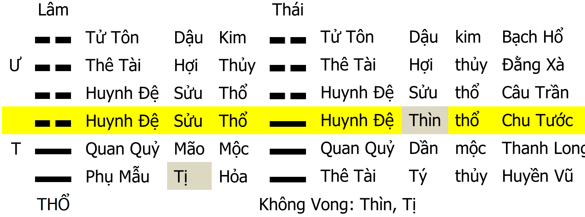

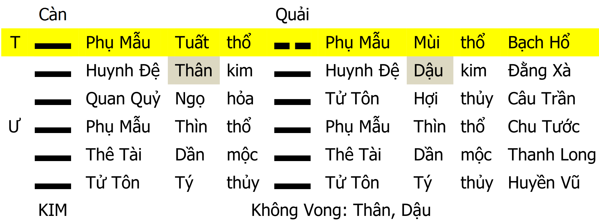

| | Đồng Nhân | Giải | |
| :--- | :--- | :--- | :--- |
| Ứ | — Tử Tôn Tuất thổ | - - Tử Tôn Tuất thổ | Câu Trần |
| | — Thê Tài Thân kim | - - Thê Tài Thân kim | Chu Tước |
| | — Huynh Đệ Ngọ hỏa | — Huynh Đệ Ngọ hỏa | Thanh Long |
| T | — Quan Quỷ Hợi thủy | - - Huynh Đệ Ngọ hỏa | Huyền Vũ |
| | - - Tử Tôn Sửu thổ | — Tử Tôn Thìn thổ | Bạch Hổ |
| | — Phụ Mẫu Mão mộc | - - Phụ Mẫu Dần mộc | Đằng Xà |

HỎA Không Vong: Thân, Dậu

Hào Phụ Mẫu Mão mộc gặp Nhật kiến, hào thượng Tuất thổ động mà sinh Thân kim, kim sinh Hợi thủy. Nếu Sửu thổ không hóa Tiến thần để chặn thủy, thì hào Phụ Mẫu sẽ được thủy tiếp tục tương sinh, bệnh tuy hiểm nghèo nhưng không đáng ngại. Nay hào mộc Phụ Mẫu không được thủy nuôi dưỡng, lại hóa ra Thoái thần, tinh huyết bại hoại. Đến tháng Sửu, Thổ vượng sẽ lấp nghẽn nguồn nước, cần đề phòng nguy hiểm. Sau người mẹ quả nhiên mất vào tháng Sửu. Như vậy, hào Phụ gặp Nhật kiến, không hóa thành Không thành Phá, vẫn là thoái.

Lại ví dụ: Vào ngày Quý Dậu tháng Mão, xem về bệnh gần của cha, được quẻ Tụy hóa Bĩ:

| | Tụy | Bĩ | |
| :--- | :--- | :--- | :--- |
| | - - Phụ Mẫu Mùi thổ | — Phụ Mẫu Tuất thổ | Bạch Hổ |
| Ứ | — Huynh Đệ Dậu kim | — Huynh Đệ Thân kim | Đằng Xà |
| | — Tử Tôn Hợi thủy | — Quan Quỷ Ngọ hỏa | Câu Trần |
| | - - Thê Tài Mão mộc | - - Thê Tài Mão mộc | Chu Tước |
| T | - - Quan Quỷ Tị hỏa | - - Quan Quỷ Tị hỏa | Thanh Long |
| | - - Phụ Mẫu Mùi thổ | - - Phụ Mẫu Mùi thổ | Huyền Vũ |

KIM Không Vong: Tuất, Hợi

Hào Mùi thổ Phụ Mẫu động hóa thành Tiến thần, Tuất gặp Tuần Không, bệnh gần gặp Không sẽ đỡ, nên đoán đến hôm sau sẽ tai qua nạn khỏi. Quả nhiên vào ngày Giáp Tuất xuất Không bệnh khỏi. Trong quẻ này hào Phụ hưu tù mà lại hóa Không, nếu theo phép cũ, Nhật thần, Nguyệt kiến, hào động hóa Không hóa Phá là không tiến được. Nhưng nay hào Phụ hưu tù mà lại hóa Không, bệnh vẫn khỏi.

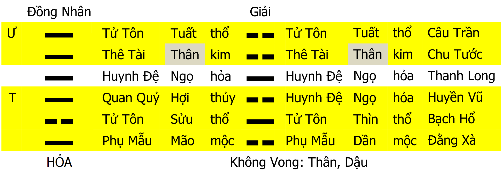

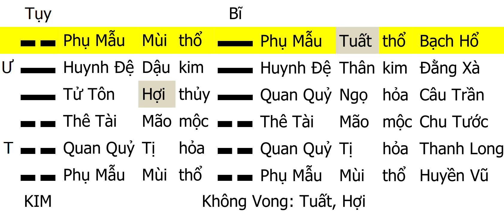

Lại ví dụ: Ngày Quý Sửu tháng Thìn, xem lưu niên, được quẻ Khốn biến Giải:

Ta đoán rằng: Hào Thế Dần mộc gặp Tuần Không, Kỵ thần là Dậu kim động tại hào 5, sách xưa gọi là "tị Không" (tránh được Không). Nay ta không đoán theo cách đó, cho rằng khi xuất Không chắc chắn sẽ gặp tổn hại. Sau người đó chết vào tháng sáu. Sở dĩ ứng vào tháng Mùi, là vì hào thượng Mùi thổ là nơi hào Thế nhập Mộ, bị ngày Sửu xung khai, nên gọi là mở cửa mộ chờ sẵn. Bị khắc mà lại nhập Mộ, lẽ nào lại không chết? Có người hỏi rằng: "Dậu kim biến thành Thoái thần, tại sao còn khắc được mộc?" Ta bèn đáp rằng: "Ba thổ sinh Dậu kim, nên vượng mà không thoái được."

Lại ví dụ: Ngày Ất Sửu tháng Thìn, xem bệnh của mẹ vợ, được quẻ Tùy biến Bĩ:

Ta bèn đoán rằng: Hào Phụ Tý thủy biến thành Mùi thổ hồi đầu khắc Phụ. Lại thêm hào thượng Mùi thổ lại hóa thành Tiến thần mà khắc Phụ. Nên đề phòng ngày Tuất. Sau quả nhiên chết vào ngày Giáp Tuất, tức ngày Tuất thổ xuất Không. Theo phép xem cũ, gặp tán cũng như không, trong quẻ này, Mùi thổ bị Nhật thần xung, lại hóa thành Tuần Không, Nguyệt phá, nhưng vẫn không hề bị tán.

Lại ví dụ: Ngày Ất Mão tháng Thân, xem xuất hành, được quẻ Truân hóa Tiết:

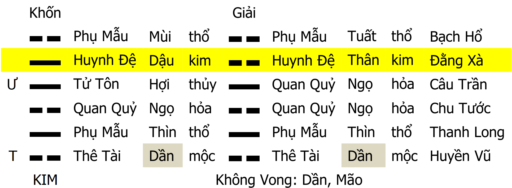

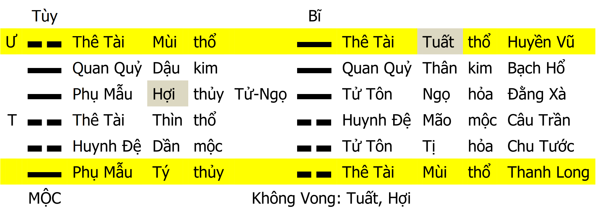

Ta bèn đoán rằng: Hào Thế Dần mộc hóa Tiến thần, có thể xuất hành. Nhưng gặp Nguyệt phá nên trước mắt vẫn chưa khởi hành được, nên đợi ngoài tháng hãy đi. Người này đợi đến tháng Hợi xuất hành, đến tháng tám năm sau mới quay về. Ta bèn hỏi: "Đi đường có được bình an không?" Anh ta đáp: "Chuyến đi lần này rất yên ổn." Ta thấy trong quẻ có hào Tử Tôn động hóa Tiến thần, biết rằng anh ta đi đường bình an nên mới hỏi như vậy. Ứng vào tháng Hợi vì là tháng Nguyệt phá gặp hợp. Như vậy là hào động gặp Phá, hóa thành Nhật thần Nguyệt kiến, làm sao có thể cho rằng gặp trường hợp này thì không thể tiến?

Ví dụ: Ngày Kỷ Mùi tháng Thìn, xem anh lúc nào về, được quẻ Lý biến Đoài:

Hào Huynh động hóa Thoái thần là người anh có ý quay về. Nhưng Tuất gặp Nguyệt phá, mọi việc ở ngoài không được như ý, đến tháng sáu mới mong được trở về. Sau quả nhiên người anh đến tháng Tuất mới về, vì đấy là tháng Nguyệt phá được điền thực. Đây là trường hợp hào động gặp Phá mà biến thành Nhật thần, Nguyệt kiến (trong quẻ này hào Huynh Tuất động biến Nhật thần Mùi thổ), nhưng sao có thể cho là không thoái?

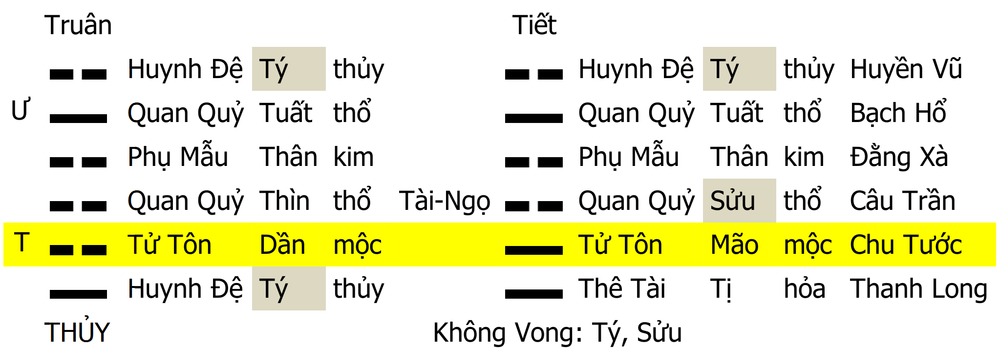

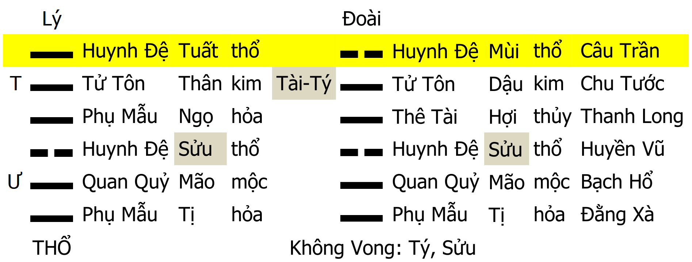

Ví dụ: Ngày Ất Mùi tháng Thìn, xem về bệnh của con, được Đại Hữu biến Khuê:

Người ông cũng xem một quẻ cho cháu, được quẻ tương tự, tựa như từ một bàn tay sắp ra. Hào Phụ Mẫu gặp Nguyệt kiến, động hóa Thoái thần, đứa bé chết vào hôm sau.

**Tân bình thích:** Tôi đã gặp một vài trường hợp Dụng thần suy cực, khi gặp Trường Sinh thì hung. Ví dụ này Dụng thần vô khí, ngày hôm sau được Trường Sinh mà chết.

Lại ví dụ: Ngày Bính Thìn tháng Mão, nha dịch xem có lên chức không, được quẻ Giải biến Khốn:

Hào Quan động hóa Tiến thần, đến mùa thu Thân kim đương lệnh ắt được thăng chức. Sau nhận được tin thăng chức vào tháng Tị. Ứng vào tháng Tị, là do vào tháng này hào động gặp hợp, Thân kim lại gặp Trường Sinh ở Tị. Đây cũng thuộc trường hợp hào động Nhật thần, Nguyệt kiến hóa Không hóa Phá, nhưng Tiến thần vẫn được tiến.

Ví dụ: Ngày Ất Sửu tháng Dậu xem có thi đậu không, được quẻ Đoài biến Tụng:

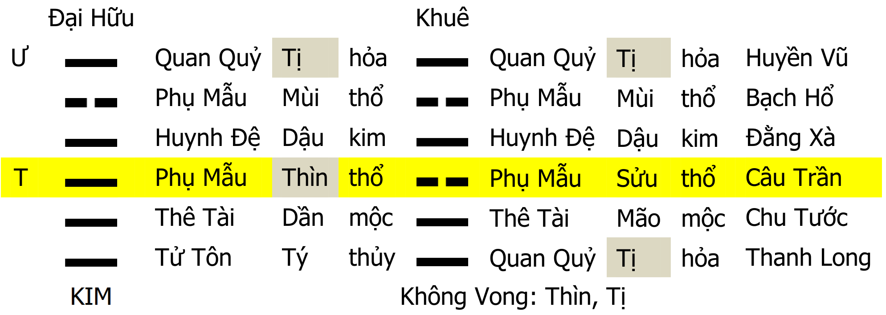

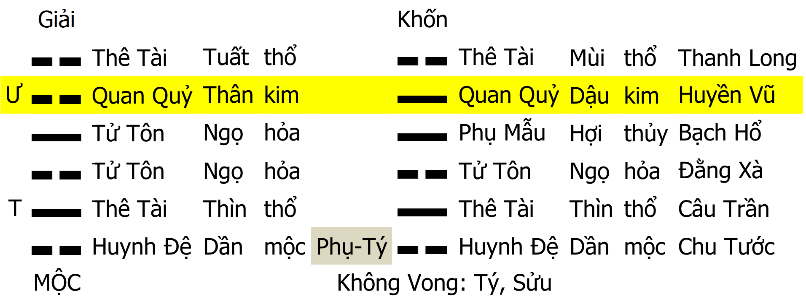

Ta đoán rằng: Hào Mùi Phụ động hóa Tiến thần, Tị hỏa là Quan tinh sinh Thế, hiển nhiên là điềm tốt, cứ yên tâm chờ tin. Quả nhiên đến ngày Dần yết bảng, được đậu thứ tám. Nếu theo phép cũ, cho rằng hào động Phá (hào động gặp Nguyệt phá), động tán (hào động hưu tù bị Nhật thần xung), hóa thành Nhật thần, Nguyệt kiến thì không thể tiến được, nhưng trong quẻ này hào động tán (hào Mùi vượng bị ngày Sửu xung) hóa Không, nhưng vẫn được tiến mà thi đỗ.

Lại ví dụ: Ngày Đinh Sửu tháng Mùi, xem mẹ đang ở xa lúc nào trở về, được quẻ Hỏa Thiên Đại Hữu biến Tỉnh:

Hào sơ Tý thủy động hóa Phụ Mẫu Sửu thổ. Tý hợp với Sửu, bị hợp thì không về được. Hào Mùi Phụ động hóa Tiến thần cũng là tượng không quay về. May có hào Mùi thổ động mà sinh khởi ra hào Dậu kim Huynh Đệ; hào Huynh động hóa Thoái thần mà hợp với hào Thế, tuy mẹ không về nhưng anh em sẽ về. Người này nói: Tôi chỉ có em gái, không có em trai. Quả nhiên đến tháng ba năm sau thì em gái về đến nhà. Như vậy, hào Huynh Đệ gặp Không (Dậu) hóa Không (Thân) mà vẫn thoái.

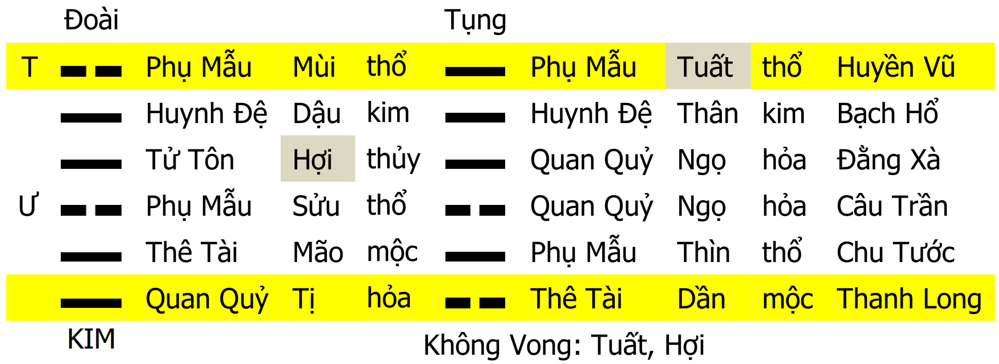

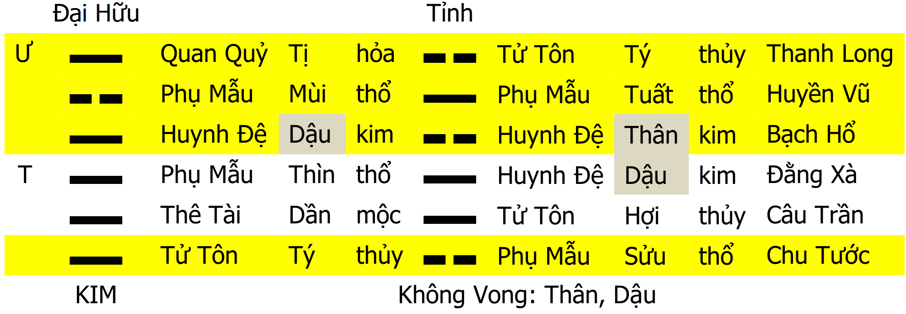

Lại ví dụ: Ngày Tân Sửu tháng Mùi, xem về việc mở cửa hàng vàng bạc, được quẻ Phệ Hạp biến Truân:

Hào Tài trì Thế hóa Tiến thần là tượng phồn thịnh lâu dài. Ta bèn nói: Ta giúp anh chọn ngày Giáp Tuất làm ngày khai trương, chắc chắn làm ăn đại phát. Người này bèn khai trương vào ngày Tuất, đến nay vẫn buôn bán nhộn nhịp. Trong quẻ này, hào Tài động gặp Nguyệt kiến lại gặp Không (Thìn), nhưng Tiến vẫn là tiến.

Dã Hạc lão nhân nói rằng: **Tiến thần có bốn loại:**

Thứ nhất, hào động vượng tướng hóa thành vượng tướng, thừa thế mà tiến.

Thứ hai, hào động hưu tù hóa thành hưu tù, đợi thời mà tiến.

Thứ ba, hào động và hào biến, nếu một trong hai hào hưu tù, cần đợi đến ngày vượng tướng sẽ tiến.

Thứ tư, hào động và hào biến, nếu một trong hai hào gặp Không, Phá, cần đợi lúc điền thực sẽ tiến.

**Thoái thần cũng gồm bốn loại:**

Thứ nhất, hào động vượng tướng, hóa thành vượng tướng hoặc được hào động, Nhật thần, Nguyệt kiến sinh phò, nếu xem về việc gần, sẽ được thời mà không thoái.

Thứ hai, hào động hưu tù, hóa thành hưu tù, đến lúc sẽ thoái.

Thứ ba, hào động và hào biến, nếu một trong hai hào vượng tướng, thì đến lúc hưu tù sẽ phải thoái.

Thứ tư, hào động và hào biến, nếu một trong hai hào gặp Không, Phá, thì đợi đến lúc điền thực sẽ phải thoái.

Lý Ngã Bình bàn rằng: Trước đây đọc "Dịch mạo" thấy có viết về đại tiến, không tiến, không thể tiến, cho là có thể chấp nhận. Nhưng sau thấy viết rằng, hào động gặp Nhật thần, Nguyệt kiến mà hóa Không, hóa Phá, là tượng cùng đường nên không tiến được, thì biết rằng sách đó viết sai. Hào động gặp Nhật thần, Nguyệt kiến, dù gặp Tuần Không cũng không bị Không, gặp Nguyệt phá cũng không bị Phá, nữa là chỉ biến thành Không thành Phá.

Nhật thần, Nguyệt kiến cũng như trời, tuy hóa Không hóa Phá, cũng chỉ như bầu trời bị mây che, đến lúc thực Không, thực Phá thì mây mù sẽ tiêu tan. Lúc đương lệnh

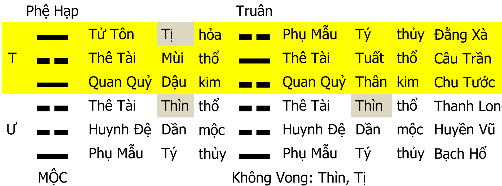

---

# CHƯƠNG 35. TÙY QUỶ NHẬP MỘ

đương quyền, thì sao có thể cho là không tiến được. Trong sách đó lại viết: Hào động gặp Phá gặp Tán mà biến thành Nhật thần, Nguyệt kiến, là mất ngôi vị, nên không tiến được. Thực không hiểu rằng, hào động gặp Phá, vẫn có ngày thực Phá; hào động mà tán, vẫn có ngày điền thực. Huống chi là hóa thành Nhật thần, Nguyệt kiến, chính là hóa vượng, đợi đến ngày điền thực, sẽ càng nên vượng nên cường, sao lại cho rằng không tiến được? Trong sách có chép một quẻ như sau:

Vào ngày Mão tháng Thân, xem về anh em, được quẻ Đoài biến Phong:

Hào Huynh Đệ Dậu bị Nhật thần Mão xung tán, tuy hóa thành Thân kim là Nguyệt kiến, là không kịp thoái. Nói không kịp thoái là sai. Trong chương "Nguyệt tướng" của sách đó có viết, hào gặp Nhật thần, Nguyệt kiến, tuy gặp tán cũng không bị tán. Tháng bảy, Dậu kim tuy không phải là Nguyệt tướng, nhưng vẫn là vượng. Lại thêm hóa thành Nguyệt kiến, hào động hào biến đều thuộc kim vượng, nâng đỡ trợ giúp, thế vững như núi, thì Nhật kiến Mão làm sao có thể xung tán được. Các chương khác đều có phần chiêm nghiệm, riêng chương này ta biết là viết bừa đoán ẩu, chứ không phải đúc rút từ kinh nghiệm.

***

# CHƯƠNG 35: TÙY QUỶ NHẬP MỘ

Phép xưa có định ra Tam Mộ, tức Nhật Mộ (nhập Mộ tại Nhật thần), động Mộ (nhập Mộ tại hào động), hóa Mộ (nhập Mộ tại hào biến).

Còn có: Hào Thế theo Quỷ nhập Mộ; bản mệnh theo Quỷ nhập Mộ; thân quẻ theo Quỷ nhập Mộ; thân Thế theo Quỷ nhập Mộ.

Giác Tử bàn rằng: Theo như lý luận trên, nếu gặp các ngày Thìn, Tuất, Sửu, Mùi, thì chẳng dám xem quẻ, bởi vì vào những ngày đó, chẳng phải hào Thế tại Quỷ, thì là thân quẻ gặp Quỷ; chẳng phải thân Thế tại Quỷ, thì là bản mệnh gặp Quỷ. Vả lại không chỉ riêng các ngày Thìn, Tuất, Sửu, Mùi, mà những ngày khác cũng không dám xem. Tại sao như vậy? Vì trong mười quẻ, chắc chắn sẽ gặp phải hai, ba hào Mộ phát động, chẳng phải là Thế, mệnh nhập Mộ, cũng là thân quẻ, thân Thế nhập Mộ; lại thêm động mà hóa Mộ, nếu chẳng phải do hào Thế động hóa, thì là hai thân (thân quẻ, thân Thế) động hóa. Nếu không, cũng khó bảo đảm bản mệnh không hóa Mộ.

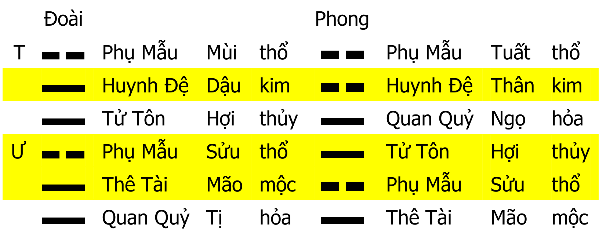

Trong một quẻ, không cần phải xem đến hình, xung, khắc, hại, phá, tán, tuyệt, không, phàm là khi xem về các việc bệnh tật, hung hiểm, chỉ cần xem "theo Quỷ nhập Mộ" là đã có thể đoán định được cát hung. Ta nhiều lần xem về tật bệnh, lưu ý xem kỹ từng quẻ, thấy nếu như Dụng thần vượng, thì hai thân (thân quẻ, thân Thế) có theo Quỷ nhập Mộ, cũng không chết; bản mệnh có theo Quỷ nhập Mộ, cũng không chết; hóa Mộ, động Mộ cũng không chết. Bảo lưu để đợi chứng nghiệm, không ứng nghiệm lại thử; thử mà không ứng nghiệm, lại thử tiếp. Một đến mười, mười đến trăm, nếu đều không ứng nghiệm, thì bỏ điều đó đi. Nếu hào Thế hào Dụng theo Quỷ nhập Nhật Mộ, nhập động Mộ, hoặc động mà hóa Mộ, mà bản thân hào lại hưu tù vô khí, mới gặp phải hung hiểm; nếu hào Thế, hào Dụng vượng hoặc được trợ giúp, vẫn sẽ được giải cứu.

**Tân bình thích:** Lý luận của Giác Tử rất chính xác, thái độ nghiên cứu học vấn của ông ta cũng đáng được mỗi Dịch học giả lấy làm gương. Bốc quái quý ở linh hoạt biến thông, nhiều lần nghiệm chứng, những giảng giải trong sách cổ không hẳn hoàn toàn đúng, có một số khẩu quyết đoán quẻ là có điều kiện, một số khẩu quyết vẫn cần phải liên tục tổng kết quy luật trong thực tiễn mới có thể nâng cao tỷ lệ chính xác khi đoán quẻ.

Ví dụ: Ngày Mậu Thìn tháng Thân, xem về bệnh của chồng mệnh Quý Hợi, được quẻ Đồng Nhân biến Ly:

| Đồng Nhân | | | Ly | | |
| :---: | :---: | :--- | :---: | :--- | :--- |
| Ư | ——— | Tử Tôn Tuất thổ | ——— | Huynh Đệ Tị hỏa | Chu Tước |
| | ——— | Thê Tài Thân kim | — — | Tử Tôn Mùi thổ | Thanh Long |
| | ——— | Huynh Đệ Ngọ hỏa | ——— | Thê Tài Dậu kim | Huyền Vũ |
| T | ——— | Quan Quỷ Hợi thủy | ——— | Quan Quỷ Hợi thủy | Bạch Hổ |
| | — — | Tử Tôn Sửu thổ | — — | Tử Tôn Sửu thổ | Đằng Xà |
| | ——— | Phụ Mẫu Mão mộc | ——— | Phụ Mẫu Mão mộc | Câu Trần |

HỎA Không Vong: Tuất, Hợi

Ta đoán rằng: Vợ xem bệnh cho chồng, lấy hào Quan Quỷ Hợi thủy làm Dụng thần, Hợi nhập Mộ vào ngày Thìn, như vậy hào chồng, mệnh chồng đều nhập Mộ, nếu đoán theo lối cũ, người chồng ắt sẽ chết. Nhưng ta lại đoán: "Không những không chết, mà hôm sau sẽ khỏi bệnh." Như vậy là dựa vào đâu? Do Nhật thần Thìn xung động hào Tuất thổ để sinh ra Thân kim. Do hào Thế Hợi thủy Không Vong, nên không được tương sinh. Hôm sau là ngày Kỷ Tị, sẽ xung Hợi thủy, như vậy, sẽ được Thân kim tương sinh, bệnh sẽ khỏi. Quả nhiên người chồng khỏi bệnh vào hôm sau.

**Tân bình thích:** Dự đoán cát hung lấy Dụng thần suy vượng tức lý pháp làm chủ, lấy 12 cung trường sinh tức tượng pháp làm phụ, Dụng thần nhập Mộ, chính là tượng bệnh nhân có bệnh ở nhà, hoặc nhập viện, hoặc hôn mê, hoặc tinh thần hoảng hốt. Ví dụ trên mặc dù Dụng bị Nhật thần khắc, nhưng được Nguyệt sinh, lại có Nguyên thần độc phát, sinh nhiều khắc ít là cát. Có ba lý chứng tỏ ngày Tị khỏi bệnh. Một là Dụng thần Không Vong, Không mà không được Nguyên thần sinh, ngày hôm sau xung thực, bệnh gần gặp xung sẽ khỏi. Hai là Dụng thần nhập Mộ, ứng kỳ của nó

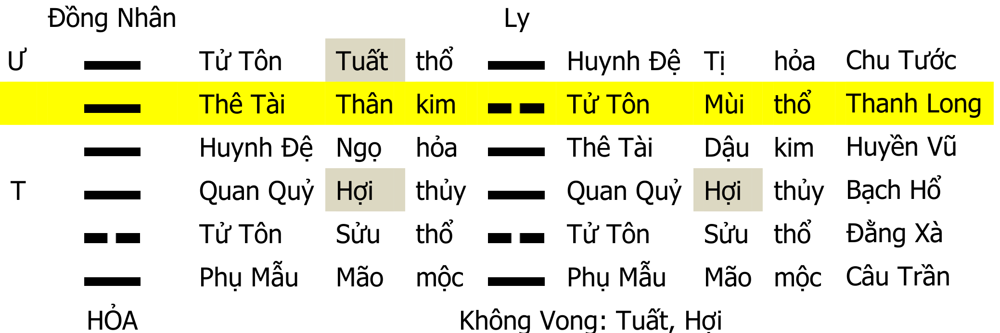 là xuất Mộ gặp xung, tức là lúc Mộ khố hoặc Dụng thần gặp xung. Bệnh gần đa số có ứng nghiệm. Hơn nữa quẻ này một hào độc phát, động mà gặp trị gặp hợp, cũng là ứng kỳ của quẻ độc phát.

Lại ví dụ: Ngày Giáp Dần tháng Tuất, xem thi Hội có đỗ không, được quẻ Tiểu Quá biến Cấn:

| Tiểu Quá | | | Cấn | | |
| :---: | :---: | :--- | :---: | :--- | :--- |
| | — — | Phụ Mẫu Tuất thổ | ——— | Thê Tài Dần mộc | Huyền Vũ |
| | — — | Huynh Đệ Thân kim | — — | Tử Tôn Tý thủy | Bạch Hổ |
| T | ——— | Quan Quỷ Ngọ hỏa Tử-Hợi | — — | Phụ Mẫu Tuất thổ | Đằng Xà |
| | ——— | Huynh Đệ Thân kim | ——— | Huynh Đệ Thân kim | Câu Trần |
| | — — | Quan Quỷ Ngọ hỏa Tài-Mão | — — | Quan Quỷ Ngọ hỏa | Chu Tước |
| Ư | — — | Phụ Mẫu Thìn thổ | — — | Phụ Mẫu Thìn thổ | Thanh Long |

KIM Không Vong: Tý, Sửu

Ta đoán rằng: Hào Thế theo Quan nhập Tam Mộ, tức động Mộ (gặp Mộ tại hào động Tuất thổ), hóa Mộ, lại nhập Mộ tại Nguyệt kiến (Tuất). Năm sau là năm Thìn, sẽ xung khai Mộ khố, là lúc đề danh thi đỗ. Lại gặp tháng Thìn, xung khai Tam Mộ, không những thi đỗ, mà còn đỗ vào hàng Giáp (thứ nhất). Nhật thần, Nguyệt kiến hợp thành Quan cục, vượng tướng đương thời. Quẻ này rất đẹp, như viên ngọc không tỳ vết. Quả nhiên sau được đề danh bảng vàng.

**Tân bình thích:** Trước đây nói Tam Mộ không bao gồm Nguyệt Mộ, ở đây lại nói nhập Nguyệt Mộ, có phần không ổn. Quẻ này bởi vì Dần mộc và Tuất thổ tạo thành tam hợp cục, nên không lấy Mộ khố để luận. Nếu luận nhập Mộ, Mộ khố là văn thư, cũng là quái tượng người này say mê sách vở, yêu thích học tập. Quẻ này tam hợp Quan cục, vì vậy thi Hội sẽ thuận buồm xuôi gió, được đề danh bảng vàng.

Lại ví dụ: Vào ngày Kỷ Sửu tháng Thân, xem về bệnh tật cho người mệnh Nhâm Thân, được quẻ Hằng:

| Hằng | | | |
| :---: | :---: | :--- | :--- |
| Ư | — — | Thê Tài Tuất thổ | Câu Trần |
| | — — | Quan Quỷ Thân kim | Chu Tước |
| | ——— | Tử Tôn Ngọ hỏa | Thanh Long |
| T | ——— | Quan Quỷ Dậu kim | Huyền Vũ |
| | ——— | Phụ Mẫu Hợi thủy Huynh-Dần | Bạch Hổ |
| | — — | Thê Tài Sửu thổ | Đằng Xà |

MỘC Không Vong: Ngọ, Mùi

Trong quẻ này, mệnh Thân theo Quỷ nhập Mộ, hào Thế theo Quỷ nhập Mộ (hào Thế Thân kim nhập Mộ tại ngày Sửu), thân Thế lại gặp Tuần Không, thân quẻ (ở Dần) gặp Nguyệt phá (Thân), nếu xem theo phép cũ, người này ắt chết mười mươi. Nhưng

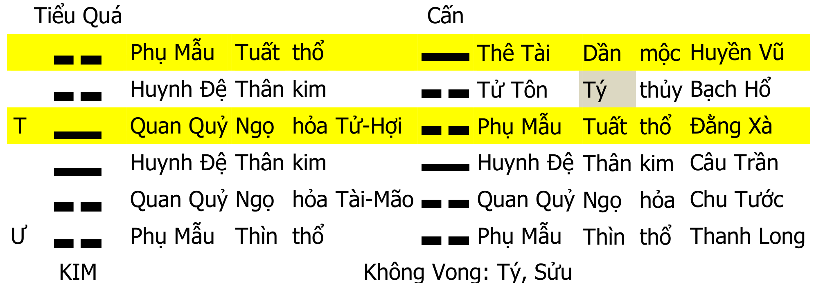

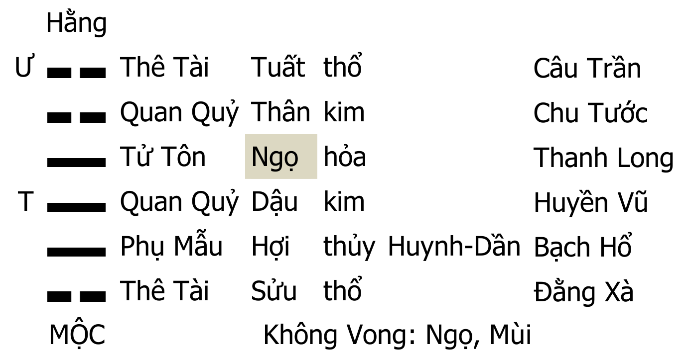 ta thấy hào Thế vượng tướng (hào Thế thuộc kim, xem vào tháng Sửu thuộc mùa thu, lại được Nhật thần Sửu thổ tương sinh), nên đoán là đến ngày Mùi khỏi bệnh. Sau quả đến ngày Mùi bệnh tình thuyên giảm.

Sở dĩ ứng nghiệm vào ngày Mùi, là vì xung khai được ngày Mộ là Sửu mà dậy. Phép xem cũ cho rằng Mộ là tượng ngưng trệ, hôn mê, rất có lý. Người này trong lúc ốm không uống thuốc, hôn mê bất tỉnh cho đến ngày Mùi, đột nhiên tỉnh dậy, không uống thuốc mà khỏi bệnh. Bởi vậy, sao có thể cứng nhắc cho rằng theo Quỷ nhập Mộ chắc chắn sẽ chết.

Ví dụ: Ngày Mậu Thìn tháng Mùi, xem bản thân đang bị khép trọng tội, liệu có được ân xá không, được quẻ Cổ biến Tốn:

| Cổ | | | Tốn | | |
| :--- | :---: | :--- | :---: | :--- | :--- |
| Ư | ━━ | Huynh Đệ Dần mộc | ━━ | Huynh Đệ Dần mộc | Chu Tước |
| | ━ ━ | Phụ Mẫu Tý thủy Tử-Tị | ━ ━ | Phụ Mẫu Tý thủy | Thanh Long |
| | ━ ━ | Thê Tài Tuất thổ | ━ ━ | Thê Tài Tuất thổ | Huyền Vũ |
| T | ━━ | Quan Quỷ Dậu kim | ━ ━ | Thê Tài Sửu thổ | Bạch Hổ |
| | ━━ | Phụ Mẫu Hợi thủy | ━━ | Huynh Đệ Mão mộc | Đằng Xà |
| | ━ ━ | Thê Tài Sửu thổ | ━━ | Tử Tôn Tị hỏa | Câu Trần |

MỘC Không Vong: Tuất, Hợi

Hào Thế Dậu theo Quỷ nhập Mộ tại hào động Sửu thổ, lại động hóa Mộ (Sửu), nếu xem theo lối cổ, đây là điềm hung, nhưng ta lại cho đây là điềm tốt. Hào Thế được Nhật thần Thìn thổ, Nguyệt kiến Mùi thổ tương sinh nên vượng, mà Mộ Sửu gặp Nguyệt phá, nên Thế dễ dàng ra khỏi Mộ. Năm sau là năm Dậu, chắc chắn sẽ được ân xá. Sau quả nhiên được ân xá vào tháng Thìn năm sau, do bấy giờ Thế vượng, ứng vào tháng Thìn vì Thìn hợp với Thế.

Ta chiêm nghiệm qua nhiều lần thử, thấy hào Thế nhập Mộ chỉ ứng nghiệm ở ba trường hợp sau:

Thứ nhất, hào Thế theo Quỷ nhập Mộ ở Nhật thần

Thứ hai, hào Thế nhập động Mộ (nhập Mộ ở hào động).

Thứ ba, hào Thế động mà hóa Mộ.

Trong ba loại Mộ trên đây, nếu tự xem cho mình thì xem hào Thế, nếu hào Thế vượng tướng, sẽ không ứng nghiệm. Xem thay người khác, thì xem Dụng thần. Nếu Dụng thần vượng tướng, sẽ không ứng nghiệm (không phải Mộ thật). Chỉ khi hào Thế, hào Dụng hưu tù, bị khắc, lại nhập Mộ, mới ứng nghiệm. Nếu như Mộ bị hào động, Nhật thần, Nguyệt kiến xung phá, cũng không ứng nghiệm. Mộ gặp phá cũng như lưới bị rách, dễ dàng thoát ra ngoài.

**Tân bình thích:** Lý luận này rất đúng, tôi thường được nghiệm đoán sinh nở Mộ khố Tử Tôn Nguyệt phá mà dễ sinh, đoán đòi nợ Tài khố Nguyệt phá mà dễ đòi về,

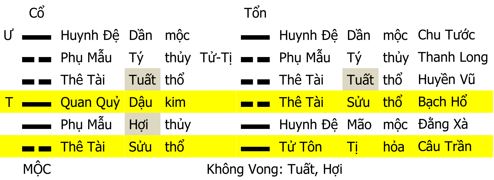 đoán tìm đồ vật Tài Mộ Nguyệt phá mà thấy được. Đoán hành nhân thì dễ gặp Dụng thần nhập Mộ, Dụng thần vượng mà nhập Nhật Mộ, đa số ứng hôm đó trở về ngay.

Xem về công danh: Nếu hào Thế vượng, đắc địa, đợi đến năm, tháng xung khai Mộ khố sẽ được thành danh. Nếu hào Thế Không, Phá, hưu tù, thì công danh khó thành tựu.

Xem về thân mệnh: Nếu hào Thế vượng, đắc địa, thì đợi đến năm, tháng xung khai Mộ khố sẽ phát đạt. Nếu hào Thế gặp Không, Phá, hưu tù, thì một đời lặng lẽ vô danh.

Xem về làm quan, xuất hành: Nếu hào Thế vượng, đắc địa, đợi đến ngày xung Mộ, sẽ được toại nguyện. Nếu hào Thế gặp Không, Phá, hưu tù, thì phần nhiều là ra đi không có ngày về.

Xem về mưu sự hoặc cầu tài: Nếu hào Thế vượng, đợi đến ngày, tháng xung Mộ, việc sẽ thành. Nếu gặp Không, Phá, hưu tù, sự việc sẽ không thành.

Xem về hôn nhân: Nếu hào Thế vượng, đắc địa, hào Tài hữu khí và sinh Thế, thì đợi đến ngày, tháng xung khởi Mộ khố, hôn sự sẽ thành. Nếu gặp Không, Phá, hưu tù thì hôn sự khó thành.

Xem về bệnh tật: Nếu hào Thế vượng, đắc địa, đợi đến ngày, tháng xung khai Mộ khố, bệnh sẽ khỏi. Nếu hào Thế gặp Không, Phá, hưu tù, đến ngày xung khai Mộ khố sẽ gặp nguy. Nếu là bệnh gần gặp Không thì không đáng ngại, đợi đến ngày xuất Không bệnh sẽ lành.

Xem về ngục tù: Nếu hào Thế vượng sẽ được thoát nạn; nếu hào Thế hưu tù, Không Vong thì khó tránh được hung hại.

Xem về người đi xa: Dụng thần hóa Mộ, hoặc nhập động Mộ, nếu Dụng thần vượng tướng, người đi xa sẽ trở về; nếu Dụng thần gặp Không, Phá, hưu tù, chẳng phải đau ốm ở quê người, cũng là điềm lưu lạc phương xa.

Xem về thai sản: Hào Tài, hào Tử Tôn nhập động Mộ, hóa Mộ, nếu là vượng tướng thì đợi ngày, tháng xung khai Mộ khố sẽ sinh. Nếu hào Tài gặp Không, Phá, hưu tù, vợ sẽ khó đẻ. Nếu hào Tử Tôn gặp Không Phá, hưu tù thì con sẽ nguy vong.

Xem về việc quan ti: Nếu hào Thế vượng, đắc địa, đến tháng, năm xung Mộ sẽ được như ý, nếu hào Thế gặp Không, Phá, hưu tù, dễ bị gông cùm, hình ngục.

Xem về gia trạch: Nếu hào Thế vượng, hoặc hoặc được hào Tài sinh Thế, đợi đến năm, tháng xung khai Mộ khố sẽ vượng phát. Nếu hào Thế Không, Phá, hưu tù, thì tán gia bại nghiệp.

Xem về mồ mả tổ tiên: Tương tự như trường hợp xem về gia trạch. Nếu xem về sinh phần chưa chôn cất, thì dù hào Thế vượng tướng hay hưu tù, nhập Mộ đều không nên.

Xem về việc nguy hiểm: Nếu hào Thế vượng tướng, lại được sinh phò, tuy không gặp nguy hiểm, nhưng vẫn phải lo lắng không yên, là bởi vì Quỷ ở bên mình.

Xem về kiện tụng: Nếu hào Thế vượng, sẽ được lý. Nếu hào Thế Không, Phá, hưu tù, bị khắc, ắt phải chịu hình ngục.

Xem về bất kỳ chuyện gì, nếu hào Thế vượng, mà hào Mộ gặp Không, Phá, đợi đến tháng, ngày hào Mộ được điền thực sẽ cát. Nếu hào Thế Không, Phá, hưu tù, đến ngày, tháng hào Thế được điền thực sẽ hung.

Sách xưa cho rằng, nếu xem về tai họa mà hào Thế tại Quỷ gặp Phá, là điềm tai qua nạn khỏi. Ta cho rằng đó là sai lầm, Nguyệt phá vốn đã là Quỷ Đại Bạch Hổ, tuy trước mắt không đáng ngại, nhưng đến năm, tháng thực Phá, ắt gặp tai ương.

Ví dụ: Ngày Kỷ Mùi tháng Thân, xem giặc cướp có đến không, được quẻ Đại Súc biến Thái.

| Đại Súc | Thái |
| :--- | :--- |
| ━ Quan Quỷ Dần Mộc | ━ ━ Tử Tôn Dậu kim Câu Trần |
| Ư ━ ━ Thê Tài Tý Thủy | ━ ━ Thê Tài Hợi thủy Chu Tước |
| ━ ━ Huynh Đệ Tuất Thổ | ━ ━ Huynh Đệ Sửu thổ Thanh Long |
| ━ Huynh Đệ Thìn Thổ Tử-Thân | ━ Huynh Đệ Thìn thổ Huyền Vũ |
| T ━ Quan Quỷ Dần Mộc Phụ-Ngọ | ━ Quan Quỷ Dần mộc Bạch Hổ |
| ━ Thê Tài Tý Thủy | ━ Thê Tài Tý thủy Đằng Xà |
| THỔ | Không Vong: |

Trong quẻ này hào Thế tại Quỷ Dần gặp Nguyệt phá, nhập Mộ tại Nhật thần, ắt nguy đến bản thân. Hào thượng Quỷ động mà biến thành Tử Tôn, là điềm con cái gặp nguy hiểm. Thời đó, giặc cướp nổi dậy, cướp phá nhiều nơi, người dân không được yên thân. Một hôm, người này nghe tin giặc cướp đến, bèn dẫn vợ đi trốn. Nhưng vì con gái nhỏ không theo kịp, nên quay lại đón con gái, kết quả cả hai cha con đều bị giặc cướp giết hại. Như vậy, nếu theo phép cổ, cho rằng hào Thế tại Quỷ gặp Phá là điềm tai qua nạn khỏi, là sai lầm. Thế nhưng nếu hào Thế tại Quỷ gặp Nguyệt phá nhưng không động thì không ứng nghiệm.

Lý Ngã Bình bàn rằng: Phần này bàn về trường hợp "theo Quỷ nhập Mộ", quả thực giúp người ta mở mang tầm mắt. Tại mỗi quẻ hầu như đều có thể gặp động Mộ, hóa Mộ; lại nếu như xem vào các ngày Thìn, Tuất, Sửu, Mùi, hào Mộ trùng trùng, nếu tính thêm cả hai thân Thế, mệnh, thì chắc chắn sẽ có một vài thứ phải nhập Mộ. Quan điểm bàn luận ở đây không mượn ở sách khác. Huống nữa trong các sách khi bàn về nhập Mộ, đều không tính đến vượng suy, mà nhất loạt cho rằng theo Quỷ nhập Mộ là điềm dữ. Nếu xem về công danh, mà hào Quan vượng tướng, sao có thể cho rằng, lên đường làm quan không có ngày về. Xem về tai họa, hào Thế gặp Nguyệt phá, lại theo Quỷ nhập Mộ, sao lại có thể cho rằng không đáng ngại. Cát hung lẫn lộn, thật là gây hại cho chính lý.

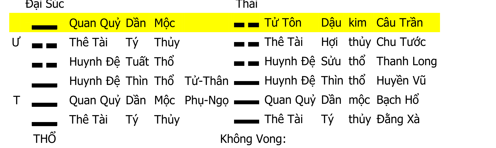

---

# CHƯƠNG 36: ĐỘC PHÁT - ĐỘC TĨNH

Trong một quẻ, nếu năm hào đều động, một hào bất động, gọi là độc tĩnh; nếu năm hào đều tĩnh, chỉ có một hào động, gọi là độc phát.

Sự thành hay bại, đều căn cứ vào Dụng thần; ứng nghiệm nhanh hay chậm, phải xem Dụng thần độc phát hay độc tĩnh. Sách xưa cho là ứng nghiệm, ta thử xem cũng thấy ứng nghiệm. Sau khi chiêm nghiệm thấy ứng nghiệm, mới bắt đầu lĩnh hội được thần cơ, chứ không phải ngay từ đầu đã căn cứ ngay theo đó để suy đoán họa phúc và ứng kỳ. Huống gì quẻ độc tĩnh thì ít mà độc phát thì nhiều. Nếu bỏ qua Dụng thần, chỉ dựa vào độc phát, độc tĩnh là rất sai lầm.

Ví dụ: Ngày Đinh Mão tháng Dần, xem về việc xin đón linh cữu của cha có được chấp thuận không, được quẻ Đại Hữu biến Ly:

| Đại Hữu | Ly |
| :--- | :--- |
| Ư ━ Quan Quỷ Tị hỏa | ━ Quan Quỷ Tị hỏa Thanh Long |
| ━ ━ Phụ Mẫu Mùi thổ | ━ ━ Phụ Mẫu Mùi thổ Huyền Vũ |
| ━ Huynh Đệ Dậu kim | ━ Huynh Đệ Dậu kim Bạch Hổ |
| T ━ Phụ Mẫu Thìn thổ | ━ Tử Tôn Hợi thủy Đằng Xà |
| ━ Thê Tài Dần mộc | ━ ━ Phụ Mẫu Sửu thổ Câu Trần |
| ━ Tử Tôn Tý thủy | ━ Thê Tài Mão mộc Chu Tước |
| KIM | Không Vong: Tuất, Hợi |

Người này có một môn khách biết về Dịch lý, đoán rằng quẻ này có hào Dần mộc độc phát, biến thành hào Sửu Phụ, ứng vào tháng giêng sẽ được gặp linh cữu của cha. Ta nói rằng: "Xem như thế khác gì gãi ngứa ngoài giày! Trong quẻ này hào Phụ trì Thế, bị hào động Dần mộc khắc chế, chủ về bản thân không thể động, mà linh cữu của cha cũng không thể động. Nếu muốn đi đón linh cữu của cha, cần đợi đến tháng hoặc năm xung khai được Dần mộc." Bèn bảo người này xem thêm một quẻ nữa để quyết đoán, được quẻ Cách biến Ký Tế:

| Cách | Ký Tế |
| :--- | :--- |
| ━ ━ Quan Quỷ Mùi thổ | ━ ━ Huynh Đệ Tý thủy Thanh Long |
| ━ Phụ Mẫu Dậu kim | ━ Quan Quỷ Tuất thổ Huyền Vũ |
| T ━ Huynh Đệ Hợi thủy | ━ ━ Phụ Mẫu Thân kim Bạch Hổ |
| ━ Huynh Đệ Hợi thủy Tài-Ngọ | ━ Huynh Đệ Hợi thủy Đằng Xà |
| ━ ━ Quan Quỷ Sửu thổ | ━ ━ Quan Quỷ Sửu thổ Câu Trần |
| Ư ━ Tử Tôn Mão mộc | ━ Tử Tôn Mão mộc Chu Tước |

Ta bèn đoán rằng: Quẻ này rất trùng hợp với quẻ trước. Quẻ trước cần gặp được Thân kim để xung khai Dần mộc. Quẻ này hào Thế hóa Thân kim hồi đầu sinh, cũng ứng vào tháng Thân. Thế nằm tại Bạch Hổ động, là điềm đi vì việc tang. Nhật thần

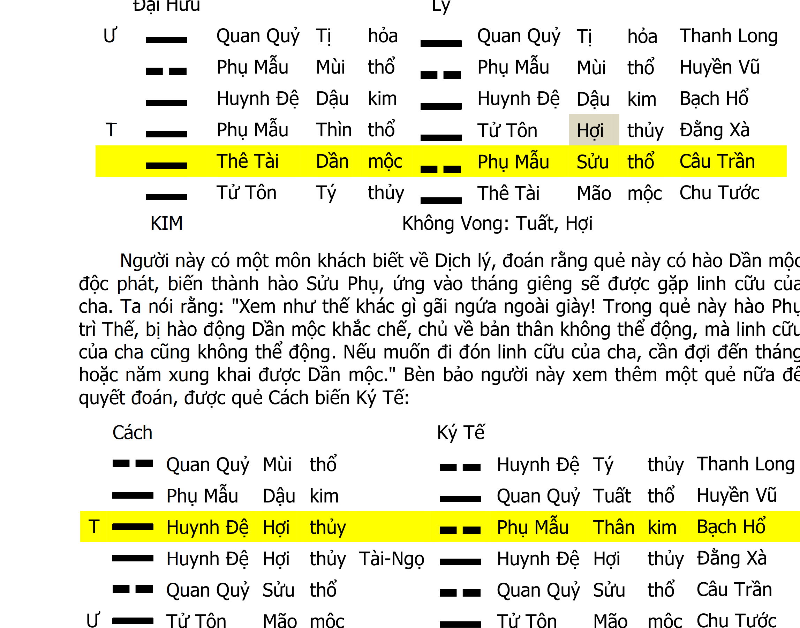

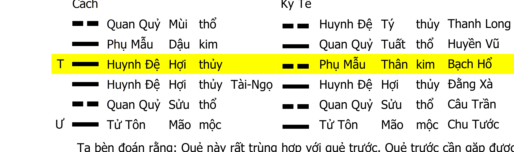

Mão xung động hào 5 để sinh hào Thế, nên tháng Thân, tháng Mão năm nay ắt được ân chuẩn. Trước mắt gặp Nguyệt phá, nên tuyệt đối không thể hành động.

Về sau, quả nhiên đến năm Thân được phê chuẩn, đến năm Dậu đón linh cữu về. Hai quẻ này đều là độc phát, nhưng đâu có thể chỉ trông vào mình hào độc phát?

Lại ví dụ: Ngày Đinh Hợi tháng Ngọ, xem lúc nào mưa tạnh, để đề phòng nước lụt hại lúa, được quẻ Đồng Nhân biến Cách:

Người bạn cầm quẻ này đến hỏi ta rằng: "Hào Tuất thổ Tử Tôn là độc phát, căn cứ vào đó thì hôm qua ngày Bính Tuất ắt phải tạnh ráo, tại sao vẫn có mưa?" Ta bèn đáp rằng: "Anh lo lắng ruộng lúa bị nước lụt, thần linh cho anh hào Tử Tôn phát động, để khắc đi Quỷ ở thân mình (Thế), là ý bảo anh không phải lo lắng, chứ không phải ứng với tạnh mưa. Tuy trước mắt mưa chưa tạnh, nhưng chắc sẽ không lụt. Nếu căn cứ vào quẻ này để tính ngày tạnh ráo, thì đến ngày Mão mưa sẽ tạnh." Người này hỏi: "Tại sao?" Ta bèn đáp: "Động mà gặp hợp, trời sẽ tạnh, anh sẽ không còn phải lo lắng." Sau quả nhiên đến ngày Mão mưa tạnh hẳn.

**Tân bình thích:** Ở đây do Tử Tôn động mà hóa thoái, ngày Mão hợp thì không thoái.

Lại ví dụ: Ngày Giáp Ngọ tháng Thìn, xem về việc khai mỏ than, được quẻ Gia Nhân biến Ích:

Hào Tài Sửu thổ trì Thế, được Nhật thần Ngọ tương sinh, nên đoán rằng có thể khai thác được. Người đó hỏi, lúc nào thì đào được đến than? Ta đáp rằng: Hào Tài

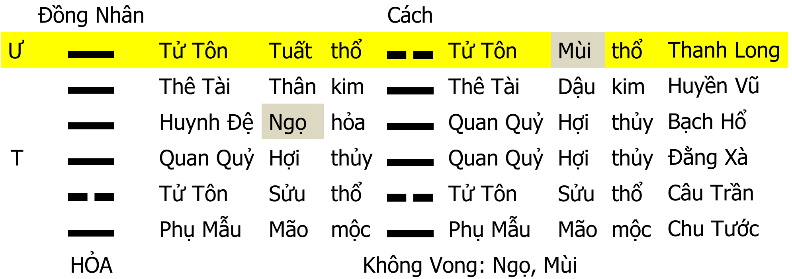

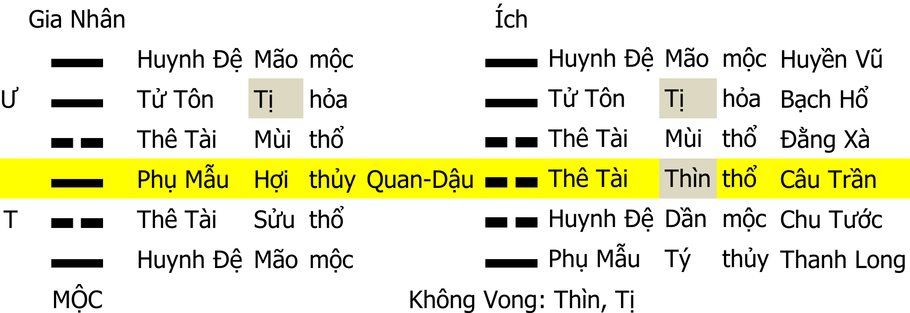

Sửu thổ tĩnh, bị tháng Mùi xung khai, nên ứng vào tháng Mùi (tháng sáu). Nhưng đến tháng sáu vẫn chưa thấy than, nghỉ rồi lại đào, đào rồi lại nghỉ. Năm Mùi xem quẻ, cho đến tháng Thìn năm Hợi mới đào được than. Như vậy là ứng vào hào độc phát, Hợi thủy biến thành Thìn thổ, cả năm cả tháng đều ứng nghiệm, nhưng lúc đoán quẻ, có ai dám đoán là ứng vào tháng Thìn năm Hợi?

**Tân bình thích:** Ví dụ này tuy ứng độc phát, nhưng cũng có liên quan đến Dụng thần. Ứng Tử Tôn Nguyên thần Không Vong, vì vậy chậm chạp không được than, năm Hợi xung thực lại ứng độc phát.

Lại ví dụ: Ngày Canh Tuất tháng Dần, xem về bệnh của con gái, được quẻ Hỏa Thủy Vị Tế biến Thủy Sơn Kiển:

Phép xưa căn cứ vào hào độc tĩnh để đoán về thời gian ứng nghiệm. Trong quẻ này, hào Dần mộc độc tĩnh, nếu không dùng Dụng thần, thì nên đoán là ngày Dần được sống hay phải chết?

Ta đoán rằng, quẻ này hào Thổ Tử Tôn tuy hưu tù nhưng được hào Tị, Ngọ hỏa động mà tương sinh. Hào Mùi thổ Tử Tôn hóa Tiến thần, hào Thìn thổ Tử Tôn lại hóa Ngọ hỏa hồi đầu sinh, nên đoán là ngày Dần sẽ khỏi bệnh, nhưng chưa dám quyết đoán, lại bảo người mẹ xem thêm quẻ nữa, được quẻ Cấu biến Vô Vọng:

Tử Tôn tại Hợi thủy, hóa Dần mộc Không Vong, bệnh gần mà gặp Không sẽ khỏi. Ngày xuất Không cũng chính là ngày Dần, nên quẻ này khớp với quẻ trước. Ta bèn nói rằng: "Đến ngày Dần sẽ đỡ. Trước mắt tuy bệnh tình trầm trọng, nhưng vẫn không đáng ngại." Sau quả đến ngày Dần, con gái tỉnh lại. Sở dĩ quẻ trước ứng được

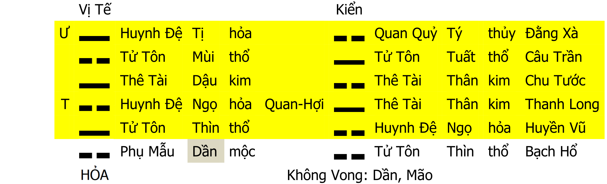

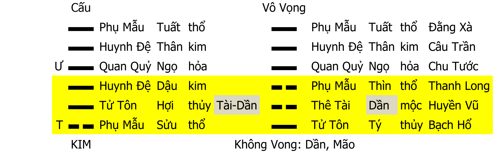 vào hào độc tĩnh, là vì được Dụng thần vượng tướng. Lại thêm có quẻ sau hình tượng rõ ràng, ta mới dám quyết đoán như vậy.

Lý Ngã Bình bàn rằng: "Dịch mạo" cho rằng cát hung được sinh ra từ hào động, bởi vậy rất xem trọng hào động mà xem nhẹ Dụng thần. Khi sự việc ứng nghiệm, không đối chứng với Dụng thần, mà lại kiểm nghiệm với tượng quẻ. Bởi vậy, rõ ràng là dạy người ta chỉ coi trọng độc phát, độc tĩnh, mà bỏ không dùng đến Dụng thần.

Sách lại nói: "Tuy không bỏ Dụng thần, nhưng cũng không lấy Dụng thần", như vậy là dạy người ta không dùng đến Dụng thần.

Lại nói: "Độc phát, độc tĩnh có thể xác định ngày giờ, còn cát hung phải xem ở Dụng thần", như vậy lại bảo người ta phải xem trọng Dụng thần.

Phàm là viết sách truyền đời, phải là một chữ có thể khai thông bế tắc cho người đời sau, một câu có thể phá tan những nghi ngờ từ muôn thuở. Nay sách này lúc thì nói nên dùng Dụng thần, lúc lại bảo không dùng Dụng thần, lời nói bất định, sao có thể trở thành phép tắc, nên nêu ra đây để cảnh tỉnh người đời.

**Tân bình thích:** Tôi thường được nghiệm, lấy Dụng thần định cát hung và ứng kỳ là chính, ứng kỳ ngẫu nhiên có ứng độc tĩnh. Song với độc phát, có khi ứng địa chi phát động, có khi ứng địa chi hợp hào động, cũng có khi ứng Dụng thần, việc phán đoán ứng kỳ hoàn toàn tùy thuộc vào kinh nghiệm tích lũy của người đoán quẻ, cần dựa vào nội dung muốn hỏi, tính chất sự việc có gấp gáp hay không,... mà phán đoán một cách linh hoạt.

Ví dụ 1: Ngày Quý Dậu tháng Hợi, đoán ly hôn với vợ, được quẻ Thiên Thủy Tụng biến Phong Thủy Hoán.

| Tụng | | Hoán | |
| :--- | :--- | :--- | :--- |
| — Tử Tôn Tuất thổ | | — Phụ Mẫu Mão mộc | Bạch Hổ |
| — Thê Tài Thân kim | | — Huynh Đệ Tị hỏa | Đằng Xà |
| T — Huynh Đệ Ngọ hỏa | | - - Tử Tôn Mùi thổ | Câu Trần |
| - - Huynh Đệ Ngọ hỏa | Quan-Hợi | - - Huynh Đệ Ngọ hỏa | Chu Tước |
| — Tử Tôn Thìn thổ | | — Tử Tôn Thìn thổ | Thanh Long |
| Ứ - - Phụ Mẫu Dần mộc | | - - Phụ Mẫu Dần mộc | Huyền Vũ |

HỎA Không Vong: Tuất, Hợi

Kỵ thần độc phát, lại là quẻ du hồn, tất chủ ly dị. Chỉ vì động mà tương hợp với hào biến, xung khai tất chia ly. Về sau ly hôn ở ngày Sửu.

Vẫn là người này lúc đó đoán niên vận, ngày Giáp Thân tháng Dần năm Mậu Dần, được quẻ Phong Hỏa Gia Nhân biến Phong Thiên Tiểu Súc.

| Gia Nhân | | Tiểu Súc | |
| :--- | :--- | :--- | :--- |
| — Huynh Đệ Mão mộc | | — Huynh Đệ Mão mộc | Huyền Vũ |
| Ứ — Tử Tôn Tị hỏa | | — Tử Tôn Tị hỏa | Bạch Hổ |

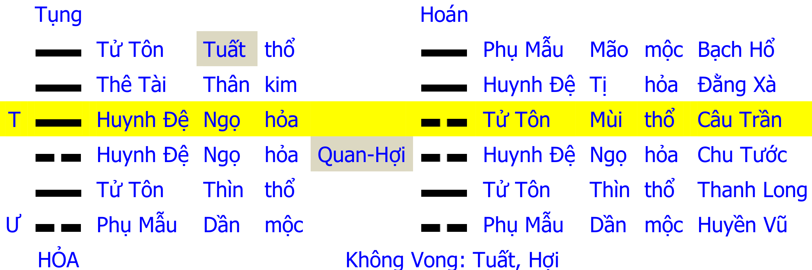

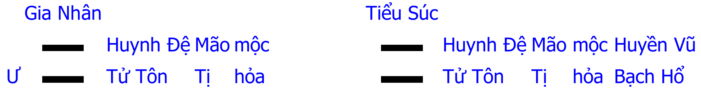

| Gia Nhân | | Tiểu Súc | |
| :--- | :--- | :--- | :--- |
| - - Thê Tài Mùi thổ | | - - Thê Tài Mùi thổ | Đằng Xà |
| — Phụ Mẫu Hợi thủy | Quan-Dậu | — Thê Tài Thìn thổ | Câu Trần |
| T - - Thê Tài Sửu thổ | | — Huynh Đệ Dần mộc | Chu Tước |
| — Huynh Đệ Mão mộc | | — Phụ Mẫu Tý thủy | Thanh Long |

MỘC Không Vong: Ngọ, Mùi

Hào Thế Thê Tài động hóa hồi đầu khắc, hào 2 là hào vị phu thê, tất là ứng chuyện vợ chồng bất lợi. Sau ở ngày Sửu tháng Hợi, ly hôn với vợ. Hào độc phát nghiệm ở ngày mà không nghiệm ở tháng. Ứng với tháng Hợi chính là nguyên do Nguyên thần hào Tài lâm Tuyệt, Kỵ thần được Trường Sinh.

Vẫn là việc này, em gái đoán anh trai và chị dâu bất hòa, có ly hôn không? Ngày Nhâm Thân tháng Hợi, được quẻ Địa Thiên Thái biến Địa Phong Thăng.

| Thái | | Thăng | |
| :--- | :--- | :--- | :--- |
| Ứ - - Tử Tôn Dậu kim | | - - Tử Tôn Dậu kim | Bạch Hổ |
| - - Thê Tài Hợi thủy | | - - Thê Tài Hợi thủy | Đằng Xà |
| - - Huynh Đệ Sửu thổ | | - - Huynh Đệ Sửu thổ | Câu Trần |
| T — Huynh Đệ Thìn thổ | | — Tử Tôn Dậu kim | Chu Tước |
| — Quan Quỷ Dần mộc | Phụ-Tị | — Thê Tài Hợi thủy | Thanh Long |
| — Thê Tài Tý thủy | | - - Huynh Đệ Sửu thổ | Huyền Vũ |

THỔ Không Vong: Tuất, Hợi

Mặc dù là quẻ lục hợp, nhưng Dụng thần độc phát hóa hồi đầu khắc, chắc chắn sẽ ly hôn. Về sau ly hôn ở ngày Đinh Sửu, là ngày hợp hào độc phát, cũng là ngày trị hào biến Dụng thần bị khắc.

Ba ví dụ trên đây đều là cùng một sự việc, ứng kỳ cát hung đều không tách khỏi Dụng thần. Nhưng cũng có lúc độc phát ứng nghiệm cát hung, không thể không biết.

Ví dụ 2: Ngày Giáp Tuất tháng Mùi, đoán trẻ nhỏ bị người bắt cóc, cát hung thế nào? Được quẻ Thủy Địa Tỷ biến Phong Địa Quan.

| Tỷ | | Quan | |
| :--- | :--- | :--- | :--- |
| Ứ - - Thê Tài Tý thủy | | — Quan Quỷ Mão mộc | Huyền Vũ |
| — Huynh Đệ Tuất thổ | | — Phụ Mẫu Tị hỏa | Bạch Hổ |
| - - Tử Tôn Thân kim | | - - Huynh Đệ Mùi thổ | Đằng Xà |
| T - - Quan Quỷ Mão mộc | | - - Quan Quỷ Mão mộc | Câu Trần |
| - - Phụ Mẫu Tị hỏa | | - - Phụ Mẫu Tị hỏa | Chu Tước |
| - - Huynh Đệ Mùi thổ | | - - Huynh Đệ Mùi thổ | Thanh Long |

THỔ Không Vong: Thân, Dậu

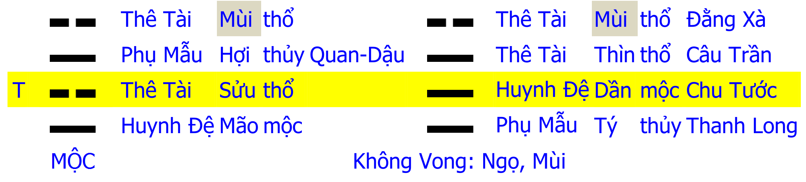

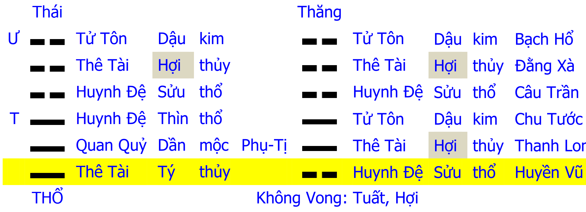

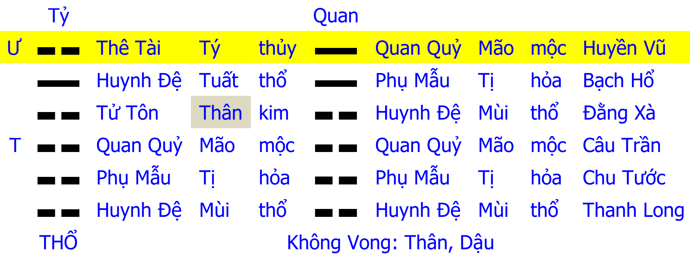

---

# CHƯƠNG 37. LƯỠNG HIỆN

Tử Tôn Thân kim mặc dù Không Vong, nhưng được Nhật Nguyệt sinh phù là vượng, nếu lấy vượng suy mà đoán tất bình an vô sự. Nhưng một hào độc phát, hào độc phát là Tử địa của Dụng thần, cuối cùng đứa nhỏ bị sát hại. Đây chẳng phải là ứng vào hào độc phát ư? Chỗ này cát hung nghiệm ở tượng.

Ví dụ 3: Ngày Quý Mùi tháng Mùi, người đàn ông hỏi con ra ngoài hai ngày chưa về, có sao không? Được quẻ Cấn Vi Sơn biến Phong Sơn Tiệm.

| | Cấn | Tiệm | |
| :--- | :--- | :--- | :--- |
| T | ━ Quan Quỷ Dần mộc | ━ Quan Quỷ Mão mộc | Bạch Hổ |
| | ⚋ Thê Tài Tý thủy | ━ Phụ Mẫu Tị hỏa | Đằng Xà |
| | ⚋ Huynh Đệ Tuất thổ | ⚋ Huynh Đệ Mùi thổ | Câu Trần |
| Ứ | ━ Tử Tôn Thân kim | ━ Tử Tôn Thân kim | Chu Tước |
| | ⚋ Phụ Mẫu Ngọ hỏa | ⚋ Phụ Mẫu Ngọ hỏa | Thanh Long |
| | ⚋ Huynh Đệ Thìn thổ | ⚋ Huynh Đệ Thìn thổ | Huyền Vũ |

THỔ Không Vong: Thân, Dậu

Quẻ này Dụng thần Tử Tôn cũng Không Vong, Nhật Nguyệt sinh phù Dụng thần vượng tướng, một hào độc phát, hào độc phát là Tử địa của Dụng thần, Dụng thần Tử ở Tý thủy, mà đứa trẻ chết đuối ở hướng Đông Bắc. Ở ngày Giáp Thân tìm được thi thể. Dụng thần Tử ở thủy mà đứa nhỏ bị chết đuối, chẳng lẽ không nghiệm ở độc phát ư? Nhưng mà ứng kỳ vẫn ứng vào Dụng thần xuất Không.

***

# CHƯƠNG 37: LƯỠNG HIỆN

Lưỡng hiện tức Dụng thần xuất hiện hai lần. Ví dụ, xem về cha mẹ, trong quẻ xuất hiện hai hào Phụ Mẫu.

Theo phép xưa, phương pháp lựa chọn như sau:

- Bỏ hào hưu tù, dùng hào vượng tướng.

- Bỏ hào tĩnh, dùng hào động.

- Bỏ hào gặp Nguyệt phá, dùng hào không bị phá.

- Bỏ hào gặp Tuần Không dùng hào không bị Không.

- Bỏ hào bị thương hại, dùng hào không bị tổn thương.

Trên đây là cách lựa chọn theo phương pháp cũ, ta kiểm nghiệm phần nhiều thấy ứng nghiệm với hào gặp Tuần Không, Nguyệt phá, tức:

- Bỏ hào không bị Không dùng hào gặp Tuần Không;

- Bỏ hào không bị Phá, dùng hào gặp Nguyệt phá.

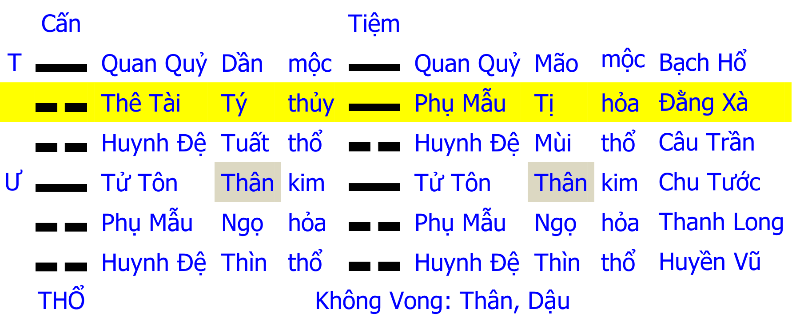

Ví dụ: Ngày Canh Tý tháng Mùi, xem về cầu tài, được quẻ Tiểu Súc:

| | Tiểu Súc | |
| :--- | :--- | :--- |
| | ━ Huynh Đệ Mão mộc | Đằng Xà |
| | ━ Tử Tôn Tị hỏa | Câu Trần |
| Ứ | ⚋ Thê Tài Mùi thổ | Chu Tước |
| | ━ Thê Tài Thìn thổ Quan-Dậu | Thanh Long |
| | ━ Huynh Đệ Dần mộc | Huyền Vũ |
| T | ━ Phụ Mẫu Tý thủy | Bạch Hổ |

MỘC Không Vong: Thìn, Tị

Hào Tài tại Ứng gặp Nguyệt kiến lại khắc Thế, nên đoán rằng cầu tài ắt được. Người này bèn hỏi: "Lúc nào thì được?" Ta đáp rằng: Ngày mai là ngày Tân Sửu, xung động hào Mùi Tài, ắt sẽ đắc tài. Thế nhưng người này lại đắc tài vào ngày Thìn thổ tức ngày hào Tài xuất Không. Như vậy, cần bỏ hào Mùi thổ không bị Không, mà dùng hào Thìn thổ gặp Tuần Không.

Ví dụ: Ngày Giáp Ngọ tháng Mùi, xem về thăng chức, được quẻ Sư biến Hoán:

| | Sư | Hoán | |
| :--- | :--- | :--- | :--- |
| Ứ | ⚋ Phụ Mẫu Dậu kim | ━ Tử Tôn Mão mộc | Huyền Vũ |
| | ⚋ Huynh Đệ Hợi thủy | ━ Thê Tài Tị hỏa | Bạch Hổ |
| | ⚋ Quan Quỷ Sửu thổ | ⚋ Quan Quỷ Mùi thổ | Đằng Xà |
| T | ⚋ Thê Tài Ngọ hỏa | ⚋ Thê Tài Ngọ hỏa | Câu Trần |
| | ━ Quan Quỷ Thìn thổ | ━ Quan Quỷ Thìn thổ | Chu Tước |
| | ⚋ Tử Tôn Dần mộc | ⚋ Tử Tôn Dần mộc | Thanh Long |

THỦY Không Vong: Thìn, Tị

Ta đoán rằng: Hào Thế cực vượng, vừa lâm Nhật kiến, lại được Nguyệt lệnh làm Quan tinh mà hợp Thế. Nhưng trong quẻ hào Quan tinh lưỡng hiện, Sửu thổ gặp Nguyệt phá, Thìn thổ gặp Tuần Không. Nên đến năm Thìn, hào Quan Thìn thổ xuất Không, chắc chắn sẽ thăng chức cao. Nhưng ngoại quái phản ngâm, nên sự việc tráo trở bất thường. Xem vào năm Dần, quả nhiên đến năm Thìn được điều đi làm quan tại Hà Nam. Đến tháng năm, vì lý do khác, lại bị điều về đất Sở, đến tháng 10 thăng chức Đốc phủ. Trong vòng một năm, điều nhiệm hai lần, thăng chức một lần, đều ứng vào thời điểm điền thực, Điền Không.

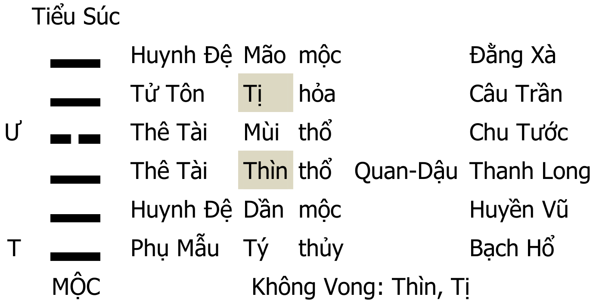

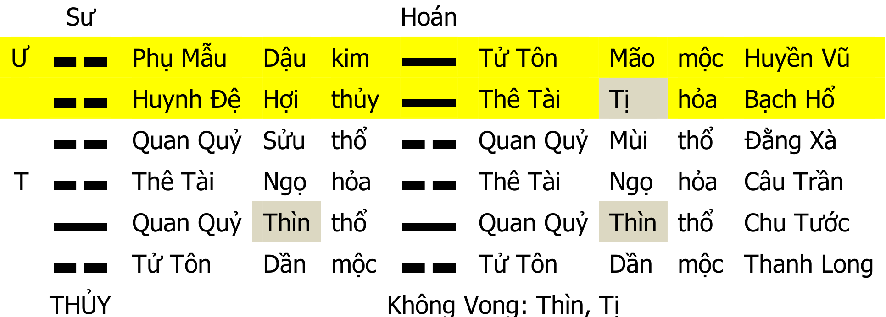

Lại ví dụ: Vào ngày Bính Ngọ tháng Hợi, mẹ xem con trai ngày nào sẽ thoát tật ách, được quẻ Dự biến Quy Muội:

| Dự | | | | Quy Muội | | | |
| :---: | :---: | :--- | :--- | :---: | :--- | :--- | :--- |
| | ▅▅ ▅▅ | Thê Tài | Tuất thổ | ▅▅ ▅▅ | Thê Tài | Tuất thổ | Thanh Long |
| | ▅▅ ▅▅ | Quan Quỷ | Thân kim | ▅▅ ▅▅ | Quan Quỷ | Thân kim | Huyền Vũ |
| Ứ | ▅▅▅▅▅ | Tử Tôn | Ngọ hỏa | ▅▅▅▅▅ | Tử Tôn | Ngọ hỏa | Bạch Hổ |
| | ▅▅ ▅▅ | Huynh Đệ | Mão mộc | ▅▅ ▅▅ | Thê Tài | Sửu thổ | Đằng Xà |
| | ▅▅ ▅▅ | Tử Tôn | Tị hỏa | ▅▅▅▅▅ | Huynh Đệ | Mão mộc | Câu Trần |
| T | ▅▅ ▅▅ | Thê Tài | Mùi thổ Phụ-Tý | ▅▅▅▅▅ | Tử Tôn | Tị hỏa | Chu Tước |

**MỘC** **Không Vong: Dần, Mão**

Ta thấy trong quẻ xuất hiện ba hào Tử Tôn, đều thuộc hỏa, tương sinh hào Thế. Hào Ứng Ngọ hỏa tĩnh gặp Nhật kiến, hai hào Tử Tôn Tị hỏa còn lại gặp Nguyệt phá, nên đoán là đến năm Tị thực Phá sẽ thoát khỏi tai ách. Về sau, quả nhiên được thoát nạn vào năm Tị. Nên trong quẻ Dụng thần tam hiện, chọn hào Dụng là hào gặp Nguyệt phá.

Dã Hạc bàn rằng: Ta dùng hào Nguyệt phá để phán đoán về năm ứng nghiệm, không chỉ dựa vào một quẻ này mà thôi. Nguyên con trai cả của lão phu nhân đó mang theo ấn tín bỏ biên cương trở về, bản thân xem được hào Tử Tôn Thân kim phát động, động mà gặp hợp, tức ứng năm Tị. Người em lại xem cho anh, được hào Huynh Đệ Thân kim động, nên cũng ứng với năm Tị. Lại thêm quẻ này hào Tử Tôn Tị hỏa hồi đầu sinh Thế, tuy gặp Nguyệt phá, nhưng hợp với hai quẻ trước, cho nên mới dám quyết đoán vào năm Tị. Nên người xem bốc dịch, thứ nhất phải thấu đạt lẽ biến hóa của cơ trời, thứ hai là phải chú tâm ghi nhớ các quẻ. Nếu không ghi nhớ các quẻ trước, thì với quẻ này, hào Ngọ hỏa gặp Nhật thần sinh Thế, sẽ phải đoán là ứng vào năm Ngọ. Hơn nữa năm Ngọ lại hợp với Thế, vậy tại sao lại dám đoán là năm Tị. Sở dĩ đoán vào năm Tị, là vì hợp với hai quẻ trước mà đoán.

**Tân bình thích:** Thực tiễn chứng minh lý luận của Dã Hạc là chính xác, nên lấy hào gặp Phá gặp Không làm Dụng. Nếu có Dụng thần phát động, thì ưu tiên lấy hào động làm Dụng. Trong hai Dụng thần có một Không một Phá, thì cũng có thể hợp lại mà quyết định. Đây là cách chọn Dụng thần khi đoán cát hung. Nếu như đoán hôn nhân, Dụng thần lưỡng hiện thì thường xem cả hai, lấy Ứng Dụng thần là vợ hoặc chồng hoặc đối phương, hào Dụng thần khác là kẻ thứ ba.

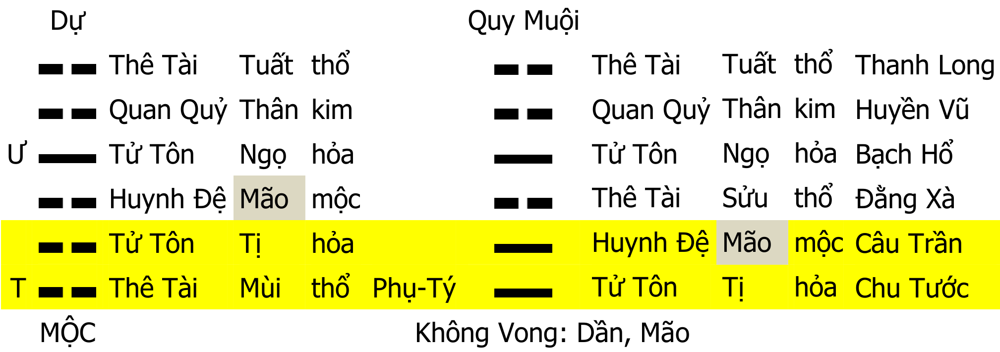

---

# CHƯƠNG 38: TINH SÁT

## Thiên Ất Quý Nhân

Giáp, Mậu, Canh ngưu dương; Ất, Kỷ thử hầu hương;
Bính, Đinh trư kê vị; Nhâm, Quý thố xà tàng.
Lục Tân phùng mã hổ; Thử thị Quý nhân phương.

Nghĩa là:

Ngày Giáp, Mậu, Canh: Thiên Ất Quý Nhân tại Mùi, Sửu;
Ngày Ất, Kỷ: Thiên Ất Quý Nhân tại Tý, Thân;
Ngày Bính, Đinh: Thiên Ất Quý Nhân tại Dậu, Hợi;
Ngày Nhâm, Quý: Thiên Ất Quý Nhân tại Mão, Tị.
Ngày Tân: Thiên Ất Quý Nhân tại Dần, Ngọ;

Ví dụ: Xem quẻ vào ngày Giáp, Mậu, Canh, trong quẻ có hào Sửu, hào Mùi, là gặp Thiên Ất Quý Nhân.

## Lộc Thần

Ngày Giáp: Lộc Thần, tại Dần;
Ngày Ất: Lộc Thần tại Mão;
Ngày Bính, Mậu: Lộc Thần tại Tị;
Ngày Đinh, Kỷ: Lộc Thần tại Ngọ;
Ngày Canh: Lộc Thần tại Thân;
Ngày Tân: Lộc Thần tại Dậu;
Ngày Nhâm: Lộc Thần tại Hợi;
Ngày Quý: Lộc Thần tại Tị.

Ví dụ ngày Giáp xem quẻ, nếu xuất hiện hào Dần là gặp Lộc Thần; ngày Ất xem quẻ, nếu xuất hiện hào Mão là gặp Lộc Thần. Những trường hợp khác loại suy từ đó.

## Dịch Mã

Ngày Thân, Tý, Thìn: Dịch Mã tại Dần;
Ngày Tị, Dậu, Sửu : Dịch Mã tại Hợi;
Ngày Dần, Ngọ, Tuất: Dịch Mã tại Thân;
Ngày Hợi, Mão, Mùi : Dịch Mã tại Tị.

Giả sử xem vào ngày Tý, ngày Thân, ngày Thìn, trong quẻ xuất hiện hào Dần, tức là gặp Dịch Mã. Những trường hợp khác cũng loại suy từ đó.

## Thiên Hỷ

Xuân Tuất, hạ Sửu, thu Thìn, đông Mùi.

Giả sử xem vào tháng giêng, tháng hai tức mùa xuân, trong quẻ có hào Tuất, thì đó chính là Thiên Hỷ.

Nếu xem vào tháng ba, tuy vẫn lấy Tuất làm Thiên Hỷ, nhưng vì Tuất lại là Nguyệt phá, nên nếu hào này phát động trong quẻ, phù trợ cho Dụng thần vượng tướng, thì vẫn được coi là Hỷ chứ không bị coi là Phá. Những trường hợp khác loại suy từ đấy.

Các sách có ghi chép rất nhiều loại tinh sát, ta lưu ý quan sát hơn bốn mươi năm, thấy chỉ có Quý Nhân, Lộc Thần, Dịch Mã, Thiên Hỷ là ứng nghiệm, thế nhưng một mình những sao này cũng không thể nắm quyền quyết định họa phúc. Nếu Dụng thần vượng tướng, mà gặp những sao này, thì càng thêm tốt. Nếu Dụng thần thất hãm, thì các sao này tuy có cũng như không.

Lý Ngã Bình bàn rằng: Phục Hy quan sát số chẵn, số lẻ để phân chia ra âm dương, Văn Vương dùng hào từ để phán đoán hung cát. Từ Chu Công trở về sau, lại dùng ngũ hành để quyết đoán họa phúc, đạo của Dịch đã cùng. Nay lại kiêm thêm cả tinh sát cát hung, không biết xuất phát từ người nào? Tang Môn, Khẩu Mộ, Đại Sát, Phi Liêm, lại thêm những phán đoán hung hiểm đáng sợ, thường đều không ứng nghiệm. Trong "Dịch mạo" chương "Tật bệnh" có viết: "Nhập quẻ không chết, tinh sát không chết, Dụng thần sinh thì ắt được sinh, Dụng thần chết thì ắt phải chết", ta cho rằng đó là chí lý. Đến chương "Tinh sát", lại liệt kê thêm khá nhiều thần sát, thật là tiền hậu bất nhất, người đời sau biết phải theo lối nào? Như trong sách này, nếu như Quý Nhân, Lộc Thần, Dịch Mã có ứng nghiệm, cũng phải kết hợp với Dụng thần vượng tướng, chứ không thể một mình nắm quyền thao túng họa phúc, nên ta cũng cho rằng, cũng có thể không cần dùng đến tinh sát. Thành Ý tiên sinh trong "Thiên kim phú" có viết: "Thần sát cát hung rườm rà nhiều vẻ, sao bằng nguyên lý sinh khắc chế hoá", chỉ một lời đã thể hiện được trọn ý.

**Tân bình thích:** Đây cũng là sai lầm của người xưa. Lấy thần sát làm căn cứ để phán đoán cát hung. Thần sát cũng thuộc về phạm trù tượng, là dùng để phân biệt ý nghĩa. Tôi từng được nghiệm về Thiên Ất Quý Nhân, Đào Hoa, Dịch Mã. Song cách lấy Dịch Mã lại không giống với phương pháp thông thường, ví dụ như Dần Ngọ Tuất Mã tại Thân Tý Thìn, tức là 12 địa chi đều nhập Dịch Mã, phần lớn dùng để phán đoán tính chất sự vật và tính cách con người,...

Ví dụ 1: Ngày Bính Dần tháng Tuất, một người Nhật Bản xem tình hình đi học của con gái, được quẻ Thủy Thiên Nhu biến Thủy Phong Tỉnh.

| Nhu | | | | | Tỉnh | | | | |
| :--- | :--- | :--- | :--- | :--- | :--- | :--- | :--- | :--- | :--- |
| | ▅▅ ▅▅ | Thê Tài | Tý | thủy | ▅▅ ▅▅ | Thê Tài | Tý | thủy | Thanh Long |
| | ▅▅▅▅▅ | Huynh Đệ | Tuất | thổ | ▅▅▅▅▅ | Huynh Đệ | Tuất | thổ | Huyền Vũ |
| T | ▅▅ ▅▅ | Tử Tôn | Thân | kim | ▅▅ ▅▅ | Tử Tôn | Thân | kim | Bạch Hổ |
| | ▅▅▅▅▅ | Huynh Đệ | Thìn | thổ | ▅▅▅▅▅ | Tử Tôn | Dậu | kim | Đằng Xà |
| | ▅▅▅▅▅ | Quan Quỷ | Dần | mộc Phụ-Tị | ▅▅▅▅▅ | Thê Tài | Hợi | thủy | Câu Trần |
| Ư | ▅▅▅▅▅ | Thê Tài | Tý | thủy | ▅▅ ▅▅ | Huynh Đệ | Sửu | thổ | Chu Tước |

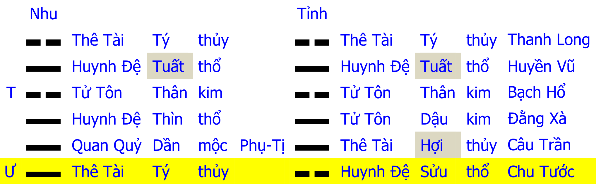

Tôi đoán con gái người này tinh nghịch, bướng bỉnh, không thích học tập, thường xuyên trốn học. Đối phương rất kinh ngạc, cho rằng tôi có thần thông. Thực ra đều là dùng quẻ suy ra. Tử Tôn là con gái của người này, Phụ Mẫu là học nghiệp (việc học). Trong quẻ Tài động khắc Phụ Mẫu, Phụ Mẫu không hiện trên quẻ, vì vậy đoán không thích học tập. Tử Tôn lâm Bạch Hổ, Bạch Hổ chủ bướng bỉnh, vì vậy đoán là tinh nghịch. Tử Tôn được Nguyệt sinh phù vượng tướng, lâm Dịch Mã ám động, lại là quẻ du hồn, sách nói "Vượng mã du hồn đào học nhi", vì vậy đoán là thường xuyên trốn học.

Đây chính là sử dụng thần sát đoán ra, rõ ràng thần sát cũng có tác dụng.

Ví dụ: Ngày Canh Ngọ tháng Mão, một người nam xem lưu niên cho bạn, được quẻ Cấn biến Bác.

| Cấn | | | | | Bác | | | | |
| :--- | :--- | :--- | :--- | :--- | :--- | :--- | :--- | :--- | :--- |
| T | ▅▅▅▅▅ | Quan Quỷ | Dần | mộc | ▅▅▅▅▅ | Quan Quỷ | Dần | mộc | Đằng Xà |
| | ▅▅ ▅▅ | Thê Tài | Tý | thủy | ▅▅ ▅▅ | Thê Tài | Tý | thủy | Câu Trần |
| | ▅▅ ▅▅ | Huynh Đệ | Tuất | thổ | ▅▅ ▅▅ | Huynh Đệ | Tuất | thổ | Chu Tước |
| Ư | ▅▅▅▅▅ | Tử Tôn | Thân | kim | ▅▅ ▅▅ | Quan Quỷ | Mão | mộc | Thanh Long |
| | ▅▅ ▅▅ | Phụ Mẫu | Ngọ | hỏa | ▅▅ ▅▅ | Phụ Mẫu | Tị | hỏa | Huyền Vũ |
| | ▅▅ ▅▅ | Huynh Đệ | Thìn | thổ | ▅▅ ▅▅ | Huynh Đệ | Mùi | thổ | Bạch Hổ |
| | | THỔ | | | | Không Vong: Tuất, Hợi | | | |

Lấy hào Huynh Đệ làm Dụng thần. Trong quẻ có Thìn thổ, Tuất thổ, Huynh Đệ lưỡng hiện, lấy Tuất thổ hợp Nguyệt kiến cùng lâm Không Vong làm Dụng thần. Dụng thần lâm Chu Tước bị Nguyệt kiến khắc thương, Chu Tước là khẩu thiệt, quan ti, Nguyệt kiến và Quan Quỷ có ngũ hành tương đồng, lấy Quan Quỷ xem, chính là tượng ngồi tù hoặc bị tố tụng. Thê Tài Tý thủy được hào động Tử Tôn Thân kim sinh phù, Nhật xung là ám động. Thê Tài ám động sinh Kỵ thần, Tài là phụ nữ và tiền bạc, chứng tỏ bạn của anh ta đã bị bắt hoặc vì chuyện phụ nữ hoặc vì vấn đề kinh tế.

Hào Ứng động mà hóa Quan Quỷ. Ứng là người khác, Quan Quỷ là tố tụng, quan ti, bạn của anh ta đã bị người ta tố cáo. Hiện nay Dụng thần Không Vong, vẫn đang núp ở Không địa nên chưa hoàn toàn bị Quan Quỷ tới khắc, chứng tỏ bạn của anh ta vẫn chưa bị kết án. Nhưng đến tháng Thìn xung thực Dụng thần, Dụng thần bắt đầu bị khắc thì phiền phức càng lớn, cần phải nhanh chóng nghĩ biện pháp giải quyết.

Anh ta cho biết người bạn bị tố cáo vì vấn đề kinh tế, không liên quan gì đến phụ nữ. Sau buổi sáng xem quẻ, buổi chiều anh ta lại đến và nói rằng tôi đoán rất đúng, người bạn bị một phụ nữ sống chung tố cáo bởi vì anh ta muốn chia tay với cô ấy. Hỏi làm thế nào có thể giúp người bạn mau chóng thoát khỏi vụ kiện này.

**Hóa giải:** Bởi vì Thân kim phát động giúp tăng cường sức mạnh Thê Tài Tý thủy, khiến Thê Tài Tý thủy ám động sinh trợ Kỵ thần. Tìm địa chi cân bằng từ trong 12 con giáp, Sửu thổ có thể đưa đến tác dụng tốt nhất cho hóa giải. Sửu thổ có ba tác dụng như sau: Thứ nhất, Sửu thổ có thể khiến Thân kim nhập Mộ, Thân kim nhập Mộ sẽ làm suy yếu lực sinh trợ Thê Tài. Thứ hai, Sửu thổ tương hợp với Thê Tài Tý thủy,

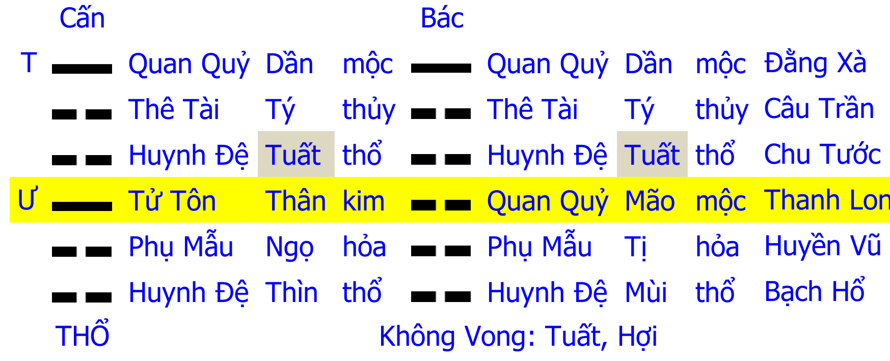

---

# CHƯƠNG 39. HOÀNG KIM SÁCH VÀ THIÊN KIM PHÚ TĂNG SAN

có thể hợp vướng chân Tý thủy, khiến cho không sinh Kỵ thần. Thứ ba, Sửu thổ có ngũ hành tương đồng với Dụng thần, có thể tăng cường sức mạnh Dụng thần. Lại từ Nhật khởi Quý Nhân, Giáp Mậu Canh ngưu dương, Sửu thổ còn là Quý Nhân, vì vậy nếu tìm được người cầm tinh con trâu thì người bạn nhất định có thể được cứu.

Tình cờ tòa án có một người quen tuổi Sửu, tìm người này giúp đỡ, bởi vì người bạn không thuộc về vấn đề kinh tế quan trọng nên dưới sự giúp đỡ của người này, người bạn đã bình an thoát khỏi vụ kiện, không bị đưa vào tù.

Ở đây tuy sử dụng thần sát, nhưng lấy Dụng thần hỷ kỵ để phán đoán.

***

# CHƯƠNG 39: HOÀNG KIM SÁCH VÀ THIÊN KIM PHÚ TĂNG SAN

**Động tĩnh âm dương, phản phục biến thiên.**

Động tĩnh âm dương, biến đổi qua lại.

Đã trình bày rất rõ ràng trong chương "Động biến" quyển trước.

**Thái quá giả, tổn chi tư thành;**

Thái quá, giảm bớt đi sẽ thành;

Theo cách chú thích cũ, câu này nghĩa là nếu hào chủ sự (Dụng thần) xuất hiện quá nhiều, sự việc không chuyên nhất, nên bớt đi. Ví dụ như hào chủ sự thuộc thổ, mà trong quẻ có nhiều hào Thìn, Tuất, Sửu, Mùi, như vậy là "thái quá", cần đợi đến ngày, tháng Dần, Mão mộc để khắc bớt hào thổ, sự việc mới thành. Hoặc gặp ngày, tháng xem quẻ (Nhật thần, Nguyệt kiến) là Dần, Mão cũng tốt.

Dã Hạc nói rằng: Không chỉ là gặp được ngày, tháng Dần, Mão, mà sau gặp được ngày Thìn tháng Thìn, sự việc cũng được thành tựu. Tại sao lại như vậy? Vì Thìn là Mộ khố của thổ. Ấy tức là "Dụng hào trùng điệp, cần có Mộ khố để chứa đựng.

**Tân bình thích:** Dụng thần quá vượng, gặp sinh là hung, gặp khắc là cát, ngũ hành sinh khắc quý ở trung dung, vật cực tất phản.

**Bất cập giả, ích chi tắc lợi.**

Bất cập, bồi đắp thêm sẽ lợi.

Thế nào là bất cập? Nếu như hào chủ sự chỉ có một, lại không được vượng tướng, tức là bất cập, thì sự việc khó thành.

Ví dụ, kim là hào chủ sự, nếu xem vào mùa hạ, thì kim hưu tù vô khí. Nếu được hào động Nhật thần tương sinh, hoặc đợi đến ngày, tháng tương sinh, sẽ có ích lợi, sự việc sẽ thành.

Ta cho rằng quan điểm này là hợp lý, nhưng hào chủ sự cần phải có gốc rễ, khi đó, đang suy mà gặp được tương sinh, tựa như mầm non lúc nắng hạn gặp được mưa lành, phấn chấn vươn lên, nên mới nói rằng: "gặp được tương trợ, nâng đỡ, thì suy nhược, hưu tù cũng trở nên tốt". Nhưng nếu hào chủ sự suy nhược không gốc rễ, hưu tù thất hãm, dù có được gặp sinh hợp, cũng khó tương sinh, tức "chủ đã yếu lại bị khắc, khó có thể duy trì".

**Sinh phù củng hợp, thời vũ tư miêu; khắc hại hình xung, thu sương sát thảo.**

Được sinh phù củng hợp, như mầm non gặp mưa lành; bị khắc hại hình xung, tựa cỏ thu gặp sương giá.

Về vấn đề sinh, phù, củng, hợp, hay khắc, hại, hình, xung, đã được trình bày rõ tại các chương "Ngũ hành xung khắc", "Tam hợp lục hợp", "Nguyệt tướng", "Nhật thần", "Tam hình".

**Trường Sinh, Đế Vượng, tranh như Kim Cốc¹ chi viên; Tử, Mộ, Tuyệt, Không, nãi thị Nê Lê² chi địa,**

Trường Sinh, Đế Vượng, như vườn Kim Cốc đua chen; Tử, Mộ, Tuyệt, Không, khác nào địa ngục khô héo.

Vấn đề Trường Sinh, Đế Vượng hay Tử, Mộ, Tuyệt, Không đã được trình bày rõ tại các chương "Sinh vượng Mộ Tuyệt", "Không Vong".

**Tân bình thích:** Dụng thần ưa hữu khí được sinh được phù, không nên gặp Không Phá Mộ Tuyệt, gặp là như rơi vào địa ngục, lành ít dữ nhiều. Thuyết này tuy là có lý, nhưng cần phải xem động tĩnh trong quẻ và suy vượng của Dụng thần. Một hào độc phát, tối kỵ hào động là Tử Mộ Tuyệt địa của Dụng thần, nếu như nhiều hào phát động, Dụng thần vượng hoặc hữu khí thì vẫn không sao. Đối với thuyết Trường Sinh, cần phải xem suy vượng của Dụng thần.

Ví dụ, một người đoán niên vận, ngày Giáp Thân tháng Dần năm Mậu Dần, được quẻ Phong Hỏa Gia Nhân biến Phong Thiên Tiểu Súc.

| Gia Nhân | | Tiểu Súc | |
| :--- | :--- | :--- | :--- |
| — | Huynh Đệ Mão mộc | — | Huynh Đệ Mão mộc Huyền Vũ |
| Ứ — | Tử Tôn Tị hỏa | — | Tử Tôn Tị hỏa Bạch Hổ |
| - - | Thê Tài Mùi thổ | - - | Thê Tài Mùi thổ Đằng Xà |
| — | Phụ Mẫu Hợi thủy Quan-Dậu | — | Thê Tài Thìn thổ Câu Trần |
| T - - | Thê Tài Sửu thổ | — | Huynh Đệ Dần mộc Chu Tước |
| — | Huynh Đệ Mão mộc | — | Phụ Mẫu Tý thủy Thanh Long |

MỘC

Không Vong: Ngọ, Mùi

***

¹ Kim Cốc là tên vườn hoa của Thạch Sùng đời Tấn, cực kỳ xa hoa tráng lệ.  
² Nê Lê: Dịch âm tiếng Phạn, chỉ một cõi địa ngục trống rỗng, không tồn tại bất kỳ thứ gì, là cõi đáng sợ nhất trong thập giới.

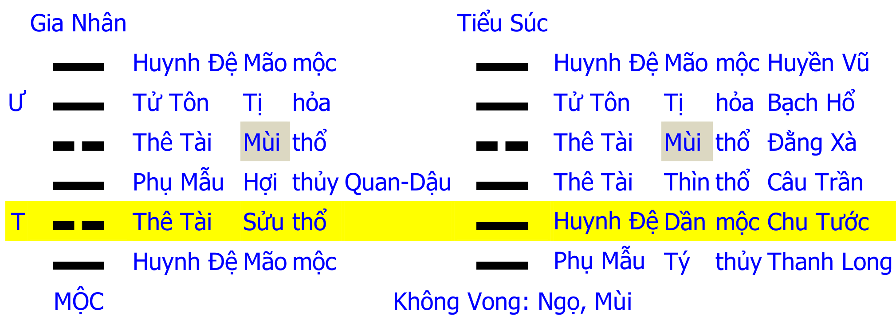

Hào Thế Thê Tài động hóa hồi đầu khắc, hào 2 là hào vị phu thê, tất là ứng chuyện vợ chồng bất lợi. Về sau ly hôn với vợ tại ngày Sửu tháng Hợi. Ở đây Thê Tài Trường Sinh ở Nhật cũng không gặp cát.

### Nhật thần vi lục hào chi chủ tể; Nguyệt tướng nãi vạn bốc chi đề cương.

Nhật thần là chúa tể của sáu hào; Nguyệt tướng là cương lĩnh của vạn quẻ.

Về Nhật thần và Nguyệt kiến đã được trình bày rõ trong các chương "Nhật thần" và "Nguyệt tướng".

### Tối ác giả Tuế Quân, nghi tĩnh bất nghi động;

Hung dữ nhất là Tuế Quân, nên tĩnh không nên động;

Tuế Quân là Thái Tuế trong năm. Có thể minh động hoặc ám động, xung khắc hào Thế, nếu xem về niên vận (vận trong năm), chủ về suốt năm trắc trở; nếu xem về chức quan, chủ về làm quan tại triều đình.

Nếu sĩ tử xem về các sự việc như thi cử, hoạn lộ, quan tước, yết kiến vua dâng thư, can gián, xin sắc phong, xin tập ấm..., nếu được Thái Tuế sinh hợp hào Thế là tốt, nếu động mà sinh hào Thế lại càng tốt, tối kỵ Thái Tuế hình, xung, khắc hào Thế. Ngoài những nội dung kể trên, thì Thái Tuế cũng chỉ như các hào khác. Vì sao vậy? Bởi vì Thái Tuế tuy nắm quyền cai quản trong một năm, tôn quý mà chẳng thân gần, cao mà khó nhờ cậy, tác động cát hung đều không bằng Nhật, Nguyệt. Phép xưa cho rằng Thái Tuế không quan tâm đến những việc vặt trong gia đình, cũng là theo cái lý đấy. Vì vậy, hào bị Thái Tuế xung tức Tuế phá, cũng không coi là hung; hào hợp với Thái Tuế tức Tuế hợp, cũng chẳng coi là cát; Thái Tuế không thể tương sinh cho hào suy nhược, cũng không thể khắc chế hào cường vượng. Nhưng hào gặp Nguyệt phá lập tức bị Phá, gặp Tuần Không lập tức bị Không, nên uy lực của Thái Tuế không thể bằng Nguyệt kiến, Nhật thần.

Dã Hạc lão nhân bàn rằng: Nếu xét về họa phúc trong năm đó, uy lực của Thái Tuế không mạnh; nhưng xét về sự cát hung về sau này, thì tác động của Thái Tuế không thể coi nhẹ. Ví dụ hào chủ sự thuộc mộc, trong quẻ có hào Thân, Dậu kim động, như vậy, mộc bị kim thương hại. Cho dù mộc vượng kim suy, trước mắt vẫn được bình an vô sự, nhưng về sau, nếu gặp phải năm Thân năm Dậu, sẽ khó tránh được tai họa.

Ví dụ: Ngày Nhâm Tý tháng Tị, xem về thi Hương, được quẻ Tỷ:

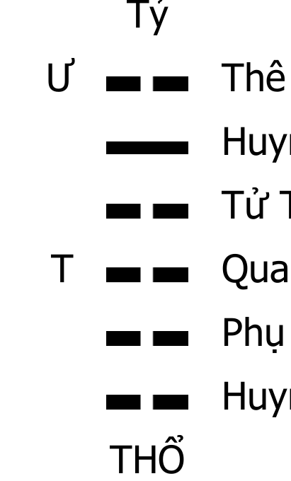

Hào Phụ Tị hỏa gặp Nguyệt kiến, chủ về đường học vấn vượng. Chỉ hiềm Quan tinh trì Thế, hào Thế Mão mộc gặp Tuần Không, nên đoán rằng đến năm Mão mới được như ý. Năm Tý xem quẻ, sau đến năm Mão quả nhiên thi đậu. Sở dĩ ứng vào năm Mão, là vì được Thái Tuế điền thực.

**Tân bình thích:** Xem lưu niên, Thái Tuế sinh hợp hào Thế là một năm suôn sẻ, Thái Tuế là Dụng thần vượng tướng là một năm đắc ý, hưu tù Không Phá là một năm khó có khởi sắc. Phục tàng càng không nên.

Ví dụ: Ngày Canh Thìn tháng Sửu năm 1999, một hàng xóm ở quê nhà mang theo mấy người đến dự đoán. Trong đó có một người muốn đoán quan vận, người đó gieo được quẻ Gia Nhân biến Kiển.

Tôi đoán rằng: Quan hệ giữa anh và lãnh đạo rất tốt, lãnh đạo đã tìm anh nói là muốn đề bạt anh, nhưng khi thảo luận ở đại hội thì lại xuất hiện hai người phản đối, gây khó dễ, chụp mũ anh, họ đã kể ra rất nhiều vấn đề của anh, kết quả là không được thăng chức, thực ra đây chỉ là cái bẫy do lãnh đạo tạo ra. Chẳng qua bề ngoài lãnh đạo đối đãi tốt với anh, tìm anh nói chuyện là để mê hoặc anh, người phản đối anh cũng là do lãnh đạo một tay sắp xếp. Người xin đoán gật đầu nói đúng. Hỏi sau này có còn hy vọng hay không, tôi cho biết tới tháng 9 năm 2000 sẽ được lên chức, kết quả ứng nghiệm.

Việc này phán đoán như sau:

Lấy Quan Quỷ làm Dụng thần. Quan Quỷ Dậu kim mặc dù được Nhật Nguyệt sinh trợ, nhưng phục mà Không Vong, lại Nguyên thần bị hai Huynh Đệ Mão mộc phát động có thể làm tổn hại, vì vậy khó mà được lên chức. Hào 5 là hào vị lãnh đạo, sinh hào Thế, là lãnh đạo đối đãi tốt với anh ta. Hào 5 lại là đất Trường Sinh của Quan Quỷ, vì vậy lãnh đạo nói muốn đề bạt anh ta. Nhưng trong Trường Sinh có khắc, bề ngoài là Trường Sinh, thực tế là khắc, vì vậy là làm ra vẻ là đề bạt, nhưng sau lưng lại không muốn đề bạt. Huynh Đệ là đồng nghiệp, hai nơi phát động khắc Nguyên thần, là có hai người phản đối. Một tại hào 6, hào 6 là đầu, là chụp mũ[^1]; một tại hào sơ, hào sơ là chân là giày, vì vậy là gây khó dễ[^2]. Bởi vì Quan Quỷ vượng tướng, tháng 9

[^1]: Nguyên văn: 穿小鞋 – xuyên tiểu hài, nghĩa là mang giày chật, ví với việc ngầm gây khó khăn cho người khác.
[^2]: Nguyên văn: 戴帽子 – đái mạo tử, nghĩa là đội mũ, đội nón.

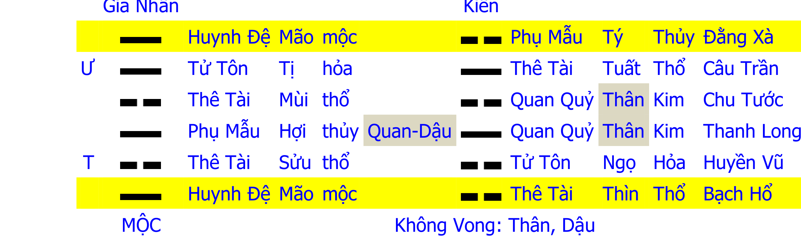 năm 2000 là tháng Dậu, là thời gian Quan Quỷ Dậu kim xuất Không phục gặp xuất hiện, vì vậy có thể lên chức.

Tôi thấy năm nay Thái Tuế Mão mộc nhập hào phát động, lại đoán rằng: Anh năm nay không những không được lên chức, mà còn đã phá tài. Đã hai lần phá tài lớn. Một lần là anh và người ta hợp tác kinh doanh, có người cung cấp dự án kinh doanh cho anh, hai bên đều đầu tư, tài lực của anh lớn, đầu tư nhiều, đối phương đầu tư ít, kết quả buôn bán không được tốt, đã thâm hụt tiền.

Đoán đến đây, một người cùng đến xúc động nói: "Chuẩn quá! Anh ta là người hùn vốn với tôi, chúng tôi đã thâm hụt hơn bốn vạn nguyên."

Phán đoán như sau: Huynh Đệ Mão mộc là Thái Tuế năm đó nhập hào, phát động khắc Tài, trong năm tất có chuyện phá tài. Hào sơ Huynh Đệ động hóa Thê Tài là thông tin hợp tác cầu tài. Hào Ứng là đối tượng hợp tác. Hào Thế lâm Tài vượng tướng, là bản thân có tiền, đầu tư lớn. Hào Ứng sinh hào Tài Thế, biểu thị đối phương mang tiền đến chỗ anh ta để cùng kinh doanh. Nhưng hào Ứng Tử Tôn Tị hỏa hưu tù, lực sinh hào Thế yếu, vì vậy cầm đến ít tiền. Tử Tôn lại là tài nguyên (nguồn tiền) và tài lộ (con đường làm ra tiền), lâm hào 5, hào 5 là lộ (đường), Tử Tôn Tị hỏa chắc chắn là tài lộ. Sinh Thế, biểu thị đối phương là người cung cấp con đường phát tài. Bởi vì quẻ hiện rõ phá tài nên chắc chắn sẽ không thành công.

Tôi tiếp tục đoán: Một lần khác phá tài là bởi vì anh bị đau bụng, tiêu chảy dẫn tới. Đối phương kinh ngạc nói: "Đúng! Mùa hè năm nay, khi tôi đang tản bộ ở một tỉnh lị thì đột nhiên bụng khó chịu, muốn đi cầu khẩn cấp, thế là tôi vội vàng lao vào nhà xí công cộng. Ai ngờ nhân lúc tôi đang ngồi cầu, có người đã cướp cái cặp da có hơn ba vạn nguyên của tôi chạy đi, đợi đến lúc tôi kéo quần lên để ra ngoài truy đuổi thì tên cướp đã chạy mất từ lâu.

Chỗ này đoán như sau: Thế tại hào 2, hào 2 là hào vị ruột, Bạch Hổ động mà khắc, Bạch Hổ chủ bệnh, Tài chủ phân và nước tiểu, lâm Huyền Vũ, Huyền Vũ là bẩn thỉu, suy ra là nhà xí, tổng hợp lại là tiêu chảy. Vì vậy đoán là do đau bụng, tiêu chảy mà phá tài.

### Thân vị không ứng nghiệm, nên phần này bỏ đi, không nên lưu lại.

Phần này, trong nguyên bản vốn viết rằng: "Quan trọng nhất là thân vị, nên phù trợ, chớ tổn thương", đồng thời chú thích rằng: Xưa kia dùng Thế thân không ứng nghiệm nên dùng Quái thân.

Nhưng Dã Hạc nói: Quái thân cũng không ứng nghiệm, chỉ dùng hào Thế. Có người nói, dùng Quái thân thì thoảng cũng có lúc ứng nghiệm. Ta bèn đáp rằng: Dùng hào Thế, thì xem trăm lần trúng cả trăm; còn nếu thi thoảng có lúc ứng nghiệm, chỉ là ngẫu nhiên trùng hợp, sao có thể trở thành quy tắc?

### Thế vi kỷ, ứng vi nhân, đại nghi sinh hợp;

Hào Thế là mình, Hào Ứng là người, rất nên sinh hợp;

Thế tượng trưng cho bản thân mình, Ứng tượng trưng cho người khác. Nếu xem về chuyện liên quan đến mình và người khác, thì phải xem cả hai hào Thế, Ứng. Nếu muốn được người khác giúp đỡ cho mình, thì hào Ứng nên tương sinh hoặc hợp với hào Thế. Nếu như xem về việc bản thân mình muốn mưu sự cho người khác, thì hào Thế nên tương sinh hào Ứng. Nếu không phải xem về việc liên quan giữa mình với người, thì không cần dùng đến nguyên tắc này.

Ví dụ: Ngày Tân Tị tháng Mão, xem về tự biện tội, được quẻ Hằng biến Thăng:

| Hằng | Thăng | |
| :--- | :--- | :--- |
| Ư ╍╍ Thê Tài Tuất thổ | ╍╍ Quan Quỷ Dậu kim | Đằng Xà |
| ╍╍ Quan Quỷ Thân kim | ╍╍ Phụ Mẫu Hợi thủy | Câu Trần |
| ━ Tử Tôn Ngọ hỏa | ╍╍ Thê Tài Sửu thổ | Chu Tước |
| T ━ Quan Quỷ Dậu kim | ━ Quan Quỷ Dậu kim | Thanh Long |
| ━ Phụ Mẫu Hợi thủy Huynh-Dần | ━ Phụ Mẫu Hợi thủy | Huyền Vũ |
| ╍╍ Thê Tài Sửu thổ | ╍╍ Thê Tài Sửu thổ | Bạch Hổ |

MỘC Không Vong: Thân, Dậu

Ta đoán rằng: Hào Quan Dậu trì Thế, bị Nguyệt phá lại gặp Tuần Không, bị hào động Ngọ hỏa tương khắc, không những mất chức, mà còn phải đề phòng tháng năm, tháng sáu gặp tai ương. Có người nói: Được hào Thế hào Ứng tương sinh, lại biến quẻ Thăng, chắc chắn sẽ được giải cứu! Ta đáp rằng: Tự xem cho mình, về việc tự biện tội, thì liên quan gì hào Ứng. Thật sai lầm. Sau quả nhiên đến tháng năm bị hạ ngục.

### Động vi thủy, biến vi chung, tối phạ giao tranh.

Động là khởi đầu, biến là kết cục, kỵ nhất tương xung.

Hào động tượng trưng cho sự khởi đầu; hào biến tượng trưng cho kết quả của sự việc, hào động và hào biến nên tương sinh tương hợp, không nên xung khắc.

**Tân bình thích:** Chỗ này phải xem hỷ kỵ của hào động và Dụng thần, Dụng thần Nguyên thần thì nên động hóa hồi đầu sinh, Kỵ thần Cừu thần thì nên động hóa hồi đầu khắc.

### Ứng vị tao thương bất lợi tha nhân chi sự; Thế hào thụ chế, khởi nghi tự kỷ chi mưu.

Hào Ứng bị thương hại, bất lợi cho việc của người khác; hào Thế bị khắc chế, bất lợi cho việc của bản thân.

Khi tự xem cho mình, hào Thế nên vượng tướng, hoặc gặp Nhật thần, Nguyệt tướng, hoặc được hào động phò trợ, hoặc bản thân hào Thế động mà hóa cát, thì xem việc gì cũng tốt đẹp.

Khi xem cho người khác, lấy hào Ứng làm Dụng thần; Nếu muốn người khác vượng, thì hào Ứng nên là vượng tướng, hoặc được Nhật, Nguyệt, hào động sinh phò. Muốn cho người suy, thì hào Ứng nên lâm Mộ, Tuyệt, Không, Phá, hoặc bị Nhật, Nguyệt, hào động xung khắc.

**Tân bình thích:** Lý luận này có lý. Dự đoán kiện tụng, đánh bạc, thi đấu, chiến tranh,... đều nên hào Ứng Không Phá, hưu tù vô lực. Nhờ người khác làm việc, hợp tác làm việc với người khác, lại nên hào Ứng vượng mà sinh Thế.

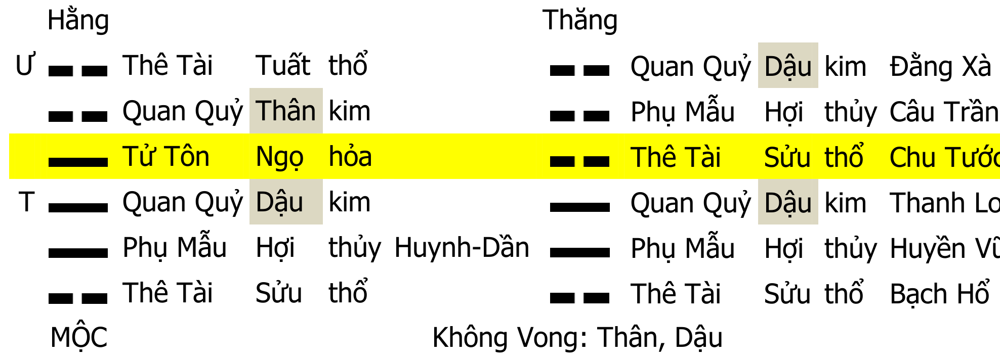

### Ví dụ: Ngày Ất Sửu tháng Tuất, một học viên người Nhật Bản là bác sĩ, anh ta có

một bệnh nhân bị bệnh tim, đã được anh ta điều trị hơn mười năm, nhưng bệnh tình 
ngày càng xấu đi, đoán cát hung của bệnh nhân được Hỏa Thiên Đại Hữu biến Lôi 
Thiên Đại Tráng.

Đại Hữu
 
Đại Tráng

Ư | Quan QuỷTị | hỏa | Phụ Mẫu Tuất thổ Huyền Vũ

Phụ Mẫu Mùi thổ | Huynh ĐệThân kim Bạch Hổ

Huynh ĐệDậu kim | Quan QuỷNgọ hỏa Đằng Xà

T | Phụ Mẫu Thìn thổ | Phụ Mẫu Thìn thổ Câu Trần

Thê Tài | Dần mộc | Thê Tài | Dần mộc Chu Tước

Tử Tôn | Tý | thủy | Tử Tôn | Tý | thủy Thanh Long

KIM 
Không Vong: Tuất, Hợi

Lấy hào Ứng làm Dụng thần, Dụng thần động mà hóa Không hóa Mộ, không 
được Nhật Nguyệt sinh phù, bệnh lâu hóa Không hóa lục xung là hung. Hào Thế 
Nguyệt phá, lại không sinh hào Ứng, bản thân không có năng lực chữa lành đối 
phương.

Về sau quả nhiên bệnh nhân không chữa trị mà chết.

Thế Ứng câu Không, nhân vô chuẩn thực;

Thế, Ứng đều Không, ta người chẳng thực;

Nếu hào Thế lâm Không, bản thân mình không được thực; hào Ứng lâm Không, 
người khác sẽ không thực, cả hào Thế và hào Ứng đều lâm Không, tức cả ta và người 
đều không thực, mưu sự gặp trở ngại, việc xem chỉ là hoang đường không có thực.

**Tân bình thích:** Thuyết này ứng nghiệm.

### Ví dụ: Ngày Canh Ngọ tháng Thân, một người đoán thầu lại cửa hàng dụng cụ

mỹ thuật của người ta ra sao? Được quẻ Địa Trạch Lâm biến Hỏa Trạch Khuê.

Lâm 
 
Khuê

Tử Tôn | Dậu | kim | Phụ Mẫu | Tị | hỏa Đằng Xà

Ư | Thê Tài | Hợi | thủy | Huynh Đệ | Mùi | thổ | Câu Trần

Huynh Đệ | Sửu thổ | Tử Tôn | Dậu | kim Chu Tước

Huynh Đệ | Sửu thổ | Huynh Đệ | Sửu thổ | Thanh Long

T | Quan Quỷ | Mão | mộc | Quan Quỷ | Mão | mộc | Huyền Vũ

Phụ Mẫu | Tị | hỏa | Phụ Mẫu | Tị | hỏa Bạch Hổ

THỔ
Không Vong: Tuất, Hợi

Hào Ứng Không Vong, đối phương do dự không quyết. Phụ Mẫu là cửa hàng, Thế 
là Nguyên thần, lâm hào 2, bản thân muốn vào cửa hàng kinh doanh. Nhưng ngoại

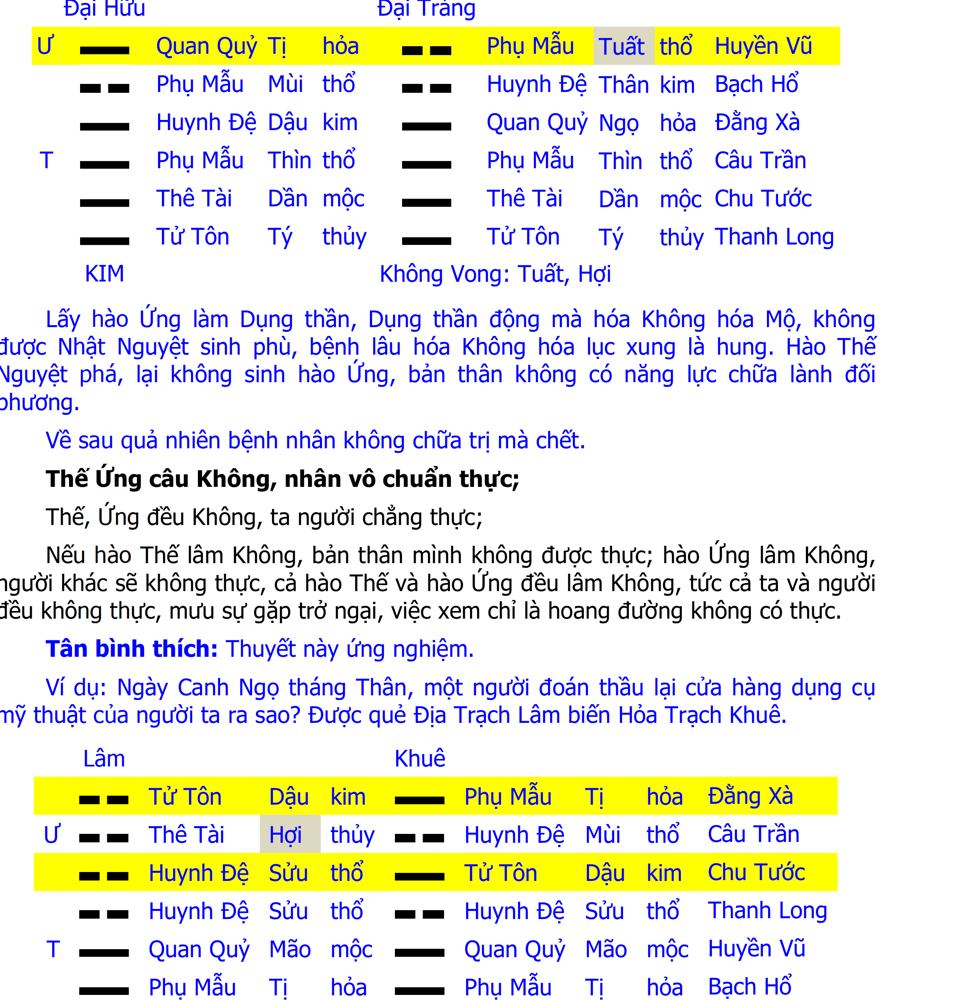

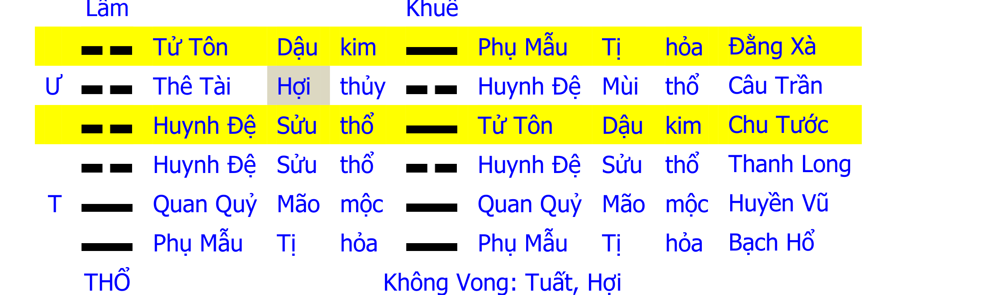 quái tam hợp cục khắc hào Thế, hào Thế vô lực sinh hào Phụ Mẫu, bản thân khó mà 
nhận được cửa hàng này.

Về sau bởi vì vợ chồng đối phương ầm ĩ ly hôn nên không đạt được thoả thuận 
chuyển nhượng cửa hàng.

Nội ngoại cạnh phát, sư tất phiên đằng.

Nội ngoại đều động, việc ắt ngửa nghiêng.

Trong quẻ ít hào động, việc cát hung sẽ rõ ràng dễ phán đoán. Nếu quẻ nội quẻ 
ngoại đều có nhiều hào động, chủ về lành dữ khó lường, sự việc bất ổn, tráo trở đa 
biến, là tượng rất bất định. Nên xem thêm một quẻ nữa để hợp hai quẻ mà quyết 
đoán.

Thế hoặc giao trùng, lưỡng mục cố chiêm ư mà thủ; Ứng như phát 
động, nhất tâm tự thác ư viên phan.

Hào Thế giao, trùng, hai mắt ngoảnh nhìn theo đầu ngựa; hào Ứng phát động, 
gửi lòng cho con vượn leo trèo.

Chú giải trong sách gốc: Hào Thế hào Ứng đều không nên động. Nếu động (giao, 
trùng tức hào động), sự việc sẽ tráo trở bất thường, như đầu ngựa ngó nghiêng, như 
lòng con vượn bất định.

Dã Hạc lão nhân bàn rằng: Ta không dám khẳng định câu này là đúng hay sai. 
Nhưng thuyết này chỉ đúng khi Dụng thần không vượng, đại tượng không thành. Nếu 
Dụng thần đắc địa, đại tượng sẽ thành, hào Thế động mà không bị khắc chế, hào Ứng 
động mà tương sinh, tương hợp với hào Thế, sự việc sẽ thành tựu nhanh chóng hơn.

**Tân bình thích:** Đối với động tĩnh biến hóa của Thế Ứng, cần phải xem ảnh 
hưởng của chúng đối với Dụng thần. Ứng động sinh Dụng, làm việc thường được 
người khác giúp đỡ, được người khác nâng đỡ mà thành công; Thế động sinh Dụng, 
tự mình nỗ lực mà thành. Động mà thương khắc Dụng thần, chính là bản thân hoặc 
đối phương thay đổi chủ ý, sự vật phát sinh biến đổi.

Dụng hào hữu khí vô tha cố, sở tác giai thành; chủ tượng đồ tồn cánh bị 
thương, phàm mưu bất toại.

Dung thần hữu khí, không tổn hại, sự việc sẽ thành; chủ tượng vô dụng, lại bị 
thương, mưu sự thất bại.

Dụng thần và chủ tượng đều chỉ hào chủ sự, nếu là vượng tướng hoặc được sinh 
phò, hữu khí, đồng thời không bị hào khác khắc chế, thì sự việc tất thành; nếu suy 
nhược, vô lực, lại bị khắc thương, tuy có xuất hiện cũng vô dụng.

Hào ngộ Tuần Không, Không phùng xung nhi hữu dụng;

Hào gặp Tuần Không, Không gặp xung lại thành hữu dụng;

Hào gặp Tuần Không, nếu bị Nhật thần tương xung, sẽ là "xung Không tắc thực" 
(Không bị xung trở thành thực), không những không còn bị Không, mà lại trở nên hữu 
dụng. Nếu là hào động lâm Không, bị Nhật thần xung lại thành thực.

**Tân bình thích:** Thuyết này tuy quen thuộc, nhưng cũng có lúc trong xung chứa 
khắc, gặp xung bất khởi. Người xưa còn có thuyết Dụng thần không vượng Không 
Vong, gặp xung mà xung khởi một nửa sức lực.

### Ví dụ: Ngày Kỷ Hợi tháng Bính Ngọ năm Đinh Sửu, một người phụ nữ đoán con

thi cấp ba ra sao? Được quẻ Trạch Địa Tụy biến Hỏa Địa Tấn.

Tụy 
 
Tấn

Phụ Mẫu | Mùi | thổ | Quan Quỷ | Tị | hỏa Câu Trần

Ư | Huynh Đệ | Dậu | kim | Phụ Mẫu | Mùi | thổ | Chu Tước

Tử Tôn | Hợi | thủy | Huynh Đệ | Dậu | kim Thanh Long

Thê Tài | Mão | mộc | Thê Tài | Mão | mộc | Huyền Vũ

T | Quan Quỷ | Tị | hỏa | Quan Quỷ | Tị | hỏa Bạch Hổ

Phụ Mẫu | Mùi | thổ | Phụ Mẫu | Mùi | thổ | Đằng Xà

KIM 
Không Vong: Thìn, Tị

Phụ Mẫu là thành tích, Quan Quỷ là thứ bậc, lấy Quan Quỷ Phụ Mẫu làm Dụng. 
Phụ Mẫu lưỡng hiện, lấy hào 6 Phụ Mẫu Mùi thổ phát động làm Dụng, Nguyệt kiến 
sinh hợp, lại tự động hóa hồi đầu sinh, đề thi đã quen mà thành tích tốt. Quan Quỷ Tị 
hỏa trì Thế, được Nguyệt trợ giúp Nhật xung là ám động.

Quan Quỷ trì Thế vốn là tốt, nhưng không nên Không Vong, Nhật thần trong 
xung có khắc. Trong xung có khắc, chỉ có thể xung khởi một nửa sức mạnh, không 
thể xung thực toàn bộ. Hỏa chủ số 2, một nửa là 1, cho nên đoán con trai người này 
ngày thường học tập chăm chỉ, thành tích thi cử lần này cũng không tệ, nhưng sợ là 
kém một điểm nên không đậu.

Kết quả là thiếu một điểm nên không đậu cấp ba.

### Ví dụ này chính là Không Vong mà không xung thực toàn bộ, gặp xung mà vô

dụng.

Hợp tao phá dĩ vô công.

Hợp gặp phá cũng chỉ uổng công.

Trong sách gốc chú rằng: Hào gặp tương hợp như hai người đồng lòng, sự việc 
sẽ tốt đẹp. Nếu bị Nhật thần, Nguyệt kiến, hào động xung khắc, sẽ trở thành "hợp xứ 
phùng xung" (chỗ hợp gặp xung), cần đề phòng tiểu nhân quấy rối, phá vỡ trạng thái 
hòa hảo, sinh lòng nghi kỵ. Ví dụ xem về việc của bản thân, sẽ dễ bị người ngoài gây 
cản trở, khiến sự việc khó thành.

**Dã Hạc bàn rằng:** Theo kinh nghiệm của ta, tam hợp, lục hợp trước mắt không 
nên bị Nhật thần, Nguyệt kiến, hào động xung khắc, nhưng nếu ngày sau gặp được 
ngày, tháng xung khai sẽ tốt, trường hợp đó gọi là "hợp gặp xung phá sẽ thành 
công". Ví dụ, trong quẻ có hào Dần hợp với hào Hợi, nếu xem vào ngày tháng Thân, 
Tị thì Thân xung Dần, Tị xung Hợi, trường hợp này là "chỗ hợp gặp xung"; nếu Nhật 
thần, Nguyệt kiến không phải là Thân, Tị, đợi đến ngày sau, gặp được ngày hoặc

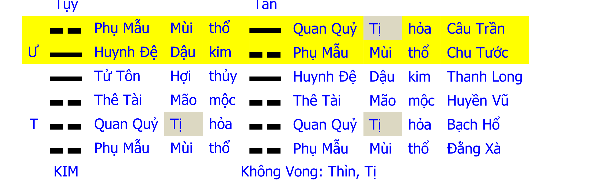 tháng Thân, Tị xung khai, sự việc sẽ thành, trường hợp này là "hợp gặp xung phá sẽ 
thành công".

Sách xưa cho rằng hào tĩnh cũng có thể hợp là sai. Hai hào động mới có thể hợp.

**Tân bình thích:** Không cần hai hào đều động. Dụng thần không động, nếu có 
hào động đến hợp là gặp hợp, Dụng thần động mà hóa hợp cũng là gặp hợp. Đây là 
quan hệ bị động và chủ động. Trong bình thích trước đây đã từng đưa ra ví dụ về vấn 
đề này.

Động Không, hóa Không, giai thành hung cát;

Hào động Không, hào biến Không, đều thành hung hoặc cát;

Câu này vốn trong sách gốc viết là: "Động không, hóa Không, giai thành hung 
cữu" (động Không, hóa Không, đều là điềm xấu). Theo kinh nghiệm của ta, thì hào 
động sẽ không bị Không, động mà hóa thành Không, cũng không bị Không, điềm cát 
hay điềm hung sẽ ứng vào ngay xung Không, thực Không.

**Tân bình thích:** Thuyết này có lý.

### Ví dụ: Ngày Mậu Tý tháng Mão, một người làm công ty bảo hiểm đoán gần đây

tài vận ra sao? Được Địa Lôi Phục biến Khôn Vi Địa.

Phục
 
Khôn

Tử Tôn | Dậu kim | Tử Tôn | Dậu kim Chu Tước

Thê Tài | Hợi thủy | Thê Tài | Hợi thủy Thanh Long

Ư | Huynh ĐệSửu thổ | Huynh ĐệSửu thổ Huyền Vũ

Huynh ĐệThìn thổ | Quan QuỷMão mộc Bạch Hổ

Quan QuỷDần mộc Phụ-Tị | Phụ Mẫu Tị | hỏa Đằng Xà

T | Thê Tài | Tý | thủy | Huynh ĐệMùi thổ Câu Trần

THỔ
Không Vong: Ngọ, Mùi

Lấy Tài làm Dụng, Thê Tài Tý thủy được Nhật tỉ phù, trì Thế, gần đây có tiền. 
Nhưng hào Tài động mà hóa Không, xuất Không có thể được.

Về sau ở ngày Ất Mùi được 6000 nguyên.

Hình hợp khắc hợp, chung kiến quai dâm.

Hợp gặp hình, hợp gặp khắc, gặp kết cục trái ngang.

Nguyên trong sách chú rằng: Hợp là hòa hợp, gặp được là tốt. Thực không hiểu 
được rằng, trong hợp có hình có khắc, thì cũng không coi là hợp. Ví dụ, dùng Ngọ làm 
hào Tài, Mùi là Phúc thần (Tử Tôn), Ngọ Mùi hợp nhưng do Ngọ tự hình, nên Ngọ Mùi 
gọi là hình hợp, không được coi là hợp, mà coi là hình.

Dã Hạc lão nhân bàn rằng: Ngọ đã là tự hình, tức bản thân đã tự mang họa hình 
hại. Nếu được Phúc thần tương hợp, nghĩa là cái họa đó được cứu giải. Nếu cho là 
không tốt, là sai.

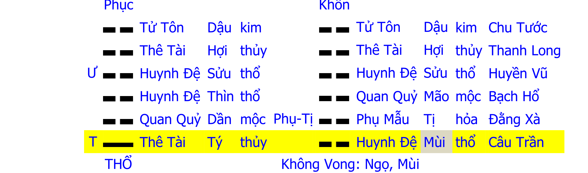

Ta nghiệm chứng qua một quẻ, có hào Thế Ngọ hỏa, động hóa thành Mùi, tương 
hợp. Người này vốn đã bị khép trọng tội, nhưng về sau vẫn được xá miễn.

**Tân bình thích:** Ở đây lời văn biểu đạt có phần không ổn. Ngũ hành sinh khắc 
là chủ, hình là thứ yếu. Tị hợp với Thân là hình hợp. Mão hợp với Tuất, Tý hợp với 
Sửu là khắc hợp. Xem hào nào là Dụng thần, Dụng thần vượng tướng ra sao, không 
thể chỉ lấy hình mà phán đoán cát hung của sự việc.

### Ví dụ: Ngày Đinh Tị tháng Tý, đoán bản thân đau dạ dày đã lâu khi nào khỏi?

Được Trạch Sơn Hàm.

Hàm

Ư | Phụ Mẫu Mùi thổ | Thanh Long

Huynh ĐệDậu kim | Huyền Vũ

Tử Tôn | Hợi thủy | Bạch Hổ

T | Huynh ĐệThân kim | Đằng Xà

Quan QuỷNgọ hỏa Tài-Mão Câu Trần

Phụ Mẫu Thìn thổ | Chu Tước

KIM
Không Vong: Tý, Sửu

Hào Thế làm Dụng thần, Nhật thần hợp, bệnh lâu tất khỏi, nhưng trong hợp có 
hình lại có khắc, gọi là hình hợp khắc hợp, tuy có lúc không đau nhưng khó có kỳ hạn 
khỏi bệnh triệt để. Cần phải từ từ điều dưỡng.

Sau ở tháng Sửu có chuyển biến tốt. Chính là lúc hào Thế được sinh.

Động phùng hợp nhi bán trụ;

Hào động gặp hợp sẽ bị ràng buộc;

Nguyên trong sách chú rằng: Kỵ thần động, gặp Nhật thần, Nguyệt kiến tương 
hợp, sẽ không gây hung hại; Nguyên thần động, được Nhật thần, Nguyệt kiến tương 
hợp, sẽ không còn sức phò trợ.

Sách nói như vậy là hữu lý. Nhưng theo kinh nghiệm của ta, sau đợi đến ngày, 
tháng xung khai, thì việc cát việc hung sẽ thành.

### Ví dụ: Ngày Canh Dần tháng Mùi, xem về vận làm quan, được quẻ Cách biến Ký

Tế:

Cách
 
Ký Tế

Quan QuỷMùi thổ | Huynh ĐệTý | thủy Đằng Xà

Phụ Mẫu | Dậu kim | Quan QuỷTuất thổ | Câu Trần

T

Huynh ĐệHợi thủy | Phụ Mẫu | Thân kim Chu Tước

Huynh ĐệHợi thủy Tài-Ngọ | Huynh ĐệHợi | thủy Thanh Long

Quan QuỷSửu thổ | Quan QuỷSửu | thổ | Huyền Vũ

Ư

Tử Tôn | Mão mộc | Tử Tôn | Mão mộc Bạch Hổ

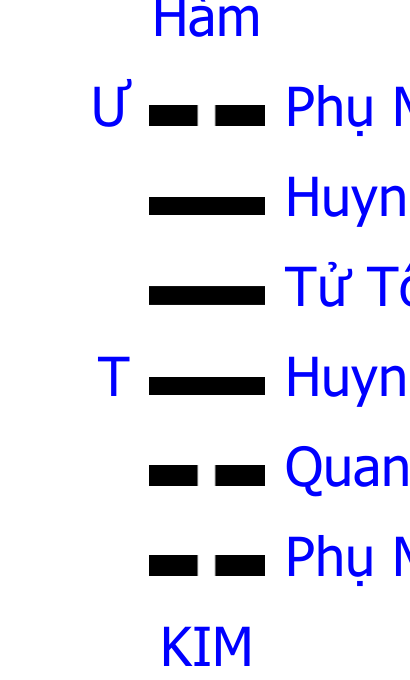

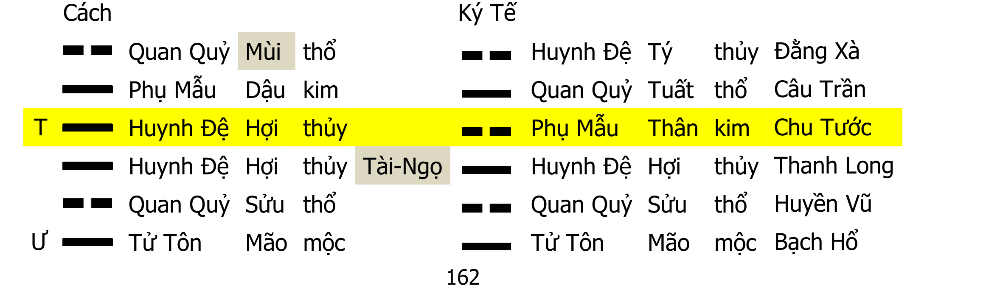

Đoán rằng: Hào Thế tại Hợi thủy, năm nay Thái Tuế ở Tý, nên được Thái Tuế 
nâng đỡ. Hào 5 là Dậu kim tuy không động nhưng cũng có ý sinh hào Thế. Hào Thế 
động hóa hồi đầu sinh, lại được Nhật thần (Dần) tương hợp. Hào 6 Mùi thổ là Quan 
tinh, đang đắc vị (là Nguyệt kiến), nên đường hoạn lộ thênh thang, thuận buồm xuôi 
gió. Nhưng Huynh Đệ trì Thế, hào Tài phục dưới Hợi thủy lại bị khắc, nên quẻ không 
được trọn vẹn.

Người này bèn hỏi: "Ngày sau sẽ ra sao?" Ta đáp rằng: "Nên đề phòng năm Tị, 
Thái Tuế xung Hợi, hình Thân, không những không được thăng chức vinh quy, mà 
còn mất mát sạch không." Quả nhiên đến năm Tị bị luận tội, nghiệp quan chấm dứt. 
Ấy là do hào Thế gặp hợp bị ràng buộc, trước mắt vẫn không có gì đáng ngại, nhưng 
đến năm tháng xung khai, việc hung sẽ đến.

**Tân bình thích:** Ví dụ này phán đoán có sai lầm. Hoạn lộ bằng phẳng, tại sao 
sau đó lại mất quan? Quan Quỷ Sửu thổ Nguyệt phá, Mùi thổ Không Vong, Nhật thần 
khắc Quan, Hợi thủy động mà khắc Nguyên thần của Quan, chính là điềm báo mất 
quan. Bởi vì Dần Hợi hợp, năm Tị xung khai Hợi thủy, Hợi thủy đi khắc Nguyên thần 
của Quan, Quan không được sinh, vì vậy mà mất quan.

Tĩnh đắc xung nhi ám hưng.

Hào tĩnh bị xung là ám động.

Đã được trình bày rõ tại chương "Ám động".

Nhập Mộ nan khắc;

Nhập Mộ thì khó khắc;

Nguyên trong sách chú rằng: Mộ là ngưng trệ. Nếu Kỵ thần nhập Mộ, sẽ không 
khắc được Dụng thần.

### Ví dụ, mộc là Dụng thần, kim là Kỵ thần, nếu xem vào ngày Sửu, thì kim nhập

Mộ tại Sửu, nên không khắc được Dụng thần mộc.

Tương tự, trong quẻ nếu có hào Sửu phát động, thì Kỵ thần kim cũng nhập Mộ 
mà không khắc được Dụng thần. Trường hợp hào kim động mà hóa ra hào Sửu cũng 
vậy.

**Dã Hạc bàn rằng:** Đúng thì cũng có đúng, nhưng thường thấy về sau, đến ngày 
xung khai Mộ khố, thì mộc vẫn bị kim khắc.

Đới vượng phi Không.

Vượng tướng thì chẳng Không.

Vượng, tức hào vượng tướng, nếu có gặp Tuần Không, cũng không coi là bị 
Không. Nếu lâm Không mà được Nhật thần xung, tức "Không gặp xung lại thành hữu 
dụng", về sau, gặp ngày xung hào lâm Không, gọi là "xung khởi". Qua tuần đó được 
gọi là xuất Không, gọi là "điền thực", cả ba trường hợp đó đều không coi là bị Không. 
Nếu hào vượng tướng lại là hào động, thì càng không bị Không.

**Tân bình thích:** Trong các ví dụ tôi được nghiệm, có trường hợp hôm đó xung 
thực nhưng chỉ xung khởi một nửa sức mạnh, có trường hợp hôm đó gặp xung nhưng 
không ứng hôm đó mà sau này lại ứng thực Không. Hào vượng tướng, hôm đó là được xung thực, trong xung có khắc, chỉ xung khởi một nửa sức mạnh, ngày khác lại 
thực Không mà ứng sự việc. Có điều là đã ứng xung thực, lại ứng thực Không. Huyền 
diệu của quẻ, cần phải thưởng thức cẩn thận.

### Ví dụ: Ngày Đinh Hợi tháng Thìn năm 1997, một người xem đòi nợ, được Khảm

biến Sư.

Khảm
 
Sư

T | Huynh Đệ | Tý | thủy | Phụ Mẫu | Dậu kim | Thanh Long

Quan Quỷ | Tuất thổ | Huynh Đệ | Hợi | thủy | Huyền Vũ

Phụ Mẫu | Thân | kim | Quan Quỷ | Sửu thổ | Bạch Hổ

Ư | Thê Tài | Ngọ | hỏa | Thê Tài | Ngọ hỏa | Đằng Xà

Quan Quỷ | Thìn | thổ | Quan Quỷ | Thìn | thổ | Câu Trần

Tử Tôn | Dần | mộc | Tử Tôn | Dần mộc | Chu Tước

THỦY
Không Vong: Ngọ, Mùi

Lấy Tài làm Dụng, Tài lâm hào Ứng, hào Thế khắc, chính là khắc Tài ở trên Ứng, 
là tượng mình lấy lại tiền ở đối phương, khoản nợ có thể thu hồi. Tài khố phát động, 
hào Tài nhập Mộ, Tài khố là ngân hàng, hiện tại Nguyệt phá nên Tài xuất ra, chính là 
rút tiền từ ngân hàng trả anh ta. Thê Tài Ngọ hỏa Không Vong, hôm sau là ngày Tý 
xung Không tắc thực, nhưng hào Tài hưu tù, chỉ có thể xung khởi một nửa sức mạnh, 
được trả phân nửa số tiền. Đến ngày Ngọ thực Không, có thể được trả phần còn lại.

### Ví dụ này rất nghiệm. Người này cho người ta vay 20 ngàn nguyên, hôm sau

người vay tiền rút ngân hàng trả anh ta 10 ngàn, ngày Ngọ trả một nửa còn lại.

Hữu trợ hữu phù, suy nhược hưu tù diệc cát;

Được nâng đỡ, phù trợ, dù là hào suy nhược, hưu tù cũng tốt;

Đây là nói về hào chủ sự. Nếu hào chủ sự vô khí là điềm không tốt, nhưng nếu 
được Nhật thần hay hào động sinh phò, củng hợp, tức được trợ giúp, bổ cứu cho sự 
bất cập, thì cũng trở nên tốt đẹp.

Tham sinh tham hợp, hình xung khắc hại giai vong.

Tham sinh, tham hợp, hình, xung, khắc, hại đều quên.

Câu này cũng đề cập đến hào chủ sự. Ví như hào chủ sự tại Mão mộc, gặp hào 
Thân động mà khắc. Trong quẻ nếu có hào Hợi thủy động thì Thân kim tham được 
Hợi thủy tương sinh mà quên khắc Mão mộc. Lại như hào chủ sự là Tý thủy, gặp hào 
Mão mộc động mà tương hình, nếu trong quẻ có hào Tuất thổ động, thì Mão tham 
hợp với Tuất mà quên hình Tý, như vậy là tham hợp quên hình. Lại như hào Thế tại Tị 
hỏa, trong quẻ lại xuất hiện hào Dần mộc động, vốn dĩ Dần hình Tị, nhưng lại có Dần 
mộc sinh Tị hỏa, nên cũng là tham sinh quên hình.

Lại ví dụ Dụng thần tại hào Tị, trong quẻ xuất hiện hào Hợi thủy xung khắc Tị 
hỏa, nếu lại có hào Mão mộc động, thì Hợi, Mão, Mùi sẽ hợp thành mộc cục, sinh ra

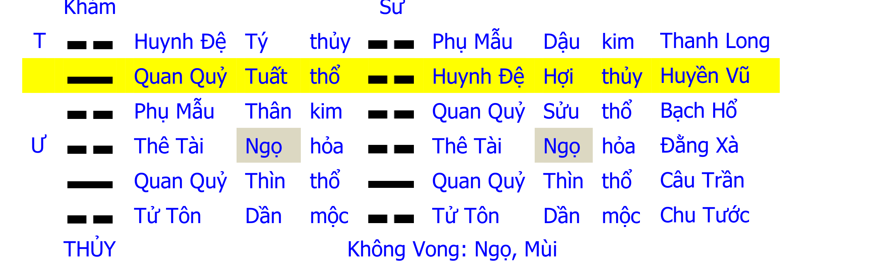 hỏa, như vậy là tham hợp quên khắc quên xung. Những trường hợp khác cũng loại 
suy từ đây.

**Tân bình thích:** Tham hợp gặp xung khai sẽ hung; nếu Nguyên thần hưu tù 
Không Phá, Dụng thần quá nhược, thì cũng không thể gọi là tham sinh quên khắc.

### Ví dụ: Ngày Ất Dậu tháng Mão, một bà cụ xem cháu trai bị lạc ngày nào có thể

tìm lại được? Được Hoán biến Tốn.

Hoán
 
Tốn

Phụ Mẫu | Mão mộc | Phụ Mẫu | Mão mộc Huyền Vũ

T | Huynh ĐệTị | hỏa | Huynh ĐệTị | hỏa Bạch Hổ

Tử Tôn | Mùi thổ Tài-Dậu | Tử Tôn | Mùi thổ | Đằng Xà

Huynh ĐệNgọ | hỏa Quan-Hợi | Thê Tài | Dậu kim Câu Trần

Ư | Tử Tôn | Thìn thổ | Quan QuỷHợi thủy Chu Tước

Phụ Mẫu | Dần | mộc | Tử Tôn | Sửu thổ | Thanh Long

HỎA
Không Vong: Ngọ, Mùi

Lấy Tử Tôn làm Dụng thần, Tử Tôn lưỡng hiện, lấy Mùi thổ Không Vong làm 
Dụng. Nguyệt kiến khắc, hào 6 Mão mộc ám động lại khắc, không cát. Chỗ hy vọng là 
Nguyên thần ngọ phát động, hào 6 Mão mộc tham sinh quên khắc, ngày Ngọ xuất 
Không có thể tìm được.

Ngày Ngọ xuất Không, đã tìm thấy cháu, nhưng lại là thi thể.

Biệt suy vượng dĩ minh khắc hợp; biện động tĩnh dĩ định hình xung.

Phân biệt suy vượng để làm rõ khắc hợp; phân biệt động tĩnh để xác định hình 
xung.

Về vượng, suy, khắc, hợp, đã trình bày kỹ trong chương "Ngũ hành sinh khắc", 
"Tứ thời vượng tướng"; còn về động tĩnh, hình xung, xin xem chương "Động biến".

Tịnh bất tịnh xung bất xung, nhân đa tự nhãn; hình phi hình, hợp phi 
hợp, vị thiếu chi thần.

Tịnh không phải tịnh, xung chẳng phải xung, là do nhiều chữ; Hình không nên 
hình, hợp chẳng nên hợp, vì thiếu thần chi.

Nguyên trong sách chú rằng: Khi quẻ đã thành, khó tránh được hình, xung, tịnh, 
hợp. Nhưng nhiều hơn một chữ, hay thiếu đi một chữ, cũng khó thành được tên gọi 
hình, xung, tịnh, hợp.

### Ví dụ xem vào ngày Tý, được quẻ có một hào Tý thì gọi là tịnh (sánh đôi). Nhưng

nếu trong quẻ có hai hào Tý, là phân đôi mà thành thái quá, tuy vẫn gọi là tịnh, 
nhưng kỳ thực Không còn là tịnh nữa. Hai hào Ngọ thì không xung, hai hào Sửu thì 
không hợp, hai hào Mão thì không hình, hai hào Tị thì không khắc. Đó là vì nhiều hơn 
một chữ mà không thành được tên gọi hình, xung, khắc, hợp.

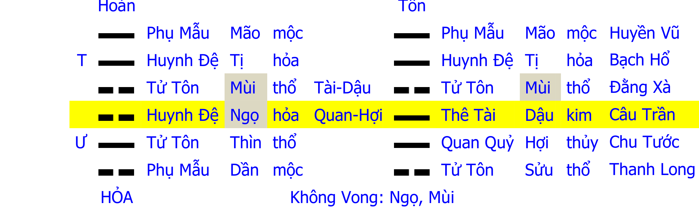

Dã Hạc lão nhân nói: Nếu trong quẻ có một hào Tý sẽ không hợp được với hai 
hào Sửu, nên gọi là "cấu hợp", mà không thành hợp, nói như vậy cũng có lý. Còn nếu 
cho rằng Nhật thần không thể sánh đôi với hai hào Tý trong quẻ, không thể xung 
được hai hào Ngọ trong quẻ, là sai. Nhật, Nguyệt cũng như trời, dưới trời không đâu 
không được chịu ơn mưa móc, nếu không, thì sao có thể cho rằng Nhật, Nguyệt có 
thể kiểm soát được thiện ác trong sáu hào.

### Ví dụ: Ngày Nhâm Tý tháng Sửu, xem về kiện tụng, được quẻ Độn:

Độn

Phụ Mẫu Tuất thổ | Bạch Hổ

Ư | Huynh ĐệThân kim | Đằng Xà

Quan QuỷNgọ hỏa | Câu Trần

Huynh ĐệThân kim | Chu Tước

T | Quan QuỷNgọ hỏa Tài-Dần Thanh Long

Phụ Mẫu Thìn thổTử-Tý | Huyền Vũ

KIM
Không Vong: Dần, Mão

Đoán rằng: Hào Thế tại Ngọ hỏa hưu tù bị Nhật thần Tý tương xung, do hưu tù 
nên là Nhật phá, không phải là ám động. Hôm nay xét xử, ắt sẽ bị bắt tội. Quả nhiên 
hôm đó lên quan, bị phạt hai mươi trượng. Trong quẻ có hai hào Ngọ, nhưng sao có 
thể cho rằng một hào Tý không xung nổi hai hào Ngọ?

**Tân bình thích:** Thuyết này câu nệ vào lý luận cát hung sinh khắc, từ góc độ 
tượng mà nói, một chi hợp hai chi đều có thể được.

### Ví dụ: Ngày Tân Dậu tháng Tý, một người phụ nữ đoán ngoại tình, được Phệ Hạp

biến Đại Súc.

Phệ Hạp
 
Đại Súc

Tử Tôn | Tị | hỏa | Huynh ĐệDần mộc Đằng Xà

T | Thê Tài | Mùi thổ | Phụ Mẫu | Tý | thủy Câu Trần

Quan QuỷDậu | kim | Thê Tài | Tuất thổ | Chu Tước

Thê Tài | Thìn thổ | Thê Tài | Thìn thổ | Thanh Long

Ư | Huynh ĐệDần | mộc | Huynh ĐệDần mộc Huyền Vũ

Phụ Mẫu | Tý | thủy | Phụ Mẫu | Tý | thủy Bạch Hổ

MỘC 
Không Vong: Tý, Sửu

Lấy Quan làm Dụng. Hào Thế là người xin đoán, Quan Quỷ là tình nhân của 
người này. Nhật Quan Quỷ và Quan Quỷ trong quẻ giống nhau, cùng hợp Thê Tài 
Thìn thổ, theo phép xưa thì không thể hợp, thật không biết rằng mỗi Quan Quỷ đều có 
ý nghĩa của riêng nó.

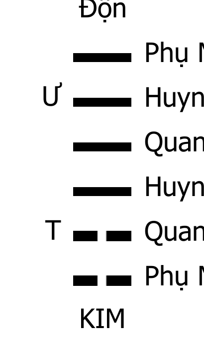

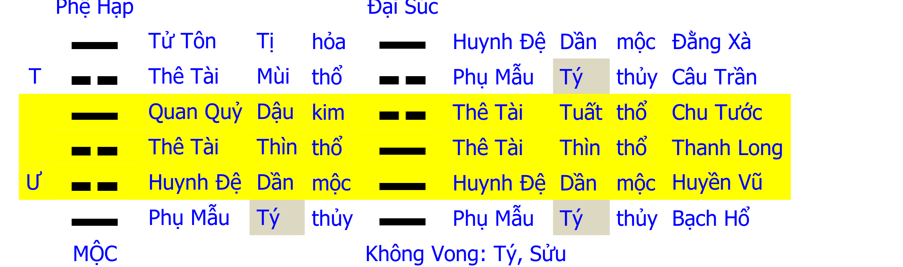

Quan Quỷ Dậu kim là đất Mộc Dục của hào Thế, lâm Chu Tước, Chu Tước là | khẩu thiệt (miệng lưỡi), Phệ Hạp là tượng mồm nhai cái gì đó, tôi đoán hai người đã | từng hôn nhau. Quan Quỷ Dậu kim lâm Chu Tước, động mà hóa Thê Tài, đối phương | đáp ứng cho cô ấy một khoản tiền.

Quan Quỷ Dậu kim và Thê Tài Thìn thổ tương hợp, đối phương là người có vợ. | Thê Tài Thìn thổ này là vợ của đối phương. Lâm Thanh Long, trông rất xinh đẹp. Nội | quái phục ngâm, gia đình đối phương bất hòa, Thê Tài Thìn thổ và Nhật tương hợp, | Nhật cũng là Quan Quỷ, vợ đối phương cũng có ngoại tình, cặp bồ với người đàn ông | khác.

Những suy đoán trên đây đều ứng nghiệm.

Lại nói: Dần, Tị, Thân là Tam hình, nếu có Dần, Tị mà không có Thân, hoặc có 
Dần, Thân mà không có Tị, tức thiếu một chữ mà không thành Tam hình. Lại như Hợi, 
Mão, Mùi là Tam hợp, nếu trong quẻ chỉ có hai mà thiếu một, cũng không thành Tam 
hợp. Như vậy là "Hình không nên hình, hợp chẳng nên hợp, vì thiếu thần chi".

Dã Hạc nói: Hai điều đó đều không thực đúng. Thiếu một là chờ để dùng, đợi 
đến ngày, tháng về sau, có thể điền đủ chỗ khuyết.

### Ví dụ: Ngày Kỷ Mùi tháng Tị, xem về bệnh lâu ngày, được quẻ Khốn biến Đoài:

Khốn
 
Đoài

Phụ Mẫu | Mùi | thổ | Phụ Mẫu | Mùi thổ | Câu Trần

Huynh Đệ | Dậu kim | Huynh Đệ | Dậu | kim | Chu Tước

Ư | Tử Tôn | Hợi | thủy | Tử Tôn | Hợi | thủy | Thanh Long

Quan Quỷ | Ngọ hỏa | Phụ Mẫu | Sửu thổ | Huyền Vũ

Phụ Mẫu | Thìn | thổ | Thê Tài | Mão | mộc | Bạch Hổ

T | Thê Tài | Dần mộc | Quan Quỷ | Tị | hỏa | Đằng Xà

KIM 
Không Vong: Tý, Sửu

Đoán rằng: Hào Thế tại Dần mộc hóa thành Tị. Dần có thể hình Tị trong Tam 
hình, nhưng thiếu một chữ Thân, nên đề phòng đến ngày Thân sẽ gặp nguy hiểm. 
Sau quả nhiên chết vào giờ Thân ngày Thân. Đó là thiếu một chữ Thân, đợi đến ngày 
Thân bổ khuyết, việc vẫn ứng nghiệm. Sao có thể cho rằng thiếu một chữ mà không 
trở thành Tam hình.

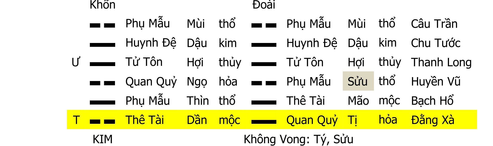

Lại ví dụ: Ngày Ất Tị tháng Dậu, xem về thăng chức, được quẻ Trạch Địa Tụy 
biến Thiên Địa Bĩ:

Tụy
 
Bĩ

Phụ Mẫu Mùi thổ | Phụ Mẫu Tuất thổ Huyền Vũ

Ư | Huynh ĐệDậu kim | Huynh ĐệThân kim Bạch Hổ

Tử Tôn | Hợi thủy | Quan QuỷNgọ hỏa Đằng Xà

Thê Tài | Mão mộc | Thê Tài | Mão mộc Câu Trần

T | Quan QuỷTị | hỏa | Quan QuỷTị | hỏa Chu Tước

Phụ Mẫu Mùi thổ | Phụ Mẫu Mùi thổ Thanh Long

KIM
Không Vong: Dần, Mão

Tị hỏa là Quan tinh trì Thế, lại gặp Nhật thần. Sách "Bốc thư" viết: "Hào Quan 
gặp Nhật thần, Nguyệt kiến ắt được thăng chức". Nhật thần Tị xung động hào Hợi, 
hợp với hào Mùi động, có cơ tạo thành Tam hợp mộc cục sinh Thế, nhưng vì còn thiếu 
Mão, nên đến tháng Mão sang năm ắt được thăng chức, đó là thiếu một chờ dùng. 
Sau quả nhiên được thăng chức vào tháng Mão. Như vậy, sao có thể nói rằng thiếu 
một chữ mà không thành Tam hợp.

**Tân bình thích:** Ví dụ đầu tiên, hào Thế hưu tù, nhập Nhật Mộ, động mà hóa 
Quỷ là hung. Ngày Thân vừa là tam hình lại là Tuyệt địa của hào Thế, vì vậy là hung. 
Đối với ví dụ thứ hai, Tử Tôn Hợi thủy là gian hào ám động khắc Quan, chính là sau 
lưng có người phản đối thăng quan cho người này, nhưng Phụ Mẫu Mùi thổ động hóa 
Tiến thần chế phục Tử Tôn, lại là tượng có người ra sức giúp đỡ. Tháng Mão thăng 
quan bởi vì Nguyên thần của Quan Quỷ là Mão mộc Nguyệt phá Không Vong, tháng 
Mão thực Phá thực Không mà ứng nghiệm. Ở đây chẳng phải là ứng tam hợp, thông 
thường địa chi ở giữa không động trong quẻ thì không trở thành "thiếu một chờ 
dùng".

Hào ngộ lệnh tinh, vật nan ngã hại;

Hào tại Nhật, Nguyệt, khó hại được ta;

Đã trình bày rõ tại các chương "Nhật thần", "Nguyệt tướng".

**Tân bình thích:** Chưa hẳn, đoán quẻ cần phải linh hoạt.

### Ví dụ: Ngày Nhâm Thân tháng Hợi, trong bệnh viện, một người phụ nữ đoán tuổi

thọ cho bà mẹ 92 tuổi, được quẻ Thủy Phong Tỉnh biến Phong Thiên Tiểu Súc. (Tị hỏa 
Nguyệt phá, Tuất Hợi Không)

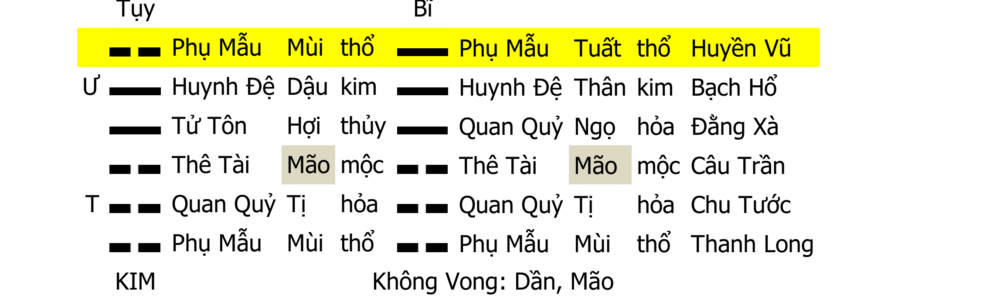

Tỉnh
 
Tiểu Súc

Phụ Mẫu Tý | thủy | Huynh ĐệMão mộc Bạch Hổ

T | Thê Tài | Tuất thổ | Tử Tôn | Tị | hỏa Đằng Xà

Quan QuỷThân kim Tử-Ngọ | Thê Tài | Mùi thổ Câu Trần

Quan QuỷDậu kim | Thê Tài | Thìn thổ Chu Tước

Ư | Phụ Mẫu Hợi | thủy Huynh-Dần | Huynh ĐệDần mộc Thanh Long

Thê Tài | Sửu thổ | Phụ Mẫu Tý | thủy Huyền Vũ

MỘC
Không Vong: Tuất, Hợi

Lấy hào Phụ Mẫu làm Dụng thần, trong quẻ hào Phụ Mẫu lưỡng hiện, một động 
một Không, lấy hào Ứng Tuần Không làm Dụng.

Dụng thần trị Nguyệt, Trường Sinh ở Nhật, lại có hào 6 Tý thủy động đến tỉ phù 
là vượng tướng. Trong quẻ Sửu động khắc Dụng thần, luận theo phép xưa thì hào lâm 
lệnh tinh, khó hại được ta, Sửu thổ này vô lực khắc Phụ Mẫu Hợi thủy. Thật không 
biết rằng tháng Sửu thổ vượng thủy nhược, Dụng thần bị khắc, ở tháng Sửu qua đời.

Phục cư Không địa, sự dữ tâm vi.

Hào Phục lâm Không, việc không toại nguyện.

Phục tức Phục thần, Phục thần mà lâm Không, chủ về sự việc khó thành. Xưa có 
để lại quẻ để chiêm nghiệm:

Ngày Bính Thân, xem về văn thư, được quẻ Địa Thiên Thái:

Thái

Ư | Tử Tôn | Dậu | kim | Thanh Long

Thê Tài | Hợi | thủy | Huyền Vũ

Huynh ĐệSửu thổ | Bạch Hổ

T | Huynh ĐệThìn thổ | Đằng Xà

Quan QuỷDần | mộc Phụ-TịCâu Trần

Thê Tài | Tý | thủy | Chu Tước

THỔ
Không Vong: Thìn, Tị

Xem về văn thư, lấy hào Phụ làm Dụng thần, nhưng Dụng thần không hiện trong 
quẻ, Tị hỏa là Phụ Mẫu, phục dưới hào 2 là Dần mộc, hào phục Tị hỏa lại lâm Không, 
nên việc văn thư không thành được.

**Dã Hạc bàn rằng:** Hào phục lại lâm Không thì việc chẳng thành là đúng. Nhưng 
trong quẻ này, văn thư không được, không phải vì gặp Tuần Không, mà do Phi thần 
tại Dần, Phục thần tại Tị, lại xem vào ngày Thân nên tạo thành Tam hình. Nếu không 
phải như thế, thì Nhật thần Thân xung động Dần mộc mà sinh Tị hỏa, như vậy gọi là 
Phi đến sinh Phục được Trường Sinh, Phục thần được Trường Sinh, sẽ trở nên hữu khí

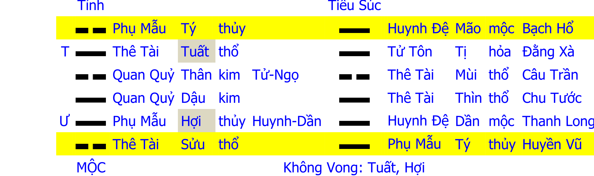

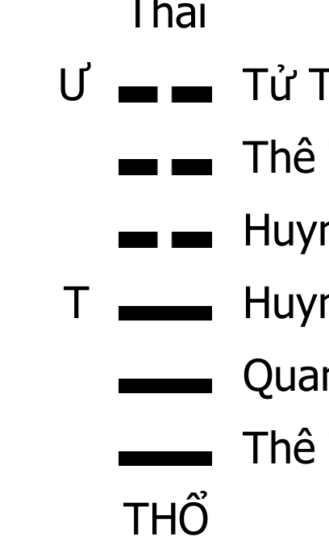 mà không bị Không. Nếu không, sao lại có câu "Phi chẳng xung khai cũng uổng công". 
Bởi vậy, ta mới nói rằng không phải tại Tuần Không, mà do Tam hình.

**Tân bình thích:** Thuyết này hữu lý, nhưng nhất thiết phải Dụng thần hưu tù vô 
khí. Nếu Dụng thần tuy phục, vượng mà có khí chưa hẳn không thành. Ví dụ trong 
sách không có Nguyệt kiến chỉ có Nhật thần, chưa đủ để làm căn cứ. Nếu là tháng Hợi 
Tý hoặc tháng Thân Dậu thì văn thư không thành, nếu là tháng Dần Mão, gặp tam 
hình cũng thành.

### Ví dụ: Ngày Bính Tý tháng Mùi, nam đoán vợ chồng bất hòa, được quẻ Mông.

Mông

Phụ Mẫu | Dần mộc | Thanh Long

Quan QuỷTý | thủy | Huyền Vũ

T | Tử Tôn | Tuất thổ Tài-Dậu Bạch Hổ

Huynh ĐệNgọ hỏa | Đằng Xà

Tử Tôn | Thìn thổ | Câu Trần

Ư | Phụ Mẫu | Dần mộc | Chu Tước

HỎA
Không Vong: Thân, Dậu

Lấy Thê Tài làm Dụng thần. Thê Tài Dậu kim phục dưới hào 4 Tử Tôn Tuất thổ, 
phục mà Không Vong, theo phép xưa tất không cát. Nhưng Dụng thần được Nguyệt 
sinh, Phi thần lại đến sinh, tuy Không nhưng không sao cả.

Dụng thần phục mà Không, là tượng vợ bỏ nhà ra đi, Dụng thần và hào 2 tương | hợp, hào 2 là Tử Tôn, lại là hào trạch (nơi ở), lâm Câu Trần, Câu Trần là cổ trướng | (phồng lên), tôi đoán người này cãi nhau với vợ, vợ đã bỏ về nhà mẹ đẻ, vợ đang | mang thai. Ứng khắc hào Thế, sư tử Hà Đông gầm, huống hồ lâm Chu Tước, đoán là | bà vợ dữ dằn thường chửi mắng anh ta.

Thế sinh Dụng thần, bản thân yêu thích vợ, có thể hòa hảo.

Tất cả đều nghiệm.

Phục vô đề huề chung đồ nhĩ; Phi bất xung khai diệc uổng nhiên.

Phục không nâng đỡ thành vô ích; Phi chẳng xung khai cũng uổng công.

Khi Dụng thần không hiện lên mà phục ở trong quẻ, nên được Nhật thần, Nguyệt 
kiến xung khai Phi thần, hoặc sinh, hợp, nâng đỡ Phục thần, Phục thần mới trở thành 
hữu dụng. Trong sách cổ có ghi lại quẻ sau:

Xem về văn thư, được quẻ Bí:

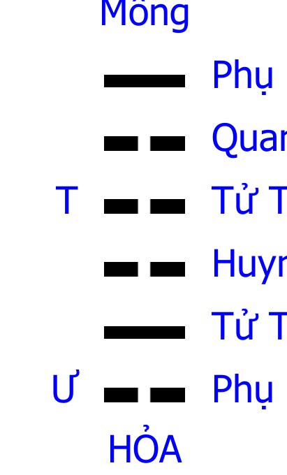

Bí

Quan QuỷDần mộc

Thê Tài 
Tý 
thủy

Ư | Huynh ĐệTuất thổ

Thê Tài 
Hợi thủy Tử-Thân

Huynh ĐệSửu thổ Phụ-Ngọ

T | Quan QuỷMão mộc

Lấy Phụ Mẫu làm Dụng thần, Phụ Mẫu Ngọ hỏa phục dưới hào Huynh Đệ Sửu 
thổ, có thể đoán có người nắm giữ văn thư, nếu xem tại ngày tháng Mùi, xung mất 
Phi thần Sửu thổ, hợp khởi Phục thần Ngọ hỏa, thì đoán là văn thư hữu dụng. Nếu 
xem tại ngày tháng Dần Mão, khắc mất Sửu thổ, sinh khởi Ngọ hỏa, cũng đoán làm 
văn thư hữu dụng. Ngoài ra phỏng theo như vậy.

**Tân bình thích:** Thuyết này có lý, nhưng cũng phải xem hỷ kỵ. Nếu Phi thần là 
Nguyên thần thì không nên Nguyệt kiến xung.

### Ví dụ: Ngày Nhâm Tý tháng Tị, Trương tiên sinh đoán điện thoại di động bị mất,

được quẻ Thiên Sơn Độn.

Độn

Phụ Mẫu Tuất thổ | Bạch Hổ

Ư | Huynh ĐệThân kim | Đằng Xà

Quan QuỷNgọ hỏa | Câu Trần

Huynh ĐệThân kim | Chu Tước

T | Quan QuỷNgọ hỏa Tài-Dần Thanh Long

Phụ Mẫu Thìn thổTử-Tý | Huyền Vũ

KIM
Không Vong: Dần, Mão

Lấy hào Tài làm Dụng thần. Dụng thần Thê Tài Dần mộc không hiện trên quẻ, | phục dưới hào 2 Quan Quỷ Ngọ hỏa, mặc dù Không Vong nhưng được Nhật thần sinh | phù, Nhật thần xung khai Phi thần, lại Dụng lâm Thanh Long phục dưới hào Thế đến | sinh hào Thế, vật bị mất có thể tìm lại.

Trong quẻ Quan Quỷ ám động, là điện thoại bị ăn trộm. Quan Quỷ lưỡng hiện, kẻ 
trộm có hai người. Quan Quỷ Ngọ hỏa lâm hào Thế, Quan lâm Nguyệt kiến, đều là 
thông tin người nội bộ hoặc người quen. Tử Tôn lâm Nhật xung Quan Quỷ, Tử Tôn là 
nhân viên công an, chứng tỏ đã báo án. Nhân viên công an đang tìm kẻ trộm.

Hào Phi Quan Quỷ Ngọ hỏa ám động, tiết khí Dụng thần, chứng tỏ kẻ trộm đang 
lén lút sử dụng điện thoại. Theo kết quả kiểm tra của cục điện tín, đúng là có người 
vẫn đang sử dụng điện thoại này. Qua điều tra của công an, ở tháng Mùi đã tìm được 
người sử dụng điện thoại, hóa ra là một hàng xóm chung sân với Trương tiên sinh. 
Nhưng người đó nhất định không chịu thừa nhận là điện thoại ăn trộm, nói là đã mua

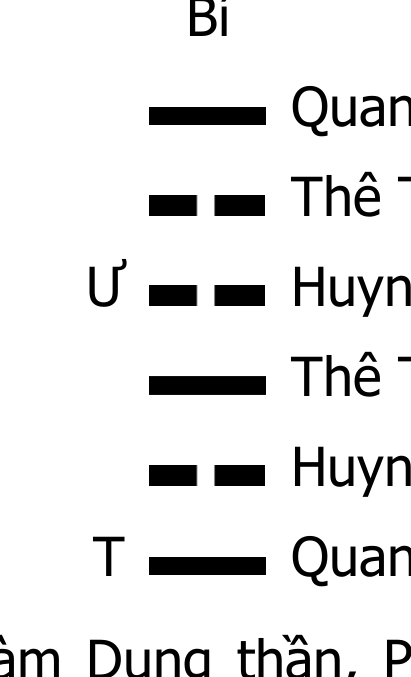

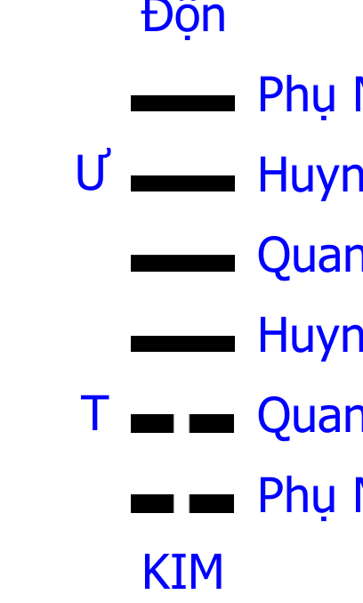 được từ trong tay một người khác. Hơn nữa cũng không thừa nhận có đồng bọn gây 
án.

Không hạ phục dịch vu dẫn bạt.

Phục ở dưới Không, dễ dàng xuất lộ.

Nếu Phục thần không bị Không mà Phi thần lâm Không thì Phục thần sẽ dễ dàng 
xuất hiện. Bởi Phi thần đã lâm Không, thì Phục thần không còn bị đè nén. Nếu Phục 
thần lại được Nhật thần, Nguyệt kiến sinh phò củng hợp, thì sẽ dễ dàng thoát ra.

**Tân bình thích:** Lý này chưa hẳn hoàn toàn đúng, phải xem hỷ kỵ của Phi thần 
đối với Dụng thần, nếu Phi là Nguyên thần thì không xem nhẹ Không, nếu Phi là Kỵ 
thần thì xem nhẹ Không. Tôi được nghiệm, Phi thần là Kỵ thần mà Không, Dụng thần 
hưu tù vẫn đa cát.

### Ví dụ 1: Ngày Nhâm Thìn tháng Dậu, đoán mất tiền, được Phong Thủy Hoán biến

Phong Trạch Trung Phu.

Hoán
 
Trung Phu

Phụ Mẫu Mão mộc | Phụ Mẫu Mão mộc Bạch Hổ

T | Huynh ĐệTị | hỏa | Huynh ĐệTị | hỏa Đằng Xà

Tử Tôn | Mùi thổ Tài-Dậu | Tử Tôn | Mùi thổ Câu Trần

Huynh ĐệNgọhỏa Quan-Hợi | Tử Tôn | Sửu thổ Chu Tước

Ư | Tử Tôn | Thìn thổ | Phụ Mẫu Mão mộc Thanh Long

Phụ Mẫu Dần mộc | Huynh ĐệTị | hỏa Huyền Vũ

HỎA
Không Vong: Ngọ, Mùi

Lấy Thê Tài làm Dụng thần. Dụng thần lâm Nguyệt Nhật thần sinh, Dụng thần 
vượng tướng, Phi thần Không Vong, dễ dàng xuất lộ, nhưng Phi là Nguyên thần, Kỵ 
thần trì Thế, Dần mộc một hào độc phát, là Tuyệt địa của Dụng thần, quẻ biến du 
hồn, không tìm được. Kết quả không tìm được.

### Ví dụ 2: Ngày Canh Dần tháng Canh Thìn năm Ất Hợi, nữ đoán sinh con, được

quẻ Hỏa Địa Tấn biến Hỏa Trạch Khuê.

Tấn 
 
Khuê

Quan Quỷ | Tị | hỏa | Quan Quỷ | Tị | hỏa Đằng Xà

Phụ Mẫu | Mùi | thổ | Phụ Mẫu | Mùi | thổ | Câu Trần

T | Huynh Đệ | Dậu kim | Huynh Đệ | Dậu kim | Chu Tước

Thê Tài | Mão | mộc | Phụ Mẫu | Sửu thổ | Thanh Long

Quan Quỷ | Tị | hỏa | Thê Tài | Mão | mộc | Huyền Vũ

Ư | Phụ Mẫu | Mùi | thổ | Tử-Tý | Quan Quỷ | Tị | hỏa Bạch Hổ

KIM 
Không Vong: Ngọ, Mùi

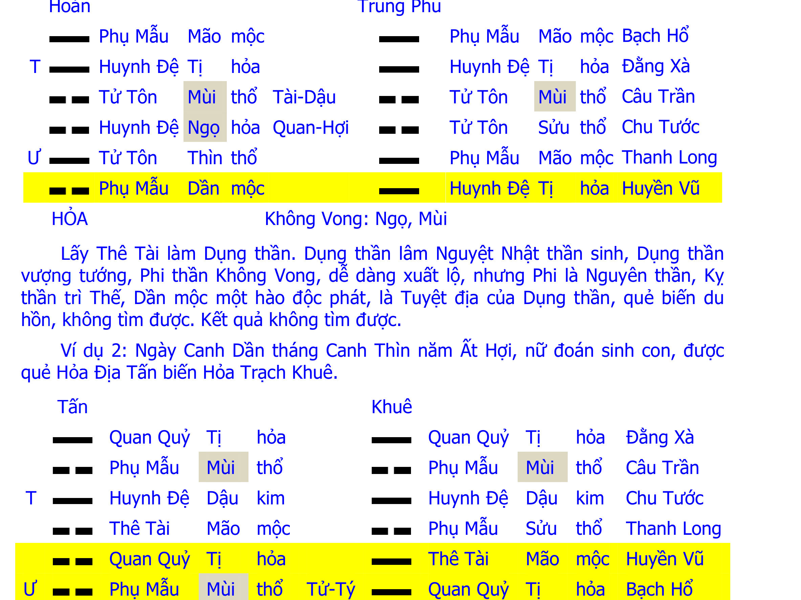

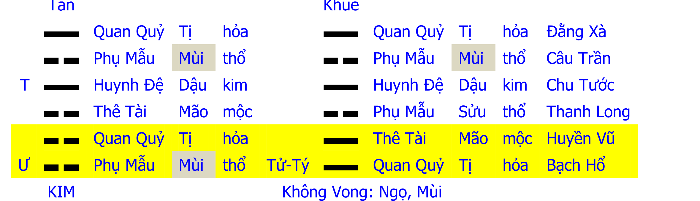

Lấy hào Tử Tôn làm Dụng thần. Tử Tôn Tý thủy phục dưới hào sơ Phụ Mẫu Mùi 
thổ, Phi thần phát động khắc Dụng thần, không cát. May mà Phi thần Không Vong, lại 
có Nhật thần chế phục, sách cổ nói: "Không hạ Phục thần, dịch vu dẫn bạt." Dụng 
thần phục mà được xuất. Tháng Ngọ Phi thần gặp hợp không khắc Phục thần, xung 
xuất Phục thần, sẽ sinh con ở tháng Ngọ.

Nơi xung gặp hợp, nơi hợp gặp xung, tháng Ngọ ngày Tý sinh ra tất ứng giờ Sửu, 
ngày Sửu sinh ra tất ứng giờ Tý. Ngày 14 tháng 6 là ngày Bính Tý, ngày 15 là ngày 
Đinh Sửu, nhất định ở hai ngày này con sẽ ra đời.

Phán đoán giới tính đứa con: Hào Tử Tôn hưu tù, lại là hào âm phát động, sinh 
con gái. Đồng thời nội quái quẻ âm biến quẻ âm, cũng là thông tin sinh con gái.

Tình hình ứng nghiệm: Giờ Tý ngày 15 tháng 6 (ngày Đinh Sửu tháng Ngọ), sinh 
một bé gái.

Chế trung nhược chủ, nan dĩ duy trì.

Chủ suy bị khắc, khó được duy trì.

Nếu Dụng thần hưu tù, lại bị Nhật thần, Nguyệt kiến khắc chế, thì cho dù có 
được sinh phù, sự việc cũng khó thành.

### Ví dụ: Ngày Bính Thìn tháng Thìn, bỗng thấy luồng sáng ngũ sắc hiện dưới lòng

đất, nghi có cổ vật, xem được quẻ Hỏa Trạch Khuê biến Cổ:

Khuê
 
Cổ

Phụ Mẫu | Tị | hỏa | Quan QuỷDần mộc Thanh Long

Huynh ĐệMùi thổ Tài-Tý | Thê Tài | Tý | thủy Huyền Vũ

T | Tử Tôn | Dậu kim | Huynh ĐệTuất thổ | Bạch Hổ

Huynh ĐệSửu thổ | Tử Tôn | Dậu kim Đằng Xà

Quan QuỷMão mộc | Thê Tài | Hợi | thủy Câu Trần

Ư | Phụ Mẫu | Tị | hỏa | Huynh ĐệSửu thổ | Chu Tước

THỔ
Không Vong: Tý, Sửu

Đoán rằng: Hào Tài phục, lại gặp Tuần Không, là tượng không có gì. Người xem 
hỏi: "Nếu không có của cải gì, sao lại xuất hiện ánh sáng ngũ sắc?" Ta đáp rằng: "Là 
yêu khí." Khi đó, mọi người đều ham được tiền của, nên bàn bạc tranh luận sôi nổi. 
Có người nói rằng: "Hào Tử Tôn động mà hào Huynh Đệ cũng động, là có hy vọng. 
Hào Huynh động sinh hào Tử, hào Tử động sinh hào Tài, trong quẻ Tị, Dậu, Sửu hợp 
thành tam hợp kim cục, kim sinh thủy thì Tài vượng, sao bảo là không có tiền tài?"

Ta bèn đáp rằng: "Anh biết một mà chẳng biết hai. Hào Tử Tôn tuy vượng, 
nhưng khó có thể sinh được hào Tài không gốc rễ. Hào Tài Tý thủy đã phục lại lâm 
Không, cộng thêm bị Nhật thần, Nguyệt kiến Thìn thổ và Phi thần Mùi thổ khắc chế, 
thì lấy đâu ra tiền tài."

Về sau, họ vẫn đào bới chỗ đó lên, được một cái chum vỡ, bên trong toàn bùn 
đất, ngói vụn.

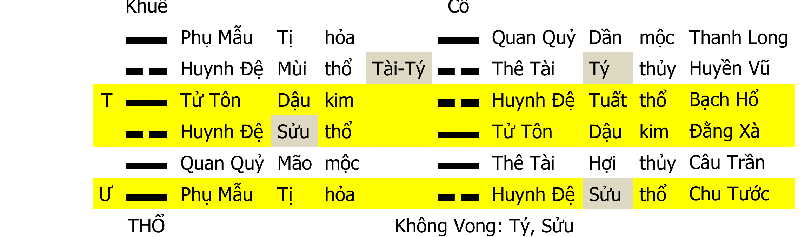

Nhật thương hào, chân ly kỳ họa; hào thương Nhật, đồ thụ kỳ danh,

Nhật thương hào mới thật là họa; hào khắc Nhật chỉ có hư danh.

Nhật thần, Nguyệt kiến như trời như vua, sáu hào trong quẻ như thần dân, như 
muôn vật. Nhật, Nguyệt có thể hình, xung, khắc hại các hào trong quẻ, còn các hào 
trong quẻ không thể hình, xung, khắc hại Nhật, Nguyệt.

Mộ trung nhân, bất xung bất phát;

Người trong Mộ không xung không phát;

Nguyên trong sách chú rằng: Khi Dụng thần nhập Mộ, sẽ bị cản trở, ngưng trệ, 
xem việc gì cũng chỉ tổ phí công vô ích. Cần được hào động, Nhật thần xung phá, 
hoặc khắc phá Mộ, Dụng thần mới có thể có lực.

### Ví dụ: Ngày Mậu Dần, xem về tiền của, được quẻ Đồng Nhân biến Càn:

Đồng Nhân
 
Càn

Ư | Tử Tôn | Tuất thổ | Tử Tôn | Tuất thổ | Chu Tước

Thê Tài | Thân | kim | Thê Tài | Thân | kim | Thanh Long

Huynh Đệ | Ngọ | hỏa | Huynh Đệ | Ngọ | hỏa | Huyền Vũ

T | Quan Quỷ | Hợi | thủy | Tử Tôn | Thìn | thổ | Bạch Hổ

Tử Tôn | Sửu | thổ | Phụ Mẫu | Dần | mộc | Đằng Xà

Phụ Mẫu | Mão | mộc | Quan Quỷ | Tý | thủy | Câu Trần

HỎA 
Không Vong: Thân, Dậu

Dụng thần Thân kim nhập Mộ tại hào động Sửu thổ, may được Nhật thần Dần 
khắc phá, nên sau vẫn đắc được tài.

Nếu đoán là Dụng thần gặp Tuần Không lại nhập Mộ nên không được tài là sai, là 
không hiểu rằng Không gặp xung sẽ thực (xung Không tắc thực); nhập Mộ nhưng gặp 
khắc phá, Mộ bị phá, Tài sẽ mở.

**Dã Hạc bàn rằng:** Thuyết này rất hữu lý, áp dụng lần nào cũng ứng nghiệm. Thế 
nhưng Dụng thần cũng phải hữu khí, mới có thể ứng nghiệm. Nếu như Dụng thần hưu 
tù lại không được trợ giúp, tuy đến ngày Mộ bị xung khai, Dụng thần cũng không thể 
phát huy tác dụng.

### Ví dụ: Vào ngày Mậu Thìn tháng Mùi, xem niên vận, được quẻ Phục biến Khiêm:

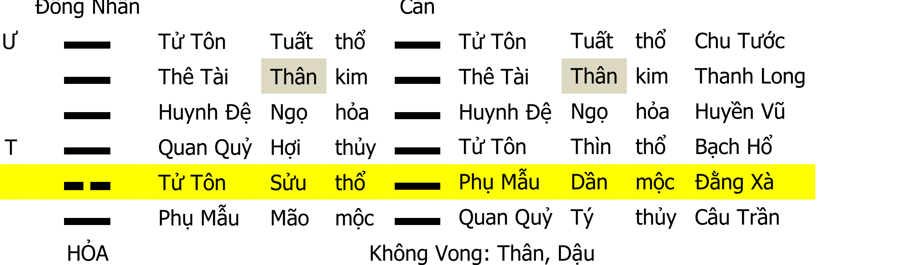

Phục
 
Khiêm

Tử Tôn | Dậu kim | Tử Tôn | Dậu kim Chu Tước

Thê Tài | Hợi thủy | Thê Tài | Hợi | thủy Thanh Long

Ư | Huynh ĐệSửu thổ | Huynh ĐệSửu thổ Huyền Vũ

Huynh ĐệThìn thổ | Tử Tôn | Thân kim Bạch Hổ

Quan QuỷDần mộc Phụ-Tị | Phụ Mẫu Ngọ hỏa Đằng Xà

T | Thê Tài | Tý | thủy | Huynh ĐệThìn thổ Câu Trần

THỔ
Không Vong: Tuất, Hợi

Đoán rằng: Hào Thế tại Tý thủy, tuy có Thân, Tý, Thìn hình thành tam hợp thủy 
cục, nhưng hiềm vì có Nhật thần Thìn thổ, Nguyệt kiến Mùi thổ khắc Thế. Hào Thế 
động hóa Thìn thổ, là hóa Mộ, cũng là hóa hồi đầu khắc, lại thêm hào động Thìn thổ 
tương khắc, như vậy là hào Thế hưu tù vô khí. Năm Mão xem quẻ, đến năm Ngọ thì 
chết, ứng vào năm Ngọ, vì là năm hào Thế gặp Tuế phá. Trong quẻ này, hào Thế 
nhập Mộ, nhưng sao có thể cho là "người trong Mộ không xung không phát"?

**Tân bình thích:** Ví dụ đầu tiên giải thích có một số thiếu sót. Sửu thổ tuy là Mộ 
khố của Dụng thần, nhưng cũng là Nguyên thần của Dụng thần, không nên bị khắc. Ví 
dụ đưa ra không có Nguyệt kiến, chỉ có thể làm tham khảo. Dụng thần ám động sinh 
Thế, cầu tài tất được. Nguyên thần Tử Tôn hóa hồi đầu khắc, xung mất khắc thần có 
thể được. Họ không đề cập đến ứng kỳ, có thể ứng tại ngày Thân.

Thân thượng Quỷ bất khử bất an.

Thân tại Quỷ không bỏ khó yên.

Xem về bất kỳ việc gì, đều tối kỵ hào Thế bị khắc chế. Duy chỉ khi gặp Quan Quỷ 
trì Thế, nếu không phải là người làm việc quan, tốt nhất nên được Nhật thần, Nguyệt 
kiến, hào động xung khắc. Bởi vì khi đó, Nhật, Nguyệt, hào động sẽ không khắc hào 
Thế, mà sẽ khắc đi Quỷ ở bên thân mình.

### Ví dụ: Ngày Quý Sửu tháng Ngọ, xem về bệnh của vợ, được quẻ Tụy biến Tỷ:

Tụy 
 
Tỷ

Phụ Mẫu | Mùi | thổ | Tử Tôn | Tý | thủy | Bạch Hổ

Ư | Huynh Đệ | Dậu | kim | Phụ Mẫu | Tuất thổ | Đằng Xà

Tử Tôn | Hợi | thủy | Huynh Đệ | Thân | kim | Câu Trần

Thê Tài | Mão | mộc | Thê Tài | Mão | mộc | Chu Tước

T | Quan Quỷ | Tị | hỏa | Quan Quỷ | Tị | hỏa | Thanh Long

Phụ Mẫu | Mùi | thổ | Phụ Mẫu | Mùi | thổ | Huyền Vũ

KIM 
Không Vong: Dần, Mão

Hỏi rằng vợ anh ta bị bệnh từ bao giờ. Đáp rằng: "Từ tháng ba." Ta nói rằng: 
"Hào Tài Mão mộc lâm Không, ngày mai xuất Không, bệnh sẽ khỏi." Người này nói

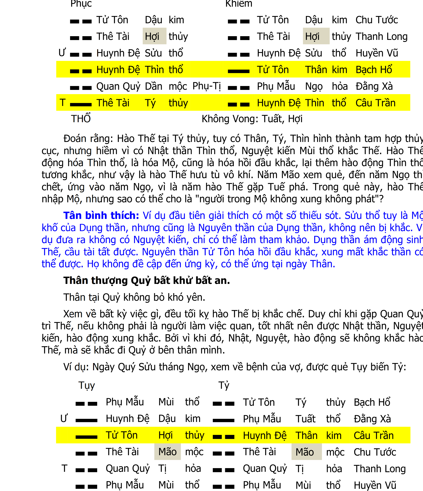

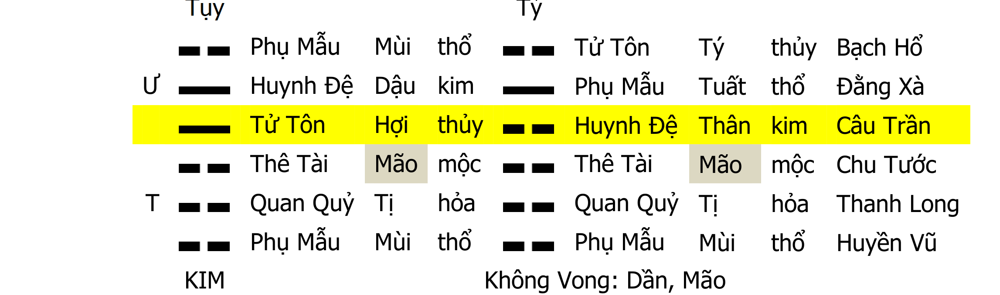 rằng: "Thầy thuốc chưa cho thuốc." Ta đáp: "Không sao! Trong quẻ này hào Hợi thủy 
Tử Tôn độc phát, khắc mất Quỷ ở hào Thế, nên sẽ ứng vào ngày mai là Dần mộc. 
Dần hợp với Hợi, nên là ngày hợp khởi của Tử Tôn, nên không có gì đáng lo."

Quả nhiên đến hôm sau bệnh tình thuyên giảm, không uống thuốc mà khỏi. 
Nhưng nguyên nhân không chỉ có thế, mà còn do hào Tài Mão mộc lâm Không, hôm 
sau cũng là ngày xuất Không, nên bệnh sẽ khỏi.

Lại ví dụ: Ngày Mậu Tý tháng Thìn, đi thuyền qua cửa quan, xem về đề phòng 
hiểm trở, được quẻ Thủy Địa Tỷ biến Trạch Sơn Hàm:

Tỷ 
 
Hàm

Ư | Thê Tài | Tý | thủy | Huynh Đệ | Mùi | thổ | Chu Tước

Huynh Đệ | Tuất thổ | Tử Tôn | Dậu | kim | Thanh Long

Tử Tôn | Thân | kim | Thê Tài | Hợi | thủy | Huyền Vũ

T | Quan Quỷ | Mão | mộc | Tử Tôn | Thân | kim | Bạch Hổ

Phụ Mẫu | Tị | hỏa | Phụ Mẫu | Ngọ | hỏa | Đằng Xà

Huynh Đệ | Mùi | thổ | Huynh Đệ | Thìn | thổ | Câu Trần

THỔ
Không Vong: Ngọ, Mùi

Quỷ ở hào Thế là tượng nghi hoặc, lo âu. Nhưng lại xuất hiện hai Thân kim khắc 
đi Quỷ ở bên mình, như vậy sẽ không còn lo lắng. Quả nhiên đến ngày Mão vượt qua 
cửa quan, không gặp phải trở ngại.

Đức nhập quái, vô mưu bất toại;

Đức nhập quẻ, xem việc gì cũng toại nguyện;

Nguyên trong sách chú rằng: Đức, nghĩa là hợp đức với thiên địa, tức hào chủ sự 
và hào Thế có thiên can, địa chi tương hợp. Trong sách để lại một quẻ để chiêm 
nghiệm:

Ngày Kỷ Dậu tháng Tuất, xem về văn thư, được quẻ Tiểu Súc biến Cổ:

Tiểu Súc
 
Cổ

Huynh ĐệMão mộc | Huynh ĐệDần mộc Câu Trần

Tử Tôn | Tị | hỏa | Phụ Mẫu Tý | thủy Chu Tước

Ư

Thê Tài | Mùi thổ | Thê Tài | Tuất thổ Thanh Long

Thê Tài | Thìn thổ Quan-Dậu | Quan QuỷDậu kim Huyền Vũ

Huynh ĐệDần mộc | Phụ Mẫu Hợi thủy Bạch Hổ

T

Phụ Mẫu Tý | thủy | Thê Tài | Sửu thổ Đằng Xà

MỘC 
Không Vong: Dần, Mão

Sách đoán rằng: Hào 5 động hóa Bính Tý là văn thư, hào Thế động biến thành 
Tân Sửu, Bính Tý Tân Sửu có can chi tương hợp, ứng vào ngày Mậu Tý, việc văn thư

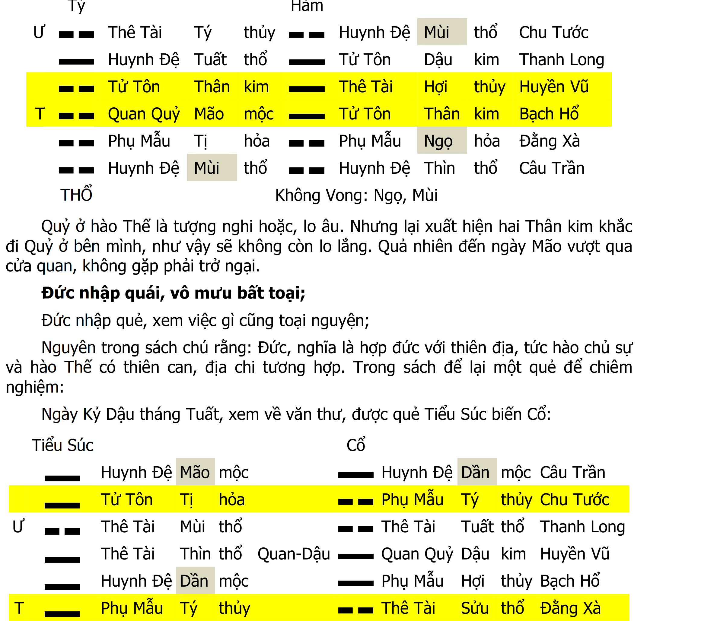

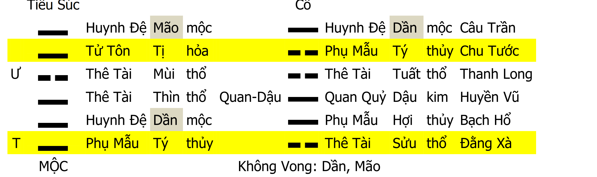 sẽ thành. Những trường hợp khác cũng tương tự như vậy. Thuyết này thật là nhiễu 
sự.

**Dã Hạc bàn rằng:** Quỷ Cốc bàn về Tam tài, bỏ hào từ mà dùng ngũ hành để định 
họa phúc. Hào chỉ dùng địa chi, dùng địa chi không thể không phối hợp với thiên can, 
chứ chưa từng nghe dùng thiên can để định hung cát. Phối thiên can với địa chi, là 
muốn dùng toàn bộ vòng hồn thiên Giáp Tý. 64 quẻ tổng cộng chỉ có 384 hào, nên 
không thể không phân tách. Bởi vậy, Càn thì quẻ nội dùng Giáp, Khôn thì quẻ nội 
dùng Ất, là hai can đứng đầu mười thiên can. Càn thì quẻ ngoại dùng Nhâm, Khôn thì 
quẻ ngoại dùng Quý, là hai can đứng cuối mười thiên can. Càn ở quẻ nội dùng Tý, 
tương hợp với quẻ ngoại của Khôn là Sửu; Khôn ở quẻ nội dùng Mùi, tương hợp quẻ 
ngoại của Càn là Ngọ. Hai quẻ âm già, dương già này trên dưới khớp nhau, âm dương 
cọ xát, trong gồm sáu con. Đứng sau Giáp Tý là Bính, Đinh, dùng cho Thiếu nam và 
Thiếu nữ (tức Cấn, Đoài); Mậu, Kỷ dùng cho Trung nam và Trung nữ (tức Khảm, Ly); 
Canh, Tân dùng cho Trưởng nam, Trưởng nữ (tức Chấn, Tốn). Để toàn vẹn được can, 
chi trên dưới, đó chính là phép phối ngẫu, được gọi là hồn thiên Giáp Tý.

Họa phúc, lành dữ, đều căn cứ vào sự sinh khắc, chế hóa, khắc hợp, hình xung | của địa chi để phán đoán. Nay lý luận trên lại dùng thiên can để đoán định cát hung, | là ứng dụng cho tất cả mọi quẻ, chứ không chỉ riêng cho quẻ này. Huống chi với quẻ | Tiểu Súc biến Cổ trên đây, hào 5 Chu Tước là tượng trưng cho văn thư, động mà nằm | tại Tị hỏa, biến thành hào Tý thủy cũng tượng trưng cho văn thư. Hào Thế nằm tại Tý | thủy Phụ Mẫu, cũng là nói về văn thư, được thêm Nhật thần Dậu kim tương sinh, lại | hóa thành Sửu thổ tương hợp. Tượng văn thư trùng điệp, vượng động trong quẻ. Cho | dù can chi không tương hợp, văn thư vẫn thành. Nên ta mới nói rằng: Thuyết này là | nhiễu sự.

**Tân bình thích:** Ở đây đã hiểu sai chữ "đức". Đức này chẳng phải Nguyệt đức 
Nhật đức, cũng chẳng phải hợp đức. Đức là điều tốt lành, là hỷ thần. Chính là nói đến 
Dụng thần. Đức nhập quẻ, tức là Dụng thần xuất hiện ở trong quẻ. Nó có ý nghĩa 
tương đồng với "đức" trong "vật phản đức dĩ phù nhân".

Kỵ lâm thân nhi đa trở vô thành.

Kỵ tại thân, nhiều trở ngại mà không thành.

Kỵ tức Kỵ thần, xem về bất kỳ việc gì, Kỵ thần cũng không nên trì Thế. Như xem 
về quan chức, thì hào Tử Tôn là Kỵ thần, nếu Tử Tôn trì Thế, việc cầu danh sẽ thất 
bại. Xem về cầu tài, thì hào Huynh Đệ là Kỵ thần, nếu Huynh Đệ trì Thế, việc cầu tài 
sẽ không thành.

**Dã Hạc bàn rằng:** Lý luận trên rất đúng! Theo chiêm nghiệm của ta, khi hào 
Huynh Đệ trì Thế, nếu hóa thành hào Tài thì đắc tài. Khi hào Tài trì Thế, nếu hóa 
thành hào Phụ, sẽ được gặp cha.

### Ví dụ: Ngày Bính Thân tháng Tý, xem về tiền tài, được quẻ Vị Tế biến Đỉnh:

Vị Tế
 
Đỉnh

Ư

Huynh ĐệTị | hỏa | Huynh ĐệTị | hỏa Thanh Long

Tử Tôn | Mùi thổ | Tử Tôn | Mùi thổ | Huyền Vũ

Thê Tài | Dậu | kim | Thê Tài | Dậu kim Bạch Hổ

T

Huynh ĐệNgọ | hỏa Quan-Hợi | Thê Tài | Dậu kim Đằng Xà

Tử Tôn | Thìn thổ | Quan QuỷHợi thủy Câu Trần

Phụ Mẫu | Dần | mộc | Tử Tôn | Sửu thổ | Chu Tước

HỎA
Không Vong: Thìn, Tị

Trong quẻ này, Kỵ thần nằm tại hào Thế, hóa thành Dậu Tài, nên đến ngày Dậu 
sẽ được tiền của.

Lại ví dụ: Ngày Mậu Ngọ tháng Thân; xem về nhận văn thư, được quẻ Phong Lôi 
Ích biến Phong Hỏa Gia Nhân:

Ích 
 
Gia Nhân

Ư | Huynh ĐệMão mộc | Huynh ĐệMão mộc Chu Tước

Tử Tôn | Tị | hỏa | Tử Tôn | Tị | hỏa Thanh Long

Thê Tài | Mùi thổ | Thê Tài | Mùi thổ Huyền Vũ

T | Thê Tài | Thìn thổ Quan-Dậu | Phụ Mẫu Hợi thủy Bạch Hổ

Huynh ĐệDần mộc | Thê Tài | Sửu thổ Đằng Xà

Phụ Mẫu Tý | thủy | Huynh ĐệMão mộc Câu Trần

MỘC
Không Vong: Tý, Sửu

Trong quẻ này, Kỵ thần cũng ở hào Thế, đến ngày Hợi sẽ nhận được văn thư.

Cùng ngày hôm ấy, con xem cho cha được quẻ này, đến ngày Hợi gặp được cha.

Vậy nguyên do vì đâu? Có lẽ là do hào động không khắc được hào biến. Quẻ loại 
này không gặp nhiều, nhưng ta đã thấy có ứng nghiệm, nên không thể không kể ra 
đây, chứ không coi đó là phép tắc để dạy cho kẻ hậu học. Phần lớn các trường hợp 
xem quẻ mà gặp Kỵ thần trì Thế, đều là tượng nhiều trắc trở, khó thành tựu.

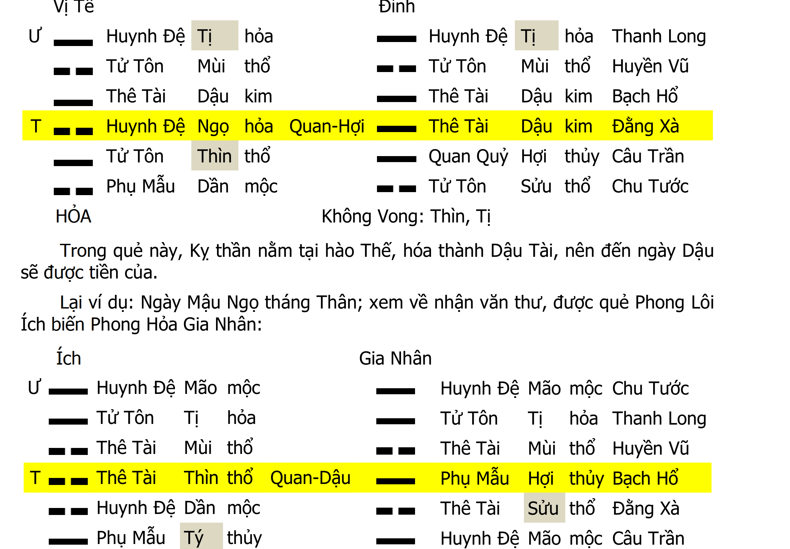

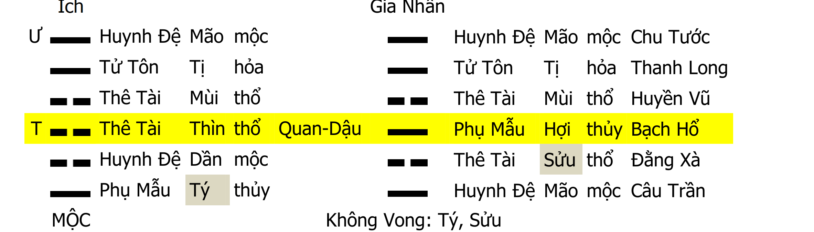

### Ví dụ: Ngày Kỷ Dậu tháng Ngọ, xem về cầu tài, được quẻ Vị Tế biến Khuê:

Vị Tế
 
Khuê

Ư

Huynh ĐệTị | hỏa | Huynh ĐệTị | hỏa Câu Trần

Tử Tôn | Mùi thổ | Tử Tôn | Mùi thổ Chu Tước

Thê Tài | Dậu | kim | Thê Tài | Dậu kim Thanh Long

T

Huynh ĐệNgọ | hỏa Quan-Hợi | Tử Tôn | Sửu thổ Huyền Vũ

Tử Tôn | Thìn thổ | Phụ Mẫu  Mão mộc Bạch Hổ

Phụ Mẫu | Dần | mộc | Huynh ĐệTị | hỏa Đằng Xà

HỎA
Không Vong: Dần, Mão

Phàm là xem về cầu tài, tối kỵ Huynh Đệ trì Thế. Trong quẻ này, Kỵ thần nằm tại 
hào Thế, vốn chủ về không có tiền của. Nhưng may được hào Phụ Mẫu Dần mộc động 
mà sinh Thế, không gặp vàng bạc, cũng gặp được của cải. Cầu vàng bạc không được, 
ắt được của cải. Quả nhiên đến ngày Dần, có được các đồ vải lụa, cốc chén, sở dĩ ứng 
vào ngày Dần, vì đó là ngày hào Phụ Mẫu xuất Không.

**Tân bình thích:** Dã Hạc đã không hiểu được chỗ thần kỳ của những quẻ này, 
hào Thế là người xin đoán, động mà hóa ra Dụng thần, chính là ở Dụng thần tương 
kiến, chỉ cần Dụng thần vượng tướng là việc có thể thành, xem tài được tài, xem văn 
thư được văn thư. Hơn nữa ứng kỳ đa số tại hào biến.

### Ví dụ 1: Ngày Quý Dậu tháng Thìn, một người đoán có được đơn vị cấp nhà hay

không? Được Ích biến Đồng Nhân.

Ích
 
Đồng Nhân

Ư | Huynh ĐệMão mộc | Thê Tài | Tuất thổ Bạch Hổ

Tử Tôn | Tị | hỏa | Quan QuỷThân kim Đằng Xà

Thê Tài | Mùi thổ | Tử Tôn | Ngọ hỏa Câu Trần

T | Thê Tài | Thìn thổ Quan-Dậu | Phụ Mẫu Hợi thủy Chu Tước

Huynh ĐệDần mộc | Thê Tài | Sửu thổ Thanh Long

Phụ Mẫu Tý thủy | Huynh ĐệMão mộc Huyền Vũ

MỘC
Không Vong: Tuất, Hợi

Lấy hào Phụ Mẫu làm Dụng, hào Thế động mà hóa ra Phụ Mẫu Hợi thủy, Hợi 
thủy được Nhật sinh, hào Thế lại là khố của Phụ Mẫu, chính là tượng nhà thuộc về 
mình, hóa ra Hợi thủy, tháng Hợi được nhà.

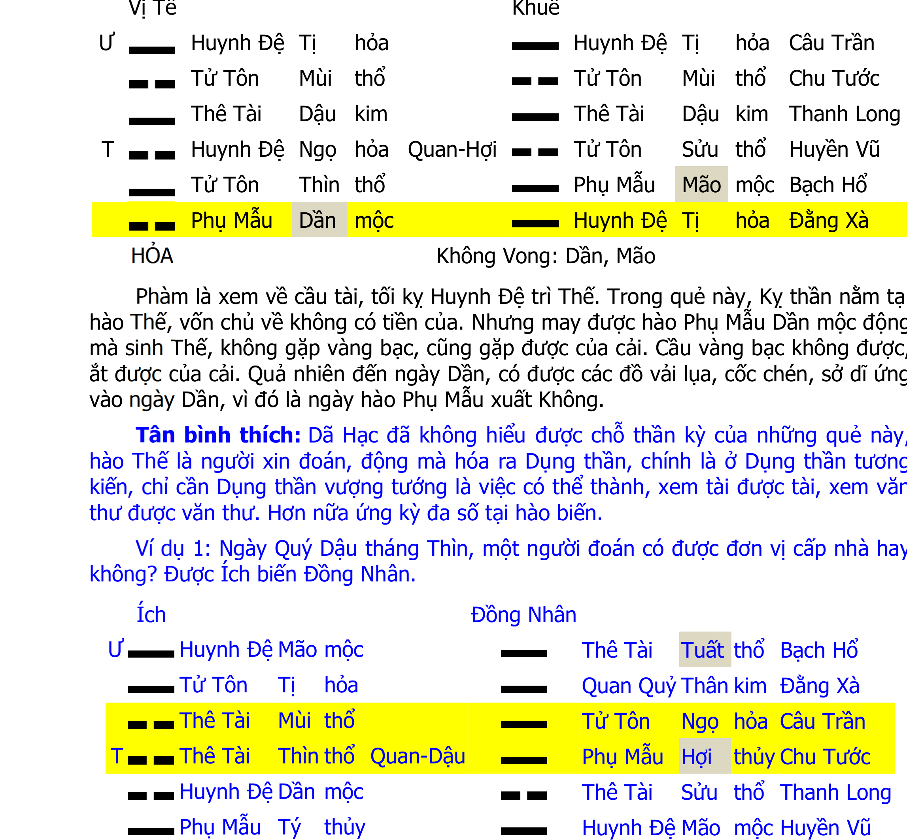

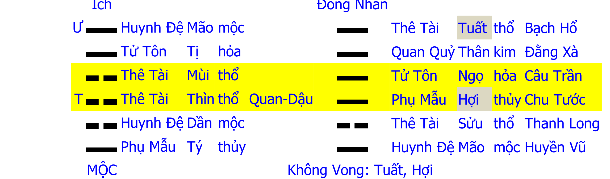

### Ví dụ 2: Đây là một ví dụ trong "Dịch mạo". Ngày Bính Tý tháng Bính Thân năm

Tân Mão, xem con còn sống hay đã chết. Được Quan biến Tụy.

Quan
 
Tụy

Thê Tài | Mão mộc | Phụ Mẫu | Mùi thổ Thanh Long

Quan QuỷTị | hỏa Huynh-Thân | Huynh ĐệDậu kim Huyền Vũ

T | Phụ Mẫu | Mùi thổ | Tử Tôn | Hợi thủy Bạch Hổ

Thê Tài | Mão mộc | Thê Tài | Mão mộc Đằng Xà

Quan QuỷTị | hỏa | Quan QuỷTị | hỏa Câu Trần

Ư | Phụ Mẫu | Mùi thổ Tử-Tý | Phụ Mẫu | Mùi thổ Chu Tước

KIM 
Không Vong: Thân, Dậu

Lấy Tử Tôn làm Dụng, hào Thế tuy là Kỵ thần, nhưng động mà hóa ra Tử Tôn 
Hợi thủy, Tử Tôn được Nhật tỉ phù là vượng, về sau đến ngày Giáp Thìn tháng Hợi 
con trở về.

### Ví dụ này cũng Kỵ thần trì Thế hóa Dụng thần, ứng kỳ là hào biến.

### Ví dụ 3: Đây là một ví dụ ở chương "Cầu tài" trong cuốn sách này. Ngày Đinh Tị

tháng Tị, xem về cầu tài, được quẻ Ký Tế biến Hoán:

Ký Tế
 
Hoán

Ư | Huynh ĐệTý | thủy | Tử Tôn | Mão mộc Thanh Long

Quan QuỷTuất thổ | Thê Tài | Tị | hỏa Huyền Vũ

Phụ Mẫu Thân kim | Quan QuỷMùi thổ Bạch Hổ

T | Huynh ĐệHợi | thủy Tài-Ngọ | Thê Tài | Ngọhỏa Đằng Xà

Quan QuỷSửu thổ | Quan QuỷThìn thổ Câu Trần

Tử Tôn | Mão mộc | Tử Tôn | Dần mộc Chu Tước

THỦY
Không Vong: Tý, Sửu

Đoán rằng: "Nếu xem cầu tài lâu dài, sẽ không có được. Còn nếu hỏi về tiền tài 
trước mắt, đến hôm sau là ngày Mậu Ngọ sẽ được." Người xem hỏi nguyên nhân. Ta 
giải đáp: "Hào Huynh trì Thế, bị Nhật, Nguyệt xung phá, nên không khắc được hào 
biến Thê Tài. Huống hồ Nhật, Nguyệt đều lâm hào Tài mà xung Thế, chỉ vì hào Ứng 
lâm Không, đến hôm sau ngày Ngọ được điền thực, nên chắc chắn sẽ được của." Quả 
nhiên hôm sau đắc tài.

### Ví dụ này cùng loại với các ví dụ ở trên, tức là Kỵ thần trì Thế hóa Dụng thần,

Dụng thần vượng tướng, lấy hào biến làm ứng kỳ. Vẫn còn rất nhiều ví dụ như vậy 
nhưng không tiện nêu ra hết được.

Quái ngộ hung tinh, tị chi tất cát;

Quẻ gặp hung tinh, tránh đi sẽ được tốt;

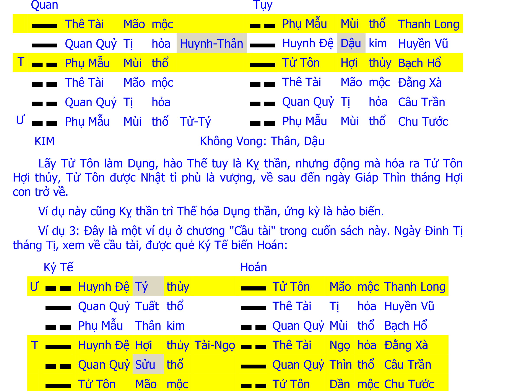

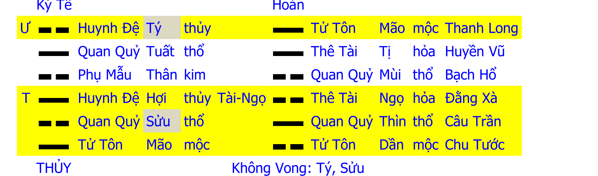

Nguyên trong sách chú rằng: Nếu Dụng thần Không Vong, lại bị Nhật thần, 
Nguyệt kiến, hào động xung khắc, là tránh được Không, đồng thời cũng không chịu 
tác hại do bị xung khắc. Sách có để lại quẻ để chiêm nghiệm:

### Ví dụ: Ngày Nhâm Thân tháng Mùi, xem về bệnh của con, được quẻ Cấu biến Đại

Quá:

Cấu
 
Đại Quá

Phụ Mẫu Tuất thổ | Phụ Mẫu Mùi thổ Bạch Hổ

Huynh ĐệThân kim | Huynh ĐệDậu kim Đằng Xà

Ư | Quan QuỷNgọ hỏa | Tử Tôn | Hợi thủy Câu Trần

Huynh ĐệDậu kim | Huynh ĐệDậu kim Chu Tước

Tử Tôn | Hợi | thủy Tài-Dần | Tử Tôn | Hợi thủy Thanh Long

T | Phụ Mẫu Sửu thổ | Phụ Mẫu Sửu thổ Huyền Vũ

KIM
Không Vong: Tuất, Hợi

Sách đoán rằng: Hào Phụ Mẫu vượng động, Dụng thần Tử Tôn Hợi thủy vô khí, 
vốn là điềm hung. May nhờ Dụng thần gặp Tuần Không nên tránh được họa, đến 
ngày Bính Tý bệnh sẽ thuyên giảm, sở dĩ ứng vào ngày Bính Tý, như trên đã nói, là vì 
Hợi thủy Tử Tôn đến ngày trực là Tý sẽ gặp Đế Vượng.

**Dã Hạc bàn rằng:** Lý luận như trên thật sai lầm. Trong quẻ đáng sợ nhất là Kỵ 
thần, khi động trong quẻ, tai họa đã manh nha. Nếu Dụng thần tĩnh, đợi đến ngày 
xung sẽ gặp tai họa. Nếu Dụng thần động, đợi đến ngày trực sẽ bị tổn thương. Nếu 
Dụng thần gặp Nguyệt phá, đợi đến ngày thực Phá, tai họa sẽ đến. Nếu Dụng thần 
gặp Tuần Không, đợi đến ngày xuất Không sẽ gặp nạn. Chưa từng có chuyện xuất 
Không mà tránh được tai họa. Xuất Không chắc chắn sẽ gặp nguy hiểm. Nên phán 
đoán như trong sách, cho rằng xuất Không sẽ tai qua nạn khỏi, là rất sai lầm. Theo 
chứng nghiệm của ta, nếu Nguyên thần động, Dụng thần lâm Không, đến ngày xuất 
Không sẽ được phúc. Nếu Kỵ thần động, mà Dụng thần lâm Không, đến ngày xuất 
Không sẽ gặp tai ương.

Nguyên lý này ứng nghiệm với mọi quẻ, chỉ trừ trường hợp xem về bệnh gần gặp 
Không Vong thì khác. Khi xem về bệnh gần mà Dụng thần gặp Tuần Không, lại không 
bị Nhật thần, Nguyệt kiến, hào động khắc hại, thì đến ngày Dụng thần xuất Không 
bệnh sẽ khỏi. Chỉ duy nhất một trường hợp này là xem Không chứ không xem khắc. 
Còn tất cả các trường hợp khác đều kỵ. Trong quẻ Cấu biến Đại Quá trên đây, ắt là 
xem về bệnh gần, thì gặp Không mới khỏi. Còn nếu như cho rằng, xem về bất kỳ 
chuyện gì, gặp Tuần Không đều có thể tránh được, là gây lầm lẫn cho đời sau, cần 
phải xóa bỏ.

**Tân bình thích:** Lý luận của Dã Hạc bệnh gần gặp Không sẽ khỏi rất đúng, 
thường có ứng nghiệm. Quẻ này Kỵ thần tuy động, nhưng động mà hóa thoái, Dụng 
thần được Nhật sinh, có thể khỏi bệnh. Có lẽ là ngày Bính Tý đã tới tháng Thân.

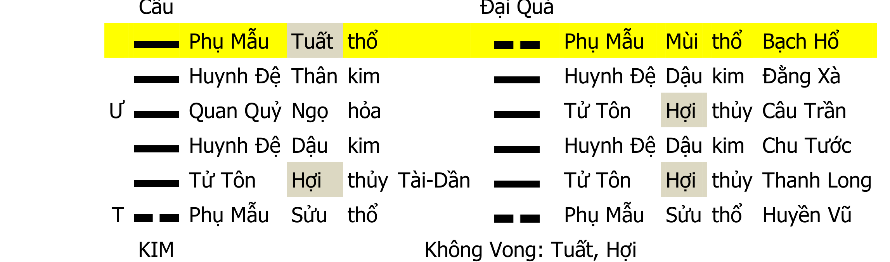

Hào phùng Kỵ sát, địch chi vô thương.

Hào gặp Kỵ sát, chống được thì không hại.

Nguyên trong sách chú rằng: Kỵ thần phát động, mọi việc bất lợi, nếu được Nhật 
thần, Nguyệt kiến, hào động trợ giúp cho Dụng thần, có thể chống lại được tác hại 
của Kỵ thần. Nếu sức mạnh tương đương với Kỵ thần, sự việc có thể thành. Ta cho 
rằng lý luận này là có lý, nhưng quẻ ghi lại trong sách lại là vô lý:

Ngày Ất Mùi tháng Thân, xem có thể thoát việc binh dịch không, được quẻ Tổn 
biến Tiết.

Tổn 
 
Tiết

Ư | Quan QuỷDần mộc | Thê Tài | Tý | thủy Huyền Vũ

Thê Tài | Tý | thủy | Huynh ĐệTuất thổ | Bạch Hổ

Huynh ĐệTuất thổ | Tử Tôn | Thân kim Đằng Xà

T | Huynh ĐệSửu thổ | Tử-Thân | Huynh ĐệSửu | thổ | Câu Trần

Quan QuỷMão | mộc | Quan QuỷMão mộc Chu Tước

Phụ Mẫu | Tị | hỏa | Phụ Mẫu | Tị | hỏa Thanh Long

THỔ
Không Vong: Thìn, Tị

Trong sách đoán rằng: Hào Thế tại Sửu thổ, hào Tài Tý thủy động, sinh trợ Dần 
mộc Quỷ, động mà khắc Thế. May nhờ Nhật thần là Mùi thổ cùng hào 5 biến thành 
Tuất thổ phò trợ cho hào Thế, địch lại được hào Quỷ Dần mộc, như vậy Quỷ sẽ không 
khắc thương được thân.

**Dã Hạc bàn rằng:** Đoán như vậy mà làm phép tắc cho đời sau, thật là gieo rắc sai 
lầm cho hậu thế. Vì sao vậy? Chỉ một Mùi thổ phò trợ cho Thế, sao có thể chống chọi 
lại được với hung thần giúp Quỷ hại thân? Đoán như vậy là không biết được rằng hào 
Quỷ Dần mộc động, gặp Nguyệt phá, lại nhập Mộ tại Nhật thần Mùi. Quỷ Dần mộc đã 
bị Phá lại nhập Mộ, nên dù được Tý thủy tương sinh, cũng không thể sinh được cho 
mộc không gốc rễ. Huống nữa hào Tý thủy lại hóa Tuất thổ hồi đầu khắc, như vậy 
thủy, mộc đều khô kiệt, nên người này sau được vô sự là đúng. Nhưng phán đoán 
trong sách sai lầm ở chỗ cho rằng Tuất thổ, Mùi thổ có thể phù trợ cho thân. Hơn 
nữa, hào biến Tuất thổ không thể trợ giúp cho các hào của quẻ chính. Ta có một ví 
dụ, xin nêu ra đây để so sánh:

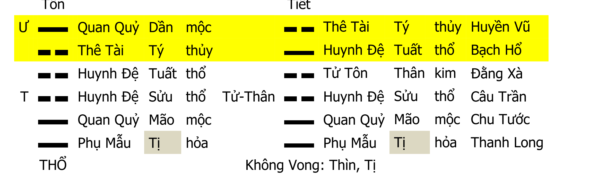

Ngày Ất Mùi tháng Thìn, xem về nguyệt lệnh, được quẻ Thái biến Phong:

Thái
 
Phong

Ư | Tử Tôn | Dậu | kim | Huynh ĐệTuất thổ | Huyền Vũ

Thê Tài | Hợi | thủy | Tử Tôn | Thân kim Bạch Hổ

Huynh ĐệSửu thổ | Phụ Mẫu | Ngọ | hỏa Đằng Xà

T | Huynh ĐệThìn thổ | Thê Tài | Hợi | thủy Câu Trần

Quan QuỷDần | mộc Phụ-Tị | Huynh ĐệSửu | thổ | Chu Tước

Thê Tài | Tý | thủy | Quan QuỷMão mộc Thanh Long

THỔ
Không Vong: Thìn, Tị

Hào Thế tại Thìn thổ được Nguyệt kiến trợ giúp, hào Sửu thổ động hóa hồi đầu 
sinh, tỷ trợ cho Thế. Nên tuy hào Quỷ Dần mộc động, nhưng hào Thế vượng động, 
được trợ giúp nâng đỡ, vẫn có thể chống lại được hào Quỷ. Nhưng về sau, đến ngày 
Tân Sửu vẫn gặp tai ương, do xuất ngôn phạm thượng, bị đưa ra xét xử, nhưng may 
vẫn được giải cứu. Được giải cứu, vì được Nhật thần Mùi thổ, Nguyệt kiến Thìn thổ trợ 
giúp.

**Tân bình thích:** Hào Thế vượng mà Kỵ thần nhược, họa tuy gặp mà chuyện có 
thể hóa nhỏ. Ví dụ này không trở thành đại hung là vì Quan Quỷ Không Vong, lại nhập 
Nhật Mộ, không có Nguyên thần đến trợ. Vì vậy gặp chuyện mà được hóa giải. Ứng 
ngày Sửu vì Quan động hóa Sửu. Quỷ Không khắc Thế, một cơn sợ bóng sợ gió.

### Ví dụ: Ngày Nhâm Thân tháng Ngọ, một người đàn ông gọi điện thoại nhờ đoán,

không nói là đoán chuyện gì, được Địa Thiên Thái biến Địa Sơn Khiêm.

Thái
 
Khiêm

Ư | Tử Tôn | Dậu | kim | Tử Tôn | Dậu | kim Bạch Hổ

Thê Tài | Hợi | thủy | Thê Tài | Hợi | thủy Đằng Xà

Huynh ĐệSửu thổ | Huynh ĐệSửu | thổ | Câu Trần

T | Huynh ĐệThìn thổ | Tử Tôn | Thân kim Chu Tước

Quan QuỷDần | mộc Phụ-Tị | Phụ Mẫu | Ngọ | hỏa Thanh Long

Thê Tài | Tý | thủy | Huynh ĐệThìn thổ | Huyền Vũ

THỔ
Không Vong: Tuất, Hợi

Thế lâm Chu Tước, Quan động khắc Thế, tất có quan phi. Kỵ thần động hóa | Nguyệt kiến, tất là sự việc trong tháng. Hào sơ Tý thủy động mà sinh Quan Quỷ, hào | sơ là hào vị cấp dưới, lại là Tài, không phải vì chuyện cấp dưới thì là vì chuyện kinh tế | tiền tài, có quan phi.

Đối phương nói bởi vì cấp dưới luyện một công pháp mà bị bắt. Giờ Dậu đoán 
quẻ, giờ Tuất bản thân người đó và hơn mười người cấp dưới bị công an bắt đi. Nghi 
có dính líu đến vụ lừa đảo 600 triệu.

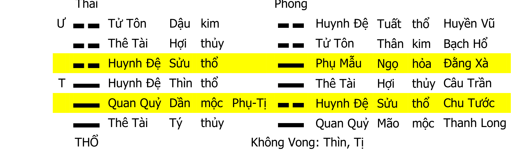

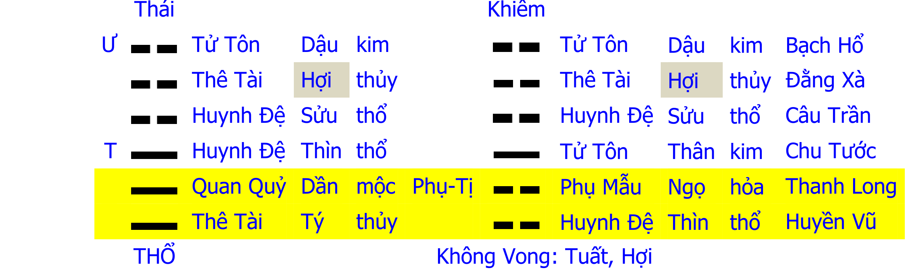

### Ví dụ này Thế được Nguyệt kiến sinh phù, Quan Quỷ được Nhật chế phục, ứng

quan phi mà lại thành sự việc lớn. Đều là bởi vì Kỵ thần có Nguyên thần động mà đến 
sinh, Quan Quỷ có gốc rễ. Ứng hôm đó bởi vì Nhật, hào sơ và hào biến Thân Tý Thìn 
tam hợp cục sinh Quan Quỷ, ứng giờ Tuất bởi vì là giờ hào Thế gặp xung.

Chủ tượng hưu tù, phạ kiến hình xung khắc hại;

Chủ tượng hưu tù, kỵ gặp hình, xung, khắc, hại;

Chủ tượng vượng tướng cũng khó đối địch lại các hào hình, xung, khắc, hại, 
huống hồ là hưu tù vô khí. Đúng như phần trước đã viết: "khắc, hại, hình, xung, tựa 
cỏ thu gặp sương giá".

Dụng hào biến động, kỵ tao Tử Mộ Tuyệt Không.

Dụng thần biến động, kỵ gặp Tử, Mộ, Tuyệt, Không.

Nguyên trong sách chú rằng: Tử, Mộ, Tuyệt, Không là đất hãm, nếu Dụng thần 
động mà hóa Mộ, hóa Tuyệt, hóa Tử, hóa Không, bất kể xem về việc công việc tư, 
việc lớn việc nhỏ, đều chủ về không thành. Nếu là xem về bệnh tật, chắc chắn sẽ 
chết.

Theo như chứng nghiệm của ta, nếu hóa Mộ, hóa Tuyệt mà hào động vượng 
tướng, hoặc lâm Nhật thần, Nguyệt kiến, hoặc được Nhật thần, Nguyệt kiến trợ giúp, 
cũng không gặp phải họa lớn. Nếu hóa Mộ, đợi đến ngày, tháng xung khai, việc sẽ 
thành. Nếu hóa Tuyệt, đợi đến ngày, tháng sinh vượng, sẽ được thành tựu. Nếu như 
hóa Không, ứng nghiệm càng rõ rệt; nếu xem về mưu sự, đến ngày thực Không việc 
sẽ thành; nếu xem về bệnh gần, đến ngày xuất Không sẽ khỏi bệnh.

**Tân bình thích:** Luận bàn của Dã Hạc rất chính xác.

### Ví dụ: Ngày Mậu Tý tháng Mão, một người làm công ty bảo hiểm đoán gần đây

tài vận ra sao? Được Địa Lôi Phục biến Khôn Vi Địa.

Phục
 
Khôn

Tử Tôn | Dậu kim | Tử Tôn | Dậu kim Chu Tước

Thê Tài | Hợi thủy | Thê Tài | Hợi thủy Thanh Long

Ư | Huynh ĐệSửu thổ | Huynh ĐệSửu thổ Huyền Vũ

Huynh ĐệThìn thổ | Quan QuỷMão mộc Bạch Hổ

Quan QuỷDần mộc Phụ-Tị | Phụ Mẫu Tị | hỏa Đằng Xà

T | Thê Tài | Tý | thủy | Huynh ĐệMùi thổ Câu Trần

THỔ
Không Vong: Ngọ, Mùi

Lấy Tài làm Dụng, Thê Tài Tý thủy được Nhật tỉ phù, trì Thế, gần đây có tiền. 
Nhưng hào Tài động mà hóa Không, xuất Không có thể được. Về sau ở ngày Ất Mùi 
được 6000 nguyên. Hào biến Mùi thổ bị Nguyệt khắc chế, vô lực khắc Tài Thế, không 
thể nói động hóa hồi đầu khắc mà đoán không được.

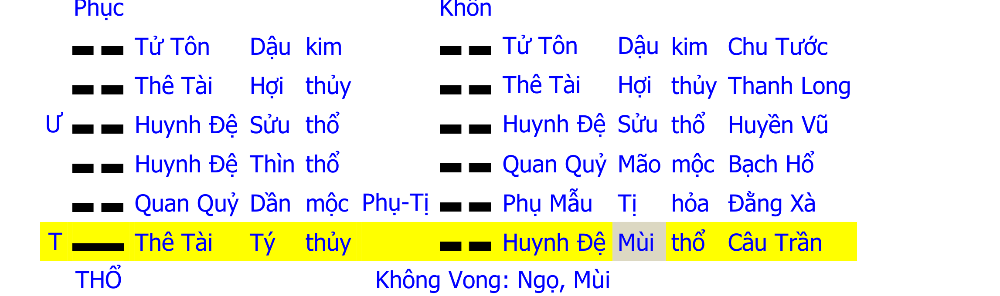

Dụng hóa Dụng, hữu dụng vô dụng;

Dụng hóa Dụng, tuy có dụng mà thành vô dụng;

Nguyên trong sách chú rằng: Trong quẻ đã có hào Dụng, thì hào Dụng không 
nên động mà lại hóa ra hào Dụng, như vậy gọi là "hóa khứ"; cũng không nên có hào 
khác động mà hóa ra hào Dụng, như vậy là vô ích, hào Dụng có mà cũng như không. 
Xem về bệnh tật lại càng kỵ.

**Dã Hạc bàn rằng:** Nói như vậy là phi lý. Hào Dụng động mà hóa ra hào Dụng, 
nếu hóa Tiến thần thì việc xem sẽ tốt đẹp. Nếu hào khác động mà hóa ra hào Dụng, 
được tỷ trợ giúp đỡ, sao lại cho là vô dụng? Chẳng lẽ lại không hiểu nguyên lý "Thái 
quá, nên bớt đi sẽ thành". Có câu: "Dụng thần trùng điệp, phải có Mộ khố để cất giữ", 
nếu Dụng thần quá nhiều, đợi đến ngày gây thương tổn, ngày Mộ khố, thì sự việc sẽ 
thành tựu chắc chắn. Cho là vô dụng là sai lầm, phần này nên xóa bỏ.

Không hóa Không, tuy Không bất Không.

Không biến Không, tuy gặp Không mà chẳng bị Không.

Theo như chứng nghiệm của ta, không chỉ hào Không hóa Không mới không bị 
Không. Mà hào động gặp Tuần Không cũng không còn bị Không. Là họa hay phúc, sẽ 
ứng nghiệm vào ngày, tháng xung Không, thực Không.

Dưỡng chủ hồ nghi; Mộ đa ám muội.

Dưỡng chủ nghi ngờ; Mộ nhiều ám muội.

Câu này cũng nói về mười hai vị trí trong chu kỳ Trường Sinh, Mộc Dục... Ta chỉ 
sử dụng bốn thứ Sinh, Vượng, Mộ, Tuyệt, còn lại đều không ứng nghiệm. Nếu xem 
hào biến ra từ hào động, cũng chỉ ứng nghiệm ở Sinh, Vượng, Mộ, Tuyệt. Mộ là 
ngưng trệ. Dụng thần động mà hóa Mộ, nếu xem về bệnh tật, bất kể bệnh lâu bệnh 
gần, đều là tượng hôn mê. Nếu Dụng thần vượng tướng, đợi đến ngày xung khai Mộ 
khố, sẽ được bình an. Nếu Dụng thần hưu tù, lại bị hình, xung, khắc, hại, thì bệnh khó 
khỏi, nếu gặp Tuần Không, bệnh gần sẽ đỡ, bệnh lâu sẽ nguy hiểm. Nếu xem về truy 
bắt người khác, thì là tượng trốn kỹ khó bắt. Nếu xem về thân mệnh, là tượng ngu 
đần không phát triển được. Nếu xem về của bị mất, là tượng tìm không ra. Nếu xem 
về hôn nhân, là tượng ám muội không rõ ràng.

Nếu hào động hóa Mộ, mà Mộ thần lại hồi đầu khắc hào động, thì không thể coi 
đó là tượng ám muội, ngưng trệ mà là điềm hung, tức kỵ hồi đầu khắc thân. Nếu Mộ 
thần là hào Quỷ hồi đầu khắc, lại càng hung.

Còn hóa Dưỡng, hóa Thai, hóa Bệnh, hóa Mộc Dục đều không ứng nghiệm, nên 
đều xóa bỏ.

**Tân bình thích:** 12 cung trường sinh đều có ứng nghiệm. Để biết thêm chi tiết, 
xin mời xem xuốn "Lục hào quái lệ thuyết chân" do tôi viết.

Hóa sinh vượng hề, họa phúc hữu tam;

Hóa sinh hóa vượng họa phúc gồm ba;

Sinh tức hào động hóa Trường Sinh, ví dụ như hào Hợi thủy động hóa Thân kim, 
vừa là hóa Trường Sinh, lại được hồi đầu sinh; nếu hóa thành Dậu kim, thì không gọi là hóa Mộc Dục, mà gọi là hóa hồi đầu sinh. Ấy là hai trường hợp sinh, nếu lại được 
hào động hữu khí, hào biến vượng tướng, xem việc gì cũng cát lợi.

Vượng là giai đoạn thứ năm trong vòng Trường Sinh. Với kim, mộc, thủy, hỏa, 
hóa vượng là hóa Tiến thần, như Thân kim hóa Dậu kim; Hợi thủy hóa Tý thủy; Dần 
mộc hóa Mão mộc, Tị hỏa hóa Ngọ hỏa, được như vậy, xem việc gì cũng hanh thông.

Duy có thổ gửi Sinh ở Thân, Vượng ở Tý, nên không phải là hóa Tiến thần. Thìn, 
Tuất, Mùi thổ động mà hóa ra hào Tý, là hóa Vượng. Sửu thổ hóa ra hào Tý, vừa là 
hóa Vượng, lại vừa là hóa hợp. Được như vậy, xem về chuyện gì cũng cát lợi.

Hóa Quan Quỷ hề, cát hung hữu nhị.

Hóa thành Quan Quỷ, cát hung hai loại.

Hào động hóa thành Quan Quỷ, có hai dạng cát hung: Nếu xem về công danh, 
mà hào Thế vượng tướng, hoặc lâm Nhật thần, Nguyệt kiến, hoặc được Nhật thần, 
Nguyệt kiến sinh phò, động mà hóa Quan tinh, lại không bị thương khắc, là điềm được 
quan chức; nếu hào Thế hưu tù, bị khắc, động mà hóa Quan tinh, như vậy là biến 
Quỷ, sẽ khó hưởng lộc vua, vinh hoa phú quý chỉ là chuyện xa vời.

### Ví dụ: Ngày Giáp Dần tháng Tuất, xem bao giờ được bổ khuyết, được quẻ Ích

biến Kiển:

Ích 
 
Kiển

Ư | Huynh ĐệMão mộc | Phụ Mẫu Tý | thủy Huyền Vũ

Tử Tôn | Tị | hỏa | Thê Tài | Tuất thổ Bạch Hổ

Thê Tài | Mùi thổ | Quan QuỷThân kim Đằng Xà

T | Thê Tài | Thìn thổ Quan-Dậu | Quan QuỷThân kim Câu Trần

Huynh ĐệDần mộc | Tử Tôn | Ngọ hỏa Chu Tước

Phụ Mẫu Tý | thủy | Thê Tài | Thìn thổ Thanh Long

MỘC
Không Vong: Tý, Sửu

Hào Thế gặp Nguyệt phá, bị Nhật thần Dần tương khắc, lại bị hào 6 Mão mộc 
động khắc, nên chỉ có khắc mà không có sinh. Lại thêm hào Thế động biến Quan tinh, 
tức là biến Quỷ. Đến tháng Dần năm sau, chưa được bổ khuyết đã chết. Tựa như thần 
linh mách bảo rằng: "mệnh số lâm nguy, công danh chẳng còn hy vọng!"

Lại ví dụ: Ngày Nhâm Thân tháng Tị, xem về mở tiệm buôn bán, được quẻ Khôn 
biến Bác:

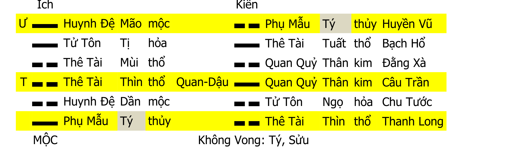

Khôn
 
Bác

T | Tử Tôn | Dậu kim | Quan QuỷDần mộc Bạch Hổ

Thê Tài | Hợi thủy | Thê Tài | Tý | thủy Đằng Xà

Huynh ĐệSửu thổ | Huynh ĐệTuất thổ Câu Trần

Ư | Quan QuỷMão mộc | Quan QuỷMão mộc Chu Tước

Phụ Mẫu Tị | hỏa | Phụ Mẫu Tị | hỏa Thanh Long

Huynh ĐệMùi thổ | Huynh ĐệMùi thổ Huyền Vũ

THỔ
Không Vong: Tuất, Hợi

Đoán rằng: Xem về việc làm ăn cần xem hào Tài. Trong quẻ này, hào Tài gặp 
Nguyệt phá, tuy được hào Tử động sinh Tài, nhưng không sinh được. Lại thêm hào 
Thế và Tử Tôn biến Quỷ, không những việc kinh doanh không hy vọng, mà đến mùa 
thu trong năm, con cái còn vướng vào kiện tụng. Quả nhiên đến tháng tám, con trai 
đánh bạc bị bắt giải lên quan, phạt trượng mà chết. Ấy là ứng với hào Tử Tôn Dậu 
kim biến Quỷ.

Kỵ hồi đầu chi khắc ngã;

Tránh hồi đầu khắc ta;

Hào động hóa Khắc, như hào kim động biến hỏa hồi đầu khắc kim; hào mộc 
động biến kim khắc mộc, đều gọi là hồi đầu khắc.

Giác Tử bàn rằng: Ta chiêm nghiệm thấy, khi gặp hồi đầu khắc, xem về bệnh tật, 
tuổi thọ hay niên vận, thì mười phần chết chín. Nếu xem về công danh, hay chuyện 
vặt trong nhà, gặp phải cũng nguy hại đến tính mạng. Vậy nguyên do vì đâu? Vì hạn 
lớn của người xem đã đến, mà bản thân không biết, vẫn còn muốn cầu danh lợi, nên 
thần linh mới mách bảo rằng: "Số ngươi đã tận, còn cầu gì chuyện khác nữa. Đừng 
nên tham lam, may ra còn thoát được tai họa. Cho dù khó thoát, cũng còn được chết 
yên ổn trong nhà". Ý của thần linh có lẽ là như vậy.

Duy có trường hợp Quan Quỷ trì Thế, hóa thành Tử Tôn hồi đầu khắc, có bốn 
trường hợp ứng nghiệm như sau:

Nếu người xem đã làm quan, là điềm tổn thương đến con cháu, hoặc điềm cách 
chức, hoặc điềm chết yểu. Nếu người xem là dân thường, là điềm bản thân tổn thọ, 
hoặc điềm tổn hại con cái.

Nếu gieo được quẻ này, nên xem thêm một quẻ, hợp hai quẻ lại để đoán, mới có 
thể quyết định được chính xác. Duy chỉ có xem về việc lo lắng tai họa là nên gặp 
Quan Quỷ hóa thanh Tử Tôn để khắc bỏ Quỷ bên người, sẽ được bình yên không ưu 
phiền.

Nếu xem cho người thân thích, kỵ nhất là hóa hồi đầu khắc. Ví dụ như xem về 
cha mẹ, hào Phụ Mẫu nằm tại Ngọ hỏa, nếu hóa thành hào Hợi, Tý thủy hồi đầu khắc 
Phụ, là điềm cha mẹ không được thọ.

### Ví dụ: Vào ngày Kỷ Sửu tháng Dậu, xem về việc kiện tụng của thầy, được quẻ

Truân biến Chấn:

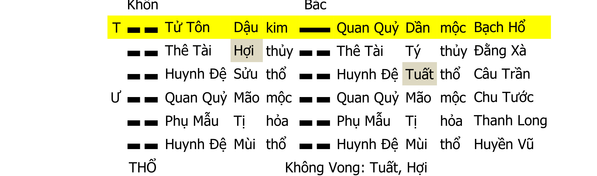

Truân
 
Chấn

Huynh ĐệTý | thủy | Quan QuỷTuất thổ Câu Trần

Ư | Quan QuỷTuất thổ | Phụ Mẫu | Thân kim Chu Tước

Phụ Mẫu | Thân kim | Thê Tài | Ngọ hỏa Thanh Long

Quan QuỷThìn thổ Tài-Ngọ | Quan QuỷThìn thổ Huyền Vũ

T | Tử Tôn | Dần mộc | Tử Tôn | Dần mộc Bạch Hổ

Huynh ĐệTý | thủy | Huynh ĐệTý | thủy Đằng Xà

THỦY
Không Vong: Ngọ, Mùi

Đoán rằng: Hào Phụ Mẫu Thân kim là Dụng thần, nhập Mộ tại Nhật thần Sửu, lại | hóa Ngọ hỏa hồi đầu khắc, nên trước mắt trọng tội đã định. Người này nói rằng: "Có | thể được giảm tội". Ta nói rằng: "Không chỉ được giảm tội, mà ông ta còn tránh được | tội hình. Năm nay là năm Thìn, Thìn và hào 5 Quan Quỷ không tương khắc, lại thêm | hào Phụ gặp Thanh Long, nên chắc chắn không bị tội hình. Vì Ngọ hỏa gặp Tuần | Không, đến năm Ngọ xuất Không, sẽ được chết yên ổn."

Người này lại đưa ra Tứ trụ của thầy cho ta xem, là Nhâm Thìn, Mậu Thân, Mậu 
Dần, Giáp Dần. Ta nói rằng: "Đây là mệnh cục Thực thần chế sát, năm nay hành vận 
Giao Bính, tức vận Kiêu thần đoạt thực. May nhờ tháng bảy là tháng kim mạnh, vận 
Bính không thể nung chảy, nên đề phòng tháng Bính, năm Bính, hỏa vượng nung 
chảy kim, cũng là phù hợp với quẻ trước, là năm Ngọ hỏa xuất Không, sẽ nguy đến 
tính mạng."

Sau nghe tin người này bị định tội lớn, nhưng được trì hoãn ngày xử quyết. Đến 
năm Bính Ngọ, bị mắc bệnh viêm phổi mà chết. Như vậy, chính là xem thay cho lục 
thân, kỵ gặp hồi đầu khắc, mệnh và quẻ cùng chung một lý.

Vật phản đức dĩ phù nhân.

Chớ quay lại để giúp người.

Theo phép cũ: Nếu là tương sinh, người khác sinh mình là tốt; nếu là tương 
khắc, mình khắc người là tốt. Ví dụ xem về chuyện tốt giữa hai bên ta và người, được 
hào Ứng sinh hào Thế là tốt. Xem về tiền tài, được hào Tài sinh hào Thế là tốt; xem 
về quan tước, được hào Quan sinh hào Thế là tốt, nếu hào Thế lại đi sinh trợ cho hào 
khác, là tiết hết khí của mình.

**Tân bình thích:** Đây gọi là trong quẻ xuất hiện vô tình. Không chỉ là Thế sinh 
hào Ứng, mà còn là Dụng thần sinh Ứng, đó là phản đức phù nhân. Cái phản đức, 
quay lưng lại với Dụng thần mà đi.

Ác diệu cô hàn, phạ Nhật thần chi tịnh khởi;

Sao ác đơn độc, kỵ được Nhật thần trợ giúp;

Những hào gây hình, xung, khắc, hại được gọi là ác diệu (sao ác), đây không 
phải là các ác sát trong hệ thống sao. Những hào này nếu động mà xung khắc Dụng 
thần, nhưng bản thân các ác diệu đó lại xuất hiện đơn độc, không được trợ giúp, hoặc 
hưu tù vô lực, mà Dụng thần vượng tướng, thì có thể chống lại được lực xung khắc,

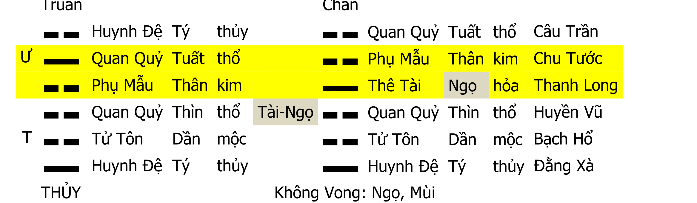 mà không bị thương hại, có gặp họa cũng nhẹ. Chỉ kỵ Nhật thần, hào động trợ giúp 
cho ác diệu gây hại, khiến ác diệu cáo mượn oai hùm, mượn thế làm càn, sẽ gặp họa 
lớn.

Nguyên lý này cũng tương tự như nguyên tắc "kỵ nhất bị hào khác khắc chế 
thêm" trong các chương "Nguyệt tướng", "Nhật thần" trước đây.

Dụng hào trùng điệp, hỷ Mộ khố dĩ thu tàng.

Dụng thần trùng điệp, mừng gặp Mộ khố thu tàng.

Nguyên trong sách chú rằng: Dụng thần trùng điệp (nhiều Dụng thần), nếu 
không có Nhật thần, hào động diệt bớt, nên có Mộ khố để cất giữ, việc mới thành. 
Sách có để lại quẻ chiêm nghiệm:

Ngày Đinh Sửu, xem về tiền tài, được quẻ Ích biến Tụy:

Ích 
 
Tụy

Ư | Huynh ĐệMão mộc | Thê Tài | Mùi thổ Thanh Long

Tử Tôn | Tị | hỏa | Quan QuỷDậu kim Huyền Vũ

Thê Tài | Mùi thổ | Phụ Mẫu Hợi thủy Bạch Hổ

T | Thê Tài | Thìn thổ Quan-Dậu | Huynh ĐệMão mộc Đằng Xà

Huynh ĐệDần mộc | Tử Tôn | Tị | hỏa Câu Trần

Phụ Mẫu Tý | thủy | Thê Tài | Mùi thổ Chu Tước

MỘC
Không Vong: Thân, Dậu

Trong sách đoán rằng: Quẻ này có hai hào Tài, lại thêm hào sơ và hào 6 đều 
biến thành hào Tài, Nhật thần Sửu thổ cũng lại là Tài tinh. Tài quá nhiều, vốn là thái 
quá. May nhờ hào Thế tại Thìn nhập Mộ làm kho Tài (Tài khố), nên Tài có kho để cất 
giữ. Quả nhiên về sau đắc tài.

Ta thấy cách lý luận trên cực kỳ hữu lý, xem theo đó lần nào cũng ứng nghiệm. 
Nhưng cũng không nhất thiết trong quẻ phải có Mộ khố mà thường đến ngày sau, đợi 
đến ngày, tháng gặp Mộ khố, sự việc cũng thành.

### Ví dụ: Ngày Mậu Ngọ tháng Ngọ, xem ngày nào mưa, được quẻ Địa Phong Thăng

biến Hằng:

Thăng
 
Hằng

Quan QuỷDậu kim | Thê Tài | Tuất thổ Chu Tước

Phụ Mẫu | Hợi thủy | Quan QuỷThân kim Thanh Long

T | Thê Tài | Sửu thổ Tử-Ngọ | Tử Tôn | Ngọ hỏa Huyền Vũ

Quan QuỷDậu kim | Quan QuỷDậu kim Bạch Hổ

Phụ Mẫu | Hợi thủy | Phụ Mẫu | Hợi | thủy Đằng Xà

Ư | Thê Tài | Sửu thổ | Thê Tài | Sửu thổ Câu Trần

MỘC 
Không Vong: Tý, Sửu

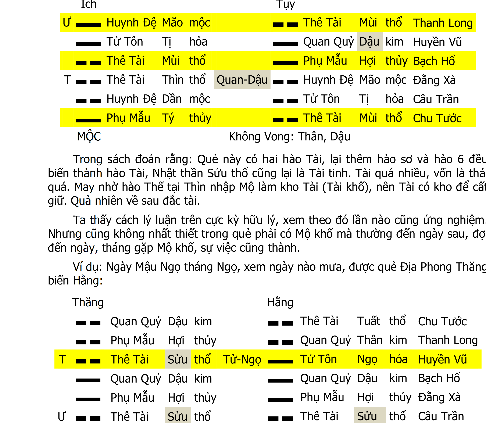

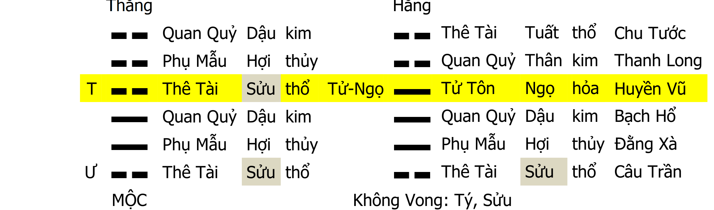

Người bạn mang quẻ này đến hỏi ta rằng: "Hôm nay xem về mưa mà Phụ Mẫu 
không động, hào Tài Sửu thổ lại hóa Ngọ hỏa hồi đầu sinh, ắt là điềm báo năm đại 
hạn."

Ta đáp rằng: "Ngày Nhâm Tuất sẽ có mưa." Bạn bèn hỏi rằng: "Có câu hào Phụ 
lâm Nguyệt kiến, mưa dầm suốt tuần. Nay hào Tử Tôn gặp Nguyệt kiến, cũng theo lẽ 
đó, làm sao lại mưa được?" Ta đáp rằng: "Hào Ngọ hỏa Tử Tôn lâm Nhật thần, 
Nguyệt kiến là cực vượng. Lại thêm hào Dụng Phụ Mẫu trùng điệp, nên cần phải có 
Mộ khố để cất trữ. Cho nên đến ngày Tuất, là ngày Ngọ nhập Mộ, sẽ mưa. Sau quả 
nhiên có mưa vào ngày Tuất.

Lại ví dụ: Ngày Bính Thân tháng Sửu, xem được quẻ Ký Tế biến Thái:

Ký Tế
 
Thái

Ư | Huynh ĐệTý | thủy | Phụ Mẫu Dậu kim Thanh Long

Quan QuỷTuất thổ | Huynh ĐệHợi thủy Huyền Vũ

Phụ Mẫu Thân kim | Quan QuỷSửu thổ Bạch Hổ

T | Huynh ĐệHợi | thủy Tài-Ngọ | Quan QuỷThìn thổ Đằng Xà

Quan QuỷSửu thổ | Tử Tôn | Dần mộc Câu Trần

Tử Tôn | Mão mộc | Huynh ĐệTý | thủy Chu Tước

THỦY
Không Vong: Thìn, Tị

Người xem là con nhà phú quý, mới mười bảy tuổi, xem về công danh một đời. 
Ta nhìn quẻ, biết rằng người này sẽ chết yểu, nhưng không tiện nói ra, cũng không 
đoán về công danh, mà chỉ nói cầu công danh bây giờ vẫn là quá sớm. Hai hào Quỷ 
động xung khắc hào Thế, chủ về liền năm bệnh tật tai ương, đợi khi qua 20 tuổi, 
thoát khỏi ách Quỷ, mới có thể hỏi chuyện công danh.

Một lát sau, thầy của cậu thanh niên đến hỏi rằng: "Đã hỏi về công danh cả đời, 
tại sao lại nói đến chuyện nhiều hào Quỷ khắc hào Thế?" Ta bèn đáp rằng: "Thần linh 
mách bảo người này yểu mệnh, nên không ứng nghiệm về chuyện công danh."

Người thầy hỏi: "Cần đề phòng thời điểm nào?" Ta đáp: "Năm nay Thái Tuế tại 
Dần, người này khó qua khỏi 19 tuổi." Người thầy hỏi: "Năm Thìn xung mất Quỷ Tuất, 
tại sao lại bất lợi?" Ta đáp: "Không thể suy luận như vậy! Thìn là Mộ của thổ, Quỷ quá 
vượng, cần phải có Mộ khố để cất trữ. Về sau, cậu thanh niên quả nhiên chết vào 
tháng Tuất năm Thìn.

Sự trở cách hề gián phát;

Việc gặp cản trở vì hào gián động;

Nguyên trong sách chú thích rằng: Hai hào nằm giữa hào Thế và hào Ứng gọi là 
hào gián (hào giữa), nếu phát động chủ về sự việc gặp cản trở. Hai hào này nằm giữa 
Thế và Ứng, nếu động sẽ cản trở hai bên, khiến cho không thể tương thông.

Lại nói: Hai hào nằm giữa Thế và Ứng nếu động, việc sẽ gặp nhiều cản trở.

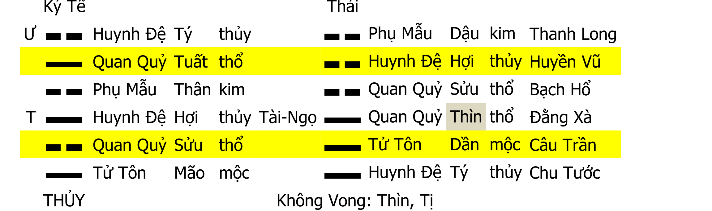

Giác Tử nói rằng: Hai hào này là hào gián, xem thử quả nhiên ứng nghiệm, 
nhưng còn phải tùy vào sự việc xem, chỉ khi xem về những việc liên quan đến hai 
bên, thì mới có thể áp dụng được nguyên lý này.

Xem về hôn nhân thì lấy hào gián làm mai mối; xem về kiện tụng lấy hào gián 
làm người làm chứng; xem về buôn bán lấy hào gián làm người dẫn mối; xem về vay 
nợ lấy hào gián làm người đảm bảo; xem về giao du lấy hào gián làm người giới thiệu; 
xem về thai sản lấy hào gián làm vú nuôi.

Hào Thế tượng trưng cho bản thân, hào Ứng tượng trưng cho người khác, nếu 
hai bên muốn kết thân với nhau, mà gặp hào gián phát động, không nên lập tức đoán 
ngay là sẽ gặp khó khăn, trở ngại. Nếu hào gián động mà sinh, hợp hào Thế, hào 
Ứng, sẽ được giúp sức. Hào nằm gần hào Thế, tượng trưng cho kẻ giúp ta; hào nằm 
gần hào Ứng, tượng trưng cho kẻ giúp người khác. Nếu tương sinh ra ta, ta nên thân 
gần; nếu khắc ta, ta nên tránh xa. Chỉ khi hào gián khắc Thế, Ứng, sự việc mới khó 
thành. Nếu khắc hào Thế, sẽ phá hỏng việc của ta, ta sẽ gặp họa; nếu khắc hào Ứng, 
sẽ hỏng việc của người, người khác sẽ gặp nạn. Nếu là hào Huynh động, tai họa sẽ 
nhỏ, chỉ là sự việc gặp cản trở, hao tài mà thôi. Nếu là hào Quỷ động, sẽ bị liên lụy.

### Ví dụ: Ngày Canh Thìn tháng Tị, xem về mua nhà, được quẻ Lâm biến Đại Tráng:

Lâm 
 
Đại Tráng

Tử Tôn | Dậu | kim | Huynh Đệ | Tuất thổ | Đằng Xà

Ư | Thê Tài | Hợi | thủy | Tử Tôn | Thân | kim | Câu Trần

Huynh Đệ | Sửu thổ | Phụ Mẫu | Ngọ | hỏa | Chu Tước

Huynh Đệ | Sửu thổ | Huynh Đệ | Thìn | thổ | Thanh Long

T | Quan Quỷ | Mão | mộc | Quan Quỷ | Dần | mộc | Huyền Vũ

Phụ Mẫu | Tị | hỏa | Thê Tài | Tý | thủy | Bạch Hổ

THỔ 
Không Vong: Thân, Dậu

Đoán rằng: Hào Thế là Mão mộc, hào Ứng là Hợi thủy, Thế Ứng tương sinh chủ 
về sự việc sẽ thành. Nhưng hiềm vì Hợi gặp Nguyệt phá, không thể sinh Thế. Lại thêm 
hào gián gồm ba tầng Sửu thổ phát động, là tượng một đám tiểu nhân ở giữa cản trở, 
nên việc ắt hỏng, khó có thể giao dịch thành công. Người này bèn nói rằng: "Tiền cọc 
đã trả, thế nhưng người trung gian môi giới của bên kia đòi nhiều tiền phí, bên kia bất 
mãn nên đổi ý không muốn bán." Ta đáp: "Trước mắt có trả nhiều cũng không thành 
được. Hào Ứng gặp Nguyệt phá lại bị khắc, hai nhà khó mua bán thành công."

Sau việc mua bán quả nhiên không thành, tiền cọc bị trả lại, người này rất giận 
dữ, nhờ bạn đến nhà người bán lý luận rằng: "Tại sao trước kia đã dẫn tôi đến xem 
nhà, tại sao ngày nay lại trả tiền cọc?" Đám bạn đến nhà người bán, trách móc mắng 
chửi, người bán cũng chỉ ngồi nghe. Ta sớm đã thấy các hào gián trong quẻ, ba hào 
thổ động. Hào nằm sát hào Ứng tượng trưng cho người bên cạnh bên bán; hào gián 
khắc hào Ứng, chủ về cách trở, việc bán nhà không thành, lại không được tiền của. 
Hào thổ nằm gần hào Thế cũng khắc hào Ứng, tượng trưng cho các bạn bè của bên 
mua đến mắng chửi bên bán.

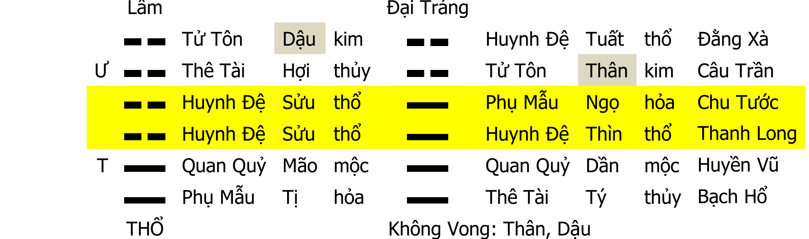

Nếu gặp hào gián phát động, mà gặp Nhật thần, Nguyệt kiến xung khắc, có thể 
giải cứu được.

Tâm thoái hối hề Thế không.

Nản lòng thoái chí bởi Thế lâm Không.

Nguyên trong sách chú thích rằng: Tự xem cho mình thì lấy hào Thế làm chủ 
tượng, nếu không bị Nhật thần, Nguyệt kiến, hào động thương khắc, mà bản thân hào 
thế lại vô cớ gặp Tuần Không (vô cố tự Không), chủ về bản thân nản lòng mất ý chí, 
không muốn tiến lên.

**Dã Hạc bàn rằng:** Lý luận này là đúng. Phần trước có viết: "vô cớ chớ không, như 
vào hang sâu vực thẳm, xem việc gì cũng là đại hung, là không đúng.

"Dịch lâm bổ di" viết: Thế, Ứng gặp Không, cả hai bên đều nản lòng thoái chí; 
khách, chủ đều động, ngày sau hai phía đều căng thẳng. Cho nên không chỉ hào Thế, 
mà hào Ứng cũng không nên lâm Không. Thế, Ứng đều Không, sự việc không thực. 
Nếu động mà lâm Không, tình hình sẽ khác.

Quái hào phát động, tu khán giao trùng;

Hào quẻ phát động, xem kỹ giao, trùng;

Nguyên trong sách chú thích rằng: Hào giao chủ về việc tương lai; hào trùng chủ 
về việc quá khứ. Ta đã xem thử nhiều quẻ, thi thoảng mới ứng nghiệm.

Phàm là hào tượng, nếu chỉ ra được nguyên lý nhất định bất biến, mới có thể làm 
phép tắc. Còn thi thoảng ứng nghiệm, thì chỉ là trùng hợp ngẫu nhiên, không thể áp 
dụng theo đó.

**Tân bình thích:** Thuyết này có ứng nghiệm, nhưng không bách phát bách 
trúng, chỉ dùng để tham khảo, không thể coi là chính pháp. Khi đoán quẻ, cần phải coi 
tình hình cụ thể trong quẻ mà định. Xem thời gian tương ứng với địa chi ứng kỳ và 
thời gian lúc dự đoán cái nào trước cái nào sau. Nếu xem vào năm Mùi, lúc ứng theo 
năm, nếu quyết định lấy địa chi ứng kỳ là Ngọ, thì là quá khứ, nếu quyết định lấy địa 
chi ứng kỳ là Dậu kim, thì là tương lai. Cách đoán tháng ngày cũng phỏng theo như 
vậy.

### Ví dụ: Ngày Giáp Ngọ tháng Hợi, một người đoán gửi giấy tờ cho người khác, đối

phương có nhận được không? Được Gia Nhân biến Ích.

Gia Nhân
 
Ích

Huynh ĐệMão mộc | Huynh ĐệMão mộc Huyền Vũ

Ư | Tử Tôn | Tị | hỏa | Tử Tôn | Tị | hỏa Bạch Hổ

Thê Tài | Mùi thổ | Thê Tài | Mùi thổ Đằng Xà

Phụ Mẫu Hợi thủy Quan-Dậu | Thê Tài | Thìn thổ Câu Trần

T | Thê Tài | Sửu thổ | Huynh ĐệDần mộc Chu Tước

Huynh ĐệMão mộc | Phụ Mẫu Tý | thủy Thanh Long

MỘC 
Không Vong: Thìn, Tị

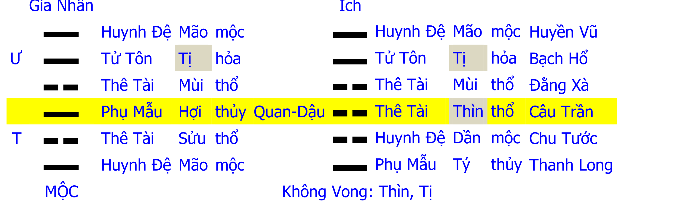

Lấy Phụ Mẫu làm Dụng, Phụ Mẫu lâm Nguyệt kiến phát động, hào dương phát 
động, dương chủ quá khứ, sự việc đã qua, nói rõ đối phương đã nhận được. Quả 
nhiên ở giờ Tị hôm đó nhận được, lúc dự đoán đã nhận được.

Động biến tỷ hòa, đương minh tiến thoái.

Động biến tỷ hòa, nên rõ tiến, thoái.

Đã trình bày rõ trong chương "Tiến thần".

Sát sinh thân, mạc tương cát đoán; Dụng khắc Thế vật tác hung khán. 
Cái sinh trung hữu hình hại chi lưỡng phòng, nhi hợp xứ hữu khắc thương 
chi nhị lự.

Sát sinh thân chớ đoán là tốt; Dụng khắc Thế chớ coi là hung. Vốn trong sinh cần 
đề phòng hình, hại; mà trong hợp lại lo gặp khắc, thương.

Sát sinh ra thân, tức Nhật thần, Nguyệt kiến, hào động làm Kỵ thần sinh Thế, 
chứ sát ở đây không có nghĩa là hung tinh, sát tinh. Tại sao trong trường hợp này 
không nên đoán là tốt? Là vì Kỵ thần vượng thì Dụng thần suy, hào Thế tuy được sinh 
cũng chẳng ích gì.

### Ví dụ: Ngày Bính Tý, tháng Tuất, xem cha đi Vân Nam nhiệm chức, lúc nào nhận

được tin, được quẻ Địa Trạch Lâm:

Lâm

Tử Tôn | Dậu | kim | Thanh Long

Ư | Thê Tài | Hợi | thủy | Huyền Vũ

Huynh Đệ | Sửu thổ | Bạch Hổ

Huynh Đệ | Sửu thổ | Đằng Xà

T | Quan Quỷ | Mão | mộc | Câu Trần

Phụ Mẫu | Tị | hỏa | Chu Tước

THỔ 
Không Vong: Thân, Dậu

Xem về tin tức, thì lấy hào Phụ Mẫu Tị hỏa Chu Tước làm Dụng thần. Nhật thần | Tý thủy khắc Dụng thần Tị hỏa nên là Kỵ thần. Tháng Tuất là Mộ của Tị hỏa, nên | cũng là Kỵ thần. Tị hỏa gặp Mộ tại Nguyệt kiến, lại bị Nhật thần khắc, là điềm bặt vô | âm tín. Hào Thế tại Mão mộc, tuy được Nhật sinh Nguyệt hợp, cũng chẳng ích gì. Bởi | vậy mới nói "Sát sinh thân chớ đoán là tốt", về sau, quả nhiên không nhận được tin | tức gì, đến bốn năm sau mới biết cha bị hại.

"Dụng khắc Thế chớ coi là hung": Tức Dụng thần khắc hào Thế. Nguyên trong 
sách chú thích rằng: Hào chủ sự động mà khắc hào Thế, tức việc đuổi theo ta, việc ắt 
dễ thành. Tuy mình bị khắc, cũng không bị thương hại. Bởi vậy nên mới nói Dụng 
khắc Thế, chớ coi là hung.

Giác Tử bàn rằng: Lý luận này không đúng hoàn toàn. Theo chứng nghiệm của 
ta, nếu xem về cầu tài, hào Tài là Dụng thần, nếu hào Tài khắc Thế, ắt sẽ đắc tài. 
Nếu xem về người đi xa, mà Dụng thần khắc hào Thế, là điềm người xa sắp trở về.

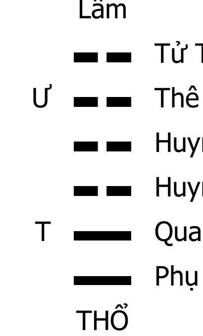

Xem về thuốc thang, lấy hào Tử Tôn làm Dụng thần, nếu Dụng thần khắc Thế, uống 
thuốc sẽ khỏi. Ngoài những trường hợp trên, thì Dụng thần khắc hào Thế đều là 
không tốt. Ví dụ, xem về công danh, mà Dụng thần là hào Quan Quỷ khắc Thế, chắc 
chắn sẽ gặp tai họa, nên không thể nhất loạt cho rằng "chớ coi là hung".

### Ví dụ: Ngày Canh Tý tháng Sửu, xem có được chức quan hay không, được quẻ

Thái biến Minh Di:

Thái
 
Minh Di

Ư | Tử Tôn | Dậu | kim | Tử Tôn | Dậu kim Đằng Xà

Thê Tài | Hợi | thủy | Thê Tài | Hợi thủy Câu Trần

Huynh ĐệSửu thổ | Huynh ĐệSửu thổ | Chu Tước

T | Huynh ĐệThìn thổ | Thê Tài | Hợi thủy Thanh Long

Quan QuỷDần | mộc Phụ-Tị | Huynh ĐệSửu thổ | Huyền Vũ

Thê Tài | Tý | thủy | Quan QuỷMão mộc Bạch Hổ

THỔ
Không Vong: Thìn, Tị

Xem về quan tước, lấy hào Quan Quỷ làm Dụng thần. Quẻ này Thìn thổ trì Thế, 
Dần mộc Quan Quỷ khắc Thế. Hào Thế lại lâm Không, đến ngày Nhâm Dần sẽ được 
chức quan sai. Đến tháng ba năm sau thì chết ở dọc đường. Như vậy, không thể nhất 
loạt cho rằng hào Dụng khắc hào Thế chớ coi là hung.

Lại ví dụ: Vào ngày Bính Thìn tháng Ngọ, xem chuyển nhà có tốt không, được 
quẻ Khiêm biến Minh Di:

Khiêm
 
Minh Di

Huynh ĐệDậu kim | Huynh ĐệDậu kim Thanh Long

T | Tử Tôn | Hợi | thủy | Tử Tôn | Hợi thủy Huyền Vũ

Phụ Mẫu Sửu thổ | Phụ Mẫu Sửu thổ Bạch Hổ

Huynh ĐệThân kim | Tử Tôn | Hợi thủy Đằng Xà

Ư | Quan QuỷNgọ hỏa Tài-Mão | Phụ Mẫu Sửu thổ Câu Trần

Phụ Mẫu Thìn thổ | Thê Tài | Mão mộc Chu Tước

KIM 
Không Vong: Tý, Sửu

Đoán rằng: Xem về nhà cửa, lấy hào Phụ Mẫu làm Dụng thần. Trong quẻ này 
hào Thìn thổ Phụ Mẫu động mà khắc hào Thế, nên không nên chuyển nhà. Người này 
nói rằng: "Việc đã bàn xong rồi!" Ta bèn đáp: "Trước mắt không có gì đáng ngại, 
nhưng đến mùa thu sẽ bất lợi." Người này hỏi nguyên do, ta đáp rằng: "Thìn thổ động 
hóa Mão mộc, đến mùa thu, mộc bị kim khắc thương, Thìn thổ sẽ đến khắc hào Thế." 
Quả nhiên đến tháng bảy động đất, nhà cửa đổ sập, khiến người nhà đều bị thương. 
Như vậy, không thể nói rằng hào Dụng khắc hào Thế là không hung.

Hình hại bất nghi lâm Dụng;

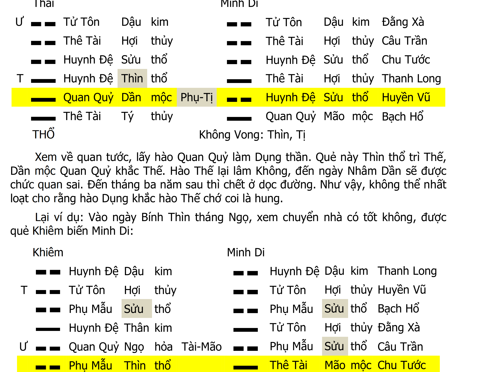

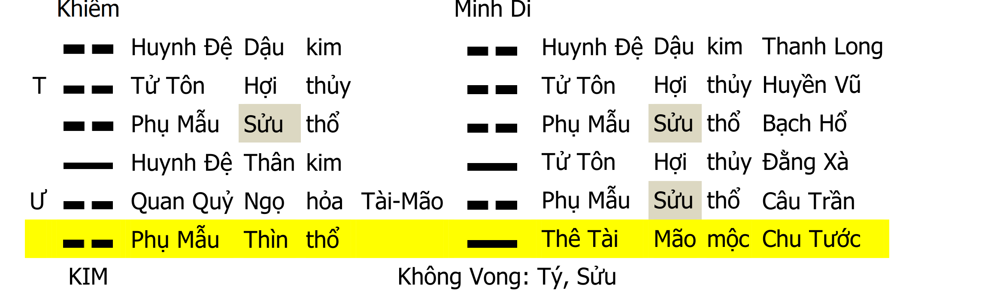

Hình hại không nên ở Dụng;

Nếu hào chủ sự cùng Nhật thần, Nguyệt kiến, hào động tạo thành Tam hình, 
xem về việc, sự việc không thành; xem về vật, vật không tốt đẹp; xem về bệnh tật, 
người bệnh sẽ chết; xem về người sẽ có mối lo; xem về phụ nữ sẽ không trinh tiết; 
xem về văn thư sẽ gặp trở ngại; xem về kiện tụng sẽ bị trách tội. Động mà hóa hình 
cũng như vậy.

Tử Tuyệt khởi khả trì Thân.

Tử, Tuyệt chẳng thể trì Thế.

Dụng thần hoặc hào Thế nếu gặp Tuyệt tại Nhật thần, hoặc hóa Tuyệt, theo chú 
thích trong sách xưa, thì xem việc gì cũng bất lợi. Ta cho rằng nếu Dụng thần hoặc 
hào Thế hưu tù, bị khắc, mà lại gặp Tuyệt mới ứng nghiệm, còn nếu vượng tướng thì 
không đáng ngại.

Gặp Tử, xem lần nào cũng không ứng nghiệm, nên không cần chú thêm.

**Tân bình thích:** Hào Thế là đất Tử Tuyệt của Dụng thần cũng vậy.

Động phùng xung nhi sự tán;

Động gặp xung thì việc tán;

Đã trình bày rõ tại các chương "Tam xung", "Lục xung".

Tuyệt phùng sinh nhi sự thành.

Tuyệt gặp sinh thì sự thành.

Hào Thế và Dụng thần nếu gặp Tuyệt tại Nhật thần hoặc hóa Tuyệt, nếu được 
Nhật thần, Nguyệt kiến, hào động tương sinh là "Tuyệt xứ phùng sinh" (nơi Tuyệt gặp 
sinh). Ví dụ ngày Dần xem quẻ, hào Dậu là Dụng thần. Dậu gặp Tuyệt tại Nhật thần 
Dần. Nếu tháng xem là Thìn, Tuất, Sửu, Mùi hoặc trong quẻ có hào động là Thìn, 
Tuất, Sửu, Mùi, có thổ sinh Dậu kim, như vậy là "Tuyệt xứ phùng sinh".

Như phùng hợp trú, tu xung phá dĩ thành công; nhược ngộ hưu tù, tất 
vượng tướng nhi thành sự.

Nếu gặp hợp lại, gặp xung phá sẽ thành công; như bị hưu tù, phải vượng tướng 
mà nên việc.

Đã trình bày rõ tại chương "Ứng kỳ".

Tốc tắc động nhi khắc Thế; hoãn tắc tĩnh nhi sinh thân.

Nhanh thì động mà khắc Thế; chậm thì tĩnh mà sinh thân.

Tức Dụng thần động mà khắc hào Thế, là điềm người đi xa nhanh chóng trở về; 
Dụng thần tĩnh mà sinh hào Thế, là điềm người đi xa chậm quay về. Ví dụ, xem cha 
mẹ lúc nào sẽ về, được hào Phụ Mẫu động mà khắc hào Thế, tức sắp về đến nơi.

**Tân bình thích:** Phép này có lý.

### Ví dụ: Ngày Đinh Dậu tháng Thìn, nam đoán bạn gái khi nào đến, được Đoài biến

Khốn.

Đoài
 
Khốn

T | Phụ Mẫu | Mùi thổ | Phụ Mẫu | Mùi | thổ | Thanh Long

Huynh Đệ | Dậu | kim | Huynh Đệ | Dậu kim | Huyền Vũ

Tử Tôn | Hợi | thủy | Tử Tôn | Hợi | thủy | Bạch Hổ

Ư | Phụ Mẫu | Sửu thổ | Quan Quỷ | Ngọ hỏa | Đằng Xà

Thê Tài | Mão | mộc | Phụ Mẫu | Thìn | thổ | Câu Trần

Quan Quỷ | Tị | hỏa | Thê Tài | Dần mộc | Chu Tước

KIM 
Không Vong: Thìn, Tị

Lấy Thê Tài làm Dụng thần. Hào sơ là cước lực, động mà hóa Tài, người đã ở 
giữa đường. Nhật xung Thê Tài Mão mộc, ám động khắc Thế, đến ngay hôm đó. Quả 
nhiên ở giờ Tuất hôm đó.

Phụ vong nhi sự vô đầu tự; Phúc ẩn nhi sự bất xứng tình.

Phụ Mẫu mất, việc không đầu mối; Phúc đức ẩn, sự chẳng vừa lòng.

Phép xem xưa viết: Trong quẻ không có hào Phụ Mẫu thì việc không đầu mối; 
Trong quẻ không có hào Tử Tôn (Phúc đức), không có chuyện vui.

Ta thấy rằng lý luận trên cũng là nhiễu sự. Phàm khi xem việc, cần xem Dụng 
thần, Nguyên thần, Kỵ thần, Cừu thần, khắc hại hình xung, Không, Phá, Mộ, Tuyệt, 
Nhật, Nguyệt, Phi, Phục, biết bao nhiêu thứ mà còn chưa thể quyết đoán, sao lại còn 
tìm đến những hào không thường dùng? E rằng cành lá rườm rà, lại càng khó tìm đầu 
mối.

Quỷ tuy họa tai, phục vưu vô khí;

Quỷ tuy là tai họa, nếu phục cũng vô khí;

Trong "Thiên nguyên phú" có nói đến "không có hào Quỷ", tuy hữu lý, nhưng 
thực chất cũng chỉ là đa sự. Ta bình sinh trong khi xem về quan chức, quỷ quái, tật 
bệnh, chỗ nào nên dùng thì dùng, không nên dùng thì bỏ đi.

**Tân bình thích:** Phục mà vượng tướng gặp xung cũng thành tai họa, khi xuất 
hiện là hung.

Tử tuy phúc đức, đa phản vô công.

Tử dẫu là phúc đức, nhưng nhiều lại uổng công.

Giác Tử nói rằng: Nếu Tử Tôn làm Kỵ thần thì quả thực Không tốt; nhưng nếu Tử 
Tôn làm Dụng thần, có nhiều cũng vô hại. Chẳng lẽ lại không biết câu "bớt đi sẽ 
thành", "gặp Mộ khố để cất trữ" hay sao.

Hổ hưng nhi ngộ cát thần, bất hại kỳ vi cát; Long động nhi phùng hung 
diệu, nan yểm kỳ vi hung.

Bạch Hổ hưng mà gặp cát thần, chẳng hại đến cát; Thanh Long động mà gặp | sao xấu, khó đỡ được hung.

Điều này có lý. Đã trình bày rõ tại chương "Lục thần".

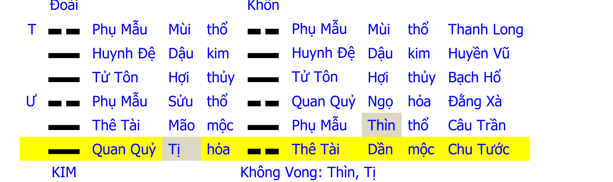

**Tân bình thích:** Ở đây đã hiểu sai công dụng của lục thần, lục thần không chủ 
cát hung, mà là dùng để biện ý (phân biệt ý nghĩa).

Huyền Vũ vi đạo tặc chi sự, diệc tất Quan hào; Chu Tước vi khẩu thiệt | chi thần, tất tu Huynh Đệ.

Huyền Vũ thành kẻ cướp bóc khi ở hào Quan; Chu Tước là thần thị phi khi lâm | Huynh Đệ.

Lý luận này không đúng. Huyền Vũ, Chu Tước, Câu Trần, Đằng Xà, nếu động mà | không khắc Thế chẳng có gì đáng ngại; động mà khắc Thế, đều là hung, chứ không | nhất thiết chỉ ở hào Huynh Đệ hay Quan Quỷ.

**Tân bình thích:** Quan lâm Huyền Vũ, cho dù có khắc Thế hay không, phát động 
trong quẻ thường xảy ra chuyện mất trộm. Huynh Đệ lâm Chu Tước, không khắc Thế 
cũng gặp chuyện khẩu thiệt.

### Ví dụ 1: Ngày Bính Ngọ tháng Dần, học trò của tôi ở Nhật Bản muốn đến Trung

Quốc, nhờ tôi dự đoán cát hung, được Giải biến Quy Muội.

Giải
 
Quy Muội

Thê Tài | Tuất thổ | Thê Tài | Tuất thổ Thanh Long

Ư | Quan QuỷThân kim | Quan QuỷThân kim Huyền Vũ

Tử Tôn | Ngọ hỏa | Tử Tôn | Ngọ hỏa Bạch Hổ

Tử Tôn | Ngọ hỏa | Thê Tài | Sửu thổ Đằng Xà

T | Thê Tài | Thìn thổ | Huynh ĐệMão mộc Câu Trần

Huynh ĐệDần mộc Phụ-Tý | Tử Tôn | Tị | hỏa Chu Tước

MỘC
Không Vong: Dần, Mão

Lấy hào Thế làm Dụng thần. Hào Thế Nguyệt khắc Nhật sinh, suy vượng tương | đương. Hào sơ Dần mộc Huynh Đệ lâm Chu Tước động mà khắc Thế, hào sơ là cước | lực, giữa đường đến Trung Quốc tất có chuyện khẩu thiệt, Dần mộc Không mà không | khắc hào Thế, không phải là mình và người ta phát sinh khẩu thiệt, mà là giữa đường | gặp phải người khác phát sinh khẩu thiệt. Hào Thế Tài bị khắc, tất có đồ vật bị tổn | hại.

Kết quả: Khi ngồi taxi từ sân bay vào trong thành phố, tài xế taxi xảy ra khẩu 
thiệt với người khác, trong thời gian ở Trung Quốc laptop mang theo đã bị hỏng.

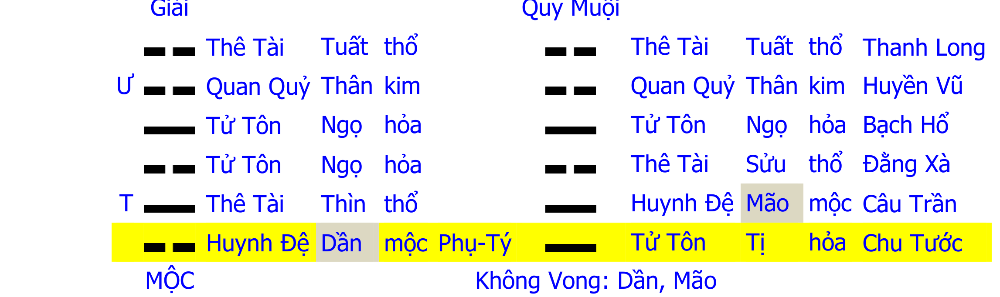

### Ví dụ 2: Ngày Tân Mùi tháng Dần, một nữ sĩ Nhật Bản đoán trong nhà có phát

sinh hỏa hoạn hay không? được Khốn biến Tụy.

Khốn
 
Tụy

Phụ Mẫu | Mùi | thổ | Phụ Mẫu | Mùi | thổ | Đằng Xà

Huynh Đệ | Dậu kim | Huynh Đệ | Dậu | kim | Câu Trần

Ư | Tử Tôn | Hợi | thủy | Tử Tôn | Hợi | thủy | Chu Tước

Quan Quỷ | Ngọ hỏa | Thê Tài | Mão | mộc | Thanh Long

Phụ Mẫu | Thìn | thổ | Quan Quỷ | Tị | hỏa | Huyền Vũ

T | Thê Tài | Dần mộc | Phụ Mẫu | Mùi | thổ | Bạch Hổ

KIM 
Không Vong: Tuất, Hợi

Hào 2 là hào trạch động hóa Quan Quỷ, Quan Quỷ là tai họa, mặc dù lâm hỏa, | nhưng lục thần chẳng phải Chu Tước mà là Huyền Vũ, tôi đoán sẽ không phát sinh | hỏa hoạn, nhưng sẽ phát sinh chuyện trộm cắp. Bởi vì Chu Tước chủ hỏa hoạn, Huyền | Vũ chủ đạo tặc.

Kết quả, ở tháng Thìn, xe đạp của gia đình cô bị người trộm đi. Sau cùng vẫn 
không phát sinh hỏa hoạn.

Cát hung thần sát chi đa đoan, hà như sinh khắc chế hóa chi nhất lý.

Thần sát cát hung quá rườm rà, sao bằng một lẽ sinh khắc chế hóa.

Nguyên lý này rất đúng, người học cần ghi nhớ kỹ.

Trừ ác vị tận, tử hôi tu phòng phục nhiên;

Trừ ác chưa tận, nên phòng tro tàn cháy lại;

Các thần khắc, hại, hình, xung, nếu được Nhật thần, Nguyệt kiến, hào động khắc 
chế, cần diệt tận gốc. Nếu diệt trừ không triệt để, về sau nếu gặp năm, tháng sinh 
phò, vẫn lại gây tai họa.

### Ví dụ: Ngày Giáp Thân tháng Mão, xem về bệnh tật, được quẻ Địa Sơn Khiêm

biến Thủy Sơn Kiển:

Khiêm
 
Kiển

Huynh ĐệDậu kim | Tử Tôn | Tý | thủy Huyền Vũ

T | Tử Tôn | Hợi | thủy | Phụ Mẫu Tuất thổ Bạch Hổ

Phụ Mẫu Sửu thổ | Huynh ĐệThân kim Đằng Xà

Huynh ĐệThân kim | Huynh ĐệThân kim Câu Trần

Ư | Quan QuỷNgọ hỏa Tài-Mão | Quan QuỷNgọ hỏa Chu Tước

Phụ Mẫu Thìn thổ | Phụ Mẫu Thìn thổ Thanh Long

KIM 
Không Vong: Ngọ, Mùi

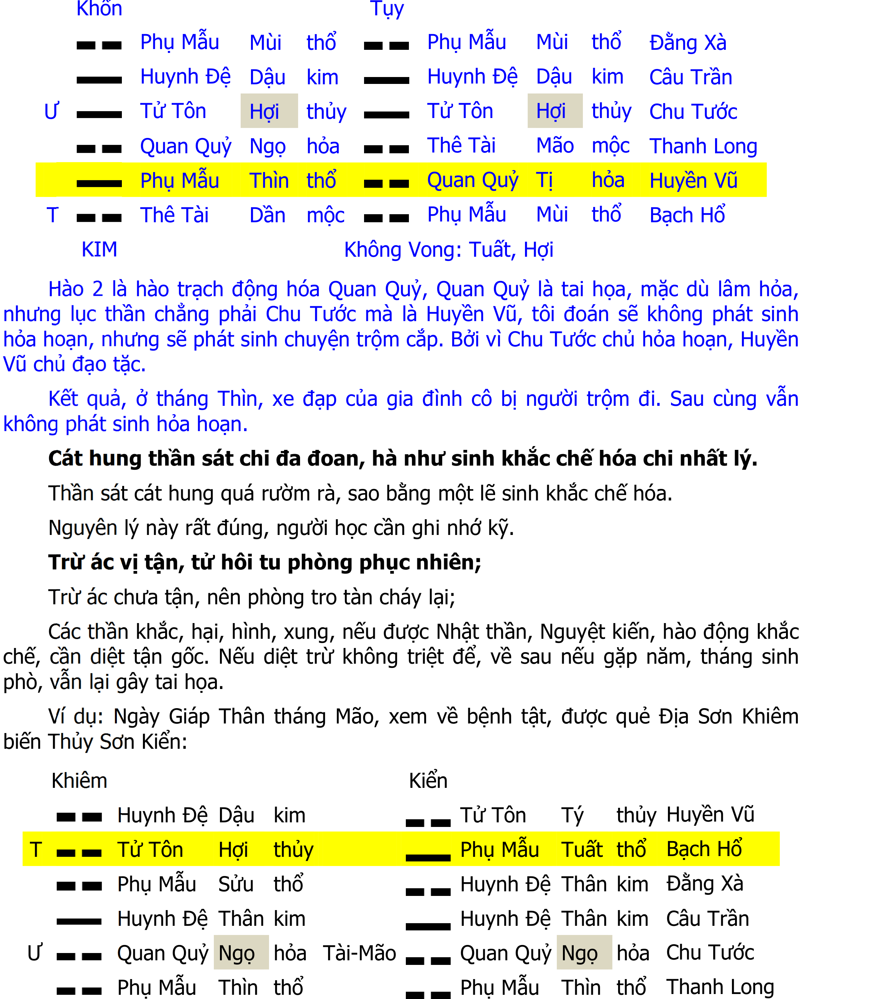

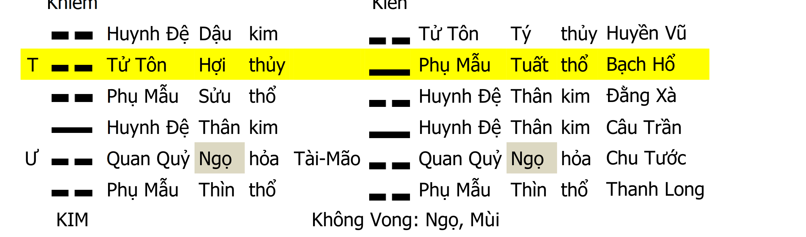

Đoán rằng: Hào Hợi thủy Tử Tôn gặp Trường Sinh tại Nhật thần Thân. Hào Thế 
được Nhật thần tương sinh, tuy hóa thành Tuất thổ hồi đầu khắc, nhưng thời gian 
xem đang vào mùa xuân, thổ suy, bị Nguyệt kiến Mão mộc khắc chế, nên được giải 
cứu, không gặp thương hại. Quả nhiên đến ngày Đinh Hợi thì khỏi bệnh. Nhưng không 
dè Mão mộc tuy khắc Tuất thổ, nhưng trong khắc lại có ý tương hợp; Hợi thủy tuy gặp 
Trường Sinh ở Thân, nhưng Tuất thổ cũng gặp Trường Sinh ở Thân. Về sau đến tháng 
Tị, hào Thế Hợi gặp Nguyệt phá, Tị hỏa sinh trợ Tuất thổ. Như ngạn ngữ có câu "Nhổ 
cỏ không nhổ tận gốc, sẽ lại nảy mầm", người này lại trở bệnh mà chết.

**Tân bình thích:** Lời này rất đúng, Kỵ thần phải có Nhật Nguyệt chế phục là đại 
cát, nếu không thì sau này vẫn có tai họa rắc rối. Đối với ví dụ ở trên, hào được 
Nguyệt hợp là hợp vượng, lại thổ được Trường Sinh, vì vậy cát chỉ là tạm thời.

### Ví dụ: Ngày Tân Tị tháng Tị, nam đoán lưu niên, được Lữ biến Ly.

Lữ 
 
Ly

Huynh ĐệTị | hỏa | Huynh ĐệTị | hỏa Đằng Xà

Tử Tôn | Mùi | thổ | Tử Tôn | Mùi thổ | Câu Trần

Ư | Thê Tài | Dậu | kim | Thê Tài | Dậu kim Chu Tước

Thê Tài | Thân kim Quan-Hợi | Quan QuỷHợi thủy Thanh Long

Huynh ĐệNgọ | hỏa | Tử Tôn | Sửu thổ | Huyền Vũ

T | Tử Tôn | Thìn thổ | Phụ-Mão | Phụ Mẫu | Mão mộc Bạch Hổ

HỎA
Không Vong: Thân, Dậu

Tôi đoán rằng: "Anh đang công tác trong ngành công kiểm pháp (công an, kiểm 
sát, tư pháp), hơi tham của, anh đã lấy tiền của nhà nước và có người đã tố cáo anh, 
chuyện này xảy ra ở tháng Mão, người tố cáo anh là một tài xế dưới quyền, ở trên có 
người bảo vệ anh nên hiện tại không có vấn đề, nhưng nhất định phải trả lại toàn số 
tiền, nếu không thì đến tháng Hợi anh sẽ bị cách chức."

Quả nhiên là người này đang làm trong ngành công an, anh ta đã tham ô hơn 10 
vạn nguyên của nhà nước. Tài xế của anh ta có nhờ lo liệu công việc nhưng không 
được đáp ứng, thế là tại tháng Mão người đó đã tố cáo anh ta tham ô. Do trong tòa 
án có người nói giúp nên trước mắt việc này đã chìm xuống.

Ly là giáp trụ, Tử Tôn là binh lính, công an, lâm Bạch Hổ, Bạch Hổ là đao thương, | chính là thông tin phục vụ trong quân đội hoặc công tác trong ngành chính trị pháp | luật. Hào sơ là người dưới quyền, động hóa hồi đầu khắc, khắc thần là Phụ Mẫu, Phụ | Mẫu là cáo trạng, xe, lâm Bạch Hổ, Bạch Hổ là đường đi, hào sơ lại là cước lực, xưa là | phu xe, nay là tài xế, vì vậy có tài xế dưới quyền tố cáo anh ta. Hào Thế động hợp | Ứng Tài, Ứng là người khác, Tài là tiền, là đã lấy tiền không thuộc về mình.

Khi đó người dẫn anh ta đến đoán cũng biết chút ít Dịch Lý, người này phản bác 
tôi rằng: "Ông đang dọa người ta, Phụ Mẫu Mão mộc Nhật Nguyệt không sinh, mà 
hào Thế được Nhật Nguyệt đến sinh, Dụng thần vượng mà Kỵ thần nhược, chuyện 
này đã dừng lại, sau này sẽ không có gì."

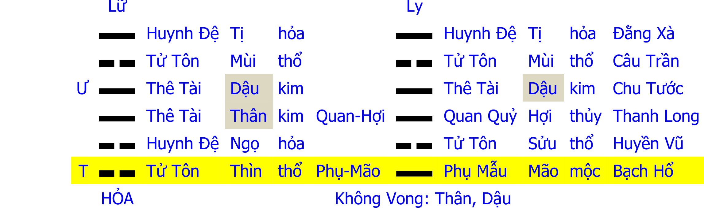

Tôi trả lời: "Kỵ thần tuy nhược, nhưng không được Nhật Nguyệt chế phục, sách 
cổ nói "nhổ cỏ không nhổ tận gốc, sẽ lại nảy mầm", đến tháng Hợi Mão mộc được 
sinh, hào Thế bị khắc càng nặng, huống hồ Quan Quỷ Hợi thủy Nhật phá Nguyệt phá, 
Tử Tôn trì Thế phát động, chính là tượng tháng Hợi mất quan bãi chức.

Đến tháng Hợi, quả nhiên bộ hạ lại tố cáo, ngành chấp pháp phải tiếp nhận thẩm 
tra anh ta, anh ta vứt bỏ chức vụ mà trốn đi, đến nay vẫn chưa quay về.

Thương hại bất trọng, khô mộc do hữu phùng xuân.

Khắc hại không nặng, cây khô lại gặp mùa xuân.

Hào Thế và hào Dụng hữu khí, nếu bị Nhật thần, Nguyệt kiến, hào động xung 
khắc, trước mắt tuy gặp thương khắc, nhưng ngày sau nếu gặp sinh sẽ lại được sinh 
khởi.

### Ví dụ: Vào ngày Đinh Hợi tháng Tý, xem về tự biện tội, được quẻ Lôi Trạch Quy

Muội biến Giải:

Quy Muội
 
Giải

Ư | Phụ Mẫu Tuất thổ | Phụ Mẫu Tuất thổ Thanh Long

Huynh ĐệThân kim | Huynh ĐệThân kim Huyền Vũ

Quan QuỷNgọ hỏa Tử-Hợi | Quan QuỷNgọ hỏa Bạch Hổ

T | Phụ Mẫu Sửu thổ | Quan QuỷNgọ hỏa Đằng Xà

Thê Tài | Mão mộc | Phụ Mẫu Thìn thổ Câu Trần

Quan QuỷTị | hỏa | Thê Tài | Dần mộc Chu Tước

KIM 
Không Vong: Ngọ, Mùi

Đoán rằng: Tị hỏa Quan tinh, do xem vào mùa đông, nên là hưu tù; lại bị Nguyệt 
kiến Tý thủy, Nhật thần Hợi thủy trùng trùng xung khắc, nên công danh khó bảo toàn. 
Người này hỏi: "Sẽ bị cách chức, hay điều nhiệm đi nơi khác?" Ta đáp: "Nếu là cách 
chức, thì hào Quan Tị hỏa sẽ không động. Nhưng ở trong quẻ này, Tị hỏa động hóa 
Dần mộc hồi đầu sinh, nên khắc chưa tận, công danh vẫn còn gốc. Lại thêm Nguyệt 
kiến hợp với hào Thế, hào Quan bị thương mà hào Thế bất động, có thể chỉ là giáng 
cấp lưu nhiệm."

Quả nhiên đến tháng Dần bị cách chức lưu nhiệm. Trong quẻ này Nhật thần, 
Nguyệt kiến xung khắc Quan tinh mà bị hại không nặng, nên vẫn còn có cơ hội hồi 
sinh. Xem năm Mão, đến năm Tị lại được phục hồi chức cũ.

Thủy mộc tu nghi tầm căn;

Như nước như cây cần tìm nguồn gốc;

Phàm xem về thân mệnh, gia trạch, công danh, mộ phần, buôn bán, nếu muốn 
được lâu dài, Dụng thần tuy quan trọng, nhưng vẫn phải xem cả Nguyên thần. Dụng 
thần là thể của sự việc, Nguyên thần là gốc rễ của sự việc. Dụng thần tuy vượng, 
nhưng nếu Nguyên thần bị thương khắc, cũng như nước không nguồn, cây không rễ.

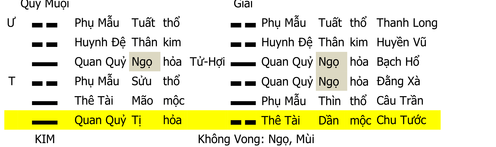

### Ví dụ: Ngày Canh Dần tháng Ngọ xem bị thuyên chuyển đi nơi nào, được quẻ Đại

Súc biến Trung Phu:

Đại Súc
 
Trung Phu

Quan QuỷDần Mộc | Quan QuỷMão mộc Đằng Xà

Ư

Thê Tài | Tý | Thủy | Phụ Mẫu Tị | hỏa Câu Trần

Huynh ĐệTuất Thổ | Huynh ĐệMùi thổChu Tước

Huynh ĐệThìn Thổ Tử-Thân | Huynh ĐệSửu thổThanh Long

T

Quan QuỷDần Mộc Phụ-Ngọ | Quan QuỷMão mộc Huyền Vũ

Thê Tài | Tý | Thủy | Phụ Mẫu Tị | hỏa Bạch Hổ

THỔ 
Không Vong: Ngọ, Mùi

Đoán rằng: Hào Thế lâm Dần mộc là Quan tinh, ắt được điền khuyết tại phương 
đông, không Quảng Đông cũng là Sơn Đông. Chỉ hiềm Tý thủy gặp Nguyệt phá, lại 
động mà hóa Tuyệt, sợ không đến được nơi bổ nhiệm. Người xem hỏi nguyên do, ta 
đáp rằng: "Tài là nguồn để nuôi dưỡng mệnh, lại tượng trưng cho lộc triều đình. Nay 
hào Tài gặp Tuyệt địa, là điềm không tài không lộc; hào Thế Dần mộc không có thủy 
để tương sinh là điềm hung." Người này nói: "Vậy ngày khác tôi thành tâm xin thêm 
một quẻ!" Ta đáp đồng ý.

Đến ngày Giáp Ngọ, xem lại được quẻ Lâm biến Tiết:

Lâm 
 
Tiết

Tử Tôn | Dậu | Kim | Thê Tài | Tý | thủy | Huyền Vũ

Ư | Thê Tài | Hợi | Thủy | Huynh Đệ | Tuất thổ | Bạch Hổ

Huynh Đệ | Sửu Thổ | Tử Tôn | Thân | kim | Đằng Xà

Huynh Đệ | Sửu Thổ | Huynh Đệ | Sửu | thổ | Câu Trần

T | Quan Quỷ | Mão | Mộc | Quan Quỷ | Mão | mộc | Chu Tước

Phụ Mẫu | Tị | Hỏa | Phụ Mẫu | Tị | hỏa | Thanh Long

THỔ
Không Vong:

Ta đoán rằng: Quẻ này với quẻ trước tuy khác tên nhưng cũng một ý. Hào Tài 
Hợi thủy hóa Tuất thổ hồi đầu khắc, không chỉ khó đến được nơi nhậm chức, mà còn 
phải đề phòng mùa thu sẽ gặp tai ương. Người này năm trước tục huyền, cưới vợ từ 
phương nam đưa đến kinh đô, tháng chạp gặp biến cố nên chưa thành hôn, đổi thành 
tháng tư. Nhưng không ngờ cha lại bị điều trần đắc tội, nên chưa tiện thành hôn.

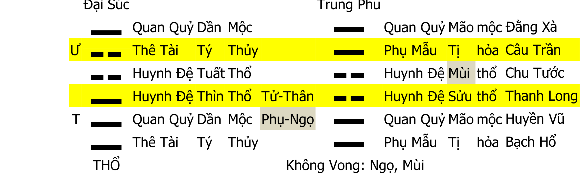

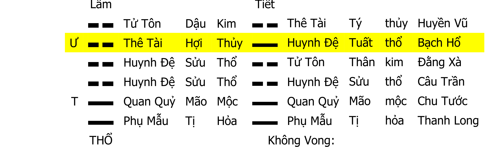

Ngày Kỷ Sửu tháng Ngọ, lại xem tháng nào sẽ thành hôn, được quẻ Khuê:

Khuê

Phụ Mẫu | Tị | hỏa | Câu Trần

Huynh ĐệMùi thổ Tài-Tý Chu Tước

T | Tử Tôn | Dậu kim | Thanh Long

Huynh ĐệSửu thổ | Huyền Vũ

Quan QuỷMão mộc | Bạch Hổ

Ư | Phụ Mẫu | Tị | hỏa | Đằng Xà

THỔ
Không Vong: Ngọ, Mùi

Ta đoán rằng không phải nhân duyên, nên sẽ không có ngày thành hôn. Về sau 
người này muốn đi xin chịu tội thay cha, ta bèn nói: "Ông xem về công danh, được 
quẻ không thể đến nhiệm chức. Ông lại xem về hôn nhân, quẻ lại không thành. Nay 
ông muốn xin tội, tuy vì chữ hiếu, nhưng đến mùa thu sẽ gặp tai ương, nên việc này 
không tiện." May người này nghe lời ta mà không thực hiện. Sau đến tháng bảy, mắc 
bệnh tả, uống thuốc đã đỡ. Nhưng sau uống nhiều thuốc bổ, mỗi lần uống đến một 
lạng, khát nước. Thầy thuốc dặn cả nhà, không được cho uống chút nước nào. Sau 
khát quá mà chết, thực ứng vào điềm không có thủy.

**Tân bình thích:** Đây là lời nói chí lý, dự đoán mở cửa hàng, buôn bán, hôn 
nhân,... đều phải kiêm xem Nguyên thần. Rất nhiều quẻ tôi được nghiệm, người thời 
nay chỉ xem Dụng thần, thường hay có trường hợp Dụng thần vượng tướng nhưng kết 
quả gặp hung, thế là liền quy vào quẻ không ứng nghiệm, mà không biết rằng bản 
thân giải quẻ chưa sâu, chưa nắm được cốt tủy của quẻ.

### Ví dụ: Ngày Giáp Tý tháng Thìn, một Dịch hữu đoán kết quả yêu đương với bạn

gái ra sao? Được Phong Thiên Tiểu Súc.

Tiểu Súc

Huynh ĐệMão mộc | Huyền Vũ

Tử Tôn | Tị | hỏa | Bạch Hổ

Ư

Thê Tài | Mùi thổ | Đằng Xà

Thê Tài | Thìn thổ Quan-Dậu Câu Trần

Huynh ĐệDần mộc | Chu Tước

T

Phụ Mẫu Tý | thủy | Thanh Long

MỘC 
Không Vong: Tuất, Hợi

Tôi nói: Bạn gái của anh trông rất đầy đặn, nóng tính, tóc đen ánh đỏ, mắt trái bị 
cận thị, hiện nay tình cảm hai người rất tốt, tuy nhiên sau này sẽ mỗi người mỗi ngả, 
không thể thành.

Anh ta hỏi: Dụng thần vượng tướng, sao lại không thể thành?

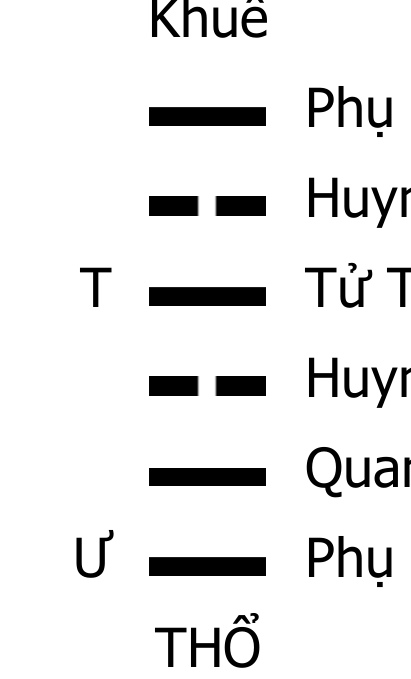

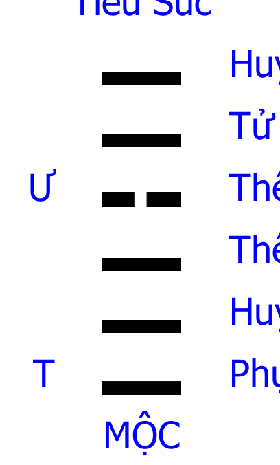

Tôi đáp: Nguyên thần bị Nhật khắc thương, vô lực sinh Dụng, Dụng thần vượng 
tướng chỉ là tượng tạm thời thân nhau.

Kết quả là sau nửa năm chia tay.

Động hào hà phương không phá?

Hào động ngại gì Không, Phá?

Lý luận này rất đúng. Tôi được nghiệm ví dụ như sau:

### Ví dụ: Ngày Kỷ Tị tháng Tuất, ta tự xem về việc đi xuống phương nam, được quẻ

Đại Hữu biến Đại Tráng:

Đại Hữu
 
Đại Tráng

Ư | Quan QuỷTị | hỏa | Phụ Mẫu Tuất thổ Câu Trần

Phụ Mẫu Mùi thổ | Huynh ĐệThân kim Chu Tước

Huynh ĐệDậu kim | Quan QuỷNgọ hỏa Thanh Long

T | Phụ Mẫu Thìn thổ | Phụ Mẫu Thìn thổ Huyền Vũ

Thê Tài | Dần mộc | Thê Tài | Dần mộc Bạch Hổ

Tử Tôn | Tý | thủy | Tử Tôn | Tý | thủy Đằng Xà

KIM 
Không Vong: Tuất, Hợi

Ta đoán rằng: Hào Ứng Quan tinh sinh hào Thế, hào Quan hào Ứng tương sinh 
là tốt, nhưng hiềm vì Tị hỏa gặp Mộ tại Nguyệt kiến Tuất, lại động mà hóa Mộ. Hào 
Quan sinh thân đã nhập Mộ, nên không còn sinh được thân. Lại biến thành quẻ lục 
xung, nên ngờ là điềm chẳng lành.

Đến ngày Giáp Thìn tháng Hợi, xem lại, được quẻ Đại Hữu biến Đại Súc:

Đại Hữu
 
Đại Súc

Ư | Quan Quỷ | Tị | hỏa | Thê Tài | Dần mộc Huyền Vũ

Phụ Mẫu | Mùi | thổ | Tử Tôn | Tý | thủy | Bạch Hổ

Huynh Đệ | Dậu kim | Phụ Mẫu | Tuất | thổ | Đằng Xà

T | Phụ Mẫu | Thìn | thổ | Phụ Mẫu | Thìn | thổ | Câu Trần

Thê Tài | Dần mộc | Thê Tài | Dần mộc Chu Tước

Tử Tôn | Tý | thủy | Tử Tôn | Tý | thủy | Thanh Long

KIM 
Không Vong: Dần, Mão

Ta ngờ rằng lại được quẻ này, hào Tị hỏa tuy sinh hào Thế, nhưng lại gặp 
Nguyệt phá, gặp Nguyệt phá thì không thể sinh thân, nên cũng chẳng ích gì. Lại thêm 
hào gián Dậu kim Huynh động, là tượng cách trở hao tài, nên nghi ngờ rằng chuyến đi 
này không có kết quả tốt.

Lại đến ngày Giáp Dần, xem được quẻ Đại Hữu biến Đại Tráng:

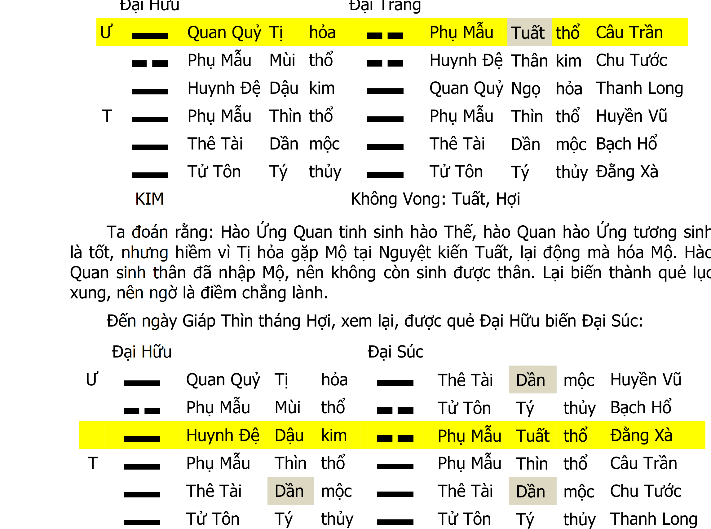

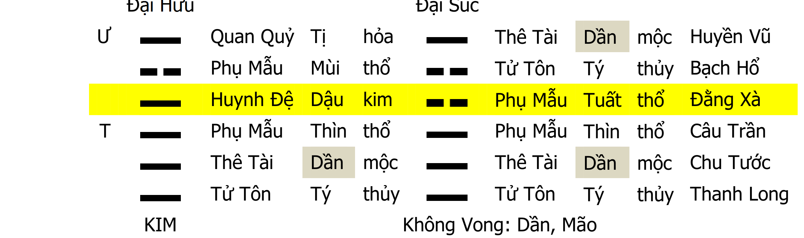

Đại Hữu
 
Đại Tráng

Ư | Quan QuỷTị | hỏa | Phụ Mẫu Tuất thổ Huyền Vũ

Phụ Mẫu Mùi thổ | Huynh ĐệThân kim Bạch Hổ

Huynh ĐệDậu kim | Quan QuỷNgọ hỏa Đằng Xà

T | Phụ Mẫu Thìn thổ | Phụ Mẫu Thìn thổ Câu Trần

Thê Tài | Dần mộc | Thê Tài | Dần mộc Chu Tước

Tử Tôn | Tý | thủy | Tử Tôn | Tý | thủy Thanh Long

KIM 
Không Vong: Tý, Sửu

Xem được liền ba quẻ Đại Hữu, ta mới ngộ ra rằng: Chuyến đi này nếu đến 
tháng ba, tháng tư sang năm khởi hành sẽ được như ý. Hào quan Tị hỏa động mà 
sinh Thế, trước mắt tuy suy, gặp Phá, nhập Mộ, nhưng đến tháng ba năm sau, xung 
khai Mộ khố là Tuất, thì Tị hỏa đến tháng Tị sẽ đắc lệnh mà không còn bị Phá, bị 
Không, thành vượng tướng mà sinh Thế.

Sau đến tháng Tị thì khởi hành. Giữa đường gặp người quen cũ, mẹ mất lại bị 
cháy nhà, muốn đi cùng ta, nhưng không có tiền bạc. Lúc này ta mới ngộ ra quẻ thứ 
hai Đại Hữu biến Đại Súc: Hào Dậu kim Huynh Đệ động, ý nói dẫn theo người đồng 
hành.

Số đã định sẵn, nên ta đồng ý cho đi cùng. Đi được vài ngày, lại gặp người tri kỷ, 
nói rằng tại một nơi nọ có một bản sao bộ Kỳ Môn, bảo ta đi cùng đến mua. Đi đường 
vòng hai ngày, ta xem một quẻ, lại được quẻ Đại Hữu biến Đại Tráng:

Đại Hữu
 
Đại Tráng

Ư | Quan QuỷTị | hỏa | Phụ Mẫu Tuất thổ

Phụ Mẫu Mùi thổ 
 
Huynh ĐệThân kim

Huynh ĐệDậu kim 
 
Quan QuỷNgọ hỏa

T | Phụ Mẫu Thìn thổ | Phụ Mẫu Thìn thổ

Thê Tài 
Dần mộc
 
Thê Tài 
Dần mộc

Tử Tôn 
Tý 
thủy
 
Tử Tôn 
Tý 
thủy

Ta bảo bạn rằng: "Quẻ Đại Hữu đã xem được bốn lần, không phải bảo ta mua 
sách, mà là giục ta đi gấp". Bèn đi tiếp, đến nơi đã là tháng hai. Ngày nọ tại phủ 
Tướng quân, Tướng quân hỏi ta rằng: "Vị Phủ quân nọ ở Giang Nam, việc công danh 
về sau sẽ ra sao?" Ta đáp rằng: "Trước kia vào năm Dậu, xem được quẻ Cấn biến 
Quan, đoán rằng đến năm Dậu mất chức, nhưng đến tháng ba, tháng tư năm nay lại 
được phục hồi phẩm cũ."

Lúc đấy là ngày Mậu Tuất tháng Mão, một người tùy tùng xem công danh có 
được thăng tiến hay không, được quẻ Ly biến Chấn:

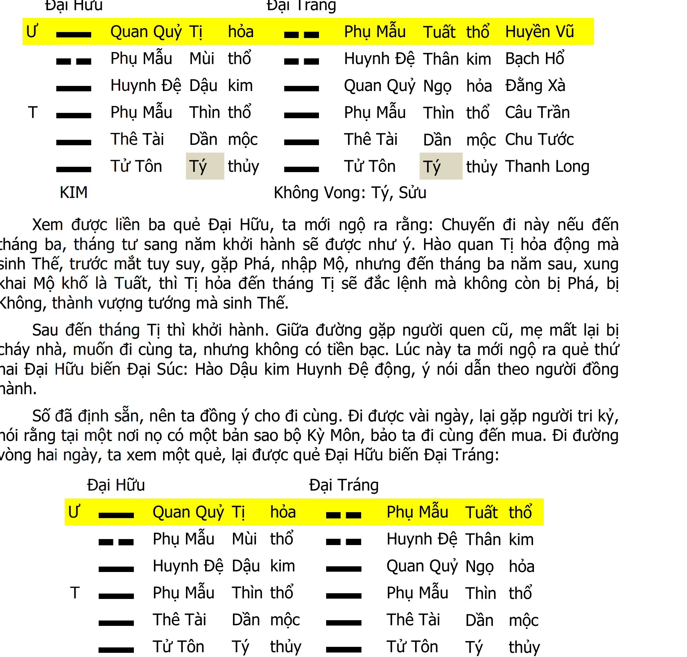

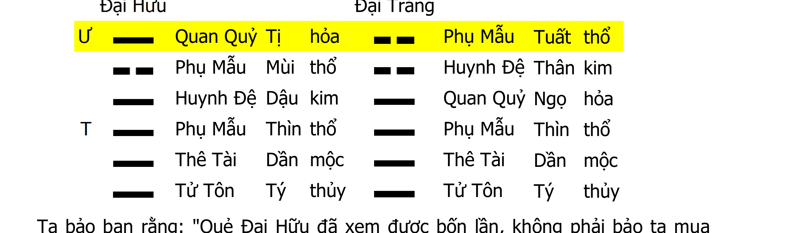

Ly 
 
Chấn

T | Huynh Đệ | Tị | hỏa | Tử Tôn | Tuất thổ | Chu Tước

Tử Tôn | Mùi | thổ | Thê Tài | Thân | kim | Thanh Long

Thê Tài | Dậu | kim | Huynh Đệ | Ngọ | hỏa | Huyền Vũ

Ư | Quan Quỷ | Hợi | thủy | Tử Tôn | Thìn | thổ | Bạch Hổ

Tử Tôn | Sửu thổ | Phụ Mẫu | Dần | mộc | Đằng Xà

Phụ Mẫu | Mão | mộc | Quan Quỷ | Tý | thủy | Câu Trần

HỎA
Không Vong: Thìn, Tị

Ta đoán rằng: Quẻ Ly biến Chấn, là quẻ Lục xung biến Lục xung. Hào Thế lại 
nhập Mộ (tại Nhật thần) hóa Mộ (Tuất). Quan tinh Hợi thủy động hóa hồi đầu khắc là 
điềm đại hung, đừng mong thăng chức, lại phải đề phòng hình ngục. Tướng quân bèn 
nói: "Hắn là cháu tôi, ngày trước lúc 29 tuổi, từng đến kinh đô nhờ ông xem quẻ giúp, 
ông đoán đến năm 49 tuổi có nguy hiểm. Năm nay hắn đúng 49 tuổi rồi, liệu sẽ gặp 
phải nguy hiểm gì?" Ta đáp: "Hai quẻ trước sau đã trùng hợp với nhau, nên thận 
trọng trong mọi việc."

Ngày nọ tại phủ Bố chính, viên Bố chính hỏi ta rằng: "Đây là quan Tri phủ của 
phủ ta, do công văn có sai lầm, quan Tổng đốc đã giúp xin phục chức, ông xem giúp 
có được hay không?"

Ngày Canh Tý tháng Mão, xem được quẻ Tiệm:

Tiệm

Ư | Quan QuỷMão mộc | Đằng Xà

Phụ Mẫu | Tị | hỏa Tài-Tý Câu Trần

Huynh ĐệMùi | thổ | Chu Tước

T | Tử Tôn | Thân kim | Thanh Long

Phụ Mẫu | Ngọ hỏa | Huyền Vũ

Huynh ĐệThìn thổ | Bạch Hổ

THỔ
Không Vong: Thìn, Tị

Đoán rằng: "Hào Tử Tôn trì Thế, Quan ở hào Ứng, nên lộc đã thuộc về người 
khác, phục chức là cực khó." Quan Bố chính nói: "Bảo ông báo tin vui, sao lại nói như 
vậy?" Ta đáp: "Nếu có tin vui sẽ báo, nhưng trong quẻ này không có tin vui gì."

Quan Tri phủ nói: "Hôm nay không được thành tâm, ngày mai mời đến tệ phủ, 
thành tâm xem lại."

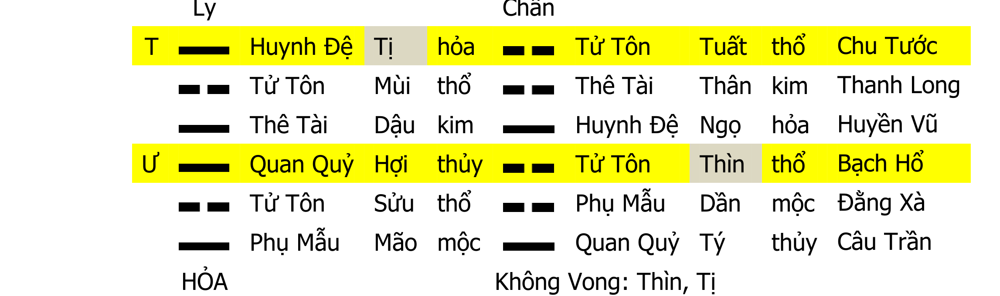

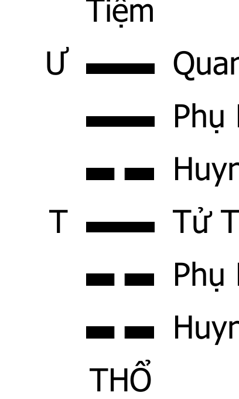

Ngày Tân Sửu tháng Mão xem lại, được quẻ Hỏa Địa Tấn:

Tấn

Quan Quỷ | Tị | hỏa | Đằng Xà

Phụ Mẫu | Mùi | thổ | Câu Trần

T | Huynh Đệ | Dậu kim | Chu Tước

Thê Tài | Mão | mộc | Thanh Long

Quan Quỷ | Tị | hỏa | Huyền Vũ

Ư | Phụ Mẫu | Mùi | thổ | Tử-Tý | Bạch Hổ

KIM 
Không Vong: Thìn, Tị

Ta đoán rằng: "Quẻ này cũng tương tự với quẻ hôm trước. Hào Thế gặp Nguyệt 
phá lại nhập Mộ tại Nhật thần. Quan tinh gồm hai hào nhưng đều lâm Không." Người 
này vẫn không chưa phục. Ta bèn nói: "Xem thêm một quẻ nữa cũng chẳng hại gì". 
Lại xem được quẻ Hằng biến Đại Quá:

Hằng
 
Đại Quá

Ư | Thê Tài | Tuất thổ | Thê Tài | Mùi thổ Đằng Xà

Quan QuỷThân kim | Quan QuỷDậu kim Câu Trần

Tử Tôn | Ngọ hỏa | Phụ Mẫu Hợi thủy Chu Tước

T | Quan QuỷDậu kim | Quan QuỷDậu kim Thanh Long

Phụ Mẫu Hợi | thủy Huynh-Dần | Phụ Mẫu Hợi thủy Huyền Vũ

Thê Tài | Sửu thổ | Thê Tài | Sửu thổ Bạch Hổ

MỘC
Không Vong: Thìn, Tị

Ta nói rằng: "Xin chúc mừng! Theo như quẻ này, tước vị tuy đã mất, nhưng sẽ 
nhanh chóng được viện lệ mà cho phục chức ở phương Tây." Người này hỏi: "Tại sao 
mà biết được?" Ta đáp: "Hào Thế trì Quan gặp Nguyệt phá lại nhập Mộ tại Nhật thần, 
là điềm mất chức. May có hào 5 là Quan tinh động hóa Tiến thần, là tượng được bổ 
nhiệm lại."

**Tân bình thích:** Thực ra trong hai quẻ trước cũng có dấu hiệu biến động chức 
vụ. Đối với quẻ Tiệm ở ngày Tý tháng Mão, Phụ Mẫu Ngọ hỏa ám động, Phụ Mẫu là 
nha môn, lại là công văn điều động, chính là tượng chức quan biến động. Đối với quẻ 
Tấn ở ngày Sửu tháng Mão, lại là Phụ Mẫu Mùi thổ ám động, cũng là tượng chức vụ 
có biến đổi.

Đến ngày Giáp Thìn tháng Mão, quan Đạo đài xem về bệnh của mẹ, được quẻ 
Quải biến Đại Tráng:

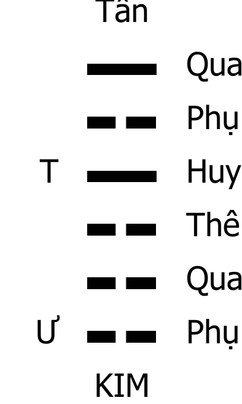

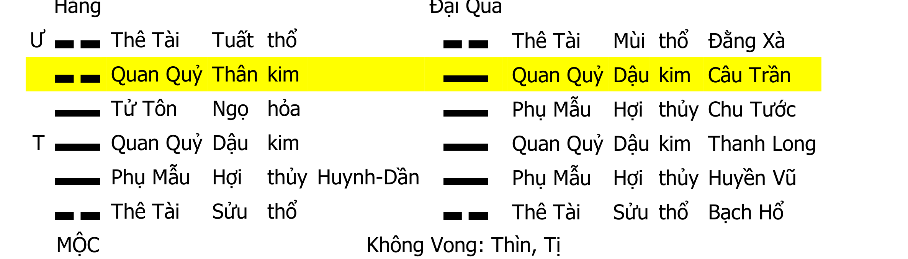

Quải
 
Đại Tráng

Huynh ĐệMùi thổ | Huynh ĐệTuất thổ Huyền Vũ

T | Tử Tôn | Dậu kim | Tử Tôn | Thân kim Bạch Hổ

Thê Tài | Hợi thủy | Phụ Mẫu | Ngọ hỏa Đằng Xà

Huynh ĐệThìn thổ | Huynh ĐệThìn thổ Câu Trần

Ư | Quan QuỷDần mộc Phụ-Tị | Quan QuỷDần mộc Chu Tước

Thê Tài | Tý | thủy | Thê Tài | Tý | thủy Thanh Long

THỔ
Không Vong: Dần, Mão

Ta đoán rằng: "Hào Tị hỏa Phụ Mẫu phục dưới hào Dần mộc, Phi thần sinh Phục 
thần; Nguyệt kiến Mão mộc là Nguyên thần của Phụ Mẫu, nên bệnh tình của Thái phu 
nhân sẽ khỏi. Đã gặp lương y, đến giờ Dậu hôm nay, sẽ có tin vui, đến tháng Tị sẽ 
khỏi bệnh". Quả nhiên đến giờ Dậu, người nhà đến báo rằng: "Vị thầy thuốc do quan 
dẫn đến hôm qua, cho lão phu nhân uống thuốc đúng bệnh, vị thầy thuốc này đảm 
bảo sẽ chữa khỏi, hẹn đến tháng tư lành bệnh", sở dĩ ứng vào giờ Dậu có tin vui, vì 
hào Tử Tôn Dậu kim trì Thế.

Vào ngày Đinh Mùi tháng Mão, đến phủ thự của quan Đô ty, xem về quan chức, 
được quẻ Ký Tế biến Truân:

Ký Tế
 
Truân

Ư | Huynh ĐệTý | thủy | Huynh ĐệTý | thủy Thanh Long

Quan QuỷTuất thổ | Quan QuỷTuất thổ Huyền Vũ

Phụ Mẫu Thân kim | Phụ Mẫu Thân kim Bạch Hổ

T | Huynh ĐệHợi | thủy Tài-Ngọ | Quan QuỷThìn thổ Đằng Xà

Quan QuỷSửu thổ | Tử Tôn | Dần mộc Câu Trần

Tử Tôn | Mão mộc | Huynh ĐệTý | thủy Chu Tước

THỦY
Không Vong: Dần, Mão

Ta đoán rằng: "Việc quan chức hãy khoan nói, trước mắt bệnh tật đã rất nguy 
cấp, đến tháng ba cần đề phòng bất trắc." Người này nói: "Tôi xem về quan chức, chứ 
đâu có xem về bệnh tật? Huống chi tôi không có bệnh, chỉ vì chân đau đi lại khó khăn 
nên không đứng dậy được, ông ngờ là tôi mắc bệnh ư?" Ta bèn nói: "Tuy ông xem về 
quan tước, nhưng thần linh lại mách bảo rằng: "Bệnh tật nguy hiểm, quan trọng hơn 
cả việc quan. Việc nào hệ trọng sẽ được thần mách bảo trước. Nay xem được quẻ 
này, còn tranh luận có bệnh hay không có bệnh làm gì?" Hào Thế hưu tù cùng cực, bị 
Nhật thần Mùi thổ khắc, động mà biến Quỷ, lại hóa Thìn thổ là hóa Mộ, cũng là bị hồi 
đầu khắc, dù không có bệnh tật, e cũng gặp tai ương."

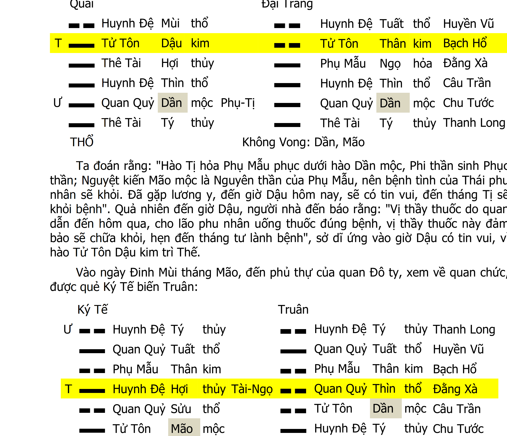

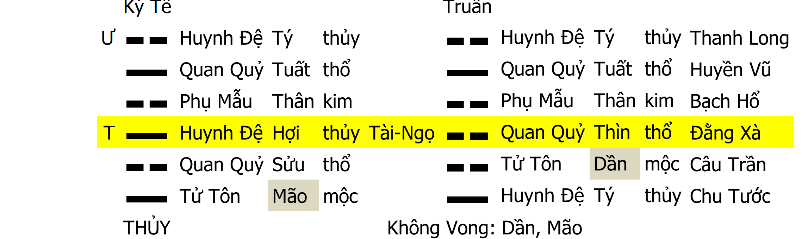

Lại vào ngày Canh Tuất tháng Mão, xem về khai mỏ chì có được hay không, 
được quẻ Ích biến Trung Phu:

Ích 
 
Trung Phu

Ư | Huynh ĐệMão mộc | Huynh ĐệMão mộc Đằng Xà

Tử Tôn | Tị | hỏa | Tử Tôn | Tị | hỏa Câu Trần

Thê Tài | Mùi thổ | Thê Tài | Mùi thổ Chu Tước

T | Thê Tài | Thìn thổ Quan-Dậu | Thê Tài | Sửu thổ Thanh Long

Huynh ĐệDần mộc | Huynh ĐệMão mộc Huyền Vũ

Phụ Mẫu Tý | thủy | Tử Tôn | Tị | hỏa Bạch Hổ

MỘC
Không Vong: Dần, Mão

Ta đoán rằng: "Đây là tượng phá tài. Hào Huynh Đệ vượng tướng, động mà khắc 
hào Thế, là tượng cướp tài, tiền của chưa bị phá tận thì chưa dừng lại." Người xem 
bèn nói: "Mỏ đã khai hơn hai tháng, đào ở năm chỗ, phí tổn đến mấy trăm lạng vàng. 
Nếu không được của, tôi sẽ ngừng lại."

Ta đáp rằng: "Hào Huynh động hóa Tiến thần, lúc này chính là lúc hao tài, sao có 
thể dừng được?" Người này bèn hỏi: "Đã không có chì, sao lại không dừng lại?" Ta 
bèn đáp: "Ta mới đến nơi này, nên ông ắt sẽ không tin ta. Đợi một tháng sau, thấy 
nhiều quẻ xem của ta linh nghiệm, tự nhiên sẽ dừng lại."

Ta ở vùng này trong hai tháng, xem nhiều quẻ vẫn chưa ứng nghiệm. Cho đến 
tháng 2, người cháu của vị Tướng quân lần trước do xưa kia lâm trận không chịu tiến 
quân, trong quân có người tố cáo, quan trên xuống giấy bắt hỏi tội. Còn viên Đô ty 
đau chân, đến ngày 6 tháng 3 gọi người đến châm cứu cho chân, châm nhầm phải 
gân mạch, đau đớn đến tận ngày 18 thì chết. Đến tháng tư, mẹ của quan Đạo đài 
khỏi bệnh. Lại nhận được tin báo rằng quan Phủ quân tại Giang Nam lại được phục 
hồi chức cũ. Còn quan Tri phủ bản phủ, vốn không được phục chức, sau dẫn lệ cũ, 
đến năm Tị được điền khuyết tại Khánh Dương - Thiểm Tây. Người đào mỏ chì đào 
mãi đến khi có dòng suối phun lên thì phải dừng việc lại.

Ta ở đây tháng ba, tháng tư và năm, không ngày nào được yên, mới ngộ ra rằng 
sở dĩ xem liền bốn lần được quẻ Hỏa Thiên Đại Hữu, vì hào Quan Tị hỏa sinh hào Thế, 
Ứng vào tháng Tị quan quý tương sinh. Nên biết rằng ngày tháng ứng nghiệm cát 
hung do thần linh mách bảo không thể rập khuôn cứng nhắc, mà phải biết biến thông.

Ta sở dĩ có thể lĩnh ngộ được rõ ràng, cũng là nhờ biết cách xem nhiều lần. Nếu 
không phải liền bốn lần được cùng một quẻ, chưa chắc ta đã đi chuyến này. Ta xem 
quẻ thấy có ứng nghiệm, nên chẳng tiếc gì mà không thành thực mách bảo.

Đại tượng hối nhân, tất dĩ quy củ. Bốc giả quyết đoán, toàn tại linh cơ.

Bậc thầy dạy người, ắt theo quy củ. Xem quẻ quyết đoán, đều ở nhạy bén.

Các bậc tiên hiền thời xưa khi dạy người xem quẻ, trước tiên, dạy về động tĩnh, 
vượng suy, sinh phù củng hợp, hình xung khắc hại, Phá Mộ Tuyệt Không, rất nhiều 
điểm quan trọng, không thể bỏ qua. Sách vở cần đọc kỹ, để từ đó mà loại suy ra

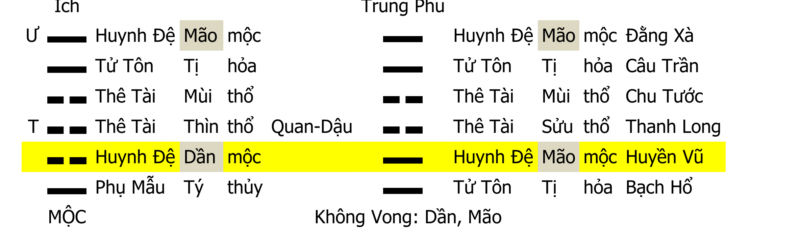 những trường hợp tương tự, tùy cơ ứng biến, hào tượng hợp thành, sẽ biết được họa 
phúc. Cái hữu dụng thì coi trọng, cái vô dụng thì bỏ đi, tuyệt đối không được rập 
khuôn cứng nhắc.

**Tân bình thích:** Chỉ lời nói này đã hơn hẳn mười năm đèn sách. Người thời nay 
thường theo đuổi những bí pháp mà coi nhẹ kiến thức căn bản, vì vậy dù học Dịch đã 
nhiều năm mà vẫn không thể tiến bộ. Thực ra những thứ cao siêu đều bắt nguồn từ 
kiến thức căn bản, chỉ có nắm vững căn bản mới có thể đoán quẻ xuất thần nhập hóa.

### Ví dụ: Ngày Nhâm Ngọ tháng Tuất, mãi đến đêm mà vợ vẫn chưa về nhà, gọi

điện thoại cũng không được, đoán mấy giờ vợ về? Được Trạch Sơn Hàm biến Thủy 
Địa Tỷ.

Hàm
 
Tỷ

Ư | Phụ Mẫu Mùi thổ | Tử Tôn | Tý | thủy Bạch Hổ

Huynh ĐệDậu kim | Phụ Mẫu Tuất thổ Đằng Xà

Tử Tôn | Hợi thủy | Huynh ĐệThân kim Câu Trần

T | Huynh ĐệThân kim | Thê Tài | Mão mộc Chu Tước

Quan QuỷNgọ hỏa Tài-Mão | Quan QuỷTị | hỏa Thanh Long

Phụ Mẫu Thìn thổ | Phụ Mẫu Mùi thổ Huyền Vũ

KIM
Không Vong: Thân, Dậu

Lấy Thê Tài làm Dụng, Dụng thần không được Nhật Nguyệt sinh phù, nếu phán | đoán theo khẩu quyết thì Thế khắc Dụng thần người không về. Nhưng tuy là Huynh | Đệ trì Thế, Không mà không khắc Dụng thần, lại hào Thế động mà hóa ra Thê Tài, | đây là tượng sẽ gặp lại vợ, sao có thể nói không về? Hào 3 là cửa, Không Vong, kim | Không tắc minh, lâm Chu Tước, Chu Tước cũng chủ âm thanh, là tượng chuông cửa | reo, bây giờ lại là giờ Tý, Dụng thần phục tàng, đang là giờ xung mất Phi thần, tôi | đoán là chuông cửa sắp vang lên, vợ về nhà. Quả nhiên, một phút sau, chuông cửa | reo lên và vợ đã trở về.

Từ xưa đến nay, làm gì có cuốn bốc phệ nào từng nói về chuông cửa? Vật dụng 
này ngày xưa làm gì có, đây chính là phán đoán một cách linh hoạt. Nếu như trong 
nhà mình không lắp đặt chuông cửa thì không thể đoán như thế.

Phệ tất thành tâm, Tý nhật bất kỵ.

Xem phải thành tâm, không kiêng ngày Tý.

Việc trong thiên hạ không gì không từ tâm sinh, tâm động mà cầu thần linh, cần 
phải chí thành. Cho nên mới nói: Thành thì hiển hiện, hiển hiện sẽ ngưng tụ, ngưng tụ 
sẽ sáng rõ. Thành tâm để cầu, quẻ sẽ hiển hiện mà dễ xem.

Thời xưa cho rằng ngày Tý không nên xem. "Hoàng kim sách" viết: "Chỉ do thành 
tâm hay không, chứ không phải tại vì ngày Tý".

**Tân bình thích:** Cái gọi là Tý không hỏi quẻ, chính là giờ Tý không tiện hỏi quẻ, 
chứ không phải ngày Tý, rất nhiều trường hợp ngày Tý xem quẻ vẫn ứng nghiệm. Giờ 
Tý là lúc âm dương luân chuyển, lại là ranh giới giữa ngày hiện tại với ngày hôm sau,

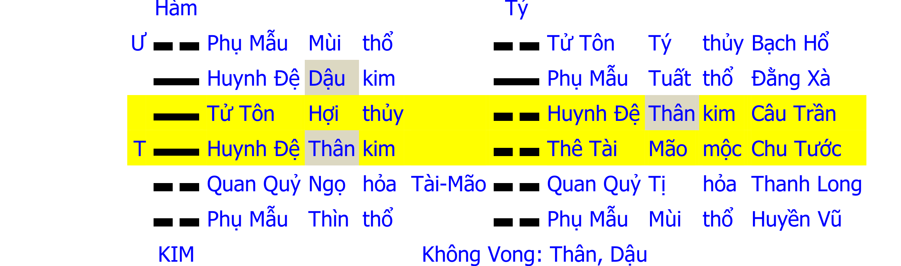 khó định đoạt Nhật thần, bởi vậy mà có thuyết "Tý không hỏi quẻ". Để nghiệm chứng 
lý luận này, tôi đã dự đoán xung quanh 0 giờ (đều trong giờ Tý), quẻ vẫn ứng 
nghiệm, kết quả chứng minh 0 giờ là đường giới hạn của nhật kỳ.

Chiêm vật nhị niệm, tảo vãn hà phương.

Xem phải chuyên tâm, sớm hay tối không đáng ngại.

Một ý niệm chân thành có thể cảm động trời đất; hai mâm dâng cúng, có thể 
phụng sự được quỷ thần. Nếu trong lòng nghĩ đến hai, ba sự việc mà xem, ý niệm đã 
không chuyên, thì làm sao có thể thống nhất? Ý niệm nhiều thì tâm loạn, như vậy là 
không thành tâm. Nên mới nói: Gặp chuyện liền xem, bất kể sớm tối. Đừng nên giữ 
nhiều ý niệm, nhiều ý niệm sẽ không linh ứng. Từng có người trước thì xem về cầu 
tài, sau xem về bệnh của bố vợ:

Ngày Ất Sửu tháng Thìn, xem cầu tài được quẻ Tùy biến Bĩ:

Tùy 
 
Bĩ

Ư | Thê Tài | Mùi thổ | Thê Tài | Tuất thổ Huyền Vũ

Quan QuỷDậu | kim | Quan QuỷThân kim Bạch Hổ

Phụ Mẫu | Hợi | thủy Tử-Ngọ | Tử Tôn | Ngọ | hỏa Đằng Xà

T | Thê Tài | Thìn thổ | Huynh ĐệMão mộc Câu Trần

Huynh ĐệDần | mộc | Tử Tôn | Tị | hỏa Chu Tước

Phụ Mẫu | Tý | thủy | Thê Tài | Mùi | thổ Thanh Long

MỘC
Không Vong: Tuất, Hợi

Lại xem về bệnh của bố vợ, được quẻ Kiển:

Kiển

Tử Tôn | Tý | thủy | Huyền Vũ

Phụ Mẫu Tuất thổ | Bạch Hổ

T | Huynh ĐệThân kim | Đằng Xà

Huynh ĐệThân kim | Câu Trần

Quan QuỷNgọ hỏa Tài-Mão Chu Tước

Ư | Phụ Mẫu Thìn thổ | Thanh Long

KIM
Không Vong: Tuất, Hợi

Nếu xét đoán căn cứ vào sự khẩn cầu của người này, thì quẻ trước xem về cầu 
tài, có rất nhiều Tài tinh, nên việc cầu tài ắt sẽ được. Quẻ sau xem về bệnh của bố vợ, 
hào Phụ Mẫu gặp Nhật thần nên không chết. Nhưng không biết rằng hai việc này đều 
xuất phát từ ý niệm của người xem, nên thần cho quẻ trước ứng với bệnh của bố vợ, 
hào Tài động khắc hào Phụ Mẫu, nên bố vợ chết vào ngày Thìn, vì hào Tài thuộc thổ, 
Thìn là Mộ của Thổ.

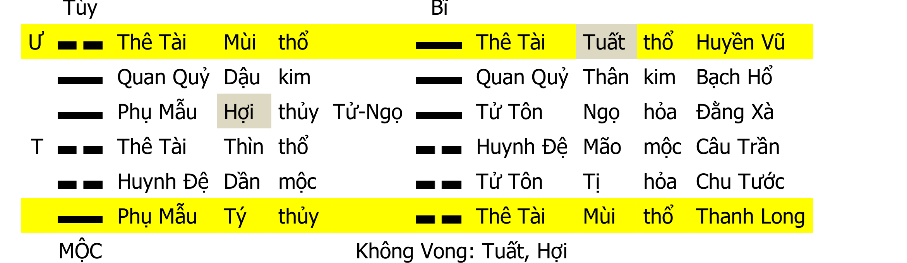

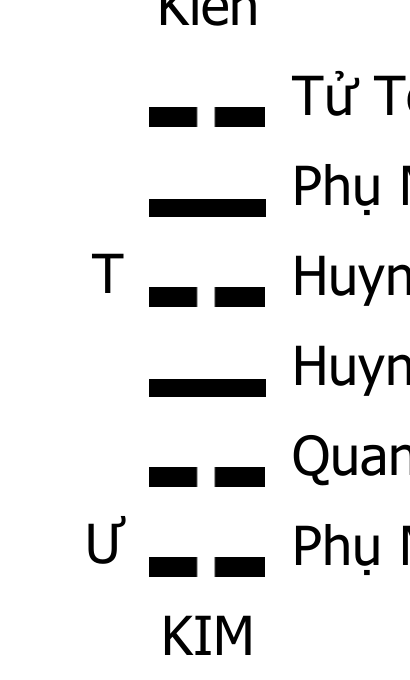

Còn quẻ sau lại ứng vào việc cầu tài, hào Huynh Đệ trì Thế nên việc cầu tài 
không được. Nếu không chú ý, quẻ trước quẻ sau lẫn lộn, cho quẻ trước là xem cầu 
tài, quẻ sau là xem bệnh tật, sẽ khiến người ta cười cho. Bởi vậy, ta mới nói rằng, một 
ý niệm chỉ xem một việc, thì xem sớm hay xem tối cũng không có vấn đề gì. Nếu 
trong lòng nghĩ đến hai ba việc một lúc, sẽ có sai lầm.

**Tân bình thích:** Loại tình huống này thường xuyên gặp phải. Có khi người đến 
muốn hỏi hai, ba việc, có khi nhiều đến năm, sáu việc, thậm chí nhiều hơn nữa. Riêng 
tôi có cách khác, có thể phán đoán từng việc một, nhưng có lúc người đến ưu uất bất 
quyết, không biết trước tiên nên hỏi chuyện gì, vì vậy đôi khi thông tin trong quẻ phản 
ánh không trọn vẹn. Nhất là khi người đến hỏi đồng thời hai việc rất giống nhau, rất 
có khả năng phán đoán trái ngược nhau.

### Ví dụ: Một đồng hương nhờ tôi phán đoán hai quẻ như sau:

Ngày Canh Dần tháng Hợi, một người hỏi mở nhà hàng "Nam Tử Hán" sẽ thế 
nào? Và tiệm dương tạp cát1 ra sao?

Đoán nhà hàng "Nam Tử Hán" được Sơn Phong Cổ biến Sơn Thiên Đại Súc.

Cổ 
 
Đại Súc

Ư | Huynh ĐệDần mộc | Huynh ĐệDần mộc Đằng Xà

Phụ Mẫu | Tý | thủy Tử-Tị | Phụ Mẫu | Tý | thủy Câu Trần

Thê Tài | Tuất thổ | Thê Tài | Tuất thổ | Chu Tước

T | Quan QuỷDậu kim | Thê Tài | Thìn thổ | Thanh Long

Phụ Mẫu | Hợi | thủy | Huynh ĐệDần mộc Huyền Vũ

Thê Tài | Sửu thổ | Phụ Mẫu | Tý | thủy Bạch Hổ

MỘC
Không Vong: Ngọ, Mùi

Đoán tiệm dương tạp cát được Sơn Địa Bác biến Thủy Lôi Truân.

Bác
 
Truân

Thê Tài | Dần mộc | Tử Tôn | Tý | thủy Đằng Xà

T | Tử Tôn | Tý | thủy Huynh-Thân | Phụ Mẫu Tuất thổ Câu Trần

Phụ Mẫu Tuất thổ | Huynh ĐệThân kim Chu Tước

Thê Tài | Mão mộc | Phụ Mẫu Thìn thổ Thanh Long

Ư | Quan QuỷTị | hỏa | Thê Tài | Dần mộc Huyền Vũ

Phụ Mẫu Mùi thổ | Tử Tôn | Tý | thủy Bạch Hổ

KIM
Không Vong: Ngọ, Mùi

1 Dương tạp cát (羊杂割) là một loại món ăn bình dân ở Sơn Tây, được chế biến từ nội tạng 
dê kết hợp với các loại gia vị, thêm vào miến, bún để ăn.

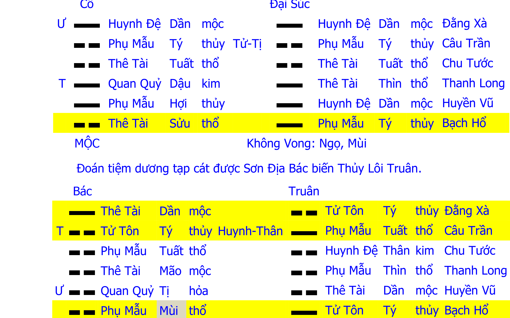

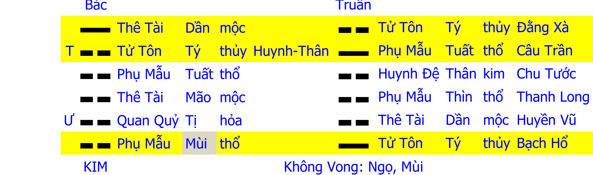

Sau khi xem kỹ hai quẻ, tôi đoán rằng quẻ trước ứng tiệm dương tạp cát, làm ăn 
khó khăn, quẻ sau ứng nhà hàng "Nam Tử Hán", kinh doanh rất tốt.

Đối phương hỏi: "Tại sao lại đoán ngược như vậy?"

Tôi nói: "Hai quẻ đều từ ý nghĩ của người này gieo được, chính là mang trong 
lòng hai, ba việc mà đoán.

Quẻ trước Thê Tài Sửu thổ lâm Bạch Hổ mà động, Bạch Hổ là đao thương, tượng | giết mổ, Tài tương ứng nội tạng dê, Nhật khắc, lại bị hào biến hợp trú, tham hợp quên | sinh, không thể kiếm được tiền. Quẻ sau là quẻ cung Càn, trong hào từ nói "Thiên | hành kiện, quân tử dĩ tự cường bất tức", chính là thông tin nam tử hán, vì vậy quẻ | sau ứng nhà hàng "Nam Tử Hán". Tử Tôn trì Thế vượng tướng, Tài được Nhật Nguyệt | sinh phù, nhất định là làm ăn thịnh vượng."

Ông ta nói: "Ông đoán rất đúng, tôi đoán theo lời của người hỏi nên đã đoán 
sai."

Ngã sự bất khả mệnh nhân;

Việc của ta không thể khiến người;

Trong lòng mình có tâm sự, không thể bảo người khác xem giúp. Ta có ý niệm 
của ta, người có ý niệm của người, đó là hai ý niệm khác nhau. Từng có quan phủ 
đương nhiệm sai gia nhân xem thay cho một quẻ về đề phòng tai họa.

### Ví dụ: Ngày Nhâm Tuất tháng Mão, xem chủ nhà có tai họa gì không, được quẻ

Tỷ biến Hàm:

Tỷ 
 
Hàm

Ư | Thê Tài | Tý | thủy | Huynh Đệ | Mùi | thổ | Bạch Hổ

Huynh Đệ | Tuất thổ | Tử Tôn | Dậu | kim | Đằng Xà

Tử Tôn | Thân | kim | Thê Tài | Hợi | thủy | Câu Trần

T | Quan Quỷ | Mão | mộc | Tử Tôn | Thân | kim | Chu Tước

Phụ Mẫu | Tị | hỏa | Phụ Mẫu | Ngọ | hỏa | Thanh Long

Huynh Đệ | Mùi | thổ | Huynh Đệ | Thìn | thổ | Huyền Vũ

THỔ
Không Vong: Tý, Sửu

Quẻ này là xem về việc phòng tai ách, được hào Tử Tôn khắc Thế là tốt, vì sẽ 
khắc đi Quỷ ở bên mình, nên không còn lo âu. Nếu là gia nhân xem cho chủ, phải lấy 
hào Phụ Mẫu làm Dụng thần, và phải xem cả hào Quan. Hào Phụ Mẫu Tị hỏa gặp 
Tuần Không, lại gặp Mộ tại Nhật thần Tuất. Hào Quan Mão mộc tuy lâm Nguyệt kiến, 
nhưng không địch nổi nhiều kim khắc, trước mắt tuy vô hại, nhưng đến mùa thu khó 
tránh khỏi nguy hiểm.

Nào ngờ quẻ này lại ứng với ý niệm của bản thân quan phủ, lấy Thế hào làm 
Dụng thần, hào Tử Tôn khắc Thế, nên giải được mối ưu phiền.

Đến ngày Thân nghe tin: Có người kiện mình lên quan trên, nhưng bị người khác 
khuyên can ngăn trở, nên việc kiện tụng không thành. Nếu theo cách gia nhân xem

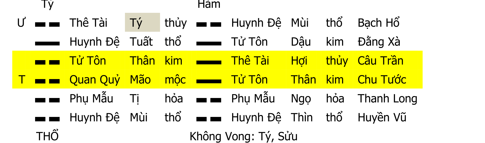 cho chủ để xét đoán, thì sẽ có sai lầm lớn. Nhưng cũng không thể coi quẻ này làm 
khuôn phép, vì thi thoảng cũng có lúc không ứng nghiệm với ý niệm của người chủ, 
mà lại ứng với ý niệm của kẻ gia nhân. Cho nên mới nói: Bản thân có việc, nên tự 
xem; nhờ người khác xem thay, rất khó chọn Dụng thần, quẻ sẽ khó ứng nghiệm.

Tha cụ thành tâm, đặc dục vấn thần, nhượng ngã tiên chiêm, khủng 
thần bất hứa. Ngã cụ thành tâm, tảo dĩ cử niệm, ngã nhượng tha chiêm, 
thần tất ứng ngã.

Người đủ thành tâm, muốn hỏi với thần, nhường ta coi trước, e thần không chịu. 
Ta đủ thành tâm, sớm có ý niệm, ta nhường người coi, thần ứng vào ta.

Từng vào Ngày Quý Mùi tháng Thìn, ta muốn xem về công danh, nhưng lại 
nhường trưởng bối xem về bệnh của con, được quẻ Cấu biến Hoán:

Cấu
 
Hoán

Phụ Mẫu Tuất thổ | Thê Tài | Mão mộc Bạch Hổ

Huynh ĐệThân kim | Quan QuỷTị | hỏa Đằng Xà

Ư | Quan QuỷNgọ hỏa | Phụ Mẫu Mùi thổ Câu Trần

Huynh ĐệDậu kim | Quan QuỷNgọhỏa Chu Tước

Tử Tôn | Hợi | thủy Tài-Dần | Phụ Mẫu Thìn thổ Thanh Long

T | Phụ Mẫu Sửu thổ | Thê Tài | Dần mộc Huyền Vũ

KIM
Không Vong: Thân, Dậu

Tự ta xem về công danh, được quẻ Thiên Trạch Lý:

Lý

Huynh ĐệTuất thổ | Bạch Hổ

T | Tử Tôn | Thân kim Tài-Tý Đằng Xà

Phụ Mẫu Ngọ hỏa | Câu Trần

Huynh ĐệSửu thổ | Chu Tước

Ư | Quan QuỷMão mộc | Thanh Long

Phụ Mẫu Tị | hỏa | Huyền Vũ

THỔ
Không Vong: Thân, Dậu

Nếu dùng quẻ thứ nhất để đoán bệnh cho con, thì người con sẽ chết. Tại sao 
vậy? Vì hào Hợi thủy Tử Tôn bị Nhật thần, Nguyệt kiến tương khắc. Hào Thế ám 
động, lại khắc Tử Tôn. Nguyên thần Dậu kim lại bị Ngọ hỏa khắc thương, như vậy là 
Kỵ thần vượng mà Nguyên thần suy, chắc chắn sẽ chết. Nào ngờ ta khởi niệm trước, 
nên quẻ thứ nhất lại ứng vào công danh. Nếu coi về công danh thì hào Ngọ hỏa Quan 
tinh động sinh Thế, hào Thế động, hào Quan hưng khởi, đến tháng năm lên chức.

Quẻ sau lại ứng với cha xem bệnh cho con. Hào Tử Tôn Thân kim được Nhật 
thần, Nguyệt kiến tương sinh, đến hôm sau sẽ khỏi bệnh.

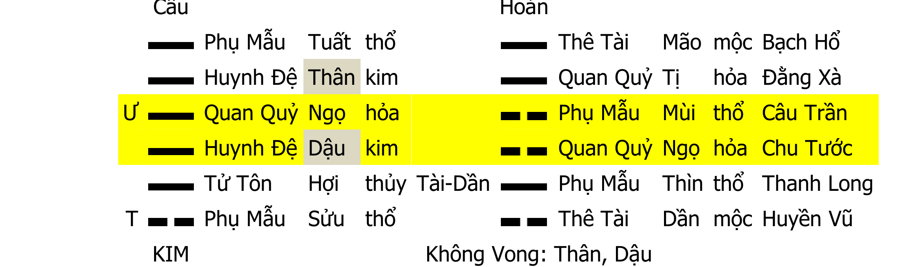

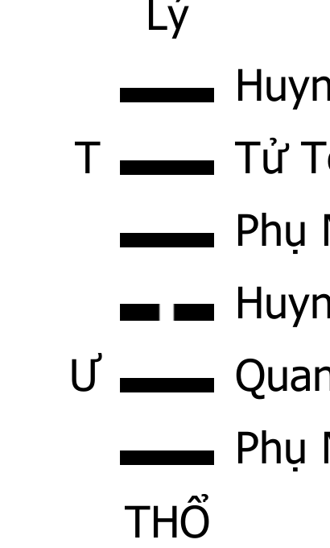

Lại ví dụ: Ngày Tân Tị tháng Tị, định xem về bệnh của cha, bỗng có quan trên 
đến, bèn nhường cho quan xem trước, được quẻ Tỉnh biến Thăng:

Tỉnh
 
Thăng

Phụ Mẫu Tý | thủy | Quan QuỷDậu kim Đằng Xà

T | Thê Tài | Tuất thổ | Phụ Mẫu Hợi thủy Câu Trần

Quan QuỷThân kim Tử-Ngọ | Thê Tài | Sửu thổ Chu Tước

Quan QuỷDậu kim | Quan QuỷDậu kim Thanh Long

Ư | Phụ Mẫu Hợi | thủy Huynh-Dần | Phụ Mẫu Hợi thủy Huyền Vũ

Thê Tài | Sửu thổ | Thê Tài | Sửu thổ Bạch Hổ

MỘC
Không Vong: Thân, Dậu

Quẻ này quan trên xem về việc điền khuyết, có bốn người mà chỉ có ba vị trí, 
nên hỏi xem mình có được hay không? Ta đoán rằng: "Hào Quan Thân, Dậu đều lâm 
Không, lại bị Nhật thần, Nguyệt kiến tương khắc. Không mà bị khắc, nên trước mặt 
việc cầu không thành. May được hào Tuất động sinh Quan, đến mùa thu ắt được như 
ý". Nhưng đâu ngờ quẻ này lại ứng vào việc xem bệnh cho cha. Hào Tài Tuất thổ 
động mà khắc hào Phụ, hào Phụ Hợi thủy, gặp Nhật phá, Nguyệt phá, Nguyên thần 
kim lâm Không mà lại bị khắc, nên sẽ chết vào ngày Tuất. Sau khi quan phủ ra về, ta 
cũng gieo quẻ xem, được quẻ Càn biến Gia Nhân:

Càn 
 
Gia Nhân

T | Phụ Mẫu | Tuất thổ | Thê Tài | Mão | mộc | Đằng Xà

Huynh Đệ | Thân | kim | Quan Quỷ | Tị | hỏa | Câu Trần

Quan Quỷ | Ngọ | hỏa | Phụ Mẫu | Mùi | thổ | Chu Tước

Ư | Phụ Mẫu | Thìn | thổ | Tử Tôn | Hợi | thủy | Thanh Long

Thê Tài | Dần | mộc | Phụ Mẫu | Sửu thổ | Huyền Vũ

Tử Tôn | Tý | thủy | Thê Tài | Mão | mộc | Bạch Hổ

KIM 
Không Vong: Thân, Dậu

Hào Quan Ngọ, hào Tài Dần đều động, cùng hào Thế hợp thành Tam hợp Quan 
cục. Nếu dùng quẻ này để đoán về bệnh của cha, thì hỏa cục sinh Phụ Mẫu, nên 
không chết. Nhưng không ngờ quẻ này lại ứng với ý niệm cầu công danh của quan 
trên. Hào Thế nằm tại hào 6, mà được điền khuyết tại phủ Triệu Khánh - Quảng 
Đông.

Hai quẻ này đâu phải là không linh ứng? Thế mới biết thần linh không muốn 
nhường người đến sau được quẻ trước vậy.

**Tân bình thích:** Câu chuyện này của Dã Hạc là một kinh nghiệm rất quan trọng, 
người học bốc dịch nên ghi nhớ cẩn thận.

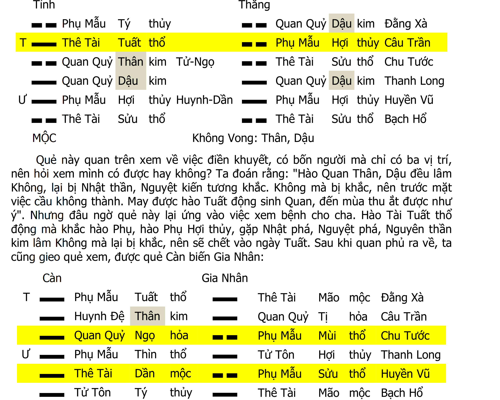

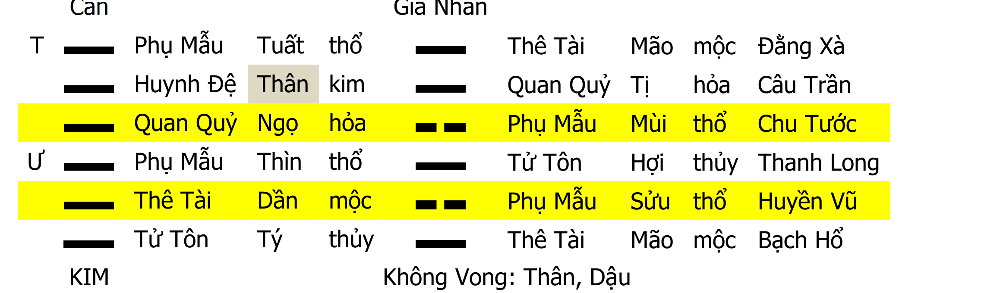

Tha sự do tha động niệm, thận vật đề tha.

Việc của người để người khởi niệm, không được nhắc nhở người ta.

Người khác có tâm sự, chưa động niệm để xem, mà mình nhắc nhở người ta, bảo 
người ta xem, như thế lại là ý niệm của mình.

Từng có người cha bảo con trai xem về công danh, xem vào ngày Tân Dậu tháng 
Ngọ, được quẻ Tụy biến Độn:

Tụy 
 
Độn

Phụ Mẫu | Mùi | thổ | Phụ Mẫu | Tuất thổ Đằng Xà

Ư | Huynh Đệ | Dậu | kim | Huynh Đệ | Thân | kim | Câu Trần

Tử Tôn | Hợi | thủy | Quan Quỷ | Ngọ | hỏa | Chu Tước

Thê Tài | Mão | mộc | Huynh Đệ | Thân | kim | Thanh Long

T | Quan Quỷ | Tị | hỏa | Quan Quỷ | Ngọ | hỏa | Huyền Vũ

Phụ Mẫu | Mùi | thổ | Phụ Mẫu | Thìn | thổ Bạch Hổ

KIM 
Không Vong: Tý, Sửu

Con trai người này mới 11 tuổi, người cha bảo nó xem công danh trong tương lai 
ra sao? Nếu lấy Quan tinh trì Thế, mùa hè là thời điểm hỏa đắc lệnh đương quyền, 
Hào Phụ Mùi thổ tượng trưng cho văn chương, hóa Tiến thấn, là công danh có hy 
vọng. Đâu ngờ do người cha bảo con xem, nên ý niệm là của cha, quẻ này trở thành 
cha xem cho con. Hào Phụ động khắc hào Tử, hào Tài động hóa Huynh khắc Thê, nên 
con trai sẽ chết vào năm Mùi. Sở dĩ người con chết vào năm Mùi, do hào Phụ Mùi thổ 
động, đến năm Mùi sẽ hại đến con. Lại ứng vào tháng bảy chết vợ, vì hào Thê Tài 
Mão mộc là Tài gặp Tuyệt tại Thân.

Nay ta thường có một cách là: Trước hết, bảo người đó rằng: "Việc của anh, nên 
xem một quẻ, nhưng bây giờ là do ta khởi niệm, nên anh đừng xem vội. Đợi chốc nữa 
quên đi, đến khi nào anh tự nhiên nhớ lại, sẽ tự khởi niệm mà xem, như vậy sẽ là ý 
niệm của anh". Làm theo cách này, lần nào cũng ứng nghiệm.

Ngã chiêm tất dĩ trực cáo, thiết mạc muội kỷ.

Ta xem cần phải nói thẳng, tuyệt đối không nên giấu diếm.

Trường hợp này rất nhiều, khó mà kể hết. Có người vì hôn nhân mà xem về thời 
lệnh. Có người vì công danh mà xem về lưu niên. Có người đang làm quan, muốn điền 
khuyết chỗ của người khác, không tiện nói ra, bèn xem về sự cát hung của chức vị 
hiện tại. Có vị Hiếu liêm, không nói rõ là xem về thi Hội, mà chỉ hàm hồ hỏi về công 
danh. Có người đã bị cách chức, lại xem về công danh. Có người đã sinh con trai, lại 
xem có con trai hay không.

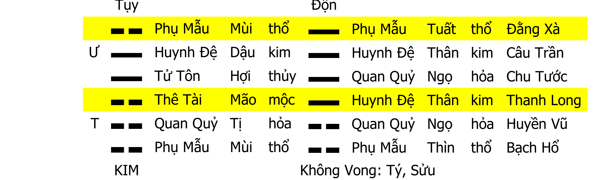

### Ví dụ: Ngày Quý Hợi tháng Mùi, xem về lưu niên, được quẻ Cấn:

Cấn

T | Quan QuỷDần mộc Bạch Hổ

Thê Tài | Tý | thủy Đằng Xà

Huynh ĐệTuất thổ Câu Trần

Ư | Tử Tôn | Thân kim Chu Tước

Phụ Mẫu | Ngọ hỏa Thanh Long

Huynh ĐệThìn thổ Huyền Vũ

THỔ
Không Vong: Tý, Sửu

Người này đã được viện lệ theo việc quân, nên xem về lưu niên, chỉ nghĩ rằng 
nếu trong mệnh có công danh, xem về lưu niên sẽ hiện ra. Mà không biết là xem về 
công danh để làm quan, tốt nhất là được Quan tinh trì Thế. Ta nói rằng: Trong quẻ 
này được Quan tinh trì Thế, Dần mộc gặp Trường Sinh tại Nhật thần Hợi, nên sự 
nghiệp đã thành. Tý thủy là Tài, Tài vượng sinh Quan. Quả nhiên vào ngày Thân, 
nhận được văn thư nhận chức, sở dĩ ứng vào ngày Thân, do hào Dần mộc Quan tinh 
trì Thế, tĩnh mà bị Nhật thần xung. Nếu dùng quẻ này đoán lưu niên, mà coi hào này 
là Quỷ, thì kết quả sẽ có sai lầm lớn.

Lại ví dụ: Ngày Ất Dậu tháng Tý, xem về việc cát hung của chức vị hiện tại, được 
quẻ Nhu:

Nhu

Thê Tài | Tý | thủy | Huyền Vũ

Huynh ĐệTuất thổ | Bạch Hổ

T | Tử Tôn | Thân kim | Đằng Xà

Huynh ĐệThìn thổ | Câu Trần

Quan QuỷDần | mộc Phụ-TịChu Tước

Ư | Thê Tài | Tý | thủy | Thanh Long

THỔ
Không Vong: Ngọ, Mùi

Người này vốn thấy trong tỉnh có chức vị bổ khuyết, nhưng lại không tiện hỏi 
xem liệu có được hay không, nên chỉ hỏi về sự cát hung của chức vị đương nhiệm, 
nghĩ rằng nếu được quẻ tốt, sẽ được bổ khuyết, mà không hiểu được rằng, theo lý 
của "Chu Dịch", nếu xem có được bổ khuyết hay không, mà gặp hào Tử Tôn trì Thế là 
không được. Nếu xem về chuyện cát hung của chức vị đương nhiệm, được hào Tử 
Tôn trì Thế là mất chức quan. Ta bèn hỏi lại cho rõ, người này bèn nói: Tôi xem về 
việc thăng tiến. Ta lúc này mới nói: "Vị trí bổ khuyết này sẽ không có được." Sau quả 
nhiên không được bổ khuyết. Còn nếu đoán về sự cát hung của chức vị đương nhiệm, 
là điềm mất chức quan, cũng không phải sai lệch quá lớn.

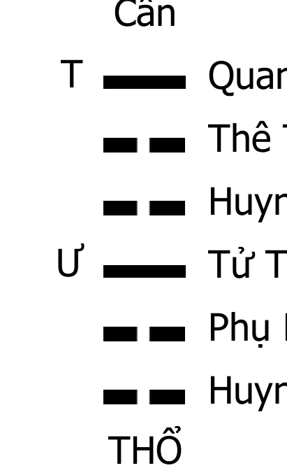

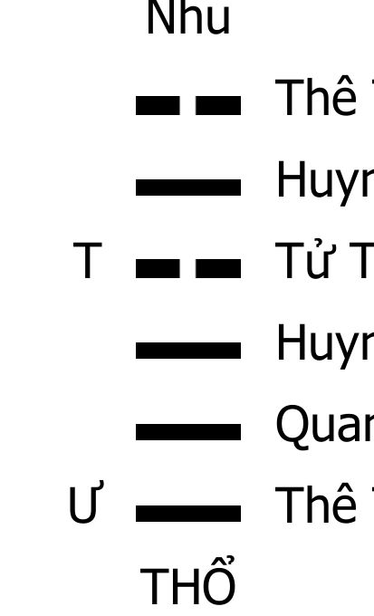

### Ví dụ: Vào ngày Tân Sửu tháng Ngọ, muốn xem về bệnh của mẹ, nhưng lại hỏi

về lưu niên, được quẻ Ích biến Vô Vọng:

Ích 
 
Vô Vọng

Ư | Huynh ĐệMão mộc | Thê Tài | Tuất thổ Đằng Xà

Tử Tôn | Tị | hỏa | Quan QuỷThân kim Câu Trần

Thê Tài | Mùi thổ | Tử Tôn | Ngọ hỏa Chu Tước

T | Thê Tài | Thìn thổ Quan-Dậu | Thê Tài | Thìn thổ Thanh Long

Huynh ĐệDần mộc | Huynh ĐệDần mộc Huyền Vũ

Phụ Mẫu Tý | thủy | Phụ Mẫu Tý | thủy Bạch Hổ

MỘC
Không Vong: Thìn, Tị

Người theo nghề kinh doanh buôn bán nếu xem về lưu niên, tất nhiên phải chú 
trọng vào hào Tài. Trong quẻ này, hào Tài vượng trì Thế, hào Tài Mùi thổ lại động, 
nên đoán là sẽ phát tài. Nhưng nếu dùng quẻ này để xem về bệnh của mẹ, thì lại kỵ 
hào Tài phát động. Hào Tài động khắc Phụ Mẫu Tý thủy, tức điềm báo người mẹ sẽ 
chết vào ngày Giáp Thìn, ứng với ngày hào Thế Thìn thổ xuất Không. Nên người học 
đời sau, mỗi khi gặp người muốn xem về lưu niên, nguyệt lệnh (vận năm, vận tháng), 
trước tiên cần tìm hiểu kỹ lý do, để tránh sai lầm. Quẻ này nếu đoán là phát tài, 
chẳng hóa ra đáng cười hay sao?

Chiêm viễn ứng cận, vụ tất lưu tâm.

Xem xa ứng gần, cần phải lưu tâm.

Cái lý trong thiên hạ sinh ra từ động, có cơ ắt sẽ động. Nếu xem về việc gần 
trước mắt, tâm sự bức bách, sẽ khiến tâm của mình và tâm của thần linh cảm ứng lẫn 
nhau. Người gieo quẻ, tinh thần chuyên chú, thì cát hung lập tức hiển hiện. Nếu sự 
việc vẫn thuộc về thiên cơ, hoặc xem về hậu vận, hoặc xem về những việc không thực 
cấp thiết, thậm chí xem để tiêu khiển, mua vui, thì quẻ cũng ứng một cách bất đắc dĩ, 
hai tâm không tương thông, nên quẻ cũng thành ra mơ hồ. Quẻ thành, thường là xem 
việc xa mà ứng việc gần, hoặc xem việc gần mà ứng việc xa.

### Ví dụ: Ngày Bính Thìn tháng Mùi, xem cầu tài, được quẻ Hàm biến Đại Quá:

Hàm
 
Đại Quá

Ư | Phụ Mẫu Mùi thổ | Phụ Mẫu Mùi thổ Thanh Long

Huynh ĐệDậu kim | Huynh ĐệDậu kim Huyền Vũ

Tử Tôn | Hợi thủy | Tử Tôn | Hợi thủy Bạch Hổ

T | Huynh ĐệThân kim | Huynh ĐệDậu kim Đằng Xà

Quan QuỷNgọ hỏa Tài-Mão | Tử Tôn | Hợi thủy Câu Trần

Phụ Mẫu Thìn thổ | Phụ Mẫu Sửu thổ Chu Tước

KIM
Không Vong: Tý, Sửu

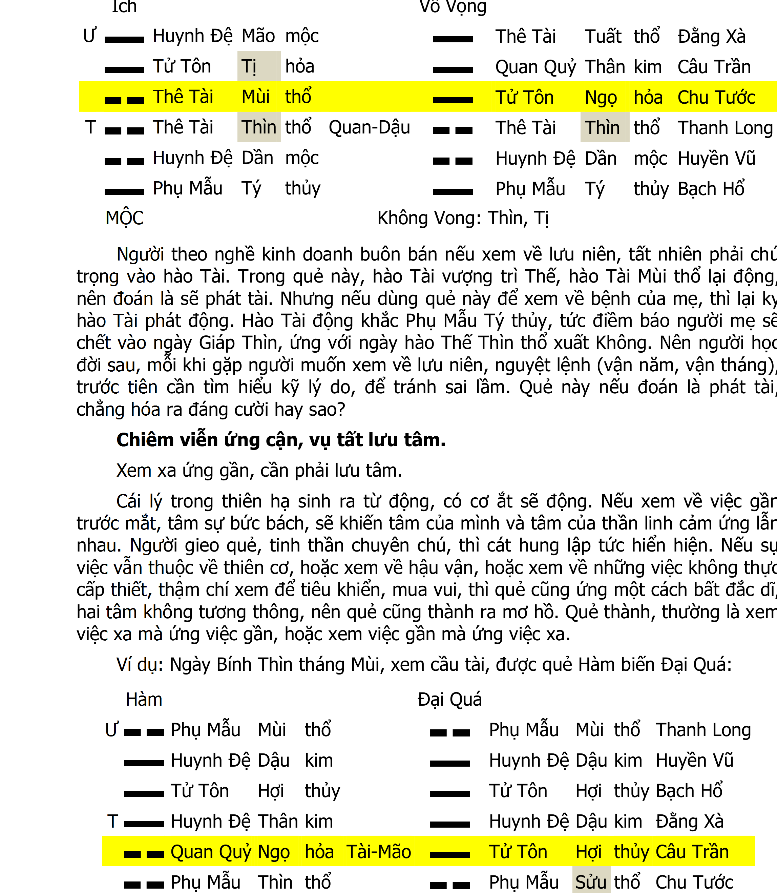

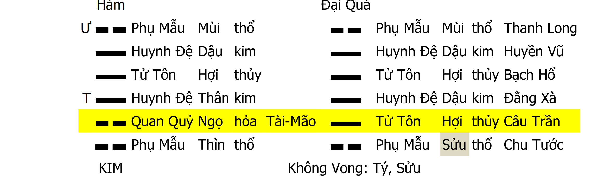

Người xem hỏi bâng quơ rằng, trong nhà thường thấy xuất hiện người mặc áo 
trắng, ắt có hầm chứa đồ cổ, vậy bao giờ thì đắc tài? Ta đáp rằng: "Trong quẻ này 
hào Quỷ biến Tử Tôn, trước mắt bất lợi cho con cái." Người này nói: "Con gái nhỏ 
đang lên đậu." Ta bèn nói: "Nên đề phòng ngày Hợi." Sau con gái quả nhiên chết vào 
ngày Hợi. Người xem năm nào sẽ được của, nhưng thần linh lại mách bảo việc gần là 
con gái chết, sở dĩ ứng vào ngày Hợi, là do hào Quỷ Ngọ hỏa biến hào Tử Tôn Hợi 
thủy.

Vào ngày Giáp Thìn tháng Dậu, xem vận trong tháng, được quẻ Độn biến Cấu:

Độn
 
Cấu

Phụ Mẫu Tuất thổ | Phụ Mẫu Tuất thổ Huyền Vũ

Ư | Huynh ĐệThân kim | Huynh ĐệThân kim Bạch Hổ

Quan QuỷNgọ hỏa | Quan QuỷNgọ hỏa Đằng Xà

Huynh ĐệThân kim | Huynh ĐệDậu kim Câu Trần

T | Quan QuỷNgọ hỏa Tài-Dần | Tử Tôn | Hợi | thủy Chu Tước

Phụ Mẫu Thìn thổTử-Tý | Phụ Mẫu Sửu thổ Thanh Long

KIM
Không Vong: Dần, Mão

Hào Thế Ngọ hỏa hóa Hợi thủy hồi đầu khắc Thế, xem vào năm Thìn, đến tháng 
Tý năm Ngọ thì chết. Xem về việc trong tháng, nhưng lại ứng với chuyện sống chết, 
như vậy là xem việc gần mà ứng việc xa, xem chuyện này mà ứng chuyện kia. Cần 
xét rõ.

Nói chung xem quẻ cần phải xét kỹ. Có quẻ không ứng với việc được hỏi mà ứng 
việc chưa hỏi. Vì sao vậy? Vì Thần bỏ việc nhỏ mà báo việc lớn, bỏ cái tốt nhỏ mà bảo 
cho biết cái hung lớn, bỏ chuyện này mà ứng chuyện kia.

Vào ngày Mậu Thìn tháng Thân, xem về việc buôn bán, được quẻ Tỷ biến Tỉnh:

Tỷ 
 
Tỉnh

Ư | Thê Tài | Tý | thủy | Thê Tài | Tý | thủy | Chu Tước

Huynh Đệ | Tuất thổ | Huynh Đệ | Tuất thổ | Thanh Long

Tử Tôn | Thân | kim | Tử Tôn | Thân | kim | Huyền Vũ

T | Quan Quỷ | Mão | mộc | Tử Tôn | Dậu | kim | Bạch Hổ

Phụ Mẫu | Tị | hỏa | Thê Tài | Hợi | thủy | Đằng Xà

Huynh Đệ | Mùi | thổ | Huynh Đệ | Sửu | thổ | Câu Trần

THỔ
Không Vong: Tuất, Hợi

Người này thường đi các nơi buôn bán, thi thoảng lại ngẫu hứng đến hỏi rằng: 
"Năm sau đến phương nào sẽ có lợi?" Trong quẻ này, hào Thế Mão mộc động hóa 
Dậu kim hồi đầu xung khắc. Xem quẻ vào tháng bảy, đến tháng tám thì chết. Đấy là 
thần linh mách bảo: "Số ngươi đã tận, hà tất phải hỏi chuyện sang năm."

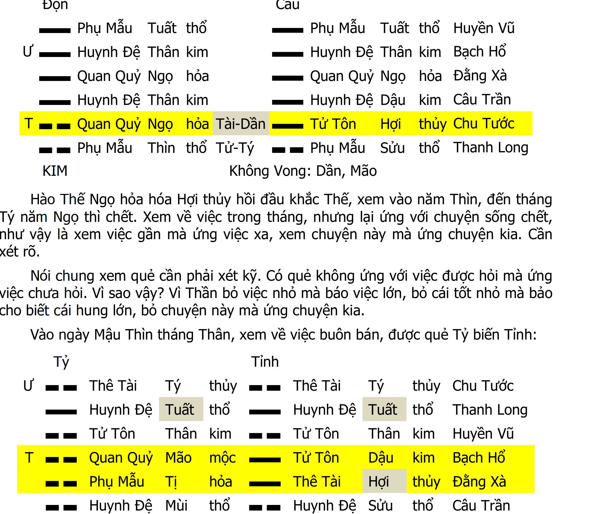

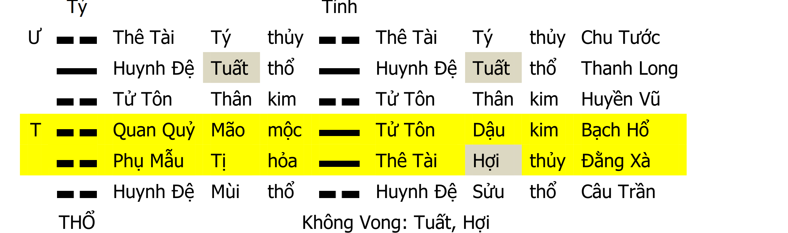

**Tân bình thích:** Đây là chỗ khó nhất của quẻ, có quẻ không nghiệm thường do 
nắm bắt sự việc xa gần không chuẩn xác, đến nỗi phán đoán có sơ xuất. Quẻ loại này 
đa số nghiệm ở độc phát, nhưng hào phát động và sự việc được hỏi hoàn toàn không 
liên quan, tức là xem xa ứng gần, xem gần ứng xa, hoặc là xem việc này ứng việc 
khác. Giống như xem tài mà không phải Tử Tôn, Thê Tài, Huynh Đệ phát động, xem 
quan phi mà không phải Quan Quỷ, Tử Tôn, Thê Tài phát động. Quẻ đầu tiên xem tài 
mà Quan động hóa Tử, quẻ thứ ba hỏi tài mà Quan Phụ phát động. Thế lâm Bạch Hổ, 
Tuyệt ở Nguyệt, phản ngâm lại hóa hồi đầu khắc, xem lưu niên tất đại hung. Tôi được 
nghiệm, có trường hợp xem hôn nhân mà ứng tử vong, xem công việc mà ứng bệnh 
dữ, khi đoán quẻ cần phải lưu ý cẩn thận.

Chiêm thử ứng bỉ, tất tu tường sát,

Xem chỗ này ứng chỗ khác, cần phải quan sát kỹ.

Khi gieo được tượng quẻ, cần phải quan sát thật tỉ mỉ. Vì cũng có trường hợp quẻ 
không ứng với việc được hỏi, mà lại ứng với những việc chưa hỏi. Tại sao lại như vậy? 
Là vì thần linh có khi bỏ qua việc nhỏ mà mách bảo việc lớn, bỏ qua chuyện vặt mà 
mách bảo về họa lớn, xem cho ta mà ứng vào người, xem cho người lại ứng vào ta, 
ấy là khi họa lớn phúc lớn sắp ập đến trong một sớm một chiều, cơ trời đã động, ắt 
hiện trong quẻ. Cho nên mới nói: "Biết được thiên cơ, thì có thể tương thông với 
thần".

### Ví dụ: Ngày Kỷ Mùi tháng Tị, xem về bệnh của người hầu, được quẻ Tỷ biến

Kiển:

Tỷ 
 
Kiển

Ư | Thê Tài | Tý | thủy | Thê Tài | Tý | thủy | Câu Trần

Huynh Đệ | Tuất thổ | Huynh Đệ | Tuất thổ | Chu Tước

Tử Tôn | Thân | kim | Tử Tôn | Thân | kim | Thanh Long

T | Quan Quỷ | Mão | mộc | Tử Tôn | Thân | kim | Huyền Vũ

Phụ Mẫu | Tị | hỏa | Phụ Mẫu | Ngọ | hỏa | Bạch Hổ

Huynh Đệ | Mùi | thổ | Huynh Đệ | Thìn | thổ | Đằng Xà

THỔ 
Không Vong: Tý, Sửu

Ta nói rằng: "Quẻ này không ứng với bệnh tình của thằng hầu, mà ứng với 
chuyện công danh sẽ gặp trở ngại vào mùa thu năm nay." Người xem hỏi: "Tại sao?" 
Ta bèn đáp: "Hào Thế tại Mão mộc Quan tinh, hóa Thân kim Tử Tôn hồi đầu khắc, 
việc đã rõ ràng." Người xem nói: "Tôi hỏi về thằng hầu, sao lại ứng vào chuyện công 
danh?" Ta đáp: "Thần linh thường bỏ qua việc nhỏ mà mách bảo họa lớn, nên cảnh 
tỉnh ông nên thận trong mọi chuyện." Quả nhiên đến tháng bảy bị luận tội mà cách 
chức. Đây chính là trường hợp xem chuyện người mà ứng vào ta.

**Tân bình thích:** Đây là quẻ một hào độc phát. Xem người hầu nên Tài là Dụng, 
nhưng quẻ này Quan tinh lại độc phát, hóa hồi đầu khắc, hào động lại lâm hào Thế, 
chính là ứng công danh bản thân.

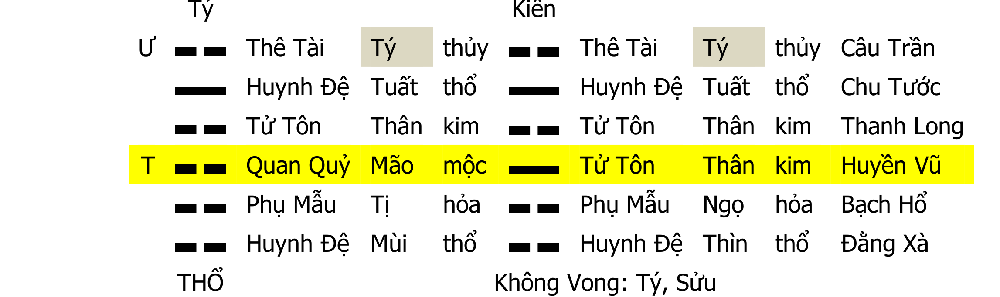

Lại ví dụ: Ngày Mậu Dần tháng Thân, xem về bệnh tật, được quẻ Khôn biến Tỷ:

Khôn
 
Tỷ

T | Tử Tôn | Dậu kim | Thê Tài | Tý | thủy Chu Tước

Thê Tài | Hợi thủy | Huynh ĐệTuất thổ Thanh Long

Huynh ĐệSửu thổ | Tử Tôn | Thân kim Huyền Vũ

Ư | Quan QuỷMão mộc | Quan QuỷMão mộc Bạch Hổ

Phụ Mẫu Tị | hỏa | Phụ Mẫu Tị | hỏa Đằng Xà

Huynh ĐệMùi thổ | Huynh ĐệMùi | thổ Câu Trần

THỔ
Không Vong: Thân, Dậu

Ta đoán rằng: Hào Thế Dậu kim tuy gặp Tuyệt tại Dần, nhưng may xem vào mùa 
thu, vẫn là vượng tướng, bản thân không có gì đáng ngại. Nhưng cần đề phòng tháng 
chín, tháng mười thê thiếp gặp nguy hiểm, vì hào Tài Hợi thủy động hóa hồi đầu khắc 
Thê.

Người xem nói: "Nhưng bệnh của tôi rất nặng." Ta bèn đáp: "Hào Tử Tôn trì Thế, 
bệnh của ông không uống thuốc cũng khỏi." Quả nhiên người này nhanh chóng khỏi 
bệnh, nhưng đến tháng chín thì vợ chết. Quẻ này chính là xem cho mình nhưng ứng 
vào người khác.

**Tân bình thích:** Ví dụ này cũng là quẻ một hào độc phát. Hào Thế, Nguyên 
thần, Kỵ thần không động, hào Tài động mà hóa hồi đầu khắc, chính là ứng vợ.

Lại ví dụ: Ngày Bính Ngọ tháng Mão, xem về chuyện tiểu nhân thị phi, được quẻ 
Càn biến Nhu:

Càn 
 
Nhu

T | Phụ Mẫu | Tuất thổ | Tử Tôn | Tý | thủy | Thanh Long

Huynh Đệ | Thân | kim | Phụ Mẫu | Tuất thổ | Huyền Vũ

Quan Quỷ | Ngọ | hỏa | Huynh Đệ | Thân | kim | Bạch Hổ

Ư | Phụ Mẫu | Thìn | thổ | Phụ Mẫu | Thìn | thổ | Đằng Xà

Thê Tài | Dần | mộc | Thê Tài | Dần | mộc | Câu Trần

Tử Tôn | Tý | thủy | Tử Tôn | Tý | thủy | Chu Tước

KIM 
Không Vong: Dần, Mão

Ta nói rằng: "Xem về thị phi, tại sao lại được quẻ tốt như thế này?" Người này | hỏi: "Tốt như thế nào?" Ta đáp: "Thanh Long là tượng văn thư trì Thế, hào Quan tinh | Ngọ hỏa gặp Nhật kiến mà sinh Thế, năm nay Thái Tuế tại Tị, Tuế quân lại sinh hào | Thế, nên chắc chắn sẽ gặp chuyện đại hỷ, trong vòng mười ngày sẽ ứng nghiệm." | Người này nói: "Như vậy sẽ không còn chuyện tiểu nhân thị phi nữa chăng?" Ta đáp: | "Ngờ rằng thần linh mách bảo, ngày có tin vui cũng là lúc tiểu nhân tàng ẩn." Sau quả | nhiên đến ngày Mậu Thân nhận tin báo được cất nhắc làm quan, đám tiểu nhân đều | biến mất. Sở dĩ ứng vào ngày Thân, là do hào Tài Dần mộc lâm Không, đến ngày

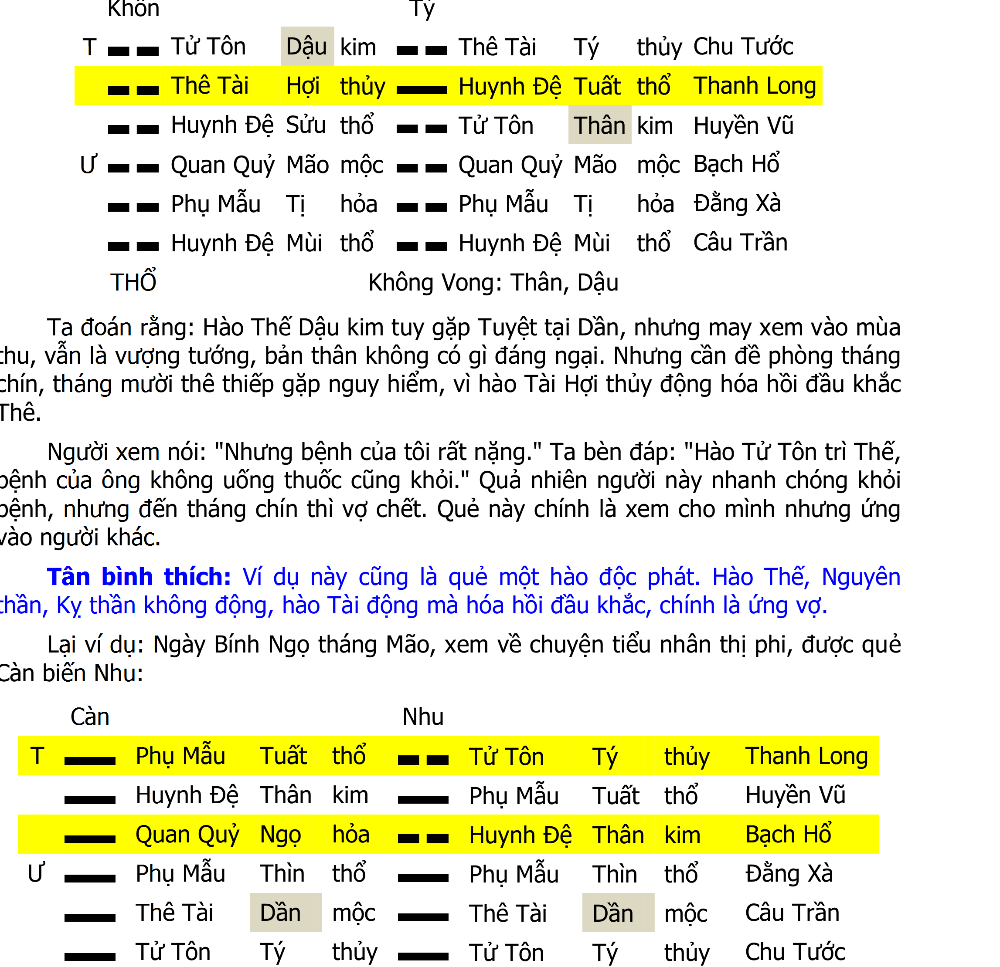

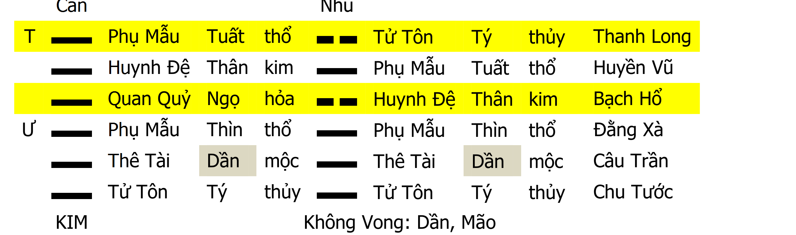

Thân xung khỏi Dần mộc, mà thành tam hợp. Nếu không xem xét kỹ, mà lấy quẻ này 
đoán về việc thị phi, sẽ là sai lầm lớn.

### Ví dụ: Ngày Đinh Hợi tháng Mùi, xem bệnh của mẹ, được quẻ Khôn biến Bác:

Khôn
 
Bác

T | Tử Tôn | Dậu kim | Quan QuỷDần mộc Thanh Long

Thê Tài | Hợi thủy | Thê Tài | Tý | thủy Huyền Vũ

Huynh ĐệSửu thổ | Huynh ĐệTuất thổ Bạch Hổ

Ư | Quan QuỷMão mộc | Quan QuỷMão mộc Đằng Xà

Phụ Mẫu Tị | hỏa | Phụ Mẫu Tị | hỏa Câu Trần

Huynh ĐệMùi thổ | Huynh ĐệMùi thổ Chu Tước

THỔ
Không Vong: Ngọ, Mùi

Ta đoán rằng: "Quẻ này không hiện bệnh của mẹ, mà ứng vào tai họa của con 
cái." Người xem hỏi: "Tại sao lại như vậy?" Ta đáp: "Bệnh gần của mẹ nay gặp quẻ 
Lục xung sẽ khỏi, nhưng có điều trong quẻ có hào Tử Tôn biến Quỷ là không may." 
Người xem có con trai mới sinh hai tháng. Ta dặn: "Cần đề phòng tháng tám." Sau 
quả nhiên đến tháng tám, con trai người này bị kinh phong, nên lại đến xem quẻ.

Ngày Đinh Mão tháng Dậu, xem về bệnh của con, được quẻ Ký Tế biến Cách:

Ký Tế
 
Cách

Ư | Huynh ĐệTý | thủy | Quan QuỷMùi thổ Thanh Long

Quan QuỷTuất thổ | Phụ Mẫu Dậu kim Huyền Vũ

Phụ Mẫu Thân kim | Huynh ĐệHợi thủy Bạch Hổ

T | Huynh ĐệHợi | thủy Tài-Ngọ | Huynh ĐệHợi thủy Đằng Xà

Quan QuỷSửu thổ | Quan QuỷSửu thổ Câu Trần

Tử Tôn | Mão mộc | Tử Tôn | Mão mộc Chu Tước

THỦY
Không Vong: Tuất, Hợi

Ta đoán rằng: Hào Mão mộc Tử Tôn gặp Nguyệt phá, lại bị hào Thân kim động 
tương khắc. Tuy hào Tử gặp Nhật thần, nhưng khó qua khỏi ngày Mão, ngày Dậu. 
Người xem hỏi: "Có thể cứu được không?" Ta đáp: "Ngày trước xem bệnh cho mẹ mà 
ứng vào tháng tám con chết, nay lại gặp quẻ hung này, làm sao có thể cứu được." 
Sau con trai người này quả nhiên chết vào ngày Mão. Ứng vào ngày Mão là ngày thực 
Phá.

Ta có người bạn nghèo khó cùng cực, bèn đích thân mang mấy lạng bạc đến 
biếu. Người này chưa biết, liền xin xem một quẻ, nói rằng trước mắt có một việc, ước 
chừng được hơn hai mươi lạng vàng, không biết có được hay không.

Ta đoán rằng: Nhật thần làm hào Tài mà sinh hào Thế, nên sẽ được của. Bạn hỏi 
ngày nào sẽ đắc tài? Ta đáp: "Hôm nay sẽ được." Bạn hỏi: "Chuyện vẫn chưa thành,

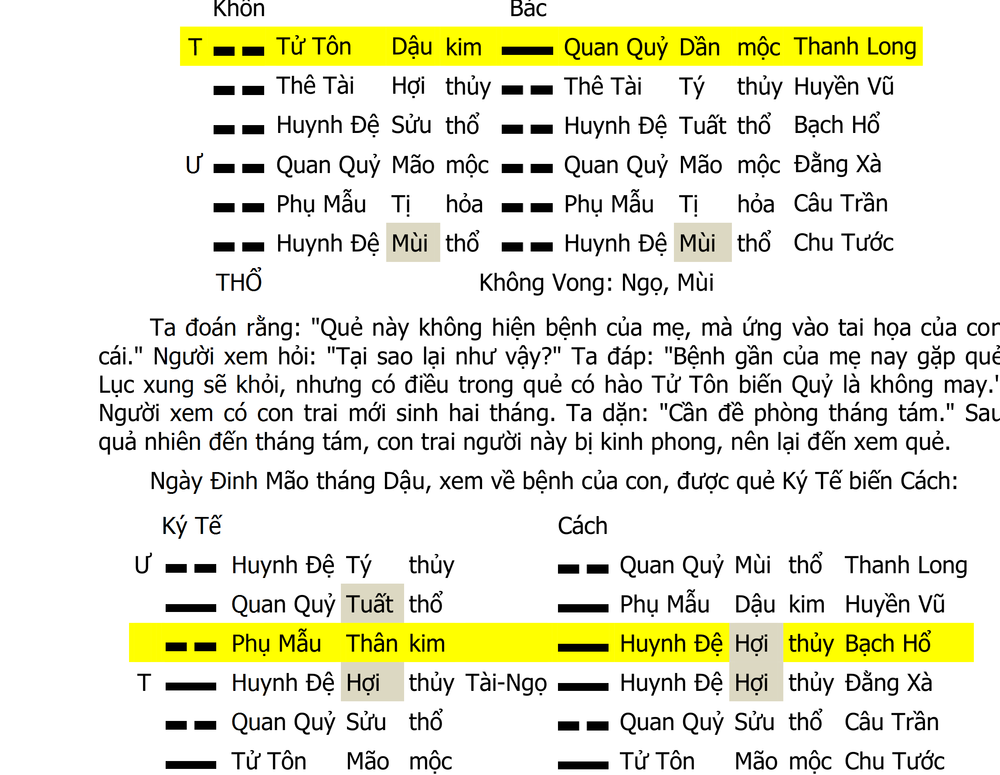

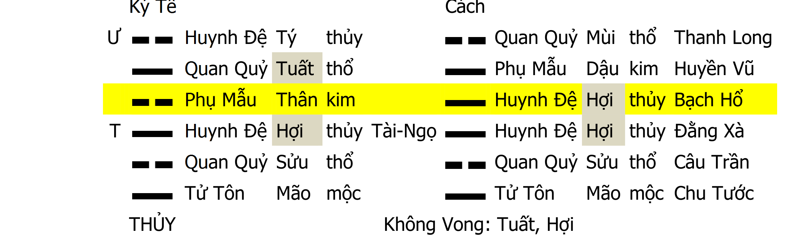

---

# CHƯƠNG 40. THIÊN THỜI

làm sao lại được?" Lúc này ta mới chợt ngộ ra, ta muốn biếu bạc cho bạn, nhưng bạn 
chưa biết, mà thần đã mách bảo rằng: "Ngay bây giờ đã được của, cần gì phải hỏi 
việc khác." Ta bèn lấy bạc biếu cho bạn, bảo bạn xem thêm một quẻ, được quẻ Ly, 
hào Huynh Đệ trì Thế, lại là quẻ Lục xung, nên ta đoán rằng: "Quẻ trước đắc tài, là 
ứng vào việc tôi biếu bạc cho anh; quẻ sau hoàn toàn không thấy điềm báo gì." Quả 
nhiên là xem việc này nhưng lại ứng vào việc khác.

**Lý Ngã Bình bàn rằng:** "Thiên kim phú" "Hoàng kim sách" do Thành Ý tiên sinh 
viết ra. Do ngày xưa có người bảo rằng, nếu sửa được một chữ, sẽ tặng cho ngàn 
vàng. Sau do bản khắc in nhiều lỗi sai, mà người đời lấy ngoa truyền ngoa, khiến ngọc 
đẹp sinh tì vết. Dã Hạc lão nhân đã tiến hành thêm trước bớt sau, viết chú giải mà lại 
thành toàn bích. Ta không thể để tên "thiên kim", mà từ đây phải đặt tên là "Vạn kim 
phú" vậy.

***

# CHƯƠNG 40: THIÊN THỜI

(TĂNG SAN "HOÀNG KIM SÁCH")

Thiên đạo hạn lạo bất định, Dịch hào âm tình khả trắc.

Đạo trời hạn lụt bất thường; hào Dịch nắng mưa dễ đoán.

Ngày xưa cho rằng việc xem nắng mưa không thể mang ra thử nghiệm vì là 
khinh nhờn quỷ thần. Chỉ khi nắng hạn cầu mưa, lụt lội cầu tạnh, mới có thể xem. Ta 
cho rằng không phải như thế, có thể dùng việc xem nắng mưa để thử nghiệm thuật 
xem quẻ. Bởi vì sự vi diệu của quẻ, người mới học rất khó biết được. Nếu lấy chuyện 
của người khác ra thử nghiệm, thì ứng nghiệm không nhanh chóng; lấy thời tiết ra 
thử nghiệm, sẽ lập tức chứng nghiệm. Thời tiết nắng mưa, nhân gian họa phúc, tất cả 
đều không tách rời khỏi ngũ hành. Xem về thời tiết mà ứng nghiệm, thì xem về nhân 
sự cũng ứng nghiệm. Ta lúc mới học xem, cũng dựa vào sự ứng nghiệm với thiên thời 
mà lĩnh ngộ được cái ý tứ huyền vi của quẻ.

Tử Tôn vi nhật nguyệt tinh đẩu, động tắc vạn lý tình quang;

Tử Tôn là mặt trời trăng sao, động thì trời quang muôn dặm;

"Hoàng kim sách" cho rằng, nếu hào Tài động, thì khắp tám phương trời quang 
mây tạnh, là không đúng, mà phải là hào Tử Tôn phát động, muôn dặm trời quang. 
Hào Tử Tôn là Nguyên thần của hào Tài, hào Tài động tuy trời cũng tạnh, nhưng nếu 
như hào Tử Tôn hưu tù, gặp Không, gặp Phá, hoặc xuất hiện mà không động, thì trời 
cũng không thực sự quang đãng, mà vẫn có mây nổi, sương mù.

### Ví dụ: Ngày Giáp Ngọ tháng Mão, xem khi nào mưa tạnh, được quẻ Đại Tráng

biến Quải:

Đại Tráng
 
Quải

Huynh Đệ | Tuất thổ | Huynh Đệ | Mùi | thổ | Huyền Vũ

Tử Tôn | Thân | kim | Tử Tôn | Dậu kim | Bạch Hổ

T | Phụ Mẫu | Ngọ | hỏa | Thê Tài | Hợi | thủy | Đằng Xà

Huynh Đệ | Thìn | thổ | Huynh Đệ | Thìn | thổ | Câu Trần

Quan Quỷ | Dần | mộc | Quan Quỷ | Dần mộc | Chu Tước

Ư | Thê Tài | Tý | thủy | Thê Tài | Tý | thủy | Thanh Long

THỔ 
Không Vong: Thìn, Tị

Hào Thân kim Tử Tôn động hóa Tiến Thần, đoán rằng ngày Thân Dậu trời trong 
mây tạnh.

Có người nói rằng: Phàm để lại quẻ chiêm nghiệm, nên để lại những quẻ thâm 
thúy, kỳ lạ, nhưng quẻ này đơn giản dễ thấy, sao lại chép lại làm gì? Ta bèn bảo rằng: 
Để cho người mới học dễ hiểu, để đi từ nông cạn đến uyên thâm. Còn những quẻ 
thâm thúy kỳ lạ, ở quyển sau sẽ có ghi chép.

Phụ mẫu vi vũ tuyết vụ sương, phát tắc bát phương nhuận trạch.

Phụ Mẫu là mưa, tuyết, sương mù, sương giá, động sẽ thấm nhuần bốn phương.

Khi xem, chỉ nên cầu một thứ, như cầu tạnh, hoặc cầu mưa, hoặc cầu tuyết, 
hoặc cầu sương, tâm niệm phải chuyên nhất vào một chuyện, thì thần sẽ mách bảo. 
Lại phải nói rõ muốn cầu ở nơi nào. Ví dụ, có thể hỏi: Trong thành có mưa không? 
Hoặc có tạnh không? Hoặc tình hình mưa, nắng của một làng, một tỉnh xác định. Nếu 
không, trong khắp thiên hạ ngày nào chẳng có nắng, mưa. Phép xem xưa lấy hào Phụ 
Mẫu làm trời đất, trời đất bế tắc thì Nhật, Nguyệt bị che khuất, nói như vậy cũng khá 
hữu lý. Theo ta, hào Phụ Mẫu tượng trưng cho mây dày, mù nặng, nếu hào Phụ động 
mà tổn thương Tử Tôn, tức mây mù che khuất mặt trời, mặt trăng. Cho nên hào Phụ 
phát động là tượng mây mù đầy trời, che khuất trời trăng mà thành mưa.

### Ví dụ: Ngày Giáp Tuất tháng Tị, xem ngày nào có mưa, được quẻ Tiểu Quá biến

Lữ:

Tiểu Quá
 
Lữ

Phụ Mẫu Tuất thổ | Quan QuỷTị | hỏa Huyền Vũ

Huynh ĐệThân kim | Phụ Mẫu Mùi thổBạch Hổ

T

Quan QuỷNgọ hỏa Tử-Hợi | Huynh ĐệDậu kim Đằng Xà

Huynh ĐệThân kim | Huynh ĐệThân kim Câu Trần

Quan QuỷNgọ hỏa Tài-Mão | Quan QuỷNgọ hỏa Chu Tước

Ư

Phụ Mẫu Thìn thổ | Phụ Mẫu Thìn thổThanh Long

KIM 
Không Vong: Thân, Dậu

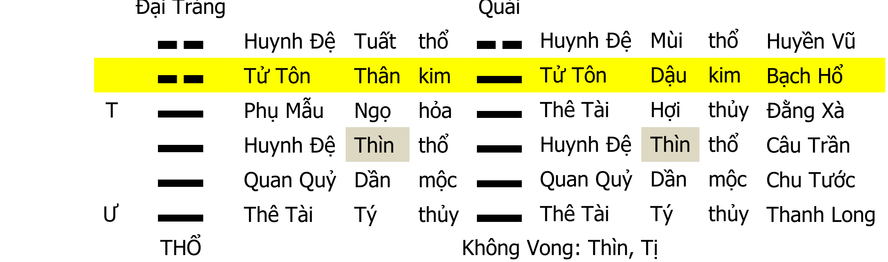

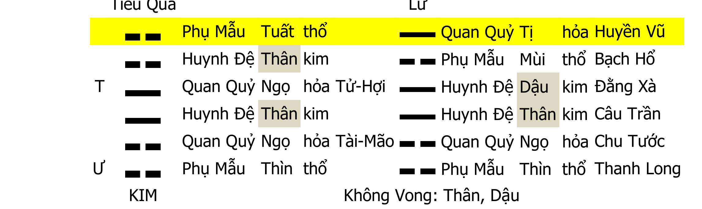

Vì trời nắng to đã nhiều ngày, nên đến giờ Mão ngày này gieo quẻ xem ngày nào 
sẽ mưa. Nhìn quẻ này có thể đoán rằng đến giờ Thìn mây nổi, cuối giờ Thìn đầu giờ Tị 
mưa to sấm chớp, ứng vào giờ Thìn, vì Nhật thần Tuất xung Phụ Mẫu Thìn thổ, nên 
hào Phụ ám động; ứng vào mưa to sấm chớp, do hào Phụ Tuất hóa Tị hỏa Quan Quỷ.

**Tân bình thích:** Hơi nước ở trên không trung là mây, dưới đất là sương mù. 
Trên trời tạo thành giọt nước mà rơi xuống là mưa, dưới đất tạo thành hạt nước là 
sương móc. Mùa đông, hơi nước trên trời đông lại mà rơi xuống là tuyết, dưới đất 
đông lại mà trở thành sương giá. Tuy hình thể khác nhau nhưng thực ra là một. Nếu 
Phụ Mẫu lâm hào sơ hào 4 động lại gặp hợp thì chủ sương mù.

Thê Tài thiên khí tình minh.

Thê Tài trời quang mây tạnh.

Hào Tài động khắc Phụ mà sinh Tử Tôn, nên chủ về trời nắng tạnh.

**Tân bình thích:** Không đúng. Tài chỉ khắc Phụ Mẫu mà không sinh Tử.

### Ví dụ: Như Ngày Ất Tị tháng Dậu, xem trong ngày mưa hay nắng, được quẻ

Thăng biến Hằng:

Thăng
 
Hằng

Quan QuỷDậu kim | Thê Tài | Tuất thổ Huyền Vũ

Phụ Mẫu | Hợi thủy | Quan QuỷThân kim Bạch Hổ

T | Thê Tài | Sửu thổ Tử-Ngọ | Tử Tôn | Ngọ hỏa Đằng Xà

Quan QuỷDậu kim | Quan QuỷDậu kim Câu Trần

Phụ Mẫu | Hợi thủy Huynh-Dần | Phụ Mẫu | Hợi | thủy Chu Tước

Ư | Thê Tài | Sửu thổ | Thê Tài | Sửu thổ Thanh Long

MỘC 
Không Vong: Dần, Mão

Trong quẻ này, hào Tài Sửu thổ động, hóa thành Ngọ hỏa Tử Tôn, nên buổi sáng 
tuy trời tạnh ráo, nhưng thường có mây che khuất mặt trời. Sau giờ Ngọ, trời nắng 
lớn, không một gợn mây. Vì hào Tài hào tuy chủ về tạnh ráo, nhưng vẫn khó tránh 
được mây, phải đợi đến giờ Ngọ gặp Tử Tôn, mới trở nên quang đãng.

**Tân bình thích:** Nửa ngày đầu có mây cũng bởi vì Phụ Mẫu Hợi thủy ám động.

### Ví dụ: Ngày Mậu Ngọ tháng Tuất, đoán thời tiết hôm sau, được Thủy Trạch Tiết.

Tiết

Huynh ĐệTý | thủy | Chu Tước

Quan QuỷTuất thổ | Thanh Long

Ư | Phụ Mẫu | Thân kim | Huyền Vũ

Quan QuỷSửu thổ Tài-NgọBạch Hổ

Tử Tôn | Mão mộc | Đằng Xà

T | Thê Tài | Tị | hỏa | Câu Trần

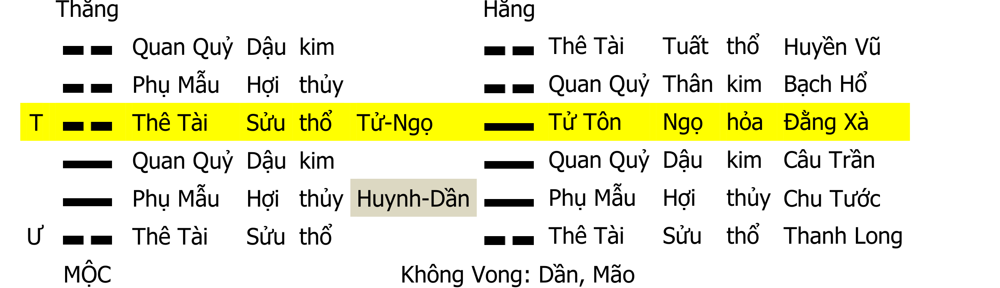

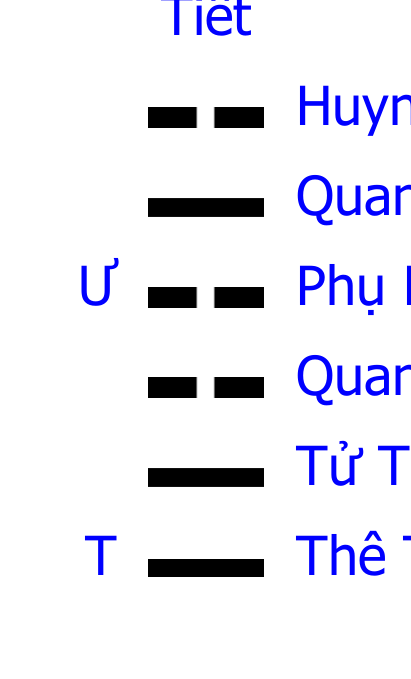

Thê Tài trì Thế, được Nhật tỉ phù vượng tướng, Thê Tài chủ tạnh, nhưng lại 
tương hợp với Phụ Mẫu, Phụ Mẫu chủ mây mù, vì vậy là trời nắng gặp nhiều mây. 
Quả nhiên ứng nghiệm.

Quan Quỷ lôi đình vụ điện.

Quan Quỷ là sấm sét, sương mù, chớp.

Quan Quỷ là Nguyên thần của Phụ Mẫu, nếu động sẽ sinh Phụ Mẫu, nên chủ về 
sấm sét, sương mù, chớp, có thể ứng với mây đen hoặc sấm sét, bất kể xuân, hạ, 
thu, đông, cũng không nhất định là sấm, mà còn chủ về mây đen, mù dày.

**Tân bình thích:** Chỗ này cũng phân biệt vùng, mùa, không thể cố chấp.

### Ví dụ: Ngày Đinh Mão tháng Tị, xem ngày nào có mưa, được Hằng biến Đại Quá:

Hằng
 
Đại Quá

Ư | Thê Tài | Tuất thổ | Thê Tài | Mùi thổ Thanh Long

Quan QuỷThân kim | Quan QuỷDậu kim Huyền Vũ

Tử Tôn | Ngọ hỏa | Phụ Mẫu Hợi thủy Bạch Hổ

T | Quan QuỷDậu kim | Quan QuỷDậu kim Đằng Xà

Phụ Mẫu Hợi | thủy Huynh-Dần | Phụ Mẫu Hợi thủy Câu Trần

Thê Tài | Sửu thổ | Thê Tài | Sửu thổ Chu Tước

MỘC
Không Vong: Tuất, Hợi

Hào Thế Dậu kim Quan Quỷ ám động, hào Quan Quỷ Thân kim động hóa Tiến 
thần, nên đoán là giờ Thân hôm đó, sấm sét động trời, mưa to ở phương xa, nhưng 
nơi đây chỉ lác đác vài giọt.

Có người hỏi: Nhưng hào Phụ gặp Nguyệt phá. Ta đáp: Không phải! Nếu hào Phụ 
động, tuy gặp Nguyệt phá cũng mưa to.

Ứng nãi thái hư, phùng Không vũ tình nan định. Thế vi đại khối, thụ 
khắc thiên biến phi thường.

Ứng là thái hư, gặp Không trời nắng trời mưa khó định. Thế là đại khối1, chịu 
khắc thời tiết biến hóa bất thường.

Giác Tử nói: Xem trời mưa dùng hào Phụ, xem trời nắng dùng hào Tử, hào Tài, 
đâu có liên quan gì đến Thế, Ứng? Ta từng xem mưa xem nắng, một quẻ chưa hiện 
thì xem thêm quẻ nữa. Nếu cả sáu hào không động, cần phải tìm chỗ động để đoán 
về ứng nghiệm, tại sao lại cho là "nắng mưa khó định"? Nếu người ta đến xem về lành 
dữ, anh có thể trả lời là "rất khó xác định" hay sao? Còn như hào Thế bị khắc mà thời 
tiết biến hóa bất thường, chẳng qua chỉ là ngẫu nhiên có một đôi quẻ trùng hợp mà 
thôi, sao có thể lấy làm khuôn phép. Ta từng xem được nhiều quẻ mà hào Quan, hào 
Phụ, hào Huynh khắc Thế, mà không hề thấy thời tiết biến đổi. Vì thế hai câu này cần 
phải cắt bỏ. 
                                                             
1 Thái hư là bầu trời, đại khối là mặt đất. Ở đây nói Ứng là chỉ muôn vật trên trời, Thế là chỉ 
muôn vật trên mặt đất.

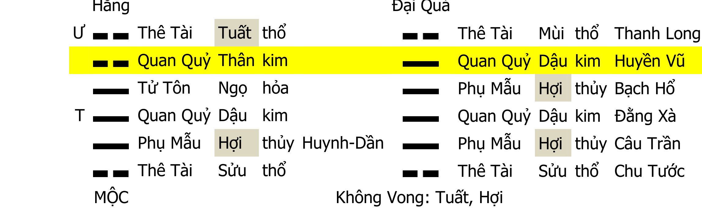

Nhược luận phong vân, toàn bằng Huynh Đệ;

Nếu luận gió mây, hoàn toàn dựa vào Huynh Đệ;

Hào Huynh Đệ phát động, tuy chủ về gió mây, nhưng cũng chỉ là tượng mây bay 
gió nhẹ, trời không mưa không nắng. Khi gặp hào Huynh động, là tượng mặt trời mặt 
trăng bị mây che, lúc ẩn lúc hiện.

### Ví dụ: Ngày Đinh Hợi tháng Ngọ, xem trong ngày mưa hay nắng, được quẻ Độn

biến Bĩ:

Độn
 
Bĩ

Phụ Mẫu Tuất thổ | Phụ Mẫu Tuất thổ Thanh Long

Ư | Huynh ĐệThân kim | Huynh ĐệThân kim Huyền Vũ

Quan QuỷNgọ hỏa | Quan QuỷNgọ hỏa Bạch Hổ

Huynh ĐệThân kim | Thê Tài | Mão mộc Đằng Xà

T | Quan QuỷNgọ hỏa Tài-Dần | Quan QuỷTị | hỏa Câu Trần

Phụ Mẫu Thìn thổTử-Tý | Phụ Mẫu Mùi thổ Chu Tước

KIM
Không Vong: Ngọ, Mùi

Có người nói rằng: "Hào Huynh động là tượng gió mây, nên hôm nay trời sẽ âm 
u". Ta bèn nói: "Đến giờ Thân trời sẽ nắng". Người này hỏi nguyên nhân, ta bèn giải 
thích: "Hào Thân kim Huynh Đệ tượng trưng cho mây, động mà hóa thành hào Tài 
Mão mộc, là tượng mặt trời hiện ra từ trong mây mù". Quả thực trời âm u cả ngày, 
đến giờ Thân mới thấy ánh nắng. Đến giờ Mão hôm sau thì nắng to.

**Tân bình thích:** Huynh Đệ tuy là gió mây, nhưng cũng cần phải tùy theo quẻ 
mà phân tích một cách linh hoạt.

### Ví dụ: Ngày Tân Mùi tháng Tuất, bởi vì hôm nay mưa, xem khi nào tạnh? Được

Đại Tráng biến Đại Hữu.

Đại Tráng
 
Đại Hữu

Huynh Đệ | Tuất thổ | Phụ Mẫu | Tị | hỏa | Đằng Xà

Tử Tôn | Thân | kim | Huynh Đệ | Mùi | thổ | Câu Trần

T | Phụ Mẫu | Ngọ | hỏa | Tử Tôn | Dậu kim | Chu Tước

Huynh Đệ | Thìn | thổ | Huynh Đệ | Thìn | thổ | Thanh Long

Quan Quỷ | Dần | mộc | Quan Quỷ | Dần mộc | Huyền Vũ

Ư | Thê Tài | Tý | thủy | Thê Tài | Tý | thủy | Bạch Hổ

THỔ 
Không Vong: Tuất, Hợi

Huynh Đệ độc phát, không gặp Tử Tài phát động, chẳng lẽ không tạnh? Không 
phải vậy. Huynh Đệ Tuất thổ phát động, Phụ Mẫu nhập Mộ, là tượng ngừng mưa, 
nhưng bởi vì Tuất thổ Không Vong, nhất định đến giờ Thìn xung thực liền tạnh. Huynh

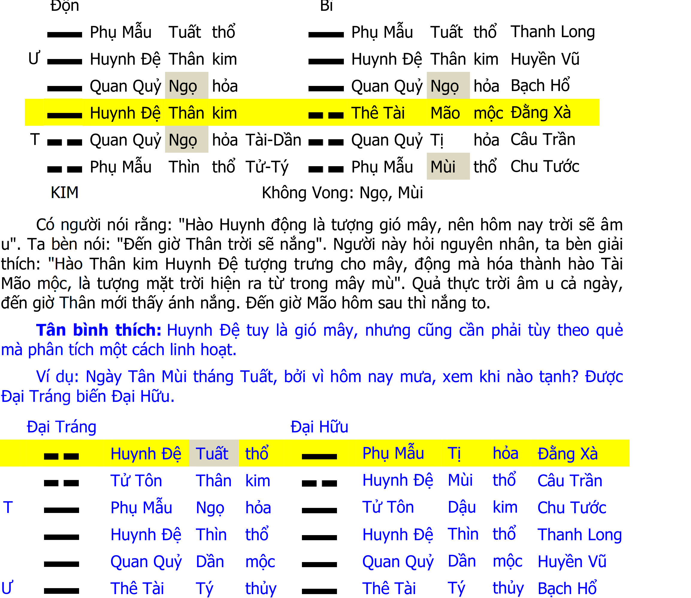

Đệ chủ gió, tất có gió nổi lên. Quả nhiên đến giờ Thìn chuyển tạnh, giờ Tị tạnh hẳn, 
giờ Thân gió nổi.

Cánh án tứ quý thôi tường, tu phối ngũ hành tham quyết.

Biết tùy bốn mùa suy luận, kết hợp ngũ hành quyết đoán.

"Hoàng kim sách" viết rằng: Hào Phụ Mẫu bốn mùa đều chủ về mưa. Nếu ở hào 
kim thủy thì mưa to mà không dứt. Nếu ở hào hỏa thổ, thì mưa nhỏ mà không lâu.

Giác Tử nói: Câu trên có nghĩa là bất luận suy vượng, trong suốt bốn mùa, nếu 
Phụ Mẫu tại hào thủy là có mưa, tại hào hỏa thì mưa nhỏ. Đã không tính đến suy, 
vượng, tại sao ở chương sau lại viết: "Phụ gặp Nguyệt kiến, ắt mưa dầm suốt tuần?"

Giả sử tại các tháng Tị, Ngọ, Mùi, là lúc hỏa thổ đương quyền đắc lệnh, lại chính 
là thời điểm mưa nhiều. Trong thời điểm đó, nếu hào Phụ lâm hỏa thổ mà phát động, 
căn cứ vào vượng suy để luận đoán, là tượng mưa liền suốt tuần. Nếu dùng ngũ hành 
để quyết đoán hỏa thổ, thì lại là tượng mưa nhỏ. Phép xem xưa đã sai lầm đến vậy, 
tại sao còn chưa xóa bỏ?

Lại đáng cười hơn nữa, là phần chú trong sách viết rằng: "Mùa đông lấy hào Tử 
Tôn làm sương tuyết. Lấy hào Tử Tôn làm sương tuyết, nếu vào mùa đông muốn xem 
trời nắng, thì lấy hào nào làm mặt trăng mặt trời? Người xưa có điều sai lầm trái 
khoáy, mà người ngày nay vẫn không tỉnh ngộ, ấy là tại sao?

### Ví dụ: Ngày Kỷ Hợi tháng Tý, vì tuyết xuống đã nhiều ngày, nên xem lúc nào trời

tạnh, được quẻ Quan biến Tỷ:

Quan
 
Tỷ

Thê Tài | Mão mộc | Tử Tôn | Tý | thủy Câu Trần

Quan QuỷTị | hỏa Huynh-Thân | Phụ Mẫu | Tuất thổ Chu Tước

T | Phụ Mẫu | Mùi thổ | Huynh ĐệThân kim Thanh Long

Thê Tài | Mão mộc | Thê Tài | Mão mộc Huyền Vũ

Quan QuỷTị | hỏa | Quan QuỷTị | hỏa Bạch Hổ

Ư | Phụ Mẫu | Mùi thổ Tử-Tý | Phụ Mẫu | Mùi | thổ Đằng Xà

KIM 
Không Vong: Thìn, Tị

Ta đoán rằng: Hai hào hỏa Quỷ ám động, nên hôm nay trời vẫn âm u. Hào Tài 
Mão mộc động hóa Tử Tôn Tý thủy, nên đến giờ Mão ngày mai sẽ tạnh. Quả nhiên 
đến giờ Mão hôm sau trời quang mây tạnh, mặt trời xuất hiện. Hào Tử thủy lâm 
Nguyệt kiến lại được Nhật thần Hợi thủy trợ giúp, nên rất vượng. Nếu lấy hào Tử Tôn 
làm sương tuyết, thì không những không tạnh, mà tuyết lại càng thêm dày. Cho nên 
khi xem về thời tiết, bất luận vượng suy không thể lấy hào Tử Tôn làm sương tuyết.

Tình hoặc phùng Quan, vi yên vi vụ;

Tạnh mà gặp Quan, là sương là khói;

Vốn trong sách xưa chú thích rằng: Quẻ được điềm trời tạnh, nếu trong quẻ có 
hào Quan Quỷ động, ắt sẽ có mây nặng sương dày, hoặc cuồng phong u ám, nếu

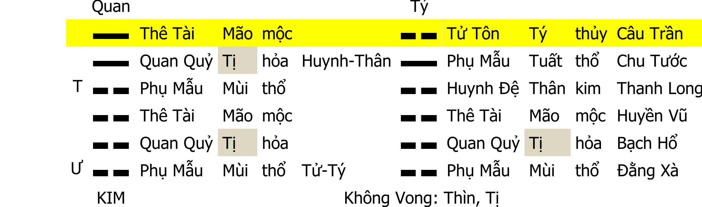 mùa đông sẽ gặp rét lớn, nếu mùa hè sẽ có gặp nắng cháy, nói tóm lại không phải là 
tượng thời tiết ôn hoà. Ta cho rằng câu này là hữu lý, nhưng phải xác định rõ thời 
điểm xuất hiện.

### Ví dụ: Vào ngày Kỷ Mão tháng Thìn, xem trong ngày mưa hay nắng, được quẻ

Truân biến Lâm:

Truân
 
Lâm

Huynh ĐệTý | thủy | Phụ Mẫu | Dậu kim Câu Trần

Ư | Quan QuỷTuất thổ | Huynh ĐệHợi thủy Chu Tước

Phụ Mẫu | Thân kim | Quan QuỷSửu thổ Thanh Long

Quan QuỷThìn thổ Tài-Ngọ | Quan QuỷSửu thổ Huyền Vũ

T | Tử Tôn | Dần mộc | Tử Tôn | Mão mộc Bạch Hổ

Huynh ĐệTý | thủy | Thê Tài | Tị | hỏa Đằng Xà

THỦY
Không Vong: Thân, Dậu

Ta đoán rằng: Hào Dần mộc Tử Tôn hóa Tiến thần, hôm nay nắng to. Hào 5 
Tuất thổ Quan Quỷ động, đến Tuất giờ Hợi, sẽ có mây đen. Sau quả nhiên đến giờ 
Tuất, mây đen che khuất trời sao. Nếu đoán là cả ngày có sương mù, là sai.

Vũ nhi ngộ Phúc, vi điện vi hồng.

Mưa mà gặp Phúc, là chớp, cầu vồng.

Ý nói được tượng quẻ có mưa, mà hào Tử Tôn (tức Phúc đức) động, thì không 
chớp cũng có cầu vồng. Theo ta câu này cũng không đúng.

### Ví dụ: Ngày Bính Thìn tháng Thìn, do mưa dầm dài ngày, nên xem trong ngày có

tạnh không, được quẻ Khốn biến Tỷ:

Khốn
 
Tỷ

Phụ Mẫu | Mùi | thổ | Tử Tôn | Tý | thủy | Thanh Long

Huynh Đệ | Dậu kim | Phụ Mẫu | Tuất thổ | Huyền Vũ

Ư | Tử Tôn | Hợi | thủy | Huynh Đệ | Thân | kim | Bạch Hổ

Quan Quỷ | Ngọ hỏa | Thê Tài | Mão | mộc | Đằng Xà

Phụ Mẫu | Thìn | thổ | Quan Quỷ | Tị | hỏa | Câu Trần

T | Thê Tài | Dần mộc | Phụ Mẫu | Mùi | thổ | Chu Tước

KIM 
Không Vong: Tý, Sửu

Trong quẻ, hào 2 Thìn thổ động, nên hào Phụ Mẫu gặp Nguyệt kiến, lại gặp Nhật 
thần, động hóa Tị hỏa hồi đầu sinh, nên là tượng có mưa. Nhưng hào Hợi thủy Tử 
Tôn cũng động, hóa thành Thân kim, nhưng ta không đoán là chớp hay cầu vồng, mà 
đoán rằng đến giờ Thân trời sẽ hửng, đến giờ Hợi thì tạnh ráo. Quả nhiên đến giờ 
Hợi, trời quang không một gợn mây. Hào Tử Tôn là tượng mặt trời, trăng sao, chứ 
không phải là chớp là cầu vồng.

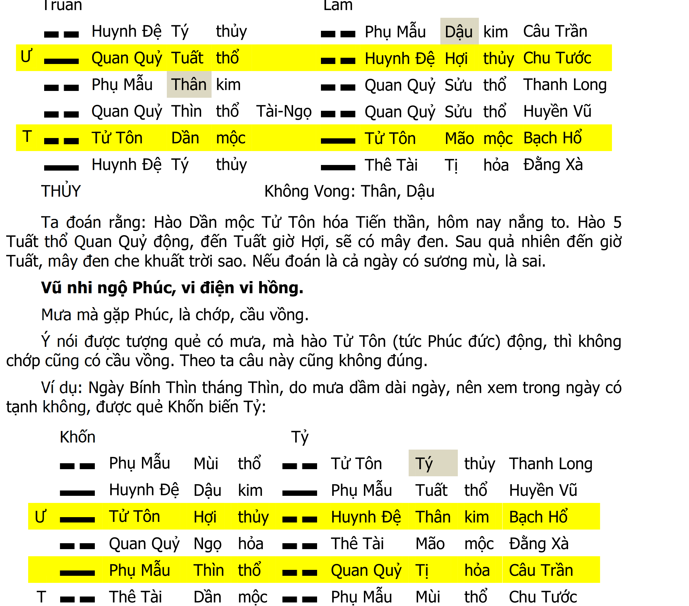

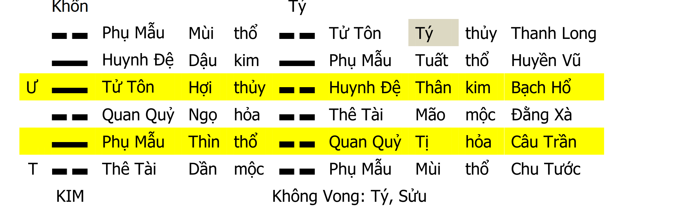

**Tân bình thích:** Cầu vòng được tạo thành từ nguyên lý khúc xạ ánh sáng mặt 
trời, tùy theo khu vực mà các mùa khác nhau mà tần suất xuất hiện cũng không giống 
nhau. Học viên của tôi ở Nhật Bản có ví dụ lấy Tử Tôn nghiệm được cầu vồng.

Tam hợp thành Tài, vấn vũ nan kham nhập quái.

Tam hợp Tài cục, hỏi mưa khó mà ứng quẻ.

Tam hợp Tài cục, tức cục Tử Tôn, chủ về nắng tạnh. Tam hợp Phụ cục chủ mưa, 
Tam hợp Quan cục chủ về trời mù, hoặc sấm chớp. Tam hợp mộc cục chủ về gió.

Ngũ hương liên Phụ, cầu tình quái sát lâm Không.

Phụ thuộc hành nào, cầu nắng kỵ sát lâm Không.

Nguyên trong sách xưa chú rằng: Tức hào Phụ hào lâm Không thì không mưa, 
hào Tử Tôn và Thê Tài lâm Không thì không nắng.

Ta thường xem về mưa, nếu hào Phụ Mẫu hưu tù bất động, quả thật khó mà 
mong có mưa. Còn nếu là lâm Không, thì vẫn còn hy vọng. Thường thấy hào Phụ 
động mà lâm Không, đợi đến ngày xung Không hoặc ngày điền thực sẽ có mưa, xem 
trăm lần ứng nghiệm cả trăm. Nếu hào Tài và hào Tử Tôn lâm Không, cũng tương tự 
như vậy.

Tài hóa Quỷ, tình minh bất cửu;

Tài hóa Quỷ, nắng tạnh không lâu;

Nguyên trong sách xưa chú rằng: Hào Tài hóa Quỷ thì nắng mưa bất định, điều 
này không đúng.

### Ví dụ: Ngày Giáp Dần tháng Tị, do nắng lâu ngày, nên xem ngày nào mưa, được

quẻ Ký Tế biến Kiển:

Ký Tế
 
Kiển

Ư | Huynh ĐệTý | thủy | Huynh ĐệTý | thủy Huyền Vũ

Quan QuỷTuất thổ | Quan QuỷTuất thổ Bạch Hổ

Phụ Mẫu Thân kim | Phụ Mẫu Thân kim Đằng Xà

T | Huynh ĐệHợi | thủy Tài-Ngọ | Phụ Mẫu Thân kim Câu Trần

Quan QuỷSửu thổ | Thê Tài | Ngọ hỏa Chu Tước

Tử Tôn | Mão mộc | Quan QuỷThìn thổ Thanh Long

THỦY
Không Vong: Tý, Sửu

Nếu căn cứ vào câu "hào Tài hóa Quỷ, nắng mưa bất định" thì quẻ này Mão mộc 
Tử Tôn hóa Quỷ Thìn thổ, chẳng phải là tượng nắng mưa bất định hay sao. Lý luận 
như vậy là không biết được rằng, Mão mộc Tử Tôn thì ngày Mão nắng; Thìn thổ Quỷ, 
đến ngày Thìn đổi trời, sẽ không nắng. Ta đoán rằng: "Ngày Thìn trời âm u, ngày Tị 
sẽ có mưa". Vì sao biết ngày Tị trời mưa? Vì trong quẻ trên, hào Phụ Thân kim ám 
động, động mà gặp ngày hợp, chủ về trời tạnh không lâu. Hào Phụ động hóa Tài, hóa 
Tử là tượng mưa không lâu, chứ không phải là nắng mưa bất định.

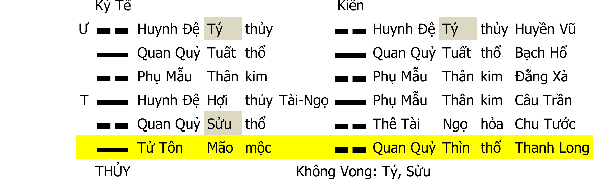

**Tân bình thích:** Lý luận của Dã Hạc có lý. Nhưng cũng cần phải xem suy vượng 
của lục thân.

### Ví dụ: Ngày Nhâm Thân tháng Tuất, xem thời tiết ngày hôm sau, được Minh Di

biến Khiêm.

Minh Di
 
Khiêm

Phụ Mẫu Dậu kim | Phụ Mẫu Dậu kim Bạch Hổ

Huynh ĐệHợi thủy | Huynh ĐệHợi | thủy Đằng Xà

T

Quan QuỷSửu thổ | Quan QuỷSửu thổ Câu Trần

Huynh ĐệHợi thủy Tài-Ngọ | Phụ Mẫu Thân kim Chu Tước

Quan QuỷSửu thổ | Thê Tài | Ngọ hỏa Thanh Long

Ư

Tử Tôn | Mão mộc | Quan QuỷThìn thổ Huyền Vũ

THỦY 
Không Vong: Tuất, Hợi

### Ví dụ này và ví dụ ở trên rất giống nhau, một hào độc phát, Tử Tôn động mà hóa

Quan. Buổi sáng quang đãng, giờ Thìn nổi sương mù, giờ Mùi Thân nổi mây, sau đó 
lại quang đãng.

Bởi vì Tử Tôn hóa ra Quan Quỷ Nguyệt phá, giờ Thìn thực Phá, từ quang đãng 
mà nổi sương mù. Giờ Mùi Tử Tôn nhập Mộ, giờ Thân lâm Tuyệt, vì vậy nổi mây, 
nhưng bởi vì Quan Quỷ Nguyệt phá nên có mây không lâu.

Phụ hóa Huynh, phong vũ mị thường.

Phụ hóa Huynh, mưa gió bất thường.

Hào Phụ hóa hào Huynh, hào Phụ hóa hào Quỷ, hoặc trong quẻ có hào Phụ, hào 
Huynh động, đều chủ về vừa mưa vừa gió. Về trình tự, hào động là cái xuất hiện 
trước, hào biến là cái xuất hiện sau. Ví dụ hào Huynh hóa hào Phụ, là gió trước mưa 
sau. Hào Quỷ hóa hào Phụ, mà xem vào mùa xuân mùa hè, là tượng sấm trước mưa 
sau.

Giác Tử nói: Hào Quỷ động tuy là tượng sấm chớp, nhưng ứng vào sấm thì ít, 
ứng vào mây đen lại nhiều, nên câu trên không đúng.

Mẫu hóa Tử, vũ hậu tình minh; Đệ hóa Tôn, vân khai nhật xuất.

Mẫu hóa Tử, sau mưa trời sáng; Đệ hóa Tôn, mây tan nắng hiện.

Sách xưa chú rằng hào Phụ Mẫu hóa Tử Tôn thì cầu vồng xuất hiện, không đúng.

### Ví dụ: Ngày Ất Mão tháng Ngọ, do mưa liên tục nhiều ngày, nên xem ngày nào

tạnh, được quẻ Di biến Cấn:

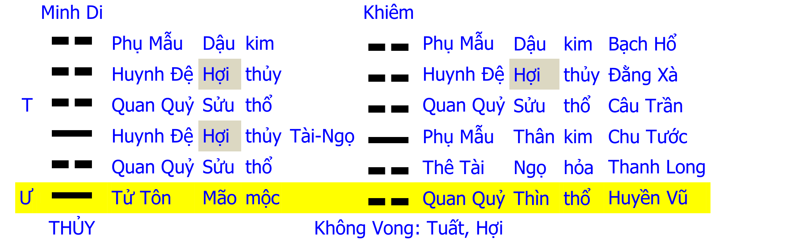

Di 
 
Cấn

Huynh ĐệDần mộc | Huynh ĐệDần mộc Huyền Vũ

Phụ Mẫu Tý | thủy Tử-Tị | Phụ Mẫu Tý | thủy Bạch Hổ

T | Thê Tài | Tuất thổ | Thê Tài | Tuất thổ Đằng Xà

Thê Tài | Thìn thổ Quan-Dậu | Quan QuỷThân kim Câu Trần

Huynh ĐệDần mộc | Tử Tôn | Ngọ hỏa Chu Tước

Ư | Phụ Mẫu Tý | thủy | Thê Tài | Thìn thổ Thanh Long

MỘC
Không Vong: Tý, Sửu

Ta nói với người bạn rằng: Giờ Dậu hôm nay sẽ thấy mặt trời lặn về tây, ngày 
mai trời vẫn âm u. Bạn ta bèn hỏi: Tại sao vậy? Ta đáp rằng: Hào 6 Phụ Mẫu Dậu hóa 
Tử Tôn, nên giờ Dậu hôm nay nhìn thấy mặt trời. Hào sơ Mão mộc hóa Thìn Quỷ, 
ngày mai là ngày Thìn, trời sẽ nhiều mây, âm u. Quả nhiên đến giờ Dậu, đột nhiên 
mây tan, nắng hiện, hôm sau nữa mây đen kín trời nhưng không có mưa.

Phụ trì Nguyệt kiến, tất âm vũ liên tuần;

Phụ gặp Nguyệt kiến, ắt mưa dầm suốt tuần;

Trong sách xưa chú rằng, hào Phụ Mẫu lâm Nguyệt kiến mà phát động, là tượng 
mưa lâu không tạnh.

**Dã Hạc bàn rằng:** Đấy là căn cứ vào vượng suy, ta thử thấy không linh nghiệm.

### Ví dụ: Ngày Bính Ngọ tháng Ngọ, xem ngày nào có mưa, được quẻ Đại Tráng

biến Thăng:

Đại Tráng
 
Thăng

Huynh Đệ | Tuất thổ | Tử Tôn | Dậu | kim | Thanh Long

Tử Tôn | Thân | kim | Thê Tài | Hợi | thủy | Huyền Vũ

T | Phụ Mẫu | Ngọ | hỏa | Huynh Đệ | Sửu | thổ | Bạch Hổ

Huynh Đệ | Thìn | thổ | Tử Tôn | Dậu | kim | Đằng Xà

Quan Quỷ | Dần | mộc | Thê Tài | Hợi | thủy | Câu Trần

Ư | Thê Tài | Tý | thủy | Huynh Đệ | Sửu | thổ | Chu Tước

THỔ 
Không Vong: Dần, Mão

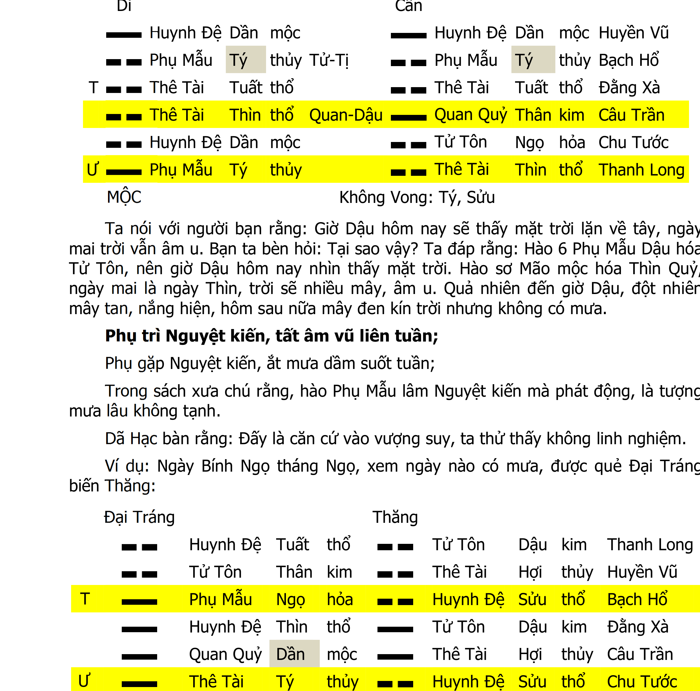

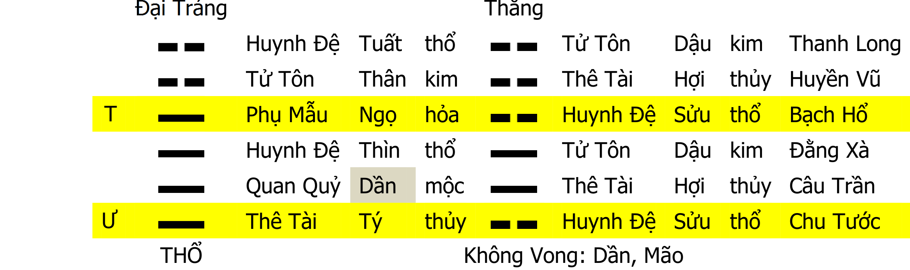

Lại vào ngày Bính Thìn tháng Thân, xem ngày nào có mưa, được quẻ Khảm biến 
Khốn:

Khảm
 
Khốn

T

Huynh Đệ | Tý | thủy | Quan Quỷ Mùi | thổ | Thanh Long

Quan Quỷ | Tuất thổ | Phụ Mẫu | Dậu kim | Huyền Vũ

Phụ Mẫu | Thân | kim | Huynh Đệ | Hợi | thủy | Bạch Hổ

Ư

Thê Tài | Ngọ | hỏa | Thê Tài | Ngọ hỏa | Đằng Xà

Quan Quỷ | Thìn | thổ | Quan Quỷ | Thìn | thổ | Câu Trần

Tử Tôn | Dần | mộc | Tử Tôn | Dần mộc | Chu Tước

THỦY
Không Vong: Tý, Sửu

Quẻ trước hào Ngọ hỏa Phụ Mẫu động, đến giờ Mùi sẽ có trận mưa to, đến giờ 
Dậu thì tạnh. Quẻ sau hào Thân kim Phụ Mẫu động, đến ngày Canh Thân có mưa, 
ngày Tân Dậu nửa tạnh nửa âm u, đến giờ Hợi tạnh hẳn. Quẻ trước hào Phụ không 
chỉ gặp Nguyệt kiến, còn lâm Nhật thần. Quẻ sau hào Phụ gặp Nguyệt kiến, được 
Nhật thần tương sinh, nên đều rất vượng. Vượng đến mức đó, chẳng phải là tượng 
mưa gió suốt tuần ư? Ta xem về thời tiết thì không luận đến vượng suy.

Huynh tọa Trường Sinh, nghĩ định cuồng phong lũy nhật.

Huynh gặp Trường Sinh, ắt hẳn gió lớn nhiều ngày.

### Ví dụ: Ngày Mậu Thân tháng Thìn, xem tình hình mưa nắng trong ngày, được

quẻ Trung Phu biến Tiểu Súc.

Trung Phu
 
Tiểu Súc

Quan QuỷMão mộc | Quan QuỷMão mộc Chu Tước

Phụ Mẫu Tị | hỏa Tài-Tý | Phụ Mẫu Tị | hỏa Thanh Long

T | Huynh ĐệMùi thổ | Huynh ĐệMùi thổ Huyền Vũ

Huynh ĐệSửu thổTử-Thân | Huynh ĐệThìn thổ Bạch Hổ

Quan QuỷMão mộc | Quan QuỷDần mộc Đằng Xà

Ư | Phụ Mẫu Tị | hỏa | Thê Tài | Tý thủy Câu Trần

THỔ 
Không Vong: Dần, Mão

Hào Huynh Sửu thổ động hóa Tiến thần, gặp Nguyệt kiến, lại gặp Trường Sinh tại 
ngày Thân (Nhật thần), nếu luận về vượng suy, thì là cực vượng. Nhưng không hề 
thấy gió lớn nhiều ngày, mà chỉ thấy một ngày mây dày âm u mà thôi.

Có người hỏi: "Hào Huynh động hóa Tiến thần mà không thấy gió lớn, thì hào 
nào chủ về gió lớn?" Ta đáp rằng: "Hào mộc động hóa Tiến thần mới có gió lớn".

**Tân bình thích:** Ở đây lại dùng ngũ hành để luận gió. Tôi được nghiệm, Huynh 
Đệ lâm mộc, tại cung Tốn, thì càng ứng nghiệm.

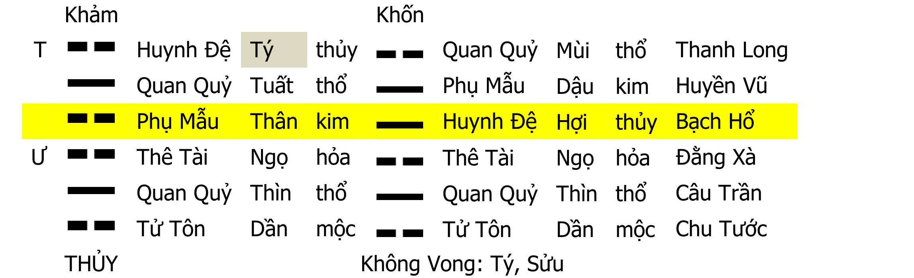

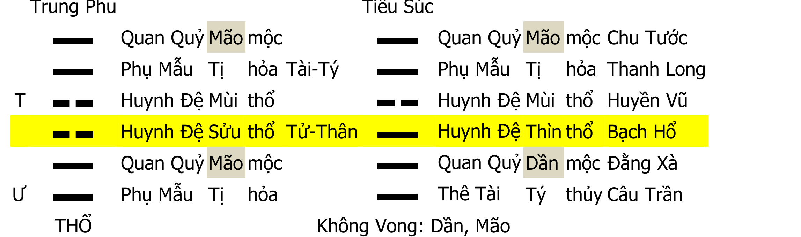

Phụ Tài vô trợ, hạn lạo hữu thường.

Phụ, Tài không được giúp, hạn lụt đã định.

Trong sách xưa chú rằng: Hào Quan Quỷ phục, lâm Không, hào Phụ Mẫu vô khí 
mà hào Tài vượng động, ắt trời hạn. Hào Tử Tôn phục, lâm Không, hào Thê Tài vô 
khí, hào Phụ vượng động, ắt sẽ lụt, lại thêm hào động, Nhật thần, Nguyệt kiến sinh 
phò, sẽ có lụt lớn.

Giác Tử nói: Nếu trọng vượng suy, thì lý luận này không hề vô lý. Ta đã có kinh 
nghiệm bốc dịch hơn 40 năm, có ngày nào không xem về thời tiết. Nếu gặp mùa lụt 
lội, thì hào Quỷ động cũng mưa, hào Huynh động cũng mưa, hào Phụ hào Quỷ hưu tù 
vô khí mà động cũng mưa. Nếu gặp mùa nắng hạn, hào Phụ gặp Nguyệt kiến cũng chỉ 
có mây, mù, hay lác đác vài giọt mà thôi. Cho nên cuối chương này có câu: "Phụ, 
Quan tranh nhau động, mưa gió nhiều ngày", xem quẻ nếu thấy hào Phụ, hào Quan 
đều động, là tượng mưa gió liên miên không dứt.

Phúc đức đới hình, nhật nguyệt tất thực.

Tử Tôn gặp tương hình, nhật thực nguyệt thực.

Đây là lời chiêm nghiệm dành riêng cho trường hợp xem về mặt trăng, mặt trời, 
không áp dụng trong trường hợp xem về nắng mưa, mù tạnh, chẳng qua là trùng hợp 
ngẫu nhiên nên lấy đó mà đoán ẩu.

Vũ hiềm Thê vị dĩ phùng xung.

Xem mưa kỵ thấy hào Thê gặp xung.

Khi xem về mưa, nếu hào Phụ không động mà hào Thê ám động, chủ về trời 
tạnh ráo. Khi xem về nắng, mà hào Tử, hào Tài không động, hào Phụ Mẫu ám động, 
là chủ về trời mưa.

Tình lợi Phụ Quan nhi hóa thoái.

Xem nắng nên gặp Phụ, Quan hóa Thoái.

Sách xưa cho rằng xem về trời nắng, nên gặp hào Phụ nhập Mộ, tức hào Phụ 
nhập Mộ, hoặc động hóa Mộ là chủ về trời nắng, ta cho rằng như vậy là sai. Hào Phụ 
nhập Mộ, đến lúc xung khai sẽ mưa, làm sao lại có lợi cho việc xem về trời nắng tạnh. 
Chỉ khi hào Phụ động hóa Thoái thần, thì trời sẽ tạnh.

### Ví dụ: Ngày Mậu Thìn tháng Sửu, do tuyết rơi lâu ngày, nên xem khi nào trời

tạnh, được quẻ Tùy biến Chấn:

Tùy 
 
Chấn

Ư | Thê Tài | Mùi thổ | Thê Tài | Tuất thổ | Chu Tước

Quan QuỷDậu | kim | Quan QuỷThân kim Thanh Long

Phụ Mẫu | Hợi | thủy Tử-Ngọ | Tử Tôn | Ngọ | hỏa Huyền Vũ

T | Thê Tài | Thìn thổ | Thê Tài | Thìn thổ | Bạch Hổ

Huynh ĐệDần | mộc | Huynh ĐệDần | mộc Đằng Xà

Phụ Mẫu | Tý | thủy | Phụ Mẫu | Tý | thủy Câu Trần

MỘC
Không Vong: Tuất, Hợi

Ta đoán rằng: Hào Quỷ hóa Thoái thần, nên mưa tuyết sắp ngừng. Quả nhiên 
đến ngày Dậu, mây tan trời rạng. Phàm xem quẻ thấy hào Phụ Mẫu hóa Thoái thần là 
tượng mưa sắp tạnh. Hào Huynh động hóa Thoái thần, là tượng mây sắp tan. Hào Tử, 
hào Tài hóa Thoái thần, là tượng nắng tạnh không lâu.

**Tân bình thích:** Chú thích xưa cũng đúng, chưa gặp được quẻ tương ứng thì 
cũng không thể nói là không đúng lý.

### Ví dụ: Đây là quẻ đã nêu ra ở phía trước. Ngày Tân Mùi tháng Tuất, bởi vì hôm

nay mưa, xem khi nào tạnh? Được Đại Tráng biến Đại Hữu.

Đại Tráng
 
Đại Hữu

Huynh Đệ | Tuất thổ | Phụ Mẫu | Tị | hỏa | Đằng Xà

Tử Tôn | Thân | kim | Huynh Đệ | Mùi | thổ | Câu Trần

T | Phụ Mẫu | Ngọ | hỏa | Tử Tôn | Dậu kim | Chu Tước

Huynh Đệ | Thìn | thổ | Huynh Đệ | Thìn | thổ | Thanh Long

Quan Quỷ | Dần | mộc | Quan Quỷ | Dần mộc | Huyền Vũ

Ư | Thê Tài | Tý | thủy | Thê Tài | Tý | thủy | Bạch Hổ

THỔ 
Không Vong: Tuất, Hợi

Huynh Đệ Tuất thổ phát động, Phụ Mẫu nhập Mộ, là tượng ngừng mưa, nhưng 
bởi vì Tuất thổ Không Vong, nhất định đến giờ Thìn xung thực liền tạnh. Huynh Đệ 
chủ gió, tất có gió nổi lên. Quả nhiên đến giờ Thìn chuyển tạnh, giờ Tị tạnh hẳn, giờ 
Thân gió nổi.

Tử phục Tài phi, đạm vân vụ khinh.

Tử phục dưới Tài, sương thưa mây mỏng.

Sách xưa cho rằng, hào Tử Tôn phục dưới Phi thần là hào Tài, chủ về trời âm u, 
nghĩa là hào Tài động tuy là điềm nắng tạnh, nhưng nếu hào Tử Tôn hưu tù, phục, 
lâm Không, là tượng trời tạnh mà âm u.

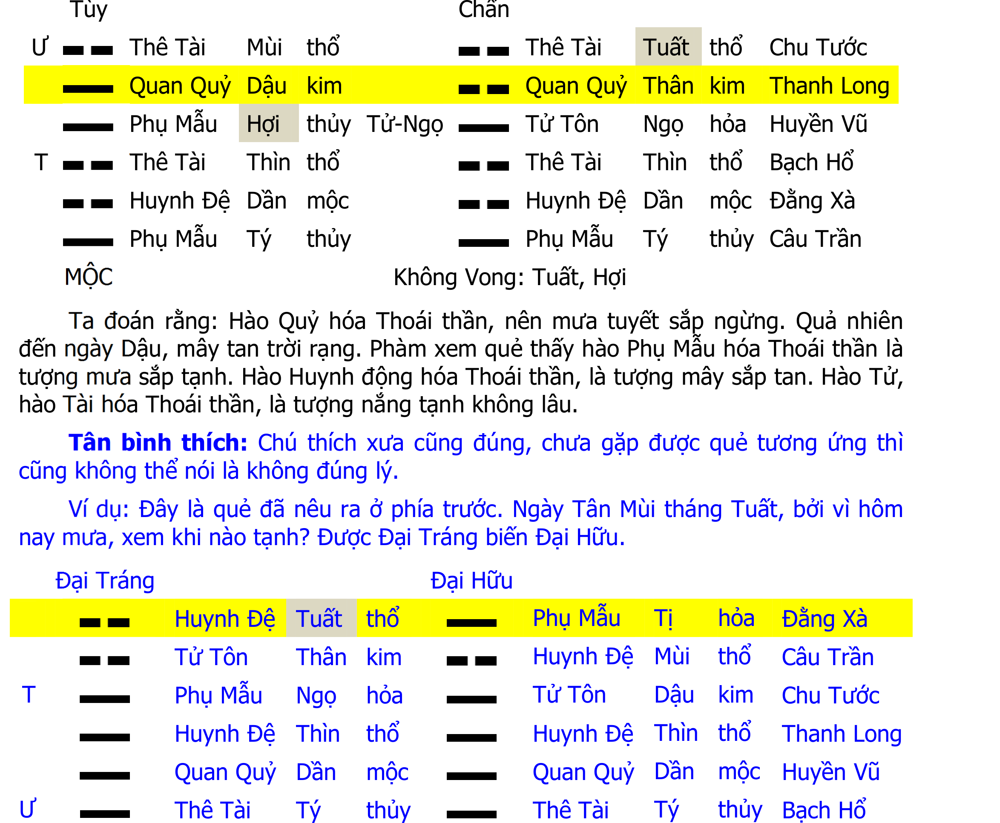

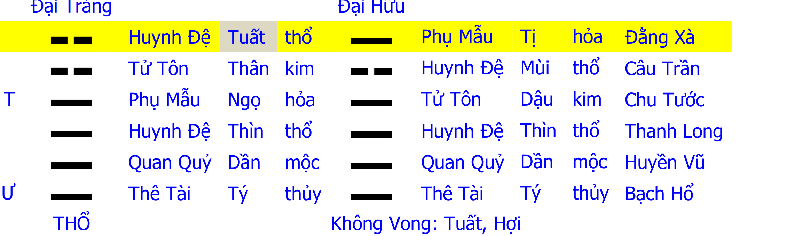

Ta thấy câu này là có lý. Câu đầu tiên trong chương này là "Thê Tài phát động, 
tám phương đều hưởng ánh dương quang ", ta đã sửa thành "Tử Tôn phát động, 
muôn dặm trời quang", cũng khớp với ý của câu này.

**Tân bình thích:** Lý luận này có ứng nghiệm.

### Ví dụ: Ngày Ất Mão tháng Tuất, bởi vì trời mưa, xem hôm nay có tạnh không?

Được Trung Phu biến Càn.

Trung Phu
 
Càn

Quan QuỷMão mộc | Huynh ĐệTuất thổ Huyền Vũ

Phụ Mẫu Tị | hỏa Tài-Tý | Tử Tôn | Thân kim Bạch Hổ

T | Huynh ĐệMùi thổ | Phụ Mẫu Ngọ hỏa Đằng Xà

Huynh ĐệSửu thổ Tử-Thân | Huynh ĐệThìn thổ Câu Trần

Quan QuỷMão mộc | Quan QuỷDần mộc Chu Tước

Ư | Phụ Mẫu Tị | hỏa | Thê Tài | Tý | thủy Thanh Long

THỔ 
Không Vong: Tý, Sửu

### Ví dụ này Tử Tôn phục tàng nhập Mộ, Huynh Đệ động mà hóa Phụ, Phụ Mẫu

vượng mà hồi đầu sinh hợp Thế, thậm chí âm u mấy ngày, đến ngày Mùi mới tạnh.

Phụ suy Quỷ vượng thiếu vũ nùng vân.

Phụ suy Quỷ vượng, mưa ít mây dày.

Xem về trời mưa, lấy hào Phụ làm chủ, nếu hào Phụ không động mà cũng không 
ám động, trong khi hào Quan lại động, là tượng mây mù dày đặc nhưng không mưa. 
Nếu hào động biến ra Phụ Mẫu, dù vượng hay suy đều chủ trời mưa.

**Tân bình thích:** Chưa hẳn, đôi khi hóa ra hào Phụ Mẫu chủ trời âm u hoặc mây 
đen.

Quái trị ám xung, tuy Không hữu vọng.

Quẻ gặp ám xung, lâm Không vẫn còn hy vọng.

Hào Phụ Mẫu, hào Quan Quỷ tĩnh mà lâm Không, bị Nhật thần tương xung, chủ 
về trời mưa.

Hào Tử Tôn và hào Tài tĩnh mà lâm Không, bị Nhật thần tương xung, chủ về trời 
tạnh.

Hào mộc tại Huynh tại Quỷ, tĩnh mà lâm Không, bị Nhật thần tương xung, chủ về 
nổi gió.

Hào Huynh Đệ lâm Không, bị Nhật thần tương xung, chủ gió nhẹ mù thưa.

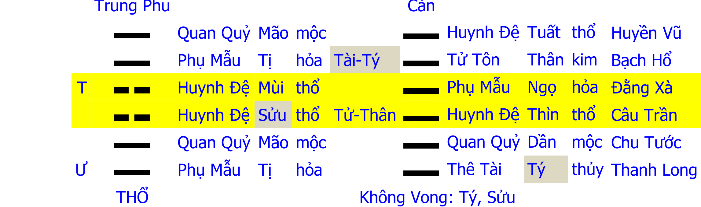

### Ví dụ: Ngày Kỷ Mão tháng Tị, xem ngày nào tạnh, được quẻ Ly:

Ly

T | Huynh Đệ | Tị | hỏa | Câu Trần

Tử Tôn | Mùi thổ | Chu Tước

Thê Tài | Dậu | kim | Thanh Long

Ư | Quan Quỷ | Hợi | thủy | Huyền Vũ

Tử Tôn | Sửu thổ | Bạch Hổ

Phụ Mẫu | Mão | mộc | Đằng Xà

HỎA
Không Vong: Thân, Dậu

Ta đoán rằng: Hào Dậu Tài gặp Tuần Không, lại được Nhật thần xung động, nên 
hôm sau sẽ tạnh. Đấy là ứng với ngày hào động gặp hợp.

Phúc hưng bị khắc, xung tắc thành công.

Hào Phúc động bị khắc, gặp xung ắt thành công.

Hào Tử Tôn động hóa hồi đầu khắc, hoặc bị hào động tương khắc, cần đợi đến 
ngày xung mất hào khắc sẽ tạnh. Nếu hào Phụ, hào Tài động hóa hồi đầu khắc, cũng 
tương tự như vậy.

### Ví dụ: Ngày Giáp Tuất tháng Sửu, xem ngày nào mưa, được quẻ Chấn biến Dự:

Chấn
 
Dự

T | Thê Tài | Tuất thổ | Thê Tài | Tuất thổ Huyền Vũ

Quan QuỷThân kim | Quan QuỷThân kim Bạch Hổ

Tử Tôn | Ngọ | hỏa | Tử Tôn | Ngọ | hỏa Đằng Xà

Ư | Thê Tài | Thìn thổ | Huynh ĐệMão mộc Câu Trần

Huynh ĐệDần | mộc | Tử Tôn | Tị | hỏa Chu Tước

Phụ Mẫu | Tý | thủy | Thê Tài | Mùi | thổ Thanh Long

MỘC
Không Vong: Thân, Dậu

Hào Phụ Tý thủy động hóa Mùi thổ hồi đầu khắc, đến ngày Sửu sẽ mưa. Sở dĩ 
ứng vào ngày Sửu, vì Sửu xung mất Mùi thổ mà hợp với Phụ Mẫu Tý thủy, nên sẽ có 
mưa.

Giác Tử bàn rằng: Sách xưa cho rằng: "Hào bị hợp, có động cũng uổng công" là 
không đúng. Hào Phụ Mẫu bị hợp, đợi đến ngày xung khai sẽ có mưa; hào Tài bị hợp, 
đợi đến ngày xung khai sẽ tạnh, làm sao có thể cho là uổng công, nên ta xóa bỏ câu 
này.

**Tân bình thích:** Đôi khi cũng ứng hợp trú hào biến.

### Ví dụ: Ngày Bính Dần tháng Tý, xem ngày nào tuyết rơi? Được Hàm biến Cách.

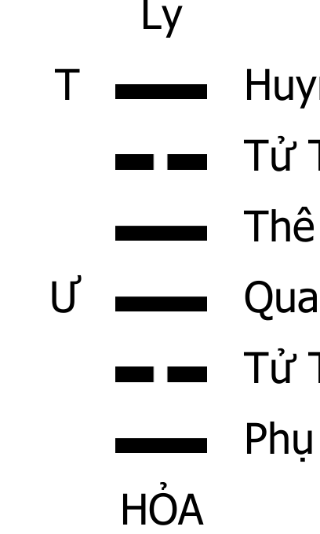

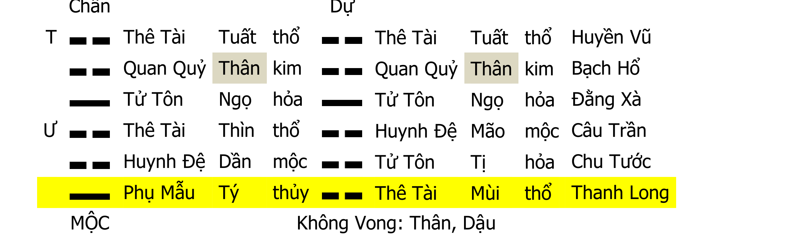

Hàm
 
Cách

Ư | Phụ Mẫu Mùi thổ | Phụ Mẫu Mùi thổ Thanh Long

Huynh ĐệDậu kim | Huynh ĐệDậu kim Huyền Vũ

Tử Tôn | Hợi thủy | Tử Tôn | Hợi thủy Bạch Hổ

T | Huynh ĐệThân kim | Tử Tôn | Hợi thủy Đằng Xà

Quan QuỷNgọ hỏa Tài-Mão | Phụ Mẫu Sửu thổ Câu Trần

Phụ Mẫu Thìn thổ | Thê Tài | Mão mộc Chu Tước

KIM
Không Vong: Tuất, Hợi

Phụ Mẫu động mà chủ tuyết, nhưng động mà hóa hồi đầu khắc, lại Nguyên thần 
Quan Quỷ Ngọ hỏa Nguyệt phá, tất là ra khỏi tháng Tý mới có tuyết. Hào biến Mão 
mộc khắc Phụ Mẫu, tất đợi Dậu kim xung mất Mão mộc, hào Phụ Mẫu lại động mà 
gặp hợp là ứng kỳ của nó. Nhưng ngày Quý Dậu vẫn thuộc tháng Tý, vì vậy đoán 
ngày Ất Dậu tháng Sửu sẽ có tuyết rơi. Về sau ứng ngày Bính Tuất tuyết rơi, chính là 
ứng ngày hào biến gặp hợp, không khắc hào động.

Mộc động sinh phong, Phong Bá tứ ngược.

Mộc động sinh gió, thần gió lộng hành.

Sách xưa cho rằng, hào Huynh Đệ tại mộc, nếu động là tượng quẻ Tốn Phong, 
chủ về gió lớn lộng hành.

Giác Tử bàn rằng: Mộc động sinh gió, không phải là ở quẻ Chấn hay quẻ Tốn. 
mộc ở hào Tử, hào Phụ, hào Tài, hào Quan đều chủ về có gió, chứ không phải chỉ ở 
hào Huynh Đệ. Chỉ khi hào mộc hóa Tiến thần, mới có gió lớn, nếu không thì chỉ là gió 
nhẹ, chứ không phải do hóa thủy hay hóa hỏa.

Kim Không tắc hưởng, Điện mẫu thi uy.

Kim không thì vang, thần sấm ra uy.

Hào kim Quỷ động mà lâm Không, nếu gặp Nhật thần tương xung, hoặc về sau 
gặp ngày xung Không, thực Không, sẽ nổi sấm. Đấy là "kim Không (rỗng) thì vang".

Kim hóa kim giả, tấn lôi phích lịch; hỏa Quỷ động giả, điện xế kim xà.

Kim hóa thành kim, sét vang sấm dậy; hỏa Quỷ mà động, chớp loé ngang trời.

Câu trên tuy xem thử lần nào cũng ứng nghiệm, nhưng nên đoán lúc sấm bắt 
đầu nổi, không nên đoán khi sấm chớp đã dứt.

**Tân bình thích:** Ở đây phải xem mùa và vùng miền, cũng không nhất định ứng 
ở ngày xung Không thực Không.

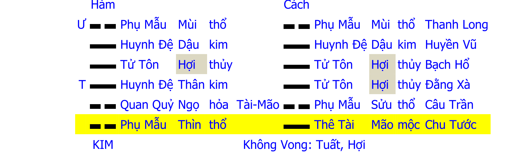

### Ví dụ: Ngày Ất Hợi tháng Thìn, đoán thời tiết ngày hôm sau, được quẻ Lôi Phong

Hằng biến Chấn Vi Lôi.

Hằng
 
Chấn

Ư | Thê Tài | Tuất thổ | Thê Tài | Tuất thổ Huyền Vũ

Quan QuỷThân kim | Quan QuỷThân kim Bạch Hổ

Tử Tôn | Ngọ hỏa | Tử Tôn | Ngọ hỏa Đằng Xà

T | Quan QuỷDậu kim | Thê Tài | Thìn thổ Câu Trần

Phụ Mẫu Hợi | thủy Huynh-Dần | Huynh ĐệDần mộc Chu Tước

Thê Tài | Sửu thổ | Phụ Mẫu Tý | thủy Thanh Long

MỘC
Không Vong: Thân, Dậu

Trong quẻ Tài động sinh Quan, Quan động sinh Phụ, tạo thành thế liên tục tương 
sinh. Hào sơ Thê Tài chủ tạnh, nhưng động hóa Phụ Mẫu, là trời trong chuyển nhiều 
mây có mưa, Phụ Mẫu Hợi thủy và Nhật thần tương đồng, lại được Quan Quỷ phát 
động tương sinh là vượng tướng, có mưa tất lớn. Quan Quỷ là kim, rơi vào Không 
Vong, phù hợp với nguyên tắc "kim Không tắc minh", có sấm sét. Tổng hợp tình hình 
trên đây đoán là hôm sau trời quang chuyển âm u, có mưa rào sấm sét.

Tình hình ứng nghiệm: Buổi sáng trời quang, buổi chiều giờ Thân chuyển âm u, 
sấm vang chớp giật, sau nổi mưa lớn, mưa càng lúc càng lớn, kéo dài đến sáng sớm 
ngày Sửu.

Động nhi hợp, tĩnh nhi xung, vật lâm Nguyệt phá.

Động ứng vào hợp, tĩnh ứng vào xung, đừng lâm Nguyệt phá.

Hào Phụ Mẫu chủ mưa, hào Quan Quỷ chủ mây dày, sấm chớp; hào Tử Tôn, hào 
Thê Tài chủ tạnh ráo. Nếu động sẽ ứng nghiệm vào ngày trực, ngày hợp; nếu tĩnh sẽ 
ứng vào ngày trực, ngày xung. Nếu tĩnh mà gặp Nguyệt phá thì không ứng nghiệm; 
nếu động mà gặp Nguyệt phá, sẽ ứng vào ngày thực Phá.

### Ví dụ: Ngày Quý Mão tháng Thìn, đang lúc nắng ráo, xem ngày nào có mưa,

được quẻ Kiển:

Kiển

Tử Tôn | Tý | thủy | Bạch Hổ

Phụ Mẫu Tuất thổ | Đằng Xà

T | Huynh ĐệThân kim | Câu Trần

Huynh ĐệThân kim | Chu Tước

Quan QuỷNgọ hỏa Tài-Mão Thanh Long

Ư | Phụ Mẫu Thìn thổ | Huyền Vũ

KIM
Không Vong: Thìn, Tị

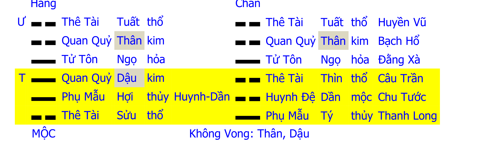

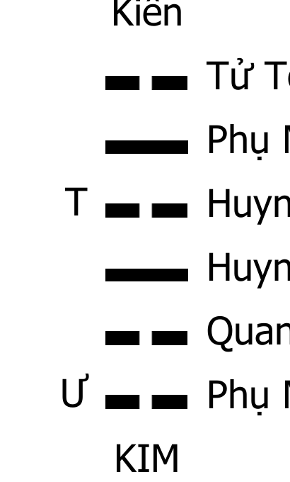

Có người cho rằng, trong quẻ Thìn, Tuất đều là hào Phụ, mà Nguyệt kiến cũng là 
hào Phụ. Ngày mai là ngày Thìn, lại xung động hào Tuất Phụ, nên chắc chắn sẽ có 
mưa. Ta đáp: Hào Tuất lâm Nguyệt phá, làm sao có mưa được, chỉ có mây đen mà 
thôi. Quả nhiên đến hôm sau, chỉ thấy nhiều mây âm u.

Xung tắc ứng điền tắc thực, tối hỷ động Không,

Xung sẽ ứng, điền sẽ thực, có lợi cho hào động lâm Không.

Thời xưa thường cho rằng lâm Không là vô ích, mà không biết rằng, hào động 
mà lâm Không, nếu xem về mưa nắng, không ứng vào ngày xung không, sẽ ứng vào 
ngày điền thực.

### Ví dụ: Ngày Bính Ngọ tháng Mùi, xem ngày nào mưa, được quẻ Ly biến Lữ:

Ly 
 
Lữ

T | Huynh Đệ | Tị | hỏa | Huynh Đệ | Tị | hỏa | Thanh Long

Tử Tôn | Mùi thổ | Tử Tôn | Mùi | thổ Huyền Vũ

Thê Tài | Dậu | kim | Thê Tài | Dậu | kim | Bạch Hổ

Ư | Quan Quỷ | Hợi | thủy | Thê Tài | Thân | kim | Đằng Xà

Tử Tôn | Sửu thổ | Huynh Đệ | Ngọ | hỏa | Câu Trần

Phụ Mẫu | Mão | mộc | Tử Tôn | Thìn | thổ Chu Tước

HỎA
Không Vong: Dần, Mão

Đoán rằng: Hào Phụ Mão mộc động mà gặp Tuần Không, nên không mưa ngày 
Kỷ Dậu, thì sẽ mưa vào ngày Mão.

Người này hỏi: "Làm sao định được sẽ mưa vào ngày nào?" Ta đáp: "Việc này 
không khó, ông hãy xem thêm một quẻ nữa". Người này lại gieo được quẻ Ly không 
động. Ta nói: "Quẻ này giống quẻ trước, ông xem thêm một quẻ nữa xem sao!" Người 
này lại gieo được quẻ Cấn biến Khiêm:

Cấn 
 
Khiêm

T | Quan QuỷDần mộc | Tử Tôn | Dậu kim Thanh Long

Thê Tài | Tý | thủy | Thê Tài | Hợi | thủy Huyền Vũ

Huynh ĐệTuất thổ | Huynh ĐệSửu thổ Bạch Hổ

Ư | Tử Tôn | Thân kim | Tử Tôn | Thân kim Đằng Xà

Phụ Mẫu | Ngọ hỏa | Phụ Mẫu Ngọ hỏa Câu Trần

Huynh ĐệThìn thổ | Huynh ĐệThìn thổ Chu Tước

THỔ
Không Vong: Dần, Mão

Ta đoán rằng: "Ngày Giáp Dần trời nhiều mây âm u, ngày Ất Mão sẽ có mưa, đến 
ngày Thìn lại tạnh". Người xem hỏi: "Làm sao biết được?" Ta bèn giải đáp: "Quẻ này 
hào Quỷ Dần mộc động gặp Tuần Không, nên đến ngày xuất Không sẽ trở trời. Quẻ

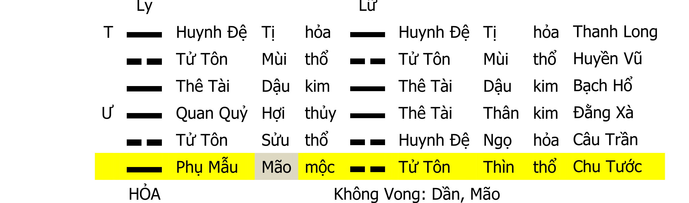

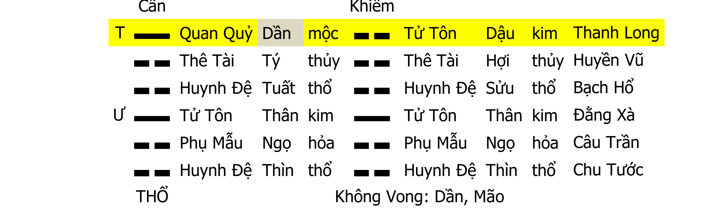 trước hào Phụ Mão mộc động biến Thìn Tử Tôn, nên biết rằng ngày Mão sẽ có mưa, 
đến ngày Thìn sẽ tạnh."

Quả nhiên đến ngày Dần mây đen dày đặc, ngày Mão mưa to, ngày Thìn tạnh 
ráo. Cho nên động sẽ không bị Không.

Vũ ngộ Tài hưng, dục vũ tu đắc Tài Mộ Tuyệt;

Xem mưa gặp Tài hưng, muốn mưa Tài phải lâm Mộ, Tuyệt;

Khi xem về mưa, cần có hào Phụ động, hào Quỷ động. Nếu như hào Phụ, hào 
Quỷ không động, mà lại gặp hào Tài, hào Tử động, cần phải chờ đến ngày hào Tài 
nhập Mộ, hoặc gặp Tuyệt, mới có mưa.

### Ví dụ: Ngày Bính Ngọ tháng Tuất, xem ngày nào có mưa, được quẻ Khảm biến

Tỉnh:

Khảm
 
Tỉnh

T | Huynh Đệ | Tý | thủy | Huynh Đệ | Tý | thủy | Thanh Long

Quan Quỷ | Tuất thổ | Quan Quỷ | Tuất thổ | Huyền Vũ

Phụ Mẫu | Thân | kim | Phụ Mẫu | Thân | kim | Bạch Hổ

Ư | Thê Tài | Ngọ | hỏa | Phụ Mẫu | Dậu | kim | Đằng Xà

Quan Quỷ | Thìn | thổ | Huynh Đệ | Hợi | thủy | Câu Trần

Tử Tôn | Dần | mộc | Quan Quỷ | Sửu | thổ | Chu Tước

THỦY
Không Vong: Dần, Mão

Người xem hỏi: "Hôm nay xem về mưa, làm sao hào Tài lại động? Chắc là điềm 
đại hạn, không có mưa chăng?" Ta đáp: "Không phải thế! Hào Tài động hóa ra hào 
Dậu Phụ Mẫu, nên ngày Dậu đáng ra phải có mưa. Nhưng vì Nhật thần lại là Ngọ hỏa, 
cần phải đợi đến ngày Tuất, Ngọ hỏa nhập Mộ mới có mưa."

Sau quả nhiên đến ngày Dậu trở trời, đến ngày Tuất trời mưa. Đó là do hào Tài 
Ngọ hỏa nhập Mộ ở Tuất.

**Tân bình thích:** Lý luận này có lý.

### Ví dụ: Ngày Bính Thìn tháng Ngọ, tôi vừa mới lưu lại Lhasa thì có bạn từ Bắc Kinh

gọi điện thoại tới, hỏi hôm nay sắp tổ chức buổi hòa nhạc ngoài trời cho thiếu nhi, 
nhưng hiện tại Bắc Kinh đang có mưa, có tổ chức được hay không? Tôi gieo quẻ đoán 
thời tiết Bắc Kinh, được Lữ biến Cấu.

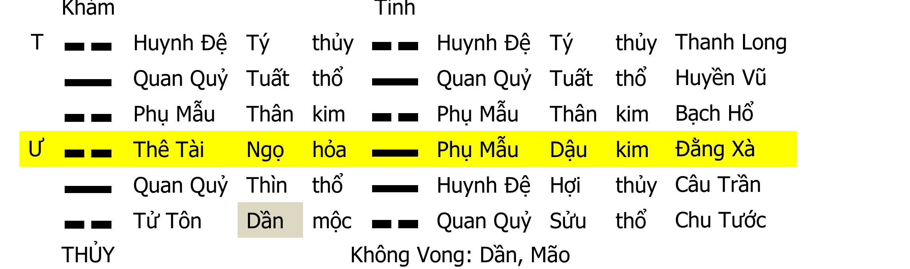

Lữ 
 
Cấu

Huynh ĐệTị | hỏa | Tử Tôn | Tuất thổ | Thanh Long

Tử Tôn | Mùi | thổ | Thê Tài | Thân kim Huyền Vũ

Ư | Thê Tài | Dậu | kim | Huynh ĐệNgọ | hỏa Bạch Hổ

Thê Tài | Thân kim Quan-Hợi | Thê Tài | Dậu | kim Đằng Xà

Huynh ĐệNgọ | hỏa | Quan QuỷHợi | thủy Câu Trần

T | Tử Tôn | Thìn thổ | Phụ-Mão | Tử Tôn | Sửu | thổ | Chu Tước

HỎA
Không Vong: Tý, Sửu

Trong quẻ Tử Tôn Huynh Đệ phát động, Phụ Mẫu phục mà hưu tù, nhập Mộ ở 
Tử Tôn, có mưa tất ngừng. Buổi hòa nhạc có thể được tổ chức đúng giờ. Quả như dự 
đoán.

Chiêm tình, phùng Tử động, vọng tình chỉ đãi Tử phùng sinh.

Xem tạnh gặp Tử động, mong tạnh đợi Tử gặp Trường Sinh.

Nếu xem về nắng tạnh mà hào Tử, hào Tài động; xem về mưa mà được hào Phụ 
động, đợi đến ngày hào động gặp Trường Sinh sẽ ứng nghiệm.

### Ví dụ: Ngày Đinh Tị tháng Mão, xem ngày nào mưa, được quẻ Hoán biến Khảm:

Hoán
 
Khảm

Phụ Mẫu | Mão mộc | Quan QuỷTý | thủy Thanh Long

T | Huynh ĐệTị | hỏa | Tử Tôn | Tuất thổ | Huyền Vũ

Tử Tôn | Mùi thổ Tài-Dậu | Thê Tài | Thân kim Bạch Hổ

Huynh ĐệNgọ | hỏa Quan-Hợi | Huynh ĐệNgọ | hỏa Đằng Xà

Ư | Tử Tôn | Thìn thổ | Tử Tôn | Thìn thổ | Câu Trần

Phụ Mẫu | Dần | mộc | Phụ Mẫu | Dần | mộc Chu Tước

HỎA
Không Vong: Tý, Sửu

Ta đoán rằng: Hào Phụ Mão mộc động, đáng ra đến ngày Mão ngày Tuất sẽ có 
mưa, nhưng sau lại ứng vào ngày Hợi, tức ngày Mão mộc gặp Trường Sinh.

Cạnh phát Phụ Quan, liên triêu mãnh vũ;

Phụ, Quan tranh động, mưa lớn triền miên;

Trong quẻ, nếu có nhiều hào Phụ và hào Quỷ; hoặc hào Quỷ biến hào Phụ, hào 
Phụ biến hào Quỷ; hoặc hào Phụ hóa hào Huynh, hào Huynh hóa hào Phụ; Hoặc xem 
nhiều lần mà thấy trong quẻ không có hào Tử Tôn, mà hào Thê Tài động thì nhất 
định sẽ mưa to gió lớn kéo dài nhiều ngày.

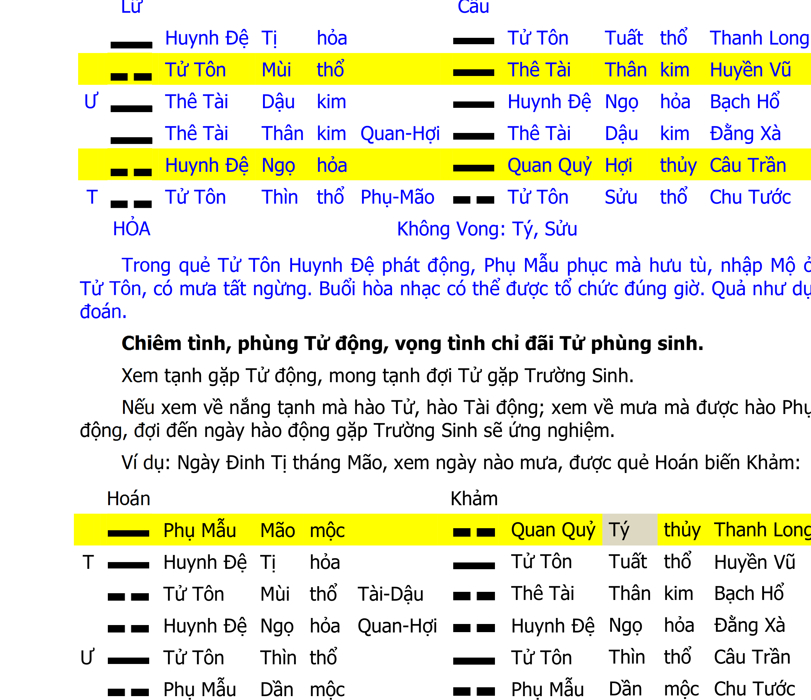

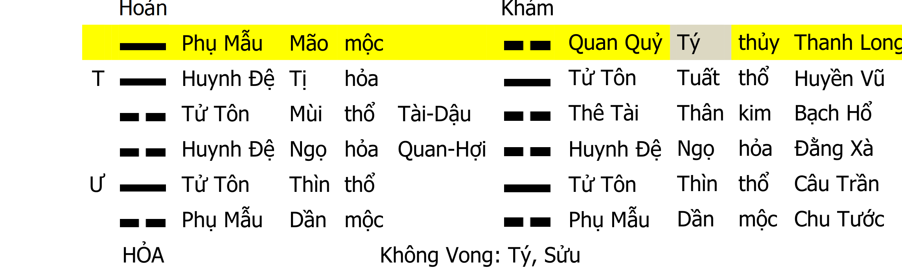

### Ví dụ: Ngày Ất Mão tháng Ngọ, xem ngày nào mưa tạnh, được quẻ Tấn biến Quy

Muội:

Tấn
 
Quy Muội

Quan QuỷTị | hỏa | Phụ Mẫu Tuất thổ Huyền Vũ

Phụ Mẫu Mùi thổ | Huynh ĐệThân kim Bạch Hổ

T | Huynh ĐệDậu kim | Quan QuỷNgọ hỏa Đằng Xà

Thê Tài | Mão mộc | Phụ Mẫu Sửu thổ Câu Trần

Quan QuỷTị | hỏa | Thê Tài | Mão mộc Chu Tước

Ư | Phụ Mẫu Mùi thổ Tử-Tý | Quan QuỷTị | hỏa Thanh Long

KIM
Không Vong: Tý, Sửu

Đoán rằng: Hào Phụ Mẫu và Quan Quỷ hiện nhiều trong quẻ, là tượng mưa gió 
triền miên trong nhiều ngày. Ngày hôm sau lại xem, lại được quẻ Phụ, Quan tranh 
động, sau quả nhiên mưa suốt trong bốn tuần.

Đa phùng Tài Tử, lũy nhật tình minh.

Tài, Tử hiện nhiều, trời tạnh lâu ngày.

### Ví dụ: Ngày Giáp Ngọ tháng Mùi, do trời đại hạn, nên xem ngày nào trời mưa,

được quẻ Truân biến Trung Phu:

Truân
 
Trung Phu

Huynh ĐệTý | thủy | Tử Tôn | Mão mộc Huyền Vũ

Ư | Quan QuỷTuất thổ | Thê Tài | Tị | hỏa Bạch Hổ

Phụ Mẫu Thân kim | Quan QuỷMùi thổ Đằng Xà

Quan QuỷThìn thổ Tài-Ngọ | Quan QuỷSửu thổ Câu Trần

T | Tử Tôn | Dần mộc | Tử Tôn | Mão mộc Chu Tước

Huynh ĐệTý | thủy | Thê Tài | Tị | hỏa Thanh Long

THỦY
Không Vong: Thìn, Tị

Đoán rằng: Trong quẻ hào Phụ không động, hào Tử Tôn hiện nhiều, lại hóa Tiến 
thần, nên ngờ rằng đến ngày hào mộc nhập Mộ sẽ có mưa. Lại bảo anh ta xem thêm 
quẻ nữa, vẫn là hào Tài và hào Tử động. Ngày hôm sau lại xem, thì không thấy hào 
Phụ, hào Quỷ động, nên biết rằng trời hạn. Sau quả nhiên hai tháng liền trời không có 
mưa.

Hào đắc phản ngâm, tình vũ chung tu phản phục.

Quẻ được phản ngâm, mưa, tạnh thay đổi bất thường.

### Ví dụ: Vào ngày Canh Dần tháng Thìn, xem bao giờ trời tạnh, được quẻ Quan

biến Thăng:

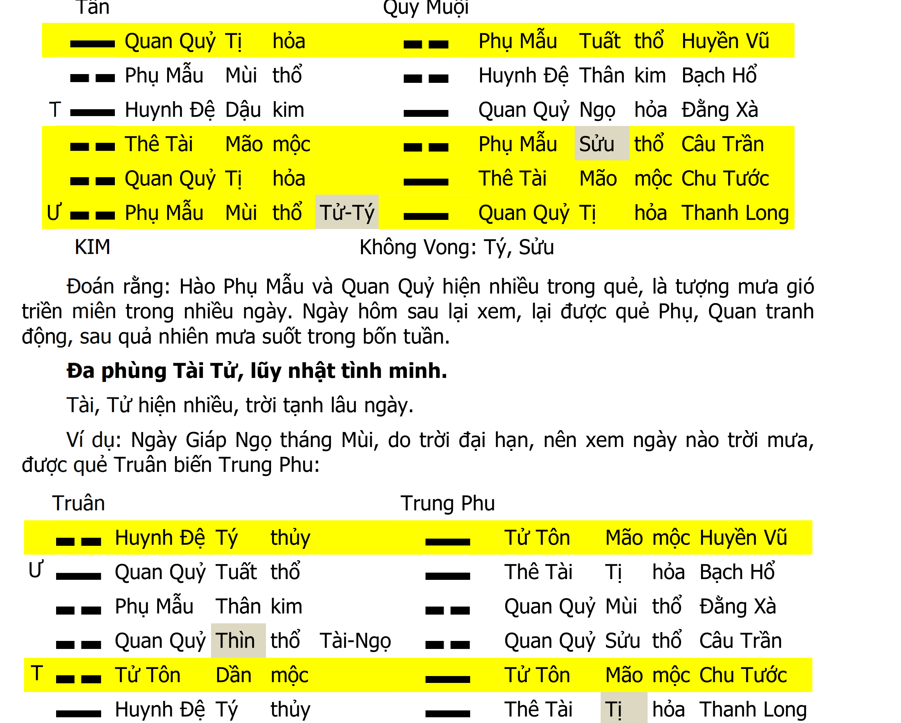

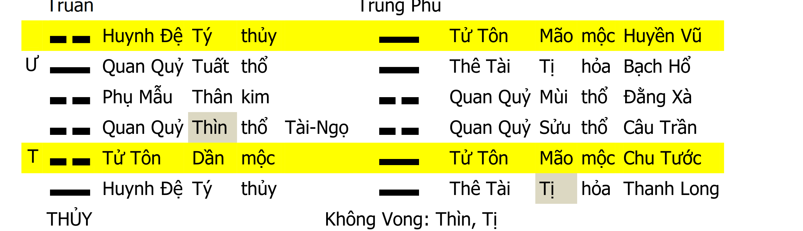

Quan
 
Thăng

Thê Tài | Mão mộc | Huynh ĐệDậu kim Đằng Xà

Quan QuỷTị | hỏa Huynh-Thân | Tử Tôn | Hợi thủy Câu Trần

T | Phụ Mẫu | Mùi thổ | Phụ Mẫu Sửu thổ Chu Tước

Thê Tài | Mão mộc | Huynh ĐệDậu kim Thanh Long

Quan QuỷTị | hỏa | Tử Tôn | Hợi thủy Huyền Vũ

Ư | Phụ Mẫu | Mùi thổ Tử-Tý | Phụ Mẫu Sửu thổ Bạch Hổ

KIM 
Không Vong: Ngọ, Mùi

Ta đoán rằng: Hào Tài Mão mộc xuất hiện, đến ngày mai sẽ tạnh. Nhưng vì quẻ 
này nội ngoại phản ngâm, nên tạnh rồi lại mưa. Sau quả nhiên đến hôm sau trời tạnh, 
nhưng rồi lại mưa.

Hào phùng phục tượng, hạn lạo tất đãi xung khai.

Hào gặp phục ngâm, hạn lụt chờ lúc xung khai.

Quẻ Phục ngâm thì có động cũng như bất động, nếu hào Tử hào Tài động, thì 
đợi đến ngày xung khai sẽ tạnh; nếu hào Phụ động, đợi đến ngày xung khai sẽ mưa.

### Ví dụ: Ngày Giáp Tuất tháng Thìn, xem mưa, được quẻ Đại Tráng biến Chấn:

Đại Tráng
 
Chấn

Huynh Đệ | Tuất thổ | Huynh Đệ | Tuất thổ | Huyền Vũ

Tử Tôn | Thân | kim | Tử Tôn | Thân | kim | Bạch Hổ

T | Phụ Mẫu | Ngọ | hỏa | Phụ Mẫu | Ngọ | hỏa | Đằng Xà

Huynh Đệ | Thìn | thổ | Huynh Đệ | Thìn | thổ | Câu Trần

Quan Quỷ | Dần | mộc | Quan Quỷ | Dần | mộc | Chu Tước

Ư | Thê Tài | Tý | thủy | Thê Tài | Tý | thủy | Thanh Long

THỔ 
Không Vong: Thân, Dậu

Đoán rằng: Xem về mưa mà hào Phụ bất động, hào Huynh hào Quỷ đều động, 
mộc động sinh gió, nên là tượng có gió mà không mưa. Đến giờ Thân hôm nay sẽ 
xung khai Dần mộc, nên xuất hiện gió lốc lớn.

Hợp Phụ, Quỷ xung khai, hữu lôi tắc vũ. Hợp Tài, Huynh khắc phá, vô 
phong bất tình.

Phụ hợp bị Quỷ xung khai, có sấm ắt mưa. Tài hợp bị Huynh khắc phá, không gió 
không tạnh.

Hào Phụ Mẫu bị hợp, vốn chủ không có mưa, nhưng nếu gặp hào Quỷ động xung 
khai, đợi đến khi sấm sét nổi lên sẽ có mưa. Trong quẻ nếu không có hào Quỷ động, 
mà bị các hào khác xung động cũng có mưa; hào khác không xung động, thì đợi đến 
ngày xung khai sẽ có mưa. Trường hợp hai hào Tài, Tử bị hợp cũng tương tự như vậy.

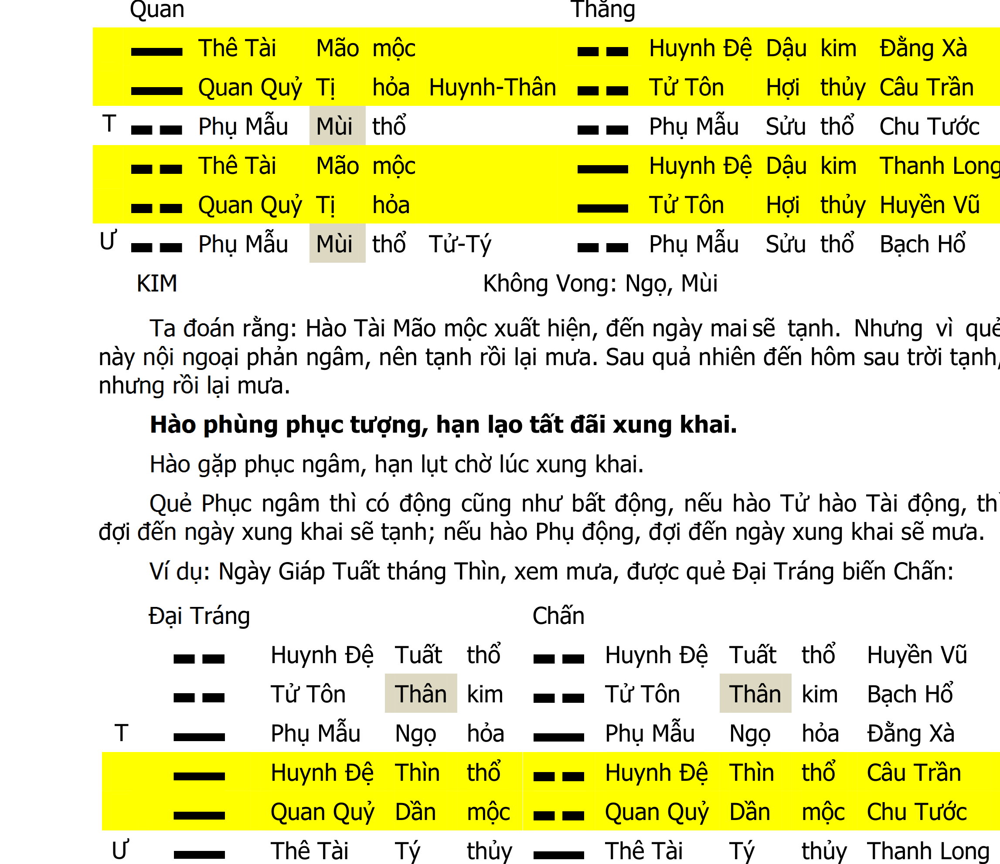

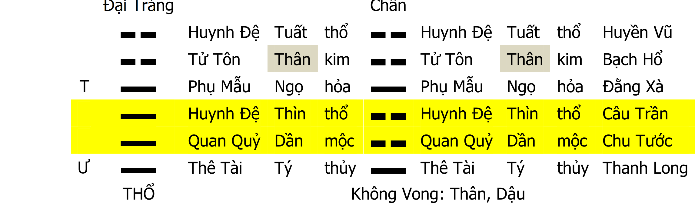

Giác Tử bàn rằng: Hào Phụ hào Quỷ bị hợp, đợi đến ngày xung khai sẽ có mưa. 
Hào Tài, hào Tử bị hợp, đợi đến ngày xung khai sẽ tạnh. Còn sấm chớp và gió có 
chăng cũng chỉ là ngẫu nhiên, không nên câu nệ.

**Tân bình thích:** Câu này sai rồi, hào Quan Quỷ và Phụ Mẫu vĩnh viễn không thể 
tương xung. Ứng là hào Quan Quỷ Phụ Mẫu động mà tương hợp, có hào khác phát 
động đến xung hoặc Nhật thần đến xung, nếu xung Phụ Mẫu thì trước mưa sau sấm, 
nếu xung Quan Quỷ thì trước sấm sau mưa. Hoặc Phụ Mẫu động mà hóa Quan Quỷ 
thì trước mưa sau sấm, Quan Quỷ động mà hóa Phụ Mẫu thì trước sấm sau mưa.

Bán tình bán vũ, quái trung Tài Phụ đồng hưng.

Nửa mưa nửa nắng, trong quẻ Phụ, Tài cùng hưng.

Trong sách xưa chú: Hào Thê Tài và Phụ Mẫu cùng động, hoặc hào Tử Tôn và 
Quan Quỷ cùng động, là tượng nửa mưa nửa nắng. Ta cho rằng nói như vậy là sai, vì 
không biết rằng mưa hay tạnh sẽ ứng vào giờ.

### Ví dụ: Ngày Quý Mùi tháng Dậu, xem ngày nào nắng, được quẻ Tụng biến Tùy:

Tụng
 
Tùy

Tử Tôn | Tuất thổ | Tử Tôn | Mùi thổ | Bạch Hổ

Thê Tài | Thân kim | Thê Tài | Dậu | kim Đằng Xà

T | Huynh ĐệNgọ | hỏa | Quan QuỷHợi | thủy Câu Trần

Huynh ĐệNgọ | hỏa Quan-Hợi | Tử Tôn | Thìn thổ | Chu Tước

Tử Tôn | Thìn thổ | Phụ Mẫu | Dần | mộc Thanh Long

Ư | Phụ Mẫu | Dần | mộc | Quan QuỷTý | thủy Huyền Vũ

HỎA
Không Vong: Thân, Dậu

Trong quẻ này, hào Tử Tôn và hào Phụ Mẫu cùng động, hào Phụ Mẫu Dần mộc 
hóa Huynh Đệ Tị hỏa, nên vẫn là ngày mưa âm u, phải chờ đến giờ Tuất, mới thấy 
trời trong sao hiện, sở dĩ ứng vào giờ Tuất mưa tạnh, vì là giờ trực của Tuất thổ Tử 
Tôn.

**Tân bình thích:** Nắng mưa tuy có thời giờ của nó, nhưng cũng thường xuyên có 
thời tiết bên mặt trời xuất hiện bên mưa, nắng mưa chỉ cách có vài bước. Tiếc là 
không lưu lại quẻ ví dụ.

Hựu vũ hựu tình, hào thượng Mẫu Tử giai động.

Chợt mưa chợt nắng, vì hào Mẫu, Tử đều động.

### Ví dụ: Vào ngày Bính Thân tháng Tị, xem ngày nào có mưa, được quẻ Lâm biến

Mông:

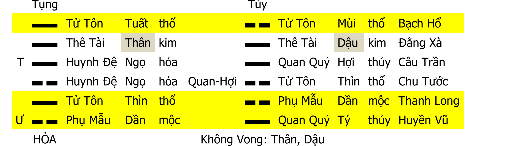

Lâm 
 
Mông

Tử Tôn | Dậu | Kim | Quan Quỷ | Dần mộc | Thanh Long

Ư | Thê Tài | Hợi | Thủy | Thê Tài | Tý | thủy | Huyền Vũ

Huynh Đệ | Sửu Thổ | Huynh Đệ | Tuất | thổ | Bạch Hổ

Huynh Đệ | Sửu Thổ | Tử Tôn | Ngọ hỏa | Đằng Xà

T | Quan Quỷ | Mão | Mộc | Huynh Đệ | Thìn | thổ | Câu Trần

Phụ Mẫu | Tị | Hỏa | Quan Quỷ | Dần mộc | Chu Tước

THỔ
Không Vong: Thìn, Tị

Trong quẻ này, hào Phụ Mẫu, hào Tử Tôn đều động, vì hào Phụ Tị hỏa lâm 
Không, đến ngày Hợi xung Không sẽ mưa, đến giờ Dậu ngày Hợi thì tạnh. Sở dĩ ứng 
với giờ Dậu, là vì hào 6 Tử Tôn Dậu kim động.

Trong quẻ trước, hào Phụ hào Tử đều động, hào Tuất thổ Tử Tôn ứng với giờ 
Tuất trong ngày sẽ tạnh.

Quẻ này hào Phụ và hào Tử cùng động, lại ứng với giờ mưa của ngày khác.

Giác Tử bàn rằng: Căn cứ vào hai quẻ này, thì mưa hay tạnh đều có giờ ứng 
nghiệm, sao lại nói chung chung là nửa mưa nửa tạnh được?

Nhược tri chiêm viễn ứng cận, khả xưng vi thần;

Biết xem xa ứng gần, mới đáng gọi là thần;

### Ví dụ: Ngày Mậu Tý mồng 5 tháng Dậu, xem Trung thu có mưa hay không, được

quẻ Tiểu Quá biến Phong:

Tiểu Quá
 
Phong

Phụ Mẫu Tuất thổ | Phụ Mẫu Tuất thổ Chu Tước

Huynh ĐệThân kim | Huynh ĐệThân kim Thanh Long

T

Quan QuỷNgọ hỏa Tử-Hợi | Quan QuỷNgọ hỏa Huyền Vũ

Huynh ĐệThân kim | Tử Tôn | Hợi thủy Bạch Hổ

Quan QuỷNgọ hỏa Tài-Mão | Phụ Mẫu Sửu thổ Đằng Xà

Ư

Phụ Mẫu Thìn thổ | Thê Tài | Mão mộc Câu Trần

KIM 
Không Vong: Ngọ, Mùi

Trong quẻ, hào Thìn Phụ động, đáng ra là Trung thu có mưa, nhưng không ngờ 
lại ứng vào ngày Nhâm Thìn mồng 9 trời mưa.

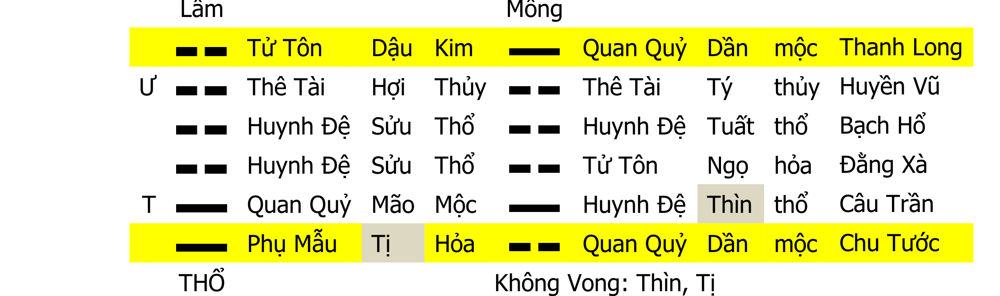

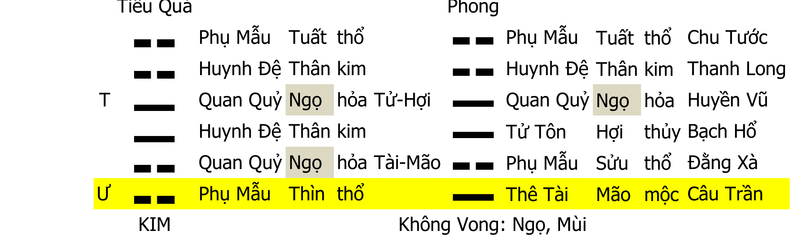

### Ví dụ: Ngày Nhâm Thìn lại xem Trung thu có tạnh không, được quẻ Tiểu Súc biến

Trung Phu:

Tiểu Súc
 
Trung Phu

Huynh ĐệMão mộc | Huynh ĐệMão mộc Bạch Hổ

Tử Tôn | Tị | hỏa | Tử Tôn | Tị | hỏa Đằng Xà

Ư

Thê Tài | Mùi thổ | Thê Tài | Mùi thổ Câu Trần

Thê Tài | Thìn thổ Quan-Dậu | Thê Tài | Sửu thổ Chu Tước

Huynh ĐệDần mộc | Huynh ĐệMão mộc Thanh Long

T

Phụ Mẫu Tý | thủy | Tử Tôn | Tị | hỏa Huyền Vũ

MỘC 
Không Vong: Ngọ, Mùi

Đến ngày Quý Tị, lại xem, được quẻ Truân biến Trung Phu:

Truân
 
Trung Phu

Huynh ĐệTý | thủy | Tử Tôn | Mão mộc Bạch Hổ

Ư | Quan QuỷTuất thổ | Thê Tài | Tị | hỏa Đằng Xà

Phụ Mẫu Thân kim | Quan QuỷMùi thổ Câu Trần

Quan QuỷThìn thổ Tài-Ngọ | Quan QuỷSửu thổ Chu Tước

T | Tử Tôn | Dần mộc | Tử Tôn | Mão mộc Thanh Long

Huynh ĐệTý | thủy | Thê Tài | Tị | hỏa Huyền Vũ

THỦY
Không Vong: Ngọ, Mùi

Một quẻ hào Tài động, một quẻ hào Tử động, mà đều không thấy hào Phụ và 
hào Quỷ động, nên đoán rằng trời sẽ tạnh. Quả nhiên đêm Trung thu, trăng sao vằng 
vặc.

Thức đắc bốc dịch ứng thời, phương đắc kỳ áo.

Biết thời gian ứng nghiệm, mới hiểu điều áo diệu.

### Ví dụ: Ngày Ất Tị tháng Thìn, xem ngày Giáp Ngọ xây cất, có mưa hay không.

Được quẻ Độn biến Hàm:

Độn
 
Hàm

Phụ Mẫu Tuất thổ | Phụ Mẫu Mùi | thổ Huyền Vũ

Ư | Huynh ĐệThân kim | Huynh ĐệDậu kim Bạch Hổ

Quan QuỷNgọ hỏa | Tử Tôn | Hợi | thủy Đằng Xà

Huynh ĐệThân kim | Huynh ĐệThân kim Câu Trần

T | Quan QuỷNgọ hỏa Tài-Dần | Quan QuỷNgọ hỏa Chu Tước

Phụ Mẫu Thìn thổTử-Tý | Phụ Mẫu Thìn thổ Thanh Long

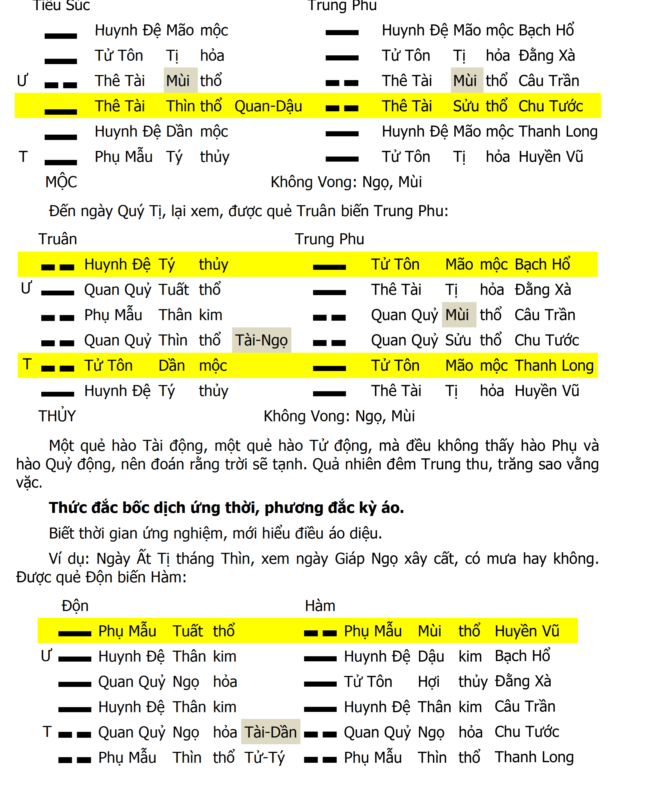

Người này cho rằng Phụ động là có mưa. Ta bèn nói: "Thường thấy xem ngày lại 
ứng vào giờ. Hôm nay nếu vào giờ Thân, Tuất không mưa, thì đến ngày mai sẽ có 
mưa." Quả nhiên mưa vào giờ Thân hôm ấy.

Người xem hỏi: "Vì sao giờ Thân lại có mưa?" Ta bèn đáp: "Vì Tuất thổ gặp 
Trường Sinh tại Thân." Người này lại hỏi: "Mưa có lâu không?" Ta trả lời: "Hào Phụ 
hóa Thoái thần, nên mưa không lâu, đến ngày mai sẽ tạnh."

Quả nhiên đến hôm sau thì tạnh hẳn.

Dã Hạc nói: Có người hỏi ta rằng: "Động thì sẽ ứng vào ngày hợp hoặc ngày 
trực, có thể biết chắc ngày nào không?" Ta bèn đáp: Người xưa không biết cách xem 
nhiều lần, cũng không hiểu được nguyên lý, nên có nhiều lúc đoán nhầm. Khi cơ trời 
chưa chịu tiết lộ hoàn toàn, phải nhờ vào sự biến thông của người. Thánh nhân lập 
nên giáo pháp, đặt ra phép xem thời tiết dạy người để chiêm nghiệm vào việc của 
người. Ví như hào Tử Tôn trì Thế phát động, nếu xem về thời tiết, là tượng trời trong 
nắng lớn, không một gợn mây; đến ngày Mộ ngày Tuyệt thì u ám mờ mịt. Nếu xem về 
số mệnh, là tượng hiển hách lẫy lừng, dương dương đắc chí, sau đến năm gặp Mộ, 
gặp suy, thì tai ách triền miên. Cho nên ta mới nói, dạy người biết cách xem thời tiết 
để chiêm nghiệm vào nhân sự, hiệu quả sẽ nhanh chóng. Nay muốn biết rơi vào ngày 
nào thì cũng không khó. Từng có viên quan gặp nạn, tính mệnh nguy trong sớm tối, vì 
xem được quẻ Tử Tôn trì thế, lại phát động mà thành tượng không lo phiền, sẽ được 
ân xá, nhưng ông ta không tin, vẫn quyết ý tìm đường tự vẫn. Ta bèn nghĩ ra cách 
xem thời tiết cho ông ta xem:

Ngày Bính Tý tháng Dậu, xem ngày nào mưa, được quẻ Mông biến Lâm:

Mông
 
Lâm

Phụ Mẫu | Dần mộc | Thê Tài | Dậu kim Thanh Long

Quan QuỷTý | thủy | Quan QuỷHợi thủy Huyền Vũ

T | Tử Tôn | Tuất thổ Tài-Dậu | Tử Tôn | Sửu thổ Bạch Hổ

Huynh ĐệNgọhỏa | Tử Tôn | Sửu thổ Đằng Xà

Tử Tôn | Thìn thổ | Phụ Mẫu | Mão mộc Câu Trần

Ư | Phụ Mẫu | Dần mộc | Huynh ĐệTị | hỏa Chu Tước

HỎA
Không Vong: Thân, Dậu

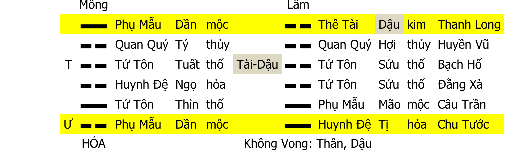

Hai hào Phụ Mẫu Dần mộc đều động, chứng tỏ ngày Dần sẽ mưa. Lại bảo người 
khác xem thêm quẻ nữa xem ngày nào mưa, được quẻ Đại Tráng biến Thái:

Đại Tráng
 
Thái

Huynh Đệ | Tuất thổ | Tử Tôn | Dậu kim | Thanh Long

Tử Tôn | Thân | kim | Thê Tài | Hợi | thủy | Huyền Vũ

T | Phụ Mẫu | Ngọ | hỏa | Huynh Đệ | Sửu thổ | Bạch Hổ

Huynh Đệ | Thìn | thổ | Huynh Đệ | Thìn | thổ | Đằng Xà

Quan Quỷ | Dần | mộc | Quan Quỷ | Dần mộc | Câu Trần

Ư | Thê Tài | Tý | thủy | Thê Tài | Tý | thủy | Chu Tước

THỔ 
Không Vong: Thân, Dậu

Quẻ trước hào Phụ Dần mộc động, nên ứng vào ngày Dần; quẻ này hào Phụ Ngọ 
hỏa gặp Trường Sinh ở Dần, cũng ứng vào ngày Dần. Lại gọi người khác xem thêm 
một quẻ nữa, được quẻ Tùy biến Truân:

Tùy 
 
Truân

Ư | Thê Tài | Mùi thổ | Phụ Mẫu | Tý | thủy Thanh Long

Quan QuỷDậu | kim | Thê Tài | Tuất thổ | Huyền Vũ

Phụ Mẫu | Hợi | thủy Tử-Ngọ | Quan QuỷThân kim Bạch Hổ

T | Thê Tài | Thìn thổ | Thê Tài | Thìn thổ | Đằng Xà

Huynh ĐệDần | mộc | Huynh ĐệDần | mộc Câu Trần

Phụ Mẫu | Tý | thủy | Phụ Mẫu | Tý | thủy Chu Tước

MỘC
Không Vong: Thân, Dậu

Lại thấy hào Phụ Hợi thủy động, nên biết ngày Dần chắc chắn sẽ mưa. Bởi vì hào 
Phụ Hợi thủy động, nên sẽ ứng nghiệm vào ngày hợp, cũng là ngày Dần.

Đến canh năm ngày Dần, lại xem mưa vào giờ nào, được quẻ Khuê biến Lý:

Khuê
 
Lý

Phụ Mẫu | Tị | hỏa | Huynh ĐệTuất thổ Chu Tước

Huynh ĐệMùi thổ Tài-Tý | Tử Tôn | Thân kim Thanh Long

T | Tử Tôn | Dậu kim | Phụ Mẫu | Ngọ | hỏa Huyền Vũ

Huynh ĐệSửu thổ | Huynh ĐệSửu | thổ Bạch Hổ

Quan QuỷMão mộc | Quan QuỷMão mộc Đằng Xà

Ư | Phụ Mẫu | Tị | hỏa | Phụ Mẫu | Tị | hỏa Câu Trần

THỔ
Không Vong: Thân, Dậu

Ba quẻ trước đều ứng vào ngày Dần có mưa. Trong quẻ này Mùi thổ động biến 
thành Thân kim Tử Tôn, quẻ này sẽ ứng vào hào độc phát là Mùi thổ, nên biết rằng

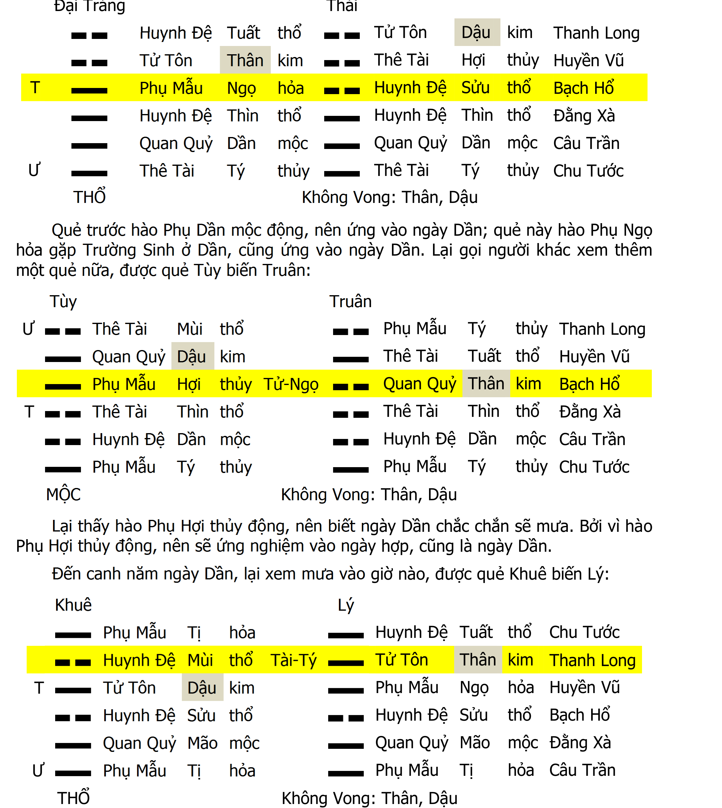 giờ Mùi sẽ mưa, đến giờ Thân thì tạnh. Đến sáng hôm sau đến an ủi viên quan đó 
rằng: "Ông xem được quẻ Tử Tôn trì Thế, là điềm không có điều gì đáng ngại, ông lại 
không chịu tin. Nay tôi xem thử, giờ Mùi hôm nay sẽ có mưa, đến giờ Thân thì tạnh, 
để ông biết rằng quẻ của tôi là linh nghiệm, mà không phải lo phiền nữa!" Vị quan liền 
ở nhà đợi, đến cuối giờ Ngọ đầu giờ Mùi, có cơn mưa từ phía tây nam đến, đúng giờ 
Mùi mưa to, sang giờ Thân thì mây tạnh trời quang. Cả nhà đều vui mừng mà nói: 
"Thật là quẻ thần". Ta bèn nói rằng: "Thiên thời còn đoán được, thì nhân sự có gì là 
khó. Ông cứ an tâm!" Quả nhiên nửa tháng sau thì được đặc xá.

Có người hỏi: "Hào Huynh Đệ Mùi thổ động, làm sao xác định được là giờ Mùi sẽ 
mưa?" Ta đáp: "Thần đã báo ngày Dần trời mưa. Hôm nay xem lại báo cho biết giờ 
tạnh. Nếu không, trước mắt vẫn là trời quang mây tạnh, sao trong quẻ lại hóa ra Thân 
kim Tử Tôn là tượng giờ Thân mưa tạnh? Ấy là phải nhờ vào sự biến thông của linh 
cơ."

**Tân bình thích:** Lý luận của Dã Hạc có lý, tôi cũng còn quẻ nghiệm được.

### Ví dụ: Ví dụ: Hơn năm giờ chiều ngày Ất Mùi tháng Mùi, giữa lúc sắp hết giờ làm,

bầu trời bỗng nhiên mây đen dày đặc, sấm vang chớp giật, xung quanh trở nên giống 
như nửa đêm, mưa to như trút nước. Bèn đoán khi nào ngừng mưa, được Phệ Hạp 
biến Ly.

Phệ Hạp
 
Ly

Tử Tôn | Tị | hỏa | Tử Tôn | Tị | hỏa Huyền Vũ

T | Thê Tài | Mùi thổ | Thê Tài | Mùi thổ | Bạch Hổ

Quan QuỷDậu | kim | Quan QuỷDậu kim Đằng Xà

Thê Tài | Thìn thổ | Phụ Mẫu | Hợi thủy Câu Trần

Ư | Huynh ĐệDần | mộc | Thê Tài | Sửu thổ | Chu Tước

Phụ Mẫu | Tý | thủy | Huynh ĐệMão mộc Thanh Long

MỘC 
Không Vong: Thìn, Tị

Thê Tài Thìn thổ vượng mà độc phát, Phụ Mẫu nhập Mộ, mưa nhất định sẽ 
ngừng, nhưng bởi vì Thìn thổ Tuần Không, giờ Tuất xung thực, tôi đoán bảy giờ tạnh 
mưa. Lại nghi ngờ Tài động hóa Phụ, ngày Thìn Thìn thổ xuất Không cũng mưa.

Quả nhiên vừa mới đến bảy giờ, mưa lớn liền dừng lại. Đến ngày Nhâm Dần 
tháng Mùi, bầu trời mây đen, xem hôm nay có mưa không? Được Ích biến Ký Tế.

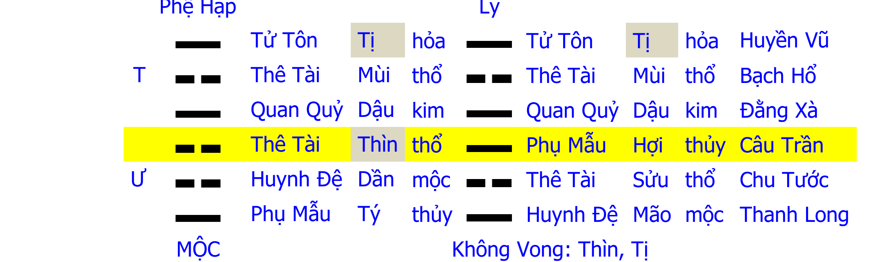

Ích 
 
Ký Tế

Ư | Huynh ĐệMão mộc | Phụ Mẫu Tý | thủy Bạch Hổ

Tử Tôn | Tị | hỏa | Thê Tài | Tuất thổ Đằng Xà

Thê Tài | Mùi thổ | Quan QuỷThân kim Câu Trần

T | Thê Tài | Thìn thổ Quan-Dậu | Phụ Mẫu Hợi | thủy Chu Tước

Huynh ĐệDần mộc | Thê Tài | Sửu thổ Thanh Long

Phụ Mẫu Tý | thủy | Huynh ĐệMão mộc Huyền Vũ

MỘC
Không Vong: Thìn, Tị

Quẻ này và quẻ trước tương tự, Phụ Mẫu không động, Thê Tài Thìn thổ động mà 
hóa Phụ Mẫu, liền đoán hôm nay không mưa, ngày mai Thìn thổ xuất Không tất mưa. 
Hôm nay quả nhiên không có mưa. Đến ngày Giáp Thìn, xem thời tiết hôm đó, được 
Giải biến Đại Tráng.

Giải
 
Đại Tráng

Thê Tài | Tuất thổ | Thê Tài | Tuất thổ Huyền Vũ

Ư | Quan QuỷThân kim | Quan QuỷThân kim Bạch Hổ

Tử Tôn | Ngọ hỏa | Tử Tôn | Ngọ hỏa Đằng Xà

Tử Tôn | Ngọ hỏa | Thê Tài | Thìn thổ Câu Trần

T | Thê Tài | Thìn thổ | Huynh ĐệDần mộc Chu Tước

Huynh ĐệDần mộc Phụ-Tý | Phụ Mẫu Tý | thủy Thanh Long

MỘC
Không Vong: Dần, Mão

Hai quẻ trước đều ứng ngày Thìn có mưa, quẻ này Tử Tôn và Huynh Đệ phát 
động, với hào ám động Tuất thổ tam hợp thành Tử Tôn cục, mà Phụ Mẫu an tĩnh, 
chẳng lẽ hôm nay không mưa? Tôi nhớ lại ví dụ của Dã Hạc trong "Tăng San Bốc 
Dịch", liền đoán: Giờ Ngọ sẽ mưa. Quả nhiên đến giờ Ngọ đã nổi mưa.

Lại vào ngày Bính Tý tháng Thìn, do mưa lâu, xem khi nào tạnh, được quẻ Tốn 
biến Cấu:

Tốn 
 
Cấu

T | Huynh Đệ | Mão | mộc | Thê Tài | Tuất thổ | Thanh Long

Tử Tôn | Tị | hỏa | Quan Quỷ | Thân | kim | Huyền Vũ

Thê Tài | Mùi | thổ | Tử Tôn | Ngọ | hỏa | Bạch Hổ

Ư | Quan Quỷ | Dậu | kim | Quan Quỷ | Dậu | kim | Đằng Xà

Phụ Mẫu | Hợi | thủy | Phụ Mẫu | Hợi | thủy | Câu Trần

Thê Tài | Sửu thổ | Thê Tài | Sửu | thổ | Chu Tước

MỘC
Không Vong: Thân, Dậu

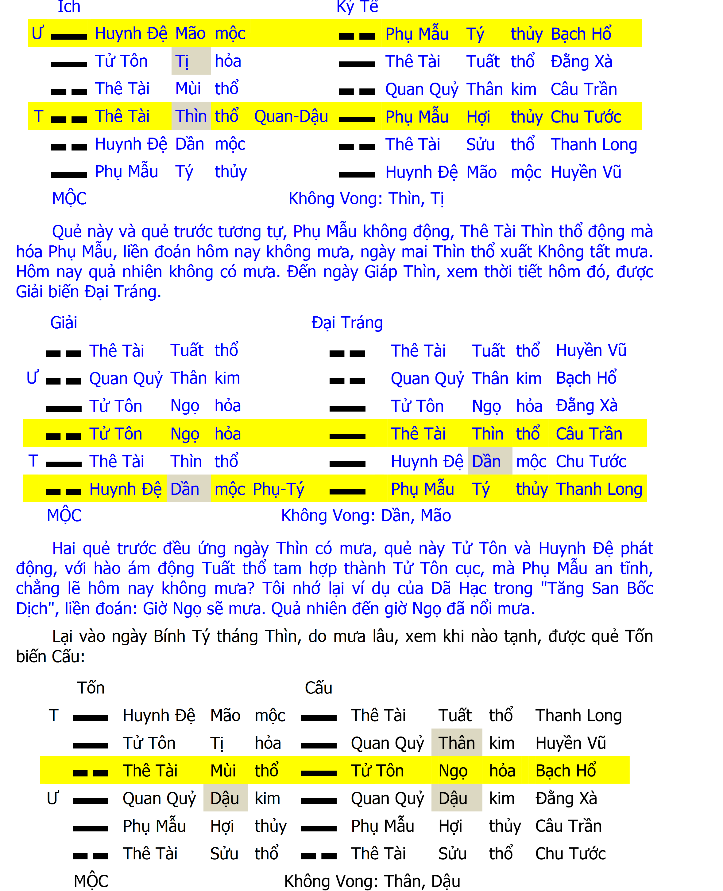

Lại bảo người khác gieo quẻ, được quẻ Cấu biến Càn:

Cấu
 
Càn

Phụ Mẫu Tuất thổ | Phụ Mẫu Tuất thổ Thanh Long

Huynh ĐệThân kim | Huynh ĐệThân kim Huyền Vũ

Ư | Quan QuỷNgọ hỏa | Quan QuỷNgọ hỏa Bạch Hổ

Huynh ĐệDậu kim | Phụ Mẫu Thìn thổ Đằng Xà

Tử Tôn | Hợi | thủy Tài-Dần | Thê Tài | Dần mộc Câu Trần

T | Phụ Mẫu Sửu thổ | Tử Tôn | Tý | thủy Chu Tước

KIM
Không Vong: Thân, Dậu

Lại gọi thêm một người nữa xem được quẻ Vô Vọng:

Vô Vọng

Thê Tài | Tuất thổ | Thanh Long

Quan Quỷ | Thân | kim | Huyền Vũ

T | Tử Tôn | Ngọ | hỏa | Bạch Hổ

Thê Tài | Thìn | thổ | Đằng Xà

Huynh Đệ | Dần | mộc | Câu Trần

Ư | Phụ Mẫu | Tý | thủy | Chu Tước

MỘC 
Không Vong: Thân, Dậu

Lúc này, khắp thành đang chuẩn bị làm lễ rước thần, nhưng vì liên tục nhiều 
ngày chợt mưa chợt nắng, nên không dám trang hoàng. Ta dùng ba quẻ trên kết hợp 
lại để xét đoán, biết rằng đến ngày Quý Mùi trời nắng ráo. Trong quẻ đầu tiên, hào 
Tài Mùi thổ động hóa thành Ngọ hỏa Tử Tôn, nếu theo phép xem cũ, cho rằng hào 
Tài bị hợp là điềm không tạnh, ta cho là ứng nghiệm, nhưng gặp ngày xung khai sẽ 
tạnh. Lại thêm xem quẻ vào ngày Tý, Nhật thần Tý thủy đã xung khai Ngọ hỏa, Mùi 
thổ không còn hợp được, nên biết rằng ngày Mùi sẽ tạnh. Tại quẻ thứ hai, hào Phụ 
Mẫu Sửu thổ chủ về mưa, động hóa hào Tử Tôn Tý thủy là chủ về tạnh, cũng ứng vào 
ngày Mùi xung khai Sửu thổ, mà hào Tử Tôn Tý thủy không thể hợp với Sửu, nên 
cũng chủ về ngày Mùi sẽ tạnh. Tại quẻ thứ ba, hào Tử Tôn Ngọ hỏa bị Nhật thần xung 
nên ám động, động mà gặp ngày hợp, nên cũng ứng với ngày Mùi sẽ tạnh. Sau quả 
nhiên đến ngày Quý Mùi, muôn dặm trời quang.

Lại vào ngày Quý Dậu tháng Dần, do mưa kéo dài, nên xem ngày nào sẽ tạnh, 
được quẻ Khảm biến Tiết:

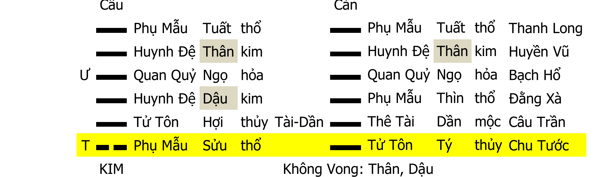

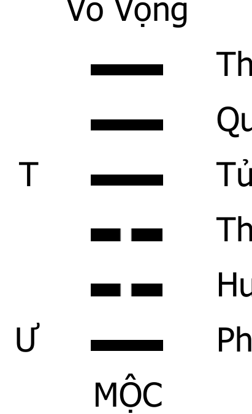

Khảm
 
Tiết

T | Huynh Đệ | Tý | thủy | Huynh Đệ | Tý | thủy | Bạch Hổ

Quan Quỷ | Tuất thổ | Quan Quỷ | Tuất thổ | Đằng Xà

Phụ Mẫu | Thân | kim | Phụ Mẫu | Thân | kim | Câu Trần

Ư | Thê Tài | Ngọ | hỏa | Quan Quỷ | Sửu | thổ | Chu Tước

Quan Quỷ | Thìn | thổ | Tử Tôn | Mão | mộc | Thanh Long

Tử Tôn | Dần | mộc | Thê Tài | Tị | hỏa | Huyền Vũ

THỦY
Không Vong: Tuất, Hợi

Hào Tử Tôn Dần mộc độc phát, nên không tạnh vào ngày Hợi thì tạnh vào ngày 
Dần. Ứng vào ngày Hợi, là vì ngày hào động Dần mộc gặp hợp; ứng vào ngày Dần, vì 
là ngày trực của Dần mộc. Nhưng lại không chỉ rõ là ngày nào, nên bảo người khác 
xem, được quẻ Quải biến Nhu:

Quải
 
Nhu

Huynh ĐệMùi thổ | Thê Tài | Tý | thủy | Bạch Hổ

T | Tử Tôn | Dậu kim | Huynh ĐệTuất thổ | Đằng Xà

Thê Tài | Hợi thủy | Tử Tôn | Thân kim | Câu Trần

Huynh ĐệThìn thổ | Huynh ĐệThìn thổ | Chu Tước

Ư | Quan QuỷDần mộc Phụ-Tị | Quan QuỷDần mộc | Thanh Long

Thê Tài | Tý | thủy | Thê Tài | Tý | thủy | Huyền Vũ

THỔ
Không Vong: Tuất, Hợi

Trong quẻ trước, hào Dần mộc Tử Tôn động nên chủ về trời tạnh, có thể ứng 
vào ngày Hợi hào động gặp hợp, hoặc ứng vào ngày Dần. Trong quẻ này, hào Tài Hợi 
thủy động, nên biết chắc rằng đến ngày Hợi sẽ tạnh. Lại thêm Hợi gặp Tuần Không, 
nên sẽ ứng vào ngày thực Không. Sau quả nhiên đến ngày Hợi, trời quang mây tạnh.

Lại ví dụ: Ngày Kỷ Mão tháng Thân, sáng ra trời âm u, nên xem trong ngày có 
mưa không, được quẻ Quải biến Đại Tráng:

Quải
 
Đại Tráng

Huynh ĐệMùi thổ | Huynh ĐệTuất thổ Câu Trần

T | Tử Tôn | Dậu kim | Tử Tôn | Thân kim Chu Tước

Thê Tài | Hợi thủy | Phụ Mẫu | Ngọ hỏa Thanh Long

Huynh ĐệThìn thổ | Huynh ĐệThìn thổ Huyền Vũ

Ư | Quan QuỷDần mộc Phụ-Tị | Quan QuỷDần mộc Bạch Hổ

Thê Tài | Tý | thủy | Thê Tài | Tý | thủy Đằng Xà

THỔ
Không Vong: Thân, Dậu

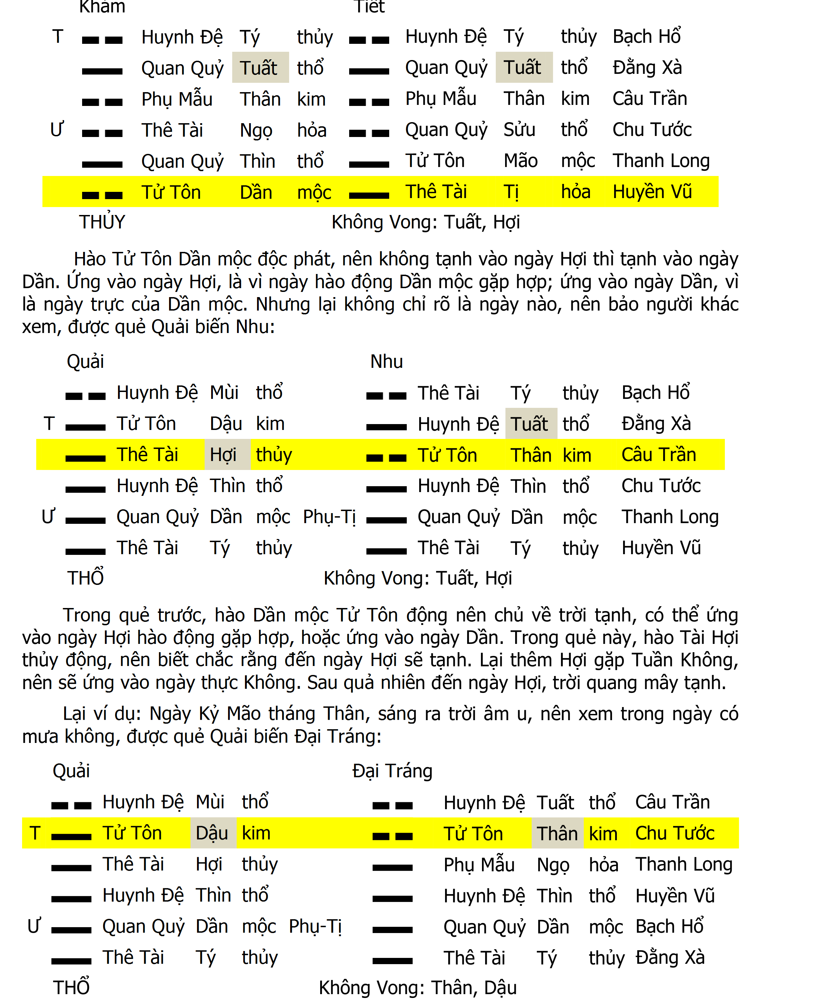

Hỏi về mưa, nhưng thần không báo mưa, mà lại báo giờ Dậu nắng lớn. Ta ngờ 
rằng ý của thần muốn nói, mưa đã đến rồi, nhưng mưa không lâu, đến giờ Dậu nắng 
tạnh. Quả nhiên đến giờ Ngọ mưa nhỏ, đến giờ Thân mây tan, đến giờ Dậu tạnh ráo. 
Dạng quẻ như thế này khá thường gặp, người học đời sau nên chú ý. Nên nhớ rằng, 
khi mưa đã đến, thì thần sẽ không báo mưa, mà chỉ báo tạnh. Có người hỏi: "Hào 
Dậu kim động, động mà gặp xung là tán, lại hóa Thoái thần, làm sao mà vẫn tạnh?" 
Ta bèn giải đáp rằng: "Kim vượng tướng làm sao có thể tán được. Thân kim gặp 
Nguyệt kiến, làm sao có thể cho là Thoái thần?"

Lại ví dụ: Vào ngày Giáp Thìn tháng Mão, trời âm u, nên xem khi nào mưa, được 
quẻ Cấn biến Càn:

Cấn 
 
Càn

T | Quan QuỷDần mộc | Huynh Đệ Tuất thổ Huyền Vũ

Thê Tài | Tý | thủy | Tử Tôn | Thân kim Bạch Hổ

Huynh ĐệTuất thổ | Phụ Mẫu | Ngọ hỏa Đằng Xà

Ư | Tử Tôn | Thân kim | Huynh ĐệThìn thổ Câu Trần

Phụ Mẫu | Ngọ hỏa | Quan QuỷDần mộc Chu Tước

Huynh ĐệThìn thổ | Thê Tài | Tý | thủy Thanh Long

THỔ
Không Vong: Dần, Mão

Ta đoán rằng: "Ngày hôm nay trời âm u, bốn ngày tiếp theo đều không tạnh 
ráo." Có người hỏi rằng: "Hôm nay trời mưa hay tạnh?" Ta đáp: "Hào Huynh Thìn thổ 
hóa hào Tài Tý thủy, Tý thủy gặp Trường Sinh tại Thân, nên giờ Thân, giờ Dậu sẽ có 
mưa. Mai là ngày Tị, lúc mưa lúc tạnh. Đến ngày Ngọ, ngày Mùi sẽ mưa to, sang ngày 
Thân lại tạnh ráo."

Người này lại hỏi: "Làm sao mà biết được?" Ta đáp: "Từ hào sơ Thìn thổ động, 
động liền hai hào, hào Phụ hóa hào Quỷ, hào Huynh hóa hào Phụ, là tượng nhiều 
ngày không tạnh. Hào 5 Tài Tý thủy, hóa Thân kim Tử Tôn, nên biết rằng ngày Thân 
sẽ tạnh."

Sau quả nhiên mấy ngày liền trời âm u, lúc mưa lúc tạnh, đến tận ngày Thân mới 
tạnh ráo, trời trong không một gợn mây.

Lại ví dụ: Vào ngày rằm Canh Thìn tháng Tị, xem về chuyện mưa nắng trong một 
tháng, được quẻ Khôn biến Sư:

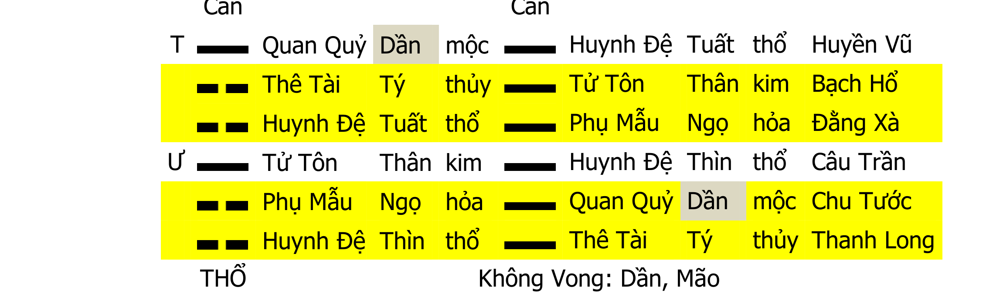

Khôn
 
Sư

T | Tử Tôn | Dậu kim | Tử Tôn | Dậu kim Đằng Xà

Thê Tài | Hợi thủy | Thê Tài | Hợi thủy Câu Trần

Huynh ĐệSửu thổ | Huynh ĐệSửu thổ Chu Tước

Ư | Quan QuỷMão mộc | Phụ Mẫu Ngọhỏa Thanh Long

Phụ Mẫu Tị | hỏa | Huynh ĐệThìn thổ Huyền Vũ

Huynh ĐệMùi thổ | Quan QuỷDần mộc Bạch Hổ

THỔ
Không Vong: Thân, Dậu

Có người bảo rằng: "Hào Phụ Tị hỏa động, lại gặp Nguyệt kiến, nên chủ về mưa 
dầm nhiều ngày. Trong quẻ này hào Phụ Tị hỏa động, lại là hào Phụ hóa hào Huynh, 
là tượng mưa gió bất thường, trong tháng này ắt có lụt." Ta bèn nói: "Trong sách tuy 
có thuyết này, nhưng ta thử thấy không ứng nghiệm. Hôm sau là ngày Tị, ắt sẽ có 
mưa, những ngày khác thì chưa chắc." Quả nhiên đến hôm sau có mưa nhỏ. Bởi vậy ở 
phần trước, ta đã xóa bỏ chỗ sai trong luận đoán về "mưa dầm liền tuần", nên người 
học đời sau nên xem xét cho kỹ.

Lại ví dụ: Vào ngày Tân Mão tháng Tị, xem hôm sau mưa hay tạnh, được quẻ 
Độn biến Hàm:

Độn
 
Hàm

Phụ Mẫu Tuất thổ | Phụ Mẫu Mùi | thổ Đằng Xà

Ư | Huynh ĐệThân kim | Huynh ĐệDậu kim Câu Trần

Quan QuỷNgọ hỏa | Tử Tôn | Hợi | thủy Chu Tước

Huynh ĐệThân kim | Huynh ĐệThân kim Thanh Long

T | Quan QuỷNgọ hỏa Tài-Dần | Quan QuỷNgọ hỏa Huyền Vũ

Phụ Mẫu Thìn thổTử-Tý | Phụ Mẫu Thìn thổ Bạch Hổ

KIM
Không Vong: Ngọ, Mùi

Có người nói rằng: Hào Tuất Phụ hóa Mùi Phụ, nên ngày mai sẽ có mưa to. Ta 
bèn nói rằng: Thường thấy thần linh báo gần chứ không báo xa, nếu giờ Mùi giờ Tuất 
hôm nay không mưa, thì ngày mai ắt sẽ có mưa. Quả nhiên đến giờ Mùi hôm đó mưa 
nhỏ, đến giờ Tuất mưa lớn, sang ngày Hợi thì tạnh ráo.

Lại ví dụ vào ngày Bính Tuất tháng Dậu, do mưa dầm liên tục nhiều ngày, nên 
xem bao giờ tạnh, được quẻ Tiểu Quá biến Bí:

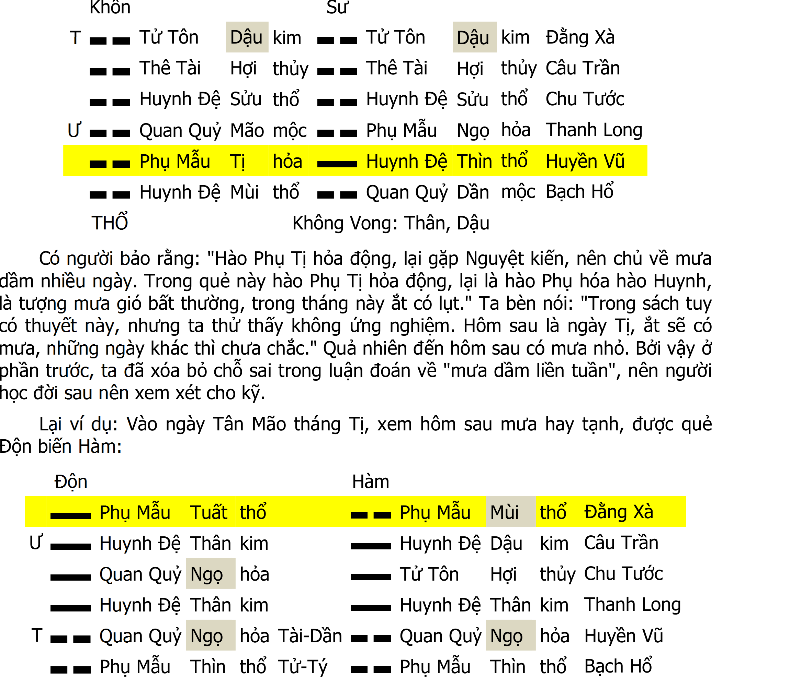

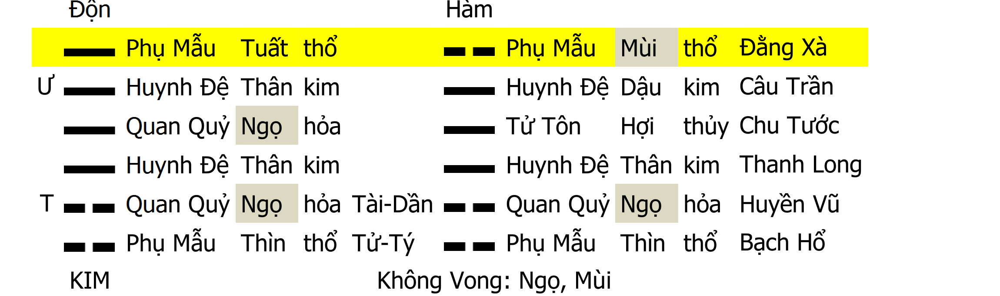

Tiểu Quá
 
Bí

Phụ Mẫu Tuất thổ | Thê Tài Dần mộc Thanh Long

Huynh ĐệThân kim | Tử Tôn Tý | thủy Huyền Vũ

T

Quan QuỷNgọ hỏa Tử-Hợi | Phụ Mẫu Tuất thổ Bạch Hổ

Huynh ĐệThân kim | Tử Tôn Hợi thủy Đằng Xà

Quan QuỷNgọ hỏa Tài-Mão | Phụ Mẫu Sửu thổ Câu Trần

Ư

Phụ Mẫu Thìn thổ | Thê Tài Mão mộc Chu Tước

KIM 
Không Vong: Ngọ, Mùi

Ta đoán rằng: Trong quẻ hào Phụ và hào Quỷ cùng động, nên hôm nay chắc 
chắn sẽ có mưa lớn. May nhờ hào sơ Phụ Thìn thổ hóa hào Tài Mão mộc, hào 6 Tuất 
thổ hóa hào Tài Dần mộc, nên vào giờ Dần, giờ Mão hôm sau sẽ tạnh. Quả nhiên đến 
giờ Dần ngày hôm sau trời rạng.

Lại ví dụ: Vào ngày Quý Tị tháng Mão, do mưa liên tục nhiều ngày, xem ngày 
nào tạnh, được quẻ Tỷ biến Cách:

Tỷ 
 
Cách

Ư | Thê Tài | Tý | thủy | Huynh Đệ | Mùi | thổ | Bạch Hổ

Huynh Đệ | Tuất thổ | Tử Tôn | Dậu | kim | Đằng Xà

Tử Tôn | Thân | kim | Thê Tài | Hợi | thủy | Câu Trần

T | Quan Quỷ | Mão | mộc | Thê Tài | Hợi | thủy | Chu Tước

Phụ Mẫu | Tị | hỏa | Huynh Đệ | Sửu thổ | Thanh Long

Huynh Đệ | Mùi | thổ | Quan Quỷ | Mão | mộc | Huyền Vũ

THỔ
Không Vong: Ngọ, Mùi

Trong quẻ Phụ Quỷ loạn động, là tượng còn mưa lớn nhiều ngày. May có hào Tử 
Tôn Thân kim hóa hào Tài Hợi thủy, nên đến ngày Thân sẽ tạnh. Quả nhiên đến ngày 
Thân trời nắng tạnh.

### Ví dụ: Vào ngày Quý Mão tháng Mão, xem ngày nào mưa, được quẻ Tiểu Quá

biến Độn:

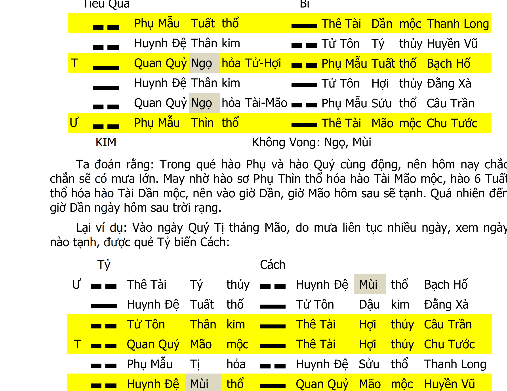

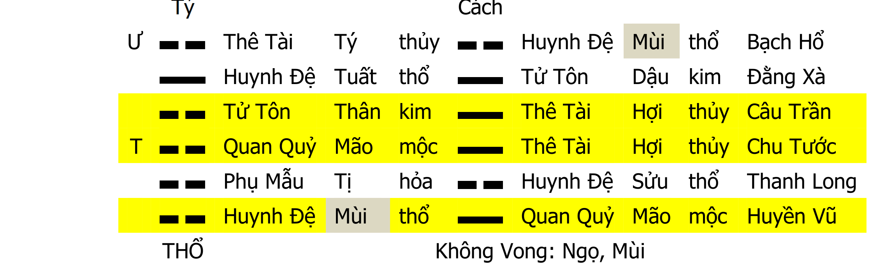

Tiểu Quá
 
Độn

Phụ Mẫu Tuất thổ | Phụ Mẫu Tuất thổBạch Hổ

Huynh ĐệThân kim | Huynh ĐệThân kim Đằng Xà

T

Quan QuỷNgọ hỏa Tử-Hợi | Quan QuỷNgọ hỏa Câu Trần

Huynh ĐệThân kim | Huynh ĐệThân kim Chu Tước

Quan QuỷNgọ hỏa Tài-Mão | Quan QuỷNgọ hỏa Thanh Long

Ư

Phụ Mẫu Thìn thổ | Phụ Mẫu Thìn thổHuyền Vũ

KIM 
Không Vong: Thìn, Tị

Hàọ Tuất Phụ động hóa Tuất thổ, là quẻ Phục ngâm, nên đến giờ Thìn hôm sau 
sẽ có mưa, vì gặp quẻ Phục ngâm cần đợi xung khai. Quả nhiên đến giờ Thìn, giờ Tị 
hôm sau có mưa.

Lại ví dụ: Ngày Giáp Thân tháng Sửu, do tuyết xuống liên tục nhiều ngày, nên 
xem ngày nào tạnh, được quẻ Tổn biến Lâm:

Tổn 
 
Lâm

Ư | Quan QuỷDần mộc | Tử Tôn | Dậu kim Huyền Vũ

Thê Tài | Tý | thủy | Thê Tài | Hợi thủy Bạch Hổ

Huynh ĐệTuất thổ | Huynh ĐệSửu thổ | Đằng Xà

T | Huynh ĐệSửu thổ | Tử-Thân | Huynh ĐệSửu thổ | Câu Trần

Quan QuỷMão | mộc | Quan QuỷMão mộc Chu Tước

Phụ Mẫu | Tị | hỏa | Phụ Mẫu | Tị | hỏa Thanh Long

THỔ
Không Vong: Ngọ, Mùi

Hào Quỷ Dần mộc động, mộc động sẽ sinh gió. Lại biến ra hào Tử Tôn Dậu kim, 
nên đến giờ Hợi trong ngày sẽ có gió lớn, đến giờ Dậu hôm sau sẽ tạnh. Sau quả 
nhiên đến giờ Hợi thì gió nổi, đến hôm sau trời quang đãng.

Lại ví dụ: Ngày Đinh Hợi tháng Tị, do mưa liên tục nhiều ngày, nên xem ngày 
nào tạnh, được quẻ Truân biến Phệ Hạp:

Truân
 
Phệ Hạp

Huynh ĐệTý | thủy | Thê Tài | Tị | hỏa Thanh Long

Ư | Quan QuỷTuất thổ | Quan QuỷMùi thổ Huyền Vũ

Phụ Mẫu | Thân kim | Phụ Mẫu | Dậu kim Bạch Hổ

Quan QuỷThìn thổ Tài-Ngọ | Quan QuỷThìn thổ Đằng Xà

T | Tử Tôn | Dần mộc | Tử Tôn | Dần mộc Câu Trần

Huynh ĐệTý | thủy | Huynh ĐệTý | thủy Chu Tước

THỦY
Không Vong: Ngọ, Mùi

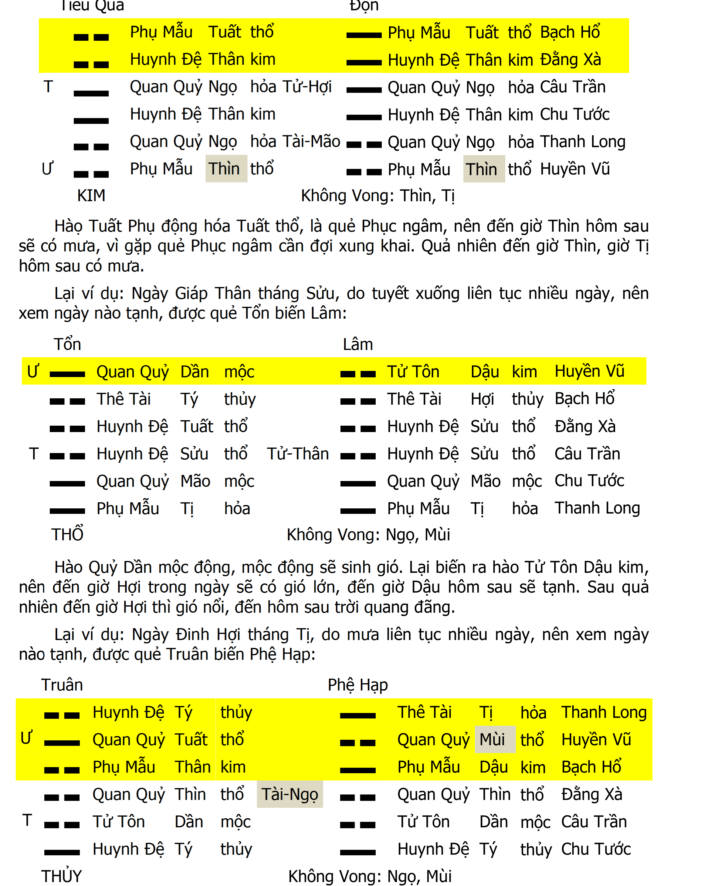

Quẻ ngoại hào Phụ động biến thành hào Phụ, hào Quỷ động biến thành hào Quỷ, 
nên là tượng mưa gió kéo dài. Hào thượng Tý thủy động biến thành hào Tài Tị hỏa, 
nên đến ngày Tị mới tạnh. Có người hỏi rằng, hào Quỷ vượng mà hóa Thoái thần, hào 
Phụ suy mà hóa Thoái thần, nên mới đoán được như vậy. Ta đáp: Phụ hóa Phụ, Quỷ 
hóa Quỷ, tức thần mách bảo cho ta là mưa gió còn kéo dài nhiều ngày. Rồi lại báo với 
ta rằng, đến ngày Tị sẽ tạnh, nếu không phải là tượng hào như thế, thì làm sao mà 
biết được hết ý của thần. Nay nếu lại dùng vượng suy, tiến thoái để bàn luận, thì là 
người không biết biến thông.

### Ví dụ: Ngày Đinh Mùi tháng Thân, do mưa kéo dài, nên xem bao giờ tạnh, được

quẻ Phục biến Ký Tế:

Phục
 
Ký Tế

Tử Tôn | Dậu kim | Thê Tài | Tý | thủy Thanh Long

Thê Tài | Hợi thủy | Huynh ĐệTuất thổ Huyền Vũ

Ư | Huynh ĐệSửu thổ | Tử Tôn | Thân kim Bạch Hổ

Huynh ĐệThìn thổ | Thê Tài | Hợi | thủy Đằng Xà

Quan QuỷDần mộc Phụ-Tị | Huynh ĐệSửu thổ Câu Trần

T | Thê Tài | Tý | thủy | Quan QuỷMão mộc Chu Tước

THỔ
Không Vong: Dần, Mão

Ta đoán rằng: Hào Huynh Thìn thổ hóa hào Tài Hợi thủy, nên đến ngày Hợi trời 
sẽ tạnh, nhưng tạnh không được lâu. Vậy dựa vào đâu để đoán như vậy? Vì hào 5 Tài 
Hợi thủy lại biến thành hào Huynh Tuất thổ. Sau quả nhiên, đến ngày Hợi trời rạng, 
đến giờ Thân, giờ Dậu, giờ Tuất lại có mưa.

Lại ví dụ: Vào ngày Nhâm Dần tháng Mão, xem ngày nào mưa, được quẻ Thiên 
Địa Bĩ biến Quan:

Bĩ 
 
Quan

Ư | Phụ Mẫu Tuất thổ | Thê Tài | Mão mộc Bạch Hổ

Huynh ĐệThân kim | Quan QuỷTị | hỏa Đằng Xà

Quan QuỷNgọ hỏa | Phụ Mẫu Mùi thổ Câu Trần

T | Thê Tài | Mão mộc | Thê Tài | Mão mộc Chu Tước

Quan QuỷTị | hỏa | Quan QuỷTị | hỏa Thanh Long

Phụ Mẫu Mùi | thổ Tử-Tý | Phụ Mẫu Mùi thổ Huyền Vũ

KIM
Không Vong: Thìn, Tị

Có người đoán rằng: Hào Quỷ Ngọ hỏa động hóa Phụ Mùi thổ, đáng lẽ là điềm có 
mưa. Chỉ vì Ngọ hợp với Mùi, nên phải đợi đến ngày Tý, ngày Sửu xung khai hợp, mới 
mưa được. Ta nói: Giờ Tý, giờ Sửu hôm nay cũng có thể xung khai. Quả nhiên đến 
nửa đêm hôm đó mưa to.

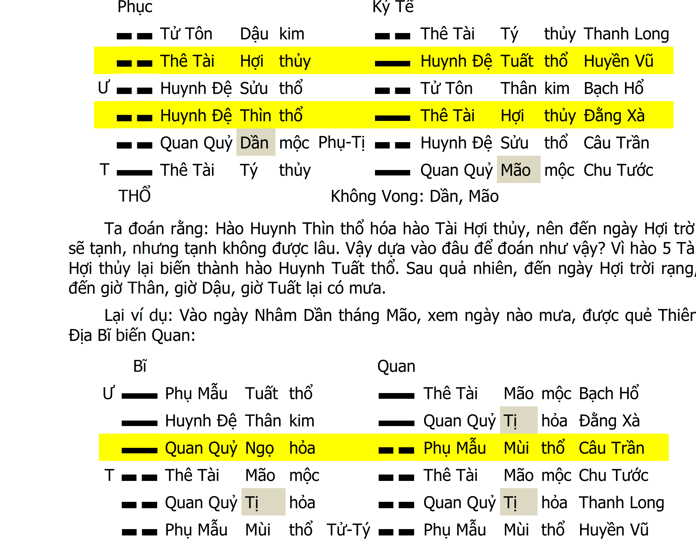

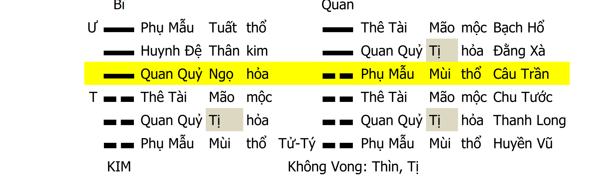

Lại ví dụ: Vào ngày Canh Tý tháng Mùi, do mong mưa nên xem bao giờ có mưa, 
được quẻ Khốn biến Phệ Hạp:

Khốn
 
Phệ Hạp

Phụ Mẫu | Mùi | thổ | Quan Quỷ | Tị | hỏa | Đằng Xà

Huynh Đệ | Dậu kim | Phụ Mẫu | Mùi | thổ | Câu Trần

Ư | Tử Tôn | Hợi | thủy | Huynh Đệ | Dậu kim | Chu Tước

Quan Quỷ | Ngọ hỏa | Phụ Mẫu | Thìn | thổ | Thanh Long

Phụ Mẫu | Thìn | thổ | Thê Tài | Dần mộc | Huyền Vũ

T | Thê Tài | Dần mộc | Tử Tôn | Tý | thủy | Bạch Hổ

KIM 
Không Vong: Thìn, Tị

Ta đoán rằng: Quẻ nội hào Phụ Thìn thổ động, hóa thành hào Tài Dần mộc nên 
đến ngày Thìn sẽ có mưa, nhưng mưa không lớn. Hào Huynh Dậu hóa thành Phụ Mùi 
thổ, hào Phụ Mùi thổ lại hóa thành hào Quỷ Tị hỏa, nên đến ngày Mùi sẽ có mưa lớn. 
Quả nhiên đến ngày Thìn mưa nhỏ, ngày Mùi mưa to.

Lại ví dụ: Vào ngày Giáp Thân tháng Dần, bạn hẹn ta đến ngày Hợi đi du xuân. 
Ta bèn nói: Mưa tuyết đã vài ngày, đi du xuân không được tận hứng.

Bạn ta nói: Sáng nay tôi xem được quẻ có hào Hợi thủy Tử Tôn động, nên ngày 
Hợi sẽ tạnh ráo. Ta bèn xem thử, được quẻ Dự biến Chấn:

Dự 
 
Chấn

Thê Tài | Tuất thổ | Thê Tài | Tuất thổ Huyền Vũ

Quan QuỷThân kim | Quan QuỷThân kim Bạch Hổ

Ư | Tử Tôn | Ngọ hỏa | Tử Tôn | Ngọ hỏa Đằng Xà

Huynh ĐệMão mộc | Thê Tài | Thìn thổ Câu Trần

Tử Tôn | Tị | hỏa | Huynh ĐệDần mộc Chu Tước

T | Thê Tài | Mùi thổ Phụ-Tý | Phụ Mẫu Tý | thủy Thanh Long

MỘC
Không Vong: Ngọ, Mùi

Ta đoán rằng: Ngày Tý mới tạnh, ngày Hợi thì chưa chắc. Bạn ta bèn nói: Tôi 
xem thấy hào Hợi thủy Tử Tôn, anh xem được hào Tý thủy Tử Tôn, đều là chỉ ngày Tý 
ngày Hợi tạnh ráo. Ta đáp: Không đúng! Anh xem được hào Hợi thủy Tử Tôn, vượng 
vào ngày Tý, nên ứng vào ngày Tý tạnh ráo, chứ không phải ứng vào ngày Hợi. Sau 
quả nhiên ngày Hợi vẫn có tuyết, đến ngày Tý mới quang đãng.

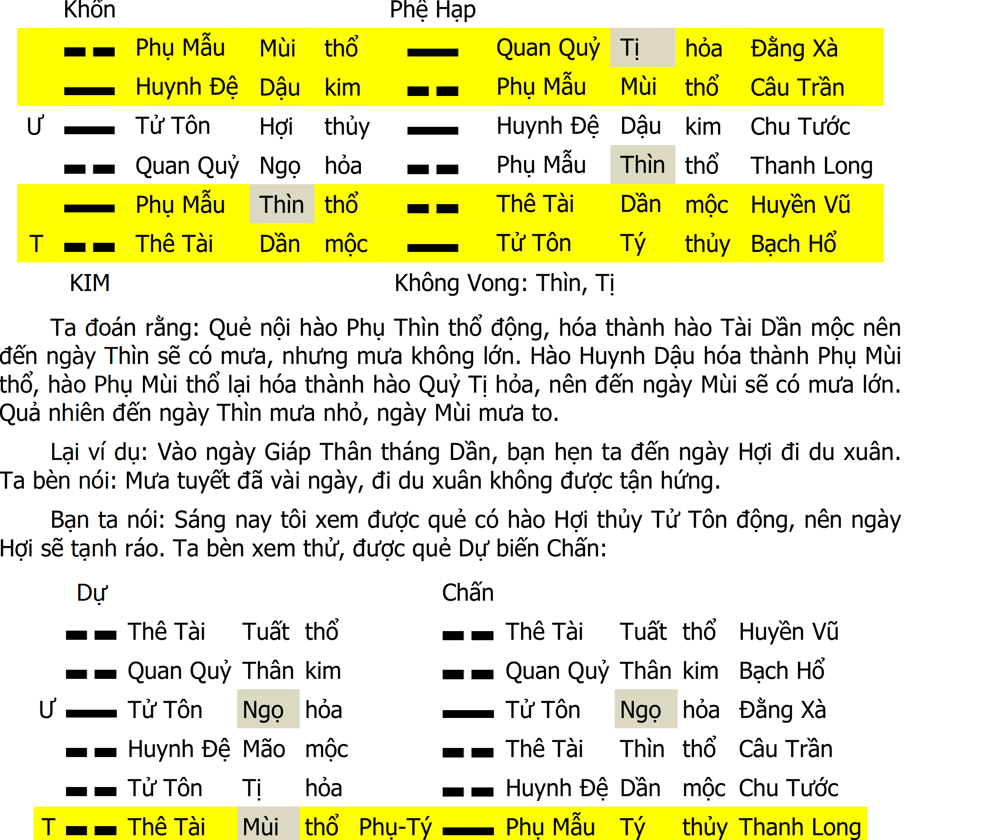

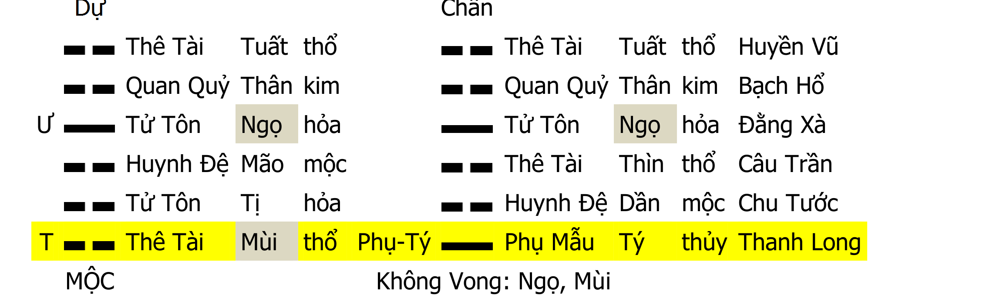

---

# CHƯƠNG 41: THÂN MỆNH

Các sách bốc dịch xưa quan niệm, xem về thân mệnh tức gồm các vấn đề như vợ 
con, tài lộc, chỉ cần một quẻ đã có thể bộc lộ đủ các thông tin, nên dùng kiêm cả sáu 
hào trong cùng một quẻ để suy đoán. Lý luận như vậy là không biết được rằng, các 
hào Phụ, Tử, Tài, Huynh Đệ, mỗi hào có chỗ kiêng kỵ, khắc hại khác nhau, nên không 
thể chỉ dùng một quẻ để suy đoán toàn bộ. Ví dụ được hào Phụ Mẫu vượng tướng, là 
tượng cha mẹ khoẻ mạnh. Nhưng Phụ vượng sẽ tổn thương đến Tử Tôn, chẳng lẽ 
những người làm cha mẹ trên đời, đều không có con cái hay sao? Gặp Huynh Đệ thì 
tài không tụ được, Huynh lại là thần khắc vợ. Nhưng hào Huynh Đệ động, là tượng 
anh em hòa thuận, thịnh vượng. Vậy nếu hào Huynh Đệ vượng tướng trì Thế phải 
đoán như thế nào? Là khắc Thê ư? Khắc Tài ư? Anh em hòa thuận ư?

Sách "Dịch lâm bổ di" viết rằng: "Huynh động Thê vong Tài hao tán", nếu theo 
quan niệm đó, thì những người nghèo khó trên đời đều là những người chết chồng 
chết vợ ư? Cho đến hào Tài, hào Tử Tôn, cũng đều lý luận theo kiểu đó, ta không rỗi 
thời gian để bàn luận tỉ mỉ. Nếu muốn kiêm cả mà đoán, thì các bậc tiên hiền vẫn còn 
đó, mang vấn đề này đi mà hỏi, ta cũng không muốn xen vào.

Giác Tử bàn rằng: Ta nay có được phương pháp là chia ra để xem. Xem về cha 
mẹ, xem về anh em, mỗi thứ dùng một quẻ riêng. Xem về tiền tài, về công danh một 
đời, xem vợ chồng có thể chung sống đến bạc đầu hay không, xem về cháu con nối 
dõi hay tuổi thọ, tất cả đều nên chia ra để xem riêng từng quẻ.

***

# CHƯƠNG 42: CHUNG THÂN TÀI PHÚC

(TÀI PHÚC TRỌN ĐỜI)

Tài Phúc vượng tướng, chung minh đỉnh thực chi gia.

Tài, Phúc vượng tướng, là nhà phú quý giàu sang.

Sách xưa chú thích rằng: Hào Thế vượng tướng, không bị thương khắc, là tượng 
đã giàu lại sống thọ.

Giác Tử bàn rằng: Xem về tiền tài thì cần hào Tài vượng, xem về tuổi thọ, cần 
chú trọng đến hào Thế. Chưa từng thấy hào Tài, hào Phúc không vượng, chỉ có mình 
hào Thế vượng tướng mà đoán là tượng giàu có sống thọ. Nếu theo đó, thì chẳng lẽ 
tất cả những người sống thọ trên đời này đều giàu có cả hay sao?

Phàm xem về tài phúc trọn đời, nếu được cả ba hào Thế, hào Tài, hào Tử Tôn 
đều tốt đẹp trọn vẹn, là tượng gia đình phú quý, phúc lộc lâu dài.

Hào Tài hào Thế vượng tướng, mà Phúc thần (Tử Tôn) không vượng, là người 
trước giàu sau nghèo. Đó là bởi vì Tử Tôn là gốc của Tài, nước không có nguồn thì 
trước sau cũng khô cạn. Cho nên có câu: "Tài vượng, Phúc không, vinh hoa bất cửu" 
(Tài vượng, Tử không, vinh hoa chẳng lâu dài).

Hào Thế và hào Phúc (Tử Tôn) vượng tướng mà hào Tài không vượng, là người 
được hưởng phúc mà không có tiền tài. Nhưng không có tiền thì làm sao có thể 
hưởng phúc? Nên người này chắc hẳn đã có sẵn sự nghiệp để hưởng thụ, chỉ biết 
ngồi mát ăn bát vàng mà không biết phát triển, hoặc tiền của gửi nhờ người khác 
quản lý, chỉ biết tiêu xài, không phải lo toan vất vả.

Hào Tài, hào Phúc vượng tướng mà hào Thế không vượng, là tượng người nghèo 
ở nhà đẹp. Giác Tử nói: Khái niệm "không vượng" trên đây bao hàm rất nhiều trường 
hợp, vô khí, thất hãm, đều là không vượng; đắc địa hữu khí, cũng là không vượng; 
Không, Phá, Mộ, Tuyệt, cũng là không vượng.

Hào Tài, hào Phúc vượng tướng, hào Thế không vượng nhưng hữu khí, thì về sau 
đợi đến năm Thế sinh vượng, lại sẽ thành vượng tướng. Cho nên mới có câu: Tài Phúc 
được quyền, ắt sẽ có ngày vinh hoa.

Hào Tài, hào Phúc vượng tướng mà hào Thế vô khí, là tượng không tốt, tuy cơm 
áo đủ đầy, nhưng khó tránh khỏi ngây ngô, câm điếc, hoặc bệnh tật, vướng mắc kiện 
tụng thị phi, hoặc là dạng nhỏ mọn thô bỉ.

Hào Tài, hào Phúc vượng tướng mà hào Thế thất hãm, lại càng hung, tuy có tiền 
trăm bạc vạn, cũng không được sống thọ.

Theo những suy đoán trên đây, thì hào Tài, hào Phúc dù không vượng tướng, 
cũng cần phải hữu khí, nếu thất hãm, chắc chắn là điềm xấu. Hào Tài, hào Phúc thất 
hãm, sẽ phải khuynh gia bại sản. Nhưng nếu động mà gặp Không hoặc Không mà gặp 
Phá thì không đáng ngại, vì sẽ ứng nghiệm vào năm hoặc tháng thực Không, thực 
Phá.

**Tân bình thích:** Câu này rất đúng.

### Ví dụ 1: Ngày Bính Tý tháng Dần, nữ đoán vận khí trọn đời, được Trung Phu biến

Hoán.

Trung Phu
 
Hoán

Quan QuỷMão mộc | Quan QuỷMão mộc Thanh Long

Phụ Mẫu Tị | hỏa Tài-Tý | Phụ Mẫu Tị | hỏa Huyền Vũ

T | Huynh ĐệMùi thổ | Huynh ĐệMùi thổ Bạch Hổ

Huynh ĐệSửu thổ Tử-Thân | Phụ Mẫu Ngọhỏa Đằng Xà

Quan QuỷMão mộc | Huynh ĐệThìn thổ Câu Trần

Ư | Phụ Mẫu Tị | hỏa | Quan QuỷDần mộc Chu Tước

THỔ 
Không Vong: Thân, Dậu

Hào Tài Tý thủy tuy được Nhật phù, nhưng Tử Tôn Không vượng, Tuyệt ở 
Nguyệt kiến, lại bị khắc thương, vô lực sinh Tài, người nữ này suốt đời nghèo khó, 
nhờ vào sự giúp đỡ của người thân, bạn bè mà sống qua ngày. Hào Thế Không mà bị 
khắc, Tử ở Nhật Tuyệt ở Nguyệt, thân thể yếu đuối nhiều bệnh, có chứng động kinh, 
đau ngực, khối u tử cung,...

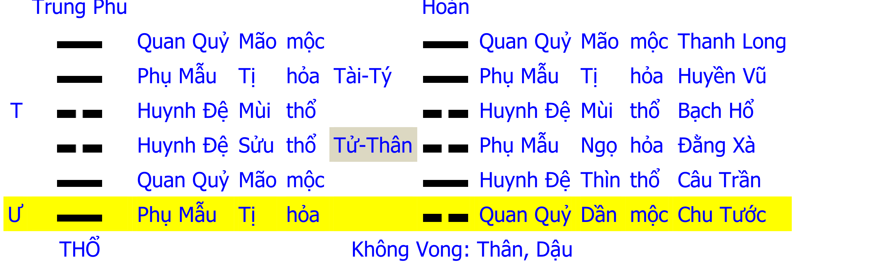

### Ví dụ 2: Ngày Đinh Hợi tháng Mùi, nam xem chung thân tài phúc, được Đại Hữu

biến Ly.

Đại Hữu
 
Ly

Ư | Quan Quỷ | Tị | hỏa | Quan Quỷ | Tị | hỏa | Thanh Long

Phụ Mẫu | Mùi | thổ | Phụ Mẫu | Mùi | thổ | Huyền Vũ

Huynh Đệ | Dậu kim | Huynh Đệ | Dậu | kim | Bạch Hổ

T | Phụ Mẫu | Thìn | thổ | Tử Tôn | Hợi | thủy | Đằng Xà

Thê Tài | Dần mộc | Phụ Mẫu | Sửu thổ | Câu Trần

Tử Tôn | Tý | thủy | Thê Tài | Mão | mộc | Chu Tước

KIM 
Không Vong: Ngọ, Mùi

Quan Quỷ ám động sinh Thế, tượng có công danh. Hào Tài Dần mộc Trường 
Sinh ở Nhật, động đến khắc Thế, Thế lại vượng tướng, là tượng tiền bạc đến gần tôi, 
tài vận tốt. Người này tốt nghiệp đại học, hiện có mấy trăm vạn.

Tài Thế hưu tù, táo phủ sinh trần chi trạch.

Tài, Thế hưu tù, là tượng bếp, nồi phủ bụi.

Hào Thế, hào Tài, hào Phúc (Tử Tôn) đều vô khí, hoặc gặp Không, Phá, Mộ, 
Tuyệt, hoặc động mà biến hung, là người đói ăn thiếu mặc.

Hào Thế đắc địa, mà hào Tài, hào Phúc thất hãm, là người khoẻ mạnh, có sức 
lực, hoặc có nghề nhỏ tài mọn đủ để sống qua ngày.

Hào Thế, hào Phúc hữu khí, mà hào Tài vô khí, tuy bần hàn, nhưng được vui 
hưởng phúc lành.

Hào Thế, hào Tài hữu khí, mà hào Phúc vô khí, là người tuy không có của cải tích 
lũy, nhưng trong tay thường giữ tiền bạc, hoặc giúp người khác quản lý tiền của, nếu 
được Nhật, Nguyệt, hào động sinh phò, cũng có được thành tựu nhỏ.

### Ví dụ: Ngày Giáp Thân tháng Mão, xem về tài phúc cả đời, được quẻ Phục biến

Di:

Phục
 
Di

Tử Tôn | Dậu kim | Quan QuỷDần mộc Huyền Vũ

Thê Tài | Hợi thủy | Thê Tài | Tý | thủy Bạch Hổ

Ư | Huynh ĐệSửu thổ | Huynh ĐệTuất thổ Đằng Xà

Huynh ĐệThìn thổ | Huynh ĐệThìn thổ Câu Trần

Quan QuỷDần mộc Phụ-Tị | Quan QuỷDần mộc Chu Tước

T | Thê Tài | Tý | thủy | Thê Tài | Tý | thủy Thanh Long

THỔ
Không Vong: Ngọ, Mùi

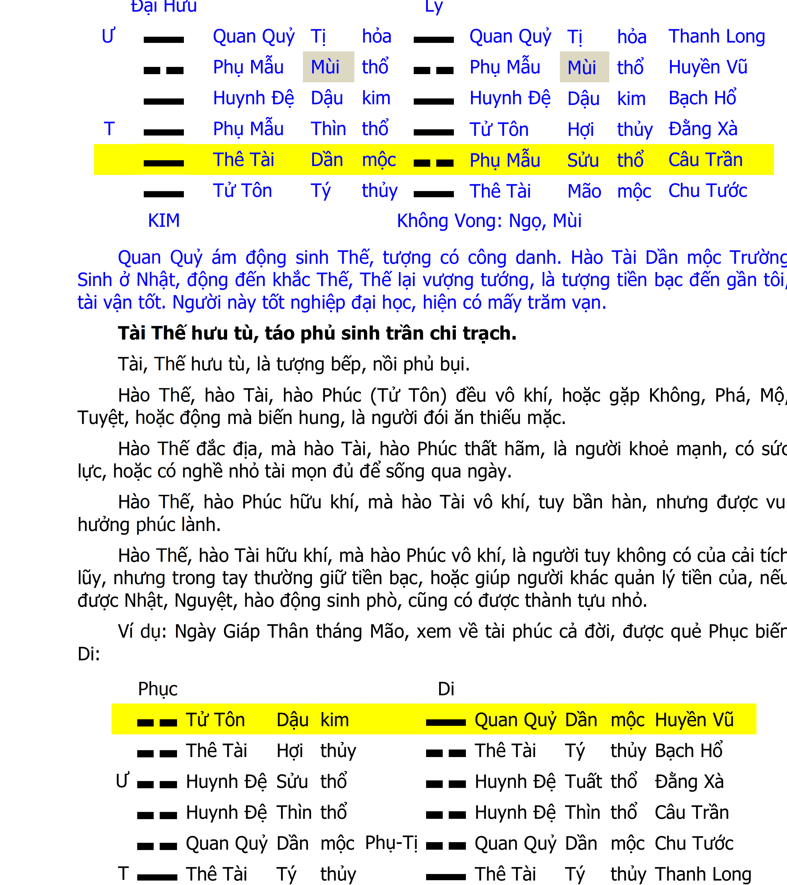

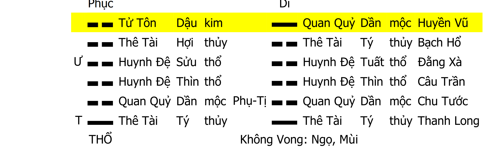

Hào 5 Tài Hợi thủy và hào Thế tại hào Tài Tý thủy đều gặp Trường Sinh tại Nhật 
thần Thân. Tuy không được lệnh (thủy mà xem vào tháng Mão mộc) nhưng được 
Nhật thần tương sinh. Chỉ hiềm Phúc thần Dậu kim gặp Nguyệt phá mà động hóa 
Tuyệt. Đây là tượng bình sinh no cơm ấm áo, nhưng khó tích lũy tiền của để dựng 
nghiệp.

Quả nhiên người này từ năm 37 tuổi trở đi, vào làm chưởng quầy tại hiệu cầm 
đồ, chủ hiệu trước sau đổi đến ba lần, nhưng người này vẫn giữ nguyên công việc, 
sống đến năm 71 tuổi, hàng năm vẫn dùng tiền lương nuôi dưỡng gia đình. Điều này 
ứng với hào Tài trì Thế, lại gặp Trường Sinh. Sinh được bốn trai hai gái. Nếu suy đoán 
theo phép xem gộp của sách xưa, trong quẻ hào Tử Dậu kim bị Nguyệt phá, lại hóa 
Tuyệt là tượng không có con.

"Hoàng kim sách" có viết: "Hào Thế hưu tù, không nghèo khổ thì chết non", ta 
cũng cho là không đúng. Giàu nghèo phải xem hào Tài hào Phúc, yểu thọ chỉ xem hào 
Thế. Nói "không nghèo thì chết non" là không đúng với lý luận của Dịch.

Thế cư Không vị, chung thân tác sự nan thành;

Hào Thế lâm Không, suốt đời chẳng làm nên sự nghiệp;

Sách xưa chú thích rằng: "Tối kỵ hào Thế lâm Không, chủ về suốt đời sự nghiệp 
không thành." Ta thấy lý luận này cũng có phần hữu lý, nhưng lại chưa phân biệt các 
trường hợp vượng, động. Hào Thế vượng mà gặp Không, cũng không bị Không; hào 
Thế động mà gặp Không, cũng không bị Không, nếu được Nhật thần tương xung, 
xung Không sẽ hóa thực. Trong quẻ nếu hào Tài, hào Phúc đắc địa, gặp năm xung 
Không, thực Không, sẽ phát phúc lớn, nên không thể nói là "suốt đời chẳng làm nên 
sự nghiệp".

### Ví dụ: Ngày Tân Hợi tháng Tuất, xem về tài phúc trong cả đời, được quẻ Tỷ biến

Quan:

Tỷ 
 
Quan

Ư | Thê Tài | Tý | thủy | Quan Quỷ | Mão | mộc | Đằng Xà

Huynh Đệ | Tuất thổ | Phụ Mẫu | Tị | hỏa Câu Trần

Tử Tôn | Thân | kim | Huynh Đệ | Mùi thổ | Chu Tước

T | Quan Quỷ | Mão | mộc | Quan Quỷ | Mão | mộc | Thanh Long

Phụ Mẫu | Tị | hỏa | Phụ Mẫu | Tị | hỏa Huyền Vũ

Huynh Đệ | Mùi | thổ | Huynh Đệ | Mùi thổ | Bạch Hổ

THỔ
Không Vong: Dần, Mão

Hào Thế tuy lâm Không, nhưng hợp với Nguyệt kiến, được Nhật thần Hợi tương 
sinh. Hào Tài Tý thủy động mà sinh Thế, năm Mão nhất định sẽ thành công.

Khi đó triều đình mới lập, Vân Quý chưa bình định. Năm Sửu xem quẻ, đến năm 
Mão, người này từ Xuyên Trung đem theo vài gánh thuốc phụ tử, hoàng liên đi bán, 
do đó mà phát tài nhanh chóng, sản nghiệp lên đến vài ngàn lạng vàng, gia nghiệp

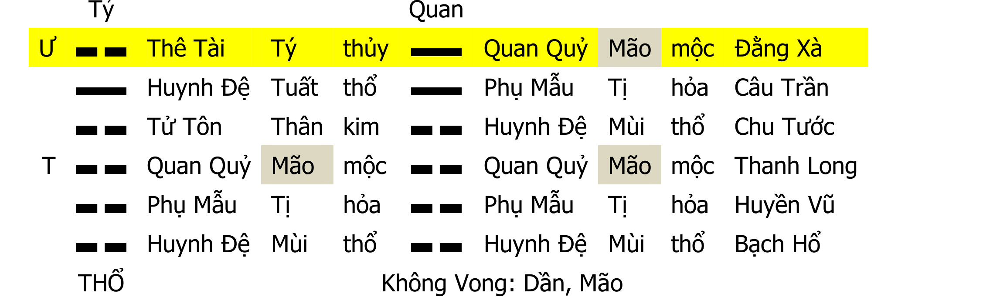 thành tựu, sung túc lâu dài. Như vậy làm sao có thể cho là "hào Thế lâm Không, suốt 
đời chẳng nên sự nghiệp".

Lại ví dụ: Ngày Tân Mùi tháng Dậu, xem về tài phúc suối đời, được quẻ Di:

Di

Huynh ĐệDần mộc | Đằng Xà

Phụ Mẫu Tý | thủy Tử-Tị | Câu Trần

T | Thê Tài | Tuất thổ | Chu Tước

Thê Tài | Thìn thổ Quan-Dậu Thanh Long

Huynh ĐệDần mộc | Huyền Vũ

Ư | Phụ Mẫu Tý | thủy | Bạch Hổ

MỘC
Không Vong: Tuất, Hợi

Đoán rằng: Hào Tài trì Thế, tuy được Nhật thần Mùi phò trợ, nhưng hiềm vì gặp 
Tuần Không. Trong quẻ không có hỏa để sinh Thế, đây là điều tối kỵ khi xem về số 
mệnh, là tượng khó thành tựu. Người này từ năm 25 tuổi đến 50 tuổi bôn ba tứ xứ, 
chẳng được việc gì. Sau vì quá nghèo nên đầu quân ra biên ải, không biết sống chết 
ra sao. Chỉ trong những trường hợp đấy mới nói là "suốt đời chẳng làm nên".

Thân nhập Mộ hương, đáo lão cầu mưu đa lệ.

Thân nhập Tam Mộ, đến già mưu sự vẫn gian nan.

Nếu Hào Thế nhập một trong Tam Mộ, lại hưu tù vô khí, chủ về người đó ngây 
ngây dại dại, không lanh lợi, tác phong, hành động chậm chạp, làm việc gì cũng 
không được thành tựu như ý.

Giác Tử bàn rằng: Hào Thế nếu lâm Nhật, Nguyệt hoặc được Nhật, Nguyệt sinh 
phò, hoặc động mà hóa cát, lại không gặp phải năm xung, năm nhập Mộ, là người mê 
muội điên đảo. Đợi đến khi Mộ khố xung khai, khác gì mầm non gặp mưa lành. Nếu 
trong quẻ lại có hào Tài hào Phúc tương sinh, hoặc hào Tài hào Phúc vượng tướng, sẽ 
giàu có bất ngờ. Nên mới nói: "Người trong Mộ gặp năm xung sẽ phát", sao có thể 
cho là "đến già mưu sự vẫn gian nan".

### Ví dụ: Ngày Bính Tuất tháng Ngọ, xem về tài phúc suốt đời, được quẻ Tiết:

Tiết

Huynh ĐệTý | thủy | Thanh Long

Quan QuỷTuất thổ | Huyền Vũ

Ư | Phụ Mẫu | Thân kim | Bạch Hổ

Quan QuỷSửu thổ Tài-NgọĐằng Xà

Tử Tôn | Mão mộc | Câu Trần

T | Thê Tài | Tị | hỏa | Chu Tước

THỦY
Không Vong: Ngọ, Mùi

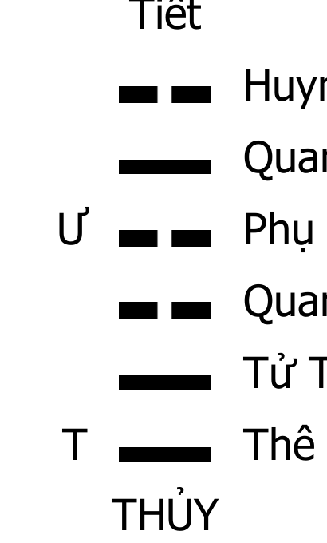

Quẻ trên hào Tài vượng tướng trì Thế, là tượng tay trắng mà được tiền. Lại vì 
hào Thế nhập Mộ ở ngày Tuất, nên rất đam mê cờ bạc. Sau đến năm Tị, đi đào mỏ 
chì, đào trúng nhiều chỗ, mà trở nên giàu có nhất vùng.

**Dã Hạc bàn rằng:** Phép xưa thường cho rằng sẽ ứng nghiệm vào năm xung khai 
Mộ khố, nhưng trong quẻ này lại ứng với năm xung hào Thế.

**Tân bình thích:** Chỗ này cũng có nghiệm, có lúc ứng kẻ mê bài bạc, có lúc ứng 
kẻ nghiện ma túy, có lúc ứng kẻ nát rượu, cũng có lúc ứng kẻ ham chơi.

Quái cung suy nhược căn cơ thiển; hào tượng phong long mệnh vận 
cao.

Cung quẻ suy nhược căn cơ kém; tượng hào hưng vượng mệnh vận cao.

Tượng hào hưng vượng là một điều kiện rất quan trọng khi xem về thân mệnh. 
Hào Thế, hào Tài, hào Phúc được sinh phò, vận mệnh tự nhiên sẽ trở nên tốt đẹp.

Còn phần "cung quẻ suy nhược", không thấy ứng nghiệm, thường gặp nhiều 
người căn cơ mỏng yếu, nhưng cung quẻ lại cực vượng, nên không thể coi đây là 
chuẩn tắc.

Nhược vấn thành gia, hiềm Lục xung chi vi quái;

Hỏi về thành tựu, kỵ gặp quẻ Lục xung;

Sách xưa chú thích rằng, gặp quẻ Lục xung chủ về sự nghiệp có khởi đầu mà 
không có kết quả. Quẻ gốc là Lục xung thì 30 năm đầu cuộc sống khó khăn; quẻ biến 
là Lục xung thì 30 năm sau gia nghiệp lụi tàn.

Ta cho rằng nói như vậy là sai. Nếu chỉ nhìn hai quẻ Lục xung để phán đoán 
chuyện tốt xấu trong 60 năm, thì các hào Thế, hào Tài, hào Phúc dùng để làm gì? Nếu 
như các hào Thế, Tài, Phúc vô khí mà lại gặp quẻ Lục xung, mới có kết quả đó.

### Ví dụ: Ngày Ất Tị tháng Dần, xem về tài phúc, được quẻ Đại Tráng:

Đại Tráng

Huynh Đệ | Tuất thổ | Huyền Vũ

Tử Tôn | Thân | kim | Bạch Hổ

T | Phụ Mẫu | Ngọ | hỏa | Đằng Xà

Huynh Đệ | Thìn | thổ | Câu Trần

Quan Quỷ | Dần | mộc | Chu Tước

Ư | Thê Tài | Tý | thủy | Thanh Long

THỔ 
Không Vong: Dần, Mão

Ta thấy quẻ này hào Thế vượng, hào Quan vượng, hào Văn vượng, biết rằng 
người xem có tài năng, phẩm đức khác thường, bèn hỏi: "Gần đây anh làm việc gì?" 
Người xem đáp: "Tôi đang đi học, nay vì nhà nghèo muốn theo học y thuật, không 
biết tài phúc ra sao?"

Ta bèn nói: "Trong quẻ hai hào Quan và Văn đều vượng, nên đến năm Dần sẽ 
gặp cơ hội, đến năm Ngọ năm Mùi sẽ được đề tên bảng vàng." Người xem nói: "Tôi 
biết mình không có khả năng, nên không có ý niệm đó." Ta bèn nói: "Tuy anh hỏi về 
tiền tài, nhưng thần lại mách bảo rằng: trong tương lai sẽ thành danh."

Sau quả nhiên đến năm Dần, vì chữa khỏi bệnh cho một phú ông, nên được chu 
cấp tiền ăn học, đến năm Ngọ thi đỗ, được phú ông cùng bạn bè giúp đỡ mà được 
làm huyện lệnh. Đến năm Mùi có tang cha mẹ, sau lại được điền khuyết làm quan, 
chưa được bao lâu vì mắc lỗi mà mất chức về vườn, công danh chấm dứt.

Sở dĩ ứng vào năm Dần, vì là năm thực Không; ứng vào năm Ngọ phát đạt, vì là 
năm trực của hào Thế; công danh lên xuống thất thường, là vì gặp quẻ Lục xung. 
Đường hoạn lộ chấm dứt, là vì hào Tài Tý thủy gặp Tuyệt tại Nhật thần Tị.

An tri sáng nghiệp, hỷ Lục hợp dĩ thành hào.

Muốn biết lập nghiệp, mừng được quẻ Lục hợp.

Sách xưa chú thích rằng: Khi xem về thân mệnh mà được quẻ Lục hợp, chỉ người 
đó hòa nhã vui vẻ, kết giao được nhiều người tốt, mưu sự đều được như ý. Nếu quẻ 
gốc là Lục hợp, quẻ biến cũng là Lục hợp, chủ một đời thuận lợi, muôn sự như ý.

Ta cho rằng, nếu cho rằng quẻ này chủ về kết giao bạn tốt, hòa nhã vui vẻ là 
đúng, nhưng nếu cho là muôn sự như ý thì chưa chắc, cần phải xem xét cả Dụng 
thần, nếu tượng hào tốt, là đã cát lại càng thêm cát; nếu tượng hào hung, thì gặp hợp 
cũng vô ích.

Động thân tự vượng, độc lực sanh trì;

Thân động mà tự vượng, một mình dốc sức lập thân;

Sách xưa chú thích rằng: Hào Thế nếu không được Nhật thần, Nguyệt kiến, hào 
động sinh phò, mà tự cường tự vượng, là tượng tay trắng lập nghiệp. Ta chiêm 
nghiệm thấy điều này thường ứng nghiệm, nhưng cần phải là hào Tài trì Thế, mà tự 
cường, tự vượng, thì đa số đều lập nghiệp thành công. Nếu là hào Huynh, hào Phụ, 
hoặc hào Quan Quỷ trì Thế, chưa hẳn đã thành tựu, mà chỉ miễn cưõng cầm cự mà 
thôi.

### Ví dụ: Ngày Nhâm Tý tháng Thân, xem về tài phúc suốt đời, được quẻ Thái biến

Lâm:

Thái
 
Lâm

Ư | Tử Tôn | Dậu | kim | Tử Tôn | Dậu kim Bạch Hổ

Thê Tài | Hợi | thủy | Thê Tài | Hợi thủy Đằng Xà

Huynh ĐệSửu thổ | Huynh ĐệSửu thổ | Câu Trần

T | Huynh ĐệThìn thổ | Huynh ĐệSửu thổ | Chu Tước

Quan QuỷDần | mộc Phụ-Tị | Quan QuỷMão mộc Thanh Long

Thê Tài | Tý | thủy | Phụ Mẫu | Tị | hỏa Huyền Vũ

THỔ
Không Vong: Dần, Mão

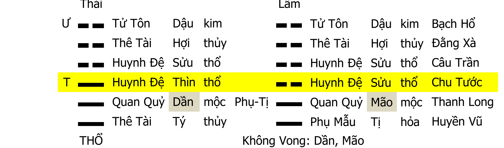

Hào Thế Thìn thổ vượng tại ngày Tý, lại không bị hình thương xung khắc, cũng 
không được sinh phò, nên đây chính là trường hợp tự cường tự vượng, Người này vốn 
có chút gia nghiệp nhưng vì đánh bạc hết nên ra nghèo khổ, nay đến hỏi xem tương 
lai còn có cơ hội vượng phát không?

Ta đoán: Hào Huynh trì Thế, nên là tượng vĩnh viễn không có cơ hội làm giàu. 
Lại thêm hào Thế biến Thoái thần, khó được sống lâu. Người này sau làm đầu mục 
phu dịch, chết vào năm Sửu.

Suy Thế ngộ phò, nhân nhân sáng lập,

Thế suy được phò trợ, nhờ người mà lập nên nghiệp.

Câu này quả thực có ứng nghiệm. Nếu hào Thế vô khí mà được Nhật thần, 
Nguyệt kiến hay hào động sinh phò, sẽ gặp được người tốt đề bạt. Nhưng cũng cần 
phải là hào Tài trì Thế, hoặc Nhật thần, Nguyệt kiến hoặc hào động là hào Tài sinh 
Thế, mới được người chiếu cố mà lập nên sự nghiệp. Nếu là hào Huynh, hào Phụ trì 
Thế, chỉ đủ sống qua ngày mà thôi. Thường thấy được Nhật, Nguyệt sinh Thế hoặc 
Quý Nhân sinh Thế, sẽ được quan trên nâng đỡ.

### Ví dụ: Ngày Bính Thìn tháng Sửu, xem về tài phúc trong một đời, được quẻ Vị Tế

biến Khuê:

Vị Tế
 
Khuê

Ư

Huynh ĐệTị | hỏa | Huynh ĐệTị | hỏa Thanh Long

Tử Tôn | Mùi thổ | Tử Tôn | Mùi thổ Huyền Vũ

Thê Tài | Dậu | kim | Thê Tài | Dậu kim Bạch Hổ

T

Huynh ĐệNgọ | hỏa Quan-Hợi | Tử Tôn | Sửu thổ Đằng Xà

Tử Tôn | Thìn thổ | Phụ Mẫu  Mão mộc Câu Trần

Phụ Mẫu | Dần | mộc | Huynh ĐệTị | hỏa Chu Tước

HỎA
Không Vong: Tý, Sửu

Hào Huynh trì Thế là thần hao tài. Tuy được Dần mộc tương sinh, nhưng tài 
không tụ. Người xem hỏi: Vậy làm việc gì sẽ được thành tựu?

Ta đáp: Mộc sinh hỏa vượng, tượng mộc hỏa thông minh, là tướng linh hoạt | khéo léo, vả lại hào Chu Tước tại Phụ Mẫu, theo nghiệp bút nghiên bút có thể sống no | đủ.

Về sau người này có chú làm ở nha môn, cho vào làm việc thảo giấy tờ, được 
lòng quan trên, nên có thể sống đầy đủ qua ngày, nhưng không tích lũy được tiền 
của. Sở dĩ được chú đề bạt, là ứng vào hào Phụ Dần sinh Thế. Lại nhờ nghiên bút để 
sinh nhai.

Nhật Thời hợp trợ, nhất sinh thiên đắc tiểu nhân tâm; Tuế Nguyệt khắc 
xung, bán thế vị triêm quân tử đức.

Ngày giờ cùng giúp, trọn kiếp chỉ được lòng tiểu nhân; năm tháng khắc xung nửa 
đời chẳng nhận ơn quân tử.

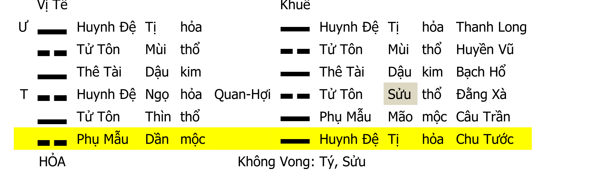

Hào Thế bất luận suy hay vượng, chỉ cần được sinh phò bởi năm, hoặc tháng, 
hoặc ngày, thì kẻ làm quan sẽ nhận được ân sủng của nhà vua, được người quân tử 
kết thân, kẻ dưới trung thành kính cẩn; người thường sẽ được quý nhân phò trợ.

Sách lại có viết: Nếu được hào Phụ sinh, sẽ được ơn huệ của bậc cha chú; bị hào 
Huynh khắc, sẽ bị liên lụy bởi anh em. Điều này thi thoảng mới thấy ứng nghiệm, bởi 
vậy không nên theo đó.

Hào Thế hữu khí, lại bị Nhật thần hoặc Nguyệt kiến xung khắc, người làm quan 
sẽ bị cấp trên quở trách, đồng liêu hiềm khích, tiểu nhân bôi xấu. Nếu bị Thái Tuế hay 
hào 5 xung khắc, sẽ bị thất sủng. Nếu hào Thế hưu tù, lại càng xấu; người thường sẽ 
bị kẻ quyền quý lăng nhục, bạn bè đố kỵ, người dưới khinh thường, nếu hào Thế hưu 
tù, lại càng hung.

**Tân bình thích:** Những cái được nghiệm, Nguyệt kiến và hào 5 là lãnh đạo, 
Nhật là đồng liêu, hào sơ là bộ hạ (cấp dưới), tiểu nhân.

Ngộ Long Tử nhi vô khí, túng thanh cao diệc thị hàn nho;

Tử gặp Thanh Long mà vô khí, có thanh cao cũng chỉ là kẻ hàn nho;

Điều này quả thực thường xuyên ứng nghiệm. Phàm trong quẻ có hào Tử Tôn trì | Thế mà gặp Thanh Long, chủ về ý chí cao cả, không màng phú quý. Cho dù hào Tử | Tôn vô khí, cũng chủ về thoát tục siêu phàm, cam tâm chịu nghèo khổ.

### Ví dụ: Ngày Quý Sửu tháng Dậu, xem ngoài công danh ra, còn có thể làm việc gì,

được quẻ Cấu biến Độn:

Cấu
 
Độn

Phụ Mẫu Tuất thổ | Phụ Mẫu Tuất thổBạch Hổ

Huynh ĐệThân kim | Huynh ĐệThân kim Đằng Xà

Ư | Quan QuỷNgọ hỏa | Quan QuỷNgọ hỏa Câu Trần

Huynh ĐệDậu kim | Huynh ĐệThân kim Chu Tước

Tử Tôn | Hợi | thủy Tài-Dần | Quan QuỷNgọ hỏa Thanh Long

T | Phụ Mẫu Sửu thổ | Phụ Mẫu Thìn thổHuyền Vũ

KIM
Không Vong: Dần, Mão

Đoán rằng: Tài tinh phục dưới hào 2 lại lâm Không, chính là tượng "nội ngoại | không Tài, phục lại Không", là tượng không tụ tài. Nhưng may được hào Tử Tôn độc | phát, lại gặp Thanh Long, tuy không trì Thế, cũng chủ về thanh cao, bình sinh không | tham của phi nghĩa, không màng đến phú quý.

Người xem hỏi: "Tổ tiên để lại của cải, nhưng đều đã nhường hết cho em trai, 
nay muốn mang nghề riêng du sơn ngoạn thủy, không biết có được thỏa nguyện hay 
không?" Ta đáp: "Hào Tử Tôn Hợi thủy biến Quỷ, hào Tài lại lâm Không, là tượng chết 
con mất vợ, đúng là kẻ thoát tục ly trần."

Người xem nói: "Tôi nay đã 43 tuổi rồi. Năm 21 tuổi vợ chết, không tục huyền, 
con cái chẳng có." Ta bèn nói rằng: "Quẻ rất trùng hợp, ắt sẽ được như ý."

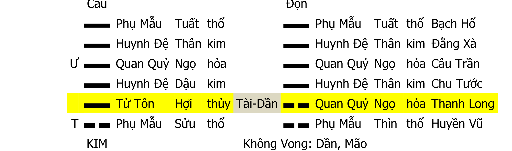

Sau nghe người này chu du đến các vùng Xuyên, Quảng, Điền, Kiềm, hơn mười 
năm sau, gửi thư về nhà, rồi bỏ vào Hoa Sơn, không biết sống chết ra sao.

Giác Tử bàn rằng: Ta vì thấy các hào Phụ, Tử, Tài, Huynh có khắc kỵ lẫn nhau, 
khó có thể chỉ dùng một quẻ mà quyết đoán được, bởi vậy mới nghĩ ra cách chia làm 
nhiều quẻ để xem. Nhưng cũng có khi không xem về tài phúc, mà trong quẻ lại hiện 
ra vượng Tài; không xem công danh, mà tượng hào lại hiện ra Quan vượng; trước 
mắt là tượng hình thê khắc tử, không cần phải xem thêm quẻ khác. Trong quẻ hiện 
trước ra tượng hình thương, không thể không xem xét cho kỹ càng.

Có người hỏi rằng: "Ông đã bảo nên chia ra để xem, bây giờ tại sao lại bảo là | đoán chung?" Ta bèn đáp rằng: "Cái lý này rất khó giải thích cho người thường hiểu | rõ. Khi người ta muốn xem về việc gì đó, thì cơ trời đã động, về tình thân của con | người, không gì hơn tình máu mủ; về chí hướng của con người, không gì lớn bằng lợi | danh. Thần không mách bảo chuyện muốn hỏi, mà mách bảo chuyện chưa hỏi, vì | chuyện nào quan trọng hơn sẽ mách bảo trước. Như tại quẻ trên, hào Tử Tôn gặp | Thanh Long, là tướng thanh cao. Hào Tử Tôn biến Quỷ, là tượng tuyệt tự. Lại thêm | hào Tài phục mà gặp Tuần Không, là tượng thoát tục ly trần. Những việc đó lại hợp | với tượng hào Phúc gặp Thanh Long, là người thanh cao. Những quẻ hiển hiện rõ | ràng, dễ thấy như thế này, cần gì phải xem thêm quẻ khác. Nếu không, thì với hào | Tài như vậy, nên đoán là tượng của tiền trống rỗng, hay là tượng vợ con không có?"

Phùng Hổ Thê nhi vượng, tuy bỉ tục thiên vi phú khách.

Thê gặp Bạch Hổ mà vượng cường, tuy thô bỉ mà trở nên giàu có.

Sách xưa chú rằng: Hào Tài gặp Bạch Hổ, chỉ người này tuy không hiểu lễ nghĩa, | nhưng vẫn là phường giàu có. Điều này quả nhiên ứng nghiệm.

Sách lại viết: "Hào Tài vượng mà bị ức chế, thì cũng biết qua về chữ nghĩa", câu 
này lại là phi lý. Hào Tài vượng mà bị ức chế, thì ứng với việc tương lai sẽ phá gia bại 
sản, làm sao lại chỉ việc chữ nghĩa văn chương.

### Ví dụ: Ngày Bính Tý tháng Ngọ, xem về tài phúc trong một đời, được quẻ Minh Di

biến Phong:

Minh Di
 
Phong

Phụ Mẫu Dậu kim | Quan QuỷTuất thổ Thanh Long

Huynh ĐệHợi thủy | Phụ Mẫu Thân kim Huyền Vũ

T | Quan QuỷSửu thổ | Thê Tài | Ngọ hỏa Bạch Hổ

Huynh ĐệHợi thủy Tài-Ngọ | Huynh ĐệHợi | thủy Đằng Xà

Quan QuỷSửu thổ | Quan QuỷSửu thổ Câu Trần

Ư | Tử Tôn | Mão mộc | Tử Tôn | Mão mộc Chu Tước

THỦY 
Không Vong: Thân, Dậu

Hào Thế lâm Bạch Hổ, hóa thành hào Tài Vượng hồi đầu sinh Thế. Quả nhiên | người này một chữ bẻ đôi không biết, hẹp hòi thô bỉ, sống bằng nghề nông, nhà đông | người, nuôi nhiều gia súc. Năm Tuất xem quẻ, đến năm Tý đồng ruộng bị nạn châu

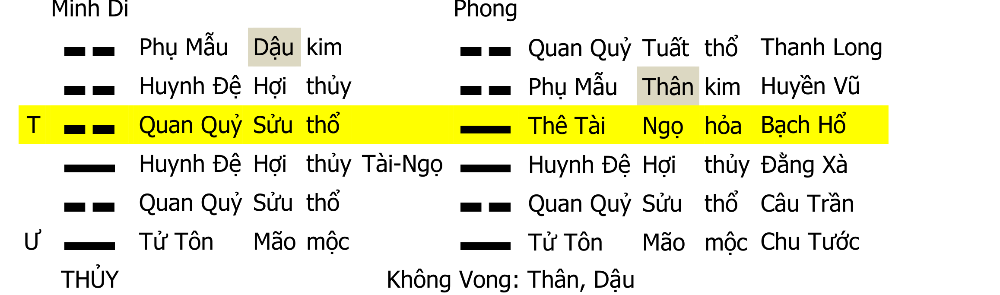 chấu mất sạch, cả nhà mắc bệnh dịch, gia súc cũng mắc dịch, sở dĩ ứng vào năm Tý, 
vì khi xem quẻ, Nhật thần Tý xung Tài Ngọ hỏa, nhưng khi đó Ngọ hỏa gặp Nguyệt 
kiến nên còn chống chọi được. Nay gặp năm Tý, lực xung khắc tăng lên, nên thành 
phá sản.

Phụ Mẫu trì Thân, tân cần lao lục; Quỷ hào trì Thế, bệnh tật triền miên.

Ngộ Huynh tắc Tài mạc năng tụ; Ngộ Tử tắc thân bất phạm hình.

Phụ Mẫu trì Thế, vất vả bận rộn; hào Quỷ trì Thế, bệnh tật liên miên.

Gặp Huynh thì tiền tài khó tụ; gặp Tử ắt thân chẳng phạm hình.

"Hoàng kim sách" viết rằng: Từ đoạn này trở đi đều phi lý. Hào Phụ Mẫu, Quan 
Quỷ trì Thế, làm sao lại đoán là vất vả bệnh tật được?

Sách xưa chú thích rằng: Nếu là quý nhân xem quẻ, thì không thể đoán như thế. 
Người ta xem về thân mệnh, sao biết được là không phải quý nhân. Cho dù thực sự 
không phải là quý nhân, làm sao biết được tương lai sẽ không hiển quý?

Có người đến xem về tài phúc, ngày Nhâm Thìn tháng Dậu, được quẻ Hằng:

Hằng

Ư | Thê Tài | Tuất thổ | Bạch Hổ

Quan QuỷThân kim | Đằng Xà

Tử Tôn | Ngọ hỏa | Câu Trần

T | Quan QuỷDậu kim | Chu Tước

Phụ Mẫu Hợi | thủy Huynh-Dần Thanh Long

Thê Tài | Sửu thổ | Huyền Vũ

MỘC
Không Vong: Ngọ, Mùi

Bèn hỏi rằng: "Khi anh cầu khấn, có hỏi đến công danh không?" Người xem bèn 
đáp: "Tôi là dân buôn bán, đâu có ý niệm cầu công danh!"

Ta nói: Quẻ này hào Tài sinh Quan vượng, là quẻ hỏi về công danh. Người xem 
nói: "Cho dù có công danh tự nhiên từ trên trời rơi xuống cũng không đến lượt tôi." 
Ta bèn bảo người này xem lại, được quẻ Phệ Hạp biến Bĩ:

Phệ Hạp
 
Bĩ

Tử Tôn | Tị | hỏa | Thê Tài | Tuất thổ Bạch Hổ

T | Thê Tài | Mùi thổ | Quan QuỷThân kim Đằng Xà

Quan QuỷDậu | kim | Tử Tôn | Ngọ | hỏa Câu Trần

Thê Tài | Thìn thổ | Huynh ĐệMão mộc Chu Tước

Ư | Huynh ĐệDần | mộc | Tử Tôn | Tị | hỏa Thanh Long

Phụ Mẫu | Tý | thủy | Thê Tài | Mùi | thổ Huyền Vũ

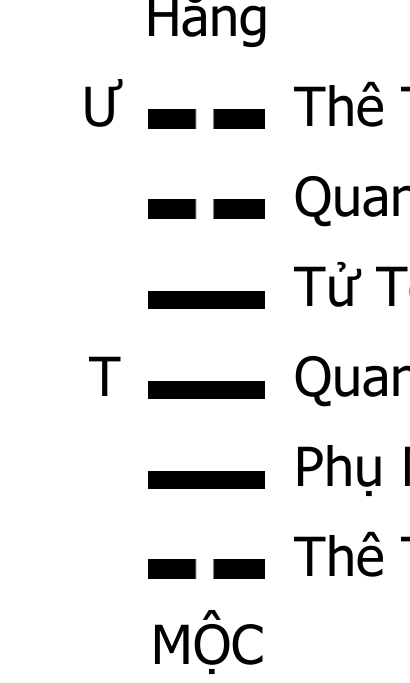

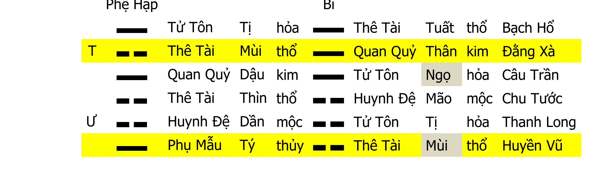

Ta đoán rằng: Hào Thế là Tài Mùi thổ biến thành hào Quan Thân kim, rõ ràng là 
dùng Tài đổi lấy Quan. Quẻ trước Tài vượng sinh Quan, hào Thế tại Quan tinh lâm 
Nguyệt kiến, Nhật thần xung động hào Tài Tuất thổ nên ám động mà sinh Thế, nên 
tuy đoán là có công danh, nhưng năm tháng không xác định được. Quẻ sau Thế tại 
Mùi thổ động mà lâm Không, nên đến năm thực Không chắc chắn sẽ ra làm quan.

Quả nhiên đến năm Mão được viện lệ mà tuyển vào nhà giám, đến năm Tị được 
nắm binh mã, lại bổ chức huyện lệnh, sang năm Mùi thuyên chuyển đến Giang Nam.

Sách xưa chú rằng: "Hào Quỷ trì Thế, bệnh tật triền miên; nếu là quý nhân, sẽ 
không đoán như vậy". Người này vốn chẳng phải quý nhân, nhưng đâu có thể đoán là 
"bệnh tật triền miên" được!

Lại ví dụ: Ngày Kỷ Sửu tháng Tị, xem về tài phúc suốt đời, được quẻ Quy Muội 
biến Lâm:

Quy Muội
 
Lâm

Ư | Phụ Mẫu Tuất thổ | Huynh ĐệDậu kim Câu Trần

Huynh ĐệThân kim | Tử Tôn | Hợi thủy Chu Tước

Quan QuỷNgọ hỏa Tử-Hợi | Phụ Mẫu Sửu thổ Thanh Long

T | Phụ Mẫu Sửu thổ | Phụ Mẫu Sửu thổ Huyền Vũ

Thê Tài | Mão mộc | Thê Tài | Mão mộc Bạch Hổ

Quan QuỷTị | hỏa | Quan QuỷTị | hỏa Đằng Xà

KIM 
Không Vong: Ngọ, Mùi

Ta đoán rằng: "Trong quẻ hào Tài, hào Phúc không vượng, mà hai hào Quan, 
Văn đều vượng, sao lại nói là không hỏi về công danh?" Người xem nói: "Ý niệm công 
danh nay đã nguội lạnh."

Ta bèn nói: "Hào Thế lâm Nhật thần, lại được Nguyệt kiến tương sinh, chủ về có 
người hiển quý tiến cử, đến năm Tị, năm Ngọ, sẽ giàu sang hơn người."

Quả nhiên đến năm Ngọ được tiến cử, tuy không phải xuất thân khoa giáp mà 
được làm quan về khoa giáp. Như vậy, làm sao có thể cho rằng "Phụ Mẫu trì Thế, vất 
vả bận rộn"?

Phụ Mẫu lâm thân, lao lục bần hàn chi bối.

Phụ Mẫu tại thân, là bọn nghèo hèn vất vả.

Có người nói rằng: "Hoàng kim sách" là cội nguồn của bốc phệ, chưa từng có 
chuyện xem về thân mệnh mà đoán gộp cả Tài, Quan, Phụ, Tử. Ta nói: Nếu đã không 
tin, hãy xem chú giải trong phần Phụ Mẫu trì Thế sẽ rõ.

Xem về thân mệnh, không nên gặp Huynh, Phụ, Quan Quỷ trì Thế. Thế ở hào 
Phụ thì khắc thương con cái, một đời lao lực, không được an nhàn, như vậy chẳng 
phải Phụ Mẫu là thần khắc Tử Tôn, lại chủ về một đời vất vả hay sao? Nếu theo lập 
luận đó, nếu gặp hào Phụ trì Thế, không những lao lực vất vả, mà còn là không con

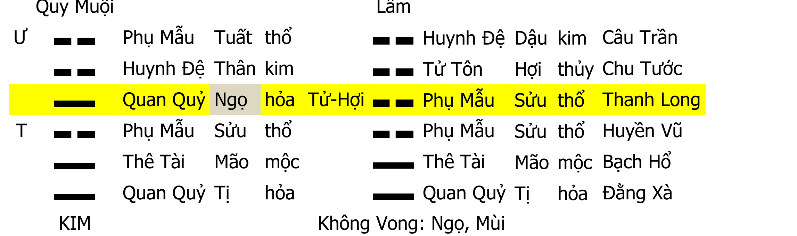 không cái. Như vậy trên đời này, tất cả những người không có con cái đều là hạng vất 
vả lao lực hay sao?

Giác Tử bàn rằng: Xem về công danh mà được hào Phụ Mẫu trì Thế, chủ về văn 
thơ chữ nghĩa. Xem về tài phúc gặp hào Phụ Mẫu trì Thế, chủ về vất vả khổ cực. Nếu 
hào Quan không vượng mà hào Phụ vượng tướng, tuy chẳng được làm quan tại triều 
đình, nhưng vẫn nổi tiếng về tài văn chương. Suy mà lại bị xung khắc, nếu muốn 
nương nhờ cửa quan, ắt lành ít dữ nhiều.

### Ví dụ: Ngày Ất Mùi tháng Tý, xem về tài phúc trọn đời, được quẻ Đoài:

Đoài

T | Phụ Mẫu | Mùi thổ | Huyền Vũ

Huynh Đệ | Dậu | kim | Bạch Hổ

Tử Tôn | Hợi | thủy | Đằng Xà

Ư | Phụ Mẫu | Sửu thổ | Câu Trần

Thê Tài | Mão | mộc | Chu Tước

Quan Quỷ | Tị | hỏa | Thanh Long

KIM 
Không Vong: Thìn, Tị

Đoán rằng: Hào Tài Mão mộc nhập Mộ tại Nhật thần Mùi, hào Quan Tị hỏa hưu 
tù vô khí, nên danh chẳng thành mà lợi cũng không được. Thật đáng tiếc, hào Phụ 
vượng lâm Thế, tiền tài càng nhiều, hòa khí càng ít, lại thêm gặp quẻ Lục xung là 
tượng sự nghiệp không thành. Người này về sau nhiều lần được nhà quyền quý vời 
đến làm việc, nhưng tài cao khí ngạo, chưa đợi hết nhiệm kỳ đã từ chức bỏ về. Suốt 
mười mấy năm, cuộc sống bần hàn đạm bạc. Về sau theo người em họ đến nhiệm 
chức ở Vân Nam, không rõ kết cục ra sao?

**Tân bình thích:** Ở đây cần phải kiêm xem Tài Quan. Tài vượng Phụ Mẫu trì Thế, 
Phụ Mẫu không thể nói là vất vả khổ cực. Nếu hào Tài hưu tù Không Phá, lại gặp Phụ 
Mẫu trì Thế, thì mới có thể nói như vậy.

### Ví dụ: Ngày Giáp Dần tháng Ngọ, nữ đoán vận khí trọn đời, được quẻ Đoài.

Đoài

T | Phụ Mẫu | Mùi thổ | Huyền Vũ

Huynh Đệ | Dậu | kim | Bạch Hổ

Tử Tôn | Hợi | thủy | Đằng Xà

Ư | Phụ Mẫu | Sửu thổ | Câu Trần

Thê Tài | Mão | mộc | Chu Tước

Quan Quỷ | Tị | hỏa | Thanh Long

KIM 
Không Vong: Tý, Sửu

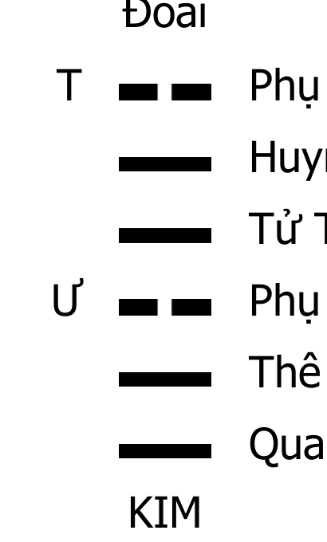

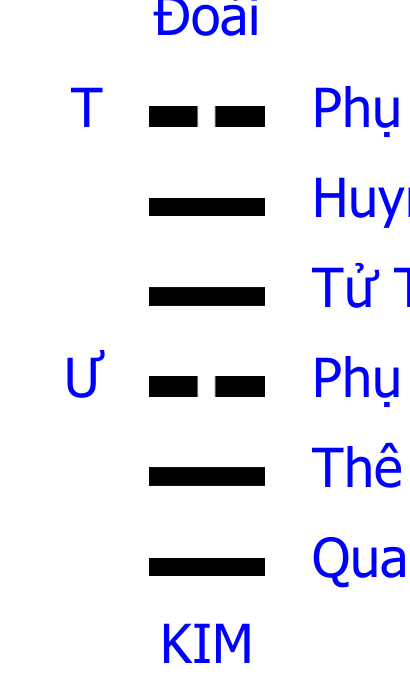

### Ví dụ này và ví dụ ở trên cùng là quẻ Đoài. Quẻ trước Tài được Nguyệt sinh

nhưng gặp Không vong, quẻ sau Tài được Nhật phù lại không có Không Vong, đây là 
chỗ khác nhau của hai quẻ. Hào Thế Mùi thổ chính là Tài khố, người nữ này giúp 
người ta bán bất động sản, tích góp được rất nhiều tiền. Quẻ cung Đoài, lấy miệng 
làm nghề, có tài ăn nói, khả năng bán hàng rất tốt.

Lại vào ngày Bính Dần tháng Ngọ, xem về tài phúc trọn đời, được quẻ Phong:

Phong

Quan Quỷ | Tuất thổ | Thanh Long

T

Phụ Mẫu | Thân | kim | Huyền Vũ

Thê Tài | Ngọ | hỏa | Bạch Hổ

Huynh Đệ | Hợi | thủy | Đằng Xà

Ư

Quan Quỷ | Sửu | thổ | Câu Trần

Tử Tôn | Mão | mộc | Chu Tước

THỦY 
Không Vong: Tuất, Hợi

Sách xưa cho rằng, khi xem về tiền tài mà hào Tài khắc Thế là tốt, lý luận như 
vậy là không biết rằng, nếu xem về tiền tài trước mắt mà hào Tài khắc hào Thế là 
chắc chắn sẽ được; còn nếu xem về tài phúc trọn đời, mà hào Tài khắc hào Thế là 
không tốt, vì là tượng bình sinh phải hệ lụy vì tiền tài, bị hại bởi tiền tài. Lại thêm hào 
Phụ Mẫu trì Thế, là điềm một đời không được yên ổn an nhàn. Hào Phụ Mẫu hưu tù 
lại bị Nhật thần tương xung, lại gặp Nguyệt phá, như ong làm mật, vất vả khó nhọc 
nhưng thành quả lại cho người khác hưởng thụ. Quả nhiên, người này vốn là một 
người nghèo trong nông trại, vất vả cày bừa, tích lũy được chút của cải. Nhưng sau vì 
con cái hư đốn đi đánh bạc, người con đầu thú rồi tố cáo nhà chứa chấp bạc, khiến 
người đó treo cổ tự tử, tạo thành án mạng, mà sản nghiệp tiêu tan. Người này uất ức 
mà chết vào năm Ngọ. Đó là vì hào Thế Thân kim bị Nguyệt kiến Ngọ khắc, bị Nhật 
thần Dần xung, nên sau lại gặp Ngọ hỏa bị khắc mà chết.

**Tân bình thích:** Ví dụ phía trên tôi đưa ra cũng là Tài khắc hào Thế, bán bất 
động sản tuy cũng hơi tốn lời nói, nhưng so với người cày cấy không biết thoải mái 
hơn mấy chục lần, có thể nói vất vả ư? Hai quẻ khác biệt ở chỗ suy vượng của hào 
Thế. Tài tuy vượng tướng, nhưng hào Thế là Phụ Mẫu hưu tù, thì cũng có thể nói 
người đó vất vả khổ cực. Ví dụ này vì con mà chết, chính là do Tử Tôn lâm Nhật xung 
phá hào Thế.

Huynh hào lâm Thế, tài hao bần hàn chi nhân.

Hào Huynh trì Thế, là kẻ nghèo khó hao tài.

Sách xưa viết: "Gặp hào Huynh thì tiền tài khó tụ", và chú thích rằng, hào Thế 
gặp hào Huynh sẽ khắc thê thiếp, suốt đời khó tích lũy tiền của, tức vừa coi đó là 
tượng khắc thê, lại vừa cho tượng hao tài. Nếu theo đó mà luận, thì những người 
khắc vợ trên đời này đều nghèo khổ cả ư? Vậy những người nghèo mà vợ chồng 
chung sống đến bạc đầu, những người giàu mà chết vợ, thì phải suy đoán như thế 
nào? Nên ta cho rằng phép chia ra để xem là hữu lý hơn cả.

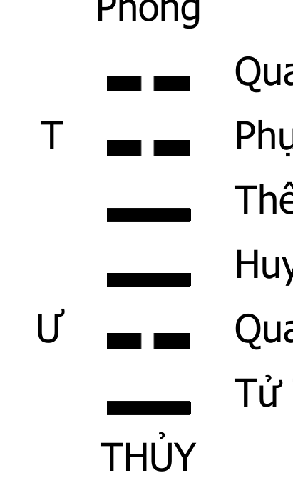

Giác Tử bàn rằng: Phàm xem về tài phúc, mà gặp hào Huynh trì Thế, tuy không | đoán là sẽ giàu có, nhưng cần phải xem vượng suy. Nếu vượng thì nghèo mà nghĩa | khí, suy thì nhiều bệnh tật lại hay gặp thị phi. Nếu được Nhật thần, Nguyệt kiến sinh | phò, thì nghèo mà vui vẻ; nếu được Nhật, Nguyệt lâm Tài hợp Thế, thì giàu có mà | kiêu ngạo. Nếu vượng mà gặp Đằng Xà, Bạch Hổ, Huyền Vũ là phường trộm cướp, | gian xảo. Nếu suy mà gặp Câu Trần, Chu Tước, là kẻ khốn cùng gánh gồng khuân | vác. Nếu bị khắc bị ức chế, là kẻ tôi tớ hạ đẳng. Nếu được hợp được phò, sẽ có người | trên cất nhắc. Tất cả đều dựa vào sự thông biến của người suy đoán, tùy vào mức độ | mà đoán.

Quan suy Không Phá, công môn dị thuật tư sinh;

Quan suy mà Không Phá, nha môn thuật lạ sống qua ngày;

Nếu hào Quan Quỷ trì Thế, lại hưu tù vô khí, là kẻ tàn tật hoặc bệnh tật triền 
miên. Nếu hữu khí, là người làm tại nha môn, hoặc theo các nghề đặc biệt. Nếu được 
Nhật thần, Nguyệt kiến, hào động, Quý Nhân sinh phò, ắt sẽ được người quyền quý 
kết thân mà thành tựu được sự nghiệp. Nếu hào Tài vô khí thì chỉ có hư danh mà thôi.

Nhược hữu phù, thương cổ bách công sự nghiệp.

Suy nhược mà được phò, buôn bán, thợ thuyền nên sự nghiệp.

Hào Tài và hào Phúc nếu tự thân vượng tướng, có thể theo nghiệp buôn bán 
hoặc nghề nông, sẽ được sung túc, được mùa. Nếu hào Tài suy nhược trì Thế, hoặc 
được Nhật thần, Nguyệt kiến sinh phò, hiệp trợ, sẽ nhanh chóng hưng vượng, nếu 
theo nghề nông, thì được mùa sung túc; theo nghề thợ, thì tay nghề tinh xảo.

Mộ đạo tu hành, giai vi Tử Tôn trì Thế;

Mộ đạo tu hành, đều bởi Tử Tôn trì Thế;

Tử Tôn là thần đạm bạc, không màng danh lợi. Tử Tôn trì Thế mà đơn độc 
không được giúp đỡ, mà hào Tài lại thất hãm, nếu có chí cao thượng thì đoán là làm 
đạo sĩ, tăng ni. Nếu không có ý xuất gia, thì đừng đoán bậy. Nói thế là không biết 
rằng, gặp Tử Tôn thì thân không phạm hình thương, nên đoán rằng cuộc đời yên ổn, 
không phạm quan hình.

**Tân bình thích:** Tử Tôn tuy là tăng đạo, nhưng chưa hẳn lấy trì Thế mà đoán là 
làm đạo sĩ, tăng ni, càng không thể bởi vì Tài thất hãm mà đoán như vậy. Người xuất 
gia cũng có người giàu có, tôi biết một trụ trì lại có mấy trăm triệu nguyên tiền tài sản 
cá nhân. Ngày xưa người đi tu đa số bởi vì nghèo mà xuất gia, vì vậy mới có lý luận 
này, đối với người tu đạo thì điều đó càng không thể là khuôn mẫu, tôi thường thấy 
nhiều người có tiền đam mê tu đạo.

### Ví dụ: Ngày Canh Dần tháng Hợi, nữ đoán tu hành, được Đại Tráng biến Bí.

Đại Tráng
 
Bí

Huynh Đệ | Tuất thổ | Quan Quỷ | Dần mộc | Đằng Xà

Tử Tôn | Thân | kim | Thê Tài | Tý | thủy | Câu Trần

T | Phụ Mẫu | Ngọ | hỏa | Huynh Đệ | Tuất | thổ | Chu Tước

Huynh Đệ | Thìn | thổ | Thê Tài | Hợi | thủy | Thanh Long

Quan Quỷ | Dần | mộc | Huynh Đệ | Sửu thổ | Huyền Vũ

Ư | Thê Tài | Tý | thủy | Quan Quỷ | Mão mộc | Bạch Hổ

THỔ 
Không Vong: Ngọ, Mùi

Người nữ này đã có gia đình và cũng rất giàu có, nhưng đam mê tu đạo. Phụ | Mẫu trì Thế, tam hợp Phụ Mẫu, lâm Chu Tước, tôi đoán người này hằng ngày đọc | kinh, trong nhà cất giữ rất nhiều kinh sách. Hào 6 là miếu vũ1, hào Thế nhập Mộ ở | hào 6, thường xuyên đến miếu tham bái. Hào Thế Không Vong, không được Quan Quỷ | tới sinh, không muốn cùng giường với chồng. Quan Quỷ tương hợp ở Nguyệt kiến, | Nguyệt là Tài tinh, Tài là phụ nữ, chồng vụng trộm với người phụ nữ khác. Quẻ được | lục xung, biến lục hợp, tâm trạng từ rối loạn đến yên ổn.

Quả nhiên nhất nhất ứng nghiệm.

Gia khuynh danh táng, nãi nhân Quan Quỷ thương thân.

Thân bại danh liệt, chỉ vì Quan Quỷ hại thân.

Nếu gặp hào Quan Quỷ khắc Thế mà hào Thế vượng tướng, thì suốt đời thường 
gặp quan hình, hoặc bị đố kỵ, bị tiểu nhân ám hại, hoặc đau ốm tàn tật. Nếu Quan 
Quỷ vượng mà Thế suy, là điềm bại nghiệp hại thân, nên khuyên họ không nên hỏi về 
tài phúc, mà nhanh chóng tìm cách tránh đi. Nếu hào Thế động biến Quỷ khắc Thế, 
hoặc Nhật thần, Nguyệt kiến tại hào Quan Quỷ khắc Thế, lại càng hung.

### Ví dụ: Ngày Giáp Dần tháng Thìn, xem về tài phúc trọn đời, được quẻ Phong

Trạch Trung Phu biến Thủy Trạch Tiết:

Trung Phu
 
Tiết

Quan QuỷMão mộc | Thê Tài | Tý | thủy Huyền Vũ

Phụ Mẫu Tị | hỏa Tài-Tý | Huynh ĐệTuất thổ Bạch Hổ

T | Huynh ĐệMùi thổ | Tử Tôn | Thân kim Đằng Xà

Huynh ĐệSửu thổ Tử-Thân | Huynh ĐệSửu thổ Câu Trần

Quan QuỷMão mộc | Quan QuỷMão mộc Chu Tước

Ư | Phụ Mẫu Tị | hỏa | Phụ Mẫu Tị | hỏa Thanh Long

THỔ 
Không Vong: Tý, Sửu

1 Miếu vũ (庙宇) là nơi thờ thần thánh.

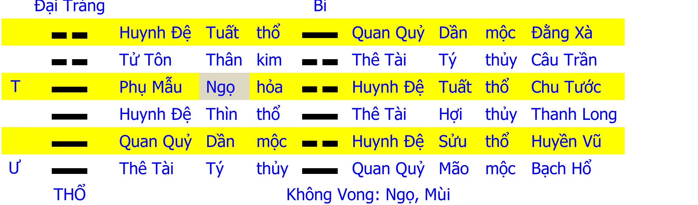

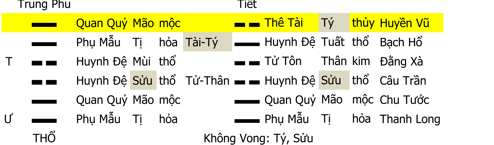

Đoán rằng: Hào Thế tại Mùi thổ, được Nhật thần Thìn thổ trợ giúp, nên cũng là 
hữu khí. Nhưng hiềm vì Nhật thần Dần mộc thương khắc hào Thế, hào thượng Quỷ 
Mão mộc động biến thành hào Tài Tý thủy, đúng là tượng giúp Quỷ hại thân, không 
nên đoán về tài phúc, mà nên đoán về tai họa.

Người xem hỏi: "Có thể tránh được không?" Ta đáp: "Tháng chín tháng mười 
năm nay đừng ra khỏi nhà, có thể tránh được."

Đến tháng chín, người này bị quan sai đi làm việc, phải nhờ người đi thay, giữa 
đường người đó gặp nạn mà chết. Nên dùng phương pháp này thực sự có thể tránh 
được nhiều tai họa.

### Ví dụ: Vào ngày Quý Mùi tháng Mão, xem về tài phúc trọn đời, được quẻ Cách

biến Gia Nhân:

Cách
 
Gia Nhân

Quan QuỷMùi thổ | Tử Tôn | Mão mộc Bạch Hổ

Phụ Mẫu Dậu kim | Thê Tài | Tị | hỏa Đằng Xà

T

Huynh ĐệHợi thủy | Quan QuỷMùi thổ Câu Trần

Huynh ĐệHợi thủy Tài-Ngọ | Huynh ĐệHợi thủy Chu Tước

Quan QuỷSửu thổ | Quan QuỷSửu thổ Thanh Long

Ư

Tử Tôn | Mão mộc | Tử Tôn | Mão mộc Huyền Vũ

THỦY
Không Vong: Thân, Dậu

Ở quẻ ngoại, hào Thế cùng Nhật thần, Nguyệt kiến tạo thành tam hợp, nên đây 
là quẻ tốt. Nhưng hiềm vì hào Thế hóa Quỷ hồi đầu khắc, lại bị hào 6 Mùi thổ tương 
khắc, trước mắt tuy chưa đáng ngại, nhưng đến tháng Sửu năm nay xung khai tam 
hợp, hoặc đến tháng Dậu xung khai Mão mộc, cần đề phòng bất trắc. Quả nhiên đến 
tháng Tị mọc nhọt độc, đến tháng Dậu thì chết.

Tài hóa Thoái hề, bất lợi ư kỷ;

Tài hóa Thoái thần, bất lợi cho ta;

Hào Tài trì Thế, hóa Tiến thần, hoặc động mà sinh Thế, thì sự nghiệp bắt đầu 
thăng tiến, gia đạo cũng từ đó hanh thông. Nếu hóa Thoái thần, là tượng sự nghiệp 
bắt đầu suy bại dần cho đến tàn lụi. Nếu hào Thế lại bị hình xung khắc hại, sẽ không 
phải là sa sút dần dà, mà sẽ nhanh chóng gặp họa lớn khiến cho khuynh gia bại sản.

Thế phùng hợp trú, thụ chế ư nhân.

Hào Thế gặp hợp, bị người khống chế.

Hào Thế lâm Tài hoặc bị Nhật thần, Nguyệt kiến, hào động hợp, tuy được cơm 
no áo ấm, nhưng bị người khống chế, mọi việc không được chủ động.

Hào Thế lâm Phụ Mẫu hoặc Huynh Đệ, mà bị Nhật thần, Nguyệt kiến, hào động 
hợp, chỉ đủ sống qua ngày, khó được đủ đầy no ấm.

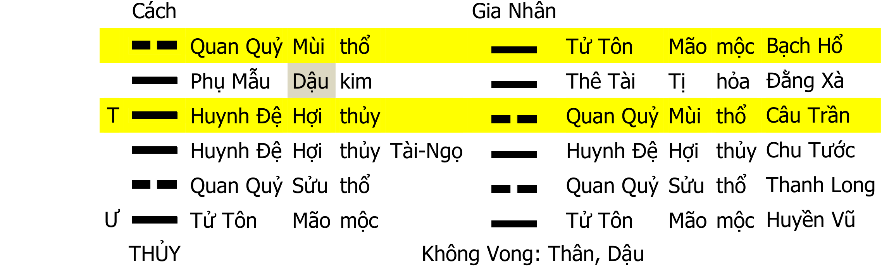

---

# CHƯƠNG 43. CHUNG THÂN CÔNG DANH

Hào Thế vô khí mà bị hợp, hào Tài hào Phúc cũng vô khí, hào Huynh động trong 
quẻ, là kẻ hèn mọn bị khống chế, phục vụ người khác.

**Tân bình thích:** Hào Thế nhập Mộ cũng là bị người khống chế.

***

# CHƯƠNG 43: CHUNG THÂN CÔNG DANH

(CÔNG DANH TRỌN ĐỜI)

Quan Phụ hưng long, văn chương kiến dụng;

Quan, Phụ hưng vượng, văn chương hữu dụng;

Nếu được hào Phụ vượng trì Thế, lại có hào Quan động tương sinh; Hoặc hào 
Quan trì Thế, hào Phụ vượng động; hoặc hào Quan hào Phụ vượng động sinh hợp hào 
Thế; hoặc Nhật thần, Nguyệt kiến làm hào Quan, hào Phụ Mẫu, để sinh hợp hào Thế, 
đều là tượng thành danh, theo học văn võ đều thành tựu, phò tá bậc đế vương.

Quỷ Tài dao phát, nạp túc thành danh.

Quỷ, Tài phát động, nạp lương thành danh.

Quan tinh trì Thế, Tài động tương sinh, hoặc Thế lâm Quan động hóa Tài, Thế 
lâm Tài động hóa quan, hoặc Quan tinh Tài tinh động mà sinh hợp hào Thế, hoặc 
Nhật Nguyệt làm Quan tinh Tài tinh mà sinh hợp hào Thế, đều chủ nạp túc lấy được 
danh.

Như ngày Ất Mùi tháng Thìn, xem chung thân công danh, được quẻ Minh Di biến 
Phong.

Minh Di
 
Phong

Phụ Mẫu Dậu kim | Quan QuỷTuất thổ Huyền Vũ

Huynh ĐệHợi thủy | Phụ Mẫu Thân kim Bạch Hổ

T | Quan QuỷSửu thổ | Thê Tài | Ngọ hỏa Đằng Xà

Huynh ĐệHợi thủy Tài-Ngọ | Huynh ĐệHợi | thủy Câu Trần

Quan QuỷSửu thổ | Quan QuỷSửu thổ Chu Tước

Ư | Tử Tôn | Mão mộc | Tử Tôn | Mão mộc Thanh Long

THỦY 
Không Vong: Thìn, Tị

Người này vốn xuất thân từ gia đình võ quan, đã nhận chức quan trong quân đội, 
nhưng vì đau ốm nên cáo quan về nhà, không còn chức tước. Nên nay đến hỏi xem 
trong tương lai còn có công danh nữa không?

Quẻ này hào Quan Sửu thổ trì Thế, động hóa hào Tài Ngọ hỏa, Tài vượng mà 
sinh Quan. Năm Mão xem quẻ, đến năm Tị được theo lệ mà làm quan, nạp túc thăng 
quan đến chức phụ tá cho Tri phủ. Đến năm Mùi được nhiệm chức, năm Tuất thăng

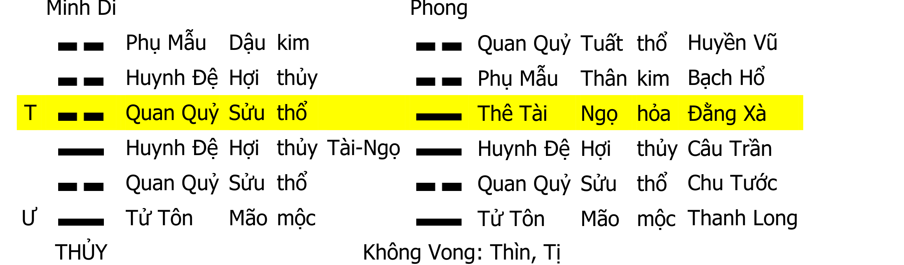 chức Thái thú. Sách xưa cho rằng động mà gặp xung là tán, ở đây Nhật thần Mùi 
xung hào Thế Sửu thổ, nhưng sao có thể cho là tán được?

Lại ví dụ: Vào ngày Nhâm Tý tháng Tuất, xem về công danh cả đời, được quẻ 
Khốn biến Đoài:

Khốn
 
Đoài

Phụ Mẫu | Mùi | thổ | Phụ Mẫu | Mùi thổ | Bạch Hổ

Huynh Đệ | Dậu kim | Huynh Đệ | Dậu | kim | Đằng Xà

Ư | Tử Tôn | Hợi | thủy | Tử Tôn | Hợi | thủy | Câu Trần

Quan Quỷ | Ngọ hỏa | Phụ Mẫu | Sửu thổ | Chu Tước

Phụ Mẫu | Thìn | thổ | Thê Tài | Mão | mộc | Thanh Long

T | Thê Tài | Dần mộc | Quan Quỷ | Tị | hỏa | Huyền Vũ

KIM 
Không Vong: Dần, Mão

Đoán rằng: Hào Tài Dần mộc trì Thế, động hóa thành Quan tinh, chỉ công danh 
một đời đều nhờ tiền mà có được. Người xem hỏi: "Hiện đang muốn nạp túc". Ta đáp: 
"Viện lệ cũng được, nhưng e rằng không được làm quan. Quẻ Lục hợp biến Lục xung, 
là tượng có khởi đầu nhưng không có kết quả."

Sau quả nhiên thi được chức quan, nhưng bất ngờ sinh bệnh mà mù cả hai mắt.

**Tân bình thích:** Cũng có ứng lấy hối lộ mà cầu quan. Ví dụ thứ hai cầu công 
danh không được bởi vì Thế Không, động mà hóa Quan là tượng sinh bệnh, Quan Quỷ 
tại hỏa, hỏa chủ mắt, lâm Huyền Vũ, Huyền Vũ là tối tăm, cho nên đôi mắt bị mù.

Độc vương ư Quan, lập công kiến nghiệp.

Chỉ có Quan vượng, lập công dựng nghiệp.

Nếu Tài, Phụ đều không đắc địa, chỉ có mình Quan tinh vượng tướng, hoặc Nhật 
thần, Nguyệt kiến làm Quan tinh mà sinh Thế, hoặc Hổ tại hào Thế động, hoặc Hổ tại 
hào kim Quỷ động mà sinh hợp hào Thế, đều chủ về lập công mà thành danh.

### Ví dụ: Ngày Mậu Thìn tháng Tuất, xem về công danh cả đời, được quẻ Cổ:

Cổ

Ư | Huynh ĐệDần mộc | Chu Tước

Phụ Mẫu | Tý | thủy Tử-TịThanh Long

Thê Tài | Tuất thổ | Huyền Vũ

T | Quan QuỷDậu kim | Bạch Hổ

Phụ Mẫu | Hợi | thủy | Đằng Xà

Thê Tài | Sửu thổ | Câu Trần

MỘC
Không Vong: Tuất, Hợi

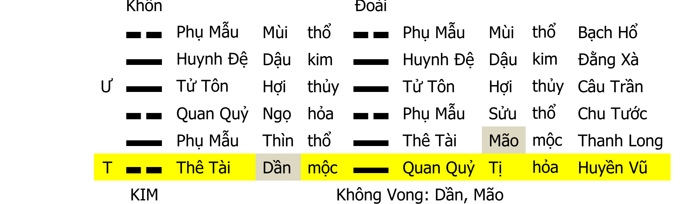

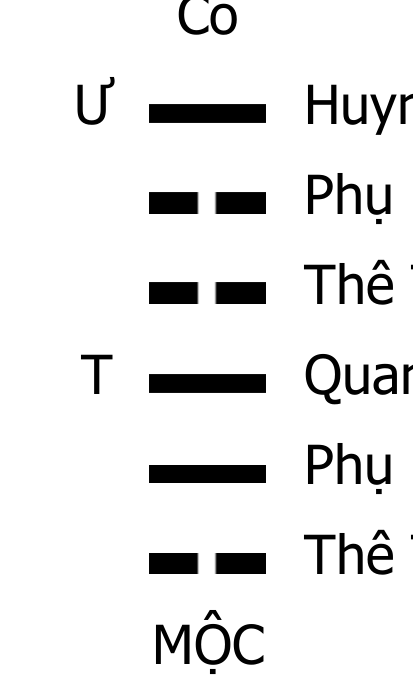

Nguyệt kiến làm hào Tài sinh Thế, Bạch Hổ tại Quan kim trì Thế, người này nếu | theo nghiệp văn cần phải theo lệ nạp túc; nếu theo nghiệp võ sẽ lập được công danh.

Người này bèn hỏi: "Có công danh không?" Ta đáp rằng: "Quan tinh trì Thế, 
được Nguyệt kiến sinh, nên chắc chắn sẽ được làm quan." Về sau người này ra làm 
quan, chưa được hưởng lương đã theo quân đi đánh trại, luôn dũng cảm đi đầu, được 
chủ soái khen ngợi, ban chức tước cho. Trong vòng năm năm, lập được nhiều kỳ 
công, làm đến chức nguyên soái.

### Ví dụ: Ngày Kỷ Tị tháng Thìn, xem về công danh cả đời, được quẻ Dự biến Tụy:

Dự 
 
Tụy

Thê Tài | Tuất thổ | Thê Tài | Mùi thổ Câu Trần

Quan QuỷThân kim | Quan QuỷDậu kim Chu Tước

Ư | Tử Tôn | Ngọ hỏa | Phụ Mẫu Hợi thủy Thanh Long

Huynh ĐệMão mộc | Huynh ĐệMão mộc Huyền Vũ

Tử Tôn | Tị | hỏa | Tử Tôn | Tị | hỏa Bạch Hổ

T | Thê Tài | Mùi thổ Phụ-Tý | Thê Tài | Mùi thổ Đằng Xà

MỘC
Không Vong: Tuất, Hợi

Người này đã thi tuyển làm quan, nhưng vì chỗ điền khuyết thì ít, mà người dự 
thi lại đông, nên muốn hỏi xem có được điền khuyết hay không?

Ta thấy quẻ này hào 5 Thân Quan hóa Tiến thần, lại gặp Trường Sinh tại Nhật 
thần Tị, được Nguyệt kiến tương sinh, nhưng chỉ hiềm không sinh hợp hào Thế, ngờ 
rằng quẻ này ứng vào hào độc phát, nên bảo người này xem lại. Anh ta bèn nói: 
"Ngày khác sẽ thành tâm xem lại." Ta đồng ý.

Ngày Đinh Mùi tháng Thìn, xem được quẻ Tấn biến Cấu.

Tấn
 
Cấu

Quan QuỷTị | hỏa | Phụ Mẫu Tuất thổ Thanh Long

Phụ Mẫu Mùi thổ | Huynh ĐệThân kim Huyền Vũ

T | Huynh ĐệDậu kim | Quan QuỷNgọ hỏa Bạch Hổ

Thê Tài | Mão mộc | Huynh ĐệDậu kim Đằng Xà

Quan QuỷTị | hỏa | Tử Tôn | Hợi | thủy Câu Trần

Ư | Phụ Mẫu Mùi thổ Tử-Tý | Phụ Mẫu Sửu thổ Chu Tước

KIM
Không Vong: Dần, Mão

Quẻ trước Quan ở hào 5 động hóa Tiến thần nhưng không trì Thế, hợp Thế, nên 
không có phận làm quan. Quẻ sau quẻ nội Phản ngâm, hào Quan Tị hỏa bị Hợi thủy 
xung, tức phần làm quan đã bị xung mất, công danh về sau không phải ở đợt thi này, 
mà sẽ có cơ hội khác. Người xem hỏi: "Có được từ đâu?" Ta đáp: "Quẻ trước Quan

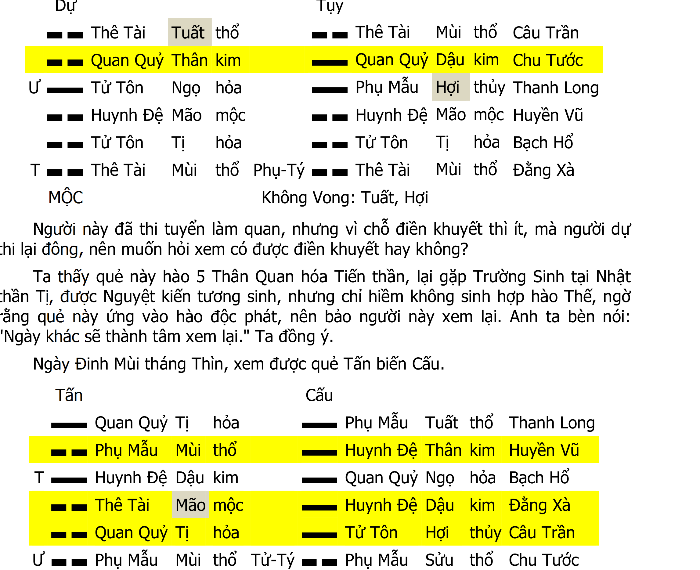

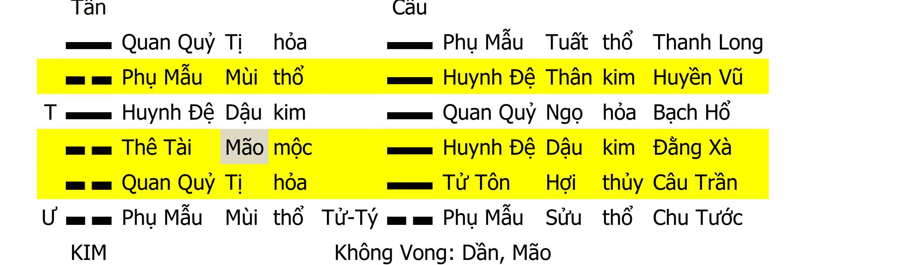 động ở hào 5, là tượng quan ra đặc ân. Quẻ này Nhật thần Mùi thổ động ở hào 5 hóa 
Thân Trường Sinh mà sinh hào Thế, ắt sẽ nhận được sắc chỉ mà lập được quân công."

Người xem vốn cũng hiểu về Dịch lý, hỏi: "Hào Huynh trì Thế, làm sao có thể làm 
quan được?" Ta bèn đáp: "Lý luận như vậy là không biết biến thông, nếu Thế không ở 
hào Huynh, làm sao có thể được hào 5 tương sinh. Mà Quan tinh sinh thế lại vượng 
mà hóa Tiến thần, nên quẻ trước đã là điềm thành tựu."

Người này lại hỏi: "Bây giờ là lúc nhiễu nhương, bản thân tôi đang có ý này, 
nhưng không biết đi về hướng nào thì tốt?" Ta đáp: "Quẻ trước Thân kim hóa Dậu, 
quẻ này Thế tại Dậu kim, nên đi về hướng tây sẽ tốt." Người này liền đi về hướng tây, 
chẳng bao lâu lập được kỳ công, làm đến Phó sứ, thêm hàm Phương bá, đến năm 
Ngọ thăng nhiệm tại Sơn Đông.

Tuế ngũ sinh Thế, bình độ đăng vân.

Thái Tuế, hào 5 sinh Thế, bình ổn thăng quan.

Nếu được Thái Tuế hoặc hào 5 sinh Thế, hoặc Nhật thần, Nguyệt kiến nhập hào 
động sinh Thế, đều chủ về thường dân ăn lộc, bình ổn thăng tiến. Nếu Thái Tuế nhập 
quẻ, nên nhập vào hào động. Nếu hào 5 sinh Thế, cũng phải là hào động, mà hào 
Thế và Quan tinh đều vượng, mới có thể đoán như vậy.

Xưa có quẻ để lại để chiêm nghiệm: Ngày Ất Mão, tháng Tuất năm Bính Tuất, 
nghe tin vua ngự giá, không biết lành dữ ra sao, xem được quẻ Tỷ biến Khôn:

Tỷ 
 
Khôn

Ư | Thê Tài | Tý | thủy | Tử Tôn | Dậu | kim | Huyền Vũ

Huynh Đệ | Tuất thổ | Thê Tài | Hợi | thủy | Bạch Hổ

Tử Tôn | Thân | kim | Huynh Đệ | Sửu thổ | Đằng Xà

T | Quan Quỷ | Mão | mộc | Quan Quỷ | Mão | mộc | Câu Trần

Phụ Mẫu | Tị | hỏa | Phụ Mẫu | Tị | hỏa | Chu Tước

Huynh Đệ | Mùi | thổ | Huynh Đệ | Mùi thổ | Thanh Long

THỔ 
Không Vong: Tý, Sửu

Thái Tuế và Nguyệt kiến tại hào 5 động mà hợp Thế. Thế ở hào Quan Mão mộc, 
lại gặp Nhật thần. Người này tuy là thứ dân, nhưng là thủ lĩnh của một phương, nghe 
tin vua ngự giá đến, ra đón mà được phong tước Tướng quân. Nên quẻ này rất ứng 
nghiệm, thực là thần cơ.

Phúc Đức động dao, khởi thị miếu đường chi khách;

Phúc Đức phát động, chẳng phải khách nơi quyền quý;

Nếu hào Tử Tôn trì Thế, trong quẻ có hào Tử Tôn phát động, không phải là 
tượng quyền quý.

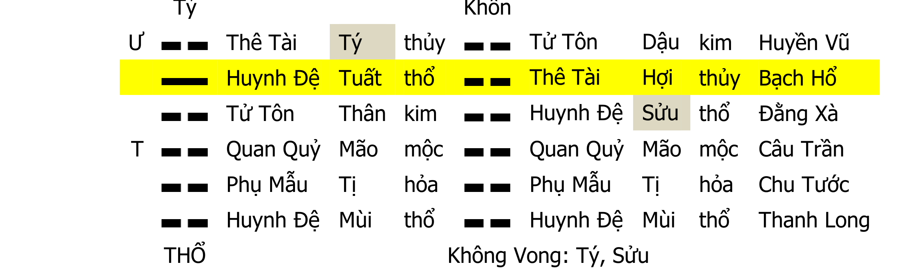

### Ví dụ: Ngày Đinh Mão tháng Tuất, xem công danh cả đời, được quẻ Nhu:

Nhu

Thê Tài | Tý | thủy | Thanh Long

Huynh ĐệTuất thổ | Huyền Vũ

T | Tử Tôn | Thân kim | Bạch Hổ

Huynh ĐệThìn thổ | Đằng Xà

Quan QuỷDần | mộc Phụ-TịCâu Trần

Ư | Thê Tài | Tý | thủy | Chu Tước

THỔ
Không Vong: Tuất, Hợi

Đoán rằng: "Hào Tử Tôn trì Thế, đừng hỏi chuyện công danh!" Người xem bèn 
hỏi: "Vậy làm việc gì có thể thành danh?" Ta đáp rằng: "Anh dù có tài cưỡi ngựa bắn 
tên, có sức nhấc vạc, cả đời cũng không thể thành danh." Nhưng người này khát vọng 
công danh rất mạnh, vẫn chăm chỉ dùi mài đọc sách, tài văn nổi tiếng đương thời, 
nhưng không qua nổi kỳ thi hương. Sau theo việc quân hơn hai mươi năm, khi lập 
quân công, lúc theo lệ nạp túc, mãi lận đận trong chốn công danh, đến bạc đầu cũng 
chẳng thành. Đó chính là do hào Tử Tôn khắc Quan.

Phá Không lâm Thế, chung thân bạch ốc chi nhân.

Thế gặp Không Phá, suốt đời là kẻ thường dân.

Hào Thế tĩnh mà gặp Tuần Không, Nguyệt phá, hay hào Quan gặp Tuần Không, 
Nguyệt phá đều chủ về không được thành danh. Chỉ khi hào Thế, hào Quan gặp 
Không, Phá nhưng động, thì không đoán theo cách này.

### Ví dụ: Ngày Ất Mão tháng Tị, xem về công danh cả đời, được quẻ Lữ:

Lữ

Huynh ĐệTị | hỏa | Huyền Vũ

Tử Tôn | Mùi | thổ | Bạch Hổ

Ư | Thê Tài | Dậu | kim | Đằng Xà

Thê Tài | Thân kim Quan-Hợi Câu Trần

Huynh ĐệNgọ | hỏa | Chu Tước

T | Tử Tôn | Thìn thổ | Phụ-Mão Thanh Long

HỎA
Không Vong: Tý, Sửu

Ta đoán rằng: "Tuy là quẻ Lục hợp, nhưng hiềm vì Tử Tôn trì Thế, hào Quan 
phục mà gặp Nguyệt phá, nên đừng nghĩ đến chuyện thành danh." Người xem nói: Đã 
nạp tiền rồi. Ta đáp: "Có tiêu phí ngàn vàng cũng không thể làm quan được." Sau đến 
năm Tý mắc bệnh, đến năm Sửu chết.

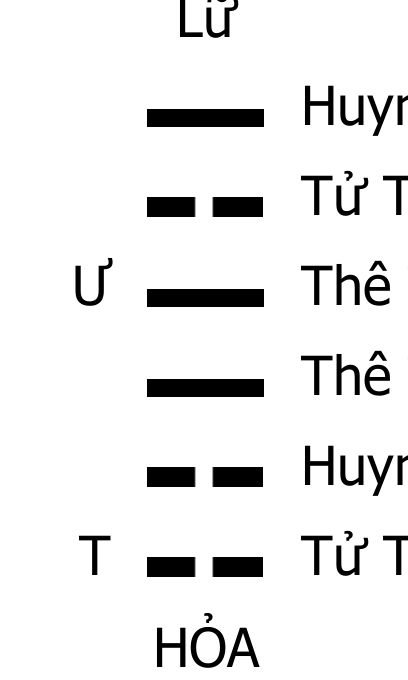

Lại vào ngày Đinh Mão tháng Dần xem cho một người đã thi đỗ chức quan, hỏi 
xem hậu vận thăng tiến ra sao, cũng được quẻ này. Đến năm Tuất nhiều chuyện rối 
ren, bị người tố cáo, cách chức bắt hỏi tội.

Xem về công danh cả đời, chỉ biết được công danh có hay không, nếu trong quẻ 
hiện công danh, thì tiếp tục hỏi xem là nghiệp văn, nghiệp võ, hay vào nha môn, căn 
cứ vào ý niệm của người xem mà suy đoán, rất ứng nghiệm. Nếu dùng quẻ trên để 
đoán về nghiệp văn hay nghiệp võ, như vậy là lừa người ta.

Có lần một võ ấm1 muốn xem về công danh cả đời, xem sẽ theo nghiệp này suốt 
đời, hay có công danh khác.

Ngày Mậu Tý tháng Mão xem, được quẻ Đại Quá biến Tỉnh:

Đại Quá
 
Tỉnh

Thê Tài | Mùi thổ | Phụ Mẫu Tý | thủy Chu Tước

Quan QuỷDậu kim | Thê Tài | Tuất thổ Thanh Long

T | Phụ Mẫu Hợi thủy Tử-Ngọ | Quan QuỷThân kim Huyền Vũ

Quan QuỷDậu kim | Quan QuỷDậu kim Bạch Hổ

Phụ Mẫu Hợi thủy Huynh-Dần | Phụ Mẫu Hợi | thủy Đằng Xà

Ư | Thê Tài | Sửu thổ | Thê Tài | Sửu thổ Câu Trần

MỘC 
Không Vong: Ngọ, Mùi

Đoán rằng: Sẽ có công danh khác. Trong quẻ hào Quan Dậu kim gặp Nguyệt 
phá, là chỉ quan chức hiện tại bị phá mà thành vô dụng. May nhờ hào Thế động hóa 
thành hào Quan Thân kim, hồi đầu sinh Thế. Thân lại là Thái Tuế của năm này, nên 
về sau nhờ đặc ân mà có chức tước vẻ vang khác.

Người xem hỏi: "Vậy từ đâu mà có được?" Ta đáp: "Huyền Vũ tại Hợi thủy, hào | Phụ phát động, ắt là nhờ kế sách trừ giặc giúp dân mà có được." Người này bèn nói: | "Tôi đâu có tài cán như thế! Lại hỏi ứng nghiệm vào lúc nào." Ta đáp: "Đến năm Dần | được chức cao, đến năm Thân nhiệm chức."

Sau quả nhiên nhờ công diệt giặc, trừ bỏ được đầu sỏ giặc cướp, năm Dần được 
luận công, trước ban tước võ, sau chuyển sang quan văn. Đến năm Thân thuyên 
chuyển đi làm Phó sứ ở Thiểm Tây, sau thăng nhiệm đến Việt Đông, sang năm Hợi 
được thăng chức Bố chính sứ. Đến năm Tý, ta đến công đường của Bố chính sứ, lại 
xem quẻ.

1 Võ ấm là tập ấm về ngành võ. Tập ấm tức được nhờ công lao cha ông mà có chức vụ.

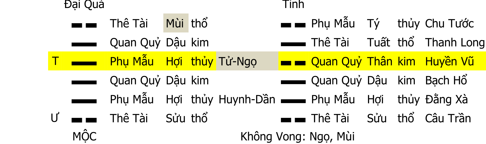

---

# CHƯƠNG 44. THỌ NGUYÊN

Ngày Tân Sửu tháng Mão năm Tý, xem công danh hậu vận ra sao, được quẻ Quy 
Muội biến Chấn:

Quy Muội
 
Chấn

Ư | Phụ Mẫu Tuất thổ | Phụ Mẫu Tuất thổ Đằng Xà

Huynh ĐệThân kim | Huynh ĐệThân kim Câu Trần

Quan QuỷNgọ hỏa Tử-Hợi | Quan QuỷNgọ hỏa Chu Tước

T | Phụ Mẫu Sửu thổ | Phụ Mẫu Thìn thổ Thanh Long

Thê Tài | Mão mộc | Thê Tài | Dần mộc Huyền Vũ

Quan QuỷTị | hỏa | Tử Tôn | Tý | thủy Bạch Hổ

KIM 
Không Vong: Thìn, Tị

Ta nói rằng: "Tôi từ xa đến, chỉ mong xem được quẻ tốt, báo cho ông được | thăng quan, ngờ đâu gặp quẻ không hợp ý, không những không được thăng quan, mà | lại là điềm về hưu." Người đó hỏi: "Tại sao lại như vậy?" Ta giải thích: "Nguyệt kiến | làm hào Tài, khắc hào Thế Phụ Mẫu, tuy Bạch Hổ không động, nhưng gia trưởng khó | tránh được tai họa. Hào Thế cũng bị thương khắc, bản thân cũng gặp nguy hiểm." | Quả nhiên đến năm Dần cha mất, đến năm Mão về quê, đến nửa đường bị bệnh mà | chết. Là do hào Sửu thổ Phụ Mẫu trì Thế, bị nhiều Mão mộc tương khắc.

**Tân bình thích:** Ngày xưa bởi vì cha mẹ chết mà phải từ quan chịu tang ba 
năm, vì vậy lấy Tài lâm Hổ động làm điềm về hưu, nay thì chưa hẳn ứng về hưu. 
Nhưng có thể đoán cha mẹ có hung.

***

# CHƯƠNG 44: THỌ NGUYÊN

(TUỔI THỌ)

Thế hào vượng tướng, vĩnh hưởng trường niên; Thân vị hưu tù, tu 
phòng yểu chiết.

Hào Thế vượng tướng, hưởng thọ dài lâu; Thân phải hưu tù, đề phòng chết yểu.

Thường xem tuổi thọ chỉ căn cứ vào hào Thế. Nếu hào Thế vượng hoặc tướng, 
hoặc lâm Nhật Nguyệt, hoặc được Nhật thần, Nguyệt kiến, hào động sinh phò, hoặc 
hào Thế động mà hóa Trường Sinh, hóa Vượng, hóa hồi đầu sinh, đều là tượng đại 
thọ. Nếu hào Thế hưu tù, cần đề phòng năm xung khắc; nếu lại bị hình thương khắc 
hại, là hào động thì ứng vào năm hợp, năm trực; là tĩnh thì ứng vào năm trực năm 
xung, điều này đã được trình bày rõ trong chương "Ứng kỳ". Hào Thế hưu tù, theo 
Quỷ nhập Mộ, suy mà bị Quỷ khắc thương, đều là điềm hung. Nếu hào Thế động hóa 
Thoái thần, hóa Quỷ, hóa hồi đầu khắc, hóa Mộ hóa Tuyệt, hóa Phá, hóa Không, đều 
là tượng tuổi trời không còn dài. Về thời điểm ứng nghiệm, xin xem trong chương 
"Ứng kỳ".

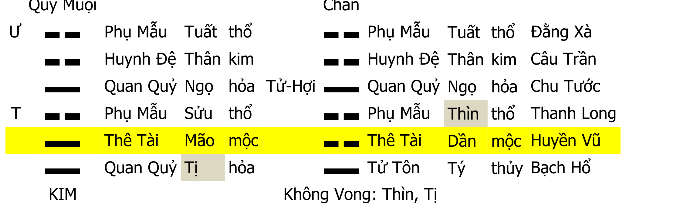

### Ví dụ: Ngày Ất Tị tháng Thìn, xem về tuổi thọ, được quẻ Trung Phu:

Trung Phu

Quan QuỷMão mộc | Huyền Vũ

Phụ Mẫu Tị | hỏa Tài-Tý | Bạch Hổ

T | Huynh ĐệMùi thổ | Đằng Xà

Huynh ĐệSửu thổ Tử-Thân Câu Trần

Quan QuỷMão mộc | Chu Tước

Ư | Phụ Mẫu Tị | hỏa | Thanh Long

THỔ 
Không Vong: Dần, Mão

Hào Thế lâm Mùi thổ, được Nhật thần tương sinh, Nguyệt kiến trợ giúp, là tượng 
trường thọ. Người xem bèn hỏi: "Vậy bao giờ tôi sẽ chết?" Ta đáp rằng: "Phép xem 
xưa cho rằng hào sơ quản 5 năm, hào 2 quản 5 năm tiếp, sáu hào tổng cộng quản 30 
năm. Xem thêm một quẻ nữa, lại là 30 năm tiếp. Ta đã thử phép này trong hơn bốn 
mươi năm, thấy không ứng nghiệm, nên không coi đó là chuẩn tắc, mà chỉ xem hào 
Thế vượng hay suy để suy đoán về tuổi thọ. Những phương pháp dối trá lừa người, ta 
không sử dụng. Theo như tượng quẻ này, thì hai mươi năm sau, ông hãy xem lại." 
Lúc này, người xem 53 tuổi.

Hai mươi năm sau, người này lại đến gặp ta, nói: "Năm xưa tôi từng đến xem về 
tuổi thọ, ông còn nhớ không?" Ta đáp: "Xem được quẻ Trung Phu, tôi có hẹn ông hai 
mươi năm sau trở lại xem." Người ấy cười mà gieo quẻ, lúc đó là ngày Kỷ Mão tháng 
Thân, được quẻ Sơn Trạch Tổn biến Phục:

Tổn 
 
Phục

Ư | Quan QuỷDần mộc | Tử Tôn | Dậu | kim Câu Trần

Thê Tài | Tý | thủy | Thê Tài | Hợi | thủy Chu Tước

Huynh ĐệTuất thổ | Huynh ĐệSửu thổ | Thanh Long

T | Huynh ĐệSửu thổ | Tử-Thân | Huynh ĐệThìn thổ | Huyền Vũ

Quan QuỷMão | mộc | Quan QuỷDần | mộc Bạch Hổ

Phụ Mẫu | Tị | hỏa | Thê Tài | Tý | thủy Đằng Xà

THỔ
Không Vong: Thân, Dậu

Ta đoán rằng: "Nếu có một hào Quỷ động, thì tuổi thọ không được lâu dài. Nay 
trong quẻ có nhiều hào Quỷ động, lại là không đáng ngại. Năm nay Thái Tuế ở Tý, 
nên ông còn hưởng phúc được tám năm nữa. Đến năm Mùi, là hết hạn tuổi trời." 
Người xem bèn hỏi: "Tại sao lại như vậy?" Ta đáp: "Vì đó là năm Quỷ mộc nhập Mộ, 
hào Thế gặp Tuế phá." Về sau quả nhiên chết vào tháng bảy năm Mùi.

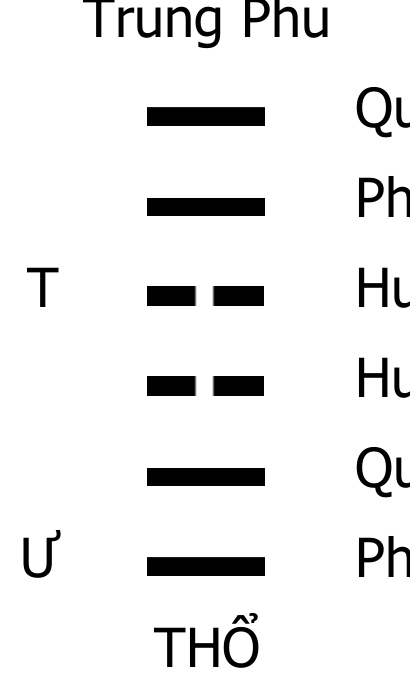

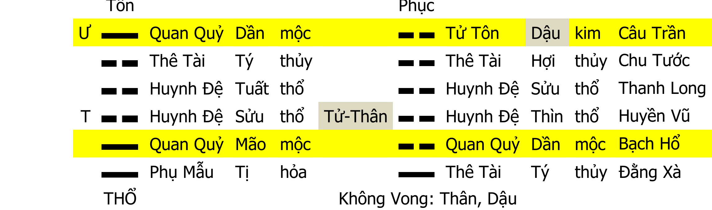

### Ví dụ: Ngày Kỷ Dậu tháng Tị, xem về tuổi thọ, được quẻ Đại Súc biến Thái:

Đại Súc
 
Thái

Quan QuỷDần mộc | Tử Tôn | Dậu kim Câu Trần

Ư

Thê Tài | Tý | thủy | Thê Tài | Hợi thủy Chu Tước

Huynh ĐệTuất thổ | Huynh ĐệSửu thổ Thanh Long

Huynh ĐệThìn thổ Tử-Thân | Huynh ĐệThìn thổ Huyền Vũ

T

Quan QuỷDần mộc Phụ-Ngọ | Quan QuỷDần mộc Bạch Hổ

Thê Tài | Tý | thủy | Thê Tài | Tý | thủy Đằng Xà

THỔ 
Không Vong: Dần, Mão

Đoán rằng: Hào Thế ở Dần mộc Quan Quỷ, là tượng cuối đời nhiều tai họa. Hào 
Thế hưu tù, bị Nhật thần tương khắc, nhờ năm nay Thái Tuế tại Thìn, nên vẫn chưa 
đáng ngại. Nên đề phòng năm Thân vì Dần mộc gặp Tuyệt tại Thân.

Sau đến năm Mùi bị bệnh cổ trướng, chết vào tiết Lập xuân, quẻ này thực linh 
nghiệm thay.

**Tân bình thích:** Lý luận này rất đúng, không thể lấy hào vị định năm mà đoán, 
phải lấy ngũ hành sinh khắc, vượng suy của hào Thế mà định.

### Ví dụ: Ngày Nhâm Dần tháng Dần, một người đàn ông từng có xơ gan hơn 20

năm đã đỡ, hỏi tuổi thọ bản thân ra sao? Được Cổ biến Di.

Cổ 
 
Di

Ư | Huynh ĐệDần mộc | Huynh ĐệDần mộc Bạch Hổ

Phụ Mẫu | Tý | thủy Tử-Tị | Phụ Mẫu | Tý | thủy Đằng Xà

Thê Tài | Tuất thổ | Thê Tài | Tuất thổ | Câu Trần

T | Quan QuỷDậu kim | Thê Tài | Thìn thổ | Chu Tước

Phụ Mẫu | Hợi | thủy | Huynh ĐệDần mộc Thanh Long

Thê Tài | Sửu thổ | Phụ Mẫu | Tý | thủy Huyền Vũ

MỘC
Không Vong: Thìn, Tị

Tôi đoán: "Hào Thế Tuyệt ở Nhật Nguyệt, Nhật Nguyệt là mộc là gan mật, bệnh 
gan hoàn toàn chưa khỏi hẳn, Thế động hóa Không, đề phòng năm Thìn xuất Không." 
Người này cũng biết chiêm bốc, nói rằng: "Thế động hóa hồi đầu sinh, tại sao là 
hung? Năm Thìn xuất Không, hào Thế được sinh, bệnh của tôi phải khỏi hẳn mới 
đúng." Tôi nói: "Chúng ta nói rằng bệnh lâu sợ Không, huống hồ hào Thế hưu tù đến 
cực điểm, chính là giống như cây không gốc rễ, sinh có ích gì?" Người này nghe xong 
rất không vui.

Năm Mậu Dần gieo quẻ, năm Canh Thìn qua đời.

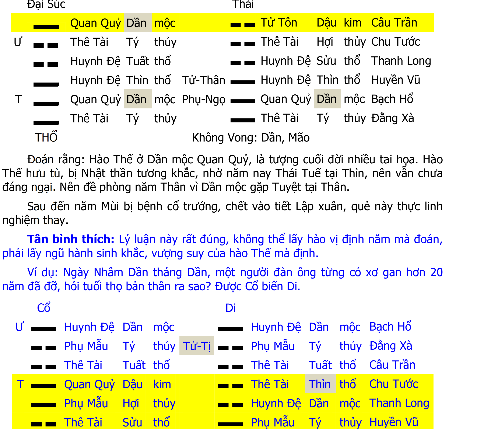

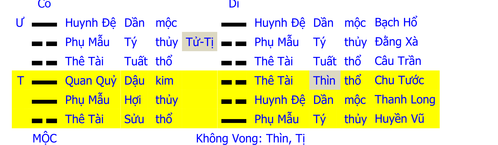

Nguyên thần nghi ư an tĩnh.

Nguyên thần nên là an tĩnh.

Xem về tuổi thọ, cần dựa vào hào Thế, Nguyên thần là nhân tố sinh dưỡng cho 
thân, nên vượng mà tĩnh, không nên động. Tại sao lại như vậy? Nếu xem về việc 
khác, thì Nguyên thần nên động, vì động sẽ có lực. Xem về tuổi thọ, Nguyên thần 
không nên động, động thì tuổi thọ sẽ có hạn, không kết thúc vào năm Nguyên thần 
gặp Tuyệt gặp Mộ, cũng chấm dứt vào năm Nguyên thần bị xung khắc.

### Ví dụ: Ngày Đinh Mão tháng Hợi, xem về tuổi thọ, được quẻ Cấu biến Tiểu Súc:

Cấu
 
Tiểu Súc

Phụ Mẫu Tuất thổ | Thê Tài | Mão mộc Thanh Long

Huynh ĐệThân kim | Quan QuỷTị | hỏa Huyền Vũ

Ư | Quan QuỷNgọ hỏa | Phụ Mẫu Mùi thổ Bạch Hổ

Huynh ĐệDậu kim | Phụ Mẫu Thìn thổ Đằng Xà

Tử Tôn | Hợi | thủy Tài-Dần | Thê Tài | Dần mộc Câu Trần

T | Phụ Mẫu Sửu thổ | Tử Tôn | Tý | thủy Chu Tước

KIM
Không Vong: Tuất, Hợi

Đoán rằng: Hào Thế lâm Sửu thổ, động hóa Tý thủy tương hợp, được hào Ứng 
Ngọ hỏa động tương sinh, hào Thế đắc địa, là tượng trường thọ. Nhưng hiềm vì 
Nguyên thần hỏa động sinh thổ, sợ rằng đến năm Tý xung mất Ngọ hỏa, là số trời đã 
tận. Sau quả nhiên mất vào năm Tý. Sở dĩ ứng vào năm Tý, vì hào Thế động gặp hợp 
tại năm Tý, Tý lại xung mất Ngọ hỏa, nên không thể sinh Thế được.

### Ví dụ: Ngày Ất Mão tháng Thìn, xem về tuổi thọ, được quẻ Trung Phu biến Khuê:

Trung Phu
 
Khuê

Quan QuỷMão mộc | Phụ Mẫu Tị | hỏa Huyền Vũ

Phụ Mẫu Tị | hỏa Tài-Tý | Huynh ĐệMùi thổ Bạch Hổ

T | Huynh ĐệMùi thổ | Tử Tôn | Dậu kim Đằng Xà

Huynh ĐệSửu thổ Tử-Thân | Huynh ĐệSửu thổ Câu Trần

Quan QuỷMão mộc | Quan QuỷMão mộc Chu Tước

Ư | Phụ Mẫu Tị | hỏa | Phụ Mẫu Tị | hỏa Thanh Long

THỔ 
Không Vong: Tý, Sửu

Đoán rằng: Hào Thế Mùi thổ được Nguyệt kiến Thìn thổ trợ giúp, bị Nhật thần 
tương khắc, hai nhân tố đó có thể cân bằng lẫn nhau. Nhưng lại hiềm vì Nguyên thần 
Tị hỏa động mà sinh Thế. Năm nay Thái Tuế ở Thân, sợ rằng đến năm Hợi sẽ gặp bất 
lợi. Sau chết vào năm Tuất, ứng với năm Nguyên thần Tị hỏa nhập Mộ.

Kỵ thần tối phạ động dao.

Ky thần tối kỵ dao động.

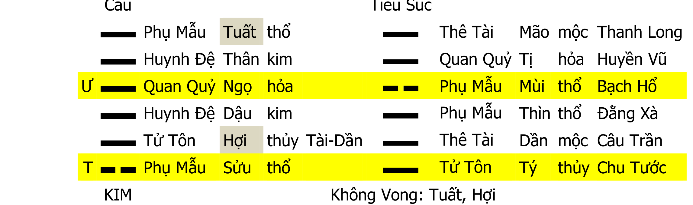

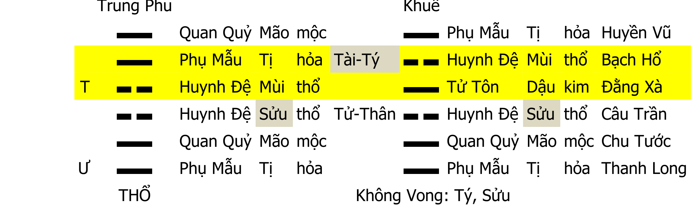

Kỵ thần không động thì bình an, nếu động, là tượng tuổi trời sắp hết, vào năm 
hợp hoặc năm trực sẽ qua đời.

### Ví dụ: Ngày Kỷ Dậu tháng Dần, xem về tuổi thọ, được quẻ Bác biến Vô Vọng:

Bác
 
Vô Vọng

Thê Tài | Dần mộc | Phụ Mẫu Tuất thổ Câu Trần

T | Tử Tôn | Tý | thủy Huynh-Thân | Huynh ĐệThân kim Chu Tước

Phụ Mẫu Tuất thổ | Quan QuỷNgọ hỏa Thanh Long

Thê Tài | Mão mộc | Phụ Mẫu Thìn thổ Huyền Vũ

Ư | Quan QuỷTị | hỏa | Thê Tài | Dần mộc Bạch Hổ

Phụ Mẫu Mùi thổ | Tử Tôn | Tý | thủy Đằng Xà

KIM
Không Vong: Dần, Mão

Hào Thế hóa Thân kim hồi đầu sinh, nhưng hiềm vì Thân kim bị Nguyệt kiến Dần 
xung phá. Lại thêm hai hào Mùi, Tuất thổ đều động mà khắc Thế thủy, bị khắc nên 
không được sinh, nên cần đề phòng năm Mão. Sau quả nhiên chết vào năm Mão, vì 
ứng với năm Kỵ thần Tuất thổ gặp hợp mà khắc Thế.

**Tân bình thích:** Không chỉ là năm Tuất thổ gặp hợp, Mão mộc cũng là Tử địa 
của hào Thế.

Lại như ngày Quý Hợi tháng Dậu, xem thọ, được Thái biến Minh Di.

Thái
 
Minh Di

Ư | Tử Tôn | Dậu | kim | Tử Tôn | Dậu kim Bạch Hổ

Thê Tài | Hợi | thủy | Thê Tài | Hợi thủy Đằng Xà

Huynh ĐệSửu thổ | Huynh ĐệSửu thổ | Câu Trần

T | Huynh ĐệThìn thổ | Thê Tài | Hợi thủy Chu Tước

Quan QuỷDần | mộc Phụ-Tị | Huynh ĐệSửu thổ | Thanh Long

Thê Tài | Tý | thủy | Quan QuỷMão mộc Huyền Vũ

THỔ
Không Vong: Tý, Sửu

Dần mộc Quỷ động mà khắc Thế, nên sẽ ứng năm Dần, năm Hợi bất trắc. Sau lại 
chết ở năm Thìn, ứng năm hào Thế gặp trị, hào Thế Thìn thổ gặp năm Thìn mà bị 
Quỷ khắc.

**Tân bình thích:** Cũng là năm Thế nhập Mộ.

### Ví dụ: Ngày Ất Hợi tháng Tý, xem về tài phúc trong một đời, được quẻ Tiết biến

Trung Phu:

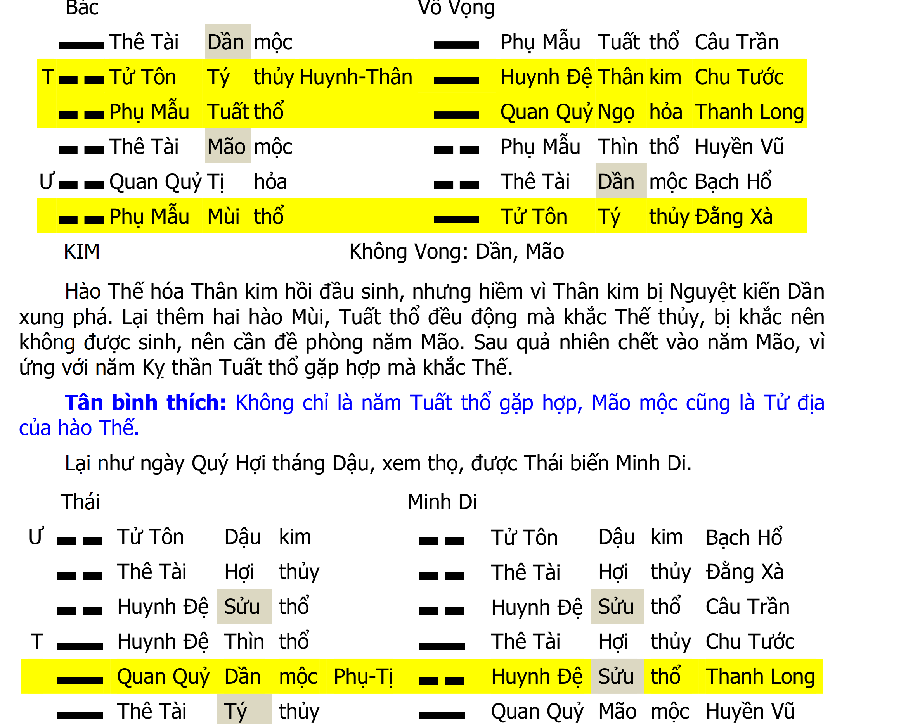

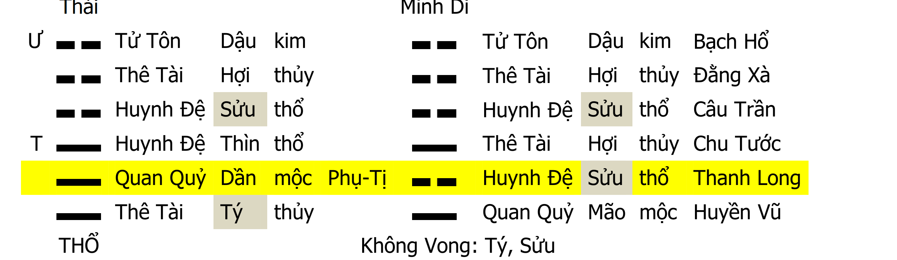

Tiết 
 
Trung Phu

Huynh ĐệTý | thủy | Tử Tôn | Mão mộc Huyền Vũ

Quan QuỷTuất thổ | Thê Tài | Tị | hỏa Bạch Hổ

Ư | Phụ Mẫu Thân kim | Quan QuỷMùi thổ Đằng Xà

Quan QuỷSửu thổ Tài-Ngọ | Quan QuỷSửu thổ Câu Trần

Tử Tôn | Mão mộc | Tử Tôn | Mão mộc Chu Tước

T | Thê Tài | Tị | hỏa | Thê Tài | Tị | hỏa Thanh Long

THỦY
Không Vong: Thân, Dậu

Ta đoán rằng: Với quẻ này không nên hỏi về tài phúc, mà nên hỏi về tuổi thọ. 
Hào Thế Tị hỏa bị Nhật thần, Nguyệt kiến xung khắc, lại bị hào động Tý thủy khắc 
thêm. Năm 36 tuổi là năm Sửu, cần đề phòng tai họa do sông nước. Người xem hỏi 
nguyên do, ta đáp rằng: "Cung Khảm thuộc thủy, Nhật thần Nguyệt kiến đều thuộc 
thủy, lại thêm hào động Tý thủy, nên phải đề phòng tai nạn liên quan đến thủy."

Vào ngày Tân Mão tháng Mão năm Đinh Sửu, một người bạn họ Dương dẫn thêm 
một người nữa đột ngột tìm đến xem lưu niên, được quẻ Đoài biến Tùy:

Đoài
 
Tùy

T | Phụ Mẫu | Mùi | thổ | Phụ Mẫu | Mùi | thổ | Đằng Xà

Huynh Đệ | Dậu | kim | Huynh Đệ | Dậu kim | Câu Trần

Tử Tôn | Hợi | thủy | Tử Tôn | Hợi | thủy | Chu Tước

Ư | Phụ Mẫu | Sửu thổ | Phụ Mẫu | Thìn | thổ | Thanh Long

Thê Tài | Mão | mộc | Thê Tài | Dần mộc | Huyền Vũ

Quan Quỷ | Tị | hỏa | Tử Tôn | Tý | thủy | Bạch Hổ

KIM 
Không Vong: Ngọ, Mùi

Ta đoán rằng: "Tháng sáu năm nay, nếu không gặp tai họa về sông nước cũng 
gặp tai họa về cây cối. Trong quẻ Nhật thần, Nguyệt kiến khắc Thế, lại thêm hào 2 
Dần và Mão tương khắc, nhưng hiện hào Thế lâm Không, nên chưa đáng ngại. Đến 
tháng sáu (tháng Mùi), hào Thế xuất Không, bị nhiều mộc khắc thương, khó mà tránh 
được tai họa." Bạn họ Dương nói: "Người này họ Quách, năm trước đã đến xem về 
thân mệnh, anh đoán năm nay sẽ có chuyện bất lợi. Nay lại được quẻ này, thật là 
trùng hợp." Ta đáp: "Số hợp với số, không chỉ là trùng hợp."

Về sau đến tháng 6, người này theo chủ vào rừng nghỉ mát. Đến ngày 29, bảo 
với mọi người rằng: "Người ta bảo tôi tháng 6 sẽ chết, nay đã là ngày 29, cơm vẫn ăn 
bảy bát, làm sao mà chết được." Lát sau mang quần leo lên thuyền độc mộc trong hồ 
để giặt, bỗng nhiên thuyền rời khỏi bờ. Trên bờ có một người la lên: "Lạ thật! Người 
ta bảo anh chết vì sông nước, nay thuyền rời bờ, chẳng phải sắp chết là gì? Người này 
nghe vậy thì hoảng sợ, vội dùng tay chèo thuyền, nhưng thuyền không nhúc nhích, 
bèn nhảy xuống nước, ý muốn một tay vịn thuyền, một tay bơi vào, ngờ đâu thuyền

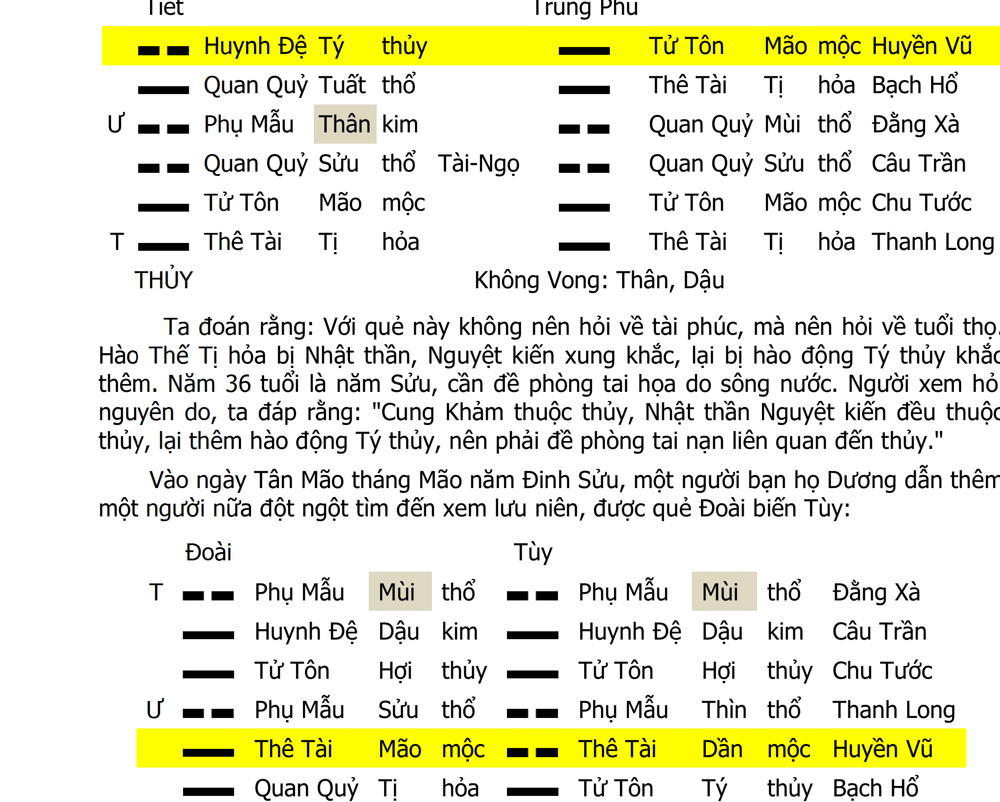

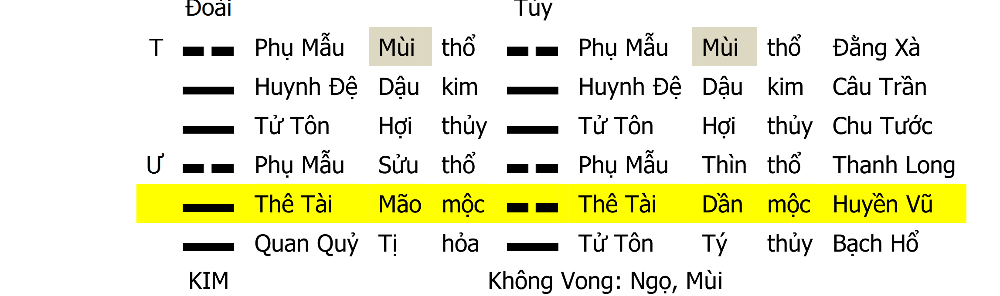 nhẹ, cả thuyền và người lật úp, khiến vừa chết trong nước, vừa chết vì cây. Chủ nhân 
vội sai người tát nước, lật thuyền lên, nhưng không lật được, chẳng phải là số trời ư?

Phép xưa khi xem về lưu niên, nếu hào Tài khắc Thế, thì căn cứ vào hào Tài để 
suy đoán, nhưng ta lại đoán rằng quẻ này mộc nhiều khắc Thế, nên phòng tai họa về 
cây cối.

"Hoàng kim sách" nói: "Quẻ gặp hung tinh, tránh đi tất cát". Quẻ này Kỵ thần 
động dao, hào Thế Không Vong, sao có thể tránh được?

**Tân bình thích:** Sao lại không thể tránh? Rời xa thủy mộc là có thể tránh được. 
Hoặc dùng phương pháp ngũ hành tiến hành hóa giải cũng có thể tránh được. Trong 
chương xu cát tị hung có ví dụ một người qua sông đòi nợ, cũng là hào Thế Không 
Vong, Kỵ thần động lâm Nhật Nguyệt mà động, so với ví dụ ở trên thì Kỵ thần này 
càng vượng tướng hơn. Ví dụ ở trên Kỵ thần động mà hóa thoái, Kỵ thần trong 
chương xu cát tị hung động mà hóa tiến, nhưng lại thoát khỏi tai họa, giữ được tính 
mạng, chứng tỏ có thể tránh được. Trong thực tiễn cũng là như vậy.

### Ví dụ: Ngày Kỷ Mão tháng Ngọ, xem về tuổi thọ, được quẻ Bĩ biến Độn:

Bĩ 
 
Độn

Ư | Phụ Mẫu Tuất thổ | Phụ Mẫu Tuất thổCâu Trần

Huynh ĐệThân kim | Huynh ĐệThân kim Chu Tước

Quan QuỷNgọ hỏa | Quan QuỷNgọ hỏa Thanh Long

T | Thê Tài | Mão mộc | Huynh ĐệThân kim Huyền Vũ

Quan QuỷTị | hỏa | Quan QuỷNgọ hỏa Bạch Hổ

Phụ Mẫu Mùi | thổ Tử-Tý | Phụ Mẫu Thìn thổĐằng Xà

KIM
Không Vong: Thân, Dậu

Ta đoán rằng: Với quẻ này chưa dám đoán định về tuổi thọ, hào Thế và hào Thê 
Tài đều hóa hồi đầu khắc, nên cũng có thể ứng với thương khắc vợ. Nên xem thêm 
một quẻ!

Xem được quẻ Tỷ biến Truân:

Tỷ 
 
Truân

Ư | Thê Tài | Tý | thủy | Thê Tài | Tý | thủy | Câu Trần

Huynh Đệ | Tuất thổ | Huynh Đệ | Tuất thổ | Chu Tước

Tử Tôn | Thân | kim | Tử Tôn | Thân | kim | Thanh Long

T | Quan Quỷ | Mão | mộc | Huynh Đệ | Thìn | thổ | Huyền Vũ

Phụ Mẫu | Tị | hỏa | Quan Quỷ | Dần | mộc | Bạch Hổ

Huynh Đệ | Mùi | thổ | Thê Tài | Tý | thủy | Đằng Xà

THỔ 
Không Vong: Thân, Dậu

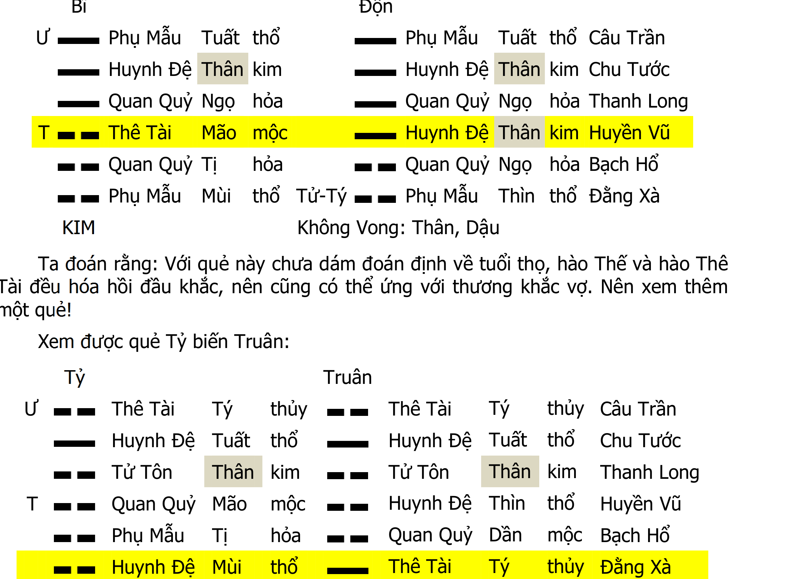

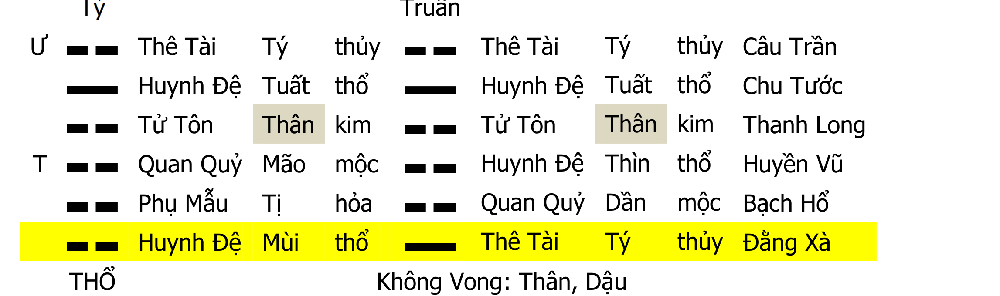

---

# CHƯƠNG 45. XU CÁT TỊ HUNG

Hào Thế theo Quỷ nhập Mộ, bởi vậy biết rằng quẻ trước là ứng với tuổi thọ của 
bản thân, nhưng không dám đoán về năm tháng ứng nghiệm. Người xem nói: "Xin cứ 
nói thẳng." Ta đáp: "Không phải tôi không muốn nói, nhưng quẻ này rất khó đoán 
định năm tháng. Hào Thế hào Mão mộc có khi ứng vào năm trực, có khi ứng với năm 
xung, có khi ứng với Thân là Tuyệt của Mão mộc, có khi ứng với Mùi là Mộ của Mão 
mộc, nên vẫn phải xem thêm môt quẻ nữa để quyết đoán."

Xem lại, được quẻ Mông biến Lâm:

Mông
 
Lâm

Phụ Mẫu | Dần mộc | Thê Tài | Dậu kim Câu Trần

Quan QuỷTý | thủy | Quan QuỷHợi thủy Chu Tước

T | Tử Tôn | Tuất thổ Tài-Dậu | Tử Tôn | Sửu thổ Thanh Long

Huynh ĐệNgọhỏa | Tử Tôn | Sửu thổ Huyền Vũ

Tử Tôn | Thìn thổ | Phụ Mẫu | Mão mộc Bạch Hổ

Ư | Phụ Mẫu | Dần mộc | Huynh ĐệTị | hỏa Đằng Xà

HỎA
Không Vong: Thân, Dậu

Ta nói: "Với quẻ này có thể biết được năm ứng nghiệm. Hào sơ và hào thượng 
Dần mộc đều động mà khắc Thế, nên sẽ ứng vào năm mộc nhập Mộ là năm Mùi." 
Người xem hỏi: "Có việc dữ chăng?" Ta đáp: "Quẻ trước mộc bị kim khắc, gặp Huyền 
Vũ mà động, nên đề phòng giặc cướp."

Về sau đến năm Thân, thành bị phá mà chết, sở dĩ ứng với năm Thân là năm 
mộc gặp Tuyệt.

***

# CHƯƠNG 45: XU CÁT TỊ HUNG

(TÌM CÁT TRÁNH HUNG)

Thánh nhân làm ra "Dịch", nhằm giúp mọi người tìm cát tránh hung. Nếu như 
không tìm được cát, không tránh được hung, thì trước tác của thánh nhân nào có ích 
gì? Người đời xem quẻ phỏng có tác dụng gì? Có người thắc mắc rằng: "Họa năm họa 
tháng có thể tránh được, còn chuyện sống chết sao có thể tránh?" Ta đáp: "Người 
đường đường chính chính, tuy có cách tránh cũng không cần tránh."

Khang Tiết1 tiên sinh lúc lâm chung gọi các đệ tử đến giúp tắm gội thay áo, 
chúng đệ tử khóc mà nói rằng: "Tiên sinh sao chẳng dưỡng thần tịch cốc (tức học đạo

1 Khang Tiết (1011 - 1077): Tức Thiệu Ung, tự Nghiêu Phu, một nhà nghiên cứu bốc Dịch nổi 
tiếng thời Tống.

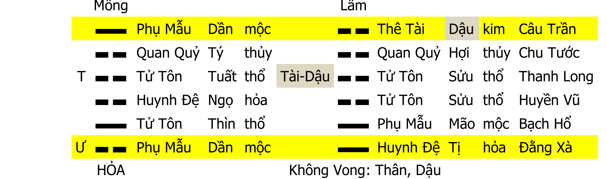 thần tiên) để vui hưởng tuổi trời?" Khang Tiết tiên sinh bèn nói: "Nếu không sợ hai 
thầy họ Trình1 cười chê, thì làm thần tiên có gì khó?"

Bởi vậy mới nói: "có thể tránh được nhưng không muốn tránh". Còn như xem 
thấy chết tại sông nước, thì nên tránh xa sông ngòi; xem thấy chết vì hình tội, thì 
đừng nên phạm pháp. Làm như vậy, sẽ có thể hóa hung thành cát.

Ở Hán Khẩu vào ngày Nhâm Dần tháng Mão, xem đòi nợ có được không, được 
quẻ Ích biến Trung Phu:

Ích 
 
Trung Phu

Ư | Huynh ĐệMão mộc | Huynh ĐệMão mộc Bạch Hổ

Tử Tôn | Tị | hỏa | Tử Tôn | Tị | hỏa Đằng Xà

Thê Tài | Mùi thổ | Thê Tài | Mùi thổ Câu Trần

T | Thê Tài | Thìn thổ Quan-Dậu | Thê Tài | Sửu thổ Chu Tước

Huynh ĐệDần mộc | Huynh ĐệMão mộc Thanh Long

Phụ Mẫu Tý | thủy | Tử Tôn | Tị | hỏa Huyền Vũ

MỘC
Không Vong: Thìn, Tị

Người này muốn qua sông đòi nợ, do đã đòi nhiều lần mà chưa được, nên muốn 
làm ầm ĩ sự việc lên. Nay đến xem có đòi được nợ không?

Ta xem quẻ này, thấy Nhật thần Dần động hóa Tiến thần khắc Thế, mà hào Thế 
lâm Không, đến giờ Thìn sẽ xuất Không bị Nhật thần, Nguyệt kiến cùng hào động 
tương khắc, ắt sẽ có tai họa chết người. Nên giữ anh ta lại ăn sáng, đợi quá giờ Thìn 
rồi đi cũng chưa muộn. Anh ta rất muốn đi ngay, nhưng ta nhất quyết giữ lại. Đến khi 
ăn cơm xong, anh ta đến bên bờ sông, rồi vội vàng quay trở về tạ ơn cứu mạng. Ta 
hỏi: "Có chuyện gì vậy?" Anh ta đáp: "Sáng nay có bốn chiếc thuyền lớn sang sông, 
đến giữa dòng bỗng nhiên gió lớn nổi lên, các thuyền đều bị lật chìm, lúc này xác chết 
đầy sông. Nếu không nhờ ông kiên quyết giữ lại, chắc mạng này cũng hết rồi: "Ta bèn 
đáp: "Nếu theo số thì hoàn toàn không có cách nào cứu được, chắc chắn là nhờ công 
đức của ông, chứ tôi nào có công lao gì?"

Như vậy chẳng phải là tránh dữ hay sao?

Tối kỵ Quan Quỷ khắc Thế;

Kỵ nhất Quan Quỷ khắc Thế;

Khi xem về phòng tai ngừa nạn, mà hào Thế bị khắc là tượng không lành, hào | Quỷ khắc Thế lại càng hung. Nếu Quỷ thuộc hỏa, cần đề phòng lửa; Quỷ thuộc mộc, | đề phòng gặp nạn vì cây gỗ; Quỷ thuộc thủy, đề phòng chết đuổi; Quỷ thuộc thổ, để | phòng tai nạn về đất đá, tường vách; Quỷ thuộc kim, đề phòng tai họa gươm đao, | búa rìu. Bạch Hổ, Huyền Vũ chủ về giặc cướp, binh đao; Đằng Xà, Chu Tước chủ về | kiện tụng thị phi, hỏa hoạn; Câu Trần chủ về ruộng đất, lao tù; Thanh Long tuy là cát

1 Hai phu tử họ Trình: Tức hai anh em Trình Hạo, Trình Di, hai nhà Lý học nổi tiếng thời Bắc 
Tống.

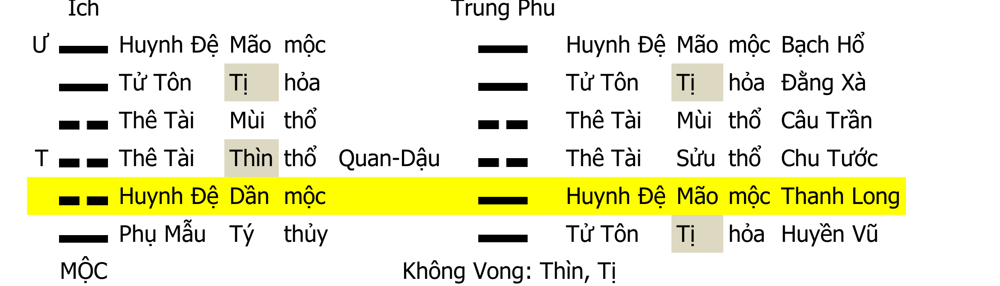 thần, nhưng nếu khắc Thế cũng là điềm hung, chủ chết về tửu sắc, hoặc trong vui có 
họa.

Ngoài việc dùng ngũ hành, lục thần để xác định, cũng có thể tham khảo thêm 
Bát quái: Càn Đoài chủ về chùa miếu, thuộc hình kim; Khảm chủ về tai họa sông 
nước, chớ gần cung tên; Ly chủ về hỏa hoạn, lại chỉ các loài cua rùa; Chấn chủ về 
giặc cướp tàu, xe; Tốn cần đề phòng phụ nữ mưu gian; Khôn, Cấn chủ về đồng 
ruộng, núi rừng, lại chủ về bị bà già hoặc trẻ con lừa gạt. Phân loại có rất nhiều, 
người xem cần phải biết biến thông.

### Ví dụ: Ngày Mậu Tý tháng Sửu, xem về giấc mơ, được quẻ Ích biến Trung Phu:

Ích 
 
Trung Phu

Ư | Huynh ĐệMão mộc | Huynh ĐệMão mộc Chu Tước

Tử Tôn | Tị | hỏa | Tử Tôn | Tị | hỏa Thanh Long

Thê Tài | Mùi thổ | Thê Tài | Mùi thổ Huyền Vũ

T | Thê Tài | Thìn thổ Quan-Dậu | Thê Tài | Sửu thổ Bạch Hổ

Huynh ĐệDần mộc | Huynh ĐệMão mộc Đằng Xà

Phụ Mẫu Tý | thủy | Tử Tôn | Tị | hỏa Câu Trần

MỘC
Không Vong: Ngọ, Mùi

Người này nằm mộng thấy thân mình dính đầy máu, xuống sông để rửa. Ta giải | thích rằng: "Máu là tiền tài, rửa đi là điềm phá tài. Nay lại gieo được quẻ này, hào | Đằng Xà động hóa Tiến thần khắc Thế khắc Tài, không những chủ về tiền tài bị cướp | đoạt, mà còn cần đề phòng tai họa về mộc, vì cung Tốn thuộc mộc, lại có mộc động | khắc Thế, chủ về gặp tai họa về mộc."

Người xem hỏi: "Làm cách nào để tránh được họa?" Ta đáp: "Hào Thế và hào 
mộc đều ở quẻ nội, nên ra ngoài sẽ tránh được họa. Tốn là tượng trưởng nữ (con gái 
lớn), đừng nên đam mê phụ nữ trẻ." Người này lại hỏi: "Ứng vào lúc nào?" Ta đáp: 
"Vào khoảng Lập xuân nên tránh đi." Người này bèn nói: "Năm hết Tết đến, đâu có 
thể đi xa được."

Không ngờ đến ngày Hợi tháng giêng, người này ngủ ở phòng vợ lẽ, bị giặc cướp 
châm lửa đốt nhà, của cải cháy sạch không, bản thân cũng bị gỗ đè thành thương. 
Nếu hôm đó không ngủ ở phòng người thiếp, hoặc leo được tường mà ra, thì có lẽ sẽ 
tránh được tai họa.

Độc nghi Phúc Đức tùy thân.

Chỉ nên Phúc Đức theo thân.

Xem về điềm mộng, về qua sông vượt biển, xem khi qua nơi hiểm trở, phòng 
ngừa bệnh dịch, xem về phòng bệnh, ăn uống ngộ độc, xem về hỏa hoạn, về kẻ thù 
hãm hại, xem về lánh nạn, về giặc cướp, xem khi đi đêm một mình, khi qua đêm tại 
chùa miếu, quán trọ, xem khi vào rừng lên núi, xem về âm mưu của kẻ thù, xem khi 
bị trọng tội, xem khi đi đến chỗ hoang vu... Phàm khi xem về các điều lo lắng, sợ hãi, 
phòng tai tránh họa, đều nên được hào Tử Tôn trì Thế hoặc Tử Tôn động trong quẻ.

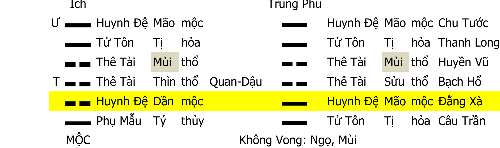

Phép xem xưa có câu: "Nếu được hào Tử Tôn vượng động, tai bay vạ gió thảy sạch 
không".

### Ví dụ: Ngày Đinh Hợi tháng Ngọ, do mơ thấy chồng cũ về gọi đi, đã đi theo, nên

xem được quẻ Ký Tế biến Lâm:

Ký Tế
 
Lâm

Ư | Huynh ĐệTý | thủy | Phụ Mẫu Dậu kim Thanh Long

Quan QuỷTuất thổ | Huynh ĐệHợi thủy Huyền Vũ

Phụ Mẫu Thân kim | Quan QuỷSửu thổ Bạch Hổ

T | Huynh ĐệHợi | thủy Tài-Ngọ | Quan QuỷSửu thổ Đằng Xà

Quan QuỷSửu thổ | Tử Tôn | Mão mộc Câu Trần

Tử Tôn | Mão mộc | Thê Tài | Tị | hỏa Chu Tước

THỦY
Không Vong: Ngọ, Mùi

Đoán rằng: Hào Thế Hợi thủy tuy lâm Nhật thần, nhưng không chống lại được 
nhiều hào thổ động tương khắc, mùa đông năm nay sẽ gặp tai họa. Quả nhiên đến 
tháng 9 bị tiểu sản thành lao, đến tháng chạp thì chết.

Lại ví dụ: Ngày Mậu Thân tháng Tuất, mơ thấy mẹ đã mất về gọi đi, cũng đã đi 
theo, xem được quẻ Tiệm:

Tiệm

Ư | Quan QuỷMão mộc | Chu Tước

Phụ Mẫu | Tị | hỏa Tài-Tý Thanh Long

Huynh ĐệMùi | thổ | Huyền Vũ

T | Tử Tôn | Thân kim | Bạch Hổ

Phụ Mẫu | Ngọ hỏa | Đằng Xà

Huynh ĐệThìn thổ | Câu Trần

THỔ
Không Vong: Dần, Mão

Giấc mơ dữ đều giống nhau, nhưng kết quả sống chết lại khác nhau. Trong quẻ 
trước, hào Thế biến Quỷ, nên chết vào tháng chạp. Tại quẻ này, hào Tử Tôn trì Thế, 
nên không bị tai ương.

Giác Tử bàn rằng: Tuy hào Tử Tôn trì Thế là điềm tốt, nhưng nếu hào Thế gặp 
Nguyệt phá thì phải ra khỏi tháng mới tránh được lo âu. Nếu Thế lâm Không, đợi sang 
tuần xuất Không mới hết tai họa. Khi chưa xuất Không thì vẫn còn phải lo lắng không 
yên.

### Ví dụ: Ngày Canh Thìn tháng Tị, xem về đề phòng tai họa, được quẻ Quải:

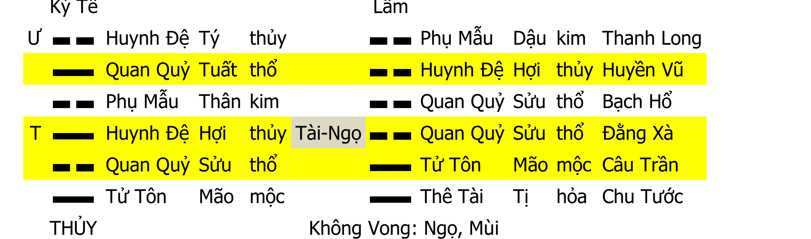

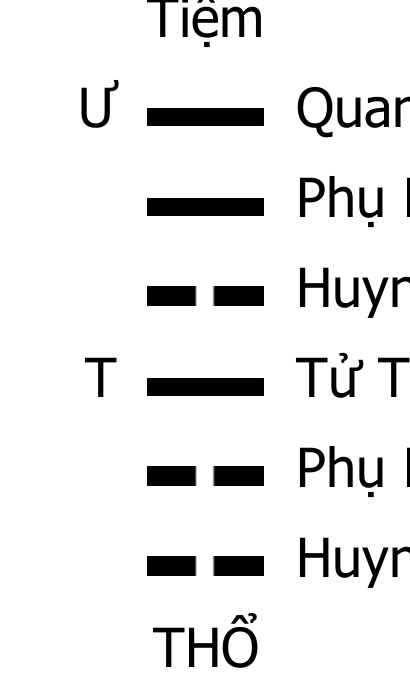

Quải

Huynh ĐệMùi thổ | Đằng Xà

T | Tử Tôn | Dậu kim | Câu Trần

Thê Tài | Hợi thủy | Chu Tước

Huynh ĐệThìn thổ | Thanh Long

Ư | Quan QuỷDần mộc Phụ-TịHuyền Vũ

Thê Tài | Tý | thủy | Bạch Hổ

THỔ
Không Vong: Thân, Dậu

Hào Thế ở Tử Tôn gặp Tuần Không, nên sự việc lo âu vẫn chưa kết thúc, nên 
còn phải lo lắng không yên.

Lại đến ngày Ất Dậu, xem được quẻ Vô Vọng:

Vô Vọng

Thê Tài | Tuất thổ | Huyền Vũ

Quan Quỷ | Thân | kim | Bạch Hổ

T | Tử Tôn | Ngọ | hỏa | Đằng Xà

Thê Tài | Thìn | thổ | Câu Trần

Huynh Đệ | Dần | mộc | Chu Tước

Ư | Phụ Mẫu | Tý | thủy | Thanh Long

MỘC 
Không Vong: Ngọ, Mùi

Hào Thế tại Ngọ hỏa Tử Tôn, lại gặp Tuần Không, nên sự việc còn trăn trở chưa 
kết thúc.

Đến ngày Kỷ Dậu, lại xem, được quẻ Tiết biến Khảm:

Tiết 
 
Khảm

Huynh ĐệTý | thủy | Huynh ĐệTý | thủy Câu Trần

Quan QuỷTuất thổ | Quan QuỷTuất thổ Chu Tước

Ư | Phụ Mẫu | Thân kim | Phụ Mẫu | Thân kim Thanh Long

Quan QuỷSửu thổ Tài-Ngọ | Thê Tài | Ngọ hỏa Huyền Vũ

Tử Tôn | Mão mộc | Quan QuỷThìn thổ Bạch Hổ

T | Thê Tài | Tị | hỏa | Tử Tôn | Dần mộc Đằng Xà

THỦY
Không Vong: Dần, Mão

Ta đoán rằng: "Đến ngày Giáp Dần sự việc sẽ kết thúc." Người xem hỏi nguyên 
nhân, ta bèn đáp: "Hào Thế Tị hỏa động biến ra Tử Tôn Dần mộc, nhưng Dần lâm 
Không, may nhờ quẻ biến lục xung, nên sự việc sẽ kết thúc." Quả nhiên sự việc được 
giải quyết vào ngày Giáp Dần.

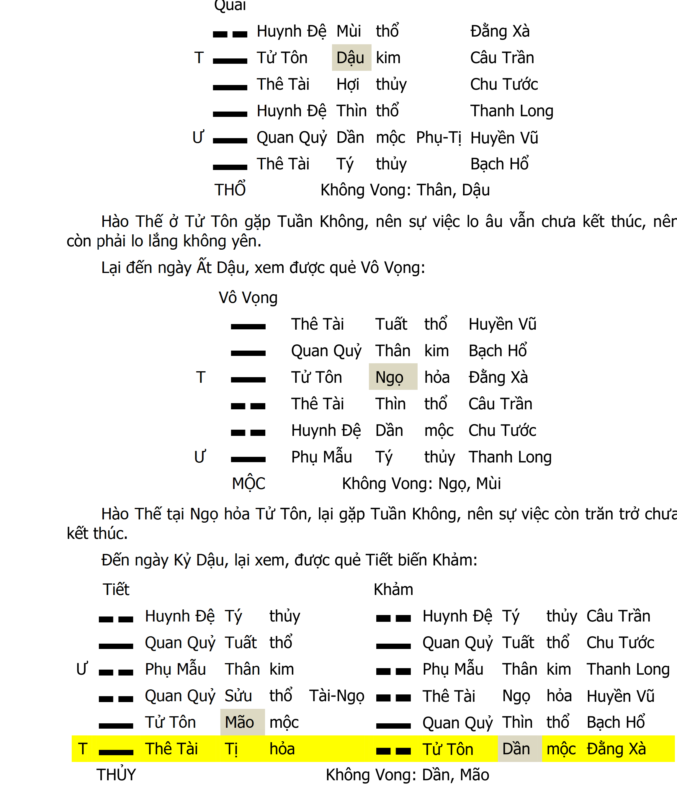

Khắc tại nội, Thế tại ngoại, nghi ư ngoại tị;

Khắc tại quẻ nội, Thế ở quẻ ngoại, nên tránh ra ngoài;

Nếu Kỵ thần ở quẻ nội, động mà khắc Thế, nên đi ra ngoài để tránh họa. Nếu Kỵ 
thần ở quẻ ngoại, động mà khắc Thế, nên ở trong nhà để tránh họa.

### Ví dụ: Ngày Đinh Mão tháng Dần, xem về lưu niên, được quẻ Phệ Hạp biến Khuê:

Phệ Hạp
 
Khuê

Tử Tôn | Tị | hỏa | Tử Tôn | Tị | hỏa Thanh Long

T | Thê Tài | Mùi thổ | Thê Tài | Mùi thổ Huyền Vũ

Quan QuỷDậu | kim | Quan QuỷDậu kim Bạch Hổ

Thê Tài | Thìn thổ | Thê Tài | Sửu thổ Đằng Xà

Ư | Huynh ĐệDần | mộc | Huynh ĐệMão mộc Câu Trần

Phụ Mẫu | Tý | thủy | Tử Tôn | Tị | hỏa Chu Tước

MỘC 
Không Vong: Tuất, Hợi

Ta đoán rằng: "Mùa thu năm nay ắt gặp nguy hiểm. Hào Dần mộc động lâm 
Nguyệt kiến hóa Tiến thần khắc Thế, lúc này là thời điểm mộc đang thịnh, nên chưa 
bị khắc hại. Tháng sáu (Mùi) và bảy (Thân) là lúc mộc gặp Mộ, Tuyệt, nên đề phòng 
tai ách về thổ mộc." Người xem hỏi: "Liệu có tránh được không?" Ta đáp: "Nên đi ra 
ngoài, sẽ tránh được." Người này lại hỏi: "Đi về phương nào thì tốt?" Ta đáp: "Bây giờ 
nên đi về hướng tây, sang tháng sáu tháng bảy, hãy đi về phía đông, vì tháng sáu 
tháng bảy mộc suy nhược, nên đi về hướng đông Chấn mộc."

Nhưng người này không ra khỏi nhà, cho đến ngày 7 tháng bảy, mơ thấy ác 
mộng, sang mồng 8 liền đi về hướng đông. Đến ngày 28 có động đất, nhà sập, mọi 
người đều bị thương, chỉ có người này tránh được.

**Tân bình thích:** Đi hướng nam tốt hơn.

Lại ví dụ: Ngày Kỷ Mùi tháng Mão, xem được quẻ Lý:

Lý

Huynh ĐệTuất thổ | Câu Trần

T | Tử Tôn | Thân kim Tài-Tý Chu Tước

Phụ Mẫu Ngọ hỏa | Thanh Long

Huynh ĐệSửu thổ | Huyền Vũ

Ư | Quan QuỷMão mộc | Bạch Hổ

Phụ Mẫu Tị | hỏa | Đằng Xà

THỔ
Không Vong: Tý, Sửu

Ta lúc này đi qua hồ Phàn Dương, bỗng gió lớn nổi lên, nước chảy xiết cuốn mất 
bánh lái, chiếc thuyền xoay tròn giữa hồ. Tiểu đồng gieo tiền được quẻ Thiên Trạch

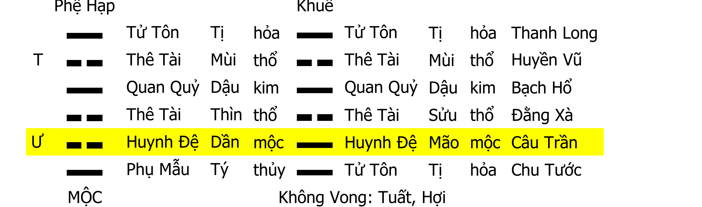

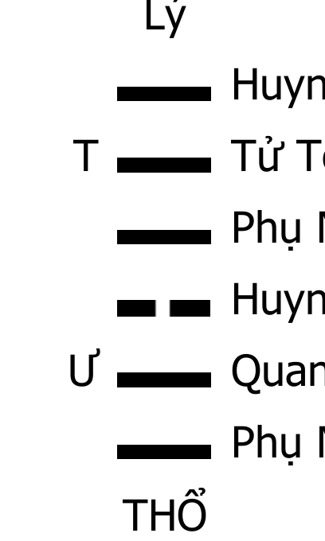

Lý. Ta thấy hào Tử Tôn trì Thế, ắt không có gì đáng ngại, tiếp tục kê gối ngủ yên. Lát 
sau lại một cơn gió mạnh thổi đến, đưa thuyền trôi vào bờ.

Lại ví dụ: Ngày Mậu Thân tháng Thân, do bị người ta uy hiếp, xem có bị kiện 
không, được quẻ Lữ:

Lữ

Huynh ĐệTị | hỏa | Chu Tước

Tử Tôn | Mùi | thổ | Thanh Long

Ư | Thê Tài | Dậu | kim | Huyền Vũ

Thê Tài | Thân kim Quan-Hợi Bạch Hổ

Huynh ĐệNgọ | hỏa | Đằng Xà

T | Tử Tôn | Thìn thổ | Phụ-Mão Câu Trần

HỎA
Không Vong: Dần, Mão

Ta đoán rằng: Hào Tử Tôn trì Thế, nên không đáng lo, chắc chắn sẽ không bị 
kiện, một đồng tiền cũng không phải bỏ ra, cứ mặc kệ họ. Nhưng sau xem kỹ lại, thấy 
hào Tài Dậu kim vượng, lại ở hào Ứng, nên lại nói: "Ta tuy khuyên ông không phải bỏ 
tiền, nhưng hào Ứng Tài rất vượng, tuy không có chuyện thị phi, nhưng e rằng chắc 
phải bỏ tiền ra mới xuôi." Về sau kẻ thù nhờ người giảng hòa, bất đắc dĩ phải trả tiền 
cho xong chuyện.

Thế tại ngoại, khắc tại ngoại, nghi ư gia cư.

Thế ở quẻ ngoại, khắc ở quẻ ngoại, nên ở trong nhà.

Hào Thế và Kỵ thần đều ở quẻ ngoại, thì không nên xuất hành, nên ở nhà, có thể 
tránh được họa. Nếu hào Thế và Kỵ thần đều ở quẻ nội, thì không nên ở nhà, nên 
lánh ra bên ngoài.

Trong chương "Xuất hành" có câu: "Lộ thượng hữu Quan nghi xuất ngoại; trạch 
trung hữu Quỷ mạc quy gia" (Trên đường có Quan nên xuất ngoại; trong nhà có Quỷ 
chớ về nhà), cũng là cùng một ý đó.

### Ví dụ: Ngày Bính Tý tháng Mùi, xem kẻ nô bộc có gây họa hay không, được quẻ

Giải biến Chấn:

Giải
 
Chấn

Thê Tài | Tuất thổ | Thê Tài | Tuất thổ Thanh Long

Ư | Quan QuỷThân kim | Quan QuỷThân kim Huyền Vũ

Tử Tôn | Ngọ hỏa | Tử Tôn | Ngọ hỏa Bạch Hổ

Tử Tôn | Ngọ hỏa | Thê Tài | Thìn thổ Đằng Xà

T | Thê Tài | Thìn thổ | Huynh ĐệDần mộc Câu Trần

Huynh ĐệDần mộc Phụ-Tý | Phụ Mẫu Tý | thủy Chu Tước

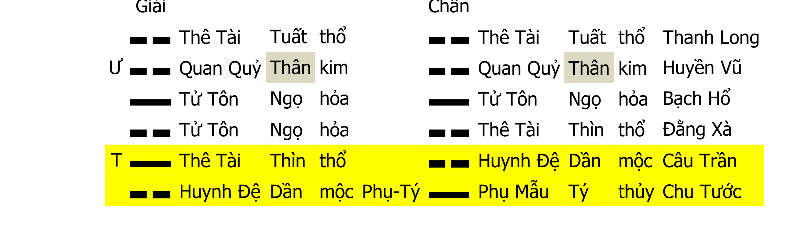

Người xem biết có kẻ nô bộc thay lòng đổi dạ, muốn xử tội mà không có chứng 
cứ, nên mới đến xem quẻ. Trong quẻ này, nếu lấy hào Tài làm nô bộc để suy đoán là 
sai lầm, vì người xem có ý phòng ngừa lo lắng, nên chỉ xem Kỵ thần. Quẻ này hào 
Thế tại Thìn thổ, bị hai hào Dần mộc khắc thương, nên đoán rằng: "Không chỉ có 
người này, mà còn có đồng phạm khác." Người xem bèn hỏi: "Phải xử trí ra sao?" Ta 
nói: "Không có chứng cứ cụ thể, làm sao xử trí được! Nhưng mộc gặp Mộ tại tháng 
Mùi, gặp Tuyệt tại tháng Thân, nên chúng sẽ phải bại lộ vào hai tháng đó, ông nên đi 
ra khỏi nhà để tránh tai họa."

Người này nghe theo kế của ta, bỏ ra ngoài ở nửa tháng, thì hai nô bộc bỏ trốn, 
có một người đàn bà bỏ đi theo. Hỏi người đàn bà không bỏ đi, thì đáp: "Hai người 
kia có ý muốn hại chủ rồi bỏ trốn, do chủ nhà bỏ ra ngoài, nên không hại được."

Đó chẳng phải là phép tránh dữ hay sao?

Tị hoan ư sinh Thế chi phương; xu cát ư Phúc thần chi địa.

Tránh nạn ở phương sinh ra Thế; tìm cát ở đất của Phúc thần.

Khi xem về tránh nạn binh đao, giặc cướp, dịch bệnh, dưỡng bệnh, tránh kiện 
tụng thị phi, đều nên tìm đến phương sinh ra hào Thế và phương của hào Tử Tôn sẽ 
cát lợi. Nếu hào Tử Tôn động trong quẻ, bất kể là sinh Thế, khắc Thế hay trì Thế đều 
là tốt.

### Ví dụ: Ngày Mậu Thìn tháng Tị, xem về tránh nạn binh đao, được quẻ Lâm biến

Khuê:

Lâm 
 
Khuê

Tử Tôn | Dậu | Kim | Phụ Mẫu | Tị | hỏa Chu Tước

Ư | Thê Tài | Hợi | Thủy | Huynh Đệ | Mùi | thổ | Thanh Long

Huynh Đệ | Sửu Thổ | Tử Tôn | Dậu | kim Huyền Vũ

Huynh Đệ | Sửu Thổ | Huynh Đệ | Sửu thổ | Bạch Hổ

T | Quan Quỷ | Mão | Mộc | Quan Quỷ | Mão | mộc | Đằng Xà

Phụ Mẫu | Tị | Hỏa | Phụ Mẫu | Tị | hỏa Câu Trần

THỔ
Không Vong: Tuất, Hợi

Lúc này, quân phản loạn gây hại, quấy nhiễu gây họa khắp nơi. Người này vốn | biết Dịch lý, xem được quẻ này, suốt ngày lo lắng không yên. Ta hỏi nguyên do, anh | ta đáp: Tị, Dậu, Sửu hợp thành kim cục khắc Thế, hào Thế lại gặp Quỷ tại Đằng Xà, | vận số đã hết, không thể tránh được.

Ta cười mà nói rằng: "Ông ở cùng một nơi với giặc, đảm bảo ông sẽ vô sự." Anh 
ta bèn hỏi: "Tại sao?" Ta bèn đáp: "Hào Tử Tôn hợp thành kim cục, khắc mất Quỷ 
bên thân, còn có gì đáng phải lo". Người này bèn hỏi: "Hào Dậu kim Tử Tôn vượng tại 
tháng Tị, lại hóa Tị hỏa, như vậy là khắc chứ sao lại cho là sinh được?" Ta đáp: "Hào 
Dậu kim được hai thổ Sửu Thìn tương sinh, làm sao lại cho là khắc được?"

Quả thực về sau nhiều lần gặp binh biến, đến tận năm Canh Dần mới được bình 
định, người này vẫn vô sự. Ta đã nói Tử Tôn là Phúc thần, quá thực ứng nghiệm.

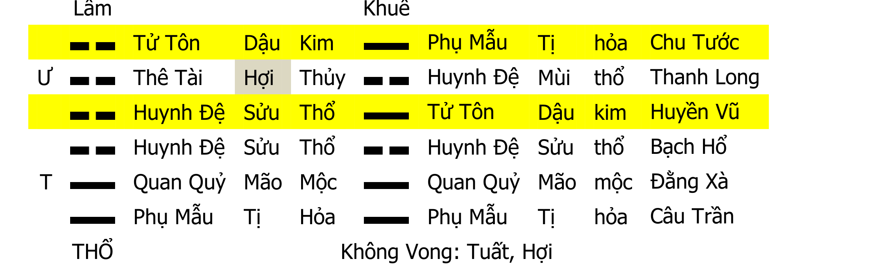

Người đời chẳng qua đọc sách không sâu, hiểu biết không thấu đáo, mới lầm cát 
thành hung như vậy.

### Ví dụ: Ngày Bính Tuất tháng Tị, xem về phương chạy loạn, được quẻ Càn biến

Đại Hữu:

Càn 
 
Đại Hữu

T | Phụ Mẫu | Tuất thổ | Quan Quỷ | Tị | hỏa | Thanh Long

Huynh Đệ | Thân | kim | Phụ Mẫu | Mùi | thổ | Huyền Vũ

Quan Quỷ | Ngọ | hỏa | Huynh Đệ | Dậu kim | Bạch Hổ

Ư | Phụ Mẫu | Thìn | thổ | Phụ Mẫu | Thìn | thổ | Đằng Xà

Thê Tài | Dần | mộc | Thê Tài | Dần mộc | Câu Trần

Tử Tôn | Tý | thủy | Tử Tôn | Tý | thủy | Chu Tước

KIM 
Không Vong: Ngọ, Mùi

Mọi người đoán rằng: Hào Tử Tôn Tý thủy được hào kim động tương sinh, nên 
phương bắc là phương cát.

Ta nói rằng: "Đoán như vậy là sai. Hào Huynh động hóa Tiến thần, là tượng phá 
tài. Hào Ngọ hỏa đắc lệnh mà sinh Thế, nên tránh về phương nam sẽ tốt." Những 
người tin lời ta đều tránh về phương nam. Sau quả nhiên giặc từ phương bắc tràn 
đến, phóng hỏa đốt làng, nhà cửa lúa má đều bị thiêu rụi. Đó chính là do hào Huynh 
Thân kim động, là tượng phá Tài.

Phương sinh Thế là phương tốt, phương Tử Tôn cũng là phương tốt. Nhưng cũng 
cần xem xét về vượng suy. Phương hỏa tuy là phương của Quỷ, nhưng vì sinh Thế, 
nên cũng là tốt.

Thế ngộ sinh phù, bách niên chính tẩm; Thân tao khắc hại, ngũ loại suy 
tường.

Thế được sinh phò, sống trăm tuổi chết yên ổn; Thân gặp khắc hại, phải xem xét 
rõ ngũ hành.

Khi xem cuộc đời kết thúc ra sao, cần phải xem hào Thế, nếu hào Thế vượng 
tướng hay được Nhật, Nguyệt, hào động sinh phò, hay động mà hóa cát, đều là tượng 
chết yên lành không bệnh tật. Nếu hào Thế bị khắc chế hình xung, cần kết hợp ngũ 
hành với lục thần để suy đoán. Nếu bị ngũ hành khắc, chủ về tật bệnh; lại thêm gặp 
Lục thân hung, chủ về chết bất đắc kỳ tử. Nếu hỏa khắc kim, chủ về bệnh ở phổi; thổ 
khắc thủy, chủ về bệnh ở thận; thủy khắc hỏa, chủ về bệnh ở tim; kim khắc mộc, chủ 
về bệnh ở gan; tỳ vị suy nhược, là do mộc vượng xung khắc thổ. Mắc bệnh về lưng, 
đường ruột, là do Cừu thần độc phát.

Nếu gặp Đằng Xà chủ về tâm hoảng sợ, gặp Thanh Long chủ về tửu sắc, Câu | Trần chủ về chứng phù thũng, Chu Tước chủ về điên cuồng; gặp Bạch Hổ chủ tai họa | về máu, Huyền Vũ chủ về giận dữ uất ức.

Bạch Hổ gặp kim Quỷ, khó tránh khỏi giặc cướp binh đao. Thanh Long gặp thủy | Quỷ nên tránh xa sông hồ ao giếng. Đằng Xà, Chu Tước gặp mộc Quỷ chủ về phạm

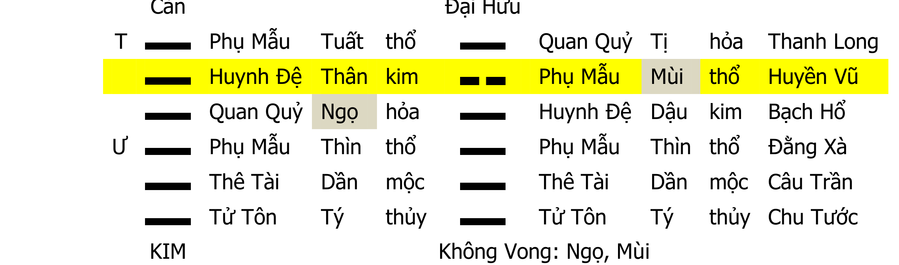

---

# CHƯƠNG 46. TUỔI THỌ CỦA CHA MẸ

cung hình (thiến, hoạn), gặp hỏa Quỷ cần đề phòng chết cháy. Cũng có thuyết cho | rằng Đằng Xà gặp mộc Quỷ chủ về thắt cổ. Câu Trần gặp thổ Quỷ chủ về lao ngục.

Ngạn ngữ có câu, "một kiểu sinh, trăm kiểu chết", nếu trong quẻ hiện thần, cần 
phải xem xét cho kỹ lưỡng.

**Tân bình thích:** Đây chỉ là cách đoán đại khái, không thể câu nệ. Thường gặp 
Cừu thần độc phát, nhưng không mắc bệnh về lưng hay đường ruột, trong các ví dụ 
tôi gặp, có người thắt cổ tự tử, có người uống thuốc độc tự sát, có người chết đuối, có 
người chết vì tai nạn xe cộ, có người chết vì bệnh, nói chung là rất nhiều, khi phán 
đoán cần phải linh hoạt, nếu trình bày chi tiết ở đây thì quá dài.

### Ví dụ: Ngày Quý Hợi tháng Mùi, xem bị định tội gì, được Trung Phu biến Lâm:

Trung Phu
 
Lâm

Quan QuỷMão mộc | Tử Tôn | Dậu kim Bạch Hổ

Phụ Mẫu Tị | hỏa Tài-Tý | Thê Tài | Hợi thủy Đằng Xà

T | Huynh ĐệMùi thổ | Huynh ĐệSửu thổ Câu Trần

Huynh ĐệSửu thổ Tử-Thân | Huynh ĐệSửu thổ Chu Tước

Quan QuỷMão mộc | Quan QuỷMão mộc Thanh Long

Ư | Phụ Mẫu Tị | hỏa | Phụ Mẫu Tị | hỏa Huyền Vũ

THỔ 
Không Vong: Tý, Sửu

Đoán rằng: Mộc Quỷ lâm Bạch Hổ, nên đã định tội chịu thắt cổ. May nhờ hào Thế | lâm Nguyệt kiến, Quỷ mộc tuy động, nhưng hóa Dậu kim hồi đầu khắc. Quẻ ngoại | phản ngâm, nên sự việc sẽ có thay đổi. Tuy tội thắt cổ đã định, nhưng sẽ có biến đổi.

Quả nhiên bị định tội thắt cổ, nhưng sau đó xét xử lại, được đổi thành tội sống.

***

# CHƯƠNG 46: TUỔI THỌ CỦA CHA MẸ

Khi xem về ông, bà, cha, mẹ, đều phải chia ra từng quẻ để xem.

Phép xem xưa cho là hào dương tượng trưng cho cha, hào âm tượng trưng cho 
mẹ, ta thử qua thấy không ứng nghiệm.

Phụ lâm Nhật Nguyệt, xuân đình vãn tuế vinh hoa; Mẫu trị Phá Không, 
huyên thảo tàn niên tiều tụy.

Phụ gặp Nhật Nguyệt, xuân đình tuổi muộn vinh hoa; Mẫu gặp Phá Không, cỏ 
huyên1 cuối đời tiều tụy.

1 Xuân đình: chỉ người cha, điển cố này xuất phát từ "Trang Tử - Tiêu dao du" và "Luận ngữ - 
Quý thị". Cỏ huyên: chỉ người mẹ, điển cố này xuất phát từ "Kinh Thi".

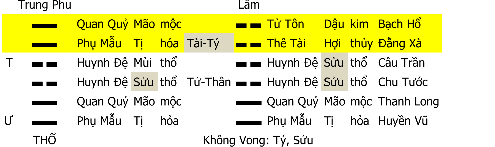

Nếu hào Phụ Mẫu được vượng, được tướng, hoặc lâm Nhật Nguyệt, hoặc được 
Nhật thần, Nguyệt kiến, hào động sinh phò, hoặc động mà hóa cát, là tượng cha mẹ 
sống thọ.

Nếu hào Phụ Mẫu hưu tù, không bị hình thương khắc hại, chủ về cha mẹ tuổi già 
nhiều bệnh, nhưng vẫn không đến nỗi bị tổn thương. Nếu hưu tù mà lại bị hình xung, 
hoặc bị Nhật thần, Nguyệt kiến, hào động tương khắc, hoặc động mà hóa hung, là 
điềm cha mẹ không thọ.

### Ví dụ: Vào ngày Canh Tý tháng Sửu, xem về tuổi thọ của cha, được quẻ Cấu; lại

xem về tuổi thọ của mẹ, được quẻ Đại Tráng biến Thăng:

Đại Tráng
 
Thăng

Huynh Đệ | Tuất thổ | Tử Tôn | Dậu | kim | Đằng Xà

Tử Tôn | Thân | kim | Thê Tài | Hợi | thủy | Câu Trần

T | Phụ Mẫu | Ngọ | hỏa | Huynh Đệ | Sửu | thổ | Chu Tước

Huynh Đệ | Thìn | thổ | Tử Tôn | Dậu | kim | Thanh Long

Quan Quỷ | Dần | mộc | Thê Tài | Hợi | thủy | Huyền Vũ

Ư | Thê Tài | Tý | thủy | Huynh Đệ | Sửu | thổ | Bạch Hổ

THỔ 
Không Vong: Thìn, Tị

Đoán rằng: Quẻ thứ nhất hào Phụ Mẫu xuất hiện hai lần, nên lấy hào Phụ Mẫu 
lâm Nguyệt kiến Sửu thổ làm Dụng thần, gặp vượng vào ngày Tý, lại hợp với Nhật 
thần, nên là tượng sâu rễ bền gốc, tuổi thọ lâu dài.

Trong quẻ sau, hào Ngọ hỏa Phụ Mẫu động mà bị Nhật thần tương xung, hào sơ 
Tý thủy lại động, nên hào Ngọ hỏa chỉ bị khắc mà không sinh. Hào sơ Tý thủy hóa 
thành Sửu thổ, nên tham hợp mà không đến khắc hỏa. Cần đề phòng năm Bính Tý, bị 
thêm Thái Tuế tương xung, là lúc hết tuổi trời. Xem năm Quý Dậu, hơn ba mươi năm 
sau, đến năm Ất Tị lại gặp người này, bèn hỏi rằng: "Gia phụ có được mạnh giỏi 
không?" Người này đáp rằng: "Rất khoẻ! Còn mẹ đã mất vào năm Tý."

Nếu theo phép xem cũ, hào dương chỉ cha, hào âm chỉ mẹ, quẻ thứ nhất gồm 
hai hào Phụ Mẫu Sửu, Tuất đều là vượng tướng, dựa vào đó để suy đoán tuổi thọ cha 
mẹ, thì thật sai lầm.

**Tân bình thích:** Đây tuy là lý, nhưng cũng có ứng ở âm dương.

### Ví dụ: Ngày Ất Tị tháng Dậu, một vị học viên người Nhật Bản xem cha bệnh lâu,

tuổi thọ của cha ra sao? Được Hoán biến Càn.

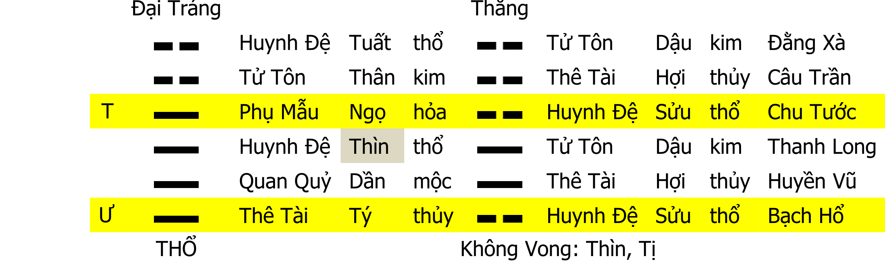

Hoán
 
Càn

Phụ Mẫu | Mão mộc | Tử Tôn | Tuất thổ | Huyền Vũ

T | Huynh ĐệTị | hỏa | Thê Tài | Thân kim Bạch Hổ

Tử Tôn | Mùi thổ Tài-Dậu | Huynh ĐệNgọ | hỏa Đằng Xà

Huynh ĐệNgọ | hỏa Quan-Hợi | Tử Tôn | Thìn thổ | Câu Trần

Ư | Tử Tôn | Thìn thổ | Phụ Mẫu | Dần | mộc Chu Tước

Phụ Mẫu | Dần | mộc | Quan QuỷTý | thủy Thanh Long

HỎA
Không Vong: Dần, Mão

Phụ Mẫu lưỡng hiện, lấy hào động làm Dụng, Nguyệt kiến khắc Dụng, Nhật lại 
không phù, Dụng thần nhập Mộ ở Mùi thổ, Không hóa Quan Quỷ, hóa lục xung, bệnh 
lâu gặp xung gặp Không đều là tượng hung. Tôi đoán ngày Mùi, ngày Thân có hung.

Thế nhưng ngày Đinh Mùi cha an nhiên vô sự, mẹ chưa hề có bệnh, nhưng khi 
đang chăm sóc cha, mẹ đột nhiên ngã xuống mà qua đời.

Phụ Mẫu Dần mộc lâm hào âm mà hóa Quan Quỷ, chính là mẹ biến quỷ, hào 
thượng Phụ Mẫu Mão mộc là dương thì ứng là cha, đây chẳng lẽ không phải là ứng 
nghiệm âm dương ư?

### Ví dụ: Ngày Canh Dần tháng Mão, xem tuổi thọ của mẹ, được Kiển biến Khiêm:

Kiển
 
Khiêm

Tử Tôn | Tý | Thủy | Huynh ĐệDậu kim Đằng Xà

Phụ Mẫu Tuất Thổ | Tử Tôn | Hợi | thủy Câu Trần

T | Huynh ĐệThân Kim | Phụ Mẫu Sửu thổ Chu Tước

Huynh ĐệThân Kim | Huynh ĐệThân kim Thanh Long

Quan QuỷNgọ Hỏa Tài-Mão | Quan QuỷNgọ hỏa Huyền Vũ

Ư | Phụ Mẫu Thìn Thổ | Phụ Mẫu Thìn thổ Bạch Hổ

KIM
Không Vong: Ngọ, Mùi

Trong quẻ, hào Phụ Mẫu xuất hiện hai lần, lấy hào động Phụ Mẫu Tuất thổ làm 
Dụng thần, vì xem vào mùa xuân nên hưu tù. Tuy Nguyệt kiến Mão hợp với Tuất, 
nhưng hiềm vì Nhật thần, Nguyệt kiến đều khắc Tuất thổ, nên chỉ luận khắc không 
luận hợp. Xem vào năm Dậu, đến tháng Thìn năm Tuất thì qua đời, tức ứng vào năm 
trực của hào động. Còn ứng vào tháng Thìn, vì là tháng xung của Tuất.

Lại ví dụ: Vào ngày Canh Thân tháng Dậu, xem về tuổi thọ của bà, được quẻ 
Mông biến Hoán:

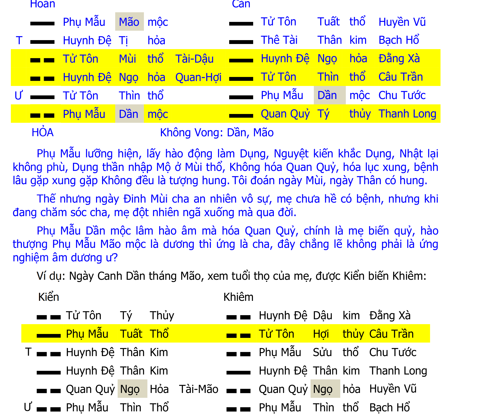

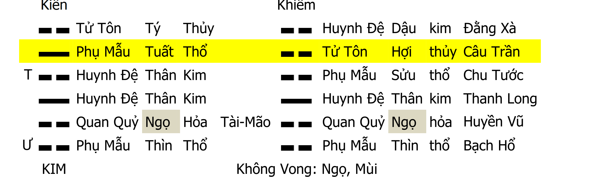

Mông
 
Hoán

Phụ Mẫu | Dần mộc | Phụ Mẫu Mão mộc Đằng Xà

Quan QuỷTý | thủy | Huynh ĐệTị | hỏa Câu Trần

T | Tử Tôn | Tuất thổ Tài-Dậu | Tử Tôn | Mùi thổ Chu Tước

Huynh ĐệNgọhỏa | Huynh ĐệNgọhỏa Thanh Long

Tử Tôn | Thìn thổ | Tử Tôn | Thìn thổ Huyền Vũ

Ư | Phụ Mẫu | Dần mộc | Phụ Mẫu Dần mộc Bạch Hổ

HỎA
Không Vong: Tý, Sửu

Hào Phụ Mẫu tại Dần mộc, vì xem vào mùa thu nên điêu tàn, lại gặp Tuyệt (tại 
Nhật thần), gặp xung (Nhật thần), gặp khắc (Nhật thần, Nguyệt kiến). Hào 5 Tý thủy 
độc phát tương sinh cho hào Dần mộc không gốc, nên sinh không được dài lâu, nên 
đề phòng năm Ngọ xung mất Tý thủy. Xem năm Mão, sau quả mất vào năm Ngọ, vì 
ứng vào năm xung mất Nguyên thần Tý thủy.

### Ví dụ: Ngày Ất Dậu tháng Tị, xem về tuổi thọ của cha, được quẻ Tốn biến Cấu:

Tốn 
 
Cấu

T | Huynh Đệ | Mão | mộc | Thê Tài | Tuất thổ | Huyền Vũ

Tử Tôn | Tị | hỏa | Quan Quỷ | Thân | kim | Bạch Hổ

Thê Tài | Mùi | thổ | Tử Tôn | Ngọ | hỏa | Đằng Xà

Ư | Quan Quỷ | Dậu | kim | Quan Quỷ | Dậu | kim | Câu Trần

Phụ Mẫu | Hợi | thủy | Phụ Mẫu | Hợi | thủy | Chu Tước

Thê Tài | Sửu thổ | Thê Tài | Sửu | thổ | Thanh Long

MỘC
Không Vong: Ngọ, Mùi

Đoán rằng: Hào Phụ Hợi thủy gặp Nguyệt phá, lại bị Mùi thổ khắc thương, tuy 
được Nhật thần Dậu xung động Mão mộc mà khắc thổ, nhưng vì thổ vượng mộc suy, 
nên không những khó được trường thọ, mà còn khó sống thêm được mấy tháng, Quả 
nhiên mất vào tháng Đông chí trong năm đó. Sở dĩ ứng vào tháng Tý, là vì Tý xung 
mất Ngọ hỏa khiến Mùi thổ khắc Hợi thủy.

### Ví dụ: Ngày Bính Dần tháng Mão, xem về tuổi thọ của bà, được quẻ Trung Phu:

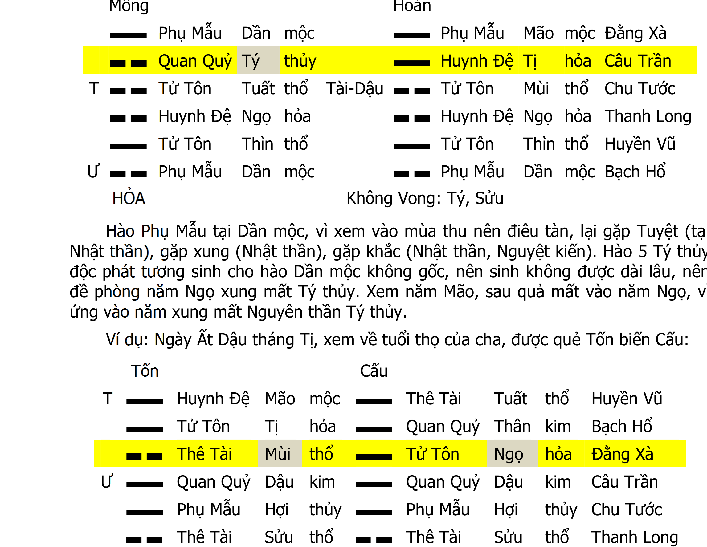

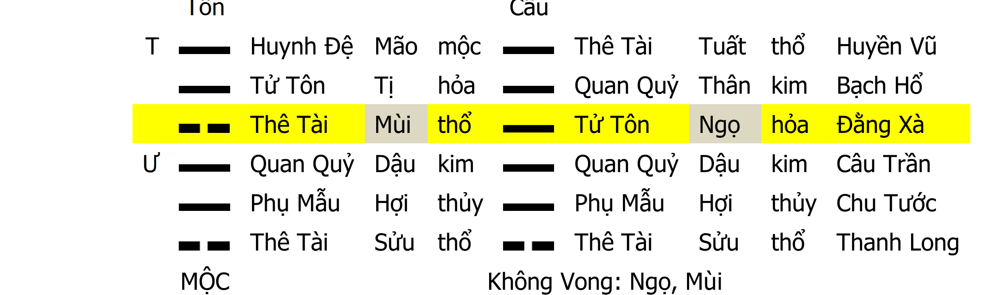

Trung Phu

Quan QuỷMão mộc | Thanh Long

Phụ Mẫu Tị | hỏa Tài-Tý | Huyền Vũ

T | Huynh ĐệMùi thổ | Bạch Hổ

Huynh ĐệSửu thổ Tử-Thân Đằng Xà

Quan QuỷMão mộc | Câu Trần

Ư | Phụ Mẫu Tị | hỏa | Chu Tước

THỔ 
Không Vong: Tuất, Hợi

Đoán rằng: Hào Tị hỏa Phụ Mẫu, được Nhật thần, Nguyệt kiến tương sinh, nên 
vẫn sống thọ. Người xem nói rằng: "Cha tôi đi cầu sao Bắc Đẩu cho bà tôi, nói rằng 
phải tế lễ bảy năm. Nay cha tôi bận việc công, tôi chưa kết hôn, thay cha tế lễ." Ta 
nói: "Thật là cha con có hiếu, cảm động lòng trời. Quẻ này được Nhật Nguyệt tương 
sinh, hẳn là được thần linh phò trợ." Quẻ xem năm Tuất, qua năm sau, do bà mắc 
chứng đờm tắc, nên người con lại đến xem.

Vào ngày Canh Thân tháng Sửu, xem được quẻ Quy Muội biến Phục:

Quy Muội
 
Phục

Ư | Phụ Mẫu Tuất thổ | Huynh ĐệDậu kim Đằng Xà

Huynh ĐệThân kim | Tử Tôn | Hợi thủy Câu Trần

Quan QuỷNgọ hỏa Tử-Hợi | Phụ Mẫu Sửu thổ Chu Tước

T | Phụ Mẫu Sửu thổ | Phụ Mẫu Thìn thổ Thanh Long

Thê Tài | Mão mộc | Thê Tài | Dần mộc Huyền Vũ

Quan QuỷTị | hỏa | Tử Tôn | Tý | thủy Bạch Hổ

KIM 
Không Vong: Tý, Sửu

Quẻ chưa sắp xong, thì người nhà đến báo rằng: "Lão phu nhân đã qua đời!" 
Người này vội vàng quay về. Ta xem kỹ quẻ này, thấy hào Sửu thổ Phụ Mẫu lâm 
Nguyệt kiến, lại có hào Ngọ hỏa động tương sinh, tuy hào Mão mộc động khắc thổ, 
nhưng lại hóa thoái thần, gặp Tuyệt tại ngày Thân, làm sao lại có thể qua đời được! 
Bèn vội đến nhà người này. Theo phong tục người phương Bắc, người chết rồi không 
được nằm trên giường, mà đã chuyển lên trên cánh cửa. Đờm tắc trong họng, nhưng 
còn nghe thấy hơi thở yếu ớt, ta bèn dùng ba tiền phèn hòa tan vào nước sôi, cậy 
răng đổ vào miệng, một lúc thì nghe kêu lên "Lạnh quá!". Người nhà vội đưa vào 
trong giường lò. Bà tiếp tục sống thêm mười ba năm nữa.

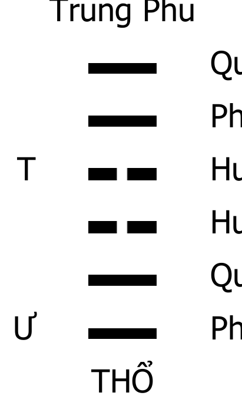

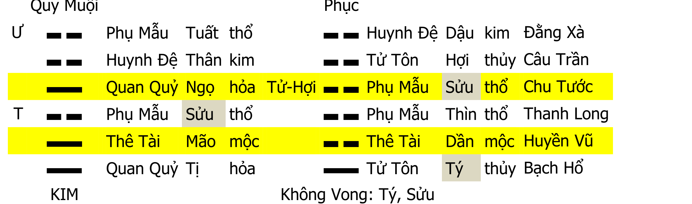

---

# CHƯƠNG 47: HUYNH ĐỆ

(ANH CHỊ EM)

Nếu xem về anh chị em, cần phải hỏi rõ nguyên do: Hoặc là do anh em bất hòa, 
nên xem có hòa hợp trở lại được không; hay xem anh chị em có ai phát đạt không? 
Hay xem sau này có thêm em hay không? Hay xem về tuổi thọ của anh chị em... Như 
vậy, việc suy đoán sẽ tiện lợi hơn.

Huynh hào vượng tướng ngộ sinh phù, tử kinh tịnh mậu.

Hào Huynh vượng tướng gặp sinh phù, tử kinh tươi tốt.

Nếu hào Huynh Đệ vượng tướng, hoặc lâm Nhật Nguyệt, hoặc được Nhật Nguyệt 
hào động sinh phù, hoặc động mà hóa cát, là tượng gối dài chăn rộng, hòa thuận lẫn 
nhau.

**Tân bình thích:** Cây tử kinh là ẩn dụ của huynh đệ, thời xưa anh em nhiều 
người cùng kê chung một gối, đắp chung một chăn, do đó lấy những cái này biểu thị 
anh em hòa thuận. Ở câu dưới, "nhạn tự" cũng có ý nghĩa là anh em. Chim nhạn bay 
có thứ tự, cho nên anh em gọi là "nhạn tự".

Đệ vị hưu tù kiêm thụ khắc, nhạn tự phân phi.

Hào Đệ hưu tù thêm bị khắc, mỗi kẻ một phương.

Nếu hào Huynh Đệ hưu tù, mà hỏi xem anh em có phát đạt không, thì tuy có 
cũng như không. Nếu hỏi xem về sau có thêm em không, là tượng không có. Nếu hỏi 
về tuổi thọ của anh em, ắt tuổi trời có hạn. Nếu hưu tù lại gặp Không, Phá, hoặc Nhật 
thần, Nguyệt kiến, hào động hình khắc, hoặc động hóa hung, thì xem về điều gì cũng 
bất lợi.

### Ví dụ: Ngày Bính Thìn tháng Thân, xem anh em có hòa hợp hay không, có phát

đạt hay không, được quẻ Đại Hữu biến Càn:

Đại Hữu
 
Càn

Ư | Quan Quỷ | Tị | hỏa | Phụ Mẫu | Tuất thổ | Thanh Long

Phụ Mẫu | Mùi | thổ | Huynh Đệ | Thân | kim | Huyền Vũ

Huynh Đệ | Dậu kim | Quan Quỷ | Ngọ | hỏa | Bạch Hổ

T | Phụ Mẫu | Thìn | thổ | Phụ Mẫu | Thìn | thổ | Đằng Xà

Thê Tài | Dần mộc | Thê Tài | Dần | mộc | Câu Trần

Tử Tôn | Tý | thủy | Tử Tôn | Tý | thủy | Chu Tước

KIM 
Không Vong: Tý, Sửu

Hào Huynh Đệ lâm Nguyệt kiến, được hào Phụ Mùi thổ động tương sinh, lại hóa 
thành hào Huynh Đệ. Nên ta đoán rằng: "Anh chị em tuy nhiều, trong đó chỉ có một 
người tuổi Thân được giúp đỡ." Người xem hỏi nguyên do, ta đáp: "Thần mách bảo ở 
hào động, động mà hóa ra hào biến lại lâm Nguyệt kiến, nên đó là tượng siêu quần 
bạt tụy." Người này bèn nói: "Quả có người em tuổi Thân, năm ngoái từng đỗ đệ

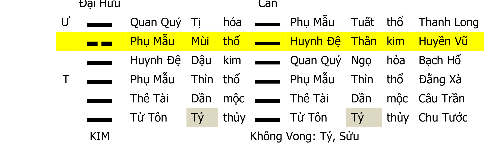 nhất, tôi cùng hai người anh em nữa đều theo nghề khác." Như vậy mới thấy quẻ xem 
quả thực linh nghiệm. Khoa thi sau, người em lại đỗ đầu bảng.

### Ví dụ: Ngày Mậu Thìn tháng Mão, xem về anh em, được quẻ Chấn biến Đoài:

Chấn
 
Đoài

T | Thê Tài | Tuất thổ | Thê Tài | Mùi thổ | Chu Tước

Quan QuỷThân kim | Quan QuỷDậu kim Thanh Long

Tử Tôn | Ngọ | hỏa | Phụ Mẫu | Hợi thủy Huyền Vũ

Ư | Thê Tài | Thìn thổ | Thê Tài | Sửu thổ | Bạch Hổ

Huynh ĐệDần | mộc | Huynh ĐệMão mộc Đằng Xà

Phụ Mẫu | Tý | thủy | Tử Tôn | Tị | hỏa Câu Trần

MỘC
Không Vong: Tuất, Hợi

Ta thấy quẻ này, cũng lo thay cho anh ta, bèn hỏi rằng: "Anh hỏi về việc gì?" 
Người này bèn đáp: "Bốn anh em chúng tôi vẫn chưa chia nhà ở riêng, nên muốn hỏi 
xem về sau có được hòa hợp lâu dài hay không? Có người nào thay lòng đổi dạ 
không? Có nên chia nhà ở riêng không?" Ta đáp: "Quẻ này đại hung? Hào hung, quẻ 
hung, nên chắc chắn sẽ có tai họa khó lường. Hào Huynh Đệ hóa Tiến thần, kim Quỷ 
cũng hóa Tiến thần, động mà xung khắc Chấn mộc, hóa ra Đoài kim lại hồi đầu khắc, 
là tượng cực hung."

Xem năm Nhâm Ngọ, đến năm Giáp Thân, thì cả bốn anh em bị hại cùng một 
lúc, cả nhà lớn bé trai gái đều sa vào trại giặc, ứng vào năm Thân, vì mộc gặp Tuyệt 
tại Thân.

Lại ví dụ: Ngày Tân Dậu tháng Mùi, xem còn có thêm em nữa không, được quẻ 
Ký Tế biến Cách:

Ký Tế
 
Cách

Ư | Huynh ĐệTý | thủy | Quan QuỷMùi thổ Đằng Xà

Quan QuỷTuất thổ | Phụ Mẫu Dậu kim Câu Trần

Phụ Mẫu Thân kim | Huynh ĐệHợi thủy Chu Tước

T | Huynh ĐệHợi | thủy Tài-Ngọ | Huynh ĐệHợi thủy Thanh Long

Quan QuỷSửu thổ | Quan QuỷSửu thổ Huyền Vũ

Tử Tôn | Mão mộc | Tử Tôn | Mão mộc Bạch Hổ

THỦY
Không Vong: Tý, Sửu

Ta đoán rằng: "Anh em tuy có, nhưng không được phát đạt. Hào Huynh Hợi thủy 
trì Thế, được hào Phụ Thân động tương sinh, người em này sẽ phát đạt, nhưng chưa 
được sinh ra. Hào Ứng Tý thủy tuy xuất hiện, nhưng gặp Tuần Không, nên mới nói 
không được phát đạt."

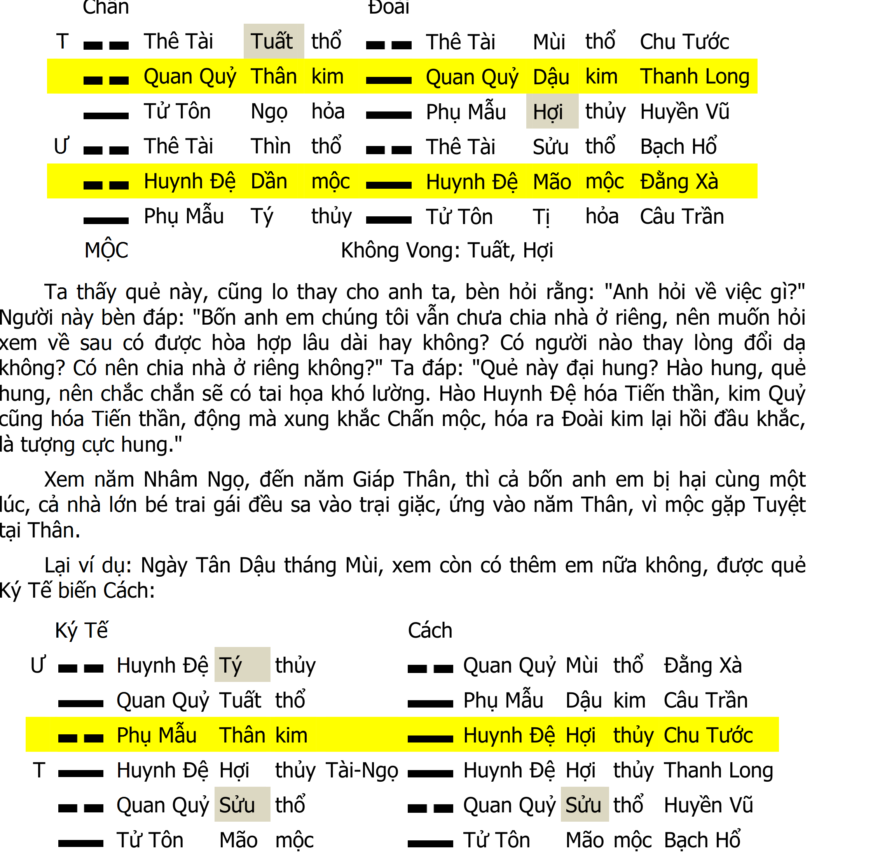

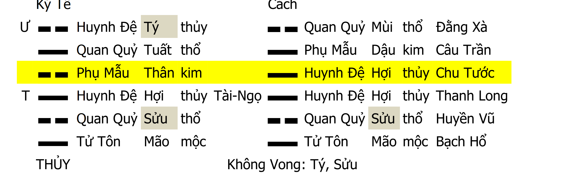

---

# CHƯƠNG 48. PHU PHỤ (VỢ CHỒNG)

Người này bèn nói: "Quả thực có một người em mắc phải chứng điên cuồng, nên 
mới hỏi xem còn có thêm anh em nữa hay không." Ta đáp: "Chắc chắn sẽ có! Là em 
cùng cha khác mẹ." Người này hỏi tại sao, ta bèn giải thích: "Hào Huynh Đệ là hào 
biến do Phụ Mẫu hóa ra, nên đoán được."

Người này lại hỏi: "Hào Huynh Đệ Tý thủy lâm Không mà không có lực, hào 
Huynh Hợi thủy trì Thế tại sao lại không được phát đạt?" Ta bèn đáp: "Phát đạt chính 
là hào 4 Thân kim hóa thành Hợi thủy. Sự vi diệu trong quẻ, sao anh có thể biết 
được."

Sau quả nhiên mẹ kế sinh thêm em, cha chết mà nuôi cho khôn lớn. Đợi cho đứa 
trẻ khôn lớn, còn mọi chuyện về sau vẫn chưa khảo nghiệm được. Phép xem xưa cho 
rằng trong quẻ không có hào Phụ Mẫu mà có hào Huynh Đệ, là tượng mẹ khác sinh 
con, ta cũng chưa kiểm nghiệm.

***

# CHƯƠNG 48: PHU PHỤ

(VỢ CHỒNG)

Xem về vợ chồng, cũng cần phải chia ra để xem, như xem tuổi thọ của vợ, xem 
vợ chồng có được chung sống đến bạc đầu không, hoặc xem vợ chồng có hòa thuận 
không, xem vợ có bị hình thương phá bại không... Xem về tỳ thiếp, mỗi quẻ chỉ xem 
cho một người, không được hỏi chung.

Tài Phúc sinh thân, toại xướng tùy chi nguyện; Ứng hào hợp Thế, thậm 
vi phụ họa chi thần.

Tài Phúc sinh thân; thỏa nguyện vợ chồng hòa thuận; hào Ứng hợp Thế, cũng 
chỉ là thần phụ thêm.

"Hoàng kim sách" chuyên dùng hào Ứng để xem cho vợ. Bởi vì trong chương 
"Thân mệnh" của sách đó, một quẻ đoán gộp cả cha con, anh em, tiền tài, quan tước, 
e rằng nếu dùng hào Tài để xem về vợ, thì biết lấy hào nào để xem của cải nên bất 
đắc dĩ phải dùng hào Ứng để xem cho vợ, chẳng cần biết có ứng nghiệm hay không?

Tuy rằng dùng hào Ứng để xem về vợ cũng không hoàn toàn phi lý. Khi xem về 
vợ thì hào Tài là quan trọng hàng đầu, tiếp đến là hào Ứng. Hào Tài vượng tướng mà 
hào Ứng gặp Không Phá vẫn đoán là tốt. Hào Ứng vượng tướng, hào Tài gặp Không 
Phá, là tượng hung. Hào Tài hào Ứng đều vượng, là tốt càng thêm tốt; hào Ứng hào 
Tài đều Phá, hung càng thêm hung. Cho nên hào Ứng chỉ là phụ thêm mà thôi.

Hào Tài nếu được vượng hoặc tướng, hoặc lâm Nhật Nguyệt, hoặc được Nhật 
thần, Nguyệt kiến, hào động sinh phò, hoặc động mà hóa cát, hoặc tương sinh tương 
hợp với hào Thế, nếu xem vợ chồng có được chung sống đến bạc đầu hay không, là 
tượng hạnh phúc lâu bền; nếu xem vợ chồng có hòa thuận hay không, là tượng tâm 
đầu ý hợp; nếu xem vận mệnh của vợ, là tượng vượng phát cho nhà chồng; nếu xem 
cho tỳ thiếp, cũng suy đoán tương tự như vậy.

Tài động hóa hung, thất lý di trâm chi thán; Huynh Đệ trì Thế, cổ bồn ky 
cứ chi bi.

Tài động hóa hung, oán thán nửa đường đứt gánh; Huynh Đệ trì Thế, đớn đau 
nỗi vợ lìa trần.

Hào Tài động hóa hung, hóa Quỷ, hóa hồi đầu khắc, hóa Thoái thần, hóa Tuyệt, 
hóa Mộ, hóa Phá, bất kể xem về chuyện gì, cũng là tượng chia lìa đổ vỡ.

Hào Huynh Đệ trì Thế, hoặc hào Huynh động trong quẻ, hoặc Nhật Nguyệt lâm 
Huynh Đệ thương khắc Tài, hoặc hào Huynh hóa Tài, bất kể xem cho vợ hay tỳ thiếp, 
đều chủ về không sống thọ.

Tài vượng Huynh suy, chung tu phản mục; khắc Tài Tài thoái, tất chủ 
sinh ly.

Tài vượng Huynh suy bại, vợ chồng trở mặt; Tài khắc, Tài hóa Thoái, hai ngả 
sinh ly.

Hào Huynh trì Thế mà hào Tài vượng, không khắc được Thê Tài, là tượng vợ 
chồng trở mặt, hóa ra thù hận. Hào Huynh trì Thế, hào Tài hóa Thoái thần, cũng 
tương tự như vậy, không phải vợ chồng trở mặt, cũng là tượng chia ly.

### Ví dụ: Ngày Tân Tị tháng Dậu, xem vợ chồng về sau có được hòa thuận hay

không, được quẻ Thái:

Thái

Ư

Tử Tôn | Dậu | kim | Đằng Xà

Thê Tài | Hợi | thủy | Câu Trần

Huynh ĐệSửu thổ | Chu Tước

T

Huynh ĐệThìn thổ | Thanh Long

Quan QuỷDần | mộc Phụ-TịHuyền Vũ

Thê Tài | Tý | thủy | Bạch Hổ

THỔ
Không Vong: Thân, Dậu

Hào Huynh trì Thế, khắc Thê Tài, nhưng may hào Tài Hợi thủy được Nguyệt kiến 
tương sinh, Tài vượng nên khó bị khắc hại. Người xem bèn hỏi: "Vợ chồng tôi hiện 
đang bất hòa, sau này liệu có hòa hảo được không?" Ta đáp: "Nhật thần Tị xung động 
Hợi thủy, mà Hợi là Dịch Mã. Thê Tài lâm Dịch Mã, lại ám động, nên tình cảm khó vãn 
hồi, là tượng phân ly."

Người đó vì việc này mà xem đi xem lại rất nhiều lần, mười lần thì đến chín gặp 
Huynh Đệ trì Thế, hoặc Tài hóa Thoái thần, về sau quả vợ chồng phải chia tay.

"Hoàng kim sách" có viết: "Thế là cội gốc của cuộc đời, Ứng là người vợ bền 
duyên". Quẻ này Thế, Ứng tương sinh, là tượng vợ chồng hòa thuận, chung sống bạc 
đầu, thì thực là sai lầm lớn.

### Ví dụ: Ngày Quý Mão tháng Tuất, xem quan hệ vợ chồng ra sao, có hình khắc

không, được quẻ Lữ biến Kiển:

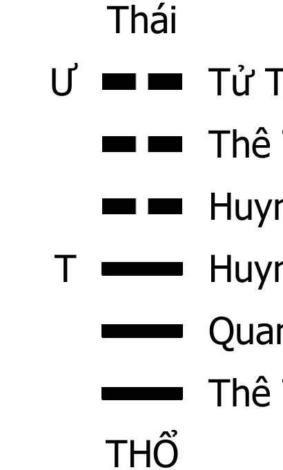

Lữ 
 
Kiển

Huynh ĐệTị | hỏa | Quan QuỷTý | thủy Bạch Hổ

Tử Tôn | Mùi | thổ | Tử Tôn | Tuất thổ Đằng Xà

Ư | Thê Tài | Dậu kim | Thê Tài | Thân kim Câu Trần

Thê Tài | Thân kim Quan-Hợi | Thê Tài | Thân kim Chu Tước

Huynh ĐệNgọ hỏa | Huynh ĐệNgọ hỏa Thanh Long

T | Tử Tôn | Thìn thổPhụ-Mão | Tử Tôn | Thìn thổ Huyền Vũ

HỎA
Không Vong: Thìn, Tị

Đoán rằng: Hào Thê không chỉ được Thế, Ứng tương sinh, lại còn được hào Thế 
hợp Tài, đúng là tượng bách niên giai lão. Hiềm nỗi hào Thế lâm Không, gặp Phá, nên 
không hợp được; lại thêm hào Tài hóa Thoái thần, muốn hợp mà chẳng được, là 
tượng phân ly. Sau quả nhiên vừa cưới vợ về, vợ chồng bất hòa, nên sau bỏ vợ.

Ứng Tài thụ chế, kết phát nan vu giai lão; động Thê vượng tướng, tục 
huyền kham hứa bạch đầu.

Ứng, Tài bị chế, xe tơ chẳng được bền lâu; Thê động vượng tướng, tục huyền 
nên duyên đầu bạc.

Trong quẻ, nếu hào Tài xuất hiện nhiều, có thể phân chia thành vợ chính, vợ thứ, 
tất nhiên hào Tài tại Ứng sẽ chỉ vợ chính. Nếu bị Nhật thần, Nguyệt kiến, hào động 
xung khắc, hoặc động hóa hung, sẽ tổn hại đến vợ chính. Nếu có hào Tài khác vượng 
tướng, hoặc động hóa cát; hoặc hào Tài do hào khác biến ra là vượng tướng, mà 
tương sinh tương hợp hào Thế, chủ về lấy vợ kế có thể chung sống đến bạc đầu.

Nếu hào Tài không ở Ứng, thì lấy hào Tài ở quẻ chính làm vợ chính, hào Tài ở 
quẻ biến làm vợ kế.

**Tân bình thích:** Hiện nay là chế độ một vợ một chồng, hào Tài lâm Ứng là vợ, 
hào Tài khác là phụ nữ gặp gỡ bên ngoài, hoặc người thứ ba. Lại lấy Tài lâm hào 2 
làm vợ, hào Tài khác và hào Tài hóa ra là phụ nữ gặp gỡ bên ngoài. Sách này luận 
theo nam, nếu nữ đoán hôn nhân thì lấy Quan phỏng theo là được.

Thê Tài khắc Thân, phi hình thương tất nhiên đố hãn.

Thê Tài khắc Thân, không gặp hình thương, vợ ắt ghen tuông, hung dữ.

Nếu hào Thê Tài khắc Thế, mà Thế hưu tù, gặp Không, Phá, hoặc gặp Mộ Tuyệt, 
hoặc động mà biến hung, theo Quỷ nhập Mộ, gặp một trong những trường hợp trên, 
chủ về chồng chết yểu. Hào Tài vượng khắc Thế, nếu hào Thế đắc địa, tuy không bị 
hình thương, nhưng ắt lấy phải người vợ ghen tuông, hung dữ.

**Tân bình thích:** Không chỉ lấy Tài để xem mà đôi khi cũng xem Nguyên thần 
của Tài, và cũng xem cả hào Ứng, Nguyên thần là tư duy và tiềm thức của một người, 
động mà khắc Thế, cũng là vợ hung hãn.

### Ví dụ: Ngày Quý Tị tháng Ngọ, nam đoán vợ chồng cãi nhau, sẽ ra sao? Được

Đỉnh biến Tụng.

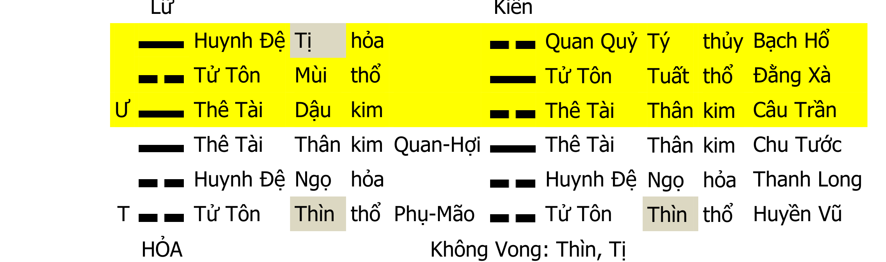

Đỉnh
 
Tụng

Huynh ĐệTị | hỏa | Tử Tôn | Tuất thổ Bạch Hổ

Ư | Tử Tôn | Mùi thổ | Thê Tài | Thân kim Đằng Xà

Thê Tài | Dậu kim | Huynh ĐệNgọ hỏa Câu Trần

Thê Tài | Dậu kim | Huynh ĐệNgọ hỏa Chu Tước

T | Quan QuỷHợi thủy | Tử Tôn | Thìn thổ Thanh Long

Tử Tôn | Sửu thổ Phụ-Mão | Phụ Mẫu Dần mộc Huyền Vũ

HỎA
Không Vong: Ngọ, Mùi

Nhật Nguyệt lâm Huynh Đệ khắc Tài, Tài lại tự mình động mà hóa hồi đầu khắc, 
chính là tượng vợ muốn phân ly. Ứng động khắc Thế, Ứng là Nguyên thần, từ trong 
nội tâm vợ đã không thích anh ta, trên thực tế là anh ta thường xuyên bị vợ chửi 
mắng. Cuộc hôn nhân này sẽ tan vỡ.

Ứng Tài sinh Thế phi nội trợ, tất hoạch ngoại tài.

Ứng Tài sinh Thế, không được trợ giúp, cũng được tiền tài.

Trong quẻ, nếu hào Tài tương sinh, tương hợp hào Thế, không chỉ là tượng hòa 
thuận tốt đẹp, mà nhiều khi còn ứng vào điềm được giúp đỡ, có tiền của từ nhà vợ, 
nếu không, cũng là tượng vợ đảm giỏi giang.

### Ví dụ: Ngày Đinh Mùi tháng Tị, xem vợ chồng có được chung sống đến bạc đầu

không, được quẻ Vô Vọng biến Quan:

Vô Vọng
 
Quan

Thê Tài | Tuất thổ | Huynh Đệ | Mão | mộc | Thanh Long

Quan Quỷ | Thân | kim | Tử Tôn | Tị | hỏa Huyền Vũ

T | Tử Tôn | Ngọ | hỏa | Thê Tài | Mùi thổ | Bạch Hổ

Thê Tài | Thìn | thổ | Huynh Đệ | Mão | mộc | Đằng Xà

Huynh Đệ | Dần | mộc | Tử Tôn | Tị | hỏa Câu Trần

Ư | Phụ Mẫu | Tý | thủy | Thê Tài | Mùi thổ | Chu Tước

MỘC 
Không Vong: Dần, Mão

Trong quẻ xuất hiện rất nhiều hào Tài, hào Thê Mùi thổ biến ra từ hào Thế tương 
hợp với Thế, nên hào Thê Tài Mùi thổ chỉ vợ chính, lâm Nhật thần, được Nguyệt kiến 
tương sinh, không những chung sống đến bạc đầu, mà còn hiền thục đức hạnh.

Quả thực người này có đến mười mấy tỳ thiếp trẻ đẹp, nhưng vợ cả hiền thục 
không ghen tuông. Vợ chồng cùng tuổi, bà thọ 81 tuổi, ông thọ 85 tuổi.

Quẻ này nếu căn cứ Thế Ứng tương xung tương khắc mà suy đoán, sẽ mắc sai 
lầm lớn.

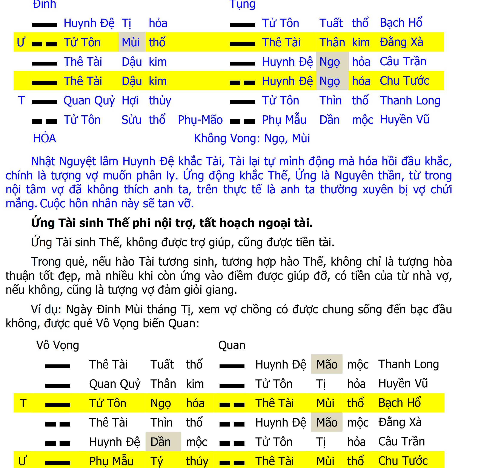

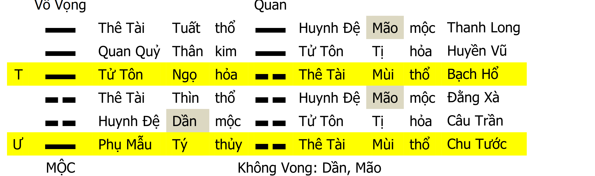

---

# CHƯƠNG 49: TỬ TỰ

(CON CÁI)

Xem về con cái, cần phải nói rõ ràng, là đã có con, muốn xem về sau có sinh nở 
nữa không; hay hỏi xem con cái có sống lâu hay không; hay là chưa từng sinh nở, hỏi 
xem sau này có con hay không?

Dịch chỉ mách bảo chuyện tương lai, không hiển hiện chuyện đã qua. Ví như khi 
xem về thời tiết, thì thần linh chỉ mách bảo chuyện lụt hạn trong tương lai, chứ không 
phản ánh chuyện nắng mưa của ngày qua. Giả sử đã có con cái, hỏi xem sau này có 
sinh nữa không, nếu quả thực về sau không sinh nở thêm, thì thần ắt mách bảo cho 
tượng quẻ không con. Nếu câu hỏi hàm hồ, không nói rõ là đã có con, mà quẻ hiện 
lên là tượng không con, người xem quẻ chỉ căn cứ vào tượng quẻ mà đoán, người 
xem lúc ấy chắc gì chịu phục.

Cũng có trường hợp tuy đã sinh con, nhưng con không nuôi được lâu, thì thần 
cũng hiện lên tượng quẻ tuyệt tự.

### Ví dụ: Vào ngày Quý Hợi tháng Dần, xem con cái được mấy người, được quẻ

Khôn biến Cấn:

Khôn
 
Cấn

T | Tử Tôn | Dậu kim | Quan QuỷDần mộc Bạch Hổ

Thê Tài | Hợi thủy | Thê Tài | Tý | thủy Đằng Xà

Huynh ĐệSửu thổ | Huynh ĐệTuất thổ Câu Trần

Ư | Quan QuỷMão mộc | Tử Tôn | Thân kim Chu Tước

Phụ Mẫu Tị | hỏa | Phụ Mẫu Ngọ hỏa Thanh Long

Huynh ĐệMùi thổ | Huynh ĐệThìn thổ Huyền Vũ

THỔ
Không Vong: Tý, Sửu

Ta đoán rằng: "Hào Quỷ biến Tử Tôn, hào Tử biến Quỷ, chỉ cần gặp một trong 
hai trường hợp này đã chủ về không con. Quẻ này lại xuất hiện hai tượng không con." 
Người xem bèn nói: "Thời trẻ khó khăn về đường con cái, ngoài ngũ tuần thì sinh liền 
bốn con trai, con trai trưởng đã sáu tuổi." Ta đáp: "Nếu theo tượng quẻ này, e rằng 
khó giữ được."

Người này thê thiếp rất đông, trong vòng năm ba năm, cứ sinh là chết. Sinh đến 
chín con, không còn được một người. Sau chết đi phải lập cháu nối dõi, thế tập chức 
vị.

Phúc đức vượng long, dục nhi hiền đức.

Phúc đức hưng vượng, sinh con hiền đức.

Phúc đức tức hào Tử Tôn, nếu hưng vượng, được sinh phù, hoặc lâm Nhật 
Nguyệt, hoặc gặp Đế Vượng, Trường Sinh tại Nhật thần, hoặc động hóa cát, chủ về 
sinh con hiền đức.

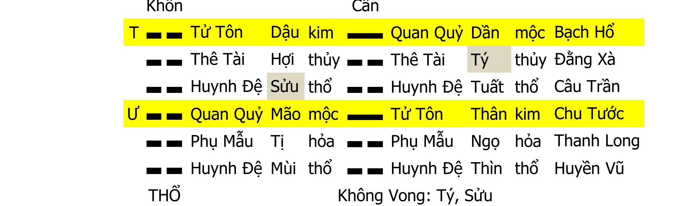

**Tân bình thích:** Thuyết này không ổn, suy vượng chỉ có thể nói sức khỏe của 
con cái, cơ thể có khỏe mạnh hay không, không thể nói hiền đức ra sao. Tử Tôn sinh 
Thế, vượng mà lâm Thanh Long, là con cháu có tiền đồ mà biết hiếu đạo, lâm Bạch 
Hổ Huyền Vũ mà khắc Thế, là bị hại bởi con. Tử Tôn lâm Long, tài đức mà biết lễ độ; 
lâm Tước, thiện ngôn mà nhiều tiếng cười; lâm Câu, hoặc lười biếng hoặc ngu đần; 
lâm Xà, bí hiểm, xảo quyệt; lâm Bạch Hổ, bướng bỉnh, hiếu động, không nghe lời; lâm 
Huyền Vũ, tính cách hướng nội. Quý ở phân tích linh hoạt.

Tử Tôn suy nhược, sinh tử ngu si.

Tử Tôn suy nhược, con cái ngu đần.

Nếu hào Tử Tôn suy nhược, ắt sẽ sinh con ngu đần. Suy mà lại bị khắc, hưu tù 
vô khí, hoặc gặp Mộ, Tuyệt, Không, Phá, hoặc động mà họá hung, hoặc bị Nhật thần, 
Nguyệt kiến, hào động xung khắc, hoặc hào Phụ hóa hào Tử, hoặc hào Tử hóa hào 
Phụ, hoặc hào Quỷ hóa Tử Tôn, hoặc hào Phụ Mẫu trì Thế, đều chủ về có sinh không 
dưỡng. Hào Tử động gặp Tuần Không cũng không đáng ngại, vào năm xung Không, 
thực Không sẽ sinh con trai.

Giác Tử bàn rằng: "Hoàng kim sách" có viết, hào Tử hóa hào Huynh, là điềm sinh 
con ngu độn, mà không biết được rằng, hóa Huynh là hồi đầu sinh, làm sao lại là 
tượng con cái không tốt.

Phần chú giải trong sách lại viết: Hào Tử hóa Quỷ cũng là tượng con cái bất tài. 
Hóa Quỷ trăm con không sống được một, đâu chỉ có bất tài?

### Ví dụ: Vào ngày Tân Mão tháng Thân, xem về con cái, được quẻ Phục:

Phục

Tử Tôn | Dậu kim | Đằng Xà

Thê Tài | Hợi thủy | Câu Trần

Ư | Huynh ĐệSửu thổ | Chu Tước

Huynh ĐệThìn thổ | Thanh Long

Quan QuỷDần mộc Phụ-TịHuyền Vũ

T | Thê Tài | Tý | thủy | Bạch Hổ

THỔ
Không Vong: Ngọ, Mùi

Đoán rằng: "Thân cát mà được Tử sinh phù, là tượng hòa hợp. Nhật kiến Mão 
xung động hào thượng Tử Tôn mà sinh Thế, nên là tượng con từ xa về đến nhà." 
Người xem mừng rỡ mà nói: "Năm tôi ba mươi bảy tuổi có sinh một người con trai, 
nay đã mười tám, nhưng vì loạn lạc mà thất lạc, không biết hiện ở nơi đâu." Ta nói: 
"Chúc mừng ông! Trong quẻ hiện rõ Tử Tôn từ hào 6 động mà sinh Thế, nên con trai 
ông ắt sẽ quay về." Người này bèn hỏi: "Vậy lúc nào sẽ gặp? Ta đáp: Năm sau là năm 
Giáp Thìn, tương hợp với Dậu kim, chắc chắn sẽ thành đạt mà quay về."

Quả nhiên đến tháng sáu năm sau, cha con được trùng phùng.

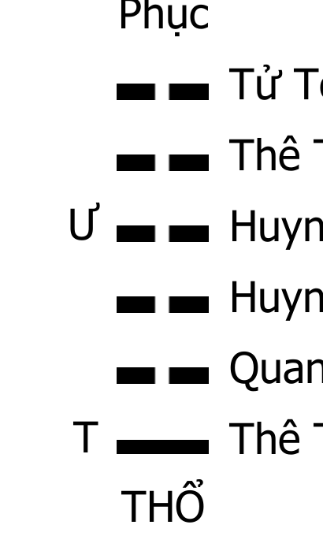

Tài hóa Tử, khả biện chính xuất thứ xuất.

Hào Tài hóa Tử, cần phân biệt con vợ chính con vợ lẽ.

Trong quẻ có hào Tài mà không có hào Tử Tôn, cần phải xem hào biến. Nếu hào 
biến là Tử Tôn, là chỉ có con do vợ lẽ sinh, nên có thể đoán rằng: Vợ cả không có con, 
ắt là con do vợ lẽ sinh.

Nếu trong quẻ có hào Tử Tôn, hào biến cũng là Tử Tôn, lại không luận theo cách 
này. Trong trường hợp đó, hào biến Tử Tôn tượng trưng cho con đẻ muộn. Nếu vợ 
chính, vợ lẽ đều đã sinh nở, mà hỏi xem con cái có hiền đức không, thì hào Tử Tôn 
trong quẻ chính chỉ con vợ cả, hào Tử Tôn trong quẻ biến chỉ con vợ lẽ.

### Ví dụ: Ngày Kỷ Dậu tháng Tị, vì sinh con đều chết yểu, nên xem về sau còn có

con hay không, được quẻ Bí biến Vô Vọng:

Bí 
 
Vô Vọng

Quan QuỷDần mộc | Huynh ĐệTuất thổ Câu Trần

Thê Tài | Tý | thủy | Tử Tôn | Thân kim Chu Tước

Ư | Huynh ĐệTuất thổ | Phụ Mẫu Ngọ hỏa Thanh Long

Thê Tài | Hợi thủy Tử-Thân | Huynh ĐệThìn thổ Huyền Vũ

Huynh ĐệSửu thổ Phụ-Ngọ | Quan QuỷDần mộc Bạch Hổ

T | Quan QuỷMão mộc | Thê Tài | Tý | thủy Đằng Xà

THỔ
Không Vong: Dần, Mão

Ta đoán rằng: "Đã đổi qua vợ chưa?" Người xem liền đáp: "Vẫn là một vợ 
trước." Ta đáp: "Vợ cả có bị tổn thương, con cái mới có thể sống sót." Người xem hỏi 
nguyên nhân, ta giải thích: "Quẻ nội hào Tài Hợi thủy chỉ vợ cả, gặp phá lại bị khắc. 
Hào 5 Thê Tài Tý thủy chỉ vợ kế, biến thành Thân kim Tử Tôn, nên ắt sẽ sinh con. 
Nhưng hào 5 Tý thủy cũng bị Tuất thổ khắc, tuy động hóa Thân là hóa Trường Sinh, 
lại được Nhật thần Dậu tương sinh, nhưng khó tránh khỏi nhiều bệnh tật."

Xem năm Mão, đến năm Tị thì vợ cả chết, đến mùa đông năm đó tục huyền, 
sang năm Thân sinh con. Vợ hai sau cũng bị ốm, nằm liệt giường.

**Tân bình thích:** Lý luận này chưa hẳn hoàn toàn đúng, cần phải phán đoán linh 
hoạt. Quan niệm của người thời nay đã khác xưa, người vì sinh con mà cưới vợ nhiều 
lần rất ít, cũng không được cùng lúc lấy nhiều vợ, không có phân biệt vợ chính vợ lẽ.

### Ví dụ: Ngày Ất Tị tháng Mùi năm Ất Hợi, một người đàn ông kết hôn đã mấy

năm, nhưng vợ mãi không thể mang thai, đoán năm nào có con, được Đại Quá biến 
Tiểu Quá.

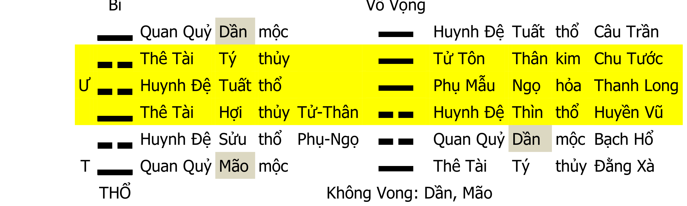

Đại Quá
 
Tiểu Quá

Thê Tài | Mùi thổ | Thê Tài | Tuất thổHuyền Vũ

Quan QuỷDậu kim | Quan QuỷThân kim Bạch Hổ

T | Phụ Mẫu Hợi thủy Tử-Ngọ | Tử Tôn | Ngọ hỏa Đằng Xà

Quan QuỷDậu kim | Quan QuỷThân kim Câu Trần

Phụ Mẫu Hợi thủy Huynh-Dần | Tử Tôn | Ngọ hỏa Chu Tước

Ư | Thê Tài | Sửu thổ | Thê Tài | Thìn thổThanh Long

MỘC 
Không Vong: Dần, Mão

Đây là quẻ có hào Tài mà không có Tử Tôn, hào 2 động mà biến ra Tử Tôn Ngọ 
hỏa, theo lý luận ở trên thì đây là con vợ lẽ. Tôi không đoán như vậy. Tử Tôn phục 
dưới hào Thế, được Nguyệt hợp vượng, Nhật thần phù khởi, có con và là con của 
mình. Phi đến khắc Phục, Phụ Mẫu Hợi thủy lại động đến khắc Tử Tôn, năm Thìn Phụ 
Mẫu nhập Mộ, năm Tị xung mất Phi thần, không năm Canh Thìn thì năm Tân Tị có 
con.

Sau đó, năm Kỷ Mão mang thai rồi sảy thai, năm Canh Thìn lại mang thai, tháng 
Mão năm Tân Tị sinh hạ một đứa con trai.

Tử hóa Tử, tu tri bản cung tha cung.

Tử hóa Tử, nên xem rõ thuộc cùng cung hay khác cung.

Tử Tôn hóa Tử Tôn, có hai điều ứng nghiệm như sau:

Nếu là người trẻ tuổi chưa có con, được quẻ này là tượng đông con. Nếu là người 
đã sinh con, được quẻ này là tượng đông con nhiều cháu.

Nếu là người già không con, được quẻ này, là tượng nuôi con người khác; còn về 
con cái, cần phải phân biệt rõ, nếu hóa thành quẻ thuộc cung khác, là tượng nuôi con 
khác họ; nếu hóa thành quẻ cùng cung, là tượng nuôi cháu trong họ.

### Ví dụ: Ngày Mậu Tuất tháng Tý, đã có con, xem về sau có sinh nữa không, được

quẻ Truân biến Tiết:

Truân
 
Tiết

Huynh ĐệTý | thủy | Huynh ĐệTý | thủy Chu Tước

Ư | Quan QuỷTuất thổ | Quan QuỷTuất thổ Thanh Long

Phụ Mẫu | Thân kim | Phụ Mẫu | Thân kim Huyền Vũ

Quan QuỷThìn thổ Tài-Ngọ | Quan QuỷSửu thổ Bạch Hổ

T | Tử Tôn | Dần mộc | Tử Tôn | Mão mộc Đằng Xà

Huynh ĐệTý | thủy | Thê Tài | Tị | hỏa Câu Trần

THỦY
Không Vong: Thìn, Tị

Hào Tử Tôn hóa Tử Tôn, lại được Nguyệt kiến tương sinh, không những chủ về 
đông con, mà còn nhiều cháu. Người xem hỏi rằng: "Số tôi được mấy con?" Ta bèn

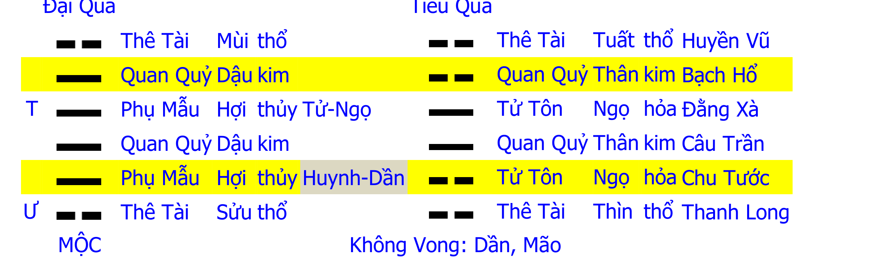

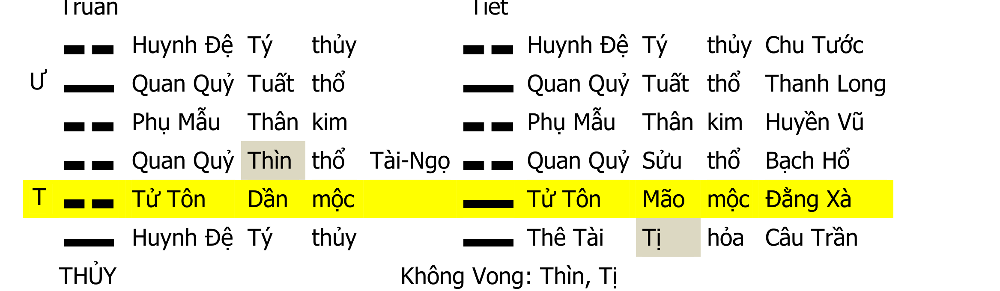 đáp: "Trong sách xưa có ghi lại phương pháp xem về số con, ta thấy không hợp lý, 
nên không dám đoán theo đó để lừa người." Người xem bèn hỏi: "Phép xưa sai ở chỗ 
nào?" Ta bèn đáp: "Phép xưa cho rằng thủy một, hỏa hai, mộc ba, kim bốn, thổ năm, 
chỉ dừng lại ở số năm. Vậy như Văn Vương có trăm con, thì dựa vào đâu mà đoán? Ta 
chỉ xem nhiều hay ít, nếu vượng tướng là đông con; nếu muốn xem hiền hay ngu, cần 
xem riêng quẻ khác, nếu là vượng tướng thì con hiền, thử nhiều lần thấy đều ứng 
nghiệm. Nay ta thử đoán quẻ này, xem về sau có ứng nghiệm không. Hào động Tử 
Tôn Dần mộc, chỉ về con đã sinh; hào biến Tử Tôn Mão mộc, chỉ con sẽ sinh sau này." 
Hỏi xem đã được mấy con, người xem đáp được bốn. Ta nói: "Vẫn còn bốn đứa nữa!"

Hơn mười năm sau, quả nhiên sinh thêm được bốn trai. Ta đến thăm nhà, thấy 
có đứa tuổi Mão chỉ có một mắt, còn lại đều không có khuyết tật. Ta bèn nói: "Đứa 
con này về sau sẽ hiển quý." Người này hỏi nguyên do, ta đáp: "Quẻ trước biến ra 
hào Tử Tôn Mão mộc, bị Nguyệt kiến tương hình, được Nhật thần tương hợp. Trong 
hình có hợp, nên nay đứa con này bị phá tướng, ắt sẽ hiển quý." Người con này mười 
bốn tuổi nhập học, do cuối đời Minh không tổ chức đại khoa, thi Cống sinh đỗ đầu, 
làm quan đến Tham chính. Còn chuyện sau nữa chưa rõ.

Lại ví dụ: Ngày Đinh Dậu tháng Tị, xem có con trai không, được quẻ Vị Tế biến 
Tiết.

Vị Tế
 
Tiết

Ư

Huynh ĐệTị | hỏa | Quan QuỷTý | thủy Thanh Long

Tử Tôn | Mùi thổ | Tử Tôn | Tuất thổ | Huyền Vũ

Thê Tài | Dậu | kim | Thê Tài | Thân kim Bạch Hổ

T

Huynh ĐệNgọ | hỏa Quan-Hợi | Tử Tôn | Sửu | thổ | Đằng Xà

Tử Tôn | Thìn thổ | Phụ Mẫu | Mão mộc Câu Trần

Phụ Mẫu | Dần | mộc | Huynh ĐệTị | hỏa Chu Tước

HỎA
Không Vong: Thìn, Tị

Người này sinh nhiều lần chỉ được con gái, đều không nuôi được, nên hỏi xem về 
sau có sinh được con trai không. Quẻ nội Thìn thổ Tử Tôn lâm Không lại bị Dần mộc 
khắc, là tượng không con. May được quẻ ngoại có Mùi thổ hóa Tử Tôn, nên khuyên 
người này nên sớm nhận con nuôi. Người xem nói: "Đúng là tôi đang có ý này! Anh vợ 
có người con trai rất thông minh, đang muốn nhận nuôi, không biết thế nào!" Ta bèn 
nói: "Cung Ly biến thành cung khác, nên phải là nhận con nuôi khác họ. Sau quả 
nhiên nhận cháu ngoại làm con nuôi."

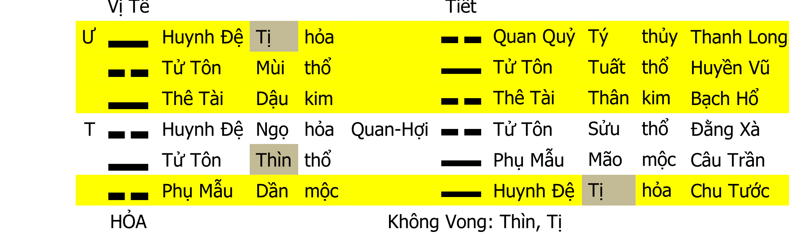

### Ví dụ: Vào ngày Canh Tý tháng Hợi, xem có con trai không, được quẻ Truân biến

Tiết:

Truân
 
Tiết

Huynh ĐệTý | thủy | Huynh ĐệTý | thủy Đằng Xà

Ư | Quan QuỷTuất thổ | Quan QuỷTuất thổ Câu Trần

Phụ Mẫu | Thân kim | Phụ Mẫu | Thân kim Chu Tước

Quan QuỷThìn thổ Tài-Ngọ | Quan QuỷSửu thổ Thanh Long

T | Tử Tôn | Dần mộc | Tử Tôn | Mão mộc Huyền Vũ

Huynh ĐệTý | thủy | Thê Tài | Tị | hỏa Bạch Hổ

THỦY
Không Vong: Thìn, Tị

Người này tuổi ngoại lục tuần, chưa hề có con. Bản thân cũng hiểu về Dịch lý, 
nên xem được quẻ này rất vui mừng, cho rằng hào Thế Tử Tôn lại hóa thành Tử Tôn, 
được Nhật kiến tương hợp, Nhật thần tương sinh, nên ắt là điềm đông con. Nhưng 
ông ta không biết rằng, hào Tử Tôn hóa Tử Tôn, thì đó không phải là con ruột. Tháng 
ba năm sau, chết ở nơi nhiệm chức, sau lập cháu để thừa kế.

**Tân bình thích:** Được hào Ứng hóa ra Tử Tôn hoặc hào Ứng động mà đến sinh 
Tử Tôn cũng là tượng nhận con người khác làm con thừa tự.

### Ví dụ: Ngày Đinh Hợi tháng Tý năm Ất Hợi, nam có vợ nhiều lần sảy thai, đoán

sau này có thể có con hay không? Được Phục biến Quải.

Phục
 
Quải

Tử Tôn | Dậu kim | Huynh ĐệMùi thổ Thanh Long

Thê Tài | Hợi thủy | Tử Tôn | Dậu kim Huyền Vũ

Ư | Huynh ĐệSửu thổ | Thê Tài | Hợi thủy Bạch Hổ

Huynh ĐệThìn thổ | Huynh ĐệThìn thổ Đằng Xà

Quan QuỷDần mộc Phụ-Tị | Quan QuỷDần mộc Câu Trần

T | Thê Tài | Tý | thủy | Thê Tài | Tý | thủy Chu Tước

THỔ
Không Vong: Ngọ, Mùi

Nhật Nguyệt tuy không sinh Tử Tôn, nhưng cũng không khắc Tử Tôn, Tử Tôn 
được hai tầng thổ động đến sinh, sau này sẽ có con. Nhưng Ứng thổ động sinh Tử 
Tôn, hào 5 Tài động lại hóa Tử Tôn, đây là cách sơn hóa hào, hào Ứng hóa ra Tử 
Tôn, chính là con người khác. Vì vậy trước tiên là năm Sửu nhận con người khác làm 
con thừa tự, năm Dần, hào 5 động mà gặp hợp, mới có thể có con của mình.

Về sau ở năm Đinh Sửu nhận con gái người khác làm con nuôi, năm Mậu Dần lại 
sinh được một đứa con gái.

Phụ chiêm tử, tri kỳ dị dưỡng; Tử lâm quý, nan viết thành danh.

Cha xem về con, chỉ biết có dễ nuôi; Tử Tôn vượng tướng, khó nói thành danh.

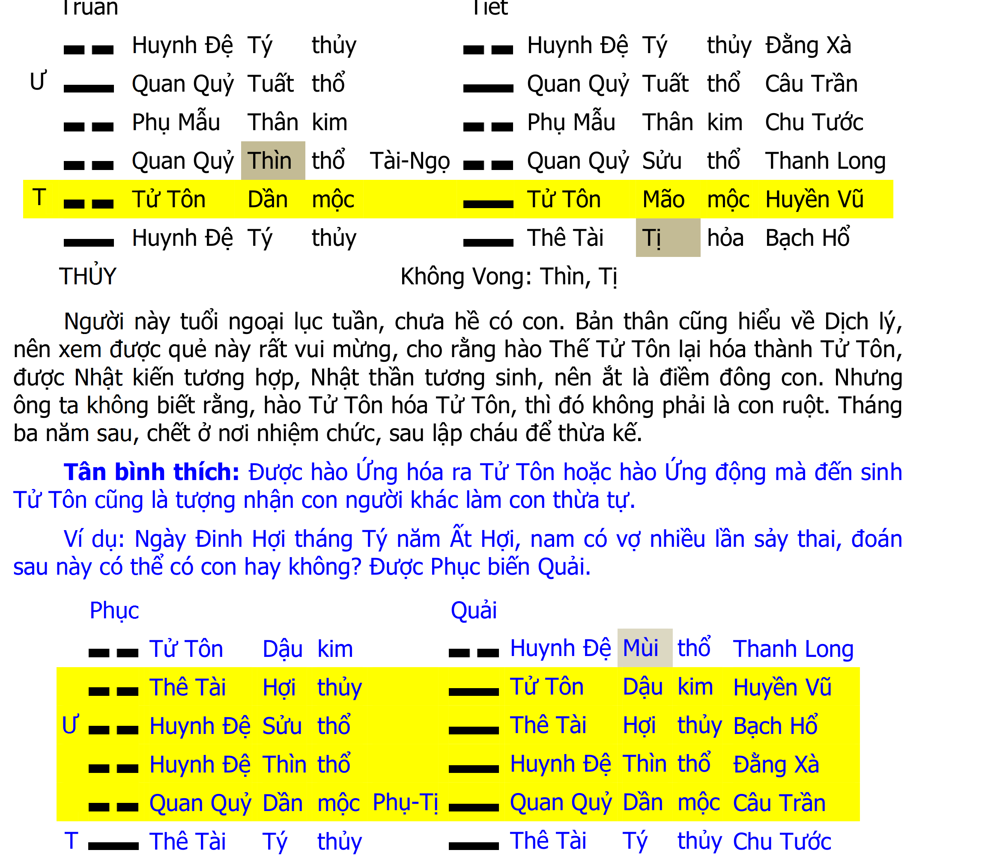

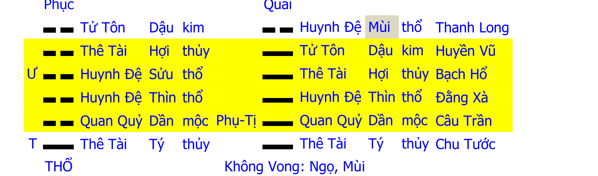

Cha xem về con, chỉ biết được là dễ nuôi hay khó nuôi, chứ không biết được có 
giàu sang hay không. Hào Tử Tôn vượng tướng, sẽ khắc chế Quan tinh. Nếu Tử Tôn 
hưu tù, lại không thể ăn lộc quan, bởi vậy, chỉ đoán được là dễ nuôi hay khó nuôi mà 
thôi. Hào Tử Tôn vượng tướng, hoặc động mà hóa cát, hoặc lâm Nhật Nguyệt, hoặc 
được Nhật thần, Nguyệt kiến, hào động sinh trợ, hoặc gặp Trường Sinh, Đế Vượng, 
đều đoán là con cái được khôn lớn trưởng thành. Nếu hưu tù Không Phá, hoặc động 
mà hóa hung, khác gì ngọn đèn trước gió, chỉ sinh khó nuôi. Còn muốn xem con cháu 
có được giàu sang hay không, nếu hào Tử Tôn vượng tướng lại được sinh phò, tự 
nhiên sẽ phú quý. Nếu dựa vào đó để đoán công danh khoa cử, là lừa dối người ta. 
Trong "Hoàng kim sách" có viết: "Tử gặp Quý Nhân, ắt sẽ ngày thăng quan tiến 
chức." Lại viết: "Lộc Quý ở hào, tuổi trẻ quan cao"; cho rằng nếu Lộc, Quý tại Tử Tôn, 
mà hóa Quỷ, thì lại là hóa Quan, nên đoán là làm quan lớn. Ta tra xem Thiên Ất Quý 
Nhân khi xuất hiện tại hào, đều không gặp Lộc; còn Quý Nhân gặp Dịch Mã, chỉ có 
ngày Đinh Tị gặp Hợi thủy Tử Tôn, thì Quý Nhân và Dịch Mã mới cùng cung, những 
trường hợp khác đều không có. Lộc xuất hiện, thì không có Quý Nhân và Dịch Mã. 
Đây là do sách xưa viết bừa bàn liều, chứ không phải tổng kết từ kinh nghiệm. Huống 
chi ta thường xem về con cái, thấy hào Tử Tôn biến Quỷ, đều không được sống sót.

### Ví dụ: Vào ngày Bính Thìn tháng Hợi, xem con có dễ nuôi không, được quẻ Cấu

biến Lữ:

Cấu
 
Lữ

Phụ Mẫu Tuất thổ | Quan QuỷTị | hỏa Thanh Long

Huynh ĐệThân kim | Phụ Mẫu Mùi | thổHuyền Vũ

Ư | Quan QuỷNgọ hỏa | Huynh ĐệDậu kim Bạch Hổ

Huynh ĐệDậu kim | Huynh ĐệThân kim Đằng Xà

Tử Tôn | Hợi | thủy Tài-Dần | Quan QuỷNgọ hỏa Câu Trần

T | Phụ Mẫu Sửu thổ | Phụ Mẫu Thìn thổChu Tước

KIM
Không Vong: Tý, Sửu

Hào Hợi thủy Tử Tôn gặp Nguyệt kiến, được hào 5 Huynh động mà tương sinh, 
nên là cực vượng. Nếu luận về cát thần, thì ngày Bính gặp Hợi là Quý Nhân, nên cũng 
là cực quý. Nhưng hiềm vì Tử Tôn biến Quỷ, nên con chết vào tháng năm năm sau.

**Tân bình thích:** Cách dùng thần sát để phán đoán hoàn toàn không có căn cứ. 
Quý Nhân không lâm Thìn Tuất, nhưng trong xã hội vẫn có rất nhiều người tuổi Thìn 
tuổi Tuất giàu sang phú quý, nếu lấy quý nhân mà đoán thì hai tuổi này đều là những 
người tầm thường mới đúng. Tôi thường thấy cha mẹ thay con cái xem công việc, tiền 
đồ..., vẫn lấy Quan Quỷ phán đoán ứng nghiệm. Mà Tử Tôn động hóa Quan Quỷ, 
cũng chưa hẳn đều không được sống sót, nhưng có ứng tàn tật.

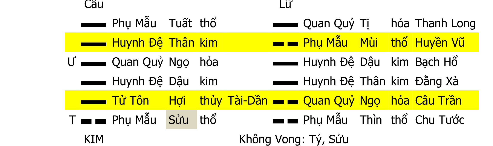

### Ví dụ: Ngày Bính Thân tháng Mão, nữ đoán sức khỏe cháu trai, được Ký Tế biến

Kiển.

Ký Tế
 
Kiển

Ư | Huynh ĐệTý | thủy | Huynh ĐệTý | thủy Thanh Long

Quan QuỷTuất thổ | Quan QuỷTuất thổ Huyền Vũ

Phụ Mẫu Thân kim | Phụ Mẫu Thân kim Bạch Hổ

T | Huynh ĐệHợi | thủy Tài-Ngọ | Phụ Mẫu Thân kim Đằng Xà

Quan QuỷSửu thổ | Thê Tài | Ngọ hỏa Câu Trần

Tử Tôn | Mão mộc | Quan QuỷThìn thổ Chu Tước

THỦY
Không Vong: Thìn, Tị

Nếu theo phép xưa thì Tử động hóa Quỷ là cháu không thể sống sót, tôi không | phán đoán như vậy. Tử Tôn trị Mão mộc, tôi hỏi có phải cháu sinh năm Kỷ Mão hay | không, cô ấy xác nhận đúng là như vậy. Tử Tôn động mà hóa Không, năm Canh Thìn | thực Không, hào sơ là nền móng, mộc hóa thổ, chính là tượng xây dựng công trình, | nhà anh trai người này tại năm Canh Thìn nhất định bắt đầu có xây dựng. Đáp rằng | đã xây cất nhà cửa. Tử Tôn tại cung Khảm, Khảm là thận, tai, Tử Tôn động mà hóa | Quan là có bệnh, Chu Tước là nói năng, Tử Tôn lâm Chu Tước gặp Tuyệt địa (Nhật | thần), đoán là tai không nghe được và không thể nói chuyện, quả nhiên ứng nghiệm.

"Hoàng kim sách" trước có viết, nếu hào Quan Quỷ không bị thương khắc, sẽ 
được quan tước vẻ vang.

Giác Tử bàn rằng: Hào Quan Quỷ không bị thương khắc, ắt là do hào Tử Tôn bị 
khắc, bị thương, hưu tù vô khí, nên không khắc thương được hào Quan Quỷ. Hào Tử 
Tôn suy nhược như vậy, làm sao có thể thăng quan tiến chức, nên ta không tin.

Hựu viết: Phụ thân hữu khí, Xa Dận hiển danh,

Lại nói: Hào Phụ hữu khí, thành tựu hiển danh.

Giác Tử bàn rằng: Cha xem cho con, thì Phụ là Kỵ thần, hoặc động hoặc vượng, 
đều là khắc con. Muốn cứu sống con còn khó, nói gì đến chuyện hiển danh. Có người 
hỏi rằng: Liệu đây có phải là trẻ con tự xem hay không? Ta đáp: Con nhỏ chỉ là đứa 
trẻ vô tri, xem chuyện giàu sang, đều phải dựa vào tâm niệm. Đứa trẻ năm ba tuổi, 
làm sao biết được giàu sang là gì để khởi niệm. Hơn nữa trong chương "Thân mệnh" 
phía sau có viết: "Nếu xem về vận mệnh của con trẻ", nên rõ ràng không phải là xem 
thay.

Đại chiêm Lục thân, bất nghi Thế hào hóa Quỷ;

Xem thay người thân, kỵ gặp hào Thế hóa Quỷ;

Xem cho cha mẹ, anh em, thê thiếp, con cái, trước tiên cần phải xem hào Thế. 
Tuy xem cho người thân, nhưng cũng thường hiện kèm điềm dữ của bản thân. Nếu 
hào Thế hóa Quỷ, hóa hồi đầu khắc, hưu tù, hóa Không, Phá, Mộ, Tuyệt, hay theo 
Quỷ nhập Mộ, bị Nhật Nguyệt tương khắc, chớ vội hỏi chuyện người, cần đề phòng 
bản thân vắn thọ.

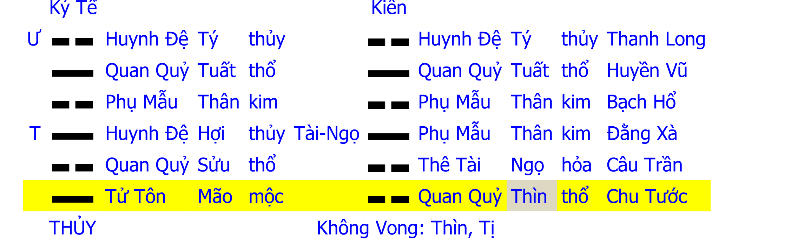

Thường vấn Phụ Mẫu, diệc hữu kiêm ứng nhi tôn.

Hỏi về cha mẹ, cũng thường ứng với cháu con.

Khi xem về cha mẹ, nhiều lúc trong hào cũng hiện lên tượng khắc thương anh 
em, con cháu, thê thiếp. Khi xem về con cháu, có khi lại ứng cả vào cha mẹ, anh em, 
thê thiếp, nên người suy đoán không thể không biết. Đó chính là xem chỗ này mà ứng 
chỗ khác, lý luận này đã được trình bày tại phần trước, không phải ta nói bừa, mà ta 
đã gặp rất nhiều lần khi xem quẻ.

**Lý Ngã Bình bàn rằng:** Trong chương "Thân mệnh" của "Hoàng kim sách", xem 
về cha con, Quan Quỷ, anh em, Thê Tài, tuy không nên xem chung, nhưng lý lẽ còn tỉ 
mỉ. Chỉ tiếc rằng có nhiều chỗ phi lý, thật là tì vết không đáng có. "Dịch mạo" tuy đề 
xướng chia ra để xem, nhưng lý luận quá sơ sài. Ví như xem về thọ yểu, có viết rằng: 
"phá tán xung Không ắt yểu mệnh". Có để lại quẻ chiêm nghiệm, người mệnh Mậu Tý, 
xem vào ngày Hợi, sau hành vận hạn Ngọ, gặp Tuyệt tại Hợi, nên qua đời. Nếu không 
phải xem vào ngày Hợi, thì biết dựa vào đâu để đoán về ngày qua đời? Bình sinh 
chiêm nghiệm, nếu có linh ứng, tại sao không kê thêm một hai quẻ nữa, để làm 
khuôn phép cho đời sau? Nói như thế là không biết rằng, sống chết là chuyện lớn, chỉ 
một hai câu, sao có thể nói cho đủ.

Sách lại nói nếu biết suy đoán sâu xa, đến ngày giờ qua đời cũng biết được, ta | không tin điều này. Lại như xem bản thân có được vinh hiển không, thì lấy Thanh | Long chỉ nghiệp văn, Bạch Hổ chỉ nghiệp võ, cái lý của "Chu Dịch" liệu có giản đơn | như vậy chăng?

Trong sách lại viết: "Ở hào 3 thì là quan đứng đầu châu, mục địa phương; ở hào 
5 thì làm quan tại trung ương". Vậy nếu ở hào sơ, hào 2, thì không biết làm chức gì? 
Nhập nhèm làm rối loạn cho kẻ hậu học, làm sao có thể coi là khuôn phép.

Lại viết: "Hỏi về con cái, kỵ hào Tử Không; hỏi về tiền tài, kỵ hào Tài thất hãm"; 
chỉ là lâm Không, thất hãm, sao đủ để suy đoán người ta không con, không của?

Thánh nhân làm ra "Kinh Dịch" để cho dân chúng thời cổ sử dụng, người đời sau 
xem quẻ, chỉ là hỏi về thân mệnh. Ngoài chuyện thân mệnh ra, đâu còn chuyện gì 
đáng hỏi? Kẻ hậu học lĩnh hội được chỗ tinh thâm, là nhờ tiền nhân truyền thụ đúng 
phương pháp. Người xem có thể rước lành tránh dữ, đều nhờ người đoán quẻ hiểu 
được chỗ huyền vi của lý. Phần thân mệnh trong sách này trình bày tỉ mỉ hơn so với 
những sách khác, rõ ràng mạch lạc, xứng đáng là khuôn phép để dạy người.

---

# CHƯƠNG 50: HỌC NGHIỆP

Nho nghiệp giả, Phụ Mẫu Thế hào đồng vượng, chung tu biến hóa thành 
long; Nhật Nguyệt động hào tương sinh, định thị vương gia trừ khí.

Theo nghiệp Nho, Phụ Mẫu, hào Thế cùng vượng, có ngày biến hóa thành rồng; 
Nhật, Nguyệt, hào động tương sinh, ắt được làm quan trong nội.

Hào Thế và hào Phụ Mẫu đều vượng tướng, hoặc động hóa cát, hoặc Phụ Mẫu trì 
Thế, hoặc Nhật thần, Nguyệt kiến, hào động sinh hợp hào Thế, là tượng thành 
phượng thành rồng, ắt hẳn có ngày vinh hiển.

Tài động quái trung, thanh đăng bất cửu; Tử Tôn trì Thế, bạch thủ vô 
thành.

Tài động trong quẻ, nghiệp sách đèn dang dở; Tử Tôn trì Thế, bạc đầu chẳng 
nên danh.

Hào Tài động khắc văn chương, khiến nghiệp học hành phải nửa chừng bỏ dở. 
Hào Tử Tôn động là tượng không có quan chức, đến tuổi già đầu bạc cũng chẳng nên 
danh.

Cửu lưu giả, Tài hưng Quan vượng, đạo trọng nhân khâm; Huynh động 
Thế suy, hữu hủy vô dự.

Theo học Cửu lưu1, Tài động, Quan vượng, học nghiệp cao thâm được trọng 
vọng; Huynh động, Thế suy, chỉ chuốc phỉ báng chẳng nên danh.

Câu này dùng cho những người theo học các ngành nghề Cửu lưu. Cần được Tài, 
Quan trì Thế, Tài, Quan, Thế phải đắc địa. Nếu là hào Huynh trì Thế, Huynh động 
trong quẻ thì chỉ tạm đủ ăn, không tạo được sự nghiệp.

Giác Tử bàn: Phép xưa xem cho nhóm Cửu lưu, đều coi Quan Quỷ là tốt, nói thế 
là không biết rằng các đạo sĩ, phù thủy trừ tà, đồng cốt, thầy thuốc đều cho là hào Tử 
Tôn vượng sẽ trị được Quỷ, nên phải coi hào Tử Tôn trì Thế, Tử Tôn động là tượng 
tốt.

Xem về các ngành thợ đều lấy hào Tài làm Dụng thần, lấy Tử Tôn làm Nguyên 
thần, rất kỵ hào Huynh động trì Thế và hào Huynh vượng động, chủ về một đời vất 
vả, nhọc nhằn, cách suy đoán tương tự như chương "cầu tài".

Tất cả các ngành học kể trên đều không nên gặp hào Thế bị Không, Phá, Mộ, 
Tuyệt, hưu tù, vì là tượng sự nghiệp khó thành. Nếu hào Thế hưu tù, lại theo Quỷ 
nhập Mộ, hoặc bị Nhật thần, Nguyệt kiến, hào động xung khắc, hoặc động mà hóa 
Quỷ, hóa Tuyệt, hóa Khắc, không những nghiệp học khó thành, mà còn phải đề 
phòng tai họa bất trắc.

1 Cửu lưu: Vốn chỉ 9 trường phái học thuật Tiên Tần là Nho gia, Đạo gia, Âm dương gia, Pháp 
gia, Danh gia, Mặc gia, Tung hoành gia, Nông gia. Sau dùng để chỉ các loại thợ thuyền, các 
ngành nghề kỹ nghệ khác nhau.

---

# CHƯƠNG 51: NGHIÊN CỨU KINH ĐIỂN

Phép xưa cho rằng, kim là kinh "Xuân Thu", mộc là "Kinh Thi", thủy là "Kinh 
Thư", hỏa là "Lễ ký", thổ là "Kinh Dịch".

Giác Tử nói: Không thể hỏi chung, mà khi hỏi cần phải chỉ rõ kinh điển nào.

Cầu khấn thần linh như sau: Tôi nghiên cứu kinh điển này có được không?

Văn vượng, Quan động, sẽ thành rường cột của quốc gia. Thế Không, Tử động, 
chỉ là kẻ hàn sĩ chốn quê mùa.

Hào Quan trì Thế, được hào Phụ động tương sinh, hoặc Nhật, Nguyệt lâm Phụ 
Mẫu sinh Thế, hoặc hào Quan vượng tướng, hào Phụ trì Thế, hoặc hào Thế động mà 
hóa cát, đều là tượng hiển đạt, rộng bước đường mây.

Hào Thế Không, Phá, hoặc động mà hóa hung, hoặc hào Tử Tôn trì Thế, hào Phụ 
Mẫu Quan Quỷ Không, Phá, cần phải chuyển hướng sang nghiên cứu kinh khác, thành 
kính gieo lại quẻ khác xem sao.

### Ví dụ: Ngày Bính Tý tháng Dậu, xem nghiên cứu kinh này liệu có phát triển được

không, được quẻ Ích biến Quan:

Ích 
 
Quan

Ư | Huynh ĐệMão mộc | Huynh ĐệMão mộc Thanh Long

Tử Tôn | Tị | hỏa | Tử Tôn | Tị | hỏa Huyền Vũ

Thê Tài | Mùi thổ | Thê Tài | Mùi thổ Bạch Hổ

T | Thê Tài | Thìn thổ Quan-Dậu | Huynh ĐệMão mộc Đằng Xà

Huynh ĐệDần mộc | Tử Tôn | Tị | hỏa Câu Trần

Phụ Mẫu Tý | thủy | Thê Tài | Mùi thổ Chu Tước

MỘC
Không Vong: Thân, Dậu

Đoán rằng: "Hào Quan vượng hợp hào Thế, nhưng hiềm vì hào sơ Chu Tước Tý | thủy văn chương động hóa Mùi thổ hồi đầu khắc, nên đổi sang kinh khác." Người xem | hỏi: "Nên đổi sang kinh nào?" Ta đáp: "Sách xưa có phép xem, nhưng ta thấy không | ứng nghiệm. Anh muốn theo kinh nào, thì chỉ đích danh mà xem quẻ nữa."

Người này bèn hỏi về kinh sách bốc dịch, được quẻ Thiên Hỏa Đồng Nhân:

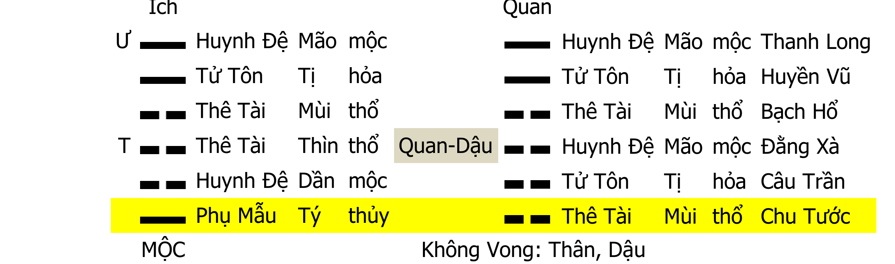

---

# CHƯƠNG 52. MỜI THẦY

Đồng Nhân

Ư | Tử Tôn | Tuất thổ | Thanh Long

Thê Tài | Thân | kim | Huyền Vũ

Huynh Đệ | Ngọ | hỏa | Bạch Hổ

T | Quan Quỷ | Hợi | thủy | Đằng Xà

Tử Tôn | Sửu | thổ | Câu Trần

Phụ Mẫu | Mão | mộc | Chu Tước

HỎA 
Không Vong: Thân, Dậu

Ta đoán rằng: Hào Quan trì Thế, tuy là tốt, nhưng hào Phụ gặp Nguyệt phá, nên 
vẫn phải đổi kinh sách khác.

Lại xem về "Kinh Thư", được quẻ Phong biến Ly:

Phong
 
Ly

Quan Quỷ | Tuất thổ | Thê Tài | Tị | hỏa | Thanh Long

T

Phụ Mẫu | Thân | kim | Quan Quỷ | Mùi | thổ | Huyền Vũ

Thê Tài | Ngọ | hỏa | Phụ Mẫu | Dậu | kim | Bạch Hổ

Huynh Đệ | Hợi | thủy | Huynh Đệ | Hợi | thủy | Đằng Xà

Ư

Quan Quỷ | Sửu | thổ | Quan Quỷ | Sửu thổ | Câu Trần

Tử Tôn | Mão | mộc | Tử Tôn | Mão | mộc | Chu Tước

THỦY 
Không Vong: Thân, Dậu

Hào Phụ vượng trì Thế, được hào Quan động tương sinh, nhưng vì Nhật thần Tý 
thủy xung động Ngọ hỏa tổn thương kim, kinh này vẫn có thể học. Khoa thi năm 
Nhâm Tý, xung mất Ngọ hỏa, nên sẽ đỗ cao. Quả nhiên đến khoa thi năm Tý đỗ đầu.

***

# CHƯƠNG 52: MỜI THẦY

Phụ hào vượng tướng, tựu nhi chính yên.

Hào Phụ vượng tướng, nghiêm chính xứng danh.

Hào Phụ Mẫu cũng tượng trưng cho thầy, nên muốn mời thầy về dạy học, cũng 
lấy hào Phụ Mẫu làm Dụng thần. Khi đó, hào Phụ Mẫu nên vượng tướng, hoặc lâm 
nhật nguyệt, hoặc động mà hóa cát, chủ về thầy nghiêm cẩn, đáng trọng. Nếu hào 
Phụ Mẫu hưu tù, Không, Phá, Tuyệt, hoặc động mà hóa hung, là thầy vô dụng, không 
có tư cách.

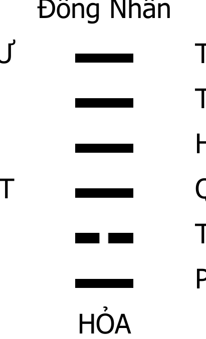

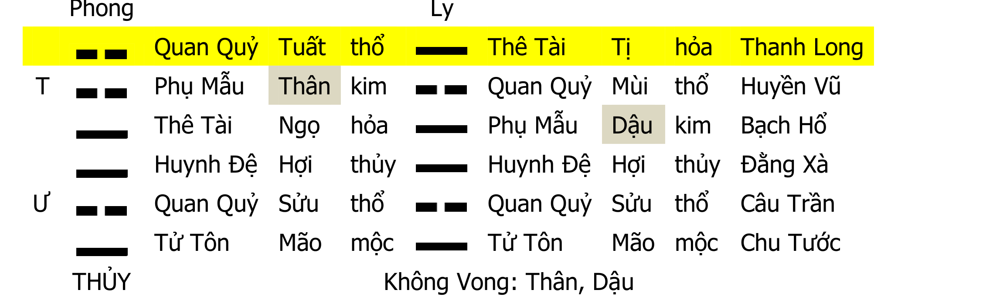

Thế vị tương sinh, bác ước thiện dụ.

Hào Thế tương sinh, học cao khéo dạy.

Hào Phụ Mẫu vượng, sinh hợp hào Thế, chủ về thầy khéo dạy bảo. Nếu hào Phụ 
Mẫu khắc Thế, mà hào Thế đắc địa, là thầy tận tâm, có trách nhiệm. Nếu hào Thế 
hưu tù, sẽ phải hệ lụy vì thầy.

Phụ nhập Mộ trung, lãn vu giáo huấn;

Hào Phụ nhập Mộ, dạy dỗ biếng lười;

Nếu hào Phụ nhập Tam Mộ hoặc lâm Tuyệt, không phải lười nhác trong dạy dỗ, 
cũng là quản giáo không nghiêm.

Tài lâm Thế thượng, nhu nhược bất nghiêm.

Hào Tài trì Thế, nhu nhược không nghiêm.

Hào Tài trì Thế, tức bản thân khắc cha mẹ, không phải thầy quản giáo không 
nghiêm, cũng là học trò khinh nhờn thầy dạy.

Quỷ hóa văn thư khắc Thế, tụng do hồ học;

Quỷ hóa văn thư khắc Thế, kiện tụng nảy từ việc học;

Nếu hào Quỷ hóa thành hào Phụ Mẫu, xung khắc hào Thế, ngày sau ắt sinh 
tranh chấp kiện tụng. Cho dù có Nhật thần, Nguyệt kiến, hào động chế phục hào Quỷ, 
cũng không nên. Vậy nguyên do là vì đâu? Thần mách bảo thiên cơ tại hào động, 
trước mắt tuy bị chế phục, nhưng ngày sau nếu Qụỷ gặp sinh vượng, ắt gặp tai ương. 
Không chỉ Quỷ động hóa Phụ, mà Quỷ động khắc Thế, hoặc Thế động biến hung, đều 
là không tốt.

Nguyệt phù Thế hào Nhật trợ, thanh xuất ư lam.

Thế được Nguyệt phò Nhật giúp, ngày sau trò giỏi hơn thầy.

Nếu hào Thế vượng tướng, hoặc hào Phụ Mẫu trì Thế, hoặc hào Quan trì Thế, 
hoặc Thế được Nhật thần, Nguyệt kiến, hào động sinh phò, hào Thế động mà hóa cát, 
là tượng tiền đồ rộng mở, trò giỏi hơn thầy.

Động suy biến vượng, tiên nọa hậu cần; động vượng biến suy, tiên cần 
hậu đãi.

Động suy biến vượng, trước lười biếng sau siêng năng; động vượng biến suy, 
trước chuyên cần sau bê trễ.

Nếu hào Phụ suy mà động hóa sinh hóa vượng, hóa Nhật Nguyệt, hóa Tiến thần, 
đều chủ về trước lười biếng, sau siêng năng.

Nếu hào phụ vượng mà động hóa Không, Phá, Mộ, Tuyệt, hóa Thoái thần, đều 
chỉ càng về sau càng biếng nhác.

Phụ hóa Phụ, chủ về các nghề đặc thù; Phụ hóa Tài, chủ về đa bệnh; Phụ hóa 
Quỷ, chủ về giao du với người quyền quý; Phụ hóa Huynh, tham tài háo lợi.

**Tân bình thích:** Ví dụ, ngày Đinh Sửu tháng Ngọ, xem con theo học tiếng Anh 
ra sao? Được quẻ Thủy Địa Tỷ biến Khảm.

Tỷ 
 
Khảm

Ư | Thê Tài | Tý | thủy | Thê Tài | Tý | thủy | Thanh Long

Huynh Đệ | Tuất thổ | Huynh Đệ | Tuất thổ | Huyền Vũ

Tử Tôn | Thân | kim | Tử Tôn | Thân | kim | Bạch Hổ

T | Quan Quỷ | Mão | mộc | Phụ Mẫu | Ngọ | hỏa | Đằng Xà

Phụ Mẫu | Tị | hỏa | Huynh Đệ | Thìn | thổ | Câu Trần

Huynh Đệ | Mùi | thổ | Quan Quỷ | Dần | mộc | Chu Tước

THỔ 
Không Vong: Thân, Dậu

Phụ Mẫu được Nguyệt tỉ phù, thầy cũng có năng lực, Tử Tôn Không mà nhập Mộ, 
con làm biếng học tập, Phụ Mẫu động mà hóa Huynh, thầy tham tài hiếu lợi, lâm Câu 
Trần, hào Ứng Nguyệt phá, tiến độ dạy học quá chậm, quẻ biến lục xung, nhất định 
khó dạy lâu dài. Quả như dự đoán.

Tam hợp liên niên thụ giáo; Lục xung bán tải nan lưu.

Tam hợp liền năm giảng dạy; Lục xung dăm tháng khó lưu.

Nếu hào Thế và hào Phụ cùng Nhật, Nguyệt hợp thành Tam hợp, thì tình cảm 
thầy trò bền chặt như cha con, được thầy dạy dỗ lâu dài, cho đến lúc thành tựu.

Nếu được quẻ Lục xung, hoặc hào Thế khắc hào Phụ, hoặc hào Phụ khắc hào 
Thế, là tượng không hòa hợp, khó mà dạy nổi nửa năm.

Nếu cha mời thầy về dạy cho con, thì hào Ứng chỉ thầy, hào Thế chỉ bên mời 
thầy, tốt nhất là Thế Ứng tương sinh, tương hợp, không nên tương khắc, tương xung. 
Hào Ứng sinh hào Thế, là ta được ích lợi từ thầy dạy. Hào Ứng Không Phá, việc mời 
dạy không có kết quả. Hào Ứng động, chủ về thầy thay lòng đổi dạ. Hào Thế Không, 
chủ về nhà mình đổi ý.

Giác Tử bàn rằng: Tuy lấy Thế, Ứng làm chủ, nhưng không thể bỏ qua hào Phụ 
Mẫu. Nếu hào Phụ vượng, tương hợp với Tử Tôn, là hữu danh hữu thực. Nếu hào Phụ 
động thương khắc Tử Tôn, đã không được ích lợi, còn có hại. Hào Tử Tôn động hóa 
hồi đầu khắc, thì không nên mời thầy đó. Hào Tử Tôn động mà hóa Quỷ, nên nhanh 
chóng từ bỏ ý định mời thầy.

### Ví dụ: Ngày Mậu Ngọ tháng Dần, xem con theo thầy học ra sao, được quẻ Lữ

biến Ly:

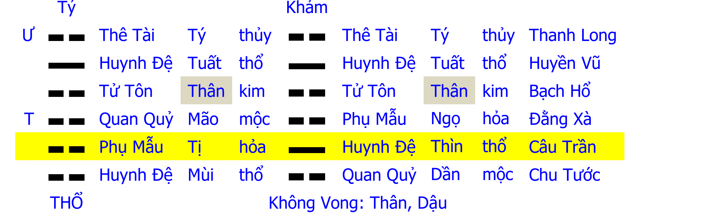

---

# CHƯƠNG 53. CẦU DANH

Lữ 
 
Ly

Huynh ĐệTị | hỏa | Huynh ĐệTị | hỏa Chu Tước

Tử Tôn | Mùi | thổ | Tử Tôn | Mùi thổ | Thanh Long

Ư | Thê Tài | Dậu | kim | Thê Tài | Dậu kim Huyền Vũ

Thê Tài | Thân kim Quan-Hợi | Quan QuỷHợi thủy Bạch Hổ

Huynh ĐệNgọ | hỏa | Tử Tôn | Sửu thổ | Đằng Xà

T | Tử Tôn | Thìn thổ | Phụ-Mão | Phụ Mẫu | Mão mộc Câu Trần

HỎA
Không Vong: Tý, Sửu

Hào Tử động hóa hồi đầu khắc, chủ về không nên theo thầy này. Nhưng người 
xem không nghe, sau người con bị thầy trách phạt, bỏ chạy lên cầu mà ngã gãy chân 
phải.

**Tân bình thích:** Tử Tôn lâm Dịch Mã (Dần Ngọ Tuất Mã tại Thân Tý Thìn), lại là 
quẻ Lữ, là tượng trốn học, Cấn là cầu, hào sơ là chân, âm là phải, Câu Trần là vấp 
ngã bị thương, do đó mà có ứng nghiệm như vậy.

***

# CHƯƠNG 53: CẦU DANH

(HỎI VỀ CÔNG DANH)

**Dã Hạc bàn rằng:** Khi xem về thi cử, nhiều khi được quẻ tốt, nhưng về sau thi 
tỉnh vẫn không đỗ đạt, là tại sao? Đó là thần cho ứng nghiệm chuyện gần chứ không 
ứng nghiệm việc xa. Đã báo danh thi ở phủ, huyện, thì trước hết cần phải xem kỳ thi 
huyện, sau đó tiếp tục xem về kỳ thi phủ, rồi sau đó mới xem về thi tỉnh. Nếu đều là 
quẻ tốt, mới đoán là đỗ cả. Nếu có quẻ không tốt, thì đừng mong thi tỉnh thành công.

Chú thích: Thi huyện, thi phủ, thi tỉnh xưa kia cũng tương đương với thi cử ở các 
bậc tiểu học, trung học, đại học thời hay. Xem phải thận trọng, nếu xem về thi tiểu 
học được quẻ tốt, không nên đem vận vào kỳ thi trung học, đại học sau này. Muốn thi 
vào cấp nào, vào trường nào, cần phải chia riêng ra từng quẻ để xem, mới tránh dược 
sai lầm.

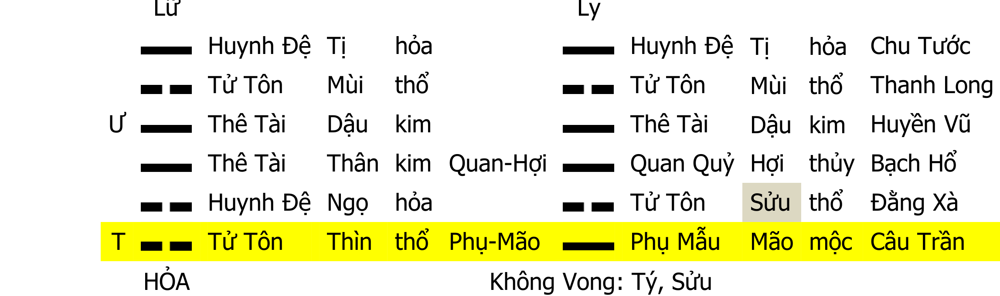

---

# CHƯƠNG 54: ĐỒNG THÍ (SƠ KHẢO)

Phụ vượng Quan hưng, kham kỳ thủ tuyển; Quan suy Phụ phát, diệc 
hứa luân thu.

Phụ vượng, Quan hưng, sẽ được đỗ đầu; Quan suy, Phụ động, cũng được tuyển 
chọn.

Hào Quan trì Thế, được Nhật, Nguyệt, hào động tương sinh tương hợp, chắc 
chắn sẽ được đỗ đầu bảng. Hào Phụ trì Thế, được Nhật, Nguyệt, hào động tương sinh 
tương hợp, nếu Quan tinh hữu khí, sẽ được thành danh.

Tử hưng Tài phát ư quái trung, nan du Phán thuỷ1.

Tử động, Tài động trong quẻ, khó thành nghiệp học.

Hào Tử động khắc Quan, hào Tài khắc Phụ, hoặc Tử, Tài trì thế, đều bất lợi cho 
thi cử.

**Tân bình thích:** Thuyết này hữu lý.

### Ví dụ: Ngày Kỷ Hợi tháng Thìn, nữ xem thi, được Dự biến Bác.

Dự 
 
Bác

Thê Tài | Tuất thổ | Huynh ĐệDần mộc Câu Trần

Quan QuỷThân kim | Phụ Mẫu Tý | thủy Chu Tước

Ư | Tử Tôn | Ngọ hỏa | Thê Tài | Tuất thổ Thanh Long

Huynh ĐệMão mộc | Huynh ĐệMão mộc Huyền Vũ

Tử Tôn | Tị | hỏa | Tử Tôn | Tị | hỏa Bạch Hổ

T | Thê Tài | Mùi | thổ Phụ-Tý | Thê Tài | Mùi thổ Đằng Xà

MỘC
Không Vong: Thìn, Tị

Quan Quỷ tuy được Nguyệt sinh, Phụ Mẫu được Nhật thần tỉ phù, nhưng Tử Tài 
phát động trong quẻ, thi rất khó qua, quả nhiên không qua được.

Thế Phá Thân Không kiêm Mộ Tuyệt, tái phấn vân song!2

Thế gặp Phá, Không, Mộ, Tuyệt, tiếp tục dùi mài.

Hào Thế gặp Không, Phá, Mộ, Tuyệt, hoặc bị Nhật, Nguyệt, hào động xung khắc, 
hoặc động mà biến hung, thi cử đều không được toại nguyện.

**Tân bình thích:** Thuyết này hữu lý.

### Ví dụ: Ngày Canh Ngọ tháng Hợi, nam xem thi, được Tỉnh biến Tốn.

1 Phán thủy hay Phán cung là chỉ nơi học tập của các chư hầu, sau dùng phiếm chỉ trường 
học.  
2 Vân là loại cỏ có hương để diệt mối mọt. Vân song phiếm chỉ phòng đọc sách.

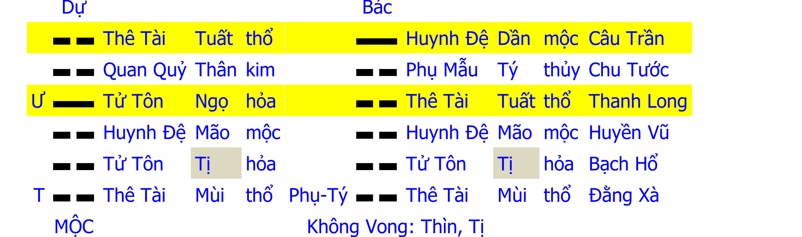

Tỉnh
 
Tốn

Phụ Mẫu Tý | thủy | Huynh ĐệMão mộc Đằng Xà

T | Thê Tài | Tuất thổ | Tử Tôn | Tị | hỏa Câu Trần

Quan QuỷThân kim Tử-Ngọ | Thê Tài | Mùi thổ Chu Tước

Quan QuỷDậu kim | Quan QuỷDậu kim Thanh Long

Ư | Phụ Mẫu Hợi | thủy Huynh-Dần | Phụ Mẫu Hợi thủy Huyền Vũ

Thê Tài | Sửu thổ | Thê Tài | Sửu thổ Bạch Hổ

MỘC
Không Vong: Tuất, Hợi

Quan Quỷ hưu tù bị Nhật khắc, hào Thế Không Vong, khó mà thi đậu, quả nhiên 
ứng nghiệm.

Phụ vượng tao thương, thu nhi phục khí; xung trung phùng hợp, kiến 
khí phục thu.

Phụ vượng gặp thương, chọn rồi lại bỏ; xung mà gặp hợp, bị trượt lại thu.

Hào Phụ Mẫu vượng tướng, nếu hóa hưu tù, Không, Phá, Mộ, Tuyệt, hóa hồi đầu 
khắc hoặc bị xung khắc, là tượng trước thì lấy đỗ, sau lại đánh trượt.

Hào Thế, hào Phụ động mà gặp xung, nếu được Nhật, Nguyệt, hào động tương 
hợp, tức trong xung gặp hợp, chủ về trước bị trượt, sau lại lấy đỗ.

Phụ suy biến vượng, dũ xuất dũ kỳ; Phụ hóa Thoái thần, nhật trường, 
nhật đoản.

Phụ suy biến vượng, ngày thêm xuất sắc; Phụ hóa Thoái thần, trước hay sau dở.

Hào Phụ suy, nhưng động mà hóa vượng, hóa hồi đầu sinh, hóa Tiến thần, là 
tượng văn chương đắc ý, càng về sau càng xuất sắc. Nhưng Phụ không nên hóa Thoái 
thần. Hào Phụ vượng mà hóa Thoái thần, thì bài thi trước còn được, càng về sau càng 
kém. Hào Phụ suy mà hóa Thoái thần, hoặc hóa Không, Phá, Mộ, Tuyệt, hoặc hóa hồi 
đầu khắc, có cất công dùi mài, đi thi cũng là vô ích.

### Ví dụ: Ngày Bính Thân tháng Hợi, xem về kỳ thi tỉnh, được quẻ Phong biến Cách:

Phong
 
Cách

Quan Quỷ | Tuất thổ | Quan Quỷ | Mùi thổ | Thanh Long

T

Phụ Mẫu | Thân | kim | Phụ Mẫu | Dậu | kim | Huyền Vũ

Thê Tài | Ngọ | hỏa | Huynh Đệ | Hợi | thủy | Bạch Hổ

Huynh Đệ | Hợi | thủy | Huynh Đệ | Hợi | thủy | Đằng Xà

Ư

Quan Quỷ | Sửu | thổ | Quan Quỷ | Sửu thổ | Câu Trần

Tử Tôn | Mão | mộc | Tử Tôn | Mão | mộc | Chu Tước

Hào Phụ Mẫu trì Thế hóa Tiến thần, Nhật thần làm Quan tinh sinh Thế, là tượng 
văn chương ngày càng xuất sắc, ắt sẽ đỗ đầu. Sau quả được đỗ đầu khoa.

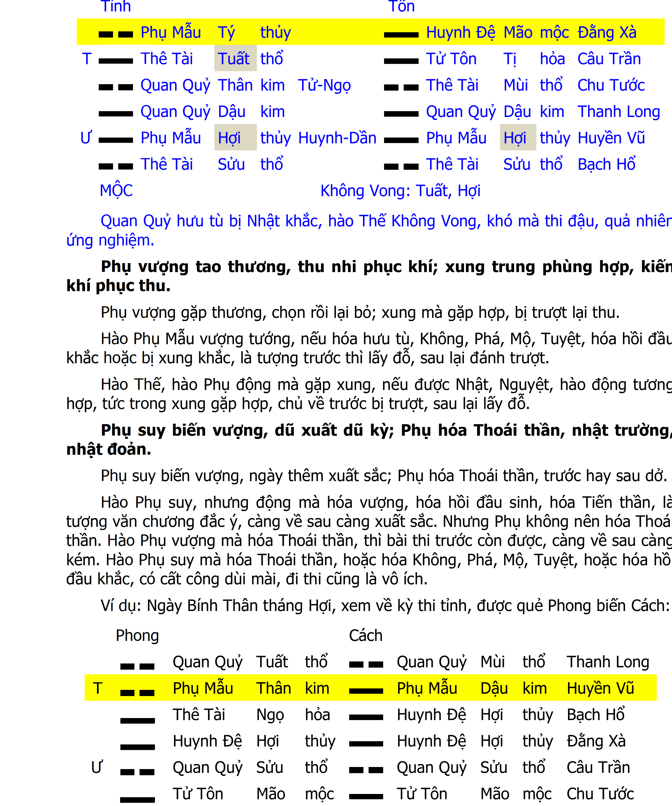

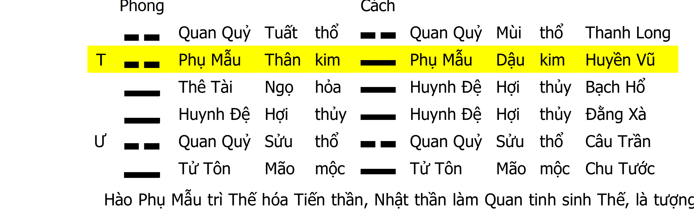

### Ví dụ: Ngày Nhâm Tý tháng Mão, xem về kỳ thi tỉnh, được quẻ Tiểu Súc:

Tiểu Súc

Huynh ĐệMão mộc | Bạch Hổ

Tử Tôn | Tị | hỏa | Đằng Xà

Ư

Thê Tài | Mùi thổ | Câu Trần

Thê Tài | Thìn thổ Quan-Dậu Chu Tước

Huynh ĐệDần mộc | Thanh Long

T

Phụ Mẫu Tý | thủy | Huyền Vũ

MỘC 
Không Vong: Dần, Mão

Đoán rằng: Hào Phụ Mẫu Tý thủy lâm Nhật thần, vượng mà trì Thế, chủ về văn 
chương xuất sắc, nhưng hiềm vì hào Quan tinh Dậu kim gặp Nguyệt phá, nên phục 
mà không được hiển lộ, may nhờ Thìn thổ làm Phi thần, phá mà gặp hợp. Nếu thi vào 
tháng ba (tháng Thìn), ắt sẽ thi đỗ. Sau quả nhiên thi vào tháng ba mà được lấy đỗ.

### Ví dụ: Ngày Đinh Tị tháng Thìn, xem về thi cử, được quẻ Cách biến Ký Tế:

Cách
 
Ký Tế

Quan QuỷMùi thổ | Huynh ĐệTý | thủy Thanh Long

Phụ Mẫu | Dậu kim | Quan QuỷTuất thổ | Huyền Vũ

T

Huynh ĐệHợi thủy | Phụ Mẫu | Thân kim Bạch Hổ

Huynh ĐệHợi thủy Tài-Ngọ | Huynh ĐệHợi | thủy Đằng Xà

Quan QuỷSửu thổ | Quan QuỷSửu | thổ | Câu Trần

Ư

Tử Tôn | Mão mộc | Tử Tôn | Mão mộc Chu Tước

THỦY
Không Vong: Tý, Sửu

Như đã trình bày tại phần trước, hào Phụ suy nếu biến vượng là tốt, trong quẻ 
này hào Thế Hợi thủy bị Nhật xung Nguyệt khắc, nhưng may nhờ hóa hồi đầu sinh, 
nên về sau vẫn được lấy đỗ.

Chú thích: Đồng thí là một chế độ thi cử thời Minh Thanh, quy định tổ chức ba 
năm một lần tại kinh thành, để tuyển chọn nhân tài cho quốc gia. Khi xem về kết quả 
thi cử, tốt nhất là hào Quan động, hào Phụ vượng; hào Quan là Nguyên thần của hào 
Phụ, kỵ gặp Tử, Mộ, Tuyệt, Không. Hào Phụ vượng, chủ về văn chương xuất sắc, 
thành tích vượt trội; hào Quan vượng chủ về công danh thăng tiến. Hào Quan, hào 
Phụ cùng vượng động, tương sinh, lại được Nhật Nguyệt, hào động sinh phò củng 
hợp, thì thành tích thi cử được như ý, chắc chắn sẽ đỗ đạt. Kỵ hào Tử, hào Tài động, 
hoặc hào Tử, hào Tài trì Thế, vì là tượng thành tích kém cỏi, công danh vô vọng.

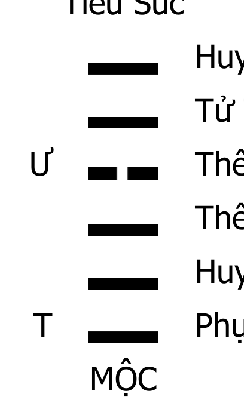

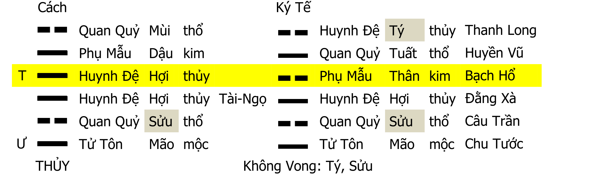

---

# CHƯƠNG 55: TUẾ KHẢO

(KỲ THI HÀNG NĂM)

Văn nghi vượng tướng, tối kỵ hưu tù; Quan nghi sinh Thân, bất nghi 
khắc Thế.

Phụ cần vượng tướng, kỵ nhất hưu tù; Quan nên sinh Thế, không nên khắc Thế.

Hào Phụ và hào Thế vượng tướng, lại được Nhật, Nguyệt, hào động sinh phò, 
hoặc động hóa cát, thì bài thi xuất sắc, không có thiếu sót, chắc chắn đỗ cao. Nếu hai 
hào này vượng mà gặp sinh là tốt nhất. Vượng mà không được sinh, tướng mà không 
được phò, nhưng không bị hình xung khắc phá là tốt thứ hai. Nếu một trong hai hào 
bị hình xung, là hạng kém hơn nữa. Hào Thế bị khắc, khó tránh khỏi bị phạt. Hào Thế, 
hào Phụ cùng bị khắc, là tượng bài thi hạng bét.

**Dã Hạc bàn rằng:** Phương pháp này là đúng, nhưng cũng cần phải biết biến 
thông, phải xem trạng thái của hào Phụ và hào Thế ra sao. Quẻ toàn mỹ là hào Thế, 
hào Phụ cùng vượng, được sinh phò, lại không bị hình khắc, nên bài thi sẽ là hạng 
nhất. Theo đó mà tra xét từng tầng bậc, hoặc được sinh phò mà được quẻ Lục xung 
biến xung, quẻ Phản ngâm, Phục ngâm, hóa Khắc hóa Tuyệt, chỉ bài thi có sơ hở. Hào 
Phụ bị khắc mà không được cứu ứng, là bài thi rất kém. Hào Thế bị khắc mà được 
phò trợ, cũng có thể được đỗ vớt.

Giác Tử bàn rằng: Căn cứ vào trạng thái vượng suy của hào Phụ để đoán định 
mức độ tốt xấu của bài thi, như vậy là đúng. "Dịch mạo" có viết: "Quẻ hóa Tiến thần, 
sẽ đỗ hàng đầu. Quẻ hóa Thoái thần, bài thi hạng bét". Nếu như quẻ không hóa Tiến 
thần, Thoái thần, lấy gì để định đoạt?

### Ví dụ: Ngày Ất Tị tháng Thân, xem về Tuế khảo, được quẻ Đại Quá biến Đỉnh:

Đại Quá
 
Đỉnh

Thê Tài | Mùi thổ | Tử Tôn | Tị | hỏa Huyền Vũ

Quan QuỷDậu kim | Thê Tài | Mùi thổ Bạch Hổ

T | Phụ Mẫu Hợi thủy Tử-Ngọ | Quan QuỷDậu kim Đằng Xà

Quan QuỷDậu kim | Quan QuỷDậu kim Câu Trần

Phụ Mẫu Hợi thủy Huynh-Dần | Phụ Mẫu Hợi thủy Chu Tước

Ư | Thê Tài | Sửu thổ | Thê Tài | Sửu thổ Thanh Long

MỘC 
Không Vong: Dần, Mão

Có người cho rằng, hào Tài động sẽ khắc Phụ, lý luận như vậy là không biết biến 
thông. Quẻ này hào Phụ Hợi thủy trì Thế, được Nguyệt kiến Thân tương sinh, nên Phụ 
vượng mà Thế cũng vượng. Thế được Nhật thần Tị xung nên ám động. Hào Tài Mùi 
thổ tuy động mà sinh trợ Dậu kim Quan tinh; Quan lại sinh Thế, như vậy là tượng liên 
tục tương sinh, chủ về văn chương kiệt xuất, lời châu hàng gấm. Hào Tài sinh Quan 
vượng, chủ về đỗ hạng ưu, được lương bổng. Sau quả nhiên đỗ đầu, được ăn lộc.

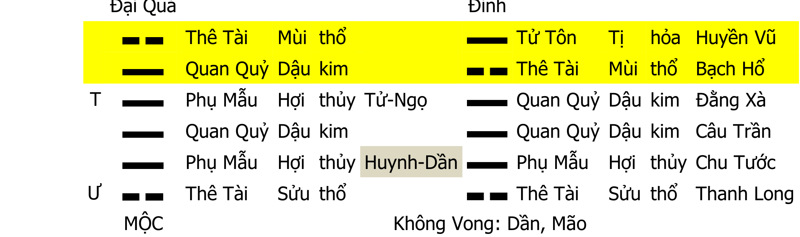

**Dã Hạc bàn rằng:** Nói chung gặp quẻ Lục xung biến xung, hoặc có nhiều hào 
động, hoặc Phụ, Thế cùng vượng, thì đỗ hạng trung bình. Nếu hào Phụ suy, bị khắc, 
và hào Thế cũng hưu tù, bị khắc, hoặc biến hung, chắc chắn là thi hỏng.

Phi thần vô trợ Thân vô khắc, vinh nhục vô thi; Phục tàng vượng tướng 
Thế tao thương, thưởng phạt tịnh kiến.

Phi thần không được giúp, Thế không bị khắc, không nhục không vinh; Phục tàng 
mà vượng tướng, Thế bị khắc hại, thưởng phạt đều có.

Hào Phụ xuất hiện, không vượng không suy, tuy không được sinh phò, nhưng 
cũng không bị khắc chế, mà hào Thế không bị xung khắc, nên vẫn có thể xếp hạng 
trung bình.

### Ví dụ: Ngày Ất Mão tháng Ngọ, xem về Tuế khảo, được quẻ Địa Thiên Thái:

Thái

Ư | Tử Tôn | Dậu | kim | Huyền Vũ

Thê Tài | Hợi | thủy | Bạch Hổ

Huynh ĐệSửu thổ | Đằng Xà

T | Huynh ĐệThìn thổ | Câu Trần

Quan QuỷDần | mộc Phụ-TịChu Tước

Thê Tài | Tý | thủy | Thanh Long

THỔ
Không Vong: Tý, Sửu

Hào Phụ Mẫu Ngọ hỏa lâm Nguyệt kiến, trong quẻ hào Tị hỏa phục dưới hào Dần 
mộc, vượng mà được Phi thần tương sinh, lại là quẻ Lục hợp, nhưng hiềm vì Nhật 
thần khắc Thế, nên ngày ra kết quả, bị thầy trách mắng, nhưng nhờ tài viết chữ, mà 
được lấy đỗ hạng ba. Sau ngộ ra rằng, hỏa của Tị, Ngọ không phải vượng về văn 
chương mà là tốt về chữ viết. Quẻ loại này tuy nhiều, nhưng trường hợp này hiếm 
gặp, nên để lại làm mẫu.

**Tân bình thích:** Ví dụ này là bởi vì Quan lâm Nhật khắc Thế cho nên bị mắng.

Nói tóm lại, hào Thế và hào Phụ vượng tướng lại được sinh phò là hàng đầu; có 
chút bất lợi là kém tốt hơn; nếu bị hình xung mà được tương trợ, lại kém hơn một 
bậc. Nếu bị hình thương nhẹ mà không được cứu trợ, lại kém hơn nữa; hào Thế bị 
hình xung khắc phá nặng, là bài thi hạng bét. Tất cả đều trông vào lẽ biến thông, kết 
hợp với tượng quẻ cát hung, Dụng thần suy vượng để luận đoán.

Chú thích: Tuế khảo là một chế độ thi cử thời Thanh, do Đốc học chính các tỉnh 
tổ chức trong khu vực quản lý của mình. Cách luận đoán trong chương này về cơ bản 
tương tự như trong chương "Đồng thí", học giả nên xem xét cho kỹ.

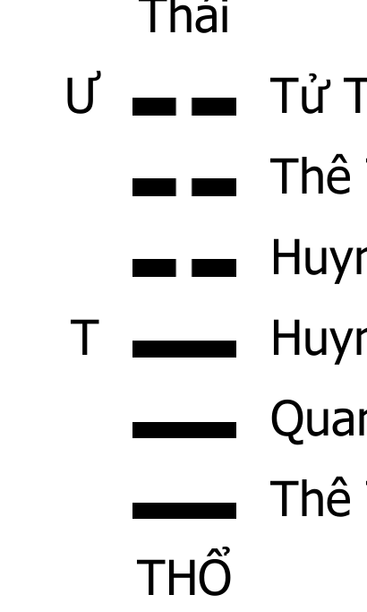

---

# CHƯƠNG 56: TĂNG LƯƠNG

Giác Tử nói rằng: Xem về lương bổng, nếu không hiểu được bí quyết, sẽ ít được 
ứng nghiệm. Tại sao lại như vậy? Xem về lương bổng dùng hào Tài làm Dụng thần, 
mà Tài là Kỵ thần của Phụ Mẫu văn chương, nếu không biết cái lý sâu xa của nó, lại 
dùng một quẻ để xem chung về Tuế khảo và học bổng, nếu hào Tài vựợng, hào Phụ 
Mẫu sẽ bị khắc thương; nếu hào Tài hưu tù, làm sao có thể nhận được bổng lộc? 
Theo cách của ta, trước hết xem Tuế khảo tốt xấu ra sao, sau lại xem thêm một quẻ 
nữa về lương bổng, như vậy là hiểu được chỗ uyên thâm của quẻ Dịch.

Xem về lương bổng, chuyên dùng hào Tài làm Dụng thần. Nếu hào Tài trì Thế, 
hoặc động mà sinh Thế, là tốt. Cách suy đoán tương tự như chương "Cầu tài".

Nếu đã có lương bổng mà sợ mất, khi xem kỵ nhất hào Huynh Đệ trì Thế, hào 
Huynh Đệ phát động, và hào Tài gặp Không, Phá, Mộ, Tuyệt, động mà biến hung, đều 
là tượng mất lộc. Nếu như hào Quan, hào Huynh khắc Thế, nhẹ thì cắt lương bổng, 
nặng ắt bị phạt. Nếu trong quẻ gặp Tam hợp Huynh cục, cũng chủ về cắt lương bổng.

**Tân bình thích:** Ngày xưa lấy thi cử để xác định khoản lương bổng, cách làm 
thời nay chưa hẳn như vậy, cho nên chỉ xem hào Tài là được.

### Ví dụ: Ngày Canh Tý tháng Dậu, một người hỏi đơn vị tăng lương, bản thân có

được tăng không? Được Tụy biến Tùy.

Tụy 
 
Tùy

Phụ Mẫu | Mùi | thổ | Phụ Mẫu | Mùi | thổ | Đằng Xà

Ư | Huynh Đệ | Dậu | kim | Huynh Đệ | Dậu kim | Câu Trần

Tử Tôn | Hợi | thủy | Tử Tôn | Hợi | thủy | Chu Tước

Thê Tài | Mão | mộc | Phụ Mẫu | Thìn | thổ | Thanh Long

T | Quan Quỷ | Tị | hỏa | Thê Tài | Dần mộc | Huyền Vũ

Phụ Mẫu | Mùi | thổ | Tử Tôn | Tý | thủy | Bạch Hổ

KIM 
Không Vong: Thìn, Tị

Lấy Tài làm Dụng, Tài tuy Nguyệt phá, nhưng được Nhật sinh, điều không nên là 
hào Thế gặp Không, hào Tài nhập Mộ ở Phụ Mẫu Mùi thổ, tiền lương khó tăng. Kết 
quả là bởi vì bản thân người này không có bằng cấp nên không được tăng lương. Phụ 
Mẫu chính là văn thư, bằng cấp, trình độ học vấn.

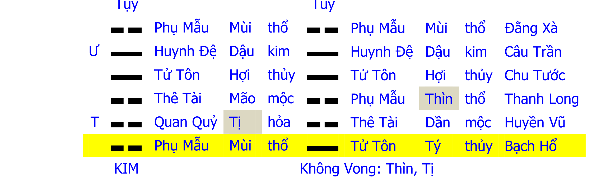

---

# CHƯƠNG 57: THI DI TÀI

Hào Quan trì Thế sinh Thế, thì bản thân sẽ được lấy đỗ. Hào Phụ Mẫu Không, 
Phá, Mộ, Tuyệt, sẽ không được dùng.

Nếu như hào Thế bị khắc, hoặc gặp Không, Phá, Mộ, Tuyệt, hoặc động mà hóa 
hung, hoặc hào Tử Tôn trì Thế, hoặc động trong quẻ, đều chủ về không thi đỗ. Nếu 
hào Phụ Mẫu sinh Thế, trì Thế, sẽ cát lợi; nếu hưu tù, Không Phá, cũng không tốt.

Chú thích: Di tài là hình thức thi tuyển quan lại thời xưa, tức các quan chức trước 
đây do nhiều nguyên do mà từ chức, triều đình sẽ tổ chức thi Di tài, tức tiến hành thi 
tuyển các quan lại cũ để chuẩn bị ra nhiệm chức mới, cũng tương tự như thi công 
chức hiện nay.

***

# CHƯƠNG 58: YẾT BẢNG ĐỀ DANH

Hào Phụ là Dụng thần, nếu suy, cần đợi đến ngày sinh vượng; Nếu vượng, đợi 
đến ngày trực, ngày xung; Nếu động, đợi đến ngày trực, ngày hợp. Nếu lâm Không 
hoặc nhập Mộ, đợi đến ngày xung khai. Nếu gặp phá hoặc Tuần Không, cần đợi ngày 
điền thực.

Ta chiêm nghiệm thấy rằng: Trong lòng có lo âu, nếu gặp Tử Tôn trì Thế, thì đến 
ngày trực của Tử Tôn, sẽ yết bảng. Nếu trong lòng mong đón tin vui, được hào Quan 
trì Thế, đợi đến ngày Quan Quỷ sẽ yết bảng.

***

# CHƯƠNG 59: THI ĐÌNH

(ĐOÁN CÙNG VỚI THI HỘI)

Lấy Quan tinh làm Dụng thần, tiếp đó xem hào Phụ. Nếu trì Thế, được Nhật 
thần, Nguyệt kiến, Thái Tuế tương sinh tương hợp, là tượng đỗ đầu.

Nếu hào Quan hào Phụ hình thành Tam hợp, sẽ được hoàng đế sủng ái đặc biệt.

Nếu hào Thế hoặc hào Quan gặp Không, Phá, Mộ, Tuyệt, Hình, Xung, Khắc, Hại, 
hoặc động mà hóa hung, là điềm không may mắn.

Tuế ngũ Quan Quỷ, xung khắc hào Thế, chủ về tai họa bất trắc.

Chú thích: Thi Đình là một chế độ thi tuyển thời Minh Thanh, do Hoàng đế đích 
thân sách vấn những thí sinh xuất sắc hơn cả, căn cứ vào kết quả thi tuyển, để tiến 
hành bổ nhiệm quan tước theo tài năng.

---

# CHƯƠNG 60: THI HƯƠNG, THI HỘI

Phụ vượng Quan hưng, danh tiêu hổ bảng;

Phụ vượng, Quan hưng, đề danh bảng hổ;

Nếu được hào Phụ, hào Quan trì Thế mà vượng tướng, hoặc lâm Nhật Nguyệt, 
hoặc được Nhật thần, Nguyệt kiến, hào động sinh phò, hoặc động mà hóa cát, ắt 
được ghi danh bảng vàng.

Tử dao Tài động, danh lạc Tôn Sơn1.

Tử động, Tài động, tên xếp dưới Tôn Sơn.

Nếu hào Tử Tôn hoặc hào Thê Tài trì Thế, hoặc động trong quẻ, là tượng thi rớt.

**Tân bình thích:** Ví dụ, ngày Canh Thân tháng Hợi, nữ đoán thi nghiên cứu sinh 
ra sao? Được Hỏa Sơn Lữ biến Thủy Sơn Kiển.

Lữ 
 
Kiển

Huynh ĐệTị | hỏa | Quan QuỷTý | thủy Đằng Xà

Tử Tôn | Mùi | thổ | Tử Tôn | Tuất thổ Câu Trần

Ư | Thê Tài | Dậu kim | Thê Tài | Thân kim Chu Tước

Thê Tài | Thân kim Quan-Hợi | Thê Tài | Thân kim Thanh Long

Huynh ĐệNgọ hỏa | Huynh ĐệNgọ hỏa Huyền Vũ

T | Tử Tôn | Thìn thổPhụ-Mão | Tử Tôn | Thìn thổ Bạch Hổ

HỎA
Không Vong: Tý, Sửu

Quẻ này Quan Quỷ tuy được Nguyệt phù Nhật sinh, nhưng không nên Tử Tôn trì 
Thế, Tử Tôn Tài trong quẻ phát động, Phụ Mẫu Mão mộc tuyệt ở Nhật, bị khắc ở hào 
Ứng, nhập Mộ ở Tử Tôn Mùi thổ, đoán người này rất khó thi đậu, quả nhiên ứng 
nghiệm.

Huynh Đệ nãi đoạt tiêu chi ác khách.

Huynh Đệ là ác thần đoạt mất công danh.

Theo sách xưa, nếu hào Huynh Đệ động thì khó đề danh bảng vàng. Nếu gặp 
hào Huynh Đệ trì Thế, hào Huynh động, đều cho là không tốt. Nói như vậy là không 
biết phân biệt các trường hợp hỷ và kỵ.

Khi trong quẻ hào Phụ và hào Tài cùng động, gặp hào Huynh động để ức chế Tài 
là tốt. Nếu trong quẻ hai hào Quan, Phụ đều động, được hào Huynh trì Thế là tốt, vì 
Phụ động sinh Thế. Nếu hào Huynh Đệ trì Thế, được lại lâm Nhật, Nguyệt, hoặc 
vượng tướng, lại thêm hai hào Quan, Phụ đều vượng, hoặc hào Quan động sinh Phụ,

1 Tôn Sơn là người thi đỗ cuối bảng ở thời Tống. Khi thi đỗ về làng, có người hỏi: "Người 
cùng thi với anh ra sao?". Tôn Sơn đáp: "Tên cuối bảng là tôi, anh ta không có tên trong 
bảng vàng" nghĩa là anh ta thi trượt.

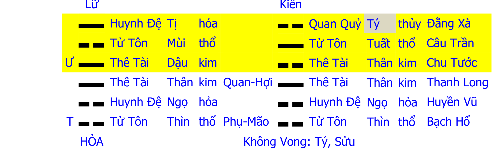 hoặc hào Phụ động sinh Thế, là tượng đỗ đạt, nhưng không được đỗ đầu mà thôi. 
Nên mới nói "Huynh Đệ là ác thần đoạt mất công danh"!

Giác Tử bàn rằng: Nếu trong quẻ Quan Quỷ, Tử Tôn cùng động, hào Quan 
vượng tướng được sinh phò, Tử Tôn suy nhược bị khắc, thì nên gặp Phụ động, kỵ gặp 
Huynh động.

Nhật Nguyệt vi chế sát chi tướng quân.

Nhật Nguyệt là tướng quân chế ngự ác sát.

Trong ba hào Quan Quỷ, Phụ Mẫu, hào Thế, nếu có một hào bị hào động khắc 
chế, hoặc động mà hóa hồi đầu khắc, nếu được Nhật thần, Nguyệt kiến xung chế Kỵ 
thần, thì kết quả cũng được như ý. Cho nên gọi Nhật Nguyệt là tướng quân chế ngự 
ác sát.

Lại như hào Thế vượng tướng, mà một trong hai hào Quan hoặc Phụ phục tàng 
không xuất hiện, nếu được Nhật, Nguyệt xung chế Phi thần, khiến Phục thần hiển lộ, 
cũng chủ về đỗ đạt cao.

Nếu trong ba hào Quan, Phụ, Thế có một hào không vượng, mà được Nhật, 
Nguyệt sinh phò, cũng đoán như vậy.

Tam hợp vô xung, định đăng giáp đệ;

Tam hợp không xung, liền khoa đỗ đạt;

Nếu hào Quan, hào Phụ, và hào Thế hợp thành Phụ cục hoặc Quan cục, không bị 
Nhật Nguyệt xung phá, chủ về thi đậu liên tiếp. Nếu hợp thành Huynh cục, được Nhật 
Nguyệt sinh phò, mà Quan tinh vượng, cũng là tượng đỗ đạt đắc ý. Duy chỉ kỵ hợp 
thành Tử Tôn cục là không tốt. Nếu hợp thành Tài cục tuy không hoàn mỹ, nhưng 
cũng có thể đoán là tốt.

### Ví dụ: Ngày Giáp Thân tháng Mão, xem về thi Hội, được quẻ Cấn biến Ích:

Cấn
 
Ích

T | Quan QuỷDần mộc | Quan QuỷMão mộc Huyền Vũ

Thê Tài | Tý | thủy | Phụ Mẫu | Tị | hỏa Bạch Hổ

Huynh ĐệTuất thổ | Huynh ĐệMùi thổ Đằng Xà

Ư | Tử Tôn | Thân kim | Huynh ĐệThìn thổ Câu Trần

Phụ Mẫu | Ngọ hỏa | Quan QuỷDần mộc Chu Tước

Huynh ĐệThìn thổ | Thê Tài | Tý | thủy Thanh Long

THỔ
Không Vong: Ngọ, Mùi

Hào Quan Dần mộc vượng trì Thế, được Nhật thần Thân tương xung nên ám 
động. Nhật thần hợp với hào động trong quẻ tạo thành Tài cục Thân Tý Thìn thuộc 
thủy, không những không khắc Thế, mà còn sinh Thế, chủ đỗ đạt cao. Sau quả nhiên 
thi đỗ.

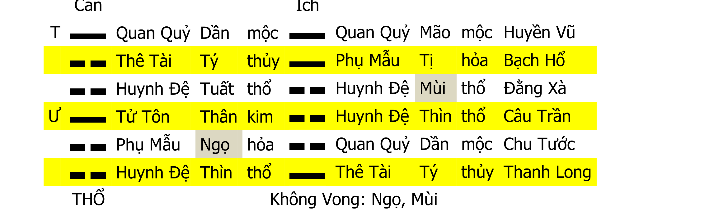

Lục hào cánh phát, không phó khoa trường.

Sáu hào đều động, dự thi vô ích.

Theo phép xem xưa, cho rằng nếu sáu hào đều động, chủ về công danh lận đận 
khó thành. Lý luận này là hợp lý.

Ta thấy rằng khi xem về thi cử, nếu là điềm chắc chắn đỗ, trong quẻ sẽ hiện Phụ 
vượng sinh Thế, hoặc Quan vượng trì Thế. Nếu là điềm không đậu, công danh không 
toại nguyện, sẽ hiện Tử Tôn trì Thế, hoặc hào Tử, hào Tài phát động, hoặc hào Thế 
gặp Không, Phá, hoặc sáu hào động loạn.

Xuất hiện vô tình, nan toại thanh vân chi chí;

Hiện mà vô tình, đường mây khó lòng thỏa chí;

Nếu hào Phụ, hào Quan đều xuất hiện, nhưng không sinh hợp hào Thế, hoặc 
không trì Thế, hoặc hào Thế bị Không, Phá thì cũng vô ích.

Hào Phụ và hào Quan sinh hợp hào Thế, nhưng nếu bị Nhật, Nguyệt, hào động 
xung khắc, cũng là tượng vô tình.

Phục tàng hữu dụng, chung từ bạch ốc chi nhân.

Phục mà hữu dụng, có ngày thoát kiếp hàn nho.

Nếu hào Quan hoặc hào Phụ không hiện trong quẻ, phải tìm Phục thần. Nếu 
Phục thần vượng tướng, được Nhật, Nguyệt xung mất Phi thần, tương sinh Phục thần, 
chắc chắn sẽ thi đậu.

Thái Tuế tác Quan tinh, chung đăng hoàng giáp.

Thái Tuế làm Quan tinh, được ngôi hoàng giáp.

Thái Tuế là chỉ nhà vua. Hào Quan lâm Thái Tuế, động mà sinh hợp hào Thế, là 
tượng bầy tôi diện kiến nhà vua, chủ về vua tôi hòa hợp, là điềm đỗ đạt cao.

Nếu Thái Tuế nhập quẻ, mà ở hào động hoặc trì Thế, mới được đoán như vậy.

**Tân bình thích:** Xưa có thi đình, vua tự tay chấm trạng nguyên, Thái Tuế đại 
diện cho vua, cho nên mới có lý luận này, thời nay thì không còn chế độ đó, vì vậy 
cần phải luận linh hoạt, không thể nhận định máy móc theo kiểu cũ.

Nhật Nguyệt xung khắc Thế, thả thủ thanh đăng.

Nhật Nguyệt xung khắc Thế, giữ phận học trò.

Trong quẻ hào Quan, hào Phụ vượng nhưng Thế hưu tù, Không, Phá, Mộ, Tuyệt, 
hoặc động biến hung, hoặc Nhật, Nguyệt xung khắc hào Thế, thì nên hiểu rằng, cầu 
danh phải xem thân mình, thân Thế đã thất hãm, thì dựa vào đâu mà cầu danh.

Quái ngộ Lục xung, thử khứ nan đề nhạn tháp; hào phùng Lục hợp, giá 
hồi khả đoạt ngao đầu.

Quẻ gặp Lục xung, khó được ghi danh tháp nhạn1. Hào gặp Lục hợp, chắc rằng 
được đậu ngôi đầu.

1 Tháp nhạn: Tháp đề danh những người đậu Tiến sĩ.

### Ví dụ: Ngày Bính Thìn tháng Ngọ, xem về thi Hương, được quẻ Đoài:

Đoài

T | Phụ Mẫu | Mùi thổ | Thanh Long

Huynh Đệ | Dậu | kim | Huyền Vũ

Tử Tôn | Hợi | thủy | Bạch Hổ

Ư | Phụ Mẫu | Sửu thổ | Đằng Xà

Thê Tài | Mão | mộc | Câu Trần

Quan Quỷ | Tị | hỏa | Chu Tước

KIM 
Không Vong: Tý, Sửu

Chú thích trong sách xưa cho rằng: Quẻ gặp Lục xung, gặp xung thì tán. Ta thấy 
quẻ này tuy là Lục xung, nhưng hào Thế vượng, nên chưa dám quyết đoán.

Bảo người xem lại, được quẻ Lâm biến Sư:

Lâm 
 
Sư

Tử Tôn | Dậu | kim | Tử Tôn | Dậu kim | Thanh Long

Ư | Thê Tài | Hợi | thủy | Thê Tài | Hợi | thủy | Huyền Vũ

Huynh Đệ | Sửu thổ | Huynh Đệ | Sửu thổ | Bạch Hổ

Huynh Đệ | Sửu thổ | Phụ Mẫu | Ngọ hỏa | Đằng Xà

T | Quan Quỷ | Mão | mộc | Huynh Đệ | Thìn | thổ | Câu Trần

Phụ Mẫu | Tị | hỏa | Quan Quỷ | Dần mộc | Chu Tước

THỔ
Không Vong: Tý, Sửu

Quẻ này Quan tinh trì Thế, tuy không được vượng, nhưng hào sơ Phụ được Quan 
sinh nên văn vượng, hợp với quẻ trước, là chủ về đỗ đạt. Sau quả nhiên được thành 
danh.

Phàm gặp quẻ Lục xung mà hào Quan, hào Phụ, hào Thế đều vượng, không cần 
phải xem thêm, có thể đoán ngay là đỗ đạt. Còn nếu không vượng, cần xem thêm 
một quẻ, nếu gặp quẻ cát thì thuận lợi, nếu gặp quẻ hung sẽ không tốt.

Khi gặp quẻ Lục hợp, cũng cần hào Quan, hào Phụ, hào Thế đắc địa. Nếu có một 
hào thất hãm, không được sinh phò, thì có là Lục hợp cũng vô ích.

Phụ vượng Quan suy, chung tu hạ đệ;

Phụ vượng Quan suy, bài thi kém cỏi;

Hào Phụ vượng tướng mà hào Quan gặp Không, Phá, Mộ, Tuyệt, hoặc động hóa 
hung, hóa Khắc, tuy văn chương có xuất sắc, cũng không được đỗ đạt.

Phụ suy Quan vượng, kham hứa đăng khoa.

Phụ suy Quan vượng, vẫn được đăng khoa.

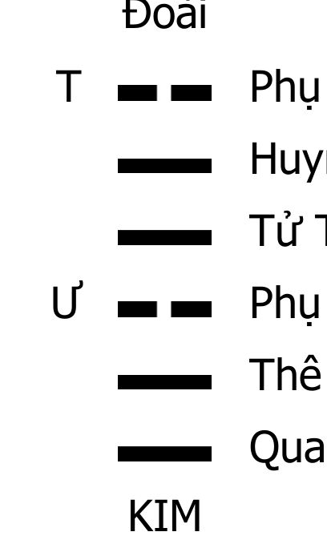

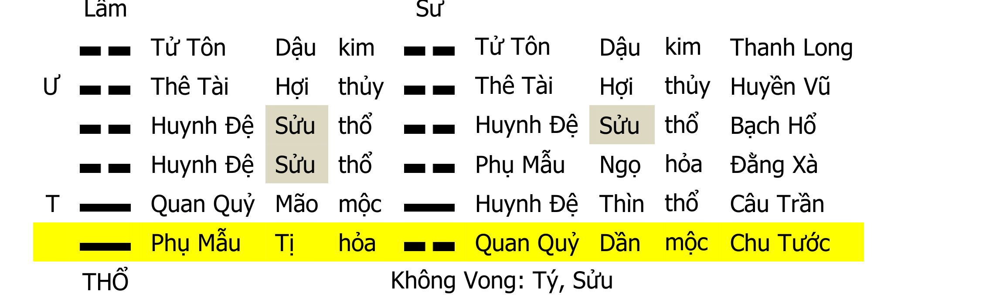

Hào Quan vượng sinh Thế, trì Thế, mà hào Phụ không vượng, là tượng phúc cao, 
tuy văn không giỏi nhưng vẫn được toại nguyện.

Ứng hợp Nhật sinh, tất tư ngạc tiến;

Hào Ứng hợp, Nhật thần sinh, ắt nhờ tiến cử;

Quan Phụ đều vượng mà hào Thế không vượng, hoặc được Nhật, Nguyệt phò 
trợ, hoặc Ứng động mà sinh hợp tức nhờ được sức nâng đỡ tiến cử.

Động thương nhật khắc, hoàn thủ kê song.

Động tổn thương, Nhật thần khắc, vẫn phận học trò.

Hào Ứng, hào động tuy sinh hợp hào Thế, nhưng hào Ứng và hào động lại bị 
Nhật, Nguyệt xung khắc, có được tiến cử cũng vô ích.

Thế động hóa Quan hóa Khắc, điệp mộng kham ưu;

Thế động hóa Quan, hóa Khắc, mơ mộng hão huyền;

Sách xưa có câu: "Thân, Quan hóa Quỷ được Nguyệt kiến phò trợ, thẳng bước 
lên cung quế"; hoặc "Thân động biến Quỷ, thi sẽ thành danh".

Lại có câu: "Thân động hóa Không, Dụng thần vượng, thành danh chỉ là giấc 
mộng".

Phép xưa đều dùng Quái thân để đoán, ta thử qua không thấy ứng nghiệm, chỉ 
nghiệm với hào Thế. Nếu hào Thế hóa Quỷ, cũng có ứng nghiệm.

Nếu trong quẻ hào Phụ vượng tướng, hào Thế hóa Quan tinh, nếu không hồi đầu 
khắc Thế, là tượng biến thành quan, chắc chắn sẽ đậu ngay khoa này.

Nếu hào Thế hưu tù, bị khắc, động hóa Quan, là tượng hóa Quỷ, không những 
thi trượt, mà còn có tai họa. Nếu hóa hào Quỷ khắc Thế, lại càng hung.

### Ví dụ: Ngày Mậu Thìn tháng Mão, xem về thi Hương, được quẻ Ly biến Ký Tế:

Ly 
 
Ký Tế

T | Huynh Đệ | Tị | hỏa | Quan Quỷ | Tý | thủy | Chu Tước

Tử Tôn | Mùi thổ | Tử Tôn | Tuất thổ | Thanh Long

Thê Tài | Dậu | kim | Thê Tài | Thân | kim | Huyền Vũ

Ư | Quan Quỷ | Hợi | thủy | Quan Quỷ | Hợi | thủy | Bạch Hổ

Tử Tôn | Sửu thổ | Tử Tôn | Sửu | thổ | Đằng Xà

Phụ Mẫu | Mão | mộc | Phụ Mẫu | Mão | mộc Câu Trần

HỎA
Không Vong: Tuất, Hợi

Sách xưa chú thích: "Thân Quan hóa Quỷ, Nguyệt kiến phù trợ, thẳng bước lên 
cung quế", tức quái thân tại Quan, ắt được thành đạt. Nếu xuất hiện và phát động, 
hóa thành hào Quan, lại được Nguyệt kiến sinh hợp, chủ về thi đỗ liên khoa.

Giác Tử bàn rằng: Quẻ này Tị hỏa là quái thân, lại là hào Thế, biến thành Quan 
tinh Tý thủy, được Nguyệt kiến tương sinh tương hợp, chính là hợp với câu trên.

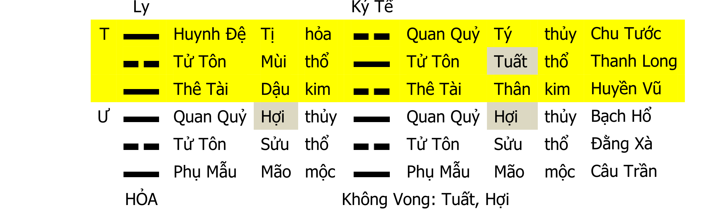

Nhưng lại không thấy thi đậu liên tiếp, mà hơn nữa, còn khó bảo toàn được tính 
mạng. Nguyên nhân là do hàọ Thế hóa Quỷ Tý thủy hồi đầu khắc, là tượng chết nửa 
đường.

### Ví dụ: Ngày Đinh Tị tháng Dậu, xem về thi Hương, được quẻ Tiểu Quá biến Thái:

Tiểu Quá
 
Thái

Phụ Mẫu Tuất thổ | Huynh ĐệDậu kim Thanh Long

Huynh ĐệThân kim | Tử Tôn | Hợi thủy Huyền Vũ

T

Quan QuỷNgọ hỏa Tử-Hợi | Phụ Mẫu Sửu thổ Bạch Hổ

Huynh ĐệThân kim | Phụ Mẫu Thìn thổ Đằng Xà

Quan QuỷNgọ hỏa Tài-Mão | Thê Tài | Dần mộc Câu Trần

Ư

Phụ Mẫu Thìn thổ | Tử Tôn | Tý | thủy Chu Tước

KIM 
Không Vong: Tý, Sửu

Hào Thế Ngọ hỏa là Quan tinh, hóa Sửu thổ Phụ Mẫu là văn chương, Quan và 
Văn đều vượng, nhưng Sửu Phụ gặp Tuần Không, nên đến kỳ thi Hương năm Ngọ sẽ 
được toại nguyện, đến năm Sửu thì đề danh Tiến sĩ.

Giác Tử bàn rằng: Nếu cho rằng "Thế động hóa Không, Dụng thần vượng, thành 
danh chỉ là gịấc mộng", quẻ này chẳng phải là hào Thế động hóa Không ư? Năm Ngọ 
thi đậu Cử nhân, năm Sửu đậu Tiến sĩ, đâu phải là giấc mộng? Bởi vậy, hóa Không sẽ 
đợi đến năm thực Không (ở đây là năm Ngọ) sẽ ứng nghiệm.

Thân hưng hóa vượng hóa sinh, long trì biến hóa.

Thân động hóa vượng, hóa sinh, triều đình thăng tiến.

Hào Thế vượng tướng, động mà biến Quan tinh, hồi đầu sinh hợp hào Thế, thì 
không phải là biến Quỷ, mà là biến Quan.

### Ví dụ: Ngày Ất Mùi tháng Mão, xem về thi Hội, được quẻ Quan biến Lý:

Quan
 
Lý

Thê Tài | Mão mộc | Phụ Mẫu | Tuất thổ Huyền Vũ

Quan QuỷTị | hỏa Huynh-Thân | Huynh ĐệThân kim Bạch Hổ

T | Phụ Mẫu | Mùi thổ | Quan QuỷNgọ hỏa Đằng Xà

Thê Tài | Mão mộc | Phụ Mẫu | Sửu thổ Câu Trần

Quan QuỷTị | hỏa | Thê Tài | Mão mộc Chu Tước

Ư | Phụ Mẫu | Mùi thổ Tử-Tý | Quan QuỷTị | hỏa Thanh Long

KIM 
Không Vong: Thìn, Tị

Hào Phụ Mẫu Mùi thổ trì Thế, lâm Nhật thần, động hóa Ngọ hỏa Quan tinh hồi 
đầu sinh Thế. Hào 2 Tị hỏa lại tương sinh hào Thế; hào sơ Mùi thổ động đến trợ giúp, 
ắt sẽ đỗ đạt cao. Sau quả nhiên đỗ đầu thi Hội.

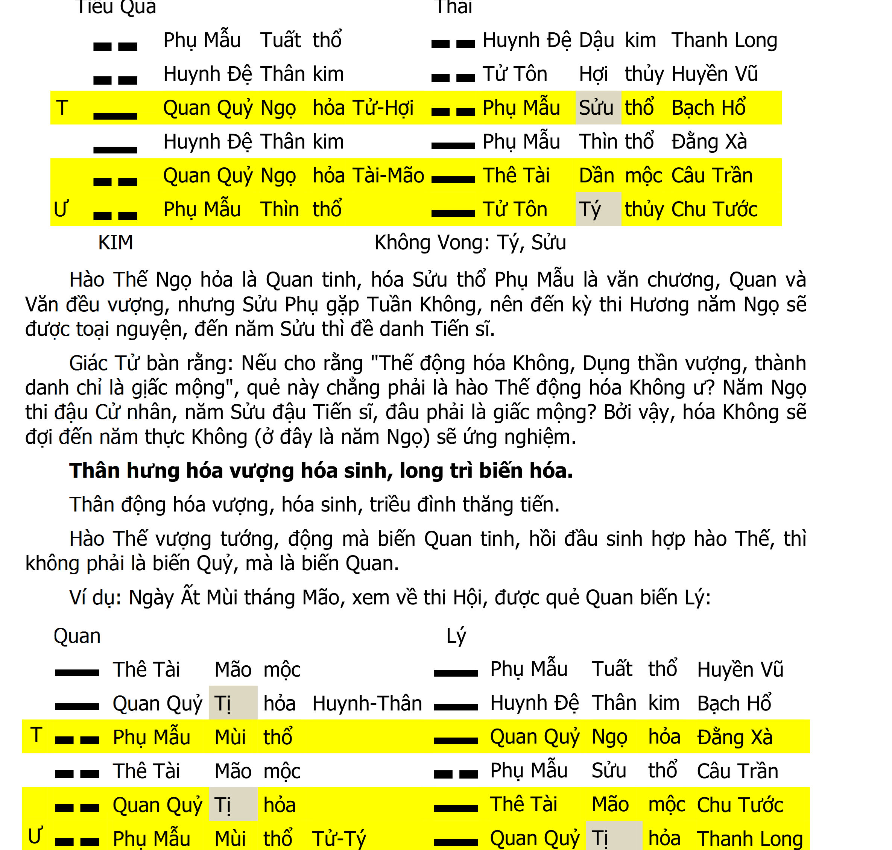

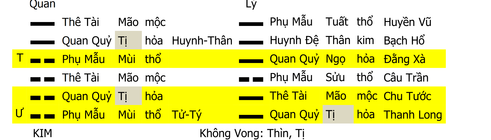

Thế thoái, Quan tinh hóa thoái, song hạ nang huỳnh;

Thế hóa Thoái, Quan hóa Thoái, bên song đom đóm học bài;

Hào Thế, hào Quan và hào Phụ đều vựợng, trong đó có một hào hóa Tiến thần, 
là tượng đỗ cao. Nếu xem về thi Hương, chắc chắn sẽ đỗ.

Kỵ nhất là hóa Thoái thần, vượng mà hóa Thoái thần, nếu không phải gặp trở 
ngại khi đến trường thi, cũng là không hăng hái đi thi. Hào Phụ hóa Thoái thần, 
nghiệp học sa sút, văn chương ngày càng kém. Hào Quan hóa Thoái thần, đến lúc 
đầu bạc cũng không thi đậu. Có thể tham khảo chương Tiến thần.

Tài lâm Bạch Hổ trì Thân, vi tiền chẩm khối.

Tài trì Thế lâm Bạch Hổ, trước màn chịu tang cha mẹ.

Sách xưa cho rằng, hào Tài lâm Bạch Hổ sẽ có tang cha mẹ. Nhưng không chỉ | lâm Bạch Hổ, mà nếu hào Tài trì Thế, hoặc động trong quẻ, hào Phụ Mẫu hưu tù, | Không, Phá, hoặc hào Tài động hóa Phụ, Phụ động hóa Tài, đều ứng nghiệm.

**Tân bình thích:** Ngày xưa cha mẹ qua đời thì phải chịu tang ba năm, không thể 
tham gia thi cử, do đó mới có thuyết này, thời nay thì không cần câu nệ. Nhưng dùng 
trong phán đoán lưu niên vẫn còn hữu dụng.

Càn quái như thiên, diệc yếu Quan, Phụ lưỡng vượng; lôi thanh như 
Chấn, do hữu Không, Phá chi hiềm.

Quẻ Càn như trời, cũng cần Quan, Phụ đều vượng; quẻ Chấn như sấm, cũng phải 
dè chừng Phá, Không.

Phép xem xưa cho rằng, quẻ Càn và quẻ Chấn là tốt, theo kinh nghiệm của ta, 
còn cần hai hào Quan, Phụ đều vượng, mới đoán là tốt, nếu không chưa chắc đã như 
ý.

Suy vượng khắc xung, khinh trọng tu nghi tế ngoạn; Mộ Tuyệt Không Phá, ứng 
kỳ chương nội tường chi.

Suy, vượng, khắc, xung, nặng nhẹ đều nên cân nhắc; Mộ, Tuyệt, Không, Phá, 
xem kỹ trong chương "Ứng kỳ".

Cần ghi nhớ nội dung chương "Ứng kỳ" phía trước, vì xem về bất kỳ điều gì, cũng 
đều hỏi đến thời gian ứng nghiệm. Có thành thạo, việc suy đoán mới được nhanh 
chóng, chính xác.

Còn về Dụng thần, suy cần có gốc, vượng nên trung hòa, khắc cần được cứu, 
xung cần gặp hợp.

Chú thích: Thi Hương, thi Hội là chế độ thi cử của đời Minh, Thanh, được tổ chức 
ba năm một lần trong tỉnh thành, nếu thi đỗ, sẽ trở thành Cử nhân.

---

# CHƯƠNG 61: THĂNG QUAN, BỔ NHIỆM

Quan tước vinh thân, tu nghi trì Thế; Tài lộc ân dưỡng, tối hỷ sinh thân.

Quan tước vẻ vang, nên gặp trì Thế; Tài lộc nuôi dưỡng, mừng được sinh thân.

Hào Quan vượng trì Thế, hoặc Nhật, Nguyệt, hào động làm Quan tinh sinh hợp 
hào Thế, hoặc hào Thế phát động hóa Quan tinh sinh Thế, đều tốt.

Lại có câu: "Tài động sinh Quan đắc mỹ khuyết; Quan lâm Nhật Nguyệt tất siêu 
thiên" (Tài động sinh Quan, được bổ nhiệm chức tốt; Quan lâm Nhật Nguyệt, sẽ thăng 
lên chức cao).

Tử Tôn trì Thế, hưu vọng vinh trừ; Quan vị Không Phá, vật tư thăng 
thiên.

Tử Tôn trì Thế, chớ mong thăng quan; Quan gặp Phá, Không, đừng mong tuyển 
dụng.

Hào Tử Tôn trì Thế, hào Tử Tôn động trong quẻ, là tượng không có cơ hội thăng 
tiến. Hào Quan gặp Không, Phá, Mộ, Tuyệt, hoặc động mà biến hung, cũng không có 
hy vọng được thăng chức hoặc bổ nhiệm.

Vũ lộ thừa ân, hợp trung phùng hợp;

Hưởng ơn mưa móc, trong hợp có hợp;

Hào Thế và hào Quan hình thành tam hợp Quan cục, Tài cục, hoặc sinh Thế, 
hoặc Thế nằm trong cục, hoặc Quan tinh trì Thế, được Nhật Nguyệt, hào động tương 
hợp, hoặc gặp được quẻ Lục hợp, hoặc quẻ động biến thành quẻ Lục hợp, đều là 
tượng sẽ được hưởng ân huệ của bề trên, thăng quan tiến chức.

### Ví dụ: Ngày Ất Hợi tháng Thân, xem có được điền khuyết hay không, được quẻ

Tỉnh biến Tiết:

Tỉnh
 
Tiết

Phụ Mẫu Tý | thủy | Phụ Mẫu Tý | thủy Huyền Vũ

T | Thê Tài | Tuất thổ | Thê Tài | Tuất thổ Bạch Hổ

Quan QuỷThân kim Tử-Ngọ | Quan QuỷThân kim Đằng Xà

Quan QuỷDậu kim | Thê Tài | Sửu thổ Câu Trần

Ư | Phụ Mẫu Hợi | thủy Huynh-Dần | Huynh ĐệMão mộc Chu Tước

Thê Tài | Sửu thổ | Tử Tôn | Tị | hỏa Thanh Long

MỘC
Không Vong: Thân, Dậu

Đoán rằng: Quẻ nội Tị Dậu Sửu hợp thành Quan cục, tương sinh hào Ứng mà 
không sinh hào Thế, như vậy là xuất hiện mà vô tình, nên chỗ điền khuyết này không 
thể có được.

Người xem hỏi nguyên nhân, ta đáp: Quan sinh hào Ứng, chắc chắn không được 
bổ nhiệm. Quả nhiên chỗ khuyết này về sau được giao cho người khác.

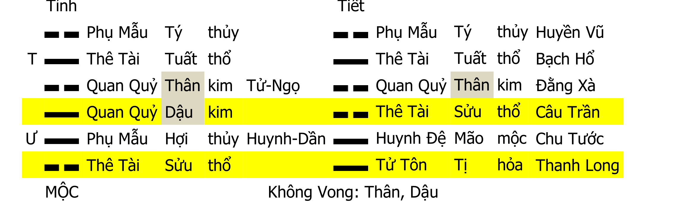

Phong vân vị tế, xung thượng gia xung.

Chưa gặp phong vân, xung lại thêm xung.

Hào Thế, hào Quan không vượng, lại gặp quẻ Lục xung, hoặc hào Quan bị Nhật 
thần, Nguyệt kiến tương xung, hoặc gặp quẻ Lục xung biến Lục xung, là tượng chưa 
đến lúc gặp được hội rồng mây.

Nguyên thần suy tĩnh, tiết khí hào dao, vấn thăng thiên dĩ vô kỳ.

Nguyên thần suy tĩnh, gặp hào tiết khí Quan, hỏi thăng tiến chẳng còn cơ hội.

Giả sử hào Quan thuộc mộc, Nguyên thần là hào thủy suy mà không động trong 
quẻ có hào hỏa động làm tiết khí hào Quan, là tượng không có cơ hội thăng tiến. Các 
trường hợp khác loại suy từ đó.

**Tân bình thích:** Lý luận này rất đúng, tuy không được lên chức, nhưng vẫn có ý 
nghĩa thay đổi chức vụ. Bởi vì Phụ Mẫu xưa là nha môn, nay là đơn vị công tác, phát 
động tất là nơi làm việc sẽ xảy ra thay đổi.

### Ví dụ: Ngày Canh Dần tháng Tị, một huyện trưởng đoán năm nay có được thăng

chức hay không, được Đồng Nhân biến Độn.

Đồng Nhân
 
Độn

Ư | Tử Tôn | Tuất thổ | Tử Tôn | Tuất thổ Đằng Xà

Thê Tài | Thân | kim | Thê Tài | Thân | kim | Câu Trần

Huynh Đệ | Ngọ | hỏa | Huynh Đệ | Ngọ | hỏa | Chu Tước

T | Quan Quỷ | Hợi | thủy | Thê Tài | Thân | kim | Thanh Long

Tử Tôn | Sửu | thổ | Huynh Đệ | Ngọ | hỏa | Huyền Vũ

Phụ Mẫu | Mão | mộc | Tử Tôn | Thìn | thổ Bạch Hổ

HỎA 
Không Vong: Ngọ, Mùi

Quan Quỷ không được Nhật Nguyệt sinh phù, Nguyệt xung là phá, không có hy 
vọng lên chức. Quan Quỷ Nguyệt phá, may mà được Nhật hợp giải cứu, nếu không thì 
không những không thăng mà còn có khả năng xảy ra việc mất chức. Phụ Mẫu Mão 
mộc phát động, trong năm sẽ xảy ra biến động chức vụ.

Kết quả là không được thăng chức, tháng Mùi phải đổi đến một huyện khác 
nhậm chức huyện trưởng.

Thế hào phát động, Quan hóa Tiến thần, vọng vinh trừ nhi tại tức.

Hào Thế động, Quan hóa Tiến thần, mong thăng tiến ứng nghiệm nhanh chóng.

Hào Thế phát động, hoặc động hóa cát, hoặc có Lộc, Mã, Quý Nhân tại Thế, 
hoặc hào Quan động hóa cát, sinh hợp hào Thế, là điềm nhanh chóng được thăng 
chức.

Thế Quan Phá nhi hưu vọng, Thế Phúc Không nhi diệc thăng.

Thế, Quan gặp Phá đừng hy vọng; Thế, Tử lâm Không vẫn được thăng.

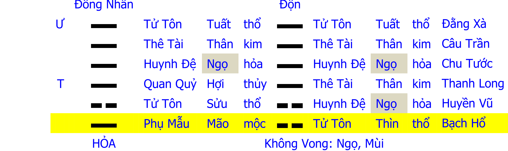

Hào Thế lâm Nguyệt phá, cho dù được Quan tinh trì Thế, không những không 
được thăng tiến, mà còn phải phòng những rắc rối khác.

**Tân bình thích:** Ví dụ ở trên chính là Quan Quỷ trì Thế, lâm Nguyệt phá, đúng 
là không được lên chức. Nhưng cũng không hoàn toàn trở nên bất lợi. Cấp bậc không 
thay đổi, nhưng kinh tế phát triển hơn chỗ cũ, không thể nói là không tốt.

Hào Tử Tôn trì Thế gặp Tuần Không, cũng không thể thăng chức. Nhưng nếu 
xem về sự việc nội trong đôi ba ngày tới, thì lại là điềm được bổ nhiệm. Là vì trong 
khoảng thời gian đó, hào Tử Tôn vẫn chưa xuất Không, nên không khắc được Quan 
tinh.

**Dã Hạc bàn rằng:** Ta từng xem cho ba người được quẻ này, đều được lên chức, 
nhưng chẳng bao lâu thì chết.

### Ví dụ: Ngày Mậu Dần tháng Thân, xem có được nhận chức không, được quẻ

Trạch Thiên Quải:

Quải

Huynh ĐệMùi thổ | Chu Tước

T | Tử Tôn | Dậu kim | Thanh Long

Thê Tài | Hợi thủy | Huyền Vũ

Huynh ĐệThìn thổ | Bạch Hổ

Ư | Quan QuỷDần mộc Phụ-TịĐằng Xà

Thê Tài | Tý | thủy | Câu Trần

THỔ
Không Vong: Thân, Dậu

Đoán rằng: Hào Tử Tôn trì Thế, nên chức vị này sẽ không có được, vả lại hào 
Thế lâm Không, cũng là tượng không được bổ nhiệm. Nào ngờ chưa đến ba ngày sau, 
được nhiệm chức, cử đi làm việc, đi được nửa đường thì chết.

Nội trong ba ngày được bổ nhiệm, vì trong thời gian đó hào Tử chưa xuất Không. 
Phải chết giữa đường, là vì hào Thế lâm Không.

Lại ví dụ: Ngày Canh Thìn tháng Dần, xem được quẻ Thủy Thiên Nhu:

Nhu

Thê Tài 
Tý 
thủy

Huynh Đệ 
Tuất 
thổ

T | Tử Tôn | Thân | kim

Huynh Đệ 
Thìn 
thổ

Quan Quỷ 
Dần 
mộc 
Phụ-Tị

Ư | Thê Tài | Tý | thủy

THỔ
Không Vong: Thân, Dậu

**Dã Hạc bàn rằng:** Mỗi khi gặp những quẻ không ứng nghiệm, ta đều ghi nhớ 
trong lòng. Nay gặp quẻ này, mới hiểu được quẻ xem về nhiệm chức trước đây. Quẻ 
này cũng là Tử Tôn trì Thế, lại lâm Không, cũng chỉ việc nội trong hai ba ngày nên 
đoán là được. Người này quả nhiên được bổ khuyết, chưa đầy hai tháng sau thì chết.

### Ví dụ: Ngày Đinh Sửu tháng Thìn, xem về tuyển dụng, đã báo danh, được quẻ

Tiệm biến Quan:

Tiệm
 
Quan

Ư | Quan QuỷMão mộc | Quan QuỷMão mộc Thanh Long

Phụ Mẫu | Tị | hỏa Tài-Tý | Phụ Mẫu | Tị | hỏa Huyền Vũ

Huynh ĐệMùi | thổ | Huynh ĐệMùi thổ Bạch Hổ

T | Tử Tôn | Thân kim | Quan QuỷMão mộc Đằng Xà

Phụ Mẫu | Ngọ hỏa | Phụ Mẫu | Tị | hỏa Câu Trần

Huynh ĐệThìn thổ | Huynh ĐệMùi thổ Chu Tước

THỔ
Không Vong: Thân, Dậu

Quẻ này nhìn chung cũng tương tự với hai quẻ trước. Hai quẻ trước hào Tử trì 
Thế gặp Tuần Không nhưng không phát động. Quẻ này hào Tử Tôn động biến Quan, 
lại là xem việc trong hai ba ngày, hào Tử Tôn chưa xuất Không, nên đoán là sẽ được.

Sau quả nhiên được tuyển dụng, lên đường nhận chức được sáu ngày thì ở nhà 
con chết. Đến nơi nhiệm chức được tám tháng thì chết. Bản thân người này và con 
đều chết, vì hào Ứng và hào Thế Tử Tôn cùng biến thành Quỷ.

Dã Hạc nói rằng, sở dĩ hai quẻ sau xem được ứng nghiệm, là vì quẻ đầu tiên 
không đoán đúng, nên ta luôn ghi nhớ trong lòng. Nếu như xem xong là quên, sẽ 
không thể đắc được chỗ tinh diệu.

**Tân bình thích:** Dã Hạc nghiệm được ba quẻ nhưng chưa hẳn đã là chân lý. Tử 
Tôn trì Thế Không Vong, vẫn phải Quan Quỷ vượng tướng mới có thể được thăng 
chức, nếu như Quan Quỷ hưu tù thì cũng không được thăng. Về vấn đề chết sau khi 
lên chức, quẻ đầu tiên bởi vì hào Thế Tuyệt tại Quan Quỷ, hào 5 là đường đi, Thế lâm 
Tuyệt Không, vì vậy chết ở trên đường. Nếu chẳng phải Tuyệt tại Quan Quỷ thì chưa 
hẳn sẽ chết. Quẻ thứ hai, Thế bị Quan Quỷ xung phá, vì vậy cũng là hung triệu (điềm 
xấu). Quẻ thứ ba, hào Thế động mà hóa Quan, chính là tượng gặp được chức quan, 
nhưng hóa Quan Quỷ lại nhập Mộ ở Nhật, cũng chính là hung triệu. Vì vậy cũng chết.

### Ví dụ dưới đây của tôi có thể chứng minh cho luận điểm này.

### Ví dụ 1: Ngày Tân Dậu tháng Tuất, nữ xem có thể dự thi vào công ty China

Unicom được không? Được Bác biến Khôn.

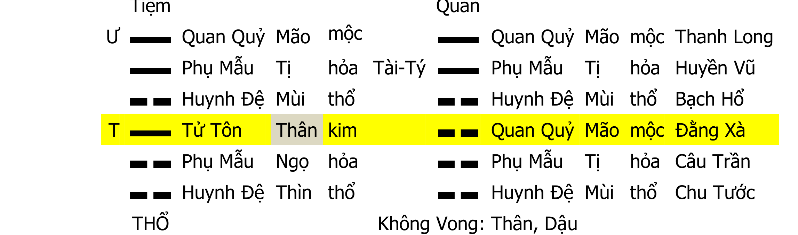

Bác 
 
Khôn

Thê Tài | Dần mộc | Huynh ĐệDậu kim Đằng Xà

T | Tử Tôn | Tý | thủy Huynh-Thân | Tử Tôn | Hợi thủy Câu Trần

Phụ Mẫu Tuất thổ | Phụ Mẫu Sửu thổ Chu Tước

Thê Tài | Mão mộc | Thê Tài | Mão mộc Thanh Long

Ư | Quan QuỷTị | hỏa | Quan QuỷTị | hỏa Huyền Vũ

Phụ Mẫu Mùi thổ | Phụ Mẫu Mùi thổ Bạch Hổ

KIM
Không Vong: Tý, Sửu

Tử Tôn trì Thế Không Vong, theo phương pháp của Dã Hạc thì nội trong hai ba 
ngày có thể thành công, nếu không thì hết hi vọng. Tôi không đoán như vậy. Hào Tài 
Dần mộc phát động, Mão mộc ám động, Tài động sinh Quan, may mắn gọi tên, tôi 
đoán là họ đã tuyển đủ số lượng, nhưng chưa hẳn sẽ nhận tất cả, nếu tìm người giúp 
đỡ thì sẽ có cơ hội.

Kết quả, lần đầu tiên hỏi thì không được tuyển, bởi vì nhân viên đã tuyển đủ, sau 
đó nhờ người khác nói giúp, do người này đã đủ điểm nên được nhận bổ sung. Vẫn 
chưa thấy tử vong, bốn năm trôi qua vẫn khỏe mạnh. Ví dụ này hào Thế được Nhật 
sinh, không bị Quan Quỷ xung phá, cũng không Tuyệt, Mộ ở Quan Quỷ.

### Ví dụ 2: Ngày Tân Tị tháng Tị, nam đoán thăng chức, được Quải biến Đoài.

Quải
 
Đoài

Huynh ĐệMùi thổ | Huynh ĐệMùi thổ Đằng Xà

T | Tử Tôn | Dậu kim | Tử Tôn | Dậu kim Câu Trần

Thê Tài | Hợi thủy | Thê Tài | Hợi thủy Chu Tước

Huynh ĐệThìn thổ | Huynh ĐệSửu thổ Thanh Long

Ư | Quan QuỷDần mộc Phụ-Tị | Quan QuỷMão mộc Huyền Vũ

Thê Tài | Tý | thủy | Phụ Mẫu | Tị | hỏa Bạch Hổ

THỔ
Không Vong: Thân, Dậu

Quẻ này cũng Tử Tôn trì Thế Không Vong, tôi đoán người này không được thăng 
chức, quả nhiên ứng nghiệm. Quan Quỷ không được Nhật Nguyệt sinh phù, Nguyên 
thần lại Nguyệt phá Nhật phá, làm sao có thể thăng chức được? Nhưng hào Thế được 
Huynh Đệ Thìn thổ động đến sinh, Nhật Nguyệt tuy khắc nhưng cũng có ý Trường 
Sinh, hoàn toàn chưa gặp hung, hai năm sau vẫn sống khỏe mạnh.

Tùy Quan nhập Mộ, Thế vượng giả quan thăng. Trợ Quỷ thương thân, 
thân suy giả họa chí.

Theo Quan nhập Mộ, Thế vượng được thăng quan. Giúp Quỷ hại thân, thân suy 
thì họa đến.

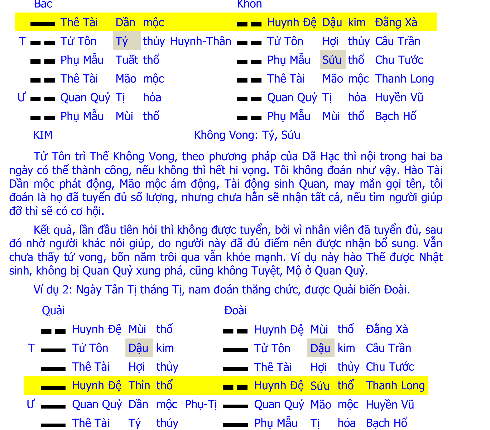

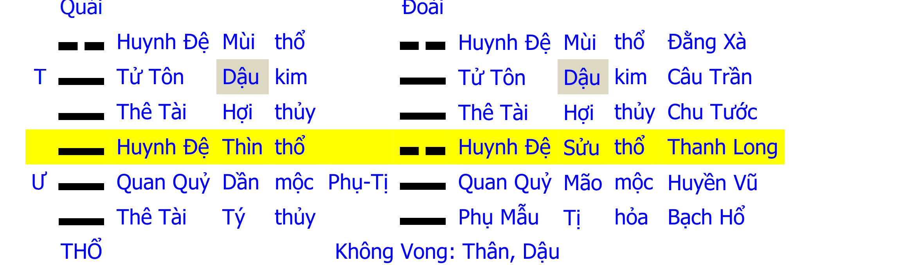

Sách xưa cho rằng "theo Quỷ nhập Mộ", "giúp Quỷ hại thân" đều là hung. Ta thử 
nhiều lần, thấy rằng nếu hào Thế vượng thì vẫn được thăng chức; nếu hào Thế suy, là 
không cát lợi.

Nếu giúp Quỷ hại thân, mà Nguyên thần phát động, chắc chắn sẽ được thăng 
quan. Nhưng nếu hào Thế hưu tù, tất có họa đến.

Như ngày Ất Mùi tháng Dần, xem thăng chức, được Tỷ biến Quan.

Tỷ 
 
Quan

Ư | Thê Tài | Tý | thủy | Quan Quỷ | Mão | mộc | Huyền Vũ

Huynh Đệ | Tuất thổ | Phụ Mẫu | Tị | hỏa Bạch Hổ

Tử Tôn | Thân | kim | Huynh Đệ | Mùi | thổ | Đằng Xà

T | Quan Quỷ | Mão | mộc | Quan Quỷ | Mão | mộc | Câu Trần

Phụ Mẫu | Tị | hỏa | Phụ Mẫu | Tị | hỏa Chu Tước

Huynh Đệ | Mùi | thổ | Huynh Đệ | Mùi | thổ | Thanh Long

THỔ 
Không Vong: Thìn, Tị

Đoán rằng: Mão mộc vượng Quan trì Thế, Tý thủy Tài động tương sinh, tuy là Mộ 
ở ngày Mùi, nhưng may là hào Thế được trợ nên không sao, quả nhiên được thăng 
chức ở tháng Hợi.

Lại như ngày Tân Dậu tháng Tuất, xem ngày nào được bổ quan, được Kiển biến 
Nhu.

Kiển
 
Nhu

Tử Tôn | Tý | Thủy | Tử Tôn | Tý | thủy Đằng Xà

Phụ Mẫu Tuất Thổ | Phụ Mẫu Tuất thổ | Câu Trần

T | Huynh ĐệThân Kim | Huynh ĐệThân kim | Chu Tước

Huynh ĐệThân Kim | Phụ Mẫu Thìn thổ | Thanh Long

Quan QuỷNgọ Hỏa Tài-Mão | Thê Tài | Dần mộc | Huyền Vũ

Ư | Phụ Mẫu Thìn Thổ | Tử Tôn | Tý | thủy Bạch Hổ

KIM
Không Vong: Tý, Sửu

Đoán rằng: Hào Tài Dần mộc sinh trợ hào Quan Ngọ hỏa khắc Thế, là tượng giúp 
Quỷ hại thân. Nhưng nhờ được Thìn thổ động tương sinh Thân kim Thế, nên Ngọ hỏa 
tham sinh quên khắc, nên đến mùa đông năm đó sẽ được thăng nhiệm.

Quả nhiên đến mùa đông được thăng quan, ứng vào mùa đông vì Thìn thổ hóa 
Tý thủy. Không Vong, phải đợi đến tháng Tý thực Không mà được thăng tiến.

**Tân bình thích:** Quẻ này cực kỳ huyền diệu. Nếu như Phụ Mẫu Tuất thổ phát 
động, tam hợp thành Quan cục khắc Thế, thì không những không được lên chức mà 
trái lại trở thành hung. Nếu như hào Ứng không động, Quan khắc hào Thế sinh Ứng 
thì chính là vô tình, cũng không được thăng quan. Song quẻ này hay ở chỗ Quan sinh

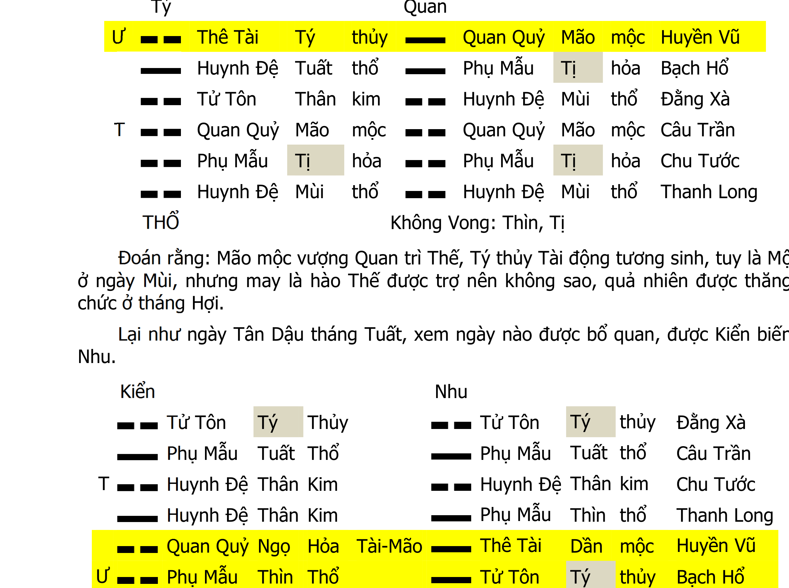

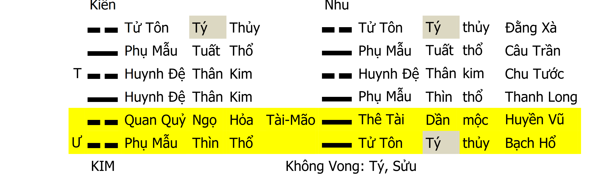

---

# CHƯƠNG 62. THUYÊN CHUYỂN

hào Ứng, Ứng động lại sinh hào Thế, cuối cùng cũng được chức quan như mong 
muốn. Nhưng cũng không nên hào Ứng Không Phá. Quẻ này hào Ứng Nguyệt phá, 
nhưng rất hay là được Nhật hợp để bất phá, nếu chẳng phải ngày Dậu thì khó mà 
được thăng quan.

Cổ dĩ Tấn Thăng vi cát, hựu vân Truân Kiển vi hung.

Xưa coi Tấn, Thăng là tốt; lại cho Truân, Kiển đều hung.

Quẻ Tấn và quẻ Thăng được ứng nghiệm cũng cần phải có hào Thế đắc địa. Nếu 
hào Thế thất hãm, cũng không tốt. Quẻ Truân, Kiển nếu được hào Thế vượng, cũng 
không có gì đáng ngại.

Như quẻ xem vào ngày Bính Dần tháng Hợi tại đoạn trước, hào Thế vượng 
tướng, nên được thăng chức, đâu ngại gì quẻ Truân!

***

# CHƯƠNG 62: THUYÊN CHUYỂN

Theo phép xưa, hào Quan thuộc kim ứng tại phương tây, hào Quan thuộc mộc 
ứng tại phương đông, thuộc thủy ứng tại phương bắc, thuộc hỏa ứng tại phương nam, 
thuộc thổ ứng tại trung ương.

Theo chiêm nghiệm của ta, hào Quan thuộc mộc có khi ứng tại Sơn Đông, cũng 
có khi ứng với Quảng Đông; hào Quan thuộc kim tuy ứng với Thiểm Tây, cũng có khi 
ứng với Quảng Tây, Giang Tây. Cũng có khi ứng vào hướng đông, tây, nam, bắc so 
với nơi ở của mình.

### Ví dụ: Ngày Kỷ Tị tháng Mùi, người ở kinh đô xem phải thuyên chuyển đến nơi

nào, được quẻ Quy Muội biến Giải:

Quy Muội
 
Giải

Ư | Phụ Mẫu Tuất thổ | Phụ Mẫu Tuất thổ Câu Trần

Huynh ĐệThân kim | Huynh ĐệThân kim Chu Tước

Quan QuỷNgọ hỏa Tử-Hợi | Quan QuỷNgọ hỏa Thanh Long

T | Phụ Mẫu Sửu thổ | Quan QuỷNgọ hỏa Huyền Vũ

Thê Tài | Mão mộc | Phụ Mẫu Thìn thổ Bạch Hổ

Quan QuỷTị | hỏa | Thê Tài | Dần mộc Đằng Xà

Lúc đó, có hai chỗ khuyết tại trấn Sơn Đông và Chân Định. Quẻ này Quan tinh tại 
Tị hỏa, nên đoán là thuyên chuyển đến Chân Định.

Người xem hỏi nguyên do, ta đáp: Quan tinh Tị hỏa ứng với phương nam, nên sẽ 
được điền khuyết tại Chân Định, vì nơi này nằm ở phía nam kinh đô. Sau quả nhiên 
được điền khuyết tại Chân Định.

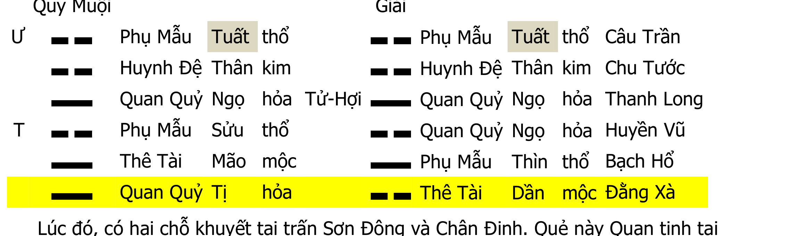

Lại có thuyết coi hào sơ ứng với khu vực nội địa, hào 5, hào 6 ứng với vùng biên 
giới, ứng với hào sơ khi Thế và Quan đều tại hào sơ. Ứng với hào 5, hào 6 khi Thế ở 
hào 5, Quan ở hào 6, hoặc Thế ở hào 6, Quan ở hào 5, hoặc Quan tinh trì Thế cùng ở 
hào 5 hoặc hào 6. Nếu nằm tại các hào 2, 3 và 4 thì vẫn căn cứ vào ngũ hành để 
đoán.

### Ví dụ: Ngày Quý Mùi tháng Sửu, xem được thăng chức đến nơi nào, được quẻ

Sơn Phong Cổ:

Cổ

Ư | Huynh ĐệDần mộc | Bạch Hổ

Phụ Mẫu | Tý | thủy Tử-TịĐằng Xà

Thê Tài | Tuất thổ | Câu Trần

T | Quan QuỷDậu kim | Chu Tước

Phụ Mẫu | Hợi | thủy | Thanh Long

Thê Tài | Sửu thổ | Huyền Vũ

MỘC
Không Vong: Thân, Dậu

Quẻ này hào Quan Dậu kim trì Thế, nên đoán rằng sẽ nhiệm chức tại phương 
tây. Đến năm sau, lại có đợt thăng quan, nên xem tiếp xem thăng nhiệm tại phương 
nào.

Ngày Giáp Tuất tháng Dần, xem được quẻ Chấn:

Chấn

T | Thê Tài | Tuất thổ | Huyền Vũ

Quan QuỷThân kim Bạch Hổ

Tử Tôn | Ngọ | hỏa Đằng Xà

Ư | Thê Tài | Thìn thổ | Câu Trần

Huynh ĐệDần | mộc Chu Tước

Phụ Mẫu | Tý | thủy Thanh Long

MỘC
Không Vong: Thân, Dậu

Ta vẫn ghi nhớ quẻ trước, Quan tinh Dậu kim trì Thế, nên đoán ở phương tây. 
Nay gặp quẻ này, Quan tinh vẫn là Thân kim, nên vẫn ứng với phương tây. Nhưng 
hào Thế nằm ở hào 6, nên sẽ thuyên chuyển đến vùng biên giới, nên mới hỏi: "Ở 
Thiểm Tây có chỗ điền khuyết tại biên giới không?".

Người xem đáp: "Có, tại Khánh Dương." Ta bèn nói: "Ông sẽ được điền khuyết 
đến đấy". Sau quả nhiên được thăng nhiệm đến Khánh Dương.

**Dã Hạc bàn rằng:** Đại khái là hỏi về nơi thuyên chuyển, tuy có ứng nghiệm, 
nhưng không bằng hỏi trực tiếp chỗ điền khuyết ấy có được hay không. Ví dụ: Vị trí 
này tôi có điền khuyết không? Có được vào Hàn Lâm viện không? Có được làm trong

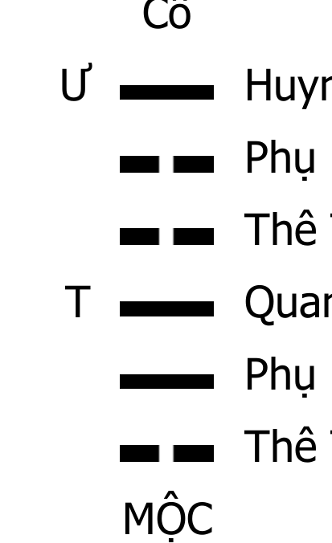

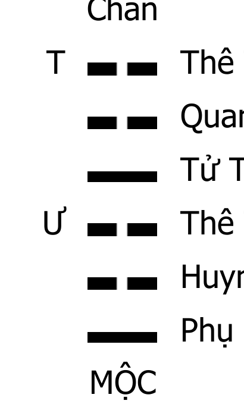

---

# CHƯƠNG 63. TẠI NHIỆM CÁT HUNG

sáu bộ không? Có được làm quan Khoa đạo không? Có được làm quan phủ, quan 
huyện không?

Nếu Quan tinh trì Thế, Quan động sinh hợp hào Thế, Tam hợp Quan cục sinh hào 
Thế, chắc chắn sẽ được. Nếu hào Thế Không, Phá; hào Quan Không, Phá, đều không 
được. Tử Tôn trì Thế, Tử Tôn phát động, cũng không được. Hào Quan tại hào Ứng, 
Tam hợp Quan cục sinh hào Ứng cũng không được.

***

# CHƯƠNG 63: TẠI NHIỆM CÁT HUNG

(CHUYỆN LÀNH DỮ NƠI NHIỆM CHỨC)

Quan vượng Tài hưng, sĩ đồ hiển hách; Tử dao Huynh động, giảm bổng 
hưu quan.

Quan vượng, Tài hưng, đường quan hiển hách; Tử động, Huynh động, giáng 
chức giảm lương.

Hào Quan vượng, được sinh phò, hoặc động mà hóa cát, hào Thế vượng, hào Tài 
vượng; hoặc hào Tài động sinh Thế, đều chủ về đường làm quan suôn sẻ, được dân 
chúng tín nhiệm.

Hào Quan lâm Nhật, Nguyệt, sinh hợp hào Thế tam hợp Quan cục sinh hợp hào 
Thế; hoặc Quan tinh trì Thế, được Nhật Nguyệt sinh phò, Thái Tuế lại tương sinh 
tương hợp, nếu là chức quan gần vua, sẽ có ân sủng đặc biệt; nếu là quan cao, sẽ 
được thăng tiến; nếu là quan bên ngoài, sẽ được chuyển về kinh thành.

Hào Huynh Đệ trì Thế, hào Huynh Đệ phát động, là tượng hao tài tán của, ắt sẽ 
phải giảm bổng trừ lương.

Hào Tử Tôn trì Thế, hoặc hào Tử động, là tượng thì mất quan giáng chức. Nếu 
Quan tinh hưu tù được phò trợ, Tử Tôn động mà bị ức chế, thì chỉ giáng cấp mà thôi.

Quan vượng Huynh hưng, thanh phong lưỡng tụ; Phụ phát Quỷ vượng, 
ân lộ tam tứ.

Quan vượng, Huynh hưng, thanh bần liêm khiết; Phụ động, Quỷ vượng, mưa 
móc dồi dào.

Hào Huynh động tuy là tượng giảm lộc, hao tài, nhưng cũng không nên câu nệ 
vào đó. Nếu hào Quan vượng tướng, chủ về làm quan thanh liêm ngay thẳng, không 
màng của phi nghĩa, chứ không phải không có tiền của.

Hào Quan vượng tướng, mà hào Tài gặp Không, Phá, cũng tương tự như thế.

Hào Phụ vượng, lâm Thế, hào Quan động, lâm Tuế ngũ, hoặc được Nhật Nguyệt 
sinh phò, nếu nhiệm chức ở tỉnh ngoài kinh, sẽ được tiến cử về kinh; nếu làm việc 
trong triều đình, sẽ tiếp tục được thăng tiến, ân sủng.

**Tân bình thích:** Đoán sự thanh liêm, không thể lấy Huynh Đệ có phát động hay 
không để phán đoán, có Huynh Đệ phát động, có lúc bởi vì nhiệm sở không có tiền 
của để tham ô. Xem bản tính của người ta, cần phải lấy lục thần lâm hào Thế để xem.

Huynh Quỷ an ninh, địa phương thiểu sự.

Huynh, Quỷ yên tĩnh, địa phương vô sự.

Còn nếu hào Huynh, hào Quỷ động trong quẻ là điềm hạn, lụt, thiên tai, nơi 
nhiệm chức nhiễu nhương bất ổn.

**Tân bình thích:** Hiện nay, nếu là cán bộ cấp tỉnh thì có thể phán đoán như vậy, 
nhưng nếu như là lãnh đạo của một đơn vị thì có thể phán đoán hiệu quả kinh tế của 
đơn vị đó ra sao.

Nhật Nguyệt xung khắc, phỉ báng đa chiêu.

Nhật Nguyệt xung khắc, rước nhiều phỉ báng.

Nhật thần, Nguyệt kiến khắc hào Quan hoặc hào Thế, hoặc Chu Tước, Đằng Xà | khắc hào Thế, mà Thế hưu tù, ắt rước họa không nhẹ. Nếu hào Thế vượng tướng, | được cứu giúp, chủ về nhiều điều tiếng thị phi. Nếu gặp quẻ này, nên tự kiềm chế bản | thân, làm việc cần cù, để tránh lỗi lầm.

Hào Quan Quỷ khắc Thế, mà Thế vượng Quan suy, cũng chủ về trách móc phỉ | báng. Nếu Thế suy Quan vượng, lại lâm Chu Tước, Đằng Xà, dễ bị mắc tội.

Hóa Tiến thần, xung biến hợp, gia quan tấn tước.

Hóa Tiến thần, xung biến hợp, thăng quan tiến chức.

Hào Thế vượng tướng, hào Quan hóa Tiến thần; hoặc Quan tinh vượng tướng, 
hào Thế hóa Tiến thần; hoặc hào Thế, hào Quan đắc địa, hào Tài hóa Tiến thần, đều 
là tượng thăng quan tiến chức.

Hào Phản ngâm, nhập Tam Mộ, phản phục hôn dung.

Quẻ Phản ngâm, nhập Tam Mộ, là tượng tráo trở hồ đồ.

Gặp quẻ Phản ngâm, tuy là tượng thân không được yên, nhưng nếu hào Thế và 
hào Quan vượng tướng, chắc chắn sẽ được thăng chức. Nếu hào Thế và hào Quan 
đều suy, sẽ bị giáng chức trách phạt, sau khi giáng chức vẫn còn chuyện phải lo sợ. 
Kỵ nhất là hào Thế và hào Quan bị xung bị khắc, sẽ gặp tai họa khó lường.

Hào Thế hưu tù bị khắc, hóa Mộ, nhập Mộ, chủ về sự việc tráo trở bất thường, 
sắp gặp tai họa. Hào Thế hữu khí mà nhập Mộ, hóa Mộ, chủ về hồ đồ, mù mờ.

Thế Phá Quan Không, cư quan bất cửu; Thân suy hóa Quỷ, mệnh tận 
đương nguy.

Thế Phá, Quan Không, làm quan chẳng lâu; Thân suy hóa Quỷ, tính mệnh nguy 
cấp.

Hào Thế Phá, Không, hào Quan Phá, Không, là tượng nhiệm chức không lâu.

Hào Thế suy, động hóa Quỷ hoặc hóa hồi đầu khắc, tính mệnh khó được duy trì.

Thế hóa Quan nhi ngộ Quan, chính quyền đa nhiếp;

Thế hóa Quan mà gặp Quan, nắm được nhiều quyền hành;

Hào Thế vượng tướng, hóa thành Quan tinh sinh hợp, tỷ trợ cho Thế, chủ về 
nắm được quyền hành. Hào Thế vượng tướng, hóa thành Quan tinh mà hình Thế, 
khắc Thế, lại chủ về bị hại bởi quyền hành. Hóa thành Quan tinh mà làm tiết khí hào 
Thế, chủ về liên lụy bởi quyền hành. Quan tinh trì Thế mà vượng, trong quẻ lại có hào 
Quan tinh động sinh trợ tỷ hợp, cũng chủ về nắm nhiều quyền hành.

Thế lâm Quan nhi ngộ Mã, sai khiển phiền lao.

Thế lâm Quan gặp Dịch Mã, bị sai khiến vất vả.

Quan tinh trì Thế phát động hoặc ám động, lại lâm Dịch Mã, chủ về sai khiến lao 
dịch. Nếu được Nhật thần, Nguyệt kiến, hào động làm hào Tài sinh phò, thì sẽ được 
ích lợi từ công việc sai dịch. Trong quẻ hào Huynh phát động, Nhật thần, Nguyệt kiến 
hào động hình khắc hào Thế, là tượng vất vả mà lại phải bồi thường tiền của. Nếu 
đang mong muốn nhận được chức sai dịch đó, không cần đợi lâm Dịch Mã, chỉ cần 
hào Thế động, sẽ có được.

**Tân bình thích:** Hiện nay đoán là đi công tác, có thể tham khảo.

Quan hợp Long hưng, ân mệnh chí.

Quan hợp Long động, ân điển đến.

Thanh Long Quan tinh trì Thế, hoặc hào Thế lâm Nhật, Nguyệt, hoặc Nhật, | Nguyệt, hào động sinh hợp hào Thế, hoặc hào Thế lâm hào Tuế ngũ, hoặc hào Tuế | ngũ sinh hợp Thế, hoặc hào Thế, hào Quan hình thành tam hợp, đều là điềm tốt. Nếu | đang giữ chức vị cao, sẽ nhận được ân điển đặc biệt; nếu địa vị bình thường, sẽ được | thăng quan tiến tước...

Tài lâm Hổ động, phó âm lai.

Tài lâm Hổ động, nhận tin buồn.

Hào Tài trì Thế, hoặc hào Tài động trong quẻ, hoặc hào Phụ Mẫu hưu tù, Không 
Phá, nếu trong nhà có trưởng bối, thì tuyệt đối không nên đoán về tiền của, mà nên 
phòng có tang.

### Ví dụ: Ngày Nhâm Ngọ tháng Dần, xem chức vị đương nhiệm có được bình yên

không, được quẻ Di biến Phệ Hạp:

Di 
 
Phệ Hạp

Huynh ĐệDần mộc | Tử Tôn | Tị | hỏa Bạch Hổ

Phụ Mẫu Tý | thủy Tử-Tị | Thê Tài | Mùi thổ Đằng Xà

T | Thê Tài | Tuất thổ | Quan QuỷDậu kim Câu Trần

Thê Tài | Thìn thổ Quan-Dậu | Thê Tài | Thìn thổ Chu Tước

Huynh ĐệDần mộc | Huynh ĐệDần mộc Thanh Long

Ư | Phụ Mẫu Tý | thủy | Phụ Mẫu Tý | thủy Huyền Vũ

MỘC
Không Vong: Thân, Dậu

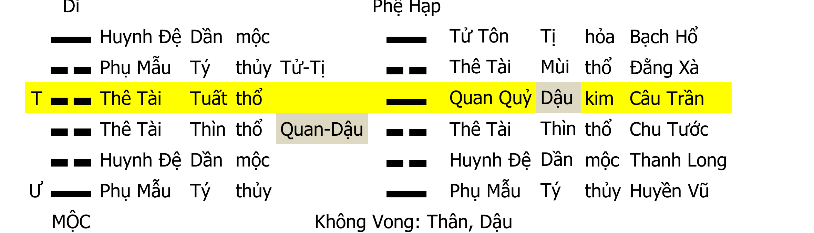

Có người đem ra quẻ này đến hỏi ta rằng: "Năm nay xem về lưu niên tại nhiệm 
sở, được hào Thế biến Quỷ, tôi rất lo sợ." Ta đáp: "Hào Thế Tuất thổ tuy hưu tù, 
nhưng được Nhật thần Ngọ hỏa tương sinh, nên bản thân không có gì đáng ngại, 
nhưng phòng có tang cha mẹ."

Người này bèn hỏi: "Hào Tài không lâm Bạch Hổ, sao lại có tang?" Ta đáp: "Lý | luận như vậy là sai lầm, Nhật thần Ngọ xung động Tý thủy Phụ Mẫu, bị hào Tài Tuất | thổ tương khắc, hào Thế lại hóa hào Quan lâm Không, ắt sẽ ứng vào tháng tám, | tháng chín." Quả nhiên đến tháng tám có tang.

Lại ví dụ: Ngày Kỷ Sửu tháng Thìn, xem về chuyện lành dữ nơi nhiệm sở, được 
quẻ Trung Phu biến Tổn:

Trung Phu
 
Tổn

Quan QuỷMão mộc | Quan QuỷDần mộc Câu Trần

Phụ Mẫu Tị | hỏa Tài-Tý | Thê Tài | Tý | thủy Chu Tước

T | Huynh ĐệMùi thổ | Huynh ĐệTuất thổ Thanh Long

Huynh ĐệSửu thổ Tử-Thân | Huynh ĐệSửu thổ Huyền Vũ

Quan QuỷMão mộc | Quan QuỷMão mộc Bạch Hổ

Ư | Phụ Mẫu Tị | hỏa | Phụ Mẫu Tị | hỏa Đằng Xà

THỔ 
Không Vong: Ngọ, Mùi

Hào Quan Quỷ khắc Thế, may mà không động, nên nhiệm sở vẫn được bình yên. 
Nhưng hiềm vì hào Huynh trì Thế, bị Nhật thần Sửu xung động, nên đến mùa đông, 
bản thân sẽ phải di chuyển, thân động mà phí tổn không nhỏ. Người xem bèn hỏi: "Vì 
sao mà phải di chuyển?" Ta bèn hỏi: "Song thân của ông còn mạnh giỏi không?" 
Người xem bèn đáp, cha vẫn còn sống. Ta giảng giải rằng: "Cần đề phòng mùa đông, 
hỏa bị thủy thương khắc, nên phải lên đường vì việc tang."

Chẳng dè sang tháng sáu, nha môn bị hỏa hoạn; đến mùa đông, nhận được tin 
cha mất. Sở dĩ bị hỏa hoạn, vì hào Huynh trì Thế, ám động mà phá Tài; cha mất, là vì 
hào Phụ Tị hỏa hóa Tý thủy hồi đầu khắc.

**Tân bình thích:** Bị hỏa hoạn, bởi vì Tài lâm Chu Tước bị Nhật Nguyệt hào Thế 
khắc thương, lại Tuyệt ở hỏa. Cha mất, bởi vì hào 5 là cha, dương cũng là cha, tháng 
Tý hào biến đến vượng địa mà cha mất.

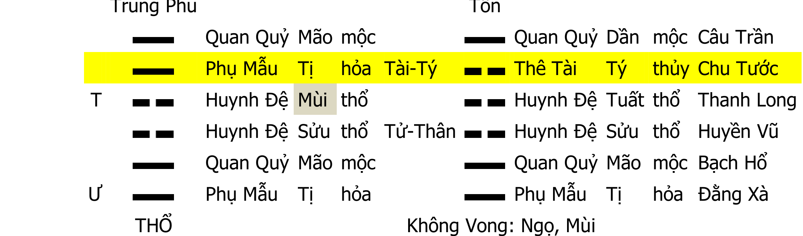

---

# CHƯƠNG 64: VIỆN LỆ

(DÙNG TIỀN MUA QUAN TƯỚC)

Tài vượng Quan Không, tự hữu đôi kim vu bạch ốc.

Tài vượng Thế vượng, mà Quan lâm Nguyệt phá Tuần Không, hoặc bị Nhật 
Nguyệt xung khắc, và động mà biến hung, Quan như gỗ mục cành khô, tuy có Tài 
vượng tướng nhưng sinh không khởi, cuối cùng chỉ là phú ông bình thường, khó ăn 
thiên lộc của nhà vua.

**Tân bình thích:** Trong xã hội có người phú quý song toàn, có người chỉ phú 
không quý, có người quý mà không phú. Có Tài vô Quan không thể cưỡng cầu.

Thê dao Quỷ vượng, định nhiên chấp ngọc bái đan trì.

Thế và Quan tinh Tài tinh, ba cái không được có một thất hãm, nếu Tài Quan 
đều vượng mà Thế thất hãm thì cuối cùng cũng được quan nhưng không có phúc để 
hưởng. Nếu Quan Thế đều vượng mà Tài tinh thất hãm thì có lệ nhưng không có tiền.

Như ngày Ất Mão tháng Sửu, xem viện lệ, được quẻ Dự biến Bĩ.

Dự 
 
Bĩ

Thê Tài | Tuất thổ | Thê Tài | Tuất thổ Huyền Vũ

Quan QuỷThân kim | Quan QuỷThân kim Bạch Hổ

Ư | Tử Tôn | Ngọ hỏa | Tử Tôn | Ngọ hỏa Đằng Xà

Huynh ĐệMão mộc | Huynh ĐệMão mộc Câu Trần

Tử Tôn | Tị | hỏa | Tử Tôn | Tị | hỏa Chu Tước

T | Thê Tài | Mùi thổ Phụ-Tý | Thê Tài | Mùi thổ Thanh Long

Đoán rằng: Tài động sinh Quan, không nên Thế lâm Nguyệt phá, Phá mà bị 
khắc, có được quan cũng không thể hưởng. Sau khi nạp tiền xong, danh bại người 
mất.

Lại như ngày Quý Sửu tháng Tuất, xem tặng bạc để khôi phục chức quan, được 
Khốn biến Đoài.

Khốn
 
Đoài

Phụ Mẫu | Mùi | thổ | Phụ Mẫu | Mùi | thổ | Bạch Hổ

Huynh Đệ | Dậu kim | Huynh Đệ | Dậu | kim | Đằng Xà

Ư | Tử Tôn | Hợi | thủy | Tử Tôn | Hợi | thủy | Câu Trần

Quan Quỷ | Ngọ hỏa | Phụ Mẫu | Sửu thổ | Chu Tước

Phụ Mẫu | Thìn | thổ | Thê Tài | Mão | mộc | Thanh Long

T | Thê Tài | Dần mộc | Quan Quỷ | Tị | hỏa | Huyền Vũ

KIM 
Không Vong: Dần, Mão

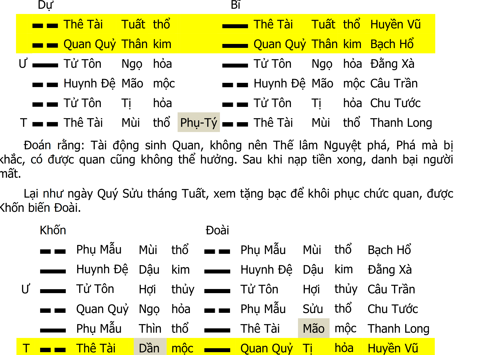

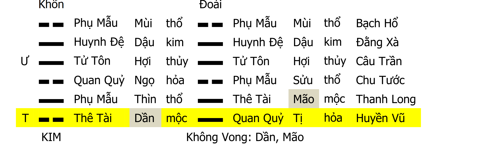

---

# CHƯƠNG 65. THI VÕ

Hào Thế hưu tù, động mà biến Quỷ, không nên làm. Người này không nghe. Tôi 
nói: Mùa thu sang năm rất xấu, danh thành cũng không thể ra làm quan. Quả nhiên 
tặng bạc, đến tháng giêng năm sau bị mắc nghẹn, tháng 7 chết.

Tài tĩnh Tử phi không dụng ý.

Tử Tôn trì Thế,Tài động hay không động đều không nên làm. Tài lâm Không Phá 
cũng không nên làm. Tử Tôn Tài tinh Quan tinh đều động thì có thể làm, tại sao vậy? 
Bởi vì Tử động sinh Tài, Tài động để sinh Quan.

Huynh hưng Tài động uổng lao tâm.

Hào Huynh Đệ trì Thế, hoặc hào Huynh phát động, chính là thần phá hao, lãng 
phí tiền bạc, cuối cùng không thành danh, nếu được Quan tinh cùng động thì có thể 
làm, tại sao vậy? Bởi vì dùng Quan Quỷ để chế Huynh.

Dã Hạc nói: Trong quẻ Quan tinh không động, nhưng gặp Huynh Đệ trì Thế, 
Huynh Phụ phát động, và hào Tài trì Thế hóa Huynh Đệ, thì đều không thành, cho dù 
có thành thì sau này cũng có sự cố khác, cuối cũng cũng không được ăn lộc.

***

# CHƯƠNG 65: THI VÕ

(CÓ THỂ KẾT HỢP VỚI CÁC CHƯƠNG VỀ THI VĂN)

Xem về thi văn, thì hào Quan và hào Văn ( Phụ Mẫu) đều phải xem trọng; xem 
về thi võ, thì hào Quan là quan trọng nhất.

Thế Phá Quan Không hưu chỉ vọng; Quan hưng Tài vượng diệc kham đồ.

Thế phá Quan không đừng trông đợi; Quan cùng Tài vượng có cơ may.

Xem về thi võ không xem trọng hào Phụ, ta chiêm nghiệm nhiều lần thấy rằng, 
nếu Quan, Phụ đều vượng, sẽ được đỗ đầu.

Cũng có trường hợp Tài động sinh Quan, mà vẫn trúng tuyển, là vì sao? Việc 
trúng tuyển này chắc hẳn có nguyên nhân sâu xa.

Không phó võ vi, giai vi Tử Tôn trì Thế.

Đi thi uổng công, đều vì Tử Tôn trì Thế;

Hào Tử Tôn trì Thế, hoặc Tử Tôn phát động, cho dù có tài năng và sức khoẻ hơn 
người, đi thi cũng chỉ uổng công, không được trúng tuyển.

Thí kỳ bệnh trở, nãi nhân Quan Quỷ thương thân.

Ốm không thi được, là do Quan Quỷ hại thân.

Hào Quan Quỷ trì Thế, hoặc Nhật, Nguyệt, hào động khắc Thế, hoặc hào Thế 
động hóa Quỷ, hóa hồi đầu khắc, nếu không đau ốm lúc dự thi, cũng là gặp tai nạn.

---

# CHƯƠNG 66: NHẬP NGŨ, TÒNG QUÂN,

NHẬP TRƯỜNG QUÂN SỰ

Quan nên vượng tướng, không nên Không, Phá, Hưu, Tù; Tài, Thế hai hào, kỵ 
gặp Hình, Xung, Khắc, Phá.

Thế cùng Quan tinh, đều nên vượng mà hóa cát; Tài là nguồn lộc, chớ để Nhật 
Nguyệt hình xung.

Hào Thế thất hãm, hoặc động mà biến hung, có thân khó giữ;

Quan tinh thất hãm, hoặc động mà biến hung, chẳng được thành danh.

Hào Tài thất hãm, hoặc động mà biến hung, lương ít lộc không. Cho dù Quan 
vượng, bếp lạnh tro tàn.

Tốt nhất là được Quan tinh trì thế, Tài động mà tương sinh. Hoặc hào Tài trì Thế, 
Quan động mà tương hợp. Hoặc Quan, Thế lâm Nhật Nguyệt, hoặc Tuế, Nguyệt, Nhật 
tương sinh. Hoặc Thế động mà hóa cát. Là tượng ngày sau quyền cao chức trọng, 
chẳng phải chức quan quèn.

Giác Tử bàn rằng: Tuy đoán theo đó, không lần nào không linh nghiệm, nhưng 
cần phải hiểu được ý tứ của người đến xem. Nếu như người xem muốn hỏi về danh 
lợi, thì quyết đoán theo đó là đúng. Nhưng nếu họ chưa được nhập ngũ, nhập trường, 
hỏi xem có được lấy vào hay không, thì lại phải dùng Quan tinh để xét xem có được 
tuyển dụng hay không; nếu hào Quan sinh hợp hào Thế, sẽ được tuyển dụng; nếu 
hào Quan khắc Thế, hoặc gặp Không, Phá, sẽ không được tuyển dụng. Nếu không 
biết được bí quyết này, mà vẫn dùng Quan tinh để đoán về công danh, thì suy đoán 
sẽ sai lầm.

***

# CHƯƠNG 67: NHỜ NGƯỜI MUA CHỨC QUAN

***

# CHƯƠNG 68: TẤU SỚ, KÊU OAN, ĐIỀU TRẦN, HẠCH TỘI

(XEM VỀ VĂN THƯ ĐỀU THUỘC LOẠI NÀY)

Vượng Phụ trì Thế, nghi Nhật Nguyệt Tuế ngũ dĩ duy trì.

Phụ vượng trì Thế nên được Nhật, Nguyệt, Tuế ngũ trợ giúp cho;

Hào Phụ tượng trưng cho văn thư, tấu biểu, nếu trì Thế hợp Thế, tấu biểu ắt sẽ 
được phê chuẩn. Nếu lại được Tuế ngũ, Nhật thần, Nguyệt kiến hoặc hào động sinh 
hợp, thì chắc chắn sẽ được chấp thuận.

Huynh Đệ lâm thân, hỷ Phụ Mẫu hóa cát nhi củng hợp.

Huynh Đệ trì Thế, mừng được Phụ Mẫu hóa cát mà củng hợp.

Hào Huynh Đệ trì Thế, được Nhật Nguyệt tương sinh, hoặc hào Thế, hào Phụ 
Mẫu động mà hóa cát, hoặc Thế hóa Phụ Mẫu hồi đầu sinh Thế, đều là tượng văn thư 
khiến cấp trên hài lòng, nhờ văn thư mà được cất nhắc, bổ nhiệm.

Tài hào trì Thế phá văn thư.

Hào Tài trì Thế, hại văn thư.

Hào Tài trì Thế, hào Tài phát động, sẽ khắc phá văn thư, dâng biểu, tấu trình, 
báo cáo đều vô ích.

Nếu được Phụ Mẫu trì Thế, hào Tài hào Quan cùng động, lại là điềm tốt. Bởi vì 
Tài động sinh Quan, Quan động sinh Thế.

Tử Phúc lâm thân, phòng giáng phạt.

Phúc đức tại thân, phòng trách phạt.

Tử Tôn là thần khắc Quan, nếu là người có chức tước dâng văn thư tấu biểu, gặp 
được Tử Tôn trì Thế, hoặc phát động là điềm xấu, nhẹ thì bị giáng cấp, nặng thì bị 
cách chức. Nếu là người không có chức tước thì có hai cách suy luận: Cần biết rõ ý 
định của người xem, nếu làm việc này nhằm mục đích cầu danh, chắc chắn sẽ không 
được thành danh; còn nếu định dâng tấu biểu mà sợ gặp họa, được quẻ này là điểm 
không có tai họa.

Thế lâm Không Phá, nan dĩ hồi thiên.

Thế lâm Không Phá, sự việc khó thành.

Hào Thế lâm Tuần Không, Nguyệt phá, hoặc lâm Tuyệt, hóa Tuyệt, hoặc nhập 
Tam Mộ, tấu biểu văn chương sẽ không được phê chuẩn, cần sớm biết thời cơ. Hào 
Thế động biến hung, hoặc Tuế ngũ, Nhật thần, Nguyệt kiến, hào động xung khắc hào 
Thế, không những vô ích, mà còn đề phòng có tai họa bất trắc.

Tử động lâm thân, lực năng chiết hạm.

Tử động lâm thân, có thể can gián.

Có người hỏi: "Phần trước đây có nói rằng, Tử Tôn động sẽ khắc Quan, không 
nên xuất hiện, sao câu này lại nói rằng Tử Tôn trì Thế là tốt?"

Dã Hạc đáp rằng: "Cần xem sự việc là lớn hay nhỏ. Nếu người dâng biểu có chức 
tước, gặp quẻ này, ắt sự việc không được phê chuẩn, nhưng cùng lắm cũng chỉ bị 
cách chức mà thôi. Vì Tử Tôn là thần khắc Quan. Nếu muốn bảo toàn công danh mà 
gặp Tử Tôn động, thì không nên làm. Nếu là việc điều trần quan lại, can gián nhà vua 
mà được phê chuẩn, ắt lưu danh thiên cổ; không được phê chuẩn, sẽ rước họa vào 
thân. Cho nên nếu gặp được Tử Tôn trì Thế lại là tốt, cho dù được phê chuẩn hay 
không, cũng đều không gặp họa."

Phép xưa cho rằng Tử động ở cung Càn mới tốt, như thế là sai. Vì Tử vốn là Phúc 
thần khắc chế Quỷ, chứ không phải chỉ ở cung Càn mới là Phúc thần.

### Ví dụ: Ngày Đinh Mão tháng Tị năm Tị, xem về dâng tấu hạch tội, được quẻ Lữ:

Lữ

Huynh ĐệTị | hỏa | Thanh Long

Tử Tôn | Mùi | thổ | Huyền Vũ

Ư | Thê Tài | Dậu | kim | Bạch Hổ

Thê Tài | Thân kim Quan-Hợi Đằng Xà

Huynh ĐệNgọ | hỏa | Câu Trần

T | Tử Tôn | Thìn thổ | Phụ-Mão Chu Tước

HỎA
Không Vong: Tuất, Hợi

Dã Hạc nói: Có người mang quẻ này đến hỏi ta rằng: "Tôi muốn hạch tội gian 
thần, nhưng sợ rằng thế lực của hắn quá lớn, sẽ hại đến thân, nhờ ông xem hộ quẻ 
này ra sao!" Ta đáp: "Người này tuy thế lực lớn, nhưng nay đã suy rồi."

Người xem hỏi: "Tại sao ông biết?" Ta bèn đáp: "Hào Ứng là Dậu kim, gặp 
Trường Sinh tại tháng Tị năm Tị, chẳng phải là thế lực vững vàng hay sao? Nhưng nay 
bị Thái Tuế, Nguyệt kiến Tị hỏa tương khắc, bị Nhật thần Mão tương xung, bị tổn 
thương mà không được ứng cứu, nên quyền lực của hắn đã suy yếu."

Người xem bèn hỏi: "Tôi có gặp họa gì không?" Ta đáp: "Hào Tử Tôn trì Thế, 
không có gì đáng lo!"

Quả nhiên sau được chuẩn tấu, mà gian thần bị tiêu diệt.

Tối kỵ Quan hào khắc Thế; vưu hiềm trợ Quỷ thương thân.

Kỵ nhất hào Quan khắc Thế; lại hiềm giúp Quỷ hại thân.

Hào Quan Quỷ khắc Thế là điềm hung hại, lại thêm hào Tài động trợ giúp cho 
hào Quỷ, khó tránh khỏi tai họa.

Hào Thế biến Quỷ, động hóa hồi đầu khắc, theo Quỷ nhập Mộ, hoặc gặp quẻ 
Phản ngâm, quẻ biến tuyệt, hoặc hào Thế bị xung khắc, nếu không phải là việc trọng 
đại, nên dừng lại là hơn.

Tuế ngũ sinh Thân phòng thụ chế; lục hào hoảng hốt thả hưu hành.

Tuế ngũ sinh thân phòng bị chế; sáu hào không rõ chớ thi hành.

Thái Tuế nếu sinh Thế thì nên nhập vào trong quẻ, nếu không hiện diện trong 
quẻ thì không thể sinh Thế. Như năm Tý xem quẻ, trong quẻ có hào Tý thủy là Thái 
Tuế nhập quẻ. Nếu được hào 5 sinh Thế là tốt, nhưng cũng nên đề phòng bị khắc 
hoặc gặp Không, Phá, Suy, Tuyệt, vì nếu như vậy tương sinh chỉ là hữu danh vô thực.

### Ví dụ: Ngày Mậu Thìn tháng Thân, xem về việc dâng biểu, được quẻ Trung Phu

biến Tổn:

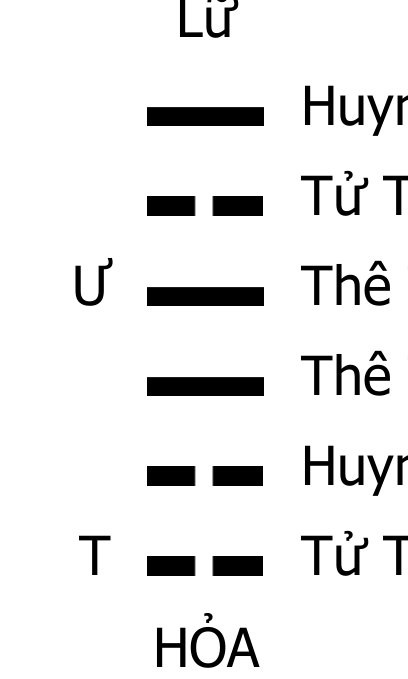

Trung Phu
 
Tổn

Quan QuỷMão mộc | Quan QuỷDần mộc Chu Tước

Phụ Mẫu Tị | hỏa Tài-Tý | Thê Tài | Tý | thủy Thanh Long

T | Huynh ĐệMùi thổ | Huynh ĐệTuất thổ Huyền Vũ

Huynh ĐệSửu thổ Tử-Thân | Huynh ĐệSửu thổ Bạch Hổ

Quan QuỷMão mộc | Quan QuỷMão mộc Đằng Xà

Ư | Phụ Mẫu Tị | hỏa | Phụ Mẫu Tị | hỏa Câu Trần

THỔ 
Không Vong: Tuất, Hợi

Đoán rằng: Hào 5 là Tị hỏa sinh Thế, nhưng hiềm vì hóa Tý thủy hồi đầu khắc 
Thế, tấu biểu này không nên dâng lên.

Người xem hỏi: "Có hại gì không?" Ta đáp: "Tị hỏa tuy không sinh Thế, nhưng 
trong quẻ cũng không có hào nào khắc Thế, nên không có lợi, cũng chẳng có hại."

Người này vẫn dâng tấu biểu lên, nhưng không được phê chuẩn.

**Dã Hạc bàn rằng:** Phàm việc dâng biểu, hạch tội đều là làm lợi, trừ hại, giúp ích 
cho nước nhà. Xả thân vì nước, dù nước sôi lửa bỏng cũng chẳng từ nan, thì cần gì 
phải xem. Nhưng nếu không phải chuyện quan trọng, hoặc do giận dữ bất bình, hoặc 
muốn báo thù, tức những việc làm cũng được, không làm cũng được, thì mới cần 
xem. Nếu hào Thế và hào Phụ không bị Hình, Xung, Khắc, Phá, lại được Tuế ngũ, 
Nhật, Nguyệt tương sinh, thì nên làm. Nếu các hào loạn động, Dụng thần, Nguyên 
thần không vượng cũng không suy, hoặc sinh ít khắc nhiều, tức là tượng sáu hào 
không rõ ràng, tốt nhất không nên thực hiện, vì sẽ rước họa vào thân, cần thận trọng.

Phụ vượng Quan sinh, đao mông tặng tước; vượng Quan trì Thế, bình 
bộ đăng vân.

Phụ vượng, Quan sinh, đội ơn phong tước; Quan vượng trì Thế, vững bước thăng 
quan.

Hào Phụ vượng trì Thế, được hào Quan động tương sinh; hoặc Quan vượng trì 
Thế, được Nhật, Nguyệt tương sinh, nếu là quan lại sẽ được thăng quan; nếu là kẻ sĩ, 
sẽ được ban tước; nếu là dân thường, sẽ được làm quan.

**Dã Hạc bàn rằng:** Đoán quẻ nên hiểu rõ ý muốn của người đến xem. Có người 
dâng tấu, hạch tội vì người khác, có người lại vì bản thân, có người vì muốn rửa oan 
cho cha mẹ, có người vì muốn bảo toàn công danh cho bản thân, có người vì tiền của 
lợi lộc, có người vì muốn tránh phải đền bù, có người vì muốn biện hộ cho thuộc hạ... 
Sự việc đa đoan, cần phải thông biến. Kẻ sĩ, dân thường dâng sớ, tuy cũng có người 
vì lòng trung với nước, cũng có kẻ muốn nhân cơ hội để cầu danh. Nếu được Quan 
vượng, mà Phụ không vượng, vẫn là được phong quan ban tước, là vì ý niệm của 
người xem là muốn cầu quan, văn chương chỉ là công cụ dẫn đường, nên trọng Quan 
mà không trọng Phụ.

Ngã niệm vị danh, kỵ Tử Tôn chi phát động; ngã niệm vị lợi, kỵ Huynh 
Đệ dĩ lâm thân.

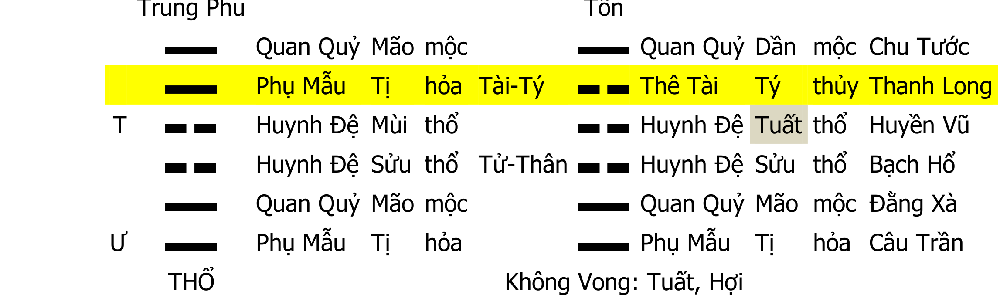

Nếu bởi cầu danh, kỵ thấy Tử Tôn phát động; nếu vì cầu lợi, kỵ gặp Huynh Đệ 
lâm thân.

### Ví dụ: Ngày Bính Thìn tháng Ngọ, xem về việc dâng biểu kêu oan, nhằm bảo

toàn công danh, được quẻ Đại Tráng biến Quải:

Đại Tráng
 
Quải

Huynh Đệ | Tuất thổ | Huynh Đệ | Mùi | thổ | Thanh Long

Tử Tôn | Thân | kim | Tử Tôn | Dậu kim | Huyền Vũ

T | Phụ Mẫu | Ngọ | hỏa | Thê Tài | Hợi | thủy | Bạch Hổ

Huynh Đệ | Thìn | thổ | Huynh Đệ | Thìn | thổ | Đằng Xà

Quan Quỷ | Dần | mộc | Quan Quỷ | Dần mộc | Câu Trần

Ư | Thê Tài | Tý | thủy | Thê Tài | Tý | thủy | Chu Tước

THỔ 
Không Vong: Tý, Sửu

Hào Phụ trì Thế lâm Nguyệt kiến, văn thư cực vượng, nhưng hiềm vì Tử Tôn 
động tổn thương đến Quan. Tháng bảy tháng tám là thời điểm Thân kim đắc lệnh, 
công danh sẽ hỏng. Quả nhiên tấu biểu trình lên không được phê chuẩn, đến tháng 
tám bị cách chức. Người này vì cầu công danh, nên Phụ văn vượng cũng vô ích.

Lại ví dụ: Ngày Tân Sửu tháng Mão, xem về việc dâng sớ xin kinh phí, được quẻ 
Tụng biến Lý:

Tụng
 
Lý

Tử Tôn | Tuất thổ | Tử Tôn | Tuất thổ Đằng Xà

Thê Tài | Thân kim | Thê Tài | Thân kim Câu Trần

T | Huynh ĐệNgọ | hỏa | Huynh ĐệNgọ | hỏa Chu Tước

Huynh ĐệNgọ | hỏa Quan-Hợi | Tử Tôn | Sửu | thổ Thanh Long

Tử Tôn | Thìn thổ | Phụ Mẫu | Mão mộc Huyền Vũ

Ư | Phụ Mẫu | Dần | mộc | Huynh ĐệTị | hỏa Bạch Hổ

HỎA
Không Vong: Thìn, Tị

Đoán rằng: Hào Phụ vượng tuy sinh Thế, nhưng hiềm vì Huynh Đệ trì Thế, là 
tượng tấu sớ được thông qua, nhưng tài sản của bản thân bị hao tán. Sau quả nhiên 
được cấp trên trình đơn nhưng không được phê chuẩn cấp kinh phí.

Xem về đề phòng bị hạch tội, lo lắng khảo hạch1, hoặc bản thân gặp rắc 
rối nhưng chưa bị kết án:

Thế vượng Quan sùng, ưu tâm băng giải. Vượng Quan trì Thế, hỷ chiếu 
song mi.

1 Khảo hạch: Chế độ thanh tra, khảo sát quan lại các tỉnh dưới thời Minh, Thanh, tổ chức ba 
năm một lần.

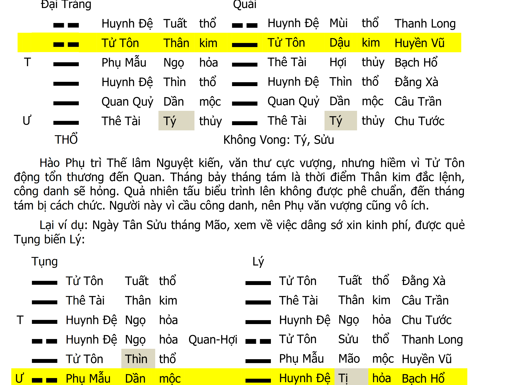

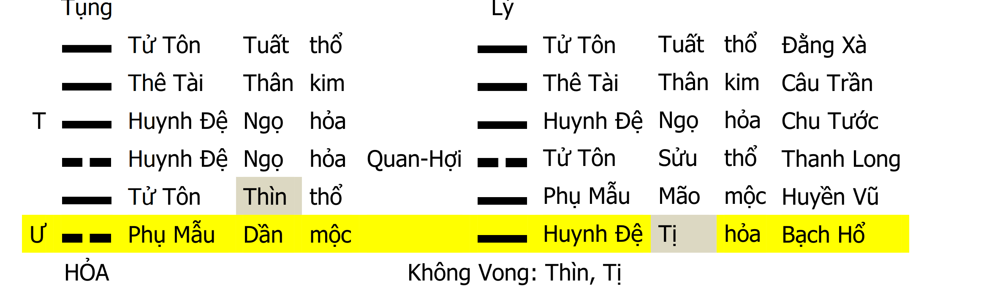

Thế vượng Quan hưng, lo âu sẽ hết. Quan vượng trì Thế, mừng đón tin vui.

Hào Thế và hào Quan cùng vượng tướng, sẽ không có gì phải lo ngại. Nếu lại 
được Nhật, Nguyệt, hào động sinh phò, hoặc hào Thế, hào Quan lâm Nhật, Nguyệt, 
hoặc động mà hóa cát, thì không lo bị hạch tội. Cho dù đã bị hạch tội mà chưa kết án, 
cũng không đáng ngại. Nếu đang lo lắng về khảo hạch, không những không có gì 
đáng lo ngại, mà còn nhận được ân sủng lớn. Nếu được hào Quan vượng trì Thế cũng 
đoán như vậy.

### Ví dụ: Ngày Mậu Thân tháng Mùi, xem về việc quân lương chậm trễ bị hạch tội,

được quẻ Phong biến Lữ:

Phong
 
Lữ

Quan Quỷ | Tuất thổ | Thê Tài | Tị | hỏa | Chu Tước

T

Phụ Mẫu | Thân | kim | Quan Quỷ | Mùi | thổ Thanh Long

Thê Tài | Ngọ | hỏa | Phụ Mẫu | Dậu | kim | Huyền Vũ

Huynh Đệ | Hợi | thủy | Phụ Mẫu | Thân | kim | Bạch Hổ

Ư

Quan Quỷ | Sửu | thổ | Thê Tài | Ngọ | hỏa | Đằng Xà

Tử Tôn | Mão | mộc | Quan Quỷ | Thìn | thổ Câu Trần

THỦY 
Không Vong: Dần, Mão

Đoán rằng: Hào Thế lâm Nhật thần, được Nguyệt kiến tương sinh, lại được hào 
Quan động tương sinh, chức vị không có gì đáng lo. Mọi người đều không tin. Nào 
ngờ sau đó, nhờ lập công lớn, nên công danh được bảo toàn.

Có người hỏi rằng: "Hào Tử Tôn Mão mộc động, tại sao không khắc Quan? Ta 
đáp: "Mão mộc gặp Tuyệt ở Thân, nên không khắc nổi Quan vượng."

**Tân bình thích:** Tử Tôn tham hợp quên khắc, lại bị Không Vong cũng là một 
trong những nguyên nhân không mất quan.

Phúc Thế Tôn dao thân hóa Phúc, Quan Không Quỷ Phá biến hào 
thương.

Phúc lâm Thế, Tử Tôn động, thân được hóa Phúc; Quan lâm Không, Quỷ gặp 
phá, hào biến tổn thương.

Hào Tử Tôn trì Thế, Tử Tôn động trong quẻ, hoặc Thế động hóa Tử Tôn, hoặc 
hào Quan Không, Phá, hoặc Quan động hóa hồi đầu khắc, đều chủ về cách chức bãi 
quan.

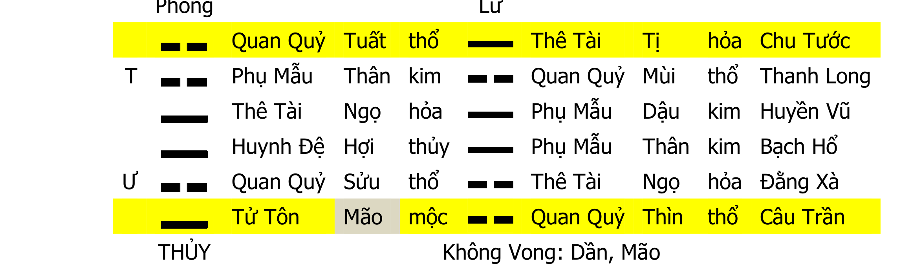

### Ví dụ: Ngày Đinh Tị tháng Dần, xem về khảo hạch, được quẻ Lữ biến Minh Di:

Lữ 
 
Minh Di

Huynh ĐệTị | hỏa | Thê Tài | Dậu kim Thanh Long

Tử Tôn | Mùi thổ | Quan QuỷHợi thủy Huyền Vũ

Ư | Thê Tài | Dậu kim | Tử Tôn | Sửu thổ Bạch Hổ

Thê Tài | Thân kim Quan-Hợi | Quan QuỷHợi thủy Đằng Xà

Huynh ĐệNgọ hỏa | Tử Tôn | Sửu thổ Câu Trần

T | Tử Tôn | Thìn thổPhụ-Mão | Phụ Mẫu Mão mộc Chu Tước

HỎA
Không Vong: Tý, Sửu

Đoán rằng: Hào Tử Tôn trì Thế, động hóa hồi đầu khắc, Thế lại bị Nguyệt kiến 
khắc. Quẻ ngoại Tị, Dậu, Sửu tuy hợp thành kim cục để tương sinh cho hào Quan 
phục, nhưng cũng vô ích. Sau quả nhiên bị cách chức.

Huynh động Tài Không, giảm lộc phạt bổng.

Huynh động, Tài Không, giảm lộc trừ lương.

Hào Huynh trì Thế, hào Huynh động, hoặc hào Tài Không, Phá, hoặc hào Tài 
động hóa hung, nếu hào Quan vượng tướng, thì chỉ bị cắt giảm bổng lộc mà thôi; nếu 
hào Quan thất hãm, thì mất cả chức lẫn lương.

Thân suy Quỷ khắc, biếm trách lăng nhục.

Thân suy, Quỷ khắc, quở trách lăng nhục.

Hào Thế suy không được sinh phò, lại bị Tuế ngũ, Nhật Nguyệt, hào động hình | xung khắc Thế, hoặc hào Quan động khắc Thế, hoặc hào Thế theo Quỷ nhập Mộ, | hoặc động hóa Quỷ, hóa hồi đầu khắc, hoặc Bạch Hổ, Đằng Xà hình khắc hào Thế, | nhẹ thì bị quở trách, nặng thì hình ngục.

Có người hỏi: "Dựa vào đâu để phân nặng, nhẹ?" Ta đáp: "Nhẹ là hào Thế được 
cứu, còn nặng là hào Thế đã hưu tù lại bị hình thương xung khắc."

**Tân bình thích:** Cần phải kết hợp với lục thần mà phán đoán. Lâm Bạch Hổ 
thường là tai họa về bệnh tật, tổn thương, cũng có người phạm tội bị xử quyết. Lâm 
Đằng Xà, Câu Trần thường là hình ngục. Lâm Chu Tước thường là quan ti khẩu thiệt.

Quái tĩnh Thế Không Quan hựu hãm, chung tu lâm hạ tác nhàn nhân.

Quẻ tĩnh, Thế Không, Quan bị hãm, an phận thanh nhàn chốn núi rừng.

Hào Thế lâm Không là điềm về hưu. Hào Quan lại Không Phá, hưu tù, là điềm bị 
cách chức.

Thế hãm phùng sinh, sát hưng hà ngại?

Thế hãm được sinh, Kỵ thần động có gì đáng ngại?

**Dã Hạc bàn rằng:** Sách xưa cho rằng, hào Thế lâm Không, thần sát động là điềm 
tránh họa, ta cho rằng như vậy là không đúng. Nói vậy là không hiểu được rằng, Kỵ

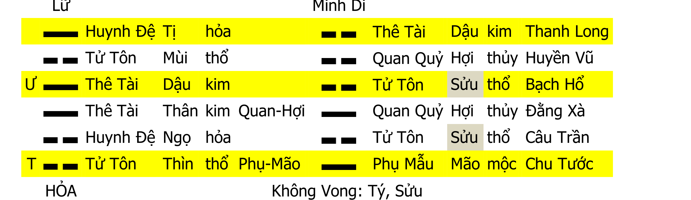 thần động trong quẻ, nếu hào Thế lâm Không, đợi đến ngày, tháng xuất Không sẽ bị 
hại, vẫn không thể tránh được tai họa.

Chỉ khi hào Thế lâm Không lại được Nguyên thần động tương sinh, thì trong quẻ 
tuy có Kỵ thần phát động cũng vô hại, đợi đến ngày hào Thế xuất Không, Kỵ thần sẽ 
quay lại sinh Nguyên thần để sinh Thế.

Quan long Thế hãm, thân nhục quan tồn.

Quan vượng, Thế hãm, thân chịu nhục mà chức quan còn.

Xưa lại cho rằng nếu Quan phục ở Thế, nếu chẳng lâm Không thì chức vị còn. 
Gặp việc hung mà Quan trì Thế, hay Quan vượng phục dưới Thế thì tuy bị trách phạt 
nhưng chức vị vẫn còn.

Dã Hạc nói: Hào Thế bị hào 5 khắc, nếu được Quan vượng sinh hợp hào Thế, 
cùng Quan vượng trì Thế, tuy bị nhục nhưng được phục hồi quan chức.

### Ví dụ: Ngày Mậu Thìn tháng Sửu, xem bị hạch tội, được quẻ Tỉnh biến Trung

Phu:

Tỉnh
 
Trung Phu

Phụ Mẫu Tý | thủy | Huynh ĐệMão mộc Chu Tước

T | Thê Tài | Tuất thổ | Tử Tôn | Tị | hỏa Thanh Long

Quan QuỷThân kim Tử-Ngọ | Thê Tài | Mùi thổHuyền Vũ

Quan QuỷDậu kim | Thê Tài | Sửu thổBạch Hổ

Ư | Phụ Mẫu Hợi thủy Huynh-Dần | Huynh ĐệMão mộc Đằng Xà

Thê Tài | Sửu thổ | Tử Tôn | Tị | hỏa Câu Trần

MỘC
Không Vong: Tuất, Hợi

Người này vì mới thay quan Đốc phủ mới, đề phòng bị hạch tội. Ta xem quẻ nói 
rằng: "Quẻ này rất lạ, hào Thế lâm Không mà bị Nhật thần xung, nên lại không bị 
Không. Hào Thế không bị khắc mà ám động, tuy không bị luận tội, nhưng khó tránh 
khỏi mất chức." Người xem bèn hỏi: "Đã không bị luận tội, làm sao lại mất chức?" Ta 
đáp: "Hào Thế ám động, nên chủ về dao động bất ổn. Quẻ nội Tị Dậu Sửu hợp thành 
Quan cục mà tương sinh hào Ứng, nên chức vị này sẽ thuộc về người khác." Sau vì 
cắt bỏ chức quan ở chỗ khác, quan trên điều quan ở nơi khác về điền vào chỗ khuyết 
của người này, triệu người này về kinh bổ nhiệm chức khác. Đây cũng là chuyện hiếm 
gặp, nên biết được cơ trời, là thần linh vậy.

Thân thực Quan hãm, vị khứ thân an.

Thân vượng Quan hãm, thân yên ổn mà chức vị mất.

Hào Thế vượng tướng, không bị khắc thương; hào Quan Không, Phá, hoặc bị 
hình xung khắc hại, hoặc động mà biến hung, là tượng quan, lộc tổn thất, nhưng thân 
được yên ổn.

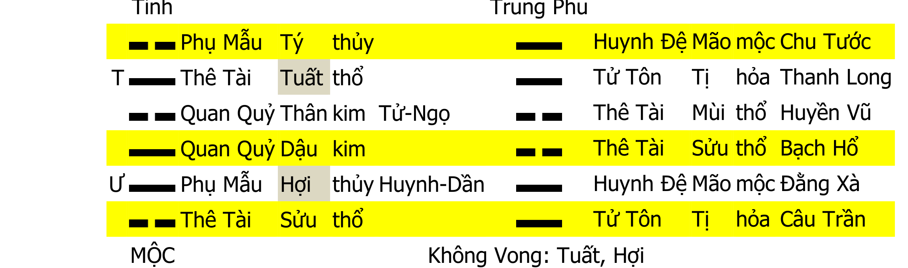

---

# CHƯƠNG 69: CÁO LÃO, TỪ QUAN

Tử vượng Tử hưng, tất năng toại nguyện; Quan khắc Quan Thế, tổng 
bất như tâm.

Tử vượng, Tử phát động, ắt được toại nguyện; Quan khắc, Quan trì Thế, chẳng 
được hài lòng.

Hào Tử Tôn trì Thế, Tử Tôn động, là tượng không bị lụy về việc quan, ắt được 
toại nguyện, về hưu thỏa chí an nhàn. Hào Quan trì Thế, hoặc Quan động khắc Thế, 
hợp Thế, khó mà thoát khỏi danh lợi ràng buộc.

Cáo giả bất kỵ Phản ngâm, hưu trí tu nghi hóa Thoái.

Xin nghỉ không kỵ Phản ngâm; về hưu nên gặp hóa Thoái.

Cáo bệnh hay xin về quê chăm sóc cha mẹ là tạm thời từ chức, nếu được quẻ 
Phản ngâm, chủ về sau này lại được làm quan, nên không kỵ. Nhưng nếu là từ quan 
thì không nên gặp quẻ Phản ngâm, chủ về từ chức nhiều lần không được, sau này vẫn 
phải ra làm quan. Nếu gặp quẻ Phục ngâm, thì không nên từ chức.

Hào Quan, hào Thế hóa Thoái thần, xin nghỉ hay từ quan đều được toại nguyện.

Hào Thế và hào Quan đều hóa Tiến thần, vẫn bị việc quan ràng buộc, không thể 
dứt bỏ.

***

# CHƯƠNG 70: XÂY DỰNG CÔNG TRÌNH

Phúc dao Tử động vô ưu; Quỷ khắc Huynh xung hữu hoạn.

Phúc đức Tử Tôn phát động chẳng lo; Quỷ khắc Huynh xung có họa.

Hào Tử Tôn trì Thế, hào Tử Tôn động trong quẻ, thì công việc không có gì đáng 
lo, đầu xuôi đuôi lọt.

Hào Quan Quỷ khắc Thế, sẽ gặp phiền phức; hào Huynh khắc, hào Huynh động 
là phải đền bù tiền của; hào Quỷ, hào Huynh trì Thế cũng tương tự như vậy.

**Tân bình thích:** Ví dụ, ngày Đinh Hợi tháng Hợi, một người xem xây dựng đập 
chứa nước có thể thuận lợi hoàn thành hay không? Được Khuê biến Đại Hữu.

Khuê
 
Đại Hữu

Phụ Mẫu | Tị | hỏa | Phụ Mẫu | Tị | hỏa Thanh Long

Huynh ĐệMùi thổ Tài-Tý | Huynh ĐệMùi thổ | Huyền Vũ

T | Tử Tôn | Dậu kim | Tử Tôn | Dậu | kim Bạch Hổ

Huynh ĐệSửu thổ | Huynh ĐệThìn thổ | Đằng Xà

Quan QuỷMão mộc | Quan QuỷDần | mộc Câu Trần

Ư | Phụ Mẫu | Tị | hỏa | Thê Tài | Tý | thủy Chu Tước

THỔ
Không Vong: Ngọ, Mùi

Tử Tôn trì Thế, tuy không được Nhật Nguyệt sinh phù, nhưng Huynh Đệ Sửu thổ 
động mà sinh Thế, Quan Quỷ tĩnh mà không động, tất có thể thuận lợi hoàn thành. 
Quả như dự đoán.

Phụ Thế Quan sinh, nhân công gia tước.

Phụ trì Thế được Quan sinh, vì việc công mà ban tước.

Hào Phụ Mẫu trì Thế, hào Quan động mà sinh hào Thế, là tượng được thăng 
chức vì việc công.

Tài hưng Quan vượng, hoạch lợi vinh danh.

Tài động Quan vượng, được lợi lộc lại vinh danh.

Hào Quan vượng trì Thế, được hào Tài động tương sinh, không những được lợi 
ích từ việc công, mà còn mang lại công danh. Tài vượng trì Thế, hào Thế động hóa 
Tài hồi đầu sinh Thế, cũng tương tự như vậy.

Lục xung bất cửu, Lục hợp kiên lao.

Lục xung chẳng bền, Lục hợp kiên cố.

Xem về công trình đều lấy hào Phụ Mẫu làm Dụng thần, Dụng thần không 
vượng, hoặc bị xung khắc, hoặc xem được quẻ Lục xung, là tượng không được bền 
vững. Hóa xung cũng tương tự như vậy. Lại phải xem hào Thế có vượng hay không. 
Nếu hào Thế hưu tù, bị khắc, thì sau này sẽ bị tai họa bởi công trình. Tốt nhất là hào 
Phụ vượng tướng, lại được quẻ Lục hợp, là tượng vững chãi lâu dài.

**Dã Hạc bàn rằng:** Khi xem về việc công, xem phòng tai tránh họa khi bắt đầu 
thực hiện công trình, đều nên gặp hào Tử Tôn phát động, vì là điềm không có điều lo 
ngại. Nếu như đã thấy có điều nguy hiểm mà xem, ắt lo lắng về công danh, lúc đó, 
hào Tử Tôn động là tượng tổn hại đến quan, không thể cho rằng Tử động thì vô lo 
được. Nếu mới bắt đầu thực hiện công trình, gặp hào Huynh động cần đề phòng đền 
tiền. Nếu đã thấy nguy hiểm, gặp hào Huynh động, cần đề phòng cắt giảm lương 
bổng.

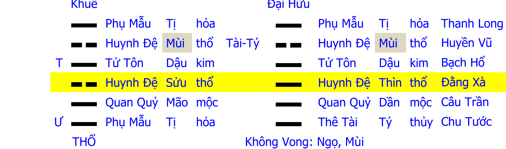

---

# CHƯƠNG 71: SƯ SÃI, ĐẠO SĨ, THẦY THUỐC CÙNG CÁC CHỨC

NGHIỆP VỀ ÂM DƯƠNG, CHÙA CHIỀN

Tăng đạo y quan, diệc hỷ Quan Văn phát động.

Tăng, đạo, thầy thuốc, đều nên được Phụ, Quan phát động.

Sách xưa cho rằng sư sãi, đạo sĩ, thầy thuốc xem về công danh đều lấy hào Tử 
Tôn làm Dụng thần, không nên gặp hào Phụ Mẫu động khắc Tử.

**Dã Hạc bàn rằng:** Nói như vậy là phi lý. Nếu là người khác xem cho sư tăng, đạo 
sĩ, thầy thuốc, thì lấy Tử Tôn làm Dụng thần. Nếu Tử Tôn vượng tướng, chủ về đạo 
hạnh, tay nghề cao; nếu Phụ Mẫu vượng tướng, chỉ là dạng tầm thường, kém.

Nếu sư tăng, đạo sĩ, thầy thuốc tự xem về đạo nghiệp, tay nghề, mà cũng lấy Tử 
Tôn làm Dụng thần, cho rằng Tử Tôn vượng tướng thì đạo cao nghề giỏi là không 
đúng. Tự xem về công danh của mình, nếu Tử Tôn động sẽ khắc Quan, làm sao có 
thể lấy làm Dụng thần được, nên vẫn phải xem hào Quan. Nếu Quan tinh trì Thế, 
hoặc Nhật, Nguyệt, hào động tương sinh, hoặc Phụ Mẫu trì Thế, hoặc được Quan 
vượng tương sinh, chắc chắn sẽ thành danh.

Âm dương tạp chức, câu dĩ Tử động vi hiềm.

Các nghề âm dương, đều coi Tử động là không may.

Hào Tử Tôn động, Tử Tôn trì Thế, đều là tượng không thành danh. Ta cho rằng 
việc này cũng tương tự như xem công danh cho người thường.

### Ví dụ: Ngày Bính Thìn tháng Sửu, một Tăng quan1 xem về công danh, được quẻ

Truân biến Ký Tế:

Truân
 
Ký Tế

Huynh ĐệTý | thủy | Huynh ĐệTý | thủy Thanh Long

Ư | Quan QuỷTuất thổ | Quan QuỷTuất thổ Huyền Vũ

Phụ Mẫu | Thân kim | Phụ Mẫu | Thân kim Bạch Hổ

Quan QuỷThìn thổ Tài-Ngọ | Huynh ĐệHợi | thủy Đằng Xà

T | Tử Tôn | Dần mộc | Quan QuỷSửu thổ Câu Trần

Huynh ĐệTý | thủy | Tử Tôn | Mão mộc Chu Tước

THỦY
Không Vong: Tý, Sửu

Vì vị Tăng quan này vướng chuyện kiện tụng, sợ bị cách chức nên mới xem quẻ.

Đoán rằng: Hào Tử Tôn trì Thế, là thần khắc Quan. Quan lại lâm hào Ứng, nên 
chức quan này sẽ về tay người khác. Quả nhiên sau bị cách chức.

1 Tăng quan: Chức quan trông coi các sự việc liên quan đến chùa chiền, tăng ni, do nhà sư 
đảm nhiệm.

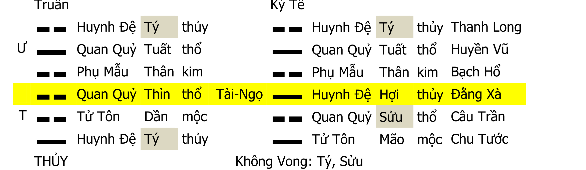

---

# CHƯƠNG 72: CẤP BẬC CÔNG DANH

Sách xưa cho rằng, thủy là nhất phẩm, hỏa là nhị phẩm, mộc là tam phẩm, kim 
là tứ phẩm và thổ là ngũ phẩm. Như hào Quan thuộc hỏa, sẽ làm quan đến nhị phẩm; 
Quan tinh thuộc thủy, làm quan nhất phẩm.

**Dã Hạc bàn rằng:** Chỉ có chừng ấy số, thì làm quan đến công hầu, biết dựa vào 
đâu để đoán định? Quan vốn chia làm cửu phẩm, mà số chỉ đến 5, nếu là quan lục 
phẩm, thất phẩm, biết dựa vào đâu mà đoán? Theo chiêm nghiệm của ta, thì nên chỉ 
rõ ra mà hỏi, như: Tôi có làm được đến công hầu không? Có được làm đến Tể tướng 
không? Có được làm quan nhất phẩm không?

Nếu Quan vượng, lâm Nhật, Nguyệt, công danh sẽ có hy vọng. Nếu Quan bị Phá, 
hoặc gặp hình xung, đến hết đời cũng không toại nguyện. Tử Tôn trì Thế, khác gì mò 
trăng đáy nước. Quan động sinh Thế, là tượng công danh đến dễ dàng.

Từng có viên Huyện lệnh hỏi xem sau này sẽ thăng quan đến cấp nào. Gieo quẻ 
ngày Ất Mão tháng Tị, được quẻ Lôi Sơn Tiểu Quá:

Tiểu Quá

Phụ Mẫu Tuất thổ | Huyền Vũ

Huynh ĐệThân kim | Bạch Hổ

T

Quan QuỷNgọ hỏa Tử-Hợi Đằng Xà

Huynh ĐệThân kim | Câu Trần

Quan QuỷNgọ hỏa Tài-Mão Chu Tước

Ư

Phụ Mẫu Thìn thổ | Thanh Long

KIM 
Không Vong: Tý, Sửu

Quan tinh Ngọ hỏa trì Thế, sau quả nhiên làm quan đến Thiểm sự.

Lại ví dụ: Ngày Ất Hợi tháng Tý, có người Châu trưởng xem tương lai có được 
thăng chức lên quan phủ không, liền ba quẻ đều gặp Tử Tôn trì Thế, sau quả nhiên bị 
giáng chức cho về hưu.

Lại có người xem về thi Hội, được tượng quẻ đỗ đạt, lại hỏi xem có được đỗ đầu 
không. Ta bảo xem thêm một quẻ nữa.

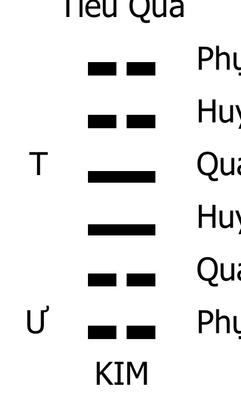

---

# CHƯƠNG 73. CON XEM CÔNG DANH CHO CHA

Ngày Giáp Thân tháng Mão, xem được quẻ Tiết biến Kiển:

Tiết 
 
Kiển

Huynh ĐệTý | thủy | Huynh ĐệTý | thủy Huyền Vũ

Quan QuỷTuất thổ | Quan QuỷTuất thổ Bạch Hổ

Ư | Phụ Mẫu | Thân kim | Phụ Mẫu | Thân kim Đằng Xà

Quan QuỷSửu thổ Tài-Ngọ | Phụ Mẫu | Thân kim Câu Trần

Tử Tôn | Mão mộc | Thê Tài | Ngọ hỏa Chu Tước

T | Thê Tài | Tị | hỏa | Quan QuỷThìn thổ Thanh Long

THỦY
Không Vong: Ngọ, Mùi

Đoán rằng: Sách xưa cho quẻ Kiển là không cát lợi, ta lại xem trọng Dung thần. | Quẻ này hào Thế lâm Tị hỏa, được Nguyệt kiến Mão tương sinh, Nhật thần Thân | tương hợp, lại nằm tại Thanh Long, chắc chắn đỗ đầu bảng, nhưng không phải khoa | này. Người xem hỏi nguyên nhân, ta đáp: Hào Thế biến thành Quan tinh Thìn thổ, | đến năm Thìn mới đỗ đầu.

Người xem nói: "Số của quẻ cũng hợp với ý của tôi, thuở nhỏ tôi gặp điềm báo 
cũng ứng vào năm Thìn." Người này học xong trở về nhà, đến năm Giáp Thìn, tham 
gia Điện thí được đỗ đầu bảng. Bởi vậy, chỉ đích xác sự việc mà xem sẽ ứng nghiệm, 
không nên câu nệ vào phép cổ.

***

# CHƯƠNG 73: CON XEM CÔNG DANH CHO CHA

Hào Phụ vượng, được hào Quan động tương sinh, hoặc Nhật Nguyệt làm Quan 
tinh sinh Phụ Mẫu; hoặc Phụ vượng hóa Quan, hoặc Phụ, Quan động mà hóa cát, đều 
là tượng thành danh.

Hào Tài khắc Phụ, hoặc Tử động tổn thương Quan, hoặc Phụ, Quan động mà 
biến hung, hoặc Nhật, Nguyệt khắc Quan, khắc Phụ, hoặc hào Phụ, hào Quan gặp 
Suy, Mộ, Phá, Tuyệt, đều là tượng nhọc công vô ích.

### Ví dụ: Ngày Nhâm Dần tháng Mão, xem cha hao giờ được bổ nhiệm, được quẻ

Phong Thủy Hoán biến Quải:

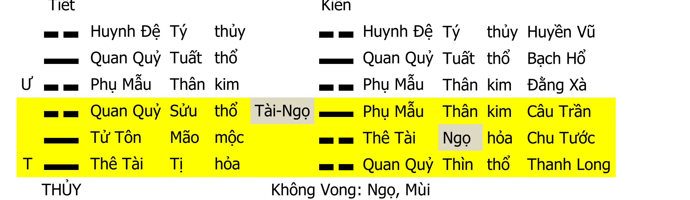

Hoán
 
Quải

Phụ Mẫu | Mão mộc | Tử Tôn | Mùi thổ | Bạch Hổ

T | Huynh ĐệTị | hỏa | Thê Tài | Dậu | kim Đằng Xà

Tử Tôn | Mùi thổ Tài-Dậu | Quan QuỷHợi | thủy Câu Trần

Huynh ĐệNgọ | hỏa Quan-Hợi | Tử Tôn | Thìn thổ | Chu Tước

Ư | Tử Tôn | Thìn thổ | Phụ Mẫu | Dần | mộc Thanh Long

Phụ Mẫu | Dần | mộc | Quan QuỷTý | thủy Huyền Vũ

HỎA
Không Vong: Thìn, Tị

Quẻ nội Phụ Mẫu Dần mộc vượng mà hóa Quan tinh Tý thủy hồi đầu sinh, nên 
đoán rằng đến năm Dần sẽ được bổ nhiệm. Sau quả nhiên ứng vào năm Dần, được 
phục hồi phẩm cũ, rồi mất vào năm Mùi. Lúc này ta mới ngộ ra rằng quẻ này hào sơ 
Phụ Dần mộc, ứng vào năm Dần bổ nhiệm; hào thượng Phụ Mão mộc động mà hóa 
Mùi Mộ, nên nhập Mộ tại năm Mùi. Lúc xem, hào Mùi gặp Tuần Không, nên là tượng 
Mộ trống chờ điền thực. Bởi vậy mà người cha qua đời vào năm thực Mộ là năm Mùi. 
Do Dụng thần trùng lặp, nên gặp Mộ khố để cất trữ.

Lại ví dụ: Ngày Mậu Thân tháng Thìn, xem cho cha đang ở kinh thành chờ bổ 
nhiệm, được quẻ Quan biến Hoán:

Quan
 
Hoán

Thê Tài | Mão mộc | Thê Tài | Mão mộc Chu Tước

Quan QuỷTị | hỏa Huynh-Thân | Quan QuỷTị | hỏa Thanh Long

T | Phụ Mẫu | Mùi thổ | Phụ Mẫu | Mùi thổ Huyền Vũ

Thê Tài | Mão mộc | Quan QuỷNgọhỏa Bạch Hổ

Quan QuỷTị | hỏa | Phụ Mẫu | Thìn thổ Đằng Xà

Ư | Phụ Mẫu | Mùi thổ Tử-Tý | Thê Tài | Dần mộc Câu Trần

KIM 
Không Vong: Dần, Mão

Hào Mùi thổ Phụ Mẫu trì Thế, được hào Quan Tị hỏa động tương sinh, nên sẽ 
được điền khuyết. Sau quả nhiên đến tháng Tị được nhiệm chức tạỉ Tứ Xuyên, là do 
hào Tị hỏa sinh hào Thế.

**Lý Ngã Bình bàn rằng:** Hỏi về thời gian, địa điểm bổ nhiệm, cần phải chia ra từng 
quẻ riêng để xem, không thể xem chung trong một quẻ. Nếu như xem gộp, nếu hào 
Quan nằm ở Thân kim, đoán về thời gian, sẽ là tháng bảy; xem về nơi chốn, sẽ ứng 
với vùng Sơn Tây, như vậy là tháng bảy thăng chức, sẽ được thuyên chuyển đến phía 
tây ư? Rõ ràng là phép xem xưa có sai lầm. Có người dựa vào tám cung nam Ly bắc 
Khảm; có người dựa vào hai mươi tám tinh tú để phân định; có người lại dùng Lộc để 
xác định; lại có người cho rằng, quẻ Du hồn chủ về nhận chức nơi xa, quẻ Quy hồn 
chủ về nhận chức ở gần. Sách "Dịch mạo" căn cứ vào ngũ hành, lục thần nhập cung 
làm kinh, dùng các sao làm vĩ để xác định. Thuyết này chỉ nói được, chứ không áp 
dụng được.

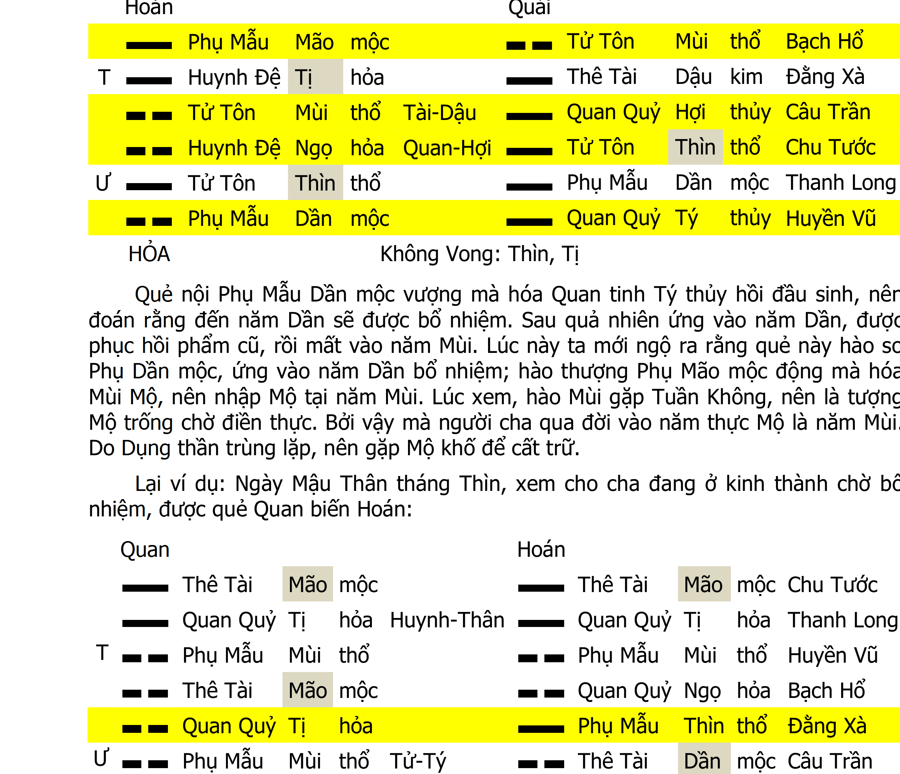

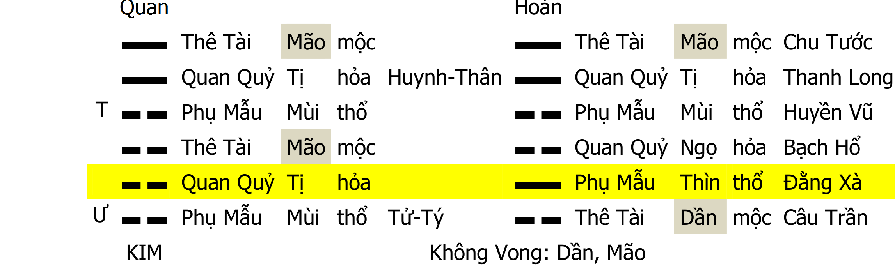

---

# CHƯƠNG 74. CẦU TÀI

Ngũ hành bát quái, cùng hai mươi tám tinh tú, còn ít nhiều hữu lý. Nếu dùng lục | thần kiêm tinh sát, là nói bừa. Giả sử ngày Đinh xem được quẻ Lôi Phong Hằng, Quan | tinh Dậu kim trì Thế, sẽ nắm được binh quyền; lục thần được Đằng Xà, Xà chủ về | chức quan chuyên chạy việc bên ngoài. Đinh gặp Dậu là Văn Xương, Văn Xương chỉ | về Hàn Lâm. Nếu theo phép đó mà suy đoán, lấy Quan Dậu làm kinh, Đằng Xà, Văn | Xương làm vĩ, chẳng phải là nắm binh quyền tại viện Hàn Lâm, bị sai phái mà chạy | việc trong trường văn chương ư?

***

# CHƯƠNG 74: CẦU TÀI

(XEM VỀ TIỀN CỦA)

Trong lý luận cầu tài của các sách xưa, ta thấy "Hoàng kim sách" là xác đáng 
nhất, chiêm nghiệm qua đều linh ứng, chỉ tiếc là chưa được phân loại rõ ràng. Nay lấy 
đoạn đầu làm phần tổng luận, đoạn sau phân loại để trình bày, nhằm giúp người học 
đời sau thêm dễ hiểu. Trong đó, có những phần chiêm nghiệm qua không thấy linh 
ứng, ta đều cắt bỏ; có những phần bản thân ta thấy có ứng nghiệm, thì thêm vào.

Tài vượng Phúc hưng, công tư xứng ý. Tài Không Phúc Tuyệt, thượng 
hạ vi tâm.

Tài vượng Tử hưng, công tư như ý; Tài không, Tử động, trên dưới trái lòng.

Từ việc thuế má của nhà nước, cho đến việc kinh doanh của dân chúng, đều 
dùng hào Tài làm Dụng thần. Xem cho việc công hay việc tư, cũng nhìn vào hào Tài. 
Tử Tôn là Nguyên thần sinh trợ cho Tài, đều nên vượng mà hóa cát, hoặc sinh hợp 
hào Thế, như vậy việc công hay việc tư đều được như ý. Nếu gặp Suy, Mộ, Tuyệt, 
Không, hoặc bị Hình, Xung, Khắc, Hại, hoặc động mà hóa hung, hoặc bị Nhật, Nguyệt 
xung phá, thì việc mong cầu sẽ không được như ý mình mong muốn.

Hữu Phúc vô Tài, Huynh Đệ giao trùng thiên hữu vọng;

Có Phúc không Tài, Huynh Đệ động vẫn còn hy vọng;

Huynh là thần cướp Tài, nên xem cầu tài rất kỵ gặp phải. Nếu hào Tài và hào 
Huynh đều động chủ về hao tán tiền tài. Nếu hào Tài không động, hoặc không hiện 
trong quẻ, mà Tử Tôn và Huynh Đệ đều động, lại là tốt, vì Huynh động sinh Tử, nên 
sẽ có hy vọng.

Hào Tài hào Tử và hào Huynh cùng động trong quẻ cũng là điềm tốt, vì Huynh 
động sinh Tử, Tử động sinh Tài, lợi lộc sẽ nhiều, lại có được nguồn lợi dồi dào.

**Tân bình thích:** Ở đây cũng cần hào Tài có khí hoặc vượng tướng, nếu hào Tài 
hưu tù Không Phá, thì Tử Tôn Huynh Đệ cùng động cũng chưa hẳn có tài.

Huynh hưng Tài chấn, Quan hào phát động diệc kham cầu.

Huynh hưng, Tài động, hào Quan động có thể mong cầu.

Hào Huynh, hào Tài cùng động, lại thêm hào Quan Quỷ động cũng là tượng được 
tài, vì Quan Quỷ động khắc chế được hào Huynh.

Tài Phúc câu vô, mạc nhược thủ châu đãi thố.

Tài Phúc đều không, những là ôm cây đợi thỏ.

Hào Tài và hào Tử đều không hiện trong quẻ, hoặc xuất hiện mà hưu tù, Không, 
Phá, Mộ, Tuyệt hoặc Hình, Xung, Khắc, Hại, có cầu tài cũng chỉ mất công vô ích.

Giác Tử bàn rằng: Nếu được Nhật, Nguyệt lâm Tài, hoặc hào Tài phục nhưng 
vượng, thì vẫn có thể cầu được tài.

Phụ Huynh giai động, vô thù duyên mộc cầu ngư.

Phụ Huynh đều động, khác gì leo cây bắt cá.

Phụ động khắc Phúc, Huynh động khắc Tài, nếu hai hào cùng động trong quẻ, 
mọi toan tính cầu tài chỉ như mò trăng đáy nước.

### Ví dụ: Ngày Mậu Ngọ tháng Dậu, xem cầu tài, được quẻ Cách:

Cách

Quan QuỷMùi thổ | Chu Tước

Phụ Mẫu | Dậu kim | Thanh Long

T

Huynh ĐệHợi thủy | Huyền Vũ

Huynh ĐệHợi thủy Tài-NgọBạch Hổ

Quan QuỷSửu thổ | Đằng Xà

Ư

Tử Tôn | Mão mộc | Câu Trần

THỦY
Không Vong: Tý, Sửu

Đoán rằng: Trong quẻ hào Tài không xuất hiện, hào Huynh Hợi thủy trì Thế, hào 
Phụ lâm Nguyệt kiến sinh trợ cho hào Huynh, là việc cầu tài không có hy vọng, chẳng 
khác trèo cây bắt cá.

**Tân bình thích:** Tôi gặp rất nhiều trường hợp Huynh Đệ trì Thế vẫn được tài, 
Tài phục dưới Thế, cho dù hào Tài hưu tù vẫn có thể có tài. Ví dụ ở trên bởi vì Huynh 
Đệ trì Thế vượng tướng, Tử Tôn Nguyệt phá hưu tù vô lực sinh tài, cho nên mới 
không cát. Nếu Tử Tôn vượng mà không bị tổn thương thì cũng có thể cầu tài. Huống 
chi ở ví dụ đưa ra Phụ Huynh không phát động.

Đa Tài phản phục, tu Mộ khố dĩ thu tàng;

Nhiều Tài thì tráo trở, cần có Mộ khố để trữ tàng.

Trong quẻ, nếu hào Tài lâm Nhật, Nguyệt là quá vượng, hoặc hào động, hào biến 
đều là hào Tài, Nhật, Nguyệt cũng là Tài tinh, là Tài xuất hiện quá nhiều, cần phải đợi 
đến ngày hào Tài nhập Mộ, mưu tính mới được toại nguyện. Ví dụ, hào Tài thuộc 
thủy, đợi đến ngày Thìn sẽ đắc tài. Những trường hợp khác loại suy từ đó.

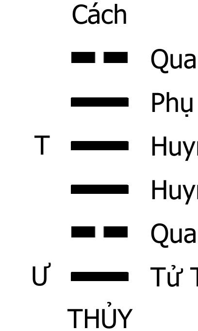

Vô Quỷ phân tranh, hựu phạ giao trùng nhi trở trệ.

Không Quỷ bị tranh cướp, lại sợ hào động gây cản trở.

Huynh Đệ là thần tranh cướp, cản trở, hao tài, cần xuất hiện hào Quan động 
nhằm chế ngự hào Huynh, sẽ không bị tranh đoạt mất tài.

Giác Tử bàn rằng: Hào Huynh động, nên có Quỷ động để chế ngự. Còn nếu hào 
Huynh an tĩnh, thì không nên gặp Quỷ động, vì sẽ làm hao khí của Tài, lại dễ rước 
điều tiếng thị phi.

**Tân bình thích:** Lý luận này có lý, thường thấy Quan Quỷ độc phát, không được 
tài mà phá tài.

Huynh như thái quá, phản bất khắc Tài.

Huynh nếu nhiều quá, lại không khắc Tài.

Sách xưa chú rằng: Trong quẻ có một hào Huynh động là xấu nhất. Nếu xuất 
hiện nhiều hào Huynh động, lại không cướp đoạt được Tài.

Giác Tử bàn rằng: Nói vậy là không đúng! Nếu hào Huynh hiện nhiều, đợi đến 
ngày hào Huynh nhập Mộ, hoặc đến ngày tương khắc hào Huynh, tiền tài sẽ bị cướp 
đoạt. Bởi vì quá vượng thì "giảm bớt đi sẽ thành".

### Ví dụ: Ngày Bính Thìn tháng Tị, xem về cho vay nặng lãi, được quẻ Vị Tế biến

Quy Muội:

Vị Tế
 
Quy Muội

Ư

Huynh ĐệTị | hỏa | Tử Tôn | Tuất thổ Thanh Long

Tử Tôn | Mùi thổ | Thê Tài | Thân kim Huyền Vũ

Thê Tài | Dậu kim | Huynh ĐệNgọ hỏa Bạch Hổ

T

Huynh ĐệNgọhỏa Quan-Hợi | Tử Tôn | Sửu thổ Đằng Xà

Tử Tôn | Thìn thổ | Phụ Mẫu Mão mộc Câu Trần

Phụ Mẫu Dần mộc | Huynh ĐệTị | hỏa Chu Tước

HỎA
Không Vong: Tý, Sửu

Trong quẻ này Nguyệt kiến, hào Thế, hào động, hào biến đều là Huynh Đệ, nên 
việc cầu tài sẽ được toại nguyện, nhưng đến tháng 9 hào Huynh nhập Mộ sẽ phải tán 
tài. Như vậy làm sao có thể cho rằng hào Huynh quá vượng sẽ không thể cướp được 
Tài?

Thế ngộ Huynh lâm, tất nan cầu vọng.

Hào Huynh trì Thế, khó mà hy vọng.

Sách xưa cho rằng nếu Quái thân lâm Huynh Đệ, việc cầu tài khó được. Ta thấy 
rằng dùng Quái thân không nghiệm, nên chủ yếu chỉ căn cứ vào hào Thế. Nếu Huynh 
Đệ trì Thế, khó mà cầu được tài.

**Dã Hạc bàn rằng:** Đều phải dựa vào sự biến thông của người đoán quẻ. Hào 
Huynh Đệ trì Thế tuy không nên, những cũng có lúc không kỵ.

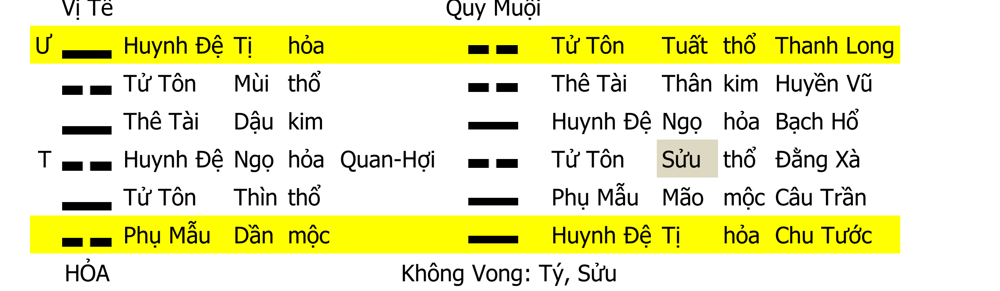

### Ví dụ: Ngày Đinh Mão tháng Mùi, xem về vay nợ, được quẻ Tấn:

Tấn

Quan QuỷTị | hỏa | Thanh Long

Phụ Mẫu Mùi thổ | Huyền Vũ

T | Huynh ĐệDậu kim | Bạch Hổ

Thê Tài | Mão mộc | Đằng Xà

Quan QuỷTị | hỏa | Câu Trần

Ư | Phụ Mẫu Mùi thổ Tử-Tý Chu Tước

KIM
Không Vong: Tuất, Hợi

Đoán rằng: Tuy hào Huynh trì Thế, là tượng không có tiền tài, nhưng may được 
Nhật thần Mão làm Tài tinh. Sách xưa cho rằng hào Tài khắc Thế hoặc xung thế là 
tượng đắc tài; lại thêm hào Ứng Mùi thổ vượng mà sinh Thế, đến hôm sau sẽ đắc tài. 
Quả nhiên đến ngày Thìn được của. Ứng vào ngày Thìn, vì là ngày hợp của hào Thế 
động.

### Ví dụ: Ngày Đinh Tị tháng Tị, xem về cầu tài, được quẻ Ký Tế biến Hoán:

Ký Tế
 
Hoán

Ư | Huynh ĐệTý | thủy | Tử Tôn | Mão mộc Thanh Long

Quan QuỷTuất thổ | Thê Tài | Tị | hỏa Huyền Vũ

Phụ Mẫu Thân kim | Quan QuỷMùi thổ Bạch Hổ

T | Huynh ĐệHợi | thủy Tài-Ngọ | Thê Tài | Ngọhỏa Đằng Xà

Quan QuỷSửu thổ | Quan QuỷThìn thổ Câu Trần

Tử Tôn | Mão mộc | Tử Tôn | Dần mộc Chu Tước

THỦY
Không Vong: Tý, Sửu

Đoán rằng: "Nếu xem cầu tài lâu dài, sẽ không có được. Còn nếu hỏi về tiền tài 
trước mắt, đến hôm sau là ngày Mậu Ngọ sẽ được." Người xem hỏi nguyên nhân. Ta 
giải đáp: "Hào Huynh trì Thế, bị Nhật, Nguyệt xung phá, nên không khắc được hào 
biến Thê Tài. Huống hồ Nhật, Nguyệt đều lâm hào Tài mà xung Thế, chỉ vì hào Ứng 
lâm Không, đến hôm sau ngày Ngọ được điền thực, nên chắc chắn sẽ được của." Quả 
nhiên hôm sau đắc tài.

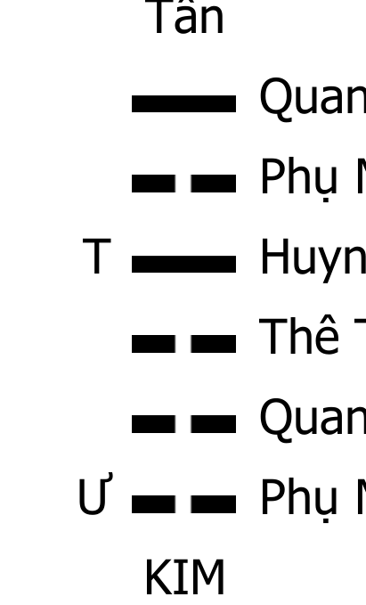

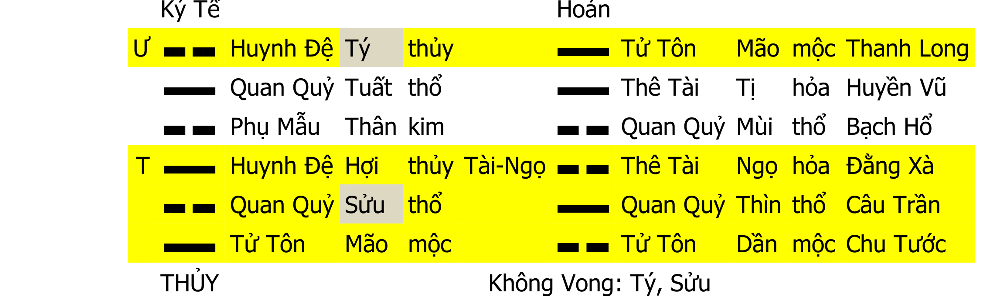

### Ví dụ: Ngày Mậu Dần tháng Tị, xem ngày nào được của, được quẻ Ly biến

Phong:

Ly 
 
Phong

T | Huynh Đệ | Tị | hỏa | Tử Tôn | Tuất thổ | Chu Tước

Tử Tôn | Mùi thổ | Thê Tài | Thân | kim | Thanh Long

Thê Tài | Dậu | kim | Huynh Đệ | Ngọ | hỏa | Huyền Vũ

Ư | Quan Quỷ | Hợi | thủy | Quan Quỷ | Hợi | thủy | Bạch Hổ

Tử Tôn | Sửu thổ | Tử Tôn | Sửu | thổ | Đằng Xà

Phụ Mẫu | Mão | mộc | Phụ Mẫu | Mão | mộc | Câu Trần

HỎA
Không Vong: Thân, Dậu

Đoán rằng: Hào Tài Dậu kim không động, hôm sau là ngày Mão xung động hào 
Tài, nên sẽ được của.

Người xem hỏi rằng: Huynh Đệ trì Thế, làm sao có thể đắc tài? Ta đáp: Hào 
Huynh động hóa Mộ, nên không khắc Tài. Quả nhiên đến hôm sau được của.

**Dã Hạc bàn rằng:** Quan điểm của ta không giống với các sách khác, ngẫu nhiên 
trùng hợp liền lập tức cho là khuôn mẫu. Ta nhất định phải chiêm nghiệm nhiều lần, 
thấy ứng nghiệm, mới dám lập thành khuôn mẫu để dạy người. Thường khi xem được 
quẻ Huynh trì Thế, mà Thế gặp Không, Phá hoặc hóa Mộ, hoặc Nhật, Nguyệt tại hào 
Tài xung Thế, khắc Thế, hoặc Huynh Đệ trì Thế động mà hóa Tài, đều đoán là sẽ 
được của. Xem thử nhiều lần đều ứng nghiệm, nên mới dám mách bảo cho người. 
Nếu Huynh Đệ trì Thế mà không thuộc các trường hợp trên, thì không thể đoán như 
vậy.

Tài lai tựu ngã chung tu dị; ngã khứ tầm tài tất thị nan.

Tài đến tìm ta là rất dễ; ta đi tìm tài ắt khó khăn.

Sách xưa chú thích rằng: Nếu gặp hào Tài sinh Thế, hợp Thế, khắc Thế, trì Thế, 
đều là tượng Tài đến tìm ta. Nếu trong quẻ hào Tài tuy động nhưng không sinh hợp 
Thế, thì Tài đó không thuộc về mình.

**Dã Hạc bàn rằng:** Thuyết này cho rằng nếu hào Tài không sinh hợp hào Thế, thì 
Tài đó không thuộc về mình. Vậy thì như hai quẻ trên đây, đều là Huynh Đệ trì Thế, 
nhưng đều không được hào Tài tương sinh, tương hợp. Tóm lại, người đoán quẻ phải 
biết ứng biến linh hoạt, tường tận cái lý của Dịch, tự nhiên sẽ học một biết mười, 
không nên quá cứng nhắc.

Phúc biến Tài sinh, lợi nguyên cổn cổn;

Phúc động sinh Tài, nguồn lợi dồi dào;

Tài được Tử động tương sinh, là Tài có nguồn, nên tài lợi dồi dào. Nếu được Tử 
động hóa Tài, hay Tài động hóa Tử, cũng tương tự như vậy.

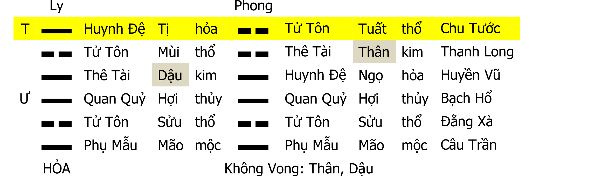

Huynh thương Quỷ khắc, khẩu thiệt phân phân.

Huynh hại, Quỷ khắc, điều tiếng liên tiếp.

Hào Tài trì Thế mà hào Huynh động, không những Tài bị cướp đoạt, mà còn phải 
đề phòng tổn hại đến thân. Nếu Quỷ động khắc Thế, lại càng hung.

Giác Tử bàn rằng: "Hoàng kim sách" có viết: "Huynh cùng Quỷ khắc, khó tránh 
thị phi", tức hào Huynh động biến Quỷ, xung khắc hào Thế, không những không được 
của, mà còn phòng điều tiếng thị phi. Nói như vậy là không biết rằng, Huynh động mà 
biến Quỷ, tức hóa hồi đầu khắc, Huynh tự lo cho Huynh còn chẳng xong, còn sức đâu 
để khắc Thế.

### Ví dụ: Ngày Bính Ngọ tháng Dậu, xem buôn bán có lợi không, được quẻ Sư biến

Khảm:

Sư 
 
Khảm

Ư | Phụ Mẫu | Dậu kim | Huynh Đệ | Tý | thủy | Thanh Long

Huynh Đệ | Hợi | thủy | Quan Quỷ | Tuất thổ | Huyền Vũ

Quan Quỷ | Sửu thổ | Phụ Mẫu | Thân | kim | Bạch Hổ

T | Thê Tài | Ngọ hỏa | Thê Tài | Ngọ | hỏa | Đằng Xà

Quan Quỷ | Thìn | thổ | Quan Quỷ | Thìn | thổ | Câu Trần

Tử Tôn | Dần mộc | Tử Tôn | Dần | mộc | Chu Tước

THỦY
Không Vong: Dần, Mão

Đoán rằng: Hào Tài Ngọ hỏa trì Thế, bị hào Huynh động đến cướp Tài, may nhờ 
Huynh Hợi thủy hóa Tuất thổ hồi đầu khắc, hào Huynh bị khắc không cướp được Tài, 
nên đoán rằng việc buôn bán sẽ lợi.

Quả nhiên buôn bán có lãi. Sau đến tháng 9, em trai người này mắc bệnh mà 
chết. Ta lúc này mới ngộ ra rằng, đó là do hào Huynh Đệ Hợi thủy hóa Quỷ. Quẻ này 
hỏi về cầu tài, lại hiện ra điềm em chết. Trường hợp tương tự như vậy khá thường 
gặp, nên người học cần phải hết sức chú ý.

Tài cục hợp Phúc đức, vạn bội lợi nguyên khả hứa;

Tài cục hợp Phúc đức, là điềm lợi nhuận muôn ngàn;

Hào Thế cùng hào Tài, hoặc cùng hào Tử hợp thành tam hợp cục, là tượng tiền 
của chất chồng, lợi nhuận dồi dào.

**Dã Hạc bàn rằng:** Nếu hợp thành Tử Tôn Tài cục sinh Thế mới tốt. Còn nếu hợp 
thành Phụ cục, lại là tượng gian nan vất vả; hợp thành Huynh cục, là phá tài, đa 
đoan; hợp thành Quỷ cục, chủ về điều tiếng, tai họa, nếu khắc Thế lại càng hung.

Tuế quân phùng Kiếp sát, nhất niên sinh ý vô liêu.

Tuế quân gặp Kiếp sát, một năm bán buôn thua lỗ.

Kiếp sát tức hào Huynh Đệ. Nếu Huynh Đệ lâm Thái Tuế, chủ về cả năm phá 
hao.

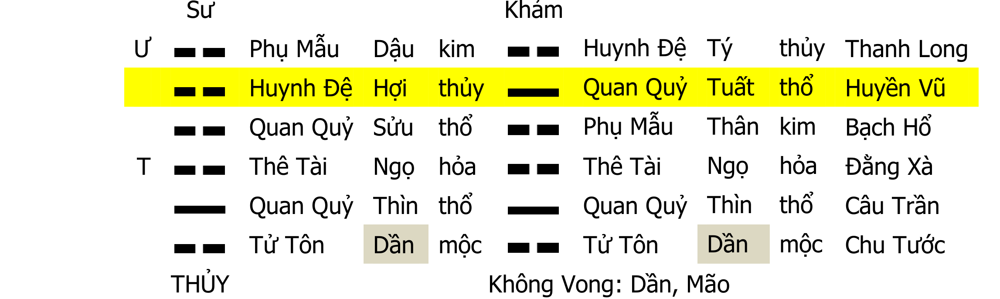

---

# CHƯƠNG 75. GẶP QUAN TRÊN ĐỂ CẦU TÀI

**Tân bình thích:** Thường gặp Thái Tuế là Tài phục mà Không Phá, là một năm 
không có tài để cầu.

***

# CHƯƠNG 75: GẶP QUAN TRÊN ĐỂ CẦU TÀI

Thế khắc Quan, Quan sinh Thế, tu nghi yết kiến; Tài lâm Phá, Quỷ khắc 
Thế, uổng phí bôn trì.

Thế khắc Quan, Quan sinh Thế, là nên yết kiến; Tài gặp Phá, Quỷ khắc Thế, đi 
chỉ uổng công.

Dã Hạc nói rằng: Yết kiến quan trên có hai việc: Vì công danh thì dùng hào 
Quan, vì tài lợi thì dùng hào Tài, nếu được trì Thế, sinh Thế, hợp Thế là tốt. Nếu gặp 
Không, Phá, Mộ, Tuyệt, hoặc động mà hóa hung, thì chỉ tốn công đi lại vất vả mà thôi.

Nếu hào Thế hóa Khắc, hóa Quỷ, hoặc theo Quỷ nhập Mộ, giúp Quỷ hại thân, thì 
không nên yết kiến, vì sẽ gặp họa, không phải trên đường đi, thì ở nơi yết kiến.

Thế động ngộ Không, Thân hưng ngộ Phá.

Thế động gặp Không, Thân động gặp Phá.

Hào Thế động hóa Không, hóa Phá, đừng cho là không tốt, mà sẽ ứng vào ngày, 
tháng khác.

### Ví dụ: Ngày Đinh Mão tháng Thân, xem về xuất hành gặp quan trên, được quẻ

Đồng Nhân:

Đồng Nhân

Ư | Tử Tôn | Tuất thổ | Thanh Long

Thê Tài | Thân | kim | Huyền Vũ

Huynh Đệ | Ngọ | hỏa | Bạch Hổ

T | Quan Quỷ | Hợi | thủy | Đằng Xà

Tử Tôn | Sửu | thổ | Câu Trần

Phụ Mẫu | Mão | mộc | Chu Tước

HỎA 
Không Vong: Tuất, Hợi

Đoán rằng: Quan tinh trì Thế lâm Không, đợi đến ngày Hợi xuất Không, sẽ gặp 
được quan phủ, tài lợi đều toại nguyện. Sau quả nhiên đến ngày xuất Không gặp được 
quan, được tài được lợi. Đó là nhờ có hào Tài hào là Nguyệt kiến sinh Thế.

Quan trì Thế, Tài động tương sinh; Tài trì Thế, Quan vô khuyết hãm. Tái 
đắc Nhật Nguyệt chiếu lâm, bỉ thử duyên đầu hữu hạnh.

Quan trì Thế, Tài động tương sinh; Tài trì Thế, Quan không thất hãm. Lại được 
Nhật Nguyệt chiếu lâm, hai bên tâm đầu ý hợp.

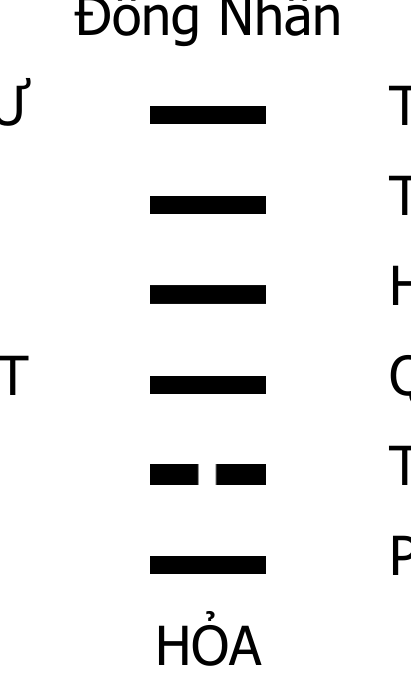

Nhật Nguyệt chiếu lâm, tức Nhật thần, Nguyệt kiến sinh Tài, sinh Thế, hoặc hào 
Thế, hào Tài lâm Nhật, Nguyệt.

Vi danh nghi Phụ động, nhân lợi kỵ Huynh hưng.

Cầu danh ưa Phụ động, mưu lợi kỵ Huynh động.

Khi xem về yết kiến quan trên, nếu được hào Thế, hào Quan tương hợp, tương 
sinh, sẽ được gặp. Nếu vì cầu danh lợi, nên xem thêm quẻ khác, không thể dùng quẻ 
trước để suy đoán. Nếu vì cầu danh, hào Phụ, hào Quan đều nên vượng; nếu vì cầu 
lợi, hào Tài, hào Phúc đều nên vượng.

### Ví dụ: Ngày Giáp Thìn tháng Thân, xem về yết kiến quan trên để xin tiến cử,

được quẻ Phệ Hạp:

Phệ Hạp

Tử Tôn | Tị | hỏa Huyền Vũ

T | Thê Tài | Mùi thổ | Bạch Hổ

Quan QuỷDậu | kim Đằng Xà

Thê Tài | Thìn thổ | Câu Trần

Ư | Huynh ĐệDần | mộc Chu Tước

Phụ Mẫu | Tý | thủy Thanh Long

MỘC 
Không Vong: Dần, Mão

Đoán rằng: Nếu xin tiến cử, thì hoàn toàn phải nhờ vào văn thư. Trong quẻ hào 
Tài trì Thế, Phụ Mẫu bị khắc, nên khó được như ý. Người xem nói: "Nếu là điềm được 
của, đi chuyến này cũng không uổng." Ta bèn nói: "Không phải như thế! Ý của ông là 
muốn cầu danh, gặp hào Tài trì Thế, là Kỵ thần phá hoại văn thư, chứ không phải 
điềm được của."

Giác Tử bàn rằng: Thường người đoán quẻ chỉ nhìn vào hào Tài này mà đoán là 
được của, mà không biết được rằng, hào Tài trì Thế là tượng phá hoại văn thư, nên 
việc xin tiến cử sẽ không toại nguyện. Nếu giải thích là tuy không thành danh, nhưng 
được lợi, là sai lầm lớn.

Lục hợp Lục trùng tu khán Dụng, Phản ngâm hóa Thoái uổng bôn trì.

Lục hợp, Lục xung nên xem Dụng; Phản ngâm, hóa Thoái chỉ uổng công.

Gặp quẻ Lục hợp cũng cần có Dụng thần vượng tướng, hoặc Thế và Tài, Quan 
tương hợp mới là điềm tốt. Nếu gặp quẻ Lục xung mà Dụng thần bị khắc, thất hãm, 
mới coi là hung.

Gặp quẻ Phản ngâm, hoặc hào Thế động hóa Thoái thần, thì sẽ gặp khó khăn 
trắc trở, nếu cố đi yết kiến, cũng chỉ uổng công.

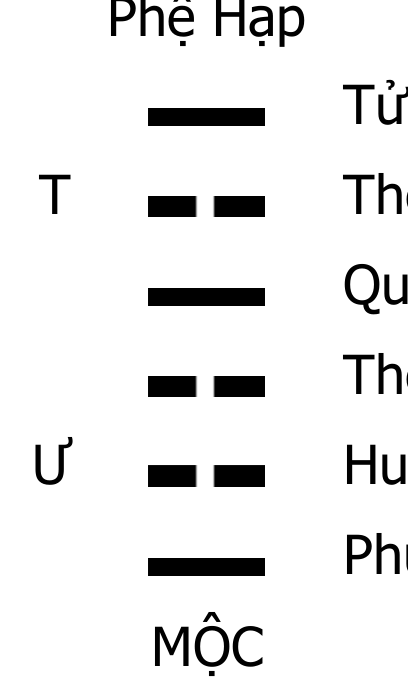

---

# CHƯƠNG 76. LÀM VIỆC CHO QUAN TRÊN ĐỂ CẦU TÀI

Quý nhân yết quý, nghi Thế Ứng dĩ tương sinh; bình nhân kiến quý, nghi 
Quan Quý nhi tương hợp.

Quan lại yết kiến quan trên, nên được Thế Ứng tương sinh; người thường yết 
kiến quan trên, nên được Quan Quỷ tương hợp.

Quan yết kiến quan trên, tốt nhất hào Thế và hào Ứng nên tương sinh. Người 
thường yết kiến quan trên, tốt nhất được Quan Quỷ tương sinh, tương hợp, hoặc 
Quan tinh trì Thế.

Giác Tử bàn rằng: Có ý tìm gặp quan trên để cầu danh, được Quan tinh trì Thế, 
sinh Thế, quan tước sẽ được. Có ý muốn yết kiến quan trên, mà gặp Quan tinh sinh 
Thế, hợp Thế, thì sẽ gặp được. Đừng nên dùng hào Quan chủ về được gặp quý nhân 
để đoán lầm sang việc thành danh.

Quan lại muốn gặp quan trên, nếu hào Thế và hào Ứng tương xung, tương khắc, 
hào Tài phục lại lâm Không, có đi cũng vô ích. Quan Quỷ khắc Thế, Thế biến Quỷ, 
biến hồi đầu khắc, lại càng hung.

Người thường đi gặp quan trên, mà Quan tinh khắc Thế, Thế biến Quỷ, biến hồi 
đầu khắc thì không nên đi, nếu đi cần đề phòng bất trắc. Tài, Quan sinh Thế, trì Thế 
là tốt.

Nếu muốn xuất hành để cầu tài, yết kiến quan trên, cần tham khảo chương "Xuất 
hành".

***

# CHƯƠNG 76: LÀM VIỆC CHO QUAN TRÊN ĐỂ CẦU TÀI

Tốt nhất Tài Quan đều vượng; không nên Thế Ứng lâm Không.

Thế gặp Tài, Ứng tại Tử, ta được người mất;

Ứng lâm Quan, Thế gặp Phá, ta mất người được.

Huynh Đệ trì Thế, chi bằng ngồi yên hưởng nhàn;

Ứng khắc hào Thế, đề phòng lòng người phản trắc.

Thế gặp Tài tinh, Quan Quỷ tại Ứng, mọi việc đều được toại nguyện.

Thế gặp Không, Phá, Mộ, Tuyệt, hoặc động mà hóa hung, đều là điềm xấu.

Ứng khắc Thế, Huynh khắc Thế, tai ương còn nhẹ;

Quỷ khắc Thế, Thế hóa Quỷ, họa hoạn vô cùng.

---

# CHƯƠNG 77: MỞ CỬA HÀNG

Thế vi kỷ, Ứng vi nhân, đại nghi tương hợp; Tài vi bản, Phúc vi cơ, tối hỷ 
đồng hưng.

Thế là mình, Ứng là người, rất nên tương hợp; Tử là nền, Tài là gốc, cùng động 
là mừng.

Theo sách xưa, hào Ứng tượng trưng cho bạn làm ăn, cũng tượng trưng cho 
khách hàng.

Giác Tử bàn rằng: Cần phải xem ý của người đến xem. Nếu muốn hỏi về người | hợp tác làm ăn, thì hào Ứng chỉ bạn làm ăn; nếu được Thế, Ứng tương sinh tương | hợp, là điềm đồng lòng nhất trí. Nếu hào Ứng sinh hào Thế, là người khác làm lợi cho | mình; nếu hào Thế sinh hào Ứng, ta sẽ có lợi cho người khác. Thế, Ứng tương khắc, | tương xung, quan hệ giữa hai bên sẽ thay đổi. Hào Ứng khắc hào Thế, là ta bị người | lừa; hào Thế khắc hào Ứng, là người sẽ thuận theo ý ta. Hào Ứng lâm Huyền Vũ | Huynh Đệ, là bị trộm cắp, lừa gạt ngấm ngầm, Ứng lâm Quan Quỷ khắc Thế, sẽ gặp | tai họa hiển hiện. Thế lâm Tài, Ứng lâm Huynh, sẽ bị liên lụy vì người. Thế lâm Tài, | Ứng lâm Tử, sẽ được người giúp sức. Thế, Ứng Không, hợp, chủ về hai bên đều gian | dối, lừa gạt.

Nếu ý của người đến xem chú trọng đến việc bán buôn, nên coi hào Ứng tượng 
trưng cho khách mua hàng. Hào Ứng sinh, hợp hào Thế, là điềm khách mới kết giao 
thành khách quen; Thế, Ứng tương xung tương khắc, người quen sớm muộn cũng ra 
thù địch.

Quỷ tác tai phi tu kỵ động, Tài vi hoạt kế uý hình xung.

Quỷ là tai họa không nên động, Tài là nguồn sống sợ hình xung.

Quỷ động sẽ gây điều tiếng thị phi, kỵ nhất là khắc Thế. Sách xưa có nói: "Quỷ 
hiện trong quẻ, ngày ngày có chuyện thị phi; Quỷ động khắc Thế, tai họa triền miên." 
Nhưng khi Quỷ khắc Thế, cũng phải xem Quỷ đóng tại thần nào trong Lục thần, tham 
khảo thêm trong chương "Gia trạch".

Tài là nguồn của cải, kỵ gặp Suy, Mộ, Không, Phá, hoặc động mà biến hung, 
hoặc bị Nhật, Nguyệt hình xung khắc hại, lại càng kỵ Thế và Tài lâm Không, cửa hàng 
sẽ không mở được.

Quỷ Huynh phát động, hữu chế hà phương; tùy Mộ trợ thương, đa hung 
thiểu cát.

Quỷ, Huynh động, bị khắc chế vẫn không đáng ngại; theo nhập Mộ, giúp hại 
thân, lành ít dữ nhiều.

Quỷ động sẽ rước điều tiếng thị phi, nếu trong quẻ có hào Tử Tôn khắc chế Quỷ, 
hoặc Nhật, Nguyệt xung khắc hào Quỷ, tức Quỷ đã bị khắc chế, không còn đáng ngại.

Giác Tử bàn rằng: Nếu như hào Huynh, hào Quỷ cùng động trong quẻ, thì không 
thể cho là Quỷ động rước điều tiếng thị phi, vì khi đó, Quỷ động sẽ khắc chế hào 
Huynh, khiến Huynh không thể đến cướp Tài. Huynh Đệ lại tượng trưng cho kẻ tiểu

---

# CHƯƠNG 78. ỦY THÁC VIỆC LÀM ĂN

nhân cản trở, gây hao tài, nên khi đó, được Quỷ động, sẽ chế phục được Huynh Đệ. 
Nhưng kỵ hào Thế theo Quỷ nhập Mộ, hoặc Thế động biến hung, đều là điềm xấu.

Nếu xem về việc buôn bán, tuy gặp Tài động là tốt, nhưng nếu trong quẻ có hào 
Quỷ khắc Thế, thì Tài động là không nên, vì như thế là "giúp Quỷ hại thân".

Quái đắc Phản ngâm đa phản phục.

Quẻ gặp Phản ngâm nhiều tráo trở.

Nếu gặp quẻ Phản ngâm, là tượng lúc muốn làm lúc không, làm rồi lại bỏ. Cửa 
hàng mở rồi lại đóng, đóng rồi lại mở. Nếu như cửa hàng mở đã lâu, nếu gặp quẻ 
này, chắc chắn sẽ phải di chuyển.

Xung trung biến hợp tái trùng hưng.

Trong xung gặp hợp lại trùng hưng.

Nếu gặp quẻ Lục hợp, hoặc quẻ Lục xung biến Lục hợp, hoặc hào Thế cùng hào 
Tài, hào Tử Tôn hợp thành Tam hợp, là tượng đóng cửa rồi sau mở lại. Nhưng nếu là 
quẻ Lục hợp biến Lục xung lại là điềm xấu, tuy trước mắt kinh doanh phát đạt, nhưng 
ngày càng xuống dốc, sớm muộn sẽ sập tiệm.

Hợp hỏa bất hiềm Huynh Đệ, thực bản nội ngoại vô Tài.

Góp vốn không hiềm Huynh Đệ; lỗ vốn do quẻ không Tài.

Hào Thế, hào Ứng tại hào Huynh là không cát lợi; hào Huynh phát động cũng 
không cát lợi. Nếu như hào Thế lâm Huynh, có Nhật, Nguyệt làm Tài tinh xung khắc 
hào Thế, lại là điềm tốt.

Nếu quẻ nội, quẻ ngoại đều không hiện hào Tài, hào Tài phục lại lâm Không, là 
tượng lỗ vốn. Điều này rất ứng nghiệm.

**Tân bình thích:** Hào Tài vượng tướng, Huynh Đệ động mà hóa Tài, chính là hợp 
tác cầu tài, cũng chủ được tài.

***

# CHƯƠNG 78: ỦY THÁC VIỆC LÀM ĂN

Quan nhược hưng long, hành chủ khả thiên kim chi thác; Ứng như 
Không Phá, nha nhân vô hào hốt chi năng;

Hào Quan hưng vượng, người uỷ thác đáng mặt gửi vàng; hào Ứng Phá Không, 
kẻ trung gian bất tài vô dụng.

Hào Quan vượng, hào Ứng sinh hợp hào Thế, thì người chủ trì việc làm ăn có thể 
nhờ cậy; hào Ứng tĩnh lại gặp Suy, Không, Phá, ắt gặp kẻ tiểu nhân nham hiểm. Nếu 
hào Tài không xuất hiện, chắc chắn sẽ bị lừa gạt.

**Tân bình thích:** Quan Quỷ là người môi giới hay người trung gian, khi phán 
đoán cần phải xem thêm hào Ứng.

---

# CHƯƠNG 79. ĐẦU CƠ

Thế bị Ứng thương, tao tha hãm hại; Tài phùng Huynh khắc, lự bỉ tương 
man. Ứng khắc Thế hào, trướng mục nan thanh; Huynh khắc Tài hào, dĩ 
nhập sáo hĩ.

Thế bị Ứng thương, bị người hãm hại; Tài bị Huynh khắc, phòng kẻ dối gian. Hào 
Ứng khắc Thế, sổ sách gian lận; Huynh khắc hào Tài, mình đã vào tròng.

Huynh động hóa nan thoát tá; Tử hưng vật dị giao quan.

Huynh động hàng khó bán ra; Tử động hàng dễ luân chuyển.

Hào Huynh động là điềm cản trở, hàng hóa khó bán đi được. Hào Tử động, hào 
Tài vượng, là lời lãi dồi dào.

Huynh Tước tịnh dao, nan đào khẩu thiêt; Vũ Quỷ đồng phát, tu lự 
xuyên thâu.

Huynh Đệ, Chu Tước cùng phát, khó tránh thị phi; Quan Quỷ, Huyền Vũ cùng | động, nên phòng trộm cắp.

Chu Tước lâm Huynh Đệ, động mà khắc Thế, là tượng kiện tụng thị phi; Huyền | Vũ lâm Quan Quỷ, động mà khắc Thế, cần đề phòng trộm cắp.

***

# CHƯƠNG 79: ĐẦU CƠ

Tài hào suy giả tu đình thoát, Thê vị vượng đương thời khả thoát chi.

Hào Tài nếu suy nên tích trữ, Thê Tài đắc lệnh hãy bán ra.

Tích trữ hàng hóa hay bán hàng, đều kỵ hào Tài gặp Không, Phá, hoặc động hóa 
hồi đầu khắc. Hào Tài suy, nên tích trữ hàng hoá; hào Tài vượng, nên bán ra.

Như vào mùa xuân, xem được hào Tài thuộc mộc, tức hào Tài đắc lệnh vượng 
tướng, cần nhanh chóng bán hàng ra. Nếu hào Tài tại kim, thủy, thổ, vẫn nên trữ 
hàng. Tài tại hỏa là tướng, cũng không nên tích trữ. Đó là trạng thái vượng, suy trong 
bốn mùa.

Giác Tử bàn rằng: Hào Tài suy, tuy có thể mua hàng vào, nhưng cũng phải tra 
xét rõ gốc rễ của nó. Suy nhưng vẫn phải có gốc rễ, thì sau này còn phát được. Suy 
mà không có gốc rễ, mua vào cũng không thể bán ra. Người học cần phân biệt rõ.

### Ví dụ: Ngày Kỷ Hợi tháng Dần, xem về thu mua hàng, được quẻ Di:

Di

Huynh ĐệDần mộc | Câu Trần

Phụ Mẫu Tý | thủy Tử-Tị | Chu Tước

T | Thê Tài | Tuất thổ | Thanh Long

Thê Tài | Thìn thổ Quan-Dậu Huyền Vũ

Huynh ĐệDần mộc | Bạch Hổ

Ư | Phụ Mẫu Tý | thủy | Đằng Xà

MỘC
Không Vong: Thìn, Tị

Theo phép xem xưa, gặp hào Tài suy nên tích hàng. Quẻ này hào Tài Thìn thổ 
suy mà không được sinh trợ, nên không có gốc rễ, tích hàng cũng không được giá 
bán, không nên mua hàng. Người này không nghe, sau đó mua hàng tích đến bốn 
năm, hư hỏng đến quá nửa, lỗ vốn nặng.

Hóa hữu định thời, tu bình thời lệnh; vật vô định giả, chỉ lợi nhi chiêm.

Hàng có thời vụ, nên căn cứ vào thời lệnh; không phân thời vụ, xem có lợi hay 
không.

Hàng có thời vụ tức giá cả tùy lúc mà đắt rẻ khác nhau, như đay gai được giá 
vào mùa hạ; bông được giá vào mùa đông; còn như gỗ lạt, tơ lụa... thì không có thời 
vụ.

Tài hóa Tiến thần, kỳ giá chính trưởng.

Tài hóa Tiến thần, giá hàng đang tăng.

Hào Tài hóa Tiến thần, thì không nên thu mua hàng. Hào Tài hóa Thoái thần, giá 
hàng đang giảm, nếu đang trữ hàng, cần nhanh chóng bán ra.

Huynh hào trì Thế, phá tài chi đoan.

Hào Huynh trì Thế, là tượng phá tài.

Giác Tử đoán rằng: Muốn cầu gì thì xem quẻ nấy. Tiền của có nghĩa, thần sẽ 
mách bảo rõ ràng. Tiền của phi nghĩa, thần sẽ không cho hiển hiện. Trước kia có một 
người lừa gạt bạn hàng, độc chiếm lợi nhuận, mọi người đều trách mắng. Người này 
đi xem hàng có bán được không, được quẻ Huynh Đệ trì Thế. Lại hỏi xem nếu không 
bán ra thì thế nào, vẫn được quẻ Huynh Đệ trì Thế. Xem đi xem lại, vẫn là Huynh 
động. Ta biết kẻ này lừa gạt bạn hàng, chiếm đoạt hàng hóa, hành vi vốn không đoan 
chính, nên ta ngộ ra rằng, hào Huynh động chính là điềm phá tài, còn thần không 
mách bảo về chuyện có lợi hay không, về sau, người này không bán ra, nhưng giá 
hàng sụt giảm nhanh chóng, bất đắc dĩ phải bán đổ bán tháo. Bán xong, giá lại tăng 
vùn vụt. Kẻ này lỗ vốn phải bỏ đi, không dám về làng. Như vậy, tâm địa bất lương cần 
gì phải xem quẻ.

Tài trị Vượng Suy Mộ Tuyệt, tự hữu đắc lệnh chi thu, thê phùng trùng 
phá phục không, khởi vô thừa trừ chi nhật.

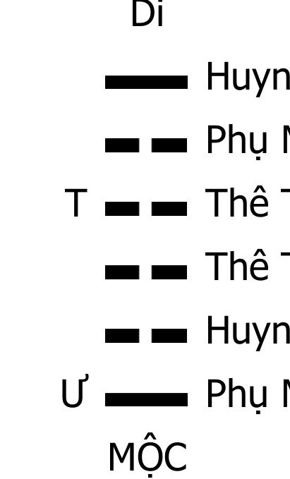

Tài gặp Vượng, Suy, Mộ, Tuyệt, ắt cũng có ngày được lệnh; Thê gặp Không, Phá, 
Phục, Không, ắt phải có lúc phục hồi.

Nếu hào Tài quá vượng, sẽ đắc lợi vào tháng nhập Mộ; hào Tài hưu tù, sẽ chấn 
hưng tại thời điểm sinh vượng; hào Tài nhập Mộ, cần đợi lúc xung khai; hào Tài gặp 
Tuyệt, cần đợi lúc sinh vượng; hào Tài gặp Nguyệt phá, cần đợi khi điền thực; hào Tài 
bị khắc, đợi đến thời điểm xung mất hào khắc; hào Tài phục, đợi đến khi xuất hiện sẽ 
được giá; hào Tài gặp Tuần Không, cần đợi đến tháng xung Không, thực Không; hào 
Tài bị hợp mất, cũng phải đợi đến lúc xung khai.

### Ví dụ: Ngày Kỷ Sửu tháng Tý, xem hàng lúc nào tăng giá, được quẻ Quy Muội

biến Đoài:

Quy Muội
 
Đoài

Ư | Phụ Mẫu Tuất thổ | Phụ Mẫu Mùi thổ Câu Trần

Huynh ĐệThân kim | Huynh ĐệDậu kim Chu Tước

Quan QuỷNgọ hỏa Tử-Hợi | Tử Tôn | Hợi thủy Thanh Long

T | Phụ Mẫu Sửu thổ | Phụ Mẫu Sửu thổ Huyền Vũ

Thê Tài | Mão mộc | Thê Tài | Mão mộc Bạch Hổ

Quan QuỷTị | hỏa | Quan QuỷTị | hỏa Đằng Xà

KIM 
Không Vong: Ngọ, Mùi

Đoán rằng: Hào Tài Mão mộc được Nguyệt kiến Tý thủy tương sinh, là Tài có gốc 
rễ. Hàng hóa trước mắt chưa được giá, vì bị Thân kim động khắc chế, cần đợi đến 
tháng Dần xung mất Thân kim, giá sẽ tăng. Quả nhiên sau đến tháng Dần giá hàng 
tăng mạnh. Như vậy, nếu hào Tài bị khắc, cần phải đợi đến tháng xung mất hào khắc.

Lại ví dụ: Ngày Mậu Thân tháng Tị, xem thu mua giấy Đài Liên có lợi không, 
được quẻ Phục biến Di:

Phục
 
Di

Tử Tôn | Dậu kim | Quan QuỷDần mộc Chu Tước

Thê Tài | Hợi thủy | Thê Tài | Tý | thủy Thanh Long

Ư | Huynh ĐệSửu thổ | Huynh ĐệTuất thổ Huyền Vũ

Huynh ĐệThìn thổ | Huynh ĐệThìn thổ Bạch Hổ

Quan QuỷDần mộc Phụ-Tị | Quan QuỷDần mộc Đằng Xà

T | Thê Tài | Tý | thủy | Thê Tài | Tý | thủy Câu Trần

THỔ
Không Vong: Dần, Mão

Đoán rằng: Hào Tài Tý thủy trì Thế, được Nhật thần Thân kim tương sinh, lại có 
hào Dậu kim động tương sinh. Nhưng hiềm vì kim, thủy gặp mùa hạ, nên Nguyên 
thần, Dụng thần đều hưu tù, đợi đến mùa thu ắt sẽ tăng giá, nên tiến hành thu mua. 
Quả nhiên lúc mua vào mỗi tập chín tiền, sau bán ra đến ba lượng sáu, ba lượng bảy. 
Như vậy, nếu hào Tài hưu tù, cần đợi đến lúc sinh vượng hãy bán ra.

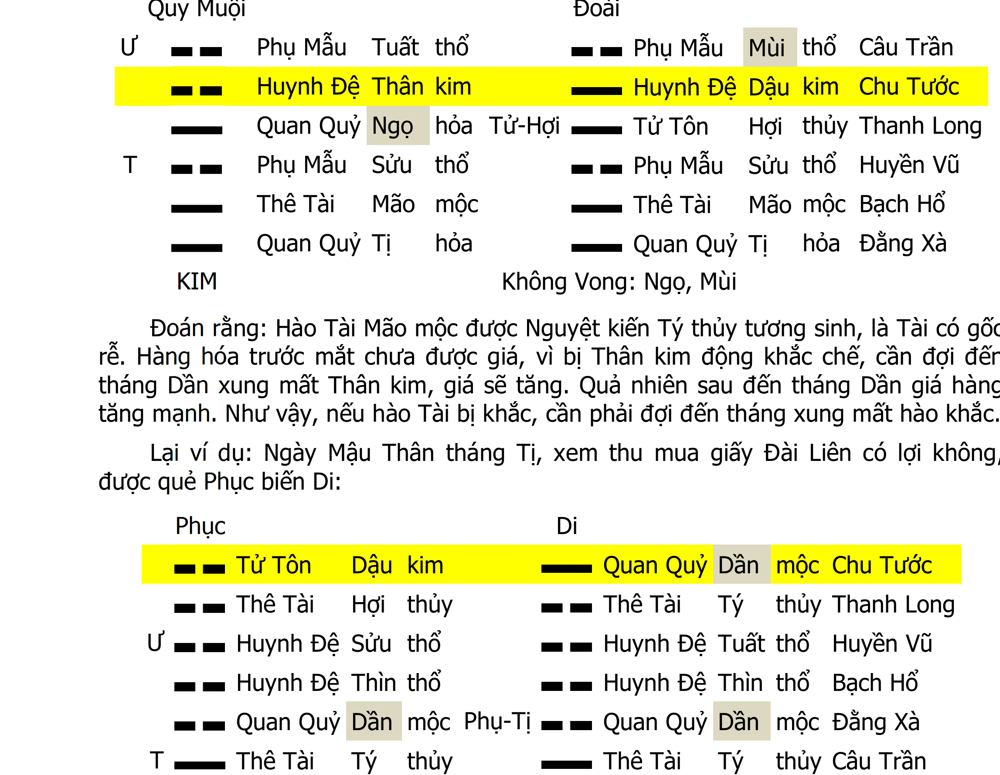

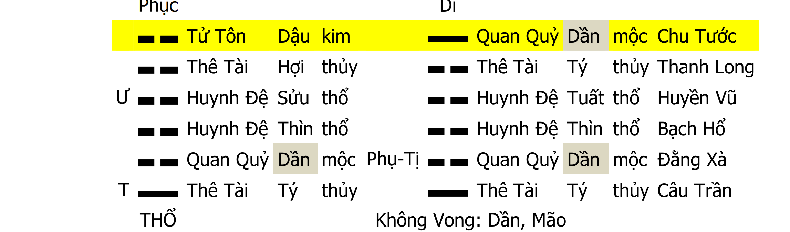

Lại ví dự: Ngày Ất Mùi tháng Mão, xem về bán hàng, được quẻ Gia Nhân biến 
Tiểu Súc:

Gia Nhân
 
Tiểu Súc

Huynh ĐệMão mộc | Huynh ĐệMão mộc Huyền Vũ

Ư | Tử Tôn | Tị | hỏa | Tử Tôn | Tị | hỏa Bạch Hổ

Thê Tài | Mùi thổ | Thê Tài | Mùi thổ Đằng Xà

Phụ Mẫu Hợi thủy Quan-Dậu | Thê Tài | Thìn thổ Câu Trần

T | Thê Tài | Sửu thổ | Huynh ĐệDần mộc Chu Tước

Huynh ĐệMão mộc | Phụ Mẫu Tý thủy Thanh Long

MỘC 
Không Vong: Thìn, Tị

Đoán rằng: Hào Tài Sửu thổ trì Thế, bị Nguyệt kiến Mão tương khắc, Nhật thần 
Mùi xung tán, lại hóa Dần mộc hồi đầu khắc, không những hào Tài bị khắc, mà hào 
Thế cũng bị xung. Đến tháng sáu hào Thế lâm Nguyệt phá, không những phá sản, mà 
còn phải đề phòng bất trắc. Sau quả đến tháng sáu gặp hỏa hoạn, hàng hóa bị thiêu 
trụi, bản thân cũng bị bỏng nặng, sau bảy ngày thì chết.

Giác Tử bàn rằng: Trong hai quẻ Quy Muội và Tiểu Súc, các hào Tài đều bị khắc. 
Trong quẻ trước, hào Tài Mão mộc được Nguyệt kiến Tý thủy tương sinh, nên là có 
gốc, gặp tháng Dần xung mất hào khắc sẽ đắc tài. Còn tại quẻ này, hào Tài Sửu thổ 
không được sinh phò, nên là không gốc, bởi vậy, của và người đều mất. Nên cần xem 
xét cho kỹ, không thể nói chung chung là bị khắc cần đợi đến tháng xung mất hào 
khắc sẽ nên vượng.

Tài phùng hợp nhi đương ngộ;

Tài gặp hợp thì được giá;

Gặp hợp, sẽ ứng vào tháng hào động gặp hợp sẽ được giá. Hoặc nếu hào Tài suy 
tĩnh, nhưng được Nhật thần, Nguyệt kiến sinh hợp, là giá đang được thời.

### Ví dụ: Ngày Kỷ Dậu tháng Dần, xem xuất hàng ra vào lúc nào, được quẻ Bí:

Bí

Quan QuỷDần mộc | Câu Trần

Thê Tài | Tý | thủy | Chu Tước

Ư | Huynh ĐệTuất thổ | Thanh Long

Thê Tài | Hợi thủy Tử-Thân Huyền Vũ

Huynh ĐệSửu thổ Phụ-NgọBạch Hổ

T | Quan QuỷMão mộc | Đằng Xà

THỔ
Không Vong: Dần, Mão

Đoán rằng: Hào Tài Hợi thủy, được Nhật thần Dậu tương sinh, được Nguyệt kiến 
Dần tương hợp, nên hiện tại đang là lúc được giá. Nhưng vì hào Thế ám động, nên

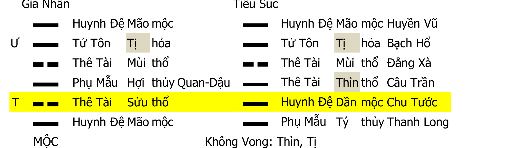

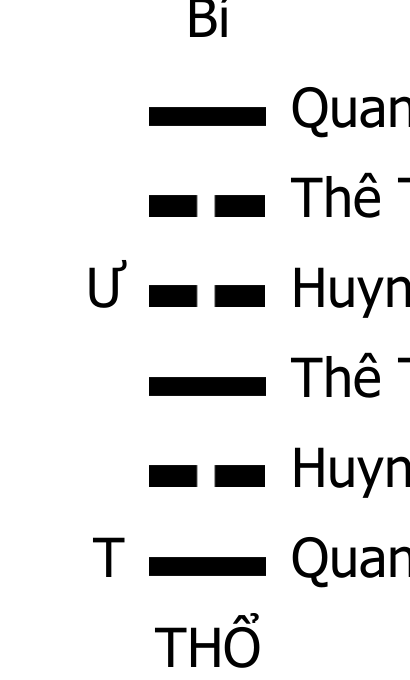

---

# CHƯƠNG 80. NƠI XUẤT HÀNG

phải xuất hành mới có thể bán ra. Người xem bèn nói: "Tôi nghe nói ở vùng nọ đang 
được giá, đang muốn chở hàng đi bán, không biết có được không?" Ta bèn đáp: 
"Tượng quẻ đã rõ ràng, nên mau chóng lên đường." Quả nhiên người này chở hàng 
đi, mấy hôm sau bán được giá cao. Trường hợp này chính là gặp quẻ Lục hợp, hào 
Tài được Nguyệt kiến tương hợp, nên xuất hàng ngay.

Tài phùng xung nhi đương khởi.

Tài gặp xung ắt giá lên.

Hào Tài vượng mà tĩnh, hoặc vượng mà gặp Không, bị Nhật thần của ngày xem 
tương xung, thì giá hàng sẽ lên dần.

Nếu hào Tài tĩnh mà hưu tù, bị Nhật thần xung mà thành Phá, thì không đoán 
như vậy.

***

# CHƯƠNG 80: NƠI XUẤT HÀNG

Nội Tài suy nhi ngoại Tài vượng, nghi vãng tha hương.

Quẻ nội Tài suy, quẻ ngoại Tài vượng, nên đến quê người.

Nếu quẻ ngoại có hào Tài vượng, sinh hợp hào Thế hoặc trì Thế, nên đi nơi khác 
xuất hàng. Nếu hào Tài không sinh hợp hào Thế, hoặc Thế động hóa hung, thì thị 
trường nơi khác có sôi nổi đến đâu cũng không có phần của mình.

Ứng Tài ngoại nhi Thế Tài nội, tu tra động tĩnh.

Ngoại Tài lâm Ứng, nội Tài lâm Thế, cần xem động tĩnh.

Hào Tài lâm Ứng tại quẻ ngoại, thì hào Tài trì Thế nên ở quẻ nội, khi đó hào Ứng 
nên động để sinh hợp hào Thế. Nếu không tuy hào Ứng Tài có vượng cũng không 
giúp ích được cho mình.

Lục xung tu nghi biệt đồ; Lục hợp hoàn nghi tọa thủ.

Lục xung nên tìm cách khác; Lục hợp vẫn phải đợi chờ.

Gặp quẻ Lục xung, tuy nên đổi sang cách khác, nhưng theo chiêm nghiệm của 
ta, nếu hào Tài vượng, thì không cần thay đổi. Nếu hào Tài suy, có đổi cũng vô ích.

**Dã Hạc bàn rằng:** Nếu gặp quẻ này, nên bảo người xem lại, hỏi xem nếu thay đổi 
sẽ ra sao. Nếu được quẻ mới có hào Tài, hào Thế đều vượng, thì nên đổi. Nếu vẫn là 
suy, nên kiên nhẫn chờ đợi.

Nếu gặp quẻ Lục hợp, vẫn cần phải xem hào Tài suy hay vượng. Nếu hào Tài 
động trì Thế, không nên ngồi đợi. Hào Tài suy mà tĩnh, nên đợi đến lúc vượng.

Tài suy biến vượng, tiên khúc hậu thân; Tài vượng biến suy, tiên kim 
hậu thổ.

Tài suy biến vượng, trước thấp sau cao; Tài vượng biến suy, trước đắt sau rẻ.

---

# CHƯƠNG 81. TÌM NƠI BUÔN BÁN / CHƯƠNG 82. CHỦNG LOẠI HÀNG HÓA

Câu này nói về hào Tài động mà biến. Nếu Tài suy biến vượng, trước mắt tuy giá 
rẻ, nhưng về sau chắc chắn sẽ lên. Hào Tài vượng mà biến suy biến tuyệt, có hàng 
nên nhanh chóng bán đi, định thu mua nên dừng ngay lại.

***

# CHƯƠNG 81: TÌM NƠI BUÔN BÁN

Trong sách xưa có nói về phương pháp suy đoán này, nhưng ta xem thử nhiều 
lần không thấy ứng nghiệm, bởi vậy, nên chỉ định từng phương để hỏi.

### Ví dụ: Ngày Mậu Tý tháng Ngọ, xem xuống phía nam mua đậu, được quẻ Lâm:

Lâm

Tử Tôn | Dậu | Kim | Chu Tước

Ư | Thê Tài | Hợi | Thủy | Thanh Long

Huynh Đệ | Sửu Thổ | Huyền Vũ

Huynh Đệ | Sửu Thổ | Bạch Hổ

T | Quan Quỷ | Mão | Mộc | Đằng Xà

Phụ Mẫu | Tị | Hỏa | Câu Trần

THỔ
Không Vong: Ngọ, Mùi

Đoán rằng: Hào Tài Hợi thủy tại quẻ ngoại mà hưu tù, nên giá đậu ở phương 
nam sẽ rẻ. Nhật thần Tý thủy sinh Thế, chủ về lời lãi lớn, nên đi. Nhưng hiềm vì hào 
gián Huynh Đệ được Nguyệt kiến tương hợp, phải tốn kém nhiều. Sau vì người trung 
gian gây khó dễ, khỏi kiện quan, phải lưu lại cả tháng, tiêu phí mất một khoản tiền. 
May thay khi về đến nơi, giá đậu lên cao, nên lãi lớn. Đó chính là phương pháp chỉ rõ 
từng nơi mà xem, sẽ ứng nghiệm.

***

# CHƯƠNG 82: CHỦNG LOẠI HÀNG HOÁ

Sách xưa cho rằng, hào Tài thuộc kim tượng trưng cho vàng bạc, châu báu; hào 
Tài thuộc thủy tượng trưng cho tôm cá, muối; hào Tài thuộc hỏa tượng trưng cho đồ 
gốm sứ; hào Tài thuộc mộc tượng trưng cho hoa quả; hào Tài thuộc thổ tượng trưng 
cho ngũ cốc.

Thanh Long lợi cho mộc và các đồ vật dùng cho ngày vui, lễ mừng; Bạch Hổ lợi | cho kim, cùng các đồ vật dùng trong ma chay, giết mổ; Huyền Vũ lợi cho thủy, Chu | Tước lợi cho hỏa; Đằng Xà lợi cho việc xuất nhập hàng; Câu Trần lợi cho công, nông.

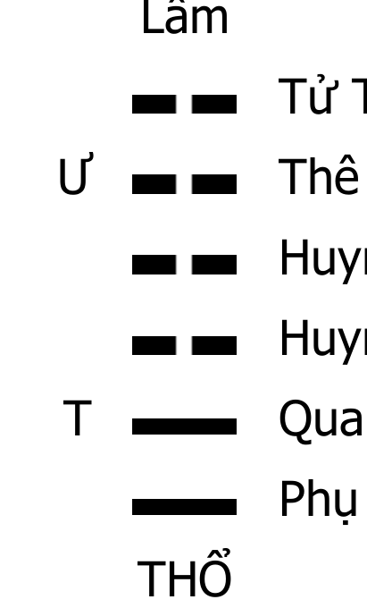

**Dã Hạc bàn rằng:** Lý luận trên là sự áp đặt ngũ hành khiên cưỡng, không phải là 
đúc rút qua kinh nghiệm. Ta thử nhiều lần thấy không ứng nghiệm, nếu thi thoảng có 
ứng nghiệm, chỉ là trùng hợp ngẫu nhiên mà thôi, không thể coi là khuôn phép, cần 
phải xem bản thân muốn kinh doanh loại hàng hóa nào, chỉ rõ ra để hỏi, như vậy mới 
ứng nghiệm.

### Ví dụ: Vào ngày Mậu Thân tháng Mùi, xem xuống Việt Đông thăm người thân,

xem mang hàng gì về bán có lợi, được quẻ Lữ:

Lữ

Huynh ĐệTị | hỏa | Chu Tước

Tử Tôn | Mùi | thổ | Thanh Long

Ư | Thê Tài | Dậu | kim | Huyền Vũ

Thê Tài | Thân kim Quan-Hợi Bạch Hổ

Huynh ĐệNgọ | hỏa | Đằng Xà

T | Tử Tôn | Thìn thổ | Phụ-Mão Câu Trần

HỎA
Không Vong: Dần, Mão

Đoán rằng: Đây là quẻ Lục hợp, hào Thế hào Ứng tương sinh, nên chuyến đi này | sẽ được toại nguyện. Còn như xem nên mua loại hàng nào, ta không có cách đoán | định, nên không dám nói bừa. Nhưng đã được quẻ tốt như vậy, cho dù anh mùa đông | bán quạt, mùa hè bán chăn, cũng có lãi như thường. Sau người này mua đàn hương | và lông chim trả mang về, bán được lãi lớn. Nếu như đoán theo phép cũ, hào Tài là | Dậu kim, tức nên mua vàng bạc châu báu; Tài lâm Huyền Vũ, lại lợi về hàng thuộc | thủy như cá, muối. Vậy biết theo đường nào?

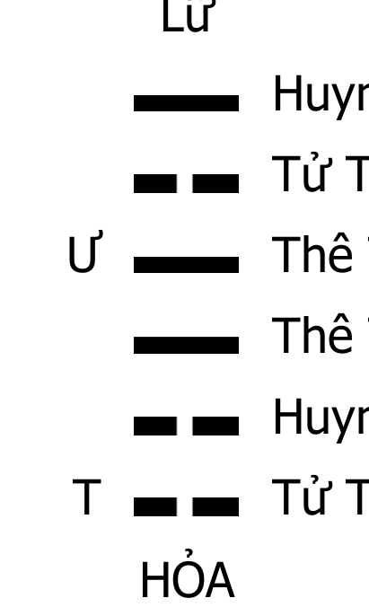

---

# CHƯƠNG 83: VAY MƯỢN

Thế gặp Huynh, đâu cần mở miệng; Ứng Không Phá, khó được hài lòng.

Tài nếu Phá Không đừng hy vọng; Tử Tài đều động hãy trông mong.

Thế Ứng hai hào, không nên gặp Nguyệt phá Tuần Không; một hào Huynh Đệ, 
không được trì Thế phát động.

### Ví dụ: Ngày Đinh Mão tháng Mùi, xem về vay mượn, được quẻ Đoài biến Chấn:

Đoài 
 
Chấn

T | Phụ Mẫu | Mùi thổ | Phụ Mẫu | Tuất thổ | Thanh Long

Huynh Đệ | Dậu | kim | Huynh Đệ | Thân | kim | Huyền Vũ

Tử Tôn | Hợi | thủy | Quan Quỷ | Ngọ | hỏa | Bạch Hổ

Ư | Phụ Mẫu | Sửu thổ | Phụ Mẫu | Thìn | thổ | Đằng Xà

Thê Tài | Mão | mộc | Thê Tài | Dần | mộc | Câu Trần

Quan Quỷ | Tị | hỏa | Tử Tôn | Tý | thủy | Chu Tước

KIM 
Không Vong: Tuất, Hợi

Đoán rằng: Quẻ Đoài thuộc kim, biến quẻ Chấn thuộc mộc, kim khắc mộc Tài. 
Hào Tài Mão mộc hóa Thoái thần, hào Huynh Dậu kim cũng hóa Thoái thần, may nhờ 
hào Tài lâm Nhật thần, vượng mà không bị thoái. Hôm sau là ngày Thìn, hợp mất hào 
Dậu, ắt sẽ vay được. Quả nhiên đến hôm sau thì vay được tiền. Đó là do hào Huynh 
Dậu kim bị Nhật thần hợp mất, không thể khắc được hào Tài.

***

# CHƯƠNG 84: CHO VAY

Huynh lâm Thế, có vay không trả; Ứng tại Huynh, có nợ khó đòi.

Ứng tại Quỷ khắc thân, phòng kẻ phụ nghĩa; Ứng lâm Tài sinh Thế, ắt gặp người 
ngay.

Sách xưa cho rằng hào Thế, hào Ứng cùng là Huỳnh Đệ, cho vay ắt mất cả gốc 
lẫn lãi. Nhưng không chỉ hào Thế lâm Huynh Đệ là không nên, mà hào Ứng tại Huynh 
Đệ cũng không tốt. Hào Quan Quỷ khắc Thế, thì ý tốt sẽ thành ý xấu.

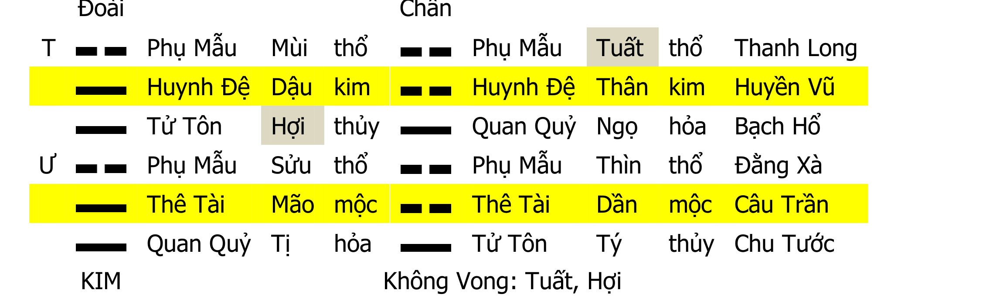

---

# CHƯƠNG 85: MUA BÁN GIA SÚC

Sơn dã thú cầm, tu tầm Phúc đức; gia súc ngưu khuyển, diệc khán Tử 
Tôn.

Chim thú hoang dã, cần xem Phúc đức; gia súc gia cầm, cũng xét Tử Tôn.

Bất kể động vật mua bán là vật hoang hay gia cầm gia súc, đều lấy hào Tử Tôn 
làm Dụng thần, đồng thời cũng phải xem hào Tài. Nếu hào Tài trì Thế, được hào Tử 
Tôn động tương sinh, hoặc Nhật thần, Nguyệt kiến tương sinh tương trợ, hoặc hào Tài 
động hóa Tử Tôn, đều là điềm tốt, dù là mua bán hay chăn nuôi, càng nhiều càng tốt, 
sẽ được lợi lớn.

Hào Tử Tôn trì Thế, hoặc hào Tài hợp Thế, cũng có lợi ích. Nhưng kỵ Quan Quỷ 
biến Tử Tôn, Tử Tôn biến Quỷ; hoặc Phụ biến Tử, Tử biến Phụ; hoặc Huynh Đệ trì 
Thế, hào Tài Không, Phá, đều không nên thực hiện.

### Ví dụ: Ngày Đinh Mão tháng Sửu, xem về việc mua ngựa đem bán xuống phía

nam, được quẻ Đỉnh biến Đại Hữu:

Đỉnh
 
Đại Hữu

Huynh ĐệTị | hỏa | Huynh ĐệTị | hỏa Thanh Long

Ư | Tử Tôn | Mùi thổ | Tử Tôn | Mùi thổ Huyền Vũ

Thê Tài | Dậu kim | Thê Tài | Dậu kim Bạch Hổ

Thê Tài | Dậu kim | Tử Tôn | Thìn thổ Đằng Xà

T | Quan QuỷHợi thủy | Phụ Mẫu | Dần mộc Câu Trần

Tử Tôn | Sửu thổ Phụ-Mão | Quan QuỷTý | thủy Chu Tước

HỎA
Không Vong: Tuất, Hợi

Đoán rằng: Hào Tử Tôn tại quẻ nội tuy lâm Nguyệt kiến, nhưng hiềm vì động mà 
hóa Quỷ. Hào Mùi thổ Tử Tôn tại quẻ ngoại lại gặp Nguyệt phá, nên mua sẽ bất lợi. 
May được hào gián Tài Dậu ám động sinh Thế, nên ngựa mua về tuy chết khá nhiều, 
nhưng không đến nỗi thua lỗ lớn. Sau quả nhiên mua về hơn bảy mươi con ngựa, trên 
đường xuống phía nam ngựa chết rất nhiều, chỉ còn hai mươi tám con sống sót. 
Nhưng vẫn bán được giá, không đến nỗi lỗ vốn.

***

# CHƯƠNG 86: ĐẤU TÀI, ĐẤU SỨC

Phàm xem về các việc tranh đua tài năng, sức lực, đều phải chú trọng đến hai 
hào Thế, Ứng. Nếu như thi đấu nhằm mục đích lấy tiền thưởng, lại phải xem thêm 
hàò Tài. Nếu hào Thế lâm Nhật thần, Nguyệt kiến, hào Tài được Nhật Nguyệt tương 
sinh tương trợ, hoặc hào Thế động hóa cát, hào Ứng lâm Tài mà sinh Thế, đều là

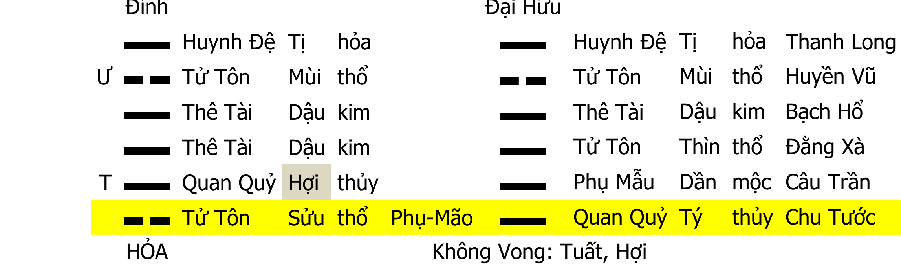

---

# CHƯƠNG 87. XIN HỤI

mình thắng. Nếu ngược lại, là người khác thắng. Nếu hào Huynh động trong quẻ, là 
điềm phá tài. Nếu trong quẻ có hào Quỷ khắc Thế, là điềm gặp tai họa.

Còn nếu xem về các việc chọi gà, chọi chim..., thì coi trọng hào Tử Tôn, nếu Tử 
Tôn vượng là bên mình sẽ thắng; nếu Tử Tôn hưu tù Không Phá, hoặc bị Hình, Xung, 
Khắc, Hại, hoặc hào Phụ Mẫu động trong quẻ, là phía mình bị tổn thương.

### Ví dụ: Ngày Mậu Thân tháng Tị, xem về chọi chim cút, được quẻ Tiệm biến Tốn:

Tiệm
 
Tốn

Ư | Quan QuỷMão mộc | Quan QuỷMão mộc Chu Tước

Phụ Mẫu | Tị | hỏa Tài-Tý | Phụ Mẫu | Tị | hỏa Thanh Long

Huynh ĐệMùi | thổ | Huynh ĐệMùi thổ Huyền Vũ

T | Tử Tôn | Thân kim | Tử Tôn | Dậu kim Bạch Hổ

Phụ Mẫu | Ngọ hỏa | Thê Tài | Hợi thủy Đằng Xà

Huynh ĐệThìn thổ | Huynh ĐệSửu thổ Câu Trần

THỔ
Không Vong: Dần, Mão

Đoán rằng: Hào Tử Tôn trì Thế, lâm Nhật thần, hào Phụ Mẫu tuy động, nhưng đã 
bị Hợi thủy khắc chế. Nhưng hiềm vì Hợi gặp Nguyệt phá, nên khó mà khắc chế được 
Tị hỏa. Bởi vậy, không nên chọi chim vào giờ Tị, giờ Ngọ (thuộc Hoả) trong ngày. Quả 
nhiên, chọi chim vào buổi sáng thì thắng, đến giờ Ngọ chọi tiếp, thì thua to mà lỗ vốn.

***

# CHƯƠNG 87: XIN HỤI

Xin hụi nên Tài vượng, càng nên Thế Ứng tương sinh. Quẻ gặp lục xung, Tài tuy 
vượng nhưng tiền của cũng không ở lâu. Lục xung biến hợp, Thế Ứng tương khắc 
cũng thành. Lục hợp biến xung, có đầu không cuối. Tài gặp Tuyệt Phá, nên nhanh 
chóng dừng lại.

Xem gieo xúc xắc được không, vượng Tài trì Thế tất được. Nếu xem lúc nào 
được, hào Tài Phá hoặc Không, thì sẽ được vào ngày điền thực. Nếu hào Tài phục 
tàng, sẽ được vào ngày xuất hiện. Nếu hào Tài quá vượng, sẽ được vào ngày nhập 
Mộ. Nếu hào Tài gặp Suy Tuyệt, sẽ được vào ngày sinh vượng. Nếu gặp Tài hóa hồi 
đầu khắc, hoặc suy tĩnh mà gặp Không Phá, lại gặp quẻ Lục xung, là điềm "vỡ", cuối 
cùng không có ngày được hụi.

**Tân bình thích:** Tương đương với tiền hỗ trợ thời nay, hiện tại Đài Loan vẫn tồn 
tại hội hỗ trợ. Tức là mọi người nộp một khoản tiền nhất định vào hội, tiền này do hội 
trưởng quản lý, sau đó cung cấp cho người cần sử dụng. Nếu như có nhiều người cần 
thì gieo con xúc xắc để quyết định. Bỏ thầu, xin tiền vốn thời nay đều có thể tham 
khảo cách dự đoán này.

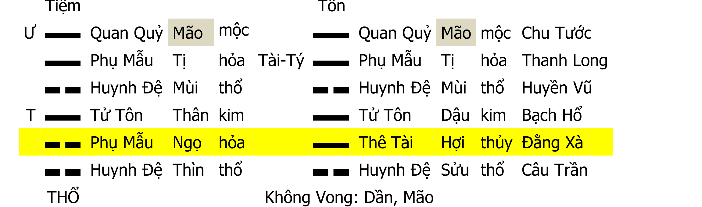

---

# CHƯƠNG 88: HÀNH HIỂM CẦU TÀI

**Tân bình thích:** Cướp đoạt, trộm cắp, lừa gạt, tham ô đều thuộc loại cầu tài 
này. Phàm hỏi của phi nghĩa, quái sư nên từ chối dự đoán, hoặc khuyên người đó làm 
điều thiện.

### Ví dụ: Ngày Canh Thân tháng Hợi, nam đoán đến hướng Tây Nam cầu tài ra sao?

Được Lâm biến Tỷ.

Lâm 
 
Tỷ

Tử Tôn | Dậu | kim | Thê Tài | Tý | thủy | Đằng Xà

Ư | Thê Tài | Hợi | thủy | Huynh Đệ | Tuất thổ | Câu Trần

Huynh Đệ | Sửu thổ | Tử Tôn | Thân | kim | Chu Tước

Huynh Đệ | Sửu thổ | Quan Quỷ | Mão | mộc | Thanh Long

T | Quan Quỷ | Mão | mộc | Phụ Mẫu | Tị | hỏa | Huyền Vũ

Phụ Mẫu | Tị | hỏa | Huynh Đệ | Mùi | thổ | Bạch Hổ

THỔ
Không Vong: Tý, Sửu

Tài vượng sinh Thế tuy chủ có thể được, nhưng không nên đi. Thế động hóa | Phá, lại cách sơn hóa hào, tùy Quỷ nhập Mộ. Nghịch cách, chính là trái với đạo trời mà | đi, Quan Quỷ lâm Huyền Vũ trì Thế, hành vi tất không quang minh, huống hồ Tây | Nam lại là Mộ địa của hào Thế, lần cầu tài này có tai họa lao ngục. Người này không | nghe, tháng Tý bởi vì cướp tiền của mà vào tù.

***

# CHƯƠNG 89: HÔN NHÂN

Giác Tử bàn rằng: Nhà trai xem về người nữ, thì bất kể là cha mẹ, hay người 
thân, bạn bè xem hộ, đều lấy hào Tài làm Dụng thần. Nhà gái xem về người nam, đều 
lấy hào Quan làm Dụng thần. Nếu như Quan được sinh phò, hào Tài vượng tướng, thì 
hôn sự sẽ thành. Nay thấy các sách thời xưa đều cho rằng, hào Tài vượng sẽ thương 
khắc cha mẹ, thực Không hiểu Tài vượng là tốt hay không vượng mới tốt.

Có người lại hỏi: Trong "Hoàng kim sách" có viết rằng: "Cha mẹ chồng bất hòa, 
vì hào Thê động"; sách "Hải để nhãn" lại viết: "Hào Tài động, song thân mất"; sách 
"Dịch mạo" cũng có câu: "Thê Tài động, cha mẹ đôi đường"; tức đều cho rằng hào 
Thê Tài động sẽ tổn thương đến cha mẹ, chứ không nói Tài vượng sẽ ra sao.

Ta cho rằng: Tài động sẽ tổn thương đến Phụ Mẫu, Tài vượng lẽ nào lại không 
tổn thương? Ví dụ mùa xuân xem quẻ, mà hào Tài thuộc mộc, thì cho rằng người nữ 
mệnh vượng, nên có thể lấy làm vợ. Nhưng hào Phụ Mẫu đương nhiên thuộc thổ, khi 
đó hào Tài đắc lệnh đương quyền chắc chắn sẽ thương khắc hào Phụ Mẫu hưu tù, chứ 
đâu phải chỉ động mới khắc. Nói như thế là không hiểu được rằng, người xưa nói

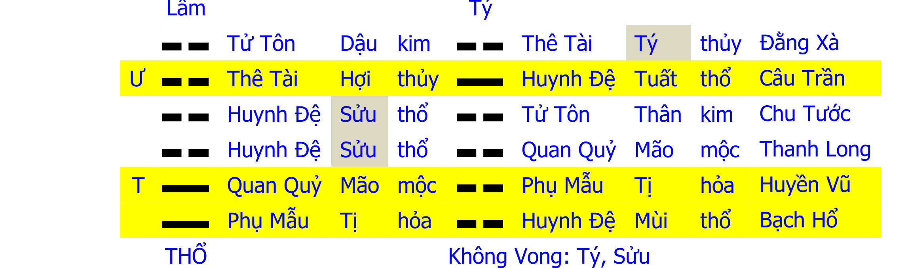 động, mà không nói vượng, là sợ người đời sau bài bác, nên tránh không nói vượng, 
mà bất đắc dĩ phải nói là động, nhưng không ngờ lại bị nhìn ra.

Có người lại hỏi: "Nếu nói như ông, thì lấy gì làm tiêu chuẩn?" Ta đáp: "Nên chia 
ra để xem. Quẻ đầu tiên xem cô dâu hoặc chú rể, nếu được Tài hoặc Quan vượng 
tướng là quẻ tốt. Sau đó xem tiếp xem có khắc cha mẹ không."

"Hoàng kim sách" chuyên dùng hào Ứng để xem về vợ. Sách "Dịch mạo" cũng 
cho rằng hào Ứng chỉ vợ, nếu vượng tướng, tức người nữ hiền lương, phúc hậu. Lại 
coi hào Ứng chỉ cha mẹ người nữ; nếu hào Ứng vượng tướng, tức gia đình người nữ 
giàu sang; nếu hưu tù, tức gia đình người nữ bần hàn. Nếu căn cứ theo đó, thì những 
phụ nữ hiền lương phúc hậu đều xuất thân từ gia đình phú quý hay sao? Những lý 
luận sai lầm như thế, không hiểu sao hàng trăm hàng nghìn năm nay vẫn không có ai 
phát hiện ra.

Nam bốc nữ nhân, Tài yếu vượng; nữ chiêm nam phối, Quỷ nghi hưng.

Trai xem lấy vợ Tài nên vượng; nữ bói chọn chồng Quỷ cần hưng.

Người bên nhà trai xem thay về người nữ, cần lấy hào Tài làm Dụng thần, dùng 
hào Ứng chỉ gia cảnh nhà gái. Hào Tài nên vượng tướng, hoặc động mà hóa cát. Hào 
Ứng không nên Không, Phá, hoặc khắc hào Thế.

Người bên nhà gái xem thay về người nam, chuyên dùng hào Quan làm Dụng 
thần, dùng Ứng chỉ gia thế nhà trai. Hào Quan nên vượng tướng, hoặc động mà hóa 
cát; hào Ứng không nên Không, Phá, Mộ, Tuyệt, hoặc khắc hào Thế.

Người nam tự xem về vợ, cũng dùng hào Tài làm Dụng thần, lấy hào Ứng chỉ 
người nữ. Hai hào Tài và Ứng nên sinh Thế, hợp Thế hoặc trì Thế, kỵ gặp Không, Phá, 
Mộ, Tuyệt. Nếu Tài vượng sinh Thế mà Ứng lâm Không, Phá, cũng nên lấy làm vợ. 
Nếu hào Ứng sinh Thế, mà hào Tài Phá, Tuyệt thì không nên lấy.

**Dã Hạc bàn rằng:** Nếu hào Tài, hào Ứng cùng sinh hợp Thế lại càng tốt. Đại để 
hào Tài là trọng yếu, hào Ứng chỉ là bổ trợ mà thôi. "Hoàng kim sách" viết rằng: "Ứng 
là người vợ trăm năm", tức coi trọng Ứng mà không coi trọng Tài, như vậy là sai lầm.

### Ví dụ: Ngày Kỷ Mùi tháng Mùi năm Tý, xem hôn nhân, được Minh Di biến Phong:

Minh Di
 
Phong

Phụ Mẫu Dậu kim | Quan QuỷTuất thổ Câu Trần

Huynh ĐệHợi thủy | Phụ Mẫu Thân kim Chu Tước

T | Quan QuỷSửu thổ | Thê Tài | Ngọ hỏa Thanh Long

Huynh ĐệHợi thủy Tài-Ngọ | Huynh ĐệHợi | thủy Huyền Vũ

Quan QuỷSửu thổ | Quan QuỷSửu thổ Bạch Hổ

Ư | Tử Tôn | Mão mộc | Tử Tôn | Mão mộc Đằng Xà

Hào Thế lâm Quan Quỷ, bị Nhật xung Nguyệt phá, may nhờ động hóa Tài hồi 
đầu sinh, nên trước mắt tuy phá, nên rồi cũng sẽ có lúc không bị phá. Sang năm sau 
là năm Sửu, sẽ gặp lương duyên. Quả nhiên đến tháng tư năm Sửu gặp duyên lành,

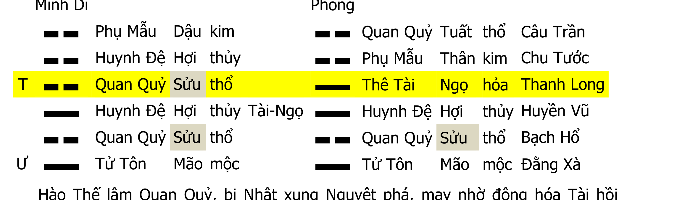 ứng vào năm Sửu, vì là năm thực Phá của hào Thế. Đây chẳng phải là hào Tài sinh 
Thế, hào Ứng khắc Thế hay sao.

### Ví dụ: Ngày Quý Dậu tháng Tý, tự xem về hôn nhân, được quẻ Hằng biến Đỉnh:

Hằng
 
Đỉnh

Ư | Thê Tài | Tuất thổ | Tử Tôn | Tị | hỏa Bạch Hổ

Quan QuỷThân kim | Thê Tài | Mùi thổ Đằng Xà

Tử Tôn | Ngọ hỏa | Quan QuỷDậu kim Câu Trần

T | Quan QuỷDậu kim | Quan QuỷDậu kim Chu Tước

Phụ Mẫu Hợi | thủy Huynh-Dần | Phụ Mẫu Hợi thủy Thanh Long

Thê Tài | Sửu thổ | Thê Tài | Sửu thổ Huyền Vũ

MỘC
Không Vong: Tuất, Hợi

Đoán rằng: Quan tinh Dậu kim trì Thế, được hào Tài Tuất thổ động mà tương 
sinh, lại được Thế Ứng tương sinh, Tuất thổ tuy gặp Tuần Không, nhưng động nên 
không bị Không, đến hôm sau (ngày Tuất) xuất Không, cầu hôn ắt thành.

Quả nhiên đến giờ Tị hôm sau hôn sự được chấp thuận, vợ chồng chung sống 
đến bạc đầu, con đàn cháu đống.

### Ví dụ: Ngày Bính Ngọ tháng Dần, người nhà gái xem thay về hôn nhân, được quẻ

Lâm biến Ký Tế:

Lâm 
 
Ký Tế

Tử Tôn | Dậu | kim | Thê Tài | Tý | thủy | Thanh Long

Ư | Thê Tài | Hợi | thủy | Huynh Đệ | Tuất thổ | Huyền Vũ

Huynh Đệ | Sửu thổ | Tử Tôn | Thân | kim | Bạch Hổ

Huynh Đệ | Sửu thổ | Thê Tài | Hợi | thủy | Đằng Xà

T | Quan Quỷ | Mão | mộc | Huynh Đệ | Sửu | thổ | Câu Trần

Phụ Mẫu | Tị | hỏa | Quan Quỷ | Mão | mộc Chu Tước

THỔ
Không Vong: Dần, Mão

Giác Tử bàn rằng: Nhà gái xem về con rể, lấy hào Quan làm Dụng thần, lấy hào 
Ứng chỉ nhà trai, đó là phép xem trong sách xưa, là cứng nhắc không thông biến. Khi 
đoán quẻ, cần phải hết sức linh hoạt, vì không phải mọi quẻ đều hiển hiện dễ thấy. 
Như quẻ này, nhà gái xem về con rể, được Quan Mão mộc vượng trì Thế, nên hôn sự 
sẽ thành. Nhưng hào Ứng bị khắc, lại có nghĩa nhà trai không ưng thuận. Như vậy cần 
phải quyết đoán ra sao? Nên biết rằng hào Tài là quan trọng, còn hào Thế, hào Ứng 
chỉ là thứ yếu, tuy là nhà gái xem người nam, thì hào Tài cũng không nên bị thất hãm. 
Quẻ này có liên quan đến cả người nam và người nữ. Hào Tài động gặp hồi đầu khắc, 
lại bị hào động Sửu thổ khắc, nên không thể sinh được Quan tinh Mão mộc, nên nam 
nữ không thể tương hợp tương sinh, hôn sự tuy thành, nhưng về sau sẽ có biến. Sau

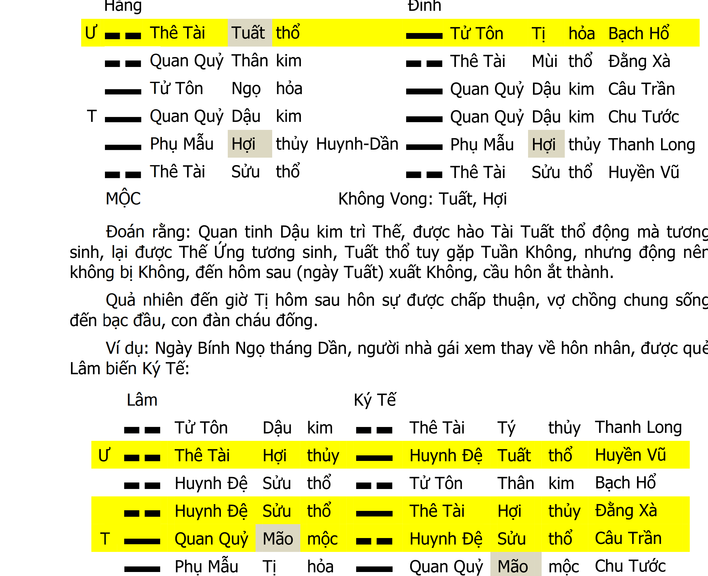

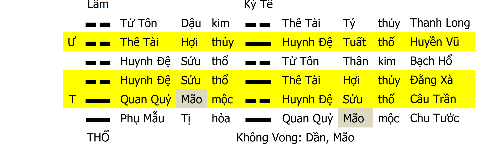 quả nhiên sính lễ đã định, chưa kịp thành hôn thì đến tháng tư, bị giặc cướp bắt đi. 
Ứng với tháng Tị, vì là tháng Hợi thủy gặp Nguyệt phá.

**Tân bình thích:** Đây là chỗ người mới học rất dễ đoán sai. Xem hôn nhân rất 
cần Dụng thần vượng tướng, không nên Không Phá, cũng không nên Nguyên thần bị 
hào động khắc thương. Quẻ này Quan Quỷ mặc dù trì Thế, được Nguyệt tỉ phù, 
nhưng không nên Không Vong, Nguyên thần lại bị hào biến khắc thương, gian hào 
phát động khắc Nguyên thần, trì Thế là được, Không Vong là mất, chính là tượng 
được nhưng lại mất. Gian hào động, tất ở giữa có người phá hoại, hoặc có biến cố. 
Nhà gái xem, phải lấy Tử Tôn là con nhà gái, Tử Tôn Tuyệt ở Nguyệt kiến Quan Quỷ, 
Nhật khắc, lại nhập Mộ ở gian hào Huynh Đệ, là tượng con nhà gái tất bị người trung 
gian cướp đi, Quan Quỷ là giặc cướp, Huynh Đệ là cái kiếp tài, tháng Tị chính là tháng 
Tử Tôn bị khắc, cho nên mới có phát sinh chuyện này. Không thể lấy Tài là con của 
nhà gái.

### Ví dụ: Ngày Mậu Thìn tháng Tý, nữ đoán hôn nhân con gái, được Tổn biến Lâm.

Tổn 
 
Lâm

Ư | Quan QuỷDần mộc | Tử Tôn | Dậu kim Chu Tước

Thê Tài | Tý | thủy | Thê Tài | Hợi thủy Thanh Long

Huynh ĐệTuất thổ | Huynh ĐệSửu thổ | Huyền Vũ

T | Huynh ĐệSửu thổ | Tử-Thân | Huynh ĐệSửu thổ | Bạch Hổ

Quan QuỷMão | mộc | Quan QuỷMão mộc Đằng Xà

Phụ Mẫu | Tị | hỏa | Phụ Mẫu | Tị | hỏa Câu Trần

THỔ
Không Vong: Tuất, Hợi

Quan Quỷ lưỡng hiện, lấy hào lâm Ứng phát động làm Dụng. Quan Quỷ động mà 
khắc Thế, nhà gái xin đoán, Thế là nhà gái, con rể đối xử với con gái không tốt, hóa 
hồi đầu khắc, dương chủ quá khứ, tất chủ đã ly dị. Hào Thế lại là người xin đoán, Tử 
Tôn phục dưới Thế, Tử Tôn là con gái của người xin đoán, Thế là Mộ khố của Tử Tôn, 
chính là quản lý con gái rất chặt, hôn nhân là do cưỡng ép. Quả nhiên ứng nghiệm.

Tài trị hưu tù phá tán, chung phi cử án chi duyên. Quan phùng Suy Mộ 
Tuyệt Không, nan toại tề mi chi nguyện.

Tài gặp hưu tù, phá tán, ắt rằng chẳng phải lương duyên. Quan gặp Suy, Mộ, 
Tuyệt, Không, khó mong vợ chồng hòa thuận.

Hào Tài và hào Quan không nên gặp Mộ, Tuyệt, Không, Phá, cũng không nên 
động hóa Phá, hóa Tán, hóa Khắc, hóa Quỷ, vì là mệnh chết yểu, nghèo hèn. Nếu là 
nhà trai xem về người nữ, hào Tài không nên phạm phải những trường hợp trên; nếu 
là nhà gái xem về người nam, hào Quan không nên phạm phải những trường hợp 
trên. Nếu là nam, nữ tự xem, thì hào Thế không nên phạm phải những trường hợp 
trên. Nếu miễn cưỡng thành hôn, sẽ bất hòa, chia cách.

Thế hào Không Vong, động hóa Thoái, chung tu thất vọng.

Hào Thế lâm Không, động hóa Thoái thần, chỉ là thất vọng.

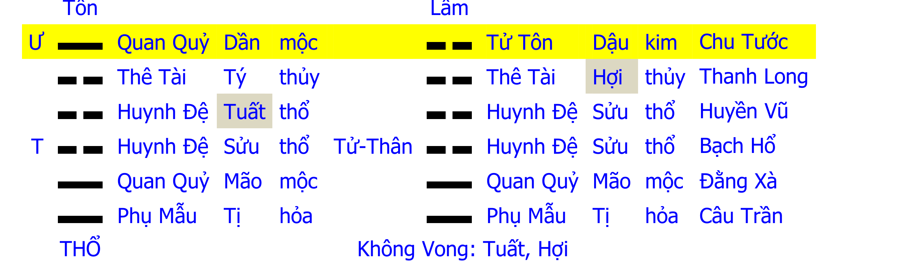

Động mà lâm Không, đợi đến ngày, tháng thực Không, hôn sự sẽ thành. Tĩnh mà 
lâm Không, là điềm hôn nhân không thành. Thế động hóa Tiến, cũng chủ hôn sự 
thành công; nếu hóa Thoái thần, hôn sự khó nên. Nếu hào Ứng tĩnh mà Không Phá, 
hoặc hóa Thoái thần, cũng tương tự như vậy.

**Tân bình thích:** Cần phải xem Thế là lục thân gì, nam đoán hôn nhân, Huynh 
Đệ trì Thế hóa Tiến thần thì không thành. Nữ đoán hôn nhân, Tử Tôn trì Thế hóa Tiến 
thần thì không thành.

Ứng hào Tuần Không, Tài hóa Tiến, túc hữu lương duyên.

Hào Ứng lâm Không, Tài hóa Tiến thần, đẹp mối lương duyên.

Hào Ứng lâm Không, chỉ đối phương không thực. Nếu động hóa Thoái thần, tức 
đối phương có ý thoái thác. Nếu được hào Tài động hóa Tiến thần sinh Thế, tuy gặp 
thoái thác, nhưng sau hôn sự vẫn thành. Nếu Thế Ứng động mà gặp Phá, sẽ ứng vào 
lúc thực Phá.

**Tân bình thích:** Đã hủy hôn, nếu Dụng thần động mà hóa Tiến thì không thành, 
nếu hóa thoái thì trái lại có thể thành. Vợ chồng cãi nhau ở riêng hoặc ly dị muốn tái 
kết hôn, thì cũng là như vậy. Hóa Tiến khó quay lại, hóa Thoái vẫn có thể gương vỡ 
lại lành.

Thế Ứng giai Không đa phí lực, Phản ngâm đa biến sự nan thành.

Thế Ứng đều Không thường phí sức, Phản ngâm đa biến việc khó thành.

Nếu hào Thế, hào Ứng đều lâm Không, thì sự việc khó được thành tựu. Nếu gặp 
quẻ Phản ngâm, hôn sự cũng tráo trở khó thành.

**Dã Hạc bàn rằng:** Nếu gặp Không mà vượng, Tài Quỷ lại tương sinh, tuy trước bị 
từ chối, nhưng về sau hôn sự vẫn thành.

### Ví dụ: Ngày Mậu Tý tháng Tị, xem hôn sự có được ưng thuận không, được quẻ

Hằng biến Tấn:

Hằng
 
Tấn

Ư | Thê Tài | Tuất thổ | Tử Tôn | Tị | hỏa Chu Tước

Quan QuỷThân kim | Thê Tài | Mùi thổ Thanh Long

Tử Tôn | Ngọ hỏa | Quan QuỷDậu kim Huyền Vũ

T | Quan QuỷDậu kim | Huynh ĐệMão mộc Bạch Hổ

Phụ Mẫu Hợi | thủy Huynh-Dần | Tử Tôn | Tị | hỏa Đằng Xà

Thê Tài | Sửu thổ | Thê Tài | Mùi thổ Câu Trần

MỘC
Không Vong: Ngọ, Mùi

Đoán rằng: Quẻ nội Phản ngâm, nên hôn sự tráo trở, đa biến, lúc ưng thuận lúc 
lại thoái thác. Người xem bèn nói: "Đúng là như vậy! Không biết sau này ra sao?" Ta 
đáp rằng: "Hào Ứng lâm Tài, động mà sinh Thế, đến tháng tám tháng chín, hôn sự sẽ 
thành."

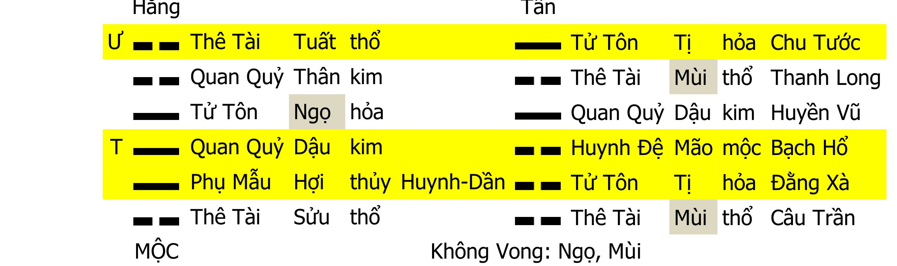

Quả nhiên tháng Dậu thì thành, ứng với tháng Dậu, vì là tháng trực của hào Thế, 
lại xung mất Mão mộc.

Nam chiêm hề, Huynh động quái trung phi phối ngẫu;

Người nam xem, Huynh động trong quẻ, không phải đôi lứa.

Hào Huynh trì Thế, hoặc hào Huynh phát động, sẽ thương khắc, ngăn trở Thê 
Tài, nên hôn nhân khó thành. Nếu hôn sự đã thành mà gặp quẻ này, ắt khó tránh 
hình thương.

Giác Tử bàn rằng: Theo chiêm nghiệm của ta, nếu hào Huynh trì Thế, hào Tài 
hợp Thế thì hôn sự sẽ thành. Nếu hào Huynh trì Thế, hóa thành hào Tài, cũng thành.

Nữ bốc hề, Quan hào trì Thế thị lương duyên.

Người nữ xem, được Quan trì Thế là mối duyên lành.

Bên nữ xem về người nam, kỵ gặp Tử Tôn trì Thế, Tử Tôn phát động, vì Tử Tôn 
là thần khắc phu, nên chủ về hôn sự không thành; nếu đã thành hôn, chủ về sát phu, 
tái giá. Nếu được Quan tinh vượng tướng trì Thế, hợp Thế, sinh Thế, không những 
hôn sự thành, mà còn là điềm vợ chồng hòa hợp. Nếu Quan tinh hiện nhiều trong 
quẻ, cũng chủ về tái giá.

**Tân bình thích:** Quan Quỷ hiện nhiều đôi khi cũng chủ có ngoại tình. Tử Tôn trì 
Thế bị hào lâm Nhật Nguyệt Quan Quỷ xung phá, cũng chủ thành, là tượng bị đàn 
ông phá trinh.

Tài Quan Thế Ứng xung hình, phu thê phản mục.

Tài, Quan, Thế, Ứng hình xung, phu thê trở mặt.

### Ví dụ: Ngày Ất Hợi tháng Tị, xem vợ chồng hiện đang bất hòa, về sau có hòa

thuận không, được quẻ Nhu biến Đại Quá:

Nhu 
 
Đại Quá

Thê Tài | Tý | thủy | Huynh ĐệMùi thổ | Huyền Vũ

Huynh ĐệTuất thổ | Tử Tôn | Dậu kim Bạch Hổ

T | Tử Tôn | Thân kim | Thê Tài | Hợi thủy Đằng Xà

Huynh ĐệThìn thổ | Tử Tôn | Dậu kim Câu Trần

Quan QuỷDần | mộc Phụ-Tị | Thê Tài | Hợi thủy Chu Tước

Ư | Thê Tài | Tý | thủy | Huynh ĐệSửu thổ | Thanh Long

THỔ
Không Vong: Thân, Dậu

Đoán rằng: Vợ xem về chồng, kỵ gặp Tử Tôn trì Thế, vì là tượng khắc chồng. 
May được Quan Quỷ Dần mộc và Thê Tài Tý thủy tương sinh, không thể tổn thương, 
nên thành bất hòa. Nay xem thêm hào Ứng chỉ chồng, Ứng gặp Sửu là tương hợp, 
chủ về chồng có nhân tình. Thủy, mộc tương sinh, nên hai người tình ý rất sâu nặng.

Người xem bèn nói: "Đúng là như vậy! Sau này sẽ ra sao?" Ta đáp: "Vợ chồng 
chị vốn chẳng phải nhân duyên, tuy không tử biệt, nhưng phải sinh ly."

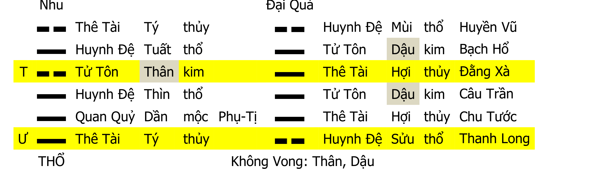

Quả nhiên đến tháng Dần năm sau, người này bị chồng bỏ, đến tháng Mùi thì 
chồng lấy người đàn bà nọ. Ứng với tháng Dần vì Quan lâm Dần xung Thế; lại ứng với 
tháng Mùi, vì Mùi thổ xung khai hào sơ Sửu thổ, nên Tý thủy tương sinh cho Dần mộc.

**Tân bình thích:** Quan Quỷ là chồng, Quan Quỷ hợp Nhật, Nhật là Tài tinh, chính 
là thông tin chồng có ngoại tình, Ứng là người khác, Ứng ở trên Tài tinh là một người 
nữ khác, động mà sinh Quan Quỷ, cũng là có người nữ yêu thích chồng cô ta. Tháng 
Dần bị chồng bỏ, là bởi vì Tử Tôn động mà gặp Không, tháng Dần xung thực Tử Tôn, 
Quan Quỷ bị khắc. Tháng 6 là Mùi, Ứng ở trên Tài Tý động mà hóa hợp, tháng này 
xung khai, Tý thủy có thể sinh Quan, người nữ khác của được chồng của cô ta.

Vượng tướng hào phùng Lục hợp, bỉ thử đồng tâm.

Hào vượng gặp quẻ Lục hợp, vợ chồng đồng lòng.

Nếu xem về hôn nhân nên gặp được quẻ Lục hợp, nếu lại được Tài Quan vượng 
tướng lại càng tốt. Nam kỵ gặp Tài hào bị Phá, nhập Mộ; nữ kỵ gặp hào Quan bị khắc, 
gặp Tuyệt. Gặp quẻ Lục xung biến Lục hợp cũng tốt, vì nếu xem về cầu hôn, chủ 
trước không thuận, sau được thành; nếu xem về đã thành hôn, chủ về vợ chồng trước 
bất hòa sau hòa thuận.

Nhưng kỵ gặp quẻ Lục xung, nếu không có Tài Quan vượng tướng, thì hôn sự 
không thành, nếu miễn cưỡng thành hôn, thì không tử biệt cũng sinh ly. Nếu gặp quẻ 
Lục hợp biến Lục xung, chủ về trước ưng thuận sau đổi ý; nếu đã thành hôn, về sau 
cũng phải phân ly.

### Ví dụ: Ngày Canh Thân tháng Tuất, do cưới vợ của người khác, bị người chồng

quay về thưa kiện, xem liệu có phải chia lìa không, được quẻ Khốn biến Đoài:

Khốn
 
Đoài

Phụ Mẫu | Mùi | thổ | Phụ Mẫu | Mùi thổ | Đằng Xà

Huynh Đệ | Dậu kim | Huynh Đệ | Dậu | kim | Câu Trần

Ư | Tử Tôn | Hợi | thủy | Tử Tôn | Hợi | thủy | Chu Tước

Quan Quỷ | Ngọ hỏa | Phụ Mẫu | Sửu thổ | Thanh Long

Phụ Mẫu | Thìn | thổ | Thê Tài | Mão | mộc | Huyền Vũ

T | Thê Tài | Dần mộc | Quan Quỷ | Tị | hỏa | Bạch Hổ

KIM 
Không Vong: Tý, Sửu

Đoán rằng: Hào Tài trì Thế, chủ về nhân duyên tốt đẹp. Nhưng mộc gặp tháng 
tám nên hưu tù vô khí, bị Nhật thần xung tán, lại thêm gặp quẻ Lục hợp biến Lục 
xung, không những phải chia lìa, mà còn đề phòng bị phạt tội.

Người xem hỏi rằng: Tôi bị kiện tội gian dâm, không biết sẽ ra sao? Ta đáp: Hào 
Thế, hào biến và Nhật thần tạo thành Tam hình, nên ông và người đàn bà kia đều khó 
tránh bị phạt trượng.

Sau quả nhiên bị khép tội gian dâm vợ người, nam nữ đều bị phạt trượng, xử cho 
ly dị.

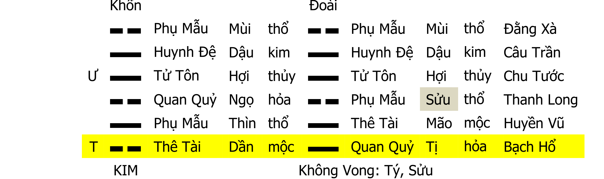

Cổ dụng Hàm, Lâm, Tiết, Thái; kỵ phùng Khuê, Cách, Giải, Ly.

Xưa thích Hàm, Lâm, Tiết, Thái; kỵ gặp Khuê, Cách, Giải, Ly.

Giác Tử nói rằng: Sách "Dịch mạo” có câu: Quẻ được Hàm, Lâm, Tiết, Thái, mà 
không gặp hợp biến xung, tuy Tài Quan suy hãm, hoặc theo Quỷ nhập Mộ, hoặc giúp 
Quỷ thương thân, đều không hung. Còn gặp quẻ Khuê, Cách, Giải, Ly đều là điềm 
hung, dẫu Dụng thần trọn vẹn mà sinh hợp cũng không tốt. Tức ý nói Dụng thần 
không thắng được quẻ, điều này cần phải chiêm nghiệm lại.

### Ví dụ: Ngày Đinh Mão tháng Tị, xem khi nào kết hôn, được quẻ Thái:

Thái

Ư

Tử Tôn | Dậu | kim | Thanh Long

Thê Tài | Hợi | thủy | Huyền Vũ

Huynh ĐệSửu thổ | Bạch Hổ

T

Huynh ĐệThìn thổ | Đằng Xà

Quan QuỷDần | mộc Phụ-TịCâu Trần

Thê Tài | Tý | thủy | Chu Tước

THỔ
Không Vong: Tuất, Hợi

Ta thấy quẻ này Tử Tôn trì Thế, hào Tài Hợi thủy gặp Nguyệt phá, Tuần Không, 
hào Tài Tý thủy bị hào Thế tương khắc, bị Nhật thần tương hình, nếu theo phép xem 
xưa cho rằng gặp quẻ Thái là tốt, nhưng ta đâu dám đem chuyện chung thân đại sự 
của người ta ra thử nghiệm, nên bảo người này xem lại, được quẻ Khôn:

Khôn

T | Tử Tôn | Dậu kim Thanh Long

Thê Tài | Hợi thủy Huyền Vũ

Huynh ĐệSửu thổ | Bạch Hổ

Ư | Quan QuỷMão mộc Đằng Xà

Phụ Mẫu | Tị | hỏa Câu Trần

Huynh ĐệMùi thổ | Chu Tước

THỔ
Không Vong: Tuất, Hợi

Hào Thế hưu tù, lại gặp Nhật phá, hào Tài Hợi thủy gặp Nguyệt phá, lại là quẻ 
Lục xung, nên là điềm đại hung. Cho nên suy ra rằng quẻ trước tuy là quẻ Thái nhưng 
không phải là tốt, nên đoán quẻ vẫn phải nhìn vào Tài, Quan, Thế, Ứng, thế nhưng 
điều này vẫn không phải đúng trong mọi trường hợp. Nếu có điều ngờ vực, không nên 
rập khuôn theo phép cũ, mà nên xem lại để quyết đoán. Nếu quẻ sau tốt thì đoán là 
tốt, quẻ sau hung thì đoán là hung. Thần không lừa người, hiện ở cả hai quẻ, sẽ 
không sai lầm.

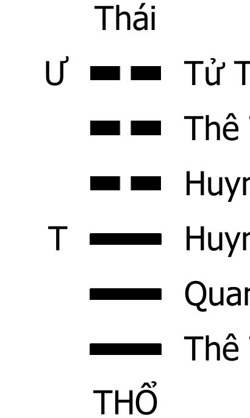

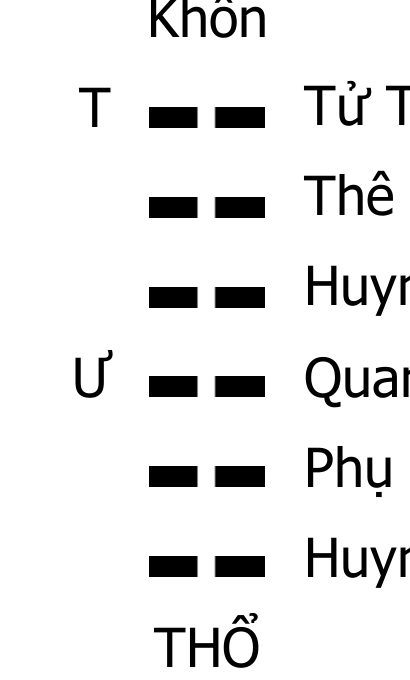

Tài hóa Tài, vị tất hôn nhân lưỡng độ; Quỷ hóa Quỷ, nan viết tương thủ 
bách niên.

Tài hóa Tài, chưa hẳn kết hôn hai bận; Quỷ hóa Quỷ, khó mà chung sống trăm 
năm.

"Hoàng kim sách" có viết: "Hào Tài hiện nhiều, đám cưới hai lần". Ta thử nghiệm 
nhiều lần, thấy rằng nhà trai xem về người nữ, nếu trong quẻ có nhiều hào Tài lại 
vượng tướng, sinh hợp hào Thế, là chủ vợ hiền, thiếp đẹp. Nếu Tài hóa Tài, sẽ chủ về 
lấy vợ hai lần, hoặc chủ về có tỳ thiếp theo cùng, hoặc chủ về nhiều thê thiếp, hoặc 
cũng chủ về nhiều của hồi môn. Chỉ kỵ gặp hào Huynh động, hoặc Nhật Nguyệt xung 
khắc hào Tài, thì khó tránh khỏi kết hôn nhiều lần.

Nếu là nhà gái xem về người nam, gặp phải Tài hóa Tài, hoặc có nhiều hào Tài 
sinh Thế, chủ về ngựa xe đầy cửa, sính lễ ngàn vàng. Nhưng kỵ gặp Quỷ động hóa 
Quỷ, chủ về chết chồng; hoặc có nhiều hào Quỷ khắc Thế, không phải là tranh giành 
cưới gả, cũng là tráo trở, tai họa. Nếu người nam xem mà gặp phải tình trạng này, 
cũng chủ về đa biến. Nếu khắc Thế, thì nên dừng lại. Nếu là hào Thế hóa Quỷ, lại 
càng nên thôi.

Huynh lâm Huyền Vũ phòng kiếp phiến; Quỷ lâm Bạch Hổ ngộ hung | tang.

Huynh gặp Huyền Vũ phòng cướp gạt; Quỷ lâm Bạch Hổ chịu hung tang.

Hào Huynh động gặp Huyền Vũ, đề phòng người trong cuộc gian trá, lừa đảo. | Cho dù có Thế, Ứng tương sinh, Tài, Quan không bị tổn hại, cũng phải phí tổn nhiều. | Quỷ động lâm Bạch Hổ, dù chưa cưới hay mới cưới, đều gặp tang ma.

Ứng Tài Thế Quỷ, phu xướng phụ tùy; Ứng Quỷ Thế Tài, phu quyền thê 
đoạt.

Ứng ở Tài, Thế ở Quỷ, chồng nói vợ nghe; Ứng ở Quỷ, Thế ở Tài, vợ cướp quyền 
chồng.

Hào Thế gặp Quỷ, hào Ứng tại Tài, là âm dương đắc vị, chủ về vợ chồng hòa 
hợp. Hào Ứng gặp Quỷ, hào Thế gặp Tài, chủ về vợ đoạt quyền chồng, nhưng nếu ở 
rể thì lại là tốt.

---

# CHƯƠNG 90: XEM HÔN NHÂN CÓ CON CÁI

THỪA TỰ HAY KHÔNG

Nếu xem về tình hình con cái thừa tự trong hôn nhân, mà hào Tử Tôn vượng 
tướng, hoặc hưu tù nhưng động, hoặc động mà hóa cát, chủ về hôn nhân sẽ có con 
cái. Hào Tử hóa Tiến thần, hóa hồi đầu sinh, sẽ có nhiều con. Nếu hào Tử Tôn gặp 
Mộ, Tuyệt, hoặc động mà biến Quỷ, hoặc Quỷ biến Tử Tôn, hoặc Phụ hóa Tử, Tử hóa 
Phụ, Phụ động khắc Tử, đều chủ về mệnh của mình không con cái, cho dù không 
chấp nhận cuộc hôn nhân này, cũng là không con. Chỉ còn cách tích nhiều âm đức 
mới có hy vọng.

### Ví dụ: Ngày Đinh Sửu tháng Thân, do có nhiều thê thiếp, nên xem người mệnh

nào sẽ có con, được quẻ Cách biến Quải:

Cách
 
Quải

Quan QuỷMùi thổ | Quan QuỷMùi thổ | Thanh Long

Phụ Mẫu | Dậu kim | Phụ Mẫu | Dậu | kim Huyền Vũ

T

Huynh ĐệHợi thủy | Huynh ĐệHợi | thủy Bạch Hổ

Huynh ĐệHợi thủy Tài-Ngọ | Quan QuỷThìn thổ | Đằng Xà

Quan QuỷSửu thổ | Tử Tôn | Dần | mộc Câu Trần

Ư

Tử Tôn | Mão mộc | Huynh ĐệTý | thủy Chu Tước

THỦY
Không Vong: Thân, Dậu

Đoán rằng: Hào Tử Tôn Mão mộc gặp Tuyệt ở tháng Thân, hào Quỷ Sửu thổ biến 
thành Tử Tôn, mà Tử Tôn lại gặp Nguyệt phá, nên người này vốn dĩ số mệnh không 
con, không có liên quan gì đến mệnh vợ. Người này bèn đưa bát tự cho ta xem, là 
Giáp Dần, Giáp Tuất, Giáp Tý, Mậu Thìn, bèn nói rằng: Bát tự tuy tốt, là thuần dương 
bao âm, nên binh quyền hiển hách. Nhưng hiềm vì Bình Đầu sát quá nặng, Khôi 
Cương chồng chất, nên cũng chủ về không con.

Người xem bèn hỏi: "Còn có cách gì không?" Ta đáp: "Phải tích lũy âm đức!"

Người này bèn nói: "Bất hiếu có ba điều, không con là lớn nhất", từ đó tích cực 
bố thí cho người nghèo, thành toàn cho vợ chồng người, xây cầu làm đường, phát 
thuốc phát quan tài,... về sau sinh liền hai con trai. Đến lúc lâm chung có dặn con 
rằng: "Nếu không nhờ âm đức thì không có được các con. Sau này nên người, phải 
chăm tích đức".

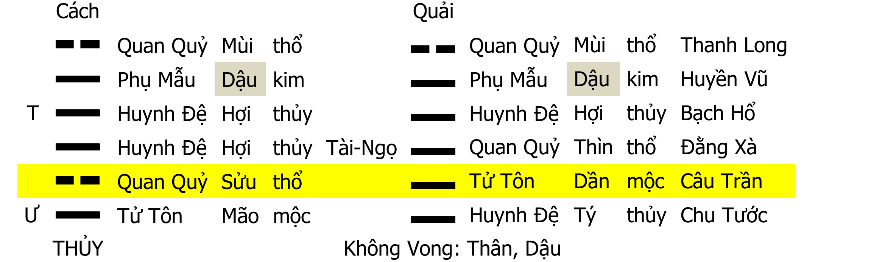

---

# CHƯƠNG 91: XEM HÔN NHÂN CÓ HỢP VỚI CHA MẸ KHÔNG

Chuyên lấy hào Phụ Mẫu làm Dụng thần, hào Phụ Mẫu là vượng hay suy đều 
không kỵ, chỉ kỵ hào Tài phát động, thì hôn sự này cần phải đề phòng. Nếu hào Tài 
động hóa Phụ Mẫu, hào Phụ Mẫu động hóa Tài, hào Quỷ hóa Phụ Mẫu, hào Phụ Mẫu 
động hóa Mộ, Tuyệt, Không, Phá, hoặc hóa hồi đầu khắc, hoặc động mà phá tán, 
hoặc Nhật Nguyệt khắc Phụ Mẫu, là tượng cha mẹ sắp hết tuổi trời, tuy không ưng 
thuận hôn sự này, cũng khó tránh khỏi.

***

# CHƯƠNG 92: LẤY VỢ LẼ

# CHƯƠNG 93: LẤY TỲ THIẾP

***

# CHƯƠNG 94: LẤY ĐÀN BÀ BỎ CHỒNG, LẤY CA KỸ

Nếu xem để giải tỏa lo âu, thì lấy Tử Tôn làm Dụng thần, nếu Tử Tôn trì Thế, 
hoặc phát động, thì không có gì phải lo lắng.

Nếu hào Tài trì Thế, được Tử động tương sinh lại càng tốt.

Nếu hào Quỷ lâm Huynh khắc Thế, nhập Mộ, hoặc hào Quỷ trì Thế, hôn nhân tuy 
thành, nhưng đi liền với tai họa.

Nếu hào Tài khắc Thế, hào Huynh trì Thế, chủ về bị người lừa gạt, tổn hại cả 
người lẫn tiền của.

Nếu xem có gặp cản trở không, mà hào Huynh động sẽ không thành; nếu hào 
Quỷ động sẽ có tai họa. Hào Huynh động trì Thế, hôn sự khó thành; Tài động tương 
sinh, không cầu cũng được.

Nếu gặp quẻ Lục xung biến xung là hung; gặp Tam hợp, Lục hợp là cát. Quẻ Lục 
hợp biến Lục xung, hôn sự thành nhưng không bền lâu; Lục xung biến Lục hợp, thì 
cuối cùng cũng thành.

Nếu là chuyện cưỡng ép thành hôn, tư tình, không theo lễ nghĩa, chớ đem hỏi 
thần linh.

**Lý Ngã Bình bàn rằng:** Sách xưa bàn về hôn nhân, không nói lên cái lý lẽ chủ 
yếu, mà phần nhiều bàn tán phù phiếm dông dài, không có bằng cứ, không hiểu các 
tiên hiền đời trước làm sao lại khiến người đời sau mê muội như thế. "Hoàng kim 
sách" có viết: "Chồng có tài năng, xem hào Quan gặp Trường Sinh; vợ nếu xấu xí, bởi 
hào Tài nhập Mộ khố, lời này còn có phần hợp lý. "Dịch mạo" căn cứ vào bát cung để 
suy đoán về dung mạo, dùng Lục thần để đoán về tính tình tài cán, là không đúng. Ví

---

# CHƯƠNG 95. THAI SẢN

dụ ngày Tuất tháng Mão gieo được quẻ Thiên Địa Bĩ, Tài vượng trì Thế, nếu dựa vào | bát cung để suy đoán dung mạo, thì quẻ này Tài thuộc cung Càn. Càn vi Thiên, nên | dung mạo đoan chính, tính tình thông minh, là hàng thục nữ phối cùng Thiên Đức. | Căn cứ vào Lục thần, thì Tài lâm Bạch Hổ, mà Hổ là bội nghịch. Hàng thục nữ phối | cùng Thiên Đức mà lại bội nghịch, là chuyện không thể. Bởi vậy, dung mạo tài tình | không cần phải xem, chẳng lẽ chưa nghe câu, đức không ở sắc đẹp hay sao.

Hôn nhân là do duyên tiền định, nếu Tài vượng Quan hưng, ắt vợ chồng hòa 
hợp. Tài Quan tương sinh tương hợp, ắt dung mạo đẹp đẽ. Nếu cát thì lấy, nếu hung 
thì bỏ. Căn cứ vào Tài, Quan, kiêm thêm Thế, Ứng mà luận đoán, như vậy là đủ! Còn 
muốn hai mệnh không nhập Mộ, Lục thân không tổn hại lẫn nhau, Phụ Mẫu, Tử Tôn 
không hưu tù, hào Tài không nên động, Quan Quỷ không nên phục, vợ chồng không 
hai lòng, âm dương không đối nghịch... tức mọi việc đều cầu toàn, nếu cầu toàn như 
vậy, không những trên đời không có người con gái thập toàn như vậy, mà trong 64 
quẻ, cũng không có quẻ nào thập toàn như thế. Lời lẽ phù phiếm chỉ là lừa đời dối 
người mà thôi.

***

# CHƯƠNG 95: THAI SẢN

Xem thai nhi có tốt không, xem về sự an nguy khi mang thai, sự lành dữ khi sinh 
nở, xem thai nhi là trai hay gái, đều phải xem riêng từng quẻ. Tự xem hay người khác 
xem hộ, đều lấy hào Tử Tôn làm Dụng thần. Chỉ có trường hợp con xem cho mẹ 
mang thai, cần lấy hào Huynh Đệ làm Dụng thần.

Phúc thần vượng tướng ngộ sinh phù, lân chủng triệu thụy; Tử Tôn hưu 
tù phùng phá tán, bào dựng không hư.

Phúc thần vượng tướng gặp sinh phù, điềm sinh quý tử; Tử Tôn hưu tù lại phá 
tán, bào thai rỗng không.

Hào Tử Tôn lâm Nhật, Nguyệt, hoặc được Nhật thần, Nguyệt kiến, hào động sinh 
phù, hoặc động mà hóa cát, đều là điềm thai nghén thành công. Nếu Tử Tôn lâm 
Không, Phá, Tán, Tuyệt, hoặc bị Hình, Xung, Khắc, Hại, hoặc động mà hóa Quỷ, hóa 
Tuyệt, hóa Phá, hoặc hào Quỷ biến Tử Tôn, Phụ biến Tử Tôn, Tử hóa Phụ, thì khác gì 
ngọn đèn trước gió, chủ về thai không giữ được.

Tử hóa Tử, song sinh hữu chuẩn;

Tử hóa Tử, song sinh điềm chuẩn.

Hào Tử động mà hóa Tử Tôn, hoặc trong quẻ có nhiều hào Tử Tôn phát động, 
hoặc đã có một hào Tử Tôn vượng tướng phát động, mà hào khác lại hóa ra hào Tử 
Tôn vượng tướng, đều chủ về song sinh. Sách "Bốc phệ nguyên quy" có viết: "Hai Tử 
cùng động, hẳn là song sinh".

Giác Tử bàn rằng: Nếu có hai hào Tử Tôn cùng động hoặc cùng vượng, thì đoán 
như vậy là đúng. Nhưng nếu trong đó có một hào suy, thì cặp song sinh một sống một chết; nếu một hào âm, một hào dương, là song sinh một nam một nữ. Nhưng 
trong đó có một hào không động, thì không đoán như vậy.

Dương biến âm, nam nữ khả biện.

Dương biến âm, trai gái dễ phân.

Sáu hào đều tĩnh, cần xem quái bao. Nếu âm bao dương, là con gái; dương bao 
âm, là con trai.

Âm bao dương, tức các quẻ Khảm, Đại Quá, Tiểu Quá, Hàm, Hằng; dương bao 
âm, tức các quẻ Ly, Trung Phu, Di, Tổn. Những quẻ còn lại đều không phải.

Sáu hào đều tĩnh, nếu không có quái bao, cần xem hào Tử Tôn. Nếu là hào 
dương sẽ sinh con trai, nếu là hào âm sẽ sinh con gái. Nếu trong quẻ có hào động, 
tuy có quái bao cũng không được dùng. Vì thần mách bảo thiên cơ ở hào động, nên 
trước hết cần xem hào động. Trong quẻ có một hào động, nếu là dương động sẽ sinh 
con gái, nếu là âm động sẽ sinh con trai. Trong quẻ có hai hào động, cần xem hào 
phía trên. Trong quẻ có ba hào động, cần xem hào ở giữa. Nếu số hào động nhiều 
hơn, tức ý niệm chưa thành khẩn, đợi ngày khác xem lại. Nếu xem lại ngay, cũng 
không ứng nghiệm.

### Ví dụ: Ngày Mậu Thìn tháng Thìn, xem mang thai con trai hay con gái, được quẻ

Tiểu Quá biến Dự:

Tiểu Quá
 
Dự

Phụ Mẫu Tuất thổ | Phụ Mẫu Tuất thổ Chu Tước

Huynh ĐệThân kim | Huynh ĐệThân kim Thanh Long

T

Quan QuỷNgọ hỏa Tử-Hợi | Quan QuỷNgọ hỏa Huyền Vũ

Huynh ĐệThân kim | Thê Tài | Mão mộc Bạch Hổ

Quan QuỷNgọ hỏa Tài-Mão | Quan QuỷTị | hỏa Đằng Xà

Ư

Phụ Mẫu Thìn thổ | Phụ Mẫu Mùi thổ Câu Trần

KIM 
Không Vong: Tuất, Hợi

Ta bèn hỏi: Ý của ông là muốn biết vợ mang thai có được bình an không, hay là 
muốn hỏi xem con trai hay con gái? Người xem đáp: Cả hai việc đều muốn hỏi. Ta 
nói: Sau này nhất định phải chia ra hai quẻ xem riêng, không được hỏi chung. May 
mà trong quẻ này, cả hai sự việc đều hiển hiện. Hào Huynh tuy động, nhưng không 
khắc hào biến Thê Tài, nên việc thai nghén của vợ ông không có điều gì đáng ngại. 
Trong quẻ hào dương động biến âm, nên sẽ sinh con gái. Người xem bèn hỏi: Tôi 
xem được quẻ Tiểu Quá là âm bao dương, tại sao lại sinh con gái? Ta bèn đáp: Thần 
mách bảo cơ trời tại quẻ động, nên phải xem trọng hào động hơn. Sau quả nhiên đến 
ngày Nhâm Thân sinh con gái, mẹ tròn con vuông.

**Tân bình thích:** Chỗ này và phần trình bày ở trên có mâu thuẫn, ở trên nói âm 
bao dương sinh nữ, quẻ này lại hỏi vặn lại là tại sao âm bao dương sinh nữ, có thể 
thấy phép này vẫn cần phải nghiên cứu.

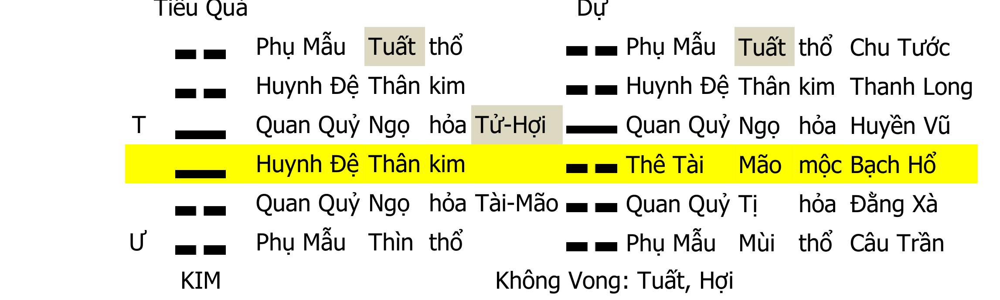

Giác Tử bàn rằng: Xem về tình hình thai sản của vợ, cùng xem sinh con trai hay 
còn gái, vốn nên chia ra để xem. Người kia hỏi cùng cả hai việc, vì vào lúc mới mang 
thai còn thong thả, nên còn có thể đoán gộp. Còn nếu đến lúc sắp sinh sắp nguy mới 
hỏi, thì không thể dùng quẻ này để suy đoán giới tính nam nữ.

### Ví dụ: Ngày Mậu Tý tháng Thìn, bà bầu tự xem về việc mang thai, được quẻ Cấn

biến Bác:

Cấn
 
Bác

T | Quan QuỷDần mộc | Quan QuỷDần mộc Chu Tước

Thê Tài | Tý | thủy | Thê Tài | Tý | thủy Thanh Long

Huynh ĐệTuất thổ | Huynh ĐệTuất thổ Huyền Vũ

Ư | Tử Tôn | Thân kim | Quan QuỷMão mộc Bạch Hổ

Phụ Mẫu | Ngọ hỏa | Phụ Mẫu | Tị | hỏa Đằng Xà

Huynh ĐệThìn thổ | Huynh ĐệMùi thổ Câu Trần

THỔ
Không Vong: Ngọ, Mùi

Người này đã đau đẻ một ngày một đêm, ta bèn đoán rằng: "Sẽ sinh vào giờ 
Thân ngày mai." Chị ta bèn hỏi: "Dựa vào đâu mà thầy biết được?" Ta đáp: "Trong 
quẻ hào Tử Tôn Thân kim độc phát. Tự xem được Quan Quỷ trì Thế, đến giờ Thân 
hôm sau, Tử Tôn sẽ xuất hiện, khắc đi Quỷ bên mình nên không còn gì đáng ngại."

Có người hỏị rằng: "Tại sao không phải là giờ Thân hôm nay?" Ta bèn giải thích: 
"Hôm nay là ngày Tý, xung động Ngọ hỏa khắc kim, nên hôm nay không sinh được. 
Lại hỏi là con trai hay con gái, ta đáp: Quẻ này làm sao định được là trai hay gái. 
Thần căn cứ vào ý niệm của người xem mà cho quẻ, xem việc gì ứng với việc nấy. 
Nếu như hỏi vào lúc bình thường vô sự, ắt sẽ có ý niệm về trai hay gái. Lúc này tính 
mệnh sản phụ ngàn cân treo sợi tóc, nên chỉ muốn sinh sản thuận lợi bảo tồn mạng 
sống mà thôi. Nên thần chỉ mách bảo về thời điểm sinh nở, chứ không mách bảo là 
trai hay gái."

Sau quả nhiên đến giờ Thân hôm sau sinh con trai. Nếu như cho rằng trong quẻ 
hào dương động biến âm mà đoán là con gái, thì thật không hiểu gì về Dịch lý.

**Tân bình thích:** Quẻ cần phán đoán linh hoạt, nếu dựa vào lý luận trước kia của 
Dã Hạc thì Tử Tôn hóa Quỷ trăm con không sống được một, ví dụ này vì sao lại có thể 
được sống? Bởi vì là sinh khó, đầy bụng lo lắng mà xin đoán, vì thế mừng được Tử 
Tôn phát động, Tử Tôn này không phải là Tử Tôn sinh đẻ, mà chính là Tử Tôn vui vẻ.

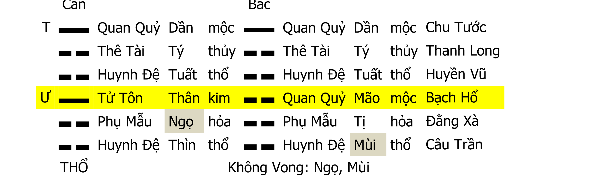

---

# CHƯƠNG 96: XEM VỀ SỰ AN NGUY CỦA SẢN PHỤ

Tọa thảo lâm bồn hiềm Quỷ động; thai tiền sản hậu kỵ Huynh dao. Tài 
lâm Tuyệt Phá thê nan bảo; Quỷ hóa Thê Tài mệnh bất lao.

Lâm bồn sinh nở kỵ Quỷ động; mang thai sinh sản kỵ Huynh hưng. Tài gặp 
Tuyệt, Phá vợ khó sống; Quỷ hóa Thê Tài mệnh không dài.

Xem về sự an nguy của sản phụ, chồng hay người khác xem hộ đều lấy hào Thê 
Tài làm Dụng thần. Tuy kỵ Quỷ động, nhưng nếu trong quẻ có Huynh động khắc Tài, 
lại nên có Quỷ động để chế phục hào Huynh. Kỵ gặp Tài biến Quỷ, Quỷ biến Tài, 
Huynh biến Tài, Tài biến Huynh, hoặc Thê gặp Nguyệt phá, hưu tù, Mộ Tuyệt, hóa Mộ 
hóa Tuyệt, hoặc bị Nhật Nguyệt xung khắc, đều là điềm dữ.

Giác Tử bàn rằng: Hỏi về bào thai và hỏi về sản phụ, tuy nên chia ra để xem, 
nhưng thường chưa cần chia ra để xem, việc đã hiện lên trong quẻ, nên cần lưu ý.

### Ví dụ: Ngày Ất Hợi tháng Tý, xem vợ thai sản có bình an không, được quẻ Phong

biến Tiểu Quá:

Phong
 
Tiểu Quá

Quan Quỷ | Tuất thổ | Quan Quỷ | Tuất thổ Huyền Vũ

T

Phụ Mẫu | Thân | kim | Phụ Mẫu | Thân | kim | Bạch Hổ

Thê Tài | Ngọ | hỏa | Thê Tài | Ngọ | hỏa | Đằng Xà

Huynh Đệ | Hợi | thủy | Phụ Mẫu | Thân | kim | Câu Trần

Ư

Quan Quỷ | Sửu | thổ | Thê Tài | Ngọ | hỏa | Chu Tước

Tử Tôn | Mão | mộc | Quan Quỷ | Thìn | thổ Thanh Long

THỦY 
Không Vong: Thân, Dậu

Đoán rằng: Hào Thê Tài Ngọ hỏa gặp Nguyệt phá, lại bị Nhật thần Hợi tương 
khắc, Ngọ hỏa vào mùa đông hưu tù, lại bị khắc phá, hoàn toàn không được sinh phù, 
nên mạng sống khó giữ. Người xem hỏi: "Hào Tử Tôn Mão mộc động mà sinh hỏa, 
sao lại nói là không được sinh phù?" Ta đáp: "Mão mộc Tử Tôn động mà biến Quỷ, 
tức ý thần linh muốn nói, cả mẹ và con đều khó toàn mạng, chứ không phải là Mão 
mộc sinh Ngọ hỏa. Nên người đoán quẻ phải biết nắm bắt ý của thần linh." Người này 
lại hỏi: "Hào Tài tuy không vượng, nhưng hào Tử Tôn Mão mộc được ngày Hợi tháng 
Tý tương sinh, tại sao con tôi lại không sống được?" Ta đáp: "Tử Tôn đã biến Quỷ, 
cho dù lâm Nhật thần Nguyệt kiến, cũng là vô ích."

Quái đắc Lục xung, Tử vượng Tài cường chung thị hỷ; hào phùng Lục 
hợp, Tài Không Tử Phá diệc vi ưu.

Quẻ gặp Lục xung, Tử vượng Tài cường vẫn là tốt; hào gặp Lục hợp, Tài Không 
Tử Phá cũng là hung.

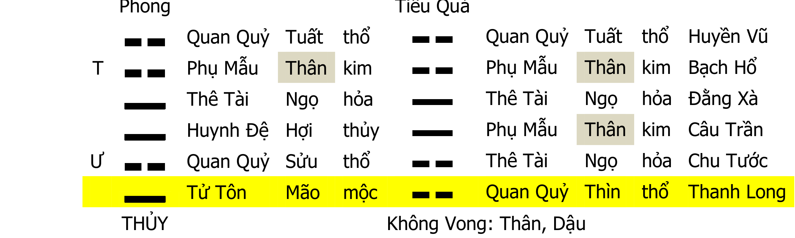

---

# CHƯƠNG 97: THỜI ĐIỂM SINH NỞ

Xa thì ứng vào tháng, gần thì ứng vào ngày.

Tử Tôn phát động, đợi khi gặp hợp gặp trực;

Tử Tôn yên tĩnh, đợi khi gặp trực gặp xung.

Tử Tôn Không Vong, đợi lúc xung Không, thực Không;

Tử Tôn Nguyệt phá, đợi khi thực Phá, gặp hợp.

Bạch Hổ lâm Huynh mà động, ngày trực sẽ sinh;

Tử Tôn gặp Tuyệt, cần đợi đến ngày sinh vượng.

Tử Tôn gặp Trường Sinh, cần đợi ngày thai, ngày dưỡng.

Tử Tôn tàng phục, đợi ngày xuất hiện sẽ sinh.

***

# CHƯƠNG 98: XUẤT HÀNH

Con người nhiều khi vì danh vì lợi mà phải rong ruổi đường xa, nguy hiểm khó 
lường. Nên khi xem về xuất hành, trước hết cần xem hào Thế, nếu vượng tướng thì 
nên đi. Hào Ứng nếu Không Vong, không nên xuất hành.

Hào Thế tượng trưng cho người xuất hành, nếu sinh vượng, hữu khí là tốt. Nếu 
động mà hóa cát, hoặc hóa Tử Tôn, lại càng tốt. Còn nếu hưu tù Không Phá, hoặc 
động hóa hung, là dữ, không nên đi.

Ứng tượng trưng cho nơi đến, cũng tượng trưng cho người cần nhờ cậy, nếu 
Không, Phá, Mộ, Tuyệt, hoặc động mà hóa Quỷ, hóa Tuyệt, hóa hồi đầu khắc, có đi 
cũng vô ích.

Thế thương Ứng vị, bất câu viễn cận tương nghi. Ứng khắc Thế hào, 
công tư giai chủ bất lợi.

Thế thương hào Ứng, gần xa đều rất nên đi; Ứng khắc hào Thế, công tư đều chủ 
bất lợi.

Thế khắc Ứng, là ta khắc người, nên đi đâu cũng thuận lợi.

Ứng hình, xung, khắc Thế, thì không nên xuất hành.

Bát thuần loạn động, đáo xứ giai hung; lưỡng gián tề Không, độc hành 
tắc cát.

Quẻ Bát thuần động loạn, đi mọi nẻo đều hung; hai hào gián đều Không, đi một 
mình sẽ tốt.

Nếu gặp quẻ Lục xung, hoặc động mà biến xung, hào Thế hưu tù bị khắc, thì 
không thể đi được, là điềm hữu thủy vô chung, có đi cũng vô ích.

Trong quẻ xuất hiện hào gián, tượng trưng cho người đồng hành. Nếu hào gián 
động mà khắc Thế, ắt sẽ bị người đồng hành hãm hại. Nếu động mà lâm Huynh, là 
chủ về tán tài của mình. Nếu sinh hợp Thế là tốt. Nếu hai hào gián đều Không, chẳng 
phải là nửa đường cản trở, ắt là đi một mình.

Tĩnh ngộ Nhật xung tất khứ; động phùng hợp trụ nhi lưu.

Tĩnh bị Nhật xung sẽ ra đi; động gặp hợp lại phải nấn ná.

Nếu hào Thế ám động, chắc chắn sẽ đi. Nếu hào Thế vượng mà tĩnh, đợi đến 
ngày xung sẽ lên đường. Nếu hào Thế động mà hóa hợp, hoặc bị Nhật, Nguyệt, hào 
động hợp, ắt sẽ gặp sự cố mà phải nấn ná, không thể lên đường.

Giác Tử bàn rằng: Theo chiêm nghiệm của ta, gặp hợp nhiều khi đợi đến ngày 
xung khai sẽ lên đường.

**Tân bình thích:** Câu này rất đúng.

### Ví dụ: Ngày Kỷ Sửu tháng Hợi, bạn tôi hỏi cha mẹ đến Hải Nam du lịch cát hung

ra sao? Được Sơn Lôi Di biến Khôn Vi Địa.

Di 
 
Khôn

Huynh ĐệDần mộc | Quan QuỷDậu kim Câu Trần

Phụ Mẫu Tý | thủy Tử-Tị | Phụ Mẫu Hợi thủy Chu Tước

T | Thê Tài | Tuất thổ | Thê Tài | Sửu thổ Thanh Long

Thê Tài | Thìn thổ Quan-Dậu | Huynh ĐệMão mộc Huyền Vũ

Huynh ĐệDần mộc | Tử Tôn | Tị | hỏa Bạch Hổ

Ư | Phụ Mẫu Tý | thủy | Thê Tài | Mùi thổ Đằng Xà

MỘC
Không Vong: Ngọ, Mùi

Tôi thấy Phụ Mẫu bị Nhật thần hợp trú, đoán là có thể không đi được. Kết quả là 
bởi vì có việc mà không đi.

Quan Quỷ giao trùng tai họa trọng;

Quan Quỷ cùng động nhiều tai vạ;

Hào Quỷ lâm Huyền Vũ mà động, cần đề phòng giặc cướp. Hào Quỷ lâm Chu | Tước mà động, cần đề phòng kiện tụng thị phi. Hào Quỷ lâm Bạch Hổ, đề phòng tật | bệnh triền miên. Hào Quỷ lâm Đằng Xà, đề phòng gặp nạn vì gian nan hiểm trở. Hào | Quỷ lâm Câu Trần mà động, cần đề phòng gặp sự việc liên lụy. Hào Quỷ động gặp | Thanh Long, cần đề phòng chuyện cờ bạc trai gái. Hào Quỷ động tại cung Chấn, Càn, | đề phòng tai nạn do xe, ngựa. Hào Quỷ động tại cung Đoài, Khảm, đề phòng tai nạn | do sóng gió. Hào Quỷ tại Khôn, Cấn, đề phòng gặp nạn nơi núi sâu đồng hoang. Hào | Quỷ động tại Tốn, Ly, đề phòng tai nạn tại hầm mỏ, nhà xưởng. Về phần này, đã nói | rõ trong chương "Xu cát tị hung".

Phúc thần phát động hoạn ương tiêu.

Phúc thần phát động hết tai ương.

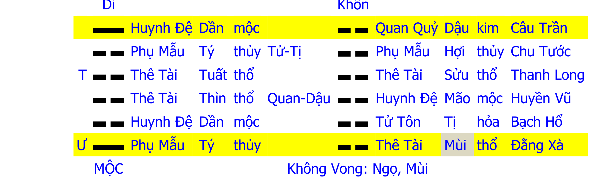

---

# CHƯƠNG 99. ĐI THUYỀN

Nếu xem về xuất hành mà gặp hào Tử Tôn phát động, Tử Tôn trì Thế, Thế hóa 
Tử Tôn, thì tuy đường có xa ngàn dặm, tai họa vẫn được tiêu trừ, Tử Tôn có khắc Thế 
vẫn cát lợi.

Phụ khắc Thế hào, phong vũ chu xa hành lý.

Phụ khắc hào Thế, mưa gió xe thuyền hành lý.

Nếu hào Phụ Mẫu trì Thế mà động, hoặc hào Phụ động xung khắc hào Thế, theo 
như chiêm nghiệm của ta, có khi chủ về bị liên lụy bởi xe thuyền, hành lý, có khi ứng 
nghiệm về mưa gió triền miên. Nếu hào Thế vượng thì không đáng ngại, chỉ kỵ khi 
hào Thế hưu tù mà hóa hung.

Huynh xung Thế vị, hoa nguyệt phá hao tai phi.

Huynh xung hào Thế, trăng hoa hao của, thị phi.

Nếu hào Tài trì Thế, bị hào Huynh xung khắc, có khi ứng với trăng hoa chơi bời, 
lãng phí vô độ, cũng có khi ứng với bị kẻ dưới hãm hại mà thành tai họa thi phi, phải 
tiêu hao nhiều tiền của.

Phản ngâm hóa Thoái trung đồ phản; Lục xung tùy Mộ thủy chung 
hung.

Phản ngâm hóa Thoái, nửa đường quay lại; Lục xung nhập Mộ, trước sau đều 
hung.

Nếu gặp quẻ Phục ngâm, mà hào Thế động, đợi đến ngày xung khai sẽ khởi 
hành. Nếu gặp quẻ Phản ngâm, đi đến nửa đường sẽ phải quay lại, nếu hào Thế gặp 
xung khắc là đại hung. Gặp quẻ Lục xung, mà hào thế tĩnh, hoặc gặp Không, nếu lại 
theo Quỷ nhập Mộ là tối kỵ. Nếu hào Thế hưu tù, là điềm có đi không trở về.

Lục hợp hóa xung bất cát; Lục xung hóa hợp phương hanh.

Lục hợp hóa xung không tốt; Lục xung hóa hợp hanh thông.

Nếu quẻ Lục hợp biến Lục xung, hoặc quẻ biến Khắc, biến Tuyệt, có ngồi nhà 
cũng dễ gặp tai họa.

***

# CHƯƠNG 99: ĐI THUYỀN

Đi thuyền muốn xem ngày nào sẽ đến nơi, mà hào Thế phát động, vào ngày 
trực, ngày hợp sẽ đến nơi. Nếu hào Tử Tôn trì Thế, hoặc Tử Tôn ở hào khác phát 
động, vào ngày trực sẽ đến nơi. Nếu hào Thế hóa Thoái thần, hoặc được quẻ Phản 
ngâm, là tượng nửa đường phải quay lại.

Nếu muốn hỏi xem đi đường có bình yên không, được quẻ Tử Tôn trì Thế, khắc 
Thế, sinh Thế, hợp Thế, chủ về thượng lộ bình an. Nếu hào Quan Quỷ trì Thế, chủ về 
lo âu sợ hãi. Nếu hào Quan Quỷ xung khắc hào Thế, chủ về gặp tai họa. Hào Huynh 
động chủ về hao của phá sản.

---

# CHƯƠNG 100. BẠN ĐỒNG HÀNH / CHƯƠNG 101. NGƯỜI ĐI XA

Nếu xem về hướng gió, không nên lấy hào Huynh Đệ làm gió, mà lấy hào Tử Tôn 
là gió thuận, nếu động, cần đợi ngày hợp ngày trực; nếu tĩnh, cần đợi ngày xung; nếu 
Không Vong, cần đợi ngày xung thực, cần kết hợp với chương "Thiên thời" để suy 
đoán.

**Tân bình thích:** Thời nay đi máy bay xuất hành cũng có thể đoán theo phép 
này.

***

# CHƯƠNG 100: BẠN ĐỒNG HÀNH

Xem về bạn đồng hành, nên quan sát hào Ứng. Đi đường bộ hay tàu thuyền đều 
như nhau.

Hào Ứng tổn thương hào Thế, chủ về bị người đồng hành hãm hại; hào Ứng gặp 
Không, Phá, Mộ, Tuyệt, chủ về người đồng hành phụ nghĩa.

Tốt nhất là hào Ứng tương sinh, tương hợp, phù trợ hào Thế, là tượng giúp đỡ 
lẫn nhau, gắn bó như người thân.

Nếu gặp Tam hợp cục, chủ về mọi người đều được toại nguyện. Nếu gặp quẻ Lục 
xung, là tượng nửa đường nản chí.

Nếu hào Huynh Đệ động, thì đi hay ở đều gặp hại; nếu hào Tử Tôn động, dù đi 
đường bộ hay đường thủy đều yên lành.

Xem về người khác thì lấy hào Ứng làm Dụng thần; xem cho người thân thích 
cũng phải xem Dụng thần, kỵ gặp hào Huynh Đệ động khắc Thế, tốt nhất là nên 
tương hợp tương sinh.

***

# CHƯƠNG 101: NGƯỜI ĐI XA

Xem người đi xa bao giờ trở về, có chia làm xa gần. Nếu xa thì ứng vào tháng, 
nếu gần thì ứng vào ngày. Cũng có trường hợp đi xa lâu ngày mà sắp trở về, cũng có 
thể ứng vào ngày.

Nếu muốn xem người đi xa có được bình yên hay không, cần xem thêm một quẻ 
khác, không thể dùng một quẻ để xem chung.

Nếu hào Thế khắc Dụng thần, thì người đi xa chưa lên đường trở về. Nếu Dụng 
thần khắc hào Thế, chắc chắn sẽ quay về.

Xem về người thân, cần xem kỹ chương "Dụng thần". Xem về người ngoài, lấy 
hào Ứng làm Dụng thần. Nếu hào Thế khắc Dụng thần, là người đi chưa có ý quay về.

Nếu Dụng thần khắc hào Thế, thì người đi xa sắp về đến nơi. Ta xem thử nhiều lần, 
đều thấy ứng nghiệm.

Mộ Tuyệt Không Phá, ngày về còn xa; minh động ám động, ý về đã định.

Dụng thần phục tàng, đợi ngày xuất hiện; Dụng thần phát động, đợi ngày gặp 
hợp.

Động hóa Tiến thần, ý chưa muốn về; Dụng thần hóa Thoái, ngày về đã định.

Động gặp hợp, sẽ gặp cản trở; động hóa Quỷ, gặp họa bên ngoài.

Kỵ nhất là động hóa hồi đầu khắc; cũng nên phòng quẻ hóa thành Phản ngâm.

Hào Thế Không, là người đi sắp về đến nơi. Dụng thần tĩnh mà gặp hưu tù, 
Không, Phá, tức người đi chưa có ý quay về. Dụng thần động mà Không, vượng mà 
Không, đến ngày hoặc tháng thực Không, xung Không sẽ trở về. Kỵ nhất là quẻ biến 
Khắc, biến Tuyệt, hoặc gặp quẻ Phản ngâm, hoặc Dụng thần bị xung bị khắc, thì 
người đi xa khó mong có ngày về.

Dụng thần gặp Tam hợp cục, đợi ngày xung khai sẽ về đến nơi.

Gặp quẻ Lục xung, người đi xa vẫn còn vô định, mà không trở về.

Dụng thần tĩnh, đợi ngày xung động sẽ về đến nơi.

Dụng thần nhập Mộ, đợi đến ngày xung khai Mộ sẽ về đến nơi.

Dụng thần không có bệnh, sẽ đoán được ngày về. Dụng thần có bệnh, người đi 
xa không được bình yên.

**Dã Hạc bàn rằng:** Nếu Dụng thần Mộ, Tuyệt, Không, Phá, bị tổn thương, gọi là có 
bệnh. Nếu hỏi xem người đi xa có được bình yên không, cần xem Dụng thần có bệnh 
hay không; nếu hỏi người đi xa bao giờ trở về, cần phải xem tượng quẻ có hiện ngày 
hay không để suy đoán.

### Ví dụ: Vào ngày Mậu Thân tháng Dậu, xem mẹ ở ngoài bao giờ sẽ trở về, được

quẻ Lữ biến Cấn:

Lữ 
 
Cấn

Huynh ĐệTị | hỏa | Phụ Mẫu | Dần | mộc Chu Tước

Tử Tôn | Mùi | thổ | Quan QuỷTý | thủy Thanh Long

Ư | Thê Tài | Dậu | kim | Tử Tôn | Tuất thổ | Huyền Vũ

Thê Tài | Thân kim Quan-Hợi | Thê Tài | Thân kim Bạch Hổ

Huynh ĐệNgọ | hỏa | Huynh ĐệNgọ | hỏa Đằng Xà

T | Tử Tôn | Thìn thổ | Phụ-Mão | Tử Tôn | Thìn thổ | Câu Trần

HỎA
Không Vong: Dần, Mão

Nếu dùng quẻ này để xem cha mẹ ở bên ngoài có được bình an không, thì hào 
Phụ Mẫu Mão mộc bị Nhật thần Thân kim, Nguyệt kiến Dậu kim và hào động Dậu kim 
xung khắc, nên chủ về không bình yên. Nhưng vì người xem hỏi về ngày về của mẹ, 
nên không đoán như vậy, mà đoán rằng: Dụng thần phục tàng, lại bị khắc, nên mẹ

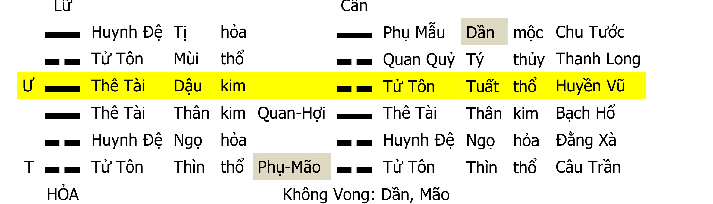 không về. Lại là quẻ Lục hợp biến Lục xung, cũng là tượng không trở về. Sau quả 
nhiên mẹ không quay về nhà, nhưng vẫn được bình yên.

Lại ví dụ: Ngày Giáp Tý tháng Hợi, xem nô bộc bao giờ trở về, được quẻ Cách 
biến Quải:

Cách
 
Quải

Quan QuỷMùi thổ | Quan QuỷMùi thổ | Huyền Vũ

Phụ Mẫu | Dậu kim | Phụ Mẫu | Dậu | kim Bạch Hổ

T

Huynh ĐệHợi thủy | Huynh ĐệHợi | thủy Đằng Xà

Huynh ĐệHợi thủy Tài-Ngọ | Quan QuỷThìn thổ | Câu Trần

Quan QuỷSửu thổ | Tử Tôn | Dần | mộc Chu Tước

Ư

Tử Tôn | Mão mộc | Huynh ĐệTý | thủy Thanh Long

THỦY
Không Vong: Tuất, Hợi

Nếu dùng quẻ này để đoán xem nô bộc ở bên ngoài có được bình an không, thì 
hào Tài hỏa phục tàng lại bị Nhật thần Tý thủy Nguyệt kiến Hợi thủy tương khắc, chủ 
về người này gặp nguy hiểm không thể quay về. Nhưng người xem hỏi về ngày trở về, 
nên không đoán như vậy. Hào Thế lâm Không tức là người này sắp trở về, đến ngày 
Kỷ Tị sẽ đến nơi. Ứng vào ngày Tị, vì là ngày xung Không. Tị hỏa lại là hào Tài. Quả 
nhiên nô bộc về đến nhà vào ngày Tị.

### Ví dụ: Ngày Mậu Tuất tháng Mùi, xem người bác bao giờ về nhà, được quẻ Truân

biến Tùy:

Truân
 
Tùy

Huynh ĐệTý | thủy | Quan QuỷMùi thổ Chu Tước

Ư | Quan QuỷTuất thổ | Phụ Mẫu Dậu kim Thanh Long

Phụ Mẫu Thân kim | Huynh ĐệHợi thủy Huyền Vũ

Quan QuỷThìn thổ Tài-Ngọ | Quan QuỷThìn thổ Bạch Hổ

T | Tử Tôn | Dần mộc | Tử Tôn | Dần mộc Đằng Xà

Huynh ĐệTý | thủy | Huynh ĐệTý | thủy Câu Trần

THỦY
Không Vong: Thìn, Tị

Hào Phụ Mẫu làm Dụng thần, khắc hào Thế, nên chủ về sắp đến nơi, đến tháng 
bảy sẽ về đến nhà. Sau đến tháng Hợi mới về đến nơi. Ứng vào tháng Hợi, là vì ứng 
với hào biến Hợi thủy hóa ra từ hào Phụ Mẫu.

### Ví dụ: Ngày Canh Ngọ tháng Sửu, xem cha đi xa bao giờ trở về, được quẻ Lý:

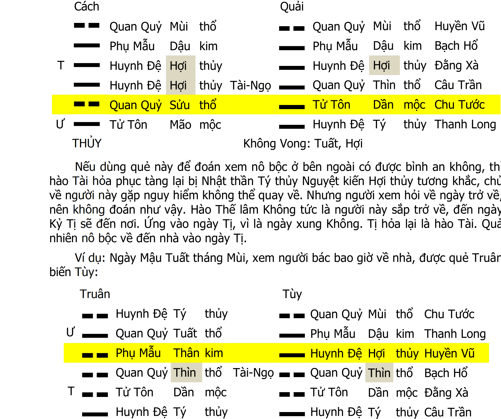

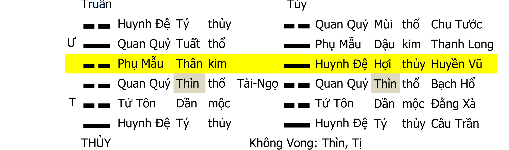

Lý

Huynh ĐệTuất thổ | Đằng Xà

T | Tử Tôn | Thân kim Tài-Tý Câu Trần

Phụ Mẫu Ngọ hỏa | Chu Tước

Huynh ĐệSửu thổ | Thanh Long

Ư | Quan QuỷMão mộc | Huyền Vũ

Phụ Mẫu Tị | hỏa | Bạch Hổ

THỔ
Không Vong: Tuất, Hợi

Đoán rằng: Nhật thần là Ngọ hỏa, lâm Phụ Mẫu khắc Thế, nên trong ngày sẽ về 
đến nơi. Quả nhiên đến giờ Thân trong ngày về đến nhà.

### Ví dụ: Ngày Quý Hợi tháng Dần, xem chủ nhân bao giờ trở về, được quẻ Đại Súc

biến Tiểu Súc:

Đại Súc
 
Tiểu Súc

Quan QuỷDần Mộc | Quan QuỷMão mộc Bạch Hổ

Ư

Thê Tài | Tý | Thủy | Phụ Mẫu Tị | hỏa Đằng Xà

Huynh ĐệTuất Thổ | Huynh ĐệMùi thổ Câu Trần

Huynh ĐệThìn Thổ Tử-Thân | Huynh ĐệThìn thổ Chu Tước

T

Quan QuỷDần Mộc Phụ-Ngọ | Quan QuỷDần mộc Thanh Long

Thê Tài | Tý | Thủy | Thê Tài | Tý | thủy Huyền Vũ

THỔ 
Không Vong: Tý, Sửu

Đoán rằng: Hào Tài Tý thủy, hóa thành Phụ Mẫu Tị hỏa, hào động không khắc 
được hào biến, nên đến ngày Tị sẽ về đến nơi. Quả nhiên đến ngày Tị về đến nhà.

Lại ví dụ: Ngày Đinh Sửu tháng Mùi, cha bao giờ về, được Đại Hữu biến Tỉnh:

Đại Hữu
 
Tỉnh

Ư | Quan Quỷ | Tị | hỏa | Tử Tôn | Tý | thủy | Thanh Long

Phụ Mẫu | Mùi | thổ | Phụ Mẫu | Tuất thổ | Huyền Vũ

Huynh Đệ | Dậu kim | Huynh Đệ | Thân | kim | Bạch Hổ

T | Phụ Mẫu | Thìn | thổ | Huynh Đệ | Dậu | kim | Đằng Xà

Thê Tài | Dần mộc | Tử Tôn | Hợi | thủy | Câu Trần

Tử Tôn | Tý | thủy | Phụ Mẫu | Sửu | thổ | Chu Tước

KIM 
Không Vong: Thân, Dậu

Lúc này là năm Thìn. Đoán rằng: Hào sơ Phụ Mẫu Sửu thổ tương hợp với Tý 
thủy, nên cha không trở về. Hào 5 Phụ Mẫu Mùi thổ biến Tiến thần, cũng chủ về 
không trở về. Người này bèn hỏi: "Vậy rốt cục cha tôi có trở về hay không?" Ta đáp:

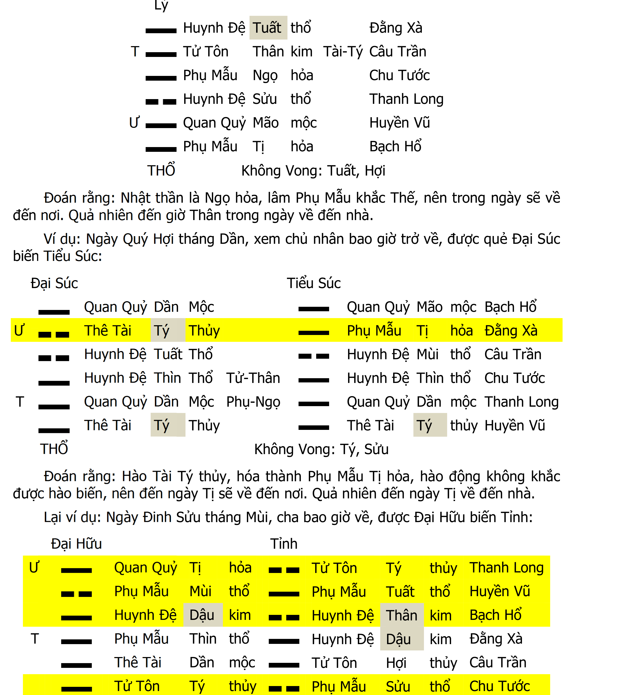

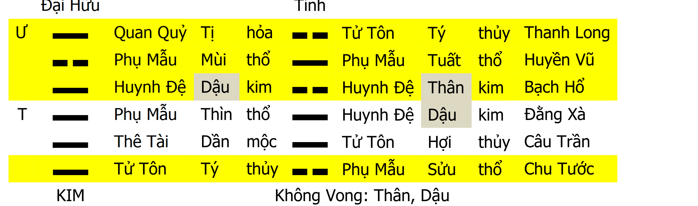

"Đến năm Ngọ sẽ về". Quả nhiên đến tháng Tuất năm Ngọ, người cha trở về. Sở dĩ 
ứng vào năm Ngọ, là vì hào Phụ Mùi thổ động, nên ứng vào năm hợp là năm Ngọ. Lại 
vì hào sơ Tử Tôn hợp với Phụ Sửu, nên cũng phải đợi đến năm Ngọ xung khai mới về 
được.

Lại ví dụ: Ngày Canh Dần tháng Dần, xem chủ nhân đi xuống vùng Hồ Bắc có 
được bình yên không, có đi sang tỉnh khác nữa không, được quẻ Quan:

Quan

Thê Tài | Mão mộc | Đằng Xà

Quan QuỷTị | hỏa Huynh-Thân Câu Trần

T | Phụ Mẫu | Mùi thổ | Chu Tước

Thê Tài | Mão mộc | Thanh Long

Quan QuỷTị | hỏa | Huyền Vũ

Ư | Phụ Mẫu | Mùi thổ Tử-Tý | Bạch Hổ

KIM 
Không Vong: Ngọ, Mùi

Hào Phụ Mẫu gặp Không, nên là điềm không may, nên ta không dám đoán. Lại 
nhờ người thân của chủ nhân gieo quẻ. Cùng ngày, em trai xem cho anh trai, được 
quẻ Trung Phu biến Lâm:

Trung Phu
 
Lâm

Quan QuỷMão mộc | Tử Tôn | Dậu kim Đằng Xà

Phụ Mẫu Tị | hỏa Tài-Tý | Thê Tài | Hợi thủy Câu Trần

T | Huynh ĐệMùi thổ | Huynh ĐệSửu thổ Chu Tước

Huynh ĐệSửu thổ Tử-Thân | Huynh ĐệSửu thổ Thanh Long

Quan QuỷMão mộc | Quan QuỷMão mộc Huyền Vũ

Ư | Phụ Mẫu Tị | hỏa | Phụ Mẫu Tị | hỏa Bạch Hổ

THỔ 
Không Vong: Ngọ, Mùi

Quẻ trước là nô bộc xem cho chủ nhân, thì lấy hào Phụ Mẫu làm Dụng thần, Phụ 
Mẫu Chân Không. Quẻ này em xem cho anh, nên lấy hào Huynh Đệ làm Dụng thần, 
cũng gặp Chân Không, nên vẫn là điềm đại hung. Lại bảo người nhà xem tiếp, đến 
hôm sau ngày Tân Mão, nô bộc lại xem, được quẻ Khảm biến Khốn:

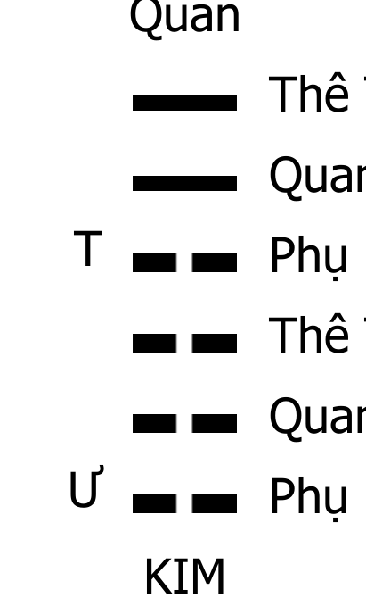

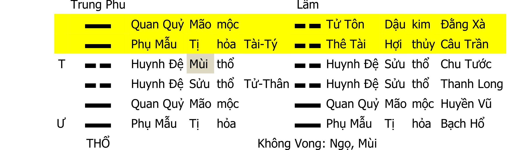

Khảm
 
Khốn

T

Huynh Đệ | Tý | thủy | Quan Quỷ Mùi | thổ | Đằng Xà

Quan Quỷ | Tuất thổ | Phụ Mẫu | Dậu kim | Câu Trần

Phụ Mẫu | Thân | kim | Huynh Đệ | Hợi | thủy | Chu Tước

Ư

Thê Tài | Ngọ | hỏa | Thê Tài | Ngọ hỏa | Thanh Long

Quan Quỷ | Thìn | thổ | Quan Quỷ | Thìn | thổ | Huyền Vũ

Tử Tôn | Dần | mộc | Tử Tôn | Dần mộc | Bạch Hổ

THỦY
Không Vong: Ngọ, Mùi

Đoán rằng: Được quẻ này thì mọi người có thể yên tâm được rồi. Bởi vì hai quẻ 
trước, Dụng thần đều gặp Chân Không, là điềm hung vong. Nay được quẻ này, hào 
Phụ Mẫu Thân kim sinh Thế, đến tháng tư sẽ trở về. Người xem bèn hỏi: Vậy hai quẻ 
trước Phụ, Huynh Không Vong đều không chuẩn hay sao? Ta bèn nói rằng: Sao lại 
không chuẩn? Đó là vì chủ nhân của ngươi tuổi thọ không còn nhiều, nên thần linh 
mách bảo rằng sang năm Mùi sẽ chết, mà không báo chuyện trước mắt. Sở dĩ ứng 
vào năm Mùi, vì tại quẻ thứ nhất Phụ Mẫu tại Mùi thổ; tại quẻ thứ hai, Huynh Đệ cũng 
tại Mùi thổ, đều bị Nhật thần, Nguyệt kiến tương khắc. Do hai hào này gặp Tuần 
Không, nên trước mắt không gặp phải tai họa. Đến năm Mùi xuất Không, bị Nhật, 
Nguyệt thương khắc, nên chắc chắn sẽ gặp nguy hiểm. Xem vào năm Thìn, quả nhiên 
đến năm Mùi thì qua đời.

**Dã Hạc bàn rằng:** Xem liền hai quẻ, thần linh đều mách bảo về chuyện không 
hỏi. Đến quẻ thứ ba, mới hiển thị sự việc đang hỏi. Nên quy định chỉ dùng một quẻ để 
đoán cát hung của các hiền nhân thời trước thật đáng cười, không biết được rằng có 
những quẻ xem gần ứng xa, lại có quẻ xem xa ứng gần, nên thường xuyên đoán sai. 
Lại không biết tỉnh ngộ, mà dùng lời lẽ biện luận khiên cưỡng, vẫn lưu lại làm quy tắc 
cho người đời sau.

### Ví dụ: Ngày Giáp Tý tháng Hợi, vợ xem chồng ở bên ngoài có phải đi sang tỉnh

khác hay không, được quẻ Đại Tráng biến Đại Quá:

Đại Tráng
 
Đại Quá

Huynh ĐệTuất thổ | Huynh ĐệMùi thổ Huyền Vũ

Tử Tôn | Thân kim | Tử Tôn | Dậu kim Bạch Hổ

T | Phụ Mẫu Ngọ hỏa | Thê Tài | Hợi thủy Đằng Xà

Huynh ĐệThìn thổ | Tử Tôn | Dậu kim Câu Trần

Quan QuỷDần mộc | Thê Tài | Hợi thủy Chu Tước

Ư | Thê Tài | Tý | thủy | Huynh ĐệSửu thổ Thanh Long

THỔ 
Không Vong: Tuất, Hợi

Đoán rằng, vợ xem về chồng, lấy hào Quan làm Dụng thần, bị hào động Thân 
kim tương khắc. Hào Quan Dần mộc tượng trưng cho chồng bị khắc, nên người chồng 
sẽ không đi sang nơi khác, mà sẽ nhanh chóng quay về. Người xem bèn hỏi: "Ngày

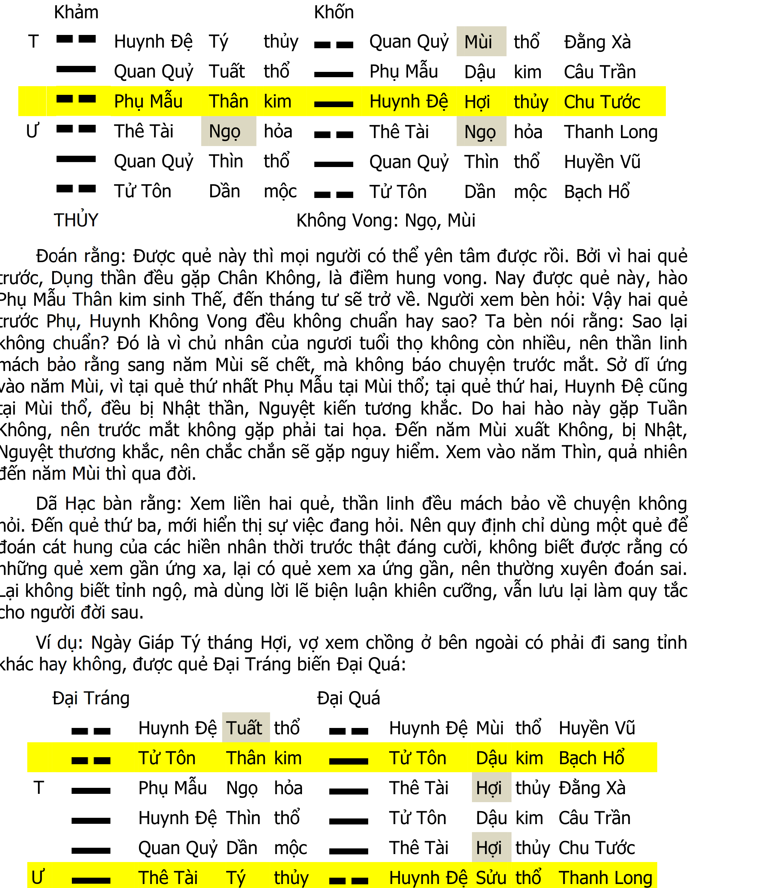

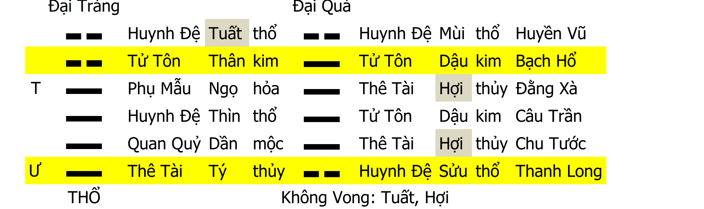 nào sẽ về đến nơi?" Ta đáp rằng: "Đến ngày Tị sẽ đến nơi, vì Tị sẽ hợp lấy Thân kim." 
Quả nhiên đến ngày Tị, người chồng quay về.

Có người cho rằng: "Hào Dụng có bệnh, đừng hỏi ngày về. Quẻ này Thân kim 
hóa Tiến thần, lại khắc Dần mộc, làm sao vẫn đoán là người chồng quay về?" Ta bèn 
đáp: Nếu người vợ hỏi chồng có bình yên không, với tượng quẻ như thế chắc chắn sẽ 
bất lợi. Nhưng chị ta lại hỏi rằng chồng có đi nơi khác không, thì hào Quan bị khắc 
chế là chỉ không đi nơi khác. Nên khi đoán quẻ, phải căn cứ vào tình hình cụ thể để 
suy đoán.

### Ví dụ: Ngày Bính Thân tháng Thìn, xem sai nô bộc đi lấy thư, có lấy được không?

Ngày nào sẽ trở về? Được quẻ Tiệm biến Bác:

Tiệm
 
Bác

Ư | Quan QuỷMão mộc | Quan QuỷDần mộc Thanh Long

Phụ Mẫu | Tị | hỏa Tài-Tý | Thê Tài | Tý | thủy Huyền Vũ

Huynh ĐệMùi | thổ | Huynh ĐệTuất thổ Bạch Hổ

T | Tử Tôn | Thân kim | Quan QuỷMão mộc Đằng Xà

Phụ Mẫu | Ngọ hỏa | Phụ Mẫu | Tị | hỏa Câu Trần

Huynh ĐệThìn thổ | Huynh ĐệMùi thổ Chu Tước

THỔ
Không Vong: Thìn, Tị

Đoán rằng: Thư không lấy được, nô bộc giờ Dậu hôm nay sẽ về đến nơi. Bởi vì 
hào Phụ Mẫu Tị hỏa chủ về văn thư động hóa hồi đầu khắc, nên văn thư không lấy 
được. Hào Tử Tôn Thân kim trì Thế hóa Quỷ Mão mộc, chủ về người không về, sẽ có 
tai ương. Nhưng giờ Dậu hôm nay xung mất Mão mộc, sẽ không đáng lo nữa. Quả 
nhiên đến giờ Dậu nô bộc trở về bẩm báo không lấy được thư.

### Ví dụ: Ngày Quý Dậu tháng Dậu, xem anh trai ngày nào về, được Sư biến Lâm:

Sư 
 
Lâm

Ư | Phụ Mẫu | Dậu kim | Phụ Mẫu | Dậu | kim | Bạch Hổ

Huynh Đệ | Hợi | thủy | Huynh Đệ | Hợi | thủy | Đằng Xà

Quan Quỷ | Sửu thổ | Quan Quỷ | Sửu thổ | Câu Trần

T | Thê Tài | Ngọ hỏa | Quan Quỷ | Sửu thổ | Chu Tước

Quan Quỷ | Thìn | thổ | Tử Tôn | Mão | mộc | Thanh Long

Tử Tôn | Dần mộc | Thê Tài | Tị | hỏa | Huyền Vũ

Đoán rằng: Hào Huynh Đệ Hợi thủy, vượng tướng mà gặp Tuần Không, đợi ngày 
xuất Không sẽ về đến nơi. Người xem bèn nói: "Ngày kia là ngày Hợi. Nhà đã nhận 
được thư, có lẽ trong ngày hôm nay khởi hành, hơn hai nghìn dặm đường, ba ngày 
làm sao mà về đến được." Ta đáp: "Không chỉ có một mình ngày Hợi là xuất Không, 
nếu trong quẻ có Tử Tôn trì Thế, Tử Tôn động mà sinh hợp hào Thế, đều là hỷ thần. 
Đoán là ngày Hợi trở về, Dần hợp với Hợi, Hợi lại là ngày hợp với Tử Tôn, nên vẫn

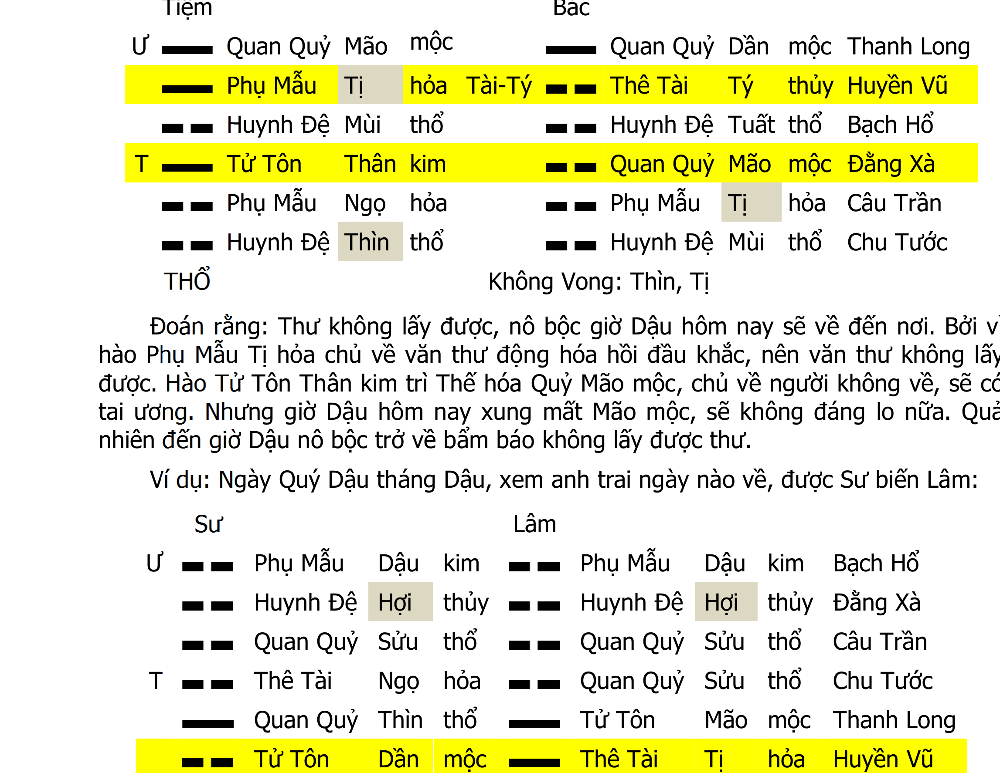

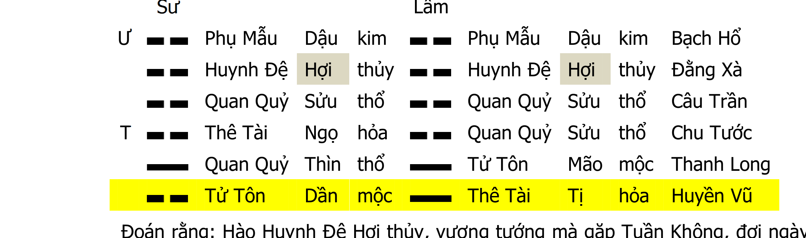 đoán là ngày Hợi sẽ trở về." Không ngờ người anh đi bằng đường thủy, gặp lúc thuận 
gió, thuyền đi liên tục ngày đêm, đến ngày Hợi đã về đến nhà.

Giác Tử bàn rằng: Nếu xem về gió, thì hào Huynh động là tượng trưng cho gió, 
mộc động sẽ sinh gió, nhưng nếu đi thuyền mà xem về gió, phải xem hào Tử Tôn, 
nguyên nhân là vì đâu? Thuyền không thể đi ngược gió, nên trong lòng sẽ lo lắng. 
Đến ngày Tử Tôn phát động, sẽ được thuận gió, thuyền lướt như bay, không còn lo 
lắng nữa. Đây cũng là điều mà các sách xưa không thấy nói đến.

### Ví dụ: Vào ngày Bính Tuất tháng Tuất, lên thuyền đi khỏi Giang Tây, xem trên

đường có được bình an không, được quẻ Cổ biến Tốn:

Cổ 
 
Tốn

Ư | Huynh ĐệDần mộc | Huynh ĐệMão mộc Thanh Long

Phụ Mẫu | Tý | thủy Tử-Tị | Tử Tôn | Tị | hỏa Huyền Vũ

Thê Tài | Tuất thổ | Thê Tài | Mùi thổ | Bạch Hổ

T | Quan QuỷDậu kim | Quan QuỷDậu kim Đằng Xà

Phụ Mẫu | Hợi | thủy | Phụ Mẫu | Hợi thủy Câu Trần

Thê Tài | Sửu thổ | Thê Tài | Sửu thổ | Chu Tước

MỘC
Không Vong: Ngọ, Mùi

Ta ngờ rằng hào Quỷ Dậu kim trì Thế, là điềm lo lắng bất an, lúc ấy ta chưa biết 
đến việc xem ngược gió, thuận gió. Đến ngày Mậu Tý, mưa to gió lớn nổi lên, thuyền 
phải đỗ lại Nam Khang, lúc này mới ngộ ra cái lẽ đó: Hào Phụ Tý thủy động, là điềm 
ngày Tý có mưa gió. Lại hóa ra hào Tử Tôn Tị hỏa, biết rằng đến ngày Tị mới tạnh. 
Tránh gió suốt năm ngày, đến ngày Tị tạnh ráo, mới có gió thuận.

Từ đó ta mới ngộ ra rằng, hào Tử Tôn là chủ về gió thuận khi đi thuyền.

### Ví dụ: Ngày Giáp Tuất tháng Thìn, đi thuyền, xem về gió thuận, được quẻ Thăng

biến Hằng:

Thăng
 
Hằng

Quan QuỷDậu Kim | Thê Tài | Tuất thổ Huyền Vũ

Phụ Mẫu | Hợi Thủy | Quan QuỷThân kim Bạch Hổ

T | Thê Tài | Sửu Thổ Tử-Ngọ | Tử Tôn | Ngọ hỏa Đằng Xà

Quan QuỷDậu Kim | Quan QuỷDậu kim Câu Trần

Phụ Mẫu | Hợi Thủy | Phụ Mẫu | Hợi | thủy Chu Tước

Ư | Thê Tài | Sửu Thổ | Thê Tài | Sửu thổ Thanh Long

MỘC 
Không Vong: Thân, Dậu

Hào Ngọ hỏa Tử Tôn hồi đầu sinh Thế, đến giờ Ngọ trong ngày sẽ có gió thuận. 
Nhưng hiềm vì Tử Tôn Ngọ hỏa nhập Mộ tại Nhật thần Tuất, nên gió không được lâu.

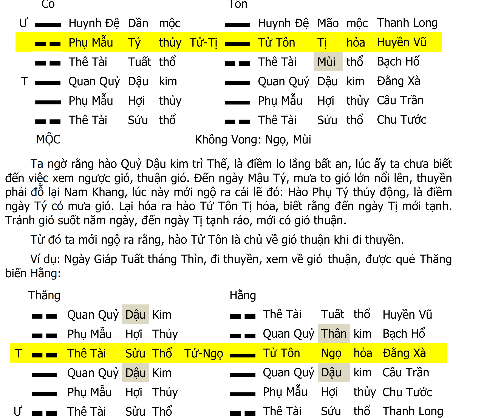

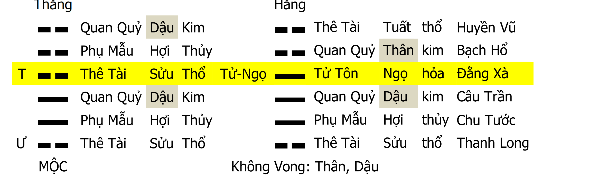

Quả nhiên đến giờ Ngọ, Tử Tôn đương lệnh, thuận gió xuôi thuyền, nhưng đến giờ 
Mùi thì gió lặng.

Lại ví dụ: Ngày Ất Hợi, sai thuyền phu gieo quẻ xem gió, được quẻ Phong biến 
Đại Tráng:

Phong
 
Đại Tráng

Quan Quỷ | Tuất thổ | Quan Quỷ | Tuất thổ | Huyền Vũ

T

Phụ Mẫu | Thân | kim | Phụ Mẫu | Thân | kim | Bạch Hổ

Thê Tài | Ngọ | hỏa | Thê Tài | Ngọ | hỏa | Đằng Xà

Huynh Đệ | Hợi | thủy | Quan Quỷ | Thìn | thổ | Câu Trần

Ư

Quan Quỷ | Sửu | thổ | Tử Tôn | Dần | mộc | Chu Tước

Tử Tôn | Mão | mộc | Huynh Đệ | Tý | thủy | Thanh Long

THỦY 
Không Vong: Thân, Dậu

Đoán rằng: Hào biến Tử Tôn Dần mộc khắc chế hào Quỷ Sửu thổ, đến ngày Dần 
sẽ có gió thuận. Quả nhiên đỗ thuyền ba ngày, đến ngày Mậu Dần, có gió thuận mà 
thuyền khởi hành.

### Ví dụ: Ngày Quý Hợi tháng Hợi, xem về gió, được quẻ Vị Tế biến Cấn:

Vị Tế
 
Cấn

Ư

Huynh ĐệTị | hỏa | Phụ Mẫu | Dần | mộc Bạch Hổ

Tử Tôn | Mùi thổ | Quan QuỷTý | thủy Đằng Xà

Thê Tài | Dậu | kim | Tử Tôn | Tuất thổ | Câu Trần

T

Huynh ĐệNgọ | hỏa Quan-Hợi | Thê Tài | Thân kim Chu Tước

Tử Tôn | Thìn thổ | Huynh ĐệNgọ | hỏa Thanh Long

Phụ Mẫu | Dần | mộc | Tử Tôn | Thìn thổ | Huyền Vũ

HỎA
Không Vong: Tý, Sửu

Có một ông cụ người Dương Châu, đi thuyền từ Hoài Nam về Dương Châu, ta đi 
cùng. Ông cụ vừa lên thuyền đã xem về gió, ta nói: "Giờ Thìn ngày mai sẽ có gió 
thuận, đến giờ Tuất sẽ đến nơi cụ cần đến." Ông cụ bèn hỏi: "Sao nhanh thế?" Ta 
đáp: "Hào 2 Tử Tôn Thìn thổ động, nên sẽ gặp gió thuận. Hào 4 Dậu kim hóa Tử Tôn 
Tuất thổ, là điềm về đến nhà." Quả nhiên đến giờ Thìn hôm sau nổi gió thuận, đi một 
mạch hơn ba trăm dặm, giờ Tuất đến nơi.

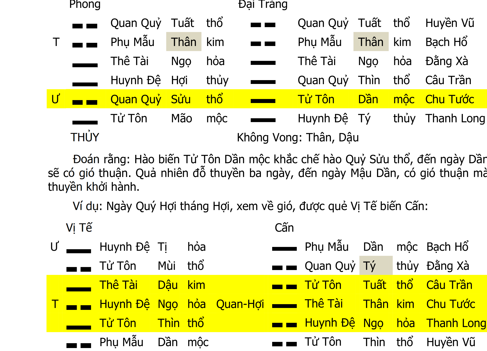

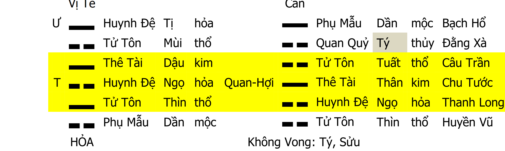

### Ví dụ: Ngày Mậu Tý tháng Tuất, đang ở trên thuyền xem về gió, được quẻ Khôn

biến Chấn:

Khôn
 
Chấn

T | Tử Tôn | Dậu kim | Huynh ĐệTuất thổ Chu Tước

Thê Tài | Hợi thủy | Tử Tôn | Thân kim Thanh Long

Huynh ĐệSửu thổ | Phụ Mẫu Ngọ hỏa Huyền Vũ

Ư | Quan QuỷMão mộc | Huynh ĐệThìn thổ Bạch Hổ

Phụ Mẫu Tị | hỏa | Quan QuỷDần mộc Đằng Xà

Huynh ĐệMùi thổ | Thê Tài | Tý | thủy Câu Trần

THỔ
Không Vong: Ngọ, Mùi

Hào Tử Tôn Dậu kim trì Thế, vì tĩnh nên đợi đến ngày xung, tức ngày Mão, sẽ có 
gió thuận.

Vào ngày Kỷ Sửu lại xem, được quẻ Quải:

Quải

Huynh ĐệMùi thổ | Câu Trần

T | Tử Tôn | Dậu kim | Chu Tước

Thê Tài | Hợi thủy | Thanh Long

Huynh ĐệThìn thổ | Huyền Vũ

Ư | Quan QuỷDần mộc Phụ-TịBạch Hổ

Thê Tài | Tý | thủy | Đằng Xà

THỔ
Không Vong: Ngọ, Mùi

Vẫn là Tử Tôn Dậu kim trì Thế. Sau quả nhiên vào ngày Mão có gió thuận. Ngày 
Nhâm Thìn, xem về gió, được quẻ Đại Súc biến Thái:

Đại Súc
 
Thái

Quan QuỷDần Mộc | Tử Tôn | Dậu kim Bạch Hổ

Ư

Thê Tài | Tý | Thủy | Thê Tài | Hợi thủy Đằng Xà

Huynh ĐệTuất Thổ | Huynh ĐệSửu thổ Câu Trần

Huynh ĐệThìn Thổ Tử-Thân | Huynh ĐệThìn thổ Chu Tước

T

Quan QuỷDần Mộc Phụ-Ngọ | Quan QuỷDần mộc Thanh Long

Thê Tài | Tý | Thủy | Thê Tài | Tý | thủy Huyền Vũ

THỔ 
Không Vong: Ngọ, Mùi

Hào thượng Quỷ Dần mộc, hóa thành Tử Tôn Dậu kim, đến giờ Dậu ngày hôm 
sau sẽ có gió.

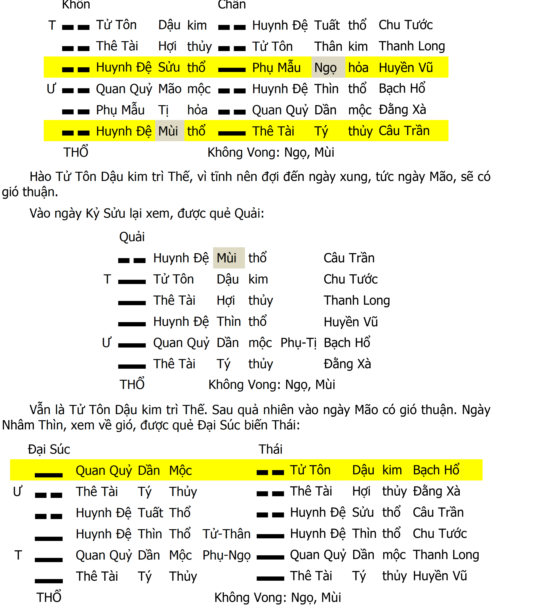

---

# CHƯƠNG 102. ĐỀ PHÒNG KIỆN TỤNG

Ngày Quý Tị, lại xem về gió, được quẻ Cấu biến Tiểu Súc:

Cấu
 
Tiểu Súc

Phụ Mẫu Tuất thổ | Thê Tài | Mão mộc Bạch Hổ

Huynh ĐệThân kim | Quan QuỷTị | hỏa Đằng Xà

Ư | Quan QuỷNgọ hỏa | Phụ Mẫu Mùi thổ Câu Trần

Huynh ĐệDậu kim | Phụ Mẫu Thìn thổ Chu Tước

Tử Tôn | Hợi | thủy Tài-Dần | Thê Tài | Dần mộc Thanh Long

T | Phụ Mẫu Sửu thổ | Tử Tôn | Tý | thủy Huyền Vũ

KIM
Không Vong: Ngọ, Mùi

Có người hỏi rằng: Hôm qua xem, nói rằng giờ Dậu hôm nay có gió, sao trong 
quẻ này không hiện. Ta đáp: Lòng ta đã biết rõ, nên thần không báo nữa. Giờ Dậu 
ngày nay vẫn có gió, nhưng gió không lớn, nên thần báo về gió lớn của ngày hôm 
sau. Hào Tử Tôn Tý thủy tương hợp với hào Thế Sửu thổ, gặp hợp phải đợi ngày xung 
phá mới ứng nghiệm, đến giờ Ngọ hôm sau xung khai, sẽ có gió thuận. Quả nhiên 
hôm sau nổi gió lớn, thuyền đi ba trăm dặm.

***

# CHƯƠNG 102: ĐỀ PHÒNG KIỆN TỤNG

Nếu lo lắng vì bị kiện tụng mà gieo quẻ, tốt nhất là gặp hào Quan Không, Phá. 
Tử Tôn động là tốt, nếu Tử Tôn trì Thế, sẽ tránh được kiện tụng.

Quan Quỷ, Chu Tước cùng động, điều tiếng thị phi khó tránh.

Quỷ tại Đằng Xà khắc Thế, tai họa triền miên.

Quỷ tại Huyền Vũ, ắt gặp rắc rối vì trộm cắp, đàn bà.

Quỷ tại Bạch Hổ, chắc chắn bị thương đổ máu.

Thế động khắc Ứng, là mình đâm đơn kiện đối phương, Ứng khắc Thế, là người 
khác kiện mình.

**Tân bình thích:** Phụ Mẫu lâm Tước Xà động cũng có quan ti khẩu thiệt.

Tử Tôn động, Tử Tôn trì Thế, sẽ không bị kiện tụng. Hào Quỷ trì Thế, Quỷ khắc 
Thế, Ứng động khắc Thế, chắc chắn sẽ bị kiện.

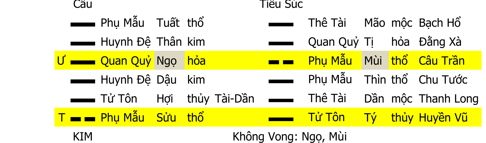

---

# CHƯƠNG 103: CẠNH TRANH

Nếu hai bên vì việc gì đó mà tranh chấp, cần xem hào Thế, hào Ứng. Hai hào này 
xung khắc là xấu, tương sinh là tốt.

Nếu hào Thế bị Nhật thần, Nguyệt kiến khắc, là bản thân mình phải chịu nhục.

Nếu hào Ứng bị hào động tương khắc, thì đối phương sẽ phải chịu hình.

Nếu hào Ứng khắc hào Thế, đối phương sẽ thắng.

Nếu hào Thế khắc hào Ứng, mình sẽ thắng.

Nếu hào Thế Không, Phá, hào Thế động hóa Thoái thần, là bản thân đang khiếp 
sợ.

Nếu hào Ứng động, vượng, Ứng hóa Tiến thần, đối phương sẽ đắc thế.

Nếu gặp quẻ Lục xung, tranh chấp sẽ tan.

Nếu gặp quẻ Lục hợp, tranh chấp sẽ thành.

Cũng phải xem xét hào Tử Tôn. Nếu hào Tử Tôn phát động, việc tranh chấp sẽ 
không thành. Nhật, Nguyệt, hào động nên khắc hào Ứng, không nên khắc hào Thế. 
Hào Thế nên vượng, động khắc hào Ứng, hoặc động hóa cát, thì việc kiện tụng sẽ 
thắng.

***

# CHƯƠNG 104: ĐÂM ĐƠN KHỞI KIỆN

Hào Quan, hào Phụ cùng động, là bản thân có lý.

Hào Quan, hào Phụ khắc Thế, chủ về bản thân phải chịu khuất, hàm oan.

Hào Thế hóa Thoái thần, hào Thế gặp Không Phá, hoặc gặp quẻ Lục xung, hoặc 
hào Thế bị hình xung, việc khởi kiện sẽ không thành. Hào Tài và hào Tử Tôn phát 
động là tượng khắc phá văn thư, Quan Quỷ, nên khởi kiện cũng không thành.

***

# CHƯƠNG 105: BỊ XỬ TRỌNG TỘI

Phúc nên vượng tướng, tối kỵ Quan hưng.

Nếu trong quẻ có Tử Tôn trì Thế, Tử Tôn phát động, cho dù đã bị giải ra pháp 
trường, vẫn sẽ được xá tội.

Nếu trong quẻ có hào Quan Quỷ khắc Thế, hoặc Quan Quỷ trì Thế, lại bị Nhật, 
Nguyệt, hào động xung khắc, hoặc Thế động hoá hung, tuy trước mắt chỉ bị định tội 
nhẹ, nhưng phải đề phòng lại bị khép tội nặng hơn.

---

# CHƯƠNG 106: BỆNH TẬT

**Dã Hạc bàn rằng:** Con người ta có thất tình, khiến sinh ra trăm bệnh, nên gieo 
quẻ suy đoán, để vơi bớt nỗi lo lắng trong tâm. Nhưng khổ nỗi các sách bốc dịch sai 
sót quá nhiều, khiến người ta không biết đằng nào mà đoán. Đã chọn Dụng thần, lại 
xem thân quẻ, thân Thế, kiêm dùng bản mệnh; lại có sách không xem thân mệnh, 
Dụng thần, mà chỉ xem tượng quẻ, nếu được các quẻ Minh Di, Quan, Bí, Cổ, Quải, 
Phong, Đồng Nhân, Đại Súc, Nhu, thì đoán là chắc chắn sẽ chết.

Lại có sách nói rằng: "Tử khí Tang môn đến bản mệnh, mau chuẩn bị quan tài"; | lại có chỗ viết: "Đằng Xà động chủ chết chóc, Bạch Hổ động chủ có tang", dùng tinh | sát, Lục thần để đoán chuyện sống chết, vậy nếu như hung thần ác sát lâm thân, | chiếu mệnh, nhưng lại được Dụng thần, hai thân vượng tướng, thì nên đoán là sống | hay chết?

Ta chiêm nghiệm nhiều năm, thấy rằng sống hay chết đều hoàn toàn trông vào 
Dụng thần, những thứ khác đều không ứng nghiệm. Còn trường hợp không cần xem 
Dụng thần mà đoán được sống chết, chỉ có quẻ biến và quẻ Lục xung mà thôi.

**Tân bình thích:** Phán đoán cát hung cũng phải xem bệnh nhân bị bệnh thế nào, 
bệnh nặng Dụng thần bị khắc là hung, nếu là bệnh không nguy hiểm đến tính mạng, 
Dụng thần hưu tù bị khắc, thì chỉ là bệnh khó khỏi mà thôi, không thể suy ra là hung.

Lục xung biến xung, cửu bệnh nan ư điều trị.

Lục xung biến xung, bệnh lâu khó mà điều trị.

Nếu xem về bệnh lâu ngày mà gặp quẻ Lục xung, hoặc quẻ biến là Lục xung, thì 
bất kể Dụng thần suy hay vượng, đều chủ về bệnh không chữa được. Nếu xem về 
bệnh gần, thì không cần thuốc thang cũng khỏi.

Quái biến tuyệt khắc, tân bệnh diệc chủ nguy vong.

Quẻ biến tuyệt khắc, bệnh mới cũng gặp hiểm nguy.

Cũng là quẻ Lục xung biến Lục xung, nhưng biến hồi đầu khắc, thì bệnh gần 
cũng nguy hiểm. Ví dụ Tốn mộc biến Càn kim, Cấn Khôn thổ biến Chấn Tốn mộc, đều 
là biến hồi đầu khắc. Tuy không gặp Mộ Tuyệt, cũng chủ về nguy hiểm đến tính 
mạng. Nếu biến tỷ hòa, quẻ gốc khắc quẻ biến (khắc khứ), hóa hồi đầu sinh, xem về 
bệnh gần sẽ tốt lành, nhưng xem về bệnh lâu lại là điềm hung, vì là quẻ Lục xung.

Ngoài những trường hợp trên, còn lại đều phải xem Dụng thần.

Dụng ngộ Tuần Không, cận bệnh hà tu ưu lự, Dụng phùng Nguyệt phá, 
cửu bệnh nan hứa an ninh.

Dụng gặp Tuần Không, bệnh gần không cần lo lắng; Dụng gặp Nguyệt phá, bệnh 
lâu khó được bình yên.

Tự xem về bệnh của mình, lấy hào Thế làm Dụng thần. Nếu xem về bệnh của 
cha mẹ anh em, thì căn cứ vào chương "Dụng thần" để chọn Dụng thần. Nếu Dụng 
thần động, tĩnh mà gặp Tuần Không, hoặc hóa Không, nếu không bị Nhật, Nguyệt, 
hào động xung khắc, thì đến ngày xung Không, thực Không sẽ khỏi bệnh. Nếu bị xung 
khắc, tuy bệnh nặng cũng không đến nỗi chết. Nếu gặp Nguyệt phá, cần phải xem

Dụng thần vượng hay suy. Nếu vượng, sẽ khỏi bệnh vào ngày thực Phá hoặc ra khỏi 
tháng. Nếu suy, lại bị khắc, ắt nguy đến tính mạng.

Nếu xem về bệnh lâu ngày mà Dụng thần gặp Tuần Không, Nguyệt phá, thì cho 
dù Dụng thần vượng tướng, bệnh cũng không thể chữa khỏi.

**Dã Hạc bàn rằng:** "Hải để nhãn”, "Hoàng kim sách" đều viết rằng, Dụng thần 
Không, bệnh không chữa được, mà không phân biệt bệnh gần hay bệnh lâu, nên 
không phải là đúc rút từ kinh nghiệm.

Giác Tử bàn rằng: Theo chiêm nghiệm của ta, xem về bệnh gần mà Dụng thần 
gặp Tuần Không, nếu lại gặp Tam hợp, Lục hợp, ắt sẽ thành bệnh lâu ngày mà chết.

Dụng hóa Quỷ, Quỷ hóa Dụng, thận phòng bất trắc; Kỵ hóa Dụng, Dụng 
hóa Kỵ, tối nan điều y.

Dụng hóa Quỷ, Quỷ hóa Dụng thần, phòng bất trắc; Kỵ hóa Dụng, Dụng hóa Ky 
thần, rất nguy nan.

Nếu tự xem về bệnh của mình, kỵ gặp hào Thế biến Quỷ, hoặc hóa hồi đầu khắc. 
Nếu xem cho anh em, vợ con, cũng không nên gặp Quỷ biến Huynh Đệ, Thê Tài, hoặc 
Huynh Đệ, Thê Tài biến Quỷ. Cũng kỵ gặp Huynh biến Tài, Tài biến Huynh, hoặc Phụ 
hóa Tử, Tử hóa Phụ.

**Dã Hạc bàn rằng:** Quan Quỷ là Nguyên thần của Phụ Mẫu, Phụ động hóa Quỷ, 
tức là hóa sinh, nếu là bệnh nhẹ sẽ khỏi. Nếu bệnh lâu ngày, gặp Quỷ hóa Phụ, Phụ 
hóa Quỷ, đều chủ về mất mạng. Có người hỏi rằng: "Dụng thần hóa Quỷ, là điềm 
hung. Giả sử lại gặp Tuần Không, thì bệnh gần biết đoán ra sao?" Ta bèn đáp: Đã có 
quẻ chiêm nghiệm để lại, hãy xem cho kỹ.

### Ví dụ: Ngày Canh Dần tháng Thân, xem về bệnh gần của con, được quẻ Hằng

biến Giải:

Hằng
 
Giải

Ư | Thê Tài | Tuất thổ | Thê Tài | Tuất thổ Đằng Xà

Quan QuỷThân kim | Quan QuỷThân kim Câu Trần

Tử Tôn | Ngọ hỏa | Tử Tôn | Ngọ hỏa Chu Tước

T | Quan QuỷDậu kim | Tử Tôn | Ngọ hỏa Thanh Long

Phụ Mẫu Hợi | thủy Huynh-Dần | Thê Tài | Thìn thổ Huyền Vũ

Thê Tài | Sửu thổ | Huynh ĐệDần mộc Bạch Hổ

MỘC
Không Vong: Ngọ, Mùi

Đoán rằng: Quỷ biến Tử Tôn, nên là điềm chết yểu. May nhờ hào Tử Tôn gặp 
Tuần Không, nên bệnh gần sẽ khỏi, chỉ e rằng khó qua khỏi năm Ngọ. Quả nhiên đến 
ngày xuất Không thì khỏi bệnh. Năm Thìn xem, sau đến năm Ngọ, xuất Không mà 
chết.

Động Mộ Tuyệt, hóa Mộ Tuyệt, tu bằng sinh vượng; Nhật Nguyệt khắc, 
động hào khắc, tối phạ hưu tù.

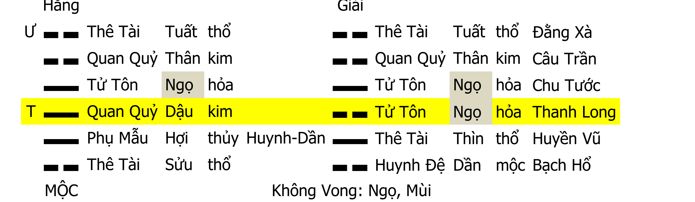

Động Mộ Tuyệt, hóa Mộ Tuyệt, cần nhờ sinh vượng; Nhật nguyệt khắc, hào động 
khắc, sợ nhất hưu tù.

Nếu Dụng thần gặp Mộ, Tuyệt, hoặc động hóa Mộ hóa Tuyệt, cần phải xem Dụng 
thần có được sinh vượng hay không. Nếu Dụng thần vượng thì không đáng lo; nếu 
Dụng thần suy thì bệnh tình nguy hiểm. Nếu Dụng thần bị Nhật thần, Nguyệt kiến, 
hào động khắc, cũng phải xem Dụng thần vượng hay suy. Nếu vượng, đợi đến ngày 
xung mất khắc thần sẽ khỏi. Nếu suy, đến ngày sinh trợ khắc thần sẽ gặp nguy hiểm.

Tán Phá vô viện thoát khí, Kỵ dao Nguyên động cừu hưng.

Dụng thần gặp Tán, gặp Phá, hoặc hoàn toàn không được sinh trợ, hoặc thoát 
khí, bốn trường hợp đó đều là Dụng thần vô căn, là tượng lành ít dữ nhiều.

Kỵ thần động khắc Dụng thần, nếu Nguyên thần phát động, bệnh sẽ được cứu. 
Nếu không, sẽ nguy hiểm đến tính mạng. Xem thêm trong chương "Nguyên thần".

Thế trì Quỷ, bệnh tuy khinh nhi nan liệu.

Thế tại hào Quỷ, bệnh tuy nhẹ mà khó chữa.

Câu này có hai cách giải thích. Nếu là tự xem về bệnh của mình, gặp Quan Quỷ 
trì Thế, thì bệnh sẽ khó chữa khỏi. Dẫu được hào Tử Tôn động khắc đi Quỷ bên mình, 
trước mắt bệnh có đỡ, nhưng vẫn không thể chữa tận gốc. Nếu không, thì cũng sinh 
bệnh khác. Nên đây là tượng bệnh tật triền miên, uống thuốc thay cơm. Nếu hào Thế 
lâm Quan Quỷ, lại gặp Đế Vượng, Trường Sinh, chủ về tàn tật vĩnh viễn.

Còn nếu xem thay cho bệnh tật của người thân, mà gặp Quan Quỷ trì Thế, cũng 
là điềm lo lắng. Nhưng nếu gặp Tử Tôn phát động, khắc đi Quỷ bên mình, cho dù 
Dụng thần suy nhược, vẫn được bình yên.

### Ví dụ: Ngày Nhâm Tý tháng Thân, xem về bệnh của con, được quẻ Độn:

Độn

Phụ Mẫu Tuất thổ | Bạch Hổ

Ư | Huynh ĐệThân kim | Đằng Xà

Quan QuỷNgọ hỏa | Câu Trần

Huynh ĐệThân kim | Chu Tước

T | Quan QuỷNgọ hỏa Tài-Dần Thanh Long

Phụ Mẫu Thìn thổTử-Tý | Huyền Vũ

KIM
Không Vong: Dần, Mão

Đoán rằng: Con trai anh hôm nay sẽ đỡ, bởi vì Quan Quỷ trì Thế, chủ về bản 
thân đang lo lắng. Nhưng đến giờ Tý trong ngày, sẽ khắc đi nỗi phiền muộn, nên 
đoán là sẽ khỏi. Quả nhiên đứa bé khỏi bệnh trong ngày.

Giác Tử bàn rằng: Nếu tự xem cho bản thân, hoặc xem cho anh em, vợ con, thì 
phương pháp này là đúng. Nhưng nếu như xem về bệnh của cha mẹ, thì Quan Quỷ là 
Nguyên thần của hào Phụ Mẫu, lại không nên động mà tổn thương. Nếu vợ xem về 
bệnh của chồng, lấy hào Quan Quỷ làm Dụng thần, cũng không nên có hào Tử động

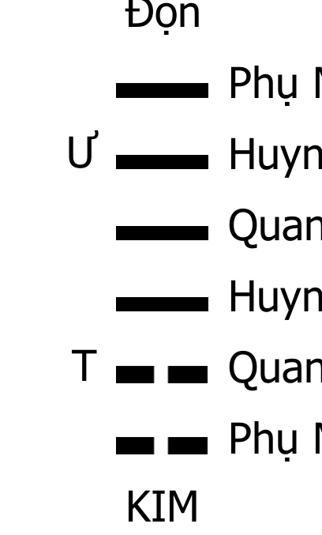 mà tổn thương Quan. Như vậy, không những không hết lo phiền, mà lại càng thêm 
nguy hiểm.

Thân lâm Phúc đức, thế tuy hiểm dĩ kham y.

Thế lâm Phúc đức, bệnh hiểm nghèo cũng chữa lành.

Cũng có hai cách giải thích. Nếu tự xem về bệnh của mình, gặp Tử Tôn trì Thế, 
thì không cần thuốc cũng khỏi bệnh. Nếu gặp Không, Phá, đợi đến ngày thực Không, 
thực Phá, sẽ khỏi bệnh.

Nếu xem hộ cho bệnh tình của người thân, không cần xem hào Dụng suy hay 
vượng, cũng biết là sẽ được bình an. Bởi vì Tử Tôn là thần hoan hỷ, chỉ cần Tử Tôn 
vượng tướng, như phát động trong quẻ, cũng sẽ được yên lành.

### Ví dụ: Ngày Ất Mão tháng Dần, xem về bệnh của vợ, được quẻ Truân biến Tiết:

Truân
 
Tiết

Huynh ĐệTý | thủy | Huynh ĐệTý | thủy Huyền Vũ

Ư | Quan QuỷTuất thổ | Quan QuỷTuất thổ Bạch Hổ

Phụ Mẫu | Thân kim | Phụ Mẫu | Thân kim Đằng Xà

Quan QuỷThìn thổ Tài-Ngọ | Quan QuỷSửu thổ Câu Trần

T | Tử Tôn | Dần mộc | Tử Tôn | Mão mộc Chu Tước

Huynh ĐệTý | thủy | Thê Tài | Tị | hỏa Thanh Long

THỦY
Không Vong: Tý, Sửu

Đoán rằng: "Vợ anh đến ngày Mùi sẽ khỏi bệnh." Người xem bèn hỏi: "Hào Thê 
Tài không hiện trong quẻ, làm sao lại khỏi bệnh được?" Ta đáp: "Hào Tử Tôn hóa Tử 
Tôn, là thần tốt lành. Nhưng hiềm vì quá vượng, nên đợi đến ngày Mùi là ngày mộc 
nhập Mộ, sẽ được tin mừng, tức vợ khỏi bệnh." Sau quả đến ngày Ngọ thuyên giảm, 
ngày Mùi khỏi bệnh.

Giác Tử bàn rằng: Xem về bệnh của cha mẹ, nếu hào Tử Tôn trì Thế mà phát 
động, sẽ khắc mất Nguyên thần của Phụ Mẫu. Vợ xem cho chồng, Tử Tôn động sẽ tổn 
thương đến Quan Quỷ, nên đều không phải là thần tốt lành. Bởi vậy, xem quẻ cần 
phải thông biến.

**Tân bình thích:** Ở đây đem tượng lý nói nhập làm một, cần phải xem hỷ kỵ của 
Dụng thần và ý nghĩ của người được cử đến ra sao. Như đoán bệnh cho chồng, Tử 
Tôn tuy là y dược, nhưng nếu Quan Quỷ vô khí, Tử Tôn trì Thế hoặc phát động thì trái 
lại là hung.

Quỷ hóa Trường Sinh, kỵ hóa Tiến, tu lự thiêm tai.

Quỷ hóa Trường Sinh, kỵ hóa Tiến thần, đề phòng thêm nặng.

Nếu hào Quỷ phát động, chủ về bệnh tình trầm trọng. Nếu Quỷ gặp Trường Sinh 
tại Nhật thần, hoặc động hóa Trường Sinh, bệnh tình sẽ càng thêm nặng. Nếu hào 
Quỷ khắc Dụng thần, sẽ trở thành Kỵ thần. Nếu Quỷ động hóa Tiến thần, cũng chủ về 
bệnh thêm nặng. Nếu Kỵ thần hóa Thoái thần, bệnh tình sẽ thuyên giảm.

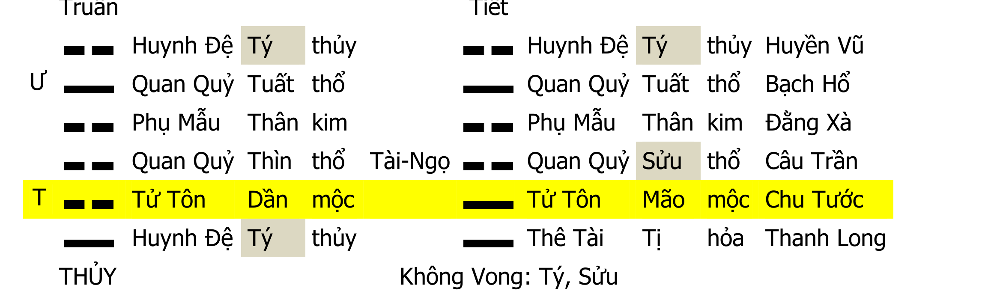

Giác Tử bàn rằng: Quan Quỷ là Nguyên thần của Phụ Mẫu, nếu là xem về bệnh 
của cha mẹ, gặp trường hợp trên, bệnh sẽ khỏi. Vợ xem cho chồng, Quan Quỷ là 
Dụng thần, nên cũng chủ về khỏi bệnh.

Phúc dao hóa Khắc quái phản ngâm, bệnh tất phản phục.

Tử động hóa Khắc gặp quẻ phản ngâm, bệnh thường tái phát.

Nếu tự xem về bệnh của mình, hoặc xem về bệnh của anh em, được hào Tử Tôn 
phát động, khắc chế Quan Quỷ, bệnh tình sẽ thuyên giảm. Nếu Tử Tôn động mà hóa 
Khắc, cho dù khỏi bệnh, rồi cũng sẽ tái phát, nên đây là tượng tráo trở. Nếu gặp quẻ 
Phản ngâm, cũng tương tự như vậy.

Dụng tuyệt phùng sinh, nguy nhi hữu cứu. Chủ suy đắc trợ, trọng diệc 
hà phương?

Dụng tuyệt gặp sinh, nguy cũng được cứu. Dụng suy được giúp, nặng cũng hề gì.

Dụng thần bị hình xung khắc chế, nhưng nếu được một hào sinh phù, sẽ được 
cứu thoát khỏi nguy hiểm.

Dụng thần không nên quá suy nhược, Dụng thần suy nhược tượng trưng cho thể 
trạng hư nhược, rất khó lành bệnh. Nhưng nếu như được sinh phù củng hợp, tuy mắc 
bệnh nặng, cũng không đến nỗi phải chết.

Giác Tử bàn rằng: Dụng thần cũng không nên quá vượng. Dịch lý coi trọng trạng 
thái trung dung, cân bằng. Thái quá và bất cập đều không tốt.

### Ví dụ: Vào ngày Mậu Ngọ (ngày 14) tháng Tị, tự xem về bệnh của mình, được

quẻ Vị Tế biến Khuê:

Vị Tế
 
Khuê

Ư

Huynh ĐệTị | hỏa | Huynh ĐệTị | hỏa Chu Tước

Tử Tôn | Mùi thổ | Tử Tôn | Mùi thổ Thanh Long

Thê Tài | Dậu | kim | Thê Tài | Dậu kim Huyền Vũ

T

Huynh ĐệNgọ | hỏa Quan-Hợi | Tử Tôn | Sửu thổ Bạch Hổ

Tử Tôn | Thìn thổ | Phụ Mẫu  Mão mộc Đằng Xà

Phụ Mẫu | Dần | mộc | Huynh ĐệTị | hỏa Câu Trần

HỎA
Không Vong: Tý, Sửu

Người xem tuổi đã bát tuần, nay xem được quẻ này, ta không dám nói. Người 
thân của ông ta là Bành Sinh thấy quẻ thì hết lời khen ngợi, Thế lâm Nhật thần, 
đương quyền đắc lệnh, lại được hào động Dần mộc tương sinh, ắt không cần thuốc 
thang cũng khỏi bệnh. Mọi người thấy ta trầm ngâm, bèn gặng hỏi, ta đáp rằng: "Nếu 
qua được ngày Nhâm Tuất (ngày 18) thì không còn gì đáng lo." Sau quả nhiên mất 
vào giờ Dần ngày Nhâm Tuất. Bành Sinh bèn hỏi ta rằng: "Quẻ vượng như vậy, tại 
sao lại đoán là mất vào ngày Tuất?" Ta đáp: "Chính vì vượng quá cũng là không nên. 
Đầy thì tràn, đó chính là nguyên lý. Người già đã suy cực, mà được quẻ toàn thịnh, thì 
khác gì ráng chiều khi mặt trời sắp lặn, ánh đèn lóe lên lần cuối trước khi tắt, liệu có

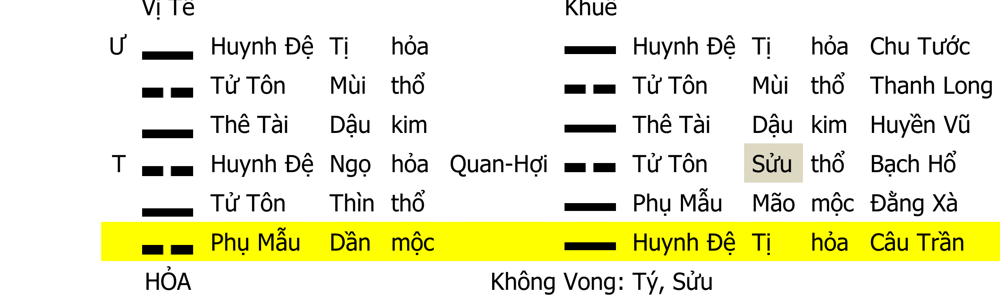 lâu dài được chăng?" Đoán gặp nguy hiểm vào ngày Mậu Tuất, vì là ngày hỏa vượng 
nhập Mộ. Mất vào giờ Dần, vì gặp Tam hợp cục.

Dụng lâm Nhật Nguyệt hưu tầm phục.

Dụng lâm Nhật Nguyệt không cần tìm Phục thần.

Nếu trong quẻ không có Dụng thần, mà được Nhật thần, Nguyệt kiến làm Dụng 
thần, thì không cần phải tìm Phục thần, cũng đoán là bệnh sẽ khỏi.

Phục thần suy nhược tái nghi chiêm.

Phục thần suy nhược cần xem lại.

Nếu Dụng thần không hiện trong quẻ, đều cần phải xem lại. Trong chương "Phi 
Phục" đã trình bày rất tường tận, cần nghiên cứu kỹ.

Giác Tử bàn rằng: Dã Hạc và ta chiêm nghiệm rất nhiều, không thể kể hết, nên 
tạm để lại vài quẻ, để làm khuôn phép cho người học đời sau.

### Ví dụ: Ngày Quý Hợi tháng Thân, xem cho bệnh của bạn, được quẻ Vị Tế:

Vị Tế

Ư

Huynh ĐệTị | hỏa | Bạch Hổ

Tử Tôn | Mùi thổ | Đằng Xà

Thê Tài | Dậu | kim | Câu Trần

T

Huynh ĐệNgọ | hỏa Quan-Hợi Chu Tước

Tử Tôn | Thìn thổ | Thanh Long

Phụ Mẫu | Dần | mộc | Huyền Vũ

HỎA
Không Vong: Tý, Sửu

Lấy hào Ứng làm Dụng thần, bị Nguyệt kiến Thân tương hình, bị Nhật thần Hợi 
tương xung, nên biết rằng sẽ bất lợi vào tháng Hợi. Ta không dám đoán ngay, mà bảo 
người thân của bệnh nhân đến xem. Cùng trong ngày, con xem về bệnh của cha, 
được quẻ Quải:

Quải

Huynh ĐệMùi thổ | Bạch Hổ

T | Tử Tôn | Dậu kim | Đằng Xà

Thê Tài | Hợi thủy | Câu Trần

Huynh ĐệThìn thổ | Chu Tước

Ư | Quan QuỷDần mộc Phụ-TịThanh Long

Thê Tài | Tý | thủy | Huyền Vũ

THỔ
Không Vong: Tý, Sửu

Trong quẻ trước, hào Ứng lâm Tị hỏa, bị Nguyệt hình Nhật khắc. Trong quẻ này, 
vẫn là Phụ Mẫu lâm Tị hỏa, lại phục dưới hào Dần mộc, Dần mộc gặp Nguyệt phá

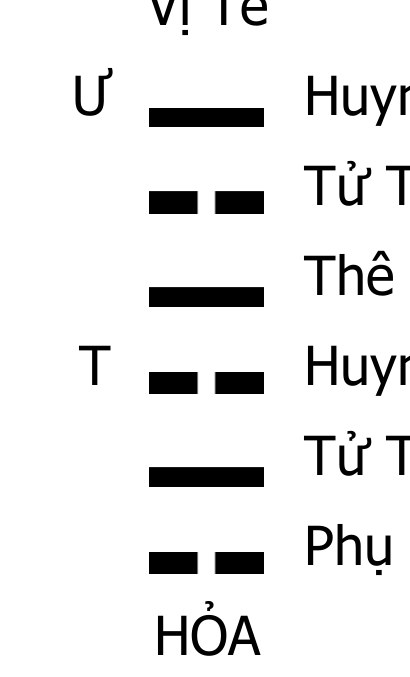

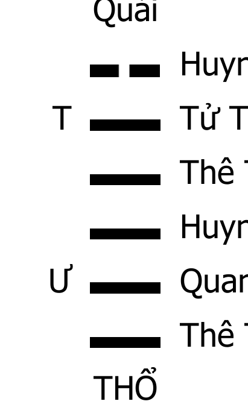 không sinh được hỏa vô căn, nên đoán là đến tháng 10 sẽ nguy hiểm. Sau quả nhiên 
mất vào tháng 10, do tháng Hợi thủy xung phá Tị hỏa vô căn.

### Ví dụ: Ngày Bính Tý tháng Thân, tự xem về bệnh của mình, xem thuốc đang

dùng có trị được bệnh không, được quẻ Thăng biến Tiệm:

Thăng
 
Tiệm

Quan QuỷDậu kim | Huynh ĐệMão mộc Thanh Long

Phụ Mẫu | Hợi thủy | Tử Tôn | Tị | hỏa Huyền Vũ

T | Thê Tài | Sửu thổ Tử-Ngọ | Thê Tài | Mùi | thổ Bạch Hổ

Quan QuỷDậu kim | Quan QuỷThân kim Đằng Xà

Phụ Mẫu | Hợi thủy | Tử Tôn | Ngọ hỏa Câu Trần

Ư | Thê Tài | Sửu thổ | Thê Tài | Thìn thổ Chu Tước

MỘC 
Không Vong: Thân, Dậu

Đoán rằng: Hào Tị hỏa, Ngọ hỏa là Tử Tôn, đều là hào biến, hào biến không thể 
tương sinh hào Thế trong quẻ chính, nên bệnh tình không còn thuốc chữa. Huống chi 
quẻ ngoại lại phản ngâm, chủ về bệnh tái phát nhiều lần.

Lại bảo người nhà xem lại. Cùng ngày, con xem về bệnh của cha, được quẻ Ích 
biến Tiệm:

Ích 
 
Tiệm

Ư | Huynh ĐệMão mộc | Huynh ĐệMão mộc Thanh Long

Tử Tôn | Tị | hỏa | Tử Tôn | Tị | hỏa Huyền Vũ

Thê Tài | Mùi thổ | Thê Tài | Mùi | thổ Bạch Hổ

T | Thê Tài | Thìn thổ Quan-Dậu | Quan QuỷThân kim Đằng Xà

Huynh ĐệDần mộc | Tử Tôn | Ngọ hỏa Câu Trần

Phụ Mẫu Tý | thủy | Thê Tài | Thìn thổ Chu Tước

MỘC
Không Vong: Thân, Dậu

Tại quẻ trước, Nhật thần hợp Thế. Tại quẻ này, Phụ lâm Nhật thần, nên trước 
mắt không có gì đáng ngại. Nhưng hiềm vì trong quẻ thổ động tổn thương thủy, lại là 
quẻ Phong Lôi Ích, Chấn là quan, Tốn là quách, quan quách đã đủ, chỉ là chưa xác 
định được vào ngày tháng nào. Nên bảo người nhà xem thêm quẻ nữa.

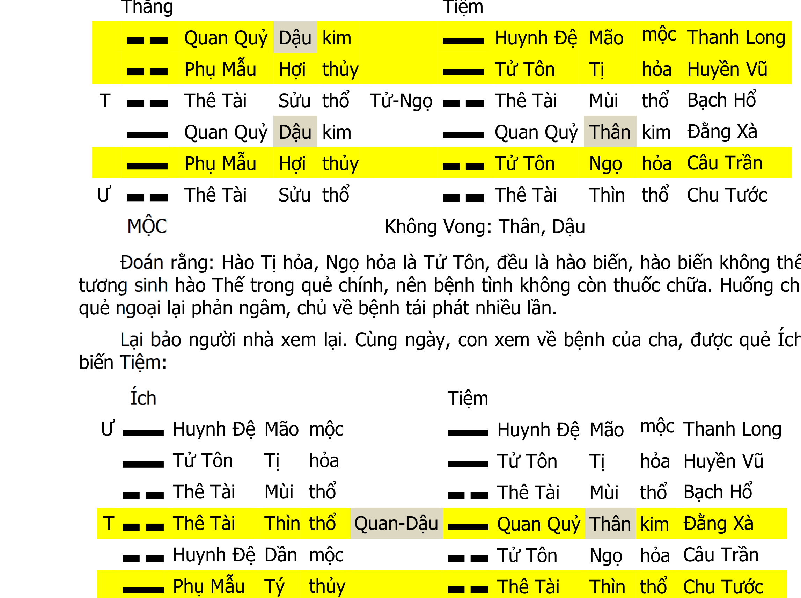

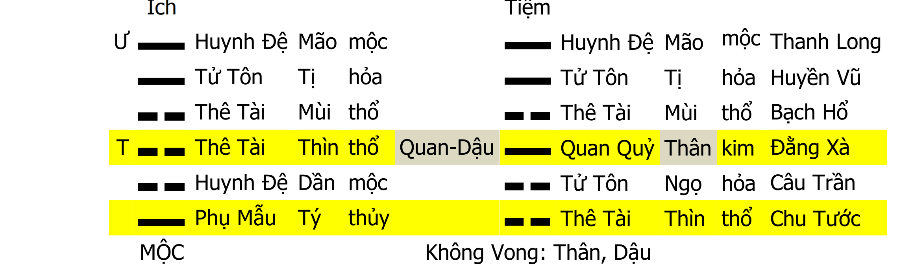

Cũng trong ngày, con gái xem về bệnh của cha, được quẻ Đại Tráng:

Đại Tráng

Huynh Đệ | Tuất thổ | Thanh Long

Tử Tôn | Thân | kim | Huyền Vũ

T | Phụ Mẫu | Ngọ | hỏa | Bạch Hổ

Huynh Đệ | Thìn | thổ | Đằng Xà

Quan Quỷ | Dần | mộc | Câu Trần

Ư | Thê Tài | Tý | thủy | Chu Tước

THỔ 
Không Vong: Thân, Dậu

Đoán rằng: Cần đề phòng mùa đông. Quẻ đầu tiên xem về thuốc, thì hào Tử Tôn 
Tị, Ngọ tượng trưng cho thuốc, đến mùa đông thủy vượng, thì không thuốc nào trị 
được. Quẻ thứ hai, Phụ Mẫu Tý thủy hóa Thìn thổ hồi đầu khắc, nên gặp tháng Tý, sẽ 
không cứu được. Quẻ sau cùng Phụ Mẫu Ngọ hỏa bị tháng Tý xung khắc. Sau quả 
nhiên mất vào tháng Tý mùa đông.

### Ví dụ: Ngày Tân Mão tháng Sửu, xem về con bị bệnh đậu mùa, được quẻ Đại

Tráng biến Càn:

Đại Tráng
 
Càn

Huynh Đệ | Tuất thổ | Huynh Đệ Tuất thổ | Đằng Xà

Tử Tôn | Thân | kim | Tử Tôn | Thân | kim | Câu Trần

T | Phụ Mẫu | Ngọ | hỏa | Phụ Mẫu | Ngọ | hỏa | Chu Tước

Huynh Đệ | Thìn | thổ | Huynh Đệ | Thìn | thổ | Thanh Long

Quan Quỷ | Dần | mộc | Quan Quỷ | Dần | mộc Huyền Vũ

Ư | Thê Tài | Tý | thủy | Thê Tài | Tý | thủy | Bạch Hổ

THỔ 
Không Vong: Ngọ, Mùi

Đoán rằng: Đây là quẻ Lục xung biến Lục xung, là điềm hoa chưa nở đã tàn. Lại 
là quẻ Phục ngâm, đều không phải là điềm tốt. Tử Tôn tuy được sinh phù, nhưng 
cũng khó bảo toàn được sự cát lợi. Bèn bảo người này xem lại, được quẻ Cấn biến 
Thăng:

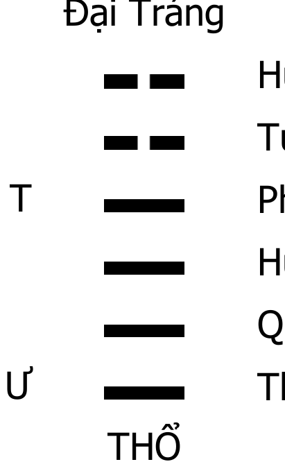

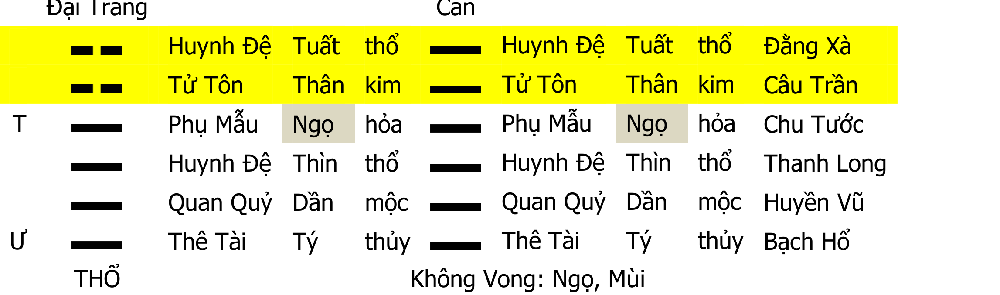

Cấn 
 
Thăng

T | Quan QuỷDần mộc | Tử Tôn | Dậu kim Đằng Xà

Thê Tài | Tý | thủy | Thê Tài | Hợi thủy Câu Trần

Huynh ĐệTuất thổ | Huynh ĐệSửu thổ Chu Tước

Ư | Tử Tôn | Thân kim | Tử Tôn | Dậu kim Thanh Long

Phụ Mẫu | Ngọ hỏa | Thê Tài | Hợi thủy Huyền Vũ

Huynh ĐệThìn thổ | Huynh ĐệSửu thổ Bạch Hổ

THỔ
Không Vong: Ngọ, Mùi

Hào Phụ Ngọ hỏa phát động khắc Tử Tôn, tuy được chế phục, nhưng hiềm vì 
Quỷ động khắc Tử Tôn, nên cần phải đề phòng ngày Dần. Sau quả nhiên chết vào 
ngày Dần. Sở dĩ ứng vào ngày Dần, vì hào Phụ Ngọ hỏa gặp Trường Sinh tại Dần. Lại 
ứng với quẻ trước Tử Tôn Thân kim hóa Phục ngâm, đến ngày Dần sẽ xung Thân.

Lại vào ngày Canh Thìn tháng Tuất, xem về bệnh gần của cha, được quẻ Ly:

Ly

T | Huynh Đệ | Tị | hỏa | Đằng Xà

Tử Tôn | Mùi thổ | Câu Trần

Thê Tài | Dậu | kim | Chu Tước

Ư | Quan Quỷ | Hợi | thủy | Thanh Long

Tử Tôn | Sửu thổ | Huyền Vũ

Phụ Mẫu | Mão | mộc | Bạch Hổ

HỎA 
Không Vong: Thân, Dậu

Ta đoán rằng: Bệnh gần gặp xung sẽ khỏi. Người xem bèn hỏi: "Bao giờ sẽ 
khỏi?" Ta bảo anh ta xem tiếp, được quẻ Đại Quá biến Khốn:

Đại Quá
 
Khốn

Thê Tài | Mùi thổ | Thê Tài | Mùi thổ Đằng Xà

Quan QuỷDậu kim | Quan QuỷDậu kim Câu Trần

T | Phụ Mẫu Hợi thủy Tử-Ngọ | Phụ Mẫu Hợi thủy Chu Tước

Quan QuỷDậu kim | Tử Tôn | Ngọhỏa Thanh Long

Phụ Mẫu Hợi thủy Huynh-Dần | Thê Tài | Thìn thổ Huyền Vũ

Ư | Thê Tài | Sửu thổ | Huynh ĐệDần mộc Bạch Hổ

MỘC 
Không Vong: Thân, Dậu

Đoán rằng: Đến ngày Ất Dậu bệnh sẽ thuyên giảm. Hào Quan Dậu kim gặp Tuần 
Không, đến ngày xuất Không sẽ sinh Hợi thủy. Quả nhiên đến ngày Giáp Thân thì ngồi 
dậy được, đến ngày Ất Dậu thì khỏi hẳn.

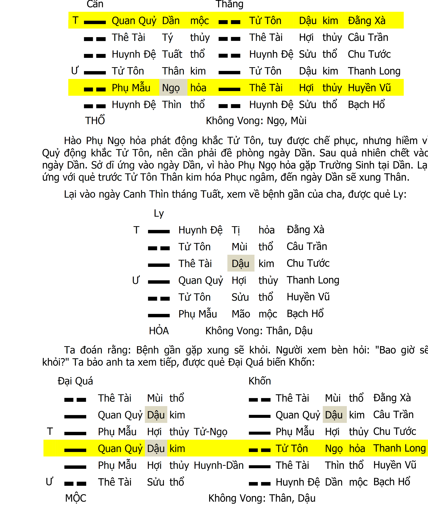

**Dã Hạc bàn rằng:** Những quẻ trên đây, đều dạy người ta nên xem nhiều lần, 
dùng nhiều quẻ hợp lại để đoán sẽ rõ ràng, ngày tháng cát hung cũng sẽ hiện rõ.

### Ví dụ: Ngày Bính Tuất tháng Sửu, tự xem về bệnh gần, được quẻ Tỷ biến Cách:

Tỷ 
 
Cách

Ư | Thê Tài | Tý | thủy | Huynh Đệ | Mùi thổ | Thanh Long

Huynh Đệ | Tuất thổ | Tử Tôn | Dậu | kim | Huyền Vũ

Tử Tôn | Thân | kim | Thê Tài | Hợi | thủy | Bạch Hổ

T | Quan Quỷ | Mão | mộc | Thê Tài | Hợi | thủy | Đằng Xà

Phụ Mẫu | Tị | hỏa | Huynh Đệ | Sửu thổ | Câu Trần

Huynh Đệ | Mùi | thổ | Quan Quỷ | Mão | mộc Chu Tước

Hào Quan Quỷ trì Thế, Thân kim phát động, khắc mất Quỷ bên mình, lại thêm 
Thế hóa Hợi thủy hồi đầu sinh, nên lẽ ra là khỏi bệnh. Nhưng hiềm vì hào Thế theo 
Quỷ nhập Mộ Không, lại gặp Tam hợp, nên e rằng thành bệnh lâu dài.

Bèn bảo người nhà xem lại. Cùng ngày, vợ xem cho chồng, được quẻ Trung Phu 
biến Đoài:

Trung Phu
 
Đoài

Quan QuỷMão mộc | Huynh ĐệMùi thổ Thanh Long

Phụ Mẫu Tị | hỏa Tài-Tý | Tử Tôn | Dậu kim Huyền Vũ

T | Huynh ĐệMùi thổ | Thê Tài | Hợi thủy Bạch Hổ

Huynh ĐệSửu thổ Tử-Thân | Huynh ĐệSửu thổ Đằng Xà

Quan QuỷMão mộc | Quan QuỷMão mộc Câu Trần

Ư | Phụ Mẫu Tị | hỏa | Phụ Mẫu Tị | hỏa Chu Tước

THỔ 
Không Vong: Ngọ, Mùi

Hào Quan Mão mộc là Dụng thần, hóa Mùi thổ Không Vong, bệnh gần gặp Không 
sẽ khỏi. Nhưng hiềm vì cả hai quẻ đều gặp Tam hợp, e rằng sẽ thành bệnh lâu dài mà 
chết. Người xem bèn hỏi: "Cần đề phòng thời điểm nào?" Ta đáp: "Mùi nhập Mộ, gặp 
Tuần Không, lại gặp Nguyệt phá, nếu là xem về đề phòng lo âu, thì phá là tượng lưới 
rách dễ thoát. Nhưng nay xem về bệnh tật, gặp Tam hợp là khó khỏi. Tháng Mùi năm 
sau có lẽ chính là thời điểm điền thực huyệt mộ." Sau quả nhiên chết vào tháng Mùi 
năm sau.

Để lại quẻ này làm quy tắc cho người học đời sau, để biết rằng xem về bệnh gần, 
gặp Không, hóa Không sẽ khỏi; nhưng nếu gặp Tam hợp, sẽ biến thành bệnh lâu dài 
mà chết.

### Ví dụ: Ngày Ất Dậu tháng Dần, xem về bệnh lâu ngày của cháu ngoại, được quẻ

Khôn biến Càn:

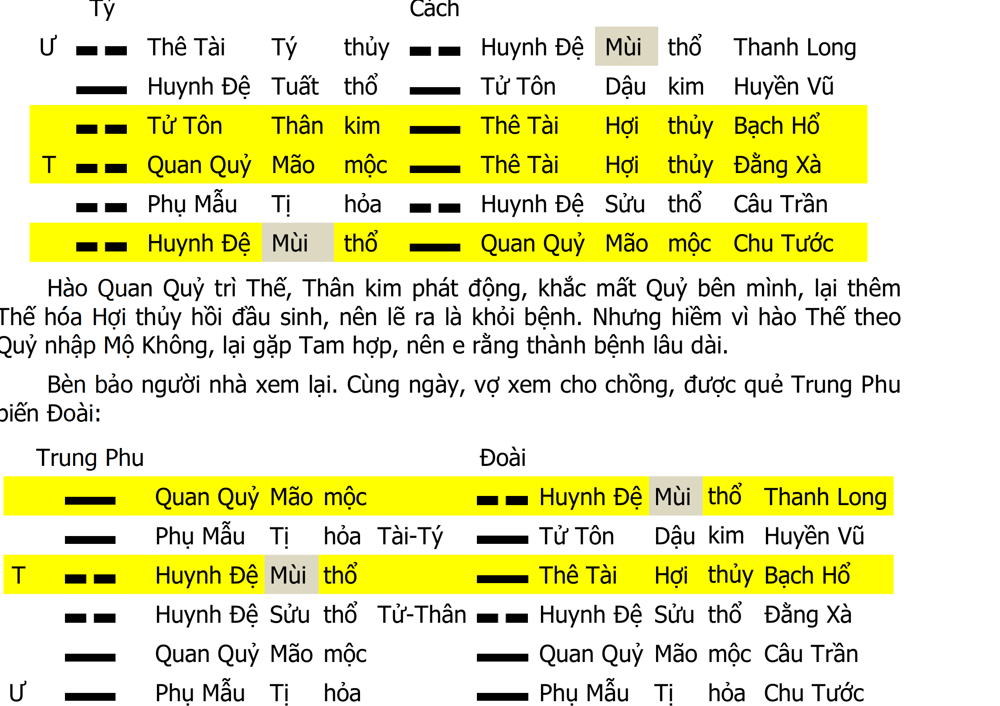

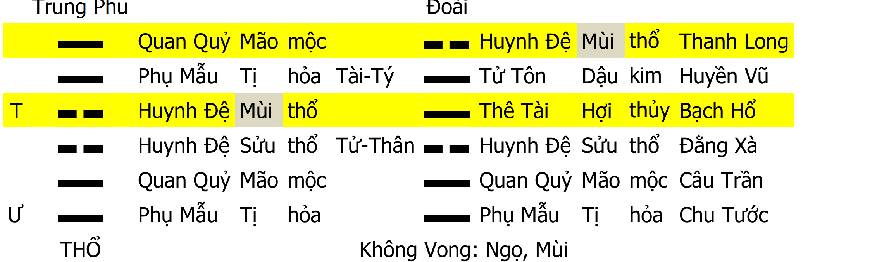

Khôn
 
Càn

T | Tử Tôn | Dậu kim | Huynh ĐệTuất thổ Huyền Vũ

Thê Tài | Hợi thủy | Tử Tôn | Thân kim Bạch Hổ

Huynh ĐệSửu thổ | Phụ Mẫu Ngọ hỏa Đằng Xà

Ư | Quan QuỷMão mộc | Huynh ĐệThìn thổ Câu Trần

Phụ Mẫu Tị | hỏa | Quan QuỷDần mộc Chu Tước

Huynh ĐệMùi thổ | Thê Tài | Tý | thủy Thanh Long

THỔ
Không Vong: Ngọ, Mùi

Bệnh lâu ngày gặp xung sẽ chết, huống nữa lại là quẻ Lục xung biến Lục xung, 
đến tháng ba ắt sẽ nguy hiểm. Sau quả nhiên chết vào tháng ba. Sở dĩ ứng vào tháng 
ba, là vì hào Tử Tôn Dậu kim là Dụng thần, động mà gặp tháng hợp sẽ ứng nghiệm. 
Tháng ba là Mão mộc sẽ xung mất Tuất thổ, khiến Dậu kim không còn được sinh.

Nên để lại quẻ này làm quy tắc: Bệnh lâu ngày gặp xung, tuy Dụng thần lâm 
Nguyệt kiến, lại được hào động Tuất thổ tương sinh, nhưng cũng không sống nổi.

### Ví dụ: Ngày Bính Dần tháng Tý, tự xem về bệnh dịch của bản thân, được quẻ

Tiết biến Trung Phu:

Tiết
 
Trung Phu

Huynh ĐệTý | thủy | Tử Tôn | Mão mộc Thanh Long

Quan QuỷTuất thổ | Thê Tài | Tị | hỏa Huyền Vũ

Ư | Phụ Mẫu Thân kim | Quan QuỷMùi thổBạch Hổ

Quan QuỷSửu thổ Tài-Ngọ | Quan QuỷSửu thổĐằng Xà

Tử Tôn | Mão mộc | Tử Tôn | Mão mộc Câu Trần

T | Thê Tài | Tị | hỏa | Thê Tài | Tị | hỏa Chu Tước

THỦY
Không Vong: Tuất, Hợi

Đoán rằng: Tý thủy khắc Thế, Nguyệt kiến cũng khắc Thế, nên là điềm đại hung. 
May nhờ được Nhật thần Dậu tương sinh, nên nếu về phương nam tránh dịch, lại nằm 
ngủ ở giường phía nam, khiến cho hỏa vượng mà thủy khô, vẫn có thể được vô sự. 
Người này bèn y theo lời, đến ngày Hợi bệnh tình nguy cấp, gặp được thầy thuốc giỏi, 
đến ngày Dần thì khỏi bệnh. Lúc này dịch bệnh hoành hành, nhà nhà đều có người 
mắc dịch. Cùng ngày, cũng có người đến xem, gieo được quẻ này, ta cũng khuyên 
anh ta cách thức tương tự. Nhưng vì người này bệnh nặng, lại nghe lời người khác nói 
rằng người bệnh không thể chuyển giường, nên không theo lời ta, sau chết vào ngày 
Hợi.

Dã Hạc nói rằng: Để lại quẻ này làm chuẩn tắc, cho người đời sau biết được cách 
rước lành tránh dữ.

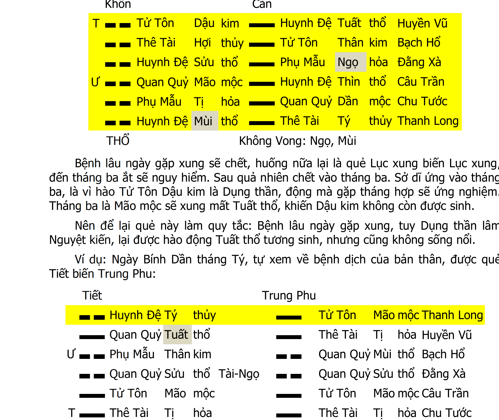

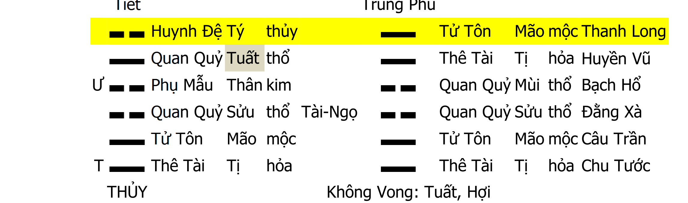

### Ví dụ: Ngày Ất Mùi tháng Sửu, xem con trai đang phát sốt, liệu có phải mắc đậu

mùa không, được quẻ Đoài:

Đoài

T | Phụ Mẫu | Mùi thổ | Huyền Vũ

Huynh Đệ | Dậu | kim | Bạch Hổ

Tử Tôn | Hợi | thủy | Đằng Xà

Ư | Phụ Mẫu | Sửu thổ | Câu Trần

Thê Tài | Mão | mộc | Chu Tước

Quan Quỷ | Tị | hỏa | Thanh Long

KIM 
Không Vong: Thìn, Tị

Ta nói: Phép xưa cho rằng Quan Quỷ vượng tức là nổi đậu mùa, nhưng ta thử 
nhiều lần không thấy ứng nghiệm, nên chỉ là ước đoán mà thôi. Chỉ cần xem hào Tử 
Tôn vượng hay suy, nếu vượng, có gặp đậu mùa cũng không đáng ngại. Quẻ này 
Nhật, Nguyệt và hào Thế đều khắc Tử Tôn, lại là quẻ Lục xung, là tượng hoa chưa nở 
đã tàn, rất xấu. Đợi đến hôm sau hãy thành tâm xem thêm một quẻ.

Hôm sau ngày Bính Thân xem lại, được quẻ Đại Quá biến Hoán:

Đại Quá
 
Hoán

Thê Tài | Mùi thổ | Huynh ĐệMão mộc Thanh Long

Quan QuỷDậu kim | Tử Tôn | Tị | hỏa Huyền Vũ

T | Phụ Mẫu Hợi thủy Tử-Ngọ | Thê Tài | Mùi thổ Bạch Hổ

Quan QuỷDậu kim | Tử Tôn | Ngọhỏa Đằng Xà

Phụ Mẫu Hợi thủy Huynh-Dần | Thê Tài | Thìn thổ Câu Trần

Ư | Thê Tài | Sửu thổ | Huynh ĐệDần mộc Chu Tước

MỘC 
Không Vong: Thìn, Tị

Đoán rằng: Hào Phụ phát động, tuy gặp chế phục, nhưng lại hiềm vì hào Quỷ 
biến Tử Tôn, nên cần phải mời thầy giỏi về chữa trị. Người xem bèn hỏi: "Mời thầy ở 
đâu là tốt nhất?" Ta đáp: "Phép xưa lấy hào Tử Tôn để xem thầy thuốc, nay lại là xem 
về bệnh của con, làm sao lại lấy hào Tử Tôn làm thầy thuốc được."

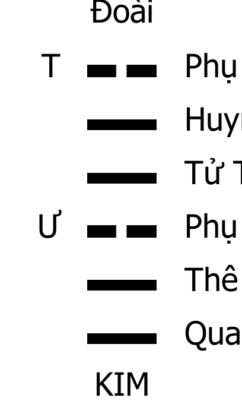

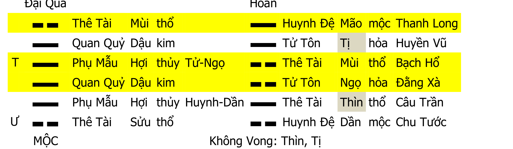

Bèn xem thêm một quẻ, được quẻ Địa Trạch Lâm biến Địa Thủy Sư:

Lâm 
 
Sư

Tử Tôn | Dậu | kim | Tử Tôn | Dậu kim | Thanh Long

Ư | Thê Tài | Hợi | thủy | Thê Tài | Hợi | thủy | Huyền Vũ

Huynh Đệ | Sửu thổ | Huynh Đệ | Sửu thổ | Bạch Hổ

Huynh Đệ | Sửu thổ | Phụ Mẫu | Ngọ hỏa | Đằng Xà

T | Quan Quỷ | Mão | mộc | Huynh Đệ | Thìn | thổ | Câu Trần

Phụ Mẫu | Tị | hỏa | Quan Quỷ | Dần mộc | Chu Tước

THỔ
Không Vong: Thìn, Tị

Đoán rằng: Hào Phụ Tị hỏa động khắc Tử, nên mời thầy thuốc phương bắc. Sau 
quả nhiên mời thầy thuốc tại cổng bắc đến điều trị, đến ngày Canh Tý thì nổi đậu. Lại 
xem, được quẻ Giải biến Quy Muội:

Giải
 
Quy Muội

Thê Tài | Tuất thổ | Thê Tài | Tuất thổ Đằng Xà

Ư | Quan QuỷThân kim | Quan QuỷThân kim Câu Trần

Tử Tôn | Ngọ hỏa | Tử Tôn | Ngọ hỏa Chu Tước

Tử Tôn | Ngọ hỏa | Thê Tài | Sửu thổ Thanh Long

T | Thê Tài | Thìn thổ | Huynh ĐệMão mộc Huyền Vũ

Huynh ĐệDần mộc Phụ-Tý | Tử Tôn | Tị | hỏa Bạch Hổ

MỘC
Không Vong: Thìn, Tị

Đoán rằng: Nhật thần Tý xung động hào Tử Tôn Ngọ hỏa, được hào động Dần 
mộc tương sinh, quẻ này khác với quẻ trước, đã có dấu hiệu sống. Người xem bèn 
hỏi: Hôm nay nổi đậu, ở cửa bắc còn có một thầy thuốc họ Dương, tôi đang muốn 
mời đến, định xem thêm một quẻ xem có được không. Ta bèn đáp rằng: Chữ Dương (
杨) có bộ mộc (木), trong quẻ Dần mộc sinh Ngọ hỏa, nên chính là người này, không 
cần xem thêm nữa. Người này bèn đi mời thầy họ Dương về chữa, đậu nổi đỏ rực, 
sau vẫn chữa lành. Đây chính là phương pháp để hướng dẫn người ta cách tìm thầy 
thuốc.

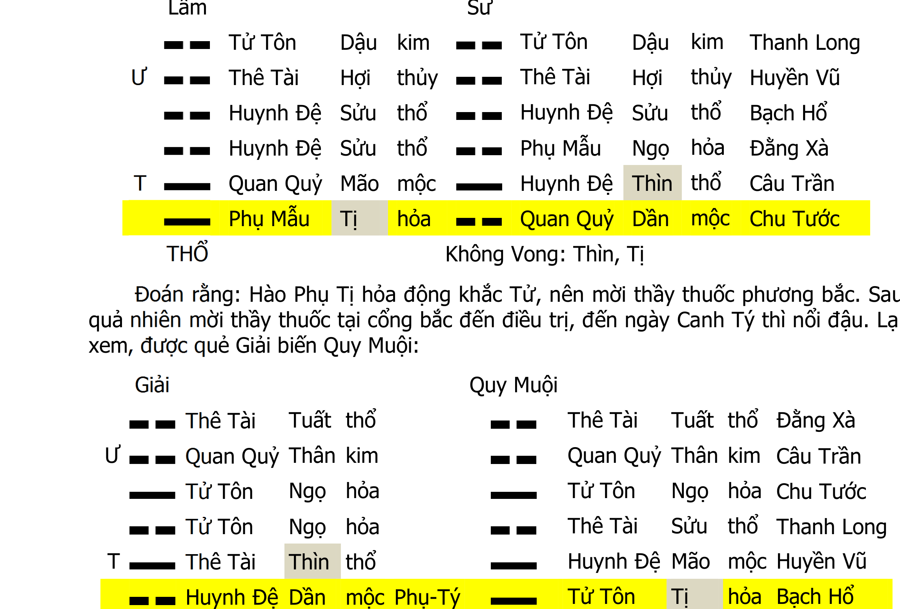

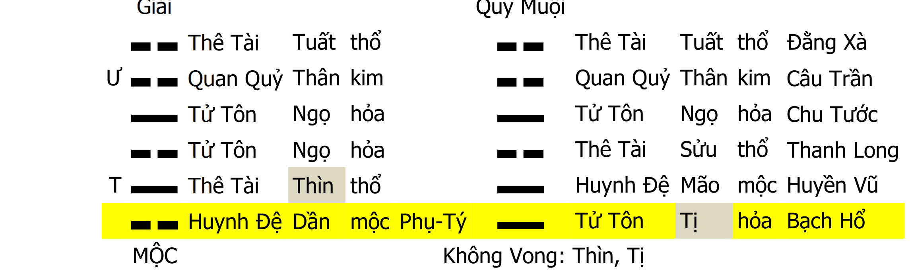

---

# CHƯƠNG 107: ĐẬU, SỞI

Nếu lúc bình thường mà xem bao giờ lên đậu, lên sởi, thì lấy hào Quỷ làm Dụng 
thần. Nếu hào Quỷ tĩnh, đến lúc gặp trực, gặp xung sẽ lên. Nếu hào Quỷ động, đợi khi 
gặp trực, gặp hợp sẽ phát. Nếu hào Quỷ suy, đợi đến năm sinh vượng. Nếu hào Quỷ 
vượng hoặc hiện nhiều, đợi đến năm gặp Mộ. Nếu hào Quỷ Không, Quỷ Phá, đợi khi 
điền thực. Nếu hào Quỷ phục, nhập Mộ, đợi đến năm xuất hiện.

Khi đã bị lên đậu, lên sởi, mà hỏi xem lành dữ thế nào, thì kỵ gặp quẻ Lục xung, 
cũng kỵ Tử Tôn hóa Quỷ, Quỷ hóa Tử Tôn; hoặc Phụ hóa Tử, Tử hóa Phụ; hoặc Tử 
Tôn phục mà Không Phá, đều là điềm dữ.

Hỏi xem nốt đậu, nốt sởi mọc thưa hay dày, nếu hào Quỷ vượng mà lâm Nhật 
Nguyệt, hoặc động mà được sinh phù, thì nốt đậu, nốt sởi sẽ mọc dày; nếu hào Quỷ 
gặp Không, Phá, Hưu Tù, Mộ, Tuyệt, nốt đậu, nốt sởi sẽ thưa thớt.

Nếu hào Quỷ động tại cung Càn, đậu mọc nhiều trên đầu. Nếu hào Quỷ động tại 
quẻ Khôn, đậu sởi mọc nhiều ở phần bụng. Nếu động tại cung Cấn, sẽ mọc nhiều ở 
tay. Nếu động tại cung Đoài, sẽ mọc nhiều ở miệng. Nếu động tại Khảm, Ly, sẽ mọc 
nhiều tại nửa thân trên. Nếu động tại Chấn, Tốn, sẽ mọc nhiều tại nửa thân dưới. Nếu 
là Quỷ hỏa, nốt đậu màu đỏ tía; nếu là Quỷ kim, nốt đậu trắng bệch; nếu là Quỷ thủy, 
nốt đậu đen, lõm; nếu là Quỷ mộc, nốt đậu sẽ bé; nếu là Quỷ thổ, nốt đậu sưng tấy.

Những nội dung xem trên đây, cần chia ra từng quẻ để xem, không thể dùng 
một quẻ để đoán chung cho tất cả. Nhưng nhìn chung, đều phải quan sát hào Tử Tôn. 
Nếu Tử Tôn lâm Nhật Nguyệt, hoặc được Nhật, Nguyệt, hào động tương sinh, hoặc 
động mà hóa cát, không bị hình thương khắc hại, trong quẻ không có nhiều hào động, 
thì nốt đậu tuy dày nhưng sẽ bay hết, nốt đậu tuy lõm sâu, rồi cũng lành.

***

# CHƯƠNG 108: CĂN NGUYÊN BỆNH TẬT

Hỏa thuộc tâm kinh, phát sốt, miệng khô, họng rát;

Thủy là phần thận, cảm lạnh, mồ hôi, di tinh.

Kim phổi mộc gan, thổ là bệnh về đường ruột;

Suy nhẹ vượng nặng, động ắt thân xác đớn đau.

Khôn bụng, Càn đầu, Đoài là cổ họng, ho hắng;

Cấn tay, Chấn chân, Tốn là bại liệt, loét tràng.

Đằng Xà đau tim, Thanh Long là tửu sắc quá độ;

Câu Trần phù thủng, Chu Tước là lời lẽ đảo điên.

Bạch Hổ tổn thương, phụ nữ ắt băng huyết, thiếu máu;

Huyền Vũ trầm uất, đàn ông bệnh kín âm hư.

---

# CHƯƠNG 109. QUỶ THẦN

**Dã Hạc bàn rằng:** Trên đây là đoạn trích trong phần xem về bệnh tật trong 
chương "Hoàng kim sách". Với người bình thường mà nói, thì không thể không nghe 
theo đó. Nếu như hiểu phép chia ra để xem, xem thêm một quẻ để định cát hung, 
như vậy sẽ có ứng nghiệm. Còn nếu như chỉ dùng một quẻ để đoán gộp chuyện sống 
chết mà được linh ứng, thì ta không tin. Cần phải hiểu rằng người đến hỏi về bệnh, là 
muốn biết mắc bệnh ra sao, điều trị thế nào, và tình hình lành dữ ra sao? Nếu chỉ 
đoán bừa là cảm lạnh cảm nóng, nếu như đúng, cũng chỉ nói qua loa được triệu 
chứng mà thôi. Còn bệnh nhân không biết đường nào để tìm cát tránh hung, thì xem 
quẻ cũng có ích gì? Nay xem chương này, chỉ nói về các chứng bệnh, mà không mách 
nước phải chữa trị bằng cách nào. Nếu như tâm kinh phát nhiệt, thì bản thân người 
đến xem bệnh chẳng lẽ lại không tự biết? Thử hỏi muốn trị chứng phát nhiệt đó, phải 
dùng cách nào? Đều là lý luận vô ích, nên ta đều bỏ hết. Khi gặp người đến xem 
bệnh, ta thường bảo họ trước tiên hãy xem về cát hung. Nếu được quẻ cát, bệnh sẽ 
thuyên giảm, không cần phải uống thuốc cầu thần. Nếu gặp quẻ hung, thì bảo người 
xem mời thầy về chữa. Nếu gặp quẻ có hào Quỷ động khắc Dụng thần, thì bảo họ 
xem lại về quẻ thần. Hoặc là xem về gia trạch, hoặc là xem về phần mộ, là để xem bị 
phạm phải chỗ nào, để tìm cách xử lý chữa trị, như vậy ngõ hầu không phụ lòng 
người đến xem vậy.

***

# CHƯƠNG 109: QUỶ THẦN

Nếu xem về quỷ thần, mà trong quẻ hào Quỷ hưu tù, hoặc gặp Không, Phá, Mộ, 
Tuyệt, thì chủ về tai họa không phải do quỷ thần gây ra.

Quan Quỷ thuộc kim, vượng tướng, chủ về thần võ, hoặc thần tại phương tây. 
Nếu hưu tù, là chỉ ma quỷ chết vì đao kiếm.

Hào Quỷ thuộc mộc, nếu vượng thì chỉ thần văn, hoặc thần tại phương đông. 
Nếu suy, chủ về yêu quái trong cây, cỏ, hoặc ma quỷ chết vì hình trượng, treo cổ.

Hào Quỷ thuộc thủy, chủ về thần sông thần biển, hoặc thần tại phương bắc. Nếu 
hưu tù, chủ về ma quỷ chết đuối tại sông suối ao hồ.

Hào Quỷ thuộc hỏa, chủ về thần lửa, hoặc thần sấm thần sét, thần lò thần bếp. 
Nếu hưu tù, chủ về ma quỷ chết cháy.

Hào Quỷ thuộc thổ, chủ về thần Thổ địa, hoặc miếu thờ chính, hoặc thần cai 
quản sông núi, xã tắc. Nếu hưu tù, chủ về ma quỷ chết vì sập nhà, đổ tường.

Phép xem xưa căn cứ vào ngũ hành kim mộc thủy hỏa thổ để phân biệt các loại 
thần. Ví dụ như Quỷ thuộc kim, là chỉ các vị thần Thiên Tướng Quan Công, Kim Cương 
Nguyên soái, Ngũ công, Nhạc công, ta cho rằng cách đấy là sai. Thần võ rất nhiều, 
không thể đếm hết, có vị được sắc phong, có vị chưa được phong, phong tục mỗi 
vùng khác nhau, cũng có rất nhiều vị không được ghi chép trong sách vở, chưa được 
thờ cúng trong miếu. Bởi vậy, nên cần hỏi bệnh nhân xem, có hứa hẹn tại đền, miếu 
thần võ nào mà chưa hoàn trả hay không? Hoặc có gây ô uế, phá hủy đền miếu nào

---

# CHƯƠNG 110. MỜI THẦY CHỮA BỆNH

không, để chỉ đích danh vị thần đó mà xem quẻ. Nếu như hào Quỷ vượng hoặc động, 
tức đúng là vị thần đó. Nếu hào Quỷ không hiện trong quẻ, thì xem tiếp về quỷ thần 
nơi khác. Hào Quỷ thuộc mộc, hỏa, thủy, thổ, cũng đều sử dụng phương pháp này.

Nếu đắc tội với thần thiện, chính thần, thì dùng hương hoa, ngựa giấy để cúng 
tế. Nếu đắc tội với thần ác, tà thần, cần chuẩn bị tiền giấy, đợi buối đêm tối yên tĩnh, 
nếu là Quỷ thuộc kim thì hướng về phương tây để đốt, Quỷ thuộc thủy thì hướng về 
phương bắc để đốt...

**Dã Hạc bàn rằng:** Nếu gặp thiên tai, bệnh dịch, cần theo phương pháp này để 
cúng tế, ta đã thử nghiệm nhiều lần. Nhưng nếu là phong lao, cổ trướng, tức là tiên 
thiên mất cân bằng; nếu do tửu sắc hại thân, tức là hậu thiên thiếu cẩn trọng, những 
việc đó thì có liên quan gì đến quỷ thần? Có cúng tế, đốt tiền vàng cũng là vô ích. Chỉ 
có cách tiết chế ẩm thực, tránh xa sắc dục, bế khí dưỡng thần, thì bệnh tình tự nhiên 
sẽ giảm. Ta đi khắp giang hồ, thấy các vùng Điền, Kiềm, Thục, Việt người dân không 
uống thuốc, mà chỉ sùng tín quỷ thần. Khi mắc bệnh, trước hết dùng ba hoặc năm loại 
động vật cúng tế, sau lại giết trâu giết ngựa, cúng một lần không khỏi, lại cúng tiếp, 
có khi đến hai ba chục lần, không ít người vì đau ốm cầu cúng mà trở nên bần cùng. 
Làm như vậy là không biết rằng, tàn hại những sinh mạng khác để cứu sinh mạng của 
mình là tội lỗi lớn. Mà đây lại là hại vô số sinh mạng, mà mạng của bản thân vẫn 
không cứu được, những chuyện như thế diễn ra liên tục mà người dân vẫn không biết 
sửa đổi. Nay lại đến lượt người đọc sách cũng tin vào thần bệnh, thần tà, ta thực sự 
không thể nào hiểu nổi. Từ khi Thần Nông nếm các loại cỏ cây để làm thuốc cứu chữa 
sinh linh, chưa từng có vị thánh hiền nào dạy người cách giết hại các sinh vật sống để 
cứu sống con người.

Lý Ngã Bình cũng bàn rằng: "Dịch mạo" cho rằng, nếu Quỷ tại hành kim, là chỉ | Quan Công, Nhạc Vương. "Dịch lâm bổ di" cũng cho rằng, Thanh Long tượng trưng | cho Hán Thọ Đình Hầu. Nhưng nếu người xem chưa hề biết đến Quan Công, thì Quỷ | kim và Thanh Long sẽ tượng trưng cho vị thần nào đây? Lại viết rằng: "Cúng tế thì | thần sẽ ban phúc cho; không cúng tế, thì thần sẽ giáng tai ương xuống." Đó lạ nói về | những tà thần tác oai tác phúc. Còn những vị thần chính trực, làm gì có chuyện như | thế. Cuốn sách này từ đầu đến cuối không có điều nào là không hợp lý. Duy chỉ có | chương "Tật bệnh" này lại nói sang chuyện quỷ thần, khiến ta rất không phục. Ngờ | rằng do người thời này hỏi về bệnh tật, mở miệng liền hỏi ngay về quỷ thần, nên | không thể không theo thói tục, người hiểu biết cần phải xem xét cho kỹ.

***

# CHƯƠNG 110: MỜI THẦY CHỮA BỆNH

**Dã Hạc bàn rằng:** "Có người hỏi ta rằng, bốc dịch để cầu thần, mời thầy chữa 
bệnh có cái lý này không?" Ta đáp: "Nếu không có cái lý đó, thì Phục Hy vạch quẻ, 
Thần Nông nếm thuốc, là để làm gì?" Người đó bèn trả lời: "Thế nhưng cũng có 
trường hợp không cứu được, là do đâu?" Ta đáp: "Nếu có gốc rễ, thì có thể cứu. Nếu 
không có gốc rễ, thì không thể cứu được. Con người khi sao qua cung, hoặc chuyển vận, thoát hạn, gọi là những năm "di hoa tiếp mộc" (dời hoa ghép cây). Nếu di dời 
những cây, hoa có gốc rễ, bên trên được che chắn, bên dưới được tưới tắm, thì sẽ 
sống. Nêu không che không tưới, gặp nắng sẽ khô. Uống thuốc, cầu thần, cũng là vì 
cái ý đó. Còn nếu là cây không gốc rễ, hoa không cuống, tuy được tưới tắm chở che, 
cũng là vô ích."

Tự xem về việc mời thầy, thì lấy hào Ứng làm thầy thuốc. Nếu xem thay người 
thân, cũng lấy hào Ứng làm thầy thuốc.

Quỷ tác ưu thần hưu vọng động; Phúc vi hỷ duyệt yếu sinh phù.

Quỷ là ưu phiền đừng vọng động; Phúc là vui vẻ nên sinh phò.

Tự xem cho mình hay xem thay người khác, thì Quỷ đều là thần ưu phiền lo lắng, 
nếu Quỷ trì Thế, hoặc động trong quẻ, mà được hào Tử Tôn cũng động mà khắc chế, 
thì có thể mời thầy thuốc đó đến chữa trị, bệnh sẽ khỏi. Nếu được Tử Tôn lâm Ứng, 
thì đó là thầy thuốc giỏi. Nguyên nhân là vì đâu? Vì Tử Tôn là thần khắc chế Quỷ, 
nhưng không thể khắc chế tà ma quỷ quái thực sự, mà chỉ có tác dụng khắc chế Quỷ 
ưu phiền, khiến cho ta không còn lo lắng.

Ứng tác y nhân, bất nghi Không Phá Mộ Tuyệt.

Ứng là thầy thuốc, không nên Không, Phá, Mộ, Tuyệt.

Nếu hào Ứng Không, Phá, Mộ, Tuyệt, hưu tù, suy nhược, hoặc vượng tướng mà 
bị Nhật thần, Nguyệt kiến, hào động xung khắc, hoặc động mà hóa Quỷ, hóa Tuyệt, 
hóa hồi đầu khắc, đều chủ về thuốc thang không hiệu quả.

Tử Tôn chế Quỷ, tối hỷ vượng tướng sinh phù.

Tử Tôn chế Quỷ, mong được vượng tướng sinh phò.

Nếu hào Tử Tôn lâm Thế, Ứng, hoặc phát động trong quẻ, cũng cần phải vượng 
tướng, không bị Hình, Xung, Khắc, Hại, không gặp Phá, Mộ, Tuyệt, Không, như vậy 
uống thuốc sẽ có tác dụng.

Nếu như Tử Tôn động hóa Quỷ, hóa Khắc, là thuốc ấy không tốt. Nếu Tử Tôn 
động hóa Không, đợi đến ngày thực Không sẽ có tác dụng. Nếu Tử Tôn hóa sinh hóa 
vượng, hoặc hóa Tiến thần, thì càng là thuốc tốt.

Sách xưa cho rằng hào Tử động hóa Tử Tôn là chỉ thuốc tạp, như vậy là không 
đúng. Nếu Tử Tôn hóa Tử Tôn mà lại vượng tướng, nên đổi thuốc, sẽ gặp thuốc tốt.

Y khắc Dụng hào, cận bệnh tức dũ.

Ứng khắc hào Dụng, bệnh gần sẽ khỏi.

Nếu tự xem về bệnh của mình, mà hào Ứng khắc hào Thế, tức là khắc chế bệnh 
của ta. Nếu hào Ứng khắc Dụng thần, cũng đoán như vậy. Nhưng nếu là mắc bệnh 
lâu ngày hoặc người thể trạng hư nhược, gặp quẻ này là không nên, vì không chỉ khắc 
chế bệnh, mà bản thân cũng bị tổn thương.

Nếu hào Ứng lâm Huynh, lâm Quỷ mà khắc Dụng thần, hoặc khắc hào Thế, bất 
kể bệnh mới mắc hoặc bệnh lâu ngày, đều bị tổn hại.

Phụ hào trì Thế, diệu dược nan điều.

Hào Phụ trì Thế, thuốc tiên khó chữa.

Nếu tự xem cho mình mà gặp hào Phụ trì Thế, thì uống thuốc cũng vô hiệu. Cần 
phải tĩnh dưỡng, tránh xa sắc dục, tránh buồn phiền giận dữ, bệnh tật còn có thể 
thuyên giảm.

Nếu Huynh Đệ trì Thế, mà có hào Tử Tôn động trong quẻ, có thể mời thầy thuốc 
đến chữa. Nhưng kỵ Quỷ vượng, Quỷ động, chủ về uống nhầm thuốc.

Nếu hào Tài trì Thế, không nên ăn những thức ăn bổ béo. Nếu vượng tướng mà 
được sinh phù, có thể tìm được thầy tốt. Nếu hưu tù mà gặp khắc phá, thì không còn 
thuốc chữa.

Tử bất đại phụ dĩ chiêm dược, thê bất đại phu nhi bốc y.

Con không thay cha xem về thuốc, vợ không thay chồng xem thầy lang.

Nếu con xem thay cho cha, thì hào Phụ nên vượng tướng. Nhưng xem về thấy về 
thuốc, phải lấy hào Tử Tôn làm Dụng thần, nếu Phụ vượng sẽ tổn hại Tử Tôn, nên 
một hào không nên dùng cho hai mục đích.

Vợ xem thay cho chồng, thì hào Quan Quỷ nên vượng tướng. Nhưng xem về thầy 
về thuốc, phải lấy hào Tử Tôn làm Dụng thần. Tử vượng sẽ tổn thương Quan Quỷ, tức 
tổn hại đến chồng, bởi vậy, mà vợ cũng không thể xem thay chồng về thầy, về thuốc.

Diên y ư Tử Tôn chi phương, trị bệnh dĩ Ứng hào nhi định.

Mời thầy ở phương của Tử Tôn, trị bệnh căn cứ vào hào Ứng.

Nếu trong quẻ hào Tử Tôn vượng tướng, thì nên mời thầy thuốc ở phương của 
hào Tử Tôn. Ví dụ Tử Tôn tại Ngọ hỏa mà vượng hoặc động, thì nên mời thầy thuốc 
tại phương Ngọ hỏa tức phương nam. Những trường hợp còn lại cũng loại suy từ đó.

Nếu trong quẻ hào Tử Tôn hưu tù, Không, Phá, cần xem hào Ứng có vượng hay 
không. Nếu hào Ứng vượng tướng, sinh hợp Dụng thần, thì nên mời thầy thuốc tại 
phương của hào Ứng. Ví dụ nếu hào Ứng tại Thân kim, thì lương y sẽ ở phía tây nam. 
Những trường hợp khác cũng loại suy từ đó.

Nếu trong quẻ có một hào độc phát mà tương sinh Dụng thần, thì nên mời thầy 
thuốc tại phương đó, căn cứ vào ngũ hành để xác định tên họ thầy thuốc. Nếu hào 
thủy động, nên mời thầy thuốc trong họ có bộ thuỷ; nếu hào hỏa động, nên mời thầy 
thuốc trong họ có tượng hỏa; nếu hào mộc động, nên tìm những thầy thuốc trong họ 
có bộ thảo, bộ mộc; nếu hào thổ động, nên tìm những thầy thuốc trong họ có bộ thổ.

### Ví dụ như xem về bệnh tình của vợ, mà hào Thê Tài thuộc thủy, được hào Thân

kim phát động tương sinh, nên mời thầy thuốc họ Tiền (tức trong họ có bộ kim) đến 
chữa trị. Những trường hợp khác cũng loại suy từ đó.

Bất khởi chi chứng, quái trung bất hiện kỳ y. Lập dũ chi tai, hào trung 
bất báo dụng dược.

Chứng bệnh khó khỏi, trong quẻ không hiện lương y. Tật nhẹ chóng lành, tượng 
hào không cần dùng thuốc.

---

# CHƯƠNG 111. THẦY THUỐC TỰ XEM VỀ ĐIỀU TRỊ

Ta thường gặp những quẻ xem về việc mời thầy thuốc, mà phải bệnh không có 
thuốc chữa, thì trong quẻ không hiện tượng thầy thuốc. Không phải là Dụng thần hóa 
Quỷ, Quỷ hóa Dụng thần, thì là Kỵ thần hóa Lục thân, Lục thân hóa Kỵ thần; hoặc 
Dụng thần hóa Tuyệt, hóa Khắc, hóa Mộ; hoặc là xem về bệnh lâu gặp xung, gặp 
Không, hoặc theo Quỷ nhập Mộ, đều là tượng không thuốc nào chữa khỏi.

Nếu là bệnh chóng lành, thì thần cũng không cho hiện tượng thầy thuốc trong 
quẻ. Nếu là bệnh gần, nếu không phải gặp quẻ Lục xung, thì cũng là Dụng thần gặp 
Tuần Không, hoặc Dụng thần hóa hồi đầu sinh. Nếu là tự xem, gặp Tử Tôn trì Thế, 
đều là tượng không cần uống thuốc cũng khỏi bệnh.

***

# CHƯƠNG 111: THẦY THUỐC TỰ XEM VỀ ĐIỀU TRỊ

Đại khái tương tự với chương "Mời thầy chữa bệnh".

Hào Thế tượng trưng cho bản thân, hào Ứng tượng trưng cho người bệnh. Nếu 
được hào Thế vượng tướng, hào Tử Tôn, hào Tài trì Thế, hào Thế sinh Ứng, hào Thế 
động hóa Tiến thần, hóa hồi đầu sinh, Nhật Nguyệt hào động lâm Tài tinh, Tử Tôn 
sinh Thế, đều chủ về chữa trị thành công. Nếu là bệnh mới mắc, hào Ứng nên gặp 
Tuần Không, hoặc động mà hóa Không, hoặc hóa hồi đầu sinh, hóa vượng, hóa Thoái 
thần, hoặc Nhật, Nguyệt, hào động sinh hào Ứng, hoặc gặp quẻ Lục xung, hoặc quẻ 
biến Lục xung, đều nên nhanh chóng đi cứu chữa, đừng để người khác đến trước lập 
công.

Nếu là bệnh lâu ngày, gặp hào Ứng vượng tướng, hoặc gặp Nhật, Nguyệt, hào 
động tương sinh, hoặc động mà hóa sinh hóa vượng, hoặc hào Ứng lâm Tử Tôn, hoặc 
Ứng lâm Thê Tài động mà sinh Thế, tuy là bệnh lâu ngày, ta cũng có thể chữa dứt 
điểm. Ngoài những trường hợp trên, còn lại đều không chữa khỏi được.

**Dã Hạc bàn rằng:** Các sách đều coi hào Quan tượng trưng cho Quỷ, cho bệnh 
tật, hào Ứng tượng trưng cho thầy lang, hào Tử Tôn tượng trưng cho thuốc, nói như 
vậy cố nhiên là có lý. Nhưng hào Quan Quỷ không phải là chỉ Quỷ, chỉ bệnh, mà là 
tượng trưng cho thần ưu phiền. Nếu xem về bệnh của con, thì cha mẹ vốn yêu 
thương con, con chưa ốm đã lo con mắc bệnh, nữa là con cái ốm đau. Nếu tự xem về 
bệnh của mình, thì lo sợ vì tính mạng đang nguy trong gang tấc. Vả lại có một người 
đau ốm, cả nhà bất an, ai cũng ưu phiền lo lắng. Nên hào Quan Quỷ chính là thần ưu 
phiền của cả nhà. Cần phải nhờ vào hào Tử Tôn để giải tỏa ưu phiền.

### Ví dụ vào ngày Giáp Dần tháng Ngọ, có người bệnh đang nguy ngập, thầy thuốc

không chịu điều trị, bèn mời ta đến nhà, thấy trong nhà có đến hơn ba mươi người, 
thân thích thì nước mắt đầm đìa, bạn bè thì mặt ủ mày chau, chẳng phải là cả nhà ưu 
phiền hay sao?

Khi đó, em trai xem về bệnh của anh, được quẻ Truân biến Trung Phu:

Truân
 
Trung Phu

Huynh ĐệTý | thủy | Tử Tôn | Mão mộc Huyền Vũ

Ư | Quan QuỷTuất thổ | Thê Tài | Tị | hỏa Bạch Hổ

Phụ Mẫu Thân kim | Quan QuỷMùi thổ Đằng Xà

Quan QuỷThìn thổ Tài-Ngọ | Quan QuỷSửu thổ Câu Trần

T | Tử Tôn | Dần mộc | Tử Tôn | Mão mộc Chu Tước

Huynh ĐệTý | thủy | Thê Tài | Tị | hỏa Thanh Long

THỦY
Không Vong: Tý, Sửu

Ta cười mà nói rằng: "Các vị cứ yên tâm, đến nửa đêm hôm nay sẽ thuyên giảm, 
đến giờ Mão ngày mai sẽ dậy được." Cả nhà từ lớn đến bé lập tức đổi buồn thành vui. 
Trong quẻ này, hào Tử Tôn chỉ thuốc thang, là thần giải tỏa ưu phiền. Tại sao nhìn 
quẻ này có thể đoán là chóng khỏi? Là vì người này tuy mắc bệnh hiểm nghèo, nhưng 
là mới mắc bệnh. Hào Huynh Tý thủy gặp Tuần Không, bệnh gần gặp Không sẽ khỏi. 
Đến giờ Tý nửa đêm sẽ thực Không. Có người hỏi rằng, bệnh gần gặp Không, chẳng 
phải sẽ khỏi vào ngày xung Không là ngày Ngọ, ngày thực Không là ngày Tý hay sao? 
Ta đáp rằng: Do Tý thủy hóa thành Tử Tôn Mão mộc, hào Thế lại lâm Tử Tôn Dần 
mộc, hóa Tử Tôn Mão mộc, hôm sau lại là ngày Mão, đúng là lúc cả nhà giải tỏa được 
ưu phiền, bởi vậy nên mới đoán là bệnh thuyên giảm vào giờ Tý thực Không. Quả 
nhiên đến giờ Tý, bệnh không còn nguy kịch, đến hôm sau đã dậy được. Như vậy đâu 
phải dùng thuốc để chế ngự Quỷ. Ta sẽ lấy lại ví dụ về trường hợp trên thuyền xem 
gió, để thấy rõ hơn rằng, Tử Tôn chính là thần giải tỏa ưu phiền.

Có lần qua hồ Động Đình gặp gió chướng, có người đồng hành họ Chương xem 
ngày nào sẽ gặp gió thuận, xem vào ngày Tân Sửu tháng Mão, được quẻ Bác biến 
Quan:

Bác 
 
Quan

Thê Tài | Dần mộc | Thê Tài | Mão mộc Đằng Xà

T | Tử Tôn | Tý | thủy Huynh-Thân | Quan QuỷTị | hỏa Câu Trần

Phụ Mẫu Tuất thổ | Phụ Mẫu Mùi thổ Chu Tước

Thê Tài | Mão mộc | Thê Tài | Mão mộc Thanh Long

Ư | Quan QuỷTị | hỏa | Quan QuỷTị | hỏa Huyền Vũ

Phụ Mẫu Mùi thổ | Phụ Mẫu Mùi thổ Bạch Hổ

KIM
Không Vong: Thìn, Tị

Người này đem quẻ đến hỏi ta rằng: "Nếu hỏi về gió, mây, cần dựa vào Huynh 
Đệ. Sách xưa lại nói: Mộc động sinh gió, trong quẻ hào Dần mộc không động, nhưng 
may được vượng tướng, hào Huynh kim phục dưới hào Thế. Đến giờ Thân hôm nay, 
Phục thần xuất hiện mà xung động Dần mộc, chắc sẽ có gió thuận. Nếu không đến

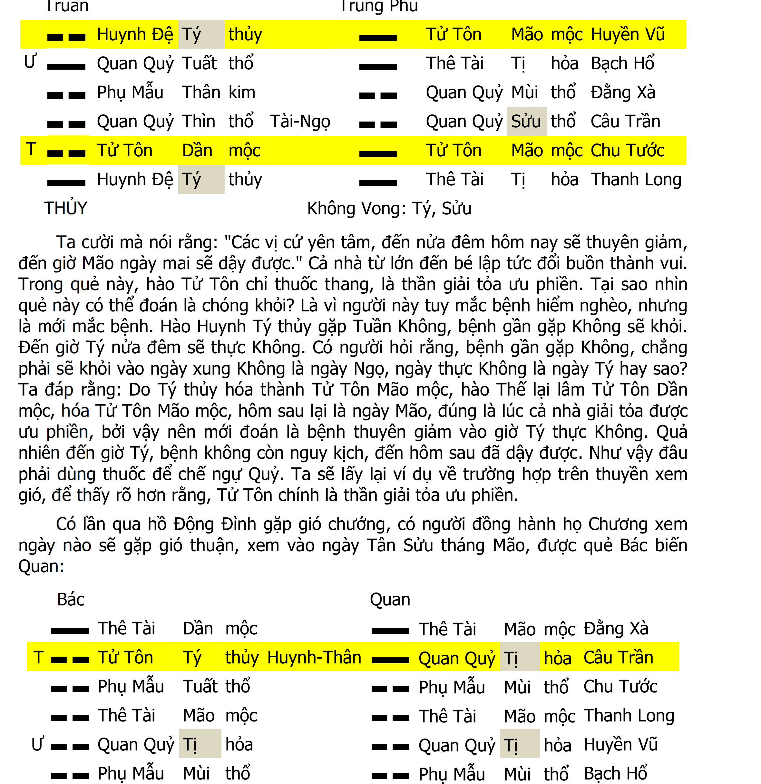

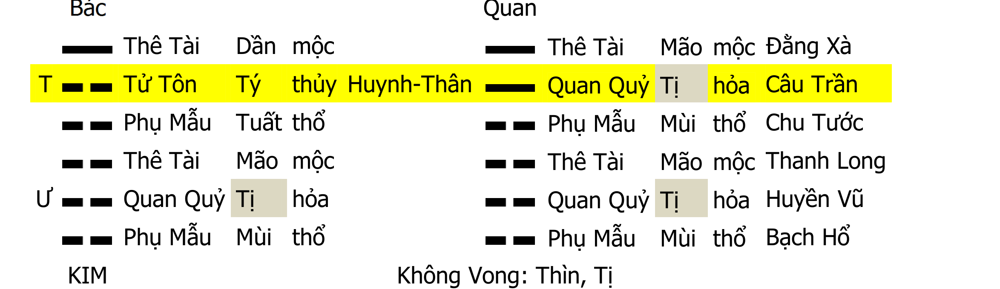 ngày mai là ngày Dần, xung khai hào Huynh Thân kim, chắc chắn sẽ có gió để xuôi 
thuyền."

Ta cười mà rằng: "Lúc này đang mưa to gió lớn, sao lại cho là không có gió?" 
Người này bèn đáp: "Nhưng tôi xem về gió thuận!" Ta bèn nói: "Cách suy đoán này 
khác gì gãi ngứa ngoài giày. Nếu là xem về thời tiết nắng hay hạn, mới lấy hào mộc 
hào Huynh làm tượng gió, mây. Nay đã lên thuyền, làm sao có thể áp dụng cách thức 
đó? Chúng ta vì gặp gió ngược mà phải dừng ở đây, lại lo sóng gió gây nguy hiểm, 
đêm sợ giặc cướp tấn công, mưa gió lạnh lùng, lòng như lửa đốt, nên chỉ có hào Tử 
Tôn mới giải trừ được nỗi lo lắng của ta. Trong quẻ này, Tử Tôn trì Thế mà hóa 
Không, là tượng mưa gió triền miên, đợi đến ngày xuất Không mới tạnh. Đến ngày Tử 
Tôn xuất Không, nỗi ưu phiền của ta sẽ được giải tỏa, thuyền có thể lên đường." Quả 
nhiên đến ngày Ất Tị trời tạnh ráo, gió yên sóng lặng, nhưng không có gió thuận.

Hôm sau nữa là ngày Bính Ngọ, gió thuận nổi cả ngày, vượt hồ thuận lợi, gió 
thuận nước xuôi, mọi người cùng vui vẻ, chẳng phải là nhờ vào Tử Tôn giải tỏa ưu 
phiền hay sao. Người này bèn nói rằng: "Các sách bốc dịch đều không có nói đền điều 
này, đây chắc chắn là bí truyền, nếu không thì sao được thần kỳ như thế." Ta bèn nói 
rằng: "Xưa kia ta cũng dựa vào hào mộc hào Huynh để đoán gió, nhưng thử nhiều lần 
không thấy ứng nghiệm, sau thấy đến ngày trực của Tử Tôn có gió thuận để lái 
thuyền, mới dần ngộ ra được cái lý này."

Người này lại hỏi: "Hào Tử Tôn Tý thủy hóa thành Tị hỏa lâm Không, lẽ ra đến 
ngày Tị thuyền sẽ đi được, sao lại phải đợi đến ngày Bính Ngọ mới có gió thuận?" Ta 
bèn đáp: "Quẻ này xem vào ngày Sửu, nên hào Tý thủy đến ngày Tị tuy được xuất 
Không, nhưng lại bị Nhật thần hợp mất, cần phải đợi ngày Bính Ngọ xung khai, mới có 
gió thuận."

Hào Tử Tôn này cũng tương tự như chương "Tật bệnh", lấy hào Tử Tôn làm thần 
hóa giải ưu phiền, cái lý ở đây cũng giống như vậy.

Lại có một ngày, mới đầu canh một, có người gõ cửa nói rằng: "Cậu chủ nhà tôi 
có bệnh, xin mời thầy đến xem giúp một quẻ." Ta hỏi xem mắc bệnh bao giờ? Đáp 
rằng từ Sơn Đông trở về liền mắc bệnh. Ta liền tự xem một quẻ, lúc đó ngày Nhâm Tý 
tháng Mùi, được quẻ Tiết biến Tỷ:

Tiết 
 
Tỷ

Huynh ĐệTý | thủy | Huynh ĐệTý | thủy Bạch Hổ

Quan QuỷTuất thổ | Quan QuỷTuất thổ Đằng Xà

Ư | Phụ Mẫu | Thân kim | Phụ Mẫu | Thân kim Câu Trần

Quan QuỷSửu thổ Tài-Ngọ | Tử Tôn | Mão mộc Chu Tước

Tử Tôn | Mão mộc | Thê Tài | Tị | hỏa Thanh Long

T | Thê Tài | Tị | hỏa | Quan QuỷMùi | thổ Huyền Vũ

THỦY
Không Vong: Dần, Mão

Hào Tài Tị hỏa trì Thế, được hào Tử Tôn động tương sinh, Tử Tôn là thần may 
mắn, nên đi sẽ có ích. Khi đến nhà người này, gặp lúc thầy lang đang bốc thuốc.

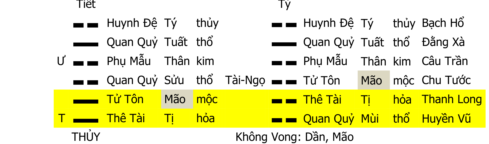

Ngày Nhâm Tý, cha xem về bệnh của con, được quẻ Giải biến Khảm:

Giải
 
Khảm

Thê Tài | Tuất thổ | Phụ Mẫu Tý | thủy Bạch Hổ

Ư | Quan QuỷThân kim | Thê Tài | Tuất thổ Đằng Xà

Tử Tôn | Ngọ hỏa | Quan QuỷThân kim Câu Trần

Tử Tôn | Ngọ hỏa | Tử Tôn | Ngọ hỏa Chu Tước

T | Thê Tài | Thìn thổ | Thê Tài | Thìn thổ Thanh Long

Huynh ĐệDần mộc Phụ-Tý | Huynh ĐệDần mộc Huyền Vũ

MỘC
Không Vong: Dần, Mão

Ta nhìn quẻ này thì sinh nghi, bệnh gần gặp quẻ Lục xung, sẽ không đến nỗi 
chết. Nhưng Tử Tôn lại biến Quỷ, lại chủ về ốm chết, nên không dám đoán ngay, mà 
lại bảo người thân xem lại. Chú xem về bệnh của cháu, được quẻ Khôn:

Khôn

T | Tử Tôn | Dậu kim Bạch Hổ

Thê Tài | Hợi thủy Đằng Xà

Huynh ĐệSửu thổ | Câu Trần

Ư | Quan QuỷMão mộc Chu Tước

Phụ Mẫu | Tị | hỏa Thanh Long

Huynh ĐệMùi thổ | Huyền Vũ

THỔ
Không Vong: Dần, Mão

Lại gặp quẻ Lục xung, nên biết rằng bệnh này không thể chết được. Bèn hỏi xem 
trước đây có mắc bệnh gì không, người nhà bèn đáp rằng: Chưa hề mang bệnh. Suốt 
trên đường từ Sơn Đông về cũng không ốm đau gì. Đột nhiên đến chiều tối, lăn lộn 
khắp giường, cấm khẩu không nói được. Ta bèn nói: Nếu không phải là tái phát bệnh 
cũ, ta bảo đảm sẽ nhanh chóng khỏi bệnh.

Lại mời thầy lang xem quẻ, được Tỉnh biến Minh Di:

Tỉnh
 
Minh Di

Phụ Mẫu Tý | thủy | Quan QuỷDậu kim Bạch Hổ

T | Thê Tài | Tuất thổ | Phụ Mẫu Hợi thủy Đằng Xà

Quan QuỷThân kim Tử-Ngọ | Thê Tài | Sửu thổ Câu Trần

Quan QuỷDậu kim | Phụ Mẫu Hợi thủy Chu Tước

Ư | Phụ Mẫu Hợi thủy Huynh-Dần | Thê Tài | Sửu thổ Thanh Long

Thê Tài | Sửu thổ | Huynh ĐệMão mộc Huyền Vũ

MỘC
Không Vong: Dần, Mão

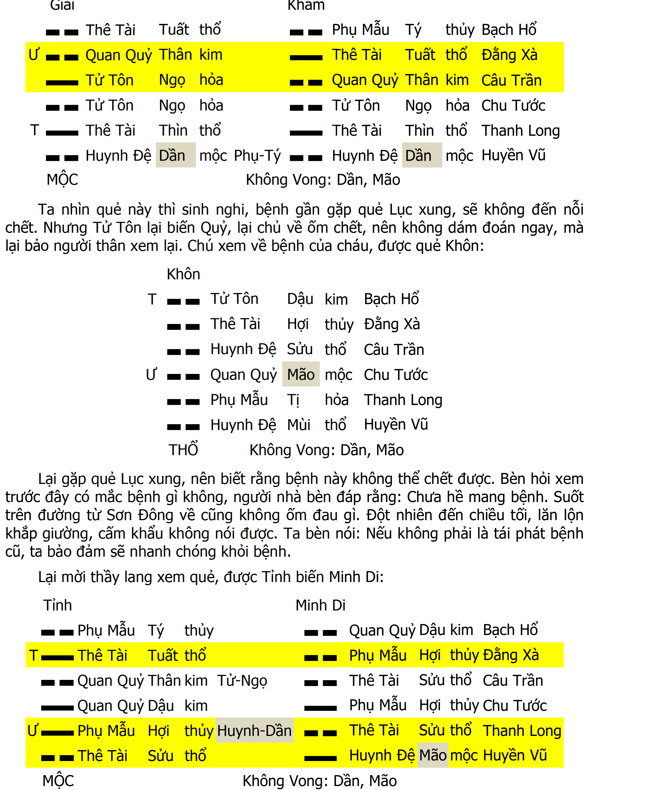

Hào Ứng chỉ bệnh nhân, hào Thế khắc hào Ứng, thì không đáng ngại, vì là khắc 
chế bệnh của bệnh nhân. Nhưng hiềm vì hào Ứng hóa hồi đầu khắc, nên chắc chắn là 
do dùng nhầm thuốc.

Ta bèn hỏi chủ nhà rằng: "Đã uống thuốc chưa?" Đáp rằng: "Chưa nấu xong." Ta 
lại hỏi thầy lang rằng: "Người này mắc bệnh gì, đã kê những vị thuốc gì?" Thầy lang 
bèn đáp: "Vào ngày Tam phục, do trên đường đi trúng nắng, nên chỉ khai đơn thuốc 
mát giải nhiệt." Ta bèn nói riêng với chủ nhà rằng: "Con trai ông đáng ra không chết, 
nhưng lại gặp quẻ phải chết, e rằng do thuốc không đúng bệnh, nên mời thầy thuốc 
xem lại."

Thầy lang nói, bệnh nhân liên tục lăn lộn, không bắt được mạch. Bèn hỏi gia 
nhân xem tình hình đi đường ra sao, người nhà bèn đáp: "Đến nhà thấy quá nóng 
nực, bèn chuyển giường ra chỗ đón gió tại hành lang, đặt hai tảng đá lạnh lớn ở 
phía dưới giường, sai nữ tì đến quạt, một chốc đã ngủ say. Bỗng dưng lăn lộn kêu lên 
mấy tiếng, rồi cấm khẩu không nói được."

Như vậy, người đang nóng bức mà nằm trên đá lạnh, đón gió, lại bảo nữ tì đứng 
quạt, nguyên nhân mắc bệnh vì đâu đã rõ. Thầy thuốc bèn nói: "Lúc tôi đến xem 
bệnh, đã dìu người bệnh vào trong phòng, nên không biết chuyện này, nếu thế thì 
không thể uống thuốc giải nhiệt được." Ta bèn nói: "Dùng phụ tử, nhục quế có thể 
chữa được", rồi bảo người cha xem một quẻ.

Ngày Nhâm Tý, xem dùng phụ tử có được không, được quẻ Đại Hữu biến Đại 
Súc:

Đại Hữu
 
Đại Súc

Ư | Quan Quỷ | Tị | hỏa | Thê Tài | Dần mộc Bạch Hổ

Phụ Mẫu | Mùi | thổ | Tử Tôn | Tý | thủy | Đằng Xà

Huynh Đệ | Dậu kim | Phụ Mẫu | Tuất | thổ | Câu Trần

T | Phụ Mẫu | Thìn | thổ | Phụ Mẫu | Thìn | thổ | Chu Tước

Thê Tài | Dần mộc | Thê Tài | Dần mộc Thanh Long

Tử Tôn | Tý | thủy | Tử Tôn | Tý | thủy | Huyền Vũ

KIM 
Không Vong: Dần, Mão

Hào Tử Tôn lâm Nhật thần, được hào Huynh Dậu kim động mà tương sinh, nên 
đây là phương thuốc hữu hiệu, sẽ lập tức chữa khỏi bệnh. Thầy thuốc thử dùng nước 
gừng khô đổ cho, một lúc thì nói được, bảo rằng bụng đau kịch liệt. Ta bèn bảo: Mau 
cho uống thuốc. Thầy thuốc bèn chữa trị, gia giảm một đêm, đến sáng hôm sau thì 
khỏi hẳn. Người này không chết được, vì trước khi ta đến, đã xem được quẻ Tử Tôn 
phát động, về sau xem liền mấy quẻ, tổng hợp lại để suy đoán, mới dám dùng thuốc 
cực nhiệt, để cải tử hoàn sinh. Nếu không, cho bệnh nhân uống đơn thuốc giải nhiệt, 
đã hàn lại thêm hàn, sao có thể sống được.

Giác Tử bàn rằng: Quẻ này hào Huynh Dậu kim động mà sinh Tử Tôn, nên uống 
phương thuốc nhiệt đó sẽ khỏi bệnh. Nếu áp dụng phương pháp trong sách xưa mà 
xem quẻ này, ắt sẽ lấy hào Huynh Dậu kim là thuốc.

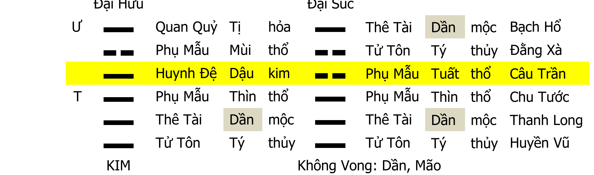

Phàm là xem về thuốc, cũng có các nguyên lý khác nhau. Có khi là thầy thuốc 
thấy chứng bệnh hiểm nghèo, đã khai đơn thuốc cứu chữa, nhưng e rằng có chút sơ 
sảy sẽ gây hậu quả lớn, khi đó nếu gieo quẻ mà được hào Tử Tôn phát động, là điềm 
may mắn, nên đó chính là phương thuốc hữu hiệu. Có khi mắc bệnh trên sông biển, 
hoặc đường xa vắng vẻ, không tìm được thầy thuốc, chỉ biết áp dụng các bài thuốc 
dân gian, hoặc sử dụng những phương thuốc sẵn có mang theo, không biết có đúng 
không, nên chỉ có cách gieo quẻ xem thử. Xem về thuốc đều lấy Tử Tôn làm Dụng 
thần, nếu được Tử Tôn trì Thế, Tử Tôn phát động, uống thuốc đó sẽ có tác dụng. Khi 
xem quẻ, hào Tử Tôn bất kể là kim, mộc, thủy, hỏa, thổ, chỉ cần vượng hoặc động, 
đều là thần hoan hỷ. Dùng thuốc có tác dụng, mới có thể vui mừng, giải tỏa ưu phiền 
được. Tuyệt đối không nên sử dụng phương pháp Tử Tôn thuộc kim thì dùng châm 
cứu, Tử Tôn thuộc hỏa thì đốt ngải, như vậy là hết sức sai lầm.

Một hôm, vào phủ quan, các môn khách bảo với ta rằng: Cụ ông tối qua đột ngột 
ngã trong vườn hoa, khi vực dậy thì miệng lảm nhảm không ngớt, đến bây giờ vẫn 
bất tĩnh nhân sự. Trong đám thầy thuốc, có người bảo uống nhân sâm sẽ tỉnh, có 
người lại nói uống nhân sâm sinh dòm sẽ khó điều trị. Ta bèn bảo rằng, hãy xem một 
quẻ xem nhân sâm có dùng được hay không.

Ngày Đinh Mão tháng Dần, con xem bệnh của cha có dùng nhân sâm được 
không, được quẻ Tụy biến Bĩ:

Tụy
 
Bĩ

Phụ Mẫu Mùi thổ | Phụ Mẫu Tuất thổ Thanh Long

Ư | Huynh ĐệDậu kim | Huynh ĐệThân kim Huyền Vũ

Tử Tôn | Hợi thủy | Quan QuỷNgọ hỏa Bạch Hổ

Thê Tài | Mão mộc | Thê Tài | Mão mộc Đằng Xà

T | Quan QuỷTị | hỏa | Quan QuỷTị | hỏa Câu Trần

Phụ Mẫu Mùi thổ | Phụ Mẫu Mùi thổ Chu Tước

KIM
Không Vong: Tuất, Hợi

Xem về nhân sâm, phải lấy hào Tử Tôn làm Dụng thần. Nếu không biết thông 
biến, thấy trong quẻ hào Phụ động khắc Tử Tôn, sẽ suy đoán rằng không được dùng 
nhân sâm. Nhưng ta không đoán theo cách đó. Con xem về bệnh của cha, lấy hào 
Phụ làm Dụng thần, Phụ Mùi động hóa thành Phụ Tuất, Phụ Tuất gặp Tuần Không, thì 
nhân sâm không nên dùng, các loại thuốc khác đều không nên uống. Đến giờ Thìn 
hôm sau, xung Không sẽ khỏi bệnh. Quả nhiên đến gà gáy hôm sau thì tỉnh, hôm sau 
không uống thuốc cũng khỏi.

Lại có một hôm, đang ngồi cùng nhau, bỗng nhiên cụ chủ nhà miệng méo mắt 
lệch, đờm dãi chảy liên tục. Ta cũng ở đó, con trai ông cụ bèn hỏi: Trong nhà có ngưu 
hoàng, liệu có cho uống được không? Ta bèn bảo cậu ta gieo quẻ.

Ngày Tân Dậu tháng Hợi, con xem bệnh của cha có dùng ngưu hoàng được 
không, được quẻ Quải:

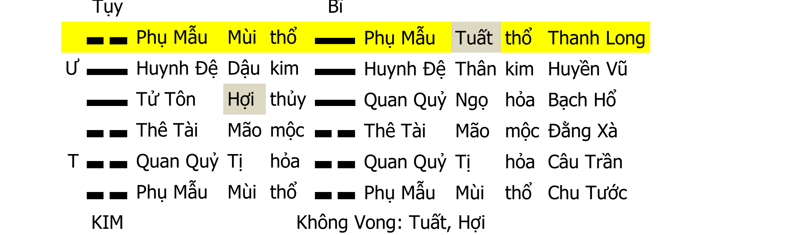

Quải

Huynh ĐệMùi thổ | Đằng Xà

T | Tử Tôn | Dậu kim | Câu Trần

Thê Tài | Hợi thủy | Chu Tước

Huynh ĐệThìn thổ | Thanh Long

Ư | Quan QuỷDần mộc Phụ-TịHuyền Vũ

Thê Tài | Tý | thủy | Bạch Hổ

THỔ
Không Vong: Tý, Sửu

Ta bèn bảo rằng: "Cho uống thuốc này, sẽ lập tức khỏi bệnh". Bèn cho uống, quả 
nhiên ông cụ tỉnh lại. Ấy là do hào Tử Tôn trì Thế.

Trong quẻ trước, hào Phụ phát động, thần mách bảo thiên cơ ở hào động, nên 
dùng hào Phụ Mẫu để suy đoán. Trong quẻ này hào Tử Tôn trì Thế, gặp Nhật thần, 
Tử Tôn là thần hoan hỷ, do bệnh của cha khỏi nên mới được vui vẻ. Không có quẻ 
nào không linh nghiệm, đều dựa vào sự biến thông của con người.

Lại ví dụ: Ngày Quý Mão tháng Thân, do mắc bệnh giang mai, xem có chữa khỏi 
hay không, được quẻ Lý biến Bĩ:

Lý 
 
Bĩ

Huynh ĐệTuất thổ | Huynh ĐệTuất thổ Bạch Hổ

T | Tử Tôn | Thân kim Tài-Tý | Tử Tôn | Thân kim Đằng Xà

Phụ Mẫu Ngọ hỏa | Phụ Mẫu Ngọ hỏa Câu Trần

Huynh ĐệSửu thổ | Quan QuỷMão mộc Chu Tước

Ư | Quan QuỷMão mộc | Phụ Mẫu Tị | hỏa Thanh Long

Phụ Mẫu Tị | hỏa | Huynh ĐệMùi thổ Huyền Vũ

THỔ
Không Vong: Thìn, Tị

Đoán rằng: Thầy thuốc này không nên mời, tuy là Tử Tôn trì Thế, hào Ứng chỉ 
thầy thuốc, nhưng hiềm vì hào Thế Thân kim bị hào sơ Tị hỏa khắc, lại thêm hào 
động Mão mộc sinh hỏa, nên hào Thế tuy vượng, đến ngày Tị chắc chắn sẽ ốm nặng 
hơn. Nhưng người nhà không nghe, vẫn mời thầy thuốc đấy đến chữa bệnh, uống 
thuốc trong hai ngày Mão, Thìn, bệnh tình vẫn bình thường, đến ngày Tị bỗng nhiên 
biến chứng, khắp người đau đớn khó chịu. Người bệnh hoảng hốt hỏi ta rằng: "Liệu có 
nguy đến tính mạng hay không?" Ta đáp: "Hào Thế gặp Nguyệt kiến, nên không tổn 
hại đến tính mạng. Mau uống thuốc giải, qua ngày Tị ngày Ngọ, sẽ hết đau." Người 
này bèn tìm thuốc giải uống, đến ngày Thân, thì khoẻ mạnh như thường.

**Dã Hạc bàn rằng:** Tại những phần trước đều nói rằng, Tử Tôn trì Thế thì bệnh sẽ 
khỏi, nhưng cũng cần có tiền đề là Tử Tôn không bị khắc, nên người học đợi sau cần 
hết sức chú ý.

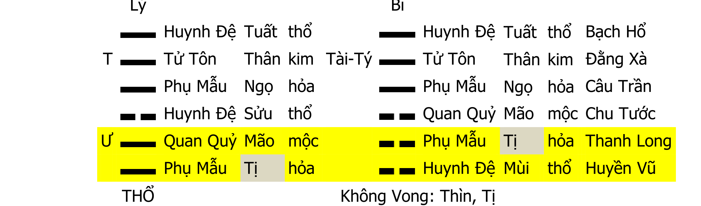

**Lý Ngã Bình bàn rằng:** Trong phần này, thì hào Quan Quỷ là thần ưu phiền, hào 
Tử Tôn là thần hoan hỷ, có thể hóa giải phiền muộn. Tuy đây là phép xem quẻ đời 
xưa, nhưng cũng có thể sử dụng. Nếu không hợp với linh cơ của quỷ thần, thì không 
thể tưởng tượng ra được. Nhưng cũng có thuyết không cho rằng Quan Quỷ là thần ưu 
phiền, mà hoàn toàn căn cứ vào ý niệm của người đến xem. Nếu muốn hỏi xem bệnh 
lành hay dữ, mà gặp hào Quan Quỷ trì Thế, hoặc hào Quỷ động trong quẻ, đều tượng 
trưng cho sự ưu phiền. Nếu gặp hào Tử Tôn trì Thế, Tử Tôn phát động, tức gặp thần 
hoan hỷ, hóa giải phiền muộn. Nếu người đến xem hỏi xem mắc bệnh là phạm phải 
quỷ thần nào, mà trong quẻ xuất hiện Quỷ thuộc kim, là phạm phải thần võ; Quỷ 
thuộc thủy, là phạm phải thần sông... Nếu hỏi xem căn nguyên gây bệnh, mà gặp Quỷ 
thuộc hỏa, tức bệnh tại tâm kinh; Quỷ thuộc thủy, tức bệnh tại phần thận... Nếu Tử 
Tôn vượng mà động, bệnh không cần thuốc cũng khỏi, chứ không phải dạy người ta 
coi hào Tử Tôn làm thuốc trị bệnh, như Tử Tôn thuộc kim thì dùng châm cứu, Tử Tôn 
thuộc hỏa thì dùng đốt ngải... Nói như vậy là không hiểu rằng, nếu Tử Tôn vượng, 
bệnh sẽ tự khỏi, đâu cần phải dùng đến châm cứu. Nếu Tử Tôn gặp Tuần Không, 
Nguyệt phá, thì dùng châm cứu cũng có ích gì.

Các sách đều viết rằng: Quỷ thuộc thổ kỵ nhiệt, Quỷ thuộc thủy kỵ hàn. Quỷ 
thuộc thủy nếu gặp sinh vượng, cần dùng phương thuốc đại nhiệt để chữa trị; Quỷ 
thuộc hỏa vượng cần dùng phương thuốc đại hàn, không biết quan niệm của họ là 
như thế nào. Nếu như Dụng thần thuộc thổ, hoặc con xem về bệnh của cha, mà hào 
Phụ tại thổ, nếu trong quẻ có hào Quỷ hỏa phát động, thì lại là Nguyên thần sinh ra 
Dụng thần, làm sao lại có thể dùng phương thuốc đại hàn để điều trị Nguyên thần? 
Lại như vợ xem bệnh của chồng, lấy hào Quan Quỷ làm Dụng thần, nếu như Quỷ tại 
hào thủy, làm sao có thể dùng phương thuốc đại nhiệt để tấn công Dụng thần của 
chồng? Ta thấy nhiều vùng thôn quê hẻo lánh, không có thầy thuốc, chỉ nói rằng 
"Kinh Dịch" là sách vở của thánh hiền, tuân theo sẽ có ứng nghiệm. Kiểu xem thuốc 
đại hàn đại nhiệt như vậy, không biết đã chôn vùi biết bao nhiêu sinh mệnh. Lời nói 
đúng chỗ chính yếu, khi cuốn sách này xuất hiện, người ta không còn dám sử dụng 
khinh suất thuốc hàn thuốc nhiệt, từ đó dưới suối vàng không còn quỷ chết oan nữa.

---

# CHƯƠNG 112: GIA TRẠCH

**Dã Hạc bàn rằng:** Các sách bốc dịch đều viết, chỉ cần dùng một quẻ có thể quyết 
đoán về sự lành dữ của cả nhà, sáu hào trong quẻ tượng trưng cho sáu sự việc: Hào 
Phụ Mẫu tượng trưng cho nhà cửa, lại chỉ về cha mẹ. Phụ Mẫu đã là song thân, lại lấy 
hào 5 tượng trưng cho cha, hào 4 tượng trưng cho mẹ, thật là sai lầm, hỗn loạn, như 
vậy cũng dám tự đem khắc in để làm khuôn phép truyền lại cho đời sau, ta thực 
không thể hiểu nổi.

Như ngày Bính Ngọ tháng Tuất, xem về gia trạch, được quẻ Càn biến Tiểu Súc:

Càn 
 
Tiểu Súc

T | Phụ Mẫu | Tuất thổ | Thê Tài | Mão | mộc Thanh Long

Huynh Đệ | Thân | kim | Quan Quỷ | Tị | hỏa | Huyền Vũ

Quan Quỷ | Ngọ | hỏa | Phụ Mẫu | Mùi | thổ | Bạch Hổ

Ư | Phụ Mẫu | Thìn | thổ | Phụ Mẫu | Thìn | thổ | Đằng Xà

Thê Tài | Dần | mộc | Thê Tài | Dần mộc Câu Trần

Tử Tôn | Tý | thủy | Tử Tôn | Tý | thủy | Chu Tước

KIM 
Không Vong: Dần, Mão

Sách xưa nói rằng: Trong quẻ không có hào Phụ Mẫu, thì khó tránh khỏi lo lắng 
cho song thân. Quẻ này không những có nhiều hào Phụ Mẫu, mà hào Phụ Mẫu Tuất 
thổ lâm Nguyệt kiến, được hào Quan Ngọ hỏa động tương sinh, tức điềm cha mẹ yên 
lành may mắn. Nếu lại lấy hào 5 là cha, hào 4 là mẹ để suy đoán, thì Quỷ ở hào 4, tức 
mẹ gặp nhiều tai họa. Như vậy nên đoán là cha mẹ yên lành, hay là mẹ nhiều tai hoạ?

Lại nói: "Hào nào bị khắc thì bị tổn hại", nay hào 5 Thân kim bị Quỷ Ngọ hỏa 
khắc, như vậy là cha bị tổn hại chăng?

Sách xưa có câu: "Quỷ động tại cung Càn, cha già bất lợi". Lại nói: "Quỷ hỏa | động đề phòng hỏa hoạn; Quỷ lâm Bạch Hổ, đề phòng tang ma"; "Thế được sinh | vượng, gia trạch an khang". Trong quẻ này, hào Thế vượng, nhưng Quỷ hỏa tại Bạch | Hổ động, rốt cục nên đoán là hỏa hoạn, hay tang ma, hay an khang thịnh vượng đây?

Sách xưa cho rằng, hào Quan Quỷ là nhà chính, Quan vượng thì nhà cửa cao lớn 
nguy nga; lại nói Quan vượng, Quỷ động là nhiều tai họa. Ở quẻ trên, Quan Quỷ lâm 
Nhật thần vượng động, như vậy là chủ về nhà cửa cao lớn, hay gặp nhiều tai họa?

Sách xưa có câu: "Tài Quan vượng, nhà cửa náo nhiệt"; lại nói "Hào Tài phát 
động, cha mẹ tổn thương". Lẽ nào tất cả những nhà vui vẻ náo nhiệt đều không có 
cha mẹ hay sao?

Sách xưa còn nói: "Hào Huynh vượng tướng, anh em đông đúc trong nhà"; lại có 
câu: "Huynh Đệ trì Thế, có chuyện tục huyền". Chẳng lẽ tất cả những nhà con cái 
đông đúc đều là nhà chết vợ hay sao? Vô số sai lầm, mâu thuẫn, khó mà nêu ra cho 
hết, nên ta bất đắc dĩ phải cải chính lại.

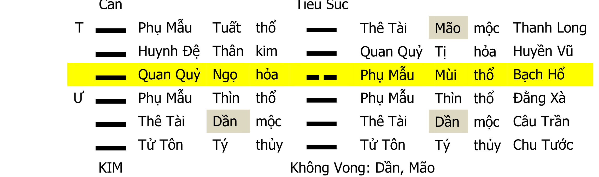

---

# CHƯƠNG 113: XÂY ĐỰNG, MUA NHÀ, THUÊ NHÀ

Phụ vượng trì Thế, thử xứ thanh an nghi cửu trú.

Phụ vượng trì Thế, chốn này yên ổn nên ở lâu dài.

Nếu hào Phụ vượng tướng trì Thế, hoặc sinh hợp Thế, hoặc hào Thế động hóa 
Phụ tương sinh, hoặc được Nhật thần, Nguyệt kiến làm Phụ Mẫu sinh hợp hào Thế, 
đều chủ về nhà phát phúc.

Tài hào phát động, tha phương nhân lý lánh nghi cầu.

Hào Tài phát động, nơi khác tốt hơn hãy mau tìm đến.

Hào Tài động khắc hào Phụ Mẫu, nên dời đi nơi khác.

Hào phùng lục hợp, chung kiến hanh thông. Quái ngộ phản ngâm, đa ư 
sầu thán.

Gặp quẻ Lục hợp, sẽ được hanh thông. Gặp quẻ Phản ngâm, chịu nhiều sầu khổ.

Hào Thế, hào Phụ vượng tướng, lại được quẻ Lục hợp, sự việc sẽ thành mà được 
lâu dài. Nhưng không nên gặp quẻ Lục xung, vì không được bền lâu.

Nếu gặp quẻ Phản ngâm mà hào Thế bị xung khắc, là tượng đại hung.

Thế động nhi hóa Tiến, miên trường bách đại; Phụ hưng bất hóa thối, 
tăng trí thiên gian.

Thế động hóa Tiến thần, muôn đời bền vững; Phụ động không hóa Thoái, thêm 
cả trăm gian.

Nếu hào Thế động hóa Thoái thần mà vẫn cố thực hiện, về sau chắc chắn sẽ 
phải hối hận. Nếu hào Thế động hóa Tiến thần, việc sẽ thành mà được hưng thịnh 
bền lâu, có danh có lợi.

Nếu hào Phụ động hóa Thoái thần, nhà cửa tuy xây thành rồi sau cũng suy tàn, 
phá bại. Nếu hóa Tiến thần, thì quy mô nhà cửa ngày càng mở rộng.

Tối kỵ tùy Quan nhập Mộ, tu phòng Quỷ động thương thân.

Tối kỵ theo Quan nhập Mộ, đề phòng Quỷ động hại thân.

Nếu hào Thế theo Quỷ nhập Mộ, hào Tài giúp Quỷ khắc Thế, hoặc hào Thế động 
biến hung, hoặc Nhật, Nguyệt, hào động khắc Thế, việc xây dựng, mua, thuê đều 
không nên thực hiện.

**Dã Hạc bàn rằng:** Phàm là việc làm nhà, mua nhà, thuê nhà, nếu được hào Thế, 
hào Phụ vượng tướng, không bị xung khắc, thì nên thực hiện, sẽ được vinh hoa, sung 
túc. Nếu hỏi về sự cát hung của nhà ở, tuy nên chia ra từng quẻ để xem, nhưng cũng 
nên đợi khi đã chọn ngày tốt để chuyển nhà, rồi gieo quẻ xem, khấn với thần linh 
rằng: Nay đã chọn được ngày giờ này để nhập trạch, không biết có gây trở ngại cho 
cha mẹ vợ con không. Nếu có hại, cần chọn lại ngày khác. Hoặc cho người không hợp 
ngày chọn một ngày giờ khác để chuyển nhà cũng được. Triều đình phát lịch để nhân 
dân được sử dụng thuận tiện, cũng là vì lẽ đó. Nếu cho rằng làm nhà mua nhà, phải

---

# CHƯƠNG 114. XÂY DỰNG CUNG ĐIỆN / CHƯƠNG 115. ĐỘNG THỔ TU TẠO / CHƯƠNG 116. CHUYỂN NHÀ NHẬP TRẠCH

chọn lựa sao cho hợp với tất cả mọi người trong nhà, nếu như phải nhà nào có cả 
trăm người, thì hẳn là chẳng bao giờ tìm được nhà để ở.

***

# CHƯƠNG 114: XÂY DỰNG CUNG ĐIỆN

Khởi công xây dựng, kỵ gặp Lục xung.

Kỵ gặp Quỷ động, tối kỵ khắc Thế.

Theo Quỷ nhập Mộ, tai họa vô cùng.

Hào Phụ vượng tướng, Thế vị hưng vượng, hào Thế hào Phụ động hóa cát, người 
yên nhà phát, mọi việc hanh thông.

***

# CHƯƠNG 115: ĐỘNG THỔ TU TẠO

Thế lâm Phúc đức là tốt nhất; Quan Quỷ phát động gặp tai ương.

Thế vượng được sinh nên hóa cát; Thế suy chịu khắc hãy tạm dừng.

Tại phương Tử Tôn nên tu tạo; tại phương Quan Quỷ chớ động vào.

Nếu như Tử Tôn tại hào thủy, nên động thổ tu tạo bắt đầu từ phương bắc. Nếu 
hào Quỷ thuộc hỏa, không nên động thổ tại phương nam. Quỷ tại Thìn, Tuất, Sửu, 
Mùi, không nên động thổ tại những phương đó.

Dỡ nhà kỵ nhất hào Tài động; xây mới không ưa hào Phụ hư.

Xây thành nhà cửa không lo lắng; hào Phụ vượng tướng ở lâu dài.

****

# CHƯƠNG 116: CHUYỂN NHÀ NHẬP TRẠCH

Phép xem xưa coi ba hào quẻ nội là nhà đang ở, ba hào quẻ ngoại là nhà sắp 
chuyển đến. Nếu như quẻ nội khắc quẻ ngoại, thì nhà mới bất lợi, không nên chuyển 
đi. Nếu quẻ nội sinh quẻ ngoại, chỉ nhà mới sẽ phát đạt, chuyển đến là cát lợi.

**Dã Hạc bàn rằng:** Ta cho rằng phương pháp này không hay. Nhà mới đã xây 
xong, mua xong, nay muốn nhập trạch, xem được quẻ nhà mới không tốt, chẳng lẽ lại 
bỏ không mà không chuyển nữa hay sao. Nếu xem được nhà cũ tốt, chẳng lẽ lại tiếp 
tục ở lại nhà cũ hay sao?

---

# CHƯƠNG 117. NHẬP TRẠCH / CHƯƠNG 118. LỤC THÂN NHẬP TRẠCH CÁT HUNG

Giác Tử nói rằng: Phương pháp này cũng có chỗ hữu dụng, nếu như có người 
đến hỏi rằng, muốn bỏ nhà cũ để mua nhà mới, liệu có được hay không, thì nên dùng 
phương pháp này để suy đoán.

***

# CHƯƠNG 117: NHẬP TRẠCH

Xem về sự cát hung của nhà ở, đã trình bày trong chương "Xây nhà, mua nhà, 
thuê nhà". Còn về việc chọn ngày nhập trạch, thì cha mẹ, anh em, vợ con, mỗi người 
xem riêng một quẻ, người nào hợp với ngày đã chọn thì nhập trạch vào ngày đó 
người nào không hợp thì đổi, hoặc là đổi ngày nhập trạch, hoặc chọn giờ hợp để nhập 
môn, đều có thể biến hung thành cát.

***

# CHƯƠNG 118: LỤC THÂN NHẬP TRẠCH CÁT HUNG

Khi chọn ngày nhập trạch, cần gieo quẻ xem có hợp với cha mẹ không? Rồi lại 
gieo tiếp quẻ nữa, xem có hợp với anh em không? Lại gieo quẻ tiếp, xem có hợp với 
vợ con không.

Xem về cha mẹ, thì hào Phụ Mẫu nên vượng tướng. Xem về anh em, vợ con, 
Huynh Đệ, Thê Tài đều nên vượng tướng mà được sinh phò, không nên biến động mà 
hóa Quỷ, hoặc bị hình, xung, khắc chế. Nếu quẻ xem cát lợi, thì nên nhập trạch vào 
ngày đó. Nếu quẻ hung, thì bảo người đó đổi ngày khác để nhập môn. Trong các quẻ 
đó, nếu có một trường hợp bất lợi, như anh em hoặc vợ con, thì bảo họ chọn ngày 
khác hoặc giờ khác đều được.

**Dã Hạc bàn rằng:** Ta có được phương pháp khắc chế của Chu Công, căn cứ vào 
những thần mà Lục thân phạm phải, để biết cách rước lành tránh dữ, đều rất ứng 
nghiệm. Ví dụ Phụ Mẫu tại hào mộc, bị hào Tài kim động gây tổn thương. Khi cha mẹ 
nhập trạch, cần lựa chọn những ngày khắc chế hành kim, đặt giường của cha mẹ tại 
những phương khắc chế được hành kim, đều rất ứng nghiệm.

### Ví dụ: Ngày Đinh Dậu tháng Tý, đã chọn được ngày nhập trạch, xem có bất lợi

cho cha mẹ không, được quẻ Tụy:

Tụy

Phụ Mẫu | Mùi thổ | Thanh Long

Ư | Huynh Đệ | Dậu | kim | Huyền Vũ

Tử Tôn | Hợi | thủy | Bạch Hổ

Thê Tài | Mão | mộc | Đằng Xà

T | Quan Quỷ | Tị | hỏa | Câu Trần

Phụ Mẫu | Mùi thổ | Chu Tước

KIM 
Không Vong: Thìn, Tị

Đoán rằng: Chọn ngày này nhập trạch, Mão mộc ám động khắc Phụ Mẫu.

Người xem xin đổi ngày. Ta nói: "Không cần phải đổi. Ngày này giờ Dần, giờ Mão 
đều tốt, giờ Thân cũng được." Người nhà nên nhập trạch vào giờ Dần hoặc Mão, còn 
cha mẹ đợi đến giờ Thân nhập trạch, chắc chắn sẽ cát lợi trọn vẹn. Vì Mão mộc gặp 
Tuyệt ở Thân mà Phụ Mẫu Mùi thổ lại gặp Trường Sinh tại Thân, nên giờ Thân có lợi 
cho cha mẹ. Sau khi nhập trạch, đặt giường của cha mẹ tại hướng tây nam (hướng 
Mùi).

Người này làm theo đúng như vậy, và vẫn sống yên ổn suốt mười bảy năm nay.

Lại ví dụ: Vào ngày Đinh Mão tháng Mão, xem ngày nhập trạch có hợp với con 
cái hay không, được quẻ Cách biến Phong:

Cách
 
Phong

Quan QuỷMùi thổ | Quan QuỷTuất thổ | Thanh Long

Phụ Mẫu | Dậu kim | Phụ Mẫu | Thân kim Huyền Vũ

T

Huynh ĐệHợi thủy | Thê Tài | Ngọ | hỏa Bạch Hổ

Huynh ĐệHợi thủy Tài-Ngọ | Huynh ĐệHợi | thủy Đằng Xà

Quan QuỷSửu thổ | Quan QuỷSửu | thổ | Câu Trần

Ư

Tử Tôn | Mão mộc | Tử Tôn | Mão mộc Chu Tước

THỦY
Không Vong: Tuất, Hợi

Đoán rằng: Phụ động khắc Tử, may được Tử Tôn lâm Nhật, Nguyệt, Phụ Mẫu lại 
hóa Thoái thần, nên chuyển nhà vào ngày Hợi, Tý, đặt giường cho con ở phía nam, về 
sau sẽ được hiển quý. Người này làm theo, quả nhiên về sau con trai cả thi đậu khoa 
Mão.

Phàm là xem về gia trạch, nếu được cả nhà an lạc là cát. Bởi vậy cha mẹ, anh 
em, thê thiếp, con cái cần chia ra từng quẻ mà xem riêng, mỗi đối tượng đều có 
những điểm hợp kỵ khác nhau, nên không thể dùng một quẻ để xem chung. Nhưng 
thường nghiệm thấy rằng, khi mới mua nhà, chưa cần phải xem riêng thì các dấu hiệu 
hình thương người thân đã hiện ngay trong quẻ, nên cần phải chú ý.

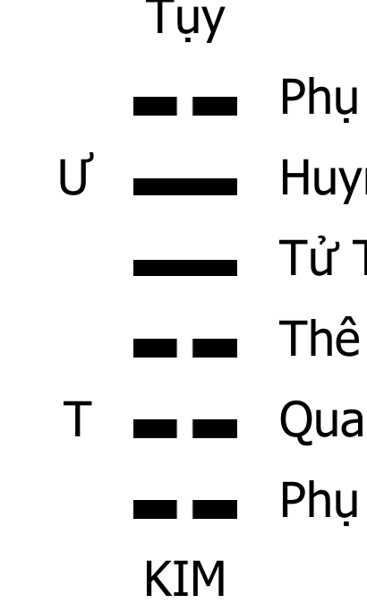

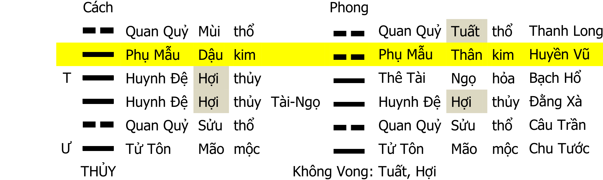

---

# CHƯƠNG 119. CHUỒNG GIA SÚC

### Ví dụ: Ngày Tân Mão tháng Thân, xem mua nhà có tốt không, được quẻ Cách

biến Quải:

Cách
 
Quải

Quan QuỷMùi thổ | Quan QuỷMùi thổ | Đằng Xà

Phụ Mẫu | Dậu kim | Phụ Mẫu | Dậu | kim Câu Trần

T

Huynh ĐệHợi thủy | Huynh ĐệHợi | thủy Chu Tước

Huynh ĐệHợi thủy Tài-Ngọ | Quan QuỷThìn thổ | Thanh Long

Quan QuỷSửu thổ | Tử Tôn | Dần | mộc Huyền Vũ

Ư

Tử Tôn | Mão mộc | Huynh ĐệTý | thủy Bạch Hổ

THỦY
Không Vong: Ngọ, Mùi

Đoán rằng: Nhà này nên mua. Thân kim là Nguyệt kiến sinh Thế, Nhật thần Mão 
lại xung động hào Phụ sinh Thế, ắt sẽ vượng phát. Người và nhà hòa hợp, chỉ hiềm vì 
hào 2 Quan Quỷ biến Tử Tôn, đề phòng khắc con cái.

Người xem nói: "Đã tổn thương đến con cái thì còn mua làm gì?"

Ta đáp: "Việc này không liên quan đến nhà cửa, cho dù không mua nhà này, 
cũng khó mà giữ được con nhà. Tử Tôn lâm Nguyệt phá, lại là biến ra từ hào Quỷ 
động, là tượng cực kỳ nguy hiểm."

Người xem vẫn bỏ không mua nhà ấy. Đến tháng tám (Dậu), đứa con lên đậu 
mà chết. Đến tháng mười, lại mua căn nhà đó.

***

# CHƯƠNG 119: CHUỒNG GIA SÚC

Khi làm chuồng cho trâu, bò, dê, lợn, gà, vịt..., mỗi loại đều cần phải chia ra để 
xem.

Tử Tôn tu nghi vượng động, Phụ Mẫu thiết kỵ hưng long.

Tử Tôn cần phải vượng động, Phụ Mẫu tối kỵ hưng long.

Xem về tất cả các loại gia súc gia cầm, đều lấy hào Tử Tôn làm Dụng thần. Bất 
kể xem về loại vật nuôi nào, đều kỵ hào Phụ Mẫu phát động, vì động sẽ tổn hại đến 
gia súc, gia cầm. Cũng kỵ hào Tử Tôn Không, Phá, Mộ, Tuyệt, hoặc bị Nhật, Nguyệt, 
hào Phụ động Hình, Xung, Khắc, Hại, hoặc hào Tử Tôn động hóa Không, Phá, Mộ, 
Tuyệt, hóa Quỷ, hóa Phụ, hóa hồi đầu khắc, đều chủ về tổn hại gia súc. Nếu gặp các 
tượng đó, thì không nên dựng chuồng tại nơi đó, hoặc đổi nơi làm chuồng, hoặc đổi 
ngày làm chuồng, rồi xem lại.

Sinh tướng tất tu kiêm Dụng, Nhật nguyệt cánh hỷ tương sinh.

Địa chi kết hợp với Dụng, Nhật nguyệt nên đến tương sinh.

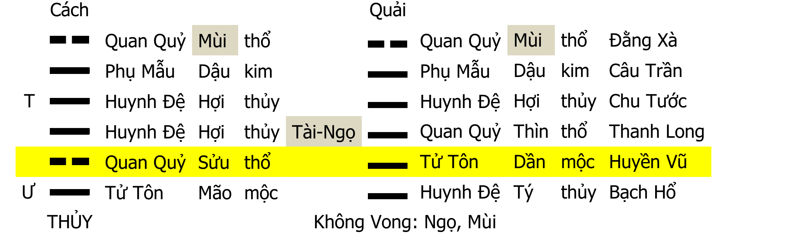

---

# CHƯƠNG 120. NHÀ CŨ

Xem về gia súc, tuy lấy hào Tử Tôn làm Dụng thần, nhưng cũng cần được sinh 
được tướng. Giả sử xem về làm chuồng ngựa, mà hào Tử Tôn không bị xung khắc là 
cát lợi; hào Ngọ không nên tại Quỷ, không nên động mà biến Quỷ. Những trường hợp 
khác cũng loại suy từ đó.

Phàm là xem về lục súc, mà được Nhật Nguyệt sinh phò là tốt nhất. Được Nhật 
Nguyệt sinh phò, chủ về gia súc sinh sôi nảy nở. Nếu bị Nhật Nguyệt xung khắc, thì 
vật nuôi sẽ ốm chết.

***

# CHƯƠNG 120: NHÀ CŨ

Dã Hạc nói rằng: Tại phần trên đã trình bày cách xem về xây nhà, mua nhà, thuê 
nhà mới. Những cũng thường có người đến xem về nhà ở lâu năm. Sách xưa cũng 
đều chỉ căn cứ vào một quẻ để đoán gộp về sự cát hung của nhiều việc. Trước hết, 
xem hào Quan Quỷ; sau đó xem tám cung, và mười hai địa chi, để xác định tai họa 
của gia súc. Nếu Quỷ tại Ngọ, sẽ mất ngựa; Quỷ tại Sửu, mất trâu cày... Lại căn cứ 
vào đó để định cát hung cho người trong nhà, như hào Ngọ tại Quỷ, người tuổi ngựa 
sẽ gặp tai ương; hào Quỷ Tị động, người tuổi rắn sẽ gặp nguy hiểm.

Vậy nếu như hào Ngọ gặp Quỷ, thì nên đoán là ngựa chết, hay là người tuổi Ngọ 
gặp nạn đây? Thật sai lầm quá đáng, không thể tin theo.

Ta không biết người xưa trả lời cho người đến xem ra sao. Nhưng khi đoán quẻ, 
phải biết ý của người đến xem. Hoặc là liền năm của tiền hao tán, ngờ rằng gia trạch 
bất an; hoặc là suốt mấy khoa thi không đỗ; hoặc muốn cầu danh cho con, nhưng 
không biết gia trạch có vượng phát về đường con cháu hay không, phải do con cháu 
tự xem; hoặc do không được thăng quan; hoặc do con cái bất hiếu; hoặc gặp kiện 
tụng, tai ương, trộm cắp; hoặc vì cha mẹ người thân lắm bệnh; hoặc do các nhà phía 
trước, phía sau, bên phải, bên trái xây dựng, sợ nhà mình phạm xung; hoặc do trong 
nhà có tiếng vang động, có ma quỷ hiện hình... cần phải hỏi kỹ vấn đề của người đến 
xem rồi mới suy đoán.

Từng có người làm quan phủ đến mười năm không thăng chức, ngờ rằng nhà 
cửa có vấn đề. Ta bèn nói: "Nếu chỉ dùng một quẻ để đoán cho toàn bộ gia đình thì ta 
xin chịu, nên nói rõ điều mình nghi ngờ để gieo quẻ, sẽ rất ứng nghiệm."

Người này hỏi: "Tại sao lại như vậy?"

Ta bèn giải thích: "Trong quẻ chẳng qua chỉ hiện địa chi và ngũ hành, khó mà chỉ 
rõ việc gì. Ví dụ Quỷ hỏa phát động, là chỉ thần bếp, nhưng nếu trong phủ có đến hơn 
hai trăm gian nhà, bếp núc nhiều, thì biết được gian nào không yên? Lại như Quỷ tại 
Mão mộc, thì cổng cửa bất an, phép xem cổ coi hào 4 là cổng, nhưng trong phủ cổng 
cửa rất nhiều, biết cổng nào bất lợi. Bởi vậy, tốt nhất là nên chỉ rõ sự việc nghi ngờ để 
xem, chắc chắn sẽ ứng nghiệm."

Người xem bèn nói: "Tôi ngờ rằng tại cái giếng trong phủ, không biết có đúng 
không?"

Ngày Mậu Dần tháng Dậu, xem được quẻ Sư biến Lâm:

Sư 
 
Lâm

Ư | Phụ Mẫu | Dậu kim | Phụ Mẫu | Dậu | kim | Chu Tước

Huynh Đệ | Hợi | thủy | Huynh Đệ | Hợi | thủy | Thanh Long

Quan Quỷ | Sửu thổ | Quan Quỷ | Sửu thổ | Huyền Vũ

T | Thê Tài | Ngọ hỏa | Quan Quỷ | Sửu thổ | Bạch Hổ

Quan Quỷ | Thìn | thổ | Tử Tôn | Mão | mộc | Đằng Xà

Tử Tôn | Dần mộc | Thê Tài | Tị | hỏa | Câu Trần

Đoán rằng: Tử Tôn phát động, thì không phải tại giếng.

Người xem nói: "Hướng cổng bất lợi, đang muốn đổi hướng, có được không?" 
Xem lại, được quẻ Đồng Nhân:

Đồng Nhân

Ư | Tử Tôn | Tuất thổ | Chu Tước

Thê Tài | Thân | kim | Thanh Long

Huynh Đệ | Ngọ | hỏa | Huyền Vũ

T | Quan Quỷ | Hợi | thủy | Bạch Hổ

Tử Tôn | Sửu | thổ | Đằng Xà

Phụ Mẫu | Mão | mộc | Câu Trần

HỎA 
Không Vong: Thân, Dậu

Đoán rằng: Quan Quỷ trì Thế, vấn đề là ở cổng này, cần nhanh chóng đổi hướng.

Lại xem một quẻ xem sau khi đổi hướng cổng, công danh ra sao, được quẻ Tiểu 
Quá biến Bác:

Tiểu Quá
 
Bác

Phụ Mẫu Tuất thổ | Thê Tài | Dần mộc Chu Tước

Huynh ĐệThân kim | Tử Tôn | Tý | thủy Thanh Long

T

Quan QuỷNgọ hỏa Tử-Hợi | Phụ Mẫu Tuất thổ Huyền Vũ

Huynh ĐệThân kim | Thê Tài | Mão mộc Bạch Hổ

Quan QuỷNgọ hỏa Tài-Mão | Quan QuỷTị | hỏa Đằng Xà

Ư

Phụ Mẫu Thìn thổ | Phụ Mẫu Mùi thổ Câu Trần

KIM 
Không Vong: Thân, Dậu

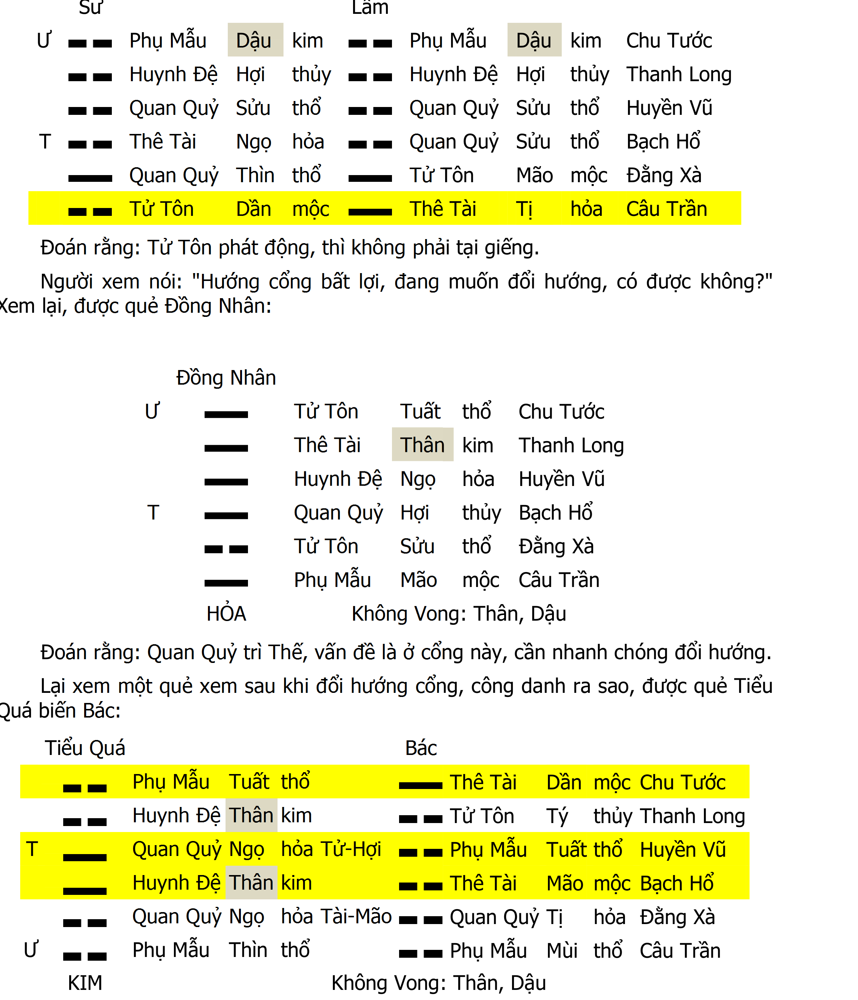

Đoán rằng: Quan tinh Ngọ hỏa trì Thế được Nhật thần Dần tương sinh. Quẻ 
ngoại hợp thành Tam hợp Quan cục, đến năm sau là năm Tị, năm Ngọ sẽ được thăng 
chức liên tiếp. Quả nhiên đến các năm sau được thăng chức hai lần, đến năm Ngọ lại 
thăng đến hàm nhị phẩm.

Phúc đức động dao, bất thị thử phương chi họa.

Phúc đức phát động, không phải là phương tai họa.

Nếu hào Tử Tôn trì Thế, hoặc động trong quẻ, hoặc Quan Quỷ không động, hoặc 
sáu hào yên tĩnh, thì tai họa không ở phương đó.

Quan Quỷ phát động, định ư thử địa hưng yêu.

Quan Quỷ phát động, hẳn là nơi phát yêu ma.

Nếu hào Quan Quỷ trì Thế, khắc Thế, hoặc Quan Quỷ phát động, thì tai họa chắc 
chắn xuất phát từ nơi đó.

**Dã Hạc bàn rằng:** Nếu xem quẻ thấy nơi đấy thực sự bất lợi, thì cần phải tu bổ.

Lại xem thêm một quẻ nữa, hỏi xem tu bổ xong sẽ ra sao? Còn hỏi về công 
danh, thì căn cứ vào chương "Công danh" để suy đoán. Nếu xem về tiền của, thì căn 
cứ vào chương "Cầu tài". Nếu xem về đề phòng tai họa, thì căn cứ vào chương 
"Phòng hoạn". Nếu xem về tật bệnh, thì căn cứ vào chương "Bệnh tật". Từng có một 
học trò tài học nức tiếng, nhưng thi mãi không đậu, đến xem gia trạch có vấn đề gì 
không.

Ta bèn hỏi: "Tuy vì cầu danh mà xem về gia trạch, nhưng có nghi ngờ có chỗ 
nào trong nhà bị phạm hay không?" Người này đáp: "Ngờ rằng do bị căn miếu sau 
nhà xung phạm phải."

Ngày Kỷ Sửu tháng Tị, xem được quẻ Đại Hữu biến Càn:

Đại Hữu
 
Càn

Ư | Quan Quỷ | Tị | hỏa | Phụ Mẫu | Tuất thổ | Câu Trần

Phụ Mẫu | Mùi | thổ | Huynh Đệ | Thân | kim | Chu Tước

Huynh Đệ | Dậu kim | Quan Quỷ | Ngọ | hỏa | Thanh Long

T | Phụ Mẫu | Thìn | thổ | Phụ Mẫu | Thìn | thổ | Huyền Vũ

Thê Tài | Dần mộc | Thê Tài | Dần | mộc | Bạch Hổ

Tử Tôn | Tý | thủy | Tử Tôn | Tý | thủy | Đằng Xà

KIM 
Không Vong: Ngọ, Mùi

Đoán rằng: Thế là nhà mình, Ứng là căn miếu. Thế Ứng tương sinh, nên không 
phải là phạm xung? Nhưng trước miếu có một vật, vì trong quẻ Mùi thổ phát động 
hình Thế, nguyên do là bởi vật này.

Người xem nói: "Trước miếu có bức bình phong, phía sau bình phong có một cây 
to, có đến vài trăm năm tuổi."

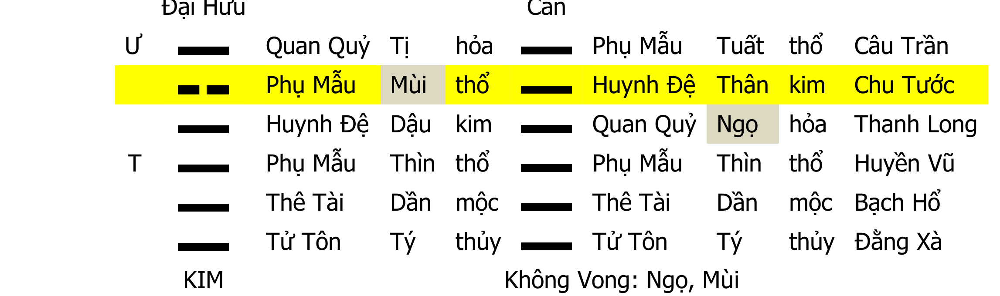

Ta đáp: "Chính là do cái cây này. Anh nên đặt một tấm hổ phù lớn trên nóc nhà, 
miệng há ra hướng về gốc cây đó, mọi việc sẽ tốt đẹp."

Lại gieo một quẻ xem sau khi sắp đặt xong sẽ ra sao, được Quy Muội biến Dự:

Quy Muội
 
Dự

Ư | Phụ Mẫu Tuất thổ | Phụ Mẫu Tuất thổ Câu Trần

Huynh ĐệThân kim | Huynh ĐệThân kim Chu Tước

Quan QuỷNgọ hỏa Tử-Hợi | Quan QuỷNgọ hỏa Thanh Long

T | Phụ Mẫu Sửu thổ | Thê Tài | Mão mộc Huyền Vũ

Thê Tài | Mão mộc | Quan QuỷTị | hỏa Bạch Hổ

Quan QuỷTị | hỏa | Phụ Mẫu Mùi | thổ Đằng Xà

Đoán rằng: Sửa sang xong, đảm bảo anh sẽ thi đỗ khoa này. Vì Tài động sinh 
Quan, Quan động sinh Thế, là điềm đại cát. Sau quả nhiên đỗ Trạng nguyên kinh 
sách. Đến khoa sau người em cũng thi đậu.

Có người hỏi: "Từng thấy người xưa dựa vào phép xem cổ, dùng một quẻ đoán 
gộp nhiều chuyện." Ta đáp: "Chuyện đó có khó gì?"

Từng vào ngày Mậu Ngọ tháng Hợi, xem về gia trạch, được quẻ Tỷ biến Kiển:

Tỷ 
 
Kiển

Ư | Thê Tài | Tý | thủy | Thê Tài | Tý | thủy | Chu Tước

Huynh Đệ | Tuất thổ | Huynh Đệ | Tuất thổ | Thanh Long

Tử Tôn | Thân | kim | Tử Tôn | Thân | kim | Huyền Vũ

T | Quan Quỷ | Mão | mộc | Tử Tôn | Thân | kim | Bạch Hổ

Phụ Mẫu | Tị | hỏa | Phụ Mẫu | Ngọ | hỏa | Đằng Xà

Huynh Đệ | Mùi | thổ | Huynh Đệ | Thìn | thổ | Câu Trần

THỔ
Không Vong: Tý, Sửu

Ta nói: Xem về gia trạch gồm rất nhiều sự việc, người ta thường căn cứ vào | những lập luận vô lý mà đoán bừa, nhưng ta thì không thể. Nếu như ta căn cứ vào lối | cũ để đoán bừa, thì hào Quỷ ở Bạch Hổ phát động, là điềm có tang; hào Quỷ mộc | phát động, không nên trồng trọt. Hào Quỷ trì Thế, bản thân có họa hình trượng gông | cùm. Quỷ tại cung Khôn, là động mồ mả. Quỷ tại Mão, người tuổi Mão sẽ gặp tai họa.

Lại có phép cho rằng, hào 3 chỉ em trai, quẻ này Quỷ tại hào 3, nên anh em chắc | chắn sẽ có tai họa. Trong quẻ hào Tài Tý thủy ám động trợ giúp cho Quỷ, để khắc | Huynh Đệ Mùi thổ, cũng chủ về anh em gặp tai ương. Thế tượng trưng cho chủ nhà, | Mão mộc hóa Thân kim hồi đầu khắc, tháng mười tử khí tại Mão, Bạch Hổ gặp tử khí | tại hào Thế, nên chủ nhà ắt có vạ đao kiếm. Lại thêm rất nhiều thần sát, không tiện | kể hết.

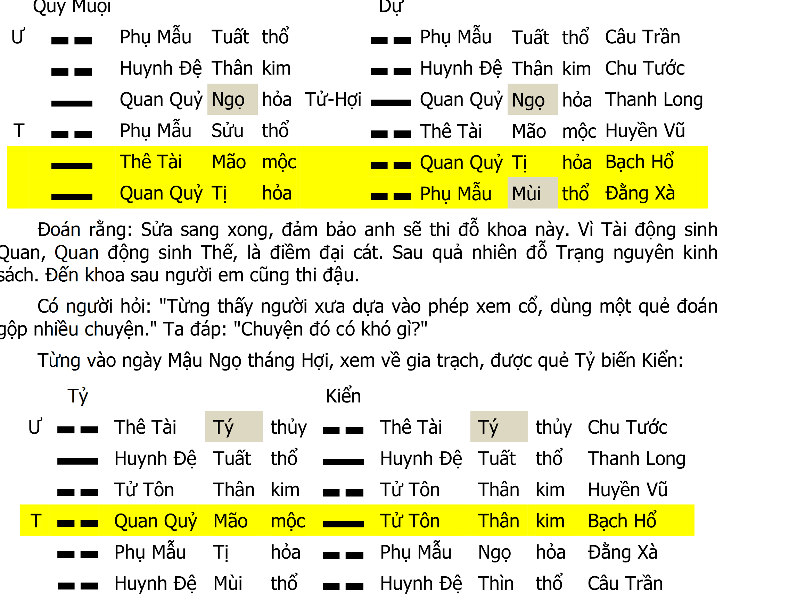

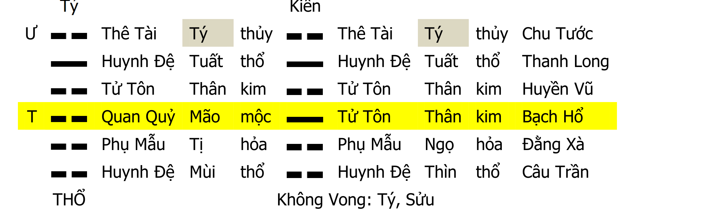

Nói tóm lại nếu đoán theo lối cổ, đây là gia trạch cực hung. Nên bảo người này, 
thực sự muốn xem về việc gì, cứ nói rõ cho ta biết, ta xem không đúng, là lỗi của ta.

Người này bèn nói: "Trước kia mẹ ốm, nay vợ lại sinh bệnh, ngờ rằng gia trạch 
có vấn đề, nên muốn xem."

Ta nói: "Trong chương "Tật bệnh" có viết: Bệnh gần gặp Không sẽ khỏi. Hôm 
nay là ngày Ngọ, xung động hào Thê Tài, người bệnh gặp xung sẽ khỏi, đêm nay 
bệnh sẽ đỡ. Hào 3 là hào Quỷ Mão mộc động, nhà anh trước đây đã từng đổi cổng 
phải không?"

Người này bèn đáp: "Cổng giữa trước ở bên phải, đến tháng năm đã chuyển 
sang bên trái."

Ta bèn nói: "Đến ngày Canh Thân, hãy chuyển lại cổng sang bên phải, mẹ của 
anh đến ngày Thân ngày Tý sẽ khỏi bệnh, về sau, nhà cửa sẽ được yên lành." Sở dĩ 
ứng với cổng chính, vì Quỷ tại Mão; nên đổi cổng vào ngày Thân, vì Thân kim khắc 
chế Quỷ Mão mộc.

Quả nhiên đến ngày Tý, bệnh đỡ hẳn, gia trạch từ đó bình an vô sự.

Giác Tử bàn rằng: Nhìn vào ví dụ trên, sẽ biết được rằng, nên dựa vào phép cũ 
mà đoán bừa, hay căn cứ vào ý của người đến xem mà suy luận.

Phúc đức lâm thân, chuyển tai vi phúc. Vượng Tài trì thế, bảo tàng hưng 
yên.

Phúc đức tại thân, chuyển họa thành phúc. Tài vượng trì Thế, kho báu bày ra.

Nếu gặp hào Tử Tôn trì Thế, hoặc Tử Tôn động, thì ma quỷ ẩn hình. Cho dù có 
ma quỷ xuất hiện, cũng được bình yên. Tử động thì hết ưu phiền, thần quỷ đều náu 
mình không hiện.

Nếu có hào Tài vượng tướng trì Thế, hoặc Tài động sinh, hợp Thế, ắt trong nhà 
có kho báu. Nếu muốn hỏi kho báu tại phương nào, thì ở đây là tiền của đến tìm ta, 
chứ ta không cần đi tìm kiếm. Đã là tiền của ta, tự nhiên rồi sẽ xuất hiện. Nếu muốn 
hỏi sẽ xuất hiện vào lúc nào, thì căn cứ vào chương "Ứng kỳ" đối chiếu với hào Tài để 
đoán định.

Quỷ động hào trung, chân yêu thực túy.

Quỷ động trong quẻ, thực có yêu ma.

Quỷ lâm Bạch Hổ, trong nhà có hài cốt; Quỷ ở Huyền Vũ, là sơn yêu thủy quái; | Quỷ tại Đằng Xà, chủ về rắn rết, sâu bọ thành tinh; tại Chu Tước, là ma quỷ chết vì | kiện tụng, hỏa hoạn, trộm cướp; tại Câu Trần, là ma quỷ chết vì tù ngục; tại Thanh | Long, là ma quỷ chết vì sắc dục; Quỷ ở Hợi Tý, là ma quỷ chết đuối, hoặc chủ về tai | họa nước tràn. Quỷ tại Thìn, Tuất, Sửu, Mùi, là ma quỷ chết do tường đổ, nhà sập, | hoặc do hình đầu thú trên tường phạm phải; Quỷ tại Dần, Mão, là ma quỷ chết vì treo | cổ, cũng chủ về cổng cửa, rường kèo; Quỷ tại Tý, Ngọ là ma quỷ chết cháy, cũng chủ | về bếp núc không an; Quỷ tại Thân, Dậu là ma quỷ chết vì đao kiếm, hoặc do kim loại | thành yêu quái, hoặc chồn cáo thành tinh; Quỷ tại hào biến, là oan gia đòi nợ; Quỷ tại

---

# CHƯƠNG 121. Ở CHUNG

Nhật thần, Nguyệt kiến, cúng tế thần thiện; Quỷ khắc Thế, phải chịu tai ương; Quỷ 
sinh Thế, lại nhận được giúp đỡ.

Sách xưa chép lại cách chế Quỷ như sau: Vào ngày Canh Thân, ngày Giáp Tý 
hoặc ngày Trừ tịch, dùng mấy tờ giấy vàng với một chén nước trong, nếu quẻ hiện 
Quỷ kim, thì hướng về phía tây mà hóa; nếu là Quỷ thủy, thì hướng về bắc mà hóa, 
lẳng lặng đem ra phía ngoài cổng. Ta chiêm nghiệm nhiều lần đều linh ứng.

Giác Tử nói rằng: Phép trị Quỷ của ta là: Đường đường chính chính sẽ chế ngự 
được các loại tà ma; thấy điều ma quái mà không cho là ma quái, thì ma quái sẽ tự 
biến mất.

Quan khắc Thế vị, vi tai vi hoa,

Quan khắc hào Thế, là tai là họa.

Hào Quỷ động khắc Thế, hoặc hào Thế theo Quỷ nhập Mộ, hoặc hào Thế động 
biến Quỷ khắc Thế, là oan gia đòi nợ, nên khó tránh khỏi tai họa. Cần phải tích đức 
tạo phúc, mới có thể biến dữ thành lành.

Hào Tài động khắc Phụ, hoặc Tài hóa Phụ, Phụ hóa Tài, là cha mẹ bị tổn thương.

Hào Phụ động khắc Tử, Tử hóa Quỷ, Quỷ hóa Tử, là hao tổn về con cái.

Huynh Đệ biến Quỷ, Quỷ biến Huynh Đệ, Quỷ động khắc Huynh, Thê Tài biến 
Quỷ, Quỷ biến Thê Tài, Huynh động hóa Tài, Tài hóa Huynh Đệ, đề phòng anh em bị 
tổn hại, cũng chủ về vợ chồng chia lìa.

***

# CHƯƠNG 121: Ở CHUNG

Nếu ở chung với người thân, thì xem hào Lục thân.

Nếu ở chung với người ngoài, thì xem hào Ứng.

Thế là bản thân, Ứng là người khác, nếu hào Thế, hào Ứng tương sinh tương 
hợp, hoặc được Nhật thần, Nguyệt kiến, hào động tương sinh tương hợp Thế, Ứng, là 
điềm cả ta và người đều được tốt lành. Nếu hào Thế bị khắc, bản thân sẽ bị tổn 
thương; nếu hào Ứng bị khắc, người ở cùng sẽ bị tổn hại. Nếu hào Thế khắc hào Ứng, 
là người khác sợ ta; nếu hào Ứng khắc hào Thế, là ta bị người bắt nạt. Nếu bị hình, 
xung, cũng tương tự như vậy.

Nếu ở chung với Lục thân, cũng nên hào Thế và Lục thân tương sinh, không nên 
tương xung tương khắc.

---

# CHƯƠNG 122: XÂY DỰNG PHỦ QUAN

Nếu do quan phủ tự xem, thì hào Thế và hào Quan đều nên vượng tướng. Nếu 
Tử Tôn trì Thế, hoặc Tử Tôn phát động, việc xây dựng hãy tạm dừng lại. Nếu biến 
khắc biến tuyệt, sẽ phải chịu họa lớn. Nếu là quẻ Lục xung hóa hợp, ắt có phúc lớn.

***

# CHƯƠNG 123: NHA MÔN

**Dã Hạc bàn rằng:** Xem về nha môn cũ, cũng tương tự như xem về nhà ở cũ. Có 
khi vì người trong nha môn thường xuyên đau ốm, có khi vì trưởng quan thường 
xuyên gặp nạn, có khi vì lâu ngày không được thăng quan, có khi vì trong nha môn có 
ma quỷ hiện hình, đều cần chỉ rõ chỗ nghi ngờ để xem.

Từng có nha môn nhiều đời quan phủ đều gặp bất lợi, người thì bị cách chức, 
giáng chức, người thì gặp tai ương, chết chóc. Bèn đón ta đến phủ, xem đến hơn nửạ 
tháng, có chỗ nào nghi ngờ, đều đem ra hỏi, mà không thấy hiện trong quẻ. Sau xem 
ngòi nước phía sau chảy từ phía sau nhà ra có vấn đề gì không. Ngày Kỷ Hợi tháng 
Tuất xem được quẻ Đỉnh:

Đỉnh

Huynh ĐệTị | hỏa | Câu Trần

Ư | Tử Tôn | Mùi thổ | Chu Tước

Thê Tài | Dậu kim | Thanh Long

Thê Tài | Dậu kim | Huyền Vũ

T | Quan QuỷHợi thủy | Bạch Hổ

Tử Tôn | Sửu thổ Phụ-Mão Đằng Xà

HỎA
Không Vong: Thìn, Tị

Đoán rằng: Đúng là tại chỗ này, nên khơi cho dòng nước chảy sang phía đông. | Về sau vét ngòi, thấy rất nhiều hài cốt, lúc này ta mới hiểu được rằng, Quỷ Bạch Hổ | trì Thế là điềm có hài cốt, quả thực như vậy.

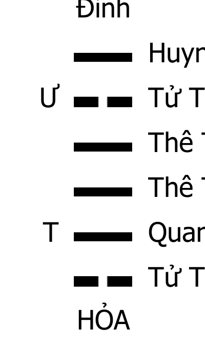

---

# CHƯƠNG 124. XÂY CHÙA MIẾU

Lại xin xem thêm một quẻ xem sau khi sửa ngòi nước sẽ ra sao, được quẻ Phệ 
Hạp biến Vô Vọng.

Phệ Hạp
 
Vô Vọng

Tử Tôn | Tị | hỏa | Thê Tài | Tuất thổ | Câu Trần

T | Thê Tài | Mùi thổ | Quan QuỷThân kim Chu Tước

Quan QuỷDậu | kim | Tử Tôn | Ngọ | hỏa Thanh Long

Thê Tài | Thìn thổ | Thê Tài | Thìn thổ | Huyền Vũ

Ư | Huynh ĐệDần | mộc | Huynh ĐệDần | mộc Bạch Hổ

Phụ Mẫu | Tý | thủy | Phụ Mẫu | Tý | thủy Đằng Xà

MỘC 
Không Vong: Thìn, Tị

Đoán rằng: Hào Tài Mùi thổ hóa Quan tinh Thân kim, sang năm Mùi sẽ thăng 
chức cao. Về sau ứng vào năm Thân thăng chức. Sở dĩ ứng vào năm Thân, vì là năm 
trực của hào Quan.

***

# CHƯƠNG 124: XÂY CHÙA MIẾU

Cách suy đoán cũng tương tự như với gia trạch, không nên gặp quẻ Lục xung 
biến xung, hoặc quẻ biến Mộ Tuyệt hoặc Phản ngâm, Phục ngâm. Nếu là trụ trì xem 
quẻ, nên gặp hào Thế vượng, được Nhật, Nguyệt, hào động tương sinh, nên gặp hào 
Tử Tôn động, kỵ hào Quan Quỷ hoặc Huynh Đệ trì Thế, vì chỉ tốn tiền vô ích. Nếu 
Quan Quỷ trì Thế, sẽ khổ vì tai ương bệnh tật. Nếu hào Huynh động mà khắc Thế, 
muốn tạo phúc lại thành mầm họa. Nếu Tài, Quan sinh Thế, dù thiếu tiền vốn, tự 
nhiên cũng có người tán trợ. Nếu Tử Tôn vượng tướng mà hóa Tiến thần, chủ về thu 
nhiều đệ tử. Nếu hào Tài hưu tù mà hóa Thoái thần, là điềm có đầu không cuối.

**Lý Ngã Bình bàn rằng:** Sách bốc phệ có tới hơn hai mươi loại, luận về gia trạch 
mỗi thứ một khác, không hiểu chủ kiến của các bậc tiên hiền ra sao. Sách "Bốc phệ 
đại toàn" lấy hào sơ làm giếng, hào 2 làm bếp, hào 3 làm giường, hào 4 làm cổng, 
hào 5 là người, hào 6 là rường kèo. "Hoàng kim sách" cho rằng hào sơ là nền móng, 
hào 2 là nhà ở, hào 3 là cổng, hào 4 là cha mẹ, hào 5 là anh em, hào 6 là thê thiếp, 
của cải. Sách "Dịch mạo" lấy hào sơ là trẻ con, hào 2 là vợ, hào 3 là anh em, hào 4 là 
mẹ, hào 5 là cha, hào 6 là người già. Mỗi sách một ý khác nhau, không thể liệt kê cho 
hết.

Sách "Dịch mạo" còn viết: "Quỷ động tại quẻ nội, tai họa trong nhà; Quỷ động tại 
quẻ ngoại, nhân đinh gặp họa". Đã lấy hào hai là vợ, hào ba là anh em, nếu tại quẻ 
nội có hào Quỷ động, thì nên đoán là trong nhà có tai họa, hai là anh em, thê thiếp 
gặp tai ương?

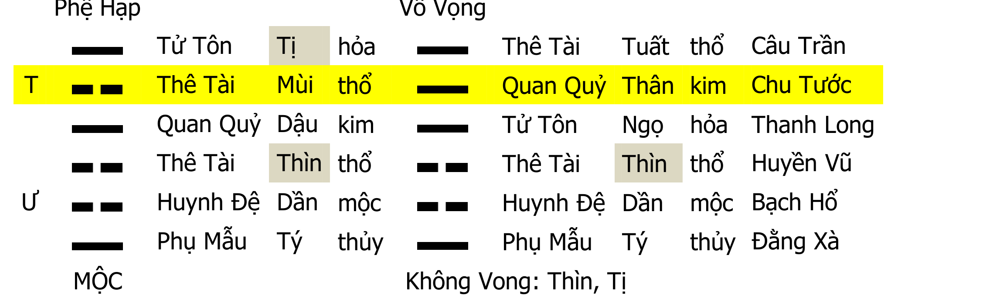

---

# CHƯƠNG 125. PHẦN MỘ / CHƯƠNG 126. TÌM ĐẤT TỐT

Lại có chỗ quan niệm căn cứ vào ngũ hành của Quỷ, bát cung của Quỷ để định 
các loại tai họa như kiện tụng, thị phi, hỏa hoạn, trộm cướp, lại có chỗ căn cứ vào đó 
để xác định bệnh tật tại đầu, mắt, tay, chân. Sách này cho rằng Quỷ tại hỏa chủ hỏa 
hoạn, Quỷ tại cung Càn chủ về bệnh tật tại đầu, mắt. Nếu dùng một quẻ để đoán 
gộp, chẳng lẽ những nhà gặp hỏa hoạn, trộm cướp đều phải nhức đầu đau mắt hay 
sao?

Lại có sách cho rằng: "Hợp là cổng, xung là đường đi, bất kể có hiện trong quẻ 
hay không, nhưng phải là ám xung, ám hợp. Nếu như có xung không hợp, có hợp 
không xung, chẳng lẽ lại là nhà có cổng không đường đi, hoặc có đường đi không có 
cổng hay sao?

Lập luận như thế là không biết rằng, xem về việc rước lành tránh dữ của gia 
trạch, đều nhằm mục đích khiến người nhà được bình yên, nếu hào Tài, hào Phúc 
vượng thì nhà hưng thịnh, nếu hào Huynh, hào Quỷ yên tĩnh thì nhà bình an. Chỉ đơn 
giản như thế mà thôi, hà tất phải vẽ vời thêm ra làm gì, để làm rối loạn cho người học 
đời sau.

***

# CHƯƠNG 125: PHẦN MỘ

**Dã Hạc bàn rằng:** Xem về phần mộ, huyệt mộ, lý luận trong sách cổ cũng nhiều 
chỗ sai lầm, không khác gì phần gia trạch, kẻ học đời sau khảo sát các loại sách bốc 
phệ sẽ hiểu rõ. Ta vì muốn tìm phương pháp linh nghiệm, mỗi lần có nhà cúng tế tảo 
mộ, ta đều đến nơi, bảo người nhà họ xem. Hoặc biết có người đang tìm đất làm 
huyệt, đều đến xem giúp. Cứ như vậy nhiều năm nay, mới dần dần hiểu được chỗ bí 
mật.

***

# CHƯƠNG 126: TÌM ĐẤT TỐT

Thế hào vượng tướng, tổ phụ hồn an; Phúc đức hưng long, nhi tôn cẩm 
tự.

Hào Thế vượng tướng, tổ tiên bình yên; Phúc đức hưng long, cháu con vượng 
phát.

Theo sách xưa, có phép coi hào 2 là huyệt, hoặc coi quẻ nội là huyệt, hoặc coi | Đằng Xà là huyệt, ta thử nhiều lần không thấy ứng nghiệm. Chỉ thấy lấy hào Thế làm | huyệt là ứng nghiệm. Hào Thế cần vượng tướng, hoặc lâm Nhật, Nguyệt, hoặc được | Nhật, Nguyệt, hào động sinh phò, thì đó là cát địa. Con cháu là hậu duệ tế bái, nên | được Tử Tôn trì Thế là tốt, hoặc được hào khác vượng tướng, đều là tượng con cháu | thịnh vượng.

Tam hợp Lục hợp, tụ khí tàng phong; Thế xung Lục xung, phi sa tẩu 
thạch.

Tam hợp, Lục hợp, là nơi tụ khí tàng phong; Thế xung, Lục xung, ắt chốn cát bay 
đá chạy.

Nếu được quẻ Lục hợp, hoặc hào Thế và hào Tử Tôn hợp thành Lục hợp, thì đó 
là huyệt tốt tụ khí, mai táng nơi đó, sẽ được đời đời hưng thịnh. Nếu gặp quẻ Lục 
xung, hoặc quẻ Lục xung biến Lục xung, hoặc Thế, Ứng tương xung, gặp xung sẽ tán, 
nên không thể tụ khí.

Lục xung biến hợp, địa dĩ khứ nhi phục lai; Lục hợp biến xung, hình dĩ 
thành nhi phục thất.

Lục xung biến hợp, đất đã mất lại quay về; Lục hợp biến xung, hình đã thành mà 
lại mất.

Về câu nói này, có hai cách giải thích. Nếu là quẻ Lục xung biến Lục hợp, tức đất 
này trước mắt không lấy được, nhưng về sau ắt sẽ được; hoặc cũng có thể là vận đất 
đã suy, long đã đi mất từ trước, nhưng bây giờ lại quay lại. Nếu được quẻ này, lại 
thêm hào Thế tại Tử Tôn vượng tướng, thì rất nên chọn đất này. Ta từng xem cho 
một vài người gặp quẻ này, đời sau khoa giáp thường xuyên đỗ đạt.

Nếu là quẻ Lục hợp biến Lục xung, thì hoặc là đất đã có được nhưng sau lại mất, 
hoặc là vận đất sắp suy, long sắp đi mất, không nên dùng.

Thế vượng nhi hóa Tuyệt Phá, cát xứ tàng hung; Thế suy nhi hóa sinh 
hợp, hung trung hữu cát.

Thế vượng mà hóa Tuyệt hóa Phá, trong cát ẩn hung; Thế suy mà hóa sinh hóa 
hợp, trong hung có cát.

Hào Thế tuy vượng, nhưng không nên hóa Phá, hóa Mộ, hóa Tuyệt, hóa hồi đầu 
khắc, vì chủ về trước là đất tốt, nhưng sau lại có chỗ bất lợi; hoặc chôn cất không 
được ngày tốt; hoặc sau khi chôn xong có người phá hoại, đều là điềm cát biến thành 
hung. Nếu hào Thế suy nhược, nhưng động hóa hồi đầu sinh, hóa Trường Sinh, Đế 
Vượng, hóa Nhật thần, Nguyệt kiến, hóa hợp, hóa Tiến thần, là điềm trước hung sau 
cát. Tuy địa thế trước mắt là đất tài đinh, nhưng về sau thế đất sẽ trở nên hưng 
thịnh, mà biến thành đất phú quý.

### Ví dụ: Ngày Mậu Ngọ tháng Dần, xem về đất, được quẻ Di biến Vô Vọng:

Di 
 
Vô Vọng

Huynh ĐệDần mộc | Thê Tài | Tuất thổ Chu Tước

Phụ Mẫu Tý | thủy Tử-Tị | Quan QuỷThân kim Thanh Long

T | Thê Tài | Tuất thổ | Tử Tôn | Ngọ hỏa Huyền Vũ

Thê Tài | Thìn thổ Quan-Dậu | Thê Tài | Thìn thổ Bạch Hổ

Huynh ĐệDần mộc | Huynh ĐệDần mộc Đằng Xà

Ư | Phụ Mẫu Tý | thủy | Phụ Mẫu Tý | thủy Câu Trần

MỘC
Không Vong: Tý, Sửu

Đoán rằng: Hào Thế Tuất thổ, do xem vào mùa xuân nên hưu tù, lại động hóa | thành Tử Tôn Ngọ hỏa, hồi đầu sinh Thế, Nhật, Nguyệt và hào Thế hợp thành Tam | hợp. Thanh Long tại hào thủy tạo thành thế Thanh Long hý thủy, thủy hóa Thân kim | là hóa Trường Sinh, nguồn nước dồi dào. Chỉ hiềm Thân gặp Nguyệt phá, Tuất thổ | khắc Tý thủy, lại bị Nhật thần xung tán, xuân hạ có nước, đến thu đông sẽ khô. Người | này bèn nói: Đúng là như vậy. Ta nói: Không đáng ngại! Không thể cầu toàn được. | Trong quẻ Nhật, Nguyệt và Tử Tôn hợp thành Tam hợp, nên người chết được yên, | người sống được an lạc, con cháu phát đạt, nên không phải lo lắng. Sau quả nhiên | táng ở mộ đấy. Năm Thìn chôn cất, năm Dậu cháu trai đỗ á khoa. Đến năm Tý, cháu | trai thứ lại đỗ thi hương.

Thế hóa Tiến thần, thiên thu miên viễn; Phúc đức hóa Tiến, bách đại 
chưng thường.

Thế hóa Tiến thần, ngàn năm trường cửu; Phúc đức hóa Tiến, hương khói muôn 
đời.

Hào Thế nên vượng tướng hoặc hóa Tiến thần, hóa Nhật Nguyệt, hóa hồi đầu 
sinh, hóa hợp, hóa Trường Sinh Đế Vượng, là tượng long mạch vững vàng, thủy tụ, 
mạch đất sâu xa.

Nếu hào Tử Tôn vượng tướng hóa Tiến thần, hoặc hóa hợp, hóa sinh, hóa Nhật 
Nguyệt, hóa vượng tướng, là tượng con hiền cháu quý, rạng danh chốn triều đình.

Thế hóa Thoái thần, chung tu thiên cải; Tử Tôn hóa Thoái, đại đại bất 
như.

Thế hóa Thoái thần, sẽ phải thay đổi; Tử Tôn hóa Thoái, mỗi đời một suy.

Hào Thế và hào Tử Tôn đều nên được Nhật, Nguyệt, hào động sinh phò, không 
nên bị Nhật thần, Nguyệt kiến xung khắc.

Vượng Thế lâm Hổ, quan thượng gia quan; vượng Phúc phùng Long, 
Dần táng Mão phát.

Thế vượng lâm Hổ, quan tài chồng lên quan tài; Phúc vượng gặp Long, chôn 
năm Dần phát năm Mão.

Nếu hào Thế lâm Quỷ Bạch Hổ, hoặc theo Quỷ nhập Mộ, đều chủ dưới đất có hài | cốt. Nếu hào Thế vượng tướng, lại được sinh phò, là tượng quan chồng lên quan.

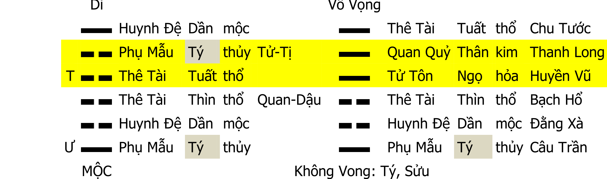

Từng gặp hai người chôn như vậy, về sau đại phát. Nếu hào Thế hưu tù, thì không 
thể đoán như vậy.

Nếu hào Tử Tôn vượng tướng, được Nhật Nguyệt sinh phò, lại gặp Thanh Long, | là cát địa, chôn cất năm Dần, sang năm Mão lập tức đại phát, ý nói tốc độ vượng phát | rất nhanh.

### Ví dụ: Ngày Mậu Tý tháng Thân, xem về phần mộ, được quẻ Bác:

Bác

Thê Tài | Dần mộc | Chu Tước

T | Tử Tôn | Tý | thủy Huynh-Thân Thanh Long

Phụ Mẫu Tuất thổ | Huyền Vũ

Thê Tài | Mão mộc | Bạch Hổ

Ư | Quan QuỷTị | hỏa | Đằng Xà

Phụ Mẫu Mùi thổ | Câu Trần

KIM
Không Vong: Ngọ, Mùi

Đoán rằng: Tử Tôn trì Thế, gặp Nhật thần, được Nguyệt kiến Thân kim tương | sinh. Lại thêm Thanh Long hý thủy, nước từ mé tả vòng lại, vượng tướng nên sẽ gần | sông lớn, nếu không cũng có dòng nước chảy dài. Bạch Hổ tại Mão mộc, Tý và Mão | tương hình, nên có nanh vuốt mai phục, Ứng là núi chầu, Ứng hỏa bị thủy khắc, nên | núi không cao. Tuất là án sơn, Tuất thổ khắc thủy, nên án sơn sẽ cao hơn. Người xem | bèn nói: Tất cả đều đúng. Ta nói: Mau táng chỗ đấy, đến mùa đông sẽ phát. Quả | nhiên tháng tám an táng, đến tháng mười, con trai thứ lập công lớn, được lên cấp | thăng chức cao. Đến tháng tư năm sau, được lập phủ riêng, giữ chức nguyên nhung. | Con trai trưởng vốn không có con cái, đến năm sau cũng sinh được.

Lại ví dụ: Ngày Nhâm Dần tháng Mão, xem về tìm đất, được quẻ Trạch Hỏa Cách 
biến Ký Tế:

Cách
 
Ký Tế

Quan QuỷMùi thổ | Huynh ĐệTý | thủy Bạch Hổ

Phụ Mẫu | Dậu kim | Quan QuỷTuất thổ | Đằng Xà

T

Huynh ĐệHợi thủy | Phụ Mẫu | Thân kim Câu Trần

Huynh ĐệHợi thủy Tài-Ngọ | Huynh ĐệHợi | thủy Chu Tước

Quan QuỷSửu thổ | Quan QuỷSửu | thổ | Thanh Long

Ư

Tử Tôn | Mão mộc | Tử Tôn | Mão mộc Huyền Vũ

THỦY
Không Vong: Thìn, Tị

Lấy hào Phụ Mẫu làm Dụng thần, Phụ Mẫu Thân kim hồi đầu sinh Hợi thủy, hào 
Thế tuy hưu tù, nhưng gặp sinh nên vượng. Chỉ hiềm Nhật thần Dần xung mất Thân 
kim, nên phải đến tháng bảy mùa thu đắc lệnh mới được đất. Hào Phụ tại Thân, Dậu,

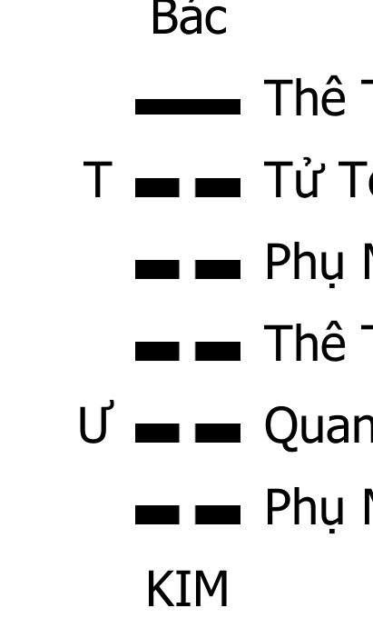

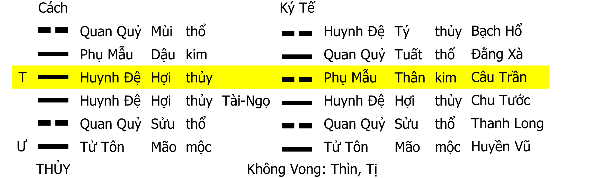 nên sẽ có đất tại phía tây nam, là đất tài đinh, đến năm Thân, long hưng vận đến, sẽ 
vượng phát lớn. Thế suy mà hóa hồi đầu sinh, là tượng trong hung có cát.

Quả nhiên đến tháng bảy, được miếng đất ở phía tây nam, năm Mão an táng, 
đến năm Dậu con trai cả thi đỗ, con trai thứ ba cũng đỗ võ khoa.

Tán Mộ Tuyệt Không, Thế dữ Tử Tôn vật kiến; hóa Khắc hóa Quỷ, Đệ 
Huynh Thê Tử hưu phùng.

Tán, Mộ, Tuyệt, Không, Thế với Tử Tôn đừng gặp; hóa Khắc hóa Quỷ, Huynh Đệ, 
Thê, Tử chớ nên.

Hào Thế, hào Tử Tôn không nên hưu tù, Mộ, Tuyệt, Không, Phá, không nên 
động mà gặp Phá Tán hoặc hóa Phá Tán, hóa Tuyệt, hóa Mộ, hóa Quỷ, hóa Thoái 
thần, hóa hồi đầu khắc. Nếu gặp một trong những trường hợp đó, đều không phải là 
đất tốt.

Lục thân không nên hóa Quỷ, không nên Phụ hóa Tử, Tử hóa Phụ, Quỷ hóa Tử, 
Tử hóa Quỷ, Huynh hóa Quỷ, Quỷ hóa Huynh, Huynh hóa Tài, Tài hóa Huynh, Tài hóa 
Quỷ, Quỷ hóa Tài, như vậy là bất lợi cho anh em, vợ con. Trong nhà còn cha mẹ, 
cũng không nên gặp Quỷ hóa Phụ, Phụ hóa Tài, Tài hóa Phụ.

Ứng xung Thế hợp xứ phùng xung, lưu di thiên đồ. Phản Phục quái biến 
hóa khắc, hồng phiếm lăng mộ.

Ứng xung tại nơi hợp cục, đổi dòng di chuyển. Quẻ Phản Phục biến hóa Khắc, 
nước lụt dời lăng.

Khi chọn đất, không những không nên gặp quẻ Lục xung, mà hào Ứng xung hào 
Thế cũng là không cát lợi. Nếu Thế, Ứng tương hợp, hoặc gặp quẻ Lục hợp, hoặc Thế, 
Ứng, Tử Tôn hợp thành Tam hợp cục, là cát địa. Nếu gặp quẻ Phục ngâm, đợi đến 
năm, tháng xung khai, sẽ phải chuyển dời. Nếu gặp quẻ Phản ngâm, gặp năm, tháng 
xung khai sẽ phải đổi chỗ. Nếu quẻ nội quẻ ngoại phản ngâm, là quẻ biến. Như Tốn 
biến Càn, Khôn biến Chấn, đều là hóa tuyệt hóa khắc, nếu gặp những quẻ đó, nếu 
nặng thì bị sạt lở, nứt vỡ, nhẹ thì phải di chuyển.

### Ví dụ: Ngày Mậu Tý tháng Mão, xem về đất, được quẻ Tốn biến Thăng:

Tốn 
 
Thăng

T | Huynh Đệ | Mão | mộc | Quan Quỷ | Dậu | kim | Chu Tước

Tử Tôn | Tị | hỏa | Phụ Mẫu | Hợi | thủy | Thanh Long

Thê Tài | Mùi | thổ | Thê Tài | Sửu | thổ | Huyền Vũ

Ư | Quan Quỷ | Dậu | kim | Quan Quỷ | Dậu | kim | Bạch Hổ

Phụ Mẫu | Hợi | thủy | Phụ Mẫu | Hợi | thủy | Đằng Xà

Thê Tài | Sửu thổ | Thê Tài | Sửu | thổ | Câu Trần

MỘC
Không Vong: Ngọ, Mùi

Thế là huyệt, quẻ này Thế lâm Nguyệt kiến, được Nhật thần Tý thủy tương sinh, 
nên là cát địa. Nhưng hiềm vì quẻ ngoại phản ngâm, hào Thế bị Dậu kim xung khắc,

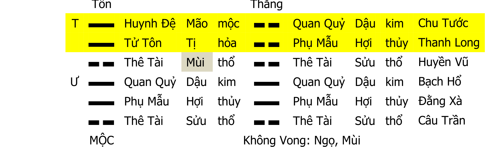

---

# CHƯƠNG 127. HÌNH THẾ ĐẤT

hào Tử Tôn bị Hợi thủy xung khắc, chốn ấy không nên dùng. Người xem bèn nói: "Đã 
mua xong rồi!" Ta bèn nói: "Không chôn đất ấy có được không?" Người xem bèn đáp: 
"Thầy địa lý bảo rằng đấy là đất tốt."

Rồi vẫn mai táng ở đất đấy, trong vòng bốn năm, hai con trai một con gái theo 
nhau mà chết, bản thân cũng mắc chứng bán thân bất toại. Nhưng không biết tự kiểm 
thảo, lại oán trách tổ tiên, quật quan tài lên dầm mưa dãi nắng mà không mang chôn, 
hai năm sau thì chết, quan tài cũng để phơi cùng ở đó, sau thành tuyệt tự. Sở dĩ ứng 
vào năm Dậu, là vì năm xung hào Thế.

Phụ hóa Phụ, nhi tôn yểu chiết. Tử hóa Tử, tử nữ thành hành.

Phụ hóa Phụ, con cháu chết yểu. Tử hóa Tử, con đống cháu đàn.

Không nên gặp hào Phụ động, Phụ động hóa Phụ lại càng hung. Nếu Tử Tôn hóa 
Tử Tôn mà không bị thương khắc, là điềm con cái đầy đàn, không có tình trạng độc 
đinh.

***

# CHƯƠNG 127: HÌNH THẾ ĐẤT

Thế vượng gặp Trường Sinh, lai long vươn xa;

Thế suy bị Ứng khắc, án sơn lấn át.

Hai hào gián vượng, minh đường rộng rãi;

Long Hổ suy nhược, phải trái lõm sâu.

Núi tả vượng, chỏm ngọn lởm chởm;

Núi hữu vượng, nanh vuốt phục tàng.

Chu Tước bị hình xung, núi phía trước hỗn loạn;

Huyền Vũ gặp phá tán, mạch phía sau trống không.

Long, Hổ, hào Thế hợp cục, rồng cuộn hổ ngồi;

Thủy thổ Thế Ứng tương hợp, núi ôm sông bọc.

Thủy khẩu không vững, hào thượng chắc chắn Không Vong;

Đường đi quanh co, Đằng Xà ắt gặp phá tán.

Hào Thế đương lệnh, lại gặp Trường Sinh, Đế Vượng tại Nhật thần, là lai long dài | mà lớn. Nếu như hào Ứng xung khắc hào Thế, ắt là do núi phía trước quá cao. Hoặc | lúc an táng, nhận lầm hướng núi. Nếu hào Ứng bị khắc, thì không đáng ngại, đổi | hướng là được. Hai hào gián ở giữa Thế, Ứng tượng trưng cho minh đường, nếu | vượng tướng, là minh đường rộng rãi; nếu hưu tù, là minh đường khuyết, lệch. Hào | gián ở gần Thế là án sơn, không nên khắc hào Thế. Thanh Long là núi bên tả, Bạch | Hổ là núi bên hữu, nếu hai hào này vượng, là có núi bên tả bên hữu bao bọc. Nếu hai | hào này suy, thì không có thể bao bọc chở che. Về cơ bản, Thanh Long nên vượng, nên được trợ giúp, thế núi hiên ngang; Bạch Hổ nên suy, nên bị khắc, là tượng nanh | vuốt mai phục. Chu Tước bị Hình, Xung, Khắc, Tán, hoặc Phá, Mộ, Tuyệt, Không, là | tượng núi phía trước hỗn loạn. Nếu Huyền Vũ gặp phải, tức mạch phía sau thiếu hụt. | nếu như Thế, Ứng, Long, Hổ, Tử Tôn hợp thành Tam hợp cục, là thế đất tốt, rồng | cuộn hổ ngồi.

Hào thượng tức hào 6, nếu gặp Không Phá, là thủy khẩu không vững vàng; nếu | gặp Tuyệt, chủ về nước cạn nguồn khô, đây là nước ở đường sông, chứ không phải | bàn về thủy khẩu, cần phải xem hào thủy trong quẻ; nếu hưu tù, bị khắc, là nước | dâng nước rút bất thường; nếu gặp sinh, hóa sinh, chủ về nguồn nước sâu xa, dòng | chảy trường cửu. Lại gặp Thanh Long, chủ về nguồn nước sâu xa. Đằng Xà tượng | trưng cho đường đi, nếu bị xung tán, thì đường nhỏ sẽ nhiều; nếu vượng tướng, ắt sẽ | có đường cái quan. Câu Trần tượng trưng cho bờ ruộng, nếu vượng tướng sẽ có, suy, | phá sẽ không có.

### Ví dụ: Vào ngày Canh Thân tháng Sửu, xem về địa thế, được quẻ Hàm:

Hàm

Ư | Phụ Mẫu Mùi thổ | Đằng Xà

Huynh ĐệDậu kim | Câu Trần

Tử Tôn | Hợi thủy | Chu Tước

T | Huynh ĐệThân kim | Thanh Long

Quan QuỷNgọ hỏa Tài-Mão Huyền Vũ

Phụ Mẫu Thìn thổ | Bạch Hổ

KIM
Không Vong: Tý, Sửu

Thanh Long trì Thế, Nhật thần lâm Thế, nên lai long đến từ mé tả, vượng mà | hữu khí, bên phải bên trái đều không bị thương khắc, Long, Hổ bao bọc. Hướng sơn | Mùi thổ gặp Nguyệt phá. Chu Tước Hợi thủy là núi phía trước, được Nhật thần Thân | kim tương sinh, nên sẽ có dòng nước chầu đến, hoặc có dòng nước đai lưng ôm vòng, | nước có nguồn. Đằng Xà là đường đi, hào thượng là thủy khẩu, đều gặp Nguyệt phá, | nên đường nhỏ đan xen, thủy khẩu tán loạn. Hai hào gián vượng tướng, nên minh | đường rộng rãi.

Người xem bèn nói: Không sai chỗ nào! Đất này có tốt không?

Ta đáp: Quẻ này chỉ xem về hình thế của huyệt mộ mà thôi, chứ không thể hiện 
được cát hung họa phúc. Ta cười các bậc tiên hiền chỉ dùng một quẻ mà đoán khắp 
cả cha con, anh em, vợ con, tiền tài, quan lộc, nên chẳng lẽ lại bắt chước ư? Nếu hỏi 
về công danh, hãy xem thêm một quẻ nữa, khấn với thần linh rằng: "An táng tại đất 
này, liệu con có được thành danh không?" Rồi căn cứ vào chương "Quan lộc" để suy 
đoán. Nếu muốn xem có phát tài không, thì căn cứ vào chương "Cầu tài" để suy đoán. 
Nếu muốn xem con cháu có vượng phát không? Có tổn hại đến cha mẹ, anh em, thê 
thiếp không? Đều căn cứ vào chương "Thân mệnh", "Cha mẹ", "Anh em" để suy đoán. 
Nếu dùng quẻ xem về hình thế để suy đoán về Lục thân hay danh lợi, thì như quẻ 
này: Huynh Đệ trì Thế, là thần nghèo túng, phá hao, khắc vợ; huống chi Thê Tài Mão

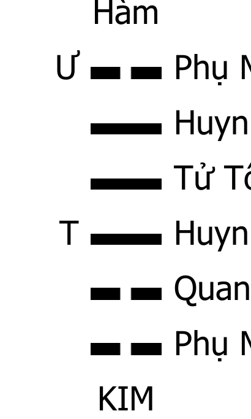

---

# CHƯƠNG 128. XEM KHI NÀO CÓ ĐẤT

mộc lại phục dưới Ngọ hỏa, mộc bị tiết khí, lại bị kim khắc thương. Nếu dùng quẻ này 
đoán gộp, ắt là điềm tổn hại thê thiếp, thương tổn nô bộc, nghèo khó vất vả, thiếu ăn 
thiếu mặc. Thử nghĩ xem, đã được thế đất tốt như vậy, làm sao lại đến nỗi gia cảnh 
nghèo hèn, mất mát người thân như vậy? Nếu thực như thế, thì có thể coi là cát địa 
được không? Bởi vậy phương pháp chia ra để xem của ta thực sự rất hữu ích, làm 
khuôn phép bất di bất dịch của ngàn năm.

Có người hỏi rằng: "Đoạn trên có nói hào Phụ không nên vượng, không nên Phụ 
động hóa Phụ, là thế nào?"

Ta đáp: "Xem về đất cát lấy hào Thế, hào Tử Tôn làm chủ, Phụ động sẽ khắc Tử, 
sao lại không kỵ?"

Lại hỏi rằng: "Đoạn trên có nói, "hóa Khắc hóa Quỷ, Huynh Đệ Thê Tử chớ nên 
gặp", là như thế nào?"

Ta đáp: "Phàm xem về đất cát, hào Thế và hào Tử Tôn vượng, đất đấy dùng 
được. Còn về cha mẹ, anh em, thê thiếp, tiền tài, công danh, cần phải xem riêng quẻ 
khác, không được xem gộp. Nhưng nếu xem về đất mà quẻ hung, không cần đợi xem 
riêng, thì điềm hung đã hiện trong quẻ. Lục thân hóa Quỷ, Quỷ hóa Lục thân, là đất 
hình thương."

Nếu Lục thân động hóa Khắc, hóa Quỷ, không cần phải xem suy vượng, Không, 
Phá, Hình, Xung. Thần mách bảo thiên cơ ở chỗ động, động mà hóa hung, hiển nhiên 
đã mách bảo rõ cho ta, lẽ nào lại bỏ qua không xem, mà đi xem quẻ khác.

***

# CHƯƠNG 128: XEM KHI NÀO CÓ ĐẤT

Hào Thế làm Dụng thần.

Nếu tĩnh, đợi đến lúc gặp xung, gặp trực.

Nếu động, đợi đến lúc gặp trực, gặp hợp.

Nếu Không Vong, đợi đến lúc xung thực.

Nếu gặp Nguyệt phá, đợi đến lúc điền thực.

Nếu gặp hợp, nhập Mộ, đợi đến lúc xung khai.

Nếu gặp quẻ độc tĩnh, độc phát, cần đợi đến lúc gặp trực.

Nếu hào Thế hưu tù, cần đợi đến khi vượng tướng.

Nếu hào Thế vượng tướng, cần đợi đến lúc hưu tù.

Hào Thế tượng trưng cho phần mộ, nếu tĩnh, đợi đến năm hoặc tháng gặp xung, 
gặp trực, sẽ có đất. Ví dụ hào Thế tại Tý thủy, an tĩnh, sẽ ứng nghiệm tại năm, tháng 
Tý (trực), Ngọ (xung). Nếu hào Thế động, sẽ ứng nghiệm tại năm Tý.

---

# CHƯƠNG 129. XEM ĐƯỢC ĐẤT TẠI PHƯƠNG NÀO

Nếu hào Thế Không, đợi đến năm xung Không, thực Không sẽ ứng nghiệm. Nếu 
hào Thế gặp Nguyệt phá, cần đợi đến năm thực Phá.

Nếu hào Thế gặp Tam hợp, Lục hợp, hoặc hóa hợp, hoặc gặp Mộ tại Nhật thần, 
hoặc hóa Mộ, đều ứng vào ngày xung khai.

Nếu trong quẻ có hào độc phát, độc tĩnh, sẽ ứng vào năm trực. Nếu là hào độc 
phát, sẽ ứng vào khi gặp hợp; nếu là hào độc tĩnh, sẽ ứng vào lúc gặp xung. Ví dụ, 
trong quẻ hào Tý thủy độc phát, sẽ ứng vào năm Tý, năm Sửu; nếu hào Tý thủy độc 
tĩnh, sẽ ứng vào năm Tý, Ngọ.

### Ví dụ: Ngày Ất Mão tháng Thìn, xem khi nào được đất, được quẻ Phục biến

Truân:

Phục
 
Truân

Tử Tôn | Dậu kim | Thê Tài | Tý | thủy Huyền Vũ

Thê Tài | Hợi thủy | Huynh ĐệTuất thổ Bạch Hổ

Ư | Huynh ĐệSửu thổ | Tử Tôn | Thân kim Đằng Xà

Huynh ĐệThìn thổ | Huynh ĐệThìn thổ Câu Trần

Quan QuỷDần mộc Phụ-Tị | Quan QuỷDần mộc Chu Tước

T | Thê Tài | Tý | thủy | Thê Tài | Tý | thủy Thanh Long

THỔ
Không Vong: Tý, Sửu

Đoán rằng: "Hào Tài Hợi thủy độc phát, trợ giúp cho hào Thế, nhưng hóa Tuất 
thổ hồi đầu khắc. Nay Tuất thổ gặp Nguyệt phá, đến tháng chín thực Phá, Tuất thổ 
càng vượng, phải đợi đến tháng Lập đông thủy vượng mới được đất." Người xem bèn 
hỏi: "Sẽ được đất tại phương nào?" Ta đáp: "Xem gì ứng nấy, nếu muốn biết được 
đất tại phương nào, phải xem thêm một quẻ."

***

# CHƯƠNG 129: XEM ĐƯỢC ĐẤT TẠI PHƯƠNG NÀO

Dã Hạc nói rằng: Xem khi nào có đất, lấy hào Thế làm Dụng thần. Xem được đất 
tại phương nào, phải lấy hào Phụ Mẫu làm Dụng thần. Sau khi chôn cất, đều lấy hào 
Phụ làm Dụng thần.

Hào Phụ tại Hợi, Tý: Huyệt tốt tại phương bắc.

Hào Phụ tại Tị, Ngọ: Huyệt tốt tại đông nam.

Hào Phụ tại hào thổ: Được đất tại Thìn, Tuất, Sửu, Mùi.

Hào Phụ tại mộc: Được đất tại đông bắc Dần Mão.

Hào Phụ tại Thân, Dậu: Được đất tại tây nam.

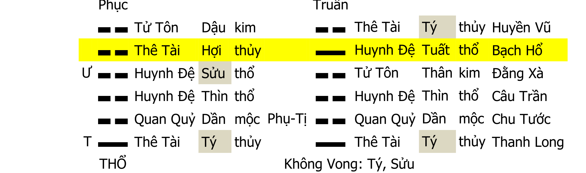

---

# CHƯƠNG 130. XEM VỀ THẦY ĐỊA LÝ / CHƯƠNG 131. ĐỊNH HUYỆT

Thi thoảng cũng ứng nghiệm tại phương nhập Mộ, ví dụ hào Phụ Mẫu thuộc mộc, 
sẽ được đất tại phương Mùi, là phương mộc nhập Mộ; Phụ Mẫu thuộc kim, sẽ được 
đất tại phương Sửu. Các trường hợp còn lại cũng loại suy từ đó.

***

# CHƯƠNG 130: XEM VỀ THẦY ĐỊA LÝ

Hào Ứng là Dụng thần, nếu vượng tướng, sinh hợp hào Thế, tuy không giỏi cũng 
có thể sử dụng.

Nếu hưu tù, xung khắc hào Thế, tuy giỏi giang cũng không nên theo.

Nếu Thế, Ứng đều Không, không nên tìm thầy đó.

Nếu hào Ứng Không, Phá, không phải thầy giỏi.

Nếu hào Ứng vượng tướng, tương sinh tương hợp hào Thế, hoặc cùng Thế hợp 
thành Tam hợp, bất kể hào Ứng lâm Tài, Quỷ, Huynh, Phụ, tuy là người kém cỏi bất 
tài, nhưng ta thích thì lại có duyên.

Nếu hào Ứng hưu tù, xung khắc hào Thế, cho dù Ứng tại hào Quan, hào Phụ, tuy 
là người bác học giỏi giang, nhưng lại sẽ lừa gạt mình.

Nếu hào Thế, hào Ứng đều Không, là ta và người đó vô duyên, không nên tìm.

Nếu hào Ứng Không Phá, là người vô tài vô đức.

***

# CHƯƠNG 131: ĐỊNH HUYỆT

Thế tại hào sơ hào 2, huyệt ở dưới.

Thế tại hào 6 hào 5, huyệt ở phía trên.

Tại hào 3 hào 4, huyệt nên ở giữa.

Thủy tại hào Thế, huyệt ở gần nước hoặc hố, vực.

Thế nằm tại thổ, nên tìm huyệt ở chỗ cao.

Thế tại Dần mộc, là nơi cây cỏ um tùm.

Thân Dậu trì Thế, tại nơi đá tảng chất chồng.

Hỏa là khô cháy, tại nơi bùn đỏ đất khô, hoặc nơi cỏ cây khô héo cằn cỗi.

### Ví dụ: Ngày Ất Tị tháng Mùi, xem về huyệt mộ, được quẻ Đại Tráng:

---

# CHƯƠNG 132. TRANH ĐẤT CHÔN MỘ

Đại Tráng

Huynh Đệ | Tuất thổ | Huyền Vũ

Tử Tôn | Thân | kim | Bạch Hổ

T | Phụ Mẫu | Ngọ | hỏa | Đằng Xà

Huynh Đệ | Thìn | thổ | Câu Trần

Quan Quỷ | Dần | mộc | Chu Tước

Ư | Thê Tài | Tý | thủy | Thanh Long

THỔ 
Không Vong: Dần, Mão

Đất này được nhiều thầy địa lý phong thủy cho là đất tốt. Xem về đất này nhiều 
lần, đều được quẻ tốt. Nhưng vì đào nhiều lần đều gặp đá, không tìm được huyệt, 
nên mời ta đến nhà xem giúp một quẻ. Ta nói: Hào Thế tại hào 4, nên huyệt ở giữa. 
Do Ngọ hỏa trì Thế, nên xem ở đoạn giữa, thấy có một chỗ cỏ cây khô héo, có mấy 
đóa hoa dại màu đỏ, trong khi những nơi khác đều không có. Ta bèn nói: "Chính là 
huyệt này! Đào lên sẽ gặp huyệt đất."

Nhưng người nhà vẫn ngờ vực. Ta bèn có một cách, lấy một đồng tiền, chấm chu 
sa lên trên, rồi để lẫn với vài trăm đồng tiền khác, bảo người này lập hương án cầu 
khấn trước trời đất, nếu được đồng tiền có chu sa, thì đây chính là huyệt. Bèn làm 
theo, rồi cho người rắc tiền khắp nơi, quả nhiên đồng tiền có dấu chu sa rơi vào ngay 
bên dưới khóm hoa đỏ. Đào lên, thì thấy trong khoảng hơn một trượng toàn là bùn 
đất, những chỗ còn lại đều là đá tảng. Mai táng xong, đến năm sau người này được 
lập phủ riêng, hai con trai trong vòng năm năm đều thi đỗ.

***

# CHƯƠNG 132: TRANH ĐẤT CHÔN MỘ

Giác Tử nói rằng: Lấy đất người khác để chôn mộ, là hành động ích kỷ hại nhân. 
Đem cái việc táng tận lương tâm ấy để hỏi thần linh, mà quẻ được linh nghiệm, lẽ nào 
thần linh lại dạy người ta làm việc thất đức? Chẳng lẽ chưa từng nghe câu, trước có 
tâm địa, sau mới có ấm địa hay sao? Xưa có người cậy tiền cậy thế, ức hiếp người 
nghèo, dùng âm mưu chiếm đoạt đất của người ta để chôn cất người thân, sau gặp 
người hiểu biết nói rằng: Nếu đất này không phát, thì không có địa lý; nếu đất này 
được phát, thì thiên lý không còn. Nếu thiên lý còn tồn tại, ắt có quả báo tuần hoàn, 
loại người này không thể phát đạt lâu dài được.

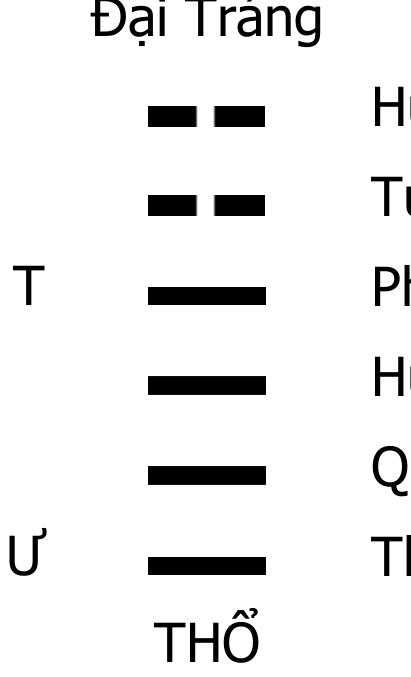

---

# CHƯƠNG 133: PHẦN MỘ TỔ TIÊN

Phần mộ của tổ tiên, hoặc chôn cất đã lâu, hoặc mới mai táng, chỉ cần xem quẻ, 
ắt có nguyên nhân. Nên trước tiên, cần hỏi rõ nguyên nhân xem quẻ, mới có thể 
quyết đoán chính xác.

Hoặc do gia đình nhiều năm cực nhọc khốn khổ, ngờ rằng mộ tổ bất lợi.

Hoặc do thi cử nhiều lần không đỗ đạt, hoặc là con đã nhập trường, nhưng băn 
khoăn không biết phong thủy có phát đường khoa giáp hay không? Nếu vì bản thân, 
cần phải tự gieo quẻ. Nếu vì con cái, cần bảo con cái đích thân đến xem.

Có người vì con cái chết yểu, ngờ rằng có liên quan đến phong thủy.

Có người do cha mẹ, anh em, vợ con, hoặc bản thân mắc nhiều tai họa, bệnh 
tật; có người vì thường xuyên gặp kiện tụng, hỏa hoạn, trộm cướp, nên ngờ rằng do 
phong thủy bất lợi.

Có người do phong thủy âm trạch bị tổn thương, hỏi xem có cách cứu chữa 
không.

Có người muốn hỏi xem mộ tổ có được mạch đất không? Có người muốn hỏi xem 
mộ tổ có bị động không?

Xem về mộ tổ, đều lấy hào Phụ Mẫu làm Dụng thần.

Gặp quẻ Lục xung, không được mạch đất.

Quẻ biến hóa tuyệt, tình thế nguy nan.

Quẻ gặp Phục ngâm, muốn chuyển khó thành.

Quẻ hiện Phản ngầm, không chuyển phải chuyển.

Quẻ biến Lục xung long đã mất, con cháu dễ bị lăng nhục;

Trong xung biến hợp vận sắp về, hậu thế sẽ được phục hưng.

Quẻ chính là Lục xung, quẻ biến là Lục xung, là tượng hoàn toàn không có khí 
mạch. Quẻ biến hóa khắc, là rất nguy cấp, tai ương sẽ ập đến nhanh chóng.

Gặp quẻ Phục ngâm, long mạch hoàn toàn không có, tuy muốn dời mộ, nhưng lại 
không dời được.

Gặp quẻ Phản ngâm, tuy không muốn dời, nhưng vẫn phải dời đi.

Quẻ biến Lục xung, long mạch đã đi mất, con cháu bắt đầu suy vi.

Quẻ Lục xung biến hợp, trước vốn không có long mạch, nay vận đất bắt đầu 
hưng thịnh, con cháu sẽ được phát đạt.

Phụ Mẫu vượng tướng, tổ phần an nhiên; Mộ Tuyệt Hưu Tù, hậu duệ 
linh lạc.

Phụ Mẫu vượng tướng, mộ tổ bình yên; Mộ, Tuyệt, Hưu, Tù, hậu duệ suy bại.

Xem về mộ đã mai táng, lấy hào Phụ Mẫu làm Dụng thần, nên vượng tướng hoặc 
được Nhật, Nguyệt, hào động sinh phò, hoặc động mà hóa sinh, hóa Nhật thần,

---

# CHƯƠNG 134. NGUYÊN NHÂN ĐỘNG MỘ

Nguyệt kiến, hóa tỷ trợ, hóa Tiến thần, thì phần mộ được nơi cát địa, chủ về cháu con 
vượng phát, người chết được yên ổn, người sống được an lạc.

Nếu Phụ Mẫu vượng mà gặp Đế Vượng, Trường Sinh, thì lai long được lâu dài, 
đời đời phát đạt.

Nếu Phụ Mẫu gặp Mộ, Tuyệt, Không, Phá, hoặc động mà phá tán, hoặc hóa Phá 
tán, hoặc hóa Thoái thần, hóa Mộ Tuyệt, hóa hồi đầu khắc, hóa Tuần Không, hóa 
hung, thì người chết không được yên, người sống ngày một suy vi lụn bại.

Thế hào biến Quỷ, chiêm giả bất tường; Quỷ hóa Lục thân, các thuộc 
bất cát.

Hào Thế biến Quỷ, người xem không may; Quỷ hóa Lục thân, đều là không tốt.

Nếu hào Thế biến Quỷ, hoặc theo Quỷ nhập Mộ, hoặc giúp Quỷ hại thân, thì 
người gieo quẻ sẽ gặp bất lợi.

Nếu Huynh Đệ, Thê Tài, Tử Tôn động hóa Quỷ, hoặc Quỷ hóa Huynh Đệ, Phụ 
Mẫu, Thê Tài, Tử Tôn, thì căn cứ vào chỗ phạm khắc mà suy đoán.

Lại như nếu hào Tý hóa Quỷ, người tuổi Tý sẽ gặp tai ương; hào Ngọ hóa Quỷ, 
người tuổi Ngọ sẽ bất lợi. Những trường hợp khác cũng loại suy từ đó.

**Dã Hạc bàn rằng:** Sách xưa cho rằng, hào Phụ không nên vượng tướng, Phụ 
vượng Phụ động, con cái sẽ bất an, ta cho rằng như thế là sai lầm. Xem về mộ đã 
chôn, lấy hào Phụ Mẫu làm Dụng thần, Phụ Mẫu vượng tướng, hoặc động mà hóa cát, 
là mộ tổ yên ổn. Nếu lại nói sang chuyện tổn thương con cái, thì hào Phụ Mẫu rốt cục 
nên vượng hay không nên vượng đây. Chỉ khi Tử Tôn động mà hóa Quỷ, hoặc Phụ 
động hóa Tử Tôn, mới là bất lợi cho con cháu.

***

# CHƯƠNG 134: NGUYÊN NHÂN ĐỘNG MỘ

Dã Hạc nói rằng: Cần phải xem riêng quẻ khác, không nên xem gộp với quẻ trên. 
Cần chú trọng đến Kỵ thần xung khắc Phụ Mẫu. Nếu sáu hào yên tĩnh, Phụ Mẫu hữu 
khí, là tượng yên ổn lâu dài, không cần sửa sang.

Khắc thần tại hỏa, hoặc tại Chu Tước, nguyên nhân là do hầm, lò.

Khắc thần tại thổ mà động, hoặc tại Huyền Vũ, ắt là do bị táng trộm.

Hổ tại kim là bị kinh động, Long tại mộc bị rễ cây đâm vào.

Khắc thần tại Đằng Xà, mộ có ổ rắn, tổ kiến.

Quỷ thổ tại Câu Trần, do đào bới mà động mộ.

Huyền Vũ tại thủy, do nước nhập quan tài.

Khắc thần tại hỏa, có lẽ gần phần mộ bị đào lò, làm bếp, hoặc có lửa đốt.

Nếu Phụ Mẫu bị hào thổ khắc, hoặc bị Huyền Vũ khắc, là phần mộ tổ tiên bị kẻ | khác chôn trộm.

Nếu khắc thần tại Câu Trần, mộ bị động do đào bới, xây dựng.

Khắc thần tại Bạch Hổ kim, là do động đất, lở núi gây kinh động. Khắc thần tại | Thanh Long mộc, là do chặt phá cây cối mà động đến mộ. Nếu Thanh Long tại mộc lại | động, là huyệt mộ bị rễ cây đâm xuyên.

Đằng Xà hỏa động, trong mộ có ổ rắn, ổ kiến, mối. Huyền Vũ thủy khắc Phụ | Mẫu, huyệt bị nước đen xâm nhập

Phụ Mẫu bị xung, nước lụt đất xốp.

Kim khắc Phụ Mẫu, vách núi, đá tảng.

Bị thủy xung khắc, trũng ngập, nước ngầm.

Mộc khắc Phụ Mẫu, cây cối xâm phạm.

Hỏa khắc Phụ Mẫu, huyệt có rắn, mối.

Thổ động tương khắc, xây dựng tường rào.

Nếu hào Phụ Mẫu bị Nhật, Nguyệt, hào động xung khắc, hoặc quẻ động hóa 
xung, ví dụ tại cung Cấn, Khôn, mà quẻ hiện tam hợp Hợi, Mão, Mùi thành mộc cục 
khắc Phụ, ắt có địa phong (khí đất) xung lệch quan tài; nếu tại cung Ly, mà quẻ hiện 
thủy cục Thân, Tý, Thìn khắc Phụ Mẫu, là huyệt bị nước xâm nhập, quan tài xô lệch; 
nếu tại cung Chấn, Tốn, Phụ Mẫu bị kim cục xung khắc, là do vách núi, đá tảng. Nếu 
tại cung Càn, Đoài, quẻ hiện hỏa cục xung khắc Phụ Mẫu, ắt kinh động bởi lửa lò, sấm 
sét. Trong quẻ có hào thủy động, do đất ngập, nước xâm; trong quẻ có hào mộc 
động, do gốc rễ cây đâm vào; hỏa chủ về rắn rết côn trùng; thổ chủ về động thổ. Nếu 
bị phạm phải, cần nhanh chóng sửa chữa tu bổ.

**Tân bình thích:** Ở đây giải thích lệch lạc, Phụ Mẫu là Dụng thần, tại cung Khôn 
Cấn thì Phụ Mẫu là hỏa, làm sao mà có thể bị mộc khắc được? Phần luận tiếp theo 
cũng như vậy, đều là những bình luận bừa bãi, không xuất phát từ thực tiễn.

Hào vô loạn động, tu quan ngũ hành chi hữu vô. Quái nhược an dật, hựu 
khán địa chi chi khuyết hãm.

Không có hào động, cần xem ngũ hành có hay không. Quẻ nếu tĩnh lặng, cần 
xem nơi địa chi khuyết hãm.

Nếu sáu hào đều yên tĩnh, lại không có hào nào xung khắc Phụ Mẫu, cần phải 
xem có thiếu ngũ hành nào hay không. Nếu trong quẻ không hiện hành thổ, cần phải 
xây dựng tường bao. Nếu không hiện hành kim, cần lập bia mộ. Nếu hành hỏa suy 
nhược, cần đặt lư hương, hoặc dựng nhà coi mộ. Nếu hành thủy không hiện, có thể 
đào ao, đào kênh. Nếu hành mộc không hiện, cần trồng cây cối. Không chỉ riêng 
trường hợp ngũ hành không hiện trong quẻ, mà có hiện trong quẻ nhưng Không, Phá, 
Mộ, Tuyệt, vô khí, cũng coi như không hiện.

Ngày Kỷ Tị tháng Mùi, xem được quẻ Tụy biến Cách:

---

# CHƯƠNG 135. BÍ QUYẾT TU BỔ

Tụy 
 
Cách

Phụ Mẫu 
Mùi 
thổ

Phụ Mẫu | Mùi | thổ | Câu Trần

Ư

Huynh Đệ
Dậu
kim

Huynh Đệ | Dậu | kim | Chu Tước

Tử Tôn 
Hợi 
thủy

Tử Tôn | Hợi | thủy | Thanh Long

Thê Tài 
Mão
mộc

Tử Tôn | Hợi | thủy | Huyền Vũ

T

Quan Quỷ
Tị 
hỏa

Phụ Mẫu | Sửu thổ | Bạch Hổ

Phụ Mẫu 
Mùi 
thổ

Thê Tài | Mão | mộc | Đằng Xà

Người này xem về mồ mả tổ tiên. Ta bèn hỏi: "Vì việc gì mà xem?" Người xem 
bèn đáp: "Năm xưa thầy địa lý nói, táng tại đất này sẽ phát về đường khoa giáp, nhà 
tôi có bốn anh em, đều theo nghiệp đèn sách, nhưng không ai đỗ đạt, không hiểu vì 
sao."

Ta bèn hỏi: "Bên mộ hẳn có cây to." Người này đáp: "Có! Lúc chôn còn nhỏ, 
nhưng mấy năm nay đã cao lớn xum xuê rồi." Ta bèn nói: "Rễ cây đã ăn vào bên áo 
quan, quan tài bị tổn hại rồi."

Người xem bèn hỏi: "Vậy phải làm thế nào?" Ta bèn giảng giải: "Đào một hố nhỏ 
bên cạnh mộ để thăm dò, nếu đúng là có rễ cây, thì đào một hố lớn ở phía xa, rồi từ 
dưới hố đào một đường hầm ngang đến bên quan tài, lấy xẻng gạt bỏ rễ cây ấy đi, 
như vậy mồ mả sẽ được yên. Còn muốn biết các anh em có phát đạt không, thì phải 
bảo họ đích thân gieo quẻ. Bản thân ông đến khoa thi năm sau, Thái Tuế ở Ngọ, trợ 
giúp hào Thế Quan Tị hỏa, chắc chắn sẽ đỗ cao."

Người này thực hiện y theo lời, quả nhiên đến năm Ngọ thi đỗ.

***

# CHƯƠNG 135: BÍ QUYẾT TU BỔ

Nếu mồ mả bị động bởi hầm lò, cần mời Đạo sĩ cúng tế thần lửa, cúng tế an mộ.

Nếu bị chôn trộm hoặc động thổ, cần mời Đạo sĩ cúng tế để làm yên thần Thổ 
địa.

Nếu bị kinh động, cần mời Đạo sĩ cúng tế để làm yên phần mộ.

Nếu bị rễ cây ăn vào, hoặc đá tảng phạm vào, cần đào một hố chừng ba thước 
bên mộ để thăm dò, nhẹ nhàng bỏ đi phần rễ cây hoặc đá, rồi mời Đạo sĩ đến hàn lại 
mộ.

Nếu vì rắn, mối làm tổ, nên trồng cây xoan bên mộ, rắn, mối sẽ tự bỏ đi. Không 
nên nghe lời xui dại mà đốt hang ổ của chúng, gây tội sát sinh. Ta từng thấy có hai 
nhà bị rắn làm ổ bên mộ, dùng lửa hun chết cả ổ rắn, sau con cháu ngày càng suy vi 
lụn bại.

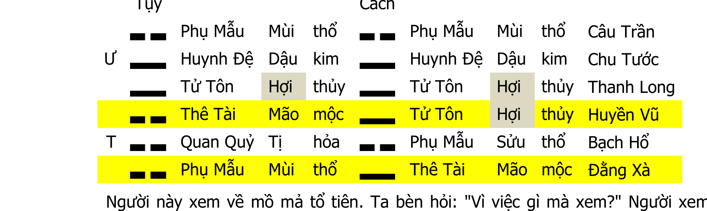

---

# CHƯƠNG 136. TU BỔ CÁT HUNG / CHƯƠNG 137. BỒI TÁNG BÊN MỘ TỔ

Bị nước xâm nhập huyệt mộ, nếu có đường tiêu nước, thì tìm cách khơi nước 
thoát đi. Nếu phải chỗ đất trũng, không thể tiêu được nước, chỉ còn cách dời mộ đi 
nơi khác.

Nếu bị địa phong (khí đất) xô lệch quan tài, thì đào hai hố chừng một, hai thước 
ở phía trước và phía sau mộ để thăm dò, nếu quan tài bị lệch, phải xoay lại đúng 
hướng, rồi mời Đạo sĩ đến hàn lại mộ.

***

# CHƯƠNG 136: TU BỔ CÁT HUNG

Tử Tôn trì Thế, Tử Tôn động dao, tu chi tắc cát.

Tử Tôn trì Thế, hào Tử phát động, tu bổ sẽ tốt.

Nếu hỏi xem việc tu bổ có lợi hay không, lấy hào Thế làm Dụng thần. Nếu được 
Tử Tôn trì Thế, Tử Tôn phát động, tu bổ sẽ được cát lợi.

Quan Quỷ khắc Thế, Phụ hào Không, thiên tắc hoạch phúc.

Quan Quỷ khắc Thế, hào Phụ Không Vong, dời đi sẽ lợi.

Nếu hào Quan Quỷ khắc Thế, sẽ có hại cho ta. Nếu hào Phụ Không, Phá, Mộ, 
Tuyệt, lại bị Nhật, Nguyệt, hào động thương khắc, tức mộ phần tổn thương rất nặng, 
có tu bổ cũng vô ích, chỉ có cách dời chuyển.

Giác Tử bàn rằng: Phép xưa cho rằng mộ phần cha mẹ bị tổn hại, con cái sẽ cảm 
ứng mà gặp phải tai họa, khi đó cần nhanh chóng dời mộ cải táng, nói như vậy là hữu 
lý. Nay ta thấy nhiều nhà giàu có nhưng không sang trọng, bèn cải táng mộ tổ để cầu 
vinh; có con cái nhưng không giàu, cũng cải táng mộ cha mẹ để cầu phát tài. Như 
vậy, thì coi hài cốt của cha mẹ khác gì món hàng ngoài chợ, lý trời chẳng dung, không 
những không được vinh hoa, mà còn gia tài khánh kiệt; không những không được 
giàu có, mà còn tuyệt tử tuyệt tôn. Ta đã tận mắt nhìn thấy rất nhiều trường hợp, nên 
kể ra đây để răn giới người đời.

***

# CHƯƠNG 137: BỒI TÁNG BÊN MỘ TỔ

Lục xung biến xung, quẻ biến tuyệt khắc, Phụ Mẫu tổn thương, nội ngoại Phản 
ngâm, nên chôn chỗ khác.

Hào Thế chịu khắc, theo Quỷ nhập Mộ, giúp Quỷ hại thân, Thế động biến hung, 
hóa Khắc hóa Quỷ, không nên bồi táng.

Phụ Mẫu, Huynh Đệ, Thê Tài, Tử Tôn động mà hóa Quỷ, hóa Khắc, đều là tượng 
hình thương.

Tốt nhất là Thế cùng Lục thân không bị biến khắc, hoặc quẻ tĩnh, hoặc Lục hợp, 
người sống kẻ chết đều yên.

### Ví dụ: Ngày Bính Thân tháng Tý, xem mai táng linh cữu của cha bên mộ tổ có

nên không, được quẻ Phục biến Khôn:

Phục
 
Khôn

Tử Tôn | Dậu kim | Tử Tôn | Dậu kim Thanh Long

Thê Tài | Hợi thủy | Thê Tài | Hợi thủy Huyền Vũ

Ư | Huynh ĐệSửu thổ | Huynh ĐệSửu thổ Bạch Hổ

Huynh ĐệThìn thổ | Quan QuỷMão mộc Đằng Xà

Quan QuỷDần mộc Phụ-Tị | Phụ Mẫu Tị | hỏa Câu Trần

T | Thê Tài | Tý | thủy | Huynh ĐệMùi thổ Chu Tước

THỔ
Không Vong: Thìn, Tị

Đoán rằng: Hào Thế bị khắc, không nên bồi táng. Nhưng người này không nghe, 
vẫn đem mai táng. Chôn được mấy ngày, thì lưng đau muốn chết, nên muốn dời mộ 
sang nơi khác. Ta bèn nói: Không nhất định phải dời mộ. Trong quẻ hào Thế bị khắc, 
nhưng may mà không vượng tướng. Thổ hồi đầu khắc thủy, nên mời Đạo sĩ đến cầu 
yên thần đất, mộ được yên mà bệnh khỏi. Ta bèn nói: "Trước mắt tuy chưa cần 
chuyển, nhưng về sau chắc chắn sẽ phải chuyển. Vì quẻ hóa Lục xung, là điềm không 
lâu dài." Quả nhiên đến năm Tý mẹ mất, nên phải đào hài cốt của cha lên, đem hợp 
táng nơi khác.

**Lý Ngã Bình bàn rằng:** "Hải để kinh" có viết: "Thế tại hào sơ, hào 2 sẽ sinh ra 
vương hầu; Thế tại hào 5, hào 6 sẽ sinh ra kẻ mồ côi góa bụa." Đây là những lời đồn 
nơi đầu đường xó chợ, sao có thể đem khắc in trong những sách Bốc dịch chính tông.

"Dịch mạo" viết rằng: "Hào Tử Tôn vượng mà Quan, Văn đắc địa, chủ về hiển | quý. Hào Tử Tôn vượng mà hào Tài đắc địa, chủ về giàu có. Hào Tử Tôn vượng mà | lâm Đế Vượng, chủ về nhiều con trai. Hào Tử Tôn vượng mà gặp Trường Sinh, chủ về | sống thọ. Hào Tử Tôn vượng mà gặp Bạch Hổ, Dương Nhẫn, sẽ sinh ra kẻ võ biền. | Hào Tử Tôn suy, phá, sẽ sinh ra người tàn tật. Hào Tử Tôn lâm Không, sẽ có người | làm tăng ni, đạo sĩ." Ngờ rằng lập luận đó là đặt riêng cho các nhà đời đời độc đinh | đơn truyền. Nếu như phải nhà có hơn chục đứa con, ắt hẳn có người giàu người sang, | có người theo nghiệp văn, có người theo nghiệp võ, có người thọ người yểu, có người | đông con, người hiếm muộn, có người lành lặn người tàn tật, cho dù cả sáu hào đều | là Tử Tôn, cũng không đủ để sử dụng. Suy luận theo kiểu võ đoán, áp đặt này, mà tự | lấy làm đắc ý, thực không hiểu được rằng, Chu Dịch chú trọng đến cái lý, không | chuộng lời lẽ văn hoa. Những lập luận này tuy từ ngữ rườm rà, nhưng thực không thể | khiến người ta tin phục.

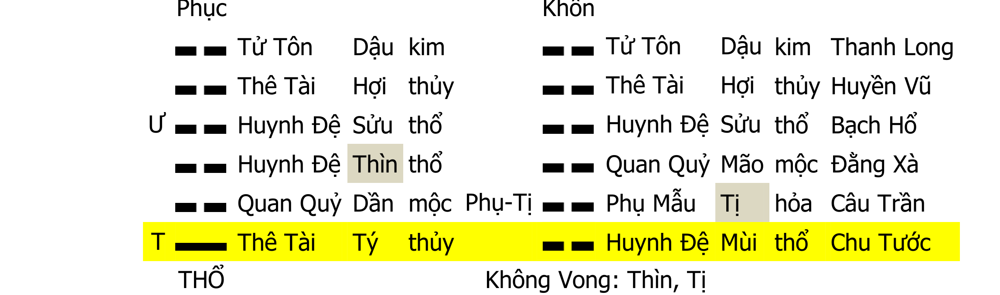

