# Tế Thuyết
# LỤC HÀO DỰ TRẮC HỌC

**Vương Hổ Ứng**

- Cơ Sở
- Ứng Kỳ
- Tài Vận
- Thai Sản
- Vận Khí
- Niên Vận

TRẦN PHƯƠNG

### Cùng tác giả:

1. Tăng San Bốc Dịch Bình Thích
2. Lục Hào Tật Bệnh Dự Trắc Học
3. Lục Hào Nhân Duyên Dự Trắc Học
4. Lục Hào Xu Cát Tị Hung Hóa Giải Bí Truyền
5. Lục Hào Phong Thủy Dự Trắc Học
6. Lục Hào Kinh Tế Dự Trắc Học
7. Tế Thuyết Lục Hào Dự Trắc Học
8. Lục Hào Quái Lệ Thuyết Chân
9. Lục Hào Quái Tượng Giải Mật
10. Lục Hào Nghi Hoặc Chỉ Mê
11. Lục Hào Dự Trắc Ngộ Trung Ngộ

vuonghoung.com

---

## TẾ THUYẾT LỤC HÀO DỰ TRẮC HỌC

**Vương Hổ Ứng**

---

# Tế Thuyết
# LỤC HÀO DỰ TRẮC HỌC

**Vương Hổ Ứng**

- Cơ Sở
- Ứng Kỳ
- Tài Vận
- Thai Sản
- Vận Khí
- Niên Vận

LƯU HÀNH NỘI BỘ

---

# LỜI CẢM ƠN

Các bạn thân mến!

Xin cảm ơn các bạn đã lựa chọn bộ sách này. Đây là một bộ sách Dịch học rất mới mẻ và hiện đại, được dịch và biên tập một cách kỹ lưỡng, do dịch giả **Trần Phương** chuyển ngữ trực tiếp từ bộ sách tiếng Trung và **Vũ Phác** hiệu đính. Nội dung và bố cục được trình bày rõ ràng, dễ hiểu, ví dụ từng quẻ được trình bày rất chi tiết để đảm bảo sao cho các bạn có được một trải nghiệm tốt nhất. Qua bộ sách này, chúng tôi hy vọng các bạn sẽ có được một cái nhìn tổng quát và chuyên sâu hơn về lĩnh vực Dự đoán Lục hào. Mong rằng các bạn sẽ tiến xa hơn trên con đường trở thành Dự trắc sư huyền bí này.

Bộ sách vẫn còn có những thiếu sót nhất định, chúng tôi rất mong các bạn thông cảm và đóng góp để những lần tái bản sau được hoàn chỉnh hơn. Bộ sách được phân phối độc quyền bởi Shop Kinh Dịch Lục Hào. Mọi thông tin về những ấn bản tiếp theo và những bài viết chuyên sâu về Dự Đoán Lục Hào, xin mời các bạn truy cập: **vuonghoung.com**

Trân trọng cảm ơn và mong được đồng hành!

**Trần Phương - Vũ Phác**

# TẾ THUYẾT LỤC HÀO DỰ TRẮC HỌC

Nguyên tác: **VƯƠNG HỔ ỨNG**  
Chuyển ngữ: **TRẦN PHƯƠNG**  
Hiệu đính: **VŨ PHÁC**

facebook.com/groups/kinhdichluchao

# LỜI CẢM ƠN

Các bạn thân mến!

Xin cảm ơn các bạn đã lựa chọn bộ sách này. Đây là một bộ sách Dịch học rất mới mẻ và hiện đại, được dịch và biên tập một cách kỹ lưỡng, do dịch giả **Trần Phương** chuyên ngữ trực tiếp từ bộ sách tiếng Trung và **Vũ Phác** hiệu đính. Nội dung và bố cục được trình bày rõ ràng, dễ hiểu, ví dụ từng quẻ được trình bày rất chi tiết để đảm bảo sao cho các bạn có được một trải nghiệm tốt nhất. Qua bộ sách này, chúng tôi hy vọng các bạn sẽ có được một cái nhìn tổng quát và chuyên sâu hơn về lĩnh vực Dự đoán Lục hào. Mong rằng các bạn sẽ tiến xa hơn trên con đường trở thành Dự trắc sư huyền bí này.

Bộ sách vẫn còn có những thiếu sót nhất định, chúng tôi rất mong các bạn thông cảm và đóng góp để những lần tái bản sau được hoàn chỉnh hơn. Bộ sách được phân phối độc quyền bởi Shop Kinh Dịch Lục Hào. Mọi thông tin về những ấn bản tiếp theo và những bài viết chuyên sâu về Dự Đoán Lục Hào, xin mời các bạn truy cập: vuonghoung.com

Trân trọng cảm ơn và mong được đồng hành!

**Trần Phương - Vũ Phác**

---

# GIỚI THIỆU VỀ VƯƠNG HỔ ỨNG

Vương Hổ Ứng sinh năm 1962, nguyên quán ở tỉnh Sơn Tây. Ông là một chuyên gia Dịch học nổi tiếng trên thế giới. Ông là Dịch tác gia (tác giả về sách Kinh Dịch), và là truyền nhân bát trạch dịch trận phong thủy. Ông cũng là giảng viên thỉnh giảng của đại học Thanh Hoa, cố vấn cao cấp của sở nghiên cứu Nhật Bản và là tác giả của Lục Hào Chiêm Thuật Nhật Bản. Năm 1986, ông tốt nghiệp đại học Sơn Tây về chuyên ngành tiếng Nhật. Trong thời gian đầu, ông đảm nhiệm công tác nghiên cứu khảo cổ ở tỉnh Sơn Tây. Về sau, ông dấn thân vào nghiên cứu phong thủy, tướng thuật, mệnh lý, Phật học, Trung y và thuật luyện đan. Những năm 80, ông bắt đầu chuyên tâm nghiên cứu Kinh Dịch, lấy phong thủy, lục hào và thuật dưỡng sinh của Đạo gia làm trọng điểm nghiên cứu. Ông đã vận dụng nguyên lý Dịch học để giải mã những bí ẩn và cát hung trong logo công ty, đồng thời cũng đã tư vấn cho rất nhiều công ty nổi tiếng trong và ngoài nước. Từ năm 1996, ông bắt đầu tìm hiểu các thuật số dân gian từ rất nhiều kỳ nhân trong cả nước. Từ đó, ông đã sáng lập ra một hệ thống lý luận hoàn chỉnh của mình. Ông cũng đã từng nhận lời mời đến giảng dạy ở Singapore, Nhật Bản,... Hàng năm, ông được các công ty mời đến đào tạo về quốc học (Kinh Dịch). Ông có học viên ở khắp Trung Quốc đại lục, đặc khu hành chính Hồng Kông, Singapore, Nhật Bản, Hàn Quốc, Mỹ, Anh, Malaysia,...

### Tác phẩm chủ yếu đã xuất bản:

**Ở Nhật Bản:** Bát Trạch Dịch Trận Phong Thủy, Lục Hào Chiêm Thuật Áo Nghĩa, Lục Hào Chiêm Thuật Cải Vận Pháp, Sinh Hoạt Trung Đích Lục Hào Chiêm Thuật, Thần Kỳ Ứng Nghiệm Đích Lục Hào Chiêm Thuật, Ngoại Ứng Dự Trắc, Lục Hào Dự Trắc Tam Ma Địa,...

**Ở Hồng Kông:** Lục Hào Quái Lệ Thuyết Chân, Lục Hào Dự Trắc Tật Bệnh Tân Thám.

**Ở Singapore:** Tăng San Bốc Dịch Bình Thích, Lục Hào Quái Tượng Giải Mật, Lục Hào Nghi Hoặc Chỉ Mê, Lục Hào Dự Trắc Ngộ Trung Ngộ, Lục Hào Phân Loại Chiêm Nghiệm Kỹ Pháp, Lục Hào Dự Trắc Tự Tu Bảo Điển, Lục Hào Trắc Bệnh Phân Khoa Tường Giải.

**Ở Đài Loan:** Tế Thuyết Lục Hào Dự Trắc Học, Lục Hào Tật Bệnh Dự Trắc Học, Lục Hào Nhân Duyên Dự Trắc Học, Sơ Học Lục Hào Dự Trắc.

**Ở Việt Nam:** Bộ sách Dịch học của Vương Hổ Ứng đại sư đã được dịch giả Trần Phương giới thiệu đến quý bạn đọc từ cuối năm 2018. Bằng ngôn từ thuần Việt nhưng vẫn đảm bảo về mặt học thuật, Trần Phương đã tạo rất nhiều hứng khởi cho các học giả nghiên cứu Kinh Dịch ở Việt Nam. Các tác phẩm đã lưu hành gồm có:

1. Tăng San Bốc Dịch Bình Thích
2. Lục Hào Tật Bệnh Dự Trắc Học
3. Lục Hào Nhân Duyên Dự Trắc Học
4. Lục Hào Xu Cát Tị Hung Hóa Giải Bí Truyền
5. Lục Hào Phong Thủy Dự Trắc Học
6. Tế Thuyết Lục Hào Dự Trắc Học
7. Lục Hào Quái Lệ Thuyết Chân
8. Lục Hào Quái Tượng Giải Mật
9. Lục Hào Nghi Hoặc Chỉ Mê
10. Lục Hào Dự Trắc Ngộ Trung Ngộ
11. Lục Hào Kinh Tế Dự Trắc Học

Để biết thêm chi tiết về bộ sách, kính mời quý vị truy cập website **vuonghoung.com** hoặc liên hệ **0963 394 340**. Xin trân trọng cám ơn.

**Vũ Phác**

---

# MỤC LỤC

**LỜI TỰA** .......................................................................................... 6

**PHẦN MỞ ĐẦU** ................................................................................. 7

**LỊCH SỬ & SỰ BIẾN ĐỔI CỦA LỤC HÀO** ....................................... 10

**CHƯƠNG 1: VŨ TRỤ QUAN CỦA DỊCH**............................................ 12

I. HỌC THUYẾT ÂM DƯƠNG ......................................................... 12

II. HỌC THUYẾT NGŨ HÀNH......................................................... 13

**CHƯƠNG 2: CAN CHI VÀ DỰ ĐOÁN LỤC HÀO**.............................. 16

I. THẬP THIÊN CAN ...................................................................... 16

1. Âm dương của thập thiên can................................................. 16

2. Ngũ hành của thập thiên can.................................................. 16

3. Thập thiên can và phương vị ................................................. 16

II. THẬP NHỊ ĐỊA CHI .................................................................... 17

1. Âm dương của thập nhị địa chi ............................................... 17

2. Ngũ hành của thập nhị địa chi .............................................. 17

3. Thập nhị địa chi và phương vị .............................................. 17

4. Thập nhị địa chi và bốn mùa ................................................ 17

5. Thập nhị địa chi và tháng...................................................... 17

6. Thập nhị địa chi và mười hai canh giờ.................................... 17

7. Lục hợp của thập nhị địa chi................................................... 18

8. Lục xung của thập nhị địa chi ................................................. 18

9. Thập nhị địa chi và quan hệ đối ứng với động vật............ 18

10. Tam hợp của địa chi .......................................................... 18

11. Tam hình của địa chi.......................................................... 18

**CHƯƠNG 3: KIẾN THỨC CĂN BẢN VỀ BÁT QUÁI** ........................... 19

I. Ý NGHĨA CƠ BẢN CỦA BÁT QUÁI ............................................ 19

1. Quan hệ đối ứng giữa bát quái và nhân sự ............................ 19

2. Quan hệ đối ứng giữa bát quái và cơ thể ................................ 20

3. Quan hệ đối ứng giữa bát quái và nội tạng ............................ 20

4. Quan hệ đối ứng giữa bát quái và phương vị .......................... 20

5. Thuộc tính ngũ hành của bát quái ........................................ 20

II. PHÂN CUNG BÁT QUÁI ........................................................... 20

PHẦN LỤC HÀO CƠ SỞ ........................................................... 22

CHƯƠNG 4: PHƯƠNG PHÁP LẤY VÀ GHI BÁT QUÁI ........ 22

CHƯƠNG 5: PHƯƠNG PHÁP TRANG QUẺ ............................. 24

I. PHƯƠNG PHÁP SẮP XẾP CAN CHI ........................................... 24

II. PHƯƠNG PHÁP AN THẾ ỨNG ................................................... 25

III. AN LỤC THÂN ....................................................................... 29

IV. AN LỤC THẦN ....................................................................... 32

CHƯƠNG 6: TÁC DỤNG CỦA LỤC THÂN, LỤC THẦN, THẾ ỨNG ........................................................................................... 33

I. Ý NGHĨA CỦA LỤC THÂN ....................................................... 33

1. Ý nghĩa của Phụ Mẫu ........................................................... 33

2. Ý nghĩa của Quan Quỷ .......................................................... 33

3. Ý nghĩa của Huynh Đệ .......................................................... 34

4. Ý nghĩa của Thê Tài ............................................................. 34

5. Ý nghĩa của Tử Tôn .............................................................. 34

II. QUAN HỆ SINH KHẮC CỦA LỤC THÂN ................................... 34

1. Tương sinh của lục thân ........................................................ 35

2. Tương khắc của lục thân ....................................................... 35

III. Ý NGHĨA CỦA LỤC THẦN ..................................................... 35

1. Ý nghĩa của Thanh Long ..................................................... 35

2. Ý nghĩa của Chu Tước .......................................................... 36

3. Ý nghĩa của Câu Trần .......................................................... 36

4. Ý nghĩa của Đằng Xà ........................................................... 36

5. Ý nghĩa của Bạch Hổ ........................................................... 36

6. Ý nghĩa của Huyền Vũ ......................................................... 37

IV. VAI TRÒ CỦA THẾ ỨNG ......................................................... 37

1. Tử Tôn trì Thế ..................................................................... 37

2. Huynh Đệ trì Thế ................................................................ 37

3. Phụ Mẫu trì Thế ................................................................. 38

4. Thê Tài trì Thế ................................................................... 38

5. Quan Quỷ trì Thế ................................................................ 38

CHƯƠNG 7: PHƯƠNG PHÁP CHỌN DỤNG THẦN .................... 39

I. DỤNG THẦN LƯỠNG HIỆN .................................................... 41

II. PHI THẦN VÀ PHỤC THẦN ..................................................... 45

III. TIẾN THẦN VÀ THOÁI THẦN ................................................ 48

CHƯƠNG 8: NGUYÊN THẦN, KỴ THẦN, CỪU THẦN ........... 52

I. NGUYÊN THẦN ..................................................................... 52

II. KỴ THẦN ............................................................................. 55

III. CỪU THẦN .......................................................................... 58

CHƯƠNG 9: SUY VƯỢNG CỦA HÀO .......................................... 60

I. NGUYỆT KIẾN ........................................................................ 60

II. NGUYỆT PHÁ ......................................................................... 61

III. ẢNH HƯỞNG CỦA NHẬT THẦN .......................................... 63

IV. KHÔNG VONG ...................................................................... 66

CHƯƠNG 10: MƯỜI HAI LOẠI TRẠNG THÁI CỦA NGŨ HÀNH SINH DIỆT....................................................... 69

CHƯƠNG 11: ĐỘNG TĨNH VÀ SINH KHẮC CỦA HÀO ....... 76

ÁM ĐỘNG VÀ NHẬT PHÁ ................................................ 78

CHƯƠNG 12: TÁC DỤNG CỦA LỤC HỢP.......................... 81

I. LỤC HỢP ..................................................................... 81

II. TAM HỢP CỤC............................................................. 84

CHƯƠNG 13: TÁC DỤNG CỦA LỤC XUNG ..................... 88

CHƯƠNG 14: CÁT HUNG CỦA TAM HÌNH ..................... 91

CHƯƠNG 15: PHẢN NGÂM VÀ PHỤC NGÂM ................. 94

I. PHẢN NGÂM ................................................................ 94

II. PHỤC NGÂM................................................................ 96

CHƯƠNG 16: QUẺ DU HỒN VÀ QUẺ QUY HỒN.............. 97

I. QUẺ DU HỒN................................................................ 97

II. QUẺ QUY HỒN .......................................................... 100

CHƯƠNG 17: VAI TRÒ CỦA HÀO VỊ ............................ 102

CHƯƠNG 18: ỨNG KỲ ................................................. 109

PHẦN LỤC HÀO ỨNG DỤNG ..................................... 135

CHƯƠNG 19: DỰ ĐOÁN THỜI TIẾT ............................ 135

CHƯƠNG 20: DỰ ĐOÁN THI ĐẤU ............................... 148

CHƯƠNG 21: DỰ ĐOÁN TÀI VẬN .............................. 159

CHƯƠNG 22: DỰ ĐOÁN BUÔN BÁN ............................ 169

CHƯƠNG 23: DỰ ĐOÁN CỔ PHIẾU ............................. 179

DỰ ĐOÁN BIẾN ĐỘNG GIÁ TRONG MỘT NGÀY .................... 182

DỰ ĐOÁN BIẾN ĐỘNG GIÁ TRONG MỘT TUẦN .................. 197

DỰ ĐOÁN THỜI GIAN TỐT NHẤT MUA VÀO VÀ BÁN RA ....... 202

CHƯƠNG 24: DỰ ĐOÁN XUẤT HÀNH........................... 207

---

# LỜI TỰA

CHƯƠNG 25: DỰ ĐOÁN HÀNH NHÂN.............................. 217

CHƯƠNG 26: DỰ ĐOÁN VẬT BỊ MẤT.............................. 229

CHƯƠNG 27: DỰ ĐOÁN THI CỬ.................................... 240

CHƯƠNG 28: DỰ ĐOÁN CÔNG VIỆC ............................. 248

CHƯƠNG 29: DỰ ĐOÁN HÔN NHÂN.............................. 255

CHƯƠNG 30: DỰ ĐOÁN THAI SẢN................................ 262

CHƯƠNG 31: DỰ ĐOÁN BỆNH TẬT .............................. 277

CHƯƠNG 32: DỰ ĐOÁN VẬN KHÍ TRỌN ĐỜI .................. 296

CHƯƠNG 33: DỰ ĐOÁN NIÊN VẬN .............................. 316

CHƯƠNG 34: DỰ ĐOÁN PHONG THỦY .......................... 326

# LỜI TỰA

Nói về đoán quẻ, có người tin, có người không tin. Nếu như hỏi tôi vào hơn mười năm trước thì chắc chắn là tôi cũng trả lời không tin. Tuy nhiên, tôi bẩm sinh có một cái tâm hiếu kỳ, đối với thế giới chưa biết thì luôn tràn đầy khát khao tìm hiểu.

Tôi làm công tác khảo cổ, khi đọc các nghiên cứu về văn hiến, tôi thường bắt gặp một số nội dung có liên quan đến chiêm bốc cổ đại. Để làm sáng tỏ nỗi băn khoăn về chiêm bốc, tôi đã đọc rất nhiều tư liệu, vô tình hiểu được phương pháp cơ bản của nó, hơn nữa cũng đã yêu thích bộ môn này. Những lúc rảnh rỗi, tôi đã dùng phương pháp chiêm bốc cổ đại mà tôi học được từ sách để chơi trò bói toán với các bằng hữu, vậy mà đoán đúng rất nhiều lần. Nếu là một hai lần đoán đúng thì có lẽ là trùng hợp, nhưng sau nhiều lần dự đoán chính xác đã gợi lên ham muốn khám phá của tôi, tôi quyết định đi sâu vào nghiên cứu. Trải qua nghiên cứu kỹ lưỡng, tôi đã phát hiện ra rằng không phải tất cả những gì nói trong sách cổ đều đúng, thế là tôi đã nảy sinh ý nghĩ sửa chữa những luận thuật sai lầm của cổ nhân. Tôi đã bắt đầu thực hành xem quẻ hàng loạt để nghiệm chứng tính thật giả của nó, đồng thời cũng thỉnh giáo các cao nhân trong dân gian, cuối cùng cũng đã nắm bắt được đạo lý của dự đoán lục hào.

Phương pháp dự đoán lục hào là phát minh và là kết tinh trí tuệ của cổ nhân, cho đến bây giờ nó vẫn còn có giá trị sử dụng rất lớn, nó có thể hướng dẫn cho cuộc sống của chúng ta, giúp cho cuộc sống của chúng ta được tốt đẹp hơn. Thông qua nghiên cứu, mặc dù tôi đã có những đột phá và phát triển lớn về phương diện này nhưng vẫn không dám chiếm làm của riêng mình, tôi muốn dùng ngôn ngữ thông tục dễ hiểu để viết ra, giúp cho mọi người đều có thể học được, qua đó đem lại hạnh phúc cho xã hội và làm phong phú thêm đời sống của mọi người.

Vương Hổ Ứng

---

# PHẦN MỞ ĐẦU

Chúng ta đến sống ở thế giới này, sử dụng nhục thể của chúng ta để nếm trải toàn bộ thế giới nhân sinh. Những sự việc bất hạnh thì tất cả mọi người đều không muốn thể nghiệm, nhưng phần lớn chúng ta lại không thể sống theo ý nguyện của bản thân. Mọi người đều muốn biết trước tương lai, là niềm vui tài vận hanh thông, hay là đau khổ vì kinh doanh thất bại, là hôn nhân hạnh phúc mỹ mãn, hay là hôn nhân tràn đầy phiền não, bệnh tật và tai nạn có thể đến với chúng ta bất cứ lúc nào, mà mục đích của dự đoán chính là để biết trước cát hung ở tương lai, từ đó đề phòng tai họa khi chưa xảy ra.

Chúng ta không phải là thánh nhân, nhưng chúng ta có thể nhờ vào một loại sức mạnh vượt thời gian-không gian để biết trước sự việc sẽ xảy ra, từ đó cải biến thông tin hung, cố gắng làm cho sự việc phát triển về hướng cát. Nếu như là trước khi chưa học dự đoán lục hào thì tôi cho rằng điều này là không thể, nhưng bây giờ thì tôi có thể quả quyết rằng điều đó là chắc chắn. Dịch học Bát Quái của thánh nhân Phục Hy sáng tạo cách đây hơn 6000 năm hoàn toàn có khả năng này, chỉ cần nắm vững một lĩnh vực trong Dịch học, thì có thể dự đoán tương lai, nắm bắt và cải thiện vận mệnh của bản thân.

Trong những năm gần đây, thông qua việc dự đoán, tôi đã loại bỏ rất nhiều phiền não, thống khổ cho bản thân và cho nhiều người khác, tôi cũng cảm động sâu sắc trước sự thần kỳ của thuật dự đoán mà cổ nhân đã để lại. Hiện nay, dự đoán đã trở thành một phần không thể thiếu trong cuộc sống của tôi.

Phạm vi sử dụng của dự đoán lục hào rất rộng, có thể dự đoán thời tiết, động đất, nông nghiệp, mua bán, cát hung đời người, thi lên lớp, hôn nhân, sinh nở, bệnh tật, tìm người tìm vật, thi đấu thể thao, cổ phiếu, xuất hành an nguy, giải mộng, phong thủy v.v, đây là một phương pháp dự đoán đa dạng với tỷ lệ ứng nghiệm rất cao.

Xin đưa ra một ví dụ:

Ngày 14 tháng 8 năm 1996, cô Lý công tác ở một bưu điện tại thành phố Thái Nguyên, khi đến khu vực sầm uất của thành phố Thái Nguyên để mua sắm, chiếc xe đạp của cô đã bị đánh cắp, cô ấy đã tới chỗ tôi xin dự đoán, được quẻ Trạch Lôi Tùy biến Thủy Hỏa Ký Tế. Tôi đã phán đoán như sau: Xe đạp bị mất ở ba ngày trước, là một chiếc xe đạp mới, bảy giờ sáng mai đến chỗ chiếc xe đạp bị mất sẽ có người báo cho biết tăm tích của nó, ba ngày sau sẽ lấy được chiếc xe về nhà.

Cô ấy theo phương pháp tôi nói, bảy giờ sáng hôm sau đã đi đến chỗ chiếc xe bị mất. Khi đang loanh quanh ở đó, đột nhiên có một ông lão đi tới hỏi cô: "Cô đang tìm xe đạp à?" Cô ấy cảm thấy hơi ngạc nhiên, vội vàng gật đầu. Cụ già chỉ vào một gian nhà bên đường và nói: "Bốn hôm trước có một thanh niên ở đây đã đẩy chiếc xe đạp đi." Đồng thời ông cụ cũng cho biết chi tiết về tướng mạo của người thanh niên. Sau khi cô nói rõ tình hình với lãnh đạo của công ty đó, đến ngày 17 đã lấy lại được chiếc xe về nhà.

Lại một ví dụ khác:

Ngày 1 tháng 5 năm 1999, khi tôi đang ở trường Trung y giảng bài dùng lục hào để dự đoán bệnh tật, đột nhiên có một người phụ nữ hơn 40 tuổi đến xin dự đoán, người này muốn hỏi về tình trạng bệnh tật của con trai 16 tuổi. Đang trong lúc giảng bài, vốn muốn từ chối, nhưng thấy khuôn mặt của cô ấy đầy vẻ đau buồn, với lại nội dung muốn hỏi cũng tương đồng với nội dung bài giảng, thế là tôi bảo cô ấy gieo quẻ, được Phong Thiên Tiểu Súc biến Phong Lôi Ích. Tôi lập tức viết quẻ lên bảng và tiến hành phân tích phán đoán.

Bệnh của đứa trẻ này không phải là bệnh thông thường, thường bị nhầm lẫn với bệnh tâm thần. Thời gian mắc bệnh là vào năm 1997. Đặc biệt là ban đêm tương đối đáng sợ, sau khi nằm xuống ngủ không yên, gặp phải ác mộng và la hét, có cảm giác như bị người khác hút máu, thực ra là có hai ma nữ quấn lấy người. Ma nữ từ cửa sổ vào nhà, phía Đông hoặc Đông Nam của nhà vốn có một rừng cây, nhưng sau này người ta đã chặt khu rừng đó đi để xây cất nhà cửa.

Sau khi nghe xong phán đoán của tôi thì người phụ nữ này vô cùng hoảng hốt, kết quả phán đoán hoàn toàn ăn khớp với bệnh của đứa con. Gia đình cô ấy mới chuyển đến đây sống vào năm 1997, lúc đó ở phía Đông đúng là có một mảnh rừng liễu, về sau do nhu cầu xây dựng các tòa nhà khác nên công ty phát triển

---

# LỊCH SỬ VÀ SỰ BIẾN ĐỔI CỦA LỤC HÀO

bất động sản đã chặt rừng cây đó đi. Từ đó về sau đứa con đã bị bệnh. Bởi vì không rõ nguyên nhân sinh bệnh nên cứ mãi điều trị như bệnh tâm thần, rất nhiều thầy thuốc đã chữa trị nhưng đều không có hiệu quả. Mỗi ngày, đầu óc của đứa con cứ mơ mơ màng màng, rất ghét ánh sáng, thường xuyên cảm thấy như có người hút máu nó. Nhưng bản thân nó lại không hề có một chút năng lực phản kháng, mỗi đêm kêu la một cách đau khổ. Nhiều đêm cô nghe trong phòng của con có hai người phụ nữ đang nói chuyện, nhưng nghe không rõ họ đang nói cái gì. Khi cô nhẹ nhàng bước vào phòng thì trong đó lại chẳng có cái gì cả. Đứa con có cái tật là thích mở cửa sổ trong khi ngủ, cô sợ con bị cảm lạnh nên nhẹ nhàng đóng lại, thế nhưng vừa mới đóng cửa sổ thì đứa con liền tỉnh lại, khóc lóc đau khổ, bảo mở cửa sổ ra.

Phán đoán phù hợp với sự thực, tôi bảo ở bức tường phía Đông treo lên kiếm gỗ đào có bôi nhựa thông, trong mấy ngày đứa con đã khỏi bệnh như một kỳ tích.

* * * * * * * * * *

Năm 1998, một người đàn ông 66 tuổi ở quê tôi đến xin dự đoán. Ông ta tư thông với một người phụ nữ nhỏ hơn mình 20 tuổi, sợ rằng vì vậy mà gặp phiền phức, xem được quẻ Hỏa Sơn Lữ biến Hỏa Lôi Phệ Hạp. Tôi đã suy luận như sau.

Người phụ nữ qua lại với ông ta là người đã có chồng, nhưng chồng cô ấy không có bản lĩnh, chuyện này cho dù bị chồng cô ấy biết được cũng sẽ không gây ra phiền phức. Tuy nhiên vẫn có ba điểm phải chú ý. Đầu tiên là sức khỏe của bản thân, cơ thể không khỏe, có bệnh tim, đặc biệt là vào mùa hiện tại rất dễ phát bệnh. Một điều nữa là sẽ có tai nạn giao thông vào tháng 12 năm 1999. Thứ ba là vào năm 2000, chuyện này sẽ bị vợ và con biết, phát sinh mâu thuẫn, lưu lạc ở quê người nửa năm. Ông ta cho biết bốn ngày trước bệnh tim đã phát tác một lần, đồng thời thỉnh cầu hóa giải tai nạn giao thông, thế là tôi đã tiến hành hóa giải xử lý.

Tháng 5 năm 2000, người này lại tới chỗ tôi xin dự đoán. Ông ta nói rằng vào tháng 12 năm 1999, do tuyết rơi đường trơn, chiếc xe của ông đã đâm vào lan can cầu, cũng may là đã sớm tiến hành hóa giải, nếu không thì rơi từ trên cầu xuống sẽ có nỗi lo về tính mạng. Chuyện ngoại tình cũng đã bị vợ và con phát hiện, vợ đã bắt cóc người phụ nữ kia và ép ông ta giao ra tài sản, ông ta đã dùng tiền thuê người cứu nhân tình ra và cùng trốn khỏi quê nhà. Bây giờ muốn dự đoán xem khi nào mới có thể yên ổn để trở về.

* * * * * * * * * *

Trong ba ví dụ trên đây, tất cả những suy luận, phán đoán và phương án hóa giải đều là từ trong quẻ tìm được. Thay vì nước đến chân mới nhảy, lúc hữu sự mới tìm người dự đoán, đem vận mệnh của bản thân giao cho người khác, chi bằng tự mình làm chủ thuật dự đoán, nắm vững vận mệnh trong tay, như vậy có thể khiến cho cuộc sống của mình phong phú hơn, đồng thời cũng có thể tự thể nghiệm thú vui của chiêm bốc.

## LỊCH SỬ & SỰ BIẾN ĐỔI CỦA LỤC HÀO

Dự đoán lục hào là một trong rất nhiều phương pháp được sinh ra từ Chu Dịch dự đoán học. Nó có hệ thống riêng biệt, là một loại thuật dự đoán có lý luận rất hoàn chỉnh. Tại Trung Quốc, phương pháp dự đoán này có tỷ lệ ứng nghiệm rất cao, nó được lưu truyền rộng rãi trong dân gian và được rất nhiều dự trắc sư yêu thích. Các triều đại đều có rất nhiều người say mê dự đoán lục hào, họ kế thừa và phát triển môn học này, nhờ đó mà môn học này được lưu truyền đến ngày nay.

Về nguồn gốc, dự đoán lục hào xuất phát từ Kinh Phòng Dịch vào thời Hán hơn 2000 năm trước. Kinh Phòng là một nhà Dịch học nổi tiếng thời đó, ông đã lấy Chu Dịch làm cơ sở, khéo léo đưa âm dương ngũ hành và can chi vào trong bát quái, đồng thời dựa vào quan hệ tương sinh tương khắc giữa 12 địa chi và quái cung để phối lục thân, lập ra tư duy và phương pháp nguyên thủy của dự đoán lục hào, sau đó lại được sự phát triển của các nhà Dịch học ở các triều đại khác nhau, thành quả là lục hào dự đoán học ngày nay.

Loại phương pháp dự đoán này là lấy can chi đưa vào bát quái sau đó tiến hành dự đoán, vì vậy lúc đầu nó được gọi là "nạp giáp phệ pháp", nhưng bởi vì nó được phát triển từ phương pháp đoán hào từ của Chu Dịch, vì vậy lúc thuật dự đoán này mới xuất hiện, khi phán đoán cát hung của sự việc vẫn còn tham khảo hào từ để tiến hành phán đoán. Về sau, do ảnh hưởng của Đạo giáo và các thuật dự đoán khác, các dự trắc sư đã thêm vào rất nhiều thần sát khi phán đoán sự việc, trái lại khiến cho thuật dự đoán

---

# CHƯƠNG 1. VŨ TRỤ QUAN CỦA DỊCH

xuất hiện cục diện hỗn loạn. Có điều là phương pháp dự đoán trong thời gian đầu chỉ được số ít người hiểu rõ, người dân bình thường không hề biết sử dụng, mãi đến thời Tống, sau khi cuốn "Hỏa Châu Lâm" của "Ma Y Đạo Nhân" ra đời thì mới được truyền bá rộng rãi ở dân gian. Do đó, thời xưa cũng gọi thuật dự đoán này là "Hỏa Châu Lâm Pháp". Tuy nhiên, phương pháp nói trong "Hỏa Châu Lâm" vẫn còn có khác biệt rất lớn so với thuật dự đoán lục hào hiện nay, trong Hỏa Châu Lâm vẫn chưa có thuyết Nguyệt phá và ám động, cách dùng của 12 trạng thái ngũ hành sinh diệt (tức 12 cung trường sinh) cũng chưa rõ ràng.

Sau đó đến thời Minh và thời Thanh, đây là thời kỳ đỉnh cao với nhiều tác phẩm dự đoán lục hào được sáng tác. Các tác phẩm trong giai đoạn này gồm có "Hoàng Kim Sách", "Đoán Dịch Thiên Cơ", "Đoán Dịch Toàn Thư", "Đoán Dịch Thần Thư", "Hải Để Nhãn", "Dịch Mạo", "Dịch Lâm Bổ Di", "Dịch Ẩn", "Bốc Phệ Toàn Thư", "Tăng San Bốc Dịch", "Bốc Phệ Chính Tông", "Bốc Phệ Viên Cơ", "Thiên Huyền Đoán Dịch", "Phệ Học Chỉ Yếu", v.v.

Nhưng suy cho cùng thì sách cũng chỉ là sách, có một số phần tinh hoa lại được lưu truyền trong dân gian dưới hình thức truyền miệng, đây cũng là đặc điểm của việc truyền bá dự đoán học xưa nay. Trong cuốn sách này, bên cạnh việc trình bày những nghiên cứu từ sách cổ, tôi còn thêm vào phần truyền miệng có tính thực dụng rất cao. Ngoài ra còn có một phần nội dung tương đương là những phát hiện và tổng kết của tôi thu được từ trong thực tiễn. Học vẫn không có chỗ tận cùng và phải theo kịp bước chân lịch sử. Mà dự đoán học cổ đại cũng phải hòa vào thời đại hôm nay, chỉ có phát triển hơn nữa, học tập và ứng dụng một cách linh hoạt, thì mới có thể giúp cho bản thân trở thành một nhà dự đoán tài giỏi.

# CHƯƠNG 1
## VŨ TRỤ QUAN CỦA DỊCH

### I. HỌC THUYẾT ÂM DƯƠNG

Thế giới có nam thì có nữ, có cát thì có hung, tất cả sự vật trong vũ trụ đều có tính hai mặt. Bản thân vũ trụ chính là do vũ trụ chính và vũ trụ phụ cấu thành, vũ trụ là một tổ hợp thể âm dương to lớn. Cô dương bất trưởng, cô âm bất sinh, âm dương phụ thuộc lẫn nhau, không thể tồn tại một cách độc lập.

Chữ Dịch (易), xét về nguồn gốc và tổ hợp của văn tự thì chính là hợp thể của hai chữ Nhật (日) và Nguyệt (月). Nhật là dương, Nguyệt là âm, "Dịch" phản ánh sự biến hóa của âm dương. Nói cách khác, bản chất của "Dịch" là miêu tả quy luật phát triển và biến hóa của vũ trụ, sự phát triển và biến hóa của vũ trụ chính là do vai trò của âm dương tạo nên, quy luật mà nó tuân theo được cổ nhân gọi là "Đạo". "Đạo" là bản chất của vũ trụ, thuật dự đoán chính là một phương tiện để nhận thức và cầu chứng[^1] "Đạo".

Thuật dự đoán được xây dựng dựa trên nguyên lý âm dương, nó có thể dự đoán chính xác rất nhiều sự việc có liên quan đến con người, điều đó là bởi vì giữa con người và vũ trụ có mối quan hệ rất chặt chẽ. Con người là sản phẩm tất yếu của sự phát triển đến một giai đoạn nhất định của vũ trụ. Con người là tinh hoa của vũ trụ, là hình ảnh thu nhỏ của vũ trụ, mỗi một con người chính là một tiểu vũ trụ. Chỉ có nhận thức được vũ trụ, mới có thể thực sự nhận thức được nhân thể[^2], chỉ có nhận thức được nhân thể, mới có thể giải đáp được những câu đố của vũ trụ. Con người là linh hồn của vạn vật, sự phát triển của vũ trụ cũng chính là sự phát triển của con người.

Ở phương diện nhân thể, âm dương được thể hiện rất phong phú. Xét về giới tính, nữ là âm, nam là dương; xét về một cá nhân, ở trên là dương, phía dưới là âm, lưng là dương, ngực là âm, bên trái là dương, bên phải là âm, bên ngoài là dương, bên trong là âm, phủ là dương, tạng là âm. Cuộc đời của con người

---

[^1]: cầu chứng: tìm cách chứng thực.
[^2]: nhân thể: cơ thể con người.

chính là một quá trình biến hóa của âm dương. Trước khi chưa thụ thai, con người ở dạng nhân tố di truyền, hoặc mật mã di truyền, là một hình thức tồn tại vô hình và âm tính, sau khi âm dương kết hợp thì người nữ mang thai, dương tính sẽ xuất hiện và hình thành thai nhi, đây chính là sự chuyển biến từ âm đến dương. Nếu so sánh giữa thai nhi trong bụng và con người bên ngoài cơ thể thì thai nhi là âm, con người được sinh ra là dương. Sau khi được sinh ra, con người liên tục trưởng thành, lúc nhỏ là âm, lớn lên là dương, khi dương phát triển đến một giai đoạn nhất định thì lại phát triển về hướng âm, thời trai tráng là dương, tuổi già là âm, người đang sống là dương, sau khi chết là âm. Chỉ có nắm vững nguyên lý âm dương, chúng ta mới có thể sử dụng thuật dự đoán lục hào dự đoán chính xác xu thế phát triển của con người và sự vật.

### II. HỌC THUYẾT NGŨ HÀNH

Từ góc độ của Dịch, ngũ hành là yếu tố cơ bản nhất để cấu thành thế giới vật chất, trong vạn sự vạn vật đều đã bao hàm các thành phần của ngũ hành, mỗi sự phát sinh, phát triển của sự vật đều là kết quả của tác dụng tương hỗ trong ngũ hành. Nói một cách cụ thể, ngũ hành là chỉ năm loại nguyên tố: thủy, hỏa, mộc, kim và thổ. Năm loại nguyên tố này là sự khái quát và tổng kết cao độ của người xưa về các thuộc tính của mọi sự vật trong vũ trụ.

Trong ngũ hành, sự vật đại diện cho thủy có đặc tính là lạnh, hướng xuống, ẩm thấp, ẩm ướt, như nước, mưa, tuyết, ban đêm, màu đen, phía Bắc, băng v.v đều thuộc về thuộc tính thủy. Đặc tính của hỏa là nóng ấm, sáng, hướng lên, bốc lên, như ngọn lửa, hào quang, mùa hạ, màu đỏ, phía Nam v.v đều thuộc về thuộc tính hỏa. Đặc tính của mộc là sinh sôi, nhu hòa[^1], khúc trực[^2], thư triển[^3], như thực vật, buổi sáng, mùa xuân, phía Đông, hoa cỏ v.v đều thuộc về thuộc tính mộc. Đặc tính của kim là mát mẻ, sạch

---

[^1]: nhu hòa: ôn hòa, dịu dàng, mềm mại
[^2]: khúc trực: vừa có thể khúc khuỷu quanh co, lại vừa có thể suôn thẳng
[^3]: thư triển: xòe ra, mở ra, giãn ra sẽ, túc giáng¹, thu liễm², như kim loại, mùa thu, màu trắng, phía Tây v.v đều thuộc về thuộc tính kim. Đặc tính của thổ là trưởng dưỡng³, sinh hóa, thụ nạp, biến hóa, như đất, núi, màu vàng, trung ương v.v đều thuộc về thuộc tính thổ.

Học thuyết ngũ hành không chỉ là sự phân loại tính chất sự vật, mà quan trọng hơn là nó đã nói rõ quy luật thông thường của sự vận động bên trong sự vật. Nói cách khác, quan hệ tương hỗ trong ngũ hành vừa có một mặt tương sinh vừa có một mặt tương khắc, chính bởi vì tác dụng của tương sinh tương khắc này mà sự vật trong vũ trụ mới có thể biến hóa và phát triển.

Tương sinh của ngũ hành là thủy sinh mộc, mộc sinh hỏa, hỏa sinh thổ, thổ sinh kim và kim sinh thủy. Mối quan hệ này được tổng kết từ thực tiễn lâu dài của người xưa khi quan sát các hiện tượng trong tự nhiên. Thí dụ, trong ngũ hành thì hoa cỏ, cây cối có thuộc tính là mộc, mặc dù là chúng sinh trưởng ở trong đất, nhưng nhất định phải có nước ẩm ướt thì mới có thể sinh trưởng, vì vậy mà cho rằng thủy sinh mộc. Lại như dùi gỗ có thể lấy được lửa, cây cối có thể bị đốt cháy, vì vậy mà cho rằng mộc sinh hỏa. Vật bị lửa đốt mà biến thành tro, tro chính là thổ, cho nên hỏa sinh thổ. Kim loại được tinh luyện từ khoáng thạch trong đất, vì vậy thổ có thể sinh kim. Kim loại sau khi nóng chảy có thể biến thành chất lỏng, hơi nước lại dễ dàng ngưng tụ thành giọt nước trên bề mặt kim loại nhẵn bóng, vì vậy mà người xưa cho rằng thủy là do kim sinh ra.

Tương khắc của ngũ hành là thủy khắc hỏa, hỏa khắc kim, kim khắc mộc, mộc khắc thổ và thổ khắc thủy. Nguyên lý tương khắc này cũng là từ việc quan sát thế giới tự nhiên mà quy nạp và tổng kết ra. Tính chất của thiên địa là nhiều thắng ít, nước có thể dập tắt lửa, do đó thủy khắc hỏa. Tinh luyện thắng cứng, lửa có thể làm cho kim loại nóng chảy, vì vậy hỏa khắc kim. Cương thắng nhu, đao cụ kim loại có thể chặt cây, cho nên kim khắc mộc. Chuyên thắng tán, rễ của cỏ cây có thể đâm vào đất, cho nên

---

¹ túc giáng: là một thuật ngữ trong trung y. Phế chủ túc giáng, nghĩa là phế khí nên sạch, nên giáng xuống.

² thu liễm: thu lại

³ trưởng dưỡng: sinh ra và nuôi dưỡng

---

# CHƯƠNG 2. CAN CHI VÀ DỰ ĐOÁN LỤC HÀO

mộc khắc thổ. Thực thắng hư, đất có thể ngăn nước, do đó thổ khắc thủy.

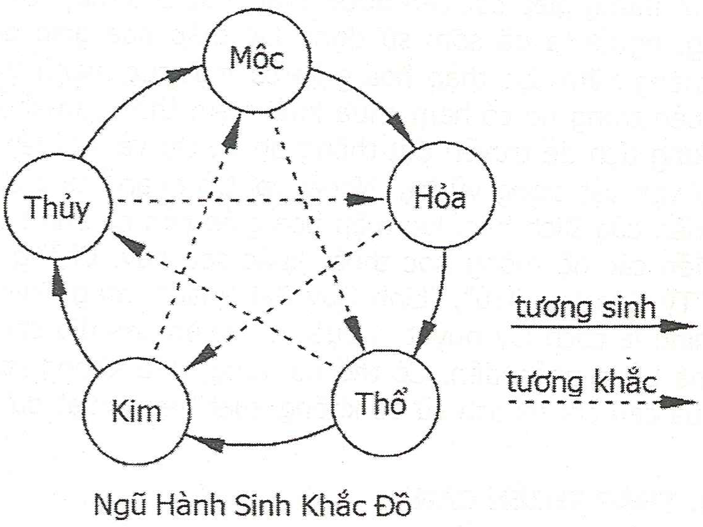

# CHƯƠNG 2
## CAN CHI VÀ DỰ ĐOÁN LỤC HÀO

Từ những giáp cốt văn được khai quật cho thấy, từ thời nhà Thương, người ta đã sớm sử dụng lục thập hoa giáp để ghi lại ngày tháng năm. lục thập hoa giáp có một sức mạnh đáng kinh ngạc, bên trong nó có hàm chứa khái niệm thời gian-không gian, là phương tiện để truyền đạt thông tin vũ trụ và sự biến hóa của vạn sự vạn vật trong vũ trụ. Ngoài vai trò quan trọng đối với sự phát triển của Dịch học, lục thập hoa giáp còn có ảnh hưởng sâu rộng đến các hệ thống học thuật khác sau này. Chẳng hạn như phép "Tý Ngọ Lưu Trú", "Linh Quy Bát Pháp" trong Trung y hiện nay chính là cách lấy huyệt vị dựa vào thiên can địa chi của thời gian mà bệnh nhân đến. Có thể nói rằng, nếu không có sự xuất hiện của can chi thì lịch sử sẽ không xuất hiện thuật dự đoán lục hào.

### I. THẬP THIÊN CAN

Thập thiên can là Giáp, Ất, Bính, Đinh, Mậu, Kỷ, Canh, Tân, Nhâm, Quý. Thứ tự sắp xếp này là cố định, nó cho thấy quá trình biến hóa của vạn vật từ sinh trưởng đến phồn thịnh, suy lão rồi tử vong.

#### 1. Âm dương của thập thiên can

Thiên can có phân chia âm dương, số lẻ là dương, số chẵn là âm. Giáp, Bính, Mậu, Canh, Nhâm là dương, gọi là can dương; Ất, Đinh, Kỷ, Tân, Quý thuộc âm, gọi là can âm.

#### 2. Ngũ hành của thập thiên can

Giáp Ất là mộc, Bính Đinh là hỏa, Mậu Kỷ là thổ, Canh Tân là kim, Nhâm Quý là thủy.

#### 3. Thập thiên can và phương vị

Giáp Ất là phương Đông, Bính Đinh là phương Nam, Mậu Kỷ là trung ương, Canh Tân là phương Tây, Nhâm Quý là phương Bắc. Giữa thập thiên can còn tồn tại quan hệ tương hợp, tương xung, hợp hóa, v.v. Tuy nhiên, trong dự đoán lục hào thường chỉ chú trọng can ngày dự đoán, dùng để an lục thần, những ý nghĩa khác thì rất ít khi dùng, vì vậy có thể bỏ qua không ghi ra.

### II. THẬP NHỊ ĐỊA CHI

Thập nhị địa chi là Tý, Sửu, Dần, Mão, Thìn, Tị, Ngọ, Mùi, Thân, Dậu, Tuất, Hợi. Trong dự đoán lục hào, vai trò thập nhị địa chi là hết sức quan trọng, nhất định phải ghi nhớ thuộc tính ngũ hành và mối quan hệ sinh khắc xung hợp lẫn nhau của chúng.

#### 1. Âm dương của thập nhị địa chi

Tý, Dần, Thìn, Ngọ, Thân, Tuất là chi dương. Sửu, Mão, Tị, Mùi, Dậu, Hợi là chi âm.

#### 2. Ngũ hành của thập nhị địa chi

Dần Mão cùng thuộc mộc, Dần là dương mộc, Mão là âm mộc. Tị Ngọ cùng thuộc hỏa, Ngọ là dương hỏa, Tị là âm hỏa. Thân Dậu cùng thuộc kim, Thân là dương kim, Dậu là âm kim. Hợi Tý cùng thuộc thủy, Tý là dương thủy, Hợi là âm thủy. Thìn Tuất Sửu Mùi cùng thuộc thổ, Thìn Tuất là dương thổ, Sửu Mùi là âm thổ.

#### 3. Thập nhị địa chi và phương vị

Tý là phương Bắc, Sửu Dần là Đông Bắc, Mão là Đông, Thìn Tị là Đông Nam, Ngọ là phương Nam, Mùi Thân là Tây Nam, Dậu là phương Tây, Tuất Hợi là Tây Bắc.

#### 4. Thập nhị địa chi và bốn mùa

Dần Mão Thìn là mùa xuân, Tị Ngọ Mùi là mùa hạ, Thân Dậu Tuất là mùa thu, Hợi Tý Sửu là mùa đông.

#### 5. Thập nhị địa chi và tháng

Từ góc độ dương lịch mà nói, Dần là tháng 2, Mão là tháng 3, Thìn là tháng 4, Tị là tháng 5, Ngọ là tháng 6, Mùi là tháng 7, Thân là tháng 8, Dậu là tháng 9, Tuất là tháng 10, Hợi là tháng 11, Tý là tháng 12, Sửu là tháng 1.

#### 6. Thập nhị địa chi và mười hai canh giờ

Giờ Tý (23 giờ - 1 giờ), giờ Sửu (1 giờ - 3 giờ), giờ Dần (3 giờ - 5 giờ), giờ Mão (5 giờ - 7 giờ), giờ Thìn (7 giờ - 9 giờ), giờ Tị (9 giờ - 11 giờ), giờ Ngọ (11 giờ - 13 giờ), giờ Mùi (13 giờ - 15 giờ), giờ Thân (15 giờ - 17 giờ), giờ Dậu (17 giờ - 19 giờ), giờ Tuất (19 giờ - 21 giờ), giờ Hợi (21 giờ - 23 giờ).

### 7. Lục hợp của thập nhị địa chi

Trong thập nhị địa chi, hai địa chi tương hợp thành cặp, có sáu cặp cho nên gọi là lục hợp. Tức là Tý và Sửu hợp, Dần và Hợi hợp, Mão và Tuất hợp, Thìn và Dậu hợp, Tị và Thân hợp, Ngọ và Mùi hợp.

### 8. Lục xung của thập nhị địa chi

Trong thập nhị địa chi, hai địa chi tương xung thành cặp, có sáu cặp cho nên gọi là lục xung. Tức là Tý Ngọ tương xung, Sửu Mùi tương xung, Dần Thân tương xung, Mão Dậu tương xung, Thìn Tuất tương xung, Tị Hợi tương xung.

### 9. Thập nhị địa chi và quan hệ đối ứng với động vật

Tý chuột, Sửu trâu, Dần hổ, Mão thỏ, Thìn rồng, Tị rắn, Ngọ ngựa, Mùi dê, Thân khỉ, Dậu gà, Tuất chó, Hợi lợn.

### 10. Tam hợp của địa chi

Thân Tý Thìn hợp thủy cục, Tị Dậu Sửu hợp kim cục, Dần Ngọ Tuất hợp hỏa cục, Hợi Mão Mùi hợp mộc cục.

### 11. Tam hình của địa chi

Dần Tị Thân tam hình: Dần hình Tị, Tị hình Thân, Thân hình Dần.

Sửu Tuất Mùi tam hình: Sửu hình Tuất, Tuất hình Mùi, Mùi hình Sửu. Tý Mão tương hình: Tý hình Mão, Mão hình Tý.

Thìn Ngọ Dậu Hợi tự hình: Thìn Thìn, Ngọ Ngọ, Dậu Dậu, Hợi Hợi.

* * * * * * * * * *

Trên đây là những khái niệm thường gặp liên quan đến thập nhị địa chi cần ghi nhớ. Phương pháp sử dụng cụ thể sẽ được trình bày chi tiết ở các chương sau.

---

# CHƯƠNG 3
## KIẾN THỨC CĂN BẢN VỀ BÁT QUÁI

### I. Ý NGHĨA CƠ BẢN CỦA BÁT QUÁI

Sự vật trong vũ trụ nhiều không thể nào đếm được, lại thêm biến hóa đa dạng, tuy nhiên chúng không hỗn độn, mà tồn tại theo quy luật rất đáng ngạc nhiên. Căn cứ vào tính chất khác nhau của sự vật, người xưa đã sử dụng một khái niệm trừu tượng để quy nạp tất cả các sự vật trong vũ trụ thành tám loại hình thái, đó chính là bát quái.

Bát quái chính là Càn ☰, Khôn ☷, Chấn ☳, Tốn ☴, Khảm ☵, Ly ☲, Cấn ☶, Đoài ☱. Người xưa đã dùng tám quái này để đại diện cho mọi sự vật trong tự nhiên. Càn đại diện trời, Khôn đại diện đất, Chấn đại diện sấm, Tốn đại diện gió, Khảm đại diện nước, Ly đại diện lửa, Cấn đại diện núi, Đoài đại diện đầm (hồ).

Ký hiệu cơ bản nhất để cấu thành bát quái là hào, hào phân âm dương, hào dương là vạch liền (—), hào âm là vạch đứt (--). Ba hào tạo thành một quái tượng, theo tượng tam tài thiên địa nhân. Hai quái đơn chồng lên nhau lại có thể tạo thành một trùng quái, quái ở trên gọi là thượng quái hay ngoại quái, quái ở dưới gọi là hạ quái hay nội quái. Có tổng cộng 64 trùng quái, gọi là 64 quái.

Từ hình tượng ký hiệu của bát quái, người xưa đã đặt ra bài ca để thuận tiện cho việc ghi nhớ, bài ca đó như sau: "Càn tam liên, Khôn lục đoạn, Chấn ngưỡng vu, Cấn phúc uyển, Đoài thượng khuyết, Tốn hạ đoạn, Ly trung hư, Khảm trung mãn."

Tuy là chỉ có tám loại hình, nhưng bát quái có thể đối ứng với vạn sự vạn vật trong vũ trụ, có thể nói rằng bát quái chính là kho tàng thông tin vũ trụ. Mối quan hệ đối ứng giữa bát quái và giới tự nhiên có thể từ từ hiểu rõ sau khi đã đi sâu vào, ở đây chỉ cần ghi nhớ những ý nghĩa thường dùng là được.

#### 1. Quan hệ đối ứng giữa bát quái và nhân sự

Càn là cha, Khôn là mẹ, Chấn là trưởng nam, Tốn là trưởng nữ, Khảm là trung nam, Ly là trung nữ, Cấn là thiếu nam, Đoài là thiếu nữ.

### 2. Quan hệ đối ứng giữa bát quái và cơ thể

Càn là đầu, Đoài là miệng, Chấn là chân, Tốn là đùi, Ly là mắt, Khảm là tai, Cấn là tay, Khôn là bụng.

### 3. Quan hệ đối ứng giữa bát quái và nội tạng

Càn là đầu, phổi, ruột già; Khôn là lá lách, dạ dày; Chấn là gan, mật; Tốn là gan, mật; Khảm là thận, bàng quang; Ly là tim, ruột non; Cấn là lá lách, dạ dày; Đoài là phổi, ruột già, v.v.

### 4. Quan hệ đối ứng giữa bát quái và phương vị

Càn là Tây Bắc, Đoài là phương Tây, Ly là phương Nam, Chấn là phương Đông, Tốn là Đông Nam, Khảm là phương Bắc, Cấn là Đông Bắc, Khôn là Tây Nam.

Sự đối ứng giữa bát quái và vạn sự vạn vật có thể được phân chia vô cùng vô tận, trong thuật dự đoán Mai Hoa Dịch Số thì được ứng dụng rất rộng rãi, tuy nhiên trong dự đoán lục hào thì không được sử dụng nhiều.

### 5. Thuộc tính ngũ hành của bát quái

Càn Đoài thuộc kim, Khôn Cấn thuộc thổ, Ly thuộc hỏa, Chấn Tốn thuộc mộc, Khảm thuộc thủy.

## II. PHÂN CUNG BÁT QUÁI

Từ bát quái phát triển thành 64 quái, 64 quái này được phân thành tám cung, mỗi cung gồm tám quẻ, thứ tự sắp xếp của nó là cố định bất biến, mỗi quẻ có một tên gọi riêng.

Cung Càn: Quẻ đầu tiên, thượng quái hạ quái đều là Càn, gọi là Càn Vi Thiên, cũng gọi là quẻ đầu cung Càn. Quẻ thứ hai thượng Càn hạ Tốn, gọi là Thiên Phong Cấu, hoặc nhất thế quái cung Càn. Quẻ thứ ba thượng Càn hạ Cấn, gọi là Thiên Sơn Độn, hoặc nhị thế quái cung Càn. Quẻ thứ tư thượng Càn hạ Khôn, gọi là Thiên Địa Bĩ, hoặc tam thế quái cung Càn. Quẻ thứ năm thượng Tốn hạ Khôn, gọi là Phong Địa Quan, hoặc tứ thế quái cung Càn. Quẻ thứ sáu thượng Cấn hạ Khôn, gọi là Sơn Địa Bác, hoặc ngũ thế quái cung Càn. Quẻ thứ bảy thượng Ly hạ Khôn, gọi là Hỏa Địa Tấn, hoặc quẻ du hồn cung Càn. Quẻ thứ tám thượng Ly hạ Càn, gọi là Hỏa Thiên Đại Hữu, hoặc quẻ quy hồn cung Càn.

---

# PHẦN LỤC HÀO CƠ SỞ

Tám quẻ cung Đoài là: Đoài Vi Trạch, Trạch Thủy Khốn, Trạch Địa Tụy, Trạch Sơn Hàm, Thủy Sơn Kiển, Địa Sơn Khiêm, Lôi Sơn Tiểu Quá, Lôi Trạch Quy Muội.

Tám quẻ cung Ly là: Ly Vi Hỏa, Hỏa Sơn Lữ, Hỏa Phong Đỉnh, Hỏa Thủy Vị Tế, Sơn Thủy Mông, Phong Thủy Hoán, Thiên Thủy Tụng, Thiên Hỏa Đồng Nhân.

Tám quẻ cung Chấn là: Chấn Vi Lôi, Lôi Địa Dự, Lôi Thủy Giải, Lôi Phong Hằng, Địa Phong Thăng, Thủy Phong Tỉnh, Trạch Phong Đại Quá, Trạch Lôi Tùy.

Tám quẻ cung Tốn là: Tốn Vi Phong, Phong Thiên Tiểu Súc, Phong Hỏa Gia Nhân, Phong Lôi Ích, Thiên Lôi Vô Vọng, Hỏa Lôi Phệ Hạp, Sơn Lôi Di, Sơn Phong Cổ.

Tám quẻ cung Khảm là: Khảm Vi Thủy, Thủy Trạch Tiết, Thủy Lôi Truân, Thủy Hỏa Ký Tế, Trạch Hỏa Cách, Lôi Hỏa Phong, Địa Hỏa Minh Di, Địa Thủy Sư.

Tám quẻ cung Cấn là: Cấn Vi Sơn, Sơn Hỏa Bí, Sơn Thiên Đại Súc, Sơn Trạch Tổn, Hỏa Trạch Khuê, Thiên Trạch Lý, Phong Trạch Trung Phu, Phong Sơn Tiệm.

Tám quẻ cung Khôn là: Khôn Vi Địa, Địa Lôi Phục, Địa Trạch Lâm, Địa Thiên Thái, Lôi Thiên Đại Tráng, Trạch Thiên Quải, Thủy Thiên Nhu, Thủy Địa Tỷ.

Tám quẻ đầu tiên ở mỗi cung đều là tám quẻ thuần, quẻ thứ bảy ở mỗi cung gọi là quẻ du hồn, quẻ thứ tám gọi là quẻ quy hồn. Thuộc tính ngũ hành của mỗi quẻ trong cung đều tương đồng với thuộc tính của cung đó. Nghĩa là, thuộc tính ngũ hành của tám trùng quái trong cung Càn đều là kim, thuộc tính ngũ hành của tám trùng quái trong cung Khôn đều là thổ, những trường hợp khác cũng tương tự như vậy.

# PHẦN LỤC HÀO CƠ SỞ

## CHƯƠNG 4
### PHƯƠNG PHÁP LẤY VÀ GHI BÁT QUÁI

Lấy quẻ, hay còn gọi là khởi quẻ, là bước đầu tiên trong dự đoán lục hào. Người ta thường dùng ba đồng tiền để trích xuất quái tượng, gọi là "phép dùng đồng tiền thay cỏ thi", hay "phép gieo đồng tiền", v.v. Khoảng từ thời Chiến Quốc đến giữa thời Hán, phương pháp gieo đồng tiền đã được sử dụng để thay thế phương pháp dùng thẻ tre hoặc cỏ thi, nhờ đó mà tốc độ lấy quẻ trở nên nhanh hơn. Dự đoán lục hào sử dụng đồng tiền để lấy quẻ, phương pháp của nó độc đáo, đơn giản mà đầy ý nghĩa sâu sắc. Mỗi đồng tiền được chia thành mặt chính và mặt sau, tượng trưng cho hai khí âm dương. Mặt có chữ là âm, mặt không có chữ là dương, ba đồng tiền lại tượng trưng cho tam tài thiên địa nhân. Bên ngoài của đồng tiền là hình tròn tượng trưng cho trời, lỗ bên trong là hình vuông tượng trưng cho đất, điều này bắt nguồn từ thuyết trời tròn đất vuông (Càn là trời, là tròn; Khôn là đất, là vuông). Bộ phận ở giữa cạnh ngoài và lỗ bên trong được gọi là thịt, tượng trưng cho con người có xác thịt. Vì vậy, trong ba đồng tiền nhỏ bé đã bao hàm lý lẽ âm dương trời đất, đồng thời cũng phản ánh vũ trụ quan đạo sinh nhất, nhất sinh nhị, nhị sinh tam.

Nghi thức trước khi xin quẻ của người xưa khá rườm rà, người ta thường phải đốt nhang, tắm gội để bày tỏ lòng tôn kính đối với thần linh và thỉnh cầu thần linh cho gợi ý, nhưng trên thực tế thì dự đoán lục hào không liên quan đến thần linh, mà đó chỉ là một loại hoạt động của tiềm thức, chỉ cần động ý định dự đoán là có thể lấy đồng tiền gieo quẻ. Tuy nhiên, nếu người xin đoán coi việc này là trò đùa, căn bản là không có ý định dự đoán thì có thể thông tin trong quái tượng sẽ không phản ánh chính xác. Khi lấy quẻ, bất kể là người được cử đến gieo quẻ hay là dự trắc sư gieo quẻ đều được, gieo quẻ chỉ là một hình thức trích xuất quái tượng mà thôi.

Phương pháp lấy quẻ là bảo người xin đoán nắm ba đồng tiền trong tay, úp kín hai tay lại, đừng để đồng tiền rơi ra khỏi tay, sau đó lắc lên xuống, khiến cho các đồng tiền dao động tạo ma sát, sản sinh từ trường tương thông với tâm linh (đương nhiên là bản thân dự trắc sư cũng có thể gieo quẻ thay cho người được cử đến). Sau khi lắc vài lần thì thả xuống mặt bàn hoặc khay có đáy bằng (tránh thả xuống vật mềm), xem và ghi lại tình hình chính phản của ba đồng tiền, sau đó đặt các đồng xu trở lại trong tay và tiếp tục gieo. Gieo như vậy sáu lần là được một trùng quái.

Lúc ghi lại kết quả của quái tượng, một mặt lưng hai mặt chữ là thiếu dương, là đơn, dùng một gạch "—" để biểu thị. Một mặt chữ hai mặt lưng là thiếu âm, là sách[^1], dùng hai gạch "- -" để biểu thị. Ba mặt lưng là lão dương, là trùng, dùng vòng tròn "O" để biểu thị. Ba mặt chữ là lão âm, là giao, dùng dấu gạch chéo "x" để biểu thị. Ghi quẻ theo thứ tự từ dưới lên trên, kết quả của lần gieo đầu tiên là hào sơ, kết quả của lần gieo thứ hai là hào hai, tương tự như vậy cho đến hào sáu. Mỗi quẻ đều do sáu hào tạo thành, cho nên gọi là quẻ lục hào. Lão dương và lão âm ở trong quẻ lục hào gọi là hào động, là biểu thị hào vị này sẽ phát sinh biến hóa, dương động biến âm, âm động biến dương, phản ánh đầy đủ triết lý của vũ trụ là vật cực tất phản, dương cực biến âm, âm cực biến dương. Hào được biến ra gọi là hào biến. Quẻ gieo ra gọi là quẻ chính, quẻ nhận được sau khi biến hóa gọi là quẻ biến. Cũng có quẻ không có hào động, chỉ có quẻ chính. Thử nêu ra một ví dụ để nói rõ:

Lần 6 gieo được 2 mặt lưng 1 mặt chữ:  - -  thiếu âm     hào 6  
Lần 5 gieo được 3 mặt lưng:            O    lão dương    hào 5  
Lần 4 gieo được 3 mặt chữ:             x    lão âm       hào 4  
Lần 3 gieo được 1 mặt lưng 2 mặt chữ:  —    thiếu dương  hào 3  
Lần 2 gieo được 2 mặt lưng 1 mặt chữ:  - -  thiếu âm     hào 2  
Lần đầu gieo được 1 mặt lưng 2 mặt chữ: —    thiếu dương  hào sơ

Quẻ này trên Khảm dưới Ly là quẻ Thủy Hỏa Ký Tế, bởi vì hào 4 và hào 5 phát động, phát sinh biến hóa, sau khi biến hóa sẽ thành trên Chấn dưới Ly, là quẻ Lôi Hỏa Phong. Quẻ Thủy Hỏa Ký Tế là quẻ chính, quẻ Lôi Hỏa Phong là quẻ biến.

[^1]: sách: nứt ra

# CHƯƠNG 5
## PHƯƠNG PHÁP TRANG QUẺ

Sau khi trích xuất được quẻ, các bước tiếp theo chính là lắp ráp can chi, Thế Ứng, lục thân và lục thần, v.v. Trong dự đoán lục hào, những công việc này được gọi là trang quẻ (lắp ráp quẻ). Trước khi trang quẻ, chúng ta phải có một nhận thức cơ bản về bát quái. Căn cứ vào nguyên lý âm dương, bát quái có thể được chia thành hai loại là dương quái và âm quái. Càn, Chấn, Khảm, Cấn là dương quái; Khôn, Tốn, Ly, Đoài là âm quái. Mỗi trùng quái được chia thành thượng quái và hạ quái, tám cung tạo thành 64 quái đều có thuộc tính ngũ hành của nó, quẻ đầu tiên của mỗi cung được gọi là bản cung, quẻ đầu hoặc quẻ thuần, bảy quẻ khác mà nó thống lĩnh gọi là phi cung. Thuộc tính ngũ hành của các phi cung đều tương đồng với bản cung, quẻ thứ bảy của mỗi cung được gọi là quẻ du hồn, quẻ thứ tám được gọi là quẻ quy hồn.

### I. PHƯƠNG PHÁP SẮP XẾP CAN CHI

Việc phối thiên can địa chi lên sáu hào vị của quẻ được gọi là nạp giáp. Trong dự đoán thực tế, thiên can không tham gia vào việc phán đoán cát hung, mà thông thường chỉ dùng để phán đoán trích xuất con số. Do đó, khi trang quẻ thường tỉnh lược thiên can và chỉ nạp địa chi.

#### Nạp giáp ca

Càn kim Giáp Tý ngoại Nhâm Ngọ, Khảm thủy Mậu Dần ngoại Mậu Thân.  
Chấn mộc Canh Tý ngoại Canh Ngọ, Cấn thổ Bính Thìn ngoại Bính Tuất.  
Khôn thổ Ất Mùi ngoại Quý Sửu, Tốn mộc Tân Sửu ngoại Tân Mùi.  
Ly hỏa Kỷ Mão ngoại Kỷ Dậu, Đoài kim Đinh Tị ngoại Đinh Hợi.  

Bài ca nạp giáp này chính là căn cứ và phương pháp để lắp ráp can chi cho mỗi hào vị. Mỗi quẻ đều nạp can chi từ hào sơ, căn cứ vào nguyên lý bát quái âm dương thuận nghịch, dương quái thì nạp can chi dương thuận chiều kim đồng hồ (theo thứ tự của 12 chi, tức là Tý, Dần, Thìn, Ngọ, Thân, Tuất), âm quái thì nạp can chi âm ngược chiều kim đồng hồ (ngược với thứ tự của 12 chi, tức là Hợi, Dậu, Mùi, Tị, Mão, Sửu).

Ví dụ, giả sử gieo được quẻ Thủy Phong Tỉnh. Hạ quái là Tốn, Tốn tại nội quái nạp Tân Sửu, Tốn là âm quái, đi ngược chiều nạp can chi âm là Tân Sửu, Tân Hợi, Tân Dậu, không dùng chi dương. Thượng quái là Khảm, Khảm tại ngoại quái nạp Mậu Thân, Khảm là dương quái đi thuận, tức là Mậu Thân, Mậu Tuất, Mậu Tý, chỉ nạp can chi dương, không dùng chi âm. Kết quả của phép nạp giáp như sau:

Hào 6 ▅▅ ▅▅ Mậu Tý  
Hào 5 ▅▅▅▅▅ Mậu Tuất  
Hào 4 ▅▅ ▅▅ Mậu Thân  
Hào 3 ▅▅▅▅▅ Tân Dậu  
Hào 2 ▅▅▅▅▅ Tân Hợi  
Hào sơ ▅▅ ▅▅ Tân Sửu

### II. PHƯƠNG PHÁP AN THẾ ỨNG

Thế Ứng là thứ không thể thiếu trong dự đoán lục hào, cũng là một trong những căn cứ để dự đoán cát hung của sự vật. Thế Ứng là linh hồn trong quẻ, một quẻ nếu như không có Thế Ứng thì cũng giống như một quân đội không có tham mưu trưởng và chỉ huy, đã mất đi trung tâm của quẻ. Vị trí Thế Ứng của mỗi quẻ là cố định bất biến, không thể an sai. Nếu an sai Thế Ứng thì rất khó nắm bắt được chủ thứ của sự vật. Thời xưa, người ta an Thế Ứng bằng cách ghi nhớ thứ tự của các quẻ trong mỗi cung bát quái, khiến cho rất nhiều người mới học phải tiêu tốn không ít thời gian ở bước này. Dưới đây, tôi sẽ chỉ cho mọi người một phương pháp không cần nhớ tên của 64 quẻ mà vẫn có thể an Thế Ứng, đồng thời còn có thể tìm được quái cung. Tôi gọi đó là hào biến pháp an Thế Ứng tầm cung quyết.

#### Hào biến pháp an Thế Ứng tầm cung quyết

Tầm Thế tòng sơ vãng thượng luân, âm hào biến dương dương biến âm.  
Biến chí nội ngoại tương đồng quái, cai hào tức vi Thế sở lâm.

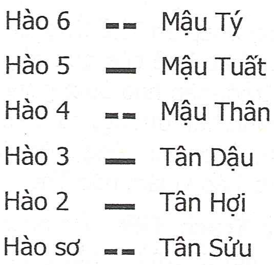

Nhược đáo ngũ hào quái nhưng dị, chuyển tòng tứ hào hướng hạ hành.
Nhược đáo sơ hào phương vi chỉ, quy hồn Thế tại tam hào lâm.
Nội ngoại tương đồng vật tu biến, lục hào an Thế vi bát thuần.
Ký đắc nội ngoại tương đồng quái, nguyên quái tức dĩ thử vi cung.
Nhược vấn Ứng hào an hà xử, Thế cách lưỡng hào tức vi Ứng.

Đây là một phương pháp an Thế Ứng kiêm tìm cung. Sau khi được quẻ, phải tìm xem hào Thế của quẻ này nằm ở hào nào, có thể biến từ hào sơ lên trên, gặp hào dương thì biến thành hào âm, gặp hào âm thì biến thành hào dương, cứ biến đến khi nội quái và ngoại quái giống nhau, hào sau cùng biến khiến cho nội ngoại quái giống nhau chính là hào vị lâm hào Thế.

**Ví dụ quẻ Thủy Trạch Tiết**, nội ngoại quái không giống nhau, ngoại là Khảm, nội là Đoài, chúng ta biến từ hào sơ lên trên, hào sơ là hào dương, biến nó thành hào âm, sau khi đã biến hào sơ thì nội quái và ngoại quái giống nhau, vậy thì hào Thế của quẻ này nhất định tại hào sơ, đồng thời có thể khẳng định Thủy Trạch Tiết thuộc cung Khảm.

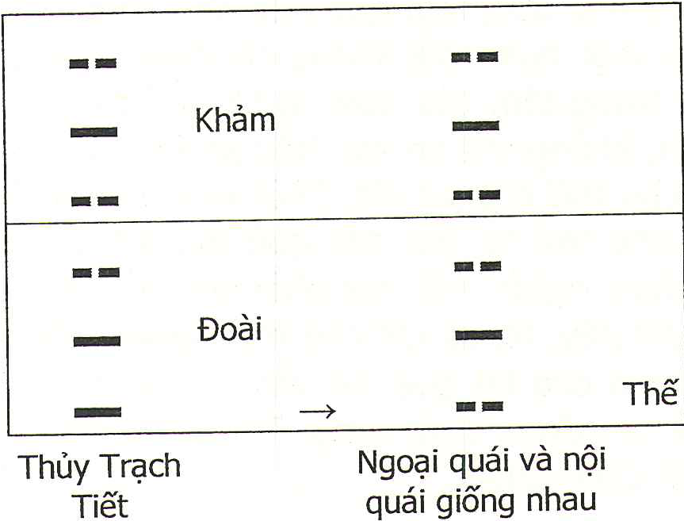

**Ví dụ quẻ Sơn Thủy Mông**, nội ngoại quái không giống nhau, ngoại quái là Cấn, nội quái là Khảm, chúng ta biến từ hào sơ lên trên, hào sơ là hào âm biến thành hào dương, hào 2 là hào dương, biến thành hào âm. Hào 3 là hào âm, biến thành hào dương, hào 4 là hào âm, biến thành hào dương, khi biến đến hào 4, nội quái và ngoại quái đều biến thành quẻ Ly, vậy thì hào Thế của quẻ này là hào 4, hơn nữa có thể khẳng định Sơn Thủy Mông là quẻ trong cung Ly.

Nếu biến đến hào 5 mà nội ngoại quái vẫn chưa giống nhau thì chuyển từ hào 4 biến xuống. Hào 6 là tông miếu, vĩnh viễn không thể biến, sau khi đã biến hào 4, nếu nội ngoại xuất hiện hai quẻ giống nhau, thì hào Thế tại hào 4, đồng thời có thể khẳng định quẻ này là quẻ du hồn.

**Ví dụ quẻ Phong Trạch Trung Phu**, hai quẻ thượng hạ không giống nhau, thượng là Tốn, hạ là Đoài, chúng ta biến từ hào sơ lên trên, hào sơ là hào dương, biến thành hào âm, hào 2 là hào dương, biến thành hào âm, hào 3 là hào âm, biến thành hào dương, hào 4 là hào âm, biến thành hào dương, hào 5 là hào dương, biến thành hào âm. Sau khi biến đến hào 5 mà thượng hạ quái vẫn chưa giống nhau, thượng quái đã biến thành Ly, hạ quái đã biến thành Cấn. Vậy thì chuyển từ hào 4 biến xuống, hào 4 là dương, lại biến về thành âm, sau khi biến hào 4 thì hai quẻ nội ngoại đều thành Cấn, lúc này có thể khẳng định hào Thế của quẻ này là tại hào 4, hơn nữa là quẻ du hồn của cung Cấn.

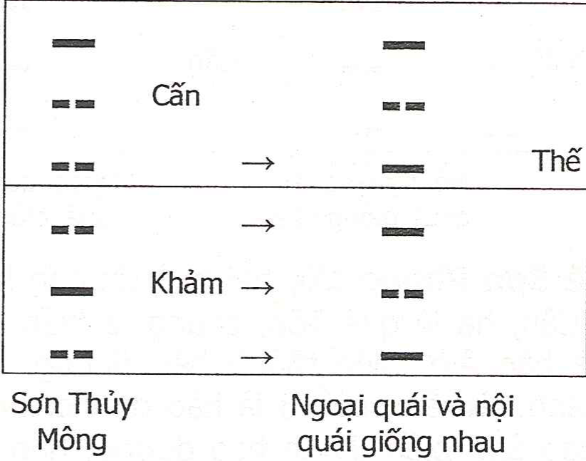

Nếu như chuyển từ hào 4 biến xuống mà biến đến hào sơ mới xuất hiện hai quẻ thượng hạ giống nhau thì quẻ này là quẻ quy hồn, hào Thế an tại hào 3.

Ví dụ quẻ **Sơn Phong Cổ**, hai quẻ thượng hạ khác nhau, thượng là quẻ Cấn, hạ là quẻ Tốn, chúng ta biến từ hào sơ lên trên, hào sơ là hào âm, biến thành hào dương, hào 2 là hào dương, biến thành hào âm, hào 3 là hào dương, biến thành hào âm, hào 4 là hào âm, biến thành hào dương, hào 5 là hào âm, biến thành dương. Sau khi biến đến hào 5, ngoại quái đã biến thành Càn, nội quái đã biến thành Chấn, hai quẻ thượng hạ vẫn khác nhau, vậy thì chuyển từ hào 4 biến xuống, hào 4 là hào dương, biến về thành hào âm, hào 3 là hào âm, biến về thành hào dương, hào 2 là hào âm, biến về thành hào dương, hào sơ là hào dương, biến về thành hào âm, lúc này hai quẻ thượng hạ đã giống nhau, đều thành quẻ Tốn. Do đó, chúng ta có thể khẳng định quẻ Sơn Phong Cổ là quẻ quy hồn thuộc cung Tốn, hào Thế tại hào 3.

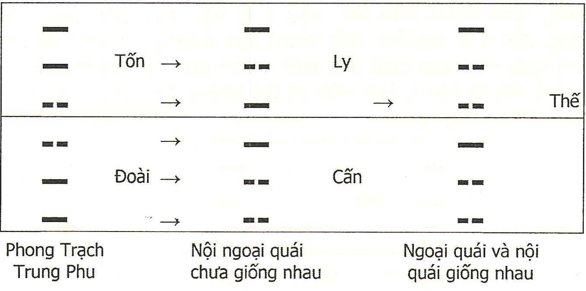

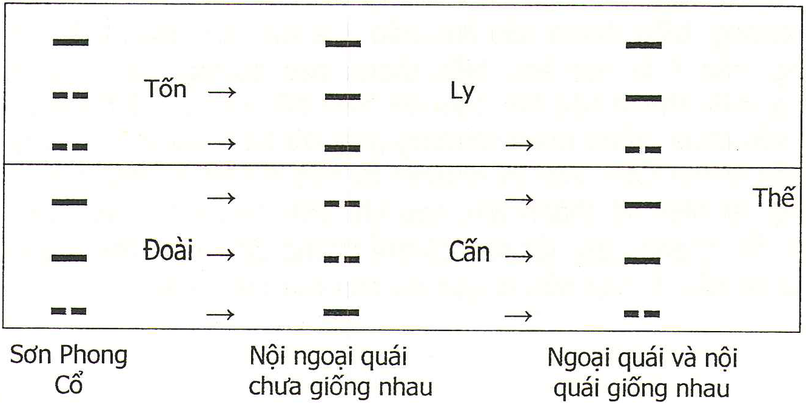

Quẻ quy hồn còn có một phương pháp phán đoán đơn giản hơn, tức là sau khi gieo ra quẻ, đầu tiên xem có phải là quẻ quy hồn hay không, nếu không phải thì dùng phương pháp an Thế Ứng ở trên. Phương pháp tìm đơn giản đó là trước tiên biến đổi âm dương của hào 5, nếu như sau khi biến mà tạo thành quẻ có nội ngoại quái giống nhau, thì quẻ đó chính là quẻ quy hồn. Ví dụ như quẻ Sơn Phong Cổ ở trên, hào 5 là hào âm, sau khi biến nó thành hào dương thì nội ngoại quái đều thành quẻ Tốn, như vậy có thể biết Sơn Phong Cổ là quẻ quy hồn thuộc cung Tốn, lấy hào Thế an tại hào 3.

Nếu ban đầu hai quẻ thượng hạ giống nhau thì không cần phải biến, đó chắc chắn là quẻ bản cung và hào Thế tại hào 6, giống như Càn Vi Thiên. Sau khi tìm được hào Thế thì an hào Ứng rất dễ, nó và hào Thế cách nhau hai hào.

## III. AN LỤC THÂN

Lục thân là chỉ Huynh Đệ, Phụ Mẫu, Quan Quỷ, Thê Tài và Tử Tôn. Đây là lấy quan hệ lục thân của nhân sự đưa vào trong quẻ, dùng để suy diễn tương đồng sự sinh khắc chế hóa giữa các sự vật. Do đó, lục thân có thể bao hàm rất nhiều ý nghĩa chứ không thể chỉ hiểu trên mặt chữ, chúng ta có thể xem nó như là một loại ký hiệu của dự đoán lục hào.

Lục thân ở mỗi hào vị trong quẻ chính và trong quẻ biến đều được xác định dựa trên mối quan hệ sinh khắc giữa ngũ hành của địa chi nạp hào và thuộc tính ngũ hành của quái cung quẻ chính.

Địa chi nạp hào có thuộc tính ngũ hành tương đồng với cung được gọi là "Ta", dùng Huynh Đệ để biểu thị, cái sinh ta thì dùng Phụ Mẫu để biểu thị, cái khắc ta thì dùng Quan Quỷ để biểu thị, cái ta sinh thì dùng Tử Tôn để biểu thị, cái ta khắc thì dùng Thê Tài để biểu thị. Trong ứng dụng thực tế, người ta thường viết tắt Huynh Đệ là Huynh, Phụ Mẫu là Phụ, Quan Quỷ là Quan hoặc Quỷ, Tử Tôn là Tử, Thê Tài là Tài.

Muốn an lục thân cho một quẻ thì trước tiên phải biết quẻ đó thuộc về cung gì. Nếu như nắm được "hào biến pháp an Thế Ứng tầm cung quyết" thì chúng ta có thể dễ dàng tìm được cung của một quẻ nào đó, sau khi tìm được cung của quẻ chính thì chúng ta có thể dựa vào mối quan hệ sinh khắc giữa thuộc tính ngũ hành của cung và ngũ hành của địa chi nạp hào để an lục thân.

Ví dụ quẻ Thủy Phong Tỉnh. Thuộc cung Chấn, thuộc tính ngũ hành của nó là mộc. Lấy cung là "Ta", hào sơ Sửu thổ là cái ta khắc, vì vậy phối Thê Tài; hào 2 là Hợi thủy, là cái sinh ta, phối Phụ Mẫu; hào 3 Dậu kim, là cái khắc ta, phối Quan Quỷ; hào 4 Thân kim, cũng là cái khắc ta, phối Quan Quỷ; hào 5 Tuất thổ, là cái ta khắc, phối Thê Tài; hào 6 Tý thủy, là cái sinh ta, phối Phụ Mẫu. Sau khi phối lục thân thì được quẻ như sau.

| | | | |
| :---: | :---: | :---: | :---: |
| | - - | Phụ Mẫu | Tý thủy |
| Thế | — | Thê Tài | Tuất thổ |
| | - - | Quan Quỷ | Thân kim |
| | — | Quan Quỷ | Dậu kim |
| Ứng | — | Phụ Mẫu | Hợi thủy |
| | - - | Thê Tài | Sửu thổ |

Nếu như một quẻ vừa có quẻ chính vừa có quẻ biến, thì thuộc tính ngũ hành của lục thân quẻ biến cũng tương đồng với thuộc tính ngũ hành của lục thân quẻ chính, trong quẻ chính kim là Phụ Mẫu thì trong quẻ biến kim cũng là Phụ Mẫu, trong quẻ chính kim là Quan Quỷ thì trong quẻ biến kim cũng là Quan Quỷ. Bất kể là quẻ biến có thuộc cung nào thì khi phối lục thân cho nó cũng đều phải dựa vào thuộc tính của cung quẻ chính.

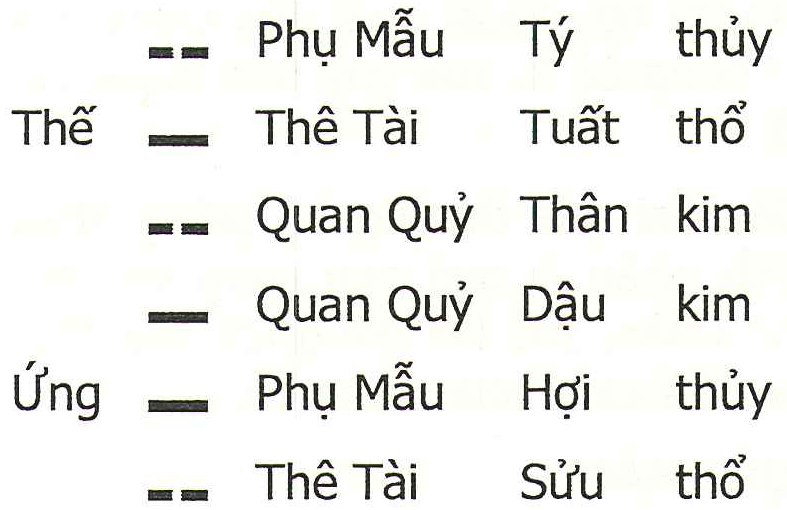

Ví dụ quẻ Thủy Trạch Tiết biến quẻ Thủy Địa Tỷ, quẻ chính Thủy Trạch Tiết thuộc cung Khảm, thuộc tính ngũ hành là thủy. Hào sơ Tị hỏa là cái ta khắc, phối Thê Tài; hào 2 Mão mộc, là cái ta sinh, phối Tử Tôn; hào 3 Sửu thổ, là cái khắc ta, phối Quan Quỷ; hào 4 Thân kim, là cái sinh ta, phối Phụ Mẫu; hào 5 Tuất thổ, là cái khắc ta, phối Quan Quỷ, hào 6 Tý thủy, là cái tỷ hòa, phối Huynh Đệ. Nội quái Đoài biến Khôn, hào sơ và hào 2 phát động. Hào sơ Tị hỏa phát động biến ra Mùi thổ, là cái khắc ta, phối Quan Quỷ, hào 2 Mão mộc phát động biến ra Tị hỏa là cái ta khắc, phối Thê Tài. Sau khi phối lục thân thì được quẻ chính và quẻ biến như sau.

| | Tiết | | | Tỷ | |
| :---: | :---: | :---: | :---: | :---: | :---: |
| | - - | Huynh Đệ Tý thủy | - - | Huynh Đệ Tý thủy |
| | — | Quan Quỷ Tuất thổ | — | Quan Quỷ Tuất thổ |
| Ứng | - - | Phụ Mẫu Thân kim | - - | Phụ Mẫu Thân kim |
| | - - | Quan Quỷ Sửu thổ | - - | Tử Tôn Mão mộc |
| | — | Tử Tôn Mão mộc | - - | Thê Tài Tị hỏa |
| Thế | — | Thê Tài Tị hỏa | - - | Quan Quỷ Mùi thổ |

Trong dự đoán lục hào thông thường chỉ coi trọng ảnh hưởng sinh khắc của hào biến đối với hào bản vị (tức là hào động). Do đó, Thế Ứng và các hào khác của quẻ biến có thể được lược bớt, chỉ cần ghi ra hào biến là được.

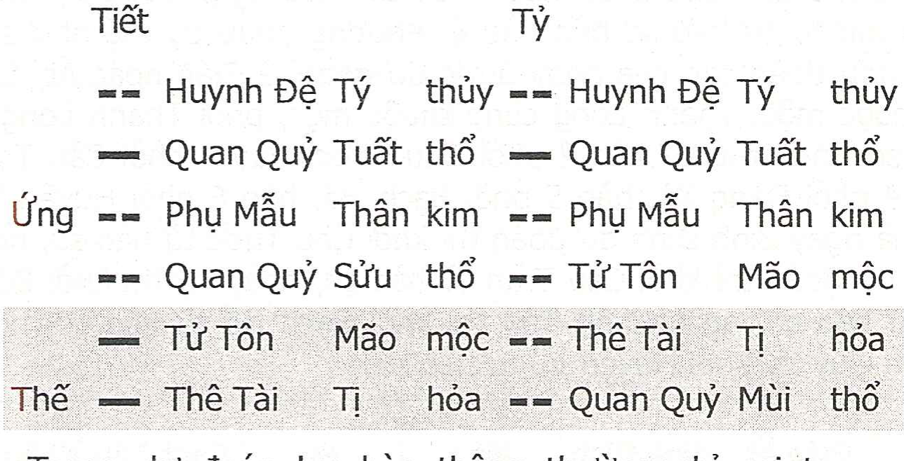

## IV. AN LỤC THẦN

Lục thần cũng gọi là lục thú, là chỉ Thanh Long, Chu Tước, Câu Trần, Đằng Xà, Bạch Hổ, Huyền Vũ. Trong đó, Đằng Xà còn được gọi là Trình Xà, Huyền Vũ còn được gọi là Nguyên Vũ. Trong dự đoán lục hào, lục thần là một căn cứ dùng để phán đoán nguyên nhân và tính chất của sự vật, không tham gia vào phán đoán cát hung. Bản thân lục thần cũng có thuộc tính ngũ hành, Thanh Long thuộc mộc, Chu Tước thuộc hỏa, Câu Trần và Đằng Xà thuộc thổ, Bạch Hổ thuộc kim, Huyền Vũ thuộc thủy, tuy nhiên giữa chúng không cần xem sinh khắc.

Lục thần được phối theo thiên can của ngày được dự đoán, theo thứ tự từ hào sơ đến hào 6. Phương pháp cụ thể như sau: Nếu như thiên can của ngày được dự đoán là Giáp hoặc Ất, Giáp Ất thuộc mộc, Thanh Long cũng thuộc mộc, phối Thanh Long từ hào sơ, theo thứ tự hào 2 phối Chu Tước, hào 3 phối Câu Trần, hào 4 phối Đằng Xà, hào 5 phối Bạch Hổ, hào 6 phối Huyền Vũ. Nếu là ngày Bính Đinh dự đoán thì khởi Chu Tước từ hào sơ, ngày Mậu dự đoán thì khởi Câu Trần từ hào sơ, ngày Kỷ thì khởi Đằng Xà từ hào sơ, ngày Canh Tân thì khởi Bạch Hổ từ hào sơ, ngày Nhâm Quý thì khởi Huyền Vũ từ hào sơ.

| Can ngày | Giáp Ất | Bính Đinh | Mậu | Kỷ | Canh Tân | Nhâm Quý |
| --- | --- | --- | --- | --- | --- | --- |
| Hào 6 | Huyền Vũ | Thanh Long | Chu Tước | Câu Trần | Đằng Xà | Bạch Hổ |
| Hào 5 | Bạch Hổ | Huyền Vũ | Thanh Long | Chu Tước | Câu Trần | Đằng Xà |
| Hào 4 | Đằng Xà | Bạch Hổ | Huyền Vũ | Thanh Long | Chu Tước | Câu Trần |
| Hào 3 | Câu Trần | Đằng Xà | Bạch Hổ | Huyền Vũ | Thanh Long | Chu Tước |
| Hào 2 | Chu Tước | Câu Trần | Đằng Xà | Bạch Hổ | Huyền Vũ | Thanh Long |
| Hào sơ | Thanh Long | Chu Tước | Câu Trần | Đằng Xà | Bạch Hổ | Huyền Vũ |

Lục thần cũng thường được viết tắt, Thanh Long là Long, Chu Tước là Tước, Câu Trần là Câu, Đằng Xà là Xà, Bạch Hổ là Hổ, Huyền Vũ là Vũ.

# CHƯƠNG 6

## TÁC DỤNG CỦA LỤC THÂN, LỤC THẦN, THẾ ỨNG

### I. Ý NGHĨA CỦA LỤC THÂN

Trong một quẻ thì có nhiều lục thân. Khi phán đoán cát hung của sự vật, thông thường chúng ta phải chọn một lục thân có chứa ý nghĩa tương đồng với nội dung dự đoán để triển khai suy đoán quẻ. Lục thân này được gọi là Dụng thần. Lục thân là căn cứ để trích xuất Dụng thần, đồng thời cũng là ký hiệu để triển khai quái tượng và phân tích nội dung của sự vật. Nếu như không có lục thân thì không thể chọn Dụng thần, không thể đưa ra phán đoán cụ thể về sự vật phát sinh. Mỗi lục thân thể hiện rất nhiều ý nghĩa, chỉ khi hiểu được ý nghĩa của các lục thân thì chúng ta mới có thể chọn Dụng thần và đưa ra phán đoán cát hung một cách chính xác.

#### 1. Ý nghĩa của Phụ Mẫu

Phụ Mẫu thể hiện cha mẹ, ông nội, bà nội, bà ngoại, ông ngoại, cô, chồng của cô, dì, chồng của dì, mợ, cậu, thầy cô giáo, cha nuôi, mẹ nuôi, cha vợ, mẹ vợ, trưởng bối, người già; trời đất, đất đai, mồ mả, thành trì, tường bao, phòng ốc, kiến trúc, công trình, xe đạp, xe hơi, xe lửa, thuyền, máy bay, mưa, tuyết, áo mưa, dù, quần áo, giày mũ, vải vóc, khăn đội đầu, khẩu trang, báo cáo, văn chương, văn kiện, sách vở, giấy báo, thư tín, hợp đồng, thông tin, tin tức, tín hiệu, trường học, bệnh viện, đầu, phần mặt, ngực, lưng, bụng, mông, phòng điều trị, đệm chăn, ra giường, đơn vị công tác, nha môn, v.v.

#### 2. Ý nghĩa của Quan Quỷ

Quan Quỷ thể hiện chồng, đàn ông, công danh, thứ bậc, tên, quan phủ, công an, kiện tụng, nhà nước, ngành tư pháp, lãnh đạo cấp trên, sấm sét, sương mù, khói, quỷ thần, đạo tặc, kẻ xấu, tù trốn trại, loạn đảng, tai họa, ưu sầu, quan vị, công việc, lên lớp, nghề nghiệp, chủ nhân, bệnh tật, thi thể, người chết, vùng nhiễm bệnh, virus, tạp niệm, phiền não, v.v.

### 3. Ý nghĩa của Huynh Đệ

Huynh Đệ thể hiện anh em, chị em gái, bạn bè, đồng nghiệp, cản trở, cạnh tranh, phá tài, phá hao, gió mây, cửa ngõ, nhà vệ sinh, vách tường, tham của, đánh bạc, cướp đoạt, tranh giành, cánh tay, chân, bàn chân, răng, dạ dày, vai, bàng quang, ăn uống không vào, rối loạn tiêu hóa, v.v.

### 4. Ý nghĩa của Thê Tài

Thê Tài thể hiện vợ, người yêu, phụ nữ, đối tượng yêu đương, bạn gái, nô bộc, bảo mẫu, người giúp việc, nhân viên tùy tùng, người làm thuê, tài sản, tiền vốn, kinh tế, giá cả, tiền tệ, dụng cụ, nhà kho, lương thực, bếp, thực vật, hàng hóa, quần áo cưới, bổng lộc, tiền lương, thu nhập, thù lao, chi phí, đạo lý, vật bẩn thỉu, hàng vận chuyển, châu báu, đồ trang sức, đồ dùng hàng ngày, trời nắng, lông tóc, ẩm thực, máu, hô hấp, nước mắt, phân và nước tiểu, mồ hôi, sữa, nước mũi, nước bọt, eo, hậu môn, v.v.

### 5. Ý nghĩa của Tử Tôn

Tử Tôn thể hiện con cái, con cháu, trẻ con, trẻ sơ sinh, thế hệ sau, đời sau, cháu gái, cháu trai, cháu ngoại trai, lương tướng, tăng đạo, người xuất gia, tín đồ, binh lính, công an, phúc thần, nguồn tiền, đường đi, hành lang, động vật, mặt trời, mặt trăng, sao, thiên thể, trời nắng, uống rượu, vui vẻ, giải trí, không lo lắng, bác sĩ, dinh dưỡng, dược phẩm, vú, ngũ quan[^1], tiểu tiện, phù chú, thầy khí công, bà mo, thầy cúng, thực quản, đường hô hấp, khí quản, mắt, tai, miệng, mũi, mạch máu, lỗ chân lông, ruột, bộ phận sinh dục, tủy, v.v.

## II. QUAN HỆ SINH KHẮC CỦA LỤC THÂN

Bởi vì lục thân được suy ra từ quan hệ sinh khắc của ngũ hành, do đó giữa chúng cũng tồn tại quan hệ sinh khắc giống như ngũ hành.

[^1]: Năm bộ phận của thân thể con người, gồm tai, mắt, mũi, lưỡi và da, giúp con người biết về bên ngoài, bằng cách nhìn, nghe, ngửi, nếm và sờ mó đụng chạm.

### 1. Tương sinh của lục thân

Tử Tôn sinh Thê Tài, Thê Tài sinh Quan Quỷ, Quan Quỷ sinh Phụ Mẫu, Phụ Mẫu sinh Huynh Đệ, Huynh Đệ sinh Tử Tôn.

### 2. Tương khắc của lục thân

Tử Tôn khắc Quan Quỷ, Quan Quỷ khắc Huynh Đệ, Huynh Đệ khắc Thê Tài, Thê Tài khắc Phụ Mẫu, Phụ Mẫu khắc Tử Tôn.

## III. Ý NGHĨA CỦA LỤC THẦN

Trong dự đoán lục hào, mặc dù lục thần không thể chi phối cát hung của sự vật, nhưng nó có thể được sử dụng để hỗ trợ dự đoán, đồng thời nó cũng là một thành phần không thể thiếu trong mỗi quẻ.

Lục thần chủ yếu được sử dụng để phân loại, quy nạp sự vật, con người và tính chất bệnh tật, đặc điểm, trình độ, nguyên nhân. Trong dự đoán, việc lựa chọn ý nghĩa lục thần có thích hợp hay không liên quan đến chiều sâu và tính chính xác của dự đoán, vì vậy nhất định phải thuộc lòng ý nghĩa của lục thần.

### 1. Ý nghĩa của Thanh Long

Thanh Long thể hiện xuất thân danh môn, cao quý, giàu có, hanh thông, tiền tài, cát tường, may mắn, vui vẻ, mâm cỗ, tiệc rượu, ẩm thực, thăm viếng thân hữu, nhân nghĩa, hiền từ, thanh cao, đoan trang, mỹ lệ, xinh đẹp, lộng lẫy, trang sức, trang điểm,

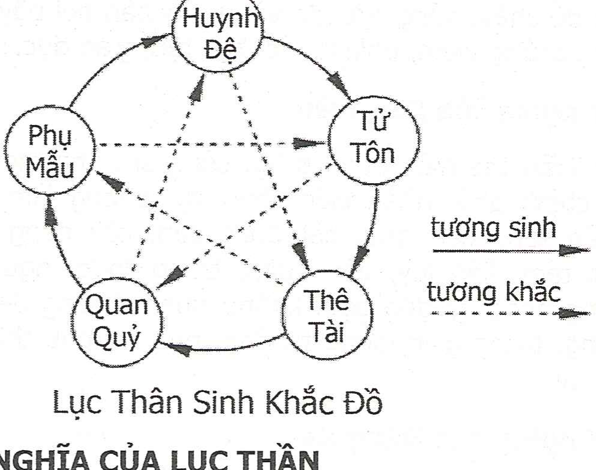 hòa thuận, nhẹ dạ, thông minh, có lễ độ, bên trái, sinh dục, háo sắc, tình dục, đau nhức, ngứa ngáy, v.v.

### 2. Ý nghĩa của Chu Tước

Chu Tước thể hiện ấn tín, văn thư, văn chương, công hàm, giấy khen, văn kiện, ngôn từ, thông tin, tin tức, viễn thông, ca hát, văn tự, sách vở, lấy lời nói làm nghề nghiệp, lải nhải, nói nhiều, thiện ngôn, cười mỉm, xảo biện, đổ lỗi, khẩu thiệt, ăn nói, tranh cãi, tức giận, phẫn nộ, chửi rủa, quan phi, tố tụng, hỏa hoạn, vật dễ cháy, nóng rực, đỏ vàng, nói càn nói bậy, ồn ào, tạp âm, rên rỉ, chứng viêm, phía trước, học tập, giáo dục, v.v.

### 3. Ý nghĩa của Câu Trần

Câu Trần thể hiện quan tụng, công an, nha môn, lao ngục, cơ quan chính phủ, nhân viên công vụ, phòng làm việc, ruộng đồng, điền sản, kiến trúc, bất động sản, cây nông nghiệp, nội thất, bận tâm, liên lụy, liên quan, trung thực, ngu đần, chậm chạp, cứng nhắc, gượng gạo, không quen, không dễ tỏ thái độ, trung ương, trung gian, sưng trướng, nhô ra, phù thũng, té ngã, ung thư, v.v.

### 4. Ý nghĩa của Đằng Xà

Đằng Xà thể hiện tham lam, giả dối, thiếu tin tưởng, nói không giữ lời, nghi kỵ, keo kiệt, dài dòng, khó chịu, khuyết thiếu, khó đối phó, kiện tụng, âm tà, tiểu nhân ám toán, vấn đề gai góc, phiền phức, triền miên nan giải, giữ chặt không thả, kinh dị, giật mình, bất ngờ, kinh khủng, phụ thuộc, tâm loạn, hiếm thấy, sợ hãi, không nhiều, lồi lõm, dây thừng, thon dài, uốn cong, mặt bên, v.v.

### 5. Ý nghĩa của Bạch Hổ

Bạch Hổ thể hiện quyết đoán, hung ác, dữ tợn, hào sảng, thù hận, hung tàn, gay gắt, hình phạt hình sự, tính khí nóng nảy, vũ lực, uy quyền, đao thương, đường đi, trắng trợn, không che dấu, bên phải, thương vong, tang sự, sắp sinh, máu huyết, sinh dục, tai nạn đổ máu, đánh nhau, bị thương, gãy xương, tai nạn xe cộ, thút thít, phẫu thuật, bệnh tật, y dược, v.v.

### 6. Ý nghĩa của Huyền Vũ

Huyền Vũ thể hiện bí mật, ám muội, trộm cắp, làm bậy, điềm gở, lừa gạt, âm mưu, xảo quyệt, dân cờ bạc, đầu cơ, gian trá, việc ngấm ngầm xấu xa, tên lừa đảo, bịp bợm, thất thoát, bất tri bất giác, nhà vệ sinh, dơ bẩn, phía sau, màu đen, tà khí, phong thấp, ẩm thấp, phiền muộn, dâm tà, dâm loạn, nội tâm, khó nói, nhục nhã, v.v.

## IV. VAI TRÒ CỦA THẾ ỨNG

Hào Thế là trung tâm, là linh hồn của quẻ. Dự đoán vận khí, sức khỏe, tình trạng của bản thân, thông thường là lấy hào Thế để triển khai phán đoán. Hào Thế cũng là một tiêu điểm của dự đoán sự vật, thông thường lục thân trì Thế không nên khắc Dụng thần, cũng không nên Tuần Không, Nguyệt phá.

Hào Ứng là người, nơi chốn hoặc sự kiện tương ứng với hào Thế. Ngoài ra, hào Ứng cũng có thể là người không có quan hệ mật thiết, người đối lập, cộng sự, đối tượng yêu đương, điểm đến du lịch, v.v.

Tất cả các dự đoán đều phải xem ảnh hưởng của hào Thế đối với Dụng thần như thế nào, điều đó phản ánh lập trường và tâm thái của người xem đối với sự vật được dự đoán, đồng thời cũng biểu thị thông tin về giai đoạn phát triển của sự vật. Để giúp cho mọi người dễ dàng nắm bắt được yếu điểm của dự đoán, nay xin giới thiệu những ý nghĩa thường gặp của mỗi lục thân trì Thế như sau.

### 1. Tử Tôn trì Thế

Dự đoán buôn bán, xuất hành, phiền não, đi công tác, sự vật là cát; dự đoán lên lớp, thi cử, quan chức, nữ đoán hôn nhân, bệnh tật của chồng thì không cát. Cát là tượng không lo lắng, ít bệnh, ít tai họa, vui vẻ, hạnh phúc; không cát là tượng phiền muộn, phờ phạc, tinh thần suy sụp.

### 2. Huynh Đệ trì Thế

Dự đoán việc mua nhà, giành giải thưởng, văn thư, thư tín là cát; dự đoán buôn bán, tài vận, tai nạn, nam đoán hôn nhân thì không cát. Cát là tượng có nghĩa khí, nhiều bạn bè; không cát là tượng phá tài, hao tiền, không có duyên phận với phụ nữ.

### 3. Phụ Mẫu trì Thế

Dự đoán lên lớp, thi cử, thư tín, văn thư, khế ước là cát; dự đoán bệnh tật con cái, sinh nở là không cát. Cát là tượng tin vui dồn dập, giành được giải thưởng, tiền đến tìm ta; không cát là tượng vất vả, khó nhọc, tâm trạng phiền muộn.

### 4. Thê Tài trì Thế

Dự đoán buôn bán, tài vận, vật bị mất, nam đoán hôn nhân là cát; dự đoán cha mẹ, trưởng bối, mua nhà, mua đất thì không cát. Cát là tượng tài vận hanh thông, vật bị mất có thể tìm lại được; không cát là tượng hợp đồng không thành, bạc phận với cha mẹ.

### 5. Quan Quỷ trì Thế

Dự đoán chức tước, thăng chức, thuyên chuyển công tác, thi lên lớp, nữ đoán hôn nhân là cát; dự đoán bệnh tật, sự an nguy của anh em thì không cát. Cát là tượng được quan, được danh, tiền đồ như gấm lụa; không cát là tượng bệnh tật quấn lấy thân thể, vô cùng phiền não, tai nạn lâm thân.

---

Trên đây chỉ là những phán đoán sự vật một cách đơn giản từ góc độ lục thân trì Thế. Dự đoán cấp độ cao thì phải xem ảnh hưởng của Nhật Nguyệt đối với hào Thế như thế nào, động tĩnh sinh khắc của các hào khác đối với Dụng thần ra sao, sau đó lại phải kết hợp hào vị, lục thần, v.v mới có thể đưa ra được những phán đoán chi tiết và chính xác.

# CHƯƠNG 7
## PHƯƠNG PHÁP CHỌN DỤNG THẦN

Chọn Dụng thần là bước đầu tiên và là bước quan trọng nhất trong dự đoán lục hào. Dụng thần là trung tâm để triển khai dự đoán, toàn bộ cát hung và quá trình phát triển của sự việc đều được phân tích suy lý xoay quanh Dụng thần. Chọn sai Dụng thần, sai một ly, đi một dặm. Do vậy khi dự đoán phải hỏi rõ mục đích của người xin đoán hoặc mối quan hệ giữa người đến dự đoán và người được dự đoán, như vậy mới có thể tránh được sai lầm.

Khi dự đoán về thân thể của mình, cát hung khi xuất hành, thắng bại khi phe ta thi đấu hoặc đánh trận, lấy hào Thế làm Dụng thần. Xem mức độ hào Thế bị Nhật Nguyệt sinh khắc ra sao, quan hệ sinh khắc với những hào khác như thế nào, hào Thế bị khắc ít mà được sinh nhiều thì cát, hào Thế bị khắc nhiều mà được sinh ít thì hung. Khi dự đoán về hàng xóm, người không quá liên quan đến mình, kẻ thù, quân địch, cộng sự hợp tác v.v thì lấy hào Ứng làm Dụng thần.

Trong các tình huống khác, chúng ta có thể tham khảo ý nghĩa của lục thân để chọn Dụng thần.

Như khi dự đoán về cát hung của trưởng bối như cha mẹ, ông nội, bà nội v.v thì lấy Phụ Mẫu làm Dụng thần. Khi dự đoán về xe thuyền, văn thư, hợp đồng cũng lấy Phụ Mẫu làm Dụng thần. Dự đoán về cát hung của vợ hay bạn gái thì lấy Thê Tài làm Dụng thần. Dự đoán về tài vận, thành bại của mua bán, bảo mẫu, nhân viên v.v cũng lấy Thê Tài làm Dụng thần. Dự đoán về công tác, thăng cấp, biến động công tác, lên lớp, lãnh đạo, cát hung của chồng v.v thì lấy Quan Quỷ làm Dụng thần. Dự đoán về sinh con, bệnh tật của con, cát hung của động vật v.v thì lấy Tử Tôn làm Dụng thần. Dự đoán về sự an nguy bạn bè, anh em, chị em gái, đồng nghiệp thân thiết v.v thì lấy Huynh Đệ làm Dụng thần.

**Ví dụ 1:** Ngày Đinh Sửu tháng Dậu, một nữ sĩ đoán bệnh cho một đồng nghiệp trong đơn vị (quan hệ bình thường), được quẻ Địa Thiên Thái biến Lôi Trạch Quy Muội.

| | Thái | | Quy Muội | |
| :---: | :--- | :---: | :--- | :--- |
| Ứ | - - Tử Tôn Dậu kim | | - - Huynh Đệ Tuất thổ | Long |
| | - - Thê Tài Hợi thủy | | - - Tử Tôn Thân kim | Vũ |
| | - - Huynh Đệ Sửu thổ | | — Phụ Mẫu Ngọ hỏa | Hổ |
| T | — Huynh Đệ Thìn thổ | | - - Huynh Đệ Sửu thổ | Xà |
| | — Quan Quỷ Dần mộc | Phụ Tị | — Quan Quỷ Mão mộc | Câu |
| | — Thê Tài Tý thủy | | — Phụ Mẫu Tị hỏa | Tước |

THỔ &emsp;&emsp; Không Vong: Thân, Dậu

**Phán đoán:**

Đoán về đồng nghiệp bình thường ở đơn vị thì lấy hào Ứng làm Dụng thần.

Trong quẻ hào Ứng Tử Tôn Dậu kim lâm Nguyệt (tức là có địa chi giống Nguyệt kiến), được Nhật thần Sửu thổ và hào động Thìn thổ Sửu thổ trong quẻ tương sinh, quả là vượng thêm vượng, vật cực tất phản, may là Dụng thần Tuần Không, bệnh gần Tuần Không thì khỏi.

Nhưng quẻ chính lục hợp, bệnh gần lại không nên, bệnh gần gặp hợp là hung. Do vậy, bệnh tật người này trước mắt mặc dù có thể khỏi bệnh, nhưng về sau vẫn còn có nguy hiểm.

**Kết quả:** Nhập viện vì xuất huyết dạ dày, không lâu sau khỏi bệnh, tháng 2 (tháng Mão) năm sau lại qua đời vì bệnh gan.

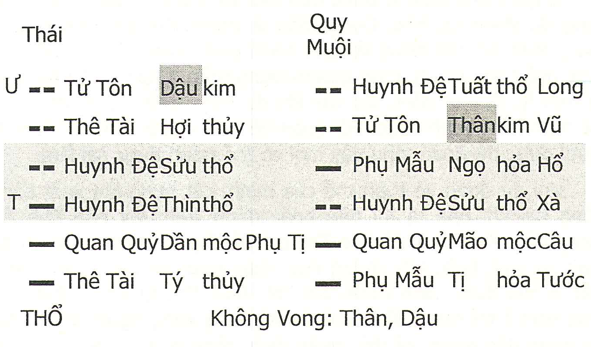

**Ví dụ 2:** Ngày Mậu Tý tháng Hợi, một cô gái đoán về bệnh của chó con, được quẻ Thủy Sơn Kiển biến Sơn Địa Bác.

| | Kiển | | Bác | |
| :---: | :--- | :---: | :--- | :--- |
| | - - Tử Tôn Tý thủy | | — Thê Tài Dần mộc | Tước |
| | — Phụ Mẫu Tuất thổ | | - - Tử Tôn Tý thủy | Long |
| T | - - Huynh Đệ Thân kim | | - - Phụ Mẫu Tuất thổ | Vũ |
| | — Huynh Đệ Thân kim | | - - Thê Tài Mão mộc | Hổ |
| | - - Quan Quỷ Ngọ hỏa | Tài Mão | - - Quan Quỷ Tị hỏa | Xà |
| Ứ | - - Phụ Mẫu Thìn thổ | | - - Phụ Mẫu Mùi thổ | Câu |

KIM &emsp;&emsp; Không Vong: Ngọ, Mùi

**Phán đoán:**

Tử Tôn có ý nghĩa động vật, lấy Tử Tôn làm Dụng thần.

Trong quẻ Tử Tôn thuộc thủy, Nguyệt kiến Hợi thủy, Nhật thần Tý thủy và Dụng thần có ngũ hành tương đồng là vượng tướng, trong quẻ tuy có Tuất thổ phát động khắc Dụng thần, nhưng có Thân kim phát động, giải trừ khắc của Tuất thổ, thành liên tục tương sinh, có bệnh cũng không sao.

Phụ Mẫu Tuất thổ lâm Thanh Long khắc Dụng thần Tử Tôn, Thanh Long chủ ẩm thực, chính là chó con đã ăn đồ không sạch sẽ mà bị bệnh.

Dụng thần lâm Chu Tước, Chu Tước chủ viêm, lại chủ ầm ĩ, chó con có chứng viêm, bởi vì bệnh mà kêu la liên tục.

Thủy Sơn Kiển là quẻ cung Đoài, Đoài là miệng, là ruột, chính là bệnh từ miệng mà vào, ăn uống đã dẫn tới viêm ruột.

**Kết quả:** Đến bệnh viện thú y khám bệnh, được chẩn đoán là viêm ruột, sau khi chút uống thuốc đã khỏi.

## I. DỤNG THẦN LƯỠNG HIỆN

Dụng thần lưỡng hiện là chỉ tình huống trong một quẻ xuất hiện hai lục thân được lấy làm Dụng thần. Như đoán về con cái, trong quẻ có hai hào Tử Tôn; đoán về cha mẹ, trong quẻ có hai hào Phụ Mẫu v.v. Trong quẻ gặp Dụng thần lưỡng hiện, thông

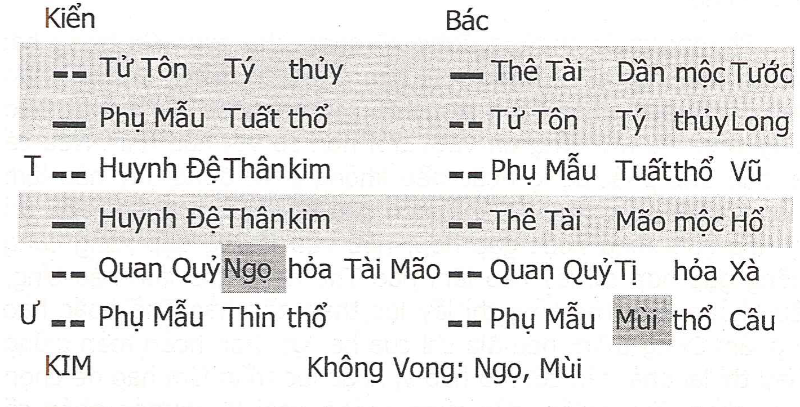 thường phải chọn một trong hai lục thân để làm điểm trung tâm của phán đoán, lục thân còn lại có thể không xem hoặc dùng để tham khảo.

Phương pháp thường được sử dụng như sau: Khi trong hai hào có một hào phát động (chỉ hào động có biến), lấy lục thân phát động; bởi vì hào động là mở đầu sự biến hóa của sự vật, hào động chứa đựng thông tin vượt trội hơn so với hào tĩnh. Nếu cả hai hào đều phát động hoặc đều không phát động, lấy hào lâm Tuần Không hoặc Nguyệt phá, nếu đều không lâm Không Phá thì lấy hào gặp xung hoặc gặp hợp; nếu vừa không gặp xung cũng không gặp hợp thì lấy hào lâm hào Thế hoặc hào lâm hào Ứng, nếu không lâm Thế Ứng thì lấy lục thân gần hào Thế hoặc hào Ứng làm Dụng thần; nếu địa chi của hai lục thân hoàn toàn giống nhau thì lại phải căn cứ vào hào vị hoặc lục thần lâm hào để chọn Dụng thần. Tuy nhiên, đây cũng không phải là phương pháp cố định, nếu trong quẻ Dụng thần một Không một Phá, hoặc một động một Không, cũng có thể kiêm đoán, hai hào đều có thể làm Dụng thần.

**Ví dụ 1:** Ngày Ất Mão tháng Tị, đoán về bệnh của vợ, được quẻ Trạch Thiên Quải biến Thủy Thiên Nhu.

| | Quải | Nhu | |
| :---: | :--- | :--- | :--- |
| | - - Huynh Đệ Mùi thổ | - - Thê Tài Tý thủy | Vũ |
| T | — Tử Tôn Dậu kim | — Huynh Đệ Tuất thổ | Hổ |
| | — Thê Tài Hợi thủy | - - Tử Tôn Thân kim | Xà |
| | — Huynh Đệ Thìn thổ | — Huynh Đệ Thìn thổ | Câu |
| Ư | — Quan Quỷ Dần mộc Phụ Tị | — Quan Quỷ Dần mộc | Tước |
| | — Thê Tài Tý thủy | — Thê Tài Tý thủy | Long |

THỔ &emsp;&emsp;&emsp;&emsp; Không Vong: Tý, Sửu

**Phán đoán:**

Đoán về bệnh của vợ thì lấy hào Thê Tài làm Dụng thần.

Trong quẻ hào Tài lưỡng hiện, một động một tĩnh, dường như phải lấy hào động Thê Tài Hợi thủy làm Dụng thần. Nhưng Hợi thủy Nguyệt phá, Tý thủy Tuần Không, nếu bỏ Tý thủy không

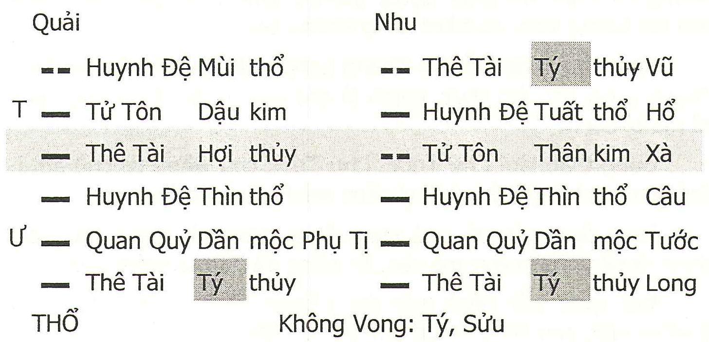 dùng, chỉ lấy hào động Hợi thủy làm Dụng, thì ngày Hợi hoặc ngày Dần vợ người này sẽ khỏi bệnh. Nhưng Tý thủy gặp Không, cũng phải tham khảo Tý thủy, do vậy đoán tháng Ngọ khỏi bệnh. Điều này là bởi vì Hợi thủy Nguyệt phá, sang tháng bất phá, Tý thủy Tuần Không, tháng Ngọ xung Tý thủy mà điền thực bất Không. Xem cả hai Thê Tài này do có liên quan đến phán đoán ứng kỳ.

**Ví dụ 2:** Từ tiên sinh ở một công ty trang trí đoán xem năm nào bị đứt ngón tay? Ngày Quý Tị tháng Thìn, được quẻ Khảm Vi Thủy biến Phong Thủy Hoán.

| | Khảm | Hoán | |
| :---: | :--- | :--- | :--- |
| T | - - Huynh Đệ Tý thủy | — Tử Tôn Mão mộc | Hổ |
| | — Quan Quỷ Tuất thổ | — Thê Tài Tị hỏa | Xà |
| | - - Phụ Mẫu Thân kim | - - Quan Quỷ Mùi thổ | Câu |
| Ư | - - Thê Tài Ngọ hỏa | - - Thê Tài Ngọ hỏa | Tước |
| | — Quan Quỷ Thìn thổ | — Quan Quỷ Thìn thổ | Long |
| | - - Tử Tôn Dần mộc | - - Tử Tôn Dần mộc | Vũ |

THỦY &emsp;&emsp;&emsp;&emsp; Không Vong: Ngọ, Mùi

**Phán đoán:**

Đoán về thương tai, lấy cái khắc hào Thế làm Dụng thần.

Trong quẻ Quan Quỷ Tuất thổ và Thìn thổ lưỡng hiện, lại đều là hào tĩnh, nhưng Tuất thổ bị Nguyệt kiến xung phá, do vậy lấy hào Tuất thổ Nguyệt phá làm Dụng. Năm Giáp Tuất (năm 1994) là năm Quan Quỷ Tuất thổ Thực Phá, nhất định ngón tay bị đứt ở năm Giáp Tuất.

**Kết quả:** Đúng như dự đoán.

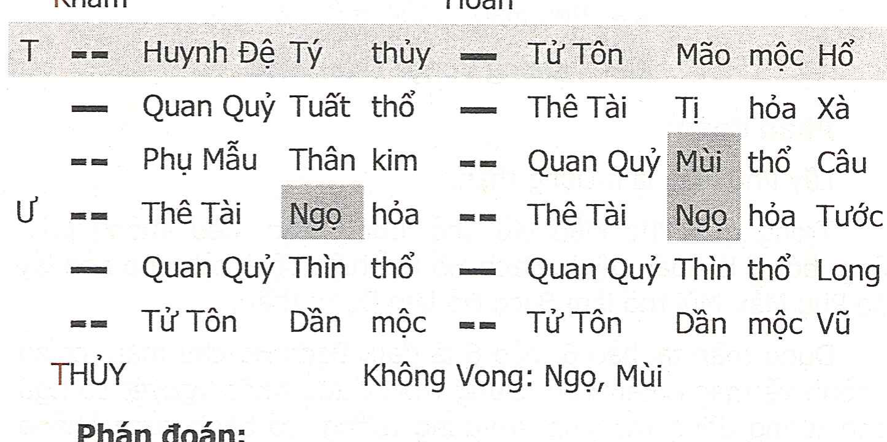

**Ví dụ 3:** Ngày Quý Mùi tháng Thìn, đoán về bệnh của cha, được quẻ Trạch Địa Tụy.

| | Tụy | | | |
| :---: | :---: | :--- | :--- | :--- |
| | - - | Phụ Mẫu | Mùi thổ | Hổ |
| Ư | — | Huynh Đệ | Dậu kim | Xà |
| | — | Tử Tôn | Hợi thủy | Câu |
| | - - | Thê Tài | Mão mộc | Tước |
| T | - - | Quan Quỷ | Tị hỏa | Long |
| | - - | Phụ Mẫu | Mùi thổ | Vũ |

KIM Không Vong: Thân, Dậu

**Phán đoán:**

Lấy Phụ Mẫu làm Dụng thần.

Trong quẻ Phụ Mẫu Mùi thổ lưỡng hiện, đều không phát động, bởi vì là đoán bệnh, Bạch Hổ thể hiện bệnh tật, cho nên lấy hào Phụ Mẫu Mùi thổ lâm Bạch Hổ làm Dụng thần.

Dụng thần tại hào 6, hào 6 là đầu, Bạch Hổ chủ máu, chính là bệnh về mạch máu đầu. Dụng thần được Nhật Nguyệt có ngũ hành tương đồng trợ giúp là vượng tướng, có bệnh cũng không sao.

**Kết quả:** Đúng là đổ bệnh bởi vì huyết khối não, trải qua điều trị đã bình an vô sự. Việc chọn Dụng thần ở quẻ này có chính xác hay không có liên quan đến phán đoán vị trí có bệnh.

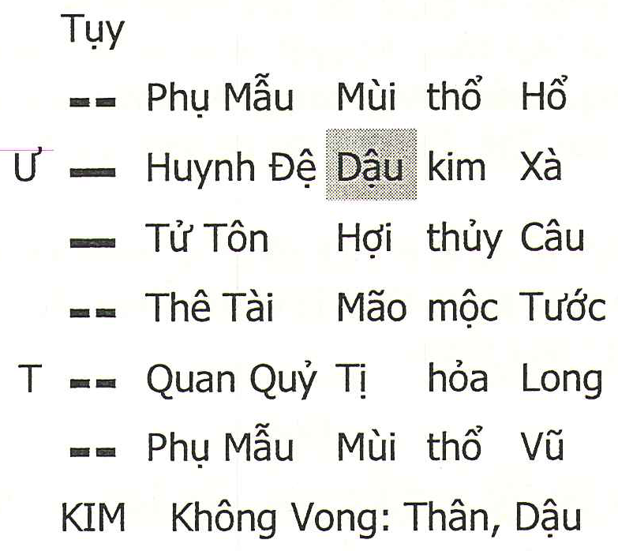

**Ví dụ 4:** Ngày Đinh Tị tháng Tuất, một cô gái đoán xem đơn vị công tác chia phòng thì mình có được nhận không? Được quẻ Hỏa Trạch Khuê biến Chấn Vi Lôi.

| Khuê | | | | Chấn | | |
| :---: | :---: | :--- | :---: | :---: | :--- | :--- |
| | — | Phụ Mẫu Tị hỏa | | - - | Huynh Đệ Tuất thổ | Long |
| | - - | Huynh Đệ Mùi thổ | Tài Tý | - - | Tử Tôn Thân kim | Vũ |
| T | — | Tử Tôn Dậu kim | | — | Phụ Mẫu Ngọ hỏa | Hổ |
| | - - | Huynh Đệ Sửu thổ | | - - | Huynh Đệ Thìn thổ | Xà |
| | — | Quan Quỷ Mão mộc | | - - | Quan Quỷ Dần mộc | Câu |
| Ư | — | Phụ Mẫu Tị hỏa | | — | Thê Tài Tý thủy | Tước |

THỔ Không Vong: Tý, Sửu

**Phán đoán:**

Trong quẻ Phụ Mẫu Tị hỏa lưỡng hiện, lấy hào Phụ Mẫu Tị hỏa phát động làm Dụng thần.

Dụng thần lâm Nhật kiến và Thanh Long, Nhật chủ thời gian ngắn, Thanh Long chủ mới, là nhà mới xây. Dụng thần khắc Thế, nhà và mình không có duyên phận. Hào 2 là hào vị trạch (xem phần sau để biết chi tiết về cách dùng hào vị), Quan Quỷ là Nguyên thần sinh Dụng thần, lâm Câu Trần, Câu Trần chủ nơi làm việc, có thể suy rộng ra là uỷ ban chia phòng của đơn vị, động mà hóa thoái (xem phần sau để biết chi tiết về Thoái thần), không sinh Dụng thần, ủy ban chia phòng của đơn vị sẽ không cấp nhà cho cô ấy.

**Kết quả:** Không được.

## II. PHI THẦN VÀ PHỤC THẦN

Sau khi sắp xếp ra quái tượng, đôi khi trong quẻ không có lục thân cần lấy làm Dụng thần, hiện tượng này trong dự đoán lục hào được gọi là Dụng thần không hiện. Dụng thần không hiện thì phải tìm phục tàng, bởi vì bản cung (tức là quẻ đầu tiên của mỗi cung) đều có đầy đủ lục thân, mọi quẻ trong cung đó đều từ bản cung phát triển ra, vì vậy không có Dụng thần thì có thể tìm đến bản cung. Như vậy, Dụng thần tìm được gọi là Phục thần hoặc

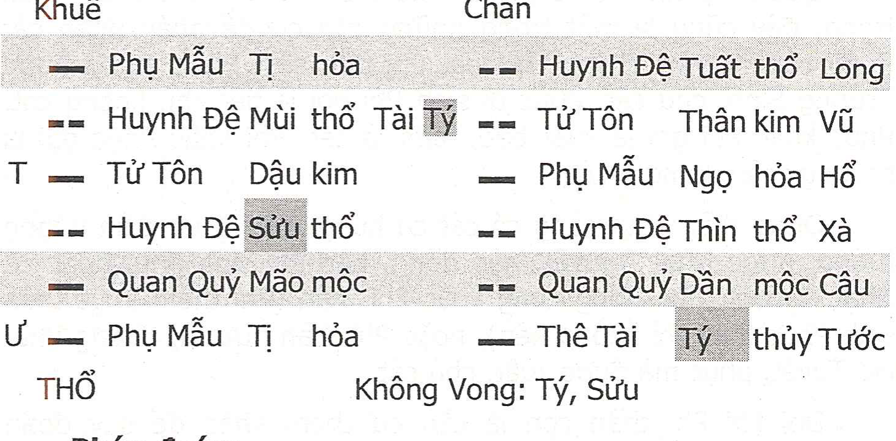 hào Phục, Dụng thần ở bản cung tại hào nào thì Dụng thần phục tại hào đó, viết Phục thần bên cạnh hào tương ứng trước quẻ chính, hào đó trong quẻ chính gọi là Phi thần hoặc hào Phi.

Quan hệ sinh khắc giữa Phục thần và Phi thần rất quan trọng, đây cũng là một trong những căn cứ để phán đoán cát hung của sự vật. Thông thường, Phi đến sinh Phục gọi là được Trường Sinh, chủ cát. Phục đi sinh Phi gọi là tiết khí, không cát. Phục khắc Phi gọi là xuất bạo, luận là cát. Phi khắc Phục gọi là thương thân, hung nhất.

Dụng thần phục tàng có cát có hung, nếu Phục thần vượng tướng, được Nhật Nguyệt, hào động, hào Phi sinh phù, hoặc có Nhật Nguyệt, hào động xung khắc Phi thần (Phi thần là lục thân sinh Phục thần thì không nên), hoặc Phi thần hưu tù, Không Phá, Mộ Tuyệt, phục mà được xuất, chủ cát.

Đôi khi Phi thần còn là căn cứ tham khảo để suy đoán nguyên nhân sự việc. Nếu như Phục thần hưu tù vô khí, bị Nhật Nguyệt hào động Phi thần xung khắc, gặp Nguyệt phá Tuần Không, không có Nguyên thần (lục thân sinh Dụng thần) cứu trợ thì hung. Cầu tài, tài không được; cầu quan, quan không thành; cầu bệnh, bệnh khó khỏi.

**Ví dụ 1:** Ngày Ất Hợi tháng Mùi, một người đàn ông khi đi taxi đã để quên bức tranh chữ trên xe, ngay cả hiệu xe cũng không nhớ, hỏi có tìm lại được bức tranh đó không? Được quẻ Lôi Địa Dự biến Hỏa Địa Tấn.

| Dự | | Tấn | |
| :--- | :--- | :--- | :--- |
| - - Thê Tài Tuất thổ | | — Tử Tôn Tị hỏa | Vũ |
| - - Quan Quỷ Thân kim | | - - Thê Tài Mùi thổ | Hổ |
| Ứ — Tử Tôn Ngọ hỏa | | — Quan Quỷ Dậu kim | Xà |
| - - Huynh Đệ Mão mộc | | - - Huynh Đệ Mão mộc | Câu |
| - - Tử Tôn Tị hỏa | | - - Tử Tôn Tị hỏa | Tước |
| T - - Thê Tài Mùi thổ | Phụ Tý | - - Thê Tài Mùi thổ | Long |

MỘC

Không Vong: Thân, Dậu

**Phán đoán:**

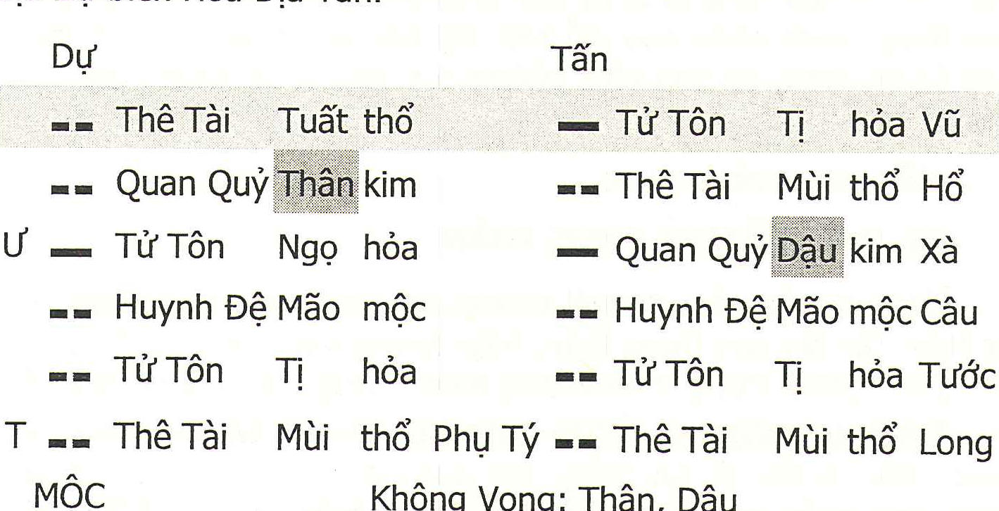

Phụ Mẫu có ý nghĩa văn thư, tranh chữ, lấy Phụ Mẫu làm Dụng thần.

Trong quẻ không có hào Phụ Mẫu thì cần phải tìm Phục thần. Quẻ Lôi Địa Dự là quẻ cung Chấn, hào sơ của quẻ Chấn Vi Lôi là Phụ Mẫu Tý thủy, vì vậy Phục thần của quẻ này cũng là Phụ Mẫu Tý thủy, lại phục tại hào sơ, Thê Tài Mùi thổ cùng hào với nó là Phi thần. Dụng thần phục tàng, đây là thông tin mất tranh chữ.

Dụng thần Phụ Mẫu Tý thủy bị Nguyệt kiến khắc, Nhật thần tỉ phù, suy vượng tương đương. Nhưng không nên trong quẻ Thê Tài Tuất thổ phát động lại khắc Dụng thần, đồng thời lại là Phi đến khắc Phục, Phục thần khó xuất, khắc nhiều sinh ít, khó mà tìm được bức tranh đã bị mất.

**Kết quả:** Sau này quả nhiên không tìm lại được.

**Ví dụ 2:** Ngày Tân Dậu tháng Hợi, một phụ nữ đoán về kinh doanh cửa hàng, được quẻ Thủy Lôi Truân.

| Truân | | |
| :--- | :--- | :--- |
| - - Huynh Đệ Tý thủy | | Xà |
| Ứ — Quan Quỷ Tuất thổ | | Câu |
| - - Phụ Mẫu Thân kim | | Tước |
| - - Quan Quỷ Thìn thổ | Tài Ngọ | Long |
| T - - Tử Tôn Dần mộc | | Vũ |
| — Huynh Đệ Tý thủy | | Hổ |

THỦY

Không Vong: Tý, Sửu

**Phán đoán:**

Kinh doanh là cầu tài, vì vậy lấy Thê Tài làm Dụng thần.

Trong quẻ này không có Thê Tài thì cần tìm Phục thần, từ trong bản cung Khảm Vi Thủy tìm được Thê Tài Ngọ hỏa tại hào 3, cho nên Dụng thần quẻ này phục tại hào 3, Thê Tài Ngọ hỏa là Phục thần, Quan Quỷ Thìn thổ cùng hào với nó là Phi thần.

Phục thần Thê Tài Ngọ hỏa, bị Nguyệt kiến Hợi thủy khắc, lại không được Nhật thần sinh phù, là hưu tù. Phục thần sinh Phi thần, cửa hàng này kinh doanh nhất định hao phí rất nhiều tiền

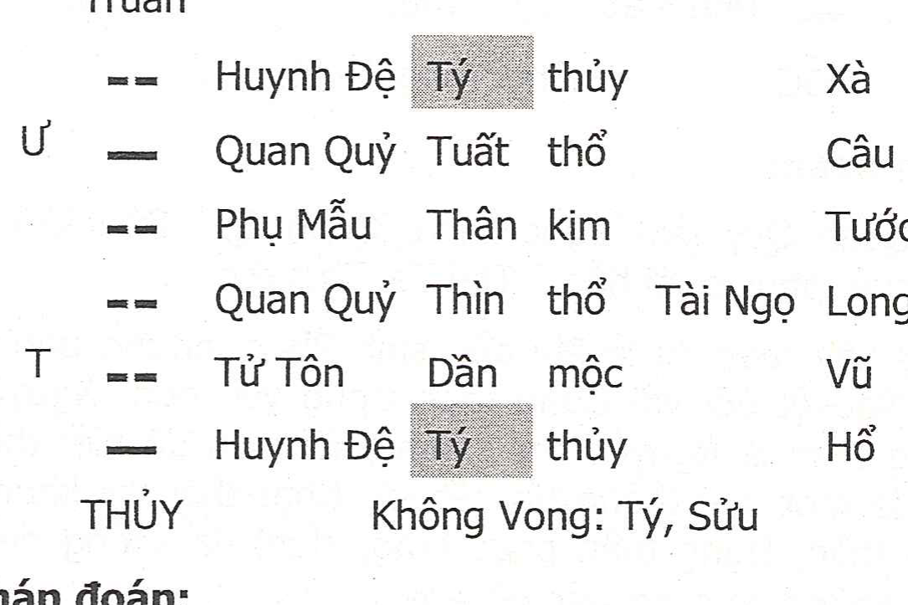 bạc. Dụng thần không hiện trên quẻ, đây là thông tin không thấy được lợi nhuận, không có lợi nhuận để có thể mưu cầu.

**Kết quả:** Quả nhiên kinh doanh không phát đạt, trừ tiền thuế và tiền thuê nhà thì gần như không còn lợi nhuận, sau này đành phải đóng cửa ngừng kinh doanh.

**Ví dụ 3:** Ngày Giáp Tý tháng Mão, một người nữ đoán về công việc, được quẻ Phong Lôi Ích.

### Ích

| Thế/Ứng | Hào tượng | Lục thân | Can chi | Phục thần | Lục thú |
| :---: | :---: | :--- | :--- | :--- | :--- |
| Ứ | — | Huynh Đệ | Mão mộc | | Vũ |
| | — | Tử Tôn | Tị hỏa | | Hổ |
| | - - | Thê Tài | Mùi thổ | | Xà |
| T | - - | Thê Tài | Thìn thổ | Quan Dậu | Câu |
| | - - | Huynh Đệ | Dần mộc | | Tước |
| | — | Phụ Mẫu | Tý thủy | | Long |

**MỘC**    **Không Vong: Tuất, Hợi**

**Phán đoán:**

Lấy Quan Quỷ làm Dụng thần, Quan Quỷ Dậu kim không hiện trên quẻ, phục dưới hào 3 Thê Tài Thìn thổ.

Ví dụ này mặc dù là Phi đến sinh Phục, nhưng ảnh hưởng của Nhật Nguyệt đối với Dụng thần trọng yếu hơn. Nguyệt kiến xung Dụng thần là Nguyệt phá (xem phần sau để biết thêm chi tiết), đây là một loại thông tin bất lợi, Nhật thần lại không sinh phù Dụng thần, Dụng thần phục tàng, chính là không tìm được công việc, không có công việc để làm.

**Kết quả:** Quả nhiên người này mất việc, thất nghiệp ở nhà.

### III. TIẾN THẦN VÀ THOÁI THẦN

Khi hào động trong quẻ hóa ra hào có ngũ hành tương đồng, tức là hào động và hào biến có ngũ hành giống nhau, cần phân biệt tiến thoái của khí ngũ hành. Tiến thoái có hỷ có kỵ, xem kỹ tình huống mà xác định. Dựa vào thứ tự sắp xếp của 12 địa chi, hướng thuận chiều kim đồng hồ là Tiến thần, hướng ngược chiều

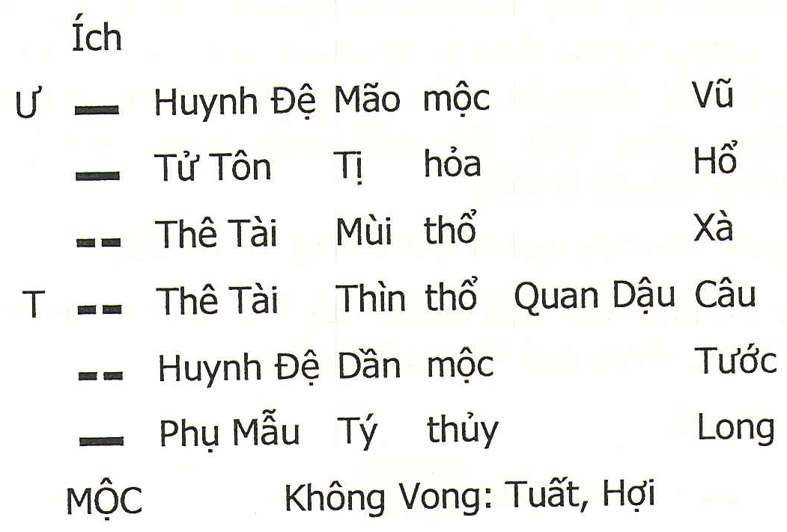 kim đồng hồ là Thoái thần. Giải thích cụ thể Tiến thần và Thoái thần như sau:

**Hóa Tiến thần:** Hợi hóa Tý, Dần hóa Mão, Tị hóa Ngọ, Thân hóa Dậu, Sửu hóa Thìn, Thìn hóa Mùi, Mùi hóa Tuất, Tuất hóa Sửu.

**Hóa Thoái thần:** Tý hóa Hợi, Mão hóa Dần, Ngọ hóa Tị, Dậu hóa Thân, Thìn hóa Sửu, Sửu hóa Tuất, Tuất hóa Mùi, Mùi hóa Thìn.

Tiến thần biểu thị sự vật phát triển đi lên, giống như cây cối mùa xuân phát triển mạnh mẽ, như nước có nguồn, dòng chảy dài. Trái với Tiến thần, Thoái thần biểu thị sự vật tiêu thoái, giảm nhược, như hoa cỏ cây cối mùa thu dần dần tàn lụi.

Nói chung, Dụng thần và Nguyên thần nên hóa Tiến thần, Kỵ thần và Cừu thần nên hóa Thoái thần. Dụng thần tuy nhược, nếu hóa tiến, như cây non mùa xuân, sẽ dần dần trở nên chắc khỏe, sự việc dần dần chuyển cát. Kỵ thần tuy vượng, nếu hóa thoái, chỉ cần Dụng thần có sức sống, chứng tỏ cục diện nguy cơ và bất lợi chỉ là tạm thời, sau khi vượt qua nguy cơ thì vẫn sẽ yên ổn.

Song đây cũng không phải là phương pháp cố định, nếu là đoán về mất đồ vật, người trong nhà bỏ đi, xảy ra mâu thuẫn với bạn bè mà chia tay, khi xuất hiện Dụng hóa thoái chính là tượng đi mà lại trở về, phải luận là cát; hóa Tiến thần, trái lại là tượng vật và người rời xa mình, không luận là cát. Nếu như Dụng thần đã hưu tù, Kỵ thần cho dù hóa thoái cũng là không cát. Đây là thuyết nếu được Nhật Nguyệt sinh tỉ, đương lệnh không thoái. Suy diễn quái tượng, đều ở sự biến thông của người, không nên rập khuôn một cách máy móc.

**Ví dụ:** Ngày Nhâm Dần tháng Thân, nữ đoán về kinh doanh quán rượu, được quẻ Đoài Vi Trạch biến Càn Vi Thiên.

| | Đoài | | | Càn | | |
| :--- | :---: | :--- | :--- | :---: | :--- | :--- | :--- |
| T | ╍╍ | Phụ Mẫu | Mùi thổ | ━━━ | Phụ Mẫu | Tuất thổ | Hổ |
| | ━━━ | Huynh Đệ | Dậu kim | ━━━ | Huynh Đệ | Thân kim | Xà |
| | ━━━ | Tử Tôn | Hợi thủy | ━━━ | Quan Quỷ | Ngọ hỏa | Câu |
| Ư | ╍╍ | Phụ Mẫu | Sửu thổ | ━━━ | Phụ Mẫu | Thìn thổ | Tước |
| | ━━━ | Thê Tài | Mão mộc | ━━━ | Thê Tài | Dần mộc | Long |
| | ━━━ | Quan Quỷ | Tị hỏa | ━━━ | Tử Tôn | Tý thủy | Vũ |

KIM Không Vong: Thìn, Tị

**Phán đoán:**

Kinh doanh quán rượu là thu lợi, lấy Thê Tài làm Dụng thần.

Dụng thần tuy được Nhật thần tỉ phù, nhưng đồng thời cũng bị Nguyệt kiến khắc. Xem ảnh hưởng của Nhật Nguyệt, suy vượng tương đương. Lúc này cần phải xem hào sinh Dụng thần và hào khắc Dụng thần trong quẻ, tức là sức mạnh của Nguyên thần và Kỵ thần. Hào khắc Dụng thần là Huynh Đệ Dậu kim được Nguyệt kiến tỉ phù, trong quẻ lại có hai tầng Phụ Mẫu phát động sinh Dậu kim, là vượng tướng. Mà Tử Tôn Hợi thủy sinh Thê Tài mặc dù cũng được Nguyệt sinh, nhưng hai hào động trong quẻ lại là hào khắc hào Tử Tôn, hiển nhiên Tử Tôn Hợi thủy yếu hơn nhiều so với Huynh Đệ Dậu kim, Tử Tôn Hợi thủy bị khắc không thể sinh Dụng thần, quán rượu này nhất định kinh doanh không tốt.

Phụ Mẫu Mùi thổ và Phụ Mẫu Sửu thổ song song phát động hóa Tiến thần, nhưng Tiến thần của Sửu thổ là Thìn thổ hóa Không Vong, tháng Thìn xuất Không, nhất định bất lợi.

Nói chung, trong quẻ gặp hào vượng tướng động mà hóa tiến, Tiến thần thừa thế mà tiến; hào động hưu tù mà hóa tiến, thì đợi thời mà tiến; nếu trong hào động hoặc hào biến có một hào trị Tuần Không Nguyệt phá, đợi lúc điền thực mà tiến.

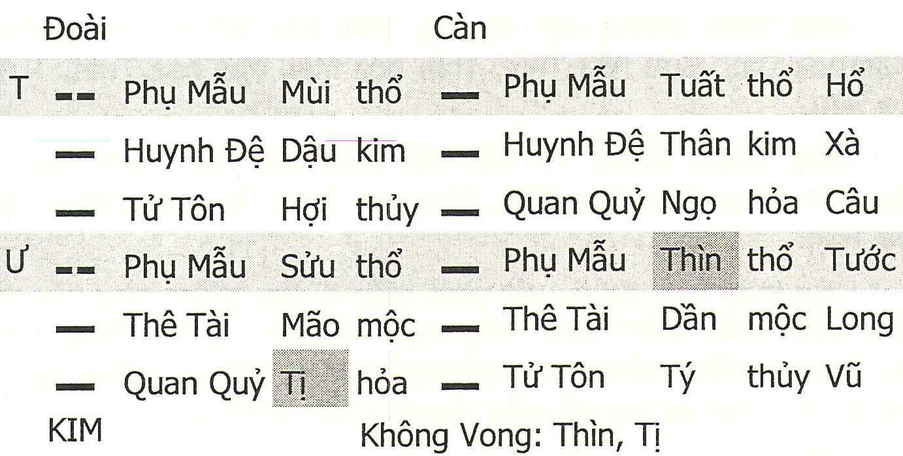

Nếu hào động hóa thoái, hào động và hào biến đều vượng, xem chuyện gần thì vượng mà không thoái, xem chuyện xa thì sau này tất thoái.

Nếu hào động hưu tù, thì đến thời mà thoái; nếu trong hào động và hào biến có một hào vượng, đợi lúc hưu tù mà thoái; nếu trong hào động và hào biến có một hào Không Phá, đợi lúc điền thực mà thoái.

**Kết quả:** Đến tháng Thìn, bởi vì quán rượu lỗ vốn nên không thể duy trì hoạt động, đành phải đóng cửa.

# CHƯƠNG 8

## NGUYÊN THẦN, KỴ THẦN, CỪU THẦN

Dụng thần là yếu tố quan trọng nhất trong một quẻ, cát hung của Dụng thần chính là cát hung của đối tượng được dự đoán. Cát hung của Dụng thần được quyết định bởi ảnh hưởng của Nhật Nguyệt và sinh khắc của các hào khác đối với Dụng thần.

### I. NGUYÊN THẦN

Hào sinh Dụng thần được gọi là Nguyên thần, Nguyên thần nên vượng tướng và được Nhật Nguyệt hào động sinh phù hoặc lâm Nhật Nguyệt, nên động hóa hồi đầu sinh, hóa Tiến thần, không nên hưu tù Không Phá, động hóa Không Tuyệt (thủ pháp về Tuyệt trình bày sau), hóa thoái. Đồng thời lại cần phải Dụng thần có căn (gốc rễ), nếu Dụng thần hưu tù Không Phá, Nguyên thần có vượng cũng khó mà sinh phù Dụng thần, giống như cây khô không có gốc rễ, sinh phù bất khởi.

**Trong 6 tình huống dưới đây, Nguyên thần có thể sinh Dụng thần:**

- Khi Nguyên thần được ngũ hành của Nhật hoặc Nguyệt tỉ phù, là có lực, vượng tướng, có thể sinh Dụng thần.
- Nguyên thần phát động, được hào biến sinh, tức là động hóa hồi đầu sinh, hoặc khi động hóa Tiến thần, có thể sinh Dụng thần.
- Nguyên thần được Nhật hoặc Nguyệt sinh phù, là vượng tướng, hoặc được Nhật Nguyệt Trường Sinh (trình bày sau), là có khí, có thể sinh Dụng thần.
- Nguyên thần và Kỵ thần đồng thời phát động, là liên tục tương sinh, có thể sinh Dụng thần.
- Nguyên thần được Nguyệt kiến hợp, là hợp vượng, có thể sinh Dụng thần.
- Khi Nguyên thần mặc dù Không Vong, hoặc động mà hóa Không, nhưng Nguyên thần vượng thì có thể sinh Dụng thần.

**Trong 7 tình huống dưới đây, Nguyên thần không có lực sinh Dụng thần:**

- Khi Nguyên thần hưu tù, lại không phát động, là an tĩnh, không thể sinh Dụng thần.
- Khi Nguyên thần mặc dù phát động, nhưng hưu tù vô lực, bị hào khác khắc chế, không thể sinh Dụng thần.
- Khi Nguyên thần hưu tù, động mà hóa thoái, không thể sinh Dụng thần.
- Khi Nguyên thần hưu tù, động mà hóa Tuyệt, hoặc gặp Tuyệt, không thể sinh Dụng thần.
- Khi Nguyên thần hưu tù, nhập Mộ, không thể sinh Dụng thần.
- Khi Nguyên thần Nguyệt phá, Nhật phá, là hào tĩnh, không thể sinh Dụng thần.
- Khi Nguyên thần hưu tù, động mà hóa hợp, hoặc bị Nhật thần và hào động khác hợp trú, không thể sinh Dụng thần.

**Ví dụ 1:** Ngày Mậu Dần tháng Mùi, một người phụ nữ khi ăn thịt dê xiên ở lễ đường thì xảy ra xung đột với người ta, trong lúc đánh nhau đã làm mất ví tiền, hỏi có thể tìm lại được không? Được quẻ Địa Thiên Thái biến Sơn Thiên Đại Súc.

| | Thái | Đại Súc | |
| :---: | :--- | :--- | :---: |
| Ứ | ╍╍ Tử Tôn Dậu kim | — Quan Quỷ Dần mộc | Tước |
| | ╍╍ Thê Tài Hợi thủy | ╍╍ Thê Tài Tý thủy | Long |
| | ╍╍ Huynh Đệ Sửu thổ | ╍╍ Huynh Đệ Tuất thổ | Vũ |
| T | — Huynh Đệ Thìn thổ | — Huynh Đệ Thìn thổ | Hổ |
| | — Quan Quỷ Dần mộc Phụ Tị | — Quan Quỷ Dần mộc | Xà |
| | — Thê Tài Tý thủy | — Thê Tài Tý thủy | Câu |

**THỔ** &emsp;&emsp;&emsp;&emsp;&emsp;&emsp;&emsp;&emsp; **Không Vong: Thân, Dậu**

**Phán đoán:**

Bởi vì là đoán về tiền, lấy Thê Tài làm Dụng thần. Trong quẻ Thê Tài lưỡng hiện, đều không phát động, lại không có Không Phá, lấy Thê Tài Hợi thủy hợp Nhật làm Dụng thần.

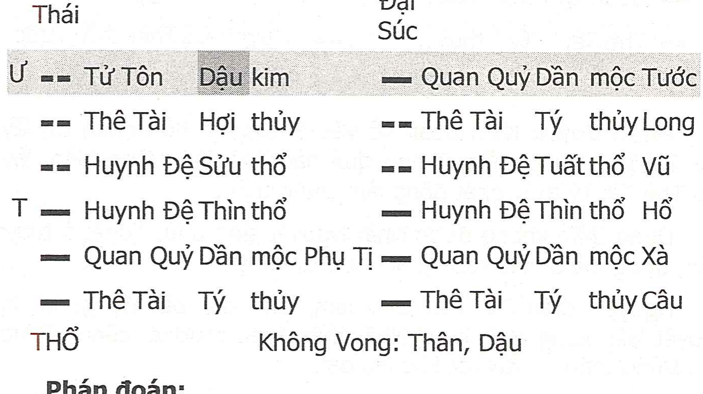

Trước tiên xem suy vượng của Dụng thần. Nguyệt kiến Mùi thổ khắc Dụng thần, Nhật thần Dần mộc không sinh tỉ Dụng thần, Dụng thần rất hưu tù. Hào 6 Tử Tôn Dậu kim là Nguyên thần được Nguyệt kiến sinh, động mà đi sinh Dụng thần, nhưng Dậu kim Không Vong, lại động mà hóa Tuyệt, vô lực sinh Dụng thần, mà Dụng thần vốn là như cây không gốc rễ, gặp sinh không khởi.

Đồng thời Kỵ thần Huynh Đệ trì Thế, cũng bất lợi cho tìm vật bị mất, rất khó tìm được ví tiền bị mất.

**Kết quả:** Không tìm được.

**Ví dụ 2:** Ngày Đinh Tị tháng Mão, nam đoán xem có thể chung sống lâu dài với bạn gái hay không? Được quẻ Địa Thiên Thái biến Địa Sơn Khiêm.

| | Thái | | | Khiêm | Lục thú |
| :---: | :---: | :--- | :---: | :--- | :---: |
| Ư | - - | Tử Tôn Dậu kim | - - | Tử Tôn Dậu kim | Long |
| | - - | Thê Tài Hợi thủy | - - | Thê Tài Hợi thủy | Vũ |
| | - - | Huynh Đệ Sửu thổ | - - | Huynh Đệ Sửu thổ | Hổ |
| T | — | Huynh Đệ Thìn thổ | — | Tử Tôn Thân kim | Xà |
| | — | Quan Quỷ Dần mộc Phụ Tị | - - | Phụ Mẫu Ngọ hỏa | Câu |
| | — | Thê Tài Tý thủy | - - | Huynh Đệ Thìn thổ | Tước |

ThỔ &emsp;&emsp;&emsp;&emsp;&emsp;&emsp;&emsp;&emsp; Không Vong: Tý, Sửu

**Phán đoán:** Nam đoán về yêu đương và hôn nhân thì lấy Thê Tài làm Dụng thần. Trong quẻ hào Thê Tài lưỡng hiện, lấy hào Thê Tài Tý thủy phát động làm Dụng thần.

Dụng thần không được Nhật Nguyệt sinh phù, Tuyệt ở Nhật thần, động mà bị hào biến khắc, hưu tù vô lực.

Nguyên thần Tử Tôn Dậu kim, tĩnh mà bất động, lại bị Nguyệt kiến xung phá, lại bị Nhật thần khắc thương, cũng vô lực sinh Dụng thần, vì vậy rất khó lâu dài.

**Kết quả:** Sau này gặp tháng Ngọ, Dụng thần gặp xung, Kỵ thần được sinh mà chia tay.

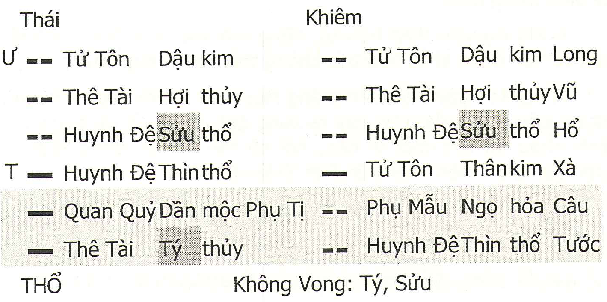

## II. KỴ THẦN

Tất cả các hào trong quẻ khắc Dụng thần là Kỵ thần. Kỵ thần là nhân tố bất lợi cho Dụng thần. Do vậy, Kỵ thần nên hưu tù Không Phá, động mà hóa Không, hóa Phá, hóa Tuyệt, hóa thoái. Nếu Kỵ thần vượng tướng, được Nhật, Nguyệt, hào động sinh phù, lại phát động ở trong quẻ, thì là đại hung, nếu trong quẻ có Nguyên thần đồng thời phát động, hung tượng có thể được giải trừ. Tuy nhiên suy vượng của tự thân Dụng thần là điều kiện đầu tiên, nếu Dụng thần căn bản hưu tù đến cực điểm thì Nguyên thần có phát động cũng không hữu dụng.

**Trong 6 tình huống dưới đây, Kỵ thần có thể khắc Dụng thần:**

- Khi Kỵ thần được Nhật Nguyệt sinh phù, có thể khắc Dụng thần.
- Khi Kỵ thần được ngũ hành của Nhật hoặc Nguyệt tỉ phù, có thể khắc Dụng thần.
- Kỵ thần động mà hóa Tiến thần, có thể khắc Dụng thần.
- Khi Kỵ thần động mà được hào biến sinh, có thể khắc Dụng thần.
- Khi Kỵ thần và Cừu thần cùng động, có thể khắc Dụng thần.
- Khi Nhật hoặc Nguyệt là đất Trường Sinh của Kỵ thần, có thể khắc Dụng thần.

**Trong 7 tình huống dưới đây, Kỵ thần không thể khắc Dụng thần:**

- Khi Kỵ thần hưu tù, là hào tĩnh, không thể khắc Dụng thần.
- Khi Kỵ thần đồng thời bị Nhật Nguyệt khắc chế, không thể khắc Dụng thần.
- Khi Kỵ thần hưu tù, Nguyệt phá, Không Vong, không thể khắc Dụng thần.
- Khi Kỵ thần hưu tù, động mà hóa thoái, không thể khắc Dụng thần.

- Khi Kỵ thần hưu tù, gặp Tuyệt địa hoặc động mà hóa Tuyệt, không thể khắc Dụng thần.
- Khi Kỵ thần hưu tù, nhập Mộ, không thể khắc Dụng thần.
- Khi Kỵ thần và Nguyên thần đồng thời phát động, không thể khắc Dụng thần.

**Ví dụ 1:** Ngày Quý Tị tháng Mão, một người đoán về buôn bán, được quẻ Hỏa Thủy Vị Tế biến Hỏa Thiên Đại Hữu.

| Thế/Ứng | Vị Tế | Phục thần | Biến | Đại Hữu | Lục thú |
| :---: | :--- | :---: | :---: | :--- | :---: |
| Ứ | — Huynh Đệ Tị hỏa | | — | Huynh Đệ Tị hỏa | Hổ |
| | - - Tử Tôn Mùi thổ | | - - | Tử Tôn Mùi thổ | Xà |
| | — Thê Tài Dậu kim | | — | Thê Tài Dậu kim | Câu |
| T | - - Huynh Đệ Ngọ hỏa | Quan Hợi | — | Tử Tôn Thìn thổ | Tước |
| | — Tử Tôn Thìn thổ | | — | Phụ Mẫu Dần mộc | Long |
| | - - Phụ Mẫu Dần mộc | | — | Quan Quỷ Tý thủy | Vũ |

HỎA &nbsp;&nbsp;&nbsp;&nbsp;&nbsp;&nbsp;&nbsp;&nbsp; Không Vong: Ngọ, Mùi

**Phán đoán:**

Lấy Thê Tài làm Dụng thần.

Thê Tài Dậu kim không được Nhật Nguyệt sinh phù, bị Nguyệt xung, Nhật khắc, là Nguyệt phá, hưu tù, mà Kỵ thần Ngọ hỏa trì Thế phát động, được Nhật Nguyệt và hào động sinh phù, sức mạnh rất lớn, buôn bán chắc chắn không thành.

**Kết quả:** Hao tổn phá tài.

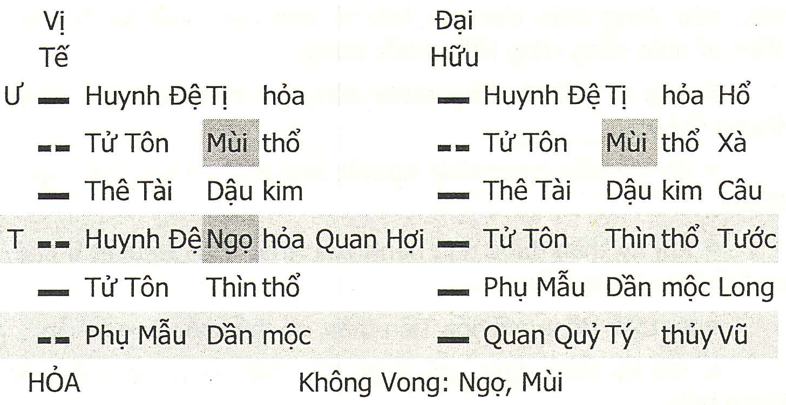

**Ví dụ 2:** Ngày Giáp Dần tháng Ngọ, nam viết thư tình cho một cô gái, hỏi đối phương có phản hồi không? Được quẻ Phong Hỏa Gia Nhân biến Phong Thiên Tiểu Súc.

| Thế/Ứng | Gia Nhân | Biến | Tiểu Súc | Lục thú |
| :---: | :--- | :---: | :--- | :---: |
| | — Huynh Đệ Mão mộc | — | Huynh Đệ Mão mộc | Vũ |
| Ứ | — Tử Tôn Tị hỏa | — | Tử Tôn Tị hỏa | Hổ |
| | - - Thê Tài Mùi thổ | - - | Thê Tài Mùi thổ | Xà |
| | — Phụ Mẫu Hợi thủy | — | Thê Tài Thìn thổ | Câu |
| T | - - Thê Tài Sửu thổ | — | Huynh Đệ Dần mộc | Tước |
| | — Huynh Đệ Mão mộc | — | Phụ Mẫu Tý thủy | Long |

MỘC &nbsp;&nbsp;&nbsp;&nbsp;&nbsp;&nbsp;&nbsp;&nbsp; Không Vong: Tý, Sửu

**Phán đoán:**

Đoán về thư tín, lấy hào Phụ Mẫu làm Dụng thần.

Phụ Mẫu Hợi thủy không được Nhật Nguyệt sinh tỉ, là hưu tù, càng không nên bị Kỵ thần trì Thế phát động khắc, Kỵ thần động mà bị hào biến khắc, nhưng Kỵ thần được Nguyệt kiến sinh, hoàn toàn có lực khắc Dụng thần, vì vậy đối phương sẽ không hồi âm.

**Kết quả:** Quả nhiên không nhận được hồi âm của đối phương.

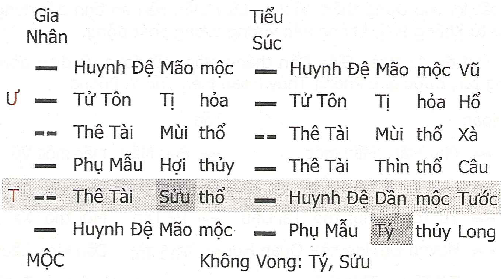

## III. CỬU THẦN

Hào trong quẻ sinh Kỵ thần, khắc Nguyên thần gọi là Cừu thần. Giống như Kỵ thần, Cừu thần cũng là một trong những nhân tố bất lợi cho Dụng thần. Vì vậy, Cừu thần nên an tĩnh bất động, hưu tù Không Phá, không nên vượng tướng phát động.

**Ví dụ 1:** Ngày Giáp Dần tháng Mão, nữ đoán về điều động công tác, được quẻ Phong Thủy Hoán biến Tốn Vi Phong.

| | Hoán | | | Tốn | | |
| :---: | :---: | :--- | :---: | :---: | :--- | :---: |
| | ━ | Phụ Mẫu Mão mộc | | ━ | Phụ Mẫu Mão mộc | Vũ |
| T | ━ | Huynh Đệ Tị hỏa | | ━ | Huynh Đệ Tị hỏa | Hổ |
| | ⚋ | Tử Tôn Mùi thổ | Tài Dậu | ⚋ | Tử Tôn Mùi thổ | Xà |
| | ⚋ | Huynh Đệ Ngọ hỏa | Quan Hợi | ━ | Thê Tài Dậu kim | Câu |
| Ứ | ━ | Tử Tôn Thìn thổ | | ━ | Quan Quỷ Hợi thủy | Tước |
| | ⚋ | Phụ Mẫu Dần mộc | | ⚋ | Tử Tôn Sửu thổ | Long |

HỎA &emsp;&emsp;&emsp;&emsp; Không Vong: Tý, Sửu

**Phán đoán:**

Đoán về công tác thì lấy Quan Quỷ làm Dụng thần.

Quan Quỷ Hợi thủy không hiện trên quẻ, phục dưới hào 3 Huynh Đệ Ngọ hỏa, tuy là Phục đến khắc Phi, nhưng Phục thần không được Nhật Nguyệt sinh phù, là hưu tù.

Lại xem Nguyên thần, Nguyên thần cũng không hiện trên quẻ, phục dưới hào 4 Tử Tôn Mùi thổ, Nguyệt xung Nhật Tuyệt, cũng là Nguyệt phá hưu tù. Hơn nữa, Cừu thần Ngọ hỏa trong quẻ phát động, khắc chế Nguyên thần, công tác không thể biến động.

**Kết quả:** Sau chín năm gặp lại, công tác vẫn chưa biến động, vẫn làm ở công ty cũ.

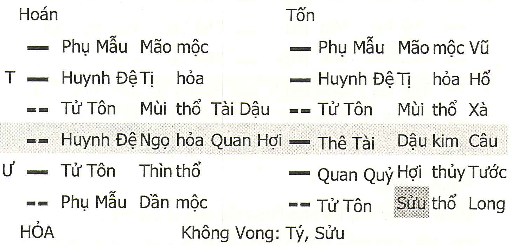

**Ví dụ 2:** Ngày Kỷ Tị tháng Dậu, một người đàn ông khi tắm ở phòng tắm hơi thì bị mất điện thoại di động, hỏi có tìm lại được không? Được quẻ Sơn Trạch Tổn biến Địa Thủy Sư.

| | Tổn | | | Sư | | |
| :---: | :---: | :--- | :---: | :---: | :--- | :---: |
| Ứ | ━ | Quan Quỷ Dần mộc | | ⚋ | Tử Tôn Dậu kim | Câu |
| | ⚋ | Thê Tài Tý thủy | | ⚋ | Thê Tài Hợi thủy | Tước |
| | ⚋ | Huynh Đệ Tuất thổ | | ⚋ | Huynh Đệ Sửu thổ | Long |
| T | ⚋ | Huynh Đệ Sửu thổ | Tử Thân | ⚋ | Phụ Mẫu Ngọ hỏa | Vũ |
| | ━ | Quan Quỷ Mão mộc | | ━ | Huynh Đệ Thìn thổ | Hổ |
| | ━ | Phụ Mẫu Tị hỏa | | ⚋ | Quan Quỷ Dần mộc | Xà |

THỔ &emsp;&emsp;&emsp;&emsp; Không Vong: Tuất, Hợi

**Phán đoán:**

Điện thoại di động là đồ dùng hằng ngày, lấy hào Thê Tài làm Dụng thần.

Dụng thần được Nguyệt sinh phù là vượng, nhưng không nên Nguyên thần phục tàng, bị Nhật khắc thương, Quan Quỷ Dần mộc động mà Tuyệt Nguyên thần, Phụ Mẫu Tị hỏa động mà khắc Nguyên thần, Cừu thần vượng mà phát động, lại là Kỵ thần trì Thế, khó tìm lại được vật bị mất.

Quan Quỷ là người ăn trộm điện thoại di động, bị Nguyệt khắc thương, lại động mà bị hào biến khắc chế, có thể bắt được.

**Kết quả:** Sau khi báo án đã bắt được người ăn trộm, hóa ra là nhân viên phục vụ của phòng tắm hơi, nhưng điện thoại di động đã bị bán đi, không thể thu hồi.

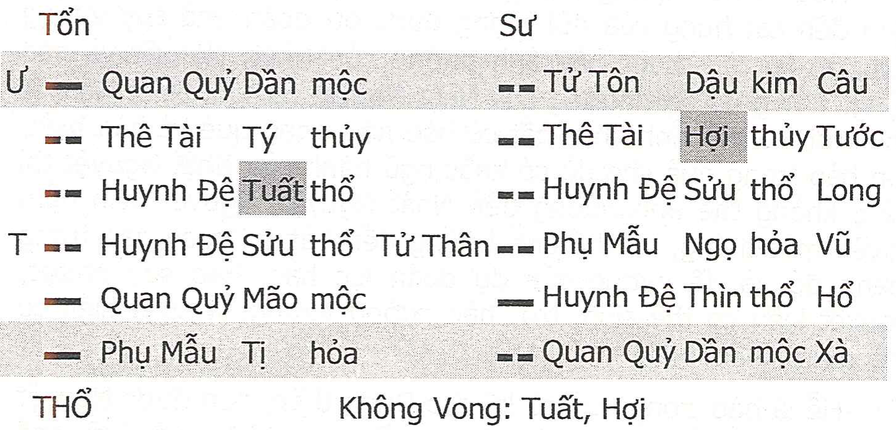

# CHƯƠNG 9

## SUY VƯỢNG CỦA HÀO

Hưu tù hay vượng tướng của mỗi một hào trong quẻ quyết định đến cát hung của đối tượng được dự đoán, mà suy vượng của hào lại tùy thuộc vào ảnh hưởng của Nhật, Nguyệt và hào động. Trong đó ảnh hưởng của Nhật Nguyệt rất lớn, Nhật Nguyệt như trời, có thể sinh khắc bất cứ hào nào trong quẻ và hào biến, còn hào trong quẻ cho dù có khắc ngũ hành của Nhật Nguyệt thì cũng không thể ảnh hưởng đến Nhật Nguyệt. Nguyệt kiến nắm quyền một tháng, có thể ảnh hưởng đến bất cứ ngày nào trong tháng đó, là đề cương của dự đoán lục hào. Hào suy nhược, Nguyệt kiến có thể sinh, trợ; hào cường vượng, Nguyệt kiến có thể xung, khắc, hình.

Hễ là hào trong quẻ có lợi cho Dụng thần, nên được Nguyệt kiến trợ giúp; hào bất lợi cho Dụng thần, nên bị Nguyệt kiến chế phục. Trong quẻ có hào biến khắc chế hào động, Nguyệt kiến có thể chế phục hào biến. Trong quẻ có hào động khắc chế hào tĩnh, Nguyệt kiến có thể chế phục hào động. Dụng thần phục tàng bị hào Phi áp chế, Nguyệt kiến có thể xung khắc Phi thần, sinh trợ Phục thần. Hào gặp Nguyệt hợp gọi là hợp vượng, xem là vượng tướng; hào gặp Nguyệt xung gọi là Nguyệt phá, xem là hưu tù.

## I. NGUYỆT KIẾN

Dự đoán lục hào dùng 12 địa chi để biểu thị tháng, gọi là Nguyệt kiến. Tháng ở đây không phải là âm lịch cũng không phải là dương lịch, mà là tháng lấy tiết lệnh làm ranh giới, chia một năm thành 12 tháng. Mỗi tiết lệnh chính là khởi đầu của tháng đó. Nếu so sánh, dương lịch rất gần với tháng trong lục hào, do đó lấy quan hệ đối ứng giữa dương lịch và tháng lục hào trình bày như sau.

Tháng 1 của dương lịch đối ứng với tháng Sửu, tháng 2 đối ứng với tháng Dần, tháng 3 đối ứng với tháng Mão, tháng 4 đối ứng với tháng Thìn, tháng 5 đối ứng với tháng Tị, tháng 6 đối ứng với tháng Ngọ, tháng 7 đối ứng với tháng Mùi, tháng 8 đối ứng với tháng Thân, tháng 9 đối ứng với tháng Dậu, tháng 10 đối ứng với tháng Tuất, tháng 11 đối ứng với tháng Hợi, tháng 12 đối ứng với tháng Tý.

Khởi đầu của một năm trong dự đoán lục hào là từ Lập Xuân, mỗi tiết lệnh đối ứng với khởi đầu của mỗi tháng, quan hệ đối ứng cụ thể như sau.

Lập Xuân là khởi đầu của tháng Dần, Kinh Trập là khởi đầu của tháng Mão, Thanh Minh là khởi đầu của tháng Thìn, Lập Hạ là khởi đầu của tháng Tị, Mang Chủng là khởi đầu của tháng Ngọ, Tiểu Thử là khởi đầu của tháng Mùi, Lập Thu là khởi đầu của tháng Thân, Bạch Lộ là khởi đầu của tháng Dậu, Hàn Lộ là khởi đầu của tháng Tuất, Lập Đông là khởi đầu của tháng Hợi, Đại Tuyết là khởi đầu của tháng Tý, Tiểu Hàn là khởi đầu của tháng Sửu.

Thời gian giao tiết lệnh rất quan trọng, tiết lệnh trước là tháng trước, một khi giao tiết lệnh sau thì thành tháng tiếp theo, một phút cũng phải rõ ràng. Thời gian giao tiết lệnh cụ thể có thể tra từ lịch vạn niên.

## II. NGUYỆT PHÁ

Hào trong quẻ gặp Nguyệt kiến xung gọi là Nguyệt phá. Tức là tháng Dần Thân phá, tháng Mão Dậu phá, tháng Thìn Tuất phá, tháng Tị Hợi phá, tháng Ngọ Tý phá, tháng Mùi Sửu phá, tháng Thân Dần phá, tháng Dậu Mão phá, tháng Tuất Thìn phá, tháng Hợi Tị phá, tháng Tý Ngọ phá, tháng Sửu Mùi phá.

Hào Nguyệt phá hưu tù bất động, hoặc Không mà gặp Tuyệt, nhập Mộ thì sức mạnh suy yếu, không có tác dụng, Dụng thần gặp hào này thì hung, Kỵ thần gặp hào này thì cát. Nếu hào Nguyệt phá vượng tướng phát động, hoặc gặp sinh phù, thì có lực, có thể phát sinh tác dụng, Dụng thần gặp hào này thì cát, Kỵ thần gặp hào này thì hung. Hào Nguyệt phá, trước mắt tuy phá, ra khỏi tháng đó thì bất phá, sau này gặp Nhật thần, Nguyệt kiến hoặc năm có địa chi tương đồng với Nguyệt phá là Thực Phá; gặp Nhật, Nguyệt hoặc năm có địa chi tương hợp với Nguyệt phá là Hợp Phá. Thực Phá và Hợp Phá thường là căn cứ để phán đoán thời gian xảy ra cát hung của đối tượng. Gần thì ứng ngày giờ, xa thì ứng năm tháng, khi dự đoán phải chú ý.

**Ví dụ 1:** Ngày Ất Mão tháng Tị, xem cho vợ bị đau bụng không ngừng, được quẻ Trạch Thiên Quải biến Thủy Thiên Nhu.

| | Quải | Nhu | |
| :---: | :--- | :--- | :--- |
| | -- Huynh Đệ Mùi thổ | -- Thê Tài Tý thủy | Vũ |
| T | ━ Tử Tôn Dậu kim | ━ Huynh Đệ Tuất thổ | Hổ |
| | ━ Thê Tài Hợi thủy | -- Tử Tôn Thân kim | Xà |
| | ━ Huynh Đệ Thìn thổ | ━ Huynh Đệ Thìn thổ | Câu |
| Ư | ━ Quan Quỷ Dần mộc Phụ Tị | ━ Quan Quỷ Dần mộc | Tước |
| | ━ Thê Tài Tý thủy | ━ Thê Tài Tý thủy | Long |

THỔ Không Vong: Tý, Sửu

**Phán đoán:**

Lấy hào Thê Tài làm Dụng thần, Hợi thủy Nguyệt phá, Tý thủy Tuần Không, kiêm làm Dụng thần.

Hợi thủy phát động hóa hồi đầu sinh, lại được Tử Tôn Dậu kim trì Thế ám động sinh trợ, không sao cả.

Dụng thần Nguyệt phá, sang tháng bất phá, tháng Ngọ Hợi thủy bất phá, Tý thủy gặp xung, xung Không tắc Thực, bệnh của vợ khỏi ngay.

**Kết quả:** Sau này tự khỏi ở tháng Ngọ.

**Ví dụ 2:** Ngày Nhâm Dần tháng Bính Tuất năm Ất Hợi, một người đàn ông khoảng 50 tuổi đến hỏi về hôn nhân, gieo được quẻ Phong Lôi Ích biến Phong Trạch Trung Phu.

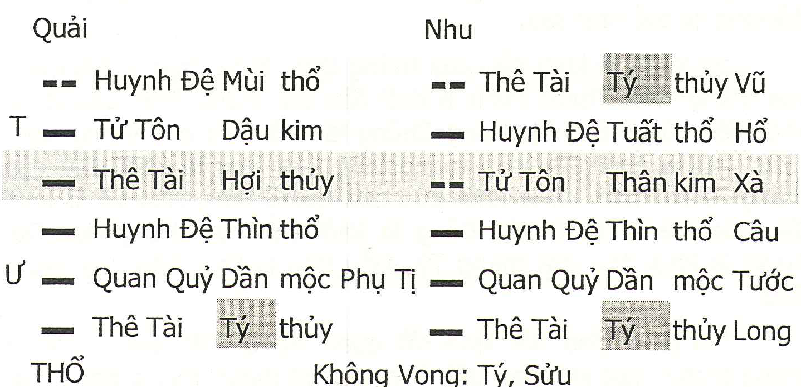

| | Ích | Trung Phu | |
| :---: | :--- | :--- | :--- |
| Ư | ━ Huynh Đệ Mão mộc | ━ Huynh Đệ Mão mộc | Hổ |
| | ━ Tử Tôn Tị hỏa | ━ Tử Tôn Tị hỏa | Xà |
| | -- Thê Tài Mùi thổ | -- Thê Tài Mùi thổ | Câu |
| T | -- Thê Tài Thìn thổ Quan Dậu | -- Thê Tài Sửu thổ | Tước |
| | -- Huynh Đệ Dần mộc | ━ Huynh Đệ Mão mộc | Long |
| | ━ Phụ Mẫu Tý thủy | ━ Tử Tôn Tị hỏa | Vũ |

MỘC Không Vong: Thìn, Tị

**Phán đoán:**

Lấy hào Thê Tài làm Dụng thần. Trong quẻ Thê Tài lưỡng hiện, lấy Thê Tài lâm Thế làm Dụng thần.

Thê Tài Thìn thổ trì Thế, là thông tin có vợ. Nhưng Thê Tài Thìn thổ Tuần Không, Nguyệt phá, Huynh Đệ Dần mộc động hóa Tiến thần, lại là tượng ly dị.

Dụng thần Thê Tài Thìn thổ vừa Không vừa Phá, Không Phá nên ứng Thực Không Thực Phá, năm 1988 là năm Mậu Thìn, năm này Dụng thần Thực Phá, đoán là vợ phân ly với anh ta ở năm 1988.

**Kết quả:** Suy đoán ở trên quả nhiên ứng nghiệm.

## III. ẢNH HƯỞNG CỦA NHẬT THẦN

Thời gian mỗi giờ mỗi khắc đều trôi qua, vĩnh viễn sẽ không quay trở lại. Ở góc độ Dịch học, vũ trụ vốn có quy tắc và quy luật nhất định, cứ 60 năm thì lặp lại một lần. Người xưa đã sớm phát hiện ra quy luật này, người ta đã dùng 10 thiên can và 12 địa chi tổ hợp thành lục thập hoa giáp, biểu thị quy luật có tính chu kỳ này. Vì vậy, Nhật thần của một ngày cũng rất quan trọng, nó có vai trò không thể thiếu đối với phán đoán cát hung của sự vật.

Nhật thần là chúa tể của sáu hào, một tháng ba mươi ngày, mỗi ngày có Nhật thần chủ quản, lục thập hoa giáp tuần hoàn lặp đi lặp lại, luân phiên trực Nhật. Nhật thần và Nguyệt kiến đồng công, đều có thể ảnh hưởng đến bất cứ hào nào trong quẻ.

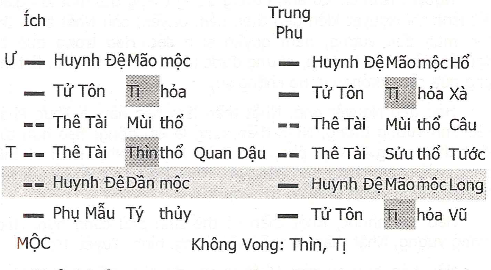

Nguyệt lệnh chỉ có ảnh hưởng trong tháng đó, một khi giao tiết lệnh thì Nguyệt kiến tiếp theo nắm quyền, còn Nhật thần thì bốn mùa đều vượng, nắm quyền sinh sát. Hào trong quẻ bị Nguyệt kiến khắc thương, nhưng được Nhật thần sinh phù, là tám lạng nửa cân, không vượng không suy.

Hào gặp Nguyệt phá, Nhật thần lâm hào này là Thực Phá. Hào tĩnh vượng tướng, Nhật thần xung là ám động; hào hưu tù, Nhật thần xung là Nhật phá; hào Tuần Không, Nhật thần có thể xung khởi, xung thực; hào gặp hợp, Nhật thần có thể xung khai; hào gặp xung, Nhật thần có thể hợp trú.

Hào suy nhược, Nhật thần có thể sinh phù củng hợp. Hào cường vượng, Nhật thần có thể khắc, xung, hình, Tuyệt, Mộ.

Nếu hào hưu tù gặp Nhật xung, thì tán; nếu hào vượng tướng phát động, Nhật thần xung, hào này động càng mạnh hơn.

Tóm lại, hào vượng, được Nhật thần sinh phù, như trên gấm thêm hoa; hào suy, bị Nhật thần khắc chế, thì như trên tuyết thêm sương. Dụng thần, hỷ thần thì nên được Nhật thần sinh phù; Kỵ thần, Cừu thần thì nên bị Nhật thần khắc, tổn.

**Ví dụ 1:** Ngày Mậu Thân tháng Dần, một họa sĩ hỏi vẽ tranh có bán được không, được quẻ Thủy Lôi Truân.

| | Truân | | | | | |
|---|---|---|---|---|---|---|
| | - - | Huynh Đệ | Tý | thủy | | Tước |
| Ứ | — | Quan Quỷ | Tuất | thổ | | Long |
| | - - | Phụ Mẫu | Thân | kim | | Vũ |
| | - - | Quan Quỷ | Thìn | thổ | Tài Ngọ | Hổ |
| T | - - | Tử Tôn | Dần | mộc | | Xà |
| | — | Huynh Đệ | Tý | thủy | | Câu |

THỦY Không Vong: Dần, Mão

**Phán đoán:**

Bán tranh là để thu lợi, vì vậy lấy Thê Tài làm Dụng thần. Thê Tài Ngọ hỏa không hiện trên quẻ, phục dưới hào 3 Quan Quỷ Thìn thổ, Phục đi sinh Phi, có phần tiết khí, nhưng Dụng thần

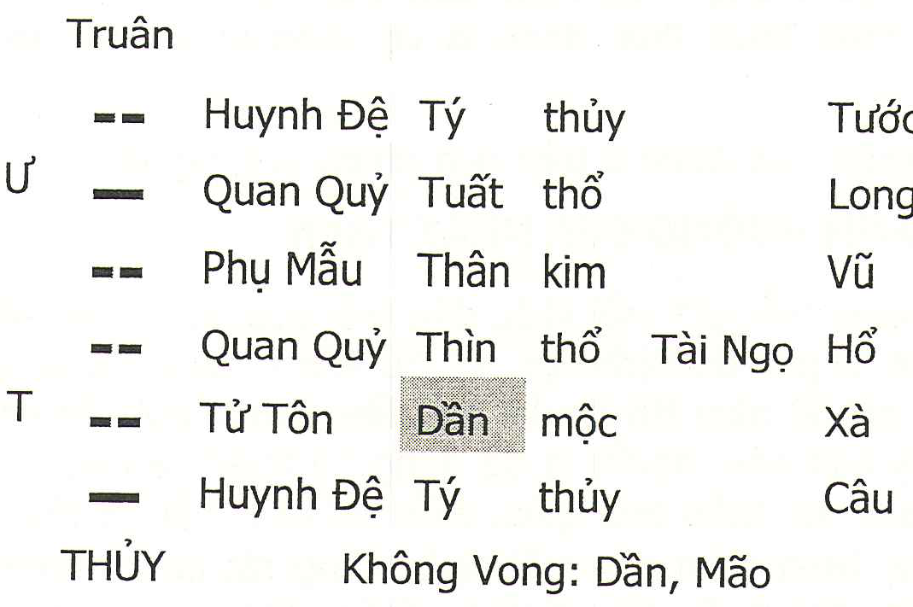 được Nguyệt sinh phù, là vượng tướng. Nguyên thần Tử Tôn Dần mộc trì Thế, Không mà được Nhật xung thực, tĩnh mà được Nhật xung, tạo thành ám động, nhất định có thể bán được tranh.

**Kết quả:** Một tháng sau, tranh của anh ta đã được một người Hàn Quốc mua.

**Ví dụ 2:** Ngày Canh Ngọ tháng Hợi, một người đàn ông khi đến bệnh viện khám bệnh thì làm mất tiền, đoán xem có thể tìm lại được không? Được Cấn Vi Sơn biến Lôi Sơn Tiểu Quá.

| | Cấn | | | | | Tiểu Quá | | | |
|---|---|---|---|---|---|---|---|---|---|
| T | — | Quan Quỷ | Dần | mộc | - - | Huynh Đệ | Tuất | thổ | Xà |
| | - - | Thê Tài | Tý | thủy | - - | Tử Tôn | Thân | kim | Câu |
| | - - | Huynh Đệ | Tuất | thổ | — | Phụ Mẫu | Ngọ | hỏa | Tước |
| Ư | — | Tử Tôn | Thân | kim | — | Tử Tôn | Thân | kim | Long |
| | - - | Phụ Mẫu | Ngọ | hỏa | - - | Phụ Mẫu | Ngọ | hỏa | Vũ |
| | - - | Huynh Đệ | Thìn | thổ | - - | Huynh Đệ | Thìn | thổ | Hổ |

THỔ Không Vong: Tuất, Hợi

**Phán đoán:**

Lấy Thê Tài làm Dụng thần.

Thê Tài Tý thủy được Nguyệt kiến Hợi thủy tỉ phù là vượng, Nhật thần xung là ám động. Nhưng không nên Huynh Đệ Tuất thổ động mà khắc Dụng thần. Dụng thần được Nguyệt trợ giúp, Kỵ thần được Nhật sinh phù, cả hai suy vượng tương đương. Nhưng Huynh Đệ Tuất thổ động hóa ra hào biến sinh nó, hào biến lại có Nhật thần trợ giúp, sinh trợ Kỵ thần có lực, là không cát.

Quan Quỷ trì Thế, động mà hóa ra Kỵ thần, hào Thế là mình, Kỵ thần là nhân tố bất lợi, tự mình làm mất tiền. Tài tại hào 5, hào 5 là đường đi, tiền mất trên đường.

Dụng thần gặp Phụ Mẫu lâm Nhật xung, Phụ Mẫu là quần áo, ngoại quái là nửa người trên, tiền bị mất từ trong túi áo. Rất khó tìm lại.

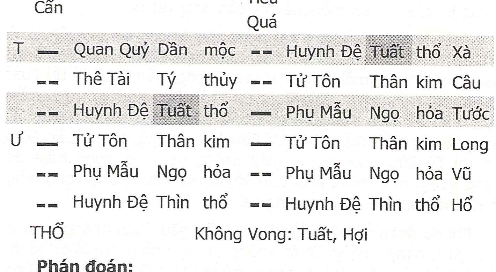

**Kết quả:** Quả nhiên là khi trên đường đi bệnh viện, do móc túi áo không cẩn thận mà làm mất, về sau không tìm được.

## IV. KHÔNG VONG

Trong dự đoán lục hào, Nhật thần của một ngày được biểu thị bằng tổ hợp của thiên can và địa chi. Thiên can 10 vị trí, địa chi 12 vị trí, cứ 60 ngày lặp lại một lần, 10 ngày 1 tuần, tổng cộng 6 tuần. Khi phối hợp can chi, trong mỗi tuần đều có hai vị trí địa chi không có thiên can phối hợp, gọi là Tuần Không. Tuần Không rất quan trọng trong dự đoán lục hào, nó liên quan đến cát hung và ứng kỳ của sự vật, mỗi quẻ đều cần phải xét rõ.

Tuần Không còn được gọi là lục giáp không vong, lục giáp là chỉ Giáp Tý, Giáp Tuất, Giáp Thân, Giáp Ngọ, Giáp Thìn, Giáp Dần. Không Vong trong mỗi tuần như sau: Trong tuần Giáp Tý thì Tuất Hợi Không, trong tuần Giáp Tuất thì Thân Dậu Không, trong tuần Giáp Thân thì Ngọ Mùi Không, trong tuần Giáp Ngọ thì Thìn Tị Không, trong tuần Giáp Thìn thì Dần Mão Không, trong tuần Giáp Dần thì Tý Sửu Không. Lục giáp không vong, ở trong tuần đó Không Vong, một khi ra khỏi tuần thì không còn Không Vong nữa, mà Không Vong đã chuyển sang hai vị trí địa chi khác.

Khi dự đoán về bệnh tật, Dụng thần gặp Tuần Không, nếu là bệnh gần, ngày, tháng Thực Không, xung Không thì khỏi bệnh. Nếu là bệnh lâu gặp Không, ngày, tháng Thực Không, xung Không thì hung. Trong quẻ gặp Nguyên thần Tuần Không phát động, ngày, tháng xung Không, Thực Không khỏi bệnh; Kỵ thần Tuần Không phát động, ngày, tháng Kỵ thần Thực Không, xung Không gặp hung.

Hào Tuần Không nếu tĩnh mà bất động, thì chia ra hữu dụng và vô dụng. Hào Không mà vượng tướng, có Nhật, Nguyệt, hào động sinh phù, thì là hữu dụng; hào hưu tù Tử Tuyệt, thì là vô dụng. Dụng thần sợ hưu tù Không Phá, không có sinh phù, Kỵ thần nên hưu tù Không Phá, tĩnh mà bất động. Phi thần nên Tuần Không, bị khắc, gặp xung (khi Phi thần là Kỵ thần). Nói chung, Tuần Không phát động thì có thể khởi tác dụng, hào vượng tướng gặp Không cũng có sức mạnh tham gia sinh khắc; hào có Nhật, Nguyệt, hào động sinh phù, Không Vong cũng có sức mạnh; hào động mà hóa Không, hào Phục mà vượng tướng, đều là có khí, sẽ không Không đến cùng. Chỉ khi hào phá mà lại suy, vô khí bất động, phục mà bị khắc gặp Tuần Không, thì mới không có sức mạnh.

**Ví dụ 1:** Ngày Mậu Tý tháng Ngọ, một chiến sĩ lực lượng cảnh sát vũ trang đoán cát hung, được quẻ Trạch Sơn Hàm.

### Hàm

| | | | | |
| :---: | :---: | :--- | :--- | :--- |
| Ư | - - | Phụ Mẫu Mùi thổ | | Tước |
| | — | Huynh Đệ Dậu kim | | Long |
| | — | Tử Tôn Hợi thủy | | Vũ |
| T | — | Huynh Đệ Thân kim | | Hổ |
| | - - | Quan Quỷ Ngọ hỏa | Tài Mão | Xà |
| | - - | Phụ Mẫu Thìn thổ | | Câu |

KIM Không Vong: Ngọ, Mùi

**Phán đoán:**

Lấy hào Thế làm Dụng thần. Hào Thế bị Nguyệt kiến khắc, Nhật thần không sinh là hưu tù.

Kỵ thần Quan Quỷ Ngọ hỏa được Nguyệt tỉ phù, gặp Nhật xung, là ám động.

Kỵ thần ám động khắc Thế, Kỵ thần là Quan Quỷ, Quan Quỷ chủ bệnh, Thế lâm Bạch Hổ, Bạch Hổ chủ bệnh, tất có bệnh tai.

Nay Ngọ hỏa Tuần Không, ngày Giáp Ngọ xuất Không, Kỵ thần xuất Không, hào Thế nhất định gặp tổn thương.

Quẻ thuộc cung Đoài, Đoài là kim, kim là ruột già, tượng ruột già có bệnh. Sáu ngày sau, Kỵ thần xuất Không, nhất định có kiết lỵ.

**Kết quả:** Có kiết lỵ ở ngày Giáp Ngọ, mắc bệnh hơn một tháng mới khỏi.

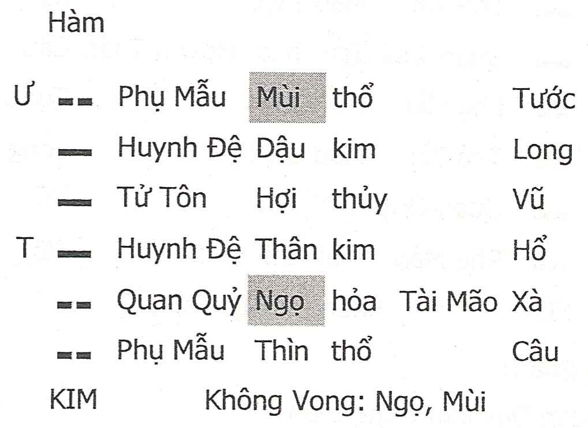

**Ví dụ 2:** Ngày Tân Sửu tháng Tuất, một binh sĩ đoán xem được điều đến đơn vị khác thì có cơ hội thăng chức không? Được quẻ Phong Địa Quan.

| | Quan | | | |
| :---: | :---: | :--- | :--- | :---: |
| | — | Thê Tài Mão mộc | | Xà |
| | — | Quan Quỷ Tỵ hỏa | Huynh Thân | Câu |
| T | - - | Phụ Mẫu Mùi thổ | | Tước |
| | - - | Thê Tài Mão mộc | | Long |
| | - - | Quan Quỷ Tỵ hỏa | | Vũ |
| Ư | - - | Phụ Mẫu Mùi thổ | Tử Tý | Hổ |

KIM Không Vong: Thìn, Tỵ

**Phán đoán:**

Lấy Quan Quỷ làm Dụng thần.

Phụ Mẫu trì Thế ám động, Phụ Mẫu là đơn vị công tác, người này đi lính, có thể hiểu là đơn vị đồn trú hiện tại, ám động, chính là trong lòng muốn thay đổi.

Nhưng mục đích của người này là thăng chức, phải lấy Quan Quỷ làm chủ phán đoán. Quan Quỷ Tỵ hỏa lưỡng hiện, nhưng không được Nhật Nguyệt sinh phù là hưu tù, lại lâm Không Vong, Không mà không thể sinh hào Thế, tất khó thăng chức.

**Kết quả:** Sau này chưa có biến động thì đã giải ngũ, chuyện làm quan càng không có gì đáng bàn.

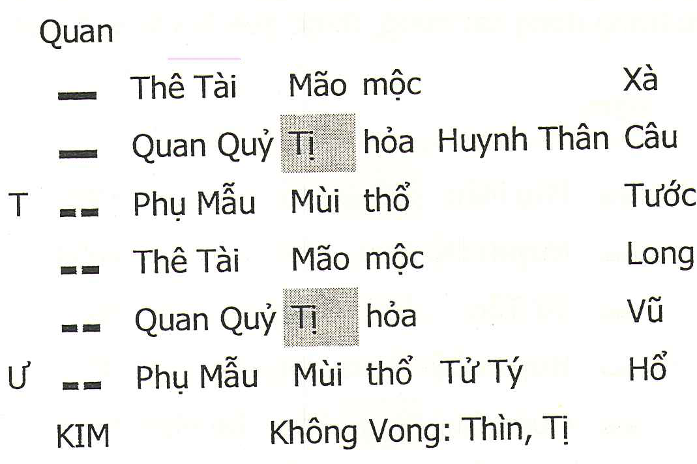

# CHƯƠNG 10

## MƯỜI HAI LOẠI TRẠNG THÁI CỦA NGŨ HÀNH SINH DIỆT

Hết thảy mọi sự vật trên thế gian đều hàm chứa ngũ hành, đều biến hóa từ khởi đầu đến kết thúc dưới sự chế ước của ngũ hành, cũng như con người vốn có sinh mệnh, phải trải qua sinh tử. Do đó, mọi sự vật đang tồn tại trong vũ trụ đều là vô thường, không có vĩnh hằng. Chính bởi vì ngũ hành vốn có sinh tử cho nên mọi sự vật trong vũ trụ mới có sinh diệt.

Sự sinh diệt của ngũ hành vận động liên tục và lặp đi lặp lại theo quy luật tuần hoàn nhất định, miễn là có âm dương tồn tại thì ảnh hưởng của ngũ hành sẽ không dừng lại. Từ sinh đến diệt, ngũ hành có 12 trạng thái, đối ứng với 12 địa chi. Theo thứ tự là Trường Sinh, Mộc Dục, Quan Đới, Lâm Quan, Đế Vượng, Suy, Bệnh, Tử, Mộ, Tuyệt, Thai, Dưỡng. 12 trạng thái này đã phản ánh sâu sắc quy luật tuần hoàn của vũ trụ, sự vật từ khi sinh ra đến khi phát triển, rồi lại đến khi khởi đầu sinh mệnh mới. Bởi vì 12 trạng thái này lấy Trường Sinh làm khởi điểm, cho nên hiện tượng này cũng được gọi là 12 cung trường sinh.

Trong 12 trạng thái ngũ hành sinh diệt, người xưa cho rằng chỉ có Trường Sinh, Đế Vượng, Mộ và Tuyệt là có sản sinh ảnh hưởng cát hung đối với sự vật, thực ra đây là lý giải sai lầm đối với 12 trạng thái ngũ hành sinh diệt. Cát hung của Dụng thần, chủ yếu được xem từ sinh khắc của Nhật Nguyệt và động tĩnh trong quẻ, còn 12 trạng thái này chỉ phản ánh trạng thái biến hóa của sự vật từ góc độ tượng mà thôi, công dụng thực sự của nó là dùng để phân tích ý nghĩa. Trong dự đoán lục hào nâng cao, phạm vi ứng dụng của 12 trạng thái này rất rộng, nhất định phải nắm vững.

Quan hệ đối ứng giữa 12 địa chi và 12 trạng thái ngũ hành sinh diệt như sau:

| | Trường Sinh | Mộc Dục | Quan Đới | Lâm Quan | Đế Vượng | Suy | Bệnh | Tử | Mộ | Tuyệt | Thai | Dưỡng |
|---|---|---|---|---|---|---|---|---|---|---|---|---|
| Kim | Tị | Ngọ | Mùi | Thân | Dậu | Tuất | Hợi | Tý | Sửu | Dần | Mão | Thìn |
| Mộc | Hợi | Tý | Sửu | Dần | Mão | Thìn | Tị | Ngọ | Mùi | Thân | Dậu | Tuất |
| Thủy | Thân | Dậu | Tuất | Hợi | Tý | Sửu | Dần | Mão | Thìn | Tị | Ngọ | Mùi |
| Hỏa | Dần | Mão | Thìn | Tị | Ngọ | Mùi | Thân | Dậu | Tuất | Hợi | Tý | Sửu |
| Thổ | Thân | Dậu | Tuất | Hợi | Tý | Sửu | Dần | Mão | Thìn | Tị | Ngọ | Mùi |

### Trường Sinh:

Là khởi điểm của 12 trạng thái ngũ hành sinh diệt, có ý nghĩa là sinh trưởng, sản sinh, phát sinh, v.v. Giống như nguồn gốc của một vật, mẹ ruột của một người, nguồn của nước, cứu tinh lúc nguy hiểm. Trong quẻ Dụng thần suy mà gặp Trường Sinh thì cát, như cây khô gặp mùa xuân, hạn hán lâu ngày gặp mưa. Trường Sinh tại Nguyệt lệnh gọi là Trường Sinh ở Nguyệt, tại Nhật thần gọi là Trường Sinh ở Nhật, động mà hóa ra Trường Sinh gọi là động hóa Trường Sinh.

Kim Trường Sinh ở Tị, Tị thuộc hỏa, là ngũ hành khắc kim, nhưng tại sao nói rằng kim Trường Sinh ở Tị, căn nguyên là kim gặp hỏa rèn mới thành dụng cụ, tất cả các khoáng vật nếu chưa qua hỏa tinh luyện thì không thành kim loại. Kim tuy Trường Sinh ở Tị nhưng suy cho cùng vẫn có ý khắc, xét từ góc độ ngũ hành thì luận khắc không luận sinh, xét từ góc độ Trường Sinh thì có thể trích xuất ý nghĩa nhất định dùng cho phán đoán, tất cả phải linh hoạt biến thông.

Theo lý ngũ hành sinh khắc mà nói, thổ sinh kim. Nhưng trong 12 trạng thái ngũ hành sinh diệt lại nói thổ Trường Sinh tại Thân, vậy lý ngũ hành sinh khắc đúng hay sai? Từ cổ chí kim, đây là một nghi vấn chưa được giải quyết. Thực ra thổ Trường Sinh ở Thân, có gốc ở Thân là Khôn vị, thổ đặt cung ở Tây Nam (Thân vị).

Tóm lại, Dần Thân Tị Hợi là đất Trường Sinh của ngũ hành, gọi là đất tứ sinh, hỏa Trường Sinh tại Dần, thủy Trường Sinh tại

Thân, mộc Trường Sinh tại Hợi, đều hợp lý ngũ hành, chỉ có thổ kim Trường Sinh đặc thù, do đó khi ứng dụng phải chú ý.

**Mộc Dục:** Giống như trẻ sinh ra được rửa tội, hoa cỏ cây cối đâm chồi được mưa tưới. Nhưng gặp Mộc Dục trong dự đoán lục hào, lấy ngũ hành sinh khắc thông thường để luận, Mộc Dục không chủ cát hung, chỉ dùng cho thủ tượng.

**Quan Đới[^1]:** Là sau rửa tội tắm rửa, mặc quần áo đội mũ, người cao lớn, cử hành nghi thức thành nhân, đội mũ quấn thắt lưng để biểu thị sự trưởng thành. Gặp Quan Đới trong dự đoán lục hào, lấy lý ngũ hành sinh khắc thông thường để luận, Quan Đới không chủ cát hung, chỉ dùng cho thủ tượng.

**Lâm Quan:** Giống như người trưởng thành rồi ra làm quan. Gặp Lâm Quan, lấy lý ngũ hành sinh khắc thông thường để luận.

**Đế Vượng:** Giống như người ở thời hưng thịnh, hoa cỏ cây cối ở thời kỳ tươi tốt.

**Suy:** Chỉ sự vật ở trạng thái suy bại. Khi dự đoán, lấy lý ngũ hành sinh khắc thông thường để luận.

**Bệnh:** Chỉ sự vật đã ở trạng thái phát bệnh, sắp sửa diệt vong, đôi khi dự đoán bệnh tật có thể dùng ý nghĩa của Bệnh để phán đoán chứng bệnh, nhưng về phương diện cát hung thì lấy lý ngũ hành sinh khắc thông thường để luận.

**Tử:** Chỉ sự vật ở trạng thái tịch diệt, diệt vong, hoàn toàn không có sức sống. Trong dự đoán tối kỵ Tử địa đơn độc phát động, khi đoán bệnh phải xem thêm Dụng thần suy vượng, đoán bệnh kỵ Dụng thần gặp Tử địa. Kim gặp Tý là Tử địa, mộc gặp Ngọ là Tử địa, hỏa gặp Dậu là Tử địa, thủy và thổ gặp Mão là Tử địa. Tử địa thường là hung tượng.

### Mộ:

Cũng gọi là khố, Mộ khố, có ý nghĩa là cất giữ, phong bế (đóng kín, khép kín), chôn giấu. Giống như con người sau khi chết, được chôn ở trong mộ. Mộ được ứng dụng nhiều nhất trong dự đoán lục hào, rất ứng nghiệm.

[^1]: Quan là mũ, nón. Đới là dây, thắt lưng.

Dụng thần nhập Mộ nhưng vượng tướng thì không sao, rất sợ hưu tù Không Phá, cũng kỵ hào Thế lâm Quan Quỷ nhập Mộ, gọi là tùy quỷ nhập mộ, chủ hung. Mộ của ngũ hành, tương đối khó phân tích, Sửu là kim khố, Thìn là thổ khố. Sửu thuộc thổ, thổ sinh kim, nhưng tại sao lại nói kim khố tại Sửu, Dụng thần gặp Sửu thì luận sinh hay luận Mộ khố, rất khó phân biệt. Thông thường, xét từ góc độ ngũ hành sinh khắc thì luận Sửu thổ sinh kim, từ góc độ 12 trạng thái ngũ hành sinh diệt thì luận Mộ, trong một quẻ cũng thường có lúc dùng cả hai ý nghĩa, cần phải xem thêm cát hung của Dụng thần, lấy ý nghĩa của nó mà đoán.

Thổ khố tại Thìn cũng là một tình huống khá đặc biệt trong lục hào. Thìn là thổ vừa có ý nghĩa trợ giúp thổ, vừa có ý nghĩa Mộ khố, từ góc độ ngũ hành thì có ý nghĩa trợ giúp, từ góc độ 12 trạng thái ngũ hành sinh diệt thì có ý nghĩa Mộ khố. Khi dự đoán phải căn cứ vào cát hung của Dụng thần mà phán đoán một cách linh hoạt.

**Tuyệt:** Là chỉ hào trong quẻ gặp Tuyệt địa. Như kim gặp Dần, mộc gặp Thân, thủy gặp Tị, hỏa gặp Hợi, thổ gặp Tị. Dụng thần hưu tù gặp Tuyệt địa, giống như người đi vào nơi hiểm ác, đường cùng, nếu không có cứu trợ thì rất khó có cơ hội sống sót trở về. Dụng thần có khí lâm Tuyệt địa, gặp sinh phù, chính là Tuyệt xứ phùng sinh (chỗ Tuyệt gặp sinh), nếu lại gặp Kỵ thần phát động, có khí thì chung quy thành hung. Thổ tuy Tuyệt tại Tị nhưng vẫn có ý nghĩa sinh phù. Chỉ cần Dụng thần có khí thì chớ xem là hung, nếu hưu tù Không Phá gặp Tuyệt địa thì mới không sinh Dụng thần.

**Thai:** Chỉ sau khi sự vật diệt tuyệt, lại bắt đầu thai nghén sinh mệnh mới, thông thường thì trong dự đoán sơ cấp cũng ứng dụng không nhiều, chỉ khi đoán về mang thai, sinh trẻ nhỏ thì dùng để tham khảo, kết hợp với hào Tử Tôn để đoán. Tình huống bình thường đều lấy ngũ hành sinh khắc để luận.

**Dưỡng:** Thai đã hình thành, từ từ hấp thu chất dinh dưỡng, hướng tới hoàn thiện, chuẩn bị sinh ra. Trong dự đoán sơ cấp ít khi sử dụng, gặp Dưỡng, luận theo lý ngũ hành sinh khắc thông thường.

Dưới đây là các ví dụ về ứng dụng 12 trạng thái ngũ hành sinh diệt.

**Ví dụ 1:** Ngày Đinh Hợi tháng Ngọ, cha xem về bệnh của con gái, được quẻ Sơn Trạch Tổn biến Sơn Hỏa Bí.

| Tổn | Phục thần | Bí | |
| :--- | :---: | :--- | :--- |
| Ứ — Quan Quỷ Dần mộc | | — Quan Quỷ Dần mộc | Long |
| - - Thê Tài Tý thủy | | - - Thê Tài Tý thủy | Vũ |
| - - Huynh Đệ Tuất thổ | | - - Huynh Đệ Tuất thổ | Hổ |
| T - - Huynh Đệ Sửu thổ | Tử Thân | — Thê Tài Hợi thủy | Xà |
| — Quan Quỷ Mão mộc | | - - Huynh Đệ Sửu thổ | Câu |
| — Phụ Mẫu Tị hỏa | | — Quan Quỷ Mão mộc | Tước |

THỔ

Không Vong: Ngọ, Mùi

**Phán đoán:**

Lấy hào Tử Tôn làm Dụng thần.

Tử Tôn Thân kim không hiện trên quẻ, phục dưới hào 3 Huynh Đệ Sửu thổ, đồng thời lại nhập Mộ ở Phi thần, hào 3 là giường, phục là nằm bệnh trên giường, nhập Mộ là tượng nhập viện.

Trong quẻ hào sơ Phụ Mẫu Tị hỏa lâm Chu Tước ám động khắc Dụng thần Thân kim, Chu Tước chủ khẩu thiệt, ắt là xảy ra tranh chấp với cha mẹ mà bị bệnh.

Nhưng trong quẻ mộc động sinh hỏa, hỏa động sinh thổ, thổ động sinh kim, hào sơ ám động, liên tục tương sinh, có thể nói "thành cũng Tiêu Hà, bại cũng Tiêu Hà", hào sơ chủ chân, Phụ Mẫu lại chủ bôn ba, cô gái này ắt được cha mẹ bôn tẩu, hết lòng tương cứu mà được sống.

Tử Tôn Thân kim nhập Mộ ở Sửu, tháng Mùi xung khai khố lại được sinh phù sẽ xuất viện. Thân kim phục tàng, tháng Thân xuất hiện mà khỏi bệnh.

**Kết quả:** Cô gái này bởi vì có người yêu, bị cha mẹ phản đối mà uống thuốc độc tự tử, may mà cha mẹ phát hiện, kịp thời đưa vào bệnh viện cấp cứu mà giữ lại được mạng sống. Tháng Mùi xuất viện, tháng Thân hồi phục.

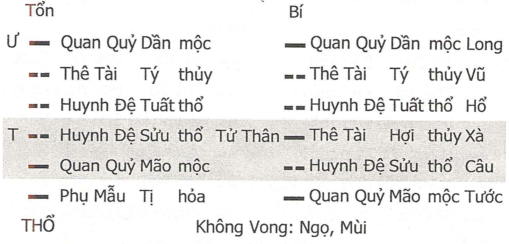

**Ví dụ 2:** Ngày Mậu Tý tháng Mão, nhân viên của một công ty bảo hiểm đoán về tài vận trong tương lai gần, được quẻ Địa Lôi Phục biến Khôn Vi Địa.

| | Phục | Khôn | |
| :---: | :--- | :--- | :--- |
| | ╍╍ Tử Tôn Dậu kim | ╍╍ Tử Tôn Dậu kim | Tước |
| | ╍╍ Thê Tài Hợi thủy | ╍╍ Thê Tài Hợi thủy | Long |
| Ư | ╍╍ Huynh Đệ Sửu thổ | ╍╍ Huynh Đệ Sửu thổ | Vũ |
| | ╍╍ Huynh Đệ Thìn thổ | ╍╍ Quan Quỷ Mão mộc | Hổ |
| | ╍╍ Quan Quỷ Dần mộc Phụ Tị | ╍╍ Phụ Mẫu Tị hỏa | Xà |
| T | ━ Thê Tài Tý thủy | ╍╍ Huynh Đệ Mùi thổ | Câu |

THỔ

Không Vong: Ngọ, Mùi

**Phán đoán:**

Lấy Thê Tài làm Dụng thần. Trong quẻ Thê Tài lưỡng hiện, lấy Thê Tài Tý thủy phát động làm Dụng thần.

Nguyên thần Tử Tôn Dậu kim Nguyệt phá, nếu đoán về tài vận dài hạn thì bất lợi, nhưng đoán về tài vận ngắn hạn thì chỉ xem suy vượng của Thê Tài. Trước tiên Dụng thần trì Thế, Thế là người xin đoán, đây là tượng có tiền đến bên cạnh mình, Nguyệt kiến mặc dù không sinh phù Dụng thần, nhưng Nhật thần là đất Đế Vượng của Dụng thần, tỉ trợ Dụng thần, mấy ngày sắp tới có thể được tài.

Ngày nào có thể được? Dụng thần động mà hóa Không, xuất Không có thể được. Đây chính là chỗ vi diệu của quẻ, không nên đoán hóa khắc.

**Kết quả:** Ở ngày Ất Mùi hoàn thành một nghiệp vụ bảo hiểm, được 6 ngàn tệ.

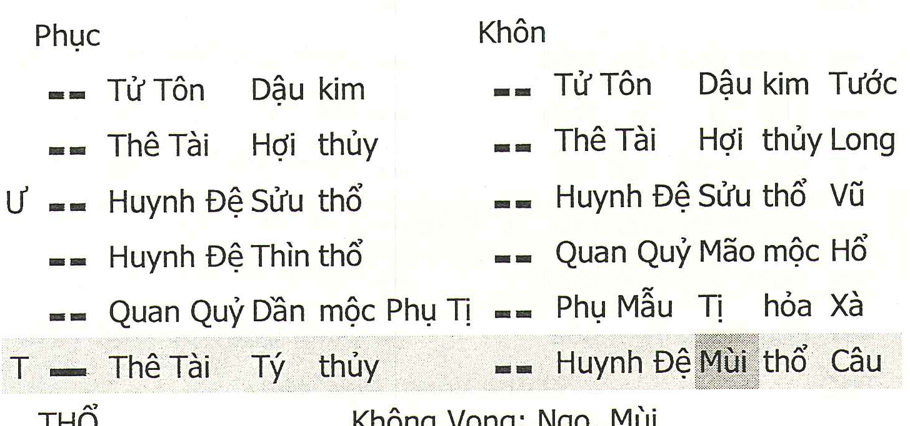

**Ví dụ 3:** Ngày Ất Tị tháng Thìn, nam đoán về triển vọng nuôi kiến, được Lôi Thủy Giải biến Trạch Địa Tụy.

| | Giải | Tụy | |
| :---: | :--- | :--- | :--- |
| | ╍╍ Thê Tài Tuất thổ | ╍╍ Thê Tài Mùi thổ | Vũ |
| Ư | ╍╍ Quan Quỷ Thân kim | ━ Quan Quỷ Dậu kim | Hổ |
| | ━ Tử Tôn Ngọ hỏa | ━ Phụ Mẫu Hợi thủy | Xà |
| | ╍╍ Tử Tôn Ngọ hỏa | ╍╍ Huynh Đệ Mão mộc | Câu |
| T | ━ Thê Tài Thìn thổ | ╍╍ Tử Tôn Tị hỏa | Tước |
| | ╍╍ Huynh Đệ Dần mộc Phụ Tý | ╍╍ Thê Tài Mùi thổ | Long |

MỘC

Không Vong: Dần, Mão

**Phán đoán:**

Nuôi kiến là để thu lợi, lấy Thê Tài làm Dụng thần. Nhưng kiến thuộc về động vật, lấy động vật để thu lợi thì nhất định phải kiêm xem hào Tử Tôn.

Đầu tiên Thê Tài trì Thế chính là tượng tài lâm thân, Dụng thần và Nguyệt kiến giống nhau, được Nhật thần sinh phù, lại động hóa hồi đầu sinh, nuôi kiến nhất định có lãi.

Nhật thần và hào biến tuy là Tuyệt địa Dụng thần, nhưng bởi vì Dụng thần vượng tướng nên không xem là Tuyệt. Tử Tôn là kiến, được Nhật tỉ phù là vượng, chứng tỏ kiến có sức sống rất mạnh mẽ.

Hào 6 Tuất thổ là Mộ khố Tử Tôn, có thể hiểu là hộp để nuôi kiến, Nguyệt phá là hộp có khe hở, kiến chạy ra ngoài.

**Kết quả:** Tất cả đúng như suy đoán.

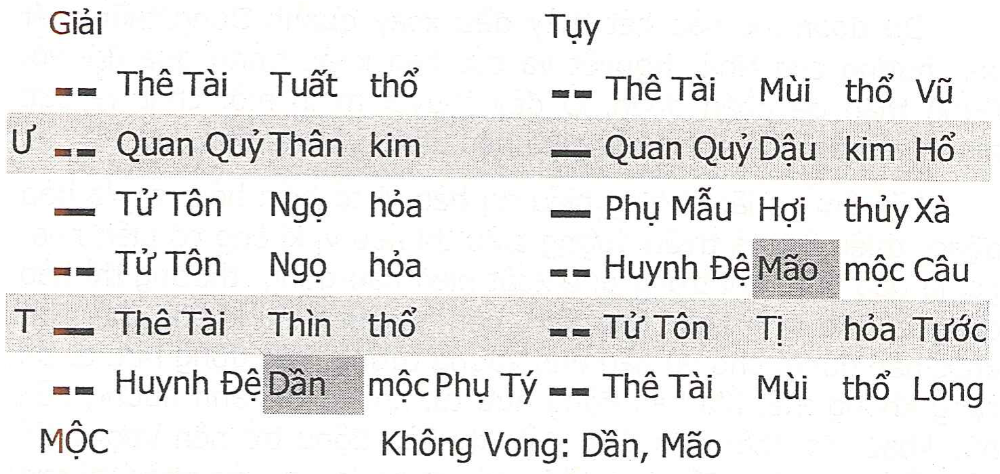

# CHƯƠNG 11
## ĐỘNG TĨNH VÀ SINH KHẮC CỦA HÀO

Dự đoán lục hào hết thảy đều xoay quanh Dụng thần, xét ảnh hưởng của Nhật Nguyệt và các hào khác trong quẻ đối với Dụng thần để phán đoán. Ở đây thuyết minh một chút về sức mạnh và quan hệ sinh khắc giữa hào động và hào tĩnh.

Lão âm và lão dương biểu thị hào vị có biến hóa, gọi là hào động; thiếu âm và thiếu dương biểu thị hào vị không có biến hóa, gọi là hào tĩnh. Khi trong quẻ xuất hiện hào động, thường thì hào động có thể sinh khắc hào tĩnh, còn hào tĩnh thì không thể sinh khắc hào động, cho dù hào tĩnh vượng tướng, hào động hưu tù thì cũng không thể. Khi hào động hưu tù, không thể ảnh hưởng đến hào khác, đợi thời gian thay đổi, khi hào động trở nên vượng thì có thể ảnh hưởng đến hào tĩnh, đây chính là nguyên nhân tại sao dự trắc sư có thể từ trong quẻ phán đoán ra được thời gian xảy ra sự việc.

Biến hóa của hào động gọi là phát động, sau khi phát động tất sẽ sinh ra hào biến. Nhật Nguyệt vừa có thể ảnh hưởng đến hào động, đồng thời cũng có thể ảnh hưởng đến hào biến. Hào biến sinh hào động gọi là hồi đầu sinh, hào biến khắc hào động gọi là hồi đầu khắc.

Quẻ không có hào động gọi là quẻ tĩnh. Giữa các hào trong quẻ tĩnh, hào vượng tướng có thể sinh hào hưu tù, cũng có thể khắc chế hào hưu tù. Hào vượng tướng như người khỏe mạnh, vừa có thể giúp người, vừa có thể chế người. Khi hào vượng tướng Tuần Không, đến khi xuất Không thì có thể sản sinh ảnh hưởng, dự đoán lục hào thường sử dụng hiện tượng này để phán đoán thời gian phát sinh sự vật.

**Ví dụ 1:** Ngày Nhâm Thân tháng Hợi, một nữ sĩ có mẹ 93 tuổi bị bệnh, do vậy đoán tuổi thọ của mẹ, được quẻ Thủy Phong Tỉnh biến Phong Thiên Tiểu Súc.

| | Tỉnh | | Tiểu Súc | |
| :---: | :--- | :---: | :--- | :---: |
| | - - Phụ Mẫu Tý thủy | | — Huynh Đệ Mão mộc | Hổ |
| T | — Thê Tài Tuất thổ | | — Tử Tôn Tị hỏa | Xà |
| | - - Quan Quỷ Thân kim | Tử Ngọ | - - Thê Tài Mùi thổ | Câu |
| | — Quan Quỷ Dậu kim | | — Thê Tài Thìn thổ | Tước |
| Ứ | — Phụ Mẫu Hợi thủy | Huynh Dần | — Huynh Đệ Dần mộc | Long |
| | - - Thê Tài Sửu thổ | | — Phụ Mẫu Tý thủy | Vũ |

MỘC Không Vong: Tuất, Hợi

**Phán đoán:**

Lấy hào Phụ Mẫu làm Dụng thần, trong quẻ Dụng thần lưỡng hiện, Hợi thủy lâm Nguyệt Tuần Không, Tý thủy vượng tướng phát động, lấy Phụ Mẫu Tý thủy làm Dụng thần.

Phụ Mẫu Tý thủy được Nguyệt kiến tỉ phù, Nhật thần sinh là vượng tướng. Thê Tài Sửu thổ Kỵ thần phát động khắc Dụng, Kỵ thần chỉ Trường Sinh ở Nhật thần Thân kim, ngoài ra thì không có hào sinh phù, nhưng lúc này Sửu thổ tuy nhược, đến tháng Sửu thì Sửu thổ nắm quyền đắc thế, mà Tý thủy suy yếu, sợ là không cát.

**Kết quả:** Mẹ người này chết ở tháng Sửu năm đó.

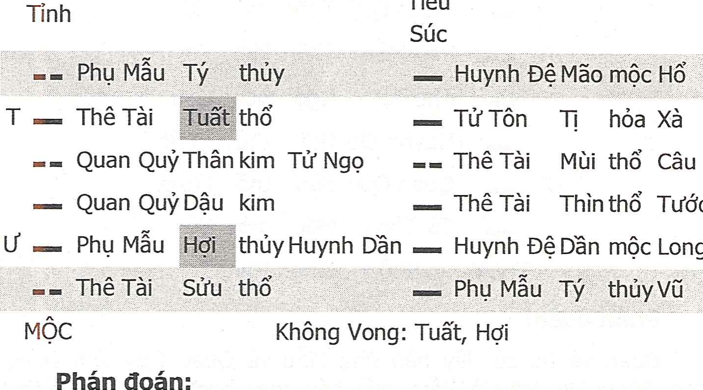

**Ví dụ 2:** Ngày Nhâm Dần tháng Mão, nam đoán về thi nghiên cứu sinh, được quẻ Lôi Hỏa Phong.

| | Phong | | |
| :---: | :---: | :--- | :--- |
| | - - | Quan Quỷ Tuất thổ | Hổ |
| T | - - | Phụ Mẫu Thân kim | Xà |
| | — | Thê Tài Ngọ hỏa | Câu |
| | — | Huynh Đệ Hợi thủy | Tước |
| Ư | - - | Quan Quỷ Sửu thổ | Long |
| | — | Tử Tôn Mão mộc | Vũ |

THỦY Không Vong: Thìn, Tị

**Phán đoán:**

Đoán về thi cử, lấy hào Phụ Mẫu và Quan Quỷ làm Dụng thần. Bởi vì Phụ Mẫu là điểm, giấy báo nhập học, Quan Quỷ là thứ bậc.

Quẻ này là quẻ tĩnh, Phụ Mẫu Thân kim mặc dù trì Thế, nhưng không được Nhật Nguyệt sinh phù, Quan Quỷ lưỡng hiện đều bị Nhật Nguyệt khắc thương, Kỵ thần Tử Tôn và Thê Tài lại được Nhật Nguyệt sinh tỉ, hào tĩnh vượng tướng có thể khắc hào tĩnh hưu tù, thi nghiên cứu sinh rất khó đậu.

**Kết quả:** Không thi đậu.

## ÁM ĐỘNG VÀ NHẬT PHÁ

Hào tĩnh trong quẻ lâm Nguyệt hoặc được Nguyệt kiến sinh phù, tỉ phù, hoặc trong quẻ có hào động sinh trợ, hoặc tương hợp với Nguyệt, hoặc Trường Sinh ở Nguyệt, gặp Nhật xung là ám động. Ám động có hỷ có kỵ, có lợi cho Dụng thần thì hỷ, có hại cho Dụng thần thì hung. Mọi quẻ đều phải xét rõ hào ám động, không được sơ xuất, hào ám động thường hay có vai trò quan trọng đối với phán đoán cát hung của một quẻ. Nếu hào tĩnh hưu tù, bị Nguyệt khắc thương, Nhật thần xung là Nhật phá.

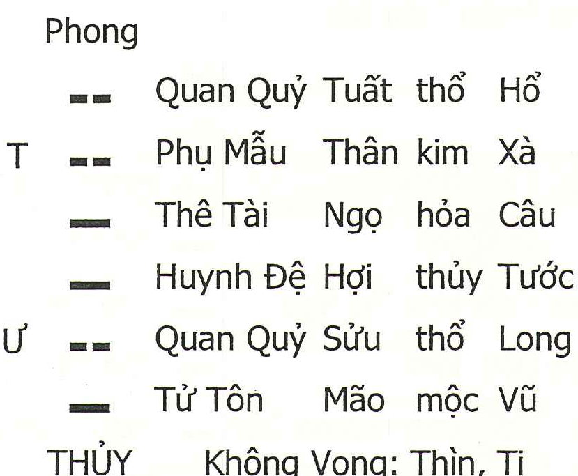

**Ví dụ 1:** Ngày Đinh Dậu tháng Dần, nam đoán xem có thể thành hôn với bạn gái hay không? Được quẻ Phong Hỏa Gia Nhân biến Sơn Hỏa Bí.

| | Gia Nhân | Phục thần | | Bí | Lục thú |
| :---: | :--- | :---: | :---: | :--- | :--- |
| | — Huynh Đệ Mão mộc | | — | Huynh Đệ Dần mộc | Long |
| Ư | — Tử Tôn Tị hỏa | | - - | Phụ Mẫu Tý thủy | Vũ |
| | - - Thê Tài Mùi thổ | | - - | Thê Tài Tuất thổ | Hổ |
| | — Phụ Mẫu Hợi thủy | Quan Dậu | — | Phụ Mẫu Hợi thủy | Xà |
| T | - - Thê Tài Sửu thổ | | - - | Thê Tài Sửu thổ | Câu |
| | — Huynh Đệ Mão mộc | | — | Huynh Đệ Mão mộc | Tước |

MỘC Không Vong: Thìn, Tị

**Phán đoán:**

Nam đoán hôn nhân thì lấy Thê Tài làm Dụng thần.

Thê Tài Sửu thổ trì Thế, đây là thông tin bạn gái ở bên mình. Nhưng Nguyệt kiến khắc Tài, Kỵ thần lâm Nguyệt, Huynh Đệ Mão mộc hai tầng gặp Nhật xung là ám động, hôn nhân này khó thành.

Có lẽ có người sẽ hỏi, Tử Tôn Tị hỏa phát động, thành liên tục tương sinh, không phải rất tốt ư? Quẻ này Dụng thần vốn như cây không có gốc rễ, Tử Tôn tuy động, Không mà hóa hồi đầu khắc, khó mà hóa giải khắc của hai tầng Huynh Đệ ám động. Tử Tôn tại hào 5, Không mà hóa hồi đầu khắc không thể sinh Dụng thần, hào 5 là tôn vị, hào biến Phụ Mẫu Tý thủy lại có ý nghĩa là cha mẹ, chính là cha mẹ không đồng ý cuộc hôn nhân này.

**Kết quả:** Quả nhiên là cha mẹ phản đối, hai người chia tay, bạn gái đã kết hôn với người khác ở tháng Hợi năm đó.

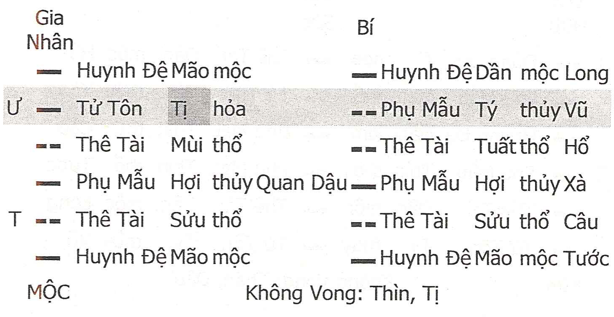

**Ví dụ 2:** Ngày Nhâm Ngọ tháng Tý, nam đoán về bệnh của vợ, được quẻ Hỏa Thiên Đại Hữu biến Sơn Thiên Đại Súc.

| | Đại Hữu | | Đại Súc | |
| :---: | :--- | :---: | :--- | :---: |
| Ứ | ━ Quan Quỷ Tị | hỏa | ━ Thê Tài Dần mộc | Hổ |
| | ⚋ Phụ Mẫu Mùi | thổ | ⚋ Tử Tôn Tý thủy | Xà |
| | ━ Huynh Đệ Dậu | kim | ⚋ Phụ Mẫu Tuất thổ | Câu |
| T | ━ Phụ Mẫu Thìn | thổ | ━ Phụ Mẫu Thìn thổ | Tước |
| | ━ Thê Tài Dần | mộc | ━ Thê Tài Dần mộc | Long |
| | ━ Tử Tôn Tý | thủy | ━ Tử Tôn Tý thủy | Vũ |

KIM Không Vong: Thân, Dậu

**Phán đoán:**

Lấy Thê Tài làm Dụng thần.

Trước tiên xem suy vượng của Dụng thần. Thê Tài Dần mộc được Nguyệt kiến sinh là cát, nhưng không nên Huynh Đệ Dậu kim phát động hóa hồi đầu sinh, được trợ mà khắc Dụng thần. May là Nguyên thần Tý thủy gặp Nhật xung, tạo thành ám động, thành liên tục tương sinh, hóa giải khắc của Huynh Đệ Dậu kim, hóa hung làm cát, bệnh của vợ người này nhất định có thể khỏi.

Quan Quỷ là thông tin bệnh tật, tại hào 6, hào 6 là hào vị của đầu, Hỏa Thiên Đại Hữu lại là quẻ cung Càn, Càn lại là đầu, vợ người này có bệnh giống như đau đầu.

**Kết quả:** Vợ người này đúng là có bệnh đau đầu, sau khi uống thuốc đã đỡ.

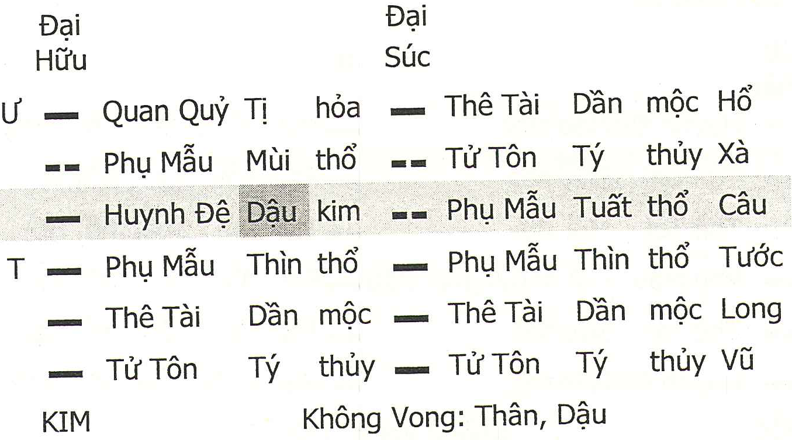

# CHƯƠNG 12: TÁC DỤNG CỦA LỤC HỢP

## I. LỤC HỢP

Lục hợp là Tý và Sửu hợp, Dần và Hợi hợp, Mão và Tuất hợp, Thìn và Dậu hợp, Tị và Thân hợp, Ngọ và Mùi hợp.

Có 6 tình huống tương hợp:

### ◆ Nhật Nguyệt hợp hào

Nguyệt hợp hào trong quẻ gọi là hợp vượng, ít khi dùng để phán đoán ứng kỳ.

Nhật hợp hào trong quẻ thì có cát có hung, có trong sinh mang hợp, có trong khắc mang hợp, có trong hình mang hợp, cát hung phải xét Dụng thần. Dự đoán về bệnh tật, bệnh gần không nên gặp hợp, Dụng thần gặp hợp, hoặc bệnh nặng mà chết, hoặc thành bệnh lâu khó mà điều trị. Bởi vì hợp là tượng bệnh tật triền miên không dứt.

Nếu như có hào khác xung khai, gọi là hợp xứ phùng xung, thì là cát, nếu không thì trước mắt tuy khỏi bệnh, sau này tất sẽ tái phát, hoặc lưu lại di chứng, khó mà trừ tận gốc.

Nếu là bệnh lâu, trái lại nên Dụng thần gặp hợp, gặp hợp chính là giữ lại sinh mệnh, có bệnh tất khỏi.

Nếu là dự đoán xuất hành, động mà gặp hợp tất có chuyện cản trở.

Dự đoán hành nhân, bỏ đi, Dụng thần động mà gặp hợp, lúc gặp xung có thể về, tĩnh mà gặp Nhật hợp, hôm đó có thể về.

Dự đoán hôn nhân, phần nhiều là thông tin lưu luyến, có ngoại tình.

### ◆ Hào và hào hợp.

Trong quẻ Dụng thần bị hào động hợp trú, cách đoán cát hung giống như Nhật hợp.

Nếu Nguyên thần phát động mà bị hào động hợp trú, xung khai bị hợp, hào bị hợp lại cát. Nếu là Kỵ thần phát động bị hợp, Dụng thần không cát, xung khai hào hợp, Kỵ thần giống như ngựa hoang thoát khỏi dây cương, thương khắc Dụng thần.

◆ **Hào động và hào biến tương hợp.**

Tức là hào phát động, hào biến ra tương hợp với hào động.

◆ **Quẻ gặp lục hợp, hoặc quẻ biến lục hợp.**

◆ **Quẻ lục xung biến quẻ lục hợp.**

◆ **Quẻ lục hợp biến quẻ lục hợp.**

Quẻ lục hợp, như Thiên Địa Bĩ, Sơn Hỏa Bí v.v, hào sơ và hào 4 tương hợp, hào 2 và hào 5 tương hợp, hào 3 và hào thượng tương hợp. Dự đoán về sinh nở, lục hợp là sinh khó, còn lại các việc đều cát.

Hào động mà gặp hợp gọi là cản trở. Hợp có rất nhiều ý nghĩa như hội họp, gặp nhau, triền miên, cản trở, giữ lại, lưu trú, dừng lại, khỏi bệnh, phải lòng, hòa hợp, v.v. Bởi lẽ sự việc dự đoán khác nhau mà cát hung ứng nghiệm không giống nhau, cần phải xem xét kỹ, phải lấy Dụng thần làm chủ, sau đó mới xem quẻ hào tương hợp.

**Ví dụ 1:** Ngày Quý Mão tháng Tuất, một nữ sĩ đoán về bệnh lâu của em trai, được quẻ Địa Sơn Khiêm biến Địa Thiên Thái.

| | Khiêm | | | Thái | |
| :---: | :---: | :--- | :---: | :--- | :--- |
| | - - | Huynh Đệ Dậu kim | - - | Huynh Đệ Dậu kim | Hổ |
| T | - - | Tử Tôn Hợi thủy | - - | Tử Tôn Hợi thủy | Xà |
| | - - | Phụ Mẫu Sửu thổ | - - | Phụ Mẫu Sửu thổ | Câu |
| | — | Huynh Đệ Thân kim | — | Phụ Mẫu Thìn thổ | Tước |
| Ư | - - | Quan Quỷ Ngọ hỏa | — | Thê Tài Dần mộc | Long |
| | - - | Phụ Mẫu Thìn thổ | — | Tử Tôn Tý thủy | Vũ |

KIM Không Vong: Thìn, Tị

**Phán đoán:**

Lấy hào Huynh Đệ làm Dụng thần, Dụng thần lưỡng hiện, lấy hào ám động Huynh Đệ Dậu kim làm Dụng thần.

Bệnh lâu gặp Nhật xung không cát, nhưng Dụng thần vượng tướng, trong quẻ Kỵ thần Quan Quỷ Ngọ hỏa mặc dù phát động,

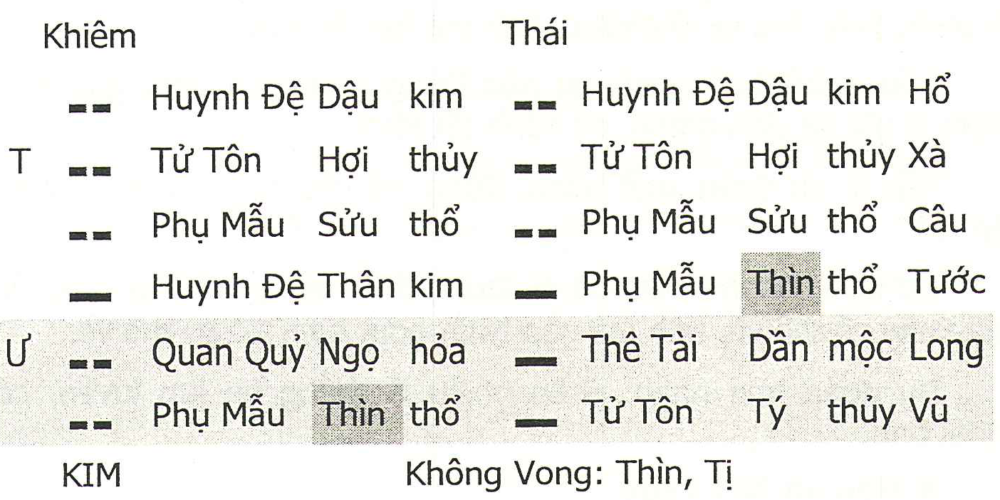 nhưng có Phụ Mẫu Thìn thổ cũng động, thành liên tục tương sinh, lại thêm quẻ biến lục hợp, bệnh lâu thì khỏi.

Trong quẻ không có Tài, Kỵ thần động hóa Thê Tài Dần mộc hồi đầu sinh, tất là ăn uống khó khăn.

**Kết quả:** Em trai bị bệnh dạ dày hơn 20 năm, đến bệnh viện khám bệnh, sau khi được chuyên gia hội chẩn, quyết định dùng Trung dược điều trị và đã khỏi bệnh.

**Ví dụ 2:** Ngày Kỷ Sửu tháng Hợi, bạn của tôi hỏi cát hung về việc cha mẹ đến Hải Nam du lịch, được quẻ Sơn Lôi Di biến Khôn Vi Địa.

| | Di | | | Khôn | |
| :---: | :---: | :--- | :---: | :--- | :--- |
| | — | Huynh Đệ Dần mộc | - - | Quan Quỷ Dậu kim | Câu |
| | - - | Phụ Mẫu Tý thủy Tử Tị | - - | Phụ Mẫu Hợi thủy | Tước |
| T | - - | Thê Tài Tuất thổ | - - | Thê Tài Sửu thổ | Long |
| | - - | Thê Tài Thìn thổ Quan Dậu | - - | Huynh Đệ Mão mộc | Vũ |
| | - - | Huynh Đệ Dần mộc | - - | Tử Tôn Tị hỏa | Hổ |
| Ư | — | Phụ Mẫu Tý thủy | - - | Thê Tài Mùi thổ | Xà |

MỘC Không Vong: Ngọ, Mùi

**Phán đoán:**

Lấy Phụ Mẫu làm Dụng thần. Trong quẻ Phụ Mẫu lưỡng hiện, lấy hào Phụ Mẫu Tý thủy phát động làm Dụng thần.

Phụ Mẫu Tý thủy được Nguyệt kiến tỉ phù là vượng tướng, lâm hào sơ phát động, hào sơ là chân, đây là thông tin sắp sửa lên đường.

Dụng thần và Nhật tương hợp, tôi đoán là cha mẹ người này có việc nên đi bất thành. Đây là cách dùng Dụng thần động gặp hợp mà bị cản trở.

**Kết quả:** Quả nhiên cha mẹ người này đi bất thành bởi vì chuyện bất động sản.

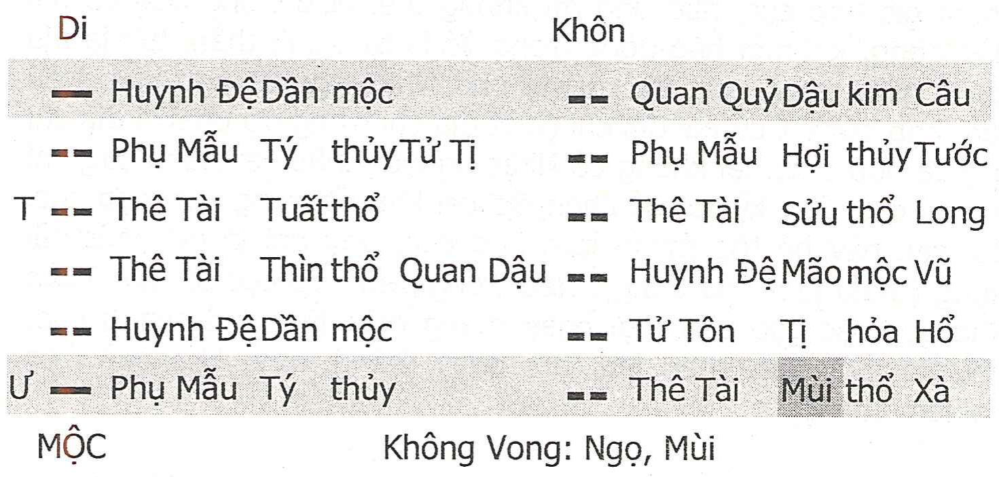

## II. TAM HỢP CỤC

Tam hợp là Thân Tý Thìn hợp thủy cục, Tị Dậu Sửu hợp kim cục, Dần Ngọ Tuất hợp hỏa cục, Hợi Mão Mùi hợp mộc cục.

Mỗi tam hợp cục lấy Trường Sinh, Đế Vượng và Mộ khố của ngũ hành hợp lại mà thành cục, lấy ngũ hành của địa chi ở giữa trong cục làm thuộc tính ngũ hành của hợp cục. Sức mạnh của hợp cục sẽ lớn hơn nhiều so với sức mạnh của ngũ hành địa chi đơn lẻ. Đồng thời, hợp cục còn có ý nghĩa là cộng đồng, cùng một chỗ, trợ giúp, hợp tác, tụ tập, v.v.

Nhật Nguyệt, hào động, hào biến, hào ám động đều có thể tham gia hợp cục, hào tĩnh thì không thể. Nếu trong quẻ có hai hào động, khi một hào động trong đó là tứ chính thần, tức là địa chi ở giữa trong cục, thì có thể nhờ Nhật Nguyệt hợp cục. Nếu tam hợp cục chỉ có hai địa chi (một địa chi trong đó phải là địa chi ở giữa hợp cục), lại không có Nhật Nguyệt chắp vá thành cục, thì là bán cục, ứng kỳ có thể chọn địa chi khuyết trong tam hợp cục, đợi sau này bổ túc thành tam hợp cục, đây gọi là hư nhất đãi dụng (thiếu một chờ dùng). Nếu trong tam hợp cục có một Tuần Không, hoặc gặp phá, đợi ngày tháng điền thực mà thành cục; nếu có một hào nhập Mộ, đợi ngày tháng xung khai mà ứng nghiệm sự việc.

**Ví dụ 1:** Ngày Mậu Tuất tháng Thân, một người phụ nữ đoán về duyên phận vợ chồng, được quẻ Hỏa Phong Đỉnh biến Địa Thiên Thái.

| | Đỉnh | | Thái | |
| :---: | :--- | :---: | :--- | :--- |
| | — Huynh Đệ Tị hỏa | | - - Thê Tài Dậu kim | Tước |
| Ư | - - Tử Tôn Mùi thổ | | - - Quan Quỷ Hợi thủy | Long |
| | — Thê Tài Dậu kim | | - - Tử Tôn Sửu thổ | Vũ |
| | — Thê Tài Dậu kim | | — Tử Tôn Thìn thổ | Hổ |
| T | — Quan Quỷ Hợi thủy | | — Phụ Mẫu Dần mộc | Xà |
| | - - Tử Tôn Sửu thổ | Phụ Mão | — Quan Quỷ Tý thủy | Câu |

**HỎA** **Không Vong: Thìn, Tị**

**Phán đoán:** Lấy Quan Quỷ làm Dụng thần. Quan Quỷ trì Thế lâm hào 2, hào 2 là hào vị nhà và chồng, đây là thông tin vốn có chồng. Quan Quỷ Hợi thủy được Nguyệt kiến sinh, Nhật thần khắc, xét từ Nhật Nguyệt thì rất khó phân biệt suy vượng. Như vậy thì phải đánh giá ảnh hưởng của hào động trong quẻ đối với Dụng thần.

Dùng phép phân hào phán đoán hào vị để phân tích, hào sơ là tâm sự, Kỵ thần Tử Tôn Sửu thổ tại hào sơ phát động khắc Thế Quan Quỷ, đây là cô ấy có ý định muốn ly hôn với chồng. Tử Tôn động mà lại hóa ra Quan Quỷ, sau ly hôn muốn kết hôn với một người đàn ông khác.

Hào biến Quan Quỷ Tý thủy hợp trú Kỵ thần Tử Tôn Sửu thổ, khiến Tử Tôn Sửu thổ không thể khắc Thế Quan Quỷ Hợi thủy, đây là thông tin người đàn ông mới xuất hiện không khiến cô ấy ly hôn với chồng. Đồng thời trong quẻ Tị Dậu Sửu tam hợp thành cục sinh trợ Dụng thần, Quan Quỷ vượng tướng, không thể ly hôn với chồng.

**Kết quả:** Trên thực tế là cô ấy đã có chồng, nhưng lại thích một người đàn ông khác, mà người này cũng đã có vợ, không hề muốn ly hôn vợ và kết hôn với cô ấy. Cô ấy đành phải từ bỏ ý định ly hôn với người chồng hiện tại.

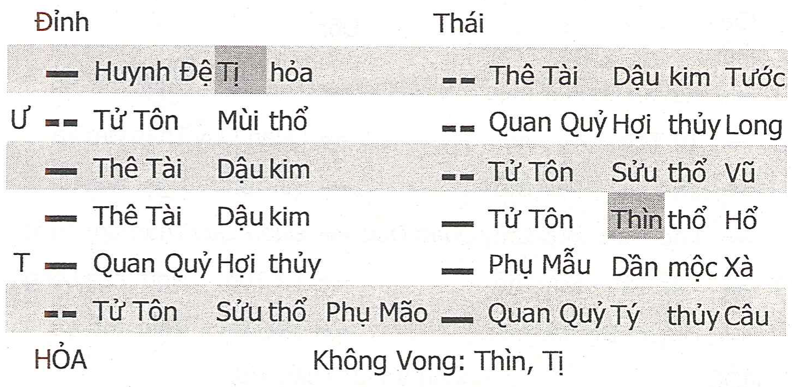

**Ví dụ 2:** Ngày Nhâm Thân tháng Thìn, nam đoán xem mối quan hệ với bạn gái tiến triển ra sao? Được quẻ Phong Hỏa Gia Nhân biến Thiên Sơn Độn.

| Gia Nhân | Độn |
| :--- | :--- |
| — Huynh Đệ Mão mộc | — Thê Tài Tuất thổ Hổ |
| Ư — Tử Tôn Tị hỏa | — Quan Quỷ Thân kim Xà |
| — — Thê Tài Mùi thổ | — Tử Tôn Ngọ hỏa Câu |
| — Phụ Mẫu Hợi thủy Quan Dậu | — Quan Quỷ Thân kim Tước |
| T — — Thê Tài Sửu thổ | — — Tử Tôn Ngọ hỏa Long |
| — Huynh Đệ Mão mộc | — — Thê Tài Thìn thổ Vũ |

MỘC  
Không Vong: Tuất, Hợi

**Phán đoán:**

Lấy Thê Tài làm Dụng thần. Trong quẻ Thê Tài lưỡng hiện, thông thường lấy hào động Thê Tài Mùi thổ làm Dụng thần.

Thê Tài Mùi thổ động mà tương xung với hào Thế, đây là thông tin xảy ra mâu thuẫn, xung đột với bạn gái.

Hào Phụ Mẫu chủ người làm mối, Phụ Mẫu Hợi thủy Không mà bị khắc, chủ không có người làm mối, chính là tự do yêu đương.

Thê Tài Sửu thổ trì Thế là thông tin hiện tại có bạn gái. Nhưng Thê Tài Mùi thổ cũng có thể xem là thông tin về cô gái khác.

Kỵ thần Huynh Đệ Mão mộc phát động, đây là thông tin bất lợi cho yêu đương, động mà hóa ra Nguyệt kiến (hào biến và Nguyệt giống nhau) khắc Dụng thần, tháng đó tức thì có nguy cơ. Thê Tài Mùi thổ và Kỵ thần Huynh Đệ Mão mộc bán hợp thành cục, đề phòng ngày Hợi tam hợp cục thành mà chia tay.

Người này không tin, anh ta nói rằng bạn gái là người cùng lớp đại học, yêu đương đã ba năm, chưa có mâu thuẫn xung đột lớn, bản thân cảm thấy tình cảm rất tốt đẹp, chia tay là điều

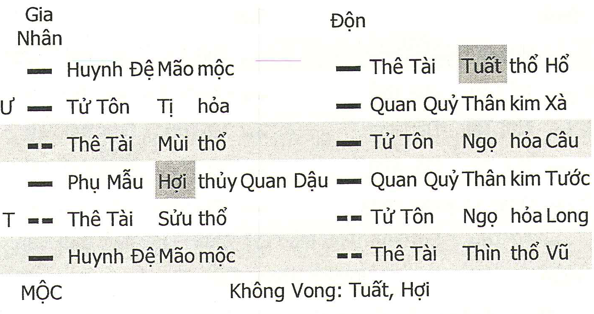 không thể. Ai ngờ ở ngày Hợi (bốn ngày sau) thì bạn gái đã đề xuất chia tay.

Ví dụ này được dự đoán ở năm 1996, tôi thấy Thê Tài Mùi thổ động mà tương hợp với hào biến, năm thứ hai là Đinh Sửu, Thê Tài Mùi thổ hợp xứ phùng xung, đoán là anh ta sẽ kết hôn với một người phụ nữ khác ở năm 1997.

**Kết quả:** Quả nhiên ứng nghiệm.

# CHƯƠNG 13

## TÁC DỤNG CỦA LỤC XUNG

Lục xung là Tý Ngọ tương xung, Sửu Mùi tương xung, Dần Thân tương xung, Mão Dậu tương xung, Thìn Tuất tương xung, Tị Hợi tương xung.

Có 6 tình huống lục xung:

◆ **Quẻ gặp lục xung**, gồm mười quẻ, tức Càn Vi Thiên, Khôn Vi Địa, Đoài Vi Trạch, Tốn Vi Phong, Chấn Vi Lôi, Khảm Vi Thủy, Ly Vi Hỏa, Cấn Vi Sơn, Lôi Thiên Đại Tráng, Thiên Lôi Vô Vọng.

◆ **Quẻ lục hợp biến quẻ lục xung.**
Như Thiên Địa Bĩ biến Thiên Lôi Vô Vọng.

◆ **Lục xung biến lục xung.**
Như Càn Vi Thiên biến Khôn Vi Địa.

◆ **Nhật Nguyệt xung hào.**

◆ **Hào và hào xung.**

◆ **Hào động biến xung.**

**Xung có nghĩa xung tán, xung khai, xung động:**

Dự đoán bệnh tật, nếu như bệnh gần, thì nên gặp xung, gọi là khiến cho bệnh xung tán. Nếu là bệnh lâu, gặp xung thì không cát, gọi là khiến cho người bệnh xung khoa (ngã quỵ).

Trong đó, quẻ biến lục xung, lục xung biến lục xung là hung nhất; tiếp theo là hào và hào xung, Nhật xung hào, lục hợp biến lục xung; tiếp theo nữa là động biến lục xung, Nguyệt xung hào.

Nguyệt xung là Nguyệt phá, biến xung là phản ngâm, Nhật xung thì cần phải phân biệt ám động và Nhật phá.

Dự đoán các sự việc không nên Dụng thần biến xung, bị Nguyệt xung. Dự đoán bị kiện, sinh con thì mừng được quẻ lục xung.

**Ví dụ:** Ngày Bính Dần tháng Mùi, một cô gái đoán xem có thể kết hôn với bạn trai hiện tại hay không? Được quẻ Ly Vi Hỏa.

| | Ly | | | | |
| :---: | :---: | :--- | :--- | :--- | :--- |
| T | ━ | Huynh Đệ | Tị | hỏa | Long |
| | -- | Tử Tôn | Mùi | thổ | Vũ |
| | ━ | Thê Tài | Dậu | kim | Hổ |
| Ư | ━ | Quan Quỷ | Hợi | thủy | Xà |
| | -- | Tử Tôn | Sửu | thổ | Câu |
| | ━ | Phụ Mẫu | Mão | mộc | Tước |

HỎA Không Vong: Tuất, Hợi

**Phán đoán:**

Lấy hào Quan Quỷ làm Dụng thần.

Quan Quỷ Hợi thủy Không Vong bị Nguyệt kiến khắc thương là không cát, lại thêm quẻ gặp lục xung tất là tượng phân ly, đoán là cuộc hôn nhân này không thành.

Nhật thần Dần mộc và Quan Quỷ tương hợp, Dần mộc đối ứng với tháng Dần, đoán là người này bắt đầu yêu đương với bạn trai ở tháng Dần.

**Kết quả:** Quả nhiên người nữ này bắt đầu yêu đương ở tháng Dần. Nhưng cuối cùng lại kết hôn ở tháng Dậu năm đó. Tôi nghi là phán đoán quẻ này có sai lầm, nhưng bất kể xem như thế nào cũng là tượng phân ly, sau này mới ngộ ra thuyết Phụ Mẫu lâm Nhật định hôn kỳ của cổ nhân. Quẻ này hào sơ Phụ Mẫu là Mão mộc và Nhật thần có ngũ hành tương đồng, tháng Dậu xung Mão, đây chính là ứng kỳ kết hôn. Tháng Dần năm Đinh Sửu (năm sau), người nữ này đã mang thai, cô ấy không nghe khuyên can của người nhà chồng mà cứ khăng khăng đến tắm ở nhà tắm công cộng, cuối cùng thì bị trượt ngã dẫn đến rách tử cung, khiến cho tiểu hài lưu sản, mất chức năng sinh đẻ. Cha chồng của cô ấy là hòa thượng, chồng là con trai duy nhất của ông ta, cần con trai nối dõi tông đường. Bởi vì cô ấy không thể sinh đẻ, hơn nữa nguyên nhân là do cô ấy gây ra, thế là đã ly hôn với cô ấy.

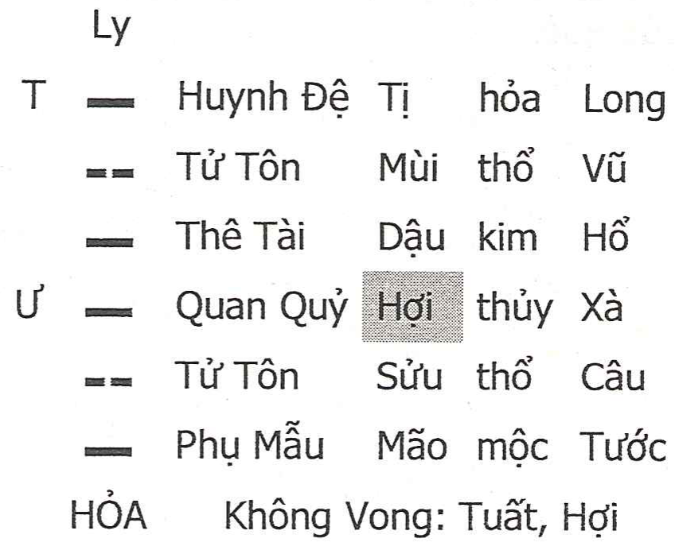

Hào 2 Tử Tôn Sửu thổ Nguyệt phá là thông tin năm Đinh Sửu Thực Phá lưu sản tiểu hài. Tử Tôn Thực Phá khắc Quan Quỷ cũng là nguyên nhân cô ấy ly hôn, tiếc là lúc đó tôi đã không nhìn ra huyền diệu của quẻ.

# CHƯƠNG 14

## CÁT HUNG CỦA TAM HÌNH

- Tam hình là Dần hình Tị, Tị hình Thân, Thân hình Dần; Tý hình Mão, Mão hình Tý; Sửu hình Tuất, Tuất hình Mùi, Mùi hình Sửu; lại thêm Thìn Ngọ Dậu Hợi tự tương hình.
- Tam hình Dần Tị Thân gọi là hình cậy thế, hình Tý và Mão gọi là hình vô lễ, hình Sửu Tuất Mùi gọi là hình vô ơn.
- Hình có nghĩa hình khắc, thống khổ, hình danh, phạm hình, thụ hại, v.v. Dự đoán lục hào lấy Dụng thần sinh khắc làm trọng, tam hình làm khinh, tam hình phải phụ họa Dụng thần mà kiêm đoán, chỉ dựa vào tam hình nhất định không thể đoán cát hung.
- Dần hình Tị, trong sinh có hình. Thìn Ngọ Dậu Hợi, xuất hiện trong quẻ và Nhật Nguyệt, có tác dụng tỉ phù. Thìn thổ hóa ra Thìn thổ là phục ngâm, thường không luận cát.

## Ví dụ 1: Ngày Bính Ngọ tháng Hợi, nam đoán về quan vận, được quẻ Trạch Lôi Tùy biến Thủy Trạch Tiết.

| | Tùy | | Phục thần | | Tiết | Lục thú |
| :---: | :---: | :--- | :---: | :---: | :--- | :---: |
| Ư | - - | Thê Tài Mùi thổ | | - - | Phụ Mẫu Tý thủy | Long |
| | — | Quan Quỷ Dậu kim | | — | Thê Tài Tuất thổ | Vũ |
| | — | Phụ Mẫu Hợi thủy | Tử Ngọ | - - | Quan Quỷ Thân kim | Hổ |
| T | - - | Thê Tài Thìn thổ | | - - | Thê Tài Sửu thổ | Xà |
| | - - | Huynh Đệ Dần mộc | | — | Huynh Đệ Mão mộc | Câu |
| | — | Phụ Mẫu Tý thủy | | — | Tử Tôn Tị hỏa | Tước |

MỘC Không Vong: Dần, Mão

**Phán đoán:**

Lấy Quan Quỷ làm Dụng thần.

Quan Quỷ không được Nhật Nguyệt sinh phù, trái lại bị Nhật khắc thương là hưu tù, quan vận không tốt.

Hào sơ Phụ Mẫu Tý thủy ám động sinh Huynh Đệ Dần mộc, Phụ Mẫu Hợi thủy minh động cũng sinh Huynh Đệ Dần mộc, Huynh Đệ Dần mộc hóa Tiến thần khắc hào Thế, trong sáng trong tối có rất nhiều người phản đối anh ta. Quan vận không tốt.

Hào Thế Thìn thổ, lại gặp Hợi thủy, Ngọ hỏa, Dậu kim, Dậu kim mặc dù bất động nhưng cũng gặp tự hình, hết thảy nhân tố bất lợi là do bản thân tạo ra.

**Kết quả:** Người này là bí thư trưởng của hiệp hội phật giáo, có rất nhiều người bất mãn với ông ta, bản thân ông ta cảm thấy hiệp hội phật giáo không thể tách khỏi ông ta, ông ta giả vờ từ chức, nhiều ngày vẫn không đến văn phòng của hiệp hội, kết quả là cấp trên đã quyết định cho người khác thay thế, ông ta không thể không từ chức.

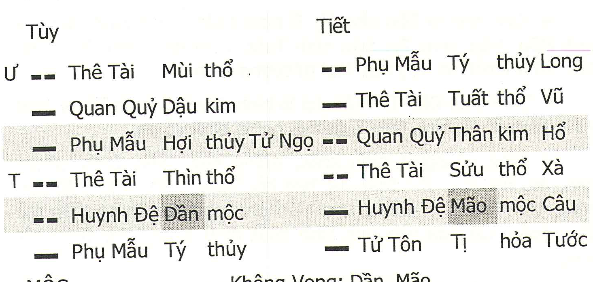

## Ví dụ 2: Ngày Ất Dậu tháng Ngọ, một cảnh sát không tìm thấy sách ngoại ngữ dùng để học hằng ngày, đoán xem có thể tìm được không? Được Phong Thiên Tiểu Súc biến Thủy Thiên Nhu.

| | Tiểu Súc | | | Nhu | Lục thú |
| :---: | :---: | :--- | :---: | :--- | :---: |
| | — | Huynh Đệ Mão mộc | - - | Phụ Mẫu Tý thủy | Vũ |
| | — | Tử Tôn Tị hỏa | — | Thê Tài Tuất thổ | Hổ |
| Ư | - - | Thê Tài Mùi thổ | - - | Quan Quỷ Thân kim | Xà |
| | — | Thê Tài Thìn thổ | — | Thê Tài Thìn thổ | Câu |
| | — | Huynh Đệ Dần mộc | — | Huynh Đệ Dần mộc | Tước |
| T | — | Phụ Mẫu Tý thủy | — | Phụ Mẫu Tý thủy | Long |

MỘC Không Vong: Ngọ, Mùi

**Phán đoán:**

Lấy Phụ Mẫu làm Dụng thần.

Phụ Mẫu Tý thủy mặc dù Nguyệt phá, nhưng được Nhật sinh, lại trì Thế, là tượng không mất.

Quẻ này hào 6 Huynh Đệ lâm Huyền Vũ phát động tương hình với Dụng thần. Huyền Vũ chủ bí mật, lén lút, hình là chỉ trích, hãm hại, Huynh Đệ là đồng nghiệp. Căn cứ vào những thông tin này, đoán là có đồng nghiệp chống đối anh ta, bất mãn với anh ta, đã đem sách của anh ta giấu đi.

**Kết quả:** Giờ Dậu hôm đó, anh ta đã tìm được sách dưới một nắm bông trong ngăn thấp nhất của tủ phòng trực ban, giấy bọc sách ban đầu đã bị người ta xé đi.

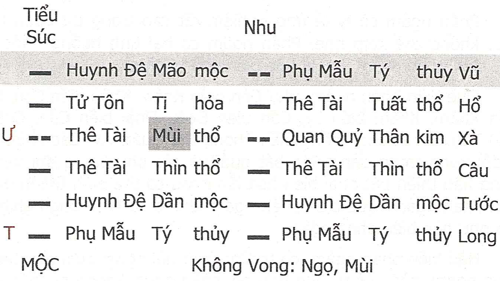

# CHƯƠNG 15
## PHẢN NGÂM VÀ PHỤC NGÂM

### I. PHẢN NGÂM

Phản ngâm có tỷ lệ ứng nghiệm rất cao trong dự đoán lục hào, không thể xem nhẹ. Phản ngâm có hai tình huống, một là quẻ biến phản ngâm, hai là hào biến phản ngâm.

Quẻ biến phản ngâm, như Càn biến Khôn, Khôn biến Càn, Ly biến Khảm, Khảm biến Ly, Cấn biến Đoài, Đoài biến Cấn, Chấn biến Tốn, Địa Phong Thăng biến Phong Địa Quan v.v. Các phương vị đối xung trong tiên thiên bát quái và các phương vị đối xung trong hậu thiên bát quái biến hóa lẫn nhau có thể hình thành quẻ biến phản ngâm. Quẻ biến phản ngâm không có tỷ lệ ứng nghiệm cao như hào biến phản ngâm.

Hào biến phản ngâm, có trường hợp nội ngoại quái đều biến phản ngâm, cũng có trường hợp nội phản ngoại không phản hoặc ngoại phản nội không phản. Cụ thể, lấy hình thức địa chi để biểu thị quan hệ đối xung giữa hào động và hào biến.

Phản ngâm thường chủ sự việc lặp đi lặp lại, hành sự gian nan, một chặng không thể xong. Quẻ phản ngâm phần lớn biểu thị tình huống không tốt, cũng có trường hợp kết quả cuối cùng là cát, nhưng giữa đường cũng thường không suôn sẻ.

**Ví dụ:** Ngày Tân Tị tháng Sửu, nam đoán xem mua nhà từ trong tay người khác sẽ ra sao? Được quẻ Thiên Phong Cấu biến Thiên Địa Bĩ.

| | Cấu | | Bĩ | |
| :--- | :--- | :--- | :--- | :--- |
| | — Phụ Mẫu Tuất thổ | | — Phụ Mẫu Tuất thổ | Xà |
| | — Huynh Đệ Thân kim | | — Huynh Đệ Thân kim | Câu |
| Ứ | — Quan Quỷ Ngọ hỏa | | — Quan Quỷ Ngọ hỏa | Tước |
| | — Huynh Đệ Dậu kim | | -- Thê Tài Mão mộc | Long |
| | — Tử Tôn Hợi thủy | Tài Dần | -- Quan Quỷ Tị hỏa | Vũ |
| T | -- Phụ Mẫu Sửu thổ | | -- Phụ Mẫu Mùi thổ | Hổ |

**KIM**  
Không Vong: Thân, Dậu

**Phán đoán:**

Lấy Phụ Mẫu làm Dụng thần.

Hào Thế là người mua nhà, hào Ứng là người bán nhà. Dụng thần lâm Thế, được Nguyệt tỉ phù, Nhật thần sinh, Ứng lại sinh Thế, nhà này có thể mua được. Nhưng không nên nội quái phản ngâm, sau khi bán đối phương nuốt lời.

**Kết quả:** Sau khi đưa tiền cho đối phương, đối phương không giữ lời hứa, giao chìa khóa rồi lại đòi lại, cả tiền mua nhà cũng kề cà không chịu trả. Năm Kỷ Mão trả lại nhà, năm Canh Thìn phải đòi mấy chục lần mới lấy lại được tiền nhà, chính là ứng với Thìn thổ hợp trú Huynh Đệ Dậu kim, Thê Tài không còn bị khắc.

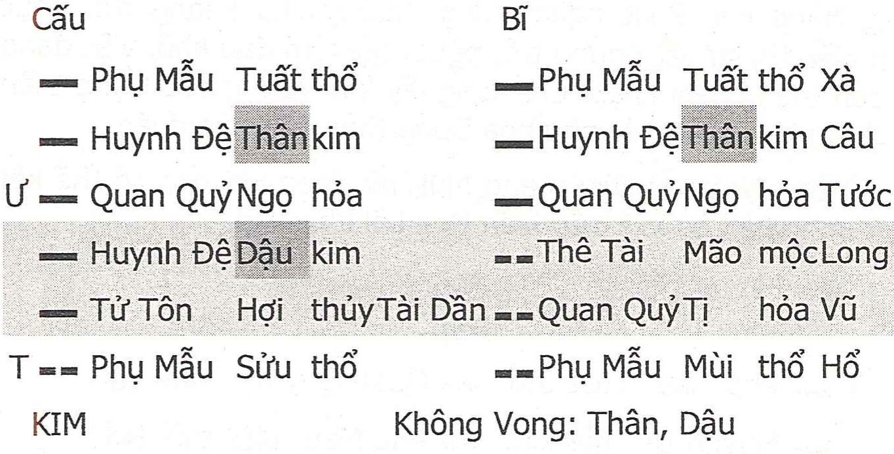

## II. PHỤC NGÂM

Hào ở trong quẻ phát động, hào biến ra giống với hào động gọi là phục ngâm. Như Càn biến Chấn, Thiên Phong Cấu biến Lôi Phong Hằng v.v. Phục ngâm cũng thường chủ không cát. Phục ngâm biểu thị sự vật ngưng trệ, người nội tâm đau khổ, việc đang làm tiến triển chậm chạp. Cát hung lấy suy vượng của Dụng thần làm chủ, phục ngâm chỉ phụ họa Dụng thần để phán đoán.

**Ví dụ:** Ngày Ất Dậu tháng Mùi, nữ đoán khi nào có thể kết hôn, được quẻ Càn Vi Thiên biến Hỏa Lôi Phệ Hạp.

| | Càn | | | Phệ Hạp | |
| :---: | :---: | :--- | :---: | :--- | :--- |
| T | — | Phụ Mẫu Tuất thổ | — | Quan Quỷ Tị hỏa | Vũ |
| | — | Huynh Đệ Thân kim | - - | Phụ Mẫu Mùi thổ | Hổ |
| | — | Quan Quỷ Ngọ hỏa | — | Huynh Đệ Dậu kim | Xà |
| Ư | — | Phụ Mẫu Thìn thổ | - - | Phụ Mẫu Thìn thổ | Câu |
| | — | Thê Tài Dần mộc | - - | Thê Tài Dần mộc | Tước |
| | — | Tử Tôn Tý thủy | — | Tử Tôn Tý thủy | Long |

KIM Không Vong: Ngọ, Mùi

**Phán đoán:**

Lấy Quan Quỷ làm Dụng thần.

Quan Quỷ Ngọ hỏa tuy được Nguyệt hợp là có khí, nhưng không được Nhật Nguyệt sinh phù, lại lâm Không Vong, nội quái phục ngâm, rất ít cơ hội kết hôn, do vậy rất đau khổ.

Quẻ chính lục xung, tâm trạng không thể bình tĩnh. Suốt đời khó có nhân duyên tốt đẹp.

**Kết quả:** Tới lúc dự đoán, người này đã 39 tuổi nhưng vẫn cô đơn một mình.

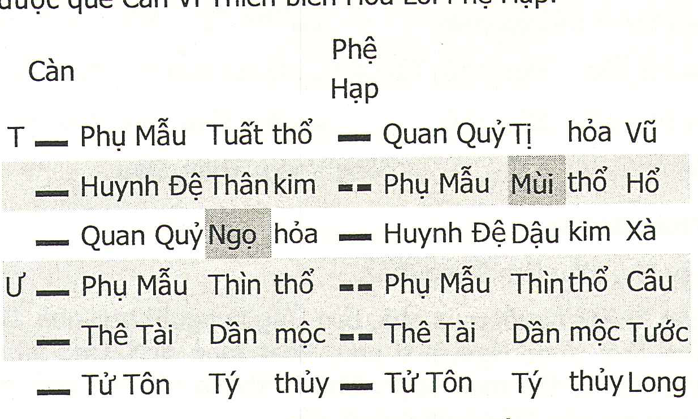

# CHƯƠNG 16

## QUẺ DU HỒN VÀ QUẺ QUY HỒN

### I. QUẺ DU HỒN

Quẻ du hồn là chỉ quẻ thứ bảy của mỗi cung. Trong 64 quẻ, quẻ du hồn gồm có Hỏa Địa Tấn, Thủy Thiên Nhu, Trạch Phong Đại Quá, Sơn Lôi Di, Địa Hỏa Minh Di, Thiên Thủy Tụng, Phong Trạch Trung Phu, Lôi Sơn Tiểu Quá, tổng cộng tám quẻ.

Trong dự đoán, quẻ du hồn không chủ cát hung mà là phụ họa cho Dụng thần, dùng để trích xuất thông tin, cụ thể hóa hơn phán đoán. Nếu sử dụng khéo léo, có thể khiến dự đoán đạt đến độ sâu nhất định, thường hay xuất hiện những nhận định đáng kinh ngạc. Quẻ du hồn thường chủ sự vật ở trạng thái không ổn định, chủ tâm trạng bất ổn, trạng thái tinh thần không tốt, đờ đẫn, hồn vía lên mây, biến hóa ra phía ngoài, phân ly, v.v.

## Ví dụ 1: Ngày Giáp Tuất tháng Tý, nam xem bệnh, được quẻ Thủy Thiên Nhu biến Trạch Thiên Quải.

| | Nhu | | Quải | |
| :---: | :--- | :---: | :--- | :---: |
| | - - Thế Tài Tý thủy | | - - Huynh Đệ Mùi thổ | Vũ |
| | — Huynh Đệ Tuất thổ | | — Tử Tôn Dậu kim | Hổ |
| T | - - Tử Tôn Thân kim | | — Thế Tài Hợi thủy | Xà |
| | — Huynh Đệ Thìn thổ | | — Huynh Đệ Thìn thổ | Câu |
| | — Quan Quỷ Dần mộc | Phụ Tị | — Quan Quỷ Dần mộc | Tước |
| Ư | — Thế Tài Tý thủy | | — Thế Tài Tý thủy | Long |

THỔ Không Vong: Thân, Dậu

**Phán đoán:**

Tự xem bệnh thì lấy hào Thế làm Dụng thần.

Tử Tôn trì Thế được Nhật thần sinh phù, lại gặp Tuần Không, bệnh gần gặp Không thì khỏi. Hào Thế gặp Không, lại gặp quẻ du hồn, tâm trạng bất ổn, tâm phiền ý loạn, không có tinh thần.

Hào Thế phát động hóa ra Thê Tài Hợi thủy, tiết khí hào Thế, Thê Tài chủ phân và nước tiểu, có tượng tiêu chảy, lại có hào 3 Nguyên thần là hào vị ruột dạ dày, Thế Không không được nó sinh, cũng có thông tin tiêu chảy.

Trong quẻ không có ngũ hành hỏa, phục dưới hào 2 Quan Quỷ Dần mộc, lâm Chu Tước lại Mộ ở Nhật thần, hỏa là viêm, tất là tam tiêu mất cân bằng, hỏa phục trong cơ thể mà không được xuất. Hào 5 Huynh Đệ Tuất thổ là hỏa khố, thổ là mũi, lâm Bạch Hổ, Bạch Hổ chủ máu, hào Thế Không mà không được Tuất thổ sinh, tất có hiện tượng chảy máu mũi, Thê Tài cũng chủ máu, từ hào Thế hóa ra tiết khí hào Thế là có tượng chảy máu.

Ngày Dần hào Thế gặp xung, Thân kim xung Không tắc Thực, bệnh sẽ khỏi.

**Kết quả:** Người này do hỏa vượng mà chảy máu mũi, anh ta đã đến bệnh viện khám bệnh, bác sĩ đã cho anh ta uống tam hoàng phiến. Nhưng sau khi uống thuốc thì bị tiêu chảy, toàn thân

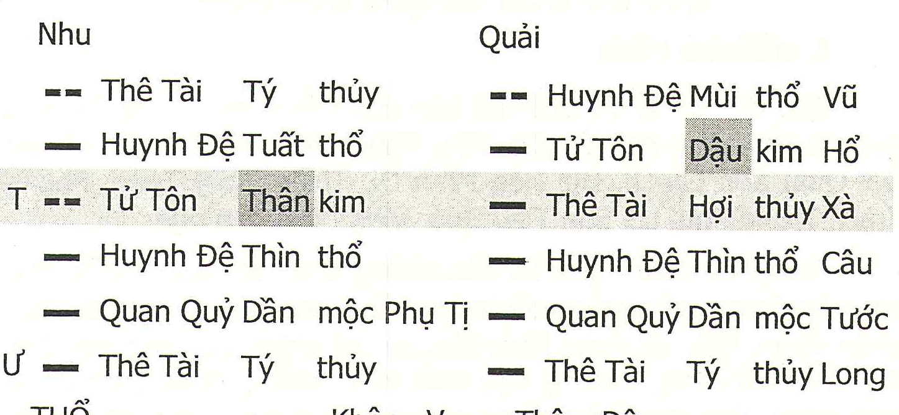 mềm nhũn, không có tinh thần. Tôi đã dặn người này uống cam thảo phiến, sau đó đã khỏi ở ngày Dần.

## Ví dụ 2: Ngày Ất Hợi tháng Mão, nữ đoán về công việc, được quẻ Sơn Lôi Di biến Phong Lôi Ích.

| | Di | | Ích | |
| :---: | :--- | :---: | :--- | :---: |
| | — Huynh Đệ Dần mộc | | — Huynh Đệ Mão mộc | Vũ |
| | - - Phụ Mẫu Tý thủy | Tử Tị | — Tử Tôn Tị hỏa | Hổ |
| T | - - Thế Tài Tuất thổ | | - - Thế Tài Mùi thổ | Xà |
| | - - Thế Tài Thìn thổ | Quan Dậu | - - Thế Tài Thìn thổ | Câu |
| | - - Huynh Đệ Dần mộc | | - - Huynh Đệ Dần mộc | Tước |
| Ư | — Phụ Mẫu Tý thủy | | — Phụ Mẫu Tý thủy | Long |

MỘC Không Vong: Thân, Dậu

**Phán đoán:**

Lấy Quan Quỷ làm Dụng thần.

Quan Quỷ Dậu kim không hiện trong quẻ, phục dưới hào 3 Thê Tài Thìn thổ, Không mà bị Nguyệt kiến xung phá, lại không được Nhật thần sinh phù, rất nhược.

Trong quẻ chỉ có một hào động, là Tử địa Quan Quỷ, là thông tin công việc không có tiến triển.

Hào Thế là ngũ hành sinh Quan Quỷ, tĩnh mà bất động lại bị Nguyệt khắc, vô lực sinh Dụng thần, bản thân không có năng lực thay đổi cục diện công việc bất lợi.

Hào 5 là hào vị cấp trên, phát động ở trong quẻ, là thông tin cấp trên sắp biến động.

Hào Thế lâm Đằng Xà, Đằng Xà là tượng bất an, biến động của cấp trên sẽ dẫn tới sự bất an của cô ấy.

Quẻ chính là quẻ du hồn, bản thân không quan tâm công việc. Quan Quỷ Không Phá, có khả năng mất việc.

**Kết quả:** Quả nhiên là cấp trên biến động, lãnh đạo mới đến không thích cô ấy, đã đuổi việc cô ấy.

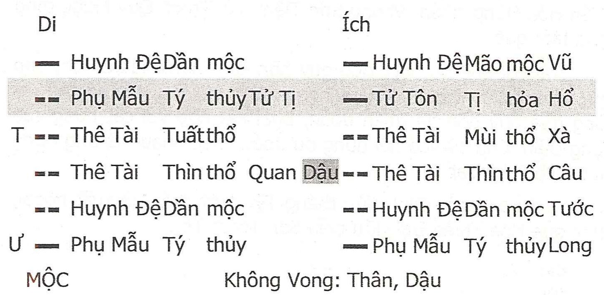

## II. QUẺ QUY HỒN

Quẻ quy hồn là chỉ quẻ thứ tám của mỗi cung, tức là quẻ cuối cùng. Trong 64 quẻ, quẻ quy hồn gồm có Hỏa Thiên Đại Hữu, Thủy Địa Tỷ, Trạch Lôi Tùy, Sơn Phong Cổ, Địa Thủy Sư, Thiên Hỏa Đồng Nhân, Phong Sơn Tiệm, Lôi Trạch Quy Muội, tổng cộng tám quẻ.

Trái với quẻ du hồn, quẻ quy hồn có ý nghĩa là yên ổn, bảo thủ, về nhà, ở nhà, không ra ngoài, tỉnh lại, v.v. Không thể chỉ dùng quẻ quy hồn để phán đoán, phải kết hợp với cát hung của Dụng thần. Căn cứ vào nội dung dự đoán khác nhau mà ứng dụng một cách linh hoạt.

**Ví dụ 1:** Ngày Đinh Sửu tháng Tý, nam đoán về xuất ngoại, được quẻ Hỏa Thiên Đại Hữu biến Sơn Trạch Tổn.

| | Đại Hữu | | Tổn | | |
| :---: | :---: | :--- | :---: | :--- | :--- |
| Ư | ━ | Quan Quỷ Tị hỏa | ━ | Thê Tài Dần mộc | Long |
| | ⚋ | Phụ Mẫu Mùi thổ | ⚋ | Tử Tôn Tý thủy | Vũ |
| | ━ | Huynh Đệ Dậu kim | ⚋ | Phụ Mẫu Tuất thổ | Hổ |
| T | ━ | Phụ Mẫu Thìn thổ | ⚋ | Phụ Mẫu Sửu thổ | Xà |
| | ━ | Thê Tài Dần mộc | ━ | Thê Tài Mão mộc | Câu |
| | ━ | Tử Tôn Tý thủy | ━ | Quan Quỷ Tị hỏa | Tước |

KIM &emsp;&emsp; Không Vong: Thân, Dậu

**Phán đoán:**

Hào Phụ Mẫu chủ văn thư, là visa xuất ngoại, lấy Phụ Mẫu làm Dụng thần, Quan Quỷ là bộ phận phê duyệt visa, Phụ Mẫu lưỡng hiện, lấy hào Phụ Mẫu Thìn thổ phát động làm Dụng thần. Hào Thế là bản thân người này, hào Ứng là quốc gia đi tới.

Phụ Mẫu trì Thế phát động, vốn là thông tin nhận được visa xuất ngoại, nhưng động mà hóa thoái, là visa bị bác bỏ, đi không thành.

Phụ Mẫu Thìn thổ và hào Dậu kim Tuần Không tương hợp, hộ chiếu là một tờ giấy trống không.

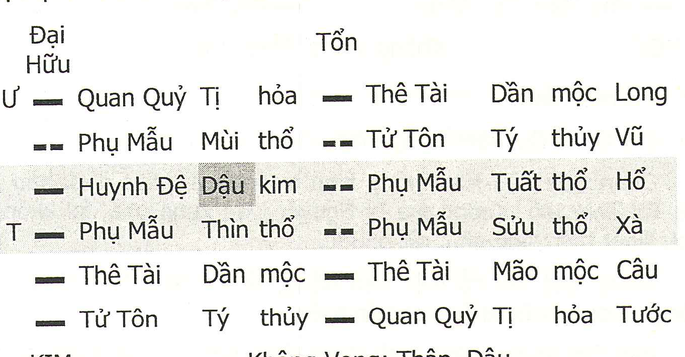

Lại thêm quẻ chính quy hồn, quy hồn bất xuất gia, rất khó xuất ngoại.

**Kết quả:** Sau đó người này làm hộ chiếu, không nhận được visa, đành phải từ bỏ xuất ngoại.

**Ví dụ 2:** Ngày Nhâm Tý tháng Sửu, một người đàn ông đang làm ở một đơn vị cấp dưới gần quê nhà, muốn được chuyển lên thị xã làm ở đơn vị cấp trên, đoán xem có thể thành công hay không? Được quẻ Địa Phong Thăng biến Sơn Phong Cổ.

| | Thăng | | Cổ | | |
| :---: | :---: | :--- | :---: | :--- | :--- |
| | ⚋ | Quan Quỷ Dậu kim | ━ | Huynh Đệ Dần mộc | Hổ |
| | ⚋ | Phụ Mẫu Hợi thủy | ⚋ | Phụ Mẫu Tý thủy | Xà |
| T | ⚋ | Thê Tài Sửu thổ | ⚋ | Thê Tài Tuất thổ | Câu |
| | ━ | Quan Quỷ Dậu kim | ━ | Quan Quỷ Dậu kim | Tước |
| | ━ | Phụ Mẫu Hợi thủy | ━ | Phụ Mẫu Hợi thủy | Long |
| Ư | ⚋ | Thê Tài Sửu thổ | ⚋ | Thê Tài Sửu thổ | Vũ |

MỘC &emsp;&emsp; Không Vong: Dần, Mão

**Phán đoán:**

Lấy Quan Quỷ làm Dụng thần. Trong quẻ Quan Quỷ lưỡng hiện, lấy hào Quan Quỷ Dậu kim phát động làm Dụng thần.

Quan Quỷ phát động, đây là thông tin muốn biến động công tác. Dụng thần được Nguyệt sinh phù, không coi là hưu tù, nhưng không nên động mà hóa Không, hóa Tuyệt, lại hóa nhập quẻ quy hồn.

Quy hồn bất xuất gia, rất khó rời xa quê nhà. Quê nhà người này là nơi hẻo lánh, Dụng thần lâm hào 6, hào 6 là khu vực hẻo lánh, nhập Mộ ở Nguyệt, công tác ở đơn vị cấp dưới bất động, rất khó được điều động thành công.

**Kết quả:** Sau cùng không được điều động công tác.

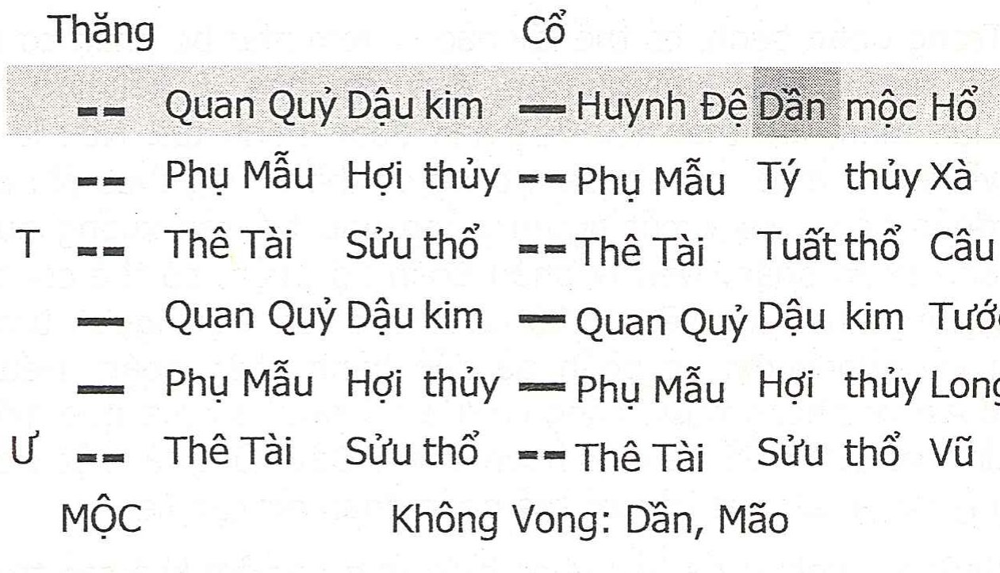

# CHƯƠNG 17
## VAI TRÒ CỦA HÀO VỊ

Hào vị có vai trò rất trọng yếu trong dự đoán lục hào, nó là một trong những căn cứ để phán đoán tính chất, nguyên nhân, phương vị, vị trí v.v của sự vật. Sở dĩ thuật dự đoán lục hào khác với các phương pháp dự đoán khác, được người ta gọi là phép dự đoán lục hào, chính là bởi vì phương pháp dự đoán này đã trao cho mỗi hào vị những ý nghĩa cụ thể, khiến nó trở nên đặc biệt, đây là phương pháp duy nhất lấy hào vị để trích xuất thông tin.

Trong đoán bệnh, có thể lấy hào vị xem như bộ phận cơ thể của một người, phải lướt qua nó, dựa vào hào vị, kết hợp ngũ hành, lục thân, lục thần v.v để phán đoán bệnh tật. Nếu là dự đoán về tướng mạo, ngoại quan, cũng có thể phỏng theo phương pháp đoán bệnh, xem một người giống như từ trên xuống dưới, tiến hành phán đoán. Nếu là phán đoán bộ phận, có thể coi sáu hào vị giống như hình vẽ cục bộ về cơ thể của một người, tương đương với phóng đại bộ phận để tiến hành phán đoán. Nếu là phán đoán về phong thủy, cũng có thể coi sáu hào của quẻ giống như hình vẽ phân bố về một hoàn cảnh. Đây cũng là một trong những lý do tại sao lục hào có thể phán đoán rất cặn kẽ.

Những ý nghĩa của hào vị có tỷ lệ ứng nghiệm khá cao trong dự đoán lục hào được quy nạp như sau:

### Hào sơ có ý nghĩa:

Nhân vật: Dân chúng, dân thành thị, học sinh tiểu học, con cái, nô lệ, thường dân, nhân viên, cấp dưới, v.v.

Cơ thể: Chân, bệnh nấm chân (cước khí), gót chân, cổ chân, ngón chân, v.v.

Địa điểm: Nông thôn, miền quê, nhà trẻ, giếng nước, nền nhà, mương máng, sông ngòi, cầu, hàng xóm, v.v.

Quần áo và trang sức: Giày, vớ, v.v.

### Hào 2 có ý nghĩa:

Nhân vật: Trưởng khoa, trưởng bộ phận, trưởng phòng, nhân viên công vụ, vợ chồng, thai nhi, v.v.

Cơ thể: Chân, đầu gối, hậu môn, bộ phận sinh dục, bàng quang, ruột già, trực tràng, tử cung, gan mật, v.v.

Địa điểm: Thị trấn, khu dân cư, nhà cửa, nhà bếp, sân, gian phòng, nhà mẹ đẻ (của phụ nữ đã có chồng), v.v.

Quần áo và trang sức: Quần, nịt gối, quần cộc, v.v.

### Hào 3 có ý nghĩa:

Nhân vật: Trưởng phòng, phó giám đốc, chủ nhiệm, quản đốc, học sinh trung học, anh em, chị em gái, v.v.

Cơ thể: Thắt lưng, rốn, bụng, mông, tỳ vị¹, gan mật, thận, bàng quang, tử cung, v.v.

Địa điểm: Chính quyền thành phố, thành thị, cửa, giường, phòng ngủ, gian giữa, v.v.

Quần áo và trang sức: Quần lót, váy, tạp dề, v.v.

### Hào 4 có ý nghĩa:

Nhân vật: Thị trưởng, giám đốc, trưởng phòng, trợ lý, lãnh đạo nhân sự, học sinh cấp ba, mẹ, chú, thím, cậu, v.v.

Cơ thể: Ngực, lưng, vú, tim, tỳ vị, phổi, thận, vai, v.v.

Địa điểm: Đại môn, cửa sổ, nhà vệ sinh, thành phố lớn, chính quyền tỉnh, trường cấp ba, v.v.

Quần áo và trang sức: Mặc áo, nội y, trang phục, trang sức đeo ở ngực, v.v.

### Hào 5 có ý nghĩa:

Nhân vật: Thủ tướng, chủ tịch, lãnh đạo, giám đốc, cấp trên, gia trưởng, đế vương, nhân khẩu, v.v.

Cơ thể: Ngũ quan, cổ, cánh tay, ngực, lưng, tay, phổi, yết hầu, tim, khí quản, thực quản, lồng ngực, v.v.

Địa điểm: Đường đi, thủ đô, đại học hàng đầu, trung tâm, khách sạn, v.v.

Quần áo và trang sức: Áo khoác, nịt vú, khăn quàng cổ, kính đeo mắt, khẩu trang, trang sức đeo ở cổ, v.v.

---

¹ Tỳ là lá lách, vị là dạ dày.

### Hào 6 có ý nghĩa:

**Nhân vật:** Nhân viên nghỉ hưu, người già, tổ tiên, thần, phật, thiên sứ, v.v.

**Cơ thể:** Đầu, tóc, mặt, má, tóc mai, tay, đại não, thần kinh não, đầu lâu, xương đầu, vai, v.v.

**Địa điểm:** Nước ngoài, biên giới, biên cương, phương xa, tông miếu, từ đường, rường cột , tường, mái nhà, hàng xóm, mộ tổ, v.v.

**Quần áo và trang sức:** Khăn đội đầu, mũ nón, khăn voan, đồ trang sức (đội trên đầu), kẹp tóc, v.v.

Hào vị còn có rất nhiều ý nghĩa khác, đối với người mới học, có thể ứng dụng linh hoạt những ý nghĩa trên đây thì đã đạt yêu cầu. Mặc dù ở đây đã trình bày về cách dùng hào vị, nhưng có một điểm phải ghi nhớ là dự đoán lục hào phán đoán xoay quanh Dụng thần. Nhất định không được bỏ qua Dụng thần rồi chỉ dùng hào vị để phán đoán. Nếu là như vậy, dự đoán sẽ không nắm được yếu điểm, lệch hướng chính đạo. Hào vị được ứng dụng rất rộng rãi trong dự đoán về bệnh tật và phong thủy, nhất định phải hiểu rõ mới được.

**Ví dụ 1:** Ngày Giáp Thân tháng Ngọ, nữ xem về bệnh bà nội, được quẻ Thủy Địa Tỷ.

| | | Tỷ | | | |
| :---: | :---: | :--- | :---: | :---: | :---: |
| Ứ | - - | Thê Tài | Tý | thủy | Vũ |
| | — | Huynh Đệ | Tuất | thổ | Hổ |
| | - - | Tử Tôn | Thân | kim | Xà |
| T | - - | Quan Quỷ | Mão | mộc | Câu |
| | - - | Phụ Mẫu | Tị | hỏa | Tước |
| | - - | Huynh Đệ | Mùi | thổ | Long |

THỔ Không Vong: Ngọ, Mùi

**Phán đoán:**

Lấy hào Phụ Mẫu làm Dụng thần.

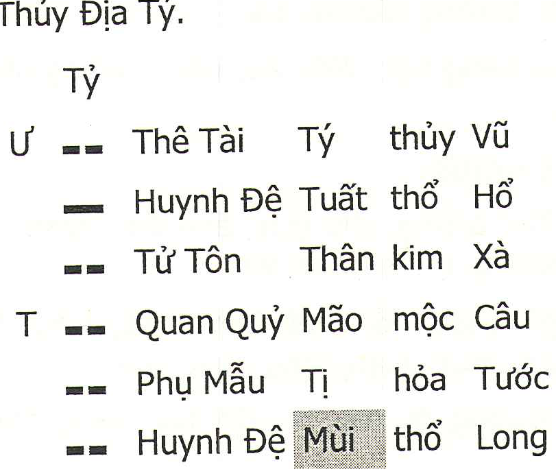

Dụng thần được Nguyệt tỉ phù là vượng, nhưng Nguyên thần tại hào 3 bị Nhật khắc thương, đây là chỗ tồn tại bệnh tật. Quẻ tại cung Khôn, Khôn là bụng, Quan Quỷ ở hào 3 lâm Câu Trần, hào 3 là bụng, Câu Trần chủ sưng trướng, cho nên bệnh là trướng bụng.

Mộc Quỷ lâm Câu Trần, bởi vì tu tạo mà bị bệnh, hào 3 là cửa, là bởi vì sửa chữa cửa mà bị bệnh.

**Kết quả:** Đúng như suy đoán.

**Ví dụ 2:** Ngày Giáp Thân tháng Kỷ Tị năm Giáp Thân, nam đoán về đập bỏ nhà cũ và xây mới, được Sơn Trạch Tổn biến Địa Thủy Sư.

| | | Tổn | | | | | Sư | | | |
| :---: | :---: | :--- | :---: | :---: | :---: | :---: | :--- | :---: | :---: | :---: |
| Ứ | — | Quan Quỷ | Dần | mộc | | - - | Tử Tôn | Dậu | kim | Vũ |
| | - - | Thê Tài | Tý | thủy | | - - | Thê Tài | Hợi | thủy | Hổ |
| | - - | Huynh Đệ | Tuất | thổ | | - - | Huynh Đệ | Sửu | thổ | Xà |
| T | - - | Huynh Đệ | Sửu | thổ | Tử Thân | - - | Phụ Mẫu | Ngọ | hỏa | Câu |
| | — | Quan Quỷ | Mão | mộc | | — | Huynh Đệ | Thìn | thổ | Tước |
| | — | Phụ Mẫu | Tị | hỏa | | - - | Quan Quỷ | Dần | mộc | Long |

THỔ Không Vong: Ngọ, Mùi

**Phán đoán:**

Lấy hào Phụ Mẫu làm Dụng thần.

Phụ Mẫu phát động sinh hào Thế, căn nhà có phong thủy tốt. Phụ Mẫu được Nguyệt tỉ phù, lại động hóa hồi đầu sinh là vượng, lâm Thanh Long, Thanh Long chủ mới, vượng tướng cũng là mới, chính là nhà mới xây.

Phụ Mẫu Tị hỏa và Nhật tương hợp, hợp xứ phùng xung, tương ứng với năm Ất Hợi 1995, đoán là nhà được xây ở năm 1995.

Hào 6 Quan Quỷ Dần mộc là Nguyên thần, động hóa hồi đầu khắc, lại bị Nhật thần xung khắc, hào 6 là tường, tường hơi xiêu vẹo. Lâm Huyền Vũ, Huyền Vũ chủ tối tăm, ẩm ướt, chứng tỏ tường hơi ẩm ướt. Ứng là hàng xóm, hào 6 cũng là hàng xóm, là do nhà hàng xóm gây nên.

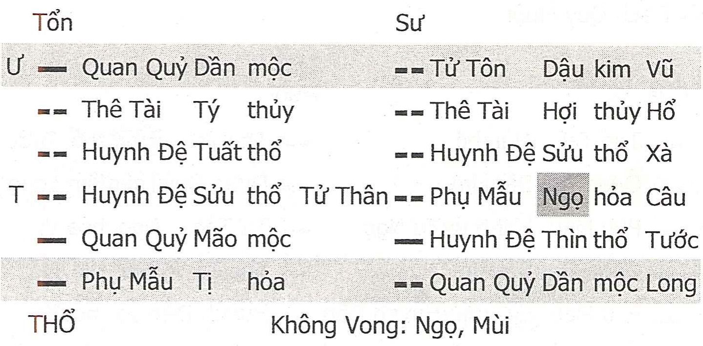

Thê Tài Tý thủy được Nhật Trường Sinh, quan hệ với hào Thế là tương hợp, phong thủy nhà này cực tốt, lợi cho tài vận. Năm Nhâm Ngọ xung hào Tài, năm Quý Mùi xung hào Thế, hợp xứ phùng xung, tài vận trong hai năm này cực kỳ tốt.

**Kết quả:** Tất cả đúng như phán đoán.

**Ví dụ 3:** Ngày Mậu Thìn tháng Thân, tôi đến Lang Phường Hà Bắc để khảo sát. Nghe tin tôi đến, Vương Kim Vũ tiên sinh là hội phó hội Kinh Dịch học ở đó muốn xin gặp tôi một chút, tôi đã vui vẻ đồng ý. Sau khi gặp mặt, ngoài nói chuyện phiếm, Vương Kim Vũ tiên sinh còn gieo được một quẻ, muốn nhờ tôi đoán phong thủy căn nhà ông ta, được quẻ Trạch Phong Đại Quá biến Lôi Trạch Quy Muội.

| | Đại Quá | | Quy Muội | |
| :---: | :--- | :---: | :--- | :---: |
| | - - Thê Tài Mùi thổ | | - - Thê Tài Tuất thổ | Tước |
| | — Quan Quỷ Dậu kim | | - - Quan Quỷ Thân kim | Long |
| T | — Phụ Mẫu Hợi thủy | Tử Ngọ | — Tử Tôn Ngọ hỏa | Vũ |
| | — Quan Quỷ Dậu kim | | - - Thê Tài Sửu thổ | Hổ |
| | — Phụ Mẫu Hợi thủy | Huynh Dần | — Huynh Đệ Mão mộc | Xà |
| Ứ | - - Thê Tài Sửu thổ | | — Tử Tôn Tị hỏa | Câu |

**MỘC** &emsp;&emsp;&emsp;&emsp; **Không Vong: Tuất, Hợi**

### Phán đoán:

Tôi nói: "Căn nhà của ông rất lớn, nhưng ít người ở, trong nhà vắng vẻ. Lúc mua nhà đã vay một số tiền, đến nay vẫn chưa trả hết nợ. Với lại sổ đỏ cũng chưa làm xong.

Ông công tác ở đơn vị rất thuận lợi về mọi mặt. Nhưng không có quan vận, có điều là có một lãnh đạo rất tốt với ông, cực kỳ chiếu cố ông, tiếc là lãnh đạo này đã chuyển đi. Đơn vị ông còn có một lãnh đạo phong lưu háo sắc, có quan hệ với nhiều phụ nữ.

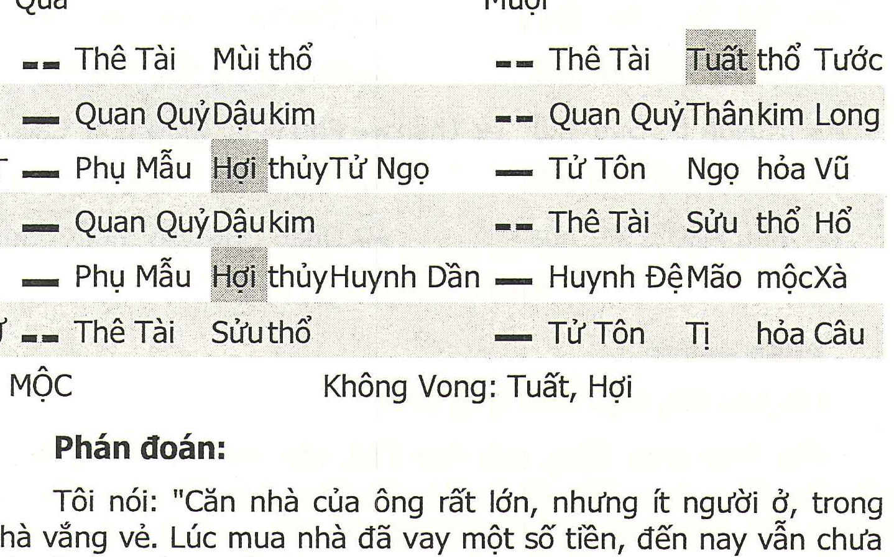

Ngoài tiền lương, ông còn có nhiều nguồn thu nhập khác, nhưng không có đại tài. Sức khỏe của vợ ông không tốt, có bệnh ở chân."

Quẻ này giải như sau:

Lấy hào Phụ Mẫu làm Dụng thần, xem thêm hào 2. Hào 2 Phụ Mẫu Hợi thủy được Nguyệt kiến sinh phù, được hào 5 Quan động sinh, nội quái Tị Dậu Sửu tam hợp Quan cục lại sinh, rất vượng tướng, vượng thì to lớn, cho nên đoán là căn nhà rất lớn.

Hào 5 là hào vị người, hào 2 Không không được hào 5 sinh. Do đó trong nhà thưa người, vắng vẻ.

Phụ Mẫu Hợi thủy trì Thế là thông tin nhà đã trong tay mình.

Phụ Mẫu cũng chủ thủ tục, Không Vong là vẫn chưa làm xong thủ tục, chưa có sổ đỏ.

Hào Thế nhập Mộ ở Nhật thần, Nhật thần là Tài, là thông tin khốn đốn vì tiền bạc. Thế lâm Phụ Mẫu nhập Mộ, Phụ Mẫu chủ nhà cửa, tất là bởi vì chuyện nhà cửa mà tiền bạc gặp khó khăn. Nhật là hiện nay, đoán là lúc mua nhà đã vay nợ, đến nay vẫn chưa trả xong.

Quan Quỷ là công việc, nội quái Tị Dậu Sửu tam hợp Quan cục sinh hào Thế, mọi phương diện của công việc đều thuận buồm xuôi gió. Nhưng hào Thế Không Vong, được Quan Quỷ sinh khá yếu. Do đó, Quan Quỷ chỉ thể hiện công việc, không thể hiện quan vận, đoán là người này không có quan vận.

Hào 5 là hào vị lãnh đạo, động mà sinh Thế, đơn vị có người lãnh đạo chiếu cố ông ta. Nhưng hào 5 Quan Quỷ động mà hóa thoái, chính là tượng người lãnh đạo rời khỏi cương vị công tác. Vì vậy đoán là người lãnh đạo đó đã rời khỏi đơn vị. Lại có hào 5 Quan Quỷ Dậu kim là Đào Hoa, lâm Thanh Long, Thanh Long chủ tửu sắc, tương hợp với Nhật Tài tinh, nhập Mộ ở hào sơ Thê Tài Sửu thổ, vì vậy phong lưu háo sắc, có một vài nhân tình.

Trong quẻ hào Tài đa hiện khắc Thế, đoán là ngoài tiền lương thì ông ta còn có thu nhập khác.

Ứng là thê vị, Thê Tài cũng chủ vợ, Ứng lâm Thê Tài Sửu thổ tức là vợ người này. Thê Tài Sửu thổ là Mộ khố của Quan Quỷ,

Quan Quỷ là bệnh, là thông tin trong người vợ có bệnh. Hào sơ là chân, tại cung Chấn là chân, đoán là vợ có bệnh tật ở chân.

**Kết quả:** Vợ ông ta ở bên cạnh tấm tắc khen hay, còn nói là chưa từng gặp phán đoán chính xác như vậy.

# CHƯƠNG 18
## ỨNG KỲ

Ứng kỳ là thời gian xảy ra cát hung của sự việc được dự đoán. Ứng kỳ được chia thành hai loại, một loại là ứng kỳ quá khứ, một loại là ứng kỳ tương lai. Ví dụ như dự đoán hôn nhân, phán đoán thời gian kết hôn trước đây của người xin đoán, hoặc là thời gian yêu đương, nếu dự đoán bệnh tật, phán đoán thời gian bệnh nhân mắc bệnh, thì là ứng kỳ quá khứ. Phán đoán thời gian sẽ xảy ra sự việc ở tương lai, thì là ứng kỳ tương lai.

Phán đoán chính xác thời gian xảy ra sự việc sẽ tạo dựng được lòng tin rất lớn từ người xin đoán. Điều này cũng là sự bảo đảm để có thể nắm bắt chính xác theo cát tránh hung.

Ứng kỳ là một điểm khó trong dự đoán, nhưng đại bộ phận có quy luật có thể tìm được. Về khoảng cách xa gần của ứng kỳ, phải căn cứ vào sự việc dự đoán khác nhau mà phán đoán linh hoạt, xa thì lấy năm, tháng, gần thì lấy ngày, giờ.

Một số quy luật phán đoán ứng kỳ thường gặp như sau.

### ◆ Dụng thần an tĩnh, lấy địa chi năm, tháng, ngày, giờ lâm Dụng thần làm ứng kỳ, hoặc lấy thời gian lâm địa chi xung Dụng thần làm ứng kỳ.

**Ví dụ:** Ngày Ất Hợi Ngày Hợi, một ông lão tự đoán bệnh, được quẻ Phong Hỏa Gia Nhân biến Phong Sơn Tiệm.

| | Gia Nhân | | | Tiệm | |
| :---: | :--- | :---: | :---: | :--- | :---: |
| | Huynh Đệ Mão mộc | ▅▅▅▅▅ | ▅▅▅▅▅ | Huynh Đệ Mão mộc | Vũ |
| Ư | Tử Tôn Tị hỏa | ▅▅▅▅▅ | ▅▅▅▅▅ | Tử Tôn Tị hỏa | Hổ |
| | Thê Tài Mùi thổ | ▅▅ ▅▅ | ▅▅ ▅▅ | Thê Tài Mùi thổ | Xà |
| | Phụ Mẫu Hợi thủy | ▅▅▅▅▅ | ▅▅▅▅▅ | Quan Quỷ Thân kim | Câu |
| T | Thê Tài Sửu thổ | ▅▅ ▅▅ | ▅▅ ▅▅ | Tử Tôn Ngọ hỏa | Tước |
| | Huynh Đệ Mão mộc | ▅▅▅▅▅ | ▅▅ ▅▅ | Thê Tài Thìn thổ | Long |

MỘC Không Vong: Thân, Dậu

**Phán đoán ứng kỳ:**

Lấy Thế làm Dụng thần, hào Thế không được Nhật Nguyệt sinh phù, Kỵ thần độc phát, khắc Thế là hung. Dụng thần nhược mà an tĩnh, rất sợ xung, Sửu Mùi xung.

**Kết quả:** Sau này chết ở ngày Quý Mùi, chính là ứng gặp xung.

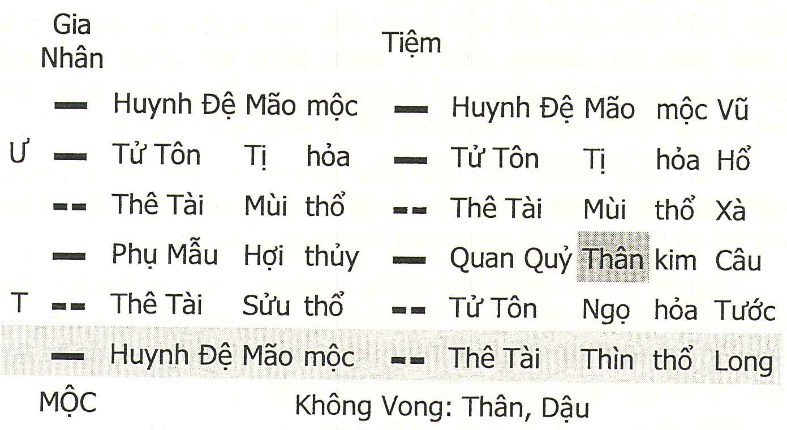

### ◆ Dụng thần phát động, lấy địa chi năm, tháng, ngày, giờ lâm Dụng thần làm ứng kỳ, hoặc lấy thời gian địa chi hợp Dụng thần làm ứng kỳ.

**Ví dụ:** Ngày Ất Hợi tháng Thìn, bằng hữu của một người đàn ông nói là hôm nay sẽ đến, đoán xem mấy giờ đến? Được quẻ Lôi Sơn Tiểu Quá biến Lôi Địa Dự.

| | Tiểu Quá | | | Dự | |
| :---: | :--- | :---: | :---: | :--- | :---: |
| | Phụ Mẫu Tuất thổ | ▅▅ ▅▅ | ▅▅ ▅▅ | Phụ Mẫu Tuất thổ | Vũ |
| | Huynh Đệ Thân kim | ▅▅ ▅▅ | ▅▅ ▅▅ | Huynh Đệ Thân kim | Hổ |
| T | Quan Quỷ Ngọ hỏa Tử Hợi | ▅▅▅▅▅ | ▅▅▅▅▅ | Quan Quỷ Ngọ hỏa | Xà |
| | Huynh Đệ Thân kim | ▅▅▅▅▅ | ▅▅ ▅▅ | Thê Tài Mão mộc | Câu |
| | Quan Quỷ Ngọ hỏa Tài Mão | ▅▅ ▅▅ | ▅▅ ▅▅ | Quan Quỷ Tị hỏa | Tước |
| Ư | Phụ Mẫu Thìn thổ | ▅▅ ▅▅ | ▅▅ ▅▅ | Phụ Mẫu Mùi thổ | Long |

KIM Không Vong: Thân, Dậu

**Phán đoán ứng kỳ:**

Lấy Huynh Đệ làm Dụng thần. Dụng thần lưỡng hiện, lấy hào Huynh Đệ Thân kim phát động làm Dụng. Động mà gặp trị, gặp hợp, lại bởi vì Không Vong ứng Thực Không, giờ Thân đến.

**Kết quả:** Quả nhiên đến vào giờ Thân.

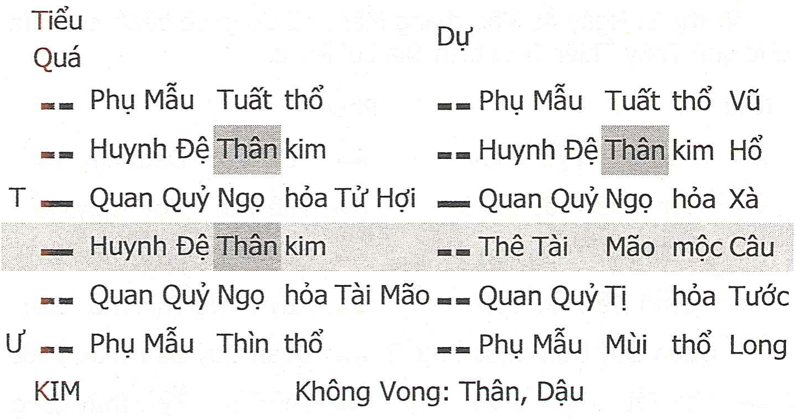

◆ **Dụng thần hoặc Kỵ thần quá vượng, căn cứ vào tình hình cát hung mà phán đoán ứng kỳ không giống nhau. Dụng thần quá vượng, đoán cát thì thường lấy Dụng thần nhập Mộ làm ứng kỳ; đoán hung thì thường lấy thời gian sinh Dụng thần làm ứng kỳ. Khi Kỵ thần vượng thì ngược lại, khi Kỵ thần nhập Mộ hoặc bị khắc là hung, khi được sinh trái lại là cát.**

**Ví dụ 1:** Ngày Ất Mão tháng Mão, nữ đoán về bệnh của cha, được quẻ Thủy Thiên Nhu biến Địa Lôi Phục.

| | Nhu | | | | Phục | |
| :---: | :---: | :--- | :---: | :---: | :--- | :--- |
| | - - | Thê Tài Tý thủy | | - - | Tử Tôn Dậu kim | Vũ |
| | — | Huynh Đệ Tuất thổ | | - - | Thê Tài Hợi thủy | Hổ |
| T | - - | Tử Tôn Thân kim | | - - | Huynh Đệ Sửu thổ | Xà |
| | — | Huynh Đệ Thìn thổ | | - - | Huynh Đệ Thìn thổ | Câu |
| | — | Quan Quỷ Dần mộc | Phụ Tị | - - | Quan Quỷ Dần mộc | Tước |
| Ư | — | Thê Tài Tý thủy | | — | Thê Tài Tý thủy | Long |

THỔ Không Vong: Tý, Sửu

**Phán đoán ứng kỳ:**

Lấy Phụ Mẫu làm Dụng thần.

Trong quẻ Nhật Nguyệt sinh Dụng thần, Phi thần lại động đến sinh Dụng thần, Dụng thần có sinh không khắc, Dụng thần quá vượng gặp sinh mà hung.

**Kết quả:** Sau đó chết ở ngày Đinh Mão.

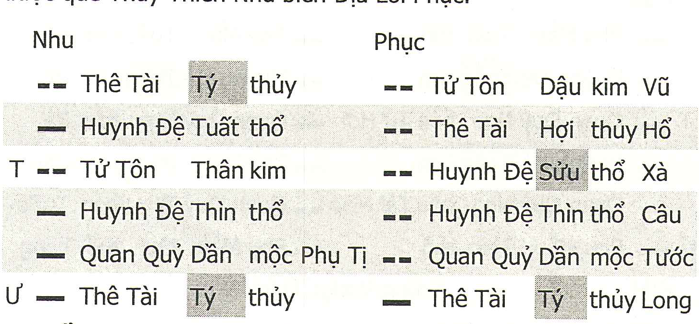

**Ví dụ 2:** Ngày Kỷ Mão tháng Thân, một người đoán tuổi thọ, được quẻ Sơn Trạch Tổn biến Địa Lôi Phục.

| | Tổn | | | | Phục | |
| :---: | :---: | :--- | :---: | :---: | :--- | :--- |
| Ư | — | Quan Quỷ Dần mộc | | - - | Tử Tôn Dậu kim | Câu |
| | - - | Thê Tài Tý thủy | | - - | Thê Tài Hợi thủy | Tước |
| | - - | Huynh Đệ Tuất thổ | | - - | Huynh Đệ Sửu thổ | Long |
| T | - - | Huynh Đệ Sửu thổ | Tử Thân | - - | Huynh Đệ Thìn thổ | Vũ |
| | — | Quan Quỷ Mão mộc | | - - | Quan Quỷ Dần mộc | Hổ |
| | — | Phụ Mẫu Tị hỏa | | — | Thê Tài Tý thủy | Xà |

THỔ Không Vong: Thân, Dậu

**Phán đoán ứng kỳ:**

Lấy hào Thế làm Dụng thần.

Hào Thế không được Nguyệt sinh, bị Nhật khắc thương, trong quẻ lại có hai tầng mộc động mà khắc Thế, Kỵ thần trùng điệp, đề phòng năm Kỵ thần nhập Mộ.

**Kết quả:** Năm Tý đoán, sau chết ở năm Mùi.

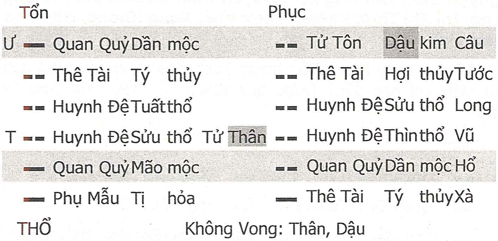

◆ **Nguyên thần phát động, đôi khi lấy địa chi lâm Nguyên thần làm ứng kỳ, hoặc thời gian có địa chi hợp Nguyên thần làm ứng kỳ. Nguyên thần Nguyệt phá, Không Vong, thì khi Thực Không, Thực Phá, Xung Không, Hợp Phá là ứng kỳ.**

**Ví dụ:** Ngày Nhâm Dần tháng Tuất, đoán xem sách gửi qua bưu điện khi nào đến? Được quẻ Khảm Vi Thủy biến Đoài Vi Trạch.

| | Khảm | | | | Đoài | |
| :---: | :---: | :--- | :---: | :---: | :--- | :--- |
| T | - - | Huynh Đệ Tý thủy | | - - | Quan Quỷ Mùi thổ | Hổ |
| | — | Quan Quỷ Tuất thổ | | — | Phụ Mẫu Dậu kim | Xà |
| | - - | Phụ Mẫu Thân kim | | — | Huynh Đệ Hợi thủy | Câu |
| Ư | - - | Thê Tài Ngọ hỏa | | - - | Quan Quỷ Sửu thổ | Tước |
| | — | Quan Quỷ Thìn thổ | | — | Tử Tôn Mão mộc | Long |
| | - - | Tử Tôn Dần mộc | | — | Thê Tài Tị hỏa | Vũ |

THỦY Không Vong: Thìn, Tị

**Phán đoán ứng kỳ:**

Lấy Phụ Mẫu làm Dụng thần.

Dụng thần được Nguyệt sinh phù là vượng, nhưng Nguyên thần Quan Quỷ Thìn thổ Nguyệt phá, Không Vong, ngày Giáp Thìn xuất Không, Thực Phá, ngày Giáp Thìn có thể đến.

**Kết quả:** Ngày Giáp Thìn đến.

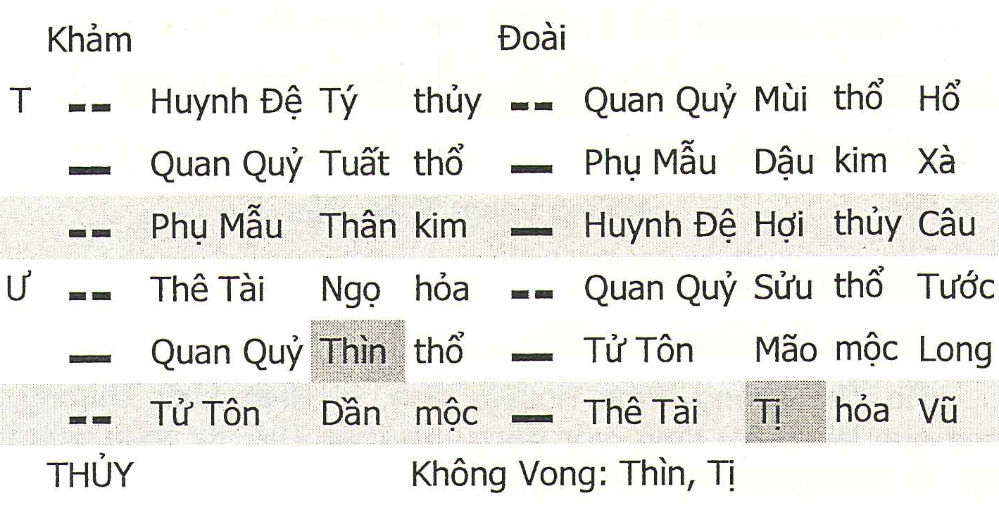

◆ **Kỵ thần phát động, lấy địa chi lâm Kỵ thần làm ứng kỳ, hoặc thời gian có địa chi hợp Kỵ thần làm ứng kỳ.**

**Ví dụ:** Ngày Tân Tị tháng Tị, một người đoán về bệnh của cha. Được quẻ Thủy Phong Tỉnh biến Địa Phong Thăng.

| | Tỉnh | | | | Thăng | |
| :---: | :---: | :--- | :---: | :---: | :--- | :--- |
| | - - | Phụ Mẫu Tý thủy | | - - | Quan Quỷ Dậu kim | Xà |
| T | — | Thê Tài Tuất thổ | | - - | Phụ Mẫu Hợi thủy | Câu |
| | - - | Quan Quỷ Thân kim | | - - | Thê Tài Sửu thổ | Tước |
| | — | Quan Quỷ Dậu kim | | — | Quan Quỷ Dậu kim | Long |
| Ư | — | Phụ Mẫu Hợi thủy | | — | Phụ Mẫu Hợi thủy | Vũ |
| | - - | Thê Tài Sửu thổ | | - - | Thê Tài Sửu thổ | Hổ |

MỘC Không Vong: Thân, Dậu

**Phán đoán ứng kỳ:**

Lấy Phụ Mẫu làm Dụng thần.

Dụng thần Nguyệt phá Nhật phá, Nguyên thần lại Không, Kỵ thần phát động không cát.

**Kết quả:** Sau này chết ở ngày Tuất, ứng ngày trị Kỵ thần.

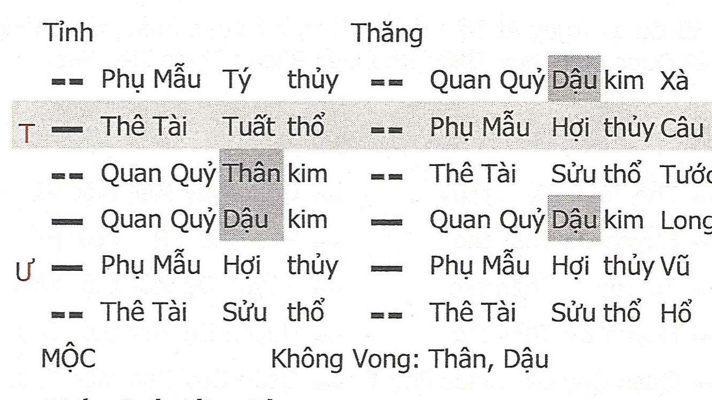

◆ Khi Dụng thần hưu tù, gặp Tuyệt, tùy vào cát hung mà ứng kỳ không giống nhau. Đoán cát, lấy lúc Dụng thần Trường Sinh làm ứng kỳ, hoặc lấy địa chi lâm Nguyên thần làm ứng kỳ. Đoán hung, khi Dụng thần nhập Mộ, gặp xung, bị khắc là ứng kỳ; cũng có lúc Dụng thần suy cực, gặp Trường Sinh là hung.

**Ví dụ 1:** Ngày Ất Dậu tháng Thìn, nữ đoán ngày nào chồng trở về? Được quẻ Thủy Thiên Nhu biến Phong Thiên Tiểu Súc.

| | Nhu | | Tiểu Súc | |
| :---: | :--- | :---: | :--- | :---: |
| | -- Thê Tài Tý thủy | | — Quan Quỷ Mão mộc | Vũ |
| | — Huynh Đệ Tuất thổ | | — Phụ Mẫu Tị hỏa | Hổ |
| T | -- Tử Tôn Thân kim | | -- Huynh Đệ Mùi thổ | Xà |
| | — Huynh Đệ Thìn thổ | | — Huynh Đệ Thìn thổ | Câu |
| | — Quan Quỷ Dần mộc | Phụ Tị | — Quan Quỷ Dần mộc | Tước |
| Ư | — Thê Tài Tý thủy | | — Thê Tài Tý thủy | Long |

THỔ Không Vong: Ngọ, Mùi

**Phán đoán ứng kỳ:**

Lấy Quan Quỷ làm Dụng thần.

Quan Quỷ không được Nguyệt kiến sinh phù, bị Nhật khắc thương là hưu tù. Trong quẻ tuy có Nguyên thần động mà sinh Quan, nhưng vẫn hơi nhược, ngày Hợi Dụng thần được Trường Sinh, ngày Hợi có thể về.

**Kết quả:** Trở về ở giờ Hợi ngày Hợi.

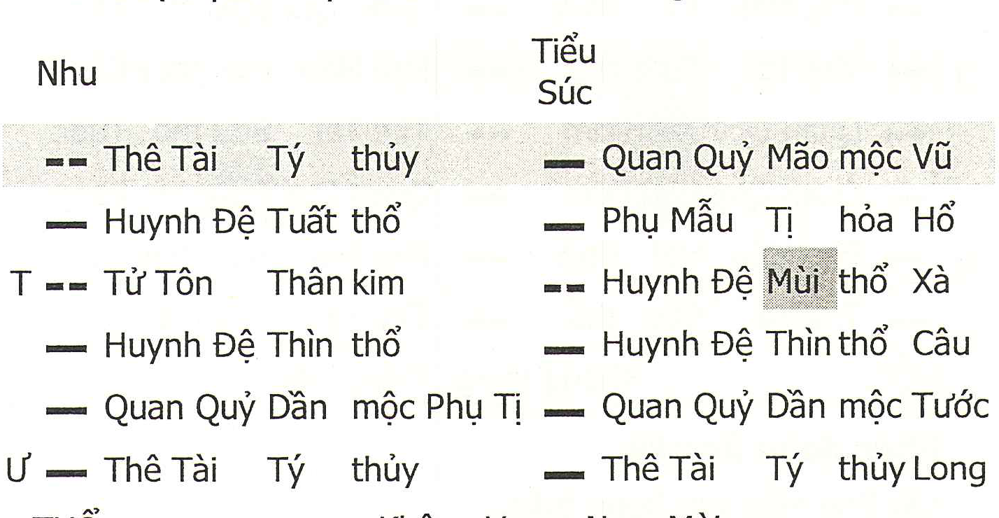

**Ví dụ 2:** Ngày Đinh Sửu tháng Ngọ, nam đoán về sinh nở của vợ, được quẻ Thủy Hỏa Ký Tế.

| | Ký Tế | | |
| :---: | :--- | :---: | :---: |
| Ư | -- Huynh Đệ Tý thủy | | Long |
| | — Quan Quỷ Tuất thổ | | Vũ |
| | -- Phụ Mẫu Thân kim | | Hổ |
| T | — Huynh Đệ Hợi thủy | Tài Ngọ | Xà |
| | -- Quan Quỷ Sửu thổ | | Câu |
| | — Tử Tôn Mão mộc | | Tước |

THỦY Không Vong: Thân, Dậu

**Phán đoán ứng kỳ:**

Lấy Tử Tôn làm Dụng thần.

Tử Tôn Mão mộc hưu tù, hưu tù gặp Trường Sinh, tháng Hợi sinh.

**Kết quả:** Sau này sinh một con trai ở tháng Hợi.

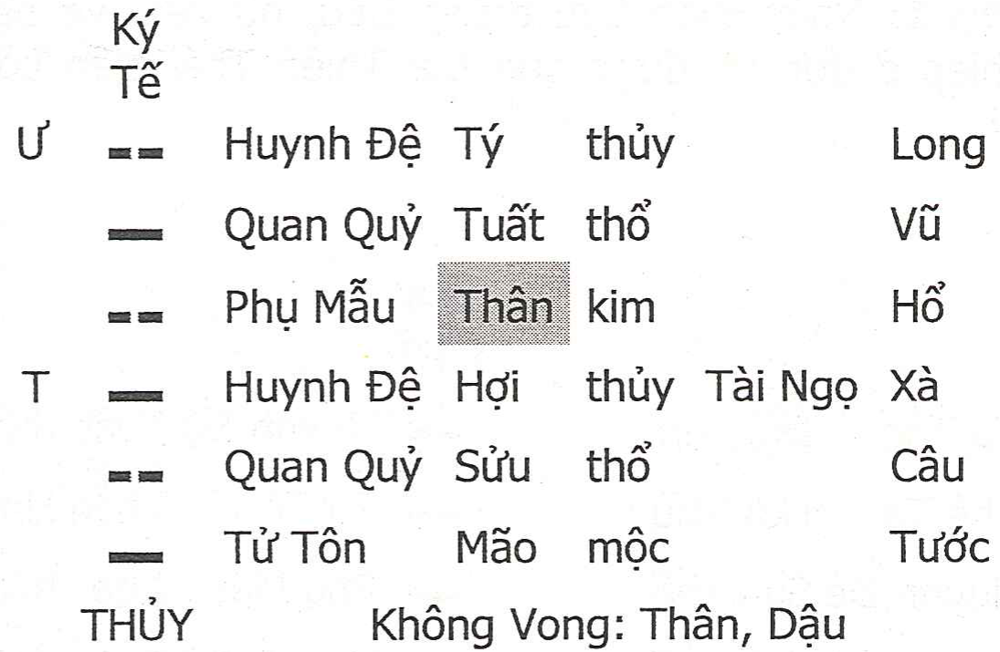

### ◆ Dụng thần nhập Mộ, hoặc lấy lúc xung Mộ làm ứng kỳ, hoặc lấy lúc xung Dụng thần làm ứng kỳ.

**Ví dụ 1:** Ngày Đinh Sửu tháng Dậu, nữ xem về bệnh của đồng nghiệp ở đơn vị, được quẻ Địa Thiên Thái biến Lôi Trạch Quy Muội.

| | Thái | | | Quy Muội | | | |
| :---: | :---: | :---: | :---: | :---: | :---: | :---: | :---: |
| Ứ | - - | Tử Tôn | Dậu kim | - - | Huynh Đệ | Tuất thổ | Long |
| | - - | Thê Tài | Hợi thủy | - - | Tử Tôn | Thân kim | Vũ |
| | - - | Huynh Đệ | Sửu thổ | — | Phụ Mẫu | Ngọ hỏa | Hổ |
| T | — | Huynh Đệ | Thìn thổ | - - | Huynh Đệ | Sửu thổ | Xà |
| | — | Quan Quỷ | Dần mộc Phụ Tị | — | Quan Quỷ | Mão mộc | Câu |
| | — | Thê Tài | Tý thủy | — | Phụ Mẫu | Tị hỏa | Tước |

THỔ

Không Vong: Thân, Dậu

**Phán đoán ứng kỳ:**

Lấy hào Ứng làm Dụng thần.

Dụng thần Tử Tôn Dậu kim nhập Mộ ở Nhật và hào động Huynh Đệ Sửu thổ, sau khỏi bệnh ở tháng Mão năm Sửu. Đây là ứng năm nhập Mộ, ứng tháng Dụng thần gặp xung.

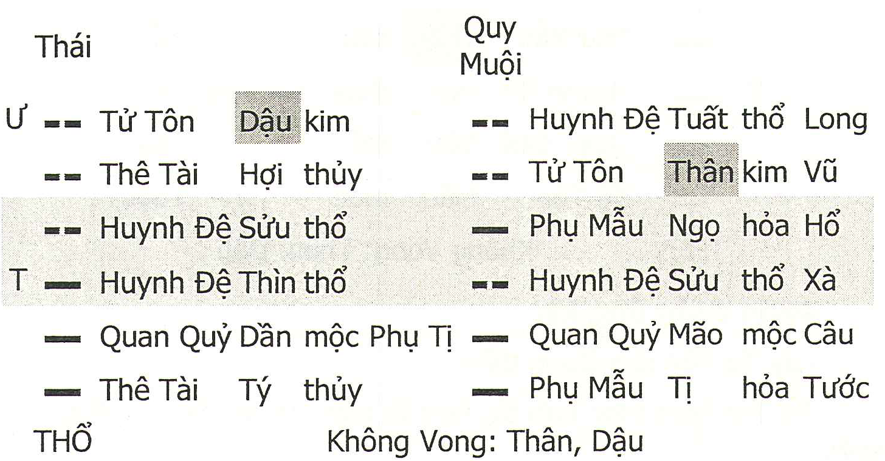

**Ví dụ 2:** Ngày Mậu Thìn tháng Thân, vợ xem về bệnh gần của chồng, được quẻ Thiên Hỏa Đồng Nhân biến Ly Vi Hỏa.

| | Đồng Nhân | | | Ly | | | |
| :---: | :---: | :---: | :---: | :---: | :---: | :---: | :---: |
| Ứ | — | Tử Tôn | Tuất thổ | — | Huynh Đệ | Tị hỏa | Tước |
| | — | Thê Tài | Thân kim | - - | Tử Tôn | Mùi thổ | Long |
| | — | Huynh Đệ | Ngọ hỏa | — | Thê Tài | Dậu kim | Vũ |
| T | — | Quan Quỷ | Hợi thủy | — | Quan Quỷ | Hợi thủy | Hổ |
| | - - | Tử Tôn | Sửu thổ | - - | Tử Tôn | Sửu thổ | Xà |
| | — | Phụ Mẫu | Mão mộc | — | Phụ Mẫu | Mão mộc | Câu |

HỎA

Không Vong: Tuất, Hợi

**Phán đoán ứng kỳ:**

Lấy Quan Quỷ làm Dụng thần.

Dụng thần Quan Quỷ Hợi thủy nhập Nhật Mộ, khỏi bệnh ở ngày Tị, chính là ứng ngày Dụng thần xuất Mộ gặp xung.

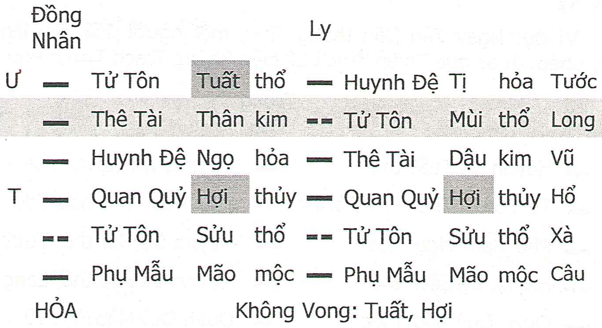

### ◆ Dụng thần gặp hợp, hoặc lấy lúc xung Dụng thần làm ứng kỳ, hoặc lấy lúc xung địa chi hợp Dụng thần làm ứng kỳ.

**Ví dụ:** Ngày Tân Dậu tháng Thìn, một người đoán về làm giấy phép, được quẻ Thiên Trạch Lý biến Phong Trạch Trung Phu.

| | Lý | Phục thần | Trung Phu | |
|---|---|---|---|---|
| | — Huynh Đệ Tuất thổ | | — Quan Quỷ Mão mộc | Xà |
| T | — Tử Tôn Thân kim | Tài Tý | — Phụ Mẫu Tị hỏa | Câu |
| | — Phụ Mẫu Ngọ hỏa | | -- Huynh Đệ Mùi thổ | Tước |
| | -- Huynh Đệ Sửu thổ | | -- Huynh Đệ Sửu thổ | Long |
| Ư | — Quan Quỷ Mão mộc | | — Quan Quỷ Mão mộc | Vũ |
| | — Phụ Mẫu Tị hỏa | | — Phụ Mẫu Tị hỏa | Hổ |

**THỔ**

**Không Vong: Tý, Sửu**

### Phán đoán ứng kỳ:

Lấy Phụ Mẫu làm Dụng thần.

Phụ Mẫu động mà tác hợp với hào biến, ngày Tý, ngày Sửu xung khai có thể làm được. Nhưng Dụng thần không vượng, ngày Tý trong xung có khắc, ngày Sửu mới thành.

**Kết quả:** Sau đó làm được ở ngày Ất Sửu.

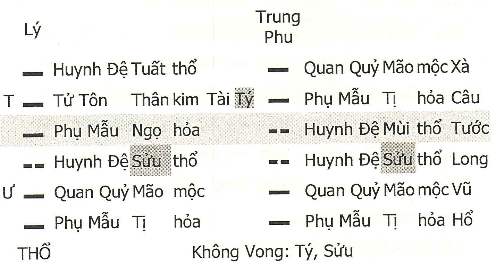

### ◆ Nguyên thần động mà gặp hợp, lấy lúc xung Nguyên thần hoặc xung địa chi hợp Nguyên thần làm ứng kỳ. Kỵ thần gặp hợp, lấy địa chi xung Kỵ thần hoặc xung địa chi hợp Kỵ thần làm ứng kỳ.

**Ví dụ:** Ngày Giáp Ngọ tháng Mùi, đoán về bệnh của con, được quẻ Thiên Trạch Lý biến Phong Trạch Trung Phu.

| | Lý | Phục thần | Trung Phu | |
|---|---|---|---|---|
| | — Huynh Đệ Tuất thổ | | — Quan Quỷ Mão mộc | Vũ |
| T | — Tử Tôn Thân kim | Tài Tý | — Phụ Mẫu Tị hỏa | Hổ |
| | — Phụ Mẫu Ngọ hỏa | | -- Huynh Đệ Mùi thổ | Xà |
| | -- Huynh Đệ Sửu thổ | | -- Huynh Đệ Sửu thổ | Câu |
| Ư | — Quan Quỷ Mão mộc | | — Quan Quỷ Mão mộc | Tước |
| | — Phụ Mẫu Tị hỏa | | — Phụ Mẫu Tị hỏa | Long |

**THỔ**

**Không Vong: Thìn, Tị**

### Phán đoán ứng kỳ:

Lấy Tử Tôn làm Dụng thần.

Nguyệt sinh Nhật khắc, suy vượng tương đương, nhưng không nên Kỵ thần độc phát. Nay Kỵ thần động mà hóa hợp, ngày Sửu xung khai hợp thần, Dụng thần nhập Mộ tất nguy.

**Kết quả:** Sau chết ở ngày Sửu.

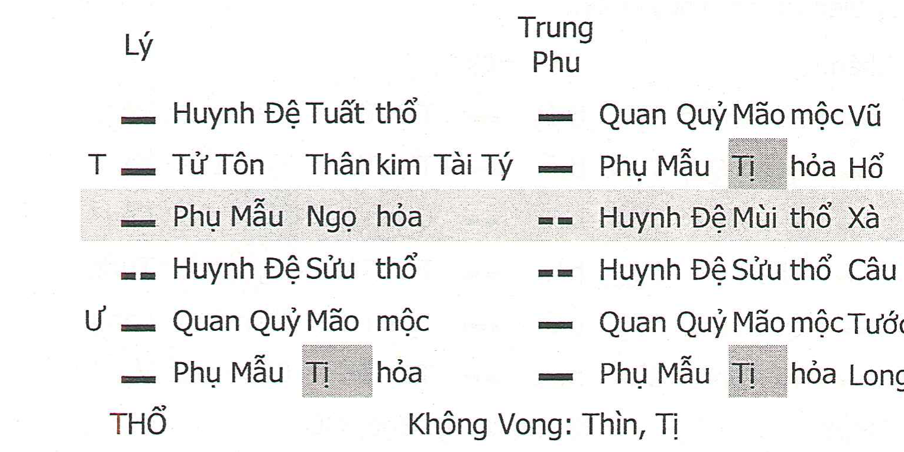

◆ **Dụng thần Nguyệt phá, lấy lúc hợp Dụng thần làm ứng kỳ, hoặc lấy địa chi năm, tháng, ngày, giờ lâm Dụng thần làm ứng kỳ, hoặc lấy tháng sau của lúc dự đoán làm ứng kỳ.**

**Ví dụ 1:** Từ tiên sinh ở một công ty trang trí đoán xem năm nào bị đứt ngón tay? Ngày Quý Tị tháng Thìn, được quẻ Khảm Vi Thủy biến Phong Thủy Hoán.

| | Khảm | | Hoán | | |
|---|:---:|---|:---:|---|---|
| T | - - | Huynh Đệ Tý thủy | — | Tử Tôn Mão mộc | Hổ |
| | — | Quan Quỷ Tuất thổ | — | Thê Tài Tị hỏa | Xà |
| | - - | Phụ Mẫu Thân kim | - - | Quan Quỷ Mùi thổ | Câu |
| Ứ | - - | Thê Tài Ngọ hỏa | - - | Thê Tài Ngọ hỏa | Tước |
| | — | Quan Quỷ Thìn thổ | — | Quan Quỷ Thìn thổ | Long |
| | - - | Tử Tôn Dần mộc | - - | Tử Tôn Dần mộc | Vũ |

THỦY Không Vong: Ngọ, Mùi

**Phán đoán:**

Đoán về thương tai, lấy cái khắc hào Thế làm Dụng thần.

Trong quẻ Quan Quỷ Tuất thổ và Thìn thổ lưỡng hiện, lại đều là hào tĩnh, nhưng Tuất thổ bị Nguyệt kiến xung phá, do vậy lấy hào Tuất thổ Nguyệt phá làm Dụng. Năm Giáp Tuất (năm 1994) là năm Quan Quỷ Tuất thổ Thực Phá, nhất định ngón tay bị đứt ở năm Giáp Tuất.

**Kết quả:** Đúng như dự đoán.

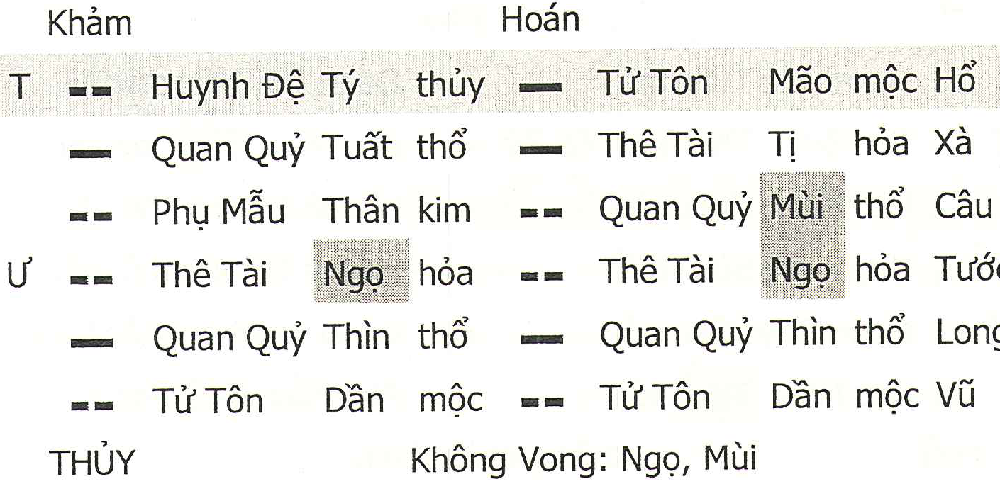

**Ví dụ 2:** Ngày Kỷ Dậu tháng Tị, nam đoán về sinh nở của vợ, được quẻ Trạch Địa Tụy biến Trạch Sơn Hàm.

| | Tụy | | Hàm | | |
|---|:---:|---|:---:|---|---|
| | - - | Phụ Mẫu Mùi thổ | - - | Phụ Mẫu Mùi thổ | Câu |
| Ứ | — | Huynh Đệ Dậu kim | — | Huynh Đệ Dậu kim | Tước |
| | — | Tử Tôn Hợi thủy | — | Tử Tôn Hợi thủy | Long |
| | - - | Thê Tài Mão mộc | — | Huynh Đệ Thân kim | Vũ |
| T | - - | Quan Quỷ Tị hỏa | - - | Quan Quỷ Ngọ hỏa | Hổ |
| | - - | Phụ Mẫu Mùi thổ | - - | Phụ Mẫu Thìn thổ | Xà |

KIM Không Vong: Dần, Mão

**Phán đoán ứng kỳ:**

Lấy Tử Tôn làm Dụng thần.

Tử Tôn Nguyệt phá, tháng Hợi Thực Phá, tháng Hợi sinh.

**Kết quả:** Sau này sinh một con trai ở tháng Hợi.

**Ví dụ 3:** Ngày Ất Dậu tháng Ngọ, sách được gửi từ Nhật Bản khi nào đến? Được quẻ Thiên Lôi Vô Vọng.

| | Vô Vọng | | |
|---|:---:|---|---|
| | — | Thê Tài Tuất thổ | Vũ |
| | — | Quan Quỷ Thân kim | Hổ |
| T | — | Tử Tôn Ngọ hỏa | Xà |
| | - - | Thê Tài Thìn thổ | Câu |
| | - - | Huynh Đệ Dần mộc | Tước |
| Ứ | — | Phụ Mẫu Tý thủy | Long |

MỘC Không Vong: Ngọ, Mùi

**Phán đoán ứng kỳ:**

Lấy Phụ Mẫu làm Dụng thần.

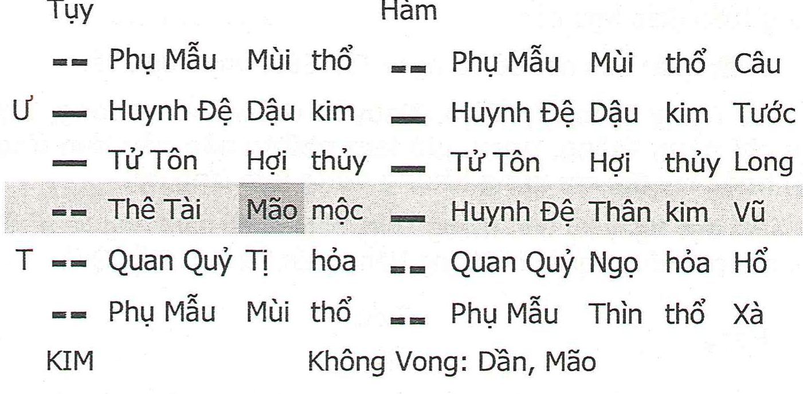

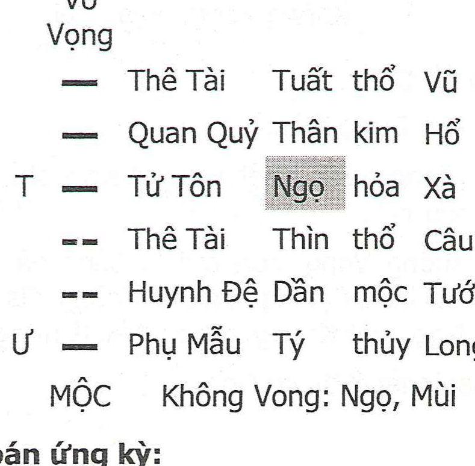

Phụ Mẫu Tý thủy được Nhật sinh phù là vượng, xung khắc hào Thế, là tượng vật đến với mình. Nay Dụng thần Nguyệt phá, hào Thế lại Không, đoán là ngày Canh Tý hoặc ngày Tân Sửu trong tuần Giáp Ngọ đến.

**Kết quả:** Sau này đến ở ngày Tân Sửu, ứng Hợp Phá.

### ◆ Dụng thần, Kỵ thần, Nguyên thần Không Vong, lấy địa chi năm, tháng, ngày, giờ lâm những hào này làm ứng kỳ, hoặc lấy địa chi xung Không Vong làm ứng kỳ.

**Ví dụ:** Ngày Kỷ Sửu tháng Thìn, nam đoán cát hung về bệnh lâu của con, được quẻ Lôi Phong Hằng biến Lôi Sơn Tiểu Quá.

| | Hằng | | | Tiểu Quá | |
| :---: | :---: | :--- | :---: | :--- | :--- |
| Ứ | - - | Thê Tài Tuất thổ | - - | Thê Tài Tuất thổ | Câu |
| | - - | Quan Quỷ Thân kim | - - | Quan Quỷ Thân kim | Tước |
| | —— | Tử Tôn Ngọ hỏa | —— | Tử Tôn Ngọ hỏa | Long |
| T | —— | Quan Quỷ Dậu kim | —— | Quan Quỷ Thân kim | Vũ |
| | —— | Phụ Mẫu Hợi thủy | - - | Tử Tôn Ngọ hỏa | Hổ |
| | - - | Thê Tài Sửu thổ | - - | Thê Tài Thìn thổ | Xà |

**MỘC** &emsp;&emsp; **Không Vong: Ngọ, Mùi**

**Phán đoán ứng kỳ:**

Lấy Tử Tôn làm Dụng thần.

Dụng thần không được Nhật Nguyệt sinh phù, Kỵ thần Hợi thủy độc phát không cát.

Dụng thần Không Vong, con trai bị bệnh đã lâu, bệnh lâu gặp Không thì chết, lại thêm Ngọ núp ở Không địa không bị Hợi thủy khắc, tháng Ngọ xuất Không, tất bị khắc là hung.

**Kết quả:** Sau chết ở tháng Ngọ.

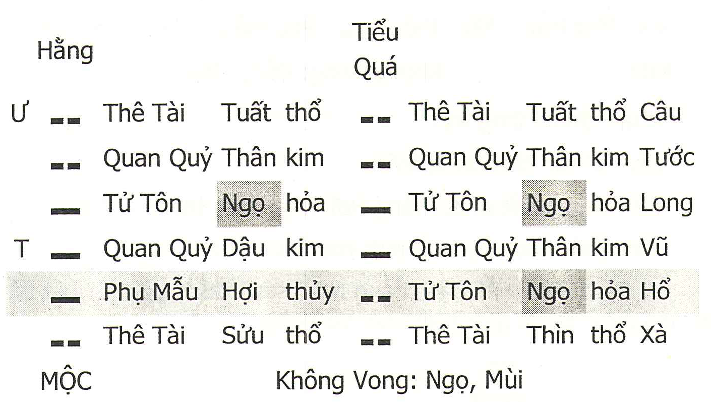

### ◆ Dụng thần bị Kỵ thần khắc, nhưng khi trong quẻ biểu thị cát, lấy lúc Kỵ thần bị khắc, hoặc lúc xung mất Kỵ thần làm ứng kỳ.

**Ví dụ:** Ngày Nhâm Thân tháng Dần, đoán tài vận mấy ngày sắp tới, được quẻ Sơn Hỏa Bí biến Sơn Lôi Di.

| | Bí | | | Di | | |
| :---: | :---: | :--- | :---: | :---: | :--- | :--- |
| | —— | Quan Quỷ Dần mộc | | —— | Quan Quỷ Dần mộc | Hổ |
| | - - | Thê Tài Tý thủy | | - - | Thê Tài Tý thủy | Xà |
| Ứ | - - | Huynh Đệ Tuất thổ | | - - | Huynh Đệ Tuất thổ | Câu |
| | —— | Thê Tài Hợi thủy | Tử Thân | - - | Huynh Đệ Thìn thổ | Tước |
| | - - | Huynh Đệ Sửu thổ | Phụ Ngọ | - - | Quan Quỷ Dần mộc | Long |
| T | —— | Quan Quỷ Mão mộc | | —— | Thê Tài Tý thủy | Vũ |

**THỔ** &emsp;&emsp; **Không Vong: Tuất, Hợi**

**Phán đoán ứng kỳ:**

Lấy Thê Tài làm Dụng thần. Trong quẻ Thê Tài lưỡng hiện, lấy hào Thê Tài Hợi thủy phát động làm Dụng thần.

Dụng thần được Nguyệt hợp vượng, lại được Nhật sinh phù, động mà sinh Thế, đây là tượng sắp tới được tài, nhưng Dụng thần động mà nhập Mộ ở hào biến, lại động hóa hồi đầu khắc, ngày hôm sau hào biến bị hợp không khắc Dụng thần, giờ Tị Dụng thần từ trong Mộ khố xung ra, có thể tiến tài, ngày Tuất xung mất hào biến cũng có thể tiến tài.

**Kết quả:** Quả nhiên ở giờ Tị ngày hôm sau và giờ Tị ngày Tuất có tài khác nhau vào.

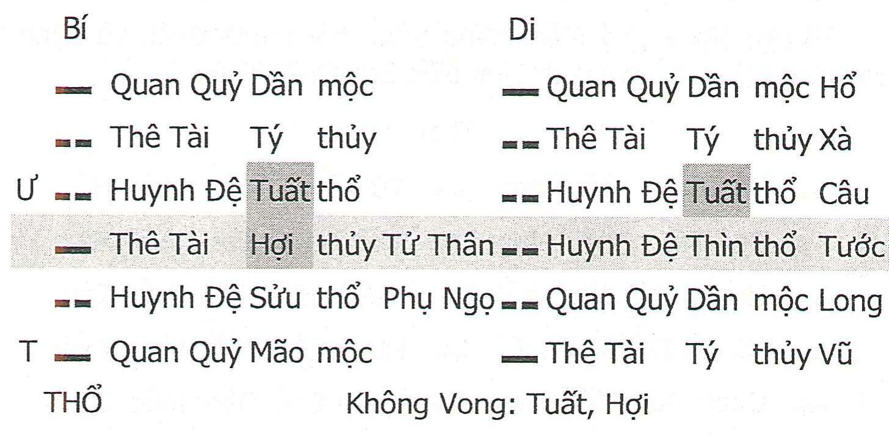

◆ **Dụng thần, Kỵ thần phát động hóa Tiến thần, lấy địa chi lâm hào động hóa Tiến thần làm ứng kỳ, hoặc lấy thời gian lâm địa chi hợp hóa Tiến thần làm ứng kỳ. Nếu có một địa chi tương hợp, thì lấy xung khai làm ứng kỳ; Không Vong, thì lấy Thực Không, xung Không làm ứng kỳ; Nguyệt phá, thì lấy Hợp Phá, Thực Phá làm ứng kỳ.**

**Ví dụ:** Ngày Quý Mão tháng Sửu, một người đoán về bệnh của vợ, được quẻ Địa Trạch Lâm biến Địa Thiên Thái.

| | | Lâm | | Thái | |
| :---: | :---: | :--- | :---: | :--- | :---: |
| | - - | Tử Tôn Dậu kim | - - | Tử Tôn Dậu kim | Hổ |
| Ư | - - | Thê Tài Hợi thủy | - - | Thê Tài Hợi thủy | Xà |
| | - - | Huynh Đệ Sửu thổ | - - | Huynh Đệ Sửu thổ | Câu |
| | - - | Huynh Đệ Sửu thổ | ━ | Huynh Đệ Thìn thổ | Tước |
| T | ━ | Quan Quỷ Mão mộc | ━ | Quan Quỷ Dần mộc | Long |
| | ━ | Phụ Mẫu Tị hỏa | ━ | Thê Tài Tý thủy | Vũ |

THỔ Không Vong: Thìn, Tị

**Phán đoán ứng kỳ:**

Lấy Thê Tài làm Dụng thần.

Quẻ này Dụng thần bị Nguyệt khắc thương, Tử ở Nhật thần, Kỵ thần động mà hóa tiến, Dụng thần có khắc không sinh là không cát. Nhưng Tiến thần Không Vong, ngày hôm sau xuất Không, tất hung.

**Kết quả:** Vợ qua đời ở ngày Giáp Thìn, đồng thời cũng ứng Dụng thần nhập Mộ.

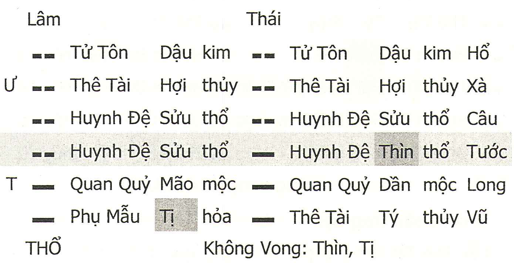

◆ **Dụng thần, Kỵ thần hóa thoái, thì lấy Thoái thần tức địa chi lâm hào biến làm ứng kỳ, hoặc lấy địa chi xung hào biến làm ứng kỳ, hoặc lấy địa chi hợp hào động làm ứng kỳ. Gặp Không, gặp phá, phỏng theo quy tắc ứng kỳ của Tiến thần.**

**Ví dụ 1:** Ngày Ất Hợi tháng Dần, bởi vì mẹ vợ nằm bệnh liên lụy 5 năm, rất là khổ não, đoán khi nào mẹ vợ chết. Được quẻ Thiên Thủy Tụng biến Trạch Thủy Khốn.

| | | Tụng | | Khốn | |
| :---: | :---: | :--- | :---: | :--- | :---: |
| | ━ | Tử Tôn Tuất thổ | - - | Tử Tôn Mùi thổ | Vũ |
| | ━ | Thê Tài Thân kim | ━ | Thê Tài Dậu kim | Hổ |
| T | ━ | Huynh Đệ Ngọ hỏa | ━ | Quan Quỷ Hợi thủy | Xà |
| | - - | Huynh Đệ Ngọ hỏa Quan Hợi | - - | Huynh Đệ Ngọ hỏa | Câu |
| | ━ | Tử Tôn Thìn thổ | ━ | Tử Tôn Thìn thổ | Tước |
| Ư | - - | Phụ Mẫu Dần mộc | - - | Phụ Mẫu Dần mộc | Long |

HỎA Không Vong: Thân, Dậu

**Phán đoán ứng kỳ:**

Lấy Phụ Mẫu làm Dụng thần.

Nhưng người này gặp chuyện khổ não, trong quẻ Tử Tôn độc phát, Tử Tôn là thần giải ưu, lại động mà hóa thoái, tháng Mão hợp trú Tuất thổ không thoái, hỷ đến trong lòng, tôi đoán tháng Mão mẹ vợ người đó tất chết.

**Kết quả:** Ứng nghiệm.

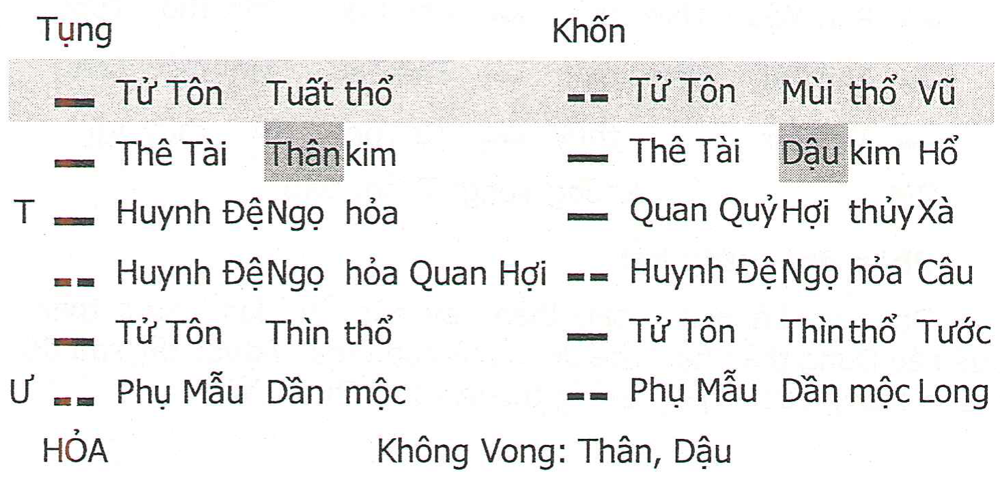

**Ví dụ 2:** Ngày Quý Mùi tháng Tuất, nam tự xem bệnh lâu, được quẻ Càn Vi Thiên biến Trạch Thiên Quải.

| | Càn | | Quải | |
| :--- | :--- | :--- | :--- | :--- |
| T | — Phụ Mẫu Tuất thổ | - - | Phụ Mẫu Mùi thổ | Hổ |
| | — Huynh Đệ Thân kim | — | Huynh Đệ Dậu kim | Xà |
| | — Quan Quỷ Ngọ hỏa | — | Tử Tôn Hợi thủy | Câu |
| Ư | — Phụ Mẫu Thìn thổ | — | Phụ Mẫu Thìn thổ | Tước |
| | — Thê Tài Dần mộc | — | Thê Tài Dần mộc | Long |
| | — Tử Tôn Tý thủy | — | Tử Tôn Tý thủy | Vũ |

KIM Không Vong: Thân, Dậu

**Phán đoán ứng kỳ:**

Đoán về bệnh của bản thân, lấy hào Thế làm Dụng thần. Quẻ này Dụng thần hào Thế động mà hóa thoái, người này sau đó chết ở tháng Sửu, chính là ứng tháng xung Thoái thần.

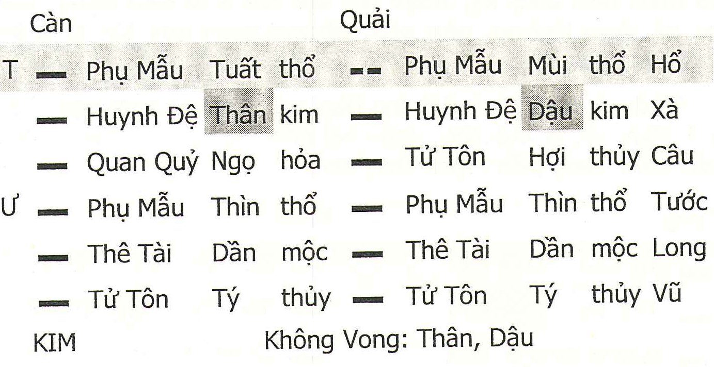

**◆ Dụng thần phục tàng, lấy địa chi lâm Dụng thần làm ứng kỳ, hoặc lấy thời gian xung Phục thần làm ứng kỳ, hoặc lấy thời gian xung Phi thần làm ứng kỳ.**

**Ví dụ:** Ngày Ất Dậu tháng Thìn, nữ có chồng bỏ đi, đoán ngày nào về? Được quẻ Hỏa Sơn Lữ biến Cấn Vi Sơn.

| | Lữ | | Cấn | |
| :--- | :--- | :--- | :--- | :--- |
| | — Huynh Đệ Tị hỏa | — | Phụ Mẫu Dần mộc | Vũ |
| | - - Tử Tôn Mùi thổ | - - | Quan Quỷ Tý thủy | Hổ |
| Ư | — Thê Tài Dậu kim | - - | Tử Tôn Tuất thổ | Xà |
| | — Thê Tài Thân kim Quan Hợi | — | Thê Tài Thân kim | Câu |
| | - - Huynh Đệ Ngọ hỏa | - - | Huynh Đệ Ngọ hỏa | Tước |
| T | - - Tử Tôn Thìn thổ Phụ Mão | - - | Tử Tôn Thìn thổ | Long |

HỎA Không Vong: Ngọ, Mùi

**Phán đoán ứng kỳ:**

Lấy Quan Quỷ làm Dụng thần.

Quan Quỷ Hợi thủy phục tàng dưới hào 3 Thê Tài Thân kim, phục tàng ứng xuất hiện, sau này trở về ở giờ Hợi ngày Hợi.

**◆ Khi trong quẻ chỉ có một hào động, gọi là độc phát, một hào độc phát, đôi khi lấy địa chi lâm hào độc phát làm ứng kỳ, hoặc lấy thời gian hợp hào độc phát làm ứng kỳ.**

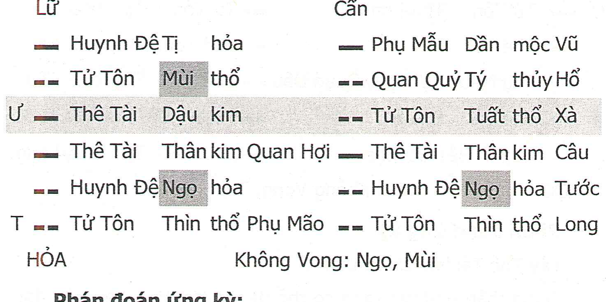

**Ví dụ:** Ngày Giáp Ngọ tháng Thìn, đoán về mở lò than, được quẻ Phong Hỏa Gia Nhân biến Phong Lôi Ích.

| | Gia Nhân | | Ích | |
| :---: | :--- | :---: | :--- | :---: |
| | — Huynh Đệ Mão mộc | | — Huynh Đệ Mão mộc | Vũ |
| Ứ | — Tử Tôn Tị hỏa | | — Tử Tôn Tị hỏa | Hổ |
| | - - Thê Tài Mùi thổ | | - - Thê Tài Mùi thổ | Xà |
| | — Phụ Mẫu Hợi thủy | Quan Dậu | - - Thê Tài Thìn thổ | Câu |
| T | - - Thê Tài Sửu thổ | | - - Huynh Đệ Dần mộc | Tước |
| | — Huynh Đệ Mão mộc | | — Phụ Mẫu Tý thủy | Long |

MỘC Không Vong: Thìn, Tị

### Phán đoán ứng kỳ:

Lấy Thê Tài làm Dụng thần.

Dụng thần vượng tướng có thể đào được than, sau này đào được ở tháng Thìn năm Hợi, ứng độc phát.

◆ **Khi trong quẻ có năm hào động, chỉ có một hào tĩnh, gọi là độc tĩnh. Đôi khi lấy hào độc tĩnh làm ứng kỳ.**

**Ví dụ:** Ngày Canh Tuất tháng Dần, xem về bệnh của con gái, được quẻ Hỏa Thủy Vị Tế biến Thủy Sơn Kiển.

| | Vị Tế | | Kiển | |
| :---: | :--- | :---: | :--- | :---: |
| Ứ | — Huynh Đệ Tị hỏa | | - - Quan Quỷ Tý thủy | Xà |
| | - - Tử Tôn Mùi thổ | | — Tử Tôn Tuất thổ | Câu |
| | — Thê Tài Dậu kim | | - - Thê Tài Thân kim | Tước |
| T | - - Huynh Đệ Ngọ hỏa | Quan Hợi | — Thê Tài Thân kim | Long |
| | — Tử Tôn Thìn thổ | | - - Huynh Đệ Ngọ hỏa | Vũ |
| | - - Phụ Mẫu Dần mộc | | - - Tử Tôn Thìn thổ | Hổ |

HỎA Không Vong: Dần, Mão

### Phán đoán ứng kỳ:

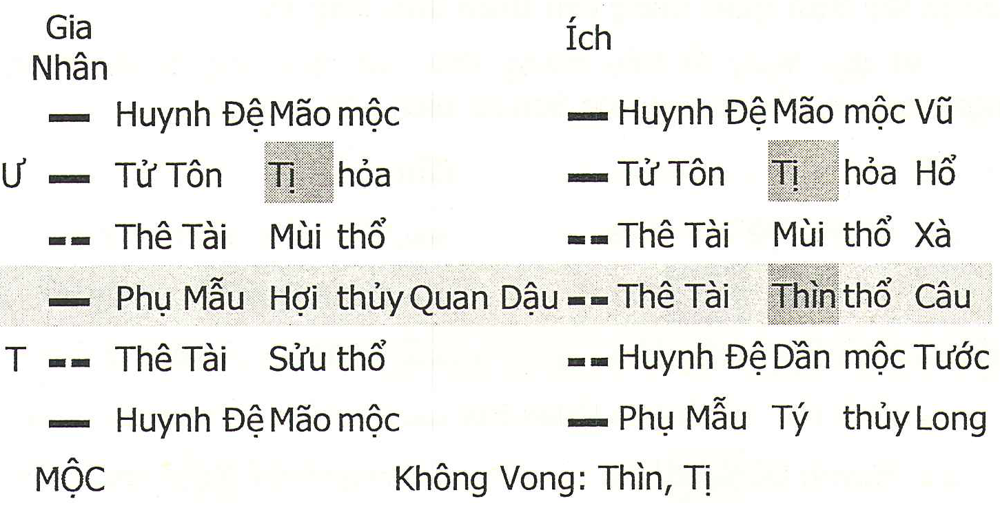

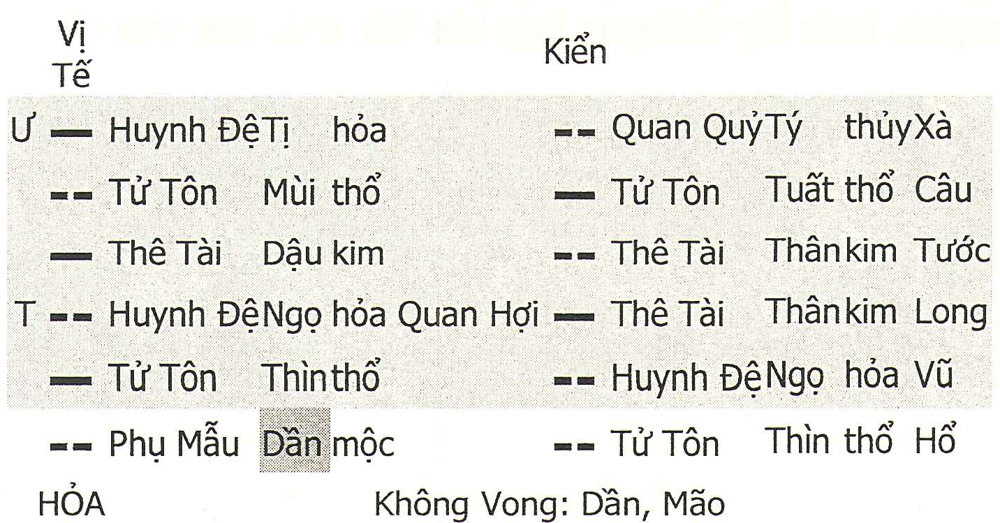

Đây là quẻ độc tĩnh, con gái người này khỏi bệnh ở ngày Dần, ứng độc tĩnh.

◆ **Khi Kỵ thần trì Thế phát động hóa ra lục thân giống Dụng thần, thường lấy hào biến của hào Thế làm ứng kỳ.**

**Ví dụ 1:** Ngày Quý Dậu tháng Thìn, một người muốn yêu cầu đơn vị công tác cấp nhà ở, hỏi có thể được không? Được quẻ Phong Lôi Ích biến Thiên Hỏa Đồng Nhân.

| | Ích | | Đồng Nhân | |
| :---: | :--- | :---: | :--- | :---: |
| Ứ | — Huynh Đệ Mão mộc | | — Phụ Mẫu Tuất thổ | Hổ |
| | — Tử Tôn Tị hỏa | | — Quan Quỷ Thân kim | Xà |
| | - - Thê Tài Mùi thổ | | — Tử Tôn Ngọ hỏa | Câu |
| T | - - Thê Tài Thìn thổ | Quan Dậu | — Phụ Mẫu Hợi thủy | Tước |
| | - - Huynh Đệ Dần mộc | | - - Thê Tài Sửu thổ | Long |
| | — Phụ Mẫu Tý thủy | | — Huynh Đệ Mão mộc | Vũ |

MỘC Không Vong: Tuất, Hợi

### Phán đoán ứng kỳ:

Lấy Phụ Mẫu làm Dụng thần. Phụ Mẫu được Nhật sinh phù là vượng tướng, hào Thế là người hỏi quẻ động mà hóa ra hào Phụ Mẫu, chính là tượng mình và nhà gặp nhau, tháng Hợi có thể được. Sau được ở tháng Hợi.

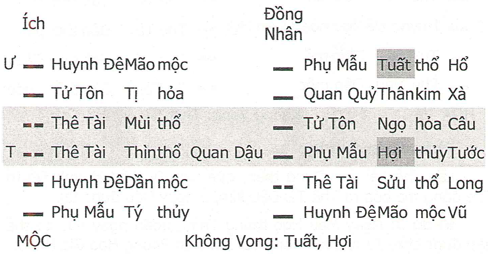

**Ví dụ 2:** Ngày Bính Thân tháng Tị, xem tài, được quẻ Hỏa Thủy Vị Tế biến Hỏa Phong Đỉnh.

| | Vị Tế | | | Đỉnh | |
| :---: | :---: | :--- | :---: | :--- | :--- |
| Ứ | — | Huynh Đệ Tị hỏa | — | Huynh Đệ Tị hỏa | Long |
| | - - | Tử Tôn Mùi thổ | - - | Tử Tôn Mùi thổ | Vũ |
| | — | Thê Tài Dậu kim | — | Thê Tài Dậu kim | Hổ |
| T | - - | Huynh Đệ Ngọ hỏa Quan Hợi | — | Thê Tài Dậu kim | Xà |
| | — | Tử Tôn Thìn thổ | — | Quan Quỷ Hợi thủy | Câu |
| | - - | Phụ Mẫu Dần mộc | - - | Tử Tôn Sửu thổ | Tước |

HỎA &emsp;&emsp;&emsp;&emsp;&emsp;&emsp; Không Vong: Thìn, Tị

**Phán đoán ứng kỳ:**

Lấy Thê Tài làm Dụng thần, quẻ này Kỵ thần Huynh Đệ trì Thế động mà hóa ra Thê Tài Dậu kim, ở ngày Dậu được tài.

**Ví dụ 3:** Ngày Mậu Ngọ tháng Thân, đoán ngày nào có thể gặp được cha, được quẻ Phong Lôi Ích biến Phong Hỏa Gia Nhân.

| | Ích | | | Gia Nhân | |
| :---: | :---: | :--- | :---: | :--- | :--- |
| Ứ | — | Huynh Đệ Mão mộc | — | Huynh Đệ Mão mộc | Tước |
| | — | Tử Tôn Tị hỏa | — | Tử Tôn Tị hỏa | Long |
| | - - | Thê Tài Mùi thổ | - - | Thê Tài Mùi thổ | Vũ |
| T | - - | Thê Tài Thìn thổ | — | Phụ Mẫu Hợi thủy | Hổ |
| | - - | Huynh Đệ Dần mộc | - - | Thê Tài Sửu thổ | Xà |
| | — | Phụ Mẫu Tý thủy | — | Huynh Đệ Mão mộc | Câu |

MỘC &emsp;&emsp;&emsp;&emsp;&emsp;&emsp; Không Vong: Tý, Sửu

**Phán đoán ứng kỳ:**

Lấy Phụ Mẫu làm Dụng thần

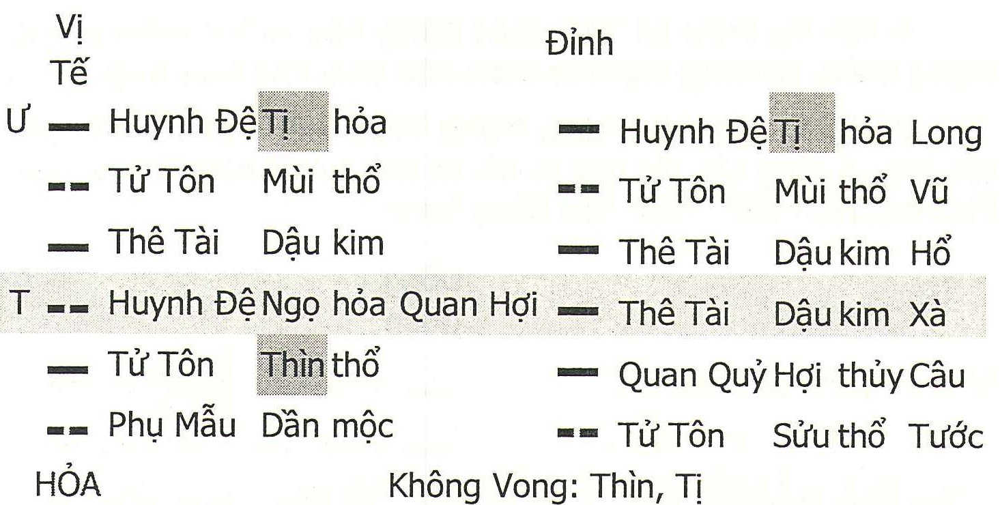

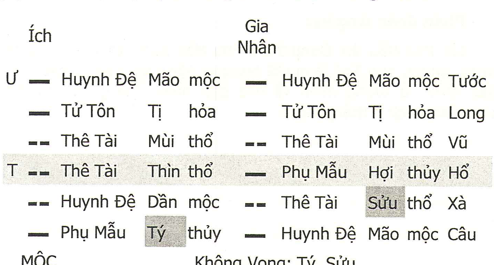

Quẻ này Kỵ thần Thê Tài trì Thế, động mà hóa ra Phụ Mẫu, ngày Hợi gặp được cha.

### ◆ Khi Dụng thần phát động hóa Không, hóa Phá, thường lấy hào biến làm ứng kỳ.

**Ví dụ:** Ngày Mậu Tý tháng Mão, nhân viên của một công ty bảo hiểm đoán về tài vận trong tương lai gần, được quẻ Địa Lôi Phục biến Khôn Vi Địa.

| | Phục | | | Khôn | |
| :---: | :---: | :--- | :---: | :--- | :--- |
| | - - | Tử Tôn Dậu kim | - - | Tử Tôn Dậu kim | Tước |
| | - - | Thê Tài Hợi thủy | - - | Thê Tài Hợi thủy | Long |
| Ứ | - - | Huynh Đệ Sửu thổ | - - | Huynh Đệ Sửu thổ | Vũ |
| | - - | Huynh Đệ Thìn thổ | - - | Quan Quỷ Mão mộc | Hổ |
| | - - | Quan Quỷ Dần mộc Phụ Tị | - - | Phụ Mẫu Tị hỏa | Xà |
| T | — | Thê Tài Tý thủy | - - | Huynh Đệ Mùi thổ | Câu |

THỔ &emsp;&emsp;&emsp;&emsp;&emsp;&emsp; Không Vong: Ngọ, Mùi

**Phán đoán:**

Lấy Thê Tài làm Dụng thần. Trong quẻ Thê Tài lưỡng hiện, lấy Thê Tài Tý thủy phát động làm Dụng thần.

Nguyên thần Tử Tôn Dậu kim Nguyệt phá, nếu đoán về tài vận dài hạn thì bất lợi, nhưng đoán về tài vận ngắn hạn thì chỉ xem suy vượng của Thê Tài. Trước tiên Dụng thần trì Thế, Thế là người xin đoán, đây là tượng có tiền đến bên cạnh mình, Nguyệt kiến mặc dù không sinh phù Dụng thần, nhưng Nhật thần là đất Đế Vượng của Dụng thần, tỉ trợ Dụng thần, mấy ngày sắp tới có thể được tài.

Ngày nào có thể được? Dụng thần động mà hóa Không, xuất Không có thể được. Đây chính là chỗ vi diệu của quẻ, không nên đoán hóa khắc.

**Kết quả:** Ở ngày Ất Mùi hoàn thành một nghiệp vụ bảo hiểm, được 6 ngàn tệ.

Trên đây chỉ là một số quy tắc ứng kỳ đơn giản thường gặp mà thôi, ứng kỳ đôi khi còn tùy vào nội dung dự đoán khác nhau

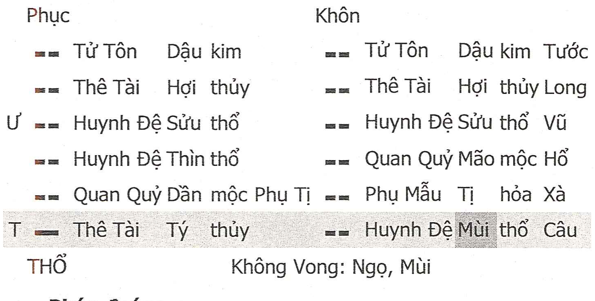 mà phương pháp trích xuất ứng kỳ cũng có chỗ khác nhau. Chẳng hạn như dự đoán hôn nhân, đôi khi lấy hào Phụ Mẫu để phán đoán ứng kỳ; khi dự đoán về sinh nở, đôi khi lấy đất Thai, Dưỡng của Tử Tôn làm ứng kỳ; dự đoán hành nhân, Dụng thần tĩnh mà hợp Nhật, thì hôm đó về, Dụng thần nhập Mộ ở Nhật, cũng ứng hôm đó về. Tóm lại cần tự mình tích lũy trong thời gian dài, suy xét cẩn thận, thì mới có thể nắm bắt ứng kỳ chính xác.

---

# PHẦN LỤC HÀO ỨNG DỤNG

## CHƯƠNG 19

### DỰ ĐOÁN THỜI TIẾT

Ngày nay khoa học kỹ thuật phát triển, sử dụng phương tiện khoa học kỹ thuật, về cơ bản có thể dự báo chính xác sự biến hóa của thời tiết, do vậy có lẽ sẽ có người cho rằng việc tiếp tục nghiên cứu và sử dụng lục hào để dự đoán thời tiết không còn ý nghĩa gì. Thực ra không phải vậy, dự báo thời tiết được công bố trên các phương tiện truyền thông công cộng chỉ là tình hình thời tiết chung chung về một khu vực nào đó, còn tình hình thời tiết mà chúng ta cần thì thường có tính cục bộ, hoặc đôi khi là tình hình thời tiết trong một khoảng thời gian nào đó, hoặc đôi khi không nhìn thấy dự báo thời tiết, muốn biết tình hình thì phải đi tìm. Vả lại, dự đoán thời tiết có thể giúp nâng cao trình độ dự đoán, có thể giúp trải nghiệm cặn kẽ chỗ vi diệu của lục hào. Đối với người mới học mà nói, sử dụng lục hào để dự đoán thời tiết là một trong những phương pháp tốt nhất để nâng cao trình độ dự đoán trong thời gian ngắn. Bởi vì sau khi dự đoán sự việc thông thường, muốn nhận được kết quả phản hồi thì cần phải đợi vài ngày, vài tháng, hoặc thậm chí là vài năm. Dự đoán lục hào cần rất nhiều nghiệm chứng mới có thể nắm được chỗ vi diệu của nó, cho nên nếu chỉ dựa vào dự đoán về việc người để chứng nghiệm, thì phải mất rất nhiều năm mới có thể nắm vững được thuật dự đoán này. Theo kinh nghiệm của cổ nhân và của bản thân tôi, mỗi ngày dùng lục hào để dự đoán thời tiết có thể coi là một con đường tắt để nắm bắt phương pháp dự đoán lục hào.

Dùng lục hào dự đoán thời tiết thường ít khi sử dụng lục thần, chủ yếu là thông qua ý nghĩa của lục thân mà trích xuất Dụng thần cho phán đoán. Có hào động thì lấy hào động làm trung tâm, không có hào động thì lấy hào Thế hoặc hào vượng tướng, do vậy tương đối thích hợp cho người mới học, nhưng dự đoán đi sâu vào thì cũng có thể kết hợp thêm lục thần. Dự đoán về thời tiết, bởi vì thế giới rộng lớn, cùng một thời điểm thì thời tiết ở các nơi không giống nhau, cho nên khi gieo quẻ thì phải dùng ý thức chỉ định dự đoán về thời tiết một địa phương nào đó hoặc thời tiết của một nơi trong một ngày nào đó thì mới chính xác.

### Hào Phụ Mẫu

Tùy theo mùa khác nhau, hào Phụ Mẫu có ý nghĩa mưa, tuyết, mưa đá v.v; tùy theo suy vượng khác nhau, Phụ Mẫu có ý nghĩa mưa, âm u.

- Hào Phụ Mẫu phát động, hoặc thành tam hợp cục, là thông tin sẽ có mưa. Hào Phụ Mẫu vượng tướng mưa lớn, hưu tù mưa nhỏ. Hào Phụ Mẫu hóa Tiến thần, mưa lớn dần; hóa Thoái thần, mưa nhỏ dần. Hào Phụ Mẫu hưu tù Không Phá, tĩnh mà bị khắc, chủ không có mưa.
- Phụ Mẫu phát động tương hợp với Nhật, khi xung khai hào Phụ Mẫu có mưa. Nếu bị hào động khác hợp trú, khi xung khai hào hợp hào Phụ Mẫu, hoặc xung khai hào Phụ Mẫu có mưa.
- Hào Phụ Mẫu phát động Nguyệt phá, có thể dựa vào quy tắc ứng kỳ Nguyệt phá để quyết định thời gian có mưa. Nếu địa chi Nguyệt phá tương đồng với Nhật, rất có thể hôm đó sẽ có mưa.
- Phụ Mẫu Không Vong phục tàng, lại bị khắc thương, đây là thông tin không có mưa, nếu là dự đoán khi nào có mưa, có thể dựa vào quy tắc ứng kỳ Phục thần để phán đoán.
- Nếu địa chi của hào Phụ Mẫu và Nguyệt kiến giống nhau, động hóa Tiến thần, Nhật lại là đất Trường Sinh của Phụ Mẫu, có thể sẽ bước vào mùa mưa mận hoặc mưa kèm âm u liên tục.

### Hào Tử Tôn

Tử Tôn là Nhật, Nguyệt, tinh tú, khi dự đoán thời tiết chủ trời tạnh.

- Tử Tôn phát động, hoặc thành tam hợp cục là thông tin thời tiết nắng ráo.
- Tử Tôn phát động hóa Tiến thần, bầu trời vạn dặm không mây. Hóa Thoái thần, tạnh ráo không lâu.
- Phụ Mẫu phát động hóa Tử Tôn, là thông tin âm u chuyển quang đãng, sau mưa xuất hiện cầu vồng, mặt trời ra khỏi mây. Cần dựa vào hiện tượng thời tiết vùng miền khác nhau và mùa khác nhau mà phán đoán linh hoạt.

- Hào Tử Tôn phát động, nếu lâm Nguyệt phá, Không Vong, có thể dựa vào quy tắc ứng kỳ của Nguyệt phá, Không Vong mà phán đoán.

### Hào Thê Tài

Thê Tài chủ tạnh, nhưng không quang đãng nhiều, đôi khi có chút ít mây.

- Phụ Mẫu hưu tù, Thê Tài phát động thành tam hợp cục, chủ quang đãng.
- Thê Tài phát động hóa Tử Tôn, trời nắng ráo, không có mây đen.
- Thê Tài phát động hóa Tiến thần chủ quang đãng, phát động hóa Thoái thần chủ quang đãng mà không lâu, mây đen tăng dần.
- Thê Tài phát động hóa Huynh Đệ, trời trong chuyển nhiều mây, hoặc trời trong mà có gió.
- Thê Tài phát động hóa Quan Quỷ, trời trong chuyển mây dày, hoặc trời trong chuyển âm u.
- Dự đoán trời trong, Thê Tài phát động thường là trời trong, nhưng bị Nhật hợp, lúc xung khai Thê Tài chuyển trong. Thê Tài phục tàng, khi xung xuất Thê Tài, hoặc xung khai Phi thần, hoặc Thê Tài xuất hiện thì trời trong. Thê Tài gặp Không Vong, Nguyệt phá, thì khi Thực Không, Thực Phá, Xung Không, Hợp Phá thì trời trong.

### Hào Huynh Đệ

Huynh Đệ chủ gió, cũng chủ mây.

- Huynh Đệ phát động, hoặc thành tam hợp cục là thông tin có gió. Vượng tướng gió lớn, hưu tù gió nhỏ.
- Huynh Đệ phát động hóa Tiến thần, gió lớn dần, mây tăng dần. Hóa Thoái thần, gió nhỏ dần.
- Hào Huynh Đệ tại cung Tốn phát động, vượng tướng là bão, gió mạnh, và hào Phụ Mẫu đồng thời phát động, sẽ có mưa bão xuất hiện.

### Hào Quan Quỷ

Quan Quỷ chủ sấm sét, sương mù, mây dày, phải căn cứ vào mùa khác nhau mà phán đoán linh hoạt.

◆ Quan Quỷ tại cung Chấn phát động, thường có sấm xuất hiện. Và hào Phụ Mẫu đồng thời phát động, là sấm và mưa cùng đến.

◆ Hào Quan Quỷ độc phát, căn cứ vào mùa khác nhau, đôi khi có mưa, đôi khi chỉ có sấm không có mưa, đôi khi là thông tin trời âm u.

◆ Quan Quỷ và Thê Tài đồng thời phát động, chính là thông tin trời nắng chuyển nhiều mây, hoặc chuyển âm u.

◆ Quan Quỷ phát động hóa Phụ Mẫu, trời âm u chuyển mưa; hóa Tử Tôn, âm u chuyển quang đãng.

**Ví dụ 1:** Ngày Bính Thìn tháng Ngọ, khi tôi vừa đến một khách sạn ở Tây Tạng, một bằng hữu từ Bắc Kinh gọi điện thoại đến, nói rằng buổi tối phải tổ chức buổi hòa nhạc cho trẻ em, nhưng Bắc Kinh đang có mưa, ảnh hưởng đến việc tổ chức buổi hòa nhạc, hỏi mưa có ngừng không? Tôi gieo quẻ được Hỏa Sơn Lữ biến Thiên Phong Cấu.

| Thế/Ứng | Lữ | Phục thần | Cấu | Lục thú |
| :---: | :--- | :--- | :--- | :--- |
| | ━ Huynh Đệ Tị hỏa | | ━ Tử Tôn Tuất thổ | Long |
| | -- Tử Tôn Mùi thổ | | ━ Thê Tài Thân kim | Vũ |
| Ứ | ━ Thê Tài Dậu kim | | ━ Huynh Đệ Ngọ hỏa | Hổ |
| | ━ Thê Tài Thân kim | Quan Hợi | ━ Thê Tài Dậu kim | Xà |
| | -- Huynh Đệ Ngọ hỏa | | ━ Quan Quỷ Hợi thủy | Câu |
| T | -- Tử Tôn Thìn thổ | Phụ Mão | -- Tử Tôn Sửu thổ | Tước |

**HỎA** &emsp;&emsp; **Không Vong: Tý, Sửu**

**Phán đoán:**

Lấy hào Phụ Mẫu làm Dụng thần.

Phụ Mẫu Mão mộc phục dưới hào sơ Tử Tôn Thìn thổ, không được Nhật Nguyệt sinh phù, lại nhập Mộ ở Tử Tôn Mùi thổ, đây là

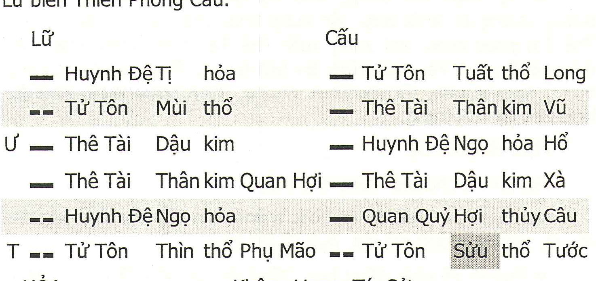 tượng ngừng mưa chuyển quang đãng, Tử Tôn Mùi thổ vượng tướng phát động, cũng là thông tin trời quang đãng, tôi lập tức nói với cô ấy, mưa sẽ sớm chấm dứt.

**Kết quả:** Quả nhiên ứng nghiệm.

**Ví dụ 2:** Một người thân của tôi không tin vào dự đoán lục hào, khi đó trời đã mưa kèm âm u hơn mười ngày không ngớt, tôi nói với anh ta rằng lục hào không những đoán được chuyện của người mà còn có thể dự đoán được thời tiết, thế là anh ta hỏi khi nào trời tạnh. Ở ngày Mậu Tuất tháng Thân, tôi gieo được quẻ Thiên Hỏa Đồng Nhân biến Thiên Lôi Vô Vọng.

| Thế/Ứng | Đồng Nhân | Vô Vọng | Lục thú |
| :---: | :--- | :--- | :--- |
| Ứ | ━ Tử Tôn Tuất thổ | ━ Tử Tôn Tuất thổ | Tước |
| | ━ Thê Tài Thân kim | ━ Thê Tài Thân kim | Long |
| | ━ Huynh Đệ Ngọ hỏa | ━ Huynh Đệ Ngọ hỏa | Vũ |
| T | ━ Quan Quỷ Hợi thủy | -- Tử Tôn Thìn thổ | Hổ |
| | -- Tử Tôn Sửu thổ | -- Phụ Mẫu Dần mộc | Xà |
| | ━ Phụ Mẫu Mão mộc | ━ Quan Quỷ Tý thủy | Câu |

**HỎA** &emsp;&emsp; **Không Vong: Thìn, Tị**

**Phán đoán:**

Trong quẻ Quan Quỷ Hợi thủy độc phát, lấy hào động để xem sự biến hóa của thời tiết.

Quan Quỷ chủ âm u, tuy được Nguyệt sinh, nhưng bị Nhật khắc, lại động mà hóa hồi đầu khắc, nhập Mộ ở hào biến, đây là thông tin âm u sẽ mất, chuyển thành tạnh ráo.

Quan Quỷ lâm Hợi thủy đối ứng với địa chi ngày hôm sau, tôi đoán giờ Thìn ngày hôm sau mặt trời sẽ lộ ra, thời tiết trở nên quang đãng.

**Kết quả:** Quả nhiên ở giờ Thìn ngày hôm sau thì mặt trời từ trong mây lộ ra, giờ Tị trời trong vắt.

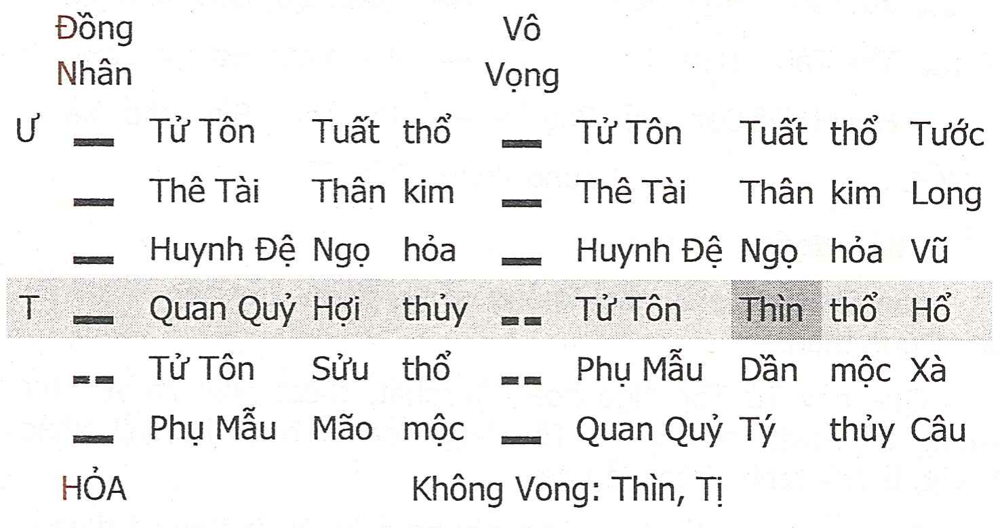

**Ví dụ 3:** Ngày Kỷ Hợi tháng Hợi, bằng hữu Vương Khai Vũ giúp tôi nghiệm chứng độ chính xác khi gieo quẻ bằng tiền Nhật Bản, dự đoán khi nào Lan Châu có tuyết rơi, được quẻ Lôi Thủy Giải biến Lôi Phong Hằng.

| | Giải | Hằng | |
| :---: | :--- | :--- | :---: |
| | - - Thê Tài Tuất thổ | - - Thê Tài Tuất thổ | Câu |
| Ứ | - - Quan Quỷ Thân kim | - - Quan Quỷ Thân kim | Tước |
| | — Tử Tôn Ngọ hỏa | — Tử Tôn Ngọ hỏa | Long |
| | - - Tử Tôn Ngọ hỏa | — Quan Quỷ Dậu kim | Vũ |
| T | — Thê Tài Thìn thổ | — Phụ Mẫu Hợi thủy | Hổ |
| | - - Huynh Đệ Dần mộc Phụ Tý | - - Thê Tài Sửu thổ | Xà |

MỘC  
Không Vong: Thìn, Tị

**Phán đoán:**

Lan Châu đã mấy năm không có tuyết rơi. Lấy hào Phụ Mẫu làm Dụng thần.

Quẻ này Tử Tôn Ngọ hỏa độc phát, thoạt nhìn có vẻ như không có tuyết, nhưng Tử Tôn Ngọ hỏa bị Nhật Nguyệt khắc Tuyệt, là trời tạnh không lâu dài.

Phụ Mẫu mặc dù phục tàng, nhưng được Nhật Nguyệt tỉ phù, vượng mà được xuất, đến ngày Tý xung mất Tử Tôn Ngọ hỏa, Phụ Mẫu Tý thủy lại xuất hiện, tất sẽ có tuyết rơi.

**Kết quả:** Quả nhiên tuyết rơi ở ngày Canh Tý.

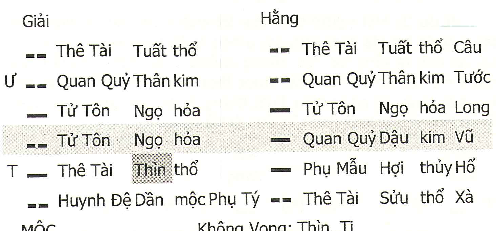

**Ví dụ 4:** Ngày Ất Mão tháng Tuất, trời bắt đầu mưa từ mười giờ sáng, đoán xem hôm nay trời có tạnh không? Được quẻ Phong Trạch Trung Phu biến Càn Vi Thiên.

| | Trung Phu | Càn | |
| :---: | :--- | :--- | :---: |
| | — Quan Quỷ Mão mộc | — Huynh Đệ Tuất thổ | Vũ |
| | — Phụ Mẫu Tị hỏa Tài Tý | — Tử Tôn Thân kim | Hổ |
| T | - - Huynh Đệ Mùi thổ | — Phụ Mẫu Ngọ hỏa | Xà |
| | - - Huynh Đệ Sửu thổ Tử Thân | — Huynh Đệ Thìn thổ | Câu |
| | — Quan Quỷ Mão mộc | — Quan Quỷ Dần mộc | Tước |
| Ứ | — Phụ Mẫu Tị hỏa | — Thê Tài Tý thủy | Long |

THỔ  
Không Vong: Tý, Sửu

**Phán đoán:**

Xem trời tạnh thì lấy Tử Tôn làm Dụng

Trong quẻ Tử Tôn không hiện, phục dưới hào 3 Huynh Đệ Sửu thổ, hôm nay rất khó thấy trời tạnh ráo. Hào Thế phát động, hóa ra Phụ Mẫu Ngọ hỏa và hào Thế tương sinh hợp, hợp là triền miên cửu trường, cho nên hôm nay không những không tạnh mà còn có thể có cả âm u.

**Kết quả:** Quả nhiên âm u liên tục ba này, đến ngày Mùi trời mới chuyển tạnh. Ngày Mùi trở nên tạnh bởi vì Phi thần của Tử Tôn bị xung xuất, phục tàng được xuất.

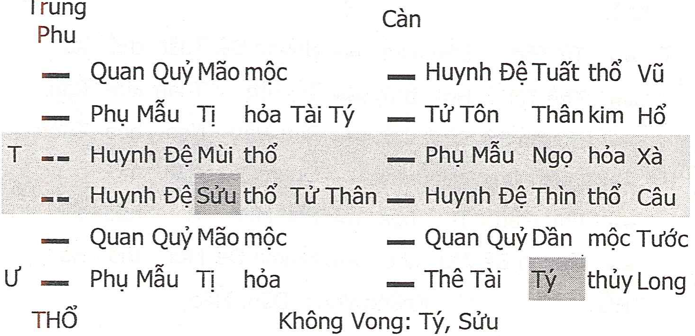

**Ví dụ 5:** Ngày Canh Tuất tháng Tuất, một người Nhật Bản theo tôi học dự đoán lục hào, lúc đó trời đang có mưa, đoán khi nào mưa ngừng, được quẻ Khôn Vi Địa biến Thiên Địa Bĩ.

| | | Khôn | | Bĩ | |
| :---: | :---: | :--- | :---: | :--- | :--- |
| T | - - | Tử Tôn Dậu kim | — | Huynh Đệ Tuất thổ | Xà |
| | - - | Thê Tài Hợi thủy | — | Tử Tôn Thân kim | Câu |
| | - - | Huynh Đệ Sửu thổ | — | Phụ Mẫu Ngọ hỏa | Tước |
| Ứ | - - | Quan Quỷ Mão mộc | - - | Quan Quỷ Mão mộc | Long |
| | - - | Phụ Mẫu Tị hỏa | - - | Phụ Mẫu Tị hỏa | Vũ |
| | - - | Huynh Đệ Mùi thổ | - - | Huynh Đệ Mùi thổ | Hổ |

THỔ Không Vong: Dần, Mão

**Phán đoán:**

Xem tình trạng biến hóa và suy vượng của Tử Tôn và Thê Tài.

Tử Tôn trì Thế phát động, hóa Nhật thần hồi đầu sinh, hôm đó sẽ tạnh. Thê Tài Hợi thủy động hóa hồi đầu sinh, ngày hôm sau là ngày Hợi, địa chi tương đồng với Thê Tài, hôm sau trời nắng.

Hào 6 Tuất thổ hồi đầu sinh Tử Tôn, lại thêm giờ Tuất Phụ Mẫu nhập Mộ, đoán giờ Tuất ngừng, hôm sau trời trong vắt.

**Kết quả:** Quả nhiên ứng nghiệm.

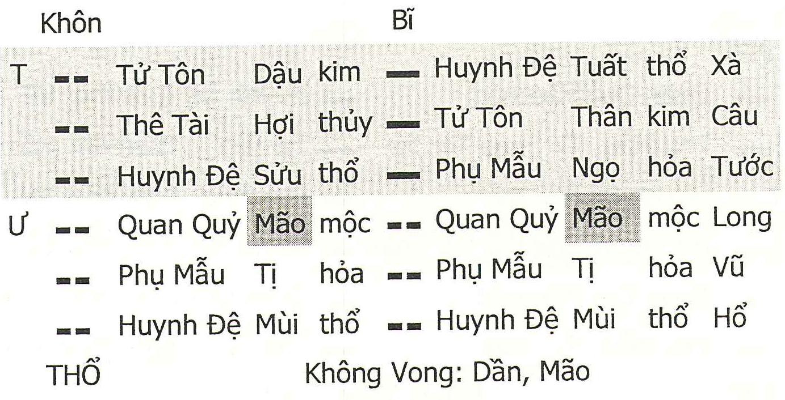

**Ví dụ 6:** Ngày Tân Mùi tháng Tuất, đoán thời tiết ngày hôm sau, được quẻ Tốn Vi Phong.

| | | Tốn | |
| :---: | :---: | :--- | :--- |
| T | — | Huynh Đệ Mão mộc | Xà |
| | — | Tử Tôn Tị hỏa | Câu |
| | - - | Thê Tài Mùi thổ | Tước |
| Ứ | — | Quan Quỷ Dậu kim | Long |
| | — | Phụ Mẫu Hợi thủy | Vũ |
| | - - | Thê Tài Sửu thổ | Hổ |

MỘC Không Vong: Tuất, Hợi

**Phán đoán:**

Khi có hào động, xem lục thân trị hào động, không có hào động thì có thể đoán lại hoặc xem tình trạng của hào vượng tướng và hào Thế.

Quẻ này không có hào động, hào sơ Thê Tài Sửu thổ ám động, lấy Thê Tài Sửu thổ làm tiêu điểm của phán đoán. Thê Tài chủ tạnh, được Nhật Nguyệt tỉ phù, hôm sau trời nắng.

**Kết quả:** Quả như dự đoán.

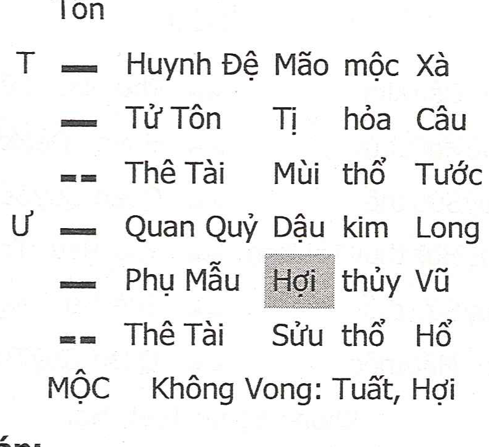

**Ví dụ 7:** Ngày Nhâm Thân tháng Tuất, đoán thời tiết ngày hôm sau, được quẻ Địa Hỏa Minh Di biến Địa Sơn Khiêm.

| | Minh Di | | | | Khiêm | |
| :---: | :---: | :--- | :--- | :---: | :--- | :--- |
| | - - | Phụ Mẫu Dậu kim | | - - | Phụ Mẫu Dậu kim | Hổ |
| | - - | Huynh Đệ Hợi thủy | | - - | Huynh Đệ Hợi thủy | Xà |
| T | - - | Quan Quỷ Sửu thổ | | - - | Quan Quỷ Sửu thổ | Câu |
| | — | Huynh Đệ Hợi thủy | Tài Ngọ | — | Phụ Mẫu Thân kim | Tước |
| | - - | Quan Quỷ Sửu thổ | | - - | Thê Tài Ngọ hỏa | Long |
| Ư | — | Tử Tôn Mão mộc | | - - | Quan Quỷ Thìn thổ | Vũ |

THỦY &emsp;&emsp; Không Vong: Tuất, Hợi

**Phán đoán:**

Xem động tĩnh trong quẻ để phán đoán.

Tử Tôn Mão mộc độc phát hóa ra Quan Quỷ Thìn thổ, Tử Tôn chủ tạnh, Quan Quỷ chủ mây đen, nhưng hào biến Nguyệt phá, sẽ không âm u nhiều. Là tượng trời trong chuyển nhiều mây, mây tan nhanh.

**Kết quả:** Kết quả ngày hôm sau là trời nắng, cuối giờ Mùi đầu giờ Thân mới nổi mây, sau lại trở nên quang đãng.

**Ví dụ 8:** Ngày Kỷ Mão ngày Thìn, đoán thời tiết ngày hôm sau, được quẻ Trạch Phong Đại Quá biến Thủy Địa Tỷ.

| | Đại Quá | | | | Tỷ | |
| :---: | :---: | :--- | :--- | :---: | :--- | :--- |
| | - - | Thê Tài Mùi thổ | | - - | Phụ Mẫu Tý thủy | Câu |
| | — | Quan Quỷ Dậu kim | | — | Thê Tài Tuất thổ | Tước |
| T | — | Phụ Mẫu Hợi thủy | Tử Ngọ | - - | Quan Quỷ Thân kim | Long |
| | — | Quan Quỷ Dậu kim | | - - | Huynh Đệ Mão mộc | Vũ |
| | — | Phụ Mẫu Hợi thủy | Huynh Dần | - - | Tử Tôn Tị hỏa | Hổ |
| Ư | - - | Thê Tài Sửu thổ | | - - | Thê Tài Mùi thổ | Xà |

MỘC &emsp;&emsp; Không Vong: Thân, Dậu

**Phán đoán:**

Dựa vào hào động để phán đoán. Trong quẻ có hai hào Phụ Mẫu và một hào Quan Quỷ phát động. Thoạt đầu xem quẻ này Phụ Mẫu là thủy, giống ngũ hành của mưa, Phụ Mẫu Hợi thủy trì Thế phát động, hóa hồi đầu sinh, mà Quan Quỷ phát động lại sinh Phụ Mẫu, thông tin có mưa rất rõ ràng. Nhưng bỏ suy vượng của hào động mà đoán thì đúng ít sai nhiều.

Quẻ này Phụ Mẫu Hợi thủy bị Nguyệt kiến khắc chế, Nhật là Tử địa Phụ Mẫu, hào 2 Phụ Mẫu động mà hóa Tuyệt. Quả là như cỏ không có gốc rễ, tuy được Quan Quỷ động mà tương sinh, nhưng sinh phù bất khởi. Huống hồ Quan Quỷ Không Vong, lực sinh Phụ Mẫu bị suy yếu, cho nên hôm sau sẽ không có mưa.

Nhưng thần triệu cơ ở động, động tất có nguyên nhân. Người xưa nói: "Kim Không tắc minh", dự đoán thời tiết chính là tượng sấm vang chớp giật, lại thêm nội quái phản ngâm, cũng là tượng rên rỉ, có âm thanh, vì vậy có thể phán đoán thời tiết hôm sau là sáng sủa, có sấm, không có mưa.

**Kết quả:** Tối hôm đó, dự báo thời tiết trên ti vi nói rằng hôm sau trời nắng. Do vậy tôi không chắc chắn về phán đoán của mình. Sáng hôm sau trời quang, ngay cả một áng mây cũng không có, tôi còn cho rằng mình đoán sai. Nhưng vừa đến giờ Thân, bầu trời đột nhiên tụ lại rất nhiều mây đen, ở đám mây đen đó truyền đến từng đợt sấm, có vẻ như sắp có mưa. Nhưng cuối cùng vẫn không có giọt mưa nào rơi xuống, đến giờ Dậu, mây đen tan đi, bầu trời trở lại quang đãng, có thể thấy dự đoán lục hào rất nghiệm.

**Ví dụ 9:** Ngày Tân Dậu tháng Tuất, xem thời tiết ngày hôm sau, được quẻ Thủy Địa Tỷ biến Trạch Địa Tụy.

| | Tỷ | | | | Tụy | | | |
| :--- | :---: | :--- | :--- | :--- | :---: | :--- | :--- | :--- | :--- |
| Ứ | - - | Thê Tài | Tý | thủy | - - | Huynh Đệ | Mùi | thổ | Xà |
| | — | Huynh Đệ | Tuất | thổ | — | Tử Tôn | Dậu | kim | Câu |
| | - - | Tử Tôn | Thân | kim | — | Thê Tài | Hợi | thủy | Tước |
| T | - - | Quan Quỷ | Mão | mộc | - - | Quan Quỷ | Mão | mộc | Long |
| | - - | Phụ Mẫu | Tị | hỏa | - - | Phụ Mẫu | Tị | hỏa | Vũ |
| | - - | Huynh Đệ | Mùi | thổ | - - | Huynh Đệ | Mùi | thổ | Hổ |

THỔ &emsp;&emsp;&emsp;&emsp;&emsp;&emsp;&emsp;&emsp; Không Vong: Tý, Sửu

**Phán đoán:**

Có hào động thì trước tiên bắt đầu phán đoán từ hào động.

Thoạt nhìn, Tử Tôn độc phát, rất dễ đoán qua loa là trời quang đãng. Nhưng xem cẩn thận hơn, Quan Quỷ Mão mộc được Nguyệt kiến hợp vượng, Nhật xung là ám động.

Khi dự đoán thời tiết, Tử Tôn phát động là thông tin trời nắng. Nhưng trong quẻ này Quan Quỷ ám động biểu thị trời âm u, mây mù. Hai điểm này có phần mâu thuẫn lẫn nhau. Người mới học gặp tình huống như vậy thì rất khó đưa ra phán đoán chính xác. Sự biến hóa của thời tiết giống như một pháp sư thần thông quảng đại, âm u và quang đãng biến hóa thất thường, không dừng lại ở một điểm.

Thông thường vạch quẻ từ hào sơ đến hào thượng, điều này cho thấy quy luật phát triển của sự vật là từ sơ cấp đến cao cấp. Hào sơ là thời kỳ đầu, giai đoạn sơ cấp của sự vật, hào 6 là điểm cuối cùng, giai đoạn cao cấp của sự vật. Mỗi ý nghĩa của các hào vị trong lục hào chính là dựa trên nguyên lý cơ bản này. Dựa vào

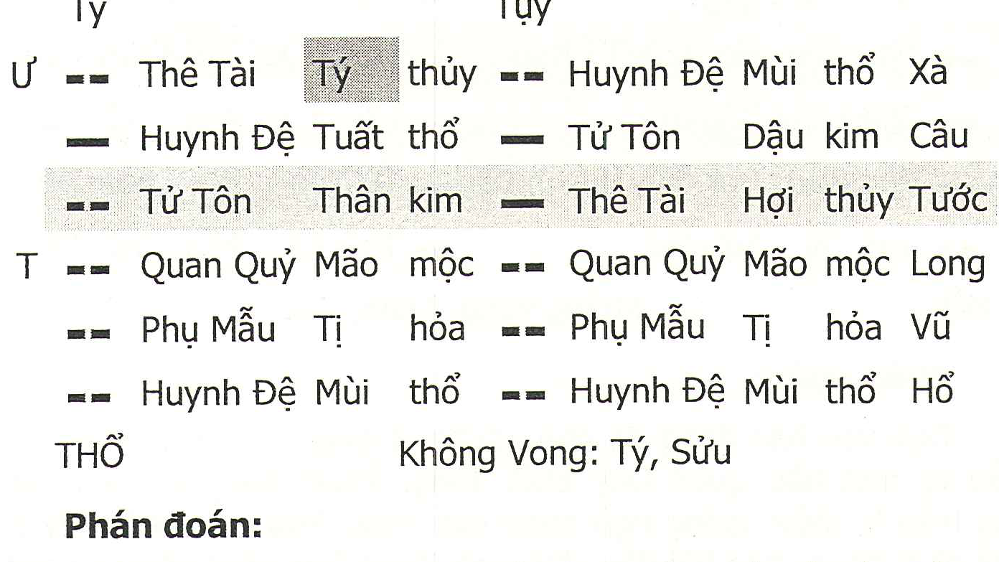 thứ tự trước sau của hào vị, quái tượng ở trên biểu thị thời tiết ngày hôm sau sẽ từ âm u chuyển quang đãng.

**Tình hình ứng nghiệm:** Sáng hôm sau trời âm u, giờ Mùi mặt trời bắt đầu xuất hiện, giờ Thân trời tươi sáng. Tại sao giờ Mùi sẽ bắt đầu trở nên quang đãng? Bởi vì giờ Mùi là Mộ khố của Quan Quỷ, Mộ khố có ý nghĩa là thu tàng, đồng thời lại sinh Tử Tôn, cho nên giờ Mùi thời tiết sẽ từ âm u trở nên quang đãng, xuất hiện mặt trời. Giờ Thân trời tươi sáng, chính là ứng với ứng kỳ Tử Tôn Thân kim phát động gặp trị.

# CHƯƠNG 20
## DỰ ĐOÁN THI ĐẤU

Có rất nhiều người hâm mộ thể thao, họ rất thích xem thi đấu và thường muốn phân tích, suy đoán kết quả trước trận đấu. Mặc dù thi đấu là dựa vào thực lực, nhưng đôi khi cũng có rất nhiều tình huống bất ngờ. Cho nên đã học dự đoán lục hào, bạn có thể phát huy sở trường, dùng lục hào dự đoán tình hình của các trận đấu. Sau khi biết trước kết quả, chúng ta lại đi xem thi đấu với suy nghĩ nghiệm chứng, sẽ thú vị hơn là chỉ xem thi đấu đơn thuần.

Trận đấu thường lấy thành tích của hai bên để quyết định thắng bại, hào Thế thể hiện phe ta hoặc phe mình thích, cho nên lấy suy vượng của Thế Ứng để phán đoán thắng bại của hai bên. Vượng là thắng, nhược là bại. Còn lục thân trong dự đoán không quá quan trọng. Nhưng đây chỉ là dự đoán chung chung, đến cấp độ cao thì mỗi lục thân đều có vai trò, chẳng hạn như Quan Quỷ thể hiện thứ bậc, Phụ Mẫu thể hiện sân bãi, Tử Tôn thể hiện đội viên chủ lực, Huynh Đệ thể hiện trở lực, Quan Quỷ thể hiện trọng tài, Thê Tài, Phụ Mẫu thể hiện điểm số v.v, tùy vào nội dung thi đấu khác nhau mà ý nghĩa của lục thân cũng có sự biến hóa.

Khi dự đoán nhiều người hoặc nhiều nhóm thi đấu, xem đội mình muốn hỏi có thể thắng hay không, thì không thể xem cường nhược của Thế Ứng, mà phải lấy Quan Quỷ làm Dụng thần để phán đoán. Vượng thì có danh thứ, nhược thì trên bảng vô danh. Dự đoán hai bên thi đấu, một bên Thế Ứng cũng không nên quá vượng, tức được sinh phù quá nhiều, quá nhiều thì cứng, cứng thì dễ gãy, trái lại là bại trận. Do vậy, dự đoán thi đấu giản đơn cũng có thể giúp nâng cao khả năng nắm bắt ngũ hành suy vượng, nâng cao trình độ dự đoán.

**Ví dụ 1:** Ngày Tân Tị tháng Ngọ năm 1997, trên lớp đào tạo dự đoán lục hào, có một học viên hỏi, tối hôm đó có trận đấu bóng đá giữa Trung Quốc và Tajikistan, đoán thử xem đội nào thắng? Được quẻ Phong Địa Quan biến Cấn Vi Sơn.

| | Quan | | | Cấn | |
| :---: | :---: | :--- | :---: | :---: | :--- |
| | — | Thê Tài Mão mộc | — | Thê Tài Dần mộc | Xà |
| | — | Quan Quỷ Tị hỏa | - - | Tử Tôn Tý thủy | Câu |
| T | - - | Phụ Mẫu Mùi thổ | - - | Phụ Mẫu Tuất thổ | Tước |
| | - - | Thê Tài Mão mộc | — | Huynh Đệ Thân kim | Long |
| | - - | Quan Quỷ Tị hỏa | - - | Quan Quỷ Ngọ hỏa | Vũ |
| Ư | - - | Phụ Mẫu Mùi thổ | - - | Phụ Mẫu Thìn thổ | Hổ |

KIM Không Vong: Thân, Dậu

**Phán đoán:**

Hào Thế là Trung Quốc, hào Ứng là Tajikistan. Quẻ này Thế Ứng hoàn toàn giống nhau, lực lượng sinh khắc cũng giống nhau, vì vậy đoán là hai bên sẽ hòa.

**Kết quả:** Hòa 0-0.

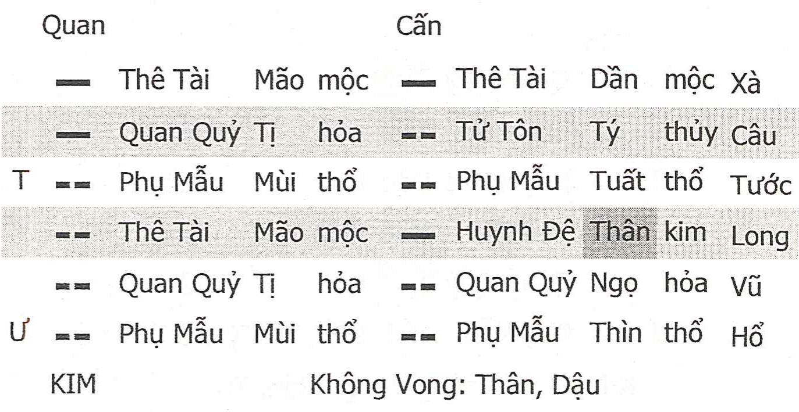

**Ví dụ 2:** Năm 1997, giải vô địch bóng bàn thế giới lần thứ 44 được tổ chức tại Manchester của nước Anh. Khi đoàn nữ thi đấu, ngày Tân Sửu tháng Thìn đoán Đặng Á Bình của Trung Quốc và Kim Hyon-hui của Triều Tiên ai thắng ai thua? Được quẻ Hỏa Địa Tấn.

| | Tấn | | | Lục thú |
| :---: | :---: | :--- | :--- | :---: |
| | — | Quan Quỷ Tị hỏa | | Xà |
| | - - | Phụ Mẫu Mùi thổ | | Câu |
| T | — | Huynh Đệ Dậu kim | | Tước |
| | - - | Thê Tài Mão mộc | | Long |
| | - - | Quan Quỷ Tị hỏa | | Vũ |
| Ư | - - | Phụ Mẫu Mùi thổ | Tử Tý | Hổ |

KIM Không Vong: Thìn, Tị

### Phán đoán:

Hào Thế là Đặng Á Bình, hào Ứng là Kim Hyon-hui.

Hào Thế Dậu kim được Nhật Nguyệt sinh phù là vượng tướng, còn hào Ứng Phụ Mẫu Mùi thổ cũng được Nhật Nguyệt tỉ phù, vượng giống hào Thế. Hào Ứng được Nhật xung là ám động, Ứng động sinh Thế là bản thân Kim Hyon-hui có sơ xuất, tạo cơ hội cho đối phương tận dụng, lấy thất bại cáo chung. Có lẽ có người sẽ hỏi, hào Thế được Nhật Nguyệt sinh phù, lại được hào Ứng ám động sinh, không phải có phần quá vượng à? Ví dụ này hay ở chỗ Nhật lại là Mộ khố hào Thế, sách nói "thái quá lấy Mộ khố thu tàng", vì vậy hào Thế sẽ không quá vượng, vừa đủ vượng.

**Kết quả:** Đặng Á Bình thắng Kim Hyon-hui 2-0.

Cùng ngày, ngày Tân Sửu tháng Thìn, Lý Cúc của Trung Quốc và Tu Jong-sil của Triều Tiên đối đầu, đoán ai thắng ai thua? Được quẻ Địa Trạch Lâm biến Lôi Thiên Đại Tráng.

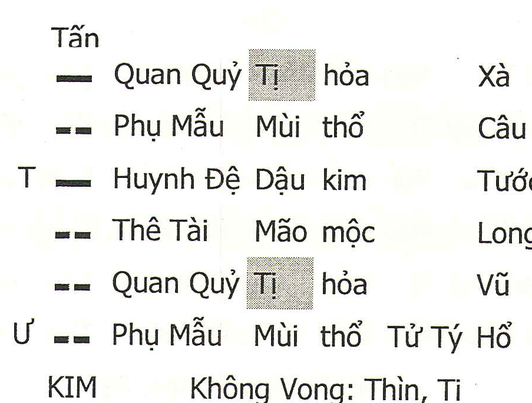

| | Lâm | | | Đại Tráng | | Lục thú |
| :---: | :---: | :--- | :---: | :--- | :---: |
| | - - | Tử Tôn Dậu kim | - - | Huynh Đệ Tuất thổ | Xà |
| Ư | - - | Thê Tài Hợi thủy | - - | Tử Tôn Thân kim | Câu |
| | - - | Huynh Đệ Sửu thổ | — | Phụ Mẫu Ngọ hỏa | Tước |
| | - - | Huynh Đệ Sửu thổ | — | Huynh Đệ Thìn thổ | Long |
| T | — | Quan Quỷ Mão mộc | — | Quan Quỷ Dần mộc | Vũ |
| | — | Phụ Mẫu Tị hỏa | — | Thê Tài Tý thủy | Hổ |

THỔ Không Vong: Thìn, Tị

### Phán đoán:

Hào Thế là Lý Cúc, hào Ứng là Tu Jong-sil.

Hào Thế không được Nhật Nguyệt sinh phù, nhưng cũng không bị Nhật Nguyệt khắc. Còn hào Ứng Hợi thủy bị Nhật Nguyệt khắc thương, lại bị hai tầng Sửu thổ trong quẻ khắc chế, có khắc không sinh. Lý Cúc sẽ thắng.

**Kết quả:** Lý Cúc thắng 2-0.

**Ví dụ 3:** Ngày Nhâm Dần tháng Thìn, Khổng Lệnh Huy và Jean-Philippe Gatien của Pháp đấu bóng bàn, đoán thắng bại hai bên, được quẻ Sơn Phong Cổ.

| | Cổ | | | Lục thú |
| :---: | :---: | :--- | :--- | :---: |
| Ư | — | Huynh Đệ Dần mộc | | Hổ |
| | - - | Phụ Mẫu Tý thủy | Tử Tị | Xà |
| | - - | Thê Tài Tuất thổ | | Câu |
| T | — | Quan Quỷ Dậu kim | | Tước |
| | — | Phụ Mẫu Hợi thủy | | Long |
| | - - | Thê Tài Sửu thổ | | Vũ |

MỘC Không Vong: Thìn, Tị

### Phán đoán:

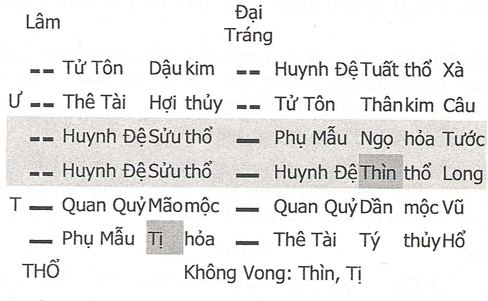

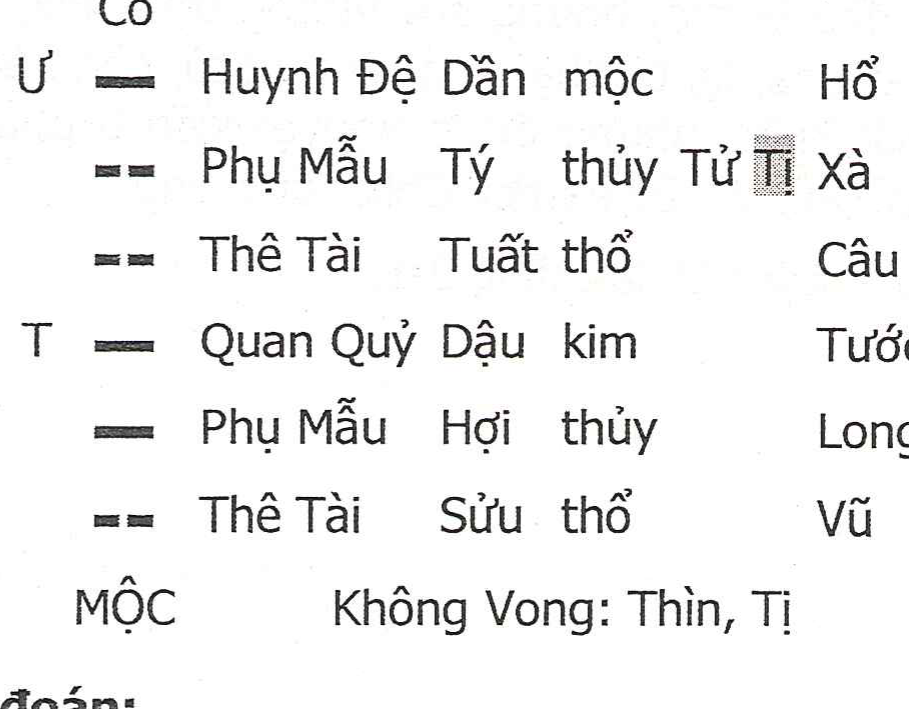

Hào Thế là Khổng Lệnh Huy, hào Ứng là Jean-Philippe Gatien.

Hào Thế được Nguyệt sinh phù, hào Ứng được Nhật tỉ phù, sức mạnh tương đương. Nhưng hào Thế là ngũ hành khắc hào Ứng, hào Thế hơi vượng hơn hào Ứng.

**Kết quả:** Khổng Lệnh Huy thắng 2-1.

**Ví dụ 4:** Ngày Nhâm Dần tháng Thìn, Lưu Quốc Lượng và Patrick Chila của Pháp đấu bóng bàn, đoán thắng bại hai bên, được quẻ Chấn Vi Lôi biến Thủy Lôi Truân.

| | Chấn | | Truân | | |
| :---: | :---: | :--- | :---: | :--- | :--- |
| T | ▅▅ ▅▅ | Thê Tài Tuất thổ | ▅▅ ▅▅ | Phụ Mẫu Tý thủy | Hổ |
| | ▅▅ ▅▅ | Quan Quỷ Thân kim | ━━━━━ | Thê Tài Tuất thổ | Xà |
| | ━━━━━ | Tử Tôn Ngọ hỏa | ▅▅ ▅▅ | Quan Quỷ Thân kim | Câu |
| Ứ | ▅▅ ▅▅ | Thê Tài Thìn thổ | ▅▅ ▅▅ | Thê Tài Thìn thổ | Tước |
| | ▅▅ ▅▅ | Huynh Đệ Dần mộc | ▅▅ ▅▅ | Huynh Đệ Dần mộc | Long |
| | ━━━━━ | Phụ Mẫu Tý thủy | ━━━━━ | Phụ Mẫu Tý thủy | Vũ |

MỘC Không Vong: Thìn, Tị

**Phán đoán:**

Hào Thế là Lưu Quốc Lượng, hào Ứng là Patrick Chila.

Thế Ứng đều là thổ, nhưng suy vượng thì không như nhau. Hào Thế Nguyệt phá, lại bị Nhật khắc là hưu tù, còn hào Ứng mặc dù cũng bị Nhật khắc, nhưng được Nguyệt kiến tỉ phù, hào Ứng vượng hơn hào Thế. Vì vậy Patrick Chila tất thắng.

**Kết quả:** Patrick Chila thắng 2-1.

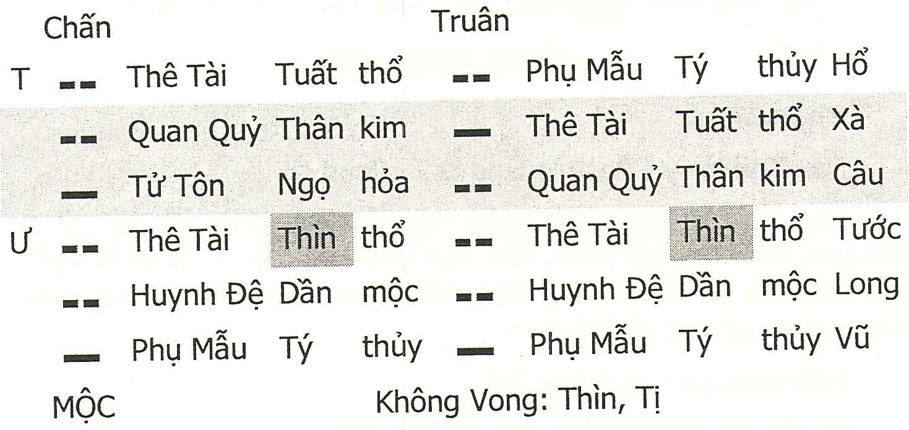

**Ví dụ 5:** Ngày Tân Sửu tháng Ngọ, Italia và Áo thi đấu bóng đá, đoán Italia có thể thắng không? Được quẻ Lôi Thiên Đại Tráng.

| | Đại Tráng | | |
| :---: | :---: | :--- | :--- |
| | ▅▅ ▅▅ | Huynh Đệ Tuất thổ | Xà |
| | ▅▅ ▅▅ | Tử Tôn Thân kim | Câu |
| T | ━━━━━ | Phụ Mẫu Ngọ hỏa | Tước |
| | ━━━━━ | Huynh Đệ Thìn thổ | Long |
| | ━━━━━ | Quan Quỷ Dần mộc | Vũ |
| Ứ | ━━━━━ | Thê Tài Tý thủy | Hổ |

THỔ Không Vong: Thìn, Tị

**Phán đoán:**

Hào Thế là Italia, hào Ứng là Áo.

Hào Thế được Nguyệt tỉ phù, hào Ứng thì bị Nguyệt xung phá, tuy có Nhật hợp để giải phá, nhưng trong hợp có khắc, hiển nhiên hào Ứng nhược hơn hào Thế, Italia tất thắng.

**Kết quả:** Italia thắng 2-1.

Dưới đây là một số quẻ dự đoán về cùng một trận đấu, do nhiều người dự đoán.

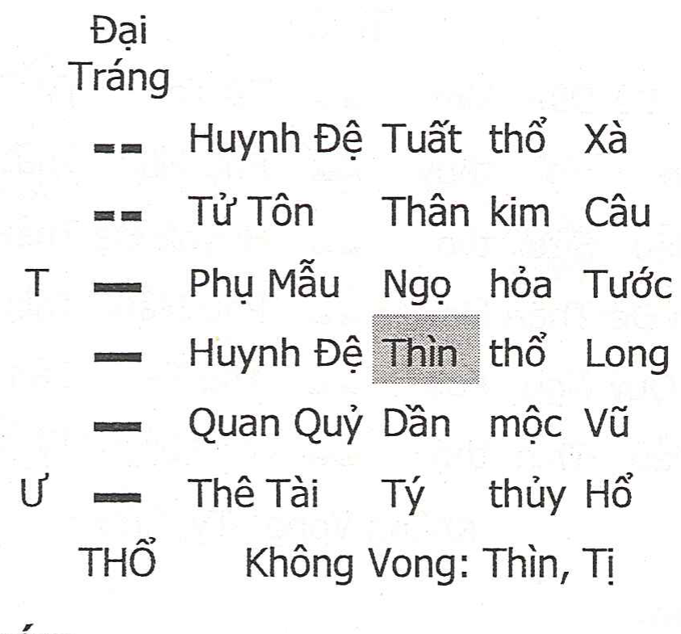

**Ví dụ 6:** Ngày Đinh Tị tháng Ngọ, học viên MO người Nhật Bản dự đoán trận đấu bóng đá giữa Nhật Bản và Thổ Nhĩ Kỳ, được quẻ Địa Sơn Khiêm biến Thủy Lôi Truân.

| | Khiêm | | Truân | | |
| :---: | :---: | :--- | :---: | :--- | :--- |
| | - - | Huynh Đệ Dậu kim | - - | Tử Tôn Tý thủy | Long |
| T | - - | Tử Tôn Hợi thủy | --- | Phụ Mẫu Tuất thổ | Vũ |
| | - - | Phụ Mẫu Sửu thổ | - - | Huynh Đệ Thân kim | Hổ |
| | --- | Huynh Đệ Thân kim | - - | Phụ Mẫu Thìn thổ | Xà |
| Ư | - - | Quan Quỷ Ngọ hỏa | - - | Thê Tài Dần mộc | Câu |
| | - - | Phụ Mẫu Thìn thổ | --- | Tử Tôn Tý thủy | Tước |

KIM Không Vong: Tý, Sửu

### Phán đoán:

Hào Thế là Nhật Bản, hào Ứng là Thổ Nhĩ Kỳ. Hào Thế không được Nhật Nguyệt sinh phù, động mà hóa hồi đầu khắc, lại bị hào sơ Phụ Mẫu Thìn thổ phát động khắc, mặc dù có Huynh Đệ Thân kim động sinh, khắc nhiều sinh ít, không cát. Hào Ứng được Nhật Nguyệt tỉ phù, hiển nhiên vượng tướng hơn hào Thế, Nhật Bản tất thua.

**Kết quả:** Nhật Bản thua 0-1.

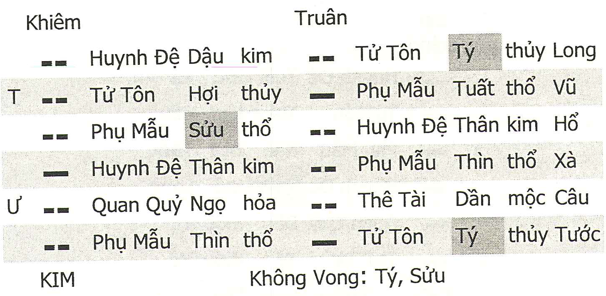

**Ví dụ 7:** Ngày Đinh Tị tháng Ngọ, học viên AN người Nhật Bản dự đoán trận đấu bóng đá giữa Nhật Bản và Thổ Nhĩ Kỳ, được quẻ Địa Lôi Phục biến Ly Vi Hỏa.

| | Phục | | Ly | | |
| :---: | :---: | :--- | :---: | :--- | :--- |
| | - - | Tử Tôn Dậu kim | --- | Phụ Mẫu Tị hỏa | Long |
| | - - | Thê Tài Hợi thủy | - - | Huynh Đệ Mùi thổ | Vũ |
| Ư | - - | Huynh Đệ Sửu thổ | --- | Tử Tôn Dậu kim | Hổ |
| | - - | Huynh Đệ Thìn thổ | --- | Thê Tài Hợi thủy | Xà |
| | - - | Quan Quỷ Dần mộc Phụ Tị | - - | Huynh Đệ Sửu thổ | Câu |
| T | --- | Thê Tài Tý thủy | --- | Quan Quỷ Mão mộc | Tước |

THỔ Không Vong: Tý, Sửu

### Phán đoán:

Hào Thế là Nhật Bản, hào Ứng là Thổ Nhĩ Kỳ.

Hào Thế Nguyệt phá Tuyệt ở Nhật, lại bị hào 3 Thìn thổ và hào Ứng Sửu thổ động mà khắc thương, tuy có ngoại quái tam hợp kim cục đến sinh, quả là như cây không gốc rễ, sinh phù bất khởi. Còn hào Ứng được Nhật Nguyệt sinh phù, vượng hơn hào Thế rất nhiều.

**Kết quả:** Kết quả giống trước.

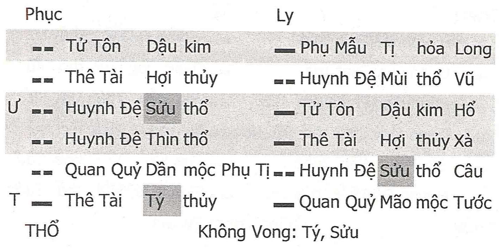

**Ví dụ 8:** Ngày Đinh Tị tháng Ngọ, học viên Tetsuo người Nhật Bản dự đoán trận đấu bóng đá giữa Nhật Bản và Thổ Nhĩ Kỳ, được quẻ Thủy Lôi Truân biến Thủy Địa Tỷ.

| Thế/Ứng | Truân | Phục thần | Tỷ | Lục thú |
| :---: | :--- | :---: | :--- | :---: |
| | - - Huynh Đệ Tý thủy | | - - Huynh Đệ Tý thủy | Long |
| Ứ | — Quan Quỷ Tuất thổ | | — Quan Quỷ Tuất thổ | Vũ |
| | - - Phụ Mẫu Thân kim | | - - Phụ Mẫu Thân kim | Hổ |
| | - - Quan Quỷ Thìn thổ | Tài Ngọ | - - Tử Tôn Mão mộc | Xà |
| T | - - Tử Tôn Dần mộc | | - - Thê Tài Tị hỏa | Câu |
| | — Huynh Đệ Tý thủy | | - - Quan Quỷ Mùi thổ | Tước |

**THỦY** &emsp;&emsp;&emsp;&emsp;&emsp;&emsp;&emsp;&emsp; **Không Vong: Tý, Sửu**

**Phán đoán:**

Hào Thế là Nhật Bản, hào Ứng là Thổ Nhĩ Kỳ.

Hào Thế không được Nhật Nguyệt sinh phù, tuy có Nguyên thần phát động sinh, nhưng Nguyên thần Nguyệt phá lại động hóa hồi đầu khắc, vô lực sinh hào Thế. Còn hào Ứng được Nhật Nguyệt sinh phù, lại Đế Vượng tại hào động Tý thủy, Nhật Bản tất thua.

**Kết quả:** Kết quả giống trước.

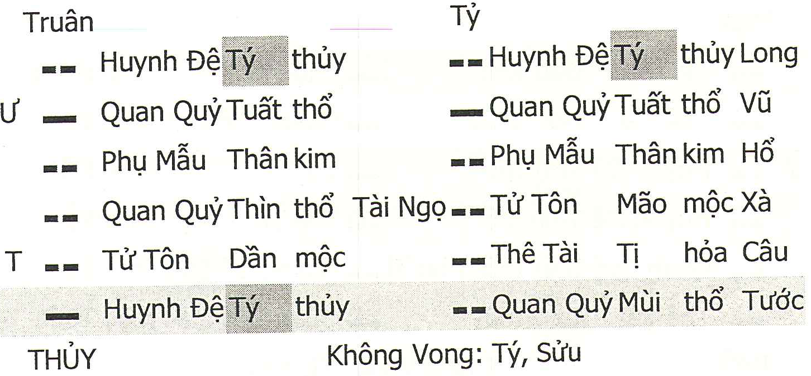

**Ví dụ 9:** Ngày Đinh Tị tháng Ngọ, học viên Sorairo người Nhật Bản dự đoán trận đấu bóng đá giữa Nhật Bản và Thổ Nhĩ Kỳ, được quẻ Thủy Sơn Kiển.

| Thế/Ứng | Kiển | Phục thần | Lục thú |
| :---: | :--- | :---: | :---: |
| | - - Tử Tôn Tý thủy | | Long |
| | — Phụ Mẫu Tuất thổ | | Vũ |
| T | - - Huynh Đệ Thân kim | | Hổ |
| | — Huynh Đệ Thân kim | | Xà |
| | - - Quan Quỷ Ngọ hỏa | Tài Mão | Câu |
| Ứ | - - Phụ Mẫu Thìn thổ | | Tước |

**KIM** &emsp;&emsp;&emsp;&emsp;&emsp;&emsp;&emsp;&emsp; **Không Vong: Tý, Sửu**

**Phán đoán:**

Hào Thế là Nhật Bản, hào Ứng là Thổ Nhĩ Kỳ.

Hào Thế bị Nhật Nguyệt khắc thương, là hưu tù. Còn hào Ứng được Nhật Nguyệt sinh phù, hào Ứng vượng hơn hào Thế, Nhật Bản tất thua.

**Kết quả:** Kết quả giống trước.

Từ ví dụ 6 đến ví dụ 9 trên đây đều dự đoán về cùng một trận đấu, mặc dù quẻ khác nhau, nhưng mọi góc độ đều phản ánh ra kết quả giống nhau.

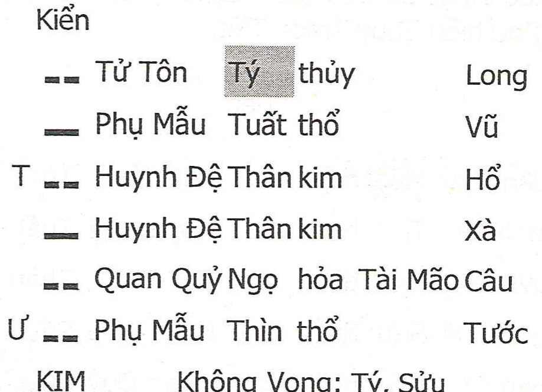

**Ví dụ 10:** Ngày Tân Hợi tháng Tuất, một học viên người Nhật Bản theo tôi học dự đoán lục hào, gieo quẻ đoán xem trong cuộc thi chạy Ma-ra-tông được tổ chức ở Bắc Kinh, tuyển thủ Asahi Kasei của Nhật Bản có thể thắng không? Được quẻ Phong Trạch Trung Phu biến Thủy Trạch Tiết.

| | Trung Phu | | | Tiết | |
| :---: | :---: | :--- | :---: | :--- | :--- |
| | ━ | Quan Quỷ Mão mộc | ╍ ╍ | Thê Tài Tý thủy | Xà |
| | ━ | Phụ Mẫu Tị hỏa | ━ | Huynh Đệ Tuất thổ | Câu |
| T | ╍ ╍ | Huynh Đệ Mùi thổ | ╍ ╍ | Tử Tôn Thân kim | Tước |
| | ╍ ╍ | Huynh Đệ Sửu thổ | ╍ ╍ | Huynh Đệ Sửu thổ | Long |
| | ━ | Quan Quỷ Mão mộc | ━ | Quan Quỷ Mão mộc | Vũ |
| Ư | ━ | Phụ Mẫu Tị hỏa | ━ | Phụ Mẫu Tị hỏa | Hổ |

THỔ Không Vong: Dần, Mão

**Phán đoán:**

Anh ta phán đoán là lấy hào Thế làm Asahi Kasei, hào Ứng là những tuyển thủ khác. Thế được Nguyệt kiến tỉ phù, hào Ứng thì không được Nguyệt kiến sinh phù lại bị Nhật khắc, nhất định có thể thắng. Tôi nói rằng nhiều người thi đấu thì không thể xem Thế Ứng, phải lấy Quan Quỷ làm Dụng thần, bởi vì Quan Quỷ là thứ bậc. Hào Thế là Asahi Kasei, hào Ứng là những tuyển thủ khác. Quan Quỷ phát động khắc Thế sinh Ứng, Dụng thần xuất hiện vô tình, tượng người khác có được danh thứ, hào Thế bị Quan Quỷ Mão mộc khắc, Mão chủ số 3, Asahi Kasei nhất định không thể lọt vào top ba.

**Kết quả:** Được vị trí thứ tư.

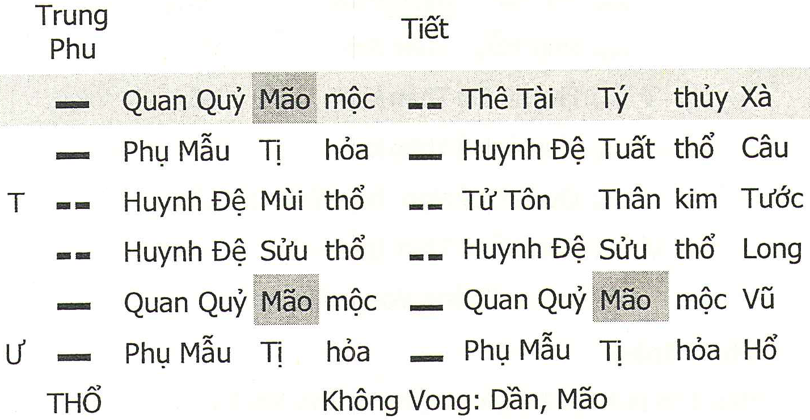

# CHƯƠNG 21
## DỰ ĐOÁN TÀI VẬN

Người giác ngộ nói rằng: "Tiền chỉ là vật ngoài thân", bảo người ta không nên quá xem trọng tiền bạc, nhưng tiền lại là một thứ không thể thiếu trong cuộc sống con người. Không có tiền thì không thể mua được thực phẩm, và thậm chí cuộc sống cơ bản cũng trở nên khó khăn, tục ngữ nói: "Một đồng tiền khó tạo ra hảo hán", từ một góc độ khác lại miêu tả tầm quan trọng của tiền. Rất nhiều người muốn phát tài, muốn trở thành người có tiền, nhưng được bao nhiêu tiền lại có liên quan rất lớn đến vận khí của bản thân người đó.

Mục đích của dự đoán lục hào chính là muốn mọi người nắm bắt được cơ hội tốt, đạt được tài vận tốt nhất. Khi dùng lục hào để dự đoán tài vận, trước khi gieo quẻ phải xác định rõ phạm vi tài vận muốn dự đoán, như vậy khi dự đoán thì ý thức tỏ ra rất quan trọng. Dự đoán tài vận, có thể dự đoán tài vận dài hạn, như tài vận trọn đời, hoặc tài vận trong vài năm gần đây, hay tài vận của một năm v.v; cũng có thể dự đoán tài vận ngắn hạn, chẳng hạn như tài vận của một tháng, tài vận của một tuần lễ hoặc một ngày v.v. Dự đoán tài vận của ngày hôm đó, trong quẻ biểu thị không tốt đẹp, hoàn toàn không thể hiện tài vận về sau không tốt, nhất định không được lấy quẻ này dự đoán tài vận trong vài ngày, vài tháng hoặc một năm, cho nên mới nói ý thức trước khi gieo quẻ rất quan trọng.

◆ Dự đoán tài vận thì lấy Thê Tài làm Dụng thần, xem mối quan hệ giữa Thê Tài và hào Thế, bởi vì hào Thế là người xin đoán. Thường thì hào Thế không nên Không Phá, cũng không nên Huynh Đệ trì Thế, có điều là Huynh Đệ Sửu thổ, Huynh Đệ Thìn thổ và Huynh Đệ Tị hỏa trì Thế, chỉ cần hào Tài vượng tướng, không thể nói tài vận không tốt đẹp. Bởi vì Huynh Đệ Sửu thổ và Thê Tài Tý thủy tương hợp, Huynh Đệ Thìn thổ là Tài khố, Huynh Đệ Tị hỏa là điểm Trường Sinh của Tài.

◆ Thê Tài hợp Thế, trì Thế, hoặc là hào Thế sinh Thê Tài, Thê Tài khắc Thế, Thê Tài xung Thế, đều là thông tin có thể được tài. Thê Tài khắc Thế, có hai tình huống. Một là khi hào Thế không Không Phá, Thê Tài vượng, là tượng tài đến với ta, chủ tài dễ được; nếu là hào Thế Không Phá, hoặc Thê Tài hưu tù thì là tượng vất vả cầu tài.

◆ Thê Tài phát động hóa Tiến thần, đồng thời lại sinh hợp hào Thế, khắc hào Thế hoặc trì Thế, tài vận hanh thông. Thê Tài động mà sinh hợp khắc hào Thế, nếu bị Nhật thần hoặc hào biến, hoặc hào khác hợp trú, khi xung khai thì có thể được tài. Nếu như Nhật Nguyệt đều sinh hợp hào Tài hoặc là Nhật Nguyệt làm Tài tinh sinh hợp hào Thế, nếu quẻ lại có Tử Tôn vượng tướng phát động sinh trợ hào Tài, hoặc hào Tài vượng tướng đa hiện, chính là thái quá, trái lại khi Thê Tài nhập Mộ hoặc bị khắc thì có thể được tài.

◆ Thê Tài vượng tướng nhập Mộ, khi Mộ khố bị xung, hoặc Dụng thần xuất Mộ, Dụng thần bị xung thì có thể được tài.

◆ Thê Tài Nguyệt phá, nhưng có khí được sinh, được trợ, khi Thực Phá Hợp Phá là có thể được tài. Hoặc qua tháng đó, đợi đến tháng sau thì cũng có thể được tài. Cũng có thể lấy ngày giờ làm ứng kỳ, cũng có thể dùng năm để làm ứng kỳ, tình huống cụ thể cần căn cứ vào quẻ và nội dung hỏi tài mà phán đoán. Nếu là Thê Tài Không Vong, chỉ cần khi vượng tướng, xuất Không, xung Không, là có thể tiến tài; nếu Thê Tài vượng mà không bị tổn thương, hào Thế Không Phá, cũng lấy lúc hào Thế bất Không bất Phá làm ứng kỳ tiến tài.

◆ Dự đoán tài vận ngắn hạn, Thê Tài vượng tướng là được, nếu dự đoán tài vận dài hạn, nhất định phải đồng thời xem hào Tử Tôn, chỉ có Thê Tài và Tử Tôn đều vượng hoặc có khí, không có Không Phá mới là nguồn tiền phong phú, lâu dài.

◆ Tử Tôn phát động hóa Tiến thần, là quái tượng tiến tài liên tục, hóa thoái lại là quái tượng từ từ sa sút. Mặc dù hiện nay có tài, sau này khó tránh suy bại. Thê Tài trì Thế Không Phá, thì sẽ miệng ăn núi lở, tài trong tay cũng sẽ bị tiêu sạch. Thê Tài trì Thế, bị Huynh Đệ động mà đến khắc, không những không thể được tài, còn đề phòng phá tài.

◆ Huynh Đệ và Huyền Vũ cùng hào phát động, thường là quái tượng bị người ta lừa gạt tài, Quan Quỷ lâm Huyền Vũ phát động, là quái tượng bị người ta trộm tiền. Quan Quỷ lâm hào 2 phát động, thường là thông tin kẻ trộm vào nhà.

◆ Quan Quỷ trì Thế hóa Huynh Đệ, là quái tượng ăn hoa hồng, hoặc làm người trung gian mà được tài. Huynh Đệ động mà hóa Thê Tài, không phải đi vay, thì là quái tượng hợp tác cầu tài, đôi khi cũng là thông tin bất ngờ được tài.

◆ Hào Huynh Đệ ở trong quẻ phát động, thông thường là thông tin tài vận không tốt đẹp, nhưng đồng thời Tử Tôn phát động, lại là thông tin được tài dài hạn.

◆ Huynh Đệ lâm Chu Tước phát động, không những khó được tài, còn đề phòng khẩu thiệt, kiện tụng mà phá tài. Phụ Mẫu và Huynh Đệ cùng động, tài vận rất kém.

◆ Dự đoán tài vận nên gặp quẻ lục hợp, không nên quẻ lục xung, càng không nên phản ngâm, phục ngâm.

**Ví dụ 1:** Ngày Bính Tý tháng Mão, một người đoán tài vận trong ngắn hạn, được quẻ Khảm Vi Thủy biến Thủy Sơn Kiển.

| | Khảm | | Kiển | | |
| :--- | :---: | :--- | :---: | :--- | :--- |
| T | ▅▅  ▅▅ | Huynh Đệ Tý thủy | ▅▅  ▅▅ | Huynh Đệ Tý thủy | Long |
| | ▅▅▅▅▅ | Quan Quỷ Tuất thổ | ▅▅▅▅▅ | Quan Quỷ Tuất thổ | Vũ |
| | ▅▅  ▅▅ | Phụ Mẫu Thân kim | ▅▅  ▅▅ | Phụ Mẫu Thân kim | Hổ |
| Ứ | ▅▅  ▅▅ | Thê Tài Ngọ hỏa | ▅▅▅▅▅ | Phụ Mẫu Thân kim | Xà |
| | ▅▅▅▅▅ | Quan Quỷ Thìn thổ | ▅▅  ▅▅ | Thê Tài Ngọ hỏa | Câu |
| | ▅▅  ▅▅ | Tử Tôn Dần mộc | ▅▅  ▅▅ | Quan Quỷ Thìn thổ | Tước |

THỦY
Không Vong: Thân, Dậu

**Phán đoán:**

Lấy Thê Tài làm Dụng thần.

Thê Tài tuy được Nguyệt sinh, nhưng không nên Nhật thần khắc, động mà hóa Không, Quan Quỷ tại hào 2 phát động lại tiết khí Thê Tài, quẻ chính lục xung, Huynh Đệ trì Thế, không những vô tài, trái lại đề phòng phá tài, hào 2 là trạch, Quan Quỷ lâm hào 2 phát động, tất có kẻ trộm vào nhà.

**Kết quả:** Quả nhiên là trộm vào nhà mà bị phá tài.

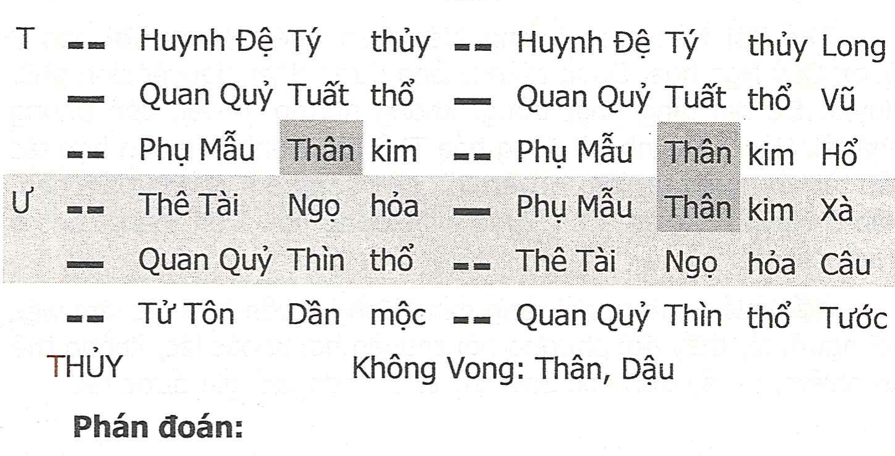

### Ví dụ 2: Ngày Kỷ Sửu tháng Sửu, nam hỏi tình hình tài vận, được quẻ Lôi Sơn Tiểu Quá biến Trạch Địa Tụy.

| | Tiểu Quá | Phục thần | Tụy | |
| :---: | :--- | :---: | :--- | :---: |
| | -- Phụ Mẫu Tuất thổ | | -- Phụ Mẫu Mùi thổ | Câu |
| | -- Huynh Đệ Thân kim | | — Huynh Đệ Dậu kim | Tước |
| T | — Quan Quỷ Ngọ hỏa | Tử Hợi | — Tử Tôn Hợi thủy | Long |
| | — Huynh Đệ Thân kim | | -- Thê Tài Mão mộc | Vũ |
| | -- Quan Quỷ Ngọ hỏa | Tài Mão | -- Quan Quỷ Tị hỏa | Hổ |
| Ư | -- Phụ Mẫu Thìn thổ | | -- Phụ Mẫu Mùi thổ | Xà |

KIM Không Vong: Ngọ, Mùi

**Phán đoán:**

Lấy Thê Tài làm Dụng thần.

Thê Tài Mão mộc không hiện trên quẻ, phục dưới hào 2 Quan Quỷ Ngọ hỏa. Dụng thần không được Nhật Nguyệt sinh phù, Huynh Đệ hai tầng phát động, không những vô tài, còn phòng phá tài. Hào 3 Huynh Đệ động hóa Thê Tài, chính là muốn hợp tác cầu tài với người ta, lâm Huyền Vũ, đề phòng đối phương lừa tiền. Hào 5 Huynh Đệ lâm Chu Tước phát động hóa Tiến thần, còn có tranh cãi.

**Kết quả:** Anh ta nói rằng mình đang muốn hợp tác làm việc với người ta, thấy đối phương nói chuyện hơi khoác lác, không thể tín nhiệm, vì vậy đến hỏi. Sau này từ bỏ hợp tác, giữ được tài.

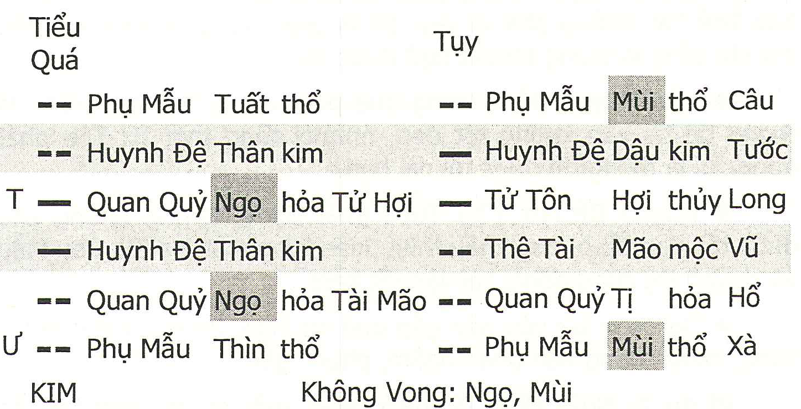

### Ví dụ 3: Ngày Nhâm Thân tháng Dần, đoán tài vận mấy ngày sắp tới, được quẻ Sơn Hỏa Bí biến Sơn Lôi Di.

| | Bí | Phục thần | Di | |
| :---: | :--- | :---: | :--- | :---: |
| | — Quan Quỷ Dần mộc | | — Quan Quỷ Dần mộc | Hổ |
| | -- Thê Tài Tý thủy | | -- Thê Tài Tý thủy | Xà |
| Ư | -- Huynh Đệ Tuất thổ | | -- Huynh Đệ Tuất thổ | Câu |
| | — Thê Tài Hợi thủy | Tử Thân | -- Huynh Đệ Thìn thổ | Tước |
| | -- Huynh Đệ Sửu thổ | Phụ Ngọ | -- Quan Quỷ Dần mộc | Long |
| T | — Quan Quỷ Mão mộc | | — Thê Tài Tý thủy | Vũ |

THỔ Không Vong: Tuất, Hợi

**Phán đoán ứng kỳ:**

Lấy Thê Tài làm Dụng thần. Trong quẻ Thê Tài lưỡng hiện, lấy hào Thê Tài Hợi thủy phát động làm Dụng thần.

Dụng thần được Nguyệt hợp vượng, lại được Nhật sinh phù, động mà sinh Thế, đây là tượng sắp tới được tài, nhưng Dụng thần động mà nhập Mộ ở hào biến, lại động hóa hồi đầu khắc, ngày hôm sau hào biến bị hợp không khắc Dụng thần, giờ Tị Dụng thần từ trong Mộ khố xung ra, có thể tiến tài, ngày Tuất xung mất hào biến cũng có thể tiến tài.

**Kết quả:** Quả nhiên ở giờ Tị ngày hôm sau và giờ Tị ngày Tuất có tài khác nhau vào.

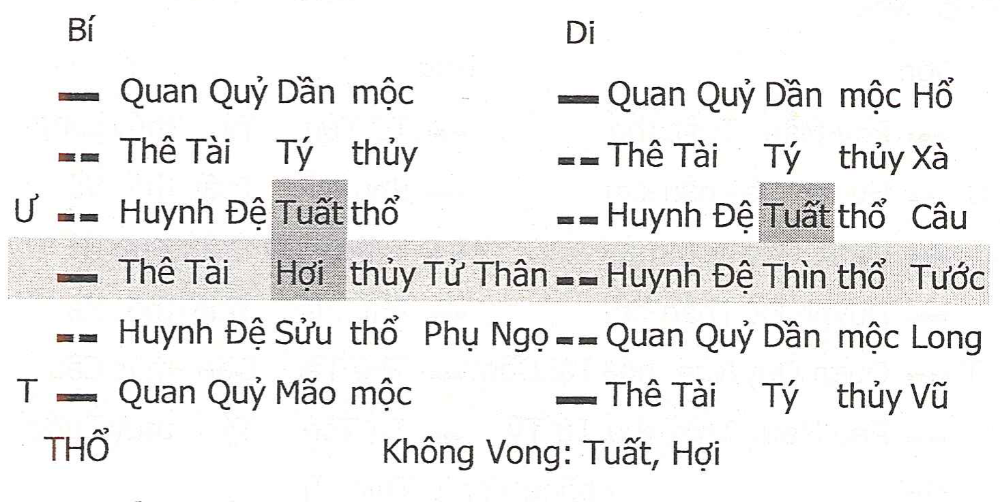

**Ví dụ 4:** Ngày Đinh Dậu tháng Mão, nam muốn đòi tiền cấp trên, hỏi có đòi được không? Được quẻ Thiên Sơn Độn biến Thủy Thiên Nhu.

| Độn | | Phục thần | Nhu | Lục thú |
| :--- | :--- | :--- | :--- | :--- |
| | ━ Phụ Mẫu Tuất thổ | | ━ ━ Tử Tôn Tý thủy | Long |
| Ứ | ━ Huynh Đệ Thân kim | | ━ Phụ Mẫu Tuất thổ | Vũ |
| | ━ Quan Quỷ Ngọ hỏa | | ━ ━ Huynh Đệ Thân kim | Hổ |
| | ━ Huynh Đệ Thân kim | | ━ Phụ Mẫu Thìn thổ | Xà |
| T | ━ ━ Quan Quỷ Ngọ hỏa | Tài Dần | ━ Thê Tài Dần mộc | Câu |
| | ━ ━ Phụ Mẫu Thìn thổ | Tử Tý | ━ Tử Tôn Tý thủy | Tước |

KIM Không Vong: Thìn, Tị

**Phán đoán:**

Lấy Thê Tài làm Dụng thần.

Thê Tài Dần mộc không hiện trên quẻ, phục dưới hào 2, được Nguyệt kiến tỉ phù là vượng tướng. Hào Thế động mà hóa ra Thê Tài hồi đầu sinh, có thể đòi được tiền.

Tháng Tý xung khai Phi thần, Phục thần được xuất, tiền có thể đến tay.

Hào 4 Quan Quỷ Ngọ hỏa là gian hào (hai hào giữa Thế Ứng), động mà hóa Huynh Đệ, Quan Quỷ tại gian hào là người trung gian, động hóa Huynh Đệ, có người đòi tiền hoa hồng. Lâm Bạch Hổ, Bạch Hổ chủ đao thương, chấp pháp, là người trong ngành công an, chính trị pháp luật.

**Kết quả:** Quả nhiên có một người ở tòa án giúp đỡ đòi được tiền, đã cho người ta tiền cà phê. Đòi được 10 vạn tròn ở tháng Tý.

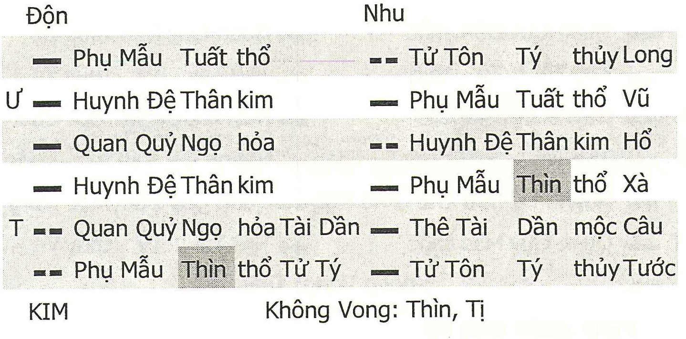

**Ví dụ 5:** Ngày Giáp Thân tháng Mão, nữ đoán vay ngân hàng mấy chục triệu có thành công không? Được Trạch Sơn Hàm.

| Hàm | | Phục thần | Lục thú |
| :--- | :--- | :--- | :--- |
| Ứ | ━ ━ Phụ Mẫu Mùi thổ | | Vũ |
| | ━ Huynh Đệ Dậu kim | | Hổ |
| | ━ Tử Tôn Hợi thủy | | Xà |
| T | ━ Huynh Đệ Thân kim | | Câu |
| | ━ ━ Quan Quỷ Ngọ hỏa | Tài Mão | Tước |
| | ━ ━ Phụ Mẫu Thìn thổ | | Long |

KIM Không Vong: Ngọ, Mùi

**Phán đoán:**

Lấy Thê Tài làm Dụng thần.

Thê Tài Mão mộc phục dưới hào 2, mặc dù không hiện trên quẻ nhưng được Nguyệt tỉ phù, Phi thần lại Không, Phục thần dưới hào Không thì dễ kéo ra, có thể vay được.

Hào Ứng là Tài khố, chủ ngân hàng, Không mà khiến hào Tài không nhập Mộ khố, chính là thông tin ngân hàng cởi mở, cho vay tiền. Dụng thần trị Nguyệt, tháng đó có thể vay được.

**Kết quả:** Sau này đã vay được tiền trước tiết Thanh Minh một tuần.

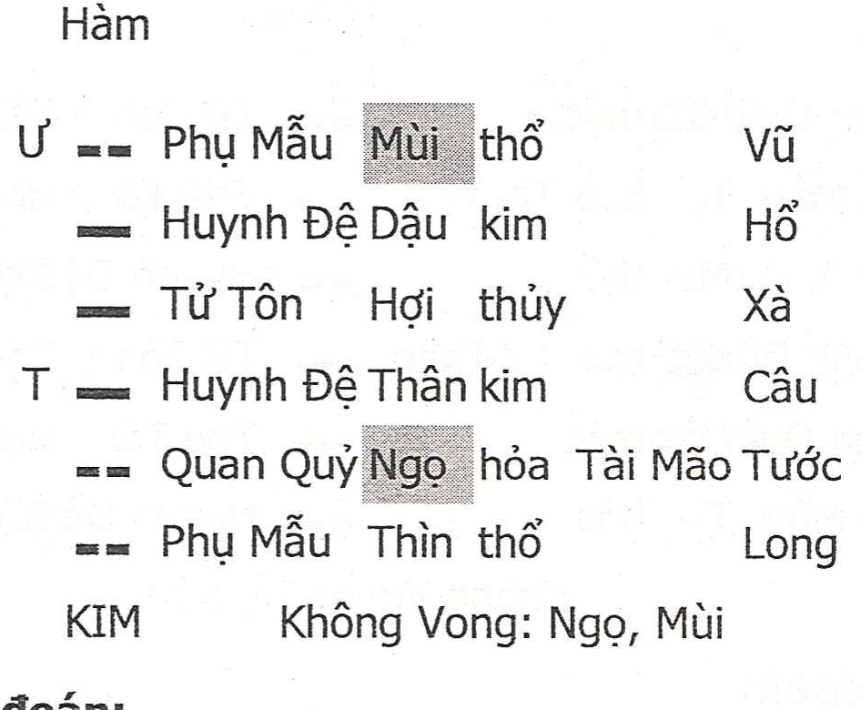

### Ví dụ 6: Ngày Canh Thân tháng Dần, nam hỏi tình hình tài vận, được quẻ Phong Trạch Trung Phu biến Địa Phong Thăng.

| Thế/Ứng | Trung Phu | Phục thần | Thăng | Lục thú |
| :---: | :--- | :--- | :--- | :--- |
| | — Quan Quỷ Mão mộc | | - - Tử Tôn Dậu kim | Xà |
| | — Phụ Mẫu Tị hỏa | Tài Tý | - - Thê Tài Hợi thủy | Câu |
| T | - - Huynh Đệ Mùi thổ | | - - Huynh Đệ Sửu thổ | Tước |
| | - - Huynh Đệ Sửu thổ | Tử Thân | — Tử Tôn Dậu kim | Long |
| | — Quan Quỷ Mão mộc | | — Thê Tài Hợi thủy | Vũ |
| Ứ | — Phụ Mẫu Tị hỏa | | - - Huynh Đệ Sửu thổ | Hổ |

THỔ Không Vong: Tý, Sửu

**Phán đoán:**

Lấy Thê Tài làm Dụng thần.

Thê Tài Tý thủy không hiện trên quẻ, phục dưới hào 5 Phụ Mẫu Tị hỏa, tuy được Nhật thần sinh phù, nhưng không nên Huynh Đệ trì Thế, Huynh Đệ Sửu thổ ở trong quẻ phát động khắc Tài, Phi thần động mà Tuyệt Tài, ngoại quái phản ngâm, tất là phá tài mà đau khổ rên rỉ.

Tài phục hào 5 bị khắc, hào 5 là đường đi, chính là thông tin phá tài trên đường. Phụ Mẫu Tị hỏa động mà Tuyệt Tài, Phụ Mẫu là xe, tại hào 5 chính là xe chạy trên đường, hào sơ cũng là hào Phụ Mẫu, là Tuyệt địa Thê Tài, hào sơ là chân, lâm Bạch Hổ, Bạch Hổ chủ đường đi, rất rõ ràng là bởi vì xe mà phá tài trên đường.

**Kết quả:** Người này trên thực tế mở công ty du lịch, bởi vì tông xe mà phá đại tài.

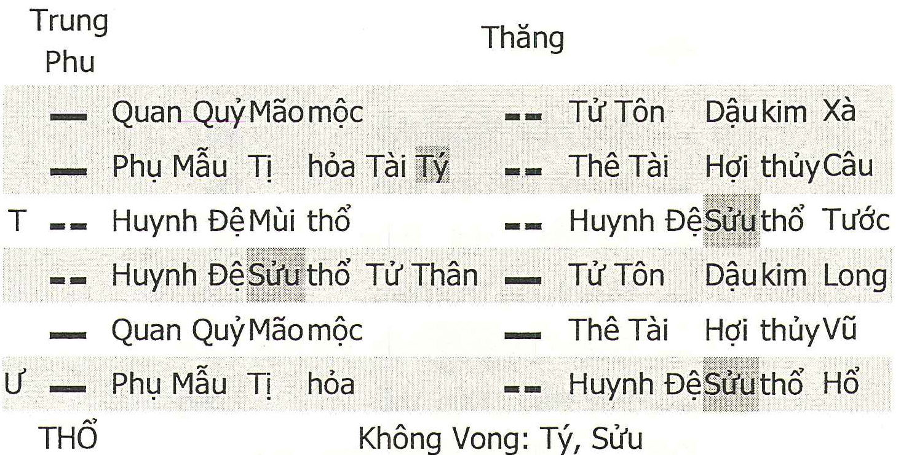

### Ví dụ 7: Ngày Nhâm Dần tháng Sửu, nữ hỏi tình hình tài vận, được Khôn Vi Địa biến Phong Địa Quan.

| Thế/Ứng | Khôn | Quan | Lục thú |
| :---: | :--- | :--- | :--- |
| T | - - Tử Tôn Dậu kim | — Quan Quỷ Mão mộc | Hổ |
| | - - Thê Tài Hợi thủy | — Phụ Mẫu Tị hỏa | Xà |
| | - - Huynh Đệ Sửu thổ | - - Huynh Đệ Mùi thổ | Câu |
| Ứ | - - Quan Quỷ Mão mộc | - - Quan Quỷ Mão mộc | Tước |
| | - - Phụ Mẫu Tị hỏa | - - Phụ Mẫu Tị hỏa | Long |
| | - - Huynh Đệ Mùi thổ | - - Huynh Đệ Mùi thổ | Vũ |

THỔ Không Vong: Thìn, Tị

**Phán đoán:**

Lấy Thê Tài làm Dụng thần.

Hào Thế lâm Bạch Hổ động mà sinh Tài, Bạch Hổ chủ hung mãnh, chính là người giỏi kiếm tiền, kiếm được tiền rất nhanh.

Thê Tài Hợi thủy bị Nguyệt khắc thương, ngoại quái phản ngâm, động mà hóa Tuyệt, lại làm hết số tiền kiếm được.

Thê Tài động mà sinh Ứng Quan Quỷ, Ứng là phu vị, lại đem tiền kiếm được cho chồng. Ngoại quái phản ngâm, cô ấy rất là hối hận.

Hào Thế động mà hóa ra Quan Quỷ, bản thân lại có đàn ông yêu thích. Hào Thế động mà khắc Ứng Quan tinh, bản thân muốn ly hôn với chồng. Nguyên thần thể hiện thế giới nội tâm và tư duy của một người, Nguyên thần Thê Tài Hợi thủy của Quan Quỷ động mà hóa Tuyệt, nếu phải ly hôn thì chồng cô ấy sẽ suy nghĩ tiêu cực mà tự sát.

**Kết quả:** Người này cho biết bản thân đã kiếm được mấy chục vạn trong vài năm gần đây, toàn bộ cho chồng kinh doanh. Nhưng chồng cô ấy không biết kinh doanh, đã thua lỗ rất nhiều tiền. Bởi vì chồng kinh doanh ở nước Nga, bản thân ở nhà buồn chán, đã qua lại với người đàn ông khác, muốn ly hôn với chồng, nhưng mỗi lần nói ra thì anh ta sẽ uống thuốc ngủ để tự sát, rất phiền não vì chuyện này.

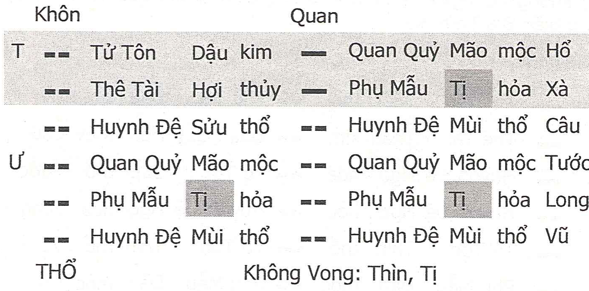

**Ví dụ 8:** Một học viên người Nhật Bản thuê nhà, chủ nhà phát sinh thay đổi, hỏi có đòi lại được 100 vạn tệ đã nộp lúc trước hay không? Ở ngày Canh Thìn tháng Dần, được quẻ Thiên Thủy Tụng biến Địa Thủy Sư.

| | Tụng | Sư | |
| :---: | :--- | :--- | :--- |
| | — Tử Tôn Tuất thổ | - - Thê Tài Dậu kim | Xà |
| | — Thê Tài Thân kim | - - Quan Quỷ Hợi thủy | Câu |
| T | — Huynh Đệ Ngọ hỏa | - - Tử Tôn Sửu thổ | Tước |
| | - - Huynh Đệ Ngọ hỏa | - - Huynh Đệ Ngọ hỏa | Long |
| | — Tử Tôn Thìn thổ | — Tử Tôn Thìn thổ | Vũ |
| Ứ | - - Phụ Mẫu Dần mộc | - - Phụ Mẫu Dần mộc | Hổ |

HỎA &nbsp;&nbsp;&nbsp;&nbsp;&nbsp;&nbsp;&nbsp;&nbsp; Không Vong: Thân, Dậu

**Phán đoán:**

Lấy Thê Tài làm Dụng thần.

Thê Tài Thân kim được Nhật sinh phù là vượng, nhưng không nên bị Nguyệt kiến xung phá. Huynh Đệ lâm Chu Tước trì Thế phát động, chuyện này sẽ phát sinh tranh cãi.

Có điều là Huynh Đệ động mà sinh Tử Tôn, Tử Tôn động mà sinh Thê Tài, tiền có thể đòi về. Dụng thần Nguyệt phá, ngày Hợp Phá, Thực Phá có thể đòi được.

Ngày Hợp Phá gần đây là ngày Tân Tị, trong hợp có khắc, ngày này sẽ không đòi được số tiền vừa ý. Không như đến ngày Giáp Thân tháng Mão, Dụng thần xuất Nguyệt bất phá, ngày Thân lại có thể Thực Phá, có thể lấy lại đủ số tiền.

**Kết quả:** Ở ngày Tân Tị, chủ nhà đề xuất trả lại 60 vạn tệ, học viên của tôi và anh ta đã xảy ra tranh chấp, không đồng ý. Đến ngày Giáp Thân của tháng Mão, chủ nhà lại đến, đã trả lại cho anh ta 100 vạn tệ.

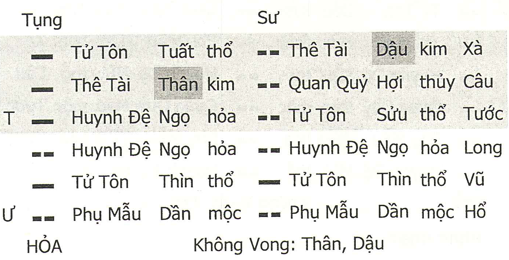

# CHƯƠNG 22
## DỰ ĐOÁN BUÔN BÁN

Dự đoán về buôn bán và kinh doanh cũng giống như dự đoán về tài vận, cũng là lấy Thê Tài làm Dụng thần, nhưng đồng thời còn phải xem mối quan hệ giữa Thế Ứng ra sao. Bởi vì, mở cửa hàng thì hào Thế là người kinh doanh, hào Ứng là nhân viên và khách hàng; giao dịch mua hàng thì hào Thế là bên mua, hào Ứng là bên bán; bán hàng thì hào Thế là bên bán, hào Ứng là bên mua; thảo luận kinh doanh, hào Ứng là đối phương; hợp tác kinh doanh, hào Thế là mình, hào Ứng là cộng sự hợp tác v.v.

- Hào Ứng sinh Thế, hợp Thế, giao dịch thuận lợi; xung khắc hào Thế, tất có yếu tố không thuận lợi hoặc bị làm khó dễ, ép giá, lừa đảo v.v, khi giao dịch cần phải cẩn thận.
- Hào Thế Không Vong, bản thân không chắc chắn, hoặc trong giao dịch thần sắc hoảng hốt, dễ xảy ra sơ suất, có khả năng giữa chừng đình chỉ giao dịch. Hào Ứng Không Vong, mở cửa hàng ít khách, hỏi về nhân viên, là nhân viên không trung thực, lừa gạt chủ. Dự đoán giao dịch, đề phòng đối phương có hành vi bịp bợm. Thế Ứng đồng thời Không Vong, bỏ dở mua bán giữa chừng, cho dù ký hợp đồng cũng có khả năng hủy bỏ.
- Hào Thế Không Phá, Thê Tài lại nhược bị khắc, buôn bán không phát đạt, dần dần suy thoái.
- Thê Tài vượng tướng, Ứng sinh hào Thế, buôn bán, kinh doanh thịnh vượng, nhân viên và chủ đồng tâm, khách hàng đầy cửa.
- Hào Ứng là Huynh Đệ, lại lâm Huyền Vũ khắc hào Thế, buôn bán, giao dịch phải đề phòng người ta lừa đảo, mở cửa hàng phải đề phòng nhân viên tham ô.
- Thê Tài hưu tù, Quan Quỷ lâm Huyền Vũ phát động, phải coi chừng mất trộm.
- Quan Quỷ lâm Chu Tước phát động, đề phòng có kiện tụng phát sinh. Nếu không thì có nỗi lo hỏa hoạn. Phụ Mẫu lâm Chu Tước, Đằng Xà phát động, cũng phải coi chừng có kiện tụng phát sinh.

- Quan Quỷ Không Vong động mà tương hợp với hào Ứng, đề phòng người trung gian và đối phương hợp tác lừa gạt.
- Quan Quỷ và Huynh Đệ tại gian hào phát động, người trung gian có thể sẽ làm chuyện có lỗi với phía mình.
- Khi nhập hàng, Ứng lâm Huyền Vũ khắc Thế, hoặc Ứng lâm Thê Tài Huyền Vũ Không mà sinh Thế, phải đề phòng đối phương cung cấp hàng giả hoặc sản phẩm kém chất lượng.
- Phụ Mẫu phát động hóa Huynh Đệ, khi quy định hợp đồng phải đề phòng trong hợp đồng có cạm bẫy.
- Huynh Đệ vượng tướng phát động, buôn bán, giao dịch nhất định sẽ hao tổn, không có lợi ích để mưu cầu.
- Quan Quỷ tại hào 5 phát động, đề phòng ra ngoài có tai họa. Khắc Thế càng hung, nên tránh đi, hoặc đình chỉ hoạt động ở bên ngoài.
- Quẻ lục hợp, buôn bán được lâu dài, quẻ lục xung; buôn bán không thuận lợi, hoặc buôn bán không được lâu.
- Được lợi hay không, xem tình trạng suy vượng của Thê Tài, được Nhật Nguyệt sinh phù vô Không Phá thì nhất định có thể được đại lợi, nếu vừa Không vừa Phá, lại bị hào Huynh Đệ khắc thương, chắc chắn tổn tài, không có lợi ích để mưu cầu.
- Thê Tài phát động hóa Tiến thần, buôn bán được lâu dài, nguồn tiền dồi dào, kinh doanh sẽ ngày càng tốt đẹp. Hóa Thoái thần, cho dù hiện nay kinh doanh tốt đẹp cũng sẽ dần dần suy thoái. Nếu vẫn chưa mở cửa hàng, xuất hiện Thê Tài hóa thoái, không làm thì tốt hơn.
- Thê Tài lâm Thế, Huynh Đệ lâm Bạch Hổ phát động phải đề phòng có người cướp đoạt tiền tài.
- Thê Tài bị hỏa và ngũ hành lâm Chu Tước xung khắc, phải coi chừng hàng hóa bị hỏa hoạn.
- Thê Tài bị thủy và ngũ hành lâm Huyền Vũ xung khắc, phải coi chừng hàng hóa bị nước mưa dội ướt, hoặc bị lũ lụt nhấn chìm.
- Mở cửa hàng thì không nên hào Thế và hào 2 phát động, nếu phát động, cửa hàng thường dời chỗ.

- Mở cửa hàng giao dịch, không nên phản ngâm phục ngâm, chủ buôn bán làm rồi dừng, dừng rồi lại làm, kinh doanh lên xuống bất định, rất khó như ý.
- Thê Tài nhược, nhưng hóa Tiến thần hoặc hóa hồi đầu sinh, hiện nay hàng hóa giá tuy thấp, sau này cũng sẽ dần dần tăng cao, nên nhập nhiều hàng. Nếu là hóa thoái hoặc hóa hồi đầu khắc, hiện nay mặc dù mức giá khá tốt, cũng nên nhanh xuất hàng, không nên nhập thêm hàng, bởi vì không lâu sau sẽ hạ giá.
- Thê Tài và Nguyệt kiến tương hợp, hiện nay chính là thời kỳ giá cả tốt nhất, phải nắm bắt cơ hội, đem tất cả hàng hóa bán ra.

**Ví dụ 1:** Ngày Bính Ngọ tháng Ngọ, nam đoán về buôn bán than đá, được quẻ Địa Trạch Lâm.

| | Lâm | | | |
| :---: | :---: | :---: | :---: | :---: |
| | - - | Tử Tôn | Dậu kim | Long |
| Ứ | - - | Thê Tài | Hợi thủy | Vũ |
| | - - | Huynh Đệ | Sửu thổ | Hổ |
| | - - | Huynh Đệ | Sửu thổ | Xà |
| T | — | Quan Quỷ | Mão mộc | Câu |
| | — | Phụ Mẫu | Tị hỏa | Tước |

THỔ Không Vong: Dần, Mão

**Phán đoán:**

Lấy Thê Tài làm Dụng thần.

Thê Tài Hợi thủy không được Nhật Nguyệt sinh phù, Nguyên thần Tử Tôn Dậu kim lại bị Nhật Nguyệt khắc thương, không có lợi ích để mưu cầu, không nên làm.

**Kết quả:** Người này vẫn cứ làm, không những không kiếm được tiền, mà còn bị hao tổn rất lớn.

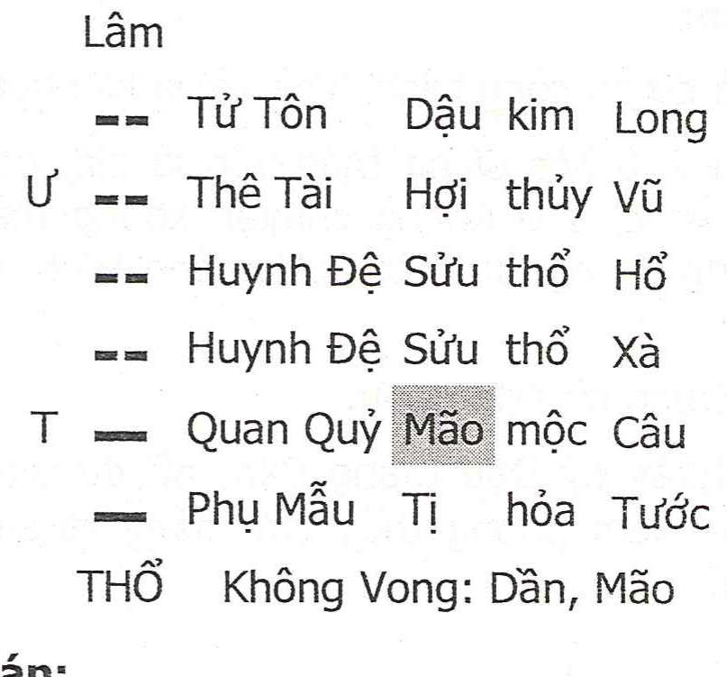

**Ví dụ 2:** Ngày Kỷ Sửu tháng Hợi, nam đoán về khả năng trúng thầu, được quẻ Địa Thủy Sư biến Địa Phong Thăng.

| | Sư | | Thăng | | |
| :---: | :---: | :--- | :---: | :--- | :--- |
| Ứ | ▅▅ ▅▅ | Phụ Mẫu Dậu kim | ▅▅ ▅▅ | Phụ Mẫu Dậu kim | Câu |
| | ▅▅ ▅▅ | Huynh Đệ Hợi thủy | ▅▅ ▅▅ | Huynh Đệ Hợi thủy | Tước |
| | ▅▅ ▅▅ | Quan Quỷ Sửu thổ | ▅▅ ▅▅ | Quan Quỷ Sửu thổ | Long |
| T | ▅▅ ▅▅ | Thê Tài Ngọ hỏa | ▅▅▅▅▅ | Phụ Mẫu Dậu kim | Vũ |
| | ▅▅▅▅▅ | Quan Quỷ Thìn thổ | ▅▅▅▅▅ | Huynh Đệ Hợi thủy | Hổ |
| | ▅▅ ▅▅ | Tử Tôn Dần mộc | ▅▅ ▅▅ | Quan Quỷ Sửu thổ | Xà |

THỦY Không Vong: Ngọ, Mùi

**Phán đoán:**

Phụ Mẫu là dự án công trình, Thê Tài là lợi nhuận.

Kỵ thần trì Thế hóa Dụng thần vốn là cát, nhưng hào Thế Không Vong bị khắc, Thế Không chuyện không thành. Phụ Mẫu lâm Ứng là thông tin người khác được công trình, khó mà trúng thầu.

**Kết quả:** Đúng như dự đoán.

**Ví dụ 3:** Ngày Kỷ Dậu tháng Dần, nữ dự định kinh doanh nhà thuốc, đoán xem phong thủy cửa hàng ra sao? Được quẻ Thủy Thiên Nhu.

| | Nhu | | | |
| :---: | :---: | :--- | :--- | :--- |
| | ▅▅ ▅▅ | Thê Tài Tý thủy | | Câu |
| | ▅▅▅▅▅ | Huynh Đệ Tuất thổ | | Tước |
| T | ▅▅ ▅▅ | Tử Tôn Thân kim | | Long |
| | ▅▅▅▅▅ | Huynh Đệ Thìn thổ | | Vũ |
| | ▅▅▅▅▅ | Quan Quỷ Dần mộc | Phụ Tị | Hổ |
| Ứ | ▅▅▅▅▅ | Thê Tài Tý thủy | | Xà |

THỔ Không Vong: Dần, Mão

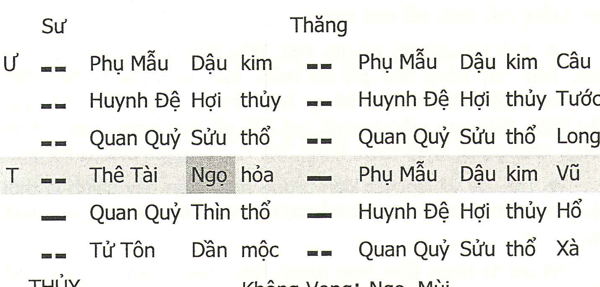

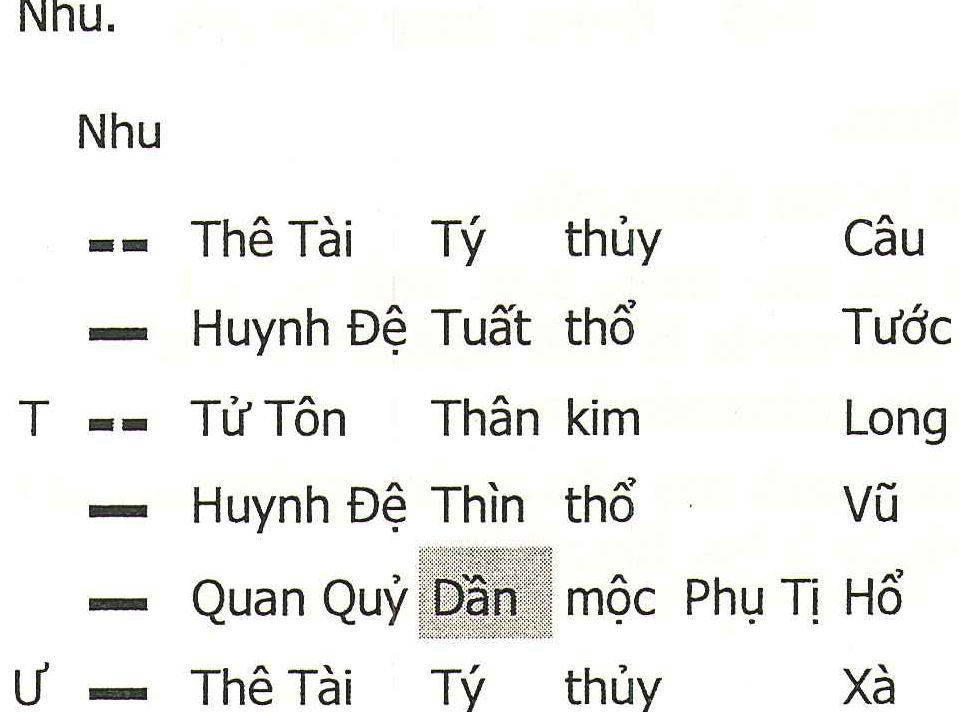

**Phán đoán:**

Lấy Phụ Mẫu làm Dụng thần, xem thêm hào 2, bởi vì hào 2 là cửa hàng. Kinh doanh nhà thuốc để thu lợi, đồng thời kiêm xem hào Tài.

Tử Tôn trì Thế lâm Thanh Long, Tử Tôn là y dược, Thanh Long chủ quý trọng, cô ấy có một loại thuốc đặc biệt tốt. Hào Tài tuy được Nhật sinh, nhưng hào Thế Nguyệt phá, khó mà sinh Tài, kinh doanh nhà thuốc chưa hẳn có thể thu lợi. Cái xung phá hào Thế là Nguyệt kiến Quan Quỷ. Quan Quỷ là nhà nước, ngành chấp pháp. Nhất định là khâu kiểm định thuốc gặp vướng mắc, khiến nhà thuốc không thể kinh doanh.

Hào 2 Quan Quỷ Không Vong, hào 2 là cửa hàng, chứng tỏ vẫn chưa thuê được nhà thuốc. Lâm Bạch Hổ, Bạch Hổ là y dược, nhà thuốc đang muốn thuê đã từng là phòng khám bệnh. Phụ Mẫu phục tàng, nhà thuốc không ở trên phố lớn, là ở trong hẻm nhỏ.

**Kết quả:** Bản thân cô tốt nghiệp đại học y, đã phát minh được một loại thuốc đặc hiệu. Tuy nhiên, cô vẫn chưa lấy được giấy phép sản xuất của cơ quan quản lý dược phẩm. Bởi vì xin giấy phép cần một khoản tiền lớn, vì vậy cô dự định mở phòng khám bệnh, kiếm một ít tiền rồi sau đó mới đi xin giấy phép. Hiện nay cô đã tìm được một căn nhà mặt tiền, trước đây đã từng mở phòng khám bệnh. Cô ấy thấy căn nhà này khá phù hợp với nhu cầu sử dụng của mình, nhưng cô ấy vẫn chưa ký hợp đồng với chủ nhà, muốn xem phong thủy của cửa hàng rồi sau đó mới thuê lại. Sau này không thành.

**Ví dụ 4:** Ngày Quý Tị tháng Thìn, nam đoán xem mua sản phẩm của người ta sẽ ra sao, được quẻ Địa Sơn Khiêm biến Trạch Sơn Hàm.

| | Khiêm | | | Hàm | |
| :--- | :---: | :--- | :---: | :--- | :--- |
| | - - | Huynh Đệ Dậu kim | - - | Phụ Mẫu Mùi thổ | Hổ |
| T | - - | Tử Tôn Hợi thủy | — | Huynh Đệ Dậu kim | Xà |
| | - - | Phụ Mẫu Sửu thổ | — | Tử Tôn Hợi thủy | Câu |
| | — | Huynh Đệ Thân kim | — | Huynh Đệ Thân kim | Tước |
| Ư | - - | Quan Quỷ Ngọ hỏa Tài Mão | - - | Quan Quỷ Ngọ hỏa | Long |
| | - - | Phụ Mẫu Thìn thổ | - - | Phụ Mẫu Thìn thổ | Vũ |

KIM  
Không Vong: Ngọ, Mùi

**Phán đoán:**

Lấy lợi ích làm trọng, lấy Thê Tài làm Dụng thần.

Thê Tài Mão mộc không hiện trên quẻ, phục dưới hào 2 Quan Quỷ Ngọ hỏa, Dụng thần không được Nhật Nguyệt sinh phù, trong quẻ mặc dù có Tử Tôn phát động sinh Thê Tài, nhưng Tử Tôn bị Nguyệt và hào động Phụ Mẫu Sửu thổ khắc thương, lại bị Nhật xung là Nhật phá, sinh phù bất khởi Dụng thần.

Thế động sinh Tài dưới Ứng, chính là bản thân đem tiền đưa cho đối phương, quẻ này không cát, mua sản phẩm của đối phương giống như vứt tiền đi.

**Kết quả:** Anh ta tự cho rằng sản phẩm rất tốt, sau khi mua thì không dùng được, đã tổn thất không ít tiền.

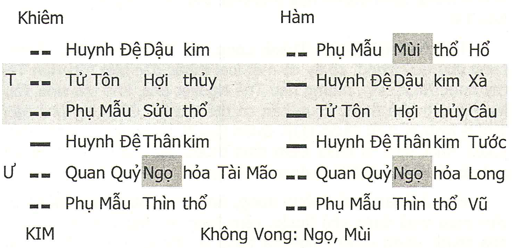

**Ví dụ 5:** Ngày Ất Mão tháng Tị, nam đoán xem làm bất động sản ở Thượng Hải sẽ ra sao? Được quẻ Địa Thủy Sư.

| | Sư | | Lục thú |
| :--- | :---: | :--- | :--- |
| Ư | - - | Phụ Mẫu Dậu kim | Vũ |
| | - - | Huynh Đệ Hợi thủy | Hổ |
| | - - | Quan Quỷ Sửu thổ | Xà |
| T | - - | Thê Tài Ngọ hỏa | Câu |
| | — | Quan Quỷ Thìn thổ | Tước |
| | - - | Tử Tôn Dần mộc | Long |

THỦY  
Không Vong: Tý, Sửu

**Phán đoán:**

Lấy Thê Tài làm Dụng thần.

Dụng thần được Nguyệt kiến tỉ phù, Nhật thần sinh phù, là vượng tướng, chắc chắn thu được đại lợi.

**Kết quả:** Quả nhiên đã kiếm được rất nhiều tiền.

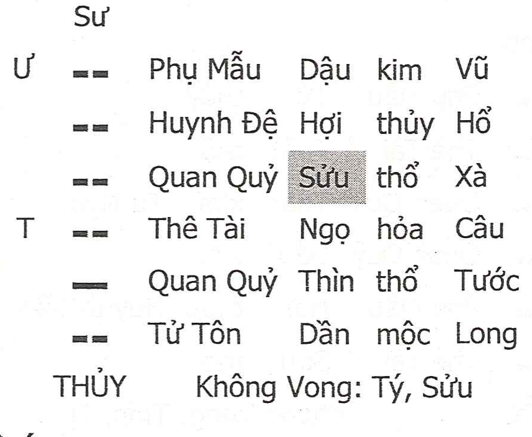

**Ví dụ 6:** Ngày Tân Sửu tháng Thìn, nữ gọi điện thoại đến xin dự đoán về việc mở cửa hàng ăn uống. Tôi gieo được quẻ Thủy Phong Tỉnh.

| | | Tỉnh | Phục thần | Lục thú |
| :---: | :---: | :--- | :---: | :---: |
| | - - | Phụ Mẫu Tý thủy | | Xà |
| T | — | Thê Tài Tuất thổ | | Câu |
| | - - | Quan Quỷ Thân kim | Tử Ngọ | Tước |
| | — | Quan Quỷ Dậu kim | | Long |
| Ư | — | Phụ Mẫu Hợi thủy | Huynh Dần | Vũ |
| | - - | Thê Tài Sửu thổ | | Hổ |

MỘC Không Vong: Thìn, Tị

**Phán đoán:**

Mục đích của mở cửa hàng là để kiếm tiền, vì vậy lấy hào Tài làm Dụng thần. Trong quẻ hào Tài lưỡng hiện, lấy hào Nguyệt phá trì Thế làm Dụng thần.

Quẻ này mặc dù Nhật Nguyệt đều là Thê Tài, nhưng Dụng thần Nguyệt phá, Nguyên thần hưu tù không hiện trong quẻ, khó có lợi nhuận.

Hào 2 là cửa hàng, lâm Phụ Mẫu thì ý nghĩa càng rõ ràng. Phụ Mẫu hưu tù là cửa hàng không lớn. Ứng lâm hào 2 chính là Ứng nhập phi trạch, người xưa khi đoán phong thủy thì luận là có người khác ở chung, quẻ này là mở cửa hàng cho nên đoán là có người khác họ vào cửa hàng, chính là tượng hợp tác mở cửa hàng. Lại thấy hào 3, 4, 5 Thân Dậu Tuất tương liên thành phương cục, vì vậy đoán là có ba người hợp tác mở cửa hàng. Ba người cùng một đơn vị bởi vì hào Thế lâm Câu Trần, Câu Trần có ý nghĩa là phòng làm việc, văn phòng.

**Kết quả:** Cô ấy nói: "Đơn vị kinh doanh sa sút cho nên đã sa thải chúng tôi, ba đồng nghiệp vừa thương lượng, dự định cùng nhau mở cửa hàng." Tôi khuyên không nên nhưng cuối cùng vẫn mở. Kết quả là ở tháng Ngọ, do mở rộng đường quốc lộ nên cửa hàng đã bị dỡ bỏ, ngay cả tiền vốn cũng không thu hồi được.

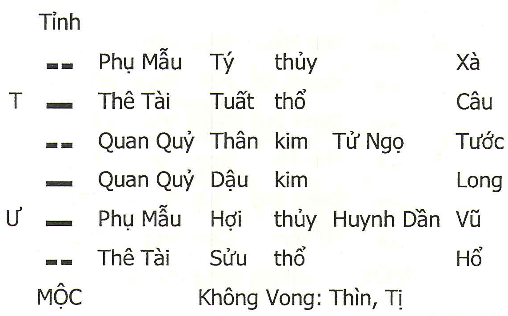

**Ví dụ 7:** Ngày Nhâm Ngọ tháng Tuất, một người Nhật Bản đoán về hợp tác mở cửa hàng, được quẻ Trạch Lôi Tùy biến Phong Lôi Ích.

| | | Tùy | Phục thần | | Ích | Lục thú |
| :---: | :---: | :--- | :---: | :---: | :--- | :---: |
| Ứ | - - | Thê Tài Mùi thổ | | — | Huynh Đệ Mão mộc | Hổ |
| | — | Quan Quỷ Dậu kim | | — | Tử Tôn Tị hỏa | Xà |
| | — | Phụ Mẫu Hợi thủy | Tử Ngọ | - - | Thê Tài Mùi thổ | Câu |
| T | - - | Thê Tài Thìn thổ | | - - | Thê Tài Thìn thổ | Tước |
| | - - | Huynh Đệ Dần mộc | | - - | Huynh Đệ Dần mộc | Long |
| | — | Phụ Mẫu Tý thủy | | — | Phụ Mẫu Tý thủy | Vũ |

MỘC Không Vong: Thân, Dậu

**Phán đoán:**

Lấy Thê Tài làm Dụng thần. Hào Thế là người xin đoán, hào Ứng là người hợp tác.

Thê Tài Thìn thổ trì Thế, tuy được Nhật sinh, không nên Nguyệt kiến xung phá. Chính là tài vận của bản thân không tốt. Trong quẻ Thê Tài lưỡng hiện, lấy Ứng Thê Tài Mùi thổ phát động làm Dụng thần.

Hào Ứng mặc dù vượng tướng, nhưng động hóa hồi đầu khắc, lâm Bạch Hổ, Bạch Hổ chủ bệnh, vận khí của người hợp tác cũng không tốt đẹp, không những không cầu được tài, còn sẽ bị bệnh.

**Kết quả:** Người hợp tác bị bệnh, không thể trông nom nhà thuốc, bản thân lại kinh doanh không giỏi, đành phải đóng cửa.

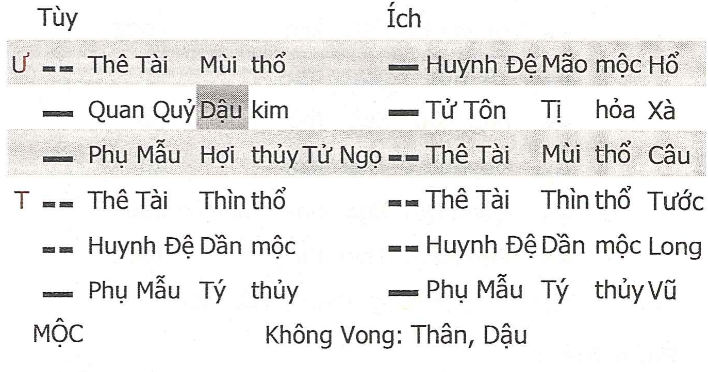

**Ví dụ 8:** Ngày Đinh Mão tháng Tuất, nam đoán về kinh doanh cửa hàng bánh bao Cẩu Bất Lý, được quẻ Địa Sơn Khiêm.

| | | Khiêm | | |
| :---: | :---: | :--- | :--- | :--- |
| | - - | Huynh Đệ Dậu kim | | Long |
| T | - - | Tử Tôn Hợi thủy | | Vũ |
| | - - | Phụ Mẫu Sửu thổ | | Hổ |
| | — | Huynh Đệ Thân kim | | Xà |
| Ứ | - - | Quan Quỷ Ngọ hỏa | Tài Mão | Câu |
| | - - | Phụ Mẫu Thìn thổ | | Tước |

KIM Không Vong: Tuất, Hợi

### Phán đoán:

Lấy Thê Tài làm Dụng thần. Thê Tài Mão mộc không hiện trên quẻ, phục dưới hào 2 Quan Quỷ Ngọ hỏa. Dụng thần được Nhật tỉ phù, lâm Nhật lộ ra, nhưng Thế lâm Tử Tôn hưu tù Không Vong, vì vậy cửa hàng kinh doanh bình thường, chỉ đủ duy trì.

Thế tại hào 5, hào 5 là hào vị lãnh đạo, chứng tỏ người này là giám đốc, người phụ trách của cửa hàng này.

Tài phục dưới Ứng, hào 2 là cửa hàng. Lâm hào Ứng, cửa hàng là của người khác, là anh ta thay người khác kinh doanh. Dụng thần chỉ có Nhật tỉ phù, chính là kinh doanh một loại.

Hào sơ Phụ Mẫu Thìn thổ lâm Chu Tước, Thìn là Mộ khố Tử Tôn, Tử Tôn là học trò, Chu Tước là giáo dục, chứng tỏ lân cận có trường học.

Tử Tôn Không mà không sinh Tài, học trò gần đó hầu như không đến cửa hàng.

**Kết quả:** Anh ta nói đích thực là như vậy. Tôi đề nghị anh ta cải thiện phương thức kinh doanh, bảo anh ta kinh doanh thức ăn nhanh. Sau này kinh doanh rất tốt.

# CHƯƠNG 23

## DỰ ĐOÁN CỔ PHIẾU

Cổ phiếu là sự vật mới xuất hiện, ngày xưa không có. Vậy thì dùng phương pháp dự đoán của cổ nhân truyền lại có thể dự đoán cổ phiếu hay không? Dự đoán lục hào được phát minh dựa trên quy luật vận động của vũ trụ. Cổ phiếu cũng là kết quả của vận động vũ trụ, không thể tách khỏi vũ trụ mà tồn tại độc lập. Do đó, sử dụng phương pháp lục hào hoàn toàn có thể dự đoán cổ phiếu.

Dự đoán cổ phiếu cũng là một trong những đề tài được tôi ứng dụng lục hào để nghiệm chứng. Từ kết quả dự đoán thực tế, tôi nhận thấy lục hào dùng trong dự đoán cổ phiếu có tỷ lệ chính xác nhất định. Có điều là cổ phiếu thay đổi trong nháy mắt, muốn dự đoán chính xác tuyệt đối thì vẫn có sự khó khăn nhất định.

Để dự đoán cổ phiếu có độ chính xác, không những đòi hỏi bản lĩnh đoán quẻ vững chắc, mà công việc gieo quẻ cũng rất quan trọng. Nếu như thông tin trích xuất không đúng, cho dù trình độ đoán quẻ có cao như thế nào thì cũng không thể dự đoán chính xác. Do đó, khi gieo quẻ dự đoán cổ phiếu thì không được tham lam, không được đồng thời nghĩ đến nhiều cổ phiếu. Nếu không thì quẻ gieo ra không biết là phản ánh về cổ phiếu nào.

Từ nửa cuối năm 2001 đến nửa đầu năm 2002, tôi và ông Morita đã cùng dự đoán về cổ phiếu ở Nhật Bản, tôi đã hướng dẫn ông ta mua cổ phiếu, hiệu quả rất tốt. Dùng 35 triệu yên đầu tư vào thị trường cổ phiếu, sau nửa năm đã lời được 140 triệu yên. Có điều là bản thân tôi không tham gia mua bán, cho đến nay, tôi chưa từng vào thị trường chứng khoán. Tôi chủ yếu tập trung sức lực vào nghiên cứu lục hào.

## DỤNG THẦN TRONG DỰ ĐOÁN CỔ PHIẾU

Sự biến động của cổ phiếu chủ yếu là sự biến động về mức giá, vì vậy lấy hào Tài làm Dụng thần. Sự mạnh yếu của Thê Tài là căn cứ cơ bản để phán đoán sự biến động giá cả của cổ phiếu. Tử Tôn là Nguyên thần của hào Tài, là lượng giao dịch và là nhân tố có lợi cho cổ phiếu tăng trưởng. Phụ Mẫu là Cừu thần, vừa có ý nghĩa thông tin và tình báo, vừa là tin tức thời sự và tin đồn bất lợi cho cổ phiếu. Quan Quỷ vốn có ý nghĩa quản lý khống chế, vì vậy Quan Quỷ là nhà cái và là đại cổ đông thao túng cổ phiếu.

Quan Quỷ có tính hai mặt, nó vừa có thể chế phục Kỵ thần tốt cho Dụng thần, vừa có thể tiết khí Dụng thần, đây cũng chính là hành vi nhà cái khiến cổ phiếu lúc thì tăng mạnh, lúc thì giảm mạnh. Huynh Đệ khắc Tài, là nhân tố bất lợi cho cổ phiếu.

## TRÍCH XUẤT THÔNG TIN

◆ Dự đoán sự biến động giá cả của cổ phiếu hiện tại, Thê Tài vượng tướng là thông tin cổ phiếu tăng giá, hưu tù bị khắc là thông tin cổ phiếu xuống giá.

◆ Khi dự đoán sự biến động giá cổ phiếu trong dài hạn, phải xem đồng thời hào Tử Tôn. Thê Tài vượng tướng nhưng Tử Tôn hưu tù Không Phá, đây chính là thông tin hiện nay mức giá cao, cổ phiếu đã lên đến đỉnh, rất khó lên cao nữa.

◆ Thê Tài không vượng, Tử Tôn vượng tướng hoặc động hóa hồi đầu sinh, hiện nay mức giá tuy thấp nhưng sau này sẽ có cơ hội tăng lên, tăng cao.

◆ Thê Tài vượng, động mà hóa tiến hoặc Thê Tài có khí, Tử Tôn động mà hóa Tiến thần, đây chính là thông tin cổ phiếu dần dần tăng giá.

◆ Thê Tài tuy vượng nhưng động hóa thoái hoặc Tử Tôn động mà hóa Không, hóa Phá, hóa thoái đều là thông tin cổ phiếu sẽ xuống giá.

◆ Thê Tài vượng hoặc có khí, Tử Tôn vượng mà bất Không bất Phá phát động, hào Huynh Đệ đồng thời phát động, cổ phiếu dài hạn có lợi thế.

◆ Nếu Thê Tài vượng tướng, Tử Tôn Huynh Đệ mặc dù đồng thời phát động nhưng Tử Tôn Không Phá, cổ phiếu quanh quẩn một chỗ, sẽ không tăng lên.

◆ Thê Tài hưu tù, Huynh Đệ phát động, cổ phiếu nhất định sẽ xuống giá.

◆ Thê Tài vượng tướng nhưng Huynh Đệ động hóa Tiến thần, hiện nay mức giá tuy tốt nhưng sau này sẽ từ từ xuống giá.

◆ Thê Tài hưu tù, Phụ Mẫu và Huynh Đệ đồng thời phát động, cổ phiếu mất giá trong thời gian dài.

◆ Thê Tài hưu tù, Quan Quỷ độc phát hoặc Thê Tài phát động hóa Quan Quỷ, cổ phiếu xuống giá.

◆ Phụ Mẫu cùng Chu Tước phát động, trong quẻ lại có nhân tố bất lợi cho Thê Tài thì sẽ có thông tin khiến cổ phiếu xuống giá, nếu là nhân tố lợi cho Thê Tài thì sẽ có thông tin khiến cổ phiếu tăng giá.

◆ Thê Tài vượng tướng, Huynh Đệ phát động nhưng Quan Quỷ động mà chế Huynh Đệ, đây là nhà cái cố ý khiến cổ phiếu tăng giá.

◆ Quẻ có phục ngâm, Thê Tài bị hợp nhập Mộ, cổ phiếu rất khó tăng giá; quẻ có phản ngâm, cổ phiếu lên xuống bất định.

◆ Thê Tài Huynh Đệ mạnh yếu tương đương, đồng thời hóa thoái hoặc nhập Mộ, đây chính là thông tin giá cổ phiếu bất động.

◆ Dự đoán cổ phiếu trong dài hạn, Dụng thần, Nguyên thần phục tàng vượng hoặc có khí, chỉ cần Kỵ thần bất động, xung Phi, xung Phục, khi Phục thần xuất hiện thì cổ phiếu sẽ tăng.

Trên đây là những quy luật cơ bản khi dự đoán cổ phiếu. Chỉ khi tự mình tiến hành dự đoán hàng loạt trường hợp thì chúng ta mới có thể nắm bắt được sự biến hóa vi diệu của lục hào dự đoán cổ phiếu. Khi dự đoán không nên nhận định rập khuôn một cách máy móc.

# DỰ ĐOÁN BIẾN ĐỘNG GIÁ TRONG MỘT NGÀY

**Ví dụ 1:** Ngày Bính Tý tháng Mùi, dự đoán biến động của chỉ số thị trường chứng khoán Thượng Hải ngày hôm sau, được quẻ Địa Lôi Phục biến Phong Địa Quan.

| | Phục | Quan | |
| :--- | :--- | :--- | :--- |
| | - - Tử Tôn Dậu kim | — Quan Quỷ Mão mộc | Long |
| | - - Thê Tài Hợi thủy | — Phụ Mẫu Tị hỏa | Vũ |
| Ư | - - Huynh Đệ Sửu thổ | - - Huynh Đệ Mùi thổ | Hổ |
| | - - Huynh Đệ Thìn thổ | - - Quan Quỷ Mão mộc | Xà |
| | - - Quan Quỷ Dần mộc Phụ Tị | - - Phụ Mẫu Tị hỏa | Câu |
| T | — Thê Tài Tý thủy | - - Huynh Đệ Mùi thổ | Tước |

THỔ Không Vong: Thân, Dậu

**Phán đoán:**

Lấy hào Thê Tài làm Dụng thần. Trong quẻ Thê Tài Tý thủy và Hợi thủy lưỡng hiện, tất cả phát động, lấy hào Thế Thê Tài Tý thủy làm Dụng.

Thê Tài Tý thủy và Nhật tương đồng được trợ, nhưng bị Nguyệt khắc thương, xét Nhật Nguyệt thì sức mạnh tương đối cân bằng. Lúc này cần xem ảnh hưởng của hào khác trong quẻ đối với Dụng thần. Thê Tài Hợi thủy động mà tỉ phù Tý thủy, Tử Tôn Dậu kim lại phát động sinh Tài, nhưng không nên Tử Tôn Không Vong, Dụng thần động hóa hồi đầu khắc. Quẻ vừa có mặt có lợi cho Dụng thần, vừa có mặt bất lợi cho Dụng thần. Ngoại quái phản ngâm, đây là thông tin thị trường chứng khoán lên xuống bấp bênh.

Thị trường chứng khoán bắt đầu phiên giao dịch ở giờ Tị, giờ Tị là Tuyệt địa của Dụng thần, Nguyên thần bị khắc, Kỵ thần được sinh, nhân tố bất lợi cho Dụng thần chiếm đa số, thị trường chứng khoán tổng thể rơi xuống. Giờ Ngọ hợp trú hào biến Huynh Đệ Mùi thổ của Dụng thần, khiến Mùi thổ khó khắc Dụng thần, cổ phiếu sẽ tăng trở lại. Đến giờ Mùi, chính là lúc trị hào biến của Dụng hóa ra, Dụng thần bị khắc chắc chắn lại rớt giá.

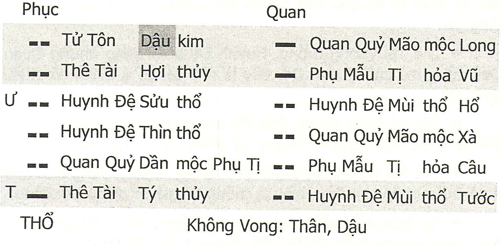

**Kết quả:** Đúng như dự đoán.

**Ví dụ 2:** Ngày Bính Dần tháng Tuất, đoán sự biến động giá của cổ phiếu Nissen ngày hôm sau, được quẻ Hỏa Trạch Khuê biến Hỏa Thủy Vị Tế.

| | Khuê | Vị Tế | |
| :--- | :--- | :--- | :--- |
| | — Phụ Mẫu Tị hỏa | — Phụ Mẫu Tị hỏa | Long |
| | - - Huynh Đệ Mùi thổ Tài Tý | - - Huynh Đệ Mùi thổ | Vũ |
| T | — Tử Tôn Dậu kim | — Tử Tôn Dậu kim | Hổ |
| | - - Huynh Đệ Sửu thổ | - - Phụ Mẫu Ngọ hỏa | Xà |
| | — Quan Quỷ Mão mộc | — Huynh Đệ Thìn thổ | Câu |
| Ư | — Phụ Mẫu Tị hỏa | - - Quan Quỷ Dần mộc | Tước |

THỔ Không Vong: Tuất, Hợi

**Phán đoán:**

Lấy Thê Tài làm Dụng thần.

Thê Tài Tý thủy phục dưới hào 5 Huynh Đệ Mùi thổ, Dụng thần không được Nhật Nguyệt sinh phù, Nguyệt kiến khắc, Phi thần khắc, Phụ Mẫu Tị hỏa phát động Tuyệt Dụng thần, Dụng thần hưu tù vô khí, chắc chắn rớt giá.

**Kết quả:** Ngày hôm sau, cổ phiếu Nissen từ 345 yên rơi xuống 339 yên.

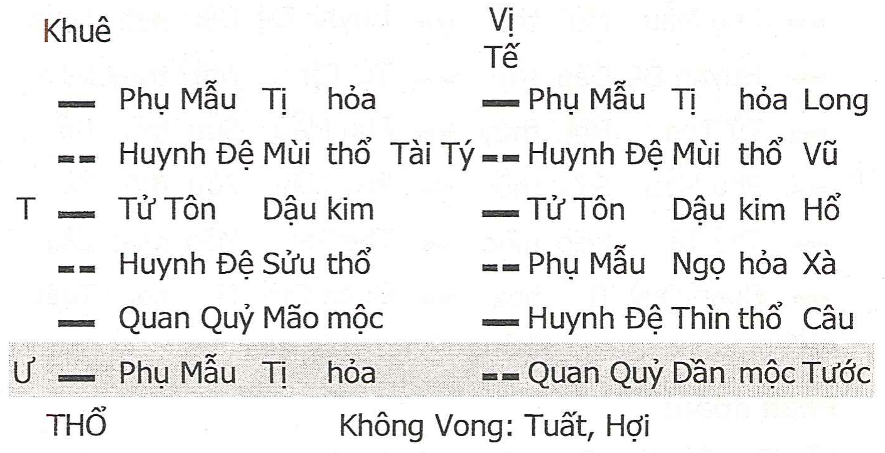

**Ví dụ 3:** Ngày Đinh Mão tháng Tuất, đoán tình hình lên xuống của giá cổ phiếu Nissen ngày hôm sau, được quẻ Đoài Vi Trạch biến Địa Trạch Lâm.

| | Đoài | | | Lâm | |
| :--- | :---: | :--- | :---: | :--- | :--- |
| T | -- | Phụ Mẫu Mùi thổ | -- | Huynh Đệ Dậu kim | Long |
| | — | Huynh Đệ Dậu kim | -- | Tử Tôn Hợi thủy | Vũ |
| | — | Tử Tôn Hợi thủy | -- | Phụ Mẫu Sửu thổ | Hổ |
| Ư | -- | Phụ Mẫu Sửu thổ | -- | Phụ Mẫu Sửu thổ | Xà |
| | — | Thê Tài Mão mộc | — | Thê Tài Mão mộc | Câu |
| | — | Quan Quỷ Tị hỏa | — | Quan Quỷ Tị hỏa | Tước |

KIM

Không Vong: Tuất, Hợi

### Phán đoán:

Lấy Thê Tài làm Dụng thần. Thê Tài Mão mộc Nguyệt hợp Nhật phù là vượng, nhưng không nên Kỵ thần Huynh Đệ Dậu kim được Nguyệt kiến sinh trợ phát động khắc Dụng thần Thê Tài.

Thông thường, khi Kỵ thần và Nguyên thần đồng thời phát động, có thể tạo thành liên tục tương sinh để giải trừ khắc của Kỵ thần, gọi là tham sinh quên khắc. Còn quẻ này thì sao? Trong quẻ Nguyên thần Tử Tôn Hợi thủy mặc dù phát động, nhưng bị Nguyệt kiến khắc thương, động hóa hồi đầu khắc, lại Tuần Không, không thể thông quan, bất lợi cho Dụng thần, là rớt giá. Có điều là Dụng thần vượng tướng, biên độ rớt giá sẽ không quá lớn.

**Kết quả:** Ngày hôm sau, cổ phiếu Nissen từ 339 yên rơi xuống 338 yên.

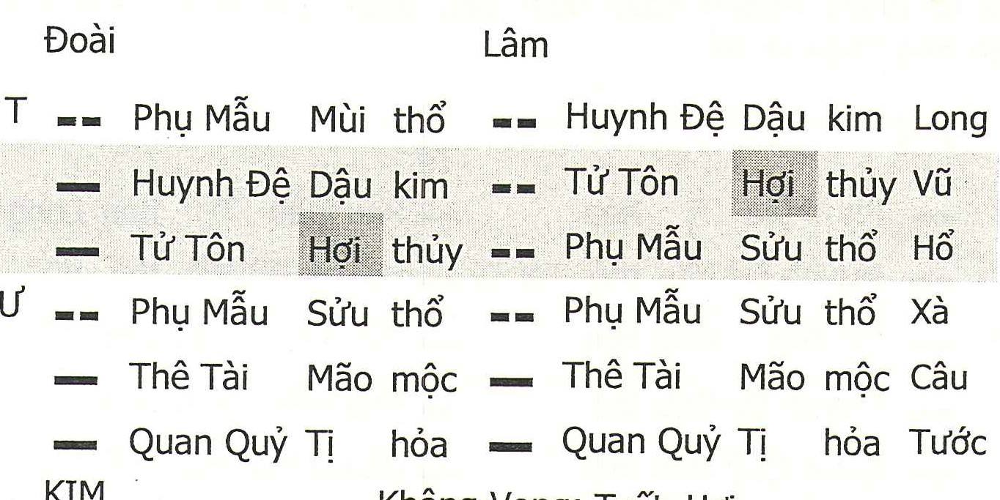

**Ví dụ 4:** Ngày Mậu Thìn tháng Tuất, đoán tình hình biến động của cổ phiếu Nissen ngày hôm sau, được quẻ Phong Thiên Tiểu Súc.

| | Tiểu Súc | | | |
| :--- | :---: | :--- | :--- | :--- |
| | — | Huynh Đệ Mão mộc | | Tước |
| | — | Tử Tôn Tị hỏa | | Long |
| Ư | -- | Thê Tài Mùi thổ | | Vũ |
| | — | Thê Tài Thìn thổ | Quan Dậu | Hổ |
| | — | Huynh Đệ Dần mộc | | Xà |
| T | — | Phụ Mẫu Tý thủy | | Câu |

MỘC

Không Vong: Tuất, Hợi

### Phán đoán:

Lấy Thê Tài làm Dụng thần. Trong quẻ Thê Tài Mùi thổ, Thê Tài Thìn thổ lưỡng hiện, lấy hào Thê Tài Thìn thổ Nguyệt phá làm Dụng. Dụng thần Nguyệt phá, lâm Nhật Thực Phá. Thoạt nhìn là tượng giảm không tăng, lúc này phải xem suy vượng của Nguyên thần và Kỵ thần và ảnh hưởng đối với Dụng thần.

Tử Tôn Tị hỏa Mộ ở Nguyệt, không được Nhật Nguyệt sinh phù, Kỵ thần Huynh Đệ Mão mộc được Nguyệt kiến hợp vượng, lại có Huynh Đệ Dần mộc cùng hiện trong quẻ, khắc nhiều sinh ít, tất sẽ rớt giá.

**Kết quả:** Ngày hôm sau, cổ phiếu Nissen từ 338 yên rơi xuống 335 yên.

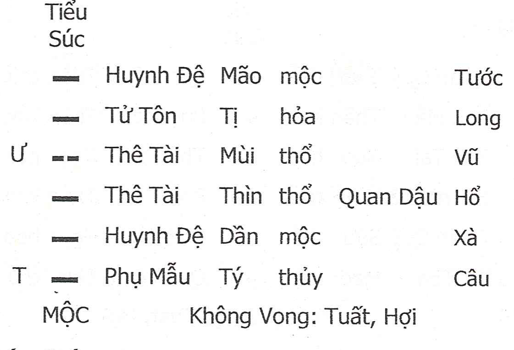

**Ví dụ 5:** Ngày Tân Mùi tháng Tuất, đoán tình hình biến động của cổ phiếu Nissen ngày hôm sau, được quẻ Lôi Hỏa Phong biến Lôi Sơn Tiểu Quá.

| | Phong | | Tiểu Quá | | |
| :---: | :---: | :---: | :---: | :---: | :---: |
| | - - | Quan Quỷ Tuất thổ | - - | Quan Quỷ Tuất thổ | Xà |
| T | - - | Phụ Mẫu Thân kim | - - | Phụ Mẫu Thân kim | Câu |
| | — | Thê Tài Ngọ hỏa | — | Thê Tài Ngọ hỏa | Tước |
| | — | Huynh Đệ Hợi thủy | — | Phụ Mẫu Thân kim | Long |
| Ứ | - - | Quan Quỷ Sửu thổ | - - | Thê Tài Ngọ hỏa | Vũ |
| | — | Tử Tôn Mão mộc | - - | Quan Quỷ Thìn thổ | Hổ |

THỦY  Không Vong: Tuất, Hợi

**Phán đoán:**

Lấy Thê Tài làm Dụng thần. Thê Tài Ngọ hỏa không được Nhật Nguyệt sinh phù là hưu tù. Nhưng Kỵ thần Huynh Đệ Hợi thủy bị Nhật Nguyệt khắc chế, hưu tù hơn Dụng thần.

Nguyên thần Tử Tôn Mão mộc độc phát sinh Dụng thần, thoạt nhìn là thông tin cổ phiếu tăng giá, nhưng Tử Tôn Mão mộc nhập Mộ, nhập Mộ khó sinh, lại thêm Thê Tài Ngọ hỏa bị Nhật thần hợp trú, Nhật hợp là vướng chân, tượng mức giá bất động. Vì vậy đoán là không tăng không giảm hoặc hơi tăng.

**Kết quả:** Ngày hôm sau, cổ phiếu Nissen vẫn là 335 yên, không có biến động.

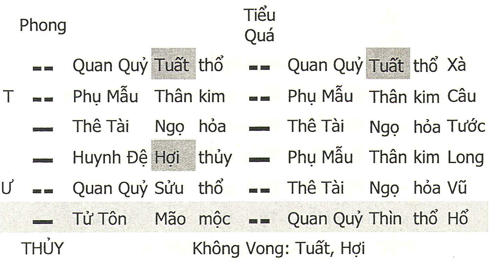

**Ví dụ 6:** Ngày Tân Mùi tháng Tuất, ông Morita cũng gieo quẻ đoán tình hình biến động của cổ phiếu Nissen ngày hôm sau, được quẻ Đoài Vi Trạch biến Càn Vi Thiên.

| | Đoài | | Càn | | |
| :---: | :---: | :---: | :---: | :---: | :---: |
| T | - - | Phụ Mẫu Mùi thổ | — | Phụ Mẫu Tuất thổ | Xà |
| | — | Huynh Đệ Dậu kim | — | Huynh Đệ Thân kim | Câu |
| | — | Tử Tôn Hợi thủy | — | Quan Quỷ Ngọ hỏa | Tước |
| Ứ | - - | Phụ Mẫu Sửu thổ | — | Phụ Mẫu Thìn thổ | Long |
| | — | Thê Tài Mão mộc | — | Thê Tài Dần mộc | Vũ |
| | — | Quan Quỷ Tị hỏa | — | Tử Tôn Tý thủy | Hổ |

KIM  Không Vong: Tuất, Hợi

**Phán đoán:**

Lấy Thê Tài làm Dụng thần. Thê Tài được không được Nhật Nguyệt sinh phù, nhưng được Nguyệt hợp là hợp vượng.

Huynh Đệ Dậu kim Nhật Nguyệt đều sinh, lại được hai hào động hóa tiến tương sinh là quá vượng, vật cực tất phản, khó mà khắc Thê Tài.

Dụng thần và Kỵ thần đều nhập động Mộ, Dụng thần nhập Mộ khó tăng, mức giá khó động, Kỵ thần nhập Mộ khó khắc, khó khiến cổ phiếu rớt giá, là tượng cổ phiếu bất động.

**Kết quả:** Mức giá duy trì ở 335 yên, không có biến động.

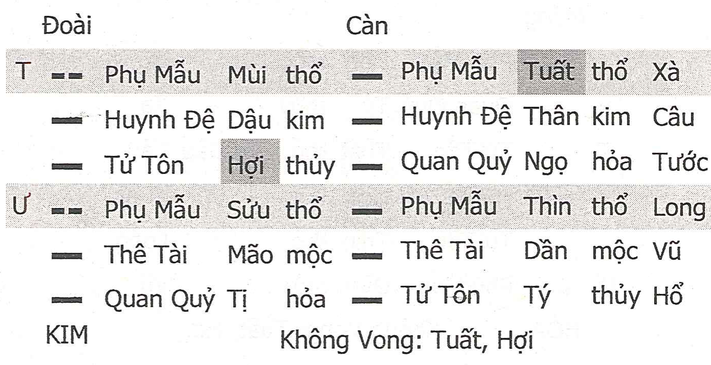

**Ví dụ 7:** Ngày Nhâm Thân tháng Tuất, đoán tình hình biến động của cổ phiếu Nissen ngày hôm sau, được quẻ Sơn Thủy Mông.

| Thế/Ứng | | Mông | Phục thần | Lục thú |
| :---: | :---: | :--- | :--- | :---: |
| | — | Phụ Mẫu Dần mộc | | Hổ |
| | - - | Quan Quỷ Tý thủy | | Xà |
| T | - - | Tử Tôn Tuất thổ | Tài Dậu | Câu |
| | - - | Huynh Đệ Ngọ hỏa | | Tước |
| | — | Tử Tôn Thìn thổ | | Long |
| Ứ | - - | Phụ Mẫu Dần mộc | | Vũ |

HỎA Không Vong: Tuất, Hợi

**Phán đoán:**

Lấy Thê Tài làm Dụng thần. Thê Tài Dậu kim phục dưới Tử Tôn Tuất thổ, được Nguyệt sinh Nhật phù, Phi đến sinh Phục là cát.

Kỵ thần Huynh Đệ Ngọ hỏa hưu tù bất động, vô lực khắc Dụng, có dấu hiệu tăng lên. Ngày mai là ngày Quý Dậu, Phục thần xuất hiện ắt tăng, nhưng Nguyên thần Tuất thổ Không Vong, Thìn thổ Nguyệt phá, sẽ không tăng nhiều.

**Kết quả:** Cổ phiếu Nissen từ 335 yên tăng đến 340 yên.

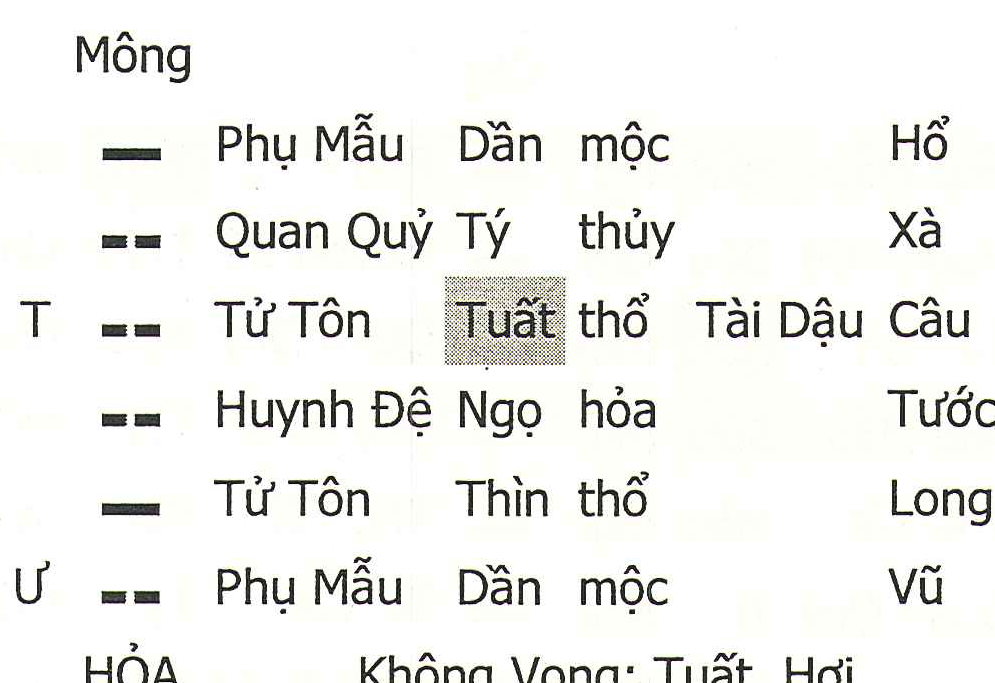

**Ví dụ 8:** Ngày Quý Dậu tháng Tuất, đoán tình hình biến động của cổ phiếu Nissen ngày hôm sau, được quẻ Càn Vi Thiên biến Thiên Phong Cấu.

| Thế/Ứng | Càn | | Cấu | | Lục thú |
| :---: | :---: | :--- | :---: | :--- | :---: |
| T | — | Phụ Mẫu Tuất thổ | — | Phụ Mẫu Tuất thổ | Hổ |
| | — | Huynh Đệ Thân kim | — | Huynh Đệ Thân kim | Xà |
| | — | Quan Quỷ Ngọ hỏa | — | Quan Quỷ Ngọ hỏa | Câu |
| Ứ | — | Phụ Mẫu Thìn thổ | — | Huynh Đệ Dậu kim | Tước |
| | — | Thê Tài Dần mộc | — | Tử Tôn Hợi thủy | Long |
| | — | Tử Tôn Tý thủy | - - | Phụ Mẫu Sửu thổ | Vũ |

KIM Không Vong: Tuất, Hợi

**Phán đoán:**

Lấy Thê Tài làm Dụng thần. Thê Tài Dần mộc không được Nhật Nguyệt sinh phù, lại bị Nhật thần khắc thương, Nguyên thần Tử Tôn Tý thủy bị Nguyệt khắc thương, lại động hóa hồi đầu khắc, tất hạ giá.

**Kết quả:** Ngày hôm sau, cổ phiếu Nissen từ 340 yên giảm xuống 335 yên.

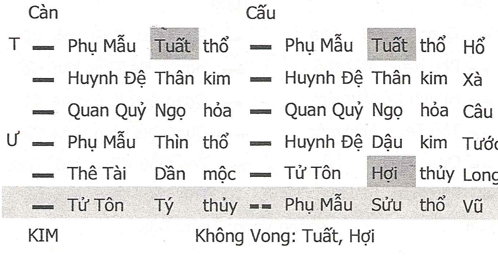

**Ví dụ 9:** Ngày Giáp Tuất tháng Hợi, đoán tình hình biến động của cổ phiếu Nissen ngày hôm sau, được quẻ Hỏa Địa Tấn biến Thiên Thủy Tụng.

| | Tấn | | Tụng | |
| :---: | :--- | :---: | :--- | :---: |
| | — Quan Quỷ Tị hỏa | | — Phụ Mẫu Tuất thổ | Vũ |
| | - - Phụ Mẫu Mùi thổ | | — Huynh Đệ Thân kim | Hổ |
| T | — Huynh Đệ Dậu kim | | — Quan Quỷ Ngọ hỏa | Xà |
| | - - Thê Tài Mão mộc | | - - Quan Quỷ Ngọ hỏa | Câu |
| | - - Quan Quỷ Tị hỏa | | — Phụ Mẫu Thìn thổ | Tước |
| Ứ | - - Phụ Mẫu Mùi thổ | Tử Tý | - - Thê Tài Dần mộc | Long |

KIM Không Vong: Thân, Dậu

**Phán đoán:**

Lấy Thê Tài làm Dụng thần. Thê Tài Mão mộc được Nguyệt sinh phù, không thể nói hưu tù, nhưng bị Nhật thần hợp trú, là hợp cản trở.

Phụ Mẫu Mùi thổ phát động, khắc Nguyên thần Tử Tôn, khiến Thê Tài nhập Mộ, làm suy yếu sức mạnh của Thê Tài.

Quan Quỷ Tị hỏa phát động, lại tiết khí Thê Tài, cổ phiếu chắc chắn hạ giá.

**Kết quả:** Cổ phiếu Nissen từ 335 yên sụt rơi xuống 327 yên.

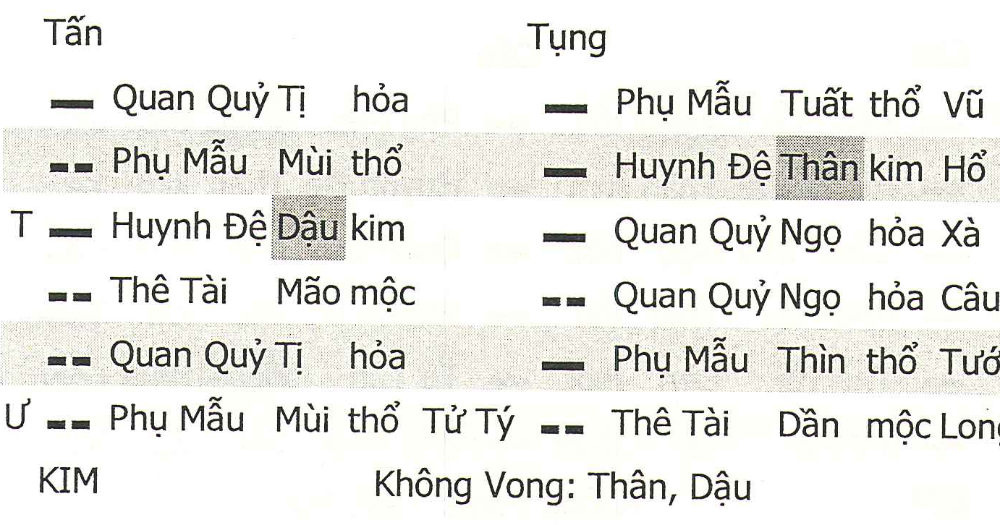

**Ví dụ 10:** Ngày Ất Hợi tháng Hợi, đoán tình hình biến động của cổ phiếu Nissen ngày hôm sau, được quẻ Sơn Thủy Mông biến Chấn Vi Lôi.

| | Mông | | Chấn | |
| :---: | :--- | :---: | :--- | :---: |
| | — Phụ Mẫu Dần mộc | | - - Tử Tôn Tuất thổ | Vũ |
| | - - Quan Quỷ Tý thủy | | - - Thê Tài Thân kim | Hổ |
| T | - - Tử Tôn Tuất thổ | Tài Dậu | — Huynh Đệ Ngọ hỏa | Xà |
| | - - Huynh Đệ Ngọ hỏa | | - - Tử Tôn Thìn thổ | Câu |
| | — Tử Tôn Thìn thổ | | - - Phụ Mẫu Dần mộc | Tước |
| Ứ | - - Phụ Mẫu Dần mộc | | — Quan Quỷ Tý thủy | Long |

HỎA Không Vong: Thân, Dậu

**Phán đoán:**

Lấy Thê Tài làm Dụng thần. Thê Tài Dậu kim phục dưới hào 4, không được Nhật Nguyệt sinh phù là hưu tù.

Nguyên thần Tử Tôn mặc dù phát động sinh trợ, nhưng trong quẻ hai tầng Phụ Mẫu Dần mộc phát động khắc Tử Tôn, lực sinh Thê Tài rất yếu.

Tử Tôn Thìn thổ phát động khiến Nguyên thần nhập Mộ, hợp trú Thê Tài, cho nên cổ phiếu này sẽ không tăng, dựa vào thông tin trong quẻ có thể đoán định, ngày hôm sau cổ phiếu hoặc là bất động, hoặc là hơi hạ giá.

**Kết quả:** Cổ phiếu không tăng hay không giảm.

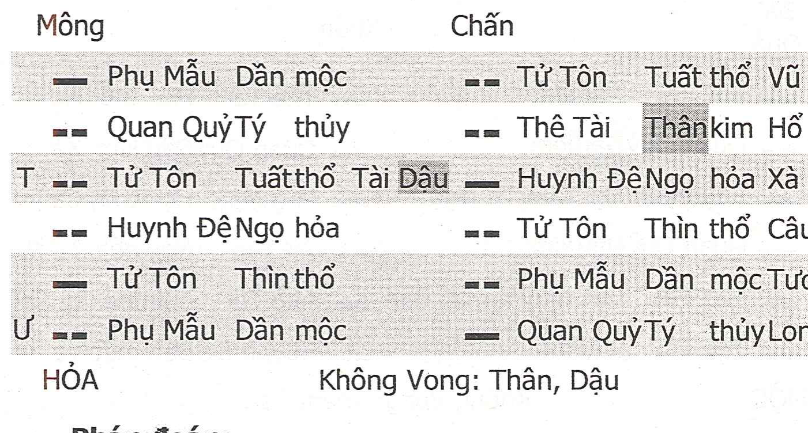

### Ví dụ 11

Ngày Nhâm Ngọ tháng Hợi, đoán tình hình biến động của cổ phiếu Nissen ngày hôm sau, được quẻ Trạch Phong Đại Quá biến Trạch Thủy Khốn.

| | Đại Quá | Phục thần | Khốn | Lục thú |
| :---: | :--- | :---: | :--- | :---: |
| | -- Thê Tài Mùi thổ | | -- Thê Tài Mùi thổ | Hổ |
| | — Quan Quỷ Dậu kim | | — Quan Quỷ Dậu kim | Xà |
| T | — Phụ Mẫu Hợi thủy | Tử Ngọ | — Phụ Mẫu Hợi thủy | Câu |
| | — Quan Quỷ Dậu kim | | -- Tử Tôn Ngọ hỏa | Tước |
| | — Phụ Mẫu Hợi thủy | Huynh Dần | — Thê Tài Thìn thổ | Long |
| Ứ | -- Thê Tài Sửu thổ | | -- Huynh Đệ Dần mộc | Vũ |

MỘC &emsp;&emsp; Không Vong: Thân, Dậu

**Phán đoán:**

Lấy Thê Tài làm Dụng thần. Trong quẻ có Thê Tài Mùi thổ và Thê Tài Sửu thổ, là Dụng thần lưỡng hiện, lấy Thê Tài Mùi thổ tương hợp với Nhật làm Dụng thần. Dụng thần được Nhật sinh phù không coi là hưu tù, nhưng Quan Quỷ Dậu kim độc phát tiết khí Dụng thần, cổ phiếu nhất định xuống giá.

**Kết quả:** Cổ phiếu Nissen từ 312 giảm đến 307 yên.

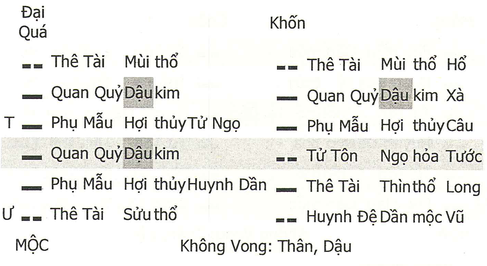

### Ví dụ 12

Ngày Quý Sửu tháng Thìn, đoán tình hình biến động của cổ phiếu Nissen ngày hôm sau, được quẻ Thiên Trạch Lý.

| | Lý | Phục thần | Lục thú |
| :---: | :--- | :---: | :---: |
| | — Huynh Đệ Tuất thổ | | Hổ |
| T | — Tử Tôn Thân kim | Tài Tý | Xà |
| | — Phụ Mẫu Ngọ hỏa | | Câu |
| | -- Huynh Đệ Sửu thổ | | Tước |
| Ứ | — Quan Quỷ Mão mộc | | Long |
| | — Phụ Mẫu Tị hỏa | | Vũ |

THỔ &emsp;&emsp; Không Vong: Dần, Mão

**Phán đoán:**

Lấy Thê Tài làm Dụng thần. Thê Tài Tý thủy phục dưới hào 5 bị Nhật Nguyệt khắc thương là hưu tù.

Phi thần là Nguyên thần, mặc dù được Nguyệt sinh phù là vượng, nhưng Dụng thần vốn không có gốc rễ, dù cho được Phi đến sinh cũng vô ích. Cổ phiếu sẽ hạ giá.

**Kết quả:** Cổ phiếu Nissen từ 1410 xuống còn 1408 yên.

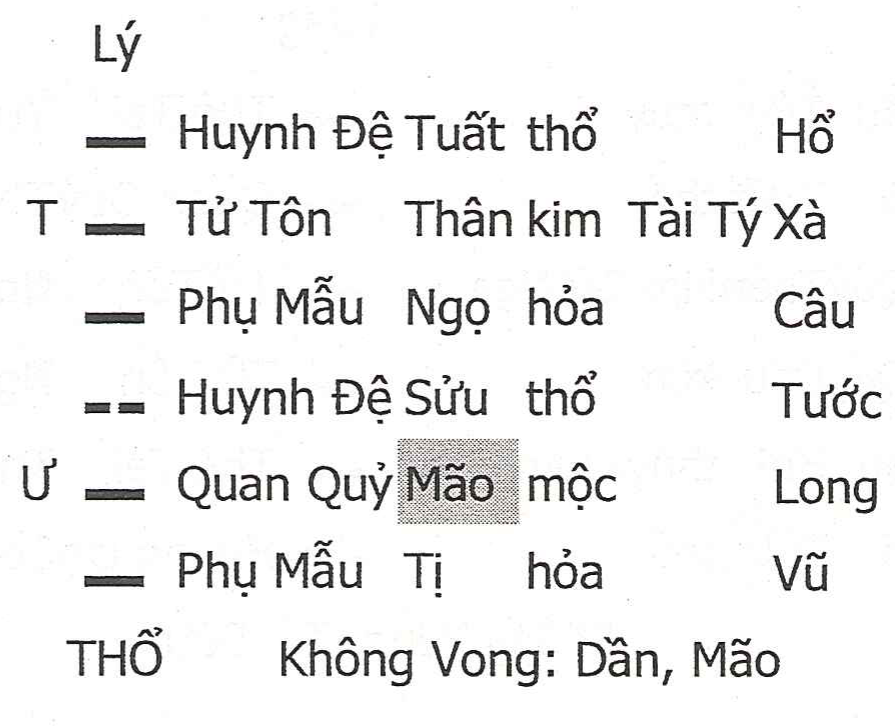

### Ví dụ 13

Ngày Ất Mão tháng Thìn, đoán tình hình biến động của cổ phiếu Nissen ngày hôm nay, được quẻ Thủy Phong Tỉnh biến Thiên Thủy Tụng.

| | Tỉnh | | | Tụng | |
| :---: | :---: | :--- | :---: | :--- | :---: |
| | - - | Phụ Mẫu Tý thủy | — | Thê Tài Tuất thổ | Vũ |
| T | — | Thê Tài Tuất thổ | — | Quan Quỷ Thân kim | Hổ |
| | - - | Quan Quỷ Thân kim Tử Ngọ | — | Tử Tôn Ngọ hỏa | Xà |
| | — | Quan Quỷ Dậu kim | - - | Tử Tôn Ngọ hỏa | Câu |
| Ư | — | Phụ Mẫu Hợi thủy Huynh Dần | — | Thê Tài Thìn thổ | Tước |
| | - - | Thê Tài Sửu thổ | - - | Huynh Đệ Dần mộc | Long |

MỘC Không Vong: Tý, Sửu

**Phán đoán:**

Lấy Thê Tài làm Dụng thần. Trong quẻ có Thê Tài Tuất thổ và Thê Tài Sửu thổ, là Dụng thần lưỡng hiện, lấy hào Thê Tài Tuất thổ Nguyệt phá làm Dụng.

Dụng thần Nguyệt phá bị Nhật khắc chế, Cừu thần tam hợp thành cục, Quan Quỷ lưỡng động tiết khí, thông tin bất lợi cho Dụng thần rất nhiều, cổ phiếu chắc chắn hạ giá.

**Kết quả:** Cổ phiếu từ 1408 yên hạ xuống 1368 yên.

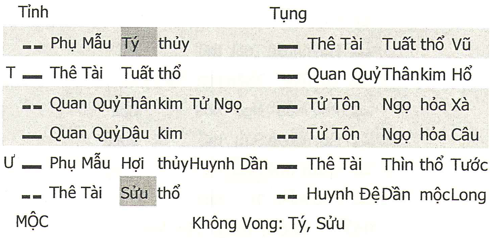

### Ví dụ 14

Ngày Bính Thìn tháng Thìn, đoán tình hình biến động của cổ phiếu Nissen ngày hôm nay, được quẻ Thủy Trạch Tiết biến Thủy Địa Tỷ.

| | Tiết | | | Tỷ | |
| :---: | :---: | :--- | :---: | :--- | :---: |
| | - - | Huynh Đệ Tý thủy | - - | Huynh Đệ Tý thủy | Long |
| | — | Quan Quỷ Tuất thổ | — | Quan Quỷ Tuất thổ | Vũ |
| Ư | - - | Phụ Mẫu Thân kim | - - | Phụ Mẫu Thân kim | Hổ |
| | - - | Quan Quỷ Sửu thổ | - - | Tử Tôn Mão mộc | Xà |
| | — | Tử Tôn Mão mộc | - - | Thê Tài Tị hỏa | Câu |
| T | — | Thê Tài Tị hỏa | - - | Quan Quỷ Mùi thổ | Tước |

THỦY Không Vong: Tý, Sửu

**Phán đoán:**

Lấy Thê Tài làm Dụng thần. Thê Tài Tị hỏa không được Nhật Nguyệt sinh phù, nhưng cũng không bị Nhật Nguyệt khắc. Tử Tôn Mão mộc phát động sinh, nhưng Dụng thần Nguyên thần đều không coi là vượng, là hơi tăng.

**Kết quả:** Cổ phiếu Nissen cổ phiếu từ 1368 yên tăng đến 1399 yên.

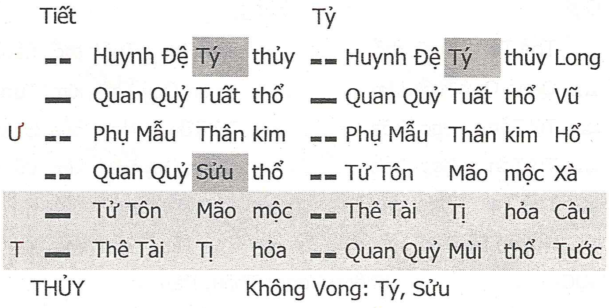

**Ví dụ 15:** Ngày Kỷ Mão tháng Hợi, đoán tình hình biến động của cổ phiếu Nippon Steel ngày hôm đó, được quẻ Lôi Thủy Giải biến Lôi Phong Hằng.

| | Giải | | Hằng | |
| :--- | :--- | :--- | :--- | :--- |
| | - - Thê Tài Tuất thổ | - - | Thê Tài Tuất thổ | Câu |
| Ứ | - - Quan Quỷ Thân kim | - - | Quan Quỷ Thân kim | Tước |
| | — Tử Tôn Ngọ hỏa | — | Tử Tôn Ngọ hỏa | Long |
| | - - Tử Tôn Ngọ hỏa | — | Quan Quỷ Dậu kim | Vũ |
| T | — Thê Tài Thìn thổ | — | Phụ Mẫu Hợi thủy | Hổ |
| | - - Huynh Đệ Dần mộc Phụ Tý | - - | Thê Tài Sửu thổ | Xà |

MỘC Không Vong: Thân, Dậu

**Phán đoán:**

Lấy Thê Tài làm Dụng thần. Trong quẻ có Thê Tài Tuất thổ và Thê Tài Thìn thổ, là Dụng thần lưỡng hiện, lấy Thê Tài Tuất thổ hợp Nhật làm Dụng thần.

Dụng thần không được Nhật Nguyệt sinh phù, trái lại bị Nhật thần trong khắc có hợp, khắc khiến Dụng thần hưu tù, hợp khiến Dụng thần bất động, bất lợi cho cổ phiếu tăng. Trong quẻ tuy có Tử Tôn Ngọ hỏa phát động, nhưng Ngọ hỏa Tuyệt ở Nguyệt kiến, động mà hóa Không, cũng bất lợi cho cổ phiếu tăng. Nhưng Tử Tôn được Nhật sinh phù, biên độ hạ giá sẽ không quá lớn.

**Kết quả:** Giảm 5 yên.

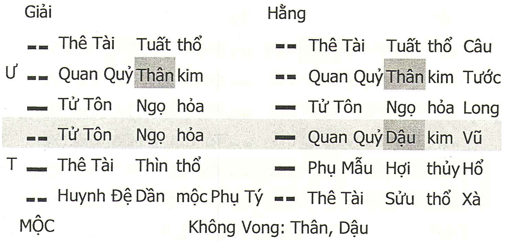

## DỰ ĐOÁN BIẾN ĐỘNG GIÁ TRONG MỘT TUẦN

**Ví dụ 1:** Ngày Kỷ Tị tháng Tuất, đoán sự biến động của cổ phiếu Nissen ở tuần sau, được quẻ Khảm Vi Thủy biến Thủy Địa Tỷ.

| | Khảm | | Tỉnh | |
| :--- | :--- | :--- | :--- | :--- |
| T | - - Huynh Đệ Tý thủy | - - | Huynh Đệ Tý thủy | Câu |
| | — Quan Quỷ Tuất thổ | — | Quan Quỷ Tuất thổ | Tước |
| | - - Phụ Mẫu Thân kim | - - | Phụ Mẫu Thân kim | Long |
| Ứ | - - Thê Tài Ngọ hỏa | - - | Tử Tôn Mão mộc | Vũ |
| | — Quan Quỷ Thìn thổ | - - | Thê Tài Tị hỏa | Hổ |
| | - - Tử Tôn Dần mộc | - - | Quan Quỷ Mùi thổ | Xà |

THỦY Không Vong: Tuất, Hợi

**Phán đoán:**

Lấy Thê Tài làm Dụng thần, xem ảnh hưởng của địa chi mỗi ngày đến Dụng thần để phán đoán cổ phiếu tăng hay giảm giá. Trước tiên xem vượng suy của Thê Tài trong quẻ ở thời điểm hiện tại. Thê Tài Ngọ hỏa được Nhật thần tỉ phù, không coi là hưu tù.

Quan Quỷ Thìn thổ là hào động trong quẻ duy nhất, Quan Quỷ là nhà cái, Quan Quỷ độc phát tất tiết khí Dụng thần, cổ phiếu hạ giá là do hành vi của nhà cái. Cổ phiếu tuy có chiều hướng hạ giá, nhưng bản thân Dụng thần vượng, cho nên biên độ hạ giá không lớn.

Thứ hai là ngày Nhâm Thân, không khắc Dụng thần, sinh trợ Kỵ thần. Nhưng quẻ này Kỵ thần Huynh Đệ Tý thủy hưu tù bị Nguyệt khắc chế, Tuyệt ở Nhật, nhập Mộ ở hào động Thìn thổ, hầu như không có ảnh hưởng đối với Dụng thần, do vậy cổ phiếu sẽ xuất hiện tình trạng tăng giảm không rõ ràng.

Thứ ba là ngày Quý Dậu, tương hợp với Quan Quỷ Thìn thổ, hợp là cản trở, nguyên là Quan Quỷ phát động tiết khí Dụng thần, Quan Quỷ bị hợp không thể tiết khí, có lợi cho Dụng thần, cho nên hôm đó cổ phiếu hơi tăng.

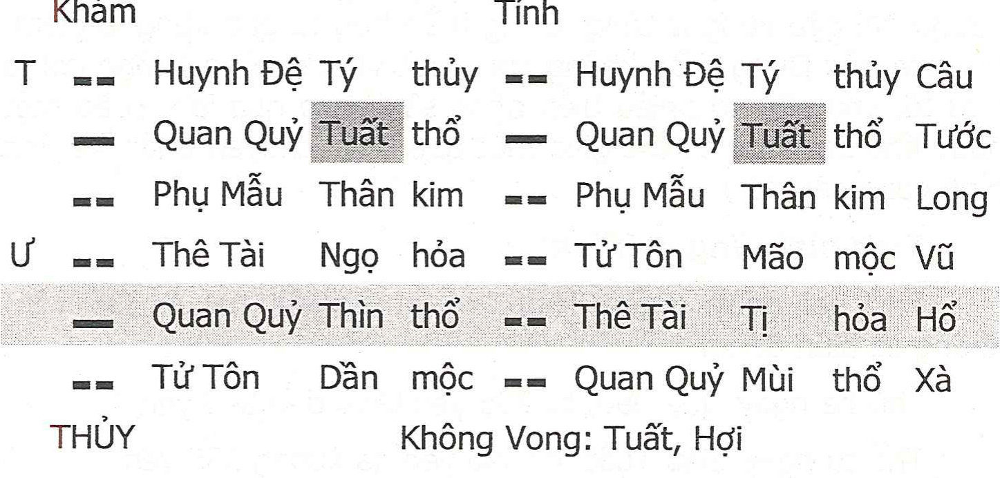

Thứ tư là ngày Giáp Tuất, là ngày Dụng thần nhập Mộ, bất lợi cho Dụng thần, cổ phiếu hạ giá.

Thứ năm là ngày Ất Hợi, Dụng thần lâm Tuyệt bị khắc, chắc chắn hạ giá.

Thứ sáu là ngày Bính Tý, xung khắc Dụng thần, Dụng thần vượng khi gặp xung là tăng, Dụng thần hưu tù gặp xung là giảm. Mà quẻ này Dụng thần không coi là rất vượng cũng không coi là hưu tù, cho nên cổ phiếu biến động sẽ không quá lớn. (Gặp một ngày khó đoán thì có thể gieo một quẻ khác chuyên đoán về tình hình của ngày đó.)

**Tình hình ứng nghiệm:**

Thứ hai ngày Nhâm Thân, cổ phiếu liên tục ở 335 yên, không có biến động.

Thứ ba ngày Quý Dậu, từ 335 yên tăng đến 340 yên.

Thứ tư ngày Giáp Tuất, từ 340 yên hạ xuống 335 yên.

Thứ năm ngày Ất Hợi, từ 335 yên hạ xuống 327 yên.

Thứ sáu ngày Bính Tý, cổ phiếu không có biến động.

**Ví dụ 2:** Ngày Giáp Dần tháng Tý, đoán tình hình biến động của cổ phiếu Nissen trong tuần đó, được quẻ Phong Lôi Ích biến Thiên Hỏa Đồng Nhân.

| | Ích | | Đồng Nhân | | |
| :--- | :--- | :--- | :--- | :--- | :--- |
| Ứ | ▅▅▅▅▅ | Huynh Đệ Mão mộc | ▅▅▅▅▅ | Thê Tài Tuất thổ | Vũ |
| | ▅▅▅▅▅ | Tử Tôn Tị hỏa | ▅▅▅▅▅ | Quan Quỷ Thân kim | Hổ |
| | ▅▅  ▅▅ | Thê Tài Mùi thổ | ▅▅▅▅▅ | Tử Tôn Ngọ hỏa | Xà |
| T | ▅▅  ▅▅ | Thê Tài Thìn thổ | ▅▅▅▅▅ | Phụ Mẫu Hợi thủy | Câu |
| | ▅▅  ▅▅ | Huynh Đệ Dần mộc | ▅▅  ▅▅ | Thê Tài Sửu thổ | Tước |
| | ▅▅▅▅▅ | Phụ Mẫu Tý thủy | ▅▅▅▅▅ | Huynh Đệ Mão mộc | Long |

MỘC
Không Vong: Tý, Sửu

**Phán đoán:**

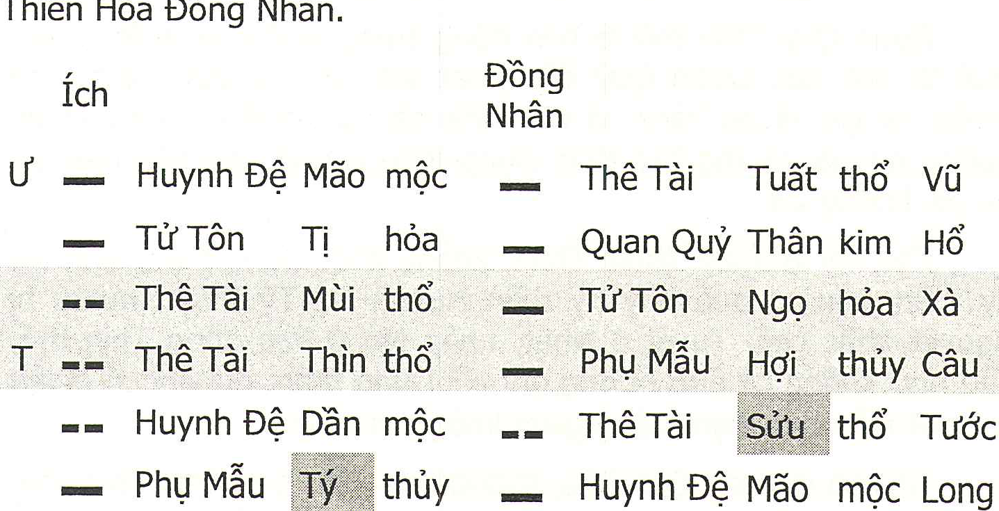

Lấy Thê Tài làm Dụng thần. Trong quẻ có Thê Tài Mùi thổ và Thê Tài Thìn thổ, là Dụng thần lưỡng hiện, hơn nữa tất cả phát động, lấy Thê Tài Mùi thổ hóa ra Nguyệt phá làm Dụng thần.

Dụng thần không được Nhật Nguyệt sinh phù, trái lại bị Nhật thần khắc thương, động mà hóa Phá, thông tin bất lợi cho Dụng thần khá mạnh, cho nên về tổng thể thì trong tuần này hạ giá.

Thứ hai là ngày Giáp Dần, Kỵ thần lâm Nhật khắc thương Dụng thần, cổ phiếu hạ giá.

Thứ ba là ngày Ất Mão, đồng dạng là Kỵ thần lâm Nhật, khắc thương Dụng thần, cho nên cổ phiếu cũng sẽ hạ giá.

Thứ tư là ngày Bính Thìn, chính là Dụng thần nhập Mộ, cổ phiếu sẽ tiếp tục hạ giá.

Thứ năm là ngày Đinh Tị, sinh phù Dụng thần, cổ phiếu sẽ tăng lên.

Thứ sáu là ngày Mậu Ngọ, Dụng thần động mà hóa Phá chính là ngày Thực Phá, cổ phiếu hạ giá.

**Tình hình ứng nghiệm:**

Thứ hai Giáp Dần, cổ phiếu từ 464 yên rơi xuống 444 yên.

Thứ ba Ất Mão, cổ phiếu từ 444 yên rơi xuống 420 yên.

Thứ tư Bính Thìn, cổ phiếu từ 420 yên rơi xuống 400 yên.

Thứ năm Đinh Tị, cổ phiếu từ 400 yên tăng đến 404 yên.

Thứ sáu Mậu Ngọ, cổ phiếu từ 404 yên rơi xuống 394 yên.

**Ví dụ 3:** Ngày Kỷ Hợi tháng Thân, dự đoán tình hình tăng giảm trong một tuần của cổ phiếu rượu Phần Sơn Tây, được quẻ Hỏa Trạch Khuê biến Lôi Trạch Quy Muội.

| | Khuê | Phục thần | Quy Muội | |
| :---: | :--- | :---: | :--- | :--- |
| | ━ Phụ Mẫu Tị hỏa | | ╍ Huynh Đệ Tuất thổ | Câu |
| | ╍ Huynh Đệ Mùi thổ | Tài Tý | ╍ Tử Tôn Thân kim | Tước |
| T | ━ Tử Tôn Dậu kim | | ━ Phụ Mẫu Ngọ hỏa | Long |
| | ╍ Huynh Đệ Sửu thổ | | ╍ Huynh Đệ Sửu thổ | Vũ |
| | ━ Quan Quỷ Mão mộc | | ━ Quan Quỷ Mão mộc | Hổ |
| Ứ | ━ Phụ Mẫu Tị hỏa | | ━ Phụ Mẫu Tị hỏa | Xà |

THỔ Không Vong: Thìn, Tị

### Phán đoán:

Lấy Thê Tài Dụng thần. Dụng thần Thê Tài Tý thủy phục dưới hào 5 Mùi thổ, Phi đến khắc Phục, nhưng Dụng thần được Nguyệt sinh Nhật phù là vượng tướng. Tình hình tổng thể là sẽ tăng.

Thứ hai ngày Kỷ Hợi, Dụng thần được trợ, có lợi cho Dụng thần, cổ phiếu tăng.

Thứ ba ngày Canh Tý, Dụng thần phục tàng gặp xuất hiện, có lợi cho Dụng thần, cổ phiếu tăng.

Thứ tư ngày Tân Sửu, Dụng thần bị khắc, trong khắc có hợp, bất lợi cho Dụng thần, sẽ hạ giá.

Thứ năm ngày Nhâm Dần, tiết khí Dụng thần, sinh trợ Cừu thần, Cừu thần Phụ Mẫu Tị hỏa là Tuyệt địa của Dụng thần, bất lợi cho Dụng thần, cổ phiếu hạ giá.

Thứ sáu ngày Quý Mão, giống thứ năm.

### Tình hình ứng nghiệm:

Thứ hai, cổ phiếu từ 6.7 tệ tăng đến 7.02 tệ.

Thứ ba, cổ phiếu từ 7.02 tệ tăng đến 7.15 tệ.

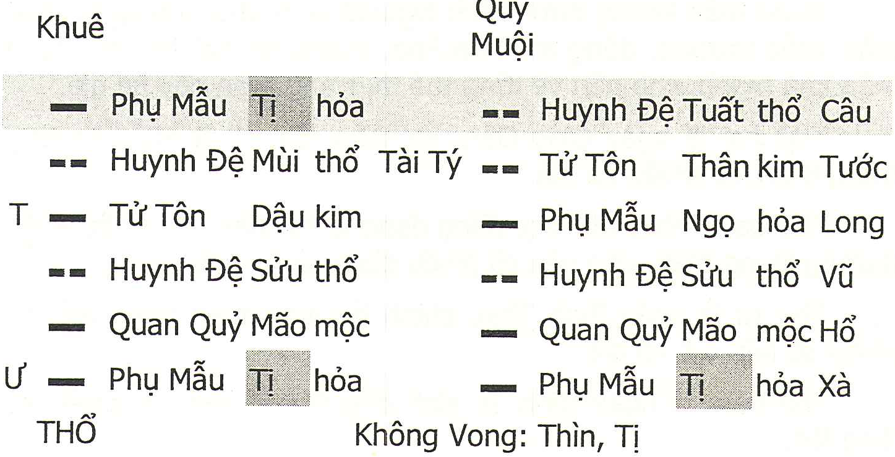

Thứ tư, cổ phiếu từ 7.15 tệ rơi xuống 7.14 tệ.

Thứ năm, cổ phiếu từ 7.14 tệ rơi xuống 7.13 tệ.

Thứ sáu, cổ phiếu từ 7.13 tệ rơi xuống 7.10 tệ.

**Ví dụ 4:** Ngày Quý Mão tháng Thân, dự đoán tình hình tăng giảm trong tuần sau của cổ phiếu rượu Phần Sơn Tây, được quẻ Càn Vi Thiên biến Thiên Phong Cấu.

| | Càn | Cấu | |
| :---: | :--- | :--- | :--- |
| T | ━ Phụ Mẫu Tuất thổ | ━ Phụ Mẫu Tuất thổ | Hổ |
| | ━ Huynh Đệ Thân kim | ━ Huynh Đệ Thân kim | Xà |
| | ━ Quan Quỷ Ngọ hỏa | ━ Quan Quỷ Ngọ hỏa | Câu |
| Ứ | ━ Phụ Mẫu Thìn thổ | ━ Huynh Đệ Dậu kim | Tước |
| | ━ Thê Tài Dần mộc | ━ Tử Tôn Hợi thủy | Long |
| | ━ Tử Tôn Tý thủy | ╍ Phụ Mẫu Sửu thổ | Vũ |

KIM Không Vong: Thìn, Tị

### Phán đoán:

Lấy Thê Tài làm Dụng thần. Thê Tài Dần mộc Nguyệt phá, nhưng được Nhật thần tỉ phù, hào động Tý thủy đến sinh là vượng tướng. Trong quẻ Nguyên thần độc phát, Kỵ thần an tĩnh, về tổng thể thì cổ phiếu có xu hướng tăng.

Thứ hai Bính Ngọ, Kỵ thần bị khắc, bởi vì trong quẻ Nguyên thần động mà bị hào biến hợp trú, ngày này xung khai, Tử Tôn Tý thủy không bị hợp cản trở, sinh trợ Dụng thần, cổ phiếu sẽ tăng giá.

Thứ ba Đinh Mùi, tuy là Mộ khố của Dụng thần, nhưng giống ngày Bính Ngọ, cũng là hợp xứ phùng xung, cổ phiếu tăng giá.

Thứ tư Mậu Thân, Dụng thần bị khắc lâm Tuyệt, cổ phiếu hạ giá.

Thứ năm Kỷ Dậu, Dụng thần bị khắc, cổ phiếu hạ giá.

Thứ sáu Canh Tuất, sinh Kỵ thần mà khắc Nguyên thần, bất lợi cho Dụng thần, cổ phiếu hạ giá.

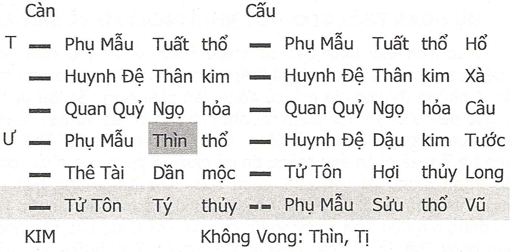

**Tình hình ứng nghiệm:**

Thứ hai, cổ phiếu từ 7 tệ tăng đến 7.11 tệ.
Thứ ba, cổ phiếu từ 7.11 tệ tăng đến 7.62 tệ.
Thứ tư, cổ phiếu từ 7.62 tệ giảm xuống 7.53 tệ.
Thứ năm, cổ phiếu từ 7.53 tệ giảm xuống 7.50 tệ.
Thứ sáu, cổ phiếu từ 7.50 tệ giảm xuống 7.48 tệ.

## DỰ ĐOÁN THỜI GIAN TỐT NHẤT MUA VÀO VÀ BÁN RA

Mục đích của mua bán cổ phiếu chính là để thu được lợi nhuận cao nhất. Vì vậy, khi giá thấp mua vào, khi giá cao bán ra, đây là những thời cơ mà mỗi cổ đông cần phải nắm bắt. Sử dụng lục hào để dự đoán thời điểm tốt nhất cho mua vào và bán ra thì càng quan trọng đối với cổ đông. Hào Tử Tôn hưu tù, Thê Tài vượng tướng là phản ánh thông tin cổ phiếu ở điểm cao nhất, cho nên trong tương lai gần phải chọn ngày Thê Tài vượng bán ra càng nhanh càng tốt; Thê Tài có khí, động mà hóa tiến, hoặc Tử Tôn động mà đến sinh là thông tin cổ phiếu sẽ tăng, cho nên phải chọn ngày Thê Tài bị khắc mua vào cổ phiếu. Tình huống cụ thể, phải xem biến hóa trong quẻ.

**Ví dụ 1:** Ngày Giáp Ngọ tháng Thân, đoán thời gian tốt nhất để bán cổ phiếu, được quẻ Trạch Thủy Khốn biến Khảm Vi Thủy.

| Khốn | | | Khảm | | |
| :--- | :---: | :--- | :---: | :--- | :--- |
| | - - | Phụ Mẫu Mùi thổ | - - | Tử Tôn Tý thủy | Vũ |
| | — | Huynh Đệ Dậu kim | — | Phụ Mẫu Tuất thổ | Hổ |
| Ứ | — | Tử Tôn Hợi thủy | - - | Huynh Đệ Thân kim | Xà |
| | - - | Quan Quỷ Ngọ hỏa | - - | Quan Quỷ Ngọ hỏa | Câu |
| | — | Phụ Mẫu Thìn thổ | — | Phụ Mẫu Thìn thổ | Tước |
| T | - - | Thê Tài Dần mộc | - - | Thê Tài Dần mộc | Long |

KIM Không Vong: Thìn, Tị

**Phán đoán:** Lấy Thê Tài làm Dụng thần.

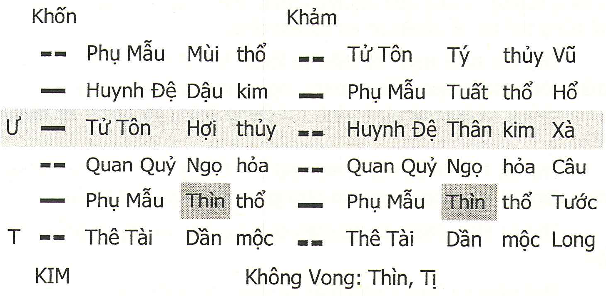

Thê Tài Dần mộc Nguyệt phá, Tử Tôn Hợi thủy phát động sinh hợp Dụng thần, vừa sinh trợ Dụng thần vừa giải trừ phá Dụng thần.

Dụng thần vốn không có gốc rễ, cổ phiếu sẽ không tăng lại, sẽ hạ giá, vì vậy phải bán ra trong thời gian gần. Ngày hôm sau Ất Mùi là Dụng thần nhập Mộ, cổ phiếu sẽ xuất hiện hạ giá lớn. Hôm nay bán ra tốt nhất.

**Kết quả:** Từ ngày hôm sau cổ phiếu bắt đầu xuất hiện rớt giá, giảm một mạch.

**Ví dụ 2:** Ngày Canh Thìn tháng Tý, đoán thời điểm tốt nhất để bán ra cổ phiếu đang nắm giữ, được quẻ Hỏa Lôi Phệ Hạp biến Lôi Hỏa Phong.

| Phệ Hạp | | | Di | | |
| :--- | :---: | :--- | :---: | :--- | :--- |
| | — | Tử Tôn Tị hỏa | - - | Thê Tài Tuất thổ | Xà |
| T | - - | Thê Tài Mùi thổ | - - | Quan Quỷ Thân kim | Câu |
| | — | Quan Quỷ Dậu kim | — | Tử Tôn Ngọ hỏa | Tước |
| | - - | Thê Tài Thìn thổ | — | Phụ Mẫu Hợi thủy | Long |
| Ứ | - - | Huynh Đệ Dần mộc | - - | Thê Tài Sửu thổ | Vũ |
| | — | Phụ Mẫu Tý thủy | — | Huynh Đệ Mão mộc | Hổ |

MỘC Không Vong: Thân, Dậu

**Phán đoán:** Lấy Thê Tài làm Dụng thần. Thê Tài lưỡng hiện, lấy hào động Thê Tài Thìn thổ làm Dụng thần.

Thê Tài lâm Nhật vượng tướng, nhưng Tử Tôn bị Nguyệt khắc thương, lại động mà hóa Mộ, cổ phiếu đã còn khả năng tăng với biên độ lớn, cần sớm bán tháo. Hôm nay là vượng địa của Thê Tài, hôm nay bán ra tốt nhất.

**Kết quả:** Người này hôm đó bán ra với giá 5.40 tệ có lãi. Sau đó cổ phiếu rớt giá xuống còn hơn 4 tệ, liên tục không tăng.

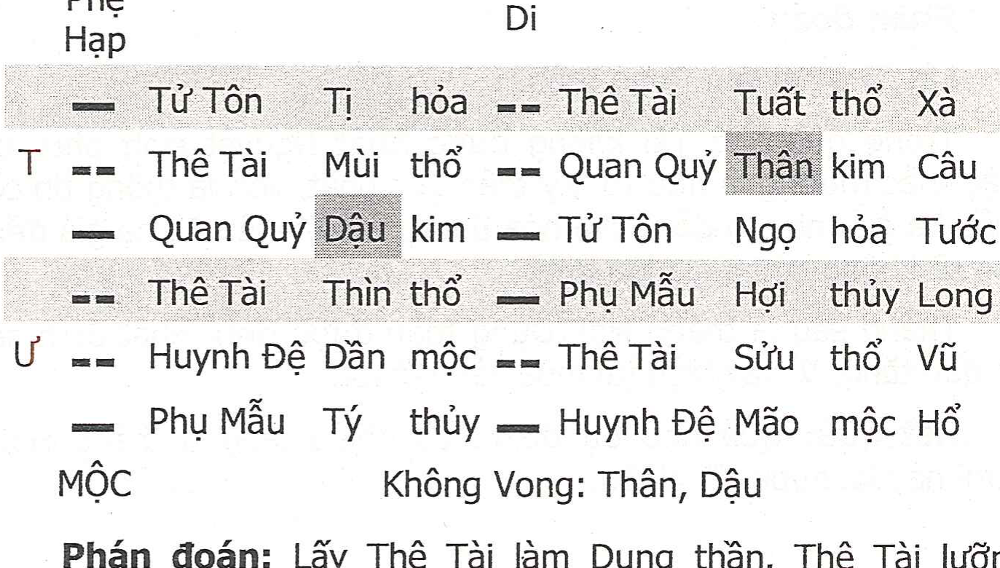

**Ví dụ 3:** Ngày Ất Dậu tháng Tuất, đoán thời gian tốt nhất để mua một cổ phiếu, được quẻ Trạch Thủy Khốn biến Lôi Thủy Giải.

| | | Khốn | | Giải | |
| :---: | :---: | :---: | :---: | :---: | :---: |
| | - - | Phụ Mẫu Mùi thổ | - - | Phụ Mẫu Tuất thổ | Vũ |
| | — | Huynh Đệ Dậu kim | - - | Huynh Đệ Thân kim | Hổ |
| Ư | — | Tử Tôn Hợi thủy | — | Quan Quỷ Ngọ hỏa | Xà |
| | - - | Quan Quỷ Ngọ hỏa | - - | Quan Quỷ Ngọ hỏa | Câu |
| | — | Phụ Mẫu Thìn thổ | — | Phụ Mẫu Thìn thổ | Tước |
| T | - - | Thê Tài Dần mộc | - - | Thê Tài Dần mộc | Long |

KIM &emsp;&emsp;&emsp;&emsp; Không Vong: Ngọ, Mùi

**Phán đoán:**

Lấy Thê Tài làm Dụng thần.

Trong quẻ Thê Tài không được Nhật Nguyệt sinh phù, bị Nhật khắc thương là hưu tù. Kỵ thần độc phát, vốn là thông tin cổ phiếu hạ giá, nhưng động mà hóa thoái, là cổ phiếu đã hạ giá đến đáy, sẽ không có hạ giá lớn nữa.

Tháng sau là tháng Hợi, Dụng thần được sinh, nhất định sẽ bắt đầu tăng. Vì vậy hiện tại mua vào rất tốt.

**Kết quả:** Quả như dự đoán, cổ phiếu tăng ở tháng Hợi, người này lãi được rất nhiều.

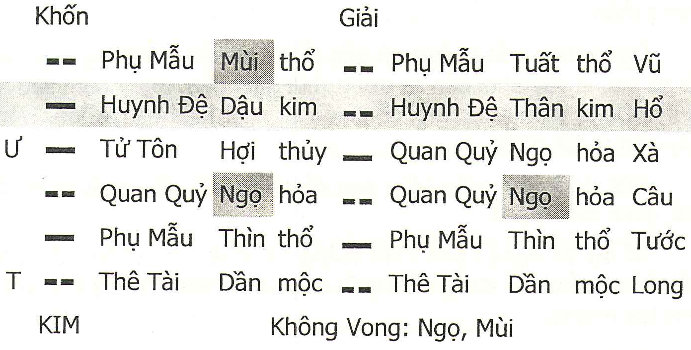

**Ví dụ 4:** Ngày Nhâm Ngọ tháng Tuất, đoán thời điểm tốt nhất để bán ra cổ phiếu đang nắm giữ, được quẻ Sơn Thiên Đại Súc biến Càn Vi Thiên.

| | | Đại Súc | Phục thần | | Càn | |
| :---: | :---: | :---: | :---: | :---: | :---: | :---: |
| | — | Quan Quỷ Dần mộc | | — | Huynh Đệ Tuất thổ | Hổ |
| Ư | - - | Thê Tài Tý thủy | | — | Tử Tôn Thân kim | Xà |
| | - - | Huynh Đệ Tuất thổ | | — | Phụ Mẫu Ngọ hỏa | Câu |
| | — | Huynh Đệ Thìn thổ | Tử Thân | — | Huynh Đệ Thìn thổ | Tước |
| T | — | Quan Quỷ Dần mộc | Phụ Ngọ | — | Quan Quỷ Dần mộc | Long |
| | — | Thê Tài Tý thủy | | — | Thê Tài Tý thủy | Vũ |

THỔ &emsp;&emsp;&emsp;&emsp; Không Vong: Thân, Dậu

**Phán đoán:**

Lấy Thê Tài làm Dụng thần.

Thê Tài Nguyệt khắc Nhật xung là phá, là thông tin cổ phiếu sẽ rớt giá. Nhưng Thê Tài phát động hóa hồi đầu sinh, chứng tỏ cổ phiếu vẫn còn có cơ hội một lần tăng lên.

Nay Tử Tôn Thân kim Không vượng, ngày Giáp Thân xuất Không, nhất định sẽ tăng, cho nên ở ngày này bán ra tốt nhất. Lỡ ngày này, cổ phiếu chắc chắn bị tổn thất.

**Kết quả:** Ngày Giáp Thân, người này bán ra với giá 6.6 tệ, có lãi. Ngày Bính Tuất, cổ phiếu bắt đầu rớt giá, không còn tăng trở lại 6 tệ.

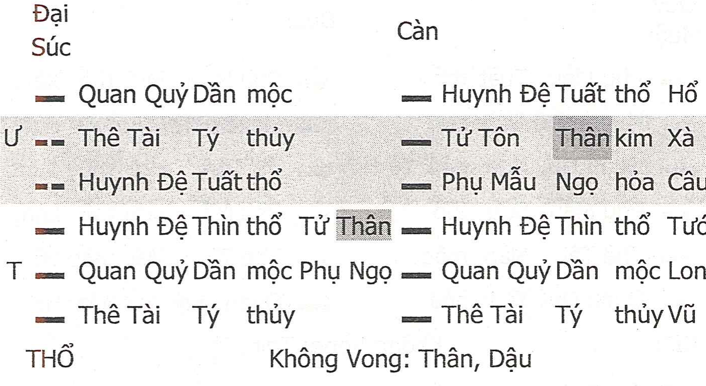

**Ví dụ 5:** Ngày Tân Sửu tháng Tý, một người hỏi về dài hạn, đoán thời gian tốt nhất để bán ra cổ phiếu đang nắm giữ, được quẻ Lôi Trạch Quy Muội biến Đoài Vi Trạch.

| Quy Muội | | Đoài | |
| :--- | :--- | :--- | :--- |
| Ư - - Phụ Mẫu Tuất thổ | | - - Phụ Mẫu Mùi thổ | Xà |
| - - Huynh Đệ Thân kim | | — Huynh Đệ Dậu kim | Câu |
| — Quan Quỷ Ngọ hỏa | Tử Hợi | — Tử Tôn Hợi thủy | Tước |
| T - - Phụ Mẫu Sửu thổ | | - - Phụ Mẫu Sửu thổ | Long |
| — Thê Tài Mão mộc | | — Thê Tài Mão mộc | Vũ |
| — Quan Quỷ Tị hỏa | | — Quan Quỷ Tị hỏa | Hổ |

KIM Không Vong: Thìn, Tị

**Phán đoán:**

Lấy Thê Tài làm Dụng thần.

Thê Tài Mão mộc được Nguyệt sinh phù là vượng, nhưng Kỵ thần Thân kim động mà hóa tiến, hiện nay cổ phiếu ắt đang đi xuống. Đến tháng Dần, Dụng thần được trợ, xung mất Kỵ thần, Kỵ thần lâm Tuyệt, cổ phiếu nhất định sẽ tăng lên. Tháng Dần bán ra tốt nhất.

**Kết quả:** Tháng Dần cổ phiếu tăng lên, người này bán tháo cổ phiếu mà thu lãi.

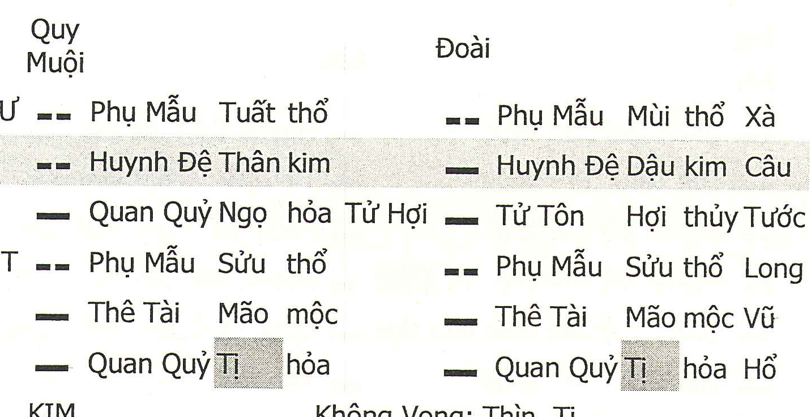

# CHƯƠNG 24
## DỰ ĐOÁN XUẤT HÀNH

Rất ít người luôn luôn ở nhà và không bao giờ đi ra ngoài. Đi công tác, đi du lịch, thăm thân hữu, tới phương xa mua hàng, đi làm, đi chợ mua đồ ăn v.v, hầu như mọi người đều phải đi xa. Đi xa đôi khi còn liên quan đến máy bay, xe lửa, tàu thuyền, xe hơi v.v, giao thông hiện nay đã phát triển, nhưng tai nạn do phương tiện giao thông mang lại cũng không ít. Một chuyến đi dài, quan trọng nhất là vấn đề an toàn, an toàn có được đảm bảo, sau đó mới suy xét chuyện muốn làm có thành hay không, người muốn gặp có gặp được hay không. Người ta thường nói: "Ra ngoài tốt không bằng ở nhà xấu", thực ra chủ yếu là bởi vì bọn họ không thể sớm nắm bắt và biết trước cát hung của bản thân khi ra ngoài nên mới có suy nghĩ như vậy. Nếu nắm vững phương pháp dự đoán lục hào thì sẽ gạt bỏ được những lo nghĩ này và an tâm ra ngoài.

- Dự đoán cát hung của mình khi đi xa, lấy hào Thế làm Dụng thần, xem tình trạng suy vượng của hào Thế; dự đoán cát hung của người khác khi đi xa, lấy lục thân chủ người đó để phán đoán. Hào Ứng là nơi đến, xem ảnh hưởng của hào Ứng và hào động trong quẻ đối với Dụng thần. Sinh hợp Dụng thần thì cát, khắc Dụng thần thì hung.

- Dụng thần nên được Nhật Nguyệt sinh phù, Tử Tôn trì Thế vượng tướng cát nhất. Tử Tôn vượng tướng phát động ở trong quẻ cũng cát. Bởi vì Tử Tôn là thần vô ưu, thần vui vẻ, Tử Tôn phát động ở trong quẻ, Quan Quỷ tất nhiên bị khắc, chính là thông tin không có tai họa.

- Hào Thế Không Vong, đi xa cô đơn. Dự đoán bản thân đi xa, hào Thế hóa thoái, dự đoán người khác đi xa, Dụng thần động mà hóa thoái, sẽ nửa đường trở về, hoặc là có chuyện khác đi không thành.

- Dụng thần động mà gặp hợp, tất có việc cản trở, không thể xuất hành ngay:

  Hợp với Phụ Mẫu, bởi vì bận rộn, hoặc bởi vì văn thư, thủ tục, xe, nhà v.v mà đi không thành.

Hợp với Quan Quỷ, bởi vì công việc, bệnh tật, hoặc kiện tụng v.v mà đi không thành.

Hợp với Thê Tài, bởi vì tiền tài, đàn bà, vợ v.v mà đi không thành.

Hợp Tử Tôn, bởi vì trẻ nhỏ, động vật, uống rượu v.v mà đi không thành.

Hợp Huynh Đệ, bởi vì bạn bè, anh em hoặc phá tài v.v mà đi không thành. Nếu là tượng phải đi, xung khai Dụng thần mới có thể xuất hành.

◆ Hào Ứng Không Vong, sau khi đã đến nơi, tâm trạng cô đơn, người muốn gặp khó mà gặp, muốn làm việc nhưng không dễ làm được.

◆ Hào Thế phát động khắc hào Ứng, đánh đâu thắng đó, đi xa cát lợi.

◆ Thê Tài phát động sinh hợp hào Thế, đi xa có lợi, lâm Đào Hoa Huyền Vũ, Thanh Long là diễm ngộ¹. Tử Tôn lâm Thanh Long động mà sinh hợp hào Thế, đi xa có người mời uống rượu.

◆ Ứng là Quan Quỷ, động mà khắc Thế, đi xa không bị bệnh thì có tai nạn lâm thân. Nói chung Quan Quỷ lâm Bạch Hổ, Chu Tước, Đằng Xà, Câu Trần, Huyền Vũ ở trong quẻ động đều không tốt. Bạch Hổ là bệnh tật, ẩu đả, Chu Tước là kiện cáo, tố tụng, Đằng Xà là phiền não, chuyện buồn phiền bám lấy người, Câu Trần có việc cản trở, Huyền Vũ sợ rằng có đạo tặc ẩn hiện.

◆ Huynh Đệ lâm hào Ứng và Huyền Vũ động, phải coi chừng có người gạt tiền.

◆ Hào Thế nhập Mộ, sau khi ra ngoài thì đầu óc lờ đờ, hoặc là phát sinh sự việc nhập viện, hoặc bị tạm giam v.v, khi hào Thế nhược thì càng phải chú ý.

◆ Thế tại hào 5 bị khắc, hoặc hào 5 động mà khắc Thế, lâm Bạch Hổ, Phụ Mẫu, Quan Quỷ v.v phải đề phòng tai nạn xe cộ phát sinh.

***

¹ Diễm là xinh đẹp, ngộ là gặp gỡ. Diễm ngộ ở đây tạm dịch là đi xa gặp được người con gái đẹp.

◆ Hào Thế bị Phụ Mẫu khắc, giữa đường sẽ bị xe cản trở, hoặc dầm mưa, hoặc bị hành lý liên lụy.

◆ Quan Quỷ tại hào 5 phát động, lộ trình hết thảy không thuận lợi. Thông thường Quan Quỷ nên an tĩnh, không nên phát động.

◆ Hào giữa Thế Ứng là bạn đồng hành, động mà khắc Thế, bị người đó liên lụy, động mà sinh Thế, được người đó chăm sóc. Không Vong, một mình đi xa.

◆ Quẻ lục xung, chạy đông chạy tây, bôn tẩu khắp nơi, lữ hành bất an. Quẻ lục hợp thì đi xa bình an, mọi chuyện trôi chảy.

◆ Quẻ quy hồn, chưa ra ngoài thì bởi vì chuyện mà không thể ra ngoài, hoặc ra ngoài không xa. Sau khi ra ngoài, là muốn về nhà, tâm ở nhà. Quẻ du hồn, đi xa nóng lòng, đã ở ngoài thì không muốn về nhà, phiêu bạt khắp nơi.

◆ Thế, Dụng an tĩnh, bị Nhật hoặc hào khác xung động, chính là có người mời, hoặc bị ép đi xa.

◆ Huynh Đệ lâm Chu Tước động, đi xa có chuyện khẩu thiệt. Không khắc hào Thế, hào Thế Không, không liên quan đến mình.

◆ Dự đoán đi xa, Thê Tài là lộ phí, nơi chứa tiền và hàng, Phụ Mẫu là hành lý, xe thuyền, Thê Tài không nên Nguyệt phá, Không Vong, bị Nhật Nguyệt khắc thương, nếu không thì tất là tiền gặp trở ngại, phá tài.

◆ Ngoài ra có thể lấy quái cung đặt Quan Quỷ để phán đoán chuyện bất lợi:

Càn, Chấn là chuyện do xe ngựa dẫn đến, tai nạn đến từ phố xá sầm uất.

Khảm Đoài là tai nạn ao hồ, thuyền bè, nước, khẩu thiệt, trộm cắp v.v.

Khôn Cấn tai nạn từ núi, ruộng đồng, đất, cầu v.v.

Tốn là tai nạn từ sơn lâm, phụ nữ v.v.

Tại cung Ly, là có liên quan đến hỏa, hoặc tai nạn từ lò gốm sứ, lò gạch, văn thư v.v dẫn tới.

**Ví dụ 1:** Ngày Ất Dậu tháng Ngọ, vợ đi xa du lịch, đoán cát hung, được quẻ Phong Hỏa Gia Nhân biến Thiên Hỏa Đồng Nhân.

| Gia Nhân | Đồng Nhân |
| :--- | :--- |
| — Huynh Đệ Mão mộc | — Thê Tài Tuất thổ Vũ |
| Ứ — Tử Tôn Tị hỏa | — Quan Quỷ Thân kim Hổ |
| - - Thê Tài Mùi thổ | — Tử Tôn Ngọ hỏa Xà |
| — Phụ Mẫu Hợi thủy Quan Dậu | — Phụ Mẫu Hợi thủy Câu |
| T - - Thê Tài Sửu thổ | - - Thê Tài Sửu thổ Tước |
| — Huynh Đệ Mão mộc | — Huynh Đệ Mão mộc Long |

MỘC Không Vong: Ngọ, Mùi

**Phán đoán:**

Lấy Thê Tài làm Dụng thần. Trong quẻ Thê Tài lưỡng hiện, lấy hào Thê Tài Mùi thổ phát động làm Dụng thần.

Dụng thần được Nguyệt sinh phù vượng tướng, là cát. Nhưng Dụng thần động mà hóa hợp, hợp là cản trở, lại là Không Vong, có thể đi bất thành.

**Kết quả:** Sau quả nhiên không đi.

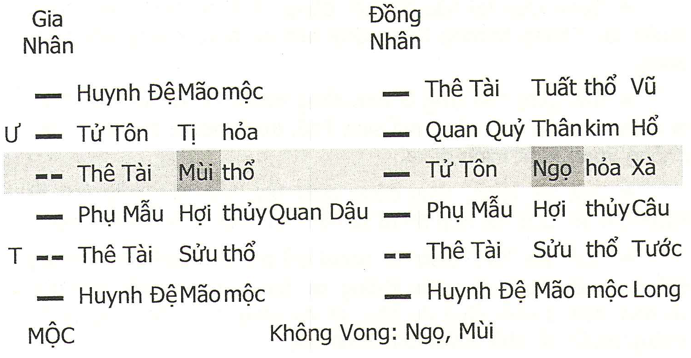

**Ví dụ 2:** Ngày Kỷ Sửu tháng Hợi, bạn của tôi hỏi cát hung về việc cha mẹ đến Hải Nam du lịch, được quẻ Sơn Lôi Di biến Khôn Vi Địa.

| Di | Khôn |
| :--- | :--- |
| — Huynh Đệ Dần mộc | - - Quan Quỷ Dậu kim Câu |
| - - Phụ Mẫu Tý thủy | - - Phụ Mẫu Hợi thủy Tước |
| T - - Thê Tài Tuất thổ | - - Thê Tài Sửu thổ Long |
| - - Thê Tài Thìn thổ | - - Huynh Đệ Mão mộc Vũ |
| - - Huynh Đệ Dần mộc | - - Tử Tôn Tị hỏa Hổ |
| Ứ — Phụ Mẫu Tý thủy | - - Thê Tài Mùi thổ Xà |

MỘC Không Vong: Ngọ, Mùi

**Phán đoán:**

Lấy Phụ Mẫu làm Dụng thần. Trong quẻ Phụ Mẫu lưỡng hiện, lấy hào Phụ Mẫu Tý thủy phát động làm Dụng thần.

Phụ Mẫu Tý thủy được Nguyệt kiến tỉ phù là vượng tướng, lâm hào sơ phát động, hào sơ là chân, đây là thông tin sắp sửa lên đường. Dụng thần và Nhật tương hợp, tôi đoán là cha mẹ người này có việc nên đi bất thành. Đây là cách dùng Dụng thần động gặp hợp mà bị cản trở.

**Kết quả:** Quả nhiên cha mẹ người này đi bất thành bởi vì chuyện bất động sản.

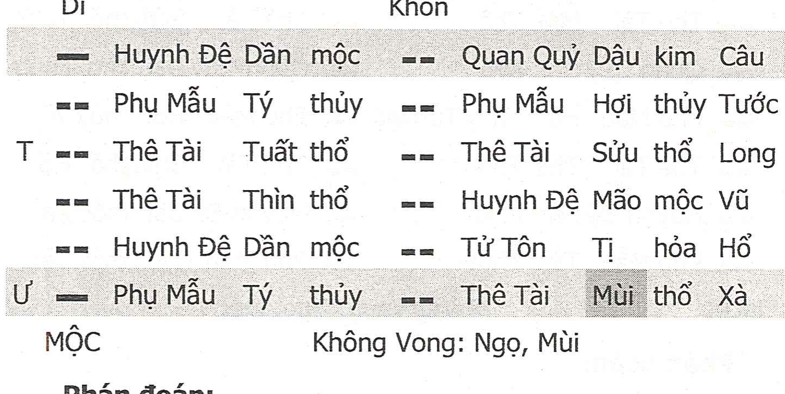

**Ví dụ 3:** Ngày Mậu Tý tháng Ngọ, nam đoán vợ đi công tác cát hung ra sao, được quẻ Trạch Lôi Tùy biến Trạch Thiên Quải.

| | Tùy | | Quải | |
| :---: | :--- | :--- | :--- | :--- |
| Ứ | - - Thê Tài Mùi Thổ | | - - Thê Tài Mùi thổ | Tước |
| | — Quan Quỷ Dậu Kim | | — Quan Quỷ Dậu kim | Long |
| | — Phụ Mẫu Hợi Thủy | Tử Ngọ | — Phụ Mẫu Hợi thủy | Vũ |
| T | - - Thê Tài Thìn Thổ | | — Thê Tài Thìn thổ | Hổ |
| | - - Huynh Đệ Dần Mộc | | — Huynh Đệ Dần mộc | Xà |
| | — Phụ Mẫu Tý Thủy | | — Phụ Mẫu Tý thủy | Câu |

MỘC  
Không Vong: Ngọ, Mùi

### Phán đoán:

Đoán cát hung cho vợ, lấy hào Thê Tài làm Dụng thần. Trong quẻ Thê Tài Mùi thổ và Thê Tài Thìn thổ lưỡng hiện, lấy Thế Thê Tài Thìn thổ phát động làm Dụng thần.

Dụng thần tại cung Chấn phát động, Chấn là chân, là hành động, Dụng thần lại phát động là thông tin vợ sắp xuất phát.

Dụng thần động mà tương hợp với hào 5 Quan Quỷ, hào 5 là tôn vị, hào vị lãnh đạo, Quan Quỷ lại có ý nghĩa lãnh đạo, tên quẻ là Tùy, là theo, đi theo, tôi đoán vợ anh ta không đi công tác một mình, mà là đi theo lãnh đạo.

Dụng thần Nguyệt kiến sinh phù, mặc dù không coi là hưu tù, nhưng nội quái phục ngâm, Kỵ thần phát động tới khắc, là không cát. Ứng là nơi phải đến, sau chuyến đi công tác không thành công, tâm loạn mà cô quạnh. Tài Không bị khắc, ra ngoài cần phải đề phòng phá tài.

Hào sơ Phụ Mẫu Tý thủy Nguyệt phá, Phụ Mẫu là xe thuyền, hành lý, ra ngoài tất xe thuyền bất lợi, hành lý có mất mát.

Số quẻ chính là 6 (nội quái 4, ngoại quái 2), số quẻ biến là 3 (nội quái 1, ngoại quái 2), số quẻ hỗ 12 (nội Cấn 7, ngoại Tốn 5), tổng của chủ biến hỗ là 21. Vì vậy, tôi đoán khi đi mang theo 2100 tệ.

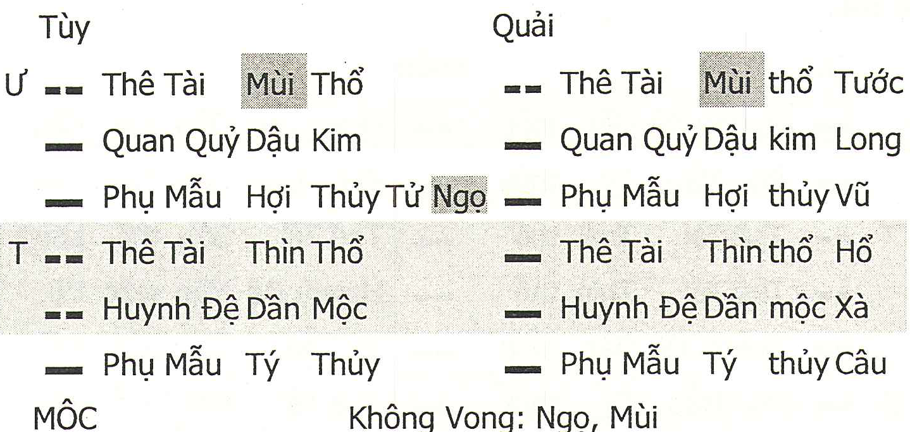

Phụ Mẫu tại hào sơ, hào sơ là chân, Phụ Mẫu là phương tiện giao thông, Nguyệt phá, phương tiện giao thông có tổn hại. Thê Tài Thìn thổ lâm Bạch Hổ mà bị khắc, Bạch Hổ chủ bệnh, có thể sẽ bị bệnh.

### Kết quả:

Đoán tới đây, anh ta nói rằng đúng là vợ anh ta muốn đem theo 2100 tệ đi công tác, 2000 tệ của cơ quan, 100 tệ của bản thân. Quả thực không phải là đi công tác một mình mà là đi theo lãnh đạo. Bởi vì số tiền dự đoán hoàn toàn ăn khớp với số tiền thực tế muốn mang đi, anh ta rất tin tưởng những kết luận khác, liền thỉnh cầu hóa giải.

Tôi bảo vợ người này lấy phần tiền của cơ quan giao cho lãnh đạo giữ, bản thân thì mang 70 tệ là được rồi.

Ba người cùng đi công tác, vợ anh ta viện cớ trên quần áo không có túi, mang tiền không tiện, để lãnh đạo cầm tiền của cơ quan, song bản thân chỉ đem theo 70 tệ. Họ đi vào buổi tối hôm đó. Lúc xuất phát, bởi vì tàu lửa gặp sự cố mà trễ giờ. Sau khi đến đích, mỗi ngày trời mưa liên tục, ra ngoài làm việc bị ảnh hưởng, bọn họ phải trú tại khách sạn chờ trời tạnh. Ngày thường cơ thể của lãnh đạo rất khỏe mạnh, giờ đột nhiên phát sốt. Muốn nhập viện nhưng bệnh viện không có chỗ nằm, đành phải vào trong khách sạn truyền nước biển. Đến lúc khỏi bệnh, thời tiết đã quang đãng, mà tiền mang đi cũng không còn nhiều, công việc gì đó cũng không hoàn thành, đành phải quay trở về. Vợ anh ta bình an vô sự.

**Ví dụ 4:** Ngày Nhâm Tý tháng Tuất, một người Nhật Bản về nước, đoán cát hung, được quẻ Trạch Địa Tụy.

| | Tụy | | | |
| :---: | :---: | :--- | :--- | :--- |
| | -- | Phụ Mẫu | Mùi thổ | Hổ |
| Ứ | — | Huynh Đệ | Dậu kim | Xà |
| | — | Tử Tôn | Hợi thủy | Câu |
| | -- | Thê Tài | Mão mộc | Tước |
| T | -- | Quan Quỷ | Tị hỏa | Long |
| | -- | Phụ Mẫu | Mùi thổ | Vũ |

KIM Không Vong: Dần, Mão

**Phán đoán:**

Lấy hào Thế làm Dụng thần.

Quan Quỷ trì Thế, Nhật thần khắc, chính là khắc đi Quỷ bên mình, trong quẻ sáu hào an tĩnh, không có tượng hung. Chỉ có một điểm không tốt là Thê Tài Mão mộc Không Vong, khả năng phá tài nhỏ hoặc mất đồ vật.

**Kết quả:** Sau này quả nhiên bình an vô sự, nhưng khi qua hải quan đã bị tịch thu con dao nhỏ mang theo.

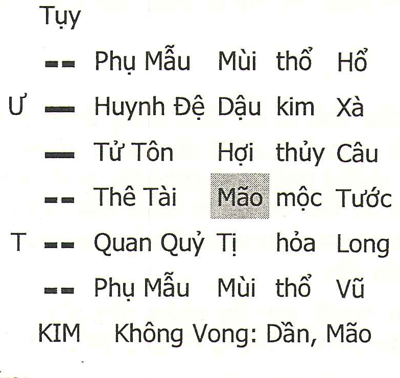

**Ví dụ 5:** Ngày Kỷ Dậu tháng Tý, một người Nhật Bản hỏi cát hung trên đường đi, được quẻ Hỏa Lôi Phệ Hạp biến Hỏa Thủy Vị Tế.

| | Phệ Hạp | | | | Vị Tế | | |
| :---: | :---: | :--- | :--- | :---: | :--- | :--- | :--- |
| | — | Tử Tôn | Tị hỏa | — | Tử Tôn | Tị hỏa | Câu |
| T | -- | Thê Tài | Mùi thổ | -- | Thê Tài | Mùi thổ | Tước |
| | — | Quan Quỷ | Dậu kim | — | Quan Quỷ | Dậu kim | Long |
| | -- | Thê Tài | Thìn thổ | -- | Tử Tôn | Ngọ hỏa | Vũ |
| Ứ | -- | Huynh Đệ | Dần mộc | — | Thê Tài | Thìn thổ | Hổ |
| | — | Phụ Mẫu | Tý thủy | -- | Huynh Đệ | Dần mộc | Xà |

MỘC Không Vong: Dần, Mão

**Phán đoán:**

Lấy hào Thế làm Dụng thần.

Hào Thế không được Nhật Nguyệt sinh phù là hưu tù, Kỵ thần phát động khắc Thế là không cát. Nhưng may là Huynh Đệ Dần mộc Không Vong, khó khắc đến hào Thế, nếu hỏi vài ngày sau thì không tốt, nay chỉ hỏi đường đi thì có sợ hãi nhưng không có nguy hiểm.

Thế tại hào 5, hào 5 là đường đi, trên đường nhất định có chuyện sợ bóng sợ gió. Lâm Chu Tước, hoảng sợ có thể la lên.

**Kết quả:** Máy bay của anh ta gần như va chạm với một chiếc máy bay khác, khiến tất cả các hành khách sợ hãi.

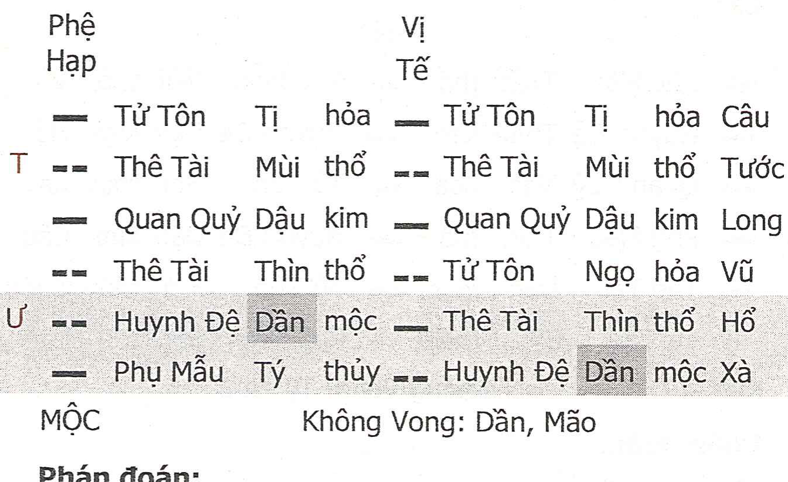

**Ví dụ 6:** Ngày Ất Mão tháng Ngọ, đoán xem đến Tây Tạng sẽ ra sao? Được quẻ Càn Vi Thiên biến Trạch Phong Đại Quá.

| | Càn | | Đại Quá | |
| :---: | :--- | :---: | :--- | :--- |
| T | — Phụ Mẫu Tuất thổ | -- | Phụ Mẫu Mùi thổ | Vũ |
| | — Huynh Đệ Thân kim | — | Huynh Đệ Dậu kim | Hổ |
| | — Quan Quỷ Ngọ hỏa | — | Tử Tôn Hợi thủy | Xà |
| Ư | — Phụ Mẫu Thìn thổ | — | Huynh Đệ Dậu kim | Câu |
| | — Thê Tài Dần mộc | — | Tử Tôn Hợi thủy | Tước |
| | — Tử Tôn Tý thủy | -- | Phụ Mẫu Sửu thổ | Long |

KIM

Không Vong: Tý, Sửu

**Phán đoán:**

Lấy hào Thế làm Dụng thần.

Phụ Mẫu trì Thế, Phụ Mẫu là phương tiện giao thông, hào 6 là hào vị của thiên, chính là đi máy bay.

Phụ Mẫu động mà hóa thoái, máy bay sẽ hoãn bay, trễ giờ. Nhật thần và hào Thế tương hợp, cũng là ngay hôm đó đi không thành. Ngày hôm sau hào Thế gặp xung, ngày hôm sau mới có thể xuất phát.

**Kết quả:** Quả nhiên bởi vì có mưa quá lớn, ảnh hưởng máy bay cất cánh, ngày hôm sau mới đến Tây Tạng.

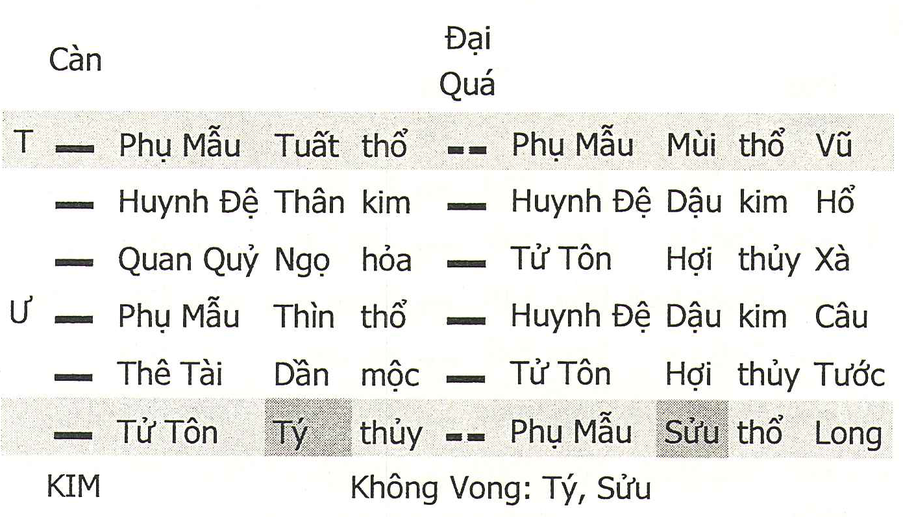

# CHƯƠNG 25
## DỰ ĐOÁN HÀNH NHÂN

Lo lắng về an nguy của người đi xa, tìm người mất tích, dự đoán cát hung ở bên ngoài và ứng kỳ trở về, lấy lục thân chủ người đó làm Dụng thần. Sau khi chọn được Dụng thần, xem tình trạng người đó ở bên ngoài, ngày trở về, và nguyên nhân lưu lại ở bên ngoài. Dụng thần nên vượng, không nên hưu tù. Đồng thời cũng phải xem ý định của người dự đoán ra sao, nếu trọng điểm hỏi ngày về nhà, Dụng thần không vượng cũng không sao, nếu trọng điểm hỏi cát hung, Dụng thần nhược thì không tốt.

- Dụng thần an tĩnh lâm hào Ứng, người còn ở đất khách, chưa có ý định trở về.
- Dụng thần sinh Thế, nhưng không phát động, người chậm trở về.
- Dụng thần khắc Thế, người về nhanh, động mà khắc Thế, càng nhanh.
- Thế khắc Dụng thần, người đã đến đất khách, dựa vào Dụng thần suy vượng khác nhau, có trường hợp trở về, cũng có trường hợp không trở về.
- Nhật khắc Dụng thần, gần đây sẽ không trở về.
- Dụng thần an tĩnh Nhật xung Dụng thần, có người giục mà về, hoặc mời mà về.
- Dụng thần động mà hóa thoái, người tất trở về, hóa Tiến thần, di chuyển đến nơi khác.
- Dụng thần tại hào 3, hào 4 phát động, người sẽ về nhanh. Bởi vì hào 3, hào 4 là cửa, người đã tới cửa, hiển nhiên đã sắp đến nhà.
- Dụng thần tại hào 5 phát động sinh hợp Thế, khắc Thế, người đã ở trên đường về nhà.
- Dụng thần động mà sinh hợp hào Thế, vốn là động thân sẽ trở về, nhưng bị hào Ứng, Nhật thần v.v hợp trú, hoặc động mà hóa hợp, tất là bị người giữ lại hoặc bởi vì có việc nên không thể trở về, cần sau này xung khai Dụng thần hoặc hợp thần mới có thể trở về. Bị hào 5 hợp trú, là đã nán lại ở trên đường.

- Dụng thần không nên động mà hóa Quan Quỷ, nếu không phải hào Phụ Mẫu, không bệnh thì hung.
- Hào Thế Không Vong, người về nhanh. Dụng thần cũng Không, rất khó trở về.
- Dụng thần phục tàng, mừng được Phi thần Không Vong, Nhật Nguyệt và hào động khác xung khắc Phi thần. Ứng kỳ cụ thể, xem thêm chương ứng kỳ.
- Dụng thần lâm Nhật, tĩnh mà hợp Nhật, nhập Nhật Mộ, là tượng hôm đó về nhà.
- Nhật thần động mà hóa ra Dụng thần, hoặc Dụng thần động mà hóa ra Nhật thần, hôm đó về.
- Dụng thần Không mà lâm Đằng Xà, hành nhân ở bên ngoài đang ở trong trạng thái bất an.
- Phi thần là Quan Quỷ, lâm Bạch Hổ, người ở bên ngoài không suôn sẻ. Không bị bệnh cũng gặp tai họa, hoặc bị người ta đánh.
- Phi thần là Huynh Đệ lâm Huyền Vũ, hoặc ở bên ngoài bị mất đồ, hoặc ở bên ngoài ham mê nữ sắc, hoặc ở bên ngoài bài bạc, sẽ không trở về ngay.
- Dụng thần phục dưới Tử Tôn, vui quên trở về, hoặc đắm chìm vào rượu, hoặc bị hậu bối giữ lại, không thể trở về ngay.
- Dụng thần phục dưới Phụ Mẫu, hoặc ở nơi người cao tuổi, hoặc ở khách sạn, hoặc bởi vì chuyện văn thư, thủ tục mà lưu lại.
- Dụng thần phục dưới Thê Tài, hoặc bởi vì chuyện tiền tài, hoặc bởi vì phụ nữ, hoặc ở trong nhà phụ nữ, không thể về nhà ngay.
- Dụng thần Không mà gặp đất Tử Tuyệt, hưu tù bị khắc, ở bên ngoài lành ít dữ nhiều.
- Trong quẻ Thê Tài không hiện, hoặc lâm Không Vong, ở ngoài thiếu tiền xài. Nếu bị Huynh Đệ phát động khắc thương, tất ở bên ngoài bị trộm cướp tiền.
- Người được dự đoán là phái nữ, không nên Dụng thần và Quan Quỷ tương hợp, không bị lừa gạt thì cũng nhiều tai nạn.

- Phụ Mẫu là tin tức, phát động trong quẻ chính là thông tin có tin tức hoặc thư tín, điện thoại. Lâm Chu Tước động càng nghiệm.
- Phụ Mẫu hưu tù bị khắc, lại lâm Không Phá, là quái tượng bặt vô âm tín.
- Trong quẻ có phản ngâm phục ngâm, người ở ngoài bôn ba, bất an.
- Quy hồn có nhớ nhà, du hồn không nhớ nhà.
- Dự đoán phương vị và địa điểm của hành nhân, lấy Dụng thần làm trung tâm phán đoán. Dụng thần an tĩnh, lấy địa chi lâm Dụng thần để phán đoán. Dụng thần phát động, lấy hào biến, quẻ biến định phương vị. Dụng thần phục tàng, lấy quẻ đặt Phi thần để phán đoán hoặc lấy địa chi lâm Phi thần để phán đoán. Khi Dụng thần nhập Mộ hoặc bị hợp, lấy hợp thần và địa chi Mộ khố để phán đoán phương vị.
- Lấy Mộ khố định địa phương: Thìn thổ là Tây Nam hoặc ven sông, hồ chứa nước v.v; Tuất thổ là lò gạch, đền chùa v.v; Mùi là xưởng gia công gỗ, vườn hoa, trong rừng v.v; Sửu là nhà máy, kho kim loại v.v. Đây chỉ là một cách tư duy, cụ thể có thể dựa vào tình huống của quẻ mà phán đoán một cách linh hoạt.
- Đoài là đền chùa, đầm lầy, phòng thiếu nữ; Càn là thành phố lớn, chùa miếu; Chấn là khu phố sầm uất, rừng rậm; Tốn là rừng cây, phòng phụ nữ; Khôn là phòng nhiều người, đồng bằng, phòng bà lão; Cấn là núi rừng, phần mộ v.v.
- Dụng thần ở hào Thế hoặc nội quái, ở gần; ở ngoại quái, hào 6 là nơi xa.

**Ví dụ 1:** Ngày Giáp Dần tháng Thân, nữ đoán về con gái bỏ đi, tôi gieo quẻ được quẻ Sơn Hỏa Bí biến Sơn Trạch Tổn.

| Bí | Tổn | |
| :--- | :--- | :--- |
| — Quan Quỷ Dần mộc | — Quan Quỷ Dần mộc | Vũ |
| - - Thê Tài Tý thủy | - - Thê Tài Tý thủy | Hổ |
| Ứ - - Huynh Đệ Tuất thổ | - - Huynh Đệ Tuất thổ | Xà |
| — Thê Tài Hợi thủy Tử Thân | - - Huynh Đệ Sửu thổ | Câu |
| - - Huynh Đệ Sửu thổ Phụ Ngọ | — Quan Quỷ Mão mộc | Tước |
| T — Quan Quỷ Mão mộc | — Phụ Mẫu Tị hỏa | Long |

THỔ Không Vong: Tý, Sửu

**Phán đoán:**

Lấy hào Tử Tôn làm Dụng thần. Tử Tôn Thân kim là Dịch Mã, phục tại hào 3.

Huynh Đệ lâm Chu Tước phát động là thông tin khẩu thiệt. Nhất định là cãi nhau với ai sau đó trốn đi.

Dụng thần phục tại nội quái, con gái không có đi xa.

Dụng thần được Nguyệt tỉ phù nên bên ngoài bình an. Nội quái là Ly, đối ứng với phía Nam, con gái đến phía Nam.

Tử Tôn nhập Mộ tại hào 2, hào 2 là trạch, Tử Tôn là Dịch Mã, Sửu thổ là Mộ Khố của Dịch Mã, Mộ Khố của Dịch Mã là quán trọ, con gái trong một khách sạn phía Nam.

Tìm trong khách sạn ở phía Nam. Ngày Đinh Tị xung mất Phi thần sẽ có thể tìm được.

**Kết quả:** Vì không được chấp nhận chuyện yêu đương nên con gái đã cãi lại rồi trốn đi. Ngày Đinh Tị tìm được con tại một khách sạn ở phía Nam.

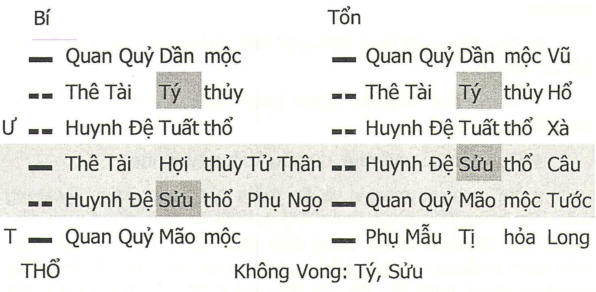

**Ví dụ 2:** Ngày Kỷ Mão tháng Mão, một người phụ nữ ở Bắc Kinh gọi điện thoại tới, nói rằng chị gái của bạn trai cô ấy sau khi cãi nhau với chồng đã bỏ nhà ra đi rồi. Tôi gieo được quẻ Thiên Phong Cấu.

| Cấu | |
| :--- | :--- |
| — Phụ Mẫu Tuất thổ | Câu |
| — Huynh Đệ Thân kim | Tước |
| Ứ — Quan Quỷ Ngọ hỏa | Long |
| — Huynh Đệ Dậu kim | Vũ |
| — Tử Tôn Hợi thủy Tài Dần | Hổ |
| T - - Phụ Mẫu Sửu thổ | Xà |

KIM Không Vong: Thân, Dậu

**Phán đoán:**

Dự đoán bạn trai thông thường là lấy Quan Quỷ làm Dụng thần. Dùng nguyên lý chuyển đổi lục thân, cái có ngũ hành tương đồng xem là ngang vai vế, đoán về chị gái của bạn trai cô ấy cũng ứng với hào Quan Quỷ.

Quan Quỷ Ngọ hỏa được Nhật Nguyệt đến sinh, Dụng thần vượng tướng, chị gái bạn trai sẽ không xảy ra chuyện.

Dụng thần lâm Ứng, Ứng là nơi khác, chứng tỏ bản thân chị ấy muốn rời khỏi Bắc Kinh để đi đến địa phương khác.

Dụng thần là Ngọ hỏa, tương ứng với phía Nam, là muốn đi đến phương Nam.

Nhật là Nguyên thần, đại diện tâm tư chị ấy, tương hợp với Phụ Mẫu Tuất thổ trong quẻ, Phụ Mẫu là phương tiện giao thông, Dụng thần nhập Mộ ở Phụ Mẫu Tuất thổ, chính là tượng muốn bước vào phương tiện giao thông. Phụ Mẫu Tuất thổ lâm hào 6, hào 6 là hào vị bầu trời, thì có thể hiểu là máy bay. Vậy là muốn đáp máy bay đến phương Nam. Nếu như bây giờ nhanh chóng chạy đến sân bay thì có thể tìm thấy chị ấy.

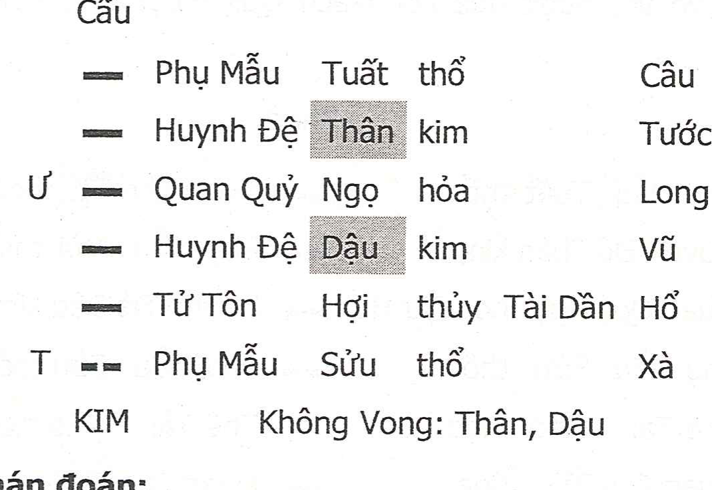

**Kết quả:** Sau khi đoán xong, hỏa tốc chạy tới sân bay, đã tìm được chị ấy ở đó. Chị ấy đã mua vé máy bay và đang định đi đến phương Nam.

### Ví dụ 3: Ngày Nhâm Dần tháng Dậu, vợ đi công tác, đoán ngày nào vợ về, được quẻ Lôi Trạch Quy Muội biến Hỏa Trạch Khuê.

| Thế/Ứng | Quy Muội | Phục thần | Khuê | Lục thú |
| :---: | :--- | :---: | :--- | :--- |
| Ư | ╍╍ Phụ Mẫu Tuất thổ | | ━ Quan Quỷ Tị hỏa | Hổ |
| | ╍╍ Huynh Đệ Thân kim | | ╍╍ Phụ Mẫu Mùi thổ | Xà |
| | ━ Quan Quỷ Ngọ hỏa | Tử Hợi | ━ Huynh Đệ Dậu kim | Câu |
| T | ╍╍ Phụ Mẫu Sửu thổ | | ╍╍ Phụ Mẫu Sửu thổ | Tước |
| | ━ Thê Tài Mão mộc | | ━ Thê Tài Mão mộc | Long |
| | ━ Quan Quỷ Tị hỏa | | ━ Quan Quỷ Tị hỏa | Vũ |

**KIM**  **Không Vong: Thìn, Tị**

**Phán đoán:**

Lấy Thê Tài làm Dụng thần.

Thê Tài Mão mộc Nguyệt phá, nhưng được Phụ Mẫu Tuất thổ động mà hợp Thê Tài, Nguyệt phá có thể giải. Dụng thần được Nhật tỉ phù, không là hưu tù, hỏi ngày về, không lấy Nguyệt phá định ngày về. Trong quẻ Huynh Đệ ám động khắc chế Dụng thần, ngày Ất Tị hợp trú Kỵ thần, Dụng thần không còn bị khắc sẽ về, lại bởi vì Phụ Mẫu Tuất thổ động mà hóa Không, thiếu lực hợp Dụng thần Nguyệt phá, ngày Tị xuất Không hợp Dụng thần, Dụng thần sẽ không là phá, có thể về.

**Kết quả:** Sau này quả nhiên về ở ngày Ất Tị.

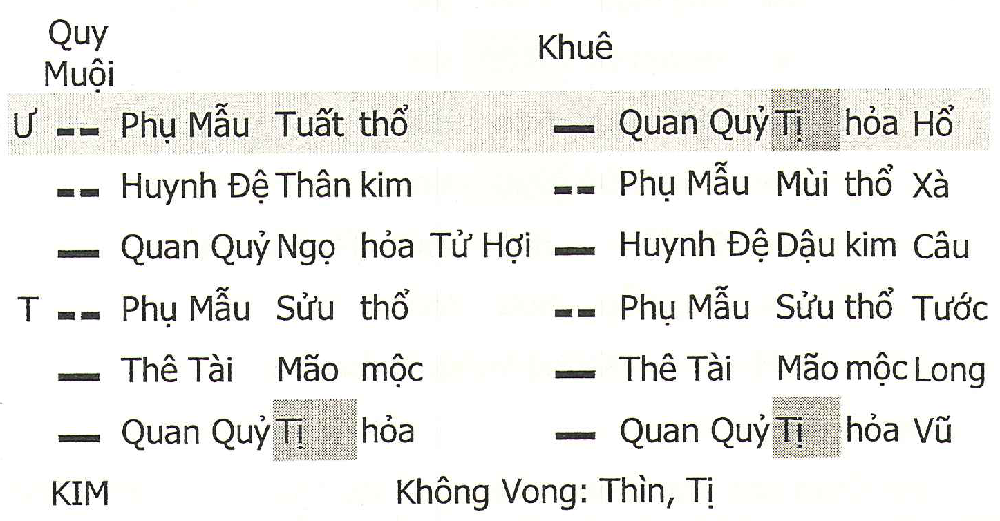

### Ví dụ 4: Ngày Ất Dậu tháng Thìn, chồng bỏ đi, đoán ngày nào chồng về? Được quẻ Hỏa Sơn Lữ biến Cấn Vi Sơn.

| Thế/Ứng | Lữ | Phục thần | Cấn | Lục thú |
| :---: | :--- | :---: | :--- | :--- |
| | ━ Huynh Đệ Tị hỏa | | ━ Phụ Mẫu Dần mộc | Vũ |
| | ╍╍ Tử Tôn Mùi thổ | | ╍╍ Quan Quỷ Tý thủy | Hổ |
| Ư | ━ Thê Tài Dậu kim | | ╍╍ Tử Tôn Tuất thổ | Xà |
| | ━ Thê Tài Thân kim | Quan Hợi | ━ Thê Tài Thân kim | Câu |
| | ╍╍ Huynh Đệ Ngọ hỏa | | ╍╍ Huynh Đệ Ngọ hỏa | Tước |
| T | ╍╍ Tử Tôn Thìn thổ | Phụ Mão | ╍╍ Tử Tôn Thìn thổ | Long |

**HỎA**  **Không Vong: Ngọ, Mùi**

**Phán đoán:**

Lấy hào Quan Quỷ làm Dụng thần. Quan Quỷ Hợi thủy không hiện trên quẻ, phục dưới hào 3 Thê Tài Thân kim. Quan Quỷ không hiện, quẻ lại tên là Hỏa Sơn Lữ, có tượng đi xa, đoán là chồng cô đã bỏ đi.

Trong quẻ Tử Tôn Thìn thổ trì Thế, là lục thân khắc Dụng thần, đoán là đã cãi nhau với chồng, cô ta đã mắng chồng khiến anh ta bỏ đi. Cô Thôi nói xác thực là như vậy. Ba hôm trước (ngày Quý Mùi), bởi vì vợ chồng xảy ra tranh cãi, cô ấy đã chửi câu "Anh cút đi!". Sau đó, cô ấy quay người đi vào bếp để rửa chén, khi trở ra thì đã không thấy bóng dáng của chồng đâu. Đến bây giờ đã ba ngày, ngay cả điện thoại cũng không gọi về nhà.

Tôi thấy Quan Quỷ Hợi thủy được Nhật sinh, trong quẻ lại có hào Tài Dậu kim phát động sinh trợ, lại phục ở đất Trường Sinh, tôi nói chồng cô ở bên ngoài bình an, không cần lo lắng.

Vậy thì chồng cô ấy đã đi đâu? Quan Quỷ Hợi thủy phục dưới cung Cấn, Cấn là Đông Bắc, chắc là đã đến hướng Đông Bắc. Quan phục dưới Tài, Tài là phụ nữ, chứng tỏ chồng ở trong nhà của một người phụ nữ ở hướng Đông Bắc. Phi thần Thê Tài Thân kim là đất Trường Sinh của Quan Quỷ Hợi thủy, Trường Sinh nghĩa là người nữ này rất tốt với chồng. Cấn là chỉ (dừng), có ý nghĩa là định cư, có thể suy ra là quê nhà, hào 3 là hương, lại là hào vị huynh đệ. Tổng hợp những thông tin trên đây, tôi đoán là

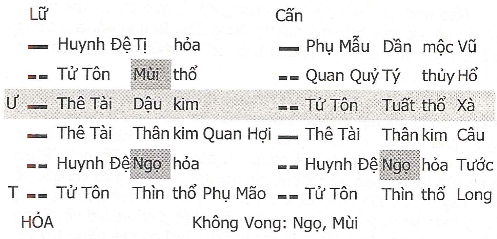 chồng cô ấy rất có thể đã về quê và đang ở trong nhà chị gái anh ta.

Nào ngờ, cô Thôi nói rằng chồng đã về quê thì có khả năng, bởi vì quê nhà của chồng ở hướng Đông Bắc. Nhưng nói là ở trong nhà chị gái thì tuyệt đối không thể, bởi vì chồng cô ấy căn bản không có chị gái.

Tôi nói là có chị gái hay không thì chưa biết được, nhưng chắc chắn là chồng cô ấy ở trong nhà của một người phụ nữ, mà người phụ nữ này rất tốt với anh ta. Điều này đã khiến cô Thôi sốt ruột, truy hỏi tôi xem là hai người có quan hệ gì? Tôi nói: "Phán đoán của tôi là quan hệ chị em, chị nói anh ta không có chị gái, về điều này thì tôi cũng đã nói là chưa rõ." Tôi thấy quẻ gặp lục hợp, Dụng thần lại vượng, chồng người này nhất định sẽ trở về, Dụng thần phục tàng gặp xuất hiện, ngày Đinh Hợi có khả năng trở về. Nếu không trở về thì ứng ngày Quý Tỵ xung Dụng thần. Bèn nói: "Bọn họ có quan hệ gì, ngày 20 chồng chị có khả năng trở về, đợi sau khi trở về thì hỏi anh ta nhé."

**Kết quả:** Chồng người này trở về ở giờ Hợi ngày Đinh Hợi, anh ta nói là tâm trạng không tốt nên đã về quê ở nhà chị gái vài ngày. Hai người kết hôn đã mấy năm, vậy mà cô ấy lại không biết chồng còn có chị gái.

**Ví dụ 5:** Ngày Ất Mùi tháng Sửu, nam có vợ bỏ đi, gọi điện thoại đến đoán xem vợ có trở về không? Nếu có thì lúc nào về? Tôi gieo quẻ được quẻ Phong Trạch Trung Phu biến Sơn Hỏa Bí.

| Trung Phu | | Bí | |
| :--- | :--- | :--- | :--- |
| — Quan Quỷ Mão mộc | | — Quan Quỷ Dần mộc | Vũ |
| — Phụ Mẫu Tị hỏa | Tài Tý | - - Thê Tài Tý thủy | Hổ |
| T - - Huynh Đệ Mùi thổ | | - - Huynh Đệ Tuất thổ | Xà |
| - - Huynh Đệ Sửu thổ | Tử Thân | — Thê Tài Hợi thủy | Câu |
| — Quan Quỷ Mão mộc | | - - Huynh Đệ Sửu thổ | Tước |
| Ứ — Phụ Mẫu Tị hỏa | | — Quan Quỷ Mão mộc | Long |

THỔ Không Vong: Thìn, Tị

**Phán đoán:**

Lấy Thê Tài làm Dụng thần.

Thê Tài Tý thủy không hiện trên quẻ, phục dưới hào 5 Phụ Mẫu Tị hỏa, Dụng thần bị Nhật Nguyệt khắc thương, vốn là hưu tù không cát, nhưng may được Phi thần Không Vong, Phục thần dưới hào Không thì dễ kéo ra, lại thêm hào 3 là cửa động mà hóa ra Thê Tài, ngày gần đây có thể về. Dụng thần hưu tù, gặp ngày Trường Sinh về, ngày mai sẽ về.

**Kết quả:** Ngày hôm sau vợ về nhà.

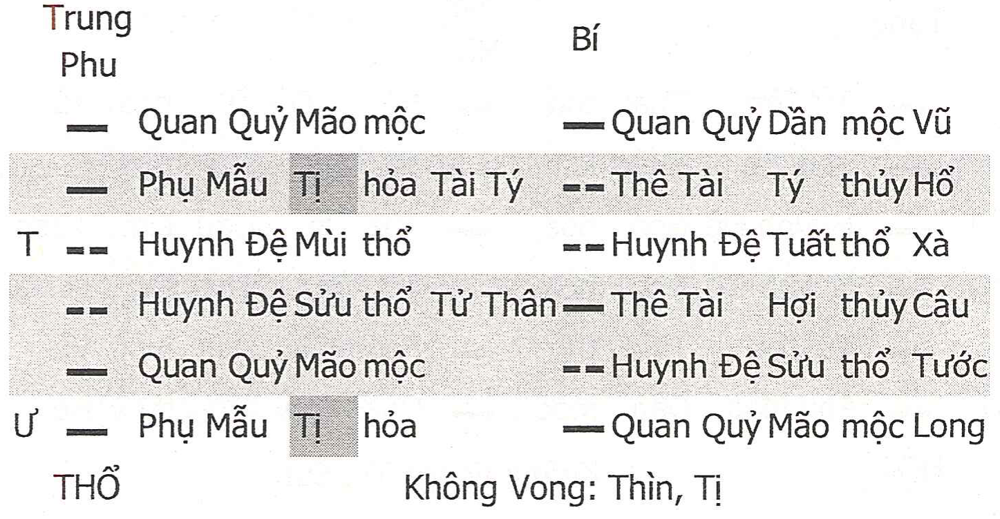

**Ví dụ 6:** Ngày Tân Dậu tháng Dần, con gái bỏ đi đã mấy ngày, hỏi cát hung ra sao, có thể tìm được không? Được quẻ Thiên Thủy Tụng biến Hỏa Thiên Đại Hữu.

| | Tụng | Đại Hữu | |
| :--- | :--- | :--- | :--- |
| | — Tử Tôn Tuất thổ | — Huynh Đệ Tị hỏa | Xà |
| | — Thê Tài Thân kim | - - Tử Tôn Mùi thổ | Câu |
| T | — Huynh Đệ Ngọ hỏa | — Thê Tài Dậu kim | Tước |
| | - - Huynh Đệ Ngọ hỏa | — Tử Tôn Thìn thổ | Long |
| | — Tử Tôn Thìn thổ | — Phụ Mẫu Dần mộc | Vũ |
| Ứ | - - Phụ Mẫu Dần mộc | — Quan Quỷ Tý thủy | Hổ |

HỎA Không Vong: Tý, Sửu

**Phán đoán:**

Lấy Tử Tôn làm Dụng thần. Trong quẻ Tử Tôn lưỡng hiện, lấy hào Tử Tôn hợp Nhật làm Dụng thần. Dụng thần lâm hào 2 hợp Nhật, hào 2 là hào vị nhà, tĩnh mà hợp Nhật, hôm đó có thể về.

Hào Thế là Nguyên thần Tử Tôn, cần ra ngoài tìm, tự mình sẽ không trở về.

Tử Tôn hưu tù, trong quẻ mặc dù có Phụ Mẫu Dần mộc động mà khắc Dụng thần, nhưng hào 3 Huynh Đệ Ngọ hỏa phát động, thành liên tục tương sinh, con gái ở ngoài sẽ không có lo lắng về tính mạng.

Quẻ chính là cung Ly, Ly là Nam, Tử Tôn hợp Nhật Dậu kim, Dậu là Tây, tìm ở hướng Tây Nam, có hy vọng có thể tìm được.

**Kết quả:** Giờ Tý tối hôm đó, tìm được con gái trong một phòng ca múa ở hướng Tây Nam, con gái bị mấy đứa con trai dụ đi.

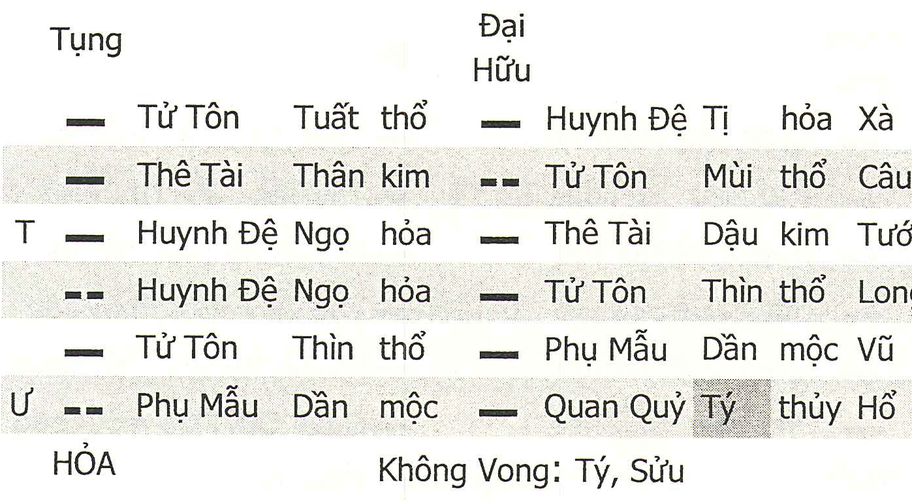

**Ví dụ 7:** Ngày Bính Tý tháng Tuất, con mèo nuôi trong nhà một đêm không về nhà, sáng sớm ngủ dậy đoán con mèo có trở về không? Được quẻ Sơn Lôi Di biến Phong Thiên Tiểu Súc.

| | Di | Phục Thần | Tiểu Súc | |
| :--- | :--- | :--- | :--- | :--- |
| | — Huynh Đệ Dần mộc | | — Huynh Đệ Mão mộc | Long |
| | - - Phụ Mẫu Tý thủy | Tử Tị | — Tử Tôn Tị hỏa | Vũ |
| T | - - Thê Tài Tuất thổ | | - - Thê Tài Mùi thổ | Hổ |
| | - - Thê Tài Thìn thổ | Quan Dậu | — Thê Tài Thìn thổ | Xà |
| | - - Huynh Đệ Dần mộc | | — Huynh Đệ Dần mộc | Câu |
| Ứ | — Phụ Mẫu Tý thủy | | — Phụ Mẫu Tý thủy | Tước |

MỘC Không Vong: Thân, Dậu

**Phán đoán:**

Con mèo thuộc về động vật, lấy Tử Tôn làm Dụng thần.

Tử Tôn Tị hỏa không hiện trên quẻ, phục dưới hào 5 Phụ Mẫu Tý thủy, Dụng thần không được Nhật Nguyệt sinh phù, Phi đến khắc Phục, là không cát.

Nhật thần động mà hóa ra Tử Tôn, hôm đó có thể về.

Nội quái phục ngâm, con mèo bị nhốt ở đâu đó, khổ sở vô cùng.

**Kết quả:** Đến giờ Tị, đột nhiên nghe thấy tiếng mèo kêu từ cabin để hàng tạp hóa, không biết khi nào đem con mèo nhốt trong đồ tạp hóa, nó không thể tự chui ra được.

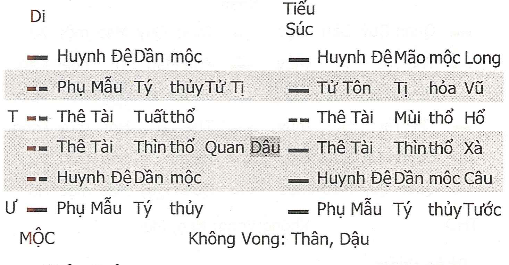

### Ví dụ 8: Ngày Tân Mão tháng Thìn, vợ đi xa du lịch, đoán ngày nào vợ về? Được quẻ Sơn Hỏa Bí biến Phong Hỏa Gia Nhân.

| | Bí | Gia Nhân | |
| :---: | :--- | :--- | :--- |
| | — Quan Quỷ Dần mộc | — Quan Quỷ Mão mộc | Xà |
| | - - Thê Tài Tý thủy | — Phụ Mẫu Tị hỏa | Câu |
| Ứ | - - Huynh Đệ Tuất thổ | - - Huynh Đệ Mùi thổ | Tước |
| | — Thê Tài Hợi thủy | — Thê Tài Hợi thủy | Long |
| | - - Huynh Đệ Sửu thổ | - - Huynh Đệ Sửu thổ | Vũ |
| T | — Quan Quỷ Mão mộc | — Quan Quỷ Mão mộc | Hổ |

THỔ Không Vong: Ngọ, Mùi

**Phán đoán:**

Lấy Thê Tài làm Dụng thần.

Dụng thần động mà hóa Tị hỏa, ngày Tị sẽ về.

**Kết quả:** Quả nhiên ứng nghiệm.

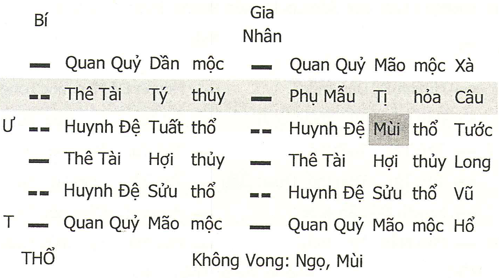

# CHƯƠNG 26
## DỰ ĐOÁN VẬT BỊ MẤT

Kẻ trộm vào nhà, hoặc là làm mất đồ vật, nếu là đồ vật không quá quan trọng, đương nhiên người ta thường sẽ không lưu tâm. Nhưng nếu là đồ vật tương đối quý giá hoặc là đồ vật có ý nghĩa kỷ niệm, thì sẽ rất lo lắng, thỉnh cầu dự đoán. Thực ra cho dù là đồ vật quan trọng hay là đồ vật không quan trọng thì người học lục hào đều nên dự đoán thử, điều này rất có ích cho việc nâng cao trình độ dự đoán của bản thân.

Dự đoán vật bị mất, tùy vào tính chất của vật khác nhau mà Dụng thần cũng khác nhau. Nếu là sách vở, thư từ, chứng thư, xe cộ, quần áo v.v thì lấy hào Phụ Mẫu làm Dụng thần; nếu là vật dụng hàng ngày, tiền bạc, vật quý giá thì lấy Thê Tài làm Dụng thần.

- Tử Tôn trì Thế, tự mình không cẩn thận để quên ở đâu đó.
- Tử Tôn phát động, Thê Tài vượng tướng, vật bị mất có thể quay lại.
- Hào Thế lâm Đằng Xà, thường là tự mình quên chỗ để đồ vật. Quẻ du hồn cũng là đã quên đồ vật. Quẻ quy hồn, vật bị mất ở nhà, hoặc cách nhà không xa.
- Thê Tài ở nội quái, hóa nhập Không Vong, là người trong nhà đã cầm hoặc người trong nhà làm mất.
- Dụng thần phục tàng, bị Nhật xung, vật không bị trộm, là có người đã chuyển chỗ. Nếu Quan Quỷ an tĩnh, vật bị mất có thể quay lại.
- Dụng thần vượng tướng sinh Thế, khắc Thế, vật bị mất có thể quay lại.
- Dụng thần phục tàng, Phi thần Không Vong, vật bị mất có thể quay lại. Phi thần gặp xung, vật bị mất cũng có thể quay lại.
- Dự đoán nơi chốn của vật bị mất, lấy địa chi Dụng thần và quái cung để phán đoán. Khi phục tàng, lấy lục thân hoặc quái cung của Phi thần để phán đoán.

◆ Thê Tài phát động hóa Quan Quỷ, vật muốn tìm đã bị trộm. Quan Quỷ phát động hóa Thê Tài, vật bị mất vẫn ở gần đây, dễ tìm thấy.

◆ Dụng thần lâm mộc, tìm trong bụi cỏ, tìm gần vật bằng gỗ; lâm thủy, tìm ở nơi gần nước; lâm thổ, ở đống đất lân cận; lâm kim, gần đồ kim loại; lâm hỏa, gần bếp, lò lửa v.v, ở đây đều phiếm chỉ, cụ thể phải phán đoán linh hoạt.

◆ Trong quẻ biểu thị vật bị mất, Quan Quỷ trì Thế hoặc lâm Nguyệt kiến, là người quen, người nhà, hàng xóm trộm đi.

◆ Quan Quỷ tại hào 2 phát động, là vào nhà ăn trộm, lâm Huyền Vũ là kẻ cướp chuyên nghiệp.

◆ Quan Quỷ lưỡng hiện, không chỉ một người. Quỷ hiện ở nội ngoại quái, trong ngoài phối hợp. Quỷ gặp xung, có người trông thấy.

◆ Quan Quỷ Không Vong, Dụng lâm hào Ứng, là mình cho người ta mượn, hoặc để quên trong nhà người ta.

◆ Đoán giới tính của kẻ trộm, xem âm dương của hào Quan Quỷ, âm là nữ, dương là nam. Lại lấy Quan Quỷ đối ứng với 12 trạng thái ngũ hành sinh diệt để xem tuổi tác của kẻ trộm. Lâm Quan, Đế Vượng là thanh niên; Mộ, Suy, Tuyệt là lão niên. Thai, Dưỡng là trẻ nhỏ. Đây cũng không phải là phương pháp cố định, cần xem linh hoạt. Quan Quỷ có hình, kẻ trộm là người đã từng vào tù; lâm Bạch Hổ, trên người có mang vũ khí, hoặc có bệnh tật.

◆ Lấy lục thần, ngũ hành v.v để phán đoán tướng mạo của kẻ trộm.

◆ Dụng thần là hào Phụ Mẫu, đồng thời cũng phải kết hợp với suy vượng của Thê Tài, phán đoán vật bị mất có thể tìm lại được hay không.

◆ Dụng thần ở ngoại quái, làm mất ở bên ngoài, hoặc vật bị trộm đã đến phương xa.

◆ Dụng thần an tĩnh thì dễ tìm, phát động thì khó tìm. Dụng thần nên vượng, không nên Không Phá. Thế khắc Dụng là khó tìm, Dụng khắc Thế là dễ tìm.

◆ Dụng thần phục hoặc nhập Mộ, vật không ở chỗ sáng; gặp hợp, thường ở trong đồ dùng, tầng hầm, kho v.v. Dụng thần nhập Mộ ở Phụ Mẫu, hoặc phục dưới Phụ Mẫu, thường ở trong quần áo, trong xe, trong nhà. Khi phán đoán còn có thể kết hợp với hào vị.

◆ Nếu vật bị trộm, Tử Tôn trì Thế hoặc phát động trong quẻ, dễ bắt được kẻ trộm. Bởi vì Tử Tôn là cảnh sát.

◆ Quan Quỷ an tĩnh thì dễ bắt, phát động hoặc phục tàng thì khó bắt. Quỷ sinh hợp Thế, kẻ trộm tự ra đầu thú; khắc hào Thế, chó cùng rứt giậu e rằng làm tổn thương người khác.

◆ Quan Quỷ hóa tiến, kẻ trộm đã đi xa; hóa thoái, còn sẽ trở lại; hợp Thê Tài, hai lần vào hiện trường gây án.

◆ Quan Quỷ động mà sinh hợp hào Ứng, kẻ trộm trốn đến xứ sở khác. Quan Quỷ vượng thì khó bắt, bị khắc thì dễ bắt.

◆ Tìm manh mối hoặc người chứng kiến, lấy hào động để phán đoán.

**Ví dụ 1:** Ngày Canh Dần tháng Tuất, một vũ cảnh ở đơn vị tôi đoán về xe đạp bị mất, được Lôi Thủy Giải biến Trạch Thủy Khốn.

| | Giải | Khốn | |
| :--- | :--- | :--- | :--- |
| | -- Thê Tài Tuất thổ | -- Thê Tài Mùi thổ | Xà |
| Ứ | -- Quan Quỷ Thân kim | — Quan Quỷ Dậu kim | Câu |
| | — Tử Tôn Ngọ hỏa | — Phụ Mẫu Hợi thủy | Tước |
| | -- Tử Tôn Ngọ hỏa | -- Tử Tôn Ngọ hỏa | Long |
| T | — Thê Tài Thìn thổ | — Thê Tài Thìn thổ | Vũ |
| | -- Huynh Đệ Dần mộc Phụ Tý | -- Huynh Đệ Dần mộc | Hổ |

MỘC Không Vong: Ngọ, Mùi

**Phán đoán:**

Lấy Phụ Mẫu làm Dụng thần, kiêm xem Tài.

Phụ Mẫu Tý thủy không hiện trên quẻ mà phục dưới hào sơ Huynh Đệ Dần mộc, Nguyệt khắc, không được Nhật thần sinh phù hưu tù, xe đạp bị mất là một chiếc xe đạp cũ.

Phi thần là Bệnh địa Dụng thần, một chiếc xe đầy hỏng hóc.

Quan Quỷ phát động, xe bị người khác trộm đi.

Hào Thế Thê Tài Thìn thổ Nguyệt phá Nhật khắc, Nguyên thần Ngọ hỏa lại Không, tượng phá tài, khó tìm được.

**Kết quả:** Quả nhiên là một chiếc xe đạp cũ nát, bị người ta trộm đi, không tìm được.

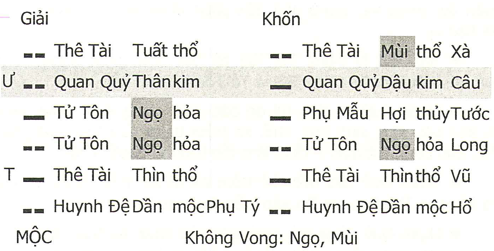

**Ví dụ 2:** Ngày Giáp Dần tháng Tị, một vũ cảnh ở đơn vị tôi bị mất tiền, hỏi có thể tìm được không? Được quẻ Thiên Sơn Độn biến Lôi Sơn Tiểu Quá.

| | Độn | Tiểu Quá | |
| :--- | :--- | :--- | :--- |
| | — Phụ Mẫu Tuất thổ | -- Phụ Mẫu Tuất thổ | Vũ |
| Ứ | — Huynh Đệ Thân kim | -- Huynh Đệ Thân kim | Hổ |
| | — Quan Quỷ Ngọ hỏa | — Quan Quỷ Ngọ hỏa | Xà |
| | — Huynh Đệ Thân kim | — Huynh Đệ Thân kim | Câu |
| T | -- Quan Quỷ Ngọ hỏa Tài Dần | -- Quan Quỷ Ngọ hỏa | Tước |
| | -- Phụ Mẫu Thìn thổ Tử Tý | -- Phụ Mẫu Thìn thổ | Long |

KIM Không Vong: Tý, Sửu

**Phán đoán:**

Lấy hào Tài làm Dụng thần.

Thê Tài Dần mộc không hiện trên quẻ, phục dưới hào Thế Quan Quỷ Ngọ hỏa, ngoại quái Càn số 1, nội quái Cấn số 7, lại cộng thêm hào vị của Dụng thần, tổng cộng là 10, đoán là người đó đã mất 100 tệ.

Tài phục dưới Thế, lại lâm Nhật sinh hào Thế, không có dấu hiệu phá tài. Ngoại quái phục ngâm, tiền chỉ di chuyển vị trí mà thôi. Hào 2 là trạch, Tài phục dưới hào 2, lại là quẻ phục ngâm, tiền mặc dù di chuyển vị trí nhưng không ra khỏi phòng.

Hào Tài phục tàng, lại thêm quẻ tên là Độn, có tượng giấu kín, tiền ở một nơi mắt không nhìn thấy. Nội quái là Cấn, tượng của nó rất giống một cái bàn, lại thêm Dụng thần là mộc, chủ đồ gỗ, lâm Chu Tước, có tượng văn thư, đoán là tiền ở dưới bàn trong phòng làm việc.

**Kết quả:** Anh ta lập tức đến phòng làm việc và tìm được 100 tệ dưới bàn.

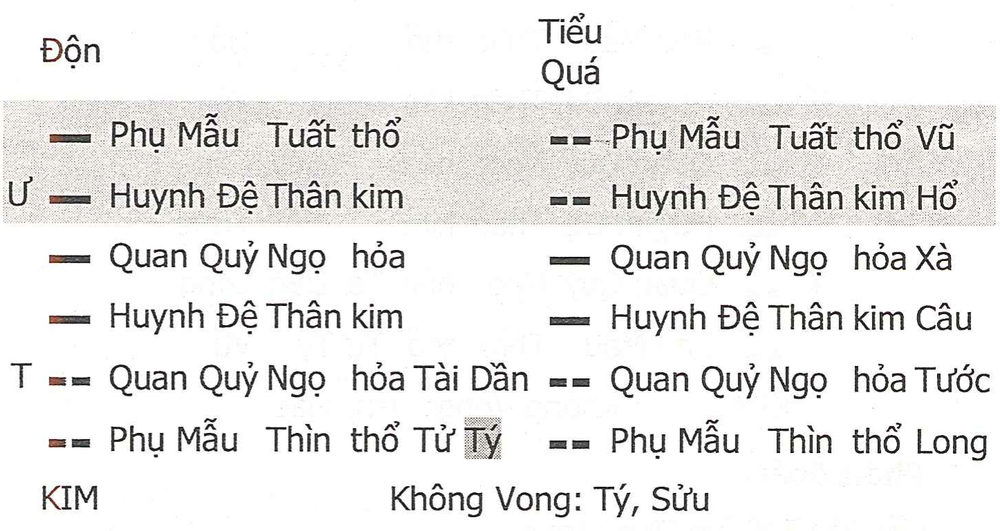

**Ví dụ 3:** Ngày Nhâm Tý tháng Tị, Trương tiên sinh đoán về điện thoại di động bị mất, được quẻ Thiên Sơn Độn.

### Độn

| Thế/Ứ | Quẻ Độn | Lục thân / Địa chi | Phục thần | Lục thú |
| :---: | :---: | :--- | :--- | :---: |
| | ━ | Phụ Mẫu Tuất thổ | | Hổ |
| Ứ | ━ | Huynh Đệ Thân kim | | Xà |
| | ━ | Quan Quỷ Ngọ hỏa | | Câu |
| | ━ | Huynh Đệ Thân kim | | Tước |
| T | ━ ━ | Quan Quỷ Ngọ hỏa | Tài Dần | Long |
| | ━ ━ | Phụ Mẫu Thìn thổ | Tử Tý | Vũ |

**KIM** &nbsp;&nbsp;&nbsp;&nbsp; **Không Vong:** Dần, Mão

### Phán đoán:

Lấy hào Tài làm Dụng thần.

Dụng thần Thê Tài Dần mộc không hiện trên quẻ, phục dưới hào 2 Quan Quỷ Ngọ hỏa, mặc dù Không Vong nhưng được Nhật thần sinh phù, Nhật thần xung khai Phi thần, lại thêm Dụng lâm Thanh Long phục dưới hào Thế đến sinh hào Thế, vật bị mất có thể tìm lại.

Trong quẻ Quan Quỷ ám động, là điện thoại bị ăn trộm. Quan Quỷ lưỡng hiện, kẻ trộm có hai người.

Quan Quỷ Ngọ hỏa lâm hào Thế, Quan lâm Nguyệt kiến, đều là thông tin người nội bộ hoặc người quen. Tử Tôn lâm Nhật xung Quan Quỷ, Tử Tôn là nhân viên công an, chứng tỏ đã báo án. Nhân viên công an đang tìm kẻ trộm.

Hào Phi Quan Quỷ Ngọ hỏa ám động, tiết khí Dụng thần, chứng tỏ kẻ trộm đang lén lút sử dụng điện thoại.

**Kết quả:** Theo kết quả kiểm tra của cục điện tín, đúng là có người vẫn đang sử dụng điện thoại này. Qua điều tra của công an, ở tháng Mùi đã tìm được người sử dụng điện thoại, hóa ra là một hàng xóm chung sân với Trương tiên sinh. Nhưng người đó nhất định không chịu thừa nhận là điện thoại ăn trộm, nói là đã mua được từ trong tay một người khác. Hơn nữa cũng không thừa nhận có đồng bọn gây án.

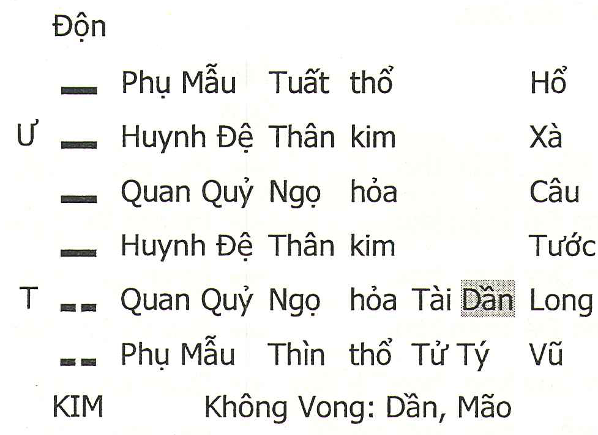

**Ví dụ 4:** Ngày Mậu Tuất tháng Mão, pin điện thoại di động mới mua cho vào túi áo, có một hôm đột nhiên phát hiện không thấy, hỏi có thể tìm lại được hay không? Được quẻ Phong Trạch Trung Phu biến Thiên Trạch Lý.

### Trung Phu biến Lý

| Thế/Ứ | Trung Phu | | Phục thần | Lý | | Lục thú |
| :---: | :---: | :--- | :--- | :---: | :--- | :---: |
| | ━ | Quan Quỷ Mão mộc | | ━ | Huynh Đệ Tuất thổ | Tước |
| | ━ | Phụ Mẫu Tị hỏa | Tài Tý | ━ | Tử Tôn Thân kim | Long |
| T | ━ ━ | Huynh Đệ Mùi thổ | | ━ | Phụ Mẫu Ngọ hỏa | Vũ |
| | ━ ━ | Huynh Đệ Sửu thổ | Tử Thân | ━ ━ | Huynh Đệ Sửu thổ | Hổ |
| | ━ | Quan Quỷ Mão mộc | | ━ | Quan Quỷ Mão mộc | Xà |
| Ứ | ━ | Phụ Mẫu Tị hỏa | | ━ | Phụ Mẫu Tị hỏa | Câu |

**THỔ** &nbsp;&nbsp;&nbsp;&nbsp; **Không Vong:** Thìn, Tị

### Phán đoán:

Lấy Thê Tài làm Dụng thần.

Thê Tài Tý thủy không hiện trên quẻ, không được Nguyệt kiến sinh phù, lại bị Nhật thần khắc thương, là hưu tù. Thế lâm Huynh Đệ tuy phát động, nhưng động mà hóa hợp, tham hợp quên khắc, không sao. Từ góc độ suy vượng, pin rất khó tìm được. Nhưng Phi thần Không Vong, người xưa nói: "Phục thần dưới hào Không thì dễ kéo ra", ngày Tý phục tàng gặp xuất hiện, có hy vọng tìm được.

**Kết quả:** Đến ngày Tý, vô tình phát hiện thì ra pin đã để sai chỗ, đã để ở trong cái túi áo nhỏ bên trong rất ít khi sử dụng.

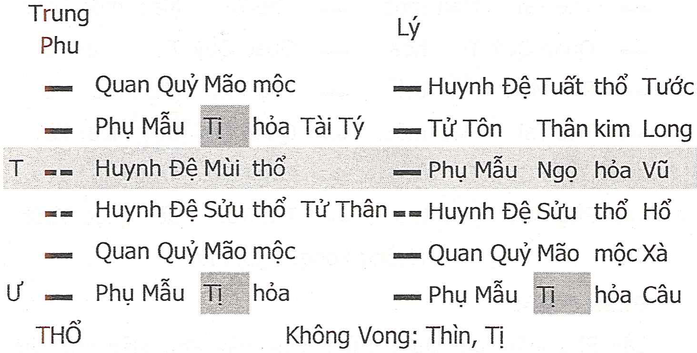

### Ví dụ 5: Ngày Đinh Hợi tháng Mão, một người Nhật Bản không tìm được tài liệu của công ty, đoán xem hôm nay tìm được không, được quẻ Phong Địa Quan biến Phong Thủy Hoán.

| | Quan | | | Hoán | |
| :---: | :---: | :--- | :---: | :--- | :--- |
| | — | Thê Tài Mão mộc | — | Thê Tài Mão mộc | Long |
| | — | Quan Quỷ Tị hỏa | — | Quan Quỷ Tị hỏa | Vũ |
| T | - - | Phụ Mẫu Mùi thổ | - - | Phụ Mẫu Mùi thổ | Hổ |
| | - - | Thê Tài Mão mộc | - - | Quan Quỷ Ngọ hỏa | Xà |
| | - - | Quan Quỷ Tị hỏa | — | Phụ Mẫu Thìn thổ | Câu |
| Ư | - - | Phụ Mẫu Mùi thổ | - - | Thê Tài Dần mộc | Tước |

KIM Không Vong: Ngọ, Mùi

**Phán đoán:**

Lấy Phụ Mẫu làm Dụng thần. Quẻ này Phụ Mẫu Mùi thổ lưỡng hiện, địa chi lại giống nhau, lấy Thế Phụ Mẫu làm Dụng thần. Phụ Mẫu Mùi thổ không được Nhật Nguyệt sinh phù, bị Nguyệt khắc thương, lại lâm Không Vong, là như cây không gốc rễ. Trong quẻ tuy có Quan Quỷ phát động sinh Phụ Mẫu, vẫn sinh phù bất khởi, Quan Quỷ này tại hào 2 phát động, hào 2 là trạch, là phòng làm việc, Quan Quỷ là đạo tặc, là có người đã lấy trộm tài liệu đi.

**Kết quả:** Sau này không tìm được.

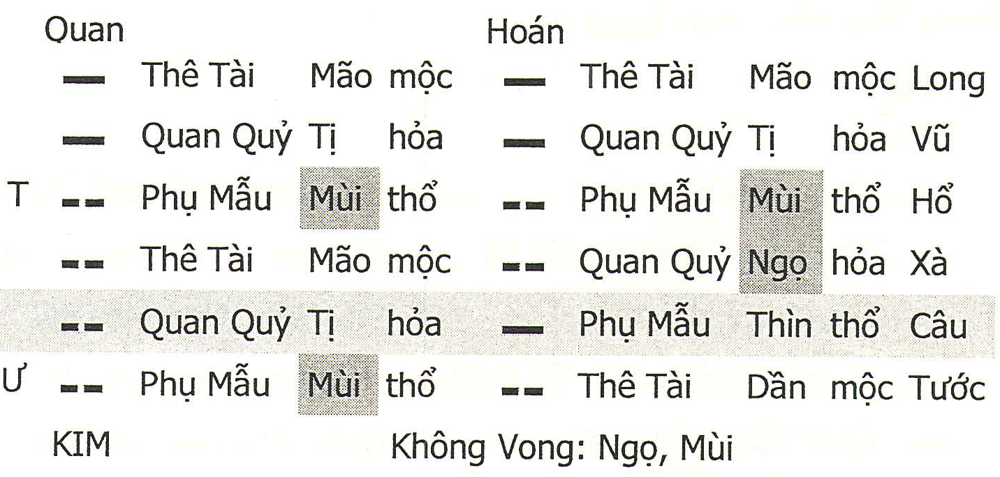

### Ví dụ 6: Ngày Nhâm Thìn tháng Sửu, một người phụ nữ ở nước ngoài đã làm mất 19000 đô la Mỹ của cơ quan, đoán xem có tìm lại được hay không? Được Địa Hỏa Minh Di quẻ biến Sơn Hỏa Bí.

| | Minh Di | | | Bí | |
| :---: | :---: | :--- | :---: | :--- | :--- |
| | - - | Phụ Mẫu Dậu kim | — | Tử Tôn Dần mộc | Hổ |
| | - - | Huynh Đệ Hợi thủy | - - | Huynh Đệ Tý thủy | Xà |
| T | - - | Quan Quỷ Sửu thổ | - - | Quan Quỷ Tuất thổ | Câu |
| | — | Huynh Đệ Hợi thủy Tài Ngọ | — | Huynh Đệ Hợi thủy | Tước |
| | - - | Quan Quỷ Sửu thổ | - - | Quan Quỷ Sửu thổ | Long |
| Ư | — | Tử Tôn Mão mộc | — | Tử Tôn Mão mộc | Vũ |

THỦY Không Vong: Ngọ, Mùi

**Phán đoán:**

Lấy Thê Tài làm Dụng thần.

Dụng thần không hiện trên quẻ, phục dưới hào 3 Huynh Đệ Hợi thủy, không được Nhật Nguyệt sinh phù, Nguyên thần cũng không vượng tượng, Phi đi khắc Phục, rất khó tìm được.

**Kết quả:** Sau này không tìm được.

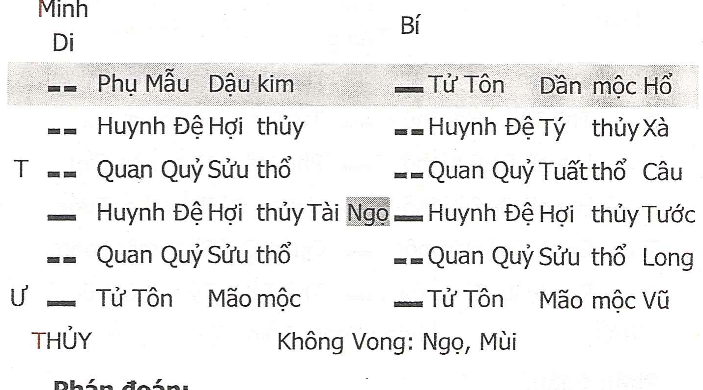

**Ví dụ 7:** Ngày Nhâm Dần tháng Hợi, một người Nhật Bản để 150000 trong phòng làm việc bị mất, có thể tìm được không? Có thể bắt được người đã trộm tiền không? Tôi gieo quẻ được quẻ Địa Trạch Lâm biến Lôi Thiên Đại Tráng.

| | Lâm | Đại Tráng | |
| :--- | :--- | :--- | :--- |
| | -- Tử Tôn Dậu kim | -- Huynh Đệ Tuất thổ | Hổ |
| Ứ | -- Thê Tài Hợi thủy | -- Tử Tôn Thân kim | Xà |
| | -- Huynh Đệ Sửu thổ | — Phụ Mẫu Ngọ hỏa | Câu |
| | -- Huynh Đệ Sửu thổ | — Huynh Đệ Thìn thổ | Tước |
| T | — Quan Quỷ Mão mộc | — Quan Quỷ Dần mộc | Long |
| | — Phụ Mẫu Tị hỏa | — Thê Tài Tý thủy | Vũ |

THỔ Không Vong: Thìn, Tị

**Phán đoán:**

Lấy Thê Tài làm Dụng thần. Dụng thần được Nguyệt tỉ phù là vượng tướng, nhưng không nên Huynh Đệ Sửu thổ hai tầng trong quẻ phát động khắc Dụng thần. Hào 3 Huynh Đệ hóa Tiến thần, hào 4 Huynh Đệ hóa hồi đầu sinh, hai Kỵ thần đều vượng, tiền bị mất rất khó tìm được.

Thê Tài và Nhật tương hợp, Nhật là Quan Quỷ, Quan Quỷ là đạo tặc, tiền đúng là bị người ta ăn trộm. Quan Quỷ trì Thế, người ăn trộm là người quen.

**Kết quả:** Anh ta nghi ngờ một khách hàng thường xuyên đến chỗ anh ta đã lấy trộm, nhưng không có chứng cứ đầy đủ. Cuối cùng cũng không tìm được tiền.

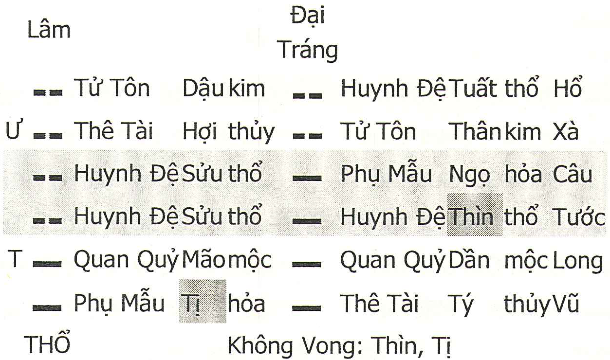

**Ví dụ 8:** Ngày Nhâm Tý tháng Mão, một bảo vệ ở đơn vị tôi phơi quần áo trong sân bị mất, đoán được quẻ Sơn Hỏa Bí biến Lôi Hỏa Phong.

| | Bí | Phong | |
| :--- | :--- | :--- | :--- |
| | — Quan Quỷ Dần mộc | -- Huynh Đệ Tuất thổ | Hổ |
| | -- Thê Tài Tý thủy | -- Tử Tôn Thân kim | Xà |
| Ứ | -- Huynh Đệ Tuất thổ | — Phụ Mẫu Ngọ hỏa | Câu |
| | — Thê Tài Hợi thủy Tử Thân | — Thê Tài Hợi thủy | Tước |
| | -- Huynh Đệ Sửu thổ Phụ Ngọ | -- Huynh Đệ Sửu thổ | Long |
| T | — Quan Quỷ Mão mộc | — Quan Quỷ Mão mộc | Vũ |

THỔ Không Vong: Dần, Mão

**Phán đoán:**

Lấy Phụ Mẫu làm Dụng thần.

Phụ Mẫu Ngọ hỏa không hiện trên quẻ, phục dưới hào 2 Huynh Đệ Sửu thổ, được Nguyệt kiến sinh phù, là vượng tướng. Dụng thần phục tàng bị Nhật xung, không bị trộm đi. Quan Quỷ mặc dù phát động, nhưng Không Vong, cũng biểu thị không phải mất.

Dụng phục dưới hào Huynh Đệ, lại nhập Mộ khố Huynh Đệ Tuất thổ, Huynh Đệ là đồng nghiệp, là bị đồng nghiệp giấu.

Nhật thần xung Phục hợp Phi, hôm nay sẽ tìm được. Dụng thần là Ngọ hỏa, giờ Ngọ có thể tìm được.

**Kết quả:** Ở giờ Ngọ tìm được quần áo trong cái gối, là bị đồng nghiệp giấu.

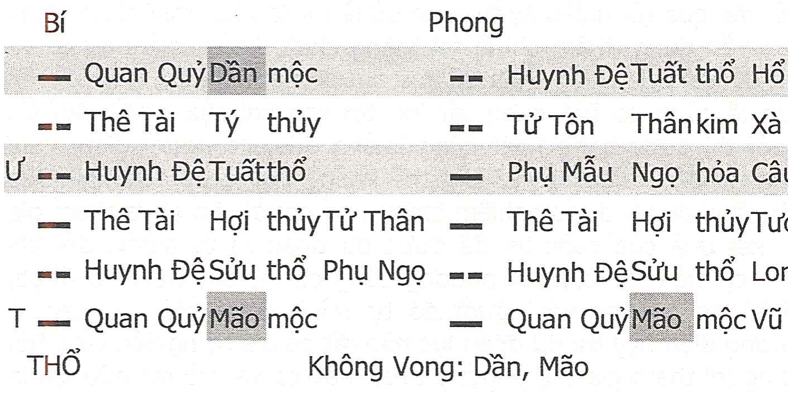

# CHƯƠNG 27
## DỰ ĐOÁN THI CỬ

Từ khi học tiểu học đến khi ra ngoài xã hội, mỗi người đều phải trải qua rất nhiều kỳ thi, cho dù là thi cấp ba, thi đại học, hay thi tuyển dụng, thậm chí là thi thăng chức, kết quả thi cử có vẻ như có liên quan đến trình độ của người tham gia thi, nhưng trên thực tế cũng có liên quan rất lớn tới vận khí của người đó. Có người thi được hạng nhất cũng không đậu, có người điểm kém cũng thi đậu, điều này không thể không nói là do vận khí. Qua một số ví dụ tôi được nghiệm chứng, có người vẫn chưa tham gia thi, kết quả của cuộc thi đã được dự đoán ra từ trước, đôi khi ngay cả điểm thi của đối phương cũng có thể suy đoán ra được, chính xác hơn so với người đó tự mình đánh giá. Do vậy, ở phương diện này thì dự đoán lục hào rất có giá trị nghiên cứu. Đối với người tham gia thi, phương pháp này có vai trò rất hữu ích là hướng dẫn ghi danh nguyện vọng, lựa chọn phương vị trường học thu nhận v.v.

◆ Dự đoán về thi cử, lấy Quan Quỷ và Phụ Mẫu làm Dụng thần. Quan Quỷ là thứ bậc, Phụ Mẫu là thành tích và giấy báo nhập học. Cả hai vượng tướng thì có thể thi tốt.

◆ Khi Nhật Nguyệt và Quan Quỷ, Phụ Mẫu có ngũ hành tương đồng, hoặc sinh hợp hào Quan Quỷ, Phụ Mẫu, thi cử nhất định sẽ có thành tích tốt.

◆ Phụ Mẫu hưu tù, Quan Quỷ vượng mà phát động cũng có hy vọng thi đậu.

◆ Phụ Mẫu trì Thế động mà hóa Quan Quỷ, kết quả thi hài lòng. Quan Quỷ phát động hóa Tiến thần, thành tích càng thi càng tốt.

◆ Quan Quỷ, Phụ Mẫu thành tam hợp cục, thi nhất định qua.

◆ Thanh Long lâm Quan Quỷ phát động sinh hợp hào Thế, niềm vui lên lớp đến với mình.

◆ Thanh Long, Bạch Hổ đồng thời phát động, có thể thi được hạng nhất.

◆ Tử Tôn không nên trì Thế, càng không nên phát động trong quẻ. Tử Tôn phát động, thường sẽ không được tuyển chọn.

◆ Quan Quỷ, Phụ Mẫu, hào Thế, đều không nên Nguyệt phá, Không Vong. Không Phá hưu tù, chắc chắn không đậu.

◆ Quan Quỷ không nên sinh hào Ứng, đây gọi là vô tình. Vượng tướng cũng khó thi đậu.

◆ Thê Tài phát động, lấy tiền đi học, hoặc may mắn gọi tên.

◆ Tử Tôn, Thê Tài đồng thời phát động, học hành thi cử sợ có khó khăn.

◆ Thi xin việc, thi đánh giá chức danh đều có thể chiếu theo phương pháp dự đoán về thi học.

**Ví dụ 1:** Ngày Bính Dần tháng Ngọ, nữ đoán về con gái thi đại học, được quẻ Sơn Thủy Mông biến Khôn Vi Địa.

| | | Mông | | Khôn | |
| :---: | :---: | :--- | :---: | :--- | :--- |
| | — | Phụ Mẫu Dần mộc | - - | Thê Tài Dậu kim | Long |
| | - - | Quan Quỷ Tý thủy | - - | Quan Quỷ Hợi thủy | Vũ |
| T | - - | Tử Tôn Tuất thổ | - - | Tử Tôn Sửu thổ | Hổ |
| | - - | Huynh Đệ Ngọ hỏa | - - | Phụ Mẫu Mão mộc | Xà |
| | — | Tử Tôn Thìn thổ | - - | Huynh Đệ Tị hỏa | Câu |
| Ư | - - | Phụ Mẫu Dần mộc | - - | Tử Tôn Mùi thổ | Tước |

HỎA Không Vong: Tuất, Hợi

### Phán đoán:

Lấy Quan Quỷ và Phụ Mẫu làm Dụng thần.

Quan Quỷ Tý thủy không được Nhật Nguyệt sinh phù, bị Nguyệt kiến xung phá, lại có Tử Tôn Thìn thổ phát động khắc Quan, là không cát.

Hào Phụ Mẫu lưỡng hiện, lấy hào phát động làm Dụng thần. Hào 6 Phụ Mẫu Dần mộc tuy được Nhật thần tỉ phù, nhưng động hóa hồi đầu khắc, rất khó thi đậu đại học.

**Kết quả:** Sau này quả nhiên không thi đậu đại học.

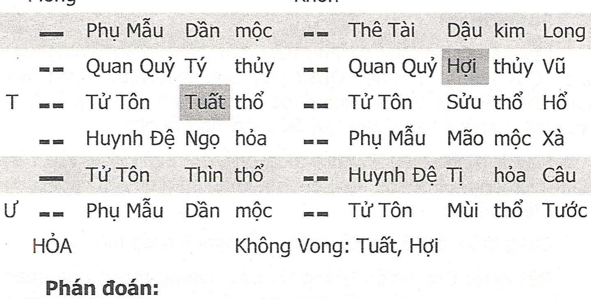

**Ví dụ 2:** Ngày Mậu Tý tháng Mùi, nữ đoán về thi đại học, được quẻ Thủy Trạch Tiết.

| | | Tiết | | |
| :---: | :---: | :--- | :--- | :--- |
| | - - | Huynh Đệ Tý | thủy | Tước |
| | — | Quan Quỷ Tuất | thổ | Long |
| Ư | - - | Phụ Mẫu Thân | kim | Vũ |
| | - - | Quan Quỷ Sửu | thổ | Hổ |
| | — | Tử Tôn Mão | mộc | Xà |
| T | — | Thê Tài Tị | hỏa | Câu |

THỦY Không Vong: Ngọ, Mùi

**Phán đoán:**

Lấy hào Quan Quỷ và Phụ Mẫu làm Dụng thần. Trong quẻ Quan Quỷ lưỡng hiện, lấy Quan Quỷ Sửu thổ Nguyệt phá làm Dụng thần. Phụ Mẫu Thân kim được Nguyệt sinh phù hợp Thế, là cát, nhưng không nên Quan Quỷ Sửu thổ Nguyệt phá.

May là Nhật thần Tý thủy hợp phá, tôi đoán dựa vào bản thân thì không thi đỗ đại học, nhưng có người giúp đỡ, cuối cùng có thể lên đại học.

Dụng thần lâm Bạch Hổ, là chuyên ngành pháp luật.

**Kết quả:** Quả nhiên không thi đậu, nhưng thông qua quan hệ của cha mẹ, cuối cùng đã được học chuyên ngành pháp luật ở một đại học.

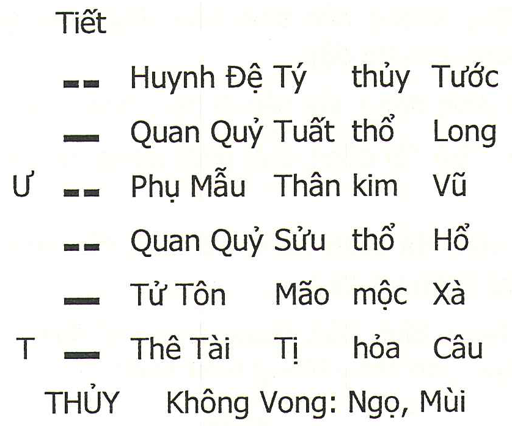

**Ví dụ 3:** Ngày Kỷ Hợi tháng Ngọ, nữ đoán về con trai thi cấp ba, được quẻ Trạch Địa Tụy biến Hỏa Địa Tấn.

| | | Tụy | | Tấn | |
| :---: | :---: | :--- | :---: | :--- | :--- |
| | - - | Phụ Mẫu Mùi thổ | — | Quan Quỷ Tị hỏa | Câu |
| Ư | — | Huynh Đệ Dậu kim | - - | Phụ Mẫu Mùi thổ | Tước |
| | — | Tử Tôn Hợi thủy | — | Huynh Đệ Dậu kim | Long |
| | - - | Thê Tài Mão mộc | - - | Thê Tài Mão mộc | Vũ |
| T | - - | Quan Quỷ Tị hỏa | - - | Quan Quỷ Tị hỏa | Hổ |
| | - - | Phụ Mẫu Mùi thổ | - - | Phụ Mẫu Mùi thổ | Xà |

KIM Không Vong: Thìn, Tị

**Phán đoán:**

Phụ Mẫu là thành tích, Quan Quỷ là thứ bậc, lấy Quan Quỷ và Phụ Mẫu làm Dụng. Phụ Mẫu lưỡng hiện, lấy hào 6 Phụ Mẫu Mùi thổ phát động làm Dụng, Nguyệt kiến sinh hợp, lại tự động hóa hồi đầu sinh, đề thi đã quen mà thành tích tốt. Quan Quỷ Tị hỏa trì Thế, được Nguyệt trợ giúp Nhật xung là ám động.

Quan Quỷ trì Thế vốn là tốt, nhưng không nên Không Vong, Nhật thần trong xung có khắc. Trong xung có khắc, chỉ có thể xung khởi một nửa sức mạnh, không thể xung thực toàn bộ. Hỏa chủ số 2, một nửa là 1, cho nên đoán con trai người này ngày thường học tập chăm chỉ, thành tích thi cử lần này cũng không tệ, nhưng sợ là kém một điểm nên không đậu.

**Kết quả:** Qua một thời gian, khi tôi và ông bạn Đoàn Kiến Nghiệp đang đi ăn ở một nhà hàng, đúng lúc gặp người phụ nữ này bước vào, gặp tôi liền cười và nói: "Đáng lẽ sau khi con trai tôi thi đậu cấp ba sẽ mời ông đi ăn, ai bảo ông đoán quá đúng, con tôi kém một điểm nên không đậu, tôi đã không có cơ hội mời ông đi ăn rồi."

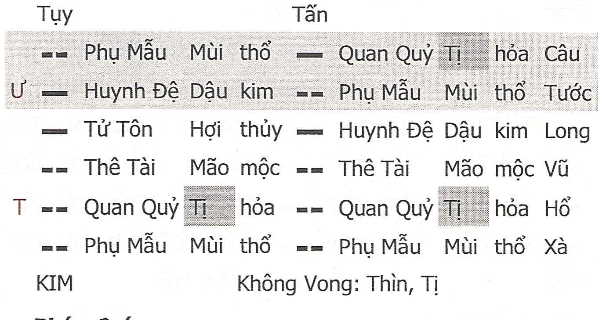

**Ví dụ 4:** Ngày Tân Hợi tháng Mùi, nam đoán về con trai thi đại học, được quẻ Chấn Vi Lôi biến Sơn Thủy Mông.

| | Chấn | | | Mông | |
| :---: | :---: | :--- | :---: | :--- | :--- |
| T | - - | Thê Tài Tuất thổ | — | Huynh Đệ Dần mộc | Xà |
| | - - | Quan Quỷ Thân kim | - - | Phụ Mẫu Tý thủy | Câu |
| | — | Tử Tôn Ngọ hỏa | - - | Thê Tài Tuất thổ | Tước |
| Ư | - - | Thê Tài Thìn thổ | - - | Tử Tôn Ngọ hỏa | Long |
| | - - | Huynh Đệ Dần mộc | — | Thê Tài Thìn thổ | Vũ |
| | — | Phụ Mẫu Tý thủy | - - | Huynh Đệ Dần mộc | Hổ |

MỘC Không Vong: Dần, Mão

**Phán đoán:**

Lấy Quan Quỷ và Phụ Mẫu làm Dụng thần.

Quan Quỷ Thân kim tuy được Nguyệt sinh, nhưng không nên hào Tử Tôn tam hợp thành cục, nhất định không thi đỗ.

**Kết quả:** Sau này quả nhiên không thi đậu đại học.

**Ví dụ 5:** Ngày Ất Mùi tháng Tị, nam đoán về thi nghiên cứu sinh, được quẻ Cấn Vi Sơn biến Sơn Địa Bác.

| | Cấn | | | Bác | |
| :---: | :---: | :--- | :---: | :--- | :--- |
| T | — | Quan Quỷ Dần mộc | — | Quan Quỷ Dần mộc | Vũ |
| | - - | Thê Tài Tý thủy | - - | Thê Tài Tý thủy | Hổ |
| | - - | Huynh Đệ Tuất thổ | - - | Huynh Đệ Tuất thổ | Xà |
| Ư | — | Tử Tôn Thân kim | - - | Quan Quỷ Mão mộc | Câu |
| | - - | Phụ Mẫu Ngọ hỏa | - - | Phụ Mẫu Tị hỏa | Tước |
| | - - | Huynh Đệ Thìn thổ | - - | Huynh Đệ Mùi thổ | Long |

THỔ Không Vong: Thìn, Tị

**Phán đoán:**

Lấy Quan Quỷ và hào Phụ Mẫu làm Dụng thần.

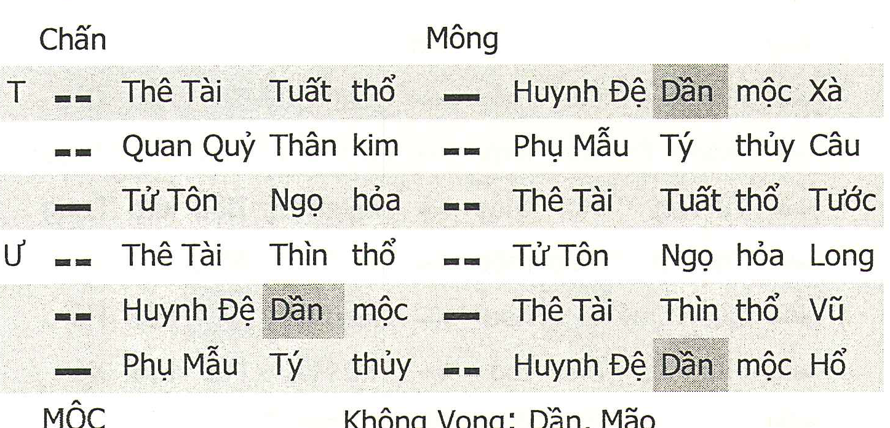

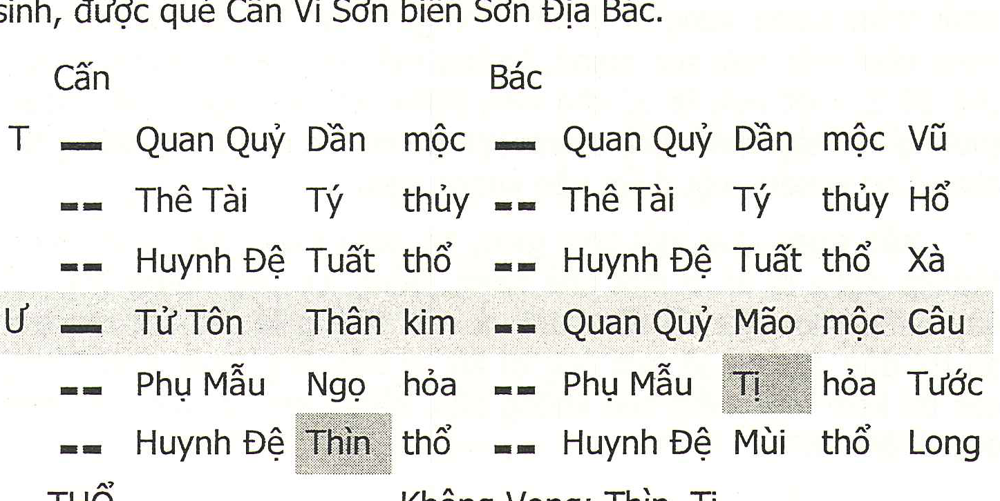

Phụ Mẫu Ngọ hỏa mặc dù được Nguyệt tỉ phù, Quan Quỷ Dần mộc trì Thế. Nhưng Quan Quỷ không được Nhật Nguyệt sinh phù, lại nhập Mộ ở Nhật, Kỵ thần Tử Tôn độc phát, ắt khó thi đậu.

**Kết quả:** Sau này quả nhiên không thi đậu.

**Ví dụ 6:** Nữ thi chức danh lần một không qua, tiến hành thi lại lần thứ hai. Sau khi thi lại vẫn không yên tâm, thế là đoán xem có thể đạt yêu cầu hay không? Ở ngày Kỷ Dậu tháng Hợi, được quẻ Lôi Hỏa Phong biến Hỏa Lôi Phệ Hạp.

| | Phong | | | Ly | |
| :---: | :---: | :--- | :---: | :--- | :--- |
| | - - | Quan Quỷ Tuất thổ | — | Thê Tài Tị hỏa | Câu |
| T | - - | Phụ Mẫu Thân kim | - - | Quan Quỷ Mùi thổ | Tước |
| | — | Thê Tài Ngọ hỏa | — | Phụ Mẫu Dậu kim | Long |
| | — | Huynh Đệ Hợi thủy | - - | Quan Quỷ Thìn thổ | Vũ |
| Ư | - - | Quan Quỷ Sửu thổ | - - | Tử Tôn Dần mộc | Hổ |
| | — | Tử Tôn Mão mộc | — | Huynh Đệ Tý thủy | Xà |

THỦY Không Vong: Dần, Mão

**Phán đoán:**

Lấy Quan Quỷ và Phụ Mẫu làm Dụng thần. Quan Quỷ lưỡng hiện, lấy hào Quan Quỷ Tuất thổ phát động làm Dụng thần. Dụng thần mặc dù không được Nhật Nguyệt sinh phù, nhưng cũng không bị Nhật Nguyệt khắc, Dụng thần động mà hóa hồi đầu sinh, là cát.

Phụ Mẫu Thân kim trì Thế, được Nhật thần tỉ phù cũng là cát. Đoán là lần này thi lại có thể qua được, số quẻ chính là 7, đoán là thi được 70 điểm.

Cô ấy nói: "Có thể đạt yêu cầu thì cảm tạ trời đất, làm thế nào có thể thi được 70 điểm?!"

**Kết quả:** Khi công bố kết quả, quả nhiên thi được 70 điểm.

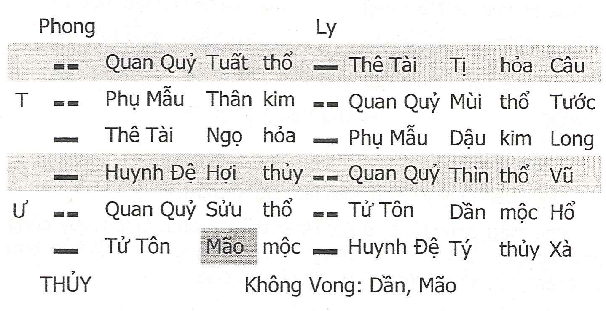

**Ví dụ 7:** Ngày Kỷ Hợi tháng Thìn, nữ đoán về thi chức danh, được quẻ Lôi Địa Dự biến Sơn Địa Bác.

| Dự | Bác | |
| :--- | :--- | :--- |
| - - Thê Tài Tuất thổ | — Huynh Đệ Dần mộc | Câu |
| - - Quan Quỷ Thân kim | - - Phụ Mẫu Tý thủy | Tước |
| Ứ — Tử Tôn Ngọ hỏa | - - Thê Tài Tuất thổ | Long |
| - - Huynh Đệ Mão mộc | - - Huynh Đệ Mão mộc | Vũ |
| - - Tử Tôn Tị hỏa | - - Tử Tôn Tị hỏa | Hổ |
| T - - Thê Tài Mùi thổ Phụ Tý | - - Thê Tài Mùi thổ | Xà |

MỘC Không Vong: Thìn, Tị

**Phán đoán:**

Lấy Quan Quỷ và Phụ Mẫu làm Dụng thần.

Phụ Mẫu phục tàng, được Nhật thần tỉ phù, Quan Quỷ cũng được Nguyệt kiến sinh là vượng, nhưng không nên Tử Tôn tam hợp thành cục khắc Quan Quỷ, thì sẽ khó qua.

**Kết quả:** Quả nhiên ứng nghiệm.

**Ví dụ 8:** Ngày Tân Hợi tháng Dậu, nam đoán về con trai tham gia thi tuyển sinh cảnh sát, được quẻ Thiên Trạch Lý biến Thiên Địa Bĩ.

| Lý | Bĩ | |
| :--- | :--- | :--- |
| — Huynh Đệ Tuất thổ | — Huynh Đệ Tuất thổ | Xà |
| T — Tử Tôn Thân kim Tài Tý | — Tử Tôn Thân kim | Câu |
| — Phụ Mẫu Ngọ hỏa | — Phụ Mẫu Ngọ hỏa | Tước |
| - - Huynh Đệ Sửu thổ | - - Quan Quỷ Mão mộc | Long |
| Ứ — Quan Quỷ Mão mộc | - - Phụ Mẫu Tị hỏa | Vũ |
| — Phụ Mẫu Tị hỏa | - - Huynh Đệ Mùi thổ | Hổ |

THỔ Không Vong: Dần, Mão

**Phán đoán:**

Lấy Quan Quỷ và Phụ Mẫu làm Dụng thần.

Phụ Mẫu Tị hỏa không được Nhật Nguyệt sinh phù, bị Nhật thần xung khắc là hưu tù. Quan Quỷ Mão mộc tuy được Nhật sinh, nhưng Nguyệt phá, Tuần Không, rất khó thi đậu.

Anh ta nói: "Con trai tôi thi được hạng tư, tổng cộng sẽ nhận hơn 30 người, vẫn không thể đậu? Chắc quẻ không nghiệm."

**Kết quả:** Sau này chứng minh dự đoán là chính xác, con trai anh ta không được tuyển chọn.

# CHƯƠNG 28
## DỰ ĐOÁN CÔNG VIỆC

Không có việc làm thì sẽ không có tiền lương, cuộc sống có thể sẽ không được đảm bảo. Một người sau khi rời khỏi trường học và ra ngoài xã hội, điều đầu tiên cần làm chính là tìm một công việc. Nếu muốn tìm công việc như công chức, cũng sẽ có thi cử, có thể tham khảo chương thi cử. Nếu là công việc bình thường, thì lấy Quan Quỷ làm Dụng thần để phán đoán. Quan Quỷ là công tác, Phụ Mẫu là công ty, đơn vị công tác; nếu đã công tác, hỏi thăng chức hoặc biến động công tác, cũng lấy Quan Quỷ làm Dụng thần để phán đoán.

◆ Quan Quỷ trì Thế, sinh hợp hào Thế là cát. Thanh Long, Chu Tước lâm Quan Quỷ càng cát.

Quan Quỷ lâm Thanh Long, công việc tốt, là công chức, công việc khá tao nhã, khiến người ta ước ao.

Lâm Chu Tước là công việc văn thư, giáo dục, lấy miệng làm nghề nghiệp.

Lâm Câu Trần, là ngồi văn phòng, làm việc trong nhà.

Lâm Đằng Xà, là công việc về kỹ thuật.

Lâm Bạch Hổ, là công việc về chính trị, pháp luật, công an.

Lâm Huyền Vũ, là công việc về đầu cơ v.v.

Ở đây chỉ trình bày đại khái, cụ thể phải xem biến hóa trong quẻ, phán đoán linh hoạt.

◆ Quan Quỷ trì Thế, Tử Tôn lâm Nhật Nguyệt, hoặc Tử Tôn phát động trong quẻ, là thông tin công việc không suôn sẻ.

◆ Nhật Nguyệt là Quan Quỷ, sinh hợp hào Thế, làm việc thường được sự chiếu cố và giúp đỡ của lãnh đạo cấp trên. Quan Quỷ lâm Chu Tước có khả năng làm công việc như thư ký, bí thư. Lâm Bạch Hổ, thường là cảnh sát, bảo vệ, quân đội.

◆ Quan Quỷ tại hào 5, công việc đảm nhiệm khá quan trọng, hoặc làm lãnh đạo ở công ty.

◆ Quan Quỷ động mà hóa Tiến thần, công việc thuận lợi, liên tiếp lên cao, tiền đồ sáng sủa.

◆ Quan Quỷ động mà hóa Thoái thần, công việc dần dần không tốt, có khả năng mất việc làm.

◆ Quan Quỷ khắc Thế, công việc áp lực lớn, công việc không thuận tâm, hoặc lãnh đạo đối xử không tốt với mình.

◆ Tử Tôn phát động trong quẻ, khó nhậm chức; nếu đã nhậm chức, phải đề phòng mất công việc.

◆ Dự đoán về công việc, Nguyệt là lãnh đạo cấp trên, Nhật là đồng nghiệp.

◆ Quan Quỷ lâm Tý, Ngọ, Mão, Dậu là chính chức (chức vụ chính); Dần, Thân, Tỵ, Hợi là thiên chức (chức vụ phó); Thìn, Tuất, Sửu, Mùi là tạp chức (chức vụ lặt vặt).

◆ Phương vị của công việc, lấy địa chi lâm Quan Quỷ để phán đoán. Công tác biến động, lấy hào Thế làm môi trường công tác hiện tại, hào Ứng làm nơi sẽ đi.

◆ Tìm công việc, Quan Quỷ vượng tướng, công việc dễ tìm; Quan Quỷ hưu tù, công việc khó tìm.

◆ Nếu là đoán thăng chức, nên Quan Quỷ trì Thế, sinh hợp hào Thế. Không nên Quan Quỷ khắc Thế và Nguyệt phá, Không Vong.

◆ Trong quẻ Quan Quỷ và Phụ Mẫu lưỡng hiện, thường là kiêm chức.

◆ Phụ Mẫu vượng tướng, đơn vị công tác lớn; hưu tù, đơn vị công tác nhỏ. Thê Tài nhược, Phụ Mẫu khắc Thế, chính là đơn vị công tác không phát đạt.

◆ Thê Tài là tiền lương, vượng mà sinh Thế, tiền lương cao. Huynh Đệ phát động, đề phòng giảm lương.

◆ Quẻ lục xung, công việc không ổn định. Quẻ lục hợp, công việc an ổn.

◆ Quẻ du hồn thường là công tác biến động. Quan Quỷ, Phụ Mẫu phát động, cũng thường là thông tin công tác biến động.

**Ví dụ 1:** Ngày Mậu Thân tháng Hợi, nam đoán sự nghiệp, được quẻ Trạch Thủy Khốn biến Phong Thiên Tiểu Súc.

| | | Khốn | | Tiểu Súc | |
| :---: | :---: | :--- | :---: | :--- | :--- |
| | - - | Phụ Mẫu Mùi thổ | — | Thê Tài Mão mộc | Tước |
| | — | Huynh Đệ Dậu kim | — | Quan Quỷ Tị hỏa | Long |
| Ứ | — | Tử Tôn Hợi thủy | - - | Phụ Mẫu Mùi thổ | Vũ |
| | - - | Quan Quỷ Ngọ hỏa | — | Phụ Mẫu Thìn thổ | Hổ |
| | — | Phụ Mẫu Thìn thổ | — | Thê Tài Dần mộc | Xà |
| T | - - | Thê Tài Dần mộc | — | Tử Tôn Tý thủy | Câu |

KIM Không Vong: Dần, Mão

**Phán đoán:**

Lấy Quan Quỷ làm Dụng thần.

Quẻ lục hợp là vững bước phát triển. Quan Quỷ không được Nhật Nguyệt sinh phù lại bị Nguyệt khắc thương, không có quan vận. Thê Tài trì Thế, Nguyệt kiến sinh, Ứng Tử Tôn động sinh, lại động hóa hồi đầu sinh, mặc dù không có quan vận nhưng tài vận lại rất tốt đẹp.

Hào Thế nhập Mộ ở hào 6, hào 6 là hào vị nước ngoài, tương lai còn có cơ hội xuất ngoại. Hào 6 động hóa Thê Tài Mão mộc, xuất ngoại cũng có thể kiếm được rất nhiều tiền.

**Kết quả:** Người này công tác ở một đơn vị sự nghiệp, không có quan vận. Từ năm 1996, anh ta bắt đầu làm thiết kế cho một viện nghiên cứu của Mỹ, kiếm được rất nhiều tiền. Năm 1997, anh ta lại xuất bản sách ở Mỹ. Năm 1999, anh ta nhận lời mời đến Mỹ, làm việc hơn nửa năm, để dành được rất nhiều tiền.

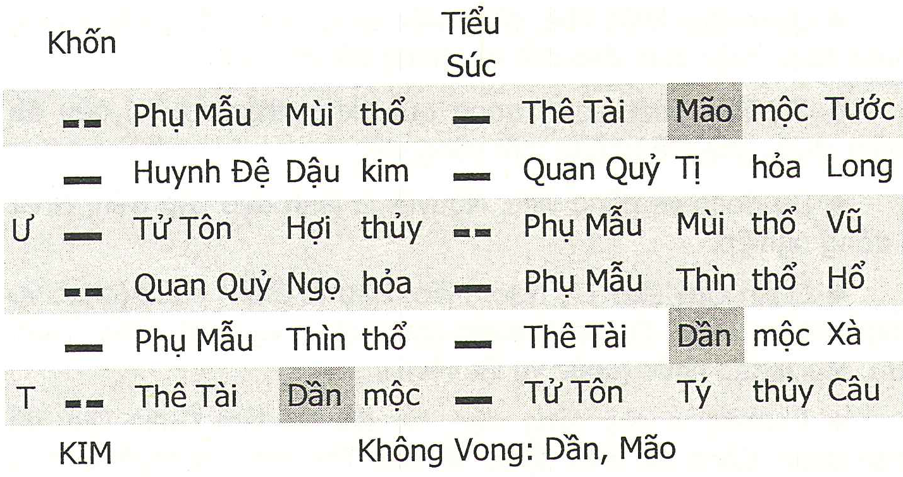

**Ví dụ 2:** Ngày Tân Tị tháng Tý, nam đoán về công việc, được quẻ Lôi Hỏa Phong biến Trạch Thiên Quải.

| | | Phong | | Quải | |
| :---: | :---: | :--- | :---: | :--- | :--- |
| | - - | Quan Quỷ Tuất thổ | - - | Quan Quỷ Mùi thổ | Xà |
| T | - - | Phụ Mẫu Thân kim | — | Phụ Mẫu Dậu kim | Câu |
| | — | Thê Tài Ngọ hỏa | — | Huynh Đệ Hợi thủy | Tước |
| | — | Huynh Đệ Hợi thủy | — | Quan Quỷ Thìn thổ | Long |
| Ứ | - - | Quan Quỷ Sửu thổ | — | Tử Tôn Dần mộc | Vũ |
| | — | Tử Tôn Mão mộc | — | Huynh Đệ Tý thủy | Hổ |

THỦY Không Vong: Thân, Dậu

**Phán đoán:**

Lấy Quan Quỷ làm Dụng thần. Trong quẻ Quan Quỷ lưỡng hiện, lấy hào Quan Quỷ Sửu thổ phát động làm Dụng thần.

Quan Quỷ Sửu thổ mặc dù được Nhật sinh, nhưng không nên động mà hóa hồi đầu khắc, có nỗi lo mất việc. Phụ Mẫu là đơn vị công tác, trì Thế, hiện tại vẫn làm ở đơn vị, nhưng bị Nhật khắc, Không hóa Không, cũng biểu thị công việc sẽ phát sinh biến đổi.

**Kết quả:** Sau này bị đơn vị sa thải ở tháng Sửu.

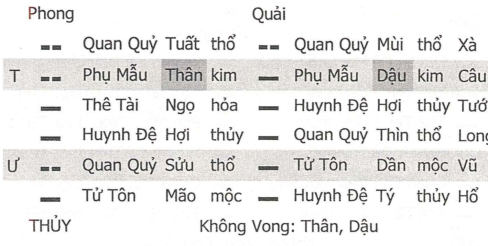

**Ví dụ 3:** Ngày Tân Hợi tháng Dậu, nam đoán về quan vận, được quẻ Trạch Thiên Quải biến Lôi Thiên Đại Tráng.

| | Quải | Đại Tráng | |
| :---: | :--- | :--- | :---: |
| | - - Huynh Đệ Mùi thổ | - - Huynh Đệ Tuất thổ | Xà |
| T | — Tử Tôn Dậu kim | - - Tử Tôn Thân kim | Câu |
| | — Thê Tài Hợi thủy | — Phụ Mẫu Ngọ hỏa | Tước |
| | — Huynh Đệ Thìn thổ | — Huynh Đệ Thìn thổ | Long |
| Ư | — Quan Quỷ Dần mộc Phụ Tị | — Quan Quỷ Dần mộc | Vũ |
| | — Thê Tài Tý thủy | — Thê Tài Tý thủy | Hổ |

THỔ Không Vong: Dần, Mão

**Phán đoán:**

Lấy Quan Quỷ làm Dụng thần. Quan Quỷ Dần mộc được Nhật sinh phù, nhưng lại bị Nguyệt khắc, suy vượng tương đương.

Đoán quan vận, không nên Tử Tôn trì Thế, may được quẻ này Tử Tôn trì Thế động mà hóa thoái, hiện tại không có cơ hội, thăng chức khá khó, nhưng sau này sẽ có cơ hội.

Thế tại hào 5, hào 5 là tôn vị, lâm Câu Trần, xưa là nha môn, nay là cơ quan chính phủ, sau này sẽ làm cán bộ ở cơ quan chính phủ.

Năm 1998 là năm Mậu Dần, xung mất Thoái thần Tử Tôn, Quan Quỷ Dần mộc Không mà Thực Không, năm này có cơ hội làm cán bộ.

**Kết quả:** Sau này quả nhiên ở năm Mậu Dần được làm xã trưởng. Sau đó lại được điều đến cục hương trấn làm lãnh đạo.

**Ví dụ 4:** Ngày Giáp Thân tháng Tuất, một người đàn ông sau khi đã được thăng chức lại bị cấp trên gọi đến nói chuyện, anh ta lo lắng có phải là không cho anh ta thăng chức hay không? Được quẻ Lôi Thiên Đại Tráng biến Trạch Thiên Quải.

| | Đại Tráng | Quải | |
| :---: | :--- | :--- | :---: |
| | - - Huynh Đệ Tuất thổ | - - Huynh Đệ Mùi thổ | Vũ |
| | - - Tử Tôn Thân kim | — Tử Tôn Dậu kim | Hổ |
| T | — Phụ Mẫu Ngọ hỏa | — Thê Tài Hợi thủy | Xà |
| | — Huynh Đệ Thìn thổ | — Huynh Đệ Thìn thổ | Câu |
| | — Quan Quỷ Dần mộc | — Quan Quỷ Dần mộc | Tước |
| Ư | — Thê Tài Tý thủy | — Thê Tài Tý thủy | Long |

THỔ Không Vong: Ngọ, Mùi

**Phán đoán:**

Thông thường lấy Quan Quỷ làm Dụng thần, nhưng xem quẻ cần phải linh hoạt. Người này cũng biết phương pháp dự đoán lục hào, tự mình phán đoán là: Hào 5 là hào vị lãnh đạo, Tử Tôn động mà hóa Tiến thần khắc Quan Quỷ, chính là lãnh đạo sẽ cách chức mình. Sau khi xem quẻ, tôi nói: "Hiện nay anh rất lo âu, Quan Quỷ trong quẻ này là thần lo âu, Tử Tôn động mà hóa Tiến thần, khắc đi ưu sầu, nhất định sẽ không bị miễn chức".

**Kết quả:** Hai ngày sau anh ta nói với tôi, lãnh đạo quả nhiên không có ý cách chức anh ta, bình an thăng chức.

**Ví dụ 5:** Ngày Bính Tuất tháng Hợi, nữ người Nhật Bản đoán về bạn ứng cử cán bộ, được quẻ Trạch Hỏa Cách biến Thiên Hỏa Đồng Nhân.

| | Cách | | | Đồng Nhân | Lục thú |
| :---: | :---: | :--- | :---: | :--- | :--- |
| | - - | Quan Quỷ Mùi thổ | — | Quan Quỷ Tuất thổ | Long |
| | — | Phụ Mẫu Dậu kim | — | Phụ Mẫu Thân kim | Vũ |
| T | — | Huynh Đệ Hợi thủy | — | Thê Tài Ngọ hỏa | Hổ |
| | — | Huynh Đệ Hợi thủy | — | Huynh Đệ Hợi thủy | Xà |
| | - - | Quan Quỷ Sửu thổ | - - | Quan Quỷ Sửu thổ | Câu |
| Ứ | — | Tử Tôn Mão mộc | — | Tử Tôn Mão mộc | Tước |

THỦY &emsp;&emsp;&emsp;&emsp; Không Vong: Ngọ, Mùi

**Phán đoán:**

Lấy Quan Quỷ làm Dụng thần. Trong quẻ Quan Quỷ lưỡng hiện, lấy hào phát động làm Dụng thần.

Dụng thần được Nhật tỉ phù, mặc dù có Không Vong nhưng động mà hóa tiến, nhất định có thể trúng cử.

**Kết quả:** Quả nhiên ứng nghiệm.

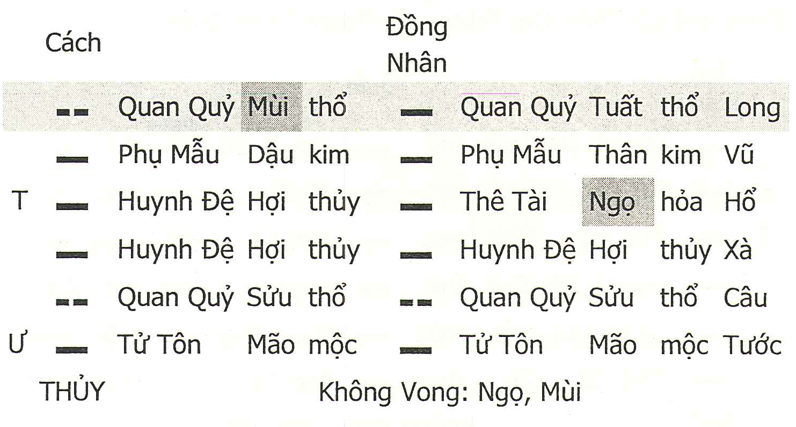

# CHƯƠNG 29
## DỰ ĐOÁN HÔN NHÂN

Trên đường đời, hầu hết mọi người đều không cam lòng cô đơn, đều muốn trải qua cảm giác hạnh phúc, kết hôn với người khác giới, xây dựng gia đình, sinh ra con cháu đời sau. Nhưng số phận không công bằng, không phải ai cũng sẽ có hạnh phúc, vợ chồng chưa hẳn đã chung sống với nhau đến đầu bạc răng long. Hoặc là ly hôn, hoặc là tử biệt. Dự đoán lục hào không chỉ là dự đoán ra xu thế phát triển của hôn nhân thì coi là xong chuyện, mà còn phải cố gắng hết sức thay đổi tình trạng hôn nhân không tốt, từ đó có một cuộc sống hạnh phúc.

Dự đoán về hôn nhân, mối quan hệ giữa Dụng thần và Thế Ứng rất quan trọng. Nữ dự đoán hôn nhân, lấy Quan Quỷ làm Dụng thần, lấy hào Ứng làm phu vị. Nam dự đoán hôn nhân, lấy Thê Tài làm Dụng thần, lấy hào Ứng làm thê vị. Hoặc lấy hào Thế làm gia đình của người dự đoán, hào Ứng là gia đình đối phương.

◆ Dự đoán hôn nhân, Dụng thần nên vượng tướng, sinh hợp hào Thế; không nên hưu tù Không Phá, hoặc khắc Thế, sinh hợp hào Ứng.

◆ Thế Ứng tương sinh hợp thì cát, dễ thành vợ chồng; tương khắc thì không cát, hai người dễ phân ly.

◆ Ngũ hành Thế Ứng giống nhau, thường là nhờ người mai mối thành hôn nhân. Thế Ứng tương khắc, nếu có hào động tạo thế tương sinh thì chính là thông qua sự trợ giúp của người khác mà hôn nhân đạt được thành công.

◆ Nam dự đoán hôn nhân, Thế sinh hào Ứng hoặc Dụng thần là nam thích nữ, phát động chính là nam chủ động theo đuổi đối phương. Ứng hoặc Dụng thần sinh hào Thế chính là phía nữ bằng lòng qua lại.

◆ Khi gian hào động mà sinh Kỵ thần, hoặc gian hào là Kỵ thần phát động, có người ở giữa gây chia rẽ mối quan hệ của hai người.

◆ Hào Thế vượng mà khắc Ứng, thường là chê gia đình đối phương có địa vị thấp, của cải ít, gia đình không giàu có.

◆ Thế Ứng nạp chi giống nhau tại một quẻ, hai người là bạn học, đồng nghiệp, đồng hương, v.v.

◆ Hai người có thật tâm yêu nhau hay không thì xem Thế Ứng, tương sinh tương hợp, Dụng thần vượng mà trì Thế, hai người đồng tâm. Thế Ứng có một Không Vong thì sẽ không một lòng một dạ. Thế Ứng đều Không thì lừa dối lẫn nhau.

◆ Thê Tài lâm Bạch Hổ khắc Thế, người nữ dữ tợn, bị vợ ức hiếp, hoặc vợ không hiếu kính với cha mẹ chồng.

◆ Hào Thế nhập Mộ ở Thê Tài hoặc hào Ứng là sợ vợ. Hào Thế động mà sinh Ứng Thê Tài là ở rể nhà gái. Thê Tài lâm hào 2 càng ứng nghiệm.

◆ Chưa kết hôn, Dụng thần động mà hóa tiến, đối phương rất muốn đạt được cuộc hôn nhân này; hóa thoái, tương lai sẽ thay lòng đổi dạ, rời bỏ mà đi.

◆ Dụng thần không nên tương hợp với hào bên cạnh, xuất hiện tương hợp thường là ngoại tình.

◆ Thế Ứng cũng không nên động mà hóa thoái, hóa thoái thì một phía có tâm rút lui.

◆ Nam đoán hôn nhân thì không nên Huynh Đệ trì Thế, nữ thì không nên Tử Tôn trì Thế. Nam đoán hôn nhân thì không nên hào Ứng hóa Tài, nữ đoán hôn thì không nên hào Ứng hóa Quan.

◆ Trong quẻ có Dụng thần, không nên lại động mà hóa ra lục thân có ngũ hành giống Dụng thần. Thường là ngoại tình.

◆ Dự đoán hôn nhân, không nên Tài Quan phục lẫn nhau, cũng không nên phục dưới hào Huynh Đệ, chứng tỏ đối phương có người thứ ba hoặc là người có gia thất.

◆ Lục xung, tình cảm vợ chồng bất hòa; lục hợp, hôn nhân tương đối ổn định.

**Ví dụ 1:** Ngày Quý Hợi tháng Ngọ, nam đoán đi xem mặt, kết quả ra sao? Được quẻ Lôi Địa Dự biến Địa Lôi Phục.

| Dự | | | | | Phục | | | |
| :---: | :---: | :--- | :--- | :--- | :---: | :--- | :--- | :---: |
| | - - | Thê Tài | Tuất thổ | | - - | Quan Quỷ | Dậu kim | Hổ |
| | - - | Quan Quỷ | Thân kim | | - - | Phụ Mẫu | Hợi thủy | Xà |
| Ứ | — | Tử Tôn | Ngọ hỏa | | - - | Thê Tài | Sửu thổ | Câu |
| | - - | Huynh Đệ | Mão mộc | | - - | Thê Tài | Thìn thổ | Tước |
| | - - | Tử Tôn | Tị hỏa | | - - | Huynh Đệ | Dần mộc | Long |
| T | - - | Thê Tài | Mùi thổ | Phụ Tý | — | Phụ Mẫu | Tý thủy | Vũ |

MỘC

Không Vong: Tý, Sửu

**Phán đoán:**

Lấy Thê Tài làm Dụng thần. Trong quẻ Thê Tài lưỡng hiện, lấy hào Thế Thê Tài Mùi thổ phát động làm Dụng thần.

Nguyên thần Tử Tôn lâm hào Ứng động mà sinh Dụng thần, Ứng là người khác, là có người giới thiệu. Nhưng hào Thế động mà hóa Không, bản thân không muốn đi gặp mặt.

Hào 2 Tử Tôn Tị hỏa ám động sinh hào Thế, Nhật thần và hào Phụ Mẫu giống nhau, xung động Tử Tôn Tị hỏa, là cha mẹ ép anh ta đi gặp phía nữ.

Thế Ứng đều động mà hóa Không, lần xem mặt này không thành.

**Kết quả:** Anh ta nghe giới thiệu thì cảm thấy phía nữ không phù hợp với yêu cầu của mình cho nên không muốn đi gặp mặt, tuy nhiên cha mẹ ép phải đi, cuối cùng cũng không thành.

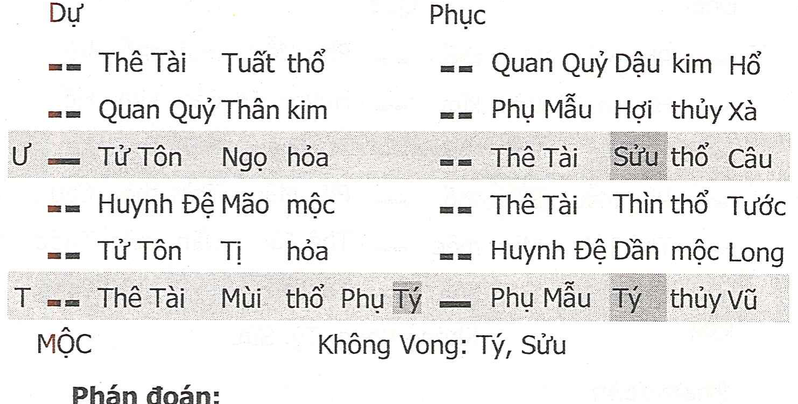

## Ví dụ 2: Ngày Giáp Dần tháng Ngọ, nữ đoán hôn nhân, được quẻ Đoài Vi Trạch biến Trạch Thiên Quải.

| | Đoài | | | Quải | |
| :---: | :---: | :--- | :---: | :--- | :---: |
| T | - - | Phụ Mẫu Mùi thổ | - - | Phụ Mẫu Mùi thổ | Vũ |
| | — | Huynh Đệ Dậu kim | — | Huynh Đệ Dậu kim | Hổ |
| | — | Tử Tôn Hợi thủy | — | Tử Tôn Hợi thủy | Xà |
| Ư | - - | Phụ Mẫu Sửu thổ | — | Phụ Mẫu Thìn thổ | Câu |
| | — | Thê Tài Mão mộc | — | Thê Tài Dần mộc | Tước |
| | — | Quan Quỷ Tị hỏa | — | Tử Tôn Tý thủy | Long |

KIM Không Vong: Tý, Sửu

**Phán đoán:**

Lấy Quan Quỷ làm Dụng thần.

Quan Quỷ vượng mà sinh thế, Phụ Mẫu trì Thế, Phụ Mẫu là giấy chứng nhận kết hôn, chứng tỏ đã kết hôn. Thế ứng tương xung, tình cảm vợ chồng không hòa hợp.

Thế tại hào 6, Quan Quỷ tại hào sơ, hai hào cách nhau rất xa, vì vậy đoán vợ chồng không thường xuyên bên nhau, là ở riêng hai nơi.

Hào 3 Phụ Mẫu Sửu thổ Không Vong, động hóa Mộ, Phụ Mẫu Không mà nhập Mộ, chính là tượng sống chung không có giấy chứng nhận kết hôn. Nguyệt kiến cũng là Quan Quỷ, hợp Thế lại Thế lâm Huyền Vũ, Huyền Vũ chủ ám muội, có người đàn ông khác ở chung.

**Kết quả:** Tất cả đúng như dự đoán.

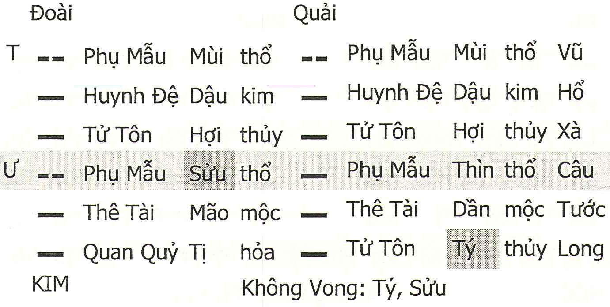

## Ví dụ 3: Ngày Đinh Mão tháng Thân, nam đoán mối quan hệ với người yêu ra sao? Được quẻ Sơn Phong Cổ biến Lôi Trạch Quy Muội.

| | Cổ | | | Quy Muội | |
| :---: | :---: | :--- | :---: | :--- | :---: |
| Ư | — | Huynh Đệ Dần mộc | - - | Thê Tài Tuất thổ | Long |
| | - - | Phụ Mẫu Tý thủy Tử Tị | - - | Quan Quỷ Thân kim | Vũ |
| | - - | Thê Tài Tuất thổ | — | Tử Tôn Ngọ hỏa | Hổ |
| T | — | Quan Quỷ Dậu kim | - - | Thê Tài Sửu thổ | Xà |
| | — | Phụ Mẫu Hợi thủy | — | Huynh Đệ Mão mộc | Câu |
| | - - | Thê Tài Sửu thổ | — | Tử Tôn Tị hỏa | Tước |

MỘC Không Vong: Tuất, Hợi

**Phán đoán:**

Lấy Thê Tài làm Dụng thần. Trong quẻ Thê Tài lưỡng hiện, cả hai đều phát động, lấy Thê Tài Tuất thổ Không Vong hợp Nhật làm Dụng thần.

Dụng thần động mà sinh Thế, phía nữ thích anh ta, nhưng lâm Không Vong, bạn nữ có chút do dự không quyết.

Dụng thần và Nhật tương hợp, Nhật là Huynh Đệ, Huynh Đệ là đối thủ cạnh tranh, có người nam cạnh tranh với anh ta. Nhật Huynh Đệ rơi vào hào Ứng, Ứng là thê vị, hào vị người yêu, đối thủ cạnh tranh là bạn trai trước kia của cô ấy. Lâm Quan Quỷ Đằng Xà, Quan Quỷ chủ phiền não, Đằng Xà là tâm phiền ý loạn, vì chuyện này mà trong lòng bất an.

Hào Thế động mà hóa Thê Tài, hào sơ Thê Tài sinh hào Thế, Thê Tài là người nữ, bên cạnh anh ta không thiếu phụ nữ.

Dụng thần không được Nhật Nguyệt sinh phù mà trái lại bị Nhật khắc, Kỵ thần lâm hào Ứng vượng mà phát động, hai người khó thành.

**Phản hồi:** Quả nhiên là bạn trai cũ của cô ấy quay lại khiến hai người xảy ra cãi lộn, về sau chia tay.

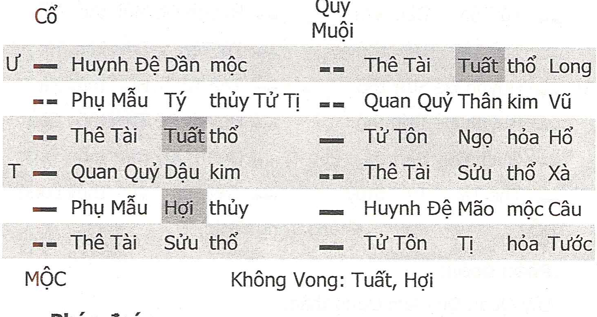

**Ví dụ 4:** Ngày Giáp Ngọ tháng Mùi, nam hỏi chị họ có ly hôn hay không? Được quẻ Địa Lôi Phục biến Trạch Lôi Tùy.

| | Phục | Tùy | |
| :--- | :--- | :--- | :--- |
| | -- Tử Tôn Dậu kim | -- Huynh Đệ Mùi thổ | Vũ |
| | -- Thê Tài Hợi thủy | — Tử Tôn Dậu kim | Hổ |
| Ư | -- Huynh Đệ Sửu thổ | — Thê Tài Hợi thủy | Xà |
| | -- Huynh Đệ Thìn thổ | -- Huynh Đệ Thìn thổ | Câu |
| | -- Quan Quỷ Dần mộc Phụ Tị | -- Quan Quỷ Dần mộc | Tước |
| T | — Thê Tài Tý thủy | — Thê Tài Tý thủy | Long |

THỔ Không Vong: Thìn, Tị

**Phán đoán:**

Lấy Quan Quỷ làm Dụng thần.

Quan Quỷ không được Nhật Nguyệt sinh phù là hưu tù. Hào 5 Thê Tài Hợi thủy động mà tương hợp với Quan Quỷ Dần mộc, chồng của chị họ qua lại với người phụ nữ khác.

Quan Quỷ không vượng, Nguyên thần bị khắc, hai người sẽ không lâu bền, thế nào cũng phải ly hôn.

Tháng Thân Dụng thần bị xung khắc, tháng sau sẽ chia ly.

**Kết quả:** Về sau quả nhiên ly hôn tại tháng Thân, người chồng kết hôn với một phụ nữ khác.

**Ví dụ 5:** Ngày Quý Dậu tháng Hợi, một nữ sĩ đoán hôn nhân, được quẻ Thiên Trạch Lý biến Trạch Thủy Khốn.

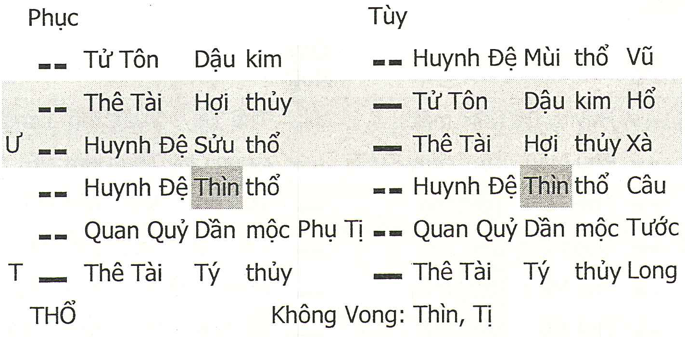

| | Lý | Khốn | |
| :--- | :--- | :--- | :--- |
| | — Huynh Đệ Tuất thổ | -- Huynh Đệ Mùi thổ | Hổ |
| T | — Tử Tôn Thân kim Tài Tý | — Tử Tôn Dậu kim | Xà |
| | — Phụ Mẫu Ngọ hỏa | — Thê Tài Hợi thủy | Câu |
| | -- Huynh Đệ Sửu thổ | -- Phụ Mẫu Ngọ hỏa | Tước |
| Ư | — Quan Quỷ Mão mộc | — Huynh Đệ Thìn thổ | Long |
| | — Phụ Mẫu Tị hỏa | -- Quan Quỷ Dần mộc | Vũ |

THỔ Không Vong: Tuất, Hợi

**Phán đoán:**

Lấy hào Quan Quỷ làm Dụng thần.

Quan Quỷ Mão mộc lâm hào Ứng, Ứng là phu vị, tất là chồng người này. Lâm Thanh Long là háo sắc.

Nguyệt sinh Nhật xung là ám động, tương hợp với hào Huynh Đệ Tuất thổ, Huynh Đệ là cùng loại, nữ đoán hôn nhân thì có thể hiểu Huynh Đệ là phụ nữ, chính là tượng chồng có ngoại tình.

Huynh Đệ Tuất thổ sinh hào Thế, người tình của chồng lớn tuổi hơn người xin dự đoán. Quan Quỷ ám động hợp Huynh Đệ Tuất thổ, Huynh Đệ Tuất thổ cũng động mà hợp Quan Quỷ, hai người theo đuổi lẫn nhau, ăn nhịp với nhau. Tuất thổ Không Vong, năm 1994 là Giáp Tuất điền thực, sự việc phát sinh tại năm này.

Phụ Mẫu Nguyệt phá lại Tử tại Nhật thần, Phụ Mẫu là giấy chứng nhận kết hôn, chứng tỏ đã hủy bỏ quan hệ hôn nhân. Nhưng Phụ Mẫu Tị hỏa lâm Huyền Vũ hợp hào Thế, lại động mà hóa ra Quan Quỷ, Huyền Vũ chủ riêng tư, bí mật, chứng tỏ cô ấy lại có đính ước riêng, sống chung với một người đàn ông khác.

Quẻ biến lục hợp, hai người có thể thành, văn thư Nguyệt phá, sang tháng bất phá, tháng sau có thể thành.

**Kết quả:** Quả nhiên là người này ly hôn với chồng ở năm 1994 bởi vì chồng ngoại tình, hiện nay đang sống chung với một người đàn ông, về sau hai người chính thức kết hôn ở tháng Canh Tý.

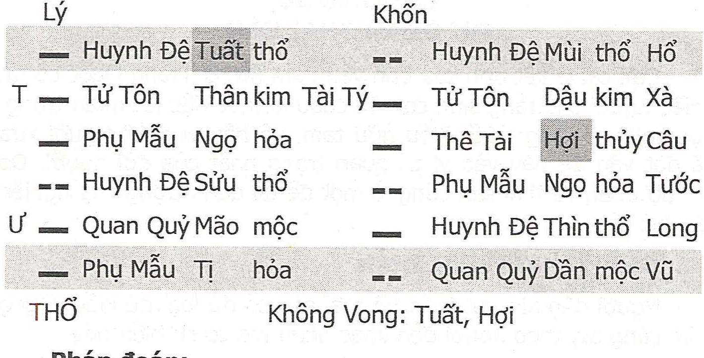

# CHƯƠNG 30
## DỰ ĐOÁN THAI SẢN

Con cái là kết tinh của tình yêu nam nữ. Ở Trung Quốc có rất nhiều người cho rằng sinh con đẻ cháu là một việc rất quan trọng. Tục ngữ nói rằng: "Bất hiếu hữu tam, vô hậu vi đại." Người xưa đã đặt vấn đề này vào vị trí quan trọng nhất của đời người. Do đó, dự đoán về thai sản cũng là một đề tài quan trọng của nghiên cứu lục hào.

## CÁCH CHỌN DỤNG THẦN

Người đến xin dự đoán về thai sản có đủ loại đủ kiểu, Dụng thần cũng tùy theo người đến khác nhau mà có sự biến hóa.

Nếu luôn luôn không thể mang thai, xem cả đời có con hay không thì lấy hào Tử Tôn làm Dụng thần, Tử Tôn vượng tướng được sinh phù là có con, hưu tù Không Phá, động mà hóa hung thì suốt đời khó có con cái. Nếu nghi ngờ là có thai, xem có thai hay không thì lấy Tử Tôn làm Dụng thần, đồng thời tham khảo hào thai của Tử Tôn. Cách lấy hào thai, lấy ngũ hành 12 cung trường sinh để tra, số đến thai chính là hào thai. Người đến nếu là đoán về mẹ mang thai, thì lấy hào Huynh Đệ làm Dụng thần.

## TRÍCH XUẤT THÔNG TIN

- Tử Tôn và hào thai vượng tướng, là thông tin mang thai, nếu hưu tù Không Phá là không có mang thai.
- Tử Tôn vượng tướng, nhưng hào thai Không Phá, hoặc Tử Tôn động mà hóa hung, là thông tin sảy thai, phá thai.
- Tử Tôn, hào thai an tĩnh là cát, Tử Tôn phát động lâm Bạch Hổ là thông tin sắp sinh.
- Hào Phụ Mẫu không nên phát động, phát động thì Tử Tôn tất nhiên bị thương. Chắc chắn có nguyên nhân gây bất lợi cho thai nhi. Nếu hào Huynh Đệ đồng thời phát động, thì sẽ bị hại nhẹ hơn.
- Hào 2 là thai vị, đồng thời cũng là hào vị tử cung. Tử Tôn lâm Thanh Long hoặc Câu Trần vượng mà ở hào vị này, chắc chắn mang thai.

- Tử Tôn không nên động mà hóa Quan Quỷ, hóa Phụ Mẫu hồi đầu khắc, là thông tin thai nhi tử vong hoặc bị bệnh.
- Hào Tử Tôn gặp hợp, gặp quẻ lục hợp, là thông tin khó sinh. Gặp quẻ lục xung, hoặc Tử Tôn bị hào khác xung, là thông tin sinh thuận lợi.
- Phán đoán giới tính của thai nhi, lấy vượng suy và âm dương của hào vị lâm hào Tử Tôn, âm dương của quái cung, biến hóa âm dương của hào động để phán đoán. Tử Tôn là hào dương vượng tướng là nam, trái lại là nữ. Tại cung dương là nam, tại cung âm là nữ, Tử Tôn vượng tướng, hào dương động là nữ, hào âm động là nam, Tử Tôn hưu tù thì lấy âm dương của Tử Tôn kết hợp quái cung để phán đoán. Lại lấy hào vị quyết định, một hào độc phát, xem hào động; hai hào phát động, xem hào ở trên; ba hào phát động, xem hào ở giữa; nhiều hào phát động, xem hào tĩnh. Quái tượng không rõ thì có thể gieo lại quẻ để phân tích.
- Hào Tử Tôn lưỡng động, gặp hai hào thai là song sinh.
- Ứng kỳ thường lấy hào Tử Tôn để phán đoán. Phục tàng, ứng ngày tháng xuất hiện, xung Phi xung Dụng, hợp trú ứng xung khai, nhập Mộ ứng xung Mộ xung Dụng, hưu tù ứng Trường Sinh, Nguyệt phá ứng Thực Phá Hợp Phá hoặc sang tháng, Không ứng Xung Không Thực Không. Cũng có khi ứng đất Thai Dưỡng của Tử Tôn mà sinh.

**Ví dụ 1:** Ngày Ất Tị tháng Quý Mùi năm Ất Hợi, nam kết hôn đã sáu năm, vợ mãi không có thai, đoán khi nào có con? Được quẻ Trạch Phong Đại Quá biến Lôi Sơn Tiểu Quá.

| Đại Quá | | Tiểu Quá | |
| :--- | :--- | :--- | :--- |
| - - Thê Tài Mùi thổ | | - - Thê Tài Tuất thổ | Vũ |
| — Quan Quỷ Dậu kim | | - - Quan Quỷ Thân kim | Hổ |
| T — Phụ Mẫu Hợi thủy | Tử Ngọ | — Tử Tôn Ngọ hỏa | Xà |
| — Quan Quỷ Dậu kim | | — Quan Quỷ Thân kim | Câu |
| — Phụ Mẫu Hợi thủy | Huynh Dần | - - Tử Tôn Ngọ hỏa | Tước |
| Ư - - Thê Tài Sửu thổ | | - - Thê Tài Thìn thổ | Long |

MỘC Không Vong: Dần, Mão

**Phán đoán:**

Lấy hào Tử Tôn làm Dụng thần.

Tử Tôn Ngọ phục dưới Phụ Mẫu Hợi thủy, Phi đến khắc Phục, là không cát. Nhưng Phi thần bị Nguyệt kiến khắc, Nhật thần xung khai Phi thần trợ khởi Phục thần, là tượng có con.

Phụ Mẫu Hợi thủy được Quan Quỷ Dậu kim sinh phù, năm 2000 là năm Canh Thìn, hợp trú Quan Quỷ Dậu kim, Phụ Mẫu nhập Mộ khó khắc Tử Tôn, có thể có con. Nếu vẫn chưa có thì năm 2001 Tân Tị xung khai Phi thần tất có.

**Kết quả:** Vợ người này có thai ở năm 1999, nhưng ngay sau đó lưu sản. Năm 2000 lại có thai, tháng Thìn năm 2001 sinh hạ một con trai.

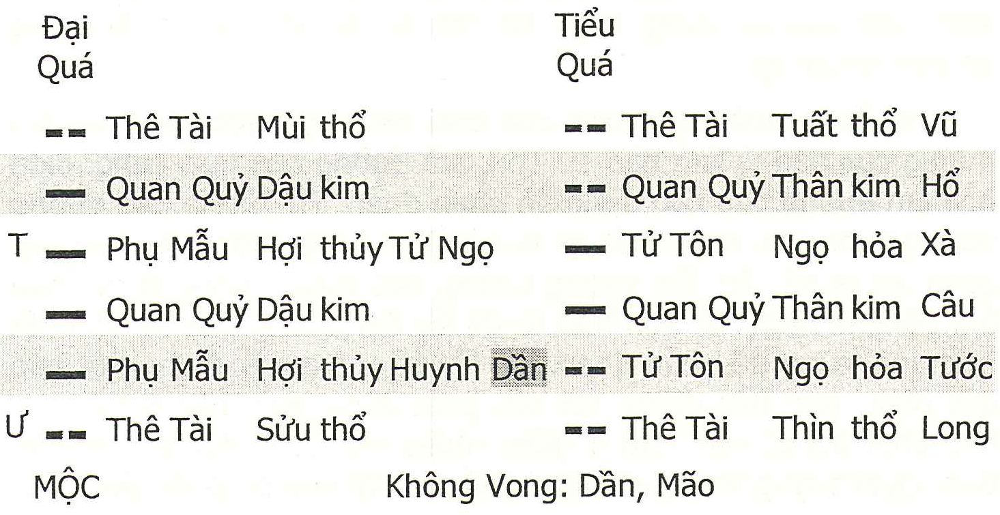

**Ví dụ 2:** Ngày Ất Tị tháng Bính Dần năm Kỷ Mão, một người phụ nữ từ Bắc Kinh đến đoán khi nào có thể có con? Được quẻ Thủy Địa Tỷ.

| Tỷ | |
| :--- | :--- |
| Ư - - Thê Tài Tý thủy | Vũ |
| — Huynh Đệ Tuất thổ | Hổ |
| - - Tử Tôn Thân kim | Xà |
| T - - Quan Quỷ Mão mộc | Câu |
| - - Phụ Mẫu Tị hỏa | Tước |
| - - Huynh Đệ Mùi thổ | Long |

THỔ Không Vong: Dần, Mão

**Phán đoán:**

Lấy Tử Tôn làm Dụng thần.

Tử Tôn Thân kim bị Nguyệt kiến xung phá, Nhật thần khắc, Nhật Nguyệt Dụng thần lại thành tam hình, Dụng thần rất nhược. Hào Thế Quan Quỷ Mão mộc, là Thai địa Tử Tôn, hào Thế là người xin đoán, lâm Không Vong, chính là thông tin bản thân không thể mang thai. Cả đời sợ rằng khó có con cái.

**Kết quả:** Người nữ này kết hôn ở năm 1989, đã mười mấy năm liên tục không có thai, rất phiền não. Cô đã đi khắp nơi tìm thầy, đã uống không biết bao nhiêu thuốc, nhưng không có hiệu quả gì cả.

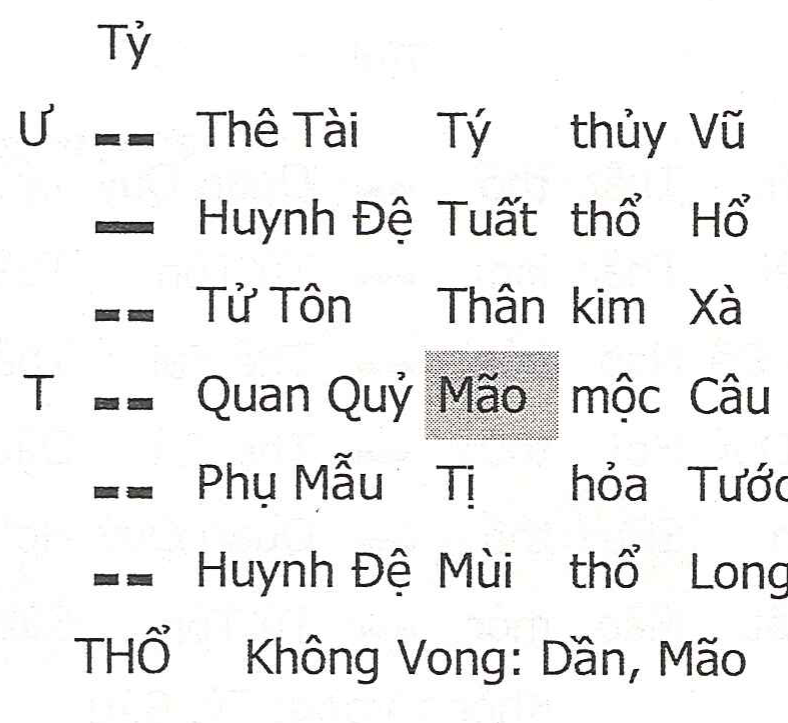

### Ví dụ 3: Ngày Tân Dậu tháng Đinh Mão năm Kỷ Mão, nữ hỏi cả đời có con cái hay không, được quẻ Thiên Hỏa Đồng Nhân biến Thủy Phong Tỉnh.

| | Đồng Nhân | | | Tỉnh | |
| :---: | :---: | :--- | :---: | :--- | :--- |
| Ứ | — | Tử Tôn Tuất thổ | - - | Quan Quỷ Tý thủy | Xà |
| | — | Thê Tài Thân kim | — | Tử Tôn Tuất thổ | Câu |
| | — | Huynh Đệ Ngọ hỏa | - - | Thê Tài Thân kim | Tước |
| T | — | Quan Quỷ Hợi thủy | — | Thê Tài Dậu kim | Long |
| | - - | Tử Tôn Sửu thổ | — | Quan Quỷ Hợi thủy | Vũ |
| | — | Phụ Mẫu Mão mộc | - - | Tử Tôn Sửu thổ | Hổ |

HỎA  
Không Vong: Tý, Sửu

**Phán đoán:**

Lấy hào Tử Tôn làm Dụng thần. Trong quẻ Dụng thần Tử Tôn Tuất thổ Tử Tôn Sửu thổ lưỡng hiện, lại đều phát động, cả hai đều có thể lấy làm Dụng thần.

Dụng thần bị Nguyệt kiến khắc thương, lại có Kỵ thần lâm Nguyệt phát động khắc Dụng, không cát. Hào 6 Tử Tôn động hóa Quan Quỷ, hóa nhập Không Vong, hào 2 Tử Tôn Không Vong cũng là động hóa Quan Quỷ, chính là tượng không có con cái. Tử động hóa Quan Quỷ, cho dù có con cũng khó giữ. Suốt đời khó có con cái.

**Kết quả:** Kết hôn đã mười mấy năm, luôn luôn không có con cái.

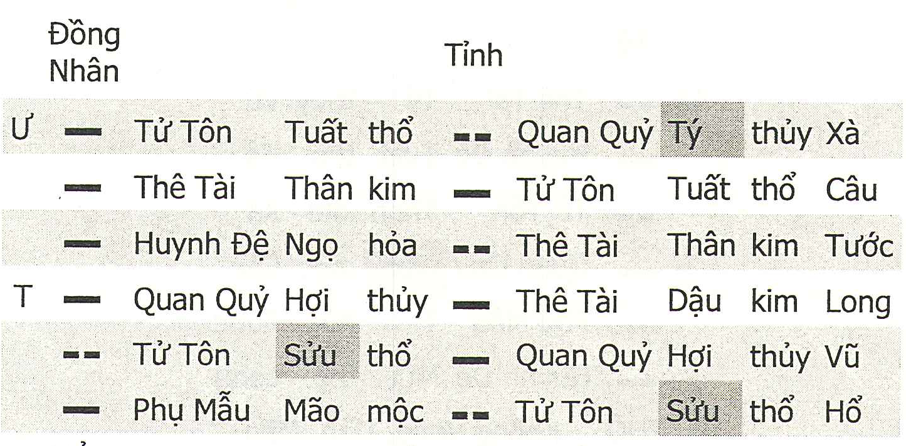

### Ví dụ 4: Ngày Kỷ Mão tháng Đinh Hợi năm Canh Thìn, nữ ở Quảng Đông hỏi khi nào có thể có con, được quẻ Phong Thủy Hoán biến Thiên Lôi Vô Vọng.

| | Hoán | | Phục thần | Vô Vọng | | |
| :---: | :---: | :--- | :---: | :---: | :--- | :--- |
| | — | Phụ Mẫu Mão mộc | | — | Tử Tôn Tuất thổ | Câu |
| T | — | Huynh Đệ Tị hỏa | | — | Thê Tài Thân kim | Tước |
| | - - | Tử Tôn Mùi thổ | Tài Dậu | — | Huynh Đệ Ngọ hỏa | Long |
| | - - | Huynh Đệ Ngọ hỏa | Quan Hợi | - - | Tử Tôn Thìn thổ | Vũ |
| Ứ | — | Tử Tôn Thìn thổ | | - - | Phụ Mẫu Dần mộc | Hổ |
| | - - | Phụ Mẫu Dần mộc | | — | Quan Quỷ Tý thủy | Xà |

HỎA  
Không Vong: Thân, Dậu

**Phán đoán:**

Lấy hào Tử Tôn làm Dụng thần.

Thoạt nhìn Tử Tôn động hóa hồi đầu sinh, chính là tượng sau này có con, nhưng Tử Tôn Nhật Nguyệt không sinh, trái lại bị Nhật thần khắc thương, chính là Tử Tôn không có gốc rễ. Lại thêm Nguyên thần Tị hỏa Nguyệt phá, dù cho hóa hồi đầu sinh cũng không được cứu.

Huynh Đệ Tị hỏa tại hào Thế, là Nguyên thần Tử Tôn, Nguyệt phá không thể sinh Tử Tôn, quẻ nói rõ bản thân không sinh được con. Tị hỏa bị Nguyệt kiến xung phá, Nguyệt là Quan Quỷ, Quan Quỷ là chồng, không sinh được con là vấn đề ở chồng.

Tử Tôn Thìn thổ tại hào 2 bị Nhật khắc thương, hào 2 là phu vị, đồng thời lại là hào Ứng, hào Ứng cũng là phu vị, lâm Bạch Hổ, Bạch Hổ là bệnh, là chồng có bệnh nên không thể có thai.

Hào 2 là hào vị bộ phận sinh dục, Tử Tôn cũng chủ bộ phận sinh dục, là bộ phận sinh dục của chồng có vấn đề. Tài là tinh trùng, Không mà phục tàng, lại gặp Nguyệt kiến Hợi thủy là Bệnh địa, là tinh trùng của chồng có vấn đề, khiến cô ấy không thể mang thai. Nếu sống chung với chồng, suốt đời cũng sẽ không có con cái.

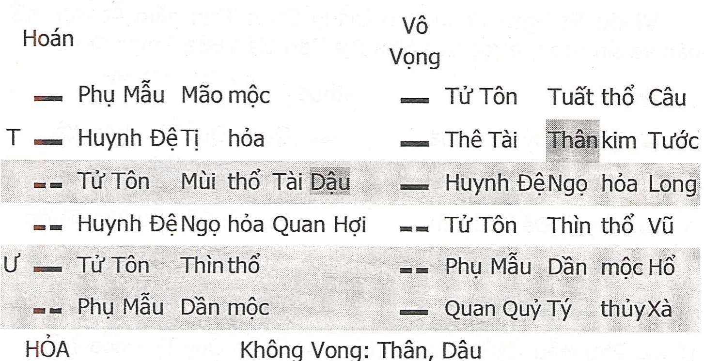

**Kết quả:** Cô ấy và chồng cùng đến bệnh viện kiểm tra, phát hiện chồng lúc nhỏ đã bị thương tinh hoàn, tinh trùng không sống được, không thể khiến cô ấy mang thai.

**Ví dụ 5:** Ngày Canh Dần tháng Canh Thìn năm Ất Hợi, nữ đoán về sinh con, được quẻ Hỏa Địa Tấn biến Hỏa Trạch Khuê.

| Tấn | Khuê |
| :--- | :--- |
| — Quan Quỷ Tị hỏa | — Quan Quỷ Tị hỏa Xà |
| - - Phụ Mẫu Mùi thổ | - - Phụ Mẫu Mùi thổ Câu |
| T — Huynh Đệ Dậu kim | — Huynh Đệ Dậu kim Tước |
| - - Thê Tài Mão mộc | - - Phụ Mẫu Sửu thổ Long |
| - - Quan Quỷ Tị hỏa | — Thê Tài Mão mộc Vũ |
| Ứ - - Phụ Mẫu Mùi thổ Tử Tý | — Quan Quỷ Tị hỏa Hổ |

KIM Không Vong: Ngọ, Mùi

**Phán đoán:**

Lấy hào Tử Tôn làm Dụng thần.

Tử Tôn Tý thủy phục dưới hào sơ Phụ Mẫu Mùi thổ, Phi thần phát động khắc Dụng thần, không cát. May mà Phi thần Không Vong, lại có Nhật thần chế phục, sách cổ nói: "Không hạ Phục thần, dịch vu dẫn bạt." Dụng thần phục mà được xuất. Tháng Ngọ Phi thần gặp hợp không khắc Phục thần, xung xuất Phục thần, sẽ sinh con ở tháng Ngọ.

Nơi xung gặp hợp, nơi hợp gặp xung, tháng Ngọ ngày Tý sinh ra tất ứng giờ Sửu, ngày Sửu sinh ra tất ứng giờ Tý. Ngày 14 tháng 6 là ngày Bính Tý, ngày 15 là ngày Đinh Sửu, nhất định ở hai ngày này con sẽ ra đời.

Phán đoán giới tính đứa con: Hào Tử Tôn hưu tù, lại là hào âm phát động, sinh con gái. Đồng thời nội quái quẻ âm biến quẻ âm, cũng là thông tin sinh con gái.

**Kết quả:** Giờ Tý ngày 15 tháng 6 (ngày Đinh Sửu tháng Ngọ), sinh một bé gái.

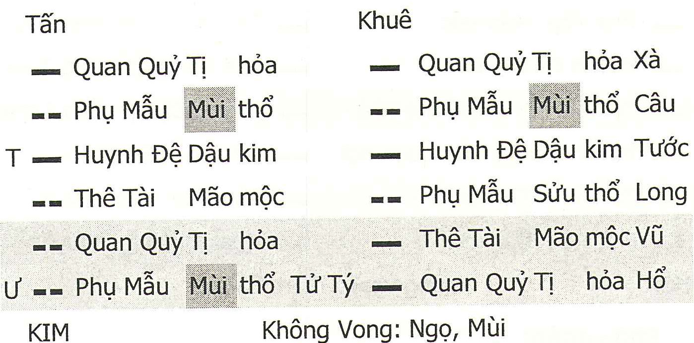

**Ví dụ 6:** Ngày Bính Thân tháng Giáp Thân năm Ất Hợi, nữ đoán sinh con cát hung và giới tính, được quẻ Sơn Phong Cổ biến Địa Phong Thăng.

| Cổ | Thăng |
| :--- | :--- |
| Ứ — Huynh Đệ Dần mộc | - - Quan Quỷ Dậu kim Long |
| - - Phụ Mẫu Tý thủy Tử Tị | - - Phụ Mẫu Hợi thủy Vũ |
| - - Thê Tài Tuất thổ | - - Thê Tài Sửu thổ Hổ |
| T — Quan Quỷ Dậu kim | — Quan Quỷ Dậu kim Xà |
| — Phụ Mẫu Hợi thủy | — Phụ Mẫu Hợi thủy Câu |
| - - Thê Tài Sửu thổ | - - Thê Tài Sửu thổ Tước |

MỘC Không Vong: Thìn, Tị

**Phán đoán:**

Lấy hào Tử Tôn làm Dụng thần.

Tử Tôn Tị hỏa phục dưới hào 5 Phụ Mẫu Tý thủy, Phi khắc Phục không cát. Nhưng Phi thần an tĩnh, Nguyên thần phát động sinh Tử Tôn, chính là trong hung có cứu.

Xem an nguy của bản thân thì lấy hào Thế. Hào Thế và Nhật Nguyệt có ngũ hành giống nhau, vượng tướng là cát.

Tử Tôn Nhật Nguyệt tương hợp là thông tin sinh khó. Nguyên thần Nguyệt phá, tháng Dần Thực Phá, sinh trợ Dụng thần, là tháng Dần sinh.

Tử Tôn là hào âm, hưu tù, hào dương phát động, là sinh con trai.

**Kết quả:** Ngày 5 tháng 2 năm 1996 vừa giao tiết lệnh ngày hôm sau, sinh một con trai, sinh khó.

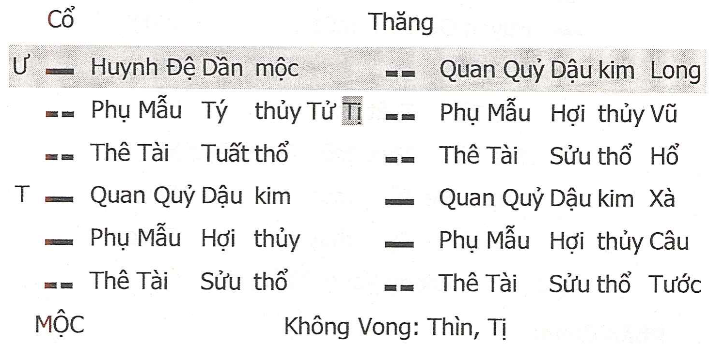

**Ví dụ 7:** Ngày Đinh Sửu tháng Giáp Thìn năm Đinh Sửu, nữ đoán về sinh con, được quẻ Sơn Lôi Di.

| | Di | Phục Thần | Lục Thú |
| :---: | :--- | :--- | :--- |
| | — Huynh Đệ Dần mộc | | Long |
| | - - Phụ Mẫu Tý thủy | Tử Tị | Vũ |
| T | - - Thê Tài Tuất thổ | | Hổ |
| | - - Thê Tài Thìn thổ | Quan Dậu | Xà |
| | - - Huynh Đệ Dần mộc | | Câu |
| Ư | — Phụ Mẫu Tý thủy | | Tước |

MỘC Không Vong: Thân, Dậu

### Phán đoán:

Lấy hào Tử Tôn làm Dụng thần.

Tử Tôn Tị hỏa phục dưới hào 5 Phụ Mẫu Tý thủy, Phi đến khắc Phục, Dụng thần lại không vượng tướng, nhưng không bị Nhật Nguyệt khắc, Phi thần trái lại bị Nhật Nguyệt khắc chế, Phi thần không có lực khắc Phục, không sao.

Hào Thế là người xin đoán, Mộ khố Tử Tôn lâm Thế, là tượng trong bụng có thai. Nay Nguyệt kiến xung phá, tượng mở bụng sinh con. Tháng này sẽ sinh. Lâm Bạch Hổ, Bạch Hổ chủ lâm bồn, cũng là thông tin sắp sinh con.

Tử Tôn hưu tù, tại cung Tốn, Tốn là âm quái, sinh bé gái. Mộ khố Tử Tôn bị Nguyệt xung phá, phá Mộ dễ xuất, sẽ không sinh khó.

**Kết quả:** Giờ Tị ngày Canh Tý tháng đó an toàn sinh hạ một bé gái. Ví dụ này ứng ngày Thai của Tử Tôn và Dụng thần phục tàng, giờ xuất hiện.

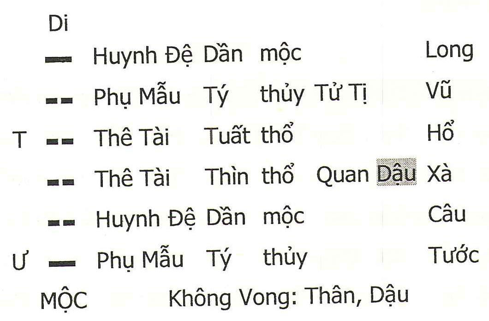

**Ví dụ 8:** Ngày Quý Hợi tháng Kỷ Mùi năm Mậu Dần, nam đoán về cháu gái sinh con và cát hung của đứa bé, được quẻ Địa Lôi Phục biến Địa Sơn Khiêm.

| | Phục | Phục Thần | Khiêm | Lục Thú |
| :---: | :--- | :--- | :--- | :--- |
| | - - Tử Tôn Dậu kim | | - - Tử Tôn Dậu kim | Hổ |
| | - - Thê Tài Hợi thủy | | - - Thê Tài Hợi thủy | Xà |
| Ư | - - Huynh Đệ Sửu thổ | | - - Huynh Đệ Sửu thổ | Câu |
| | - - Huynh Đệ Thìn thổ | | — Tử Tôn Thân kim | Tước |
| | - - Quan Quỷ Dần mộc | Phụ Tị | - - Phụ Mẫu Ngọ hỏa | Long |
| T | — Thê Tài Tý thủy | | - - Huynh Đệ Thìn thổ | Vũ |

THỔ Không Vong: Tý, Sửu

### Phán đoán:

Cháu gái và thai nhi đều thuộc hào Tử Tôn, nhưng trong quẻ chỉ có một hào Tử Tôn, nếu lấy một hào Tử Tôn để phán đoán đồng thời cát hung của thai nhi và cháu gái, hiển nhiên không quá thích hợp. Lúc này phải lấy thêm lục thân sử dụng linh hoạt. Nếu như lấy Tử Tôn Dậu kim làm thai nhi, Huynh Đệ Sửu thổ là Mộ khố Tử Tôn, là người mang thai, cho nên lấy Huynh Đệ Sửu thổ có thể lý giải là cháu gái người này. Nay Mộ khố Tử Tôn Nguyệt phá, là thông tin tháng đó sẽ sinh.

Tử Tôn Dậu kim được Nguyệt sinh phù, là cát.

Tử Tôn là hào âm, lại tại âm quái, sinh bé gái. Huynh Đệ Thìn thổ động hợp Tử Tôn là sinh khó.

Huynh Đệ Sửu thổ nhập Mộ ở Thìn thổ là thông tin cháu gái nhập viện.

**Kết quả:** Cháu gái người này đã sinh một bé gái ở ngày Tân Mùi tháng đó, sinh khó.

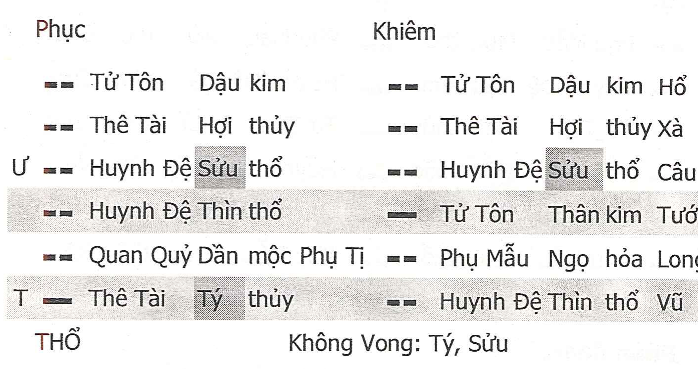

**Ví dụ 9:** Ngày Kỷ Dậu tháng Quý Tị năm Bính Tý, nam đoán về vợ sinh con, được quẻ Trạch Địa Tụy biến Trạch Sơn Hàm.

| | Tụy | Hàm | |
| :---: | :--- | :--- | :---: |
| | -- Phụ Mẫu Mùi thổ | -- Phụ Mẫu Mùi thổ | Câu |
| Ứ | — Huynh Đệ Dậu kim | — Huynh Đệ Dậu kim | Tước |
| | — Tử Tôn Hợi thủy | — Tử Tôn Hợi thủy | Long |
| | -- Thê Tài Mão mộc | — Huynh Đệ Thân kim | Vũ |
| T | -- Quan Quỷ Tị hỏa | -- Quan Quỷ Ngọ hỏa | Hổ |
| | -- Phụ Mẫu Mùi thổ | -- Phụ Mẫu Thìn thổ | Xà |

KIM Không Vong: Dần, Mão

**Phán đoán:**

Lấy Tử Tôn làm Dụng Dụng thần.

Tử Tôn Hợi thủy Nguyệt phá, tháng Hợi Thực Phá, tháng Hợi sinh. Tử Tôn là hào dương, được Nhật sinh phù là vượng tướng, hào âm phát động biến dương cũng chủ sinh con trai.

Thê Tài Mão mộc động hóa hồi đầu khắc không cát, nhưng Mão mộc Tuần Không, núp ở Không địa, chuyển hung thành cát. Nguyệt kiến xung phá Tử Tôn trong quẻ thể hiện là Quan Quỷ Tị hỏa, lâm Bạch Hổ, Bạch Hổ chủ phẫu thuật, lại thêm Thê Tài bị kim khắc, kim chủ đao kiếm, cũng có ý nghĩa là phẫu thuật, ắt là sinh mổ.

**Kết quả:** Ngày Ất Mão Tháng Hợi sinh hạ một con trai, sinh mổ.

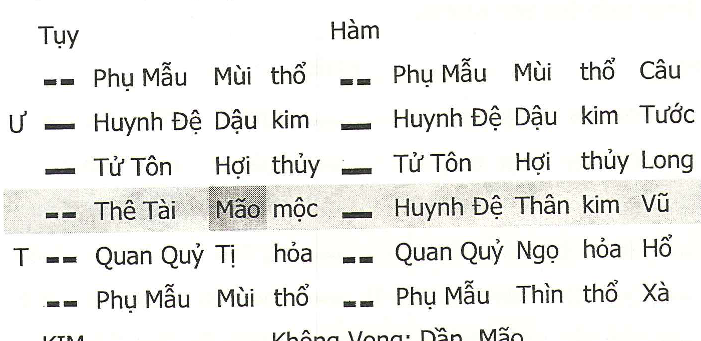

**Ví dụ 10:** Ngày Nhâm Dần tháng Giáp Ngọ năm Bính Tý, vợ mang thai đã 5 tháng nhưng thai nhi trong bụng vẫn chưa thấy động tĩnh, nghi ngờ thai nhi có vấn đề, hỏi khi nào thai động, được quẻ Khôn Vi Địa biến Địa Lôi Phục.

| | Khôn | Phục | |
| :---: | :--- | :--- | :---: |
| T | -- Tử Tôn Dậu kim | -- Tử Tôn Dậu kim | Hổ |
| | -- Thê Tài Hợi thủy | -- Thê Tài Hợi thủy | Xà |
| | -- Huynh Đệ Sửu thổ | -- Huynh Đệ Sửu thổ | Câu |
| Ứ | -- Quan Quỷ Mão mộc | -- Huynh Đệ Thìn thổ | Tước |
| | -- Phụ Mẫu Tị hỏa | -- Quan Quỷ Dần mộc | Long |
| | -- Huynh Đệ Mùi thổ | — Thê Tài Tý thủy | Vũ |

THỔ Không Vong: Thìn, Tị

**Phán đoán:**

Lấy Tử Tôn làm Dụng thần, xem động tĩnh trong quẻ.

Tử Tôn Dậu kim trì Thế, Nguyệt khắc Nhật Tuyệt là hưu tù vô lực cho nên bất động. Nay trong quẻ Mùi thổ phát động sinh Tử Tôn, thần triệu cơ ở động, tháng Mùi thai nhi tất động.

**Kết quả:** Qua như dự đoán, tháng Mùi thai động.

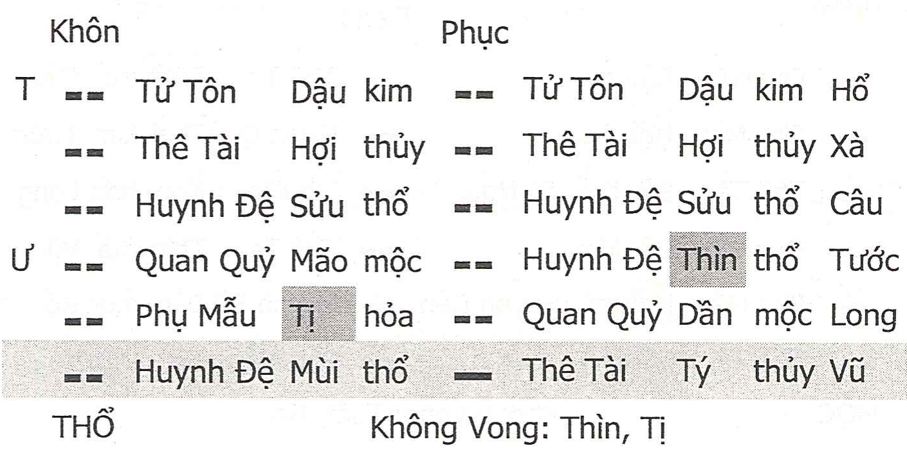

**Ví dụ 11:** Ngày Kỷ Tị tháng Kỷ Hợi năm Bính Tý, nam nghi ngờ cô gái sống chung có thai, đoán được quẻ Địa Phong Thăng biến Lôi Thiên Đại Tráng.

| | Thăng | Phục thần | Đại Tráng | Lục thú |
| :---: | :--- | :--- | :--- | :---: |
| | -- Quan Quỷ Dậu kim | | -- Thê Tài Tuất thổ | Câu |
| | -- Phụ Mẫu Hợi thủy | | -- Quan Quỷ Thân kim | Tước |
| T | -- Thê Tài Sửu thổ | Tử Ngọ | — Tử Tôn Ngọ hỏa | Long |
| | — Quan Quỷ Dậu kim | | — Thê Tài Thìn thổ | Vũ |
| | — Phụ Mẫu Hợi thủy | Huynh Dần | — Huynh Đệ Dần mộc | Hổ |
| Ư | -- Thê Tài Sửu thổ | | — Phụ Mẫu Tý thủy | Xà |

MỘC Không Vong: Tuất, Hợi

**Phán đoán:**

Lấy Tử Tôn làm Dụng thần. Thế lâm Thê Tài Sửu thổ hóa ra Tử Tôn Ngọ hỏa, Ứng lâm Thê Tài Sửu thổ hóa ra hào thai Phụ Mẫu Tý thủy, Tử Tôn Ngọ hỏa được Nhật tỉ phù vượng tướng, hào thai Phụ Mẫu Tý thủy cũng được Nguyệt kiến tỉ phù, Tài là người yêu, Thế lâm Thanh Long, chủ thai hỷ (tin mừng có thai), chắc chắn đã có thai.

Phụ Mẫu Hợi thủy hai tầng ám động khắc Tử Tôn, đây là thông tin sẽ phá thai.

**Kết quả:** Đến bệnh viện kiểm tra phát hiện có thai, hai người chưa có ý định kết hôn ngay, thế là đã phẫu thuật phá thai.

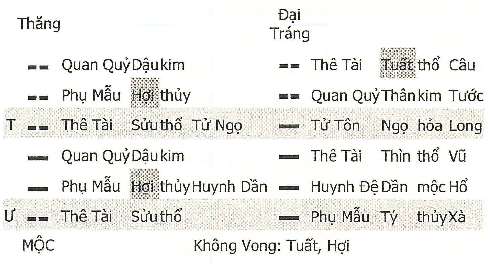

**Ví dụ 12:** Ngày Bính Ngọ tháng Canh Dần năm Tân Tị, nam có vợ đã sinh hai con gái, bản thân muốn có con trai, nay vợ lại mang thai, hỏi đứa con thứ ba là nam hay nữ? Được quẻ Sơn Địa Bác biến Trạch Thủy Khốn.

| | Bác | Khốn | Lục thú |
| :---: | :--- | :--- | :---: |
| | — Thê Tài Dần mộc | -- Phụ Mẫu Mùi thổ | Long |
| T | -- Tử Tôn Tý thủy | — Huynh Đệ Dậu kim | Vũ |
| | -- Phụ Mẫu Tuất thổ | — Tử Tôn Hợi thủy | Hổ |
| | -- Thê Tài Mão mộc | -- Quan Quỷ Ngọ hỏa | Xà |
| Ư | -- Quan Quỷ Tị hỏa | — Phụ Mẫu Thìn thổ | Câu |
| | -- Phụ Mẫu Mùi thổ | -- Thê Tài Dần mộc | Tước |

KIM Không Vong: Dần, Mão

**Phán đoán:**

Lấy Tử Tôn làm Dụng thần.

Tử Tôn Tý thủy trì Thế, động mà hóa hồi đầu sinh, là thông tin đã mang thai. Hào lâm Tử Tôn là âm, không được Nhật Nguyệt sinh phù là hưu tù, trong quẻ có bốn hào phát động, nhiều hào phát động thì xem hào tĩnh, hai hào tĩnh đều là hào âm, đứa con thứ ba cũng là nữ.

**Kết quả:** Ở ngày Đinh Mùi tháng Tý sinh hạ một bé gái.

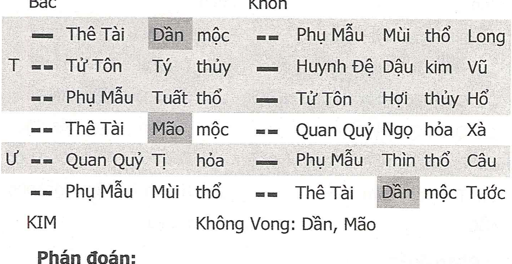

**Ví dụ 13:** Ngày Ất Hợi tháng Kỷ Hợi năm Tân Tị, nam có vợ đã làm phẫu thuật phá thai, nhưng bụng vẫn hơi phồng, phải chăng bỏ sót thai nhi? Được quẻ Thủy Phong Tỉnh biến Khảm Vi Thủy.

| Tỉnh | | Khảm | |
| :--- | :---: | :--- | :---: |
| - - Phụ Mẫu Tý thủy | | - - Phụ Mẫu Tý thủy | Vũ |
| T — Thê Tài Tuất thổ | | — Thê Tài Tuất thổ | Hổ |
| - - Quan Quỷ Thân kim | Tử Ngọ | - - Quan Quỷ Thân kim | Xà |
| — Quan Quỷ Dậu kim | | - - Tử Tôn Ngọ hỏa | Câu |
| Ứ — Phụ Mẫu Hợi thủy | Huynh Dần | — Thê Tài Thìn thổ | Tước |
| - - Thê Tài Sửu thổ | | - - Huynh Đệ Dần mộc | Long |

MỘC Không Vong: Thân, Dậu

**Phán đoán:**

Lấy Tử Tôn làm Dụng thần.

Tử Tôn Ngọ hỏa phục tàng, bị Nhật Nguyệt khắc thương, Tuyệt ở Nhật Nguyệt, Quan Quỷ Dậu kim độc phát, Dậu kim là Tử địa Dụng thần, là thông tin trong bụng không có thai nhi, chứng tỏ không bỏ sót.

**Kết quả:** Phán đoán chính xác.

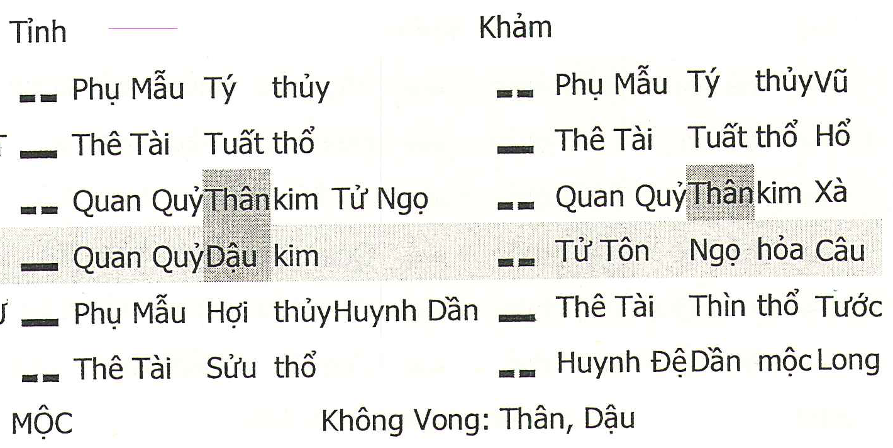

# CHƯƠNG 31
## DỰ ĐOÁN BỆNH TẬT

Bất kể y học hiện đại phát triển ra sao cũng không thể tiêu diệt được hết tất cả bệnh tật trên thế giới. Những nghiên cứu khoa học gần đây cho biết bệnh tật của con người có liên quan rất lớn đến gen. Nói cách khác, bệnh tật của con người sinh ra đã có, tức là trong mệnh đã định trước. Như vậy chẳng phải là nói rằng người đã có bệnh tật thì không cần phải điều trị? Điều này đã trở thành quan điểm của túc mệnh luận. Mục đích của dự đoán chính là để thay đổi, chính là để nắm bắt vận mệnh. Con người là một bộ phận của vũ trụ, giống với vũ trụ là phát triển theo quy luật nhất định, nhưng ở một mức độ nào đó lại có thể thay đổi một chút. Đây cũng là chỗ ý nghĩa của dự trắc học. Bằng không, dự đoán hay không dự đoán, sự vật vẫn phát triển không thay đổi theo hướng ban đầu, thì dự đoán cũng không có giá trị gì. Bởi vì bệnh tật có thể thay đổi, cho nên người ta mới xây dựng rất nhiều bệnh viện, dự phòng và điều trị bệnh tật.

Trong dự đoán bệnh tật, mỗi lục thân vốn có rất nhiều ý nghĩa. Quan Quỷ là bệnh, Tử Tôn là y dược, Thê Tài là ẩm thực, Phụ Mẫu là tuổi thọ, Huynh Đệ là trở lực. Nhưng đây chỉ là cách dùng rất cứng nhắc của người xưa, căn bản không thích ứng với yêu cầu dự đoán hiện đại. Bê nguyên xi những ý nghĩa này, tỷ lệ chính xác sẽ giảm đi rất nhiều. Dự đoán bệnh tật là phải phán đoán xoay quanh cát hung của Dụng thần, mà phán đoán chứng bệnh cũng là lấy Dụng thần làm trung tâm mới có tỷ lệ chính xác cao.

Dự đoán bệnh tật, tùy vào người được dự đoán khác nhau mà Dụng thần cũng khác nhau. Về cách chọn Dụng thần, có thể tham khảo chương Dụng thần. Dự đoán quan trọng nhất là cát hung của người bệnh, tiếp đó mới là ứng kỳ, chứng bệnh và nguyên nhân phát bệnh v.v.

◆ Bệnh lâu, gặp Dụng thần Không Vong, Dụng thần bị xung, quẻ chính lục xung, quẻ biến lục xung là hung. Lục hợp là cát. Trái lại, bệnh gần Dụng thần Không, động mà hóa Không, đều là tượng cát; gặp hợp, quẻ lục hợp thì không cát. Bệnh gần thường là trong vòng ba tháng, bệnh lâu thường là ba tháng trở lên.

◆ Dụng thần được Nhật Nguyệt sinh phù, tỉ trợ là cát, nhưng cũng không được quá vượng, vật cực tất phản, quá vượng cũng là hung. Nói về quá vượng, Nhật Nguyệt đều có ngũ hành giống Dụng thần, hoặc sinh phù Dụng thần, mà trong quẻ lại có hai hào trợ giúp Dụng thần, hoặc Dụng thần hiện nhiều, không có Kỵ thần khắc chế, đó chính là quá vượng.

◆ Dụng thần vượng tướng, được hào khác sinh phù là cát. Không nên hưu tù không có gốc rễ, không có sinh khí. Bằng không, cho dù có được hào động đến sinh thì cũng như cây không có gốc rễ, sinh phù bất khởi.

◆ Kỵ thần phát động không cát, nhưng nếu Nguyên thần đồng thời phát động thì không sao, có thể chuyển hung thành cát.

◆ Dụng thần nên hóa Tiến thần, hóa hồi đầu sinh; Kỵ thần thì nên hóa Thoái thần, hóa hồi đầu khắc.

◆ Quẻ gặp phản ngâm, phục ngâm là không cát.

◆ Dụng thần nhập Mộ ở Quan Quỷ là không cát. Đoán bệnh của bản thân, Thế lâm Quan Quỷ, hưu tù nhập Mộ cũng không cát.

◆ Dụng thần hưu tù, động mà hóa Quan Quỷ là hung.

◆ Cát hung của bệnh chủ yếu là xem suy vượng của Dụng thần, phán đoán chứng bệnh thì phải xem quái cung, ngũ hành, hào vị, lục thần v.v.

◆ Thủy chủ thận, tai, bàng quang v.v; mộc chủ gan, mật, ruột, thần kinh v.v; hỏa chủ tim, máu, mắt, ruột non v.v; kim chủ phổi, xương cốt, ruột già v.v; thổ chủ lá lách, dạ dày, da v.v

◆ Cung Càn chủ đầu, phổi, ruột già v.v; cung Khôn chủ tỳ vị, bụng, da thịt v.v; cung Chấn chủ gan mật, thần kinh, bệnh chân v.v; cung Tốn chủ gan mật, đùi, trúng gió v.v; cung Khảm chủ tai, bàng quang, thận, huyết áp cao, hệ tiết niệu v.v; cung Ly chủ tim, mắt, máu, ruột v.v; cung Cấn chủ tỳ vị, tay, vai, mũi v.v ; cung Đoài chủ khoang miệng, phổi, ruột, dạ dày v.v

**Ví dụ 1:** Ngày Canh Thìn tháng Tý, nữ gọi điện thoại đoán bệnh bản thân, được Địa Sơn Khiêm biến Lôi Địa Dự.

| | Khiêm | | Dự | |
| :---: | :--- | :---: | :--- | :--- |
| | - - Huynh Đệ Dậu kim | | - - Phụ Mẫu Tuất thổ | Xà |
| T | - - Tử Tôn Hợi thủy | | - - Huynh Đệ Thân kim | Câu |
| | - - Phụ Mẫu Sửu thổ | | — Quan Quỷ Ngọ hỏa | Tước |
| | — Huynh Đệ Thân kim | | - - Thê Tài Mão mộc | Long |
| Ứ | - - Quan Quỷ Ngọ hỏa | Tài Mão | - - Quan Quỷ Tị hỏa | Vũ |
| | - - Phụ Mẫu Thìn thổ | | - - Phụ Mẫu Mùi thổ | Hổ |

KIM Không Vong: Thân, Dậu

**Phán đoán:**

Lấy hào Thế làm Dụng thần.

Trong quẻ Sửu thổ phát động hóa Quan khắc Thế, là bị bệnh ở ngày Sửu. Quẻ tại cung Đoài chủ khoang miệng, Tử Tôn Hợi thủy tại hào 5 lâm Câu Trần, tất là cổ họng sưng lên.

Tài không hiện trên quẻ, phục dưới hào 2 Quỷ, Tài chủ ẩm thực, Quỷ chủ bệnh tật, là bởi vì bị bệnh mà không thể ăn. Tử Tôn là y dược, là thủy, chủ truyền nước biển.

Hào 2 Quan Quỷ lâm Huyền Vũ, hào 2 chủ bộ phận sinh dục, Quan chủ bệnh, Huyền Vũ chủ chuyện khó nói.

Thế lâm Câu Trần chủ khối u, là có u xơ tử cung. Nhưng Quan Quỷ lâm Nguyệt phá, đã cắt bỏ.

Nguyên thần Thân kim Tuần Không, Không không sinh Dụng, xuất Không thì sinh, ngày Thân nhất định khỏi.

**Kết quả:** Yết hầu sưng đau nên không thể nuốt, truyền nước biển tại nhà, bị bệnh ở ngày Sửu, ngày Thân khỏi bệnh, đã từng phẫu thuật u xơ tử cung.

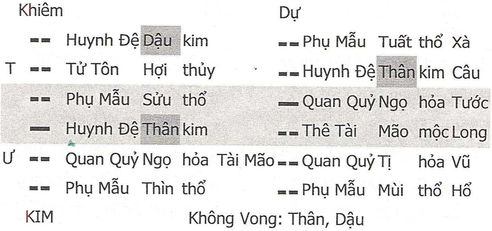

**Ví dụ 2:** Ngày Nhâm Ngọ tháng Tý năm Ất Hợi, nam hỏi cha bệnh lâu, được Thủy Hỏa Ký Tế biến Phong Lôi Ích.

| | Ký Tế | | | Ích | |
| :--- | :---: | :--- | :---: | :--- | :--- |
| Ứ | - - | Huynh Đệ Tý thủy | — | Tử Tôn Mão mộc | Hổ |
| | — | Quan Quỷ Tuất thổ | — | Thê Tài Tị hỏa | Xà |
| | - - | Phụ Mẫu Thân kim | - - | Quan Quỷ Mùi thổ | Câu |
| T | — | Huynh Đệ Hợi thủy Tài Ngọ | - - | Quan Quỷ Thìn thổ | Tước |
| | - - | Quan Quỷ Sửu thổ | - - | Tử Tôn Dần mộc | Long |
| | — | Tử Tôn Mão mộc | — | Huynh Đệ Tý thủy | Vũ |

THỦY Không Vong: Thân, Dậu

**Phán đoán:**

Lấy hào Phụ Mẫu làm Dụng thần.

Dụng thần Phụ Mẫu Thân kim hưu tù, Tử ở Nguyệt kiến, bị Nhật thần Ngọ hỏa khắc thương, lại trị Tuần Không, bệnh lâu gặp Không thì chết.

Quẻ thuộc cung Khảm, Khảm chủ thận, bàng quang. Hào 3 Huynh Đệ Hợi thủy là Bệnh địa Dụng thần, động mà hóa ra Quan Quỷ Thìn thổ, thủy chủ nước tiểu, Thìn thổ là thủy khố, là bộ phận tích trữ nước tiểu, chứng tỏ bệnh ở bàng quang. Dụng thần lâm Câu Trần chủ khối u, cho nên là ung thư bàng quang. Thê Tài Nguyệt phá, không hiện trên quẻ, người bệnh ăn uống giảm nhiều.

Hào 6 Huynh Đệ Tý thủy lâm Nguyệt kiến hóa Tử Tôn Mão mộc, Huynh Đệ chủ tốn kém tiền thuốc, Tử Tôn chủ y dược, chứng tỏ đã tốn không ít tiền điều trị.

Trong quẻ hào Huynh Đệ lưỡng động, Huynh động bệnh khó khỏi, hào 6 Huynh Đệ Tý thủy lâm Bạch Hổ phát động, Tý thủy là Tử địa Dụng thần, Bạch Hổ chủ tang, đề phòng năm Tý bất lợi.

**Kết quả:** Tháng Tị năm Bính Tý, cha qua đời vì ung thư bàng quang. Ứng tháng Tị vì gặp hình khắc.

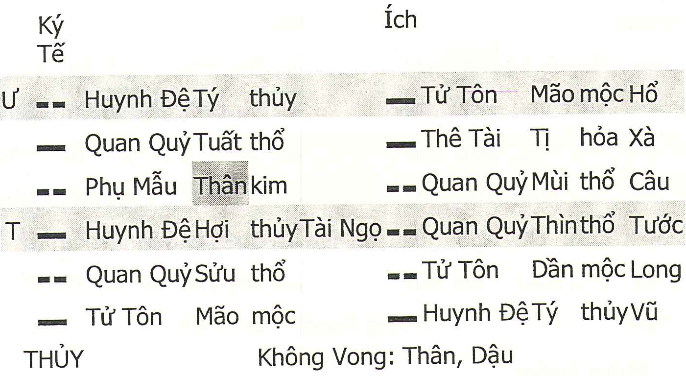

**Ví dụ 3:** Ngày Ất Mão tháng Mão, một người phụ nữ nhận được cuộc gọi từ người nhà nói rằng cha bị bệnh nguy kịch, bảo cô ấy nhanh chóng trở về, trước khi về đoán được quẻ Thủy Thiên Nhu biến Địa Lôi Phục.

| | Nhu | | Phục | |
| :--- | :--- | :--- | :--- | :--- |
| | - - Thê Tài Tý thủy | | - - Tử Tôn Dậu kim | Vũ |
| | — Huynh Đệ Tuất thổ | | - - Thê Tài Hợi thủy | Hổ |
| T | - - Tử Tôn Thân kim | | - - Huynh Đệ Sửu thổ | Xà |
| | — Huynh Đệ Thìn thổ | | - - Huynh Đệ Thìn thổ | Câu |
| | — Quan Quỷ Dần mộc | Phụ Tị | - - Quan Quỷ Dần mộc | Tước |
| Ư | — Thê Tài Tý thủy | | — Thê Tài Tý thủy | Long |

THỔ

Không Vong: Tý, Sửu

**Phán đoán:**

Lấy hào Phụ Mẫu làm Dụng thần.

Dụng thần Phụ Mẫu Tị hỏa không hiện trên quẻ, phục dưới hào 2 Quan Quỷ Dần mộc, hào 2 là trạch (nơi ở), Dụng phục dưới hào 2 là cha nằm bệnh ở nhà. Dụng thần được Nhật Nguyệt sinh phù, lại có hào Phi động tới sinh, có sinh không khắc là thái quá.

Nội quái phục ngâm, người bệnh phục ở trên giường rất đau đớn. Quẻ gặp du hồn, ý thức người bệnh như có như không, tính mạng nguy kịch.

Dụng lâm Tị hỏa, vượng mộc sinh trợ, lại gặp Chu Tước là chứng nhiệt. Trong quẻ Dần mộc động mà sinh Dụng, khởi bệnh ở Lập Xuân (Lập Xuân là bắt đầu tháng Dần).

Hào 5 Huynh Đệ Tuất thổ là Mộ khố của Dụng thần, Dụng thần quá vượng cần Mộ khố thu tàng, hỏa khí phải ra khỏi đây mới có thể hoãn giảm bệnh tình.

Thổ là mũi, lâm Bạch Hổ động mà hóa ra Thê Tài Hợi thủy, Tài chủ máu, Bạch Hổ cũng chủ máu, nhất định chảy máu mũi.

Nhật Nguyệt hợp trú Mộ khố, thì hỏa không thể hạ xuống, trong quẻ hào 3 Huynh Đệ Thìn thổ động mà xung khai hỏa khố Tuất thổ, Thìn thổ chính là hỷ thần. Thìn thổ hưu tù, bị Nhật

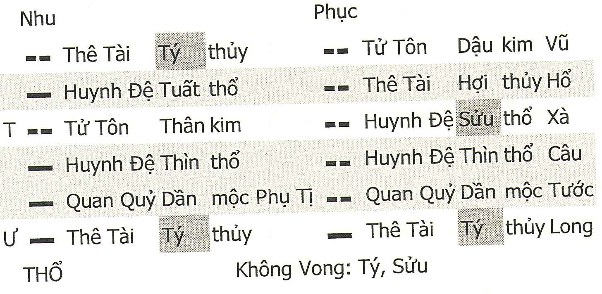

Nguyệt hào động ba tầng Quan Quỷ khắc chế, hào 3 là bụng, quẻ tại cung Khôn cũng chủ bụng, lâm Câu Trần bụng tất sưng trướng.

Mặc dù hào 2 Quan Quỷ là Nguyên thần, nhưng Dụng thần quá vượng, không hợp sinh trợ, Nguyên thần cũng trở thành kẻ thù.

Hào 2 là bộ phận sinh dục, lâm Chu Tước, tiểu tiện đỏ vàng. Trong quẻ hào Huynh lưỡng động, Thê Tài Tý thủy Tuần Không, ăn uống khó xuống.

Quẻ gặp du hồn, phần lớn chủ quên, đầu óc mơ hồ không nhớ được gì. Tử Tôn Thân kim trì Thế, bản thân là y dược, tất điều trị ở nhà, nhưng hưu tù vô lực, hiệu quả không tốt.

Quẻ biến lục hợp, bệnh mới không nên, bệnh mới gặp hợp tất chết. Hôm nay mặc dù có hung cũng không sao, đến giờ Dậu xung khai Mão mộc hợp khố liền giải nguy. Nhưng trong tuần tiếp theo, Tuất thổ Tuần Không, lực hỏa giáng xuống giảm nhiều, nếu như lại gặp ngày Đinh Mão hợp trú Tuất thổ sinh trợ Dụng thần, tất nguy.

Nội quái phục ngâm, người bệnh không nên thay đổi chỗ ở. Trong quẻ mộc động sinh hỏa, Tử Tôn là kim có thể khắc Nguyên thần, nếu như trên người đeo tượng đồng, hoặc đeo đồ trang sức vàng bạc, hoặc uống hoàng kim thang (黄金汤) thì có thể có cứu.

Hào Tài là ẩm thực Tuần Không, phải tránh uống thuốc bổ vì trợ mộc sinh hỏa.

**Kết quả:** Bệnh tật đúng như phán đoán, cha cô bị chảy máu mũi, trong bụng khó chịu như lửa đốt, người nhà gọi điện thoại tới nói người bệnh đã bất tỉnh nhân sự, quan tài và áo liệm đều đã chuẩn bị xong, bảo cô tức tốc trở về. Sau khi cô gái này trở về, buổi tối cha lại tỉnh lại, cô ấy lấy ra một tượng phật nhỏ bằng đồng để cha mang theo bên mình, nhưng cha cô lại không chịu mang. Để chăm sóc người bệnh thuận tiện, anh trai cô đã đem cha về nhà mình. Sau đó bởi vì không thể chịu nổi sự giày vò của bệnh tật, cha cô đã nuốt nhẫn vàng tự sát, nhẫn bị mắc kẹt ở cổ họng không xuống được, có người phát hiện đã lấy ra.

Đến ngày Đinh Mão (12 ngày sau), chị dâu của cô muốn cho người bệnh uống đường glucose, cô ngăn cản không cho uống, nhưng chị dâu nói rằng người bệnh ăn uống không điều độ đã lâu, nên bồi bổ một chút, hơn nữa còn nói bệnh nhân ở bệnh viện cũng dùng đường glucose, sẽ không sao đâu. Thế là để cho người bệnh uống. Sau khi uống xong, cha cô cảm thấy trong bụng nóng ran không thể chịu nổi, toàn thân phát sốt, liền cởi sạch quần áo nhảy xuống nước cũng chẳng ăn thua gì, cùng ngày qua đời.

**Ví dụ 4:** Ngày Đinh Sửu tháng Tuất, tài xế đơn vị của bạn vợ tôi đột nhiên bị ngất, bệnh viện chẩn đoán là u não và dự định ngày hôm sau sẽ phẫu thuật. Người bệnh nhờ chuyển lời đoán bệnh của bản thân, tôi gieo được quẻ Sơn Thủy Mông biến Khôn Vi Địa.

| | Mông | Khôn | |
| :---: | :--- | :--- | :--- |
| | — Phụ Mẫu Dần mộc | -- Thê Tài Dậu kim | Long |
| | -- Quan Quỷ Tý thủy | -- Quan Quỷ Hợi thủy | Vũ |
| T | -- Tử Tôn Tuất thổ | -- Tử Tôn Sửu thổ | Hổ |
| | -- Huynh Đệ Ngọ hỏa | -- Phụ Mẫu Mão mộc | Xà |
| | — Tử Tôn Thìn thổ | -- Huynh Đệ Tị hỏa | Câu |
| Ứ | -- Phụ Mẫu Dần mộc | -- Tử Tôn Mùi thổ | Tước |

HỎA Không Vong: Thân, Dậu

**Phán đoán:**

Lấy hào Thế làm Dụng thần.

Tử Tôn trì Thế lâm Bạch Hổ, Bạch Hổ chủ máu, tổ hợp Bạch Hổ với Tử Tôn chính là mạch máu. Kỵ thần tại hào 6 phát động khắc hào Thế, Dần mộc lại là Bệnh địa của hào Thế, do đó lấy Phụ Mẫu Dần mộc để xem bệnh.

Hào 6 là đầu, chính là vấn đề về mạch máu trên đầu, không phải là u não.

Kỵ thần động hóa hồi đầu khắc, bệnh không nghiêm trọng.

**Kết quả:** Ngày hôm sau, khi kiểm tra lại trước khi phẫu thuật thì phát hiện không phải là u não, mà là do tắc nghẽn mạch máu, sau khi được chích máu liền khỏi bệnh.

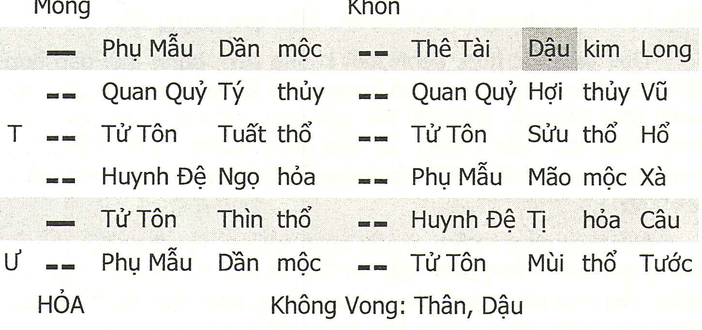

**Ví dụ 5:** Ngày Đinh Sửu tháng Tuất, vợ tôi đoán bệnh của đồng nghiệp, được quẻ Chấn Vi Lôi biến Lôi Hỏa Phong.

| | Chấn | Phong | |
| :---: | :--- | :--- | :--- |
| T | -- Thê Tài Tuất thổ | -- Thê Tài Tuất thổ | Long |
| | -- Quan Quỷ Thân kim | -- Quan Quỷ Thân kim | Vũ |
| | — Tử Tôn Ngọ hỏa | — Tử Tôn Ngọ hỏa | Hổ |
| Ứ | -- Thê Tài Thìn thổ | — Phụ Mẫu Hợi thủy | Xà |
| | -- Huynh Đệ Dần mộc | -- Thê Tài Sửu thổ | Câu |
| | — Phụ Mẫu Tý thủy | — Huynh Đệ Mão mộc | Tước |

MỘC Không Vong: Thân, Dậu

**Phán đoán:**

Lấy hào Ứng làm Dụng thần. Ứng lâm Đằng Xà Nguyệt phá, thổ là dạ dày, hào 3 cũng là hào vị dạ dày, Đằng Xà chủ vật nhỏ bé, ở đây có thể hiểu là niêm mạc dạ dày, vì vậy đoán là loét niêm mạc dạ dày. Thìn thổ Nguyệt phá, năm Canh Thìn Thực Phá, đoán là có bệnh ở năm 2000. Dụng thần được Nhật tỉ phù, sang tháng thì có thể lành bệnh.

**Kết quả:** Quả nhiên ứng nghiệm. Tại năm Canh Thìn người này uống rượu quá nhiều mà bị bệnh.

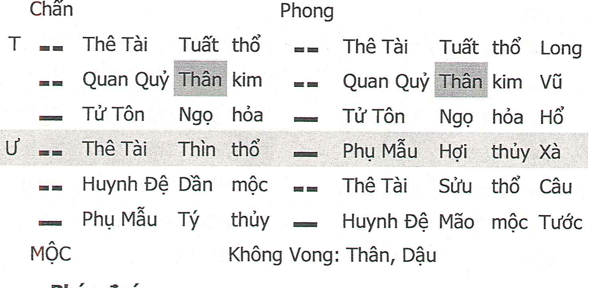

**Ví dụ 6:** Ngày Nhâm Ngọ tháng Tuất, một cô gái người Nhật Bản đoán bệnh, được quẻ Hỏa Phong Đỉnh biến Thủy Thiên Nhu.

| | | Đỉnh | | Nhu | |
| :---: | :---: | :--- | :---: | :--- | :---: |
| | — | Huynh Đệ Tị hỏa | -- | Quan Quỷ Tý thủy | Hổ |
| Ư | -- | Tử Tôn Mùi thổ | — | Tử Tôn Tuất thổ | Xà |
| | — | Thê Tài Dậu kim | -- | Thê Tài Thân kim | Câu |
| | — | Thê Tài Dậu kim | — | Tử Tôn Thìn thổ | Tước |
| T | — | Quan Quỷ Hợi thủy | — | Phụ Mẫu Dần mộc | Long |
| | -- | Tử Tôn Sửu thổ | — | Quan Quỷ Tý thủy | Vũ |

HỎA

Không Vong: Thân, Dậu

**Phán đoán:**

Lấy hào Thế làm Dụng thần.

Hào Thế tại hào 2, bị Nguyệt khắc thương, lại bị hào động Tử Tôn Mùi thổ và Tử Tôn Sửu thổ khắc chế, may mà có Nguyên thần phát động giải cứu.

Hào sơ Sửu thổ lại bị hào biến hợp trú, tham hợp quên khắc, bệnh có thể điều trị. Hào 2 là tử cung, tôi đoán cô ấy có u xơ tử cung và đề nghị cô ấy đến bệnh viện kiểm tra.

**Kết quả:** Tìm ra u xơ tử cung và tiến hành phẫu thuật.

**Ví dụ 7:** Ngày Quý Mùi tháng Tuất, Dịch hữu Mao tiên sinh ở Giang Tô hỏi, cha của một người nhập viện vì tai nạn giao thông, cát hung thế nào? Được quẻ Sơn Trạch Tổn biến Địa Trạch Lâm.

| | | Tổn | | Lâm | |
| :---: | :---: | :--- | :---: | :--- | :---: |
| Ư | — | Quan Quỷ Dần mộc | -- | Tử Tôn Dậu kim | Hổ |
| | -- | Thê Tài Tý thủy | -- | Thê Tài Hợi thủy | Xà |
| | -- | Huynh Đệ Tuất thổ | -- | Huynh Đệ Sửu thổ | Câu |
| T | -- | Huynh Đệ Sửu thổ | -- | Huynh Đệ Sửu thổ | Tước |
| | — | Quan Quỷ Mão mộc | — | Quan Quỷ Mão mộc | Long |
| | — | Phụ Mẫu Tị hỏa | — | Phụ Mẫu Tị hỏa | Vũ |

THỔ

Không Vong: Thân, Dậu

**Phán đoán:**

Lấy hào Phụ Mẫu làm Dụng thần, Dụng thần không được Nhật Nguyệt sinh phù. Nguyên thần tuy rằng phát động nhưng cũng không được Nhật Nguyệt sinh phù, lại nhập Mộ ở Nhật, lại động hóa hồi đầu khắc, không cát.

Dụng thần nhập Mộ ở Nguyệt chính là tượng cha bị hôn mê.

Tháng này Dụng thần không bị khắc nên chưa nguy hiểm, đến tháng Hợi, Dụng thần Phụ Mẫu Tị hỏa bị xung khắc, Nguyên thần Dần mộc lại bị hợp trú không thể sinh Dụng thần, chắc chắn hung.

**Kết quả:** Quả nhiên về sau chết ở tháng Hợi.

**Ví dụ 8:** Ngày Giáp Dần tháng Tý, một nữ sĩ người Nhật Bản đoán sức khỏe, được quẻ Hỏa Phong Đỉnh biến Ly Vi Hỏa.

| | Đỉnh | | Ly | |
| :---: | :--- | :---: | :--- | :--- |
| | — Huynh Đệ Tị hỏa | | — Huynh Đệ Tị hỏa | Vũ |
| Ứ | - - Tử Tôn Mùi thổ | | - - Tử Tôn Mùi thổ | Hổ |
| | — Thê Tài Dậu kim | | — Thê Tài Dậu kim | Xà |
| | — Thê Tài Dậu kim | | — Quan Quỷ Hợi thủy | Câu |
| T | — Quan Quỷ Hợi thủy | | - - Tử Tôn Sửu thổ | Tước |
| | - - Tử Tôn Sửu thổ | Phụ Mão | — Phụ Mẫu Mão mộc | Long |

HỎA　　Không Vong: Tý, Sửu

**Phán đoán:**

Lấy hào Thế làm Dụng thần. Hào Thế được Nguyệt kiến tỉ phù là vượng, do đó không có bệnh tật nguy hiểm đến tính mạng. Nguyên thần là Tài, thể hiện máu, nhập Mộ ở Tử Tôn Sửu thổ, lực sinh Thế bị yếu đi, chứng tỏ cung cấp máu không đủ, thiếu máu. Thế tại hào 2 động hóa hồi đầu khắc, hào 2 là tử cung, có bệnh phụ khoa. Nhưng hào biến bị Nhật thần khắc chế, không quá nghiêm trọng.

**Kết quả:** Quả như dự đoán.

## PHÁN ĐOÁN TỔNG HỢP VỀ BỆNH TẬT

Cơ thể con người rất phức tạp, bệnh tật cũng đủ loại đủ kiểu. Có người chỉ bị một loại bệnh, có người lại mắc nhiều loại bệnh khác nhau. Nếu muốn phán đoán cát hung của bệnh tật thì chỉ cần nhìn vào suy vượng của Dụng thần là được, nhưng nếu muốn phán đoán ra nhiều loại bệnh tật và nguyên nhân sinh bệnh thì cần phải có một trình độ dự đoán hết sức vững chắc. Có thể nói, khả năng đưa ra phán đoán tổng hợp về một quái tượng cũng thể hiện trình độ của dự trắc sư như thế nào. Nếu như không có khả năng này thì rất khó hóa giải được sự việc bất lợi.

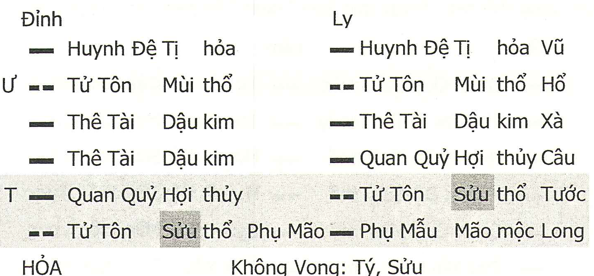

**Ví dụ 1:** Ngày Kỷ Sửu tháng Dậu, nữ đoán vận khí, được Hỏa Thiên Đại Hữu biến Thiên Lôi Vô Vọng.

| | Đại Hữu | Vô Vọng | |
| :---: | :--- | :--- | :--- |
| Ứ | — Quan Quỷ Tị hỏa | — Phụ Mẫu Tuất thổ | Câu |
| | - - Phụ Mẫu Mùi thổ | — Huynh Đệ Thân kim | Tước |
| | — Huynh Đệ Dậu kim | — Quan Quỷ Ngọ hỏa | Long |
| T | — Phụ Mẫu Thìn thổ | - - Phụ Mẫu Thìn thổ | Vũ |
| | — Thê Tài Dần mộc | - - Thê Tài Dần mộc | Hổ |
| | — Tử Tôn Tý thủy | — Tử Tôn Tý thủy | Xà |

KIM　　Không Vong: Ngọ, Mùi

**Phán đoán:**

Trước tiên xem tài vận, nội quái Thê Tài Dần mộc bị Nguyệt kiến khắc thương, hưu tù vô khí, tài vận không tốt.

Hôn nhân xem Quan Quỷ, Quan Quỷ Tị hỏa hưu tù lâm Câu Trần, chồng lười biếng. Nguyên thần nhập Mộ ở hào động Mùi thổ, không sinh Quan Quỷ, lại nội quái phục ngâm, hôn nhân cũng không tốt đẹp, vợ chồng bất hòa.

Sức khỏe xem hào Thế. Hào Thế lâm hào 3, hào 3 là Mộ khố của Tử Tôn, hào 3 lại là hào vị tử cung, bị hào 2 Dần mộc khắc thương, có bệnh phụ khoa, lâm Huyền Vũ cũng chủ bệnh phụ khoa.

Kỵ thần tại hào 2, là mộc chủ ruột, hào 3 là thổ bị khắc, là ruột và dạ dày không khỏe mạnh.

Hào 5 phát động, Kỵ thần nhập Mộ ở Mùi thổ, bộ vị tương ứng với Mùi thổ có bệnh. Tài là ẩm thực, tại hào 5 có thể suy ra là sữa, Tài khố chính là vú. Vì vậy có viêm tuyến vú.

**Kết quả:** Tất cả đúng như phán đoán.

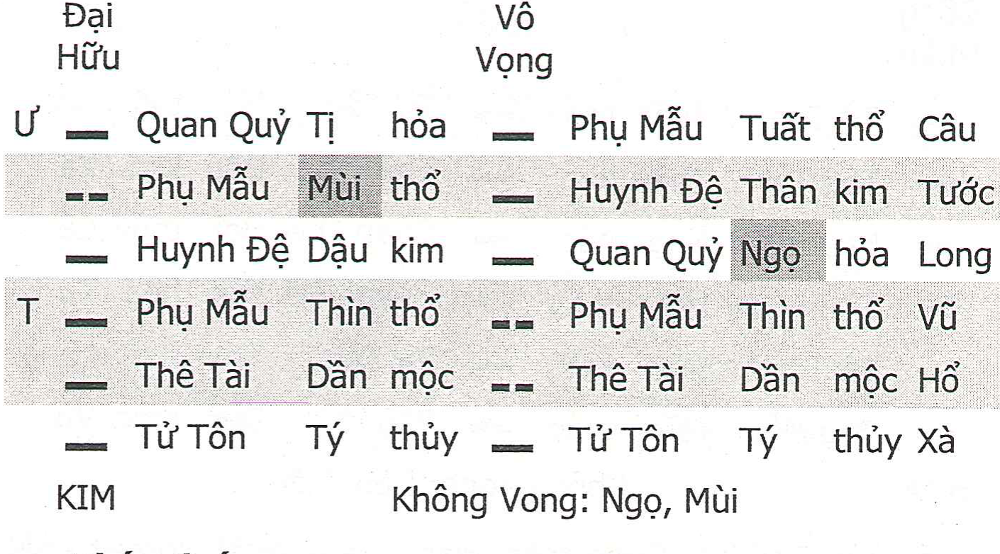

### Ví dụ 2: Ngày Quý Sửu tháng Thìn, nữ đoán bệnh, được quẻ Thiên Hỏa Đồng Nhân biến Trạch Thủy Khốn.

| | | Đồng Nhân | | Khốn | |
| :---: | :---: | :--- | :---: | :--- | :--- |
| Ứ | — | Tử Tôn Tuất thổ | - - | Tử Tôn Mùi thổ | Hổ |
| | — | Thê Tài Thân kim | — | Thê Tài Dậu kim | Xà |
| | — | Huynh Đệ Ngọ hỏa | — | Quan Quỷ Hợi thủy | Câu |
| T | — | Quan Quỷ Hợi thủy | - - | Huynh Đệ Ngọ hỏa | Tước |
| | - - | Tử Tôn Sửu thổ | — | Tử Tôn Thìn thổ | Long |
| | — | Phụ Mẫu Mão mộc | - - | Phụ Mẫu Dần mộc | Vũ |

HỎA  
Không Vong: Dần, Mão

Lấy hào Thế làm Dụng thần. Hào Thế bị Nhật Nguyệt khắc thương, hưu tù vô khí không cát.

Kỵ thần lâm hào 6 động mà khắc Thế, hào 6 là đầu, lâm Bạch Hổ chủ máu, quẻ cung Ly, là huyết áp thấp.

Một Kỵ thần khác là Tử Tôn Sửu thổ lâm hào 2 khắc Dụng thần, Sửu là Tài khố, Tài là phân và nước tiểu, Mộ khố lâm Tử Tôn là ruột, bộ phận sinh dục, Thế lâm Chu Tước chủ viêm, đoán là có viêm ruột.

Sửu là gan tại hào 2 khắc Thế, có bệnh gan. Hào Thế lâm thủy bị khắc, có bệnh gan cổ trướng.

Hào 2 cũng chủ chân, lâm Thanh Long chủ đau nhức, có chứng đau chân.

**Kết quả:** Tất cả các phán đoán đều ứng nghiệm. Cô ấy nói rằng chứng gan cổ trướng đã lành, những bệnh khác vẫn chưa trị khỏi.

### Ví dụ 3: Ngày Ất Hợi tháng Sửu, tại buổi tọa đàm lục hào, một nữ học viên hơn 50 tuổi hỏi công việc, được Thiên Lôi Vô Vọng biến Trạch Địa Tụy.

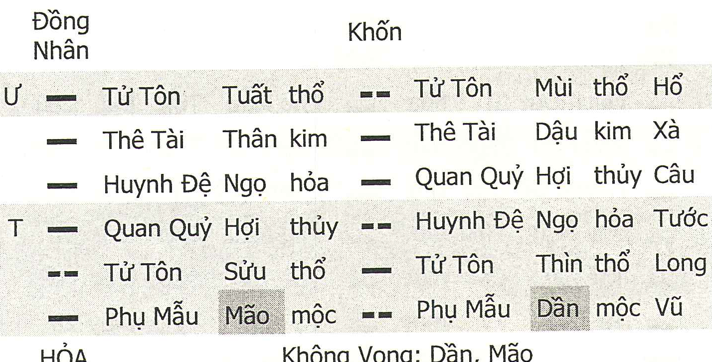

| | | Vô Vọng | | Tụy | |
| :---: | :---: | :--- | :---: | :--- | :--- |
| | — | Thê Tài Tuất thổ | - - | Thê Tài Mùi thổ | Vũ |
| | — | Quan Quỷ Thân kim | — | Quan Quỷ Dậu kim | Hổ |
| T | — | Tử Tôn Ngọ hỏa | — | Phụ Mẫu Hợi thủy | Xà |
| | - - | Thê Tài Thìn thổ | - - | Huynh Đệ Mão mộc | Câu |
| | - - | Huynh Đệ Dần mộc | - - | Tử Tôn Tị hỏa | Tước |
| Ứ | — | Phụ Mẫu Tý thủy | - - | Thê Tài Mùi thổ | Long |

MỘC  
Không Vong: Thân, Dậu

Trong quẻ Tài động hóa thoái, hào sơ là tâm sự, động mà hóa ra hào Tài, tất là hỏi chuyện tiền tài.

**Đáp:** Cô này vốn là nhân viên bán hàng, bởi vì bán chịu cho khách hàng, khách hàng không trả tiền, thế là đơn vị khấu trừ tiền lương của cô ấy để thu hồi nợ.

Tử Tôn trì Thế, Quan Quỷ Không Vong nhập Mộ, chính là tượng nghỉ hưu, đoán cô ấy đã nghỉ hưu.

**Đáp:** Đã nghỉ hưu.

Hào Thế Tử Tôn Tuyệt ở Nhật, lại bị Phụ Mẫu Tý thủy động mà khắc thương, vô lực sinh hào Tài, đoán tiền lương bị đơn vị khấu trừ rất khó được trả lại. Phụ Mẫu Tý thủy động hóa hồi đầu khắc, Nguyệt kiến lại khắc, hào 6 Thê Tài Tuất thổ cũng động mà đến khắc, khắc nhiều sinh ít, dương chủ cha, đoán cha cô ấy đã tạ thế.

**Đáp:** Đã qua đời ở năm 1989. Tôi nói thêm năm 1989 là Kỷ Tị, là Tuyệt địa của Phụ Mẫu.

Hào 6 Tuất thổ động mà khiến cho hào Thế nhập Mộ, hào 6 là đầu, nhập Mộ là tượng chóng mặt, lâm Ngọ hỏa bị Nhật khắc thương, hỏa tại hào 4 là tim, lâm Xà là tâm hoảng. Hào 2 là Nguyên thần, bị Nhật hợp trú, không thể sinh Dụng, Huynh Đệ là mộc chủ phong, hào 2 là chân, đoán là chân bị phong tán loạn.

**Đáp:** Bản thân có chứng chóng mặt, huyết áp cao, tâm hoảng, trên chân có phong chạy đi chạy lại.

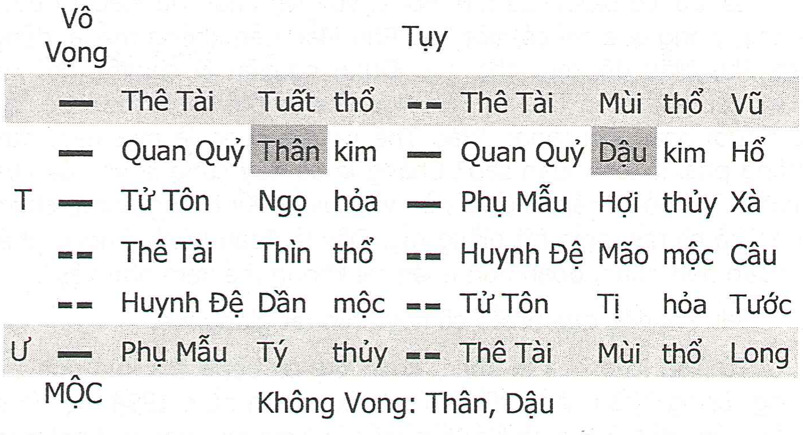

Lại hỏi về bệnh của mẹ. Bởi vì vừa lấy hào Phụ Mẫu Tý thủy là cha, trong quẻ chỉ có một hào Phụ Mẫu nên không thể lại dùng hào Phụ Mẫu để xem cho mẹ. Dùng nguyên lý chuyển đổi lục thân, cái ta khắc là Tài, Tử Tôn Ngọ hỏa có thể coi là mẹ. Lúc này có người phản đối rằng: "Hào Thế và mẹ cùng là một hào, đây không phải là loạn luân sao? Chẳng lẽ cô này cũng là vợ của cha mình?" Tôi nói: "Hào Thế và hào vị chuyển đổi tương đồng, chính là nói rõ cô này nhìn rất giống mẹ. Đây là đoán bệnh, không phải là đoán hôn nhân, đoán hôn nhân thì không thể xem như vậy".

Sau khi hỏi, quả nhiên cô này nhìn rất giống mẹ.

Tử Tôn Ngọ hỏa bị khắc, đoán mẹ có bệnh tim khá nghiêm trọng. Dụng Thần nhập Mộ ở Tuất thổ, đoán năm 1994 mẹ từng nhập viện. Hào 2 Huynh Đệ Dần mộc là Nguyên thần, bị Nhật hợp trú không thể sinh Dụng, đoán là chân của mẹ đã bị biến dạng, không thể đi lại. Năm 1992 là Nhâm Thân, 1993 là Quý Dậu, 1994 là Giáp Tuất, 1995 là Ất Hợi, 1996 là Bính Tý, các năm này đều bất lợi cho Dụng Thần, vì vậy đoán sức khỏe mẹ năm sau đều không bằng năm trước.

**Đáp:** Tất cả phán đoán đều nghiệm.

**Ví dụ 4:** Ngày Giáp Tý tháng Đinh Mão năm Kỷ Mão, nam đoán bệnh, gieo được Trạch Thiên Quải biến Lôi Thiên Đại Tráng.

| Quải | | Đại Tráng | |
| :--- | :--- | :--- | :--- |
| - - Huynh Đệ Mùi thổ | | - - Huynh Đệ Tuất thổ | Vũ |
| T — Tử Tôn Dậu kim | | - - Tử Tôn Thân kim | Hổ |
| — Thê Tài Hợi thủy | | — Phụ Mẫu Ngọ hỏa | Xà |
| — Huynh Đệ Thìn thổ | | — Huynh Đệ Thìn thổ | Câu |
| Ư — Quan Quỷ Dần mộc | Phụ Tị | — Quan Quỷ Dần mộc | Tước |
| — Thê Tài Tý thủy | | — Thê Tài Tý thủy | Long |

THỔ &emsp;&emsp; Không Vong: Tuất, Hợi

Lấy hào Thế làm Dụng thần.

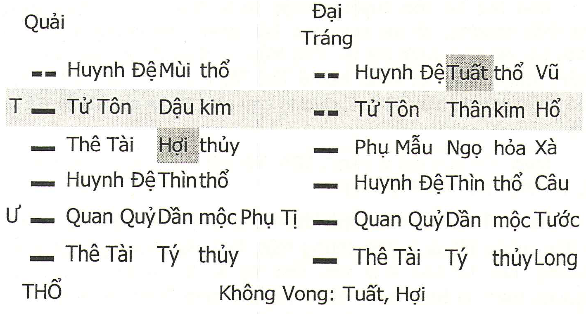

Hào Thế Nguyệt phá, Tử ở Nhật thần, hưu tù động mà hóa thoái, điềm hung. Bạch Hổ chủ bệnh cũng chủ tang.

Tử Tôn là thần vui vẻ, hiện nay lâm hào Thế phá mà hóa thoái, đoán là bởi vì bệnh mà tâm trạng nặng nề, không vui vẻ, tinh thần mỗi ngày một suy sụp. Tôi khuyên anh ta nên nghĩ thoáng một chút, nếu không thì cực kỳ bất lợi.

Hào 2 Quan Quỷ Dần mộc lâm Chu Tước, mộc chủ gan mật, hào dương là phủ[^1], Chu Tước chủ viêm, bản thân có bệnh viêm túi mật.

Thế lâm Bạch Hổ động mà hóa thoái, Bạch Hổ chủ thương tai, lấy Thoái thần làm ứng kỳ, đoán là năm Nhâm Thân có thương tai. Anh ta nói, năm Nhâm Thân bị thương vì việc công, năm ngoái bị viêm túi mật đến bệnh viện khám, qua chụp phim thấy có khối ở gan, bác sĩ chuẩn đoán là ung thư gan.

Mộc mặc dù cũng có thể chủ gan, nhưng thông tin gan trong quẻ này không mạnh, cho nên gan không có vấn đề gì. Người này cho biết, sau đó lại đến bệnh viện khác để xét nghiệm nhưng không phát hiện vấn đề gì ở gan, thế nhưng chuẩn đoán ung thư gan của vị bác sỹ nọ vẫn luôn ám ảnh trong đầu, nửa năm qua tâm trạng ngày càng sa sút.

Khi đó vợ anh ta thấy phán đoán về chồng rất chính xác, cũng muốn gieo quẻ để đoán bệnh của mình. Tôi nói là không cần gieo thêm quẻ, dùng quẻ này đoán là được. Cô ấy hỏi: "Quẻ này đoán bệnh cho chồng tôi mà, sao có thể được?" Tôi đáp: "Sao lại không được? Tôi đoán theo quẻ này, cô xem có đúng không?"

Bởi vì quẻ này do người chồng gieo, cho nên lấy Thê Tài làm Dụng. Trong quẻ Thê Tài lưỡng hiện, lấy Thê Tài Hợi thủy Không Vong làm Dụng. Nguyên Tử Tôn Dậu kim lâm Bạch Hổ Nguyệt phá, động mà hóa thoái, Bạch Hổ chủ máu, Tử Tôn chủ mạch máu, phá mà hóa thoái không sinh Dụng, Dụng thần Không mà không được sinh, là cung máu không đủ. Quan Quỷ Dần mộc tại hào 2, là thần nhàn rỗi vượng tướng, lại là Bệnh địa hào Tài, hào 2 là ruột, lâm Chu Tước chủ viêm, đoán là người này có viêm ruột.

**Kết quả:** Đến năm Canh Thìn, một người hàng xóm của anh ta đến nói cho tôi biết là anh ta đã qua đời ở năm Kỷ Mão. Cuối

[^1]: Lục phủ gồm: Dạ dày, mật, tam tiêu, bàng quang, ruột non, ruột già.

cùng cũng không thể thoát khỏi tâm trạng bi quan, thật sự đáng tiếc. Những nhận định về vợ anh ta đều ứng nghiệm.

**Ví dụ 5:** Ngày Kỷ Hợi tháng Tý, nữ đoán quan vận cho chồng, được quẻ Trạch Lôi Tùy biến Hỏa Lôi Phệ Hạp.

| | Tùy | | Phệ Hạp | |
| --- | --- | --- | --- | --- |
| Ứ | - - Thê Tài Mùi thổ | — | Tử Tôn Tị hỏa | Câu |
| | — Quan Quỷ Dậu kim | - - | Thê Tài Mùi thổ | Tước |
| | — Phụ Mẫu Hợi thủy Tử Ngọ | — | Quan Quỷ Dậu kim | Long |
| T | - - Thê Tài Thìn thổ | - - | Thê Tài Thìn thổ | Vũ |
| | - - Huynh Đệ Dần mộc | - - | Huynh Đệ Dần mộc | Hổ |
| | — Phụ Mẫu Tý thủy | — | Phụ Mẫu Tý thủy | Xà |

MỘC Không Vong: Thìn, Tị

Lấy hào Quan Quỷ làm Dụng thần, Quan Quỷ mặc dù không được Nhật Nguyệt sinh phù, nhưng hào Ứng động mà sinh Quan Quỷ, Quan Quỷ lại phát động hóa hồi đầu sinh, thần cơ tại hào động, có hy vọng lên chức.

Hào Ứng phát động sinh quan Quan Quỷ, Ứng là người khác, là có người muốn đề bạt chồng cô ấy. Nhưng hào Thế Không Vong, Thế là người xem, Không Vong biểu thị lo lắng, người xem có chút do dự, không muốn chồng lên chức.

Hào Ứng là Tài, động mà hóa ra Tử Tôn Tị hỏa, Tị hỏa Nguyệt khắc Nhật xung là Nhật phá. Tài Ứng sinh Quan nhưng đồng thời hóa Nhật phá, đây là thông tin sau khi được thăng chức thì nguồn tiền bị phá bại. Cho nên tôi đoán người chồng bây giờ trong tay đang có tiền tài và quyền lực, sau khi thăng chức sẽ không còn nằm trong tay, vì lo lắng tài vận bị ảnh hưởng cho nên có phần do dự không muốn thăng chức.

Sau khi hỏi, quả nhiên lãnh đạo muốn cất nhắc chồng của cô, hiện tại chồng cô ấy đang làm ở khâu mậu dịch, nếu thăng chức sẽ được điều đến khâu hành chính.

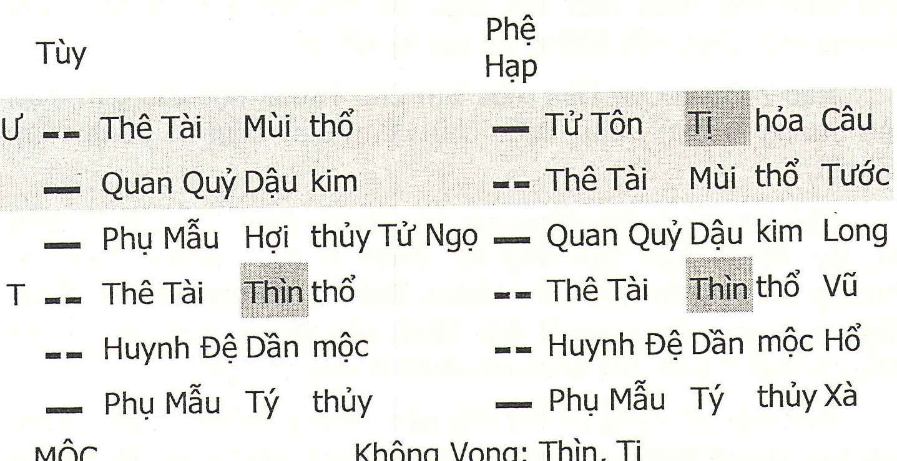

Tôi nói: "Tiền tài trong thiên hạ thì rất nhiều, dục vọng của con người thì vô bờ bến, vĩnh viễn không có lúc thỏa mãn. Tài chịu ảnh hưởng của vận khí. Có mất sẽ có được, tài chuyển đi rồi sẽ quay lại. Năm Tân Tị, Tử Tôn Tị hỏa Thực Phá, tài quyền sẽ quay trở lại. Hiện nay sức khỏe của chồng không tốt, lần thăng chức này cũng như là được giải thoát khỏi hoàn cảnh căng thẳng hiện tại. Đây chẳng phải là cơ hội tốt để bồi dưỡng sức khỏe hay sao?"

Người phụ nữ gật đầu, mỉm cười hỏi: "Ông có biết chồng tôi bị bệnh gì không"? Đây rõ ràng là muốn thử tôi.

Dự đoán bệnh tật, lấy hào Quan Quỷ làm Dụng thần, bởi vì Quan Quỷ thể hiện chồng cô ấy. Quan Quỷ không bị Nhật Nguyệt khắc, vì vậy không thể dùng hào vị và ngũ hành lâm Quan Quỷ để phán đoán. Hào 3 Thê Tài Thìn thổ là Nguyên thần, Không mà không thể sinh Dụng, hào 3 là vị trí thắt lưng và đùi, lâm Huyền Vũ, Huyền Vũ chủ phong hàn, vì vậy tôi đoán là chồng bị viêm khớp dạng thấp, thắt lưng và chân không được khỏe mạnh.

**Kết quả:** Những suy đoán trên quả nhiên ứng nghiệm.

# CHƯƠNG 32
## DỰ ĐOÁN VẬN KHÍ TRỌN ĐỜI

Rốt cuộc thì con người có vận mệnh hay không? Nếu có thì vận mệnh là cố định hay là có thể biến đổi? Đây có lẽ là một đề tài mà tất cả mọi người đều rất quan tâm. Nếu như nhận thức không rõ ràng về bản chất của vận mệnh thì sẽ không nhìn thấu được quỹ đạo của vận mệnh, càng không thể biến đổi nó.

Trong chương dự đoán về nhân duyên nam nữ, tôi đã từng nói qua rằng con người có vận mệnh. Cái gọi là vận mệnh chính là ảnh hưởng của vũ trụ đối với con người, là quy luật hoạt động của con người trong vũ trụ. Có thể biết được vận mệnh, hơn nữa còn có thể thay đổi ở một mức độ nhất định. Theo nghiên cứu của các nhà khoa học hiện nay, tử vong và bệnh tật của con người có liên quan mật thiết đến gen di truyền. Nói cách khác, tử vong và bệnh tật của con người khi mới sinh ra đã có, điều này cũng đã nói rõ rằng vận mệnh là có tồn tại. Nhưng người có bệnh lại có thể được bác sĩ trị khỏi, điều này lại chứng tỏ rằng vận mệnh có thể biến đổi, con người không phải là nô lệ của vận mệnh, thông qua nỗ lực, có thể biến đổi ở một mức độ nhất định, tôi đã được chứng thực điểm này thông qua rất nhiều tình huống trong thực tiễn.

Thường xuyên có không ít người đến chỗ tôi dự đoán về vận mệnh. Vận mệnh thông thường được suy đoán từ thời gian của người đó sinh ra. Nhưng có một số người hoàn toàn không biết thời gian họ được sinh ra, vậy thì dùng lục hào để dự đoán, dùng lục hào vẫn có thể dự đoán chính xác vấn đề này.

Trong dự đoán, tôi từng gặp qua khá nhiều người có bát tự giống nhau, từ đó cũng có thể thăm dò được đầu mối của vận mệnh. Lấy ví dụ về mệnh của hai người phụ nữ, họ có bát tự giống nhau, những việc trải qua trong đời vừa có điểm giống nhau vừa có điểm khác nhau. Một người sinh ra ở thành phố, một người sinh ra ở nông thôn. Những điểm giống nhau chứng tỏ vận mệnh có tồn tại; những điểm khác nhau chứng tỏ môi trường, di truyền của cha mẹ, giáo dục sau này, nỗ lực v.v đều có ảnh hưởng đến vận mệnh, khía cạnh này cũng có thể chứng minh vận mệnh có thể biến đổi ở một mức độ nhất định.

Hai người phụ nữ này sinh vào giờ Ngọ ngày 30 tháng 6 năm 1975, nhưng địa điểm sinh ra của họ khác nhau. Chúng ta hãy xem những việc mà họ trải qua.

**Trình độ học vấn:** Người sinh ra ở nông thôn tốt nghiệp cấp hai, người sinh ra ở thành phố tốt nghiệp trung cấp. Trình độ học vấn có hơi khác nhau, điều này có thể là do trình độ giáo dục của địa phương và năng lực giáo viên không giống nhau, hoặc là do mức độ nỗ lực của bản thân khác nhau tạo nên.

**Số anh em:** Hai người đều có một anh trai và một chị gái, nhưng tuổi tác không giống nhau.

**Cha:** Hai người đều mất cha ở năm 1989, nhưng một người mất ở tháng 2, một người mất ở tháng 4.

**Mẹ:** Mẹ của người nữ sinh ra ở nông thôn đã tìm chồng ở năm 1990, năm đó lại chia tay. Còn mẹ của người nữ sinh ra ở thành phố thì không tìm chồng cũng không tái giá, nhưng lén lút qua lại với một người đàn ông. Điều này có thể có liên quan đến hoàn cảnh và điều kiện cuộc sống. Mẹ của người nữ nông thôn thì không có việc làm, không có nguồn thu nhập, cần nhờ đàn ông chăm sóc; còn mẹ của người nữ thành phố thì có việc làm, tự mình có thể độc lập.

**Sự nghiệp:** Người nữ sinh ra ở nông thôn đã đến thành phố mở một thẩm mỹ viện ở năm 1993, còn người nữ sinh ra ở thành phố thì đi làm ở một công ty dược liệu.

**Hôn nhân:** Người nữ sinh ra ở nông thôn kết hôn vào năm 1997, còn người nữ sinh ra ở thành phố năm 1997 đã tìm ba đối tượng không thành. Điều này có liên quan đến phong tục tập quán khác nhau giữa các địa phương, ở nông thôn kết hôn sớm, muộn thì không thể xuất giá, còn người ở thành phố lớn thì thường kết hôn muộn. Người nữ sinh ra ở thành phố sau đó đã sống chung với bạn trai ở năm 1999, năm 2000 chính thức cử hành hôn lễ.

**Chồng:** Chồng của người nữ sinh ra ở nông thôn là quân nhân giải ngũ, chồng của người nữ sinh ra ở thành phố là sĩ quan tại ngũ.

**Cha chồng:** Đều là giáo viên.

Từ những gì hai người đã trải qua, mỗi khía cạnh của người nữ sinh ra ở thành phố đều tốt hơn một chút so với người nữ sinh ra ở nông thôn, tôi nghĩ rằng điều này có liên quan rất lớn đến môi trường và giáo dục sau này.

* * * * * * * * * *

Ở Trung Quốc có rất nhiều thuật dự đoán về vận mệnh. Một số thuật mà tôi biết là "Tứ trụ thôi mệnh", "Thiết bản thần số", "Thiệu tử thần số", "Tử vi đẩu số", "Chiêm tinh học", "Hà lạc lý số" v.v, cổ nhân Trung Quốc đã tích lũy được rất nhiều tài nguyên quý giá về phương diện này.

Những thuật dự đoán này đều có thuật toán của riêng nó, nhưng mục đích chỉ có một, đó là dự đoán vận mệnh của con người. Phương pháp tuy là đa dạng, nhưng điểm chung của chúng là đều lấy thời gian để làm căn cứ dự đoán, đều dùng nguyên lý sinh khắc của ngũ hành, hơn nữa đều có tỷ lệ ứng nghiệm nhất định.

Còn dự đoán lục hào thì sao? Từ thực tiễn, tôi nhận thấy lục hào có thể dùng để dự đoán trọn đời. Người xưa khi dự đoán vận khí trọn đời thường chú trọng về dự đoán quan vận và sinh kế, người ta cho rằng một quẻ không thể đồng thời dự đoán tất cả sự việc. Nhưng người hiện đại lại có ham muốn rất mạnh, muốn một quẻ đoán ra mọi chuyện trong thiên hạ. Họ yêu cầu dùng một quẻ dự đoán công việc, tài vận, hôn nhân, con cái, sức khỏe, tuổi thọ v.v. Tôi cho là có thể dự đoán được, nhưng muốn đoán được chính xác thì cần phải có một căn cơ dự đoán rất vững chắc và phải có kinh nghiệm dự đoán nhiều năm mới có thể làm được.

## DỤNG THẦN TRONG VẬN KHÍ TRỌN ĐỜI

Đời người rất phức tạp, dùng lục hào dự đoán tình hình cụ thể từng năm một rất khó. Nhưng nếu đoán về những việc trọng đại trong đời thì dùng lục hào có thể đoán được. Xưa có người lấy hào vị để suy đoán lưu niên, nào là một hào quản mười năm, quẻ chính ba mươi năm, quẻ biến ba mươi năm v.v, hoàn toàn không quá ứng nghiệm, nên được loại bỏ.

Muốn đồng thời phán đoán ra được nhiều sự việc từ trong một quẻ, cần phải căn cứ vào nội dung dự đoán mà thay đổi Dụng thần. Nếu đoán về thành danh, quan vận, lấy Quan Quỷ làm Dụng thần; đoán về tài vận, lấy Thê Tài làm Dụng thần; tuổi thọ và cơ thể, lấy hào Thế làm Dụng thần; đoán về con cái, lấy Tử Tôn làm Dụng thần; đoán về cha mẹ, lấy hào Phụ Mẫu làm Dụng thần; đoán về hôn nhân, nam xem Thê Tài và hào Ứng, nữ xem Quan Quỷ và hào Ứng. Đây chỉ là dự đoán chung chung, không hề tinh tế. Chẳng hạn như nam đến dự đoán, Tài vừa là tiền tài vừa là vợ, người tài vận không tốt thì chưa hẳn là hôn nhân không tốt, người có tiền mà hôn nhân không suôn sẻ cũng có rất nhiều.

Nếu muốn chi tiết hơn, có thể chia ra để đoán, tức là chỉ đoán về một vấn đề, như vậy sẽ khỏi phải loại suy.

## TRÍCH XUẤT THÔNG TIN VỀ VẬN KHÍ TRỌN ĐỜI

- Khi phán đoán về vận khí trọn đời không cần phải đoán ra mọi phương diện trong cuộc sống. Bởi vì quái tượng gieo ra tùy vào thông tin của mỗi người khác nhau, thông tin quái tượng phản ánh cũng không giống nhau. Khi đoán quẻ chỉ nên trích xuất những thông tin cực kỳ rõ ràng, nếu miễn cưỡng phán đoán thì sẽ tạo thành dự đoán không chính xác.
- Dự đoán vận khí trọn đời lấy hào Thế làm trung tâm. Nếu hào Thế và Quan Quỷ bất Không bất Phá, Quan Quỷ vượng tướng trì Thế, sinh hợp hào Thế, lâm Thanh Long thì quý mà có quan vận, hoặc suốt đời công tác thuận lợi, có thể trở thành công chức. Được hào 5 sinh trợ, ở công ty rất được cấp trên xem trọng, ở quan trường có chỗ dựa; được hào sơ sinh phù, cơ sở quần chúng tốt đẹp.
- Hào Tài vượng tướng, hào Tử Tôn bất Không bất Phá có khí, suốt đời nguồn tiền dồi dào. Hào Tử Tôn hưu tù vô khí, hào Tài vượng một mình, chính là tài nhất thời. Hào Tài vượng tướng, Tử Tôn không ở trong quẻ, hoặc Huynh Đệ động hóa hào Tài, là hộ bạo phát. Hào Tài hào Tử Tôn hưu tù Không Phá, suốt đời bần cùng, hào Thế nếu lại không cát, bần cùng mà có bệnh.
- Hào Thế nhập Mộ, đam mê việc nào đó, không có tư tưởng tiến thủ, suốt ngày đờ đẫn, u mê không tỉnh ngộ, lâm Câu Trần lười biếng.
- Quẻ lục xung, suốt đời bấp bênh, bôn ba, phải tự mình nỗ lực phấn đấu mới có phát triển. Quẻ lục hợp, Dụng thần cát, suốt đời an nhàn, ổn định, xã giao tốt, ôn hòa với người khác. Được

Nhật Nguyệt hào động sinh phù, có nhân duyên, thường được người giúp đỡ.

◆ Hào Thế động mà hóa tiến, bản thân rất nỗ lực; hưu tù được trợ, mượn lực người khác để phát triển. Hóa Thoái thần, đầu voi đuôi chuột, làm việc có đầu không có đuôi.

◆ Thanh Long Tử Tôn trì Thế hưu tù, tuy là kinh luân đầy bụng, nhưng không đắc chí, nghèo khổ thất vọng.

◆ Tài được Nhật Nguyệt sinh phù, Thế lâm Huynh Đệ phát động, tuy là có tổ nghiệp nhưng chơi bời phá bại. Huynh Đệ lâm hào Ứng phát động, bị người cướp tài.

◆ Hào Tài trì Thế vượng tướng, lâm Bạch Hổ, Phụ Mẫu lâm Chu Tước hưu tù, tuy có gia tài bạc triệu, nhưng không ham học, không có suy nghĩ tiến thủ trong học tập.

◆ Quan Quỷ động mà khắc Thế, hào Thế hoặc Quan Quỷ lâm Bạch Hổ, suốt đời nhiều bệnh nhiều tai họa; lâm Chu Tước Câu Trần, có kiện tụng khẩu thiệt, tai họa lao ngục.

◆ Nam đoán mà Huynh Đệ trì Thế, nữ đoán mà Tử Tôn trì Thế, suốt đời kém duyên với người khác giới. Nam được Thanh Long Huyền Vũ lâm Tài sinh hợp hào Thế, lại gặp Đào Hoa Mộc Dục, phong lưu lại có vận đào hoa, nữ thì xem Quan Quỷ.

◆ Hào Tài vượng, Thế là Tài khố, gia tài bạc triệu, lâm Đằng Xà là bủn xỉn.

◆ Phụ Mẫu Không Phá, hưu tù vô khí, phục mà không hiện trên quẻ, tuổi nhỏ mất cha mẹ. Thế tại hào 5 hào 6, lâm thổ phát động là nhận làm con thừa tự người khác. Hoặc Ứng Phụ Mẫu động mà hợp Thế, quẻ lại có hào động hóa ra Phụ Mẫu cũng là tượng con nuôi người khác.

◆ Tử Tôn vượng mà đa hiện, nhiều con mà khỏe mạnh. Tử Tôn Không Phá lâm Bạch Hổ, chính là tượng lưu sản, động Quan Quỷ, hoặc hưu tù hóa Không hóa Phá, tượng chết con. Tử Tôn phục tàng, Không Phá vô khí, tượng không có con.

* * * * * * * * *

Trên đây là cách đoán sơ lược về vận khí trọn đời, chỉ nói về một số nhận định có tỷ lệ ứng nghiệm tương đối cao. Trong thực tế cần phải dựa vào biến hóa trong quẻ, suy vượng của lục thân, động tĩnh sinh khắc để phân tích cẩn thận.

Ngày xưa để lại ví dụ về dự đoán trọn đời khá đơn giản và khá ít, nhưng để mọi người hiểu rõ về dự đoán vận khí trọn đời một cách toàn diện, ở đây liệt kê một số ví dụ xa xưa và một số ví dụ của tôi trong thực tiễn, để mọi người so sánh và học tập.

**Ví dụ 1:** Ví dụ cổ, ngày Tân Hợi tháng Tuất, nam xem tài phúc trọn đời, được quẻ Thủy Địa Tỷ biến Phong Địa Quan.

| | Tỷ | | Quan | | |
| :---: | :---: | :--- | :---: | :--- | :---: |
| Ứ | - - | Thê Tài Tý thủy | — | Quan Quỷ Mão mộc | Xà |
| | — | Huynh Đệ Tuất thổ | — | Phụ Mẫu Tị hỏa | Câu |
| | - - | Tử Tôn Thân kim | - - | Huynh Đệ Mùi thổ | Tước |
| T | - - | Quan Quỷ Mão mộc | - - | Quan Quỷ Mão mộc | Long |
| | - - | Phụ Mẫu Tị hỏa | - - | Phụ Mẫu Tị hỏa | Vũ |
| | - - | Huynh Đệ Mùi thổ | - - | Huynh Đệ Mùi thổ | Hổ |

THỔ Không Vong: Dần, Mão

**Phán đoán thời cổ:**

Hào Thế tuy Không, nhưng được Nguyệt kiến hợp, ngày Hợi sinh, năm Mão nhất định thành gia.

Năm Sửu gieo quẻ, quả nhiên đến năm Mão, khi đó triều đình mới lập, Vân Quý vừa mới yên ổn, người này từ Xuyên Trung mang theo vài gánh thuốc phụ tử và hoàng liên đi bán, nhờ đó mà phát tài nhanh chóng, sản nghiệp lên đến vài ngàn lạng vàng, gia nghiệp thành tựu, sung túc lâu dài.

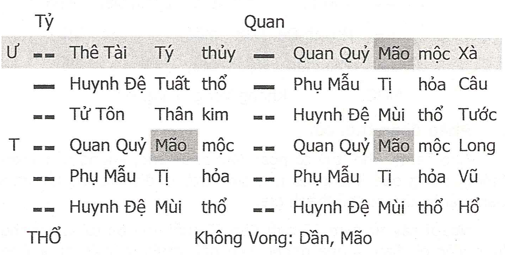

### Ví dụ 2: Ví dụ cổ, ngày Tân Mùi tháng Dậu, xem tài phúc trọn đời, được quẻ Sơn Lôi Di.

**Di**

| Thế / Ứng | Hào | Lục thân | Can Chi | Ngũ hành | Phục thần | Lục thú |
| :---: | :---: | :--- | :--- | :--- | :--- | :--- |
| | — | Huynh Đệ | Dần | mộc | | Xà |
| | - - | Phụ Mẫu | Tý | thủy | Tử Tị | Câu |
| T | - - | Thê Tài | Tuất | thổ | | Tước |
| | - - | Thê Tài | Thìn | thổ | Quan Dậu | Long |
| | - - | Huynh Đệ | Dần | mộc | | Vũ |
| Ư | — | Phụ Mẫu | Tý | thủy | | Hổ |

**MỘC** &nbsp;&nbsp;&nbsp;&nbsp; **Không Vong: Tuất, Hợi**

**Phán đoán thời cổ:**

Hào Tài trì Thế, tuy có ngày Mùi phù củng, không nên Tuần Không, trong quẻ không có hỏa sinh trợ, là điều tối kỵ khi xem thân mệnh, khó có thể thành gia.

Người này từ năm 25 tuổi đến 50 tuổi bôn ba tứ xứ, chẳng được việc gì. Sau vì quá nghèo nên đầu quân ra biên ải, không biết sống chết ra sao.

Ví dụ này không giàu, không phải chỉ vì hào Thế Không Vong, mà Nguyên thần Tử Tôn Tị hỏa phục tàng, hưu tù vô khí cũng là nguyên nhân quan trọng.

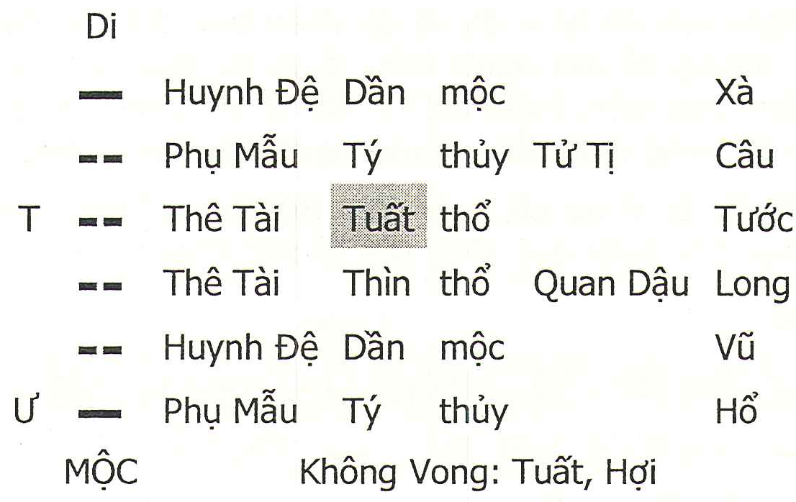

### Ví dụ 3: Ví dụ cổ, ngày Bính Tuất tháng Ngọ, xem tài phúc trọn đời, được quẻ Thủy Trạch Tiết.

**Tiết**

| Thế / Ứng | Hào | Lục thân | Can Chi | Ngũ hành | Phục thần | Lục thú |
| :---: | :---: | :--- | :--- | :--- | :--- | :--- |
| | - - | Huynh Đệ | Tý | thủy | | Long |
| | — | Quan Quỷ | Tuất | thổ | | Vũ |
| Ư | - - | Phụ Mẫu | Thân | kim | | Hổ |
| | - - | Quan Quỷ | Sửu | thổ | | Xà |
| | — | Tử Tôn | Mão | mộc | | Câu |
| T | — | Thê Tài | Tị | hỏa | | Tước |

**THỦY** &nbsp;&nbsp;&nbsp;&nbsp; **Không Vong: Ngọ, Mùi**

**Phán đoán thời cổ:**

Người này Tài vượng lâm Thế, thường ngày nắm giữ nhiều tiền. Lại vì Thế nhập Mộ ở Tuất nên rất ham mê cờ bạc. Sau đến năm Tị đi đào mỏ chì, đào trúng nhiều chỗ mà trở nên giàu có nhất vùng.

Dưới đây là những ví dụ do tôi dự đoán.

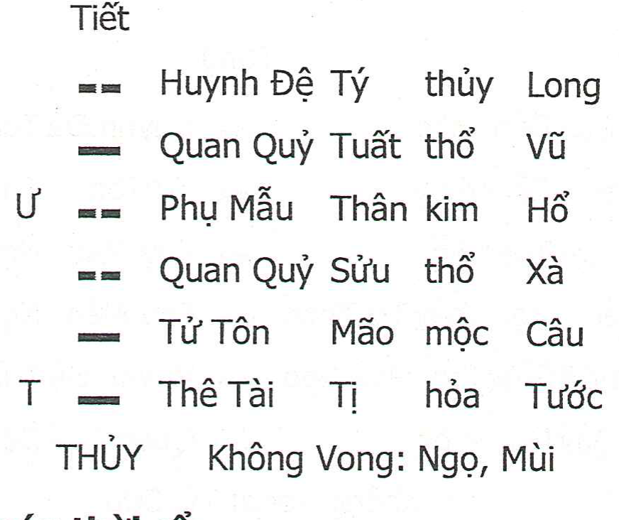

**Ví dụ 4:** Ngày Canh Thân tháng Tân Tị năm Ất Hợi, nam đoán vận khí trọn đời, được quẻ Sơn Hỏa Bí biến Thiên Thủy Tụng.

| | Bí | Tụng | |
| :---: | :--- | :--- | :--- |
| | — Quan Quỷ Dần mộc | — Huynh Đệ Tuất thổ | Xà |
| | - - Thê Tài Tý thủy | — Tử Tôn Thân kim | Câu |
| Ứ | - - Huynh Đệ Tuất thổ | — Phụ Mẫu Ngọ hỏa | Tước |
| | — Thê Tài Hợi thủy Tử Thân | - - Phụ Mẫu Ngọ hỏa | Long |
| | - - Huynh Đệ Sửu thổ Phụ Ngọ | — Huynh Đệ Thìn thổ | Vũ |
| T | — Quan Quỷ Mão mộc | - - Quan Quỷ Dần mộc | Hổ |

THỔ Không Vong: Tý, Sửu

### Phán đoán:

Sáu hào thì có năm hào vị phát động, trong quẻ có quá nhiều hào động là thông tin một đời sống không yên ổn.

Quan Quỷ Mão mộc mặc dù trì Thế, nhưng hưu tù hóa thoái, suốt đời không có quan vận. Lâm hào sơ, hào sơ là cấp dưới, hào vị quần chúng, cả đời chỉ là một người bình thường.

Quan Quỷ trì Thế hưu tù, lâm Bạch Hổ, Quan Quỷ Bạch Hổ đều có ý nghĩa bệnh tật, cơ thể nhiều bệnh.

Hào Tài lưỡng hiện, Tý thủy Không Vong, Hợi thủy Nguyệt phá, lại có Huynh Đệ hai tầng phát động khắc Tài, suốt đời tài vận không tốt. Có điều là, Nhật là đất Trường Sinh của hào Tài, sinh hoạt cơ bản vẫn không thành vấn đề, nhưng khó có tiền để dành.

Thế khắc hào Ứng, hôn nhân muộn. Tài sinh hào Thế, một lâm Thanh Long, một hóa hồi đầu sinh, có vợ chăm lo gia đình.

Trong quẻ Huynh Đệ hai tầng, hào 2 lại hóa ra một, trong nhà nhiều anh em. Huynh Đệ Sửu thổ Không Vong, bị Quan Quỷ Mão mộc khắc thương, Tuyệt ở Nguyệt kiến, trong anh em có người chết sớm. Huynh Đệ Sửu thổ động mà hóa Mộ, Tuất thổ lâm Chu Tước bị Quan Quỷ Mão mộc khắc hợp, trong anh em có người có tai họa lao ngục.

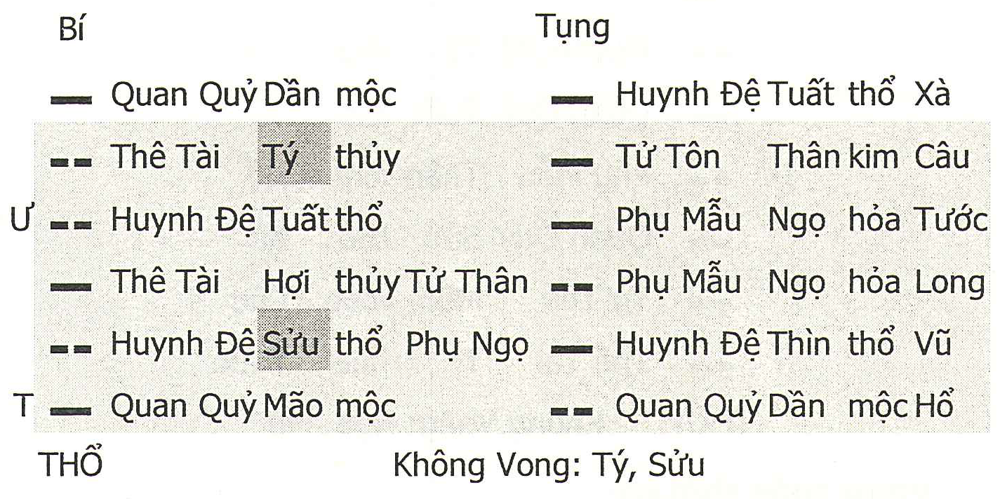

**Kết quả:** Người này 28 tuổi kết hôn, vợ đức hạnh, sinh sống ở một thị trấn nhỏ, là một nhân viên bình thường. Bản thân và vợ suy nhược nhiều bệnh, mỗi năm ba phần thu nhập dùng để trị bệnh, anh em có năm người, một người bệnh chết, một người vào tù.

**Ví dụ 5:** Ngày Tân Mùi tháng Quý Mùi năm Ất Hợi, nam đoán vận khí trọn đời, được quẻ Thiên Lôi Vô Vọng biến Trạch Lôi Tùy. (sinh năm 1955)

| | Vô Vọng | Tùy | |
| :---: | :--- | :--- | :--- |
| | — Thê Tài Tuất thổ | - - Thê Tài Mùi thổ | Xà |
| | — Quan Quỷ Thân kim | — Quan Quỷ Dậu kim | Câu |
| T | — Tử Tôn Ngọ hỏa | — Phụ Mẫu Hợi thủy | Tước |
| | - - Thê Tài Thìn thổ | - - Thê Tài Thìn thổ | Long |
| | - - Huynh Đệ Dần mộc | - - Huynh Đệ Dần mộc | Vũ |
| Ứ | — Phụ Mẫu Tý thủy | — Phụ Mẫu Tý thủy | Hổ |

MỘC Không Vong: Tuất, Hợi

### Phán đoán:

Quẻ chính lục xung, nửa đầu cuộc đời lên xuống bất định.

Hào Ứng khắc Thế, hôn nhân muộn. Hào Thế nhập Mộ ở Thê Tài, sợ vợ. Thê Tài Tuất thổ phát động, động mà gặp trị gặp hợp, tham khảo độ tuổi người này, đoán là kết hôn ở năm 1982 là năm Nhâm Tuất.

Thế lâm Chu Tước, nhập Mộ ở Thê Tài Tuất thổ, Chu Tước là khẩu thiệt, tố tụng, Mộ lâm Đằng Xà, Đằng Xà là dây thừng, trói buộc, có tai họa lao ngục, nhập Mộ ở Tài, bởi vì tài mà vào tù. Phải tuân thủ pháp luật.

Quan Quỷ Thân kim tại hào 5, được Nhật Nguyệt sinh phù vượng tướng, hào 5 là tôn vị, vị trí lãnh đạo, quan vận tốt đẹp. Thế lâm Chu Tước, Chu Tước chủ văn chương, học thuật, bản thân hiếu học. Nhập Mộ, như mê như say, Mộ lâm Đằng Xà, Đằng Xà có ý nghĩa là kỳ lạ, thần kỳ, thích văn hóa thần bí và ngũ thuật.

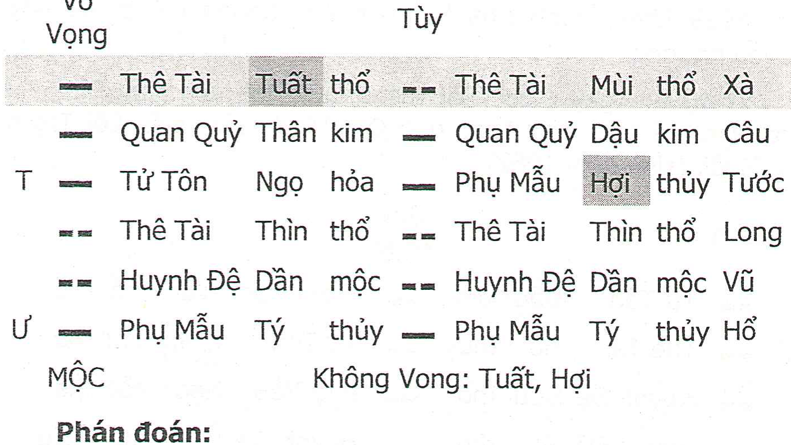

Phụ Mẫu Tý thủy ở hào sơ lâm Bạch Hổ Không Vong, bị Nhật Nguyệt khắc thương, Phụ Mẫu là cha mẹ, Bạch Hổ chủ tử vong, hào sơ là lúc nhỏ, cho nên là sớm mất cha mẹ. Hào Thế Tử Tôn là lục thân khắc Quan Quỷ, quẻ biến du hồn, hào Tài độc phát, sau này sẽ vứt bỏ chức vụ mà theo đuổi kinh doanh.

**Kết quả:** Người này kết hôn ở năm 1982, rất sợ vợ. Thích khí công và Kinh Dịch. Năm 1995 làm lãnh đạo của một đơn vị. Tháng Ngọ năm 1996 vào tù vì vụ án kinh tế, cuối năm được thả ra vì vô tội. Cha qua đời ở năm 1973, mẹ qua đời ở năm 1975. Năm 1999 kinh doanh nhà hàng, bởi vì không có lãi nên đã chuyển nhượng.

**Ví dụ 6:** Ngày Giáp Tuất tháng Quý Hợi năm Mậu Dần, nữ đoán vận khí trọn đời, được quẻ Địa Trạch Lâm biến Lôi Trạch Quy Muội. (sinh năm 1962)

| | Lâm | | Quy Muội | | |
| :---: | :---: | :---: | :---: | :---: | :---: |
| | - - | Tử Tôn Dậu kim | - - | Huynh Đệ Tuất thổ | Vũ |
| Ư | - - | Thê Tài Hợi thủy | - - | Tử Tôn Thân kim | Hổ |
| | - - | Huynh Đệ Sửu thổ | — | Phụ Mẫu Ngọ hỏa | Xà |
| | - - | Huynh Đệ Sửu thổ | - - | Huynh Đệ Sửu thổ | Câu |
| T | — | Quan Quỷ Mão mộc | — | Quan Quỷ Mão mộc | Tước |
| | — | Phụ Mẫu Tị hỏa | — | Phụ Mẫu Tị hỏa | Long |

THỔ Không Vong: Thân, Dậu

### Phán đoán:

**Công việc:** Lấy Quan Quỷ làm Dụng thần. Nguyệt là cấp trên, Nhật là đồng nghiệp. Quan Quỷ Mão mộc trì Thế, được Nguyệt sinh phù là vượng tướng, công việc sự nghiệp thành công. Quan Quỷ ở hào 2, hào 2 là trạch, làm việc ở trong nhà. Lâm Chu Tước, Chu Tước chủ văn thư, nói năng, chính là làm nghề có liên quan đến sách, tài liệu.

Hào Thế được Nguyệt kiến sinh phù, hào 5 cũng là ngũ hành sinh hào Thế, hào 5 cũng là hào vị lãnh đạo, làm việc rất được

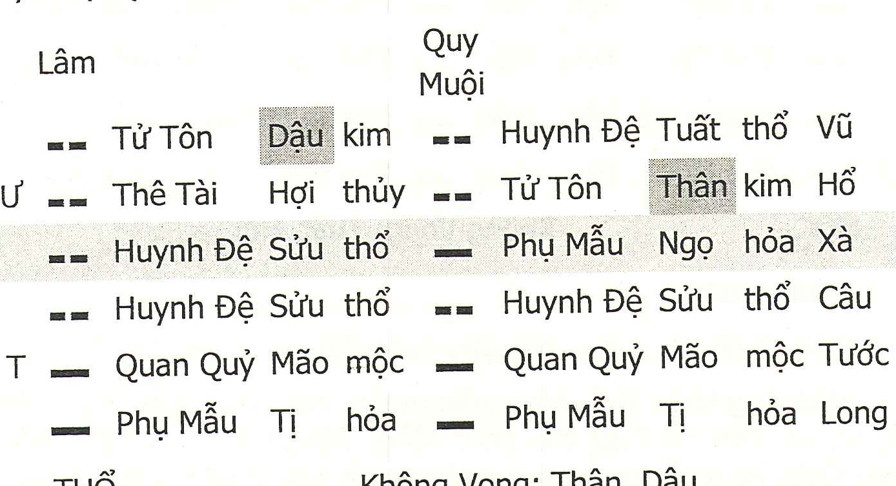 lãnh đạo xem trọng. Thế và Nhật thần tương hợp, chung sống với đồng nghiệp cũng rất hòa hợp.

**Tài vận:** Lấy hào Tài làm Dụng thần. Thê Tài Hợi thủy được Nguyệt kiến tỉ phù, tĩnh mà sinh Thế, tài vận tốt đẹp, thu nhập ổn định. Tài lâm hào Ứng, Ứng là phu vị, hào 5 lại là tôn vị, đàn ông nắm quyền trong nhà, quản lý tiền tài trong nhà. Hào Tài bị Nhật thần và hào động Sửu thổ khắc chế, vừa có tiền thì phải tiêu ra, trong nhà không tích trữ được tiền.

**Hôn nhân:** Lấy Quan Quỷ làm Dụng thần, xem thêm hào Ứng. Năm 1986 là năm Bính Dần, ngũ hành giống Quan Quỷ, năm này và hào Ứng phu vị tương hợp, năm này bắt đầu yêu đương. Trong quẻ Quan Quỷ Mão mộc và Nhật tương hợp, hợp xứ phùng xung, năm 1988 Mậu Thìn, xung Nhật thần Tuất thổ, Quan Quỷ Mão mộc vô hợp, đoán là người này kết hôn ở năm 1988. Hào Ứng lâm Bạch Hổ, Bạch Hổ là tính khí không tốt, nổi giận, đoán là chồng tính khí không tốt, nóng nảy. Ứng sinh hào Thế, Quan Quỷ hào Thế cùng tại một hào, đoán là vợ chồng người này đằm thắm, đồng lòng.

**Con cái:** Tử Tôn Dậu kim Không Vong, nhập Mộ ở hào động Sửu thổ, đã từng lưu sản. Tử Tôn Dậu kim lâm Huyền Vũ, con cái hiện tại có tính cách hướng nội. Nhập Mộ ở Sửu thổ, con có sở thích đặc biệt, say mê việc nào đó. Tử Tôn sinh hào Ứng, con và chồng thân thiết.

**Sức khỏe:** Quẻ Địa Trạch Lâm ở cung Khôn, Khôn là thổ, thổ chủ dạ dày. Tài là ẩm thực, là Nguyên thần hào Thế, bị hào 4 Huynh Đệ Sửu thổ phát động khắc thương, hào 4 là hào vị của tỳ vị, đoán là tỳ vị không tốt. Tài lại chủ máu, lâm Bạch Hổ, Bạch Hổ chủ máu, ý nghĩa đó càng mạnh, bị khắc thì thiếu lực sinh hào Thế, đoán là tuần hoàn máu không tốt. Hào 6 là Kỵ thần, hào 6 là đầu, lâm Huyền Vũ, Huyền Vũ chủ chóng mặt, đoán là có hiện tượng chóng mặt.

**Cha mẹ:** Hào sơ Phụ Mẫu Tị hỏa Nguyệt phá, nhập Mộ ở Nhật, lâm hào dương là cha, đoán là cha đã qua đời.

**Kết quả:** Người nữ này là kế toán của một công ty máy tính, năm 1986 có đối tượng, năm 1988 kết hôn, hiện nay có một con gái, cha qua đời ở năm 1993. Những nhận định khác cũng đều phù hợp với tình hình thực tế.

**Ví dụ 7:** Ngày Ất Mùi tháng Mậu Thìn năm Kỷ Mão, nam đoán vận khí trọn đời, được quẻ Phong Sơn Tiệm biến Tốn Vi Phong. (sinh năm 1957)

| | Tiệm | | | | Tốn | |
| :---: | :---: | :--- | :--- | :---: | :--- | :--- |
| Ư | ━ | Quan Quỷ Mão mộc | | ━ | Quan Quỷ Mão mộc | Vũ |
| | ━ | Phụ Mẫu Tị hỏa | Tài Tý | ━ | Phụ Mẫu Tị hỏa | Hổ |
| | ⚋ | Huynh Đệ Mùi thổ | | ⚋ | Huynh Đệ Mùi thổ | Xà |
| T | ━ | Tử Tôn Thân kim | | ━ | Tử Tôn Dậu kim | Câu |
| | ⚋ | Phụ Mẫu Ngọ hỏa | | ━ | Thê Tài Hợi thủy | Tước |
| | ⚋ | Huynh Đệ Thìn thổ | | ⚋ | Huynh Đệ Sửu thổ | Long |

THỔ &emsp;&emsp;&emsp;&emsp;&emsp;&emsp;&emsp;&emsp; Không Vong: Thìn, Tị

**Phán đoán:**

**Tính cách:** Quẻ Phong Sơn Tiệm là cung Cấn, Cấn là chỉ, là dừng lại, lại thêm Câu Trần trì Thế, người này lười biếng. Quan Quỷ Mão mộc tại hào 6 là Cửu thần, hào 6 là đầu, mộc là thần kinh, đó là tố chất thần kinh.

**Công việc:** Lấy Quan Quỷ làm Dụng thần. Quan Quỷ Mão mộc hưu tù, suốt đời không có công việc tốt. Quan Quỷ lâm Huyền Vũ, Huyền Vũ chủ dơ bẩn, môi trường làm việc cũng không tốt. Tử Tôn trì Thế, là lục thân khắc Quan Quỷ, bản thân không muốn làm việc.

**Hôn nhân:** Lấy Thê Tài làm Dụng thần. Nguyên thần của Dụng thần trì Thế, bản thân khát khao phụ nữ, nhưng Tài bị Nhật Nguyệt khắc thương, hào Phi là Tuyệt của Tài, thiếu duyên với người khác giới. Phụ Mẫu Ngọ hỏa thể hiện giấy kết hôn, động mà hóa hồi đầu khắc, hóa Tuyệt, suốt đời không có hôn nhân.

**Cha mẹ:** Phụ Mẫu Tị hỏa Không Vong, Ngọ hỏa động hóa hồi đầu khắc, trong cha mẹ nhất định có một người đã qua đời. Năm 1995 là năm Ất Hợi, là hào Ngọ hỏa biến ra, qua đời ở năm 1995.

**Kết quả:** Người này làm việc trong một nhà máy rửa than, thường xuyên nói dối có bệnh không đi làm. Vừa lười biếng, vừa

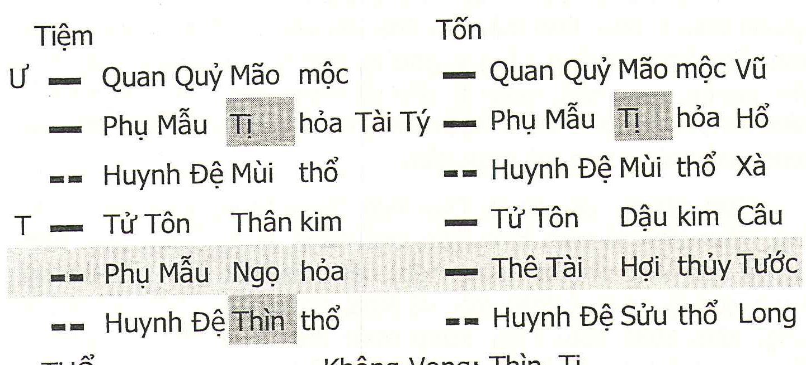 thần kinh hơi không bình thường. Năm 1995 cha qua đời, đến nay vẫn độc thân.

**Ví dụ 8:** Ngày Ất Sửu tháng Nhâm Ngọ năm Canh Thìn, nữ đoán vận khí trọn đời, được quẻ Thủy Thiên Nhu biến Thủy Phong Tỉnh.

| | Nhu | | | | Tỉnh | |
| :---: | :---: | :--- | :--- | :---: | :--- | :--- |
| | ⚋ | Thê Tài Tý thủy | | ⚋ | Thê Tài Tý thủy | Vũ |
| | ━ | Huynh Đệ Tuất thổ | | ━ | Huynh Đệ Tuất thổ | Hổ |
| T | ⚋ | Tử Tôn Thân kim | | ⚋ | Tử Tôn Thân kim | Xà |
| | ━ | Huynh Đệ Thìn thổ | | ━ | Tử Tôn Dậu kim | Câu |
| | ━ | Quan Quỷ Dần mộc | Phụ Tị | ━ | Thê Tài Hợi thủy | Tước |
| Ư | ━ | Thê Tài Tý thủy | | ⚋ | Huynh Đệ Sửu thổ | Long |

THỔ &emsp;&emsp;&emsp;&emsp;&emsp;&emsp;&emsp;&emsp; Không Vong: Tuất, Hợi

**Phán đoán:**

**Tính cách:** Tử Tôn và Đằng Xà trì Thế, Tử Tôn là giải trí, nghệ thuật, Đằng Xà chủ kỹ nghệ, bản thân người này thích nghệ thuật, tâm hiếu kỳ rất mạnh. Hào Thế nhập Mộ ở Nhật, Đằng Xà lại chủ thần kỳ, kỳ dị, chủ người này rất có hứng thú với hiện tượng khác thường và tôn giáo.

**Công việc:** Lấy Quan Quỷ làm Dụng thần. Quan Quỷ Dần mộc tại hào 2, hào 2 là gia, là nội thất, là ngồi trong văn phòng. Lâm Chu Tước, Chu Tước là văn thư v.v, Thê Tài Tý thủy lâm Thanh Long phát động sinh Quan Quỷ, Thanh Long là tượng cao quý, có chức vụ. Nhưng hào vị của Quan Quỷ khá thấp, là chức vụ nhỏ. Lại thêm Quan Quỷ là Dần mộc, Dần Thân Tị Hợi là chức vụ phó.

**Hôn nhân:** Lấy Quan Quỷ làm Dụng thần. Tử Tôn trì Thế, sẽ không có hôn nhân mỹ mãn. Quan Quỷ là mộc, mộc chủ hiền từ, lương thiện, chồng là người rất hiền lành. Hào Thế khắc Quan Quỷ, bản thân không thường xuyên mắng chồng thì cũng nói móc chồng.

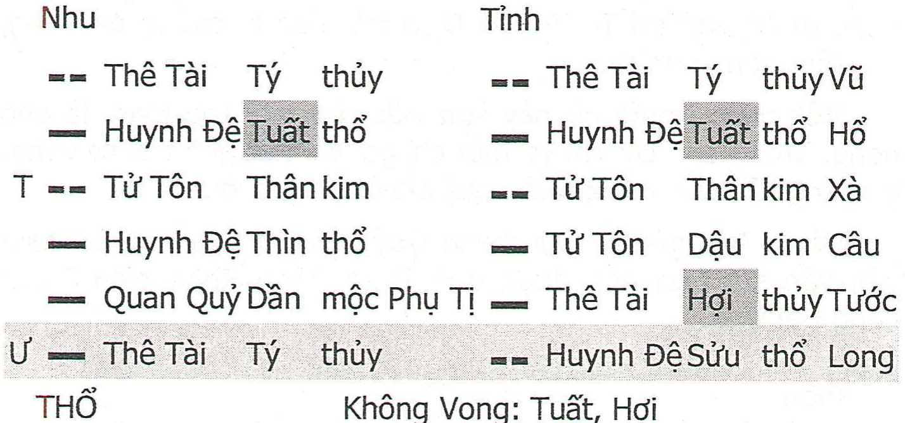

**Anh chị em:** Huynh Đệ Tuất thổ Không Vong, Nhật thần hình, lâm Bạch Hổ, Bạch Hổ chủ tử vong, trong anh em có người chết sớm. Hào Thế nhập Mộ ở Nhật, Nhật cũng là Huynh Đệ, nhập Mộ chính là tượng bị quản chế, bị quản thúc, cho nên bản thân không phải là con cả trong nhà.

**Con cái:** Thủy Thiên Nhu là quẻ du hồn, có ý nghĩa là ra ngoài, từ Nguyệt thì Tử Tôn là Dịch Mã, con bị chứng đa động, hiếu động, tinh nghịch.

**Kết quả:** Người nữ này làm việc cho một tòa toạn, là phó phòng. Trong anh chị em có một chị gái và một anh trai tử vong. Vợ chồng bất hòa, con cái càn quấy không nghe lời.

**Ví dụ 9:** Ngày Ất Mùi tháng Quý Mùi năm Canh Thìn, nam đoán vận khí trọn đời, được quẻ Trạch Thủy Khốn biến Trạch Phong Đại Quá.

| | Khốn | | Đại Quá | | |
| :---: | :---: | :--- | :---: | :--- | :---: |
| | - - | Phụ Mẫu Mùi thổ | - - | Phụ Mẫu Mùi thổ | Vũ |
| | — | Huynh Đệ Dậu kim | — | Huynh Đệ Dậu kim | Hổ |
| Ứ | — | Tử Tôn Hợi thủy | — | Tử Tôn Hợi thủy | Xà |
| | - - | Quan Quỷ Ngọ hỏa | — | Huynh Đệ Dậu kim | Câu |
| | — | Phụ Mẫu Thìn thổ | — | Tử Tôn Hợi thủy | Tước |
| T | - - | Thê Tài Dần mộc | - - | Phụ Mẫu Sửu thổ | Long |

KIM &emsp;&emsp;&emsp;&emsp;&emsp;&emsp;&emsp;&emsp; Không Vong: Thìn, Tị

### Phán đoán:

**Tính cách:** Thuộc tính hào Thế là mộc, lại lâm Thanh Long, bản thân hiền lành, có lễ độ. Tài là ẩm thực, Thanh Long chủ yến hội, ẩm thực, nhập Mộ ở Nhật, lại là quẻ lục hợp, hợp là chậm chạp, đoán là người này khi ăn nhai kỹ nuốt chậm. Hào Tài là vợ, lâm hào Thế, bị vợ lấn át, lại nhập Mộ chính là tượng bị người quản thúc, đoán là người này sợ vợ.

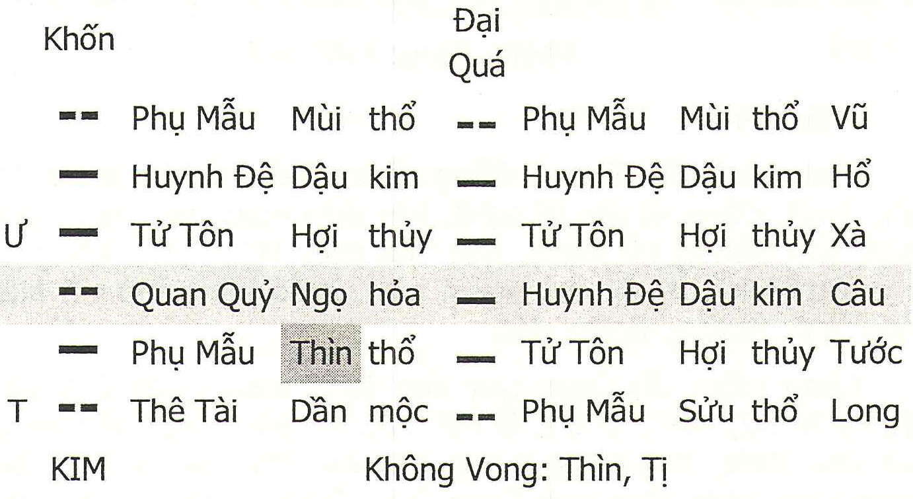

**Công việc:** Lấy Quan Quỷ làm Dụng thần. Quan Quỷ Ngọ hỏa hưu tù, Nguyên thần Thê Tài nhập Mộ, Thế lại ở hào sơ, đoán là suốt đời không có quan vận, là thường dân.

**Tài vận:** Nhật Nguyệt khắc chế Tử Tôn, vô lực sinh trợ hào Tài, Tài lại nhập Mộ, đoán là tài vận không tốt, thu nhập thấp, tiền lương thấp đến thê thảm. (Dịch hữu Đoàn Kiến Nghiệp ở bên cạnh đã thêm vào một câu: "Tiền lương của ông chỉ có 530 tệ". Chính là dùng phạm vi số tiên thiên của hào Tài đoán ra. Thế đóng ở Mậu Dần, Mậu là 5, số ngũ hành Dần mộc là 3, đọc thẳng 530 tệ, hưu tù lấy số nhỏ một chút.)

**Sức khỏe:** Hào Tài nhập Mộ, tiêu hóa không tốt. Biến quẻ du hồn, trạng thái tinh thần không tốt. Nhập Mộ, như mê như say, đầu óc không tỉnh táo, thường xuyên lờ đờ.

**Phán đoán khác:** Hào Thế nhập Mộ ở Mùi thổ, Mùi thổ là Phụ Mẫu, Phụ Mẫu chủ nhà cửa, Phụ Mẫu Mùi thổ chính là nhà ông ta ở. Phụ Mẫu Mùi thổ tại hào 6, bị hào 4 Ngọ hỏa hợp, dưới hợp trên, là nhà trệt.

**Kết quả:** Tất cả các phán đoán trên đây đều ứng nghiệm.

**Ví dụ 10:** Ngày Nhâm Dần tháng Giáp Thân năm Canh Thìn, một thanh niên đoán vận khí trọn đời, được quẻ Địa Sơn Khiêm biến Trạch Hỏa Cách (sinh năm 1981).

| | Khiêm | | Cách | |
| :---: | :--- | :---: | :--- | :--- |
| | - - Huynh Đệ Dậu kim | | - - Phụ Mẫu Mùi thổ | Hổ |
| T | - - Tử Tôn Hợi thủy | | — Huynh Đệ Dậu kim | Xà |
| | - - Phụ Mẫu Sửu thổ | | — Tử Tôn Hợi thủy | Câu |
| | — Huynh Đệ Thân kim | | — Tử Tôn Hợi thủy | Tước |
| Ứ | - - Quan Quỷ Ngọ hỏa | Tài Mão | - - Phụ Mẫu Sửu thổ | Long |
| | - - Phụ Mẫu Thìn thổ | | — Thê Tài Mão mộc | Vũ |

KIM Không Vong: Thìn, Tị

### Phán đoán:

**Tính cách:** Hào Thế phát động, hiếu động, tính cách hướng ngoại. Hào Thế nhập Mộ ở Phụ Mẫu Thìn thổ, Phụ Mẫu là trưởng bối, rất ỷ lại vào bề trên. Tử Tôn trì Thế, Tử Tôn là thần giải trí, ham chơi. Phụ Mẫu hưu tù, Thìn thổ động hóa hồi đầu khắc, lại bị Nhật thần Dần mộc khắc thương, không thích học tập, học không giỏi.

**Việc học:** Xem Quan Quỷ và hào Phụ Mẫu, Quan Quỷ Ngọ hỏa được Nhật sinh là vượng, nhưng không nên Tử Tôn trì Thế động mà khắc Quan, dựa vào lực của bản thân thì rất khó thi đậu đại học. Nhưng Phụ Mẫu hai tầng phát động, chế phục Tử Tôn, nhờ lực của cha mẹ, có thể lên đại học. Có điều là Phụ Mẫu hưu tù, cho dù lên đại học cũng khó mà lấy được bằng cấp.

**Sự nghiệp:** Lấy Quan Quỷ làm Dụng thần. Quan Quỷ lâm Ứng, tuy được Nhật sinh, nhưng là quan của người khác, hào Thế khắc Quan, bản thân sẽ không đi làm việc cho người khác. Kỵ thần động ở hào Thế, suốt đời sẽ không có công việc cố định.

**Tài vận:** Lấy Thê Tài làm Dụng thần. Hào Tài Mão mộc phục tàng, nhưng được Nhật thần trợ giúp, hào Thế lại động mà sinh Tài, suốt đời tài vận rất tốt đẹp, bản thân kinh doanh nhất định có thể phát tài.

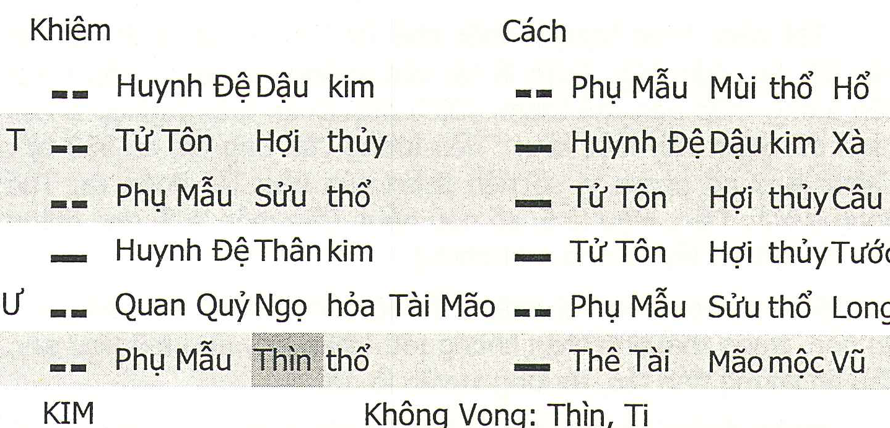

**Sức khỏe:** Lấy hào Thế làm Dụng thần. Thế ở hào 5, hào 5 là hào vị ngũ quan, thủy là miệng, bị hai Phụ Mẫu khắc, họng có bệnh, có viêm họng. Hào Thế động hóa Mộc Dục, Mộc Dục có ý nghĩa trai giới, cho nên đoán người này thích ăn chay, không thích ăn đồ chứa nhiều dầu mỡ.

**Kết quả:** Bản thân không thi đậu đại học, cha mẹ đã chi tiền cho anh ta lên đại học, nhưng anh ta ham chơi, không thích học, vì vậy nhiều môn không đạt yêu cầu. Những suy đoán về tính cách và bệnh tật cũng đúng, về sự nghiệp còn phải chờ sau này nghiệm chứng.

**Ví dụ 11: Ngày Canh Thân tháng Nhâm Thân năm Kỷ Mão, nam đoán vận khí trọn đời, được quẻ Chấn Vi Lôi biến Trạch Địa Tụy. (sinh năm 1962)**

| | Chấn | | | Tụy | |
|---|---|---|---|---|---|
| T | - - | Thê Tài Tuất thổ | - - | Thê Tài Mùi thổ | Xà |
| | - - | Quan Quỷ Thân kim | — | Quan Quỷ Dậu kim | Câu |
| | — | Tử Tôn Ngọ hỏa | — | Phụ Mẫu Hợi thủy | Tước |
| Ư | - - | Thê Tài Thìn thổ | - - | Huynh Đệ Mão mộc | Long |
| | - - | Huynh Đệ Dần mộc | - - | Tử Tôn Tị hỏa | Vũ |
| | — | Phụ Mẫu Tý thủy | - - | Thê Tài Mùi thổ | Hổ |

MỘC

Không Vong: Tý, Sửu

**Phán đoán:**

Quẻ chính lục xung, nửa đời trước mặc dù hơi bấp bênh, nhưng hào Thế an tĩnh, nửa đời sau thì cuộc sống sẽ an nhàn hơn một chút.

**Tài vận:** Lấy Thê Tài làm Dụng thần. Hào Tài trì Thế, được Nhật Nguyệt hào động ba điểm Trường Sinh, hào sơ Tý thủy lại là đất Đế Vượng, tài không chỉ đến từ một nơi, suốt đời không thiếu tiền xài. Hào Tài Trường Sinh tại Quan Quỷ, Quan Quỷ là chính phủ, cơ quan, là làm việc ở cơ quan chính phủ, kiếm tiền từ nhà nước.

**Công việc:** Lấy Quan Quỷ làm Dụng thần. Quan Quỷ được Nhật Nguyệt tỉ phù, lại động hóa Tiến thần, sự nghiệp ngày một phát triển, không ngừng phát triển. Quan Quỷ tại hào 5, có chức vụ, hóa tiến chức vụ lần lượt lên cao.

**Hôn nhân:** Lấy Thê Tài làm Dụng thần. Xem quan hệ giữa Thế Ứng. Thế Ứng tương xung, vợ chồng quan hệ bất hòa. Kỵ thần Huynh Đệ Dần mộc Nguyệt phá Nhật phá lại an tĩnh, vô lực khắc Tài, mặc dù bất hòa nhưng cũng sẽ không ly hôn. Hào sơ động hóa Thê Tài, bản thân có ngoại tình. Hào Tài hưu tù, năm 1989 Kỷ Tị, năm 1990 Canh Ngọ, hai năm này sinh trợ hào Tài, tất kết hôn ở hai năm này.

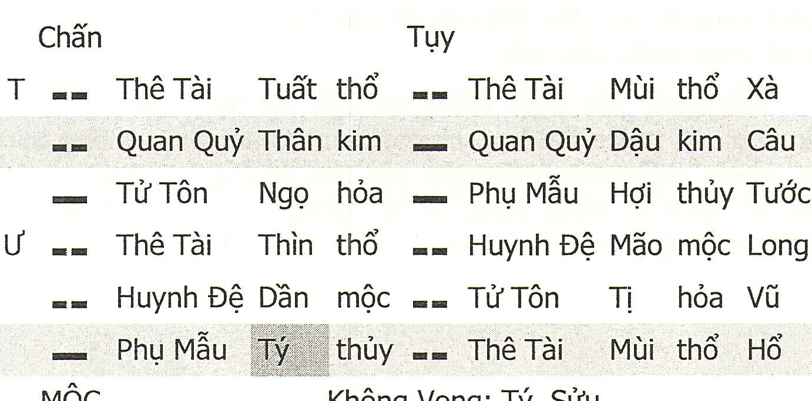

**Con cái:** Lấy Tử Tôn làm Dụng thần. Tử Tôn là Ngọ hỏa, con cái ra đời ở năm 1990. Tử Tôn Ngọ hỏa là Dịch Mã, lại lâm Chu Tước, con cái hoạt bát hiếu động, giỏi về ăn nói.

**Tính cách:** Hào Thế là Mộ khố của Tử Tôn, lâm Đằng Xà, Tử Tôn Đằng Xà đều chủ nghệ thuật, bản thân có tài hoa, thích nghệ thuật. Quẻ lục xung, thiếu năng lực tự kiềm chế.

**Sức khỏe:** Lấy hào Thế làm Dụng thần. Nguyên thần Tử Tôn bị hào sơ Phụ Mẫu Tý thủy khắc thương, Phụ Mẫu là xe, hào sơ là bánh xe, lâm Bạch Hổ, Bạch Hổ là đường đi, chính là thông tin tai nạn xe cộ. Phụ Mẫu Tý thủy Không Vong, năm 1996 là năm Bính Tý Thực Không, năm này có thể xảy ra tai nạn xe cộ. Tử Tôn Ngọ hỏa tại hào 4, hào 4 là hào vị tim, hỏa cũng là tim, bị Phụ Mẫu khắc, tim không tốt, có bệnh. Phụ Mẫu Tý thủy bị hào biến Mùi thổ khắc chế, năm 1997 là năm Đinh Sửu, xung mất Mùi thổ, Tý thủy vô chế, khắc thẳng Tử Tôn, năm này mắc bệnh tim.

**Anh chị em:** Lấy hào Huynh Đệ làm Dụng thần. Huynh Đệ khắc Thế, khó có được sự giúp đỡ của anh em.

**Cha mẹ:** Lấy Phụ Mẫu làm Dụng thần. Phụ Mẫu vượng tướng, nhưng động mà khắc Nguyên thần, duyên phận mỏng với mình. Hào Thế tại hào 6 lại là thổ, nhận làm con thừa tự của người khác.

**Kết quả:** Người này là phóng viên của một tòa soạn, thích vẽ tranh, là cán bộ cấp phòng, từ bé được nhận làm con thừa tự của người khác, năm 1989 kết hôn, năm 1990 sinh con gái, năm 1996 gặp tai nạn giao thông, năm 1997 nhập viện vì bệnh tim.

# CHƯƠNG 33

## DỰ ĐOÁN NIÊN VẬN

Phương pháp dự đoán niên vận và vận khí trọn đời rất giống nhau, có thể nói dự đoán niên vận là bổ sung của vận khí trọn đời. Vận khí trọn đời không thể xem xét đến cát hung của từng lưu niên, nhưng niên vận lại có thể dự đoán qua mỗi năm, cho ta biết cát hung của từng năm. Ở một mức độ nào đó, có thể nói dự đoán vận khí lưu niên có tác dụng chỉ dẫn nhiều hơn là dự đoán vận khí trọn đời.

Điểm quan trọng nhất của dự đoán niên vận là an nguy và cát hung của bản thân, sau đó mới là tình hình tài vận, công việc, gia đình v.v. Dự đoán vận khí lưu niên không cần phán đoán về tính cách, không cần phải đoán ra mọi khía cạnh, mà là xem trong quẻ cho ta biết những thông tin gì, dựa vào thông tin phản ánh trong quẻ mà phán đoán thì mới chính xác, nếu muốn phán đoán chu toàn mọi vấn đề thì tỷ lệ ứng nghiệm sẽ không quá cao. Nhưng dự đoán lục hào phản ánh thông tin đa dạng, khi dự đoán vận khí năm đó, đôi khi lại có thể hiện ra thông tin của những lưu niên khác. Khi dự đoán phải phân biệt cẩn thận.

**Ví dụ 1:** Ngày Giáp Tý tháng Quý Dậu năm Kỷ Mão, nữ đoán niên vận năm nay, được quẻ Thủy Lôi Truân biến Lôi Thủy Giải.

| Truân | | Giải | |
| :--- | :--- | :--- | :--- |
| ╍╍ Huynh Đệ Tý thủy | | ╍╍ Quan Quỷ Tuất thổ | Vũ |
| Ứ — Quan Quỷ Tuất thổ | | ╍╍ Phụ Mẫu Thân kim | Hổ |
| ╍╍ Phụ Mẫu Thân kim | | — Thê Tài Ngọ hỏa | Xà |
| ╍╍ Quan Quỷ Thìn thổ | Tài Ngọ | ╍╍ Thê Tài Ngọ hỏa | Câu |
| T ╍╍ Tử Tôn Dần mộc | | — Quan Quỷ Thìn thổ | Tước |
| — Huynh Đệ Tý thủy | | ╍╍ Tử Tôn Dần mộc | Long |

THỦY

Không Vong: Tuất, Hợi

**Phán đoán:**

**Tài vận:** Lấy hào Tài làm Dụng thần. Hào Tài Ngọ hỏa phục tàng, không được Nhật Nguyệt sinh phù, lại bị Nhật thần Tý thủy khắc, hưu tù vô khí, tài vận không tốt.

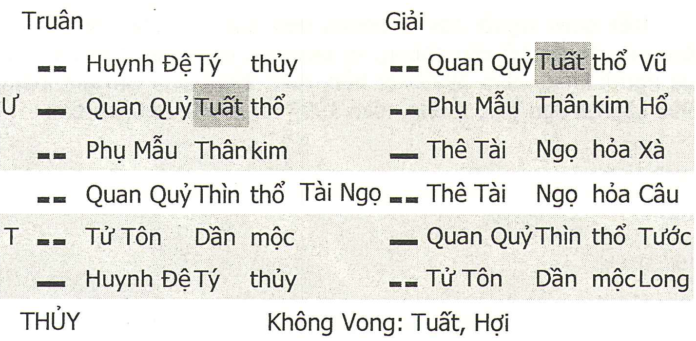

**Công việc:** Lấy Quan Quỷ làm Dụng thần. Trong quẻ Quan Quỷ Tuất thổ Thìn thổ lưỡng hiện, lấy hào động Tuất thổ làm Dụng thần. Quan Quỷ Tuất thổ Không Vong, Nhật Nguyệt không sinh, Nguyên thần phục mà không hiện, hơn nữa Kỵ thần trì Thế phát động, vận khí sự nghiệp không tốt, rất khó có cơ hội thăng chức.

**An nguy của gia đình:** Xem chồng, lấy Quan Quỷ làm Dụng thần. Lưỡng hiện, Ứng Quan Quỷ làm Dụng thần. Quan Quỷ Tuất thổ hưu tù Không Vong, lại bị Tử Tôn Dần mộc phát động khắc, không cát. Nay Quan Quỷ Tuần Không không bị nó khắc, tháng Tuất xuất Không sẽ có hung tai. Tử Tôn lâm Chu Tước, Chu Tước là khẩu thiệt, phải tránh phát sinh tranh chấp với người khác. Quan Quỷ tại hào 5, lâm Bạch Hổ, hào 5 là đường đi, Bạch Hổ cũng là đường đi, động hóa Phụ Mẫu, Phụ Mẫu là xe, ra ngoài phải đề phòng tai nạn xe cộ.

**Con cái:** Xem hào Tử Tôn, Tử Tôn Dần mộc được Nhật sinh, thêm hào sơ Tý thủy phát động, Phụ Mẫu Thân kim và hào biến của Tử Tôn thành tam hợp cục sinh Tử Tôn, tuy có Nguyệt khắc cũng không sao. Hào Thế Tử Tôn động hóa Quan Quỷ, Tử Tôn là vui vẻ, Quan Quỷ là ưu sầu, Tử Tôn hóa Quan Quỷ là vui quá hóa buồn.

**Kết quả:** Tài vận không tốt, công việc không có cơ hội thăng chức. Chồng qua đời ở tháng Tuất vì ngã xuống từ cửa sổ của đơn vị.

**Ví dụ 2:** Ngày Đinh Mùi tháng Canh Ngọ năm Kỷ Mão, một tài xế taxi đoán niên vận, được quẻ Trạch Hỏa Cách biến Thiên Phong Cấu.

| | Cách | | | Cấu | |
| :---: | :---: | :--- | :---: | :--- | :--- |
| | ▅▅  ▅▅ | Quan Quỷ Mùi thổ | ▅▅▅▅▅ | Quan Quỷ Tuất thổ | Long |
| | ▅▅▅▅▅ | Phụ Mẫu Dậu kim | ▅▅▅▅▅ | Phụ Mẫu Thân kim | Vũ |
| T | ▅▅▅▅▅ | Huynh Đệ Hợi thủy | ▅▅▅▅▅ | Thê Tài Ngọ hỏa | Hổ |
| | ▅▅▅▅▅ | Huynh Đệ Hợi thủy Tài Ngọ | ▅▅▅▅▅ | Phụ Mẫu Dậu kim | Xà |
| | ▅▅  ▅▅ | Quan Quỷ Sửu thổ | ▅▅▅▅▅ | Huynh Đệ Hợi thủy | Câu |
| Ứ | ▅▅▅▅▅ | Tử Tôn Mão mộc | ▅▅  ▅▅ | Quan Quỷ Sửu thổ | Tước |

THỦY    Không Vong: Dần, Mão

### Phán đoán:

**An nguy của bản thân:** Lấy hào Thế làm Dụng thần. Hào Thế không những không được Nhật Nguyệt sinh phù, lại bị Nhật khắc, quẻ lại có Quan Quỷ Mùi thổ phát động hóa Tiến thần khắc Thế, Quan Quỷ Sửu thổ phát động khắc Thế, rất là không cát. Quan Quỷ có ý nghĩa là chính phủ, tai nạn, Sửu thổ lâm Câu Trần, Câu Trần khắc Thế chủ lao ngục, năm nay không nên làm việc trái pháp luật, nếu không thì có tai họa lao ngục. Tháng sau Quan Quỷ Mùi thổ trị Nguyệt, tháng sau nên đề phòng.

**Tài vận:** Thê Tài Ngọ mặc dù phục tàng, lại được Nguyệt kiến tỉ phù là vượng, nhưng không nên Kỵ thần trì Thế, Nguyên thần Tử Tôn Không Vong nhập Mộ, tài vận không thể nói là tốt, Tài bị Quan Quỷ Mùi thổ hợp trú, đề phòng bị cảnh sát giao thông phạt tiền.

**Kết quả:** Người này vừa mới lái taxi, kỹ thuật lái xe không quá tốt, vì vậy rất lo lắng sẽ xảy ra tai nạn giao thông. Vào tháng Mùi, theo lời tôi nhắc nhở, anh ta đã lái xe rất cẩn thận ở mọi nơi, đến cuối tháng 7 (tức tháng Mùi), nhìn chung không xảy ra tai nạn giao thông. Bởi vì lái xe quá căng thẳng, khi còn một tuần lễ cuối tháng, anh ta đã đến Bắc Kinh du lịch để thả lỏng tâm trạng. Kết quả là giữa đường đã xảy ra xung đột với hành khách ngồi bên cạnh và làm vỡ đầu đầu người ta, anh ta đã bị cảnh sát giam

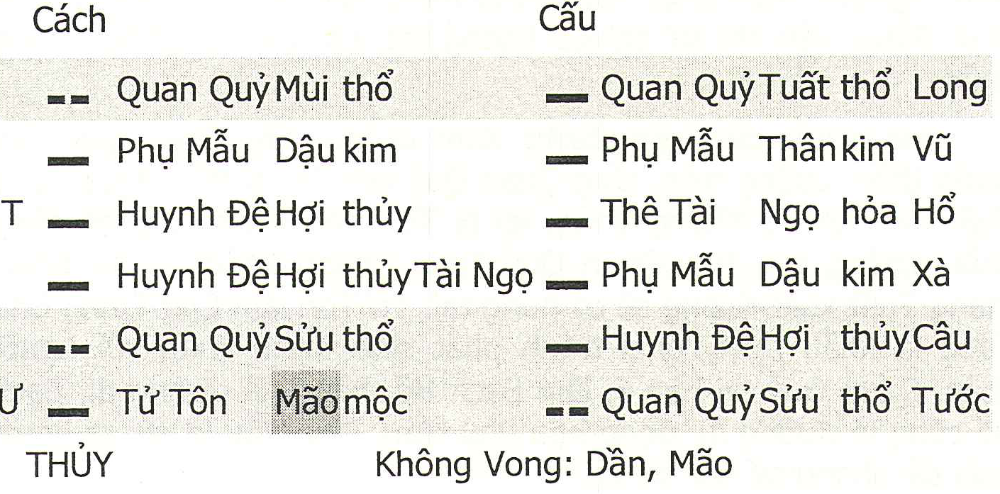 giữ trong đồn một tuần. Đến khi ở trong đồn mới đột nhiên nhớ đến lời khuyên của tôi, nhưng có hối hận cũng đã muộn.

**Ví dụ 3:** Ngày Giáp Ngọ tháng Quý Mùi năm Canh Thìn, nam đoán niên vận, được Lôi Thủy Giải biến Thiên Hỏa Đồng Nhân.

| | Giải | | | Đồng Nhân | |
| :---: | :---: | :--- | :---: | :--- | :--- |
| | ▅▅  ▅▅ | Thê Tài Tuất thổ | ▅▅▅▅▅ | Thê Tài Tuất thổ | Vũ |
| Ứ | ▅▅  ▅▅ | Quan Quỷ Thân kim | ▅▅▅▅▅ | Quan Quỷ Thân kim | Hổ |
| | ▅▅▅▅▅ | Tử Tôn Ngọ hỏa | ▅▅▅▅▅ | Tử Tôn Ngọ hỏa | Xà |
| | ▅▅  ▅▅ | Tử Tôn Ngọ hỏa | ▅▅▅▅▅ | Phụ Mẫu Hợi thủy | Câu |
| T | ▅▅▅▅▅ | Thê Tài Thìn thổ | ▅▅  ▅▅ | Thê Tài Sửu thổ | Tước |
| | ▅▅  ▅▅ | Huynh Đệ Dần mộc Phụ Tý | ▅▅▅▅▅ | Huynh Đệ Mão mộc | Long |

MỘC    Không Vong: Thìn, Tị

### Phán đoán:

**An nguy của bản thân:** Lấy hào Thế làm Dụng thần. Hào Thế được Nguyệt phù Nhật sinh là vượng tướng, trong quẻ Kỵ thần mặc dù phát động hóa Tiến thần, nhưng với Tử Tôn Ngọ hỏa, Thê Tài Tuất thổ thành tam hợp cục sinh hào Thế, trong năm không có tai nạn.

**Tài vận:** Lấy Thê Tài làm Dụng thần. Thoạt nhìn, hào Tài trì Thế vượng tướng, tài vận phải rất tốt. Thìn thổ và địa chi năm nay giống nhau, là Thái Tuế nhập hào, báo trước tình hình của một năm. Thìn thổ động mà hóa thoái, lại lâm Không Vong, chính là thông tin năm nay vô tài, thoái tài.

Ứng kỳ của Thoái thần là lấy hào biến để phán đoán thời gian. Sửu thổ và địa chi năm 1997 giống nhau, tôi đoán tài vận người này bắt đầu tuột dốc từ năm 1997. Năm 1989 là năm Kỷ Tị, hào Tài được sinh, đoán là tài vận khởi sắc ở năm 1989. Năm 1998 là năm Mậu Dần, năm 1999 là năm Kỷ Mão, hai năm này đều là năm khắc hào Tài, hai năm này tài vận rất kém.

**Quan vận:** Lấy Quan Quỷ làm Dụng thần, Quan Quỷ được Nguyệt sinh phù, lại là đất Trường Sinh của hào Thế, đoán là đã

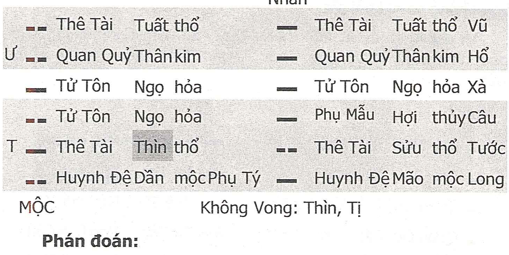 từng có chức vụ, nhưng ngoại quái phục ngâm, Tử Tôn thành tam hợp cục khắc Quan, chức vụ đã mất.

**Kết quả:** Toàn bộ phán đoán trên đây đều chính xác. Người này vốn có chức vụ, sau đó đã từ chức ở năm 1989. Tài vận luôn luôn rất tốt. Nhưng đến năm 1997 thì tài vận bắt đầu đi xuống, đến năm 1999 thì thậm chí sinh hoạt cũng khó khăn. Năm 2000 cũng không có gì khởi sắc.

**Ví dụ 4:** Ngày Ất Mùi tháng Quý Mùi năm Canh Thìn, nam đoán niên vận, được quẻ Thủy Phong Tỉnh biến Phong Thủy Hoán.

| | Tỉnh | Phục thần | Hoán | Lục thú |
| :--- | :--- | :--- | :--- | :--- |
| | ╍╍ Phụ Mẫu Tý thủy | | ━ Huynh Đệ Mão mộc | Vũ |
| T | ━ Thê Tài Tuất thổ | | ━ Tử Tôn Tị hỏa | Hổ |
| | ╍╍ Quan Quỷ Thân kim | Tử Ngọ | ╍╍ Thê Tài Mùi thổ | Xà |
| | ━ Quan Quỷ Dậu kim | | ╍╍ Tử Tôn Ngọ hỏa | Câu |
| Ư | ━ Phụ Mẫu Hợi thủy | Huynh Dần | ━ Thê Tài Thìn thổ | Tước |
| | ╍╍ Thê Tài Sửu thổ | | ╍╍ Huynh Đệ Dần mộc | Long |

Mộc Không Vong: Thìn, Tị

**Phán đoán:**

**Quan vận:** Lấy Quan Quỷ làm Dụng thần. Thế tại hào 5, hào 5 là hào vị lãnh đạo, hào Thế lâm hào 5, lại thêm Quan Quỷ vượng tướng, là tượng có quan. Nhưng hào 3 Quan Quỷ Dậu kim động hóa hồi đầu khắc, lại là tượng mất quan. Do đó đoán người đó vốn có chức vụ, nhưng hiện tại đã không còn.

**Tài vận:** Lấy Thê Tài làm Dụng thần. Thoạt nhìn, hào Tài trì Thế, Nhật Nguyệt đều là Tài tinh, hào Tài rất vượng, đoán tài vận tốt đẹp mới đúng. Nhưng Tử Tôn Ngọ hỏa phục tàng, Nhật Nguyệt không sinh, lại bị Phụ Mẫu Tý thủy phát động khắc nó, nguồn tài khô kiệt. Hào sơ Thê Tài Sửu thổ Nguyệt phá Nhật phá, là tượng vô tài.

Phụ Mẫu Tý thủy mặc dù không vượng, nhưng được Quan Quỷ Dậu kim sinh trợ, Quan Quỷ là chính phủ, lâm Câu Trần, xưa

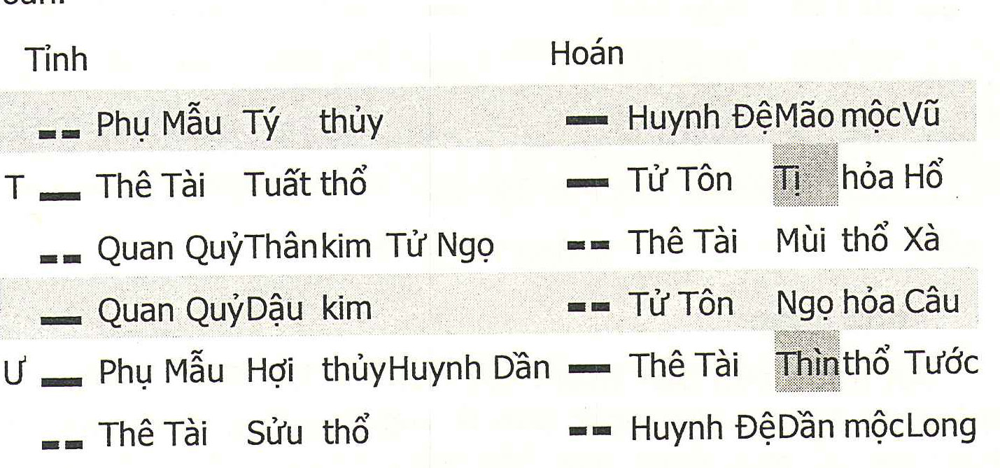 là nha môn, nay là đồn công an, cục công an. Là chính quyền đã cắt đứt nguồn tài của anh ta. Hào sơ là khởi đầu của sự vật, hào Tài lâm hào sơ Nguyệt phá, là vừa khởi bước thì đã phá tài.

Lâm Thanh Long, Thanh Long là tửu sắc, phá tài có liên quan đến việc này.

Vì vậy, tôi đoán người này bắt đầu kinh doanh ở năm nay, nhưng vừa bắt đầu thì đã bị công an cắt đứt đường tiền tài, nhất định là đã kinh doanh bất chính.

**Kết quả:** Người này vốn có chức vụ, nhưng đã bị cách chức. Năm 2000, anh ta kinh doanh một quán bar ở khu du lịch, đã thuê rất nhiều tiểu thư, kết quả là ở ngày đầu tiên khai trương thì bị cục công an niêm phong, tổn thất rất nhiều tiền.

**Ví dụ 5:** Ngày Nhâm Tuất tháng Canh Dần năm Tân Tị, nữ đoán niên vận, được quẻ Sơn Phong Cổ biến Sơn Hỏa Bí.

| | Cổ | Phục thần | Bí | Lục thú |
| :--- | :--- | :--- | :--- | :--- |
| Ư | ━ Huynh Đệ Dần mộc | | ━ Huynh Đệ Dần mộc | Hổ |
| | ╍╍ Phụ Mẫu Tý thủy | Tử Tị | ╍╍ Phụ Mẫu Tý thủy | Xà |
| | ╍╍ Thê Tài Tuất thổ | | ╍╍ Thê Tài Tuất thổ | Câu |
| T | ━ Quan Quỷ Dậu kim | | ━ Phụ Mẫu Hợi thủy | Tước |
| | ━ Phụ Mẫu Hợi thủy | | ╍╍ Thê Tài Sửu thổ | Long |
| | ╍╍ Thê Tài Sửu thổ | | ━ Huynh Đệ Mão mộc | Vũ |

Mộc Không Vong: Tý, Sửu

**Phán đoán:**

**An nguy của bản thân:** Lấy hào Thế làm Dụng thần. Hào Thế được Nhật thần sinh, Kỵ thần phục tàng, năm nay không có tai nạn.

**Tài vận:** Hào Tài lưỡng hiện, lấy hào động Thê Tài Sửu thổ làm Dụng. Sửu thổ bị Nguyệt kiến khắc thương, lại động hóa hồi đầu khắc, Nguyên thần Tử Tôn Tị hỏa phục tàng, nhập Mộ ở Nhật, lại bị Phụ Mẫu Hợi thủy phát động khắc chế. Tử Tôn Tị hỏa là Thái Tuế năm nay, phục mà không thể sinh hào Tài, tức ám chỉ năm nay không có tài để cầu.

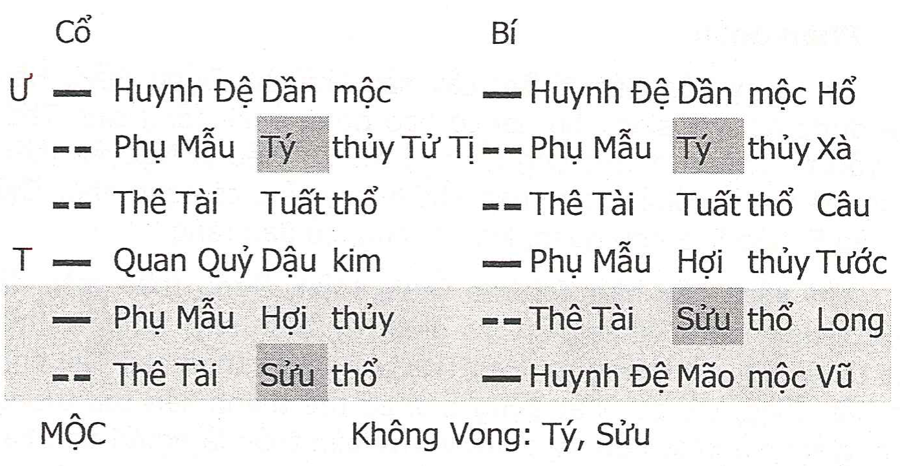

**Kết quả:** Đúng như phán đoán.

**Ví dụ 6:** Ngày Đinh Hợi tháng Kỷ Sửu năm Canh Thìn, nam đoán niên vận, được quẻ Thiên Trạch Lý biến Đoài Vi Trạch.

| Lý | | Đoài | |
| :--- | :--- | :--- | :--- |
| — Huynh Đệ Tuất thổ | | - - Huynh Đệ Mùi thổ | Long |
| T — Tử Tôn Thân kim | Tài Tý | — Tử Tôn Dậu kim | Vũ |
| — Phụ Mẫu Ngọ hỏa | | — Thê Tài Hợi thủy | Hổ |
| - - Huynh Đệ Sửu thổ | | - - Huynh Đệ Sửu thổ | Xà |
| Ứ — Quan Quỷ Mão mộc | | — Quan Quỷ Mão mộc | Câu |
| — Phụ Mẫu Tị hỏa | | — Phụ Mẫu Tị hỏa | Tước |

THỔ Không Vong: Ngọ, Mùi

**Phán đoán:**

**An nguy của bản thân:** Lấy hào Thế làm Dụng thần. Hào Thế được Nguyệt sinh phù, lại có hào động phát động sinh Thế, Tử Tôn trì Thế, tượng không có tai họa. Có điều là Nguyên thần động mà hóa thoái, lực sinh hào Thế bị suy yếu, có bệnh nhẹ. Thế tại hào 5, hào 5 là ngũ quan, kim là răng, có đau răng.

**Tài vận:** Lấy hào Tài làm Dụng thần. Dụng thần mặc dù phục tàng, nhưng Nhật thần trợ giúp, Kỵ thần suy, lại động mà hóa thoái, tài vận không tệ. Hào Thế là Nguyên thần hào Tài, tĩnh mà bất động, chỉ có phát động mới có thể thành liên tục tương sinh, giảm trừ khắc của Kỵ thần, vì vậy bản thân là người bôn ba, vất vả cầu tài.

**An nguy của người nhà:** Thê Tài là vợ, Nguyệt khắc, Kỵ thần phát động khắc Tài, lại thêm Quan Quỷ thể hiện bệnh tật lâm Ứng, Ứng là thê vị, vợ sẽ bị bệnh. Hào 2 là tử cung, lâm Câu Trần, Câu Trần là khối u, vợ sẽ có khối u tử cung.

**Kết quả:** Tháng Mão đau răng, tháng Tuất vợ nhập viện phẫu thuật u xơ tử cung.

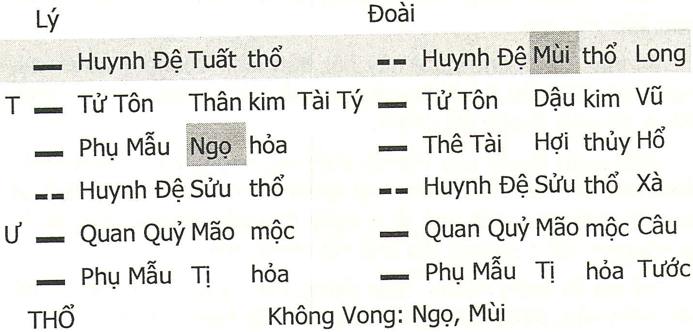

**Ví dụ 7:** Ngày Quý Tị tháng Bính Thìn năm Mậu Dần, một bà lão 86 tuổi đoán niên vận, được quẻ Địa Thiên Thái biến Thủy Lôi Truân.

| Thái | | Truân | |
| :--- | :--- | :--- | :--- |
| Ứ - - Tử Tôn Dậu kim | | - - Thê Tài Tý thủy | Hổ |
| - - Thê Tài Hợi thủy | | — Huynh Đệ Tuất thổ | Xà |
| - - Huynh Đệ Sửu thổ | | - - Tử Tôn Thân kim | Câu |
| T — Huynh Đệ Thìn thổ | | - - Huynh Đệ Thìn thổ | Tước |
| — Quan Quỷ Dần mộc | Phụ Tị | - - Quan Quỷ Dần mộc | Long |
| — Thê Tài Tý thủy | | — Thê Tài Tý thủy | Vũ |

THỔ Không Vong: Ngọ, Mùi

**Phán đoán:**

**An nguy của bản thân:** Lấy hào Thế làm Dụng thần. Địa chi năm nay là Dần mộc, Thái Tuế nhập hào phát động khắc Thế, năm nay có tai họa. Nội quái phục ngâm, là tượng đau đớn rên rỉ.

Hào Thế tại hào 3, hào 3 là giường, là tượng nằm giường vì bệnh. Huynh Đệ là anh em, tại nội quái là chân, hào 3 là đùi, hào 2 Quan Quỷ động mà khắc Huynh, hào 2 là hào vị của chân, chân sẽ bị bệnh. Hào 3 là dạ dày, hào 2 là ruột, ruột dạ dày cũng sẽ xuất hiện bệnh tật. Tài là phân và nước tiểu, nhập Mộ ở hào Thế, trong bụng có phân và nước tiểu, tất có táo bón hoặc tiểu không ra.

**Tuổi thọ:** Phán đoán từ hào Thế. Hào Thế được Nguyệt kiến tỉ phù, Nhật thần sinh phù là vượng tướng, sẽ không nguy hiểm cho sinh mệnh. Sống thêm vài năm nữa cũng không có vấn đề.

**Kết quả:** Tháng Tị đột nhiên chân sưng lên, đã nằm trên giường một tháng. Bình thường thì có táo bón, năm 1998 nghiêm trọng nhất.

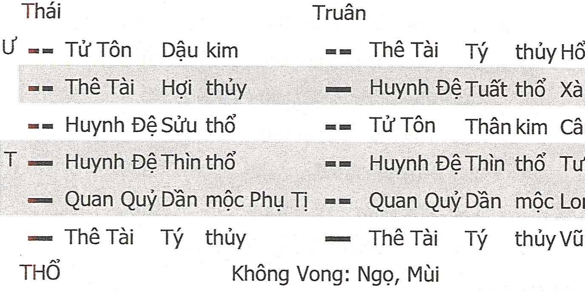

**Ví dụ 8:** Ngày Đinh Mão tháng Đinh Mão năm Kỷ Mão, nam đoán niên vận, được quẻ Trạch Lôi Tùy.

| | Tùy | | | | |
| :---: | :---: | :--- | :--- | :--- | :--- |
| Ứ | - - | Thê Tài | Mùi thổ | | Long |
| | — | Quan Quỷ | Dậu kim | | Vũ |
| | — | Phụ Mẫu | Hợi thủy | Tử Ngọ | Hổ |
| T | - - | Thê Tài | Thìn thổ | | Xà |
| | - - | Huynh Đệ | Dần mộc | | Câu |
| | — | Phụ Mẫu | Tý thủy | | Tước |

MỘC Không Vong: Tuất, Hợi

**Phán đoán:**

**An nguy của bản thân:** Lấy hào Thế làm Dụng thần. Hào Thế bị Nhật Nguyệt khắc thương không cát. Thế tại hào 3, hào 3 là dạ dày, thổ cũng chủ dạ dày, Kỵ thần tại hào 2 là ruột, năm nay sẽ có bệnh về ruột, dạ dày.

**Tài vận:** Lấy hào Tài làm Dụng thần. Hào Tài mặc dù trì Thế, nhưng bị Nhật Nguyệt khắc thương, Nguyên thần lại không hiện trên quẻ. Tài vận không tốt.

**Công việc:** Lấy Quan Quỷ làm Dụng thần. Quan Quỷ Dậu kim Nguyệt phá Nhật phá, vận khí sự nghiệp cũng không tốt.

**Kết quả:** Người này không có việc làm, đã buôn bán nhưng không được kiếm tiền. Đến tháng 6 bị kiết lỵ tiêu chảy.

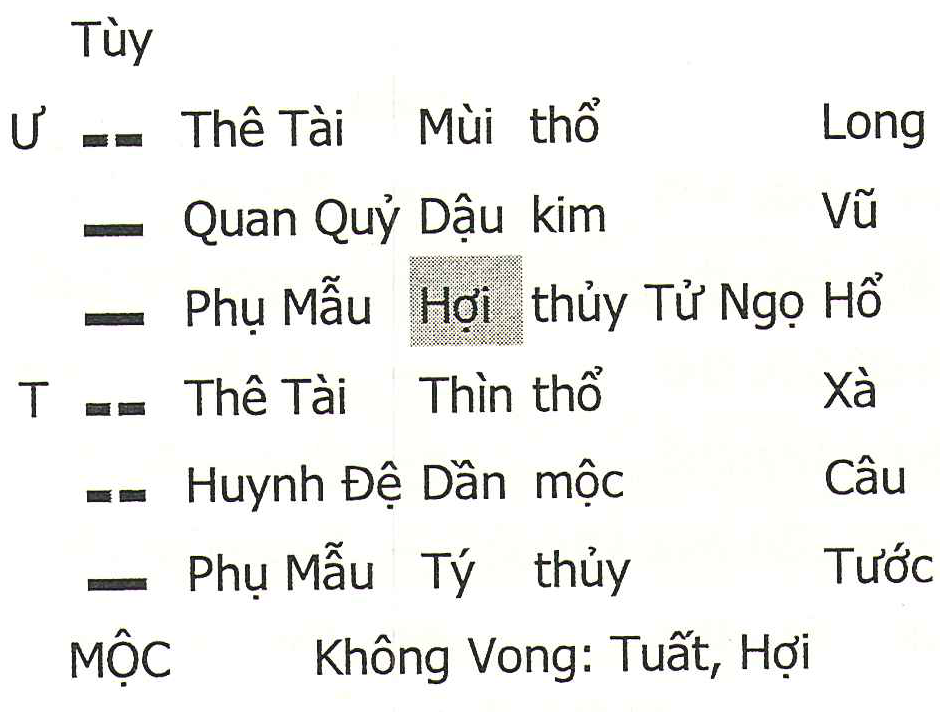

**Ví dụ 9:** Ngày Giáp Thân tháng Kỷ Tị năm Kỷ Mão, nam đoán niên vận, được quẻ Lôi Thủy Giải biến Đoài Vi Trạch.

| | Giải | | | | Đoài | | | |
| :---: | :---: | :--- | :--- | :--- | :---: | :--- | :--- | :--- |
| | - - | Thê Tài | Tuất thổ | | - - | Thê Tài | Mùi thổ | Vũ |
| Ứ | - - | Quan Quỷ | Thân kim | | — | Quan Quỷ | Dậu kim | Hổ |
| | — | Tử Tôn | Ngọ hỏa | | — | Phụ Mẫu | Hợi thủy | Xà |
| | - - | Tử Tôn | Ngọ hỏa | | - - | Thê Tài | Sửu thổ | Câu |
| T | — | Thê Tài | Thìn thổ | | — | Huynh Đệ | Mão mộc | Tước |
| | - - | Huynh Đệ | Dần mộc | Phụ Tý | — | Tử Tôn | Tị hỏa | Long |

MỘC Không Vong: Ngọ, Mùi

**Phán đoán:**

**An nguy của bản thân:** Lấy hào Thế làm Dụng thần. Hào Thế được Nguyệt kiến sinh phù là vượng tướng. Nhưng Kỵ thần động mà khắc Thế, không cát. Quẻ tại cung Chấn, Chấn là chân, Thế tại hào 2 lại là hào vị của chân, năm nay chân không bị thương thì cũng bị bệnh.

**Tài vận:** Lấy hào Tài làm Dụng thần. Hào Tài trì Thế, được Nguyệt sinh phù là vượng tướng, Quan Quỷ là công việc, động mà Trường Sinh hào Tài, tiền lương thu vào khá tốt. Nhưng Tử Tôn Không Vong, Kỵ thần Dần mộc phát động, muốn phát đại tài thì rất khó.

**Quan vận:** Lấy Quan Quỷ làm Dụng thần. Quan Quỷ được Nhật thần tỉ phù động hóa Tiến thần, có vẻ như công việc ngày càng đi lên, tượng thăng chức, nhưng Quan Quỷ lâm Ứng, Ứng là người khác, có dính dáng gì với mình? Quan Quỷ tại hào 5, hào 5 là lãnh đạo, chính là tượng lãnh đạo có biến động.

**Kết quả:** Đoán xong quẻ này, anh ta vén quần cho tôi xem, thì ra anh ta có bệnh giãn tĩnh mạch. Năm đó thay đổi lãnh đạo, bản thân vẫn nguyên trạng. Ngoài tiền lương thì không có thu nhập khác.

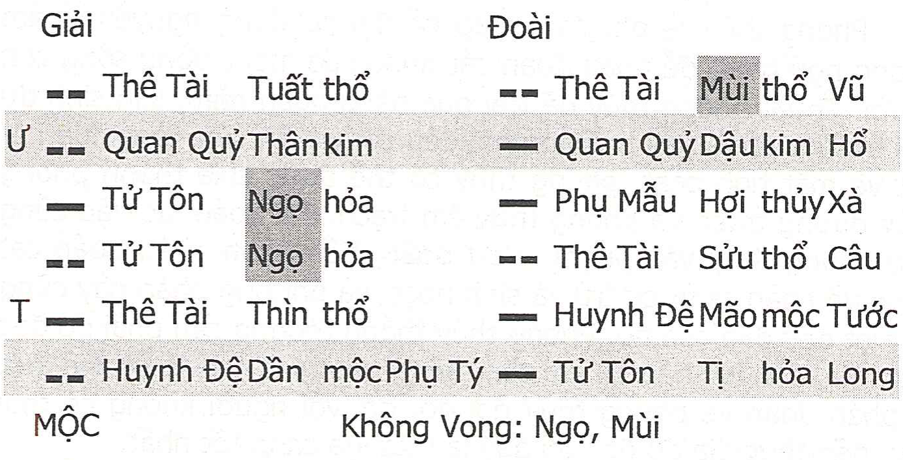

# CHƯƠNG 34
## DỰ ĐOÁN PHONG THỦY

Phong thủy là phương pháp cổ đại sử dụng nguyên lý âm dương ngũ hành để phán đoán cát hung của môi trường sống con người. Thuật phong thủy đã trải qua hàng ngàn năm, sản sinh đủ loại trường phái, mỗi trường phái đều có lý luận của riêng nó. Xét về mặt tính chất, phong thủy có thể được chia thành phong thủy dương trạch và phong thủy âm trạch. Dự đoán lục hào cũng đưa phong thủy vào phạm vi dự đoán, tiến hành phán đoán cát hung về hoàn cảnh cư trú và sinh hoạt, và phương pháp này cũng có mặt độc đáo của nó. Phong thủy thông thường cần phải đo đạc thực địa, còn lục hào thì chỉ cần thông qua gieo quẻ là có thể đưa ra phán đoán về phong thủy nơi đó, đối với người không có thời gian đến thực địa đo đạc thì đây là một lựa chọn tốt nhất.

Ở chương này chỉ giới thiệu một số phương pháp phán đoán cơ bản về dương trạch. Còn phép xem âm trạch và dự đoán phong thủy chi tiết hơn, có cơ hội tôi sẽ viết tác phẩm riêng.

### ẢNH HƯỞNG CỦA PHONG THỦY VÀ MỤC ĐÍCH DỰ ĐOÁN

Phong thủy ảnh hưởng đối với con người rất đa dạng. Tùy vào vận mệnh của người cư trú khác nhau mà ảnh hưởng tốt xấu của phong thủy cũng khác nhau. Người vận khí không tốt ở nơi phong thủy không tốt thì chịu ảnh hưởng xấu của phong thủy lớn hơn, người vận khí tốt ở nơi phong thủy không tốt thì chịu ảnh hưởng ở mức độ nhẹ hơn.

Tài vận, quan vận, sức khỏe, quan hệ vợ chồng, con cháu đời sau, tai nạn v.v đều sẽ chịu ảnh hưởng của phong thủy mà sinh ra biến hóa như vậy. Do đó, vận mệnh tốt vẫn phải phối hợp với phong thủy tốt mới được, còn người vận mệnh không tốt thì càng phải phối hợp với phong thủy tốt. Dự đoán phong thủy tốt xấu, mục đích là để tìm ra nhân tố trong phong thủy bất lợi cho người, thông qua điều chỉnh và cải thiện để được tình trạng tốt nhất.

Song nếu muốn phán đoán chính xác tốt xấu của phong thủy thì cần phải có kiến thức phán đoán về các khía cạnh khác. Nếu trình độ dự đoán về các khía cạnh khác không vững thì sẽ ảnh hưởng đến phán đoán về phong thủy.

### DỤNG THẦN TRONG DỰ ĐOÁN PHONG THỦY

Lục hào dự đoán phong thủy lấy nơi ở làm trung tâm để phán đoán, bởi vì Phụ Mẫu có ý nghĩa nhà cửa, cho nên lấy hào Phụ Mẫu làm Dụng thần. Nhưng dự đoán lục hào cũng không tách khỏi hào vị, cho nên khi dự đoán phải kết hợp với hào vị. Dự đoán lục hào xác định vị trí nơi ở tại hào 2.

Có điều là dự đoán lục hào đa phương diện, nhiều cấp độ, không thể phán đoán một cách đơn giản và cứng nhắc được. Bởi vì người ở trong nhà có vợ chồng con cái v.v, mà ảnh hưởng của phong thủy lại liên quan đến mọi khía cạnh trong cuộc sống, cho nên toàn bộ thông tin trong quẻ đều có thể coi như thông tin phong thủy được trích xuất. Vì vậy, khi dự đoán phong thủy, vừa phải xem tình trạng ảnh hưởng của hào Phụ Mẫu, hào 2 v.v, đồng thời còn phải kiêm xem ảnh hưởng các lục thân khác, lục thần trong quẻ ra sao.

### TRÍCH XUẤT THÔNG TIN TỪ HÀO VỊ

Không biết tác dụng của hào vị thì sẽ không sử dụng lục hào dự đoán phong thủy chính xác. Vì vậy, việc hiểu và ứng dụng hào vị có vai trò rất quan trọng trong dự đoán khía cạnh này.

Hào 6: Tường, hàng rào, mái nhà, trụ cột, hàng xóm, am thờ Phật, bài vị v.v.

Hào 5: Nhân khẩu, gia trưởng, đường đi, thủ đô v.v.

Hào 4: Cửa sổ, cửa chính, nhà vệ sinh, thành phố v.v.

Hào 3: Giường, cửa, thị trấn v.v.

Hào 2: Nhà, phòng, bếp, sân v.v.

Hào sơ: Nền nhà, giếng nước, con cái, thú cưng, hàng xóm, kênh rạch v.v.

Thông thường, hào 5 khắc hào 2, hào 2 sinh hào 5 hoặc là hào 5 và hào 2 giống nhau là cát; hào 5 sinh hào 2, hào 2 khắc hào 5 là hung. Nhưng đây là phương pháp cứng nhắc. Khi xem mối quan hệ giữa hào 5 và hào 2 còn phải xem suy vượng của chúng, xem đâu là hào Thế, phán đoán một cách tổng hợp mới được. Nếu hào 2 là hào Thế, hào 5 sinh Thế, chính là dấu hiệu ra vào dễ dàng, giao thông thuận lợi, đường lớn thông thoáng, không thể nói là không tốt.

Hào sơ lâm Phụ Mẫu phát động, Tử Tôn hưu tù Không Phá, hoặc là Tử Tôn lâm hào sơ động mà hóa Quan Quỷ, là nhà nền nhà bất lợi cho con cái hoặc gia cầm v.v.

Hào sơ lâm Thanh Long, lâm Tý thủy vượng tướng, gần nơi ở có giếng nước, ao hồ, sông ngòi v.v. Là một môi trường tốt, phong thủy bảo địa thích hợp cho người cư trú. Lâm Huyền Vũ là rãnh nước bẩn, cống thoát nước; động mà khắc Thế, người ở ắt bị nó làm tổn hại.

Tý thủy và Bạch Hổ cùng ở hào sơ là thông tin lân cận có cầu. Lâm Tử Tôn Thê Tài là có dòng nước, Nguyệt phá, hưu tù lâm Tuyệt, là có sông không có nước, cầu hư hại.

Hào sơ là thổ, Nguyệt phá là nền nhà có tổn hại, bị khắc tất có rễ cây xuyên phá nền nhà. Thổ hóa mộc, mộc hóa thổ là nền mới xây dựng.

Hào sơ Quan Quỷ lâm Bạch Hổ, gần nơi ở có mộ cổ, hoặc là trong nền nhà có xương trắng. Mộ khố của Quan Quỷ ở hào sơ cũng đoán như vậy.

Hào 2 Nguyệt phá, nhà có vết nứt, hoặc là nhà sẽ bị tháo dỡ di dời. Đôi khi là thông tin nhà cửa đổ nát.

Hào 2 lâm Câu Trần động là thông tin cải tạo, xây dựng nhà cửa, lâm Thanh Long là thông tin chỉnh trang (sửa sang, sắp đặt lại cho ngay ngắn, đẹp đẽ).

Quan Quỷ lâm Chu Tước tại hào 2 phát động, là thông tin hỏa hoạn và kiện tụng. Lâm Huyền Vũ là thông tin bị trộm, kẻ trộm vào nhà. Lâm Bạch Hổ là thông tin bị thương, bị bệnh.

Hào Ứng là hào 2, hoặc cho người khác thuê nhà, hoặc thuê nhà của người khác.

Hào 2 là mộc, là thông tin trong sân có cây hoặc trong nhà trồng hoa. Đôi khi cũng là thông tin vật dụng bằng gỗ trong nhà.

Hào 2 và Nhật Nguyệt tương hợp là kiến trúc nhiều tầng, hoặc là nhiều phòng hợp lại. Tương hợp với hào biến thường là nhà trệt.

Hào 2 phát động hóa tiến, cư trú lâu dài; hóa thoái, cư trú không lâu dài.

Hào 2 lâm Thanh Long vượng tướng là thông tin khu dân cư cao cấp. Lâm Quan Quỷ động mà sinh Thế, phong thủy nhà ở có lợi cho quan vận.

Nam đoán phong thủy, Huynh Đệ lâm Chu Tước tại hào 2 phát động, vợ chồng khẩu thiệt bất hòa, Thê Tài hóa thoái ly dị với vợ; nữ đoán phong thủy lâm Tử Tôn Chu Tước, là vợ chồng bất hòa. Quan Quỷ động mà hóa thoái, tất ly dị với chồng.

Tử Tôn lâm Thanh Long phát động, nhà yên tĩnh, tài vận tốt đẹp, không có tà khí. Lâm Quan Quỷ động, tất không yên ổn. Lâm Xà, có chuyện quái dị phát sinh.

Quan Quỷ tại hào 3 phát động, thường gặp ác mộng. Huynh Đệ tại hào 3 Nguyệt phá, cửa có khe hở. Mộc lâm Câu Trần động, là thông tin thay đổi cửa.

Hào 3 hào 4 Huynh Đệ tương xung, là thông tin cửa đối diện cửa, chắc chắn sẽ phá tài. Tử Tôn xung hào 3, hoặc hào 5 xung hào 3, là thông tin đường lớn xung cửa.

Hào 4 lâm Huyền Vũ là thông tin nhà vệ sinh. Lâm hỏa vượng tướng, nhà ở sáng sủa sạch sẽ; Nguyệt phá, có khe hở. Huynh Đệ khắc hào 4 có hình, có gió lạnh vào cửa sổ.

Hào 5 Không Phá, đường ra ngoài không thông suốt. Tài là hào âm lâm hào 5, phụ nữ lo liệu việc nhà.

Hào 5 là thủy, cạnh đường có nước, hợp hào 2, gần nhà có nước. Lâm Xà, lân cận có đường vòng hoặc đường nhỏ uốn lượn.

Hào 5 xung khắc hào Thế, đường đi ảnh hưởng đến phong thủy. Thế tại hào 6, không rời xa quê hương thì cũng là nhận làm con thừa tự người khác.

Hào 6 là mộc là hàng rào, là thổ là tường gạch hoặc tường đất. Lâm phá thì tường có vết nứt. Không Vong thì tường có lỗ.

Quan Quỷ tại hào 6 khắc Thế, có bài vị hoặc am thờ Phật bất lợi cho người, sinh Thế thì được tổ tiên phù hộ.

## TRÍCH XUẤT THÔNG TIN TỪ LỤC THÂN

Phụ Mẫu hưu tù Nguyệt phá Không Vong, nơi ở không an toàn, gặp Tuyệt, nhất định sẽ đổ nát.

Phụ Mẫu phát động, ở nhà bất an. Lâm Xà, tất có chuyện quái dị phát sinh.

Phụ Mẫu có ý nghĩa là nhà, cầu, mồ mả v.v, Quỷ Mộ là mồ mả. Phụ Mẫu vượt qua hào thủy tương hợp với hào khác là cầu, lâm Câu Trần là nhà, kiến trúc.

Phụ Mẫu phát động hóa Phụ Mẫu, nhiều nhà liền nhau. Sinh hào Ứng, hoặc cho người khác thuê, hoặc bán cho người khác.

Phụ Mẫu vượng tướng lâm Thanh Long, là nhà mới xây. Lâm hỏa bị khắc lâm Huyền Vũ, thiếu ánh sáng.

Huynh Đệ là cửa, cửa sổ, tường, nhà vệ sinh, cường vượng là bố trí không thích đáng tổn tài, hưu tù bất động là bố trí hợp lý.

Ứng lâm Thê Tài bị khắc, nam thì phong thủy bất lợi cho hôn nhân. Nữ thì tài vận của chồng không tốt.

Quan Quỷ lâm Thanh Long trì Thế hoặc sinh Thế, quan vận tốt đẹp, là công chức. Quan Quỷ phát động khắc Thế, tất bởi vì phong thủy không tốt mà phát sinh tai nạn.

Nữ đoán phong thủy, Quan Quỷ lâm Đào Hoa Mộc Dục tương hợp với hào Ứng, hào khác, là đào hoa trạch, chồng có ngoại tình. Hào Thế lâm Huyền Vũ, Đào Hoa Mộc Dục hợp Quan Quỷ, hoặc động mà hóa Quan Quỷ, bản thân có vận đào hoa.

Nam đoán phong thủy, hào Thế lâm Huyền Vũ Đào Hoa Mộc Dục tương hợp với hào khác, hoặc Thê Tài lại hóa Thê Tài, bản thân có ngoại tình, hào Tài hợp hào Ứng, vợ có ngoại tình. Cách đoán chi tiết có thể xem thêm ở chương hôn nhân.

Thê Tài có ý nghĩa nhà bếp, kho, v.v.

Thê Tài vượng mà sinh hào Thế, phong thủy tụ tài, lợi cho tài vận.

Quan Quỷ vượng tướng, Phụ Mẫu lâm Chu Tước cũng vượng, phong thủy lợi cho Văn Xương, xuất người học giỏi.

Tử Tôn có ý nghĩa động vật, thú cưng, đường đi, hành lang, con cháu.

Quan Quỷ trì Thế, Tử Tôn phát động bất lợi cho lên chức và công việc. Dự đoán của nữ thì bất lợi cho hôn nhân.

Tử Tôn hợp hào 2, nhà gần đường. Xung hào 2, có đường xung trạch.

Tử Tôn Nguyệt phá lâm Bạch Hổ Không Vong, ở nhà này có chuyện lưu sản xảy ra.

### TRÍCH XUẤT THÔNG TIN TỪ LỤC THẦN

Lục thần dùng để nói rõ tính chất và nguyên nhân của sự vật, đôi khi cũng dùng cho phán đoán phương vị. Thanh Long là Đông, là mới, là chỉnh trang; Chu Tước là Nam, là hỏa hoạn, khẩu thiệt, kiện tụng; Câu Trần là ở giữa, là kiến trúc, là tu tạo; Đằng Xà là ở giữa, là uốn khúc, là kinh dị; Bạch Hổ là Tây, là đường, là bệnh tật; Huyền Vũ là Bắc, là trộm cắp, tối tăm. Khi phán đoán phong thủy phải kết hợp với lục thân và hào vị để phân biệt. Về ý nghĩa chi tiết của lục thần, có thể xem thêm trong cuốn "Lục Hào Dự Trắc Tật Bệnh Tân Thám" và "Lục Hào Quái Lệ Thuyết Chân".

**Ví dụ 1:** Ngày Bính Dần tháng Hợi, nữ đoán phong thủy nhà cửa, được quẻ Phong Trạch Trung Phu biến Tốn Vi Phong.

| | Trung Phu | Tốn | |
| :---: | :--- | :--- | :---: |
| | — Quan Quỷ Mão mộc | — Quan Quỷ Mão mộc | Long |
| | — Phụ Mẫu Tị hỏa Tài Tý | — Phụ Mẫu Tị hỏa | Vũ |
| T | - - Huynh Đệ Mùi thổ | - - Huynh Đệ Mùi thổ | Hổ |
| | - - Huynh Đệ Sửu thổ Tử Thân | — Tử Tôn Dậu kim | Xà |
| | — Quan Quỷ Mão mộc | — Thê Tài Hợi thủy | Câu |
| Ư | — Phụ Mẫu Tị hỏa | - - Huynh Đệ Sửu thổ | Tước |

THỔ Không Vong: Tuất, Hợi

**Phán đoán:**

Lấy Phụ Mẫu làm Dụng thần, Phụ Mẫu Tị hỏa lưỡng hiện, lấy hào sơ Phụ Mẫu Tị hỏa phát động làm Dụng thần. Phụ Mẫu Nguyệt phá, nơi ở bất an. Thê Tài không hiện trên quẻ, Huynh Đệ Sửu thổ phát động, Phụ Mẫu lại là Tuyệt địa của hào Tài, nhà này không tụ tài.

Quan Quỷ có ý nghĩa phiền não, tai nạn, bệnh tật, v.v. Quan Quỷ Mão mộc lâm hào 2, hào 2 là hào trạch, Nhật là Quan Quỷ trợ khởi hào 2 khắc Thế. Phong thủy căn nhà này bất lợi cho người, dễ mang lại tai nạn và phiền não.

Thê Tài Tý thủy tuy được Nguyệt kiến tỉ phù, nhưng Phụ Mẫu Tị hỏa động khiến Thê Tài lâm Tuyệt, hào 3 Huynh Đệ Sửu thổ động mà khắc Tài, là thông tin phá tài. Hào 3 là cửa, lâm Huynh Đệ cũng chủ cửa, động mà tương xung với hào 4, chính là cửa đối diện nhau, phạm đại kỵ của phong thủy.

Tử Tôn Thân kim phục tàng, nhập Mộ ở hào động Sửu thổ, Nguyệt là Bệnh địa của Tử Tôn, Nhật là Tuyệt địa của Tử Tôn, hào sơ Phụ Mẫu động mà khắc Tử Tôn, nhà này bất lợi cho con cái. Gặp Bệnh địa là bị bệnh, nhập Mộ là nhập viện, con cái tất bởi vì bệnh mà nhập viện.

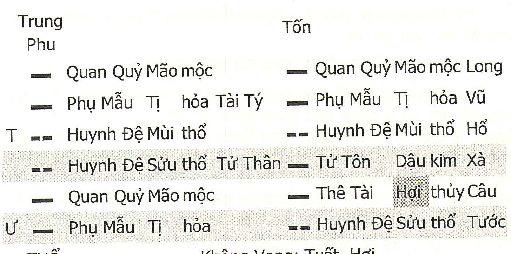

**Kết quả:** Thu nhập của gia đình rất thấp. Con trai nhập viện vì u não, đã tốn rất nhiều tiền nhưng không khỏi, tìm bà đồng xem bệnh thì lại bị gạt rất nhiều tiền. Trong nhà quả thực có hai cửa đối diện nhau.

**Ví dụ 2:** Ngày Giáp Tuất tháng Tị, nam đoán phong thủy nhà cửa, được quẻ Cấn Vi Sơn biến Sơn Địa Bác.

| | Cấn | Bác | |
| :---: | :--- | :--- | :---: |
| T | — Quan Quỷ Dần mộc | — Quan Quỷ Dần mộc | Vũ |
| | - - Thê Tài Tý thủy | - - Thê Tài Tý thủy | Hổ |
| | - - Huynh Đệ Tuất thổ | - - Huynh Đệ Tuất thổ | Xà |
| Ư | — Tử Tôn Thân kim | - - Quan Quỷ Mão mộc | Câu |
| | - - Phụ Mẫu Ngọ hỏa | - - Phụ Mẫu Tị hỏa | Tước |
| | - - Huynh Đệ Thìn thổ | - - Huynh Đệ Mùi thổ | Long |

THỔ Không Vong: Thân, Dậu

**Phán đoán:**

Lấy Phụ Mẫu làm Dụng thần. Phụ Mẫu Ngọ hỏa tại hào 2, nhập Mộ ở Nhật thần. Nhật là Huynh Đệ, Huynh Đệ là tường, căn nhà có tường vây quanh. Quẻ chính lục xung, không thể tàng phong tụ khí.

Tử Tôn Thân kim tại hào 3 lâm Câu Trần phát động khắc Thế, hào 3 là cửa, Thân là Tây Nam, Câu Trần là tu tạo, kiến trúc. Phía Tây Nam có kiến trúc thi công ảnh hưởng đến quan vận của bản thân.

Nguyệt là Tuyệt địa của Thê Tài, Nhật khắc Thê Tài, Thê Tài Tý thủy nhập Mộ ở hào ám động Huynh Đệ Thìn thổ là hưu tù. Trong quẻ tuy có Tử Tôn phát động liên tục tương sinh, nhưng Tử Tôn Thân kim Không Vong, Thê Tài vốn không có gốc rễ, tất bởi vì phong thủy không tốt mà phá tài. Thê Tài Tý thủy lâm hào 5 bị khắc, hào 5 là đường đi, Bạch Hổ chủ tai nạn giao thông, là phá tài vì tai nạn giao thông.

**Kết quả:** Người này ở nhà biệt lập, xung quanh có tường bao. Cửa tại Tây Nam, đã từng sửa chữa. Mấy ngày trước, chiếc ô

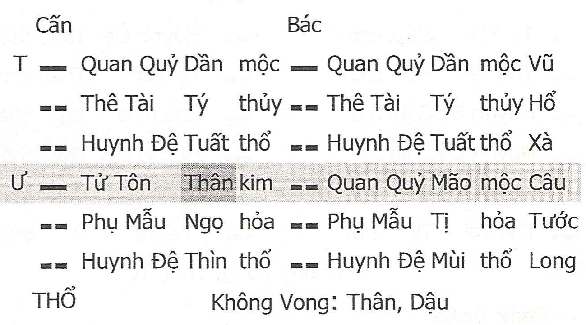 tô hơn 10 ngàn tệ đã rơi xuống sông sâu, tài xế tử vong, đã bồi thường rất nhiều tiền.

**Ví dụ 3:** Ngày Kỷ Hợi tháng Thân, nam đoán phong thủy nhà cửa, được quẻ Địa Lôi Phục biến Lôi Thiên Đại Tráng.

| | Phục | | | Đại Tráng | |
| :---: | :--- | :---: | :---: | :--- | :---: |
| | Tử Tôn Dậu kim | - - | - - | Huynh Đệ Tuất thổ | Câu |
| | Thê Tài Hợi thủy | - - | - - | Tử Tôn Thân kim | Tước |
| Ứ | Huynh Đệ Sửu thổ | - - | — | Phụ Mẫu Ngọ hỏa | Long |
| | Huynh Đệ Thìn thổ | - - | — | Huynh Đệ Thìn thổ | Vũ |
| | Quan Quỷ Dần mộc Phụ Tị | - - | — | Quan Quỷ Dần mộc | Hổ |
| T | Thê Tài Tý thủy | — | — | Thê Tài Tý thủy | Xà |

THỔ Không Vong: Thìn, Tị

**Phán đoán:**

Lấy Phụ Mẫu làm Dụng thần, hào 2 là hào trạch. Phụ Mẫu Tị hỏa phục dưới hào 2, là trạch phục dưới trạch, thông tin nhà cửa trùng điệp, chứng tỏ căn nhà có tầng hầm. Hào 2 và Nhật tương hợp, Phụ Mẫu Tị hỏa và Nguyệt tương hợp, hợp là tượng trùng điệp, trên nhà có nhà, là thông tin nhà lầu.

Hào 2 Nguyệt phá, nhưng Nhật hợp là giải trừ phá, ban đầu nhà có vết nứt, sau đó đã sữa chữa. Phụ Mẫu hưu tù, không phải là nhà mới. Hào Ứng phát động hóa ra Phụ Mẫu Ngọ hỏa, Ứng là người khác, Phụ Mẫu chủ nhà cửa, căn nhà này đã từng có người ở và chuyển đi.

Bạch Hổ lâm Quan Quỷ tại hào 2 phát động, nội quái phản ngâm, phong thủy căn nhà không tốt. Hào trạch lâm Bạch Hổ động mà khắc hào Ứng, Quan Quỷ và Bạch Hổ đều chủ bệnh tật, Ứng là người khác, bị khắc, hộ gia đình ban đầu nhất định có bệnh tật liên miên. Ứng cũng là thê vị, ở này nhà sẽ bất lợi cho vợ.

**Kết quả:** Nơi ở là nhà tập thể được đơn vị cấp. Căn nhà đã rất cũ. Hộ gia đình lúc trước sau khi vào ở thì mẹ tử vong, vợ

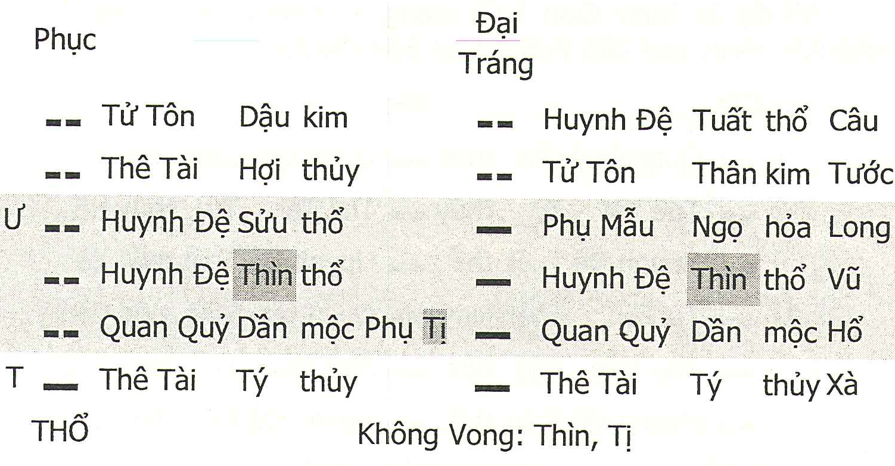 phẫu thuật tử vong, bản thân phẫu thuật vì bệnh, con trai nhảy lầu tự sát không chết. Người xem mặc dù cũng biết là phong thủy của căn nhà này không tốt, nhưng bởi vì không có nơi trú ngụ cho nên đành phải vào ở. Kết quả là người này đã liên tục ly dị với 3 người vợ.

**Ví dụ 4:** Ngày Ất Hợi tháng Dậu, nam đoán phong thủy nhà cửa, được quẻ Địa Hỏa Minh Di.

| | Minh Di | | |
| :---: | :---: | :--- | :---: |
| | - - | Phụ Mẫu Dậu kim | Vũ |
| | - - | Huynh Đệ Hợi thủy | Hổ |
| T | - - | Quan Quỷ Sửu thổ | Xà |
| | — | Huynh Đệ Hợi thủy Tài Ngọ | Câu |
| | - - | Quan Quỷ Sửu thổ | Tước |
| Ứ | — | Tử Tôn Mão mộc | Long |

THỦY Không Vong: Thân, Dậu

**Phán đoán:**

Lấy Phụ Mẫu làm Dụng thần, đồng thời xem thêm hào 2. Trong quẻ không gặp hỏa, Phụ Mẫu Dậu kim lâm Huyền Vũ, Huyền Vũ chủ bí mật, tối tăm, hỏa là ánh sáng, chứng tỏ nơi ở thiếu ánh sáng, ít khi nhìn thấy mặt trời.

Hào 2 Quan Quỷ Sửu thổ khắc hào 5 Huynh Đệ Hợi thủy, hào 2 là trạch, hào 5 là người, nhà này bất lợi cho người. Quan Quỷ trì Thế, lâm Đằng Xà, Quan Quỷ là phiền não, Đằng Xà là đứng ngồi không yên, chứng tỏ người ở căn nhà này thường xuyên phiền muộn, không thanh thản. Quan Quỷ tại hào 2 lâm Chu Tước, Chu Tước là cãi cọ, ở nhà này khó tránh cãi cọ, kiện tụng.

Thê Tài Ngọ hỏa hưu tù không hiện trên quẻ, Phi thần Tuyệt, trong nhà không thấy vợ, vợ bỏ nhà ra đi. Thê Tài lâm Ngọ hỏa, sự việc phát sinh tại tháng Ngọ.

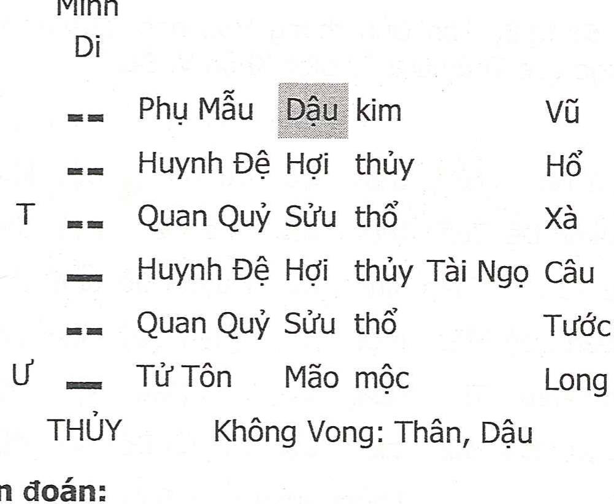

Địa Hỏa Minh Di là cung Khảm, Khảm là thủy, là nước tiểu, là máu. Thê Tài phục tại hào 3 bị Phi thần khắc, Nhật thần khắc, hào 3 là hào vị tử cung, vợ có bệnh phụ khoa, kinh nguyệt không đều.

**Kết quả:** Xung quanh căn nhà có vật kiến trúc rất cao cản trở, cả ngày không thấy mặt trời. Vợ chồng thường xuyên cãi lộn, ba tháng trước vợ giận bỏ về nhà mẹ đẻ, đến bây giờ vẫn chưa trở về. Nhiều lần đi đón vợ đều bị cha mẹ vợ đuổi ra. Vợ đích thực kinh nguyệt không đều.

**Ví dụ 5:** Ngày Tân Dậu tháng Hợi, nam đoán phong thủy nhà chú, được quẻ Thủy Địa Tỷ biến Khôn Vi Địa.

| | Tỷ | | | Khôn | |
| :---: | :---: | :--- | :---: | :--- | :---: |
| Ứ | ╌ ╌ | Thê Tài Tý thủy | ╌ ╌ | Tử Tôn Dậu kim | Xà |
| | ━━━ | Huynh Đệ Tuất thổ | ╌ ╌ | Thê Tài Hợi thủy | Câu |
| | ╌ ╌ | Tử Tôn Thân kim | ╌ ╌ | Huynh Đệ Sửu thổ | Tước |
| T | ╌ ╌ | Quan Quỷ Mão mộc | ╌ ╌ | Quan Quỷ Mão mộc | Long |
| | ╌ ╌ | Phụ Mẫu Tị hỏa | ╌ ╌ | Phụ Mẫu Tị hỏa | Vũ |
| | ╌ ╌ | Huynh Đệ Mùi thổ | ╌ ╌ | Huynh Đệ Mùi thổ | Hổ |

THỔ Không Vong: Tý, Sửu

**Phán đoán:**

Lấy Phụ Mẫu làm Dụng thần, xem thêm hào 2. Mới nhìn thì thấy hào 2 sinh hào 5, nhà này có lợi cho người. Nhưng hào trạch Nguyệt phá, Tử ở Nhật thần, nhập Mộ ở hào 5, lại biến quẻ lục xung, không thể tàng phong tụ khí, tử khí trong nhà rất nặng.

Hào 3 Quan Quỷ ám động khắc hào 5 Tuất thổ, hào 3 là cửa, hào 5 là người, cổng gây bất lợi cho người ở. Nhật thần Dậu kim khiến hào 3 ám động, Dậu kim và hào Tử Tôn có ngũ hành tương đồng, Tử Tôn là đường đi, Dậu kim là Tây, chứng tỏ có một con đường lớn từ hướng Tây đến trực xung cổng, sát khí không bị ngăn chặn cho nên đã vào trong nhà.

Xem cát hung ứng vào người nào, căn cứ vào suy vượng của lục thân trong quẻ. Trong quẻ Phụ Mẫu Tị hỏa Nguyệt phá, Tử ở Nhật thần, nhập Mộ ở Tuất thổ, Phụ Mẫu chủ chú thím, hai người

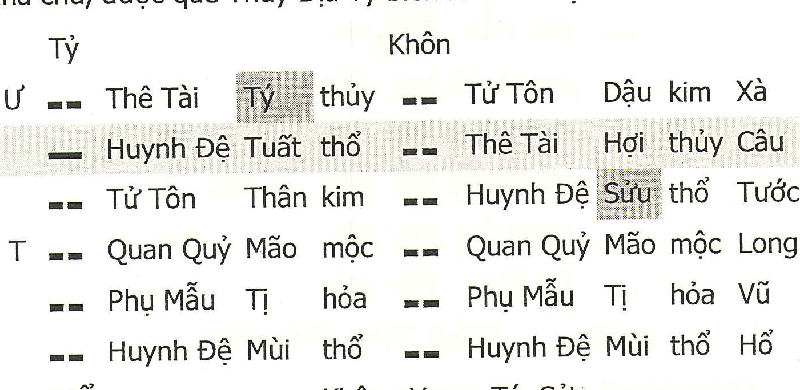 này tất có bệnh tai. Phụ Mẫu là hỏa, hỏa chủ tim, tất bởi vì bệnh tim mà gặp hung. Tháng Tuất Phụ Mẫu nhập Mộ, tháng hiện tại Phụ Mẫu Nguyệt phá, hai tháng này tất có chuyện không may.

**Kết quả:** Phong thủy nhà chú đúng như phán đoán, phía Tây có một con đường lớn trực xung cổng. Chú qua đời ở tháng Tuất bởi vì nhồi máu cơ tim.

**Ví dụ 6:** Ngày Ất Sửu tháng Hợi, nam đoán phong thủy cửa hàng, được quẻ Hỏa Thiên Đại Hữu biến Ly Vi Hỏa.

| | Đại Hữu | | | Ly | |
| :---: | :---: | :--- | :---: | :--- | :---: |
| Ứ | ━━━ | Quan Quỷ Tị hỏa | ━━━ | Quan Quỷ Tị hỏa | Vũ |
| | ╌ ╌ | Phụ Mẫu Mùi thổ | ╌ ╌ | Phụ Mẫu Mùi thổ | Hổ |
| | ━━━ | Huynh Đệ Dậu kim | ━━━ | Huynh Đệ Dậu kim | Xà |
| T | ━━━ | Phụ Mẫu Thìn thổ | ━━━ | Tử Tôn Hợi thủy | Câu |
| | ━━━ | Thê Tài Dần mộc | ╌ ╌ | Phụ Mẫu Sửu thổ | Tước |
| | ━━━ | Tử Tôn Tý thủy | ━━━ | Thê Tài Mão mộc | Long |

KIM Không Vong: Tuất, Hợi

**Phán đoán:** Lấy Phụ Mẫu làm cửa hàng, xem thêm hào 2. Hào 2 là cửa hàng, hào 5 là nhân viên cửa hàng. Hào 2 khắc hào 5, cửa hàng này bất lợi cho nhân viên.

Hào 5 Nhật phá lâm Bạch Hổ, hào 5 là đường đi, Bạch Hổ chủ tai nạn xe cộ. Kinh doanh ở cửa hàng này thì nhân viên dễ xảy ra tai nạn giao thông.

Trong quẻ này, hào Tài tuy được Nguyệt kiến sinh phù, nhưng Tài không nên lâm hào 2 phát động, cửa hàng này thu nhập không ổn định.

Hào 2 động mà hóa Phụ Mẫu, lại biến lục xung, cửa hàng này mở không lâu dài, sẽ dời chỗ.

**Phản hồi:** Trên thực tế, một nhân viên bị tai nạn giao thông ở tháng Dậu. Năm 1997, bởi vì kinh doanh không phát đạt cho nên đã dời chỗ.

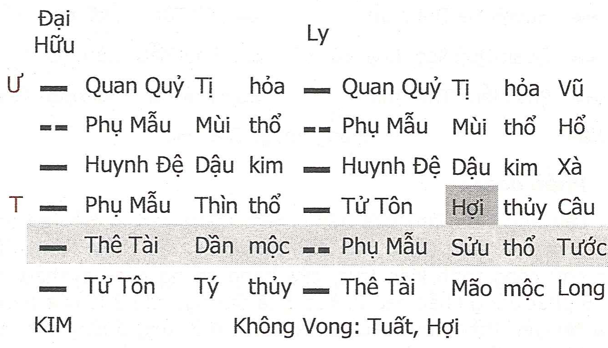

### Ví dụ 7: Ngày Mậu Thìn tháng Hợi, một người đoán phong thủy nhà hàng, được Địa Sơn Khiêm biến Phong Hỏa Gia Nhân.

| | Khiêm | | Gia Nhân | |
| :---: | :--- | :---: | :--- | :---: |
| | - - Huynh Đệ Dậu kim | — | Thê Tài Mão mộc | Tước |
| T | - - Tử Tôn Hợi thủy | — | Quan Quỷ Tị hỏa | Long |
| | - - Phụ Mẫu Sửu thổ | - - | Phụ Mẫu Mùi thổ | Vũ |
| | — Huynh Đệ Thân kim | — | Tử Tôn Hợi thủy | Hổ |
| Ư | - - Quan Quỷ Ngọ hỏa Tài Mão | - - | Phụ Mẫu Sửu thổ | Xà |
| | - - Phụ Mẫu Thìn thổ | — | Thê Tài Mão mộc | Câu |

**KIM** **Không Vong: Tuất, Hợi**

#### Phán đoán:

Lấy Phụ Mẫu làm cửa hàng, xem thêm hào 2. Hào sơ Phụ Mẫu Thìn thổ phát động hóa hồi đầu khắc, lâm Câu Trần, Câu Trần chủ công trình kiến trúc, cửa hàng có nguy cơ bị tháo dỡ. Hào 5 phát động khắc hào 2, hào 5 là đường, hào 2 là cửa hàng, lại là Nguyên thần Phụ Mẫu, sợ là bởi vì mở rộng đường mà cửa hàng bị tháo dỡ.

Ngoại quái phản ngâm, phản ngâm là thay đổi thất thường, cửa hàng này không những kinh doanh ăn uống, mà còn kinh doanh những thứ khác. Thê Tài Mão mộc phục tàng tuy được Nguyệt sinh, nhưng bị Huynh Đệ phát động khắc chế, Tử Tôn Không Vong lại nhập Nhật Mộ, cửa hàng này rất khó kinh doanh có lãi.

Ứng lâm hào 2 là Ứng nhập phi trạch, cửa hàng này có người muốn thuê hoặc muốn mua. Nhất định phải nắm bắt cơ hội này để chuyển nhượng cửa hàng.

**Tình hình ứng nghiệm:** Cửa hàng này ban đầu kinh doanh nhà sách và vật liệu trang trí. Bởi vì không kiếm được tiền cho nên đã đổi thành quán ăn, tuy nhiên vẫn không phát đạt. Đúng lúc có người muốn thuê, thế là chuyển cho người ta. Đến năm thứ hai, bởi vì mở rộng đường cho nên cửa hàng bị đập bỏ một nửa, diện tích bị thu hẹp, ngay cả cho thuê cũng khó khăn.

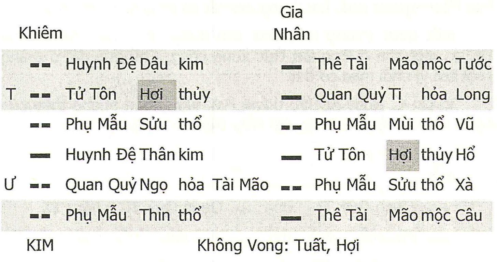

### Ví dụ 8: Ngày Quý Tị tháng Tý, nam đoán phong thủy cửa hàng, được quẻ Trạch Sơn Hàm biến Thiên Sơn Độn.

| | Hàm | | Độn | |
| :---: | :--- | :---: | :--- | :---: |
| Ư | - - Phụ Mẫu Mùi thổ | — | Phụ Mẫu Tuất thổ | Hổ |
| | — Huynh Đệ Dậu kim | — | Huynh Đệ Thân kim | Xà |
| | — Tử Tôn Hợi thủy | — | Quan Quỷ Ngọ hỏa | Câu |
| T | — Huynh Đệ Thân kim | — | Huynh Đệ Thân kim | Tước |
| | - - Quan Quỷ Ngọ hỏa Tài Mão | - - | Quan Quỷ Ngọ hỏa | Long |
| | - - Phụ Mẫu Thìn thổ | - - | Phụ Mẫu Thìn thổ | Vũ |

**KIM** **Không Vong: Ngọ, Mùi**

#### Phán đoán:

Lấy Phụ Mẫu làm cửa hàng, xem thêm hào 2. Hào 2 Nguyệt phá, được Phụ Mẫu Mùi thổ động mà hợp phá, cửa hàng không tốt lắm, đã từng tu bổ.

Thế lâm Chu Tước, Chu Tước là miệng, quẻ tại cung Đoài, Đoài cũng là miệng, cửa hàng kinh doanh lĩnh vực có liên quan đến ẩm thực. Phụ Mẫu lâm hào Ứng, Ứng là người khác, cửa hàng thuộc về người khác, là cửa hàng đi thuê.

Thê Tài Mão mộc mặc dù phục tàng, nhưng được Nguyệt sinh phù, Phi thần Không Vong, Phục thần dưới hào Không thì dễ kéo ra, đồng thời Tử Tôn Hợi thủy ám động sinh Tài, cửa hàng này có thu nhập cũng tạm tạm. Nhưng Ứng Phụ Mẫu Mùi thổ phát động, khiến hào Tài nhập Mộ, tiền thuê cửa hàng rất căng. Hiện nay Mùi thổ Không Vong, năm sau Đinh Sửu xung thực Mùi thổ, tiền thuê nhà tất phình ra. Rất khó để tiếp tục kinh doanh.

**Kết quả:** Người này mở một quán ăn. Tiền thuê mặc dù có hơi cao nhưng vẫn còn lợi nhuận. Có thể là vừa đến năm 1997 thì giá nhà tăng lên, lợi nhuận chẳng còn lại bao nhiêu, không thể không đóng cửa.

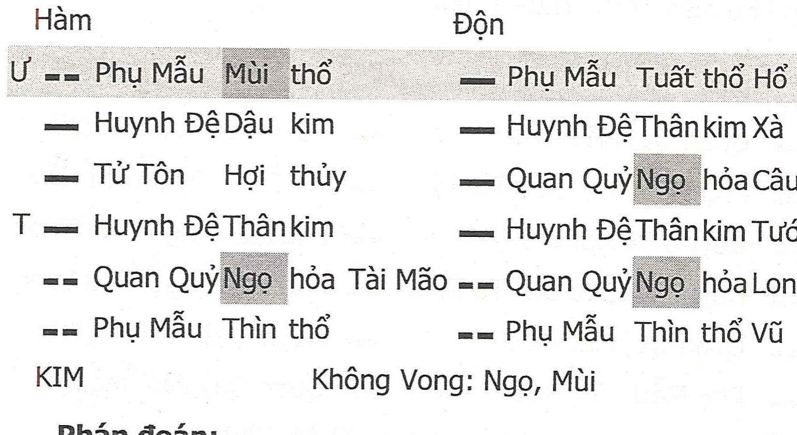

**Ví dụ 9:** Ngày Canh Thìn tháng Mùi, một người đàn ông đoán phong thủy của nhà máy than cốc, được quẻ Phong Trạch Trung Phu biến Thiên Thủy Tụng.

| | Trung Phu | | Tụng | |
| :---: | :--- | :---: | :--- | :---: |
| | ━ Quan Quỷ Mão mộc | ━ | Huynh Đệ Tuất thổ | Xà |
| | ━ Phụ Mẫu Tị hỏa Tài Tý | ━ | Tử Tôn Thân kim | Câu |
| T | ⚋ Huynh Đệ Mùi thổ | ━ | Phụ Mẫu Ngọ hỏa | Tước |
| | ⚋ Huynh Đệ Sửu thổ Tử Thân | ⚋ | Phụ Mẫu Ngọ hỏa | Long |
| | ━ Quan Quỷ Mão mộc | ━ | Huynh Đệ Thìn thổ | Vũ |
| Ư | ━ Phụ Mẫu Tị hỏa | ⚋ | Quan Quỷ Dần mộc | Hổ |

THỔ Không Vong: Thân, Dậu

**Phán đoán:**

Lấy hào Phụ Mẫu làm nhà máy. Thông tin phản ánh trong toàn quẻ chính là thông tin cát hung về phong thủy. Nhà máy thì lấy lợi nhuận làm mục đích, vì vậy phải xem hào Tài.

Thê Tài Tý thủy phục tàng, bị Nhật Nguyệt khắc thương, trong quẻ lại có Huynh Đệ Mùi thổ phát động đến khắc, Phụ Mẫu Tị hỏa phát động là Tuyệt địa, vừa nhìn là biết nhà máy không quá phát đạt.

Phụ Mẫu lưỡng hiện, lấy hào Phụ Mẫu Tị hỏa phát động làm Dụng thần. Phụ Mẫu Tị hỏa là Tuyệt địa của hào Tài, phong thủy nhà máy gây bất lợi cho tài vận.

Thê Tài đồng thời là công nhân, hào sơ lại là hào vị cấp dưới, công nhân. Thê Tài phục tàng, Tuyệt ở hào sơ, Thê Tài không thể quy vị, công nhân không muốn về nhà máy làm việc. Hào sơ lâm Bạch Hổ hóa Quan Quỷ, Bạch Hổ và Quan Quỷ đều có thông tin tử vong và thương tai, hào Tài hưu tù, nhất định là trong nhà máy đã xảy ra sự kiện thương vong. Hào sơ là chân, công nhân bị thương đa số ở chân. Thê Tài lại nhập Mộ ở Nhật, Mộ có ý nghĩa là chôn giấu, sẽ xảy ra tình huống công nhân bị chôn vùi trong đất mà chết.

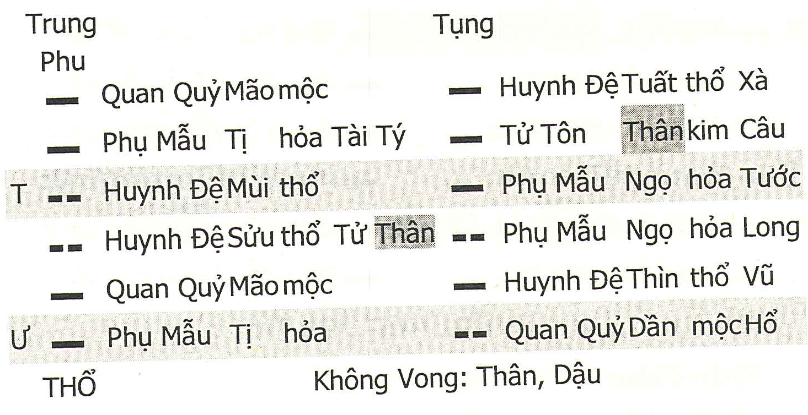

Hào 4 là cổng, Huynh Đệ Mùi thổ tại đây phát động khắc Thê Tài, chứng tỏ cổng bố trí không đúng, ảnh hưởng đến tài vận. Mùi thổ tương ứng với Tây Nam, cổng ở hướng Tây Nam hợp bố cục phong thủy. Hào sơ là chân, lâm Bạch Hổ, Bạch Hổ là đường đi, hào sơ là Tuyệt địa hào Tài, động mà hóa Quan Quỷ, đường đi của nhà máy cũng không phù hợp với bố cục phong thủy.

**Kết quả:** Hiện nay nhà máy không phát đạt, than cốc sản xuất ra không bán được, trong nhà máy từng xảy ra sự kiện công nhân bị thương ở chân và chết vì bị chôn vùi trong than. Công nhân vừa lo nhà máy không đảm bảo an toàn, vừa lo không lấy được tiền lương, cho nên họ không muốn về nhà máy.

**Ví dụ 10:** Ngày Kỷ Dậu tháng Dần, nữ dự định kinh doanh nhà thuốc, đoán xem phong thủy cửa hàng ra sao? Được quẻ Thủy Thiên Nhu.

| | Nhu | |
| :---: | :--- | :---: |
| | ⚋ Thê Tài Tý thủy | Câu |
| | ━ Huynh Đệ Tuất thổ | Tước |
| T | ⚋ Tử Tôn Thân kim | Long |
| | ━ Huynh Đệ Thìn thổ | Vũ |
| | ━ Quan Quỷ Dần mộc Phụ Tị | Hổ |
| Ư | ━ Thê Tài Tý thủy | Xà |

THỔ Không Vong: Dần, Mão

**Phán đoán:**

Lấy Phụ Mẫu làm Dụng thần, xem thêm hào 2, bởi vì hào 2 là cửa hàng. Kinh doanh nhà thuốc để thu lợi, đồng thời kiêm xem hào Tài.

Tử Tôn trì Thế lâm Thanh Long, Tử Tôn là y dược, Thanh Long chủ quý trọng, cô ấy có một loại thuốc đặc biệt tốt. Hào Tài tuy được Nhật sinh, nhưng hào Thế Nguyệt phá, khó mà sinh Tài, kinh doanh nhà thuốc chưa hẳn có thể thu lợi. Cái xung phá hào Thế là Nguyệt kiến Quan Quỷ. Quan Quỷ là nhà nước, ngành chấp pháp. Nhất định là khâu kiểm định thuốc gặp vướng mắc, khiến nhà thuốc không thể kinh doanh.

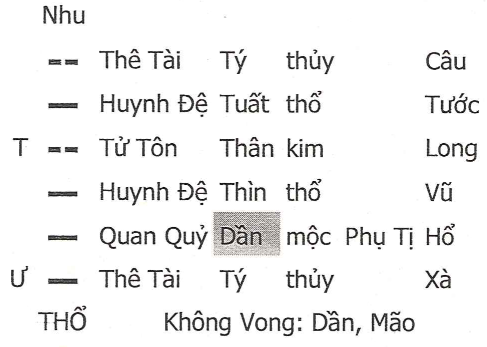

Hào 2 Quan Quỷ Không Vong, hào 2 là cửa hàng, chứng tỏ vẫn chưa thuê được nhà thuốc. Lâm Bạch Hổ, Bạch Hổ là y dược, nhà thuốc đang muốn thuê đã từng là phòng khám bệnh. Phụ Mẫu phục tàng, nhà thuốc không ở trên phố lớn, là ở trong hẻm nhỏ.

**Kết quả:** Bản thân cô tốt nghiệp đại học y, đã phát minh được một loại thuốc đặc hiệu. Tuy nhiên, cô vẫn chưa lấy được giấy phép sản xuất của cơ quan quản lý dược phẩm. Bởi vì xin giấy phép cần một khoản tiền lớn, vì vậy cô dự định mở phòng khám bệnh, kiếm một ít tiền rồi sau đó mới đi xin giấy phép. Hiện nay cô đã tìm được một căn nhà mặt tiền, trước đây đã từng mở phòng khám bệnh. Cô ấy thấy căn nhà này khá phù hợp với nhu cầu sử dụng của mình, nhưng cô ấy vẫn chưa ký hợp đồng với chủ nhà, muốn xem phong thủy của cửa hàng rồi sau đó mới thuê lại. Sau này không thành.

**Ví dụ 11:** Ngày Tân Hợi tháng Ngọ, nữ đoán phong thủy nhà cửa, được quẻ Lôi Địa Dự.

**Dự**

| | | | | | |
| :---: | :---: | :--- | :--- | :--- | :--- |
| | - - | Thê Tài | Tuất thổ | | Xà |
| | - - | Quan Quỷ | Thân kim | | Câu |
| Ứ | — | Tử Tôn | Ngọ hỏa | | Tước |
| | - - | Huynh Đệ | Mão mộc | | Long |
| | - - | Tử Tôn | Tị hỏa | | Vũ |
| T | - - | Thê Tài | Mùi thổ | Phụ Tý | Hổ |

MỘC Không Vong: Dần, Mão

**Phán đoán:**

Lấy Phụ Mẫu là nhà, xem thêm hào 2. Phụ Mẫu Tý thủy phục dưới hào Thế, căn nhà muốn hỏi là tài sản riêng của bản thân. Lâm Bạch Hổ, Bạch Hổ chủ đường đi, nhà gần bên đường. Phụ Mẫu Tý thủy Nguyệt phá, nhà có vết nứt, không quá mới.

Hào 2 là hào trạch, ám động sinh Thế Thê Tài, nhà này lợi cho tài vận. Tử Tôn Tị hỏa ám động tương hợp với hào 5 Quan Quỷ Thân kim, hào 5 là tôn vị, hào vị lãnh đạo, Tử Tôn thể hiện con cái, hào 5 thể hiện quan vận, trong con cái có người làm lãnh đạo. Lâm Câu Trần, Câu Trần là nha môn, là làm việc tại cơ quan đơn vị. Hào 3 là cửa, Không Vong, cửa có khe hở, có hàng rào. Lâm Thanh Long, cổng rất sang trọng. Quẻ gặp lục hợp, bản thân giao thiệp rộng.

**Kết quả:** Nhà gần đường quốc lộ, giao thông rất thuận tiện. Bản thân có tiền lương rất cao, ngoài ra còn có thâm niên làm bác sĩ và được bệnh viện tư nhân mời khám bệnh, thu nhập khá dồi dào. Con trai công tác tại cơ quan nhà nước, là bí thư của thị trưởng. Phán đoán về cửa cũng chính xác.

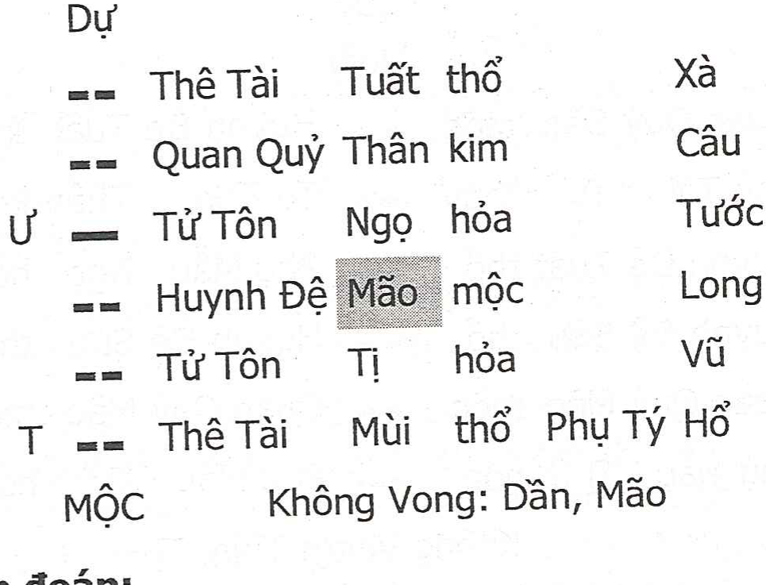

**Ví dụ 12:** Ngày Kỷ Hợi tháng Thìn, nam đoán phong thủy nhà, được quẻ Sơn Trạch Tổn biến Lôi Trạch Quy Muội.

| | | Tổn | | Quy Muội | |
| :---: | :---: | :--- | :---: | :--- | :--- |
| Ứ | — | Quan Quỷ Dần mộc | - - | Huynh Đệ Tuất thổ | Câu |
| | - - | Thê Tài Tý thủy | - - | Tử Tôn Thân kim | Tước |
| | - - | Huynh Đệ Tuất thổ | — | Phụ Mẫu Ngọ hỏa | Long |
| T | - - | Huynh Đệ Sửu thổ | - - | Huynh Đệ Sửu thổ | Vũ |
| | — | Quan Quỷ Mão mộc | — | Quan Quỷ Mão mộc | Hổ |
| | — | Phụ Mẫu Tị hỏa | — | Phụ Mẫu Tị hỏa | Xà |

THỔ  
Không Vong: Thìn, Tị

**Phán đoán:**

Lấy Phụ Mẫu làm Dụng thần, xem thêm hào 2. Hào 2 là Quan Quỷ, Quan Quỷ có ý nghĩa chính phủ, nhà nước, v.v. Nơi ở là nhà tập thể được đơn vị cấp. Hào 4 phát động hợp hào 2, trên hợp dưới là nhà lầu.

Phụ Mẫu Tị hỏa Không Vong là vẫn chưa vào ở.

Huynh Đệ Tuất thổ lâm Thanh Long, phát động hóa ra Phụ Mẫu, Thanh Long chủ chỉnh trang, Phụ Mẫu là nhà, chứng tỏ nhà đã chỉnh trang lại.

Phụ Mẫu tại hào sơ, hào sơ là tầng 1, lâm hỏa, hỏa chủ số 2, căn nhà ở tầng 1 hoặc tầng 2.

Phụ Mẫu là hỏa lâm Không Vong, hỏa là ánh sáng, thiếu ánh sáng.

Hào 3 là cửa, là phòng ngủ, Huynh Đệ lâm hào 3 thì ý nghĩa càng mạnh. Hào 3 lâm Huyền Vũ, Huyền Vũ chủ tối tăm, là thông tin trong phòng thiếu ánh sáng mặt trời.

Hào 6 Quan Quỷ lâm Câu Trần động mà khắc hào 3 Huynh Đệ, Dần mộc tương ứng với Đông Bắc, Câu Trần có ý nghĩa là nhô ra, đất đai. Do đó, ở phía Đông Bắc có sườn dốc cản trở việc chiếu sáng cho căn phòng.

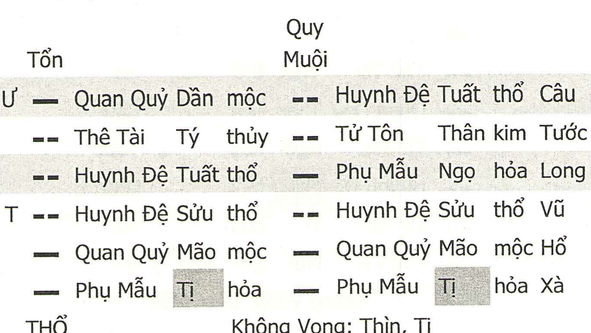

Hào 5 sinh hào 2 không cát, Quan Quỷ lâm Bạch Hổ ở hào 2, Quan Quỷ và Bạch Hổ đều có ý nghĩa bệnh tật, nhà này bất lợi cho người ở, dễ sinh bệnh tật.

Quan Quỷ Dần mộc tại hào 6 phát động khắc Thế, hào 6 là đầu, mộc chủ đau nhức, nhất định có bệnh đau đầu. Thế tại hào 3 bị khắc, Tử Tôn phục dưới, Tử Tôn chủ bộ phận sinh dục, lâm Huyền Vũ, Huyền Vũ chủ ám muội, nỗi niềm khó nói, bộ phận sinh dục có bệnh tật.

Hào sơ Phụ Mẫu ám động, hào sơ là tâm sự, Phụ Mẫu chủ nhà cửa, động chủ biến hóa, có ý định đổi nhà.

**Kết quả:** Quả nhiên là được đơn vị cấp. Căn nhà tại tầng 2, cửa sổ hướng về phía Bắc, có một sườn núi đất ở phía Đông Bắc cản trở ánh sáng. Sau khi chỉnh trang lại căn nhà thì đột nhiên bị bệnh, bản thân cho rằng nguyên nhân là do phong thủy, thế là đến nhờ đoán. Hiện tại có bệnh đau đầu và lở loét ở bộ phận sinh dục.

**Ví dụ 13:** Ngày Ất Hợi tháng Kỷ Dậu năm Đinh Sửu, bởi vì bạn học ở quê nhà tụ họp nên tôi đã trở về. Trong đó có một người bạn hơn 20 năm chưa gặp nhau, anh ta nghe nói tôi biết Kinh Dịch liền nhờ đoán gia trạch, được quẻ Lôi Thiên Đại Tráng.

| | Đại Tráng | | | |
| :---: | :---: | :--- | :--- | :--- |
| | - - | Huynh Đệ | Tuất thổ | Vũ |
| | - - | Tử Tôn | Thân kim | Hổ |
| T | — | Phụ Mẫu | Ngọ hỏa | Xà |
| | — | Huynh Đệ | Thìn thổ | Câu |
| | — | Quan Quỷ | Dần mộc | Tước |
| Ư | — | Thê Tài | Tý thủy | Long |

THỔ Không Vong: Thân, Dậu

**Phán đoán:**

Lấy hào Phụ Mẫu làm Dụng thần, kiêm xem hào 2. Hào Thế là tọa sơn, Phụ Mẫu Ngọ hỏa trì Thế, là nhà tọa Nam hướng Bắc.

Hào 2 lâm Quan Quỷ, Quan Quỷ chủ cơ quan, chính phủ, nơi ở là nhà của cơ quan. Tài lâm Nhật sinh hào 2, lại thêm Phụ Mẫu trì Thế, đã dùng tiền để biến thành sở hữu của mình.

Nhật thần hợp hào 2 hào trạch, tượng trùng điệp, là nhà lầu. Quẻ được lục xung, tượng không cát, nơi này không nên ở. Chu Tước lâm Quan Quỷ Dần mộc nhập trạch, Dần mộc là đất Trường Sinh của hỏa, Chu Tước lại chủ hỏa hoạn, vì vậy đoán là nhà này đã từng xảy ra hỏa hoạn. Hào 3 là cửa, Huynh Đệ lâm hào 3, Huynh Đệ cũng chủ cửa, hào 3 và Nguyệt kiến tác hợp, lại lâm Câu Trần là tượng câu bán (vướng vấp, cản trở), đoán là cửa khó sử dụng.

Hào 5 là người, Tử Tôn Thân kim Không Vong lâm Bạch Hổ, Bạch Hổ chủ lưu sản, đọa thai, đoán là nếu đã sinh con mà vào ở thì không sao, nhưng nếu chưa sinh con mà vào ở thì tất có chuyện lưu sản.

Quẻ lục xung là tượng không lâu dài, hào 2 là trạch bị Nguyệt kiến khắc, lại bị Tử Tôn Thân kim xung khắc, nhà này ở

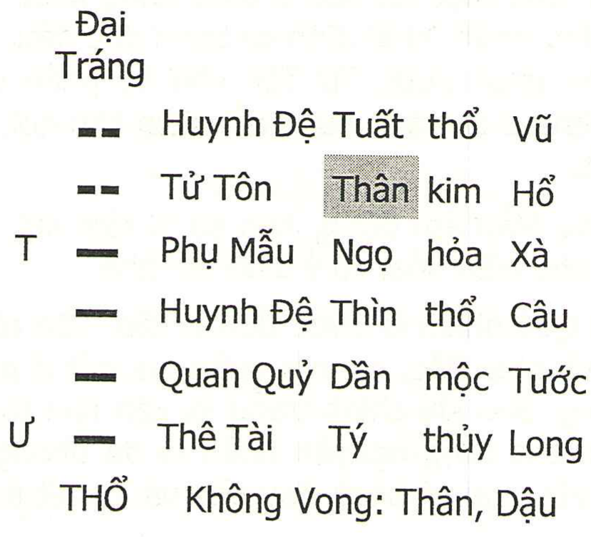 không lâu dài, sẽ bị dỡ bỏ. Tử Tôn Thân kim tại hào 5 xung khắc hào trạch, hào 5 chủ đường đi, Tử Tôn cũng chủ đường đi, lâm Bạch Hổ, Bạch Hổ cũng chủ đường đi, đoán là sau khi đập bỏ sẽ không xây lại tòa nhà, mà là sẽ mở rộng đường. Trong tương lai, vị trí này sẽ trở biến thành đường đi. Bởi vì Thân kim Không Vong, đoán là chuyện này sẽ xảy ra tại tháng Thân năm Mậu Dần 1998.

**Kết quả:** Vốn dĩ người bạn này cũng biết Kinh Dịch, anh ta nói rằng anh ta cũng đã xem sách về lục hào, nhưng chưa bao giờ ứng nghiệm, không ngờ từ một quẻ lại có thể đoán ra được nhiều chuyện như vậy. Nơi ở là một tòa nhà hai tầng tọa Nam hướng Bắc, gia đình anh ta ở tại tầng một. Ban đầu là nhà của cơ quan, về sau đã mua lại. Sau khi vào ở thì đã một lần phát sinh hỏa hoạn. Cửa rất khó sử dụng, đóng mở không được. Trước khi chuyển vào thì anh ta đã sinh con, vợ chưa từng bị lưu sản. Nghe nói sắp có mở rộng đường, căn nhà này nằm trong phạm vi mở rộng đó. Quả nhiên tại tháng Thân năm 1998, huyện thông báo di dời, cùng năm giải phóng mặt bằng. Cùng năm đó, vợ mang thai nhưng bị lưu sản.
