# Lục Hào Cổ Pháp Dự Trắc Học

### Vương Hổ Ứng

# Thế Giới Nhân Quả Trong Dự Đoán Lục Hào

LOIHOAPHONG.COM

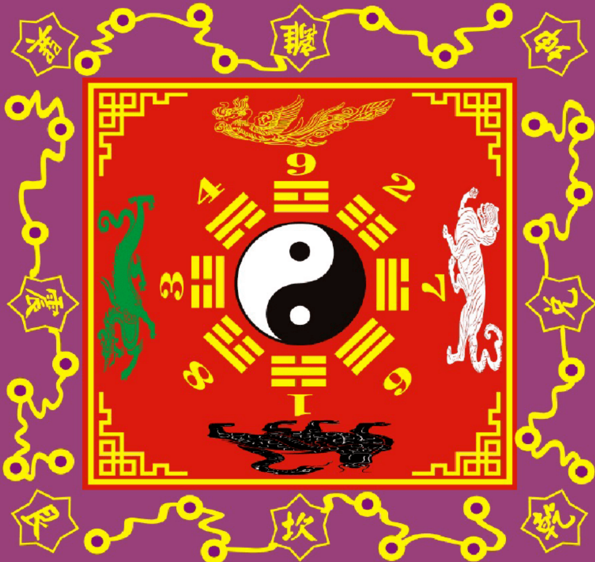

### Vương Hổ Ứng

# Thế Giới Nhân Quả Trong Dự Đoán Lục Hào

TRẦN PHƯƠNG
LOIHOAPHONG.COM

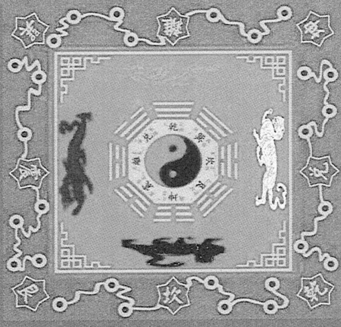

# MỤC LỤC

LỜI TỰA....................................................................................9

CHƯƠNG 1: NHÂN QUẢ QUAN TRONG DỰ ĐOÁN LỤC HÀO.10

Khi cá trong bể nhảy ra thì chị có thai...................................... 12

Không ngờ thiên tai đã ảnh hưởng đến việc kinh doanh ........... 13

Không ngờ thiên tai đã cứu việc kinh doanh ............................ 14

Mơ thấy vợ và con trai ở kiếp trước, cát hung ra sao ............... 15

Vấn đề xảy ra tại ký túc xá...................................................... 16

CHƯƠNG 2: ÁN LỆ CHIÊM BỐC THỜI CỔ VỀ NHÂN QUẢ .....18

Quạ kêu luận cát hung........................................................... 21

Ông nội đã chết đang tác quái................................................ 22

Hài tử bị câm, họa do xương trắng ......................................... 23

Sức khỏe vợ chồng đột nhiên không tốt là do nguyên nhân gì? . 24

CHƯƠNG 3: CẤU TRÚC CỦA CON NGƯỜI VÀ TỰ NHIÊN
GIỐNG NHAU........................................................................26

Động thổ dẫn tới tinh thần bất ổn............................................ 27

Tương quan giữa con người và môi trường xung quanh........... 28

Phía sau mộ địa có hố lớn ..................................................... 30

CHƯƠNG 4: ĐỒNG KHÍ TƯƠNG CẦU .....................................31

Có chim bay đến thêm cát tường ............................................ 33

Cửa hàng kinh doanh thế nào? ............................................... 34

Nếu muốn thi đậu, mau sửa lại mái nhà ................................... 35

CHƯƠNG 5: MỐI LIÊN HỆ GIỮA CON NGƯỜI VÀ TỰ NHIÊN
THÔNG QUA TƯỢNG ..........................................................36

Tinh thần sau khi đặt một ly nước ........................................... 37

Đã tiểu cùng một chỗ ở bên ngoài với người khác..................... 38

Có con nối dõi hay không........................................................ 39

CHƯƠNG 6: QUÁI TƯỢNG ĐỒNG LÝ VỚI CUỘC SỐNG ........41

Vật trang trí nước chảy đối ứng thận tạng ............................... 42

Lậu thủy đa lậu tài........................................................................... 43

Vấn đề về bếp ở Tây Bắc ................................................................ 44

CHƯƠNG 7: SỐ VÀ CÁT HUNG CŨNG CÓ SỰ ĐỐI ỨNG........ 46

Không ngủ được có phải vì đã trúng tà? .................................... 47

Tại sao vẫn luôn không có thai?.................................................... 49

CHƯƠNG 8: THỦ TƯỢNG LỤC THÂN PHÁN ĐOÁN NHÂN QUẢ
........................................................................................................... 50

Lưới sắt bao quanh......................................................................... 52

Hồn của hài nhi đang bị đè ở dưới ............................................. 53

Anh có nhà chưa xây xong ........................................................... 54

Nền nhà bếp đã động ống dẫn .................................................... 55

Tượng Phật trong nhà đã ảnh hưởng đến thân thể................... 56

Do đào giếng gây ra ...................................................................... 59

Nhà anh đã phá đại môn và xây lại ............................................ 60

Trên đường ống có lỗ .................................................................... 61

Gần đây đã động tượng Phật........................................................ 62

Cúng Phật đã cúng sai ................................................................. 63

Nhà có năm pho tượng Phật........................................................ 64

Chuyển nhà đã ảnh hưởng đến tài vận ...................................... 67

Anh đã tham dự lễ tang của bằng hữu ..................................... 68

Sắc dục quá độ gây nên bệnh...................................................... 71

Rỉ nước bất lợi cho công nhân .................................................... 72

Sức mạnh của diều chim ưng ...................................................... 74

CHƯƠNG 9: THỦ TƯỢNG NGŨ HÀNH PHÁN ĐOÁN NHÂN QUẢ
........................................................................................................... 76

Anh đã sờ vào hòn đá trên hồ nước ở mộ địa ........................... 77

Động bể cá dẫn đến mẫn ngứa..................................................... 78

Do đã động cống thoát nước gây ra ............................................ 79

Vận khí không thuận do nguyên nhân gì? .................................. 80

Cống thoát nước đã bị lấp.................................................................... 81

Đã động giường, hoặc bàn gây nên .................................................... 82

Bị bệnh liên quan đến phong thủy ...................................................... 83

Vấn đề do dời bếp gây ra .................................................................... 84

Bà nội bị bệnh do nguyên nhân gì? ..................................................... 85

Tại sao hài tử khóc ầm ĩ? .................................................................... 86

Giỏ treo của hàng xóm ảnh hưởng đến mình ..................................... 87

Hai hòn đá gây ra họa ........................................................................ 88

Vứt một đống giấy vụn ....................................................................... 89

Bể cá là linh hồn của con trai ............................................................. 90

Thủy cũng có lúc hại người ................................................................. 91

Nhà tôi có trẻ khóc đêm...................................................................... 92

Hóa ra là một quả bóng gỗ đang tác quái........................................... 93

Đã lấy đất bên cạnh ............................................................................ 94

Hóa ra là kéo nước về nhà .................................................................. 95

Tượng Phật gỗ ảnh hưởng đến phong thủy ......................................... 96

Đông Nam có thực vật ảnh hưởng ...................................................... 97

Do đã động bia mộ gây ra................................................................... 98

Chặt cây đã ảnh hưởng đến mắt.......................................................... 99

Cống thoát nước đã bị lấp.................................................................... 100

Con gái lớn lên ở nhà bà ngoại ........................................................... 100

## CHƯƠNG 10: THỦ TƯỢNG LỤC THẦN PHÁN ĐOÁN NHÂN QUẢ ................................................................................................. 102

Bạn cùng chơi lúc nhỏ đã thắt cổ chết................................................. 103

Trong nhà thiếu ánh sáng .................................................................... 104

Họa từ chặt cây.................................................................................... 105

Đừng uống rượu nữa........................................................................... 106

Tại sao không lớn? .............................................................................. 107

Do đã ăn đồ cúng gây ra ..................................................................... 108

Ngày thường ăn đồ quá nóng........................................................ 109

## CHƯƠNG 11: THỦ TƯỢNG HÀO VỊ PHÁN ĐOÁN NHÂN QUẢ ................................................................................ 110

Thượng thiên nhập địa.................................................................. 112
Nhất quái đồng đoán âm dương trạch ............................................. 114
Bình an mới là việc khẩn trước mắt................................................ 117
Phụ mẫu song vong....................................................................... 118
Nguyên nhân con gái bị cận thị...................................................... 119

## CHƯƠNG 12: THỦ TƯỢNG QUÁI TƯỢNG PHÁN ĐOÁN NHÂN QUẢ................................................................................ 120

Họa do đạo sĩ gây ra..................................................................... 121
Nguyên nhân cháu trai sốt lâu không giảm ..................................... 122
Đi xa đã mất hồn.......................................................................... 123
Năm Bính Tuất đã động mái nhà ................................................... 124

## CHƯƠNG 13: NHÂN QUẢ DO BẢN THÂN NHÂN THỂ GÂY NÊN ................................................................................ 125

Con gái huyết niệu do nguyên nhân gì?......................................... 125
Nguyên nhân của đau đầu ............................................................ 126
Lao phổi dẫn đến di tinh ............................................................... 127
Tại sao hài tử không nghe lời?...................................................... 128
Nguyên nhân ở xương cổ .............................................................. 129
Hóa ra là thất thoát đản bạch ....................................................... 130
Do thủ dâm gây ra ....................................................................... 131
Do u xơ tử cung gây ra ................................................................. 132
Bất dựng bất dục.......................................................................... 133
Tại sao tôi già đi quá nhanh?......................................................... 134
Tại sao tôi hay bực mình? ............................................................. 135

## CHƯƠNG 14: BẤT LỢI DO ÂM DƯƠNG TRẠCH KHÔNG TỐT GÂY NÊN ........................................................................ 136

Thủy xung tổ phần bất lợi hôn nhân............................................ 136

Huyền Vũ có hố khó sinh nam.......................................................... 138

Sinh nữ không sinh nam .................................................................. 139

Chữa tốt thành xấu ........................................................................... 140

Kéo một sợi tóc mà động toàn thân .................................................. 142

Cống thoát nước ảnh hưởng đến tài vận .......................................... 143

Thiếu ánh sáng bất lợi nam............................................................... 144

Vận khí của anh trai ......................................................................... 145

Bạch Hổ há mồm sẽ ăn người.......................................................... 146

Độc phát có thể thủ tượng phản phục.............................................. 148

Nước sông chảy đến bên cạnh chỗ ở............................................... 149

Tiểu hài không biết nói có phải do phong thủy? ............................. 150

Con gái bị lác mắt có thể phẫu thuật hay không? ............................. 151

Tài vận không tốt có phải do phong thủy có vấn đề? ........................ 152

Da khô nứt có nguyên nhân .............................................................. 153

Rỉ nước thủy thì rỉ tài....................................................................... 154

Vợ chồng là oan gia.......................................................................... 155

Phong thủy có ảnh hưởng đến tài vận không? ................................. 156

Vấn đề từ rỉ nước ............................................................................. 157

Nguyên nhân phát bệnh đến từ phong thủy ..................................... 158

Anh ta có họa lao ngục ..................................................................... 159

Tây Bắc có thủy không tốt ............................................................... 160

Phong thủy ảnh hưởng đến thân thể................................................ 161

Tu tạo ảnh hưởng đến con trai ......................................................... 162

Tại sao hài tử phát triển không tốt? ................................................. 163

Nguyên nhân của ác mộng................................................................ 164

Cửa hàng phía Tây đã ảnh hưởng đến anh ...................................... 165

Bị cha mẹ vợ làm khó dễ................................................................. 166

Đã bị người liên lụy ......................................................................... 167

Kết hợp Phong Thủy Bát Trạch với quẻ ............................................ 169

Nuôi lợn lỗ vốn................................................................... 170

Con trai đau bụng, nguyên nhân do căn nhà................... 171

Tiểu nhân là người thoái ngũ............................................. 172

Kinh nguyệt không bình thường.......................................... 173

Nhà chị đã không tìm được tổ phần .................................. 174

Tổ phần ảnh hưởng đến việc sinh con trai ....................... 176

Phong thủy là chất xúc tác của bệnh tật ........................... 177

Đau thắt lưng bởi vì tu bổ tường......................................... 178

Nhà vệ sinh ở Đông Bắc ảnh hưởng đến tài vận ............... 179

Bệnh do tu tạo gây nên..................................................... 180

Hóa ra là nhà đối diện đang cải tạo................................... 181

Tại sao hài tử của hàng xóm đột nhiên không thể đi lại?......... 182

Phong thủy có thể phản suy ............................................ 183

Hàng xóm tu tạo cũng ảnh hưởng đến anh...................... 184

Đất lún thì tài không vượng.............................................. 185

### CHƯƠNG 15: BẤT LỢI DO VẬT PHẨM TRONG SINH HOẠT GÂY RA ................................................................................... 186

Do động thổ gây ra ......................................................... 186

Cá vàng đùa bông súng ................................................... 187

Trong nhà có tượng Phật ................................................ 188

Có liên quan đến một sợi dây màu đỏ ............................ 189

Họa do đồ tẩy rửa .......................................................... 190

Bể cá đã bị hỏng ............................................................ 191

Bể cá đã khiến tính cách của con gái biến đổi ................ 192

Quỷ đến từ hình ............................................................ 193

Trái tim xa cách ............................................................ 194

Nửa đêm hài tử quấy khóc phải làm sao? ......................... 195

Trong sân có cây ............................................................ 196

Họa do kính trên ban công gây ra ................................... 197

Ác quỷ lại đến rồi .................................................................... 199

Chuỗi hạt trên tay gây ra bệnh ................................................ 200

Loại bỏ tượng Phật thì có thể bán ............................................ 201

Đầu giường có cốc giữ nhiệt.................................................... 202

Van nước của nhà anh đã xảy ra vấn đề................................... 203

Mau làm sạch máy hút khói..................................................... 204

### CHƯƠNG 16: BẤT LỢI DO ĐÃ LÀM MỘT VIỆC GÌ ĐÓ GÂY NÊN.......................................................................................... 205

Con trai đã biết cười ................................................................ 205

Tại sao da phát ban? ............................................................... 206

Thì ra đã không còn vật hóa giải ............................................ 207

Táng lễ dẫn tới ác mộng .......................................................... 208

Chuyện gì đã xảy ra với mèo con? .......................................... 209

Tắm rửa đã bị cảm lạnh.......................................................... 210

Do tai vào nước gây ra ............................................................ 211

Ngón tay bị nứt xử lý thế nào.................................................. 212

Cổ họng không thể phát ra tiếng do nguyên nhân gì?.............. 213

Đã chặt cây rồi trồng lại.......................................................... 214

Đau đầu bởi vì một cành hoa .................................................. 215

Trên kính có tượng thần Phật.................................................. 216

Động cửa sổ, họa tới thân....................................................... 217

Tiểu nhân tố giác ................................................................... 218

Đã từng đánh chết một con rắn............................................... 219

Thì ra thứ có thể phát ra âm thanh là con gà........................... 220

Đã đến lăng viên liệt sĩ ........................................................... 222

Đã đổ bã thuốc ở Tây Bắc....................................................... 225

### CHƯƠNG 17: BẤT LỢI DO VẬT CHẤT ÂM TÍNH GÂY NÊN . 226

Nơi có ma không được chơi đùa ............................................... 226

Chúng thần đang tác quái ...................................................... 227

Hồn ma về nhà quấy rầy ............................................................ 228

Niệm Phật đã dẫn ma quỷ đến.................................................... 229

Tổ tiên sát nghiệp quá nhiều .................................................... 230

Con trai đã chết làm hại chồng ................................................. 232

Con trai khóc lóc mỗi ngày do nguyên nhân gì?........................... 233

Con gái và bạn học không hòa hợp phải xử lý thế nào? ........... 234

Hồn ma đã đến nhà anh ............................................................. 235

Đã ngủ trong nhà người chết...................................................... 236

Đốt cho cha một ít tiền giấy nhé ................................................. 237

Nhân quả của phá thai................................................................ 238

# LỜI TỰA

Thông qua sự nghiên cứu và phát triển của nhiều người, thuật dự đoán lục hào đã phát triển cho đến ngày hôm nay, nó đã không còn là một phương pháp chỉ dùng để tiến hành phán đoán cát hung nữa. Nhiều người muốn tìm được nguyên nhân và phương pháp giải quyết vấn đề thông qua dự đoán lục hào, điều này đòi hỏi trình độ dự đoán của chúng ta phải tăng lên một cấp độ cao hơn, tư duy thuật dự đoán lục hào phải được mở rộng hơn nữa.

Mặc dù dự đoán lục hào không phải là vạn năng, tuy nhiên thực tiễn đã chứng minh rằng lục hào vẫn có sự cứu giúp nhất định đối với cuộc sống của chúng ta. Muốn giải quyết được vấn đề thì trước hết phải tìm được nguyên nhân của vấn đề, điều này cũng giống như bác sĩ khám bệnh, cần phải kiểm tra, tìm ra nguyên nhân, mới có thể cho thuốc đúng bệnh.

Có một sự khó khăn rất lớn trong việc sử dụng thuật dự đoán lục hào để phân tích nguyên nhân của vấn đề, không phải dùng suy vượng sinh khắc đơn giản là có thể phán đoán ra, mà cần phải học tư duy thủ tượng, thông qua tổ hợp rất nhiều khái niệm lục hào cơ bản như sinh xung khắc hợp, hào vị, lục thần, lục thân, Không Vong, Nguyệt phá v.v của thập nhị địa chi, đem những khái niệm trừu tượng này phát triển thành sự vật hoặc sự việc có thể đối ứng với thực tế, việc phán đoán không thể ăn nói lung tung, cần phải đối ứng với thực tế mới có thể khẳng định kết quả phân tích là đúng hay là sai. Sau khi nghiệm chứng mới có thể bước vào giai đoạn tiếp theo.

Trải qua gần 30 năm dự đoán, tôi đã tích lũy được một số tâm đắc về phương diện này, chẳng dám tự trân, đã viết thành sách công bố với mọi người, đặt tên là "Thế Giới Nhân Quả Trong Dự Đoán Lục Hào", án lệ nghiệm chứng rất nhiều, nhưng bởi vì số trang có hạn, không thể ghi vào tất cả.

Vương Hổ Ứng

# CHƯƠNG 1
## NHÂN QUẢ QUAN TRONG DỰ ĐOÁN LỤC HÀO

Nhân quả là một từ có nguồn gốc từ Phật giáo, là một thuyết pháp được kiến lập trên cơ sở lý luận luân hồi, Phật giáo cho rằng những hạnh phúc và khổ đau mà con người cảm thụ được ở hiện tại là do những gì họ đã làm ở trong kiếp trước gây ra. Và tất cả những gì con người làm ở hiện tại cũng là nguồn gốc của những hạnh phúc và khổ đau ở kiếp sau. Giải thích một cách đơn giản, nhân chính là nguyên nhân, khởi nhân (nguồn gốc), nhân tố, quả chính là kết quả, quả báo.

Thế giới vũ trụ phức tạp và rối rắm, con người sống trong vũ trụ phải chịu sự chế ước về mọi mặt, hoàn toàn không tồn tại một cách cô lập. Sự biến hóa và vận động của vũ trụ là một chỉnh thể, mọi thứ trong vũ trụ đều gắn bó chặt chẽ với nhau, ảnh hưởng lẫn nhau, có một loại năng lượng vô hình đang bao phủ quá khứ, hiện tại và tương lai, xâu chuỗi mọi thứ trong vũ trụ lại với nhau, kéo một sợi tóc mà động toàn thân, sự biến hóa của một điểm nào đó sẽ dẫn tới sự biến hóa của vô số điểm khác, do đó, kết quả của một sự việc là do rất nhiều nhân tố tạo nên, chỉ khi tìm ra những điểm liên quan đến các phương diện của sự vật, chúng ta mới có thể nắm bắt được bản chất của nó.

Trải qua nhiều thập kỷ nghiên cứu và hoàn thiện của tôi, dự đoán lục hào đã trở thành một phương pháp dự đoán tương đối thành thục và có hệ thống. Thông thường, mục đích của dự đoán chính là xu cát tị hung, nếu trong quẻ đã xuất hiện kết quả tốt thì không cần hóa giải, nhưng khi xuất hiện kết quả không tốt, hầu hết mọi người đều muốn được cải biến kết quả thông qua hóa giải.

Thế giới vũ trụ phát triển một cách có trật tự, sẽ không hỗn loạn trật tự bởi vì sự cải biến của một cá nhân. Do đó, lục hào hóa giải hiển nhiên không phải là vạn năng, bị hạn chế bởi rất nhiều yếu tố, chỉ có thể đạt được sự cải thiện ở một mức độ nhất định, nhưng xét từ hàng loạt án lệ được nghiệm chứng thấy rằng, nó vẫn có hiệu quả tương đối khả quan. Lục hào hóa giải không rập theo một khuôn khổ, không cố định bất biến, Trung y chẩn bệnh cho người để cho thuốc đúng bệnh, lục hào hóa giải cũng như vậy, cần phải làm rõ nguyên nhân bất lợi và vấn đề đối ứng liên quan, sau đó tìm ra phương pháp hóa giải. Do đó, việc phân tích và phán đoán nguyên nhân, nguồn gốc, đối ứng liên quan của sự vật là hết sức quan trọng.

Đương nhiên, nguyên nhân phát sinh, phát triển cát hung của một sự vật không phải là đơn nhất, mà là đa phương diện, phức tạp. Nhưng dù có bao nhiêu nguyên nhân, sẽ luôn có một nguyên nhân trực tiếp, hoặc là nguyên nhân liên quan chặt chẽ với nó. Ví dụ như một người có bệnh tim, một ngày nọ, người đó đến trung tâm mua sắm để mua một cái gì đó và xảy ra xung đột với nhân viên bán hàng, điều này đã kích động bệnh tim phát tác và người đó đã chết, vậy bạn cho rằng bệnh tim là nguyên nhân của tử vong? Hay nguyên nhân là do cãi vã với người khác? Hay nguyên nhân là do đi mua sắm ở trung tâm thương mại? Hay nguyên nhân là do phong thủy của trung tâm thương mại? Hay là do phong thủy căn nhà của người đã chết không tốt? Hay là do định số trong mệnh của người đó là như vậy?

Nếu luận từ quái tượng lục hào, trong quẻ có thể sẽ hiển thị ra một nguyên nhân, hoặc một vài nguyên nhân trong đó. Có thể hiển thị người đó đã từng làm một sự việc ở một giai đoạn nào đó, ví dụ như đã chặt một cây, hoặc đã nhặt một hòn đá về nhà, hoặc đã đánh chết một con chim, hoặc đã vứt bỏ một vật gì đó trong nhà v.v,

Nguyên nhân được quái tượng lục hào triển thị thường được thể hiện dưới góc độ ngũ hành và không gian đa chiều, khác với góc độ suy nghĩ chủ quan của chúng ta. Do đó, nhân quả được bàn luận trong lục hào không phải là khái niệm nhân quả trong Phật giáo, nhân có thể là nguyên nhân, khởi nhân, điều có trong mệnh, quả có thể là kết quả tạo ra, hoặc là sau khi sự tình xảy ra, sẽ có một số hiện tượng xuất hiện trong cuộc sống và môi trường xung quanh, do đó, nhân quả trong lục hào có thêm sự đối ứng liên quan giữa con người với sự vật, hành vi v.v, tuy rằng người thường không dễ lý giải, nhưng lại có thể được chứng thực.

Người ta thường nói một câu như thế này: "Cọng rơm cuối cùng đè chết lạc đà". Lẽ nào một cọng rơm lại có thể làm được điều đó? Tôi sợ rằng một bó rơm cũng không thể đè chết được nó, nhất định là do nhiều yếu tố khác đã gây bất lợi cho trạng thái của nó, khi sắp đến giới hạn không thể chịu nổi, cọng rơm này được đặt lên người nó, có vẻ như đã trở thành nguyên nhân trực tiếp khiến thân thể to lớn bỗng chốc ngã xuống. Nguyên nhân được dự đoán lục hào hiển thị ra có lẽ là một loại tình huống như vậy.

Đối với nhận thức vũ trụ, dự đoán lục hào là thể thống nhất vĩ mô và vi mô, vượt thời không, vượt chiều. Người ta thường dùng mắt thường để nhìn thế giới một cách trực quan, do đó, khi quái tượng lục hào thể hiện sự vật nhân quả, họ chỉ sử dụng phương pháp ngũ hành sinh xung khắc hợp v.v để tiến hành phân tích và phán đoán.

Ví dụ, tôi đã từng nghiệm chứng một án lệ như sau.

## Khi cá trong bể nhảy ra thì chị có thai

Một ngày trong năm 2009, tôi có việc đi công tác đến Thanh Đảo. Học trò của tôi là Tôn Hiểu Cương, lúc đó vẫn đang làm việc ở Thanh Đảo, đã dẫn một nữ đồng nghiệp của anh ta đến, nói rằng muốn dự đoán thử xem khi nào có thể có con?

Ngày Giáp Tuất (Tuần Không: Thân Dậu), tháng Mão.

| Lục thú | Phục thần | Quẻ gốc | | Thế/Ứng | Biến | Quẻ biến |
| :--- | :--- | :---: | :--- | :---: | :---: | :--- |
| Vũ | | ▅▅▅▅▅ | Quan Quỷ Tị hỏa | | ▅▅ ▅▅ | Phụ Mẫu Tuất thổ |
| Hổ | | ▅▅ ▅▅ | Phụ Mẫu Mùi thổ | | ▅▅ ▅▅ | Huynh Đệ Thân kim |
| Xà | | ▅▅▅▅▅ | Huynh Đệ Dậu kim | T | ▅▅▅▅▅ | Quan Quỷ Ngọ hỏa |
| Câu | | ▅▅ ▅▅ | Thê Tài Mão mộc | | ▅▅ ▅▅ | Thê Tài Mão mộc |
| Tước | | ▅▅ ▅▅ | Quan Quỷ Tị hỏa | | ▅▅ ▅▅ | Quan Quỷ Tị hỏa |
| Long | Tử Tý | ▅▅ ▅▅ | Phụ Mẫu Mùi thổ | Ứ | ▅▅ ▅▅ | Phụ Mẫu Mùi thổ |

Người nữ này sinh năm 1975, 35 tuổi, đã sáu lần thụ tinh trong ống nghiệm đều không thành công, cô ấy rất sợ những buổi họp lớp, bởi vì mỗi khi gặp nhau thì ai cũng hỏi, con bạn bao nhiêu tuổi rồi ..., việc muốn sinh một đứa con đã trở thành tâm bệnh của cô ấy.

Lúc đó tôi đã đoán như sau: Chị làm giấy kết hôn ở năm 2000 (Quan Quỷ nhập Mộ tại hào biến, năm Canh Thìn xung khai Mộ khố), năm 2001 kết hôn (Quan Quỷ độc phát, ứng năm trị), không phải là chị không có khả năng có thai, mà nhất định đã từng có thai rồi lưu sản (Tử Tôn Tý thủy lâm Thanh Long, chủ có thai, độc phát Tuyệt nó, lại là không có). Thời gian là khoảng năm 2001 hoặc năm 2002, nếu có thai ở năm 2001 thì khoảng ở tháng 8 dương lịch (năm Tân Tị Tuyệt Tử Tôn, năm Nhâm Ngọ xung Tử Tôn hiện ra bị Tuyệt, tháng 8 là Thân, độc phát ứng gặp hợp). Kết quả, cô ấy đáp là đã có thai ở tháng 8 năm 2001, bởi vì nguyên nhân công việc, không muốn có đứa con này, do đó đã phá thai (Quan Quỷ là công việc, Tuyệt Tử Tôn cho nên ứng việc này). Khi muốn có con ở năm 2006, lại không thể có thai được nữa.

Tôi lại đoán như sau: Chị đã từng vứt cây nến chưa cháy hết vào thùng rác (hào 6 Tị hỏa độc phát, biểu thị nguyên nhân. Hỏa có thể là ánh sáng, có thể là đèn, Nguyệt kiến Mão mộc, Hợi Mão Mùi Dịch Mã tại Tị, Dịch Mã là động thái, đèn điện thông thường là vật tĩnh chỉ bất động, lửa của đèn dầu, cây nến mới có thể lắc lư, hiện nay đã không còn đèn dầu, do đó phán đoán là cây nến. Hào 6 là hào thoái hưu, biểu thị đã không cần, đã vứt đi. Nhập Mộ tại hào biến, Huyền Vũ chủ vật bẩn thỉu, cho nên phán đoán như vậy), hiện nay tâm trạng phiền táo (buồn phiền, nóng nảy), có chứng trầm cảm, áp lực rất lớn, ống dẫn trứng không thông.

Sau khi được nghiệm chứng phán đoán trên đây, đã đề xuất phương án hóa giải: Tìm 9 viên đá dài ở bờ biển, đặt tại Đông Nam của nhà, đặt 4 cái lò xo ở phía Tây. Tây Nam nuôi một con cá, bể cá phải nông, nước phải đầy, sau khi nuôi cá không được thay nước, chờ đến khi nào cá từ trong bể nhảy ra ngoài thì chị có thai.

Hơn 10 ngày sau, cô ấy hỏi: Cá trong bể không nhảy ra thì phải làm sao? Tôi nói rằng đừng sốt ruột. Qua vài ngày sau, một hôm tan ca về nhà, đột nhiên thấy không có cá trong bể, tìm nửa ngày thì phát hiện cá đã khô, không biết nó nhảy ra từ khi nào. Lập tức đến bệnh viện kiểm tra, bệnh viện nói là dương tính, cô ấy đã có thai. Cuối cùng đã sinh một con trai. Người thật việc thật, không hề khoa trương.

## Không ngờ thiên tai đã ảnh hưởng đến việc kinh doanh

Đây là một tình huống ở năm 2011. Người Nhật Bản cầu đoán bản thân mở cửa hàng vào tháng 3 thì doanh thu của cửa hàng sẽ ra sao? Ngày Bính Thìn (Tuần Không: Tý Sửu), tháng Dần, gieo quẻ được Trạch Thiên Quải biến Địa Thiên Thái.

| Lục thú | Phục thần | Quẻ chính | Thế / Ứng | Quẻ biến |
| :--- | :--- | :--- | :---: | :--- |
| Long | | -- Huynh Đệ Mùi thổ | | -- Tử Tôn Dậu kim |
| Vũ | | — Tử Tôn Dậu kim | T | -- Thê Tài Hợi thủy |
| Hổ | | — Thê Tài Hợi thủy | | -- Huynh Đệ Sửu thổ |
| Xà | | — Huynh Đệ Thìn thổ | | — Huynh Đệ Thìn thổ |
| Câu | Phụ Tị | — Quan Quỷ Dần mộc | Ứ | — Quan Quỷ Dần mộc |
| Tước | | — Thê Tài Tý thủy | | — Thê Tài Tý thủy |

Lấy Thê Tài làm Dụng thần. Thê Tài Hợi thủy được Nguyệt hợp mặc dù có khí, nhưng Nhật thần đến khắc, lại là nhập Mộ, không cát.

Hào Thế phát động sinh Thê Tài, biểu thị bản thân nỗ lực kinh doanh, nhưng Thê Tài vốn căn cơ thiển bạc, hào Thế lại bị Nhật thần hợp, tham hợp quên sinh, bản thân bất lực, càng không tốt là Thê Tài hóa Không Vong, hóa hồi đầu khắc, đi sinh hào Ứng, đây là vô tình. Sinh ý thảm đạm, doanh nghiệp bất lợi, đặc biệt là đến ngày Ất Sửu sẽ có thay đổi đột ngột.

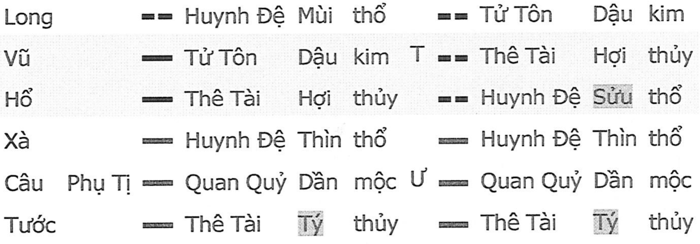

Nào ngờ đến ngày 11 tháng 3 hào biến Sửu thổ xuất Không, đã xảy ra động đất lớn, cửa hàng lâm vào trạng thái đình chỉ, không có doanh thu.

## Không ngờ thiên tai đã cứu việc kinh doanh

Vô độc hữu ngẫu. Tháng 1 năm 2011, một người Nhật Bản khác đã mở 3 cửa hàng ăn uống nhưng đều không phát đạt, tiền vốn eo hẹp, cầu đoán tình hình vận khí, cửa hàng có thể tiếp tục kinh doanh nữa hay không? Gieo quẻ như sau.

Ngày Mậu Tý (Tuần Không: Ngọ Mùi), tháng Sửu.

| Lục thú | Phục thần | Quẻ chính | Thế / Ứng | Quẻ biến |
| :--- | :--- | :--- | :---: | :--- |
| Tước | | -- Thê Tài Tuất thổ | | — Tử Tôn Tị hỏa |
| Long | | -- Quan Quỷ Thân kim | Ứ | -- Thê Tài Mùi thổ |
| Vũ | | — Tử Tôn Ngọ hỏa | | — Quan Quỷ Dậu kim |
| Hổ | | -- Tử Tôn Ngọ hỏa | | -- Thê Tài Sửu thổ |
| Xà | | — Thê Tài Thìn thổ | T | — Huynh Đệ Mão mộc |
| Câu | Phụ Tý | -- Huynh Đệ Dần mộc | | — Tử Tôn Tị hỏa |

Lấy Thê Tài làm Dụng thần. Thê Tài lưỡng hiện, lấy Thê Tài Tuất thổ làm Dụng thần. Hào còn lại dùng để tham khảo.

Thoạt nhìn quẻ này, Dụng thần mặc dù được Nguyệt phù và động hóa hồi đầu sinh là cát, nhưng Dụng thần sinh hào Ứng vô tình. Lại thêm Huynh Đệ vượng tướng phát động khắc Thê Tài có vẻ như không cát, đủ để nói rằng cửa hàng kinh doanh không phát đạt, tuy rằng có doanh thu, nhưng sau cùng không còn lại bao nhiêu.

Thế nhưng Nhật xung hai Ngọ hỏa trong quẻ, mặc dù Không Vong hưu tù, nhưng bị xung thực, hình thành ám động, đủ để hóa giải hết sức mạnh của Huynh Đệ, kỳ diệu hơn là đã thành tam hợp cục Tử Tôn, Thê Tài cũng không sinh hào Ứng nữa, vô tình biến thành hữu tình, trái lại đã sinh Tài của hào Thế. Do đó tôi phán đoán rằng có bước ngoặt đặc biệt, có thể thay đổi tình trạng không phát đạt hiện tại, tài vận của cửa hàng sẽ tốt lên.

Xem lại quẻ này sau khi nhận được phản hồi, thật là huyền diệu. Có người vui, có người buồn. Tai họa cũng có thể trở thành việc tốt.

Phản hồi: Bởi vì phải mất ba tháng mới sửa được mạng nên bây giờ tôi mới phản hồi, kính xin thứ lỗi. Lúc đó ngài nói rằng sẽ có bước ngoặt đặc biệt, tôi và vợ vẫn đang đoán già đoán non, nghĩ

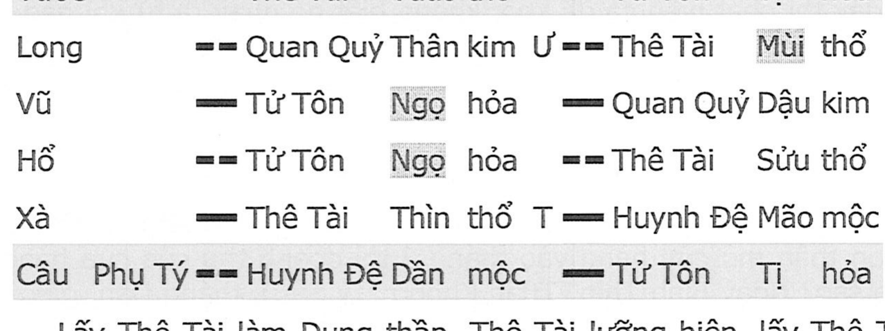 xem rốt cuộc điều gì có thể mang lại sự xoay chuyển, không ngờ rằng trận sóng thần do động đất gây ra vào ngày 11 tháng 3 đã mang lại sự thay đổi cho cửa hàng của tôi, nhà của 5 nhân viên của tôi đã bị cuốn trôi trong trận sóng thần này, nhà của tôi vẫn tồn tại. Trận sóng thần này đã khiến nhiều người thiệt mạng, tuy nhiên gia đình và nhân viên của tôi đều an toàn. Bởi vì sự xuất hiện của tai họa, việc kháng tai cần nhiều suất ăn, 3 cửa hàng của tôi đều trở nên bận rộn, kết quả là thu nhập đã tốt hơn so với bất kỳ thời gian nào trước đây, tôi đã không cần phải buồn phiền vì vấn đề về dòng tiền nữa. Rất cám ơn dự đoán của ngài.

## Mơ thấy vợ và con trai ở kiếp trước, cát hung ra sao

Năm 2016, một đồ đệ lục hào của tôi đã cho tôi xem một quẻ như sau. Một người thường xuyên mơ thấy vợ và con trai ở kiếp trước, cát hung ra sao? Ở ngày Giáp Dần (Tuần Không: Tý Sửu), tháng Tị, được Thủy Sơn Kiển biến Phong Địa Quan.

| Lục thú | Phục thần | Quẻ chính | Thế / Ứng | Quẻ biến |
| :--- | :--- | :--- | :---: | :--- |
| Vũ | | -- Tử Tôn Tý thủy | | — Thê Tài Mão mộc |
| Hổ | | — Phụ Mẫu Tuất thổ | | — Quan Quỷ Tị hỏa |
| Xà | | -- Huynh Đệ Thân kim | T | -- Phụ Mẫu Mùi thổ |
| Câu | | — Huynh Đệ Thân kim | | -- Thê Tài Mão mộc |
| Tước | Tài Mão | -- Quan Quỷ Ngọ hỏa | | -- Quan Quỷ Tị hỏa |
| Long | | -- Phụ Mẫu Thìn thổ | Ứ | -- Phụ Mẫu Mùi thổ |

Không có Dụng thần cụ thể. Xem tổ hợp biến hóa của quẻ. Người ở kiếp trước là người không thuộc phạm vi cuộc sống của bản thân, bất kể vợ và con trai ở kiếp trước tồn tại hay không tồn tại, kiếp trước đối với bản thân mà nói thì đã là lịch sử. Hào 6 Tử Tôn Tý thủy hóa Thê Tài Mão mộc lâm Huyền Vũ phát động, hào 6 là tổ, là quá khứ, Huyền Vũ là huyễn giác (ảo giác), huyễn tượng, Tử Tôn là con, Thê Tài là vợ, hào 6 phát động, chính là thông tin trong mộng. Hào Thế lâm Đằng Xà, Đằng Xà là mộng, ám động sinh hào 6, đúng là đã mơ như vậy.

Quẻ này còn có một hào động khác, hào 3 Huynh Đệ Thân kim lâm Câu Trần hóa Thê Tài Mão mộc, hào 3 là cửa, lâm kim là cửa sắt, Câu Trần chủ tu tạo, động mà gặp hợp, tại năm Quý Tị nhất định đã động cửa sắt. (Quả nhiên tại năm Quý Tị đã thay đổi cửa sắt.)

Phát động bị Nhật xung, hào Thế và hào 3 giống nhau, cũng bị xung, hào 4 cũng là cửa, Huynh Đệ cũng là cửa, trị Thái Tuế năm

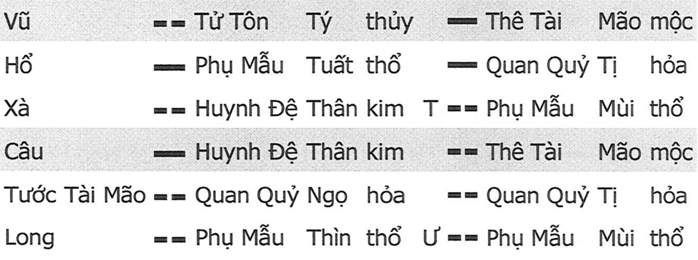 nay, chủ năm nay đã động cửa lần nữa. (Nghiệm, mùa xuân năm nay đã quét sơn màu xám cho cửa.)

Hào 3 động hóa Tử địa Tử Tôn, lại thêm hào 6 Tử Tôn Không Vong hóa Tử địa, chủ có tượng tiểu hài hoặc thú cưng tử vong. Trên thực tế, tại năm Quý Tị, sau khi thay đổi đại môn một tuần lễ thì đã chết hai con chó.

Sau lần động cửa lần thứ hai thì người này đã bị bệnh, thần kinh trở nên quá nhạy cảm. Đây đều là động khí gây nên bất lợi.

## Vấn đề xảy ra tại ký túc xá

Một hôm, đột nhiên có bạn thời đại học tìm tôi trên WeChat, cô ấy nói rằng ngày 15 tháng giêng nấu ăn đã bị bỏng tay phải, ngày 18 tháng 2 leo núi về nhà đã bị trượt chân, gãy xương chân phải, buổi sáng cùng ngày cắt táo đã bị thương ngón út tay trái, vì vậy muốn đoán xem là do nguyên nhân gì gây ra? Ở ngày Nhâm Tuất (Tuần Không: Tý Sửu), tháng Tị, được Trạch Thủy Khốn biến Lôi Thủy Giải.

| Lục thú | Quẻ Trạch Thủy Khốn | | | | Quẻ Lôi Thủy Giải | | |
| :--- | :---: | :--- | :--- | :---: | :---: | :--- | :--- |
| Hổ | ╍╍ | Phụ Mẫu | Mùi thổ | | ╍╍ | Phụ Mẫu | Tuất thổ |
| Xà | ━━ | Huynh Đệ | Dậu kim | | ╍╍ | Huynh Đệ | Thân kim |
| Câu | ━━ | Tử Tôn | Hợi thủy | Ư | ━━ | Quan Quỷ | Ngọ hỏa |
| Tước | ╍╍ | Quan Quỷ | Ngọ hỏa | | ╍╍ | Quan Quỷ | Ngọ hỏa |
| Long | ━━ | Phụ Mẫu | Thìn thổ | | ━━ | Phụ Mẫu | Thìn thổ |
| Vũ | ╍╍ | Thê Tài | Dần mộc | T | ╍╍ | Thê Tài | Dần mộc |

Lấy hào Thế làm Dụng thần. Những sự việc mà cô ấy nói đều có trong quẻ. Huynh Đệ Dậu kim tại ngoại quái phát động, Huynh Đệ là tay chân, hóa thoái khắc hào Thế, tháng giêng là tháng Dần, hào Thế trị Nguyệt bị khắc, Huynh Đệ tại ngoại quái là tay, hào Thế Dần mộc phản quái là Cấn, Cấn là tay. Hào Thế lâm Huyền Vũ là thủy, Tị hỏa trên Nguyệt hình, là hỏa, hoặc là nhiệt. Do đó tháng Dần đã bị bỏng tay.

Hào 5 là đường, hóa thoái hợp hào 2 hào trạch, là trên đường về nhà. Khắc hào Thế, hào Thế tại hào sơ là chân, kim là xương, cho nên là gãy xương chân. Trái là dương, phải là âm, hào Thế lâm hào âm, do đó gãy xương chân phải. Hôm nay bị thương ngón út tay trái là vì Kỵ thần Huynh Đệ phát động hóa thoái, Nhật xung Thìn thổ ám động, hợp Dậu kim không thoái đã khắc hào Thế. Hào dương độc phát, dương là trái. Xem toàn bộ quẻ giống như một bàn tay, hào sơ là ngón tay út. (Trong Lục Hào Dự Trắc Tật Bệnh Tân

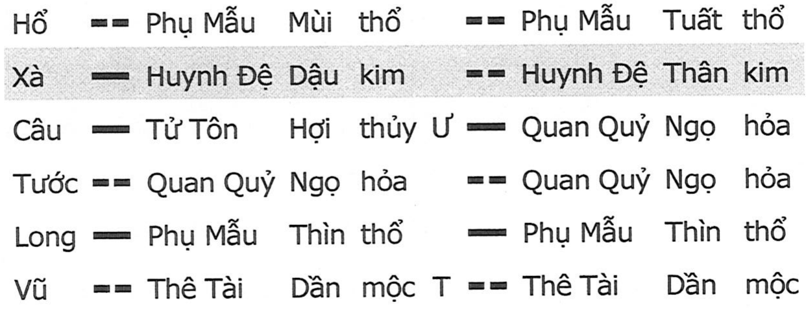

Thám của tôi có trình bày) kim là đao, khắc Thê Tài, Thê Tài chủ ẩm thực, cho nên là cắt thức ăn. Lâm Huyền Vũ, Huyền Vũ là thủy, cho nên là trái cây.

Trên đây đều là sự hậu Gia Cát, ý đồ là khiến mọi người mở rộng cách tư duy. Trước mắt, mục đích của dự đoán chính là tìm nguyên nhân.

Thần triệu cơ ở động: Một trong những tác dụng của độc phát chính là biểu thị nguyên nhân. Độc phát hóa thoái, ứng kỳ thường tại hào biến, ứng năm Bính Thân. Dậu kim là ngũ hành sinh thủy, lâm Đằng Xà chính là ống nước thon dài, độc phát lại hợp Thìn thổ của hào 2, hào 2 là trạch, nhất định có đường ống dẫn vào trong nhà.

Thìn thổ là thủy khố, Thìn thổ lâm Thanh Long, Thanh Long là mới, sửa chữa, trang điểm, xinh đẹp, ám động chính là trong nhà đã di động thùng nước, hoặc phòng tắm v.v.

Bởi vì nhiều năm không gặp, bình thường cũng không liên hệ, do đó tôi không biết rõ tình trạng của cô ấy. Kết quả cô ấy phản hồi như sau, cô ấy đang sống trong ký túc xá của công ty ở Hồng Kông. Tháng 8-9 năm Bính Thân, ký túc xá được sửa chữa, cô ấy đã chuyển đến nhà bên cạnh. Ngày 11 tháng 5 năm 2017, cô ấy lại chuyển về ký túc xá của mình. Bởi vì tại năm Bính Thân ký túc xá đã rỉ nước nên mới phải sửa chữa. Ống nước không thông, đã kéo tạm một ống nước từ bên ngoài vào. Sau khi sửa chữa xong mới biết máy nước nóng và buồng tắm đã được chuyển chỗ.

Phương pháp hóa giải: Tám mảnh cỏ ven sông, đặt ở chỗ cao phía Tây. Mang theo bên người sáu hạt đậu đen. (Sau khi hóa giải, đến nay bình an vô sự, các phương diện đều thuận lợi.)

---

# CHƯƠNG 2

## ÁN LỆ CHIÊM BỐC THỜI CỔ VỀ NHÂN QUẢ

Thời cổ có rất nhiều nhà dự đoán có thể phán đoán ra nhân quả và lợi dụng thời không để hóa giải một cách tài tình, Quản Lộ chính là một người trong số đó. Quản Lộ, tự Công Minh, là người ở Bình Nguyên (nay là huyện Bình Nguyên, Sơn Đông), nước Ngụy thời kỳ tam quốc, ông sinh năm 210 sau công nguyên, mặc dù có bản lĩnh chiêm bốc cao siêu, nhưng tướng mạo xấu xí khó coi, thích uống rượu, đùa giỡn, do đó hương lân tứ xá ưa thích ông ta, nhưng lại không tôn kính ông ta, về sau, ông đã đến huyện Lợi Tào, nơi cha ông đang nhậm chức.

Sau khi đến huyện Lợi Tào, tiếng tăm của Quản Lộ đã nhanh chóng trở nên vang dội. Lợi Tào có ba anh em Quách Ân bị đau chân từ nhiều năm trước, đi lại khập khiễng, điều trị nhiều cách cũng không khỏi, không một ai có thể tìm ra nguyên nhân, nghe nói trình độ chiêm bốc của Quản Lộ cao siêu, đã đến cầu đoán nguyên nhân của chứng bệnh.

Quản Lộ phán đoán: Quái tượng hiển thị trong tổ phần nhà anh có chôn một nữ nhân, đã biến thành ác quỷ, không phải là bá mẫu của anh thì cũng là thúc mẫu của anh. Khi xưa mất mùa đói kém, lương thực rất tinh quý, có người vì mấy thưng gạo trong tay cô ta mà đẩy cô ta xuống giếng. Cô ta tuyệt vọng kêu cứu trong giếng, người đã đẩy cô ấy xuống không những không cứu, trái lại ném thêm hòn đá lớn xuống giếng, kết quả hòn đá ném lên đầu đã kết liễu một sinh mạng. Sau khi cô ấy chết đã biến thành cô hồn dã quỷ, vẫn đau đầu không dứt, kêu oan với thiên đế, thiên đế nói rằng chúng nó hãm hại ngươi như vậy, vậy thì bắt chúng nó phải đau chân nhé.

Lúc này Quách Ân ở bên cạnh đã khóc không thành tiếng, thừa nhận rằng ba anh em bọn họ đã làm điều này, hối hận không dứt về những việc đã làm trong quá khứ.

Danh tiếng chiêm bốc của Quản Lộ ngày càng lớn, đã truyền đến tai của thái thú Vương Cơ, bởi vì nha phủ thái thú bất ổn, Quản Lộ đã được mời đến dự đoán.

Quản Lộ phán đoán: Nha phủ của ông có phần quái dị, có 3 sự việc sắp xảy ra. Đầu tiên, có một hạ nữ sẽ sinh ra một nam anh, vừa mới sinh ra đã biết đi, tự chạy vào trong lò bếp chết thiêu. Thứ hai, trên giường của ông sẽ xuất hiện một con rắn lớn ngậm một cây bút trong miệng, mọi người đều có thể trông thấy, một lúc sau sẽ tự biến mất. Thứ ba, có một con quạ bay vào nhà đánh nhau với chim én, cuối cùng chim én bị đánh chết, quạ bay đi.

Thái thú nghe xong thì vô cùng sợ hãi, sao có thể xảy ra những quái sự như vậy chứ? Chẳng lẽ nha phủ đã trở thành hung trạch ư?

Quản Lộ nói: Nha phủ này của ông đã quá cũ, âm khí nặng nề, do đó sinh ra những hiện tượng này. Đứa trẻ mới sinh ra liền biết đi, kỳ thực không phải nó tự đi, mà là do có thứ yêu tà đã đẩy nó vào trong lò. Rắn lớn ngậm bút trong miệng, kỳ thực là thư lại cũ đã chết trước đây tác quái, còn quạ và chim én đánh nhau là do chuông gió cũ trên mái nhà đang tác quái. Các dự đoán của Quản Lộ lần lượt xuất hiện, mọi người đều thán phục trình độ dự đoán của ông ta.

Bấy giờ huyện lệnh Tín Đô đã nghe được Quản Lộ chiêm bốc thần kỳ, bởi vì nữ quyến trong nhà bị bệnh nhiều năm liên tiếp, tâm thần bất an, thường xuyên giật mình tỉnh giấc trong mộng, chữa trị nhiều cách đều không khỏi, cầu y đa phương đều vô hiệu, liền thỉnh cầu Quản Lộ dự đoán.

Quản Lộ phán đoán: Nhà của ông đã xây trên một phần mộ. Phần mộ nằm ở phía Bắc của nhà, bên trong đã chôn hai người đàn ông, một người cầm mâu, một người cầm cung tên. Đầu ở trong tường, chân ở ngoài tường, người cầm mâu nhắm vào đầu, do đó có nữ quyến đau đầu, không ngẩng cổ lên được, người cầm cung tên nhắm vào bụng, do đó có nữ quyến đau bụng, không thể ăn uống. Hai hồn ma ban ngày ra ngoài du đãng, do đó người bệnh ban ngày không quá khó chịu, đến đêm thì hồn ma trở về tác quái, do đó sợ hãi trong mộng, ảnh hưởng đến giấc ngủ, bệnh tình nặng thêm.

Huyện lệnh liền sai người đào nền nhà khám nghiệm, quả nhiên đúng như lời của Quản Lộ. Sau khi chuyển hai thi thể ra ngoại thành mai táng, người trong nhà đều đã khỏe mạnh.

Huyện lệnh của huyện Thanh Hà là Vương Kinh sau khi bị miễn chức về nhà thì đã đến gặp Quản Lộ cầu đoán, ông ta nói: Gần đây tôi đã xảy ra một việc kỳ lạ, cảm thấy không tốt, muốn nhờ tiên sinh xem thử xem thế nào?

Sau khi khởi quẻ, Quản Lộ đáp: Xét từ quái tượng thì không phải là việc hung, do đó không cần để tâm. Có phải vào mấy ngày trước, khi ông đang đứng trước cửa sổ vào ban đêm thì đột nhiên có một thứ sáng giống như chim én đã chui vào trong ngực của ông, có tiếng kêu vo ve, đã làm ông giật mình, vội vàng cởi quần áo ra để tìm, lại gọi thêm tôn phu nhân đến trợ giúp?

Vương Kinh cười lớn: Tiên sinh phán đoán rất đúng, cứ như tận mắt nhìn thấy vậy.

Quản Lộ nói tiếp: Quẻ này là cát, trong ba ngày tất có chuyện thăng chức, chờ nghiệm chứng nhé.

Quả nhiên, ngày thứ hai đã nhận được văn thư thượng nhiệm, Vương Kinh được bổ nhiệm làm thái thú Giang Hạ.

Có một hôm, Quản Lộ lại đến nhà của Quách Ân, lúc này có một con chim ngói rơi xuống mái nhà kêu la thảm thiết. Quản Lộ nói: Ngày mai sẽ có một người khách từ phương Đông đến phủ của ông, trong tay cầm một đầu lợn, một bình rượu ngon, đây mặc dù là hỷ sự, nhưng sẽ có một điều bất trắc nhỏ xảy ra.

Ngày hôm sau, quả nhiên người khách cầm đầu lợn và rượu ngon đã đến, Quách Ân rất vui mừng, liền sai người trong nhà chuẩn bị giết gà để chiêu đãi, nhưng bởi vì gần trưa, gà đều nghỉ trên cành cây, con trai ông ta đã xung phong đi bắn gà bằng cung tên, kết quả là không bắn trúng gà, nhưng lại trúng tay của tiểu nữ hài của hàng xóm đang chơi ở đó.

Còn có rất nhiều câu chuyện về dự đoán của Quản Lộ, không thể kể ra hết. Nếu trình độ dự đoán của chúng ta đạt đến mức độ nhất định, đích thực có thể phân tích ra nhân quả trước sau của sự tình, từ đó đạt được mục đích giải quyết vấn đề, đây cũng là ước nguyện ban đầu của tôi khi viết cuốn sách này.

Sau đây là một số án lệ mà tôi đã được nghiệm chứng:

## Quạ kêu luận cát hung

Đây là một tình huống ở năm 2011. Một người nữ khi ra ngoài vào buổi sáng thì thấy quạ kêu mấy tiếng trước cổng, trong lòng cảm thấy bất an. Bởi vì dân gian vẫn luôn lưu truyền rằng có quạ kêu là không tốt, bèn đoán cát hung của sự việc này, ở ngày Nhâm Thân (Tuần Không: Tuất Hợi), tháng Tị.

| | | | | |
| --- | :---: | --- | --- | :---: |
| Hổ | - - | Quan Quỷ | Tuất thổ | |
| Xà | - - | Phụ Mẫu | Thân kim | T |
| Câu | — | Thê Tài | Ngọ hỏa | |
| Tước | — | Huynh Đệ | Hợi thủy | |
| Long | - - | Quan Quỷ | Sửu thổ | Ứ |
| Vũ | — | Tử Tôn | Mão mộc | |

Lấy hào Thế làm trung tâm, tổng hợp phán đoán. Hào Thế bị Nguyệt hình khắc lâm Đằng Xà, chủ tâm trạng bất an. Hào Thế lâm Nhật vượng tướng, sáu hào an tĩnh, bình an không có hung sự.

Nguyệt kiến khắc hào Thế, hào Thế tại hào 5, chủ đường, Tị hỏa nhập quẻ biến thành Ngọ hỏa lâm Câu Trần, Câu Trần là thi công kiến trúc, chủ lân cận có cải tạo đường xá.

Hào 6 Quan Quỷ Tuất thổ lâm Bạch Hổ Không Vong, hào 6 là chỗ cao, thổ chủ kiến trúc, xi măng gạch ngói, Không Vong chủ thất khứ ly khai, hợp đến hào sơ, chủ trên không có xi măng gạch ngói rơi xuống. Tuất thổ gần hào Thế, hào 6 lại là lân cư, khả năng là vật kiến trúc lân cận.

Hào 3 Hợi thủy Không Vong, chủ trong nhà dừng nước, rỉ nước. Lâm Chu Tước, là nước uống.

Phản hồi: Thùng nước bị tắc đã không chảy, vừa được làm sạch. Trước nhà chúng tôi có đường, bởi vì tháng này sửa cống ngầm, người ta đã đào đường lên, đã sửa xong, đang rải nhựa đường. Tháng Ngọ đến tháng Mùi, bệnh viện bốn tầng ở phía Tây bị đập bỏ, xi măng rơi xuống tới tấp. Tháng Thân, một bệnh viện khác ở Tây Nam cũng bị đập bỏ. Một năm trôi qua, bản thân bình an vô sự.

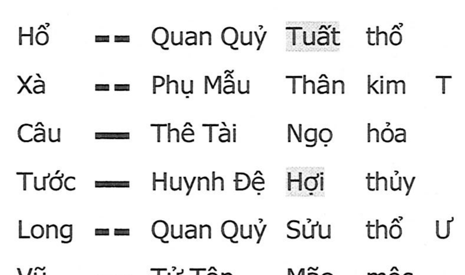

## Ông nội đã chết đang tác quái

Đây là một tình huống ở năm 2016. Một người nam đoán bệnh con gái, ở ngày Mậu Thìn (Tuần Không: Tuất Hợi), tháng Nhâm Thìn, được Thiên Phong Cấu biến Tốn Vi Phong.

| Lục thú | Phục thần | Quẻ chính | Quẻ biến |
| :--- | :--- | :--- | :--- |
| Tước | | — Phụ Mẫu Tuất thổ | — Thê Tài Mão mộc |
| Long | | — Huynh Đệ Thân kim | — Quan Quỷ Tị hỏa |
| Vũ | | — Quan Quỷ Ngọ hỏa Ứ | -- Phụ Mẫu Mùi thổ |
| Hổ | | — Huynh Đệ Dậu kim | — Huynh Đệ Dậu kim |
| Xà | Tài Dần | — Tử Tôn Hợi thủy | — Tử Tôn Hợi thủy |
| Câu | | -- Phụ Mẫu Sửu thổ T | -- Phụ Mẫu Sửu thổ |

Lấy Tử Tôn làm Dụng thần. Tử Tôn Hợi thủy lâm Đằng Xà Không Vong, nhập Mộ tại Nhật Nguyệt, Đằng Xà chủ sợ hãi, uốn cong, Không Vong là tẩu thần[^1], thủy là trí tuệ, Hợi thủy đối ứng Càn, chủ tư duy não bộ, nhập Mộ chủ hôn mê, quẻ tại cung Càn là đầu. Đây là bệnh co giật, đầu óc điên dại, đầu óc ngớ ngẩn. (quả nhiên là bệnh động kinh, co giật, ngớ ngẩn, tẩu thần.)

Quan Quỷ Ngọ hỏa độc phát, độc phát biểu thị tính chất, nguyên nhân v.v, có thể con gái thuộc tuổi Ngọ, Quan Quỷ Ngọ hỏa lâm Huyền Vũ, Huyền Vũ chủ âm khí, Quan Quỷ là người chết, hóa Phụ Mẫu tại cung Càn, có liên quan đến trưởng bối. (Nghiệm, con gái tuổi Ngọ.)

Hào mệnh của con gái và Quan Quỷ nhất thể, đây chính là bị hồn ma quấy nhiễu. Hào 6 Tuất thổ là Mộ khố Quan Quỷ, Nhật Nguyệt xung phá, hào 6 là tổ phần, lâm Tuất thổ phản quái là Càn là đầu, chủ có người trưởng bối chết vì vỡ đầu, người này đã ảnh hưởng đến hài tử, cho nên bệnh của hài tử cũng xuất hiện ở não bộ. (Nghiệm, ông nội của hài tử đã bị người ta đập vỡ đầu mà chết.)

Ngọ hỏa độc phát lâm Huyền Vũ hóa Mùi thổ, Huyền Vũ là thủy, Ngọ hỏa là phía Nam, chủ phía Nam có thủy, Tuất thổ Không Vong, chủ phần địa có hố, độc phát hóa Mùi thổ, chủ không phải phía Nam thì phía Tây Nam có hố. (Nghiệm, phía Nam là biển lớn, Tây Nam của phần địa có một cái hố bởi vì đã bị đào lấy đất.)

Xem ra cha của anh không thích con gái của anh, cho nên sau khi chết vẫn đang quấy phá. (Nghiệm, bởi vì cha của quái chủ là con

[^1]: Tinh thần không tập trung, lực chú ý phân tán.

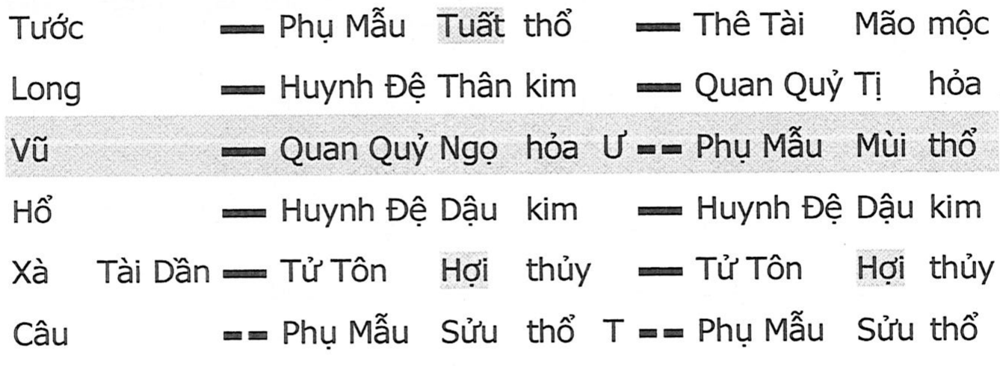 một, quái chủ cũng là con một, lúc còn sống, ông ấy đã từng nói với quái chủ rằng, con nhất định phải sinh cho cha một đứa con trai, không được để đứt hương hỏa.)

Hào 6 Tuất thổ bị Nhật Nguyệt xung, chủ tại năm Bính Tuất đã từng động tổ phần. Ngọ hỏa hóa Phụ Mẫu Mùi thổ hợp với hào động Quan Quỷ, hợp Quan Quỷ là mộ hợp táng, chỗ hợp ứng xung. Năm Kỷ Sửu cũng đã từng động. Hào Thế Sửu thổ có thể ám thị, cũng có liên quan đến năm Sửu. (Nghiệm, năm 2006 bởi vì sửa đường, không thể không di chuyển phần địa, tại năm 2009 bởi vì bà nội chết, khi hợp táng đã động phần địa lần nữa.)

Sau đó đã làm hóa giải, tuy nhiên hiệu quả không rõ ràng.

## Hài tử bị câm, họa do xương trắng

Một học trò đã hỏi tôi tình huống này vào năm 2015. Hài tử của bạn anh ta sinh năm Tân Mão nhưng vẫn chưa biết nói. Đoán nguyên nhân, ở ngày Canh Thân (Tuần Không: Tý Sửu), tháng Tý, được Phong Thiên Tiểu Súc biến Tốn Vi Phong.

| Lục thú | Phục thần | Quẻ chính | Quẻ biến |
| :--- | :--- | :--- | :--- |
| Xà | | ━ Huynh Đệ Mão mộc | ━ Huynh Đệ Mão mộc |
| Câu | | ━ Tử Tôn Tị hỏa | ━ Tử Tôn Tị hỏa |
| Tước | | ━ ━ Thê Tài Mùi thổ Ư | ━ ━ Thê Tài Mùi thổ |
| Long | Quan Dậu | ━ Thê Tài Thìn thổ | ━ Quan Quỷ Dậu kim |
| Vũ | | ━ Huynh Đệ Dần mộc | ━ Phụ Mẫu Hợi thủy |
| Hổ | | ━ Phụ Mẫu Tý thủy T | ━ ━ Thê Tài Sửu thổ |

Lấy Tử Tôn làm Dụng thần. Tử Tôn Tị hỏa Nguyệt khắc Nhật không phù là hưu tù. Mặc dù có Dần mộc ám động đến sinh, nhưng hỏa vô căn, sinh phù bất khởi.

Quẻ này chủ yếu là hỏi nguyên nhân. Do đó hào độc phát rất quan trọng, sách nói rằng, thần triệu cơ ở động, hào động chính là nguyên nhân. Bạch Hổ là y dược, Tý thủy lại là Thai địa Tử Tôn, hóa Thê Tài, chủ vợ đã uống quá nhiều thuốc trong thời gian mang thai, đây là một nguyên nhân. Thứ hai, Phụ Mẫu tại hào sơ lâm Bạch Hổ phát động, hóa ra Mộ khố Quan Quỷ, chủ lân cận nền nhà có xương trắng đã ảnh hưởng đến hài tử.

Kết quả phản hồi, sau khi cha quái chủ tạ thế, lại quàn mười năm mới hạ táng. Đây chính là Phụ Mẫu trì Thế Không Vong lâm Bạch Hổ, chủ thông tin này. Không Vong là đã chết, Bạch Hổ chủ

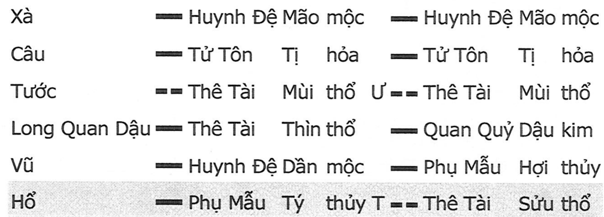 tang, trì Thế chủ luôn luôn ở bên cạnh. Âm hồn không tan hết, đã ảnh hưởng đến hài tử.

## Sức khỏe vợ chồng đột nhiên không tốt là do nguyên nhân gì?

Đây là một tình huống ở năm 2018. Một người nữ đoán bản thân và chồng đột nhiên không khỏe, là do nguyên nhân gì? Ở ngày Giáp Thìn (Tuần Không: Dần Mão), tháng Tân Dậu, được Thiên Lôi Vô Vọng biến Trạch Lôi Tùy.

| Lục Thú | Hào | Thiên Lôi Vô Vọng | Hào | Trạch Lôi Tùy |
| :--- | :---: | :--- | :---: | :--- |
| Vũ | ━ | Thê Tài Tuất thổ | ━ ━ | Thê Tài Mùi thổ |
| Hổ | ━ | Quan Quỷ Thân kim | ━ | Quan Quỷ Dậu kim |
| Xà | ━ | Tử Tôn Ngọ hỏa T | ━ | Phụ Mẫu Hợi thủy |
| Câu | ━ ━ | Thê Tài Thìn thổ | ━ ━ | Thê Tài Thìn thổ |
| Tước | ━ ━ | Huynh Đệ Dần mộc | ━ ━ | Huynh Đệ Dần mộc |
| Long | ━ | Phụ Mẫu Tý thủy Ư | ━ | Phụ Mẫu Tý thủy |

Quan Quỷ là chồng, hào Thế là mình, xem tổ hợp biến hóa của quẻ.

Hào Thế lâm Ngọ hỏa Nhật Nguyệt không phù là hưu tù, thân thể tương đối nhược, Nguyên thần Dần tại hào 2 Không Vong, viêm ruột, đau bụng, hào Thế nhập Mộ tại Tuất thổ độc phát, chủ chóng mặt, đầu óc lờ đờ. Tháng Ngọ trị hào Thế, tháng Tuất trị độc phát, tháng Mùi của Thoái thần đều không tốt. (Nghiệm, tháng Ngọ bắt đầu tiêu chảy, tháng Mùi đến Tuất bắt đầu chóng mặt. Tháng Tuất lại đau bụng. Lại thêm lợi sinh mủ.)

Quan Quỷ Thân kim Nhật Nguyệt phù là vượng tướng, nhưng Nguyên thần tại hào 6 độc phát hóa thoái, chủ thiếu tinh thần, cảm thấy mệt mỏi. Độc phát xung hào 3 Thê Tài Thìn thổ, Nguyệt kiến Dậu kim Quan Quỷ là bệnh đã hợp đến hào 3 Thìn thổ, hào 3 thổ là dạ dày, hệ tiêu hoá, phương diện này có vấn đề. Thìn phản quái là Tốn, Tốn là gan mật, gan mật bất lợi. (Nghiệm, không có tinh thần, dạ dày không tốt, phẫu thuật viêm túi mật, lại thêm đi đường ngã bị thương.)

Bệnh của vợ chồng bọn họ, bệnh viện không tìm ra nguyên nhân, quẻ này chủ yếu là đoán nguyên nhân. Thần triệu cơ ở động, độc phát chính là nguyên nhân. Hào 6 thổ độc phát, hào 6 là tường, thổ cũng là tường, hóa thoái là tượng da tường bị bong tróc. (Nghiệm, da tường của phòng tắm, nhà vệ sinh đã bị rơi ra.)

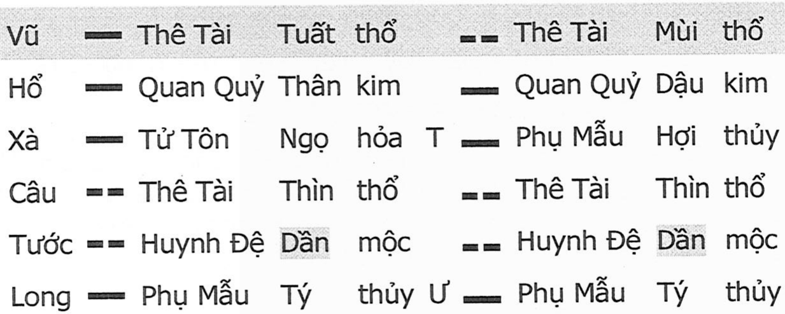

Độc phát lâm Huyền Vũ, Huyền Vũ là tượng thủy, Dần mộc Không Vong, hào 2 là trạch, mộc là vật bằng gỗ. Da tường bị ẩm ướt, mộc Không thì mục nát, Huyền Vũ lại là mục nát, độc phát biểu thị tính chất. Trong nhà có vật bằng gỗ đã mục nát. (Nghiệm, máy giặt rỉ nước, đã làm mục sàn gỗ.)

Sau khi trải qua hóa giải, bản thân đã khỏe lại. Nhưng mật của chồng không có cải biến, đã biến thành ung thư.

# CHƯƠNG 3

## CẤU TRÚC CỦA CON NGƯỜI VÀ TỰ NHIÊN GIỐNG NHAU

Trong Hoàng Đế nội kinh, người xưa đã trình bày và phân tích một cách toàn diện về những nguyên lý, nguyên nhân, phương pháp điều trị và phương pháp điều dưỡng bệnh tật của nhân thể từ góc độ Trung y, tác phẩm đã đề xuất khái niệm thiên nhân hợp nhất và sự liên kết chặt chẽ giữa con người với tự nhiên, đó là một lý luận y học hoàn mỹ nhất trên thế giới. Cấu trúc thiên nhân giống nhau là mức độ đơn giản nhất của thiên nhân hợp nhất quan theo Hoàng Đế nội kinh. Hoàng Đế nội kinh cho rằng cấu trúc của thân thể con người đã thể hiện cấu trúc của trời đất.

Ví dụ, Linh khu – Tà khách nói: "Trời tròn đất vuông, ứng với đầu người tròn, chân người vuông. Trời có nhật nguyệt, người có hai mắt. Đất có chín châu, người có chín khiếu. Trời có mưa gió, người có vui giận. Trời có sấm sét, người có âm thanh. Trời có bốn mùa, người có bốn chi. Trời có ngũ âm, người có ngũ tạng. Trời có lục luật, người có lục phủ. Trời có đông hạ, người có hàn nhiệt. Trời có thập nhật (mười thiên can), người có mười ngón tay. Thần có mười hai (mười hai địa chi), người có mười ngón chân, hành (dương vật), thùy (tinh hoàn) để tương ứng; nữ tử không có hai thứ đó, nhưng có khả năng mang thai. Trời có âm dương, người có vợ chồng. Năm có 365 ngày, người có 360 đốt. Đất có núi cao, người có vai và đầu gối. Đất có hang sâu, người có nách và khoeo chân. Đất có mười hai kinh thủy, người có mười hai kinh mạch. Đất có mạch suối, người có vệ khí. Đất có cỏ dại, người có lông tơ. Trời có ngày đêm, người có ngủ thức. Trời có các sao, người có răng. Đất có núi nhỏ, người có đốt nhỏ. Đất có núi và đá, người có xương gồ lên cao. Đất có cây rừng, người có cân mạc. Đất có tụ ấp (nơi tập trung đông người), người có quắc nhục (thịt ở khoeo chân). Năm có mười hai tháng, người có mười hai đốt. Đất có nơi bốn mùa không sinh cỏ, người có người không có con. Đó là sự tương ứng giữa trời đất và con người vậy."

Người ta đã lấy cấu trúc hình thái nhân thể nhất nhất đối ứng với vạn vật trong trời đất. Cấu trúc nhân thể hoàn toàn có thể tìm được thứ tương ứng ở trong giới tự nhiên, nhân thể chính là hình ảnh thu nhỏ của trời đất. Điều này đủ để nhấn mạnh tính thống nhất giữa tồn tại con người với tồn tại tự nhiên.

Do đó, nguyên nhân cát hung của sự vật phán đoán thông qua dự đoán lục hào nên giống như điều đã nói trong Hoàng Đế nội kinh, phải xây dựng cát hung của sự vật dựa trên mối quan hệ đối ứng giữa con người với tự nhiên, từ đó mới có thể tìm ra vấn đề sở tại, mới có thể tìm được phương pháp tiếp cận vấn đề hợp lý.

Sau đây là một số án lệ mà tôi đã được nghiệm chứng:

## Động thổ dẫn tới tinh thần bất ổn

Đây là một tình huống ở năm 2018. Một người nam (sinh năm Mậu Dần) tự nói mắt mệt mỏi, đoán thân thể, ở ngày Mậu Tuất (Tuần Không: Thìn Tị), tháng Nhâm Tuất, được Lôi Trạch Quy Muội biến Địa Hỏa Minh Di.

| Lục Thú | Phục Thần | Quẻ gốc | | | Quẻ biến |
| :--- | :--- | :---: | :--- | :---: | :--- |
| Tước | | ⚋ | Phụ Mẫu Tuất thổ Ư | ⚋ | Huynh Đệ Dậu kim |
| Long | | ⚋ | Huynh Đệ Thân kim | ⚋ | Tử Tôn Hợi thủy |
| Vũ | Tử Hợi | ━ | Quan Quỷ Ngọ hỏa | ⚋ | Phụ Mẫu Sửu thổ |
| Hổ | | ⚋ | Phụ Mẫu Sửu thổ T | ━ | Tử Tôn Hợi thủy |
| Xà | | ━ | Thê Tài Mão mộc | ⚋ | Phụ Mẫu Sửu thổ |
| Câu | | ━ | Quan Quỷ Tị hỏa | ━ | Thê Tài Mão mộc |

Lấy hào Thế làm Dụng thần. Hào Thế Sửu thổ được Nhật Nguyệt phù, hào 2 lại hóa ra Sửu thổ, hào 4 Ngọ hỏa phát động lại hóa Sửu thổ, hào 6 lại là Tuất thổ, vượng tướng trùng điệp vật cực tất phản, trái lại là hưu tù.

Hào 4 Ngọ hỏa phản quái là Ly, Ly là mắt, nhập Mộ tại Nhật, năm Nhâm Thìn xung khai Mộ khố, Ngọ hỏa sinh hào Thế bất lợi, năm này mắt bắt đầu có vấn đề. (Nghiệm)

Phụ Mẫu trì Thế lâm Bạch Hổ Chu Tước, Chu Tước là học tập, Bạch Hổ là nhanh, bản thân thích học tập, tốc độ học tập rất nhanh, Phụ Mẫu đa hiện, kiến thức rộng. (Nghiệm)

Quá vượng trái lại là nhược, hiện tại việc học đình trệ, hóa du hồn, đã không học nữa. (Nghiệm, nghỉ ở nhà.)

Nguyên thần Ngọ hỏa lâm Huyền Vũ nhập Mộ, tâm trạng không tốt, dồn nén, đây là đặc điểm của trầm cảm. Hào Thế lâm Bạch Hổ chủ nóng nảy, lúc phiền táo bất an, lúc không muốn quan tâm người khác. (Nghiệm)

Hào Thế là thổ tại hào 3, quá vượng, trái lại là nhược, hào 4 hóa Sửu thổ, thể hiện mắt, mà hào 2 lại hóa ra Sửu thổ nhất định cũng là bệnh, lâm Đằng Xà là vật thon dài, tổng hợp lại chủ tràng vị không tốt. (Nghiệm)

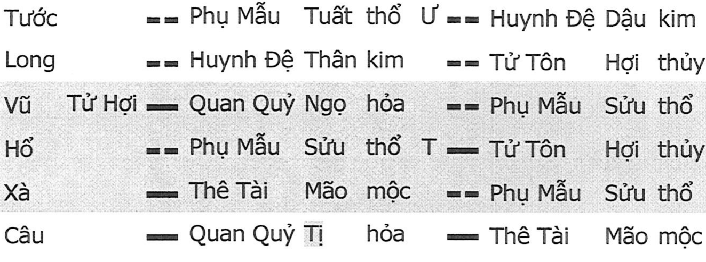

Hào 2 mộc hóa thổ, hào 2 là trạch, thổ mộc hỗ hóa chủ xây dựng công trình, nhất định bởi vì đã động nơi ở gây ra. Ngọ hỏa và Mão mộc đều hóa Sửu thổ, cả hai nhất định có liên quan. Hào biến Phụ Mẫu Sửu thổ là nhà, vậy hai hào động chính là thời gian, không phải là tháng Ngọ năm Tân Mão đã động nơi ở, thì là tháng Mão năm Giáp Ngọ đã động nơi ở. (Nghiệm, tháng Mão năm Nhâm Ngọ ông nội đại tu nhà, hơn nữa đã chặt mấy cây. Ban đầu chỉ là mắt mệt mỏi, từ tháng Mão năm Giáp Ngọ đã bị trầm cảm, ngày càng nghiêm trọng, không thể đi học.)

Hóa giải: Không ghi chép, nhưng sau khi hóa giải đã có chuyển biến tốt đẹp.

## Tương quan giữa con người và môi trường xung quanh

Đây là một án lệ dự đoán vận khí năm Tân Mão của một cô gái người Nhật ở năm 2011, ở ngày Ất Sửu (Tuần Không: Tuất Hợi), tháng Mão.

| Lục Thú | Phục Thần | Quẻ gốc | | | Quẻ biến |
| :--- | :--- | :---: | :--- | :---: | :--- |
| Vũ | | ━ | Huynh Đệ Dần mộc | ━ | Tử Tôn Tị hỏa |
| Hổ | Tử Tị | ⚋ | Phụ Mẫu Tý thủy | ⚋ | Thê Tài Mùi thổ |
| Xà | | ⚋ | Thê Tài Tuất thổ T | ━ | Quan Quỷ Dậu kim |
| Câu | Quan Dậu | ⚋ | Thê Tài Thìn thổ | ━ | Phụ Mẫu Hợi thủy |
| Tước | | ⚋ | Huynh Đệ Dần mộc | ⚋ | Thê Tài Sửu thổ |
| Long | | ━ | Phụ Mẫu Tý thủy Ư | ━ | Huynh Đệ Mão mộc |

Năm 2011, Nhật Bản đã xảy ra động đất lớn, không lâu sau khi cô ấy dự đoán vận khí năm đó của mình. Quẻ này hào Thế mặc dù Nguyệt khắc, nhưng trong khắc có hợp, Nguyệt hợp hữu tình, lại được Nhật thần phù, bản thân nhất định bình an. Chỉ là hào Thế lâm Đằng Xà Không Vong, hóa phá, hào 3 Thìn thổ đến xung, hào 3 là giường, Đằng Xà chủ mộng, Không Vong chủ bất an, ngủ không ngon mà thôi, sẽ không có tai họa lớn.

Thê Tài Tuất thổ trì Thế Không Vong, tiền trong tay tiêu ra ngoài, chủ tiêu tốn nhiều.

Hai Thê Tài phát động, khắc Phụ Mẫu Tý thủy, hào 5 Phụ Mẫu Tý thủy lâm Bạch Hổ, hào 5 là đường, Bạch Hổ chủ tai họa đổ máu, Nhật hợp khắc Phụ Mẫu Tý thủy, cần đề phòng tháng Ngọ tháng Mùi hợp xứ phùng xung, trưởng bối trong nhà bị thương vì xa họa. Phụ Mẫu Tý thủy lưỡng hiện, hào sơ Tý thủy lâm hào Ứng, cũng có thể ứng trên người trưởng bối họ hàng. Tốn là đùi, hào sơ là chân, phần nhiều ứng bị thương ở chân.

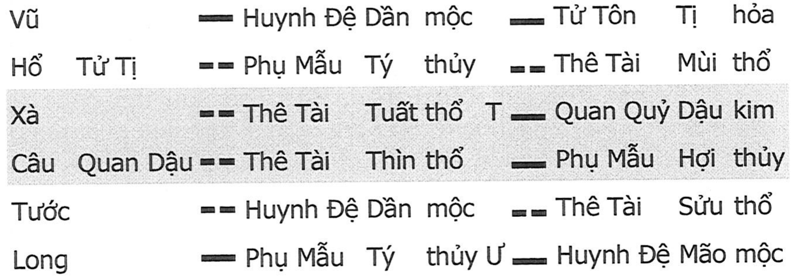

Hào 3 Thê Tài Thìn thổ thủy khố lâm Câu Trần hóa Không Vong, Câu Trần chủ xây dựng công trình, cần chú ý trong năm trong nhà có chỗ rỉ nước. Hoặc vật có liên quan đến thủy bị hư hại.

**Phương án hóa giải:** Bởi vì cô ấy nói rằng mẹ sống ở nhà, do đó chủ yếu hóa giải cho mẹ. Bảo mẹ người này đeo một viên đá tròn, viên đá tròn thể hiện Dậu kim, do đó có thể khiến hào Thế thực phá, thứ hai là có thể hợp Thê Tài Thìn thổ không xung hào Thế, cũng không khắc Phụ Mẫu nữa, thứ ba là để có thể sinh Phụ Mẫu Tý thủy, tăng cường sức mạnh của Phụ Mẫu.

Kết quả, ở tháng Ngọ, mẹ cô ấy không xảy ra xa họa, đồng hồ cũ trong nhà không chạy, hư hại không thể sử dụng (đây là ứng Thê Tài Thìn thổ, Thìn biểu thị thời gian).

Điện thoại cũng không thể gọi đến từ bên ngoài, phải nhờ người sửa, đây là Thìn thổ hóa Không Vong, Không Vong tại Phụ Mẫu.

Trên màn hình ti vi mới mua trong phòng mẹ đã xuất hiện vạch màu hồng, đã nhờ người sửa chữa. Đây là ứng Tuất thổ lâm Đằng Xà Không Vong hóa phá.

Tổ kiến ở bãi cỏ phía Nam của nhà đã di chuyển đến phía Bắc của nhà, đây là ứng Tý Ngọ xung.

Đến tháng Mùi, thím bị gãy xương chân nhập viện vì ngã xe máy, thím của cô ấy sống ở phía Bắc của nhà cô ấy.

Tháng Mùi, ruộng lúa ở hướng Đông Nam của nhà cô ấy đột nhiên bị rỉ nước, sau khi tưới một lúc thì đã không còn nước. Đây là ứng Câu Trần Thìn thổ hóa Không Vong.

Máy bơm dùng để tưới nước cũng không thể bơm nước. Khi dùng máy cắt cỏ, đã cắt trúng đá, đá văng lên làm hỏng kính trên xe hơi của mẹ. Đây cũng ứng khắc Phụ Mẫu Tý thủy.

Tháng Dậu, vật hóa giải đã bị mất, thế là lại tìm một cái mới để đeo. Đến ngày Đinh Mão tháng Sửu, mẹ lái xe bị một chiếc xe khác đụng phải, nhưng may mà chỉ bị đau chân nhẹ, không có trở ngại lớn. Mẹ đụng xe ở phía Tây của nhà cô ấy, bản thân vốn có chứng mất ngủ, nhưng sau khi hóa giải đã khỏi. Nhưng đến cuối năm, cho rằng rất nhiều sự việc phán đoán đã ứng nghiệm, liền cất vật hóa giải đi, bản thân người cầu đoán lại mắc phải chứng mất ngủ.

## Phía sau mộ địa có hố lớn

Một người nam dự đoán trong mệnh của mình có con trai hay không. Ở ngày Quý Mùi (Tuần Không: Thân Dậu), tháng Mão, gieo được Thiên Địa Bĩ biến Trạch Địa Tụy.

| Lục thú | Phục thần | Quẻ Thiên Địa Bĩ | | Quẻ Trạch Địa Tụy | |
| :--- | :--- | :---: | :--- | :---: | :--- |
| Hổ | | — | Phụ Mẫu Tuất thổ Ứ | - - | Phụ Mẫu Mùi thổ |
| Xà | | — | Huynh Đệ Thân kim | — | Huynh Đệ Dậu kim |
| Câu | | — | Quan Quỷ Ngọ hỏa | — | Tử Tôn Hợi thủy |
| Tước | | - - | Thê Tài Mão mộc T | - - | Thê Tài Mão mộc |
| Long | | - - | Quan Quỷ Tị hỏa | - - | Quan Quỷ Tị hỏa |
| Vũ | Tử Tý | - - | Phụ Mẫu Mùi thổ | - - | Phụ Mẫu Mùi thổ |

Lấy Tử Tôn làm Dụng thần. Tử Tôn Tý thủy phục tàng, Nguyệt không phù, Nhật khắc Dụng thần, Nguyên thần Không Vong an tĩnh bất động, Kỵ thần độc phát, trong mệnh khó có con trai.

Xét từ góc độ Nhật Nguyệt, Tử Tôn đã hưu tù, có thể biểu thị vấn đề, nhưng tại sao lại thêm Kỵ thần độc phát? Hơn nữa là động mà hóa thoái? Nhất định chủ nguyên nhân. Hào 6 là tổ tiên, Tuất thổ là Mộ khố Quan Quỷ, Quan Quỷ là người chết, Mộ khố chính là phần mộ, lâm Bạch Hổ chủ tang, đó chính là tổ phần. Phụ Mẫu Tuất thổ hóa thoái, thổ hóa thoái, đất lún xuống, nhất định sau mộ có hố, Thoái thần trị Thái Tuế, hố nhất định rất lớn. Tại sao là sau mộ, bởi vì Tử Tôn phục tàng dưới Mùi thổ Thoái thần nhập hào bị khắc. Lại lâm Huyền Vũ, Huyền Vũ chủ phía sau.

Kết quả phản hồi: Sau mộ có một cái hố lớn bởi vì lò gạch đã đào lấy đất.

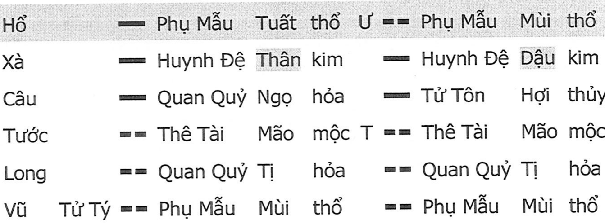

# CHƯƠNG 4

## ĐỒNG KHÍ TƯƠNG CẦU

Thời Hán là một trong những thời kỳ phồn vinh nhất về tư tưởng triết học trong lịch sử Trung Quốc, rất nhiều học giả đã tìm kiếm quy luật tương quan đối ứng lẫn nhau giữa vũ trụ và con người, giữa quá khứ và hiện tại, đã luận thuật một cách sâu sắc về mối quan hệ giữa con người với tự nhiên.

Hán thư – Đổng Trọng Thư truyện nói: "Thiên nhân chi trưng, cổ kim chi đạo dã. Khổng Tử viết Xuân Thu, trên xét thiên đạo, dưới hỏi nhân tình, tham cổ khảo kim." Tố vấn – Khí giao biến đại luận nói: "Người hiểu đạo trời, tất ứng nghiệm đạo trời vào người. Người hiểu chuyện xưa, tất mượn xưa bảo nay. Người hiểu về khí, tất thể hiện khí rõ ràng trên vạn vật. Người hiểu cảm ứng, thì thống nhất với tạo hóa thiên địa. Người hiểu sinh hóa và biến động, thì sẽ hiểu rõ đạo lý của tự nhiên."

Trong triết học cổ đại Trung Quốc, thiên nhân và cổ kim luôn liên kết với nhau, kỳ thực đó là một loại tư tưởng mộc mạc của vũ trụ thời không quan. Nhưng nhân thiên cùng loại được nhấn mạnh trong Hoàng Đế nội kinh thì gần chân lý hơn. Sự quy loại ngũ hành trong Tố vấn - Kim quỹ chân ngôn luận, Tố vấn - Âm dương ứng tượng đại luận v.v thì căn cứ vào phương thức, trạng thái vận động nội tại của sự vật hoặc tính đồng nhất của hiện tượng.

Ví dụ, Tố vấn - Kim quỹ chân ngôn luận nói: "Phương Đông màu xanh, thông với gan, khai khiếu ở mắt, tàng tinh ở gan, bệnh của nó là phát kinh hãi; vị của nó là chua, loại của nó là thảo mộc, súc vật của nó là gà, ngũ cốc của nó là mạch (lúa mạch), ứng tứ thời của nó, trên là tuế tinh (sao mộc), là lấy xuân khí ở đâu, âm của nó là giốc, số của nó là 8, do đó biết bệnh ở gân, mùi của nó là khai.

Phương Nam màu đỏ, thông với tim, khai khiếu ở tai, tàng tinh ở tim, cho nên bệnh tại ngũ tạng; vị của nó là đắng, loại của nó là hỏa, súc vật của nó là dê, ngũ cốc của nó là thử (kê), ứng tứ thời của nó, trên là huỳnh hoặc tinh (sao hỏa), do đó biết bệnh ở mạch, âm của nó là chủy, số của nó là 7, mùi của nó là cháy khét.

Trung ương màu vàng, thông với lá lách, khai khiếu ở miệng, tàng tinh ở lá lách, cho nên bệnh tại gốc lưỡi; vị của nó là ngọt, loại của nó là thổ, súc vật của nó là trâu, ngũ cốc của nó là tắc (lúa tắc), ứng tứ thời của nó, trên là trấn tinh (sao thổ), do đó biết bệnh ở thịt, âm của nó là cung, số của nó là 5, mùi của nó là thơm.

Phương Tây màu trắng, thông với phổi, khai khiếu ở mũi, tàng tinh ở phổi, cho nên bệnh tại lưng; vị của nó là cay, loại của nó là kim, súc vật của nó là ngựa, ngũ cốc của nó là đạo (lúa nước), ứng tứ thời của nó, trên là thái bạch tinh (sao kim), do đó biết bệnh ở da lông, âm của nó là thương, số của nó là 9, mùi của nó là tanh.

Phương Bắc màu đen, thông với thận, khai khiếu ở nhị âm[^1], tàng tinh ở thận, cho nên bệnh ở khê; vị của nó là mặn, loại của nó là thủy, súc vật của nó là lợn, ngũ cốc của nó là đậu, ứng tứ thời của nó, trên là thần tinh (sao thủy), do đó biết bệnh ở xương, âm của nó là vũ, số của nó là 6, mùi của nó là thối."

Đây là sự quy loại ngũ hành đối với phương vị, mùa, khí hậu, tinh tú, số sinh thành của trời; phẩm loại, ngũ cốc, ngũ súc, ngũ âm, ngũ sắc, ngũ vị, ngũ xú (năm mùi) của đất; ngũ tạng, ngũ thanh, ngũ chí (năm cảm xúc), bệnh biến, bệnh vị của người. Như vậy, thông qua mối liên hệ rộng rãi về "tượng" giữa các chủng loại, có thể phân biệt được đặc trưng chung của phương thức vận động cùng loại và quy luật tác dụng tương hỗ của nó. Đó là "đồng khí tương cầu", không phải là sự đánh đồng cấu trúc vật chất như nhau.

Vì vậy, khi tìm kiếm nguyên nhân vấn đề sở tại, dự đoán lục hào cũng dựa trên tư duy đồng khí tương cầu, lấy tác dụng của ngũ hành sinh khắc đối ứng với sự vật trong cuộc sống thường ngày để phán đoán nguyên nhân, khắc ứng v.v.

Sau đây là một số án lệ mà tôi đã được nghiệm chứng.

[^1]: Nhị âm tức là tiền âm (bộ phận sinh dục), và hậu âm (tức là hậu môn).

## Có chim bay đến thêm cát tường

Đây là một tình huống ở năm 2011. Một người nữ có mẹ bị bệnh tiểu đường, đoán cát hung đến trước Lập Đông? Ở ngày Quý Mùi (Tuần Không: Thân Dậu), tháng Ất Mùi.

| Lục thú | | Quẻ Bát Thuần Tốn | Thế / Ứng |
| :--- | :---: | :--- | :---: |
| Hổ | — | Huynh Đệ Mão mộc | T |
| Xà | — | Tử Tôn Tị hỏa | |
| Câu | -- | Thê Tài Mùi thổ | |
| Tước | — | Quan Quỷ Dậu kim | Ứ |
| Long | — | Phụ Mẫu Hợi thủy | |
| Vũ | -- | Thê Tài Sửu thổ | |

Dự đoán về mẹ lấy Phụ Mẫu làm Dụng thần. Phụ Mẫu Hợi thủy tại hào 2 bị Nhật Nguyệt khắc, Hợi thủy lâm Thanh Long có thể chủ tiểu đường. Dụng thần hưu tù, biểu thị bệnh tình nghiêm trọng. Tốn là đùi, đã ảnh hưởng đến chân. Tốt ở Nguyên thần tuy nhiên Không Vong, an tĩnh bất động. Trước Lập Đông vấn đề không lớn, sợ sau Lập Đông bất lợi.

Hóa giải: Nguyên thần Dậu kim Không Vong, mang theo bên người một viên đá maifan hình tròn. Tốn là gà, Dậu kim là gà, lâm Chu Tước là chim, nếu như có chim bay vào sân nhà chị thì sức khỏe của mẹ chị sẽ có sự cải biến ngoài sức tưởng tượng. Lâm hào Ứng sinh hào 2 Phụ Mẫu, tự động bay đến mới tốt.

Ngày 27 tháng 9 năm đó phản hồi: Trước đây mẹ tôi bị lệch mặt, sau khi hóa giải đã ngay trở lại. Tháng Thân đường máu hạ xuống, bác sĩ cũng cảm thấy kỳ lạ. Nhà tôi đã xuất hiện một hiện tượng lạ, mỗi đêm đều có mấy con chim ngói đến trú ở mái hiên. Mẹ tôi sợ chúng nó phóng uế bừa bãi, muốn đuổi chúng đi, tôi nói chúng đến là để cứu mẹ, không được đuổi, thế là đã để chúng tự nhiên. Đến tháng Dậu, mẹ tôi đã có thể nấu cơm, ra đồng làm việc.

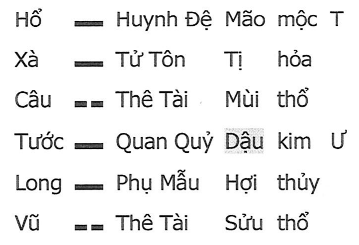

## Cửa hàng kinh doanh thế nào?

Đây là một tình huống ở năm 2018. Một người nam đoán vận khí buôn bán của mình, ở ngày Đinh Tị (Tuần Không: Tý Sửu), tháng Đinh Tị, được Thủy Phong Tỉnh biến Địa Sơn Khiêm.

| Lục thú | Phục thần | Thủy Phong Tỉnh | Thế Ứng | Địa Sơn Khiêm |
| :--- | :--- | :--- | :---: | :--- |
| Long | | ╍╍ Phụ Mẫu Tý thủy | | ╍╍ Quan Quỷ Dậu kim |
| Vũ | | ━ Thê Tài Tuất thổ | T | ╍╍ Phụ Mẫu Hợi thủy |
| Hổ | Tử Ngọ | ╍╍ Quan Quỷ Thân kim | | ╍╍ Thê Tài Sửu thổ |
| Xà | | ━ Quan Quỷ Dậu kim | | ━ Quan Quỷ Thân kim |
| Câu | Huynh Dần | ━ Phụ Mẫu Hợi thủy | Ư | ╍╍ Tử Tôn Ngọ hỏa |
| Tước | | ╍╍ Thê Tài Sửu thổ | | ╍╍ Thê Tài Thìn thổ |

Lấy Thê Tài làm Dụng thần. Thê Tài lưỡng hiện, lấy Thê Tài Tuất thổ là hào Thế phát động làm Dụng thần. Thoạt nhìn Thê Tài trì Thế tại hào 5, Nhật Nguyệt sinh là thông tin phát tài lớn, nhưng hào Thế phát động hóa Nhật phá Nguyệt phá, chủ tài vận không tốt. (Nghiệm)

Thê Tài phá tại Phụ Mẫu, Phụ Mẫu là nhà, cửa hàng, chủ vấn đề phong thủy gây ra bất lợi. Hào biến của Dụng thần là Phụ Mẫu Hợi thủy xuất hiện ở trong quẻ lâm hào 2 hào trạch, lâm Câu Trần phát động, Câu Trần chủ kiến trúc, là cải tạo cửa hàng mà dẫn tới bất lợi. Động mà gặp hợp, phá cũng ứng hợp, năm Canh Dần cải tạo cửa hàng mà tài vận suy giảm. (Nghiệm, năm Canh Dần đã cải tạo cửa hàng.)

Hỏa bất thượng quái, nhập Mộ tại Tuất thổ, Tuyệt tại Hợi thủy, hai hào động đều sản sinh tác dụng bất lợi đối với hỏa, trong nhà ánh sáng không tốt. (Khi cải tạo nhà ở năm Canh Dần, cũng đã cải tạo cửa sổ, bên ngoài đã làm mái hiên phòng mưa, đã dẫn đến thiếu ánh sáng trong nhà.)

Chu Tước là trước, hào vị thấp, Sửu thổ Không Vong, chủ trước cửa hàng thấp. (Nghiệm)

Hào thủy phá, chủ trong cửa hàng có chỗ rỉ nước. (Nghiệm, năm nay sau khi di chuyển bể chứa nước thì van nước đã xuất hiện rò rỉ, nhưng đã sửa xong.)

Hào 2 là cửa hàng, Nguyệt phá là bị Tử Tôn xung phá, Tử Tôn thể hiện động vật, hóa Tử Tôn Ngọ hỏa lại biểu thị rõ hơn, đề phòng mối cắn hỏng, chuột đào lỗ. (Nghiệm, sát vách là nhà hàng, chuột đã đào hang trong cửa hàng này, sau này đã lấp kín hang.)

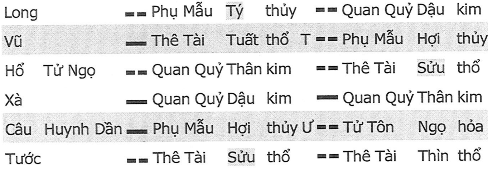

Hóa giải: Đặt 3 cành cây đã sơn màu đỏ ở Tây Bắc cửa hàng.

## Nếu muốn thi đậu, mau sửa lại mái nhà

Đây là một tình huống ở năm 2009. Một người muốn tham gia một kỳ thi, đoán có thể thi đậu hay không? Ngày Quý Tị (Tuần Không: Ngọ Mùi), tháng Thìn.

| Lục thú | Phục thần | Quẻ Sơn Địa Bác | Thế Ứng | Quẻ Hỏa Địa Tấn |
| :--- | :--- | :--- | :---: | :--- |
| Hổ | | ━ Thê Tài Dần mộc | | ━ Quan Quỷ Tị hỏa |
| Xà | Huynh Thân | ╍╍ Tử Tôn Tý thủy | T | ╍╍ Phụ Mẫu Mùi thổ |
| Câu | | ╍╍ Phụ Mẫu Tuất thổ | | ━ Huynh Đệ Dậu kim |
| Tước | | ╍╍ Thê Tài Mão mộc | | ╍╍ Thê Tài Mão mộc |
| Long | | ╍╍ Quan Quỷ Tị hỏa | Ư | ╍╍ Quan Quỷ Tị hỏa |
| Vũ | | ╍╍ Phụ Mẫu Mùi thổ | | ╍╍ Phụ Mẫu Mùi thổ |

Lấy Quan Quỷ làm Dụng thần, tham khảo Phụ Mẫu. Quẻ này mặc dù Tử Tôn trì Thế, nhưng Tử Tôn tại hào 5, Quan Quỷ tại hào Ứng, đây là một loại tổ hợp đặc biệt trong quẻ lục hào, hỷ Quan Quỷ vượng tướng. Không hỷ Tử Tôn nhập Mộ, bị hợp.

Trong quẻ Quan Quỷ lâm Nhật vượng tướng, vốn là cát, nhưng không nên Phụ Mẫu Tuất thổ lâm Câu Trần phát động hóa Huynh Đệ Dậu kim, phát động nhất định có nguyên nhân, thần triệu cơ ở động. Cung Càn là chỗ cao, Phụ Mẫu là kiến trúc, Câu Trần chủ phong thủy, Nguyệt phá chủ tổn hoại, hóa Dậu kim chủ ngói kim loại, Tuất thổ đối ứng Tây Bắc. Tây Bắc mái nhà nhất định phá tổn, cần sửa chữa ngay, nếu không sẽ ảnh hưởng đến thi cử.

Câu Trần chủ trì độn, Càn là đầu, hào Thế thủy chủ trí tuệ, bởi vì ảnh hưởng của phong thủy, tư duy sẽ không mẫn tiệp, đầu óc hồ đồ làm sai đề.

Người này liền kiểm tra mái nhà, đã phát hiện Tây Bắc mái nhà có chỗ bị ăn mòn và bong tróc, lập tức tìm nhân viên sửa chữa.

Tháng 11 năm đó phản hồi: Đã thi đậu. Lúc đầu đã làm sai đề, sau đó đã phát hiện sai lầm, lập tức sửa chữa, cuối cùng đã sửa hoàn tất trước khi hết giờ, đã đạt được thành tích tốt.

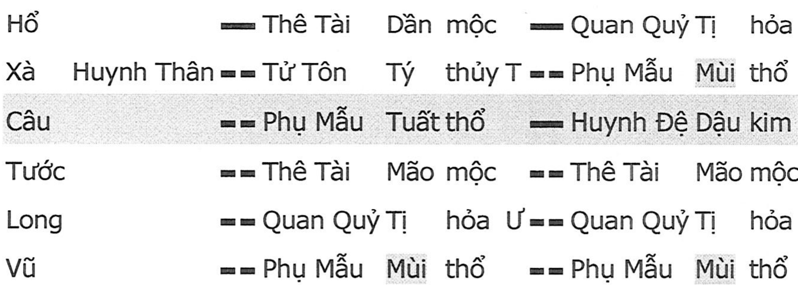

# CHƯƠNG 5

## MỐI LIÊN HỆ GIỮA CON NGƯỜI VÀ TỰ NHIÊN THÔNG QUA TƯỢNG

Xuất phát từ quan niệm "thiên nhân hợp nhất", văn hóa Dịch học và Trung y học đều thể hiện trọng đạo, trọng hình, trọng hài hòa, trọng thế, hạt nhân của nó là "tượng số lý", nếu không hiểu rõ "tượng số lý", thì có nghĩa là vô tri đối với Dịch học tầng cao.

"Tượng", chính là hiện tượng, hình dáng vật thể, động tĩnh biến hóa, hành vi nhân thể v.v của sự vật có thể đối ứng trong môi trường sống. Đặc trưng của "tượng" là động thái, là toàn tức, gắn bó chặt chẽ với vạn sự vạn vật. Hệ thống tạng tượng trong Trung y chính là một lý luận giải thích về quy luật liên hệ và tác động tương hỗ giữa ngũ tạng với các hoạt động sinh mệnh khác thông qua sự biến hóa về tượng của hoạt động sinh mệnh và phương pháp thủ tượng tỉ loại.

Thủ tượng lục hào là trích xuất thông tin thông qua quan hệ tương hỗ giữa ngũ hành sinh khắc với quẻ, hào vị, lục thần, địa chi v.v để tìm ra sự việc, vật thể, biến hóa, nhân sự v.v đối ứng.

Tượng pháp gồm quái tượng, hào tượng, lục thần tượng, địa chi tượng, ngũ hành tượng v.v, cần thiết lập trên một tư duy mâu thuẫn để giải quái tượng mới có thể nắm bắt hiệu quả.

## Tinh thần sau khi đặt một ly nước

Đây là một tình huống ở năm 2016. Một người nam đoán thân thể của mình, đã mấy tháng cảm thấy khó chịu, ở ngày Giáp Ngọ (Tuần Không: Thìn Tị), tháng Mùi, được Tốn Vi Phong biến Phong Sơn Tiệm.

| Lục thú | Quẻ Tốn Vi Phong | Thế Ứng | Quẻ Phong Sơn Tiệm |
| :--- | :--- | :---: | :--- |
| Vũ | ━ Huynh Đệ Mão mộc | T | ━ Huynh Đệ Mão mộc |
| Hổ | ━ Tử Tôn Tị hỏa | | ━ Tử Tôn Tị hỏa |
| Xà | ╍╍ Thê Tài Mùi thổ | | ╍╍ Thê Tài Mùi thổ |
| Câu | ━ Quan Quỷ Dậu kim | Ư | ━ Quan Quỷ Thân kim |
| Tước | ━ Phụ Mẫu Hợi thủy | | ╍╍ Tử Tôn Ngọ hỏa |
| Long | ╍╍ Thê Tài Sửu thổ | | ╍╍ Thê Tài Thìn thổ |

Lấy hào Thế làm Dụng thần. Hào Thế tại hào 6, hào 6 là đầu, nhập Mộ tại Nguyệt, chủ đầu óc lờ đờ, thiếu tinh thần. Mùi thổ nhập quẻ lâm Đằng Xà, Đằng Xà chủ ngủ, thường xuyên muốn nằm xuống ngủ. (Nghiệm)

Hào 2 Hợi thủy phát động sinh hào Thế, hào 2 là trạch, chủ anh ở trong nhà thì đủ tinh thần, nhưng hào Thế tại hào 6 chủ bên ngoài, hưu tù nhập Mộ, chủ ở bên ngoài thì không có tinh thần, Quan Quỷ là Kỵ thần, không muốn làm việc. (Nghiệm, hiện tại hầu như không đến đơn vị, ra ngoài thì không có tinh thần.)

Độc phát lâm Chu Tước, đã xung Bệnh địa Tị hỏa, Chu Tước là hỏa, hóa Ngọ hỏa là hỏa, Tị hỏa bị xung cũng là hỏa, chủ sốt. (Sốt cao một tháng, không biết nguyên nhân.)

Hào 5 Tị hỏa là Bệnh địa ám động, chủ tim không tốt. (Bệnh viện cho biết tim bẩm sinh không tốt, nhưng bản thân không cảm giác.)

Thủy bị Nguyệt khắc, không thể sinh hào Thế, thủy chủ thận tai, thủy không sinh đến hào 6 trên đầu, Chu Tước chủ âm thanh, là ù tai. (Nghiệm)

Hào 2 thủy lâm Chu Tước động, động mà gặp hợp, tháng giêng đã từng động lò sưởi. (Phản hồi là đã động vòi nước)

Hóa giải: Ở ngày Hợi, tại Tây Bắc rót một cốc nước nóng, sau đó đặt ở phía Đông, để nước tự bốc hơi. Sau khi hóa giải đã có tinh thần ngay lập tức, cùng ngày đã đi làm.

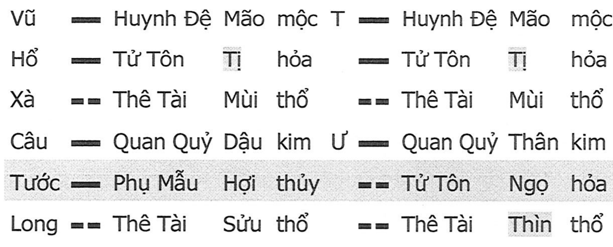

---

# Part 3 (Pages 41-60)

## Đã tiểu cùng một chỗ ở bên ngoài với người khác

Đây là một tình huống ở năm 2016. Vợ của một học trò của tôi cảm thấy khó chịu ở cổ, đến bệnh viện điều trị không có hiệu quả, sau đó đã nhờ tôi hóa giải, ở ngày Tân Hợi (Tuần Không: Dần Mão), tháng Tân Mão, được Thiên Sơn Độn biến Hỏa Lôi Phệ Hạp.

| Lục thú | Phục thần | Quái hào | Thế/Ứng | Biến hào |
| :--- | :--- | :--- | :---: | :--- |
| Xà | | ━ Phụ Mẫu Tuất thổ | | ━ Quan Quỷ Tị hỏa |
| Câu | | ━ Huynh Đệ Thân kim | Ư | ╍ Phụ Mẫu Mùi thổ |
| Tước | | ━ Quan Quỷ Ngọ hỏa | | ━ Huynh Đệ Dậu kim |
| Long | | ━ Huynh Đệ Thân kim | | ╍ Phụ Mẫu Thìn thổ |
| Vũ | Tài Dần | ╍ Quan Quỷ Ngọ hỏa | T | ╍ Thê Tài Dần mộc |
| Hổ | Tử Tý | ╍ Phụ Mẫu Thìn thổ | | ━ Tử Tôn Tý thủy |

Lấy hào Thế làm Dụng thần. Hào Thế Nguyệt sinh Nhật khắc, suy vượng cân bằng. Đã nói rằng cổ khó chịu, vậy căn cứ vào phương pháp thủ tượng thông tin hào vị sáu hào, Thân kim của hào 5 chính là thông tin này. Hào 5 là cổ, kim là xương, Thân kim là Bệnh địa của hào Thế, lâm Câu Trần là tăng sinh, tổng hợp lại chính là xương cổ tăng sinh.

Hào 3 Thân kim cũng là Bệnh địa của hào Thế phát động, hào 3 là thắt lưng, lại thêm hào Thế bị thủy khắc, hào 3 là thắt lưng, thủy là thắt lưng, thắt lưng cũng không tốt. (Nghiệm, hằng ngày cúi đầu bán hàng, thuộc về bệnh nghề nghiệp.)

Hào sơ lâm Bạch Hổ hóa Kỵ thần. Kỵ thần tại Tử Tôn, Bạch Hổ là máu, Tử Tôn là tử cung, Thìn thổ là Mộ khố Tử Tôn cũng là tử cung, nội quái là nội, mà hào Thế tại hào 2 là tử cung, lâm Huyền Vũ là tư mật, tổng hợp lại là kinh nguyệt không bình thường, kinh nguyệt không đều. (Nghiệm, luôn luôn không bình thường.)

Kỵ thần tam hợp cục tại hào biến, hào biến là ngoại, tam hợp cục không phải là một cá nhân. Chủ đã từng tiểu tiện cùng một nơi với người khác ở địa phương khác bên ngoài. (Nghiệm, đã từng tiểu tiện cùng một chỗ với chị gái tại một thôn.)

Phương pháp hóa giải, không được ghi chép.

## Có con nối dõi hay không

Đây là một tình huống ở năm 2019. Một người nữ (tuổi Mùi, chồng tuổi Thìn) chiêm con nối dõi, ở ngày Giáp Dần (Tuần Không: Tý Sửu), tháng Mão, được Thiên Phong Cấu biến Lôi Phong Hằng.

| Lục thú | Phục thần | Quái hào | Thế/Ứng | Biến hào |
| :--- | :--- | :--- | :---: | :--- |
| Vũ | | ━ Phụ Mẫu Tuất thổ | | ╍╍ Phụ Mẫu Tuất thổ |
| Hổ | | ━ Huynh Đệ Thân kim | | ╍╍ Huynh Đệ Thân Kim |
| Xà | | ━ Quan Quỷ Ngọ hỏa | Ứ | ━ Quan Quỷ Ngọ hỏa |
| Câu | | ━ Huynh Đệ Dậu kim | | ━ Huynh Đệ Dậu Kim |
| Tước | Tài Dần | ━ Tử Tôn Hợi thủy | | ━ Tử Tôn Hợi thủy |
| Long | | ╍╍ Phụ Mẫu Sửu thổ | T | ╍╍ Phụ Mẫu Sửu thổ |

Lấy Tử Tôn làm Dụng thần, xem tổ hợp biến hóa của quẻ. Tử Tôn Hợi thủy Nhật Nguyệt không phù, lại là Kỵ thần trì Thế, thoạt nhìn căn bản không có con nối dõi. Nhưng hào Thế lâm Thanh Long, Thanh Long chủ mang thai, tại hào sơ, hào sơ là con, Không Vong, mà hào mệnh Mùi thổ xung thực, chủ sẽ có thai. Nhưng hào Thế không phải là Dụng thần, ngoại quái phục ngâm, chỉ là không giữ được thai. (Nghiệm, kết hôn 8 năm, đồng phòng với chồng thì có thai ngay, nhưng có thai cao huyết áp cần uống thuốc, uống thuốc thì chết thai.)

Hào 6 Tuất thổ là Mộ khố Quan Quỷ, hào 6 là tổ phần, Mộ khố Quan Quỷ là mộ, phục ngâm khắc Tử Tôn, chủ tổ phần không vượng nhân đinh. (Nghiệm, em trai của chồng kết hôn mười năm mới sinh một con gái, hiện tại vợ chồng quái chủ kết hôn đã 8 năm, vẫn luôn không thể sinh con.

Nguyệt kiến Mão mộc hợp hào 6 Tuất thổ, Mão mộc là cây, trên mộ mọc cây. (Nghiệm)

Phụ Mẫu là mộ, lưỡng hiện, hào Thế cũng là mộ huyệt, Không Vong, mộ có vẻ như có lỗ. (Nghiệm, trông giống như hầm trú ẩn.)

Quẻ cung Càn, Càn là cao, chủ mộ tương đối cao. (Nghiệm, ở trên sườn núi cao.)

Phụ Mẫu Nhật Nguyệt khắc hưu tù, lâm Huyền Vũ chủ ẩm ướt, mộc là cỏ, phần địa cỏ dại rậm rạp, tương đối cũ nát. (Để nghiệm chứng, đã đi đến phần địa, xung quanh đều là cỏ, tương đối cũ nát.)

Chồng hào mệnh Thìn thổ là Mộ khố của Tử Tôn Hợi thủy Chu Tước, Tử Tôn là vui vẻ, Chu Tước chủ ngôn ngữ, chủ chồng không

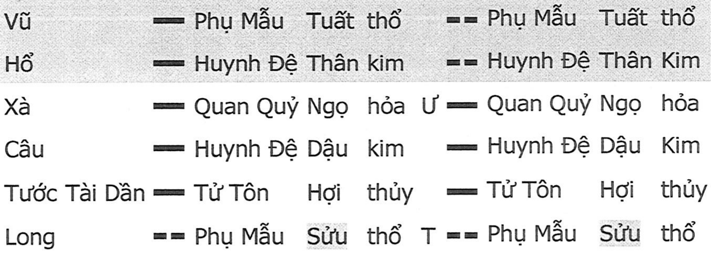 thích nói. Quan Quỷ cũng là chồng, lâm Đằng Xà nhập Mộ, chủ nhút nhát. (Nghiệm, không thích nói nhiều. Nhút nhát.)

Quan Quỷ lâm hỏa vượng tướng, chủ chồng nóng nảy. (Nghiệm)

Hào 3 Huynh Đệ Dậu kim Nguyệt phá, hào 3 là Huynh Đệ, hào Quan Quỷ cao hơn hào Huynh Đệ, chủ em trai của chồng, kim chủ âm thanh, Nguyệt phá, Nhật Tuyệt, hưu tù vô khí, em trai của chồng cũng không thích nói. (Nghiệm)

Nguyệt phá lâm Câu Trần Bạch Hổ, Câu Trần chủ té ngã, Bạch Hổ chủ gãy xương, em trai của chồng đã từng gãy xương. (Nghiệm)

Quan Quỷ Ngọ hỏa vượng tướng tại cung Càn, Càn là tượng cao quý, chủ chồng làm việc rất giỏi ở đơn vị. (Nghiệm)

Quan Quỷ Ngọ hỏa phản quái là Ly, Ly là văn thư, Nhật Nguyệt sinh vượng tướng, chủ văn chương tuấn tú, trình độ học vấn cao. (Nghiệm)

Sức khỏe bản thân xem hào Thế, hào Thế bị Nhật Nguyệt Mão mộc Dần mộc khắc, hưu tù không vượng, nhưng bởi vì không phải là quẻ dự đoán sức khỏe, do đó đoán sơ lược, sức khỏe không tốt. (Tự thuật, sỏi thận, mỡ máu cao.)

Phương pháp hóa giải không được ghi chép.

# CHƯƠNG 6

## QUÁI TƯỢNG ĐỒNG LÝ VỚI CUỘC SỐNG

Bởi vì con người và tự nhiên gắn bó chặt chẽ với nhau, vì vậy khi phân tích quái tượng cần đưa đạo lý trong cuộc sống vào trong quẻ để phân tích và phán đoán. Chỉ cần là những hiện tượng tồn tại trong trời đất có khả năng sản sinh ảnh hưởng đối với chúng ta, chúng đều có thể được phản ánh ra trong quẻ, mấu chốt là làm thế nào để tìm được quan hệ đối ứng này thông qua quái tượng. Đòi hỏi chúng ta phải hiểu rõ kiến thức cơ bản, mở rộng tư duy, học cách liên tưởng và trích xuất thông tin một cách hợp lý.

Nói chung, kênh nước, sông ngòi, tháp nước, hồ nước, ống nước, hạ thủy, van nước, vòi nước, nước chảy, bể cá, trời mưa v.v thường đối ứng với thận hoặc hệ tiết niệu.

Lửa, bếp, bóng đèn, dây điện, lồng đèn, đồ điện, bếp Tây Bắc, ống khói, màu đỏ, ánh sáng v.v thường đối ứng với tim, mắt v.v.

Thổ nhưỡng, nhà, đồi núi, phần địa, thổ địa, động thổ, khai quật, xây dựng, gạch ngói, đồ cổ, đồ sứ, đồ gốm, tượng đất v.v đối ứng với tỳ vị, da.

Đá, đồ sắt, thủy tinh, vật dụng kim loại, đinh ốc, khóa cửa, đao kiếm, binh khí, cái kéo, dây thép, mũi khoan v.v đối ứng với phổi, ruột, xương.

Gỗ, cây, hoa cỏ, hoành phi, đồ gỗ, bàn ghế tựa, đũa, dây thừng, chạm khắc gỗ, tranh chữ, giường v.v đối ứng với gan mật, lông tóc.

Những quy luật này không phải là cứng nhắc, mà phải trích xuất thông tin linh hoạt dựa vào hào vị, lục thần, ngũ hành quái cung v.v.

Sau đây là một số án lệ mà tôi đã được nghiệm chứng.

## Vật trang trí nước chảy đối ứng thận tạng

Một học trò đã hỏi tôi tình huống này vào năm 2017. Anh ta bị viêm thận, đoán cát hung của bệnh, ở ngày Mậu Tuất (Tuần Không: Thìn Tị), tháng Tị, được Chấn Vi Lôi biến Lôi Hỏa Phong.

| Lục thú | Hào tượng | Quẻ Chấn Vi Lôi | Thế Ứng | Hào tượng | Quẻ Lôi Hỏa Phong |
| --- | :---: | --- | :---: | :---: | --- |
| Tước | ╍╍ | Thê Tài Tuất thổ | T | ╍╍ | Thê Tài Tuất thổ |
| Long | ╍╍ | Quan Quỷ Thân kim | | ╍╍ | Quan Quỷ Thân kim |
| Vũ | ━ | Tử Tôn Ngọ hỏa | | ━ | Tử Tôn Ngọ hỏa |
| Hổ | ╍╍ | Thê Tài Thìn thổ | Ư | ━ | Phụ Mẫu Hợi thủy |
| Xà | ╍╍ | Huynh Đệ Dần mộc | | ╍╍ | Thê Tài Sửu thổ |
| Câu | ━ | Phụ Mẫu Tý thủy | | ━ | Huynh Đệ Mão mộc |

Lấy hào Thế làm Dụng thần. Thông tin viêm thận thường hiển thị tại cung Khảm, hoặc Dụng thần lâm thủy bị khắc, hoặc thủy là Kỵ thần đến khắc. Hoặc liên quan mật thiết với Thìn thổ, bởi vì Thìn thổ là thủy khố.

Quẻ này hào Thế lâm Nhật, Nguyệt sinh vượng tướng, theo lý mà nói, vấn đề không lớn. Nhưng hào 3 Thìn thổ độc phát, xung hào Thế và hóa ra Hợi thủy chính là huyền cơ, thiên nhân cảm ứng, con người tương thông chặt chẽ với tự nhiên, rất nhiều bệnh cũng đối ứng với môi trường sống của chúng ta. Thần triệu cơ ở động, một trong sáu chức năng của độc phát chính là biểu thị nguyên nhân.

Tôi phán đoán như sau: Nơi anh sống có vật nước chảy đã không chảy nữa, và vật này chứa đầy cặn bẩn. Bởi vì Thìn thổ là thủy khố, chính là bên trong chứa thủy, hóa ra Hợi thủy chính là có nước chảy ra, nhưng Thìn thổ Không Vong, bên trong đã không còn nước, mà thủy hóa ra Tuyệt tại Nguyệt kiến, bị Nguyệt xung phá, nhất định nước đã khô. Hỏa là vật phát đỏ, Tị hỏa lâm Nguyệt xung phá Hợi thủy chính là cặn bẩn, vật giống như gỉ sắt.

Kết quả, anh ta đã gửi đến một bức ảnh, nói là ở hướng Đông Nam có vật trang trí nước chảy, bởi vì anh ta ra ngoài trong một thời gian dài, nước bên trong đã khô. Hôm nay trở về vừa mới đổ nước vào. Suy xét kỹ lưỡng, Thìn thổ Không Vong, hôm nay xung thực, Thìn thổ bất Không Vong, đúng là ngay hôm đó vừa mới thêm nước, tổ hợp của quẻ đúng là huyền diệu.

Sau đó đã đề nghị loại bỏ. Trước kia anh ta thở không ra hơi, anh ta vừa mới vứt vật này đi thì thân thể liền phát nhiệt, đã dễ

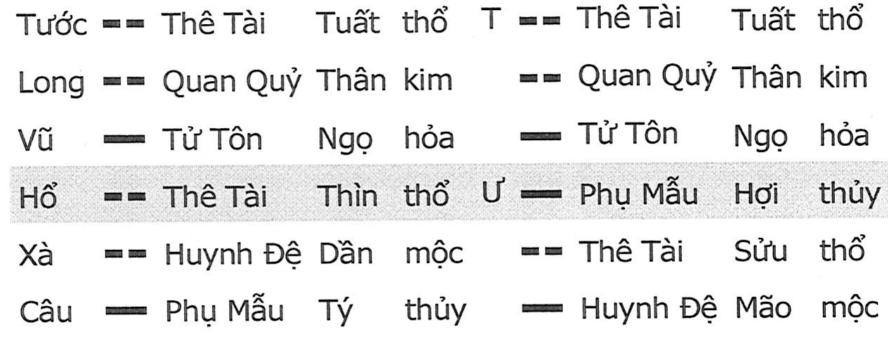 chịu rất nhiều. Trải qua thời gian dài điều dưỡng, sức khỏe đã tốt lên.

## Lậu thủy đa lậu tài

Đây là một tình huống ở năm 2011, một người nữ đoán tình hình tài vận. Ở ngày Kỷ Tị (Tuần Không: Tuất Hợi), tháng Sửu, được Phong Hỏa Gia Nhân.

| Lục thú | Phục thần | Quái hào | Thế/Ứng |
| :--- | :--- | :--- | :---: |
| Câu | | ━ Huynh Đệ Mão mộc | |
| Tước | | ━ Tử Tôn Tị hỏa | Ứ |
| Long | | ╍╍ Thê Tài Mùi thổ | |
| Vũ | Quan Dậu | ━ Phụ Mẫu Hợi thủy | |
| Hổ | | ╍╍ Thê Tài Sửu thổ | T |
| Xà | | ━ Huynh Đệ Mão mộc | |

Lấy Thê Tài làm Dụng thần. Thoạt nhìn Thê Tài Sửu thổ trì Thế lâm Nguyệt, Nhật sinh vượng tướng, nhưng Thê Tài lưỡng hiện, Mùi thổ Nguyệt phá mới là Dụng thần. Mặc dù có Nhật sinh, nhưng bị Nguyệt xung phá, và Nhật xung Phụ Mẫu Hợi thủy gây ra ám động, Hợi thủy là hào sinh Huynh Đệ, biểu thị Nhật không mang lại tác dụng tốt, Nhật phù lực lượng làm suy yếu Thê Tài, tài vận không tốt, mà Nguyệt kiến nhập quẻ tại hào Thế tại hào 2, hào Thế là mình, vận khí của mình không tốt, hào 2 là trạch, phong thủy nơi ở cũng không tốt. (Nghiệm, tài vận không tốt.)

Hợi thủy Không Vong, thủy Không thì chảy, trong nhà có chỗ rỉ nước, Hợi thủy Không Vong ám động sinh Huynh Đệ, rỉ nước nhất định rỉ tài. (Nghiệm, phòng tắm phía Bắc bị rỉ nước, sau đó ở tháng Thìn vòi nước đã bị đứt.)

Phụ Mẫu hưu tù, Phụ Mẫu là nhà, nhà đã cũ kỹ. (Đã xây 40 năm.)

Phụ Mẫu Không Vong, chủ nhà không phải là nhà của mình, hào Ứng lâm Nhật xung Không, là nhà người khác cho mình thuê. (Nghiệm)

Hào 3 hào 4 là cửa, hào 3 Không Vong, hào 4 Nguyệt phá, chủ cửa có hư hại. (Nghiệm, đáy cửa bị hỏng.)

Hào 4 là đại môn, lâm Mùi thổ, Mùi thổ đối ứng Tây Nam, chủ đại môn tại Tây Nam. (Nghiệm)

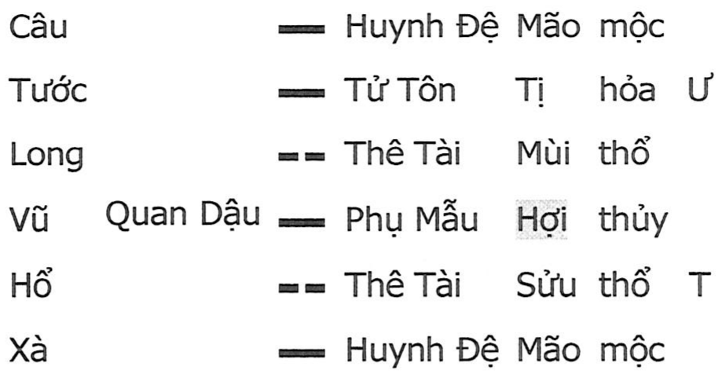

Quan Quỷ Dậu kim phục tàng bị Nhật khắc, Quan Quỷ là chồng, chủ chồng thân thể không tốt. Phi thần ám động tiết khí, lại là Bệnh địa, thủy tại hào 3 là thắt lưng, chủ thắt lưng thận không tốt. (Nghiệm, chồng bị đau thắt lưng.)

**Hóa giải:** Tu bổ chỗ không tốt.

## Vấn đề về bếp ở Tây Bắc

Một học trò đã hỏi tôi tình huống này vào năm 2015. Vợ anh ta gieo quẻ đoán sức khỏe của mình, ở ngày Canh Dần (Tuần Không: Ngọ Mùi), tháng Hợi, được Trạch Phong Đại Quá biến Lôi Phong Hằng.

| Lục thú | Phục thần | Trạch Phong Đại Quá | Lôi Phong Hằng |
| :--- | :--- | :--- | :--- |
| Xà | | -- Thê Tài Mùi thổ | -- Thê Tài Tuất thổ |
| Câu | | — Quan Quỷ Dậu kim | -- Quan Quỷ Thân kim |
| Tước | Tử Ngọ | — Phụ Mẫu Hợi thủy T | — Tử Tôn Ngọ hỏa |
| Long | | — Quan Quỷ Dậu kim | — Quan Quỷ Dậu kim |
| Vũ | Huynh Dần | — Phụ Mẫu Hợi thủy | — Phụ Mẫu Hợi thủy |
| Hổ | | -- Thê Tài Sửu thổ Ư | -- Thê Tài Sửu thổ |

Lấy hào Thế làm Dụng thần. Hào Thế lâm Nguyệt là vượng tướng, Nhật là Bệnh địa hợp hào Thế, chủ có bệnh tại thân. Hào 5 Quan Quỷ Dậu kim độc phát, thần triệu cơ ở động, Dậu kim là Nguyên thần hào Thế, động mà hóa thoái, hào 5 là ngực, kim chủ hệ hô hấp, hóa thoái là làm suy yếu, nhất định là trên phổi có vấn đề. (Quả nhiên phát hiện phổi có vết mờ, bác sĩ nghi ngờ là ung thư.)

Hào Thế vượng tướng, tuyệt đối không phải là ung thư. Nguyên thần lâm Câu Trần hóa thoái, Câu Trần là kiến trúc, cũng lâm Thanh Long, chủ ẩm thực, Câu Trần Thanh Long cộng lại là nhà bếp. Dưới hào Thế phục tàng Ngọ hỏa, hỏa là bếp, Chu Tước là hỏa, Bệnh địa lâm Nhật đến hợp, nhập quẻ tàng tại hào 2, lại thêm thế thân hào Thế tại hào 2, hào 2 là bếp, Hợi thủy đối ứng Tây Bắc, nhà bếp của nhà anh ở Tây Bắc. (Quả nhiên ứng nghiệm)

Học trò hỏi: Tại sao những người khác trong nhà không sao? Tôi đáp: Chắc là vợ anh thuộc tuổi Hợi, cho nên mới như vậy. (Quả nhiên tuổi Hợi)

Tôi tiếp tục phân tích phán đoán: Quẻ cung Chấn, Chấn là mộc, là chất xơ, khả năng là phổi xơ hóa, liền nói với anh ta rằng có phương pháp điều trị bệnh này, không cần làm phẫu thuật. Nhưng

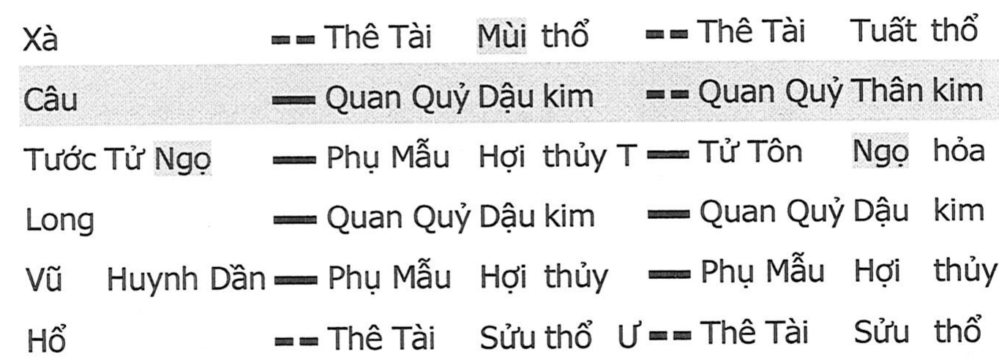 vợ anh ta và người trong nhà sợ là ung thư, đã làm phẫu thuật theo kiến nghị của bệnh viện, kết quả là phổi xơ hóa.

# CHƯƠNG 7

## SỐ VÀ CÁT HUNG CŨNG CÓ SỰ ĐỐI ỨNG

Tả truyện nói: "Sự vật được sinh ra rồi mới có hình tượng, có hình tượng rồi mới có thể phát triển, phát triển rồi mới có số." Hoàng Đế nội kinh cho rằng, sự vận động của sinh mệnh cũng giống với tự nhiên, có lý, có tượng, có số. Thông qua thủ tượng tỉ loại, dự đoán lục hào có thể đối ứng với số.

"Số" là một hình thức lượng hóa vật chất tác động, gắn bó chặt chẽ với thời gian và không gian, biến hóa khôn lường, không dễ xác định, nhưng nói chung cũng không tách khỏi số của ngũ hành, số tiên thiên của quẻ, số của hào vị, số thứ tự của địa chi v.v. Trong Trung y, việc dùng lượng thuốc được căn cứ vào bệnh tình, sự mạnh yếu của cơ thể, mùa v.v. Còn trong dự đoán lục hào, chúng ta cũng căn cứ vào kích thước, thời kỳ, hoàn cảnh địa vực của sự vật để trích xuất số, khi hóa giải cũng căn cứ vào tình hình thực tế để sử dụng sự đối ứng số cho mục đích tăng cường hoặc làm suy yếu sức mạnh của ngũ hành.

Sự đối ứng số có rất nhiều phương diện, có đối ứng với số anh em, thứ tự anh em, có đối ứng với tuổi tác, có đối ứng với tốc độ nhịp thở nhịp tim, có đối ứng với số lượng vật thể, có đối ứng với số tiền, có đối ứng với số lần xảy ra sự việc, có đối ứng với thời gian, có đối ứng phương hướng vật thể, có đối ứng với độ dài, có đối ứng với kích thước, có đối ứng với cao thấp v.v.

Vì vậy, khi chúng ta giải mã ra số của quái tượng ăn khớp với thực tế, chúng ta có thể cải biến xu thế phát triển của sự vật thông qua biến hóa số, từ đó đạt được mục đích xu cát tị hung. Hoặc là khi lượng của số chưa đủ, thông qua sự bổ túc số đó cũng có thể cải biến phương hướng phát triển của sự vật.

Sau đây là một số án lệ mà tôi đã được nghiệm chứng.

## Không ngủ được có phải vì đã trúng tà?

Đây là một quẻ đã được học trò của tôi nhờ tôi phân tích. Một bằng hữu của anh ta là phụ nữ, trong khoảng một tuần lễ, cô ấy trằn trọc đến sáng cũng không ngủ được, sau khi tìm bà đồng, được nói là đã trúng tà, cảm thấy có phần không đáng tin, thế là đã nhờ anh ta gieo quẻ, anh ta sợ rằng mình phán đoán sai sót, do đó đã mời tôi phân tích, ngày Tân Dậu (Tuần Không: Tý Sửu), tháng Thân, được Phong Sơn Tiệm biến Thủy Phong Tỉnh.

| Lục thú | Phục thần | Phong Sơn Tiệm | Thủy Phong Tỉnh |
| :--- | :--- | :--- | :--- |
| Xà | | — Quan Quỷ Mão mộc Ư | -- Thê Tài Tý thủy |
| Câu | Tài Tý | — Phụ Mẫu Tị hỏa | — Huynh Đệ Tuất thổ |
| Tước | | -- Huynh Đệ Mùi thổ | -- Tử Tôn Thân kim |
| Long | | — Tử Tôn Thân kim T | — Tử Tôn Dậu kim |
| Vũ | | -- Phụ Mẫu Ngọ hỏa | — Thê Tài Hợi thủy |
| Hổ | | -- Huynh Đệ Thìn thổ | -- Huynh Đệ Sửu thổ |

Lấy hào Thế làm Dụng thần, hào Thế được Nhật Nguyệt phù là vượng tướng, có bệnh cũng không sao. Hào Thế tại hào 3 bị Phụ Mẫu Ngọ hỏa khắc chế, hào 3 là giường, đây chính là thông tin không ngủ được.

Nếu nói là trúng tà, thoạt nhìn quẻ này, hào 6 Quan Quỷ Mão mộc lâm Đằng Xà động, có thể lý giải là quỷ chết treo, Phụ Mẫu Ngọ hỏa lâm Huyền Vũ, có thể lý giải là tà khí. Có vẻ như lời nói của bà đồng có đạo lý. Nhưng suy xét kỹ lưỡng, thông thường trúng tà có một vài đặc trưng, thứ nhất là sau lưng phát trầm (nặng nề), thứ hai là người không có tinh thần, đầu óc lơ mơ, nhưng trong quẻ này hoàn toàn không thể hiện ra những thông tin này.

Hào 2 lâm Huyền Vũ, Huyền Vũ là ban đêm, hỏa hóa thủy, hỏa là ban ngày, thủy là ban đêm, là thông tin ngày và đêm hoán đổi, ứng hào 2 đã phản ánh thông tin cô ấy không ngủ được, vậy hào 6 hào động có thể chính là nguyên nhân sở tại.

Hào 6 Quan Quỷ Mão mộc phát động, Quan Quỷ thường chủ nguyên nhân. Quẻ này nội quái là Cấn, chủ đồi núi, hào Thế tại hào 3 nội quái, chính là ở trên đồi núi, ngoại quái là Tốn, Tốn là mộc, chính là thực vật trên đồi núi, bởi vì Mão mộc hưu tù, thì có thể lý giải là cỏ. Mão mộc tại hào 6 là đầu, lại là hào phía trên cùng của Tốn mộc, vậy chính là ngọn, hóa Không Vong, ngọn của cỏ đã không còn, giống như đầu đã rơi xuống. Nhật Nguyệt phân biệt đến khắc, chính là cỏ bị gãy đứt hai cây, lâm Đằng Xà, thuộc về loại

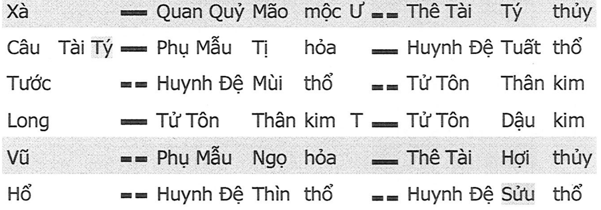 thực vật thon dài, hoặc dây leo, quẻ chính tại cung Cấn, Cấn là tay, chính là đã dùng tay kéo đứt.

Phản hồi của cô ấy chuyển đến thông qua học trò: Khi ra ngoài chơi, đã kéo đứt hai cây cỏ đuôi chó.

Hào 2 là bếp, gặp được hỏa càng chủ bếp. Động hóa Hợi thủy hồi đầu khắc, là thủy xung bếp, nói về phong thủy, giếng nước không được đối diện bếp lửa, nếu đối diện bếp lửa, phụ nữ thường bị bệnh. Quẻ này chính là thông tin phản ánh này. Phản hồi nói là đối diện bếp có ống nước, hằng ngày rỉ nước.

Sau khi nghiệm chứng phán đoán trên đây, bảo người đó lấy ba lá cây gói lại và đặt ở dưới giường.

Bởi vì lá cây là mộc, gói lại chính là Mùi thổ, hào 2 là dưới giường, Mùi thổ có thể khiến Quan Quỷ nhập Mộ, hợp Kỵ thần Ngọ hỏa, sinh hào Thế, nhất cử đa đắc.

**Phản hồi:** Hóa giải ngay hôm đó, cải thiện rõ ràng, mười rưỡi đã ngủ, nửa đêm bị sấm làm tỉnh giấc. Nhưng sau đó vẫn ngủ rất ngon.

## Tại sao vẫn luôn không có thai?

Đây là một quái lệ ở mùa đông năm Giáp Ngọ. Một người nữ (sinh năm 1970) cầu đoán, có thể có thai hay không. Năm 2013, cô ấy đã từng làm thụ tinh trong ống nghiệm ba lần, đều không thành công. Để có thai, cô ấy đã uống Trung dược nửa năm, nhưng cũng không có hiệu quả, từ tháng 9 đã bắt đầu không uống Trung dược nữa. Bởi vì bản thân đã 45 tuổi, sắp vào thời kỳ mãn kinh, do đó trong lòng rất lo lắng. Ngày Bính Tuất (Tuần Không: Ngọ Mùi), tháng Ất Hợi.

| Lục thú | Phục thần | Quái hào | Thế/Ứng | Biến hào |
| :--- | :--- | :--- | :---: | :--- |
| Long | | ╍╍ Phụ Mẫu Mùi thổ | Ứ | ╍╍ Phụ Mẫu Mùi thổ |
| Vũ | | ━ Huynh Đệ Dậu kim | | ━ Huynh Đệ Dậu kim |
| Hổ | | ━ Tử Tôn Hợi thủy | | ━ Tử Tôn Hợi thủy |
| Xà | | ━ Huynh Đệ Thân kim | T | ╍╍ Quan Quỷ Ngọ hỏa |
| Câu | Tài Mão | ╍╍ Quan Quỷ Ngọ hỏa | | ━ Phụ Mẫu Thìn thổ |
| Tước | | ╍╍ Phụ Mẫu Thìn thổ | | ╍╍ Thê Tài Dần mộc |

Lấy hào Tử Tôn làm Dụng thần. Tử Tôn Hợi thủy được Nguyệt kiến phù, Nhật khắc, suy vượng trung hòa. Hào Thế phát động sinh Tử Tôn, bản thân rất bức thiết hy vọng có con. Hào Thế lâm Đằng Xà hóa Không Vong, vì chuyện này mà tâm trạng phiền táo, lo lắng bất an.

Hào Thế là Nguyên thần Tử Tôn, mặc dù được Nhật sinh vượng tướng, nhưng động hóa Không Vong hồi đầu khắc, hào 2 lại có Quan Quỷ Ngọ hỏa phát động đến khắc, Nguyên thần bị khắc chế, không thể sinh Tử Tôn, do đó không thể có thai.

Hào 3, hào 2 đều là hào vị tử cung, Nguyên thần Tử Tôn thể hiện tử cung, Thìn thổ của hào 2 Quan Quỷ Ngọ hỏa hóa ra là Mộ khố Tử Tôn cũng thể hiện Tử Tôn, lâm Câu Trần, Câu Trần là sưng trướng, khối u, Thìn thổ là thủy khố, do đó phán đoán có u nang buồng trứng. Hào Thế bị hai Ngọ hỏa khắc chế, u nang không phải là một.

Quả nhiên có tử cung u nang, đôi khi không phải kinh kỳ cũng xuất hiện xuất huyết tử cung. Người nữ này cho đến nay vẫn không có thai.

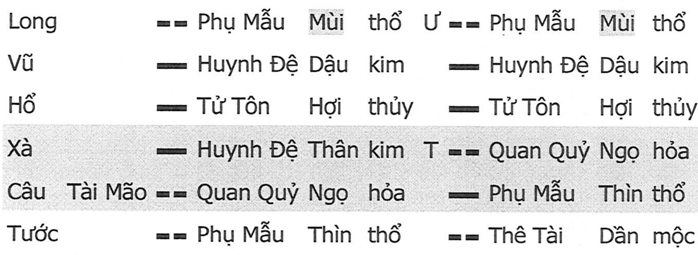

# CHƯƠNG 8

## THỦ TƯỢNG LỤC THÂN PHÁN ĐOÁN NHÂN QUẢ

Lục thân là một khái niệm căn bản nhất trong dự đoán lục hào, đồng thời nó cũng là cơ sở thiết yếu của việc chọn Dụng thần, mỗi lục thân đều bao hàm nhiều ý nghĩa, nội dung dự đoán khác nhau, ý nghĩa thủ tượng cũng khác nhau, kết hợp ngũ hành, hào vị và lục thần thu hẹp phạm vi định tính, như vậy mới có thể cụ thể hóa khái niệm, từ đó đạt được mục đích trích xuất thông tin và phán đoán nhân quả.

**Phụ Mẫu:** Thể hiện cha mẹ, ông nội, bà nội, bà ngoại, ông ngoại, cô ruột, chồng của cô, dì, chồng của dì, mợ, cậu, thầy cô giáo, cha nuôi, mẹ nuôi, cha vợ, mẹ vợ, trưởng bối, người già, thiên địa, thổ địa, phần mộ, thành trì, tường bao, phòng xá, kiến trúc, công trình, xe đạp, xe hơi, xe lửa, thuyền, máy bay, mưa, tuyết, áo mưa, dù, quần áo, giày mũ, vải vóc, khăn đội đầu, khẩu trang, báo cáo, văn chương, văn kiện, thư tịch, tờ báo, thư, hợp đồng, thông tin, tin tức, tín hiệu, trường học, bệnh viện, đầu, mặt, ngực, lưng, bụng, mông, phòng bệnh, đệm chăn, ga giường, đơn vị công tác, nha môn v.v.

**Phụ Mẫu tại hào 6:** Thường chủ tổ phần, người già, tường bao, thiên đường, am thờ Phật, lân cư (hàng xóm), máy bay, mũ nón, khăn đội đầu, khẩu trang, kính đeo mắt, dù, mái nhà, tổ tiên, linh cảm, vô tuyến thông tin, viện điều dưỡng, viện dưỡng lão, bệnh viện, tranh chữ cũ, mặt, đầu v.v.

**Phụ Mẫu tại hào 5:** Thường chủ xe, cầu, khẩu trang, mặt nạ, cửa hàng ven đường, khách sạn, trưởng lão, gia trưởng, cha, cương vị trọng yếu, văn kiện quan trọng, giấy khen, pháp quy, trung tâm kiến trúc, quảng trường, áo lót, áo ngực, áo khoác, mặc áo, khăn quàng cổ, khăn ống.

**Phụ Mẫu tại hào 4:** Thường chủ mẹ, mặc áo, áo khoác, áo ngực, phòng khách, rèm cửa sổ, đại môn, môn lâu (cổng chào), người gác cổng, văn kiện nhân sự v.v.

**Phụ Mẫu tại hào 3:** Thường chủ phòng ngủ, người già giữ cửa, Phật đường, am thờ Phật, rèm cửa, đệm chăn, ga giường, chiếu, khăn trải bàn, quần, tạp dề, áo yếm, dây thắt lưng, đồ ngủ v.v.

**Phụ Mẫu tại hào 2:** Thường chủ nhà, trong nhà, nhà bếp, tủ bát, gia đình, bản vẽ kiến trúc, quần cộc, nội y, nịt gối, băng vệ sinh, tã giấy, hợp đồng mua bán nhà v.v.

**Phụ Mẫu tại hào sơ:** Thường chủ nền nhà, lân cư, giếng nước, hầm ngầm, tầng hầm, công trình nền móng, đơn vị cơ sở, nông thôn, ngoại thành, giày, tất v.v.

**Phụ Mẫu ngũ hành là thổ:** Thường chủ nhà, kiến trúc, thổ địa, thổ nhưỡng, phần mộ, tự viện, miếu vũ, nơi cư trú, tường bao, sân bãi, tháp, cầu, giấy chứng nhận đất, giấy chứng nhận nhà, sân, hầm rau, địa đạo, kênh nước, đồi núi, miếu thành hoàng v.v.

**Phụ Mẫu ngũ hành là kim:** Thường chủ mũ sắt, hộ giáp, giáp trụ, hàng rào, lưới sắt, mặt nạ, xe, máy bay, máy móc, mỏ kim loại, mỏ đá, nhà máy sắt thép, nhà máy thủy tinh v.v.

**Phụ Mẫu ngũ hành là mộc:** Thường chủ bãi cỏ, đồng cỏ, lâm trường, vườn cây, vườn rừng, nhà máy gỗ, nhà gỗ, hàng rào gỗ, tường thực vật, tờ báo, tủ hồ sơ, ấn phẩm, giấy, sách vở, tiệm sách, nhà in v.v.

**Phụ Mẫu ngũ hành là thủy:** Thường chủ hồ bơi, nhà máy xử lý nước, hồ chứa nước, sông ngòi, cầu, giếng nước, tháp nước, thùng nước, dù che mưa, tiệm giặt ủi, trung tâm tắm rửa, bãi cát ven biển, bể cá, ống nước, Long Vương v.v.

**Phụ Mẫu ngũ hành là hỏa:** Thường chủ lò gạch, nhà máy luyện kim, phố bán đèn, mỏ than, nhà bếp, kiến trúc phát sáng, đèn neon quảng cáo, văn tự, thông tin, internet, đồ điện, nhà máy điện, trạm gia nhiệt, trạm xăng dầu v.v.

**Phụ Mẫu lâm Thanh Long:** Thường chủ trưởng bối trong tộc, người già trong nhà, người già hiền từ, quý nhân, trang tu công ty, nhà mới, quán rượu, cửa hàng thức ăn, nhà hàng, nơi giải trí, quán bar, nhà máy rượu, ngân hàng, văn kiện quan trọng, thân phận quý tộc, cơ quan công vụ, trường học, thư viện, cục lương thực, kho lương thực v.v.

**Phụ Mẫu lâm Chu Tước:** Thường chủ văn kiện, văn thư, chứng từ, sách báo, trường học, thư viện, trung tâm thông tin, điện thoại, điện báo, thông tin, khế ước, hợp đồng, giấy chứng nhận, giấy phép, giấy chứng nhận kết hôn, văn chương, điều khoản, sách vở, tiệm sách, đài phát thanh, phòng karaoke, rạp hát v.v.

**Phụ Mẫu lâm Câu Trần:** Thường chủ kiến trúc, nhà, bất động sản, phần mộ, cầu, đồi núi, thổ địa, thổ nhưỡng, nông thôn, cục đất đai, nông trường, bệnh viện ung bướu, văn phòng, cơ quan đơn vị, nha môn, nhà tù v.v.

**Phụ Mẫu lâm Đằng Xà:** Thường chủ nơi hẻo lánh, nơi quỷ dị, khu vực ghê sợ, khu vực hẹp dài, internet, khế ước giả tạo, hợp đồng cỏ lừa gạt, viện nghệ thuật, động đất, kỳ trang dị phục, trường thành v.v.

**Phụ Mẫu lâm Bạch Hổ:** Thường chủ cầu, xa họa, người già bị bệnh, bệnh viện, nhà thuốc, bệnh viện chỉnh hình, cục quản lý thuốc, đấu trường, sân vận động, doanh trại, văn phòng luật, tòa án, kho máu v.v.

**Phụ Mẫu lâm Huyền Vũ:** Thường chủ nơi ẩm ướt, nhà máy xử lý nước, kỹ viện, nhà âm ám, bất động sản tư nhân, câu lạc bộ tư nhân, nơi ẩn nấp, căn cứ bí mật, nơi âm tà, giao ước riêng tư v.v.

### Lưới sắt bao quanh

Đây là một tình huống ở năm 2018. Một người nữ có ba cháu trai lúc nào cũng ru rú ở trong nhà, không thể tự lập, phải làm sao? Ở ngày Canh Thìn (Tuần Không: Thân Dậu), tháng Giáp Dần, được Địa Hỏa Minh Di biến Cấn Vi Sơn.

| Lục thú | Phục thần | Quẻ Địa Hỏa Minh Di | Thế / Ứng | Quẻ Cấn Vi Sơn |
| :--- | :--- | :--- | :---: | :--- |
| Xà | | - - Phụ Mẫu Dậu kim | | — Tử Tôn Dần mộc |
| Câu | | - - Huynh Đệ Hợi thủy | | - - Huynh Đệ Tý thủy |
| Tước | | - - Quan Quỷ Sửu thổ | T | - - Quan Quỷ Tuất thổ |
| Long | Tài Ngọ | — Huynh Đệ Hợi thủy | | — Phụ Mẫu Thân kim |
| Vũ | | - - Quan Quỷ Sửu thổ | | - - Thê Tài Ngọ hỏa |
| Hổ | | — Tử Tôn Mão mộc | Ứ | - - Quan Quỷ Thìn thổ |

Lấy Tử Tôn làm Dụng thần. Hào Thế là người cầu đoán, Tử Tôn Mão mộc tại hào sơ hóa Quan Quỷ Thìn thổ khắc hào Thế, hào sơ là vãn bối, Tử Tôn thể hiện cháu trai, hóa Quan Quỷ là có vấn đề, khắc hào Thế là lo lắng.

Tử Tôn Mão mộc lâm Bạch Hổ hóa Quan Quỷ, Quan Quỷ là bệnh, Bạch Hổ là bệnh, cũng là bị thương, các cháu trai nhiều bệnh, nhiều ngoại thương. (Nghiệm, đều đã từng bị thương, hơn nữa thể chất không tốt, hơi một tý là cảm mạo.)

Quẻ Địa Hỏa Minh Di, tượng thái dương nhập địa, trong quẻ không có hỏa, chủ tiền đồ tối tăm, không nhìn thấy ánh sáng. Hào Thế lâm Chu Tước chủ càm ràm, nhưng Tử Tôn khắc hào Thế, các cháu trai không nghe lời. (Nghiệm)

Hào 6 Kỵ thần Phụ Mẫu Dậu kim lâm Đằng Xà Không Vong phát động đến khắc, hào 6 là tường bao, Dậu kim chủ kim loại, Đằng Xà là thon dài, quấn quanh, Không Vong chủ chạm rỗng, có tượng lưới sắt, khắc Tử Tôn, khí của lưới sắt đã vây hãm các cháu trai, do đó chúng nó ru rú ở trong nhà không ra ngoài. (Nghiệm, mặc dù sống trong một tòa nhà, nhưng tường bao của khu dân cư đều là lưới sắt, bản thân lại không có quyền gỡ bỏ.)

Vậy đành phải hóa giải ở trong nhà. Treo sáu con lợn vải nhỏ trên tường phía Tây.

Về sau như thế nào, không có phản hồi.

## Hồn của hài nhi đang bị đè ở dưới

Đây là quái lệ của một học trò đã hỏi tôi vào năm 2018, chồng của một người nữ bị bệnh đã hai năm, thường xuyên sốt cao, các bệnh viện lớn ở Bắc Kinh, Tây An, Ngân Xuyên đều đã điều trị, Trung Tây y đều vô hiệu, vẫn sốt cao không giảm, hiện tại lại nhập viện, 3 giờ sáng đoán nguyên nhân, ở ngày Đinh Hợi (Tuần Không: Ngọ Mùi), tháng Dần, được Thiên Địa Bĩ biến Thiên Lôi Vô Vọng.

| Lục thú | Phục thần | Quẻ Thiên Địa Bĩ | Thế/Ứng | Biến Thiên Lôi Vô Vọng |
| :--- | :--- | :--- | :---: | :--- |
| Long | | ━ Phụ Mẫu Tuất thổ | Ứ | ━ Phụ Mẫu Tuất thổ |
| Vũ | | ━ Huynh Đệ Thân kim | | ━ Huynh Đệ Thân kim |
| Hổ | | ━ Quan Quỷ Ngọ hỏa | | ━ Quan Quỷ Ngọ hỏa |
| Xà | | ╍╍ Thê Tài Mão mộc | T | ╍╍ Phụ Mẫu Thìn thổ |
| Câu | | ╍╍ Quan Quỷ Tị hỏa | | ╍╍ Thê Tài Dần mộc |
| Tước | Tử Tý | ╍╍ Phụ Mẫu Mùi thổ | | ━ Tử Tôn Tý thủy |

Nữ đoán bệnh chồng, lấy Quan Quỷ làm Dụng thần. Quan Quỷ Ngọ hỏa Nguyệt sinh Nhật khắc, suy vượng tương đương, lâm Bạch Hổ là bệnh, Không Vong không được Nguyên thần đến sinh, là lực miễn dịch bị suy giảm.

Quẻ này chủ yếu là hỏi nguyên nhân. Hào sơ Phụ Mẫu Mùi thổ độc phát hóa Tử Tôn Tý thủy, thần triệu cơ ở động, đây là huyền cơ. Hào sơ là nền nhà, hào 2 Tị hỏa lâm Câu Trần ám động sinh hào sơ Phụ Mẫu, hào 2 là trạch, Câu Trần là kiến trúc, ám động sinh Phụ Mẫu chính là xây dựng, Phụ Mẫu là nhà, độc phát hợp Quan Quỷ Ngọ hỏa, đoán năm Ất Mùi xuất Không sau khi lát sân thì sức khỏe bắt đầu không tốt. (Nghiệm)

Phụ Mẫu phát động khắc Tử Tôn, hào 2 ám động lâm Câu Trần Bạch Hổ sinh vượng Phụ Mẫu, hào sơ là tiểu khẩu, Tử Tôn Tý thủy phục tàng là con, bị khắc, động mà gặp trị gặp hợp, năm Giáp Ngọ hoặc năm Ất Mùi đã lưu sản một tiểu hài. (Đã từng lưu sản, bản thân cũng không thể nhớ là năm 2014, hay là năm 2015.)

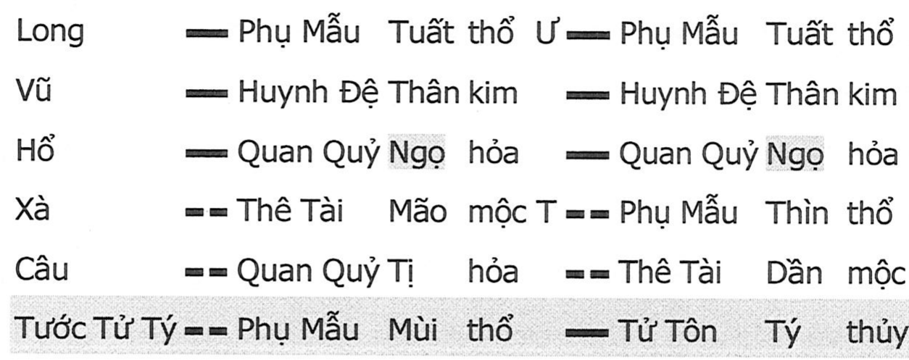

Tử Tôn Tý thủy phục tàng dưới hào sơ Phụ Mẫu Mùi thổ, Phụ Mẫu Mùi thổ đã đè Tử Tôn, là khi lát sân đã đè hồn của tiểu hài đã chết này ở phía dưới. Nhật xung Quan Quỷ Tị hỏa ám động, Nhật cũng là Tử Tôn, là hồn phách tiểu hài đang tác quái. Hào sơ hóa ra Tử Tôn Tý thủy, tiểu hài muốn ra khỏi nơi đó.

Thê Tài Mão mộc trì Thế Nguyệt phù Nhật sinh là vượng tướng, kiếm được nhiều tiền. Nhưng nhập Mộ tại độc phát, tiền khó trở về. (Thực tế phát tài chục triệu, nhưng không đòi được.)

## Anh có nhà chưa xây xong

Đây là một tình huống ở năm 2018. Một người nam đoán vận khí của mình, ở ngày Tân Mão (Tuần Không: Ngọ Mùi), tháng Dần, được Sơn Lôi Di biến Phong Lôi Ích.

| Lục thú | Phục thần | Quẻ Sơn Lôi Di | Thế/Ứng | Biến Phong Lôi Ích |
| :--- | :--- | :--- | :---: | :--- |
| Xà | | ━ Huynh Đệ Dần mộc | | ━ Huynh Đệ Mão mộc |
| Câu | Tử Tị | ╍╍ Phụ Mẫu Tý thủy | | ━ Tử Tôn Tị hỏa |
| Tước | | ╍╍ Thê Tài Tuất thổ | T | ╍╍ Thê Tài Mùi thổ |
| Long | Quan Dậu | ╍╍ Thê Tài Thìn thổ | | ╍╍ Thê Tài Thìn thổ |
| Vũ | | ╍╍ Huynh Đệ Dần mộc | | ╍╍ Huynh Đệ Dần mộc |
| Hổ | | ━ Phụ Mẫu Tý thủy | Ứ | ━ Phụ Mẫu Tý thủy |

Vận khí xem tổ hợp biến hóa của quẻ. Hào Thế lâm Chu Tước, Chu Tước là khẩu thiệt, Nhật Nguyệt khắc hào Thế, Câu Trần độc phát, độc phát chủ tính chất nguyên nhân, Câu Trần là kiến trúc, lao ngục, có tượng lao ngục. (Nghiệm, hiện tại đang điều tra anh ta.)

Phụ Mẫu lâm Câu Trần phát động, tượng tu tạo. Hóa Tị hỏa, năm Quý Tị đã trang tu nhà. Động hóa Tuyệt, nhà chưa xây dựng xong. Biểu thị khí phong thủy tán, không thu khí, đã dẫn đến xảy ra sự việc hiện tại. (Nghiệm, năm Quý Tị bắt đầu xây nhà, đến năm Mậu Tuất vẫn chưa xây xong.)

Độc phát khắc Nguyên thần hào Thế, Nguyên thần Tị hỏa phục tàng tại hào 5, hỏa là tim, tim không tốt. (Nghiệm)

Hóa giải: Một cái áo lót màu đỏ, một cái quần cộc màu đỏ. Phía Đông và Đông Bắc mỗi nơi để bảy sợi dây đỏ.

Sau một thời gian thẩm tra, cuối cùng không truy cứu.

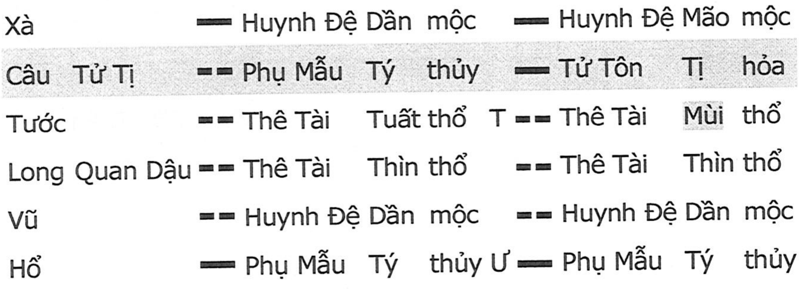

## Nền nhà bếp đã động ống dẫn

Đây là một tình huống ở năm 2017. Con gái của học trò tôi đột nhiên bị sưng chân, hỏi do nguyên nhân gì gây ra? Ở ngày Canh Tý (Tuần Không: Thìn Tị), tháng Dậu, được Thiên Địa Bĩ biến Phong Lôi Ích.

| Lục thú | Phục thần | Quẻ Thiên Địa Bĩ | Thế/Ứng | Biến Phong Lôi Ích |
| :--- | :--- | :--- | :---: | :--- |
| Xà | | ━ Phụ Mẫu Tuất thổ | Ứ | ━ Thê Tài Mão mộc |
| Câu | | ━ Huynh Đệ Thân kim | | ━ Quan Quỷ Tị hỏa |
| Tước | | ━ Quan Quỷ Ngọ hỏa | | ╍╍ Phụ Mẫu Mùi thổ |
| Long | | ╍╍ Thê Tài Mão mộc | T | ╍╍ Phụ Mẫu Thìn thổ |
| Vũ | | ╍╍ Quan Quỷ Tị hỏa | | ╍╍ Thê Tài Dần mộc |
| Hổ | Tử Tý | ╍╍ Phụ Mẫu Mùi thổ | | ━ Tử Tôn Tý thủy |

Lấy Tử Tôn làm Dụng thần. Tử Tôn Tý thủy phục tàng tại hào sơ Nguyệt sinh Nhật phù là vượng tướng, có bệnh cũng không sao.

Hào sơ Phụ Mẫu Mùi thổ lâm Bạch Hổ Đằng Xà phát động hóa Tý thủy khắc Dụng thần, hào sơ là mặt đất, thổ là thổ, Bạch Hổ là đường, Đằng Xà là thon dài, hóa thủy là có liên quan đến thủy, hào 4 Ngọ hỏa phát động hợp, hỏa là nhiệt, có liên quan đến đường ống nền nhà bếp. Nhất định là động thổ gây ra.

Quả nhiên mấy ngày trước đã khoan đường ống sưởi ở nền nhà bếp.

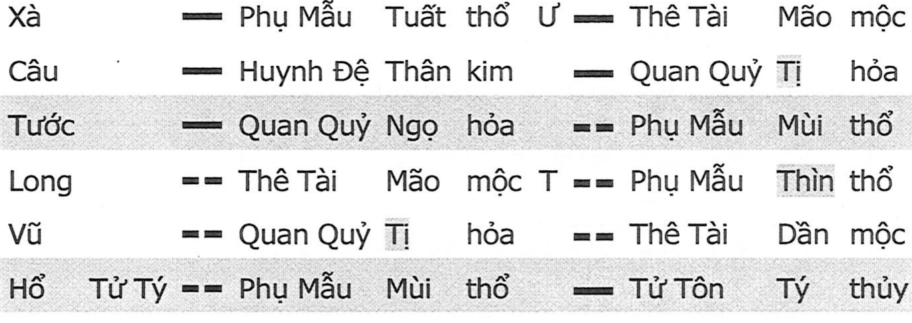

## Tượng Phật trong nhà đã ảnh hưởng đến thân thể

Đây là một hình huống ở năm 2017. Một người nữ đoán thân thể của mình, ở ngày Bính Dần (Tuần Không: Tuất Hợi), tháng Thân, được Sơn Thủy Mông biến Địa Hỏa Minh Di.

| | | | |
| --- | --- | --- | --- |
| Long | | ━ Phụ Mẫu Dần mộc | ━ ━ Thê Tài Dậu kim |
| Vũ | | ━ ━ Quan Quỷ Tý thủy | ━ ━ Quan Quỷ Hợi thủy |
| Hổ | Tài Dậu | ━ ━ Tử Tôn Tuất thổ T | ━ ━ Tử Tôn Sửu thổ |
| Xà | | ━ ━ Huynh Đệ Ngọ hỏa | ━ Quan Quỷ Hợi thủy |
| Câu | | ━ Tử Tôn Thìn thổ | ━ ━ Tử Tôn Sửu thổ |
| Tước | | ━ ━ Phụ Mẫu Dần mộc Ư | ━ Phụ Mẫu Mão mộc |

Lấy hào Thế làm Dụng thần, Nguyệt không phù Nhật khắc, thân thể tương đối nhược.

Quẻ cung Ly, Ly là tim, mắt, Mông là mông đồng (hồ đồ, lờ mờ), quẻ biến Minh Di, tượng mất ánh sáng, hào Thế Không Vong không được hỏa đến sinh, lâm Bạch Hổ là máu, tim cung máu không tốt. (Nghiệm, tim khó chịu, mắt phải mờ.)

Hào 6 hào sơ phát động khắc hào Thế, hào 6 là đầu, tay, hào sơ là chân, tứ chi không tốt. (Nghiệm, cánh tay phải khó chịu, đầu gối đau.)

Kỵ thần mặc dù Nguyệt phá, nhưng Nhật lại thực phá, hào sơ Kỵ thần hóa Tiến thần, xu hướng phát triển của sức khỏe không tốt. Mặc dù Nguyên thần phát động, nhưng Nguyên thần hóa Không Vong, hóa hồi đầu khắc, tim là vấn đề lớn nhất. Hào Thế Tuất thổ phản quái là Càn, Càn là đầu, có điềm nhồi máu não. (Bản thân đang lo lắng về điều này.)

Nguyên thần Ngọ hỏa hóa Quan Quỷ, lại thêm hào 6 thần Phật vị lâm Thanh Long Dần mộc, Phụ Mẫu là cái che chở ta, phù hộ ta, khắc hào Thế, phía Nam hoặc Đông Bắc trong nhà có tượng thần Phật đã ảnh hưởng đến thân thể. (Nghiệm, phía Nam có Phật Dược Sư.)

Hóa giải: Đưa Phật Dược Sư đến tự viện.

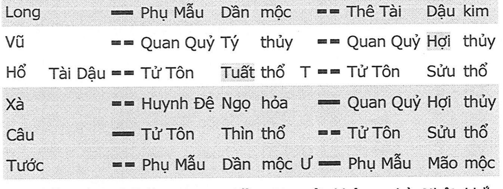

**Quan Quỷ:** Thể hiện chồng, đàn ông, công danh, quyền lợi, quản lý, thứ bậc, tên, quan phủ, công an, kiện cáo, nhà nước, ngành tư pháp, lãnh đạo thượng cấp, sấm sét, sương mù, khói, quỷ thần, đạo tặc, kẻ xấu, tù trốn trại, loạn đảng, tai họa, ưu sầu, chức tước, công tác, lên lớp, nghề nghiệp, chủ nhân, bệnh tật, thi thể, người chết, bộ phận phát sinh bệnh, virus, tạp niệm, phiền não v.v.

**Quan Quỷ tại hào 6:** Thường chủ thần Phật, hồn ma, tử thi, xương khô, A tu la, không được trọng dụng, công việc nhàn hạ, hậu cần, thoái hưu, lui về tuyến hai, cán bộ thoái hưu, bệnh tật phần đầu, tổ tiên, Phật đường, từ đường, tự viện v.v.

**Quan Quỷ tại hào 5:** Thường chủ lãnh đạo, cương vị trọng yếu, quan chức, tượng thần Phật, nhân viên công vụ, thô bạo, thanh danh bay xa, quản lý, người phụ trách, chủ nghĩa nam tử hán, địa vị hiển hách, bệnh ngũ quan, bệnh tật phần ngực v.v.

**Quan Quỷ tại hào 4:** Thường chủ công tác nhân sự, ngành quản lý, thư ký, người cấp phó, phòng khách, nhà vệ sinh, môn thần (tranh hộ pháp dán trên cánh cửa), hộ pháp, công việc gác cổng, công việc bảo vệ an ninh, bệnh phổi, bệnh tim, bệnh vú, bệnh dạ dày v.v.

**Quan Quỷ tại hào 3:** Thường chủ Phật đường, môn thần, người gác cổng, phòng bảo vệ, trưởng phòng, kế toán, ngủ không tốt, thắt lưng đau, bệnh thận, bệnh dạ dày, bệnh phụ khoa v.v.

**Quan Quỷ tại hào 2:** Thường chủ chồng, công việc văn phòng, nhân viên công vụ, bệnh ruột, bệnh chân, bệnh gan mật, bệnh hệ sinh dục v.v.

**Quan Quỷ tại hào sơ:** Thường chủ xương khô, công việc cơ sở, nhân viên bình thường, thổ công, cước khí, bệnh chai chân v.v.

**Quan Quỷ lâm thổ:** Thường chủ thổ công, Địa Tạng Vương, miếu thành hoàng, quản lý đất đai, kiến trúc xây dựng tạm thời, kiến trúc đơn giản, bệnh dịch, bệnh tỳ vị, bệnh ngoài da, bệnh tuyến giáp trạng v.v.

**Quan Quỷ lâm kim:** Thường chủ binh lính, quân cảnh, công tác quân đội, phát thanh viên, ca sĩ, công nhân sắt thép, nhân viên khí giới, công việc tiện, tượng thần Phật bằng đồng, tượng thần Phật tạc bằng đá, tượng Quan Công, xương khô, bia mộ, bệnh phổi, bệnh hệ hô hấp, bệnh ruột, bệnh xương v.v.

**Quan Quỷ lâm mộc:** Thường chủ công việc lâm nghiệp, công việc lâm viên, thợ mộc, công việc viện nông khoa, công việc nhà máy gỗ, nhân viên bảo vệ rừng, công nhân nhà in, tượng thần Phật

---

# Part 4 (Pages 61-80)

tạc bằng gỗ, tranh vẽ thần Phật, miếu hỏa thần, bệnh gan mật, bệnh ruột, bệnh tứ chi v.v.

**Quan Quỷ lâm hỏa:** Thường chủ công việc nhà máy luyện kim, công việc nhà máy sản xuất đèn, thợ điện, công việc nhà máy điện, công việc cục cung cấp điện, công việc nhà bếp, thợ rèn, công việc nung, công việc văn tự, công việc nhảy múa, bệnh tim, bệnh mắt, bệnh ruột v.v.

**Quan Quỷ lâm thủy:** Thường chủ công việc có tính lưu động, công việc thủy sản, công việc phục vụ ăn uống, công việc cấp nước, Long Vương, Quan Âm Bồ Tát, bệnh thận, tiểu đường, bệnh tuyến tiền liệt, tiểu nhiều lần, chứng tăng urê máu v.v.

**Quan Quỷ lâm Thanh Long:** Thường chủ nhân viên công vụ, chức vụ cao cấp, tửu sắc chi đồ (người trầm mê rượu thịt và nữ sắc), thần Phật, công việc phục vụ ăn uống, công việc hậu cần, đầu bếp, công việc danh giá, quản lý cao cấp, tiểu đường, bệnh nhà giàu, bệnh tửu sắc, bệnh hậu sản, bệnh về phương diện ẩm thực v.v.

**Quan Quỷ lâm Chu Tước:** Thường chủ giáo sư, phiên dịch, luật sư, ca sĩ, phát thanh viên, công việc văn tự, biên tập, tác giả, công việc nhà xuất bản, bên trung gian, chứng viêm, bệnh nhiệt, sốt, ho, quan ti khẩu thiệt v.v.

**Quan Quỷ lâm Câu Trần:** Thường chủ công việc văn phòng, nhân viên công vụ, công việc về phương diện đất đai, công việc hương trấn, công việc cơ quan đơn vị, công việc về phương diện nông nghiệp, công việc bất động sản, ung thư, khối u, u nang, tu tạo xảy ra vấn đề v.v.

**Quan Quỷ lâm Đằng Xà:** Thường chủ công việc bất an đa biến, công việc về phương diện nghệ thuật, quỷ quái, yêu quái, âm tà, linh dị, ác mộng, bệnh ruột, quái bệnh v.v.

**Quan Quỷ lâm Bạch Hổ:** Thường chủ công việc về phương diện pháp luật, làm về ngành công kiểm pháp, quân cảnh, công an, cảnh sát giao thông, công việc y tế, phẫu thuật, gãy xương, bệnh máu, xa họa, bị thương, tai nạn đổ máu v.v.

**Quan Quỷ lâm Huyền Vũ:** Thường chủ công việc bảo mật, công việc dưới đất, công việc hộp đêm, trực ban ban đêm, bệnh vùng kín, lở loét, chứng hàn, bệnh hệ tiết niệu, trầm cảm, âm tà, tà khí, tà linh, nhà vệ sinh, hầm nước hồ nước v.v gây nên vấn đề v.v.

## Do đào giếng gây ra

Đây là quẻ của một đồng hương đã hỏi tôi vào năm 2018, bà nội (86 tuổi) khoang ngực tích dịch, bệnh viện không cho đi thăm bệnh, đoán do nguyên nhân gì gây ra? Ở ngày Canh Dần (Tuần Không: Ngọ Mùi), tháng Thân, được Địa Thủy Sư biến Khôn Vi Địa.

| Lục thú | Quẻ Địa Thủy Sư | Thế/Ứng | Biến Khôn Vi Địa |
| :--- | :--- | :---: | :--- |
| Xà | ╍╍ Phụ Mẫu Dậu kim | Ứ | ╍╍ Phụ Mẫu Dậu kim |
| Câu | ╍╍ Huynh Đệ Hợi thủy | | ╍╍ Huynh Đệ Hợi thủy |
| Tước | ╍╍ Quan Quỷ Sửu thổ | | ╍╍ Quan Quỷ Sửu thổ |
| Long | ╍╍ Thê Tài Ngọ hỏa | T | ╍╍ Tử Tôn Mão mộc |
| Vũ | ━ Quan Quỷ Thìn thổ | | ╍╍ Thê Tài Tị hỏa |
| Hổ | ╍╍ Tử Tôn Dần mộc | | ╍╍ Quan Quỷ Mùi thổ |

Lấy Phụ Mẫu làm Dụng thần. Phụ Mẫu Dậu kim Nguyệt phù Nhật không khắc là vượng tướng, độc phát sinh hợp Dụng thần có bệnh cũng không sao. Thìn thổ thủy khố độc phát hóa Kỵ thần là nguyên nhân. Hào 2 là trạch, lâm Huyền Vũ là thủy, Thìn thổ là thủy khố, trong sân nhất định đã đào giếng, hoặc đào hố tụ nước.

Quả nhiên, nửa tháng gần đây đã tu tạo trong sân, đã đào một cái giếng nước sâu ba mét ở hướng Đông Nam.

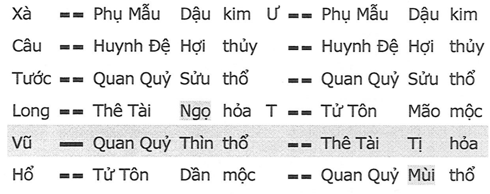

## Nhà anh đã phá đại môn và xây lại

Hai vợ chồng đang kinh doanh ở Thái Nguyên Phục Trang Thành cùng đến đoán tình hình tài vận. Tôi đã lấy đồng xu lục hào thông báo mời người khách nam gieo quẻ, ở ngày Canh Thìn (Tuần Không: Thân Dậu), tháng Thìn, được Thủy Hỏa Ký Tế biến Địa Sơn Khiêm.

| Lục thú | Phục thần | Thủy Hỏa Ký Tế | Thế Ứng | Biến | Địa Sơn Khiêm |
| :--- | :--- | :--- | :---: | :---: | :--- |
| Xà | | == Huynh Đệ Tý thủy | Ứ | == | Phụ Mẫu Dậu kim |
| Câu | | — Quan Quỷ Tuất thổ | | == | Huynh Đệ Hợi thủy |
| Tước | | == Phụ Mẫu Thân kim | | == | Quan Quỷ Sửu thổ |
| Long | Tài Ngọ | — Huynh Đệ Hợi thủy | T | — | Phụ Mẫu Thân kim |
| Vũ | | == Quan Quỷ Sửu thổ | | == | Thê Tài Ngọ hỏa |
| Hổ | | — Tử Tôn Mão mộc | | == | Quan Quỷ Thìn thổ |

Lấy Thê Tài làm Dụng thần. Thê Tài Ngọ hỏa bất thượng quái, phục tàng dưới hào 3 Huynh Đệ Hợi thủy, Nhật Nguyệt không phù là hưu tù, trong quẻ Tử Tôn Mão mộc mặc dù phát động đến sinh, nhưng bị Quan Quỷ Tuất thổ hợp, tham hợp quên sinh, Tuất thổ lại khiến Thê Tài nhập Mộ, lại là Huynh Đệ trì Thế, chủ tài vận không tốt.

Nhật Nguyệt không phù Thê Tài, đã hiển thị tài vận không tốt, tại sao còn có hai hào động biểu thị lần nữa? Nhất định là biểu đạt nguyên nhân.

Hào sơ là nền nhà, mộc hóa thổ, chủ xây dựng công trình, Mão mộc đối ứng năm 2011, đoán anh ta đã xây nhà ở năm 2011. (Nghiệm, đã xây một căn nhà.)

Hào 5 Tuất thổ lâm Câu Trần phát động, Câu Trần chủ điền thổ, kiến trúc, chủ đã động thổ, bị Nguyệt xung phá, chủ đã phá bỏ, Mão mộc phát động lại hợp, giải phá, rõ ràng là phá bỏ rồi xây lại, tại ngoại quái, lâm hào 5, hào 5 là đường, đường không phải của mình, không thể phá đường, đó là đại môn dẫn ra đường lớn. Nguyệt phá ứng xung phá, nhất định ở năm 2012. (Nghiệm, bởi vì đại môn hẹp khiến xe không vào được, đã phá bỏ một bộ phận.)

Từ đó tài vận bắt đầu xuống dốc, năm 2013 xung Phi thần Thê Tài, phù Thê Tài, năm 2014 Thê Tài Ngọ hỏa phục tàng xuất hiện, tài vận vẫn không quá tệ, miễn cưỡng duy trì. (Nghiệm)

Nhưng đến năm 2015 Thê Tài phục tàng bị hợp, Tử Tôn nhập Mộ, năm 2016 Tử Tôn bị khắc, Huynh Đệ được vượng bất lợi, liên

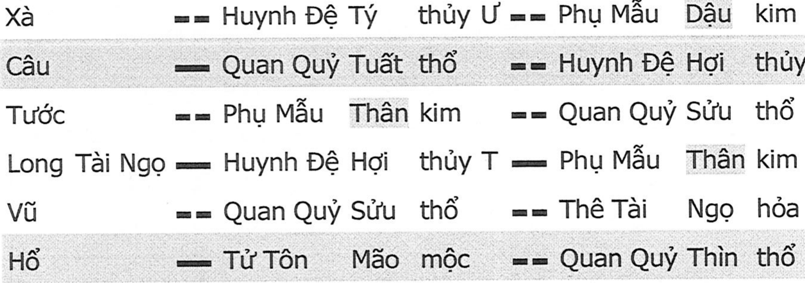 tục cho đến bây giờ, tài vận đi vào thung lũng, việc kinh doanh rất không tốt. (Nghiệm)

Quan Quỷ khắc hào Thế, không những tài vận không tốt mà còn có nhiều sự việc phiền tâm, phiền não, nếu cứ tiếp tục như vậy thì trong vài năm tới cũng khó trở mình.

## Trên đường ống có lỗ

Đây là một tình huống ở năm 2007. Lý mỗ, nam, là thư ký của một phó tỉnh trưởng, vừa mới được phân đến một căn phòng, đoán ngày chuyển nhà, ở ngày Mậu Tý (Tuần Không: Ngọ Mùi), tháng Dần, được Thủy Phong Tỉnh biến Trạch Phong Đại Quá.

| Lục thú | Phục thần | Thủy Phong Tỉnh | Thế Ứng | Trạch Phong Đại Quá |
| :--- | :--- | :--- | :---: | :--- |
| Tước | | - - Phụ Mẫu Tý thủy | | - - Thê Tài Mùi thổ |
| Long | | — Thê Tài Tuất thổ | T | — Quan Quỷ Dậu kim |
| Vũ | Tử Ngọ | - - Quan Quỷ Thân kim | | — Phụ Mẫu Hợi thủy |
| Hổ | | — Quan Quỷ Dậu kim | | — Quan Quỷ Dậu kim |
| Xà | Huynh Dần | — Phụ Mẫu Hợi thủy | Ứ | — Phụ Mẫu Hợi thủy |
| Câu | | - - Thê Tài Sửu thổ | | - - Thê Tài Sửu thổ |

Người quan chức đoán ngày chuyển nhà, Quan Quỷ quan trọng nhất. Quan Quỷ Thân kim độc phát lâm Huyền Vũ hóa Phụ Mẫu Hợi thủy là mấu chốt. Quẻ này Quan Quỷ Thân kim Nguyệt không phù, bị Nguyệt xung phá, chủ trạch này bất lợi cho thăng chức. (Nghiệm, ban đầu trạch này là nơi ở của một thư ký khác, đã ở mười năm không có thăng chức, năm Bính Tuất mới chuyển ra ngoài thì được thăng chức, cũng bởi vì người ta chuyển ra ngoài, mới phân cho mình.)

Quan Quỷ Thân kim Nguyệt phá, Thân kim là Trường Sinh của thủy, lại hóa Hợi thủy chính là đường ống dẫn nước, lâm Huyền Vũ, Huyền Vũ chủ bẩn thỉu, Quan Quỷ Huyền Vũ tại hào 4 có thể là nhà vệ sinh. Nguyệt phá chính là nhà vệ sinh có ống nước đã vỡ, nứt. (Nghiệm, nhà vệ sinh có ống nước bị nứt, bản thân đã dùng lá sắt vá lên khi trang tu nhà.)

Quan Quỷ độc phát hóa quẻ du hồn, chủ công tác sẽ biến động. Hóa Hợi thủy, Hợi thủy phản quái là Càn, Càn là lãnh đạo, chủ công tác của lãnh đạo biến động khiến mình cũng động theo. Thời gian tại tháng Thân, hoặc tháng Hợi. (Nghiệm, trước mắt thì phó thống đốc không có thông tin sắp động. Sau ở tháng Hợi đã theo lãnh đạo điều đến Bắc Kinh.)

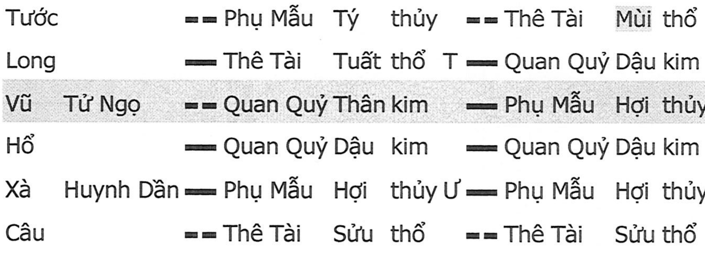

Lúc đó chọn ngày chuyển nhà là ngày Thân, đồng thời cũng tiến hành hóa giải. Đặt một dây xích sắt và chín viên đá nhỏ ở Tây Nam.

## Gần đây đã động tượng Phật

Đây là một tình huống ở năm 2017. Một người nữ (sinh năm Ất Sửu), đoán phong thủy nơi ở. Ở ngày Ất Dậu (Tuần Không: Ngọ Mùi), tháng Ngọ, được Phong Trạch Trung Phu biến Thủy Hỏa Ký Tế.

| Lục thú | Phục thần | Phong Trạch Trung Phu | Thủy Hỏa Ký Tế |
| --- | --- | --- | --- |
| Vũ | | ━ Quan Quỷ Mão mộc | ⚋ Thê Tài Tý thủy |
| Hổ | Tài Tý | ━ Phụ Mẫu Tị hỏa | ━ Huynh Đệ Tuất thổ |
| Xà | | ⚋ Huynh Đệ Mùi thổ T | ⚋ Tử Tôn Thân kim |
| Câu | Tử Thân | ⚋ Huynh Đệ Sửu thổ | ━ Thê Tài Hợi thủy |
| Tước | | ━ Quan Quỷ Mão mộc | ⚋ Huynh Đệ Sửu thổ |
| Long | | ━ Phụ Mẫu Tị hỏa Ứ | ━ Quan Quỷ Mão mộc |

Hào Thế là bản thân. Không Vong, chủ trạch này khiến chị tâm trạng bất an. (Nghiệm)

Hào Thế Nguyệt sinh Nhật không khắc, mặc dù vượng tướng, nhưng trong quẻ hai Quan Quỷ phát động khắc hào Thế, trạch này bất lợi. Hào 6 Quan Quỷ là thần Phật, trong nhà có tượng Phật. Phát động khắc hào Thế, Nhật xung, xung cũng là thúc đẩy, gần đây đã động tượng Phật. (Nghiệm, ban đầu tượng Phật ở Tây Bắc, gần đây đã dời đến phía Đông.)

Hào 2 là trạch, là nhà bếp, lâm Chu Tước có liên quan đến hỏa là nhà bếp, nhà bếp bất lợi cho thân thể. (Nghiệm, nhà bếp ở phía Đông, bản thân sống ở tầng hai, vị trí tương ứng dưới tầng một chính là nhà bếp.)

Hào 3 Mộ khố Tử Tôn xung hào Thế, hào 3 là tử cung, Mộ khố Tử Tôn cũng là tử cung, hào 2 là tử cung, Thai địa Tử Tôn Mão mộc hóa Sửu thổ khắc hào Thế, Câu Trần là khối u, phụ khoa không tốt, nhất định sẽ có các bệnh như u xơ tử cung hoặc u nang buồng trứng. (Nghiệm, là ống dẫn trứng có khối u.)

Hào 6 Mão mộc là Tử địa Thê Tài, Huynh Đệ phát động khắc Thê Tài, Huynh Đệ trì Thế bất lợi tài. Hào 6 là tường, hóa phá là nứt, tường trong nhà không tốt, bị nứt, ảnh hưởng đến tài vận. (Nghiệm, tường ở phía Bắc đã bị nứt.)

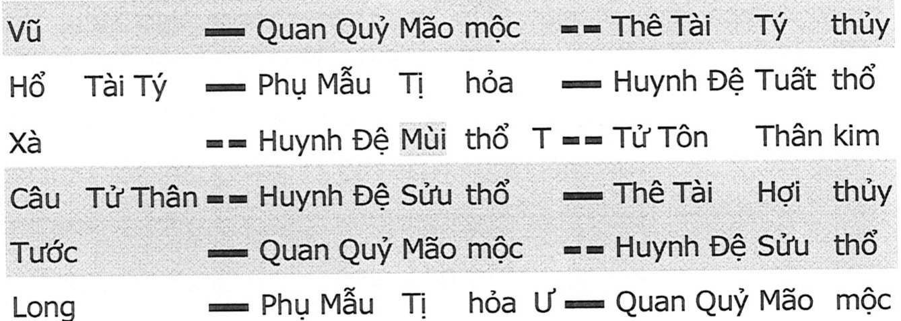

Hào sơ Tị hỏa là Nguyên thần hào Thế, chuyển đến căn phòng ở hướng Đông Nam sẽ có lợi cho sức khỏe. Sau đó đã chuyển phòng ở ngày Dậu. Trước đây trắng đen lẫn lộn, ban đêm không ngủ, sáng sớm không dậy nổi, sau khi chuyển phòng, sinh hoạt đã đúng giờ, thân thể dần dần hồi phục.

## Cúng Phật đã cúng sai

Đây là một tình huống ở năm 2019. Một người nữ răng không tốt, dự định đi khám răng, muốn nhanh khỏi, đã cúng tượng Phật để phù hộ cho mình, kết quả, một năm sau đó, chẳng những răng không khỏi, trái lại trong khoang miệng đã mọc ra khối u, đoán có phải là do tượng Phật hay không? Ở ngày Tân Dậu (Tuần Không: Tý Sửu), tháng Đinh Sửu, được Thủy Hỏa Ký Tế biến Địa Hỏa Minh Di.

| Lục thú | Phục thần | Thủy Hỏa Ký Tế | Thế Ứng | Địa Hỏa Minh Di |
| :--- | :--- | :--- | :---: | :--- |
| Xà | | - - Huynh Đệ Tý thủy | Ứ | - - Phụ Mẫu Dậu kim |
| Câu | | — Quan Quỷ Tuất thổ | | - - Huynh Đệ Hợi thủy |
| Tước | | - - Phụ Mẫu Thân kim | | - - Quan Quỷ Sửu thổ |
| Long | Tài Ngọ | — Huynh Đệ Hợi thủy | T | — Huynh Đệ Hợi thủy |
| Vũ | | - - Quan Quỷ Sửu thổ | | - - Quan Quỷ Sửu thổ |
| Hổ | | — Tử Tôn Mão mộc | | — Tử Tôn Mão mộc |

Lấy hào Thế làm Dụng thần, xem tổ hợp biến hóa của quẻ, xem ảnh hưởng của Quan Quỷ đối với hào Thế.

Hào Thế là mình, Nguyệt khắc Nhật sinh suy vượng tương đương. Hào 5 Quan Quỷ Tuất thổ độc phát hóa Hợi thủy khắc hào Thế, hào 5 là tôn vị, Quan Quỷ là Phật, Tuất Hợi phản quái là Càn cũng là Phật, hiển nhiên là tượng Phật gây ra bất lợi.

Quan Quỷ là bệnh, lâm Câu Trần là khối u, hóa Hợi thủy, thuyết minh bổ sung, thủy tại hào 5 là khoang miệng, chính là trong khoang miệng đã mọc ra u nhọt.

Một Quan Quỷ khác là Sửu thổ là Nguyệt kiến nhập quẻ tại hào 2, cũng khắc hào Thế, mà hào 3 là tử cung, Huynh Đệ Hợi thủy là Trường Sinh của Tử Tôn cũng có thể lý giải là tử cung, căn cứ di thần biện hào cũng lâm Câu Trần, vậy thì sẽ có u xơ tử cung. (Nghiệm)

Thế thân hào Thế Tý thủy tại hào 6 bị Quan Quỷ Tuất thổ khắc, hào 6 là đầu, Tuất Hợi phản quái là Càn là đầu, Đằng Xà là quên, Tý là trí tuệ, chủ ký ức, Không Vong chủ đầu óc trống rỗng, hóa du hồn là quên, giảm trí nhớ. (Nghiệm)

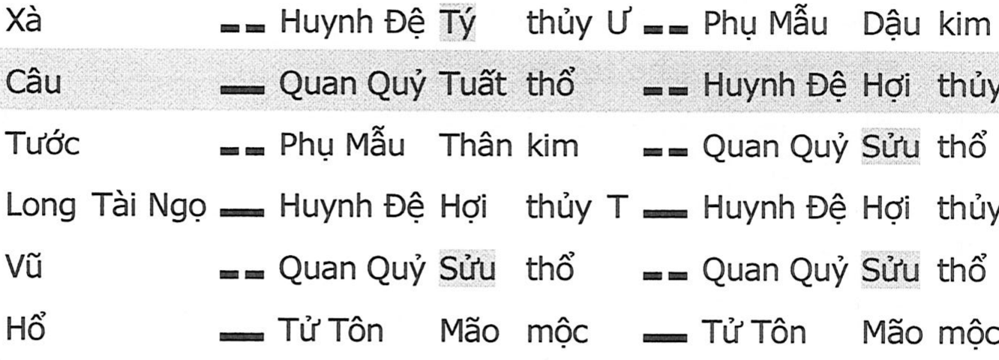

Hào 5 là đường, Câu Trần là gồ lên, đường gồ lên chính là sườn dốc, Tuất Hợi là Tây Bắc, chủ Tây Bắc có sườn dốc. (Nghiệm)

Hào 5 Tuất thổ lâm Câu Trần phát động, hào 5 là đường, Câu Trần thổ phát động là động thổ, trên đường có công trình, sửa đường. (Nghiệm, đường hai làn được sửa thành đường bốn làn.)

Hào sơ Tử Tôn Mão mộc lâm Bạch Hổ ám động hợp Tuất thổ, Tuất thổ cũng hợp Mão mộc, hào sơ là chân, Bạch Hổ là đường, đến khắc hào Thế, hiện nay bởi vì sửa đường, ra vào bất tiện. (Nghiệm)

Hào 2 Quan Quỷ Sửu thổ lâm Huyền Vũ Không Vong, hào 2 là trạch, Huyền Vũ là thủy, Không Vong thì rỉ nước. Nhật là Mộc Dục địa, chính là nơi tắm rửa, phòng tắm. (Nghiệm, cống thoát nước không thông, khi dùng thì nước chảy lung tung.)

Hóa giải: Cần phải đưa tượng Phật vào trong tự viện.

## Nhà có năm pho tượng Phật

Đây là một tình huống ở năm 2018. Một người nữ, bởi vì tài vận không tốt, đoán có phải trong nhà có vật gì ảnh hưởng hay không? Ở ngày Đinh Tị (Tuần Không: Tý Sửu), tháng Tị, được Lôi Sơn Tiểu Quá biến Ly Vi Hỏa.

| Lục Thú | Phục Thần | Lôi Sơn Tiểu Quá | Ly Vi Hỏa |
| :--- | :--- | :--- | :--- |
| Long | | - - Phụ Mẫu Tuất thổ | — Quan Quỷ Tị hỏa |
| Vũ | | - - Huynh Đệ Thân kim | - - Phụ Mẫu Mùi thổ |
| Hổ | Tử Hợi | — Quan Quỷ Ngọ hỏa T | — Huynh Đệ Dậu kim |
| Xà | | — Huynh Đệ Thân kim | — Tử Tôn Hợi thủy |
| Câu | Tài Mão | - - Quan Quỷ Ngọ hỏa | - - Phụ Mẫu Sửu thổ |
| Tước | | - - Phụ Mẫu Thìn thổ Ứ | — Thê Tài Mão mộc |

Lấy Thê Tài làm Dụng thần, xem tổ hợp biến hóa của quẻ. Thê Tài Mão mộc phục tàng tại hào 2, bị Quan Quỷ Ngọ hỏa đè nén, Nhật Nguyệt không phù hưu tù không thể sinh hào Thế, lại thêm Quan Quỷ lâm Nguyệt xung phá Tử Tôn là Nguyên thần Thê Tài, do đó tài vận không tốt. Nhật Nguyệt là Quan Quỷ, trong quẻ Quan Quỷ lưỡng hiện, hào 6 lại hóa Quan Quỷ, Quan Quỷ nhập Mộ tại hào 6, hào 6 là thần Phật, Mộ khố Quan Quỷ là am thờ Phật, Nhật Nguyệt và trong quẻ gồm có năm Quan Quỷ, đoán trong nhà có năm pho tượng Phật, long đa bất trị thủy, tượng Phật quá nhiều.

Cô ấy nói trong nhà có bốn pho tượng Phật, không phải là năm. Tôi nói Quan Quỷ Tị hỏa hóa ra, không ở trong tầm mắt, tìm

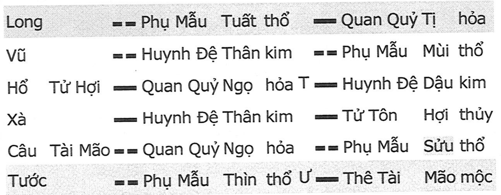 lại thử xem. Sau đó ở ngày Quý Hợi đã tìm được một pho tượng khác, quả nhiên có năm pho tượng Phật.

Hào sơ Thìn thổ phát động hóa Thê Tài, Thìn thổ là thủy khố, lâm Chu Tước là nhiệt, hóa Thê Tài là ẩm thực, trong nhà có máy nước nóng. Tuất thổ hợp Thê Tài Mão mộc, lâm Thanh Long cũng chủ ẩm thực, hào biến của hào sơ Thìn thổ hợp với Tuất thổ, khi quẻ dùng Tuất thổ biểu đạt am thờ Phật, không thể biểu đạt ý nghĩa khác nữa, thì dùng biến hóa của Thìn thổ để thay thế, nhưng Thìn thổ lại không thể hiện Tây Bắc, do đó dùng hình thức tổ hợp này để biểu đạt Tây Bắc có máy nước nóng.

Quả nhiên, ở Tây Bắc có máy nước nóng. Đây cũng là ý nghĩa hỏa đốt Càn kim.

**Huynh Đệ:** Thể hiện huynh đệ, tỉ muội, bằng hữu, đồng nghiệp, trở ngại, cạnh tranh, phá tài, phá hao, gió mây, môn hộ, nhà vệ sinh, tường, tham tài, bài bạc, cướp đoạt, tranh đoạt, tay, chân, răng, dạ dày, vai, bàng quang, ăn uống không vào, rối loạn tiêu hóa v.v.

**Huynh Đệ tại hào 6:** Thường chủ tay, huynh đệ bằng hữu quan hệ không thân, bằng hữu phương xa, huynh đệ tỉ muội mỗi người một phương, đối tác cũ, tường bao, vách tường, răng, khoang miệng, vai, cho vay v.v.

**Huynh Đệ tại hào 5:** Thường chủ anh trai chị gái, bạn bè có địa vị, bạn bè quan trọng nhất, huynh đệ tỉ muội làm quan, bạn bè có quyền, đối thủ cạnh tranh chính, đối thủ cạnh tranh có thế lực lớn, răng, vai v.v.

**Huynh Đệ tại hào 4:** Thường chủ anh con chú bác, chị bà con, vai, bệnh dạ dày, bệnh phổi v.v.

**Huynh Đệ tại hào 3:** Thường chủ huynh đệ tỉ muội, bệnh bàng quang, bệnh gan mật, đầu gối đau nhức, bệnh dạ dày v.v.

**Huynh Đệ tại hào 2:** Thường chủ bạn bè quan hệ gần, trong nhà phá tài, bệnh chân, bệnh ruột, bệnh về bộ phận sinh dục, bệnh tử cung v.v.

**Huynh Đệ tại hào sơ:** Thường chủ bệnh chân, bạn bè lúc nhỏ, trở lực đến từ thuộc hạ v.v.

**Huynh Đệ lâm thổ:** Thường chủ vách tường, tường bao, hố đất, hang đất, ổ gà, chuồng chó, hươu đỏ, chuồng bò v.v.

**Huynh Đệ lâm kim:** Thường chủ đá, đồ sắt, máy nghiền, máy xay bột, búa, kéo, bạn bè có nghĩa khí, bệnh răng v.v.

**Huynh Đệ lâm mộc:** Thường chủ bạn bè tính toán nhiều, cỏ dại, thực vật hoang dại, cây nhỏ, khúc gỗ v.v.

**Huynh Đệ lâm hỏa:** Thường chủ bạn bè nóng tính, cửa sổ, phá tài vì hỏa tai v.v.

**Huynh Đệ lâm thủy:** Thường chủ bệnh hệ tiết niệu, bệnh tật khoang miệng, thủy tinh, cửa sổ, phá tài vì thủy tai v.v.

**Huynh Đệ lâm Thanh Long:** Thường chủ bạn bè thân thích, bạn rượu thịt, bạn bè có địa vị, bạn bè có tiền, phá tài vì tửu sắc, bị bệnh vì ăn uống v.v.

**Huynh Đệ lâm Chu Tước:** Thường chủ khẩu thiệt, huynh đệ tỉ muội bất hòa.

**Huynh Đệ lâm Câu Trần:** Thường chủ cho vay, bạn cũ, hoặc phá tài vì điền sản.

**Huynh Đệ lâm Đằng Xà:** Thường chủ bị người lừa tiền, bị người quấy rầy, bạn bè giả dối v.v.

**Huynh Đệ lâm Bạch Hổ:** Thường chủ phá tài vì bệnh, phá tài vì ẩu đả, đi lính, tuyển thủ, đàn áp quyền lợi v.v.

**Huynh Đệ lâm Huyền Vũ:** Thường chủ lừa gạt, bài bạc, mua bán cổ phiếu phá tài, đầu cơ phá tài v.v.

## Chuyển nhà đã ảnh hưởng đến tài vận

Đây là một tình huống ở năm 2016. Một người nam (sinh năm Canh Tý) đoán tình hình tài vận. Ở ngày Ất Mão (Tuần Không: Tý Sửu), tháng Mùi, được Trạch Sơn Hàm biến Trạch Địa Tụy.

| Lục Thú | Phục Thần | Trạch Sơn Hàm | Trạch Địa Tụy |
| :--- | :--- | :--- | :--- |
| Vũ | | - - Phụ Mẫu Mùi thổ Ứ | - - Phụ Mẫu Mùi thổ |
| Hổ | | — Huynh Đệ Dậu kim | — Huynh Đệ Dậu kim |
| Xà | | — Tử Tôn Hợi thủy | — Tử Tôn Hợi thủy |
| Câu | | — Huynh Đệ Thân kim T | - - Thê Tài Mão mộc |
| Tước | Tài Mão | - - Quan Quỷ Ngọ hỏa | - - Quan Quỷ Tị hỏa |
| Long | | - - Phụ Mẫu Thìn thổ | - - Phụ Mẫu Mùi thổ |

Lấy Thê Tài làm Dụng thần. Thê Tài Mão mộc phục tàng dưới hào 2, Nguyệt không khắc, Nhật phù, là vượng tướng. Năm Ất Dậu xung xuất Thê Tài phục tàng, năm Mậu Tý xung khai Phi thần, hai năm này đã phát tài. (Nghiệm)

Hào Thế Huynh Đệ phát động, hào 5 Huynh Đệ Dậu kim ám động, biểu thị lực lượng của Nhật phù Thê Tài giảm thiểu, trước mắt tài vận không tốt. (Nghiệm)

Huynh Đệ phát động khắc Thê Tài hóa Thê Tài, chủ tài đến tài đi. Lâm Câu Trần hóa Thê Tài, chủ xoay vòng nhờ vào vay mượn. Hào 5 Huynh Đệ ám động, nợ nần chồng chất. (Nghiệm, nợ hàng chục triệu.)

Hào Thế lâm Câu Trần phát động, hào Thế là nơi mình ở, Câu Trần chủ kiến trúc, phát động chủ chuyển nhà, từ sau khi chuyển nhà, vận khí bắt đầu suy giảm. (Nghiệm, sau khi chuyển nhà năm 09, chưa bao giờ sống dễ chịu.)

Thê Tài phục tàng dưới hào 2, bị Ngọ hỏa đè nén, lại là hào Câu Trần khắc Thê Tài, chủ phong thủy bất lợi, cần điều chỉnh phong thủy mới có khả năng biến đổi, nếu không thì kiếp này khó mà có ngày trở mình.

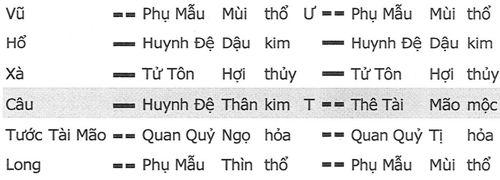

## Anh đã tham dự lễ tang của bằng hữu

Đây là một tình huống ở năm 2014. Một người nữ dự đoán thân thể của mình, ở ngày Quý Mùi (Tuần Không: Thân Dậu), tháng Đinh Mão, được Thủy Trạch Tiết biến Phong Trạch Trung Phu.

| Lục thú | Quẻ Thủy Trạch Tiết | | | Quẻ Phong Trạch Trung Phu | |
| :--- | :---: | :--- | :---: | :---: | :--- |
| Hổ | - - | Huynh Đệ Tý thủy | | — | Tử Tôn Mão mộc |
| Xà | — | Quan Quỷ Tuất thổ | | — | Thê Tài Tị hỏa |
| Câu | - - | Phụ Mẫu Thân kim | Ư | - - | Quan Quỷ Mùi thổ |
| Tước | - - | Quan Quỷ Sửu thổ | | - - | Quan Quỷ Sửu thổ |
| Long | — | Tử Tôn Mão mộc | | — | Tử Tôn Mão mộc |
| Vũ | — | Thê Tài Tị hỏa | T | — | Thê Tài Tị hỏa |

Lấy hào Thế làm Dụng thần. Quẻ lục hợp, nếu Dụng thần vượng tướng, chủ khí huyết bình hòa, nay Dụng thần bị khắc, chủ khí huyết chậm chạp. Nguyên thần chủ tinh thần của con người, nhập Mộ tại Nhật, không thể sinh hào Thế, chủ thiếu tinh thần, bộ dạng uể oải. Thủy chủ hàn, hào Thế lâm Huyền Vũ cũng chủ hàn, hỏa bị khắc, chủ tân trần đại tạ (sự trao đổi chất) không tốt (tư duy này cần kết hợp Trung y), Nguyên thần Mão mộc nhập Mộ tại Nhật, bị cản trở sinh hào Thế, không thể sinh hỏa, dễ sinh ra thịt, cái gọi là bụng bia chính là nguyên lý này. (Phán đoán này cũng đã được kết hợp với ngoại hình béo phì của người đến)

Hỏa chủ mắt, Huyền Vũ chủ tối tăm, bị thủy khắc, chủ mắt không tốt. (Đáp: Đã đau mắt vài tháng.)

Hào độc phát chính là huyền cơ, chính là nguyên nhân. Độc phát xem lưu hướng của ngũ hành, Tý thủy là Kỵ thần hợp Sửu thổ, Sửu thổ lại Nhật xung, Quỷ là bệnh, bệnh đang bắt đầu nảy sinh, Kỵ thần hợp xứ bệnh lạc căn. Hào 3 là giường, lâm Chu Tước Đằng Xà, chủ ngủ không tốt, lại thêm hào 3 là tử cung, hào 2 Tử Tôn chủ bộ phận sinh dục nhập Mộ tại Nhật, phụ khoa nhất định có vấn đề, Bạch Hổ là máu, hợp tại hào 3, chủ kinh kỳ không bình thường. (Đáp: Ngủ không tốt, đau bụng kinh, kinh kỳ không bình thường.)

Thủy lâm Bạch Hổ là cầu, gặp hợp là cầu. Lâm Huynh Đệ, Huynh Đệ là bạn bè, Bạch Hổ chủ chết, hóa Tử địa là chết, động khắc hào Thế, nhất định là đã từng tham dự tang lễ của bạn bè, đi qua một chiếc cầu mà đã ảnh hưởng đến thân thể, độc phát ứng hợp, là tại tháng Sửu. (Đáp: Phán đoán này thật đáng kinh ngạc, tôi đã tham dự tang lễ của người bạn ở tháng 1 dương lịch, lúc đó đã đi qua một cây cầu.)

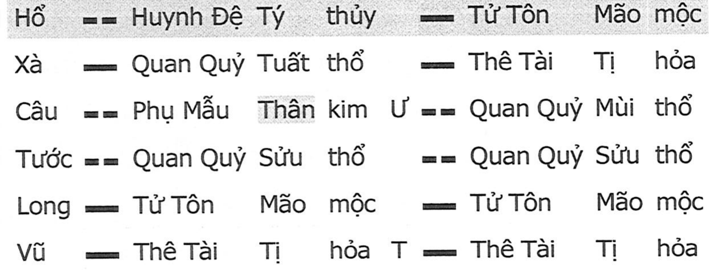

**Hóa giải:** Mang theo bên người một con ngựa gỗ. Ngựa là Ngọ hỏa xung mất Tý thủy, mộc là Nguyên thần sinh hào Thế.

Ngày 11 tháng 4 phản hồi: Sau khi hóa giải đã có tinh thần, có thể đi lại khắp nơi, thân thể đã có sự cải thiện, chỉ là đau mắt vẫn chưa khỏi.

**Thê Tài:** Thể hiện vợ, người yêu, phụ nữ, đối tượng luyến ái, bạn gái, nô bộc, bảo mẫu, người giúp việc, tuỳ tùng, nhân viên, tài sản, tiền vốn, kinh tế, giá cả, tiền, vật dụng, kho, lương thực, bếp, cây cối, hàng hóa, đồ cưới, bổng lộc, tiền lương, thu nhập, thù lao, chi phí, đạo lý, châu báu, đồ trang sức, đồ dùng hàng ngày, trời nắng, lông tóc, ẩm thực, máu, hô hấp, nước mắt, phân và nước tiểu, mồ hôi, sữa, nước mũi, nước bọt, thắt lưng, hậu môn v.v.

**Thê Tài tại hào 6:** Thường chủ tiền gửi trong ngân hàng, tiền tích góp, cho vay, kho, tiền vốn dự phòng, châu báu, đồ cổ, tóc, tổ nghiệp, di sản, rác, lông tóc v.v.

**Thê Tài tại hào 5:** Thường chủ vàng bạc châu báu, đồ trang sức, vật phẩm quý giá, đại tài, thu nhập cao, công lý, nước bọt, nước mắt, nước bọt, ẩm thực, hô hấp, chủ quản tài vụ, ngân hàng v.v.

**Thê Tài tại hào 4:** Thường chủ tài vụ, sữa, hô hấp, dịch vị, mồ hôi, ẩm thực v.v.

**Thê Tài tại hào 3:** Thường chủ phân và nước tiểu, đồ trang trí của phòng ngủ, ẩm thực, thắt lưng, tài vụ, phụ nữ v.v.

**Thê Tài tại hào 2:** Thường chủ vợ, tài sản, nhà bếp, lương thực, đồ dùng gia đình, gia sản, phân và nước tiểu v.v.

**Thê Tài tại hào sơ:** Thường chủ giếng nước, lương thực, bộ hạ, bảo mẫu, người giúp việc, cây cối v.v.

**Thê Tài lâm thổ:** Thường chủ thổ địa, điền sản, nhà, gia sản, kho, túp lều, phòng lưu trữ, gạch ngói, đồ gốm sứ, tràng vị v.v.

**Thê Tài lâm kim:** Thường chủ châu báu, đồ vàng bạc, đồ bằng ngọc, kim loại, nhạc cụ, khoáng sản, tiền, răng, xương v.v.

**Thê Tài lâm mộc:** Thường chủ lương thực, cây cối, giấy, ấn phẩm, rau, trái cây, gan mật, lông tóc v.v.

**Thê Tài lâm hỏa:** Thường chủ đồ điện, đèn điện, dây điện, cơm nóng, đồ uống nóng, bếp, tim cung máu, ruột v.v.

**Thê Tài lâm thủy:** Thường chủ nước mắt, nước bọt, phân và nước tiểu, máu, thủy sản, cống thoát nước, nước máy, kênh nước, đồ uống v.v.

**Thê Tài lâm Thanh Long:** Thường chủ vật phẩm quý giá, đồ trang điểm, ẩm thực, thực phẩm, mỹ thực, lương thực, rượu, tràng vị, y phục, phục sức, tiệc v.v.

**Thê Tài lâm Chu Tước:** Thường chủ thực phẩm nóng, ẩm thực, lương thực, âm thanh, còi, đồ làm bếp, vật tuyên truyền v.v.

**Thê Tài lâm Câu Trần:** Thường chủ đồ hết hạn, đồ muối chua, đồ cổ, đồ cũ, ăn chậm, đồ béo, cho vay, bất động sản, máu đặc dính, mỡ trong máu cao v.v.

**Thê Tài lâm Đằng Xà:** Thường chủ vật thon dài, dây thừng, đầu sợi, vật phẩm hiếm thấy, quái vật, hàng giả, hàng nhái, cây cối v.v.

**Thê Tài lâm Bạch Hổ:** Thường chủ máu, kinh nguyệt, (thức ăn) sống nguội, vật giòn, dao kéo, công cụ sắc bén, vũ khí, dao phẫu thuật v.v.

**Thê Tài lâm Huyền Vũ:** Thường chủ nước tiểu, người nữ gợi cảm, gái điếm, tang vật, rác, vật bẩn, vật lạnh, thủy sản v.v.

## Sắc dục quá độ gây nên bệnh

Đây là một tình huống ở năm 2008. Một người nam bị tiểu ra máu đã hơn nửa năm, liên tục không thuyên giảm, đoán cát hung, ngày Quý Sửu (Tuần Không: Dần Mão), tháng Tị.

| Lục thú | Quẻ Hỏa Thiên Đại Hữu | | | Quẻ Bát Thuần Cấn | |
| :--- | :---: | :--- | :---: | :---: | :--- |
| Hổ | — | Quan Quỷ Tị hỏa | Ứ | — | Thê Tài Dần mộc |
| Xà | - - | Phụ Mẫu Mùi thổ | | - - | Tử Tôn Tý thủy |
| Câu | — | Huynh Đệ Dậu kim | | - - | Phụ Mẫu Tuất thổ |
| Tước | — | Phụ Mẫu Thìn thổ | T | — | Huynh Đệ Thân kim |
| Long | — | Thê Tài Dần mộc | | - - | Quan Quỷ Ngọ hỏa |
| Vũ | — | Tử Tôn Tý thủy | | - - | Phụ Mẫu Thìn thổ |

Lấy hào Thế làm Dụng thần. Xét từ Nhật Nguyệt, Nguyệt sinh Nhật phù hào Thế không có vấn đề. Nhưng xét từ hào động trong quẻ, Dần mộc được Tý thủy sinh phù mà khắc hào Thế, mặc dù không vượng tướng, nhưng vẫn có thể tác động hào Thế.

Hào Thế Thìn thổ là thủy khố, chủ bàng quang, lâm Chu Tước chủ viêm, bị khắc là bệnh, là viêm bàng quang. Kỵ thần lâm Thanh Long, Thê Tài là nước tiểu, chủ khi tiểu có cảm giác đau buốt.

Huyền Vũ lâm hào sơ Tý thủy phát động sinh Kỵ thần, Kỵ thần lâm Thanh Long tại hào 2 khắc hào Thế, hào 2 là bộ phận sinh dục, Thanh Long chủ sắc dục, Huyền Vũ chủ ám muội, Kỵ thần động hóa Quan Quỷ khắc hào Thế, Thê Tài chủ nữ nhân, chủ bệnh tật do sắc dục quá độ gây ra.

Kỵ thần vốn hưu tù, Mùi thổ ám động, Kỵ thần nhập Mộ, Dậu kim phát động khắc Kỵ thần, Tý thủy bị Nhật hợp, tham hợp quên sinh, lại nhập Mộ tại hào biến, lực sinh Dần mộc yếu, có bệnh cũng không sao. Dùng một viên đá tròn đặt ở Đông Bắc nhà bếp là được.

Ngày 8 tháng 6 phản hồi: Sau khi được máy móc tinh vi của bệnh viện kiểm tra, được biết là viêm bàng quang, đáy bàng quang có một số vết loét. Sau khi uống thuốc, hiện tại đã bình phục hoàn toàn.

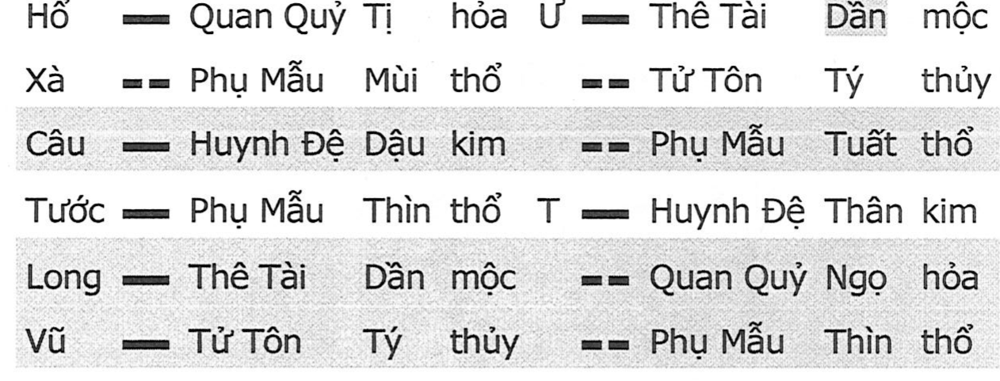

## Rỉ nước bất lợi cho công nhân

Đây là một tình huống ở năm 2004. Tôn mỗ ở Sóc Châu (là lãnh đạo của một đơn vị) đoán vận khí, ở ngày Giáp Dần (Tuần Không: Tý Sửu), tháng Tị, được Lôi Thiên Đại Tráng.

| | | | | | |
|---|---|---|---|---|---|
| Vũ | - - | Huynh Đệ | Tuất | thổ | |
| Hổ | - - | Tử Tôn | Thân | kim | |
| Xà | — | Phụ Mẫu | Ngọ | hỏa | T |
| Câu | — | Huynh Đệ | Thìn | thổ | |
| Tước | — | Quan Quỷ | Dần | mộc | |
| Long | — | Thê Tài | Tý | thủy | Ư |

Hào Thế lâm Đằng Xà, chủ gần đây tâm trạng không tốt, hỏa là động, lục xung là động, tương đối bận rộn. Lâm Phụ Mẫu là bận rộn vì việc văn thư, hợp đồng dự án. Phụ Mẫu trị Nguyệt, có lãnh đạo cấp trên tham gia hỗ trợ. (Nghiệm, tỉnh trưởng tham gia.)

Tử Tôn Thân kim lâm Bạch Hổ Thái Tuế tại hào 5 phạm tam hình. Gần đây có việc không thuận. Hào sơ Thê Tài là bộ hạ, nhân viên, Không Vong Tuyệt ở Nguyệt, chủ có tượng công nhân hung tử. Hào 5 là đường, Tuyệt địa là hỏa, ứng xa họa, hỏa hoạn v.v. (Nghiệm, tháng này điện giật thiêu chết một người, đơn vị lại phát sinh xa họa.)

Hào sơ Tý thủy Không Vong, chủ công ty, đơn vị có chỗ rỉ nước. Do đó dẫn tới bất lợi cho công nhân, cũng bất lợi cho tài vận. (Nghiệm, có một tháp nước bị rò rỉ.)

**Tử Tôn:** Thể hiện con, cháu, trẻ con, trẻ sơ sinh, thế hệ sau, cháu gái, cháu trai, cháu ngoại trai, lương tướng, tăng đạo, người xuất gia, tín đồ, binh lính, công an, phúc thần, tài nguyên, đường sá, hành lang, động vật, mặt trời, mặt trăng, sao, trời nắng, uống rượu, vui vẻ, giải trí, không lo lắng, thầy thuốc, dinh dưỡng, thuốc, vú, ngũ quan, tiểu tiện, chú phù, thầy khí công, bà đồng, thầy cúng, thực quản, đường hô hấp, khí quản, mắt, tai, miệng, mũi, mạch máu, lỗ chân lông, ruột, bộ phận sinh dục, cốt tủy v.v.

**Tử Tôn tại hào 6:** Thường chủ con nuôi thừa tự, con muộn, người xuất gia, tín đồ, mặt trời, mặt trăng, sao, bà đồng, ẩn sĩ, ngũ quan, ngựa v.v.

**Tử Tôn tại hào 5:** Thường chủ ngũ quan, đường hô hấp, thực quản, vú, ngọc sáng trên tay (con cưng), lương tướng, trụ trì, đường sá, hành lang, thuốc cao cấp, trâu v.v.

**Tử Tôn tại hào 4:** Thường chủ vú, bạch huyết, thực quản, đường hô hấp, thủ môn, dê v.v.

**Tử Tôn tại hào 3:** Thường chủ bộ phận sinh dục, tử cung, ống dẫn niệu, ống dẫn trứng, ruột, lợn v.v.

**Tử Tôn tại hào 2:** Thường chủ bộ phận sinh dục, tử cung, ruột, ống dẫn trứng, ống dẫn niệu, thai nhi, hành lang, nhà bếp, mèo chó v.v.

**Tử Tôn tại hào sơ:** Thường chủ hài tử, thai nhi, thế hệ sau, thiếu niên, động vật, côn trùng, gà vịt ngỗng, giếng nước v.v.

**Tử Tôn lâm thổ:** Thường chủ mũi, đường sá, cầu, con nuôi thừa tự, chuồng chó, ổ gà v.v.

**Tử Tôn lâm kim:** Thường chủ đồ ngọc, ca hát, âm nhạc, côn trùng, niệm Phật, chân ngôn, mật chú, chú ngữ, lợi khí hàng ma, bảo kiếm trấn trạch, đường hô hấp, ruột, xương cốt, tạo máu v.v.

**Tử Tôn lâm mộc:** Thường chủ lông tóc, lông mi, lông mày, mạch máu, bộ phận sinh dục, con rỗi, đồ chơi, hạt giống, cây giống v.v.

**Tử Tôn lâm hỏa:** Thường chủ mắt, mạch máu tim, ruột, tia lửa, pháo dây, pháo hoa v.v.

**Tử Tôn lâm thủy:** Thường chủ họng, dử mắt, ráy tai, nước bọt, nước tiểu, sữa, cá, đồ uống, suối phun v.v.

**Tử Tôn lâm Thanh Long:** Thường chủ giải trí, uống rượu, vui vẻ, hài tử làm đồ vật, con cái kết hôn, thú cưng, thực quản, bộ phận sinh dục v.v.

**Tử Tôn lâm Chu Tước:** Thường chủ ca hát, bi bô tập nói, viêm phần phụ, viêm tuyến vú, viêm niệu đạo, tụng kinh, côn trùng kêu, chim kêu, gà gáy, chó sủa v.v.

**Tử Tôn lâm Câu Trần:** Thường chủ hài tử lười biếng, u xơ tử cung, nhũ tuyến tăng sinh, ung thư thực quản, ung thư ruột, đường tiết niệu kết sỏi, tổ chim, ổ gà lợn chó v.v.

**Tử Tôn lâm Đằng Xà:** Thường chủ hài tử ham chơi, hài tử quái gở, tà thuật, rắn, loài bò sát, đồ chơi, trò chơi v.v.

**Tử Tôn lâm Bạch Hổ:** Thường chủ y dược, dược phẩm, phẫu thuật, binh lính, công an, vũ khí, mạch máu, hài tử bị thương v.v.

**Tử Tôn lâm Huyền Vũ:** Thường chủ hài tử tự kỷ, hài tử trầm cảm, bệnh tật về bộ phận sinh dục, động vật thủy sinh, cống thoát nước v.v.

## Sức mạnh của diều chim ưng

Đây là một tình huống ở năm 2003. Một phụ nữ người Nhật Bản đoán con trai không chịu đi học là do nguyên nhân gì? Ở ngày Nhâm Dần (Tuần Không: Thìn Tị), tháng Tị, được Cấn Vi Sơn biến Hỏa Địa Tấn.

| | | | | |
| --- | --- | --- | --- | --- |
| Hổ | — | Quan Quỷ Dần mộc T | — | Phụ Mẫu Tị hỏa |
| Xà | - - | Thê Tài Tý thủy | - - | Huynh Đệ Mùi thổ |
| Câu | - - | Huynh Đệ Tuất thổ | — | Tử Tôn Dậu kim |
| Tước | — | Tử Tôn Thân kim Ứ | - - | Quan Quỷ Mão mộc |
| Long | - - | Phụ Mẫu Ngọ hỏa | - - | Phụ Mẫu Tị hỏa |
| Vũ | - - | Huynh Đệ Thìn thổ | - - | Huynh Đệ Mùi thổ |

Quẻ lục xung hóa du hồn, Tử Tôn Thân kim Nhật xung, sách nói: Vượng Mã du hồn trẻ trốn học. Đây chính là thông tin con trai người này không chịu đi học. Tử Tôn lâm Chu Tước là học tập, nhưng xung khắc hào Thế, hào Thế Nhật Nguyệt Tử Tôn gặp tam hình, là tâm trạng không tốt, khổ não vì sự tình của hài tử. (Nghiệm)

Tử Tôn tại hào 3 phát động hóa Quan Quỷ, hào 3 là giường, Quan Quỷ là bệnh, con trai sức khỏe không tốt. Quan Quỷ Dần mộc trên Nhật xung hình Tử Tôn, nhập quẻ tại hào 6, hào 6 là đầu, mộc chủ thần kinh, Bạch Hổ là bệnh, chủ đầu óc có vấn đề, tình trạng tinh thần không tốt. (Nghiệm, suy nhược thần kinh.)

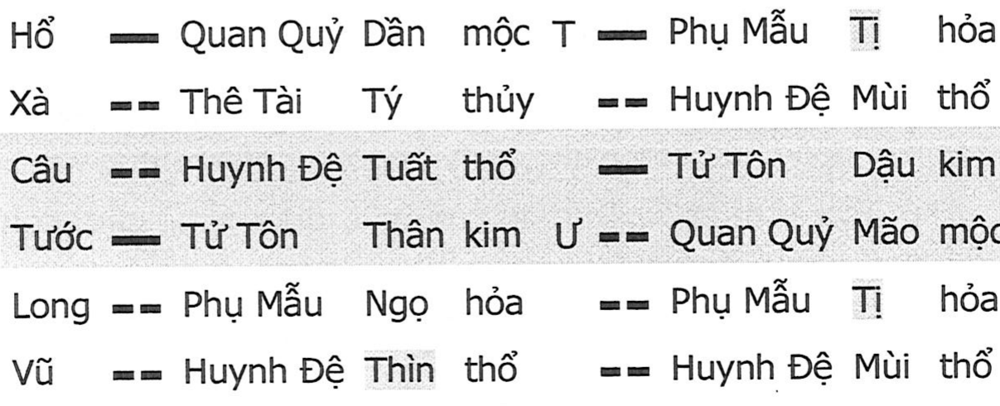

Hào 3 là tràng vị, quẻ cung Cấn, Cấn là dạ dày, Nguyên thần Tuất thổ tại hào 4 bị Nhật khắc, cũng là dạ dày không tốt. (Nghiệm)

Tuất thổ lâm Câu Trần phát động, chủ năm Giáp Tuất đã xây nhà. (Nghiệm)

Hào sơ Thìn thổ Không Vong, cũng là Nguyên thần Tử Tôn bị Nhật khắc, hào sơ là nền nhà, lâm Huyền Vũ chủ phía sau, nền nhà phía sau có khe hở, hoặc lỗ. (Nghiệm, có ba chỗ bị nứt. Có một cửa thông gió của tầng hầm ở phía sau nền nhà.)

Hào 3 Tử Tôn Thân kim hóa Mão mộc, Chu Tước chủ điện, Mão mộc chủ vật thon dài, Tử Tôn là động vật, lâm Chu Tước chủ khiếu thanh, Thân đối ứng Tây Nam, lâm hào Ứng, hào 3 là cửa, Ứng là bên ngoài, phía Tây Nam ngoài cửa có cây cối hoặc cột điện, thường xuyên có chim đậu, kêu ríu rít không dứt. (Nghiệm, hướng Tây Nam có cột điện, thường xuyên có chim sẻ kêu ở trên đó, ngoài cửa sổ tầng hai còn có tổ chim sẻ.)

**Hóa giải:** Làm con diều chim ưng, treo trên cột điện và cửa sổ. (Sau đó chim sẻ hiếm khi đến nữa. Sức khỏe của con trai đã dần dần hồi phục, có thể đi học.)

# CHƯƠNG 9

## THỦ TƯỢNG NGŨ HÀNH PHÁN ĐOÁN NHÂN QUẢ

Bên cạnh vai trò sinh khắc, ngũ hành trong lục hào còn có chức năng là quy loại tính chất sự vật. Người xưa đã quy nạp tất cả vật chất trong thế giới thành năm loại nguyên tố là kim mộc thủy hỏa thổ. Vì vậy, sự biến hóa của bản thân ngũ hành trong quẻ lục hào có thể truyền đạt thông tin nhân quả về cát hung sự vật qua hình thức này, cộng với sự tham khảo lục thân, lục thần, hào vị v.v, chúng ta có thể phán đoán ra một đường nét khái quát, khi dự đoán có linh cảm tốt, trạng thái tốt, thậm chí có thể phán đoán rất cụ thể.

Ngũ hành là thổ thể hiện: Nhà, kiến trúc, thổ địa, đồi núi, đồ gốm, gạch ngói, đất trồng, tu tạo, xây dựng công trình, trang tu, dời chỗ, đồng ruộng, thổ công, miếu thành hoàng, địa phủ, vũng nước, tường, da, tỳ vị, thịt, tro bụi, vật màu vàng v.v.

Ngũ hành là kim thể hiện: Đá, kim loại, khoáng sản, tiền bạc, dao kéo, nồi sắt, sản phẩm sắt, sản phẩm đồng, đồ trang sức vàng bạc, cái khóa, thủy tinh, vật màu trắng v.v.

Ngũ hành là mộc thể hiện: Cây cối, hoa cỏ, khúc gỗ, điêu khắc gỗ, đồ gỗ, giường, bàn, ghế, giấy, củi, vật màu xanh lá cây v.v.

Ngũ hành là hỏa thể hiện: Bếp lò, bóng đèn, đồ điện, dây điện, máy biến thế, ống khói, nhà bếp, than đá, vật dễ cháy, ánh sáng, vật màu đỏ v.v.

Ngũ hành là thủy thể hiện: Hồ nước, bể cá, ống nước, kênh nước, cống thoát nước, phòng tắm, sông ngòi, lu nước, chất lỏng, ẩm ướt, hàn khí, vật màu đen v.v.

## Anh đã sờ vào hòn đá trên hồ nước ở mộ địa

Đây là tình huống của một học trò ở nước ngoài đã hỏi tôi vào năm 2015. Sau khi giúp người ta xem âm trạch, anh ta trở về thì đột nhiên buồn nôn, đoán nguyên nhân là gì? Ở ngày Bính Tý (Tuần Không: Thân Dậu), tháng Tý, được Hỏa Thiên Đại Hữu biến Sơn Thiên Đại Súc.

| Lục thú | Phục thần | Hỏa Thiên Đại Hữu | Sơn Thiên Đại Súc |
| :--- | :--- | :--- | :--- |
| Long | | ━ Quan Quỷ Tị hỏa Ư | ━ Thê Tài Dần mộc |
| Vũ | | ⚋ Phụ Mẫu Mùi thổ | ⚋ Tử Tôn Tý thủy |
| Hổ | | ━ Huynh Đệ Dậu kim | ⚋ Phụ Mẫu Tuất thổ |
| Xà | | ━ Phụ Mẫu Thìn thổ T | ━ Phụ Mẫu Thìn thổ |
| Câu | | ━ Thê Tài Dần mộc | ━ Thê Tài Dần mộc |
| Tước | | ━ Tử Tôn Tý thủy | ━ Tử Tôn Tý thủy |

Lấy hào Thế làm Dụng thần, xem tổ hợp biến hóa của quẻ.

Hào Thế Nhật Nguyệt không khắc, cũng không phù, tuy rằng hưu tù, nhưng không có đại hung.

Trong quẻ Huynh Đệ Dậu kim độc phát, sách nói: Thần triệu cơ ở động, đây chính là mấu chốt. Quẻ này chủ yếu là đoán nguyên nhân, do đó hào động thường chính là hào biểu đạt nguyên nhân. Một trong những chức năng của độc phát chính là biểu đạt nguyên nhân.

Huynh Đệ Dậu kim lâm Bạch Hổ phát động hợp hào Thế, kim là đá, Bạch Hổ chủ tang, không phải là bia đá thì là đá của mộ địa, ngoại quái hóa Cấn, Cấn là tay, Huynh Đệ cũng là tay chân, hợp hào Thế, chính là đã tiếp xúc đến, vì vậy phán đoán anh ta đã dùng tay sờ vào đá của mộ địa.

Thìn thổ là thủy khố, là vật chứa thủy, Dậu kim hợp, chính là bên trên vật chứa thủy đã đặt một hòn đá. Tôi phán đoán mộ địa có hồ nước, trên hồ nước đặt một hòn đá, kết quả là mộ địa có một vại nước, trên vại nước có đặt một hòn đá, anh ta cho biết đúng là đã sờ hòn đá này, sau đó còn chụp ảnh gửi cho tôi. Bức ảnh đó hiện nay tôi vẫn giữ.

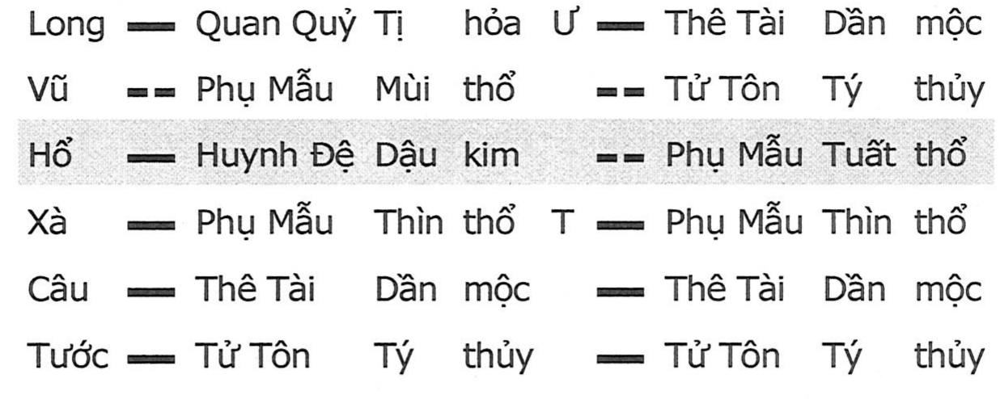

---

# Part 5 (Pages 81-100)

## Động bể cá dẫn đến mẫn ngứa

Một người đàn ông đoán về bệnh ngoài da của con trai. Ở ngày Kỷ Tị (Tuần Không: Tuất Hợi), tháng Tuất, được Sơn Thiên Đại Súc biến Tốn Vi Phong.

| Lục thú | Phục thần | Sơn Thiên Đại Súc | Tốn Vi Phong |
| :--- | :--- | :--- | :--- |
| Câu | | ━ Quan Quỷ Dần mộc | ━ Quan Quỷ Mão mộc |
| Tước | | ⚋ Thê Tài Tý thủy Ư | ━ Phụ Mẫu Tị hỏa |
| Long | | ⚋ Huynh Đệ Tuất thổ | ⚋ Huynh Đệ Mùi thổ |
| Vũ | Tử Thân | ━ Huynh Đệ Thìn thổ | ━ Tử Tôn Dậu kim |
| Hổ | Phụ Ngọ | ━ Quan Quỷ Dần mộc T | ━ Thê Tài Hợi thủy |
| Xà | | ━ Thê Tài Tý thủy | ⚋ Huynh Đệ Sửu thổ |

Lấy Tử Tôn làm Dụng thần. Tử Tôn Thân kim phục tàng dưới Thìn thổ. Nguyệt sinh Nhật khắc, có vẻ như cân bằng, nhưng Nguyệt xung phá Nguyên thần Thìn thổ, phục tàng lại không nên hợp, biểu thị bệnh tương đối nghiêm trọng. Phi thần hỷ phá, Phục thần được xuất, chủ có bệnh không nguy hiểm. Nguyên thần là thổ, một Không một Phá, thổ là da, lâm Thanh Long Huyền Vũ, chủ da phát xanh, phát tím (bác sĩ định tính là mẫn ngứa cấp tính).

Trong quẻ hai Tý thủy là Tử địa Dụng thần phát động, đều không có quan hệ sinh khắc với Dụng thần, Nguyên thần, tất chủ nguyên nhân. Là do đã động vật có liên quan đến thủy gây ra. Hào 5 Tý thủy hưu tù hóa Tuyệt, hào sơ Tý thủy hóa hợp. Hào 5 là vị trí tôn quý, liên quan đến thủy chính là cá cảnh, hóa Tuyệt là cá đã chết. Hào sơ Tý thủy hồi đầu khắc, chính là đã vứt bỏ. (Hồi đáp: Sau khi cá chết thì đã vứt luôn cả bể cá.)

Hóa giải: Lấy một nắm đậu đen bọc lại và để ở bên cạnh tiểu hài. Như vậy Thìn thổ Thực Phá, Tuất thổ xuất Không, Tý thủy nhập Mộ, sinh hào Tử Tôn, những vấn đề đều đã được giải quyết.

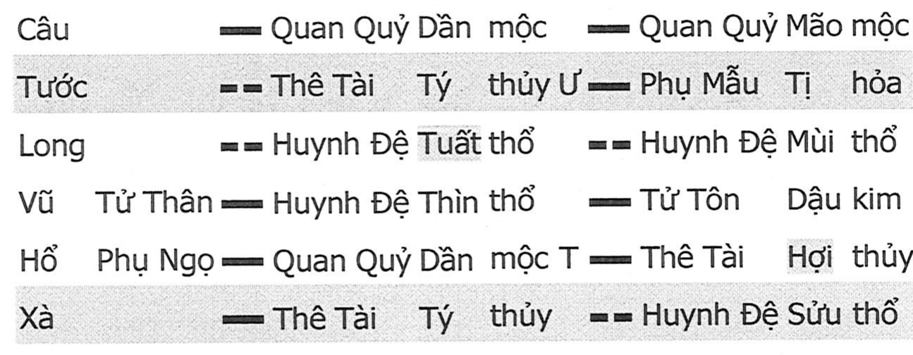

## Do đã động cống thoát nước gây ra

Một học trò đã hỏi tôi tình huống này vào năm 2018. Cô ấy đột nhiên bị đau thắt lưng sau khi vừa chuyển nhà, đoán có phải do phong thủy không tốt gây ra hay ko? Ở ngày Canh Tý (Tuần Không: Thìn Tị), tháng Tị, được Thủy Lôi Truân biến Khôn Vi Địa.

| Lục Thú | Phục Thần | Quẻ gốc | | | Quẻ biến |
| :--- | :--- | :---: | :--- | :---: | :--- |
| Xà | | ⚋ | Huynh Đệ Tý thủy | ⚋ | Phụ Mẫu Dậu kim |
| Câu | | ━ | Quan Quỷ Tuất thổ Ư | ⚋ | Huynh Đệ Hợi thủy |
| Tước | | ⚋ | Phụ Mẫu Thân kim | ⚋ | Quan Quỷ Sửu thổ |
| Long | Tài Ngọ | ⚋ | Quan Quỷ Thìn thổ | ⚋ | Tử Tôn Mão mộc |
| Vũ | | ⚋ | Tử Tôn Dần mộc T | ⚋ | Thê Tài Tị hỏa |
| Hổ | | ━ | Huynh Đệ Tý thủy | ⚋ | Quan Quỷ Mùi thổ |

Mặc dù đoán bệnh, lấy hào Thế làm Dụng thần, nhưng ở đây chủ yếu là hỏi nguyên nhân, xem tổ hợp biến hóa mới đúng.

Hào 5 Quan Quỷ Tuất thổ lâm Câu Trần phát động, Câu Trần chủ đã động trạch, Tuất thổ phát động, tức là ngày Tuất đã chuyển nhà. Nhưng động mà hóa ra Nguyên thần hào Thế, không thể luận là vấn đề về phong thủy. (Nghiệm, ngày Mậu Tuất chuyển nhà.)

Hào sơ Tý thủy phát động hóa Quan Quỷ, hào sơ là chỗ thấp, chính là cống thoát nước, hồi đầu khắc Nguyên thần Tý thủy, Tý thủy phản quái là Khảm, Khảm là thắt lưng, là do đã động cống thoát nước gây ra. (Nghiệm, bởi vì cống thoát nước nhà vệ sinh không thông, mẹ chồng đã chọc mấy cái. Rất linh nghiệm, hào biến Mùi thổ phản quái là Khôn là mẹ, từ Quan Quỷ phát triển ra, Quan Quỷ là chồng, Khôn này chính là mẹ chồng. Quẻ hóa Khôn, cũng là chủ trưởng bối nữ.)

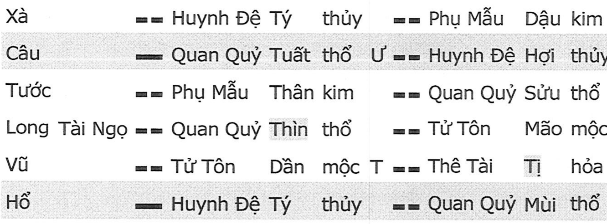

## Vận khí không thuận do nguyên nhân gì?

Một học trò đã hỏi tôi tình huống này vào năm 2019. Anh ta nói gần đây vận khí không thuận, đoán xem nguyên nhân là gì, ở ngày Ất Dậu (Tuần Không: Ngọ Mùi), tháng Thìn, được Phong Lôi Ích biến Phong Trạch Trung Phu.

| Lục Thú | Phục Thần | Quẻ gốc | | | Quẻ biến |
| :--- | :--- | :---: | :--- | :---: | :--- |
| Vũ | | ━ | Huynh Đệ Mão mộc Ư | ━ | Huynh Đệ Mão mộc |
| Hổ | | ━ | Tử Tôn Tị hỏa | ━ | Tử Tôn Tị hỏa |
| Xà | | ⚋ | Thê Tài Mùi thổ | ⚋ | Thê Tài Mùi thổ |
| Câu | Quan Dậu | ⚋ | Thê Tài Thìn thổ T | ⚋ | Thê Tài Sửu thổ |
| Tước | | ⚋ | Huynh Đệ Dần mộc | ━ | Huynh Đệ Mão mộc |
| Long | | ━ | Phụ Mẫu Tý thủy | ━ | Tử Tôn Tị hỏa |

Sách nói: Thần triệu cơ ở động, Huynh Đệ Dần mộc tại hào 2 lâm Chu Tước phát động hóa Tiến thần khắc hào Thế Thê Tài Thìn thổ, Huynh Đệ lâm Chu Tước là khẩu thiệt, khắc Thê Tài, tài vận không tốt. (Nghiệm, hôm đó khẩu thiệt, ba bốn lần phá tài.)

Hào 2 là trạch, mộc lâm Chu Tước là hoa, hóa Tiến thần, nhất định là hôm đó đã động hoa. (Nghiệm, anh ta không ở nhà nên không biết tình hình ở nhà, sau khi hỏi tình hình trong nhà, được biết người nhà đã đem hoa ra sân phơi nắng.)

Hóa giải: Mang theo hai cục pin AAA bên người.

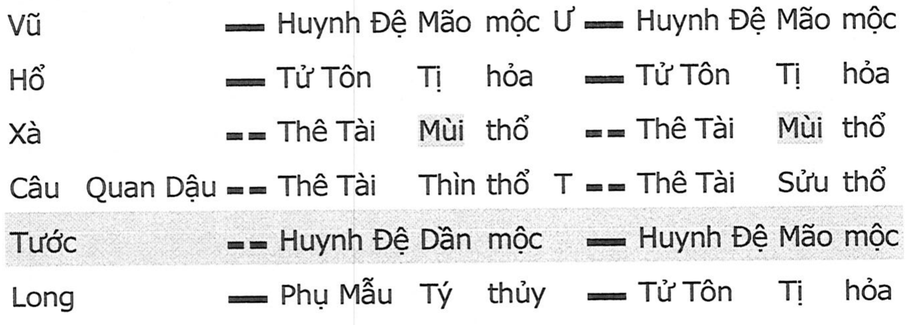

## Cống thoát nước đã bị lấp

Một học trò đã hỏi tôi tình huống này vào năm 2018. Anh ta đoán vợ ho liên tục không khỏi do nguyên nhân gì? Ở ngày Nhâm Thìn (Tuần Không: Ngọ Mùi), tháng Tý, được Địa Lôi Phục biến Sơn Địa Bác.

| Lục thú | Phục thần | Quẻ chính | Quẻ biến |
| :--- | :--- | :--- | :--- |
| Hổ | | ━ ━ Tử Tôn Dậu kim | ━ Quan Quỷ Dần mộc |
| Xà | | ━ ━ Thê Tài Hợi thủy | ━ ━ Thê Tài Tý thủy |
| Câu | | ━ ━ Huynh Đệ Sửu thổ Ư | ━ ━ Huynh Đệ Tuất thổ |
| Tước | | ━ ━ Huynh Đệ Thìn thổ | ━ ━ Quan Quỷ Mão mộc |
| Long | Phụ Tị | ━ ━ Quan Quỷ Dần mộc | ━ ━ Phụ Mẫu Tị hỏa |
| Vũ | | ━ Thê Tài Tý thủy T | ━ ━ Huynh Đệ Mùi thổ |

Lấy Thê Tài làm Dụng thần, xem tổ hợp biến hóa của quẻ. Thê Tài lưỡng hiện, lấy hào Thê Tài Tý thủy phát động làm Dụng thần, hào còn lại dùng để tham khảo.

Thê Tài Tý thủy tại hào sơ lâm Huyền Vũ phát động hóa hồi đầu khắc, Huyền Vũ là bẩn thỉu, hào sơ là tầng thấp nhất, thủy bị khắc, không thể chảy, đoán là do cống thoát nước trong nhà bị lấp gây ra. (Nghiệm, rất nhiều tóc đã lấp cống thoát nước.)

Hào 6 Dậu kim động hóa Quan Quỷ Dần mộc, Dậu kim là Nguyên thần, hóa Quỷ là bệnh, hóa Tuyệt không thể sinh Thê Tài, lại bị Nhật hợp vướng chân, cũng không thể sinh Thê Tài, lâm Bạch Hổ là máu, chủ đầu cung máu không đủ. (Nghiệm, thường xuyên chóng mặt.)

Bạch Hổ chủ tức giận, chủ tính cách thay đổi bởi vì sức khỏe gặp vấn đề, hay nổi giận. (Nghiệm)

Kim là phổi, chủ âm thanh, không thể sinh Dụng thần, chủ hô hấp không thông, ho. Ngoài ra hào 5 Thê Tài Hợi thủy bị Nhật khắc, hào 5 Hợi thủy phản quái là Càn, Càn là phổi. Cũng là thông tin này.

Nhật thần Kỵ thần Thìn thổ nhập quẻ tại hào 3, hào 3 là tử cung, phụ khoa, chủ kinh nguyệt không đều. (Nghiệm)

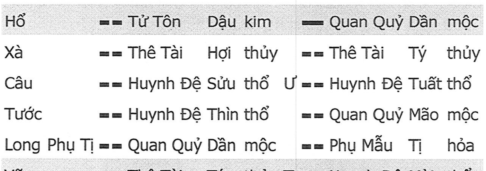

## Đã động giường, hoặc bàn gây nên

Một học trò đã hỏi tôi tình huống này vào năm 2019. Cô ấy cảm thấy khó chịu ở vai đã gần 20 ngày, xoa bóp chườm nóng đều không có hiệu quả, đặc biệt là khi ngủ vào ban đêm, rất nghiêm trọng, đoán do nguyên nhân gì gây ra? Ngày Giáp Thìn (Tuần Không: Dần Mão), tháng Tý, được Tốn Vi Phong biến Phong Trạch Trung Phu.

| Lục thú | Quẻ chính | Quẻ biến |
| :--- | :--- | :--- |
| Vũ | ━ Huynh Đệ Mão mộc T | ━ Huynh Đệ Mão mộc |
| Hổ | ━ Tử Tôn Tị hỏa | ━ Tử Tôn Tị hỏa |
| Xà | ━ ━ Thê Tài Mùi thổ | ━ ━ Thê Tài Mùi thổ |
| Câu | ━ Quan Quỷ Dậu kim Ư | ━ ━ Thê Tài Sửu thổ |
| Tước | ━ Phụ Mẫu Hợi thủy | ━ Huynh Đệ Mão mộc |
| Long | ━ ━ Thê Tài Sửu thổ | ━ Tử Tôn Tị hỏa |

Lấy hào Thế làm Dụng thần, xem tổ hợp biến hóa của quẻ.

Quẻ này hào Thế Mão mộc lâm Huyền Vũ tại hào 6 Không Vong, bị Quan Quỷ tam hợp cục đến khắc, tổ hợp này chính là thông tin viêm quanh khớp vai, khó chịu ở vai. Phán đoán về viêm quanh khớp vai đã được tôi trình bày trong Lục Hào Tật Bệnh Dự Trắc Học, đây là một tổ hợp trong đó. Tốn là phong, mộc là phong, Huyền Vũ là hàn, biểu hiện khí lạnh nhập thể, bị phong hàn gây ra.

Nhưng thần triệu cơ ở động, nội quái tam hợp cục phát động đến xung khắc hào Thế, nhất định có huyền cơ, chủ nguyên nhân phát bệnh. Tam hợp cục có ý nghĩa là nhiều, đa dạng, Câu Trần là văn phòng, hào 3 là giường, là bàn v.v, hào Thế mộc Không Vong, lại hóa du hồn, chủ có vật gỗ đã rời khỏi mình, hoặc di động.

Quả nhiên, bàn và sa lông trong văn phòng đã được tặng cho người khác; hơn nữa đã đập bỏ một cái bàn nhỏ. Thực tế đúng là từ khi đó thì bắt đầu đau nhức, cảm thấy không bình thường.

Có thể có người sẽ hỏi, Câu Trần chủ điền thổ, tại sao không phải là do động thổ gây ra? Dự đoán cần kết hợp mùa, mùa đông ít khi có người động thổ.

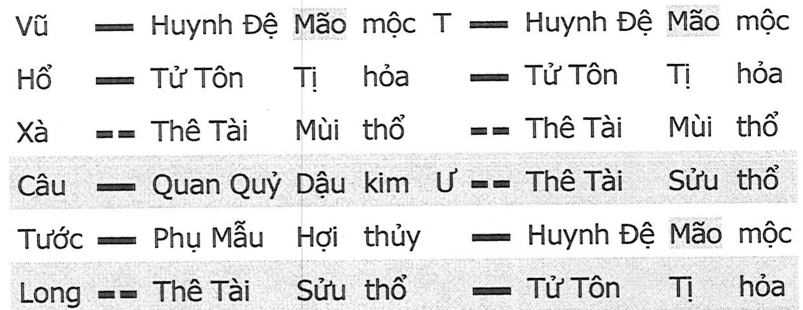

## Bị bệnh liên quan đến phong thủy

Đây là một tình huống ở năm 2014. Một người nam ở nhà gọi đến nói rằng cha đang bị bệnh, đoán cát hung của cha (84 tuổi), ở ngày Bính Ngọ (Tuần Không: Dần Mão), tháng Sửu, được Địa Lôi Phục biến Địa Hỏa Minh Di.

| Lục thú | Phục thần | Địa Lôi Phục | Địa Hỏa Minh Di |
| :--- | :--- | :--- | :--- |
| Long | | - - Tử Tôn Dậu kim | - - Tử Tôn Dậu kim |
| Vũ | | - - Thê Tài Hợi thủy | - - Thê Tài Hợi thủy |
| Hổ | | - - Huynh Đệ Sửu thổ Ư | - - Huynh Đệ Sửu thổ |
| Xà | | - - Huynh Đệ Thìn thổ | — Thê Tài Hợi thủy |
| Câu | Phụ Tị | - - Quan Quỷ Dần mộc | - - Huynh Đệ Sửu thổ |
| Tước | | — Thê Tài Tý thủy T | — Quan Quỷ Mão mộc |

Lấy Phụ Mẫu làm Dụng thần. Phụ Mẫu mặc dù phục tàng, nhưng Nguyệt không khắc Nhật phù là vượng tướng, sẽ không đại hung. Dụng thần Phụ Mẫu Tị hỏa phục tàng lâm Câu Trần, hào độc phát Thìn thổ thủy khố hóa Kỵ thần, đây là chứng bệnh. Câu Trần là sưng, Thìn thổ là thủy khố, Kỵ thần là thủy, bệnh về tiết niệu, là phì đại tuyến tiền liệt. (Nghiệm)

Độc phát là nguyên nhân, Thìn thổ Đằng Xà là đường ống, hóa thủy là chảy ra nước, hợp hào 6, hào 6 là ngoại, trong nhà có đường ống chảy ra ngoài đã bị tắc. (Nghiệm, trong nhà có một máy lọc nước, đường ống dẫn nước ra ngoài đã bị tắc, nước không chảy ra được.)

Ngay sau khi sửa chữa, bệnh của cha đã khỏi, ở ngày Dậu xuất viện.

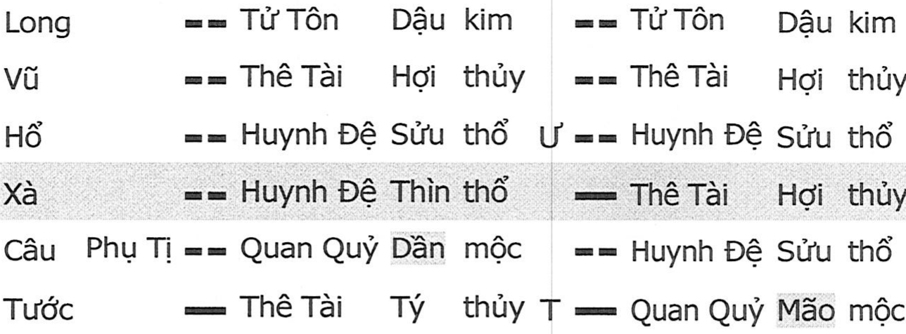

## Vấn đề do dời bếp gây ra

Đây là một tình huống ở năm 2015. Một người nữ đoán tại sao khi em trai phát bệnh thì nó luôn ăn hiếp mình và con gái? Ở ngày Quý Sửu (Tuần Không: Dần Mão), tháng Thìn, được Lôi Thủy Giải biến Sơn Trạch Tổn.

| Lục thú | Phục thần | Lôi Thủy Giải | Sơn Trạch Tổn |
| :--- | :--- | :--- | :--- |
| Hổ | | - - Thê Tài Tuất thổ | — Huynh Đệ Dần mộc |
| Xà | | - - Quan Quỷ Thân kim Ư | - - Phụ Mẫu Tý thủy |
| Câu | | — Tử Tôn Ngọ hỏa | - - Thê Tài Tuất thổ |
| Tước | | - - Tử Tôn Ngọ hỏa | - - Thê Tài Sửu thổ |
| Long | | — Thê Tài Thìn thổ T | — Huynh Đệ Mão mộc |
| Vũ | Phụ Tý | - - Huynh Đệ Dần mộc | — Tử Tôn Tị hỏa |

Quẻ này không phải là dự đoán cát hung của bệnh, mà là tìm nguyên nhân. Sách nói: Thần triệu cơ ở động. Hào động trong quẻ chính là thông tin đó. Huynh Đệ thể hiện em trai, hào Thế thể hiện mình, Tử Tôn thể hiện hài tử.

Huynh Đệ Dần mộc tại hào sơ phát động lâm Huyền Vũ Không Vong hóa tam hình đến khắc hào Thế, chủ em trai gây khó khăn với mình không xuất phát từ bản tâm, mà là do phạm bệnh (bệnh tái phát) gây ra. Bởi vì hưu tù Không Vong, không phải là khắc thực sự, tam hình với hào biến, Tị hỏa là Bệnh địa, chủ phạm bệnh. Huyền Vũ chủ đầu óc lơ mơ.

Đối với thông tin ăn hiếp con gái, bởi vì Huynh Đệ luôn sinh Tử Tôn, do đó không thể xét quan hệ giữa Huynh Đệ và Tử Tôn, mà phải xét hào 6 Tuất thổ, hào 6 Tuất thổ hóa Huynh Đệ, khiến Tử Tôn nhập Mộ chính là thông tin này. Bởi vì Tuất thổ Nguyệt phá nên không gây hại lớn.

Nhưng quẻ này chủ yếu là cầu đoán nguyên nhân. Huynh Đệ Bệnh tại Tị hỏa, biểu thị có liên quan đến hỏa, mà ngoại quái tam hợp hỏa cục lâm Câu Trần, Câu Trần là tu tạo, hỏa cục phát động là nhà bếp, nhà bếp đã có sự di chuyển, thay đổi lớn.

Quả nhiên bếp đã được dời từ phía Tây đến phía Đông.

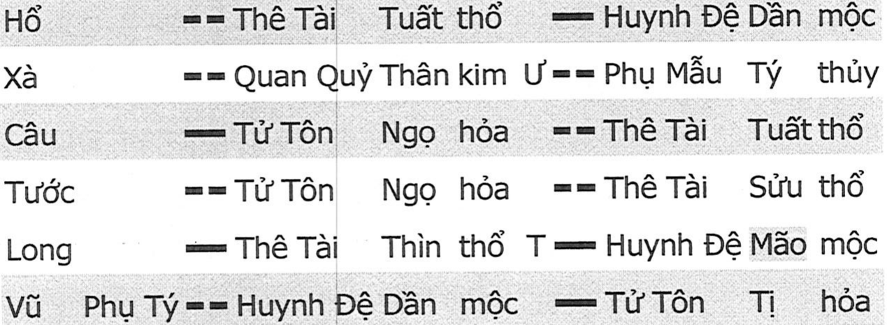

## Bà nội bị bệnh do nguyên nhân gì?

Một học trò đã hỏi tôi tình huống này vào năm 2018. Anh ta đoán bà nội bị bệnh do nguyên nhân gì? Ở ngày Tân Mão (Tuần Không: Ngọ Mùi), tháng Thìn, được Lôi Địa Dự biến Chấn Vi Lôi.

| Lục thú | Phục thần | Quái hào | Thế/Ứng | Biến hào |
| :--- | :--- | :--- | :---: | :--- |
| Xà | | ╍╍ Thê Tài Tuất thổ | | ╍╍ Thê Tài Tuất thổ |
| Câu | | ╍╍ Quan Quỷ Thân kim | | ╍╍ Quan Quỷ Thân kim |
| Tước | | ━ Tử Tôn Ngọ hỏa | Ứ | ━ Tử Tôn Ngọ hỏa |
| Long | | ╍╍ Huynh Đệ Mão mộc | | ╍╍ Thê Tài Thìn thổ |
| Vũ | | ╍╍ Tử Tôn Tị hỏa | | ╍╍ Huynh Đệ Dần mộc |
| Hổ | Phụ Tý | ╍╍ Thê Tài Mùi thổ | T | ━ Phụ Mẫu Tý thủy |

Nếu dự đoán cát hung của bà nội thì lấy Phụ Mẫu làm Dụng thần, nhưng quẻ này chủ yếu là hỏi nguyên nhân, do đó xem tổ hợp biến hóa của quẻ. Quẻ này hào sơ Mùi thổ Không Vong độc phát, hóa Phụ Mẫu Tý thủy, người xưa nói: Thần triệu cơ ở động, độc phát biểu thị nguyên nhân, đây chính là huyền cơ.

Hào sơ là mặt đất, nền nhà, thổ Không thì hãm, nhất định là thông tin mặt đất có hố, do đó đoán là mặt đất đã đào hố, nước đã thấm vào bên trong.

Quả nhiên trong sân có hai cái hố, khi trời mưa thì nước chảy vào bên trong.

Hóa giải: Xử lý những cái hố, sau đó ở chỗ thấp Tây Nam đặt chín viên sỏi, ở chỗ cao Tây Nam đặt mười một hạt đậu đen, ở Đông Nam đặt viên đá tròn, trên đá viết một chữ "minh" (明). Về sau như thế nào, không có phản hồi.

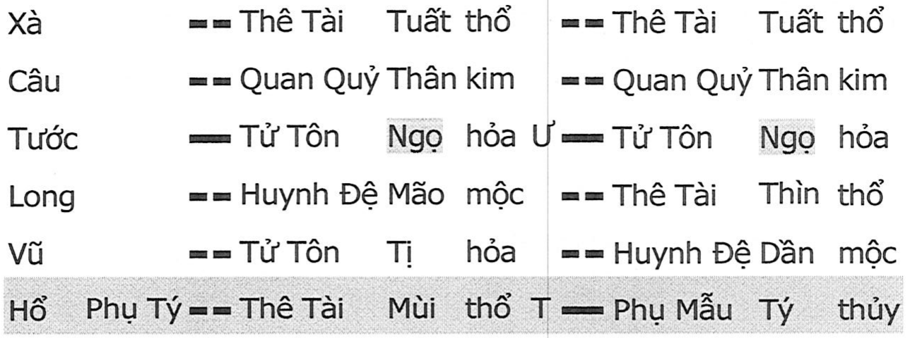

## Tại sao hài tử khóc ầm ĩ?

Một học trò đã hỏi tôi tình huống này vào năm 2018. Anh ta nói sáng nay hài tử thức dậy thì khóc ầm ĩ, bây giờ vẫn ở trong trạng thái không có tinh thần, trông có vẻ không phải là cảm mạo, liền gieo quẻ đoán nguyên nhân, ở ngày Mậu Tuất (Tuần Không: Thìn Tị), tháng Tị, được Trạch Phong Đại Quá biến Trạch Thủy Khốn.

| Lục thú | Phục thần | Quái hào | Thế/Ứng | Biến hào |
| :--- | :--- | :--- | :---: | :--- |
| Tước | | ╍╍ Thê Tài Mùi thổ | | ╍╍ Thê Tài Mùi thổ |
| Long | | ━ Quan Quỷ Dậu kim | | ━ Quan Quỷ Dậu kim |
| Vũ | Tử Ngọ | ━ Phụ Mẫu Hợi thủy | T | ━ Phụ Mẫu Hợi thủy |
| Hổ | | ━ Quan Quỷ Dậu kim | | ╍╍ Tử Tôn Ngọ hỏa |
| Xà | Huynh Dần | ━ Phụ Mẫu Hợi thủy | | ━ Thê Tài Thìn thổ |
| Câu | | ╍╍ Thê Tài Sửu thổ | Ứ | ╍╍ Huynh Đệ Dần mộc |

Quẻ này chủ yếu là đoán nguyên nhân, do đó không thể hoàn toàn xem hào Tử Tôn, hào Tử Tôn chỉ đóng vai trò tham khảo.

Tử Tôn phục tàng dưới Phụ Mẫu Hợi thủy, thủy lâm Huyền Vũ chủ hàn, tuy rằng có ý nghĩa của cảm lạnh, nhưng nguyên nhân lại chú trọng ở độc phát. Hào 3 Quan Quỷ Dậu kim độc phát hóa Tử Tôn Ngọ hỏa hồi đầu khắc, đây chính là huyền cơ.

Hào 3 là cửa, kim lâm Bạch Hổ chủ đao thương, do đó phán đoán nguyên nhân là do đã động thứ như dao hoặc công cụ ở gần cửa.

Người đó phản hồi: Tối qua xuống tầng một xả nước, phát hiện cửa chống trộm không đóng chặt, tưởng là có trộm, liền vào nhà bếp lấy một con dao, sau đó ra cửa không phát hiện gì nên đã đặt dao trở lại chỗ cũ.

Nghe phản hồi của anh ta, đột nhiên hiểu ra ý tứ mà quẻ muốn biểu đạt. Hào 3 là cửa, Quan Quỷ là đạo tặc, kim là kim loại, hóa hồi đầu khắc, khắc đạo tặc chính là cửa chống trộm. Bạch Hổ là đao thương, lại lâm Thanh Long, Thanh Long là ẩm thực, chính là dao làm thức ăn. Nhập Mộ tại Sửu, đặt tại vị trí Đông Bắc của nhà bếp.

Anh ta cho biết là làm cơm bằng con dao này hằng ngày. Dùng hằng ngày như vậy thì bình thường, nhưng khi cầm dao đến cửa thì tương đương với đã động sát khí, Bạch Hổ là khóc lóc, đề phòng trộm, chính là khắc Quan Quỷ, khắc Quan Quỷ là Tử Tôn, tự

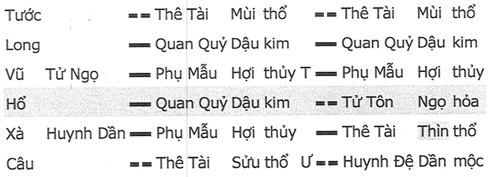 nhiên khí đã lây lan đến hài tử, hài tử đã cảm ứng được một luồng khí, liền sợ hãi. Còn làm cơm động dao bếp là việc vui vẻ, không giống nhau.

## Giỏ treo của hàng xóm ảnh hưởng đến mình

Đây là một tình huống ở năm 2015. Một người bạn trên QQ nói rằng xương cổ, xương sống thắt lưng và xương chậu của bản thân đều bị tổn hại, hỏi nguyên nhân do đâu? Ở giờ Giáp Ngọ, ngày Bính Thìn (Tuần Không: Tý Sửu), tháng Thìn, được Phong Địa Quan biến Phong Sơn Tiệm.

| Lục thú | Phục thần | Quẻ Phong Địa Quan | Thế/Ứng | Biến Phong Sơn Tiệm |
| :--- | :--- | :--- | :---: | :--- |
| Long | | ━ Thê Tài Mão mộc | | ━ Thê Tài Mão mộc |
| Vũ | Huynh Thân | ━ Quan Quỷ Tị hỏa | | ━ Quan Quỷ Tị hỏa |
| Hổ | | ╍╍ Phụ Mẫu Mùi thổ | T | ╍╍ Phụ Mẫu Mùi thổ |
| Xà | | ╍╍ Thê Tài Mão mộc | | ━ Huynh Đệ Thân kim |
| Câu | | ╍╍ Quan Quỷ Tị hỏa | | ╍╍ Quan Quỷ Ngọ hỏa |
| Tước | Tử Tý | ╍╍ Phụ Mẫu Mùi thổ | Ứ | ╍╍ Phụ Mẫu Thìn thổ |

Lấy hào Thế làm Dụng thần, xem tổ hợp biến hóa của quẻ. Trước tiên xem trong quẻ có thông tin có bệnh hay không, nghiệm chứng thông tin của quẻ có đúng không? Hào Thế lâm Bạch Hổ là có bệnh tại thân, được Nhật Nguyệt phù, hào Thế vượng tướng, không phải là bệnh nguy hiểm. Kỵ thần tại hào 3 phát động, hào 3 là thắt lưng, là xương chậu, một Kỵ thần khác tại hào 6, hào 6 là đầu, cổ, thông tin ăn khớp với thực tế.

Người xưa nói: Thần triệu cơ ở động. Kỵ thần Mão mộc độc phát, mặc dù hưu tù hóa hồi đầu khắc, nhưng tháng Thìn mộc có dư khí, vẫn có lực khắc hào Thế. Quẻ này trọng điểm tại nguyên nhân, cát hung sinh tử hoàn toàn không phải là trọng điểm. Mão mộc lâm Đằng Xà gần sát hào Thế đến khắc, mộc là thực vật, Đằng Xà là vật thon dài, uốn lượn quấn quanh, nhất định có thực vật như vậy đã ảnh hưởng đến bản thân. Quẻ này Thế Ứng giống nhau, mà Mão mộc thuộc về quẻ có hào Ứng, lại tương lân với hào Thế, chính là hàng xóm, là hàng xóm có thực vật dây leo đã ảnh hưởng đến mình.

Quả nhiên nhà hàng xóm có một cái giỏ treo cao hai mét, xung xạ vào trong nhà quái chủ thông qua cửa sổ. Lúc đó anh ta còn chụp một bức ảnh gửi cho tôi xem. Tại sao là giỏ treo? Mộc lâm Đằng Xà là treo.

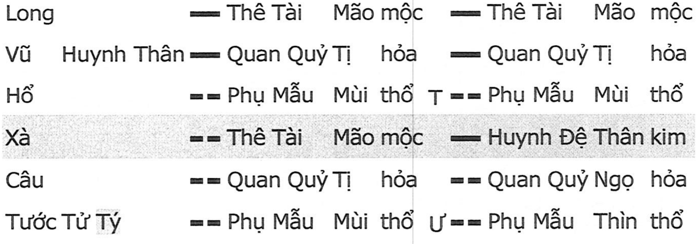

## Hai hòn đá gây ra họa

Đây là một tình huống ở năm 2016. Một người nữ cảm thấy khó chịu ở ngực, khó thở, nhưng đến bệnh viện kiểm tra thì không phát hiện vấn đề gì. Ở ngày Tân Mùi (Tuần Không: Tuất Hợi), tháng Thân, đoán bệnh, được Sơn Thiên Đại Súc biến Sơn Hỏa Bí.

| Lục thú | Phục thần | Quẻ Sơn Thiên Đại Súc | Thế/Ứng | Biến Sơn Hỏa Bí |
| :--- | :--- | :--- | :---: | :--- |
| Xà | | ━ Quan Quỷ Dần mộc | | ━ Quan Quỷ Dần mộc |
| Câu | | ╍╍ Thê Tài Tý thủy | Ứ | ╍╍ Thê Tài Tý thủy |
| Tước | | ╍╍ Huynh Đệ Tuất thổ | | ╍╍ Huynh Đệ Tuất thổ |
| Long | Tử Thân | ━ Huynh Đệ Thìn thổ | | ━ Thê Tài Hợi thủy |
| Vũ | Phụ Ngọ | ━ Quan Quỷ Dần mộc | T | ╍╍ Huynh Đệ Sửu thổ |
| Hổ | | ━ Thê Tài Tý thủy | | ━ Quan Quỷ Mão mộc |

Lấy hào Thế làm Dụng thần. Hào Thế Dần mộc lâm Huyền Vũ bị Nguyệt xung khắc, lại nhập Mộ tại Nhật, chủ tâm trạng bị đè nén, có khuynh hướng trầm cảm. (Nghiệm, bởi vì bệnh tật, tâm trạng rất không tốt.)

Nhìn từ bề ngoài, kim xung phá hào Thế, kim là phổi, là hệ hô hấp. Phù hợp với triệu chứng trước mắt. Nhưng Nguyệt kiến Thân kim không nhập quẻ, lâm Thanh Long phục tàng tại hào 3, Thanh Long chủ đẹp, kim là đá, phục tàng có thể là thu tàng, Sơn Thiên Đại Súc, Súc là lưu. Nhất định là trong nhà đã thu tàng đá đẹp.

Hào Thế lâm Huyền Vũ là tượng thủy, thế thân hào Thế tại hào 6, hào 6 là bảo tồn, trữ súc, mộc là chua, Đằng Xà là trùng, vi sinh vật, là dưa chua. Do đó phán đoán nhất định là đã nhặt được hai hòn đá ở bên ngoài, sau đó đã đặt một hòn vào bể cá, hòn còn lại đã đặt trong vại dưa chua. (Quả nhiên, đã nhặt được hai hòn đá ở bên ngoài, một hòn đặt trong bể cá, một hòn đặt trong vại dưa chua.)

Hóa giải: Lấy hai hòn đá ra, mang ra ngoại ô, đào một cái hố rồi chôn chúng đi, sau đó thắp hương cầu khấn một chút là được.

Sau khi hóa giải như vậy thì bệnh đã khỏi.

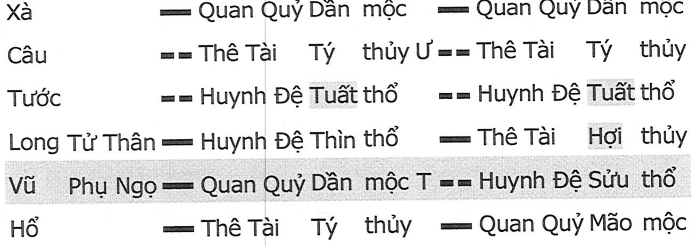

## Vứt một đống giấy vụn

Đây là một tình huống ở năm 2015. Một học trò của tôi đã mời tôi dự đoán tình huống này. Anh ta đoán hài tử khóc ầm ĩ vào ban đêm do nguyên nhân gì? Ở ngày Đinh Dậu (Tuần Không: Thìn Tị), tháng Mùi, được Lôi Trạch Quy Muội biến Chấn Vi Lôi.

| Lục thú | Phục thần | Quẻ Lôi Trạch Quy Muội | Thế/Ứng | Biến Chấn Vi Lôi |
| :--- | :--- | :--- | :---: | :--- |
| Long | | ╍╍ Phụ Mẫu Tuất thổ | Ư | ╍╍ Phụ Mẫu Tuất thổ |
| Vũ | | ╍╍ Huynh Đệ Thân kim | | ╍╍ Huynh Đệ Thân kim |
| Hổ | Tử Hợi | ━ Quan Quỷ Ngọ hỏa | | ━ Quan Quỷ Ngọ hỏa |
| Xà | | ╍╍ Phụ Mẫu Sửu thổ | T | ╍╍ Phụ Mẫu Thìn thổ |
| Câu | | ━ Thê Tài Mão mộc | | ╍╍ Thê Tài Dần mộc |
| Tước | | ━ Quan Quỷ Tị hỏa | | ━ Tử Tôn Tý thủy |

Lấy Tử Tôn làm Dụng thần. Tử Tôn Hợi thủy phục tàng dưới hào 4 Quan Quỷ Ngọ hỏa, Tử Tôn phục tàng là tượng ngủ, bị Quan Quỷ đè nén, cảm thấy khó chịu khi ngủ. Lâm Bạch Hổ, Bạch Hổ là khóc lóc, chính là khóc đêm.

Quẻ này chủ yếu là hỏi nguyên nhân, cát hung là thứ yếu. Hào 2 Thê Tài Mão mộc độc phát hóa thoái, sách nói: Thần triệu cơ ở động, đây chính là huyền cơ, đây chính là nguyên nhân.

Hào 2 là trạch, mộc là thực vật, vật có tính chất xơ, Nhật Nguyệt không phù là hưu tù, Nhật xung khắc, là tượng xé nát, hóa mộc là nhiều, hóa thoái là đã không còn ở trong nhà, đã vứt đi. Vì vậy, đoán là gần đây trong nhà đã vứt đi rất nhiều giấy vụn.

Quả nhiên đã vứt những vật bằng giấy thuộc về tiểu hài.

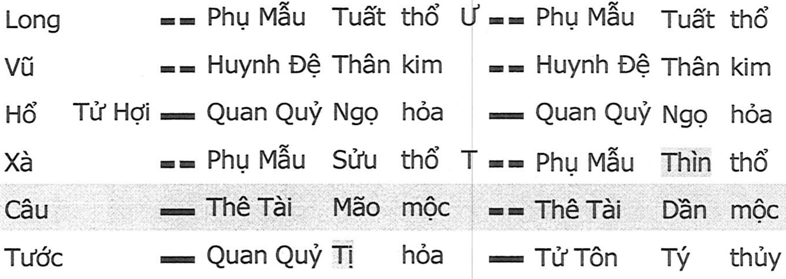

## Bể cá là linh hồn của con trai

Đây là một tình huống ở năm 2016. Một người nam đoán tình trạng phát triển của hài tử một tuổi bốn tháng, ở ngày Mậu Dần (Tuần Không: Thân Dậu), tháng Thìn, được Thủy Địa Tỷ biến Phong Địa Quan.

| Lục thú | Phục thần | Quẻ Thủy Địa Tỷ | Thế/Ứng | Biến Phong Địa Quan |
| :--- | :--- | :--- | :---: | :--- |
| Tước | | ╍╍ Thê Tài Tý thủy | Ư | ━ Quan Quỷ Mão mộc |
| Long | | ━ Huynh Đệ Tuất thổ | | ━ Phụ Mẫu Tị hỏa |
| Vũ | | ╍╍ Tử Tôn Thân kim | | ╍╍ Huynh Đệ Mùi thổ |
| Hổ | | ╍╍ Quan Quỷ Mão mộc | T | ╍╍ Quan Quỷ Mão mộc |
| Xà | | ╍╍ Phụ Mẫu Tị hỏa | | ╍╍ Phụ Mẫu Tị hỏa |
| Câu | | ╍╍ Huynh Đệ Mùi thổ | | ╍╍ Huynh Đệ Mùi thổ |

Lấy Tử Tôn làm Dụng thần. Tử Tôn Thân kim Không Vong, lâm Huyền Vũ, Tử Tôn Không Vong, chủ hài tử tẩu thần¹, tính cách tự bế. Hào 6 độc phát tiết khí của Dụng thần, hào 6 là chỗ cao, là thiên, chủ lực chú ý của hài tử tại bầu trời. (Nghiệm, hài tử phát triển chậm chạp, có khuynh hướng tự kỷ, không thể dùng ngón tay chỉ vật, gọi tên thì không ngoảnh lại, khi bồng, không ngừng nhìn lên mái nhà.)

Hào 6 Tý thủy độc phát hóa Quan Quỷ Tử địa, Tý thủy là cá, hào 6 là thoái vị, Tử địa là bất hoạt (không sống), Quan Quỷ cũng là chết, đã từng nuôi cá, cá chết thì không nuôi nữa.

Hóa mộc, trong bể cá vẫn còn cỏ nước. (Nghiệm, tháng 9 năm trước đã từng nuôi cá, có thêm cỏ nước vào trong bể, nhưng cá không sống được, sau khi cá chết thì đã vứt bể cá đi. Sau đó, hài tử sốt cao, mắt bắt đầu vô thần.)

Hóa giải: Đề nghị mua một bể cá mới, có thể không nuôi cá, nhưng cần phải thêm nước, đặt cỏ nước vào. Đặt vào giờ Tý ngày Kỷ Mão. Sau khi hóa giải như vậy, ngày Canh Thìn hài tử đã biết cười với người lớn, ngày Tân Tị khi dẫn hài tử đi bộ, hài tử đột nhiên chỉ vào lá cỏ rồi bắt đầu nói.

***

¹ Tinh thần không tập trung, lực chú ý phân tán.

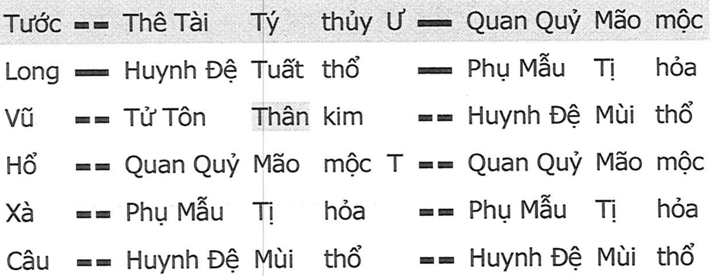

## Thủy cũng có lúc hại người

Đây là một tình huống ở năm 2011. Một người nam bắt đầu mở dưỡng sinh đường từ năm 2003, lợi nhuận liên tục không tốt, đoán từ nay về sau sẽ phát triển ra sao? Ở ngày Mậu Thìn (Tuần Không: Tuất Hợi), tháng Mão, được Địa Thủy Sư biến Trạch Thủy Khốn.

| Lục thú | Quẻ chính | Thế / Ứng | Quẻ biến |
| :--- | :--- | :---: | :--- |
| Tước | -- Phụ Mẫu Dậu kim | Ư | -- Quan Quỷ Mùi thổ |
| Long | -- Huynh Đệ Hợi thủy | | — Phụ Mẫu Dậu kim |
| Vũ | -- Quan Quỷ Sửu thổ | | — Huynh Đệ Hợi thủy |
| Hổ | -- Thê Tài Ngọ hỏa | T | -- Thê Tài Ngọ hỏa |
| Xà | — Quan Quỷ Thìn thổ | | — Quan Quỷ Thìn thổ |
| Câu | -- Tử Tôn Dần mộc | | -- Tử Tôn Dần mộc |

Lấy Thê Tài làm Dụng thần. Thê Tài lâm Bạch Hổ trì Thế, Bạch Hổ chủ y dược, ăn khớp với thông tin kinh doanh thực tế. Dụng thần mặc dù được Nguyệt đến sinh, nhưng hào 4 Quan Quỷ lâm Huyền Vũ phát động, hóa Huynh Đệ Hợi thủy, do đó Quan Quỷ này không phải để chế Huynh Đệ, mà là tiết khí của hào Thế Thê Tài, hào 5 Huynh Đệ Hợi thủy phát động lại khắc Thê Tài, cộng thêm cung Khảm chủ thủy, lân cận có thiết bị liên quan đến thủy đã ảnh hưởng đến phong thủy của cửa hàng này. Tuy rằng trong phong thủy có nói thủy là tài, nhưng đối với cửa hàng của anh, thủy lại là thứ hại anh.

Phản hồi: Việc kinh doanh của cửa hàng liên tục không tốt, đặc biệt là vào tháng 8, gần như đóng cửa, không có một người khách nào. Phía Đông có một nhà máy lọc nước, có đường ống kéo dài đến gần cửa hàng của mình.

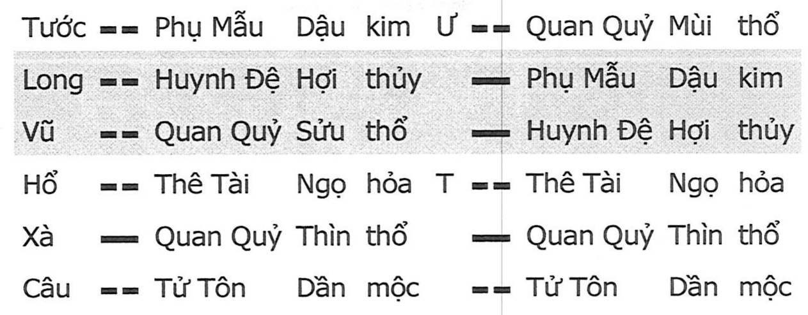

## Nhà tôi có trẻ khóc đêm

Đây là một tình huống ở năm 2011. Con gái của một người nữ cứ đến buổi tối thì sợ hãi không ngủ được. Hỏi con gái nguyên nhân, nó lại nói không biết, cầu đoán phải làm sao? Thế là bảo con gái người này gieo quẻ, ở ngày Quý Hợi (Tuần Không: Tý Sửu), tháng Tị, được Hỏa Thiên Đại Hữu biến Lôi Thiên Đại Tráng.

| Lục thú | Quẻ chính | Thế / Ứng | Quẻ biến |
| :--- | :--- | :---: | :--- |
| Hổ | — Quan Quỷ Tị hỏa | Ư | -- Phụ Mẫu Tuất thổ |
| Xà | -- Phụ Mẫu Mùi thổ | | -- Huynh Đệ Thân kim |
| Câu | — Huynh Đệ Dậu kim | | — Quan Quỷ Ngọ hỏa |
| Tước | — Phụ Mẫu Thìn thổ | T | — Phụ Mẫu Thìn thổ |
| Long | — Thê Tài Dần mộc | | — Thê Tài Dần mộc |
| Vũ | — Tử Tôn Tý thủy | | — Tử Tôn Tý thủy |

Lấy hào Thế làm Dụng thần. Hào Thế tại hào 3, hào 3 là giường, có thông tin ngủ.

Quan Quỷ Tị hỏa tại hào 6 phát động, mặc dù sinh hào Thế, nhưng Nhật khắc, lại nhập Mộ tại hào biến, hào 6 là trần nhà, hỏa là đèn, bị khắc thì tắt, nhập Mộ thì tối, trong nhà có đèn thường xuyên xảy ra vấn đề. (Người mẹ trả lời thay: Bóng đèn trong nhà chúng tôi thường xuyên bị hỏng.)

Phương pháp hóa giải: Trước tiên, kiếm bóng đèn chất lượng tốt lắp vào. Sau đó, đến hướng Tây Bắc tìm một hố đất, lấy đất xung quanh lấp đầy hố đó là được.

Ngày 14 tháng 7 năm đó phản hồi: Sau khi làm theo phương pháp trên, con gái đã không khóc đêm nữa, đồng thời cũng đã gan dạ hơn.

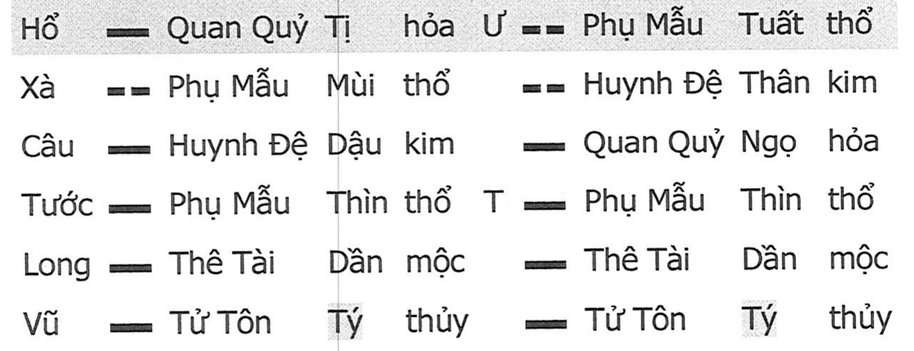

## Hóa ra là một quả bóng gỗ đang tác quái

Đây là một quái lệ của học trò đã hỏi tôi. Mẹ anh ta bị đau chân, uống thuốc không thấy hiệu quả, đoán xem do nguyên nhân gì gây ra? Ở ngày Tân Hợi (Tuần Không: Dần Mão), tháng Đinh Sửu, được Hỏa Phong Đỉnh biến Sơn Phong Cổ.

| Lục thú | Phục thần | Hỏa Phong Đỉnh | Thế/Ứng | Sơn Phong Cổ |
| :--- | :--- | :--- | :---: | :--- |
| Xà | | ━ Huynh Đệ Tị hỏa | | ━ Phụ Mẫu Dần mộc |
| Câu | | - - Tử Tôn Mùi thổ | Ứ | - - Quan Quỷ Tý thủy |
| Tước | | ━ Thê Tài Dậu kim | | - - Tử Tôn Tuất thổ |
| Long | | ━ Thê Tài Dậu kim | | ━ Thê Tài Dậu kim |
| Vũ | | ━ Quan Quỷ Hợi thủy | T | ━ Quan Quỷ Hợi thủy |
| Hổ | Phụ Mão | - - Tử Tôn Sửu thổ | | - - Tử Tôn Sửu thổ |

Lấy Phụ Mẫu làm Dụng thần. Phụ Mẫu Mão mộc phục tàng tại hào sơ, Nguyệt không khắc Nhật sinh là vượng tướng, có bệnh cũng không sao. Hào sơ là chân, Mão mộc Không Vong không được Nguyên thần đến sinh, Kỵ thần đến khắc, do đó là đau chân. Ngoài ra Mão mộc phản quái là Chấn, Chấn là chân, cũng là thông tin này.

Hào phục tàng hỷ độc phát xung xuất. Dậu kim mặc dù khắc Phụ Mẫu, nhưng độc phát xung không thể hoàn toàn là kỵ. Nay Mão mộc phục tàng, phục tàng chính là vật không nhìn thấy, mộc chính là vật bằng gỗ, là thực vật, Dậu kim lâm Chu Tước, Chu Tước là miệng, do đó tôi phán đoán trong nhà có vật như tăm xỉa răng hoặc đũa đã rơi vào xó xỉnh nào đó, khí và mẹ tương liên, thiên nhân hợp nhất, mới dẫn đến đau chân.

Ngày hôm sau, khi quét dọn đã tìm thấy một quả bóng gỗ hình tròn sau sa lông. Tức thì chân của mẹ anh ta đã không đau nữa, hơn nữa cảm thấy rất thoải mái, đúng là huyền diệu!

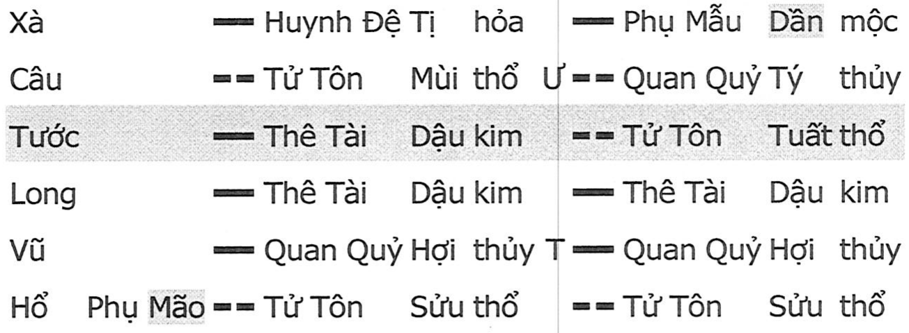

## Đã lấy đất bên cạnh

Một học trò đã hỏi tôi tình huống này vào năm 2019. Chồng cô ấy đoán dời mộ, sau vài lần đến nghĩa trang thì bắt đầu đau chân, uống thuốc không khỏi, nguyên nhân do đâu? Ở ngày Đinh Mùi (Tuần Không: Dần Mão), tháng Bính Tý, được Đoài Vi Trạch biến Lôi Địa Dự.

| Lục thú | Đoài Vi Trạch | Thế/Ứng | Lôi Địa Dự |
| :--- | :--- | :---: | :--- |
| Long | - - Phụ Mẫu Mùi thổ | T | - - Phụ Mẫu Tuất thổ |
| Vũ | ━ Huynh Đệ Dậu kim | | - - Huynh Đệ Thân kim |
| Hổ | ━ Tử Tôn Hợi thủy | | ━ Quan Quỷ Ngọ hỏa |
| Xà | - - Phụ Mẫu Sửu thổ | Ứ | - - Thê Tài Mão mộc |
| Câu | ━ Thê Tài Mão mộc | | - - Quan Quỷ Tị hỏa |
| Tước | ━ Quan Quỷ Tị hỏa | | - - Phụ Mẫu Mùi thổ |

Lấy hào Thế làm Dụng thần, xem tổ hợp biến hóa của quẻ, từ đó trích xuất thông tin tìm nguyên nhân.

Hào Thế Nguyệt không khắc, lâm Nhật là vượng tướng. Lâm Thanh Long, Thanh Long là đau, hào 2 Mão mộc lâm Câu Trần hóa Quan Quỷ đến khắc, Câu Trần là mộ, hóa Quan Quỷ thuyết minh bổ sung, Quan Quỷ là người chết, càng là mộ. Hào 2 là chân, Mão mộc phản quái là Chấn, Chấn là chân, đây là tượng đau chân do nghĩa trang. (Tự thuật)

Phân tích nguyên nhân: Thê Tài Mão mộc Không Vong, lâm Câu Trần hóa Quan Quỷ Tị hỏa, mộc là thực vật, Không Vong là tiêu thất, Câu Trần là cũ, hào biến thuyết minh bổ sung, Quan Quỷ là chết, hỏa Quỷ là vàng úa khô héo, bị kim khắc, nhất định là đã dọn dẹp cỏ cây khô héo. (Nghiệm)

Nguyên thần Tị hỏa bị Nguyệt khắc hưu tù, Huynh Đệ Dậu kim phát động ngăn trở, Nguyên thần không thể sinh hào Thế, hào 5 kim lâm Huyền Vũ là vai đau, hoặc cổ cảm thấy khó chịu. (Nghiệm, vai, cổ đau, lưng lạnh.)

Phân tích nguyên nhân: Kim là đá, hóa thoái là tượng ly khai, đã dọn dẹp vật giống như đá khỏi mộ địa. (Nghiệm)

Hào Thế Thanh Long là ẩm thực, bị Thê Tài Không Vong khắc, là không khỏe vì chán ăn. (Nghiệm, nguyên nhân đó có liên quan đến Thanh Long thảo mộc.)

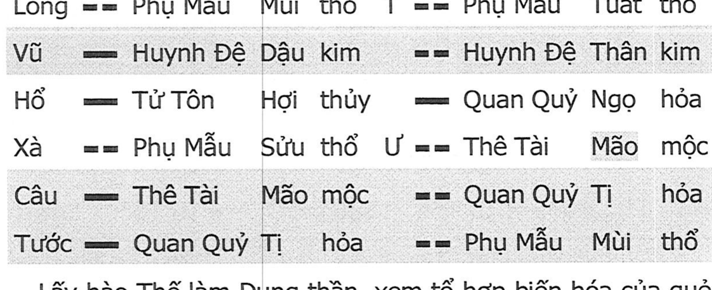

Thế thân hào Thế tại hào 3 lâm Sửu thổ, Sửu là bụng, hào 3 cũng là bụng, Câu Trần Mão mộc đến khắc, Câu Trần là trướng, chủ trướng bụng. (Nghiệm)

Phân tích nguyên nhân: Hào 3 Sửu thổ bị Nhật xung, Nhật chính là hào Thế, lâm hào Ứng, Ứng là nơi khác. Xung chính là động, đã lấy đất ở nơi khác để dùng. (Nghiệm, lúc phán đoán không được chứng thực, tháng Sửu học trò tôi tự ra mộ xem, kết quả là đã lấy rất nhiều đất xung quanh một gốc cây, rễ cây đã lộ ra ngoài.)

Hóa giải: Đốt ba tờ hoàng chỉ ở phía Đông. Sau khi hóa giải đã tốt hơn rất nhiều.

## Hóa ra là kéo nước về nhà

Một học trò đã hỏi tôi tình huống này vào năm 2017. Anh ta đoán về bệnh đau thắt lưng của mình, ở giờ Tuất, ngày Quý Mão (Tuần Không: Thìn Tị), tháng Dậu, được Trạch Lôi Tùy biến Thủy Lôi Truân.

| Lục thú | Phục thần | Trạch Lôi Tùy | Thủy Lôi Truân |
| --- | --- | --- | --- |
| Hổ | | - - Thê Tài Mùi thổ Ứ | - - Phụ Mẫu Tý thủy |
| Xà | | — Quan Quỷ Dậu kim | — Thê Tài Tuất thổ |
| Câu | Tử Ngọ | — Phụ Mẫu Hợi thủy | - - Quan Quỷ Thân kim |
| Tước | | - - Thê Tài Thìn thổ T | - - Thê Tài Thìn thổ |
| Long | | - - Huynh Đệ Dần mộc | - - Huynh Đệ Dần mộc |
| Vũ | | — Phụ Mẫu Tý thủy | — Phụ Mẫu Tý thủy |

Lấy hào Thế làm Dụng thần. Nguyệt hợp đắc khí, Nhật khắc, hào 3 Thìn thổ thủy khố là thắt lưng, thông tin hiện rõ. Hào Thế Thìn thổ Không Vong, chủ thận khí bất túc.

Nhưng, Phụ Mẫu Hợi thủy độc phát, hợp hào 2 Dần mộc, đây chính là vấn đề.

Người xưa nói: Thần triệu cơ ở động, thủy là thận, độc phát nhất định là biểu thị nguyên nhân. Hào 2 là trạch, hiển nhiên có thủy từ bên ngoài vào. Tôi phán đoán đã động ống nước, đã dẫn ống nước vào trong nhà. Bởi vì Hợi thủy lâm Câu Trần, chủ động công trình.

Kết quả, bởi vì trong nhà không có nước máy, đã kéo nước từ bên ngoài về nhà để dùng. Phong Thủy Bát Trạch luận rằng trạch có ngũ hư, thiếu giếng bếp là một hư, tương ứng với tình huống này. Trong nhà không thủy thận bất túc.

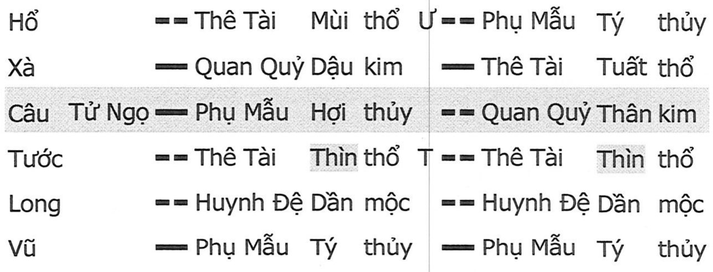

## Tượng Phật gỗ ảnh hưởng đến phong thủy

Đây là một tình huống ở năm 2018. Một người nữ đoán phong thủy, ở ngày Đinh Hợi (Tuần Không: Ngọ Mùi), tháng Mậu Ngọ, được Phong Trạch Trung Phu biến Khảm Vi Thủy.

| Lục thú | Phục thần | Phong Trạch Trung Phu | Khảm Vi Thủy |
| --- | --- | --- | --- |
| Long | | — Quan Quỷ Mão mộc | - - Thê Tài Tý thủy |
| Vũ | Tài Tý | — Phụ Mẫu Tị hỏa | — Huynh Đệ Tuất thổ |
| Hổ | | - - Huynh Đệ Mùi thổ T | - - Tử Tôn Thân kim |
| Xà | Tử Thân | - - Huynh Đệ Sửu thổ | - - Phụ Mẫu Ngọ hỏa |
| Câu | | — Quan Quỷ Mão mộc | — Huynh Đệ Thìn thổ |
| Tước | | — Phụ Mẫu Tị hỏa Ứ | - - Quan Quỷ Dần mộc |

Không có Dụng thần cụ thể, xem tổ hợp biến hóa của quẻ. Nguyệt là hỏa sinh hào Thế, trong quẻ lại có hai hỏa minh ám đến sinh, trong nhà đèn sáng rực. (Nghiệm, quanh năm không tắt đèn.)

Hào 4 là đại môn, Huynh Đệ là cửa, lâm Bạch Hổ chủ đường, Mùi thổ đối ứng Tây Nam, từ Tây Nam vào nhà. (Nghiệm, từ Tây Nam vào sân.)

Thê Tài Tý thủy phục tàng, lâm Huyền Vũ, chủ phân và nước tiểu, Nguyệt phá, chủ nhà vệ sinh có tổn hoại, ảnh hưởng đến tài vận. (Nghiệm, cống thoát nước nhà vệ sinh nhiều lần xảy ra vấn đề, tài vận không tốt.)

Thê Tài Nguyệt phá, Tử Tuyệt địa phát động, trạch này rất bất lợi đối với tài vận, hào 6 Quan Quỷ lâm Thanh Long và Câu Trần hóa Thê Tài, nhất định có vay tiền. (Nghiệm, có vay ngân hàng, kinh tế rất eo hẹp.)

Nhật là thủy xung khắc hào 5 Tị hỏa, lâm Huyền Vũ, Huyền Vũ chủ tối, hào 5 hỏa là mắt, sinh hào Thế bất túc, chủ không tốt đối với mắt người. (Nghiệm, mắt của người trong nhà đều không tốt, lại thêm hôi miệng.)

Thủy đối ứng với bàng quang, thận, nước tiểu v.v, hào 5 là tôn vị, Phụ Mẫu chủ người già, người già bất lợi về phương diện này. (Nghiệm, cha bị tiểu đường.)

Hào Thế bị Quan Quỷ Mão mộc khắc, Thanh Long là đau, hào 6 là đầu, đau đầu. Hào 2 Quan Quỷ Kỵ thần mặc dù an tĩnh, nhưng hào Thế phản quái là Khôn, Khôn là bụng, chú ý u xơ tử cung v.v. (Nghiệm, có u xơ tử cung và u nang buồng trứng. Bụng trái thường xuyên đau.)

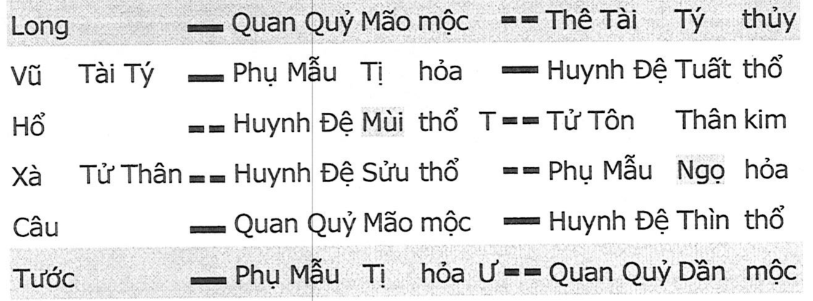

Hào 6 là thần Phật, Quan Quỷ lâm Thanh Long phát động càng là như vậy, mộc là chạm khắc gỗ. Khắc hào Thế, thần Phật bất lợi. Hóa Nguyệt phá khắc, tượng Phật nhất định có vết nứt. (Nghiệm, trong nhà cúng Phật Dược Sư, pháp khí trên tay trái của Dược Sư Như Lai có hai vết nứt.)

Hóa giải: Cúng dường tượng Phật cho tự viện, dùng phong thủy điều chỉnh phương diện khác.

## Đông Nam có thực vật ảnh hưởng

Đây là một tình huống ở năm 2017, một người nữ đoán sức khỏe của cha mẹ, ở ngày Đinh Mùi (Tuần Không: Dần Mão), tháng Mùi, được Trạch Thủy Khốn biến Đoài Vi Trạch.

| Lục thú | Quẻ Trạch Thủy Khốn | | | | Quẻ Đoài Vi Trạch | | |
| :--- | :---: | :--- | :--- | :---: | :---: | :--- | :--- |
| Long | ╍╍ | Phụ Mẫu | Mùi thổ | | ╍╍ | Phụ Mẫu | Mùi thổ |
| Vũ | ━ | Huynh Đệ | Dậu kim | | ━ | Huynh Đệ | Dậu kim |
| Hổ | ━ | Tử Tôn | Hợi thủy | Ứ | ━ | Tử Tôn | Hợi thủy |
| Xà | ╍╍ | Quan Quỷ | Ngọ hỏa | | ╍╍ | Phụ Mẫu | Sửu thổ |
| Câu | ━ | Phụ Mẫu | Thìn thổ | | ━ | Thê Tài | Mão mộc |
| Tước | ╍╍ | Thê Tài | Dần mộc | T | ━ | Quan Quỷ | Tị hỏa |

Lấy Phụ Mẫu làm Dụng thần. Phụ Mẫu lưỡng hiện, lấy hào dương Phụ Mẫu Thìn thổ làm cha, hào âm Phụ Mẫu Mùi thổ làm mẹ. Dụng thần Nhật Nguyệt phù vượng tướng, Kỵ thần độc phát đến khắc, nhưng Kỵ thần nhập Mộ tại Nhật Nguyệt, Không Vong, lực lượng yếu, có bệnh cũng không sao.

Hào 2 Phụ Mẫu Thìn thổ là thủy khố chủ hệ tiết niệu, lâm Câu Trần là sưng, là tuyến tiền liệt có vấn đề, phì đại tuyến tiền liệt. (Nghiệm)

Phụ Mẫu Mùi thổ tại hào 6 bị khắc, hào 6 là đầu, lâm Thanh Long chủ đau. Mẹ đau đầu. (Nghiệm)

Phụ Mẫu Mùi thổ cũng lâm Câu Trần, Câu Trần chủ chậm chạp, kết hợp với thổ là đần độn, có chứng mất trí nhớ do tuổi già, hào 6 là tay, hành động chậm chạp. (Nghiệm, tay chân đau, không linh hoạt.)

Độc phát xem lưu hướng, độc phát Dần mộc hợp Hợi thủy, thủy lâm Bạch Hổ là sông, tại hào Ứng, hào Ứng là trước, chủ trước nhà có con sông. (Nghiệm)

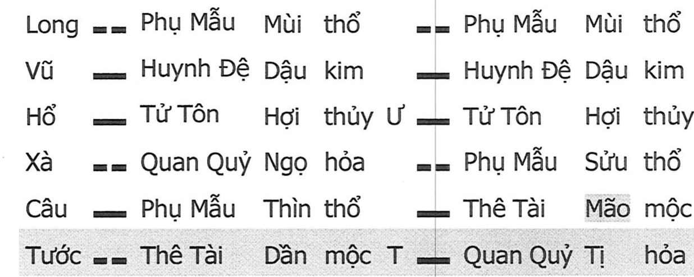

---

# Part 6 (Pages 101-120)

Hào sơ mộc lâm Chu Tước phát động lại hóa Tị hỏa, trong nhà nhất định có hoa. Mộc đến khắc hóa Tị hỏa Đông Nam, Đông Nam có thực vật nên dời đi chỗ khác. (Nghiệm, từ phía Đông đến phía Nam có các loại cây nở hoa, đã sinh trưởng hơn 40 nam, không thể chuyển dời.)

Hóa giải: Tìm bốn hòn đá cuội ở ven sông, đặt ở chỗ thấp phía Đông Bắc. (Hiện nay chưa có phản hồi)

## Do đã động bia mộ gây ra

Một học trò đã hỏi tôi tình huống này vào năm 2018. Một người nam đoán đầu gối đau do nguyên nhân gì? Ngày Ất Mùi (Tuần Không: Thìn Tị), tháng Tý, được Lôi Hỏa Phong biến Đoài Vi Trạch.

| Lục thú | Quẻ Lôi Hỏa Phong | | | | Quẻ Đoài Vi Trạch | | |
| :--- | :---: | :--- | :--- | :---: | :---: | :--- | :--- |
| Vũ | ╍╍ | Quan Quỷ | Tuất thổ | | ╍╍ | Quan Quỷ | Mùi thổ |
| Hổ | ╍╍ | Phụ Mẫu | Thân kim | T | ━ | Phụ Mẫu | Dậu kim |
| Xà | ━ | Thê Tài | Ngọ hỏa | | ━ | Huynh Đệ | Hợi thủy |
| Câu | ━ | Huynh Đệ | Hợi thủy | | ╍╍ | Quan Quỷ | Sửu thổ |
| Tước | ╍╍ | Quan Quỷ | Sửu thổ | Ứ | ━ | Tử Tôn | Mão mộc |
| Long | ━ | Tử Tôn | Mão mộc | | ━ | Thê Tài | Tị hỏa |

Hào Thế là bản thân, tổ hợp biến hóa của quẻ là nguyên nhân. Hào Thế Nguyệt không khắc Nhật sinh là vượng tướng, nhưng Nguyên thần Sửu thổ tại hào 2 lâm Chu Tước phát động hóa hồi đầu khắc, hào 2 là đầu gối, Chu Tước là viêm, hóa ra Mão mộc phản quái là Chấn, Chấn là chân, chính là đầu gối chân bị viêm.

Hào 3 Hợi thủy lâm Câu Trần phát động hóa ra Quan Quỷ Sửu thổ, Câu Trần là liên tiếp, thủy là tích dịch, Quan Quỷ là thương tật, là đầu gối có tích dịch dẫn tới đau nhức.

Phụ Mẫu Thân kim lâm Bạch Hổ phát động hóa Tiến thần, Phụ Mẫu là trưởng bối, Bạch Hổ là tử vong, kim là đá, nhập Mộ tại Quan Quỷ, chính là bia mộ, có thể là do đã động bia mộ gây ra. (Nghiệm, tháng Tuất đã thay đổi hướng của một bia mộ. Tại sao ứng tại tháng Tuất, thứ nhất bởi vì Sửu thổ hóa Mão mộc hồi đầu khắc, tháng Tuất hợp Mão mộc, Sửu thổ không bị khắc mà sinh Phụ Mẫu Thân kim, thứ hai Thân kim hóa Dậu kim, Tuất là ứng kỳ tiếp nối.)

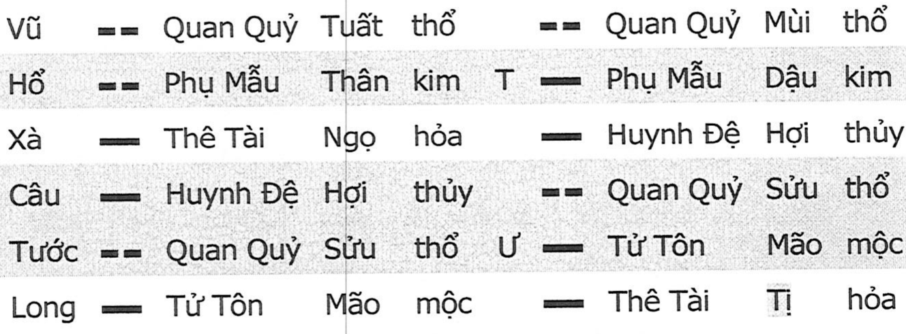

## Chặt cây đã ảnh hưởng đến mắt

Đây là một tình huống ở năm 2019. Một người nữ đoán nguyên nhân khiến một con mắt của mẹ không thể nhìn thấy. Ở ngày Mậu Tuất (Tuần Không: Thìn Tị), tháng Tuất, được Thiên Địa Bĩ biến Sơn Thiên Đại Súc.

| Lục Thần | Phục Thần | Quẻ Thiên Địa Bĩ | Thế Ứng | Quẻ Sơn Thiên Đại Súc |
| :--- | :--- | :--- | :---: | :--- |
| Tước | | ━ Phụ Mẫu Tuất thổ | Ư | ━ Thê Tài Dần mộc |
| Long | | ━ Huynh Đệ Thân kim | | ⚋ Tử Tôn Tý thủy |
| Vũ | | ━ Quan Quỷ Ngọ hỏa | | ⚋ Phụ Mẫu Tuất thổ |
| Hổ | | ⚋ Thê Tài Mão mộc | T | ━ Phụ Mẫu Thìn thổ |
| Xà | | ⚋ Quan Quỷ Tị hỏa | | ━ Thê Tài Dần mộc |
| Câu | Tử Tý | ⚋ Phụ Mẫu Mùi thổ | | ━ Tử Tôn Tý thủy |

Phụ Mẫu thể hiện mẹ, nhưng tổ hợp biến hóa của quẻ mới là thông tin cô ấy muốn biết. Trong quẻ Phụ Mẫu lưỡng hiện, lấy Phụ Mẫu Mùi thổ phát động làm Dụng thần.

Thiên Địa Bĩ là quẻ cung Càn, Càn là đầu, Nguyên thần lưỡng hiện, một Tị hỏa một Ngọ hỏa, tương ứng với hai con mắt. Tị hỏa Ngọ hỏa, một âm một dương, tương ứng mắt phải mắt trái. Tị hỏa Không Vong, nhập Mộ cũng có thông tin thị giác không tốt, bên phải là âm, nhưng hóa hồi đầu sinh, mắt phải vấn đề không lớn. Ngọ hỏa là dương, bên trái là dương, nhập Mộ chủ tối tăm, lâm Huyền Vũ, cũng là tối, mắt trái tương đối nghiêm trọng. (Nghiệm)

Hào Thế là huyệt, là trạch, lâm Mão mộc Bạch Hổ hóa Nguyệt phá hóa Không Vong. Không Vong Nguyệt phá tại Phụ Mẫu, Phụ Mẫu là trạch, mộc là cây cối, Bạch Hổ là đao, lại là Kỵ thần, mộc lấy hình thức hóa Không phá khắc Phụ Mẫu, chính là do trong sân đã chặt cây gây ra. (Nghiệm, quái chủ đã chặt cây trong sân.)

Thê Tài thể hiện ẩm thực, Thê Tài Mão mộc hóa Không phá, không nghĩ đến ăn uống. (Nghiệm)

Hóa giải: Bảo mẹ mang theo bên người hai sợi dây đỏ, đặt ba cây tăm xỉa răng ở chỗ cao phía Tây Nam.

Viết một bức thư xin thứ lỗi rồi đốt ở chỗ chặt cây.

Sau khi hóa giải đã có sự thèm ăn, mắt bắt đầu nhìn thấy từng chút một.

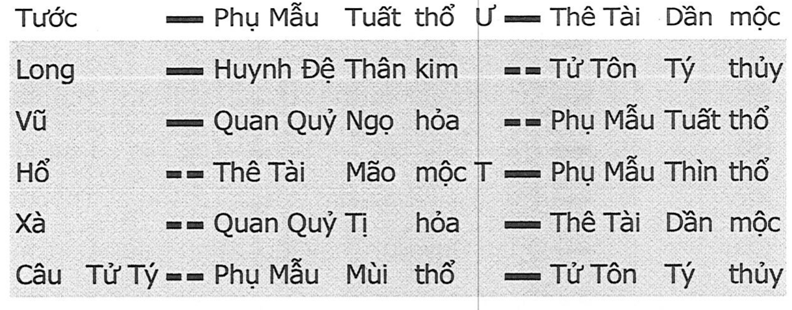

## Cống thoát nước đã bị lấp

Một học trò đã hỏi tôi tình huống này vào năm 2019. Một vị sư huynh của anh ta bị đau vai, tức ngực, cảm thấy giống như có thứ gì đó đè lên, ngủ không tốt, đoán do nguyên nhân gì gây ra? Ngày Đinh Mão (Tuần Không: Tuất Hợi), tháng Mão, được Hỏa Phong Đỉnh biến Hỏa Thiên Đại Hữu.

| Lục Thần | Phục Thần | Quẻ Hỏa Phong Đỉnh | Thế Ứng | Quẻ Hỏa Thiên Đại Hữu |
| :--- | :--- | :--- | :---: | :--- |
| Long | | ━ Huynh Đệ Tị hỏa | | ━ Huynh Đệ Tị hỏa |
| Vũ | | ⚋ Tử Tôn Mùi thổ | Ư | ⚋ Tử Tôn Mùi thổ |
| Hổ | | ━ Thê Tài Dậu kim | | ━ Thê Tài Dậu kim |
| Xà | | ━ Thê Tài Dậu kim | | ━ Tử Tôn Thìn thổ |
| Câu | | ━ Quan Quỷ Hợi thủy | T | ━ Phụ Mẫu Dần mộc |
| Tước | Phụ Mão | ⚋ Tử Tôn Sửu thổ | | ━ Quan Quỷ Tý thủy |

Quẻ này không phải là hỏi cát hung, hoặc triệu chứng, mà chủ yếu là hỏi nguyên nhân, tổ hợp biến hóa của quẻ rất quan trọng, nhất là độc phát, phần lớn biểu thị nguyên nhân.

Hào Thế lâm Hợi thủy Câu Trần Không Vong, sách nói: Thủy Không thì chảy, vốn là tượng nước chảy, nước rò rỉ, nhưng Câu Trần là tắc nghẽn, hào sơ là cống thoát nước, hóa thủy càng là như vậy, độc phát xung Mùi thổ, Mùi thổ ám động, hai thổ khắc một thủy, thủy bị thổ khắc, thì không thể chảy, là cống thoát nước đã bị tắc nghẽn.

Quả nhiên. Cống thoát nước nhà vệ sinh đã bị lấp. Sau đó đã móc từ trong cống ra rất nhiều bùn đen.

## Con gái lớn lên ở nhà bà ngoại

Đây là một tình huống ở năm 2019, một người nữ đoán về việc con gái (sinh năm Tân Tị) không chịu đi học, ở ngày Nhâm Thìn (Tuần Không: Ngọ Mùi), tháng Tý, được Trạch Sơn Hàm biến Lôi Sơn Tiểu Quá.

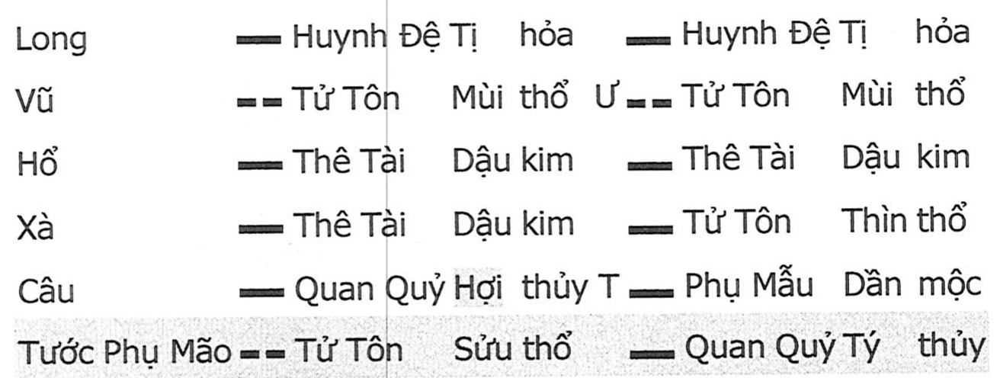

| Lục thú | Quái hào | Thế/Ứng | Biến hào |
| :--- | :--- | :---: | :--- |
| Hổ | ╍╍ Phụ Mẫu Mùi thổ | Ư | ╍╍ Phụ Mẫu Tuất thổ |
| Xà | ━ Huynh Đệ Dậu kim | | ╍╍ Huynh Đệ Thân kim |
| Câu | ━ Tử Tôn Hợi thủy | | ━ Quan Quỷ Ngọ hỏa |
| Tước | ━ Huynh Đệ Thân kim | T | ━ Huynh Đệ Thân kim |
| Long | ╍╍ Quan Quỷ Ngọ hỏa | | ╍╍ Quan Quỷ Ngọ hỏa |
| Vũ | ╍╍ Phụ Mẫu Thìn thổ | | ╍╍ Phụ Mẫu Thìn thổ |

Tình huống này thuộc dự đoán bệnh tật, lấy Tử Tôn làm Dụng thần. Tử Tôn lâm Hợi thủy, thủy chủ trí, hài tử thông minh, lâm Câu Trần là tượng bất động, nhập Mộ tại Nhật, tương đối lười nhác. (Nghiệm)

Mộ khố nhập quẻ tại hào sơ, hào sơ là thời thơ ấu, Phụ Mẫu là trưởng bối. Thìn thổ sinh hào Thế, cũng là trưởng bối của quái chủ, hào sơ là đại địa, chủ mẹ, hào âm là nữ nhân, sinh hào Thế, cũng là người sinh quái chủ, con gái lúc nhỏ sống ở nhà bà ngoại. Nguyên thần Tử Tôn là hào sinh Tử Tôn, độc phát hợp Thìn thổ, trưởng thành ở nhà bà ngoại. (Nghiệm, lúc nhỏ lớn lên ở nhà bà ngoại)

Hào mệnh con gái khắc hào Thế hình hào Thế, con gái có ý kiến (không vừa lòng), không hòa hợp với chị. (Nghiệm)

Hào mệnh con gái xung Tử Tôn Hợi thủy, chủ không có thường tính (quy tắc nhất định), hay thay đổi, nhiệt tình mười phút. (Nghiệm)

Độc phát chủ nguyên nhân, Dậu kim tại hào 5 lâm Đằng Xà hóa thoái hợp hào sơ, kim là kim loại, Đằng Xà là thon dài, hóa thoái rủ xuống, hợp hào sơ, rủ xuống mặt đất, biểu thị trong nhà có dây xích sắt rủ xuống cần loại bỏ. (Nghiệm, trong nhà có đèn được treo bằng dây xích sắt.)

Phương pháp hóa giải: 1. Thay đổi đèn.

2. Bọc một thìa muối vào trong vải trắng rồi đặt ở chỗ cao Chính Tây.

3. Dưới gối của hài tử để một cái vòng chìa khóa bằng đồng. Hiện tại tình hình tổng thể của hài tử có thể chấp nhận được.

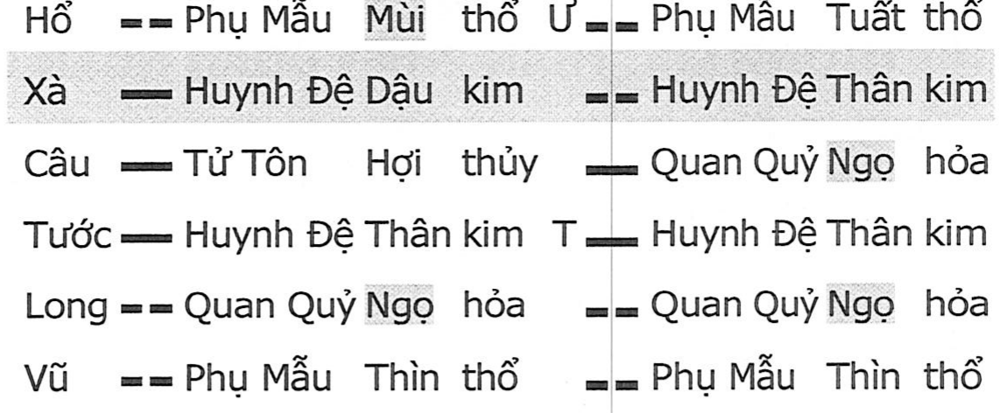

# CHƯƠNG 10
## THỦ TƯỢNG LỤC THẦN PHÁN ĐOÁN NHÂN QUẢ

Trong dự đoán lục hào, lục thần mặc dù không thể chi phối cát hung của sự vật, nhưng khi phán đoán về phương diện nhân quả, lục thần lại là một trong những cơ sở không thể thiếu. Lục thần chủ yếu dùng để phân loại, quy nạp tính chất, đặc điểm, mức độ, nguyên nhân v.v của sự vật và bệnh tật con người. Khi ứng dụng cần căn cứ vào nội dung dự đoán, kết hợp lục thần với hào vị, quái cung v.v tổng hợp thủ tượng, trích xuất thông tin.

**Thanh Long:** Thể hiện xuất thân danh môn, cao quý, giàu có, hanh thông, tiền tài, cát tường, may mắn, vui vẻ, giải trí, người thân, họ hàng, tiệc rượu, ẩm thực, thăm viếng thân hữu, nhân nghĩa, hiền từ, tao nhã, đoan trang, xinh đẹp, lộng lẫy, trang sức, trang điểm, hóa trang, hòa thuận, mềm lòng, thông minh, có lễ độ, bên trái, sinh dục, háo sắc, sắc tình, đau nhức, ngứa ngáy v.v.

**Chu Tước:** Thể hiện ấn tín, văn thư, văn chương, công hàm, giấy khen, hồ sơ, ngôn từ, thông tin, tin tức, viễn thông, ca hát, văn tự, sách vở, nghề diễn thuyết, lải nhải, nói nhiều, giỏi lời lẽ, mỉm cười, xảo biện, khẩu thiệt, tranh cãi, tức giận, chửi rủa, quan phi, tố tụng, hỏa tai, vật dễ cháy, nóng rực, đỏ vàng, cuồng ngôn loạn ngữ, ồn ào, tạp âm, rên rỉ, chứng viêm, phía trước, học tập, giáo dục, màu đỏ v.v.

**Câu Trần:** Thể hiện quan tụng, công an, nha môn, lao ngục, cơ quan chính phủ, nhân viên công vụ, văn phòng, điền địa, điền sản, kiến trúc, bất động sản, cây nông nghiệp, nội thất, bận tâm, liên lụy, liên quan, thật thà, ngu đần, chậm chạp, kéo dài, cứng nhắc, gượng gạo, không am hiểu, không dễ dàng bày tỏ thái độ, trung ương, trung gian, sưng trướng, nhô ra, phù thũng, té ngã, u ung thư, dạng khối, béo, cũ kỹ, ứ đọng v.v.

**Trình Xà:** Thể hiện tham lam, giả dối, nói không giữ lời, nghi kỵ, keo kiệt, dài dòng, không thẳng thắn, khuyết thiếu, khó đối phó, kiện tụng, âm tà, tiểu nhân ám toán, gai góc, phiền phức, triền miên nan giải, giữ chặt không thả, kinh dị, giật mình, bất ngờ, hoảng sợ, phụ thuộc, tâm loạn, chập chờn, quên, biến hóa, quái gở, hiếm thấy, không nhiều, dây thừng, thon dài, uốn cong, trắc diện v.v.

**Bạch Hổ:** Thể hiện quyết đoán, hung ác, dữ tợn, hào sảng, thù hận, hung tàn, tính khí nóng nảy, vũ lực, uy quyền, đao thương, đường, lộ liễu, không che giấu, bên phải, thương vong, tang sự, lâm sản, máu, sinh dục, huyết tai, đổ máu, đánh nhau, bị thương, gãy xương, xa họa, khóc lóc, phẫu thuật, bệnh tai, y dược, gượng gạo, cấp tốc v.v.

**Huyền Vũ:** Thể hiện lén lút, ám muội, trộm cắp, gian đạo, bất tường, lừa đảo, âm mưu, xảo quyệt, con bạc, đầu cơ, gian trá, việc ngấm ngầm xấu xa, thất thoát, bất tri bất giác, nhà vệ sinh, dơ bẩn, phía sau, sau lưng, màu đen, tà khí, phong thấp, ẩm ướt, lạnh, phiền muộn, dâm tà, dâm loạn, nội tâm, khó nói, nhục nhã v.v.

## Bạn cùng chơi lúc nhỏ đã thắt cổ chết

Một Dịch hữu trên QQ đã hỏi tôi tình huống này vào năm 2017. Anh ta đoán nguyên nhân và cát hung về chứng tăng urê máu của mình. Ở ngày Canh Ngọ (Tuần Không: Tuất Hợi), tháng Thân, được Sơn Thiên Đại Súc biến Địa Thiên Thái.

| Lục thú | Phục thần | Quái hào | Thế/Ứng | Biến hào |
| :--- | :--- | :--- | :---: | :--- |
| Xà | | ━ Quan Quỷ Dần mộc | | ╍╍ Tử Tôn Dậu kim |
| Câu | | ╍╍ Thê Tài Tý thủy | Ứ | ╍╍ Thê Tài Hợi thủy |
| Tước | | ╍╍ Huynh Đệ Tuất thổ | | ╍╍ Huynh Đệ Sửu thổ |
| Long | Tử Thân | ━ Huynh Đệ Thìn thổ | | ━ Huynh Đệ Thìn thổ |
| Vũ | Phụ Ngọ | ━ Quan Quỷ Dần mộc | T | ━ Quan Quỷ Dần mộc |
| Hổ | | ━ Thê Tài Tý thủy | | ━ Thê Tài Tý thủy |

Lấy hào Thế làm Dụng thần. Quan Quỷ trì Thế là bệnh lâu, bị Nguyệt xung phá, Nguyệt là lâu dài, không phải là mới có bệnh. (Hồi đáp: Bị bệnh đã hơn một năm.)

Mặc dù có hai Tý thủy ám động đến sinh hào Thế, nhưng hào Thế bị Nguyệt xung khắc, bệnh rất khó khỏi trong một thời gian ngắn. Tý thủy lâm Bạch Hổ Câu Trần, Câu Trần là cổ lão, truyền thống, Bạch Hổ là y dược, thủy là thang dược, đó chính là Trung dược. Biểu thị đã uống rất nhiều Trung dược. (Hồi đáp: Uống Trung dược ở nhiều nơi đều vô hiệu.)

Hào 6 Quan Quỷ Dần mộc lâm Đằng Xà độc phát hóa hồi đầu khắc. Dần mộc và hào Thế giống nhau, là thế thân hào Thế. Hào 6 là đầu, quái cung Cấn là cổ, mộc là xà nhà, vật thon dài, Đằng Xà là siết, Nguyệt là Tuyệt địa Nhật là Tử địa, có một người cùng tuổi với anh đã treo cổ chết, Cấn là quê nhà, là bạn cùng chơi lúc nhỏ, ở quê nhà. (Nghiệm, là con trai của cô nãi (cô của cha), cùng tuổi với mình, đã treo cổ chết mười mấy năm trước. Không lâu sau bản thân đã bị viêm thận, hơn một năm trước đã phát triển thành chứng tăng urê máu.)

Về mặt mê tín, người bạn cô đơn đó đang gọi anh ta cùng đi, về góc độ khoa học, đó là từ trường của hai người có sự liên hệ với nhau, bản thân đã bị quấy nhiễu.

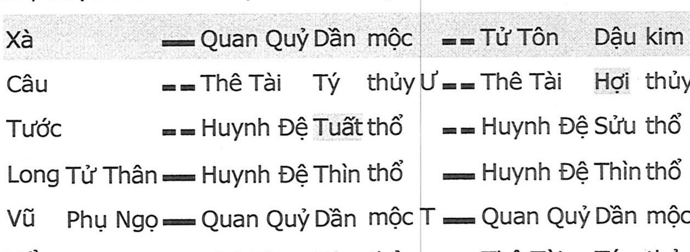

Phương pháp hóa giải: Ở phía Bắc, dưới mặt đất đặt một bình hoắc hương chính khí, ở chỗ cao đặt một khối băng (nước đá), ngoài ra mang theo bên người sáu hạt đậu đen, trên đậu đen viết một chữ "minh" (明). Anh ta thấy bảo vật hóa giải cần viết một chữ minh, liền nói rằng trong tên của người treo cổ cũng có một chữ minh, tên là Trương Đức Minh, thực ra minh này không phải minh kia.

Sau đó kết quả như thế nào, không có phản hồi.

## Trong nhà thiếu ánh sáng

Đây là một tình huống ở năm 2010. Một người nữ 43 tuổi cầu đoán phong thủy nhà. Được quẻ như sau. Ở ngày Tân Dậu (Tuần Không: Tý Sửu), tháng Dậu.

| Lục thú | Phục thần | Quái hào | Thế/Ứng | Biến hào |
| :--- | :--- | :--- | :---: | :--- |
| Xà | | ╍╍ Thê Tài Tý thủy | Ư | ━ Quan Quỷ Mão mộc |
| Câu | | ━ Huynh Đệ Tuất thổ | | ━ Phụ Mẫu Tị hỏa |
| Tước | | ╍╍ Tử Tôn Thân kim | | ╍╍ Huynh Đệ Mùi thổ |
| Long | | ╍╍ Quan Quỷ Mão mộc | T | ╍╍ Quan Quỷ Mão mộc |
| Vũ | | ╍╍ Phụ Mẫu Tị hỏa | | ╍╍ Phụ Mẫu Tị hỏa |
| Hổ | | ╍╍ Huynh Đệ Mùi thổ | | ╍╍ Huynh Đệ Mùi thổ |

Hào 2 là trạch, lâm Phụ Mẫu Tị hỏa Huyền Vũ, Nguyệt không phù, lại bị Tý thủy độc phát đến khắc, Huyền Vũ là tối tăm, hỏa là ánh sáng. Ngôi nhà này không đủ ánh sáng. Ứng là án sơn, hướng, lâm Tý thủy động, nhà hướng Bắc. (Quả nhiên là nhà tọa Nam hướng Bắc, cửa mở hướng về phía Bắc, nhà thiếu ánh sáng.)

Hào sơ gặp thổ là nền nhà, lâm Bạch Hổ, lại là Mộ khố của Quan Quỷ, Bạch Hổ chủ tử vong, Quan Quỷ là thi thể, dưới đất ở có hài cốt. (Người xem cho biết, cách đây mấy năm đã từng chôn một con mèo nuôi đã chết.)

Đối với nữ giới, Quan Quỷ thể hiện đàn ông. Quan Quỷ mặc dù trì Thế, nhưng bị Nhật Nguyệt xung khắc, hôn nhân bất lợi. (Thực tế là đã sống chung với bạn trai nhiều năm, bản thân luôn muốn kết hôn, nhưng đối phương cứ trốn tránh.)

Hào 6 Tý thủy Không Vong hóa Nguyệt phá, hào 6 là mái nhà, mái nhà có hiện tượng dột nước. (Phản hồi, trời mưa thì có dột nước, nhưng đã xử lý rồi.)

Hào 3 là giường, Nguyệt phá, ván giường có khe hở, ảnh hưởng đến giấc ngủ. Nguyên thần Không Vong lâm Đằng Xà tại hào

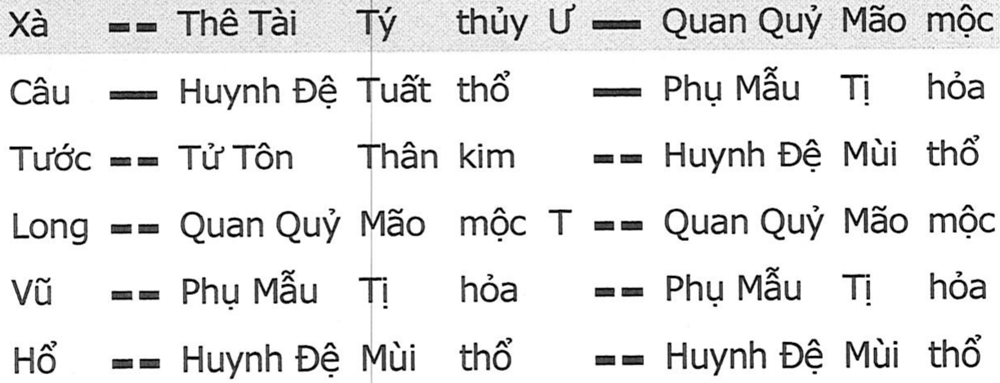

6, đầu cung máu không tốt, tâm trạng bất an. (Phản hồi, trong lòng phiền muộn, không ngủ được, đầu bị choáng.)

Hóa giải: Vá lại khe hở trên giường và đặt mười hạt đậu bên cạnh gối.

Phản hồi sau khi hóa giải: Tâm trạng chuyển biến tốt, có thể ngủ yên. Đầu cũng không còn bị choáng nữa.

## Họa từ chặt cây

Đây là một tình huống ở năm 2011. Một người nữ đoán sức khỏe của cha trong mùa hè. Ở ngày Nhâm Thìn (Tuần Không: Ngọ Mùi), tháng Ngọ, được Sơn Thiên Đại Súc biến Địa Thiên Thái.

| Lục thú | Phục thần | Sơn Thiên Đại Súc | Địa Thiên Thái |
| :--- | :--- | :--- | :--- |
| Hổ | | — Quan Quỷ Dần mộc | -- Tử Tôn Dậu kim |
| Xà | | -- Thê Tài Tý thủy Ư | -- Thê Tài Hợi thủy |
| Câu | | -- Huynh Đệ Tuất thổ | -- Huynh Đệ Sửu thổ |
| Tước | Tử Thân | — Huynh Đệ Thìn thổ | — Huynh Đệ Thìn thổ |
| Long | Phụ Ngọ | — Quan Quỷ Dần mộc T | — Quan Quỷ Dần mộc |
| Vũ | | — Thê Tài Tý thủy | — Thê Tài Tý thủy |

Lấy Phụ Mẫu làm Dụng thần. Phụ Mẫu Ngọ hỏa, lâm Nguyệt vượng tướng có bệnh cũng không sao. Phục tàng tại hào 2, hào 2 là trạch, Không Vong chủ không muốn ru rú ở trong nhà. Quẻ cung Cấn, Cấn là tay chân, Nguyên thần tại hào 6 hóa hồi đầu khắc, hào 6 là tay, chủ tay hoạt động không thể tự nhiên, hào 2 là chân, lâm Thanh Long chủ đau chân. Tháng Thân cần chú ý những điều bất lợi này.

Độc phát chủ nguyên nhân, mộc lâm Bạch Hổ hồi đầu khắc, Bạch Hổ là đao thương, mộc là cây, chủ trong sân có cây bị chặt. Ngoại quái là Cấn, đối ứng Đông Bắc, cây tại Đông Bắc. Thìn thổ trên Nhật hợp vượng hào biến Dậu kim, tháng Thìn chặt cây.

Hóa giải: Cố định tám chiếc đũa trên tường Đông Bắc, đồng thời bảo cha mang theo bên người một con ngựa mỹ nghệ.

Phản hồi khi đó: Thực tế, tay của cha không giơ lên được, eo chân đều bị đau, tháng Thìn năm nay đã chặt mấy gốc cây ở Đông Bắc, sau đó sức khỏe bắt đầu bất thường. Ngày 26 tháng 9 lại phản hồi: Cha chỉ chịu mang theo vật hóa giải khi đạp xe ra ngoài. Bình thường thì để ở bên cạnh gối. Từ sau khi hóa giải, ngủ rất ngon, đầu óc minh mẫn. Tháng Thân, mặt bị sưng. Đi khám bệnh, được biết là do viêm lợi gây ra, vài ngày sau đã khỏi. Mặc dù eo chân và

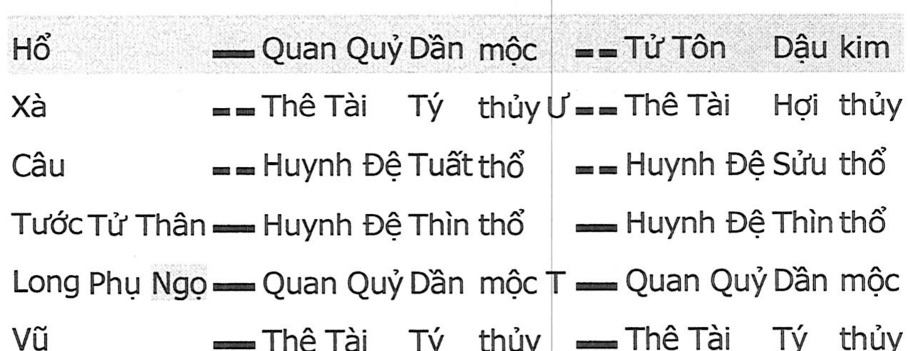 tay không thay đổi bao nhiêu, nhưng cũng không ảnh hưởng đến công việc đồng áng, hơn nữa vẫn có thể đạp xe ra ngoài được.

## Đừng uống rượu nữa

Đây là một tình huống ở năm 2015, một người nam cảm thấy đau lưng và xương vai, đoán sức khỏe, ở ngày Đinh Sửu (Tuần Không: Thân Dậu), tháng Tý, được Thủy Địa Tỷ biến Trạch Địa Tụy.

| Lục thú | Thủy Địa Tỷ | Trạch Địa Tụy |
| :--- | :--- | :--- |
| Long | -- Thê Tài Tý thủy Ư | -- Huynh Đệ Mùi thổ |
| Vũ | — Huynh Đệ Tuất thổ | — Tử Tôn Dậu kim |
| Hổ | -- Tử Tôn Thân kim | — Thê Tài Hợi thủy |
| Xà | -- Quan Quỷ Mão mộc T | -- Quan Quỷ Mão mộc |
| Câu | -- Phụ Mẫu Tị hỏa | -- Phụ Mẫu Tị hỏa |
| Tước | -- Huynh Đệ Mùi thổ | -- Huynh Đệ Mùi thổ |

Lấy hào Thế làm Dụng thần. Hào Thế Mão mộc Nguyệt sinh Nhật không phù cũng không khắc là vượng tướng. Mặc dù không có nỗi lo đến tính mạng, nhưng độc phát Thân kim Tuyệt hào Thế khắc hào Thế, phải hết sức cẩn thận, may mà Thân kim Không Vong, chưa đến lúc nguy hiểm. Nhưng Thân kim Nhật sinh, Mùi thổ ám động sinh, hào Thế lại nhập Mộ tại Mùi thổ, nguy cơ trùng trùng.

Hào Thế tại hào 3 lâm Mão mộc bị khắc, hào 3 là gan mật, Mão mộc cũng là gan mật, lâm hào âm thường là gan, khả năng là gan có vấn đề. Kỵ thần là Tử Tôn, Tử Tôn có ý nghĩa là uống rượu, hóa ra Thê Tài, Thê Tài chủ ẩm thực, ngũ hành thủy thường là rượu, lại thêm hào biến Thê Tài trở về trong quẻ thành Thê Tài Tý thủy, lâm Thanh Long, Thanh Long chủ rượu, biểu thị bản thân anh thích uống rượu.

Quả nhiên bình thường thích uống rượu, đến bệnh viện tra được là gan có vấn đề. Sau đó bắt đầu bỏ rượu, năm 2017 gặp lại anh ta, vui vẻ hoạt bát, dường như bệnh gì cũng không có.

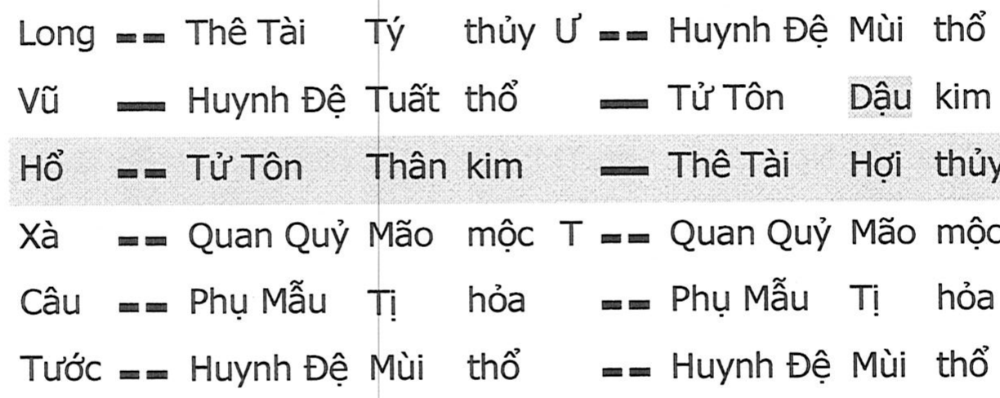

## Tại sao không lớn?

Một học trò đã hỏi tôi tình huống này vào năm 2016. Đoán con gái của em trai bạn học tại sao không lớn (sinh năm Ất Mùi)? Ngày Đinh Mão (Tuần Không: Tuất Hợi), tháng Dần, được Địa Phong Thăng biến Địa Sơn Khiêm.

| Lục thú | Phục thần | Quẻ chính | Thế / Ứng | Quẻ biến |
| :--- | :--- | :--- | :---: | :--- |
| Long | | -- Quan Quỷ Dậu kim | | -- Quan Quỷ Dậu kim |
| Vũ | | -- Phụ Mẫu Hợi thủy | | -- Phụ Mẫu Hợi thủy |
| Hổ | Tử Ngọ | -- Thê Tài Sửu thổ | T | -- Thê Tài Sửu thổ |
| Xà | | — Quan Quỷ Dậu kim | | — Quan Quỷ Thân kim |
| Câu | Huynh Dần | — Phụ Mẫu Hợi thủy | | -- Tử Tôn Ngọ hỏa |
| Tước | | -- Thê Tài Sửu thổ | Ứ | -- Thê Tài Thìn thổ |

Lấy Tử Tôn làm Dụng thần. Tử Tôn Ngọ hỏa phục tàng dưới hào 4 Sửu thổ, mặc dù Nhật Nguyệt sinh, nhưng độc phát lâm Câu Trần khắc Dụng thần, Câu Trần chủ chậm chạp, chính là thông tin không lớn.

Người xưa nói: Thần triệu cơ ở động, Kỵ thần lâm hào 2 Câu Trần độc phát, thông thường sẽ phán đoán là do vấn đề về phong thủy nhà đã ảnh hưởng đến sự sinh trưởng. Nhưng hào 6 Quan Quỷ Dậu kim ám động sinh Phụ Mẫu Hợi thủy, ám động này không thể xem nhẹ. Hợi thủy đối ứng năm Đinh Hợi, Câu Trần chủ điền thổ, hào 6 Quan Quỷ là tổ tiên, tổ phần. Như vậy là đã động tổ phần. (Quả nhiên đã dời mộ ở năm Đinh Hợi.)

Tiếp theo, hào 2 Phụ Mẫu Hợi thủy Không Vong, hào 2 là trạch, thủy Không thì chảy, chủ trong nhà rỉ nước. (Nghiệm)

Bởi vì do những vấn đề này gây ra, vậy thì cần phải giải quyết những vấn đề này.

Hóa giải: Đã để học trò của tôi đi làm.

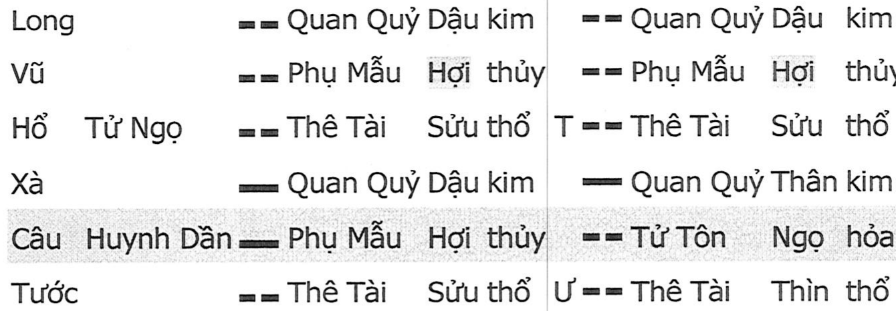

## Do đã ăn đồ cúng gây ra

Một học trò đã hỏi tôi tình huống này. Đoán hài tử hơn một tuổi, đột nhiên bỏ ăn, quấy khóc, phát sốt, nguyên nhân là gì? Ở ngày Nhâm Tuất (Tuần Không: Tý Sửu), tháng Dậu, được Trạch Sơn Hàm biến Trạch Phong Đại Quá.

| Lục thú | Phục thần | Quẻ chính | Thế / Ứng | Quẻ biến |
| :--- | :--- | :--- | :---: | :--- |
| Hổ | | -- Phụ Mẫu Mùi thổ | Ứ | -- Phụ Mẫu Mùi thổ |
| Xà | | — Huynh Đệ Dậu kim | | — Huynh Đệ Dậu kim |
| Câu | | — Tử Tôn Hợi thủy | | — Tử Tôn Hợi thủy |
| Tước | | — Huynh Đệ Thân kim | T | — Huynh Đệ Dậu kim |
| Long | Tài Mão | -- Quan Quỷ Ngọ hỏa | | — Tử Tôn Hợi thủy |
| Vũ | | -- Phụ Mẫu Thìn thổ | | -- Phụ Mẫu Sửu thổ |

Lấy Tử Tôn làm Dụng thần. Nhật khắc Nguyệt sinh, suy vượng tương đương. Sách nói: Thần triệu cơ ở động. Quan Quỷ Ngọ hỏa lâm Thanh Long độc phát chính là nguyên nhân. Thanh Long chủ ẩm thực, hào 2 Thanh Long thường chủ bếp, nhưng độc phát trước tiên xem lưu hướng, hợp với hào 6 Phụ Mẫu Mùi thổ, hào 6 là mộ, lâm Bạch Hổ Phụ Mẫu càng là như vậy. Do hài tử đã ăn đồ cúng ở nghĩa trang gây ra.

Trên thực tế, mộ vừa mới lập bia, đã làm lễ cúng, sau đó hài tử ăn đồ cúng thì xuất hiện tình trạng hiện nay.

Phương pháp hóa giải: Không ghi chép.

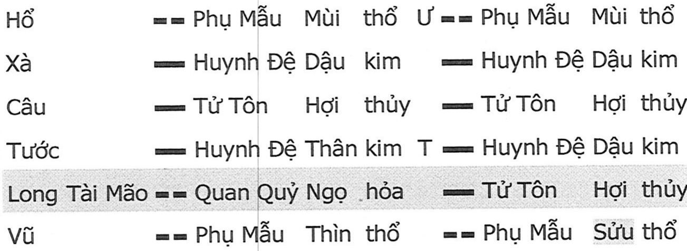

## Ngày thường ăn đồ quá nóng

Một học trò đã hỏi tôi tình huống này vào năm 2019. Bác trai của anh ta có một khối u mọc bên phải cổ, trong xoang mũi cũng có, đoán cát hung của bác. Ở ngày Mậu Thìn (Tuần Không: Tuất Hợi), tháng Hợi, được Sơn Trạch Tổn biến Phong Trạch Trung Phu.

| Lục Thú | Phục Thần | Sơn Trạch Tổn | Biến | Phong Trạch Trung Phu |
| :--- | :--- | :--- | :---: | :--- |
| Tước | | ▅▅▅▅▅ Quan Quỷ Dần mộc Ứ | ▅▅▅▅▅ | Quan Quỷ Mão mộc |
| Long | | ▅▅ ▅▅ Thê Tài Tý thủy | ▅▅▅▅▅ | Phụ Mẫu Tị hỏa |
| Vũ | | ▅▅ ▅▅ Huynh Đệ Tuất thổ | ▅▅ ▅▅ | Huynh Đệ Mùi thổ |
| Hổ | Tử Thân | ▅▅ ▅▅ Huynh Đệ Sửu thổ T | ▅▅ ▅▅ | Huynh Đệ Sửu thổ |
| Xà | | ▅▅▅▅▅ Quan Quỷ Mão mộc | ▅▅▅▅▅ | Quan Quỷ Mão mộc |
| Câu | | ▅▅▅▅▅ Phụ Mẫu Tị hỏa | ▅▅▅▅▅ | Phụ Mẫu Tị hỏa |

Lấy Phụ Mẫu làm Dụng thần. Phụ Mẫu Tị hỏa tại hào sơ lâm Câu Trần bị Nguyệt kiến xung phá, Câu Trần là khối u, Nguyệt kiến xung chứa khắc, Nhật xung Tuất thổ ám động, Dụng thần nhập Mộ, Kỵ thần độc phát tại hào 5 lại khắc, Dụng thần ở trong trạng thái bất lợi.

Hào 5 là cổ, ngoại quái Cấn vừa là cổ, vừa là mũi. Thông tin của bệnh hoàn toàn nhập quẻ. Độc phát có vai trò biểu thị nguyên nhân. Lâm Thanh Long hóa Tị hỏa khắc Dụng thần, Thanh Long là ẩm thực, hóa hỏa là nhiệt. Ngày thường thích ăn đồ nóng hổi đã dẫn đến bệnh tình hiện tại. (Nghiệm, ngày thường thì thích ăn đồ quá nóng.)

Nay Tị hỏa Nguyệt phá, Tý thủy là Thái Tuế năm sau độc phát, đề phòng tháng Tị năm Canh Tý năm sau bất lợi. (Sau đó cát hung như thế nào, không có phản hồi.)

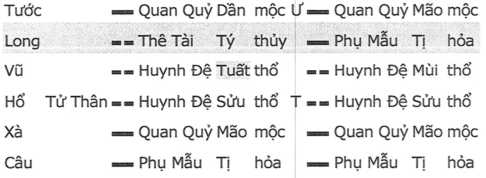

# CHƯƠNG 11
## THỦ TƯỢNG HÀO VỊ PHÁN ĐOÁN NHÂN QUẢ

Trong dự đoán lục hào, hào vị có một vai trò hết sức trọng yếu, nó là một trong những căn cứ để phán đoán tính chất, nguyên nhân, phương vị, bộ vị và quá trình biến hóa của sự vật. Hào vị có tính thời gian và tính không gian. Đồng thời cũng là một sơ đồ phản ánh cấu trúc và quá trình phát triển biến hóa của sự vật.

Hào sơ biểu thị điểm khởi đầu của một sự vật, là phần dưới và bên trong của một vật thể, cùng với sự lên cao của hào vị, thời gian dần dần tiến về phía trước, vật thể biến hóa hướng tới phần trên và đỉnh, đến hào 6 thì biến thành giai đoạn cuối cùng của sự vật, hoặc phần ngoài và đỉnh của vật thể.

Nếu dùng hào vị để định tính cuộc đời của một con người, vậy thì hào sơ chính là lúc vừa mới sinh ra, biểu thị trẻ sơ sinh, thời thơ ấu, thiếu niên, đến hào 6 thì biến thành tuổi già, rời khỏi cuộc sống hiện thực, nhân vật lịch sử, hoặc một thế giới khác hư vô mù mịt.

Nếu dùng hào vị để định tính cự ly, thì hào sơ là gần, biểu thị lân cận, lân cư, bên cạnh, bản địa, hào 6 là xa, là quê người, vùng khác, nước ngoài, vùng biên giới xa xôi v.v.

Nếu dùng hào vị để xác định đẳng cấp, thì hào sơ là cấp thấp nhất, cơ sở nhất, nhỏ bé nhất, lính mới, người non nớt. Còn hào 6 là người thoái xuống từ cấp cao nhất, đã không còn làm việc, lui về tuyến hai, hưởng thanh nhàn, không được trọng dụng.

Nếu là một cái cây, thì hào sơ là rễ, hào 6 là ngọn, nếu là một cái bàn, thì hào sơ là chân bàn, hào 6 là mặt bàn. Nếu là một con người, thì hào sơ là chân, hào 6 là đầu. Nếu là vũ trụ, thì hào sơ là đại địa, hào 6 là thiên. Nếu là một kiến trúc, thì hào sơ là nền móng, hào 6 là mái nhà. Tóm lại, tùy theo bạn lấy quẻ để xem điều gì, quái tượng sẽ hiển thị đặc điểm phát triển biến hóa của đối tượng được dự đoán.

Dưới đây là một số ý nghĩa của hào vị có tỷ lệ ứng nghiệm khá cao trong dự đoán lục hào.

**Hào sơ:** Thể hiện dân chúng, dân thành thị, học sinh tiểu học, hài tử, thời thơ ấu, hậu bối, nô lệ, dân thường, nhân viên, bộ hạ, cơ sở, bảo mẫu, gà vịt, mọc cánh, chân, cước khí, bệnh chai chân, gót chân, cổ chân, ngón chân, mắt cá chân, lòng bàn chân. Tâm sự, ý nghĩ, nội tâm, phương án, ý niệm, tư duy. Nông thôn, ngoại thành, nhà trẻ, giếng nước, nền nhà, kênh rạch, sông ngòi, cầu, lân cư, láng giềng, xung quanh, lân cận, bên cạnh. Thổ nhưỡng, thổ địa, đại địa, đường chân trời, rễ, phần đáy, chân của đồ vật, giày, vớ, lốp xe, khởi đầu, khởi bước, hành tẩu, vận động, giẫm đạp v.v.

**Hào 2:** Thể hiện trưởng ban, trưởng bộ phận, trưởng phòng, nhân viên công vụ, vợ chồng, thai nhi, mèo chó, chân, đầu gối, hậu môn, bộ phận sinh dục, bàng quang, thận, tá tràng, môn vị, ruột già, trực tràng, tử cung, gan mật, khớp, thị trấn, khu dân cư, nhà, trong nhà, nhà bếp, sân, trong phòng, nhà mẹ đẻ (của phụ nữ đã có chồng), quần, nịt gối, quần cộc, nội y, buồng lái v.v.

**Hào 3:** Thể hiện trưởng phòng, phó giám đốc sở, chủ nhiệm, xưởng trưởng, học sinh trung học, anh em trai, chị em gái, tim, phổi, thắt lưng, rốn, bụng, mông, tỳ vị, ruột, đùi, gan mật, thận, bàng quang, tử cung, tòa thị chính, thành thị, cửa, giường, phòng ngủ, gian giữa, bàn, ghế, nội Phật đường, quần lót, váy, tạp dề, lợn v.v.

**Hào 4:** Thể hiện thị trưởng, giám đốc sở, trưởng phòng, trợ lý, nhân sự lãnh đạo, học sinh cấp ba, mẹ, chú, thím, cậu, ngực, lưng, vú, tim, tỳ vị, phổi, thận, vai, thượng vị, thực quản, đại môn, cửa sổ, nhà vệ sinh, thành phố lớn, chính quyền tỉnh, trường cấp ba, mặc áo, nội y, trang phục, trang sức đeo ở ngực, dê v.v.

**Hào 5:** Thể hiện thủ tướng, chủ tịch, lãnh đạo, giám đốc, cấp trên, gia trưởng, cha, đế vương, nhân khẩu, ngũ quan, cổ, ngực, lưng, tay, phổi, yết hầu, tim, khí quản, thực quản, lồng ngực, tuyến giáp trạng, con đường, thủ đô, đại học hạng nhất, trung tâm, khách sạn, áo khoác, nịt vú, khăn quàng cổ, kính đeo mắt, khẩu trang, trang sức đeo ở cổ, cao cấp, ưu việt, trọng yếu, mấu chốt, cốt lõi, bò v.v.

**Hào 6:** Thể hiện nhân viên thoái hưu, người già, tổ tiên, thần, Phật, chúa trời, hương hỏa, vũ trụ, bầu trời, không trung, chỗ cao, đầu, tóc, mặt, má, đôi tóc mai, tay, đại não, thần kinh não, đầu lâu, xương đầu, vai, tuyến giáp trạng, nước ngoài, biên giới, biên cương, phương xa, tông miếu, từ đường, rường cột, tường vách, mái nhà, lân cư, tổ phần, khăn đội đầu, mũ nón, khăn voan, đồ trang sức, kẹp tóc, lịch sử, nhàn trí (để đó không dùng), thoái vị, thoái hưu, nghỉ ngơi, bất động, tích lũy, trữ tồn, ngựa v.v.

Sau đây là một số án lệ mà tôi đã được nghiệm chứng:

## Thượng thiên nhập địa

Đây là một tình huống ở năm 2016. Một người nữ dự đoán hôn nhân. Ở ngày Nhâm Tuất (Tuần Không: Tý Sửu), tháng Thìn, được Thủy Sơn Kiển biến Phong Sơn Tiệm.

| Lục Thú | Phục Thần | Quẻ Thủy Sơn Kiển | Quẻ Phong Sơn Tiệm |
| :--- | :--- | :--- | :--- |
| Hổ | | -- Tử Tôn Tý thủy | — Thê Tài Mão mộc |
| Xà | | — Phụ Mẫu Tuất thổ | — Quan Quỷ Tị hỏa |
| Câu | | -- Huynh Đệ Thân kim T | -- Phụ Mẫu Mùi thổ |
| Tước | | — Huynh Đệ Thân kim | — Huynh Đệ Thân kim |
| Long | Tài Mão | -- Quan Quỷ Ngọ hỏa | -- Quan Quỷ Ngọ hỏa |
| Vũ | | -- Phụ Mẫu Thìn thổ Ư | -- Phụ Mẫu Thìn thổ |

Lấy Quan Quỷ làm Dụng thần. Quan Quỷ Ngọ hỏa không được Nhật Nguyệt phù là hưu tù, nhập Mộ tại Nhật, bị độc phát xung khắc, hôn nhân không tốt.

Hào Thế là người cầu đoán, lâm hào kim Câu Trần, Câu Trần là thực tại (chân thực), kim chủ nghĩa, Nhật Nguyệt sinh vượng tướng, chủ chị là một người có nghĩa khí, là người thực tại, chịu khổ giỏi. (Nghiệm)

Ứng là phu vị, lâm Thìn thổ Huyền Vũ ám động sinh hào Thế, Huyền Vũ chủ nhạy bén, lừa gạt, Thìn thổ là thủy khố, là vật chứa thủy, bề ngoài thì thấy chồng rất tốt với chị, bưng trà rót nước chăm sóc chị, nhưng trên thực tế là một kẻ hoàn toàn dối trá. Thê Tài Mão mộc phục tàng dưới Quan Quỷ Ngọ hỏa, tiền trong nhà chị đều bị anh ta kiểm soát. (Nghiệm, người nữ này đã kiếm được rất nhiều tiền, nhưng đều bị vẻ ngoài nhiệt tình của chồng mê hoặc, bị lừa lấy đi tất cả.)

Quan Quỷ lâm Thanh Long, chủ háo sắc, đã phục tàng một Thê Tài Mão mộc, Mão mộc là Đào Hoa trên Nhật, gặp độc phát là Mộc Dục địa, chồng chị phạm Đào Hoa đã có ngoại tình. Độc phát Tử Tôn Tý thủy xung khai Quan Quỷ Ngọ hỏa, Thê Tài phục tàng lộ ra, sự việc phạm Đào Hoa của chồng đã bị chị phát hiện, Tý thủy Không Vong, chủ năm 2008 xuất Không, Tý thủy thể hiện hài tử, vào năm 2008, anh ta đã sinh con với người tình, và chị đã phát hiện. (Phản hồi: Đúng là tôi đã phát hiện ở năm đó, đứa con của họ là người lùn. Anh ta cũng đã mua xe và mua nhà cho người phụ nữ đó.)

Tử Tôn Tý thủy tại hào 6 Không Vong hưu tù lâm Bạch Hổ hóa Tử địa, đứa con của họ đoản mệnh, Tử Tôn tại hào 6 là thiên, nhập

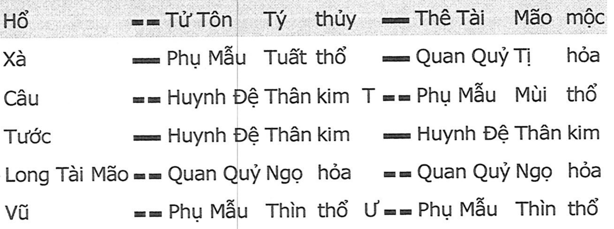

Mộ hào sơ Thìn thổ, Thìn thổ lâm hào Ứng, khách tử tha hương, thượng thiên nhập địa. Hóa ra Thê Tài Mão mộc, Không Vong nhập Mộ, có thể cả hai mẹ con đều gặp nạn. (Nghiệm, ông đoán rất đúng, tháng 2 năm ngoái, hai mẹ con họ đã ra Đài Loan du lịch, máy bay xảy ra tai nạn, hai người đã rơi từ trên trời xuống mà chết.)

Tử Tôn Tý thủy Không Vong, lại hóa Thê Tài Mão mộc, hào biến Mão mộc Nhật hợp được vượng, người phụ nữ đó đã chết, nhưng Đào Hỏa của chồng chị vẫn chưa đứt, lại sẽ xuất hiện Đào Hoa mới. (Nghiệm, anh ta lại phải lòng một người phụ nữ gần nhà.)

Cô ấy hỏi: Tại sao mệnh của tôi lại như thế này?

Tôi đáp: Mệnh quy mệnh, theo phán đoán của tôi, là do tổ phần gây ra. Hào 6 là tổ phần.

Cô ấy hỏi: Là tổ phần của nhà mẹ tôi? Hay là tổ phần của nhà chồng?

Tôi đáp: Đều có thể. Hào 6 lâm Bạch Hổ Không Vong, chính là có người chưa quy tổ phần. Hào 6 Tử Tôn khắc Quan Quỷ, nếu là tổ phần của nhà chồng, cái khắc ta là Quan, nhất định là có trưởng bối chết tha hương, lâm Tử Tôn Bạch Hổ, Tử Tôn là binh lính, Bạch Hổ là đao thương, là đi lính chết tha hương. (Nghiệm, bác trai anh ta tham gia cách mạng, đã chết tại Tứ Xuyên, chưa quy tổ.)

Nếu là tổ phần nhà mẹ chị, hào Thế là kim, hào 6 là cái ta sinh, chính là hậu bối, tuổi trẻ, hào Thế và Tý thủy Thìn thổ tam hợp cục, thì có thể là cùng thế hệ. Cũng có một người chưa quy tổ phần. (Nghiệm, là anh trai thứ hai của tôi, anh ấy được nhận làm con thừa tự cho nhà cô tôi, đã chết vì ung thư ở tuổi 40, được chôn ở tổ phần của nhà chồng cô tôi.)

Tôi tiếp tục đoán: Hôn nhân của hai người này cũng đều không tốt, nhất định đều là nhị hôn. (Nghiệm, bác trai của chồng bởi vì hôn nhân do gia đình sắp đặt, không có tình cảm, sau đó đã lấy vợ nhỏ. Còn anh trai thứ hai được nhận làm con thừa tự cho người thì hai lần hôn nhân.)

Hào độc phát là nơi được hào Thế sinh, chị rất muốn ly hôn. Nhưng Không Vong không thể khắc, lần lữa không quyết định. Khắc Quan Quỷ, đồng thời cũng xung khai Phi thần, khiến Thê Tài hiện ra. Chủ yếu là chị muốn ly hôn với chồng và đòi lại tiền của chị. (Nghiệm, đúng là tôi muốn đòi lại tiền của tôi, đó đều là tiền của tôi kiếm được, trả tiền cho tôi thì ly hôn.)

Chị tuổi Thân, hào Thế chính là Thân khỉ, chồng chị tuổi Ngọ, Quan Quỷ chính là Ngọ ngựa, tất cả đều là mệnh. Trên tay chị có chuỗi hạt, chắc chị là người học Phật phải không? Có thể buông thì buông, bắt đầu lại sự nghiệp và cuộc sống mới cho mình nhé.

## Nhất quái đồng đoán âm dương trạch

Ngày Bính Dần (Tuần Không: Tuất Hợi), tháng Giáp Thân, năm Canh Thìn, một người nam hỏi phần địa của cha mẹ có ảnh hưởng đến mình hay không? Được Sơn Phong Cổ biến Sơn Thiên Đại Súc.

| Lục thú | Phục thần | Hào | Quẻ Sơn Phong Cổ | Thế/Ứng | Hào | Quẻ Sơn Thiên Đại Súc |
| :--- | :--- | :---: | :--- | :---: | :---: | :--- |
| Long | | ━ | Huynh Đệ Dần mộc | Ư | ━ | Huynh Đệ Dần mộc |
| Vũ | Tử Tị | ━ ━ | Phụ Mẫu Tý thủy | | ━ ━ | Phụ Mẫu Tý thủy |
| Hổ | | ━ ━ | Thê Tài Tuất thổ | | ━ ━ | Thê Tài Tuất thổ |
| Xà | | ━ | Quan Quỷ Dậu kim | T | ━ | Thê Tài Thìn thổ |
| Câu | | ━ | Phụ Mẫu Hợi thủy | | ━ | Huynh Đệ Dần mộc |
| Tước | | ━ ━ | Thê Tài Sửu thổ | | ━ | Phụ Mẫu Tý thủy |

Tôi nói: "Mộ của cha mẹ anh là mộ hợp táng, không phải táng ở phần địa chọn mới, mà là táng ở trong phần địa của gia đình người ta. Phần mộ tại khu vực rừng núi, tọa Tây Bắc hướng về Đông Nam, đất của huyệt mộ có đá và cát. Người ta táng ở đất này thì rất tốt, còn gia đình anh thì chưa hẳn. Phía trước mộ có một ngã ba đường, một đường dẫn đến Đông Bắc, một đường dẫn đến Tây Bắc, ngã ba này bất lợi cho cầu quan. Phía Tây Bắc của mộ có một hố đất lớn, ảnh hưởng đến tài vận của anh. Do đó, tiền bạc và quan vận của anh đều không thuận lợi. Phương Đông Bắc vốn là có rừng cây, đã bị người ta chặt, sau khi bị chặt thì trong anh em có người xảy ra tai họa, nhưng cánh rừng cũng đã tự phát triển trở lại, chuyện xấu biến thành chuyện tốt, hiện nay thì người anh em bị tai nạn kia đã phát tài lớn."

Anh ta nói rằng mọi thứ đều đúng. Phần mộ cha mẹ được táng ở trong phần địa của nhà người bạn. Phán đoán về hoàn cảnh xung quanh rất chính xác, tài vận và quan vận của bản thân đều không tốt. Năm 88 hạ táng, năm 89 thì có người đã chặt rừng cây ở phía Đông Bắc, một anh trai đã xảy ra tai nạn giao thông. Có điều là người anh đó hiện nay rất giàu có.

Quẻ này phán đoán như sau:

Lấy Phụ Mẫu làm Dụng thần, lưỡng hiện, lấy hào lâm Câu Trần làm Dụng. Bởi vì Câu Trần có ý nghĩa là nhô ra, phồng lên. Mộ là mô đất, do đó lấy Phụ Mẫu Hợi thủy lâm Câu Trần làm Dụng. Phụ Mẫu Hợi thủy và Nhật tương hợp, hợp là mộ hợp táng. Phụ Mẫu và

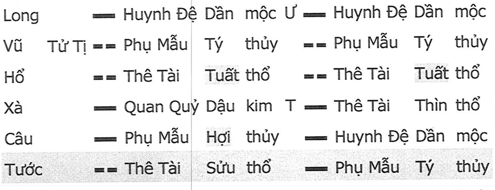 hào Ứng tác hợp, Ứng là người khác, vì vậy táng ở trong phần địa của nhà người ta. Quẻ tại cung Tốn, Tốn là rừng núi, lại ngoại quái Cấn là núi, nội quái Tốn là cây cối, vì vậy phần mộ tại khu vực rừng núi. Hào Thế là huyệt mộ, lâm kim là cát, đá. Ứng lâm Thanh Long, tốt cho người khác.

Phụ Mẫu Tý thủy tại hào 5, hào 5 là đường. Hào sơ Sửu thổ động mà hợp hào 5, lại tương hợp với hào biến, hào biến và hào 5 tương đồng, vì vậy hào biến Tý thủy cũng có thể xem là đường. Hai đường hợp lẫn nhau ở Sửu thổ, chính là tượng hai con đường giao nhau. Dụng thần Phụ Mẫu Hợi thủy tại hào 2, Sửu thổ gần Dụng thần. Trong lục hào, dưới là phía trước, trên là phía sau. Vì vậy, phía trước mộ có ngã ba đường. Phụ Mẫu Tý thủy là đường, hợp Thê Tài Sửu thổ, Sửu là Đông Bắc, hóa nhập quẻ Càn, Càn là Tây Bắc, vì vậy đoán là một đường dẫn đến Đông Bắc, một đường dẫn đến Tây Bắc.

Quan Quỷ trì Thế, nhưng Nguyên thần bị hào biến Phụ Mẫu Tý thủy tương hợp, hợp thì vướng chân, tham hợp quên sinh, vì vậy bất lợi cho quan vận. Phía Tây Bắc có một hố đất lớn là bởi vì Thê Tài Tuất thổ Không Vong, thổ Không là hố, Tuất là Tây Bắc. Lâm Tài Không không sinh Thế, vì vậy ảnh hưởng đến tài vận. Hào 6 Dần mộc là Đông Bắc, cũng là cây cối, Nguyệt phá là bị người ta chặt. Nhưng Nhật thần Thực Phá, lại mọc ra. Lâm Huynh Đệ, tất ứng vào anh em. Huynh Đệ Dần mộc là Dịch Mã, vì vậy ứng vào xa họa. Nhưng Huynh Đệ Dần mộc Thực Phá, lâm Thanh Long, Thanh Long chủ tiền tài, vì vậy người anh em bị nạn đã phát tài.

Tôi lại nói: "Sức khỏe của vợ anh không tốt, thường gặp ác mộng. Đứa nhỏ học hành tạm được, vừa đủ điểm chuẩn nhập học. Có điều là sức khỏe của đứa con cũng không quá tốt, nhiều thương tai, phần lưng có bệnh."

Người này nói rằng, nếu như sớm tìm tôi đoán quẻ thì đã tốt hơn rồi, đỡ phải tốn 3 ngàn tệ tiền oan uổng. Con trai anh ta đã thi đậu trường trung cấp, lúc đó cảm thấy thi không được tốt cho nên đã biếu 3 ngàn tệ để xin người ta châm chước, sau khi xuống kết quả thì điểm số của con vừa đủ nhập học. Khi không lại đưa tiền cho người ta. Mấy ngày trước, con trai từ trên giường rơi xuống, gãy mất mấy cái răng, trên lưng có mọc lên một cái nhọt. Bệnh của vợ cũng nói rất đúng.

Ở đây phán đoán như sau:

Vợ lấy hào Tài làm Dụng, lưỡng hiện, lấy hào Sửu thổ phát động làm Dụng. Sửu là Mộ khố Quan Quỷ, trong người thế nào cũng có bệnh. Quan Quỷ tại hào 3, hào 3 là giường, lâm Đằng Xà, Đằng

Xà chủ mộng, vì vậy vợ người này sẽ thấy ác mộng. Đứa nhỏ thì xem hào Tử Tôn, Tử Tôn Tị hỏa phục dưới Phụ Mẫu Tý thủy, Phi khắc Phục, cùng Nhật Nguyệt tạo thành tam hình, vì vậy sức khỏe không tốt, nhiều thương tai. Phụ Mẫu là ngực, lưng, tại hào 5 khắc Tử Tôn, hào 5 cũng là ngực, lưng. Dương là ngực, âm là lưng. Vì vậy, trên lưng có bệnh. Tử Tôn phục dưới hào Phụ Mẫu, Phi thần và hào lâm Chu Tước tương hợp, Phụ Mẫu là văn thư, Chu Tước cũng chủ văn thư, là thông tin đứa nhỏ đang đi học. Quan Quỷ Phụ Mẫu vượng tướng, nhưng Phụ Mẫu Hợi thủy Không Vong, thành tích thi cử sẽ không quá cao. Hào Tài Sửu thổ phát động sinh Quan Quỷ, người xưa nói "Tài động sinh Quan, may mắn gọi tên", vì vậy vừa đủ điểm chuẩn nhập học.

Anh ta lại hỏi kỹ hơn sức khỏe của vợ, tôi nói: "Vợ anh có vấn đề ở thắt lưng và chân, có bệnh phong hàn, mắt nhìn không rõ, thường xuyên đau đầu. Hơn nữa tính khí không tốt, có 5 anh em, cô ấy là con cả, rất ít bạn bè, hay lo việc đâu đâu. Tất cả đều ứng nghiệm.

Ở đây phán đoán như sau:

Quan Quỷ Dậu kim tại hào 3, gặp kim là thắt lưng, lại Tài tại hào sơ, hào sơ là chân, cho nên chân và thắt lưng có vấn đề. Tại cung Tốn, Tốn là phong, cho nên là bệnh phong hàn. Nguyên thần hào Tài phục dưới hào 5, hào 5 là ngũ quan, hỏa chủ mắt, bị hào Phi khắc là mắt có bệnh, lâm Huyền Vũ, Huyền Vũ là trong bóng tối, vì vậy mắt nhìn không rõ đồ vật. Lại Kỵ thần lâm hào 6, hào 6 là đầu, lâm mộc và Thanh Long chủ đau nhức, vì vậy có bệnh đau đầu. Hào Tài Sửu thổ lâm Chu Tước, một hào Tài khác là Tuất thổ lâm Bạch Hổ, Chu Tước chủ cãi cọ, Bạch Hổ chủ đánh nhau, vì vậy tính khí không tốt, hay lo việc đâu đâu. Lấy Sửu thổ làm Dụng, Tuất thổ là ngũ hành tỷ hòa, có thể coi là bạn bè, lâm Không Vong là không có bạn bè. Dụng thần Sửu thổ động hợp hào 5, hào 5 là tôn vị, địa vị lãnh đạo, lời nói chắc chắn, vợ anh ta trong số anh em là người ngồi ghế lãnh đạo, vì vậy là con cả. Hào Tài đa hiện là vợ có nhiều anh em, thổ là số 5, vì vậy đoán là có 5 anh em.

Anh ta lại hỏi đến phong thủy nơi ở, tôi nói: "Gia đình anh ở nhà lầu, anh ở tại tầng thứ ba. Nền nhà không tốt, đã bị bớt xén nguyên vật liệu, cốt thép mà nền nhà sử dụng không tốt, sau khi xây xong căn nhà thì tường xuất hiện vết nứt, đã từng tu bổ." Kết quả hoàn toàn chính xác.

Hạ quái Phụ Mẫu Hợi thủy lâm hào 2, hào 2 là trạch, Phụ Mẫu cũng chủ nhà, Nhật thần hợp hào 2, trên hợp dưới là nhà lầu. Hào Thế tại hào 3, vì vậy ở tại tầng thứ ba. Hào sơ là nền nhà, bị Nhật khắc, nền nhà có khuyết điểm. Sửu là Mộ khố Quan Quỷ, Quan Quỷ là vấn đề, khuyết điểm, Sửu thổ tàng Quan Quỷ, tức là nền nhà có vấn đề, Quan Quỷ là kim, kim là cốt thép, vì vậy đoán là cốt thép không tốt. Hào 6 là tường, Nguyệt phá là tường có vết nứt, nhưng Nhật Thực Phá lại là tu sửa.

## Bình an mới là việc khẩn trước mắt

Đây là một tình huống ở năm 2018, một người nam chiêm về thăng tiến. Ở ngày Quý Mão (Tuần Không: Thìn Tị), tháng Sửu, được Khảm Vi Thủy biến Thủy Địa Tỷ.

| | Khảm Vi Thủy | | Thủy Địa Tỷ | |
| :--- | :---: | :--- | :---: | :--- |
| Hổ | ▅▅ ▅▅ | Huynh Đệ Tý thủy T | ▅▅ ▅▅ | Huynh Đệ Tý thủy |
| Xà | ▅▅▅▅▅ | Quan Quỷ Tuất thổ | ▅▅▅▅▅ | Quan Quỷ Tuất thổ |
| Câu | ▅▅ ▅▅ | Phụ Mẫu Thân kim | ▅▅ ▅▅ | Phụ Mẫu Thân kim |
| Tước | ▅▅ ▅▅ | Thê Tài Ngọ hỏa Ứ | ▅▅ ▅▅ | Tử Tôn Mão mộc |
| Long | ▅▅▅▅▅ | Quan Quỷ Thìn thổ | ▅▅ ▅▅ | Thê Tài Tị hỏa |
| Vũ | ▅▅ ▅▅ | Tử Tôn Dần mộc | ▅▅ ▅▅ | Quan Quỷ Mùi thổ |

Lấy Quan Quỷ làm Dụng thần, Quan Quỷ lưỡng hiện, lấy hào Quan Quỷ Thìn thổ phát động làm Dụng thần. Dụng thần mặc dù Nguyệt phù, nhưng Nhật khắc suy vượng tương đương, nhưng không nên Dụng thần Không Vong hóa Không Vong, rất khó thăng chức.

Hào Thế lâm Bạch Hổ, chủ bản thân nóng nảy. (Nghiệm)

Năm Quý Tị, Tị hỏa xuất Không sinh Quan Quỷ, năm này có cơ hội thăng chức. (Nghiệm, năm này thăng chức.)

Quan Quỷ phát động không những không sinh hào Thế, trái lại khắc hào Thế, hào Thế bị Nhật hình, hào Thế nhập Mộ tại Quan Quỷ, không có khẩu thiệt thị phi đã là tốt lắm rồi, quẻ này nên là đảm bảo bình an mới phải. (Nghiệm, bởi vì một số lãnh đạo của đơn vị đã lập một nhóm chơi poker phát hồng bao, bị người tố giác, đã bị xử phạt.)

Quan Quỷ Thìn thổ lâm Thanh Long phát động, Thanh Long là trang tu, hào 2 là trạch, năm Nhâm Thìn xuất Không, năm này trang tu nhà đã chôn mầm họa xuống. (Nghiệm, năm này đã trang tu nhà.)

Quan Quỷ Thìn thổ phát động khắc hào Thế, nhưng hiện tại Không Vong không thể khắc, đề phòng năm Giáp Thìn xuất Không bất lợi. Hào Thế lâm Bạch Hổ, chủ máu, Tuất thổ bị độc phát xung

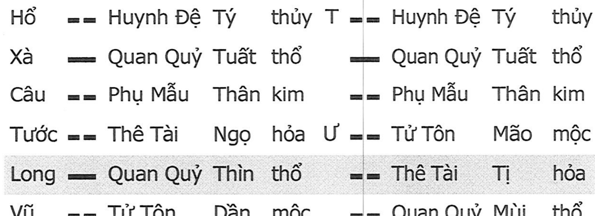

---

# Part 7 (Pages 121-140)

ám động khắc hào Thế, chú ý bệnh về tim mạch. (Chờ nghiệm. Trước mắt đã có cao huyết áp, tim không tốt.)

## Phụ mẫu song vong

Đây là một tình huống ở năm 2015. Nữ sinh năm Kỷ Dậu đoán sức khỏe, ở ngày Đinh Tị (Tuần Không: Tý Sửu), tháng Hợi, được Cấn Vi Sơn biến Sơn Phong Cổ.

| | Cấn Vi Sơn | | Sơn Phong Cổ | |
| :--- | :---: | :--- | :---: | :--- |
| Long | ▅▅▅▅▅ | Quan Quỷ Dần mộc T | ▅▅▅▅▅ | Quan Quỷ Dần mộc |
| Vũ | ▅▅ ▅▅ | Thê Tài Tý thủy | ▅▅ ▅▅ | Thê Tài Tý thủy |
| Hổ | ▅▅ ▅▅ | Huynh Đệ Tuất thổ | ▅▅ ▅▅ | Huynh Đệ Tuất thổ |
| Xà | ▅▅▅▅▅ | Tử Tôn Thân kim Ứ | ▅▅▅▅▅ | Tử Tôn Dậu kim |
| Câu | ▅▅ ▅▅ | Phụ Mẫu Ngọ hỏa | ▅▅▅▅▅ | Thê Tài Hợi thủy |
| Tước | ▅▅ ▅▅ | Huynh Đệ Thìn thổ | ▅▅ ▅▅ | Huynh Đệ Sửu thổ |

Lấy hào Thế làm Dụng thần. Nguyệt sinh Nhật không khắc, dường như không có vấn đề. Nguyên thần mặc dù vượng tướng, nhưng Không Vong lâm Huyền Vũ, Nguyên thần chủ tư duy, tâm trạng, Không Vong chủ tâm trạng phiền muộn, đây chính là thông tin trầm cảm.

Hào 2 Phụ Mẫu Ngọ hỏa độc phát, mặc dù là Tử địa hào Thế, nhưng hóa Tuyệt, độc phát có năm chức năng, trong đó có một chức năng là chiêm việc này ứng việc khác, hoặc cũng có thể là biểu thị nguyên nhân. Phụ Mẫu Ngọ hỏa hóa hồi đầu khắc, hào biến Hợi thủy lâm Nguyệt, tháng đó bất lợi, Ngọ hỏa lại có thể đối ứng Giáp Ngọ năm trước, năm Giáp Ngọ cũng có sự việc phụ mẫu bất lợi. Đây là biến cố của phụ mẫu đã ảnh hưởng đến tâm trạng. Phụ Mẫu Ngọ hỏa xung Nguyên thần hào Thế Tý thủy, cũng là ảnh hưởng đến tâm trạng.

Trên thực tế, năm Giáp Ngọ cha bệnh chết, mẹ vừa mới bị xe đụng chết mấy ngày trước. Bởi vì bị đả kích liên tục mà bị trầm cảm. Tại sao là xa họa tử vong, hào biến độc phát trở lại trong quẻ đến hào 5, hào 5 là đường, do đó chết vì xa họa.

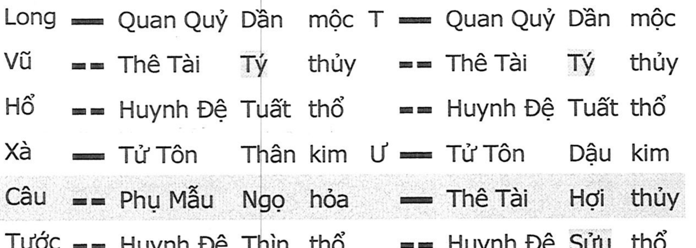

## Nguyên nhân con gái bị cận thị

Đây là một quái lệ ở năm 2019, một học trò của tôi đoán cho con gái anh ta. Ở ngày Quý Sửu (Tuần Không: Dần Mão), tháng Đinh Mão, được Địa Thủy Sư biến Khôn Vi Địa.

| Lục Thú | Hào | Địa Thủy Sư | Thế / Ứng | Hào | Khôn Vi Địa |
| :--- | :---: | :--- | :---: | :---: | :--- |
| Hổ | ╍╍ | Phụ Mẫu Dậu kim | Ứ | ╍╍ | Phụ Mẫu Dậu kim |
| Xà | ╍╍ | Huynh Đệ Hợi thủy | | ╍╍ | Huynh Đệ Hợi thủy |
| Câu | ╍╍ | Quan Quỷ Sửu thổ | | ╍╍ | Quan Quỷ Sửu thổ |
| Tước | ╍╍ | Thê Tài Ngọ hỏa | T | ╍╍ | Tử Tôn Mão mộc |
| Long | ━ | Quan Quỷ Thìn thổ | | ╍╍ | Thê Tài Tị hỏa |
| Vũ | ╍╍ | Tử Tôn Dần mộc | | ╍╍ | Quan Quỷ Mùi thổ |

Con gái mặc dù xem hào Tử Tôn, nhưng quẻ này trọng điểm thiên về nguyên nhân, tổ hợp biến hóa của quẻ mới là mấu chốt. Bản thân anh ta phán đoán, Quan Quỷ Thìn thổ độc phát, hào 2 là trạch, Quan Quỷ tinh quái, là do tà khí gây ra.

Tôi đoán: Hào 2 là trạch, Quan Quỷ Thìn thổ lâm Thanh Long độc phát, thần triệu cơ ở động, độc phát chủ nguyên nhân. Đây chính là vấn đề sở tại. Thanh Long là tượng tôn quý, Quan Quỷ này không phải là tà khí, mà là thần được người tôn kính, tế bái. Độc phát xem lưu hướng, độc phát hợp hào 6 Dậu kim, hào 6 là thoái vị, hào nhàn trí (để không), trong nhà có vật như tượng Phật, không có thờ cúng, mà bỏ không ở một nơi nào đó. (Nghiệm, đầu năm Mậu Tuất đã thỉnh một pho tượng Quan Công, không có chỗ để thích hợp, đã dùng vải đỏ gói lại rồi để ở trong rương.)

Thìn thổ hóa Tị hỏa, phản quái tại Tốn, Tốn là mắt, cho nên có bệnh này. Tử Tôn Dần mộc mặc dù Không Vong, nhưng Nguyệt phù, cận thị không quá nghiêm trọng.

Phương pháp hóa giải: Lấy tượng Quan Công ra và thắp nhang. Sau đó kết quả như thế nào, không có phản hồi.

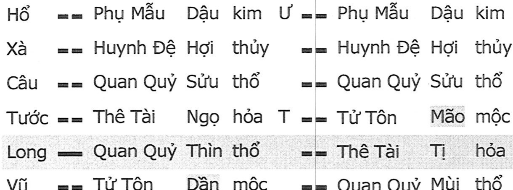

# CHƯƠNG 12

## THỦ TƯỢNG QUÁI TƯỢNG PHÁN ĐOÁN NHÂN QUẢ

Bát quái cũng là một trong những điều kiện cần phải xem để trích xuất thông tin và thủ tượng khi phán đoán nhân quả. Có trường hợp dùng quái cung để trích xuất thông tin, có trường hợp dùng nội quái hoặc ngoại quái chứa lục thân sở tại, có trường hợp dùng quẻ biến, hoặc phản quái của địa chi. Một số ý nghĩa chủ yếu thường dùng của bát quái như sau.

**Càn:** Là cha, người già, nam giới, chồng, lãnh đạo, người xuất gia, thủ đô, bộ phận chính, cơ quan chính phủ, nhân viên công vụ, quốc doanh, thần, Phật, thiên, cao lớn, chỗ cao, hình tròn, vàng ngọc, thủy tinh, kim loại, hạt trái cây, phần đầu, quý trọng, phổi, đường hô hấp, xương cốt, kết tràng, đại tràng, tự viện, Tây Bắc, ngựa, rồng, vua, thô bạo v.v.

**Khôn:** Là mẹ, phụ nữ, đại chúng hóa, thịt, mềm mại, bao dung, thuận theo, bao, vải vóc, bò, tỳ vị, da, bụng, sinh dục, bụng, đại địa, bình địa, đồng bằng, thổ địa, hình vuông, Tây Nam, xe v.v.

**Chấn:** Là con trai trưởng, tre trúc, cây cối, lâm viên, hoa cỏ, thực vật, khúc gỗ, chân, gan mật, tức giận, biến hóa, chấn động, di động, xe, cầu, phương Đông, thon dài, rồng v.v.

**Tốn:** Là trưởng nữ, cây cối, rừng cây, lâm viên, hoa cỏ, dây thừng, gan mật, thon dài, đùi, vai, phong hàn, trúng gió, vào, rắn, hồ ly, gà, cám dỗ, Đông Nam v.v.

**Khảm:** Là thấp trũng, sụt lún, trộm cắp, hình vòng, sông ngòi, kênh nước, thủy khố, trung nam, lão nhị, thắt lưng thận, bàng quang, hệ tiết niệu, tiểu đường, phương Bắc, lợn, vật trong nước, ẩm ướt v.v.

**Ly:** Là trung nữ, con gái thứ hai, tim, mắt, điện, ánh lửa, ánh nắng, phía Nam v.v.

**Cấn:** Là thiếu nam, con trai út, nam hài, đỉnh núi, núi cao, đồi núi, gò đất, khoáng sản, cầu, tự am, bàn, phần mộ, tỳ vị, da, vú, cổ, lưng, tay, Đông Bắc, chó, sói v.v.

**Đoài:** Là thiếu nữ, con gái nhỏ, nữ hài, phiên dịch, bà đồng, người phát ngôn, giảng sư, phổi, khoang miệng, răng, xương cốt, ruột, khẩu thiệt, ngôn ngữ, khuyết tổn, kim loại, vũ khí sắc bén, phương Tây, tự viện, phòng karaoke, dê v.v.

## Họa do đạo sĩ gây ra

Đây là một tình huống ở năm 2004. Một người nữ ở Bắc Kinh đoán bệnh con gái (khoảng 30 tuổi), ở ngày Ất Dậu (Tuần Không: Ngọ Mùi), tháng Ngọ, tôi gieo được Lôi Sơn Tiểu Quá biến Hỏa Địa Tấn.

| Lục thú | Phục thần | Quẻ chính | Thế / Ứng | Quẻ biến |
| :--- | :--- | :--- | :---: | :--- |
| Vũ | | -- Phụ Mẫu Tuất thổ | | — Quan Quỷ Tị hỏa |
| Hổ | | -- Huynh Đệ Thân kim | | -- Phụ Mẫu Mùi thổ |
| Xà | Tử Hợi | — Quan Quỷ Ngọ hỏa | T | — Huynh Đệ Dậu kim |
| Câu | | — Huynh Đệ Thân kim | | -- Thê Tài Mão mộc |
| Tước | Tài Mão | -- Quan Quỷ Ngọ hỏa | | -- Quan Quỷ Tị hỏa |
| Long | | -- Phụ Mẫu Thìn thổ | Ứ | -- Phụ Mẫu Mùi thổ |

Lấy Tử Tôn làm Dụng thần. Tử Tôn Hợi thủy lâm Đằng Xà phục tàng, Hợi thủy phản quái là Càn, là đầu, Đằng Xà chủ tâm loạn, kích động, Kỵ thần Phụ Mẫu Tuất thổ tại hào 6 phát động, vượng tướng khắc Dụng thần, hào 6 cũng là đầu, Tuất thổ phản quái là Càn là đầu, là tinh thần, tư duy đã xảy ra vấn đề. (Nghiệm)

Hào 6 là thần Phật, Mộ khố Quan Quỷ cũng là thần Phật, quẻ cung Đoài, Đoài là tự viện, Huyền Vũ là tôn giáo, Tuất thổ phản quái là Càn là người xuất gia, Dụng thần bị Quan Quỷ áp chế, chủ bệnh đến từ đạo quán, tự viện v.v. Tử Tôn Hợi thủy phục tàng. Năm Bính Tý xung Phi thần. Dụng thần xuất hiện bị khắc, bị hại ở năm 1996. (Nghiệm, năm Bính Tý con gái đã đến Bạch Vân Quán ở Bắc Kinh, đã bị một đạo sĩ dẫn dụ xem tà thư rồi sản sinh ảo giác, sau đó đã nghỉ việc. Liền sau đó lại bị một đạo sĩ khác lừa gạt phát sinh quan hệ nam nữ, bụng càng ngày càng lớn, đạo sĩ nói là con người giống như quả bóng bay, khi bụng to lên thì có thể đắc đạo thành tiên, bay lên trời. Kết quả, đến cuối năm Quý Mùi, sau khi sinh hạ hài tử mới biết là đã bị lừa gạt, đạo sĩ đã trốn mất dạng, con gái đã bị đả kích dẫn tới rối loạn thần kinh.)

Mặc dù được hóa giải nhưng không có hiệu quả. Sau đó không tiếp tục điều trị nữa.

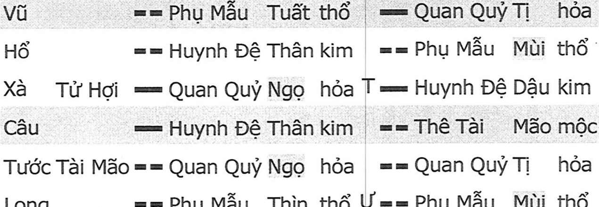

## Nguyên nhân cháu trai sốt lâu không giảm

Một học trò đã hỏi tôi tình huống này vào năm 2018. Ông nội đoán cháu trai bị sốt đã lâu không khỏi, nguyên nhân do đâu? Ở ngày Tân Dậu (Tuần Không: Tý Sửu), tháng Tị, được Sơn Hỏa Bí biến Cấn Vi Sơn.

| Lục thú | Phục thần | Quẻ chính | Thế / Ứng | Quẻ biến |
| :--- | :--- | :--- | :---: | :--- |
| Xà | | — Quan Quỷ Dần mộc | | — Quan Quỷ Dần mộc |
| Câu | | -- Thê Tài Tý thủy | | -- Thê Tài Tý thủy |
| Tước | | -- Huynh Đệ Tuất thổ | Ứ | -- Huynh Đệ Tuất thổ |
| Long | Tử Thân | — Thê Tài Hợi thủy | | — Tử Tôn Thân kim |
| Vũ | Phụ Ngọ | -- Huynh Đệ Sửu thổ | | -- Phụ Mẫu Ngọ hỏa |
| Hổ | | — Quan Quỷ Mão mộc | T | -- Huynh Đệ Thìn thổ |

Thoạt nhìn có vẻ như là đoán bệnh tật của cháu trai, nhưng trọng điểm thiên về nguyên nhân. Quẻ này cần xem tổ hợp biến hóa. Hào Thế lâm Quan Quỷ Mão mộc lâm Bạch Hổ phát động, người xưa nói: "Thần triệu cơ ở động", độc phát này chính là huyền cơ.

Hào Thế lâm Quan Quỷ Bạch Hổ, Quan Quỷ là tử thi, Bạch Hổ chủ tử vong, độc phát xem lưu hướng, hợp hào Ứng chính là đã đến nơi khác, ngoại quái Cấn, quẻ cung Cấn, hào Thế phát động hóa Cấn, quẻ biến lại là Cấn Vi Sơn, Cấn là phần mộ, phán đoán bản thân ông ta đã đến phần địa của người khác rồi mang thứ không tốt trở về. (Nghiệm, ông ta là một người làm nghề phong thủy, sau khi lên núi xem phong thủy phần địa cho người trở về, cháu trai đã xuất hiện tình trạng sốt cao không thoái.

Hào Thế lâm Bạch Hổ, bản thân dễ nổi nóng. (Nghiệm)

Hào Thế lâm Bạch Hổ là máu, Nguyên thần Tý thủy Không Vong không thể sinh, cung máu không đủ. (Nghiệm)

Thê Tài chủ ẩm thực, lâm Thanh Long Câu Trần sinh hào Thế, Thanh Long cũng chủ ẩm thực, là ăn, nhưng hào Thế hóa Huynh Đệ, khắc Thê Tài, chủ tiêu hóa nhanh, mới ăn một lúc sau đã đói. (Nghiệm)

Hào Thế tại hào sơ lâm Bạch Hổ, hào sơ là chân, Bạch Hổ chủ gãy xương, Nhật xung khắc, chủ chân đã từng bị thương. (Lúc đó không nghiệm, tình trạng này cần đề phòng sau này xảy ra.)

Nguyên thần Hợi thủy tại hào 3 Nguyệt phá, không có lực sinh hào Thế, hào 3 là giường, chủ ngủ không tốt. (Nghiệm)

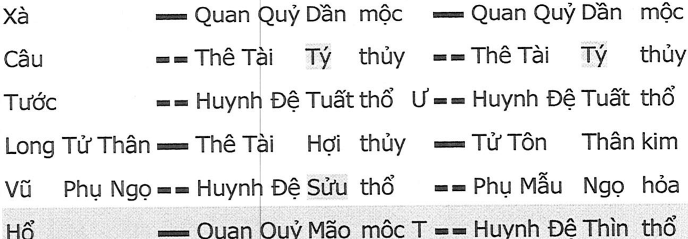

Sơn Hỏa Bí, Bí giả sức dã, hào Thế hợp hào Ứng, hào Ứng là người khác. Bán mình cho người khác, trọng thể diện, thích khoe khoang. (Nghiệm)

Tử Tôn là cháu trai người này, Tử Tôn Thân kim phục tàng tại hào 3, hào 3 là giường, phục tàng chính là nằm trên giường. Nguyệt kiến lâm hỏa khắc, hỏa là sốt, Nhật thần phù Tử Tôn, Tử Tôn vượng tướng, có bệnh cũng không sao.

## Đi xa đã mất hồn

Đây là một tình huống ở năm 2018. Một người nữ đoán bệnh em trai, ở ngày Tân Mão (Tuần Không: Ngọ Mùi), tháng Ngọ, được Hỏa Thủy Vị Tế biến Lôi Thủy Giải.

| Lục thú | Phục thần | Quẻ Hỏa Thủy Vị Tế | Thế / Ứng | Quẻ Lôi Thủy Giải |
| :--- | :--- | :---: | :---: | :---: |
| Xà | | ━ Huynh Đệ Tị hỏa | Ư | ╍╍ Tử Tôn Tuất thổ |
| Câu | | ╍╍ Tử Tôn Mùi thổ | | ╍╍ Thê Tài Thân kim |
| Tước | | ━ Thê Tài Dậu kim | | ━ Huynh Đệ Ngọ hỏa |
| Long | Quan Hợi | ╍╍ Huynh Đệ Ngọ hỏa | T | ╍╍ Huynh Đệ Ngọ hỏa |
| Vũ | | ━ Tử Tôn Thìn thổ | | ━ Tử Tôn Thìn thổ |
| Hổ | | ╍╍ Phụ Mẫu Dần mộc | | ╍╍ Phụ Mẫu Dần mộc |

Lấy Huynh Đệ làm Dụng thần. Trong quẻ Huynh Đệ lưỡng hiện, lấy hào phát động làm Dụng thần. Huynh Đệ trì Thế, là mình quan tâm em trai, Không Vong là lo lắng, mà Dụng thần Tị hỏa tại hào 6 độc phát lâm Đằng Xà nhập Mộ tại hào biến, thần triệu cơ ở động là mấu chốt.

Dụng thần Nguyệt phù Nhật sinh là vượng tướng, có bệnh cũng không sao. Nhưng hào 6 là thoái vị, hóa Mộ khố, hào 6 là đầu, chủ não lơ mơ, suy giảm trí nhớ, thiếu tinh thần, quên trước quên sau. (Nghiệm, đúng là bệnh này.)

Hào 6 là phương xa, lâm hào Ứng cũng là phương xa. Cung Ly là phương Nam, gần đây đã một lần đến phương Nam, đã làm mất hồn.

Hào 3 cũng là Huynh Đệ, hào 3 là giường, Không Vong, không được Nguyên thần mộc đến sinh, ngủ không tốt. Gan chủ ngủ, tàng hồn, gan có vấn đề không thể tàng hồn, do đó đã làm mất hồn. (Nghiệm, ngủ không tốt, bị viêm gan B.)

Phương pháp hóa giải: Không ghi chép. Sau khi đoán xong quẻ của em trai, cô ấy lại hỏi, ông xem xem gần đây trong nhà tôi có chuyện gì?

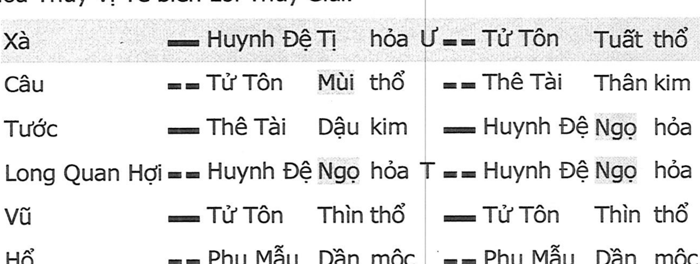

Tôi thấy hào 3 lâm Thanh Long Không Vong, Thanh Long là hỷ, hào 3 là cửa, ba ngày sau ngày Giáp Ngọ xuất Không, đoán ba ngày sau trong nhà có hỷ sự lâm môn. (Nghiệm, ba ngày sau chồng từ nhà giam về nhà. Quan Quỷ phục tàng dưới hào 3, độc phát xung ra.)

## Năm Bính Tuất đã động mái nhà

Đây là một tình huống ở năm 2012. Một người nữ đau đầu được hóa giải, sau đó đã hết đau, cảm thấy đã không còn vấn đề, liền vứt tảng đá hóa giải đi, kết quả là lại bắt đầu đau đầu, thế là đã đặt tảng đá trở lại, nhưng không có tác dụng, vẫn đau rất dữ dội. Thế là lại cầu đoán bản thân tái phát đau đầu có thể khỏi hay không? Ở ngày Kỷ Mão (Tuần Không: Thân Dậu), tháng Kỷ Dậu, được Phong Hỏa Gia Nhân biến Thủy Địa Tỷ.

| Lục thú | Phục thần | Quẻ Phong Hỏa Gia Nhân | Thế / Ứng | Quẻ Thủy Địa Tỷ |
| :--- | :--- | :---: | :---: | :---: |
| Câu | | ━ Huynh Đệ Mão mộc | | ╍╍ Phụ Mẫu Tý thủy |
| Tước | | ━ Tử Tôn Tị hỏa | Ư | ━ Thê Tài Tuất thổ |
| Long | | ╍╍ Thê Tài Mùi thổ | | ╍╍ Quan Quỷ Thân kim |
| Vũ | Quan Dậu | ━ Phụ Mẫu Hợi thủy | | ╍╍ Huynh Đệ Mão mộc |
| Hổ | | ╍╍ Thê Tài Sửu thổ | T | ╍╍ Tử Tôn Tị hỏa |
| Xà | | ━ Huynh Đệ Mão mộc | | ╍╍ Thê Tài Mùi thổ |

Lấy hào Thế làm Dụng thần. Nhật Nguyệt không phù hào Thế, thuộc về hưu tù, trong quẻ Mão mộc tại nội quái tam hợp cục khắc hào Thế, hào 6 Mão mộc hóa Phụ Mẫu lâm Câu Trần đến khắc, hào 6 là mái nhà, Câu Trần chủ kiến trúc, hào biến Phụ Mẫu chủ nhà, nhất định là tại năm Bính Tuất đã động mái nhà. (Nghiệm, năm Bính Tuất đã thay đổi ngói.)

Nội quái mộc lâm Đằng Xà tam hợp cục phát động khắc hào Thế, tam hợp cục là nhiều, mộc là thực vật, Đằng Xà chủ thon dài, nhất định là đã từng động rất nhiều cây. Quẻ cung Tốn, cũng là cây cối. (Nghiệm, hai năm gần đây đã nhổ rất nhiều cây trong sân.)

Hóa giải: Năm tờ hoàng chỉ, trên đó vẽ thái cực đồ, đốt ở phía Đông của sân.

Làm như vậy một lần, không có hiệu quả, làm lại một lần nữa, vẫn không có hiệu quả, đến lần thứ ba, cơn đau đầu mới dứt.

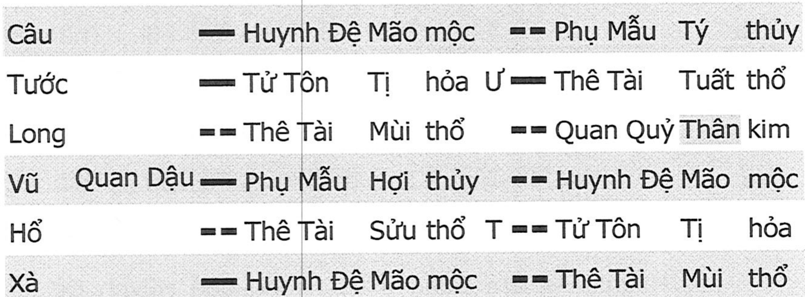

# CHƯƠNG 13

## NHÂN QUẢ DO BẢN THÂN NHÂN THỂ GÂY NÊN

### Con gái huyết niệu do nguyên nhân gì?

Khi khám sức khỏe ở trường, con gái đã phát hiện huyết niệu, bác sĩ nói là sau một thời gian hãy đi khám lại, hỏi có vấn đề gì nghiêm trọng không? Cha gieo quẻ như sau. Ở ngày Bính Thìn (Tuần Không: Tý Sửu), tháng Thân.

| Lục thú | Quẻ Đoài Vi Trạch | | | Thế/Ứng | Quẻ Trạch Thủy Khốn | | |
| :--- | :---: | :--- | :--- | :---: | :---: | :--- | :--- |
| Long | ╍╍ | Phụ Mẫu | Mùi thổ | T | ╍╍ | Phụ Mẫu | Mùi thổ |
| Vũ | ━━ | Huynh Đệ | Dậu kim | | ━━ | Huynh Đệ | Dậu kim |
| Hổ | ━━ | Tử Tôn | Hợi thủy | | ━━ | Tử Tôn | Hợi thủy |
| Xà | ╍╍ | Phụ Mẫu | Sửu thổ | Ư | ╍╍ | Quan Quỷ | Ngọ hỏa |
| Câu | ━━ | Thê Tài | Mão mộc | | ━━ | Phụ Mẫu | Thìn thổ |
| Tước | ━━ | Quan Quỷ | Tị hỏa | | ╍╍ | Thê Tài | Dần mộc |

Lấy Tử Tôn làm Dụng thần. Dụng thần Tử Tôn Hợi thủy Nguyệt sinh Nhật khắc, suy vượng tương đương, lâm Bạch Hổ, là thông tin nước tiểu có máu. Quan Quỷ Tị hỏa lâm Chu Tước độc phát xung Dụng thần, Quan Quỷ là bệnh, Chu Tước lâm hỏa chủ viêm, là do hỏa vượng gây ra. Chỉ cần uống nhiều nước thì không có vấn đề. Đây là sử dụng ẩm thực lấy tượng thủy khắc hỏa.

Tử Tôn nhập Mộ tại Nhật thần Phụ Mẫu, Phụ Mẫu là học tập, hài tử là một người thích học tập, nhất tâm vùi đầu đọc sách. Lâm Bạch Hổ, hiếu động, thích hoạt động thể dục.

Quả nhiên học tập luôn đứng đầu, hằng ngày tham gia hoạt động thể dục. Sau đó kiểm tra lần hai đã không còn huyết niệu.

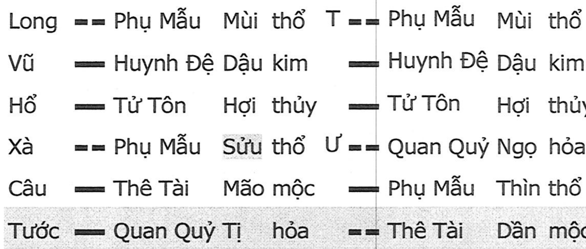

### Nguyên nhân của đau đầu

Đây là một tình huống ở năm 2011. Một người nữ cầu đoán nguyên nhân đau đầu của mình, ở ngày Nhâm Thân (Tuần Không: Tuất Hợi), tháng Mão, gieo được Địa Lôi Phục biến Khôn Vi Địa.

| Lục thú | Phục thần | Quẻ Địa Lôi Phục | | | Thế/Ứng | Quẻ Khôn Vi Địa | | |
| :--- | :--- | :---: | :--- | :--- | :---: | :---: | :--- | :--- |
| Hổ | | ╍╍ | Tử Tôn | Dậu kim | | ╍╍ | Tử Tôn | Dậu kim |
| Xà | | ╍╍ | Thê Tài | Hợi thủy | | ╍╍ | Thê Tài | Hợi thủy |
| Câu | | ╍╍ | Huynh Đệ | Sửu thổ | Ư | ╍╍ | Huynh Đệ | Sửu thổ |
| Tước | | ╍╍ | Huynh Đệ | Thìn thổ | | ╍╍ | Quan Quỷ | Mão mộc |
| Long | Phụ Tị | ╍╍ | Quan Quỷ | Dần mộc | | ╍╍ | Phụ Mẫu | Tị hỏa |
| Vũ | | ━━ | Thê Tài | Tý thủy | T | ╍╍ | Huynh Đệ | Mùi thổ |

Lấy hào Thế làm Dụng thần. Hào Thế Thê Tài Tý thủy Nguyệt không khắc, Nhật sinh là vượng tướng. Hào sơ mặc dù là hào vị tâm sự, đôi khi cũng có thể chủ đầu, nhưng Nguyên thần tại hào 6 Nguyệt phá, hào 6 là đầu, đây mới là thông tin đau đầu. Lâm Bạch Hổ, chủ máu, đầu cung máu có vấn đề, thủy cũng chủ máu, hào Thế lâm Huyền Vũ Đằng Xà, tượng thon dài, chủ mạch máu, độc phát hợp Sửu thổ, lâm Câu Trần, Sửu thổ là Kỵ thần, Câu Trần chủ khối u, tắc nghẽn, do đầu tắc nghẽn huyết khối gây ra.

Hào 2 Quan Quỷ ám động, hào Thế thủy hóa hồi đầu khắc, hào 2 là chân, đầu gối, thủy bị khắc, chủ trong chân, đầu gối có thủy, tích dịch không thể ra, bởi vì Huyền Vũ chủ hàn thấp, Thanh Long chủ đau. (Đáp: Đầu gối đau.)

Hóa giải: Hai viên đá tròn, trên đá viết chữ "minh". Lần lượt đặt ở phía Tây và Tây Nam.

Sau khi được máy móc tinh vi kiểm tra, đã phát hiện ba chỗ huyết khối não. Sau khi hóa giải, đau đầu bắt đầu giảm bớt, dần dần không đau nữa. Hiện nay huyết khối như thế nào, bởi vì chưa đến bệnh viện kiểm tra lại nên không rõ. Tháng Mão đã đến bệnh viện hút dịch tích trong đầu gối, nhưng vẫn cảm thấy khó chịu, mãi đến tháng Tuất mới cảm thấy tốt hơn. Nhưng thỉnh thoảng vẫn còn có một chút khó chịu.

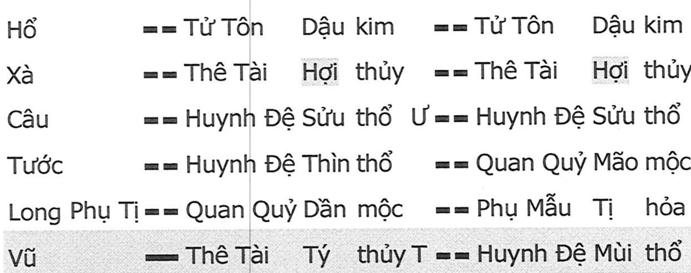

## Lao phổi dẫn đến di tinh

Đây là một tình huống ở năm 2018. Một Dịch hữu hỏi, bởi vì di tinh, uống thuốc, ngừng thuốc ba ngày sẽ ra sao? Ngày Canh Tý (Tuần Không: Thìn Tị), tháng Tý, được Trạch Phong Đại Quá biến Lôi Phong Hằng.

| Lục thú | Phục thần | Quẻ chính | Thế / Ứng | Quẻ biến |
| :--- | :--- | :--- | :---: | :--- |
| Xà | | -- Thê Tài Mùi thổ | | -- Thê Tài Tuất thổ |
| Câu | | — Quan Quỷ Dậu kim | | -- Quan Quỷ Thân kim |
| Tước | Tử Ngọ | — Phụ Mẫu Hợi thủy | T | — Tử Tôn Ngọ hỏa |
| Long | | — Quan Quỷ Dậu kim | | — Quan Quỷ Dậu kim |
| Vũ | Huynh Dần | — Phụ Mẫu Hợi thủy | | — Phụ Mẫu Hợi thủy |
| Hổ | | -- Thê Tài Sửu thổ | Ứ | -- Thê Tài Sửu thổ |

Lấy hào Thế làm Dụng thần. Hào Thế là Hợi thủy, được Nhật Nguyệt phù, là vượng cực, thế thân hào Thế lại xuất hiện tại hào 2, thủy là thận, chủ tinh dịch, tinh đầy tự tràn, quẻ du hồn, tượng hướng ngoại. Cho nên ứng có di tinh.

Hào Thế vượng tướng, không phải là vấn đề lớn, Nguyên thần độc phát hóa thoái mới là mấu chốt. Hào 5 kim là phổi, là phổi, hô hấp thể hiện bất lợi. Từ góc độ Trung y, thủy là thận, phổi là kim, phổi là mẹ của thận, là do phổi có vấn đề gây nên. Nguyên thần hưu tù hóa thoái, không thể ngừng thuốc.

Quả nhiên là do lao phổi dẫn tới di tinh, không thể ngừng thuốc.

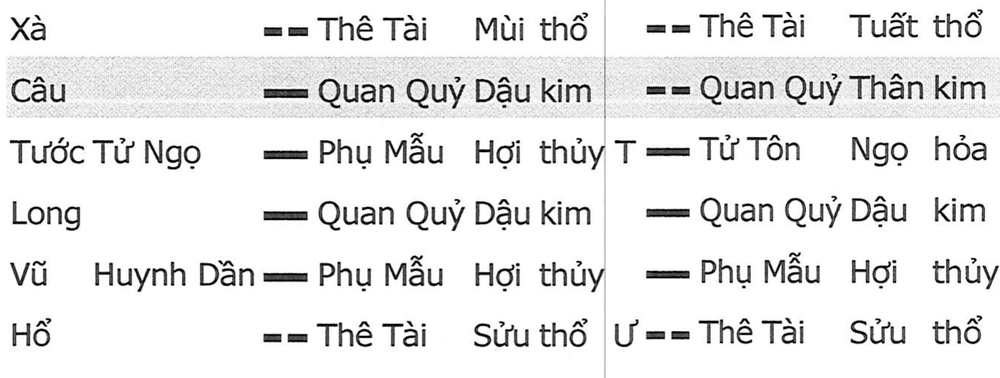

## Tại sao hài tử không nghe lời?

Đây là một tình huống ở năm 2019, một người nữ hỏi hài tử sinh năm Bính Thân có thể nghe lời và ăn ngủ tốt hay không? Ở giờ Ngọ, ngày Quý Hợi (Tuần Không: Tý Sửu), tháng Sửu, được Hỏa Phong Đỉnh biến Hỏa Sơn Lữ.

| Lục thú | Phục thần | Quẻ chính | Thế / Ứng | Quẻ biến |
| :--- | :--- | :--- | :---: | :--- |
| Hổ | | — Huynh Đệ Tị hỏa | | — Huynh Đệ Tị hỏa |
| Xà | | -- Tử Tôn Mùi thổ | Ứ | -- Tử Tôn Mùi thổ |
| Câu | | — Thê Tài Dậu kim | | — Thê Tài Dậu kim |
| Tước | | — Thê Tài Dậu kim | | — Thê Tài Thân kim |
| Long | | — Quan Quỷ Hợi thủy | T | -- Huynh Đệ Ngọ hỏa |
| Vũ | Phụ Mão | -- Tử Tôn Sửu thổ | | -- Tử Tôn Thìn thổ |

Lấy Tử Tôn làm Dụng thần, xem tổ hợp biến hóa của quẻ.

Tử Tôn lưỡng hiện, đều an tĩnh, lấy Tử Tôn Mùi thổ lâm hào Ứng làm Dụng thần, hào còn lại dùng để tham khảo. Tử Tôn Mùi thổ lâm Đằng Xà tại hào 5, Nguyên thần Tị hỏa tại hào 6 ám động, hào 5 là đường, Đằng Xà chủ vũ động (múa), biến hóa, ham chơi, hiển nhiên là chứng đa động trẻ em, hài tử không thể ngồi yên một khắc. (Nghiệm)

Nguyên thần là tư duy, hào 6 là thoái vị, nghỉ ngơi, nhưng ám động, chủ không thể nghỉ ngơi, khả năng tự kiểm soát kém. (Nghiệm)

Hào 6 là đầu, lâm Bạch Hổ chủ bị thương. Nhật xung khắc, cận kỳ phải chú ý đụng đầu. Độc phát Hợi thủy lại đến khắc, đặc biệt phải chú ý tháng Dần. (Nghiệm, vừa mới đụng vỡ đầu.)

Hào 5 là gia trưởng, tôn vị, Tử Tôn Mùi thổ lâm hào 5, cũng là hào Ứng, Mùi thổ phản quái là Khôn, Khôn là mẹ, chủ bà nội của hài tử, hào Ứng là nhà chồng, tức mẹ chồng của mình, hài tử thường xuyên ở nhà bà nội. Đặc biệt là ở nhà bà nội không nghe lời. (Nghiệm)

Ngoài ra, Tử Tôn Sửu thổ ở nội quái, gần hào Thế, hào trạch, hào sơ là chân, Không Vong chủ không đi, con trai không đi lại ở trong nhà mình. (Nghiệm)

Hào 2 Quan Quỷ Hợi thủy lâm Thanh Long hóa Ngọ hỏa độc phát, xung khắc Nguyên thần Tị hỏa, độc phát chủ nguyên nhân. Hào 2 là trạch, là nhà bếp, Thanh Long là ẩm thực, Ngọ là hỏa, cung Ly chính là nơi có hỏa, Quan Quỷ là thần, chủ trong nhà có

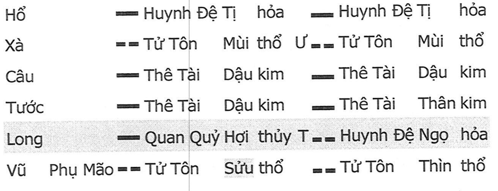 cúng Táo Vương Gia, dẫn tới bất lợi. (Nghiệm, đã cúng Táo Vương Gia.)

Hóa giải: Để ba sợi dây đỏ ở phía Tây Bắc của nhà bếp. Tây Bắc đúng lúc là ống dẫn nước, liền cột lên trên. Sau khi để một lúc, người tầng dưới chạy lên nói rằng ống nước của nhà họ đã bị chặn. Lẽ nào là do vật hóa giải gây ra?

## Nguyên nhân ở xương cổ

Đây là một tình huống ở năm 2018. Một người nam đột nhiên cảm thấy cánh tay phải tê dại, sau vài ngày, hai chân cũng bắt đầu tê, đồng thời lại phát hiện ngón trỏ tay phải đã không có cảm giác đối với nhiệt độ (ngày Mậu Tý), đoán xem nguyên nhân là gì? Ở ngày Canh Dần (Tuần Không: Ngọ Mùi), tháng Tý, được Sơn Thủy Mông biến Phong Thủy Hoán.

| Lục thú | Phục thần | Quái hào | Thế/Ứng | Biến hào |
| :--- | :--- | :--- | :---: | :--- |
| Xà | | ━ Phụ Mẫu Dần mộc | | ━ Phụ Mẫu Mão mộc |
| Câu | | ╍╍ Quan Quỷ Tý thủy | | ━ Huynh Đệ Tị hỏa |
| Tước | Tài Dậu | ╍╍ Tử Tôn Tuất thổ | T | ╍╍ Tử Tôn Mùi thổ |
| Long | | ╍╍ Huynh Đệ Ngọ hỏa | | ╍╍ Huynh Đệ Ngọ hỏa |
| Vũ | | ━ Tử Tôn Thìn thổ | | ━ Tử Tôn Thìn thổ |
| Hổ | | ╍╍ Phụ Mẫu Dần mộc | Ứ | ╍╍ Phụ Mẫu Dần mộc |

Lấy hào Thế làm Dụng thần, xem tổ hợp biến hóa của quẻ.

Hào Thế Nguyệt không phù Nhật khắc, Nhật thần Dần mộc là Kỵ thần, nhập quẻ lâm hào 6 và hào sơ, hào 6 là tay, hào sơ là chân, mộc chủ tê dại, quẻ thể hiện ra bệnh trạng của anh ta.

Hào 5 độc phát lâm Câu Trần sinh Kỵ thần khắc Nguyên thần, lại là Quan Quỷ, Quan Quỷ độc phát biểu thị nguyên nhân. Hào 5 là cổ, ngoại quái Cấn, Cấn là cổ, Kỵ thần Dần mộc phản quái là Cấn, cũng là cổ, Câu Trần là liên tiếp, tăng sinh, nhất định là do xương cổ tăng sinh chèn ép gây ra.

Ngày Mậu Tý nghiêm trọng, chính là ứng kỳ của độc phát, hào biến Quý Tị, khởi bệnh ở năm Quý Tị. (Nghiệm, năm Quý Tị đã từng xảy ra một lần tay chân tê dại.)

Hóa giải: Làm vật lý trị liệu xương cổ. Năm Quý Tị đã làm vật lý trị liệu xương cổ, sau khi khỏi bệnh đã không làm nữa. Lần này sau khi bị bệnh lại tiếp tục làm vật lý trị liệu cũng đã khỏi.

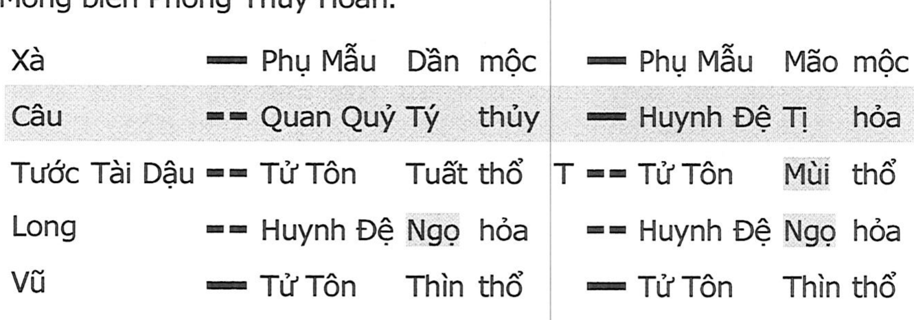

## Hóa ra là thất thoát đản bạch¹

Đây là một tình huống ở năm 2018. Một người nam đoán sức khỏe của cháu trai. Ở ngày Bính Tý (Tuần Không: Thân Dậu), tháng Ngọ, được Hỏa Sơn Lữ biến Sơn Hỏa Bí.

| Lục thú | Phục thần | Quái hào | Thế/Ứng | Biến hào |
| :--- | :--- | :--- | :---: | :--- |
| Long | | ━ Huynh Đệ Tị hỏa | | ━ Phụ Mẫu Dần mộc |
| Vũ | | ╍╍ Tử Tôn Mùi thổ | | ╍╍ Quan Quỷ Tý thủy |
| Hổ | | ━ Thê Tài Dậu kim | Ứ | ╍╍ Tử Tôn Tuất thổ |
| Xà | Quan Hợi | ━ Thê Tài Thân kim | | ━ Quan Quỷ Hợi thủy |
| Câu | | ╍╍ Huynh Đệ Ngọ hỏa | | ╍╍ Tử Tôn Sửu thổ |
| Tước | Phụ Mão | ╍╍ Tử Tôn Thìn thổ | T | ━ Phụ Mẫu Mão mộc |

Lấy Tử Tôn làm Dụng thần. Tử Tôn lưỡng hiện, lấy hào động Tử Tôn Thìn thổ làm Dụng thần. Tử Tôn Thìn thổ tại hào sơ phát động hóa hồi đầu khắc, hào sơ là chân, lại bị hào động Dậu kim hợp, quẻ Lữ là quẻ hành tẩu, đi đứng khó khăn, không có sức lực. (Nghiệm)

Nguyên thần Ngọ hỏa ám động sinh, Ngọ hỏa không có vấn đề, nhưng hào 6 Tị hỏa cũng là Nguyên thần bị Nhật khắc hào 6 là thoái vị, bị khắc mà không có lực sinh thì dễ mệt mỏi. (Nghiệm)

Thê Tài Dậu kim là ẩm thực, hợp Tử Tôn Thìn thổ, không cho hồi đầu khắc, xét về một ý nghĩa nào đó thì cũng không phải là điều xấu. Thê Tài là ẩm thực, Không Vong, hưu tù bị khắc, thiếu hụt dinh dưỡng. (Phản hồi, là thất thoát đản bạch.)

Quẻ này huyền diệu, Thê Tài là ẩm thực dinh dưỡng, Dậu kim là trứng gà, lâm Bạch Hổ là đản bạch, Không Vong, chính là thất thoát.

¹ Lòng trắng trứng, cũng chỉ protein.

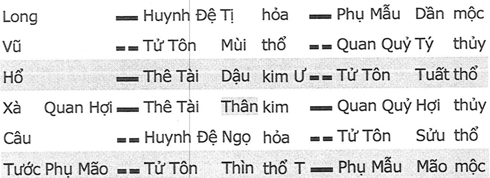

## Do thủ dâm gây ra

Đây là một tình huống ở năm 2019. Một người nam đoán về bệnh nhiễm trùng đường tiết niệu của mình, ở ngày Tân Tị (Tuần Không: Thân Dậu), tháng Bính Dần, được Sơn Lôi Di biến Sơn Thủy Mông.

| Lục thú | Phục thần | Sơn Lôi Di | Sơn Thủy Mông |
| :--- | :--- | :--- | :--- |
| Xà | | — Huynh Đệ Dần mộc | — Huynh Đệ Dần mộc |
| Câu | Tử Tị | - - Phụ Mẫu Tý thủy | - - Phụ Mẫu Tý thủy |
| Tước | | - - Thê Tài Tuất thổ T | - - Thê Tài Tuất thổ |
| Long | Quan Dậu | - - Thê Tài Thìn thổ | - - Tử Tôn Ngọ hỏa |
| Vũ | | - - Huynh Đệ Dần mộc | — Thê Tài Thìn thổ |
| Hổ | | — Phụ Mẫu Tý thủy Ư | - - Huynh Đệ Dần mộc |

Lấy hào Thế làm Dụng thần. Xem tổ hợp biến hóa của quẻ.

Hào Thế Tuất thổ Nguyệt khắc Nhật sinh suy vượng tương đương, Nguyệt kiến nhập quẻ tại hào 2 lâm Dần mộc Huyền Vũ hóa Thê Tài Thìn thổ khắc hào Thế là nguyên nhân và vấn đề gốc rễ.

Hào Thế Chu Tước là viêm, hào 2 là bộ phận sinh dục, Huyền Vũ chủ ám muội, lén lút, hóa Thìn thổ là thủy khố, bàng quang, đường tiết niệu v.v. Kỵ thần lâm Nguyệt, đã bị bệnh trong thời gian dài. Hào sơ Tý thủy đến sinh Kỵ thần hóa Kỵ thần, bệnh này tồn tại đã lâu. Điều trị nhiều cách đều không có hiệu quả.

Dần mộc phản quái là Cấn, hào biến Thê Tài là nữ nhân, Huyền Vũ là lén lút, mà Thìn thổ và hào Thế xung, không phải bạn gái. Là do thủ dâm quá nhiều gây ra.

Sau đó đã khuyên anh ta điều trị bằng vitamin C và ofloxacin, đã trị khỏi bệnh.

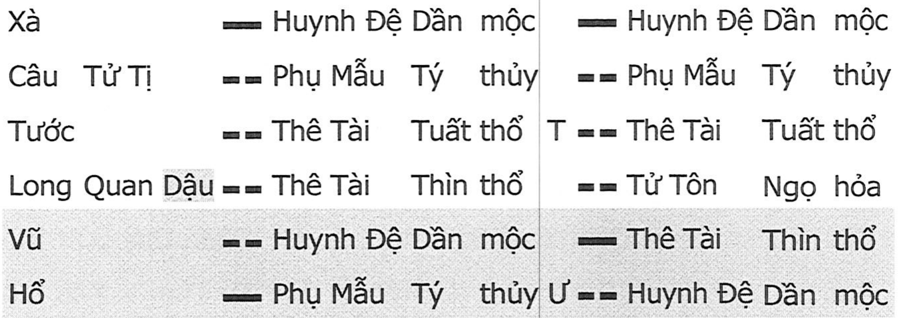

## Do u xơ tử cung gây ra

Đây là một tình huống ở năm 2018. Một người nữ bởi vì kinh nguyệt xuất huyết một tháng vẫn không dừng, đoán nguyên nhân, ở ngày Bính Tý (Tuần Không: Thân Dậu), tháng Bính Thìn, được Thủy Hỏa Ký Tế biến Địa Hỏa Minh Di.

| Lục thú | Phục thần | Thủy Hỏa Ký Tế | Địa Hỏa Minh Di |
| :--- | :--- | :--- | :--- |
| Long | | - - Huynh Đệ Tý thủy Ư | - - Phụ Mẫu Dậu kim |
| Vũ | | — Quan Quỷ Tuất thổ | - - Huynh Đệ Hợi thủy |
| Hổ | | - - Phụ Mẫu Thân kim | - - Quan Quỷ Sửu thổ |
| Xà | Tài Ngọ | — Huynh Đệ Hợi thủy T | — Huynh Đệ Hợi thủy |
| Câu | | - - Quan Quỷ Sửu thổ | - - Quan Quỷ Sửu thổ |
| Tước | | — Tử Tôn Mão mộc | — Tử Tôn Mão mộc |

Hào Thế là mình. Xem tổ hợp biến hóa của quẻ. Hào Thế Hợi thủy Nguyệt khắc Nhật phù, suy vượng tương đương. Nhưng Quan Quỷ Tuất thổ độc phát, cần xem hào này.

Quan Quỷ Tuất thổ độc phát khắc hào Thế là bất lợi, nhưng Quan Quỷ bị Nguyệt xung phá, lại đi hợp Tử Tôn Mão mộc, Quan Quỷ là bệnh, Tử Tôn là thần giải ưu, bệnh tật sẽ có xu hướng ổn định.

Hào 2 Quan Quỷ Sửu thổ bị Nhật hợp khởi khắc hào Thế, hào 2 là tử cung, hào Thế Hợi thủy là điểm Trường Sinh của Tử Tôn cũng là tử cung, Câu Trần là khối u, là do có u xơ tử cung ảnh hưởng đến.

Hào 5 Quan Quỷ Tuất thổ hóa Hợi thủy khắc hào Thế, Hợi thủy tại hào 5 là họng, chủ họng cũng không tốt.

Hóa giải: Tử Tôn Mão mộc lâm Chu Tước, mộc gặp Chu Tước có thể là hoa, Mão mộc là Đào Hoa (hoa đào), cây đào, do đó dùng ba rễ đào, ba lạng thịt lợn nạc, hầm nước uống.

Nguyên thần Thân kim lâm Bạch Hổ Không Vong, an tĩnh bất động, Bạch Hổ là đao thương, kim là công cụ sắc bén, cần phẫu thuật mới có thể trị khỏi, xuất Không sinh hào Thế.

Tháng 1 năm 2019 phản hồi, bệnh viện tra được u xơ tử cung, nhưng không phẫu thuật. Sau khi uống nước rễ đào, đã ngừng chảy máu. Sau đó đã phẫu thuật họng, họng cũng đã khỏi.

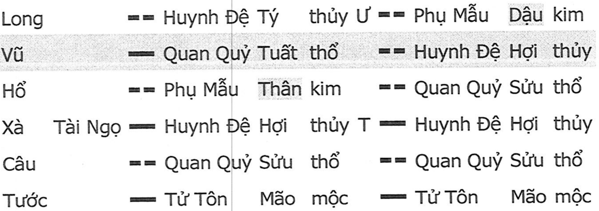

## Bất dựng bất dục

Năm 2019, một người nữ (sinh Ất Sửu), đoán bất dựng bất dục, ở ngày Bính Tuất (Tuần Không: Ngọ Mùi), tháng Dần, được Thủy Thiên Nhu.

| Lục thú | Phục thần | Quẻ Thủy Thiên Nhu | Thế / Ứng |
| :--- | :--- | :--- | :---: |
| Long | | - - Thê Tài Tý thủy | |
| Vũ | | — Huynh Đệ Tuất thổ | |
| Hổ | | - - Tử Tôn Thân kim | T |
| Xà | | — Huynh Đệ Thìn thổ | |
| Câu | Phụ Tị | — Quan Quỷ Dần mộc | |
| Tước | | — Thê Tài Tý thủy | Ư |

Lấy Tử Tôn làm Dụng thần. Tử Tôn Thân kim trì Thế, hào mệnh là Mộ khố Tử Tôn, nhất định đã từng mang thai, chỉ là không thể chờ được đến lúc sinh ra. Tử Tôn Thân kim Nguyệt phá, lâm Bạch Hổ là huyết thần, tượng lưu sản. Ứng kỳ thường tại năm Thân. (Năm Giáp Thân đã từng mang thai, Giáp Ngọ, Bính Thân thụ tinh trong ống nghiệm có thai, nhưng sau hai tháng thì ngừng phát triển.)

Hào Thế lâm Bạch Hổ bị Quan Quỷ lâm Nguyệt xung phá, đây là nguyên nhân dẫn đến vô sinh, Quan Quỷ là chồng, chủ yếu là do chồng có vấn đề. Đương nhiên, hào Thế Nguyệt phá, bản thân cũng có vấn đề. (Chồng trước yếu tinh, chồng hiện tại tinh trùng không hoạt động mạnh. Bản thân rụng trứng không bình thường.)

Thìn thổ bị Nhật xung ám động sinh Tử Tôn, nhất định sẽ có hài tử.

Phương pháp hóa giải: Không ghi chép, không có phản hồi tiếp theo.

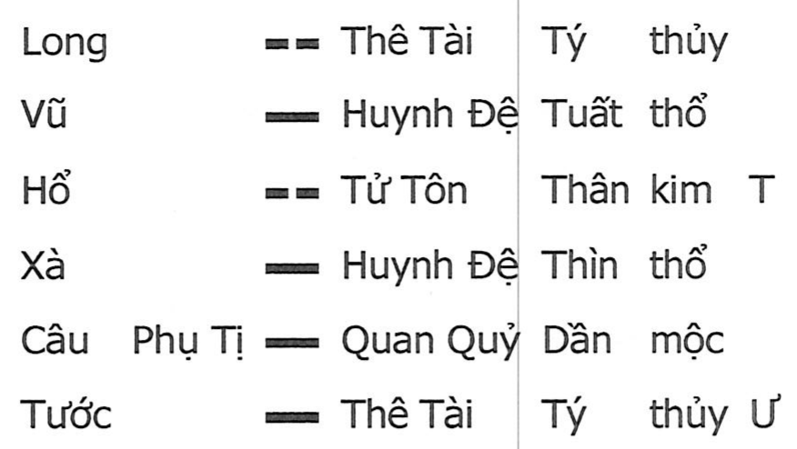

## Tại sao tôi già đi quá nhanh?

Đây là một tình huống ở năm 2018. Một người nữ đoán tại sao mình già nhanh? Ở ngày Đinh Mão (Tuần Không: Tuất Hợi), tháng Tân Dậu, được Phong Lôi Ích biến Hỏa Trạch Khuê.

| Lục thú | Phục thần | Quẻ Phong Lôi Ích | Thế / Ứng | Quẻ Hỏa Trạch Khuê |
| :--- | :--- | :--- | :---: | :--- |
| Long | | — Huynh Đệ Mão mộc | Ư | — Tử Tôn Tị hỏa |
| Vũ | | — Tử Tôn Tị hỏa | | - - Thê Tài Mùi thổ |
| Hổ | | - - Thê Tài Mùi thổ | | — Quan Quỷ Dậu kim |
| Xà | Quan Dậu | - - Thê Tài Thìn thổ | T | - - Thê Tài Sửu thổ |
| Câu | | - - Huynh Đệ Dần mộc | | — Huynh Đệ Mão mộc |
| Tước | | — Phụ Mẫu Tý thủy | | — Tử Tôn Tị hỏa |

Lấy hào Thế làm Dụng thần, xem tổ hợp biến hóa của quẻ. Hào Thế Thìn thổ lâm Đằng Xà, là bản thân tâm thần bất an, thổ khố tại Thìn, hào Thế là Mộ khố của hào Thế, biểu thị rất quan tâm đến thân thể của mình. (Nghiệm)

Hào 3 là giường, hào Thế tại hào 3 bị Nhật khắc, một là ngủ không tốt, thân thể không được nghỉ ngơi đầy đủ. (Nghiệm)

Nguyên thần Tị hỏa đáng lẽ phát động hóa Thê Tài sinh hào Thế, nhưng lại bị Mùi thổ của hào 4 phát động nẵng tay trên, lại thêm hào 4 hóa ra Quan Quỷ Dậu kim, chức năng hấp thu kém, bởi vì Tài chủ ẩm thực, Tị hỏa hóa Thê Tài sinh hào Thế chính là ăn, nhưng Tị hỏa sinh Mùi thổ, không sinh hào Thế, chính là thân thể không hấp thu được những thứ đã ăn vào. (Nghiệm)

Hào Thế hưu tù, Đằng Xà là thon dài, thể hiện thân thể gầy yếu. Hào 3 thổ là dạ dày, Kỵ thần mộc tại hào 2, mộc là ruột, Đằng Xà là ruột, tràng vị hấp thu không tốt. (Nghiệm, môi khô nứt, môi chính là thể hiện của tỳ vị.)

Nhật thần nhập quẻ tại hào 6, hào 6 là đầu, mộc là tóc, Nguyệt phá khắc hào Thế, phá là đứt gãy, chính là rụng tóc. (Nghiệm)

Hóa giải: Mặc quần cộc màu đỏ. Ăn nhiều củ cải trắng và cà chua.

Ngày 2 tháng 1 năm 2019 phản hồi: Sau khi hóa giải ba tuần, chứng khó chịu ở bụng đã hết, đại tiện bình thường, môi cũng đã lành, cảm thấy người đã có tinh thần.

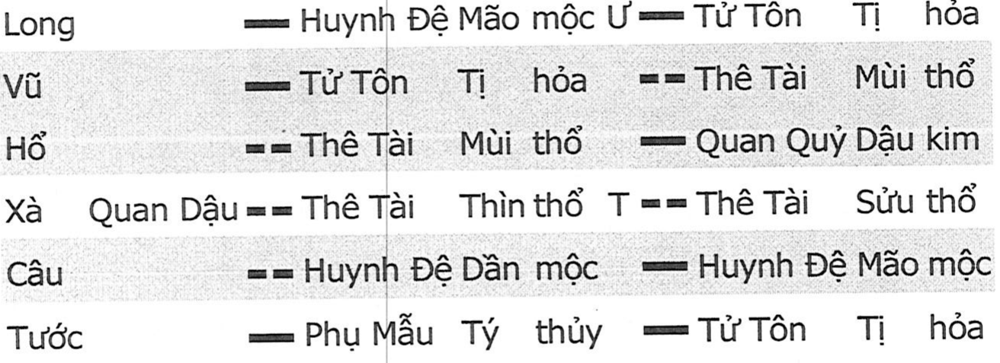

## Tại sao tôi hay bực mình?

Đây là một tình huống ở năm 2019. Một người nữ hơi một tí là bực mình, không thể khống chế, đoán do nguyên nhân gì gây ra? Ở ngày Kỷ Dậu (Tuần Không: Dần Mão), tháng Mão, được Địa Thủy Sư.

| Lục thú | Quẻ Địa Thủy Sư | Thế / Ứng |
| :--- | :--- | :---: |
| Câu | -- Phụ Mẫu Dậu kim | Ư |
| Tước | -- Huynh Đệ Hợi thủy | |
| Long | -- Quan Quỷ Sửu thổ | |
| Vũ | -- Thê Tài Ngọ hỏa | T |
| Hổ | — Quan Quỷ Thìn thổ | |
| Xà | -- Tử Tôn Dần mộc | |

Lấy hào Thế làm Dụng thần, xem tổ hợp biến hóa của quẻ. Hào Thế lâm hỏa, hỏa chủ nóng nảy, lâm Huyền Vũ, Huyền Vũ chủ kìm nén, tâm trạng không thoải mái.

Nguyên thần Dần mộc lâm Đằng Xà Không Vong, bị Nhật khắc, mộc chủ gan, Đằng Xà chủ lo lắng bất an, hào sơ thể hiện tâm sự, lâm Tử Tôn, lâm hào âm, hào âm là nữ, cũng biết cô ấy có một con gái, do đó đoán bởi vì chuyện của con gái, tâm trạng không tốt, phiền táo, cho nên hơi một tý là nổi giận. Đây là biểu hiện của can khí bất thư. (Nghiệm)

Cô ấy lại nói rằng khám sức khỏe được cho biết là bản thân đường máu cao, hỏi có nghiêm trọng hay không?

Quẻ cung Khảm mặc dù có thông tin về bệnh tiểu đường. Nhưng hào Thế hoàn toàn không liên hệ với thủy và Thìn thổ, Quan Quỷ Thìn thổ mặc dù thể hiện tiểu đường, nhưng Nguyệt khắc Nhật không sinh, hưu tù vô khí, không luận bệnh. Có thể do trước khi kiểm tra sức khỏe đã ăn đồ ngọt chứ không có bệnh tiểu đường. (Sau đó đã đến bệnh viện kiểm tra, quả nhiên không có vấn đề.)

Hào 2 là phu vị, Thìn thổ bị Nguyệt khắc, Quan Quỷ là chồng, trái lại chồng chị có tiểu đường. (Nghiệm)

Lại hỏi con gái thi tiến sĩ như thế nào? Xem Quan Quỷ Sửu thổ, lâm Thanh Long, Thanh Long là quý, có mệnh tiến sĩ, nhưng hưu tù vô khí, lại thêm Phụ Mẫu Dậu kim Nguyệt phá Nhật thực phá, Phụ Mẫu là văn thư, Nguyệt phá, bất lợi, thực phá, thi lại mới đậu. (Nghiệm, nhiều lần thi thiếu điểm, sau này đã thi đậu tiến sĩ ở năm đó.)

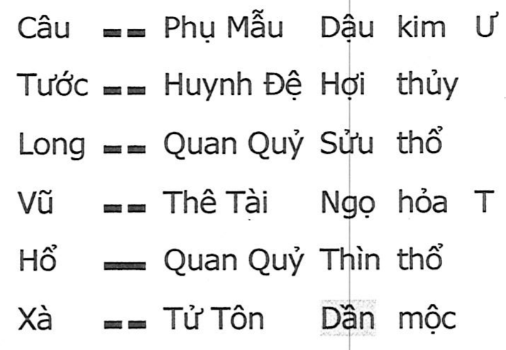

# CHƯƠNG 14
## BẤT LỢI DO ÂM DƯƠNG TRẠCH KHÔNG TỐT GÂY NÊN

### Thủy xung tổ phần bất lợi hôn nhân

Đây là một tình huống ở năm 2016. Nam, người Trương Gia Khẩu, sinh năm Tân Dậu, đoán cát hung của tổ phần, ở ngày Canh Tý (Tuần Không: Thìn Tị), tháng Tân Mão, được Sơn Hỏa Bí biến Phong Hỏa Gia Nhân.

| Lục thú | Phục thần | Quẻ Sơn Hỏa Bí | Thế / Ứng | Quẻ Phong Hỏa Gia Nhân |
| :--- | :--- | :--- | :---: | :--- |
| Xà | | — Quan Quỷ Dần mộc | | — Quan Quỷ Mão mộc |
| Câu | | -- Thê Tài Tý thủy | | — Phụ Mẫu Tị hỏa |
| Tước | | -- Huynh Đệ Tuất thổ | Ư | -- Huynh Đệ Mùi thổ |
| Long | Tử Thân | — Thê Tài Hợi thủy | | — Thê Tài Hợi thủy |
| Vũ | Phụ Ngọ | -- Huynh Đệ Sửu thổ | | -- Huynh Đệ Sửu thổ |
| Hổ | | — Quan Quỷ Mão mộc | T | — Quan Quỷ Mão mộc |

Không có Dụng thần cụ thể, căn cứ tổ hợp biến hóa của quẻ tiến hành phân tích. Phụ Mẫu là phần địa, Phụ Mẫu Ngọ hỏa phục tàng tại hào 2, hào 5 lại hóa Phụ Mẫu Tị hỏa, đều có thể dùng để tham khảo. Hào 5 Tý thủy sinh hào Thế hóa Phụ Mẫu, bản thân chịu ảnh hưởng của tổ phần rất lớn. Quẻ cung Cấn, ngoại quái lại là Cấn, Cấn là núi, chủ phần địa nhiều núi. (Nghiệm, xung quanh đều là núi.)

Hào 5 là người, Phụ Mẫu Tị hỏa hóa ra Không Vong, chủ trong phần địa có người không phải là bản tông, hoặc có y quan trủng[^1]. (Nghiệm, ông cố là người được nhận làm con thừa tự.)

Hào 5 Tý thủy độc phát xung Phụ Mẫu Ngọ hỏa phục tàng, Tý thủy trên Nhật cũng xung, chủ phần địa có hai dòng nước xung phần địa. Tý thủy lâm Nhật hóa Không Vong, hóa Tuyệt, trước đây nhiều nước, hiện tại ít nước. Độc phát hợp Sửu thổ lâm Huyền Vũ, Huyền Vũ là tượng bẩn, đục, nước khá bẩn. (Nghiệm, quả thực là hai dòng nước, trước đây dòng nước lớn, hiện tại đã ít nước, lại bị ô nhiễm.)

[^1]: Y quan trủng là mộ chôn những đồ vật của người chết như quần áo mũ nón, không phải là chôn di thể của người chết. Điều này là do không tìm thấy di thể của người chết, hoặc đã được chôn ở một nơi khác, và y quan trủng được lập ở đây để tưởng niệm.

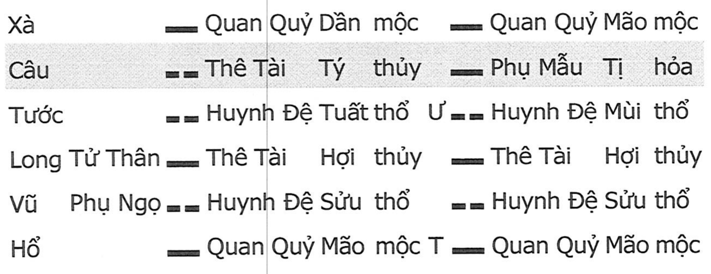

Tý thủy sinh hào Thế, nhưng hóa Tị hỏa Không Vong, năm Quý Tị xuất Không, nhất định phát tài. (Nghiệm, năm Quý Tị đã phát tài.)

Giáp Ngọ xung Thê Tài Tý thủy, tài vận bắt đầu bất ổn. Năm Ất Mùi khắc Thê Tài, nhất định phá tài. (Nghiệm, Giáp Ngọ bắt đầu bất ổn, nửa cuối năm không tốt, năm Ất Mùi phá tài 40 vạn.)

Thê Tài Tý thủy hóa Không Vong không có lực sinh hào Thế, chủ vợ không quan tâm đến anh. Hợp Huynh Đệ Sửu thổ, Huynh Đệ Sửu thổ lâm Huyền Vũ, chủ vợ anh đã có người bên ngoài. (Nghiệm, vợ đã có ngoại tình muốn ly hôn.)

Phần địa cũng không tốt đối với thân thể anh. Nguyên thần Tý thủy hóa Không Vong, hào 5 thủy là họng, chủ họng khô. Hào Thế Bạch Hổ là máu, thủy cũng là máu, Không tại Tị hỏa, chủ tim cung máu không đủ, tâm hoảng, huyết áp không ổn định. Ngoại quái Cấn, Cấn là mũi, chủ bị viêm mũi. Hóa Tị hỏa Không Vong, chủ Đông Nam thấp. (Nghiệm, hoàn toàn phù hợp với thực tế.)

Phương pháp hóa giải: Lược.

---

# Part 8 (Pages 141-160)

## Huyền Vũ có hố khó sinh nam

Đây là một tình huống ở năm 2016. Một người nam đã có ba con gái, nhưng một lòng muốn có con trai, đoán tại sao không có con trai? Ở ngày Mậu Thìn (Tuần Không: Tuất Hợi), tháng Thìn, được Sơn Hỏa Bí biến Địa Thủy Sư.

| Lục thú | Phục thần | Quái hào | Thế/Ứng | Biến hào |
| :--- | :--- | :--- | :---: | :--- |
| Tước | | ━ Quan Quỷ Dần mộc | | ╍╍ Tử Tôn Dậu kim |
| Long | | ╍╍ Thê Tài Tý thủy | | ╍╍ Thê Tài Hợi thủy |
| Vũ | | ╍╍ Huynh Đệ Tuất thổ | Ư | ╍╍ Huynh Đệ Sửu thổ |
| Hổ | Tử Thân | ━ Thê Tài Hợi thủy | | ╍╍ Phụ Mẫu Ngọ hỏa |
| Xà | Phụ Ngọ | ╍╍ Huynh Đệ Sửu thổ | | ━ Huynh Đệ Thìn thổ |
| Câu | | ━ Quan Quỷ Mão mộc | T | ╍╍ Quan Quỷ Dần mộc |

Lấy Tử Tôn làm Dụng thần. Tử Tôn Thân kim mặc dù có Nhật Nguyệt phù, nhưng phục tàng dưới hào 3, hào 6 Quan Quỷ hóa Tử Tôn, hào 6 là tổ phần, lâm Quan Quỷ, Quan Quỷ là thi cốt, lâm Câu Trần Chu Tước, cũng là mộ, bởi vì tổ phần có vấn đề, do đó đã ảnh hưởng đến việc có con trai. Nguyên thần Tuất thổ lâm Huyền Vũ Không Phá, Huyền Vũ chủ phía sau, thổ Không Phá chủ phía sau phần địa có hố lớn. (Nghiệm, phía sau phần địa có hố rất lớn.)

Hào Thế là Thai địa Tử Tôn, phát động đi hợp Tuất thổ Nguyệt phá, nghĩ mọi cách để có con trai cho mình.

Phương pháp hóa giải: Lấy năm cân đất trên núi phía Tây Bắc đổ vào hố sau mộ. Đồng thời dùng phương pháp dịch trận phong thủy bổ khí khiến phương Huyền Vũ vượng lên.

Vài tháng sau có thai, tám lần siêu âm B đều hiển thị là con trai, sau đó đã sinh hạ con trai ở tháng chạp năm Bính Thân, cuối năm đã mang theo video và hình ảnh của con trai đến cám ơn tôi. Đã có thể chạy và biết nói. (Bởi vì trời lạnh nên không dẫn con trai đến.)

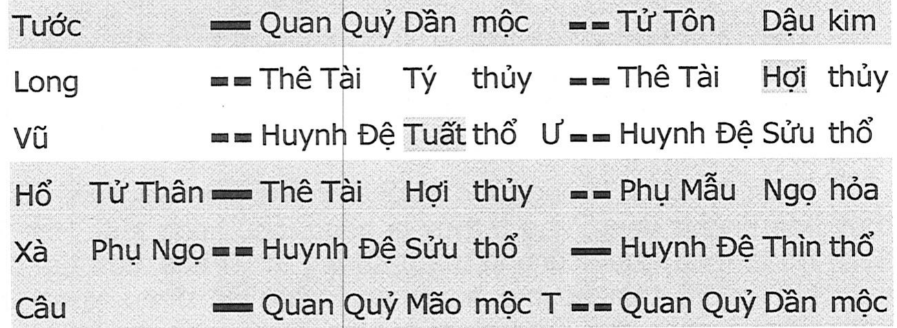

## Sinh nữ không sinh nam

Một người nữ cầu đoán cát hung của tổ phần, gieo quẻ như sau. Ngày Kỷ Mùi (Tuần Không: Tý Sửu), tháng Thân.

| Lục thú | Phục thần | Quẻ chính | Quẻ biến |
| :--- | :--- | :--- | :--- |
| Câu | | ╍╍ Phụ Mẫu Tuất thổ | ╍╍ Huynh Đệ Dậu kim |
| Tước | | ╍╍ Huynh Đệ Thân kim | ╍╍ Tử Tôn Hợi thủy |
| Long | Tử Hợi | ━ Quan Quỷ Ngọ hỏa T | ╍╍ Phụ Mẫu Sửu thổ |
| Vũ | | ━ Huynh Đệ Thân kim | ╍╍ Thê Tài Mão mộc |
| Hổ | Tài Mão | ╍╍ Quan Quỷ Ngọ hỏa | ╍╍ Quan Quỷ Tị hỏa |
| Xà | | ╍╍ Phụ Mẫu Thìn thổ Ứ | ╍╍ Phụ Mẫu Mùi thổ |

Hào Thế là huyệt trường, Ngọ hỏa trì Thế lâm Thanh Long, hỏa chủ ánh sáng, ánh nắng, Thanh Long là đẹp, Mộ địa là một nơi có ánh nắng rực rỡ.

Phụ Mẫu là phần mộ, Phụ Mẫu lưỡng hiện, lấy hào 6 Phụ Mẫu Tuất thổ lâm Câu Trần làm Dụng, bởi vì Quan Quỷ là thi cốt, Mộ khố là phần mộ, Câu Trần chủ gò đất, Tuất thổ nhất định là phần mộ. Hào 6 lại là hào vị tổ phần, lâm Tuất thổ, chủ Tuất năm lập nên. (Thực tế mộ được lập ở năm 1982 Nhâm Tuất)

Thanh Long là nam, hưu tù hóa Không Vong, chủ mộ này bên trái thấp trũng, bất lợi nam, lại thêm Tử Tôn Thanh Long phục tàng dưới Quan Quỷ, sinh nữ mà không sinh nam. (Thực tế không có anh trai em trai, chỉ có một em gái, bản thân chiêu nữ tế kết hôn, hài tử sinh ra đều là đội khăn tóc dài.)

Hào 3 Thân kim hóa Mão mộc, gần hào Thế, là trước huyệt. Kim là đá, mộc chủ cỏ. Chủ lân cận phần mộ có đá và cỏ vây quanh. Lâm Huyền Vũ tại phía Bắc, ảnh hưởng huynh đệ tỉ muội bất hòa, tài vận. (Thực tế phía Bắc có một hòn đá, mọc rất nhiều cỏ.)

Huynh Đệ lâm Huyền Vũ Chu Tước động, chủ khẩu thiệt, hào Thế lại khắc Huynh Đệ, chủ huynh đệ tỉ muội bất hòa, Huynh Đệ hóa Thê Tài, hào biến thuyết minh bổ sung, chủ vì tài sản mà bất hòa. Thê Tài phục tàng tại hào 2, hào 2 là trạch là gia sản, hợp hào 6 Phụ Mẫu, hào 6 là tổ tiên, chính là tranh đoạt tổ nghiệp. (Thực tế em gái và mình tranh giành tài sản của tổ tiên để lại.)

Trong quẻ Phụ Mẫu vượng tướng, Thanh Long trì Thế, chủ xuất người trí thức. (Phù hợp với thực tế, người cầu đoán và em gái đều tốt nghiệp đại học.)

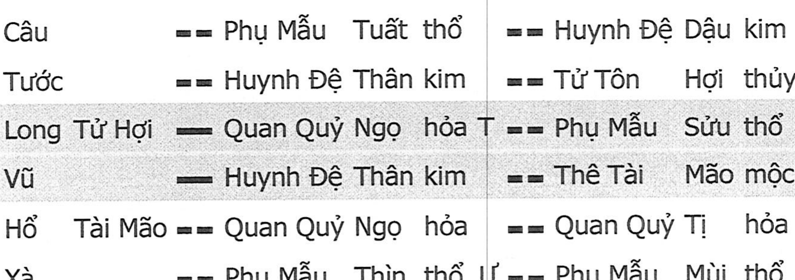

Hào Thế gặp hợp, hợp tại Phụ Mẫu, Phụ Mẫu là mộ, chủ tượng hợp táng. Hóa ra Sửu thổ Không Vong, năm Kỷ Sửu xuất Không, năm này đã động phần địa. (Đây vốn là mộ của ông nội, năm 09 bà nội chết, đã mở mộ tiến hành hợp táng.)

Hào Thế cũng là bản thân, lâm Ngọ hỏa hóa Không Vong, hào 4 là tim, hóa Không, Nguyên thần hưu tù phục tàng, lâm Bạch Hổ, Bạch Hổ chủ máu, biểu thị bản thân tim cung máu không tốt, có bệnh tâm hoảng. (Đúng như vậy)

## Chữa tốt thành xấu

Một người Nhật Bản di cư Mỹ tìm tôi dự đoán, anh ta nghi ngờ phong thủy của mình có vấn đề, sau khi vào ở nhà đó được nửa năm, rất nhiều mặt không thuận lợi xuất hiện, nhà có vấn đề, xe có vấn đề, hàng bưu điện có vấn đề, liên tục phát sinh sự việc không hài lòng. Thế là gieo quẻ được Sơn Thủy Mông. Ngày Quý Sửu (Tuần Không: Dần Mão), tháng Thân.

| Lục thú | Phục thần | Quẻ Sơn Thủy Mông |
| :--- | :--- | :--- |
| Hổ | | ━ Phụ Mẫu Dần mộc |
| Xà | | ╍╍ Quan Quỷ Tý thủy |
| Câu | Tài Dậu | ╍╍ Tử Tôn Tuất thổ T |
| Tước | | ╍╍ Huynh Đệ Ngọ hỏa |
| Long | | ━ Tử Tôn Thìn thổ |
| Vũ | | ╍╍ Phụ Mẫu Dần mộc Ứ |

Quan Quỷ Tý thủy mặc dù Nguyệt sinh vượng tướng, nhưng bị Nhật hợp, lại thêm Tử Tôn trì Thế, Tử Tôn vượng tướng, là tượng vô ưu. Lâm Câu Trần, chủ kiến trúc, dự đoán ảnh hưởng của phong thủy, nhất định là ảnh hưởng nhỏ, vấn đề lớn không phải do phong thủy gây ra.

Phụ Mẫu Dần mộc lưỡng hiện, Nguyệt phá Không Vong, mặc dù Phụ Mẫu là Kỵ thần của hào Thế, nhưng bởi vì hỏi đến sự việc phong thủy, Phụ Mẫu có ý nghĩa là nhà, vậy Phụ Mẫu này nhất định có quan hệ mật thiết với nhà. Hào sơ Phụ Mẫu lâm hào Ứng, lấy đây làm trọng điểm. Lâm Huyền Vũ cộng Bạch Hổ. Huyền Vũ là thủy, thứ bẩn thỉu, hào sơ là chỗ thấp, Bạch Hổ là đường, hợp lại là cống thoát nước. Không Vong Nguyệt phá, chính là có hư hại, vết nứt, có vết nứt nhất định rỉ nước. Bởi vì Quan Quỷ là thủy, thủy mới là nhân tố bất an.

Hào Thế Câu Trần, chủ bản thân thiếu tinh thần, có tâm trạng lười biếng. Quan Quỷ bị Nhật khắc hợp, chủ sự nghiệp công tác gặp

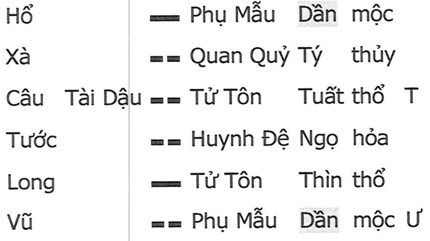 trở ngại, Thê Tài mặc dù vượng tướng, nhưng phục tàng nhập Mộ tại Nhật, tài đến chậm, hào 3 lâm Huynh Đệ Ngọ hỏa, hào 3 là cửa, Huynh Đệ cũng là cửa, cửa mở hướng về Nam, xung hào 5, ra cửa có đường xung thẳng.

Phương pháp hóa giải: Sửa cống thoát nước, sau đó đặt một con ngựa mỹ nghệ ở phía Bắc.

Ngày Đinh Tị tháng Thân, anh ta đã tự sửa lại cống thoát nước của nhà bếp, đồng thời đã đặt một con ngựa mỹ nghệ ở phía Bắc. Kết quả, ngày Tân Dậu lại xảy ra tranh chấp mới với hàng xóm, không thể không chuyển khỏi chỗ ở hiện tại, bởi vì hàng xóm đã khiếu nại anh ta. Khi anh ta sửa cống thoát nước, đã làm rỉ nước, đường ống nước nóng cũng đã tắc. Đây có lẽ là vận khí, đáng lẽ là muốn hóa giải thì tìm thợ sửa chuyên nghiệp là đã được giải quyết, ai ngờ tự bắt tay vào làm, trái lại buộc phải chuyển nhà. Đã chữa tốt thành xấu.

## Kéo một sợi tóc mà động toàn thân

Một người dự đoán phong thủy nơi ở có ảnh hưởng đến tài vận không? Được quẻ như sau. Ngày Đinh Mùi (Tuần Không: Dần Mão), tháng Ngọ.

| Lục thú | Phục thần | Quái hào | Thế/Ứng | Biến hào |
| :--- | :--- | :--- | :---: | :--- |
| Long | | ━ Huynh Đệ Mão mộc | | ╍╍ Phụ Mẫu Tý thủy |
| Vũ | | ━ Tử Tôn Tị hỏa | | ━ Thê Tài Tuất thổ |
| Hổ | | ╍╍ Thê Tài Mùi thổ | Ứ | ╍╍ Quan Quỷ Thân kim |
| Xà | Quan Dậu | ━ Thê Tài Thìn thổ | | ╍╍ Thê Tài Sửu thổ |
| Câu | | ━ Huynh Đệ Dần mộc | | ━ Huynh Đệ Mão mộc |
| Tước | | ━ Phụ Mẫu Tý thủy | T | ━ Tử Tôn Tị hỏa |

Toàn bộ quẻ chính là gia trạch, cát hung của Thê Tài chính là cát hung của phong thủy.

Hào 6 Huynh Đệ Mão mộc hóa hồi đầu sinh đến khắc Thê Tài, lâm Thanh Long Câu Trần, Thanh Long là bên trái, Câu Trần là liên tiếp, hào 6 ngoại quái là bên ngoài, bên ngoài nhà có vật có liên quan đến điện ảnh hưởng đến tài vận, ở bên trái của nhà. Mão mộc là dài, Không Vong là rỗng ở giữa, tại cung Tốn cũng là thon dài, phía trái bên ngoài nhà nhất định có cột điện ảnh hưởng đến tài vận. Hào 3 Thê Tài Thìn thổ hóa thoái, thổ là vật kiến trúc, trong sân nhất định có gian nhà nhỏ, ảnh hưởng đến phong thủy.

Thực tế, vừa ra cửa, bên trái có một cột điện. Phía Đông của sân có gian nhà thấp bé.

Phương pháp hóa giải: Dùng bút đỏ vẽ hai vòng tròn lên cột điện và đặt một hòn đá tròn trong gian nhà nhỏ.

Phản hồi: Anh ta đang kinh doanh một nhà hàng Ý, nhưng càng ngày càng ế ẩm, khách cũ không thấy quay lại. Sau khi hóa giải không lâu, khách cũ đã quay lại ăn, gia đình cũng đã hòa thuận, mấy tháng sau lại có hỷ bất ngờ. Nhà hàng được mở trước ga xe lửa, sau khi công trình thị chính được cải tạo xong, nhà hàng của anh ta đã trở thành một điểm sáng trước nhà ga, được tuyên truyền tới cả nước, bỗng chốc đã tăng lên rất nhiều khách hàng, hơn nữa, bởi vì thành phố này kết nghĩa với một thành phố ở Ý, chính quyền thành phố đã chỉ định nhà hàng của anh ta là nhà hàng hữu nghị Ý. Hiện nay kinh doanh rất thịnh vượng, tất cả điều này đều là hỷ tòng thiên giáng.

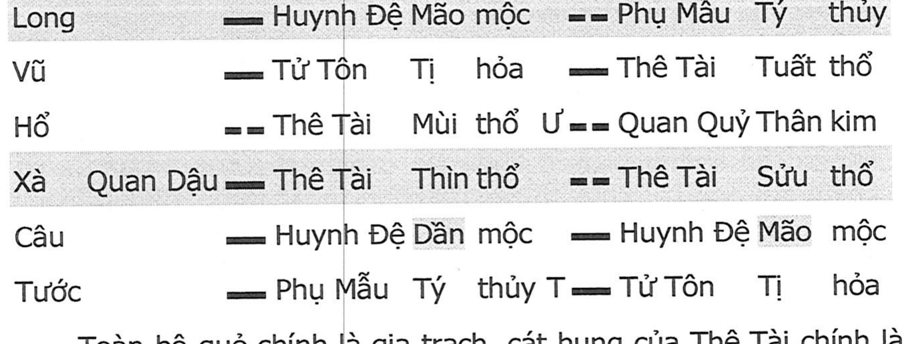

Vốn là hóa giải phong thủy trong nhà, kết quả là việc kinh doanh của nhà hàng cũng thay đổi. Đúng là kéo một sợi tóc mà động toàn thân.

## Cống thoát nước ảnh hưởng đến tài vận

Đây là một tình huống ở năm 2009. Một người nữ nói rằng hôn phu đã hợp ý một cửa hàng còn trống, muốn thuê để làm tiệm thịt nướng dạng buffet, hỏi có thể kiếm được tiền hay không? Gieo quẻ như sau. Ngày Kỷ Mão (Tuần Không: Thân Dậu), tháng Dậu.

| Lục thú | Phục thần | Quái hào | Thế/Ứng | Biến hào |
| :--- | :--- | :--- | :---: | :--- |
| Câu | | ╍╍ Thê Tài Tý thủy | | ╍╍ Tử Tôn Dậu kim |
| Tước | | ━ Huynh Đệ Tuất thổ | | ╍╍ Thê Tài Hợi thủy |
| Long | | ╍╍ Tử Tôn Thân kim | T | ╍╍ Huynh Đệ Sửu thổ |
| Vũ | | ━ Huynh Đệ Thìn thổ | | ━ Tử Tôn Dậu kim |
| Hổ | Phụ Tị | ━ Quan Quỷ Dần mộc | | ━ Thê Tài Hợi thủy |
| Xà | | ━ Thê Tài Tý thủy | Ứ | ╍╍ Huynh Đệ Sửu thổ |

Lấy Thê Tài làm Dụng thần. Trong quẻ Thê Tài lưỡng hiện, lấy hào Thê Tài Tý thủy phát động làm Dụng thần. Dụng thần Nguyệt sinh Nhật không khắc là vượng tướng, nhưng phát động hóa hồi đầu khắc hợp.

Hào sơ là hạ, lâm thủy là hạ thủy, Đằng Xà là vật thon dài, chính là đường ống, hợp mà vướng chân, tượng không thông suốt. Do đó, cống thoát nước của cửa hàng này bị tắc nghẽn, không quá thông suốt, ảnh hưởng đến tài vận, cần sửa chữa.

Phụ Mẫu là hợp đồng, phục tàng tại hào 2, biểu thị vẫn chưa ký hợp đồng, lâm Bạch Hổ, Bạch Hổ là đường, chủ cửa hàng ở ven đường, không phải là trên lầu. Hào Thế Không Vong là thiếu lòng tin.

Hào 5 Huynh Đệ hóa Thê Tài, bị Nhật hợp, muốn hóa không được, biểu thị túng bẫn, cần vay tiền mới có thể mở cửa hàng này.

Thê Tài vượng tướng tuy có thể kiếm được tiền, nhưng hào Thế Không Vong, Huynh Đệ phát động, Thê Tài hóa hợp khắc, kinh doanh lúc tốt lúc xấu.

Sau khi dự đoán xong, tôi đến cửa hàng kiểm tra thì phát hiện cống thoát nước nhỏ hơn rất nhiều so với bình thường, cửa thoát nước cao hơn đường ống và tạo thành dòng chảy ngược, xem ra cần phải cải tạo.

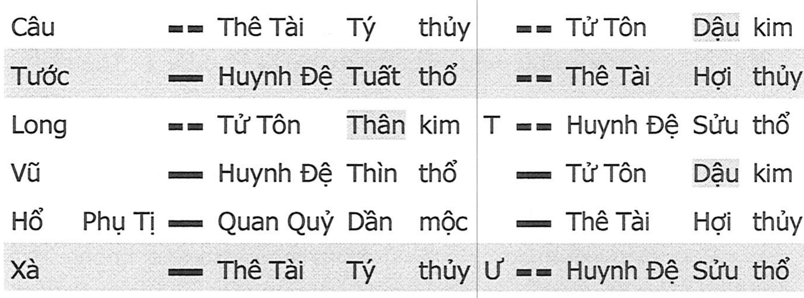

Bởi vì phải cọc tiền cho chủ nhà, trang tu cũng cần chi phí, nguồn tiền không đủ, thế là mượn tiền bạn bè. Về sau ký hợp đồng ở ngày 9 tháng 12, ngày 29 chính thức khai trương.

## Thiếu ánh sáng bất lợi nam

Một người nữ cầu đoán phong thủy nhà, được quẻ như sau. Ngày Ất Dậu (Tuần Không: Ngọ Mùi), tháng Mão.

| Lục thú | Phục thần | Quái hào | Thế/Ứng | Biến hào |
| :--- | :--- | :--- | :---: | :--- |
| Vũ | | ╍╍ Huynh Đệ Tý thủy | | ╍╍ Huynh Đệ Tý thủy |
| Hổ | | ━ Quan Quỷ Tuất thổ | Ư | ━ Quan Quỷ Tuất thổ |
| Xà | | ╍╍ Phụ Mẫu Thân kim | | ╍╍ Phụ Mẫu Thân kim |
| Câu | Tài Ngọ | ╍╍ Quan Quỷ Thìn thổ | | ╍╍ Quan Quỷ Sửu thổ |
| Tước | | ╍╍ Tử Tôn Dần mộc | T | ━ Tử Tôn Mão mộc |
| Long | | ━ Huynh Đệ Tý thủy | | ━ Thê Tài Tị hỏa |

Phụ Mẫu Thân kim là nhà, Nhật phù, Nguyệt không khắc, nhưng độc phát Tuyệt địa, lâm Đằng Xà, chủ nhà chật hẹp, diện tích không lớn.

Hào 2 lâm Chu Tước, chủ nhà bếp. Mộc động sinh hỏa, phòng bếp ánh sáng tốt, tương đối sáng sủa.

Hào 2 là trạch, mộc động hóa Tiến thần. Chủ trong nhà có rất nhiều thực vật.

Thê Tài Ngọ hỏa Không Vong, phục tàng tại hào 3, hào 3 là cửa, hỏa là ánh sáng, chỗ vào cửa khá tối. Một là bất lợi cho tài vận, hai là không thể sinh Quan Quỷ thổ, bất lợi cho nam.

Hào 2 Tử Tôn động hóa Tiến thần, khắc hào Ứng Quan Quỷ Tuất thổ, hào Ứng Quan Quỷ là chồng, Quan Quỷ Tuất thổ tại hào 5, hào 5 là đường, lâm Bạch Hổ chủ tai nạn đổ máu, phải chú ý xa họa.

Phương pháp hóa giải: Lắp đèn ở lối vào cửa để điều chỉnh ánh sáng.

Về sau phản hồi: Tại ngày Canh Tý tháng Thìn, khi chồng cô đang cưỡi xe đạp băng qua đường, cánh cửa của chiếc xe tải đi bên cạnh đột nhiên mở ra, xô ngã chồng cô xuống đường. Sau đó, chồng cô đã được đưa đến bệnh viện. Đùi trái, vai và khuỷu tay đều bị trầy xước. May mà lúc đó không có xe khác chạy đến, nếu không thì chưa biết thế nào. Đây là ứng Quan Quỷ Tuất thổ tỉnh mà gặp

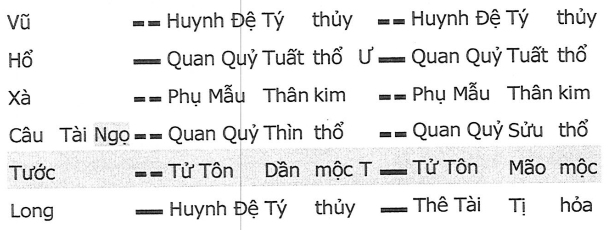 xung. Nếu chiếu theo quẻ ban đầu, Tử Tôn vượng tướng, Quan Quỷ hưu tù, may mà đã sớm làm hóa giải, đã cứu được một mạng.

## Vận khí của anh trai

Một ngày trong tháng 1 năm 2010, trời đã tối, tôi và đệ tử Quách Hiểu Cương đang uống trà với đạo trưởng của một đạo quán tại Bắc Kinh, đột nhiên đạo trưởng nhận được một cuộc gọi, nói là có người muốn dự đoán, ông ta liền bảo người cầu đoán hãy đến ngay đạo quán.

Một lúc sau người khách đã đến, là một nam tử chừng hơn 30 tuổi, sau khi giới thiệu tôi với người đến, đạo trưởng liền tìm cớ cùng Quách Hiểu Cương rời khỏi, đến điện bên cạnh để xem ti vi. Tôi hỏi người khách muốn dự đoán cái gì, anh ta nói là dự đoán vận khí của anh trai, thế là gieo quẻ, ở ngày Ất Hợi (Tuần Không: Thân Dậu), tháng Sửu, được Phong Thủy Hoán biến Phong Địa Quan.

| Lục thú | Phục thần | Quẻ Phong Thủy Hoán | Thế/Ứng | Quẻ Phong Địa Quan |
| :--- | :--- | :--- | :---: | :--- |
| Vũ | | ━ Phụ Mẫu Mão mộc | | ━ Phụ Mẫu Mão mộc |
| Hổ | | ━ Huynh Đệ Tị hỏa | T | ━ Huynh Đệ Tị hỏa |
| Xà | Tài Dậu | ╍╍ Tử Tôn Mùi thổ | | ╍╍ Tử Tôn Mùi thổ |
| Câu | Quan Hợi | ╍╍ Huynh Đệ Ngọ hỏa | | ╍╍ Phụ Mẫu Mão mộc |
| Tước | | ━ Tử Tôn Thìn thổ | Ư | ╍╍ Huynh Đệ Tị hỏa |
| Long | | ╍╍ Phụ Mẫu Dần mộc | | ╍╍ Tử Tôn Mùi thổ |

Sau khi nhìn lướt qua quẻ, tôi nói với người khách rằng: Anh trai anh phạm quan ti, đã bị bắt. Đây là sự việc ở năm 07, hiện tại sự việc đã bại lộ. Bị lãnh đạo làm liên lụy, là do lãnh đạo đòi hối lộ, anh ta phải đút lót cho lãnh đạo. Phong thủy nhà của anh trai anh có chút vấn đề, hướng Tây Bắc có một con đường xung thẳng vào nhà của anh ta. Vấn đề không lớn, đến tháng giêng thì có thể được ra. Chưa đến hai phút, tôi đã tống cổ người khách đi. Dự đoán xong, tôi đến trắc điện, đạo trưởng và Quách Hiểu Cương vẫn đang chọn tiết mục truyền hình, vẫn chưa quyết định xem đài nào, bọn họ cho rằng tôi dự đoán có thể sẽ mất nhiều thời gian. Thực ra, khi xem một quẻ, yếu điểm cũng chỉ có vài câu nói, việc mất nhiều thời gian cũng chỉ là do triển khai lời đoán mà thôi.

Đối với các phán đoán trên đây, tôi đã phân tích như sau: Lấy Huynh Đệ làm Dụng thần, Huynh Đệ lưỡng hiện, đều có thể xem là Dụng thần. Hào 3 Huynh Đệ Ngọ hỏa lâm Câu Trần, tự mang hình, Hợi thủy trên Nhật, độc phát Thìn thổ, đã hợp Dậu kim, đủ tứ hình, lại thêm Chu Tước chủ quan ti khẩu thiệt độc phát, Quan Quỷ lâm

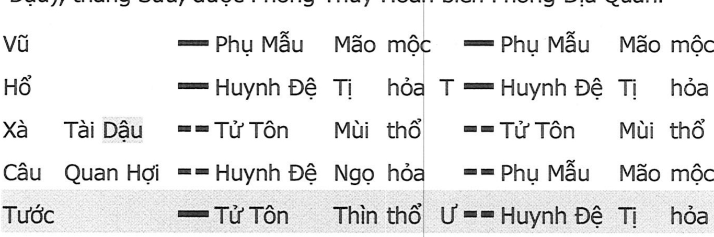

Nhật đến khắc, mà Quan Quỷ Hợi thủy nhập quẻ lâm Câu Trần, chính là lao ngục. Phục tàng dưới Huynh Đệ, Phục khắc Phi, chính là nguy cơ tiềm tàng, lâm Nhật, chính là hiện nay bạo phát, sự việc đã bại lộ. Huynh Đệ Tị hỏa tại hào 5 xuất hiện, hào 5 là quan vị, biểu thị ở cùng nơi với quan chức, bị Quan Quỷ trên Nhật xung khắc, chính là bị quan chức liên lụy. Lâm Bạch Hổ, chủ đường, hào 5 cũng là đường, bị Hợi thủy xung khắc, Hợi đối ứng Tây Bắc, chính là Tây Bắc có đường xung bất lợi. Hào Ứng là người khác, độc phát hợp Thê Tài Dậu kim, chính là có người khác đòi tiền, hợp Thê Tài phục tàng, đương nhiên không phải là tiền công khai, hiển nhiên là đòi hối lộ. Thê Tài Không Vong, là tiền đã ra đi, chính là đã đưa hối lộ. Nhanh thì vào năm Canh Dần, Huynh Đệ được sinh, hợp Quan Quỷ Hợi thủy, tháng giêng thì được ra. Lúc đó các phán đoán đều chính xác, kết quả về sau chưa có phản hồi.

## Bạch Hổ há mồm sẽ ăn người

Một ngày trong tháng 4 năm 2015, một người nữ được anh trai cô ấy dẫn đến nhà tôi cầu đoán sức khỏe, ở ngày Mậu Thìn (Tuần Không: Tuất Hợi), tháng Thìn, gieo được Sơn Lôi Di.

| Lục thú | Phục thần | Quẻ Sơn Lôi Di | Thế/Ứng |
| :--- | :--- | :--- | :---: |
| Tước | | ━ Huynh Đệ Dần mộc | |
| Long | Tử Tị | ╍╍ Phụ Mẫu Tý thủy | |
| Vũ | | ╍╍ Thê Tài Tuất thổ | T |
| Hổ | Quan Dậu | ╍╍ Thê Tài Thìn thổ | |
| Xà | | ╍╍ Huynh Đệ Dần mộc | |
| Câu | | ━ Phụ Mẫu Tý thủy | Ư |

Lấy hào Thế làm Dụng thần. Hào Thế Thê Tài Tuất thổ bị Nhật Nguyệt xung phá, may mà thổ xung với thổ, mặc dù hung hiểm nhưng nếu vượt qua được giai đoạn hiểm nghèo thì vẫn có thể kéo dài được mạng sống. Hào Thế Nguyệt phá, năm 2011 Tân Mão hợp hào Thế, năm này bị bệnh. Hồi đáp: Bị bệnh năm 2011.

Nhật Nguyệt nhập quẻ tại hào 3, Thìn thổ là thủy khố, tất là bệnh ở bàng quang, thận,... Hồi đáp: Năm 2011, tôi bị ung thư thận và phải cắt bỏ một bên, hiện nay lại phát hiện ung thư bàng quang.

Thìn thổ lâm Nhật Nguyệt tại hào 3 xung phá hào Thế, hào 3 là giường, ngủ không tốt. Hồi đáp: Thường xuyên bị bóng đè.

Tìm nguyên nhân, nhất định có liên quan đến nơi ở. Thìn thổ là Mộ khố của hào Thế, có thể xem là nơi ở. Thìn là thủy khố, trong

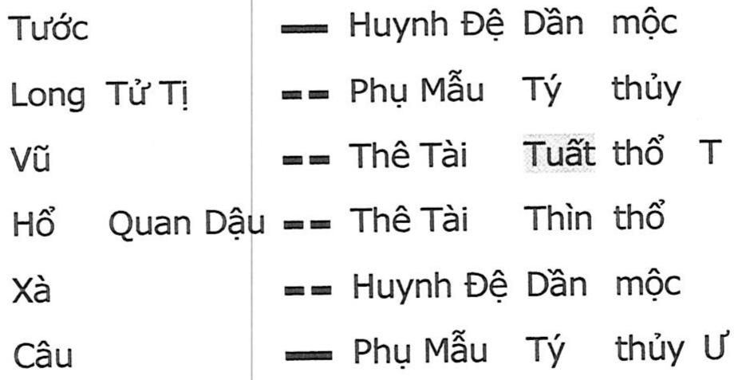 sân có hồ nước. Đáp: Có một bể nước bằng xi măng rộng 1 mét vuông.

Thìn thổ lâm Bạch Hổ vượng tướng, chủ Bạch Hổ đang lúc mạnh, xung phá hào Thế, Bạch Hổ ăn người, quái tượng Sơn Lôi Di chính là tượng há mồm, là Bạch Hổ há mồm.

Bởi vì người đó không biết Thanh Long Bạch Hổ là gì, sau khi được giải thích thì phản hồi như sau: Cổng tại Đông Nam, hiên nhà phía Đông ngắn, hiên nhà phía Tây dài ra một đoạn, lại mở cửa đối diện cổng, đúng là Bạch Hổ há mồm trong phong thủy.

Hào Thế Tuất thổ Không Vong, thổ Không thì hãm, Tây Bắc có hố. Hồi đáp: Có một cửa hầm cất giữ rau quả.

## Độc phát có thể thủ tượng phản phục[^1]

Đây là một tình huống ở tháng 2 năm 2015. Một người nam cảm thấy bụng đau lâm râm vào sáng ngày 20 tháng 2, bèn đoán tình trạng sức khỏe. Ở ngày Đinh Mão (Tuần Không: Tuất Hợi), tháng Dần, gieo được Thủy Phong Tỉnh biến Thủy Sơn Kiển.

| Lục thú | Phục thần | Quái hào | Thế/Ứng | Biến hào |
| :--- | :--- | :--- | :---: | :--- |
| Long | | ╍╍ Phụ Mẫu Tý thủy | | ╍╍ Phụ Mẫu Tý thủy |
| Vũ | | ━ Thê Tài Tuất thổ | T | ━ Thê Tài Tuất thổ |
| Hổ | Tử Ngọ | ╍╍ Quan Quỷ Thân kim | | ╍╍ Quan Quỷ Thân kim |
| Xà | | ━ Quan Quỷ Dậu kim | | ━ Quan Quỷ Thân kim |
| Câu | Huynh Dần | ━ Phụ Mẫu Hợi thủy | Ứ | ╍╍ Tử Tôn Ngọ hỏa |
| Tước | | ╍╍ Thê Tài Sửu thổ | | ╍╍ Thê Tài Thìn thổ |

Lấy hào Thế làm Dụng thần. Hào Thế Tuất thổ tại hào 5 bị Nhật Nguyệt khắc chế, là hưu tù. Thổ là dạ dày, hào 5 cũng có thể là dạ dày, đoán là bệnh dạ dày. Tuất thổ cũng có thể là tim, tim cũng không tốt. (Thực tế, sau khi nội soi dạ dày, phát hiện có lở loét nhẹ, bình thường có bệnh tâm hoảng.)

Trong quẻ Hợi thủy độc phát, lâm Câu Trần Thanh Long hợp Dần mộc phục tàng, Dần mộc đúng lúc là Kỵ thần, Câu Trần là sưng trướng, mộc chủ gan, Thanh Long chủ rượu, là thông tin gan nhiễm mỡ, gan nhiễm cồn. (Thực tế có gan nhiễm mỡ.)

Quẻ cung Chấn, Chấn là chân, hào 2 cũng là chân, Huynh Đệ là chân, Câu Trần chủ phù thũng, cũng là thông tin chân bị sưng. (Thực tế chân bị sưng.)

Độc phát thường biểu thị nguyên nhân, hào 2 là trạch, Phụ Mẫu Hợi thủy Không Vong, thủy Không thì chảy, hóa Ngọ hỏa, Tây Bắc hoặc phía Nam của nơi ở có hiện tượng rỉ nước. (Thực tế Tây Bắc có ống mềm lão hóa rỉ nước.)

Kỵ thần nhập quẻ phục tàng, bệnh tật đã tiềm tàng, chỉ là hiện tại chưa bạo phát ra hoàn toàn, cần điều dưỡng nhiều hơn.

[^1]: Biểu thị một hành động, động tác được lặp đi lặp lại.

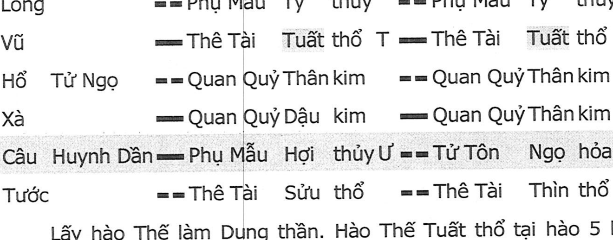

## Nước sông chảy đến bên cạnh chỗ ở

Đây là một tình huống ở năm Giáp Ngọ. Một người nữ ở Mỹ cầu đoán nguyên nhân phát bệnh của cha, ở ngày Nhâm Tý (Tuần Không: Dần Mão), tháng Thân, gieo được Địa Thiên Thái biến Đoài Vi Trạch.

| Lục thú | Phục thần | Địa Thiên Thái | Đoài Vi Trạch |
| :--- | :--- | :--- | :--- |
| Hổ | | -- Tử Tôn Dậu kim Ư | -- Huynh Đệ Mùi thổ |
| Xà | | -- Thê Tài Hợi thủy | — Tử Tôn Dậu kim |
| Câu | | -- Huynh Đệ Sửu thổ | — Thê Tài Hợi thủy |
| Tước | | — Huynh Đệ Thìn thổ T | -- Huynh Đệ Sửu thổ |
| Long | Phụ Tị | — Quan Quỷ Dần mộc | — Quan Quỷ Mão mộc |
| Vũ | | — Thê Tài Tý thủy | — Tử Tôn Tị hỏa |

Lấy Phụ Mẫu làm Dụng thần. Phụ Mẫu Tị hỏa phục tàng dưới hào 2, Nguyệt hợp Nhật khắc, xem là hưu tù. Trong quẻ Kỵ thần Thê Tài Hợi thủy hóa hồi đầu sinh đến khắc, biểu thị bệnh tình tương đối nghiêm trọng. Dụng thần phục tàng, đau bệnh không dậy nổi. Nguyên thần Không Phá, Nguyên thần thể hiện tư duy, biểu thị ý thức không tỉnh táo. Hào Thế Huynh Đệ lâm Chu Tước phát động, bởi vì sự tình của cha, đã cãi vã với người khác. (Đáp: Cha nằm liệt trên giường, đầu óc ngơ ngẩn, nhưng bệnh viện hoàn toàn không có phương pháp, với lại thái độ không tốt, do đó đã xảy ra cãi vã.)

Hào 4 Huynh Đệ Sửu thổ lâm Câu Trần hóa ra Kỵ thần, Câu Trần chủ kiến trúc, tu tạo, hóa Đinh Hợi thủy chủ năm Đinh Hợi, bởi vì năm này động thổ cải tạo mà gieo mầm họa. (Đáp: năm 2007 đã chuyển nhà đến chỗ hiện tại, bắt đầu trang tu nhà, đã xây một cái nhà để xe.)

Hào 5 Hợi thủy lâm Đằng Xà Huyền Vũ phát động hóa hồi đầu sinh, lân cận có một con sông, thủy nhập Mộ tại hào Thế, hào Thế là nhà của mình, chủ dòng nước đã chảy đến nhà. (Đáp: Lân cận có con sông, đã chảy đến sau lưng nhà. Cha ngã bệnh nhập viện ở năm 2012. Đây chính là ứng Thìn thổ phát động, cách sơn hóa hào, liên tục hóa đến hào 5 thủy.)

Tổng hợp phán đoán trên đây, bệnh của cha có mối quan hệ nhất định với phong thủy. Phương pháp hóa giải cụ thể: Lược, bởi vì không có phản hồi tình hình sau hóa giải nên đã tỉnh lược.

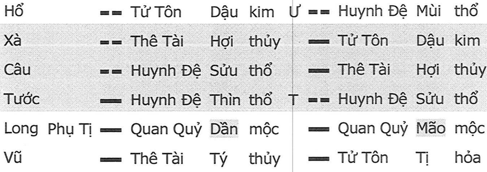

## Tiểu hài không biết nói có phải do phong thủy?

Đây là một tình huống ở tháng giêng năm 2015. Một người nữ có con gần ba tuổi nhưng không biết nói, hỏi có phải nguyên nhân là do phong thủy hay không? Ở ngày Kỷ Mùi (Tuần Không: Tý Sửu), tháng Dần, gieo được Phong Lôi Ích biến Tốn Vi Phong.

| Lục thú | Phong Lôi Ích | Tốn Vi Phong |
| :--- | :--- | :--- |
| Câu | — Huynh Đệ Mão mộc Ư | — Huynh Đệ Mão mộc |
| Tước | — Tử Tôn Tị hỏa | — Tử Tôn Tị hỏa |
| Long | -- Thê Tài Mùi thổ | -- Thê Tài Mùi thổ |
| Vũ | -- Thê Tài Thìn thổ T | — Quan Quỷ Dậu kim |
| Hổ | -- Huynh Đệ Dần mộc | — Phụ Mẫu Hợi thủy |
| Xà | — Phụ Mẫu Tý thủy | -- Thê Tài Sửu thổ |

Lấy Tử Tôn làm Dụng thần. Tử Tôn Tị hỏa tại hào 5, lâm Chu Tước bị hào sơ Phụ Mẫu Tý thủy khắc, Chu Tước chủ ngôn ngữ, bị khắc chủ ngôn ngữ có rối loạn, hào sơ là lúc nhỏ, Tý thủy là Thai địa, không thể loại trừ yếu tố bẩm sinh.

Tý thủy bị hào biến hợp, khiến Tý thủy tham hợp quên khắc, hưu tù không có lực khắc Tử Tôn. Tuy nhiên, hào biến bị Nhật xung khai, Tý thủy lại khắc Dụng thần, Nhật đồng thời cũng khiến Nguyên thần Mão mộc Dần mộc nhập Mộ. Vì vậy, Thê Tài Mùi thổ chính là mấu chốt của vấn đề. Mùi thổ nhập quẻ tại hào 4 lâm Thanh Long, Thanh Long chủ ẩm thực, Thê Tài cũng chủ ẩm thực, rất có thể liên quan đến phòng bếp. Hào 2 Dần mộc hóa ra Phụ Mẫu Hợi thủy, hào 2 là phòng bếp, Dần mộc là điểm Trường Sinh của hỏa, cũng có thể xem là phòng bếp. Dần mộc bị hào biến Phụ Mẫu Hợi thủy hợp không thể sinh Tử Tôn, cũng là phòng bếp có vấn đề.

Tại sao lại có hai chỗ biểu thị có liên quan đến phòng bếp? Hào 4 cũng là cửa sổ, mà hào 4 gần hào Thế, hào Thế thể hiện bản thân, vậy thì hào 4 chính là hàng xóm, bởi vì Thê Tài Mùi thổ là phòng bếp, chính là bên ngoài cửa sổ phòng bếp có đồ vật của hàng xóm ảnh hưởng. Dần mộc nhập Mộ không thể sinh hỏa, hỏa chủ ánh sáng, chính là căn nhà của hàng xóm che khuất ánh sáng của phòng bếp nhà mình. Do đó đã ảnh hưởng đến sự phát triển thanh đới của đứa con. (Quả nhiên ở phía Tây phòng bếp có bức tường nhà hàng xóm rất gần cửa sổ, khiến ánh sáng bị ảnh hưởng. Nghĩ kỹ thì phía Tây là Đoài, Đoài là miệng, vừa vặn chủ ngôn ngữ, nói năng.)

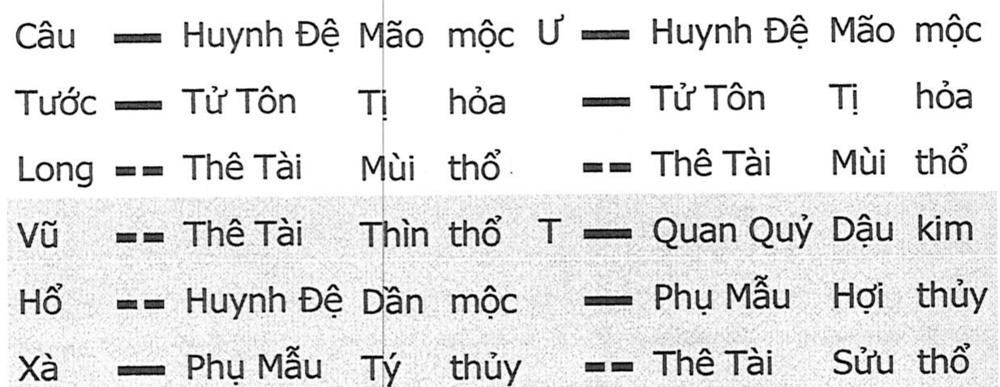

Hóa giải: Xung khai Mộ khố Mùi thổ, hợp Phụ Mẫu Tý thủy, chỉ có Sửu thổ mới có thể làm được. Tôi dặn người này để một chén gạo nhỏ ở Tây Nam, gạo không được cao hơn miệng chén.

Ngày 6 tháng 9 phản hồi: Sau khi hóa giải được một thời gian, tôi mang con đi xem ca hát để dụ con tập nói, đột nhiên con "a" lên tiếng, bắt đầu tập hát. Mặc dù con phát âm chưa rành nhưng cũng đã khiến cho chúng tôi vô cùng ngạc nhiên. Tôi tin chắc rằng, nếu như cố gắng hơn nữa thì nhất định sẽ có thay đổi.

Sau này hài tử đã biết nói, chỉ là hơi tự bế.

## Con gái bị lác mắt có thể phẫu thuật hay không?

Đây là một tình huống ở năm 2011. Một người nữ có con gái bị lác mắt, không muốn phẫu thuật, hỏi có phương pháp điều trị khác hay không? Ở ngày Quý Dậu (Tuần Không: Tuất Hợi), tháng Mùi, được Sơn Trạch Tổn biến Hỏa Trạch Khuê.

| Lục thú | Phục thần | Sơn Trạch Tổn | Hỏa Trạch Khuê |
| :--- | :--- | :--- | :--- |
| Hổ | | ━ Quan Quỷ Dần mộc Ứ | ━ Phụ Mẫu Tị hỏa |
| Xà | | ━ ━ Thê Tài Tý thủy | ━ ━ Huynh Đệ Mùi thổ |
| Câu | | ━ ━ Huynh Đệ Tuất thổ | ━ Tử Tôn Dậu kim |
| Tước | Tử Thân | ━ ━ Huynh Đệ Sửu thổ T | ━ ━ Huynh Đệ Sửu thổ |
| Long | | ━ Quan Quỷ Mão mộc | ━ Quan Quỷ Mão mộc |
| Vũ | | ━ Phụ Mẫu Tị hỏa | ━ Phụ Mẫu Tị hỏa |

Lấy Tử Tôn làm Dụng thần. Tử Tôn Thân kim phục dưới hào 3 Huynh Đệ Sửu thổ. Nguyệt sinh, Nhật phù là vượng tướng. Dụng thần phục tàng, Phi thần Nguyệt phá là tốt. Tuy nhiên, không nên Nguyên thần Tuất thổ Không Vong, thiếu lực sinh Tử Tôn.

Tuất thổ độc phát, hợp hào trạch Mão mộc, lại khiến Phụ Mẫu Tị hỏa nhập Mộ. Hào Thế là mình, nội quái Phụ Mẫu Tị hỏa sinh hào Thế, chính là nhà mình ở. Hào 4 là cổng bên ngoài, lâm Câu Trần chủ kiến trúc, vừa ra cổng là có một vật kiến trúc. Hào 2 là trạch, Tuất thổ hợp hào trạch, chính là trên nhà có thêm đồ vật, có thêm tầng kiến trúc. Hỏa chủ ánh sáng, khiến Phụ Mẫu nhập Mộ chính là ánh sáng của nhà mình bị che khuất, do đó mà ảnh hưởng đến mắt của con gái, chuyển nhà thôi!

Đáp: Gia đình chúng tôi đang sống trong một chung cư đi thuê. Trên mái nhà của dãy cửa hàng phía trước, người ta có đặt những đồ trang trí hình tròn che khuất cửa sổ của chúng tôi. Hóa ra nguyên nhân là do phong thủy!

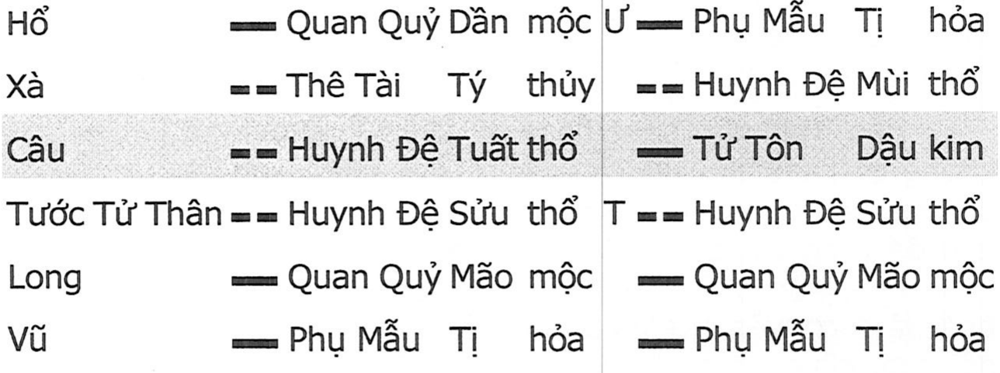

## Tài vận không tốt có phải do phong thủy có vấn đề?

Đây là một tình huống ở năm 2011. Một người nam tài vận không tốt, hỏi có phải là do phong thủy gây nên hay không? Tại ngày Quý Mùi (Tuần Không: Thân Dậu), tháng Dậu, được Sơn Địa Bác biến Phong Địa Quan.

| Lục thú | Phục thần | Sơn Địa Bác | Phong Địa Quan |
| :--- | :--- | :--- | :--- |
| Hổ | | ━ Thê Tài Dần mộc | ━ Thê Tài Mão mộc |
| Xà | Huynh Thân | ━ ━ Tử Tôn Tý thủy T | ━ Quan Quỷ Tị hỏa |
| Câu | | ━ ━ Phụ Mẫu Tuất thổ | ━ ━ Phụ Mẫu Mùi thổ |
| Tước | | ━ ━ Thê Tài Mão mộc | ━ ━ Thê Tài Mão mộc |
| Long | | ━ ━ Quan Quỷ Tị hỏa Ứ | ━ ━ Quan Quỷ Tị hỏa |
| Vũ | | ━ ━ Phụ Mẫu Mùi thổ | ━ ━ Phụ Mẫu Mùi thổ |

Lấy Thê Tài làm Dụng thần, lại xem hào động và các tổ hợp trong quẻ. Thê Tài Mão mộc Nguyệt phá, nhập Mộ tại Nhật, tài vận quả thực rất không tốt.

Hào Thế độc phát hóa Tuyệt, hào Thế thể hiện bản thân, không có lực sinh Thê Tài, vận khí của bản thân không tốt. Tuyệt địa nạp vào quẻ chính, lâm hào 2, hào 2 là trạch, lâm Thanh Long, chủ đã từng trang tu nhà. Thê Tài Mão mộc tại hào 3 bị Nguyệt xung phá, hào 3 là cửa, chủ thay đổi cửa. Hào 3 cũng là giường, hoặc là di chuyển giường ảnh hưởng đến tài vận. (Hồi đáp: Đã từng đổi cửa, cũng đã di chuyển giường. Có vẻ như là từ lúc đó thì tài vận bắt đầu không tốt.)

Hóa giải: Phía Đông của giường dán một bức tranh con thỏ, đồng thời mang theo trên người một con cá nhồi bông. Mục đích là để Thực Phá Mão mộc và để tạo thành tam hợp Thê Tài cục với Nhật Mùi thổ.

Ngày 14 tháng 11 phản hồi: Sau khi hóa giải chưa đến một tuần, tôi đột nhiên nhận được thư của anh trai, trong thư nói rằng cha đã để lại cho tôi 6 vạn tệ. Vào tháng 10, tại buổi tiệc liên hoan của đơn vị, tôi đã rút thăm được một chiếc máy ảnh kỹ thuật số.

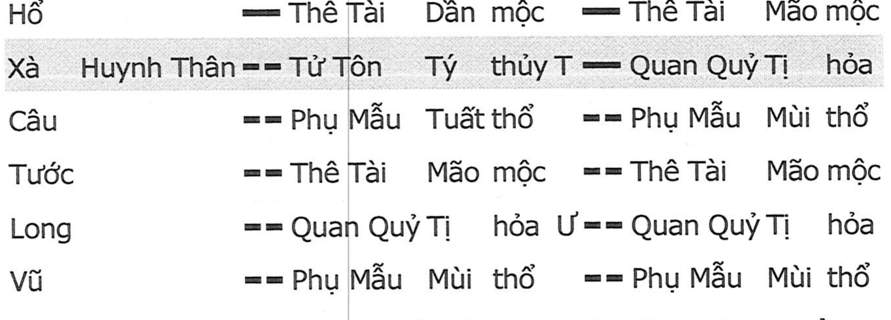

## Da khô nứt có nguyên nhân

Đây là một tình huống ở năm 2011. Một người nam sinh năm Kỷ Dậu nói rằng da của mình bị ngứa, khô nứt, có thể trị khỏi hay không? Ở ngày Kỷ Tị (Tuần Không: Tuất Hợi), tháng Tị, được Thủy Hỏa Ký Tế biến Trạch Thiên Quải.

| Lục thú | Phục thần | Quẻ Thủy Hỏa Ký Tế | Biến quẻ Trạch Thiên Quải |
| :--- | :--- | :--- | :--- |
| Câu | | - - Huynh Đệ Tý thủy Ứ | - - Quan Quỷ Mùi thổ |
| Tước | | — Quan Quỷ Tuất thổ | — Phụ Mẫu Dậu kim |
| Long | | - - Phụ Mẫu Thân kim | — Huynh Đệ Hợi thủy |
| Vũ | Tài Ngọ | — Huynh Đệ Hợi thủy T | — Quan Quỷ Thìn thổ |
| Hổ | | - - Quan Quỷ Sửu thổ | — Tử Tôn Dần mộc |
| Xà | | — Tử Tôn Mão mộc | — Huynh Đệ Tý thủy |

Lấy hào Thế làm Dụng thần. Hào Thế bị Nhật Nguyệt Tị hỏa xung phá, hỏa chủ khô, Nguyệt phá chủ nứt, cộng lại là khô nứt. Kỵ thần Quan Quỷ Sửu thổ lâm Bạch Hổ khắc hào Thế, thổ lâm Bạch Hổ chủ bệnh ngoài da, thông tin tương đối rõ ràng. Nguyệt chủ lâu dài, xung phá hào Thế chủ đã bị bệnh đã lâu, Nhật lại xung phá, Nhật là cận, chủ da vẫn không ngừng rạn nứt. Nguyên thần Phụ Mẫu Thân kim lâm Thanh Long hóa phá, Thanh Long chủ ngứa, phá tại Hợi thủy, chủ lượng nước trong cơ thể không đủ, không thể nuôi dưỡng da. (Đáp: Cũng không nhớ đã mắc bệnh từ khi nào, chỉ biết là đã nhiều năm, ngứa ngáy thì gãi, kết quả là da đã biến sắc.)

Hào 3 Hợi thủy cũng chủ thắt lưng, hưu tù chủ thận khí bất túc, thắt lưng cũng không tốt. Thủy Không thì chảy, chủ tiểu nhiều lần. (Thắt lưng không có sức, không thể di chuyển đồ vật. Khi ráng dùng sức thì đau thắt lưng, tiểu tiện nhiều.)

Hào 3 Huynh Đệ là cửa, Không Vong Nguyệt phá chủ trên cửa có vết nứt. Hào 2 là trạch, Quan Quỷ Sửu thổ phát động, khiến kim nhập Mộ, Bạch Hổ chủ đả đấu, lân cận có nhà máy gia công sắt thép v.v. Sửu thổ hóa Dần mộc, ước chừng ở Đông Bắc. (Đáp: Đông Bắc và phía Bắc có công ty sắt mỹ nghệ.)

Thân kim là vật cứng hình nhọn, Tị hỏa là dây điện, sóng điện, Nhật Nguyệt Tị hỏa đến hợp, chủ đan xen với nhau, Thân kim tham hợp quên sinh hào Thế, Tị hỏa lại xung phá hào Thế, chủ lân cận có tháp sắt, hoặc cột điện ảnh hưởng đến thân thể. (Đáp: Lân cận không có tháp sắt, Đông Nam có cột điện.)

Phương pháp hóa giải: Ngày Hợi, đặt hai cái cốc ở Tây Bắc, bên trong bỏ vào cục nước đá, để nó tự động tan.

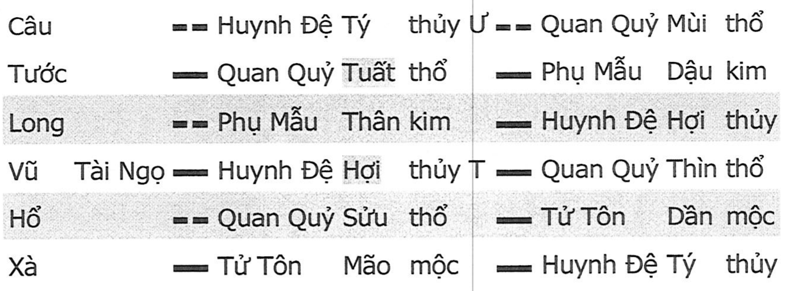

Ngày 30 tháng 5 năm 2011 phản hồi: Sau khi hóa giải như vậy, ngày hôm sau đã giảm ngứa rất nhiều.

## Rỉ nước thủy thì rỉ tài

Đây là một tình huống ở năm 2010. Nam đoán tình hình kinh doanh của tiệm massage làm đẹp, ở ngày Bính Dần (Tuần Không: Tuất Hợi), tháng Sửu, được Sơn Phong Cổ biến Tốn Vi Phong.

| Lục thú | Phục thần | Quẻ Sơn Phong Cổ | Biến quẻ Tốn Vi Phong |
| :--- | :--- | :--- | :--- |
| Long | | — Huynh Đệ Dần mộc Ứ | — Huynh Đệ Mão mộc |
| Vũ | Tử Tị | - - Phụ Mẫu Tý thủy | — Tử Tôn Tị hỏa |
| Hổ | | - - Thê Tài Tuất thổ | - - Thê Tài Mùi thổ |
| Xà | | — Quan Quỷ Dậu kim T | — Quan Quỷ Dậu kim |
| Câu | | — Phụ Mẫu Hợi thủy | — Phụ Mẫu Hợi thủy |
| Tước | | - - Thê Tài Sửu thổ | - - Thê Tài Sửu thổ |

Lấy Thê Tài làm Dụng thần. Trong quẻ Thê Tài lưỡng hiện, Thê Tài Tuất thổ Không Vong, Sửu thổ mặc dù lâm Nguyệt, nhưng bị Tý thủy độc phát hợp, tham hợp quên sinh, Tài đã không đến hào Thế, biểu thị tình hình kinh doanh của tiệm không tốt, tài vận kém. (Đáp: Kinh doanh không tốt.)

Tý thủy độc phát lâm Huyền Vũ, nhất định liên quan mật thiết với thủy, hóa Tuyệt, thủy đã không còn, hào 2 là tiệm, Phụ Mẫu Hợi thủy Không Vong, là trong tiệm có chỗ rỉ nước. Thủy tại hào 5 phát động, rỉ nước ở chỗ cao. (Đáp: Trong tiệm không có rỉ nước.)

Theo quẻ thì có, nếu có thì cần phải sửa lại. Nếu không có thì hóa giải như sau: Tìm một cái chai, bên trong đựng nước, đậy nắp lại, đặt ở phía Bắc. Lấy tượng của Thìn thổ, Tý thủy nhập Mộ, xung thực Tuất thổ, phù Sửu thổ, lâm Tài sinh hào Thế.

Ngày 28 tháng 4 năm 2011 phản hồi: Hôm qua (ngày 27), tôi đột nhiên phát hiện có một vết rò rỉ nhỏ trên trần của phòng tắm, ông nói rỉ nước, tôi cứ nghĩ là bể nước, ống nước v.v, không nghĩ là rò rỉ ở trần nhà. Tôi đã thông báo chủ nhà sửa lại.

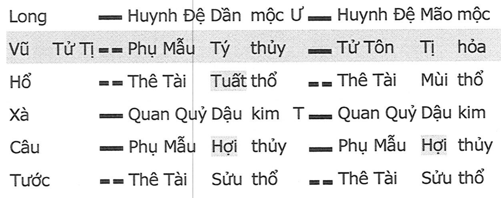

## Vợ chồng là oan gia[^1]

Đây là một tình huống ở năm 2010. Ngày Mậu Dần (Tuần Không: Thân Dậu), tháng Mùi, một người nữ đoán làm sao để cải thiện quan hệ vợ chồng, được Thủy Địa Tỷ biến Trạch Địa Tụy.

| Lục thú | Quẻ Thủy Địa Tỷ | Biến quẻ Trạch Địa Tụy |
| :--- | :--- | :--- |
| Tước | - - Thê Tài Tý thủy Ư | - - Huynh Đệ Mùi thổ |
| Long | — Huynh Đệ Tuất thổ | — Tử Tôn Dậu kim |
| Vũ | - - Tử Tôn Thân kim | — Thê Tài Hợi thủy |
| Hổ | - - Quan Quỷ Mão mộc T | - - Quan Quỷ Mão mộc |
| Xà | - - Phụ Mẫu Tị hỏa | - - Phụ Mẫu Tị hỏa |
| Câu | - - Huynh Đệ Mùi thổ | - - Huynh Đệ Mùi thổ |

Lấy Quan Quỷ làm Dụng thần. Quan Quỷ Mão mộc trì Thế, trong lòng có tình nghĩa với chồng, không muốn ly hôn. Dụng thần được Nhật phù, Nguyệt không khắc, căn cơ không dao động. Trong quẻ tuy rằng Tử Tôn phát động khắc Quan Quỷ, nhưng quẻ chính quy hồn, lại thêm độc phát hợp Phụ Mẫu Tị hỏa, biểu thị vợ chồng bất hòa chỉ là tạm thời, sẽ không cãi nhau đến nỗi phải ly hôn. Tử Tôn Không Vong, Nhật xung thực, lúc cãi lúc không cãi.

Hào Thế tại nội quái nhập Mộ ở Nguyệt, nội quái là nhà, bản thân chủ yếu ở nhà, ít khi ra ngoài. Bạch Hổ trì Thế, có phần nóng tính. Kỵ thần Tử Tôn vốn Không Vong, nhưng bị Nhật xung thực, Nhật là Quan Quỷ, Mão mộc lâm Bạch Hổ, Quan Quỷ là thi cốt, lâm Bạch Hổ càng là như vậy, trì Thế, gần nơi ở, lân cận nơi ở có phần mộ, hào sơ Quỷ khố lâm Câu Trần cũng là thông tin này. (Đáp: Quả thực là như vậy. Tổ phần ở phía Đông không xa chỗ ở, phía Tây Bắc là phần địa của nhà người khác.) (Mão mộc trì Thế là tổ phần của nhà mình, hào bên cạnh hào Thế hóa ra, là lân cư, của nhà người khác. Độc phát hóa Hợi thủy chủ Tây Bắc, cho nên Tây Bắc là phần địa của nhà người khác.)

Hóa giải: Vãi một nắm đậu đen ở phía Tây Nam của nhà. Mục đích là dùng Tý thủy để hóa giải khắc của Thân kim.

Phản hồi: Sau khi hóa giải, vợ chồng vẫn còn cãi nhau, tuy nhiên quái chủ đã không còn tâm tranh cãi nữa, bởi vì cô ấy có một con gái rất dễ thương, cô ấy không muốn bởi vì vợ chồng bất hòa

[^1]: Phiếm chỉ tựa hận thực ái, người mang lại cho mình khổ não nhưng lại không nỡ bỏ.

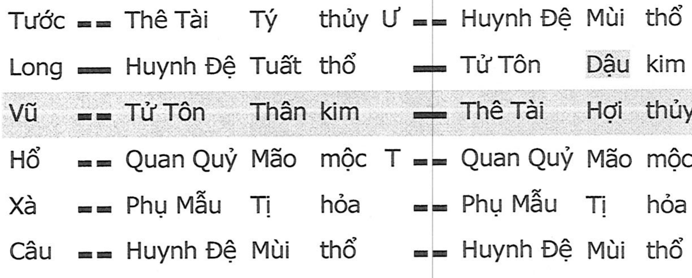 mà khiến con gái phải trưởng thành trong một môi trường không tốt.

## Phong thủy có ảnh hưởng đến tài vận không?

Đây là một tình huống ở năm 2010. Một người nữ dự đoán phong thủy. Ở ngày Mậu Tuất (Tuần Không: Thìn Tị), tháng Tý, được Khôn Vi Địa biến Thủy Lôi Truân.

| Lục thú | Quẻ Khôn Vi Địa | Biến quẻ Thủy Lôi Truân |
| :--- | :--- | :--- |
| Tước | - - Tử Tôn Dậu kim T | - - Thê Tài Tý thủy |
| Long | - - Thê Tài Hợi thủy | — Huynh Đệ Tuất thổ |
| Vũ | - - Huynh Đệ Sửu thổ | - - Tử Tôn Thân kim |
| Hổ | - - Quan Quỷ Mão mộc Ư | - - Huynh Đệ Thìn thổ |
| Xà | - - Phụ Mẫu Tị hỏa | - - Quan Quỷ Dần mộc |
| Câu | - - Huynh Đệ Mùi thổ | — Thê Tài Tý thủy |

Lấy Thê Tài làm Dụng thần, kết hợp tổ hợp biến hóa của quẻ để phán đoán. Thê Tài Hợi thủy mặc dù được Nguyệt phù, nhưng Nhật khắc, động hóa hồi đầu khắc, hào sơ phát động đến khắc, chủ tài vận không tốt, tiền kiếm được không thể để dành, sẽ nhanh chóng tiêu hết.

Hào 2 là trạch, lâm Phụ Mẫu càng là thông tin nhà. Tị hỏa hưu tù Không Vong, hỏa chủ ánh sáng, Không Vong chủ ánh sáng không tốt, chiếu sáng kém. Hào 3 là cửa lâm Bạch Hổ, Bạch Hổ là đường, Nguyệt kiến hình nó, thủy nhập quẻ hào 5, hào 5 cũng là đường, quẻ lục xung, chủ có đường xung.

Tử Tôn trì Thế tại hào 6, hào 6 là hào thoái, Tử Tôn khắc Quan Quỷ, chủ bản thân không muốn làm việc, không có tâm tiến thủ. Hào sơ Mộ khố Quan Quỷ phát động, chủ trong nền nhà có thi cốt, nền nhà trước đây là phần địa. Hào sơ Mùi thổ lâm Câu Trần Huyền Vũ hóa Tý thủy, Tây Nam có công trình nước thải. Quẻ lục xung, chủ tâm thần bất an.

Hóa giải: Tây Bắc Tây Nam mỗi nơi đặt chín viên đá.

Khi đó phán đoán phù hợp với tình hình thực tế.

Ngày 1 tháng 5 năm 2011 phản hồi: Tháng Sửu bản thân đã quyết định đi làm. Mặc dù mỗi ngày ra ngoài đi làm, nhưng đôi khi vẫn còn tâm lý sợ hãi, nhiều lần muốn từ chức, nhưng vẫn kiên trì được. Hiện tại đã kiếm được tiền lương, thu nhập đã tăng lên. Tôi nhớ ông đã từng nói rằng kinh nguyệt của phụ nữ và tài vận có mối quan hệ nhất định, sau khi hóa giải, chu kỳ kinh nguyệt của tôi đã

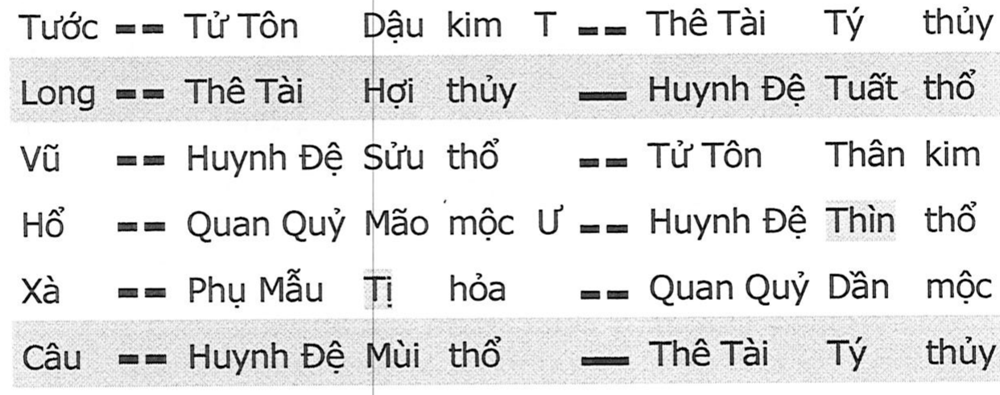 nhanh hơn rất nhiều. Lúc tài vận không tốt, kinh nguyệt thường luôn bị trễ, dường như là như vậy, cũng có thể tôi đã suy nghĩ quá nhiều.

## Vấn đề từ rỉ nước

Đây là một tình huống ở năm 2004. Một người nam dự đoán ảnh hưởng của phong thủy nhà đối với tài vận, ở ngày Mậu Ngọ (Tuần Không: Tý Sửu), tháng Ất Hợi, được Thủy Trạch Tiết. (Thành viên gia đình: Bản thân, mẹ, chị gái.)

| Lục thú | Quẻ Thủy Trạch Tiết | Thế/Ứng |
| :--- | :--- | :---: |
| Tước | ╍╍ Huynh Đệ Tý thủy | |
| Long | ━ Quan Quỷ Tuất thổ | |
| Vũ | ╍╍ Phụ Mẫu Thân kim | Ư |
| Hổ | ╍╍ Quan Quỷ Sửu thổ | |
| Xà | ━ Tử Tôn Mão mộc | |
| Câu | ━ Thê Tài Tị hỏa | T |

Quẻ này bề ngoài có vẻ như là dự đoán phong thủy, thực ra chủ yếu là dự đoán tài vận, chỉ là tìm nguyên nhân từ góc độ phong thủy mà thôi. Thê Tài Tị hỏa tại hào sơ bị Nguyệt xung phá, rất rõ ràng, tài vận bị ngũ hành thủy làm hại. Hào sơ thể hiện khởi đầu, Câu Trần thể hiện trần cựu (cũ), Nguyệt phá, chủ tài vừa mới đến tay thì phải đi ra, không tích trữ được tiền, khó có tiền để dành. (Đáp: Quả thực là như vậy, tài đến tài đi, không có tiền để dành.)

Hào 6 Tý thủy ám động khắc hào Thế Thê Tài, Nhật xung dẫn tới ám động, biểu thị lực lượng phù hào Thế Thê Tài của Nhật khá nhỏ, hào Thế Thê Tài thuộc về hưu tù. Tý thủy Không Vong là thông tin rỉ nước, rỉ nước thì rỉ tài. Hào 6 là mái nhà, chủ mái nhà rỉ nước, Nhật xung dẫn tới, Nhật Nguyệt như thiên, chủ có mưa thì rỉ nước. Hào Thế Nguyệt phá, quẻ lục hợp, hào Ứng hợp hào Thế giải phá, Ứng là người khác, chủ vay tiền mới có thể sinh hoạt. (Đáp: Nhà của chúng tôi đã hơn 30 năm, có mưa thì rỉ nước. Tiền không đủ dùng, thường xuyên đi vay mỗi khi kẹt tiền.)

Thành viên gia đình không có cha, hào 6 Tý thủy ám động là Tử địa Phụ Mẫu, chủ năm Bính Tý cha bất lợi. Nguyên thần Sửu thổ tại hào 3 Không Vong, Sửu thổ là gan, chủ qua đời vì bệnh gan. (Đáp: Cha quả thực qua đời vì ung thư gan ở năm 1996.)

Phương pháp hóa giải: Sửa lại mái nhà. Ở phía Bắc của nhà đặt một con rùa mỹ nghệ. Ở Đông Nam đặt một hòn đá dài.

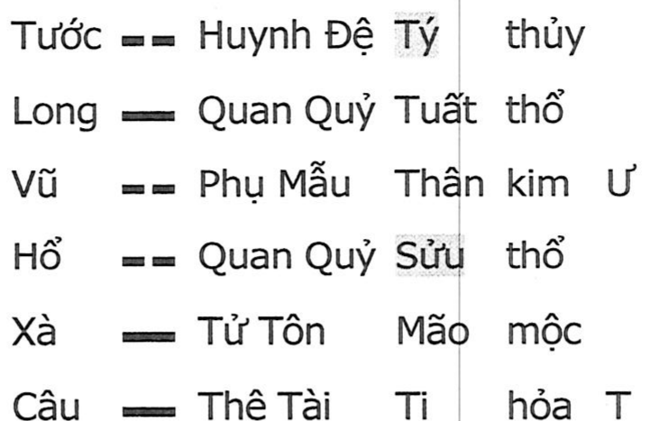

---

# Part 9 (Pages 161-180)

Ngày 19 tháng 3 năm 2009 phản hồi: Cuối năm 2005 kết hôn, năm 2006 rời khỏi chỗ ở ban đầu. Mẹ và chị gái của tôi vẫn ở trong căn nhà cũ. Sau khi hóa giải, chị gái đã được thăng chức, tiền lương và tiền thưởng đã tăng lên. Cuộc sống của mẹ cũng không còn khó khăn như trước, đã tốt hơn rất nhiều.

## Nguyên nhân phát bệnh đến từ phong thủy

Đây là một tình huống ở năm 2007. Một người nam liên tục bị bệnh tật quấy nhiễu, đoán nguyên nhân? Ở ngày Mậu Dần (Tuần Không: Thân Dậu), tháng Nhâm Tý, được Lôi Phong Hằng biến Lôi Sơn Tiểu Quá.

| Lục thú | Phục thần | Quái hào | Thế/Ứng | Biến hào |
| :--- | :--- | :--- | :---: | :--- |
| Tước | | ╍╍ Thê Tài Tuất thổ | Ư | ╍╍ Thê Tài Tuất thổ |
| Long | | ╍╍ Quan Quỷ Thân kim | | ╍╍ Quan Quỷ Thân kim |
| Vũ | | ━ Tử Tôn Ngọ hỏa | | ━ Tử Tôn Ngọ hỏa |
| Hổ | | ━ Quan Quỷ Dậu kim | T | ━ Quan Quỷ Thân kim |
| Xà | Huynh Dần | ━ Phụ Mẫu Hợi thủy | | ╍╍ Tử Tôn Ngọ hỏa |
| Câu | | ╍╍ Thê Tài Sửu thổ | | ╍╍ Thê Tài Thìn thổ |

Lấy hào Thế làm Dụng thần. Hào Thế tại hào 3 lâm Bạch Hổ Không Vong, Bạch Hổ là máu, Không không được Nguyên thần đến sinh, chủ tuần hoàn máu không tốt. Hào 2 độc phát là Bệnh địa của hào Thế, lâm Đằng Xà chủ thon dài, hào Thế kim cũng là ruột, chủ ruột không tốt, thủy chủ tả (tiêu chảy), dễ tiêu chảy. Hào 2 là trạch, Phụ Mẫu lại là trạch, độc phát, sức khỏe không tốt do phong thủy gây ra. (Đáp: Thật lợi hại, đúng là tôi quanh năm tiêu chảy, bác sĩ nói là tôi tuần hoàn máu không tốt, đặc biệt là vào mùa đông.)

Hào 5 Quan Quỷ ám động, môi trường xung quanh cũng ảnh hưởng đến thân thể. Thân kim đối ứng Tây Nam, Không Vong hưu tù chủ thấp trũng, do đó hướng Tây Nam khá thấp trũng. Nhật thần Dần mộc xung thực Thân kim, chủ nơi thấp trũng có mọc hoa cỏ cây cối. (Đáp: Nhà chúng tôi có địa thế cao, hàng xóm ở Tây Nam thì khá thấp, nhà họ có một cây lớn.)

Hào 2 Hợi thủy hóa phá, chủ trong nhà có chỗ rỉ nước. Độc phát Đằng Xà, chủ quấy nhiễu, làm ồn ào, hào Thế Dậu kim Không Vong, hào 5 Thân kim cũng Không Vong, kim Không tắc minh, chủ có tiếng ồn quấy nhiễu, cũng ảnh hưởng đến thân thể. (Đáp: Máy lọc nước của nhà tôi không tốt, thường xuyên rỉ nước, khi xử lý nước, nó phát ra âm thanh rất lớn, máy bơm nước bên ngoài nhà đã lão hóa, cũng có âm thanh.)

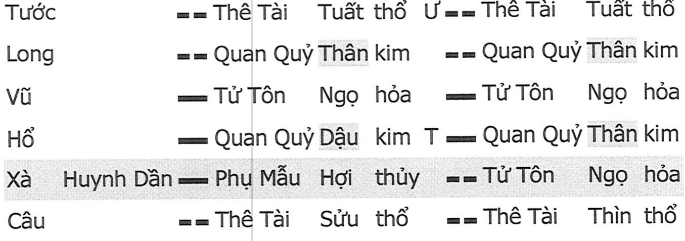

Hóa giải: Sửa lại chỗ rỉ nước, cố gắng loại bỏ tiếng ồn, đặt ba bồn hoa ở Tây Bắc.

Sau đó phản hồi: Đã sửa lại chỗ rỉ nước và thay động cơ mới. Ở Tây Bắc cũng đã đặt hoa. Sau bốn tháng, sức khỏe đã có sự chuyển biến, sau hai tháng tiếp theo, được bạn bè giới thiệu một loại thuốc, bắt đầu uống thuốc, sức khỏe mỗi ngày một khá hơn, một năm sau đã hoàn toàn hồi phục, cảm giác muốn ăn tăng lên, thậm chí sức khỏe của tiểu cẩu nhà chúng tôi cũng đã tốt hơn.

## Anh ta có họa lao ngục

Đây là một tình huống ở năm 2014. Một người nữ Bắc Kinh muốn đoán vận khí của chồng? Tôi gieo quẻ ở ngày Bính Thân (Tuần Không: Thìn Tị), tháng Đinh Mão, được Cấn Vi Sơn biến Sơn Phong Cổ.

| Lục thú | Quẻ Cấn Vi Sơn | Thế/Ứng | Quẻ Sơn Phong Cổ |
| :--- | :---: | :---: | :---: |
| Long | ━ Quan Quỷ Dần mộc | T | ━ Quan Quỷ Dần mộc |
| Vũ | ⚋ Thê Tài Tý thủy | | ⚋ Thê Tài Tý thủy |
| Hổ | ⚋ Huynh Đệ Tuất thổ | | ⚋ Huynh Đệ Tuất thổ |
| Xà | ━ Tử Tôn Thân kim | Ư | ━ Tử Tôn Dậu kim |
| Câu | ⚋ Phụ Mẫu Ngọ hỏa | | ━ Thê Tài Hợi thủy |
| Tước | ⚋ Huynh Đệ Thìn thổ | | ⚋ Huynh Đệ Sửu thổ |

Lấy Quan Quỷ làm Dụng thần. Quan Quỷ Nguyệt phù Nhật khắc, suy vượng tương đương. Nhưng Nhật trong khắc có hình, lại thêm Phụ Mẫu Ngọ hỏa lâm Câu Trần độc phát, người xưa nói: Thần triệu cơ ở động, độc phát là Tử địa Quan Quỷ, Phụ Mẫu là văn thư, chủ đơn kiện, Câu Trần chủ lao ngục, do đó phán đoán chồng người này đã bị bắt. Quả nhiên.

Phụ Mẫu Ngọ hỏa tại hào 2 lâm Câu Trần phát động hóa Hợi thủy hồi đầu khắc, hào 2 là trạch, Câu Trần cũng chủ phòng ốc kiến trúc, phát động chủ chuyển chỗ, hồi đầu khắc, khi hợp hào biến Phụ Mẫu không bị khắc, tức sau khi chuyển nhà ở năm Canh Dần, phong thủy gây nên bất lợi. Quả nhiên chuyển nhà ở năm 2010.

Tử Tôn Thân kim tại hào 3 bị hào độc phát khắc chế, hào 3 là giường, Đằng Xà chủ bất an, chủ ngủ, hài tử ở nhà này ngủ không tốt. Ứng nghiệm.

Hào Thế tại hào 6 là đầu, bị xung khắc, chủ chóng mặt. Lại thêm hào 2 là Tử địa hào Thế, hào 2 là tử cung, Câu Trần chủ khối u, đoán người này có u xơ tử cung. Đều nghiệm.

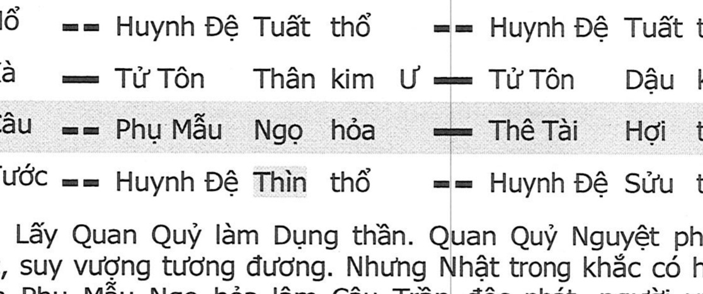

Hào 2 lâm hỏa là bếp, hào 2 cũng là hào vị của bếp, hóa Thê Tài, Thê Tài chủ ẩm thực, càng là thông tin về bếp. Quẻ Cấn, Cấn là Đông Bắc, chủ bếp tại Đông Bắc.

Quan Quỷ Tử địa hóa Hợi thủy, đến năm Hợi khắc mất Phụ Mẫu Ngọ hỏa, Quan Quỷ được Trường Sinh mới có lợi cho Quan Quỷ, do đó phán đoán chồng người này có thể bị tuyên án khoảng 5 năm, đến năm Hợi mới có thể về nhà. Về sau không có phản hồi bị phán mấy năm, những điều khác đều ứng nghiệm ngay lúc đó.

## Tây Bắc có thủy không tốt

Đây là một tình huống ở năm 2014. Một người nam nói rằng công ty du lịch của mình đã thuê bao máy bay đến Đài Loan thông qua sự lo liệu của một công ty nọ, nhưng đã không thể đi, nguyên nhân là gì? Ở ngày Mậu Thân (Tuần Không: Dần Mão), tháng Mậu Thìn, được Thủy Lôi Truân biến Địa Lôi Phục.

| Lục thú | Phục thần | Quẻ Thủy Lôi Truân | Thế/Ứng | Quẻ Địa Lôi Phục |
| :--- | :--- | :---: | :---: | :---: |
| Tước | | ⚋ Huynh Đệ Tý thủy | | ⚋ Phụ Mẫu Dậu kim |
| Long | | ━ Quan Quỷ Tuất thổ | Ư | ⚋ Huynh Đệ Hợi thủy |
| Vũ | | ⚋ Phụ Mẫu Thân kim | | ⚋ Quan Quỷ Sửu thổ |
| Hổ | Tài Ngọ | ⚋ Quan Quỷ Thìn thổ | | ⚋ Quan Quỷ Thìn thổ |
| Xà | | ⚋ Tử Tôn Dần mộc | T | ⚋ Tử Tôn Dần mộc |
| Câu | | ━ Huynh Đệ Tý thủy | | ━ Huynh Đệ Tý thủy |

Lấy Phụ Mẫu làm Dụng thần. Phụ Mẫu Thân kim Nguyệt sinh Nhật phù vốn là vượng tướng, nhưng hào Ứng lâm Nguyên thần Nguyệt phá, không thể sinh Phụ Mẫu, chủ nguyên nhân từ đối phương, đã khiến cho máy bay không cất cánh.

Hào Thế lâm Tử Tôn Đằng Xà Không Vong, Tử Tôn chủ du lịch vui vẻ, Không Vong chủ không vui, Đằng Xà chủ phiền não, vì việc này mà không vui, Không Vong không thể sinh Thê Tài, Thê Tài chủ ẩm thực, Thê Tài bất thượng quái, vì việc này, ăn cũng không ngon.

Hào Ứng lâm Thanh Long phát động hóa Huynh Đệ Hợi thủy, Thanh Long chủ trang tu, trang sức, cũng là mới, hào Ứng Trường Sinh tại Nhật, chủ đối phương là một công ty mới. Độc phát có huyền cơ, nhất định phong thủy có chút vấn đề. Tuất thổ thể hiện Tây Bắc, hóa ra Hợi thủy, chủ Tây Bắc của đối phương có trang sức thủy, vật giống như bể cá hoặc phun nước. (Đáp: Đối phương là công ty mới thành lập, thành lập chưa đến nửa năm. Bọn họ đã mời người xem phong thủy, nghe nói là cửa Tốn chủ Khảm, rất cát, sao

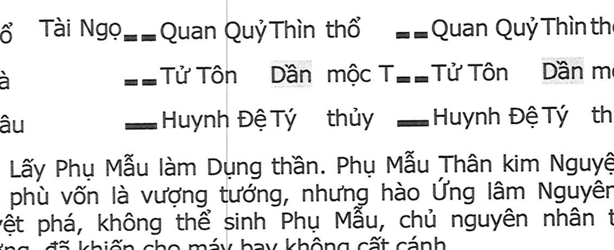 lại không tốt nhỉ? Công ty này ở Tây Bắc có một cảnh quan nước chảy.)

Phong thủy Tây Bắc tối kỵ có thủy (lý luận Bát Trạch, không phải quan điểm Quá Lộ Âm Dương), tôi đề nghị bảo công ty hợp tác với anh hãy loại bỏ vật phun nước đi. Sau nhiều lần thuyết phục, đối phương đã loại bỏ vật phun nước. Kết quả là đã đạt được thỏa thuận với công ty hàng không, thuê bao máy bay thành công.

## Phong thủy ảnh hưởng đến thân thể

Đây là một tình huống ở năm 2014. Một người nữ đoán tài vận và thân thể. Ở ngày Đinh Hợi (Tuần Không: Ngọ Mùi), tháng Kỷ Tị, được Lôi Phong Hằng biến Địa Sơn Khiêm.

| Lục thú | Phục thần | Quái hào | Thế/Ứng | Biến hào |
| :--- | :--- | :--- | :---: | :--- |
| Long | | ╍╍ Thê Tài Tuất thổ | Ư | ╍╍ Quan Quỷ Dậu kim |
| Vũ | | ╍╍ Quan Quỷ Thân kim | | ╍╍ Phụ Mẫu Hợi thủy |
| Hổ | | ━ Tử Tôn Ngọ hỏa | | ╍╍ Thê Tài Sửu thổ |
| Xà | | ━ Quan Quỷ Dậu kim | T | ━ Quan Quỷ Thân kim |
| Câu | Huynh Dần | ━ Phụ Mẫu Hợi thủy | | ╍╍ Tử Tôn Ngọ hỏa |
| Tước | | ╍╍ Thê Tài Sửu thổ | | ╍╍ Thê Tài Thìn thổ |

Tài vận xem Thê Tài, thân thể xem hào Thế. Thê Tài lưỡng hiện, có Nguyệt sinh, thuộc về vượng tướng, nhưng bởi vì có hào động khác, Thê Tài an tĩnh thì khí chậm, tài vận tốt, nhưng tiền đến chậm. (Nghiệm)

Hào Thế tại hào 3 lâm Đằng Xà, hào 3 là giường, Đằng Xà chủ mộng, ngủ, gặp Hợi thủy là Bệnh, chủ ngủ không tốt. Hai hào động vây quanh hào Thế khắc tiết cùng lúc, chủ tinh thần bất túc, khí huyết hư. Bởi vì Bạch Hổ chủ huyết, thủy hóa hỏa là khí, lâm Câu Trần chủ chậm chạp. (Nghiệm)

Hào Thế tại hào 3, Bệnh tại thủy, thủy là thắt lưng, hào 3 cũng là thắt lưng, chủ thắt lưng đau. Bệnh địa thủy tại hào 2 hóa Không Vong, thủy Không thì chảy, chủ tiểu nhiều lần. (Nghiệm)

Hào 2 là trạch, Bệnh địa tại hào 2 phát động, hóa Không Vong, Không Vong tại hỏa, Câu Trần chủ kiến trúc, chủ ánh sáng không tốt, phong thủy ảnh hưởng đến thân thể, cũng ảnh hưởng đến tài vận, bởi vì Hợi thủy khắc Tử Tôn, Tử Tôn không thể sinh Thê Tài. (Nghiệm)

Ứng là phu vị, lâm Thê Tài Thanh Long, Thê Tài chủ ẩm thực, Thanh Long cũng chủ ẩm thực, tĩnh mà sinh hào Thế, chủ chồng

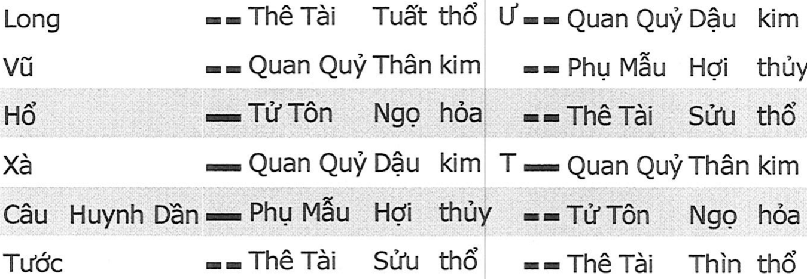 nấu cơm cho chị ăn. Tử Tôn lâm Bạch Hổ Không Vong phát động hóa Sửu thổ, Tử Tôn hào dương, ngoại quái Chấn, chủ chị có con trai, Tử Tôn vượng tướng lại là hào hỏa phát động, chủ con trai hoạt bát hiếu động, Bạch Hổ chủ thể dục, thích thể dục. (Nghiệm, rất thích chơi bóng rổ.)

## Tu tạo ảnh hưởng đến con trai

Đây là một tình huống ở năm 2014. Một người nam đoán thân thể của con trai. Ở ngày Bính Dần (Tuần Không: Tuất Hợi), tháng Ngọ, được Địa Thiên Thái biến Địa Hỏa Minh Di.

| Lục thú | Phục thần | Quái hào | Thế/Ứng | Biến hào |
| :--- | :--- | :--- | :---: | :--- |
| Long | | ╍╍ Tử Tôn Dậu kim | Ư | ╍╍ Tử Tôn Dậu kim |
| Vũ | | ╍╍ Thê Tài Hợi thủy | | ╍╍ Thê Tài Hợi thủy |
| Hổ | | ╍╍ Huynh Đệ Sửu thổ | | ╍╍ Huynh Đệ Sửu thổ |
| Xà | | ━ Huynh Đệ Thìn thổ | T | ━ Thê Tài Hợi thủy |
| Câu | Phụ Tị | ━ Quan Quỷ Dần mộc | | ╍╍ Huynh Đệ Sửu thổ |
| Tước | | ━ Thê Tài Tý thủy | | ━ Quan Quỷ Mão mộc |

Tử Tôn Dậu kim tại hào 6, Nguyệt khắc Nhật không phù là hưu tù, hào 6 là đầu, bệnh tại đầu. (Đáp: Trong não phóng điện, hơi một tý là choáng váng và đứng không vững.) (Ghi chú: Hỏa là điện)

Hào 2 là Tuyệt địa Tử Tôn, độc phát có thể biểu thị nguyên nhân. Hào 2 là trạch, Câu Trần chủ kiến trúc tu tạo, mộc hóa thổ, chủ xây dựng công trình, Quan Quỷ Dần mộc lâm hào 2 độc phát hóa Sửu thổ, Dần mộc đối ứng năm Dần, đoán nhà anh đã trang tu nhà ở năm 2010. (Nghiệm)

Hào Thế lâm Đằng Xà tượng bất an. Mộc khắc hào Thế, hào 3 thổ là dạ dày, chủ anh tâm hoảng, tràng vị không tốt. (Nghiệm)

Tử Tôn hưu tù, bệnh rất khó trị khỏi.

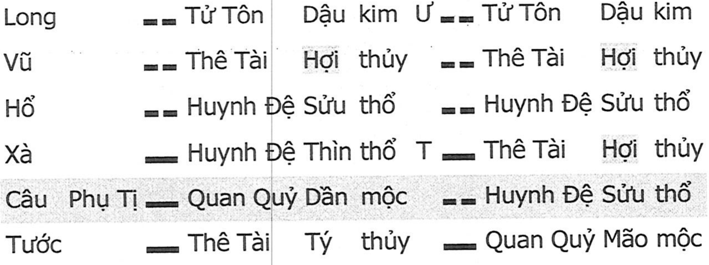

## Tại sao hài tử phát triển không tốt?

Một người nữ đoán hài tử (3 tuổi) phát triển chậm chạp là do nguyên nhân gì? Ở ngày Tân Mùi (Tuần Không: Tuất Hợi), tháng Ngọ, được Địa Sơn Khiêm biến Địa Phong Thăng.

| Lục thú | Quẻ Địa Sơn Khiêm | Thế/Ứng | Quẻ Địa Phong Thăng |
| :--- | :---: | :---: | :---: |
| Xà | ⚋ Huynh Đệ Dậu kim | | ⚋ Huynh Đệ Dậu kim |
| Câu | ⚋ Tử Tôn Hợi thủy | T | ⚋ Tử Tôn Hợi thủy |
| Tước | ⚋ Phụ Mẫu Sửu thổ | | ⚋ Phụ Mẫu Sửu thổ |
| Long | ━ Huynh Đệ Thân kim | | ━ Huynh Đệ Dậu kim |
| Vũ | ⚋ Quan Quỷ Ngọ hỏa | Ư | ━ Tử Tôn Hợi thủy |
| Hổ | ⚋ Phụ Mẫu Thìn thổ | | ⚋ Phụ Mẫu Sửu thổ |

Lấy Tử Tôn làm Dụng thần. Tử Tôn Hợi thủy tại hào 5 trì Thế, hào 5 là tôn vị, hài tử là tâm đầu nhục¹ của chị. Dụng thần lâm thủy Không Vong, thủy chủ trí tuệ, Không Vong, chủ trí lực thấp kém. Câu Trần là đần độn, ngu đần, cũng là chủ trí lực thấp.

Tử Tôn hưu tù bị Nhật khắc, hào 5 là cao lớn, hưu tù bị khắc, Câu Trần chủ chậm chạp, hài tử thân thể không cao lớn.

Hào Thế Không Vong, chủ chị phiền muộn, bất an vì sự việc của hài tử.

Hào 2 Quan Quỷ Ngọ hỏa độc phát hóa Tử Tôn, hào 2 là trạch, Huyền Vũ chủ tà khí, Quỷ hóa Tử Tôn không cát. Độc phát có thể biểu thị nguyên nhân. Trong nhà tà khí khá nặng. Ngọ hỏa là ánh sáng, hóa Không Vong, Huyền Vũ chủ tối, trong nhà ánh sáng không tốt.

Quả nhiên hài tử không cao lớn, trí lực chậm chạp, trong nhà thiếu ánh sáng, hơn nữa thường xuyên có thể trông thấy bóng đen.

¹ Người chiếm một vị trí hết sức quan trọng trong tâm trí của mình.

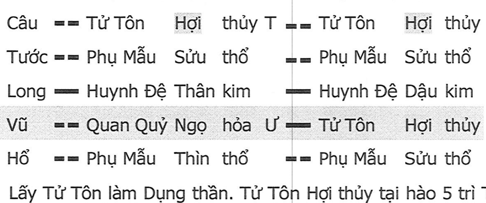

## Nguyên nhân của ác mộng

Đây là một tình huống ở năm 2014. Một học trò của tôi hỏi tại sao hài tử thường xuyên gặp ác mộng? Ngày Canh Thìn (Tuần Không: Thân Dậu), tháng Mùi, được Hỏa Thiên Đại Hữu biến Càn Vi Thiên.

| Lục thú | Quẻ Hỏa Thiên Đại Hữu | Thế/Ứng | Quẻ Càn Vi Thiên |
| :--- | :---: | :---: | :---: |
| Xà | ━ Quan Quỷ Tị hỏa | Ư | ━ Phụ Mẫu Tuất thổ |
| Câu | ⚋ Phụ Mẫu Mùi thổ | | ━ Huynh Đệ Thân kim |
| Tước | ━ Huynh Đệ Dậu kim | | ━ Quan Quỷ Ngọ hỏa |
| Long | ━ Phụ Mẫu Thìn thổ | T | ━ Phụ Mẫu Thìn thổ |
| Vũ | ━ Thê Tài Dần mộc | | ━ Thê Tài Dần mộc |
| Hổ | ━ Tử Tôn Tý thủy | | ━ Tử Tôn Tý thủy |

Lấy Tử Tôn làm Dụng thần. Có một số tình huống không quan trọng Dụng thần suy vượng, tìm được căn nguyên chính là dự đoán thành công, bởi vì mục đích là chiêm nguyên nhân gặp ác mộng mà thôi, không liên quan đến vấn đề sinh mệnh.

Quẻ này mặc dù Nhật Nguyệt khắc Tử Tôn, Tử Tôn lại nhập Mộ tại Nhật, Kỵ thần phát động lại đến khắc, nhưng không thể phán đoán là hung. Đây không phải là vấn đề Kỵ thần quá vượng quá nhược gì đó, mà là hào động này đang truyền đạt nguyên nhân gây ra vấn đề. Sách cổ nói: Thần triệu cơ ở động. Độc phát chính là huyền cơ.

Phụ Mẫu Mùi thổ tại hào 5 lâm Câu Trần phát động, lại hóa Thân kim, Mùi thổ Thân kim đều là Tây Nam, Phụ Mẫu là kiến trúc, Câu Trần chủ tu tạo, ở đây cho biết là hướng Tây Nam xây nhà đã ảnh hưởng đến giấc ngủ của con trai.

Quả nhiên hướng Tây Nam của nhà anh ta đang xây nhà.

Bèn bảo người này đặt một cái đồng la (chiêng đồng) ở hướng Tây Nam của giường, được cải thiện.

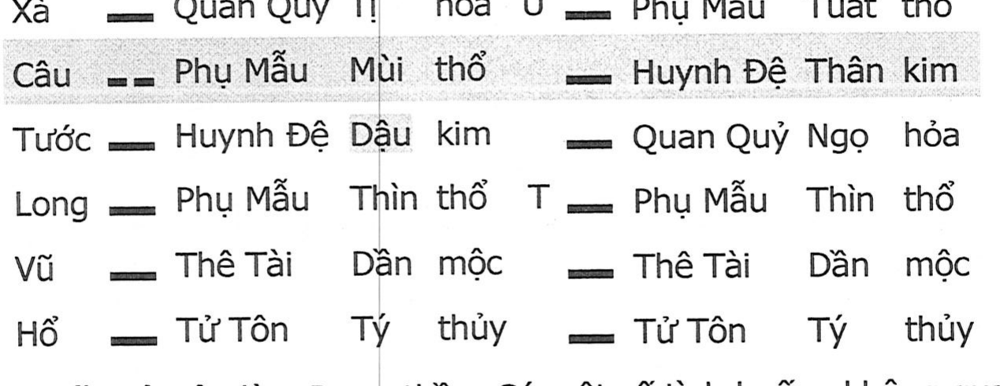

## Cửa hàng phía Tây đã ảnh hưởng đến anh

Đây là một tình huống ở năm 2014. Một khách cũ lại đến dự đoán, cửa hàng của anh ta sau khi được điều chỉnh thì đã hoạt động tốt một thời gian, hiện nay đột nhiên lại không tốt. Ở ngày Kỷ Sửu (Tuần Không: Ngọ Mùi), tháng Mùi, được Thiên Hỏa Đồng Nhân biến Trạch Lôi Tùy.

| Lục thú | Quái hào | Thế/Ứng | Biến hào |
| :--- | :--- | :---: | :--- |
| Câu | ━ Tử Tôn Tuất thổ | Ứ | ╍╍ Tử Tôn Mùi thổ |
| Tước | ━ Thê Tài Thân kim | | ━ Thê Tài Dậu kim |
| Long | ━ Huynh Đệ Ngọ hỏa | | ━ Quan Quỷ Hợi thủy |
| Vũ | ━ Quan Quỷ Hợi thủy | T | ╍╍ Tử Tôn Thìn thổ |
| Hổ | ╍╍ Tử Tôn Sửu thổ | | ╍╍ Phụ Mẫu Dần mộc |
| Xà | ━ Phụ Mẫu Mão mộc | | ━ Quan Quỷ Tý thủy |

Lấy Thê Tài làm Dụng thần. Thê Tài Thân kim Nhật Nguyệt sinh là vượng tướng, nhưng hào động trong quẻ mới là huyền cơ thực sự.

Sau khi xem quẻ, tôi nói: Hiện tại có hai nguyên nhân khiến việc kinh doanh của anh đi xuống, đầu tiên, bể cá ở cửa đã xảy ra vấn đề. Bởi vì hào 3 Hợi thủy hóa hồi đầu khắc. (Tôi biết cửa hàng của anh ta có bể cá, anh ta hồi đáp, bể cá không cẩn thận đã làm vỡ, đã thay bằng một cái khác.)

Thứ hai, cửa hàng ở phía Tây đang trang tu, đã ảnh hưởng đến việc kinh doanh của cửa hàng anh. (Tôi biết cửa hàng của anh ta nằm trên dãy Đông Tây) bởi vì hào Ứng Tử Tôn lâm Câu Trần phát động hóa thoái, hào Ứng là người khác, hóa thoái không thể sinh Thê Tài, Câu Trần chủ tu tạo, Tuất là Tây Bắc, nhưng cửa hàng nằm trên dãy Đông Tây, do đó phán đoán là phía Tây.

Quả nhiên cửa hàng bên cạnh ở phía Tây đang cải tạo.

Phương pháp hóa giải: Đặt tám cây mây ở Tây Bắc và đặt bể cá đè lên ba lá cây liễu. Sau đó, việc kinh doanh đã trở nên tốt hơn.

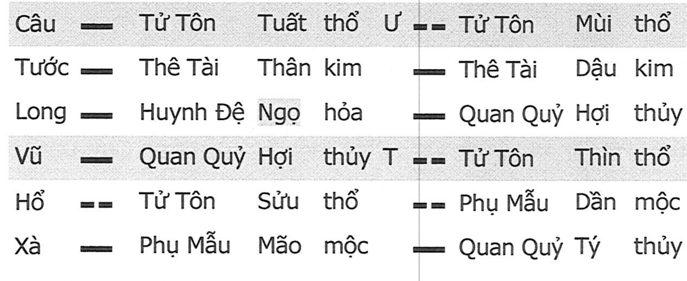

## Bị cha mẹ vợ làm khó dễ

Đây là một tình huống ở năm 2014. Một người nam đoán mối quan hệ với cha mẹ vợ? Ở ngày Tân Dậu (Tuần Không: Tý Sửu), tháng Tuất, được Trạch Thiên Quải biến Địa Thiên Thái.

| Lục thú | Phục thần | Quái hào | Thế/Ứng | Biến hào |
| :--- | :--- | :--- | :---: | :--- |
| Xà | | ╍╍ Huynh Đệ Mùi thổ | | ╍╍ Tử Tôn Dậu kim |
| Câu | | ━ Tử Tôn Dậu kim | T | ╍╍ Thê Tài Hợi thủy |
| Tước | | ━ Thê Tài Hợi thủy | | ╍╍ Huynh Đệ Sửu thổ |
| Long | | ━ Huynh Đệ Thìn thổ | | ━ Huynh Đệ Thìn thổ |
| Vũ | Phụ Tị | ━ Quan Quỷ Dần mộc | Ứ | ━ Quan Quỷ Dần mộc |
| Hổ | | ━ Thê Tài Tý thủy | | ━ Thê Tài Tý thủy |

Hào Thế thể hiện mình, hào Ứng và hào Phụ Mẫu thể hiện cha mẹ vợ. Hào Thế tại hào 5 tôn vị, vốn là địa vị rất cao, nhưng đã hóa Thê Tài, Thê Tài Hợi thủy cách sơn hóa Không Vong, sau khi lấy vợ, địa vị đã kém đi. (Người này tốt nghiệp nghiên cứu sinh ở một trường đại học nổi tiếng, đang làm việc trong cơ quan nhà nước, nhưng bởi vì là làm công ăn lương, cha mẹ vợ thế lợi nhãn[^1], chê thu nhập thấp.)

Phụ Mẫu Tị hỏa phục tàng, lâm Huyền Vũ khắc hào Thế, hào Ứng lại là Tuyệt địa hào Thế, phục tàng là lén lút, khắc là làm khó dễ, cha mẹ vợ làm khó dễ anh ta ở khắp nơi. (Thường xuyên tìm đủ loại lý do để chỉ trích anh ta.)

Hào Thế lâm Câu Trần, chủ bản thân an phận, có nguyên tắc, mặc dù sinh Thê Tài, kiếm tiền trong phạm vi của mình. (Có rất nhiều cơ hội kiếm tiền, chỉ là không đi làm.)

Thê Tài Hợi thủy hóa Không Vong, đã sinh hợp đến hào Ứng, nhà anh ở rỉ nước, nước đã chảy đến nhà của người khác. Biểu thị phong thủy nơi ở không tốt, đã ảnh hưởng đến tài vận. (Nghiệm, quả nhiên phát sinh rỉ nước, chảy đến nhà hàng xóm.)

Phụ Mẫu là nhà, phục tàng dưới hào Ứng, nhà không phải của anh, hào Ứng tại hào 2, Ứng phi nhập trạch, chủ có người ngoài đồng cư, Phụ Mẫu Tị hỏa tàng dưới hào Ứng, sống chung với cha mẹ vợ. (Nghiệm, bản thân không có nhà, sống chung với cha mẹ vợ.)

[^1]: Chỉ người xu nịnh đối với người có tiền có thế có quyền, còn đối với người không quyền không thế thì kỳ thị.

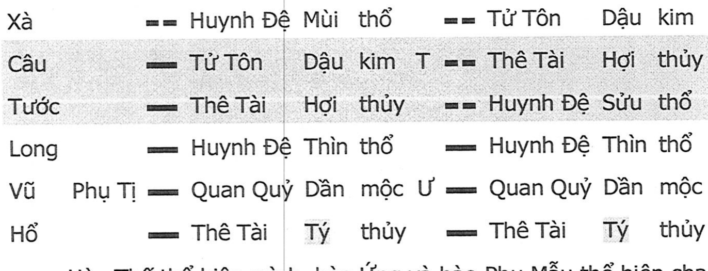

Quan Quỷ lâm Huyền Vũ là nhà vệ sinh, tại nội quái, nội quái là Càn, chủ Tây Bắc, nhà vệ sinh ở Tây Bắc là đại kỵ trong phong thủy, sự nghiệp không thể phát triển, cũng chủ đàn ông không có địa vị, bị tổn hại thanh danh. (Mẹ vợ chủ quản trong nhà, thường xuyên mỉa mai quái chủ, sự nghiệp không thuận, liên tục không được thăng chức.) Kỳ thực hào 5 Tử Tôn, hào Ứng Quan Quỷ vượng tướng thì có thể phát triển, đây là tổ hợp đặc biệt, nhưng quẻ này Quan Quỷ hưu tù, sự nghiệp cách sơn hóa Không Vong bất lợi.

Sau đó đề nghị thuê nhà để ở, rời khỏi cha mẹ vợ, như vậy đã tránh được xung đột hằng ngày trong sinh hoạt.

## Đã bị người liên lụy

Đây là một tình huống ở năm 2014. Một người nữ đoán chồng (sinh năm Nhâm Dần) có bình an hay không? Ở ngày Mậu Tý (Tuần Không: Ngọ Mùi), tháng Hợi, được Lôi Sơn Tiểu Quá biến Lôi Hỏa Phong.

| Lục thú | Phục thần | Lôi Sơn Tiểu Quá | Thế/Ứng | Lôi Hỏa Phong |
| --- | --- | --- | :---: | --- |
| Tước | | ▅▅  ▅▅ Phụ Mẫu Tuất thổ | | ▅▅  ▅▅ Phụ Mẫu Tuất thổ |
| Long | | ▅▅  ▅▅ Huynh Đệ Thân kim | | ▅▅  ▅▅ Huynh Đệ Thân kim |
| Vũ | Tử Hợi | ▅▅▅▅▅ Quan Quỷ Ngọ hỏa | T | ▅▅▅▅▅ Quan Quỷ Ngọ hỏa |
| Hổ | | ▅▅▅▅▅ Huynh Đệ Thân kim | | ▅▅▅▅▅ Tử Tôn Hợi thủy |
| Xà | Tài Mão | ▅▅  ▅▅ Quan Quỷ Ngọ hỏa | | ▅▅  ▅▅ Phụ Mẫu Sửu thổ |
| Câu | | ▅▅  ▅▅ Phụ Mẫu Thìn thổ | Ứ | ▅▅▅▅▅ Thê Tài Mão mộc |

Lấy Quan Quỷ làm Dụng thần. Trong quẻ Quan Quỷ Ngọ hỏa lưỡng hiện, lấy hào Thế Quan Quỷ Ngọ hỏa làm Dụng thần, hào 2 Ngọ hỏa dùng để tham khảo. Quan Quỷ Ngọ hỏa tại hào 2 Không Vong, hào 2 là trạch, Không Vong biểu thị đã rời khỏi nhà, lâm Đằng Xà, tượng trói buộc, Ngọ hỏa tự mang hình, độc phát chủ tính chất, Câu Trần độc phát tượng lao ngục, chồng chị đã bị công an bắt. (Nghiệm)

Hào mệnh Dần mộc sinh Dụng thần, ý thức tự bảo vệ mình của chồng chị rất mạnh. Dụng thần lâm Đằng Xà, nhưng cũng là một người nhát gan sợ rắc rối. (Đúng, bình thường anh ta rất ít khi yêu cầu người khác đưa tiền, vì sợ xảy ra rắc rối.)

Độc phát cũng biểu thị nguyên nhân, hào Ứng độc phát hóa Thê Tài, Ứng là người khác, Thê Tài thể hiện kinh tế, đây là bởi vì người khác có án kiện kinh tế đã ảnh hưởng đến anh ta, anh ta đã bị người liên lụy. Hào Ứng lâm Câu Trần hóa hồi đầu khắc, bị Thê Tài khắc, người khác đã vào tù vì vấn đề kinh tế, từ đó mới liên lụy

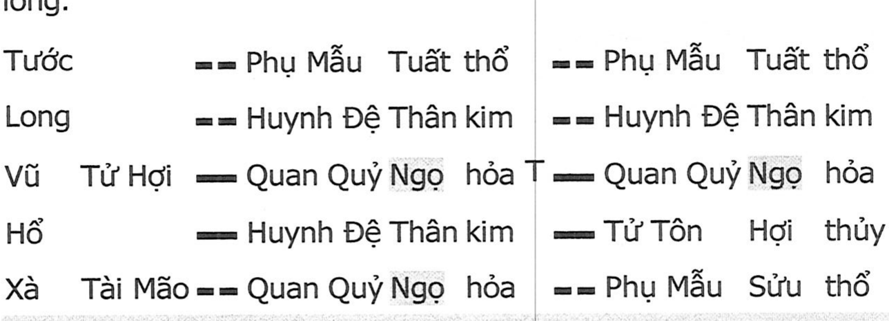 đến anh ta. (Nghiệm, một lãnh đạo đã bị bắt, chồng là chủ quản tài vụ.)

Độc phát hóa Mão mộc, sự việc này xảy ra tại tháng 3 năm nay (tức tháng Mão). (Nghiệm, chồng bị bắt ở ngày 30 tháng 3.)

Phụ Mẫu Thìn thổ độc phát hóa Mão mộc, Phụ Mẫu là đơn vị, Câu Trần chủ kiến trúc phong thủy, chủ sau khi chồng thay đổi môi trường công tác, phong thủy phòng làm việc không tốt, dẫn tới bất lợi. Nhất định sự việc xảy ra ở tháng 4 năm 2011, tương ứng tháng Thìn năm Tân Mão. (Nghiệm, quả nhiên lúc đó đã được điều chuyển công tác, đã thay đổi đơn vị.)

Phương pháp hóa giải: Đặt ba chiếc đũa ở Tây Bắc, trên đũa viết chữ "minh", bỏ gạo vào trong bình, đậy kín rồi đặt ở phía Bắc, đặt bảy cây nến đỏ dưới giường phía Nam, ngoài ra đặt bảy cây nến đỏ ở cửa.

Quan Quỷ Ngọ hỏa trì Thế, chồng sớm muộn cũng sẽ về bên cạnh chị. Nhưng hiện tại Quan Quỷ hưu tù Không Vong, hiện tại anh ta đã bị đem đến một nơi nào đó, chị hoàn toàn không hay biết. (Nghiệm, công an không cho biết.)

## Kết hợp Phong Thủy Bát Trạch với quẻ

Một học trò đã hỏi tôi tình huống này vào năm 2014. Một người nữ đoán bệnh, ở ngày Ất Dậu (Tuần Không: Ngọ Mùi), tháng Hợi, được Đoài Vi Trạch biến Trạch Lôi Tùy.

| Lục thú | Phục thần | Quái hào | Thế/Ứng | Biến hào |
| :--- | :--- | :--- | :---: | :--- |
| Vũ | | ╍╍ Phụ Mẫu Mùi thổ | T | ╍╍ Phụ Mẫu Mùi thổ |
| Hổ | | ━ Huynh Đệ Dậu kim | | ━ Huynh Đệ Dậu kim |
| Xà | | ━ Tử Tôn Hợi thủy | | ━ Tử Tôn Hợi thủy |
| Câu | | ╍╍ Phụ Mẫu Sửu thổ | Ứ | ╍╍ Phụ Mẫu Thìn thổ |
| Tước | | ━ Thê Tài Mão mộc | | ╍╍ Thê Tài Dần mộc |
| Long | | ━ Quan Quỷ Tị hỏa | | ━ Tử Tôn Tý thủy |

Lấy hào Thế làm Dụng thần, hào Thế Mùi thổ, Nhật Nguyệt không phù là hưu tù, Dụng thần Không Vong, Tử địa độc phát, hung nhiều cát ít, là ung thư. Hào Thế lâm Huyền Vũ Câu Trần, Câu Trần cũng chủ ung thư, Huyền Vũ là riêng tư, che giấu, cũng chủ tâm trạng trầm cảm. Biểu thị bệnh này áp lực rất lớn đối với cô ấy.

Hào 2 là trạch, cũng là cơ quan sinh dục nữ, kết hợp với ý nghĩa riêng tư, là ung thư tử cung.

Bởi vì hào 2 là trạch, Tử địa độc phát dẫn tới bất lợi, vậy nhất định là vấn đề phong thủy đã gây ra bệnh tật. Theo Bát Trạch, phong thủy có ung thư thường là Tuyệt Mệnh, hoặc là Ngũ Quỷ, với lại thiếu ánh sáng.

Quẻ này hào Thế đã bị mộc khắc, hào Thế Phụ Mẫu Mùi thổ trì Thế, hào Thế chính là nơi mình ở, Phụ Mẫu là phòng, nhà, lâm Mùi thổ, có khả năng là Tây Nam, mộc khắc hào Thế, nhập môn hộ (cửa đầu tiên vào nhà) nhất định ở Đông Nam, bởi vì Đông Nam thuộc về mộc, là quan hệ Ngũ Quỷ với phòng ngủ. Quả nhiên phòng ngủ tại Tây Nam, cửa tại Đông Nam.

Nguyên thần Tị hỏa Nguyệt phá, Nhật là Tử địa, hỏa là ánh sáng, trong nhà nhất định thiếu ánh sáng. Quả nhiên là như vậy. Học viên này đã theo tôi học Phong Thủy Bát Trạch, anh ta cũng phán đoán ra những điều này.

Quẻ này năm Ất Mùi hung. Ứng kỳ của phong thủy và quẻ cũng thống nhất. Kết hợp Phong Thủy Bát Trạch, tôi đã nghiệm chứng rất nhiều tình huống từ trong quẻ suy ngược lại phong thủy, nhưng điều này cần phải hiểu rõ Phong Thủy Bát Trạch.

Sau đó cát hung như thế nào, không có phản hồi.

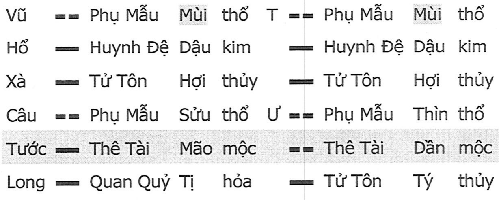

## Nuôi lợn lỗ vốn

Một học trò đã hỏi tôi tình huống này ở năm 2011, sau đó ở năm 2014 đã nhận được phản hồi. Đoán nuôi lợn có thể kiếm được tiền hay không? Ở ngày Canh Tuất (Tuần Không: Dần Mão), tháng Tý, được Địa Thiên Thái biến Thủy Hỏa Ký Tế.

| Lục thú | Phục thần | Quái hào | Thế/Ứng | Biến hào |
| :--- | :--- | :--- | :---: | :--- |
| Xà | | ╍╍ Tử Tôn Dậu kim | Ứ | ╍╍ Thê Tài Tý thủy |
| Câu | | ╍╍ Thê Tài Hợi thủy | | ━ Huynh Đệ Tuất thổ |
| Tước | | ╍╍ Huynh Đệ Sửu thổ | | ╍╍ Tử Tôn Thân kim |
| Long | | ━ Huynh Đệ Thìn thổ | T | ━ Thê Tài Hợi thủy |
| Vũ | Phụ Tị | ━ Quan Quỷ Dần mộc | | ╍╍ Huynh Đệ Sửu thổ |
| Hổ | | ━ Thê Tài Tý thủy | | ━ Quan Quỷ Mão mộc |

Lấy Thê Tài làm Dụng thần. Thê Tài lưỡng hiện, lấy hào Thê Tài Hợi thủy phát động làm Dụng thần. Mặc dù Dụng thần có Nguyệt phù, nhưng Nhật khắc, lại phát động hóa Nhật thần hồi đầu khắc, khắc nhiều sinh ít không cát, lại thêm Dụng thần bị Quan Quỷ Dần mộc hợp đến Không Vong, nhất định sẽ lỗ vốn.

Thê Tài lâm Câu Trần phát động, lại bị hào trạch Quan Quỷ Dần mộc hợp mất, Câu Trần là kiến trúc, hào 2 là trang trại nuôi lợn, phong thủy nhất định bất lợi. Hào 5 là đường, sinh hợp hào trạch trang trại, là đường đến trang trại, đường đến nhất định có sông, động mà gặp hợp là ứng, mùa xuân thuộc về mộc, khắc chế Huynh Đệ, mùa xuân nhiều nước. Mặc dù Thê Tài lâm Nguyệt đắc khí, nhưng Nhật khắc, hóa Nhật hồi đầu khắc, chủ hiện nay nước đã ít đi. (Nghiệm)

Hợi thủy sinh hợp Dần mộc, Dần mộc là Đông Bắc, chủ sông chảy hướng Đông Bắc. Trong quẻ Thê Tài lưỡng hiện, Hợi thủy tại ngoại quái Khôn, Khôn là Tây Nam, chủ Tây Nam cũng có sông. Quan Quỷ là đục, Huyền Vũ là bẩn, hợp Hợi thủy, chủ sông bị ô nhiễm, giống như kênh nước bẩn. (Nghiệm)

Năm 2014 phản hồi: Năm 2012 hao tổn 50 vạn, 2013 năm hòa vốn, 2014 năm hao tổn, đến tháng Sửu, tiền vốn rất khó khăn.

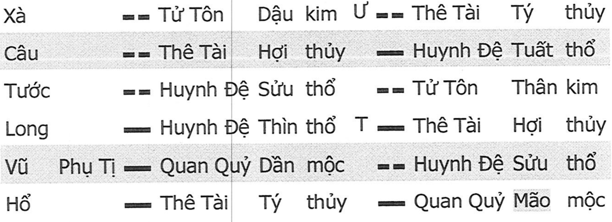

## Con trai đau bụng, nguyên nhân do căn nhà

Đây là một tình huống ở năm 2014. Con trai của một người nam bị đau bụng, đã đến các bệnh viện lớn kiểm tra nhưng không tìm được vấn đề, bèn đoán xem nguyên nhân là gì? Ở ngày Đinh Sửu (Tuần Không: Thân Dậu), tháng Tý, được Trạch Thủy Khốn biến Trạch Địa Tụy.

| Lục thú | Trạch Thủy Khốn | Trạch Địa Tụy |
| :--- | :--- | :--- |
| Long | ╍╍ Phụ Mẫu Mùi thổ | ╍╍ Phụ Mẫu Mùi thổ |
| Vũ | ━ Huynh Đệ Dậu kim | ━ Huynh Đệ Dậu kim |
| Hổ | ━ Tử Tôn Hợi thủy Ư | ━ Tử Tôn Hợi thủy |
| Xà | ╍╍ Quan Quỷ Ngọ hỏa | ╍╍ Thê Tài Mão mộc |
| Câu | ━ Phụ Mẫu Thìn thổ | ╍╍ Quan Quỷ Tị hỏa |
| Tước | ╍╍ Thê Tài Dần mộc T | ╍╍ Phụ Mẫu Mùi thổ |

Lấy Tử Tôn làm Dụng thần. Xét từ góc độ suy vượng, Tử Tôn Nguyệt phù Nhật khắc, hào động lại khắc, thuộc về hưu tù bất lợi, nhưng ở đây quái chủ dự đoán nguyên nhân, cát hung là thứ yếu.

Người xưa nói: Thần triệu cơ ở động, Phụ Mẫu Thìn thổ tại hào 2 lâm Câu Trần phát động, đi hợp Huynh Đệ Dậu kim Không Vong, đây là huyền cơ. Hào 2 là trạch, là nhà, thổ là thổ kiến (xây dựng), Câu Trần là nhà, đã hợp hào Không Vong, là nhà đã động thổ, đã không tồn tại. Thìn thổ hóa Tị hỏa, ước chừng là ở năm 2012 đến năm 2013.

Kết quả phản hồi, năm 2012 đã dùng máy xúc kéo sập nhà.

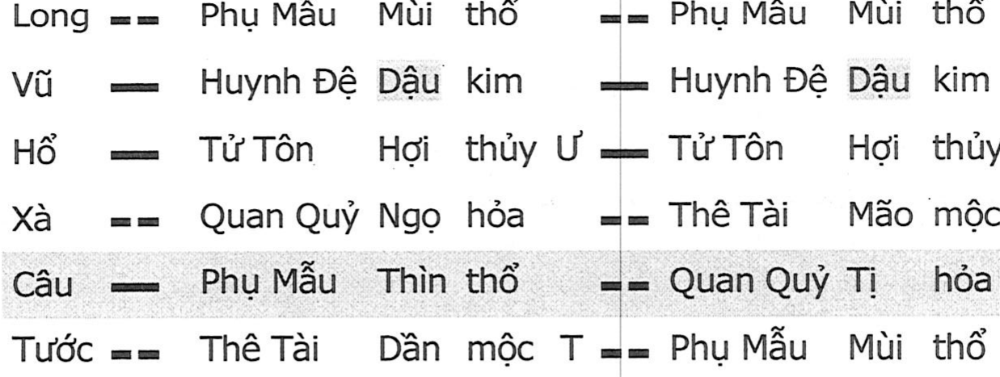

## Tiểu nhân là người thoái ngũ

Đây là một tình huống ở năm 2015. Một người nam đoán công tác, ở ngày Mậu Tuất (Tuần Không: Thìn Tị), tháng Tị, được Trạch Phong Đại Quá biến Trạch Thiên Quải.

| Lục thú | Phục thần | Trạch Phong Đại Quá | Trạch Thiên Quải |
| :--- | :--- | :--- | :--- |
| Tước | | ╍╍ Thê Tài Mùi thổ | ╍╍ Thê Tài Mùi thổ |
| Long | | ━ Quan Quỷ Dậu kim | ━ Quan Quỷ Dậu kim |
| Vũ | Tử Ngọ | ━ Phụ Mẫu Hợi thủy T | ━ Phụ Mẫu Hợi thủy |
| Hổ | | ━ Quan Quỷ Dậu kim | ━ Thê Tài Thìn thổ |
| Xà | Huynh Dần | ━ Phụ Mẫu Hợi thủy | ━ Huynh Đệ Dần mộc |
| Câu | | ╍╍ Thê Tài Sửu thổ Ư | ━ Phụ Mẫu Tý thủy |

Lấy Quan Quỷ làm Dụng thần. Hào Thế Nguyệt phá lâm Huyền Vũ, chủ sự nghiệp không thuận, tâm trạng phiền muộn, bản thân bị ngoại giới ảnh hưởng, lật đổ. (Nghiệm)

Cái xung phá hào Thế là Tử Tôn, Tử Tôn nhập quẻ phục tàng, là ngấm ngầm gây bất lợi cho mình, phục tàng dưới hào Thế, là tiểu nhân bên cạnh. Ngọ hỏa phản quái là Ly, chủ giáp trụ, Tử Tôn là binh lính, là một quân nhân chuyển ngành cản trở anh. (Nghiệm, bởi vì biết người đó không ở trong quân đội, vậy thì nếu có liên quan đến quân nhân, thì nhất định là quân nhân chuyển ngành.)

Tị hỏa tại Nguyệt kiến cũng chủ ban công, Câu Trần độc phát, nhất định đã động ban công. (Nghiệm, gần đây đã sửa lại cửa sổ trên ban công ở phía Đông.)

Lại thêm hào sơ hào Ứng lâm Câu Trần độc phát, hào sơ là lúc nhỏ, hào Ứng là ngoại địa, tha xứ (xứ khác), Câu Trần chủ kiến trúc, khắc Phụ Mẫu hóa Phụ Mẫu, bản thân lại ở ngoại địa, vì vậy đây là thông tin người nhà đã đập cũ xây mới nhà. (Nghiệm, anh trai ở quê đã phá nhà cũ, xây nhà mới.)

Chỗ hợp ứng xung, việc này nhất định bắt đầu làm từ năm ngoái, năm nay Thái Tuế xung khai, vẫn đang làm. (Nghiệm, năm Giáp Ngọ đã phá nhà cũ, Thanh Minh năm nay bắt đầu khởi công xây nhà, vẫn chưa hoàn thành.)

Phương pháp hóa giải: Đặt một hòn đá dài trên ban công và đặt một hòn đá tròn ở hướng Đông Bắc của nhà.

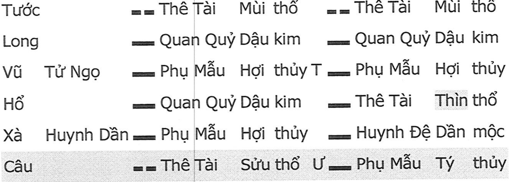

## Kinh nguyệt không bình thường

Đây là một tình huống ở năm 2015. Một người nữ dự đoán bệnh tật của mình, ở ngày Canh Tuất (Tuần Không: Dần Mão), tháng Tị, được Thiên Phong Cấu biến Hỏa Sơn Lữ.

| Lục thú | Phục thần | Quẻ Thiên Phong Cấu | Quẻ Hỏa Sơn Lữ |
| :--- | :--- | :--- | :--- |
| Xà | | — Phụ Mẫu Tuất thổ | — Quan Quỷ Tị hỏa |
| Câu | | — Huynh Đệ Thân kim | - - Phụ Mẫu Mùi thổ |
| Tước | | — Quan Quỷ Ngọ hỏa Ứ | — Huynh Đệ Dậu kim |
| Long | | — Huynh Đệ Dậu kim | — Huynh Đệ Thân kim |
| Vũ | Tài Dần | — Tử Tôn Hợi thủy | - - Quan Quỷ Ngọ hỏa |
| Hổ | | - - Phụ Mẫu Sửu thổ T | - - Phụ Mẫu Thìn thổ |

Lấy hào Thế làm Dụng thần. Hào Thế được Nguyệt sinh Nhật phù là vượng tướng, không phải là bệnh tật liên quan đến sinh tử. Hào Thế Bạch Hổ là máu, Nhật hình là thống khổ. Hào 2 Tử Tôn lâm Huyền Vũ phát động hóa Quan Quỷ, Quan Quỷ là bệnh, Tử Tôn là bộ phận sinh dục, hào 2 cũng là tử cung, Huyền Vũ là riêng tư, tổng hợp phán đoán là tử cung có bệnh, kinh nguyệt không bình thường. (Nghiệm, mỗi lần hành kinh cần ba tuần, hơn nữa lại chảy nhiều máu.)

Huynh Đệ Thân kim lâm Câu Trần hóa Phụ Mẫu, là do tu tạo cải tạo nhà mà bị bệnh. Động mà ứng hợp, ước chừng ở năm Quý Tị. (Có sự việc cải tạo nhà, nhưng không nhớ thời gian cụ thể.)

Tử Tôn cũng là y dược, Nguyệt phá hóa Quan Quỷ, uống thuốc không những không có hiệu quả, trái lại có tác dụng phụ. Tử Tôn lâm thủy, là Trung dược. (Nghiệm, quả nhiên thỉnh thoảng uống Trung dược, nhưng không có hiệu quả.)

Tử Tôn hóa Quan Quỷ Ngọ hỏa, Ngọ hỏa là Thái Tuế năm trước, kinh nguyệt bất thường bắt đầu từ năm ngoái. (Nghiệm)

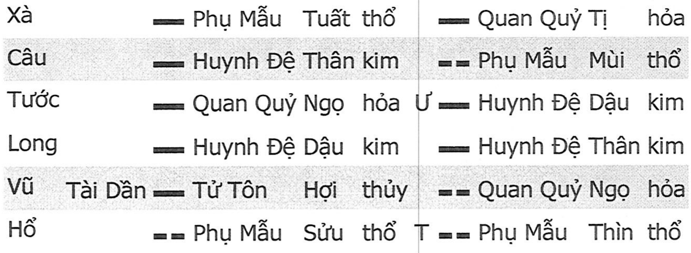

## Nhà chị đã không tìm được tổ phần

Đây là một tình huống ở năm 2015. Một người nữ đoán thân thể của con trai (sinh năm Canh Thìn), ở ngày Quý Dậu (Tuần Không: Tuất Hợi), tháng Ngọ, được Càn Vi Thiên biến Phong Trạch Trung Phu.

| Lục thú | Quẻ Càn Vi Thiên | Quẻ Phong Trạch Trung Phu |
| :--- | :--- | :--- |
| Hổ | — Phụ Mẫu Tuất thổ T | — Thê Tài Mão mộc |
| Xà | — Huynh Đệ Thân kim | — Quan Quỷ Tị hỏa |
| Câu | — Quan Quỷ Ngọ hỏa | - - Phụ Mẫu Mùi thổ |
| Tước | — Phụ Mẫu Thìn thổ Ư | - - Phụ Mẫu Sửu thổ |
| Long | — Thê Tài Dần mộc | — Thê Tài Mão mộc |
| Vũ | — Tử Tôn Tý thủy | — Quan Quỷ Tị hỏa |

Lấy Tử Tôn làm Dụng thần. Hào Thế lâm Bạch Hổ Không Vong, chủ chị tâm phiền, tâm không thể tĩnh, nôn nóng, vừa nói chuyện đã muốn nổi giận. (Nghiệm)

Tử Tôn Tý thủy tại hào sơ Nhật sinh bị Nguyệt xung phá, hào sơ là lúc nhỏ, lâm Huyền Vũ nhập Mộ tại hào 3 chủ tự bế. (Nghiệm)

Hào sơ là tâm sự, thủy là trí tuệ, bị Quỷ xung phá, chủ tiểu hài rất thông minh, nhưng tư duy khác người thường, không giống với tư duy của đứa trẻ bình thường, không hòa đồng. Ngọ hỏa xung phá Tý thủy, chủ từ năm 2002 bắt đầu mắc bệnh như vậy. (Nghiệm)

Quẻ chính lục xung, chủ lạc nhịp với cuộc sống hiện đại, an tĩnh nhập Mộ là tĩnh, gặp xung là động, chủ hài tử có lúc tĩnh, có lúc cuồng táo (dễ cáu). (Nghiệm)

Dụng thần Nguyệt phá ứng tại hợp, lại thêm Kỵ thần phát động hóa Sửu thổ, chủ tại năm Sửu, năm 2009 nghiêm trọng. (Nghiệm)

Nhật sinh Dụng thần Tý thủy, chủ gần đây có chiều hướng tốt. (Nghiệm)

Phụ Mẫu Chu Tước hóa thoái, Phụ Mẫu là văn thư, Chu Tước chủ học tập, hóa thoái. Lại có Quan Quỷ Ngọ hỏa bị hào biến hợp không thể sinh Phụ Mẫu, chủ không thích học tập. (Nghiệm)

Quan Quỷ Câu Trần phát động, Quan Quỷ là người chết, Câu Trần chủ nấm mồ, nhất định có liên quan đến tổ phần. Hào 6 là tổ phần, Mộ khố Quan Quỷ cũng là mộ, lâm Bạch Hổ càng là như vậy,

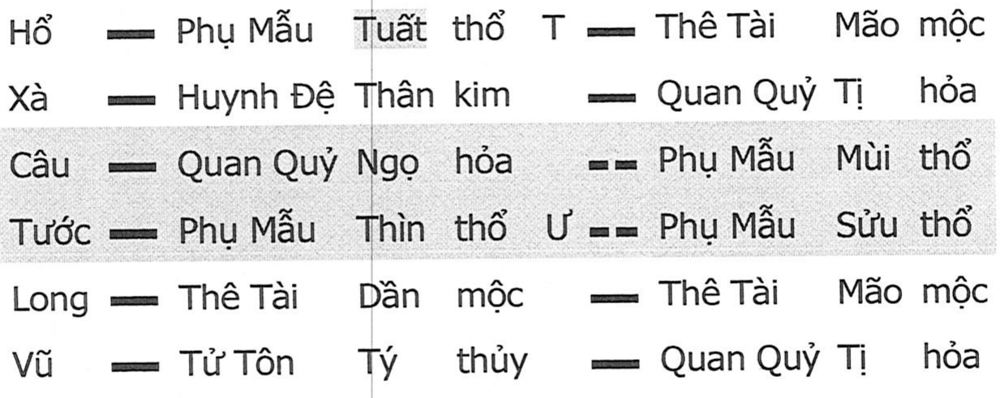

Không Vong, chủ tổ phần không tìm được. (Nghiệm, quả nhiên mộ của ông nội hài tử đã không tìm được, đã tìm 20 năm cũng không tìm được.)

Hào 3 là cửa, Thìn thổ là Mộ khố Tử Tôn, Phụ Mẫu là kiến trúc, Mộ khố Tử Tôn chính là nơi hài tử ở lại, lâm Chu Tước là trường học, lân cận có trường học. Động hóa thoái, nhà cửa của trường học đã xuống cấp. (Nghiệm)

Càn là thần Phật, hào Thế lâm Tuất thổ, Mộ khố Quan Quỷ là tự viện, hào 6 cũng là tự viện, chủ chị tín giáo. (Nghiệm)

Tử Tôn tại hào sơ bị Thai địa lâm Nguyệt xung phá, hài tử sinh ra lai lịch không bình thường, tư duy của nó khác với người thường, là từ A Tu La Đạo đến. (Hài tử bình thường không nói năng, có lúc đột nhiên nói với bọn họ một câu, mọi người mua cổ phiếu XX nhé, kết quả vừa mua đã tăng, đã kiếm được tiền.)

Sau khi hóa giải, hiện tại đã bình thường, đã làm tài xế.

## Tổ phần ảnh hưởng đến việc sinh con trai

Đây là một tình huống ở năm 2015. Một người nam đoán không sinh con trai do nguyên nhân gì? Ở ngày Quý Mùi (Tuần Không: Thân Dậu), tháng Ngọ, được Khôn Vi Địa.

| Lục thú | Hào tượng | Lục thân | Can chi | Thế Ứng |
| :--- | :---: | :--- | :--- | :---: |
| Hổ | ▅▅ ▅▅ | Tử Tôn | Dậu kim | T |
| Xà | ▅▅ ▅▅ | Thê Tài | Hợi thủy | |
| Câu | ▅▅ ▅▅ | Huynh Đệ | Sửu thổ | |
| Tước | ▅▅ ▅▅ | Quan Quỷ | Mão mộc | Ư |
| Long | ▅▅ ▅▅ | Phụ Mẫu | Tị hỏa | |
| Vũ | ▅▅ ▅▅ | Huynh Đệ | Mùi thổ | |

Lấy Tử Tôn làm Dụng thần. Tử Tôn Dậu kim trì Thế tại hào 6 Không Vong, Nguyệt khắc Nhật sinh, suy vượng tương đương. Sửu thổ ám động đến sinh, tất có huyền cơ.

Hào Thế tại hào 6 Không Vong, chủ bản thân được nhận làm con thừa tự cho người. (Nghiệm, ông nội người này được nhận làm con thừa tự, cha được nhận làm con thừa tự, bản thân cũng được nhận làm con thừa tự.)

Lâm Bạch Hổ Tử Tôn Không Vong, chủ anh đã từng lưu sản tiểu hài, cũng chủ anh có hài tử đã cho người. (Nghiệm, đã sinh ba con gái, đứa nhỏ nhất đã cho người làm con thừa tự, khi vợ có thai, siêu âm B là con gái thì liền phá thai, liên tục phá thai 6 7 lần.)

Dậu kim Không Vong, tháng Mão xung, tháng Mão năm nay cũng đã lưu sản một lần. (Nghiệm)

Bạch Hổ là tử vong, hào 6 là tổ phần, lâm Tử Tôn Không Vong, chủ yếu là tổ phần có vấn đề, mới dẫn đến mấy đời không có con cái, liên tục nhận con thừa tự.

Hào 6 nhập Mộ tại hào 4 Sửu thổ, chủ tổ phần của nhà anh nằm ở lưng chừng núi chếch lên một chút. Quẻ lục xung, cát bay đá chạy, Khôn là thổ, chủ trong phần địa bụi bặm tung bay. (Nghiệm)

Hào Thanh Long Phụ Mẫu Tị hỏa Nguyệt phù vượng tướng, khắc hào Bạch Hổ, chủ Thanh Long quá cao, cao hơn Bạch Hổ rất nhiều. Hào Bạch Hổ Không Vong, chủ đất ở phương Bạch Hổ lõm xuống. (Nghiệm)

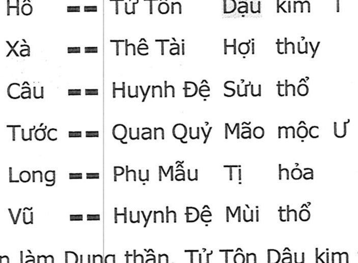

Trong quẻ hào thủy hưu tù, hào 6 Không Vong, hào 6 là thủy khẩu, chủ thủy khẩu¹ rộng mở, không thu khẩn (kiểm soát chặt chẽ). Mặc dù có tài, nhưng sẽ nhanh chóng mất đi. (Nghiệm)

Câu Trần là mộ, Sửu thổ ám động sinh Tử Tôn, chủ bởi vì sinh hài tử mà đã từng động tổ phần. (Nghiệm)

Hào Thế lâm Bạch Hổ, chủ anh nóng tính, Bạch Hổ là máu, hào 6 là đầu, chủ huyết áp cao, chóng mặt. Năm Tân Mão xung Không Vong, chủ năm này bị bệnh. (Nghiệm)

Hóa giải: Đặt một hòn đá tròn trên mái nhà.

Sau này đã sinh được một con trai. Gia đình anh ta sống ở ven đường, nhiều năm qua vẫn luôn bình an vô sự, nhưng từ sau khi sinh con trai, thường xuyên xảy ra sự việc xe tải đâm vào nhà anh ta, có một lần xe đâm thủng tường, hướng thẳng tới chỗ con trai đang ngủ, cũng may là vợ anh ta đã kịp thời ôm hài tử chạy khỏi, nếu không thì lành ít dữ nhiều. Sau đó lại hóa giải, việc này mới được yên ổn, xe đã không đâm vào nhà nữa.

## Phong thủy là chất xúc tác của bệnh tật

Đây là một tình huống ở năm 2015. Học trò của tôi đoán chân phù thũng do nguyên nhân gì? Ở ngày Nhâm Tuất (Tuần Không: Tý Sửu), tháng Thân, được Thiên Sơn Độn biến Thiên Phong Cấu.

| Lục Thú | Phục Thần | Thiên Sơn Độn | Thế Ứng | Thiên Phong Cấu |
| :--- | :--- | :--- | :---: | :--- |
| Hổ | | ━ Phụ Mẫu Tuất thổ | | ━ Phụ Mẫu Tuất thổ |
| Xà | | ━ Huynh Đệ Thân kim | Ứ | ━ Huynh Đệ Thân kim |
| Câu | | ━ Quan Quỷ Ngọ hỏa | | ━ Quan Quỷ Ngọ hỏa |
| Tước | | ━ Huynh Đệ Thân kim | | ━ Huynh Đệ Dậu kim |
| Long | Tài Dần | ━ ━ Quan Quỷ Ngọ hỏa | T | ━ Tử Tôn Hợi thủy |
| Vũ | Tử Tý | ━ ━ Phụ Mẫu Thìn thổ | | ━ ━ Phụ Mẫu Sửu thổ |

Lấy hào Thế làm Dụng thần. Hào Thế mặc dù không được Nhật Nguyệt phù, nhưng cũng không bị khắc, hưu tù nhưng không hoại căn cơ.

Hào Thế tại hào 2 độc phát hóa Hợi thủy hồi đầu khắc, hào 2 là chân là trạch, thủy là thận, hào 2 cũng là thận, là do nguyên nhân ở thận gây ra.

Hào sơ Phụ Mẫu Thìn thổ ám động, phương diện phong thủy cũng có vấn đề. Sau khi xem phong thủy thông qua bản vẽ, là tổ

---

¹ Thủy khẩu là cửa ngõ ra vào của dòng chảy trước huyệt.

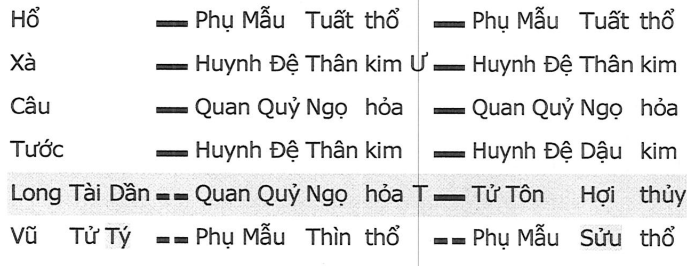

---

# Part 10 (Pages 181-200)

hợp Càn Chấn, Càn là nam, Chấn là chân, tổ hợp phong thủy như vậy đã tăng tốc sự bất lợi cho thân thể.

Ngày Kỷ Tị được biết, bệnh viện xét nghiệm nước tiểu đã phát hiện đản bạch vi lượng, đó là vấn đề về thận.

Sau khi hóa giải điều trị, đã hồi phục.

## Đau thắt lưng bởi vì tu bổ tường

Một học trò của tôi đã hỏi tôi tình huống này. Anh ta đoán bệnh đau thắt lưng của mình. Ở ngày Quý Hợi (Tuần Không: Tý Sửu), tháng Thân, được Cấn Vi Sơn biến Sơn Phong Cổ.

| Lục Thú | Cấn Vi Sơn | Thế Ứng | Sơn Phong Cổ |
| :--- | :--- | :---: | :--- |
| Hổ | ━ Quan Quỷ Dần mộc | T | ━ Quan Quỷ Dần mộc |
| Xà | ━ ━ Thê Tài Tý thủy | | ━ ━ Thê Tài Tý thủy |
| Câu | ━ ━ Huynh Đệ Tuất thổ | | ━ ━ Huynh Đệ Tuất thổ |
| Tước | ━ Tử Tôn Thân kim | Ứ | ━ Tử Tôn Dậu kim |
| Long | ━ ━ Phụ Mẫu Ngọ hỏa | | ━ Thê Tài Hợi thủy |
| Vũ | ━ ━ Huynh Đệ Thìn thổ | | ━ ━ Huynh Đệ Sửu thổ |

Lấy hào Thế làm Dụng thần. Hào Thế lâm Bạch Hổ là bệnh, Nguyệt xung phá, Nhật sinh hợp, không nghiêm trọng.

Sách nói: Thần triệu cơ ở động. Độc phát lâm Phụ Mẫu tại hào 2 hóa Hợi thủy, hào biến là Nhật, biểu thị mới đau gần đây. Hào 2 là trạch, Phụ Mẫu là kiến trúc, Thanh Long chủ trang sức, độc phát xem lưu hướng, xung hào 5 Tý thủy, lại hóa Hợi thủy, gần đây nhất định đã động nơi có liên quan đến thủy. Hào 5 Tý thủy Không Vong, thủy Không thì chảy, thấm nước, rỉ nước, xung thực, chính là tu bổ.

Quả nhiên đã động tường ngoài ở phía Bắc, đã xử lý chống thấm nước.

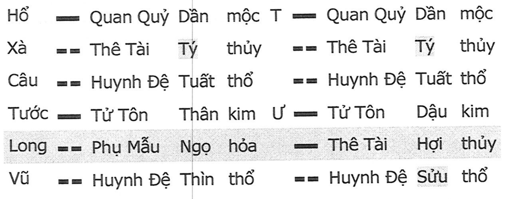

## Nhà vệ sinh ở Đông Bắc ảnh hưởng đến tài vận

Đây là một tình huống ở năm 2015. Một người nữ đoán công tác, ở ngày Tân Mùi (Tuần Không: Tuất Hợi), tháng Thân, được Địa Thiên Thái.

| Lục Thú | Phục Thần | Địa Thiên Thái | Thế Ứng |
| :--- | :--- | :--- | :---: |
| Xà | | ━ ━ Tử Tôn Dậu kim | Ư |
| Câu | | ━ ━ Thê Tài Hợi thủy | |
| Tước | | ━ ━ Huynh Đệ Sửu thổ | |
| Long | | ━ Huynh Đệ Thìn thổ | T |
| Vũ | Phụ Tị | ━ Quan Quỷ Dần mộc | |
| Hổ | | ━ Thê Tài Tý thủy | |

Lấy Quan Quỷ làm Dụng thần. Quan Quỷ bị Nguyệt xung phá, nhập Mộ tại Nhật, chủ trước mắt không có công tác. (Nghiệm)

Hào Thế lâm Thanh Long, Thanh Long chủ thai sản, hợp hào 6 Tử Tôn, chủ có thai sinh hài tử. (Nghiệm, mới sinh một con gái, đã được 9 tháng.)

Thê Tài Hợi thủy mặc dù có Nguyệt sinh, nhưng Nhật khắc, lại Không Vong, hào 4 Huynh Đệ Sửu thổ ám động khắc Thê Tài, hào 4 là nhà vệ sinh, Huynh Đệ cũng là nhà vệ sinh, Sửu thổ là Đông Bắc, chủ Đông Bắc có nhà vệ sinh ảnh hưởng đến tài vận. (Nghiệm, quả nhiên Đông Bắc có nhà vệ sinh.)

Huynh Đệ trì Thế, đang là lúc tốn tiền, tiền tài trong tay eo hẹp. (Nghiệm)

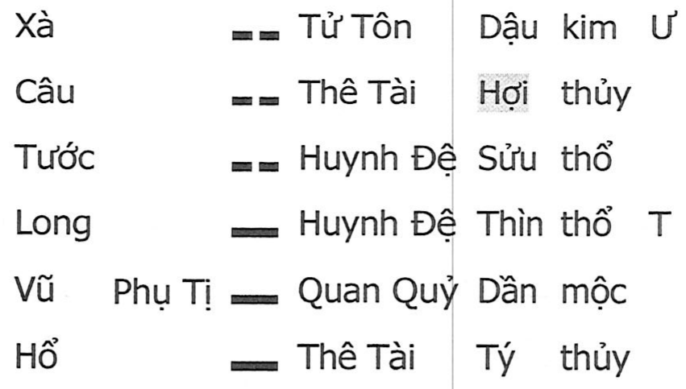

## Bệnh do tu tạo gây nên

Một học trò của tôi đã hỏi tôi tình huống này. Nam đoán bệnh mắt, ở ngày Mậu Ngọ (Tuần Không: Tý Sửu), tháng Thìn, được Thủy Địa Tỷ biến Thủy Lôi Truân.

| Lục Thú | Thủy Địa Tỷ | Thế Ứng | Thủy Lôi Truân |
| :--- | :--- | :---: | :--- |
| Tước | ━ ━ Thê Tài Tý thủy | Ư | ━ ━ Thê Tài Tý thủy |
| Long | ━ Huynh Đệ Tuất thổ | | ━ Huynh Đệ Tuất thổ |
| Vũ | ━ ━ Tử Tôn Thân kim | | ━ ━ Tử Tôn Thân kim |
| Hổ | ━ ━ Quan Quỷ Mão mộc | T | ━ ━ Huynh Đệ Thìn thổ |
| Xà | ━ ━ Phụ Mẫu Tị hỏa | | ━ ━ Quan Quỷ Dần mộc |
| Câu | ━ ━ Huynh Đệ Mùi thổ | | ━ Thê Tài Tý thủy |

Lấy hào Thế làm Dụng thần. Nhật Nguyệt không khắc, tháng Thìn mộc có dư khí, nhưng lại thuộc về hưu tù. Quan Quỷ Bạch Hổ lâm thân, bệnh không dễ khỏi.

Trong quẻ Mùi thổ lâm Câu Trần độc phát, người xưa nói: Thần triệu cơ ở động, nhất định có huyền cơ. Hào độc phát có thể chủ nguyên nhân, Câu Trần là kiến trúc, thổ là thổ, gạch ngói v.v, cho nên nhất định là do động thổ gây ra. Hào động và Nhật hợp, xung khai là ứng kỳ, phán đoán là năm 09 Kỷ Sửu xung khai Mùi thổ, năm này động thổ gây ra.

Quả nhiên là bị bệnh ở năm 09, sau đó đã tìm người xử lý chống thấm nước cho nhà. (Tại sao là xử lý chống thấm nước? Bởi vì hóa ra Tý thủy là Không Vong, thủy Không thì chảy, chủ rỉ nước, lâm Câu Trần, là công trình rỉ nước. Nhật xung thực, chính là không cho rỉ nước, hiển nhiên là chống thấm nước.)

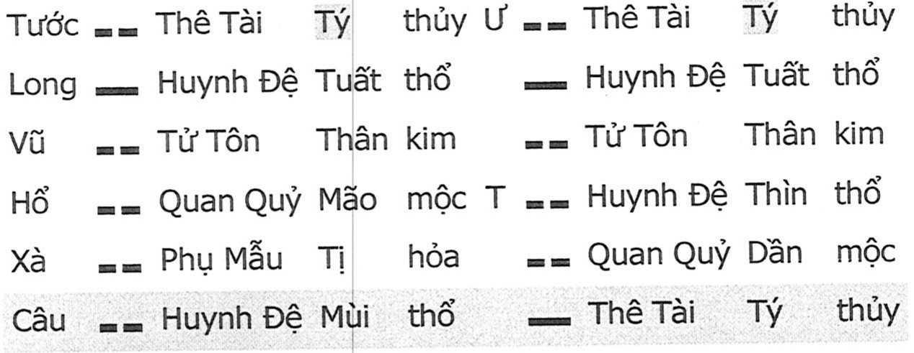

## Hóa ra là nhà đối diện đang cải tạo

Đây là một tình huống ở năm 2015. Một người nam (sinh năm Tân Mùi) đoán tài vận. Ở ngày Giáp Tý (Tuần Không: Tuất Hợi), tháng Tuất, được Địa Thủy Sư biến Thủy Thiên Nhu.

| Lục thú | Phục thần | Quái hào | Thế/Ứng | Biến hào |
| :--- | :--- | :--- | :---: | :--- |
| Vũ | | ╍╍ Phụ Mẫu Dậu kim | Ư | ╍╍ Huynh Đệ Tý thủy |
| Hổ | | ╍╍ Huynh Đệ Hợi thủy | | ━ Quan Quỷ Tuất thổ |
| Xà | | ╍╍ Quan Quỷ Sửu thổ | | ╍╍ Phụ Mẫu Thân kim |
| Câu | | ╍╍ Thê Tài Ngọ hỏa | T | ━ Quan Quỷ Thìn thổ |
| Tước | | ━ Quan Quỷ Thìn thổ | | ━ Tử Tôn Dần mộc |
| Long | | ╍╍ Tử Tôn Dần mộc | | ━ Huynh Đệ Tý thủy |

Lấy Thê Tài làm Dụng thần. Thê Tài Ngọ hỏa mặc dù trì Thế, nhưng Nguyệt không phù Nhật khắc là hưu tù, biểu thị tài vận không tốt. Huynh Đệ Hợi thủy phát động khắc hào Thế Thê Tài, nhưng hào sơ Dần mộc hợp Hợi thủy không thể khắc, lại sinh Thê Tài, cũng không đến nỗi quá tệ, nhưng năm Tân Mão hợp hào biến của Huynh Đệ Hợi thủy hóa ra, Hợi thủy không có chế, khắc thẳng Thê Tài, tài vận bất lợi. (Nghiệm, năm Tân Mão phá tài.)

Năm Nhâm Thìn xung mất hào biến Tuất thổ của Huynh Đệ, cũng không thể khắc chế Huynh Đệ, cũng không tốt. (Nghiệm, năm này vẫn phá tài như cũ.)

Đáng lẽ Huynh Đệ Hợi thủy bị hợp không nên xung khai, nhưng Huynh Đệ Hợi thủy Không Vong, năm Quý Tị xung thực mà bị khắc, lại phù Thê Tài, năm này bắt đầu chuyển biến tốt. Năm Giáp Ngọ trị Thê Tài Ngọ hỏa, năm Ất Mùi khắc Huynh Đệ, Thê Tài Ngọ hỏa động mà gặp hợp, nơi xung gặp hợp, đều tương đối tốt. (Nghiệm, từ năm 2013 bắt đầu chuyển biến tốt, hiện tại có chiều hướng ổn định.)

Hào mệnh hợp Thê Tài, sinh ra để làm kinh doanh, nhưng Nhật khắc Thê Tài, Tử Tôn Dần mộc đã hợp lấy Huynh Đệ, nhưng Huynh Đệ đồng thời cũng đã hợp lấy Tử Tôn, hiện nay việc kinh doanh đang đi xuống.

Hào 3 Thê Tài lâm Câu Trần phát động hóa Quan Quỷ, Quan Quỷ là lo lắng, hào 3 là cửa, Câu Trần chủ công trình, anh đã cải tạo cửa công ty và dẫn tới bất lợi. Đối phương nói, tôi không cải tạo cửa ạ. Tôi lại suy xét kỹ lưỡng, hào biến Thìn thổ và hào Ứng Dậu kim hợp, vậy thì chính là công ty đối diện cải tạo cửa đã ảnh hưởng đến anh. (Nghiệm, hai công ty đối diện đang cải tạo cửa.)

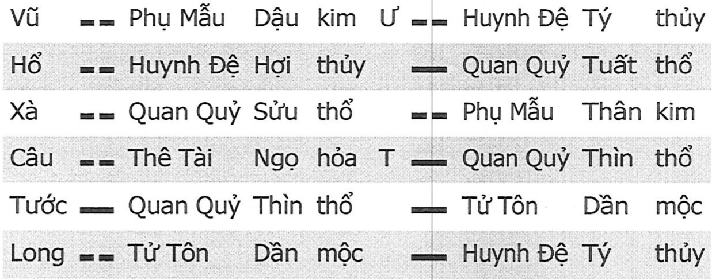

Lại hỏi sự nghiệp của cha? Hỏi tuổi cha, là tuổi Mùi. Hào mệnh của cha tại Quan Quỷ, cha là quan chức. Tương hợp với hào Thế, quan hệ cha con tốt đẹp, trông rất giống nhau. Hào Phụ Mẫu Dậu kim vượng tướng, lại thêm Quan Quỷ trên Nguyệt phù hào mệnh, cha quan vận tốt đẹp. Quan Quỷ trị Nguyệt, nhất định làm trong ngành công kiểm pháp. (Quả nhiên, nhưng đối phương không nói đơn vị cụ thể là gì.)

## Tại sao hài tử của hàng xóm đột nhiên không thể đi lại?

Đây là tình huống của một học trò ở Đông Bắc đã hỏi tôi vào năm 2015. Tiểu hài của nhà hàng xóm bị bệnh, đột nhiên không thể đi lại, nguyên nhân là gì? Ở ngày Giáp Thân (Tuần Không: Ngọ Mùi), tháng Tuất, được Hỏa Thủy Vị Tế biến Hỏa Trạch Khuê.

| Lục thú | Phục thần | Quái hào | Thế/Ứng | Biến hào |
| :--- | :--- | :--- | :---: | :--- |
| Vũ | | ━ Huynh Đệ Tị hỏa | Ư | ━ Huynh Đệ Tị hỏa |
| Hổ | | ╍╍ Tử Tôn Mùi thổ | | ╍╍ Tử Tôn Mùi thổ |
| Xà | | ━ Thê Tài Dậu kim | | ━ Thê Tài Dậu kim |
| Câu | Quan Hợi | ╍╍ Huynh Đệ Ngọ hỏa | T | ╍╍ Tử Tôn Sửu thổ |
| Tước | | ━ Tử Tôn Thìn thổ | | ━ Phụ Mẫu Mão mộc |
| Long | | ╍╍ Phụ Mẫu Dần mộc | | ━ Huynh Đệ Tị hỏa |

Thông thường xem hào Ứng, nhưng căn cứ vào đặc điểm của bệnh, kết hợp tổ hợp của quẻ, lấy Tử Tôn làm Dụng thần. Tử Tôn lưỡng hiện, lấy Tử Tôn Mùi thổ Không Vong làm Dụng thần. Dụng thần lâm hào 5 Bạch Hổ Không Vong, hào 5 là đường, Bạch Hổ là đường, Không Vong không thể đi, hào 2 là chân, ngoài ra một Tử Tôn Nguyệt phá, lại thêm Kỵ thần tại hào sơ phát động khắc, hào sơ cũng là chân, thông tin của quẻ rất rõ ràng. Tử Tôn Thìn thổ lâm Nguyệt phá Chu Tước, Chu Tước chủ viêm, sốt, Kỵ thần hóa hỏa đến khắc, hỏa là sốt, cũng chủ sốt cao.

Phụ Mẫu Dần mộc tại hào sơ độc phát, thần triệu cơ ở động, đây là nguyên nhân, hào sơ là nền nhà, Phụ Mẫu là nhà. Là đã động nền nhà, xây nhà. Hóa Tị hỏa khoảng chừng tại tháng Tị. (Dựa vào ứng kỳ cũng có thể phán đoán là tháng Dần, nhưng tháng Dần Đông Bắc thời tiết lạnh, không thể xây nhà.) Mà Tử Tôn Thìn thổ tại hào 2 bị Nguyệt xung phá, hào 2 là trạch, cũng có thể là do nhà gây nên bệnh.

Quả nhiên là tại tháng Tị đã xây nhà trên hầm ngầm. Phía dưới nhà trống rỗng, do đó hài tử đã đau chân không thể đi lại.

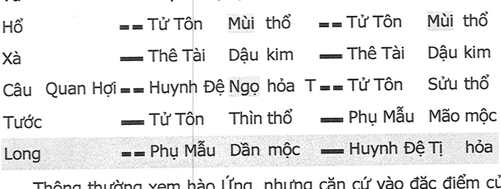

## Phong thủy có thể phản suy

Đây là tình huống của một người bạn đã hỏi tôi vào năm 2015. Một người hỏi tài vận không tốt do nguyên nhân gì? Ở ngày Đinh Hợi (Tuần Không: Ngọ Mùi), tháng Tuất, được Trạch Sơn Hàm biến Thủy Phong Tỉnh.

| Lục Thần | Phục Thần | Quẻ Trạch Sơn Hàm | Thế Ứng | Quẻ Thủy Phong Tỉnh |
| :--- | :--- | :--- | :---: | :--- |
| Long | | ╍ ╍ Phụ Mẫu Mùi thổ | Ứ | ╍ ╍ Tử Tôn Tý thủy |
| Vũ | | ━ Huynh Đệ Dậu kim | | ━ Phụ Mẫu Tuất thổ |
| Hổ | | ━ Tử Tôn Hợi thủy | | ╍ ╍ Huynh Đệ Thân kim |
| Xà | | ━ Huynh Đệ Thân kim | T | ━ Huynh Đệ Dậu kim |
| Câu | Tài Mão | ╍ ╍ Quan Quỷ Ngọ hỏa | | ━ Tử Tôn Hợi thủy |
| Tước | | ╍ ╍ Phụ Mẫu Thìn thổ | | ╍ ╍ Phụ Mẫu Sửu thổ |

Xem tài lấy Thê Tài làm Dụng thần. Phán đoán nguyên nhân, chủ yếu lấy hào động làm chủ, nếu không có hào động thì xem hào hoặc lục thân bất lợi cho Thê Tài. Quẻ này Thê Tài Mão mộc phục tàng tại hào 2, mặc dù có Nguyệt hợp, Nhật và hào động sinh vượng, nhưng trong quẻ Quan Quỷ Ngọ hỏa phát động áp chế Thê Tài Mão mộc, Ngọ hỏa là Tử địa Thê Tài, lâm Câu Trần chủ tu tạo, Ngọ hỏa là Thái Tuế năm ngoái, năm ngoái đã động thổ. (Nghiệm, tháng Ngọ năm Giáp Ngọ bắt đầu sửa tường bao, tháng Mùi hoàn thành.)

Lại thêm Ngọ hỏa tại hào 2 phát động hóa Hợi thủy, hào 2 hỏa là bếp, thủy là nước uống, giếng nước, đây là giếng bếp tương liên, đại kỵ trong phong thủy. (Nghiệm, than, bếp và hầm nước đều ở phía Nam.)

Người bạn cho biết, anh ta là người đã xây căn nhà này. Cửa Chấn chủ Đoài bếp Ly.

Theo nguyên lý bát trạch dịch trận phong thủy, bố cục phong thủy này không hợp lý, nam nếu tuổi Mão, nhất định chân có vấn đề. Xét theo quẻ, chân vợ không tốt. Bởi vì đại môn tại Chấn, đối ứng Thê Tài Mão mộc. Mão mộc phục tàng tại hào 2, Câu Trần là chậm chạp.

Người bạn phản hồi: Vợ chồng hai tuổi Dần, vợ đau chân do phong thấp. Còn em trai sống ở sát vách, kết cấu cũng thế, em trai tuổi Mão, sau khi bị nhồi máu não thì đi đứng khó khăn, vợ bị bệnh thần kinh. Nhưng em trai có tiền. Căn cứ vào kết quả đã biết, tôi suy ngược lại phong thủy, phán đoán em trai sống ở phía Nam, anh

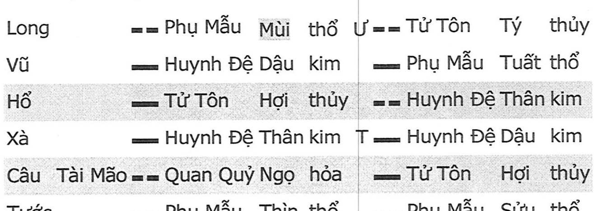 trai ở phía Bắc, nhà của anh trai hơi cao hơn một chút so với em trai, quả nhiên.

## Hàng xóm tu tạo cũng ảnh hưởng đến anh

Đây là một tình huống ở năm 2015. Một người nữ đoán hàng xóm đang trang tu tường ngoài có ảnh hưởng đến mình không? Ở ngày Mậu Dần (Tuần Không: Thân Dậu), tháng Tuất, được Hỏa Lôi Phệ Hạp biến Thiên Địa Bĩ.

| Lục Thần | Quẻ Hỏa Lôi Phệ Hạp | Thế Ứng | Quẻ Thiên Địa Bĩ |
| :--- | :--- | :---: | :--- |
| Tước | ━ Tử Tôn Tị hỏa | | ━ Thê Tài Tuất thổ |
| Long | ╍ ╍ Thê Tài Mùi thổ | T | ━ Quan Quỷ Thân kim |
| Vũ | ━ Quan Quỷ Dậu kim | | ━ Tử Tôn Ngọ hỏa |
| Hổ | ╍ ╍ Thê Tài Thìn thổ | | ╍ ╍ Huynh Đệ Mão mộc |
| Xà | ╍ ╍ Huynh Đệ Dần mộc | Ứ | ╍ ╍ Tử Tôn Tị hỏa |
| Câu | ━ Phụ Mẫu Tý thủy | | ╍ ╍ Thê Tài Mùi thổ |

Không có cụ thể Dụng thần, xem tình hình tổng thể. Hào Thế thể hiện mình, hào Ứng thể hiện hàng xóm.

Hào Thế lâm Thanh Long tại hào 5, hào 5 là hào chí cao, Thanh Long chủ vui vẻ, cuộc sống của mình vốn rất mỹ mãn, rất hạnh phúc. Nhưng phát động hóa Không Vong, hóa Quan Quỷ. Hóa Không Vong, tâm trạng bất an, lâm Thanh Long, vui vẻ không còn, Quan Quỷ lo lắng, hiện tại đã có phiền não. Nguyệt hình hào Thế, chủ trong lòng khó chịu, không thoải mái. (Nghiệm)

Hào Ứng lâm Nhật khắc hào Thế Thê Tài, chủ tài vận đi xuống, phí tổn nhiều, điều này nhất định là do hàng xóm ảnh hưởng. (Nghiệm)

Dần mộc chuyển đổi thành quẻ là Cấn, chủ vú, hào Thế tại hào 5, hào 5 là ngực, Thê Tài là ẩm thực, Thanh Long cũng là ẩm thực, Huynh Đệ tại hào 2 là tử cung, sẽ ảnh hưởng đến sức khỏe của tử cung và vú. Quẻ cung Chấn, Kỵ thần tại hào 2, cũng là chân. (Nghiệm, vú đã bắt đầu khó chịu, đau chân.)

Hào sơ Tý thủy Phụ Mẫu phát động lâm Câu Trần, Tý là Bắc, Câu Trần chủ tu tạo, Phụ Mẫu là phòng ốc kiến trúc. Thi công tại phía Bắc. (Nghiệm)

Hóa giải: Đặt một con ngựa mỹ nghệ ở chỗ cao Tây Nam.

Ngày 18 tháng 11 phản hồi: Sau khi đặt vật hóa giải, chân đã hết đau, bầu không khí trong nhà cũng đã tốt lên.

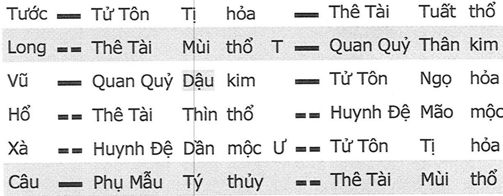

## Đất lún thì tài không vượng

Đây là một tình huống ở năm 2014. Một người nam đoán phong thủy nơi ở, ở ngày Giáp Dần (Tuần Không: Tý Sửu), tháng Thìn, được Sơn Trạch Tổn. (Đã kết hôn, có một con trai.)

| Lục thú | Phục thần | Quái hào | Thế/Ứng |
| :--- | :--- | :--- | :---: |
| Vũ | | ━ Quan Quỷ Dần mộc | Ứ |
| Hổ | | ╍╍ Thê Tài Tý thủy | |
| Xà | | ╍╍ Huynh Đệ Tuất thổ | |
| Câu | Tử Thân | ╍╍ Huynh Đệ Sửu thổ | T |
| Tước | | ━ Quan Quỷ Mão mộc | |
| Long | | ━ Phụ Mẫu Tị hỏa | |

Không có Dụng thần cụ thể, xem tổ hợp biến hóa của toàn quẻ.

Phụ Mẫu thể hiện nhà, Nhật sinh vượng tướng sinh hào Thế, nhà có tác dụng tốt đối với anh, phong thủy không xấu. Nhưng hào Thế Sửu thổ lâm Câu Trần Không Vong, hào Thế cũng thể hiện nơi ở, Câu Trần là kiến trúc, thổ là đất, Không Vong, thổ Không thì sụp, đất đã lún xuống. (Nghiệm)

Thê Tài Tý thủy hưu tù tại hào 5 Không Vong, tài vận không tốt. Vận khí kém, hào Thế Không Vong không thể hợp Thê Tài Tý thủy, đất lún ảnh hưởng đến tài vận. Huynh Đệ trì Thế lâm Câu Trần, Thê Tài hưu tù, có nhiều khoản nợ bên ngoài. (Nghiệm)

Hóa giải: Nuôi một con cá ở phía Bắc.

Ngày 18 tháng 11 năm 2015 phản hồi: Tháng Hợi cá đã chết. Tháng Tý đã được một khoản tiền thưởng, hiện tại đã có tiền tiết kiệm, dự định đủ tiền sẽ mua nhà mới.

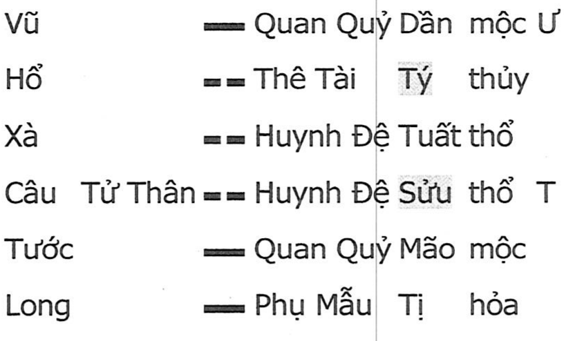

# CHƯƠNG 15

## BẤT LỢI DO VẬT PHẨM TRONG SINH HOẠT GÂY RA

### Do động thổ gây ra

Một học trò của tôi đã mời tôi xem tình huống này vào năm 2016. Con trai ham chơi, trí nhớ không tốt, bất kể là ở trường học hay ở nhà, đều không tập trung. Đoán nguyên nhân, ở ngày Kỷ Mùi (Tuần Không: Tý Sửu), tháng Thìn, được Địa Hỏa Minh Di biến Lôi Hỏa Phong.

| Lục thú | Phục thần | Quái hào | Thế/Ứng | Biến hào |
| :--- | :--- | :--- | :---: | :--- |
| Câu | | ╍╍ Phụ Mẫu Dậu kim | | ╍╍ Quan Quỷ Tuất thổ |
| Tước | | ╍╍ Huynh Đệ Hợi thủy | | ╍╍ Phụ Mẫu Thân kim |
| Long | | ╍╍ Quan Quỷ Sửu thổ | T | ━ Thê Tài Ngọ hỏa |
| Vũ | Tài Ngọ | ━ Huynh Đệ Hợi thủy | | ━ Huynh Đệ Hợi thủy |
| Hổ | | ╍╍ Quan Quỷ Sửu thổ | | ╍╍ Quan Quỷ Sửu thổ |
| Xà | | ━ Tử Tôn Mão mộc | Ư | ━ Tử Tôn Mão mộc |

Trong quẻ Quan Quỷ Sửu thổ tại hào 4 độc phát, thần triệu cơ ở động, độc phát biểu thị nguyên nhân. Hào 4 là cửa, lâm hào thổ độc phát, chính là đã động thổ, Sửu thổ đối ứng Đông Bắc, đã động thổ ở cửa Đông Bắc. (Khi hóa giải phong thủy, đã đặt đất ở cửa)

Về thông tin của con trai, từ hào Tử Tôn có thể thấy rằng, Đằng Xà chủ ham chơi, lâm Đằng Xà Mộ chủ đầu óc lơ mơ, trí nhớ không tốt. Quỷ động bất an, ngoại quái Quan Quỷ Sửu thổ lâm Thanh Long, Thanh Long chủ độc thư[^1], ở trường không thể an định, hào 2 hào trạch Quan Quỷ Sửu thổ ám động, hào 2 là trạch, ở trong nhà cũng không thể an định, đây chính là thông tin không tập trung.

[^1]: Đọc sách – Chỉ việc học hành.

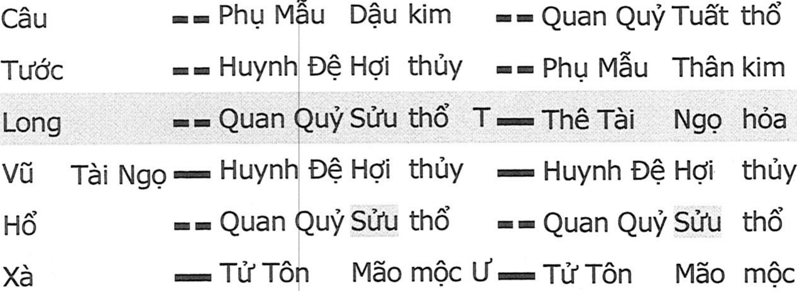

## Cá vàng đùa bông súng

Đây là một tình huống ở năm 2011. Một người nam dự đoán viêm mũi có thể khỏi không? Ngày Kỷ Mùi (Tuần Không: Tý Sửu), tháng Thìn, được Thủy Phong Tỉnh biến Thủy Sơn Kiển.

| Lục thú | Phục thần | Thủy Phong Tỉnh | Thế/Ứng | Thủy Sơn Kiển |
| :--- | :--- | :--- | :---: | :--- |
| Câu | | -- Phụ Mẫu Tý thủy | | -- Phụ Mẫu Tý thủy |
| Tước | | — Thê Tài Tuất thổ | T | — Thê Tài Tuất thổ |
| Long | Tử Ngọ | -- Quan Quỷ Thân kim | | -- Quan Quỷ Thân kim |
| Vũ | | — Quan Quỷ Dậu kim | | — Quan Quỷ Thân kim |
| Hổ | Huynh Dần | — Phụ Mẫu Hợi thủy | Ứ | -- Tử Tôn Ngọ hỏa |
| Xà | | -- Thê Tài Sửu thổ | | -- Thê Tài Thìn thổ |

Lấy hào Thế làm Dụng thần. Hào Thế lâm Chu Tước Thê Tài Tuất thổ tại hào 5 bị Nguyệt xung phá Nhật đến hình, hào 5 là ngũ quan, Chu Tước là viêm, thổ là mũi, hình chủ khó chịu. Tổng hợp lại là viêm mũi dẫn tới khó chịu.

Độc phát chủ tính chất nguyên nhân v.v, cũng xem lưu hướng của ngũ hành. Độc phát Phụ Mẫu Hợi thủy và Dần mộc phục tàng tương hợp, Dần mộc nạp tại Cấn, Cấn là mũi, Hợi thủy chủ dịch, lâm Bạch Hổ chủ máu, chảy nước mũi, chảy máu mũi. Lại thêm hào 2 là trạch, Hợi thủy là cá, hóa Tử Tôn càng là cá, hợp Dần mộc, chủ cỏ nước, trong trạch có cá và cỏ nước bất lợi thân thể. (Đáp: Mũi thường xuyên chảy máu, trong nhà có một cái bát¹, bên trong có một bông súng, có nuôi cá và cỏ nước.)

Hóa giải: Vấn đề là ở đây, cần nhanh chóng loại bỏ vật này đi.

Phản hồi: Sau khi loại bỏ bát bông súng, viêm mũi đã khỏi, hô hấp cũng thông suốt.

---

¹ Bát dùng để khất thực của nhà sư.

## Trong nhà có tượng Phật

Đây là một tình huống ở năm 2011, nữ đoán hài tử da dị ứng có thể khỏi hay không? Ở ngày Mậu Tý (Tuần Không: Ngọ Mùi), tháng Quý Tị, được Sơn Địa Bác.

| Lục thú | Phục thần | Sơn Địa Bác | Thế/Ứng |
| :--- | :--- | :--- | :---: |
| Tước | | — Thê Tài Dần mộc | |
| Long | Huynh Thân | -- Tử Tôn Tý thủy | T |
| Vũ | | -- Phụ Mẫu Tuất thổ | |
| Hổ | | -- Thê Tài Mão mộc | |
| Xà | | -- Quan Quỷ Tị hỏa | Ứ |
| Câu | | -- Phụ Mẫu Mùi thổ | |

Lấy Tử Tôn làm Dụng thần. Tử Tôn lâm Thanh Long, Thanh Long chủ đau ngứa, Kỵ thần lưỡng hiện, Mùi thổ Không Vong lực tiểu, Tuất thổ có lực lượng, Nguyệt sinh vượng tướng khắc Tử Tôn, thổ là da, ngoại quái Cấn là tay, chủ yếu là nghiêm trọng ở tay, thổ tại tháng Tị hỏa vượng mà khô, thổ khắc thủy, chủ da khô vì không đủ nước. Quan Quỷ lâm Nguyệt, tất là bệnh lâu.

Quẻ cung Càn, Càn là thần Phật, Tuất thổ là Mộ khố Quan Quỷ, vượng mà khắc Tử Tôn, chủ trong nhà có tượng thần Phật. Hào 2 Quan Quỷ Tị hỏa trị Nguyệt, hào 2 là trạch, cũng chủ trong nhà có tượng thần Phật, lâm Đằng Xà chủ gia trạch bất an, cần đưa đến tự viện cúng dường, nội quái Khôn, tại hướng Tây Nam trong nhà.

Hóa giải: 1. Đưa tượng Phật vào trong miếu.

2. Đặt một hòn đá dài ở bếp Đông Nam.

Phản hồi: Hài tử có bệnh đã mười năm, từ khi sinh ra đã có. Hướng Tây Nam là phòng của bà nội tôi, ở đó đã tìm thấy một bức tranh Phật và mặt dây chuyền Quan Âm bằng thạch anh. Con chó của nhà tôi nuôi trước đây đã chết, đã lập cho nó một bài vị, tranh Phật và bức ảnh của con chó đều để ở trong phòng của bà nội tôi. Tôi đã đem tranh Phật cùng với giấy báo vứt đi, đồng thời đã đưa mặt dây chuyền Quan Âm vào trong miếu. Đông Nam cũng đã đặt đá dài, lúc đầu thấy bắt đầu có chiều hướng tốt, nhưng đột nhiên có một hôm tàn lửa bắn lên tay của hài tử, da bắt đầu nhiễm trùng, từ cổ lan lên phía trên, trái lại đã nghiêm trọng hơn. (Ghi chú: Không nên vứt tranh Phật đi.)

## Có liên quan đến một sợi dây màu đỏ

Một học trò người Nhật Bản đã hỏi tôi tình huống này vào năm 2020. Bản thân anh ta hay quên, không thể tập trung làm việc, hẹn với người thì lại quên, đã ảnh hưởng nghiệp vụ của công ty, phải xử lý như thế nào? Ở ngày Nhâm Thìn (Tuần Không: Ngọ Mùi), tháng Dần, được Sơn Địa Bác biến Phong Địa Quan.

| Lục thú | Phục thần | Quẻ Sơn Địa Bác | Thế/Ứng | Quẻ Phong Địa Quan |
| :--- | :--- | :--- | :---: | :--- |
| Hổ | | ━ Thê Tài Dần mộc | | ━ Thê Tài Mão mộc |
| Xà | Huynh Thân | ╍╍ Tử Tôn Tý thủy | T | ━ Quan Quỷ Tị hỏa |
| Câu | | ╍╍ Phụ Mẫu Tuất thổ | | ╍╍ Phụ Mẫu Mùi thổ |
| Tước | | ╍╍ Thê Tài Mão mộc | | ╍╍ Thê Tài Mão mộc |
| Long | | ╍╍ Quan Quỷ Tị hỏa | Ứ | ╍╍ Quan Quỷ Tị hỏa |
| Vũ | | ╍╍ Phụ Mẫu Mùi thổ | | ╍╍ Phụ Mẫu Mùi thổ |

Lấy hào Thế làm Dụng thần. Chúng ta hãy xem tình trạng mà anh ta nói có trong quẻ hay không?

Hào Thế là bản thân, lâm Đằng Xà chủ bất an, tâm thần bất ninh, không thể tập trung. Đằng Xà cũng là quên, hóa Quan Quỷ, chủ phiền não.

Hào Thế nhập Mộ tại Nhật thần, đầu óc lơ mơ, không thể nhớ điều gì. Tử Tôn vốn là hào sinh Thê Tài, nay hưu tù nhập Mộ hóa Tuyệt, vô lực sinh Thê Tài, vấn đề thân thể đã ảnh hưởng đến nghiệp vụ.

Ngoài ra, thiên nhân hợp nhất, xem thử xem trong nhà có vật đối ứng hay không. Tử Tôn là hài tử, có liên quan đến hài tử, Đằng Xà là thon dài, hóa Tị hỏa là màu đỏ, Càn là đầu, ở nơi có chiều cao ngang đầu của anh, có quấn hoặc treo một vật giống như sợi dây màu đỏ hay không?

Phản hồi: Có vị trí như vậy đang treo bức ảnh của con trai, trên bức ảnh có buộc một sợi ruy băng màu đỏ.

Hóa giải: Lập tức loại bỏ.

Sau khi loại bỏ, ngực bỗng chốc trở nên nhẹ nhõm.

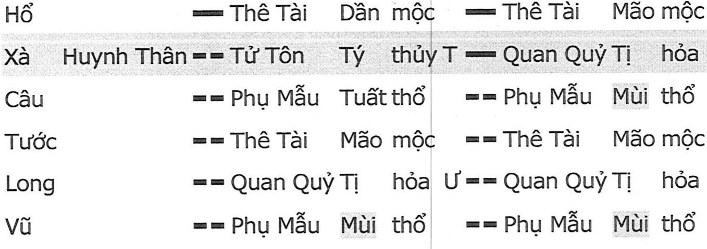

## Họa do đồ tẩy rửa

Đây là một tình huống ở năm 2011. Nam đoán cho con gái thứ hai (25 tuổi), do nghi ngờ có khối u buồng trứng, dự định tháng sau sẽ phẫu thuật, đoán cát hung của việc này? Ở ngày Ất Tị (Tuần Không: Dần Mão), tháng Thân, được Lôi Hỏa Phong.

| Lục thú | Quẻ Lôi Hỏa Phong | Thế/Ứng |
| :--- | :--- | :---: |
| Vũ | ╍╍ Quan Quỷ Tuất thổ | |
| Hổ | ╍╍ Phụ Mẫu Thân kim | T |
| Xà | ━ Thê Tài Ngọ hỏa | |
| Câu | ━ Huynh Đệ Hợi thủy | |
| Tước | ╍╍ Quan Quỷ Sửu thổ | Ứ |
| Long | ━ Tử Tôn Mão mộc | |

Lấy Tử Tôn làm Dụng thần, Tử Tôn Mão mộc không được Nhật Nguyệt sinh phù, trái lại bị Nguyệt khắc là hưu tù. Lâm Thanh Long Không Vong, sợ rằng tương lai sẽ không có khả năng sinh đẻ. Nhật là Bệnh địa, xung Hợi thủy ám động sinh Tử Tôn, mắc bệnh được cứu.

Phân tích nguyên nhân phát bệnh, thứ nhất Dụng thần lâm Thanh Long bị khắc, Thanh Long chủ mỹ dung (làm đẹp), thanh khiết v.v, nhất định có liên quan đến đồ dùng tẩy rửa hằng ngày. Thứ hai Kỵ thần lâm Bạch Hổ tại hào 5, hào 5 là đường, Bạch Hổ là đường, Nguyệt kiến nhập quẻ, Nhật hợp khởi Kỵ thần, nhất định có liên quan đến sự thay đổi của đường xá gần nơi ở.

Ngày 8 tháng 10 năm đó phản hồi: Bệnh viện kiểm tra chứng minh, bệnh tật chủ yếu là do ngày thường đã sử dụng dầu gội, xà phòng và các hóa chất tẩy rửa gây nên. Tháng 4, tháng 5 năm đó, gần nhà có rải nhựa đường. Ngày 3 tháng 9 làm phẫu thuật mở bụng, đã loại bỏ một khối u 10 cm. Trước đây cô ấy làm việc ở thẩm mỹ viện, sau khi phẫu thuật, cô ấy đã nghỉ việc ở ngày 23 tháng 9.

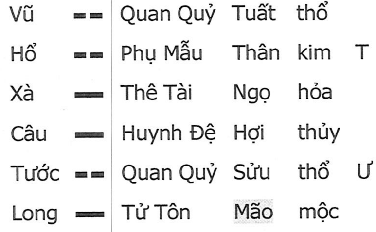

## Bể cá đã bị hỏng

Đây là một tình huống ở năm 2014. Một người nam dự đoán tài vận của cửa hàng. Ở ngày Giáp Dần (Tuần Không: Tý Sửu), tháng Ngọ, được Thủy Địa Tỷ biến Thủy Trạch Tiết.

| Lục thú | Thủy Địa Tỷ | Thế Ứng | Thủy Trạch Tiết |
| :--- | :--- | :---: | :--- |
| Vũ | -- Thê Tài Tý thủy | Ư | -- Thê Tài Tý thủy |
| Hổ | — Huynh Đệ Tuất thổ | | — Huynh Đệ Tuất thổ |
| Xà | -- Tử Tôn Thân kim | | -- Tử Tôn Thân kim |
| Câu | -- Quan Quỷ Mão mộc | T | -- Huynh Đệ Sửu thổ |
| Tước | -- Phụ Mẫu Tị hỏa | | — Quan Quỷ Mão mộc |
| Long | -- Huynh Đệ Mùi thổ | | — Phụ Mẫu Tị hỏa |

Lấy Thê Tài làm Dụng thần. Thê Tài Tý thủy bị Nguyệt xung phá, Nhật không phù, lại Không Vong, thuộc về hưu tù, Huynh Đệ lại đến khắc, tài vận nhất định không tốt. Nguyệt phá ứng gặp hợp, năm 2009 tài vận bắt đầu đi xuống. (Nghiệm)

Thê Tài Tý thủy lâm Huyền Vũ Nguyệt phá, Huyền Vũ chủ thủy, đáng lẽ Tý thủy sinh hào Thế của hào 3, nhưng Nguyệt phá Không Vong không thể sinh, tôi hỏi trong cửa hàng có nuôi cá không, nếu nuôi cá thì bể cá này nhất định phá tổn. (Nghiệm, ngay cửa vào có một bể cá, đúng lúc ở hướng Bắc, khi thay nước cho bể cá, nhân viên không cẩn thận đã làm vỡ bể cá, cũng đã thay bằng một cái mới.)

Thủy là thận, không thể sinh hào Thế của hào 3, hào 3 là thắt lưng, nhất định có sự đối ứng với thân thể, thận thủy bất túc, không thể đến thắt lưng, nhất định đau thắt lưng. Lại thêm Tị hỏa là Bệnh địa của hào Thế, hào 2 là hào cửa hàng, chủ thân thể liên quan mật thiết với phong thủy cửa hàng. (Nghiệm, mấy ngày trước đã đau thắt lưng rất dữ dội)

Hóa giải: Đặt đá ở Tây Nam, bảo người này chỉ nuôi một con cá màu đen, việc kinh doanh đã tốt hơn một chút.

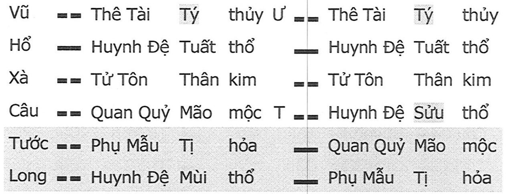

## Bể cá đã khiến tính cách của con gái biến đổi

Đây là một tình huống ở năm 2014. Con gái của một người nữ đột nhiên biến đổi tính cách, bác sĩ nói là dấu hiệu của trầm cảm, đoán do nguyên nhân gì gây ra? Ở ngày Giáp Tý (Tuần Không: Tuất Hợi), tháng Giáp Tuất, được Thủy Thiên Nhu biến Thủy Phong Tỉnh.

| Lục thú | Thủy Thiên Nhu | Thế Ứng | Thủy Phong Tỉnh |
| :--- | :--- | :---: | :--- |
| Vũ | -- Thê Tài Tý thủy | | -- Thê Tài Tý thủy |
| Hổ | — Huynh Đệ Tuất thổ | | — Huynh Đệ Tuất thổ |
| Xà | -- Tử Tôn Thân kim | T | -- Tử Tôn Thân kim |
| Câu | — Huynh Đệ Thìn thổ | | — Tử Tôn Dậu kim |
| Tước | — Quan Quỷ Dần mộc | | — Thê Tài Hợi thủy |
| Long | — Thê Tài Tý thủy | Ư | -- Huynh Đệ Sửu thổ |

Lấy Tử Tôn làm Dụng thần. Tử Tôn Thân kim lâm Đằng Xà, chủ quái dị, Tuất thổ Không Vong, Thìn thổ Nguyệt phá, Nguyên thần là tư duy, tư duy đã biến đổi.

Mục đích của quẻ này là đoán nguyên nhân, hào sơ Thê Tài Tý thủy độc phát hóa hợp, sách nói: Thần triệu cơ ở động, đây là nguyên nhân. Thanh Long là trang sức, Thê Tài là vật thể, lâm thủy là nước, phát động là di động, hợp là chuyển về nguyên địa. Đây là thông tin vại nước, hoặc là bể cá. Tý thủy lâm Nhật vượng tướng, hào sơ lại là hào sủng vật, khả năng cao là bể cá. (Nghiệm, ban đầu trong nhà có một bể cá, chuyển đến chuyển đi, để đâu cũng không cảm thấy thích hợp. Từ lúc đó thì tính cách đã bắt đầu bất thường.)

Huynh Đệ một Không Vong, một Nguyệt phá, chủ không có bạn bè nào. (Hầu như không giao thiệp với người khác.)

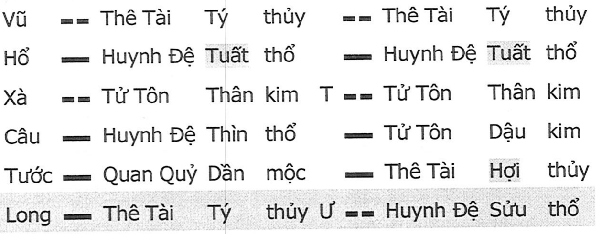

## Quỷ đến từ hình

Đây là một tình huống ở năm 2019. Một người nam cầu đoán, trong mộng có hai nữ nhân đến phát sinh quan hệ với anh ta, đây là mộng giao, nguyên nhân là gì? Ngày Giáp Dần (Tuần Không: Tý Sửu), tháng Sửu, được Lôi Phong Hằng biến Lôi Sơn Tiểu Quá.

| Lục Thú | Phục Thần | Lôi Phong Hằng | Thế Ứng | Lôi Sơn Tiểu Quá |
| :--- | :--- | :--- | :---: | :--- |
| Vũ | | - - Thê Tài Tuất thổ | Ư | - - Thê Tài Tuất thổ |
| Hổ | | - - Quan Quỷ Thân kim | | - - Quan Quỷ Thân kim |
| Xà | | — Tử Tôn Ngọ hỏa | | — Tử Tôn Ngọ hỏa |
| Câu | | — Quan Quỷ Dậu kim | T | — Quan Quỷ Thân kim |
| Tước | Huynh Dần | — Phụ Mẫu Hợi thủy | | - - Tử Tôn Ngọ hỏa |
| Long | | - - Thê Tài Sửu thổ | | - - Thê Tài Thìn thổ |

Không có Dụng thần cụ thể, xem tổ hợp biến hóa của quẻ.

Quan Quỷ Dậu kim trì Thế tại hào 3, hào 5 Quan Quỷ Thân kim bị Nhật thần Dần mộc xung dẫn tới ám động, hào 3 là giường, Quan Quỷ là tà khí, đây là quỷ giao. Hai Quan Quỷ đối ứng hai nữ nhân trong mộng.

Phụ Mẫu Hợi thủy độc phát tiết khí hào Thế, lâu dài nhất định sẽ ảnh hưởng đến thân thể. Hào 2 là trạch, lâm Chu Tước là âm thanh, trong nhà có tiếng động.

Phụ Mẫu là văn thư, tranh chữ, Hợi thủy phản quái là Càn, Càn là châu báu, đồ ngọc. Hóa Tử Tôn Ngọ hỏa, Tử Tôn là ngoạn lạc (chơi đùa), phản quái Ngọ hỏa là Ly là hoa văn. Đây là tượng chơi tranh chữ cổ, độc phát hợp Dần mộc phục tàng, chính là Dần mộc dẫn tới Quan Quỷ ám động, phục tàng là tượng tàng nặc (giấu kín), Dần mộc là Đông Bắc, vật này tại Đông Bắc.

Trên thực tế, ở hướng Đông Bắc đã để đồ sứ cổ có hình mỹ nữ.

Người chuyển phát nhanh gọi cho anh ta nói: Sao tôi nhấn chuông mà trong nhà anh có hai người nữ cứ liên tục hỏi tôi là ai đó? Tôi nói là giao chuyển phát nhanh, nhưng vẫn cứ liên tục hỏi ai đó ai đó, không đến mở cửa, rốt cuộc là chuyện gì đang xảy ra?

Thực ra lúc đó không còn ai ở nhà. Sau khi chuyển đồ sứ cổ đi, mộng giao đã hết, cũng không còn âm thanh nữa. Vật là hình, hóa khí khiến nó như vậy.

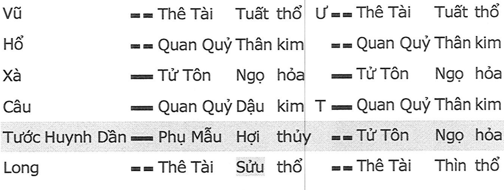

## Trái tim xa cách

Đây là một tình huống ở năm 2014. Một người nữ (trông gần 50 tuổi) đoán hôn nhân, ở ngày Ất Mùi (Tuần Không: Thìn Tị), tháng Mùi, được Đoài Vi Trạch biến Trạch Thiên Quải.

| Lục Thú | Đoài Vi Trạch | Thế Ứng | Trạch Thiên Quải |
| :--- | :--- | :---: | :--- |
| Vũ | - - Phụ Mẫu Mùi thổ | T | - - Phụ Mẫu Mùi thổ |
| Hổ | — Huynh Đệ Dậu kim | | — Huynh Đệ Dậu kim |
| Xà | — Tử Tôn Hợi thủy | | — Tử Tôn Hợi thủy |
| Câu | - - Phụ Mẫu Sửu thổ | Ư | — Phụ Mẫu Thìn thổ |
| Tước | — Thê Tài Mão mộc | | — Thê Tài Dần mộc |
| Long | — Quan Quỷ Tị hỏa | | — Tử Tôn Tý thủy |

Lấy Quan Quỷ làm Dụng thần. Quan Quỷ tại hào sơ, hào Thế tại hào 6, mặc dù Quan Quỷ sinh hào Thế, nhưng hào 6 là thiên, hào sơ là địa, giữa vợ chồng có khoảng cách, cộng thêm Quan Quỷ Không Vong, chính là mạo hợp thần ly.

Hào Ứng là phu vị, độc phát xung hào Thế hóa Không Vong, lâm Câu Trần Huyền Vũ, chủ nam có ngoại tình, có quan hệ ám muội với người nữ khác. Bởi vì Phụ Mẫu là giấy chứng nhận kết hôn, lâm Huyền Vũ gặp Không Vong, thường là ngoại tình. (Nghiệm, quả nhiên chồng ngoại tình, phân cư đã 10 năm)

Sách nói: Thần triệu cơ ở động, Sửu thổ độc phát hóa Thìn thổ Không Vong, Thìn là thủy khố, Câu Trần chủ kiến trúc, phong thủy, thủy khố trong nhà chính là bể cá, Không Vong, trong nhà có bể cá, nhưng bên trong không có cá. (Nghiệm, quả thực có một bể cá không có cá) Xét từ góc độ Phong Thủy Bát Trạch, bể cá là một trong những tiêu chí của ngoại tình.

Thê Tài Mão mộc hưu tù, nhập Mộ tại Nhật Nguyệt, tài vận cũng không tốt, kinh tế gặp vấn đề về dòng tiền. (Nghiệm)

Hào Thế tại hào 6 lâm Huyền Vũ Câu Trần, Huyền Vũ là phiền muộn, Câu Trần là bất động, chủ bản thân tâm trạng không tốt, cuộc sống mệt mỏi, hào Thế là Tài khố, chủ trong lòng nghĩ đến tiền, kiếm tiền là điều duy nhất khiến mình vui vẻ.

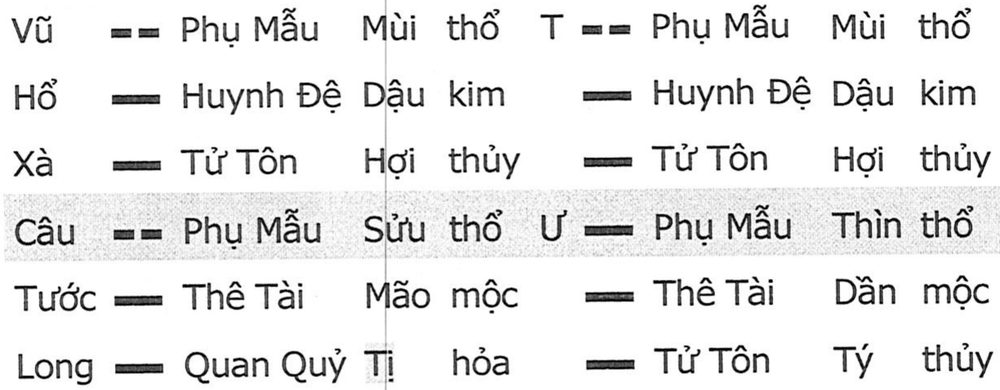

## Nửa đêm hài tử quấy khóc phải làm sao?

Đây là một tình huống ở tháng giêng năm 2014. Học trò của học trò tôi, con trai đêm nào cũng quấy khóc, nửa đêm thức dậy vừa đánh người vừa làm ầm ĩ, không biết phải xử lý như thế nào. Ở ngày Tân Mão (Tuần Không: Ngọ Mùi), tháng Dần, được Hỏa Lôi Phệ Hạp biến Sơn Lôi Di.

| Lục thú | Quẻ Hỏa Lôi Phệ Hạp | Thế/Ứng | Quẻ Sơn Lôi Di |
| :--- | :--- | :---: | :--- |
| Xà | ━ Tử Tôn Tị hỏa | | ━ Huynh Đệ Dần mộc |
| Câu | ╍╍ Thê Tài Mùi thổ | T | ╍╍ Phụ Mẫu Tý thủy |
| Tước | ━ Quan Quỷ Dậu kim | | ╍╍ Thê Tài Tuất thổ |
| Long | ╍╍ Thê Tài Thìn thổ | | ╍╍ Thê Tài Thìn thổ |
| Vũ | ╍╍ Huynh Đệ Dần mộc | Ư | ╍╍ Huynh Đệ Dần mộc |
| Hổ | ━ Phụ Mẫu Tý thủy | | ━ Phụ Mẫu Tý thủy |

Lấy Tử Tôn làm Dụng thần, Tử Tôn Tị hỏa lâm Đằng Xà, Đằng Xà chủ bất an, quấy rầy, lâm hỏa, quấn quýt như ngọn lửa, liên tục quấy rầy. Hào Thế Không Vong, chủ người cầu đoán, tức mẹ của hài tử, rất lo lắng. Tử Tôn được Nhật Nguyệt sinh là vượng tướng, xét về góc độ tính mạng thì không có vấn đề.

Trong quẻ Quan Quỷ Dậu kim độc phát, người xưa nói: Thần triệu cơ ở động, độc phát này chính là nguyên nhân. Độc phát là Tử địa Tử Tôn, trông có vẻ rất hung, nhưng độc phát trước tiên xem lưu hướng của năng lượng, khi không có xung hợp mới xét điều đó.

Quẻ này Quan Quỷ Dậu kim độc phát hợp hào 3 Thìn thổ, Thìn thổ tại nội quái lâm Thanh Long, nội quái là nhà, Thanh Long chủ trang tu, đồ trang trí, đồ trang sức, giải trí, thưởng thức, Thìn thổ là thủy khố, vậy Thìn thổ này chính là bể cá. Dậu kim lâm Chu Tước độc phát hợp Thìn thổ, có hai tượng, kim lâm Chu Tước là âm thanh, hợp Thìn thổ chính là âm thanh có liên quan đến bể cá, biểu thị bể cá này phát ra âm thanh, thứ 2, Tý Ngọ Mão Dậu là tròn, kim là kim loại, chủ trên bể cá có một khối kim loại tròn, hợp Thìn thổ, là che phủ trên bể cá. Quả nhiên, bể cá phát ra âm thanh, bên trên có một miếng kim loại tròn.

Phương pháp hóa giải: Loại bỏ miếng kim loại tròn này đi, sau đó ở phía Tây bể cá đặt một bình hoắc hương chính khí thủy đã mở nắp. Lý do là trực tiếp tựu địa thủ tài (dùng ngay nguyên liệu có ở đó), dùng Tý thủy trong quẻ, lâm Bạch Hổ là thuốc, Tý thủy là một, dùng một bình hoắc hương chính khí thủy, kim Tử tại Tý, do đó đặt dược thủy ở phía Tây bể cá.

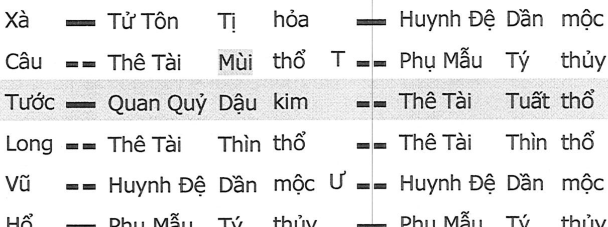

Sau khi hóa giải như vậy, 10:20 sáng ngày hôm sau phản hồi: Hài tử cả đêm không quấy khóc, đến bây giờ (lúc phản hồi) vẫn đang ngủ.

## Trong sân có cây

Đây là một tình huống ở năm 2014. Một người nữ đoán phong thủy gia trạch có ảnh hưởng đến thân thể hay không, ở ngày Giáp Tuất (Tuần Không: Thân Dậu), tháng Giáp Tuất, được Địa Thiên Thái biến Chấn Vi Lôi.

| Lục thú | Phục thần | Quẻ Địa Thiên Thái | Thế/Ứng | Quẻ Chấn Vi Lôi |
| :--- | :--- | :--- | :---: | :--- |
| Vũ | | ╍╍ Tử Tôn Dậu kim | Ư | ╍╍ Huynh Đệ Tuất thổ |
| Hổ | | ╍╍ Thê Tài Hợi thủy | | ╍╍ Tử Tôn Thân kim |
| Xà | | ╍╍ Huynh Đệ Sửu thổ | | ━ Phụ Mẫu Ngọ hỏa |
| Câu | | ━ Huynh Đệ Thìn thổ | T | ╍╍ Huynh Đệ Thìn thổ |
| Tước | Phụ Tị | ━ Quan Quỷ Dần mộc | | ╍╍ Quan Quỷ Dần mộc |
| Long | | ━ Thê Tài Tý thủy | | ━ Thê Tài Tý thủy |

Thân thể xem hào Thế, hào Thế bị Nhật Nguyệt xung phá, là hưu tù, nội quái phục ngâm, chủ thân thể không tốt, tâm trạng phiền muộn, cuộc sống không vui vẻ. Hào Thế Thìn thổ là thủy khố, là thông tin bàng quang, thận, tử cung v.v, Thìn thổ hợp Tử Tôn, lại là Nguyên thần Tử Tôn, là tử cung, lâm Câu Trần là khối u, có u xơ tử cung. (Nghiệm)

Quan Quỷ tại hào 2 khắc hào Thế, hào 2 là trạch, mộc là thực vật, chủ trong sân có cây. Cây này đã ảnh hưởng đến thân thể.

Hào 2 cũng là phu thê vị, Quan Quỷ Dần mộc phát động vượt qua hào 3 hào 4 tương hợp với Thê Tài Hợi thủy ở ngoại quái, hào 3 hào 4 là môn hộ, cây trong sân đã vươn ra bên ngoài, Thê Tài là nữ nhân, cây này cũng đã ảnh hưởng đến vợ chồng, chồng chị đã có người bên ngoài. (Nghiệm)

Hóa giải: Chặt bỏ cây này đi.

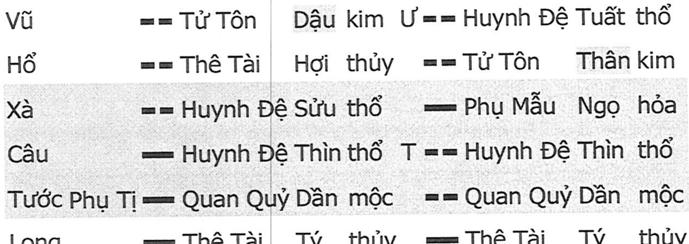

## Họa do kính trên ban công gây ra

Đây là một tình huống ở năm 2015. Một người nữ nói rằng luận văn nghiên cứu sinh của con gái không được nhóm xét duyệt thông qua, hỏi có thể hóa giải để cải biến kết quả hay không? Ngoài ra con gái muốn có hộ khẩu ở lại Bắc Kinh có thể thành công hay không? Ở ngày Bính Thân (Tuần Không: Thìn Tị), tháng Tị, được Thủy Hỏa Ký Tế biến Trạch Hỏa Cách.

| Lục Thú | Phục Thần | Thủy Hỏa Ký Tế | Trạch Hỏa Cách |
| :--- | :--- | :--- | :--- |
| Long | | - - Huynh Đệ Tý thủy Ứ | - - Quan Quỷ Mùi thổ |
| Vũ | | — Quan Quỷ Tuất thổ | — Phụ Mẫu Dậu kim |
| Hổ | | - - Phụ Mẫu Thân kim | — Huynh Đệ Hợi thủy |
| Xà | Tài Ngọ | — Huynh Đệ Hợi thủy T | — Huynh Đệ Hợi thủy |
| Câu | | - - Quan Quỷ Sửu thổ | - - Quan Quỷ Sửu thổ |
| Tước | | — Tử Tôn Mão mộc | — Tử Tôn Mão mộc |

Hai vấn đề đều là hào Phụ Mẫu, lấy Phụ Mẫu làm Dụng thần. Phụ Mẫu Thân kim Nguyệt hợp được khí, lâm Nhật mặc dù vượng tướng, nhưng phát động hóa phá là vấn đề sở tại. Hào 4 là cửa sổ, Huynh Đệ cũng là cửa sổ, gian hào lại là cửa sổ, hỏa là ánh sáng mặt trời, tại Nguyệt là ngoại, chính là ban công, thủy là trong suốt, Nguyệt phá, chính là trên ban công có kính nứt. Tị hỏa xung phá, kính vỡ tại năm Quý Tị 2013. (Nghiệm, quả nhiên, năm 2013 khi lau cửa sổ phát hiện có một tấm kính bị nứt, nhưng vẫn không thay kính mới.)

Tị hỏa vừa xung phá hào biến của Phụ Mẫu Thân kim, vừa xung phá hào Thế là Nguyên thần Tử Tôn, do đó vết nứt này cũng tạo thành ảnh hưởng nhất định đối với từng phương diện.

Hào Thế lâm Đằng Xà, chủ tâm trạng phiền táo, hào 3 là giường cũng chủ ngủ không tốt. (Nghiệm)

Hào Thế cũng lâm Thanh Long, Thanh Long là ẩm thực, hào Thế bị Tài xung phá, Tài là ẩm thực, chủ không muốn ăn. (Nghiệm)

Hỏa xung phá hào thủy, chủ nóng nảy, hơi một tý là nổi giận. Lâm Đằng Xà, chủ cảm xúc không ổn định. Nguyên thần lâm Bạch Hổ, cũng là chủ nóng nảy. (Nghiệm)

Nguyên thần hóa phá không thể sinh hào Thế Hợi thủy, thủy lại Tuyệt tại Nguyệt, bị hỏa xung phá, chủ không ra mồ hôi, có chứng trầm cảm dễ cáu. (Nghiệm)

---

# Part 11 (Pages 201-220)

Hỏa là tim, khắc Nguyên thần, xung phá hào Thế, chủ tim cũng không tốt. (Nghiệm)

Hợi thủy cũng là Nguyên thần của Tử Tôn, chủ tính cách và thân thể của con gái hoàn toàn giống với chị. (Quả nhiên, hoàn toàn giống nhau.)

Nguyên thần hào Thế độc phát lâm Bạch Hổ hóa phá, hợp Tuyệt địa hào Thế trên Nguyệt, lại thêm Hợi thủy tự hình, chủ có phần suy nghĩ không thoáng. (Nghiệm, đã từng muốn nhảy lầu tự sát.)

Thê Tài phục tàng, Huynh Đệ trì Thế, hào Thế bị Tài xung phá, chủ tài vận không tốt.

Nguyệt kiến Tị hỏa là ngoại giới, Thê Tài là nữ nhân, chủ bởi vì ảnh hưởng của nữ nhân bên ngoài, khiến bản thân đau khổ .

Quan Quỷ Tuất thổ là Mộ khố Thê Tài, lại lâm Huyền Vũ, Huyền Vũ là ám muội, chồng có ngoại tình. Bởi vì ngoại tình mà khiến mình đau khổ. Chuyển đổi lục thân, Hợi thủy chính là Thê Tài của Quan Quỷ, Tuất Hợi đồng cung, với hào Thế quan liên, nữ nhân này và quái chủ quen biết nhau. (Nghiệm, tiểu tam chính là đồng nghiệp của quái chủ.)

Bèn bảo người này thay kính và đặt một hòn đá dài có viết chữ "minh" trên ban công.

Ngày 9 tháng 6, nhóm xét duyệt luận văn đột nhiên thay người, luận văn được xét duyệt lại, kết quả là đã được thông qua. (Ngày 10 tháng 6 là thời hạn cuối cùng thông qua luận văn hợp lệ. Trong khi đó hơn 20 luận văn khác cùng đợt với con gái đã bị phủ quyết.) Không lâu sau, cô ấy đã đến Bắc Kinh thăm con gái, trong lúc ăn cơm với một đồng hương, cô ấy đã kể về việc con gái đi xin việc làm ở một công ty, vì là cơ quan nhà nước, có thể nhận được hộ khẩu Bắc Kinh, nhưng đã bị công ty từ chối với lý do là không đúng chuyên ngành. Kết quả, đồng hương này nói rằng cô ấy có mối quan hệ tuyệt đối với lãnh đạo của công ty này, chào hỏi là được, con gái cũng thuận lý thành chương, đã vào được công ty đó, lấy được hộ khẩu Bắc Kinh.

## Ác quỷ lại đến rồi

Đây là một tình huống ở năm 2015. Người này đã từng niệm Địa Tạng Kinh vẫy gọi ma quỷ đến, đã hóa giải xong, nhưng một thời gian sau lại bắt đầu ác mộng liên tục, không thể ngủ, phải xử lý như thế nào? Ở ngày Kỷ Tị (Tuần Không: Tuất Hợi), tháng Ngọ, được Thiên Hỏa Đồng Nhân biến Thiên Phong Cấu.

| Lục thú | Hào | Quẻ Đồng Nhân | Thế/Ứng | Hào | Quẻ Cấu |
| :--- | :---: | :--- | :---: | :---: | :--- |
| Câu | — | Tử Tôn Tuất thổ | Ứ | — | Tử Tôn Tuất thổ |
| Tước | — | Thê Tài Thân kim | | — | Thê Tài Thân kim |
| Long | — | Huynh Đệ Ngọ hỏa | | — | Huynh Đệ Ngọ hỏa |
| Vũ | — | Quan Quỷ Hợi thủy | T | — | Thê Tài Dậu kim |
| Hổ | - - | Tử Tôn Sửu thổ | | — | Quan Quỷ Hợi thủy |
| Xà | — | Phụ Mẫu Mão mộc | | - - | Tử Tôn Sửu thổ |

Lấy hào Thế làm Dụng thần. Hào Thế tại hào 3 lâm Huyền Vũ Không Vong, hào Thế Hợi thủy chủ ban đêm, hào 3 là giường, hưu tù bị khắc lại Không Vong, chủ nằm trên giường không ngủ được.

Hào 2 là trạch, phát động hóa Quan Quỷ Hợi thủy, Quan Quỷ là ác quỷ, hóa thủy Quỷ, chủ trong nhà đã mua sắm vật có liên quan đến thủy. (Nghiệm, bởi vì máy điều hòa khô, đã đặt một chậu nước ở phía Nam trong nhà. Tại sao là phía Nam? Bởi vì nội quái là Ly.)

Hóa giải: Mang theo bên người một con ốc biển, khi ngủ thì để bên cạnh gối. Ngày 25 phản hồi, hôm đó đã tìm được ốc biển, sau khi hóa giải đã ngủ yên.

Sau này hình như người này cũng đã bắt đầu học lục hào.

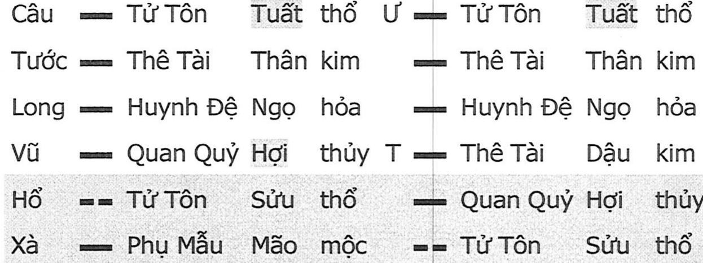

## Chuỗi hạt trên tay gây ra bệnh

Đây là một tình huống ở năm 2015. Một người nam đoán nguyên nhân mắc bệnh của vợ (tuổi Dần). Ở ngày Quý Hợi (Tuần Không: Tý Sửu), tháng Tý, được Địa Sơn Khiêm biến Hỏa Sơn Lữ.

| Lục thú | Phục thần | Hào | Quẻ Khiêm | Thế/Ứng | Hào | Quẻ Lữ |
| :--- | :--- | :---: | :--- | :---: | :---: | :--- |
| Hổ | | - - | Huynh Đệ Dậu kim | | — | Quan Quỷ Tị hỏa |
| Xà | | - - | Tử Tôn Hợi thủy | T | - - | Phụ Mẫu Mùi thổ |
| Câu | | - - | Phụ Mẫu Sửu thổ | | — | Huynh Đệ Dậu kim |
| Tước | | — | Huynh Đệ Thân kim | | — | Huynh Đệ Thân kim |
| Long | Tài Mão | - - | Quan Quỷ Ngọ hỏa | Ứ | - - | Quan Quỷ Ngọ hỏa |
| Vũ | | - - | Phụ Mẫu Thìn thổ | | - - | Phụ Mẫu Thìn thổ |

Lấy Thê Tài làm Dụng thần. Thê Tài Mão mộc phục tàng dưới hào 2 Quan Quỷ Ngọ hỏa, mặc dù Phi thần bị Nguyệt xung phá, nhưng Kỵ thần tam hợp cục đến khắc, bệnh tật không được xem nhẹ.

Quan Quỷ hưu tù Nguyệt phá, đến bệnh viện không tra ra bệnh. (Nghiệm)

Tam hợp cục đến xung khắc, chủ có một toán lực lượng ảnh hưởng đến vợ. Lâm Thanh Long phục tàng, Thanh Long chủ sinh hoạt, chủ không thể sống vui vẻ. Hào 6 là đầu, thần sắc hoảng hốt. (Quả nhiên tâm hoảng, tinh thần hoảng hốt.)

Hào biến Kỵ thần Tị hỏa Nhật phá, Quý Tị thực phá, thành tam hợp cục lâm Bạch Hổ khắc Thê Tài, Bạch Hổ chủ bị thương, chủ năm Quý Tị vợ đã từng bị ngoại thương. (Thực tế lúc nhỏ cổ tay bị thương, tại năm Quý Tị đã phẫu thuật.)

Hào mệnh của vợ hợp hào Thế, tình cảm vợ chồng rất tốt đẹp. (Nghiệm)

Hào 6 là tay, tam hợp kim cục đến khắc, kim chủ thạch chất, Dậu kim là tròn, tam hợp cục là một chuỗi, đoán trên tay vợ anh có một chuỗi hạt như ngọc thạch đã ảnh hưởng đến thân thể của cô ấy. Lại thêm tam hợp cục cũng tại hào biến, chủ ngoài chuỗi hạt đeo trên tay, trong nhà còn có chuỗi hạt tương tự. (Nghiệm, vợ đã gia công nhiều chuỗi hạt, trên tay đeo một chuỗi, trong nhà còn trữ nhiều chuỗi khác.)

Hỏi phải xử lý như thế nào. Tôi nói là hãy tặng cho người khác. Anh ta hỏi nếu không cho người khác, cũng không đeo thì có được không? (Đoán là chuỗi hạt đắt tiền, không nỡ đem tặng) Vậy

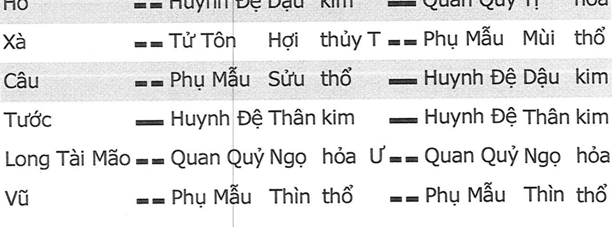 thì trước tiên không đeo, xem thử xem biến hóa như thế nào. (Bởi vì tôi đi công tác ở bên ngoài, người này từ nơi khác chạy đến nhờ tôi dự đoán, do đó tôi không biết rõ người này, về sau không có phản hồi.)

Lại hỏi vận khí bản thân, hào Thế Nhật Nguyệt phù vượng tướng, tam hợp cục đến sinh, thân thể khỏe mạnh, không có vấn đề. (Nghiệm)

Mặc dù hào Thế tại hào 5 là tổ hợp đặc biệt, nhưng Quan Quỷ hưu tù Nguyệt phá, không có quan vận. (Nghiệm)

Thê Tài vượng tướng phục tàng tại hào 2, hào 2 là trạch, Thanh Long chủ phú quý, lại thêm Tử Tôn trì Thế, do đó eo lưng giắt vạn cọc tiền, tài vận rất tốt đẹp. (Nghiệm)

## Loại bỏ tượng Phật thì có thể bán

Đây là một tình huống ở năm 2014. Một người nam muốn bán nhà, đã bán một năm nhưng không có người mua, hỏi giảm giá thì có bán được không? Ngày Giáp Thân (Tuần Không: Ngọ Mùi), tháng Hợi, được Địa Lôi Phục biến Cấn Vi Sơn.

| Lục thú | Phục thần | Địa Lôi Phục | Cấn Vi Sơn |
| :--- | :--- | :--- | :--- |
| Vũ | | - - Tử Tôn Dậu kim | — Quan Quỷ Dần mộc |
| Hổ | | - - Thê Tài Hợi thủy | - - Thê Tài Tý thủy |
| Xà | | - - Huynh Đệ Sửu thổ Ư | - - Huynh Đệ Tuất thổ |
| Câu | | - - Huynh Đệ Thìn thổ | — Tử Tôn Thân kim |
| Tước | Phụ Tị | - - Quan Quỷ Dần mộc | - - Phụ Mẫu Ngọ hỏa |
| Long | | — Thê Tài Tý thủy T | - - Huynh Đệ Thìn thổ |

Lấy Phụ Mẫu làm Dụng thần. Phụ Mẫu Tị hỏa phục tàng dưới hào 2 Quan Quỷ Dần mộc, Nguyệt phá Nhật không phù, hưu tù vô khí, nhà đã cũ nát, hào 2 Dần mộc ám động sinh Phụ Mẫu, hào 2 là trạch, đã từng tu bổ một chút. (Nghiệm, nhà cũ, tường có vấn đề, đã từng tu bổ.)

Thê Tài tam hợp cục trì Thế khắc Phụ Mẫu, lâm Thanh Long, giá quả thực hơi cao, giảm giá mới có thể bán được. Bởi vì giảm giá tương đương với Kỵ thần biến nhược, nhập Mộ tại Huynh Đệ cũng là ý nghĩa giảm giá. Hào 6 Tử Tôn Dậu kim hóa Quan Quỷ Dần mộc sinh Kỵ thần, hợp Huynh Đệ không thể khắc Kỵ thần, hào 6 là hào vị của thần Phật, Quan Quỷ là thần Phật, Dần mộc đối ứng Đông Bắc, ngoại quái biến Cấn cũng là Đông Bắc, hướng Đông Bắc phải chăng

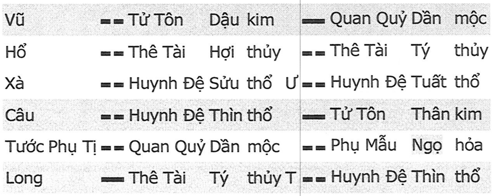 có tượng Phật, bỏ đi là tốt, ảnh hưởng bán nhà. (Nghiệm, trên tủ lạnh Đông Bắc có đặt một pho tượng Phật.)

Sau khi bỏ tượng và viết bảng hiệu giảm giá, đã có người liên hệ mua nhà, sau đó đã bán được ở ngày Nhâm Thân tháng Tý.

## Đầu giường có cốc giữ nhiệt

Đây là một tình huống ở năm 2017. Khách hàng của học trò tôi muốn hóa giải, đúng lúc tôi có mặt ở đó, liền bảo tôi hóa giải tài vận, ở ngày Ất Mão (Tuần Không: Tý Sửu), tháng Mão, được Khảm Vi Thủy biến Phong Địa Quan.

| Lục thú | Khảm Vi Thủy | Phong Địa Quan |
| :--- | :--- | :--- |
| Vũ | - - Huynh Đệ Tý thủy T | — Tử Tôn Mão mộc |
| Hổ | — Quan Quỷ Tuất thổ | — Thê Tài Tị hỏa |
| Xà | - - Phụ Mẫu Thân kim | - - Quan Quỷ Mùi thổ |
| Câu | - - Thê Tài Ngọ hỏa Ư | - - Tử Tôn Mão mộc |
| Tước | — Quan Quỷ Thìn thổ | - - Thê Tài Tị hỏa |
| Long | - - Tử Tôn Dần mộc | - - Quan Quỷ Mùi thổ |

Lấy Thê Tài làm Dụng thần. Mặc dù là hóa giải tài vận nhưng không thể không làm phán đoán giản đơn.

Thê Tài Ngọ hỏa Nhật Nguyệt sinh vượng tướng, tài vận lẽ ra rất tốt, nhưng Thế tại hào 6 lâm Huyền Vũ Huynh Đệ phát động hóa Tử Tôn, hào 6 là đầu, Tử Tôn chủ sinh Tài, Huyền Vũ chủ đầu cơ, Huynh Đệ Huyền Vũ là đánh bạc, hợp đồng tương lai, mua bán cổ phiếu v.v, Không Vong nhập Mộ Thìn thổ của hào 2, Không Vong phát động chủ lâng lâng phơi phới, nhập Mộ chủ đầu óc lơ mơ, tham mà không thể thu tay, đã thua lỗ. (Quả nhiên, cô ấy cho biết mình làm hợp đồng tương lai, lúc đầu mọi lần đều kiếm được tiền, đáng lẽ thu tay là được rồi, nhưng lòng tham vô đáy, kết quả là đã thua lỗ. Nhưng trong lòng biết rõ, không thể tự thoát ra được. Đã không nghe theo khuyến cáo của người khác. Làm xong thì hối hận.)

Phương pháp hóa giải: Bảy sợi dây đỏ, gắn hai đầu thành hình vòng, mang theo bên người, ở phía Tây của bếp đặt một viên đá hình tròn.

Ban đầu tôi vẫn thắc mắc huyền cơ của hào 2 Thìn thổ này phát động đối ứng với cái gì? Kết quả, cô ấy hỏi, hòn đá tròn đặt ở chỗ tôi ở hay là chỗ bạn trai ở? Nghe tới đây, tôi liền phán đoán, đầu giường của bạn trai chị có để một cái cốc giữ nhiệt, cần đem cái

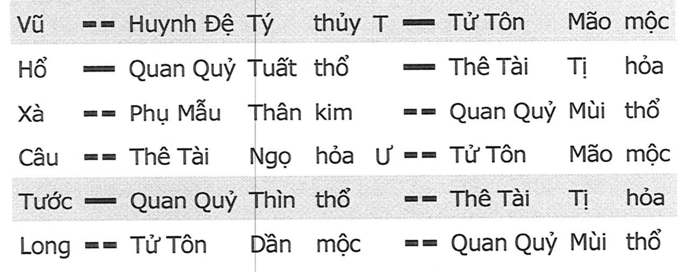 cốc này đi, điều này cũng ảnh hưởng đến chị. Đá thì đặt ở chỗ bạn trai. Cô ấy nói bạn trai mỗi tối đều uống nước nóng, không rời được cốc giữ nhiệt. Tôi nói dời đến cuối giường là được.

Tại sao phán đoán như vậy? Bởi vì Quan Quỷ Thìn thổ lâm Chu Tước hóa ra Thê Tài Tị hỏa khiến hào Thế nhập Mộ. Quan Quỷ chính là bạn trai, Thìn thổ là thủy khố chính là vật đựng nước, lâm Chu Tước là nhiệt, hoặc là có liên quan đến ẩm thực, hóa ra Thê Tài hỏa, Thê Tài là ẩm thực, hỏa là nhiệt, chính là nước nóng. Thê Tài Tị hỏa trở về quẻ tại hào 3, hào 3 là giường, mà khiến hào 6 nhập Mộ, hào 6 là đầu, liên tưởng trong sinh hoạt rất nhiều người có thói quen đặt đồ vật ở tủ đầu giường, chính là đã đặt cốc giữ nhiệt ở đầu giường.

## Van nước của nhà anh đã xảy ra vấn đề

Đây là một tình huống ở năm 2017. Một người nữ đoán niệu tố đạm trong thận cao do nguyên nhân gì? Ở ngày Bính Ngọ (Tuần Không: Dần Mão), tháng Tị, được Hỏa Lôi Phệ Hạp biến Sơn Hỏa Bí.

| Lục thú | Hỏa Lôi Phệ Hạp | Sơn Hỏa Bí |
| :--- | :--- | :--- |
| Long | — Tử Tôn Tị hỏa | — Huynh Đệ Dần mộc |
| Vũ | - - Thê Tài Mùi thổ T | - - Phụ Mẫu Tý thủy |
| Hổ | — Quan Quỷ Dậu kim | - - Thê Tài Tuất thổ |
| Xà | - - Thê Tài Thìn thổ | — Phụ Mẫu Hợi thủy |
| Câu | - - Huynh Đệ Dần mộc Ư | - - Thê Tài Sửu thổ |
| Tước | — Phụ Mẫu Tý thủy | — Huynh Đệ Mão mộc |

Lấy hào Thế làm Dụng thần. Hào Thế Nhật Nguyệt sinh vượng tướng, trong quẻ hai hào động, lại thêm thế thân hào Thế phát động, hào động lại hóa thổ, thổ có phần quá nhiều, vật cực tất phản, cần điều trị kịp thời.

Hào Thế quá vượng, hỏa là Kỵ thần, thân thể rất dễ hỏa vượng. Luận về Trung y, chức năng hóa khí của thận đã yếu, dẫn tới tâm thận bất giao. (Nghiệm)

Sách nói: Thần triệu cơ ở động. Hai hào động rất quan trọng. Thông thường vấn đề về thận thường đối ứng với vật trong nhà có liên quan đến thủy, Thìn thổ lâm Đằng Xà phát động hóa Hợi thủy, Thìn thổ là thủy khố, Đằng Xà là vật thon dài, chính là ống dẫn nước, hóa phá chính là ống dẫn đã nứt, hóa thủy thì rỉ nước. Thủy hưu tù không phải là rỉ nước lớn. Mà Quan Quỷ Dậu kim hợp Thìn thổ, Quan Quỷ là quản lý, hóa Tuất, Tuất phản quái là Càn, Càn cũng là lãnh đạo, quản lý, hợp Thìn thổ chính là quản lý đường ống,

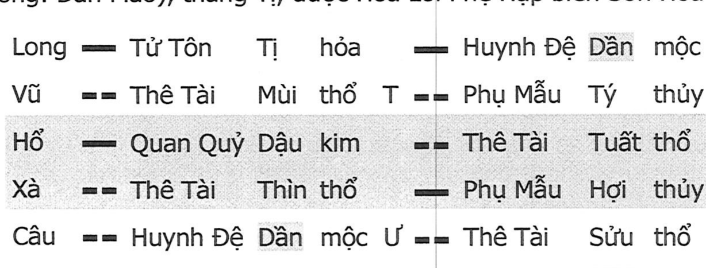 vậy thì đó là van. Biểu thị vấn đề xảy ra ở van đường ống. Huyền Vũ di thần qua, chính là vết gỉ loang lổ, xử lý xong thì thân thể dễ điều trị. (Nghiệm, hoàn toàn phù hợp thực tế.)

## Mau làm sạch máy hút khói

Một học trò đã hỏi tôi tình huống này vào năm 2017. Mẹ vợ anh ta bị chóng mặt, hỏi có phải do thiếu máu hay không? Ở ngày Mậu Thân (Tuần Không: Dần Mão), tháng Tị, được Lôi Trạch Quy Muội biến Địa Trạch Lâm.

| Lục thú | Lôi Trạch Quy Muội | Địa Trạch Lâm |
| :--- | :--- | :--- |
| Tước | - - Phụ Mẫu Tuất thổ Ư | - - Huynh Đệ Dậu kim |
| Long | - - Huynh Đệ Thân kim | - - Tử Tôn Hợi thủy |
| Vũ | — Quan Quỷ Ngọ hỏa | - - Phụ Mẫu Sửu thổ |
| Hổ | - - Phụ Mẫu Sửu thổ T | - - Phụ Mẫu Sửu thổ |
| Xà | — Thê Tài Mão mộc | — Thê Tài Mão mộc |
| Câu | — Quan Quỷ Tị hỏa | — Quan Quỷ Tị hỏa |

Lấy Phụ Mẫu làm Dụng thần. Phụ Mẫu lưỡng hiện, Bạch Hổ là bệnh, lấy Phụ Mẫu Sửu thổ trì Thế lâm Bạch Hổ làm Dụng thần. Quan Quỷ Ngọ hỏa độc phát lâm Huyền Vũ Câu Trần hóa Phụ Mẫu, Phụ Mẫu vượng tướng, không cần đến sinh, độc phát này nhất định là biểu thị nguyên nhân.

Hỏa là bếp lò, tại ngoại quái thường là ống khói, nhưng xã hội hiện nay sống ở tòa nhà, chính là máy hút khói, ống thoát khói. Huyền Vũ chủ bẩn thỉu, Câu Trần chủ ứ đọng, hợp lại là nhiều dầu mỡ, do đó tôi phán đoán máy hút khói đã lâu chưa lau chùi. Máy hút khói ở phía trên đầu người, nhà bếp thể hiện nữ nhân, ngoài ra một Phụ Mẫu Tuất thổ tại hào 6, hào 6 là đầu, Tuất thổ là Mộ khố Quan Quỷ, Ngọ hỏa là nhiều dầu mỡ, do đó trong đầu nhất định mỡ máu cao. (Quả nhiên, máy hút khói rất nhiều dầu mỡ.)

Mau làm sạch máy hút khói, con người cùng một nhịp thở với tự nhiên, rất nhiều thân thể đều có đối ứng, nếu hiểu đạo lý này, căn cứ tổ hợp lục hào phán đoán, hết sức linh nghiệm.

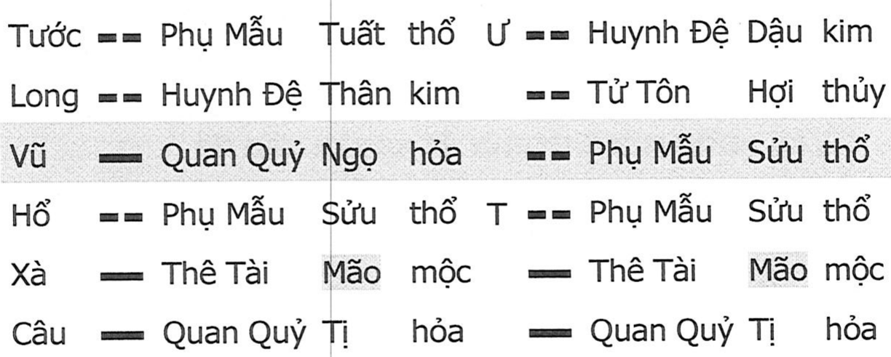

# CHƯƠNG 16

## BẤT LỢI DO ĐÃ LÀM MỘT VIỆC GÌ ĐÓ GÂY NÊN

### Con trai đã biết cười

Đây là một tình huống ở năm 2016. Một người nam có con trai hơn một tuổi, gọi tên dường như không nghe thấy, không có phản ứng, cũng không nói năng, hóa giải như thế nào? Ở ngày Mậu Thìn (Tuần Không: Tuất Hợi), tháng Nhâm Thìn, được Thiên Phong Cấu biến Càn Vi Thiên.

| Lục thú | Phục thần | Thiên Phong Cấu | Thế/Ứng | Càn Vi Thiên |
| :--- | :--- | :--- | :---: | :--- |
| Tước | | — Phụ Mẫu Tuất thổ | | — Phụ Mẫu Tuất thổ |
| Long | | — Huynh Đệ Thân kim | | — Huynh Đệ Thân kim |
| Vũ | | — Quan Quỷ Ngọ hỏa | Ư | — Quan Quỷ Ngọ hỏa |
| Hổ | | — Huynh Đệ Dậu kim | | — Phụ Mẫu Thìn thổ |
| Xà | Tài Dần | — Tử Tôn Hợi thủy | | — Thê Tài Dần mộc |
| Câu | | - - Phụ Mẫu Sửu thổ | T | — Tử Tôn Tý thủy |

Lấy Tử Tôn làm Dụng thần. Tử Tôn Hợi thủy nhập Mộ tại Nhật Nguyệt, chủ hài tử tự bế. Sửu thổ độc phát, kim nhập Mộ không thể sinh Tử Tôn, kim là âm thanh, chính là không nghe thấy người khác nói, cũng chủ sự chú ý nằm ở nơi khác.

Tử Tôn Hợi thủy Không Vong lâm Đằng Xà, thủy Không thì chảy là động thái, Đằng Xà chủ chơi đùa, hài tử đã chơi với đồ vật có liên quan đến thủy, độc phát hóa Tý thủy hồi đầu hợp, độc phát chủ nguyên nhân. Nhất định là đã động vật có liên quan đến thủy. (Nghiệm, đã cho hài tử chơi với một bình nước khoáng, lăn qua lăn lại.)

Hóa giải: Đông Bắc đặt một hòn đá, Tây Bắc đặt mười sáu hạt đậu. Sau khi hóa giải, ở ngày Giáp Tuất, hài tử đột nhiên ê a bắt đầu học nói, đã biết cười với người lớn. Sau này tôi đã gặp hài tử, hài tử đã hết sức bình thường, còn quái chủ cũng đã thành lập công ty phục hồi trẻ em, bắt đầu giúp người điều trị cho những trẻ em tương tự.

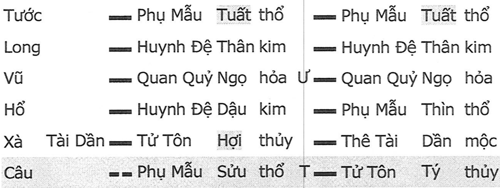

## Tại sao da phát ban?

Đây là một tình huống ở mùa hè năm 2015. Một người nam đột nhiên toàn thân phát ban, đau không chịu nổi, bèn gieo quẻ đoán xem là do nguyên nhân gì, ngày Kỷ Tị (Tuần Không: Tuất Hợi), tháng Ngọ, được Trạch Hỏa Cách biến Trạch Sơn Hàm.

| Lục thú | Phục thần | Trạch Hỏa Cách | Thế/Ứng | Trạch Sơn Hàm |
| :--- | :--- | :--- | :---: | :--- |
| Câu | | - - Quan Quỷ Mùi thổ | | - - Quan Quỷ Mùi thổ |
| Tước | | — Phụ Mẫu Dậu kim | | — Phụ Mẫu Dậu kim |
| Long | | — Huynh Đệ Hợi thủy | T | — Huynh Đệ Hợi thủy |
| Vũ | Tài Ngọ | — Huynh Đệ Hợi thủy | | — Phụ Mẫu Thân kim |
| Hổ | | - - Quan Quỷ Sửu thổ | | - - Thê Tài Ngọ hỏa |
| Xà | | — Tử Tôn Mão mộc | Ư | - - Quan Quỷ Thìn thổ |

Lấy hào Thế làm Dụng thần, hào Thế lâm Thanh Long, Thanh Long chủ đau ngứa, phù hợp với thực tế. Hào Thế mặc dù không được Nhật Nguyệt sinh phù hưu tù, nhưng lâm Không Vong, bệnh gần gặp Không thì khỏi, vấn đề không nghiêm trọng, mục đích của gieo quẻ chủ yếu là hỏi nguyên nhân, do đó trọng điểm của dự đoán vẫn là xem độc phát.

Tử Tôn Mão mộc lâm hào sơ độc phát hóa Quan Quỷ Thìn thổ, hào sơ là mặt đất, Mão mộc hưu tù là cỏ, Đằng Xà chủ uốn lượn, tạp loạn, đó là cỏ dại, Quan Quỷ là bệnh, phát ban là do cỏ dại trên mặt đất gây ra.

Người đó đáp: Hôm qua (ngày Mậu Thìn) đã làm lao động nghĩa vụ, đã đến công viên để giúp dọn cỏ. Vậy thì nhất định là bị một số cỏ gây dị ứng, hoặc bị côn trùng trong cỏ cắn dẫn tới phát ban. Sau đó đã đến bệnh viện để khám, bác sĩ cho biết là do côn trùng cắn gây ra, sau khi bôi một chút thuốc mỡ thì đã khỏi.

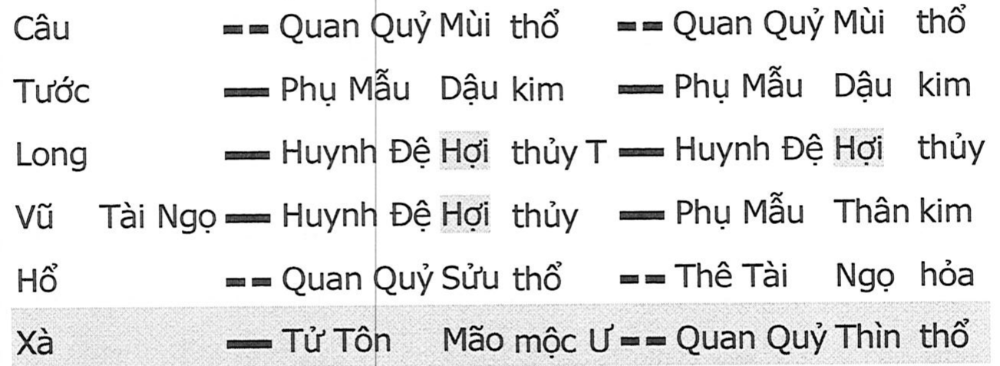

## Thì ra đã không còn vật hóa giải

Đây là một tình huống ở năm 2015 được chuyển đến để dự đoán thông qua học trò của tôi. Nữ dự đoán về việc chồng bị ủy ban kiểm tra kỷ luật dẫn đi, hỏi cát hung sẽ ra sao? Ở ngày Kỷ Mùi (Tuần Không: Tý Sửu), tháng Thìn, được Phong Lôi Ích biến Phong Trạch Trung Phu.

| Lục thú | Phục thần | Phong Lôi Ích | Phong Trạch Trung Phu |
| :--- | :--- | :--- | :--- |
| Câu | | — Huynh Đệ Mão mộc Ư | — Huynh Đệ Mão mộc |
| Tước | | — Tử Tôn Tị hỏa | — Tử Tôn Tị hỏa |
| Long | | - - Thê Tài Mùi thổ | - - Thê Tài Mùi thổ |
| Vũ | Quan Dậu | - - Thê Tài Thìn thổ T | - - Thê Tài Sửu thổ |
| Hổ | | - - Huynh Đệ Dần mộc | — Huynh Đệ Mão mộc |
| Xà | | — Phụ Mẫu Tý thủy | — Tử Tôn Tị hỏa |

Lấy Quan Quỷ làm Dụng thần. Quan Quỷ Dậu kim phục tàng, đây là thông tin chồng đã không còn ở nhà. Nhật Nguyệt sinh Quan Quỷ vốn là vượng tướng, chủ cát. Nhưng hào 2 Dần mộc độc phát hóa Tiến thần, chủ không cát. Độc phát là Tuyệt địa Dụng thần, lâm Bạch Hổ, Bạch Hổ là pháp luật, lâm Câu Trần chủ lao ngục, sách nói rằng: Thần triệu cơ ở động, khó tránh tai họa lao ngục.

Xem kỹ quẻ này, bởi vì mộc ở hào trạch hóa Tiến thần, đoán là gần đây có gia cụ bằng gỗ trong nhà đã bị di chuyển, hoặc là đã bị vứt bỏ. Người đó đáp là không có.

Dần mộc không vượng tướng, như vậy là vật bằng gỗ nhỏ. Người đó đáp, cách đây hai tháng, chồng cô ấy cũng đã nhờ tôi dự đoán và hóa giải thông qua học trò của tôi, lúc đó ủy ban kiểm tra kỷ luật đã liên tục nói chuyện với chồng cô ấy trong một tháng, sau mỗi buổi nói chuyện thì đều cho anh ta về nhà, tôi đã dặn bọn họ đặt ba cành cây ở phía đông của căn nhà, sau khi đặt, ủy ban kiểm tra kỷ luật đã không còn tìm anh ta nữa. Sau hai tháng, nghĩ rằng đã vô sự, ai ngờ người ta đột nhiên đến dẫn chồng cô ấy đi và không cho trở về nữa. Do đó người vợ đã đến dự đoán.

Sau đó được phản hồi, bởi vì người giúp việc đã đến quét dọn vệ sinh, tưởng rằng những cành cây đặt ở phía đông là rác, liền vứt những cành cây hóa giải đó đi, kết quả là ngày hôm sau thì chồng cô ấy đã bị ủy ban kiểm tra kỷ luật dẫn đi. Sau này đã bị tuyên án.

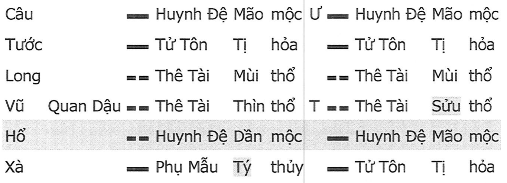

## Táng lễ dẫn tới ác mộng

Đây là một tình huống ở năm 2016. Một người nữ đoán thân thể, ở ngày Đinh Sửu (Tuần Không: Thân Dậu), tháng Thìn, được Phong Thủy Hoán biến Thiên Thủy Tụng.

| Lục thú | Phục thần | Phong Thủy Hoán | Thiên Thủy Tụng |
| :--- | :--- | :--- | :--- |
| Long | | — Phụ Mẫu Mão mộc | — Tử Tôn Tuất thổ |
| Vũ | | — Huynh Đệ Tị hỏa T | — Thê Tài Thân kim |
| Hổ | Tài Dậu | - - Tử Tôn Mùi thổ | — Huynh Đệ Ngọ hỏa |
| Xà | Quan Hợi | - - Huynh Đệ Ngọ hỏa | - - Huynh Đệ Ngọ hỏa |
| Câu | | — Tử Tôn Thìn thổ Ư | — Tử Tôn Thìn thổ |
| Tước | | - - Phụ Mẫu Dần mộc | - - Phụ Mẫu Dần mộc |

Lấy hào Thế làm Dụng thần. Hào Thế không được Nhật Nguyệt phù là hưu tù, nhưng cũng không bị khắc, không phải là bệnh nguy hiểm. Hào Thế lâm Huyền Vũ, thứ nhất tâm trạng dồn nén, thứ hai có thể là âm khí nặng nề. Cần xem toàn thể tổ hợp.

Người xưa nói: Thần triệu cơ ở động. Độc phát chính là huyền cơ. Tử Tôn Mùi thổ lâm Bạch Hổ Câu Trần độc phát, độc phát trước xem xung hợp, sau xem sinh khắc, hợp hào 3 Ngọ hỏa, hào 3 Ngọ hỏa lâm Đằng Xà, hào 3 là giường. Đằng Xà là mộng, chủ nằm ngủ bất an, ác mộng liên tục. (Nghiệm, mơ thấy ăn thịt người chết.) Độc phát sinh Thê Tài Bạch Hổ, Thê Tài chủ ẩm thực, Bạch Hổ chủ tử vong, Không Vong là hư huyễn, chính là thông tin này.

Nguyên thần hào Thế nhập Mộ tại độc phát, Nguyên thần chủ tư duy, tinh thần, hưu tù nhập Mộ, hào sơ hào 6 là chân, chủ toàn thân trên dưới không có tinh thần, không có sức lực. (Nghiệm)

Phụ Mẫu là trưởng bối, nhập Mộ tại độc phát, Bạch Hổ là tử vong, Câu Trần chủ phần địa, là có trưởng bối hạ táng, xem ra là do đã tham dự táng lễ của trưởng bối gây ra. (Nghiệm, đã về quê tham dự táng lễ trưởng bối của chồng. Đột nhiên không có tinh thần, bắt đầu ác mộng.)

Hóa giải: Mang theo bên người ba lá cỏ và tám cây tăm xỉa răng. Sau khi hóa giải, bệnh trạng đã biến mất.

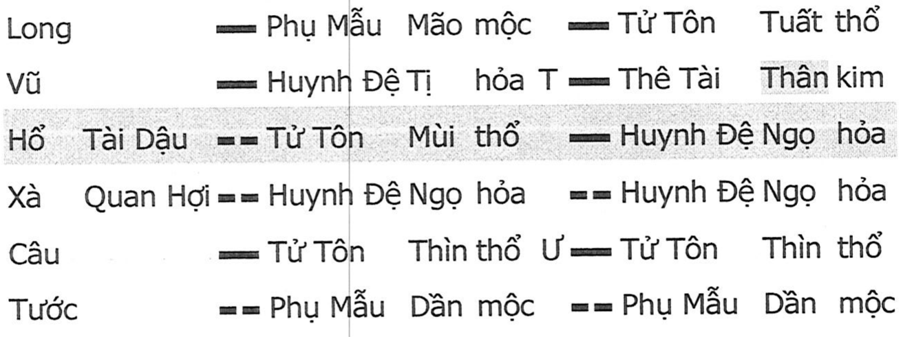

## Chuyện gì đã xảy ra với mèo con?

Đây là một tình huống ở năm 2011. Mèo con trong nhà đột nhiên không ăn không uống, đã nôn mửa suốt đêm, đoán nguyên nhân là gì? Ở ngày Giáp Tuất (Tuần Không: Thân Dậu), tháng Tị, được Đoài Vi Trạch biến Địa Thiên Thái.

| Lục thú | Đoài Vi Trạch | Địa Thiên Thái |
| :--- | :--- | :--- |
| Vũ | - - Phụ Mẫu Mùi thổ T | - - Huynh Đệ Dậu kim |
| Hổ | — Huynh Đệ Dậu kim | - - Tử Tôn Hợi thủy |
| Xà | — Tử Tôn Hợi thủy | - - Phụ Mẫu Sửu thổ |
| Câu | - - Phụ Mẫu Sửu thổ Ứ | — Phụ Mẫu Thìn thổ |
| Tước | — Thê Tài Mão mộc | — Thê Tài Dần mộc |
| Long | — Quan Quỷ Tị hỏa | — Tử Tôn Tý thủy |

Lấy hào Tử Tôn làm Dụng thần. Tử Tôn Hợi thủy Nguyệt phá Nhật khắc là vô căn, trong quẻ Kỵ thần lưỡng hiện, Tử Tôn động hóa hồi đầu khắc, Kỵ thần phát động hóa Tiến thần, là Kỵ thần quá vượng. Nguyên thần Dậu kim phát động đến sinh, trái lại không hỷ, may mà Nguyên thần Không Vong hóa phá, trong hung có cứu, có bệnh cũng không sao. Quẻ cung Đoài, Đoài là miệng, Dụng thần Tử Tôn Hợi thủy lâm Đằng Xà, Đằng Xà chủ dị dạng, nhất định là do mèo con đã ăn thứ gì đó đặc biệt gây ra.

Ngày 23 tháng 5 (Mậu Dần) đã đưa mèo con vào bệnh viện thú y, ngày 24 chụp X quang, phát hiện mèo con đã nuốt một cục bông, đã tắc trong tràng vị. Ngày 25 (Canh Thìn), dị vật và đại tiện cùng được thải ra, ngày 26 mèo con xuất viện.

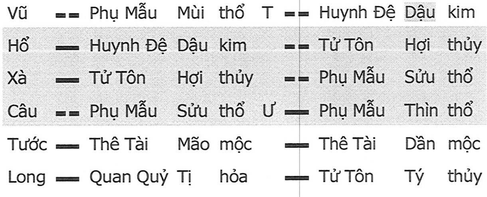

## Tắm rửa đã bị cảm lạnh

Đây là một tình huống ở năm 2009. Một người nữ đoán mình đau vai, ở ngày Giáp Tuất (Tuần Không: Thân Dậu), tháng Tị, được Thủy Thiên Nhu biến Địa Trạch Lâm.

| Lục thú | Phục thần | Thủy Thiên Nhu | Địa Trạch Lâm |
| :--- | :--- | :--- | :--- |
| Vũ | | - - Thê Tài Tý thủy | - - Tử Tôn Dậu kim |
| Hổ | | — Huynh Đệ Tuất thổ | - - Thê Tài Hợi thủy |
| Xà | | - - Tử Tôn Thân kim T | - - Huynh Đệ Sửu thổ |
| Câu | | — Huynh Đệ Thìn thổ | - - Huynh Đệ Sửu thổ |
| Tước | Phụ Tị | — Quan Quỷ Dần mộc | — Quan Quỷ Mão mộc |
| Long | | — Thê Tài Tý thủy Ứ | — Phụ Mẫu Tị hỏa |

Lấy hào Thế làm Dụng thần. Hào Thế Nguyệt khắc Nhật sinh, suy vượng tương đương. Trong quẻ Nguyên thần lưỡng động, hào 5 Tuất thổ hóa Hợi thủy Nguyệt phá là bất túc, hào 3 Thìn thổ hóa thoái cũng là bất túc. Hào Thế Không Vong không được Nguyên thần đến sinh lại là bất túc.

Hai hào động mặc dù đều sinh hào Thế, nhưng bất túc, chính là nguyên nhân. Thìn thổ là thủy khố, chủ phòng tắm, Tuất thổ là hỏa khố hóa Hợi thủy, bởi vì thủy mà phá, Hợi thủy trở lại trong quẻ một lâm Huyền Vũ, một lâm Thanh Long, Huyền Vũ là thủy, Thanh Long chủ làm đẹp, sạch sẽ, chính là do tắm rửa gây ra.

Hóa giải: Thân kim Đằng Xà đối ứng dây chuyền, đeo một sợi dây chuyền trên cổ, khiến Thân kim xuất Không, từ đó có thể được sinh bởi hai hào động.

Phản hồi, hai ngày trước, ngày 27 tháng 5, đã đi tắm suối nước nóng, sau khi trở về thì bắt đầu đau vai. Thực tế là khi tắm suối nước nóng thì lỗ chân lông mở ra, khí lạnh nhập thể dẫn tới bệnh. Sau đó đã khỏi bệnh ở ngày 5 tháng 6.

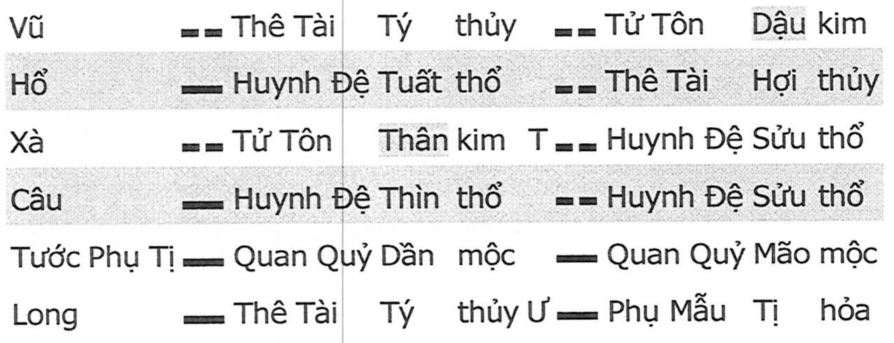

## Do tai vào nước gây ra

Đây là một tình huống ở năm 2008. Một người nam dự đoán thân thể của mình. Ở ngày Bính Dần (Tuần Không: Tuất Hợi), tháng Hợi, được Trạch Hỏa Cách biến Lôi Hỏa Phong.

| Lục thú | Phục thần | Trạch Hỏa Cách | Lôi Hỏa Phong |
| :--- | :--- | :--- | :--- |
| Long | | - - Quan Quỷ Mùi thổ | - - Quan Quỷ Tuất thổ |
| Vũ | | — Phụ Mẫu Dậu kim | - - Phụ Mẫu Thân kim |
| Hổ | | — Huynh Đệ Hợi thủy T | — Thê Tài Ngọ hỏa |
| Xà | Tài Ngọ | — Huynh Đệ Hợi thủy | — Huynh Đệ Hợi thủy |
| Câu | | - - Quan Quỷ Sửu thổ | - - Quan Quỷ Sửu thổ |
| Tước | | — Tử Tôn Mão mộc Ư | — Tử Tôn Mão mộc |

Lấy hào Thế làm Dụng thần. Hào Thế Hợi thủy được Nguyệt kiến phù không coi là hưu tù. Nhật cũng không khắc, không có bệnh lớn. Nhưng hào Thế lâm Bạch Hổ, Bạch Hổ là bệnh, hào Thế Không Vong không được Nguyên thần đến sinh, Nguyên thần phát động hóa thoái chính là vấn đề.

Quẻ cung Khảm, Khảm là tai, kim chủ âm thanh, chủ ù tai, điếc. Dậu kim là Mộc Dục địa của hào Thế, lâm Huyền Vũ, Huyền Vũ chủ thủy, nhất định là do tai đã vào nước khi tắm rửa gây ra. Nhật xung hào biến Thân kim, Thoái thần gặp xung mà dừng.

Thủy Không thì chảy, hào Thế Hợi thủy bị Nhật hợp, hợp là vướng chân, chủ trong tai có nước không chảy ra.

Hóa giải: Dùng bông gòn vê thành sợi thon dài, lấy tượng Tị hỏa, chọc vào tai, xung khai Hợi thủy bị Nhật hợp, xung thực hào Thế, hút khô nước là được. Làm như vậy, quả nhiên đã khỏi.

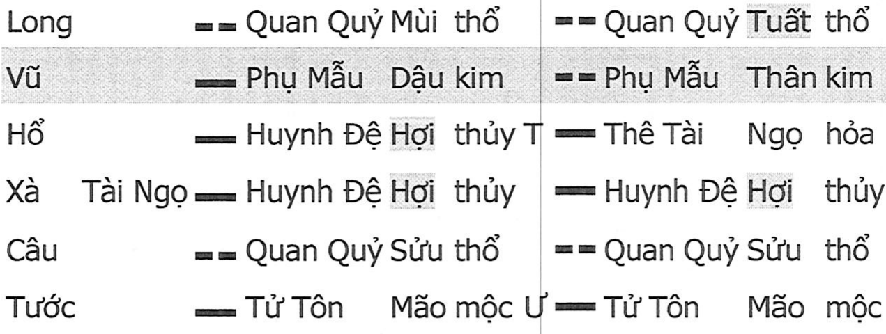

## Ngón tay bị nứt xử lý thế nào

Đây là một tình huống ở năm 2010. Một người nữ ngón tay phải bị nứt chảy máu nhiều năm, bệnh viện điều trị không có hiệu quả, phải xử lý như thế nào? Ở ngày Kỷ Mão (Tuần Không: Thân Dậu), tháng Dậu, được Địa Phong Thăng biến Địa Thiên Thái.

| Lục thú | Phục thần | Địa Phong Thăng | Địa Thiên Thái |
| :--- | :--- | :--- | :--- |
| Câu | | - - Quan Quỷ Dậu kim | - - Quan Quỷ Dậu kim |
| Tước | | - - Phụ Mẫu Hợi thủy | - - Phụ Mẫu Hợi thủy |
| Long | Tử Ngọ | - - Thê Tài Sửu thổ T | - - Thê Tài Sửu thổ |
| Vũ | | — Quan Quỷ Dậu kim | — Thê Tài Thìn thổ |
| Hổ | Huynh Dần | — Phụ Mẫu Hợi thủy | — Huynh Đệ Dần mộc |
| Xà | | - - Thê Tài Sửu thổ Ư | — Phụ Mẫu Tý thủy |

Lấy hào Thế làm Dụng thần. Nhưng trong quẻ hào sơ Sửu thổ độc phát hóa Tý thủy, Quan Quỷ lưỡng hiện vượng tướng ám động, những điều này mới là tiêu điểm của thông tin. Hào 6 là đầu, bị xung dẫn tới Quỷ động, là thông tin chóng mặt. Hào 3 Quan Quỷ Dậu kim Không Vong ám động, là ngủ không tốt.

Hào Thế thổ bị Nhật khắc, thổ là da, Sửu thổ phản quái là Cấn, Cấn là tay, chủ da ngón tay rạn nứt. Hào sơ độc phát hóa Tý thủy, hào động và hào Thế giống nhau, chủ bản thân tiếp xúc nước, lại thêm Quan Quỷ lâm Huyền Vũ ám động, Huyền Vũ là thủy, nguyên nhân là do tiếp xúc với nước trong thời gian dài gây ra.

Người này đáp: Công việc của tôi chính là tắm rửa cho người bệnh và người tàn tật. Rất nhiều người làm ở đó bị trêu chọc, hành hạ, không thể làm lâu dài, nhưng không có ai ức hiếp tôi, tiền lương của tôi cao, đã làm ở đó được 5 năm.

Phương pháp hóa giải: Lấy hoàng thổ bỏ vào trong nồi sao nóng, sau đó dùng hoàng thổ để rửa tay. Khi nguội thì làm nóng lại để rửa. Một ngày rửa tối thiểu 30 phút.

Ngày 29 tháng 11 phản hồi: Rửa tay theo phương pháp ông nói, không lâu sau chỗ nứt đã sinh ra thịt mới, cũng không đau nữa, ngón tay đã có thể uốn cong, đã có thể làm cơm.

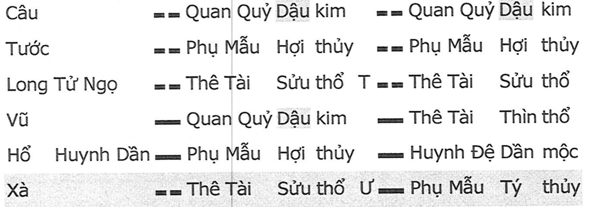

## Cổ họng không thể phát ra tiếng do nguyên nhân gì?

Đây là một tình huống ở năm 2014. Một người nữ ở sáng ngày 28 tháng 12 năm 2013 cổ họng đột nhiên không thể phát ra âm thanh, đến tháng 2 mới có cải thiện, bắt đầu có thể nói. Ở ngày Mậu Tý (Tuần Không: Ngọ Mùi), tháng Đinh Mão, đoán nguyên nhân mình bị bệnh, được Trạch Lôi Tùy biến Thủy Lôi Truân.

| Lục thú | Phục thần | Trạch Lôi Tùy | Thủy Lôi Truân |
| :--- | :--- | :--- | :--- |
| Tước | | - - Thê Tài Mùi thổ Ư | - - Phụ Mẫu Tý thủy |
| Long | | — Quan Quỷ Dậu kim | — Thê Tài Tuất thổ |
| Vũ | Tử Ngọ | — Phụ Mẫu Hợi thủy | - - Quan Quỷ Thân kim |
| Hổ | | - - Thê Tài Thìn thổ T | - - Thê Tài Thìn thổ |
| Xà | | - - Huynh Đệ Dần mộc | - - Huynh Đệ Dần mộc |
| Câu | | — Phụ Mẫu Tý thủy | — Phụ Mẫu Tý thủy |

Lấy hào Thế làm Dụng thần. Hào Thế Nguyệt khắc Nhật không phù là hưu tù, biểu thị vấn đề cổ họng rất nghiêm trọng. Trong quẻ Phụ Mẫu Hợi thủy độc phát, người xưa nói: Thần triệu cơ ở động, Hợi thủy lâm Huyền Vũ hóa Quan Quỷ, độc phát biểu thị nguyên nhân và tính chất. Huyền Vũ là hàn, Quan Quỷ là bệnh, thủy chủ dịch, nhất định là do phong hàn gây ra. Độc phát hợp Huynh Đệ Dần mộc, Huynh Đệ Dần mộc là Kỵ thần của hào Thế, Kỵ thần là bệnh, chính là hàn khí đã dẫn đến phát sinh bệnh tật.

Tiếp tục phân tích, Hợi thủy phát động, hào Thế là thủy khố, hào Thế Bạch Hổ chủ vận động, là thân thể hoạt động dẫn tới ra mồ hôi, lỗ chân lông mở đã thụ hàn. Người cầu đoán nhớ lại ở ngày 26 tháng 12 đã từng ra rất nhiều mồ hôi, ngày 27 cổ họng hơi đau, sau đó lại đi hát karaoke, sáng ngày 28 thì đã không thể phát ra tiếng.

Nguyên nhân đã rõ ràng, bèn dặn người này uống khương táo thang vào mỗi buổi sáng, khoảng hai tháng sau, cổ họng đã hoàn toàn bình phục.

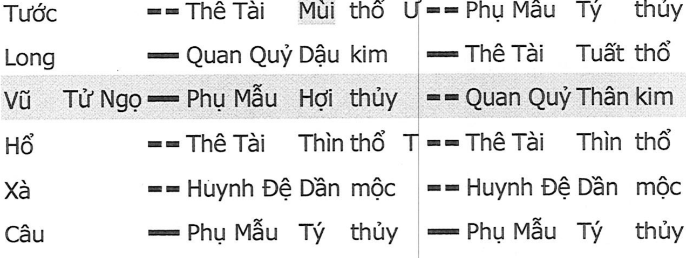

## Đã chặt cây rồi trồng lại

Đây là một tình huống ở năm 2014. Một người nam cầu đoán vận khí, do khách cũ của tôi dẫn đến, đến từ Phần Dương. Ở ngày Mậu Thìn (Tuần Không: Tuất Hợi), tháng Thân, được Địa Thủy Sư biến Địa Hỏa Minh Di.

| Lục thú | Địa Thủy Sư | Địa Hỏa Minh Di |
| :--- | :--- | :--- |
| Tước | - - Phụ Mẫu Dậu kim Ư | - - Phụ Mẫu Dậu kim |
| Long | - - Huynh Đệ Hợi thủy | - - Huynh Đệ Hợi thủy |
| Vũ | - - Quan Quỷ Sửu thổ | - - Quan Quỷ Sửu thổ |
| Hổ | - - Thê Tài Ngọ hỏa T | — Huynh Đệ Hợi thủy |
| Xà | — Quan Quỷ Thìn thổ | - - Quan Quỷ Sửu thổ |
| Câu | - - Tử Tôn Dần mộc | — Tử Tôn Mão mộc |

Xem tổ hợp biến hóa của toàn quẻ. Hào Thế Thê Tài không được Nhật Nguyệt phù là hưu tù, động hóa hồi đầu khắc, hóa Không Vong, chủ tài vận không tốt, nhiều sự việc buồn phiền, tâm trạng bất ổn. Hào Thế lâm Thái Tuế hóa Không Vong, vận khí năm nay cũng vậy, không thể có chiều hướng tốt. (Nghiệm)

Thê Tài lâm Thái Tuế, lâm Bạch Hổ động, Bạch Hổ chủ tang vong, chủ cư tang. Dần mộc Nguyệt phá, tháng Dần thực phá, sinh khởi Thê Tài, tháng giêng năm nay có lão nhân tạ thế. (nghiệm: 18 tháng giêng, lão nhân tạ thế. Nhưng rốt cuộc là cha hay là mẹ, tôi không hỏi, đối phương cũng không nói. Mọi người phân tích nhé, không có đáp án.)

Hào sơ là mặt đất, Dần mộc lâm Câu Trần Nguyệt phá hóa Tiến thần, tôi đoán tại năm 2010 anh đã chặt cây trong sân rồi lại trồng cây, và cây vừa ra khỏi mặt đất thì đã phân nhánh. (nghiệm: Anh ta nói tại hướng Tây Nam của sân, vừa mới mọc ra khỏi mặt đất thì đã phân nhánh, trông không đẹp, thế là đã chặt đi, lại trồng cây mới.)

Hào 2 Thìn thổ hóa Sửu thổ, hào 2 là trạch, Thìn thổ hợp Phụ Mẫu Dậu kim, lại hóa thổ chủ kiến trúc, Đằng Xà là giả tạo, lâm Nhật là đoản tạm. Thìn thổ đối ứng với năm 2012, đoán tại năm này đã xây một cái lán đơn giản trong sân. (Nghiệm)

Những phân tích trên đây đều bất lợi đối với tài vận. Dần mộc phá thiếu lực sinh Thê Tài, Quan Quỷ tiết khí Thê Tài. Phong thủy dẫn tới tài vận không tốt.

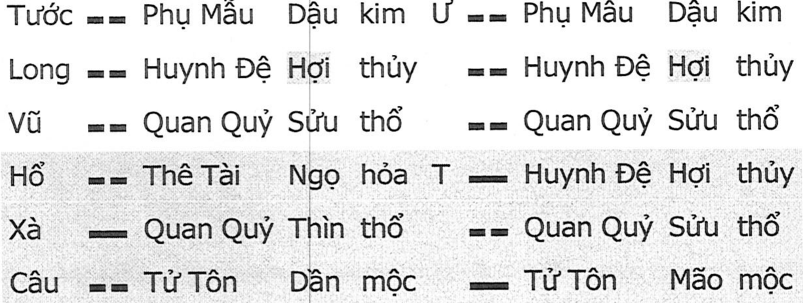

Lại thêm hào Thế lâm Ngọ hỏa hóa Không Vong, có bệnh tâm hoảng. (Nghiệm)

Sau khi trở về thì tháo dỡ cái lán này đi và trồng lại ba cây ở Đông Bắc là được.

## Đau đầu bởi vì một cành hoa

Đây là một tình huống ở năm 2014. Một người nữ cầu đoán nguyên nhân khiến mình đau đầu nhiều năm? Ở ngày Giáp Tuất (Tuần Không: Thân Dậu), tháng Thân, được Thủy Hỏa Ký Tế biến Thủy Thiên Nhu.

| Lục thú | Thủy Hỏa Ký Tế | Thủy Thiên Nhu |
| :--- | :--- | :--- |
| Vũ | - - Huynh Đệ Tý thủy Ư | - - Huynh Đệ Tý thủy |
| Hổ | — Quan Quỷ Tuất thổ | — Quan Quỷ Tuất thổ |
| Xà | - - Phụ Mẫu Thân kim | - - Phụ Mẫu Thân kim |
| Câu | — Huynh Đệ Hợi thủy T | — Quan Quỷ Thìn thổ |
| Tước | - - Quan Quỷ Sửu thổ | — Tử Tôn Dần mộc |
| Long | — Tử Tôn Mão mộc | — Huynh Đệ Tý thủy |

Lấy hào Thế làm Dụng thần. Hào Thế Nguyệt sinh Nhật khắc, suy vượng tương đương. Nhưng trong quẻ Kỵ thần Sửu thổ phát động hóa Dần mộc đến khắc hào Thế, hỏi nguyên nhân, hào độc phát này chính là biểu thị nguyên nhân.

Hào 2 là trạch, hóa phá mộc khắc hào Thế, chính là huyền cơ. Sửu thổ thể hiện năm 2009 Kỷ Sửu, mộc lâm Chu Tước là hoa, Nguyệt phá, đoán người này tại năm 2009 đã từng bẻ gãy một cành hoa, từ đó bắt đầu đau đầu.

Người này đáp, quả thực là khi kéo màn che trên ban công đã bẻ gãy một cành hoa. Nhưng không nhớ khi nào. Vài ngày sau, người này gọi đến nói là đột nhiên đã lật ra sổ khám bệnh đau đầu năm đó, trong đó có ghi ngày tháng, đúng là năm 2009.

Đối phương đã cho biết là đau đầu, mọi người có thể suy nghĩ thử xem điều gì trong quẻ này thể hiện đau đầu.

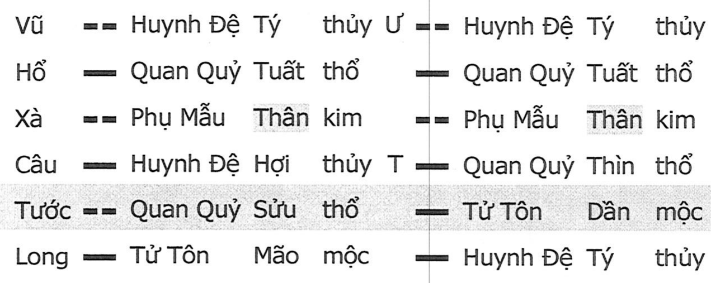

## Trên kính có tượng thần Phật

Đây là một tình huống ở năm 2014. Người bạn của tôi ở quê nhà đã hỏi tôi quẻ này, con trai của một người nam bị ban xuất huyết, cát hung ra sao? Ở ngày Đinh Dậu (Tuần Không: Thìn Tị), tháng Sửu, được Phong Sơn Tiệm biến Trạch Sơn Hàm.

| Lục thú | Phục Thần | Phong Sơn Tiệm | Trạch Sơn Hàm |
| :--- | :--- | :--- | :--- |
| Long | | — Quan Quỷ Mão mộc Ư | - - Huynh Đệ Mùi thổ |
| Vũ | Tài Tý | — Phụ Mẫu Tị hỏa | — Tử Tôn Dậu kim |
| Hổ | | - - Huynh Đệ Mùi thổ | — Thê Tài Hợi thủy |
| Xà | | — Tử Tôn Thân kim T | — Tử Tôn Thân kim |
| Câu | | - - Phụ Mẫu Ngọ hỏa | - - Phụ Mẫu Ngọ hỏa |
| Tước | | - - Huynh Đệ Thìn thổ | - - Huynh Đệ Thìn thổ |

Lấy Tử Tôn làm Dụng thần. Tử Tôn Thân kim Nguyệt sinh Nhật phù vượng tướng, sẽ không có nguy hiểm đến sinh mệnh.

Ngoại quái tam hợp Quan Quỷ cục, đây là biểu thị nguyên nhân. Mộc là giấy, Thanh Long là trang tu, trang sức, tam hợp cục biểu thị rất nhiều, hào 6 là mái nhà, mái nhà anh ta đã dán rất nhiều giấy. (Nghiệm, mái nhà dán rất nhiều giấy tường.)

Nguyên thần Mùi thổ tại hào 4 Nguyệt phá, cũng là Mộ khố của Quan Quỷ, hào 4 là cửa sổ, hóa Hợi thủy là kính, Quan Quỷ tại hào 6 là thần Phật, hào 4 là Mộ khố Quan Quỷ, biểu thị trên kính đã dán tượng thần Phật. (Nghiệm, trên kính đã dán Thần Tài.)

Phương pháp hóa giải: Làm sạch tất cả các thứ đã dán.

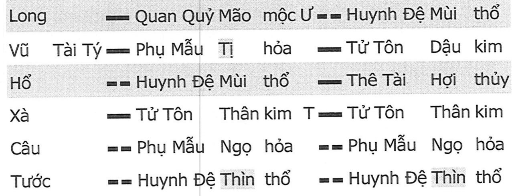

## Động cửa sổ, họa tới thân

Đây là một tình huống ở năm 2015. Một người nữ đoán thân thể của mình, ở ngày Quý Mùi (Tuần Không: Thân Dậu), tháng Tị, được Khôn Vi Địa biến Lôi Địa Dự.

| Lục thú | Quẻ Khôn Vi Địa | Thế/Ứng | Biến Lôi Địa Dự |
| :--- | :--- | :---: | :--- |
| Hổ | ╍╍ Tử Tôn Dậu kim | T | ╍╍ Huynh Đệ Tuất thổ |
| Xà | ╍╍ Thê Tài Hợi thủy | | ╍╍ Tử Tôn Thân kim |
| Câu | ╍╍ Huynh Đệ Sửu thổ | | ━ Phụ Mẫu Ngọ hỏa |
| Tước | ╍╍ Quan Quỷ Mão mộc | Ư | ╍╍ Quan Quỷ Mão mộc |
| Long | ╍╍ Phụ Mẫu Tị hỏa | | ╍╍ Phụ Mẫu Tị hỏa |
| Vũ | ╍╍ Huynh Đệ Mùi thổ | | ╍╍ Huynh Đệ Mùi thổ |

Lấy hào Thế làm Dụng thần. Nguyệt khắc Nhật sinh, độc phát lại đến sinh, không có nỗi lo đến tính mạng. Hào Thế tại hào 6 lâm Bạch Hổ Không Vong, hào 6 là đầu, Bạch Hổ là máu, chủ thiếu máu, huyết áp thấp. (Nghiệm)

Thê Tài Hợi thủy Nguyệt phá hưu tù, hào Thế Không Vong nhập Mộ không thể sinh Thê Tài, chủ thực dục không vượng, không muốn ăn. (Nghiệm)

Kỵ thần lâm Nguyệt nhập quẻ tại hào 2, hào 2 là tử cung, hào Thế Tử Tôn cũng là tử cung, Thanh Long chủ đau, đau bụng do phụ khoa gây ra. (Nghiệm)

Dụng thần nhập Mộ đã có Nhật xung khai. Nhưng Mộ khố lâm Câu Trần, Câu Trần là kiến trúc, Mộ khố là nơi mình ở, thân thể có có mối liên hệ với phong thủy nhà.

Hào 4 Huynh Đệ Câu Trần độc phát, thần triệu cơ ở động. Câu Trần là kiến trúc, lâm thổ phát động, chủ có thông tin tu tạo, cải tạo nhà. Huynh Đệ là cửa sổ, cửa ra vào, hào 4 cũng là cửa sổ, cửa ra vào, thân thể không tốt có liên quan nhất định đến việc đã động nơi này. (Nghiệm, trong nửa năm đã sửa cửa sổ trên mái nhà 3 lần, bởi vì dột mưa, chưa sửa xong. Động thổ liên tục mấy ngày, ngoài ra bình thường lại thích dọn dẹp sân, vừa mới dọn dẹp thì thân thể đã cảm thấy khó chịu.)

Dặn người này mang theo một hòn đá tròn. Sau đó thân thể đã có sự cải thiện, dự định chuyển nhà, không muốn sống ở chỗ hiện tại nữa.

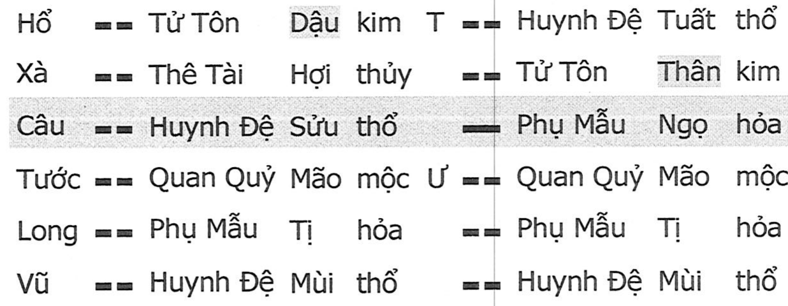

---

# Part 12 (Pages 221-240)

## Tiểu nhân tố giác

Đây là một tình huống ở năm 2015. Một người nữ đoán công tác của chồng, ở ngày Giáp Thân (Tuần Không: Ngọ Mùi), tháng Tị, được Hỏa Thủy Vị Tế biến Lôi Thủy Giải.

| Lục thú | Phục thần | Quẻ Hỏa Thủy Vị Tế | Thế/Ứng | Biến Lôi Thủy Giải |
| :--- | :--- | :--- | :---: | :--- |
| Vũ | | ━ Huynh Đệ Tị hỏa | Ư | ╍╍ Tử Tôn Tuất thổ |
| Hổ | | ╍╍ Tử Tôn Mùi thổ | | ╍╍ Thê Tài Thân kim |
| Xà | | ━ Thê Tài Dậu kim | | ━ Huynh Đệ Ngọ hỏa |
| Câu | Quan Hợi | ╍╍ Huynh Đệ Ngọ hỏa | T | ╍╍ Huynh Đệ Ngọ hỏa |
| Tước | | ━ Tử Tôn Thìn thổ | | ━ Tử Tôn Thìn thổ |
| Long | | ╍╍ Phụ Mẫu Dần mộc | | ╍╍ Phụ Mẫu Dần mộc |

Lấy Quan Quỷ làm Dụng thần. Quan Quỷ bị Nguyệt xung phá, Nguyệt kiến nhập quẻ tại hào 6, lâm Huyền Vũ độc phát, nhập Mộ tại hào biến, Huynh Đệ là đồng nghiệp, Huyền Vũ chủ lén lút, vụng trộm, nhập Mộ cũng chủ lén lút, ẩn nấp, đây là gặp tiểu nhân, có người đã tố cáo. (Nghiệm, có người đã viết thư tố cáo.)

Quan Quỷ phục tàng dưới hào Thế, Quan phục Thế hạ chung bất thoát[^1], Quan Quỷ có Nhật sinh vượng tướng, chức vụ sẽ không mất.

Sách nói: Thần triệu cơ ở động. Hào 6 Tị hỏa độc phát hóa Mộ khố, hợp với Thân kim trên Nhật, hào 6 là ngoài cùng, hỏa chủ ánh sáng, Tị hỏa đối ứng Đông Nam, chủ Đông Nam nhà anh có ban công. Tị hỏa lâm Huyền Vũ Câu Trần phát động, Huyền Vũ chủ bẩn thỉu, Câu Trần chủ cải tạo dọn dẹp, hợp Thê Tài trên Nhật, Thê Tài là đồ đạc, Nhật là bên ngoài, chủ dọn dẹp ban công, đã vứt bỏ rất nhiều đồ đạc trên ban công, dẫn tới khí trường biến hóa, gây nên bất lợi. (Nghiệm, tháng giêng đã dọn dẹp ban công phía Đông Nam, đã vứt đi rất nhiều đồ đạc không dùng.)

Hóa giải: Tìm một hòn đá thon dài, viết lên đó một chữ "minh" và đặt trên ban công Đông Nam. Sau đó, việc tố cáo đã không tìm được chứng cứ, bình an vượt qua, đến bây giờ vẫn đang đương chức.

[^1]: Đây là một câu nói về phương diện từ chức trong sách cổ, nghĩa là khi trong quẻ xuất hiện Quan phục dưới hào Thế thì không thể như nguyện, muốn từ cũng không từ được.

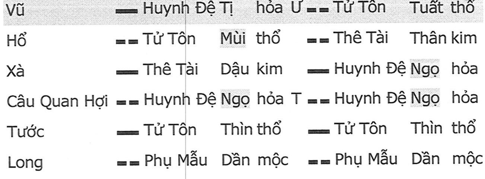

## Đã từng đánh chết một con rắn

Đây là một tình huống ở năm 2015. Một người nam (tuổi Thìn, vợ tuổi Mùi) đoán trong mệnh có con trai hay không? Ở ngày Kỷ Tị (Tuần Không: Tuất Hợi), tháng Tuất, được Khảm Vi Thủy biến Thủy Trạch Tiết.

| Lục thú | Quẻ Khảm Vi Thủy | Thế/Ứng | Quẻ Thủy Trạch Tiết |
| :--- | :--- | :---: | :--- |
| Câu | ╍╍ Huynh Đệ Tý thủy | T | ╍╍ Huynh Đệ Tý thủy |
| Tước | ━ Quan Quỷ Tuất thổ | | ━ Quan Quỷ Tuất thổ |
| Long | ╍╍ Phụ Mẫu Thân kim | | ╍╍ Phụ Mẫu Thân kim |
| Vũ | ╍╍ Thê Tài Ngọ hỏa | Ứ | ╍╍ Quan Quỷ Sửu thổ |
| Hổ | ━ Quan Quỷ Thìn thổ | | ━ Tử Tôn Mão mộc |
| Xà | ╍╍ Tử Tôn Dần mộc | | ━ Thê Tài Tị hỏa |

Lấy Tử Tôn làm Dụng thần. Trong quẻ Tử Tôn Dần mộc độc phát vừa không sinh hào Thế, vừa không khắc hào Thế, không được Nhật Nguyệt phù là hưu tù, chủ trong mệnh không có con trai, chỉ có thể là sinh con gái.

Độc phát đi xung Thân kim lâm Thanh Long, Thanh Long chủ thai sản, năm Giáp Thân có tượng thai sản. (Nghiệm, năm này sinh một con gái.)

Hào Thế Tý thủy là Nguyên thần, Nguyệt khắc Nhật Tuyệt, lâm Câu Trần, tại hào 6, chủ lão hóa, tinh tử kém, không có khả năng sinh con tiếp theo, cần hóa giải. (Nghiệm)

Tử Tôn tại hào sơ là động vật, hóa Tị hỏa, cùng Thân kim ám động thành tam hình, Đằng Xà có tượng rắn, Tị hỏa là rắn, hình chủ thương hại (làm hại), là thông tin đã từng đánh chết rắn, đây chính là nguyên nhân ngoại tại khiến không thể sinh con trai. Gặp hợp là ứng kỳ. (Nghiệm, năm Ất Hợi, ở gần nhà, thấy một con rắn bên cạnh hài tử đang chơi, sợ nó làm hại đến hài tử, đã đánh chết.)

Thê Tài Ngọ hỏa tại hào 3, hào mệnh Mùi thổ hợp Thê Tài, hào mệnh là Quan Quỷ, chủ vợ thân thể không tốt. Mùi thổ là Mộ khố Tử Tôn, là tử cung, chủ vợ có u xơ tử cung. (Nghiệm)

Lại hỏi công việc. Xem Quan Quỷ, Quan Quỷ Thìn thổ Nguyệt phá, Tử Tôn độc phát khắc, chủ công tác sự nghiệp không thuận, từ năm Nhâm Thìn bắt đầu bất lợi. (Quả nhiên, trước đó thuận lợi, từ năm này bắt đầu không thuận.)

Phương pháp hóa giải: Không ghi chép, không nhớ phương pháp gì. Nhưng năm 2017 phản hồi, lại sinh một con gái.

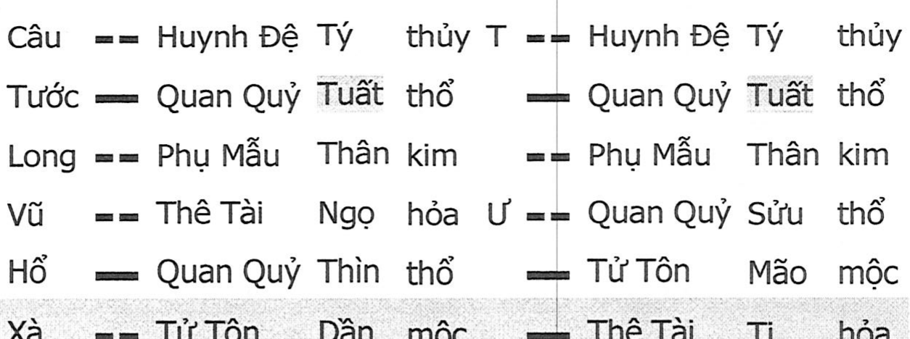

## Thì ra thứ có thể phát ra âm thanh là con gà

Đây là một tình huống ở năm 2015. Học trò của tôi hỏi hài tử khóc đêm do nguyên nhân gì? Ở ngày Giáp Tuất (Tuần Không: Thân Dậu), tháng Tuất, được Thiên Hỏa Đồng Nhân biến Ly Vi Hỏa.

| Lục thú | Quẻ Thiên Hỏa Đồng Nhân | Thế/Ứng | Quẻ Ly Vi Hỏa |
| :--- | :--- | :---: | :--- |
| Vũ | ━ Tử Tôn Tuất thổ | Ứ | ━ Huynh Đệ Tị hỏa |
| Hổ | ━ Thê Tài Thân kim | | ╍╍ Tử Tôn Mùi thổ |
| Xà | ━ Huynh Đệ Ngọ hỏa | | ━ Thê Tài Dậu kim |
| Câu | ━ Quan Quỷ Hợi thủy | T | ━ Quan Quỷ Hợi thủy |
| Tước | ╍╍ Tử Tôn Sửu thổ | | ╍╍ Tử Tôn Sửu thổ |
| Long | ━ Phụ Mẫu Mão mộc | | ━ Phụ Mẫu Mão mộc |

Lấy Tử Tôn làm Dụng thần. Tử Tôn lưỡng hiện, Tử Tôn Tuất thổ lâm Nhật Nguyệt rất vượng, độc phát lại hóa ra Tử Tôn là quá vượng. Độc phát biểu thị tính chất, Bạch Hổ là khóc lóc, đây là thông tin khóc đêm.

Độc phát cũng chủ nguyên nhân, hào 5 Thân kim lâm Không Vong sinh hào Thế, Thê Tài là tài, Không Vong, chính là đã tiêu tiền, sinh hào Thế, chính là tiêu tiền mua đồ về. Anh ta đáp là đã mua dược phẩm.

Bạch Hổ có ý nghĩa là dược, nhưng Thân kim Không Vong, tôi cho rằng không phải dược, mà nhất định là một thứ có thể phát ra âm thanh. Bởi vì kim Không tắc minh. Anh ta nói mẹ vợ đã mua hai con gà về để tẩm bổ cho vợ anh ta, kết quả là gà đã ngọ ngậy thoát ra, lúc bắt đã phát ra tiếng kêu.

Thì ra là như vậy, thứ có thể phát ra âm thanh là con gà! Đó chính là thứ mà mẹ vợ đã mua về. Thân kim hóa Mùi thổ, đều nạp tại Khôn, Khôn là mẹ, tại ngoại quái chính là mẹ vợ, bởi vì ngoại quái tha cung, mà Thân kim là Thê Tài, là vợ, chuyển hoán thành Khôn thổ, cũng chính là mẹ của vợ, cũng là mẹ vợ. Tại sao là gà? Bởi vì hóa Ly Vi Hỏa, Ly là dã kê (chim trĩ). Trong quẻ có rất nhiều thông tin, chẳng qua là khi phán đoán chúng ta chưa nhìn thấu mà thôi.

Phương pháp hóa giải: Lược.

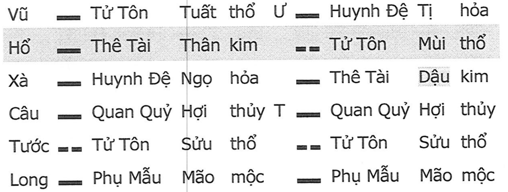

## Đã đến lăng viên liệt sĩ

Đây là một tình huống ở năm 2017. Một người nữ đoán thân thể con gái (sinh năm Bính Tuất), thông qua WeChat ở ngày Tân Tị (Tuần Không: Thân Dậu), tháng Thìn, được Sơn Hỏa Bí biến Địa Hỏa Minh Di.

| Lục thú | Phục thần | Sơn Hỏa Bí | Thế/Ứng | Địa Hỏa Minh Di |
| :--- | :--- | :--- | :---: | :--- |
| Xà | | — Quan Quỷ Dần mộc | | - - Tử Tôn Dậu kim |
| Câu | | - - Thê Tài Tý thủy | | - - Thê Tài Hợi thủy |
| Tước | | - - Huynh Đệ Tuất thổ | Ứ | - - Huynh Đệ Sửu thổ |
| Long | Tử Thân | — Thê Tài Hợi thủy | | — Thê Tài Hợi thủy |
| Vũ | Phụ Ngọ | - - Huynh Đệ Sửu thổ | | - - Huynh Đệ Sửu thổ |
| Hổ | | — Quan Quỷ Mão mộc | T | — Quan Quỷ Mão mộc |

Lấy Tử Tôn làm Dụng thần. Tử Tôn Thân kim phục tàng dưới hào 3 Thê Tài Hợi thủy, Nguyệt sinh Dụng thần, chủ nền tảng sức khỏe của hài tử không tệ. Nhưng Dụng thần phục tàng Không Vong, đây là vấn đề. Hào Quỷ độc phát Tuyệt Tử Tôn, lại thêm Quan Quỷ hóa Tử Tôn, không cát, người xưa nói: Quỷ hóa Tử, Tử hóa Quỷ, trăm con không sống được một. Đó là do ngày xưa y liệu không phổ biến, không gặp được thầy thuốc trình độ cao, hiện nay không thể áp dụng một cách máy móc điều này. (Phản hồi, trông bên ngoài khỏe mạnh. Nhưng thực tế dễ bị cảm mạo, viêm họng, năm nay đại bệnh.)

Cảm mạo là vấn đề về phổi, phù hợp với đặc điểm Dụng thần là kim. Dần mộc độc phát đến xung Tử Tôn, mộc chủ phong hàn, có thông tin này. Phi thần Bệnh địa, Quan Quỷ hào 6 phát động lại hợp đến Phi thần, hào 6 là đầu, Hợi thủy là họng, cho nên có bệnh như vậy. Những bệnh này đã được khách nói ra, chúng ta chỉ tìm thông tin trong quẻ mà thôi.

Tôi phân tích: Quan Quỷ tại hào 6 độc phát, hào 6 là đầu, hợp Phi thần Hợi thủy, Hợi thủy phản quái là Càn cũng là đầu, lâm Đằng Xà, chủ loạn, xung chính là đầu óc lắc lư, có tượng chóng mặt, biểu thị đầu óc lờ đờ. Tử Tôn phục tàng, chủ không có tinh thần. (Nghiệm, phản hồi năm nay đúng là như vậy. Chóng mặt.)

Tử Tôn phục tàng tại hào 3, hào 3 là giường, phục tàng chính là nằm sấp, do đó đoán hài tử nằm sấp ngủ. (Trước đây hài tử có thói quen này.)

Nguyên thần Tuất thổ bị Nguyệt xung phá, Tuất thổ là màng tim, tại hào 4, Nhật là Tị hỏa khắc Tử Tôn, hỏa là tim, chủ tim bất

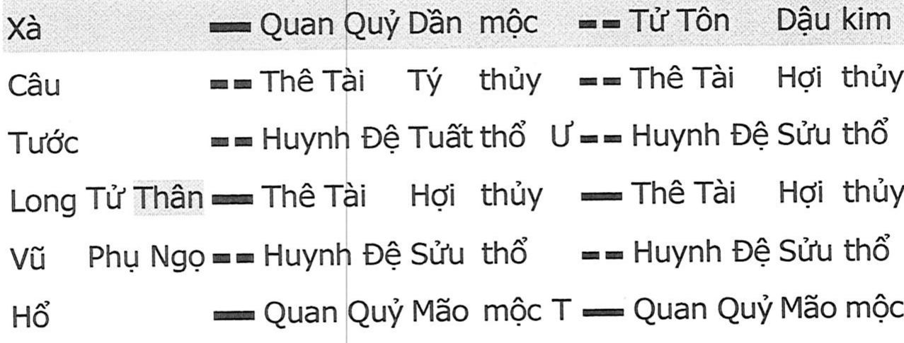 lợi, Nguyệt xung là một loại nhấp nhô, do đó phán đoán tim đập nhanh. (Phản hồi, một thời gian trước bị tức ngực.)

Nguyên thần là Tuất thổ Nguyệt phá, Quan Quỷ cũng khắc Nguyên thần hào 2 và hào 4, hào 4 thổ là dạ dày, hào 2 là ruột, do đó tràng vị cũng không tốt. Cung Cấn cũng là dạ dày. (Phản hồi, trước đây có thể ăn, hiện tại không thể. Ăn thì cảm thấy khó chịu.)

Hào mệnh lâm Tuất thổ Nguyệt phá tại ngoại quái, ngoại quái là Cấn, Cấn là da, thổ cũng là da, Dụng thần lâm Thanh Long chủ đau ngứa, Tuất thổ lâm Huyền Vũ Chu Tước, Chu Tước là màu đỏ, Huyền Vũ là lở loét, tổng hợp phân tích, đoán da nổi ban. (Nghiệm, đã bị mấy ngày nay, da cô ấy luôn quá mẫn. Mùa xuân thì nổi ban.)

Quan Quỷ độc phát xung Tử Tôn Thân kim, nhất định vẫn còn vấn đề. Tử Tôn đã chiếm tam hình (Nhật, hào động, Dụng thần) chủ đau khổ khó chịu, kim là xương cốt, phán đoán chức năng tạo máu đã có vấn đề. (Khách phản hồi là viêm thận, luận thận chủ xương cũng đúng về góc độ Trung y, nhưng trong quẻ Phi thần Hợi thủy ám động là Bệnh địa, đây mới là thông tin về thận.)

Quan Quỷ tại hào 6 độc phát hóa Tử Tôn Dậu kim, cũng hóa Không Vong. Độc phát biểu thị nguyên nhân. Bị bệnh nhất định có liên quan đến chỗ này. Cấn là mộ là tự viện. Hào 6 là thần Phật, Quan Quỷ cũng là thần Phật, hóa ra Tử Tôn, nhất định là đã từng đến tự viện. Lại thêm Quan Quỷ là người chết, hóa Thái Tuế Không Vong, Thái Tuế thể hiện chính phủ, quốc gia, Không Vong tại Tử Tôn, Tử Tôn là binh lính, Đằng Xà cộng Bạch Hổ, Đằng Xà là quái dị, tử vong, Bạch Hổ là tang, cũng là đao thương, nhất định là vì nước quên mình, vì nước mà chết, do đó phán đoán cũng đã từng đến lăng viên liệt sĩ. (Phản hồi, đã đến miếu Diêm Thần ở một cổ trấn. Cũng đã đến lăng viên liệt sĩ.)

Địa từ trường quấy nhiễu dẫn tới bệnh tật, người đời thường nói là đã trúng tà khí. Diêm (muối) chẳng phải là thủy chủ thận đó hay sao? Miếu Diêm Thần, hiển nhiên liên quan mật thiết với thận. Khách nói con gái buổi tối sợ hãi, khách cảm thấy đến buổi tối thì bên ngoài cửa sổ có tiếng động, nửa đêm về sáng đã biến mất. Khi con gái vừa mới bị bệnh, trong mơ nói sửa núi (người nơi đó gọi mộ là núi, nghĩa là sửa mộ.), buổi tối hôm nọ con gái đi nhà vệ sinh, sợ chuột, trước tiên thò đầu xem nhà vệ sinh, kết quả là gặp một nữ sinh hỏi cô ấy, chị là ai? Bệnh con gái cứ lặp đi lặp lại, mỗi lần một nghiêm trọng hơn, quái chủ có phần tuyệt vọng. Năm Bính Thân cũng may chưa có vấn đề gì.

Tôi tiếp tục phân tích, ở bên ngoài đối ứng tự viện phần địa v.v, ở trong nhà thì có thể đối ứng Phật đường, nhất định là trong nhà có Phật đường, vị trí đặt đã không đúng. (Quả nhiên trong nhà cúng Phật)

Hào 6 Quan Quỷ Dần mộc hóa Dậu kim, Dậu kim phản quái là Đoài, đối ứng thiếu nữ, có thể đối ứng con gái người đó, Dậu kim trở về trong quẻ không có, dùng Thân kim phục tàng thay thế, hào 3 là cửa, cửa nhất định mở hướng về Tây. Vậy, tượng Phật nhất định tại Ngũ Quỷ vị. (Nghiệm, cửa mở hướng về Tây, tượng Phật tại hung vị.)

Sau đó đã tiến hành điều chỉnh về phong thủy, di chuyển vị trí của tượng Phật và giường. Bởi vì liên quan đến nội dung trong dịch trận phong thủy, phương pháp điều chỉnh cụ thể không trình bày ở đây. Hình vẽ cũng không thể công bố, xin mọi người hiểu cho. Sau khi điều chỉnh, con gái đã cảm thấy có tinh thần, sắc mặt cũng không còn u ám nữa. Nguyện con gái cô ấy khỏe mạnh hạnh phúc.

## Đã đổ bã thuốc ở Tây Bắc

Đây là một tình huống ở năm 2017. Một bác sĩ có mở phòng khám bệnh, việc kinh doanh rất tốt, nhưng có người gây phiền phức, đoán nguyên nhân là gì? Ở ngày Đinh Mão (Tuần Không: Tuất Hợi), tháng Thìn, được Thủy Trạch Tiết biến Phong Lôi Ích.

| Lục Thú | Thủy Trạch Tiết | Thế/Ứng | Phong Lôi Ích |
| :--- | :--- | :---: | :--- |
| Long | - - Huynh Đệ Tý thủy | | — Tử Tôn Mão mộc |
| Vũ | — Quan Quỷ Tuất thổ | | — Thê Tài Tị hỏa |
| Hổ | - - Phụ Mẫu Thân kim | Ứ | - - Quan Quỷ Mùi thổ |
| Xà | - - Quan Quỷ Sửu thổ | | - - Quan Quỷ Thìn thổ |
| Câu | — Tử Tôn Mão mộc | | - - Tử Tôn Dần mộc |
| Tước | — Thê Tài Tị hỏa | T | — Huynh Đệ Tý thủy |

Không có Dụng thần cụ thể, xem tổ hợp biến hóa của quẻ. Thê Tài Tị hỏa trì Thế Nguyệt không khắc Nhật sinh, trong quẻ mặc dù có Huynh Đệ phát động, nhưng Tử Tôn cũng phát động, thành liên tục tương sinh, đây chính là thông tin kinh doanh tốt đẹp.

Nhưng hào Thế lâm Chu Tước chủ khẩu thiệt, Tử Tôn Mão mộc hóa thoái, không thể sinh hào Thế, Huynh Đệ mặc dù hưu tù, phát động nhất định có tác dụng, khắc hào Thế chính là gây phiền phức, hưu tù là phiền phức nhỏ.

Hào 6 là lân cư, cũng là thoái vị, hóa Tử Tôn có hai thuyết, Tử Tôn thể hiện y dược, cũng thể hiện viên cảnh (cảnh sát trong một xã khu), công an. Hào 6 thoái vị, chính là người từng đến khám bệnh gây phiền phức. Cũng có viên cảnh lân cận gây phiền phức. (Thực tế đúng là như vậy.)

Hào 2 Tử Tôn hóa thoái không thể sinh hào Thế, Tử Tôn là thuốc, lâm hóa thoái là thuốc được đào thải, lâm Câu Trần, Câu Trần là cũ, cũng chính là bã thuốc, động mà hợp với Quan Quỷ Tuất thổ, hào 5 Quan Quỷ Tuất thổ là tôn vị, lâm Huyền Vũ, Huyền Vũ chủ bẩn thỉu, rác. Nhất định là đã đổ bã thuốc đến Tây Bắc, xét về góc độ phong thủy, là do Càn kim bị ô nhiễm gây nên. (Quả nhiên, mỗi ngày đều đổ rất nhiều bã thuốc ở Tây Bắc.)

Sau khi hóa giải (hóa giải bằng phương pháp phong thủy, phương pháp cụ thể lược), đã yên ổn. Bệnh nhân gây phiền phức cũng không tìm đến nữa, viên cảnh hôm đó lại đến, anh ta trong lòng lại thấp thỏm bất an, kết quả là đến nhận lỗi.)

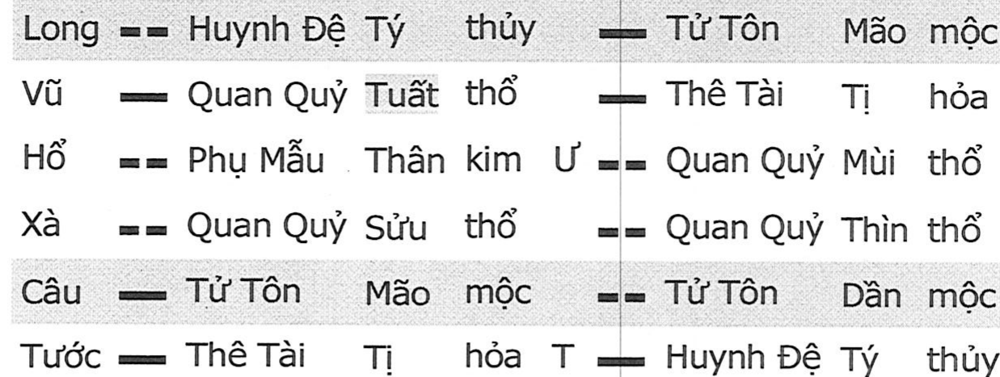

# CHƯƠNG 17: BẤT LỢI DO VẬT CHẤT ÂM TÍNH GÂY NÊN

## Nơi có ma không được chơi đùa

Ngày 26 tháng 3 năm 2010, một nam tử muốn cầu đoán thân thể cho con trai. Ở ngày 20 (ngày Kỷ Tị), con trai và bạn của nó đã đến một nơi được kể là có ma để chơi. Sau khi trở về, dường như con người đã biến đổi. Ánh mắt quái dị, khóe mắt treo lên, tính cách trở nên dễ cáu, không đi làm, cũng không ăn, một mình núp ở trong phòng tối, liên tục uống nước, dáng vẻ rất đáng sợ. Người đó gieo quẻ như sau. Ngày Ất Hợi (Tuần Không: Thân Dậu), tháng Mão.

| Lục Thú | Phục Thần | Phong Địa Quan | Thế/Ứng |
| :--- | :--- | :--- | :---: |
| Vũ | | — Thê Tài Mão mộc | |
| Hổ | Huynh Thân | — Quan Quỷ Tị hỏa | |
| Xà | | - - Phụ Mẫu Mùi thổ | T |
| Câu | | - - Thê Tài Mão mộc | |
| Tước | | - - Quan Quỷ Tị hỏa | |
| Long | Tử Tý | - - Phụ Mẫu Mùi thổ | Ứ |

Lấy Tử Tôn làm Dụng thần. Tử Tôn Tý thủy phục tàng dưới hào sơ Phụ Mẫu Mùi thổ. Mặc dù Phi đến khắc Phục, nhưng Nguyệt không khắc Dụng thần, có Nhật phù là vượng tướng, không có nỗi lo đến tính mạng.

Nguyên thần Huynh Đệ Thân kim hưu tù Không Vong, bất thượng quái, Nguyên thần chủ tư duy của người, cũng thể hiện linh hồn, Không Vong không xuất hiện, chính là hồn đã mất. Quan Quỷ Tị hỏa lưỡng hiện ám động hợp Nguyên thần Thân kim, lại Tuyệt Dụng thần, Quan Quỷ là hồn ma, âm hồn, rất rõ ràng là hồn ma đã bám vào thân thể. Nguyên thần kim Không không sinh thủy, Dụng thần thủy lâm Thanh Long, Thanh Long chủ ẩm thực, Quan Quỷ lại là Tuyệt thủy, nhất định là hai con ma khát nước đã bám vào thân thể. Phù hợp với bệnh trạng hiện nay của con trai anh ta.

Phương pháp hóa giải: Tìm chín hòn đá, bôi chu sa lên, đặt ở hướng Đông Nam của sân.

Người cầu đoán liền làm theo. Trên đường về nhà đã nhặt được chín hòn đá, vừa mới đặt tại Đông Nam của sân, con trai đột nhiên xuất hiện trước mặt anh ta, ánh mắt và vẻ mặt đã trở nên bình thường. Khi anh ta đang bôi chu sa, con trai đã cúi gập mình xuống vái cho anh ta một cái.

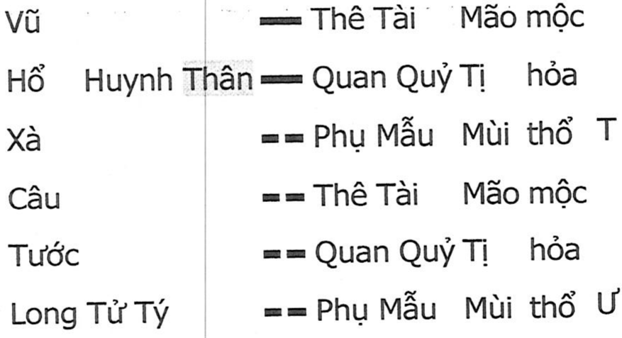

Sau đó con trai đã gọi bạn bè đến, bắt đầu ăn uống vui vẻ trong phòng, mọi thứ trở lại bình thường.

## Chúng thần đang tác quái

Đây là một tình huống ở năm 2014. Mẹ của một người nữ đột nhiên mất ý thức, giống như người thực vật, đoán nguyên nhân? Ở ngày Kỷ Tị (Tuần Không: Tuất Hợi), tháng Bính Dần, được Trạch Phong Đại Quá biến Thiên Trạch Lý.

| Lục Thú | Phục Thần | Trạch Phong Đại Quá | Thiên Trạch Lý |
| :--- | :--- | :--- | :--- |
| Câu | | - - Thê Tài Mùi thổ | — Thê Tài Tuất thổ |
| Tước | | — Quan Quỷ Dậu kim | — Quan Quỷ Thân kim |
| Long | Tử Ngọ | — Phụ Mẫu Hợi thủy T | — Tử Tôn Ngọ hỏa |
| Vũ | | — Quan Quỷ Dậu kim | - - Thê Tài Sửu thổ |
| Hổ | Huynh Dần | — Phụ Mẫu Hợi thủy | — Huynh Đệ Mão mộc |
| Xà | | - - Thê Tài Sửu thổ Ư | — Tử Tôn Tị hỏa |

Lấy Phụ Mẫu làm Dụng thần. Phụ Mẫu Hợi thủy lưỡng hiện, địa chi giống nhau, đều có thể làm Dụng thần. Phụ Mẫu Hợi thủy trì Thế là quan tâm mẹ, lâm Thanh Long Không Vong, Thanh Long chủ ẩm thực, bởi vì sự tình của mẹ, không có tâm trạng ăn uống, cũng chủ mẹ đã không thể ăn uống. Hào 2 Phụ Mẫu Hợi thủy lâm Bạch Hổ là bệnh, Nguyệt là Bệnh địa hợp Phụ Mẫu, mẹ đã có bệnh từ rất lâu. (Nghiệm, có Alzheimer từ lâu.)

Hào 6 Kỵ thần phát động khắc Dụng thần, hào 6 là thần Phật, có liên quan đến việc đắc tội với thần Phật. Nội quái tam hợp Quan Quỷ cục, không chỉ đắc tội với một thần Phật. (Nghiệm, đã từng vứt bỏ bảy pho tượng thần.)

Dụng thần Nguyệt hợp được vượng, Không Vong có Nhật xung thực. Kỵ thần phát động, Nguyên thần tam hợp cục đến sinh, không có nỗi lo đến tính mạng, nhưng rất khó khỏi ngay. Sau đó cát hung như thế nào, không có phản hồi.

## Hồn ma về nhà quấy rầy

Đây là một tình huống ở năm 2018. Một người nữ khoảng 50 tuổi đoán thân thể của mình, ở ngày Canh Thìn (Tuần Không: Thân Dậu), tháng Giáp Dần, được Trạch Sơn Hàm biến Trạch Thiên Quải.

| Lục Thú | Phục Thần | Trạch Sơn Hàm | Trạch Thiên Quải |
| :--- | :--- | :--- | :--- |
| Xà | | - - Phụ Mẫu Mùi thổ Ư | - - Phụ Mẫu Mùi thổ |
| Câu | | — Huynh Đệ Dậu kim | — Huynh Đệ Dậu kim |
| Tước | | — Tử Tôn Hợi thủy | — Tử Tôn Hợi thủy |
| Long | | — Huynh Đệ Thân kim T | — Phụ Mẫu Thìn thổ |
| Vũ | Tài Mão | - - Quan Quỷ Ngọ hỏa | — Thê Tài Dần mộc |
| Hổ | | - - Phụ Mẫu Thìn thổ | — Tử Tôn Tý thủy |

Đoán bệnh của bản thân, lấy hào Thế làm Dụng thần. Hào Thế Thân kim bị Nguyệt xung phá, Nhật sinh, suy vượng tương đương, không dễ định đoạt cát hung, cần xem ảnh hưởng của hào động khác trong quẻ. Trong quẻ hào 2 Quan Quỷ Ngọ hỏa vượng tướng đến khắc hào Thế là bất lợi, may mà Nhật thần Thìn thổ nhập quẻ phát động, giải khắc của Ngọ hỏa, thành liên tục tương sinh, có bệnh có thể được khống chế.

Hào Thế tại hào 3, hào 3 là giường, Không Vong không được Nguyên thần đến sinh, là ngủ không tốt. (Nghiệm, không thể ngủ vì đau bệnh.)

Hào Thế lâm Thanh Long, Thanh Long là đau, Huynh Đệ là tay chân, bị xung phá, lại thêm Nguyên thần Thìn thổ và Mùi thổ tại hào sơ và hào 6 bị Nguyệt khắc, hào 6 là tay, hào sơ là chân, là đau tứ chi. (Nghiệm, đặc biệt là vào buổi tối.)

Theo phương pháp di thần biện hào, hào Thế cũng lâm Câu Trần, đau và sưng. (Nghiệm)

Thổ lâm Bạch Hổ cũng chủ da, da cũng không tốt. (Nghiệm)

Hào 2 Quan Quỷ lâm Huyền Vũ khắc hào Thế, hào 2 là trạch, Huyền Vũ là tà khí, âm khí, Quan Quỷ là hồn ma, là có hồn ma nhập trạch đã ảnh hưởng đến anh. Hào biến của Quan Quỷ chính là Dần mộc xung phá hào Thế, xung là tượng bất hòa, hồn ma này lúc còn sống đã bất hòa với anh. Hào 3 là hào vị của huynh đệ, lại lâm Huynh Đệ, khả năng chị có một huynh đệ tỉ muội đã chết, hồn ma của người đó đã trở về quấy rầy chị. (Nghiệm, em gái đã chết vào tháng trước, hồn ma trở về quấy rầy, khiến cho trong nhà không yên, còn tay chân của mình không hiểu tại sao bắt đầu sưng và đau.

Hóa giải: Một hòn đá thon dài, viết một chữ "minh" lên đó, mang theo bên người. Tăm xỉa răng ba cây, lấy vải vàng gói lại, đặt ở phía Nam trong nhà. Bên ngoài bôi lên một chút chu sa.

Ngày 5 tháng 4 phản hồi: Sau khi hóa giải, tình trạng tinh thần bỗng chốc thay đổi, 10 năm nay chưa bao giờ thoải mái như vậy, con gái tôi cũng cảm thấy tâm trạng dễ chịu, vẫn là không gian sinh hoạt đó, nhưng cảm thấy dường như đã biến đổi, thân thể đã được cải thiện rất nhiều.

## Niệm Phật đã dẫn ma quỷ đến

Đây là một tình huống ở năm 2015. Một người bạn của học trò tôi dự đoán bản thân ngủ không tốt là do phong thủy hay là do niệm Phật? Ở ngày Canh Thân (Tuần Không: Tý Sửu), tháng Ngọ, được Lôi Trạch Quy Muội biến Lôi Thủy Giải.

| Lục thú | Phục thần | Lôi Trạch Quy Muội | Lôi Thủy Giải |
| :--- | :--- | :--- | :--- |
| Xà | | - - Phụ Mẫu Tuất thổ Ứ | - - Phụ Mẫu Tuất thổ |
| Câu | | - - Huynh Đệ Thân kim | - - Huynh Đệ Thân kim |
| Tước | Tử Hợi | — Quan Quỷ Ngọ hỏa | — Quan Quỷ Ngọ hỏa |
| Long | | - - Phụ Mẫu Sửu thổ T | - - Quan Quỷ Ngọ hỏa |
| Vũ | | — Thê Tài Mão mộc | — Phụ Mẫu Thìn thổ |
| Hổ | | — Quan Quỷ Tị hỏa | - - Thê Tài Dần mộc |

Lấy hào Thế làm Dụng thần. Hào Thế vượng tướng lâm Thanh Long, là người lương thiện. Hào Thế cũng lâm Đằng Xà, chủ bất an, hào Thế tại hào 3, hào 3 là giường, Không Vong không được Nguyên thần đến sinh, chính là ngủ không tốt.

Quan Quỷ Tị hỏa lâm Bạch Hổ Chu Tước độc phát tại hào sơ, sách nói: Thần triệu cơ ở động. Chu Tước là âm thanh, niệm Phật, Bạch Hổ là tử vong, hào sơ là địa, lại gặp tam hình, đó là niệm Địa Tạng Kinh.

Bạch Hổ là đường, hào 5 là đường, Huynh Đệ là cửa sổ, độc phát hợp hào 5 Huynh Đệ Thân kim, bên ngoài cửa sổ chính là đường. Quan Quỷ Tị hỏa hóa Thê Tài sinh hào Thế, hào Thế lâm Thanh Long, chủ tài vận rất tốt. (Sau khi vào ở, tài vận rất tốt.)

Tị hỏa là Nguyên thần bị Nhật hợp, tham hợp quên sinh, Tị hỏa lâm Bạch Hổ Chu Tước, là niệm Phật dẫn tới ngủ không tốt. Bạch Hổ lâm Quỷ, là vong linh, vong linh đã quấy rối. (Ở năm 2013, khi niệm Phật đột nhiên cảm thấy phía sau có người tóc dài áo trắng không mặt. Lúc đó là mùa hè, nhưng lại thấy hàn khí phả vào

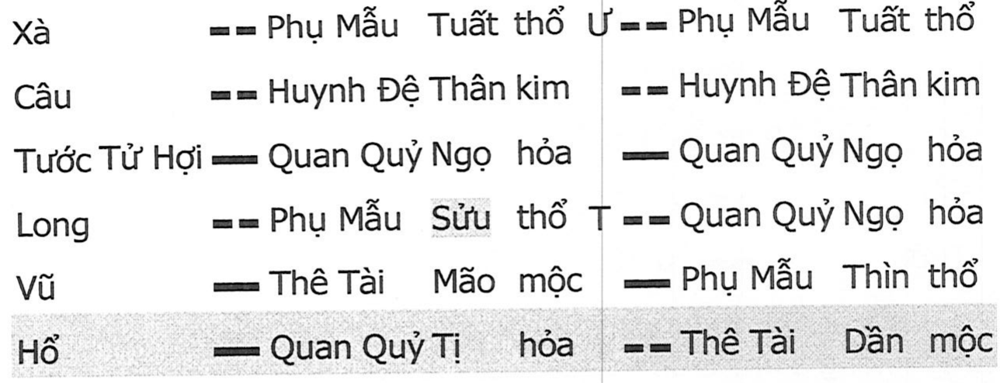 người. Sau đó tài vận đã tốt lên. Niệm Phật thường xuyên nghe thấy có người gõ tường.)

Hóa giải: Băm nhỏ một củ hành tây rồi đặt ở Đông Bắc của giường. Lấy ba cây cỏ ven đường đặt ở Tây Nam. Sau khi hóa giải, có thể đi vào giấc ngủ, hiện tượng quái dị đều biến mất. Nhưng một thời gian sau lại tái phát.

## Tổ tiên sát nghiệp quá nhiều

Đây là một tình huống ở tháng 1 năm 2016. Một người nữ đoán bệnh của con gái (sinh năm Kỷ Tị)? Ở ngày Đinh Mùi (Tuần Không: Dần Mão), tháng Sửu, được Trạch Hỏa Cách biến Trạch Lôi Tùy.

| Lục thú | Phục thần | Trạch Hỏa Cách | Trạch Lôi Tùy |
| :--- | :--- | :--- | :--- |
| Long | | - - Quan Quỷ Mùi thổ | - - Quan Quỷ Mùi thổ |
| Vũ | | — Phụ Mẫu Dậu kim | — Phụ Mẫu Dậu kim |
| Hổ | | — Huynh Đệ Hợi thủy T | — Huynh Đệ Hợi thủy |
| Xà | Tài Ngọ | — Huynh Đệ Hợi thủy | - - Quan Quỷ Thìn thổ |
| Câu | | - - Quan Quỷ Sửu thổ | - - Tử Tôn Dần mộc |
| Tước | | — Tử Tôn Mão mộc Ứ | — Huynh Đệ Tý thủy |

Lấy Tử Tôn làm Dụng thần. Tử Tôn Nhật Nguyệt không khắc, cũng không sinh, thuộc về hưu tù, nhưng không có nỗi lo đến tính mạng. Tử Tôn nhập Mộ tại Nhật, chủ đầu óc lờ đờ, Nhật là Quan Quỷ, bị ma quỷ khống chế, hoặc ma quỷ bám vào thân thể. Nguyên thần lâm Đằng Xà hóa Mộ, Nguyên thần chủ tư duy, hào sơ cũng chủ tư duy, nhập Mộ chủ đầu óc lờ đờ, là thế giới tinh thần đã có vấn đề. (Nghiệm, sắc mặt con gái nhợt nhạt, không ăn không uống, nói bằng giọng của người đã khuất, kể sự tình xảy ra của người đã khuất.)

Nguyên thần độc phát tại hào 3, lâm Đằng Xà chủ ngủ, nhập Mộ không thể sinh Tử Tôn, chính là thông tin không ngủ, Thê Tài bất thượng quái, chính là thông tin không ăn, Thê Tài Tuyệt địa tại thủy, chính là không uống. Tử Tôn lâm Chu Tước, chính là chủ nói chuyện. Mà Quan Quỷ trên Nhật nhập quẻ lâm hào 6, hào 6 là tổ tiên, chính là tổ tiên tạ thế đã bám vào thân thể.

Hào mệnh xung Nguyên thần, tư duy đã loạn cấu trúc. Độc phát chủ nguyên nhân, lâm Đằng Xà Bạch Hổ, hóa Quan Quỷ, hóa Mộ khố, Bạch Hổ chủ tử vong, đao thương, Quan Quỷ là tổ, tổ tiên đã sát nghiệp quá nhiều, Hợi thủy bị khắc, chủ giết lợn, giết cá.

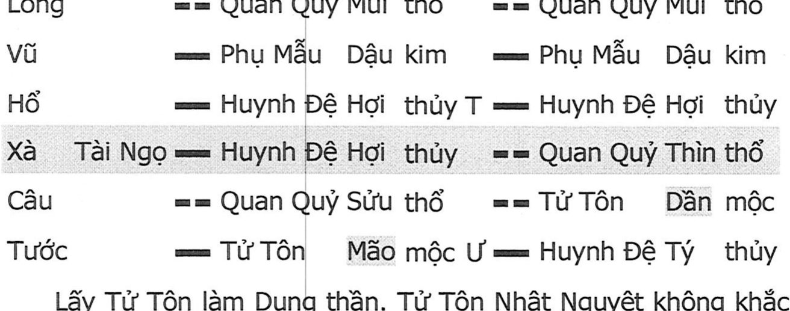

(Nghiệm, tổ tiên luôn sống bằng nghề giết lợn bắt cá. Và có người hung tử[^1].)

Hào 3 thủy là thắt lưng, chủ con gái thắt lưng không tốt. (Nghiệm, con gái tại năm Đinh Hợi đã phẫu thuật thắt lưng.)

Hợi thủy độc phát khắc Thê Tài, Thê Tài phục tàng, bản thân chị năm Đinh Hợi bắt đầu tài vận không tốt. (Nghiệm, sau khi con gái phẫu thuật xong, trong nhà bắt đầu phá tài nhiều năm liên tiếp.)

Năm 08 Mậu Tý xung xuất Thê Tài bị Huynh Đệ độc phát khắc, năm Quý Tị xung khai Phi thần Thê Tài xuất hiện bị khắc, năm Giáp Ngọ phục tàng gặp xuất hiện bị Huynh Đệ khắc, ba năm này tài vận cực kỳ không tốt. (Nghiệm, ba năm đó bởi vì chồng mà phá tài trăm vạn.)

Trước tiên hóa giải bệnh con gái: Một gói gạo, bên ngoài viết một chữ "minh", đặt ở chỗ cao phía Tây Nam. Một hòn đá tròn, đặt ở dưới giường Đông Nam. Phía Đông của nhà nuôi sáu con cá. Sau đó kết quả như thế nào, hiện nay không có phản hồi.

[^1]: Chết vì bị người giết hoặc tự sát.

## Con trai đã chết làm hại chồng

Đây là một tình huống ở năm 2018. Một người nữ người Nhật Bản (sinh năm Nhâm Dần) đoán chồng (sinh năm Quý Tị) có phải bệnh cũ tái phát hay không? Ngày Quý Hợi (Tuần Không: Tý Sửu), tháng Dậu, được Thiên Hỏa Đồng Nhân biến Sơn Thiên Đại Súc.

| Lục thú | Thiên Hỏa Đồng Nhân | Sơn Thiên Đại Súc |
| :--- | :--- | :--- |
| Hổ | — Tử Tôn Tuất thổ Ứ | — Phụ Mẫu Dần mộc |
| Xà | — Thê Tài Thân kim | - - Quan Quỷ Tý thủy |
| Câu | — Huynh Đệ Ngọ hỏa | - - Tử Tôn Tuất thổ |
| Tước | — Quan Quỷ Hợi thủy T | — Tử Tôn Thìn thổ |
| Long | - - Tử Tôn Sửu thổ | — Phụ Mẫu Dần mộc |
| Vũ | — Phụ Mẫu Mão mộc | — Quan Quỷ Tý thủy |

Lấy Quan Quỷ làm Dụng thần. Quan Quỷ Hợi thủy trì Thế lâm Nhật, là bệnh cũ tái phát. Kỵ thần Sửu thổ tại hào 2 phát động khắc Quan Quỷ, Sửu thổ Không Vong, lần trước bị bệnh ước chừng là năm 2015 năm xung Không. (Nghiệm, cho biết là năm 2015 bị ung thư gan phẫu thuật đã khỏi.)

Sửu thổ là gan, hào 2 hào 3 là gan, đây là thông tin bệnh gan. Hào mệnh Tị hỏa xung Dụng thần, đoán bệnh không cát, tượng hồn ly nhục thể. Hào mệnh của người cầu đoán là Dần mộc làm hào biến khắc Kỵ thần Sửu thổ, bản thân một lòng muốn cứu chồng. (Nghiệm)

Quan Quỷ Nguyệt sinh Nhật phù, là vượng tướng, lại có Nguyên thần Thân kim tại hào 5 phát động đến sinh, không hẳn là ung thư gan, chỉ là khối u thông thường. Thân kim bị Ngọ hỏa lâm Câu Trần khắc, có Thân kim hóa Quan Quỷ, hào 5 kim là phổi, là hào sinh thủy, lâm Đằng Xà cũng chủ mạch máu, vật dài. (Nghiệm, phổi và trên lâm ba cũng đã có khối u)

Hào 2 Tử Tôn Sửu thổ Không Vong, lâm Thanh Long hóa hồi đầu khắc, hào 2 là thai, Thanh Long chủ thai sản, Tử Tôn là hài tử, đã từng lưu sản một thai, động khắc Quan Quỷ, hồn phách của thai nhi này đến quấy nhiễu, ảnh hưởng đến thân thể của chồng. (Nghiệm, có một con trai mới sinh ra đã chết, sau đó đã hỏa táng lấy tro cốt để trong nhà cúng, đốt hương mỗi ngày.)

Huynh Đệ Ngọ hỏa hóa Tử Tôn sinh Kỵ thần Sửu thổ khắc Nguyên thần Thân kim, Ngọ hỏa đã khởi tác dụng không tốt. Hào biến là thuyết minh bổ sung, hỏa này chính là đốt cho con trai, chính là thông tin đốt nhang mỗi ngày. Như vậy bất lợi đối với bệnh

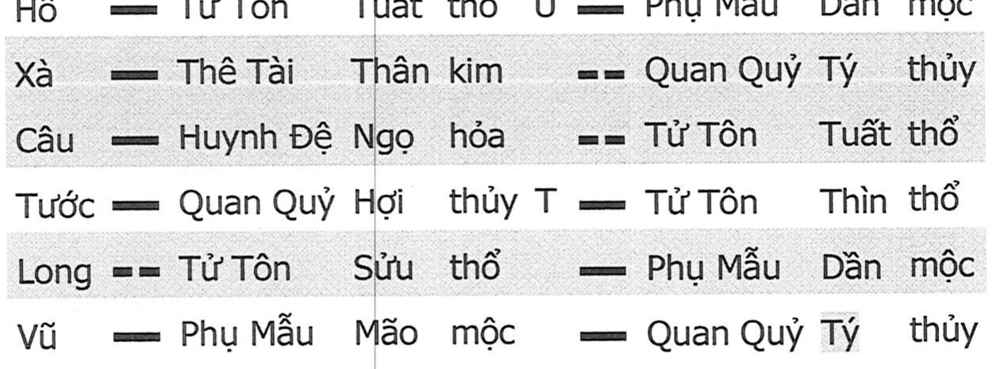 của chồng. Cần nhanh chóng đem tro cốt con trai nhập thổ (chôn cất), đồng thời mang theo bên mình một con chuột vải. Đông Bắc, phía Nam mỗi nơi cũng đặt một con.

Sau khi hóa giải đã có thể ăn, ngày 6 tháng 11 đến Tokyo kiểm tra, ba khối u trên gan ban đầu đã mất một, khối u trên phổi và lâm ba đã nhỏ lại.

## Con trai khóc lóc mỗi ngày do nguyên nhân gì?

Đây là một tình huống ở năm 2016. Một người nữ đoán con trai hơn 2 tuổi, khóc lóc mỗi ngày, đã liên tục nửa năm, không tìm ra nguyên nhân gì? Ngày Bính Tý (Tuần Không: Thân Dậu), tháng Ngọ, được Khảm Vi Thủy biến Trạch Phong Đại Quá.

| Lục thú | Khảm Vi Thủy | Trạch Phong Đại Quá |
| :--- | :--- | :--- |
| Long | - - Huynh Đệ Tý thủy T | - - Quan Quỷ Mùi thổ |
| Vũ | — Quan Quỷ Tuất thổ | — Phụ Mẫu Dậu kim |
| Hổ | - - Phụ Mẫu Thân kim | — Huynh Đệ Hợi thủy |
| Xà | - - Thê Tài Ngọ hỏa Ư | — Phụ Mẫu Dậu kim |
| Câu | — Quan Quỷ Thìn thổ | — Huynh Đệ Hợi thủy |
| Tước | - - Tử Tôn Dần mộc | - - Quan Quỷ Sửu thổ |

Lấy Tử Tôn làm Dụng thần. Tử Tôn Nguyệt không khắc Nhật sinh là vượng tướng, mặc dù không có nỗi lo đến tính mạng, nhưng Nguyên thần tại hào 6 Nguyệt phá, Nguyên thần là tư duy, là linh hồn, hào 6 là tổ tiên, là do đã bị người chết ảnh hưởng.

Nguyệt kiến nhập quẻ tại hào 3 phát động, Đằng Xà chủ sợ hãi cũng chủ ác mộng, hóa ra Phụ Mẫu là trưởng bối, trưởng bối ảnh hưởng đến con trai. Mà hào Thế tại hào 6 bị Ngọ hỏa lâm Nguyệt xung phá, cũng ảnh hưởng mình, sẽ có mộng tương ứng xuất hiện.

Phụ Mẫu Thân kim lâm Bạch Hổ Không Vong phát động, Nhật là Tử địa, Phụ Mẫu lâm hào âm là mẹ, hào 4 là mẹ, Thân kim phản quái là Khôn cũng là mẹ, chủ người mẹ quá cố đã ảnh hưởng đến trong nhà.

Trên thực tế, mẹ qua đời đã hơn nửa năm, đồ cũ của mẹ vẫn chưa xử lý, mẹ đã báo mộng cho quái chủ, nói là chưa nhận được chăn đệm.

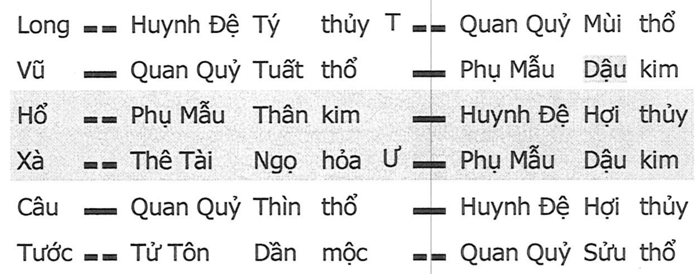

## Con gái và bạn học không hòa hợp phải xử lý thế nào?

Đây là một tình huống ở năm 2018. Nữ đoán con gái và bạn học không hòa hợp, rất đau khổ, phải xử lý như thế nào? Ở ngày Ất Mùi (Tuần Không: Thìn Tị), tháng Tuất, được Hỏa Lôi Phệ Hạp biến Khôn Vi Địa.

| Lục thú | Hỏa Lôi Phệ Hạp | Khôn Vi Địa |
| :--- | :--- | :--- |
| Vũ | — Tử Tôn Tị hỏa | - - Quan Quỷ Dậu kim |
| Hổ | - - Thê Tài Mùi thổ T | - - Phụ Mẫu Hợi thủy |
| Xà | — Quan Quỷ Dậu kim | - - Thê Tài Sửu thổ |
| Câu | - - Thê Tài Thìn thổ | - - Huynh Đệ Mão mộc |
| Tước | - - Huynh Đệ Dần mộc Ư | - - Tử Tôn Tị hỏa |
| Long | — Phụ Mẫu Tý thủy | - - Thê Tài Mùi thổ |

Lấy Tử Tôn làm Dụng thần, xem cả hào Ứng và hào Huynh Đệ. Tử Tôn Tị hỏa lâm Huyền Vũ Không Vong nhập Mộ tại Nguyệt, Huyền Vũ chủ tâm trạng phiền muộn, Không Vong chủ tâm thần bất an. Con gái đang ở trong một trạng thái phiền muộn, lo lắng. Tử Tôn hóa Quan Quỷ là lo lắng, Tử Tôn tam hợp thành Quan Quỷ cục, thì không phải là một lo lắng, xem ra không hòa hợp với rất nhiều bạn học.

Quẻ cung Tốn, Nguyên thần lại là mộc, mộc chủ nhân từ, con gái bản tính là lương thiện. Nhưng trị hào hỏa, chủ nóng nảy. (Nghiệm)

Hào Ứng Huynh Đệ Dần mộc lâm Chu Tước, Huynh Đệ là bạn bè bạn học, lâm Chu Tước chủ học tập, càng là bạn học. Chu Tước cũng là khẩu thiệt, Tử Tôn và Quan Quỷ hợp thành tam hợp cục khắc hào Ứng Huynh Đệ Dần mộc, chính là hay cãi nhau với bạn học. (Nghiệm)

Tử Tôn Tị hỏa tại hào 6, Không Vong chủ trong lòng trống rỗng, hào 6 là thoái vị, chủ con gái cô độc, cô đơn. (Nghiệm)

Tử Tôn lâm Huyền Vũ hóa Quan Quỷ, lại hợp thành tam hợp cục, Huyền Vũ chủ âm khí, Đằng Xà chủ kỳ dị, con gái gặp ma, bị ma đeo bám, và cãi nhau với bạn học là thân bất do kỷ, do đó đã làm hỏng mối quan hệ với bạn học. (Nghiệm, con gái thường xuyên thấy trong nhà có ma, buổi tối thường xuyên khóc một mình.)

Hào sơ Tý thủy hóa Thê Tài lâm Thanh Long khắc Nguyên thần, hào sơ là lúc nhỏ, Thê Tài là ẩm thực, Thanh Long là ẩm thực,

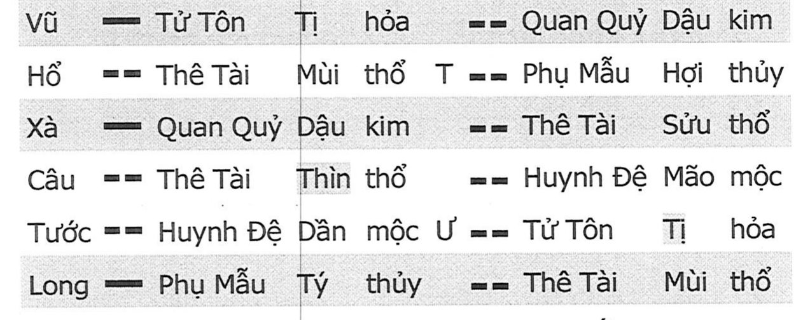 cũng chủ ngứa ngáy, lúc nhỏ đã ăn vật dị ứng. (Nghiệm, từ bé ăn vật dị ứng.)

Hóa giải: Đặt một viên ngói ở chỗ thấp phía Bắc phòng ngủ, cho ngói úp lên một hạt đào. Mang theo bên người hai sợi dây đỏ và tám cây tăm xỉa răng.

Ngày 26 tháng 11 năm 2018 phản hồi: Sau khi hóa giải theo phương pháp, buổi tối hôm đó con gái không khóc nữa, tâm trạng đã tốt lên rất nhiều, hai ngày sau tâm trạng càng tốt hơn, mối quan hệ với bạn học đã trở nên tốt đẹp, chơi rất vui vẻ.

## Hồn ma đã đến nhà anh

Đây là một tình huống ở năm 2018. Học trò của học trò tôi, con chó trong nhà anh ta không ngừng hướng về một nơi mà sủa, đoán nguyên nhân là gì? Bởi vì không thạo xem quẻ, liền hỏi tôi, ngày Tân Dậu (Tuần Không: Tý Sửu), tháng Hợi, được Khôn Vi Địa biến Địa Thủy Sư.

| Lục thú | Phục thần | Quái hào | Thế/Ứng | Biến hào |
| :--- | :--- | :--- | :---: | :--- |
| Xà | | ╍╍ Tử Tôn Dậu kim | T | ╍╍ Tử Tôn Dậu kim |
| Câu | | ╍╍ Thê Tài Hợi thủy | | ╍╍ Thê Tài Hợi thủy |
| Tước | | ╍╍ Huynh Đệ Sửu thổ | | ╍╍ Huynh Đệ Sửu thổ |
| Long | | ╍╍ Quan Quỷ Mão mộc | Ứ | ╍╍ Phụ Mẫu Ngọ hỏa |
| Vũ | | ╍╍ Phụ Mẫu Tị hỏa | | ━ Huynh Đệ Thìn thổ |
| Hổ | | ╍╍ Huynh Đệ Mùi thổ | | ╍╍ Quan Quỷ Dần mộc |

Tử Tôn mặc dù là chó, nhưng không phải là đoán cát hung của chó, cần xem tổ hợp biến hóa của quẻ.

Tử Tôn trì Thế, là thông tin trong nhà nuôi chó, lâm Đằng Xà chủ con chó có phần nôn nóng bất an. Phụ Mẫu Tị hỏa lâm Huyền Vũ độc phát, Huyền Vũ chủ âm khí, lâm hào trạch khắc Tử Tôn, có vật âm tính đã vào trong nhà, đã bị chó nhìn thấy, do đó chó sủa.

Hào Thế Dậu kim lâm Nhật xung hào Ứng Quan Quỷ Mão mộc dẫn tới ám động, hào Thế là mình, hào 3 là cửa, Quan Quỷ là người chết, là mình ra cửa đã gặp tang sự. Lâm Thanh Long là hỷ, là người chết già, bởi vì người già chết là hỷ tang.

Nội ngoại quái giống nhau, người chết là người ở xã khu đó. Huyền Vũ hóa Huynh Đệ Thìn thổ, hồn ma đã đến nhà vệ sinh trong nhà.

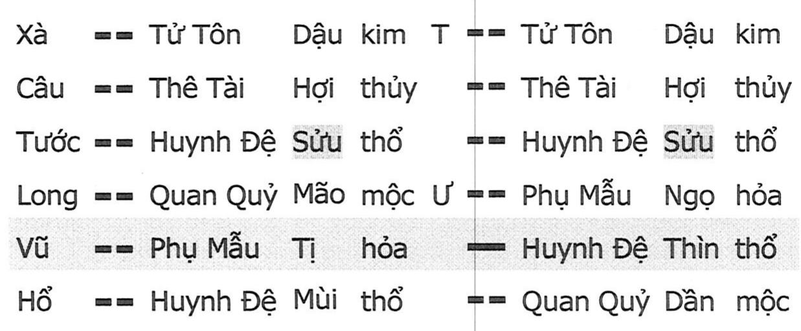

Quả nhiên, anh ta nói giờ Mão hôm đó ra ngoài, phát hiện trong xã khu đã thiết lập một linh đường, liền đi lên xem thử, sau đó đã đi tiếp. Khi trở về, phát hiện con chó liên tục hướng về nhà vệ sinh mà sủa.

## Đã ngủ trong nhà người chết

Đây là một tình huống ở năm 2019. Một người nữ đoán hài tử (sinh năm 2017) của nhà chị dâu nôn mửa suốt buổi sáng do nguyên nhân gì gây ra? Ở ngày Mậu Tý (Tuần Không: Ngọ Mùi), tháng Tý, được Thủy Phong Tỉnh biến Thủy Sơn Kiển.

| Lục thú | Phục thần | Quái hào | Thế/Ứng | Biến hào |
| :--- | :--- | :--- | :---: | :--- |
| Tước | | ╍╍ Phụ Mẫu Tý thủy | | ╍╍ Phụ Mẫu Tý thủy |
| Long | | ━ Thê Tài Tuất thổ | T | ━ Thê Tài Tuất thổ |
| Vũ | Tử Ngọ | ╍╍ Quan Quỷ Thân kim | | ╍╍ Quan Quỷ Thân kim |
| Hổ | | ━ Quan Quỷ Dậu kim | | ━ Quan Quỷ Thân kim |
| Xà | Huynh Dần | ━ Phụ Mẫu Hợi thủy | Ứ | ╍╍ Tử Tôn Ngọ hỏa |
| Câu | | ╍╍ Thê Tài Sửu thổ | | ╍╍ Thê Tài Thìn thổ |

Lấy Tử Tôn làm Dụng thần, xem tổ hợp biến hóa của quẻ.

Tử Tôn Ngọ hỏa phục tàng dưới hào 4 Quan Quỷ Thân kim, bị Huyền Vũ Quỷ áp chế, Huyền Vũ Quỷ là vật âm tính, lại thêm hào mệnh trị hào Quan Quỷ, độc phát Đằng Xà chủ vật quái dị.

Thần triệu cơ ở động, hào 2 Phụ Mẫu Hợi thủy lâm Đằng Xà độc phát hóa Không phá, hào 2 là trạch (nơi ở), Đằng Xà là chết, Phụ Mẫu là trưởng bối, Không Phá chính là đã biến mất khỏi nơi ở. Do đó nhất định là do đã ở trong nhà của trưởng bối đã chết gây ra.

Quả nhiên, ngủ ở trong nhà của bà đã mất.

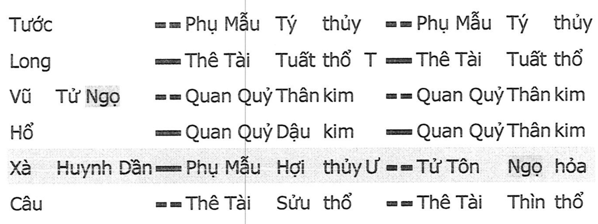

## Đốt cho cha một ít tiền giấy nhé

Đây là một tình huống ở năm 2019. Một người nữ đoán cha đã chết bảy năm, tro cốt gửi ở trong tự viện, mình và chồng thân thể không tốt, có phải là do để tro cốt không đúng hay không? Ở ngày Bính Ngọ (Tuần Không: Dần Mão), tháng Đinh Mão, được Địa Phong Thăng biến Địa Thiên Thái.

| Lục thú | Phục thần | Quẻ Địa Phong Thăng | Thế / Ứng | Quẻ Địa Thiên Thái |
| :--- | :--- | :--- | :---: | :--- |
| Long | | - - Quan Quỷ Dậu kim | | - - Quan Quỷ Dậu kim |
| Vũ | | - - Phụ Mẫu Hợi thủy | | - - Phụ Mẫu Hợi thủy |
| Hổ | Tử Ngọ | - - Thê Tài Sửu thổ | T | - - Thê Tài Sửu thổ |
| Xà | | — Quan Quỷ Dậu kim | | — Thê Tài Thìn thổ |
| Câu | Huynh Dần | — Phụ Mẫu Hợi thủy | | — Huynh Đệ Dần mộc |
| Tước | | - - Thê Tài Sửu thổ | Ư | — Phụ Mẫu Tý thủy |

Quan Quỷ là chồng, hào Thế là mình.

Hào Thế lâm Bạch Hổ hào thổ, mặc dù có Nhật sinh nhưng bị Nguyệt khắc, thổ chủ da, tỳ vị, mộc là ruột, chủ da tràng vị không tốt. (Nghiệm)

Quan Quỷ Dậu kim bị Nguyệt xung phá, Nhật khắc, lưỡng hiện, hào 3 là giường, chủ ngủ không tốt, hào 6 là đầu chủ chóng mặt, đau đầu. (Nghiệm)

Hào sơ Thê Tài Sửu thổ độc phát hóa Phụ Mẫu Tý thủy, lâm Chu Tước hóa hợp, Chu Tước là ngôn ngữ, nói, thông tin. Phụ Mẫu là văn thư, Thê Tài là tiền, độc phát chủ nguyên nhân. Đây là do cha không có tiền tiêu, đã truyền đạt thông tin yêu cầu tiền tới chị.

Hóa giải: Đốt cho cha chị một chút tiền giấy và thắp nhang nhé.

Phản hồi: Ngày 16 tháng 3 đã đi thắp nhang và đốt tiền giấy cho cha. Kết quả là diêm mang theo không bắt lửa, lại mua bật lửa. Ngay lúc quan trọng, đột nhiên trời đang nắng bỗng kéo mây đen, nổi mưa lớn xuống. Sau đó tiếp tục đốt tiền giấy. Thời tiết đột nhiên lại tạnh, bầu trời xuất hiện Phật quang. Chồng đứng ở bên cạnh, hai người chúng tôi đột nhiên cảm thấy thân thể nhẹ nhàng.

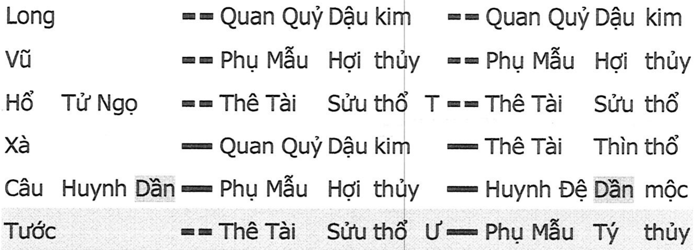

---

# Part 13 (Pages 241-245)

## Nhân quả của phá thai

Đây là một tình huống ở năm 2019. Một người nữ đoán bệnh của cha (sinh năm Bính Thân), ở giờ Mùi, ngày Tân Hợi (Tuần Không: Dần Mão), tháng Tị, được Địa Thủy Sư biến Lôi Trạch Quy Muội.

| Lục thú | Phục thần | Quẻ Địa Thủy Sư | Thế / Ứng | Quẻ Lôi Trạch Quy Muội |
| :--- | :--- | :--- | :---: | :--- |
| Xà | | - - Phụ Mẫu Dậu kim | Ư | - - Quan Quỷ Tuất thổ |
| Câu | | - - Huynh Đệ Hợi thủy | | - - Phụ Mẫu Thân kim |
| Tước | | - - Quan Quỷ Sửu thổ | | — Thê Tài Ngọ hỏa |
| Long | | - - Thê Tài Ngọ hỏa | T | - - Quan Quỷ Sửu thổ |
| Vũ | | — Quan Quỷ Thìn thổ | | — Tử Tôn Mão mộc |
| Hổ | | - - Tử Tôn Dần mộc | | — Thê Tài Tị hỏa |

Lấy Phụ Mẫu làm Dụng thần. Phụ Mẫu Dậu kim tại hào 6, hào 6 là thiên, Nguyệt khắc Nhật là Bệnh địa bất lợi. Dậu kim phản quái là Đoài, Đoài là hệ hô hấp, là phổi, Hợi thủy Bệnh địa, nhập quẻ tại hào 5, hào 5 là phổi, Hợi thủy phản quái là Càn cũng là phổi, hưu tù lâm Câu Trần, Câu Trần là ung thư, là ung thư phổi. (Thực tế có ung thư phổi tế bào nhỏ.)

Dụng thần nhập Mộ tại hào động Sửu thổ, chủ hô hấp không thông. (Nghiệm)

Kỵ thần Ngọ hỏa trì Thế, lâm Thanh Long chủ ẩm thực, mộc phát động hóa Tị hỏa đến sinh hỏa, Tị hỏa là Nguyệt kiến, Nguyệt kiến chủ quá khứ, chủ ban đầu thích hút thuốc, hiện tại Dần mộc Không Vong bị Nhật hợp, tham hợp quên sinh, Nhật là đương hạ (ngay bây giờ), hiện tại không thể sinh Thê Tài Ngọ hỏa, chủ hiện tại không hút thuốc, đã bỏ hút thuốc. (Nghiệm)

Nguyên thần Thìn thổ tại hào 2, lâm Huyền Vũ chủ hệ tiết niệu, bị Dần mộc khắc, chủ hệ tiết niệu không tốt. Nay Không Vong bị Nhật hợp, lực khắc yếu đi, hiện tại không phải là vấn đề chính. (Nghiệm, trước đây đã từng bị bệnh về tuyến tiền liệt.)

Hào sơ Tử Tôn Dần mộc lâm Bạch Hổ Không Vong, Bạch Hổ là máu, hào sơ là trước kia, cũng là tiểu khẩu, Tử Tôn thể hiện hài tử, Không Vong chủ không có, là thông tin phá thai, hóa Thê Tài Tị hỏa, ngũ hành giống hào Thế, hào biến khởi thuyết minh bổ sung, thai bị phá cùng thế hệ với hào Thế, nhất định trước đây cha mẹ đã từng phá thai. (Nghiệm, mẹ đã từng mang thai, lúc đó nhà nước đang làm kế hoạch hóa gia đình, chỉ cho phép sinh một thai, do đó đã bỏ đi.)

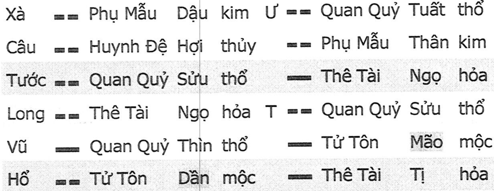

Hào sơ hóa ra Kỵ thần của Phụ Mẫu, lâm Bạch Hổ, Bạch Hổ là tức giận, không vui vẻ, thai này âm linh báo thù, trả thù cha, do đó hiện tại đã bị ung thư phổi. (Chỉ là suy đoán, không thể chứng thực, nhưng phán đoán ra cha mẹ phá thai là sự thực.)

Hào sơ Tử Tôn Dần mộc Không Vong, Tử Tôn là sủng vật, Dần mộc là mèo, Dần mộc phản quái là Cấn, Cấn là chó, chủ có nuôi mèo chó tử vong, hoặc mất. (Nghiệm, đã mất hai con chó.)

Hào sơ Dần mộc được Nhật sinh vượng tướng, lâm Bạch Hổ Tuyệt Phụ Mẫu, khắc Nguyên thần Phụ Mẫu, Bạch Hổ chủ bị thương, hoặc tử vong, Không Vong ứng xuất Không, hoặc xung Không, hợp cũng Ứng xung. Do đó phán đoán năm Canh Dần, hoặc năm Bính Thân trong nhà có người va chạm, bị thương, hoặc bệnh tai. (Năm Canh Dần không có, năm Bính Thân bà ngoại qua đời. Còn bản thân tháng Dần năm nay tắm rửa bị ngã.)

Hào Thế Ngọ hỏa tại hào 3, hào 3 là giường, bị Nhật khắc, lại thêm Nguyên thần Dần mộc Không Vong sinh hào Thế bất túc, chủ bản thân ngủ không tốt. (Nghiệm, 3 năm trước rất tốt, về sau đi tiểu đêm, không thể ngủ.)

Hào Thế là hỏa, Nguyên thần lâm Bạch Hổ hóa hỏa sinh hỏa, Bạch Hổ chủ không vui vẻ, tính khí nôn nóng. (Nghiệm, tính khí ngày càng không tốt.)

Phụ Mẫu hưu tù, tượng đại hung. Tháng Tý hợp Sửu thổ, xung mất hào biến của Nguyên thần, lại là Tử địa Phụ Mẫu, cần đề phòng bệnh biến.

Hóa giải: Dùng vải vàng gói ba cây tăm xỉa răng lại và đặt ở chỗ thấp Đông Bắc. Đông Nam đặt chín cái đinh ốc.

Về sau như thế nào, không có phản hồi.
